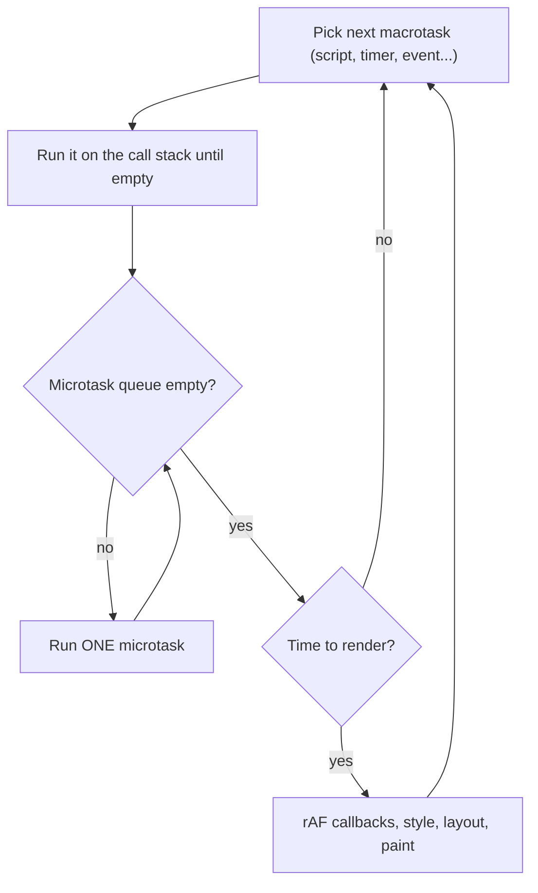

# 01 — JavaScript for React and interviews

> **How to use this module.** Read 1.1–1.10 for the language model that React code assumes (values, scope, closures, `this`, references, immutability). Read 1.12–1.17 for modules, promises, the event loop and errors, which is where most "why did that log first?" questions live. 1.18–1.21 and the exercises are the whiteboard material. If you only have 30 minutes: 1.5, 1.8, 1.9, 1.16, the output puzzles in 1.21, the Summary.

**Prerequisites:** None. Java knowledge is assumed for analogies (the primary reader is a Java/Spring engineer); each section says where the analogy breaks.

**Code for this module:** [`examples/web/src/m01-javascript/`](examples/web/src/m01-javascript/). Every utility has a test next to it. Run them with `npx vitest run src/m01-javascript` from `examples/web`.

> **Version notes.** The type-checked examples target ES2023 (`tsconfig` `target`/`lib`) and run on Node 24 in Vitest ([VERSIONS.md](VERSIONS.md)). Newer features (ES2024 `Object.groupBy`, `Promise.withResolvers`; ES2025 Set methods and iterator helpers) are *not* in the ES2023 type library, so they are shown as prose and checked for presence at runtime in [`claims.test.ts`](examples/web/src/m01-javascript/claims.test.ts) rather than used in typed code. Edition per feature, from the [TC39 finished-proposals list](https://github.com/tc39/proposals/blob/main/finished-proposals.md): `findLast`, `toSorted`/`toReversed`/`with`/`toSpliced` → ES2023; `Object.groupBy`/`Map.groupBy`, `Promise.withResolvers` → ES2024; Set methods, iterator helpers, `Promise.try`, `RegExp.escape` → ES2025; `Error` `cause`, `Array.prototype.at`, `Object.hasOwn` → ES2022; `WeakRef`, `Promise.any` → ES2021. `structuredClone` is not part of ECMAScript: it comes from the WHATWG HTML Standard (a [Browser]/Node API).

---

## 1.1 Values, types and `typeof` quirks

### The problem
JavaScript has no compile-time types. Every value carries its type at runtime, and operators silently convert between types. If you do not know the small set of types, you misread half the "weird JS" questions.

### Mental model
There are **8 types**: seven primitives and one object type.

| Type | Examples | Notes |
|---|---|---|
| `undefined` | `undefined` | "no value assigned" |
| `null` | `null` | "deliberately no value" |
| `boolean` | `true` | |
| `number` | `1`, `0.5`, `NaN`, `Infinity` | one IEEE-754 double for ints and floats |
| `bigint` | `10n` | arbitrary-precision integers |
| `string` | `'a'` | immutable, UTF-16 code units |
| `symbol` | `Symbol('id')` | unique keys |
| `object` | `{}`, `[]`, functions, `Date`, `Map` | everything else; compared by reference |

> **Java analogy.** Primitives ≈ Java primitives, objects ≈ reference types. **Where the analogy breaks:** there is exactly one `number` type (no `int`/`long`/`double`), there are no wrapper-vs-primitive pairs you choose between, and variables have no static type, so one variable can hold a string now and an array later.

### Minimal code
`examples/web/src/m01-javascript/puzzles.ts` (`p01Typeof`):

```ts
const values: unknown[] = [null, undefined, NaN, [], () => 1, 10n, Symbol('s'), new Date(0)];
values.map((v) => typeof v);
// ['object', 'undefined', 'number', 'object', 'function', 'bigint', 'symbol', 'object']
```

### How it works internally
- `typeof null === 'object'` is a 1995 bug that was never fixed because fixing it broke the web. Test for null with `value === null`.
- `typeof` of a function is `'function'`, although functions are objects. Arrays are `'object'`: use `Array.isArray`.
- `NaN` is a `number` and is the only value not equal to itself (`NaN !== NaN`). Use `Number.isNaN`, not the global `isNaN`, which coerces its argument first.
- Numbers are doubles, so `0.1 + 0.2 === 0.3` is `false` and integers are exact only up to `Number.MAX_SAFE_INTEGER` (2^53 − 1). Use `bigint` or integer cents for money.
- Strings are immutable; "methods" return new strings.

### Trade-offs
Runtime types make code flexible and bugs late. TypeScript ([02](02-typescript.md)) adds static checking but is **erased** before the code runs, so `typeof`, `instanceof` and `Array.isArray` are still how you check at runtime, for example on API responses.

---

## 1.2 Coercion and `==` vs `===`

### The problem
`'5' * '2'` is `10`, `[] + {}` is `'[object Object]'`, `[] == ![]` is `true`. Operators convert operands automatically, and the rules look random until you know the three conversions.

### Mental model
Three abstract conversions drive everything: **ToPrimitive** (objects → primitive, via `valueOf`/`toString`), **ToNumber** and **ToString**.
- `+` : if either operand (after ToPrimitive) is a string, it concatenates; otherwise it adds numbers.
- `-`, `*`, `/` : always ToNumber.
- `==` : if the types differ, coerce toward number (with special cases: `null == undefined` is `true` and `null` equals nothing else).
- `===` : no coercion; different types are never equal.
- `Object.is` : like `===` except `Object.is(NaN, NaN)` is `true` and `Object.is(0, -0)` is `false`. This is the comparison React uses for state and dependencies ([9.2](09-effects.md#92-dependencies-and-the-objectis-comparison)).

> **Java analogy.** Java's `==` on primitives never converts between unrelated types, and `+` with a `String` concatenates in a similar way. **Where the analogy breaks:** Java refuses `"5" * "2"` at compile time. JavaScript's `==` is closer to a hidden `.equals` that guesses.

### Minimal code
`puzzles.ts` (`p02Coercion`, `p03Equality`), answers in [1.21](#121-classic-trick-questions-and-output-prediction-puzzles):

```ts
[] + [];        // ''
[] + {};        // '[object Object]'
'3' - 1;        // 2
null + 1;       // 1
undefined + 1;  // NaN
[] == false;    // true   ([] -> '' -> 0, false -> 0)
NaN == NaN;     // false
```

### How it works internally
`[] + {}`: ToPrimitive on `[]` gives `''`, on `{}` gives `'[object Object]'`; one is a string, so concatenate. `[] == ![]`: `![]` is `false`; then `[] == false` converts both sides to numbers: `'' → 0`, `false → 0`.

**Falsy values** (exactly eight): `false`, `0`, `-0`, `0n`, `''`, `null`, `undefined`, `NaN`. Everything else is truthy, including `'0'`, `'false'`, `[]` and `{}`. That is why `{items.length && <List />}` renders a literal `0` in React ([06](06-jsx-and-rendering-model.md#65-conditional-rendering)).

### Trade-offs
Use `===` always. The one defensible `==` is `value == null`, which matches both `null` and `undefined`. Use `??` ([1.10](#110-spread-rest-destructuring-optional-chaining-nullish-coalescing)) instead of `||` when `0` or `''` are valid values.

---

## 1.3 Scope: global, function, block

### The problem
Before ES2015 the only scopes were global and function. A loop variable leaked, and "private" state needed a function wrapper. Modern code uses block scope, but legacy code (and interview questions) use `var`.

### Mental model
Scope is where a name is visible. It is **lexical**: decided by where code is written, not where it is called.

| Declaration | Scope | Hoisted? | Re-declare? | Re-assign? |
|---|---|---|---|---|
| `var` | function (or global) | yes, initialized to `undefined` | yes | yes |
| `let` | block `{}` | yes, but in the TDZ ([1.4](#14-hoisting-and-the-tdz)) | no | yes |
| `const` | block `{}` | yes, but in the TDZ | no | **no** (binding only: the object can still change) |

> **Java analogy.** `let`/`const` behave like Java local variables (block-scoped). `final` ≈ `const`, with one difference: `const` freezes the *binding*, not the object, exactly like `final List<String> x` in Java.
> **Where the analogy breaks:** Java forbids shadowing a local with another local in a nested block; JavaScript allows it. And a JS closure captures the variable itself, not a copy, so it can read later changes (Java requires captured locals to be effectively final).

### Minimal code
`puzzles.ts` (`p04VarLetIife`):

```ts
for (var i = 0; i < 3; i++) setTimeout(() => log.push(`var${i}`), 0); // one i for the whole function
for (let j = 0; j < 3; j++) setTimeout(() => log.push(`let${j}`), 0); // a fresh j per iteration
```

### How it works internally
`let` in a `for` header creates a **new binding per iteration** (the spec copies the value into a fresh environment each loop). `var i` is one binding in the function scope, so by the time the timers run `i` is `3`. The pre-ES2015 fix was an **IIFE** (immediately invoked function expression) that copies `i` into a parameter:

```js
for (var i = 0; i < 3; i++) {
  (function (copy) { setTimeout(function () { console.log(copy); }, 0); })(i);
}
```

The IIFE was also the **module pattern**: wrap code in `(function () { ... })()` to avoid creating globals ([`closures.ts`](examples/web/src/m01-javascript/closures.ts), `idGenerator`). In the browser, a top-level `var` or function declaration in a classic `<script>` becomes a property of `window`; in an ES module or a `let`/`const` it does not.

### Trade-offs
Default to `const`, use `let` when you reassign, never write `var` in new code (typescript-eslint's recommended set enables `no-var`). Recognize `var` and IIFEs in legacy code, jQuery plugins and old build output.

---

## 1.4 Hoisting and the TDZ

### The problem
You can call some functions before the line that defines them, but reading a `let` before its line throws. Interviewers use this to test whether you know *what* is hoisted.

### Mental model
Declarations are processed when the scope is entered, before any code runs. What differs is the **initial state** of the binding:

| Form | Before its line |
|---|---|
| `function f() {}` | fully usable (name and body hoisted) |
| `var x = 1` | the name exists and is `undefined`; the assignment happens at the line |
| `let`/`const`/`class` | the name exists but is **uninitialized**: access throws `ReferenceError` (the *temporal dead zone*, TDZ) |
| `var f = function () {}` | `f` is `undefined`, so calling it throws `TypeError: f is not a function` |

> **Where the Java analogy breaks:** Java's compiler rejects use-before-declaration of locals. JavaScript accepts the code and fails (or silently yields `undefined`) at runtime.

### Minimal code
`puzzles.ts` (`p05Hoisting`) logs `['function', 'undefined', 'TypeError', 'ReferenceError']` for: `typeof hoistedFunction`, `typeof varBeforeAssignment`, calling a `var`-held function expression early, and reading a `const` early from a closure.

### How it works internally
During scope creation the engine creates bindings. `var` bindings are initialized to `undefined` immediately. `let`/`const`/`class` bindings are created but marked uninitialized until execution reaches the declaration. The TDZ is *temporal* (about time), not positional: a function that reads a `const` declared further down is fine if it only runs after the declaration.

### Trade-offs
`let`/`const` make "used before defined" bugs loud. Function declarations hoisting is useful for "main first, helpers below" layout, but do not rely on class or `const` arrow functions being callable early.

---

## 1.5 Closures

### The problem
A function often needs to remember something from where it was created (a counter, a config, the props of one render) after that scope has finished. Without closures you would need objects or globals for every such case.

### Mental model
A **closure** is a function plus the variables of the scopes it was created in. The function keeps those *variables* alive (not copies of their values) as long as the function is reachable.

> **Java analogy.** Lambdas capturing locals, or an anonymous inner class capturing its enclosing scope.
> **Where the analogy breaks:** in Java a captured local must be effectively final, so the lambda sees a constant. In JavaScript the closure captures the live variable: if anything reassigns it, the closure sees the new value. That is the opposite problem from React's *stale* closures: in React each render has its own constant `count`, so an old handler sees the old render's value forever.

### Minimal code
[`closures.ts`](examples/web/src/m01-javascript/closures.ts):

```ts
export function makeCounter() {
  let count = 0;
  return { increment: () => ++count, read: () => count };
}
```

Each call creates a new `count`; `increment` and `read` share it.

### How it works internally
Every function object has an internal slot pointing at the environment (scope record) where it was created. A call creates a new environment whose parent is that captured one, so name lookup walks the chain outward. V8 only keeps alive the variables a closure actually references (and may allocate them on the heap instead of the stack).

**The React connection.** A component function runs once per render. Each run creates new `const`s (`count`, handlers) and the handlers close over *that render's* values:

```ts
// createSnapshotDemo in closures.ts, modelling render():
const captured = state;                 // this render's constant
return { handler: () => captured,       // stale after setState
         live: () => state };           // reads the shared variable, like ref.current
```

This is why `setTimeout(() => alert(count), 3000)` shows the count from the render in which you clicked, and why an effect with `[]` deps keeps reading its first render's values. See [8.2](08-state.md#82-usestate-and-state-as-a-snapshot), [8.4](08-state.md#84-functional-updates) and [9.5](09-effects.md#95-stale-closures-in-effects-and-intervals). The fixes are all "stop depending on the old snapshot": a functional update, a correct dependency array, or a ref.

### Trade-offs
Closures give private state and partial application for free (`once`, `memoize`, `debounce`). The costs: they can keep large objects alive unintentionally ([1.20](#120-memory-gc-leaks-from-closures-listeners-and-timers-weakmapweakref)), and the stale-snapshot behaviour surprises people who expect "the latest value".

---

## 1.6 `this` and binding: call/apply/bind, arrow functions

### The problem
In Java, `this` is always the instance. In JavaScript `this` is decided **at the call site**, so detaching a method from its object (passing it as a callback) loses it. This was the day-to-day pain of React class components.

### Mental model
For a regular function the value of `this` comes from how it is called, in this priority:

1. `new f()` → the new object.
2. `f.call(x)`, `f.apply(x)`, or a bound function (`f.bind(x)`) → `x` (the first `bind` wins; later binds are ignored).
3. `obj.f()` → `obj`.
4. plain `f()` → `undefined` in strict mode (modules and class bodies are always strict), the global object in sloppy mode.

**Arrow functions have no `this` of their own**: they use the `this` of the scope where they were *written* (lexical), and `call`/`bind` cannot change it. They also have no `arguments`, cannot be constructors, and have no `prototype`.

> **Where the analogy breaks:** a Java method reference `obj::method` captures the receiver, similar to an arrow or `bind`. A plain JS method reference captures nothing.

### Minimal code
`puzzles.ts` (`p06This`, `p21ClassBinding`):

```ts
const detached = obj.regular;       // method taken off its object
detached();                         // TypeError: this is undefined
detached.call({ name: 'other' });   // 'other'
detached.bind(obj)();               // 'obj'
detached.bind({ name: 'A' }).bind({ name: 'B' })(); // 'A'
```

### How it works internally
`call(thisArg, ...args)` and `apply(thisArg, argsArray)` invoke immediately; `bind(thisArg, ...preset)` returns a **new** function with `this` (and leading arguments) fixed. Because `bind` returns a new function every time, `onClick={this.handle.bind(this)}` creates a new handler per render, which defeats `PureComponent`/`React.memo` shallow checks.

**Legacy class components** ([07](07-components-props-composition.md#710-class-components)). The three binding styles you will meet:

```ts
class Legacy {
  label = 'legacy';
  bound: () => string;
  constructor() { this.bound = this.plain.bind(this); } // 1. bind in the constructor (pre-2018 ritual)
  plain(): string { return this.label; }                // 2. unbound: breaks when passed as onClick
  arrow = (): string => this.label;                     // 3. class-field arrow (one function per instance)
}
```

Option 1 and 3 give a stable identity per instance; `.bind` in render gives a new one each time. Function components removed the whole problem: there is no `this`; a handler is a closure ([1.5](#15-closures)).

### Trade-offs
Prefer arrows for callbacks and methods that are passed around; prefer real methods (on the prototype, one copy shared by all instances) for APIs that are called as `obj.method()`. Never use an arrow as an object method that relies on `this`.

---

## 1.7 Prototypes, `class`, and how they differ from Java classes

### The problem
Interviewers ask "how does inheritance work in JavaScript?" and expect more than "with `class`". You also meet prototype-style code in old libraries.

### Mental model
Every object has a hidden link, `[[Prototype]]`, to another object (or `null`). Property lookup walks that chain until it finds the name. `class` is **syntax sugar** over this: methods go on `Constructor.prototype`, `extends` links `Child.prototype` to `Parent.prototype`.

> **Java analogy.** A `class` with `extends` looks identical. **Where the analogy breaks:** (1) Java classes are blueprints copied into instances; JS objects *delegate* to a live prototype object, and changing the prototype later changes every instance. (2) Fields and methods are not separate worlds: a "method" is just a function-valued property. (3) There are no interfaces and no overloading; types are structural in TypeScript ([02](02-typescript.md)). (4) `private` in TypeScript is erased; `#private` is real runtime privacy. (5) Calling a class without `new` throws.

### Minimal code
```ts
class Animal { speak() { return 'noise'; } }
class Dog extends Animal {}
Object.getPrototypeOf(Dog.prototype) === Animal.prototype; // true
Object.getPrototypeOf(Dog) === Animal;                     // true: statics inherit too
```

The pre-class equivalent (still seen in old code):

```js
function Animal() {}
Animal.prototype.speak = function () { return 'noise'; };
function Dog() { Animal.call(this); }
Dog.prototype = Object.create(Animal.prototype);
Dog.prototype.constructor = Dog;
```

### How it works internally
`new F(args)` creates an object whose `[[Prototype]]` is `F.prototype`, calls `F` with `this` set to it, and returns it (unless `F` returns an object). A class **method lives once on the prototype**; a class **field** (`arrow = () => ...`) creates a new function per instance. [`claims.test.ts`](examples/web/src/m01-javascript/claims.test.ts) asserts both, plus `#private` invisibility. `instanceof` checks whether `F.prototype` is somewhere in the object's chain. `obj.hasOwnProperty` vs `Object.hasOwn(obj, key)` (ES2022) differ in that the latter works for null-prototype objects.

### Trade-offs
React moved away from classes: composition and hooks replaced inheritance ([07](07-components-props-composition.md#710-class-components)). In your own code, prefer plain objects, functions and composition; use `class` for things with identity and lifecycle (an `EventEmitter`, an `LRUCache`, an error type).

---

## 1.8 Reference vs value equality

### The problem
`{ a: 1 } === { a: 1 }` is `false`, `[1] === [1]` is `false`, and a React component re-renders even though "nothing changed". All three come from one rule.

### Mental model
**Primitives compare by value; objects (including arrays, functions, `Date`, `Map`) compare by reference identity.** `===` on objects asks "is this the *same object*", not "do these look alike".

> **Java analogy.** Exactly `==` vs `.equals()` on reference types. **Where the analogy breaks:** JavaScript has no `.equals()` and no overridable `==`. There is no built-in deep equality: you write it, import it (`lodash.isEqual`), or compare serialized forms. Also, JS strings compare by value with `===`, unlike Java `==` on `String` objects.

### Minimal code
`puzzles.ts` (`p17References`):

```ts
const x = {}, y = {};
x === y;            // false: two objects
const a = { v: 1 }; const b = a;
b.v = 2; a.v;       // 2: one object, two names
```

### How it works internally
A variable holding an object holds a reference (like a Java reference). Assignment, argument passing and `const` copy the *reference*. React depends on this: `Object.is(prev, next)` decides whether `useState` bails out, whether a `useEffect` dependency changed ([9.2](09-effects.md#92-dependencies-and-the-objectis-comparison)), and whether `React.memo` skips a render ([15](15-performance.md#152-why-components-re-render)). An inline `{}`, `[]` or `() => {}` in JSX is a **new object every render**, so it always "changed".

`Object.is` and `===` differ only for `NaN` and `±0`. `Map`/`Set`/`includes` use **SameValueZero** (NaN equals NaN, `+0` equals `-0`) while `indexOf` uses `===` ([`p18SameValueZero`](examples/web/src/m01-javascript/puzzles.ts)).

### Trade-offs
Reference equality is O(1), which is why React uses it. It forces you to keep unchanged data referentially stable, which is the point of the next section.

---

## 1.9 Immutability and structural sharing

### The problem
If you mutate an object in place, its reference does not change, so reference checks ("did it change?") say "no" and React skips the update. Mutation also breaks undo/redo, time-travel debugging and safe sharing between components.

### Mental model
**Never edit; build a new value that reuses the unchanged parts.** To change `state.user.address.city`, copy the objects on the path from the root to that leaf (the *spine*) and keep every other branch as the **same reference**. That reuse is *structural sharing*; it keeps updates cheap and lets `===` prove "this branch did not change".

> **Java analogy.** `String` immutability, `List.copyOf`, records, and persistent collections (Vavr, Clojure). **Where the analogy breaks:** `final`/`const` does not make an object immutable. `Object.freeze` is shallow and only a runtime check; TypeScript's `readonly` is compile-time only (erased).

### Minimal code
[`structuralSharing.ts`](examples/web/src/m01-javascript/structuralSharing.ts):

```ts
export function setCity(state: AppState, city: string): AppState {
  return {
    ...state,                                   // todos: same reference
    user: { ...state.user, address: { ...state.user.address, city } },
  };
}
export function toggleTodo(state: AppState, id: number): AppState {
  return { ...state, todos: state.todos.map((t) => (t.id === id ? { ...t, done: !t.done } : t)) };
}
```

The test asserts `next.todos === initial.todos` after `setCity`, and `next.todos[0] === initial.todos[0]` after toggling item 2.

### How it works internally
Spread copies **own enumerable properties, one level deep**, so each level of nesting needs its own spread. Array methods split into mutating (`push`, `pop`, `shift`, `unshift`, `splice`, `sort`, `reverse`, `fill`, `copyWithin`) and non-mutating (`map`, `filter`, `slice`, `concat`, `flat`, spread, and the ES2023 `toSorted`, `toReversed`, `toSpliced`, `with`). Mutating `sort()` on state is a classic React bug; `[...items].sort()` (older) or `items.toSorted()` (ES2023, Node 20+, current browsers) is the fix. Immer (Library) lets you write mutation-style code that produces structurally shared copies; see [8.5](08-state.md#85-immutable-updates-of-nested-objects-and-arrays).

### Trade-offs
- ✅ Cheap change detection, predictable updates, free history.
- ❌ Verbose for deep nesting (flatten the state shape, or use Immer), and naive code allocates even when nothing changed: `toggleTodo` with an unknown id still returns a new root (asserted in the test). Return the original when nothing changed if identity matters.
- `Object.freeze` helps catch accidental mutation in development, but it is shallow (asserted in the tests).

---

## 1.10 Spread, rest, destructuring, optional chaining, nullish coalescing

### The problem
Props handling, immutable updates, defaults and "maybe missing" API data all need compact syntax for copying, picking and defaulting. Misusing `||` for defaults is a top source of subtle bugs.

### Mental model
| Syntax | Meaning |
|---|---|
| `{ ...a, b }`, `[...xs, x]` | **spread**: copy own enumerable properties/iterable items into a new literal |
| `function f(...rest)`, `const [h, ...t] = xs` | **rest**: collect the remainder into an array/object |
| `const { a, b: renamed = 1 } = obj` | **destructuring** with rename and default |
| `a?.b`, `a?.[k]`, `f?.()` | **optional chaining**: short-circuits to `undefined` if the left side is `null`/`undefined` |
| `a ?? b` | **nullish coalescing**: `b` only when `a` is `null`/`undefined` |
| `a \|\| b` | `b` when `a` is *any falsy value* |
| `a ??= b`, `a \|\|= b`, `a &&= b` | logical assignment (ES2021) |

> **Java analogy.** `Optional.map/orElse` for `?.` and `??`; record patterns for destructuring. **Where the analogy breaks:** `?.` works on any value without wrapping it, and a destructuring *default* applies only to `undefined`, never to `null`.

### Minimal code
`puzzles.ts` (`p22DefaultsAndNullish`):

```ts
const { a = 1, b = 2, c = 3 } = { a: undefined, b: null, c: 0 };
// a === 1 (default used), b === null (null is not undefined), c === 0
0 || 'x'; // 'x'     0 ?? 'x'; // 0
```

### How it works internally
Spread on objects does **not** copy prototypes, getters (it reads their values) or non-enumerable keys, and later keys win (`{ ...defaults, ...overrides }`). Props rest is the standard "forward the rest" idiom: `const { className, ...rest } = props`. Destructured defaults are evaluated lazily and only when the value is `undefined`. `?.` short-circuits the *whole* rest of the chain: `a?.b.c.d` does not throw if `a` is null.

### Trade-offs
Use `??` for defaults when `0`, `''` and `false` are meaningful (a quantity of 0, an empty search box). Overusing `?.` hides data that *should* always exist; the error is better than a silent `undefined`. A function **default parameter** also applies only to `undefined`.

---

## 1.11 Array and object methods

### The problem
Interviews and day-to-day React code lean on a dozen collection methods. Knowing which one fits, and which mutates, removes most loops.

### Mental model
| Need | Method | Returns |
|---|---|---|
| transform each | `map` | new array, same length |
| keep some | `filter` | new array |
| first match | `find` / `findIndex` (`findLast`, `findLastIndex`: ES2023) | item / index / `undefined`, `-1` |
| any/all | `some` / `every` | boolean |
| fold to one value | `reduce` | anything; **give an initial value** (empty array without one throws `TypeError`) |
| map then flatten one level | `flatMap` | new array |
| membership | `includes` (SameValueZero) | boolean |
| last item | `at(-1)` (ES2022) | item |
| sort without mutating | `toSorted`, `toReversed`, `with`, `toSpliced` (ES2023) | new array |
| object ↔ pairs | `Object.entries`, `Object.fromEntries`, `Object.keys/values` | arrays / object |
| group | `Object.groupBy`, `Map.groupBy` (ES2024) | null-prototype object / `Map` |
| deep copy | `structuredClone` | see [1.19](#119-shallow-vs-deep-copy) |

> **Java analogy.** The Streams API (`map`, `filter`, `reduce`, `flatMap`, `anyMatch`). **Where the analogy breaks:** JS arrays are **eager**, so every step allocates an array (streams are lazy until a terminal operation). Iterator helpers (ES2025) give lazy pipelines for iterators. Also `sort` with no comparator sorts as **strings**.

### Minimal code
`puzzles.ts` (`p15Sort`, `p16Numbers`, `p24ArrayHoles`):

```ts
[10, 9, 1].sort();                      // [1, 10, 9]: default comparator is lexicographic
[10, 9, 1].sort((a, b) => a - b);       // [1, 9, 10]
['1', '2', '3'].map(parseInt);          // [1, NaN, NaN]: map passes (value, index, array); index is the radix
Array(3).map((_, i) => i);              // still three holes: map skips empty slots
```

### How it works internally
- `sort` is **stable** since ES2019 (asserted in `claims.test.ts`) and mutates; the comparator returns a number, not a boolean.
- `Object.groupBy(items, fn)` returns an object with a `null` prototype (so a group named `toString` is safe). It is ES2024 and present in Node 24 (asserted at runtime in `claims.test.ts`), but not in the ES2023 type library used by this project, so typed code in this guide uses `reduce` or a `Map`:

```ts
const byParity = items.reduce<Record<string, number[]>>((acc, n) => {
  (acc[n % 2 ? 'odd' : 'even'] ??= []).push(n);
  return acc;
}, {});
```
- ES2025 Set methods (`union`, `intersection`, `difference`, `symmetricDifference`, `isSubsetOf`...) and iterator helpers (`Iterator.prototype.map/filter/take/drop/flatMap/reduce/toArray`) exist in Node 24 (checked in `claims.test.ts`); check browser support for the targets you ship (MDN compatibility tables).
- `forEach` ignores a returned promise: `array.forEach(async ...)` does not wait ([`p25ForEachVsForOf`](examples/web/src/m01-javascript/puzzles.ts)).
- `reduce` is flexible but rarely the clearest choice; do not build an object with `{...acc, [k]: v}` in a loop (O(n²) copying).

### Trade-offs
Chained `map/filter` over large arrays allocates intermediates. That rarely matters for UI-sized data; measure before replacing it with a loop. In React render code, always use the non-mutating forms.

---

## 1.12 Modules: ESM vs CommonJS, live bindings, dynamic `import()`

### The problem
Pre-2015 JavaScript had no module system, so every file shared one global namespace. Two systems then appeared, and today's tooling, Node and bundlers still have to deal with both.

### Mental model
| | CommonJS (CJS) | ES modules (ESM) |
|---|---|---|
| Syntax | `const x = require('x')`, `module.exports = ...` | `import x from 'x'`, `export const y` |
| Loading | synchronous, at runtime | static analysis first (imports are hoisted), then evaluate |
| Exports | a **copy** of the value at `require` time | **live bindings**: the importer reads the exporter's current variable |
| `this` at top level | `module.exports` | `undefined` |
| Strict mode | opt-in | always |
| Tree shaking | hard (dynamic) | possible (static) |
| Origin | Node (2009) | ES2015, standard everywhere |

> **Java analogy.** `import` in Java is only a name alias at compile time. ESM `import` is a runtime-linked reference to another module's variable. **Where it breaks:** `import` and `export` must be at the top level and are resolved before code runs, but the module *specifier* is a string, not a package/class name.

### Minimal code
[`liveBinding.ts`](examples/web/src/m01-javascript/liveBinding.ts) and `claims.test.ts`:

```ts
export let count = 0;
export function increment(): void { count += 1; }
// importer: import { count, increment } from './liveBinding';
// increment(); count === 1   // live binding. In CJS, `const { count } = require(...)` would still be 0.
```

Dynamic `import()` loads a module on demand and returns a `Promise` of its namespace (the same namespace object a static import sees: asserted in the tests). It is how `React.lazy` code splitting works ([15](15-performance.md#157-code-splitting-with-lazy-and-suspense)).

### How it works internally
The module system builds a graph in phases: **parse** (find imports), **link** (create bindings, hoisted), **evaluate** (run top-level code once, dependencies first). Because imports are static, bundlers can drop unused exports (tree shaking). Cycles are tolerated, but reading a binding that is not yet initialized hits the TDZ ([1.4](#14-hoisting-and-the-tdz)). **Interop:** in Node, a file is ESM when its nearest `package.json` has `"type": "module"` or it ends in `.mjs`; ESM can `import` CJS (you get `module.exports` as the default export); CJS loading ESM historically required dynamic `import()`. Since Node 22.12 / 20.19 (and all of Node 24), `require()` can load an ES module without a flag as long as its graph has no top-level `await` (otherwise it throws `ERR_REQUIRE_ASYNC_MODULE`); the feature was marked stable in v25.4.0 ([Node docs: loading ECMAScript modules using `require()`](https://nodejs.org/api/modules.html#loading-ecmascript-modules-using-require)). `__dirname` and `require` do not exist in ESM.

### Trade-offs
New code is ESM (Vite, Vitest and TypeScript with `verbatimModuleSyntax` are ESM-first). You still meet CJS in older Node tools, Jest configs, `webpack.config.js`, and `module.exports` in legacy libraries. Default exports hurt refactoring and tree-shaking diagnostics; many teams prefer named exports.

---

## 1.13 Iterators and generators

### The problem
`for...of`, spread, destructuring and `Array.from` need one shared protocol to walk "things you can loop over" (arrays, strings, `Map`, `Set`, your own types) without materializing them.

### Mental model
An **iterable** has a `[Symbol.iterator]()` method returning an **iterator**, an object with `next()` that returns `{ value, done }`. A **generator** (`function*`) is a function that can **pause** at `yield` and resume, and calling it returns an iterator without running any of the body yet.

> **Java analogy.** `Iterable`/`Iterator` and `for (T x : iterable)`. **Where the analogy breaks:** generators have no Java equivalent: they are coroutines. A generator can also receive values (`it.next(v)` becomes the result of `yield`), which is how `async/await` and early `redux-saga` work.

### Minimal code
`puzzles.ts` (`p23Generator`):

```ts
function* g(): Generator<number, void, string> {
  log.push('start');
  const x = yield 1;      // pauses here; next('hello') makes x === 'hello'
  log.push(`got ${x}`);
  yield 2;
  log.push('end');
}
const it = g();           // nothing has run yet
it.next('ignored');       // runs to the first yield: the argument of the FIRST next() is discarded
```

A hand-written iterable and the early-exit rule (`break` calls `return()`, which runs `finally`) are in `claims.test.ts`.

### How it works internally
Generators are lazy: values are produced on demand, so infinite sequences are possible (`while (true) yield n++`). `for...of` calls `return()` on early exit so resources can clean up. Async generators and `for await...of` do the same for promise-producing sources (streams, paginated APIs). `Array.from`, spread and `Promise.all` accept any iterable, which is why `promiseAll(new Set([...]))` works in [Exercise 3](#exercise-3-promiseall-polyfill).

### Trade-offs
Generators shine for lazy sequences and custom iteration. For plain data transformation, array methods are clearer. A generator is single-use: once consumed it is done.

---

## 1.14 Promises

### The problem
Callback-based async code ("callback hell") nests deeper with each step, makes error handling manual (`if (err) return cb(err)` everywhere) and gives no way to compose several operations.

### Mental model
A **promise** is a one-shot container for a value that is not available yet. It is in one of three states: **pending**, then settled once as **fulfilled** (with a value) or **rejected** (with a reason). It never changes again. `.then(onFulfilled, onRejected)` returns a *new* promise, so calls chain; handlers run as **microtasks**, never synchronously ([1.16](#116-the-event-loop-call-stack-microtasks-vs-macrotasks-rendering-steps)).

> **Java analogy.** `CompletableFuture` (`thenApply`/`thenCompose` ≈ `then`, `exceptionally` ≈ `catch`, `allOf` ≈ `all`). **Where the analogy breaks:** a JS promise starts running **when created** (it is not lazy like a Reactor `Mono`), cannot be cancelled (use `AbortController`, [9.4](09-effects.md#94-race-conditions-and-abortcontroller)), and there is no thread: `then` callbacks run later on the same single thread.

### Minimal code
```ts
fetchUser(1)
  .then((u) => fetchOrders(u.id))   // returning a promise: the chain waits for it (flattening)
  .then((orders) => orders.length)
  .catch((e) => 0)                  // recovers: the chain continues fulfilled
  .finally(() => stopSpinner());    // runs either way; its return value is ignored
```

The combinators:

| Method | Resolves when | Rejects when |
|---|---|---|
| `Promise.all` | all fulfil (results in input order) | the **first** rejects (others keep running) |
| `Promise.allSettled` | all settle: `{status, value\|reason}[]` | never |
| `Promise.race` | the first settles (either way) | the first settles with rejection |
| `Promise.any` | the first **fulfils** | all reject: `AggregateError` |
| `Promise.withResolvers()` (ES2024) | returns `{ promise, resolve, reject }` | |

### How it works internally
- `.then` with a non-function argument passes the value through; `.catch(f)` is `.then(undefined, f)`; `.finally(f)` passes the original value/reason along ([`p20PromisePassThrough`](examples/web/src/m01-javascript/puzzles.ts)).
- Returning a promise from a handler **adopts** it, costing extra microtask ticks ([`p11`](examples/web/src/m01-javascript/puzzles.ts)).
- A **thenable** (any object with a `then`) is treated like a promise.
- Wrapping legacy callbacks: [`promisify.ts`](examples/web/src/m01-javascript/promisify.ts) turns `(args, cb(err, value))` into a function returning a promise. A subtlety, asserted in its test: even if the callback fires synchronously, the promise's `then` still runs later.
- `new Promise(executor)`: the executor runs **synchronously**; throwing inside it rejects. Avoid the "explicit construction anti-pattern" of wrapping something that already returns a promise.

### Trade-offs
Promises give composition and uniform errors. They cannot be cancelled and they are eager. For retries, timeouts, debouncing and cancellation you add your own code (see the exercises).

---

## 1.15 async/await and error handling

### The problem
Promise chains are better than callbacks but still read inside-out, and `try/catch` does not work across `.then` boundaries. `async/await` restores top-to-bottom reading and normal error handling.

### Mental model
`async function` always returns a promise. `await x` **pauses that function** (not the thread), schedules the rest as a microtask once `x` settles, and lets other code run meanwhile. It is syntax over promises and generators: no new capability, just readability.

> **Java analogy.** Close to `CompletableFuture` composition written as straight-line code, or Kotlin coroutines' `suspend` functions. **Where the analogy breaks:** no thread pool: while you `await`, the same single thread runs other tasks. A CPU-bound loop inside an `async` function still blocks everything.

### Minimal code
```ts
async function loadDashboard(id: string): Promise<Dashboard> {
  try {
    const [user, orders] = await Promise.all([getUser(id), getOrders(id)]); // concurrent
    return { user, orders };
  } catch (error) {
    throw new Error(`dashboard ${id} failed`, { cause: error });            // keep the original
  } finally {
    stopSpinner();
  }
}
```

### How it works internally
- **Sequential vs concurrent.** `await a(); await b();` runs them one after the other. Start both first (`const pa = a(); const pb = b(); await pa; await pb`) or use `Promise.all` to overlap them. This is the most common async performance bug.
- **`await` in a loop** is sequential on purpose (`for...of`), but `forEach(async ...)` does not wait at all; `map(async ...)` + `Promise.all` runs concurrently ([`p25`](examples/web/src/m01-javascript/puzzles.ts)).
- **Ordering.** `await` of an already-settled native promise takes one microtask tick (engines since ES2019/V8 7.2), which is why `a1 end` precedes `then2` in [`p09`](examples/web/src/m01-javascript/puzzles.ts).
- **Errors.** A rejected promise becomes a thrown exception at the `await`. `try { return promise } catch` does **not** catch the rejection (no `await`); `return await promise` does. An async function never throws synchronously: even a bad argument produces a rejected promise.
- **Cancellation.** Pass an `AbortSignal` to `fetch`, to your own functions ([`retry.ts`](examples/web/src/m01-javascript/retry.ts) honours one) and to effects ([9.4](09-effects.md#94-race-conditions-and-abortcontroller)).
- **Top-level `await`** works in ES modules, not in CJS.

### Trade-offs
Prefer `async/await` for flow, keep `Promise.all/allSettled/any` for combining. Use `allSettled` when partial success is acceptable (a dashboard of independent widgets) and `all` when one failure invalidates the whole.

---

## 1.16 The event loop: call stack, microtasks vs macrotasks, rendering steps

### The problem
JavaScript runs on one thread, yet it handles clicks, timers and network replies. Without the event-loop model you cannot predict log order, explain why a long loop freezes the page, or know when React's updates become visible.

### Mental model
One **call stack** runs one piece of synchronous code to completion. Waiting work lives in queues, and the **event loop** moves the next piece onto the stack when the stack is empty:

- **Macrotasks** (a.k.a. tasks): `setTimeout`/`setInterval` callbacks, DOM events, `MessageChannel` messages, I/O callbacks. One is taken per loop turn.
- **Microtasks**: promise reactions (`then`/`catch`/`finally`, the continuation after `await`), `queueMicrotask`, `MutationObserver`. The **entire microtask queue is drained** after each task (and after every callback that returns to an empty stack), *before* anything else, including rendering.
- **Rendering**: in a browser, between tasks the engine may run a rendering step: `requestAnimationFrame` callbacks, then style → layout → paint ([03](03-browser-and-web-platform.md) covers the pipeline). The browser does this at most about once per display frame, and only when there is something to paint.



> **Java analogy.** A single-threaded event loop like Netty's or a Swing EDT, with priority queues. **Where the analogy breaks:** there is no thread pool to hide blocking: a 200 ms synchronous loop blocks every click, timer and paint. And the microtask queue has no Java equivalent: a microtask that keeps scheduling microtasks **starves** the loop, so rendering and timers never run.

### Minimal code
[`puzzles.ts`](examples/web/src/m01-javascript/puzzles.ts) `p08MicrotaskVsMacrotask`:

```ts
log.push('sync 1');
setTimeout(() => log.push('timeout'), 0);              // macrotask
Promise.resolve().then(() => log.push('promise'));     // microtask
queueMicrotask(() => log.push('microtask'));           // microtask
log.push('sync 2');
// ['sync 1', 'sync 2', 'promise', 'microtask', 'timeout']
```

### How it works internally
1. The script itself is a macrotask. Synchronous code runs to the end.
2. The stack empties, so the microtask queue drains in FIFO order. Microtasks queued by microtasks join the same drain.
3. Then the browser may render, then the next macrotask runs.

Consequences interviewers like:
- **`setTimeout(fn, 0)` is not immediate.** It is a minimum delay (browsers clamp nested timers to ≥ 4 ms after five levels, per the HTML Standard's timer rules; Node clamps 0 to 1 ms). Timers are *queued macrotasks*, so a busy stack makes them late and a background tab throttles them.
- **Microtasks run between timers**: `p12` logs `t1, m1, t2` (modern Node and browsers).
- **Why React state updates feel "batched".** React schedules its work from events and from `scheduler` tasks (a `MessageChannel` macrotask loop), so many `setState` calls in one event become one render ([8.3](08-state.md)). `useEffect` runs after paint; `useLayoutEffect` before it ([9](09-effects.md)).
- **Long tasks hurt Interaction to Next Paint.** Break work up, move it to a Web Worker, or yield (`await scheduler.yield()` where supported: Chrome/Edge 129+ and Firefox 142+, not Safari, so not Baseline; [MDN](https://developer.mozilla.org/en-US/docs/Web/API/Scheduler/yield), [web-features](https://web-platform-dx.github.io/web-features-explorer/features/scheduler/)) so rendering can happen.
- **Node differs slightly**: it has phases (timers, poll, check for `setImmediate`...), and `process.nextTick` runs before promise microtasks. The browser model above is the one interviews use.

### Trade-offs
Microtasks give you "after this code but before anything else" (promise ordering, batching a flush). Macrotasks give the browser a chance to paint and handle input. Pick `queueMicrotask` for tiny deferrals, `setTimeout`/`MessageChannel`/`scheduler.postTask` for yielding.

---

## 1.17 Errors: `try/catch`, `finally`, custom errors, `cause`, unhandled rejections

### The problem
`throw` can throw anything, errors lose context as they bubble, and a rejected promise that nobody handles can crash a Node process or vanish silently in a browser.

### Mental model
Throw `Error` objects (they carry a stack). `catch` receives `unknown` in strict TypeScript. `finally` always runs and **overrides** the pending result if it returns or throws. Wrap lower-level errors in higher-level ones and keep the original in `cause` (ES2022).

> **Java analogy.** Exceptions, `try/catch/finally`, `new RuntimeException(msg, cause)`, and `Throwable.getCause()`. **Where the analogy breaks:** there are **no checked exceptions**; you can throw a string or a number (do not); `catch` has no type filter, so you branch with `instanceof`; and there is no try-with-resources (`using` declarations are the newer, still-emerging equivalent: Chrome/Edge 134+ and Firefox 141+ support them, Safari does not, so they are not Baseline; [MDN `using`](https://developer.mozilla.org/en-US/docs/Web/JavaScript/Reference/Statements/using), [web-features](https://web-platform-dx.github.io/web-features-explorer/features/explicit-resource-management/)).

### Minimal code
[`puzzles.ts`](examples/web/src/m01-javascript/puzzles.ts) (`HttpError`, `p26ErrorCause`, `p19Finally`):

```ts
export class HttpError extends Error {
  status: number;
  constructor(status: number, message: string, options?: ErrorOptions) {
    super(message, options);       // options.cause is stored as a non-enumerable own property
    this.name = 'HttpError';       // otherwise name is 'Error'
    this.status = status;
  }
}
try { try { throw new Error('boom'); }
      catch (cause) { throw new HttpError(502, 'bad gateway', { cause }); } }
catch (e) { if (e instanceof HttpError) console.log(e.status, (e.cause as Error).message); }
```

### How it works internally
- `finally` runs after `try`/`catch` and a `return` in `finally` **replaces** the earlier return or throw ([`p19`](examples/web/src/m01-javascript/puzzles.ts)); ESLint's `no-unsafe-finally` flags it.
- `catch` without a binding (`catch { ... }`) is legal since ES2019.
- **Async errors.** `try/catch` catches only synchronous throws and `await`ed rejections. A throw inside a `setTimeout` callback or an un-awaited promise escapes it.
- **Unhandled rejections.** The browser fires `unhandledrejection` on `window`; Node (since v15) terminates the process by default with `--unhandled-rejections=throw`. Always `await`, `.catch` or return the promise (no "floating promises").
- `Promise.any` rejects with an `AggregateError` whose `errors` array holds all reasons (asserted in `claims.test.ts`).
- Subclassing `Error` works with native classes. With old Babel/ES5 targets `instanceof` on custom errors broke; that is why you still see `Object.setPrototypeOf(this, MyError.prototype)` in older code.
- React error boundaries ([16](16-error-handling.md)) catch errors thrown **during rendering**, not in event handlers or async code.

### Trade-offs
Create a small number of error types that callers branch on (`status`, `code`); do not subclass for every message. Use `cause` rather than string-concatenating messages, so logging tools can print the chain.

---

## 1.18 Debounce and throttle

### The problem
Scroll, resize, keystroke and mousemove events fire dozens of times per second. Running expensive work (a network call, a layout read) on each one wastes resources and janks the UI.

### Mental model
- **Debounce**: wait until the calls *stop* for `waitMs`, then run once. "Run after the user finishes typing." Each call resets the timer.
- **Throttle**: run at most once per `waitMs`, no matter how many calls. "Run steadily while the user scrolls."

> **Java analogy.** Debounce ≈ Reactor's `sampleTimeout`/RxJava `debounce`; throttle ≈ `sample`/`throttleFirst`. A `RateLimiter` (Guava) throttles *outgoing* work. **Where the analogy breaks:** these are plain closures around one timer variable, per instance, on a single thread, so no locking.

### Minimal code
Implementations: [`debounce.ts`](examples/web/src/m01-javascript/debounce.ts) and [`throttle.ts`](examples/web/src/m01-javascript/throttle.ts) (full solutions in Exercises 1 and 2).

```ts
const onType = debounce((q: string) => search(q), 300);
onType('r'); onType('re'); onType('rea'); // only search('rea') runs, 300 ms after the last call
```

### How it works internally
Both keep the pending timer and the **latest arguments** in a closure ([1.5](#15-closures)). Debounce clears and restarts the timer on every call; throttle starts a window on the first call, remembers only the last call made inside it, and fires that at the window end (the *trailing* call). Variants: *leading* debounce (run on the first call, ignore the rest), `cancel`/`flush`, and `maxWait` (lodash: debounce that cannot be postponed forever).

**In React.** The classic mistake is creating the debounced function inside the component body: it is recreated every render, so each keystroke gets a fresh timer and nothing is ever debounced. Create it once (`useMemo`/`useRef`, module scope), or debounce the *value* with a hook ([12.5](12-hooks-and-custom-hooks.md#125-usedebounce)); clean up on unmount. In a controlled input, debounce the *request*, never the `value`/`onChange` that drives the input.

### Trade-offs
Debounce for "after the burst" (search-as-you-type, autosave, validation). Throttle for "during the burst" (scroll position, drag, resize, analytics pings). Both add latency; for visual work prefer `requestAnimationFrame` or a CSS/Observer-based approach ([03](03-browser-and-web-platform.md)). Debouncing a search does not cancel the in-flight request of the previous query: you still need abort/ignore logic ([9.4](09-effects.md#94-race-conditions-and-abortcontroller)).

---

## 1.19 Shallow vs deep copy

### The problem
You copy an object, change the copy, and the original changes too. Or you "deep copy" with `JSON.parse(JSON.stringify(x))` and your dates, `undefined`s and `Map`s disappear.

### Mental model
A **shallow copy** duplicates the top level; nested objects are still **shared** references. A **deep copy** duplicates the whole reachable graph.

| Technique | Depth | Keeps | Loses / fails |
|---|---|---|---|
| `{...o}`, `[...a]`, `Object.assign({}, o)`, `a.slice()` | shallow | own enumerable props | prototype, nested independence |
| `JSON.parse(JSON.stringify(o))` | deep | plain JSON data | `Date` → string, `undefined`/functions/symbols dropped, `NaN` → `null`, `Map`/`Set` → `{}`, **throws on cycles** |
| `structuredClone(o)` | deep | `Date`, `RegExp`, `Map`, `Set`, typed arrays, `Error` objects, cycles, `undefined` values | **throws `DataCloneError` for functions** (and DOM nodes); prototype dropped (class instances become plain objects); symbol keys dropped; getters become plain values |
| hand-written / `lodash.cloneDeep` | deep | configurable | cost and edge cases |

All rows marked for `structuredClone` and JSON are asserted in [`claims.test.ts`](examples/web/src/m01-javascript/claims.test.ts) on Node 24. `structuredClone` is from the HTML Standard; it is a global in modern browsers and in Node since v17.0.0 ([Node globals](https://nodejs.org/api/globals.html#structuredclonevalue-options)).

> **Java analogy.** `Object.clone()` is shallow by default; deep copy needs a copy constructor, serialization or a library, the same trade as here.

### Minimal code
`puzzles.ts` (`p17References`):

```ts
const orig = { n: { x: 1 } };
const deep = structuredClone(orig); deep.n.x = 7; orig.n.x; // 1
const shallow = { ...orig };        shallow.n.x = 99; orig.n.x; // 99: n is shared
```

### How it works internally
`structuredClone` uses the "structured clone algorithm" with a memory map from source objects to copies, which is why cycles and shared references survive. [`deepClone.ts`](examples/web/src/m01-javascript/deepClone.ts) (Exercise 4) reimplements the same idea with a `WeakMap`.

### Trade-offs
**In React you rarely need a deep copy.** Immutable updates copy only the spine ([1.9](#19-immutability-and-structural-sharing)) and keep sharing. A deep clone makes *every* object new, so every `React.memo` and dependency check sees a change. Deep copy is for snapshots (a form's draft, a test fixture), for sending data across a worker boundary (`postMessage` uses the same algorithm) and for defensive copies at API boundaries.

---

## 1.20 Memory: GC, leaks from closures, listeners and timers, `WeakMap`/`WeakRef`

### The problem
JavaScript has garbage collection, so "leaks" mean *unintentionally reachable* objects. In a long-lived single-page app, a leak per navigation adds up until the tab slows or crashes.

### Mental model
The GC frees objects that are **unreachable** from the roots (the global object, the call stack, live closures, DOM, timers, listeners). It is a tracing collector (mark-and-sweep with generational and incremental optimizations in V8), not reference counting, so cycles alone are not leaks.

> **Java analogy.** The same reachability rule as the JVM, so "static map that only grows" is the same bug as a module-level `Map` or `cache` object that only grows. **Where the analogy breaks:** no finalizers you can rely on, no tunable heap/GC flags in the browser, and `WeakRef`/`FinalizationRegistry` callbacks are non-deterministic.

### Minimal code
The four leaks you will actually meet, each with a React-shaped fix:

```ts
// 1. Listener never removed
window.addEventListener('resize', onResize);            // fix: removeEventListener in the effect cleanup
// 2. Timer never cleared
const id = setInterval(tick, 1000);                     // fix: clearInterval(id) in cleanup
// 3. Closure over something big
function handler() { return () => bigData.length; }     // keeps all of bigData; capture only what you need
// 4. Module-level cache that only grows
const cache = new Map<string, Result>();                // fix: bound it, see LRUCache, or key by object in a WeakMap
```

### How it works internally
- Detached DOM nodes stay in memory if JS still references them.
- A closure keeps its *scope* alive, and V8 may retain more than the one variable you use if another closure in the same scope captures it. Break the reference (set it to `null`) or restructure.
- A `WeakMap` holds its **keys** weakly (keys must be objects): when the key is otherwise unreachable, the entry can be collected. It is not iterable and has no `size`. Use it for metadata keyed by an object you do not own (the `deepClone` `seen` map and private-data patterns). `WeakSet` is the same for membership. A `WeakRef` lets you hold an object without keeping it alive; `deref()` returns it or `undefined`. The spec says engines may keep it alive as long as they like, so it is for optional caches, never for correctness. `FinalizationRegistry` runs a callback after collection with no timing guarantee.
- React-specific: forgotten subscriptions, `setInterval` in effects, and event listeners are the top causes. Strict Mode's setup → cleanup → setup in development exists to expose them ([9.10](09-effects.md#910-strict-mode-remounting-and-what-it-reveals)). Diagnose with Chrome DevTools → Memory → heap snapshots and "Detached" DOM filters.
- Unbounded memoization is a leak: [`memoize.ts`](examples/web/src/m01-javascript/memoize.ts) says so in its doc comment; bound it with [`lruCache.ts`](examples/web/src/m01-javascript/lruCache.ts).

### Trade-offs
Do not micro-manage memory. Fix lifetimes: every `add`/`subscribe`/`set` needs its `remove`/`unsubscribe`/`clear` in the same unit of code, which is exactly what effect cleanup models.

---

## 1.21 Classic trick questions and output-prediction puzzles

How to use: cover the answer, predict the output, then compare. Each puzzle is a function in [`puzzles.ts`](examples/web/src/m01-javascript/puzzles.ts) that returns its output as an array, and [`puzzles.test.ts`](examples/web/src/m01-javascript/puzzles.test.ts) asserts it exactly. Snippets below use `log(x)` for "append to the output". Solutions are marked "(verified by running it)" until each has been run.

**P1. `typeof`** (`p01Typeof`): `[null, undefined, NaN, [], () => 1, 10n, Symbol('s'), new Date(0)].map(v => typeof v)`
<details><summary>Solution</summary>

`['object', 'undefined', 'number', 'object', 'function', 'bigint', 'symbol', 'object']`. `typeof null` is a historical bug; arrays and dates are objects; `NaN` is a number. (verified by running it)

</details>

**P2. Coercion** (`p02Coercion`): what do `[] + []`, `[] + {}`, `1 + '2'`, `'3' - 1`, `true + 1`, `null + 1`, `undefined + 1`, `'5' * '2'`, `[] + null + 1` produce?
<details><summary>Solution</summary>

`''`, `'[object Object]'`, `'12'`, `2`, `2`, `1`, `NaN`, `10`, `'null1'`. `+` concatenates if either side becomes a string; `-` and `*` always convert to numbers. (verified by running it)

</details>

**P3. Equality** (`p03Equality`): `null == undefined`, `null == 0`, `'' == 0`, `'0' == false`, `[] == false`, `[] == ![]`, `NaN == NaN`, `Object.is(NaN, NaN)`, `Object.is(0, -0)`, `0 === -0`.
<details><summary>Solution</summary>

`true, false, true, true, true, true, false, true, false, true`. `null` loosely equals only `undefined`; the rest go through number conversion; `Object.is` distinguishes `NaN` and `-0`. (verified by running it)

</details>

**P4. `var`, `let` and an IIFE in timer loops** (`p04VarLetIife`):
```ts
for (var i = 0; i < 3; i++) setTimeout(() => log(`var${i}`), 0);
for (let j = 0; j < 3; j++) setTimeout(() => log(`let${j}`), 0);
for (var k = 0; k < 3; k++) ((copy) => setTimeout(() => log(`iife${copy}`), 0))(k);
```
<details><summary>Solution</summary>

`var3, var3, var3, let0, let1, let2, iife0, iife1, iife2`. One shared `i` is `3` when the timers fire; `let` makes a binding per iteration; the IIFE copies the value into a parameter. Same-delay timers run in creation order. (verified by running it)

</details>

**P5. Hoisting and TDZ** (`p05Hoisting`): inside one function, before their declarations, `typeof` a function declaration, `typeof` a `var`, call a `var f = function(){}`, and read a `const` from a closure. Output?
<details><summary>Solution</summary>

`'function'`, `'undefined'`, `'TypeError'`, `'ReferenceError'`. Function declarations hoist whole; `var` hoists as `undefined`; calling `undefined` is a `TypeError`; `const` is in the TDZ. (verified by running it)

</details>

**P6. `this` and binding** (`p06This`): `obj.regular()`, the detached method, `.call({name:'other'})`, `.bind(obj)()`, double `bind`, a class-field arrow and an unbound class method.
<details><summary>Solution</summary>

`obj, TypeError, other, obj, A, counter, TypeError`. Detached calls lose `this` (strict mode → `undefined`); `call`/`bind` fix it; the first `bind` wins; arrows capture lexical `this`. (verified by running it)

</details>

**P7. Closure counters** (`p07ClosureCounters`): `makeCounter` returns `() => ++n` over a private `n`. Calls `c1(), c1(), c2(), c1()`.
<details><summary>Solution</summary>

`1, 2, 1, 3`. Each factory call creates its own variable. (verified by running it)

</details>

**P8. Sync, microtask, macrotask** (`p08MicrotaskVsMacrotask`): shown in [1.16](#116-the-event-loop-call-stack-microtasks-vs-macrotasks-rendering-steps).
<details><summary>Solution</summary>

`sync 1, sync 2, promise, microtask, timeout`. Microtasks drain before the next macrotask. (verified by running it)

</details>

**P9. `async/await` ordering** (`p09AsyncAwaitOrder`):
```ts
async function a2() { log('a2'); }
async function a1() { log('a1 start'); await a2(); log('a1 end'); }
log('script start'); setTimeout(() => log('timeout'), 0); a1();
new Promise((res) => { log('p1'); res(); }).then(() => log('then1')).then(() => log('then2'));
log('script end');
```
<details><summary>Solution</summary>

`script start, a1 start, a2, p1, script end, a1 end, then1, then2, timeout`. Everything up to `script end` is synchronous (the `Promise` executor and `a2` run immediately). `await` of a settled native promise queues the continuation first, then `then1`. (verified by running it)

</details>

**P10. Interleaved chains** (`p10InterleavedChains`): chain A logs `a1 → a2 → a3`, chain B logs `b1 → b2`, both started synchronously.
<details><summary>Solution</summary>

`a1, b1, a2, b2, a3`. Each `.then` queues its follower only after it runs, so the chains alternate. (verified by running it)

</details>

**P11. Returning a promise from `then`** (`p11ReturningAPromiseFromThen`): chain P logs `p1` and returns `Promise.resolve('x')`, then logs `p1-next`; chain Q logs `q1 → q2 → q3 → q4`.
<details><summary>Solution</summary>

`p1, q1, q2, q3, p1-next, q4`. Adopting a returned promise costs two extra microtask ticks, so `p1-next` arrives after `q3`. (verified by running it)

</details>

**P12. Microtasks between timers** (`p12MicrotasksBetweenTimers`): timer 1 logs `t1` and queues a promise logging `m1`; timer 2 logs `t2`.
<details><summary>Solution</summary>

`t1, m1, t2`. The microtask queue drains after each task. (verified by running it)

</details>

**P13. `arguments` and `.length`** (`p13ArgumentsAndLength`): `arguments.length` with 3 arguments; a `sum()` using `arguments`; `.length` of `(a, b = 2, c?)`, of `(...r)`, of `(a, b)`.
<details><summary>Solution</summary>

`3, 6, 1, 0, 2`. `.length` counts parameters before the first default or rest. `arguments` is array-like (no `map`) and does not exist in arrow functions: use rest parameters in new code. (verified by running it)

</details>

**P14. Key order** (`p14KeyOrder`): `Object.keys({ b: 1, 2: 'x', a: 2, 1: 'y' }).join()`, and the number of keys of `{ [Symbol('s')]: 1 }`.
<details><summary>Solution</summary>

`'1,2,b,a'` and `0`. Integer-like keys come first in ascending order, then strings in insertion order; symbols are not returned by `Object.keys`. (verified by running it)

</details>

**P15. `sort`** (`p15Sort`): `[10, 9, 1].sort()`, `['B','a','C'].sort()`, a descending numeric sort, `toSorted()` on `[3,1,2]` next to the original, and `same.sort() === same`.
<details><summary>Solution</summary>

`'1,10,9'`, `'B,C,a'`, `'3,2,1'`, `'1,2,3|3,1,2'`, `true`. The default comparator compares strings (uppercase before lowercase); `sort` mutates and returns the same array; `toSorted` copies. (verified by running it)

</details>

**P16. Numbers** (`p16Numbers`): `['1','2','3'].map(parseInt)`, `0.1 + 0.2`, `0.1 + 0.2 === 0.3`, `Math.max()`, `2 ** 53 + 1`.
<details><summary>Solution</summary>

`'1,NaN,NaN'`, `'0.30000000000000004'`, `false`, `-Infinity`, `9007199254740992`. `map` passes the index as the radix; doubles are binary fractions; above 2^53 integers are not exact. (verified by running it)

</details>

**P17. References and copies** (`p17References`): `{} === {}`; alias mutation; mutate a `structuredClone` copy; mutate a spread copy's nested object.
<details><summary>Solution</summary>

`false, 2, 1, 99`. The deep copy is isolated, the spread copy shares `n`. (verified by running it)

</details>

**P18. SameValueZero** (`p18SameValueZero`): `[NaN].includes(NaN)`, `[NaN].indexOf(NaN)`, `new Set([NaN, NaN]).size`, `new Set([0, -0]).size`, `new Map([[{}, 1]]).get({})`.
<details><summary>Solution</summary>

`true, -1, 1, 1, undefined`. `includes`/`Set`/`Map` use SameValueZero; `indexOf` uses `===`; the second `{}` is a different object. (verified by running it)

</details>

**P19. `finally`** (`p19Finally`): `f` does `try { return 'try' } finally { log('f:finally ran') }`; `g` throws in `try`, `return 'catch'` in `catch`, `return 'finally'` in `finally`. Log `f()` then `g()`.
<details><summary>Solution</summary>

`f:finally ran, try, finally`. `finally` runs before the function actually returns, and a `return` there overrides everything. (verified by running it)

</details>

**P20. Promise pass-through** (`p20PromisePassThrough`): `Promise.resolve(1).then(2).then(log)`; `Promise.reject(err).catch(() => 'recovered').then(log)`; `Promise.resolve('v').finally(() => 'ignored').then(log)`.
<details><summary>Solution</summary>

`1, recovered, v`. A non-function handler is ignored; `catch` recovers; `finally` ignores its own return value and passes the original value on. (verified by running it)

</details>

**P21. Class-component binding** (`p21ClassBinding`): detached unbound method; `this.plain.bind(this)` stored in the constructor; a class-field arrow; `l.plain.bind(l) === l.plain.bind(l)`; `l.bound === l.bound`.
<details><summary>Solution</summary>

`TypeError, legacy, legacy, false, true`. Each `.bind` call returns a new function (so binding in render gives an unstable prop); the constructor-bound one is stable. (verified by running it)

</details>

**P22. Defaults and nullish** (`p22DefaultsAndNullish`): `const { a = 1, b = 2, c = 3 } = { a: undefined, b: null, c: 0 }`, then `zero || 'x'`, `zero ?? 'x'`, `maybe.x?.y`.
<details><summary>Solution</summary>

`1, null, 0, x, 0, undefined`. Defaults apply only to `undefined`; `||` replaces any falsy, `??` only nullish. (verified by running it)

</details>

**P23. Generator** (`p23Generator`): the generator in [1.13](#113-iterators-and-generators), driven by `created`, `next('ignored')`, `next('hello')`, `next('')`.
<details><summary>Solution</summary>

`created, start, got hello, end`. Nothing runs until the first `next`; its argument is discarded; the second `next`'s argument becomes the value of the `yield`. (verified by running it)

</details>

**P24. Array holes** (`p24ArrayHoles`): `Array(3).map((_, i) => i).length`, its `JSON.stringify`, `Array.from({ length: 3 }, (_, i) => i).join()`, `[...Array(3).keys()].join()`.
<details><summary>Solution</summary>

`3`, `'[null,null,null]'`, `'0,1,2'`, `'0,1,2'`. `map` skips holes, so the result is still empty slots (`JSON` prints them as `null`); `Array.from` and spread visit every index. (verified by running it)

</details>

**P25. `forEach(async)` vs `for...of`** (`p25ForEachVsForOf`):
```ts
[1, 2].forEach(async (n) => { await null; log(`forEach ${n}`); });
log('after forEach');
for (const n of [1, 2]) { await null; log(`for-of ${n}`); }
log('done');
```
<details><summary>Solution</summary>

`after forEach, forEach 1, forEach 2, for-of 1, for-of 2, done`. `forEach` does not wait for the async callbacks; the `for...of` loop awaits each iteration in turn. (verified by running it)

</details>

**P26. Custom error with `cause`** (`p26ErrorCause`): wrap `new Error('boom')` in `new HttpError(502, 'bad gateway', { cause })` and log `instanceof Error`, `name`, `message`, `cause.message`, `status`.
<details><summary>Solution</summary>

`true, HttpError, bad gateway, boom, 502`. (verified by running it)

</details>

**Summary of this section.** Nearly every puzzle reduces to a handful of rules: coercion goes through ToPrimitive/ToNumber/ToString; `var` is function-scoped, `let` is per-block (and per loop iteration); `this` is set by the call site (arrows are lexical); closures capture variables; all synchronous code, then the microtask queue, then the next macrotask.

---

## Interview questions

**Q1. What are JavaScript's types, and why is `typeof null` `'object'`?**
<details><summary>Answer</summary>

Seven primitives (`undefined`, `null`, `boolean`, `number`, `bigint`, `string`, `symbol`) and objects. `typeof null` is a bug from the first implementation (null's tag matched the object tag) that was kept for compatibility. **A strong answer adds:** test null with `=== null`, arrays with `Array.isArray`, and mention that functions report `'function'` though they are objects.

</details>

**Q2. `==` vs `===` vs `Object.is`?**
<details><summary>Answer</summary>

`===` never coerces; `==` coerces toward numbers when types differ; `Object.is` is `===` except `NaN` equals itself and `+0` differs from `-0`. **A strong answer adds:** React uses `Object.is` for state and dependency comparison, and the only idiomatic `==` is `x == null`.

</details>

**Q3. List the falsy values.**
<details><summary>Answer</summary>

`false`, `0`, `-0`, `0n`, `''`, `null`, `undefined`, `NaN`. **A strong answer adds:** `'0'`, `[]` and `{}` are truthy, and `{count && <X/>}` renders `0`.

</details>

**Q4. Why does `[] + {}` give `'[object Object]'` while `[] == ![]` is `true`?**
<details><summary>Answer</summary>

`+` calls ToPrimitive on both operands (`''` and `'[object Object]'`), and a string operand triggers concatenation. In `[] == ![]` the right side is `false`; `[]` becomes `''`, then both sides become `0`. **A strong answer adds:** you would never write either; the point is the three conversions.

</details>

**Q5. `var` vs `let` vs `const`?**
<details><summary>Answer</summary>

`var` is function-scoped, hoisted as `undefined`, redeclarable; `let`/`const` are block-scoped and live in the TDZ until their line; `const` forbids rebinding, not mutation. **A strong answer adds:** `let` in a `for` header gets a fresh binding per iteration, which fixes the timer-in-a-loop bug (P4).

</details>

**Q6. What is hoisting? What is the TDZ?**
<details><summary>Answer</summary>

Bindings are created on scope entry. Function declarations are fully usable, `var` is `undefined`, `let`/`const`/`class` are uninitialized and throw `ReferenceError` if read first (the temporal dead zone). **A strong answer adds:** it is about time, not position: a function declared above a `const` may read it if called later.

</details>

**Q7. What is a closure, and where does it show up in React?**
<details><summary>Answer</summary>

A function plus the variables of its defining scopes. In React every render is a new call, so handlers and effects close over that render's props and state. **A strong answer adds:** that is the source of stale closures; fix with functional updates, correct deps or a ref ([9.5](09-effects.md#95-stale-closures-in-effects-and-intervals)).

</details>

**Q8. Closures in Java vs JavaScript?**
<details><summary>Answer</summary>

Java lambdas capture effectively-final values; JS closures capture live variables. **A strong answer adds:** React's `const` per render is what makes the JS version behave like Java's snapshot.

</details>

**Q9. How is `this` determined?**
<details><summary>Answer</summary>

By the call site: `new`, then `call/apply/bind`, then the receiver in `obj.f()`, else `undefined` (strict) or global (sloppy). Arrows use the enclosing `this`. **A strong answer adds:** the first `bind` wins, and arrows ignore `call/bind`.

</details>

**Q10. Why did class components need `this.handle = this.handle.bind(this)`?**
<details><summary>Answer</summary>

Passing `this.handle` as `onClick` detaches the method, so `this` is `undefined` when React calls it. Binding in the constructor (or a class-field arrow) fixes it. **A strong answer adds:** `.bind` in render creates a new function each render and breaks memoization (P21).

</details>

**Q11. `call` vs `apply` vs `bind`?**
<details><summary>Answer</summary>

`call(this, a, b)` and `apply(this, [a, b])` invoke now; `bind(this, a)` returns a new function with `this` and leading args fixed. **A strong answer adds:** `apply` is largely replaced by spread.

</details>

**Q12. How does prototypal inheritance work, and what is `class`?**
<details><summary>Answer</summary>

Objects delegate property lookups along a `[[Prototype]]` chain. `class` is sugar: methods on `Class.prototype`, `extends` links prototypes. **A strong answer adds:** methods are shared, fields are per instance; `#private` is real privacy; classes cannot be called without `new`.

</details>

**Q13. Why is `{a:1} === {a:1}` false, and why does it matter in React?**
<details><summary>Answer</summary>

Objects compare by identity. React bails out of renders and effects using `Object.is`, so inline objects, arrays and functions are always "new". **A strong answer adds:** stabilize them with hoisting, `useMemo`/`useCallback`, or the Compiler ([15](15-performance.md)).

</details>

**Q14. What is immutability and why does React want it?**
<details><summary>Answer</summary>

Never edit a value; create a new one. Reference checks then detect change cheaply. **A strong answer adds:** structural sharing (copy only the spine), `toSorted` instead of `sort`, Immer for deep updates.

</details>

**Q15. What does `Object.freeze` do?**
<details><summary>Answer</summary>

Makes the top level read-only (silently ignored in sloppy mode, a `TypeError` in strict). **A strong answer adds:** it is shallow; TypeScript `readonly` is compile-time only.

</details>

**Q16. `??` vs `||`, and what does `?.` do?**
<details><summary>Answer</summary>

`||` falls back on any falsy value, `??` only on `null`/`undefined`. `?.` short-circuits the chain to `undefined` on a nullish base. **A strong answer adds:** destructuring defaults and parameter defaults apply only to `undefined`.

</details>

**Q17. Rest vs spread?**
<details><summary>Answer</summary>

Same `...`: in a pattern or parameter list it **collects**; in an expression it **expands**. **A strong answer adds:** spread copies own enumerable props shallowly and later keys win.

</details>

**Q18. Which array methods mutate?**
<details><summary>Answer</summary>

`push, pop, shift, unshift, splice, sort, reverse, fill, copyWithin`. **A strong answer adds:** ES2023 `toSorted`, `toReversed`, `toSpliced`, `with` are the copying versions.

</details>

**Q19. Why does `['1','2','3'].map(parseInt)` give `[1, NaN, NaN]`?**
<details><summary>Answer</summary>

`map` passes `(value, index, array)`, so `parseInt('2', 1)` uses radix 1. **A strong answer adds:** wrap it, `map((s) => parseInt(s, 10))`, or use `Number`.

</details>

**Q20. How does the default `sort` order `[10, 9, 1]`?**
<details><summary>Answer</summary>

As strings: `[1, 10, 9]`. Pass `(a, b) => a - b`. **A strong answer adds:** `sort` is stable (ES2019), mutates and returns the same array.

</details>

**Q21. ESM vs CommonJS?**
<details><summary>Answer</summary>

ESM: static `import`/`export`, live bindings, always strict, async loading, tree-shakable. CJS: `require`, copies values, dynamic and synchronous. **A strong answer adds:** `import()` returns a promise of the namespace and powers `React.lazy`; know `"type": "module"` and `.mjs`.

</details>

**Q22. What is a generator and when is it useful?**
<details><summary>Answer</summary>

A function that pauses at `yield` and resumes on `next()`, returning a lazy iterator. Useful for lazy or infinite sequences and custom iteration. **A strong answer adds:** `break` in `for...of` calls `return()`, running `finally`.

</details>

**Q23. Promise states and the difference between `all`, `allSettled`, `race`, `any`?**
<details><summary>Answer</summary>

Pending, then fulfilled or rejected, once. `all` rejects on the first rejection; `allSettled` never rejects; `race` follows the first settlement; `any` follows the first fulfilment and rejects with `AggregateError`. **A strong answer adds:** `all` does not cancel the others.

</details>

**Q24. Is a promise lazy? Can you cancel it?**
<details><summary>Answer</summary>

No to both: it starts when created and cannot be cancelled. Use `AbortController` for cancellable work. **A strong answer adds:** a Reactor `Mono` is lazy, a `CompletableFuture` is eager like a promise.

</details>

**Q25. Run two async calls concurrently with `await`.**
<details><summary>Answer</summary>

`await Promise.all([a(), b()])`, or start both promises before awaiting either. **A strong answer adds:** `await a(); await b();` is sequential, and `forEach(async)` does not wait.

</details>

**Q26. Explain the event loop.**
<details><summary>Answer</summary>

One stack runs a task to completion; then the whole microtask queue drains; then the browser may render; then the next macrotask. **A strong answer adds:** `await`/`then`/`queueMicrotask` are microtasks, timers and events are macrotasks, and a microtask loop starves rendering.

</details>

**Q27. Why does `Promise.resolve().then(...)` run before `setTimeout(..., 0)`?**
<details><summary>Answer</summary>

Microtasks run when the stack empties, before the next macrotask. **A strong answer adds:** timers also have a minimum delay (about 1-4 ms) and can be late.

</details>

**Q28. How does `await` interact with the event loop?**
<details><summary>Answer</summary>

It suspends the function and queues its continuation as a microtask after the awaited promise settles. **A strong answer adds:** an already-settled native promise costs one tick (P9), a returned promise from `then` costs three (P11).

</details>

**Q29. How do you handle errors in async code?**
<details><summary>Answer</summary>

`try/catch` around `await`, `.catch` on chains, and never leave floating promises. **A strong answer adds:** `return await` inside `try` to catch, `cause` to wrap, `unhandledrejection` as the safety net, and error boundaries only cover render errors.

</details>

**Q30. What does `finally` do with a `return` inside it?**
<details><summary>Answer</summary>

It overrides the earlier return or throw. **A strong answer adds:** lint rule `no-unsafe-finally`.

</details>

**Q31. Debounce vs throttle, and the React pitfall?**
<details><summary>Answer</summary>

Debounce runs after calls stop; throttle runs at most once per interval. In React, a debounced function created in the component body is recreated each render and never debounces. **A strong answer adds:** create it once, clean up on unmount, and still cancel the stale request.

</details>

**Q32. Shallow vs deep copy; what are `structuredClone`'s limits?**
<details><summary>Answer</summary>

Shallow shares nested objects. `structuredClone` deep-copies `Date`, `Map`, `Set`, cycles, but throws on functions and drops prototypes and symbol keys. **A strong answer adds:** `JSON` round-trips lose `Date`s, `undefined`, `NaN` and cycles throw; in React a deep copy defeats memoization.

</details>

**Q33. What causes memory leaks in an SPA?**
<details><summary>Answer</summary>

Unremoved listeners and timers, closures holding large data, detached DOM nodes, growing module-level caches. **A strong answer adds:** clean up in effects, bound caches (LRU), `WeakMap` for object-keyed metadata, heap snapshots to confirm.

</details>

**Q34. `WeakMap` vs `Map`, and what is `WeakRef` for?**
<details><summary>Answer</summary>

`WeakMap` keys must be objects and are held weakly, so entries vanish with the key; it is not iterable. `WeakRef` holds an object without keeping it alive. **A strong answer adds:** collection timing is not guaranteed, so never depend on it for correctness.

</details>

**Q35. How does `memoize` fail with the default key?**
<details><summary>Answer</summary>

`JSON.stringify(args)` conflates `undefined` and `null` in arrays, ignores functions, differs by key order and throws on cycles. **A strong answer adds:** a custom `keyFn`, `has()` instead of `!== undefined`, and a bounded cache.

</details>

**Q36. What is `arguments`, and why prefer rest parameters?**
<details><summary>Answer</summary>

An array-like object of all arguments, absent in arrow functions. Rest parameters are real arrays and explicit. **A strong answer adds:** in strict mode it does not alias parameters.

</details>

**Q37. What does a custom `Error` subclass need?**
<details><summary>Answer</summary>

`super(message, options)` and `this.name`. `cause` goes in the options. **A strong answer adds:** `instanceof` checks in `catch`, and `catch (e: unknown)` under strict TypeScript.

</details>

**Q38. What was the module pattern?**
<details><summary>Answer</summary>

An IIFE returning a public API while its locals stay private, used before ES modules. **A strong answer adds:** ESM files are now each their own scope ([`idGenerator`](examples/web/src/m01-javascript/closures.ts)).

</details>

**Q39. How do you convert callback APIs to promises?**
<details><summary>Answer</summary>

Wrap in `new Promise` and settle in the callback; generalize with `promisify` ([`promisify.ts`](examples/web/src/m01-javascript/promisify.ts)). **A strong answer adds:** the callback's synchronous call still resolves asynchronously for `then`.

</details>

**Q40. Why is `forEach(async ...)` a bug?**
<details><summary>Answer</summary>

`forEach` ignores returned promises, so it neither waits nor propagates errors. Use `for...of` with `await`, or `Promise.all(arr.map(...))`. **A strong answer adds:** P25.

</details>

---

## Coding exercises

All solutions live in `examples/web/src/m01-javascript/`; the inline blocks are synced from the files. Each has a test beside it. Time-based tests use `vi.useFakeTimers()` and `vi.advanceTimersByTime`.

### Exercise 1: Debounce

**Statement.** Write `debounce(fn, waitMs)` returning a function that calls `fn` once, `waitMs` after the last call, with the last arguments. Add `cancel()` and `flush()`.

**Approach.** Mental model: one timer and one "latest args" slot in a closure. Steps: (1) store args and restart the timer on every call; (2) when it fires, call `fn` with the stored args and clear them; (3) `cancel` clears both; (4) `flush` runs now if pending.

<details><summary>Hints</summary>

Keep the timer id in a `let`. `clearTimeout(undefined)` is safe. Use `ReturnType<typeof setTimeout>` so it type-checks in both browser and Node.

</details>

<details><summary>Solution</summary>

```ts
// file: examples/web/src/m01-javascript/debounce.ts
export interface Debounced<A extends unknown[]> {
  (...args: A): void;
  /** Drop the pending call, if any. */
  cancel(): void;
  /** Run the pending call now, if any. */
  flush(): void;
}

/**
 * Trailing-edge debounce: `fn` runs once, `waitMs` after the LAST call,
 * with the LAST call's arguments.
 */
export function debounce<A extends unknown[]>(
  fn: (...args: A) => void,
  waitMs: number,
): Debounced<A> {
  let timer: ReturnType<typeof setTimeout> | undefined;
  let pendingArgs: A | undefined;

  function run(): void {
    timer = undefined;
    const args = pendingArgs;
    pendingArgs = undefined;
    if (args) fn(...args);
  }

  const debounced = (...args: A): void => {
    pendingArgs = args;
    if (timer !== undefined) clearTimeout(timer);
    timer = setTimeout(run, waitMs);
  };

  debounced.cancel = (): void => {
    if (timer !== undefined) clearTimeout(timer);
    timer = undefined;
    pendingArgs = undefined;
  };

  debounced.flush = (): void => {
    if (timer === undefined) return;
    clearTimeout(timer);
    run();
  };

  return debounced;
}
```

</details>

**Walkthrough.** Each call overwrites `pendingArgs` and replaces the timer, so only the last call survives. `run` resets state before calling `fn`, so a call made *inside* `fn` starts a fresh cycle.

**Interviewer follow-ups.** Leading-edge option? `maxWait`? What about `this`? (Arrow wrappers drop it; use `function` and `fn.apply(this, args)`.) How does it fit in React? ([12.5](12-hooks-and-custom-hooks.md#125-usedebounce)) Return a promise?

**Tests.** [`debounce.test.ts`](examples/web/src/m01-javascript/debounce.test.ts).

---

### Exercise 2: Throttle

**Statement.** Write `throttle(fn, waitMs)`: run `fn` immediately on the first call, collapse calls in the window into one trailing call with the latest arguments, and never run more than once per window. Add `cancel()`.

**Approach.** A window timer doubles as the "locked" flag. First call outside a window: run and open a window. Calls inside: save args. Window end: if args are saved, run them and open another window.

<details><summary>Hints</summary>

You need no timestamps. Remember that the trailing call itself starts a new window, otherwise two calls could land back to back.

</details>

<details><summary>Solution</summary>

```ts
// file: examples/web/src/m01-javascript/throttle.ts
export interface Throttled<A extends unknown[]> {
  (...args: A): void;
  cancel(): void;
}

/**
 * Leading + trailing throttle: the first call in a window runs immediately;
 * further calls in the window are collapsed into ONE trailing call (with the
 * latest arguments) when the window ends. `fn` runs at most once per `waitMs`.
 */
export function throttle<A extends unknown[]>(
  fn: (...args: A) => void,
  waitMs: number,
): Throttled<A> {
  let timer: ReturnType<typeof setTimeout> | undefined;
  let trailingArgs: A | undefined;

  function onWindowEnd(): void {
    timer = undefined;
    const args = trailingArgs;
    trailingArgs = undefined;
    if (args) {
      fn(...args);
      timer = setTimeout(onWindowEnd, waitMs); // the trailing call opens a new window
    }
  }

  const throttled = (...args: A): void => {
    if (timer === undefined) {
      fn(...args);
      timer = setTimeout(onWindowEnd, waitMs);
    } else {
      trailingArgs = args;
    }
  };

  throttled.cancel = (): void => {
    if (timer !== undefined) clearTimeout(timer);
    timer = undefined;
    trailingArgs = undefined;
  };

  return throttled;
}
```

</details>

**Walkthrough.** Calls at t=0, 10, 20 with a 100 ms window run `1` immediately and `3` at t=100; nothing runs at t=200 because no calls were pending.

**Interviewer follow-ups.** Leading-only and trailing-only variants? Timestamp-based version (`Date.now()` difference) and its trade-off with timers? Why is `requestAnimationFrame` often better for scroll visuals?

**Tests.** [`throttle.test.ts`](examples/web/src/m01-javascript/throttle.test.ts).

---

### Exercise 3: `Promise.all` polyfill

**Statement.** Implement `promiseAll(iterable)`: resolve with results in **input order**, reject with the first rejection, accept plain values and thenables, and resolve `[]` for empty input.

**Approach.** Convert to an array, wrap each item with `Promise.resolve`, write each result **by index**, count down, resolve at zero. Reject on the first rejection by passing `reject` to every `then`.

<details><summary>Hints</summary>

Do not `push`: completion order is arbitrary. Handle the empty input before the loop, or the promise never settles.

</details>

<details><summary>Solution</summary>

```ts
// file: examples/web/src/m01-javascript/promiseAll.ts
/**
 * A from-scratch Promise.all: resolves with results in INPUT order, rejects
 * with the first rejection, accepts plain values, and resolves [] for empty input.
 */
export function promiseAll<T>(values: Iterable<T | PromiseLike<T>>): Promise<Awaited<T>[]> {
  return new Promise((resolve, reject) => {
    const items = Array.from(values);
    const results: unknown[] = new Array<unknown>(items.length);
    let remaining = items.length;

    if (remaining === 0) {
      resolve([]);
      return;
    }

    items.forEach((item, index) => {
      Promise.resolve(item).then((value) => {
        results[index] = value; // by index, NOT push: completion order is arbitrary
        remaining -= 1;
        if (remaining === 0) resolve(results as Awaited<T>[]);
      }, reject);
    });
  });
}
```

</details>

**Walkthrough.** `remaining` reaches zero only after every index is filled. Extra rejections after the first are ignored because a promise settles once.

**Interviewer follow-ups.** Write `allSettled`, `race`, `any`. Add a concurrency limit (pool of N). What happens to the still-running promises when one rejects?

**Tests.** [`promiseAll.test.ts`](examples/web/src/m01-javascript/promiseAll.test.ts).

---

### Exercise 4: Deep clone

**Statement.** Write `deepClone(value)` supporting primitives, plain objects (keeping the prototype), arrays, `Date`, `RegExp`, `Map`, `Set`, symbol keys and **cycles**.

**Approach.** Recurse by type. Keep a `WeakMap` from original to copy; check it first, and register each copy **before** recursing so cycles terminate and shared references stay shared.

<details><summary>Hints</summary>

`typeof value !== 'object' || value === null` handles primitives and functions. Create objects with `Object.create(Object.getPrototypeOf(value))`. `Reflect.ownKeys` includes symbols.

</details>

<details><summary>Solution</summary>

```ts
// file: examples/web/src/m01-javascript/deepClone.ts
/**
 * Deep clone for the shapes interviewers ask about: primitives, plain objects
 * (prototype kept), arrays, Date, RegExp, Map, Set, and CYCLES (via a WeakMap
 * of already-cloned objects). Functions are returned by reference. Not handled
 * on purpose: class private fields (#x), getters/setters (the getter is
 * evaluated), Errors, typed arrays, DOM nodes. Use structuredClone for those
 * that it supports.
 */
export function deepClone<T>(value: T): T {
  return clone(value, new WeakMap<object, unknown>()) as T;
}

function clone(value: unknown, seen: WeakMap<object, unknown>): unknown {
  if (typeof value !== 'object' || value === null) return value; // primitives and functions

  if (seen.has(value)) return seen.get(value); // cycle or shared reference

  if (value instanceof Date) return new Date(value.getTime());
  if (value instanceof RegExp) return new RegExp(value.source, value.flags);

  if (value instanceof Map) {
    const out = new Map<unknown, unknown>();
    seen.set(value, out);
    value.forEach((v: unknown, k: unknown) => out.set(clone(k, seen), clone(v, seen)));
    return out;
  }

  if (value instanceof Set) {
    const out = new Set<unknown>();
    seen.set(value, out);
    value.forEach((v: unknown) => out.add(clone(v, seen)));
    return out;
  }

  if (Array.isArray(value)) {
    const out: unknown[] = [];
    seen.set(value, out); // register BEFORE recursing, or a cycle recurses forever
    out.length = value.length;
    value.forEach((v: unknown, i: number) => {
      out[i] = clone(v, seen);
    });
    return out;
  }

  const source = value as Record<PropertyKey, unknown>;
  const out = Object.create(Object.getPrototypeOf(value) as object | null) as Record<PropertyKey, unknown>;
  seen.set(value, out);
  for (const key of Reflect.ownKeys(source)) {
    if (Object.prototype.propertyIsEnumerable.call(source, key)) {
      out[key] = clone(source[key], seen);
    }
  }
  return out;
}
```

</details>

**Walkthrough.** For `root.self = root`, the first visit registers `out` for `root`; the nested visit finds it in `seen` and returns the same copy, so `copy.self === copy`.

**Interviewer follow-ups.** Why not `JSON`? Why use `structuredClone` in production? Which cases does yours miss (class `#private`, getters, `Error`, typed arrays)? Iterative version for very deep input?

**Tests.** [`deepClone.test.ts`](examples/web/src/m01-javascript/deepClone.test.ts).

---

### Exercise 5: Curry

**Statement.** Write `curry(fn)` so `curry(add3)(1)(2)(3)`, `(1, 2)(3)` and `(1)(2, 3)` all work. Partial applications must be reusable.

**Approach.** Collect arguments in a closure until `received.length >= fn.length`, then call `fn`. Create a new array each call so earlier partials are not mutated.

<details><summary>Hints</summary>

`fn.length` is the arity (it ignores defaults and rest). Never `push` into the shared array.

</details>

<details><summary>Solution</summary>

```ts
// file: examples/web/src/m01-javascript/curry.ts
/**
 * The type models the strict one-argument-at-a-time chain `f(1)(2)(3)`.
 * The RUNTIME is more permissive (f(1, 2)(3), f(1)(2, 3), f(1, 2, 3) all work);
 * typing that is a TypeScript exercise, see module 02.
 */
export type Curried<A extends unknown[], R> = A extends [infer H, ...infer T]
  ? (arg: H) => Curried<T, R>
  : R;

/** Curry by `fn.length`: collect arguments until there are enough, then call. */
export function curry<A extends unknown[], R>(fn: (...args: A) => R): Curried<A, R> {
  const arity = fn.length; // params before the first default/rest parameter

  const collect =
    (received: unknown[]) =>
    (...next: unknown[]): unknown => {
      const all = [...received, ...next]; // a NEW array each call: partials never mutate
      return all.length >= arity ? fn(...(all as A)) : collect(all);
    };

  return collect([]) as unknown as Curried<A, R>;
}
```

</details>

**Walkthrough.** `curry(add3)(1)` returns a function holding `[1]`. Calling it with 2 yields a new function holding `[1, 2]`; the original still holds `[1]`, so `addOne(5)(5)` and `addOne(2)(3)` are independent.

**Interviewer follow-ups.** Placeholders (`_`)? Functions with optional or rest parameters? Typing `Curried` for multi-argument calls (module 02)? Partial application vs currying?

**Tests.** [`curry.test.ts`](examples/web/src/m01-javascript/curry.test.ts).

---

### Exercise 6: Memoize

**Statement.** Write `memoize(fn, keyFn?)`. Cache results by argument key; cache falsy results too; expose the cache.

**Approach.** A `Map` from key to result. Key defaults to `JSON.stringify(args)`. Test with `cache.has(key)`, not `get(key) !== undefined`.

<details><summary>Hints</summary>

For one primitive argument, the key can be the argument itself. For object arguments consider a `WeakMap`.

</details>

<details><summary>Solution</summary>

```ts
// file: examples/web/src/m01-javascript/memoize.ts
/**
 * Memoize a pure function. The cache key defaults to JSON.stringify(args),
 * which is fine for primitives and plain data but is WRONG for: functions,
 * undefined inside arrays (becomes null), Maps/Sets, cycles, and objects whose
 * key order differs. Pass `keyFn` for those. The cache is unbounded: see LRUCache.
 */
export function memoize<A extends unknown[], R>(
  fn: (...args: A) => R,
  keyFn: (...args: A) => unknown = (...args) => JSON.stringify(args),
): ((...args: A) => R) & { cache: Map<unknown, R> } {
  const cache = new Map<unknown, R>();

  const memoized = (...args: A): R => {
    const key = keyFn(...args);
    if (cache.has(key)) return cache.get(key) as R; // has(), not `get() !== undefined`: results may be falsy
    const result = fn(...args);
    cache.set(key, result);
    return result;
  };
  memoized.cache = cache;
  return memoized;
}
```

</details>

**Walkthrough.** The first call stores the result; later equal-argument calls skip `fn`. The test shows the default key conflating `undefined` and `null`, and the `keyFn` fix.

**Interviewer follow-ups.** How do you bound memory (LRU, Exercise 10)? Memoizing async functions (cache the promise; evict on rejection)? Relation to `useMemo` and `React.memo`? ([15](15-performance.md))

**Tests.** [`memoize.test.ts`](examples/web/src/m01-javascript/memoize.test.ts).

---

### Exercise 7: Event emitter

**Statement.** Build a typed `EventEmitter` with `on`, `once`, `off`, `emit` (returns whether any listener ran). `on` returns an unsubscribe function. Listeners that unsubscribe during `emit` must not break iteration.

**Approach.** `Map<event, entries[]>`; each entry records `once`. `emit` iterates a **copy** of the list.

<details><summary>Hints</summary>

Remove a `once` entry before calling it, so a re-entrant `emit` cannot run it twice. Typed events: `E extends Record<string, unknown[]>`.

</details>

<details><summary>Solution</summary>

```ts
// file: examples/web/src/m01-javascript/eventEmitter.ts
type Listener<A extends unknown[]> = (...args: A) => void;
interface Entry {
  listener: Listener<never[]>;
  once: boolean;
}

/**
 * A typed event emitter. `E` maps event name -> tuple of argument types:
 *   new EventEmitter<{ greet: [name: string]; done: [] }>()
 * `on` and `once` return an unsubscribe function (the shape React effects want).
 */
export class EventEmitter<E extends Record<string, unknown[]>> {
  #entries = new Map<keyof E, Entry[]>();

  on<K extends keyof E>(event: K, listener: Listener<E[K]>): () => void {
    return this.#add(event, listener, false);
  }

  once<K extends keyof E>(event: K, listener: Listener<E[K]>): () => void {
    return this.#add(event, listener, true);
  }

  off<K extends keyof E>(event: K, listener: Listener<E[K]>): void {
    const list = this.#entries.get(event);
    if (!list) return;
    const index = list.findIndex((e) => e.listener === (listener as unknown));
    if (index !== -1) list.splice(index, 1);
  }

  /** Returns true if at least one listener ran. */
  emit<K extends keyof E>(event: K, ...args: E[K]): boolean {
    const list = this.#entries.get(event);
    if (!list || list.length === 0) return false;
    for (const entry of [...list]) {
      // iterate a COPY: listeners may unsubscribe (or subscribe) while we emit
      if (entry.once) this.#remove(event, entry);
      (entry.listener as unknown as Listener<E[K]>)(...args);
    }
    return true;
  }

  listenerCount(event: keyof E): number {
    return this.#entries.get(event)?.length ?? 0;
  }

  #add<K extends keyof E>(event: K, listener: Listener<E[K]>, once: boolean): () => void {
    const entry: Entry = { listener: listener as unknown as Listener<never[]>, once };
    const list = this.#entries.get(event) ?? [];
    list.push(entry);
    this.#entries.set(event, list);
    return () => this.#remove(event, entry);
  }

  #remove(event: keyof E, entry: Entry): void {
    const list = this.#entries.get(event);
    if (!list) return;
    const index = list.indexOf(entry);
    if (index !== -1) list.splice(index, 1);
  }
}
```

</details>

**Walkthrough.** In the self-unsubscribing test, the first listener removes itself during `emit`; because `emit` loops over a copy, the second listener still runs once in the first emit and again in the second.

**Interviewer follow-ups.** Error in one listener? (Here it propagates, like Node's.) Memory leaks from forgotten `on`? ([1.20](#120-memory-gc-leaks-from-closures-listeners-and-timers-weakmapweakref)) Use with `useEffect` (return the unsubscribe) and with `useSyncExternalStore` ([12](12-hooks-and-custom-hooks.md#1212-usesyncexternalstore))?

**Tests.** [`eventEmitter.test.ts`](examples/web/src/m01-javascript/eventEmitter.test.ts).

---

### Exercise 8: Flatten

**Statement.** Write `flatten(nested, depth = Infinity)` like `Array.prototype.flat`, plus a version that does not overflow the stack on 50,000-deep nesting.

**Approach.** Recursive: loop, recurse into arrays while `depth > 0`. Iterative: an explicit stack of `[item, remainingDepth]`, pushed in reverse so output order is preserved.

<details><summary>Hints</summary>

Avoid `out.push(...flatten(x))`: spreading a huge array into arguments can overflow the stack. Compare against `.flat()` in tests.

</details>

<details><summary>Solution</summary>

```ts
// file: examples/web/src/m01-javascript/flatten.ts
export type Nested<T> = T | readonly Nested<T>[];

/** Recursive flatten with a depth limit (like Array.prototype.flat). Holes become undefined (flat() skips them). */
export function flatten<T>(input: readonly Nested<T>[], depth = Infinity): T[] {
  const out: T[] = [];
  for (const item of input) {
    if (Array.isArray(item) && depth > 0) {
      for (const inner of flatten(item as readonly Nested<T>[], depth - 1)) out.push(inner);
      // not out.push(...flatten(...)): spreading a huge array into arguments can overflow the stack
    } else {
      out.push(item as T);
    }
  }
  return out;
}

/** Same result, explicit stack: survives nesting depths that overflow the call stack. */
export function flattenIterative<T>(input: readonly Nested<T>[], depth = Infinity): T[] {
  const out: T[] = [];
  const stack: Array<[Nested<T>, number]> = [];
  for (let i = input.length - 1; i >= 0; i--) stack.push([input[i] as Nested<T>, depth]);

  while (stack.length > 0) {
    const [item, remaining] = stack.pop() as [Nested<T>, number];
    if (Array.isArray(item) && remaining > 0) {
      const children = item as readonly Nested<T>[];
      for (let i = children.length - 1; i >= 0; i--) stack.push([children[i] as Nested<T>, remaining - 1]);
    } else {
      out.push(item as T);
    }
  }
  return out;
}
```

</details>

**Walkthrough.** The stack pops the next item; arrays push their children in reverse with `depth - 1`, scalars go to the output. Depth lives in the stack entries, not the call stack.

**Interviewer follow-ups.** Flatten objects to `a.b.c` keys? Support iterables? Complexity? (O(n) time and space.) Why does `flat` skip holes while this does not?

**Tests.** [`flatten.test.ts`](examples/web/src/m01-javascript/flatten.test.ts).

---

### Exercise 9: Retry with backoff

**Statement.** `retry(task, { retries, baseDelayMs, factor, maxDelayMs, jitter, shouldRetry, signal })`. Run `task(attempt)`; on failure wait `base * factor^(attempt-1)` (capped, jittered) and try again; throw the **last** error when exhausted; fail fast when `shouldRetry` says so; abort the wait with the signal.

**Approach.** A loop with `try { return await task(n) } catch { decide; await sleep }`. `sleep` is a promise around `setTimeout` that rejects on abort and clears its timer.

<details><summary>Hints</summary>

`retries` counts retries after the first attempt. Test with fake timers and `await vi.advanceTimersByTimeAsync(...)`, and attach the `rejects` assertion before advancing so the rejection is never unhandled.

</details>

<details><summary>Solution</summary>

```ts
// file: examples/web/src/m01-javascript/retry.ts
export interface RetryOptions {
  /** Retries AFTER the first attempt: total attempts = retries + 1. */
  retries: number;
  baseDelayMs: number;
  /** Delay multiplier per attempt. Default 2 (exponential). */
  factor?: number;
  maxDelayMs?: number;
  /** Maps the computed delay to the delay actually used, e.g. fullJitter. */
  jitter?: (delayMs: number) => number;
  /** Return false to fail fast (4xx, validation errors...). */
  shouldRetry?: (error: unknown, attempt: number) => boolean;
  signal?: AbortSignal;
}

/** "Full jitter": a random delay in [0, delay). Spreads out a thundering herd. */
export const fullJitter = (delayMs: number): number => Math.random() * delayMs;

function sleep(ms: number, signal?: AbortSignal): Promise<void> {
  return new Promise((resolve, reject) => {
    if (signal?.aborted) {
      reject(signal.reason);
      return;
    }
    const onAbort = () => {
      clearTimeout(timer);
      reject(signal?.reason);
    };
    const timer = setTimeout(() => {
      signal?.removeEventListener('abort', onAbort);
      resolve();
    }, ms);
    signal?.addEventListener('abort', onAbort, { once: true });
  });
}

/** Run `task` until it succeeds, retrying with exponential backoff. Throws the LAST error. */
export async function retry<T>(task: (attempt: number) => Promise<T>, options: RetryOptions): Promise<T> {
  const {
    retries,
    baseDelayMs,
    factor = 2,
    maxDelayMs = Infinity,
    jitter = (d: number) => d,
    shouldRetry = () => true,
    signal,
  } = options;

  for (let attempt = 1; ; attempt++) {
    try {
      return await task(attempt);
    } catch (error) {
      if (attempt > retries || !shouldRetry(error, attempt)) throw error;
      const delay = jitter(Math.min(maxDelayMs, baseDelayMs * factor ** (attempt - 1)));
      await sleep(delay, signal);
    }
  }
}
```

</details>

**Walkthrough.** Failures at t=0, 100, 300 with delays 100, 200, 400 give attempt times `[0, 100, 300, 700]` (asserted). `fullJitter` spreads retries from many clients so they do not hit a recovering server at once.

**Interviewer follow-ups.** Which errors are retryable (network, 5xx, 429 with `Retry-After`; not 4xx)? Idempotency of POSTs? Retry budgets and circuit breakers (compare Resilience4j)? Where do data libraries do this? ([17](17-data-fetching.md))

**Tests.** [`retry.test.ts`](examples/web/src/m01-javascript/retry.test.ts).

---

### Exercise 10: LRU cache

**Statement.** `LRUCache<K, V>(capacity)` with `get`, `set`, `has`, `delete`, `size`, `keys()`. Evict the least recently used entry when full; `get` and `set` refresh recency; both are O(1).

**Approach.** A `Map` iterates in insertion order. "Touch" = delete then set (moves to the end); the first key is the eviction victim.

<details><summary>Hints</summary>

`map.keys().next().value` is the oldest key. `has` must not refresh. Use `has` before `get` so a stored `undefined`/`0` is a real hit.

</details>

<details><summary>Solution</summary>

```ts
// file: examples/web/src/m01-javascript/lruCache.ts
/**
 * LRU cache on top of Map, whose iteration order is INSERTION order:
 * the first key is the least recently used, the last is the most recent.
 * "Touching" a key = delete + set (moves it to the end). get/set are O(1).
 */
export class LRUCache<K, V> {
  readonly capacity: number;
  #map = new Map<K, V>();

  constructor(capacity: number) {
    if (!Number.isInteger(capacity) || capacity < 1) {
      throw new RangeError('capacity must be a positive integer');
    }
    this.capacity = capacity;
  }

  get size(): number {
    return this.#map.size;
  }

  get(key: K): V | undefined {
    if (!this.#map.has(key)) return undefined;
    const value = this.#map.get(key) as V;
    this.#map.delete(key);
    this.#map.set(key, value); // now the most recent
    return value;
  }

  set(key: K, value: V): this {
    if (this.#map.has(key)) {
      this.#map.delete(key);
    } else if (this.#map.size >= this.capacity) {
      const oldest = this.#map.keys().next();
      if (!oldest.done) this.#map.delete(oldest.value);
    }
    this.#map.set(key, value);
    return this;
  }

  /** Does NOT count as a use. */
  has(key: K): boolean {
    return this.#map.has(key);
  }

  delete(key: K): boolean {
    return this.#map.delete(key);
  }

  /** Keys from least to most recently used. */
  keys(): K[] {
    return [...this.#map.keys()];
  }
}
```

</details>

**Walkthrough.** With capacity 2: `set a`, `set b`, `get a` (order `b, a`), `set c` evicts `b`. Updating an existing key refreshes without evicting.

**Interviewer follow-ups.** Implement with a hash map plus doubly linked list (the classic answer; the `Map` trick relies on guaranteed iteration order). TTL? Thread-safety (none needed on one thread)? Use for memoization and for caches in a React app ([17](17-data-fetching.md)).

**Tests.** [`lruCache.test.ts`](examples/web/src/m01-javascript/lruCache.test.ts).

---

### Supporting files (not exercises)

[`closures.ts`](examples/web/src/m01-javascript/closures.ts) (counters, the render-snapshot model, IIFE module pattern, `once`), [`structuralSharing.ts`](examples/web/src/m01-javascript/structuralSharing.ts), [`promisify.ts`](examples/web/src/m01-javascript/promisify.ts), [`liveBinding.ts`](examples/web/src/m01-javascript/liveBinding.ts), the 26 puzzles ([`puzzles.ts`](examples/web/src/m01-javascript/puzzles.ts)) and [`claims.test.ts`](examples/web/src/m01-javascript/claims.test.ts) (executable checks of the version and semantics claims).

---

## Gotchas & trick questions

1. **`typeof null === 'object'`** and `typeof []` is `'object'`. Use `=== null` and `Array.isArray`.
2. **`NaN !== NaN`**, and the global `isNaN('abc')` is `true` (it coerces). Use `Number.isNaN`.
3. **`parseInt` in `map`** passes the index as the radix (P16).
4. **Default `sort`** is lexicographic and mutating (P15). On React state, copy first or use `toSorted`.
5. **`var` in a loop with a callback** shares one binding (P4). Also, `var` at the top of a classic script creates a `window` property.
6. **Hoisted function expression**: `var f = function(){}` called early is a `TypeError`, not a `ReferenceError` (P5).
7. **Detached methods lose `this`**, including `array.map(obj.method)` and `onClick={this.handle}` (P6, P21).
8. **Arrow functions** have no `this`, `arguments`, `prototype`, and cannot be `new`ed. Do not use them as object methods that need `this`.
9. **`const` is not immutable**: `const a = []; a.push(1)` works. `Object.freeze` is shallow.
10. **`[...obj]` fails on a plain object** (not iterable) while `{...arr}` works and gives index keys.
11. **`0 || x` vs `0 ?? x`**; defaults apply only to `undefined`, not `null` (P22).
12. **`forEach(async ...)`** does not wait (P25). `await` inside `reduce` also serializes surprisingly.
13. **`try { return promise } catch`** does not catch the rejection; `return await promise` does.
14. **`Promise.all` rejects fast but does not cancel** the others.
15. **`setTimeout(fn, 0)`** is a minimum delay behind all pending microtasks, and can be throttled in background tabs (P8).
16. **Returning a promise from `then`** adds ticks (P11): never rely on exact tick counts across chains in production code.
17. **`finally` with `return` swallows errors** (P19).
18. **`JSON.stringify` drops `undefined`/functions, turns `NaN` into `null`, and throws on cycles and on `BigInt`.**
19. **`structuredClone` throws on functions** and loses prototypes (`claims.test.ts`).
20. **Floating point**: `0.1 + 0.2 !== 0.3`; use integer cents or `Number.EPSILON` for comparison.
21. **Object key order**: integer-like keys first, ascending (P14). Never depend on key order for logic that mixes numeric strings.
22. **A debounced function created in a component body** is recreated every render, so it never debounces ([1.18](#118-debounce-and-throttle)).
23. **`Array(3)` creates holes**; `map` skips them (P24). `Array.from({ length: 3 })` fills.
24. **`==` with objects** compares references after coercion: `[1] == 1` is `true`, `[1] == [1]` is `false`.
25. **Class fields with arrow functions** create a function per instance (memory cost), unlike prototype methods.
26. **Unhandled rejections** crash Node 15+ processes by default and surface as `unhandledrejection` in browsers.

---

## Common misconceptions / outdated advice

| Claim | Once true? | True now | Since |
|---|---|---|---|
| "Use `var` for function-level scope; `let` is not supported everywhere" | Yes for IE ≤ 10 | Use `let`/`const`; transpilers handle old targets | ES2015 |
| "Wrap code in an IIFE to avoid globals" | Yes in classic scripts | Every ES module has its own scope | ES modules (2015 spec; broad browser support 2018+) |
| "JavaScript is single-threaded, so you cannot do parallel work" | Mostly | The main thread is single; Web Workers and `structuredClone`/`postMessage` give real parallelism | Workers 2009+ |
| "Use `.bind(this)` or an arrow field for every class handler" | Yes for class components | Function components have no `this`; handlers are closures | Hooks, React 16.8 |
| "Deep-copy with `JSON.parse(JSON.stringify(x))`" | Common, with known losses | `structuredClone` (keeps Dates, Maps, Sets, cycles) | Node 17 / browsers 2022 (check MDN for exact versions) |
| "`sort` is not stable" | Yes in V8 for arrays > 10 items before 2018 | Stable | ES2019 |
| "Use `Object.assign({}, a, b)`" | Yes before 2018 | Spread `{...a, ...b}` | ES2018 |
| "Use `lodash.groupBy` / hand-written `reduce` to group" | Only option | `Object.groupBy` / `Map.groupBy` (check browser targets) | ES2024 |
| "Add `.sort()` on a copy: `[...a].sort()`" | The idiom | `a.toSorted()` | ES2023 |
| "Use `__proto__`/`Object.create` to build inheritance" | Before classes | `class ... extends`; avoid `__proto__` | ES2015 |
| "Promises are the modern way; `async/await` is just sugar you can skip" | Early 2016 | `async/await` is the default; top-level `await` in modules | ES2017 / ES2022 |
| "Create deferred promises with `new Promise((res) => outer = res)`" | The idiom | `Promise.withResolvers()` | ES2024 |
| "`await` always costs three microtask ticks" | Yes before 2019 | One tick for a native settled promise | V8 7.2 / Chrome 72, with a matching ECMAScript spec change ([V8 blog: faster async](https://v8.dev/blog/fast-async)) |
| "Errors lose their origin when rethrown" | Yes | `new Error(msg, { cause })` | ES2022 |
| "CommonJS everywhere in Node" | Yes | ESM is the default for new code and tooling | ESM unflagged in Node 13.2 / 12.17, stable in 15.3 / 14.17 / 12.22 ([Node ESM history](https://nodejs.org/api/esm.html)) |

---

## Self-check

1. What are the three ways `==` and `===` can differ for `NaN`, `-0` and `null`/`undefined`?
   <details><summary>Answer</summary>`NaN == NaN` and `NaN === NaN` are both false; `Object.is(NaN, NaN)` is true. `0 === -0` is true; `Object.is` says false. `null == undefined` is true; `null === undefined` is false.</details>
2. Why does `for (var i...) setTimeout(() => log(i))` log the same number, and name two fixes?
   <details><summary>Answer</summary>One shared function-scoped `i`. Use `let`, or an IIFE that copies `i` into a parameter.</details>
3. Order the output: `setTimeout`, `Promise.then`, `queueMicrotask`, a sync log.
   <details><summary>Answer</summary>Sync log, then `then` and `queueMicrotask` in queueing order, then the timeout.</details>
4. What is the stale-closure rule in React in one sentence?
   <details><summary>Answer</summary>A callback sees the values of the render that created it, so reading "latest" needs a functional update, a dependency, or a ref.</details>
5. Which of `{...a}`, `structuredClone(a)`, `JSON.parse(JSON.stringify(a))` keeps a `Date` as a `Date`?
   <details><summary>Answer</summary>Only `structuredClone`. Spread shares the same `Date` object; JSON turns it into a string.</details>
6. How do you change `state.user.address.city` without mutation?
   <details><summary>Answer</summary>Spread at each level of the path and leave the other branches untouched (structural sharing).</details>
7. Why is `forEach(async)` wrong for "do these in order"?
   <details><summary>Answer</summary>`forEach` ignores the returned promises. Use `for...of` with `await`.</details>
8. When does `Promise.any` reject?
   <details><summary>Answer</summary>When all inputs reject, with an `AggregateError` containing every reason.</details>
9. Debounce or throttle for a scroll-position indicator? For autosave?
   <details><summary>Answer</summary>Throttle (or rAF) for scroll; debounce for autosave.</details>
10. Name three leak sources and their cleanup.
   <details><summary>Answer</summary>Listeners (`removeEventListener`), timers (`clearInterval`), unbounded caches (bound or LRU); put cleanup in the effect return.</details>

---

## Summary (re-read before the interview)

JavaScript has seven primitives compared by value and objects compared by reference, which is exactly why React's `Object.is` checks need immutable, structurally shared updates and stable references. Operators coerce (`+` concatenates when a string is involved, `==` coerces toward numbers), so use `===`, `??` and `?.` on purpose. `var` is function-scoped and hoisted as `undefined`; `let`/`const` are block-scoped with a TDZ and give each loop iteration its own binding. Closures capture live variables; React gives each render its own constants, which is the origin of stale closures. `this` is decided by the call site (arrows are lexical), which is why class components bound handlers. Classes are sugar over prototype delegation. Modules: ESM has live bindings and static analysis, CJS copies values. Promises are eager, uncancellable, one-shot containers; `async/await` is sugar over them, and sequential `await`s are a performance bug when work is independent. The event loop runs a task, drains all microtasks (promise reactions, `await` continuations, `queueMicrotask`), may render, then takes the next macrotask (timers, events); P8 to P12 are the pattern. Errors: throw `Error`s, wrap with `cause`, never leave a floating promise, and remember `finally` can override a return. Debounce waits for quiet, throttle limits the rate, and in React the wrapped function must be created once. Prefer `structuredClone` over JSON for deep copies and avoid deep copies in React. Leaks are unintended reachability: remove listeners, clear timers, bound caches.

---

**Next:** [02 — TypeScript](02-typescript.md) · **Related:** [08 State as a snapshot](08-state.md#82-usestate-and-state-as-a-snapshot) · [09 Stale closures](09-effects.md#95-stale-closures-in-effects-and-intervals) · [12 `useDebounce`](12-hooks-and-custom-hooks.md#125-usedebounce) · [15 Performance](15-performance.md) · [16 Error handling](16-error-handling.md)
