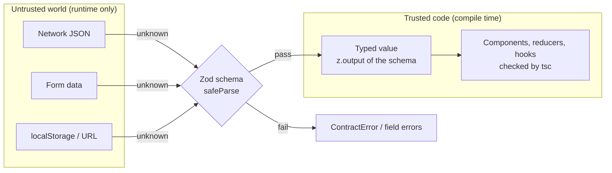

# 02 — TypeScript

> **How to use this module.** Sections 2.1–2.8 give you the mental model: types are erased, they are structural, and unions plus narrowing do most of the work. Sections 2.9–2.12 are the type-level toolbox interviewers probe. Sections 2.13–2.16 are what a React codebase actually needs (typed props, `tsconfig` flags, validating untrusted data). 2.17 is the version story (TS 5 → 6 → 7). If you only have 20 minutes, read 2.1, 2.4, 2.7, 2.13, 2.16 and the Summary.

**Prerequisites:** [JavaScript fundamentals](01-javascript.md) (closures, `this`, modules). You do not need any React yet; 2.13 is the first place React shows up.

**Code for this module:** [`examples/web/src/m02-typescript/`](examples/web/src/m02-typescript/). Run the runtime tests with `npx vitest run src/m02-typescript` from `examples/web`. **Vitest does not type-check.** The compile-time claims in this module are expressed as `expectTypeOf(...)` assertions and `// @ts-expect-error` lines, and they are proved by `npm run typecheck` (`tsc --noEmit`). A `@ts-expect-error` on a line that does *not* fail to compile is itself an error ("Unused '@ts-expect-error' directive"), so the directive is an executable claim that "this must not compile".

> **Version notes (read once).** `examples/web` pins **TypeScript ~6.0.3**, although TS **7.0** (the native Go compiler) is the current release ([VERSIONS.md](VERSIONS.md)). The reason is tooling, not language: `typescript-eslint` 8.71 declares the peer range `typescript >=4.8.4 <6.1.0`. Everything taught here is valid in 7.0 as well; 2.17 explains the differences.

---

## 2.1 Why static types on a dynamic runtime

### The problem
JavaScript will happily run `user.nmae.toUpperCase()` and fail in production with `Cannot read properties of undefined`. In Java the compiler would have rejected the typo. Without a type system, every refactor, every API change and every misread prop is discovered by a user.

### Mental model
TypeScript [TS] is a **separate checker that runs before your code and then disappears**. The compiler (or Vite/esbuild) deletes every annotation, and what executes is plain JavaScript. The types describe what you *believe* is true at runtime. They do not enforce it.

```ts
function area(r: number): number { return Math.PI * r * r; }
// after compilation: function area(r) { return Math.PI * r * r; }
```

> **Java/Spring analogy.** Java also erases generics (`List<String>` is a `List` at runtime), so you already accept "types vanish". Java still keeps a **runtime class** for every object (`instanceof`, reflection, `ClassCastException` on a bad cast), and a bad checked cast fails *at the cast*. TypeScript erases **everything**: interfaces, aliases, generics, unions. There is nothing to reflect on.
>
> **Where the analogy breaks:** in Java the JVM validates the cast `(User) obj` and Jackson validates the JSON against a class. In TypeScript, `JSON.parse(text) as User` is a promise to the compiler and checks nothing. This is why section 2.16 exists: trust boundaries need runtime validation, and TypeScript only covers the inside.

### Minimal code
```ts
const raw: unknown = JSON.parse('{"id":"not-a-number"}');
const user = raw as { id: number };   // compiles. The cast is erased; nothing is checked.
user.id.toFixed(2);                   // runtime TypeError: user.id.toFixed is not a function
```

### How it works internally
`tsc` parses to an AST, binds symbols, then the **checker** assigns a type to each expression and reports diagnostics. Emit is a separate step that strips types (and, depending on settings, lowers syntax). Modern pipelines split the two jobs: Vite, esbuild and SWC **strip types without checking** (fast, per file), and `tsc --noEmit` is the checker you run in CI. That is why a Vitest run goes green while `tsc` is red, and why this repo has both `npm test` and `npm run typecheck`. Because other tools strip types file by file, syntax that needs type information to emit (`const enum` across files, `namespace` merging, parameter properties in some setups) is discouraged; `verbatimModuleSyntax` (2.15) exists for this reason.

### Trade-offs
- ✅ Refactors become mechanical, editors get accurate autocomplete, and a class of null and typo bugs disappears.
- ❌ Types are a second language to maintain, and a wrong type is worse than no type, because it makes readers *trust* something false.
- ❌ Zero protection at I/O boundaries (network, `localStorage`, `postMessage`, URL params). See 2.16.

---

## 2.2 Primitives, literal types, `as const`

### The problem
Most real values are not "any string". A button variant is `'primary' | 'ghost'`, an HTTP method is one of five words. If you type them as `string`, the compiler cannot catch `variant="primry"`.

### Mental model
Every value has a **type**, and a type is a **set of values**. `string` is a very large set; `'primary'` is a set of exactly one value (a **literal type**). A union is a set union. `const x = 'a'` gets the literal type `'a'`; `let x = 'a'` gets the widened `string` because it might be reassigned.

> **Java/Spring analogy.** A literal-union type plays the role of a Java `enum`: a closed set of named values.
>
> **Where the analogy breaks:** a Java enum is a runtime object with a class, methods and `values()`. A TypeScript literal union is **only a type**; `'primary' | 'ghost'` produces no runtime artifact. (TypeScript does have a real `enum` keyword, and it does emit code, which is why most style guides prefer literal unions or `as const` objects.)

### Minimal code
```ts
const user = { role: 'admin' };          // role: string  (properties are mutable, so literals widen)
const fixed = { role: 'admin' } as const; // role: 'admin' (readonly)
const directions = ['up', 'down'] as const; // readonly ['up', 'down']
type Direction = (typeof directions)[number]; // 'up' | 'down': derive the type from the value, once
```

`as const` is the cheap enum: define the values once, derive the type, and use the array at runtime for validation or `<select>` options.

### How it works internally
The checker has two views of a literal: the **fresh** literal type (`'a'`) and its **widened** form (`string`). Widening happens when a literal flows into a mutable location (a `let`, a non-readonly property, a non-const array element). `as const` suppresses widening for the whole expression, makes object properties `readonly` and arrays readonly tuples. In [compiles.predict.test.ts](examples/web/src/m02-typescript/compiles.predict.test.ts) predictions 3 and 4 show both effects: `user.role` is `string` (not assignable to `'admin'`), and `directions.push` does not exist.

### Trade-offs
Use literal unions for closed sets that cross component boundaries. Use `as const` objects when you need the values at runtime too. Avoid `enum` in new code unless you must interoperate with code that uses it. `as const` on a huge literal makes the type huge; do it at the boundary, not everywhere.

---

## 2.3 Inference and contextual typing

### The problem
If you had to annotate every variable, TypeScript would be unbearable. If it inferred wrongly, it would be unusable.

### Mental model
There are **two directions** of inference. **Bottom-up**: the type of the initializer becomes the type of the variable (`const n = 1 + 2` is `number`). **Top-down (contextual)**: the *expected* type flows into an expression, so `names.map((n) => n.length)` types `n` from `names`' element type. Annotate **boundaries** (exported function parameters and return types, props, public APIs) and let the inside infer.

> **Java/Spring analogy.** `var` and the diamond `<>` in Java, plus lambda parameter inference from the target functional interface. TypeScript's inference goes much further: it infers whole generic argument lists and return types.
>
> **Where the analogy breaks:** Java lambdas are typed by a nominal functional interface. TypeScript infers from structure, so the same callback can satisfy many shapes, and inference can *succeed with a surprising type* (an empty `{}` annotation means "any non-nullish value", not "any object").

### Minimal code
```ts
const nums = [1, null, 2];                 // (number | null)[]
const present = nums.filter((n) => n !== null); // number[]  (TS 5.5+: inferred type predicate, see 2.6)

function firstOr<T>(items: readonly T[], fallback: T): T { /* … */ return fallback; }
firstOr(['a', 'b'] as const, 'c');         // T widens to 'a' | 'b' | 'c'; 'c' sneaks in (fixed by NoInfer, 2.9)
```

### How it works internally
For a generic call the checker collects **candidates** for each type parameter from the arguments, picks a best common type, then checks the arguments against the result. Context-sensitive arguments (lambdas with untyped parameters) are checked **after** the non-sensitive ones have fixed the type parameters, which is why `getLabel={(o) => o.label}` works when `options` comes first. Return types are inferred from the body; you annotate them on exported functions so that the *implementation* cannot silently change the *contract* (and `isolatedDeclarations`, TS 5.5, requires explicit annotations on exports so other tools can emit `.d.ts` without a full check).

### Trade-offs
Let local variables infer. Annotate public signatures. Do **not** annotate to "silence" an inference you do not understand: an annotation turns the compiler from a checker into a rubber stamp for what you wrote. `satisfies` (2.11) gives you the check without losing the inferred type.

---

## 2.4 Structural typing

### The problem
Two modules define `{ x: number; y: number }` independently. Should one be rejected where the other is expected? Java would say yes (two classes, two types). In a language whose values are plain object literals from JSON, that would be hostile.

### Mental model
TypeScript is **structurally typed**: type `A` is assignable to `B` if `A` has *at least* the members `B` requires, with compatible types. The name does not matter, only the shape. This is **duck typing, checked at compile time**.

> **Java/Spring analogy.** Java is **nominal**: `class Meters` and `class Feet` with identical fields are unrelated types. Go interfaces are structural, as is the way a Spring bean satisfies a `@FunctionalInterface` lambda.
>
> **Where the analogy breaks:** structural typing means an `OrderId` string and a `UserId` string are *interchangeable*. When you want nominal behavior you must build it: brands (`string & { __brand: 'UserId' }`, see `Brand` in [types.ts](examples/web/src/m02-typescript/types.ts)) or classes with `private` members (private/`#` members make a class compare nominally; predictions 9 in the predict test).

### Minimal code
```ts
type Point = { x: number; y: number };
type Vec = { x: number; y: number };
const p: Point = { x: 1, y: 2 };
const v: Vec = p;                       // fine: same shape

const wide = { x: 1, y: 2, label: 'a' };
const q: Point = wide;                  // fine: extra properties are allowed on non-fresh values
const r: Point = { x: 1, y: 2, label: 'a' }; // error: excess property check, but ONLY on fresh object literals
```

### How it works internally
Assignability compares members one by one (recursively, with caching and a depth limit). The **excess property check** is a special lint-like rule applied only to *fresh* object literals written directly where a type is expected: it catches typos like `{ colour: 'red' }`. Passing the same object through a variable first makes it non-fresh and the check disappears. Function parameters are compared **contravariantly** under `strictFunctionTypes` (included in `strict`) for property-style function types, but **method** declarations (`put(x: T): void`) are compared **bivariantly** for historical reasons. Variance is covered in 2.8.

### Trade-offs
Structural typing makes mocks, test doubles and object literals painless and lets libraries accept "anything shaped like this". The cost is **accidental compatibility** (branded IDs, units, "validated" vs "raw" strings) and surprising `Object.keys` results, because a value may have more keys than its type says (`Object.keys` returns `string[]`, not `(keyof T)[]`, for exactly this reason).

---

## 2.5 Unions and intersections

### The problem
Real data has alternatives (a request is loading *or* failed *or* done) and combinations (a user *and* an audit record). You need types for both without inheritance.

### Mental model
`A | B` is "a value that is an A **or** a B": you may only use what **both** have until you narrow. `A & B` is "a value that is **both**": you get the members of both. Think set union and set intersection of *value sets*. Note the inversion for **objects**: the union of two object types has the *fewer* members (the common ones), the intersection the *more*.

> **Java/Spring analogy.** `A | B` is a sealed interface with two permitted records (Java 17+ `sealed` plus pattern matching `switch`). `A & B` resembles `<T extends A & B>`, a bound requiring both interfaces.
>
> **Where the analogy breaks:** Java makes the union nominal and closed by declaring it on the subtypes. A TypeScript union is declared **outside** the members, ad hoc, and the members need not know about it, so a type can be a member of many unions.

### Minimal code
```ts
type Id = string | number;
function show(id: Id) { id.toString(); /* ok: both have toString */ id.toFixed(); /* error: string has no toFixed */ }

type Timestamped = { createdAt: Date };
type Named = { name: string };
type Row = Named & Timestamped;           // { name: string; createdAt: Date }
```

### How it works internally
Unions are normalized (flattened, deduplicated, subtype-reduced in some positions) and stored as sets; operations on a union distribute over members. Intersections of **conflicting** primitives collapse to `never` (`string & number`), and an intersection of object types with conflicting property types makes that property `never` (and, for discriminated unions, can make the *whole object* `never`). Conditional types **distribute** over a naked union type parameter (2.10), which is the source of most "why did my type become `never`" bugs.

### Trade-offs
Prefer a union of small, tagged object types (2.7) to one fat object with many optional fields; the fat object permits impossible combinations. Use intersections to *add* members, not to model alternatives, and prefer `interface extends` for object composition (2.12) because conflicts are reported at the declaration rather than silently producing `never`.

---

## 2.6 Narrowing: `typeof`, `in`, `instanceof`, type predicates, assertion functions

### The problem
After `id: string | number`, you need to call string methods. The compiler must know which branch you are in.

### Mental model
**Narrowing** is flow analysis: inside a branch guarded by a check, the compiler *refines* the variable's type to the subset of the union where the check could be true. It tracks control flow (`if`, `switch`, early `return`, `&&`, `?.`).

| Guard | Narrows | Notes |
|---|---|---|
| `typeof x === 'string'` | primitives | `typeof null === 'object'` is a famous trap |
| `x instanceof Date` | class instances | uses the prototype chain; fails across realms/iframes |
| `'kind' in x` | object unions | TS 4.9: on `unknown`/non-listed keys, narrows to `x & Record<'kind', unknown>` |
| `x === undefined`, `x == null`, truthiness | null/undefined, literals | truthiness also removes `0`, `''`, `NaN` |
| `shape.kind === 'circle'` | discriminated unions | the workhorse (2.7) |
| `isFoo(x)` returning `x is Foo` | anything | **user-defined type predicate** |
| `assertFoo(x)` returning `asserts x is Foo` | rest of the scope | **assertion function**; must throw on failure |

> **Java/Spring analogy.** `instanceof` with pattern matching (`if (o instanceof String s)`) in Java 16+, and a `switch` pattern match over a sealed hierarchy.
>
> **Where the analogy breaks:** in Java the pattern binds a new, runtime-checked variable. In TypeScript the *same variable* changes type, and a **user-defined predicate is unchecked**: `x is string` is a promise. If the body lies, the compiler believes it.

### Minimal code
Full file: [`narrowing.ts`](examples/web/src/m02-typescript/narrowing.ts), tests in `narrowing.test.ts`.

```ts
export function describeError(error: unknown): string {
  if (error instanceof Error) return error.message;
  if (typeof error === 'object' && error !== null && 'message' in error && typeof error.message === 'string') {
    return error.message;                 // `in` narrowed `error` to object & Record<'message', unknown>
  }
  return String(error);
}

export function isString(value: unknown): value is string { return typeof value === 'string'; }

export function assertIsDefined<T>(value: T, message = 'Expected a value'): asserts value is NonNullable<T> {
  if (value === null || value === undefined) throw new Error(message);
}
```

### How it works internally
The checker builds a **control-flow graph** per function. Each reference has a *flow type* computed by walking back through the graph and applying the narrowing of every guard it passed. Two consequences matter in practice. First, narrowing is **invalidated by assignments and, for mutable captured variables, inside callbacks** (TS 5.4 improved this: if the variable is never reassigned after the closure is created, narrowing is preserved in closures). Second, narrowing does not survive **property access through a function call** (`if (obj.a) { fn(); obj.a.x }` is still narrowed, because TypeScript optimistically assumes calls do not mutate, a deliberate unsoundness).

**Inferred type predicates (TS 5.5):** if a function's body is a single check that narrows its parameter, and the "false" branch is exactly the complement, TS infers `x is T` for you. `[1, null, 2].filter((x) => x !== null)` is `number[]`. A truthiness check like `filter((x) => !!x)` is **not** inferred as a predicate, because it would also remove `0` and the complement would be wrong. [narrowing.test.ts](examples/web/src/m02-typescript/narrowing.test.ts) asserts both with `expectTypeOf`. Source: [TS 5.5 release notes](https://devblogs.microsoft.com/typescript/announcing-typescript-5-5/).

### Trade-offs
Prefer built-in guards and discriminated unions to hand-written predicates; each predicate is an unchecked assertion you now own. Use an assertion function for invariants you want to enforce *and* narrow (`assertIsDefined(el)`), and keep it throwing. A predicate that returns `true` for the wrong set of values is a **type hole** that no compiler flag finds.

---

## 2.7 Discriminated unions and exhaustiveness with `never`

### The problem
A request has states `idle`, `loading`, `success`, `error`. Modeled as `{ loading: boolean; error?: Error; data?: User }`, the type allows `loading: true` *and* `data`, or all three missing. Every consumer re-derives which combination is valid, and some will get it wrong.

### Mental model
Give every member of the union a **literal-typed tag property** (the *discriminant*), and put the data **only on the members that have it**. Checking the tag narrows to exactly one member. Then make the `default` branch of the `switch` receive the value as type **`never`**: if every member was handled, nothing is left and it compiles. If someone adds a member and forgets the case, the leftover member is not assignable to `never` and **the build fails at that line**.

> **Java/Spring analogy.** A `sealed interface` with `record` implementations and an exhaustive `switch` expression (Java 21): add a permitted record and every `switch` without a default stops compiling.
>
> **Where the analogy breaks:** the Java compiler knows the closed set from the `permits` clause. TypeScript discovers it from the union you wrote. And because types are erased, the `never` guard is **only a compile-time promise**: data arriving from JSON can carry a tag your union never heard of, so the runtime `default` should still `throw` (as `assertNever` does).

### Minimal code
Full files: [`assertNever.ts`](examples/web/src/m02-typescript/assertNever.ts), [`cartReducer.ts`](examples/web/src/m02-typescript/cartReducer.ts).

```ts
export function assertNever(value: never): never {
  throw new Error(`Unhandled case: ${JSON.stringify(value)}`);
}

type AsyncState<T> =
  | { status: 'idle' }
  | { status: 'loading' }
  | { status: 'success'; data: T }
  | { status: 'error'; error: Error };

function render(state: AsyncState<User>): string {
  switch (state.status) {
    case 'idle':    return '';
    case 'loading': return 'Loading…';
    case 'success': return state.data.name;   // `data` exists only here
    case 'error':   return state.error.message;
    default:        return assertNever(state); // add a member and this line fails to compile
  }
}
```

### How it works internally
For a union whose members share a property with **literal types** (or `null`/`undefined`), the checker treats that property as a discriminant. `switch`/`if` on it filters the union by that literal. After all cases the remaining type is the empty union, which is `never`. `never` is the **bottom type**: it is assignable to everything and nothing (except `never`) is assignable to it, which is exactly why passing a leftover member fails. A function with an explicit non-`undefined` return type and an exhaustive `switch` needs no `default` and no trailing `return` (see `area` in `narrowing.ts`), because the end of the function is unreachable. The `default: assertNever(x)` form is still useful when you want the failure at the *switch* rather than at the function's return type, and for a runtime backstop.

[cartReducer.test.ts](examples/web/src/m02-typescript/cartReducer.test.ts) demonstrates a switch that forgets cases with a `@ts-expect-error` on the `assertNever(a)` line. It also shows the payload rule: `{ type: 'paid', sku: 'a' }` is rejected because the `paid` member has no `sku`.

### Trade-offs
- ✅ The best tool in the language for state: it makes impossible states unrepresentable and gives you compiler-checked exhaustiveness. React reducers ([08](08-state.md#810-usereducer)), async state ([09](09-effects.md), [17](17-data-fetching.md)) and discriminated-union props (2.13) all use it.
- ❌ Tags must be literal types: a `string`-typed tag does nothing. Tags must be spelled identically everywhere (derive them: `type Tag = Action['type']`).
- ❌ The guard protects against *your* code changing, not against bad runtime data. Validate external data (2.16).

---

## 2.8 Generics and constraints

### The problem
You want `groupBy`, `pick`, a `Select` component, or a `useFetch<T>` that works for any type *and still tells the caller what comes out*. Without generics you choose between `any` (no safety) and one copy per type.

### Mental model
A generic is a **function on types**: `function first<T>(xs: T[]): T | undefined` takes a type `T` (usually inferred from the arguments) and returns a type. A **constraint** (`T extends Shape`) says "any `T`, as long as it is at least a `Shape`", which lets the body use `Shape`'s members. `keyof T` and indexed access `T[K]` let you tie one type parameter to another (`K extends keyof T`).

> **Java/Spring analogy.** Java generics: `<T extends Comparable<T>>` maps to `T extends Comparable<T>` (same idea, different spelling); bounded wildcards `? extends` / `? super` correspond to **covariance / contravariance**.
>
> **Where the analogy breaks:** four places. (1) Both erase, but TypeScript has no reified-type escape hatch at all (no `Class<T>` token; pass a schema or a factory instead). (2) Java generics are **invariant** (`List<Dog>` is not a `List<Animal>`) and you opt into variance at each *use site* with wildcards. TypeScript is **structural and mostly covariant**: `Dog[]` is assignable to `Animal[]` (unsound; the last test in [types.test.ts](examples/web/src/m02-typescript/types.test.ts) pushes an `Animal` into an array that is also a `Dog[]`), and since 4.7 you may annotate **declaration-site** variance with `in` / `out`. (3) TypeScript type parameters can be used in **conditional and mapped types**, so generics are a small programming language (2.10). (4) A generic function in TypeScript can be called with **no explicit type arguments** almost always, because inference is structural.

### Minimal code
Full file: [`groupBy.ts`](examples/web/src/m02-typescript/groupBy.ts) (Exercise 1).

```ts
export function groupBy<T, K extends PropertyKey>(
  items: readonly T[],
  key: (item: T, index: number) => K,
): Partial<Record<K, T[]>> { /* … */ }

const byRole = groupBy(users, (u) => u.role); // Partial<Record<'admin' | 'user', User[]>>

// Constraint ties keys to the object:
function pick<T extends object, K extends keyof T>(source: T, ...keys: K[]): Pick<T, K> { /* … */ }
pick(user, 'nmae');                           // error: "nmae" is not a key of User
```

Newer generic features, each with a source: **`const` type parameters** (TS 5.0): `function tuple<const T extends readonly unknown[]>(...xs: T): T` infers `readonly ['a', 1]` without the caller writing `as const` ([5.0 notes](https://devblogs.microsoft.com/typescript/announcing-typescript-5-0/)). **`NoInfer<T>`** (5.4, built into `lib.es5.d.ts`; confirmed in `node_modules/typescript/lib/lib.es5.d.ts`): blocks a position from contributing inference candidates, so `firstOr(items, fallback: NoInfer<T>)` rejects a fallback outside the item type ([5.4 notes](https://devblogs.microsoft.com/typescript/announcing-typescript-5-4/)). **Variance annotations** `in` / `out` (4.7): `interface Producer<out T>` makes the checker verify and use covariance.

### How it works internally
At a call, the checker **instantiates** the signature: it infers a candidate set per type parameter, resolves each to one type (union of candidates for covariant positions, intersection for contravariant ones), then checks arguments against the instantiated parameters. Inside the generic body, `T` is an **opaque placeholder** that is only assignable to itself and its constraint; that is why `return {} as Pick<T, K>` or one cast at a boundary shows up in generic implementations (see `groupBy.ts`: `Object.fromEntries` can only promise `{ [k: string]: T[] }`). There is no runtime `T`: you cannot write `new T()` or `typeof T`.

### Trade-offs
- Default to *few* type parameters, each of which appears at least twice (a type parameter used once is usually just `unknown` or a bad design).
- Constrain by the **least** you need (`readonly T[]` over `T[]`, `Iterable<T>` over arrays); callers pass what they have.
- If you need a cast inside a generic function, make it the **only** cast, put it at the boundary, and test the behavior at runtime (the type system is no longer checking it).
- Overloads (`applyPatch` in [DeepPartial.ts](examples/web/src/m02-typescript/DeepPartial.ts)) let the *public* signature be precise while the *implementation* signature stays loose.

---

## 2.9 Utility types

### The problem
You have a `User` and need "the same but all optional" (a PATCH body), "only these two fields" (a list row), "everything except the password", or "the return type of that function". Rewriting each by hand drifts out of sync.

### Mental model
Utility types are **library-defined functions on types**, written with mapped and conditional types (2.10). You read them like function calls.

| Utility | Result | Notes |
|---|---|---|
| `Partial<T>` / `Required<T>` | all optional / all required | **shallow** (see `DeepPartial`, Exercise 2) |
| `Readonly<T>` | all `readonly` | compile-time only; no `Object.freeze` |
| `Pick<T, K>` / `Omit<T, K>` | keep / drop keys | `Omit` does not check that `K` is a key of `T` |
| `Record<K, V>` | object with keys `K` | `Record<string, V>` makes `noUncheckedIndexedAccess` relevant |
| `Exclude<U, X>` / `Extract<U, X>` | remove / keep union members | distributive over `U` |
| `NonNullable<T>` | removes `null` and `undefined` | defined as `T & {}` in current lib |
| `ReturnType<F>` / `Parameters<F>` | function result / argument tuple | with `typeof fn` |
| `Awaited<T>` | unwraps `Promise`s recursively | `Awaited<Promise<Promise<number>>>` is `number` |
| `NoInfer<T>` | blocks inference through a position | 5.4; implemented as a compiler intrinsic |
| `ComponentProps<'button'>` | React: props of an element or component | 2.13 |

> **Java/Spring analogy.** The closest thing is *deriving DTOs from entities*: MapStruct projections, `record` views, Spring Data interface projections. 
>
> **Where the analogy breaks:** in Java a projection is a new class you write and maintain. A utility type is **computed** from the source type, so when `User` gains a field the derived type follows without a code change. The price: the derived type has no name in stack traces and error messages can be long.

### Minimal code
```ts
type User = { id: number; name: string; email: string; passwordHash: string };
type UserPatch = Partial<Omit<User, 'id' | 'passwordHash'>>;
type UserRow = Pick<User, 'id' | 'name'>;
type Api = { getUser: (id: number) => Promise<User> };
type Loaded = Awaited<ReturnType<Api['getUser']>>; // User
```
Type-level assertions for these (and for `Awaited`, `Omit`, `Required`, `NonNullable`, `Record`) are in `types.test.ts` ("built-in utilities").

### How it works internally
Most are one-liners in `lib.es5.d.ts`: `Partial<T> = { [P in keyof T]?: T[P] }`, `Pick<T, K extends keyof T> = { [P in K]: T[P] }`, `Exclude<T, U> = T extends U ? never : T`, `ReturnType<T> = T extends (...args: any) => infer R ? R : any` (these definitions are read from the installed `node_modules/typescript/lib/lib.es5.d.ts`; the `any`s are why the standard library is exempt from the lint rule). `Partial`/`Pick` are **homomorphic** mapped types: they preserve `readonly` and optional modifiers of the source, and on arrays and tuples they map element-wise.

### Trade-offs
Derive types from a **single source** (the schema, the function, the constant), not from each other in long chains. If you write `Partial<Omit<Pick<…>>>` three levels deep, name the intermediate type. `Omit` on a union does not distribute (it collapses the union); use a distributive helper when you need that.

---

## 2.10 Mapped, conditional and template-literal types, `infer`

### The problem
Utility types cover common transformations. When you need "every key becomes a getter name", "the element type of whatever array this is", or "`on` + the event name", you need the primitives behind them.

### Mental model
- **Mapped type**: a `for…in` over keys, producing an object type: `{ [K in keyof T]: F<T[K]> }`. Modifiers `+/-readonly` and `+/-?` add or remove flags, and `as` **remaps** keys.
- **Conditional type**: a ternary on types: `T extends U ? X : Y`. Inside the true branch, `infer R` **captures** part of the matched type into a new type variable.
- **Template-literal type**: string interpolation on types: `` `on${Capitalize<E>}` ``. Applied to a union it produces the cross product.

> **Java/Spring analogy.** There is none for the type-level code itself. The nearest thing is *annotation processing* or generics + reflection to derive structures, but those run on classes at build time. TypeScript types are a **pure, side-effect-free functional language** evaluated by the compiler.
>
> **Where the analogy breaks:** conditional types are **distributive** over naked union parameters (`ElementOf<string[] | number[]>` is `string | number`), recursion has depth limits, and a deferred conditional over a still-generic `T` cannot be resolved inside the generic body. Both are routine sources of confusion (and of `as` casts).

### Minimal code
Full file: [`types.ts`](examples/web/src/m02-typescript/types.ts).

```ts
export type Getters<T> = { [K in keyof T as `get${Capitalize<string & K>}`]: () => T[K] };
// Getters<{ name: string; age: number }> = { getName: () => string; getAge: () => number }

export type ElementOf<T> = T extends readonly (infer U)[] ? U : never;
export type HandlerName<E extends string> = `on${Capitalize<E>}`; // 'click' | 'focus' -> 'onClick' | 'onFocus'
export type Mutable<T> = { -readonly [K in keyof T]: T[K] };

export type DeepPartial<T> = T extends (...args: never[]) => unknown ? T
  : T extends Date ? T
  : T extends readonly unknown[] ? { [K in keyof T]: DeepPartial<T[K]> }
  : T extends object ? { [K in keyof T]?: DeepPartial<T[K]> }
  : T;
```

### How it works internally
Mapped types are evaluated by iterating the key set, and a mapped type over `keyof T` where `T` is a type parameter is **homomorphic** (it keeps the source's modifiers and maps arrays as arrays). Conditional types are evaluated eagerly when both sides are concrete and **deferred** when they depend on an uninstantiated type parameter. `infer` introduces a type variable that is inferred from the matched position, with the same rules as call inference. To stop distribution, wrap both sides in a tuple: `[T] extends [never] ? … : …`. Compile cost is real: deeply recursive conditional types slow `tsc` and hit instantiation-depth limits. A type that takes seconds to evaluate in the editor is a design smell.

### Trade-offs
Reach for these in **library-shaped code** (typed clients, form helpers, polymorphic components). Application code should mostly *consume* them. A cleverly typed `get(obj, 'a.b.c')` that nobody can read costs more than it saves; prefer an explicit overload or a code-generated type.

---

## 2.11 `unknown` vs `any` vs `never`; `satisfies`

### The problem
You have a value whose type you do not know (a caught error, parsed JSON, a message event). Whatever you type it as decides whether the compiler still helps you.

### Mental model
| Type | Meaning | Assignable **to** it | Assignable **from** it | Use |
|---|---|---|---|---|
| `any` | "turn the checker off for this value" | everything | to everything | almost never |
| `unknown` | "something, I must check first" (the **top** type) | everything | only to `unknown`/`any` | untrusted data |
| `never` | "no value exists" (the **bottom** type) | nothing but `never` | to everything | exhaustiveness, impossible branches, functions that never return |

`any` is **contagious**: it leaks out of the function and disables checks on everything that touches it. `unknown` forces a guard (2.6) before use. `catch (e)` is `unknown` under `strict` (`useUnknownInCatchVariables`).

**`satisfies`** (TS 4.9) validates that an expression matches a type **without changing** the type of the expression: "check, but do not widen".

> **Java/Spring analogy.** `unknown` is `Object` (you must cast or pattern-match before use). `any` is a raw type or an unchecked cast with `@SuppressWarnings("unchecked")`. `never` has no Java counterpart beyond a method that always throws.
>
> **Where the analogy breaks:** `Object` in Java has a runtime class and a failed cast throws. A TypeScript guard that lies (`x is Foo` on the wrong check) throws nothing.

### Minimal code
```ts
const palette = { red: [255, 0, 0], green: '#0f0' } satisfies Record<string, string | number[]>;
palette.red.map((n) => n / 255);  // red is number[]: not widened to string | number[]
palette.green.toUpperCase();      // green is string
// With an annotation (`const palette: Record<string, string | number[]> = …`) both lines would fail.

export const routes = { home: '/', user: '/users/:id' } as const satisfies Record<string, `/${string}`>;
type RouteName = keyof typeof routes; // 'home' | 'user'
```
Predictions 8 and 3 in [compiles.predict.test.ts](examples/web/src/m02-typescript/compiles.predict.test.ts) assert that `palette.red.toUpperCase()` is rejected and `palette.green.toUpperCase()` is accepted.

### How it works internally
A type annotation changes the declared type of the variable, so later reads see the *annotation*. `satisfies` is a **checking-only** operator: the expression is checked against the target type (also providing *contextual* typing, so `'#0f0'` can be a literal), and the variable keeps its own inferred type. `as` is the opposite: an *assertion* that overrides the checker, only blocked when the types do not sufficiently overlap. `never` falls out of narrowing: whatever remains when every union member was ruled out.

### Trade-offs
Use `unknown` at every untrusted edge and validate (2.16). Use `satisfies` for **configuration objects, route tables and lookup maps** where you want typo-checking and precise value types. Use `as` rarely and name it in review: it is where runtime bugs hide. Prefer `// @ts-expect-error` (with a reason) over `any` when you need an escape hatch, because it fails the build once the underlying problem is fixed.

---

## 2.12 `interface` vs `type`

### The problem
Both describe object shapes. Style guides disagree, and interviewers ask.

### Mental model
They overlap in 90% of uses. The differences:

| | `interface` | `type` alias |
|---|---|---|
| Object shapes | yes | yes |
| Unions, tuples, primitives, mapped/conditional types | no | **yes** |
| Extension | `extends` (reports conflicts at the declaration) | `&` (conflicts become `never`) |
| **Declaration merging** | **yes** (same name declared twice merges) | no (duplicate identifier error) |
| Implements by a class | yes | yes (when the alias is an object type) |
| Error messages / caching | named, and checked structurally by identity cache | expanded; very large intersections can be slow |

> **Java/Spring analogy.** A TypeScript `interface` looks like a Java interface, but it is a *shape description*, not a contract that a class must explicitly implement to be compatible.
>
> **Where the analogy breaks:** there is no `implements` requirement; any object with the right shape satisfies it. Declaration merging has no Java equivalent, and it is what makes module augmentation possible (2.14).

### Minimal code
```ts
interface Window { __APP_VERSION__: string }          // merges into the global Window (2.14)
type Action = { type: 'added' } | { type: 'removed' }; // a union: only a type alias can say this
interface Admin extends User { permissions: string[] } // conflicts are reported here
```

### How it works internally
Interfaces are *named object types* with a cached member table, so relationships between them are cheap to check and show up with their name in errors. Intersections of type aliases are re-evaluated structurally. Neither exists at runtime.

### Trade-offs
A pragmatic rule: **`type` by default** (it can do everything, and unions are the common case in React), **`interface` when you want declaration merging or a public, extendable object contract** (a library's `Props` that consumers augment). Whichever you pick, be consistent. The performance advice for `interface extends` over `&` matters only for very large, deep hierarchies.

---

## 2.13 Typing React: props, children, events, refs, generic components, `ComponentProps`

### The problem
A component's props are its public API. In JavaScript a typo (`onclick`, `varient`) fails silently, and the type of an event handler's argument is a guess.

### Mental model
A function component is just `(props: Props) => ReactNode`, so **typing a component is typing a function's first parameter**. React 19 and `@types/react` 19.x remove most legacy scaffolding: no `React.FC` needed, no implicit `children`, and **`ref` is an ordinary prop**. The library ships its own utility types (`ComponentProps`, `ComponentPropsWithRef`, `ComponentPropsWithoutRef`, `ElementType`, `ReactNode`, `ChangeEvent`, `FormEvent`, `MouseEvent`…).

> **Java/Spring analogy.** Props are a request DTO or a method signature, and a typed component is like an `@RestController` method whose parameter types the framework checks.
>
> **Where the analogy breaks:** nothing validates props at runtime. A caller in untyped JavaScript, or a value coming through `any`, delivers whatever it likes, and removed `propTypes` ([13](13-reconciliation-and-fiber.md#138-legacy-apis-removed-in-19)) is the legacy runtime check. Typed props are a **compile-time** contract.

### Minimal code
Full file: [`components.tsx`](examples/web/src/m02-typescript/components.tsx), tests in `components.test.tsx`.

**Props, `children`, extending a native element**
```tsx
type ButtonProps = ComponentProps<'button'> & { variant?: 'primary' | 'ghost' };
export function Button({ variant = 'primary', className, ...rest }: ButtonProps) {
  return <button {...rest} className={[`btn-${variant}`, className].filter(Boolean).join(' ')} />;
}

export function Card({ title, children }: { title: string; children: ReactNode }) { /* … */ }
```
`ReactNode` (anything renderable: strings, numbers, elements, arrays, `null`) is the right type for `children`. `JSX.Element` rejects strings and `null`; `PropsWithChildren<P>` is just `P & { children?: ReactNode }`. Extending `ComponentProps<'button'>` gives you every native attribute (`disabled`, `aria-*`, `onClick`, and in React 19 `ref`) and keeps them correct as React's types evolve.

**Events**
```tsx
const handle = (event: ChangeEvent<HTMLSelectElement>) => { event.target.value; };
const submit = (event: FormEvent<HTMLFormElement>) => { event.currentTarget; /* the <form>, not any */ };
```
The generic argument is the element type the handler is attached to. `currentTarget` has that type; `target` is only an `EventTarget`/`Element` (it may be a descendant), which is why `ChangeEvent<T>` narrows `target` to `T` for form controls. A handler can be typed whole: `const onClick: MouseEventHandler<HTMLButtonElement> = (e) => …`.

**Refs** (React 19)
```tsx
export function FancyInput({ ref, ...rest }: ComponentPropsWithRef<'input'>) {
  return <input ref={ref} {...rest} />;     // no forwardRef
}
const ref = useRef<HTMLInputElement>(null);  // RefObject<HTMLInputElement | null> in @types/react 19
```
In `@types/react` 19, `useRef` requires an argument and `useRef<T>(null)` is a `RefObject<T | null>`, so you check `ref.current` for `null` before use. A **ref callback** parameter may be typed *narrower* than `T | null` (for example `(el: HTMLInputElement | null) => …` is fine, as is a callback written for the elements it actually receives), but not *wider and non-null*; this was verified by `tsc` in this repo while writing [10 Refs](10-refs-and-dom.md#103-callback-refs-and-ref-cleanup-functions). Details of ref cleanup, `forwardRef` migration and `useImperativeHandle` live in [10.3–10.5](10-refs-and-dom.md#104-ref-as-a-prop-vs-forwardref).

**Generic components**
```tsx
type SelectProps<T> = {
  options: readonly T[];
  value: NoInfer<T>;                 // `options` decides T; `value` is checked against it
  onChange: (value: T) => void;
  getKey: (option: T) => string;
  getLabel: (option: T) => string;
};
export function Select<T>({ options, value, onChange, getKey, getLabel }: SelectProps<T>) { /* … */ }

<Select options={['s', 'm'] as const} value="xl" … />  // error: "xl" is not 's' | 'm'
```
Declare the component as a plain generic function, not `const Select: FC<…> = …`, which cannot be generic. In TSX files, an arrow generic needs a trailing comma or `extends` (`<T,>(…) => …`) so the parser does not read `<T>` as a JSX tag.

**Polymorphic `as` and `ComponentProps`**
```tsx
type BoxProps<C extends ElementType> = { as?: C } & Omit<ComponentPropsWithoutRef<C>, 'as'>;
export function Box<C extends ElementType = 'div'>({ as, ...rest }: BoxProps<C>) {
  const Component: ElementType = as ?? 'div';
  return <Component {...rest} />;
}
<Box as="a" href="/x" />      // ok
<Box as="div" href="/x" />    // error: a div has no href
```
This is the pattern from [07.9](07-components-props-composition.md#79-polymorphic-components-and-prop-spreading). The implementation is intentionally loose (`ElementType` is `ElementType<any>`), while the **signature** is precise; the tests assert both sides.

**Discriminated-union props**: a `kind` tag decides which other props are required (`{ kind: 'link'; href: string } | { kind: 'button'; onClick: () => void }`). Do not destructure in the parameter list, or you lose the correlation between tag and payload; narrow on `props.kind`.

**`useState`, context and hooks.** `useState<User | null>(null)` needs the generic whenever the initial value does not carry the full type. A context whose default is `null` is typed `createContext<Ctx | null>(null)` and read through a guard hook that throws ([11](11-context.md)). `useReducer(cartReducer, initialCart)` infers state and action from the reducer, which is another reason to type reducers with a discriminated union.

### How it works internally
`ComponentProps<T>` is `T extends JSXElementConstructor<infer P> ? P : T extends keyof JSX.IntrinsicElements ? JSX.IntrinsicElements[T] : {}`; for intrinsic elements it resolves to `DetailedHTMLProps<ButtonHTMLAttributes<HTMLButtonElement>, HTMLButtonElement>`, which is why `ref` is already included (in React 19 types) and why `ComponentPropsWithoutRef` exists for the cases where you do not want it. JSX type-checking resolves the tag's props type and checks the attributes against it; for a generic component it **infers** `T` from the attributes (that is how `Box as="a"` picks `C = 'a'`). `@types/react` is a separate package that tracks React's API, so a version mismatch between `react` and `@types/react` is a classic source of confusing errors.

### Trade-offs
- Prefer **explicit props types** over `React.FC` (no implicit `children`; no generics; the return type `ReactNode` is simply the function's).
- Do not export a polymorphic `as` component unless you need it: the type gymnastics are costly to read, and a design-system component with a closed set of variants is clearer.
- `as` casts on props or events ("`e.target as HTMLInputElement`") are a smell; type the handler with the right `ChangeEvent<…>`.
- Typed props do not validate data that arrives through `any`, `JSON.parse` or a server response. Validate at the boundary (2.16).

---

## 2.14 Declaration files, `@types`, module augmentation

### The problem
JavaScript packages have no types. Your app uses `window.analytics`, a CSS-modules import, and a library whose types are incomplete. The compiler needs descriptions of code it did not compile.

### Mental model
A **declaration file** (`.d.ts`) contains *only types* describing JavaScript that exists elsewhere. A package either ships its own (`"types"` in `package.json`), or the community provides one in **DefinitelyTyped** as `@types/<name>`. **Module augmentation** adds to an existing declaration; **global augmentation** adds to globals like `Window`.

> **Java/Spring analogy.** Like a Maven artifact's `-api` jar or Kotlin's header declarations: an interface without an implementation. 
>
> **Where the analogy breaks:** the implementation and the declaration are matched **by name and path at compile time only**. If `@types/foo` is a different version from `foo`, the compiler checks against types that no longer describe the code, and nothing at runtime notices.

### Minimal code
```ts
// src/global.d.ts: global augmentation: a script file with no imports/exports, or `declare global` in a module
interface Window { __APP_VERSION__: string }

// vite-env.d.ts: ambient declarations for non-code imports
declare module '*.svg' { const url: string; export default url; }

// module augmentation: add a field to a library's type (the file must be a module: has an import/export)
import 'react';
declare module 'react' {
  interface CSSProperties { [key: `--${string}`]: string | number }  // allow custom properties in `style`
}
```

### How it works internally
The compiler loads declarations from files in `include`, from the `types` option, and from `node_modules/@types` (all of them *by default before TS 6*; see 2.17). `import type` / `import { type X }` bring in only types and are erased. An **ambient** `declare module 'x'` with no body types the whole module as `any`: a silent escape hatch, so prefer a real declaration or `unknown`-typed wrapper. `skipLibCheck` skips *checking* `.d.ts` files (not using them), a speed/safety trade this repo enables.

### Trade-offs
Put hand-written declarations in one place. Keep augmentations tiny and documented, because they change the type for the whole program. If a library has bad types, wrap it behind your own typed function instead of augmenting everywhere. Types for generated API clients are discussed in [24.9](24-react-with-spring-boot.md#249-openapi--typescript-generation).

---

## 2.15 `tsconfig` strictness flags

### The problem
`tsc` behaves very differently depending on `tsconfig.json`. A codebase with `strict: false` accepts code the next team's strict config rejects, and many type-safety claims in tutorials silently assume a flag.

### Mental model
`strict: true` is a **bundle** of flags (`strictNullChecks`, `noImplicitAny`, `strictFunctionTypes`, `strictBindCallApply`, `strictPropertyInitialization`, `noImplicitThis`, `useUnknownInCatchVariables`, `alwaysStrict`, and future additions). A few important safety flags are **not** in the bundle.

| Flag | Effect | In `strict`? | This repo |
|---|---|---|---|
| `strictNullChecks` | `null`/`undefined` are separate types | yes | on |
| `noImplicitAny` | un-inferable values must be annotated | yes | on |
| `noUncheckedIndexedAccess` | `arr[i]` and `record[k]` are `T \| undefined` | **no** | **on** |
| `exactOptionalPropertyTypes` | `a?: string` forbids explicit `a: undefined` | **no** | **off** (not set in `examples/web/tsconfig.json`) |
| `verbatimModuleSyntax` | imports/exports without `type` are kept; `type` ones are erased | no | **on** |
| `noUnusedLocals` / `noUnusedParameters` | report unused symbols | no | on |
| `noFallthroughCasesInSwitch` | reports non-empty case fall-through | no | on |
| `isolatedModules` | each file must be transpilable alone | no (implied by `verbatimModuleSyntax` use cases) | n/a |
| `skipLibCheck` | do not check `.d.ts` files | no | on |

> **Java/Spring analogy.** Compiler flags like `-Xlint:all -Werror`, or enabling null-annotation checking (`@NonNullApi` + NullAway / Checker Framework).
>
> **Where the analogy breaks:** Java's null safety is opt-in per package via annotations and tooling; TypeScript's `strictNullChecks` is **one global switch** with no gradual per-file opt-in. Migrating a large JS codebase means turning on flags one by one.

### Minimal code
```ts
// noUncheckedIndexedAccess
const names: string[] = ['ada'];
const first: string = names[0];            // error with the flag: string | undefined
const [head] = names;                      // head: string | undefined: destructuring is affected too
if (head !== undefined) head.toUpperCase();

// exactOptionalPropertyTypes (NOT enabled here; shown for the interview answer)
type Opts = { timeout?: number };
const o: Opts = { timeout: undefined };    // error with the flag; fine without it

// verbatimModuleSyntax: a type-only import must be marked
import { type CartAction } from './cartReducer';  // erased. Without `type`, the import would be kept at runtime.
```
Prediction 1 in the predict test asserts the `noUncheckedIndexedAccess` behavior under this repo's tsconfig (checked by `tsc`).

### How it works internally
Each flag toggles a code path in the checker or emitter. `noUncheckedIndexedAccess` adds `| undefined` to the result of *index signature* and array-element reads (not to known property names). `verbatimModuleSyntax` (TS 5.0) replaces the older `importsNotUsedAsValues` and `preserveValueImports`: the emitter does **no** import elision based on type information, so what you write is what is emitted, which makes single-file transpilers (esbuild, SWC) correct. Source: [5.0 release notes](https://devblogs.microsoft.com/typescript/announcing-typescript-5-0/).

### Trade-offs
- `noUncheckedIndexedAccess` is the most valuable non-`strict` flag and the most annoying (you will write `if (x !== undefined)` often). Worth it: it catches the off-by-one and empty-array bugs that `strict` misses.
- `exactOptionalPropertyTypes` is precise, but many libraries' types (and `Partial<T>` round-trips) do not satisfy it; turn it on for greenfield code and expect friction with third-party types.
- Set `strict` on from day one. The cheapest time to fix `any` is before it has spread.

---

## 2.16 Runtime validation with Zod vs static types

### The problem
```ts
const user = (await response.json()) as User;   // compiles, checks nothing
user.joined.getFullYear();                      // runtime crash: joined is a string
```
Types are erased (2.1). Anything that crosses a **trust boundary** (an HTTP response, a form submission, `localStorage`, a URL parameter, a `postMessage`, an environment variable) arrives as `unknown` regardless of what you promised the compiler.

### Mental model
Two systems, one source of truth:
- **Static types** prove that *your code* is consistent with itself, at compile time, for free.
- A **runtime schema** [Library: zod] proves that *data* matches a shape, at the boundary, at a cost. The schema also **derives** the static type (`z.infer`), so the two cannot drift.



> **Java/Spring analogy.** The boundary is `@Valid @RequestBody` plus Jackson deserialization plus Bean Validation (`@NotBlank`, `@Email`). Zod plays the role of Jackson (shape and types) **and** Bean Validation (constraints) together, and it lives in the *client* because the browser is the caller's side of the contract.
>
> **Where the analogy breaks:** in Spring the class **is** the schema, and Jackson refuses to build a `User` of the wrong shape. In TypeScript the type is *not* a schema (it has no runtime presence), so you write the schema once and **derive the type from it**. The server's Bean Validation does not help the browser: if the Java side changes a field, only a client-side check turns the silent `undefined` into a loud, located error.

### Minimal code
Full files: [`apiClient.ts`](examples/web/src/m02-typescript/apiClient.ts) and `apiClient.test.ts` (Exercise 4).

```ts
export const userSchema = z.object({
  id: z.number().int().positive(),
  name: z.string().min(1),
  email: z.email(),
  role: z.enum(['admin', 'user']),
  joined: z.iso.datetime().transform((value) => new Date(value)), // wire: string, program: Date
});
export type User = z.output<typeof userSchema>;     // same as z.infer<typeof userSchema>
export type UserWire = z.input<typeof userSchema>;  // what goes IN: joined is a string

const json: unknown = await response.json();
const parsed = schema.safeParse(json);              // never throws; returns { success, data | error }
if (!parsed.success) throw new ContractError(path, parsed.error);
return parsed.data;                                 // typed as z.output<S>
```
Install and API facts were checked against `zod` **4.6.5** in `examples/web/node_modules` (`z.email()`, `z.iso.datetime()`, `z.input`, `z.output`, `safeParse`). The Zod 4 string formats `z.email()` and `z.iso.datetime()` are top-level or under `z.iso`, whereas Zod 3 wrote `z.string().email()`. `z.string().email()` still exists but is deprecated in 4; confirm in the [zod.dev v4 docs](https://zod.dev/v4) if you maintain a mixed codebase.

The deprecation is official: the Zod 4 migration guide says "the method forms (`z.string().email()`) still exist and work as before, but are now deprecated" ([zod.dev/v4/changelog](https://zod.dev/v4/changelog)), and zod 4.6.5's `v4/classic/schemas.d.ts` marks `ZodString.email()` `@deprecated Use z.email() instead` (grepped in `examples/web/node_modules`). Migrating is optional but cheap.

Where Zod appears elsewhere in this guide: React Hook Form's `zodResolver` and the signup schema ([14.3](14-forms-and-actions.md#143-react-hook-form--zod)), and the `ProblemDetail` parsing in [24.8](24-react-with-spring-boot.md#248-problemdetail-error-mapping) (`problem.ts`) and the wire types in `contract.ts` ([24.9](24-react-with-spring-boot.md#249-openapi--typescript-generation), which compares hand-written types, generated types and schemas).

### How it works internally
A Zod schema is a **runtime object tree** of parsers. `safeParse` walks the input, collecting issues with paths (`['role']`), and applies transforms. The static type comes from the schema's *type parameters*: Zod 4 exposes the **input** and **output** types separately because a schema may transform (`string` → `Date`), apply defaults (`undefined` → `0`), or coerce. Use `z.output` (alias `z.infer`) for what your code receives and `z.input` for what a caller must provide (form values, wire shape). Mixing them up is a classic bug.

### Trade-offs
- Validate **at the edge, once**, and pass the typed value inward. Do not validate in every component.
- Cost: bundle size and per-request CPU. For large payloads or trusted internal services, a generated client from OpenAPI with types only is a legitimate choice; know that it is unchecked.
- Schema-first (Zod) vs types-first (OpenAPI codegen) vs shared source (a monorepo with the server's contract): pick one source of truth. Hand-maintained types plus `as` casts are the option that fails silently.
- Zod is not the only choice (Valibot, ArkType, Effect Schema); the pattern is what matters.

Zod 4 implements the [Standard Schema](https://standardschema.dev/) interface: zod 4.6.5 ships `v4/core/standard-schema.d.ts` with `StandardSchemaV1` and its `~standard` property, and `@hookform/resolvers` 5.9.1 ships a `standard-schema` resolver (both grepped in `examples/web/node_modules`). > **Unverified:** which other libraries in your stack accept a Standard Schema directly; check each library's docs.

---

## 2.17 TypeScript 6/7: the native compiler and what changed

### The problem
The date today is 2026-10-04, and codebases you interview into run anything from TS 4.x to 7.0. "Which version are you on, and what changed?" is a real question, and so is "why is your repo on 6.0 when 7.0 is out?".

### Mental model
TypeScript **5.x** was feature evolution on the JavaScript-based compiler. **6.0** was the **last JavaScript-based release** and a **bridge**: it changed defaults and deprecated old options so that projects could be ready for **7.0**, which is a **native port of the compiler (written in Go)**. The *language* is the same; the *tool* is different, and the ecosystem tooling that talked to the old compiler's API has to catch up.

> **Java/Spring analogy.** Think of moving from `javac` (itself written in Java) to a native-compiled `javac`, plus a "deprecation release" in between that flips defaults (like Spring Boot 2.x → 3.x making you move off removed APIs first). Existing source compiles the same way; build tooling that embedded the old compiler's internals must be updated.
>
> **Where the analogy breaks:** tools like `typescript-eslint` do not just *run* `tsc`; they call the compiler **as a library** (a programmatic API) to get type information. That library API is exactly what 7.0 does not yet ship (below).

### What changed, each with its source

**TS 5.x features you should be able to name** (sources: official release notes):

| Version | Feature | Source |
|---|---|---|
| 4.7 | `in` / `out` variance annotations | [4.7 notes](https://devblogs.microsoft.com/typescript/announcing-typescript-4-7/) (fetched: "Optional Variance Annotations for Type Parameters") |
| 4.9 | `satisfies`; `in` narrowing for unlisted properties | [4.9 notes](https://devblogs.microsoft.com/typescript/announcing-typescript-4-9/) (fetched) |
| 5.0 | `const` type parameters; standard (ECMAScript) decorators; `verbatimModuleSyntax`; `--moduleResolution bundler`; all enums become union enums | [5.0 notes](https://devblogs.microsoft.com/typescript/announcing-typescript-5-0/) (fetched) |
| 5.4 | `NoInfer<T>`; narrowing preserved in closures after the last assignment | [5.4 notes](https://devblogs.microsoft.com/typescript/announcing-typescript-5-4/) (fetched) |
| 5.5 | Inferred type predicates; `--isolatedDeclarations` | [5.5 notes](https://devblogs.microsoft.com/typescript/announcing-typescript-5-5/) (fetched) |

**TS 6.0 (2026-03-23)**, from the [6.0 announcement](https://devblogs.microsoft.com/typescript/announcing-typescript-6-0/) (fetched 2026-10-04):
- **New defaults:** `strict: true`, `module: esnext`, `target: es2025` (floating to the current year), `types: []` (it no longer auto-includes every `node_modules/@types/*`), `rootDir` defaults to the tsconfig's directory instead of being inferred, `noUncheckedSideEffectImports: true`, `libReplacement: false`.
- **Deprecated:** `target: es5`, `--downlevelIteration`, `--moduleResolution node` (node10), `--baseUrl`, `--alwaysStrict false`, the `asserts` keyword on imports (use `with`), the legacy `module` keyword for namespaces.
- **Removed / no longer allowed:** `--module amd|umd|systemjs|none`, `--moduleResolution classic`, `--outFile`, `esModuleInterop: false` and `allowSyntheticDefaultImports: false`, the `/// <reference no-default-lib>` directive. Passing files on the command line while a `tsconfig.json` exists now errors unless you pass `--ignoreConfig`.
- **New:** `#/` subpath imports; `--moduleResolution bundler` works with `--module commonjs`; `es2025` target types, Temporal API types, `Map`/`WeakMap` `getOrInsert` / `getOrInsertComputed`, `RegExp.escape`; `dom` lib now includes `dom.iterable` and `dom.asynciterable`; `--stableTypeOrdering` to help diagnose differences against 7.0.
- **Practical effect for React apps:** a tsconfig that **relied on the old defaults** (implicit `@types` inclusion, inferred `rootDir`, non-strict) breaks or changes behavior. This repo's tsconfig sets `strict`, `module`, `target` and an explicit `types` list itself, so it is already insulated.

**TS 7.0 (2026-07-08)**, from the [7.0 announcement](https://devblogs.microsoft.com/typescript/announcing-typescript-7-0/) (fetched 2026-10-04):
- A **native Go port**. The announcement reports speedups of **8x to 12x on full builds** (VS Code 11.9x, Sentry 8.9x, Bluesky 8.7x) and **6 to 26% lower memory**. Treat these as vendor numbers for their benchmark codebases.
- Defaults match 6.0 (`strict`, `module: esnext`, `types: []`), and the removals deprecated in 6.0 (ES5 target, `downlevelIteration`, legacy module resolutions, `baseUrl`) are gone. New experimental flags: `--checkers` (parallel checking), `--builders`, `--singleThreaded`.
- **No stable programmatic API in 7.0** (planned for 7.1). Tools that need it must use the JavaScript-based compiler side by side, published as `@typescript/typescript6`. The announcement lists frameworks that cannot yet use TS 7 for this reason (Vue, MDX, Astro, Svelte, Angular templates).
- JavaScript-file support changed; Closure-style JSDoc syntax is no longer supported.
- The `tsc` command stays the name of the CLI (confirmed in [VERSIONS.md](VERSIONS.md): the npm package's `bin`).

> **Why this repo pins `typescript ~6.0.3`.** `typescript-eslint` 8.71.0 declares the peer range `typescript >=4.8.4 <6.1.0`, so TS 7 has no lint support yet (recorded in [VERSIONS.md](VERSIONS.md) and the PROGRESS decision log, 2026-10-03). The peer range is the documented reason. Re-check it when it widens, then remove the pin.

> **Unverified:** whether typescript-eslint's roadmap names TS 7.1's programmatic API as its blocker. The 7.0 announcement says tools needing the API must use `@typescript/typescript6` for now, which is consistent with the pin but is my inference, not a stated link; the typescript-eslint report for 7.0.2 ([#12518](https://github.com/typescript-eslint/typescript-eslint/issues/12518)) was closed as a duplicate without a maintainer statement on the page, so check the issue it duplicates. Nothing in this module's code depends on 6.0-only behavior; the `@ts-expect-error` assertions are expected to behave identically under 7.0, but that was **not run** here.

> **Version notes.** **TS 4.9** `satisfies`. **5.0** `const` type parameters, standard decorators, `verbatimModuleSyntax`, `bundler` resolution. **5.4** `NoInfer`. **5.5** inferred predicates, `isolatedDeclarations`. **6.0** (2026-03): strict-by-default, `types: []`, ES5/AMD/`baseUrl` deprecations and removals; last JS compiler. **7.0** (2026-07): native Go compiler, same CLI name, no stable programmatic API until 7.1.

### Trade-offs
Upgrade path: move to 6.0 first and fix deprecation errors (they are your 7.0 to-do list), then try 7.0 in CI beside 6.0 for type-check only while the lint pipeline stays on 6.0. Do not claim a speedup for *your* repo without measuring it.

---

## Interview questions

**Q1. TypeScript has types, so why can `JSON.parse(text) as User` still crash at runtime?**
<details><summary>Answer</summary>

Types are erased at compile time, and `as` is an assertion, not a check: it tells the compiler to believe you. The runtime value is whatever the JSON contained. **A strong answer adds:** the fix is to treat JSON as `unknown` and validate it at the boundary with a schema (Zod), deriving the static type from the schema (2.16).

</details>

**Q2. Compare TypeScript generics with Java generics.**
<details><summary>Answer</summary>

Both are erased and constrained by bounds (`extends`). Java generics are invariant and variance is chosen per use site with wildcards; TypeScript is structural and mostly covariant (even arrays, unsoundly), with optional declaration-site `in`/`out` annotations (4.7). TypeScript type parameters also feed conditional and mapped types, and have no runtime representation at all (no `Class<T>`). **A strong answer adds:** the unsoundness example: `Dog[]` assigned to `Animal[]` then `push(new Animal())`.

</details>

**Q3. What is structural typing, and when does it bite?**
<details><summary>Answer</summary>

Compatibility depends on members, not names. It bites when two *different* concepts share a shape (`UserId` vs `OrderId` strings, meters vs feet) and the compiler cannot tell them apart. **A strong answer adds:** brands (`T & { __brand }`), or classes with `private` members, give nominal behavior; and the excess-property check applies only to fresh object literals.

</details>

**Q4. `unknown` vs `any` vs `never`?**
<details><summary>Answer</summary>

`any` disables checking and spreads; `unknown` is the safe top type that must be narrowed before use; `never` is the bottom type with no values (exhaustiveness, impossible branches, functions that throw). **A strong answer adds:** `catch (e)` is `unknown` under `strict`, and `never` is assignable to everything, which is how `assertNever` works.

</details>

**Q5. What is a discriminated union, and why is it better than optional fields?**
<details><summary>Answer</summary>

A union of object types sharing a literal-typed tag; checking the tag narrows to one member. Optional fields allow impossible combinations (`loading` and `error` and `data`). **A strong answer adds:** exhaustiveness through `default: assertNever(x)`, so adding a member breaks the build wherever the union is switched on.

</details>

**Q6. How does exhaustiveness checking with `never` work?**
<details><summary>Answer</summary>

After handling each case, the remaining type of the switched value shrinks. In `default` it is `never` iff all members were handled, and only `never` is assignable to a parameter of type `never`. **A strong answer adds:** it is a compile-time check; keep a runtime `throw` for data that bypassed the types.

</details>

**Q7. `interface` or `type`?**
<details><summary>Answer</summary>

Equivalent for object shapes. `type` can alias unions, tuples and mapped/conditional types; `interface` supports declaration merging and reports extension conflicts at the declaration. **A strong answer adds:** default to `type` in React code (unions are common), use `interface` for extendable public contracts and module augmentation; be consistent.

</details>

**Q8. What does `satisfies` do that a type annotation does not?**
<details><summary>Answer</summary>

It checks that the expression conforms to a type without changing the expression's inferred type, so `palette.red` stays `number[]` instead of widening to the annotation's `string | number[]` (4.9). **A strong answer adds:** `as const satisfies Record<string, `/${string}`>` gives literal types *and* validation; it checks, it does not convert.

</details>

**Q9. What does `strict` include, and what notable flag does it not?**
<details><summary>Answer</summary>

`strictNullChecks`, `noImplicitAny`, `strictFunctionTypes`, `strictBindCallApply`, `strictPropertyInitialization`, `noImplicitThis`, `useUnknownInCatchVariables`, `alwaysStrict`. It does **not** include `noUncheckedIndexedAccess` or `exactOptionalPropertyTypes`. **A strong answer adds:** `strict` is on by default in `tsc` 6.0+ (2.17), so older projects with `strict: false` set it explicitly.

</details>

**Q10. What does `noUncheckedIndexedAccess` change?**
<details><summary>Answer</summary>

`arr[i]`, `record[k]` and array destructuring produce `T | undefined`, so you must handle the missing case. **A strong answer adds:** it is not part of `strict`, and it is the same "maybe missing" discipline that `groupBy`'s `Partial` result expresses.

</details>

**Q11. What does `exactOptionalPropertyTypes` do?**
<details><summary>Answer</summary>

`a?: string` then means "missing or a string", not "missing, `undefined` or a string": assigning an explicit `undefined` errors. **A strong answer adds:** this repo does not enable it; many libraries' types do not satisfy it, so it is mostly a greenfield flag.

</details>

**Q12. What does `verbatimModuleSyntax` do, and why was it introduced?**
<details><summary>Answer</summary>

It makes import/export emit **syntactic**: imports without `type` stay, imports marked `type` are erased; no elision based on type information (5.0). **A strong answer adds:** single-file transpilers (esbuild, SWC, Babel) cannot know whether an import is a type, so this makes behavior consistent; it replaces `importsNotUsedAsValues` / `preserveValueImports`.

</details>

**Q13. How do you type `children`?**
<details><summary>Answer</summary>

`children: ReactNode` for anything renderable. `JSX.Element` is too narrow (rejects strings, `null`, arrays). `PropsWithChildren<P>` is shorthand for `P & { children?: ReactNode }`. **A strong answer adds:** with React 18+ types there is no implicit `children`, so `React.FC` no longer adds it; render-prop children are typed as a function.

</details>

**Q14. How do you type an event handler?**
<details><summary>Answer</summary>

Use the event type with the element generic: `ChangeEvent<HTMLInputElement>`, `FormEvent<HTMLFormElement>`, `MouseEvent<HTMLButtonElement>`, or a whole handler type like `MouseEventHandler<HTMLButtonElement>`. **A strong answer adds:** `currentTarget` has the element type, while `target` can be any descendant, which is why a cast like `e.target as HTMLInputElement` is a smell.

</details>

**Q15. How do you write a generic component, and why can't `React.FC<P>` be generic?**
<details><summary>Answer</summary>

Declare a plain generic function: `function Select<T>(props: SelectProps<T>) {…}`. `FC<P>` is a fixed type alias for a non-generic function type, so a `const` annotated with it cannot introduce `T`. **A strong answer adds:** in `.tsx` an arrow generic needs `<T,>` or `<T extends unknown>`, and `NoInfer<T>` stops a `value` prop from widening `T` inferred from `options`.

</details>

**Q16. How do you extend a native element's props?**
<details><summary>Answer</summary>

`type ButtonProps = ComponentProps<'button'> & { variant?: … }`; spread the rest onto the element. Use `ComponentPropsWithoutRef` when you handle `ref` yourself. **A strong answer adds:** in React 19 `ref` is a normal prop, so `ComponentPropsWithRef<'input'>` is all you need and `forwardRef` is not required.

</details>

**Q17. How do you type a polymorphic `as` component?**
<details><summary>Answer</summary>

`type BoxProps<C extends ElementType> = { as?: C } & Omit<ComponentPropsWithoutRef<C>, 'as'>` with a default `C = 'div'`. TypeScript infers `C` from `as` and then checks the other props against that element's props. **A strong answer adds:** the implementation is loose (`ElementType` is `ElementType<any>`) while the signature is precise, and the compile-time claim is tested with `@ts-expect-error` (`<Box as="div" href>` must fail).

</details>

**Q18. What changed for `useRef` in `@types/react` 19?**
<details><summary>Answer</summary>

`useRef` requires an argument, and `useRef<HTMLInputElement>(null)` yields a `RefObject<HTMLInputElement | null>`, so `ref.current` is nullable and you check it. **A strong answer adds:** ref callbacks may declare a narrower parameter than `T | null` but not a wider, non-null one (verified by `tsc` in this repo, see [10](10-refs-and-dom.md#103-callback-refs-and-ref-cleanup-functions)); and `ref` is a prop in React 19.

</details>

**Q19. What does `Partial<T>` not do?**
<details><summary>Answer</summary>

It is **shallow**: only top-level properties become optional. Nested objects keep required members. A recursive `DeepPartial<T>` handles nesting, treating functions and `Date` as leaves. **A strong answer adds:** arrays need explicit handling, and for PATCH bodies a deep partial usually *means* "merge", which is a runtime behavior you must also implement (`applyPatch`).

</details>

**Q20. Explain `Pick`, `Omit`, `Exclude` and `Extract` precisely.**
<details><summary>Answer</summary>

`Pick`/`Omit` operate on **object keys**; `Exclude`/`Extract` operate on **union members**. `Omit<T, K>` accepts any `K extends keyof any`, so it does not catch a misspelled key; `Pick` does. **A strong answer adds:** `Omit` on a union collapses it.

</details>

**Q21. What is `ReturnType<typeof fn>` for, and what does `Awaited` add?**
<details><summary>Answer</summary>

`ReturnType` gives the function's result type so you can derive types from implementation rather than duplicating them. For async functions it is a `Promise<…>`, so `Awaited<ReturnType<typeof fn>>` unwraps it recursively. **A strong answer adds:** `Awaited` also models `await`'s unwrapping of thenables, and derives types for loaders and server functions.

</details>

**Q22. What is `NoInfer` and what bug does it prevent?**
<details><summary>Answer</summary>

`NoInfer<T>` (5.4) stops a position from contributing candidates when inferring `T`. In `firstOr(items, fallback: NoInfer<T>)` the array decides `T`, so a `fallback` outside the item type is an error instead of silently widening `T`. **A strong answer adds:** the same trick types a controlled `value` against `options` in `Select`.

</details>

**Q23. What is a `const` type parameter?**
<details><summary>Answer</summary>

`function tuple<const T extends readonly unknown[]>(...xs: T): T` (5.0) infers as if the arguments had `as const`: `readonly ['a', 1]`. **A strong answer adds:** it spares callers writing `as const`, and the constraint should be `readonly` or the inferred readonly tuple will not satisfy a mutable-array constraint.

</details>

**Q24. What is an inferred type predicate (5.5)?**
<details><summary>Answer</summary>

If a function's body is a check that narrows its parameter exactly (its false branch is the complement), TypeScript infers `x is T`, so `filter((x) => x !== null)` returns `number[]`. **A strong answer adds:** `filter(Boolean)` and `filter((x) => !!x)` do not infer a predicate for `number | null`, because `0` would be removed too.

</details>

**Q25. How do assertion functions differ from type predicates?**
<details><summary>Answer</summary>

A predicate `x is T` returns a boolean and narrows inside the `if`. An assertion function `asserts x is T` returns `void`, throws on failure, and narrows for the rest of the scope. **A strong answer adds:** both are unchecked promises; if the body is wrong the compiler still believes the signature. Call sites need an explicitly typed reference to the function.

</details>

**Q26. What are variance annotations (`in` / `out`) and what is the array covariance hole?**
<details><summary>Answer</summary>

`interface Producer<out T>` declares covariance (T only produced), `Consumer<in T>` contravariance (T only consumed); the checker verifies the declaration (4.7). Arrays are treated covariantly, so `Dog[]` is assignable to `Animal[]` even though writing an `Animal` through the alias breaks the `Dog[]`. **A strong answer adds:** method-syntax members are bivariant for compatibility; property-syntax function types are checked contravariantly under `strictFunctionTypes`, and `readonly T[]` is the honest covariant type.

</details>

**Q27. What are mapped types with `as` and template-literal types used for?**
<details><summary>Answer</summary>

Key remapping builds derived shapes, for example `Getters<T>` produces `getName`/`getAge`, and `` `on${Capitalize<E>}` `` builds handler-prop names from event names. **A strong answer adds:** keep them in library-shaped code; recursion depth and compile time are real costs.

</details>

**Q28. What does `infer` do?**
<details><summary>Answer</summary>

Inside the `extends` clause of a conditional type it declares a type variable to capture from the matched position: `T extends readonly (infer U)[] ? U : never`. **A strong answer adds:** conditional types are distributive over naked union parameters; wrap in `[T]` to prevent it. `ReturnType` is `T extends (...args: any) => infer R ? R : any`.

</details>

**Q29. What is declaration merging and module augmentation?**
<details><summary>Answer</summary>

Two `interface` declarations of the same name in the same scope merge. Augmentation uses that to extend a library's interface (`declare module 'react' { interface CSSProperties … }`) or a global (`interface Window`). **A strong answer adds:** the augmenting file must be a module (have an import/export) for `declare module` to *augment* rather than *replace*; a body-less `declare module 'x'` types everything as `any`.

</details>

**Q30. What does `@types/foo` give you, and what is the risk?**
<details><summary>Answer</summary>

Community type declarations from DefinitelyTyped for a JavaScript package. The risk is **version skew**: `@types/foo` can describe a different API than the installed `foo`, and nothing at runtime notices. **A strong answer adds:** prefer packages that ship their own types; since TS 6, `@types` packages are no longer auto-included, so list them in `types` (2.17).

</details>

**Q31. How do you validate an API response in a typed React app?**
<details><summary>Answer</summary>

Receive it as `unknown`, parse it with a schema at the one place JSON enters (`safeParse`), turn failures into a typed error, and pass the derived `z.output` type inward. **A strong answer adds:** `z.input` vs `z.output` differ with transforms (ISO string → `Date`), and request bodies should be validated too.

</details>

**Q32. Zod's `z.infer` vs `z.input`: which do you use for a form?**
<details><summary>Answer</summary>

`z.output` (alias `z.infer`) is what comes out after parsing, defaults and transforms; `z.input` is what must go in. A form's raw field values match the **input** type; the submit handler receives the **output**. **A strong answer adds:** React Hook Form's resolver generics track both, see [14.3](14-forms-and-actions.md#143-react-hook-form--zod).

</details>

**Q33. Why does a Vitest run pass while `tsc` fails?**
<details><summary>Answer</summary>

Vitest (via Vite/esbuild) strips types per file and never type-checks. `tsc --noEmit` is the checker. **A strong answer adds:** run both in CI (`npm run verify` here); for type-level tests use `expectTypeOf` and `@ts-expect-error` that `tsc` verifies, or Vitest's `typecheck` mode.

</details>

**Q34. What changed in TypeScript 6.0 that can break a project?**
<details><summary>Answer</summary>

New defaults (`strict`, `module: esnext`, `target: es2025`, `types: []`, `rootDir` no longer inferred, `noUncheckedSideEffectImports`), deprecations (ES5 target, `baseUrl`, node10 resolution, `downlevelIteration`) and removals (AMD/UMD/SystemJS, classic resolution, `outFile`). A tsconfig relying on old defaults, especially implicit `@types` inclusion, may fail. **A strong answer adds:** 6.0 is the last JavaScript-based release and a bridge to 7.0.

</details>

**Q35. What is TypeScript 7, and what is its main limitation today?**
<details><summary>Answer</summary>

A native Go port of the compiler (released 2026-07-08) with reported 8x to 12x faster full builds. In 7.0 there is no stable programmatic API (planned for 7.1), so tools built on it (typescript-eslint, some framework language tools) use the JS-based compiler in the interim. **A strong answer adds:** the `tsc` command name is unchanged; quote the speedup as the vendor's benchmark.

</details>

**Q36. Why does this repo pin TypeScript 6.0 when 7.0 exists?**
<details><summary>Answer</summary>

`typescript-eslint` 8.71 declares peer `typescript >=4.8.4 <6.1.0`, so linting would not work on 7.0. Fallback rule: pin the previous major when the new one lacks ecosystem support, and re-check when the peer range widens. **A strong answer adds:** nothing in the code depends on 6.0-only language features.

</details>

---

## Coding exercises

### Exercise 1: Typed `groupBy`

**Statement.** Write `groupBy(items, key)` that returns an object of arrays keyed by what `key` returns. The key type must be inferred as a literal union where possible (`'admin' | 'user'`, not `string`), keys must be restricted to `PropertyKey`, and a group that has no members must be typed as possibly missing.

**Approach.** Mental model: a group-by is a `Map<K, T[]>` that ends as an object. Two type parameters: `T` (element) and `K extends PropertyKey` (key). `K` appears only in the callback's return position, so TypeScript infers the narrowest type the callback returns.
1. Build a `Map` so any key type works while grouping.
2. Convert with `Object.fromEntries`, which can only promise `{ [k: string]: T[] }`.
3. Make one cast at that boundary to `Partial<Record<K, T[]>>`.

<details><summary>Hints</summary>

`K extends PropertyKey` rejects `boolean`. `Partial` expresses "this group may not exist". Do not annotate the callback parameter; contextual typing infers it from `items`.

</details>

<details><summary>Solution</summary>

[`examples/web/src/m02-typescript/groupBy.ts`](examples/web/src/m02-typescript/groupBy.ts):

```ts
// file: examples/web/src/m02-typescript/groupBy.ts
/**
 * Group items by a key function. `K` is inferred from what the callback returns, so
 * `groupBy(users, (u) => u.role)` is keyed by the literal union `'admin' | 'user'`, not by `string`.
 * The result is `Partial` because a group that has no members does not exist: `result.admin` may be undefined.
 */
export function groupBy<T, K extends PropertyKey>(
  items: readonly T[],
  key: (item: T, index: number) => K,
): Partial<Record<K, T[]>> {
  const groups = new Map<K, T[]>();
  items.forEach((item, index) => {
    const k = key(item, index);
    const bucket = groups.get(k);
    if (bucket) bucket.push(item);
    else groups.set(k, [item]);
  });
  // One cast at the boundary: Object.fromEntries can only promise `{ [k: string]: T[] }`.
  return Object.fromEntries(groups) as Partial<Record<K, T[]>>;
}
```

</details>

**Walkthrough.** For `groupBy(users, (u) => u.role)` the callback returns `'admin' | 'user'`, so `K` is that union and the result is `Partial<Record<'admin' | 'user', User[]>>`. Reading `grouped.admin` yields `User[] | undefined` (the test asserts it with `expectTypeOf`). Passing `(u) => u.name.length > 2` fails because `boolean` is not a `PropertyKey` (`@ts-expect-error` in the test). The single cast is safe because every key written came from `K`.

**Interviewer follow-ups.**
- "Why `Partial`?" Because with `noUncheckedIndexedAccess` or not, a group with no members is absent at runtime; the type must say so.
- "Why not `Object.groupBy`?" It is ES2024 and this repo's `lib` is ES2023, so it is not in the type environment. Its declared signature in the installed `lib.es2024.object.d.ts` is `groupBy<K extends PropertyKey, T>(items: Iterable<T>, keySelector: (item: T, index: number) => K): Partial<Record<K, T[]>>`, the same shape as Exercise 1's, so the exercise is a faithful polyfill.
- "Key by a property name string instead of a callback?" Add an overload `groupBy<T, K extends keyof T>(items, key: K)` and restrict to keys whose value is a `PropertyKey`.

**Tests.** [`groupBy.test.ts`](examples/web/src/m02-typescript/groupBy.test.ts): runtime grouping, order, empty input, index argument, number keys; compile-time inference and the rejected key.

---

### Exercise 2: `DeepPartial`

**Statement.** Write `DeepPartial<T>`, a recursive `Partial`. Functions and `Date` must stay as they are, arrays stay arrays of deeply partial elements. Then write `applyPatch(base, patch)` whose `patch` is a `DeepPartial<T>` and which returns a new `T` without mutating `base`.

**Approach.** Mental model: a recursive conditional type with an order of checks, most specific first.
1. Functions are leaves.
2. `Date` is a leaf (otherwise a mapped type would turn its methods optional).
3. Arrays map element-wise (a homomorphic mapped type over an array type yields an array).
4. Other objects get `?` on each key and recurse.
5. Primitives are leaves.
For `applyPatch`, keep the **overload** precise and the **implementation** untyped (`unknown`), then narrow with a plain-object guard.

<details><summary>Hints</summary>

Check function and `Date` before `object`. For the runtime merge, arrays and `Date`s are replaced, not merged; use `Object.getPrototypeOf(v) === Object.prototype` as the "plain object" test. `undefined` in a patch means "no change".

</details>

<details><summary>Solution</summary>

[`examples/web/src/m02-typescript/DeepPartial.ts`](examples/web/src/m02-typescript/DeepPartial.ts):

```ts
// file: examples/web/src/m02-typescript/DeepPartial.ts
/**
 * Like `Partial<T>`, but recursive. Functions and `Date` are leaves (not made partial);
 * arrays keep their shape with each element made deeply partial.
 */
export type DeepPartial<T> = T extends (...args: never[]) => unknown
  ? T
  : T extends Date
    ? T
    : T extends readonly unknown[]
      ? { [K in keyof T]: DeepPartial<T[K]> }
      : T extends object
        ? { [K in keyof T]?: DeepPartial<T[K]> }
        : T;

function isPlainObject(value: unknown): value is Record<string, unknown> {
  return typeof value === 'object' && value !== null && Object.getPrototypeOf(value) === Object.prototype;
}

function merge(base: unknown, patch: unknown): unknown {
  if (patch === undefined) return base;
  if (!isPlainObject(base) || !isPlainObject(patch)) return patch; // arrays, Dates, primitives: replaced wholesale
  const out: Record<string, unknown> = { ...base };
  for (const [k, v] of Object.entries(patch)) out[k] = merge(base[k], v);
  return out;
}

/** Apply a deep patch immutably. The overload is the public contract; the implementation is untyped on purpose. */
export function applyPatch<T extends object>(base: T, patch: DeepPartial<T>): T;
export function applyPatch(base: unknown, patch: unknown): unknown {
  return merge(base, patch);
}
```

</details>

**Walkthrough.** `DeepPartial<{ a: { b: number } }>` is `{ a?: { b?: number } }`. For `Config['createdAt']` (a `Date`) the second branch returns `Date`, so the property is `Date | undefined`, not a mapped object of optional `Date` methods. `applyPatch(base, { server: { port: 8080 } })` merges only `port`, `tags: ['z']` replaces the array. The `@ts-expect-error` test shows plain `Partial` rejects `{ server: { host: 'x' } }` while `DeepPartial` accepts it, and that `{ server: { port: '80' } }` is rejected for a wrong nested type.

**Interviewer follow-ups.**
- "Why check functions first?" Functions are objects, so `T extends object` would map them.
- "Why is the conditional distributive here?" `T` is a naked parameter, so `DeepPartial<A | B>` is `DeepPartial<A> | DeepPartial<B>`, which is what you want.
- "`Map`, `Set` and class instances?" They hit the `object` branch and get mapped structurally, which is wrong. Add leaves for them, or restrict `applyPatch` to plain data.
- "Does deep recursion have a cost?" Yes: very deep types hit the instantiation-depth limit.

**Tests.** [`DeepPartial.test.ts`](examples/web/src/m02-typescript/DeepPartial.test.ts).

---

### Exercise 3: An exhaustive reducer with `never`

**Statement.** Model a cart's actions as a discriminated union (`added`, `removed`, `qtySet`, `checkoutStarted`, `paid`, `cleared`) and write `cartReducer` so that adding an action without handling it is a **compile error**. Each action carries only the payload it needs. Include the runtime backstop.

**Approach.** Mental model: the reducer is a function from `(state, action)` to state, and the action type is the contract.
1. One union member per action, tagged by a literal `type`.
2. A `switch` on `action.type`, each case using only its member's payload.
3. `default: return assertNever(action)`.
4. Pure and immutable: `map`/`filter`/spread, never `push`.

<details><summary>Hints</summary>

`assertNever(value: never): never` throws. `qtySet` with `qty <= 0` removes the item. `paid` is only valid from `checkingOut`. `useReducer(cartReducer, initialCart)` infers the action type from the reducer.

</details>

<details><summary>Solution</summary>

[`examples/web/src/m02-typescript/cartReducer.ts`](examples/web/src/m02-typescript/cartReducer.ts), with its helper [`assertNever.ts`](examples/web/src/m02-typescript/assertNever.ts):

```ts
// file: examples/web/src/m02-typescript/assertNever.ts
/**
 * Exhaustiveness helper. Call it in the `default` branch of a switch over a union:
 * if every member was handled, the argument is `never` and this compiles; add a union
 * member without handling it and the argument is that member, which is a type error.
 * The throw is the runtime backstop for data that lied about its type.
 */
export function assertNever(value: never): never {
  throw new Error(`Unhandled case: ${JSON.stringify(value)}`);
}
```

```ts
// file: examples/web/src/m02-typescript/cartReducer.ts
import { assertNever } from './assertNever';

export type CartItem = { sku: string; qty: number };

export type CartState = {
  items: readonly CartItem[];
  status: 'idle' | 'checkingOut' | 'paid';
};

/** A discriminated union: `type` is the tag, and each member carries only its own payload. */
export type CartAction =
  | { type: 'added'; sku: string }
  | { type: 'removed'; sku: string }
  | { type: 'qtySet'; sku: string; qty: number }
  | { type: 'checkoutStarted' }
  | { type: 'paid' }
  | { type: 'cleared' };

export const initialCart: CartState = { items: [], status: 'idle' };

export function cartReducer(state: CartState, action: CartAction): CartState {
  switch (action.type) {
    case 'added': {
      const existing = state.items.find((i) => i.sku === action.sku);
      const items = existing
        ? state.items.map((i) => (i.sku === action.sku ? { ...i, qty: i.qty + 1 } : i))
        : [...state.items, { sku: action.sku, qty: 1 }];
      return { ...state, items };
    }
    case 'removed':
      return { ...state, items: state.items.filter((i) => i.sku !== action.sku) };
    case 'qtySet':
      return {
        ...state,
        items:
          action.qty <= 0
            ? state.items.filter((i) => i.sku !== action.sku)
            : state.items.map((i) => (i.sku === action.sku ? { ...i, qty: action.qty } : i)),
      };
    case 'checkoutStarted':
      return state.items.length === 0 ? state : { ...state, status: 'checkingOut' };
    case 'paid':
      return state.status === 'checkingOut' ? { items: [], status: 'paid' } : state;
    case 'cleared':
      return initialCart;
    default:
      return assertNever(action);
  }
}
```

</details>

**Walkthrough.** In `case 'qtySet'` the type of `action` is `{ type: 'qtySet'; sku: string; qty: number }`, so `action.qty` exists; in `case 'paid'` `action.sku` would not compile. After the last case, `action` is `never`, so `assertNever(action)` compiles. The test builds a `switch` that handles only `'added'`; there `action` still has five members in the `default` branch, and the `@ts-expect-error` on `assertNever(a)` proves the compiler rejects it. The forged `{ type: 'teleported' }` shows the runtime `throw`.

**Interviewer follow-ups.**
- "Why not omit `default`?" With an annotated return type and an exhaustive `switch` it compiles, and the error then appears as "Function lacks ending return statement" at the signature. The explicit `never` check puts the error at the switch and adds the runtime throw.
- "Where do you put side effects?" Not in the reducer ([08](08-state.md#810-usereducer)).
- "How is this different from Redux Toolkit?" RTK's `createSlice` derives action types for you ([18](18-state-management.md)), but the discriminated union is the underlying idea.

**Tests.** [`cartReducer.test.ts`](examples/web/src/m02-typescript/cartReducer.test.ts): behaviors, immutability, runtime backstop, the tag union, payload narrowing, the non-exhaustive switch and the foreign payload.

---

### Exercise 4: A typed API client with Zod

**Statement.** Build `createApiClient(baseUrl)` with `getUser(id)`, `listUsers()` and `createUser(input)`. Every response must be validated with a Zod schema, so the return types are *derived from the schemas*; non-2xx throws `HttpError` (with `status`); a 2xx body that breaks the contract throws `ContractError` (with the Zod issues); `createUser` validates its **input** before any request. `fetch` is mocked in the tests.

**Approach.** Mental model: one function, `request(path, schema)`, is the trust boundary; everything else is a one-line call to it.
1. `request<S extends z.ZodType>(path, schema: S): Promise<z.output<S>>`.
2. `fetch`, then check `response.ok`; read the body as `unknown`.
3. `schema.safeParse(json)`: failure becomes `ContractError`.
4. Derive `User` from the schema; show that `z.input` (wire) and `z.output` (program) differ via a `transform`.
5. In tests, replace the global `fetch` with `vi.stubGlobal('fetch', mock)` and restore it with `vi.unstubAllGlobals()`.

<details><summary>Hints</summary>

A `Response` body can be read once, so give a fresh `Response` per call (`mockImplementation`). Call `fetch` through the global at request time so the stub is picked up. `z.iso.datetime().transform((s) => new Date(s))` shows input/output divergence.

</details>

<details><summary>Solution</summary>

[`examples/web/src/m02-typescript/apiClient.ts`](examples/web/src/m02-typescript/apiClient.ts):

```ts
// file: examples/web/src/m02-typescript/apiClient.ts
import { z } from 'zod';

/** The schema is the single source of truth: the TypeScript type is derived from it, never written twice. */
export const userSchema = z.object({
  id: z.number().int().positive(),
  name: z.string().min(1),
  email: z.email(),
  role: z.enum(['admin', 'user']),
  // ISO string on the wire, Date in the program: z.input and z.output differ.
  joined: z.iso.datetime().transform((value) => new Date(value)),
});
export type User = z.output<typeof userSchema>; // same as z.infer
export type UserWire = z.input<typeof userSchema>;

export const newUserSchema = z.object({ name: z.string().min(1), email: z.email() });
export type NewUserInput = z.input<typeof newUserSchema>;

/** The server answered, but not with 2xx. */
export class HttpError extends Error {
  readonly status: number;
  readonly body: string;
  constructor(status: number, body: string) {
    super(`HTTP ${status}`);
    this.name = 'HttpError';
    this.status = status;
    this.body = body;
  }
}

/** The server answered 2xx, but the body is not what the contract promised. */
export class ContractError extends Error {
  readonly path: string;
  readonly issues: z.ZodError;
  constructor(path: string, issues: z.ZodError) {
    super(`Response from ${path} does not match its schema`);
    this.name = 'ContractError';
    this.path = path;
    this.issues = issues;
  }
}

export function createApiClient(baseUrl: string) {
  /** The one place JSON crosses the trust boundary: `unknown` goes in, `z.output<S>` comes out or it throws. */
  async function request<S extends z.ZodType>(path: string, schema: S, init?: RequestInit): Promise<z.output<S>> {
    const response = await fetch(`${baseUrl}${path}`, init);
    if (!response.ok) throw new HttpError(response.status, await response.text());
    const json: unknown = await response.json();
    const parsed = schema.safeParse(json);
    if (!parsed.success) throw new ContractError(path, parsed.error);
    return parsed.data;
  }

  return {
    request,
    getUser: (id: number) => request(`/users/${id}`, userSchema),
    listUsers: () => request('/users', z.array(userSchema)),
    /** Validates the request too: bad input never leaves the process. */
    createUser: async (input: NewUserInput) => {
      const body = newUserSchema.parse(input);
      return request('/users', userSchema, {
        method: 'POST',
        headers: { 'Content-Type': 'application/json' },
        body: JSON.stringify(body),
      });
    },
  };
}
```

</details>

**Walkthrough.** `getUser(1)` calls `request('/users/1', userSchema)`; `S` is the schema's type, so the promise resolves to `z.output<typeof userSchema>`, which has `joined: Date`. The server's JSON is `unknown` until `safeParse` passes. The test with `role: 'root'` yields a `ContractError` whose first Zod issue has path `['role']`. A 404 becomes `HttpError` with `status: 404` before any parsing. `createUser({ name: 'Ada', email: 'not-an-email' })` rejects *before* `fetch` is called (`expect(fetchMock).not.toHaveBeenCalled()`). The compile-time block asserts `User['joined']` is `Date`, `UserWire['joined']` is `string`, and that omitting `email` is a type error.

**Interviewer follow-ups.**
- "MSW instead of `vi.stubGlobal`?" MSW 3 intercepts at the network layer and keeps the real `fetch`; it is the better default for integration tests ([20](20-testing.md), and `onUnhandledFrame` in [VERSIONS.md](VERSIONS.md)). A stub is simpler for a unit test of one function.
- "Where does retry, auth or refresh go?" In a wrapper around `fetch` ([24.7](24-react-with-spring-boot.md#247-an-api-client-with-interceptors)); keep validation in one place.
- "Zod vs OpenAPI-generated types?" Generated types are unchecked at runtime; Zod costs bytes but catches contract drift.
- "How would you cancel?" Pass `{ signal }` through `init` ([09.4](09-effects.md#94-race-conditions-and-abortcontroller)).
- "What does the UI do with `ContractError`?" Treat as a server bug: show a generic error, log the issues, do not render partial data.

**Tests.** [`apiClient.test.ts`](examples/web/src/m02-typescript/apiClient.test.ts).

---

### Exercise 5: Predict whether it compiles

**Statement.** For each line in the table below, decide whether it compiles under this repo's `tsconfig` (`strict`, `noUncheckedIndexedAccess`). The solution file marks each failing line with `// @ts-expect-error`; if you predict wrong, `tsc` itself reports it (an expected error that does not occur is "Unused '@ts-expect-error' directive").

| # | Snippet | Compiles? |
|---|---|---|
| 1 | `(): string => names[0]` with `names: string[]` | ? |
| 2 | `(): { x: number } => ({ x: 1, y: 2 })` | ? |
| 3 | `const user = { role: 'admin' }; (): 'admin' => user.role` | ? |
| 4 | `const d = ['up', 'down'] as const; d.push('left')` | ? |
| 5 | `(u: unknown) => u.toFixed()` | ? |
| 6 | `(ro: readonly number[]): number[] => ro` | ? |
| 7 | `(t: [string, number]) => t[2]` | ? |
| 8 | `palette.red.toUpperCase()` where `palette = { red: [255, 0, 0], green: '#0f0' } satisfies Record<string, string \| number[]>` | ? |
| 9 | `(m: Meters): Feet => m` where both classes have a `private readonly unit` | ? |

**Approach.** For each line ask: (a) what is the *inferred* type of every sub-expression? (b) is any widening, `readonly` or `undefined` involved? (c) is the object literal *fresh*? (d) is the target nominal (private members) or structural?

<details><summary>Hints</summary>

1: `noUncheckedIndexedAccess`. 2: freshness. 3: property widening. 4: `as const` makes it a readonly tuple. 5: `unknown` needs a guard. 6: mutability. 7: tuple length. 8: `satisfies` keeps the *narrow* type of `red`. 9: private members.

</details>

<details><summary>Solution</summary>

[`examples/web/src/m02-typescript/compiles.predict.test.ts`](examples/web/src/m02-typescript/compiles.predict.test.ts) (the file the compiler checks; the first nine entries must **not** compile and the last five must):

```ts
// file: examples/web/src/m02-typescript/compiles.predict.test.ts
// Predict-whether-it-compiles. Every `@ts-expect-error` below sits on a line that MUST be rejected by tsc
// under this repo's tsconfig (strict, noUncheckedIndexedAccess). Lines without one MUST compile.
// vitest does not type-check: `npm run typecheck` is what proves these expectations.

export {}; // makes this file a module, so its top-level names stay file-local

const names: string[] = ['ada'];
const user = { role: 'admin' };
const directions = ['up', 'down'] as const;
const palette = { red: [255, 0, 0], green: '#0f0' } satisfies Record<string, string | number[]>;

class Meters {
  private readonly unit = 'm';
  describe() {
    return this.unit;
  }
}
class Feet {
  private readonly unit = 'm';
  describe() {
    return this.unit;
  }
}

type Point = { x: number; y: number };
type Vec = { x: number; y: number };

const mustNotCompile = [
  // 1. noUncheckedIndexedAccess: indexing may miss
  // @ts-expect-error - names[0] is string | undefined
  (): string => names[0],
  // 2. excess property check applies to fresh object literals
  // @ts-expect-error - 'y' does not exist in { x: number }
  (): { x: number } => ({ x: 1, y: 2 }),
  // 3. property types widen: role is string, not 'admin'
  // @ts-expect-error - string is not assignable to 'admin'
  (): 'admin' => user.role,
  // 4. as const makes the array a readonly tuple
  // @ts-expect-error - push does not exist on a readonly tuple
  (): number => directions.push('left'),
  // 5. unknown must be narrowed before use
  // @ts-expect-error - u is of type unknown
  (u: unknown): string => u.toFixed(),
  // 6. readonly arrays are not assignable to mutable ones
  // @ts-expect-error - readonly number[] is not number[]
  (ro: readonly number[]): number[] => ro,
  // 7. tuples have a known length
  // @ts-expect-error - no element at index 2
  (t: [string, number]) => t[2],
  // 8. satisfies keeps the narrow inferred type: red is number[], not string | number[]
  // @ts-expect-error - toUpperCase does not exist on number[]
  (): string => palette.red.toUpperCase(),
  // 9. private members make classes nominal
  // @ts-expect-error - separate declarations of private property 'unit'
  (m: Meters): Feet => m,
];

const mustCompile = [
  // 1. structurally identical type aliases are interchangeable
  (p: Point): Vec => p,
  // 2. a non-fresh object may carry extra properties
  (): { x: number } => {
    const wide = { x: 1, y: 2 };
    return wide;
  },
  // 3. satisfies keeps the narrow type, so string members work on `green`
  (): string => palette.green.toUpperCase(),
  // 4. a mutable array is assignable to a readonly one
  (arr: number[]): readonly number[] => arr,
  // 5. narrowing first makes unknown usable
  (u: unknown): string => (typeof u === 'number' ? u.toFixed() : ''),
];

test('the table of predictions has the shape the guide describes', () => {
  expect(mustNotCompile).toHaveLength(9);
  expect(mustCompile).toHaveLength(5);
  expect(new Meters().describe() + new Feet().describe()).toBe('mm');
});
```

</details>

**Walkthrough.** All nine fail: 1 (element is `string | undefined`), 2 (excess property on a fresh literal), 3 (`user.role` widened to `string`), 4 (readonly tuple has no `push`), 5 (`unknown` has no members), 6 (readonly array is not assignable to a mutable one, because the mutable target would permit writes), 7 (no element at index 2), 8 (`red` is `number[]`, which has no `toUpperCase`; the annotation form would have made it a union), 9 (private declarations come from different classes, which makes them incompatible even though the shapes match). The five that *do* compile show the other side: aliases with the same shape are interchangeable, a non-fresh object may carry extras, `green` is a `string` thanks to `satisfies`, mutable to readonly is allowed, narrowing makes `unknown` usable.

**Interviewer follow-ups.**
- "Why is #6 an error but the reverse allowed?" Assigning a mutable array to a readonly view only *removes* capabilities.
- "Does #2 error if I use a variable first?" No, freshness is lost (2.4).
- "Would #1 compile without `noUncheckedIndexedAccess`?" Yes.

**Tests.** The solution file is the test; its single runtime assertion only checks the table sizes. The compile-time claims are verified by `tsc --noEmit`, not by Vitest.

---

## Gotchas & trick questions

1. **`as` is not a cast.** `x as Foo` does not convert or check; it overrides the checker. `as unknown as Foo` always compiles and is almost always a bug.
2. **`catch (e)` is `unknown`** under `strict`. `e.message` does not compile; narrow with `instanceof Error` (see `describeError`).
3. **`Object.keys(obj)` returns `string[]`**, not `(keyof T)[]`, because an object may have more keys than its type says (structural typing).
4. **Excess property checks only fire on fresh object literals.** Assign the literal to a variable first and the typo is accepted.
5. **`filter(Boolean)` and `filter((x) => !!x)` do not narrow `number | null`** the way `filter((x) => x !== null)` does (5.5 inferred predicates), because `0` is falsy.
6. **A type predicate is an unchecked promise.** `function isUser(x: unknown): x is User { return true; }` compiles and breaks everything downstream.
7. **Optional is not nullable.** `a?: string` allows `undefined` and a missing key; `null` needs `string | null`. And without `exactOptionalPropertyTypes`, `{ a: undefined }` is accepted.
8. **`typeof null === 'object'`**: narrowing with `typeof x === 'object'` leaves `null` in the type; add `x !== null`.
9. **Arrays are covariant (unsoundly).** `const animals: Animal[] = dogs; animals.push(new Animal())` compiles. Use `readonly Animal[]` for read-only views.
10. **Method-style members are bivariant.** `interface S { put(x: Dog): void }` accepts an `S` of `Animal`s and of `Puppy`s; property-style `put: (x: Dog) => void` is checked contravariantly under `strictFunctionTypes`.
11. **`enum` emits code** and numeric enums accept arbitrary numbers in older versions; unions or `as const` objects emit nothing and are usually enough.
12. **`{}` and `object` and `Object` are different.** `{}` means "any non-nullish value" (a string is assignable), `object` means "non-primitive", `Object` is the wrapper interface. The lint rule `no-empty-object-type` bans `{}` for this reason.
13. **`Partial<T>` is shallow**, and `Omit<T, K>` does not check that `K` is a key. A typo in `Omit<User, 'pasword'>` is silently accepted.
14. **`Record<string, T>` indexed access is `T`, not `T | undefined`,** unless `noUncheckedIndexedAccess` is on.
15. **Conditional types distribute over naked unions.** `ToArray<string | number>` with `T extends unknown ? T[] : never` is `string[] | number[]`, not `(string | number)[]`; use `[T] extends [unknown]` to prevent it.
16. **`never` hides bugs through intersections.** `{ kind: 'a' } & { kind: 'b' }` is `never`, and any property access on it type-checks.
17. **Vitest passing does not mean types pass.** Vitest never type-checks; only `tsc` does. A `@ts-expect-error` is only verified by `tsc`.
18. **`import type` and `verbatimModuleSyntax`.** With the flag on, importing a type without the `type` modifier is an error (the import would be kept at runtime); `import { type X }` leaves an empty `import {} from` side-effect import under some settings, `import type { X }` removes it entirely.
19. **`@types/react` and `react` versions must match** in major. A mismatched pair produces confusing errors on `ref`, `children` and event types.
20. **`React.FC` historically added `children` (React 17 types)** and cannot be generic; do not copy old snippets.
21. **A generic arrow in `.tsx`** needs `<T,>` or `<T extends unknown>`, or the parser reads `<T>` as a JSX element.
22. **`as const` makes a readonly tuple that a mutable-array parameter rejects.** `declare function f(xs: string[])` fails for `['a'] as const`; take `readonly string[]`.
23. **Typed props are not validated at runtime.** A server response or `JSON.parse` result flowing into props as `any` or via `as` bypasses everything (2.16).

---

## Common misconceptions / outdated advice

| Claim | Once true? | True now | Since |
|---|---|---|---|
| "TypeScript checks types at runtime" | Never | Types are erased; only a schema validates data | Always |
| "`strict: true` turns on every safety flag" | Reasonable | `noUncheckedIndexedAccess` and `exactOptionalPropertyTypes` are separate; in 6.0 `strict` is also the default | 6.0 for the default |
| "Use `React.FC` for components" | Standard in 2018–2020 | Plain functions with a props type; `FC` cannot be generic and (since 18 types) adds no implicit `children` | @types/react 18 |
| "Use `forwardRef` to pass refs" | Required before 19 | `ref` is a normal prop for function components; `forwardRef` still works ([10.4](10-refs-and-dom.md#104-ref-as-a-prop-vs-forwardref)) | React 19.0 |
| "`useRef<T>(null)` gives `MutableRefObject`/`RefObject<T>` with an optional argument" | Types for React ≤ 18 | `useRef` needs an argument and returns `RefObject<T \| null>` | @types/react 19 |
| "Annotate with a type to be safe" | Habit | Prefer inference inside functions; use `satisfies` to check without widening | 4.9 |
| "Use `enum` for closed sets" | Common | Prefer literal unions or `as const` objects; enums emit runtime code | Modern guidance |
| "Experimental decorators (`experimentalDecorators`) are TypeScript's decorators" | Until 5.0 (Angular, TypeORM) | Standard ECMAScript decorators are supported; the old flag still exists for frameworks that need it | 5.0 |
| "`filter(x => x !== null)` leaves `null` in the type" | Yes before 5.5 | The predicate is inferred | 5.5 |
| "`importsNotUsedAsValues` / `preserveValueImports` control import elision" | 4.x | `verbatimModuleSyntax` replaces both | 5.0 |
| "`tsc` auto-includes every `@types/*` package, so global types just work" | Yes through 5.x | Default `types` is `[]`: list what you need | 6.0 |
| "`strict` is off by default" | Yes through 5.x | `strict` defaults to `true` | 6.0 |
| "TypeScript is written in TypeScript, so it is slow and always will be" | Yes through 6.x | 7.0 is a native Go port; reported 8x to 12x faster full builds | 7.0 (2026-07-08) |
| "`target: es5`, `baseUrl`, AMD/UMD output are normal tsconfig choices" | Yes | Deprecated or removed in 6.0 | 6.0 |
| "Just upgrade to TS 7 and keep typescript-eslint" | N/A | typescript-eslint 8.71 supports TS `<6.1.0`; 7.0 has no stable programmatic API yet | 2026-10 (this repo pins 6.0.3) |

---

## Self-check

1. Why does `const u = JSON.parse(s) as User` not protect you?
   <details><summary>Answer</summary>`as` is erased and unchecked; types do not exist at runtime. Parse as `unknown` and validate with a schema.</details>
2. Write the one-line helper that makes a `switch` exhaustive.
   <details><summary>Answer</summary>`function assertNever(x: never): never { throw new Error(...) }` called in `default`.</details>
3. What is the type of `user.role` after `const user = { role: 'admin' }`, and how do you keep the literal?
   <details><summary>Answer</summary>`string`. Use `as const` (or `satisfies` with a literal-union target).</details>
4. Which two notable flags are not in `strict`?
   <details><summary>Answer</summary>`noUncheckedIndexedAccess` and `exactOptionalPropertyTypes`.</details>
5. How do you type `children`, and what replaces `forwardRef` in React 19?
   <details><summary>Answer</summary>`ReactNode`. `ref` is a regular prop, typed via `ComponentPropsWithRef<'input'>`.</details>
6. When does `satisfies` beat a type annotation?
   <details><summary>Answer</summary>When you want validation without losing the narrow inferred type (route tables, config, palettes).</details>
7. What is the difference between `z.input` and `z.output`?
   <details><summary>Answer</summary>Input is what the schema accepts (wire/form shape); output is what it returns after transforms and defaults. `z.infer` is `z.output`.</details>
8. Name two TS 6.0 default changes.
   <details><summary>Answer</summary>`strict: true`, `types: []`, `module: esnext`, `target: es2025`, `rootDir` = tsconfig dir (any two).</details>
9. What is the main limitation of TS 7.0 for tooling?
   <details><summary>Answer</summary>No stable programmatic API until 7.1, so tools like typescript-eslint cannot use it yet; this repo pins 6.0.3.</details>
10. A test passes in Vitest but `npm run typecheck` fails. Which one is right about types?
    <details><summary>Answer</summary>`tsc`. Vitest strips types and never checks them.</details>

---

## Summary (re-read before the interview)

TypeScript is a **compile-time-only**, **structural** type system: types are erased (like Java generics, but everything, with no runtime class), compatibility depends on shape (so use brands or private members when you need nominal behavior), and nothing validates data that crosses a trust boundary, which is why untrusted input is `unknown` and is parsed by a schema (Zod) that also **derives** the static type (`z.output` for what you get, `z.input` for what you must send). Model alternatives as **discriminated unions** and finish each `switch` with `assertNever(x: never)` so adding a member breaks the build; narrow with `typeof`, `in`, `instanceof`, predicates and assertion functions (inferred predicates since 5.5), and remember predicates are unchecked promises. Generics are functions on types (`T extends …`, `keyof`, `infer`, mapped and conditional types), mostly covariant and unsound for arrays; use `NoInfer` (5.4), `const` type parameters (5.0) and `satisfies` (4.9) to keep inference tight. In React: `ReactNode` for children, `ComponentProps<'el'>` to extend elements, typed events, `ref` as a plain prop (19), generic components as plain functions, and polymorphic `as` with `ElementType`. Turn on `strict` plus `noUncheckedIndexedAccess` and `verbatimModuleSyntax` (and consider `exactOptionalPropertyTypes`). Versions: 6.0 (2026-03) flipped defaults (`strict`, `types: []`, `module: esnext`) and deprecated ES5/`baseUrl`/node10; 7.0 (2026-07) is the native compiler, about 8x to 12x faster on full builds by the vendor's numbers, with no stable programmatic API until 7.1, so this repo stays on TypeScript 6.0.3 until typescript-eslint supports 7.

---

**Next:** [03 — Browser and web platform](03-browser-and-web-platform.md) · **Related:** [07 Polymorphic components](07-components-props-composition.md#79-polymorphic-components-and-prop-spreading) · [08 `useReducer`](08-state.md#810-usereducer) · [10 Refs](10-refs-and-dom.md#104-ref-as-a-prop-vs-forwardref) · [14 Forms with Zod](14-forms-and-actions.md#143-react-hook-form--zod) · [24 Spring contracts](24-react-with-spring-boot.md#249-openapi--typescript-generation)
