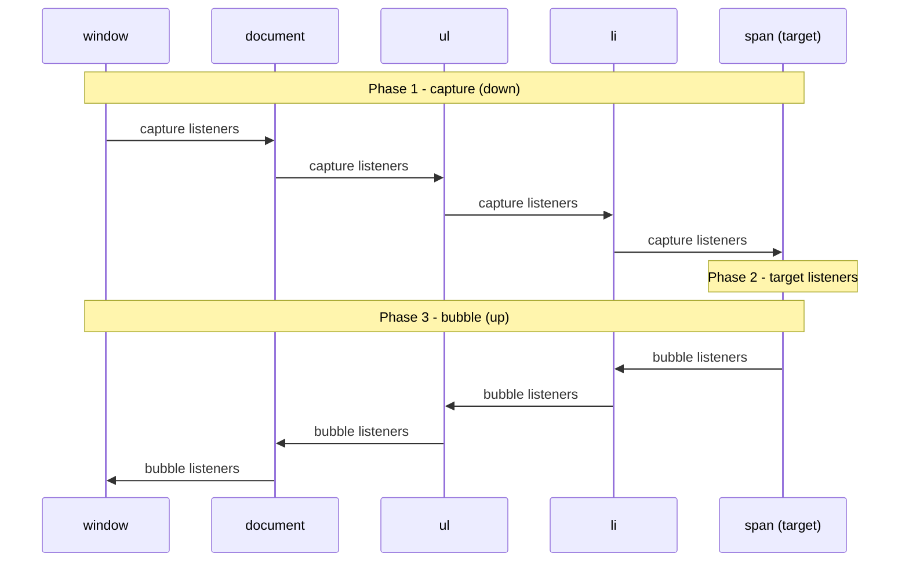
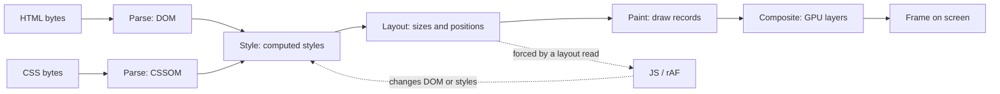
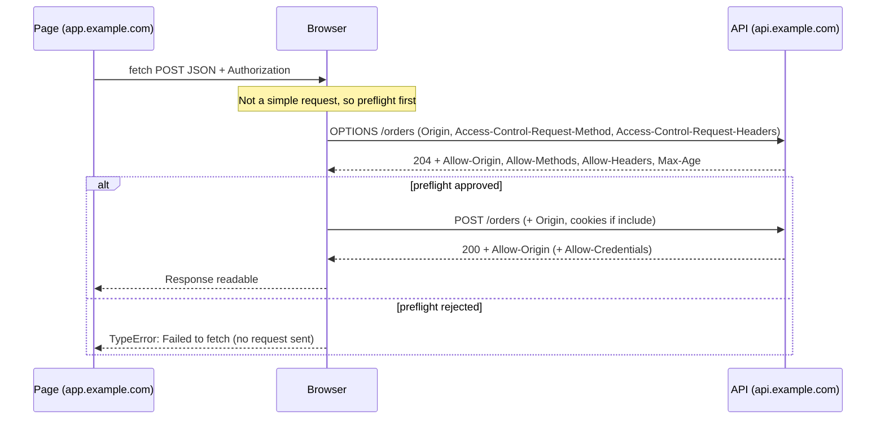

# 03 — Browser and web platform

> **How to use this module.** This is the layer React runs on. Sections 3.1–3.4 (DOM, events, React's event system, the rendering pipeline) explain most "why does my UI behave like that" questions. Sections 3.5–3.9 (storage, `fetch`, CORS, security, HTTP caching) are the web-fundamentals interviewers ask a backend engineer moving to full-stack. Sections 3.10–3.13 are specialist. Short on time: read 3.2, 3.3, 3.4, 3.7, 3.8 and the Summary.

**Prerequisites:** [The event loop](01-javascript.md#116-the-event-loop-call-stack-microtasks-vs-macrotasks-rendering-steps) · [Render phase vs commit phase](06-jsx-and-rendering-model.md#610-render-phase-vs-commit-phase)

**Code for this module:** [`examples/web/src/m03-browser/`](examples/web/src/m03-browser/). Every code file has a test next to it. Run them with `npx vitest run src/m03-browser` from `examples/web`. jsdom is not a browser: it has no layout, no `IntersectionObserver`, no `ResizeObserver`, no `matchMedia` (checked in this repo), so tests here assert what jsdom can really observe (event order, call order, DOM structure) and each section says where a real browser is needed.

**Where this module ends and others begin.** 03 is the platform. The React and Spring specifics live elsewhere and are linked, not repeated: [event loop (01)](01-javascript.md#116-the-event-loop-call-stack-microtasks-vs-macrotasks-rendering-steps), [Web Vitals in React (15.12)](15-performance.md#1512-web-vitals-in-react), [fetching and cancellation in React (17)](17-data-fetching.md#171-fetching-in-effects-and-its-pitfalls), [CORS config in Spring (24.2)](24-react-with-spring-boot.md#242-cors-preflight-credentials-spring-corsconfigurationsource), [JWT vs cookies (24.3)](24-react-with-spring-boot.md#243-auth-options-jwt-in-memory-vs-httponly-cookies), [CSRF with cookie auth (24.5)](24-react-with-spring-boot.md#245-csrf-with-cookie-auth).

---

## 3.1 The DOM tree and the DOM APIs

### The problem
HTML is text. A page needs a live, mutable, queryable model that scripts, styles and assistive technology can share. Without it, every change would mean re-parsing a string, and `innerHTML`-style string concatenation is also how injection bugs happen.

### Mental model
The **DOM** [Browser] is a tree of objects the browser builds by parsing HTML. Elements, text nodes and comments are all **nodes**. JavaScript gets handles to nodes and calls methods on them; the browser reacts by re-styling and repainting.

> **Java/Spring analogy.** The DOM is like the in-memory object graph a Java XML parser (DOM, not SAX) builds, except it is **live**: changing it changes what the user sees, and the browser itself keeps observing it.
>
> **Where the analogy breaks:** a Java `Document` is passive data. The browser DOM is wired to style, layout, painting, focus, accessibility and event dispatch, so a "simple" property read (`el.offsetHeight`) can force the engine to do real work (3.4).

### Minimal code

```ts
const list = document.querySelector<HTMLUListElement>('#list');   // Element | null
const li = document.createElement('li');
li.textContent = userInput;          // safe: inert text, never parsed as markup
list?.append(li);

li.dataset.id = '3';                  // data-id="3"
li.classList.toggle('done', true);    // prefer classes over style strings
li.setAttribute('aria-label', 'Task 3');

const html = '<b>x</b>';
li.innerHTML = html;                  // parsed as markup: an XSS sink if `html` is untrusted (3.8)
```

The tested contrast between `innerHTML` and `textContent` is in [`escapeHtml.test.ts`](examples/web/src/m03-browser/escapeHtml.test.ts).

### How it works internally
- **Node vs Element.** `Node` is the base (`nodeType`, `parentNode`, `childNodes`); `Element` adds attributes, `querySelector`, `closest`, `classList`. `children` is elements only; `childNodes` includes text nodes. `HTMLElement` adds `style`, `dataset`, `offsetWidth`, `focus()`.
- **Collections.** `querySelectorAll` returns a **static** `NodeList`; `getElementsByClassName` and `.children` return **live** collections that change as the DOM changes.
- **Attributes vs properties.** `getAttribute('value')` is the HTML attribute (initial value); `input.value` is the live property. `checked`, `value`, `selected` diverge after user input. React sets *properties* for form state, which is why `defaultValue` vs `value` exists ([14](14-forms-and-actions.md)).
- **The parse model.** The HTML parser is forgiving and fixes bad markup (an unclosed `<p>` closes itself). `innerHTML` runs the same parser on a fragment. `<script>` inserted via `innerHTML` does **not** execute, but event-handler attributes on inserted elements (``) do, so `innerHTML` is still dangerous.
- **`DOMContentLoaded` vs `load`.** The first fires when HTML is parsed and deferred scripts have run; the second after images and sub-resources. `defer` scripts run in order after parsing; `async` scripts run as soon as downloaded, in any order; `type="module"` scripts are deferred by default.
- **Shadow DOM and custom elements** let a component hide its subtree from outer selectors. React renders to light DOM; web components inside React work, with event and property-passing caveats ([10.7](10-refs-and-dom.md#107-integrating-non-react-libraries)).

### Trade-offs
- ✅ Direct DOM APIs are right for measuring, focus, scrolling and integrating non-React code, via refs ([10.2](10-refs-and-dom.md#102-dom-refs-and-when-to-use-them)).
- ❌ Imperative DOM edits to nodes React owns are overwritten or throw on the next commit. React owns the subtree it rendered.
- ❌ DOM operations are not free: each can invalidate style and layout (3.4).

---

## 3.2 Events: capture → target → bubble, `stopPropagation`, `preventDefault`, delegation

### The problem
A user clicks a `<span>` inside an `<li>` inside a `<ul>` inside a `<div>`. Who gets told? And how do you handle clicks on 10,000 rows without 10,000 listeners, including rows that do not exist yet?

### Mental model
An event travels in **three phases** [Browser] (DOM Standard, "dispatching events"):
1. **Capture**: from `window` down to the target's parent.
2. **Target**: at the element itself.
3. **Bubble**: back up to `window` (only if the event `bubbles`).

`addEventListener(type, fn)` listens in the bubble phase; `addEventListener(type, fn, { capture: true })` in the capture phase.



> **Java/Spring analogy.** Capture then bubble is like a servlet filter chain: the request goes **in** through filters (capture), reaches the servlet (target), and the response passes **back out** (bubble). `stopPropagation` is a filter that does not call `chain.doFilter`.
>
> **Where the analogy breaks:** in a filter chain the same code sees both directions. In the DOM, capture and bubble are separate registrations, and most listeners are bubble-only.

### Minimal code
Delegation, tested in [`delegate.ts`](examples/web/src/m03-browser/delegate.ts) (Exercise 1):

```ts
const off = delegate(list, 'click', 'li[data-id]', (event, li) => {
  console.log(li.dataset.id, event.target); // target = the span you clicked, match = the li
});
// later: off();
```

### How it works internally
- **`event.target`** is the node the event originated on; **`event.currentTarget`** is the node whose listener is running right now (it changes as the event travels, and is `null` once dispatch ends). Delegation uses `target.closest(selector)`, because `target` can be a deep child.
- **`stopPropagation()`** prevents the event from reaching *later nodes* on the path. Other listeners on the **same node** still run. **`stopImmediatePropagation()`** also stops the remaining listeners on the same node.
- **`preventDefault()`** cancels the browser's default action (following a link, submitting a form, toggling a checkbox), **not** propagation. The two are independent. It works only if the event is `cancelable` and the listener is not `passive`.
- **Passive listeners.** `{ passive: true }` promises never to call `preventDefault`, so scrolling need not wait for JavaScript. Browsers treat `touchstart`, `touchmove` and `wheel` listeners on `window`, `document` and `body` as passive by default: touch listeners since Chrome 56 ([Chrome blog](https://developer.chrome.com/blog/scrolling-intervention)), `wheel`/`mousewheel` since Chrome 73 ([Chrome blog](https://developer.chrome.com/blog/scrolling-intervention-2)). Calling `preventDefault()` in a passive listener is ignored with a console warning.
- **Which events bubble.** Most do. `focus`, `blur`, `mouseenter`, `mouseleave`, `load`, `error` (on elements) do not; use `focusin`/`focusout` and `mouseover`/`mouseout` to delegate them.
- **Order on one node.** Listeners run in registration order. Per the current DOM Standard, capture listeners on the target itself run before its non-capture listeners: dispatch walks the whole path once with phase "capturing" and once with "bubbling", and the target is in both walks ([DOM Standard: dispatching events](https://dom.spec.whatwg.org/#concept-event-dispatch)). Older engines ran target listeners in registration order regardless of `capture`. > **Unverified:** the Chrome version that adopted the spec order (often quoted as 89); the [chromestatus entry](https://chromestatus.com/feature/5892189387227136) read on 2026-10-04 still says "No active development", so do not rely on capture-before-bubble ordering at the target across browsers.
- **`once`, `signal`.** `{ once: true }` removes the listener after one call. `{ signal }` removes it when the `AbortSignal` aborts, so one `AbortController` can unregister many listeners (the same pattern as 3.6).
- **Microtasks between listeners.** When the user clicks, the browser calls each listener from its own task and the microtask queue is drained **after each listener** returns (the JS stack is empty). When your code calls `el.click()` or `dispatchEvent`, the stack is not empty, so microtasks wait until the whole dispatch finishes. This is why tests (jsdom) using `el.click()` can log a different order than a real click (Exercise 4, [01](01-javascript.md#116-the-event-loop-call-stack-microtasks-vs-macrotasks-rendering-steps)).
- **Trusted vs synthetic events.** `event.isTrusted` is `true` only for browser-generated events. `dispatchEvent(new Event(...))` is untrusted and cannot trigger some default actions (a synthetic `click` on a link does navigate, but synthetic key events do not insert text).

### Trade-offs
- ✅ **Delegation** costs one listener whatever the row count, handles rows added later, and removes the listener bookkeeping.
- ❌ It cannot delegate non-bubbling events without a substitute (`focusin`), and any descendant that calls `stopPropagation` hides the event from the root (a classic bug: a dropdown "click outside" listener that never fires).
- ❌ Capture-phase listeners and `stopPropagation` are global side-channels. Prefer `event.target`/`closest` checks over stopping propagation.
- Prefer `{ signal }` or an unsubscribe function for cleanup; a listener added with an anonymous function can never be removed.

---

## 3.3 How React's event system relates to native events

### The problem
In React you write `<button onClick={…}>`. That is not `addEventListener` on the button. So how do React handlers interact with native listeners, `stopPropagation`, portals and third-party code?

### Mental model
React installs **one listener per event type on the root container** (the element you pass to `createRoot`), in both capture and bubble phases. When a native event reaches the root, React figures out which fibers' handlers apply, builds a **SyntheticEvent** (a cross-browser wrapper around the native event), and calls the handlers in React-tree order. This is delegation, applied by the framework.

> **Java/Spring analogy.** Spring MVC's `DispatcherServlet` is the single front controller; mappings decide which `@Controller` method runs. React's root listener is the dispatcher, and your `onClick` props are the mappings.
>
> **Where the analogy breaks:** `DispatcherServlet` is the *only* servlet for the app. React's dispatcher sits in the middle of the DOM path: native listeners **below** the root (on the element) run before React, listeners **above** it (on `document`, `window`) run after.

### Minimal code
Tested in [`ReactDelegation.tsx`](examples/web/src/m03-browser/ReactDelegation.tsx) and [`ReactDelegation.test.tsx`](examples/web/src/m03-browser/ReactDelegation.test.tsx) (Exercise 1, part B):

```tsx
<button onClick={(e) => e.stopPropagation()}>go</button>
// React 17+: a native listener on `document` will NOT see this click.
// React 16:  a native listener on `document` WOULD still see it (React was on document).
```

### How it works internally
Verified by reading `react-dom` 19.3.0's `react-dom-client.development.js` in this repo's `node_modules`:
- `listenToAllSupportedEvents(rootContainerElement)` registers listeners on the **root container** for every supported event: a capture listener for all of them and a bubble listener for the delegated ones. Events that do not bubble on elements (`scroll`, `load`, media events, `toggle`, …) get **capture-only** listeners at the root and are attached directly to the element where needed. Only `selectionchange` is on `document`.
- The synthetic event's `currentTarget` is reset to `null` after each handler runs (the file sets `event.currentTarget = null` in `executeDispatch`), and `persist()` is an empty function.
- `touchstart`, `touchmove` and `wheel` are registered as passive listeners, so `e.preventDefault()` inside a React `onWheel` does not work (add a native non-passive listener via a ref instead).

Consequences you can rely on:
- **Order for one click** (tested in Exercise 4): document-capture → React capture handlers (`onClickCapture`, at the root, outer to inner) → native listeners on the target element → React bubble handlers (inner to outer) → document-bubble. A native listener on the button runs **before** React's `onClick`.
- **React `e.stopPropagation()`** calls the native `stopPropagation` too. The native event stops at the root, so listeners on `document`/`window` never see it (React 17+).
- **A native `stopPropagation()` below the root starves React.** If a ref-attached native listener on the button stops propagation, no React handler (not even on the same button) runs, because the event never reaches the root.
- **Portals.** Events from a portal bubble through the **React tree**, not the DOM tree, so a click in a modal rendered into `document.body` still reaches an `onClick` on the component that rendered the portal ([10.6](10-refs-and-dom.md#106-portals)).
- **`onFocus`/`onBlur` bubble** in React (unlike native `focus`/`blur`): React uses `focusin`/`focusout` under the hood since 17. `onScroll` stopped bubbling in 17 (it matched the native behaviour).
- **`onChange` on inputs** fires on every keystroke (React maps it to the native `input` event); the native `change` event fires on blur.
- **Event priority.** Discrete events (click, keydown) are flushed synchronously at the end of the event; continuous ones (mousemove, scroll) may be batched or deferred ([21](21-concurrent-ssr-server-components.md)).

> **Version notes.** **React ≤16:** handlers were delegated on `document`; `e.stopPropagation()` could not stop native listeners on `document`, and the workaround was `e.nativeEvent.stopImmediatePropagation()`. Synthetic events were **pooled**: the event object was reused and its fields nulled after the handler, so `setTimeout(() => console.log(e.target))` printed `null` unless you called `e.persist()`. **React 17 (Oct 2020):** delegation moved to the root container, so several React versions (or React plus a micro-frontend) can coexist; pooling was removed; `persist()` became a no-op; `onScroll` stopped bubbling; `onFocus`/`onBlur` use `focusin`/`focusout`. **React 18/19:** unchanged model. Source: [React 17 release post](https://legacy.reactjs.org/blog/2020/10/20/react-v17.html) and the `react-dom` 19.3.0 source read in this repo. See [VERSIONS.md](VERSIONS.md).

> ⚠️ **Correction.** "React attaches handlers to the DOM nodes, so `stopPropagation` in React behaves like the DOM's." Only partly: in React 16 it did not stop `document` listeners; in 17+ it does, but a native listener below the root can still pre-empt React entirely.

### Trade-offs
- ✅ Free delegation, uniform event objects, automatic cleanup when components unmount, event priorities for scheduling.
- ❌ Mixed React/native code has subtle ordering. A "click outside" detector on `document` fails if any React handler stops propagation; use `capture: true` on `document` (it runs before React's root listener) or avoid `stopPropagation`.
- Third-party code that adds listeners to `document` in a React 16 app may behave differently after upgrading to 17.

---

## 3.4 The rendering pipeline: parse → style → layout → paint → composite; reflow and layout thrashing

### The problem
Why is animating `left` janky and animating `transform` smooth? Why does a loop that reads and writes sizes make a page freeze, even though each line looks cheap?

### Mental model
For every frame the browser (a pipeline [Browser], simplified):



- **Style**: which CSS rules apply to each element, producing computed values.
- **Layout (reflow)**: geometry of every box. Changing a size, a font, content or a sibling can invalidate large parts of the tree.
- **Paint**: turn boxes into draw commands (colors, text, borders, shadows).
- **Composite**: stack the painted **layers** on the GPU. Changes that affect *only* compositing skip layout and paint.

> **Java/Spring analogy.** A build with stages: compile (style), link (layout), package (paint), deploy (composite). Changing a late stage's input only reruns the later stages. A change to a `.java` file reruns everything.
>
> **Where the analogy breaks:** a build runs when you ask. The browser runs the pipeline **at most once per frame (~16.7 ms at 60 Hz)** unless your code **forces** it early by reading a layout value.

### Minimal code
`transform` and `opacity` are typically composite-only; `width`, `top`, `margin`, `font-size` trigger layout:

```css
.slide { transition: transform 200ms; }       /* composite only: cheap */
.slide.open { transform: translateX(240px); }
/* vs  left: 240px  -> layout + paint + composite every frame */
```

Layout thrashing, and its fix ([`batchLayout.ts`](examples/web/src/m03-browser/batchLayout.ts), Exercise 3):

```ts
// BAD: each iteration reads (needs fresh layout) after the previous write dirtied it
for (const el of els) el.style.width = el.parentElement!.offsetWidth / 2 + 'px';

// GOOD: all reads, then all writes
const widths = els.map((el) => el.parentElement!.offsetWidth);
els.forEach((el, i) => (el.style.width = `${widths[i]! / 2}px`));
```

### How it works internally
- **Frame timing.** A frame: input events → `requestAnimationFrame` callbacks → style → layout → paint → composite. rAF callbacks run **before** the browser recalculates style and layout for that frame, so they are the right place for DOM writes tied to animation.
- **Forced synchronous layout.** Layout is normally lazy: writes just mark the tree dirty. A **read** of a layout-dependent value (`offsetWidth/Height/Top/Left`, `clientWidth/Height`, `scrollTop/Height`, `getBoundingClientRect()`, `getComputedStyle(el).width`, `innerWidth`) forces the browser to compute layout *now* so the answer is correct. Read, write, read, write alternates "dirty" and "flush" N times: **layout thrashing**. The cost is N layouts instead of 1.
- **What's cheap.** Compositor-only properties: `transform`, `opacity` (and `filter` with a promoted layer). `will-change: transform` hints at a separate layer, but each layer costs GPU memory; use it sparingly and only on elements that are about to animate.
- **Containment.** `contain: layout paint` and `content-visibility: auto` let the browser skip work for off-screen or isolated subtrees.
- **Render-blocking.** CSS blocks rendering (a stylesheet in `<head>` delays first paint); synchronous scripts block the HTML parser. `defer`/`async`/`type="module"` avoid the parser block. `<link rel="preload">` and `fetchpriority` steer discovery (3.11).
- **Main thread vs compositor.** Compositor-only animations can keep running while the main thread is busy; layout-based ones stall with it. A task longer than **50 ms** is a *long task* (3.11, 3.13).
- **Where React fits.** React's render and commit ([06](06-jsx-and-rendering-model.md#610-render-phase-vs-commit-phase)) are JavaScript on the main thread before the pipeline. `useLayoutEffect` runs after DOM changes but **before paint**, so a measurement there is a forced layout, and a `setState` there triggers a second synchronous render ([9.7](09-effects.md#97-uselayouteffect)).
- **jsdom caveat.** jsdom has no layout engine: `offsetWidth` is `0`, `getBoundingClientRect()` returns zeros, nothing is ever "forced". You **cannot** measure thrashing in unit tests; you can test the **order** of reads and writes (Exercise 3). Measure real thrashing in the browser's Performance panel: the "Forced reflow" warning and purple "Layout" blocks inside your function.

### Trade-offs
- ✅ Batch reads then writes; animate `transform`/`opacity`; use `ResizeObserver` (3.12) instead of polling sizes.
- ✅ Leave frame-sized work to the browser: CSS animations/transitions and the Web Animations API run off the main thread when composite-only.
- ❌ `will-change` everywhere, huge DOMs (thousands of nodes make every layout expensive; virtualize, [15.8](15-performance.md)), and measuring in a loop.
- ❌ A "fix" with `requestAnimationFrame` that still interleaves reads and writes inside the callback fixes nothing. The order is the fix, not the timing.

---

## 3.5 Storage: cookies, localStorage, sessionStorage, IndexedDB, Cache API

### The problem
You need to remember something across reloads (a theme, a draft, a session), or make the app work offline. Five different stores exist, with different size, lifetime, security and API characteristics. Choosing wrongly gives you XSS-stealable tokens, jank from synchronous I/O, or data that vanishes.

### Mental model
| Store | Capacity (order of magnitude) | API | Sent to server? | Lifetime | JS-readable? | Typical use |
|---|---|---|---|---|---|---|
| **Cookie** | ~4 KB each | `document.cookie` / `Set-Cookie` | **Yes**, on every matching request | Session or until `Max-Age`/`Expires` | Unless `HttpOnly` | Session id, CSRF token |
| **`localStorage`** | ~5 MB per origin | Sync, strings | No | Until cleared | Yes | Theme, small preferences |
| **`sessionStorage`** | ~5 MB per origin | Sync, strings | No | One tab (browsing context) | Yes | Wizard state, per-tab draft |
| **IndexedDB** | Large (a share of disk quota) | Async, structured data | No | Until cleared | Yes (also in workers) | Offline data, big caches |
| **Cache API** | Same quota as IndexedDB | Async, `Request`→`Response` | No | Until deleted (no auto-expiry) | Yes (also in service workers) | Offline assets and responses |

> **Java/Spring analogy.** Cookie ≈ the `JSESSIONID` header the container sets and the browser replays. `localStorage` ≈ a tiny `ConcurrentHashMap<String,String>` per origin that lives in the client. IndexedDB ≈ an embedded database (H2/SQLite). The Cache API ≈ an HTTP-aware key-value cache keyed by request.
>
> **Where the analogy breaks:** all of it is **user-controlled**: the user can clear it, the browser can evict it under storage pressure (unless `navigator.storage.persist()` is granted), and in private modes it may be disabled or short-lived. Never treat it as a database of record.

### Minimal code
Defensive JSON in `localStorage` ([`storage.ts`](examples/web/src/m03-browser/storage.ts)): both reads and writes can throw.

```ts
const theme = readJson(localStorage, 'theme', 'light');
const ok = writeJson(localStorage, 'theme', 'dark'); // false on quota/disabled storage
```

A `Set-Cookie` builder that enforces what browsers enforce ([`cookies.ts`](examples/web/src/m03-browser/cookies.ts)):

```ts
serializeCookie('__Host-sid', id, { secure: true, httpOnly: true, sameSite: 'Lax', path: '/', maxAgeSeconds: 3600 });
// "__Host-sid=…; Max-Age=3600; Path=/; Secure; HttpOnly; SameSite=Lax"
```

### How it works internally
**Cookie attributes** (RFC 6265bis, the living update of RFC 6265):

| Attribute | Effect |
|---|---|
| `Domain=` | Omitted: **host-only** cookie (exact host). Set: also sent to subdomains. |
| `Path=` | Sent only for URLs under that path. It is **not** a security boundary (any same-origin script can read across paths). |
| `Max-Age` / `Expires` | Persistent vs session cookie. `Max-Age` wins. Chrome caps lifetime at 400 days (since Chrome 104, [Chrome blog](https://developer.chrome.com/blog/cookie-max-age-expires)). |
| `Secure` | HTTPS only (and required for `SameSite=None`, `__Secure-`, `__Host-`). |
| `HttpOnly` | Not visible to `document.cookie`: stops script theft of the value, **not** CSRF, and an XSS can still make authenticated requests. |
| `SameSite=Strict\|Lax\|None` | Whether the cookie is sent on **cross-site** requests (3.8). |
| `Partitioned` (CHIPS) | Third-party cookie keyed by the top-level site, so it cannot track across sites. |
| `__Host-` / `__Secure-` prefix | The browser rejects the cookie unless it is `Secure` (and for `__Host-`: `Path=/`, no `Domain`). Prevents subdomain overwrites. |

- **`SameSite` defaults.** Chrome and Edge treat a cookie with no `SameSite` as `Lax` (since Chrome 80, 2020; [web.dev](https://web.dev/articles/samesite-cookies-explained), [Chromium SameSite updates](https://www.chromium.org/updates/same-site/)). Not every browser does the same; set it explicitly.
- **Same-site vs same-origin.** **Origin** = scheme + host + port. **Site** = scheme + registrable domain (eTLD+1, from the Public Suffix List). `app.example.com` and `api.example.com` are *same-site* but *cross-origin*: CORS applies (3.7), cookies with `SameSite=Strict` are still sent.
- **`localStorage` semantics.** Synchronous and on the main thread (a big `setItem` blocks). Values are **strings** (`JSON.stringify` yourself). Shared across all tabs of the origin, and a `storage` event fires in the **other** tabs (not the one that wrote) so tabs can sync. `sessionStorage` is per tab and survives reload, but not tab close; a tab opened by `window.open` gets a copy.
- **IndexedDB.** Asynchronous, transactional, key/value with indexes, stores anything the **structured clone** algorithm supports (objects, `Map`, `Blob`, `ArrayBuffer`; not functions or DOM nodes). Usable in workers. The raw API is verbose and event-based; use a wrapper (`idb`, Dexie).
- **Cache API.** `caches.open('v1')` → `cache.put(request, response)`; matching is by URL (+ `Vary`). It does **not** follow HTTP caching headers: it only stores what you put and keeps it until you delete it. It is the storage layer of service-worker strategies (3.10).
- **Quota and eviction.** `navigator.storage.estimate()` reports usage/quota; `navigator.storage.persist()` asks for eviction protection. Safari applies stricter limits to script-writable storage that goes unused: since 2020 ITP deletes IndexedDB, localStorage, sessionStorage, service worker registrations and caches after seven days of browser use without user interaction on the site ([WebKit blog, March 2020](https://webkit.org/blog/10218/full-third-party-cookie-blocking-and-more/); check WebKit's [tracking prevention policy](https://webkit.org/tracking-prevention/) for later changes).
- **Third-party cookie phase-out status.** Chrome announced in 2020 a plan to remove third-party cookies, delayed it repeatedly, and on **22 April 2025** announced it would keep its current approach and **not** roll out a standalone prompt, leaving cookies available by default and controlled in settings; in **October 2025** Google announced retiring most of the Privacy Sandbox APIs. Safari (ITP) and Firefox (Total Cookie Protection) already block or partition third-party cookies by default, and Chrome blocks them by default only in Incognito or when the user opts in ([MDN: third-party cookies](https://developer.mozilla.org/en-US/docs/Web/Privacy/Guides/Third-party_cookies)). Sources: [Next steps for Privacy Sandbox (22 April 2025)](https://privacysandbox.google.com/blog/privacy-sandbox-next-steps), [Update on plans for Privacy Sandbox technologies (17 October 2025)](https://privacysandbox.google.com/blog/update-on-plans-for-privacy-sandbox-technologies), which names Attribution Reporting, Protected Audience, Topics, Shared Storage, Related Website Sets and others as retired and keeps CHIPS and FedCM.

> **Unverified:** the Chrome versions in which the retired Privacy Sandbox APIs are actually removed. Check [privacysandbox.google.com](https://privacysandbox.google.com) and Chrome's release notes before quoting a version. Design as if third-party cookies do not work (CHIPS, first-party cookies, `Partitioned`, Storage Access API), which is safe under both outcomes.

### Trade-offs
- **Auth tokens.** `localStorage` is readable by any script on the page (XSS = token theft). An `HttpOnly; Secure; SameSite` cookie cannot be read by script but needs CSRF defenses. The full comparison is in [24.3](24-react-with-spring-boot.md#243-auth-options-jwt-in-memory-vs-httponly-cookies).
- ✅ `localStorage` for small, non-sensitive, synchronous-friendly preferences. ❌ Large or frequently-written data (blocks the main thread) and anything secret.
- ✅ IndexedDB for structured, large or offline data. ❌ For a handful of strings it is overkill.
- ❌ Cookies add bytes to **every** request to that origin, including images; keep them small and scope them to the API host.
- A `useLocalStorage` hook must also handle the SSR/hydration mismatch and the cross-tab `storage` event ([12.7](12-hooks-and-custom-hooks.md)).

---

## 3.6 `fetch`, `Request`/`Response`, streaming bodies, `AbortController`

### The problem
`XMLHttpRequest` was callback-based and clumsy. `fetch` [Browser] is promise-based, but it has traps: it does not reject on HTTP errors, a body can be read only once, there is no built-in timeout, and cancellation is a separate object.

### Mental model
`fetch(input, init)` returns a `Promise<Response>` that resolves **when the response headers arrive**. The body is a **stream** read later (`res.json()`, `res.text()`, `res.body`). A promise resolves with *any* HTTP status; it rejects only on network failure, a CORS violation, or an abort.

> **Java/Spring analogy.** `Request`/`Response` are like `HttpRequest`/`HttpResponse` in `java.net.http.HttpClient` (async, `CompletableFuture`), and `res.body` is like `BodyHandlers.ofInputStream()`. `AbortController` is `future.cancel(true)`.
>
> **Where the analogy breaks:** `HttpClient` can set a per-request timeout (`.timeout(Duration)`); `fetch` has none by default. And `res.ok` is something you must check yourself, unlike `RestClient`, which throws on 4xx/5xx by default.

### Minimal code
A wrapper with a deadline, caller cancellation and typed errors ([`fetchJson.ts`](examples/web/src/m03-browser/fetchJson.ts), Exercise 2):

```ts
const controller = new AbortController();
try {
  const user = await fetchJson<User>('/api/me', { timeoutMs: 5000, signal: controller.signal });
} catch (e) {
  if (e instanceof TimeoutError) { /* deadline */ }
  else if (e instanceof HttpError) { /* e.status, e.body */ }
  else if (e instanceof DOMException && e.name === 'AbortError') { /* we cancelled */ }
}
```

### How it works internally
- **`Request`/`Response`/`Headers`.** Plain objects of the Fetch Standard. `new Request(url, init)` then `fetch(request)`; `res.clone()` tees the body so it can be read twice. A body can be consumed **once** (`bodyUsed`); a second `res.json()` throws `TypeError`.
- **Key options.** `method`, `headers`, `body` (string, `FormData`, `Blob`, `URLSearchParams`, stream), `credentials` (`'same-origin'` is the default; `'include'` sends cookies cross-origin, 3.7), `mode` (`'cors'` default; `'no-cors'` gives an **opaque** response you cannot read), `cache` (HTTP cache mode: `'no-store'`, `'reload'`, `'force-cache'`, …), `redirect`, `signal`, `keepalive` (lets a request outlive the page, for analytics on unload), `priority`/`fetchpriority`.
- **Content-Type.** Passing a `FormData` body: do **not** set `Content-Type`, the browser adds the multipart boundary. Passing a JSON string: set `Content-Type: application/json` yourself (and note that triggers a CORS preflight, 3.7).
- **Streaming responses.** `res.body` is a `ReadableStream<Uint8Array>`. Read chunks with `getReader()` or pipe through `TextDecoderStream`; this is how progressive rendering, NDJSON and server-sent token streams work:

```ts
const res = await fetch('/api/stream');
const reader = res.body!.pipeThrough(new TextDecoderStream()).getReader();
for (let r = await reader.read(); !r.done; r = await reader.read()) append(r.value);
```

  (Server-Sent Events have their own `EventSource` API with auto-reconnect; see [17.11](17-data-fetching.md#1711-real-time-websockets-and-sse-plus-cache-integration).)
- **Streaming request bodies** need `duplex: 'half'` and HTTP/2+; support is Chromium-first. Upload **progress** is easier with `XMLHttpRequest.upload.onprogress` (fetch has no upload-progress event).
- **Abort.** `controller.abort()` rejects the pending `fetch` (and any in-progress body read) with `signal.reason`, by default a `DOMException` named `AbortError`. An abort cancels the *client's wait*; the server may still process the request (an abort is not a rollback; keep non-idempotent writes idempotent).
- **Timeouts.** `AbortSignal.timeout(ms)` (a signal that aborts with a `TimeoutError` DOMException; Baseline since April 2024, [web-features](https://web-platform-dx.github.io/web-features-explorer/features/abortsignal-timeout/); Node 17.3 / 16.14) and `AbortSignal.any([a, b])` (combine; Chrome 116, Firefox 124, Safari 17.4, so Baseline since March 2024 and Widely available since September 2026, [web-features](https://web-platform-dx.github.io/web-features-explorer/features/abortsignal-any/); Node 20.3 / 18.17, [Node globals](https://nodejs.org/api/globals.html)) are the native building blocks. The wrapper in this module uses `setTimeout` + `AbortController` so that (a) fake timers can drive it and (b) it does not depend on `AbortSignal.any`.
  Node 24's `AbortSignal.timeout` does not follow Vitest fake timers (verified by running it with Vitest 5: advancing fake timers via `vi.advanceTimersByTime()` does not trigger the abort). It uses Node's internal timer rather than the patched global `setTimeout`, which is why this module's wrapper uses `setTimeout` + `AbortController` instead.
- **Errors.** Network failure, DNS failure and CORS failure all surface as a bare `TypeError: Failed to fetch` with no detail (a deliberate leak-prevention). Open DevTools → Network/Console for the real reason.
- **React integration.** Create the `AbortController` in the effect and abort in the cleanup ([9.4](09-effects.md#94-race-conditions-and-abortcontroller), [17.1](17-data-fetching.md#171-fetching-in-effects-and-its-pitfalls), [17.12](17-data-fetching.md#1712-request-deduplication-retries-cancellation)). Treat an abort as "superseded", not an error.

### Trade-offs
- ✅ `fetch` is built in, streaming-capable and works in service workers and Node 18+.
- ❌ No timeout, no retry, no interceptors, no automatic JSON/ error handling: write a thin wrapper (as here) or use a library (TanStack Query for caching/retries, [17.4](17-data-fetching.md#174-tanstack-query-query-keys-staletime-vs-gctime)). Do not copy-paste five `fetch` calls with five error conventions.
- ❌ An aborted read-then-write sequence can leave server state half-changed; design endpoints to be idempotent.

---

## 3.7 CORS from the browser's side: simple vs preflighted, credentials

### The problem
`fetch('https://api.other.com/data')` from `https://app.example.com` fails with a CORS error in the console, although `curl` works. Why, and who is the browser protecting?

### Mental model
The **same-origin policy** [Browser] stops a page from *reading* responses from another origin. **CORS** (Cross-Origin Resource Sharing) is the opt-in relaxation: the *server* says, via headers, which origins may read its responses. **The browser enforces it; the server only declares it.** It is a protection for the **user's browser** (so a malicious site cannot read your bank's pages with your cookies), not an access control for the server. `curl` and Postman never apply it.

> **Java/Spring analogy.** `@CrossOrigin` / `CorsConfigurationSource` (see [24.2](24-react-with-spring-boot.md#242-cors-preflight-credentials-spring-corsconfigurationsource)) emit the headers. Treat them like declaring a firewall allow-list rather than authentication.
>
> **Where the analogy breaks:** a firewall blocks the request. For a **simple** cross-origin request the request **is sent and executed**; CORS only stops the page from *reading* the response. That is why CORS is not a CSRF defense (3.8).

### Minimal code
A request that **will** be preflighted (JSON content type and `Authorization` are not CORS-safelisted):

```ts
await fetch('https://api.example.com/orders', {
  method: 'POST',
  headers: { 'Content-Type': 'application/json', Authorization: `Bearer ${token}` },
  body: JSON.stringify(order),
  credentials: 'include', // send cookies cross-origin: needs the stricter server headers below
});
```



### How it works internally
- **Simple requests** (no preflight): method `GET`, `HEAD` or `POST`; only **CORS-safelisted request headers** (`Accept`, `Accept-Language`, `Content-Language`, `Content-Type`, plus a few); and for `Content-Type` only `application/x-www-form-urlencoded`, `multipart/form-data` or `text/plain`. These are exactly the requests a plain HTML `<form>` could always send, which is why they are allowed without asking.
- **Preflighted requests**: anything else (`PUT`, `PATCH`, `DELETE`; custom headers such as `Authorization`, `X-CSRF-Token`; `Content-Type: application/json`). The browser first sends `OPTIONS` with `Origin`, `Access-Control-Request-Method`, `Access-Control-Request-Headers` and **no body and no cookies**. The server must answer 2xx with `Access-Control-Allow-Origin`, `Access-Control-Allow-Methods`, `Access-Control-Allow-Headers`. `Access-Control-Max-Age` caches the answer (browsers cap it: Chrome 2 hours, Firefox 24 hours; check current values).
- **The response headers the actual request needs.** `Access-Control-Allow-Origin` must be the requesting origin or `*`. The browser only lets JavaScript read **CORS-safelisted response headers** unless the server lists others in `Access-Control-Expose-Headers` (a frequent "why can't I read `Location`/`X-Total-Count`" bug).
- **Credentials.** Cookies and HTTP auth are sent cross-origin only with `credentials: 'include'`. Then the server **must** send `Access-Control-Allow-Credentials: true`, and `Access-Control-Allow-Origin` **must be a specific origin**: `*` is rejected for credentialed requests (same for `Allow-Headers: *` and `Allow-Methods: *`). Echoing the request's `Origin` requires `Vary: Origin` so shared caches do not serve one origin's headers to another.
- **Cookies still need `SameSite`.** A cross-**site** request with credentials needs the cookie to be `SameSite=None; Secure` (3.5). A cross-origin but same-site call (`app.` → `api.example.com`) works with `Lax`.
- **`mode: 'no-cors'`** yields an *opaque* response (status 0, no body readable). It exists for fire-and-forget (analytics) and for ``/`<script>` loads, not as a "fix" for a CORS error.
- **Not preflighted: ``, `<script src>`, `<link>`, forms.** These embed or navigate and were never subject to read restrictions. (JSONP exploited this; never use it.)
- **Errors** appear in the console, but the JavaScript sees only `TypeError: Failed to fetch`. A **redirect** on a preflighted request fails; configure the final URL.
- **A dev proxy** (Vite `server.proxy`) makes API calls same-origin, avoiding CORS locally; production still needs the real configuration or the same proxying at a gateway ([24.1](24-react-with-spring-boot.md)).

### Trade-offs
- ✅ Prefer **same-origin** deployment (API behind the same host/gateway) when you can: no CORS, no preflight latency, simpler cookies.
- ❌ `Access-Control-Allow-Origin: *` with an "allow origin reflection" shortcut is a vulnerability: reflecting any `Origin` with `Allow-Credentials: true` lets any site read authenticated responses. Allow-list origins.
- ❌ Preflights add a round trip for each distinct URL until `Max-Age` caches them. Avoid by staying simple where cheap (but do not contort a design for it).
- Debug order: is it **blocked before sending** (preflight failed) or **blocked after receiving** (missing `Allow-Origin` on the actual response)? The Network tab shows the `OPTIONS` row.

---

## 3.8 Web security: XSS, CSRF, CSP, clickjacking, `SameSite`, Trusted Types

### The problem
Your page runs in the user's browser with the user's cookies, next to other sites' tabs. Three families of attack matter for a full-stack developer: **injected script** (XSS), **forged requests** from another site (CSRF), and **being framed** (clickjacking). Each has a root cause, a primary defense and defense-in-depth.

### Mental model
| Attack | Root cause | Primary defense | Defense in depth |
|---|---|---|---|
| **XSS** (attacker script runs *in your origin*) | Untrusted data interpreted as code/markup | Contextual output encoding; framework auto-escaping; no raw HTML sinks | CSP, Trusted Types, `HttpOnly` cookies, sanitizer (DOMPurify) when you must render HTML |
| **CSRF** (another site makes the user's browser send an authenticated request) | The browser attaches cookies automatically, whoever triggered the request | `SameSite` cookies **plus** anti-CSRF tokens or Origin/Fetch-Metadata checks | Re-authentication for sensitive actions, custom header requirement |
| **Clickjacking** (your page is framed and the user clicks something invisible) | Page can be embedded | CSP `frame-ancestors` | `X-Frame-Options` (legacy), `SameSite` |

> **Java/Spring analogy.** Spring Security gives you `CsrfFilter`, `Content-Security-Policy` and frame-options headers; Thymeleaf's `th:text` escapes by default, `th:utext` does not (React's `dangerouslySetInnerHTML` is `th:utext`).
>
> **Where the analogy breaks:** a server template escapes once at render. A client app has many sinks at runtime (`innerHTML`, `href`, `eval`, `postMessage`, URL-built `script` tags) and can create XSS **without the server ever seeing the payload** (DOM XSS).

### Minimal code
Output encoding and URL allow-listing, tested in [`escapeHtml.ts`](examples/web/src/m03-browser/escapeHtml.ts) and [`escapeHtml.test.ts`](examples/web/src/m03-browser/escapeHtml.test.ts):

```ts
box.textContent = untrusted;                     // inert
box.innerHTML = escapeHtml(untrusted);           // safe in a text/quoted-attribute context only
isSafeHttpUrl(userSuppliedHref);                  // escaping does NOT neutralize "javascript:"
```

A strict CSP header (set by the server, here as an example value):

```http
Content-Security-Policy: default-src 'self'; script-src 'self' 'nonce-r4nd0m'; object-src 'none'; base-uri 'none'; frame-ancestors 'none'; require-trusted-types-for 'script'
```

### How it works internally
**XSS types.** *Stored*: the payload is saved (a comment) and served to every viewer. *Reflected*: the payload is in the request (a search URL) and echoed in the response. *DOM-based*: client-side code moves attacker-controlled data (`location.hash`, `postMessage`, an API response) into a sink without the server being involved.

**React's position.** JSX escapes text and attribute values, so `<p>{userInput}</p>` is safe. The ways around it:
- `dangerouslySetInnerHTML={{ __html }}`: a raw sink. Sanitize with DOMPurify on the **final HTML string** and keep the sanitizer current.
- `href={userUrl}` / `src`: `javascript:` URLs. React 16.9 warned; **React 19 blocks them** (the string "React has blocked a javascript: URL as a security precaution." appears in `react-dom` 19.3.0 in this repo's `node_modules`). Still allow-list schemes yourself.
- `eval`, `new Function`, `setTimeout(string)`, `document.write`, unsafe `ref.current.innerHTML`, server-rendered HTML injected into `<script>` JSON (escape `<`), user-controlled `style`/`<a target=_blank>` (use `rel=noopener`, default in modern browsers).
- Third-party scripts and npm packages: a **supply-chain** XSS. Pin versions, review lockfile changes, use Subresource Integrity (`integrity=` on CDN tags).

**CSP** [Browser] is a response header listing where resources may come from. With a **nonce** (`'nonce-…'`, new each response) or hash, inline scripts without it do not run, so an injected `<script>` or `onerror=` attribute is blocked. `'strict-dynamic'` lets nonce-approved scripts load others. `object-src 'none'` and `base-uri 'none'` close classic bypasses. Roll out with `Content-Security-Policy-Report-Only` and a reporting endpoint first. `'unsafe-inline'`/`'unsafe-eval'` in `script-src` largely defeat it. (Vite dev mode injects inline scripts for HMR; production builds are CSP-friendly, but check your tooling.)

**Trusted Types** [Browser] go further for DOM XSS: with `require-trusted-types-for 'script'`, DOM sinks (`innerHTML`, `eval`, `script.src`…) throw unless given a `TrustedHTML`/`TrustedScript`/`TrustedScriptURL` produced by a named policy. You then audit a few policy functions instead of every `innerHTML` in the codebase. React 19.3 added Trusted Types support (VERSIONS.md, [React 19.3 post](https://react.dev/blog/2026/09/09/react-19-3)).
It shipped in Chromium (83, 2020) first; Safari followed in September 2025 and Firefox in February 2026, so Trusted Types became Baseline Newly available on 2026-02-24 ([web-features: Trusted Types](https://web-platform-dx.github.io/web-features-explorer/features/trusted-types/)). Users on older Safari/Firefox still get no enforcement, so keep it as defense in depth.

**CSRF.** A malicious page does `<form action="https://bank.com/transfer" method="POST">` and auto-submits. If the user is logged in with a cookie, the browser attaches it. Defenses, from the stack's point of view:
1. **`SameSite=Lax`/`Strict` cookies** stop the cookie being sent on most cross-site requests (Lax still sends it on top-level `GET` navigations, so `GET` must never change state). Chrome applies `Lax` by default (3.5), with a short-lived exception for top-level cross-site `POST` right after the cookie is set ("Lax+POST", cookies at most 2 minutes old) that Chromium calls temporary, so you should not rely on it ([Chromium SameSite updates](https://www.chromium.org/updates/same-site/)).
2. **Anti-CSRF token** (synchronizer token, or the double-submit cookie variant) that an attacker page cannot read (same-origin policy).
3. **Check `Origin`/`Referer`** and the **`Sec-Fetch-Site`** header on the server (`same-origin`, `same-site`, `cross-site`, `none`).
4. A **custom header** (`X-Requested-With`) on an API: forces a CORS preflight for cross-site calls, which an unapproved origin fails. It works because of 3.7, but is weaker than tokens.
5. A **token in `Authorization`** (not a cookie) is not auto-attached, so it is not CSRF-able, and is XSS-stealable if kept in `localStorage`.
Spring specifics (the `CsrfFilter`, `XSRF-TOKEN` cookie, `CookieCsrfTokenRepository`) are in [24.5](24-react-with-spring-boot.md#245-csrf-with-cookie-auth); the cookie-vs-JWT trade-off is [24.3](24-react-with-spring-boot.md#243-auth-options-jwt-in-memory-vs-httponly-cookies).

**Clickjacking.** The attacker frames your page invisibly under a decoy button. Send `Content-Security-Policy: frame-ancestors 'none'` (or `'self'`/an allow-list); `X-Frame-Options: DENY|SAMEORIGIN` is the legacy equivalent. A `<meta>` CSP tag **cannot** set `frame-ancestors`; it must be an HTTP header.

**Other headers worth naming:** `Strict-Transport-Security` (HSTS), `X-Content-Type-Options: nosniff`, `Referrer-Policy`, `Permissions-Policy`, and `Cross-Origin-Opener-Policy`/`Cross-Origin-Embedder-Policy` (needed for cross-origin isolation, 3.13). Reference: [OWASP Cheat Sheet Series](https://cheatsheetseries.owasp.org/) (XSS Prevention, CSRF Prevention, Content Security Policy).

### Trade-offs
- ✅ Do the cheap, high-yield things first: rely on JSX escaping, no raw HTML sinks, scheme allow-list for URLs, `HttpOnly; Secure; SameSite` cookies, a CSP in Report-Only then enforced, `frame-ancestors`.
- ❌ `HttpOnly` is not an XSS defense. An attacker with script execution can call your API from the victim's session without ever reading the cookie.
- ❌ Client-side validation, hiding a button, or CORS are not security controls. The server must authorize every request.
- ❌ A strict CSP in a legacy app with inline scripts is real work; start with `Report-Only`, move inline code to files, and add nonces from the server framework.

---

## 3.9 HTTP caching: `Cache-Control`, ETag, validation, immutable assets

### The problem
Fast sites avoid re-downloading unchanged files. But if you cache too aggressively, users run last week's JavaScript against today's API; if too little, every visit pays full cost. A SPA shell and its hashed bundles need **different** policies.

### Mental model
HTTP caching (RFC 9111) has two questions: **is the stored copy fresh** (reuse it without asking), and if stale, **is it still valid** (ask the server cheaply, "has it changed?", via a conditional request, and get a `304 Not Modified` with no body).

> **Java/Spring analogy.** Freshness is `@Cacheable` with a TTL. Validation is an ETag/`If-None-Match` check, which Spring provides via `ShallowEtagHeaderFilter` or `ResponseEntity.eTag(...)`.
>
> **Where the analogy breaks:** you do not control the cache. It is a distributed set of browser caches, CDNs and proxies you cannot flush, so the **URL is your invalidation key**: change the filename, not the cache entry.

### Minimal code
Parsing and interpreting the header, tested in [`cacheControl.ts`](examples/web/src/m03-browser/cacheControl.ts):

```ts
parseCacheControl('public, max-age=31536000, immutable');   // { public: true, 'max-age': '31536000', immutable: true }
browserFreshnessSeconds('no-cache, max-age=600');            // 0: store, but revalidate every time
isImmutableAsset('public, max-age=31536000, immutable');     // true
```

The standard SPA policy:

```http
# index.html (its URL never changes, so it must be revalidated)
Cache-Control: no-cache

# /assets/app.3f9a1c.js  (the hash is in the name, so the content never changes)
Cache-Control: public, max-age=31536000, immutable
```

### How it works internally
- **Freshness.** `Cache-Control: max-age=N` (seconds; the response is fresh for N seconds from generation), `s-maxage` (shared caches/CDN only), `Expires` (older absolute date). Without any explicit lifetime, caches may apply **heuristic freshness** (commonly 10% of the time since `Last-Modified`), a source of "why is my file stale" surprises: always send explicit headers.
- **`no-cache` does not mean "do not cache".** It means "store it, but **revalidate before every reuse**". **`no-store`** means "do not store". Mixing them up is a classic interview trap and a classic data-leak bug (sensitive responses need `no-store`).
- **`private` vs `public`.** `private`: only the user's browser may store it (personalized responses). `public`: shared caches may too. `must-revalidate`: once stale, do not serve it without validating, even if disconnected.
- **Validators.** The server sends `ETag: "abc"` (an opaque version) and/or `Last-Modified`. When stale, the cache sends `If-None-Match: "abc"` / `If-Modified-Since`; an unchanged resource returns `304` with no body and the cached copy is reused. Weak ETags (`W/"abc"`) mean "semantically equivalent".
- **`immutable`** (RFC 8246): the resource will not change during its freshness lifetime, so the browser skips revalidation even on reload (which otherwise revalidates everything).
- **`stale-while-revalidate=N`** (RFC 5861): serve stale immediately and refresh in the background for N more seconds. `stale-if-error` serves stale when the origin fails.
- **`Vary`.** Tells caches which request headers select a variant (`Vary: Accept-Encoding`, `Vary: Origin` for CORS reflection, 3.7). `Vary: *` effectively disables caching.
- **Reload behavior.** Navigation reuses fresh entries. A normal **reload** revalidates the main resource; a **hard reload** bypasses the cache. DevTools "Disable cache" affects only the open panel.
- **Back/forward cache (bfcache)** restores a whole page, including JS heap, instantly. `Cache-Control: no-store` and `unload` handlers used to disqualify pages; check current Chrome rules. It is separate from the HTTP cache.
- **`fetch` `cache` option** maps to these modes (`'no-store'`, `'reload'`, `'no-cache'`, `'force-cache'`, `'only-if-cached'`).
- **Bundlers.** Vite and webpack emit **content-hashed filenames** so each deploy gets new URLs for changed files while unchanged chunks stay cached. A deploy that deletes old hashed files breaks users still holding the old `index.html` (they request `app.OLD.js` and get 404; keep old assets for a while).

### Trade-offs
- ✅ HTML: `no-cache` (or short `max-age` + `stale-while-revalidate`). Hashed static assets: one year + `immutable`. API GETs: explicit headers per endpoint; `private, no-cache` + ETag for personalized data.
- ❌ Long `max-age` on a non-hashed URL (`/app.js`) cannot be revoked. ❌ A CDN caching responses that vary by cookie/auth without `private`/`Vary`: one user's data served to another.
- Application-level caches (TanStack Query's `staleTime`) are a separate layer on top of HTTP caching ([17.4](17-data-fetching.md#174-tanstack-query-query-keys-staletime-vs-gctime)): fetched data may be served from the browser cache **and** your client cache.

---

## 3.10 Service workers and PWA basics

### The problem
A normal page cannot work offline, receive push messages, or control caching of its own requests. Before service workers the answer was **Application Cache (AppCache)**: a manifest file listing URLs. It was declarative and brittle (it cached the HTML page that referenced the manifest forever, updates required changing the manifest bytes, no way to run logic), and it has been removed from the platform.

### Mental model
A **service worker** [Browser] is a JavaScript file the browser runs in a separate background context, **between the page and the network**. It intercepts `fetch` events from pages in its scope and decides: answer from the Cache API, go to the network, or combine.

> **Java/Spring analogy.** A client-side reverse proxy with caching, like a servlet filter that sits in front of every outgoing request, plus an event-driven lifecycle.
>
> **Where the analogy breaks:** it is **not running all the time**. The browser starts it for events and stops it when idle, so module-level variables are not durable state (use IndexedDB/Cache), and a buggy worker can keep serving a broken app until it is updated.

### Minimal code
Registration (page) and a minimal worker:

```ts
// main.ts
if ('serviceWorker' in navigator) {
  navigator.serviceWorker.register('/sw.js'); // must be served over HTTPS (localhost is exempt)
}
```

```js
// sw.js: cache-first for the app shell, network for everything else
const SHELL = 'shell-v3';
self.addEventListener('install', (e) =>
  e.waitUntil(caches.open(SHELL).then((c) => c.addAll(['/', '/offline.html']))));
self.addEventListener('activate', (e) =>
  e.waitUntil(caches.keys().then((ks) => Promise.all(ks.filter((k) => k !== SHELL).map((k) => caches.delete(k))))));
self.addEventListener('fetch', (e) => {
  if (e.request.mode === 'navigate') {
    e.respondWith(fetch(e.request).catch(() => caches.match('/offline.html')));
  }
});
```

### How it works internally
- **Lifecycle.** `register` → **installing** (`install` event: pre-cache) → **waiting** (a previous worker still controls open pages) → **activating** (`activate` event: delete old caches) → **activated**. `self.skipWaiting()` skips waiting; `clients.claim()` takes control of open pages immediately. A new worker takes effect only after all tabs using the old one close, unless you skip waiting, a frequent source of "my deploy did not show up".
- **Updates.** On navigation (and about daily) the browser re-fetches `sw.js` and compares **bytes**; any difference starts an update. `sw.js` itself must not be cached for long (`Cache-Control: no-cache`).
- **Scope.** A worker controls pages **under its URL path** (`/sw.js` controls `/`; `/app/sw.js` only `/app/`) unless the server sends `Service-Worker-Allowed`.
- **Strategies** (Workbox implements them): *cache-first* (static assets), *network-first* (HTML, fresh data), *stale-while-revalidate* (fast and eventually fresh), *network-only*, *cache-only*. Choose per request type.
- **PWA basics.** An installable PWA needs HTTPS, a **Web App Manifest** (`name`, `icons`, `start_url`, `display`) and (on some platforms) a service worker with a `fetch` handler. Push notifications use the Push API plus Notifications; Background Sync is Chromium-only.
- **Constraints.** No DOM, no `localStorage`/synchronous APIs; async everything; `respondWith` must be called synchronously during the event; `event.waitUntil` keeps it alive for async work.
- **Tooling.** Use Workbox (or `vite-plugin-pwa`) rather than hand-rolling versioning and precaching manifests. `vite-plugin-pwa` builds its service worker with Workbox's `workbox-build` ([vite-plugin-pwa guide](https://vite-pwa-org.netlify.app/guide/)). > **Unverified:** whether it is still the default choice in 2026 versus alternatives; no official ranking exists, so check your framework's docs.
- **Legacy.** `<html manifest="x.appcache">` (AppCache) is deprecated and was removed from major engines. Chrome 85 (August 2020) removed it by default and the origin trial ended on 5 October 2021; Firefox removed it from Beta/Nightly in September 2019 ([web.dev: AppCache removal](https://web.dev/articles/appcache-removal)). The only action in a legacy app is to migrate to a service worker.

### Trade-offs
- ✅ Real offline support, instant repeat loads, push, and control over caching strategy.
- ❌ It is a second app with its own cache and update lifecycle: stale shells, a bad worker bricking an app (ship a "kill switch" worker that unregisters itself), and caches growing without bound (you must evict).
- ❌ Caching API responses can leak one user's data to the next on a shared device unless caches are cleared on logout.
- Do not add one "for performance" without a requirement; HTTP caching (3.9) is enough for most sites.

---

## 3.11 Core Web Vitals and how they are measured

### The problem
"The page feels slow" is not actionable. Google's **Core Web Vitals** [Browser] are three user-centric metrics with fixed thresholds, used in search ranking and by performance budgets. Interviewers expect the names, thresholds, what each means, how they are measured, and **what changed** (FID → INP).

### Mental model
| Metric | Measures | Good | Poor | Common culprits |
|---|---|---|---|---|
| **LCP** Largest Contentful Paint | Loading: when the largest image/text block in the viewport renders | ≤ 2.5 s | > 4 s | Slow TTFB, render-blocking CSS/JS, late-discovered hero image, client-side-only rendering |
| **INP** Interaction to Next Paint | Responsiveness: latency of interactions across the **whole visit** (a high percentile of them) | ≤ 200 ms | > 500 ms | Long tasks on the main thread, heavy event handlers, big synchronous renders |
| **CLS** Cumulative Layout Shift | Visual stability: unexpected layout movement | ≤ 0.1 | > 0.25 | Images/ads without dimensions, late-injected content, font swaps |

Judged at the **75th percentile** of real page loads, per device class (web.dev/vitals). Source for thresholds: [web.dev/articles/vitals](https://web.dev/articles/vitals).

> **Java/Spring analogy.** Core Web Vitals are the front-end equivalent of latency percentiles (p95/p99) and an SLO, measured in production from real users rather than in a benchmark.
>
> **Where the analogy breaks:** they are **per page load and per user device**; the same code is "good" on a laptop and "poor" on a mid-range phone on 4G, and lab tools cannot predict that mix.

### Minimal code
Field measurement with the `web-vitals` library (Google's, wraps the observers in 3.12) reporting to your analytics:

```ts
import { onCLS, onINP, onLCP } from 'web-vitals';
const send = (m: { name: string; value: number; id: string }) =>
  navigator.sendBeacon('/vitals', JSON.stringify(m)); // survives page unload
onCLS(send); onINP(send); onLCP(send);
```

### How it works internally
- **Lab vs field.** **Lab** (Lighthouse, DevTools): one controlled run, reproducible, good for debugging. **Field** (real users: CrUX, the `web-vitals` library, your RUM): the truth, at p75. They disagree: Lighthouse reports **Total Blocking Time** as a lab *proxy* for INP, because INP needs real interactions.
- **LCP.** The browser reports the last "largest" candidate (`largest-contentful-paint` entries from a `PerformanceObserver`) until the user interacts. Typical fixes: an LCP `` discovered in HTML (not injected by JS), `fetchpriority="high"`, never `loading="lazy"` on it, preconnect to the image CDN, fast TTFB (CDN, caching, 3.9), SSR/SSG instead of an empty `<div id="root">` ([21](21-concurrent-ssr-server-components.md)).
- **INP.** For each click/tap/key press, the latency from input to the **next frame painted** after its handlers, in three parts: **input delay** (main thread busy), **processing time** (handlers, including React's synchronous re-render for discrete events), **presentation delay** (style, layout, paint). The reported value is roughly the worst interaction (for visits with many interactions, a high percentile that ignores outliers). Hover and scroll are excluded. Uses the Event Timing API (`event` entries, `durationThreshold`). Fixes: break up long tasks (3.13), less work per interaction, `startTransition` for non-urgent updates ([15.9](15-performance.md), [15.12](15-performance.md#1512-web-vitals-in-react)).
- **CLS.** Sum of **layout shift scores** (impact fraction × distance fraction) in the worst **session window** (shifts less than 1 s apart, window max 5 s). Shifts within 500 ms of a discrete user input (tap, click, key press; not scrolling) are excluded ([web.dev CLS](https://web.dev/articles/cls)). Fixes: `width`/`height` or `aspect-ratio` on media, reserve space for ads/embeds, `font-display: optional`/size-adjust, animate with `transform`.
- **Non-core but named:** **TTFB** (server response), **FCP** (first content), **TBT** (lab proxy).
- **What changed.** **FID** (First Input Delay) measured only the *delay before the first interaction's handler started*; it was easy to pass. **INP replaced FID as a Core Web Vital on 12 March 2024** (web.dev announcement), measuring all interactions through to paint. Old audits and tutorials still cite FID.
- **bfcache and soft navigations.** Back/forward restores are measured specially; single-page-app route changes are **not** separate page loads in the standard metrics, so a SPA's later navigations are largely invisible to CWV unless you instrument them.

### Trade-offs
- ✅ Measure field data first; use lab tools to find the cause. Set budgets in CI with Lighthouse CI as a regression guard, not as the truth.
- ❌ Optimizing a synthetic score while real p75 stays poor. ❌ Chasing a perfect Lighthouse number with hacks (delaying scripts until interaction) that hurt INP.
- React-specific levers (memoization, compiler, transitions, code splitting) are in [15](15-performance.md); this section is what the browser measures.

---

## 3.12 Observers: Intersection, Resize, Mutation, Performance

### The problem
You want to know when an element scrolls into view, changes size, or when the DOM changes, **without** polling or scroll listeners that force layout (3.4). Observers deliver the answer asynchronously, batched by the browser.

### Mental model
An **observer** [Browser] is a subscription: you give a callback and a target, the browser calls the callback with a **batch of entries** when something relevant happens. They are the platform's push model, replacing `setInterval` + `getBoundingClientRect` polling.

> **Java/Spring analogy.** `ApplicationEventPublisher`/listeners, but the events are about the DOM and arrive in batches.
>
> **Where the analogy breaks:** observer callbacks are **asynchronous and not tied to your call stack**; there is no "unsubscribe on scope end" except `disconnect()`, which you must call (effect cleanup, [9.3](09-effects.md#93-cleanup-and-the-effect-lifecycle)).

### Minimal code

```ts
// Lazy-load / infinite scroll sentinel
const io = new IntersectionObserver(
  (entries) => { if (entries.some((e) => e.isIntersecting)) loadMore(); },
  { rootMargin: '200px' }, // fire 200px before it is visible
);
io.observe(sentinel);
// cleanup: io.disconnect();

// Responsive-to-its-own-size component (container-driven, not viewport-driven)
const ro = new ResizeObserver(([entry]) => setWidth(entry!.contentRect.width));
ro.observe(box);

// Measure real vitals
new PerformanceObserver((list) => list.getEntries().forEach(report))
  .observe({ type: 'largest-contentful-paint', buffered: true });
```

In React, wrap each in an effect with cleanup (the hook is built in [12.10](12-hooks-and-custom-hooks.md)). In **jsdom**, `IntersectionObserver` and `ResizeObserver` do not exist (verified in this repo), so tests install a fake class on `globalThis`. `MutationObserver` exists in jsdom.

### How it works internally
| Observer | Fires when | Options | Typical use |
|---|---|---|---|
| `IntersectionObserver` | A target crosses a visibility threshold relative to a root (viewport by default) | `root`, `rootMargin`, `threshold` (0..1 or list) | Lazy loading, infinite scroll, "seen" analytics, sticky headers |
| `ResizeObserver` | An element's content/border box size changes | `box` | Charts/canvas fit, container logic, virtualization measurement |
| `MutationObserver` | DOM changes (`childList`, `attributes`, `characterData`, `subtree`) | those flags | Reacting to third-party DOM changes, editors |
| `PerformanceObserver` | A new performance entry is recorded | `type`, `buffered`, `durationThreshold` | `largest-contentful-paint`, `layout-shift`, `event`, `longtask`, `resource`, `navigation` |

- **Timing.** `IntersectionObserver` callbacks are scheduled during the frame/idle time and are throttled by the browser; `MutationObserver` callbacks are **microtasks** (they run right after the current script, before rendering), so they see changes in batches; `ResizeObserver` callbacks run **after layout and before paint** in the frame, so changing sizes inside the callback can re-trigger layout.
- **`ResizeObserver loop completed with undelivered notifications`** is a benign console error that appears when the callback changes a size and the observer must re-deliver in the same frame; it is not a thrown exception, but a sign your callback writes layout.
- **`buffered: true`** on `PerformanceObserver` also delivers entries recorded *before* you started observing (crucial for LCP/CLS when your code loads late).
- **Always `disconnect()`**/`unobserve()` in cleanup; an observer holds a reference to its targets and callback.
- **First callback.** `IntersectionObserver` and `ResizeObserver` fire an **initial** callback after `observe()` with the current state; do not assume callbacks mean "changed".
- **`IntersectionObserver` is not a layout-reading API** (it does not force layout), which is why it replaces scroll-handler plus `getBoundingClientRect`.

### Trade-offs
- ✅ Cheap, async, batched; the right default over scroll/resize listeners and polling.
- ❌ Not synchronous: you cannot "measure now" with them; for a one-off synchronous measure use `getBoundingClientRect` in `useLayoutEffect` ([9.7](09-effects.md#97-uselayouteffect)).
- ❌ Creating one observer per list item is heavier than one shared observer observing many targets.
- `IntersectionObserver` v2 and `content-visibility` are advanced; prefer native `loading="lazy"` for images below the fold.

---

## 3.13 Workers and the main thread

### The problem
JavaScript runs on one thread that also does style, layout, paint and input handling. A 300 ms loop is a 300 ms frozen UI and a terrible INP (3.11). You cannot use Java-style threads on the DOM.

### Mental model
The **main thread** [Browser] runs your JS, React rendering and (mostly) layout. A **Web Worker** [Browser] is a separate thread with its own global scope, event loop and heap. You communicate by **message passing** (`postMessage`), never by shared mutable objects. A worker has **no DOM**.

> **Java/Spring analogy.** A worker is a thread in an `ExecutorService`, but with **no shared memory by default**: more like a separate process communicating over a queue, or an actor. A `postMessage` is a serialized message, not a method call.
>
> **Where the analogy breaks:** no `synchronized`, no shared heap, no `Future.get()`. The only way to wait is a callback or promise, and `SharedArrayBuffer` + `Atomics` is the opt-in escape hatch.

### Minimal code
With Vite, a module worker (the `new URL(..., import.meta.url)` form is what Vite statically detects):

```ts
// sortWorker.ts
self.onmessage = (e: MessageEvent<number[]>) => {
  self.postMessage([...e.data].sort((a, b) => a - b));
};

// main.ts
const worker = new Worker(new URL('./sortWorker.ts', import.meta.url), { type: 'module' });
worker.onmessage = (e: MessageEvent<number[]>) => render(e.data);
worker.postMessage(bigArray);       // structured-cloned (copied)
// worker.terminate() when done / on unmount
```

### How it works internally
- **Kinds.** *Dedicated* (one owner), *Shared* (several tabs of an origin), *Service* (3.10), plus *worklets* (audio/paint, special-purpose).
- **Structured clone.** `postMessage` copies the data (objects, arrays, `Map`, `Date`, `Blob`, typed arrays; not functions, DOM nodes or class instances' prototypes). Copying a huge object costs time on both threads.
- **Transferables.** `postMessage(buffer, [buffer])` **moves** an `ArrayBuffer`/`MessagePort`/`OffscreenCanvas`/`ImageBitmap` with zero copy; the sender's reference becomes unusable (detached).
- **`SharedArrayBuffer` + `Atomics`** share memory between threads, and require **cross-origin isolation**: the page must send `Cross-Origin-Opener-Policy: same-origin` and `Cross-Origin-Embedder-Policy: require-corp` (or `credentialless`), which can break third-party embeds (3.8).
- **What you cannot do:** touch the DOM, `window`, `document`. You can use `fetch`, IndexedDB, `OffscreenCanvas`, `crypto.subtle`, timers, `WebSocket`.
- **Ergonomics.** Comlink turns `postMessage` into async function calls (an RPC proxy). Libraries that embody the worker pattern: PDF/Excel/CSV parsing, image processing, search indexing, syntax highlighting, WASM modules.
- **Without a worker: yield to the main thread.** Chunk the work and `await` a yield between chunks: `scheduler.yield()` (Chrome/Edge 129+, Firefox 142+, not Safari; [web-features](https://web-platform-dx.github.io/web-features-explorer/features/scheduler/)) or `await new Promise(r => setTimeout(r))`; `requestIdleCallback` for low-priority work (not in Safari). A task over **50 ms** is a *long task* (`PerformanceObserver` type `longtask`).
- **React.** Rendering cannot run in a worker (React reads the DOM). Move **computation** (parsing, sorting, diffing, crypto) to a worker, and keep React for UI; for UI-only slowness use `useTransition`/`useDeferredValue` ([15.9](15-performance.md), [21](21-concurrent-ssr-server-components.md)): these keep input responsive by time-slicing React's own work but do not use another thread.
- **Testing.** jsdom has no `Worker`; test the pure function the worker wraps, and keep the worker file a thin `onmessage` shim.

### Trade-offs
- ✅ Heavy CPU work off the main thread keeps interactions and animation smooth; improves INP.
- ❌ Message passing overhead can exceed the benefit for small tasks (copying 50 MB costs more than sorting 1000 numbers). ❌ No DOM access; debugging and bundling are harder; state duplication.
- ✅ Usually try, in order: do less work, move it to the server, chunk and yield, memoize/transition, **then** a worker.

---

## Interview questions

**Q1. Describe the three phases of DOM event dispatch.**
<details><summary>Answer</summary>

Capture (window down to the target's parent), target, then bubble (back up). `addEventListener` registers a bubble listener unless `{ capture: true }` is passed. Not every event bubbles (`focus`, `blur`, `mouseenter`). **A strong answer adds:** that React's `onClickCapture` maps to the capture phase and that `event.eventPhase` tells you which phase a listener is in.

</details>

**Q2. What is the difference between `event.target` and `event.currentTarget`?**
<details><summary>Answer</summary>

`target` is the node the event started on (the deepest element clicked); `currentTarget` is the node whose listener is running now. In a delegated handler on a `<ul>`, `currentTarget` is the `ul` and `target` may be a `<span>` inside an `<li>`. `currentTarget` becomes `null` after dispatch, which is why reading it in a `setTimeout` gives `null`. **A strong answer adds:** use `target.closest(selector)` for delegation, and note that in React the synthetic event's `currentTarget` is likewise only valid during the handler.

</details>

**Q3. `stopPropagation` vs `stopImmediatePropagation` vs `preventDefault`?**
<details><summary>Answer</summary>

`stopPropagation` stops the event reaching other nodes on its path (other listeners on the same node still run). `stopImmediatePropagation` also stops the remaining listeners on the same node. `preventDefault` cancels the browser default action (navigation, form submit), not propagation, and does nothing in a passive listener. **A strong answer adds:** they are independent, and returning `false` from a native `onclick` property does both `preventDefault` and `stopPropagation`, but `return false` in React does nothing.

</details>

**Q4. Why use event delegation, and what are its limits?**
<details><summary>Answer</summary>

One listener on an ancestor serves all descendants, including ones added later, so memory and setup cost do not scale with row count. Limits: it only works for events that bubble (use `focusin`/`focusout`), and a descendant that calls `stopPropagation` hides the event. **A strong answer adds:** mention `closest` for matching and that React does this itself at the root.

</details>

**Q5. Which common events do not bubble, and what do you use instead?**
<details><summary>Answer</summary>

`focus`/`blur` (use `focusin`/`focusout`), `mouseenter`/`mouseleave` (use `mouseover`/`mouseout` with checks), `load`/`error` on elements, `scroll` on elements (it bubbles from `document` to `window` only). Tested for `focus` vs `focusin` in `delegate.test.ts`. **A strong answer adds:** React's `onFocus`/`onBlur` do bubble, because React 17+ listens to `focusin`/`focusout`.

</details>

**Q6. Where does React attach its event listeners, and what changed in 17?**
<details><summary>Answer</summary>

React ≤16 attached one listener per event type to `document`. React 17+ attaches them to the **root container** passed to `createRoot`/`render`, in both capture and bubble phases (`listenToAllSupportedEvents` in `react-dom`). This lets multiple React versions coexist and makes React interoperate predictably with non-React code. **A strong answer adds:** `onScroll` stopped bubbling, `onFocus`/`onBlur` use `focusin`/`focusout`, event pooling was removed, and `useEffect` cleanup became asynchronous in the same release.

</details>

**Q7. A React `onClick` calls `e.stopPropagation()`. Does a native `click` listener on `document` still fire?**
<details><summary>Answer</summary>

React 17+: no. React's root listener sits below `document`, and React's `stopPropagation` calls the native `stopPropagation`, so the event never gets to `document`. React 16: yes, because React itself was on `document` and the native event had already arrived (the workaround was `e.nativeEvent.stopImmediatePropagation()`). Tested in `ReactDelegation.test.tsx`. **A strong answer adds:** to catch clicks before React can stop them, register on `document` with `{ capture: true }`.

</details>

**Q8. A native listener on a button calls `stopPropagation`. Does the React `onClick` on that button run?**
<details><summary>Answer</summary>

No. The native event stops at the button and never bubbles to the root where React listens. This surprises people who think React handlers are attached to the button. Tested in `ReactDelegation.test.tsx`. **A strong answer adds:** the reverse ordering: a native listener on the button runs **before** React's `onClick`, and one on `document` runs after.

</details>

**Q9. What was event pooling and why was it removed?**
<details><summary>Answer</summary>

Before 17, React reused SyntheticEvent objects and nulled their fields after the handler, so asynchronous access (`setTimeout`, `await`) saw `null` unless you called `e.persist()`. It was a micro-optimization that mostly caused bugs and confusion; engines no longer need it. In 17+ the event stays readable (only `currentTarget` is reset to `null`), and `persist()` is a no-op. **A strong answer adds:** this is a legacy-codebase tell: `e.persist()` calls can simply be deleted.

</details>

**Q10. Do events from a React portal bubble through the DOM tree or the React tree?**
<details><summary>Answer</summary>

Through the **React tree**. A click in a modal rendered into `document.body` reaches an `onClick` on the component that rendered the `createPortal`, even though the DOM nodes are far apart. Native listeners still follow the DOM tree. **A strong answer adds:** this is why "click outside" logic that mixes both models needs care ([10.6](10-refs-and-dom.md#106-portals)).

</details>

**Q11. What is layout thrashing?**
<details><summary>Answer</summary>

Alternating DOM writes and layout reads (`offsetWidth`, `getBoundingClientRect`, `scrollTop`) so each read forces the browser to recompute layout synchronously, N times instead of once. Fix: batch reads first, then writes (Exercise 3), or use observers instead of measuring. **A strong answer adds:** you can see it in the Performance panel as "Forced reflow" warnings, and `useLayoutEffect` measurements are forced layouts too.

</details>

**Q12. Why is animating `transform` cheaper than animating `left`?**
<details><summary>Answer</summary>

`left` changes geometry: every frame needs style, layout, paint and composite for affected boxes. `transform` and `opacity` are typically handled by the compositor on the GPU, skipping layout and paint, and can continue while the main thread is busy. **A strong answer adds:** `will-change` promotes a layer but costs memory; use it only for elements about to animate.

</details>

**Q13. Walk through what the browser does from bytes to pixels.**
<details><summary>Answer</summary>

Parse HTML to the DOM and CSS to the CSSOM, combine into computed styles, compute layout (geometry), paint (draw commands), and composite layers on the GPU. CSS is render-blocking; synchronous scripts block the parser; `defer`/`async`/module scripts do not. **A strong answer adds:** JS changes re-enter the pipeline at style or layout, at most once per frame unless forced.

</details>

**Q14. Where in the frame do `requestAnimationFrame` callbacks run?**
<details><summary>Answer</summary>

After input events and before style/layout/paint for that frame. So DOM writes in rAF are batched into that frame's rendering. **A strong answer adds:** a rAF that interleaves reads and writes still thrashes; the ordering within the callback is what matters (see `createFrameBatcher`).

</details>

**Q15. Compare cookies, `localStorage` and `sessionStorage`.**
<details><summary>Answer</summary>

Cookies are sent to the server with matching requests, are ~4 KB, can be `HttpOnly`/`Secure`/`SameSite`, and have an expiry. `localStorage` is ~5 MB, string-only, same-origin, shared by tabs, persistent, synchronous. `sessionStorage` is the same API but per tab and cleared when the tab closes. **A strong answer adds:** all three are readable by script except `HttpOnly` cookies, and the `storage` event syncs other tabs.

</details>

**Q16. Where should a browser app store an auth token?**
<details><summary>Answer</summary>

There is no free option. `localStorage` is stolen by any XSS. An `HttpOnly; Secure; SameSite` session cookie cannot be read by scripts but needs CSRF defenses. Keeping a short-lived access token in memory with a refresh cookie is a common compromise. **A strong answer adds:** see [24.3](24-react-with-spring-boot.md#243-auth-options-jwt-in-memory-vs-httponly-cookies) for the full comparison, and that "XSS makes the token location moot" for requests the attacker's script can still send.

</details>

**Q17. What does `HttpOnly` protect against, and what does it not?**
<details><summary>Answer</summary>

It stops `document.cookie` (and thus injected script) from **reading** the cookie. It does not prevent CSRF (the browser still sends it) nor an XSS from making authenticated requests with `fetch`. **A strong answer adds:** `Secure` and `SameSite` address transport and cross-site sending respectively.

</details>

**Q18. Same-origin vs same-site: what is the difference, and why does it matter?**
<details><summary>Answer</summary>

Origin = scheme + host + port. Site = scheme + registrable domain (eTLD+1). `app.example.com` and `api.example.com` are same-site, cross-origin: CORS is required, but `SameSite=Strict` cookies are still sent. **A strong answer adds:** `SameSite` decides whether cookies go on cross-**site** requests; CORS decides whether JS can read cross-**origin** responses; they are separate mechanisms.

</details>

**Q19. When would you choose IndexedDB over `localStorage`?**
<details><summary>Answer</summary>

For large, structured or binary data, offline stores, anything needing indexes/transactions, or use in a worker, and to avoid blocking the main thread (IndexedDB is async). `localStorage` is for a few small strings. **A strong answer adds:** use a wrapper (`idb`, Dexie), and treat both as evictable.

</details>

**Q20. How is the Cache API different from the HTTP cache?**
<details><summary>Answer</summary>

The HTTP cache is automatic and driven by response headers. The Cache API is a programmable store of `Request`→`Response` pairs you fill and evict yourself, typically from a service worker; it ignores freshness headers. **A strong answer adds:** a service worker can implement strategies (cache-first, stale-while-revalidate) on top of it.

</details>

**Q21. Does `fetch` reject on a 404 or 500?**
<details><summary>Answer</summary>

No. It rejects on network failure, CORS violation or abort; any HTTP response resolves. Check `res.ok` / `res.status` and throw. **A strong answer adds:** `HttpError` in `fetchJson.ts`, and that a CORS or DNS failure looks like a bare `TypeError: Failed to fetch`.

</details>

**Q22. Why does `await res.json()` twice throw, and how do you read a body twice?**
<details><summary>Answer</summary>

The body is a one-shot stream (`bodyUsed`). Call `res.clone()` before reading, or read once and keep the parsed result. **A strong answer adds:** streaming via `res.body.getReader()` for progressive consumption.

</details>

**Q23. How do you add a timeout to `fetch`?**
<details><summary>Answer</summary>

`fetch` has none. Create an `AbortController`, `setTimeout(() => controller.abort(), ms)` and pass `signal`; clear the timer in `finally`. Or `AbortSignal.timeout(ms)`, combined with the caller's signal through `AbortSignal.any`. Track a `timedOut` flag to translate the abort into a `TimeoutError`. **A strong answer adds:** the timeout should cover the body read too, and a caller abort must stay distinguishable from a timeout (Exercise 2).

</details>

**Q24. If you abort a `fetch`, does the server stop?**
<details><summary>Answer</summary>

Not necessarily. Abort cancels the client's wait and closes the connection; the server may have already processed the request. **A strong answer adds:** make writes idempotent (idempotency keys) and do not treat an abort as rollback.

</details>

**Q25. What is CORS and who enforces it?**
<details><summary>Answer</summary>

A browser mechanism relaxing the same-origin policy: the server declares which origins may **read** its responses via `Access-Control-*` headers; the browser enforces it. `curl` and servers ignore it. **A strong answer adds:** it protects users' browsers, not servers, and is not authentication.

</details>

**Q26. Which requests trigger a preflight?**
<details><summary>Answer</summary>

Anything beyond a "simple" request: methods other than GET/HEAD/POST, non-safelisted headers (`Authorization`, custom headers), or a `Content-Type` other than form-urlencoded, multipart or text/plain (so `application/json` preflights). The browser sends `OPTIONS` with `Access-Control-Request-*` and no cookies. **A strong answer adds:** `Access-Control-Max-Age` caches preflights (browser caps apply).

</details>

**Q27. Why can't you use `Access-Control-Allow-Origin: *` with credentials?**
<details><summary>Answer</summary>

For credentialed requests the browser rejects a wildcard; the server must name the exact origin and send `Access-Control-Allow-Credentials: true` (plus `Vary: Origin` when reflecting). Reflecting any origin with credentials is a vulnerability. **A strong answer adds:** the client also needs `credentials: 'include'`, and cross-site cookies need `SameSite=None; Secure`.

</details>

**Q28. Does CORS protect against CSRF?**
<details><summary>Answer</summary>

No. Simple cross-origin requests (a form POST) are sent and executed; CORS only blocks reading the response. CSRF is stopped by `SameSite`, tokens and Origin/Fetch-Metadata checks. **A strong answer adds:** a preflight does incidentally block non-simple cross-site calls, but not form posts.

</details>

**Q29. Explain stored, reflected and DOM-based XSS.**
<details><summary>Answer</summary>

Stored: the payload is persisted and served to others. Reflected: it comes in the request and is echoed in the response. DOM-based: client code moves attacker-controlled data (`location.hash`, `postMessage`, an API field) into a sink (`innerHTML`) without the server reflecting it. **A strong answer adds:** the fix is output encoding by context, not input filtering.

</details>

**Q30. Does React prevent XSS?**
<details><summary>Answer</summary>

It escapes text and attribute values in JSX, so interpolating user input is safe. It does not protect `dangerouslySetInnerHTML`, `javascript:` URLs (React 19 blocks them, 16.9 warned), `eval`, `ref.current.innerHTML`, or compromised dependencies. **A strong answer adds:** sanitize with DOMPurify when you must render HTML, and add a CSP.

</details>

**Q31. How does a CSP nonce work?**
<details><summary>Answer</summary>

The server generates a random value per response, puts it in the header (`script-src 'nonce-X'`) and on trusted `<script nonce="X">` tags. Injected scripts lack the nonce and are blocked, as are inline event-handler attributes. **A strong answer adds:** `strict-dynamic`, rolling out with `Report-Only`, and that `unsafe-inline` defeats the purpose.

</details>

**Q32. List defenses against CSRF.**
<details><summary>Answer</summary>

`SameSite=Lax/Strict` cookies, an anti-CSRF token (synchronizer or double-submit), server-side `Origin`/`Referer`/`Sec-Fetch-Site` checks, a required custom header, and not using cookies for auth. State-changing operations must never be `GET`. **A strong answer adds:** [24.5](24-react-with-spring-boot.md#245-csrf-with-cookie-auth) for Spring's `CsrfFilter`.

</details>

**Q33. How do you prevent clickjacking?**
<details><summary>Answer</summary>

`Content-Security-Policy: frame-ancestors 'none'` (or `'self'`/allow-list) as an HTTP header; `X-Frame-Options` is the legacy equivalent. **A strong answer adds:** `frame-ancestors` is ignored in a `<meta>` CSP.

</details>

**Q34. What are Trusted Types?**
<details><summary>Answer</summary>

A browser feature that, with `require-trusted-types-for 'script'`, makes DOM injection sinks accept only `TrustedHTML`/`TrustedScript`/`TrustedScriptURL` objects created by named policies, so DOM XSS reduces to auditing those policies. **A strong answer adds:** React 19.3 added support; check cross-browser status before depending on enforcement.

</details>

**Q35. `no-cache` vs `no-store`?**
<details><summary>Answer</summary>

`no-cache`: caches may store the response but must revalidate before reuse. `no-store`: do not store it at all (use for sensitive data). **A strong answer adds:** `private` vs `public` controls *who* may cache.

</details>

**Q36. How do ETags and 304 responses work?**
<details><summary>Answer</summary>

The server sends `ETag`; once stale the client sends `If-None-Match: <etag>`; if unchanged the server returns `304` with no body and the cached copy is reused. `Last-Modified`/`If-Modified-Since` is the date-based version. **A strong answer adds:** a validation round trip is cheap but not free; `immutable` plus hashed filenames avoids it entirely.

</details>

**Q37. What cache headers would you put on a Vite build's output?**
<details><summary>Answer</summary>

`index.html`: `Cache-Control: no-cache` (always revalidate). `/assets/*.[hash].js|css`: `public, max-age=31536000, immutable`. **A strong answer adds:** keep old hashed assets for a while after deploys so users on an old `index.html` do not 404.

</details>

**Q38. Describe the service worker lifecycle and why updates feel "stuck".**
<details><summary>Answer</summary>

install → waiting → activate. A new worker waits until no page is controlled by the old one, unless `skipWaiting()`; the old worker keeps serving cached content meanwhile. The browser byte-compares `sw.js` on navigation, so it must not be long-cached. **A strong answer adds:** version your caches and delete old ones in `activate`; ship a kill-switch worker for emergencies.

</details>

**Q39. What replaced AppCache?**
<details><summary>Answer</summary>

Service workers plus the Cache API: programmable and updatable, instead of a static manifest that cached the referencing page forever. AppCache was deprecated and removed from browsers. **A strong answer adds:** you will meet `.appcache` manifests only in very old codebases.

</details>

**Q40. Name the Core Web Vitals and their thresholds.**
<details><summary>Answer</summary>

LCP ≤ 2.5 s, INP ≤ 200 ms, CLS ≤ 0.1, at the 75th percentile of field data; poor is > 4 s, > 500 ms, > 0.25. **A strong answer adds:** they cover loading, responsiveness and visual stability, and the data comes from real users (CrUX/`web-vitals`), with Lighthouse as the lab approximation.

</details>

**Q41. What did INP replace, and when?**
<details><summary>Answer</summary>

FID (First Input Delay), on 12 March 2024. FID measured only the input delay of the *first* interaction; INP measures the full latency (delay + handler + presentation) of interactions across the visit. **A strong answer adds:** most sites passed FID easily, which is why it was replaced.

</details>

**Q42. What are the parts of an INP interaction and how do you reduce each?**
<details><summary>Answer</summary>

Input delay (main thread busy: break up long tasks), processing time (slow handlers/renders: do less, defer with `startTransition`), presentation delay (heavy style/layout/paint: smaller DOM, avoid forced layout). **A strong answer adds:** see [15.12](15-performance.md#1512-web-vitals-in-react) for the React side.

</details>

**Q43. What causes CLS and how do you prevent it?**
<details><summary>Answer</summary>

Content moving after it has rendered: images or embeds without dimensions, late-injected banners, font swaps. Reserve space with `width`/`height` or `aspect-ratio`, avoid inserting above existing content, and animate with `transform`. **A strong answer adds:** shifts within 500 ms of a user input are excluded.

</details>

**Q44. When would you use `IntersectionObserver` instead of a scroll listener?**
<details><summary>Answer</summary>

For lazy loading, infinite-scroll sentinels and "seen" tracking: it is asynchronous, batched and does not force layout, whereas a scroll handler calling `getBoundingClientRect` runs on every scroll event and can thrash. **A strong answer adds:** `rootMargin` to prefetch before visibility, and `disconnect()` in the effect cleanup; jsdom needs a fake.

</details>

**Q45. How do Web Workers differ from threads in Java?**
<details><summary>Answer</summary>

No shared memory by default: data is copied with structured clone (or moved via transferables), and there is no DOM. Communication is `postMessage`. `SharedArrayBuffer` + `Atomics` exists but requires cross-origin isolation. **A strong answer adds:** move computation, not rendering; chunking and yielding (`scheduler.yield`, `setTimeout`) is often enough without a worker.

</details>

**Q46. What is the status of third-party cookies in Chrome?**
<details><summary>Answer</summary>

Chrome repeatedly delayed removal; in April 2025 it said it would keep its current approach with no new standalone prompt, and in October 2025 Google announced retiring most Privacy Sandbox APIs. Safari and Firefox block or partition third-party cookies by default. **A strong answer adds:** design for partitioned/first-party storage regardless (`Partitioned`, CHIPS), and say the status is time-sensitive and flag that you would re-check it. Sources are in 3.5.

</details>

---

## Coding exercises

### Exercise 1: Event delegation list

**Statement.** Part A (native): write `delegate(root, type, selector, handler)` that attaches one listener to `root` and calls `handler(event, matchedElement)` for events whose target is, or is inside, an element matching `selector`. Items added later must work, matches outside `root` must be rejected, and it must return an unsubscribe function. Part B (React 17+): show how root delegation changes the interplay between React's `stopPropagation` and native listeners, with tests for both directions, plus event pooling.

**Approach.**
1. One listener on `root`. In it, take `event.target`, call `closest(selector)`.
2. Reject `match === root` and matches not contained in `root` (`closest` walks past the root).
3. Return a function that removes the same listener reference.
4. For part B, render a button with a React `onClick` and observe whether `document` listeners fire, whether native listeners on the button starve React, and what survives after the handler.

<details><summary>Hints</summary>

- `target instanceof Element` guards against non-element targets.
- `focus` does not bubble, `focusin` does (tested).
- RTL's `render` mounts the root on a `<div>` in `<body>`, so `document` is an ancestor of React's root.
- Use `fireEvent.click` (it wraps `act`) so React state updates flush.

</details>

<details><summary>Solution</summary>

[`delegate.ts`](examples/web/src/m03-browser/delegate.ts):

```ts
// file: examples/web/src/m03-browser/delegate.ts
/**
 * Native event delegation: ONE listener on `root` serves every current and future descendant that
 * matches `selector`. Returns an unsubscribe function.
 *
 * Notes:
 * - Works only for events that bubble. `focus`/`blur` do not; use `focusin`/`focusout`.
 * - `closest` walks up from the real target, so clicks on a <span> inside the <li> still match the <li>.
 * - A descendant listener that calls `stopPropagation()` hides the event from this listener.
 */
export function delegate<K extends keyof HTMLElementEventMap>(
  root: HTMLElement,
  type: K,
  selector: string,
  handler: (event: HTMLElementEventMap[K], match: HTMLElement) => void,
): () => void {
  const listener = (event: Event) => {
    const target = event.target;
    if (!(target instanceof Element)) return;
    const match = target.closest<HTMLElement>(selector);
    // `contains` guards against a match that lives OUTSIDE root (closest walks past root).
    if (match && match !== root && root.contains(match)) {
      handler(event as HTMLElementEventMap[K], match);
    }
  };
  root.addEventListener(type, listener);
  return () => root.removeEventListener(type, listener);
}
```

[`ReactDelegation.tsx`](examples/web/src/m03-browser/ReactDelegation.tsx):

```tsx
// file: examples/web/src/m03-browser/ReactDelegation.tsx
import { useState, type MouseEvent } from 'react';

/** A button whose React handler optionally stops propagation, and keeps the last synthetic event. */
export function Stopper({
  stop,
  onEvent,
}: {
  stop: boolean;
  onEvent?: (e: MouseEvent<HTMLButtonElement>) => void;
}) {
  const [clicks, setClicks] = useState(0);
  return (
    <button
      onClick={(e) => {
        onEvent?.(e);
        if (stop) e.stopPropagation(); // React 17+: also stops the NATIVE event at the root container
        setClicks((c) => c + 1);
      }}
    >
      clicked {clicks}
    </button>
  );
}
```

</details>

**Walkthrough.**
- `delegate` is the manual version of what React does at the root. `closest` makes clicks on nested children map to the intended row, so one listener serves rows that did not exist at registration.
- The "outside the root" guard matters when selectors are generic: `closest('li')` from a node inside `#inner` would find an `li` that wraps the whole widget.
- Part B, in React 17+: the React handler runs at the root. `e.stopPropagation()` there calls the native one, so the event never reaches `document`: listeners on `document` do not fire. In React 16 they did, because React was on `document` itself. A native `stopPropagation` on the button stops the event below the root, so React never sees it. After the handler, the synthetic event is still readable (`type`, `target`) but `currentTarget` is `null`; the pooling behavior of ≤16 is gone.

**Interviewer follow-ups.**
- How would you delegate `focus`/`blur`? (`focusin`/`focusout`, or capture-phase listener on the root.)
- What breaks if a row's child calls `stopPropagation`? How do you detect click-outside robustly? (`capture: true` listener on `document`.)
- How would you support `data-action="delete"` dispatch tables instead of one handler per selector?
- What changes in React 16? (`document` delegation, pooling, `persist()`.)

**Tests.** [`delegate.test.ts`](examples/web/src/m03-browser/delegate.test.ts) (7 tests) and [`ReactDelegation.test.tsx`](examples/web/src/m03-browser/ReactDelegation.test.tsx) (4 tests).

### Exercise 2: A `fetch` wrapper with timeout and abort

**Statement.** Write `fetchJson<T>(url, { timeoutMs, signal, ...init })` that returns parsed JSON, forwards the `RequestInit`, throws `HttpError` (with `status` and `body`) for non-2xx, throws `TimeoutError` when the deadline passes, and lets a caller abort surface as an `AbortError` (not as a timeout). An already-aborted signal must reject immediately. Always clean up the timer and listener.

**Approach.**
1. Make an internal `AbortController`; pass its signal to `fetch`.
2. Start a `setTimeout` that sets `timedOut = true` and aborts.
3. Forward the caller's signal: if already aborted, abort now; else listen once.
4. In `catch`, translate to `TimeoutError` only when `timedOut`; otherwise rethrow.
5. In `finally`, `clearTimeout` and remove the caller listener.
6. Why `setTimeout` and not `AbortSignal.timeout`: the deadline stays under test control and avoids relying on `AbortSignal.any`. The timeout covers body reading too.

<details><summary>Hints</summary>

- `res.ok` is false for 4xx/5xx; read the body with `res.text()` for the error.
- Keep the check order: `fetch` → `ok` → `json`, all inside one `try`.
- Do not put the abort-vs-timeout decision on the error's type; use your own flag.

</details>

<details><summary>Solution</summary>

[`fetchJson.ts`](examples/web/src/m03-browser/fetchJson.ts):

```ts
// file: examples/web/src/m03-browser/fetchJson.ts
/** Thrown when the deadline passes. Distinct from a caller abort, which keeps its AbortError. */
export class TimeoutError extends Error {
  constructor(readonly timeoutMs: number) {
    super(`Request timed out after ${timeoutMs}ms`);
    this.name = 'TimeoutError';
  }
}

/** Thrown for non-2xx responses: `fetch` itself only rejects on network failure or abort. */
export class HttpError extends Error {
  constructor(
    readonly status: number,
    readonly body: string,
  ) {
    super(`HTTP ${status}`);
    this.name = 'HttpError';
  }
}

export interface FetchJsonOptions extends Omit<RequestInit, 'signal'> {
  /** Deadline for the WHOLE exchange, headers and body. Default 8000. */
  timeoutMs?: number;
  /** The caller's own cancellation (route change, unmount, a newer search). */
  signal?: AbortSignal;
}

/**
 * fetch + JSON with a deadline and caller cancellation.
 * The timeout uses setTimeout + AbortController (not AbortSignal.timeout / AbortSignal.any) so that
 * fake timers control it and so it does not depend on the runtime's AbortSignal statics.
 */
export async function fetchJson<T>(
  url: string,
  { timeoutMs = 8000, signal, ...init }: FetchJsonOptions = {},
): Promise<T> {
  const controller = new AbortController();
  let timedOut = false;
  const timer = setTimeout(() => {
    timedOut = true;
    controller.abort();
  }, timeoutMs);

  const onCallerAbort = () => controller.abort();
  if (signal?.aborted) controller.abort();
  else signal?.addEventListener('abort', onCallerAbort, { once: true });

  try {
    const res = await fetch(url, { ...init, signal: controller.signal });
    if (!res.ok) throw new HttpError(res.status, await res.text());
    return (await res.json()) as T;
  } catch (error) {
    if (timedOut) throw new TimeoutError(timeoutMs);
    throw error; // caller abort (AbortError), network failure (TypeError), HttpError
  } finally {
    clearTimeout(timer);
    signal?.removeEventListener('abort', onCallerAbort);
  }
}
```

</details>

**Walkthrough.**
- The flag `timedOut` is set before `abort()`, so by the time the rejected promise reaches `catch`, we know *why* it aborted. This is more robust than inspecting the error's `name`/`reason`, which varies by runtime.
- The caller's abort does not set the flag, so the `AbortError` passes through and a UI can ignore it ("superseded"), exactly as in [9.4](09-effects.md#94-race-conditions-and-abortcontroller).
- `finally` prevents leaking a pending timer after success and detaches the listener from long-lived signals (a component-lifetime signal reused across many calls would otherwise accumulate listeners).
- The tests use **MSW 3** (`setupServer`, `onUnhandledFrame: 'error'`) with a handler that delays 300 ms against a 30 ms deadline, with **real timers** and short intervals. This is deliberate: fake timers and MSW's own timers interact badly, and a short real deadline is deterministic enough because the handler is much slower than the limit.

**Interviewer follow-ups.**
- Add retries with backoff and jitter. Which errors are retryable? (Network `TypeError`, 502/503/504, 429 with `Retry-After`; not 4xx, and only idempotent methods.)
- How would you cancel the previous request when a new one starts (search box)? How does the `signal` option plug into a `useEffect` cleanup?
- Why is `AbortSignal.any` useful here, and what would you do for older browsers? (the manual linking in this solution.)
- How would you stream NDJSON with the same wrapper?

**Tests.** [`fetchJson.test.ts`](examples/web/src/m03-browser/fetchJson.test.ts) (6 tests).

### Exercise 3: A layout-thrashing fix

**Statement.** `halveWidthsThrashing(els)` sets each element's width to half of its parent's width, reading and writing alternately. Write `halveWidthsBatched(els)` with the same result but all reads before all writes. Then write a small `createFrameBatcher` (`measure`/`mutate`) that coalesces calls into one frame and runs all measures before all mutations. **jsdom has no layout engine**, so you cannot test timings: test the **order** of reads and writes with spies instead, and say so.

**Approach.**
1. Inject the reads and writes behind an interface (`WidthOps`) so a test can record them.
2. Batched version: `map` to collect all widths (read phase), then `forEach` to write (write phase).
3. The frame batcher queues reads and writes, schedules **one** flush (injectable scheduler, `requestAnimationFrame` by default) and flushes reads first.
4. Tests: record `['read','write',…]` for both versions; stub `offsetWidth` on `HTMLElement.prototype` to check equal results; drive the batcher with a manual scheduler.

<details><summary>Hints</summary>

- Reads of the *same* parent still force layout every time after a write: the browser cannot know your write did not affect the parent.
- `vi.spyOn(HTMLElement.prototype, 'offsetWidth', 'get')` stubs a getter.
- `noUncheckedIndexedAccess`: `widths[i]` can be `undefined`; handle it.

</details>

<details><summary>Solution</summary>

[`batchLayout.ts`](examples/web/src/m03-browser/batchLayout.ts):

```ts
// file: examples/web/src/m03-browser/batchLayout.ts
/** The only two things the algorithm does to the DOM; injectable so a test can record their ORDER. */
export interface WidthOps {
  /** A layout READ: forces the browser to flush pending style/layout work if the DOM is dirty. */
  readWidth(el: HTMLElement): number;
  /** A layout WRITE: dirties style/layout. */
  writeWidth(el: HTMLElement, px: number): void;
}

export const domOps: WidthOps = {
  readWidth: (el) => el.offsetWidth,
  writeWidth: (el, px) => {
    el.style.width = `${px}px`;
  },
};

/** Set every element to half of its parent's width. BAD: read, write, read, write... (forced reflow per item) */
export function halveWidthsThrashing(els: readonly HTMLElement[], ops: WidthOps = domOps): void {
  for (const el of els) {
    if (!el.parentElement) continue;
    ops.writeWidth(el, ops.readWidth(el.parentElement) / 2);
  }
}

/** Same result: all reads first, then all writes. One layout instead of N. */
export function halveWidthsBatched(els: readonly HTMLElement[], ops: WidthOps = domOps): void {
  const widths = els.map((el) => (el.parentElement ? ops.readWidth(el.parentElement) : null));
  els.forEach((el, i) => {
    const width = widths[i];
    if (width == null) return;
    ops.writeWidth(el, width / 2);
  });
}

/**
 * A tiny fastdom-style scheduler for code that cannot be restructured in one place: any number of
 * `measure` and `mutate` calls made before the next frame run as ALL measures, then ALL mutations.
 */
export function createFrameBatcher(
  schedule: (flush: () => void) => void = (flush) => {
    requestAnimationFrame(() => flush());
  },
) {
  const reads: Array<() => void> = [];
  const writes: Array<() => void> = [];
  let scheduled = false;

  const flush = () => {
    scheduled = false;
    const r = reads.splice(0);
    const w = writes.splice(0);
    r.forEach((fn) => fn());
    w.forEach((fn) => fn());
  };
  const ensureScheduled = () => {
    if (scheduled) return;
    scheduled = true;
    schedule(flush);
  };

  return {
    measure(fn: () => void) {
      reads.push(fn);
      ensureScheduled();
    },
    mutate(fn: () => void) {
      writes.push(fn);
      ensureScheduled();
    },
  };
}
```

</details>

**Walkthrough.**
- In a real browser, each `writeWidth` dirties layout, so the next `readWidth` must flush layout synchronously (a forced reflow): N reads after N writes means N layouts. Batched, the first read computes layout once; subsequent reads hit the clean tree; writes then mark it dirty once, and the browser lays out once at the next frame.
- The test asserts the exact call sequences: `read, write, read, write, read, write` vs `read, read, read, write, write, write`. That *is* the property that decides whether thrashing happens; the elapsed time is not observable in jsdom and is not asserted.
- `createFrameBatcher` is the same idea for code spread over many modules (fastdom pattern): callers `measure` or `mutate` whenever they want; the batcher reorders.
- This is not the same as just wrapping everything in `requestAnimationFrame`: the order inside the callback still needs reads first.

**Interviewer follow-ups.**
- Which properties force layout? How do you find the offending line in DevTools? ("Forced reflow" in the Performance panel's Bottom-Up/Call Tree.)
- When is a `ResizeObserver` the better design? (When you need sizes after layout and can react asynchronously.)
- How does `useLayoutEffect` relate? (A synchronous measure before paint; do the reads together, then one `setState`.)
- Could you avoid layout reads entirely? (CSS: `width: 50%` or container queries/Grid.)

**Tests.** [`batchLayout.test.ts`](examples/web/src/m03-browser/batchLayout.test.ts) (4 tests).

### Exercise 4: Predict the output (event order)

**Statement.** Without running it, predict the log of `eventOrder.test.tsx`. Part 1: a document capture listener, a document bubble listener, a native listener on a `<button>`, and React `onClickCapture`/`onClick` on the button and its parent `<div>`; the button is clicked once. Part 2: a script calls `button.click()` where listener 1 queues a microtask and listener 2 logs; where does `microtask` land?

**Approach.** Write the path top-down (capture), then the target, then bottom-up (bubble). Place React's capture handlers at the **root container** during capture and its bubble handlers at the root during bubble. For part 2, ask whether the JS stack is empty between listeners.

<details><summary>Hints</summary>

- The root container is below `document`, above the target.
- React runs a given phase's handlers outer-to-inner (capture) or inner-to-outer (bubble).
- `el.click()` is synchronous script, not a user gesture.

</details>

<details><summary>Solution</summary>

[`eventOrder.test.tsx`](examples/web/src/m03-browser/eventOrder.test.tsx) on React 19.3 and jsdom 30 (predicted, then verified by running it):

```tsx
// file: examples/web/src/m03-browser/eventOrder.test.tsx
import { fireEvent, render, screen } from '@testing-library/react';

/**
 * Predict-the-output exercise. The assertions were predicted before running, then confirmed by running them (React 19.3, jsdom 30).
 */
function Tree({ log }: { log: (s: string) => void }) {
  return (
    <div onClickCapture={() => log('react:div capture')} onClick={() => log('react:div bubble')}>
      <button onClickCapture={() => log('react:button capture')} onClick={() => log('react:button bubble')}>
        go
      </button>
    </div>
  );
}

test('Part 1: capture/bubble order across native listeners and React 17+ handlers', () => {
  const events: string[] = [];
  const log = (s: string) => events.push(s);
  document.addEventListener('click', () => log('document:capture'), { capture: true, once: true });
  document.addEventListener('click', () => log('document:bubble'), { once: true });
  render(<Tree log={log} />);
  screen.getByRole('button').addEventListener('click', () => log('native:button'));

  fireEvent.click(screen.getByRole('button'));

  // React registers capture AND bubble listeners on the root container. So React's capture-phase
  // handlers run when the event passes the root on the way DOWN (after document capture), the target's
  // own native listener runs next, and React's bubble handlers run when the event passes the root on
  // the way UP, before document's bubble listener.
  expect(events).toEqual([
    'document:capture',
    'react:div capture',
    'react:button capture',
    'native:button',
    'react:button bubble',
    'react:div bubble',
    'document:bubble',
  ]);
});

test('Part 2: microtasks do not run between listeners of a script-dispatched click', async () => {
  const events: string[] = [];
  const button = document.createElement('button');
  document.body.append(button);
  button.addEventListener('click', () => {
    events.push('l1');
    queueMicrotask(() => events.push('microtask'));
  });
  button.addEventListener('click', () => events.push('l2'));

  button.click(); // dispatched from script: the JS stack is NOT empty between listeners
  events.push('after click()');
  await Promise.resolve();

  // A real user click has an empty stack after each listener, so a browser would log
  // ['l1', 'microtask', 'l2']. jsdom cannot reproduce that; this is the el.click() behaviour.
  expect(events).toEqual(['l1', 'l2', 'after click()', 'microtask']);
  button.remove();
});
```

</details>

**Walkthrough.**
1. `document:capture`: the capture phase starts at the top.
2. `react:div capture`, `react:button capture`: React's capture listener on the root fires and dispatches the capture-phase handlers outer to inner.
3. `native:button`: the event reaches the target; its native listener runs. Note it is **before** any React bubble handler.
4. `react:button bubble`, `react:div bubble`: the event bubbles to the root, React dispatches inner to outer.
5. `document:bubble`: the event reaches `document` last.
- Part 2: during `button.click()` the stack is not empty between listeners, so the microtask checkpoint is deferred until the whole dispatch returns: `l1, l2, after click(), microtask`. With a real user click the browser runs a microtask checkpoint after each listener, producing `l1, microtask, l2`; jsdom cannot show that.

**Interviewer follow-ups.**
- What changes in React 16? (React's handlers run at `document` in the bubble phase; `onClickCapture` at `document` capture, so native button listeners still precede them.)
- Where would `stopPropagation` in `react:button capture` stop things?
- How does a portal change step 4? (Bubble follows the React tree.)

**Tests.** [`eventOrder.test.tsx`](examples/web/src/m03-browser/eventOrder.test.tsx) (2 tests). Supporting small modules with tests: [`escapeHtml.ts`](examples/web/src/m03-browser/escapeHtml.ts), [`cookies.ts`](examples/web/src/m03-browser/cookies.ts), [`cacheControl.ts`](examples/web/src/m03-browser/cacheControl.ts), [`storage.ts`](examples/web/src/m03-browser/storage.ts).

---

## Gotchas & trick questions

1. **`fetch` resolves on 404/500.** Only network failure, CORS violation and abort reject. Always check `res.ok`.
2. **A response body is single-use.** `res.json()` after `res.text()` throws; `res.clone()` first.
3. **`return false` does not stop propagation in React.** Call `e.preventDefault()`/`e.stopPropagation()`.
4. **A native `stopPropagation` below the React root starves React.** Native listeners on the target run before React's handlers, and can hide the event from React entirely.
5. **Reading `e.currentTarget` after `await` gives `null`** (React 17+ resets it; React ≤16 nulled every field via pooling). Read what you need into a local first.
6. **`no-cache` does not mean "don't cache".** It means "revalidate before reuse". `no-store` is the "don't store" one.
7. **Long `max-age` on a non-hashed URL cannot be revoked.** The URL is the invalidation key.
8. **`Access-Control-Allow-Origin: *` is rejected with credentials,** and reflecting arbitrary origins with credentials is a data-leak vulnerability.
9. **CORS is browser-only.** `curl` works while the browser fails; that does not mean the server is "fine" for browsers.
10. **`application/json` triggers a preflight.** So does `Authorization`. A dev proxy hides this locally and production breaks.
11. **`focus`/`blur`/`mouseenter` do not bubble.** Delegate with `focusin`/`focusout`/`mouseover`. (React's `onFocus`/`onBlur` do bubble.)
12. **`touchstart`/`wheel` listeners are passive at the root.** `preventDefault()` in React's `onWheel` is ignored; use a native non-passive listener via a ref.
13. **A read of `offsetHeight` in a loop with writes is a forced reflow per iteration.** jsdom cannot reveal this (all zeros).
14. **`innerHTML` with `<script>` does not run it, but `` does.** "Scripts don't execute" is not a defense.
15. **`HttpOnly` does not stop an XSS from *using* the session.** It only prevents reading the cookie.
16. **A service worker can serve a stale app indefinitely** until it is updated and old tabs close. Ship a kill switch and never long-cache `sw.js`.
17. **`localStorage` throws** (quota, disabled storage) and stores **strings**; `JSON.parse('undefined')` throws.
18. **`el.click()` and a real click differ for microtasks.** A real click drains the microtask queue after each listener; a script-dispatched one does not. Tests with `click()` can disagree with the browser.
19. **`SameSite=None` without `Secure` is dropped.** And cookies without `SameSite` are `Lax` in Chrome/Edge, so cross-site iframes and embedded widgets silently lose them.
20. **A `<meta>` CSP cannot set `frame-ancestors`.** Use the HTTP header.
21. **Aborting a fetch does not cancel the server's work.** Make writes idempotent.
22. **`Max-Age` on a preflight is capped by the browser** (Chromium 2 h since v76, Firefox 24 h; the default without the header is 5 s, [MDN](https://developer.mozilla.org/en-US/docs/Web/HTTP/Reference/Headers/Access-Control-Max-Age)), so "I set a day" may not hold.

## Common misconceptions / outdated advice

| Claim | Once true? | True now | Since |
|---|---|---|---|
| "React attaches event handlers to `document`." | Yes, React ≤16 | Handlers are attached to the **root container** | React 17 (Oct 2020) |
| "You must call `e.persist()` before using a React event asynchronously." | Yes, because of event pooling | Pooling is gone; `persist()` is a no-op (only `currentTarget` is reset) | React 17 |
| "`onScroll` bubbles in React." | Yes, in 16 | It does not bubble (matches the DOM) | React 17 |
| "Use FID to measure interactivity (a Core Web Vital)." | Yes, 2020 to early 2024 | INP replaced FID | 12 March 2024 |
| "AppCache is the way to make a site work offline." | Yes, around 2012-2015 | Removed from browsers; use service workers + the Cache API | Chrome 85 (2020) removed it by default, fully gone October 2021; Firefox Nightly/Beta 2019 ([web.dev](https://web.dev/articles/appcache-removal)) |
| "Chrome will remove third-party cookies (2022, then 2023, then 2024...)." | A plan, repeatedly delayed | Chrome kept third-party cookies available by default and announced no new prompt; most Privacy Sandbox APIs retired | April and October 2025 ([April](https://privacysandbox.google.com/blog/privacy-sandbox-next-steps), [October](https://privacysandbox.google.com/blog/update-on-plans-for-privacy-sandbox-technologies)) |
| "Cookies without `SameSite` are sent everywhere." | Yes, historically | Chrome/Edge treat them as `Lax`; set the attribute explicitly | Chrome 80 (2020) |
| "`Cache-Control: no-cache` means the response is not cached." | Never | It means store but revalidate; `no-store` means don't store | RFC 7234/9111 definitions |
| "CORS protects my API from other sites." | Never | It only restricts what browser scripts can read; use auth and CSRF defenses | n/a |
| "`localStorage` is fine for JWTs because it is easy." | Common advice | Any XSS can read it; see 24.3 for the trade-offs | n/a |
| "`javascript:` URLs in `href` are only a warning." | In React 16.9 to 18 (a dev warning) | React 19 blocks them (found in `react-dom` 19.3.0) | React 19 |
| "Animate with `top`/`left`/`margin`." | Common | Prefer `transform`/`opacity` (compositor-only) | Long-standing guidance |

## Self-check

**S1. Which runs first on a click: a native listener on the button, or React's `onClick` on that button?**
<details><summary>Answer</summary>

The native listener (React handles the event at the root, after the target phase).

</details>

**S2. Name two ways to make `fetch` time out.**
<details><summary>Answer</summary>

`setTimeout` + `AbortController.abort()`, or `AbortSignal.timeout(ms)` (combined with `AbortSignal.any` for a caller signal).

</details>

**S3. Which cache header would you set on `/assets/app.3f9a1c.js` and which on `index.html`?**
<details><summary>Answer</summary>

`public, max-age=31536000, immutable` and `no-cache`.

</details>

**S4. Why does a read of `offsetWidth` after a style write cost more than a read after a read?**
<details><summary>Answer</summary>

The write dirtied layout, so the read forces a synchronous layout; two reads in a row hit the same clean layout.

</details>

**S5. What changed on 12 March 2024?**
<details><summary>Answer</summary>

INP replaced FID as a Core Web Vital.

</details>

**S6. Can `Access-Control-Allow-Origin: *` be used with `credentials: 'include'`?**
<details><summary>Answer</summary>

No: use the exact origin, `Access-Control-Allow-Credentials: true` and `Vary: Origin`.

</details>

**S7. Does `HttpOnly` stop CSRF? XSS?**
<details><summary>Answer</summary>

Neither. It only stops scripts from reading the cookie value.

</details>

**S8. How do you stop a page from being framed?**
<details><summary>Answer</summary>

`Content-Security-Policy: frame-ancestors 'none'` as a response header (legacy: `X-Frame-Options`).

</details>

## Summary (re-read before the interview)

The browser is an event-driven pipeline: events travel capture → target → bubble, and React 17+ hooks into that path once, at the root container, so native listeners below the root run first, listeners above it run after, and `stopPropagation` on either side changes who sees the event. Each frame runs style, layout, paint and composite; layout reads that follow writes force synchronous reflow (thrashing), so batch reads before writes and animate `transform`/`opacity`. Pick storage by security and size: cookies for server-visible session state (`HttpOnly; Secure; SameSite`, `__Host-`), `localStorage` for small non-secret strings (it throws, it blocks), IndexedDB for big data, the Cache API for service-worker caches; third-party cookie rules are time-sensitive, so design for partitioned storage. `fetch` resolves on any HTTP status, bodies are single-use streams, and timeouts and cancellation come from `AbortController`. CORS is a browser-enforced, server-declared read permission (preflight for non-simple requests, no wildcard with credentials) and is not CSRF protection; XSS is fixed by contextual encoding plus CSP and Trusted Types, CSRF by `SameSite` plus tokens, clickjacking by `frame-ancestors`. Cache HTML with `no-cache` and hashed assets with `immutable`; `no-cache` is not `no-store`. Service workers replaced AppCache but bring their own lifecycle. Know LCP/INP/CLS thresholds (2.5 s / 200 ms / 0.1 at p75), that INP replaced FID in March 2024, and measure in the field. Observers replace polling; workers move computation, not rendering, off the main thread.

---

**Next:** [04 — HTML, CSS and accessibility](04-html-css-accessibility.md) · **Related:** [01 — JavaScript](01-javascript.md), [09 — Effects](09-effects.md), [15 — Performance](15-performance.md), [17 — Data fetching](17-data-fetching.md), [24 — React with Spring Boot](24-react-with-spring-boot.md)
