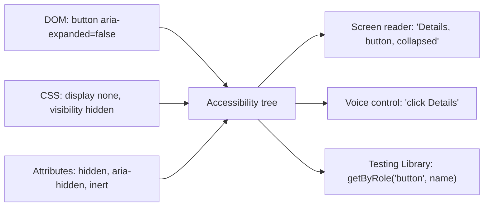
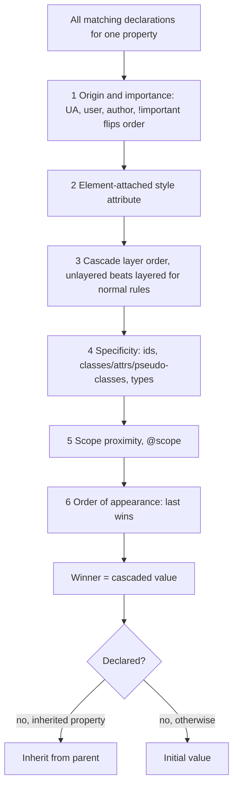
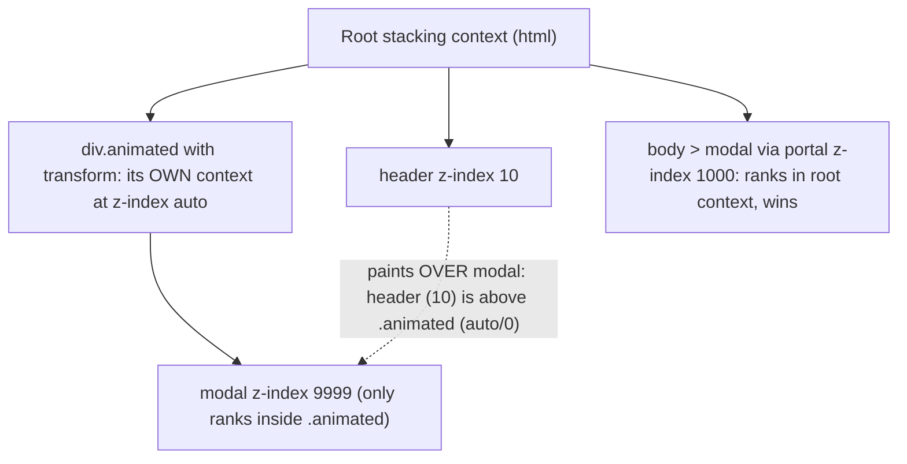

# 04 — HTML, CSS and accessibility

> **How to use this module.** Sections 4.1–4.3 are the part React interviews actually probe: semantics, the accessibility tree, ARIA and keyboard focus. Sections 4.4–4.10 are the CSS you must be able to reason about without a browser open (box model, cascade, Flexbox, Grid, stacking contexts, responsive units, modern CSS). Sections 4.11–4.12 are the React-specific decisions: how to style and which component library to pick. If you only have 20 minutes, read 4.2, 4.3, 4.8 and the Summary.

**Prerequisites:** None. A little React helps: [JSX attributes, `className` and `style`](06-jsx-and-rendering-model.md#64-expressions-attributes-classname-style).

**Code for this module:** [`examples/web/src/m04-html-css/`](examples/web/src/m04-html-css/). Every component has a test next to it. Run them with `npx vitest run src/m04-html-css` from `examples/web`.

> **What was run and what was not.** The tests check what jsdom can check: DOM structure, roles, names, ARIA attributes, class names, keyboard behavior and focus. jsdom has **no layout engine**, so nothing here proves that a Grid area is painted in the right place or that a `z-index` wins. Those statements come from MDN and the CSS specifications, and each one is labelled "(spec)" in the text. Treat them as read, not run.

---

## 4.1 Semantic HTML and landmarks

### The problem
A page built from `<div>`s looks right and means nothing. A screen reader user cannot jump to the navigation, a search engine cannot find the main content, and a keyboard user must press Tab through forty links to reach the article. Every `<div onClick>` also has to re-implement focus, Enter/Space and a role by hand, and usually gets one wrong.

### Mental model
HTML elements are **typed declarations of meaning**. The browser maps each element to a **role** (what it is), and ships behavior with it (focusable, activates on Enter, submits a form). Choosing `<button>` is choosing a role plus behavior in one token.

> **Java/Spring analogy.** Think of choosing the right type instead of passing `Object`. A `<nav>` is like a `@Repository`: the stereotype carries meaning that tools (component scanning, exception translation) act on. A `<div>` is a plain `@Component`: legal, but tools learn nothing.
>
> **Where the analogy breaks:** a wrong stereotype annotation in Spring is mostly cosmetic. A wrong HTML element changes real behavior for real users: keyboard support, announcements and focus order all depend on it.

### Minimal code
The landmark skeleton the layout exercise uses (`examples/web/src/m04-html-css/HolyGrail.tsx`):

```tsx
<header>   {/* role banner      (site-level header)  */}
<nav aria-label="Primary">   {/* role navigation */}
<main>     {/* role main        (exactly one per page) */}
<aside aria-label="Related"> {/* role complementary */}
<footer>   {/* role contentinfo  (site-level footer)  */}
```

| Need | Use | Not |
|---|---|---|
| Action (does something) | `<button type="button">` | `<div onClick>` |
| Navigation (goes somewhere) | `<a href>` | `<span onClick={navigate}>` |
| Section heading | `<h1>`–`<h6>` in order | a bold `<div>` |
| Group of related controls | `<fieldset><legend>` | a bordered `<div>` |
| Data table | `<table>`, `<th scope>`, `<caption>` | a grid of `<div>`s (for tabular data) |
| Form field | `<label htmlFor>` + `<input>` | placeholder text as the label |
| Disclosure | `<details><summary>` or button + `aria-expanded` | click-handler `<div>` |
| Modal | `<dialog>` + `showModal()` or `role="dialog"` + `aria-modal` | positioned `<div>` |

### How it works internally
The browser builds the DOM, then for each node computes an **accessibility object** with role, name, state and relations, and exposes that tree to the platform's accessibility API. `<header>` and `<footer>` are only `banner` and `contentinfo` when they are **not** descendants of `article`, `aside`, `main`, `nav` or `section` (HTML-AAM; spec). Inside those they are generic. `<section>` is a `region` landmark **only if it has an accessible name**; without one it is generic. `<form>` is a `form` landmark only with a name.

In React, three spellings differ from HTML: `className`, `htmlFor`, and camel-cased events. The element choice is identical.

### Trade-offs
- Native elements are less flexible to style than a `<div>`. That cost is real but small, and `appearance`/`all: unset` plus a CSS Module solves most of it.
- Heading levels express **outline**, not size. Pick the level for structure and style it separately.
- One `<main>` and one `<h1>` per page is the convention; SPAs must also move focus or update the title on route change ([19](19-routing.md)).

> **⚠️ Correction:** "Use `<div>`s and add ARIA to fix it." Rule one of ARIA is the opposite: use the native element first ([4.2](#42-accessibility-the-accessibility-tree-aria-rules-names-roles-states)).

**Legacy coverage: layout tables and spacer images.** Before 2010 sites laid out pages with `<table>` cells and 1px spacer GIFs. That is a **semantics** bug (screen readers announce "table, 3 columns" for a page frame) as well as a layout one. The migration is Grid and Flexbox (4.6, 4.7). Tables remain correct for **data**.

---

## 4.2 Accessibility: the accessibility tree, ARIA rules, names, roles, states

### The problem
Assistive technology (screen readers, voice control, switch devices) does not read your pixels or your React tree. If a custom widget exposes no role, no name, or the wrong state, the user hears "clickable, clickable, clickable". WCAG conformance is also a legal requirement in many jurisdictions, and interviewers ask "how would you make this accessible" for exactly that reason.

### Mental model
The browser derives a second tree from the DOM, the **accessibility tree** [Browser]. Each node carries:

| Property | Question it answers | Example |
|---|---|---|
| **Role** | What is it? | `button`, `checkbox`, `dialog` |
| **Name** | What is it called? | "Save" |
| **Description** | Extra help | "Saves the draft" |
| **State / properties** | What condition is it in? | `expanded=false`, `pressed=true`, `invalid=true` |
| **Relations** | What is it linked to? | controls, labelled-by, described-by |



Testing Library's `getByRole` queries (a close model of) this tree, which is why query priority puts roles first ([20.3](20-testing.md#203-react-testing-library-and-query-priority)). Accessible-wired assertions are also covered in [20.12](20-testing.md#2012-accessibility-testing).

> **Java/Spring analogy.** The accessibility tree is like the **OpenAPI document** generated from your controllers. Clients (screen readers) do not call your methods; they read the contract. If the annotations are wrong, the contract lies, even if the code works.
>
> **Where the analogy breaks:** an OpenAPI doc is generated once and consumed by machines. The accessibility tree is rebuilt live as state changes, and the consumer is a person who relies on it moment to moment.

### Minimal code
A button that is wrong in three different ways, and the fix:

```tsx
// ❌ no role, not focusable, no keyboard, no state
<div className="btn" onClick={toggle}>Details</div>

// ❌ ARIA on top of a div: you now owe focus (tabIndex), Enter AND Space, and state
<div role="button" tabIndex={0} onClick={toggle}>Details</div>

// ✅ native: role, focus, Enter/Space for free; you add only the state
<button type="button" aria-expanded={open} aria-controls={panelId} onClick={toggle}>
  Details
</button>
```

### How it works internally

**Roles.** Native elements have implicit roles (`<a href>` = link, `<input type=checkbox>` = checkbox). `role="…"` overrides it. WAI-ARIA 1.2 is the current W3C Recommendation (6 June 2023, [w3.org/TR/wai-aria](https://www.w3.org/TR/wai-aria/)); ARIA 1.3 is still a Working Draft (latest draft 4 June 2026, [w3.org/TR/wai-aria-1.3](https://www.w3.org/TR/wai-aria-1.3/)).

**The five rules of ARIA** (W3C "Using ARIA" note; recalled, not re-fetched this session):
1. If a native element does the job, use it instead of re-purposing another element and adding ARIA.
2. Do not change native semantics unless you really must (`<h2 role="tab">` is wrong; wrap instead).
3. All interactive ARIA controls must be usable with the keyboard.
4. Do not use `role="presentation"` or `aria-hidden="true"` on a visible, focusable element.
5. All interactive elements must have an accessible name.

The APG states the same idea as a maxim and a pair of principles: **"No ARIA is better than bad ARIA"**, and "a role is a promise" that you will supply the keyboard behavior the role implies ([APG read-me-first](https://www.w3.org/WAI/ARIA/apg/practices/read-me-first/), read 2026-10-04). ARIA changes only **what is announced**, never what the element **does**. `role="button"` adds no Enter key handler.

**Accessible name** (simplified order from the Accessible Name and Description Computation spec; spec):
1. `aria-labelledby` (ids of elements whose text is used)
2. `aria-label`
3. Native source: `<label>`, `alt`, `<legend>`, `<caption>`, table headers
4. **Content**, for roles that allow name-from-content (button, link, tab, heading…)
5. `title` (a last resort, and unreliable on touch)
6. `placeholder` is a **fallback some browsers use, not a label**.

An icon-only button therefore needs `aria-label="Close"` (or visually hidden text). An `` that is decorative gets `alt=""`.

**States and properties** you will use in React (booleans are strings: `aria-expanded={open}` renders `"true"`/`"false"`):

| Attribute | Use | Pairs with |
|---|---|---|
| `aria-expanded` | Disclosure, accordion, menu button, combobox | The control that toggles |
| `aria-controls` | Points at the controlled element | `aria-expanded` |
| `aria-pressed` | Toggle buttons | `<button>` |
| `aria-selected` / `aria-checked` | Tabs, options / custom checkboxes | `role=tab`, `role=checkbox` |
| `aria-current="page"` | Current link in nav | `<a>` |
| `aria-invalid`, `aria-describedby`, `aria-required` | Form errors ([14.5](14-forms-and-actions.md#145-accessible-forms)) | inputs |
| `aria-live`, `role="status"`, `role="alert"` | Announce dynamic changes | a **pre-existing** container |
| `aria-hidden="true"` | Remove from the tree (still visible, still focusable!) | never on focusable things |
| `aria-modal="true"` | Tells AT the rest of the page is inert | `role=dialog` |
| `inert` attribute | Removes focus, clicks **and** the accessibility tree | background of a modal |

**Hiding techniques differ.**

| Technique | Visible | In accessibility tree | Focusable |
|---|---|---|---|
| `display: none` / `hidden` / `visibility: hidden` | no | no | no |
| `aria-hidden="true"` | yes | no | **yes (a bug)** |
| `inert` | yes | no | no |
| Visually hidden CSS (`clip`, 1px box) | no | yes | yes |
| `opacity: 0` | no | yes | yes |

`inert` is Baseline Widely available, across browsers since April 2023 ([MDN inert](https://developer.mozilla.org/en-US/docs/Web/HTML/Reference/Global_attributes/inert), read 2026-10-04). In React 19 `inert` is a recognised boolean prop. React 18 did not know the attribute, so the workaround was `inert=""` (plus a type declaration to silence TypeScript); in React 19 the empty string counts as `false`, so that old workaround now turns `inert` **off** ([React PR #24730](https://github.com/facebook/react/pull/24730), listed under 19.0.0 in the [React CHANGELOG](https://github.com/facebook/react/blob/main/CHANGELOG.md)).

**Live regions.** A region must exist in the DOM **before** its content changes to be reliably announced. Rendering `<div role="alert">Saved</div>` fresh is flaky across screen readers. Render the empty container early and update its text.

**WCAG 2.2** (W3C Recommendation, 5 October 2023) added nine success criteria: 2.4.11 Focus Not Obscured (Minimum, AA), 2.4.12 Focus Not Obscured (Enhanced, AAA), 2.4.13 Focus Appearance (AAA), 2.5.7 Dragging Movements (AA), 2.5.8 Target Size (Minimum, 24×24 CSS px, AA), 3.2.6 Consistent Help (A), 3.3.7 Redundant Entry (A), 3.3.8 Accessible Authentication (Minimum, AA) and 3.3.9 Accessible Authentication (Enhanced, AAA), and removed 4.1.1 Parsing ([What's new in WCAG 2.2](https://www.w3.org/WAI/standards-guidelines/wcag/new-in-22/), [WCAG 2.2](https://www.w3.org/TR/WCAG22/)).

### Trade-offs
- ARIA is a **last** resort for **custom** widgets (tabs, comboboxes, trees) where no native element exists. Even then, copy a pattern from the [APG](https://www.w3.org/WAI/ARIA/apg/patterns/) rather than inventing one.
- Automated tools find roughly the mechanical failures (missing names, bad ARIA, contrast). They cannot judge a good name or a sensible focus order ([20.12](20-testing.md#2012-accessibility-testing)).
- A headless component library ([4.12](#412-component-libraries-mui-radix-shadcnui-headless-vs-styled)) buys you tested ARIA wiring. That is the best reason to adopt one.

---

## 4.3 Focus management and keyboard navigation, roving tabindex

### The problem
Mouse users point; keyboard and switch users **move focus**. If your widget has no visible focus, a wrong tab order, a trap with no exit, or loses focus when a dialog closes, those users are stuck. A toolbar with twelve buttons that is twelve Tab presses long is a keyboard obstacle course.

### Mental model
Exactly one element on the page has **focus** and receives keyboard events. The browser's **sequential focus order** (Tab / Shift+Tab) follows DOM order for elements in the tab order. You control it in three ways:

| `tabIndex` | Meaning |
|---|---|
| (omitted) | Natural: native controls are in the tab order, `<div>` is not |
| `0` | Add to the tab order in DOM position |
| `-1` | Focusable by script (`el.focus()`), **not** reachable by Tab |
| `> 0` | Jumps the queue. **Never use it.** It scrambles the order across the whole page |

**Composite widgets** (toolbar, tabs, radio group, menu, listbox, grid) follow the APG convention: the widget is **one tab stop**, and arrow keys move **inside** it. That is **roving tabindex** [Browser pattern]: exactly one item has `tabIndex={0}` (the active one), all others `-1`; arrow keys move real focus and move the `0`.

The alternative is `aria-activedescendant`: focus stays on the container and a pointer attribute names the active child (used by comboboxes where focus must remain in the input). Roving moves real focus; activedescendant fakes it. Roving is simpler and better supported.

> **Java/Spring analogy.** Roving tabindex is a *current item* cursor, like `ListIterator`'s position: one active index, others reachable by moving the cursor, and the container remembers where you left off.
>
> **Where the analogy breaks:** an iterator's cursor is internal state. Here the cursor is also **the thing the browser exposes to the user** (`tabIndex` in the DOM), so a wrong cursor is a visible bug.

### Minimal code
`examples/web/src/m04-html-css/FormatToolbar.tsx`, the core of it:

```tsx
const [active, setActive] = useState(0);

<div role="toolbar" aria-label={label} onKeyDown={onKeyDown}>
  {items.map((item, i) => (
    <button
      key={item.id}
      type="button"
      tabIndex={i === active ? 0 : -1}   // one tab stop
      onFocus={() => setActive(i)}        // click or arrow focus updates the stop
    >
      {item.label}
    </button>
  ))}
</div>
```

The key handler maps ArrowLeft/ArrowRight (with wrap), Home and End to `buttons[next]?.focus()`, calls `preventDefault()` so the page does not scroll, and lets the `onFocus` handler move the `0`.

### How it works internally
- `element.focus()` works on anything focusable (native controls, anything with `tabindex`). Calling it inside an **event handler** is fine. Calling it during **render** is a side effect and forbidden; in an effect or a ref callback it is legitimate ([10.2](10-refs-and-dom.md#102-dom-refs-and-when-to-use-them), [10.3](10-refs-and-dom.md#103-callback-refs-and-ref-cleanup-functions)).
- React's `onFocus`/`onBlur` **bubble** (they use `focusin`/`focusout` semantics), unlike native `focus`/`blur`. That is why a container can listen to `onBlur` for "focus left the widget" and check `e.relatedTarget`.
- **Focus-visible.** `:focus-visible` shows the ring for keyboard focus and not for mouse clicks on buttons. Never write `outline: none` without a replacement; WCAG 2.4.7 requires a visible indicator and 2.4.11 (2.2) says it must not be hidden behind sticky UI. `:focus-visible` is Baseline Widely available, across browsers since March 2022 ([MDN `:focus-visible`](https://developer.mozilla.org/en-US/docs/Web/CSS/:focus-visible)).
- **Dialogs.** On open, move focus **into** the dialog (the dialog itself with `tabIndex={-1}`, or its first control). Keep Tab inside while it is modal. On close, **return focus to the trigger**. A native `<dialog>` opened with `showModal()` does the inert background, Esc and initial focus for you (MDN: Baseline Widely available since March 2022; read 2026-10-04). Our hand-written version needs the pieces: [10.6 portals](10-refs-and-dom.md#106-portals) and the trap in [26.6](26-machine-coding.md#266-modal-with-focus-trap).
- **Route changes** in SPAs do not move focus; the browser does not reload. Move focus to the new `<h1>` or a wrapper with `tabIndex={-1}` and update `document.title` ([19](19-routing.md)).
- **Skip link.** A first-in-DOM `<a href="#main-content">` that becomes visible on focus satisfies WCAG 2.4.1 (Bypass Blocks). Target `<main tabIndex={-1}>` so it can receive focus.

### Trade-offs
- Roving tabindex costs state and a key handler. For a plain list of links, do **not** rove: every link is a normal tab stop.
- Do not roving-ize a form. Forms use Tab between fields; arrows belong to radio groups and selects.
- Focus-moving code is the most test-worthy code in the module. `user.tab()` and `toHaveFocus()` test it well in jsdom, which has a real focus model (only layout-dependent behavior, like "is it scrolled into view", is missing).

---

## 4.4 Box model and `box-sizing`

### The problem
You write `width: 300px; padding: 20px; border: 1px solid` and the element is 342px wide. Percent columns plus padding overflow their row. Vertical gaps between paragraphs are 24px, not the 40px you added up.

### Mental model
Every element generates a **box** with four layers, inside-out: **content → padding → border → margin**. `width` and `height` size **one** of them, chosen by `box-sizing`:

| `box-sizing` | `width` sets | Total painted width |
|---|---|---|
| `content-box` (the CSS default) | content only | width + padding + border |
| `border-box` | content + padding + border | width |

Margin is never included, and it is transparent.

> **Java/Spring analogy.** `content-box` is like a collection's `size()` excluding the wrapper objects; `border-box` is like measuring the serialized record including headers. Pick one measuring convention for the whole code base.
>
> **Where the analogy breaks:** a convention in Java is enforced by types. In CSS you enforce it by a global rule, and any third-party widget that assumes the other model will quietly overflow.

### Minimal code
The reset nearly every code base ships:

```css
*, *::before, *::after { box-sizing: border-box; }
```

Tailwind's preflight sets `box-sizing: border-box` on `*, ::after, ::before, ::backdrop, ::file-selector-button` ([Tailwind Preflight](https://tailwindcss.com/docs/preflight)); MUI's `CssBaseline` sets it on `html` and makes every element, `::before` and `::after` inherit it ([MUI CssBaseline](https://mui.com/material-ui/react-css-baseline/)).

### How it works internally
- **Margin collapsing.** Adjacent **vertical** margins of block siblings (and parent-first-child, parent-last-child with no padding/border between) merge into the **larger** one, not the sum. Margins do **not** collapse for flex items, grid items, floats, absolutely positioned boxes, or boxes that establish a new block formatting context (spec, CSS 2.1 §8.3.1).
- **Block vs inline.** `width`/`height`/vertical margin do not apply to non-replaced `display: inline` boxes. Use `inline-block`, `flex`, or `grid`.
- **`height: 100%`** needs a parent with a definite height. Prefer `min-height: 100vh`/`100dvh` on the page wrapper. `dvh`/`svh`/`lvh` handle mobile browser toolbars; they have been Baseline across browsers since December 2022 (Chrome/Edge 108) and Widely available since June 2025 ([web-features: viewport unit variants](https://web-platform-dx.github.io/web-features-explorer/features/viewport-unit-variants/)).
- **Logical properties** (`margin-inline`, `padding-block`, `inset-inline-start`) follow writing direction, so right-to-left layouts need no rewrite. Our skip link in `HolyGrail.module.css` uses `inset-inline-start`.

### Trade-offs
- Global `border-box` is the right default. The only cost is the rare third-party widget; fix it locally.
- Use `gap` for spacing between siblings instead of margins: it does not collapse and has no "last child" special case.

---

## 4.5 Cascade, specificity, `@layer`, inheritance

### The problem
Two rules target the same element and the "wrong" one wins. Someone adds `!important`, then someone else adds `!important` with a longer selector, and the stylesheet becomes unmaintainable. Library styles (a date picker) beat your overrides, or the other way around.

### Mental model
For each property of each element, the browser collects every declaration that matches and runs a **tournament**. The first criterion that distinguishes the candidates decides; later ones are never consulted.



Order from the CSS Cascade specs (spec; layers are Cascade Level 5, `@scope` proximity Level 6). `!important` **reverses** the origin order, and inside layers it reverses the layer order too: for important declarations, **earlier layers win** and an important declaration in a layer beats an important unlayered one.

> **Java/Spring analogy.** Layers are like Spring **`@Order`** on filters or `@Primary` among candidate beans: an explicit precedence list decides first, and only within one tier does the finer rule (specificity, then declaration order) break ties.
>
> **Where the analogy breaks:** `@Order` is one flat number. The cascade is a **lexicographic tuple** compared left to right, so a lower tier can never be rescued by a higher specificity.

### Minimal code

```css
@layer reset, base, components, utilities;   /* declare order ONCE, up front */

@layer base       { a { color: blue; } }
@layer components { .btn { color: white; } }
@layer utilities  { .text-red { color: red; } }

a.btn.big { color: green; }                   /* UNLAYERED: beats every layer, whatever the specificity */
```

Because order was declared first, `utilities` beats `components` regardless of selector specificity or where the rules appear in the file.

### How it works internally

**Specificity** is a triple `(ids, classes+attributes+pseudo-classes, types+pseudo-elements)` compared left to right, not a base-10 number: eleven classes do not beat one id.

| Selector | Specificity |
|---|---|
| `*`, `:where(.a, #b)` | `0,0,0` |
| `p`, `::before` | `0,0,1` |
| `.card`, `[type=text]`, `:hover` | `0,1,0` |
| `ul li.active` | `0,1,2` |
| `#nav .item` | `1,1,0` |
| `:is(.a, #b)`, `:not(#b)`, `:has(#b)` | takes the **most specific argument** (`1,0,0`) |
| inline `style=""` | beats all selectors (not a selector; it is its own step) |

`:where()` is the specificity-zero escape hatch used in resets and library defaults, so consumers can override without a fight.

**Layers.** `@layer` is Baseline Widely available, across browsers since March 2022 ([MDN `@layer`](https://developer.mozilla.org/en-US/docs/Web/CSS/@layer), read 2026-10-04). Practical consequences:
- Styles in `@layer` lose to **all unlayered** styles, so wrapping a third-party stylesheet with `@import url(lib.css) layer(vendor);` makes your plain CSS win without raising specificity.
- Tailwind v4 emits its output into layers declared as `@layer theme, base, components, utilities;` (Preflight goes in `base`), and your unlayered CSS can override them ([Tailwind Preflight](https://tailwindcss.com/docs/preflight)).

**Inheritance.** Some properties inherit by default (`color`, `font-*`, `line-height`, `visibility`, `cursor`, custom properties); most do not (`margin`, `padding`, `border`, `background`, `width`). `inherit`, `initial`, `unset` and `revert` control this explicitly. `all: unset` is a heavy reset; it also resets `display`.

**Scoping.** CSS Modules (4.11) and BEM rename classes so selectors do not collide: they are naming strategies that sidestep specificity fights. `@scope` adds a native scoped-selector and "proximity" tie-breaker. It became Baseline Newly available only in March 2026 (Safari 26.4 was last), so check your browser support targets before relying on it ([web-features: `@scope`](https://web-platform-dx.github.io/web-features-explorer/features/scope/)).

### Trade-offs
- Reach for **low, flat specificity** (single classes) first, **layers** second, and `!important` only to defeat inline styles you do not control.
- Layers add an ordering declaration to maintain; with a single code base and CSS Modules you may not need them. They shine when mixing a design system, a vendor stylesheet and utilities.
- Specificity is a debugging tool: DevTools "Styles" shows the **crossed-out** losers and why.

---

## 4.6 Flexbox

### The problem
Centering, equal-height columns, a toolbar that pushes one item to the far right, and "wrap when it does not fit" were painful with floats and `display: table-cell`. Floats needed **clearfix** hacks (`::after { content: ""; display: table; clear: both }`) because a float takes the element out of flow and collapses its container.

### Mental model
A flex container lays children on one **main axis**, deciding sizes by distributing free space. Two axes, two properties:

| Property | Axis | Mnemonic |
|---|---|---|
| `justify-content` | **main** | distributes leftover space along the row/column |
| `align-items` | **cross** | aligns each item perpendicular to the main axis |
| `flex-direction` | picks main axis | `row` (default) / `column` |
| `flex-wrap` | allow lines | `wrap` |
| `gap` | spacing | between items, no margin hacks |

Each item has three sizing knobs: `flex-grow`, `flex-shrink`, `flex-basis`. The shorthand `flex: 1` means `1 1 0%`.

> **Java/Spring analogy.** Flex is a **thread pool with weights**: a fixed capacity (container width) shared among tasks (items) by weights (`flex-grow`), shrinking proportionally when oversubscribed (`flex-shrink`).
>
> **Where the analogy breaks:** items also have content-based **minimum sizes**, which pools do not. That is the next trap.

### Minimal code

```css
.toolbar { display: flex; align-items: center; gap: 0.5rem; }
.toolbar .spacer { margin-inline-start: auto; }   /* auto margins absorb free space */
.row     { display: flex; flex-wrap: wrap; gap: 1rem; }
.row > * { flex: 1 1 16rem; }                      /* grow, shrink, and wrap at ~16rem */
.centered { display: grid; place-items: center; } /* centering is easiest in grid */
```

### How it works internally
1. The container resolves each item's **flex base size** (`flex-basis`, or `width`, or content).
2. Sums them, compares to the container's main size, and distributes **positive** free space by `flex-grow` or **negative** space by `flex-shrink` × base size (spec: CSS Flexbox §9.7).
3. Applies **min/max** constraints and repeats.

**The `min-width: auto` trap.** A flex item's automatic minimum is its **content size**, so a long word, an ``, or a `<pre>` refuses to shrink and overflows the row. Fix with `min-width: 0` (and `overflow: auto`) on the item. The same applies vertically with `min-height: 0` in a column container, which is why a scrolling pane in a column layout needs it.

`gap` works in flex (not only grid) in all current browsers: Baseline since April 2021 (Safari was last) and Widely available since October 2023 ([web-features: flexbox gap](https://web-platform-dx.github.io/web-features-explorer/features/flexbox-gap/)).

### Trade-offs
- Use Flexbox for **one-dimensional** distribution (a row of buttons, a card footer, a nav). Use Grid when rows **and** columns must align, or when you name regions.
- `justify-content: space-between` with a wrapped last row leaves a gap in the middle; Grid `auto-fill` is better for card grids.
- Do not use `flex` for page layout and fight it with percentage widths; that is a Grid job.

**Legacy coverage.** `display: -webkit-box` and `-webkit-flex` (the 2012 "old" and "tweener" syntaxes) exist in ancient code. Today unprefixed `display: flex` works everywhere; **vendor prefixes** (`-webkit-`, `-moz-`) should be added by a tool (Autoprefixer, Lightning CSS, or Tailwind's own pipeline from the browser list), never by hand. A hand-written prefix in an old file is usually dead weight; confirm with the project's `browserslist` before deleting.

---

## 4.7 Grid

### The problem
Real page layouts are two-dimensional: a header over three columns over a footer, a card gallery with uniform columns, a form with labels aligned to inputs. Floats, tables and nested flex rows approximate this and break when content changes. The "holy grail" (header, footer, fixed-width sidebars, fluid center, content-first source order) took years of hacks.

### Mental model
A grid container defines **tracks** (rows and columns); children are placed into **cells or areas**. Placement is **independent of source order**, which is both the power and the accessibility risk.

> **Java/Spring analogy.** Grid is a **layout contract** like an OpenAPI schema applied to the page: you declare the shape (`grid-template-areas`) and each element declares which slot it fills (`grid-area: main`), instead of each element positioning itself relative to others.
>
> **Where the analogy breaks:** visual order and DOM order can diverge. Keyboard and screen reader users follow **DOM order** (WCAG 1.3.2 Meaningful Sequence, 2.4.3 Focus Order), so a layout that reorders content visually creates a mismatch the CSS contract hides.

### Minimal code
`examples/web/src/m04-html-css/HolyGrail.module.css` (the full layout is Exercise 2):

```css
.page {
  display: grid;
  min-height: 100vh;
  grid-template-columns: 12rem minmax(0, 1fr) 14rem;
  grid-template-rows: auto 1fr auto;
  grid-template-areas:
    'header header header'
    'nav    main   aside'
    'footer footer footer';
  gap: 1rem;
}
.main { grid-area: main; }

/* A responsive card gallery with no media query: */
.cards { display: grid; gap: 1rem; grid-template-columns: repeat(auto-fit, minmax(16rem, 1fr)); }
```

### How it works internally
- **`fr`** divides the **remaining** space after fixed tracks and gaps. `1fr` is really `minmax(auto, 1fr)`, so content can blow the track out. `minmax(0, 1fr)` is the Grid twin of the flex `min-width: 0` trap (spec: CSS Grid §7.2.3).
- **`auto-fill` vs `auto-fit`** with `repeat(…, minmax(16rem, 1fr))`: both create as many tracks as fit; with few items, `auto-fill` keeps empty tracks and `auto-fit` collapses them so items stretch.
- **Implicit grid.** Items that do not fit the template create extra rows (`grid-auto-rows`) or columns (`grid-auto-columns`). `grid-auto-flow: dense` backfills holes and **reorders visually** (an a11y hazard).
- **Subgrid** lets a child grid reuse the parent's tracks (aligning card titles, bodies and footers across cards). Available across browsers since September 2023 ([MDN Subgrid](https://developer.mozilla.org/en-US/docs/Web/CSS/CSS_grid_layout/Subgrid)).
- Named areas must form **rectangles**; a `.` is an empty cell.
- **Accessibility rule of thumb:** write the DOM in reading order, then use `grid-area` to place it. Our test asserts DOM order header, nav, main, aside, footer even though the grid paints nav left, aside right.

### Trade-offs
- Grid for page frames, galleries, dashboards, forms. Flex for components' inner rows.
- You can nest them freely: a grid area that contains a flex toolbar is the normal case.
- Debug with the DevTools **Grid overlay**; it shows track lines and area names.

**Legacy coverage: floats and clearfix, table layouts.** Floats are for wrapping **text around an image** and nothing else now. If a code base uses `float: left` for columns it also has a clearfix class; both are replaced by Flexbox or Grid. If you must keep the clearfix, `display: flow-root` on the container is the modern one-line replacement (creates a new block formatting context without the hack; spec).

---

## 4.8 Positioning and stacking contexts

### The problem
`z-index: 9999` on a modal and it still renders **under** the header. The dropdown is clipped by an `overflow: hidden` parent. A `position: fixed` overlay covers only a card instead of the viewport. These three bugs are the same family, and "why does this z-index not work" is a standard interview question.

### Mental model
`position` picks how a box is placed:

| `position` | Placed relative to | Takes space in flow? |
|---|---|---|
| `static` (default) | normal flow | yes |
| `relative` | its normal position (offsets nudge it) | yes (original space kept) |
| `absolute` | nearest **positioned** ancestor's padding box | no |
| `fixed` | the viewport, **unless an ancestor traps it** (below) | no |
| `sticky` | in flow until a scroll threshold, then pinned to its scroll container | yes |

`z-index` does not order the whole page. It orders elements **inside one stacking context**. A **stacking context** is an isolated painting group: everything inside is painted as a unit, and the group as a whole sits at **one** place in its parent's stacking order. A child's `z-index: 9999` inside a context whose root is at `z-index: 1` can never rise above a sibling context at `z-index: 2`.



> **Java/Spring analogy.** A stacking context is a **transaction boundary** or an **isolation level**: what happens inside is ordered internally, and the outside world sees only the context's single position. A huge number inside cannot leak out.
>
> **Where the analogy breaks:** a transaction boundary is declared on purpose. A stacking context is created **as a side effect** of unrelated properties, so you rarely know you made one.

### Minimal code: the modal trap and its fix
Components in `examples/web/src/m04-html-css/` (Exercise 3):

```tsx
// TransformedPage.tsx: an "animated wrapper" a design system adds for a slide-in effect
<div style={{ transform: 'translateZ(0)' }}>
  <button onClick={open}>Open settings</button>
  {isOpen && <CenteredModal portal={false} ... />}   // ❌ trapped: fixed is relative to the wrapper
  {isOpen && <CenteredModal portal ... />}           // ✅ createPortal(…, document.body)
</div>
```

### How it works internally
**What creates a stacking context** (MDN "Stacking context", spec):
- the root element
- `position: absolute | relative` with `z-index` ≠ `auto`
- `position: fixed` or `sticky` (always)
- a **flex or grid child** with `z-index` ≠ `auto`
- `opacity` **< 1**
- `transform`, `filter`, `backdrop-filter`, `perspective`, `clip-path`, `mask`, `mix-blend-mode` other than their initial value
- `isolation: isolate`
- `will-change` naming any of the above
- `contain: layout | paint | strict | content`
- `container-type: size | inline-size` (containment; listed on [MDN's stacking context page](https://developer.mozilla.org/en-US/docs/Web/CSS/CSS_positioned_layout/Stacking_context))

**Two traps in one.** An ancestor with `transform`, `filter`, `perspective`, `will-change: transform` or `contain: paint` does **both**: it becomes a **stacking context** (so z-index is trapped) **and** the **containing block for `position: fixed` descendants** (so "fixed" is relative to it, not the viewport). `overflow: hidden` on an ancestor additionally **clips** an absolutely positioned dropdown unless the dropdown is portalled out.

**Paint order inside a context** (simplified): backgrounds/borders of the context root, then negative-z children, then in-flow blocks, floats, inline content, then `z-index: auto/0` positioned, then positive z-index in ascending order; ties break by DOM order.

**Fixes, in order of preference:**
1. **Portal** [React DOM]: `createPortal(modal, document.body)` renders the DOM node **outside** the offending ancestor, while React events and context still bubble through the **React** tree ([10.6](10-refs-and-dom.md#106-portals)).
2. **Native top layer**: a `<dialog>` opened with `showModal()` and elements with the `popover` attribute render in the **top layer**, above all stacking contexts regardless of z-index (MDN: `<dialog>` Baseline Widely available since March 2022). In React, call `ref.current?.showModal()` from an effect or event handler.
3. **Remove the culprit** (`transform` where `translate` would do, `will-change` left on permanently).
4. **Contain your own z-indexes** with `isolation: isolate` on a component root, so its internal z-indexes cannot leak and its siblings cannot surprise it.
5. Use a **z-index scale** (CSS custom properties: `--z-dropdown: 100; --z-modal: 1000`) instead of ever-larger magic numbers.

The test (`CenteredModal.test.tsx`) can verify only the **DOM consequence**: with `portal`, the dialog is a child of a backdrop that is a direct child of `document.body` and is **not** contained in the transformed wrapper; without `portal`, it is contained. That the transformed wrapper traps `fixed` and `z-index` is **spec behavior, not run**.

### Trade-offs
- Portals fix stacking but add **focus and a11y duties**: the portal content is no longer next to its trigger in the DOM, so you must move focus in, restore it on close and mark the background inert ([4.3](#43-focus-management-and-keyboard-navigation-roving-tabindex)).
- `position: sticky` fails silently if any ancestor has `overflow: hidden/auto/scroll` (it sticks to that scroller) or if the parent is not taller than the sticky element.
- `absolute` centering (`top: 50%; left: 50%; transform: translate(-50%, -50%)`) is the legacy way. Today: `display: grid; place-items: center` on the backdrop (as the modal CSS does) or `margin: auto` on a flex/grid child. It also avoids creating a transform context on the dialog.

---

## 4.9 Responsive design: media and container queries, units, mobile-first

### The problem
One layout for a 27-inch monitor is unusable on a phone; one layout designed for the phone wastes the monitor. Designing breakpoints around **device** widths ages badly, and a card that sits both in a wide main column and a narrow sidebar cannot know which it is in when it only sees the **viewport**.

### Mental model
Responsive design is three tools, used in order:
1. **Fluid by default** (relative units, `minmax`, `clamp`, wrapping), so most layouts need no breakpoint.
2. **Media queries** for the **page**: "at ≥ 48rem, use two columns".
3. **Container queries** for the **component**: "when my own box is ≥ 30rem, lay out horizontally".

> **Java/Spring analogy.** A media query is like reading **global configuration** (`@Value`); a container query is like reading the **injected local context** (a constructor parameter). The component should depend on what it was given, not a global.
>
> **Where the analogy breaks:** a container query needs the **container to be declared** (`container-type`), and that declaration has layout side effects (containment, a stacking context candidate). It is not free injection.

### Minimal code

```css
/* mobile-first: base styles are the phone; widen with min-width */
.layout { display: grid; gap: 1rem; }
@media (width >= 48rem) { .layout { grid-template-columns: 16rem 1fr; } }

/* container query: the card reacts to ITS container, not the viewport */
.card-slot { container-type: inline-size; container-name: card; }
@container card (width >= 30rem) { .card { display: flex; gap: 1rem; } }

/* fluid type and spacing with no breakpoint */
h1 { font-size: clamp(1.5rem, 1rem + 2.5vw, 3rem); }
```

### How it works internally
- **Units.** `rem` = root font size (respects the user's browser setting: use it for text, spacing and breakpoints so zoom/font preferences work). `em` = the element's own font size (compounds when nested). `px` ignores user font preferences for text. `ch` = width of "0". `vw/vh` ignore mobile toolbar changes; `dvh/svh/lvh` handle them. Container units `cqi`, `cqw`, `cqh` are relative to the query container (MDN, read 2026-10-04).
- **Mobile-first** = base rules for small screens, `min-width` queries to add. It sends the least CSS to the least capable devices and avoids "undo" overrides. The range syntax `@media (width >= 48rem)` is the modern spelling of `min-width: 48rem`; it has been Baseline since March 2023 (Safari 16.4 was last) and Widely available since September 2025 ([web-features: media query range syntax](https://web-platform-dx.github.io/web-features-explorer/features/media-query-range-syntax/)).
- **Container queries.** Size queries on `container-type: inline-size` are Baseline across browsers since February 2023 (Firefox 110 was last) and Widely available since August 2025 ([web-features: container queries](https://web-platform-dx.github.io/web-features-explorer/features/container-queries/)). Style queries (`@container style(...)`) on custom properties became Baseline Newly available only in May 2026, when Firefox 151 shipped them ([web-features: container style queries](https://web-platform-dx.github.io/web-features-explorer/features/container-style-queries/)).
- **Images.** `max-width: 100%; height: auto`, plus `srcset`/`sizes` for resolution switching ([15.10](15-performance.md)).
- **`prefers-*` queries.** `prefers-reduced-motion`, `prefers-color-scheme`, `prefers-contrast` are accessibility features; respect them.
- **The viewport meta tag** `<meta name="viewport" content="width=device-width, initial-scale=1">` is mandatory for mobile layouts. Do not set `user-scalable=no` (fails WCAG 1.4.4).
- In React, **do not** branch on `window.innerWidth` for layout. CSS does it without re-rendering. Use JS (`matchMedia`, [12.9](12-hooks-and-custom-hooks.md#129-usemediaquery)) only when the **rendered tree** must differ (mount a different component), and remember SSR has no `window`, so the first render is a guess.

### Trade-offs
- Media queries still fit page-level frames (the holy grail). Container queries fit **reusable components**.
- Fewer breakpoints beat many: three, chosen where **your content** breaks, not at iPhone widths.
- Container queries add containment: an `inline-size` container cannot size itself from its children's width.

---

## 4.10 Modern CSS

### The problem
Preprocessors (Sass/Less) existed because CSS lacked variables, nesting and parent selection. Teams paid a build step and still could not change a "variable" at runtime. Selecting "a card that contains an image" required JavaScript.

### Mental model
Native CSS absorbed the best of those features. Three matter in interviews:

| Feature | Replaces | Key difference |
|---|---|---|
| Custom properties `--x` | Sass `$x` | Live in the **cascade**, inherit, change at **runtime** |
| Nesting `&` | Sass nesting | Native, no build, relative selectors |
| `:has()` | JS parent lookup | "Parent selector": style an element by its descendants/siblings |

> **Java/Spring analogy.** Custom properties are like **environment properties resolved at runtime** (`${theme.accent}`), not compile-time constants (`static final`). Sass variables are the constants.
>
> **Where the analogy breaks:** Spring properties are flat and global. Custom properties **inherit down the DOM**, so each subtree can override one, which is exactly how theming and `AccentCard` work.

### Minimal code

```css
:root { --accent: rebeccapurple; --space: 1rem; }
.card {
  border: 2px solid var(--accent, currentColor);   /* fallback after the comma */
  padding: var(--space);

  &:hover { box-shadow: 0 0 0 2px var(--accent); }   /* nesting */
  .title { font-weight: 600; }                        /* bare nested selector is valid in modern engines */
  @media (width >= 48rem) { padding: calc(var(--space) * 2); }
}

.field:has(input:invalid) label { color: crimson; }  /* style the label by its sibling input's state */
form:has(:focus-visible) { outline: 2px solid; }
```

`examples/web/src/m04-html-css/AccentCard.tsx` passes a **runtime value** from React as a custom property, with no CSS-in-JS runtime:

```tsx
const style = { '--accent': accent } as CSSProperties;
<section className={styles.card} style={style}>…</section>
```

### How it works internally
- **Custom properties** are strings substituted at computed-value time. An unregistered property has no type, so it cannot be animated or validated. `@property` registers a type, initial value and inheritance (and is relied on by Tailwind v4, see 4.11). `@property` has been Baseline since July 2024, when Firefox 128 shipped it ([web-features: registered custom properties](https://web-platform-dx.github.io/web-features-explorer/features/registered-custom-properties/)).
- **`:has()`** is Baseline Widely available, across browsers since December 2023 ([MDN `:has()`](https://developer.mozilla.org/en-US/docs/Web/CSS/:has), read 2026-10-04). Its argument is a **relative selector list**, and it takes the specificity of its most specific argument. It can be expensive on huge DOMs; keep the subject narrow (`.card:has(img)`, not `*:has(img)`).
- **Nesting.** The relaxed syntax (bare `.title { }` without `&`) is supported in current engines; the old strict form required `&` for type selectors. You **cannot** concatenate (`&__title` for BEM) the way Sass can (MDN, read 2026-10-04). Nesting has been Baseline since December 2023 (Chrome 120 and Safari 17.2) and Widely available since June 2026 ([web-features: nesting](https://web-platform-dx.github.io/web-features-explorer/features/nesting/)).
- **React note.** The `style` prop accepts custom properties only as string keys beginning with `--`; React calls `style.setProperty` for them, and TypeScript's `CSSProperties` needs the cast above. The test checks `card.style.getPropertyValue('--accent')` (jsdom's CSSStyleDeclaration; run-confirmation pending, see the report).
- Other modern pieces worth naming: `color-mix()`, `oklch()`, `light-dark()`, `@starting-style`, `text-wrap: balance`, `aspect-ratio`, the `popover` attribute, view transitions ([21.10](21-concurrent-ssr-server-components.md#2110-viewtransition)). Status read from [web-features](https://web-platform-dx.github.io/web-features-explorer/) on 2026-10-04: `aspect-ratio`, `color-mix()` and `oklch()` are Widely available; `light-dark()` and `text-wrap: balance` (May 2024), `@starting-style` (August 2024), `popover` (January 2025) and same-document view transitions (October 2025, Firefox 144) are Newly available, so check your support targets for those.

### Trade-offs
- Sass is no longer required for variables or nesting; it still helps with mixins, loops and functions. Many teams keep it for legacy reasons.
- `:has()` replaces a lot of JS state ("`hasError` class on the wrapper"), but do not use it to carry business logic.
- Use custom properties for **tokens** (colors, spacing, z-index scale) and let components consume them. Theme switching becomes one attribute on `<html>`.

---

## 4.11 Styling in React: inline, CSS Modules, Tailwind, CSS-in-JS and the Server Components trade-off

### The problem
React has no opinion about styles, so every team picks one. The choice affects bundle size, runtime cost, server rendering, dynamic values, theming, and how easily a new hire can read a component. "Which would you pick and why" is a staple question.

### Mental model
Ask two questions of any approach: **when does the CSS get produced** (author time, build time, or while rendering in the browser) and **how does a class name get unique** (by convention, by the build tool, or at runtime).

| Approach | CSS produced | Dynamic values | RSC-safe? | Cost |
|---|---|---|---|---|
| **Plain CSS / global** | author time | custom properties | yes | naming collisions, dead CSS |
| **Inline `style`** | none (per-element) | trivially | yes | no pseudo-classes, no media queries, no cascade reuse, higher specificity |
| **CSS Modules** | build time | custom properties, class switching | yes | no theming API of its own |
| **Utility CSS (Tailwind)** | build time (scans class names) | variants, arbitrary values, custom properties | yes | long `className` strings, learning a vocabulary |
| **Runtime CSS-in-JS** (styled-components, Emotion) | **in the browser, during render** | props interpolation | **needs client components** | bundle + runtime cost, SSR extraction |
| **Zero-runtime CSS-in-JS** (vanilla-extract, Linaria, StyleX, Panda CSS) | build time | variables / variants | yes | build integration |

> **Java/Spring analogy.** Runtime CSS-in-JS is **reflection** (decide at call time, pay each time); CSS Modules and Tailwind are **annotation processing / codegen** (decide at build time, zero cost at runtime). Like reflection, the runtime option is flexible and fine at small scale, and it conflicts with the platform's ahead-of-time direction (here, server rendering).
>
> **Where the analogy breaks:** reflection failures show up as exceptions. CSS failures show up as silent visual differences, so tests cannot catch most of them; you need visual or browser tests ([20.11](20-testing.md#2011-e2e-with-playwright-and-cypress)).

### Minimal code

```tsx
// Inline: fine for a truly dynamic one-off value, not for design
<div style={{ width: `${progress}%` }} />

// CSS Module (examples/web/src/m04-html-css/HolyGrail.tsx): scoped class names
import styles from './HolyGrail.module.css';
<main className={styles.main} />

// Dynamic value without a runtime library: pass it as a custom property (AccentCard.tsx)
<section className={styles.card} style={{ '--accent': accent } as CSSProperties} />
```

Tailwind (illustrative, **not run**: no Tailwind in `examples/web`):

```tsx
<button className="rounded-md bg-indigo-600 px-3 py-2 text-white hover:bg-indigo-500 focus-visible:outline-2 md:px-4">
  Save
</button>
```

### How it works internally

**Inline styles.** `style={{ backgroundColor: 'red' }}` sets properties on the element via the DOM (camelCase keys, numbers get `px` for most length properties). They have no `:hover`, no `@media`, no `::before`, and they beat any selector unless the stylesheet uses `!important`. They are the right tool for **per-element computed values**, not for design.

**CSS Modules.** The bundler (Vite, webpack, Next) renames each class to a unique string (`main` becomes something like `HolyGrail_main_x7Yz2`) and returns the mapping as an object. Selectors collide-proof by construction, and unused modules tree-shake with their component. `:global(.x)` opts out.
- **In Vitest.** By default Vitest does **not** process CSS (the `css` option). For `*.module.css` it returns a Proxy so that `styles.main` still yields a string like `_main_<hash>` (read in `vitest/dist`, source `CSSEnablerPlugin`, 2026-10-04: with the default `classNameStrategy: 'stable'`). Our tests therefore assert `className` with a regex (`/_main_/`), never the literal hash. The CSS rules are **not applied** in these tests, so they prove the wiring, not the look.
- **TypeScript.** `vite/client` types (listed in the project's `tsconfig` `types`) declare `*.module.css`.

**Tailwind** [Library: Tailwind CSS]. A scanner finds class-name strings in your source and generates only the utilities used. Because it scans **text**, dynamic names like `` `bg-${color}-500` `` never match; write full class names (or a lookup map).

*v3 to v4* (tailwindcss.com upgrade guide, read 2026-10-04; VERSIONS.md: v4 latest 4.3.3, v3 LTS 3.4.19):
| v3 | v4 |
|---|---|
| `@tailwind base; @tailwind components; @tailwind utilities;` | `@import "tailwindcss";` |
| `tailwind.config.js` (JS theme) | **CSS-first**: `@theme { --color-brand: … }` in your CSS (a JS config is still loadable explicitly) |
| `@layer utilities { .x { … } }` custom utilities | `@utility x { … }` |
| `shadow-sm` / `shadow` / `rounded-sm` / `blur-sm` | renamed `shadow-xs` / `shadow-sm` / `rounded-xs` / `blur-xs`; `outline-none` is now `outline-hidden`; `ring` is now `ring-3` |
| `bg-opacity-*`, `flex-shrink-*`, `flex-grow-*` | removed; use `bg-black/50`, `shrink-*`, `grow-*` |
| default border color `gray-200` | `currentColor` |
| PostCSS plugin `tailwindcss` | `@tailwindcss/postcss`; also `@tailwindcss/vite`, `@tailwindcss/cli` |
| `!flex` important | `flex!` (trailing) |
| browsers: broad | Safari 16.4+, Chrome 111+, Firefox 128+ (relies on `@property`, `color-mix()`, layers) |
Upgrade tool: `npx @tailwindcss/upgrade` (Node 20+).

**Runtime CSS-in-JS** [Library: styled-components, Emotion]. `styled.button` serializes the template with the component's props into a CSS string during render, hashes it to a class name, and injects a `<style>` rule into the document. Two consequences:
1. **Per-render cost** on the client main thread, and a style-insertion step that React 18 added a hook for, `useInsertionEffect` ([9.8](09-effects.md#98-useinsertioneffect)), precisely so libraries could inject rules before layout.
2. **They depend on React context and hooks**, so they cannot run in a **Server Component** ([21.7](21-concurrent-ssr-server-components.md#217-server-components-the-mental-model-clientserver-boundary)). Components using them need `'use client'`, and SSR needs a **registry** that collects rules while streaming and flushes them into `<head>`. You can still server-render client components, but you lose the "ships no JS for this component" benefit.

Status (read 2026-10-04): the styled-components maintainer announced **maintenance mode on 2025-03-17** and said he would not recommend it for new projects, noting it does not work in Server Components without `'use client'` (["Thank you", Open Collective, 2025-03-17](https://opencollective.com/styled-components/updates/thank-you)). In March 2026 the same maintainer wrote that he had put "a functional RSC setup together" and pointed to a 6.4.0 release candidate, and v7 prereleases followed (["A Whole New World"](https://opencollective.com/styled-components/updates/a-whole-new-world), [releases](https://github.com/styled-components/styled-components/releases)), so check the current release before calling it RSC-incompatible. > **Unverified:** Emotion's maintenance status; check the dates on [its releases page](https://github.com/emotion-js/emotion/releases). MUI's own Emotion-based styling is discussed in 4.12.

**Zero-runtime** options (vanilla-extract, Linaria, StyleX, Panda CSS) extract CSS at build time and emit class names, so they are RSC-compatible. MUI introduced its own zero-runtime engine, Pigment CSS, as an opt-in in Material UI v6 ([upgrade to v6](https://mui.com/material-ui/migration/upgrade-to-v6/)). > **Unverified:** the current maintenance state of vanilla-extract, Linaria, StyleX, Panda CSS and Pigment CSS; check each project's releases page for recent activity before recommending one.

### Trade-offs: what I would pick
- **Default: CSS Modules + custom properties** for a team that owns the design. Zero runtime, RSC-safe, nothing to learn, easy to test (class names via regex, ARIA via roles).
- **Tailwind** when speed and a shared design vocabulary matter, and the team accepts utility strings. It composes with a headless library (4.12) and is RSC-safe.
- **Runtime CSS-in-JS**: reasonable to **maintain**; for a **new** project that wants Server Components, avoid it.
- **Inline `style`**: dynamic scalars only (widths, transforms, custom properties).
- Whatever you pick, **do not make styling a source of behavior.** Tests assert roles and attributes; avoid asserting computed styles in jsdom.

**Legacy coverage.** CRA projects commonly use plain `.css` imports (global) and optionally Sass; "CSS Modules" there means `*.module.css` files, supported out of the box. Emotion/styled-components with `ThemeProvider` is common in React 16–18 apps; a migration usually goes **component by component** to CSS Modules or Tailwind, keeping the theme as CSS custom properties.

---

## 4.12 Component libraries: MUI, Radix, shadcn/ui, headless vs styled

### The problem
A date picker, combobox, dialog or menu is hundreds of lines of keyboard handling, ARIA wiring and focus management, and it is easy to get subtly wrong. Writing them from scratch for every product is waste; adopting the wrong library locks your design and bundle for years.

### Mental model
Libraries sit on a spectrum of **who owns the look** and **who owns the behavior**:

| Kind | Examples | Behavior (a11y, keyboard) | Look | You own |
|---|---|---|---|---|
| **Styled** (a design system) | MUI (Material UI), Ant Design, Chakra | included | included (theme it) | theme overrides |
| **Headless / unstyled** | Radix Primitives, React Aria, Headless UI, Base UI | included | **none** | all styling |
| **Copy-in components** | **shadcn/ui** | from Radix (and others) | Tailwind source **in your repo** | the code itself |

> **Java/Spring analogy.** Styled = a **Spring Boot starter** (opinionated, configure via properties, upgrade by version bump). Headless = a **library with only interfaces and a default engine** (you bring the presentation). shadcn/ui = **a scaffold/archetype**: it generates the code into your project, and from then on it is your code and your responsibility to upgrade.
>
> **Where the analogy breaks:** a starter's contract is its API and semver. With copy-in code, there is **no upgrade path** except diffing against the source, because the version lives in your repo.

### Minimal code
Illustrative and **not run** (none of these libraries is installed in `examples/web`):

```tsx
// Radix Primitives: you style; behavior and ARIA come with it
import * as Dialog from '@radix-ui/react-dialog';

<Dialog.Root>
  <Dialog.Trigger className={styles.btn}>Edit</Dialog.Trigger>
  <Dialog.Portal>
    <Dialog.Overlay className={styles.overlay} />
    <Dialog.Content className={styles.content}>
      <Dialog.Title>Edit profile</Dialog.Title>
      <Dialog.Close>Close</Dialog.Close>
    </Dialog.Content>
  </Dialog.Portal>
</Dialog.Root>

// MUI: styled and themed
import { Button } from '@mui/material';
<Button variant="contained" onClick={save}>Save</Button>
```

### How it works internally
- **Radix Primitives** "handle aria and role attributes, focus management, and keyboard navigation", ship **unstyled**, and expose composition via `asChild`, which renders your element instead of the default one and merges props, refs and handlers into it ([Radix intro](https://www.radix-ui.com/primitives/docs/overview/introduction), read 2026-10-04). It can be installed per component (`@radix-ui/react-*`) or as the umbrella `radix-ui` package. Dialog content renders in a **portal**, which is exactly the stacking-context fix from 4.8, with the focus trap and focus return handled for you.
- **shadcn/ui** describes itself as "not a component library. It is how you build your component library": a CLI and registry that **copies the component source** into your project ([ui.shadcn.com/docs](https://ui.shadcn.com/docs), read 2026-10-04). Components are typically Radix + Tailwind; the CLI initializes new projects with Tailwind v4, and existing Tailwind v3 / React 18 apps keep working ([shadcn/ui Tailwind v4 notes](https://ui.shadcn.com/docs/tailwind-v4)).
- **MUI (Material UI)** [Library: MUI] ships styled components with a theme system on Emotion by default. **Major versions (read from mui.com blog and migration pages, 2026-10-04):** Material UI went **v7 directly to v9; there is no v8**, to align its major version with MUI X; v9 removes deprecated props such as `component` and `componentsProps` on many components (the replacement is the slots / `slotProps` API) and improved Tabs and Menu accessibility ([Introducing Material UI and MUI X v9](https://mui.com/blog/introducing-mui-v9/), [upgrade to v9](https://mui.com/material-ui/migration/upgrade-to-v9/)). VERSIONS.md lists `@mui/material` 9.4.0 and v7 = 7.3.11. Earlier majors: v5 replaced JSS with Emotion as the default styling engine ([v4→v5 migration](https://mui.com/material-ui/migration/migration-v4/)); v6 stabilized CSS theme variables (`CssVarsProvider`, `extendTheme`), added `theme.applyStyles()` and introduced opt-in Pigment CSS ([upgrade to v6](https://mui.com/material-ui/migration/upgrade-to-v6/)); v7 changed the package layout to a proper ESM/CommonJS `exports` map, moved Lab components into `@mui/material` and removed deprecated APIs such as `createMuiTheme` and `Hidden` ([upgrade to v7](https://mui.com/material-ui/migration/upgrade-to-v7/)).
- **Headless libraries** differ in model: Radix gives **components** (compound parts), React Aria gives **hooks** (`useButton`, `useComboBox`) and a components layer, Headless UI is a Tailwind-Labs set of components. **Base UI** is an unstyled React component library from the teams behind Radix, Material UI and Floating UI, maintained in the MUI organization and past 1.0 ([Base UI: About](https://base-ui.com/react/overview/about)).

### Trade-offs

| Choose | When | Cost |
|---|---|---|
| **MUI / styled** | Internal tools, speed matters more than brand, Material look is acceptable | Bundle weight, overriding the look is a fight with its styling engine, **Server Components friction** (Emotion is runtime CSS-in-JS: client components) |
| **Radix / headless** | Own design system, custom brand, accessibility matters | You write all CSS; you assemble patterns |
| **shadcn/ui** | Tailwind shop, wants Radix behavior and to own the source | No semver upgrades; every component is your maintenance burden |
| **Build your own** | A single trivial widget, or a learning exercise | Re-creating a solved a11y problem; high regression risk |

Interview framing: **never "build a combobox from scratch" in production**; adopt a headless one. In a **machine-coding round** you will be asked to build the simple ones (accordion [26.4](26-machine-coding.md#264-accordion), tabs [26.5](26-machine-coding.md#265-tabs), modal with focus trap [26.6](26-machine-coding.md#266-modal-with-focus-trap)), and you must know the ARIA and keyboard pattern the library would have given you.

---

## Interview questions

**Q1. What is the difference between a `<div role="button">` and a `<button>`?**
<details><summary>Answer</summary>

`role="button"` changes only what assistive technology **announces**. It does not make the element focusable, does not fire on Enter or Space, and does not set `type`. You must add `tabIndex={0}`, a `keydown` handler for Enter and Space (and keyup for Space), and a disabled treatment by hand. `<button>` ships all of it. **A strong answer adds:** rule one of ARIA, and that a `<div role=button>` still needs an accessible name.

</details>

**Q2. What is the accessibility tree and how do you see it?**
<details><summary>Answer</summary>

A parallel tree the browser derives from the DOM and CSS, where each node has a role, name, description, state and relations; screen readers and voice control consume it. Nodes that are `display: none`, `hidden`, `inert` or `aria-hidden` are dropped. View it in Chrome DevTools (Accessibility pane) or Firefox's Accessibility panel. **A strong answer adds:** `getByRole` in Testing Library queries it, so a failing `getByRole` often means a real accessibility bug.

</details>

**Q3. How is an accessible name computed?**
<details><summary>Answer</summary>

In order: `aria-labelledby`, `aria-label`, native sources (label, alt, legend, caption), content (for roles that allow it), then `title`. Placeholder is not a reliable label. **A strong answer adds:** an icon button needs `aria-label`, and `aria-labelledby` can reference a heading to name a dialog, as `CenteredModal` does with `useId`.

</details>

**Q4. State the first rule of ARIA and the maxim.**
<details><summary>Answer</summary>

Use a native element with the semantics you need rather than re-purposing another one and adding ARIA. "No ARIA is better than bad ARIA": a wrong role or state misleads users more than silence does. **A strong answer adds:** a role is a promise to implement the keyboard behavior, and `aria-hidden` on a focusable element is a bug (rule 4).

</details>

**Q5. When do you need `aria-expanded` and `aria-controls`?**
<details><summary>Answer</summary>

On the **control** that shows or hides content: disclosure buttons, accordion headers, menu buttons, comboboxes. `aria-expanded` is the state AT announces; `aria-controls` points to the controlled element's id. **A strong answer adds:** `aria-controls` has patchy screen reader support, so `aria-expanded` is the essential one, and `useId` supplies a unique id ([12.11](12-hooks-and-custom-hooks.md#1211-useid)).

</details>

**Q6. What is the difference between `display: none`, `visibility: hidden`, `aria-hidden`, `opacity: 0` and `inert`?**
<details><summary>Answer</summary>

See the table in 4.2. `display: none` and `visibility: hidden` remove from layout/paint and the accessibility tree; `aria-hidden` removes **only** from the tree and leaves the element focusable; `opacity: 0` keeps everything; `inert` removes focus, interaction and the tree while staying visible. **A strong answer adds:** in jsdom, `toBeVisible()` fails for `hidden` and `display: none`, and such elements have no accessible name so `getByRole({ name })` cannot find them (use `getByText`), which `Disclosure.test.tsx` relies on.

</details>

**Q7. What are the three `tabIndex` values and when would you use each?**
<details><summary>Answer</summary>

Omitted (native order), `0` (add to order, DOM position), `-1` (focusable by script, not by Tab). Never positive. `-1` is used for programmatic focus targets (dialog container, `<main>` after a skip link) and for roving tabindex. **A strong answer adds:** positive values override DOM order globally and are a WCAG focus-order risk.

</details>

**Q8. What is roving tabindex and why use it?**
<details><summary>Answer</summary>

A composite widget (toolbar, tablist, radio group, menu) is one tab stop: only the active item has `tabIndex=0`, others `-1`; arrow keys move focus and the `0`. It keeps long widgets from costing many Tab presses. **A strong answer adds:** the widget must remember its last active item (Tab out and Shift+Tab back lands on it), which our test asserts, and the alternative `aria-activedescendant` for widgets whose focus must stay in an input.

</details>

**Q9. What does a dialog need for accessibility?**
<details><summary>Answer</summary>

`role="dialog"` (or native `<dialog>`), an accessible name (`aria-labelledby` the title), `aria-modal="true"` if modal, initial focus moved inside, Tab contained, Esc to close, background inert, and focus returned to the trigger on close. **A strong answer adds:** a native `<dialog>` with `showModal()` covers inert background, Esc and top-layer stacking; see [26.6](26-machine-coding.md#266-modal-with-focus-trap).

</details>

**Q10. Why can't I just add `aria-live` to a node I render when the message appears?**
<details><summary>Answer</summary>

Live regions announce **changes** inside a region that already exists. A node inserted with its text and its live attribute together is announced unreliably. Render an empty container at mount and update its text. **A strong answer adds:** `role="status"` is polite, `role="alert"` is assertive and should be used sparingly; forms can instead move focus to the first invalid field ([14.5](14-forms-and-actions.md#145-accessible-forms)).

</details>

**Q11. What is the difference between `content-box` and `border-box`?**
<details><summary>Answer</summary>

`width` sets the content box (`content-box`) or the content plus padding plus border (`border-box`). Margin is never included. Most code bases set `*, *::before, *::after { box-sizing: border-box }`. **A strong answer adds:** margins collapse vertically between block siblings but not in flex/grid, and `gap` avoids that.

</details>

**Q12. Explain margin collapsing.**
<details><summary>Answer</summary>

Adjacent vertical margins of in-flow block boxes combine into the larger of the two. Also parent and first/last child margins collapse when nothing (padding, border, a new formatting context) separates them. Flex and grid items, floats and absolutely positioned boxes do not collapse. **A strong answer adds:** a `display: flow-root` or any padding/border on the parent stops it.

</details>

**Q13. How does specificity work, and how do you compare `#a .b` with `.a .b .c .d .e`?**
<details><summary>Answer</summary>

A triple (ids, classes/attributes/pseudo-classes, types/pseudo-elements) compared left to right, so `#a .b` (1,1,0) beats five classes (0,5,0). Inline style beats selectors; `!important` beats normal. **A strong answer adds:** `:where()` is zero, `:is()`/`:not()`/`:has()` take their most specific argument, and layers are consulted **before** specificity.

</details>

**Q14. What does `@layer` change about the cascade?**
<details><summary>Answer</summary>

It adds an explicit precedence tier checked **before** specificity: later declared layers beat earlier ones, and **unlayered styles beat all layers** (for normal declarations; `!important` reverses it). Baseline since March 2022. **A strong answer adds:** you can import a vendor sheet into a low layer so your own CSS wins without selector escalation, and Tailwind v4 uses layers.

</details>

**Q15. Which CSS properties inherit by default?**
<details><summary>Answer</summary>

Text-related ones (`color`, `font-*`, `line-height`, `text-align`, `visibility`, `cursor`) and custom properties. Box properties (`margin`, `padding`, `border`, `background`, `width`) do not. `inherit`, `initial`, `unset`, `revert` override the default. **A strong answer adds:** custom property inheritance is what makes `AccentCard` and theming work.

</details>

**Q16. `justify-content` vs `align-items`?**
<details><summary>Answer</summary>

`justify-content` distributes along the **main** axis, `align-items` aligns along the **cross** axis; `flex-direction: column` swaps what "main" is. **A strong answer adds:** in Grid, `justify-items`/`align-items` align inside cells while `justify-content`/`align-content` position the whole track group.

</details>

**Q17. Why does a flex item with long text overflow instead of shrinking?**
<details><summary>Answer</summary>

A flex item's automatic minimum size is its content size (`min-width: auto`). Set `min-width: 0` (and `overflow: auto` or `text-overflow`) on the item. **A strong answer adds:** the Grid twin is `minmax(0, 1fr)` instead of `1fr`, and for a scrolling column pane it is `min-height: 0`.

</details>

**Q18. What does `flex: 1` mean?**
<details><summary>Answer</summary>

`flex: 1 1 0%`: grow, shrink, and start from a zero basis, so free space is shared equally among such items. **A strong answer adds:** `flex: auto` is `1 1 auto` (sizes start from content) and `flex: none` is `0 0 auto`.

</details>

**Q19. Flexbox or Grid for a page layout? For a toolbar?**
<details><summary>Answer</summary>

Page frame: Grid (two dimensions, named areas). Toolbar or a row of items: Flexbox (one dimension). They nest. **A strong answer adds:** Grid placement is independent of DOM order, so keep DOM in reading order for keyboard and screen reader users.

</details>

**Q20. `auto-fit` vs `auto-fill`?**
<details><summary>Answer</summary>

Both with `repeat(…, minmax(16rem, 1fr))` create as many columns as fit. With spare room `auto-fill` keeps empty tracks, so items keep their max size from the track; `auto-fit` collapses empty tracks so items grow to fill. **A strong answer adds:** this gives a responsive card grid with no media query.

</details>

**Q21. Why does my `z-index: 9999` not work?**
<details><summary>Answer</summary>

Either the element is not positioned and not a flex/grid item (so `z-index` is ignored), or an ancestor created a stacking context and the element ranks only **inside** it. Transform, opacity < 1, filter, `will-change`, `isolation: isolate`, `contain` and others create contexts. **A strong answer adds:** inspect ancestors upward for the culprit, then portal the element to `document.body` or use the top layer (`<dialog>` / `popover`).

</details>

**Q22. Why does my `position: fixed` modal cover only a card?**
<details><summary>Answer</summary>

An ancestor with `transform`, `filter`, `perspective`, `will-change: transform` or `contain: paint` becomes the **containing block** for fixed descendants, so "fixed" is relative to it. **A strong answer adds:** the same ancestor also traps z-index; a portal fixes both. We test the portal's DOM placement; the containing-block rule is spec behavior, not run in jsdom.

</details>

**Q23. What does `createPortal` change, and what does it not?**
<details><summary>Answer</summary>

It renders children into a different DOM node. React's tree is unchanged: context and synthetic events still flow through the React parent. **A strong answer adds:** the DOM/accessibility position changed, so focus management, `aria-modal` and an inert background are your job ([10.6](10-refs-and-dom.md#106-portals)).

</details>

**Q24. Mobile-first vs desktop-first CSS?**
<details><summary>Answer</summary>

Mobile-first writes base rules for small screens and adds `min-width` media queries to enhance; desktop-first starts wide and overrides with `max-width`. Mobile-first sends simpler CSS to weaker devices and avoids undoing rules. **A strong answer adds:** use content-driven breakpoints in `rem`, and fluid techniques (`clamp`, `minmax`) to need fewer.

</details>

**Q25. Media query vs container query?**
<details><summary>Answer</summary>

A media query reads the **viewport**; a container query reads the nearest ancestor declared with `container-type`. Use container queries for reusable components placed in different-width slots. **A strong answer adds:** container queries add containment (an inline-size container cannot size from its children's width).

</details>

**Q26. `rem` vs `em` vs `px`?**
<details><summary>Answer</summary>

`rem` scales with the root font size (user preference), `em` with the element's own font size (compounds when nested), `px` is absolute. Use `rem` for text, spacing and breakpoints so browser font-size settings and zoom work. **A strong answer adds:** `dvh`/`svh` for mobile viewport height and `ch` for measure (line length).

</details>

**Q27. What does `:has()` give you, and how does it change React code?**
<details><summary>Answer</summary>

A relative selector (a "parent selector"): `.field:has(input:invalid)`. It removes JS that toggled wrapper classes based on children. Baseline Widely available since December 2023. **A strong answer adds:** specificity is the most specific argument, and keep the subject narrow for performance.

</details>

**Q28. CSS custom properties vs Sass variables?**
<details><summary>Answer</summary>

Custom properties exist at runtime, participate in the cascade, inherit, and can be changed per subtree or from JS (`style={{'--accent': x}}`). Sass variables are replaced at build time. **A strong answer adds:** use custom properties for design tokens and dynamic values, which avoids runtime CSS-in-JS.

</details>

**Q29. Compare the main ways to style React components.**
<details><summary>Answer</summary>

Inline (per-element dynamic values, no pseudo-classes), CSS Modules (scoped, build-time, zero runtime), Tailwind (utility classes generated at build), runtime CSS-in-JS (styles built during render in the browser), zero-runtime CSS-in-JS (extracted at build). **A strong answer adds:** name your default (CSS Modules plus custom properties) and the RSC trade-off in Q30.

</details>

**Q30. Why is runtime CSS-in-JS a problem for React Server Components?**
<details><summary>Answer</summary>

It computes styles in the render path using hooks and context, which Server Components do not support, so those components must be client components with `'use client'`, and SSR needs a style registry to collect and flush rules. You lose the zero-JS benefit and pay runtime cost. **A strong answer adds:** the styled-components maintainer announced maintenance mode on 2025-03-17; build-time CSS (Modules, Tailwind, vanilla-extract) avoids the problem ([21.7](21-concurrent-ssr-server-components.md#217-server-components-the-mental-model-clientserver-boundary)).

</details>

**Q31. How do CSS Modules work, and how do you test code that uses them?**
<details><summary>Answer</summary>

The bundler renames class names to unique ones and returns a map. In Vitest with the default `css` option the CSS is not processed, and a Proxy returns `_<name>_<hash>` for each key (verified by reading `vitest` 5's source), so assert with a regex on the class name, never a literal hash. **A strong answer adds:** you are testing wiring, not appearance; use a real browser test for visuals.

</details>

**Q32. What changed between Tailwind v3 and v4?**
<details><summary>Answer</summary>

CSS-first config (`@import "tailwindcss"` and `@theme` instead of `tailwind.config.js` and three `@tailwind` directives), `@utility` for custom utilities, renamed shadow/rounded/blur/outline/ring utilities, removed `*-opacity` utilities, default border color `currentColor`, separate `@tailwindcss/postcss`/`vite` packages, and newer browser floor (Safari 16.4, Chrome 111, Firefox 128). **A strong answer adds:** `npx @tailwindcss/upgrade` automates most of it.

</details>

**Q33. Headless vs styled component library: how do you choose?**
<details><summary>Answer</summary>

Styled (MUI) gives speed and a consistent look but costs bundle and override friction. Headless (Radix, React Aria) gives tested behavior and ARIA with no look, so you own all CSS. shadcn/ui copies source into your repo. **A strong answer adds:** pick headless for a custom design system, and note MUI went v7 to v9 (no v8) with deprecated-prop removals.

</details>

**Q34. What is `inert` and when would you use it in React?**
<details><summary>Answer</summary>

A boolean attribute that makes an element and its subtree non-focusable, non-clickable and absent from the accessibility tree. Use it on the app root while a modal is open. Baseline Widely available since April 2023. **A strong answer adds:** it replaces a hand-written focus trap for the background, though you still need initial focus and focus return.

</details>

**Q35. How do you handle focus on a client-side route change?**
<details><summary>Answer</summary>

The browser does not reload, so focus stays on the clicked link and screen readers hear nothing. Move focus to the new page heading or a `tabIndex={-1}` container, update `document.title`, and optionally announce through a live region. **A strong answer adds:** routers differ in what they do for you; test it, do not assume ([19](19-routing.md)).

</details>

---

## Coding exercises

Each exercise has a test file in `examples/web/src/m04-html-css/`. **Layout and stacking behavior cannot be run in jsdom**: the tests assert structure, roles, names, ARIA, classes and keyboard behavior, and each solution says which part is spec, not run. Related machine-coding exercises that implement accordion, tabs and a modal with a focus trap live in [26.4](26-machine-coding.md#264-accordion), [26.5](26-machine-coding.md#265-tabs) and [26.6](26-machine-coding.md#266-modal-with-focus-trap); this module does not repeat them.

### Exercise 1: Accessible disclosure

**Statement.** Build `Disclosure({ summary, children, defaultOpen? })`: a button that shows and hides a panel. It must expose its state (`aria-expanded`), point at the panel (`aria-controls` with a unique id), work with Enter and Space, and keep focus on the button. Hidden content must leave the accessibility tree but stay in the DOM.

**Approach.**
1. Which element? A native `<button type="button">`: role, focus, Enter/Space come free.
2. State: `open` boolean, `aria-expanded={open}`.
3. Id: `useId()` for the panel, referenced by `aria-controls`.
4. Hiding: the `hidden` attribute (removes from layout and tree; our tests use `getByText`, because hidden content has no accessible name).

<details><summary>Hints</summary>

- You need no key handlers at all.
- `aria-expanded` takes a boolean in JSX and renders `"true"`/`"false"`.
- Do not conditionally unmount the panel if you want `aria-controls` to always point at something.

</details>

<details><summary>Solution</summary>

[`examples/web/src/m04-html-css/Disclosure.tsx`](examples/web/src/m04-html-css/Disclosure.tsx):

```tsx
// file: examples/web/src/m04-html-css/Disclosure.tsx
import { useId, useState, type ReactNode } from 'react';

type Props = {
  summary: string;
  children: ReactNode;
  defaultOpen?: boolean;
};

// A disclosure widget (WAI-ARIA APG "Disclosure" pattern): a native <button> that
// toggles one region. The button gives us role, focusability and Enter/Space for free.
export function Disclosure({ summary, children, defaultOpen = false }: Props) {
  const [open, setOpen] = useState(defaultOpen);
  const panelId = useId();

  return (
    <div>
      <button
        type="button"
        aria-expanded={open}
        aria-controls={panelId}
        onClick={() => setOpen((o) => !o)}
      >
        {summary}
      </button>
      {/* `hidden` keeps the content in the DOM but removes it from layout and the accessibility tree */}
      <div id={panelId} hidden={!open}>
        {children}
      </div>
    </div>
  );
}
```

</details>

**Walkthrough.** The click handler flips `open`. React re-renders: the button's `aria-expanded` attribute changes and the panel's `hidden` attribute is toggled. Enter and Space fire `click` on a native button, so keyboard needs no code (the test presses both). Because the panel stays mounted, `aria-controls` never dangles. `useId` guarantees a unique id even with many disclosures on one page and across server and client.

**Interviewer follow-ups.**
- "Why not `<details>`/`<summary>`?" It is a good native option (use it when you do not need controlled state or animation). The button version is controllable from React and animatable.
- "Make it an accordion." Lift `openId` to a parent so one opens at a time, use headings around the buttons, and follow [26.4](26-machine-coding.md#264-accordion).
- "Animate the height." Animate with CSS grid-rows transition or the Web Animations API; keep `hidden` semantics for the end state. > **Unverified:** the exact cross-browser recipe (the `grid-template-rows: 0fr → 1fr` transition, and whether `interpolate-size` / `calc-size()` is usable in your target browsers); check MDN `grid-template-rows` and `interpolate-size` compatibility tables.
- "SSR?" `useId` is stable between server and client, so there is no hydration mismatch.

**Tests.** [`Disclosure.test.tsx`](examples/web/src/m04-html-css/Disclosure.test.tsx): collapsed state, `aria-controls` wiring, click toggle, Tab/Enter/Space with focus retained, `defaultOpen`.

---

### Exercise 2: Holy-grail layout with Grid

**Statement.** Build `HolyGrail({ title, nav, aside, children })` with a header, a left navigation, a main area, a right aside and a footer. Use CSS Grid named areas in a CSS Module. On narrow screens, stack everything in one column. Include a skip link. Use semantic landmarks, and keep DOM order = reading order.

**Approach.**
1. Semantics first: `header`, `nav` (named), `main` (with an id and `tabIndex={-1}`), `aside` (named), `footer`.
2. Layout second: `grid-template-areas` assigns each landmark to a cell with `grid-area`.
3. Fluid center: `minmax(0, 1fr)` so long content cannot widen the column.
4. Responsive: one `@media (max-width: 40rem)` block redefines the template to a single column (the DOM order already matches the stacked order).
5. Skip link: first focusable element, hidden off-screen until focused.

<details><summary>Hints</summary>

- A `<section>` or `<form>` is a landmark only with an accessible name; `nav` and `aside` are best given `aria-label` when there is more than one.
- `grid-template-areas` strings must form rectangles.
- Do not use `order` or area placement to put the `aside` **before** `main` in DOM.

</details>

<details><summary>Solution</summary>

[`examples/web/src/m04-html-css/HolyGrail.tsx`](examples/web/src/m04-html-css/HolyGrail.tsx):

```tsx
// file: examples/web/src/m04-html-css/HolyGrail.tsx
import type { ReactNode } from 'react';
import styles from './HolyGrail.module.css';

type Props = {
  title: string;
  nav: ReactNode;
  aside: ReactNode;
  children: ReactNode;
};

const MAIN_ID = 'main-content';

export function HolyGrail({ title, nav, aside, children }: Props) {
  return (
    <div className={styles.page}>
      <a className={styles.skip} href={`#${MAIN_ID}`}>
        Skip to main content
      </a>
      <header className={styles.header}>
        <h1>{title}</h1>
      </header>
      <nav className={styles.nav} aria-label="Primary">
        {nav}
      </nav>
      {/* tabIndex=-1 lets the skip link move focus here without adding a tab stop */}
      <main id={MAIN_ID} tabIndex={-1} className={styles.main}>
        {children}
      </main>
      <aside className={styles.aside} aria-label="Related">
        {aside}
      </aside>
      <footer className={styles.footer}>
        <small>Example footer</small>
      </footer>
    </div>
  );
}
```

[`examples/web/src/m04-html-css/HolyGrail.module.css`](examples/web/src/m04-html-css/HolyGrail.module.css):

```css
// file: examples/web/src/m04-html-css/HolyGrail.module.css
/* Holy-grail layout with named grid areas. Source order (header, nav, main, aside, footer)
   is the reading and tab order; the grid only changes where each area is painted. */
.page {
  display: grid;
  min-height: 100vh;
  grid-template-columns: 12rem minmax(0, 1fr) 14rem; /* minmax(0, 1fr): let main shrink below its content width */
  grid-template-rows: auto 1fr auto;
  grid-template-areas:
    'header header header'
    'nav    main   aside'
    'footer footer footer';
  gap: 1rem;
}

.header { grid-area: header; }
.nav    { grid-area: nav; }
.main   { grid-area: main; }
.aside  { grid-area: aside; }
.footer { grid-area: footer; }

/* Mobile first would put this block first and widen with min-width; kept as max-width for readability. */
@media (max-width: 40rem) {
  .page {
    grid-template-columns: minmax(0, 1fr);
    grid-template-rows: auto auto 1fr auto auto;
    grid-template-areas:
      'header'
      'nav'
      'main'
      'aside'
      'footer';
  }
}

/* Skip link: off-screen until it receives keyboard focus (WCAG 2.4.1 Bypass Blocks). */
.skip {
  position: absolute;
  inset-inline-start: 0;
  transform: translateY(-100%);
}
.skip:focus-visible {
  transform: translateY(0);
}
```

</details>

**Walkthrough.** The `.page` rule defines three columns (`12rem`, fluid, `14rem`) and three rows (header and footer sized to content, middle takes the rest with `1fr`). `grid-template-areas` is the picture: the header and footer span all three columns; `nav main aside` share the middle row. Each landmark's class sets `grid-area`. Below `40rem` the template collapses to one column and five rows in DOM order. The skip link is positioned out of the way and `:focus-visible` brings it back with a transform. **(Spec, not run:** the column widths, the stacking of areas and the responsive switch cannot be observed in jsdom; we checked the syntax against MDN's grid documentation and the CSS Grid spec.)

**Interviewer follow-ups.**
- "Same layout with Flexbox?" Possible with nested flex (`header`, a flex row with `nav main aside`, `footer`), but the intent lives in nested wrappers rather than one declaration. Grid is the better fit.
- "Sidebar collapsible?" Toggle a class that changes `grid-template-columns` to `0 1fr 14rem`; keep the nav in the DOM and set `inert`/`hidden` when collapsed.
- "Sticky header?" `position: sticky; top: 0` on the header, plus `z-index` and `isolation` considerations from 4.8; mind WCAG 2.4.11 (focus must not hide under it) via `scroll-padding-top`.
- "Why `minmax(0, 1fr)`?" `1fr` has an automatic minimum of the content size.

**Tests.** [`HolyGrail.test.tsx`](examples/web/src/m04-html-css/HolyGrail.test.tsx): the five landmarks (with names), one `h1` inside the banner, DOM order, skip link target, CSS Module class wiring via regex.

---

### Exercise 3: Centered modal with a stacking-context fix

**Statement.** A `TransformedPage` wrapper has `transform: translateZ(0)`. A `position: fixed` modal rendered inside it is clipped to the wrapper and loses z-index battles. Build `CenteredModal({ title, onClose, children, portal })` that renders into `document.body` via a portal by default. It must expose `role="dialog"`, `aria-modal="true"` and a name from its heading, move focus in, restore focus on close, close on Esc and on a backdrop click (but not on a click inside).

**Approach.**
1. Centering: backdrop `position: fixed; inset: 0; display: grid; place-items: center`.
2. Escape the trap: `createPortal(content, document.body)`. Keep a `portal={false}` switch **only so the test and the lesson can show the contrast**.
3. Semantics: `role="dialog"`, `aria-modal`, `aria-labelledby={useId()}` pointing at the `<h2>`.
4. Focus: a ref callback focuses the dialog on mount and, in its **cleanup**, returns focus to the previously focused element (React 19 ref cleanup, [10.3](10-refs-and-dom.md#103-callback-refs-and-ref-cleanup-functions)).
5. Backdrop click closes only when `e.target === e.currentTarget`.
6. **Out of scope:** the Tab trap. See [26.6](26-machine-coding.md#266-modal-with-focus-trap).

<details><summary>Hints</summary>

- `createPortal` returns a node you can return from the component. The portal target must exist at render time (`document.body` is fine in the browser; on the server it does not exist, so portals are client-only ([10.6](10-refs-and-dom.md#106-portals))).
- The ref callback may return a cleanup function in React 19. Type its parameter as `HTMLElement | null`.
- Query the dialog in tests with `getByRole('dialog', { name })`.

</details>

<details><summary>Solution</summary>

[`CenteredModal.tsx`](examples/web/src/m04-html-css/CenteredModal.tsx):

```tsx
// file: examples/web/src/m04-html-css/CenteredModal.tsx
import { useId, type ReactNode } from 'react';
import { createPortal } from 'react-dom';
import styles from './CenteredModal.module.css';

// React 19 ref callback with cleanup: focus the dialog on mount, restore focus on unmount.
// This is NOT a focus trap: see 26.6 for Tab wrapping, or use <dialog>.showModal() / `inert`.
function focusWhileOpen(dialog: HTMLElement | null) {
  if (!dialog) return;
  const previouslyFocused = document.activeElement;
  dialog.focus();
  return () => {
    if (previouslyFocused instanceof HTMLElement) previouslyFocused.focus();
  };
}

type Props = {
  title: string;
  onClose: () => void;
  children: ReactNode;
  /** Render into document.body (default). `false` renders in place, which reproduces the stacking-context trap. */
  portal?: boolean;
};

export function CenteredModal({ title, onClose, children, portal = true }: Props) {
  const titleId = useId();
  const content = (
    <div
      className={styles.backdrop}
      onClick={(e) => {
        if (e.target === e.currentTarget) onClose();
      }}
    >
      <div
        role="dialog"
        aria-modal="true"
        aria-labelledby={titleId}
        tabIndex={-1}
        ref={focusWhileOpen}
        className={styles.dialog}
        onKeyDown={(e) => {
          if (e.key === 'Escape') onClose();
        }}
      >
        <h2 id={titleId}>{title}</h2>
        {children}
        <button type="button" onClick={onClose}>
          Close
        </button>
      </div>
    </div>
  );
  return portal ? createPortal(content, document.body) : content;
}
```

[`CenteredModal.module.css`](examples/web/src/m04-html-css/CenteredModal.module.css):

```css
// file: examples/web/src/m04-html-css/CenteredModal.module.css
/* position: fixed + inset: 0 covers the viewport ONLY if no ancestor has transform, filter,
   perspective, contain: paint or will-change: transform. Such an ancestor becomes the
   containing block for fixed descendants and a stacking context for z-index. */
.backdrop {
  position: fixed;
  inset: 0;
  z-index: 1000;
  display: grid;
  place-items: center;
  background: rgb(0 0 0 / 0.5);
}

.dialog {
  max-width: min(32rem, 90vw);
  padding: 1.5rem;
  border-radius: 0.5rem;
  background: Canvas;
  color: CanvasText;
}
```

[`TransformedPage.tsx`](examples/web/src/m04-html-css/TransformedPage.tsx), the fixture that reproduces the trap:

```tsx
// file: examples/web/src/m04-html-css/TransformedPage.tsx
import { useState } from 'react';
import { CenteredModal } from './CenteredModal';

// The "animated page wrapper" that breaks position: fixed and z-index for its descendants.
// Any of transform, filter, perspective, opacity < 1, will-change: transform, contain: paint
// on an ancestor does the same thing.
export function TransformedPage({ portal }: { portal: boolean }) {
  const [open, setOpen] = useState(false);
  return (
    <div data-testid="animated-ancestor" style={{ transform: 'translateZ(0)' }}>
      <button type="button" onClick={() => setOpen(true)}>
        Open settings
      </button>
      {open && (
        <CenteredModal title="Settings" portal={portal} onClose={() => setOpen(false)}>
          <p>Modal body</p>
        </CenteredModal>
      )}
    </div>
  );
}
```

</details>

**Walkthrough.** `TransformedPage` renders a wrapper with an inline `transform`. With `portal={false}` the modal's DOM node is a **descendant** of the wrapper, so (spec) the wrapper becomes both the containing block for `fixed` and the stacking-context root; the modal cannot cover the viewport or outrank a header that sits at a higher z-index outside the wrapper. With `portal`, `createPortal` puts the DOM under `document.body`, **outside** the wrapper, so `fixed` is viewport-relative and its `z-index: 1000` ranks in the root context. React events still bubble to `TransformedPage` because the React tree is unchanged. On open the ref callback records `document.activeElement` (the trigger), focuses the dialog; on unmount, its cleanup calls `previouslyFocused.focus()`. The tests assert the **DOM consequence** (the dialog's grandparent is `document.body` and it is not inside the wrapper; without the portal it is inside), the semantics, the focus round trip, and the three closing paths. The visual clip itself is **spec, not run**.

**Interviewer follow-ups.**
- "Why not just raise z-index?" The ancestor's context caps it; no number escapes.
- "Use the native element instead?" `<dialog>` with `showModal()` is in the top layer, makes the page inert and handles Esc and initial focus; Baseline Widely available since March 2022. Cost: you control it imperatively through a ref.
- "What about screen readers behind the modal?" `aria-modal` is a hint, support has varied; render `inert` on the app root for a robust result.
- "Scroll lock?" Set `overflow: hidden` on `body` while open and restore it in cleanup; mind layout shift from the vanished scrollbar (`scrollbar-gutter: stable`).
- "SSR?" `document.body` is undefined on the server. Render the modal only after mount, or from a client component after user action (a modal that opens on interaction is never rendered on the server anyway).

**Tests.** [`CenteredModal.test.tsx`](examples/web/src/m04-html-css/CenteredModal.test.tsx): portal vs inline placement, the ancestor's transform, role/aria-modal/name, focus in and restore, Esc, Close button, backdrop click and click-inside.

---

### Exercise 4: Roving-tabindex toolbar

**Statement.** Build `FormatToolbar({ label, items })`: a `role="toolbar"` whose buttons are toggle buttons (`aria-pressed`). The toolbar must be **one tab stop**. ArrowLeft/ArrowRight move focus with wrap-around, Home/End jump to the ends, clicking an item makes it the active stop, and Tab/Shift+Tab out and back must return to the last active item.

**Approach.**
1. State: `active` index (the roving stop) and a `Set` of pressed ids.
2. Render: `tabIndex={i === active ? 0 : -1}`.
3. Keys: on the container's `onKeyDown`, compute the next index, `preventDefault`, and call `.focus()` on that button (found through `e.currentTarget.querySelectorAll('button')`).
4. Sync: each button's `onFocus` sets `active`, so mouse clicks, arrow keys and programmatic focus all agree.

<details><summary>Hints</summary>

- Moving focus is enough; the `onFocus` handler will update `active`.
- Modulo with negatives: `(i - 1 + n) % n`.
- Do not call `focus()` during render. The key handler is an event, so it is allowed.
- Also predict the Tab order: from the third item, the next Tab goes to the **next control after the toolbar**.

</details>

<details><summary>Solution</summary>

[`FormatToolbar.tsx`](examples/web/src/m04-html-css/FormatToolbar.tsx):

```tsx
// file: examples/web/src/m04-html-css/FormatToolbar.tsx
import { useState, type KeyboardEvent } from 'react';

export type ToolbarItem = { id: string; label: string };

type Props = {
  label: string;
  items: readonly ToolbarItem[];
};

// Roving tabindex (WAI-ARIA APG "Toolbar" pattern): the toolbar is ONE tab stop.
// Exactly one button has tabIndex 0; the rest have -1 and are reached with the arrow keys.
export function FormatToolbar({ label, items }: Props) {
  const [active, setActive] = useState(0);
  const [pressed, setPressed] = useState<ReadonlySet<string>>(new Set());

  function onKeyDown(e: KeyboardEvent<HTMLDivElement>) {
    const n = items.length;
    if (n === 0) return;
    let next: number;
    switch (e.key) {
      case 'ArrowRight':
        next = (active + 1) % n;
        break;
      case 'ArrowLeft':
        next = (active - 1 + n) % n;
        break;
      case 'Home':
        next = 0;
        break;
      case 'End':
        next = n - 1;
        break;
      default:
        return;
    }
    e.preventDefault();
    // Moving real focus triggers the button's onFocus below, which updates `active`.
    e.currentTarget.querySelectorAll<HTMLButtonElement>('button')[next]?.focus();
  }

  function toggle(id: string) {
    setPressed((prev) => {
      const copy = new Set(prev);
      if (copy.has(id)) copy.delete(id);
      else copy.add(id);
      return copy;
    });
  }

  return (
    <div role="toolbar" aria-label={label} aria-orientation="horizontal" onKeyDown={onKeyDown}>
      {items.map((item, i) => (
        <button
          key={item.id}
          type="button"
          tabIndex={i === active ? 0 : -1}
          aria-pressed={pressed.has(item.id)}
          onFocus={() => setActive(i)}
          onClick={() => toggle(item.id)}
        >
          {item.label}
        </button>
      ))}
    </div>
  );
}
```

</details>

**Walkthrough.** Initially `active = 0`, so the tab indexes are `[0, -1, -1]` and the first Tab (from the "Before" button) lands on Bold. ArrowRight computes `next = 1`, focuses Italic; Italic's `onFocus` sets `active = 1`, so the indexes become `[-1, 0, -1]`. A Tab now leaves the toolbar to "After" because Bold and Underline are `-1` and Italic is the only stop inside the widget. Shift+Tab from "After" returns to Italic, **the remembered stop**. This is the predict-the-focus sequence the last two tests assert. Space and Enter work through native button clicks and toggle `aria-pressed`.

**Interviewer follow-ups.**
- "Vertical toolbar?" Swap to ArrowUp/ArrowDown and set `aria-orientation="vertical"`.
- "Disabled items?" Skip them in the key handler (or keep them focusable with `aria-disabled`, per APG's guidance for toolbars).
- "Tabs or radio groups?" Same mechanism; tabs also tie `aria-selected` and `aria-controls` ([26.5](26-machine-coding.md#265-tabs)); radio groups select on arrow.
- "Why not `aria-activedescendant`?" Real focus is simpler and better supported unless focus must remain in a text input.
- "How do you test it?" `user.tab()` plus `toHaveFocus()`, as the test file does: jsdom has a real focus model.

**Tests.** [`FormatToolbar.test.tsx`](examples/web/src/m04-html-css/FormatToolbar.test.tsx): tab-stop count, entering and leaving, arrow wrap, Home/End, the remembered stop, click and `aria-pressed`.

---

### Exercise 5: Dynamic styling without a runtime library

**Statement.** Build `AccentCard({ title, accent, children })` whose border and title color come from a **runtime** value, using a CSS Module and a custom property, with no CSS-in-JS.

**Approach.** The module defines the rules once with `var(--accent, currentColor)`; the component sets `--accent` on the element through `style`. The cast to `CSSProperties` is needed because the type does not allow custom properties.

<details><summary>Hints</summary>

- A string key starting with `--` in the `style` object is set with `setProperty`.
- Provide a fallback in `var(--accent, …)` so the card works with no value.

</details>

<details><summary>Solution</summary>

[`AccentCard.tsx`](examples/web/src/m04-html-css/AccentCard.tsx):

```tsx
// file: examples/web/src/m04-html-css/AccentCard.tsx
import type { CSSProperties, ReactNode } from 'react';
import styles from './AccentCard.module.css';

type Props = { title: string; accent: string; children: ReactNode };

export function AccentCard({ title, accent, children }: Props) {
  // CSSProperties does not know custom properties, hence the cast.
  const style = { '--accent': accent } as CSSProperties;
  return (
    <section className={styles.card} style={style} aria-label={title}>
      <h3 className={styles.title}>{title}</h3>
      {children}
    </section>
  );
}
```

[`AccentCard.module.css`](examples/web/src/m04-html-css/AccentCard.module.css):

```css
// file: examples/web/src/m04-html-css/AccentCard.module.css
/* The component reads a custom property; the caller supplies the value at runtime.
   This is the zero-runtime-library way to do "dynamic styles": no style injection, RSC-safe. */
.card {
  border: 2px solid var(--accent, currentColor);
  padding: 1rem;
}

.title {
  color: var(--accent, inherit);
}
```

</details>

**Walkthrough.** The rules in the Module never change, so the build can emit them once. The only per-render work is one `setProperty('--accent', …)` call on the DOM node. Compare with a runtime CSS-in-JS library, which would serialize and inject a new rule per distinct prop value. The test asserts the scoped class names (regex) and the inline custom property. That the border actually turns purple is **not run** (jsdom does not apply the stylesheet).

**Interviewer follow-ups.**
- "What about SSR/RSC?" Works in a Server Component too: it is a plain `style` attribute and a static class.
- "Many variants?" Use `data-variant` attributes and CSS `[data-variant=danger]` selectors, or a class lookup map.
- "Type the custom property?" Augment `CSSProperties` or write a typed helper; the cast is the pragmatic option.

**Tests.** [`AccentCard.test.tsx`](examples/web/src/m04-html-css/AccentCard.test.tsx).

---

## Gotchas & trick questions

1. **`aria-hidden="true"` on a focusable element.** The element vanishes from the accessibility tree but Tab still reaches it: a keyboard user focuses "nothing". Use `inert` or `hidden`.
2. **`<div role="button">` is not a button.** No Enter/Space, no focus, no `disabled` semantics. Unless you add them, you built a lie.
3. **`placeholder` is not a label.** It disappears on input, has weak contrast and is not reliably announced as a name. Use `<label>`.
4. **Positive `tabIndex`** reorders the **entire page** (positive values come first, in ascending order). Use only `0` and `-1`.
5. **`outline: none` with no replacement** removes the only focus indicator (WCAG 2.4.7). Use `:focus-visible` styles.
6. **A live region created together with its text** is announced unreliably. Mount the empty region first.
7. **`aria-label` on a `<div>` or `<span>` with no role** is ignored by many screen readers. Names belong on interactive or landmark elements.
8. **`display: none` content has no accessible name.** In tests, `getByRole('region', { name })` cannot find a hidden panel; use `getByText`. (Verified in this repo's jsdom tests.)
9. **`z-index` on a non-positioned element does nothing** (except flex/grid items). It looks like a bug; it is the rule.
10. **`opacity: 0.99`, `transform`, `filter`, `will-change` create stacking contexts.** A "harmless" animation class on a wrapper can bury a dropdown.
11. **A transformed ancestor re-parents `position: fixed`.** The modal covers the wrapper, not the viewport. Portal it out.
12. **`position: sticky` silently fails** under an ancestor with `overflow: hidden`/`auto`, or when the parent is not taller than the sticky element.
13. **Flex/grid items do not shrink below content size** (`min-width: auto`; `1fr` = `minmax(auto, 1fr)`). Add `min-width: 0` or `minmax(0, 1fr)`.
14. **`100vh` on mobile** includes the area under dynamic toolbars; use `100dvh` (or `svh`) when the content must fit. The units are Baseline since December 2022 ([web-features](https://web-platform-dx.github.io/web-features-explorer/features/viewport-unit-variants/)).
15. **Margins do not collapse in flex/grid**, but do between block siblings; adding `padding: 1px` to a parent "fixes" a collapse for the wrong reason. Prefer `gap` and `flow-root`.
16. **`className` for Tailwind built dynamically** (`` `text-${color}-500` ``) is never generated, because the scanner reads source text. Use complete class names.
17. **CSS Module class names are not stable in tests.** Assert with a regex (`/_main_/`) and never copy a hash into an expectation.
18. **jsdom's `getComputedStyle`** handles inline styles and some stylesheet rules; it computes no layout. `getBoundingClientRect` returns zeros, so "is it above the header" is unverifiable there.
19. **Styled-components in a Server Component** fails: it needs `'use client'`. The maintainer put the library into maintenance mode on 2025-03-17.
20. **`React.CSSProperties` rejects `--x` keys.** Cast the object. Also, number values get `px` automatically **only** for non-unitless properties (`opacity: 0.5` stays `0.5`; `lineHeight: 1.5` stays unitless).
21. **`onFocus` and `onBlur` bubble in React** (unlike native `focus`/`blur`), so a container's `onBlur` fires when focus moves between its children; check `relatedTarget` against `e.currentTarget.contains(...)`.
22. **A portal does not move React events.** A click in a portalled modal bubbles to the React parent, which can trigger a parent's `onClick` unexpectedly.

---

## Common misconceptions / outdated advice

| Claim | Once true? | True now | Since |
|---|---|---|---|
| "Use `clearfix` or float for columns" | Yes: the only multi-column tool | Flexbox and Grid; keep floats for wrapping text; `display: flow-root` replaces clearfix | Flexbox/Grid broadly supported from about 2017; `flow-root` is a one-line clearfix |
| "Lay out pages with `<table>`" | Yes (late 1990s) | Semantic HTML + Grid/Flexbox; tables only for tabular data | CSS2 era; Grid mainstream |
| "You need Sass for variables and nesting" | Yes | Native custom properties and nesting; Sass still gives mixins/functions | `:has()` Dec 2023; nesting Baseline Dec 2023; `@property` July 2024 (dates and sources in 4.10) |
| "You can't select a parent in CSS" | Yes | `:has()` | Baseline Widely available, across browsers since December 2023 |
| "Hide a modal's background with `aria-hidden` on siblings" | Yes: the only option | Use `inert` (also blocks focus and clicks) or native `<dialog>` | `inert` Baseline Widely available since April 2023 |
| "`z-index: 9999` always wins" | No | `z-index` ranks only inside its stacking context; portal or use the top layer | Always (spec) |
| "Use `position: absolute` + `transform: translate(-50%, -50%)` to center" | Yes | `display: grid; place-items: center`, or `margin: auto` in flex/grid | Grid/Flexbox alignment |
| "Responsive means media queries on the viewport" | Yes: it was the only tool | Component-level container queries (`container-type`) | Baseline since February 2023 (source in 4.9) |
| "Prefix everything with `-webkit-` by hand" | Yes (2012–2016) | Let Autoprefixer/Lightning CSS add prefixes from `browserslist` | Evergreen browsers; tooling since the late 2010s |
| "Style React with styled-components/Emotion by default" | Yes: dominant 2018–2022 | Prefer build-time CSS (Modules, Tailwind, zero-runtime) for Server Components; styled-components is in maintenance mode | Server Components (React 18 canary, 19 stable); maintenance mode 2025-03-17 |
| "Tailwind is configured with `tailwind.config.js` and `@tailwind` directives" | Yes: v3 | CSS-first `@import "tailwindcss"` and `@theme` | Tailwind v4 (latest 4.3.3 per VERSIONS.md) |
| "MUI v5 → v6 → v7 → v8" | v5, v6, v7 existed | Material UI jumped from **v7 to v9** to align with MUI X; no v8 | v9 (mui.com blog, read 2026-10-04) |
| "ARIA makes things more accessible" | Sometimes | Wrong ARIA makes things **less** accessible; native HTML first | Always (APG: "no ARIA is better than bad ARIA") |
| "WCAG 2.1 is the latest" | Yes, 2018–2023 | WCAG 2.2 (Oct 2023) added Focus Not Obscured, Target Size (Minimum), Accessible Authentication, and others; 4.1.1 Parsing removed | WCAG 2.2, October 2023 |

---

## Self-check

1. Name the four layers of the box model and what `border-box` changes.
   <details><summary>Answer</summary>Content, padding, border, margin. `border-box` makes `width`/`height` include content, padding and border (not margin).</details>
2. Put these in cascade order, strongest first: unlayered author rule, rule in a later layer, rule in an earlier layer, inline style (normal declarations).
   <details><summary>Answer</summary>Inline style, then unlayered author rule, then a later layer, then an earlier layer. (`!important` reverses the layer order.)</details>
3. Which three things does a button need that a `<div role="button">` does not give you?
   <details><summary>Answer</summary>Focusability (`tabIndex`), Enter/Space activation, and (for forms) the right `type`/`disabled` behavior.</details>
4. What makes a toolbar "one tab stop"?
   <details><summary>Answer</summary>Roving tabindex: one item has `tabIndex=0`, the others `-1`; arrows move focus and the `0`.</details>
5. List four properties that create a stacking context.
   <details><summary>Answer</summary>`transform`, `opacity` below 1, `filter`, `isolation: isolate`, `position: fixed/sticky`, `will-change`, `contain: paint`, positioned with a non-auto `z-index`.</details>
6. How does a portal fix a modal trapped under a transformed ancestor?
   <details><summary>Answer</summary>It moves the DOM node out of that ancestor to `document.body`, so `fixed` is viewport-relative and the z-index ranks in the root context. React events and context still follow the React tree.</details>
7. Why `minmax(0, 1fr)` rather than `1fr`?
   <details><summary>Answer</summary>`1fr` has an automatic minimum of the content size, so long content widens the track. `minmax(0, 1fr)` lets it shrink.</details>
8. Pick a styling default for a new React 19 project that uses Server Components, and say why.
   <details><summary>Answer</summary>CSS Modules plus custom properties (or Tailwind): build-time CSS, no runtime, safe in Server Components. Runtime CSS-in-JS needs client components and a style registry.</details>
9. What does the Vitest default do with `*.module.css`?
   <details><summary>Answer</summary>It does not process the CSS; it returns a Proxy so that each key yields a string like `_<name>_<hash>`. Assert with a regex, and expect no styles applied.</details>

---

## Summary (re-read before the interview)

HTML gives you meaning and behavior in one choice: use the native element (`button`, `a`, `nav`, `main`, `dialog`, `label`) and the browser builds an **accessibility tree** of role, name, state and relations that assistive technology and Testing Library's `getByRole` both read. ARIA is a last resort for custom widgets, and **no ARIA is better than bad ARIA**: a role is a promise to supply the keyboard behavior, `aria-hidden` must never sit on a focusable element, and live regions must exist before their content changes. Keyboard users move **focus**: use only `tabIndex` 0 and -1, show `:focus-visible`, make composite widgets one tab stop with **roving tabindex**, move focus into dialogs and **restore** it, and move it on SPA route changes. In CSS, `border-box` globally; the **cascade** is a tournament (origin and importance, inline, **layers**, specificity, order) where unlayered beats layered; **Flexbox** is one-dimensional and bitten by `min-width: auto`, **Grid** is two-dimensional (named areas, `minmax(0, 1fr)`, `auto-fit`) and must keep DOM order equal to reading order. **`z-index` only ranks inside a stacking context**, and `transform`, `opacity`, `filter`, `will-change` and `contain` create one (and re-parent `position: fixed`), so fix a trapped modal with a **portal** or the native top layer, not a bigger number. Be responsive with fluid units first, then mobile-first media queries for the page and container queries for components. Modern CSS (custom properties, nesting, `:has()` since December 2023) replaces much of Sass and JS. In React, default to **CSS Modules plus custom properties** (or Tailwind v4's CSS-first config): build-time, Server-Components-safe, testable by class-name regex; runtime CSS-in-JS needs client components and styled-components entered maintenance mode on 2025-03-17. Choose a **headless** library (Radix, React Aria) for a custom design, MUI (now v9, no v8) for speed with a Material look, and treat shadcn/ui as source you own. jsdom cannot verify layout: test roles, names, ARIA, focus, DOM placement and class wiring, and say plainly which CSS claims came from the specs.

---

**Next:** [05 — Tooling and project setup](05-tooling-and-setup.md) · **Related:** [10 Portals](10-refs-and-dom.md#106-portals) · [14 Accessible forms](14-forms-and-actions.md#145-accessible-forms) · [20 Accessibility testing](20-testing.md#2012-accessibility-testing) · [21 Server Components](21-concurrent-ssr-server-components.md#217-server-components-the-mental-model-clientserver-boundary) · [26 Machine coding: accordion, tabs, modal](26-machine-coding.md#264-accordion)
