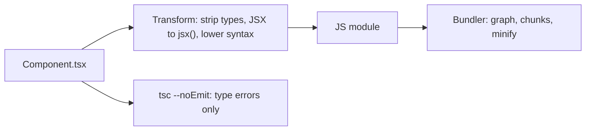

# 05 — Tooling and project setup

> **How to use this module.** Sections 5.1–5.3 are the mental model (packages, versions, what a bundler does) and answer most "what happens when I run `npm run build`" questions. Sections 5.4–5.8 cover the choices interviewers probe: Vite vs webpack, Babel vs SWC vs esbuild, ESLint, env variables, and why CRA is gone. Sections 5.9–5.10 are monorepos and debugging. If you only have 20 minutes, read 5.2, 5.3, 5.8, the Gotchas and the Summary.

**Prerequisites:** [Modules and `import`/`export`](01-javascript.md) · [`tsconfig` strictness flags](02-typescript.md#215-tsconfig-strictness-flags) · [What JSX compiles to](06-jsx-and-rendering-model.md#62-what-jsx-compiles-to)

**Code for this module:** [`examples/web/src/m05-tooling/`](examples/web/src/m05-tooling/). Every file has a test next to it. Run them with `npx vitest run src/m05-tooling` from `examples/web`. The repo's real configs are the worked examples: [`package.json`](examples/web/package.json), [`vite.config.ts`](examples/web/vite.config.ts), [`tsconfig.json`](examples/web/tsconfig.json), [`eslint.config.js`](examples/web/eslint.config.js), [`next-rsc/package.json`](examples/next-rsc/package.json), [`next.config.ts`](examples/next-rsc/next.config.ts) and, for the Java side, [`spring-api/pom.xml`](examples/spring-api/pom.xml).

> **Reading convention.** Facts that came from running something in this repo say so ("verified in `node_modules`"). Facts from official docs are linked. Anything else is marked `> **Unverified:**`.

---

## 5.1 npm, pnpm, yarn; lockfiles and why to commit them

### The problem
A React app is a few thousand files of other people's code. Without a tool that resolves, downloads and pins that code, two developers (or a laptop and CI) get different trees, and "works on my machine" becomes a build failure at 2 a.m.

### Mental model
A **package manager** [Tooling: npm/pnpm/yarn] does three jobs: (1) **resolve** each range in `package.json` to an exact version, (2) **fetch** and place the files in `node_modules`, (3) **record** the result in a **lockfile** so the next install reproduces it.

> **Java/Spring analogy.** `package.json` is the `pom.xml`, `node_modules` is `~/.m2` (but copied *into* the project), Maven Central is the npm registry, and `package-lock.json` is what Maven does **not** have by default: a full, exact snapshot of the resolved tree (Maven resolves ranges and "nearest wins" each time unless you pin versions or use a BOM or the enforcer plugin).
>
> **Where the analogy breaks:** Maven puts one version of a library on the classpath. npm may install **several versions of the same package** side by side in nested `node_modules` folders, which is why "duplicate React" (Exercise 3) exists at all.

### Minimal code
The commands you must know cold:

```bash
npm install              # resolve ranges, update the lockfile if needed
npm ci                   # CI: delete node_modules, install EXACTLY the lockfile, fail on mismatch
npm install zod          # add a dependency (writes "zod": "^4.6.5" to package.json)
npm ls react             # show every copy of react and who requires it
npx vitest run           # run a locally installed binary
```

`npm ci` behavior (requires a lockfile, errors instead of updating it when `package.json` disagrees, removes `node_modules` first, never writes the lockfile) is documented in the [npm-ci docs](https://docs.npmjs.com/cli/v11/commands/npm-ci). This repo's `examples/web/package-lock.json` has `"lockfileVersion": 3` (verified by `grep`).

### How it works internally
1. Read `package.json`, then the lockfile. If the lockfile satisfies every range, install exactly what it says (that is the "frozen" path).
2. Otherwise resolve the remaining ranges against the registry (picking the highest satisfying version, see [5.2](#52-semver-and-ranges-peer-dependencies)) and **hoist** packages as high in `node_modules` as conflicts allow, so most packages sit flat at the root and only conflicting versions are nested.
3. Run lifecycle scripts (`postinstall`) of dependencies unless disabled.

**Hoisting has a side effect: phantom dependencies.** Code can `import 'lodash'` without declaring it, because some other package pulled it to the top. It works until the other package changes.

| | npm | pnpm | Yarn Classic (1.x) | Yarn Berry (2+) |
|---|---|---|---|---|
| Lockfile | `package-lock.json` | `pnpm-lock.yaml` | `yarn.lock` | `yarn.lock` (different format) |
| Layout | flat, hoisted `node_modules` | symlinked, non-flat store | flat, hoisted | **Plug'n'Play** by default (a `.pnp.cjs` loader, no `node_modules`) |
| Phantom deps | possible | blocked by design | possible | blocked by design |
| Frozen install | `npm ci` | `pnpm install --frozen-lockfile` | `yarn install --frozen-lockfile` | `yarn install --immutable` |

pnpm keeps one content-addressable copy of each package version on disk, hard-links files into projects, and symlinks only your **direct** dependencies into the root `node_modules`, which is what blocks phantom dependencies ([pnpm motivation](https://pnpm.io/motivation)). Yarn's Plug'n'Play replaces `node_modules` with a single `.pnp.cjs` file, is the default in modern Yarn, and can be turned off with `nodeLinker: node-modules` in `.yarnrc.yml` ([Yarn PnP](https://yarnpkg.com/features/pnp)).

> **Version notes.** **Yarn Classic (1.x)** is the "yarn" many older repos use (`yarn.lock` v1, `--frozen-lockfile`). **Yarn Berry (2+)** is a different tool with a different CLI flag (`--immutable`), `.yarnrc.yml` and PnP. When a repo says "we use Yarn", ask which. VERSIONS.md lists pnpm 12.8.1 and npm 11.6.2 for this machine's build.

> **Pinning the package manager.** Corepack reads the `packageManager` field in `package.json` (e.g. `"pnpm@12.8.1"`) and runs that exact version. It ships with Node from 14.19.0 up to, but not including, 25.0.0; on Node 25+ install it with `npm install -g corepack` ([Corepack README](https://github.com/nodejs/corepack)).

### Trade-offs
- **Commit the lockfile for applications.** It is the only thing that makes `npm ci` deterministic and gives you reviewable dependency diffs. Commit exactly one lockfile (mixing `package-lock.json` and `yarn.lock` means two sources of truth).
- **Libraries** also commit it for their own dev/test, but consumers ignore it: only your declared ranges ship, so test against the low and high ends of your own ranges in CI.
- Choose **npm** for zero setup, **pnpm** for monorepos and disk/CI speed with strict dependency hygiene, **Yarn Berry** if the team already invested in it. Switching costs a lockfile migration and some fixed phantom dependencies.

---

## 5.2 Semver and ranges, peer dependencies

### The problem
You want security and bug fixes automatically but not breaking changes. And a plugin like `react-redux` must work with **your** copy of React, not bring its own.

### Mental model
**Semantic versioning** [Tooling: semver] says `MAJOR.MINOR.PATCH`: break the public API → bump MAJOR; add compatible features → MINOR; compatible fixes → PATCH. A **range** in `package.json` is a promise from *you* about which of those bumps you accept.

| Range | Means | Example matches for `1.2.3` base |
|---|---|---|
| `1.2.3` | exactly that | `1.2.3` |
| `^1.2.3` | same left-most **non-zero** digit | `1.2.3` … `1.99.0`, not `2.0.0` |
| `~1.2.3` | patch updates only (minor if you wrote `~1`) | `1.2.3` … `1.2.99`, not `1.3.0` |
| `^0.2.3` | `0.2.3` ≤ v < `0.3.0` | **minor is the breaking digit below 1.0** |
| `^0.0.3` | exactly `0.0.3` | patch is breaking below 0.1 |
| `1.x`, `1.2.x`, `*` | x-ranges | any minor/patch |
| `>=1.2.0 <2.0.0` | comparators, space = AND | |
| `^18 \|\| ^19` | `\|\|` = OR | typical **peer** range for React libraries |

> **Where the Maven analogy breaks.** Maven version ranges (`[1.2,2.0)`) exist but are rarely used, and "nearest definition wins" decides conflicts. npm ranges are the default (`npm install` writes `^`), and conflicts are resolved by **installing both** versions.

### Minimal code
The repo ships a small range checker so you can see the rules as code: [`semver.ts`](examples/web/src/m05-tooling/semver.ts) (exercise 4).

```ts
import { satisfies, maxSatisfying } from './semver';

satisfies('1.4.2', '^1.2.0');                  // true
satisfies('2.0.0', '^1.2.0');                  // false
satisfies('1.3.0-beta.1', '^1.2.0');           // false: prereleases are opt-in
maxSatisfying(['1.2.0', '1.9.3', '1.10.0'], '^1.2.0'); // '1.10.0' (numeric, not lexical)
```

### How it works internally
- **Resolution** picks the **highest published version** that satisfies the range, unless the lockfile already pins one. That is why a fresh install without a lockfile can break overnight.
- **Prerelease rule:** `1.3.0-beta.1` satisfies a range only if a comparator in the same set names a prerelease of the *same* `1.3.0`. So `^1.2.0` never installs betas.
- **Compare numerically**: `1.10.0 > 1.9.3`. String sorting gets it wrong.
- **Prerelease ordering** (from the semver spec): `1.0.0-alpha < 1.0.0-alpha.1 < 1.0.0-alpha.beta < 1.0.0-beta < 1.0.0-beta.2 < 1.0.0-beta.11 < 1.0.0-rc.1 < 1.0.0`. The test in `semver.test.ts` asserts exactly this order.

#### Dependency kinds
| Field | Installed for consumers? | Use for |
|---|---|---|
| `dependencies` | yes | code your app imports at runtime (in an **app**, bundlers inline it anyway, so the split is mostly convention) |
| `devDependencies` | no (for libraries); apps: installed in dev/CI | build, test, lint tools |
| `peerDependencies` | **you** must provide a compatible copy | plugins/libraries that share a singleton with the host (React) |
| `optionalDependencies` / `peerDependenciesMeta.optional` | best effort | native binaries, optional integrations |
| `overrides` (npm) / `resolutions` (Yarn) / `pnpm.overrides` | n/a | force a version anywhere in the tree |

**Peer dependencies are how React libraries avoid shipping their own React.** Real examples, read from this repo's `node_modules` on 2026-10-04:

- `react-dom` declares peer `react: ^19.3.0`, a **lockstep** with the renderer.
- `@tanstack/react-query` declares peer `react: ^18 || ^19`.
- `react-redux` declares peers `react: ^18.0 || ^19`, `@types/react: ^18.2.25 || ^19` and `redux: ^5.0.0`.

`peers.ts` ([`unmetPeers`](examples/web/src/m05-tooling/peers.ts)) models the check.

> **Version notes.** **npm 3–6**: peer dependencies were **not** installed; npm only warned if the version was wrong. **npm 7+**: peers are **installed automatically**, and a conflict is an `ERESOLVE` error instead of a warning ([npm docs](https://docs.npmjs.com/cli/v11/configuring-npm/package-json#peerdependencies)). Many React 17-era projects hit `ERESOLVE` when they first upgraded to npm 7+, and the quick fix `--legacy-peer-deps` (restore the npm 6 behavior) became folklore. It is a flag to **locate** the problem, not a fix: you still have two things that disagree about React.
>
> **pnpm and Yarn** have their own peer rules (pnpm warns by default and has `auto-install-peers`; Yarn Berry reports peer warnings in `yarn install`).
>
> pnpm's current docs list `autoInstallPeers` default `true` and `strictPeerDependencies` default `false`, so missing peers are installed and mismatches only warn ([pnpm peer-dependency settings](https://pnpm.io/settings/peer-dependencies)).

### Trade-offs
- **`^` for most things, exact pins for tools that break in minors** (this repo pins `typescript` to `~6.0.3`, because `typescript-eslint` 8.71 declares peer `typescript >=4.8.4 <6.1.0`; see [VERSIONS.md](VERSIONS.md)). The `~` there is the practical definition of "a tilde keeps me inside the peer range of my linter".
- **Libraries should use wide peer ranges** (`^18 || ^19`) so they do not force the app to upgrade, and test the ends.
- **Renovate/Dependabot + lockfile + CI** is how you take updates deliberately instead of accidentally.

---

## 5.3 Bundling concepts: module graph, tree shaking, code splitting, HMR

### The problem
Browsers can load ES modules directly, but an app with 1,500 modules means 1,500 requests, un-minified code, no TypeScript or JSX, and CSS/images as separate concerns. Something must turn **source files** into **assets that load fast**.

### Mental model
A bundler [Tooling] starts at one or more **entry points** (`index.html` → `main.tsx`), follows every `import` to build a **module graph**, transforms each module (TS/JSX → JS, CSS, assets), and writes **chunks**: files containing a connected part of the graph.

> **Java/Spring analogy.** The module graph is the class dependency graph; a chunk is a JAR. **Tree shaking** is what ProGuard/R8 shrinking or the Maven Shade plugin's `minimizeJar` does to unused classes. **Code splitting** is "load this plugin JAR only when the feature is used".
>
> **Where the analogy breaks:** the JVM loads classes lazily by itself; a browser downloads over a network, so *you* decide where the lazy boundary is (`import()`), and each boundary costs a request (waterfall) in exchange for a smaller first load.

```mermaid
flowchart LR
  subgraph graph["Module graph (static imports)"]
    main["main.tsx"] --> app["App.tsx"]
    app --> home["Home.tsx"]
    app -. "import()" .-> admin["Admin.tsx"]
    home --> utils["utils.ts"]
    admin --> utils
    admin --> chart["chart-lib"]
    utils --> used["formatDate (used)"]
    utils --> unused["formatCurrency (unused)"]
  end
  subgraph chunks["Output chunks"]
    c1["index.js: main, App, Home, formatDate"]
    c2["admin.js: Admin, chart-lib"]
    c3["shared chunk: utils used by both"]
  end
  graph -->|"tree shaking drops formatCurrency"| chunks
  admin -.->|"loaded on demand"| c2
```

### Minimal code
```tsx
// Static import: in the main chunk.
import { Home } from './Home';

// Dynamic import: a split point. The bundler emits a separate chunk, loaded on first use.
const Admin = lazy(() => import('./Admin'));   // see 15.7 for lazy + Suspense
```
Splitting with `lazy`/`Suspense` is covered in [15.7](15-performance.md#157-code-splitting-with-lazy-and-suspense) and analyzing what ended up where in [15.11](15-performance.md#1511-bundle-analysis). This section is the machinery under them.

### How it works internally

**Module graph.** `import` and `export` statements are **static**: the bundler can read them without running code. That is the reason ES modules (not CommonJS `require()`) enable optimization. `import()` is a static *split point* with a dynamic *load time*.

**Tree shaking** [Tooling] is dead-code elimination over the module graph:
1. The bundler marks which **exports** are used, following re-exports.
2. It drops unused exports and the code only they reference.
3. It must keep code with **side effects** (top-level statements that change the world). It can only drop a whole module if it knows importing it is side-effect free. That is what the `"sideEffects"` field in `package.json` declares. Verified in this repo's `node_modules`: `zod/package.json` sets `"sideEffects": ["./compile.js", "./compile.cjs", "./src/compile.ts"]`, meaning "everything else is safe to drop if unused".
4. It requires ESM. A `require()` call or `module.exports` is dynamic, so CommonJS packages usually cannot be shaken.

```ts
// utils.ts: shakeable
export const formatDate = (d: Date) => d.toISOString();
export const formatCurrency = (n: number) => `$${n}`; // dropped if nobody imports it

// NOT shakeable: a top-level side effect keeps this module whole
window.addEventListener('resize', track);
```

**Code splitting** has three common forms: **entry** (multiple HTML pages), **dynamic** (`import()`), and **automatic vendor/shared chunking** (modules used by several chunks go into a shared chunk so they are cached once). Content-hashed filenames (`index-4f9a1c.js`) make the files immutable and safe to cache forever ([3.9](03-browser-and-web-platform.md#39-http-caching-cache-control-etag-validation-immutable-assets)).

**HMR** (Hot Module Replacement) [Tooling] swaps a changed module in the running page without a reload. The dev server watches files, recompiles the one module, and tells the browser over a WebSocket to import the new version; **React Fast Refresh** [React] then re-renders the affected components while **preserving state** when only components changed. A module that exports non-components (constants, helpers) alongside components forces a full reload of that module's dependents, which is why `eslint-plugin-react-refresh` exists.

> The plugin has one rule, `react-refresh/only-export-components`, and three flat-config presets: `reactRefresh.configs.recommended()`, `.vite()` (allows constant and compound-component exports) and `.next()` (allows Next.js page exports such as `revalidate`) ([eslint-plugin-react-refresh README](https://github.com/ArnaudBarre/eslint-plugin-react-refresh)).

> **Version notes.** **Webpack 4 (2018) / 5 (2020)** bundles in dev too and keeps the whole graph in memory; HMR cost grows with app size. **Vite ≤ 7** served your source as **native ESM** in dev (transformed on demand with **esbuild**) and bundled for production with **Rollup**. **Vite 8** (released 2026-03-12) replaced the esbuild + Rollup pair with a single Rust bundler, **Rolldown**, in both ([Vite 8 announcement](https://vite.dev/blog/announcing-vite8)). The installed `vite@8.3.2` depends on `rolldown ~1.2.11` (verified in its `package.json`).
>
> Vite 8's guide still says source code "is served on-demand over native ESM" in dev; a bundled "full bundle mode" for dev is only listed as something the team is exploring ([Why Vite](https://vite.dev/guide/why)).

### Trade-offs
- **More splitting ≠ faster.** Each chunk is a request and a possible waterfall (chunk A loads, then A imports B). Split at **routes** and **heavy, rarely used widgets** (editor, charts), not at every component.
- **Tree shaking is a best-effort optimization.** A barrel file (`index.ts` that re-exports 400 icons) is shaken fine by modern bundlers *if* the package is ESM and side-effect-free, and it is a dev-server (unbundled) slowdown because the dev server may load them all.
- **Measure** with a bundle analyzer (15.11) instead of guessing.

---

## 5.4 Vite vs webpack

### The problem
You will meet both. Webpack runs a large share of existing React codebases (and everything that came from CRA), Vite runs most new ones, and "why did you pick X" is a standard interview question.

### Mental model
Both turn a module graph into chunks. They differ in **configuration style, defaults and dev architecture**:

| | **webpack 5** | **Vite 8** |
|---|---|---|
| Config | explicit: `entry`, `module.rules` (loaders), `plugins`, `output`, `optimization` | small `vite.config.ts`; defaults for TS/JSX/CSS/assets |
| Entry | a JS file | `index.html` is the entry |
| TS/JSX transform | via loaders (`babel-loader`, `ts-loader`, `swc-loader`, `esbuild-loader`) | built in (Oxc; `esbuild` option deprecated and converted to `oxc` per the [Vite docs](https://vite.dev/config/shared-options.html)) |
| Dev server | `webpack-dev-server` over a bundle | Vite dev server |
| Production | webpack itself | Rolldown (Vite 8), Rollup (Vite ≤ 7) |
| Extension | loaders + plugins (huge ecosystem) | plugins (Rollup-style hooks, now Rolldown) |
| Module Federation | built in since 5 | via plugins |

> **Where the analogy to Maven helps.** webpack is Maven with every plugin and `<execution>` spelled out; Vite is Spring Boot's starter parent: convention first, override only when needed.

**Rspack** [Tooling: Rspack] is a Rust bundler with a webpack-compatible API, designed to be a drop-in replacement for most webpack configs and loaders ([Rspack intro](https://rspack.rs/guide/start/introduction)). It is the migration path for big webpack apps that need speed without rewriting config. **Turbopack** is Vercel's Rust bundler; VERSIONS.md records it as the **default bundler in Next.js 16**. **Parcel** and **Rsbuild** (Rspack-based) are the other options React's docs list ([Build a React app from scratch](https://react.dev/learn/build-a-react-app-from-scratch)).

### Minimal code
A webpack 5 config for a React + TS app (legacy; compare its size with the 8 lines of this repo's [`vite.config.ts`](examples/web/vite.config.ts)):

```js
// webpack.config.js (webpack 5; shown for recognition, not part of this repo)
const HtmlWebpackPlugin = require('html-webpack-plugin');

module.exports = {
  entry: './src/index.tsx',
  output: { filename: '[name].[contenthash].js', clean: true },
  resolve: { extensions: ['.tsx', '.ts', '.js'] },
  module: {
    rules: [
      { test: /\.[jt]sx?$/, exclude: /node_modules/, use: 'babel-loader' },
      { test: /\.css$/, use: ['style-loader', 'css-loader'] },
    ],
  },
  plugins: [new HtmlWebpackPlugin({ template: './public/index.html' })],
  devServer: { hot: true, historyApiFallback: true },
};
```

And this repo's actual Vite config:

```ts
// examples/web/vite.config.ts (verbatim)
/// <reference types="vitest/config" />
import { defineConfig } from 'vite';
import react from '@vitejs/plugin-react';

export default defineConfig({
  plugins: [react()],
  test: {
    environment: 'jsdom',
    globals: true,
    setupFiles: ['./src/test/setup.ts'],
  },
});
```
One file configures the app build **and** Vitest, because Vitest reuses the Vite pipeline (aliases, plugins, transforms). That is a major reason teams on Vite choose Vitest over Jest ([20](20-testing.md)).

### How it works internally
- **Loaders vs plugins (webpack).** A *loader* transforms one file type (`.tsx` → JS). A *plugin* hooks the whole compilation (emit HTML, extract CSS, define constants).
- **Plugins (Vite).** Rollup-compatible hooks (`resolveId`, `load`, `transform`) plus Vite-specific ones (`configureServer`, `handleHotUpdate`). `@vitejs/plugin-react` 6.1.1 (installed) adds the JSX/Fast Refresh handling. Its `package.json` lists optional peers `@rolldown/plugin-babel` and `babel-plugin-react-compiler`, so **Babel is no longer in the default path**: you only add it to run the React Compiler ([15.5](15-performance.md#155-the-react-compiler-and-how-it-changes-the-advice)). Vite 8's announcement states plugin-react v6 uses Oxc rather than Babel for the React Refresh transform.
- **Dev architecture.** Webpack builds a bundle in memory; Vite transforms files on request (see the unverified note in 5.3).

> **Version notes.** **webpack 4** needed Node-polyfill defaults (`process`, `Buffer`) and `url-loader`/`file-loader`; **webpack 5** removed the auto-polyfills and replaced the loaders with built-in **asset modules** (`type: 'asset'`). **Create React App 5** hid a webpack 5 config behind `react-scripts` (and `eject` exposed it); see [5.8](#58-creating-a-project-in-2026). **Vite 5/6/7** use Rollup for builds; **Vite 8** uses Rolldown.

### Trade-offs
- **New project, no framework:** Vite. **Existing webpack app:** do not rewrite for fashion. If the build is slow, move to **Rspack** first (same config concepts), or migrate to Vite when you are touching the build anyway.
- **Micro-frontends with Module Federation** are most mature on webpack/Rspack ([22.13](22-production-project-structure.md#2213-micro-frontends)).
- **Framework apps** (Next.js, React Router framework mode) choose the bundler for you.

---

## 5.5 Transpilers: Babel, SWC, esbuild; what JSX transform means

### The problem
Browsers do not run JSX. TypeScript is not JavaScript. Older browsers lack newer syntax. Someone has to rewrite source into something the target runs, and fast.

### Mental model
A **transpiler** [Tooling] parses source to an AST, transforms it, and prints code. It does **not** type-check TypeScript (it just deletes the types), and it does **not** bundle (that is the bundler's job; a bundler calls a transpiler per file).

| Tool | Written in | Role today | Notes |
|---|---|---|---|
| **Babel** | JavaScript | the original; plugin ecosystem (React Compiler, styled-components, legacy decorators) | slowest; still required for **React Compiler** in most setups |
| **SWC** | Rust | drop-in faster Babel; used by Next.js (before Turbopack) and `@vitejs/plugin-react-swc` | smaller plugin ecosystem |
| **esbuild** | Go | very fast transform and bundle; powered Vite ≤ 7 dev | no type check; limited syntax lowering and no plugin API for AST edits |
| **Oxc** | Rust | the transformer inside Vite 8 / Rolldown | `esbuild` option in Vite 8 is deprecated and mapped to `oxc` ([docs](https://vite.dev/config/shared-options.html)) |
| **tsc** | TypeScript (7.0: Go) | **type-checks** and emits | run as `tsc --noEmit` next to a transpiler; this repo's `typecheck` script |



### Minimal code
**What "JSX transform" means.** JSX is syntax sugar for function calls. There are two output styles:

```tsx
const el = <Button kind="primary">Save</Button>;

// Classic transform (React ≤ 16, Babel default before 7.9): needs `React` in scope
const el = React.createElement(Button, { kind: 'primary' }, 'Save');

// Automatic transform (React 17+): the compiler adds the import itself
import { jsx as _jsx } from 'react/jsx-runtime';
const el = _jsx(Button, { kind: 'primary', children: 'Save' });
```
Under the automatic runtime you no longer write `import React from 'react'` just for JSX. TypeScript selects it with `"jsx": "react-jsx"`, exactly what this repo's [`tsconfig.json`](examples/web/tsconfig.json) sets (the dev variant `react-jsxdev` imports `jsx-dev-runtime`). The details of elements and `jsx()` are in [6.2](06-jsx-and-rendering-model.md#62-what-jsx-compiles-to).

### How it works internally
- **Types are erased.** `const x: number = 1` becomes `const x = 1`. With `verbatimModuleSyntax` (set in this repo), an `import type` is dropped entirely while a plain `import { Foo }` is kept as written, so a type-only import written without `type` is a **compile error** instead of a silent runtime difference. This also matches what single-file transpilers can know: they cannot see other files, so they cannot tell whether `Foo` is a type.
- **`const enum` and namespaces** need cross-file knowledge or non-erasable output, which is why `isolatedModules` / `erasableSyntaxOnly`-style flags exist. TS 6.0 does not turn them on: they are absent from the new-defaults list in the [6.0 announcement](https://devblogs.microsoft.com/typescript/announcing-typescript-6-0/) (summarized in [02](02-typescript.md#217-typescript-67-the-native-compiler-and-what-changed)), so set them yourself.
- **Lowering** rewrites new syntax for the `target` (this repo targets ES2023, so almost nothing is lowered). **Browserslist** (a `browserslist` field or `.browserslistrc`) tells tools which browsers to support. Vite 8's default `build.target` is `'baseline-widely-available'`, which for this major resolves to `['chrome111', 'edge111', 'firefox114', 'safari16.4', 'ios16.4']` (Baseline Widely available as of a fixed date, 2026-01-01) ([Vite build options](https://vite.dev/config/build-options)).
- **Polyfills are separate from syntax lowering.** A transpiler can rewrite `a ?? b` but cannot add `Array.prototype.at` to an old browser; that needs `core-js`, which you opt into explicitly.

> **Version notes.** **React ≤ 16**: classic runtime only (`React` must be in scope). **React 17**: introduced `react/jsx-runtime`. **Babel 7.9+**: `@babel/preset-react` with `{ runtime: 'automatic' }` became available (default only from Babel 8). **CRA 4+** used the automatic runtime. **TypeScript 4.1** added `react-jsx`.
>
> Sources for these numbers: [Babel 7.9.0 release](https://babeljs.io/blog/2020/03/16/7.9.0) (automatic runtime added; "starting from Babel 8, `automatic` will be the default") and [Introducing the new JSX transform](https://legacy.reactjs.org/blog/2020/09/22/introducing-the-new-jsx-transform.html) (CRA 4.0.0+, TypeScript 4.1+, Next.js 9.5.3+; the runtime was also backported to React 16.14.0, 15.7.0 and 0.14.10).

### Trade-offs
- **Babel only** is justified when you need a Babel-only plugin (React Compiler, certain CSS-in-JS transforms, legacy decorators). Run it as the second stage in Vite 8 via the optional peers listed above.
- **SWC/Oxc/esbuild** for everything else: 10× to 100× faster transforms, with the same output for plain TS+JSX.
- **Never think "the build passed so types are fine."** A transpiler build passes on code `tsc` rejects. CI must run `tsc --noEmit` (this repo's `npm run verify` does: typecheck, lint, test).

---

## 5.6 ESLint flat config, `eslint-plugin-react-hooks`, Prettier, and the line between them

### The problem
Some bugs are visible to a machine before a human reviews: a missing hook dependency, an unused variable, a conditional hook call. Meanwhile, humans waste review time arguing about semicolons.

### Mental model
Two tools, two jobs:

| | **ESLint** [Tooling] | **Prettier** [Tooling] |
|---|---|---|
| Job | find **bug-prone** code and enforce rules | print code in one canonical **format** |
| Output | warnings/errors | rewritten file |
| Configurable | very (rules, plugins) | deliberately little |
| Example | `react-hooks/exhaustive-deps` | line width, quotes |

> **Java/Spring analogy.** ESLint is Checkstyle/SpotBugs/PMD; Prettier is `google-java-format`/Spotless. (The Java workflow in this repo runs `mvn spotless:apply` for the same reason: formatting is a command, not a debate.)

**The line between them:** formatting rules (indent, quotes, semicolons) belong to Prettier; ESLint should not also enforce them, or the two fight. If you still enable stylistic rules or plugins, add `eslint-config-prettier` last to switch off the ones that conflict. This repo enables no stylistic rules and does not use Prettier, so it needs neither.

### Minimal code
This repo's flat config, verbatim ([`eslint.config.js`](examples/web/eslint.config.js)):

```js
import js from '@eslint/js';
import globals from 'globals';
import reactHooks from 'eslint-plugin-react-hooks';
import tseslint from 'typescript-eslint';

export default tseslint.config(
  { ignores: ['node_modules', 'dist', 'coverage'] },
  js.configs.recommended,
  ...tseslint.configs.recommended,
  reactHooks.configs.flat.recommended,
  { languageOptions: { globals: globals.browser } },
);
```

The same file in the **legacy eslintrc** format (ESLint ≤ 8, and ≤ 9 behind `ESLINT_USE_FLAT_CONFIG=false`), for recognition:

```json
// .eslintrc.json (legacy; removed in ESLint 10)
{
  "root": true,
  "env": { "browser": true, "es2022": true },
  "parser": "@typescript-eslint/parser",
  "plugins": ["@typescript-eslint", "react-hooks"],
  "extends": [
    "eslint:recommended",
    "plugin:@typescript-eslint/recommended",
    "plugin:react-hooks/recommended"
  ],
  "ignorePatterns": ["dist"]
}
```

### How it works internally
- **Flat config** is one array of config objects in `eslint.config.js` (also `.mjs`, `.cjs`, `.ts`, `.mts`, `.cts`). For a given file, every object whose `files`/`ignores` match is merged in order, later ones winning ([ESLint docs](https://eslint.org/docs/latest/use/configure/configuration-files)). A config object with **only** `ignores` is a **global ignore**; the repo's first object relies on that.
- `plugins` are **objects you import** (`reactHooks`), not strings resolved by name. That removes the `eslint-plugin-` naming magic and the "which plugin version did it resolve" problem of eslintrc.
- The `eslint/config` helper `defineConfig([...])` (used in the react-hooks README example) adds type help and `extends`. This repo uses `tseslint.config(...)`, the typescript-eslint equivalent.
- **Type-aware rules** (`recommendedTypeChecked`) need `languageOptions.parserOptions.projectService` and are slower; this repo uses the non-type-aware `recommended`. [typescript-eslint docs](https://typescript-eslint.io).

#### `eslint-plugin-react-hooks`
Two classic rules, plus (since v6/v7) the **React Compiler's diagnostics** surfaced as lint rules.

| Rule | What it catches |
|---|---|
| `rules-of-hooks` | hooks called conditionally, in loops, or in non-component functions ([12.1](12-hooks-and-custom-hooks.md#121-the-rules-of-hooks)) |
| `exhaustive-deps` | a dependency array that lies ([9.2](09-effects.md#92-dependencies-and-the-objectis-comparison)) |
| `set-state-in-effect`, `set-state-in-render`, `purity`, `refs`, `immutability`, `static-components`, … | compiler-derived rules |

The [React reference](https://react.dev/reference/eslint-plugin-react-hooks) lists a `recommended` preset with 16 rules, and VERSIONS.md records installed **7.1.1**. In **this** repo `react-hooks/set-state-in-effect` reports as an **error** with the `recommended` preset (found while building the pilot module, see PROGRESS.md), which is why module code derives state during render instead of calling `setState` inside effects.

> **Version notes.** **eslint-plugin-react-hooks v4** (the CRA-era one): eslintrc only, two rules, `plugin:react-hooks/recommended`. **v5.2.0**: added flat-config support (`configs['recommended-latest']`). **v6/v7**: flat config is the default for `recommended`; compiler-powered rules joined it; `recommended-legacy` is the eslintrc preset (VERSIONS.md row, "Flat config is the default `recommended` preset since v6"). The plugin README still says its eslintrc form (`extends: ["plugin:react-hooks/recommended"]`) is for "ESLint below 9.0.0".
>
> The [plugin CHANGELOG](https://github.com/facebook/react/blob/main/packages/eslint-plugin-react-hooks/CHANGELOG.md) dates flat-config support to **5.2.0** ("Support flat config", #30774), not 5.0. 6.0.0 was published by accident and deprecated; **6.1.0** made flat config the default `recommended` preset and moved eslintrc to `recommended-legacy`.
>
> **ESLint 8 → 9 → 10.** **ESLint 8**: eslintrc default, flat opt-in. **ESLint 9**: flat config is the default; eslintrc needed `ESLINT_USE_FLAT_CONFIG=false`. **ESLint 10**: "the old configuration format is no longer supported" and `ESLINT_USE_FLAT_CONFIG` no longer does anything; `FlatESLint`/`LegacyESLint` classes were removed; Node ≥ 20.19 / 22.13 / 24 ([migration guide](https://eslint.org/docs/latest/use/migrate-to-10.0.0)). `@eslint/eslintrc` (the compat helper) still exists as a dependency of ESLint 10 in this repo's `node_modules`, for plugins that need `FlatCompat`. **CRA** bundled its own `eslint-config-react-app` (eslintrc). Migrating means rewriting to flat config and replacing `next lint` (Next 16 removed it, per VERSIONS.md) with plain `eslint`.

### Trade-offs
- **Lint in the editor and CI**, format on save and in a pre-commit hook. Do not rely on a pre-commit hook alone (`--no-verify` skips it).
- **Treat `exhaustive-deps` warnings as bugs** ([9.2](09-effects.md#92-dependencies-and-the-objectis-comparison)); suppressing with a comment hides the stale closure.
- **Every rule has a cost.** The best config is the smallest one the team reads.

---

## 5.7 Environment variables

### The problem
You need an API URL that differs per environment and a few secrets. The browser is public: anything shipped to it is readable by every user.

### Mental model
There are **two moments** a value can be fixed:

| | **Build time** | **Runtime** |
|---|---|---|
| Fixed when | `vite build` runs | the page loads (or the container starts) |
| Mechanism | `import.meta.env.VITE_*` text replaced in the bundle | injected global (`window.__APP_CONFIG__`) or `fetch('/config.json')` |
| Change requires | **a rebuild** | restarting/replacing a file |
| Same artifact in staging and prod? | **no** (one build per environment) | **yes** (build once, deploy many) |

> **Java/Spring analogy.** Build-time env is like `@Value` baked into the JAR at compile time. Runtime config is `application.properties` / `SPRING_PROFILES_ACTIVE` read at startup, "build once, run anywhere". **Where it breaks:** a Spring server's config stays on the server. Every value the *browser* receives is public; the "secret" in a front-end env var is not secret.

### Minimal code
```ts
// vite-env.d.ts: types for your own variables (no imports in this file)
interface ImportMetaEnv {
  readonly VITE_API_URL: string;
}
interface ImportMeta {
  readonly env: ImportMetaEnv;
}

// anywhere in client code
const base = import.meta.env.VITE_API_URL;
if (import.meta.env.DEV) console.log('dev only');   // dead code removed from production builds
```
And the runtime pattern, implemented and tested here ([`loadConfig.ts`](examples/web/src/m05-tooling/loadConfig.ts), Exercise 2).

### How it works internally
From the [Vite env docs](https://vite.dev/guide/env-and-mode.html):
- Only variables prefixed **`VITE_`** (the default `envPrefix`) are exposed to client code; others, like `DB_PASSWORD`, stay out of the bundle. `envPrefix` cannot be set to an empty string, to avoid leaking everything ([shared options](https://vite.dev/config/shared-options.html)).
- Built-ins: `import.meta.env.MODE`, `BASE_URL`, `PROD`, `DEV`, `SSR`. They are **statically replaced at build time**, which makes tree shaking effective (`if (import.meta.env.DEV) {…}` disappears from production).
- File loading order: `.env`, `.env.local`, `.env.[mode]`, `.env.[mode].local`; mode-specific files win. Real process env vars win over files: "environment variables that already exist when Vite is executed have the highest priority and will not be overwritten by `.env` files" ([Vite env and modes](https://vite.dev/guide/env-and-mode)).
- **Values are strings.** `VITE_FLAG=false` is the string `"false"`, which is **truthy**. Parse it (a Zod schema does this properly, see Exercise 2).

> **Version notes.** **CRA / webpack DefinePlugin**: `process.env.REACT_APP_*`, replaced at build time. **Vite**: `import.meta.env.VITE_*` (no `process.env` in the browser). **Next.js**: `NEXT_PUBLIC_*` is inlined at build time; unprefixed variables are server-only.
>
> The Next.js 16 docs say `NEXT_PUBLIC_` values are inlined at `next build` and "frozen" in the bundle, so one Docker image promoted across environments keeps the build-time value; for runtime values they recommend reading `process.env` on the server during dynamic rendering (for example after `await connection()`) or serving the values from your own API ([Next.js environment variables](https://nextjs.org/docs/app/guides/environment-variables)). The full build/deploy side (CI, Docker, one image per environment) is in [22.5](22-production-project-structure.md#225-environment-config), [22.10](22-production-project-structure.md#2210-ci-pipeline) and [22.11](22-production-project-structure.md#2211-dockerized-front-end).

### Trade-offs
- **Build-time** is the simplest and fine for one environment or for values that never change after release (a public analytics key).
- **Runtime** is for "one image, many environments", feature flags and tenant config; it costs a startup step (a script tag or one extra request) and requires validation, because nothing type-checks a JSON file at deploy time.
- **Never put secrets in either.** If the browser needs a secret, put a backend (a Spring Boot endpoint, [24](24-react-with-spring-boot.md)) in front of it.

---

## 5.8 Creating a project in 2026

### The problem
For years the answer to "how do I start a React app" was `npx create-react-app`. That answer is now wrong, and plenty of tutorials, interview prep and company READMEs still say it.

### Mental model
**First decide whether you need a framework**, then pick the cheapest tool that covers your needs:

| You need | Pick | Why |
|---|---|---|
| Routing, data loading, SSR/SSG, deploy story, a team that wants conventions | **A framework**: Next.js, React Router (framework mode), Expo (native) | the React team's recommendation for new apps |
| A pure client-side SPA behind a login, existing backend (a Spring Boot API) | **Vite** (`react-ts` template) + React Router (library/data mode) + TanStack Query | smallest moving parts |
| A webpack-compatible fast build for an existing app | **Rspack / Rsbuild** | keeps webpack concepts |
| Zero config, bundler built in | **Parcel** | |

> **⚠️ Correction.** "Use `create-react-app`" is outdated. **CRA was deprecated on 2025-02-14.** React's own [announcement](https://react.dev/blog/2025/02/14/sunsetting-create-react-app) says to create new apps with a framework (Next.js, React Router or Expo), or, if you have unusual constraints, with a build tool (Vite, Parcel, Rsbuild). CRA still works but is in maintenance mode with no active maintainers developing features (a version for React 19 was published), and new installs print a deprecation warning. VERSIONS.md lists `react-scripts` 5.1.0 as the final line. Its slowness, abandoned webpack 5 config, `eject`, and missing SSR are why.

> **Where the "framework" analogy lands.** Choosing Vite alone is like starting a Spring project with plain Servlets and wiring everything yourself; choosing Next.js is Spring Boot. React's docs warn that going without a framework means you will end up "building your own framework" for routing, data fetching and SSR ([from scratch guide](https://react.dev/learn/build-a-react-app-from-scratch)).

### Minimal code
```bash
# Vite 8 + React + TypeScript (from React's "build from scratch" page)
npm create vite@latest my-app -- --template react-ts
cd my-app && npm install && npm run dev

# Rsbuild (from the same page)
npx create-rsbuild --template react
```
> Scaffolding commands, from the official docs: `npx create-next-app@latest` (defaults: TypeScript, ESLint, Tailwind CSS, App Router, Turbopack, alias `@/*`; flags such as `--src-dir`, `--react-compiler`, `--biome`, `--empty`, `--yes`; [create-next-app](https://nextjs.org/docs/app/api-reference/cli/create-next-app)) and `npx create-react-router@latest my-app` for framework mode ([React Router installation](https://reactrouter.com/start/framework/installation)). This repo's `examples/next-rsc` was hand-scaffolded (see PROGRESS.md) with `next` 16.3.8, which shows the minimum: a [`package.json`](examples/next-rsc/package.json) with `next`, `react`, `react-dom`, TypeScript, and a [`next.config.ts`](examples/next-rsc/next.config.ts) that is essentially empty (`const nextConfig: NextConfig = {}`).

What this repo's own `examples/web` is: a Vite 8 + React 19.3 + TS 6.0 project with **Vitest 5**, **ESLint 10 flat config**, Node pinned by `examples/.nvmrc` (value `24`) and `"engines": { "node": ">=24 <25" }`. The pin exists because Vitest 5 declares `node ^22.12 || ^24 || >=26`, so Node 25 is outside its range (VERSIONS.md). The pipeline is `npm run verify` = `typecheck && lint && test`.

### How it works internally
A scaffold gives you the same five parts, whatever the tool: **(1)** an HTML/entry file, **(2)** a dev server with HMR, **(3)** a production build, **(4)** TS/lint/test configs, **(5)** scripts. Migrating a CRA app means mapping each: `react-scripts start` → `vite`, `REACT_APP_*` → `VITE_*`, `public/index.html` → root `index.html` with a `<script type="module" src="/src/main.tsx">`, Jest → Vitest (or keep Jest), `eslint-config-react-app` → flat config. React documents migrations to Vite, Parcel and Rsbuild.

### Trade-offs
- **Choose a framework when SEO, first paint or server data matter** ([21](21-concurrent-ssr-server-components.md)). **Choose Vite for an authenticated SPA** whose backend is separate.
- **Do not migrate a working CRA app in a panic.** Plan it: the pain points are the Jest→Vitest switch and env-var renames.
- **Pin your toolchain's moving parts** (Node via `.nvmrc`, TypeScript via `~`) and write down why, as this repo does.

---

## 5.9 Monorepos: workspaces, Turborepo/Nx basics

### The problem
A React app, a design-system package, a shared API client and an ESLint config live in separate repos, so a change spans four PRs and four releases.

### Mental model
A **monorepo** [Tooling] is one repo with many packages. Two layers:
1. **Workspaces** (npm, pnpm, Yarn): one root install; packages link to each other locally.
2. **A task runner** (Turborepo, Nx): knows the **task graph** (`build` of `app` depends on `build` of `ui`), runs tasks in order and in parallel, and **caches** results so unchanged packages are not rebuilt.

> **Java/Spring analogy.** A Maven **multi-module reactor** (parent POM with `<modules>`). Workspaces are the reactor; Turborepo/Nx are `mvn -T` + `-pl -amd` + a build cache (the part Maven lacks out of the box).
>
> **Where it breaks:** Maven modules resolve to one version on one classpath; npm workspaces can still install a different React under one package's own `node_modules`, so duplicates remain possible (Exercise 3).

### Minimal code
```json
// package.json at the monorepo root (npm workspaces)
{
  "name": "acme",
  "private": true,
  "workspaces": ["apps/*", "packages/*"]
}
```
```json
// apps/web/package.json: depends on a sibling package
{
  "name": "@acme/web",
  "dependencies": { "@acme/ui": "*", "react": "^19.3.0" }
}
```
```yaml
# pnpm-workspace.yaml (pnpm's equivalent)
packages:
  - apps/*
  - packages/*
```

Turborepo adds a `turbo.json` describing task dependencies; Turborepo "works as an agnostic layer atop existing package managers", provides task caching, a task graph and remote caching, and uses your existing `package.json` scripts ([Turborepo docs](https://turborepo.dev/docs)). Nx has the same ideas plus code generators and an "affected" graph.

> **Unverified:** Nx's current feature list and `nx.json` schema; read nx.dev before comparing.

### How it works internally
- **Hoisting** puts shared dependencies at the root `node_modules`; workspace packages are **symlinked** (`node_modules/@acme/ui` → `packages/ui`).
- **Internal packages** can ship TypeScript source and let the app's bundler compile it, or ship built output. Source-sharing is simpler but needs the app's bundler config to transpile the package.
- **Cache key** = hash of the task's inputs (source, dependencies, config) → outputs restored from cache on a hit; a **remote cache** shares that across CI and laptops.
- **Single React rule:** make React a **peer** dependency of every shared UI package and a direct dependency only of the apps. Otherwise each package can bring its own copy ([5.2](#52-semver-and-ranges-peer-dependencies)).

### Trade-offs
- ✅ Atomic cross-package changes, shared tooling, one version of React.
- ❌ CI complexity (affected-only builds), a slower clone, permissions are all-or-nothing, and the tooling is another thing to learn.
- Use a monorepo when packages change **together**. If the packages have separate release cycles and teams, separate repos are fine.

---

## 5.10 Source maps and debugging

### The problem
The browser runs `index-4f9a1c.js`, a single minified line. The stack trace says `at t (index-4f9a1c.js:1:48213)`. You need `at CartTotal (CartTotal.tsx:42)`.

### Mental model
A **source map** [Browser/Tooling] is a JSON file that maps positions in generated code back to positions in the original files. The browser's DevTools (and error trackers) read it to show original names and lines.

> **Java analogy.** The debug info (`-g` line numbers) in a `.class` file, or the ProGuard `mapping.txt` that de-obfuscates stack traces. **Where it breaks:** a ProGuard mapping stays on your build server by default; a JS source map is a **public file** unless you choose not to serve it.

### Minimal code
```ts
// vite.config.ts (config snippet: build.sourcemap is a documented Vite option)
import { defineConfig } from 'vite';

export default defineConfig({
  build: {
    sourcemap: 'hidden', // generate .map files but do NOT add the sourceMappingURL comment
  },
});
```
Values: `true` (separate `.map` plus a `//# sourceMappingURL=` comment), `'inline'`, `'hidden'` (map file without the comment, typical when you upload maps to Sentry and do not serve them).

> The default is `false`; accepted values are `boolean | 'inline' | 'hidden'` ([Vite build options](https://vite.dev/config/build-options)).

### How it works internally
- The `//# sourceMappingURL=` comment at the end of the JS points to the map. DevTools fetches it only when open.
- Each map holds `sources`, `names` and `mappings` (a compact VLQ-encoded list of position pairs).
- **In dev**, Vite serves each module separately with an inline map, so you debug the original files without doing anything. **In production**, you decide: serve maps (easy debugging, source exposed), hide them and upload to your error tracker (Sentry-style, [16.7](16-error-handling.md#167-logging-and-monitoring-source-maps)), or skip them.
- **React DevTools** [Tool] shows the component tree and props; use the **Profiler** for render timing ([15.1](15-performance.md#151-measure-first-react-devtools-profiler-chrome-performance-panel-performance-tracks)). Production builds of React have no component names in warnings; the maps are what recover them.
- **Debugger statements and breakpoints** work on original files when maps load. **Node/Vitest**: Vitest uses source maps so a failing test points at your `.ts` line.

### Trade-offs
- **Public maps expose your source.** Most teams ship `hidden` maps to the error tracker only.
- **Maps are large** and slow the build a little; skip them for throwaway builds.
- **Version your maps with your release** (same hash as the JS), otherwise stack traces point to the wrong lines.

---

## Interview questions

**Q1. Why do you commit `package-lock.json`, and what is the difference between `npm install` and `npm ci`?**
<details><summary>Answer</summary>

The lockfile records the exact resolved tree, so every machine and CI run installs the same versions and dependency changes show up in code review. `npm install` resolves ranges and may **update** the lockfile; `npm ci` requires a lockfile, deletes `node_modules`, installs exactly what it says, and **fails** if `package.json` and the lockfile disagree ([npm-ci docs](https://docs.npmjs.com/cli/v11/commands/npm-ci)). **A strong answer adds:** use `npm ci` in CI, commit exactly one lockfile, and compare it with Maven, which resolves from the POM every time unless you pin.

</details>

**Q2. What does `^1.2.3` accept, and what does `^0.2.3` accept?**
<details><summary>Answer</summary>

`^` allows changes that do not modify the left-most non-zero digit: `^1.2.3` is `>=1.2.3 <2.0.0`; `^0.2.3` is `>=0.2.3 <0.3.0`; `^0.0.3` is exactly `0.0.3`. Below 1.0.0 the minor acts as the breaking digit. **A strong answer adds:** `~1.2.3` is `>=1.2.3 <1.3.0`, and the tested implementation is `semver.ts` in this module.

</details>

**Q3. Why does `^1.2.0` not install `1.3.0-beta.1`?**
<details><summary>Answer</summary>

Prereleases satisfy a range only if some comparator in the same set names a prerelease of the **same** `major.minor.patch`. `^1.2.0` has no prerelease comparator, so betas are skipped. **A strong answer adds:** `^1.3.0-beta.1` does accept `1.3.0-beta.2` and also `1.3.0`, but not `1.3.1-beta.1`.

</details>

**Q4. What is a peer dependency, and why do React libraries use them?**
<details><summary>Answer</summary>

A peer dependency says "I need the **host** to provide a compatible copy of this package" instead of installing my own. React libraries (`react-redux`, `@tanstack/react-query`) must share the host's single React so hooks and context work. In this repo `react-dom` has peer `react: ^19.3.0` and `@tanstack/react-query` has `react: ^18 || ^19` (read from `node_modules`). **A strong answer adds:** a bundled second React gives "Invalid hook call" (Exercise 3).

</details>

**Q5. What changed about peer dependencies in npm 7?**
<details><summary>Answer</summary>

npm 3–6 never installed peers and only warned about a bad version. npm 7+ installs them automatically and a conflict becomes an `ERESOLVE` error ([docs](https://docs.npmjs.com/cli/v11/configuring-npm/package-json#peerdependencies)). **A strong answer adds:** `--legacy-peer-deps` restores the old behavior but only hides a real disagreement; prefer `overrides` after checking the library actually works with your version.

</details>

**Q6. What are `overrides` / `resolutions` for, and what is the risk?**
<details><summary>Answer</summary>

They force a specific version of a package anywhere in the tree (npm `overrides`, Yarn `resolutions`, pnpm `pnpm.overrides`). Typical uses: security patches in a transitive dependency, or collapsing a duplicate. They only apply from the **root** `package.json` ([npm docs](https://docs.npmjs.com/cli/v11/configuring-npm/package-json#peerdependencies)). **A strong answer adds:** you are promising a combination the library authors did not test, so keep a comment and remove it when upstream catches up.

</details>

**Q7. npm vs pnpm vs Yarn: what actually differs?**
<details><summary>Answer</summary>

Mostly **how files are laid out**. npm and Yarn Classic hoist into a flat `node_modules` (phantom dependencies are possible). pnpm keeps a global content-addressable store, hard-links files and symlinks only direct dependencies into the project ([pnpm](https://pnpm.io/motivation)). Yarn Berry defaults to Plug'n'Play (no `node_modules`, a `.pnp.cjs` loader) ([Yarn](https://yarnpkg.com/features/pnp)). **A strong answer adds:** lockfile names, frozen-install flags, and that pnpm's strictness exposes undeclared imports.

</details>

**Q8. What is a phantom (ghost) dependency?**
<details><summary>Answer</summary>

Code imports a package that is not in its own `package.json` but happens to be hoisted to the top of `node_modules` by another package. It works until the other package drops it. pnpm and Yarn PnP prevent it by design. **A strong answer adds:** fix it by declaring the dependency, and use pnpm (or `eslint-plugin-import`'s [`import/no-extraneous-dependencies`](https://github.com/import-js/eslint-plugin-import/blob/main/docs/rules/no-extraneous-dependencies.md) rule, which forbids importing packages not declared in `package.json`) to catch it.

</details>

**Q9. What does a bundler do?**
<details><summary>Answer</summary>

From the entry point it follows every `import` to build a module graph, transforms each module (TS, JSX, CSS, assets), then emits optimized chunks with hashed names. The graph is knowable without running code because ES `import` is static. **A strong answer adds:** minification, tree shaking, code splitting, asset handling, and the dev server with HMR are the other jobs.

</details>

**Q10. How does tree shaking work and what stops it?**
<details><summary>Answer</summary>

The bundler marks which exports are used across the module graph and drops the rest. It must keep modules with top-level **side effects**, so packages declare `"sideEffects"` in `package.json` (zod's `package.json` lists only `compile.*` as side-effectful, verified in `node_modules`). CommonJS (`require`, `module.exports`) is dynamic and typically defeats it. **A strong answer adds:** `import * as _ from 'lodash'` versus `lodash-es` named imports, and checking the result with a bundle analyzer ([15.11](15-performance.md#1511-bundle-analysis)).

</details>

**Q11. What is the difference between tree shaking and code splitting?**
<details><summary>Answer</summary>

Tree shaking **removes** code nobody uses. Code splitting **defers** code that is used, but not right now, to a separate chunk fetched on demand via `import()`. **A strong answer adds:** do both; shaking shrinks the total, splitting shrinks the first load ([15.7](15-performance.md#157-code-splitting-with-lazy-and-suspense)).

</details>

**Q12. What is HMR, and how is React Fast Refresh different from a live reload?**
<details><summary>Answer</summary>

HMR swaps a changed module into the running page without reloading. Fast Refresh [React] additionally re-renders the changed components while **keeping their state**. Edits to a file that exports non-components force a re-run of its importers (or a full reload). **A strong answer adds:** Fast Refresh runs effects again after an edit, so cleanup bugs show up ([9.10](09-effects.md#910-strict-mode-remounting-and-what-it-reveals)).

</details>

**Q13. Why is Vite's dev experience fast, and what changed in Vite 8?**
<details><summary>Answer</summary>

Vite does not bundle your whole app before serving; it transforms the modules the browser requests. In Vite ≤ 7 that used esbuild for dev and Rollup for builds. Vite 8 (2026-03-12) replaces both with one Rust bundler, **Rolldown** ([announcement](https://vite.dev/blog/announcing-vite8)). **A strong answer adds:** `@vitejs/plugin-react` 6 uses Oxc rather than Babel, and the `esbuild` option is deprecated in favor of `oxc` ([options](https://vite.dev/config/shared-options.html)).

</details>

**Q14. Vite vs webpack: how would you choose?**
<details><summary>Answer</summary>

New SPA: Vite (small config, fast, shared with Vitest). Existing webpack app that works: keep it, or move to **Rspack**, whose API is webpack-compatible ([Rspack](https://rspack.rs/guide/start/introduction)). Needs Module Federation: webpack/Rspack. Framework app: the framework picks the bundler (Next.js 16 uses Turbopack by default, per VERSIONS.md). **A strong answer adds:** migration cost and team familiarity matter more than benchmarks.

</details>

**Q15. Loader vs plugin in webpack?**
<details><summary>Answer</summary>

A loader transforms an individual file type as it is imported (`.tsx` → JS, `.css` → a style injection). A plugin hooks the whole compilation lifecycle (emit `index.html`, extract CSS, define constants). **A strong answer adds:** Vite plugins combine both roles through Rollup-style hooks (`resolveId`, `load`, `transform`).

</details>

**Q16. Does Babel/SWC/esbuild type-check TypeScript?**
<details><summary>Answer</summary>

No. They **erase** types and emit JavaScript, so a build can succeed with type errors. Only `tsc` (`tsc --noEmit`) reports them. **A strong answer adds:** this repo's `verify` script runs `typecheck && lint && test` for that reason, and `verbatimModuleSyntax` makes type-only imports explicit so single-file transpilers can erase them safely.

</details>

**Q17. What does "JSX transform" mean? What is the difference between classic and automatic?**
<details><summary>Answer</summary>

JSX is compiled to function calls. Classic: `React.createElement(...)`, so `React` must be in scope. Automatic (React 17+): the compiler imports `jsx` from `react/jsx-runtime` for you. TS enables it with `"jsx": "react-jsx"`, as in this repo's `tsconfig.json`. **A strong answer adds:** the legacy `import React from 'react'` line in every file is only needed for the classic runtime ([6.2](06-jsx-and-rendering-model.md#62-what-jsx-compiles-to)).

</details>

**Q18. Babel vs SWC vs esbuild: when is Babel still needed?**
<details><summary>Answer</summary>

Babel is the plugin-rich original (JS, slow). SWC (Rust) and esbuild (Go) are far faster for plain TS/JSX. Babel remains for AST-level plugins, notably the **React Compiler** (`babel-plugin-react-compiler`), which `@vitejs/plugin-react` 6 exposes through optional peers `@rolldown/plugin-babel` and `babel-plugin-react-compiler` (read from its `package.json`). **A strong answer adds:** transpiling is not polyfilling; `core-js` is separate.

</details>

**Q19. What is `browserslist`?**
<details><summary>Answer</summary>

A shared declaration of the browsers you support (field in `package.json` or `.browserslistrc`) that tools like Autoprefixer, Babel and (in some setups) bundlers read to decide which syntax/CSS to lower. **A strong answer adds:** in Vite the transform target is also governed by `build.target`.

> Vite's [`build.target` docs](https://vite.dev/config/build-options) define the default as a fixed Baseline set (`'baseline-widely-available'`) and do not mention browserslist, so if your team keeps a browserslist query, set `build.target` to match it yourself.

</details>

**Q20. ESLint flat config vs eslintrc: what changed and when?**
<details><summary>Answer</summary>

Flat config is a single array of config objects in `eslint.config.js` (plugins are imported objects, later objects override earlier ones). It was opt-in in ESLint 8, the **default in 9**, and the **only format in 10**: "the old configuration format is no longer supported" ([migration guide](https://eslint.org/docs/latest/use/migrate-to-10.0.0)). **A strong answer adds:** `ESLINT_USE_FLAT_CONFIG` stops mattering in 10 and `.eslintrc.*` files are ignored.

</details>

**Q21. What does `eslint-plugin-react-hooks` check, and what changed in v6/v7?**
<details><summary>Answer</summary>

`rules-of-hooks` and `exhaustive-deps` since v1. Since v6 flat config is the default `recommended`, and the preset includes the React Compiler's diagnostics as rules (`set-state-in-effect`, `purity`, `refs`, …, 16 in total per the [React reference](https://react.dev/reference/eslint-plugin-react-hooks)). **A strong answer adds:** in this repo `set-state-in-effect` is an **error** in v7.1.1's `recommended`; `recommended-legacy` is the eslintrc form.

</details>

**Q22. Prettier vs ESLint: who does what?**
<details><summary>Answer</summary>

Prettier formats; ESLint finds problems. Give formatting to Prettier only and do not enable overlapping stylistic ESLint rules (or add `eslint-config-prettier` last to turn them off). **A strong answer adds:** format on save and in CI check mode, lint in CI with errors failing the build.

</details>

**Q23. What does `import.meta.env.VITE_API_URL` become after the build?**
<details><summary>Answer</summary>

A literal string. Vite statically replaces `import.meta.env.*` constants at build time ([env docs](https://vite.dev/guide/env-and-mode.html)). Changing the environment variable later has no effect on an already built bundle. **A strong answer adds:** that is why "build once, deploy many" needs a runtime config pattern instead.

</details>

**Q24. Why can't I read `process.env.SECRET` in a Vite component, and can I hide a secret in `VITE_SECRET`?**
<details><summary>Answer</summary>

Only `VITE_`-prefixed variables are exposed to client code; others are not bundled. But anything exposed is **public**: it is in the JavaScript every visitor downloads. So never put a secret in a `VITE_*` variable; call a backend that holds it. **A strong answer adds:** that `envPrefix` cannot be set to `''` for this reason ([shared options](https://vite.dev/config/shared-options.html)).

</details>

**Q25. How do you run one build in staging and production?**
<details><summary>Answer</summary>

Read config at **runtime**: an inline script writing `window.__APP_CONFIG__` (rendered by the server or the container entrypoint) or a `/config.json` fetched at startup, validated with a schema before the app renders. **A strong answer adds:** Exercise 2, `Cache-Control: no-store` on `config.json`, and that the CD pipeline then promotes one artifact ([22.10](22-production-project-structure.md#2210-ci-pipeline), [22.11](22-production-project-structure.md#2211-dockerized-front-end)).

</details>

**Q26. Why was Create React App deprecated and what do you use instead?**
<details><summary>Answer</summary>

It was deprecated on **2025-02-14**: it lacked maintainers, had slow webpack-era builds, no SSR/routing/data story, and the ecosystem moved to frameworks and Vite. React's recommendation is a framework (Next.js, React Router, Expo) for new apps, or Vite / Parcel / Rsbuild when you have unusual constraints ([post](https://react.dev/blog/2025/02/14/sunsetting-create-react-app)). **A strong answer adds:** CRA still runs in maintenance mode, and migration maps `REACT_APP_*` → `VITE_*`, Jest → Vitest, `react-scripts` → `vite`.

</details>

**Q27. When would you pick a framework over plain Vite?**
<details><summary>Answer</summary>

When you need SSR/SSG, SEO, streaming, file-based routing, server data loading, or Server Components; otherwise you assemble them yourself ([build from scratch](https://react.dev/learn/build-a-react-app-from-scratch)). Choose Vite + React Router + TanStack Query for an authenticated SPA against a separate API (such as Spring Boot). **A strong answer adds:** both can be correct; state the constraint that decides.

</details>

**Q28. What is a monorepo workspace, and what does Turborepo add?**
<details><summary>Answer</summary>

Workspaces (npm/pnpm/Yarn) share one install and link local packages. Turborepo sits on top: it knows the task graph, runs tasks in the right order and in parallel, caches outputs by input hash and can share the cache remotely ([Turborepo docs](https://turborepo.dev/docs)). **A strong answer adds:** a Maven multi-module reactor analogy, and that React should be a peer dependency of shared UI packages.

</details>

**Q29. What is a source map and should production serve them?**
<details><summary>Answer</summary>

A file mapping generated positions back to original source locations. Serving them makes debugging easy but exposes your source; the usual compromise is `build.sourcemap: 'hidden'` and uploading maps to the error tracker ([16.7](16-error-handling.md#167-logging-and-monitoring-source-maps)). **A strong answer adds:** version maps per release, and note that dev builds already have inline maps.

</details>

**Q30. "Invalid hook call" with a correct component: how do you diagnose it?**
<details><summary>Answer</summary>

React's own message lists three causes: mismatched React and renderer versions, breaking the Rules of Hooks, or **more than one copy of React in the same app** (verified in `react@19.3.0`'s `react.development.js`). Check `npm ls react react-dom`; fix by aligning versions, making React a peer dependency, `npm dedupe`, or `resolve.dedupe: ['react', 'react-dom']` in Vite. **A strong answer adds:** `npm link`ed packages and monorepo nesting are the usual culprits; Exercise 3 includes a tested helper.

</details>

**Q31. What do path aliases (`@/`) require, and why must tsconfig and the bundler agree?**
<details><summary>Answer</summary>

`tsconfig` `paths` only tells **TypeScript** how to type-check an import; TS does not rewrite the specifier, so the bundler and test runner must resolve it too. With Vite 8 you can turn on `resolve.tsconfigPaths` to read the tsconfig; with Vite ≤ 7 use `resolve.alias` or `vite-tsconfig-paths`. **A strong answer adds:** Jest needs `moduleNameMapper`; keep one source of truth (Exercise 1).

</details>

**Q32. What is the difference between `dependencies`, `devDependencies` and `peerDependencies` in a bundled React app?**
<details><summary>Answer</summary>

For an app, the bundler inlines whatever you import, so the dependency/devDependency split is mostly convention (and `npm ci --omit=dev` for server deployments). For a **library**, `dependencies` are installed for consumers, `devDependencies` are not, and `peerDependencies` ask the consumer to provide it. **A strong answer adds:** put React in `peerDependencies` (and `devDependencies` for local tests) in any library.

</details>

**Q33. Why does this repo pin TypeScript to `~6.0.3` while TS 7.0.2 exists?**
<details><summary>Answer</summary>

`typescript-eslint` 8.71.0 declares a peer range `typescript >=4.8.4 <6.1.0`, so TS 7 would have no lint support. The pin is recorded in VERSIONS.md with the rule "if a new major breaks the toolchain, pin the previous major". **A strong answer adds:** `~` allows patch updates only, and you re-check when the linter widens its range.

</details>

**Q34. Node versions: how do you make the team use the same one?**
<details><summary>Answer</summary>

An `.nvmrc` (or `.node-version`) for version managers plus `"engines"` in `package.json`, as this repo does (`examples/.nvmrc` = `24`; `"engines": { "node": ">=24 <25" }`). `engines` is advisory for npm unless `engine-strict` is set. **A strong answer adds:** the reason: Vitest 5 requires `^22.12 || ^24 || >=26`, so Node 25 was unsupported.

</details>

**Q35. How do you debug a production error whose stack trace is minified?**
<details><summary>Answer</summary>

Generate source maps at build (`hidden`), upload them to the error tracker with the release id, and let it symbolicate stack traces. For local reproduction, serve the map in DevTools or use `vite preview` of a build with maps. **A strong answer adds:** keep the map version identical to the deployed JS hash.

</details>

---

## Coding exercises

### Exercise 1: Configure path aliases

**Statement.** Make `import { Button } from '@/shared/ui/Button'` and `import { cfg } from '@config'` work in the editor (TypeScript), in `vite dev` / `vite build`, and in Vitest. Then write the pure function that models how TypeScript matches an import against `paths`.

**Approach.**
1. TypeScript needs `paths` (type-checking and editor go-to-definition).
2. The bundler and the test runner need to **resolve** the same specifier at build time, because TypeScript never rewrites import strings in emitted code.
3. In Vite 8, one switch, `resolve.tsconfigPaths: true`, reads the tsconfig's `paths` ([Vite docs](https://vite.dev/config/shared-options.html): default `false`, "`paths` option in `tsconfig.json` will be used to resolve imports", not applied to Less files). That gives a single source of truth.
4. For Vite ≤ 7, either duplicate the mapping in `resolve.alias` or use the `vite-tsconfig-paths` plugin.
5. Model the matching rule in code to understand it: exact patterns, then the wildcard with the **longest matching prefix**.

<details><summary>Hints</summary>

- `resolve.alias` needs **absolute** filesystem paths (Vite docs).
- `new URL('./src', import.meta.url).pathname` is wrong when the folder contains spaces (this guide's own folder does): the pathname is percent-encoded. Use `fileURLToPath`.
- A pattern can contain at most one `*`.

</details>

<details><summary>Solution</summary>

**Config snippets (shown, not part of this repo's files; this repo's `vite.config.ts` and `tsconfig.json` are coordinator-owned and use no aliases).**

```jsonc
// tsconfig.json (config snippet)
{
  "compilerOptions": {
    "paths": {
      "@/*": ["./src/*"],
      "@config": ["./src/config/index.ts"]
    }
  }
}
```

```ts
// vite.config.ts, option A: Vite 8 (config snippet, verified against the Vite docs and
// `resolve.tsconfigPaths` in vite@8.3.2's type definitions)
import { defineConfig } from 'vite';
import react from '@vitejs/plugin-react';

export default defineConfig({
  plugins: [react()],
  resolve: { tsconfigPaths: true },
});
```

```ts
// vite.config.ts, option B: explicit alias, works in Vite 5 to 8 (needs @types/node for node:url)
import { fileURLToPath } from 'node:url';
import { defineConfig } from 'vite';
import react from '@vitejs/plugin-react';

export default defineConfig({
  plugins: [react()],
  resolve: {
    alias: {
      '@config': fileURLToPath(new URL('./src/config/index.ts', import.meta.url)),
      '@': fileURLToPath(new URL('./src', import.meta.url)),
    },
  },
});
```

Alias order can matter with the object form when one key is a prefix of another (`'@config'` before `'@'`), so prefer the array form with `find`/`replacement` and regexes when it gets subtle.

```ts
// vite.config.ts, option C: Vite ≤ 7 with the plugin (config snippet)
import tsconfigPaths from 'vite-tsconfig-paths';
// plugins: [react(), tsconfigPaths()]
```

Vitest reads `vite.config.ts` (this repo's config has a `test` block in the same file), so the alias works in tests with no extra setup.

The tested logic, [`examples/web/src/m05-tooling/pathMapping.ts`](examples/web/src/m05-tooling/pathMapping.ts):

```ts
// file: examples/web/src/m05-tooling/pathMapping.ts
// Models how TypeScript resolves `compilerOptions.paths`: exact patterns first, then the
// wildcard pattern with the LONGEST matching prefix. Vite's resolve.tsconfigPaths (Vite 8) and
// vite-tsconfig-paths follow the same idea.

export type Paths = Record<string, string[]>;

/** Returns the candidate locations for `specifier`, in order, or null when no pattern matches. */
export function resolvePathMapping(specifier: string, paths: Paths): string[] | null {
  const exact = paths[specifier];
  if (exact && !specifier.includes('*')) return [...exact];

  let best: { prefix: string; suffix: string; targets: string[] } | null = null;
  for (const [pattern, targets] of Object.entries(paths)) {
    const stars = pattern.split('*').length - 1;
    if (stars > 1) throw new Error(`Pattern "${pattern}" can have at most one "*"`);
    if (stars === 0) continue;
    const [prefix = '', suffix = ''] = pattern.split('*');
    const fits =
      specifier.length >= prefix.length + suffix.length &&
      specifier.startsWith(prefix) &&
      specifier.endsWith(suffix);
    if (fits && (best === null || prefix.length > best.prefix.length)) best = { prefix, suffix, targets };
  }
  if (best === null) return null;
  const captured = specifier.slice(best.prefix.length, specifier.length - best.suffix.length);
  return best.targets.map((target) => target.replace('*', () => captured));
}
```

</details>

**Walkthrough.** `resolvePathMapping('@ui/Button', paths)` finds two wildcard candidates, `@/*` (prefix `@/`) and `@ui/*` (prefix `@ui/`); only `@ui/*` actually matches the string, so it returns `./src/shared/ui/Button`. With `@/*` and `@/ui/*` both present, the longer prefix wins. A bare `@` matches nothing (`@/` is longer than the specifier). Targets are returned in order because `paths` allows fallbacks.

**Why both configs?** With Vite ≤ 7 the type-checker and the bundler were two independent resolvers, so you maintained two lists. In Vite 8 you can keep one list by enabling `resolve.tsconfigPaths`. You still repeat it for tools that do not read tsconfig (Jest's `moduleNameMapper`, Storybook builders, Node scripts), and for the ESLint import resolver if you use `eslint-plugin-import`.

> **Unverified:** how Vite 8's `resolve.tsconfigPaths` (default `false`) treats tsconfig `references` / multiple tsconfig files (the Vite template splits `tsconfig.app.json` and `tsconfig.node.json`). The [docs](https://vite.dev/config/shared-options) only say `paths` applies to files matched by a tsconfig's `files`/`include`; test it before relying on it.

**Interviewer follow-ups.**
- "Why not just use relative imports?" Deep `../../../` chains break on moves; aliases are stable. Counter-point: aliases hide the structure and need three tools in sync.
- "What does `paths` do in emitted JavaScript?" Nothing. TS does not rewrite specifiers.
- "What about `baseUrl`?" `paths` without `baseUrl` is resolved relative to the tsconfig. `baseUrl` is deprecated in TS 6.0 ("will no longer be considered a look-up root for module resolution"; migrate by putting the prefix into each `paths` entry) and gone in 7.0 ([6.0 announcement](https://devblogs.microsoft.com/typescript/announcing-typescript-6-0/), [02](02-typescript.md#217-typescript-67-the-native-compiler-and-what-changed)).

**Tests.** [`pathMapping.test.ts`](examples/web/src/m05-tooling/pathMapping.test.ts): wildcard substitution, longest prefix, exact patterns, bare prefix, ordered fallbacks and suffixes, the two-star error.

---

### Exercise 2: A runtime-config pattern

**Statement.** Write `loadConfig()` that returns a typed `AppConfig`. It reads `window.__APP_CONFIG__` if the host injected one; otherwise it fetches `/config.json`. Either way it **validates** the result with Zod and throws a `ConfigError` listing every problem. A non-2xx response must be an error. It must be testable without a browser or network.

**Approach.**
1. Describe the shape once with a Zod schema; infer the TypeScript type from it ([2.16](02-typescript.md#216-runtime-validation-with-zod-vs-static-types)).
2. Treat both sources as `unknown`: nothing at deploy time is type-checked.
3. Make the sources parameters (`source`, `fetchImpl`) with browser defaults, so tests pass fakes.
4. Collect issues as `path: message` strings so one failed deploy shows all typos at once.

<details><summary>Hints</summary>

- Zod 4: `z.url()`, `z.enum([...])`, `z.record(z.string(), z.boolean()).default({})`.
- `error.issues[i].path` is an array; `join('.')` it (map to `String` first, symbols exist).
- Declare the global with `declare global { interface Window { __APP_CONFIG__?: unknown } }`.

</details>

<details><summary>Solution</summary>

[`examples/web/src/m05-tooling/loadConfig.ts`](examples/web/src/m05-tooling/loadConfig.ts):

```ts
// file: examples/web/src/m05-tooling/loadConfig.ts
import { z } from 'zod';

// Runtime config: values that differ per deployment but must NOT require a rebuild.
// The same built bundle runs in staging and production; the host injects the values.
export const AppConfigSchema = z.object({
  apiBaseUrl: z.url(),
  environment: z.enum(['development', 'staging', 'production']),
  featureFlags: z.record(z.string(), z.boolean()).default({}),
  sentryDsn: z.string().optional(),
});

export type AppConfig = z.infer<typeof AppConfigSchema>;

declare global {
  interface Window {
    // Injected by index.html (a <script> written by the server or the container entrypoint).
    __APP_CONFIG__?: unknown;
  }
}

export class ConfigError extends Error {
  readonly issues: readonly string[];

  constructor(message: string, issues: readonly string[] = []) {
    super(issues.length > 0 ? `${message}: ${issues.join('; ')}` : message);
    this.name = 'ConfigError';
    this.issues = issues;
  }
}

export function parseConfig(raw: unknown): AppConfig {
  const result = AppConfigSchema.safeParse(raw);
  if (!result.success) {
    const issues = result.error.issues.map(
      (issue) => `${issue.path.map(String).join('.') || '(root)'}: ${issue.message}`,
    );
    throw new ConfigError('Invalid app config', issues);
  }
  return result.data;
}

type FetchLike = (url: string) => Promise<Pick<Response, 'ok' | 'status' | 'json'>>;

export type LoadConfigOptions = {
  /** Where the injected global lives. Defaults to `window`. */
  source?: { __APP_CONFIG__?: unknown };
  /** Used only when nothing was injected. Defaults to global `fetch`. */
  fetchImpl?: FetchLike;
  url?: string;
};

/**
 * 1. An injected `__APP_CONFIG__` wins (no network round trip, available before the first render).
 * 2. Otherwise fetch `/config.json` (works with a plain static host: just replace the file).
 * Either way the result is validated, so a typo in a deployment fails loudly at startup.
 */
export async function loadConfig(options: LoadConfigOptions = {}): Promise<AppConfig> {
  const source = options.source ?? window;
  if (source.__APP_CONFIG__ !== undefined) {
    return parseConfig(source.__APP_CONFIG__);
  }
  const fetchImpl = options.fetchImpl ?? ((url: string) => fetch(url));
  const url = options.url ?? '/config.json';
  const res = await fetchImpl(url);
  if (!res.ok) {
    throw new ConfigError(`Could not load ${url} (HTTP ${res.status})`);
  }
  return parseConfig(await res.json());
}
```

How the host injects it (HTML, config snippet):

```html
<!-- index.html served by Spring Boot, nginx or the container entrypoint -->
<script>window.__APP_CONFIG__ = { apiBaseUrl: "https://api.example.com", environment: "production" };</script>
<script type="module" src="/src/main.tsx"></script>
```

And at startup (config snippet):

```tsx
// main.tsx: do not render until the config is valid
loadConfig()
  .then((config) => createRoot(root).render(<App config={config} />))
  .catch((error) => { root.textContent = String(error); });
```

</details>

**Walkthrough.** `loadConfig` checks the injected global first (no network round trip, available before the first render). If it is `undefined` it calls `fetchImpl('/config.json')`; a non-2xx response throws `ConfigError('Could not load /config.json (HTTP 404)')`. Both paths go through `parseConfig`, which calls `safeParse` and maps `issues` into `apiBaseUrl: …` strings. `featureFlags` defaults to `{}`, so the inferred type is always an object. The tests pass `source: {}` and a fake `fetchImpl`; the last test mutates the real jsdom `window` and deletes the property in `finally` so tests stay independent.

**Interviewer follow-ups.**
- "Why not `import.meta.env`?" It is replaced at **build** time; one artifact could not serve two environments (5.7).
- "Inline script vs `config.json`?" The script has no extra request and is available synchronously; `config.json` works on a plain static host but needs an await and `Cache-Control: no-store`.
- "CSP?" An inline script needs a nonce or hash ([3.8](03-browser-and-web-platform.md#38-web-security-xss-csrf-csp-clickjacking-samesite-trusted-types)); the JSON route avoids that.
- "Where do you keep the loaded config?" In a context provider created after loading ([11](11-context.md)), or a module-level singleton for non-React code.
- "How would the container fill the file?" An entrypoint script rendering a template at start ([22.11](22-production-project-structure.md#2211-dockerized-front-end)).

**Tests.** [`loadConfig.test.ts`](examples/web/src/m05-tooling/loadConfig.test.ts): defaults, per-field issue paths, injected wins and never fetches, fetch fallback, non-2xx, invalid injected value, default `window` source.

---

### Exercise 3: Diagnose a duplicate-React bug

**Statement.** After linking a shared UI package into an app, every page crashes with "Invalid hook call" in the console (often followed by a TypeError about reading `useState` of `null`: verbatim `TypeError: Cannot read properties of null (reading 'useState')` (verified by running it)). The components are correct. (a) Name the symptoms and why it happens. (b) Show the commands that prove it. (c) Write `findDuplicates(tree, 'react')` that finds the duplicate copies in `npm ls --json --long` output and reports who requires each. (d) List the fixes.

**Approach.**
1. **Why:** React stores the current "dispatcher" in a module-level variable inside the `react` package; `react-dom` sets it while rendering. If a component imports a **different copy** of `react`, its `useState` reads a dispatcher nobody set: `null`. The message React logs is, verbatim from `react@19.3.0`'s dev build: *"Invalid hook call. Hooks can only be called inside of the body of a function component. This could happen for one of the following reasons: 1. You might have mismatching versions of React and the renderer (such as React DOM) 2. You might be breaking the Rules of Hooks 3. You might have more than one copy of React in the same app"*.
2. **Prove it:** `npm ls react` and `npm ls react-dom`; or compare the two copies by identity in a debug session. Our helper works on the machine-readable form.
3. **Detect:** walk the tree, collect every node named `react` with its chain, group by physical `path` (or version when no path), report if more than one group.

<details><summary>Hints</summary>

- `npm ls --json --long` output nests `dependencies` objects, each with `version` and `path`.
- Same version at two paths is **still** a duplicate; hooks fail on identity, not version.
- Return `null` when there is nothing to report so callers can `if (report)`.

</details>

<details><summary>Solution</summary>

Commands (run in the app):

```bash
npm ls react react-dom          # who requires which copy
npm ls react --all              # include deduped branches
npm explain react               # why each copy is there
npm dedupe                      # let npm merge compatible copies
```

[`examples/web/src/m05-tooling/duplicates.ts`](examples/web/src/m05-tooling/duplicates.ts):

```ts
// file: examples/web/src/m05-tooling/duplicates.ts
// Finds duplicate copies of one package in the JSON printed by `npm ls --json` (add `--long`
// to also get each node's physical `path`).

export type NpmLsNode = {
  name?: string;
  version?: string;
  path?: string;
  dependencies?: Record<string, NpmLsNode>;
};

export type Copy = {
  version: string;
  /** Physical install location, when the tree was produced with `--long`. */
  physicalPath: string | undefined;
  /** Dependency chains that lead to this copy, e.g. "app > react-dom > react". */
  requiredBy: string[];
};

export type DuplicateReport = { name: string; copies: Copy[] };

function walk(node: NpmLsNode, target: string, chain: string[], found: Array<{ node: NpmLsNode; chain: string[] }>) {
  for (const [name, child] of Object.entries(node.dependencies ?? {})) {
    const next = [...chain, name];
    if (name === target) found.push({ node: child, chain: next });
    walk(child, target, next, found);
  }
}

/**
 * Returns null when there is at most one physical copy of `target`.
 * Two entries with the same version are only a duplicate when their `path`s differ,
 * which is why the same version installed twice still breaks hooks.
 */
export function findDuplicates(root: NpmLsNode, target = 'react'): DuplicateReport | null {
  const found: Array<{ node: NpmLsNode; chain: string[] }> = [];
  walk(root, target, [root.name ?? '(root)'], found);

  const copies = new Map<string, Copy>();
  for (const { node, chain } of found) {
    const version = node.version ?? 'unknown';
    const key = node.path ?? `version:${version}`;
    const chainText = chain.join(' > ');
    const existing = copies.get(key);
    if (existing) existing.requiredBy.push(chainText);
    else copies.set(key, { version, physicalPath: node.path, requiredBy: [chainText] });
  }
  if (copies.size <= 1) return null;
  const sorted = [...copies.values()].sort((a, b) => a.version.localeCompare(b.version));
  return { name: target, copies: sorted };
}
```

And the peer check from 5.2, [`peers.ts`](examples/web/src/m05-tooling/peers.ts):

```ts
// file: examples/web/src/m05-tooling/peers.ts
import { satisfies } from './semver';

export type UnmetPeer = { name: string; required: string; installed: string | undefined };

/** What npm 7+ reports as ERESOLVE / what npm 6 only warned about. */
export function unmetPeers(installed: Record<string, string>, peers: Record<string, string>): UnmetPeer[] {
  return Object.entries(peers).flatMap(([name, required]) => {
    const version = installed[name];
    return version !== undefined && satisfies(version, required) ? [] : [{ name, required, installed: version }];
  });
}
```

Fixes, in the order to try them (config snippets):

```ts
// 1. Vite: force one copy (documented: resolve.dedupe, "duplicated copies ... hoisting or linked packages in monorepos")
export default defineConfig({
  resolve: { dedupe: ['react', 'react-dom'] },
});
```
```json
// 2. package.json of the shared library: React is a PEER dependency, never a regular one
{
  "peerDependencies": { "react": "^18 || ^19", "react-dom": "^18 || ^19" },
  "devDependencies": { "react": "^19.3.0", "react-dom": "^19.3.0" }
}
```
```json
// 3. root package.json: pin the tree (npm; use `resolutions` in Yarn, `pnpm.overrides` in pnpm)
{ "overrides": { "react": "$react", "react-dom": "$react-dom" } }
```

</details>

**Walkthrough.** For the tree in the first test, `app` depends on `react@19.3.0` and `old-widget`, which bundles `react@18.3.1`. The walk finds two `react` nodes with distinct `version`s and no `path`, so they become two copies, sorted `18.3.1`, `19.3.0`, with `requiredBy: ['app > old-widget > react']` for the old one. The third test has the same version at two physical paths and still returns two copies, because with `--long` the key is the `path`. If the tree has react only once, or all references share one copy, the result is `null`.

**Interviewer follow-ups.**
- "Why does `npm link` cause this?" The linked package resolves `react` from **its own** `node_modules`, not the app's. Use a workspace, `resolve.dedupe`, or `npm link ../app/node_modules/react`.
- "Does pnpm prevent it?" Strict layouts avoid accidental hoisting but a library that lists React as a normal dependency still gets its own copy.
- "What about mismatched `react` and `react-dom` versions?" Cause 1 in React's message; `react-dom@19.3.0` has peer `react: ^19.3.0`, so npm 7+ would report an `ERESOLVE` instead.
- "Is `resolve.dedupe` enough for SSR?" The Vite docs note it has limitations with ESM build output in SSR.

In npm 7+ / Arborist (verified by running it with npm 11), hoisted/deduped packages do not carry a `"deduped": true` key (that was npm 6); they are simply placed at the upper level. Invalid nodes include `"invalid": "<expected> from <requirer>"` and a `"problems": ["invalid: ..."]` array; missing dependencies add `"missing": true` with `"required": "<range>"`, and extraneous ones add `"extraneous": true`. The helper only reads `name`, `version`, `path` and `dependencies`, so extra diagnosis keys are safely ignored.

**Tests.** [`duplicates.test.ts`](examples/web/src/m05-tooling/duplicates.test.ts) and [`peers.test.ts`](examples/web/src/m05-tooling/peers.test.ts): two versions, single copy, same version at two paths, absent package, a different target; peers satisfied, wrong version, missing.

---

### Exercise 4: A semver-range checker

**Statement.** Implement `satisfies(version, range)` and `maxSatisfying(versions, range)` for `^`, `~`, x-ranges, comparators (`>=`, `<`, …), `||`, and npm's prerelease rule. Invalid input never satisfies. (Hyphen ranges like `1.2.3 - 2.3.4` are out of scope.)

**Approach.**
1. Parse a version into `{major, minor, patch, prerelease[]}`; write `compareVersions` per the semver spec (numeric identifiers sort before alphanumeric; no prerelease > prerelease).
2. **Desugar** every range token into plain comparators: `^1.2.3` → `>=1.2.3 <2.0.0`, `~1.2` → `>=1.2.0 <1.3.0`, `1.x` → `>=1.0.0 <2.0.0`. Everything else is then `>=`/`<`/`=`.
3. A range is an OR of AND-sets: split on `||`, then on whitespace.
4. A version satisfies a set if it passes every comparator **and** the prerelease rule.

<details><summary>Hints</summary>

- The caret's upper bound depends on the first non-zero part: `^1.2.3` → `<2.0.0`, `^0.2.3` → `<0.3.0`, `^0.0.3` → `<0.0.4`, `^0` → `<1.0.0`.
- `>1.2` means `>=1.3.0`; `<=1` means `<2.0.0`.
- Normalize `">= 1.2.0"` (space after the operator) before splitting on whitespace.

</details>

<details><summary>Solution</summary>

[`examples/web/src/m05-tooling/semver.ts`](examples/web/src/m05-tooling/semver.ts):

```ts
// file: examples/web/src/m05-tooling/semver.ts
// A small semver range checker, enough to explain what `^`, `~`, x-ranges and `||` mean.
// Not a replacement for the `semver` package (no hyphen ranges, no loose parsing, no coercion).

export type Version = { major: number; minor: number; patch: number; prerelease: string[] };
type Op = '<' | '<=' | '>' | '>=' | '=';
type Comparator = { op: Op; version: Version };

const VERSION_RE = /^v?(\d+)\.(\d+)\.(\d+)(?:-([0-9A-Za-z.-]+))?(?:\+[0-9A-Za-z.-]+)?$/;

export function parseVersion(input: string): Version | null {
  const m = VERSION_RE.exec(input.trim());
  if (!m) return null;
  return {
    major: Number(m[1]),
    minor: Number(m[2]),
    patch: Number(m[3]),
    prerelease: m[4] ? m[4].split('.') : [],
  };
}

function compareIdentifiers(a: string, b: string): number {
  const aNum = /^\d+$/.test(a);
  const bNum = /^\d+$/.test(b);
  if (aNum && bNum) return Math.sign(Number(a) - Number(b));
  if (aNum) return -1; // numeric identifiers sort before alphanumeric ones
  if (bNum) return 1;
  return a < b ? -1 : a > b ? 1 : 0;
}

export function compareVersions(a: Version, b: Version): number {
  if (a.major !== b.major) return Math.sign(a.major - b.major);
  if (a.minor !== b.minor) return Math.sign(a.minor - b.minor);
  if (a.patch !== b.patch) return Math.sign(a.patch - b.patch);
  if (a.prerelease.length === 0 && b.prerelease.length === 0) return 0;
  if (a.prerelease.length === 0) return 1; // 1.0.0 > 1.0.0-rc.1
  if (b.prerelease.length === 0) return -1;
  const length = Math.max(a.prerelease.length, b.prerelease.length);
  for (let i = 0; i < length; i++) {
    const x = a.prerelease[i];
    const y = b.prerelease[i];
    if (x === undefined) return -1; // fewer fields sort first
    if (y === undefined) return 1;
    const c = compareIdentifiers(x, y);
    if (c !== 0) return c;
  }
  return 0;
}

type Partial3 = { major: number | null; minor: number | null; patch: number | null; prerelease: string[] };

const PARTIAL_RE = /^(\d+|x|X|\*)(?:\.(\d+|x|X|\*))?(?:\.(\d+|x|X|\*))?(?:-([0-9A-Za-z.-]+))?$/;

function part(raw: string | undefined): number | null {
  return raw === undefined || !/^\d+$/.test(raw) ? null : Number(raw);
}

function parsePartial(text: string): Partial3 | null {
  if (text === '') return { major: null, minor: null, patch: null, prerelease: [] };
  const m = PARTIAL_RE.exec(text);
  if (!m) return null;
  const major = part(m[1]);
  const minor = major === null ? null : part(m[2]); // 1.x.3 is treated as 1.x
  const patch = minor === null ? null : part(m[3]);
  return { major, minor, patch, prerelease: m[4] && patch !== null ? m[4].split('.') : [] };
}

const v = (major: number, minor: number, patch: number, prerelease: string[] = []): Version => ({
  major,
  minor,
  patch,
  prerelease,
});

function expand(op: string, p: Partial3): Comparator[] {
  const { major, minor, patch, prerelease } = p;
  if (major === null) {
    // `*`, `x` or empty: anything. `>*` and `<*` match nothing.
    return op === '>' || op === '<' ? [{ op: '<', version: v(0, 0, 0) }] : [];
  }
  const lo = v(major, minor ?? 0, patch ?? 0, prerelease);
  const nextMajor = v(major + 1, 0, 0);
  const nextMinor = v(major, (minor ?? 0) + 1, 0);
  const full = minor !== null && patch !== null;

  switch (op) {
    case '':
    case '=':
      if (full) return [{ op: '=', version: lo }];
      return [
        { op: '>=', version: lo },
        { op: '<', version: minor === null ? nextMajor : nextMinor },
      ];
    case '>=':
      return [{ op: '>=', version: lo }];
    case '>':
      if (full) return [{ op: '>', version: lo }];
      return [{ op: '>=', version: minor === null ? nextMajor : nextMinor }];
    case '<':
      return [{ op: '<', version: lo }];
    case '<=':
      if (full) return [{ op: '<=', version: lo }];
      return [{ op: '<', version: minor === null ? nextMajor : nextMinor }];
    case '~':
      return [
        { op: '>=', version: lo },
        { op: '<', version: minor === null ? nextMajor : nextMinor },
      ];
    case '^': {
      let upper: Version;
      if (major > 0) upper = nextMajor;
      else if (minor === null) upper = v(1, 0, 0);
      else if (minor > 0) upper = v(0, minor + 1, 0);
      else if (patch === null) upper = v(0, 1, 0);
      else upper = v(0, 0, patch + 1);
      return [
        { op: '>=', version: lo },
        { op: '<', version: upper },
      ];
    }
    default:
      return [];
  }
}

/** Parses a range into OR-ed sets of AND-ed comparators. Throws RangeError when invalid. */
export function parseRange(range: string): Comparator[][] {
  return range.split('||').map((set) => {
    const normalized = set.trim().replace(/(>=|<=|>|<|=|~|\^)\s+/g, '$1');
    const tokens = normalized === '' ? [''] : normalized.split(/\s+/);
    return tokens.flatMap((token) => {
      const m = /^(>=|<=|>|<|=|~|\^)?(.*)$/.exec(token);
      const partial = m ? parsePartial(m[2] ?? '') : null;
      if (!m || !partial) throw new RangeError(`Invalid range "${range}" (bad comparator "${token}")`);
      return expand(m[1] ?? '', partial);
    });
  });
}

function matches(version: Version, { op, version: bound }: Comparator): boolean {
  const c = compareVersions(version, bound);
  switch (op) {
    case '<':
      return c < 0;
    case '<=':
      return c <= 0;
    case '>':
      return c > 0;
    case '>=':
      return c >= 0;
    case '=':
      return c === 0;
  }
}

function sameTuple(a: Version, b: Version): boolean {
  return a.major === b.major && a.minor === b.minor && a.patch === b.patch;
}

/**
 * npm's prerelease rule: 1.3.0-beta.1 only satisfies a comparator set if some comparator in that
 * set names a prerelease of the SAME major.minor.patch. `^1.2.0` therefore never installs betas.
 */
function setMatches(version: Version, set: Comparator[]): boolean {
  if (!set.every((c) => matches(version, c))) return false;
  if (version.prerelease.length === 0) return true;
  return set.some((c) => c.version.prerelease.length > 0 && sameTuple(c.version, version));
}

export function satisfies(versionText: string, range: string): boolean {
  const version = parseVersion(versionText);
  if (!version) return false;
  try {
    return parseRange(range).some((set) => setMatches(version, set));
  } catch {
    return false;
  }
}

/** What `npm install pkg@range` would pick from a list of published versions. */
export function maxSatisfying(versions: readonly string[], range: string): string | null {
  let best: { text: string; parsed: Version } | null = null;
  for (const text of versions) {
    const parsed = parseVersion(text);
    if (!parsed || !satisfies(text, range)) continue;
    if (best === null || compareVersions(parsed, best.parsed) > 0) best = { text, parsed };
  }
  return best?.text ?? null;
}
```

</details>

**Walkthrough.** `satisfies('1.4.2', '^1.2.0')`: `parseRange('^1.2.0')` yields one set `[>=1.2.0, <2.0.0]`; both comparators pass and the version has no prerelease, so `true`. `satisfies('1.3.0-beta.1', '^1.2.0')` passes both comparators numerically (`1.3.0-beta.1` is above `1.2.0` and below `2.0.0`), but the prerelease rule requires a comparator in the set with a prerelease of `1.3.0`; there is none, so `false`. `maxSatisfying(['1.2.0','1.9.3','2.0.0','1.10.0'], '^1.2.0')` keeps the first, second and fourth, and returns `1.10.0` because the comparison is numeric.

**Interviewer follow-ups.**
- "How does npm choose a version when the lockfile is missing?" The highest satisfying published version (5.2).
- "Why `1.0.0-rc.1 < 1.0.0`?" A prerelease is lower than its release by the spec.
- "What does the real `semver` package add?" Hyphen ranges, loose parsing, `coerce`, `intersects`, `minVersion`. Use it, do not roll your own in production.
- "Where does this matter in a React app?" Reading peer ranges (`^18 || ^19`) and understanding why `ERESOLVE` fires.

**Tests.** [`semver.test.ts`](examples/web/src/m05-tooling/semver.test.ts): caret (including 0.x), tilde, x-ranges, comparators and partial rounding, exact versions, `||`, prereleases and their ordering, invalid input, `maxSatisfying`.

---

## Gotchas & trick questions

1. **`^0.2.3` is not "any 0.x".** It stops at `0.3.0`; below 1.0.0 the minor is the breaking digit. `^0.0.3` is exactly `0.0.3`.
2. **`^1.2.0` skips prereleases.** `1.3.0-beta.1` is not matched; only a range that names a prerelease of the same version opts in.
3. **`1.10.0 > 1.9.3`.** Sorting versions as strings gets it wrong; compare numerically.
4. **`npm install` can change your lockfile; `npm ci` never does.** Using `npm install` in CI hides drift.
5. **`--legacy-peer-deps` is a diagnostic, not a fix.** It restores npm 6 behavior and leaves the incompatibility.
6. **Mixed lockfiles.** A repo with both `package-lock.json` and `yarn.lock` has two truths; whichever tool runs wins, silently.
7. **Two copies of React = "Invalid hook call"**, even when both are 19.x. Identity matters, not version; `npm link` and bundled React in a library are the usual causes.
8. **`devDependencies` do not shrink an app bundle.** The bundler inlines what you import; the field only affects what installs where.
9. **A barrel file can defeat tree shaking** when a module in it has top-level side effects and the package lacks `"sideEffects": false`-style metadata.
10. **A type-only import written as a value import.** Transpilers cannot tell types from values across files; `verbatimModuleSyntax` forces you to write `import type`, otherwise you get an error rather than a runtime difference.
11. **A passing build is not type-correct.** Babel/SWC/esbuild/Oxc erase types. Run `tsc --noEmit` in CI.
12. **`VITE_FLAG=false` is truthy.** Env values are strings; parse them (Zod) instead of `if (import.meta.env.VITE_FLAG)`.
13. **`VITE_` variables are public.** Putting a secret there publishes it. Unprefixed variables are not exposed to client code.
14. **Env changes need a rebuild.** `import.meta.env` is replaced at build time; use runtime config for "one build, many environments".
15. **`import.meta.env` does not exist in Jest/Node by default.** Vitest (a Vite tool) provides it; Jest needs a transform or shim.
16. **TS `paths` do not rewrite emitted imports.** Without the bundler also resolving `@/`, the build fails with "failed to resolve import" even though the editor is happy.
17. **`new URL('./src', import.meta.url).pathname` breaks on paths with spaces** (percent-encoding). Use `fileURLToPath`.
18. **ESLint 10 does not read `.eslintrc.*`.** Upgrade only after migrating to a flat config; the old format is no longer supported.
19. **react-hooks v7 `recommended` reports `set-state-in-effect` as an error** (seen in this repo). Old code that sets state in an effect body now fails lint.
20. **`create-react-app` still installs but is deprecated.** It prints a deprecation warning; do not start new work on it.
21. **Node version drift.** This repo pins Node 24 because Vitest 5 does not support Node 25; a developer with the default Node 26/25 gets confusing failures. Pin with `.nvmrc` plus `engines`.
22. **Source maps in production are public by default.** Use `hidden` maps and upload them to the error tracker.

---

## Common misconceptions / outdated advice

| Claim | Once true? | True now | Since |
|---|---|---|---|
| "Start a React app with `npx create-react-app`" | Yes, the official recommendation | Deprecated; use a framework (Next.js, React Router, Expo) or Vite/Parcel/Rsbuild | 2025-02-14 ([post](https://react.dev/blog/2025/02/14/sunsetting-create-react-app)) |
| "npm only warns about peer dependency conflicts" | Yes in npm 3–6 | Peers are installed automatically and conflicts raise `ERESOLVE` | npm 7 |
| "You must `import React from 'react'` in every JSX file" | Yes (classic runtime) | The automatic runtime imports `jsx` from `react/jsx-runtime` for you | React 17 / TS `react-jsx` |
| "ESLint config lives in `.eslintrc`" | Yes through ESLint 8 | Flat `eslint.config.js` is the default in 9 and the only format in 10 | ESLint 9 (default), 10 (eslintrc removed) |
| "`eslint-plugin-react-hooks` has two rules" | Yes (v1–v5-era) | v6/v7 `recommended` adds the React Compiler's rules (16 in the React reference) and is flat-config first | v6 (flat default) / v7.1.1 installed here |
| "Vite = esbuild in dev + Rollup in build" | Yes through Vite 7 | One Rust bundler, Rolldown, plus Oxc transforms | Vite 8 (2026-03-12) |
| "`@vitejs/plugin-react` uses Babel" | Yes in earlier majors | v6 uses Oxc; Babel is an optional add-on (for the React Compiler) | plugin-react 6 (with Vite 8) |
| "You need `vite-tsconfig-paths` for tsconfig aliases" | Yes (Vite ≤ 7) | `resolve.tsconfigPaths: true` is built in | Vite 8 |
| "webpack needs polyfills for `process`/`Buffer` out of the box" | Auto-polyfilled in webpack 4 | webpack 5 removed auto-polyfills; asset modules replace file/url loaders | webpack 5 (2020) |
| "Yarn means `yarn.lock` v1 and `node_modules`" | Yes (Classic 1.x) | Berry (2+) uses Plug'n'Play by default and `yarn install --immutable` | Yarn 2 |
| "Env variables are secret in the front end" | Never | Anything shipped to the browser is public; only `VITE_*` is exposed, but it is readable | always |
| "Use `.env` per environment and rebuild per environment" | Yes, the default | Fine for one target; "build once, deploy many" uses runtime config | pattern, not a version |
| "Jest is the default test runner for React apps" | Yes with CRA | With Vite the usual choice is Vitest (shares the Vite config); Jest remains common in legacy code | Vitest 1+ era, 5.0 installed here |

---

## Self-check

1. What does `^0.2.3` accept?
   <details><summary>Answer</summary>`>=0.2.3 <0.3.0`. Below 1.0.0 the minor is the breaking digit.</details>
2. Which command should CI use to install, and why?
   <details><summary>Answer</summary>`npm ci`: exact lockfile, fails on a mismatch, never rewrites the lockfile.</details>
3. What is a peer dependency, and who installs it in npm 7+?
   <details><summary>Answer</summary>A package the host app must provide (React for a React library). npm 7+ installs it automatically and errors with `ERESOLVE` on conflict.</details>
4. Tree shaking or code splitting: which removes code, which defers it?
   <details><summary>Answer</summary>Tree shaking removes unused exports; code splitting defers used code into chunks loaded with `import()`.</details>
5. Why can a build pass while `tsc` reports errors?
   <details><summary>Answer</summary>Transpilers (Babel, SWC, esbuild, Oxc) only erase types; they do not check them.</details>
6. What happens to `import.meta.env.VITE_API_URL` after `vite build`, and how do you get per-environment values from one build?
   <details><summary>Answer</summary>It becomes a literal string. Use runtime config (`window.__APP_CONFIG__` or `/config.json`) validated at startup.</details>
7. How do you fix "Invalid hook call" when the code is correct?
   <details><summary>Answer</summary>Find duplicate React copies (`npm ls react`), make React a peer dependency of shared packages, dedupe, and use `resolve.dedupe: ['react','react-dom']`.</details>
8. When was CRA deprecated and what replaces it?
   <details><summary>Answer</summary>2025-02-14. A framework (Next.js, React Router, Expo) for new apps; Vite, Parcel or Rsbuild for custom setups.</details>
9. What did ESLint 10 remove?
   <details><summary>Answer</summary>The eslintrc format (and `ESLINT_USE_FLAT_CONFIG`): flat config only.</details>

---

## Summary (re-read before the interview)

A package manager resolves the ranges in `package.json` to exact versions and records them in a lockfile; commit it and install with `npm ci` in CI. Semver ranges say which bumps you accept: `^` freezes the left-most non-zero digit, `~` freezes the minor, prereleases are opt-in, and peer dependencies make libraries share the host's single copy of React (installed automatically since npm 7), which is why a duplicate copy produces "Invalid hook call". A bundler follows static `import`s into a module graph, transforms each module, tree-shakes unused exports (needing ESM and honest `sideEffects` metadata), splits chunks at `import()` boundaries, and keeps HMR/Fast Refresh working in dev. Vite 8 uses Rolldown and Oxc where earlier majors used esbuild and Rollup, and `@vitejs/plugin-react` 6 no longer needs Babel unless you run the React Compiler. Transpilers erase types and compile JSX (automatic runtime since React 17), so `tsc --noEmit`, ESLint (flat config only in v10, with `eslint-plugin-react-hooks` 7's compiler rules) and tests are separate gates, and Prettier owns formatting. `import.meta.env` values are baked in at build time, are strings, and are public; use validated runtime config for one-build-many-environments. Create React App was deprecated on 2025-02-14: pick a framework when you need routing, SSR or a deploy story, Vite for a plain SPA, and pin and document the toolchain parts that move. Workspaces plus Turborepo/Nx scale to monorepos, and `hidden` source maps uploaded to an error tracker make production stack traces readable without publishing your source.

---

**Next:** [06 — JSX and the rendering model](06-jsx-and-rendering-model.md) · **Related:** [02 `tsconfig` flags](02-typescript.md#215-tsconfig-strictness-flags) · [09 Effects and the lint rule](09-effects.md#92-dependencies-and-the-objectis-comparison) · [15 Code splitting](15-performance.md#157-code-splitting-with-lazy-and-suspense) · [15 Bundle analysis](15-performance.md#1511-bundle-analysis) · [16 Source maps and monitoring](16-error-handling.md#167-logging-and-monitoring-source-maps) · [20 Testing](20-testing.md) · [22 Environment config](22-production-project-structure.md#225-environment-config) · [22 CI pipeline](22-production-project-structure.md#2210-ci-pipeline)
