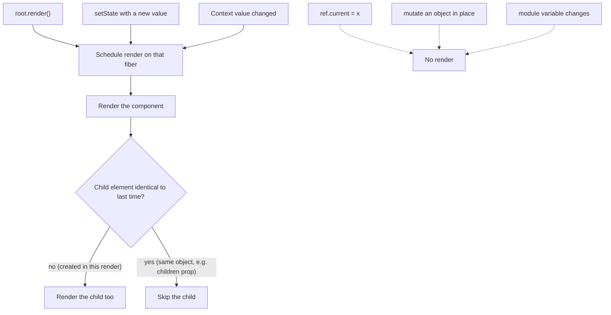
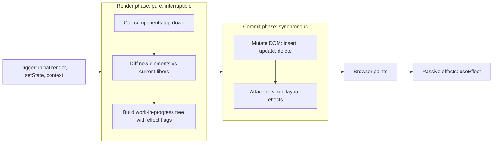

# 06 — JSX and the rendering model

> **How to use this module.** Sections 6.1–6.7 are the vocabulary: what JSX is, what it compiles to, and how to write conditions, lists and fragments without the classic bugs. Sections 6.8–6.11 are the mental model that answers most "why did this render?" questions. Section 6.12 is the entry point every app has, including the legacy `ReactDOM.render` you will meet in older codebases. If you only have 20 minutes, read 6.2, 6.6, 6.9, 6.10 and the Summary.

**Prerequisites:** [Reference vs value equality](01-javascript.md#18-reference-vs-value-equality) · [Spread, rest, destructuring](01-javascript.md#110-spread-rest-destructuring-optional-chaining-nullish-coalescing) · [What "JSX transform" means](05-tooling-and-setup.md#55-transpilers-babel-swc-esbuild-what-jsx-transform-means)

**Code for this module:** [`examples/web/src/m06-jsx/`](examples/web/src/m06-jsx/). Every file below has a test next to it. Run them with `npx vitest run src/m06-jsx` from `examples/web`.

---

## 6.1 UI as a function of state

### The problem
In imperative UI code (jQuery, vanilla DOM, or a server template patched by scripts) you write **transitions**: "when the user clicks, add this class, append that row, hide the spinner." With N states you must handle every path between them, and the DOM slowly drifts away from your data. The bug reports read "the counter says 3 but the list shows 4 items."

### Mental model
React [React] asks you to write the **description** of the screen for a given state, and nothing else:

```text
UI = f(props, state)
```

You never say "add a row." You say "for these items, the list looks like this," and React works out which DOM operations get from the old screen to the new one. This is **declarative** UI.

> **Java/Spring analogy.** A Thymeleaf or JSP template: given a model, it produces HTML, and you never patch the HTML by hand.
>
> **Where the analogy breaks:** a server template runs **once per request** and throws its output over the wall. A React component runs **again every time its state changes**, in the browser, and React keeps the previous output so it can update the live DOM in place (preserving focus, scroll and input values) instead of replacing the page.

### Minimal code
```tsx
function CartBadge({ count }: { count: number }) {
  return <span className="badge">{count === 0 ? 'Empty' : `${count} items`}</span>;
}
```
There is no "update the badge" code anywhere. When `count` changes, React calls `CartBadge` again and applies the difference.

### How it works internally
Your function returns a tree of **elements** (plain objects, 6.3). React compares that tree with the previous one ([reconciliation, 13](13-reconciliation-and-fiber.md#132-diffing-heuristics-type-then-key)) during the **render phase**, then applies the minimal set of DOM mutations in the **commit phase** (6.10). Your function is the "f"; React owns everything else.

### Trade-offs
- ✅ The screen cannot disagree with the state, because it is recomputed from it.
- ✅ Components are testable as functions: same input, same output.
- ❌ The function must be **pure** (6.8). React may call it more often than you expect, and side effects inside it break.
- ❌ Re-running functions has a cost. Usually it is negligible; when it is not, there are tools ([15](15-performance.md#152-why-components-re-render)).

---

## 6.2 What JSX compiles to

### The problem
`<h1 className="title">Hello</h1>` is not valid JavaScript. Browsers cannot run it. Something must turn it into a function call, and which function it becomes explains two things interviewers love: "why did old files need `import React from 'react'`?" and "why does React 19 require the new JSX transform?"

### Mental model
JSX [React] is **syntax sugar for a function call** that creates an object. A compiler (Babel, SWC, esbuild, Oxc or `tsc`) [Tooling] rewrites every tag into a call. There are two transforms:

| Transform | What `<h1 className="title">Hello</h1>` becomes | Needs `React` in scope? |
|---|---|---|
| **Classic** (React ≤ 16) | `React.createElement('h1', { className: 'title' }, 'Hello')` | **Yes**: the output literally references `React` |
| **Automatic / new** (since React 17, 2020) | `import { jsx as _jsx } from 'react/jsx-runtime'; _jsx('h1', { className: 'title', children: 'Hello' })` | No: the compiler inserts the import |

Lower-case tags become strings (`'h1'`); capitalized tags become references to your function (`Greeting`).

> **Java analogy.** Annotation processing or Lombok: you write a compact form and a compile step generates ordinary code before anything runs.
>
> **Where the analogy breaks:** the output is not a DOM node and not HTML. It is a small **description object** that React will interpret later. Creating it does not call your component (proved in `ElementShape.test.tsx`).

### Minimal code
`examples/web/src/m06-jsx/ElementShape.test.tsx` asserts that both forms produce the same element:

```tsx
const fromJsx = <h1 className="title">Hello</h1>;
const fromCall = createElement('h1', { className: 'title' }, 'Hello');

expect(fromJsx.type).toBe(fromCall.type);   // 'h1'
expect(fromJsx.props).toEqual(fromCall.props); // { className: 'title', children: 'Hello' }
```

### How it works internally
In `react@19.3.0`, `react/jsx-runtime` exports `jsx(type, config, maybeKey)`. Its production build (`cjs/react-jsx-runtime.production.js`, read directly) does little more than this:

```js
return { $$typeof: REACT_ELEMENT_TYPE, type, key, ref, props };
```

`key` is pulled **out of** the props (and stringified), and `ref` is read from `props.ref`. Children travel inside `props.children`. `jsxs` is the same function in production; the compiler uses it when several children were written literally in JSX, which tells the dev build that this array is static and needs no keys. `createElement` still exists in React 19 (`exports.createElement` is present in `react.development.js`), but the compiler no longer emits it.

> **Version notes.** **React 17** (Oct 2020) added `react/jsx-runtime` and `react/jsx-dev-runtime`; the transform was also back-ported to **16.14.0, 15.7.0 and 0.14.10** (React CHANGELOG 17.0.0, 16.14.0, 15.7.0; [React blog, "Introducing the New JSX Transform"](https://legacy.reactjs.org/blog/2020/09/22/introducing-the-new-jsx-transform.html)). Tool support per that post: **Babel 7.9.0**, **TypeScript 4.1** (`"jsx": "react-jsx"`), **Create React App 4.0.0**, **Next.js 9.5.3**, **Gatsby 2.24.5**. **React 19.0** made the new transform **required** ("New JSX Transform is now required", CHANGELOG 19.0.0), because ref-as-a-prop and JSX speed-ups depend on it. **Migration:** switch the compiler setting (`"jsx": "react-jsx"` in `tsconfig`, `runtime: 'automatic'` in Babel's React preset), turn off the ESLint rules `react/jsx-uses-react` and `react/react-in-jsx-scope`, and run `npx react-codemod update-react-imports` to delete the now-unused `import React` lines. This repo's `examples/web/tsconfig.json` uses `"jsx": "react-jsx"`.

### Trade-offs
- ✅ Automatic runtime: no `React` import, slightly smaller bundles, and the key is separated at compile time.
- ✅ JSX is optional. `createElement` still works for code generators and no-build demos, but almost nobody writes it by hand.
- ❌ TypeScript's `"jsx": "react"` (classic) still exists. A project configured with it on React 19 is misconfigured; check the `jsx` option first when you see "React must be in scope" errors.

---

## 6.3 Elements vs components vs instances

### The problem
People use "component" for three different things, and that makes questions like "does creating `<Modal />` run `Modal`?" or "where does state live?" impossible to answer precisely.

### Mental model

| Term | What it is | Who creates it | Lifetime |
|---|---|---|---|
| **Component** | A function (or class) `(props) => elements` | You, once, at module level | The whole program |
| **Element** | An immutable object `{ type, props, key, ref }` describing *what you want* on screen | JSX, every render | One render; then garbage |
| **Instance** (fiber) | React's internal record for one mounted position in the tree: holds state, hooks, effects, the DOM node | React, on mount | From mount to unmount |

> **Java/Spring analogy.** Component ≈ a **class**; element ≈ a **`BeanDefinition`** (a description: "I want a bean of this type with these properties"); instance ≈ the **bean the container creates** and manages.
>
> **Where the analogy breaks:** Spring creates the bean once and reuses it. React receives a **fresh description every render** and decides whether it matches an existing instance (same type, same key, same position) or needs a new one. The description is thrown away; the instance and its state survive.

### Minimal code
`ElementShape.test.tsx`:

```tsx
const Greeting = vi.fn(({ name }: { name: string }) => <p>Hello, {name}</p>);
const element = <Greeting name="Ada" />;

expect(element.type).toBe(Greeting);       // the element points at the component
expect(Greeting).not.toHaveBeenCalled();   // creating an element does not run it

render(element);
expect(Greeting).toHaveBeenCalled();       // rendering does
```

### How it works internally
Elements are tagged with `$$typeof: Symbol.for('react.transitional.element')` in React 19 (renamed from `react.element` in 19.0; the test asserts the symbol). The symbol exists for **security**: JSON cannot contain a `Symbol`, so a server response that smuggles `{ type: 'script', props: … }` into your data cannot be mistaken for an element. In development, React **freezes** the element and its props (`Object.freeze` in `react-jsx-dev-runtime.development.js`, also asserted in the test), which is why mutating `props` throws.

Instances in function components are **fibers** ([13](13-reconciliation-and-fiber.md#135-fiber-units-of-work-double-buffering-lanes-and-priorities)). There is no `this`. Your state is stored on the fiber, and hooks find it by call order ([12](12-hooks-and-custom-hooks.md#121-the-rules-of-hooks)).

### Trade-offs
Thinking in elements makes several things obvious: passing `<Child />` as a prop does not render it; the same element object can be reused (6.9 shows why that skips work); and storing elements in state is legal but usually a smell (store data, derive elements).

---

## 6.4 Expressions, attributes, `className`, `style`

### The problem
JSX looks like HTML, so people write HTML in it and hit errors: `class`, `for`, `style="…"`, `onclick="…"`, `<!-- comments -->`. It is JavaScript with an XML-like syntax, and the rules follow from that.

### Mental model
Two worlds:
- **Outside braces** you write markup: tags and string attributes.
- **Inside `{ }`** you write one JavaScript **expression** (anything that produces a value). Not a statement: no `if`, `for` or `const`.

Attribute names follow **DOM properties**, not HTML attributes, because that is what React DOM [React DOM] sets: `className` (not `class`), `htmlFor` (not `for`), `tabIndex`, `onClick`. The exceptions are `aria-*` and `data-*`, which stay hyphenated.

> **Angular analogy.** `{expr}` is `{{ expr }}` interpolation and `attr={expr}` is `[attr]="expr"` binding.
>
> **Where the analogy breaks:** Angular templates are a separate language with their own control flow (`@if`, `*ngFor`) and pipes. JSX has no template language: conditionals are `&&`/ternaries and loops are `.map()`, because it is just JavaScript.

### Minimal code
```tsx
type Props = { user: { name: string; avatarUrl: string }; size: number; active: boolean };

export function Avatar({ user, size, active }: Props) {
  return (
    <figure className={active ? 'avatar avatar--active' : 'avatar'} data-testid="avatar">
      {/* comments go inside braces */}
      
      <figcaption>{user.name.toUpperCase()}</figcaption>
    </figure>
  );
}
```

Rules visible here:
- `style` takes an **object** with camelCase keys. A number becomes pixels, except for unitless properties such as `opacity`, `zIndex`, `flex`, `lineHeight` (React DOM keeps a `unitlessNumbers` set; seen in `react-dom-client.development.js`). Passing a string **throws**: *"The `style` prop expects a mapping from style properties to values, not a string."* (exact text in React DOM 19.3's dev build).
- Text in braces is **escaped**. `{'<b>hi</b>'}` shows the angle brackets; it does not create a `<b>`.
- `{true}`, `{false}`, `{null}` and `{undefined}` render **nothing**. Numbers and strings render as text, `0` included. Arrays render each item. Plain objects throw *"Objects are not valid as a React child"*.
- Spread passes many props at once: `<input {...field} />`. A later prop overrides an earlier one, as with object spread ([01](01-javascript.md#110-spread-rest-destructuring-optional-chaining-nullish-coalescing)).

### How it works internally
Attributes become the element's `props` object. React DOM later maps each prop onto the DOM node: known properties are set, `style` keys are applied one by one through `style.setProperty`/assignment, event props such as `onClick` are registered with React's **root-level delegated listener** ([03](03-browser-and-web-platform.md#33-how-reacts-event-system-relates-to-native-events)), and unknown lowercase attributes are passed through as strings.

**Security.** Escaping makes text injection safe by default ([XSS, 03](03-browser-and-web-platform.md#38-web-security-xss-csrf-csp-clickjacking-samesite-trusted-types)). The two holes are explicit: `dangerouslySetInnerHTML={{ __html: html }}` (sanitize first, e.g. with DOMPurify) and user-controlled URLs. React 19 replaces `javascript:` URLs in `href`/`src`/`action` with code that throws *"React has blocked a javascript: URL as a security precaution."* (CHANGELOG 19.0.0, "Javascript URLs are replaced with functions that throw errors"; the string is in both the dev and prod builds of `react-dom` 19.3). React 16.9 only warned.

### Trade-offs
- ✅ Real JavaScript in the template: type-checked, refactorable, no new syntax to learn.
- ❌ Heavy inline logic hurts readability. Compute values above the `return` and keep the JSX declarative.
- ❌ Inline `style` objects are fine for **dynamic** values (positions, computed sizes); for static design use classes ([04](04-html-css-accessibility.md#411-styling-in-react-inline-css-modules-tailwind-css-in-js-and-the-server-components-trade-off)). A new object each render is cheap but does defeat `memo` on children that receive it.

> **Version notes.** **React 16** started passing unknown attributes through to the DOM instead of dropping them. **React 19.0** added full custom-element support: props are assigned as properties when the element defines them ("React 19 now passes all tests on Custom Elements Everywhere", CHANGELOG 19.0.0). **React 19.3** enabled Trusted Types integration (CHANGELOG 19.3.0, "Enable Trusted Types API integration").

---

## 6.5 Conditional rendering

### The problem
There is no `v-if` or `@if`. Engineers coming from templates either write deeply nested ternaries or reach for `&&`, which has one famous trap: `{items.length && <List />}` shows a lone **`0`** on screen when the list is empty.

### Mental model
Pick the tool by shape:

| Situation | Write |
|---|---|
| Show or nothing | `{isOpen && <Panel />}`, with a **boolean** on the left |
| One of two | `{isAdmin ? <AdminBar /> : <UserBar />}` |
| Early exit (loading, error, empty) | `if (!user) return null;` (or a spinner) before the main `return` |
| Many variants | A `switch` over a discriminated union in a small helper component, or a lookup object |

`&&` returns its **left operand** when the left is falsy [JS]. `false`, `null` and `undefined` are holes that React skips, but `0`, `-0` and `NaN` are numbers, and React renders numbers. react.dev says it directly: *"Don't put numbers on the left side of `&&`"* ([Conditional rendering](https://react.dev/learn/conditional-rendering)).

### Minimal code
From `examples/web/src/m06-jsx/FilteredList.tsx`:

```tsx
{/* A boolean on the left of &&: `hiddenCount && …` would render a stray "0". */}
{hiddenCount > 0 && <p>{hiddenCount} hidden by filters</p>}
{visible.length > 0 ? <ProductRows products={visible} /> : <p>No matching products</p>}
```

`FilteredList.test.tsx` asserts that the container's text contains no `0` when nothing is hidden.

### How it works internally
A condition does not hide anything; it changes **which elements exist** in the returned tree. When `<Panel />` disappears from a position, React unmounts it and its state is **destroyed**. When it comes back, it starts fresh. When a ternary swaps two **different** component types at the same position, the old one unmounts too; when both branches render the **same** type at the same position, React keeps the instance and its state ([13](13-reconciliation-and-fiber.md#133-component-identity-and-state-preservation)).

### Trade-offs
- `&&` and ternaries are fine for one level. Two levels of ternary is the point to extract a component or compute a variable first.
- `return null` is valid and cheap, but hooks must still run **before** it ([rules of hooks](12-hooks-and-custom-hooks.md#121-the-rules-of-hooks)).
- Hiding with CSS (`hidden`, `display: none`) keeps state and DOM alive; unmounting frees them. React 19.2's `<Activity mode="hidden">` gives you "hide but keep state" with effects cleaned up ([21](21-concurrent-ssr-server-components.md#219-activity)).

---

## 6.6 Lists and keys

### The problem
Render a list, then insert an item at the top. Without keys React matches children **by position**, so the old first row's DOM and state are reused for the new first item. Typed input text, focus, checkbox state and animations end up attached to the wrong row. Index keys (`key={index}`) are exactly the same as no keys, which is why "just use the index to silence the warning" is the classic bug.

### Mental model
A key is a **stable identity** for a child among its siblings, like a primary key. React uses it to answer "is this the same item as last time?" independently of its position.

> **Java analogy.** `equals`/`hashCode` on an entity. If you base identity on the list index, then inserting at position 0 makes every entity "equal" to a different row, like a JPA entity whose `hashCode` changes when you sort the collection.
>
> **Where the analogy breaks:** keys only need to be unique **among siblings in one array**, not globally, and they are never visible to your component (`props.key` does not exist).

### Minimal code
From `examples/web/src/m06-jsx/PrependList.tsx` (the `keyBy` prop exists only so the test can show the bug and the fix side by side):

```tsx
{items.map((item, index) => (
  <li key={keyBy === 'index' ? index : item.id}>
    <input aria-label={`Note for ${item.text}`} />
  </li>
))}
```

With `keyBy="index"`, typing in Alpha's input and then prepending a row leaves the text at position 0, now labelled "New 3". With `keyBy="id"`, the text stays with Alpha and React **moves the same DOM node** (the test asserts `toBe` identity).

### How it works internally
When React reconciles an array of children, it first walks old and new lists in order while keys match. At the first mismatch, it puts the remaining old children in a map keyed by `key` (or index when there is none), and for each new child looks up its key: found means **move and update**, missing means **create**; leftovers are **deleted** ([13](13-reconciliation-and-fiber.md#132-diffing-heuristics-type-then-key)). That is why a stable key turns a prepend into one insertion instead of N updates.

Rules:
- The key goes on the **outermost element returned from `map`**, not on an element inside the child component.
- It must be **stable**, **unique among siblings** and **derived from the data** (database id, slug, a `crypto.randomUUID()` generated **when the item is created**, not during render).
- Duplicate keys log *"Encountered two children with the same key"*. A missing key logs *"Each child in a list should have a unique "key" prop."* (both strings are in React DOM 19.3's dev build).

### Trade-offs
- **Index keys are acceptable** only when the list is static: never reordered, filtered or inserted into, and rows hold no state. Even then, an id is free if you have one.
- `key={Math.random()}` is worse than an index: every render creates a new identity, so every row **remounts** each time, losing state and focus and costing full DOM recreation.
- Keys have a second use: changing a component's key on purpose **resets** it ([08](08-state.md#89-resetting-state-with-key)). Exercise 4, test 6 shows it.

> **Version notes.** **React 18.3 and 19** warn when `key` is spread into JSX (`<Row {...props} />` where `props` contains `key`): *"A props object containing a "key" prop is being spread into JSX"* (CHANGELOG 18.3.0 "Warn when spreading `key`", 19.0.0 "Warn when keys are spread with props"; message text from `react-jsx-runtime.development.js` 19.3). Pass `key` explicitly.

---

## 6.7 Fragments

### The problem
A component returns **one** expression. You want to return a `<dt>` and a `<dd>` side by side inside a `<dl>`, or two `<td>`s inside a `<tr>`. Wrapping them in a `<div>` produces invalid HTML and breaks CSS grid/flex layouts.

### Mental model
A Fragment [React] is a grouping that **renders nothing** to the DOM. It exists only in the element tree.

### Minimal code
```tsx
import { Fragment } from 'react';

function Glossary({ terms }: { terms: { id: string; term: string; meaning: string }[] }) {
  return (
    <dl>
      {terms.map((t) => (
        <Fragment key={t.id}>          {/* the long form is the only one that accepts a key */}
          <dt>{t.term}</dt>
          <dd>{t.meaning}</dd>
        </Fragment>
      ))}
    </dl>
  );
}

function Pair() {
  return (
    <>                                   {/* short form: no key, no props */}
      <td>A</td>
      <td>B</td>
    </>
  );
}
```

### How it works internally
`<>…</>` compiles to `jsx(Fragment, { children: [...] })`, and `Fragment` is the symbol `react.fragment` (exported from `react/jsx-runtime`). React reconciles its children as if they belonged to the parent. A component returning an **array** behaves similarly, but each item then needs a key.

### Trade-offs
- ✅ No extra DOM, valid HTML, no broken layouts.
- ❌ Nothing to attach a class or handler to. If you need one, you need a real element.
- **React 19.3** made **Fragment refs** stable: `<Fragment ref={…}>` gives a `FragmentInstance` that can observe or focus its children without a wrapper ([10](10-refs-and-dom.md#108-fragment-refs); VERSIONS.md, CHANGELOG 19.3.0 "Fragment Refs").

> **Version notes.** **React 16.0** allowed returning arrays and strings from components ("Components can now return arrays and strings from `render`"). **16.2** added `Fragment` as a named export ("Add `Fragment` as named export to React"). **19.3**: Fragment refs. All from the React CHANGELOG.
>
> The `<>` short syntax needed Babel v7.0.0-beta.31+, TypeScript 2.6.2+, Flow 0.59+ or Prettier 1.9+ ([React 16.2 blog post](https://legacy.reactjs.org/blog/2017/11/28/react-v16.2.0-fragment-support.html)).

---

## 6.8 Purity and idempotence

### The problem
React may call your component **more than once for one screen update**, call it and throw the result away (an interrupted concurrent render), or call it twice on purpose (Strict Mode). If the function changes anything outside itself, the screen shows different results depending on how many times React happened to call it.

### Mental model
A component must behave like a **pure function** [React]:
1. **Same inputs → same output.** Given the same props, state and context, it returns the same JSX. That is idempotence.
2. **No side effects during render.** It does not change anything that existed before the call: no mutation of props, state, module variables or the DOM; no network calls; no timers; no reading the clock or random numbers to decide what to show.

**Local mutation is fine.** Creating an array inside render and pushing into it is not a side effect, because nobody outside can see it.

> **Java analogy.** A `Comparator` or a stream `map` function. The JDK may call it any number of times in any order, and you would never increment a counter in it.
>
> **Where the analogy breaks:** in React the "side effects belong somewhere else" rule has two specific homes: **event handlers** for things the user caused, and **effects** for synchronization with outside systems ([09](09-effects.md#96-you-might-not-need-an-effect)).

### Minimal code: three impurities
```tsx
let guest = 0;                                  // ❌ module-level variable

function Cup() {
  guest = guest + 1;                            // ❌ mutates a global during render
  return <li>Cup #{guest}</li>;
}

function TeaSet({ guests }: { guests: string[] }) {
  guests.sort();                                // ❌ mutates the parent's array (a prop)
  const now = new Date().toISOString();         // ❌ non-deterministic input read in render
  return (<><p>Served at {now}</p><ol>{guests.map((g) => <Cup key={g} />)}</ol></>);
}
```

The pure version is Exercise 3 (`examples/web/src/m06-jsx/TeaSet.tsx`): the seat number arrives as a prop, `toSorted` returns a new array, and the time is passed in.

### How it works internally
Purity is what lets React **render without committing**: start a low-priority render, abandon it when the user types, restart later ([21](21-concurrent-ssr-server-components.md#211-concurrent-rendering-interruptible-rendering)). It also enables Strict Mode's double call (6.11), skipping unchanged subtrees, `memo`, and the React Compiler's automatic memoization ([15](15-performance.md#155-the-react-compiler-and-how-it-changes-the-advice)).

`eslint-plugin-react-hooks` 7.1.1 ships compiler-powered rules that check this in `recommended`: `purity` ("Validates that components/hooks are pure by checking that they do not call known-impure functions"; the source lists `Date.now` and `Math.random`), `globals` ("Validates against assignment/mutation of globals during render"), `immutability` (mutating props and state), and `refs` (reading or writing `ref.current` during render). Rule names and descriptions were read from `node_modules/eslint-plugin-react-hooks/cjs/eslint-plugin-react-hooks.development.js`.

`react-hooks/globals` reports the exact `guest = guest + 1` reassignment as an error: *"Error: Cannot reassign variables declared outside of the component/hook. Variable `guest` is declared outside of the component/hook. Reassigning this value during render is a form of side effect..."* (verified by running it with ESLint 10 and `eslint-plugin-react-hooks` 7.1.1).

### Trade-offs
- Purity is a **contract**, not something React enforces at runtime. Breaking it usually works in a demo and then fails under Strict Mode, concurrent rendering or the compiler.
- Need a value that changes over time (a clock)? Keep it in **state** updated by an effect or `useSyncExternalStore`, so render only reads it.
- Need a unique id in render? `useId` ([12](12-hooks-and-custom-hooks.md#1211-useid)), not `Math.random()`.

---

## 6.9 What triggers a render

### The problem
"Why did my component re-render?" and "why did my component *not* re-render?" are two of the most common interview questions, and the folk answers ("it re-renders when its props change") are wrong in both directions.

### Mental model
Only **three** things schedule a render:
1. **The initial render**: `root.render(<App />)`.
2. **A state update**: `setState` / `dispatch` in this component, with a value that is not `Object.is`-equal to the current one.
3. **A context change**: a `<Context value>` above it changed and this component reads that context ([11](11-context.md#113-how-propagation-and-re-rendering-work)).

…and then **rendering propagates down**: when a component renders, React by default renders **every component it creates in its output**, whether their props changed or not.

Things that do **not** trigger a render: changing a prop object from outside (React never watches objects), mutating state in place, writing `ref.current` ([10](10-refs-and-dom.md#101-useref-as-a-mutable-box-that-does-not-trigger-renders)), changing a module-level variable, and a parent's state change for elements that were passed in from **above** as `children`.



### Minimal code
`examples/web/src/m06-jsx/RenderLog.tsx` (Exercise 4 predicts its output):

```tsx
export function Counter({ children }: { children?: ReactNode }) {
  const [count, setCount] = useState(0);
  useRenderLog(`Counter ${count}`);
  return (
    <>
      <button onClick={() => setCount((c) => c + 1)}>Increment</button>
      <Display value={count} />  {/* created here: re-renders with Counter */}
      <Static />                 {/* no props at all: still re-renders */}
      {children}                 {/* created by the caller: skipped */}
    </>
  );
}
```

### How it works internally
When `setState` is called, React compares the new value with the current one. If neither copy of the fiber (current and alternate) has pending work, it does that comparison **eagerly** and skips scheduling entirely (the `0 === fiber.lanes && (null === alternate || 0 === alternate.lanes)` check in `dispatchSetStateInternal`, `react-dom-client.development.js` 19.3). Otherwise it schedules a render; during that render, if the state turns out unchanged, React **bails out** after calling the component and does not render its children. react.dev documents the visible effect: React may still need to call your component before skipping the children, and this should not affect correct code ([useState reference](https://react.dev/reference/react/useState)). Exercise 4, tests 2 and 4, shows both cases.

For children, React compares the element it got this time with the one from last time. JSX written inside `Counter` creates **new** element objects each render, so `Display` and `Static` render again. The `children` element was created by `Counter`'s caller, which did not re-render, so it is the **same object** and React skips it. This is the mechanism behind "lift content up" ([15](15-performance.md#156-moving-state-down-and-lifting-content-up)).

### Trade-offs
- Re-rendering is not the same as updating the DOM. A render that produces the same output commits no DOM changes (6.10). Most re-renders are cheap; measure before optimizing.
- `memo` ([15](15-performance.md#153-reactmemo)) makes a child skip when its props are shallow-equal, which only works if the parent passes stable props.
- State updates are **batched**: several `setState` calls in one event produce one render ([08](08-state.md#83-batching)).

---

## 6.10 Render phase vs commit phase

### The problem
"Render" means two different things in casual talk: "React called my function" and "the screen changed." Mixing them up leads to effects that read stale DOM, `console.log`s that seem to lie, and wrong answers about performance.

### Mental model
Every update goes through three steps ([react.dev: Render and Commit](https://react.dev/learn/render-and-commit)):
1. **Trigger**: something schedules an update (6.9).
2. **Render phase**: React calls your components, top-down, and computes what changed. **Pure. No DOM writes. Can be paused, restarted or discarded** in concurrent rendering.
3. **Commit phase**: React applies the changes to the DOM, attaches refs and runs layout effects. **Synchronous, cannot be interrupted**, so the user never sees a half-updated screen. Then the browser paints, and passive effects (`useEffect`) run.

> **Java/Spring analogy.** A database transaction: the render phase is building the change set (you can roll it back for free), the commit phase writes it atomically, and effects are like `@TransactionalEventListener(phase = AFTER_COMMIT)` handlers.
>
> **Where the analogy breaks:** React can **throw away** a render phase that was 90% done because higher-priority input arrived, and redo it later. Your render code must therefore not assume it will be committed.

### Minimal code
```tsx
function Profile({ name }: { name: string }) {
  console.log('render phase: may run, re-run, or be discarded'); // fine for debugging, no other effects
  useLayoutEffect(() => {
    /* commit phase: DOM updated, before paint */
  });
  useEffect(() => {
    /* after commit, usually after paint */
  });
  return <h1>{name}</h1>;
}
```

### How it works internally


In the render phase React builds a **work-in-progress** fiber tree beside the current one ([13](13-reconciliation-and-fiber.md#135-fiber-units-of-work-double-buffering-lanes-and-priorities)). Only the commit phase swaps it in and touches the DOM, and **only the nodes that differ** are touched (react.dev: "React only changes the DOM nodes if there's a difference between renders"). Exact effect ordering inside the commit is in [09](09-effects.md#93-cleanup-and-the-effect-lifecycle).

### Trade-offs
- Code that must see the updated DOM before paint (measure, scroll) goes in a layout effect; everything else waits for `useEffect` ([09](09-effects.md#97-uselayouteffect)).
- A slow render phase delays the commit and hurts responsiveness (INP). Transitions let React interrupt it ([21](21-concurrent-ssr-server-components.md#211-concurrent-rendering-interruptible-rendering)).
- Errors thrown in the render phase are caught by error boundaries; errors in event handlers are not ([16](16-error-handling.md#165-react-19-root-options-oncaughterror-onuncaughterror-onrecoverableerror)).

---

## 6.11 Strict Mode double-invocation, and why

### The problem
"My component renders twice!" "My `console.log` prints twice!" "My `useState` initializer runs twice!" New React developers assume a bug. It is Strict Mode doing its job, and the right reaction is to make the code pure, not to remove `<StrictMode>`.

### Mental model
`<StrictMode>` [React] is a **development-only stress test** for the purity contract (6.8). Per [react.dev](https://react.dev/reference/react/StrictMode), in development it:
1. **Renders components an extra time**: calls the component body and the functions passed to `useState`, `set` functions (updaters), `useMemo` and `useReducer` twice, and keeps one result.
2. **Re-runs effects an extra time** on mount (setup → cleanup → setup), covered in [09](09-effects.md#910-strict-mode-remounting-and-what-it-reveals).
3. **Re-runs ref callbacks an extra time** on mount (React 19).
4. **Warns about deprecated APIs**.

If calling a pure function twice changes the result, it was not pure. Production builds skip all of this.

> **Java analogy.** Running your unit tests with randomized order, or calling `equals` twice in a contract test: harmless if your code is correct, loud if it depends on hidden state.

### Minimal code
```tsx
import { StrictMode } from 'react';
import { createRoot } from 'react-dom/client';

createRoot(document.getElementById('root')!).render(
  <StrictMode>
    <App />
  </StrictMode>,
);
```

`RenderLog.test.tsx` test 5 and `TeaSet.test.tsx` both render inside `<StrictMode>`: the first shows each component name logged twice, the second shows that a pure component gives the same output anyway.

### How it works internally
For the double render, React calls your function a second time with the same props and state and uses one of the results. Since **19.0**, `useMemo` and `useCallback` **reuse the first call's result** during that second render, so expensive memoized work is not doubled (CHANGELOG 19.0.0). For effects, React mounts, then simulates unmount and remount while **keeping state** (CHANGELOG 18.0.0, "Stricter Strict Mode").

Partial Strict Mode is allowed (`<StrictMode>` around one subtree). react.dev notes a subtlety: if it is not at the **root**, React does not re-run effects on initial mount, because "this would cause child effects to double fire without the parent effects, which cannot happen in production."

### Trade-offs
- ✅ It catches impure renders, missing cleanups and deprecated APIs before users do.
- ❌ It doubles dev render cost and logs, and confuses newcomers. That is the whole price; production is unaffected.
- Do **not** "fix" double renders with a module-level flag or a `useRef` guard. Make the render pure.

> **Version notes.**
> **16.3**: `<StrictMode>` introduced (warnings only). **16.8**: components with hooks double-render in Strict Mode. **17.0**: components without hooks double-render too, and React **silenced `console`** during the second render. **18.0**: effects re-run on mount ("Make `<StrictMode>` re-run effects to check for restorable state"); console suppression **removed**, and React DevTools greys out the second log instead (with an option to hide it). **19.0**: `useMemo`/`useCallback` reuse the first result; ref callbacks are attached/detached/attached; double invoking of `useState`/`useReducer` initializers restored. **19.3**: effects are also double-invoked **during hydration** and **after Fast Refresh**, and are no longer invoked on children that merely moved. All from the React CHANGELOG (17.0.0, 18.0.0, 19.0.0, 19.3.0, read on 2026-10-03). **Next.js** App Router enables Strict Mode by default since 13.5.1; Pages Router apps opt in with `reactStrictMode: true` ([Next.js docs](https://nextjs.org/docs/app/api-reference/config/next-config-js/reactStrictMode)). **Migration (17 → 18+):** expect effects to run twice in dev; fix cleanups rather than suppressing them.

---

## 6.12 `createRoot`, `hydrateRoot`, root options

### The problem
Every React app has exactly one line that connects React to the page. It changed in React 18, the old one is **gone** in React 19, and that line decides whether concurrent features, automatic batching and the new error hooks are on. Legacy codebases still have the old one.

### Mental model
A **root** is React's handle on one DOM container. You create it once, then tell it what to render.

| API | Use when | Since |
|---|---|---|
| `createRoot(container, options?)` → `root.render(el)`, `root.unmount()` | Client-only rendering (Vite SPA) | 18.0 |
| `hydrateRoot(container, el, options?)` | The HTML was server-rendered and React must **attach** to it ([21](21-concurrent-ssr-server-components.md#215-ssr-hydration-hydration-errors)) | 18.0 |
| `ReactDOM.render(el, container)` | Legacy, React ≤ 17 | deprecated 18.0, **removed 19.0** |
| `ReactDOM.hydrate(el, container)` | Legacy SSR | deprecated 18.0, **removed 19.0** |

Both modern APIs live in `react-dom/client`. In `react-dom@19.3.0` the main `react-dom` entry no longer exports `render`, `hydrate`, `createRoot` or `unmountComponentAtNode` (checked by grepping the `exports.*` lines of `cjs/react-dom.development.js`).

> **Spring analogy.** `SpringApplication.run(App.class)` bootstraps a context once; `root.render` is closer to "refresh the context with this configuration": calling it again **updates** the existing tree, it does not start a second app.
>
> **Where the analogy breaks:** a page can host **several** independent roots (a React widget in each corner of a server-rendered Thymeleaf page, [24](24-react-with-spring-boot.md#241-architecture-options)). Each has its own state and they share nothing unless you wire it.

### Minimal code
```tsx
// main.tsx (Vite)
import { StrictMode } from 'react';
import { createRoot } from 'react-dom/client';
import { App } from './App';

const root = createRoot(document.getElementById('root')!, {
  identifierPrefix: 'shop-',                       // namespaces useId when several roots share a page
  onUncaughtError: (error, info) => report(error, info.componentStack),
  onCaughtError: (error, info) => report(error, info.componentStack),
  onRecoverableError: (error) => report(error),
});
root.render(
  <StrictMode>
    <App />
  </StrictMode>,
);
```

`examples/web/src/m06-jsx/RootOptions.test.tsx` does this by hand (what Testing Library's `render` hides): it asserts that `identifierPrefix: 'widget-'` makes `useId` return `_widget-r_<n>_`, that a second `root.render` keeps the same id (update, not remount), and that `root.unmount()` empties the container.

**Legacy and migration:**

```tsx
// React ≤ 17 (warns on 18 and runs in "React 17 mode"; TypeError on 19)
import ReactDOM from 'react-dom';
ReactDOM.render(<App />, document.getElementById('root'), () => console.log('rendered'));
ReactDOM.unmountComponentAtNode(container);

// React 18+
import { createRoot } from 'react-dom/client';
const root = createRoot(document.getElementById('root')!);
root.render(<App />);     // no callback: use an effect or a ref callback instead
root.unmount();
```

### How it works internally
`createRoot` builds a `FiberRoot` for the container and reads the options: `identifierPrefix`, `onUncaughtError`, `onCaughtError`, `onRecoverableError` (read in `createRoot` in `react-dom-client.development.js` 19.3; the TypeScript `RootOptions` interface in `@types/react-dom/client.d.ts` lists the same four). `hydrateRoot` accepts the same plus `formState` for server Actions. Passing a JSX element as the second argument of `createRoot` is a common slip, and React logs *"You passed a JSX element to createRoot. You probably meant to call root.render instead."* Calling `createRoot` twice on one container logs a warning telling you to call `root.render()` on the existing root.

The client `useId` format in 19.3 is `"_" + identifierPrefix + "r_" + counter.toString(32) + "_"`, and during hydration `"_" + prefix + "R_" + treeId…` (read from `mountId` in the same file). The `_r_` form came from 19.2 ("Use underscore instead of `:` IDs generated by useId", CHANGELOG 19.2.0).

### Trade-offs
- `createRoot` opts the whole tree into concurrent features (transitions, Suspense streaming) and **automatic batching everywhere** ([08](08-state.md#83-batching)). `ReactDOM.render` on 18 kept the old behavior, which is why upgrading from 17 to 18 can change render counts.
- The error options replace "log in a top-level `try/catch`". Since 19.0, uncaught render errors go to `window.reportError` by default and are **not re-thrown** (CHANGELOG 19.0.0); use `onUncaughtError` to send them to your monitoring ([16](16-error-handling.md#165-react-19-root-options-oncaughterror-onuncaughterror-onrecoverableerror)).
- Frameworks (Next.js, React Router framework mode) create the root for you. You only write this line in a Vite or custom setup, and in micro-frontends.

> **Version notes.** **16.0** added `ReactDOM.hydrate`. **18.0** added `createRoot`/`hydrateRoot` and the `onRecoverableError` option, and deprecated `ReactDOM.render` ("Using it will warn and run your app in React 17 mode"). **18.2** passes a component stack to `onRecoverableError`. **18.3** added deprecation warnings for everything removed in 19 (upgrade to 18.3.1 first). **19.0** removed `ReactDOM.render`, `hydrate`, `unmountComponentAtNode`, `findDOMNode` and `react-dom/test-utils` (`act` moved to `react`), added `onCaughtError`/`onUncaughtError`, and removed UMD builds. All from the React CHANGELOG. **Migration path:** 17 → 18.3.1 (fix every warning, switch to `createRoot`, wrap in `<StrictMode>`) → 19.x. Codemods: `npx codemod@latest react/19/migration-recipe` (react.dev 19 upgrade guide).
>
> The [React 19 upgrade guide](https://react.dev/blog/2024/04/25/react-19-upgrade-guide) runs all React 19 codemods with `npx codemod@latest react/19/migration-recipe`; `react/19/replace-reactdom-render` is the one for `ReactDOM.render`/`hydrate`.

---

## Interview questions

**Q1. What does "UI is a function of state" mean in practice?**
<details><summary>Answer</summary>

You write what the screen should look like for given props and state, never the steps to change it. React re-runs the function when state changes and computes the DOM operations itself. That removes the whole class of bugs where the DOM and the data drift apart. **A strong answer adds:** the price is that the function must be pure and may run often, which is why side effects live in handlers and effects.

</details>

**Q2. What does JSX compile to?**
<details><summary>Answer</summary>

A function call that returns an element object. With the automatic runtime (React 17+), `<h1 className="t">Hi</h1>` becomes `_jsx('h1', { className: 't', children: 'Hi' })` with `import { jsx as _jsx } from 'react/jsx-runtime'` inserted by the compiler. With the classic runtime it was `React.createElement('h1', { className: 't' }, 'Hi')`. **A strong answer adds:** `key` is passed separately and never ends up in `props`; React 19 requires the automatic runtime.

</details>

**Q3. Why did every component file need `import React from 'react'` before React 17?**
<details><summary>Answer</summary>

The classic transform turned every tag into `React.createElement(...)`, a reference to the identifier `React`, so it had to be in scope even if your code never mentioned it. The automatic transform imports `jsx` from `react/jsx-runtime` itself. **A strong answer adds:** after migrating, disable `react/react-in-jsx-scope` and run the `update-react-imports` codemod. You still import named hooks (`useState`) as usual.

</details>

**Q4. Is JSX HTML? Is it required?**
<details><summary>Answer</summary>

Neither. It is an XML-like syntax extension for JavaScript that compiles to function calls. Attributes follow DOM property names (`className`, `htmlFor`), values in braces are JavaScript expressions, and text is escaped. You can write `createElement` calls directly; JSX is just much more readable. **A strong answer adds:** TypeScript type-checks JSX (props, children), which HTML templates cannot do.

</details>

**Q5. Explain element, component and instance.**
<details><summary>Answer</summary>

A component is the function you write. An element is the immutable object `{ type, props, key, ref }` that JSX creates on every render, describing what you want. An instance (a fiber) is React's internal record for a mounted position, holding state, hooks and the DOM node. Elements are cheap and disposable; instances persist across renders as long as type, key and position match. **A strong answer adds:** creating `<Modal />` does not call `Modal`. React calls it when it renders that element.

</details>

**Q6. Why must component names start with a capital letter?**
<details><summary>Answer</summary>

The compiler uses case to decide: lowercase tags become strings (`'div'`, a DOM element); capitalized tags become variable references (`Modal`). `<modal />` creates an unknown DOM element, and React DOM warns *"The tag <modal> is unrecognized in this browser. If you meant to render a React component, start its name with an uppercase letter."* **A strong answer adds:** `<obj.Component />` (member expressions) also works, which is how compound components like `<Tabs.Panel>` are written.

</details>

**Q7. What can a component return?**
<details><summary>Answer</summary>

Any React node: an element, a string, a number, `null`, `undefined`, a boolean (renders nothing), an array or fragment of nodes, or a portal. Plain objects and functions are invalid ("Objects are not valid as a React child", "Functions are not valid as a React child"). **A strong answer adds:** returning `undefined` threw before React 18 (CHANGELOG 18.0.0, "Components can now render `undefined`"), so old codebases return `null` by habit. Server Components can also be `async` and return a promise.

</details>

**Q8. Why `className` and `htmlFor` instead of `class` and `for`?**
<details><summary>Answer</summary>

JSX props map to DOM **properties** (`element.className`, `label.htmlFor`), and `class`/`for` are reserved words in JavaScript, so the DOM API itself uses these names. React DOM warns *"Invalid DOM property `class`. Did you mean `className`?"* **A strong answer adds:** `aria-*` and `data-*` keep their hyphenated HTML names, and custom elements in React 19 get props set as properties when they define them.

</details>

**Q9. How does the `style` prop work?**
<details><summary>Answer</summary>

It takes an object with camelCase keys (`backgroundColor`). Numeric values get `px` added, except unitless properties (`opacity`, `zIndex`, `flex`, `lineHeight`). A string throws an error in React DOM. **A strong answer adds:** use it for dynamic values (computed positions); use classes for static design. A new style object each render is fine but breaks `memo` on a child that receives it.

</details>

**Q10. How does JSX protect you from XSS, and where does it not?**
<details><summary>Answer</summary>

All text inserted with `{}` is escaped, so user input never becomes markup, and elements are tagged with a `Symbol` that JSON cannot forge. The holes: `dangerouslySetInnerHTML` (sanitize with DOMPurify first), user-supplied URLs in `href`/`src` (React 19 blocks `javascript:` URLs; 16.9–18 only warned), spreading untrusted objects as props, and server-rendered HTML you inject yourself. **A strong answer adds:** a CSP and Trusted Types (supported since React 19.3) are the defense in depth ([03](03-browser-and-web-platform.md#38-web-security-xss-csrf-csp-clickjacking-samesite-trusted-types)).

</details>

**Q11. Why can't you write `if` or `for` inside JSX braces?**
<details><summary>Answer</summary>

Braces hold a single **expression**, because they become an argument in a function call (`jsx('div', { children: <expr> })`). Statements are not values. Use ternaries, `&&`, `.map()`, or compute a variable before the `return`. **A strong answer adds:** an IIFE inside JSX works but is a smell; extract a component.

</details>

**Q12. Why does `{items.length && <List />}` sometimes show `0`?**
<details><summary>Answer</summary>

`&&` returns the left operand when it is falsy. When `items.length` is `0`, the expression is the number `0`, and React renders numbers. `false`/`null`/`undefined` would be skipped. Fix: make the left side boolean, `items.length > 0 && <List />`, or use a ternary. **A strong answer adds:** `NaN` has the same problem, and so does `-0`. Lint rules can't always catch it, so make the boolean conversion a habit.

</details>

**Q13. Compare the ways to render conditionally.**
<details><summary>Answer</summary>

Early `return null` for guard cases (loading, not authorized). `cond && <X />` for show-or-nothing, with a boolean condition. A ternary for one-of-two. A small component with a `switch` over a discriminated union, or a lookup object, for many variants. **A strong answer adds:** the choice also decides state: removing a component from the tree destroys its state, while CSS hiding or `<Activity>` keeps it.

</details>

**Q14. What does a `key` do?**
<details><summary>Answer</summary>

It gives a child a stable identity among its siblings, so React can match old and new children by identity instead of position. A matching key means move and update the existing instance (keeping its state and DOM); a new key means create; a missing key means delete. **A strong answer adds:** keys also work outside lists: changing a component's `key` deliberately remounts it, which is the idiomatic way to reset state.

</details>

**Q15. Why do index keys break, and when are they acceptable?**
<details><summary>Answer</summary>

An index describes position, not identity. Insert, remove or reorder items and every index after the change now refers to a different item, so React reuses the wrong instance: input text, focus and local state stay at the old position (Exercise 2). They are acceptable for static lists that never reorder and whose rows hold no state. **A strong answer adds:** without any key React falls back to the index, so `key={index}` only silences the warning without changing behavior.

</details>

**Q16. What's wrong with `key={Math.random()}` or `key={crypto.randomUUID()}` in `map`?**
<details><summary>Answer</summary>

A new key on every render means a new identity every render, so every row unmounts and remounts each time: state lost, focus lost, DOM recreated, effects re-run. It is the opposite of what a key is for, and it also makes render impure. **A strong answer adds:** generating a UUID **when the item is created** (in the handler that adds it) and storing it with the item is correct.

</details>

**Q17. Must keys be globally unique? Where exactly does the key go?**
<details><summary>Answer</summary>

Only unique among siblings in the same array; two different lists can reuse keys. The key goes on the **outermost element returned from the `map` callback** (often a component like `<Row key={id} />`), not on an element inside `Row`. **A strong answer adds:** with fragments, use `<Fragment key={id}>`, because the `<>` shorthand cannot take a key.

</details>

**Q18. Can a component read its own `key`?**
<details><summary>Answer</summary>

No. `key` (like `ref` before React 19) is consumed by React and removed from `props`. If the child needs the id, pass it twice: `<Row key={item.id} id={item.id} />`. **A strong answer adds:** spreading an object containing `key` into JSX warns since 18.3/19 for the same reason.

</details>

**Q19. What are Fragments and when do you need the long form?**
<details><summary>Answer</summary>

A grouping that returns several siblings without adding a DOM node, so `<tr>`, `<dl>` and flex/grid layouts stay valid. `<>` is the short form. You need `<Fragment>` when you must pass a `key` (lists of grouped elements), and since 19.3 when you want a Fragment `ref`. **A strong answer adds:** before 16.2, people returned arrays (with keys) or added wrapper `<div>`s.

</details>

**Q20. Why can a component only return a single root element?**
<details><summary>Answer</summary>

A function returns one value, and two adjacent JSX tags are two values with no operator between them, which is a syntax error. Wrap them in a fragment (or an array). **A strong answer adds:** this is a JavaScript constraint, not a React or DOM one.

</details>

**Q21. What does it mean for a component to be pure?**
<details><summary>Answer</summary>

Same props, state and context give the same JSX (idempotent), and rendering changes nothing that existed before the call: no mutation of props, state or globals, no I/O, no timers, no reading `Date.now()` or `Math.random()` to decide output. Local variables created during render can be mutated freely. **A strong answer adds:** purity is what lets React discard renders, render twice in Strict Mode, skip unchanged subtrees and auto-memoize with the compiler.

</details>

**Q22. Give three examples of impure render code and their fixes.**
<details><summary>Answer</summary>

(1) Incrementing a module counter to number items: pass the index as a prop. (2) `props.items.sort()`: use `toSorted()` or `[...items].sort()`. (3) `new Date()` or `Math.random()` in render: pass the value in, keep it in state, or use `useId` for ids. Others: writing `ref.current`, calling `fetch`, setting `document.title`. **A strong answer adds:** `eslint-plugin-react-hooks` 7 has compiler-powered rules (`purity`, `globals`, `immutability`, `refs`) that catch many of these statically.

</details>

**Q23. Why is mutating state or props in place a bug even if you then call `setState`?**
<details><summary>Answer</summary>

React decides whether anything changed with `Object.is`. Mutate the same array and pass it to `setState`, and the reference is unchanged, so React may skip the render. Children receiving it via `memo` compare equal and skip too. Earlier snapshots (an in-flight transition, undo history) also see the mutation. **A strong answer adds:** produce new objects ([08](08-state.md#85-immutable-updates-of-nested-objects-and-arrays)); props are frozen in development, so mutating them throws.

</details>

**Q24. What triggers a re-render?**
<details><summary>Answer</summary>

Three triggers: the initial `root.render`, a state update with a new value (`Object.is`), and a change in a context the component reads. Then rendering propagates: when a component renders, every component it creates in its JSX renders too, by default. **A strong answer adds:** "its props changed" is not a trigger on its own. Props only change because a parent rendered.

</details>

**Q25. A parent re-renders. Do all its children re-render? How do you prevent it?**
<details><summary>Answer</summary>

By default, every child **created in the parent's JSX** re-renders, even with identical props. Elements received from above as `children` (or other element props) do not, because they are the same objects. To prevent it: move state down to where it is used, lift static content up and pass it as `children`, wrap the child in `memo` with stable props, or enable the React Compiler. **A strong answer adds:** first measure whether the re-render matters at all ([15](15-performance.md#152-why-components-re-render)).

</details>

**Q26. Does a child re-render "because its props changed"?**
<details><summary>Answer</summary>

Not directly. React does not watch props. The child re-renders because its parent rendered and created a new element for it. With `memo`, the props comparison becomes a reason to **skip**. Changing a prop object by mutation, outside any render, does nothing at all. **A strong answer adds:** this is why "pass a new object every render" defeats `memo` but costs nothing otherwise.

</details>

**Q27. Does `setState` with the same value re-render?**
<details><summary>Answer</summary>

If the new value is `Object.is`-equal to the current one, React skips rendering the children. When the component has no pending work, React can compare eagerly and skip everything. Otherwise it may call the component once, find the state unchanged, and bail out before its children (Exercise 4, tests 2 and 4). **A strong answer adds:** for objects, "same value" means same reference, so `setUser({ ...user })` always renders.

</details>

**Q28. Does changing `ref.current` or a module-level variable cause a render?**
<details><summary>Answer</summary>

No. React only knows about state, context and root renders. A ref is a mutable box React ignores, and a module variable is invisible to it. The UI keeps showing the old value until something else triggers a render. **A strong answer adds:** if a value must appear on screen, it is state. External mutable sources belong in `useSyncExternalStore`.

</details>

**Q29. Explain the render phase and the commit phase.**
<details><summary>Answer</summary>

Render phase: React calls components and diffs the new elements against the current fibers, building a work-in-progress tree. It is pure, has no DOM writes, and can be interrupted or discarded. Commit phase: React applies DOM mutations, attaches refs and runs layout effects synchronously, then the browser paints and passive effects run. **A strong answer adds:** this split is what makes concurrent rendering safe: only the commit is visible, and it is atomic.

</details>

**Q30. If a component renders, does the DOM change?**
<details><summary>Answer</summary>

Not necessarily. Rendering computes output; the commit touches only nodes whose output differs. A component that renders the same JSX causes no DOM work, and input values, focus and scroll are preserved. **A strong answer adds:** the cost of an unnecessary render is the JavaScript execution and diffing, not DOM writes. That is usually small, which is why "avoid all re-renders" is the wrong goal.

</details>

**Q31. Why might React render a component and never commit the result?**
<details><summary>Answer</summary>

With concurrent features (transitions, Suspense, `useDeferredValue`), React can start a low-priority render, pause it, and throw it away when a more urgent update arrives, or when something suspends. Strict Mode also renders twice and uses only one result. **A strong answer adds:** this is the practical reason purity matters: a side effect in render can run for a screen the user never sees.

</details>

**Q32. What does Strict Mode do, and what changed between React 17, 18 and 19?**
<details><summary>Answer</summary>

In development only, it double-calls component bodies and `useState`/`useMemo`/`useReducer`/updater functions, re-runs effects on mount (setup → cleanup → setup), re-runs ref callbacks, and warns about deprecated APIs. 17: double render with the second render's `console` silenced. 18: added the effect re-run and stopped silencing logs (DevTools dims them). 19: `useMemo`/`useCallback` reuse the first result, ref callbacks are double-invoked. 19.3: effects also double-run during hydration and after Fast Refresh. **A strong answer adds:** partial Strict Mode does not double-run effects on initial mount unless it wraps the root.

</details>

**Q33. My `console.log` in a component prints twice. Is something wrong?**
<details><summary>Answer</summary>

Probably not: it is the Strict Mode double render in development. If React DevTools is installed, the second log is greyed out, and DevTools can hide it. It does not happen in production. If you see it in production, look for a real cause: a changing `key`, a parent remounting, or a component defined inside another component. **A strong answer adds:** in React 17, the second log was suppressed entirely, which hid bugs, so 18 reversed that.

</details>

**Q34. `ReactDOM.render` vs `createRoot`: what changed and how do you migrate?**
<details><summary>Answer</summary>

`createRoot(container).render(<App />)` (from `react-dom/client`, React 18) enables concurrent features and automatic batching. `ReactDOM.render` was deprecated in 18 ("runs your app in React 17 mode") and removed in 19, along with `hydrate` and `unmountComponentAtNode` (use `root.unmount()`). The render callback is gone; use an effect or a ref callback. Migration: upgrade to 18.3.1, fix warnings, switch the entry file, then go to 19. **A strong answer adds:** after the switch, batching changes can reduce render counts, and tests that relied on synchronous rendering need `act`.

</details>

**Q35. When do you use `hydrateRoot`, and what is a hydration mismatch?**
<details><summary>Answer</summary>

When the HTML was server-rendered (SSR or static generation) and React must attach event handlers and state to the existing DOM instead of recreating it. A mismatch is when the first client render produces different output than the server HTML (dates, `Math.random()`, `typeof window` branches). React 18 treats text mismatches as errors and falls back to client rendering up to the nearest Suspense boundary; React 19 logs one error with a diff. **A strong answer adds:** keep the first client render identical to the server's, and move client-only values into effects or behind `use(browser())` (19.3) ([21](21-concurrent-ssr-server-components.md#215-ssr-hydration-hydration-errors)).

</details>

**Q36. What options does `createRoot` accept in React 19?**
<details><summary>Answer</summary>

`identifierPrefix` (namespaces `useId` when multiple roots share a page), `onUncaughtError` (errors no boundary caught), `onCaughtError` (errors a boundary caught), and `onRecoverableError` (errors React recovered from, e.g. hydration fallbacks). `hydrateRoot` also takes `formState`. **A strong answer adds:** 19 stopped re-throwing uncaught render errors (they go to `window.reportError`), so these callbacks are the right place for monitoring.

</details>

**Q37. Can a page have more than one React root?**
<details><summary>Answer</summary>

Yes. Each `createRoot` call manages an independent tree with its own state. This is common when embedding React widgets into a server-rendered page (Thymeleaf, JSP) or in micro-frontends. Give each a distinct `identifierPrefix` and share state through an external store or events if needed. **A strong answer adds:** two copies of React on one page (different bundles) is a different problem, which breaks hooks; that is the "duplicate React" bug ([05](05-tooling-and-setup.md#52-semver-and-ranges-peer-dependencies)).

</details>

**Q38. What is `$$typeof` on an element for?**
<details><summary>Answer</summary>

It marks a genuine React element with a `Symbol` (`react.transitional.element` in 19). Symbols cannot be serialized to JSON, so if an attacker stores `{ type: 'img', props: { … } }` in your database and you render it as a child, React refuses to treat it as an element. **A strong answer adds:** React 19 renamed the symbol, which is one reason elements from two different React versions do not mix.

</details>

**Q39. How do `true`, `false`, `null`, `undefined`, numbers, strings and arrays render as children?**
<details><summary>Answer</summary>

Booleans, `null` and `undefined` render nothing. Strings and numbers (including `0` and `NaN`) render as escaped text. Arrays render each item and each item needs a key. Elements render as elements. Objects, functions, `Date`s and symbols are errors or warnings. **A strong answer adds:** to show a boolean, convert it explicitly: `{String(flag)}`.

</details>

**Q40. Why is defining a component inside another component a bug?**
<details><summary>Answer</summary>

Each render of the outer component creates a **new function**, so the inner component's `type` differs from the previous render. React sees a different component at that position, unmounts the old one and mounts a new one, losing its state and DOM (an input loses focus on every keystroke). Define components at module level and pass data as props. **A strong answer adds:** `eslint-plugin-react-hooks` 7 flags this with `react-hooks/static-components` ("Components that are recreated dynamically can reset state and trigger excessive re-rendering"); see [13](13-reconciliation-and-fiber.md#134-keys-revisited-and-nested-component-definitions).

</details>

---

## Coding exercises

### Exercise 1: Render a filtered list

**Statement.** Build `FilteredList({ products })`. It shows a text filter (label "Filter", case-insensitive match on the name), an "In stock only" checkbox, a status line "N of M shown", a "K hidden by filters" line only when K > 0, and either the matching products (sold-out ones suffixed " (sold out)") or "No matching products". No effects, and no stray `0` on screen.

**Approach.**
1. What is state? Only what the user typed and ticked: `query` and `inStockOnly`.
2. Everything else is **derived** during render: the visible list, the counts.
3. Put the filtering in a pure helper so it is testable without React.
4. Use a boolean on the left of `&&`, and a ternary for list vs empty state.
5. Key rows by `product.id`.

<details><summary>Hints</summary>

- `const visible = filterProducts(products, query, inStockOnly)` right in the component body.
- `hiddenCount > 0 && …`, never `hiddenCount && …`.
- Don't store `visible` in state ([09](09-effects.md#96-you-might-not-need-an-effect)).

</details>

<details><summary>Solution</summary>

[`examples/web/src/m06-jsx/FilteredList.tsx`](examples/web/src/m06-jsx/FilteredList.tsx):

```tsx
// file: examples/web/src/m06-jsx/FilteredList.tsx
import { useState } from 'react';

export type Product = { id: string; name: string; inStock: boolean };

/**
 * Pure filter used during render: same inputs, same output, no mutation.
 * Matching is case-insensitive on the product name.
 */
export function filterProducts(
  products: readonly Product[],
  query: string,
  inStockOnly: boolean,
): Product[] {
  const needle = query.trim().toLowerCase();
  return products.filter(
    (p) => p.name.toLowerCase().includes(needle) && (!inStockOnly || p.inStock),
  );
}

/** A searchable product list. Everything visible is derived from props + two pieces of state. */
export function FilteredList({ products }: { products: readonly Product[] }) {
  const [query, setQuery] = useState('');
  const [inStockOnly, setInStockOnly] = useState(false);

  // Derived during render: no extra state, no effect.
  const visible = filterProducts(products, query, inStockOnly);
  const hiddenCount = products.length - visible.length;

  return (
    <section>
      <label>
        Filter
        <input value={query} onChange={(e) => setQuery(e.target.value)} />
      </label>
      <label>
        <input
          type="checkbox"
          checked={inStockOnly}
          onChange={(e) => setInStockOnly(e.target.checked)}
        />
        In stock only
      </label>
      <p role="status">
        {visible.length} of {products.length} shown
      </p>
      {/* A boolean on the left of &&: `hiddenCount && …` would render a stray "0". */}
      {hiddenCount > 0 && <p>{hiddenCount} hidden by filters</p>}
      {visible.length > 0 ? <ProductRows products={visible} /> : <p>No matching products</p>}
    </section>
  );
}

function ProductRows({ products }: { products: Product[] }) {
  return (
    <ul>
      {products.map((p) => (
        <li key={p.id}>
          {p.name}
          {p.inStock ? null : ' (sold out)'}
        </li>
      ))}
    </ul>
  );
}
```

</details>

**Walkthrough.** Typing "TEA" updates `query`, React re-renders, and `filterProducts` recomputes the list in the same render, so the status line and the list can never disagree. `hiddenCount` is `0` at first, and `0 > 0` is `false`, which React skips; with `hiddenCount && …` the `0` itself would be rendered. `ProductRows` keys by `p.id`, so filtering rows in and out never mixes up their identity.

**Interviewer follow-ups.**
- "The list has 10,000 items and typing lags." Profile first, then `useDeferredValue(query)` so the input stays responsive ([21](21-concurrent-ssr-server-components.md#211-concurrent-rendering-interruptible-rendering)), `useMemo` for the filter, or virtualization ([15](15-performance.md#152-why-components-re-render)).
- "Keep the filter in the URL." Read and write it as a search param ([19](19-routing.md#194-params-and-search-params)).
- "Accent-insensitive search?" Normalize both sides with `normalize('NFD')` and strip combining marks for comparison only, keeping the original text for display.

**Tests.** [`FilteredList.test.tsx`](examples/web/src/m06-jsx/FilteredList.test.tsx): initial state with no stray `0`, case-insensitive filter and hidden count, combined filters and the empty state, and purity of `filterProducts` on frozen input.

---

### Exercise 2: Fix a key bug

**Statement.** This list gives each row a note input. Users report that after clicking "Add to top", the note they typed for "Alpha" appears next to the new row. Explain the bug and fix it.

```tsx
{items.map((item, index) => (
  <li key={index}>
    <input aria-label={`Note for ${item.text}`} />
  </li>
))}
```

**Approach.**
1. The input is **uncontrolled**: its typed value lives in the DOM node, which belongs to the instance at that key.
2. With index keys, after a prepend, key `0` still exists, so React keeps that `<li>` and its `<input>` and only updates the `aria-label` to the new item's text.
3. The fix is identity: key by `item.id`, so the Alpha row keeps its instance wherever it moves.

<details><summary>Hints</summary>

- Ask: "after the prepend, which old key matches the new first row?"
- Generate the id when you **create** the item, never during render.

</details>

<details><summary>Solution</summary>

[`examples/web/src/m06-jsx/PrependList.tsx`](examples/web/src/m06-jsx/PrependList.tsx). The `keyBy` prop exists only so the test can run the broken and the fixed version side by side. Real code just writes `key={item.id}`:

```tsx
// file: examples/web/src/m06-jsx/PrependList.tsx
import { useState } from 'react';

type Item = { id: number; text: string };

const INITIAL_ITEMS: Item[] = [
  { id: 1, text: 'Alpha' },
  { id: 2, text: 'Beta' },
];

type Props = {
  /** 'index' reproduces the bug; 'id' is the fix. Real code only ever uses a stable id. */
  keyBy: 'index' | 'id';
};

/** Each row owns DOM state (an uncontrolled input), so row identity matters. */
export function PrependList({ keyBy }: Props) {
  const [items, setItems] = useState(INITIAL_ITEMS);

  const addToTop = () =>
    setItems((prev) => {
      const id = prev.length + 1; // rows are never removed in this demo, so length + 1 is unique
      return [{ id, text: `New ${id}` }, ...prev];
    });

  return (
    <>
      <button onClick={addToTop}>Add to top</button>
      <ul>
        {items.map((item, index) => (
          <li key={keyBy === 'index' ? index : item.id}>
            <input aria-label={`Note for ${item.text}`} />
          </li>
        ))}
      </ul>
    </>
  );
}
```

</details>

**Walkthrough.** Before: `[Alpha(0), Beta(1)]`. After the prepend with index keys: `[New 3(0), Alpha(1), Beta(2)]`. React matches key 0 to key 0, so the DOM input holding "remember me" is reused for "New 3". Key 1 (Beta's old input, empty) is reused for Alpha, and key 2 is a new input for Beta. With id keys, React sees ids `3, 1, 2`: it creates one `<li>` for id 3 and **moves** the existing nodes for ids 1 and 2. The third test proves it is the very same DOM node (`toBe`).

**Interviewer follow-ups.**
- "Would a controlled input fix it?" The text would follow the data if it lived in the item, but any other per-row state (focus, a child's `useState`, an animation) would still be misattributed. Fix the key.
- "The backend has no ids." Generate `crypto.randomUUID()` when the item is created on the client, and keep it with the item.
- "Why does React warn about missing keys but not index keys?" It cannot tell whether your index is stable; it only knows a key was provided.

**Tests.** [`PrependList.test.tsx`](examples/web/src/m06-jsx/PrependList.test.tsx): the bug with index keys, the fix with id keys, and DOM-node identity after the move.

---

### Exercise 3: Find the impure component

**Statement.** In Strict Mode, this tea set shows cups #2, #4 and #6 in development, and its parent's guest list gets reordered. Find every impurity and rewrite `TeaSet` so that its output depends only on its props.

```tsx
let guest = 0;

function Cup() {
  guest = guest + 1;
  return <li>Cup #{guest}</li>;
}

export function TeaSet({ guests }: { guests: string[] }) {
  guests.sort();
  const now = new Date().toISOString();
  return (
    <>
      <p>Served at {now}</p>
      <ol>{guests.map((g) => <Cup key={g} />)}</ol>
    </>
  );
}
```

**Approach.**
1. List what each function reads and writes **outside itself**: `Cup` writes the global `guest`; `TeaSet` mutates the `guests` prop and reads the clock.
2. Replace each with an input: the seat number becomes a prop computed from the index, sorting becomes a copy (`toSorted`), and the time becomes a `servedAt` prop.
3. Prove it: render inside `<StrictMode>` and freeze the input array.

<details><summary>Hints</summary>

- `Array.prototype.toSorted` [JS] (ES2023) returns a new array.
- Strict Mode calls each component twice, so a counter incremented in render jumps by 2 per cup. That is where #2, #4, #6 come from (react.dev's [Keeping Components Pure](https://react.dev/learn/keeping-components-pure) uses the same example).

</details>

<details><summary>Solution</summary>

[`examples/web/src/m06-jsx/TeaSet.tsx`](examples/web/src/m06-jsx/TeaSet.tsx):

```tsx
// file: examples/web/src/m06-jsx/TeaSet.tsx
type Props = {
  guests: readonly string[];
  /** Time is an input, not something render reads from the clock. */
  servedAt: Date;
};

/** Pure version of the "find the impure component" exercise: output depends only on props. */
export function TeaSet({ guests, servedAt }: Props) {
  // toSorted returns a new array; guests.sort() would mutate the parent's prop.
  const seated = guests.toSorted((a, b) => a.localeCompare(b));

  return (
    <>
      <p>Served at {servedAt.toISOString()}</p>
      <ol>
        {seated.map((name, index) => (
          <Cup key={name} name={name} seat={index + 1} />
        ))}
      </ol>
    </>
  );
}

// The seat number arrives as a prop instead of being counted in a module-level variable.
function Cup({ name, seat }: { name: string; seat: number }) {
  return (
    <li>
      Cup #{seat} for {name}
    </li>
  );
}
```

</details>

**Walkthrough.** `Cup` now receives `seat`, so calling it twice returns the same `<li>` twice. `toSorted` leaves the parent's array alone; the test passes a frozen array, on which `sort()` would throw a `TypeError` in strict-mode code. `servedAt` is an input, so two renders with the same props produce identical HTML (the third test compares `innerHTML`). Where does the time come from, then? From the code that serves the tea: an event handler that stores `new Date()` in state, or a server value.

**Interviewer follow-ups.**
- "I need a live clock." Keep the time in state and update it from an interval in an effect, or subscribe with `useSyncExternalStore`. Render only reads it.
- "Would the linter have caught these?" `react-hooks/globals`, `react-hooks/immutability` and `react-hooks/purity` target these patterns; `react-hooks/globals` catches the outer-variable reassignment `guest = guest + 1` (verified by running it; see [6.8](#68-purity-and-idempotence)).
- "Is `const list = []; list.push(x)` inside render impure?" No. Local mutation of something created during this render is invisible to anyone else.

**Tests.** [`TeaSet.test.tsx`](examples/web/src/m06-jsx/TeaSet.test.tsx): Strict Mode output, no mutation of a frozen prop, identical markup across renders.

---

### Exercise 4: Predict the output (render order and what re-renders)

**Statement.** Every component below appends to `log` when it renders. Write down the exact contents of `log` after each step, **without running it**. Start each step from a fresh `render(<Counter><Slot /></Counter>)` and an empty log, except where stated.
1. Mount.
2. Click **Set same** (calls `setCount(0)` while `count` is `0`).
3. Click **Increment**.
4. Click **Increment**, clear the log, then click **Set same** (now `setCount(1)` while `count` is `1`).
5. Mount inside `<StrictMode>` (development).
6. `render(<Counter key="a" />)`, click **Increment**, clear the log, then `rerender(<Counter key="b" />)`.

```tsx
// file: examples/web/src/m06-jsx/RenderLog.tsx
import { useState, type ReactNode } from 'react';

// Every component render appends one line here, so tests can assert the exact render order.
export const log: string[] = [];

function useRenderLog(entry: string) {
  log.push(entry);
}

/** Owns the state. Renders two children it creates, plus whatever it receives as `children`. */
export function Counter({ children }: { children?: ReactNode }) {
  const [count, setCount] = useState(0);
  useRenderLog(`Counter ${count}`);

  return (
    <>
      <button onClick={() => setCount(count)}>Set same</button>
      <button onClick={() => setCount((c) => c + 1)}>Increment</button>
      <Display value={count} />
      <Static />
      {children}
    </>
  );
}

function Display({ value }: { value: number }) {
  useRenderLog(`Display ${value}`);
  return <p>Count: {value}</p>;
}

function Static() {
  useRenderLog('Static');
  return <p>I take no props</p>;
}

/** Rendered by the test and passed into Counter as `children`. */
export function Slot() {
  useRenderLog('Slot');
  return <p>Passed in as children</p>;
}
```

**Approach.**
1. Rendering is **top-down and depth-first**: a parent's function runs, then its first child's subtree, then the next sibling.
2. A state update renders the component that owns the state, then every element **it created** this time.
3. Elements created by someone else (the `children` prop) are the same objects as last time, so React skips them.
4. Setting state to an `Object.is`-equal value is skipped, but React may need to call the component once to find that out.
5. Strict Mode calls each component function twice before moving to its children.
6. A different `key` is a different component: unmount the old one, mount a new one with initial state.

<details><summary>Hints</summary>

- Host elements (`<button>`, `<p>`) don't log; only components do.
- `Static` takes no props and still re-renders. Why?
- In step 4 the component has just processed an update. Does React know for sure, before rendering, that nothing is pending?

</details>

<details><summary>Solution</summary>

The exact sequences, as asserted by [`RenderLog.test.tsx`](examples/web/src/m06-jsx/RenderLog.test.tsx) on React 19.3 (verified by running it):

```tsx
// file: examples/web/src/m06-jsx/RenderLog.test.tsx
import { StrictMode } from 'react';
import { render, screen } from '@testing-library/react';
import userEvent from '@testing-library/user-event';
import { Counter, Slot, log } from './RenderLog';

const click = (name: string) => userEvent.click(screen.getByRole('button', { name }));

function renderApp() {
  return render(
    <Counter>
      <Slot />
    </Counter>,
  );
}

beforeEach(() => {
  log.length = 0;
});

test('1. mount: the parent renders first, then its subtree depth-first in tree order', () => {
  renderApp();
  expect(log).toEqual(['Counter 0', 'Display 0', 'Static', 'Slot']);
});

test('2. setting the same value on untouched state renders nothing', async () => {
  renderApp();
  log.length = 0;
  await click('Set same');
  expect(log).toEqual([]);
});

test('3. a state change re-renders the owner and every child it creates, but not `children`', async () => {
  renderApp();
  log.length = 0;
  await click('Increment');
  expect(log).toEqual(['Counter 1', 'Display 1', 'Static']);
});

test('4. the same value right after an update: Counter may render once, its children do not', async () => {
  renderApp();
  await click('Increment');
  log.length = 0;
  await click('Set same');
  expect(log).toEqual(['Counter 1']);
});

test('5. Strict Mode (development): every component function is called twice on mount', () => {
  render(
    <StrictMode>
      <Counter>
        <Slot />
      </Counter>
    </StrictMode>,
  );
  expect(log).toEqual([
    'Counter 0',
    'Counter 0',
    'Display 0',
    'Display 0',
    'Static',
    'Static',
    'Slot',
    'Slot',
  ]);
});

test('6. a new key is a new component: state resets and the whole subtree mounts again', async () => {
  const { rerender } = render(<Counter key="a" />);
  await click('Increment');
  log.length = 0;
  rerender(<Counter key="b" />);
  expect(log).toEqual(['Counter 0', 'Display 0', 'Static']);
  expect(screen.getByText('Count: 0')).toBeInTheDocument();
});
```

</details>

**Walkthrough.**
1. **Mount:** `Counter 0` first, then its children in tree order: `Display 0`, `Static`, then `Slot` (it sits in `Counter`'s output via `{children}`).
2. **Set same on untouched state:** the fiber has no pending work, so React compares `0` with `0` eagerly and never schedules a render. The log stays empty.
3. **Increment:** `Counter 1`, then `Display 1` (new element, new prop) and `Static` (new element, no props, but still a new object, and it is not memoized). `Slot` is absent: its element was created by the test's `render` call, which did not run again, so React sees the identical element and skips it.
4. **Set same right after an update:** the eager check needs both copies of the fiber (current and alternate) to be free of pending work, and right after an update one of them still carries the old flag. So React schedules a render, calls `Counter` (`Counter 1`), finds the state unchanged, and bails out **before** its children. This is the "React may still need to call your component" case from the `useState` docs. A second "Set same" would log nothing.
5. **Strict Mode:** each component function is called twice in a row before React descends: `Counter 0` ×2, `Display 0` ×2, `Static` ×2, `Slot` ×2. Production logs only the four mount lines.
6. **Key change:** key `a` ≠ key `b`, so React unmounts the old `Counter` (count 1) and mounts a new one: `Counter 0`, `Display 0`, `Static`, and the screen shows `Count: 0`.

**Interviewer follow-ups.**
- "How do you stop `Static` re-rendering?" `memo(Static)`, or move it out so it is passed in as `children` like `Slot`, or let the React Compiler memoize it.
- "Would wrapping `Display` in `memo` stop it re-rendering on Increment?" No: its `value` prop changed.
- "Where would a `useEffect` log appear?" After all the render lines, child-first ([09](09-effects.md#93-cleanup-and-the-effect-lifecycle), Exercise 5).
- "Why is step 4 not a bug?" The extra call does no DOM work and renders no children. Pure components make it unobservable, which is exactly why purity matters.

**Tests.** [`RenderLog.test.tsx`](examples/web/src/m06-jsx/RenderLog.test.tsx): six tests, each asserting the exact log array.

---

## Gotchas & trick questions

1. **`{count && <Badge />}` renders `0`** when `count` is `0`, and `NaN` when it is `NaN`. Use `count > 0 &&`.
2. **Index keys silence the warning without fixing anything.** No key and `key={index}` behave the same: rows are matched by position (Exercise 2).
3. **Random keys remount every row on every render**: state, focus and DOM are lost each time.
4. **The key goes on the element returned from `map`**, not inside the child component. `<Row />` with a key on the `<li>` inside `Row` still warns.
5. **`key` and `ref` are not readable props.** `props.key` is not there. Pass the id under another name.
6. **Spreading an object that contains `key`** (`<Row {...item} />`) warns in 18.3/19. Pass `key` explicitly.
7. **`style="color:red"` throws** in React DOM. `style` takes an object, and numbers become `px` except unitless properties.
8. **`<myButton />` renders an unknown DOM element,** not your component. Components must be capitalized.
9. **`onClick={save()}` calls `save` during render** and passes its return value as the handler. Write `onClick={save}` or `onClick={() => save(id)}`.
10. **Defining a component inside another component** gives it a new identity every render, so it remounts and loses state (an input loses focus on each keystroke). Flagged by `react-hooks/static-components`.
11. **Objects are not valid children.** `{user}` or `{new Date()}` throws; render a field or a formatted string.
12. **`// comment` inside JSX children renders as text.** Use `{/* comment */}`.
13. **Whitespace between lines is collapsed.** `<b>Hi</b>` on one line and `there` on the next renders "Hithere"; add `{' '}`.
14. **An arrow function component with braces and no `return`** returns `undefined`. Since React 18 that renders nothing silently instead of throwing.
15. **`ReactDOM.render` is not a function in React 19.** It was removed, along with `hydrate` and `unmountComponentAtNode`; import `createRoot` from `react-dom/client`.
16. **Calling `createRoot` again on the same container** warns. Keep the root and call `root.render()` again to update.
17. **Partial `<StrictMode>` does not double-run effects on the initial mount** unless it wraps the root (react.dev). Don't conclude your effects are fine because a nested Strict Mode didn't flag them.
18. **"It renders twice in production"** is never Strict Mode. Look for a changing `key`, a remounting parent, or a nested component definition.
19. **A boolean prop written as a string** (`disabled="false"`) is truthy: the button is disabled. Write `disabled={false}`.

---

## Common misconceptions / outdated advice

| Claim | Once true? | True now | Since |
|---|---|---|---|
| "You must `import React from 'react'` in every file that uses JSX" | Yes, with the classic transform | Not needed with the automatic runtime, which React 19 requires | React 17 (and 16.14 / 15.7 / 0.14.10 back-ports); required in 19.0 |
| "JSX compiles to `React.createElement`" | Yes, classic transform | It compiles to `jsx()`/`jsxs()` from `react/jsx-runtime`; `createElement` remains for hand-written calls | React 17 |
| "Mount the app with `ReactDOM.render`" | Yes, React ≤ 17 | `createRoot` from `react-dom/client`; `ReactDOM.render` was deprecated in 18 and removed in 19 | 18.0 / 19.0 |
| "Strict Mode only double-renders" | React 16.8–17 | It also re-runs effects (18), ref callbacks (19), and effects during hydration and after Fast Refresh (19.3) | 18.0 / 19.0 / 19.3 |
| "Strict Mode's second render is silent" | React 17 suppressed `console` in it | Logs print twice; DevTools dims the second one | React 18.0 |
| "A component can't return `undefined`" | It threw before 18 | Returning `undefined` renders nothing | React 18.0 |
| "Components re-render when their props change" | Never quite true | They re-render when a parent renders (or their own state/context changes); props only matter to `memo` | Always |
| "Re-rendering means the DOM is rebuilt" | Never true | Only nodes whose output differs are touched in the commit | Always |
| "Use `key={index}` to silence the warning" | Common tutorial advice | Use a stable id from the data; index only for static, stateless lists | Always (docs updated with react.dev, 2023) |
| "`javascript:` URLs in `href` just warn" | React 16.9–18 warned | React DOM replaces them with code that throws | React 19.0 |
| "Use `ReactDOMTestUtils.act` / `react-test-renderer/shallow`" | React ≤ 18 | `act` is imported from `react`; `react-dom/test-utils` and shallow rendering were removed; use Testing Library | React 19.0 |
| "Elements are tagged with `Symbol.for('react.element')`" | React ≤ 18 | `react.transitional.element` | React 19.0 |

---

## Self-check

1. What does `<Card title="x" />` compile to with the automatic runtime?
   <details><summary>Answer</summary>`_jsx(Card, { title: 'x' })`, with `import { jsx as _jsx } from 'react/jsx-runtime'` added by the compiler.</details>
2. Name the three things that trigger a render.
   <details><summary>Answer</summary>The initial `root.render`, a state update with a new value, and a change in a context the component reads.</details>
3. Why does `{items.length && <List />}` show `0`?
   <details><summary>Answer</summary>`&&` returns the falsy left operand, `0`, and React renders numbers. Use `items.length > 0 &&`.</details>
4. What is the difference between an element and an instance?
   <details><summary>Answer</summary>An element is an immutable description created every render; an instance (fiber) is React's persistent record for a mounted position, holding state.</details>
5. What happens to typed text in an uncontrolled input when you prepend to an index-keyed list?
   <details><summary>Answer</summary>It stays at position 0 and now appears beside the new first item, because key 0 still matches.</details>
6. Which phase may be discarded, and which is synchronous?
   <details><summary>Answer</summary>The render phase can be interrupted or discarded; the commit phase is synchronous and atomic.</details>
7. A parent's state changes. Which children re-render?
   <details><summary>Answer</summary>Every child element the parent creates in its JSX (unless memoized with equal props). Elements passed in from above as `children` are skipped.</details>
8. What replaced `ReactDOM.render` and `unmountComponentAtNode`?
   <details><summary>Answer</summary>`createRoot(container).render(el)` and `root.unmount()`, from `react-dom/client` (React 18; the old APIs were removed in 19).</details>
9. Why does Strict Mode call your component twice?
   <details><summary>Answer</summary>To expose impure rendering: a pure function gives the same output both times, so any visible difference is a bug. It happens only in development.</details>

---

## Summary (re-read before the interview)

React components describe the UI for given props and state (**UI = f(state)**), and JSX is only syntax for building that description: since React 17 the compiler turns each tag into `jsx(type, props, key)` from `react/jsx-runtime` (React 19 requires this; the classic `React.createElement` transform is why old files imported `React`). The result is an **element**, an immutable `{ type, props, key, ref }` object; your **component** is the function; the **instance** (fiber) is React's persistent record that holds state. Inside braces go expressions only; attributes follow DOM names (`className`, `htmlFor`), `style` is an object, and text is escaped. Conditions are `&&` with a **boolean** left side (or `0` appears), ternaries and early returns; lists need **stable, data-derived keys** because index or random keys attach state to the wrong row or remount every row. Fragments group siblings without DOM. Components must be **pure**, because React may render without committing, render twice in Strict Mode, or skip work. A render is **triggered** only by the root, a state change, or a context change, then propagates to every child the component creates (not to `children` passed from above). Each update has a **render phase** (pure, interruptible) and a **commit phase** (synchronous DOM writes, refs, layout effects), then paint and passive effects. Strict Mode double-calls renders and re-runs effects in development only (18 added effects, 19 ref callbacks and memo reuse, 19.3 hydration and Fast Refresh). Apps start with `createRoot`/`hydrateRoot` from `react-dom/client` and their root options (`identifierPrefix`, `onCaughtError`, `onUncaughtError`, `onRecoverableError`); `ReactDOM.render` was deprecated in 18 and removed in 19.

---

**Next:** [07 — Components, props and composition](07-components-props-composition.md) · **Related:** [08 State as a snapshot](08-state.md#82-usestate-and-state-as-a-snapshot) · [09 You might not need an effect](09-effects.md#96-you-might-not-need-an-effect) · [13 Diffing: type, then key](13-reconciliation-and-fiber.md#132-diffing-heuristics-type-then-key) · [15 Why components re-render](15-performance.md#152-why-components-re-render) · [21 SSR and hydration](21-concurrent-ssr-server-components.md#215-ssr-hydration-hydration-errors)
