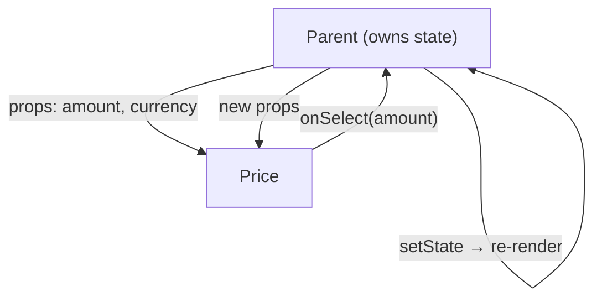
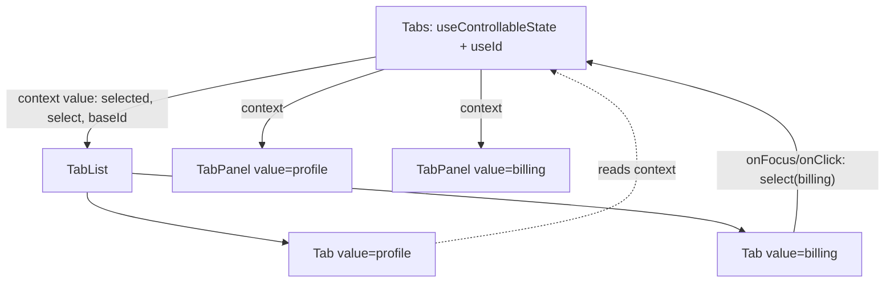

# 07 — Components, props and composition

> **How to use this module.** Sections 7.1–7.4 are the vocabulary every React interview assumes: props, `children`, composition and the props-vs-state split. Sections 7.5–7.9 are the API-design patterns that show up in "build a reusable component" rounds. Section 7.10 is for reading the class components you will still meet in older codebases. If you only have 20 minutes, read 7.1, 7.2, 7.8 and the Summary.

**Prerequisites:** [Elements vs components vs instances](06-jsx-and-rendering-model.md#63-elements-vs-components-vs-instances) · [Purity and idempotence](06-jsx-and-rendering-model.md#68-purity-and-idempotence) · [What triggers a render](06-jsx-and-rendering-model.md#69-what-triggers-a-render) · [Typing React](02-typescript.md#213-typing-react-props-children-events-refs-generic-components-componentprops)

**Code for this module:** [`examples/web/src/m07-components/`](examples/web/src/m07-components/). Every file below has a test next to it. Run them with `npx vitest run src/m07-components` from `examples/web`.

---

## 7.1 Function components and props

### The problem
A UI is a tree of repeated pieces: a hundred rows, three buttons, a card on every page. Copying markup does not scale, and a piece that reads global variables cannot be reused in a second place. You need a unit that takes **inputs** and returns **UI**, and nothing else.

### Mental model
A component [React] is a function from **props** to UI: `UI = f(props)`. Props are the arguments, and they are **read-only** from the component's point of view. A component never changes its own props; the **parent** decides them and may pass new ones on the next render.

> **Java/Spring analogy.** Props are constructor arguments of an immutable value object, closer to a `record` than to a bean with setters. **Angular analogy:** props are `@Input()`s, and callback props are `@Output()` `EventEmitter`s.
>
> **Where the analogy breaks:** a Java constructor runs once per object. A React component function runs **on every render**, receiving a fresh props object each time, and there is no `this` holding the old values. The "object" that persists between renders is the fiber that React keeps, not anything you construct ([06](06-jsx-and-rendering-model.md#63-elements-vs-components-vs-instances)).

### Minimal code
```tsx
type PriceProps = {
  amount: number;
  currency?: string; // optional prop
  onSelect?: (amount: number) => void; // callback prop: "events up"
};

// Default values come from JS default parameters [JS], not from defaultProps.
export function Price({ amount, currency = 'EUR', onSelect }: PriceProps) {
  return (
    <button type="button" onClick={() => onSelect?.(amount)}>
      {amount.toFixed(2)} {currency}
    </button>
  );
}

// Usage: <Price amount={12} onSelect={(a) => console.log(a)} />
```

Data goes **down** as props; changes go **up** as calls to callback props. This one-way flow is the whole architecture:



### How it works internally
JSX `<Price amount={12} />` compiles to `jsx(Price, { amount: 12 })` ([06](06-jsx-and-rendering-model.md#62-what-jsx-compiles-to)), which creates an **element**: a plain object `{ type: Price, props: { amount: 12 }, key: null }`. React later calls `Price(props)` while rendering that position in the tree. In development, React **freezes** both the element and its `props` object (`Object.freeze(type.props)` in `react/cjs/react-jsx-dev-runtime.development.js`, React 19.3.0), so `props.amount = 5` throws a `TypeError` in strict-mode code such as ES modules.

Two names are **not** props:
- `key` [React] is consumed by React to identify the element. Reading `props.key` gives `undefined`, and React warns: *"`key` is not a prop. Trying to access it will result in `undefined` being returned."* (string from the same React 19.3.0 dev build).
- `ref`: in React 19 it **is** a normal prop of function components ([7.9](#79-polymorphic-components-and-prop-spreading), [10](10-refs-and-dom.md#104-ref-as-a-prop-vs-forwardref)). Before 19 it was stripped from props like `key`.

### Trade-offs
- ✅ Props make a component a pure function, which is easy to test, reuse and reason about.
- ❌ Passing props through five layers that don't use them ("prop drilling") gets tedious. It is fine for two or three layers; past that, use composition (7.2) or context ([11](11-context.md#111-prop-drilling-and-when-it-is-fine)).
- Prefer **destructuring with default parameters** in the signature. It documents the API, and it is the only default mechanism for function components in React 19.

> **Version notes.** `defaultProps` on **function** components was deprecated with a warning in **React 18.3** ("Warn for deprecated `defaultProps` for function components") and **removed in 19.0** ("ES6 default parameters can be used in place"). Class components keep `static defaultProps` ("since there is no ES6 alternative"). Sources: React CHANGELOG 18.3.0 and 19.0.0. A detail worth knowing: in React 19.3.0 only the JSX runtime ignores it. The legacy `React.createElement` still copies `type.defaultProps` (read in `react/cjs/react.development.js`). `examples/web/src/m07-components/Legacy.test.tsx` asserts both behaviors.

---

## 7.2 `children` and slot props

### The problem
A `Card`, `Modal` or `Layout` should not know what goes inside it. If it takes `title: string` and `body: string`, the first time someone needs a link in the title or a chart in the body, the component has to change.

### Mental model
`children` [React] is just a prop whose value is whatever you nest between the tags. A component that renders `{children}` has a **hole** the caller fills. When one hole is not enough, add more holes as named props of type `ReactNode`: **slot props**.

> **Angular analogy.** `children` is `<ng-content>`. Slot props are multi-slot projection, `<ng-content select="[card-actions]">`.
>
> **Where the analogy breaks:** Angular projects DOM content that the parent template already instantiated. In React, `children` is just a **value** (an element, a string, an array, `null`, or even a function). The component can render it twice, not at all, wrap it, or inspect it. Nothing is "projected"; it is data passed down like any other prop.

### Minimal code
`examples/web/src/m07-components/Card.tsx` (the full exercise is Exercise 1):

```tsx
type CardProps = { title: ReactNode; actions?: ReactNode; footer?: ReactNode; children: ReactNode };

export function Card({ title, actions, footer, children }: CardProps) {
  // …
  return (
    <article aria-labelledby={titleId}>
      <header>
        <h3 id={titleId}>{title}</h3>
        {actions != null && <div>{actions}</div>}
      </header>
      <div>{children}</div>
      {footer != null && <footer>{footer}</footer>}
    </article>
  );
}

// <Card title="Invoice #42" actions={<button>Edit</button>}>…body…</Card>
```

### How it works internally
`<Card>…</Card>` compiles to `jsx(Card, { title: …, children: … })`. With one child, `children` is that single element. With several, it is an array. React does not render `children` for you: if `Card` never mentions it, the nested JSX is created and then simply ignored.

Elements passed as `children` or slot props are **created by the parent that wrote the JSX**, not by the component that renders them. That has a performance consequence that Exercise 4 measures: when `Card` re-renders because of its own state, the `children` element is the **same object** as last time, so React can skip re-rendering it ([15](15-performance.md#156-moving-state-down-and-lifting-content-up)).

**Typing `children`:**

| Type | Accepts | Use for |
|---|---|---|
| `ReactNode` | elements, strings, numbers, `null`, `undefined`, booleans, arrays, portals | Almost always |
| `ReactElement` | exactly one element | Rare: when you must clone or inspect it |
| `(arg: T) => ReactNode` | a function | Render props ([7.7](#77-render-props-and-hocs)) |
| `PropsWithChildren<P>` | `P & { children?: ReactNode }` | Shorthand when `children` is optional |

### Trade-offs
- ✅ Slots invert control: the layout component owns structure and the caller owns content.
- ❌ Too many slots turn into a configuration object in disguise. If you have eight slots, consider compound components (7.6).
- ⚠️ The `React.Children` API (`map`, `count`, `toArray`) and `cloneElement` let a parent inspect and rewrite its children. react.dev: *"Using `Children` is uncommon and can lead to fragile code."* It only sees the elements you passed, not what they render: *"Fragments don't get traversed"* ([react.dev/reference/react/Children](https://react.dev/reference/react/Children)). Prefer explicit props or context.

> **Version notes.** **@types/react 18** removed the implicit `children` from `React.FC`. The React 18 upgrade guide: *"the `children` prop now needs to be listed explicitly when defining props"* ([react.dev](https://react.dev/blog/2022/03/08/react-18-upgrade-guide)). In @types/react 19.3.0 (installed), `FunctionComponent<P>` is `(props: P): ReactNode | Promise<ReactNode>` with no `children` and no `defaultProps`. `propTypes` survives only as a deprecated field marked "Ignored by React". Code written for @types/react 16/17 with `const X: React.FC = ({ children }) => …` fails to type-check after upgrading. Migration: add `children: ReactNode` to the props type, or drop `React.FC` and type the props parameter directly.

---

## 7.3 Composition vs inheritance

### The problem
Object-oriented developers reach for `class FancyButton extends Button` to specialize a component. In UI code this produces deep hierarchies where a change in a base class breaks unrelated screens, and where a "dialog that is also a form" needs multiple inheritance.

### Mental model
React has **no component inheritance model** for you to use. You build specialized components by **wrapping** general ones and passing props and children:

```tsx
function Dialog({ title, children }: { title: string; children: ReactNode }) {
  return (
    <div role="dialog" aria-label={title}>
      <h2>{title}</h2>
      {children}
    </div>
  );
}

// "Specialization" = a component that renders a more general one with some props fixed.
function ConfirmDialog({ onConfirm }: { onConfirm: () => void }) {
  return (
    <Dialog title="Are you sure?">
      <button onClick={onConfirm}>Yes</button>
    </Dialog>
  );
}
```

> **Java/Spring analogy.** This is "favor composition over inheritance" (Effective Java), which Spring already practices: you do not subclass `JdbcTemplate`, you **inject** it into a service and delegate. A React parent passes collaborators (elements, callbacks) into a child the way a Spring context wires beans into a constructor.
>
> **Where the analogy breaks:** Spring wires a graph once at startup, and the beans are long-lived singletons. React "wires" on every render, and the collaborators are cheap immutable values (elements and functions), not shared mutable objects.

### How it works internally
There is nothing to inherit. React calls your function, and what it returns is a tree of elements whose `type` points at other components. "Reuse" means one of these:
- **props/children** for content and configuration,
- **custom hooks** for stateful logic ([12](12-hooks-and-custom-hooks.md#124-designing-custom-hooks)),
- **context** for values many descendants need ([11](11-context.md#113-how-propagation-and-re-rendering-work)).

Class components could technically `extend` another component class. React's documentation has long recommended against component inheritance hierarchies, and even in class codebases a shared base component class is a code smell.

### Trade-offs
- ✅ No fragile base class problem. Each component's behavior is visible in its own file.
- ✅ Logic reuse moved from mixins (removed with `createClass`) to HOCs and render props (7.7), and then to hooks.
- ❌ Wrapper components add depth in DevTools. It is a cheap cost.

---

## 7.4 Props vs state

### The problem
Beginners store everything in state, including values the parent already has. Then two copies disagree, and "why doesn't my component update when the prop changes?" follows.

### Mental model

| | Props | State |
|---|---|---|
| Who owns it | The parent | This component |
| Who can change it | The parent, by re-rendering with new values | This component, via its setter |
| Survives re-render | Re-supplied every render | Kept by React for this position in the tree |
| Analogy | Method arguments | A private field |

The test: *if a value can be computed from props or other state, it is neither; compute it during render* ([08](08-state.md#87-derived-state-compute-do-not-store)). If two components need the same changing value, it belongs in their **closest common parent**, which passes it down as props: "lifting state up" ([08](08-state.md#88-colocation-and-lifting-state-up)).

### Minimal code: the "mirror a prop into state" bug
```tsx
// ❌ `user.name` is read ONCE, on mount. When the parent passes a new user, this still shows the old one.
function Profile({ user }: { user: { name: string } }) {
  const [name, setName] = useState(user.name);
  return <input value={name} onChange={(e) => setName(e.target.value)} />;
}

// ✅ Option A: it's an editable draft → reset it by identity: <Profile key={user.id} user={user} />
// ✅ Option B: it isn't editable → don't copy it: render {user.name}.
```

### How it works internally
`useState(initial)` uses its argument only on the **first** render of that component at that position. On later renders React returns the stored value and ignores the argument. A prop changing therefore does nothing to state that was seeded from it. That is the same rule as `defaultValue` in 7.8, and Exercise 4 tests it.

### Trade-offs
- Name props that only seed state `initialX` or `defaultX`, so callers know later changes are ignored.
- Reach for `key` to reset ([08](08-state.md#89-resetting-state-with-key)) before you reach for "sync state from props in an effect" ([09](09-effects.md#96-you-might-not-need-an-effect)).

---

## 7.5 Container/presentational, and why hooks made it optional

### The problem
In 2015-era React, a component that fetched data, subscribed to a store and rendered markup was hard to test and reuse. Teams split it in two.

### Mental model
- **Container ("smart")**: knows **where data comes from**. It fetches, subscribes to Redux, and holds state. It renders little markup.
- **Presentational ("dumb")**: receives data and callbacks as props and returns markup. It is pure and easy to test in isolation (and in Storybook).

> **Java/Spring analogy.** Controller vs view template: the `@Controller` assembles the model, and the Thymeleaf template only renders it.
>
> **Where the analogy breaks:** in Spring the split is enforced by layers. In React it is only a convention, and a custom hook can extract the "controller" part without creating a second component.

### Minimal code
```tsx
// Then: a container component wrapping a presentational one.
function UserListContainer() {
  const { users, isPending } = useUsers(); // pre-hooks this was connect()/componentDidMount
  return <UserList users={users} loading={isPending} />;
}

// Now: the hook IS the container. One component, the logic still separated and reusable.
function UserListPage() {
  const { users, isPending } = useUsers();
  return isPending ? <Spinner /> : <UserList users={users} />;
}
```

### How it works internally
Nothing in React knows about this pattern. The reason it existed was that, before hooks (React 16.8), the only ways to reuse stateful logic were class components, HOCs and render props, so separating "logic" from "markup" required separate components. A custom hook is a function that calls hooks, and it carries the logic without adding a component to the tree.

> **Unverified:** Dan Abramov's 2015 article "Presentational and Container Components" carries a later update note saying he no longer recommends splitting components this way because hooks cover it. Check the article (overreacted / Medium) for the exact wording and date before quoting it.

### Trade-offs
- ✅ Still useful as a **guideline**: keep leaf UI components prop-driven so they are easy to test and show in a design system.
- ❌ As a **rule** ("every component needs a container"), it doubles the files for no gain.
- In Next.js App Router codebases the split reappears in a new form: a Server Component fetches and a Client Component handles interaction ([21](21-concurrent-ssr-server-components.md)).

---

## 7.6 Compound components

### The problem
A `Tabs` component configured with one big prop (`tabs={[{ label, content, disabled, icon, badge }]}`) grows a new option for every request: custom tab rendering, a tab with a tooltip, panels in a different place. Configuration props do not compose.

### Mental model
Split one widget into **parts that work together**, the way HTML does with `<select>` and `<option>`:

```tsx
<Tabs defaultValue="profile">
  <TabList label="Account">
    <Tab value="profile">Profile</Tab>
    <Tab value="billing">Billing</Tab>
  </TabList>
  <TabPanel value="profile">…</TabPanel>
  <TabPanel value="billing">…</TabPanel>
</Tabs>
```

The parent (`Tabs`) owns the shared state, and the parts read it through an **implicit channel**: a context that is private to the component family. The caller controls the **structure** (order, wrappers, extra markup between the parts) and the component controls the **behavior** (selection, keyboard, ARIA).

> **Angular analogy.** `mat-tab-group` with `mat-tab` children, where a child `inject()`s its parent group. React context is the equivalent of Angular's hierarchical injector for this case.
>
> **Where the analogy breaks:** an Angular child gets the parent **instance** and can call its methods. A React part only gets the **value** the parent put into context for this render (here `{ selected, select, baseId }`), and re-renders when that value changes.



### Minimal code
`examples/web/src/m07-components/Tabs.tsx`, the core of it:

```tsx
const TabsContext = createContext<TabsContextValue | null>(null);

function useTabsContext(part: string) {
  const context = use(TabsContext);
  if (!context) throw new Error(`<${part}> must be rendered inside <Tabs>`);
  return context;
}

export function Tabs({ value, defaultValue, onChange, children }: TabsProps) {
  const baseId = useId();
  const [selected, select] = useControllableState({ value, defaultValue: defaultValue ?? value ?? '', onChange });
  return <TabsContext value={{ baseId, selected, select }}>{children}</TabsContext>;
}
```

### How it works internally
`<TabsContext value>` (React 19's provider syntax, [11](11-context.md#112-createcontext-context-value-vs-provider)) puts the value into the tree. Each `Tab` and `TabPanel` reads the **nearest** provider above it. Because context goes through the component tree, not through `children` arrays, the parts can be nested inside any wrapper `div`, which the old `React.Children.map` + `cloneElement` implementation could not handle. The guarded hook (`useTabsContext`) turns "used outside `<Tabs>`" into a clear error instead of a `null` crash.

### Trade-offs
- ✅ Flexible layout, small API surface per part, and the pattern used by Radix, Headless UI, Reach and React Aria ([04](04-html-css-accessibility.md#412-component-libraries-mui-radix-shadcnui-headless-vs-styled)).
- ❌ More exports to learn, and the parts cannot be used standalone.
- ❌ Every context consumer re-renders when the context value changes. That is fine for a widget-sized tree; see [11](11-context.md#114-stable-values) for large ones.
- Older implementations used `React.Children.map(children, (child, i) => cloneElement(child, { index: i, … }))`. Recognize it, and know it breaks as soon as a part is wrapped in another component or a fragment.

---

## 7.7 Render props and HOCs

### The problem
Before hooks, two class components that both needed "track the mouse position" or "subscribe to the store" had no clean way to share that logic. Mixins (from `createClass`) caused name clashes and implicit dependencies. The community invented two composition patterns, and you will meet both in any codebase older than 2019.

### Mental model
- **Higher-order component (HOC)**: a function `Component → Component` that wraps the original and injects props. *Java analogy:* the decorator pattern, or a Spring AOP proxy that wraps a bean. *Where it breaks:* a Spring proxy is created once at startup, but a HOC called inside render creates a **new component type** on every render (see Trade-offs).
- **Render prop**: a component that takes a **function** as a prop (often `children`) and calls it with its internal state, letting the caller decide what to render. *Angular analogy:* `*ngTemplateOutlet` with a template context.

### Minimal code
`examples/web/src/m07-components/Legacy.tsx`:

```tsx
// HOC
export function withLoading<P extends object>(Wrapped: ComponentType<P>) {
  function WithLoading({ loading, ...props }: P & LoadingProps) {
    return loading ? <p role="status">Loading…</p> : <Wrapped {...(props as P)} />;
  }
  WithLoading.displayName = `withLoading(${Wrapped.displayName ?? Wrapped.name})`;
  return WithLoading;
}

// Render prop
export function Hoverable({ children }: { children: (hovered: boolean) => ReactNode }) {
  const [hovered, setHovered] = useState(false);
  return (
    <div onMouseEnter={() => setHovered(true)} onMouseLeave={() => setHovered(false)}>
      {children(hovered)}
    </div>
  );
}

// <Hoverable>{(hovered) => <span>{hovered ? 'Hovering' : 'Idle'}</span>}</Hoverable>
```

The modern equivalent of both is a **custom hook**: `const hovered = useHover(ref)` or `const { users, isPending } = useUsers()`. It has no wrapper component, no prop-name collisions, and no "wrapper hell" in DevTools.

### How it works internally
- A HOC is plain JavaScript: it runs once (when you call it at module level) and returns a new function component. Famous examples you will read: `connect(mapState)(Component)` from react-redux, `withRouter` from React Router ≤ 5 (removed in v6), `withStyles` from MUI v4, `injectIntl` from react-intl.
- A render prop is just a prop whose value is a function. The component calls it during its own render, so the caller's JSX is created inside the component's render.

### Trade-offs

| | HOC | Render prop | Custom hook |
|---|---|---|---|
| Where the logic is visible | Hidden in the wrapper | Inline at the call site | Inline at the call site |
| Prop name collisions | Yes (two HOCs both inject `data`) | No | No |
| Extra components in the tree | One per HOC | One | None |
| Static typing | Awkward generics | Easy | Easy |
| Still the right tool when | Cross-cutting wrapping of **third-party** components, or a library API (`connect`, `memo`, `observer`) | A component must own DOM/state **and** let the caller render (e.g. virtualized list rows, `Formik`'s `<Field>`) | Almost everything else |

- ❌ **Never apply a HOC inside render.** `const Enhanced = withLoading(UserName)` inside a component creates a new type every render, so React unmounts and remounts the subtree and its state is lost ([13](13-reconciliation-and-fiber.md#134-keys-revisited-and-nested-component-definitions)). `eslint-plugin-react-hooks` 7.1.1 reports this as `react-hooks/static-components`: *"Cannot create components during render"* (rule source read in `node_modules/eslint-plugin-react-hooks`; listed in its `recommended` preset as `error`).
- HOCs must forward refs explicitly before React 19 (`forwardRef`), and hoist statics (`hoist-non-react-statics`). In 19, `ref` travels in the spread props.

---

## 7.8 Controlled vs uncontrolled component APIs

### The problem
You write a `Toggle`. Team A wants to drop it in and forget it. Team B needs to reset it from a "Clear all" button, persist it in the URL, or veto a change. If the component owns its state, Team B cannot. If the parent must own it, Team A must write boilerplate. Native inputs already solved this, and your components should follow the same contract.

### Mental model
- **Controlled**: the parent owns the value. It passes `value` and `onChange`; the component renders `value` and **asks** for changes by calling `onChange(next)`. If the parent ignores the request, nothing changes.
- **Uncontrolled**: the component owns the value, seeded once from `defaultValue`. The parent can still listen with `onChange`, but cannot set the value later (except by remounting it with a new `key`).

| Native input | Your component | Meaning |
|---|---|---|
| `value` / `checked` | `value` | Controlled: parent is the source of truth |
| `defaultValue` / `defaultChecked` | `defaultValue` | Uncontrolled: starting value, read once |
| `onChange` | `onChange` | Notification in both modes |

> **Angular analogy.** A `ControlValueAccessor`: `writeValue` is the parent pushing `value` down, and `registerOnChange` is `onChange` going up. `[(ngModel)]` is the controlled mode.
>
> **Where the analogy breaks:** Angular's forms API can write into the control imperatively at any time. In React, a controlled component cannot hold a value different from the prop. The prop **is** the value on every render.

### Minimal code
One small hook supports both modes. `examples/web/src/m07-components/useControllableState.ts`:

```ts
export function useControllableState<T>({ value, defaultValue, onChange }: Options<T>) {
  const [internal, setInternal] = useState(defaultValue);
  const isControlled = value !== undefined;
  const current = value === undefined ? internal : value;

  const setValue = (next: T) => {
    if (Object.is(next, current)) return; // no-op changes are not reported
    if (!isControlled) setInternal(next);
    onChange?.(next);
  };

  return [current, setValue] as const;
}
```

`Toggle` and `Tabs` both use it, which is the "share logic, not components" idea from 7.5 in practice.

### How it works internally
For native inputs, React DOM does extra work. After every `input` event it runs the `onChange` handler and then **restores** the DOM value to the `value` prop if the state did not change. That is why a controlled input with an ignoring parent appears frozen, and Exercise 4 proves it. In development React DOM also warns:
- `value` without `onChange`: *"You provided a `value` prop to a form field without an `onChange` handler. This will render a read-only field. If the field should be mutable use `defaultValue`. Otherwise, set either `onChange` or `readOnly`."*
- switching modes: *"A component is changing an uncontrolled input to be controlled. This is likely caused by the value changing from undefined to a defined value…"*

(Both strings read from `react-dom/cjs/react-dom-client.development.js`, React DOM 19.3.0.) The second one is why `value={user.name}` where `name` starts as `undefined` is a bug: write `value={user.name ?? ''}`.

Your own components should follow the same rule: decide the mode on mount and never switch it. Component libraries do the same; MUI, for example, warns when one of its components switches between controlled and uncontrolled.

### Trade-offs
- ✅ Supporting both modes is what makes a component library usable by both kinds of team.
- Default to **uncontrolled** for simple forms (less code, fewer renders; see [14](14-forms-and-actions.md#141-controlled-vs-uncontrolled-inputs) for forms and Actions). Choose **controlled** when the value drives other UI, must be validated per keystroke, or must be reset or set from outside.
- ❌ `undefined` means "uncontrolled" in this convention, so a controlled value can never legitimately be `undefined`. Use `null` for "nothing selected".

---

## 7.9 Polymorphic components and prop spreading

### The problem
A design-system `Button` must sometimes render a `<button>`, sometimes an `<a href>` and sometimes a router `<Link>`, with the same styling. Duplicating it three times is waste. And every wrapper around a native element must pass through `aria-*`, `data-*`, `id`, event handlers and `ref` that you did not anticipate.

### Mental model
- **Prop spreading**: accept "everything the underlying element accepts" (`ComponentProps<'input'>`), pick out the props you handle, and spread the rest onto the element.
- **Polymorphism**: an `as` prop chooses the element type, and TypeScript types the remaining props **for that element** ([02](02-typescript.md#28-generics-and-constraints)).

> **Java analogy:** a generic method `<C extends ElementType> render(C as, PropsOf<C> props)`, where the type parameter flows from one argument into the type of another.
>
> **Where it breaks:** TypeScript's checking here is structural and approximate. Complex polymorphic types slow the compiler and produce unreadable errors, which is why some libraries replaced `as` with `asChild` (Radix's `Slot`), where the caller passes the element itself.

### Minimal code
`examples/web/src/m07-components/Text.tsx`:

```tsx
type TextProps<C extends ElementType> = { as?: C } & Omit<ComponentPropsWithoutRef<C>, 'as'>;

export function Text<C extends ElementType = 'span'>({ as, ...rest }: TextProps<C>) {
  const Component: ElementType = as ?? 'span';
  return <Component {...rest} />;
}

// <Text as="a" href="/docs">Docs</Text>     ✅ href allowed on an anchor
// <Text href="/docs">Docs</Text>            ❌ type error: span has no href
```

`examples/web/src/m07-components/TextField.tsx` shows spreading with `ref` in React 19, next to the `forwardRef` version that 18 codebases use:

```tsx
// React 19: ref is a plain prop, so it travels inside the spread.
export function TextField({ label, ...inputProps }: { label: string } & ComponentProps<'input'>) {
  return (
    <label>
      {label}
      <input {...inputProps} />
    </label>
  );
}

// React 16.3–18 (still works in 19):
export const LegacyTextField = forwardRef<HTMLInputElement, Props>(function LegacyTextField({ label, ...p }, ref) {
  return <label>{label}<input ref={ref} {...p} /></label>;
});
```

### How it works internally
A JSX tag that starts with a capital letter is a **variable reference**, so `<Component />` renders whatever the variable holds, whether a string like `'a'` (a host element) or a function (a component). Assigning it to a variable typed `ElementType` stops TypeScript from trying to prove that generic props match a generic element, a proof it cannot finish.

**Spread order matters.** In `<input {...rest} type="text" />`, your `type` wins. In `<input type="text" {...rest} />`, the caller's wins. Put the props you **must** control after the spread, and the overridable defaults before it. For event handlers you want to **combine**, not override, call both: `onClick={(e) => { rest.onClick?.(e); doMine(); }}`.

> **Version notes.** **React 19** made `ref` a regular prop for function components ("Refs can now be used as props, removing the need for `forwardRef`", CHANGELOG 19.0.0) and deprecated reading `element.ref` in favor of `element.props.ref`. React 19.3.0's dev build warns: *"Accessing element.ref was removed in React 19. ref is now a regular prop."* react.dev's `forwardRef` page: *"In React 19, `forwardRef` is no longer necessary. Pass `ref` as a prop instead. `forwardRef` will be deprecated in a future release."* ([react.dev](https://react.dev/reference/react/forwardRef)). **Migration:** remove the `forwardRef` wrapper, take `ref` from props, and change `ComponentPropsWithoutRef<'input'>` to `ComponentProps<'input'>`. Details are in [10](10-refs-and-dom.md#104-ref-as-a-prop-vs-forwardref).

### Trade-offs
- ✅ Spreading keeps wrappers transparent: accessibility attributes and test ids just work.
- ❌ Spreading **everything** onto a DOM node leaks your own props. React warns about unknown camelCase attributes (`isActive` on a `<div>`). Destructure your props out first.
- ❌ Spreading an object that contains `key` triggers a dev warning: *"A props object containing a "key" prop is being spread into JSX"* (React 19.3.0 dev runtime). Pass `key` explicitly.
- Prefer a small, explicit set of variants (`variant="link"`) over `as` when only two or three elements are needed. Polymorphism earns its complexity in design systems.

---

## 7.10 Class components

### The problem
You will rarely write a class component in new code, but interviewers still show one and ask you to explain or convert it. Error boundaries still require one ([16](16-error-handling.md#162-error-boundaries)), and many production apps have hundreds.

### Mental model
A class component is an object that React instantiates **once** per mounted position and keeps. Props arrive on `this.props`, private state lives in `this.state`, and `render()` is called on every update. Behavior over time is split across lifecycle methods.

> **Java analogy:** finally, a real object with fields and methods. It feels natural to Java developers, which is also why they over-use it.
>
> **Where the analogy breaks:** you never call `new` and never mutate `this.state` directly; React owns the instance. And `this.props` is **mutable from React's side**: an async callback that reads `this.props.userId` gets the **latest** value, not the one from the render that scheduled it. That is a classic class-component race that function components' closures avoid.

### Minimal code
`examples/web/src/m07-components/Legacy.tsx`:

```tsx
export class ClassCounter extends Component<{ step?: number }, { count: number }> {
  static defaultProps = { step: 1 }; // still supported on classes in React 19
  state = { count: 0 };

  increment = () => {
    // Functional setState: like setCount(c => c + step)
    this.setState((prev, props) => ({ count: prev.count + (props.step ?? 1) }));
  };

  render() {
    return <button onClick={this.increment}>Count: {this.state.count}</button>;
  }
}
```

Reading guide:

| Class code | Function component equivalent |
|---|---|
| `this.props.x` | `props.x` / destructured `x` |
| `this.state` + `this.setState(partial)` (shallow **merge**) | `useState` per value (setters **replace**) or `useReducer` |
| `constructor` + `this.handle = this.handle.bind(this)` | Nothing needed: closures |
| `componentDidMount` / `componentDidUpdate` / `componentWillUnmount` | `useEffect` with cleanup ([09](09-effects.md#91-effects-as-synchronization-with-external-systems)) |
| `shouldComponentUpdate` / `PureComponent` | `memo` ([15](15-performance.md#153-reactmemo)) |
| `static contextType` | `use(Context)` / `useContext` |
| `getDerivedStateFromError` / `componentDidCatch` | No hook equivalent: keep a class or use `react-error-boundary` |

The full lifecycle mapping is in [13](13-reconciliation-and-fiber.md#136-class-lifecycle-methods-and-their-hook-equivalents).

### How it works internally
For a class, React creates the instance on mount and stores it on the fiber (`fiber.stateNode`). `setState` enqueues an update on that fiber. On render React calls `instance.render()` with `this.props` and `this.state` already set to the new values. A function component has no instance; its state lives in the hook list on the fiber ([12](12-hooks-and-custom-hooks.md#122-how-react-stores-hooks-so-call-order-matters)).

> **Version notes.** react.dev: *"We recommend defining components as functions instead of classes"*. Classes *"are still supported by React, but we don't recommend using them in new code"* ([react.dev/reference/react/Component](https://react.dev/reference/react/Component)). **React 19 removed** several class-era APIs (CHANGELOG 19.0.0): `propTypes` checks (*"will now be silently ignored"*), string refs (`ref="input"`, migrate to callback refs), legacy context (`contextTypes`/`getChildContext`; React DOM 19.3.0 dev logs *"%s uses the legacy contextTypes API which was removed in React 19"*), `React.createFactory`, and module-pattern factories. `static defaultProps` on classes **stays**. The `UNSAFE_componentWillMount`/`ReceiveProps`/`Update` lifecycles still work but are flagged in Strict Mode. See [13](13-reconciliation-and-fiber.md#138-legacy-apis-removed-in-19).

> **Verified (React CHANGELOG):** **15.5.0** (Apr 7, 2017) added deprecation warnings for `React.PropTypes` (pointing to the `prop-types` package) and `React.createClass` (pointing to `create-react-class`). **16.3.0** (Mar 29, 2018) added `React.createRef()`, `React.forwardRef()` and "a new officially supported context API" (`createContext`). **16.6.0** (Oct 23, 2018) added `React.memo()` and the class `contextType`.

### Trade-offs
- Converting a class to a function is usually mechanical. The traps are `this.props` read in async code (latest vs snapshot), `setState` merging (hooks replace), and `componentDidUpdate` comparisons (they become dependency arrays).
- Don't convert working classes just for style. Convert when you touch them, and keep error boundaries as classes or use `react-error-boundary`.

---

## Interview questions

**Q1. What is a component in React, in one sentence?**
<details><summary>Answer</summary>

A function that takes props and returns a description of UI (React elements), and that must be pure with respect to its props, state and context. React decides when to call it. **A strong answer adds:** the function is called on every render, so anything that should persist lives in state or refs that React stores on the fiber, not in local variables.

</details>

**Q2. Why are props read-only? What happens if you mutate them?**
<details><summary>Answer</summary>

Props belong to the parent. The child receiving them is a pure function of its inputs, and React relies on that to skip, repeat or discard renders. In development React freezes the element and its `props` object, so assignment throws a `TypeError` in strict-mode code. In production it silently mutates a shared object, and the parent's next render overwrites it anyway. **A strong answer adds:** to "change a prop", call a callback the parent passed, so the parent updates its state and re-renders with new props.

</details>

**Q3. How do you give a function component default prop values in React 19?**
<details><summary>Answer</summary>

With JavaScript default parameters in the destructuring: `function Price({ currency = 'EUR' })`. `Component.defaultProps` on function components was removed in 19.0, after a deprecation warning in 18.3. The JSX runtime ignores it. **A strong answer adds:** classes still support `static defaultProps`. A quirk is that in 19.3 the legacy `createElement()` still applies `defaultProps`, so code that does not use JSX can behave differently from code that does (`Legacy.test.tsx`).

</details>

**Q4. What does `children` contain, and what type should it have?**
<details><summary>Answer</summary>

Whatever was nested between the tags: a single element, a string, an array of nodes, `null`, or even a function. Type it as `ReactNode` unless you need something specific. `ReactElement` means exactly one element, and a function type means a render prop. **A strong answer adds:** `children` is an ordinary prop. You can pass it explicitly (`children={…}`), render it twice, or ignore it.

</details>

**Q5. What are "slot props" and when do you use them instead of `children`?**
<details><summary>Answer</summary>

Named props of type `ReactNode` (`title`, `actions`, `footer`) for components with **several** holes. `children` stays the main body. They let the caller pass arbitrary JSX for each region while the component controls layout. **A strong answer adds:** it is the React version of Angular's `<ng-content select>` and Vue's named slots. When the number of slots gets large, switch to compound components.

</details>

**Q6. Why did `React.FC` stop accepting `children` automatically?**
<details><summary>Answer</summary>

@types/react 18 removed the implicit `children?: ReactNode` from `FC`, because it let components that ignore children accept them silently. The React 18 upgrade guide says children "now needs to be listed explicitly". **A strong answer adds:** many teams stopped using `React.FC` altogether and type the props parameter directly, which also works with generics. Migration tooling exists (`types-react-codemod`).

</details>

**Q7. Why does React favor composition over inheritance?**
<details><summary>Answer</summary>

Because props and children already express every kind of specialization a UI needs. A specialized component renders a general one with some props fixed. Inheritance couples a subclass to the internals of its base and cannot combine behaviors from two bases. React's documentation has long recommended against component inheritance hierarchies. **A strong answer adds:** logic reuse went mixins → HOCs/render props → hooks, and none of those is inheritance.

</details>

**Q8. Props vs state: how do you decide where a value goes?**
<details><summary>Answer</summary>

If the parent provides it, it is a prop. If it changes over time because of this component's interactions and nothing else owns it, it is state. If it can be **computed** from props or state, it is neither: compute it during render. **A strong answer adds:** if two siblings need it, lift it to the closest common parent and pass it down.

</details>

**Q9. A component initializes `useState(props.name)`. The parent passes a new `name`, and the screen doesn't change. Why, and how do you fix it?**
<details><summary>Answer</summary>

The `useState` argument is only read on the first render, so the state is a snapshot of the prop at mount time. Fix: if the value is an editable draft that should restart for a new entity, render it with `key={entity.id}` so it remounts. If it is not edited, don't copy it at all; read the prop. **A strong answer adds:** "sync in a `useEffect`" causes an extra render with stale data, and the linter (`set-state-in-effect`) flags it.

</details>

**Q10. What were container and presentational components, and are they still recommended?**
<details><summary>Answer</summary>

Containers fetched data and held state, and presentational components rendered props. The split existed because, before hooks, stateful logic could only be reused via components. Today a custom hook carries the logic, so the strict split is optional. Keeping leaf components prop-driven is still good practice for testing and design systems. **A strong answer adds:** the Server/Client Component split in Next.js is a modern, enforced cousin of the pattern.

</details>

**Q11. What are compound components? Give an example.**
<details><summary>Answer</summary>

A set of components that work together and share implicit state through a private context, like `<Tabs>`, `<TabList>`, `<Tab>` and `<TabPanel>`, or HTML's `<select>`/`<option>`. The caller controls structure and the parent controls behavior. **A strong answer adds:** guard the context hook so a part used outside the root throws a clear error, and prefer context over `Children.map` + `cloneElement`, which breaks on wrapped children.

</details>

**Q12. Why is `React.Children.map` + `cloneElement` considered fragile?**
<details><summary>Answer</summary>

It only sees the elements passed directly as `children`. It does not see into components' rendered output or fragments, so wrapping a `<Tab>` in a `<Tooltip>` or a custom component breaks the injected props. It also overrides props silently. react.dev calls `Children` "uncommon" and says it "can lead to fragile code". **A strong answer adds:** alternatives are context (compound components), an array prop, or render props.

</details>

**Q13. What is a higher-order component? Name some you have seen.**
<details><summary>Answer</summary>

A function that takes a component and returns a new component that renders it with extra props or behavior. Examples: react-redux `connect`, React Router ≤ 5 `withRouter`, MUI v4 `withStyles`, react-intl `injectIntl`, and `React.memo`, which is HOC-shaped. **A strong answer adds:** set a `displayName` like `withX(Inner)` for DevTools, forward refs (before 19), hoist statics, and never create a HOC inside render.

</details>

**Q14. What goes wrong if you call a HOC inside a component's render?**
<details><summary>Answer</summary>

Each render returns a **new** component type. React compares element types by identity, sees a different type, unmounts the old subtree and mounts a new one. All state and DOM are lost, focus jumps, and effects re-run. `eslint-plugin-react-hooks` 7 flags it as `react-hooks/static-components` ("Cannot create components during render"). **A strong answer adds:** the same bug happens with a component defined inside another component.

</details>

**Q15. What is a render prop? How does it compare with a custom hook?**
<details><summary>Answer</summary>

A prop whose value is a function the component calls to render, passing its internal state: `<Hoverable>{(hovered) => …}</Hoverable>`. A custom hook gives the same reuse without an extra component or nesting (`const hovered = useHover(ref)`). **A strong answer adds:** render props are still right when the component must own DOM or layout and the caller must render inside it, such as virtualized list rows or `Formik` fields.

</details>

**Q16. Why did hooks largely replace HOCs and render props?**
<details><summary>Answer</summary>

HOCs hide where props come from, collide on prop names, and stack wrappers ("wrapper hell"). Render props nest deeply ("callback pyramid"). Both add components to the tree just to share logic. Hooks share stateful logic as plain function calls inside one component, are easy to type, and compose by calling one hook from another. **A strong answer adds:** HOCs survive for wrapping third-party components and in library APIs (`memo`, `observer`, `connect`).

</details>

**Q17. Explain controlled vs uncontrolled components, for inputs and for your own components.**
<details><summary>Answer</summary>

Controlled: the parent owns the value and passes `value` + `onChange`; the component shows exactly `value`. Uncontrolled: the component (or the DOM) owns the value, seeded from `defaultValue`, and the parent reads it when it needs it (a ref, `FormData`, or `onChange` notifications). **A strong answer adds:** a good reusable component supports both, using the native naming convention, and decides the mode at mount.

</details>

**Q18. What happens when you pass `value` to an input without `onChange`?**
<details><summary>Answer</summary>

The input becomes read-only. React restores the DOM value to `value` after every input event, and React DOM warns in development: "This will render a read-only field. If the field should be mutable use `defaultValue`. Otherwise, set either `onChange` or `readOnly`." **A strong answer adds:** if read-only is intended, add `readOnly` to silence the warning and tell assistive technology.

</details>

**Q19. A controlled input's parent forgot to call `setState` in `onChange`. What does the user see when typing?**
<details><summary>Answer</summary>

Nothing changes: each keystroke fires `onChange` with the would-be value, and then React DOM resets the DOM to the unchanged `value` prop. Exercise 4 asserts the exact `onChange` sequence. **A strong answer adds:** this is the same mechanism that makes controlled inputs able to reject or transform input (e.g. uppercase-only), by setting state to something other than `e.target.value`.

</details>

**Q20. Why does "A component is changing an uncontrolled input to be controlled" happen?**
<details><summary>Answer</summary>

The `value` prop was `undefined` on the first render (uncontrolled) and became a string later (controlled), typically `value={user.name}` before the user loads. React refuses to switch modes for a mounted input. Fix: always pass a defined value (`?? ''`), or render the input only once data exists. **A strong answer adds:** the same rule applies to your own controllable components, so `undefined` cannot mean "empty".

</details>

**Q21. How would you design a `Toggle` that supports both controlled and uncontrolled use?**
<details><summary>Answer</summary>

Accept `value?`, `defaultValue?` and `onChange?`. Keep internal state seeded from `defaultValue`. On click compute `next`, update internal state **only if uncontrolled**, and always call `onChange(next)`. Render `value ?? internal`. Extract it into `useControllableState` so other components reuse it (Exercise 2). **A strong answer adds:** expose state with ARIA (`aria-pressed`), and do not notify the parent from an effect; call `onChange` in the handler.

</details>

**Q22. Why should a component call `onChange` in the event handler rather than in a `useEffect` that watches its state?**
<details><summary>Answer</summary>

The effect version notifies one render late, fires on mount even though the user did nothing, and fires again in Strict Mode. It also causes a second render pass in the parent. Calling it in the handler batches the child and parent updates into one render. **A strong answer adds:** see [09](09-effects.md#96-you-might-not-need-an-effect), row "Notify the parent of a change".

</details>

**Q23. What is a polymorphic component, and how do you type the `as` prop?**
<details><summary>Answer</summary>

A component whose rendered element is chosen by the caller: `<Text as="a" href>`. Type it with a generic `C extends ElementType` and props `{ as?: C } & Omit<ComponentPropsWithoutRef<C>, 'as'>`, then assign the tag to a variable typed `ElementType` before rendering. **A strong answer adds:** complex polymorphic types are slow and hard to read, which is why Radix uses `asChild` (merge props onto the single child) instead.

</details>

**Q24. What are the risks of `{...props}` spreading?**
<details><summary>Answer</summary>

Leaking non-DOM props onto DOM nodes (unknown-attribute warnings, invalid HTML), silently overriding your own props depending on order, spreading a `key` (dev warning), and losing track of the API. **A strong answer adds:** destructure your own props out, spread the rest, put must-win props after the spread, and compose event handlers instead of overriding them.

</details>

**Q25. How do you pass a ref to a custom component in React 19 vs React 18?**
<details><summary>Answer</summary>

React 19: `ref` is a regular prop, so `function TextField({ ref, ...p })` or simply spreading props onto the `<input>` works. React 18: wrap the component in `forwardRef((props, ref) => …)` because `ref` was stripped from props. `forwardRef` still works in 19, and react.dev says it will be deprecated in a future release. **A strong answer adds:** reading `element.ref` is deprecated in 19 in favor of `element.props.ref`.

</details>

**Q26. Is `key` available as a prop inside the component?**
<details><summary>Answer</summary>

No. React consumes `key` to identify the element among its siblings, and reading `props.key` returns `undefined` with a dev warning. If the child needs the id, pass it again under another name (`id={item.id}`). **A strong answer adds:** `ref` used to be special in the same way but is a normal prop since 19.

</details>

**Q27. When the parent re-renders, does a child passed as `children` re-render too?**
<details><summary>Answer</summary>

It depends on **who created the element**. If `Layout` re-renders because of its own state and renders `{children}`, those elements came from Layout's parent and are the same objects as before, so React skips them. Children that `Layout` creates in its own JSX re-render. Exercise 4 measures this. **A strong answer adds:** this is the "lift content up" optimization ([15](15-performance.md#156-moving-state-down-and-lifting-content-up)), and it costs nothing, unlike `memo`.

</details>

**Q28. What is the difference between an element and a component?**
<details><summary>Answer</summary>

A component is the function (or class). An element is the immutable object `{ type, props, key }` produced by JSX that describes one use of it. React turns elements into fibers (instances) and calls components to get more elements. **A strong answer adds:** passing `<Child />` as a prop passes an element, while passing `Child` passes the component, so the receiver decides when and with which props to render it ([06](06-jsx-and-rendering-model.md#63-elements-vs-components-vs-instances)).

</details>

**Q29. Read this class component aloud: what do `setState` merging and `bind` do?**
<details><summary>Answer</summary>

`this.setState({ a: 1 })` **shallow-merges** into `this.state`, keeping other keys, and schedules a re-render. `this.handle = this.handle.bind(this)` in the constructor fixes `this` when the method is passed as a callback; arrow-function class fields do the same. **A strong answer adds:** `useState` setters **replace** the value, so converting `setState({ a })` on an object state needs `setState(s => ({ ...s, a }))`, or better, separate state variables.

</details>

**Q30. What is the "this.props in async code" bug in class components?**
<details><summary>Answer</summary>

`this.props` always points to the **latest** props. A `setTimeout` or `await` in a handler that later reads `this.props.user` may see a different user than the one that was on screen when the action started, for example "follow" sending the wrong id. Function components capture the props of the render that created the handler, so the closure is consistent. **A strong answer adds:** the flip side is stale closures in effects ([09](09-effects.md#95-stale-closures-in-effects-and-intervals)).

</details>

**Q31. What did React 19 remove that affects component code in legacy apps?**
<details><summary>Answer</summary>

`propTypes` checks (silently ignored), `defaultProps` for function components, string refs, legacy context (`contextTypes`/`getChildContext`), `createFactory`, module-pattern factories, and `ReactDOM.render`/`hydrate`/`unmountComponentAtNode`. **A strong answer adds:** React 18.3 exists to surface warnings for most of these before you upgrade. Upgrade to 18.3, fix the warnings, then move to 19.

</details>

**Q32. If `propTypes` are ignored in React 19, how do you validate props?**
<details><summary>Answer</summary>

Statically with TypeScript for code you control, and at runtime with a schema library (Zod) at the **boundaries** where untyped data enters: API responses, URL params, `localStorage` ([02](02-typescript.md#216-runtime-validation-with-zod-vs-static-types)). **A strong answer adds:** propTypes only ran in development anyway, so they never protected production. Remove the `prop-types` dependency when migrating, after converting the declarations to TS types.

</details>

**Q33. Why do error boundaries still need a class component?**
<details><summary>Answer</summary>

Catching render errors needs `static getDerivedStateFromError` and/or `componentDidCatch`, and React has no hook equivalent. You write one class (or use `react-error-boundary`, which wraps one) and use it from function components. **A strong answer adds:** boundaries don't catch errors in event handlers or async code ([16](16-error-handling.md#164-what-boundaries-do-not-catch)).

</details>

**Q34. How do you make a compound `Tabs` accessible?**
<details><summary>Answer</summary>

Roles `tablist`, `tab` and `tabpanel`. `aria-selected` on tabs, `aria-controls` from tab to panel, and `aria-labelledby` from panel to tab, with ids from `useId`. A roving `tabIndex` so Tab enters on the selected tab. Arrow keys move between tabs (wrapping), with Home/End. Hidden panels use `hidden`. **A strong answer adds:** decide between automatic activation (selecting on focus, as in Exercise 3) and manual activation (Enter/Space) per the WAI-ARIA Authoring Practices tabs pattern; see [04](04-html-css-accessibility.md#43-focus-management-and-keyboard-navigation-roving-tabindex).

</details>

---

## Coding exercises

### Exercise 1: A `Card` with slots

**Statement.** Build `Card({ title, actions?, footer?, children })`. It renders an `<article>` whose accessible name is the title, a header with the title in an `<h3>` and an optional actions area, the body, and an optional `<footer>`. Optional slots must not leave empty wrappers. Any slot accepts arbitrary JSX.

**Approach.**
1. Mental model: the card owns **layout**, the caller owns **content**. Every region is a `ReactNode` prop.
2. Name the article by its heading with `aria-labelledby` and an id from `useId` ([12](12-hooks-and-custom-hooks.md#1211-useid)).
3. Render optional regions with a `!= null` check, not a truthiness check, so a slot of `0` still renders.

<details><summary>Hints</summary>

- `title` should be `ReactNode`, not `string`, so `<>Order <em>pending</em></>` works.
- `useId` gives an id that is unique per instance and stable across server and client.

</details>

<details><summary>Solution</summary>

[`examples/web/src/m07-components/Card.tsx`](examples/web/src/m07-components/Card.tsx):

```tsx
// file: examples/web/src/m07-components/Card.tsx
import { useId, type ReactNode } from 'react';

type CardProps = {
  title: ReactNode; // slot: the heading content
  actions?: ReactNode; // slot: buttons in the header, top right
  footer?: ReactNode; // slot: rendered only when provided
  children: ReactNode; // the body: the "default slot"
};

/** A layout shell with named slots. It decides where things go, never what they are. */
export function Card({ title, actions, footer, children }: CardProps) {
  const titleId = useId();

  return (
    <article className="card" aria-labelledby={titleId}>
      <header className="card-header">
        <h3 id={titleId}>{title}</h3>
        {actions != null && <div className="card-actions">{actions}</div>}
      </header>
      <div className="card-body">{children}</div>
      {footer != null && <footer className="card-footer">{footer}</footer>}
    </article>
  );
}
```

</details>

**Walkthrough.** The test renders a card with all slots and finds it by `getByRole('article', { name: 'Invoice #42' })`, which only works because `aria-labelledby` points at the heading. The `Edit` button passed as `actions` keeps its own `onClick`, because the card renders the caller's element as is. Without `footer` and `actions`, no `<footer>` or `.card-actions` is rendered.

**Interviewer follow-ups.**
- "Make the heading level configurable." Add `headingLevel` and render `` const H = `h${level}` as const ``, or accept a `title` element and let the caller choose.
- "What if the caller needs to style the body?" Accept `className` and spread the rest onto the `<article>`, or expose `Card.Body` as a compound part.
- "When would you switch to compound components?" When the caller needs to reorder regions or add markup between them.

**Tests.** [`Card.test.tsx`](examples/web/src/m07-components/Card.test.tsx): slot placement, accessible name, caller handlers preserved, optional slots omitted, rich JSX in a slot.

---

### Exercise 2: A controllable `Toggle`

**Statement.** Build `Toggle({ value?, defaultValue?, onChange?, children })`, a button with `aria-pressed`. Without `value` it manages its own state starting from `defaultValue` (default `false`). With `value`, it shows exactly `value` and only **requests** changes through `onChange`. Extract the dual-mode logic into a reusable `useControllableState` hook.

**Approach.**
1. Mental model: copy the native input contract (7.8). `value` means "the parent owns it".
2. Keep internal state always (hooks can't be conditional), but **read** from `value` when it is defined.
3. On change, update internal state only when uncontrolled, and always call `onChange`.
4. Skip no-op changes so parents aren't notified twice (this matters in Exercise 3).

<details><summary>Hints</summary>

- `const current = value === undefined ? internal : value;`
- `aria-pressed={on}` renders `"true"`/`"false"`; `getByRole('button', { pressed: true })` can query it.
- Test the "parent ignores `onChange`" case: the toggle must not move.

</details>

<details><summary>Solution</summary>

[`useControllableState.ts`](examples/web/src/m07-components/useControllableState.ts):

```ts
// file: examples/web/src/m07-components/useControllableState.ts
import { useState } from 'react';

type Options<T> = {
  value?: T | undefined;
  defaultValue: T;
  onChange?: ((value: T) => void) | undefined;
};

/**
 * State that a parent may own (controlled, via `value`) or leave to the component
 * (uncontrolled, seeded once from `defaultValue`). `onChange` hears every real change either way.
 * Returns `[current, setValue]`.
 */
export function useControllableState<T>({ value, defaultValue, onChange }: Options<T>) {
  const [internal, setInternal] = useState(defaultValue);
  const isControlled = value !== undefined;
  const current = value === undefined ? internal : value;

  const setValue = (next: T) => {
    if (Object.is(next, current)) return; // no-op changes are not reported
    if (!isControlled) setInternal(next);
    onChange?.(next);
  };

  return [current, setValue] as const;
}
```

[`Toggle.tsx`](examples/web/src/m07-components/Toggle.tsx):

```tsx
// file: examples/web/src/m07-components/Toggle.tsx
import type { ReactNode } from 'react';
import { useControllableState } from './useControllableState';

type ToggleProps = {
  value?: boolean; // controlled: the parent owns the state
  defaultValue?: boolean; // uncontrolled: the starting state, read once
  onChange?: (value: boolean) => void;
  children: ReactNode;
};

/** A pressed/unpressed button that works controlled (`value`) or uncontrolled (`defaultValue`). */
export function Toggle({ value, defaultValue = false, onChange, children }: ToggleProps) {
  const [on, setOn] = useControllableState({ value, defaultValue, onChange });

  return (
    <button type="button" aria-pressed={on} onClick={() => setOn(!on)}>
      {children}
    </button>
  );
}
```

</details>

**Walkthrough.** Uncontrolled: the click computes `!on`, `setInternal(true)` re-renders, and `onChange(true)` fires in the same handler, so both updates land in one render. Controlled by a parent with state: `onChange` is `setBold`, so the parent re-renders and passes `value={true}`. Controlled by a parent that ignores `onChange`: `onChange(true)` is called but nothing re-renders with a new value, so `aria-pressed` stays `false`. The `defaultValue` test rerenders with a different `defaultValue` and shows it is ignored after mount.

**Interviewer follow-ups.**
- "Warn when a consumer switches modes." Record the mode on mount (e.g. `const [wasControlled] = useState(isControlled)`) and `console.error` in development when it differs, as React DOM does for inputs.
- "Support `value` being a function type." `setInternal(next)` would treat a function as an updater; wrap it as `setInternal(() => next)`.
- "Why not a `useEffect` that calls `onChange` when the state changes?" It notifies late, fires on mount and doubles renders (Q22).
- "How would a form library read it?" Accept `name` and render a hidden `<input>` so `FormData` and Actions see the value ([14](14-forms-and-actions.md#141-controlled-vs-uncontrolled-inputs)).

**Tests.** [`Toggle.test.tsx`](examples/web/src/m07-components/Toggle.test.tsx): uncontrolled, `defaultValue` read once, controlled, and controlled-but-ignored.

---

### Exercise 3: Compound, accessible `Tabs`

**Statement.** Build `Tabs`, `TabList`, `Tab` and `TabPanel` so that this works:

```tsx
<Tabs defaultValue="profile" onChange={…}>   {/* or value={…} for controlled */}
  <TabList label="Account">
    <Tab value="profile">Profile</Tab>
    <Tab value="billing">Billing</Tab>
    <Tab value="security">Security</Tab>
  </TabList>
  <TabPanel value="profile">Profile settings</TabPanel>
  …
</Tabs>
```

Requirements: roles `tablist`/`tab`/`tabpanel` with `aria-selected`, `aria-controls` and `aria-labelledby`; a roving tabindex; ArrowLeft/ArrowRight move between tabs with wrapping, Home/End jump to the ends; focusing a tab selects it (automatic activation); controlled and uncontrolled modes; a clear error when a part is used outside `<Tabs>`.

**Approach.**
1. Mental model: the root owns state and shares it through a **private context**; each part reads only what it needs.
2. Reuse `useControllableState` from Exercise 2 for the selected value, and `useId` for a per-instance id prefix.
3. Keyboard: handle `onKeyDown` once on the `tablist`, find the tabs inside it, and move focus. Because a focused tab selects itself, moving focus is enough, and no refs are needed (the `react-hooks/refs` rule forbids reading refs during render anyway).
4. Guard the context hook with a thrown error.

<details><summary>Hints</summary>

- `tabIndex={isSelected ? 0 : -1}` implements the roving tabindex.
- `hidden={value !== selected}` keeps inactive panels mounted (their state survives) but out of the accessibility tree.
- `event.currentTarget.querySelectorAll('[role="tab"]')` gives the tabs in DOM order.
- Selecting on both `onFocus` and `onClick` is safe if `select` ignores no-op changes, and `onClick` is needed because Safari does not focus buttons on click.

</details>

<details><summary>Solution</summary>

[`examples/web/src/m07-components/Tabs.tsx`](examples/web/src/m07-components/Tabs.tsx) (uses `useControllableState.ts` from Exercise 2):

```tsx
// file: examples/web/src/m07-components/Tabs.tsx
import { createContext, use, useId, type KeyboardEvent, type ReactNode } from 'react';
import { useControllableState } from './useControllableState';

type TabsContextValue = {
  baseId: string;
  selected: string;
  select: (value: string) => void;
};

// The implicit channel between <Tabs> and its parts. Not exported: consumers use the parts.
const TabsContext = createContext<TabsContextValue | null>(null);

function useTabsContext(part: string): TabsContextValue {
  const context = use(TabsContext);
  if (!context) throw new Error(`<${part}> must be rendered inside <Tabs>`);
  return context;
}

type TabsProps = {
  value?: string;
  defaultValue?: string;
  onChange?: (value: string) => void;
  children: ReactNode;
};

/** Root of the compound tabs: owns the selected value (controllable) and shares it via context. */
export function Tabs({ value, defaultValue, onChange, children }: TabsProps) {
  const baseId = useId();
  const [selected, select] = useControllableState({
    value,
    defaultValue: defaultValue ?? value ?? '',
    onChange,
  });

  return <TabsContext value={{ baseId, selected, select }}>{children}</TabsContext>;
}

/** The `tablist`: handles arrow-key, Home and End navigation for the tabs inside it. */
export function TabList({ label, children }: { label: string; children: ReactNode }) {
  return (
    <div role="tablist" aria-label={label} onKeyDown={moveFocus}>
      {children}
    </div>
  );
}

/** One `tab`; `value` links it to the `TabPanel` with the same value. */
export function Tab({ value, children }: { value: string; children: ReactNode }) {
  const { baseId, selected, select } = useTabsContext('Tab');
  const isSelected = value === selected;

  return (
    <button
      type="button"
      role="tab"
      id={`${baseId}-tab-${value}`}
      aria-selected={isSelected}
      aria-controls={`${baseId}-panel-${value}`}
      tabIndex={isSelected ? 0 : -1} // roving tabindex: Tab key enters on the selected tab only
      onFocus={() => select(value)} // automatic activation: focusing a tab selects it
      onClick={() => select(value)} // Safari does not focus buttons on click
    >
      {children}
    </button>
  );
}

/** The `tabpanel` for `value`; stays mounted (state kept) but `hidden` when not selected. */
export function TabPanel({ value, children }: { value: string; children: ReactNode }) {
  const { baseId, selected } = useTabsContext('TabPanel');

  return (
    <div
      role="tabpanel"
      id={`${baseId}-panel-${value}`}
      aria-labelledby={`${baseId}-tab-${value}`}
      hidden={value !== selected}
      tabIndex={0}
    >
      {children}
    </div>
  );
}

// Arrow keys move focus between tabs (wrapping); Home/End jump to the ends.
// Moving focus is enough, because a focused tab selects itself.
function moveFocus(event: KeyboardEvent<HTMLDivElement>) {
  const tabs = Array.from(event.currentTarget.querySelectorAll<HTMLElement>('[role="tab"]'));
  const current = tabs.findIndex((tab) => tab === document.activeElement);
  const next = nextIndex(event.key, current, tabs.length);
  if (next === null) return;
  event.preventDefault();
  tabs[next]?.focus();
}

function nextIndex(key: string, current: number, count: number): number | null {
  switch (key) {
    case 'ArrowRight':
      return (current + 1) % count;
    case 'ArrowLeft':
      return (current - 1 + count) % count;
    case 'Home':
      return 0;
    case 'End':
      return count - 1;
    default:
      return null;
  }
}
```

</details>

**Walkthrough.** `userEvent.tab()` lands on the selected tab, because it is the only one with `tabIndex=0`. ArrowRight runs `moveFocus` on the tablist, which focuses the next tab; its `onFocus` calls `select('billing')`, which updates state (uncontrolled) or asks the parent (controlled). On a mouse click the pointer-down focuses the tab first (selecting it), so the `click` handler's `select` is a no-op and `onChange` fires exactly once. The tests assert that. Panels are linked to tabs by ids built from `useId`, which is why `getByRole('tabpanel', { name: 'Profile' })` works. Rendering a `<Tab>` alone throws `<Tab> must be rendered inside <Tabs>`.

**Interviewer follow-ups.**
- "Manual activation instead?" Remove `onFocus` selection and select on Enter/Space (buttons already click on both).
- "Disabled tabs?" Add `disabled` to `Tab`, skip disabled tabs in `nextIndex`, and use `aria-disabled` if they should stay focusable.
- "Vertical tabs?" `aria-orientation="vertical"` on the tablist and ArrowUp/ArrowDown keys.
- "Lazy panels?" Render panel children only when selected, or after the first selection, at the cost of losing their state when hidden. `<Activity>` (19.2) can keep hidden state while deprioritizing it ([21](21-concurrent-ssr-server-components.md#219-activity)).
- "The context value is a new object every render; is that a problem?" Every part re-renders whenever `Tabs` does. For a widget this size it is negligible. Memoize with `useMemo`, or let the React Compiler do it, if profiling shows otherwise ([11](11-context.md#114-stable-values)).

**Tests.** [`Tabs.test.tsx`](examples/web/src/m07-components/Tabs.test.tsx): roles and id wiring, click selection, roving tabindex, arrow/Home/End with wrapping, `onChange` once per real change, controlled mode, and the outside-`<Tabs>` error. Machine-coding variants are in [26](26-machine-coding.md#265-tabs).

---

### Exercise 4: Predict the output (controlled, uncontrolled, and who re-renders)

**Statement.** Using the components below, predict for each test: the input's final value, and the exact contents of `log`, **without running it**.
1. `render(<IgnoredInput />)`, then type `abc`.
2. `render(<ReadOnlyInput />)`, then type `xyz`. Is anything logged to the console?
3. `render(<NameField initial="Ada" />)`, then `rerender(<NameField initial="Grace" />)`, then `rerender(<NameField key="grace" initial="Grace" />)`.
4. `render(<Counter><Logged name="slot" /></Counter>)`, then click the button once.

```tsx
// file: examples/web/src/m07-components/PredictOutput.tsx
import { useState, type ReactNode } from 'react';

// Every onChange call and every component render writes to this log.
export const log: string[] = [];

function useLogRender(label: string) {
  log.push(label);
}

/** 1) Controlled input whose owner never updates its state. */
export function IgnoredInput() {
  const [text] = useState(''); // the setter was "forgotten"
  return <input aria-label="Ignored" value={text} onChange={(e) => log.push(`onChange ${e.target.value}`)} />;
}

/** 2) `value` with no `onChange`. */
export function ReadOnlyInput() {
  return <input aria-label="Read-only" value="fixed" />;
}

/** 3) Uncontrolled input seeded from a prop. */
export function NameField({ initial }: { initial: string }) {
  return <input aria-label="Name" defaultValue={initial} />;
}

/** 4) A parent with state, one child it creates itself and one child passed in from above. */
export function Counter({ children }: { children: ReactNode }) {
  const [count, setCount] = useState(0);
  useLogRender(`render Counter ${count}`);
  return (
    <div>
      <button onClick={() => setCount((c) => c + 1)}>Clicked {count}</button>
      <Logged name="inline" />
      {children}
    </div>
  );
}

/** A leaf that only records that it rendered. */
export function Logged({ name }: { name: string }) {
  useLogRender(`render ${name}`);
  return <span>{name}</span>;
}
```

**Approach.**
1. A controlled input shows its `value` prop. React DOM resets the DOM after each event if state did not change, so every keystroke starts again from the prop's value.
2. `value` without `onChange` is the same mechanism, plus a development warning.
3. `defaultValue` is read when the input mounts. A different `key` mounts a new input.
4. A state change re-renders the component that owns the state and the elements **it creates**. Elements passed in from above are the same objects as last time.

<details><summary>Hints</summary>

- In test 1, what is the input's DOM value just before the second keystroke?
- In test 4, who wrote `<Logged name="slot" />`? Did that component re-render?

</details>

<details><summary>Solution</summary>

The exact outputs, as asserted by [`PredictOutput.test.tsx`](examples/web/src/m07-components/PredictOutput.test.tsx) on React 19.3 (verified by running it):

```tsx
// file: examples/web/src/m07-components/PredictOutput.test.tsx
import { render, screen } from '@testing-library/react';
import userEvent from '@testing-library/user-event';
import { Counter, IgnoredInput, Logged, NameField, ReadOnlyInput, log } from './PredictOutput';

beforeEach(() => {
  log.length = 0;
});

test('1) typing "abc" into a controlled input whose owner ignores onChange', async () => {
  render(<IgnoredInput />);
  const input = screen.getByLabelText('Ignored');
  await userEvent.type(input, 'abc');
  expect(input).toHaveValue('');
  expect(log).toEqual(['onChange a', 'onChange b', 'onChange c']);
});

test('2) typing "xyz" into an input with value but no onChange', async () => {
  const error = vi.spyOn(console, 'error').mockImplementation(() => {});
  render(<ReadOnlyInput />);
  const input = screen.getByLabelText('Read-only');
  await userEvent.type(input, 'xyz');
  expect(input).toHaveValue('fixed');
  expect(String(error.mock.calls[0]?.[0])).toContain(
    'You provided a `value` prop to a form field without an `onChange` handler',
  );
  error.mockRestore();
});

test('3) changing defaultValue after mount, then changing the key', () => {
  const { rerender } = render(<NameField initial="Ada" />);
  rerender(<NameField initial="Grace" />);
  expect(screen.getByLabelText('Name')).toHaveValue('Ada');

  rerender(<NameField key="grace" initial="Grace" />);
  expect(screen.getByLabelText('Name')).toHaveValue('Grace');
});

test('4) which components re-render when Counter’s state changes', async () => {
  render(
    <Counter>
      <Logged name="slot" />
    </Counter>,
  );
  expect(log).toEqual(['render Counter 0', 'render inline', 'render slot']);

  log.length = 0;
  await userEvent.click(screen.getByRole('button', { name: 'Clicked 0' }));
  expect(log).toEqual(['render Counter 1', 'render inline']);
});
```

</details>

**Walkthrough.**
1. Typing `a` changes the DOM to `a`, and `onChange` logs `onChange a`. State is still `''`, so React DOM restores the DOM value to `''`. The next keystroke starts from an empty field, so it logs `onChange b`, then `onChange c`. The final value is `''`.
2. The same restore happens, so the value stays `fixed`. The first render logs React DOM's warning: "You provided a `value` prop to a form field without an `onChange` handler…".
3. On mount React writes `Ada` into the input. A later `defaultValue` only updates the DOM's default (the `value` attribute), not what the user sees, so it still shows `Ada`. A new `key` is a new input, which mounts with `Grace`.
4. Mount renders top-down: `Counter 0`, then its own `inline` child, then `slot`. After the click only `Counter` and `inline` render. `<Logged name="slot" />` was created by the test, outside `Counter`, so it is the same element object as before and React bails out of it.

**Interviewer follow-ups.**
- "How would you make test 1's input accept typing?" Call the setter: `const [text, setText] = useState('')` and `onChange={(e) => setText(e.target.value)}`.
- "How could test 3 follow the prop without a key?" Make it controlled, with the parent owning the value.
- "In test 4, would wrapping `Logged` in `memo` change anything?" For `inline`, yes: same props, so it would be skipped. For `slot`, nothing, because it is already skipped. Lifting content up is the free version of `memo` ([15](15-performance.md#153-reactmemo)).
- "What would Strict Mode change?" Each render would be logged twice in development, so it would show `render Counter 0` twice before the children ([09 Exercise 5](09-effects.md#exercise-5-predict-the-output-render-effect-and-cleanup-order) shows the order).

**Tests.** [`PredictOutput.test.tsx`](examples/web/src/m07-components/PredictOutput.test.tsx): the four scenarios above, each asserting exact values.

---

## Gotchas & trick questions

1. **`defaultProps` on a function component is ignored in React 19** with JSX, without any warning (none is present in the 19.3.0 dev build), so a component silently receives `undefined`. Use default parameters. Legacy `createElement()` still applies them, so the same component can behave differently depending on how it is called.
2. **`propTypes` are silently ignored in React 19.** A test suite that relied on PropTypes warnings to catch bad props now catches nothing. Convert them to TypeScript types and validate external data with a schema.
3. **`React.FC` and `children`.** Code written for @types/react 17 assumes `FC` accepts `children`. After upgrading to 18+ types it fails to compile. Declare `children` explicitly.
4. **`useState(props.x)` doesn't follow the prop.** The initial value is read once. Use `key` to reset, or don't copy the prop.
5. **`value` without `onChange` makes a frozen input**, with a dev warning. Use `defaultValue` for uncontrolled or add `readOnly` if intended.
6. **`value={undefined}` and then a string** switches an input from uncontrolled to controlled, and React warns. Default to `''`.
7. **`{count && <Badge />}` renders `0`** when `count` is 0 ([06](06-jsx-and-rendering-model.md#65-conditional-rendering)). The same applies to slot checks: use `!= null` or an explicit boolean.
8. **A HOC applied inside render, or a component defined inside a component,** creates a new type on every render, so state is lost and the subtree remounts. The `react-hooks/static-components` rule reports it.
9. **`key` is not a prop.** `props.key` is `undefined`. Pass the id under another name.
10. **Spread order decides who wins.** `<input {...rest} type="text">` vs `<input type="text" {...rest}>`. And spreading a props object that contains `key` triggers a dev warning.
11. **`Children.count` doesn't see through components or fragments.** A `<MoreRows />` child counts as one, whatever it renders.
12. **`cloneElement`-based compound components break when a part is wrapped.** Use context.
13. **`this.props` in an async callback of a class component** is the latest props, not the ones from the render that started the work.
14. **`this.setState` merges; `useState` setters replace.** `setUser({ name })` drops the other fields.
15. **Passing `Child` vs `<Child />`.** A prop typed `ComponentType` receives the component and renders it later with its own props. A prop typed `ReactNode` receives an already created element. Mixing them up gives "Functions are not valid as a React child" or "Objects are not valid as a React child".
16. **Hidden panels with `hidden` stay mounted.** Their effects keep running and their state persists. That is often what you want for tabs, but not for a heavy panel that polls.

---

## Common misconceptions / outdated advice

| Claim | Once true? | True now | Since |
|---|---|---|---|
| "Use `Component.defaultProps` for default values" | Yes, for all components | Default parameters for function components; `static defaultProps` only on classes | Warned 18.3, removed for functions 19.0 |
| "Use PropTypes to validate props" | Yes; React shipped them, then the `prop-types` package | Ignored by React; use TypeScript plus schema validation at boundaries | Removed in 19.0 |
| "`React.FC` gives you `children` for free" | Yes in @types/react ≤ 17 | `children` must be declared explicitly | @types/react 18 |
| "Wrap a component in `forwardRef` to accept a ref" | Required 16.3–18 | `ref` is a regular prop; `forwardRef` still works and will be deprecated | React 19.0 |
| "Split every component into container and presentational" | Common advice 2015–2018 | Custom hooks carry the logic; the split is an optional guideline | Hooks, 16.8 |
| "Share logic with HOCs or render props" | The only options pre-hooks | Custom hooks first; HOCs/render props for specific cases | Hooks, 16.8 |
| "Use `React.Children.map` + `cloneElement` for compound components" | Widely taught | Context-based compound components; react.dev calls `Children` uncommon and fragile | Context API 16.3; docs on react.dev |
| "Read context in classes with `contextTypes`" | Legacy context API | Removed; `static contextType` or hooks | Removed in 19.0 |
| "String refs (`ref="input"`) are fine in classes" | Worked through 18 (warned) | Removed; use callback refs or `createRef` | Removed in 19.0 |
| "Class components are deprecated" | Never true | Still supported, not recommended for new code; still required for error boundaries | — |

---

## Self-check

1. What is the default-value mechanism for function component props in React 19?
   <details><summary>Answer</summary>JavaScript default parameters in the props destructuring. `defaultProps` on function components was removed in 19.0.</details>
2. Name the type you would use for `children` in most components.
   <details><summary>Answer</summary>`ReactNode`.</details>
3. Who re-renders when a component with state updates: the elements it creates, or the elements it received as `children`?
   <details><summary>Answer</summary>The elements it creates. Received `children` are the same objects as before, so React skips them.</details>
4. Write the three props of a controllable component and what each means.
   <details><summary>Answer</summary>`value` (controlled, parent owns it), `defaultValue` (uncontrolled starting value, read once), `onChange` (notification in both modes).</details>
5. What does `value` without `onChange` do to an input?
   <details><summary>Answer</summary>Makes it read-only (React DOM restores the value after each event) and logs a development warning.</details>
6. What does a compound component use to share state between its parts?
   <details><summary>Answer</summary>A private context provided by the root and read by each part through a guarded hook.</details>
7. Why is applying a HOC inside render a bug?
   <details><summary>Answer</summary>It creates a new component type on every render, so React remounts the subtree and loses its state.</details>
8. How do you accept a `ref` in a React 19 function component?
   <details><summary>Answer</summary>Take it from props (or let it travel in the spread). `forwardRef` is no longer needed.</details>
9. Which class-component feature still has no hook equivalent?
   <details><summary>Answer</summary>Error boundaries (`getDerivedStateFromError` / `componentDidCatch`).</details>

---

## Summary (re-read before the interview)

A component is a pure function from **props** to UI. Props are read-only inputs owned by the parent, data flows **down** as props, and changes flow **up** through callback props. Defaults come from JavaScript default parameters, because React 19 removed `defaultProps` for function components (classes keep it) and ignores `propTypes`. `children` is just a prop typed `ReactNode`; add named `ReactNode` slot props when one hole isn't enough, and remember that elements passed in from above are not re-rendered when the receiving component's state changes. React builds specialized components by **composition**, never inheritance. Shared logic used to travel through container components, HOCs and render props; today it lives in custom hooks, but you must still read `connect`, `withRouter` and `children`-as-a-function, and never create a HOC or component inside render. **Compound components** share state through a private context, which gives the caller control of structure and the component control of behavior, as in an accessible `Tabs` with roles, roving tabindex and arrow keys. Reusable inputs follow the native **controlled/uncontrolled** contract (`value` / `defaultValue` / `onChange`), decide their mode on mount, and notify in the handler, not in an effect. Polymorphic `as` props and prop spreading make wrappers transparent; put must-win props after the spread, and in React 19 `ref` travels as a normal prop, so `forwardRef` is legacy. Class components are still supported and still needed for error boundaries. Read `this.props`, merge-style `setState` and lifecycles fluently, and know what 19 removed: string refs, legacy context, `createFactory` and `propTypes`.

---

**Next:** [08 — State](08-state.md) · **Related:** [06 Elements vs components](06-jsx-and-rendering-model.md#63-elements-vs-components-vs-instances) · [10 Ref as a prop](10-refs-and-dom.md#104-ref-as-a-prop-vs-forwardref) · [11 Context propagation](11-context.md#113-how-propagation-and-re-rendering-work) · [12 Custom hooks](12-hooks-and-custom-hooks.md#124-designing-custom-hooks) · [13 Class lifecycles ↔ hooks](13-reconciliation-and-fiber.md#136-class-lifecycle-methods-and-their-hook-equivalents) · [14 Controlled inputs](14-forms-and-actions.md#141-controlled-vs-uncontrolled-inputs) · [15 Lifting content up](15-performance.md#156-moving-state-down-and-lifting-content-up)
