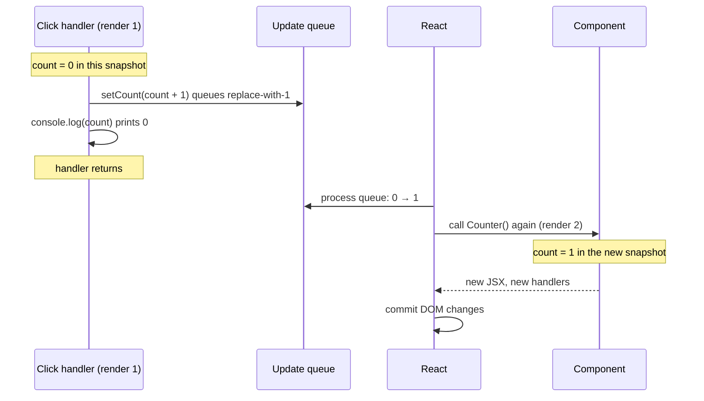
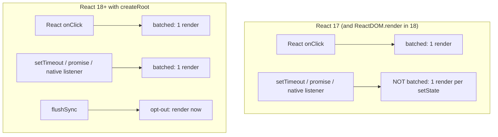
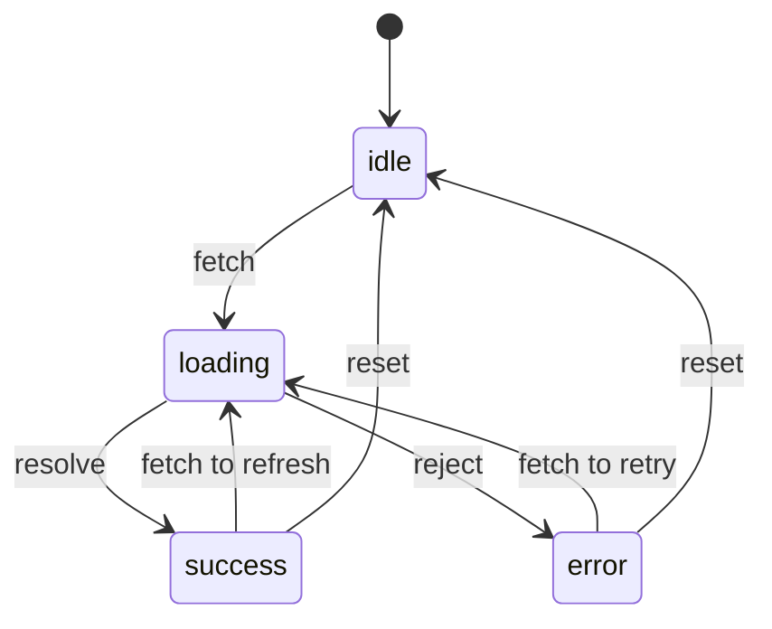

# 08 — State

> **How to use this module.** Sections 8.1–8.4 give you the snapshot mental model, which answers most "why does my state look wrong?" questions. Sections 8.5–8.9 cover the update patterns interviewers make you write. Sections 8.10–8.12 cover reducers, state machines and state design. If you only have 20 minutes, read 8.2, 8.3, 8.7 and the Summary.

**Prerequisites:** [Closures](01-javascript.md#15-closures) · [Reference vs value equality](01-javascript.md#18-reference-vs-value-equality) · [Immutability and structural sharing](01-javascript.md#19-immutability-and-structural-sharing) · [What triggers a render](06-jsx-and-rendering-model.md#69-what-triggers-a-render) · [Props vs state](07-components-props-composition.md#74-props-vs-state)

**Code for this module:** [`examples/web/src/m08-state/`](examples/web/src/m08-state/). Every file below has a test next to it. Run them with `npx vitest run src/m08-state` from `examples/web`.

---

## 8.1 Why local variables do not persist

### The problem
A Java developer's first React counter usually looks like this:

```tsx
function Counter() {
  let count = 0; // ❌ a plain local variable
  return <button onClick={() => { count += 1; }}>Clicked {count} times</button>;
}
```

Clicking does nothing visible. Two things are wrong:
1. **Changing a local variable does not tell React anything.** React only re-renders when something asks it to ([06](06-jsx-and-rendering-model.md#69-what-triggers-a-render)).
2. **Even if React did re-render, the variable would be `0` again.** A function component is a function. Each render is a fresh call, so `let count = 0` runs again and the old value is gone.

### Mental model
State is **memory that React keeps for a component, outside the function**, plus a **trigger** that asks React to render again with the new value. `useState` [React] gives you both: the remembered value for this render, and a setter that stores a new value and schedules a render.

> **Java/Spring analogy.** A local variable in a function component behaves like a local variable in a Spring controller method: it lives for one call. State is closer to a field on a session-scoped bean. It survives between calls, and the framework hands it to you on each call.
>
> **Where the analogy breaks:** you never assign the field. You ask React to replace it (`setCount(…)`), and the new value only becomes visible on the **next** call of your function. Inside the current call, the value never changes (8.2).

### Minimal code

```tsx
import { useState } from 'react';

export function Counter() {
  const [count, setCount] = useState(0); // remembered across renders
  return <button onClick={() => setCount(count + 1)}>Clicked {count} times</button>;
}
```

### How it works internally
React stores state on the component's **fiber**, its internal node in the tree ([13](13-reconciliation-and-fiber.md#135-fiber-units-of-work-double-buffering-lanes-and-priorities)). Each `useState` call takes the next slot in a per-fiber linked list of hooks, which is why hooks must be called in the same order on every render ([12](12-hooks-and-custom-hooks.md#122-how-react-stores-hooks-so-call-order-matters)). State belongs to **a component at a position in the tree**, not to the function: render `<Counter />` twice and each instance has its own count ([13](13-reconciliation-and-fiber.md#133-component-identity-and-state-preservation)).

### Trade-offs
- Not every value needs state. If it can be computed from props or other state, compute it (8.7).
- If it must persist but changing it should **not** re-render (a timer id, the previous value for comparison), use a ref ([10](10-refs-and-dom.md#101-useref-as-a-mutable-box-that-does-not-trigger-renders)).
- If the value is shared across many components or comes from a server, local state may be the wrong home ([18](18-state-management.md#181-a-taxonomy-local-server-url-form-global-ui)).

---

## 8.2 `useState` and state as a snapshot

### The problem
```tsx
function handleClick() {
  setCount(count + 1);
  console.log(count); // logs the OLD value
}
```

This surprises almost everyone. The setter was called, so why is `count` unchanged?

### Mental model
Every render is a **snapshot**. When React calls your component, it passes in the state for **that** render. Your JSX, your event handlers and your effects are all created during that call, and they all close over that render's `count` ([01](01-javascript.md#15-closures)). Calling `setCount` does not change the `count` variable you are holding. It asks React for a **new render**, where `count` will be a new constant with the new value.



> **Java analogy:** a render is like a method call that receives an **immutable** request DTO. Asking for a change does not mutate the DTO you hold; it causes a new request with a new DTO.
>
> **Where the analogy breaks:** in Java you would usually read the updated value back from the service. In React there is no "read back" inside the same handler. If you need the next value, compute it into a local variable first (`const next = count + 1; setCount(next); use(next);`).

### Minimal code
`examples/web/src/m08-state/BatchingPuzzle.tsx` (the `logAfterSet` handler):

```tsx
function logAfterSet() {
  setCount(count + 1);
  onLog(`count is ${count}`); // "count is 0" on the first click
}
```

`BatchingPuzzle.test.tsx` asserts the log is `['count is 0']` while the screen shows `Count: 1`.

### How it works internally
`useState(initial)` [React] returns `[state, setState]`:
- On the **first** render, React stores `initial` in the hook slot and returns it.
- On every **later** render, React ignores the argument and returns the stored value after applying any queued updates.
- `setState(next)` puts an update object on the hook's queue and schedules a render for that fiber. It does **not** run your component. The component runs later, when React processes the queue (8.3).
- If the new value is the same as the current one by `Object.is` ([01](01-javascript.md#18-reference-vs-value-equality)), React skips re-rendering the component's children. The react.dev reference adds that React "may still need to call your component before skipping the children", so a render log may show one extra call. Do not rely on either behavior for correctness.
- The setter function has a **stable identity** for the component's life (react.dev), so it is safe to omit from effect dependencies.

> **Version notes.** **React 16.8** (Feb 2019) introduced `useState`. Before that, only class components had state (`this.state` / `this.setState`, see 8.10's legacy notes and [07](07-components-props-composition.md#710-class-components)). The snapshot behavior has not changed since 16.8. What changed in 18 is **when** the queued updates are processed (8.3).

### Trade-offs
- ✅ Snapshots make renders predictable: inside one render, nothing changes under you. That is what makes concurrent rendering safe ([21](21-concurrent-ssr-server-components.md#211-concurrent-rendering-interruptible-rendering)).
- ❌ Async code that outlives the render (a `setTimeout`, an `await`) still sees the **old** snapshot. That is the stale-closure family of bugs ([09](09-effects.md#95-stale-closures-in-effects-and-intervals)). Functional updates (8.4) fix most of them.

---

## 8.3 Batching

### The problem
A click handler often sets several pieces of state. If React re-rendered after each `setState`, one click could cause three renders, and the user might see a half-updated screen in between (`isLoading` false but `data` still empty).

### Mental model
**Batching** [React] means React collects every update requested during one event, then renders **once** with all of them applied. A waiter takes the whole table's order before walking to the kitchen; he does not walk back after each dish.

> **Java/Spring analogy:** a JPA persistence context. Changes made inside one `@Transactional` method are flushed together at commit, not one SQL statement per setter call.
>
> **Where the analogy breaks:** you cannot "read your own write" from state before the flush. There is no equivalent of the persistence context's first-level cache that returns the pending value. And unlike a transaction, nothing rolls back: every queued update is applied.

### Minimal code
In React 18+ (with `createRoot`), these all render **once**:

```tsx
function handleClick() {
  setCount((c) => c + 1);
  setFlag((f) => !f); // one render for both
}

setTimeout(() => {
  setCount((c) => c + 1);
  setFlag((f) => !f); // one render for both (React 18+ only)
}, 1000);

async function save() {
  await api.save();
  setSaving(false);
  setSaved(true); // one render for both (React 18+ only)
}
```

`BatchingPuzzle.test.tsx` counts commits with React's `<Profiler>` [React] and asserts that two updates after an `await` produce **one** commit.

To force React to apply an update immediately (rare: usually to measure or scroll the DOM right after it changes), wrap it in `flushSync` [React DOM]:

```tsx
import { flushSync } from 'react-dom';

flushSync(() => setItems((xs) => [...xs, item])); // DOM is updated when this returns
listRef.current?.lastElementChild?.scrollIntoView();
```

The same test file asserts that `flushSync` plus a second update produces **two** commits.

### How it works internally
`setState` enqueues the update and schedules the root for rendering at a priority, called a **lane**, that depends on where the update came from: a click is a discrete, high-priority event, while a `setTimeout` gets the default priority ([13](13-reconciliation-and-fiber.md#135-fiber-units-of-work-double-buffering-lanes-and-priorities)). React does not render synchronously inside `setState`. It renders when the current task yields (for discrete events, in a microtask at the end of the event), so every update queued in the same tick ends up in the same render. `flushSync` processes the pending updates synchronously before returning.



> **Version notes.** **React ≤ 17:** only updates inside **React event handlers** were batched. Updates in `setTimeout`, promises, native `addEventListener` callbacks or any other event rendered once **per `setState` call**. Libraries such as React Redux forced batching with `ReactDOM.unstable_batchedUpdates(fn)`. **React 18.0** (Mar 2022) introduced **automatic batching**: "Starting in React 18 with `createRoot`, all updates will be automatically batched, no matter where they originate from" ([React 18 upgrade guide](https://react.dev/blog/2022/03/08/react-18-upgrade-guide)). It applies **only to roots created with `createRoot`**. An app upgraded to 18 but still calling `ReactDOM.render` keeps the old behavior (React 18 working group, [Automatic batching deep dive](https://github.com/reactwg/react-18/discussions/21)). `flushSync` is the documented opt-out. `unstable_batchedUpdates` was kept for compatibility. In `react-dom` 19.3.0 it still exists, and its body is simply `return fn(a);` (verified by reading `node_modules/react-dom/cjs/react-dom.development.js` in `examples/web`). **React 19.0** removed `ReactDOM.render` entirely (CHANGELOG 19.0.0: "Remove render, hydrate, findDOMNode, unmountComponentAtNode"), so every React 19 app gets automatic batching. 19.0 also batches updates of different priorities together (CHANGELOG 19.0.0: "Batch sync discrete, continuous, and default lanes").

**Migration path** (17 → 18+): switch `ReactDOM.render(<App />, el)` to `createRoot(el).render(<App />)`. Then search for code that relied on a synchronous render after `setState` outside React events: class components that read `this.state` right after `setState` inside a `setTimeout` or `.then` (in 17 the first update was already applied; in 18 it is not), and DOM measurements right after an update. Wrap those in `flushSync` or move them into an effect or a `setState` callback. Remove `unstable_batchedUpdates` wrappers at leisure; they are now no-ops.

### Trade-offs
- ✅ Fewer renders and no half-updated screens, for free.
- ❌ You cannot read the DOM right after `setState`; it has not changed yet. Use `flushSync` for that one case, sparingly. The React 18 working group warns that overusing it gives up the benefit of batching.
- `flushSync` cannot be called while React is rendering (inside a component body or a lifecycle); React warns in development.

---

## 8.4 Functional updates

### The problem
```tsx
function addThree() {
  setCount(count + 1);
  setCount(count + 1);
  setCount(count + 1);
} // count goes up by 1, not 3
```

All three calls read the same snapshot (`count` is `0`), so all three say "replace with 1".

### Mental model
`setCount` accepts two kinds of argument:
- **A value**: "replace the state with this." It is computed from your snapshot, which may be out of date.
- **An updater function** `(prev) => next`: "when you process the queue, take whatever the state is **at that point** and transform it." React chains updaters, so each one receives the previous one's result.

> **Java analogy:** a value is `map.put(key, oldValue + 1)` after a `get` that might be stale. An updater is `map.compute(key, (k, v) => v + 1)`: the transformation is applied to the current value at the moment it runs. Similarly, `AtomicInteger.updateAndGet(x -> x + 1)` versus `set(get() + 1)`.
>
> **Where the analogy breaks:** `compute` runs immediately and returns the result. A React updater runs **later**, during the next render, and in Strict Mode development it runs **twice** (react.dev), so it must be pure: no side effects, no mutation.

### Minimal code
`examples/web/src/m08-state/BatchingPuzzle.tsx`:

```tsx
setCount((c) => c + 1);
setCount((c) => c + 1);
setCount((c) => c + 1); // +3

setCount(count + 5);
setCount((c) => c + 1); // from 0: 6 (replace with 5, then 5 + 1)

setCount((c) => c + 1);
setCount(count + 5);    // from 0: 5 (the replacement discards the earlier result)
```

Exercise 4 asks you to predict each of these before reading the test.

### How it works internally
The queue for a hook is a list of updates. When React renders the component, it starts from the stored state and applies the updates **in order**. A value update `v` behaves like the updater `() => v`, which ignores what came before. An updater receives the result so far. That is why mixing them gives the answers above, and why a value update placed after updaters wins.

### Trade-offs
- Use an updater whenever the next state **depends on the previous state** and more than one update could be queued: counters, toggles, appending to a list, updates inside intervals or after `await`.
- When you set a value that does **not** depend on the previous state (`setQuery(e.target.value)`), a plain value is clearer.
- Updaters do not fix every stale-closure bug. If the next state depends on a **prop** or on **other** state, the updater for this state cannot see that other value's latest version. Move the logic into a reducer (8.10), where `dispatch` sends an action and the reducer reads the current state.
- Name the parameter after the state (`c` for `count`, `prev` for clarity). It is not a "stale copy"; it is the latest value in the queue.

---

## 8.5 Immutable updates of nested objects and arrays

### The problem
```tsx
const [user, setUser] = useState({ name: 'Ana', address: { city: 'Lima' } });

function moveToCusco() {
  user.address.city = 'Cusco'; // ❌ mutation
  setUser(user);               // same reference: Object.is says "unchanged", so no re-render
}
```

Nothing re-renders, because the object reference did not change. Even when something else triggers a render, the mutation has corrupted every older snapshot that shared that object, so undo, `memo` comparisons and effect dependencies all see the "new" value in the "old" state.

### Mental model
**Treat state as read-only.** To change something, build a **new** object for every level from the root down to the thing that changed, and **reuse** every branch that did not change. This is structural sharing ([01](01-javascript.md#19-immutability-and-structural-sharing)): it is cheap (you copy one path, not the tree), and a simple `!==` tells you exactly what changed.

> **Java analogy:** Java records and immutable collections (`List.copyOf`, a `with`-er method that returns a new instance). Updating a nested field means `user.withAddress(user.address().withCity("Cusco"))`.
>
> **Where the analogy breaks:** JavaScript gives you no compiler enforcement. TypeScript's `readonly` is erased at compile time, and spread copies are **shallow**: `{ ...user }` still shares `user.address`. The discipline is yours.

### Minimal code
The core update shapes:

```ts
// object: replace one field
setUser((u) => ({ ...u, name: 'Bo' }));
// nested object: copy every level on the path
setUser((u) => ({ ...u, address: { ...u.address, city: 'Cusco' } }));
// array: add, remove, replace one item
setItems((xs) => [...xs, item]);
setItems((xs) => xs.filter((x) => x.id !== id));
setItems((xs) => xs.map((x) => (x.id === id ? { ...x, done: !x.done } : x)));
// array: insert, sort (never sort/reverse/splice in place)
setItems((xs) => [...xs.slice(0, i), item, ...xs.slice(i)]);
setItems((xs) => xs.toSorted((a, b) => a.rank - b.rank)); // ES2023
```

`examples/web/src/m08-state/cartReducer.ts` applies these shapes to a shopping cart, and `cartReducer.test.ts` proves two properties: the old state is never touched (the test **deep-freezes** it, so any mutation would throw), and an untouched cart line is the **same object** in the new state.

| Mutating (avoid on state) | Non-mutating replacement |
|---|---|
| `push`, `unshift` | `[...xs, x]`, `[x, ...xs]` |
| `pop`, `shift`, `splice` (remove) | `filter`, `slice`, `toSpliced` |
| `arr[i] = x` | `map`, `with(i, x)` |
| `sort`, `reverse` | `toSorted`, `toReversed` (ES2023), or copy first: `[...xs].sort()` |
| `obj.a = 1`, `delete obj.a` | `{ ...obj, a: 1 }`, `const { a, ...rest } = obj` |

### How it works internally
React never deep-compares state. `setState` compares the old and new reference with `Object.is`. `React.memo`, `useMemo` and effect dependencies also compare props and dependencies by reference ([15](15-performance.md#154-usememo-and-usecallback-and-when-they-waste-effort)). Immutable updates make those cheap reference checks **correct**: a new reference means "changed", the same reference means "unchanged".

**Immer** [Library: immer] lets you write mutating-looking code against a **draft** proxy and produces a new immutable value with structural sharing:

```ts
import { produce } from 'immer';
setUser((u) => produce(u, (draft) => { draft.address.city = 'Cusco'; }));
```

Redux Toolkit's `createSlice` uses Immer internally, which is why RTK reducers may "mutate" `state` ([18](18-state-management.md#184-redux-toolkit-configurestore-slices-immer)). Immer also **freezes** the values it produces by default (its `autoFreeze` flag defaults to `true` in Immer 11.1.21, verified by reading `node_modules/immer/dist/immer.mjs`; that copy is installed transitively by `@reduxjs/toolkit`, which is why this module shows Immer as snippets rather than runnable examples). The `use-immer` [Library: use-immer] package wraps this pattern as a `useImmer` hook.

### Trade-offs
- Hand-written spreads: no dependency, explicit, but noisy past two levels of nesting. Deep nesting usually means the **state shape** is wrong, so flatten or normalize it first (8.12).
- Immer: readable for deep updates, costs a dependency and a proxy per update, and it hides the copying, which can surprise people reading the code.
- `structuredClone` [JS] of the whole state works but defeats structural sharing: every object becomes new, so every memoized child re-renders ([01](01-javascript.md#119-shallow-vs-deep-copy)).

---

## 8.6 Lazy initialization

### The problem
```tsx
const [todos, setTodos] = useState(parseTodos(localStorage.getItem('todos')));
```

`useState` uses its argument only on the first render, but JavaScript still **evaluates** the argument on every render. Reading and parsing storage on every keystroke is wasted work.

### Mental model
Pass a **function** instead of a value, and React calls it **once**, on mount. It is an initializer, not an initial value.

> **Java analogy:** a `Supplier<T>` passed to a lazy holder, such as `Map.computeIfAbsent` or Spring's `ObjectProvider.getIfAvailable(Supplier)`. You hand over the recipe, not the result.
>
> **Where the analogy breaks:** in Strict Mode development React calls the initializer **twice** and discards one result (react.dev, `useState` caveats), so it must be pure. Reading `localStorage` is fine; writing to it, or starting a request, is not.

### Minimal code

```tsx
const [todos, setTodos] = useState(() => parseTodos(localStorage.getItem('todos'))); // ✅ once
const [todos, setTodos] = useState(parseTodos);  // ✅ passes the function itself
const [todos, setTodos] = useState(parseTodos()); // ❌ calls it on every render
```

`useReducer` has the same feature as its third argument: `useReducer(reducer, initialArg, init)` calls `init(initialArg)` once. `TagEditor.tsx` uses it: `useReducer(tagsHistoryReducer, noTags, initHistory)`.

### How it works internally
On mount, React checks whether the argument is a function. If it is, React calls it and stores the result. On later renders, React never looks at the argument again. This is also why **you cannot store a function in state by passing it directly**: `useState(myCallback)` would call `myCallback` as an initializer. Write `useState(() => myCallback)`, and the same for the setter: `setHandler(() => nextCallback)`.

### Trade-offs
- Use it when the initial value is expensive: parsing, reading storage, building a large structure.
- For cheap literals (`useState(0)`, `useState('')`) a function adds noise for nothing.
- Reading `localStorage` in an initializer breaks server rendering, because the server has no `localStorage` and the first client render must match the server's HTML ([21](21-concurrent-ssr-server-components.md#215-ssr-hydration-hydration-errors)). In SSR apps, read it after hydration instead ([12](12-hooks-and-custom-hooks.md#127-uselocalstorage)).

---

## 8.7 Derived state: compute, do not store

### The problem
```tsx
const [items, setItems] = useState<Item[]>([]);
const [total, setTotal] = useState(0); // ❌ a second source of truth
useEffect(() => setTotal(items.reduce((s, i) => s + i.price, 0)), [items]);
```

Now there are two sources of truth. For one render after every change, `total` is wrong. Every new code path that changes `items` must remember to update `total`, and the effect costs an extra render ([09](09-effects.md#96-you-might-not-need-an-effect)).

### Mental model
State is the **minimal** set of facts the UI needs. Everything you can compute from state and props is **derived**, and derived values are computed **during render**. Ask of each piece of state: "Could I compute this from something I already have?" If yes, it is not state.

> **Java/Spring analogy:** a JPA entity with a stored `total` column that has to be kept in sync by hand, versus a `@Transient` getter that computes it. The getter can never be wrong.
>
> **Where the analogy breaks:** the "getter" runs on every render. Usually that costs nothing, but for genuinely expensive computations you memoize it (`useMemo`, or the React Compiler, [15](15-performance.md#155-the-react-compiler-and-how-it-changes-the-advice)). You still do not store it.

### Minimal code
`examples/web/src/m08-state/SignupForm.tsx` stores only the **values** the user typed and which fields they **touched**. The errors and the submit button's enabled state are derived:

```tsx
const [values, setValues] = useState(emptySignup);
const [touched, setTouched] = useState<Partial<Record<SignupField, boolean>>>({});

const errors = validateSignup(values); // derived
const canSubmit = hasNoErrors(errors); // derived
```

`ShoppingCart.tsx` does the same with `cartTotalCents(cart)` and `cartItemCount(cart)`.

### How it works internally
There is nothing to explain, and that is the point: it is a plain expression in the function body. Because it runs in the same render as the state change, the derived value can never be one frame behind.

**Adjusting state when a prop changes.** Sometimes you really need to remember something across a prop change: for example, "clear the selection when the `items` prop changes, but keep it otherwise." react.dev documents storing the previous prop in state and updating **during render**, inside a condition:

```tsx
const [prevItems, setPrevItems] = useState(items);
const [selection, setSelection] = useState<string | null>(null);
if (items !== prevItems) {
  setPrevItems(items);
  setSelection(null); // React discards this render's output and re-renders immediately
}
```

React allows `setState` during render **only for the component that is rendering**, and it re-runs the component before its children render. The `react-hooks/set-state-in-render` rule in `eslint-plugin-react-hooks` 7.1.1 reports only **unconditional** calls (read from the plugin's source; its message links to this very pattern). Prefer a `key` (8.9) or a different state shape (store `selectedId`, and derive whether it still exists in `items`) before reaching for it.

### Trade-offs
- ✅ One source of truth, no synchronization code, no extra render.
- ❌ Expensive derivations re-run on every render. Measure first, then `useMemo` ([15](15-performance.md#154-usememo-and-usecallback-and-when-they-waste-effort)).
- Copying a **prop** into state (`useState(props.value)`) is the classic derived-state bug: the state ignores later prop changes, because the initial value is read only on mount. Either use the prop directly, or name it `initialValue` to make "only the first value counts" explicit.

---

## 8.8 Colocation and lifting state up

### The problem
Two sibling components must agree: a filter input and the list it filters, or two accordions where only one may be open. If each keeps its own state, they cannot coordinate. If you put **everything** in a top-level `App`, every keystroke re-renders the whole app, and every component's props grow.

### Mental model
Put each piece of state **as low as possible, but as high as necessary**:
- **Colocate**: state used by one component lives in that component.
- **Lift**: when two components need the same state, move it to their **closest common parent**, and pass the value down with a callback to change it. The children become **controlled** ([07](07-components-props-composition.md#78-controlled-vs-uncontrolled-component-apis)).

> **Java/Spring analogy:** scoping beans. Request-scoped data does not belong in a singleton; and two services that must share data get it from a common collaborator rather than each keeping a private copy.
>
> **Where the analogy breaks:** React data flows **one way**, down through props. A child cannot reach into its parent's state; it can only call a function the parent gave it.

### Minimal code

```tsx
function FilterableList({ items }: { items: string[] }) {
  const [query, setQuery] = useState(''); // lifted: both children need it
  const visible = items.filter((i) => i.toLowerCase().includes(query.toLowerCase())); // derived
  return (
    <>
      <SearchInput value={query} onChange={setQuery} />
      <List items={visible} />
    </>
  );
}
```

### How it works internally
When state changes, React re-renders the component that owns it **and all of its descendants** (unless a descendant is memoized and its props are unchanged, [15](15-performance.md#152-why-components-re-render)). The owner's position decides how much of the tree re-renders, which is why colocation is also a performance tool ([15](15-performance.md#156-moving-state-down-and-lifting-content-up)).

### Trade-offs
- Lifting too high: wide re-renders and "prop drilling" through components that do not use the value. Fix with composition (pass `children`) first, context second ([11](11-context.md#111-prop-drilling-and-when-it-is-fine)).
- Not lifting: duplicated state that drifts apart.
- State that must survive navigation or be shareable as a link belongs in the **URL** ([19](19-routing.md#194-params-and-search-params)). Server data belongs in a server-state cache ([17](17-data-fetching.md#173-server-state-vs-client-state)). Neither belongs in `useState` at the top of the app.

---

## 8.9 Resetting state with `key`

### The problem
A `ProfilePage` shows a comment draft for `userId`. Switching from Ana to Bo keeps Ana's half-typed draft, because React sees the same component type at the same position and **preserves its state**.

### Mental model
React identifies a component instance by **its type and its position in the tree**, plus its **`key`** if it has one ([13](13-reconciliation-and-fiber.md#133-component-identity-and-state-preservation)). Change the key, and React treats it as a **different** component: it unmounts the old one, discarding its state and running its effect cleanups, then mounts a fresh one.

> **Java analogy:** asking the container for a **new** prototype-scoped bean instead of reusing the old one.
>
> **Where the analogy breaks:** you do not call a factory. You change a piece of data (`key`), and React decides to throw the old instance away. Everything below it is reset too, including DOM nodes, focus and scroll position.

### Minimal code
From [09's no-effect catalogue](09-effects.md#96-you-might-not-need-an-effect) (`examples/web/src/m09-effects/NoEffectNeeded.tsx`):

```tsx
export function ProfilePage({ userId }: { userId: string }) {
  return <CommentDraft key={userId} userId={userId} />; // new user → new CommentDraft, empty draft
}
```

### How it works internally
During reconciliation, React compares the new element with the old fiber at that position. If the type **and** key match, it updates the existing fiber and keeps its hooks. If either differs, it deletes the old fiber subtree and creates a new one, so `useState` initializers run again ([13](13-reconciliation-and-fiber.md#132-diffing-heuristics-type-then-key)). The key only needs to be unique among siblings.

### Trade-offs
- ✅ One line, no effect, no extra render, and no flash of the old state.
- ❌ It resets **everything** in the subtree, and remounts the DOM. For a large subtree that costs more than updating, and it loses focus. If only one field should reset, split the component so the key wraps only that part, or use the "adjust during render" pattern in 8.7.
- The reverse mistake is common too: a component defined **inside** another component gets a new type on every render, so its state resets on every keystroke ([13](13-reconciliation-and-fiber.md#134-keys-revisited-and-nested-component-definitions)).

---

## 8.10 `useReducer`

### The problem
A component with five related `useState` calls and event handlers that each update three of them has its business rules scattered across handlers. Bugs hide in the combinations ("we cleared the cart but forgot to reset the coupon"), and none of it can be unit-tested without rendering.

### Mental model
Move **what can happen** into a single pure function: `reducer(state, action) => nextState`. Components **dispatch** actions that describe what happened (`{ type: 'added', product }`), and the reducer decides what that means for the state. Event handlers become one-liners.

> **Java/Spring analogy:** a command handler, or an event-sourced aggregate's `apply(event)` method. State plus event in, new state out, with no I/O. You can unit-test it without starting the container, just as you can test the reducer without rendering React.
>
> **Where the analogy breaks:** a reducer must be **pure and synchronous**. It cannot call a repository, publish an event or `await`. Side effects belong in the event handler that dispatched, or in an effect.

### Minimal code
`examples/web/src/m08-state/cartReducer.ts` (excerpt):

```ts
export type CartAction =
  | { type: 'added'; product: Product }
  | { type: 'decremented'; productId: string }
  | { type: 'removed'; productId: string }
  | { type: 'cleared' };

export function cartReducer(state: CartState, action: CartAction): CartState {
  switch (action.type) {
    case 'added': /* … */
    case 'cleared':
      return emptyCart;
  }
}
```

And in `ShoppingCart.tsx`:

```tsx
const [cart, dispatch] = useReducer(cartReducer, emptyCart);
// …
<button onClick={() => dispatch({ type: 'added', product })}>Add {product.name}</button>
```

The action type is a **discriminated union** ([02](02-typescript.md#27-discriminated-unions-and-exhaustiveness-with-never)), so TypeScript checks each action's payload, and because the switch covers every case, the function needs no `default`. Add a new action type without handling it and the compiler reports that the function can return `undefined`.

### How it works internally
`useReducer` [React] is the same machinery as `useState`. In fact `useState` is implemented as a reducer whose action is "a value or an updater". `dispatch(action)` enqueues the action. During the next render, React runs the reducer over the queued actions in order, with the same batching (8.3) and the same `Object.is` bail-out (8.2): **return the same `state` object when nothing changed**, and React can skip the render. `dispatch` has a stable identity, so you can pass it deep into the tree or through context without memoization ([11](11-context.md#116-reducer--context-pattern)). In Strict Mode development React calls the reducer **twice** per action to surface impurity (react.dev), which is why a reducer that pushes to an array or increments a counter outside itself shows "double" bugs only in development.

> **Version notes.** **React 16.8** introduced `useReducer`. **React 19.0** shipped "Better useReducer typings: Most useReducer usage should not require explicit type arguments" (CHANGELOG 19.0.0). In `@types/react` 19.3.0 the signature is `useReducer<S, A extends AnyActionArg>(reducer: (prevState: S, ...args: A) => S, initialState: S)` (read from `node_modules/@types/react/index.d.ts`), so the second type argument is a **tuple** of the action arguments, such as `[CartAction]`.
>
> `@types/react` 18 declared `useReducer<R extends Reducer<any, any>>(reducer: R, initialState: ReducerState<R>, initializer?: undefined)` (read from [DefinitelyTyped `types/react/v18/index.d.ts`](https://github.com/DefinitelyTyped/DefinitelyTyped/blob/master/types/react/v18/index.d.ts)). Because the 19 signature's first type parameter is the state `S`, 18-era code written as `useReducer<Reducer<State, Action>>(…)` makes React treat the reducer type as the state type and fails to type-check on 19 types (derived from the two signatures, not compiled here). The migration is the same either way: delete the explicit type arguments and type the reducer function's parameters instead.

**Legacy: class components.** Before hooks, state lived on `this.state`, and `this.setState` worked differently from a hook setter in two ways interviewers ask about. `examples/web/src/m08-state/ClassCounter.tsx` and its test show both (Exercise 5):

| | Class `this.setState` | Hook setter / `dispatch` |
|---|---|---|
| Object argument | **Merged** shallowly into `this.state` (other keys survive) | **Replaces** the whole value; spread it yourself |
| "After update" hook | Second argument: `setState(update, () => …)` runs after the commit | None. React warns: "State updates from the useState() and useReducer() Hooks don't support the second callback argument. To execute a side effect after rendering, declare it in the component body with useEffect()." (verified in `react-dom` 19.3.0's `cjs/react-dom-client.development.js`) |
| Updater | `setState((prevState, props) => partial)` | `setX((prev) => next)` |
| Batching | Same rules as hooks (8.3) | Same |

**Migration:** one `this.state` object usually becomes several `useState` calls (split by what changes together), or one `useReducer` when the fields change together. Replace the `setState` callback with either code in the event handler that computes the next value directly, or an effect that reacts to the committed state.

### Trade-offs
| Choose `useState` when | Choose `useReducer` when |
|---|---|
| The values are independent | Several values change together |
| Updates are simple (set, toggle) | Updates follow business rules you want to unit-test |
| A handler or two | Many handlers, or the next state depends on several pieces of state |
| | You want to pass one stable `dispatch` deep into the tree |

A reducer costs some boilerplate (action types, a switch). The payoff is a pure, testable core, which is exactly what Exercises 1 and 2 test without rendering. When the reducer outgrows one component and the state is global, Redux Toolkit is the same idea with a store and devtools ([18](18-state-management.md#184-redux-toolkit-configurestore-slices-immer)).

---

## 8.11 State machines in a reducer

### The problem
```tsx
const [isLoading, setIsLoading] = useState(false);
const [error, setError] = useState<string | null>(null);
const [data, setData] = useState<User[] | null>(null);
```

Three booleans-ish values allow 2 × 2 × 2 = 8 combinations, and most are nonsense: loading **and** error, data **and** error. Each handler has to remember to clear the others. A late response can turn an "idle" screen into "success" after the user pressed Reset.

### Mental model
List the **states** the UI can be in, and for each state the **events** it accepts. Everything else is ignored. That is a finite state machine. In a reducer, **switch on the current state first**, then on the event:



> **Java/Spring analogy:** an `enum` with transition methods, or Spring Statemachine. An order in `SHIPPED` simply has no `cancel()` transition.
>
> **Where the analogy breaks:** no framework is needed. A `switch` over a discriminated union is the whole implementation, and TypeScript makes the illegal **data** unrepresentable too: only the `success` variant has `data`.

### Minimal code
`examples/web/src/m08-state/requestMachine.ts` (excerpt):

```ts
export type RequestState<T> =
  | { status: 'idle' }
  | { status: 'loading' }
  | { status: 'success'; data: T }
  | { status: 'error'; error: string };

export function requestReducer<T>(state: RequestState<T>, event: RequestEvent<T>): RequestState<T> {
  switch (state.status) {
    case 'idle':
      return event.type === 'fetch' ? loading : state;
    case 'loading':
      if (event.type === 'resolve') return { status: 'success', data: event.data };
      if (event.type === 'reject') return { status: 'error', error: event.error };
      return state; // a second "fetch" while loading is ignored: no duplicate request
    case 'success':
    case 'error':
      if (event.type === 'fetch') return loading;
      if (event.type === 'reset') return idle;
      return state; // a late "resolve" can no longer overwrite anything
  }
}
```

`requestMachine.test.ts` checks the transitions and that an invalid event returns the **same** state object, so React does not even re-render.

### How it works internally
Nothing new: it is a reducer (8.10). The design is the point. Returning `state` unchanged for invalid events makes "ignore" free, and the discriminated union means the render code `switch (state.status)` gets the right fields in each branch (`state.data` only exists for `'success'`), the same technique as [09's `useSearch`](09-effects.md#94-race-conditions-and-abortcontroller).

### Trade-offs
- ✅ Impossible states are impossible, and the reducer is the documentation of the flow.
- ❌ More code than three `useState` calls for trivial flows.
- For nested or parallel states, guards, delayed transitions and a visualizer, use XState [Library: xstate] ([18](18-state-management.md#1810-xstate)). For **server** data, a data library already models these states for you ([17](17-data-fetching.md#172-loadingerrorempty-states-as-a-union-type)).

---

## 8.12 Choosing the state shape

### The problem
Most state bugs are not update bugs. They are **shape** bugs: the same fact stored twice and drifting apart, or two flags that can contradict each other.

### Mental model
Design state like a normalized database schema. react.dev's "Choosing the State Structure" lists five principles; here they are with their database equivalents:

| Principle | Bad | Good | DB analogy |
|---|---|---|---|
| **Group related state** | `x` and `y` always set together as two states | `position: { x, y }` | One table for one entity |
| **Avoid contradictions** | `isSending` and `isSent` both `true` | `status: 'typing' \| 'sending' \| 'sent'` | A single enum column, not two booleans |
| **Avoid redundant state** | `fullName` next to `firstName`, `lastName` | Compute `fullName` (8.7) | No derived columns |
| **Avoid duplication** | `selectedItem` (a copy of an object in `items`) | `selectedId`, then `items.find(…)` | Store the foreign key, not a copy of the row |
| **Avoid deep nesting** | A tree of nested objects | A flat map `byId` plus child-id arrays | Normalized tables |

> **Where the analogy breaks:** you have no database to enforce constraints. TypeScript is your schema: discriminated unions for status, `Record<Id, Entity>` for normalized maps, and `readonly` for documentation.

### Minimal code

```ts
// ❌ selected item duplicated: editing items[2].title leaves selectedItem stale
type Bad = { items: Item[]; selectedItem: Item | null };

// ✅ store the id, derive the item
type Good = { items: Item[]; selectedId: string | null };
const selected = state.items.find((i) => i.id === state.selectedId) ?? null;

// ✅ normalized for deep or relational data
type Normalized = {
  postsById: Record<string, { id: string; title: string; commentIds: string[] }>;
  commentsById: Record<string, { id: string; text: string }>;
};
```

### How it works internally
With a normalized shape, updating one comment copies one small object and the `commentsById` map, not the whole tree (8.5). Components that read other entities keep receiving the same references, so memoized components skip rendering.

### Trade-offs
- Normalizing costs a mapping step when data arrives from the API. It pays off once data is relational or deeply nested, which is when RTK's `createEntityAdapter` or a server-state cache becomes attractive ([18](18-state-management.md#184-redux-toolkit-configurestore-slices-immer)).
- Do not normalize a three-field form. The principles are about removing **contradictions** and **duplication**, not about adding layers.
- Decide what kind of state each value is before choosing a home for it: server, URL, form or UI state ([18](18-state-management.md#181-a-taxonomy-local-server-url-form-global-ui)).

---

## Interview questions

**Q1. Why can't a component remember a value with a plain `let` variable?**
<details><summary>Answer</summary>

A function component is called again on every render, so `let x = 0` runs again and resets it. Changing a local variable also does not tell React to re-render. State solves both: React keeps the value outside the function (on the fiber) and the setter schedules a render. **A strong answer adds:** a module-level variable would persist, but it is shared by every instance of the component and changing it still triggers nothing. That is why it is a bug, not a fix.

</details>

**Q2. What does "state is a snapshot" mean?**
<details><summary>Answer</summary>

Each render receives a fixed copy of the state. The JSX, handlers and effects created in that render close over those values, and calling the setter does not change them; it requests a new render with new values. That is why `setCount(count + 1); console.log(count)` logs the old value. **A strong answer adds:** snapshots are what make concurrent rendering safe, and they are the root cause of stale closures in timers and async code.

</details>

**Q3. `setCount(count + 1)` three times in one handler: what is the result and why?**
<details><summary>Answer</summary>

`count + 1` once. All three calls read the same snapshot (say `0`) and each queues "replace with 1". Use the updater form `setCount(c => c + 1)` three times to get `+3`, because each updater receives the result of the previous one. **A strong answer adds:** the same holds for class components: `this.setState({ count: this.state.count + 1 })` three times also adds one (Exercise 5).

</details>

**Q4. When should you use a functional update?**
<details><summary>Answer</summary>

Whenever the next state depends on the previous state and the update might be queued with others or run later: counters, toggles, list appends, updates inside intervals, timeouts or after `await`. It also lets effects drop the state from their dependencies. **A strong answer adds:** updaters must be pure, because Strict Mode calls them twice in development. If the update depends on other state or props as well, a reducer is the cleaner fix.

</details>

**Q5. What is batching, and what changed in React 18?**
<details><summary>Answer</summary>

Batching means React applies all updates requested during one event in a single render. Up to React 17, only updates inside React event handlers were batched; updates in `setTimeout`, promises or native listeners each caused their own render. React 18 with `createRoot` batches automatically everywhere. **A strong answer adds:** apps on 18 that still use `ReactDOM.render` keep the old behavior, and React 19 removed `ReactDOM.render`, so on 19 batching is always automatic.

</details>

**Q6. How do you opt out of batching, and why would you?**
<details><summary>Answer</summary>

`flushSync(() => setState(…))` from `react-dom` renders and commits synchronously before returning. You need it when you must read or manipulate the updated DOM immediately, such as scrolling to a just-added item, or integrating with a non-React library that reads the DOM synchronously. **A strong answer adds:** it is a performance escape hatch, not a default; it cannot be called during render, and overusing it gives up the benefit of batching.

</details>

**Q7. What was `unstable_batchedUpdates`, and do you still need it?**
<details><summary>Answer</summary>

A `react-dom` export that forced batching outside React event handlers in React ≤ 17. React Redux and other libraries wrapped store notifications in it. With automatic batching it is unnecessary. In `react-dom` 19.3.0 it still exists, but it just calls the function you pass. **A strong answer adds:** you can remove it from 18+ code without changing behavior, as long as the root is created with `createRoot`.

</details>

**Q8. Why does the screen not update after `user.address.city = 'Cusco'; setUser(user)`?**
<details><summary>Answer</summary>

The setter received the **same reference**, and React compares old and new state with `Object.is`, so it decides nothing changed and skips the render. Even if another update re-renders the component, the mutation has also changed every older snapshot that shares that object. **A strong answer adds:** build a new object along the changed path, `setUser(u => ({ ...u, address: { ...u.address, city: 'Cusco' } }))`, and the reference checks used by `memo`, `useMemo` and effects become correct.

</details>

**Q9. Is `{ ...state }` a deep copy?**
<details><summary>Answer</summary>

No. Spread is shallow: top-level properties are copied, but nested objects and arrays are still shared. That is fine, and in fact desirable (structural sharing), **as long as you also copy every nested level you change**. Mutating `copy.address.city` still mutates the original. **A strong answer adds:** `structuredClone` would make a deep copy, but it gives every object a new identity, which defeats memoization; copy only the path that changes.

</details>

**Q10. How do you update one item in an array of objects in state?**
<details><summary>Answer</summary>

`setItems(xs => xs.map(x => x.id === id ? { ...x, done: !x.done } : x))`. `map` gives a new array, the changed item becomes a new object, and the untouched items keep their references. **A strong answer adds:** remove with `filter`, insert with `slice` and spread, and sort with `toSorted` (ES2023) or by copying first, because `sort`, `reverse` and `splice` mutate in place.

</details>

**Q11. What is Immer and when would you use it?**
<details><summary>Answer</summary>

A library whose `produce(base, draft => { … })` lets you write mutating code against a proxy draft and returns a new immutable value with structural sharing. It also freezes its output by default. Use it when updates are deeply nested and spreads become unreadable, or implicitly through Redux Toolkit, whose `createSlice` reducers use it. **A strong answer adds:** deep nesting often means the state should be normalized first. Immer hides the copying but not the cost of a bad shape.

</details>

**Q12. What is lazy initialization in `useState`?**
<details><summary>Answer</summary>

Passing a function, `useState(() => expensive())`, makes React call it only on the first render. Passing `useState(expensive())` evaluates `expensive()` on every render and throws the result away after the first. **A strong answer adds:** in Strict Mode development the initializer runs twice, so it must be pure. `useReducer`'s third argument (`init`) is the same feature.

</details>

**Q13. How do you store a function in state?**
<details><summary>Answer</summary>

Wrap it: `useState(() => fn)` and `setHandler(() => nextFn)`. Passing the function directly makes React treat it as an initializer or updater and **call** it. **A strong answer adds:** storing functions in state is rare. Usually a ref or a stable callback is what you want.

</details>

**Q14. What is derived state and why avoid storing it?**
<details><summary>Answer</summary>

Any value that can be computed from props or other state, such as a total, a filtered list or a validity flag. Storing it creates a second source of truth that must be synchronized, usually with an effect, which costs an extra render and leaves a frame where it is wrong. Compute it during render instead. **A strong answer adds:** if the computation is expensive, memoize it with `useMemo` (or let the React Compiler), but still do not store it.

</details>

**Q15. What is wrong with `const [value, setValue] = useState(props.value)`?**
<details><summary>Answer</summary>

The argument is only read on mount, so later changes to `props.value` are ignored and the component shows stale data. Either use the prop directly (make the component controlled), or rename the prop `initialValue` to make the "first value only" contract explicit, and reset with a `key` when the identity changes. **A strong answer adds:** do not "fix" it with an effect that copies the prop into state on change; that adds a render and the drift problems of derived state.

</details>

**Q16. How do you reset all of a component's state when a prop changes?**
<details><summary>Answer</summary>

Give it a `key` that changes with that prop: `<Editor key={docId} docId={docId} />`. A new key makes React unmount the old instance and mount a fresh one, so every `useState` starts over. **A strong answer adds:** this also remounts the DOM and runs effect cleanups. If only part of the state should reset, split the component, or use the "store the previous prop and adjust during render" pattern.

</details>

**Q17. When is it acceptable to call `setState` during render?**
<details><summary>Answer</summary>

Only for the component that is currently rendering, only inside a condition, and only to adjust state in response to a prop change (react.dev's "storing information from previous renders"). React discards the current output and re-renders that component immediately, before rendering its children. Setting another component's state during render triggers the warning "Cannot update a component while rendering a different component". **A strong answer adds:** an unconditional call loops forever ("Too many re-renders"), and `eslint-plugin-react-hooks` 7 reports unconditional calls as `react-hooks/set-state-in-render`. A `key` or a derived value is usually better.

</details>

**Q18. What is "lifting state up"?**
<details><summary>Answer</summary>

Moving state to the closest common parent of the components that need it, and passing the value and a change callback down as props. The children become controlled. **A strong answer adds:** lift only as high as necessary. The owner and all its descendants re-render on every change, so state lifted too high costs performance and causes prop drilling.

</details>

**Q19. What does "colocate state" mean, and why does it help performance?**
<details><summary>Answer</summary>

Keep state in the lowest component that uses it. A state change re-renders the owner and its subtree, so a lower owner means a smaller subtree to re-render. **A strong answer adds:** "move state down" and "lift content up" (pass expensive children as `children`) are the two cheapest performance fixes, and they come before `memo`.

</details>

**Q20. `useState` vs `useReducer`: how do you choose?**
<details><summary>Answer</summary>

`useState` for independent, simple values. `useReducer` when several values change together, when the next state depends on several values, when the update logic has rules worth unit-testing, or when you want to pass one stable `dispatch` deep into the tree. **A strong answer adds:** `useState` is implemented on the same machinery as `useReducer`, so there is no performance difference; it is a code-organization choice.

</details>

**Q21. What makes a reducer correct?**
<details><summary>Answer</summary>

It is pure: same state and action in, same state out; no mutation of the input, no I/O, no randomness, no `Date.now()`. It returns the **same** state object when nothing changes, so React can bail out. It handles every action type, ideally checked by TypeScript through a discriminated union. **A strong answer adds:** Strict Mode calls reducers twice in development to expose impurity, and purity is also what makes undo/redo and time-travel debugging possible.

</details>

**Q22. Where do side effects go when you use a reducer?**
<details><summary>Answer</summary>

In the event handler that dispatches (call the API, then dispatch the result), or in an effect that synchronizes with the committed state. Never in the reducer, which may run twice or be replayed. **A strong answer adds:** in Redux the equivalent is thunks or listener middleware; in React 19, Actions and `useActionState` cover the form-submission case ([14](14-forms-and-actions.md#147-useactionstate)).

</details>

**Q23. Is `dispatch` stable? Is the `useState` setter stable?**
<details><summary>Answer</summary>

Yes, both keep the same identity for the component's lifetime (react.dev), so they can be passed to memoized children and left out of effect dependencies without breaking anything. **A strong answer adds:** that stability is why the "reducer + context" pattern puts `dispatch` in its own context: consumers that only dispatch never re-render when the state changes.

</details>

**Q24. How would you model "loading, error, success" state?**
<details><summary>Answer</summary>

As a discriminated union `{ status: 'idle' } | { status: 'loading' } | { status: 'success'; data } | { status: 'error'; error }`, updated by a reducer that switches on the current status and ignores invalid events. Separate booleans allow impossible combinations such as loading and error together. **A strong answer adds:** in production, server state usually comes from TanStack Query, which already exposes these states. The union is still how you type your own async flows.

</details>

**Q25. What principles guide the shape of state?**
<details><summary>Answer</summary>

Group values that change together; avoid contradictions (one status enum, not several booleans); avoid redundant state (derive it); avoid duplication (store ids, not copies of objects); avoid deep nesting (normalize). **A strong answer adds:** the database parallel: no derived columns, foreign keys instead of copied rows, normalized tables.

</details>

**Q26. Why store `selectedId` instead of `selectedItem`?**
<details><summary>Answer</summary>

A copy of the item in `selectedItem` goes stale when the item in `items` is edited, so the UI shows two versions of the same entity. Storing the id and deriving `items.find(i => i.id === selectedId)` keeps one source of truth. **A strong answer adds:** it also handles deletion: if the item disappears, the derived value becomes `undefined`, and you can render "nothing selected" without extra code.

</details>

**Q27. Does calling the setter with the same value re-render?**
<details><summary>Answer</summary>

If the new value is identical by `Object.is`, React skips re-rendering the component's children. The react.dev reference adds that React may still call the component itself once before bailing out. So "no re-render" is not guaranteed, but no extra work reaches the children or the DOM. **A strong answer adds:** with objects, "the same value" means the same reference; a new object with equal contents always re-renders.

</details>

**Q28. How does class `this.setState` differ from a hook setter?**
<details><summary>Answer</summary>

`this.setState({ a })` merges shallowly into the existing state, so other keys survive; a hook setter replaces the whole value. `this.setState` also accepts a second argument, a callback that runs after the update is committed; hook setters do not, and React warns if you pass one. **A strong answer adds:** both batch the same way and both have an updater form, `(prevState, props) => partial` for classes.

</details>

**Q29. Read this legacy code: `this.setState({ count: 1 }); console.log(this.state.count)` inside a `setTimeout`. What logs on React 17 vs 18?**
<details><summary>Answer</summary>

On React 17 (and on 18 with `ReactDOM.render`), updates outside React events were not batched and were processed synchronously, so `this.state.count` was already `1`. On React 18+ with `createRoot`, the update is batched, so it logs the old value. This is the class edge case the React 18 working group called out in its automatic-batching notes. **A strong answer adds:** the fix is to use the `setState` callback or `componentDidUpdate`, or `flushSync` around the update if synchronous behavior is essential.

</details>

**Q30. How would you implement undo/redo?**
<details><summary>Answer</summary>

Keep `{ past, present, future }`. Every change pushes the old `present` onto `past` and clears `future`; undo moves `present` to the front of `future` and pops `past`; redo does the reverse. Wrap any pure reducer in a higher-order reducer, `undoable(reducer)`, so the history logic is written once. **A strong answer adds:** it only works because the inner reducer never mutates (old snapshots stay valid), and it is cheap thanks to structural sharing. Cap the history length, do not record no-op changes, and keep UI-only state (an input draft) out of it.

</details>

**Q31. Why does a list keep the wrong item's state after you delete a row?**
<details><summary>Answer</summary>

If rows are keyed by index, deleting row 0 shifts every index: React matches the old row 1's state to the new row 0, because the key `0` still exists. State follows the **key**, not the data. Use a stable id as the key ([06](06-jsx-and-rendering-model.md#66-lists-and-keys)). **A strong answer adds:** this is the same identity rule that makes `key` resets work (8.9).

</details>

**Q32. When should state live in the URL instead of `useState`?**
<details><summary>Answer</summary>

When it should survive a reload, be shareable as a link, or work with the back button: filters, search queries, pagination, selected tabs. The router's search params become the source of truth, and the component derives its view from them. **A strong answer adds:** do not mirror the URL into `useState` with an effect, because that creates two sources of truth. Read from the URL and write to it.

</details>

**Q33. Is React state the right place for server data?**
<details><summary>Answer</summary>

Only for simple cases. Server data is a cache of someone else's state: it needs refetching, invalidation, deduplication and race handling, which `useState` plus an effect does not provide. A server-state library (TanStack Query, SWR) or a framework loader handles it. **A strong answer adds:** after moving server data out, what is left in `useState` is usually small: UI and form state.

</details>

**Q34. How do you test a reducer and a component that uses it?**
<details><summary>Answer</summary>

Test the reducer as a pure function: build a state, apply actions, assert on the result. Deep-freeze the input to prove there is no mutation, and use `toBe` to check that untouched parts keep their references. Test the component through the UI with Testing Library: click, type, and assert on what the user sees. **A strong answer adds:** do not assert on internal state or on `dispatch` calls, and do not mock the reducer. `cartReducer.test.ts` and `ShoppingCart.test.tsx` are the two layers.

</details>

---

## Coding exercises

### Exercise 1: Shopping cart with immutable nested updates

**Statement.** Build `ShoppingCart({ products })`. "Add X" adds a product with quantity 1, or increments its quantity if it is already in the cart. "−" removes one unit, and the line disappears at zero. "Clear cart" empties it and is disabled when the cart is empty. Show `Total: $1.75 (3 items)`. All rules live in a pure, separately tested `cartReducer`, which must never mutate its input and must return the same state for a no-op.

**Approach.**
1. Shape: `{ lines: { product, quantity }[] }`. The total and the count are derived, not stored (8.7).
2. Actions as a discriminated union: `added`, `decremented`, `removed`, `cleared`.
3. For each action, copy only the path that changes: a new `lines` array, a new object for the changed line, every other line reused.
4. Return `state` itself when the target line does not exist, so React can bail out.
5. The component holds one `useReducer` and renders.

<details><summary>Hints</summary>

- "Add an existing product" is `lines.map(line => line.product.id === id ? { ...line, quantity: line.quantity + 1 } : line)`.
- "Decrement" is a `map` followed by `filter(line => line.quantity > 0)`.
- In the test, deep-freeze the previous state. In an ES module, writing to a frozen object throws, so any mutation fails the test.

</details>

<details><summary>Solution</summary>

[`examples/web/src/m08-state/cartReducer.ts`](examples/web/src/m08-state/cartReducer.ts):

```ts
// file: examples/web/src/m08-state/cartReducer.ts
// A pure reducer for a shopping cart. No React import: it is plain TypeScript, tested directly.
// `readonly` documents the contract at compile time; the reducer never mutates its input.
export type Product = { readonly id: string; readonly name: string; readonly priceCents: number };
export type CartLine = { readonly product: Product; readonly quantity: number };
export type CartState = { readonly lines: readonly CartLine[] };

export type CartAction =
  | { type: 'added'; product: Product }
  | { type: 'decremented'; productId: string }
  | { type: 'removed'; productId: string }
  | { type: 'cleared' };

export const emptyCart: CartState = { lines: [] };

const hasLine = (state: CartState, productId: string) =>
  state.lines.some((line) => line.product.id === productId);

/**
 * Returns the next cart for an action. Pure: never mutates `state`, and returns `state` itself
 * when nothing changes so that React can skip the re-render.
 */
export function cartReducer(state: CartState, action: CartAction): CartState {
  switch (action.type) {
    case 'added': {
      if (!hasLine(state, action.product.id)) {
        return { ...state, lines: [...state.lines, { product: action.product, quantity: 1 }] };
      }
      return {
        ...state,
        // Copy the array and only the line that changes; every other line keeps its reference.
        lines: state.lines.map((line) =>
          line.product.id === action.product.id ? { ...line, quantity: line.quantity + 1 } : line,
        ),
      };
    }
    case 'decremented': {
      if (!hasLine(state, action.productId)) return state; // same reference: React can bail out
      return {
        ...state,
        lines: state.lines
          .map((line) =>
            line.product.id === action.productId ? { ...line, quantity: line.quantity - 1 } : line,
          )
          .filter((line) => line.quantity > 0),
      };
    }
    case 'removed':
      if (!hasLine(state, action.productId)) return state;
      return { ...state, lines: state.lines.filter((line) => line.product.id !== action.productId) };
    case 'cleared':
      return emptyCart;
  }
}

// Derived values: computed from the state on demand, never stored next to it.

/** Total price of the cart in cents. */
export const cartTotalCents = (cart: CartState) =>
  cart.lines.reduce((sum, line) => sum + line.product.priceCents * line.quantity, 0);

/** Number of units in the cart (a line with quantity 2 counts twice). */
export const cartItemCount = (cart: CartState) =>
  cart.lines.reduce((sum, line) => sum + line.quantity, 0);
```

[`examples/web/src/m08-state/ShoppingCart.tsx`](examples/web/src/m08-state/ShoppingCart.tsx):

```tsx
// file: examples/web/src/m08-state/ShoppingCart.tsx
import { useReducer } from 'react';
import { cartItemCount, cartReducer, cartTotalCents, emptyCart, type Product } from './cartReducer';

const formatPrice = (cents: number) => `$${(cents / 100).toFixed(2)}`;

/** A product list plus a cart. All cart logic lives in the pure `cartReducer`. */
export function ShoppingCart({ products }: { products: readonly Product[] }) {
  const [cart, dispatch] = useReducer(cartReducer, emptyCart);
  // Derived during render: there is no `total` state that could disagree with the lines.
  const total = cartTotalCents(cart);
  const count = cartItemCount(cart);

  return (
    <section>
      <ul aria-label="Products">
        {products.map((product) => (
          <li key={product.id}>
            <button onClick={() => dispatch({ type: 'added', product })}>Add {product.name}</button>
          </li>
        ))}
      </ul>

      {cart.lines.length === 0 ? (
        <p>Your cart is empty</p>
      ) : (
        <ul aria-label="Cart">
          {cart.lines.map(({ product, quantity }) => (
            <li key={product.id}>
              <span>
                {product.name} × {quantity}
              </span>
              <button
                aria-label={`Remove one ${product.name}`}
                onClick={() => dispatch({ type: 'decremented', productId: product.id })}
              >
                −
              </button>
            </li>
          ))}
        </ul>
      )}

      <p>
        Total: {formatPrice(total)} ({count} items)
      </p>
      <button onClick={() => dispatch({ type: 'cleared' })} disabled={count === 0}>
        Clear cart
      </button>
    </section>
  );
}
```

</details>

**Walkthrough.** Adding Apple twice and Pear once yields two lines. The second "Add Apple" creates a new `lines` array and a new Apple line, but the Pear line is the **same object** as before, which `cartReducer.test.ts` asserts with `toBe`. "−" on Pear maps its quantity to 0 and filters it out. The total is recomputed in the same render from the new lines, so it is never one click behind. `readonly` on the types documents the contract; the deep-freeze test enforces it at runtime.

**Interviewer follow-ups.**
- "Persist the cart in `localStorage`." Lazy-initialize from storage (8.6) and write in an effect that depends on `cart`, or in the handler. In SSR, read after hydration.
- "Add a coupon that only applies above $10." Store the coupon **code**; derive whether it applies and the discount from the total.
- "Make quantity editable in an input." Add a `quantitySet` action, and treat invalid input (empty, `NaN`) as a no-op that returns `state`.
- "Share the cart across the app." Put `cart` and `dispatch` in two contexts ([11](11-context.md#116-reducer--context-pattern)), or move to Redux Toolkit or Zustand ([18](18-state-management.md#184-redux-toolkit-configurestore-slices-immer)).

**Tests.** [`cartReducer.test.ts`](examples/web/src/m08-state/cartReducer.test.ts): structural sharing, decrement to zero, no-op returns the same reference, clear, derived total. [`ShoppingCart.test.tsx`](examples/web/src/m08-state/ShoppingCart.test.tsx): add, remove and clear through the UI.

---

### Exercise 2: Undo/redo with a reducer

**Statement.** Write `undoable(reducer, limit)`, a higher-order reducer that adds undo and redo to **any** pure reducer. Then build `TagEditor`: an input that adds unique tags, a "Remove" button per tag, and Undo/Redo buttons that are disabled when there is nothing to undo or redo. The text being typed must **not** be part of the history.

**Approach.**
1. State: `{ past, present, future }`. Actions: `undo`, `redo`, and `apply`, which wraps an inner action.
2. `apply`: run the inner reducer. If the result is the same object (a no-op), return the history unchanged. Otherwise push `present` to `past`, cap `past` at `limit`, and clear `future`.
3. `undo`/`redo`: move one snapshot between the stacks. With nothing to move, return the same history.
4. In the component, `canUndo` and `canRedo` are derived from the stack lengths. The input draft is a separate `useState`.

<details><summary>Hints</summary>

- Create the wrapped reducer **once, at module level**. Calling `undoable(tagsReducer)` inside the component would create a new reducer function on every render.
- `useReducer(tagsHistoryReducer, noTags, initHistory)` uses the lazy `init` argument (8.6).
- With `noUncheckedIndexedAccess`, `past[past.length - 1]` has type `S | undefined`. Check the length first, then assert.

</details>

<details><summary>Solution</summary>

[`examples/web/src/m08-state/undoable.ts`](examples/web/src/m08-state/undoable.ts):

```ts
// file: examples/web/src/m08-state/undoable.ts
// Undo/redo as a higher-order reducer: it wraps any pure reducer and keeps past and future snapshots.
// This only works because the inner reducer never mutates: every snapshot stays valid forever.
export type History<S> = {
  readonly past: readonly S[]; // oldest first
  readonly present: S;
  readonly future: readonly S[]; // next redo first
};

export type HistoryAction<A> = { type: 'undo' } | { type: 'redo' } | { type: 'apply'; action: A };

/** Builds an empty history whose present is `present`. */
export function initHistory<S>(present: S): History<S> {
  return { past: [], present, future: [] };
}

/**
 * Wraps `reducer` so that its states can be undone and redone.
 * `limit` caps how many past snapshots are kept; the oldest are dropped first.
 */
export function undoable<S, A>(reducer: (state: S, action: A) => S, limit = 50) {
  return function historyReducer(history: History<S>, action: HistoryAction<A>): History<S> {
    const { past, present, future } = history;
    switch (action.type) {
      case 'undo': {
        if (past.length === 0) return history;
        const previous = past[past.length - 1] as S; // safe: length checked above
        return { past: past.slice(0, -1), present: previous, future: [present, ...future] };
      }
      case 'redo': {
        if (future.length === 0) return history;
        const next = future[0] as S;
        return { past: [...past, present], present: next, future: future.slice(1) };
      }
      case 'apply': {
        const next = reducer(present, action.action);
        // A no-op must not create an undo step (and returning `history` lets React bail out).
        if (Object.is(next, present)) return history;
        return { past: [...past, present].slice(-limit), present: next, future: [] };
      }
    }
  };
}
```

[`examples/web/src/m08-state/TagEditor.tsx`](examples/web/src/m08-state/TagEditor.tsx):

```tsx
// file: examples/web/src/m08-state/TagEditor.tsx
import { useReducer, useState } from 'react';
import { initHistory, undoable } from './undoable';

type TagAction = { type: 'added'; tag: string } | { type: 'removed'; tag: string };

/** Pure reducer for a list of unique tags. Returns `tags` itself when nothing changes. */
export function tagsReducer(tags: readonly string[], action: TagAction): readonly string[] {
  switch (action.type) {
    case 'added':
      return tags.includes(action.tag) ? tags : [...tags, action.tag];
    case 'removed':
      return tags.includes(action.tag) ? tags.filter((t) => t !== action.tag) : tags;
  }
}

// Created once at module level: the wrapped reducer must be the same function on every render.
const tagsHistoryReducer = undoable(tagsReducer);
const noTags: readonly string[] = [];

/** Tag list with undo/redo. The input draft is UI state and deliberately not part of the history. */
export function TagEditor() {
  const [history, dispatch] = useReducer(tagsHistoryReducer, noTags, initHistory);
  const [draft, setDraft] = useState('');

  return (
    <section>
      <form
        onSubmit={(e) => {
          e.preventDefault();
          const tag = draft.trim();
          if (!tag) return;
          dispatch({ type: 'apply', action: { type: 'added', tag } });
          setDraft('');
        }}
      >
        <label>
          New tag
          <input value={draft} onChange={(e) => setDraft(e.target.value)} />
        </label>
        <button type="submit">Add</button>
      </form>

      <ul aria-label="Tags">
        {history.present.map((tag) => (
          <li key={tag}>
            <span>{tag}</span>
            <button
              aria-label={`Remove ${tag}`}
              onClick={() => dispatch({ type: 'apply', action: { type: 'removed', tag } })}
            >
              ×
            </button>
          </li>
        ))}
      </ul>

      <button onClick={() => dispatch({ type: 'undo' })} disabled={history.past.length === 0}>
        Undo
      </button>
      <button onClick={() => dispatch({ type: 'redo' })} disabled={history.future.length === 0}>
        Redo
      </button>
    </section>
  );
}
```

</details>

**Walkthrough.** Adding `react` then `java` gives `past: [[], ['react']]`, `present: ['react', 'java']`. Two undos move both snapshots into `future`, and Undo becomes disabled because `past` is empty. Redo brings back `['react']`. Adding `spring` now clears `future`: once you branch, the old redo path is gone, as in every editor. Removing a tag is an ordinary inner action, so it is undoable too. Typing in the input changes only `draft`, so Undo after typing `half-typed` restores the removed tag and leaves the input alone.

**Interviewer follow-ups.**
- "Why does this need immutability?" Each snapshot in `past` must stay exactly as it was. One mutation would silently change history.
- "Memory cost?" Snapshots share structure, so each step costs only the changed path. `limit` bounds the rest.
- "Group typing into one undo step." Record on blur or debounce, or merge consecutive `apply` actions of the same kind within a time window.
- "Keyboard shortcuts?" A `keydown` listener in an effect (Ctrl/Cmd+Z, Shift+Ctrl/Cmd+Z) that dispatches `undo`/`redo`. `dispatch` is stable, so the effect has no changing dependencies.

**Tests.** [`undoable.test.ts`](examples/web/src/m08-state/undoable.test.ts): apply, undo/redo, the redo stack clears, no-ops are not recorded, the limit drops the oldest. [`TagEditor.test.tsx`](examples/web/src/m08-state/TagEditor.test.tsx): the same flows through the UI, and the draft is not part of the history.

---

### Exercise 3: A form with derived validity

**Statement.** Build `SignupForm({ onSubmit })` with email, password (at least 8 characters) and confirm-password fields. Show a field's error only after the user has left that field. Remove the error as soon as the value becomes valid. Disable "Sign up" while anything is invalid. **Do not store** `errors` or `isValid` in state.

**Approach.**
1. Minimal state: the `values` the user typed, and which fields were `touched`.
2. Validation is a pure function `validateSignup(values) → errors`, tested on its own. A validator map keeps one rule per field.
3. During render: `errors = validateSignup(values)`, `canSubmit = hasNoErrors(errors)`, and each field shows `touched[name] ? errors[name] : undefined`.
4. Accessibility: `<label htmlFor>`, `aria-invalid`, and `aria-describedby` pointing at a `role="alert"` message ([14](14-forms-and-actions.md#145-accessible-forms)).

<details><summary>Hints</summary>

- One `values` object, updated with `setValues(v => ({ ...v, [field]: value }))`.
- Read `e.target.value` **before** calling the setter, and pass the string into the updater. The updater runs later and may run twice in development.
- `useId` generates the `id` that links the label, the input and the error message.

</details>

<details><summary>Solution</summary>

[`examples/web/src/m08-state/signupValidation.ts`](examples/web/src/m08-state/signupValidation.ts):

```ts
// file: examples/web/src/m08-state/signupValidation.ts
// Validation is a pure function of the values. The form derives errors from it on every render
// instead of storing `errors` or `isValid` in state, so they can never disagree with the inputs.
export type SignupValues = { email: string; password: string; confirm: string };
export type SignupField = keyof SignupValues;
export type SignupErrors = Partial<Record<SignupField, string>>;

export const emptySignup: SignupValues = { email: '', password: '', confirm: '' };

const EMAIL_PATTERN = /^[^\s@]+@[^\s@]+\.[^\s@]+$/;
const MIN_PASSWORD_LENGTH = 8;

type Rule = (values: SignupValues) => string | null;

// A validator map: adding a field adds an entry, not a branch.
const rules: Record<SignupField, Rule> = {
  email: (v) => (EMAIL_PATTERN.test(v.email) ? null : 'Enter a valid email'),
  password: (v) =>
    v.password.length >= MIN_PASSWORD_LENGTH ? null : `Use at least ${MIN_PASSWORD_LENGTH} characters`,
  confirm: (v) => (v.confirm === v.password ? null : 'Passwords do not match'),
};

/** Returns one message per invalid field; an empty object means the values are valid. */
export function validateSignup(values: SignupValues): SignupErrors {
  const errors: SignupErrors = {};
  for (const field of Object.keys(rules) as SignupField[]) {
    const message = rules[field](values);
    if (message) errors[field] = message;
  }
  return errors;
}

/** True when `errors` contains no messages. */
export const hasNoErrors = (errors: SignupErrors) => Object.keys(errors).length === 0;
```

[`examples/web/src/m08-state/SignupForm.tsx`](examples/web/src/m08-state/SignupForm.tsx):

```tsx
// file: examples/web/src/m08-state/SignupForm.tsx
import { useId, useState, type ChangeEvent } from 'react';
import {
  emptySignup,
  hasNoErrors,
  validateSignup,
  type SignupField,
  type SignupValues,
} from './signupValidation';

type Props = { onSubmit: (values: SignupValues) => void };

/** Signup form whose errors and validity are derived from the values, never stored. */
export function SignupForm({ onSubmit }: Props) {
  const [values, setValues] = useState(emptySignup);
  const [touched, setTouched] = useState<Partial<Record<SignupField, boolean>>>({});

  // Derived on every render: cheap, and always consistent with `values`.
  const errors = validateSignup(values);
  const canSubmit = hasNoErrors(errors);

  const change = (field: SignupField) => (e: ChangeEvent<HTMLInputElement>) => {
    const { value } = e.target; // read the event now; the updater may run later (or twice in dev)
    setValues((v) => ({ ...v, [field]: value }));
  };
  const blur = (field: SignupField) => () => setTouched((t) => ({ ...t, [field]: true }));
  const fieldProps = (name: SignupField) => ({
    value: values[name],
    error: touched[name] ? errors[name] : undefined, // show only after the user has left the field
    onChange: change(name),
    onBlur: blur(name),
  });

  return (
    <form
      noValidate
      onSubmit={(e) => {
        e.preventDefault();
        if (canSubmit) onSubmit(values);
      }}
    >
      <TextField label="Email" type="email" {...fieldProps('email')} />
      <TextField label="Password" type="password" {...fieldProps('password')} />
      <TextField label="Confirm password" type="password" {...fieldProps('confirm')} />
      <button type="submit" disabled={!canSubmit}>
        Sign up
      </button>
    </form>
  );
}

type TextFieldProps = {
  label: string;
  type: 'email' | 'password';
  value: string;
  error: string | undefined;
  onChange: (e: ChangeEvent<HTMLInputElement>) => void;
  onBlur: () => void;
};

function TextField({ label, error, ...input }: TextFieldProps) {
  const id = useId();
  const errorId = `${id}-error`;
  return (
    <div>
      <label htmlFor={id}>{label}</label>
      <input
        id={id}
        {...input}
        aria-invalid={error !== undefined}
        aria-describedby={error ? errorId : undefined}
      />
      {error && (
        <p id={errorId} role="alert" aria-live="polite">
          {error}
        </p>
      )}
    </div>
  );
}
```

</details>

**Walkthrough.** Typing `ana` changes `values.email`. The component re-renders, `validateSignup` finds the email invalid, but `touched.email` is still false, so no message appears. Tabbing away sets `touched.email`, and the alert appears in the same render. Typing `@example.com` makes the derived error disappear immediately; there is no `setErrors` that someone could forget to call. The submit button's `disabled` is computed from the same `errors` object, so the button and the messages can never disagree.

**Interviewer follow-ups.**
- "Validate on the server too." Always. Show server errors from the submit result, keyed by field, next to the derived client errors ([24](24-react-with-spring-boot.md#248-problemdetail-error-mapping)).
- "Use a library." React Hook Form with a Zod resolver gives the same derived-validity model with less code and uncontrolled inputs ([14](14-forms-and-actions.md#143-react-hook-form--zod)).
- "Why not disable the button?" A disabled button gives no feedback about **why**. Many teams keep it enabled and mark every field as touched on submit; both are defensible, so say which you would choose and why.
- "Expensive validation?" Debounce the expensive part, or move it to a transition. The cheap rules stay derived.

**Tests.** [`signupValidation.test.ts`](examples/web/src/m08-state/signupValidation.test.ts): the pure rules. [`SignupForm.test.tsx`](examples/web/src/m08-state/SignupForm.test.tsx): no errors before touch, errors on blur, immediate clearing, submit payload.

---

### Exercise 4: Predict the output (snapshots, updaters and batching)

**Statement.** Each button below runs one handler. For each test, starting from a fresh render where `count` is `0`, predict **without running it**: the rendered `Count`, the `Flag`, what `onLog` received, and how many commits the `<Profiler>` reported (each commit is recorded as its phase, `'update'`).
1. `value ×3`, clicked once.
2. `value ×3`, clicked twice.
3. `updater ×3`.
4. `value then updater`.
5. `updater then value`.
6. `log after set`.
7. `after await`: two updates after `await Promise.resolve()`.
8. `flushSync`: one update inside `flushSync`, one after it.

```tsx
// file: examples/web/src/m08-state/BatchingPuzzle.tsx
import { Profiler, useState } from 'react';
import { flushSync } from 'react-dom';

type Props = {
  onCommit: (phase: string) => void; // called once per commit of the subtree (React Profiler)
  onLog: (message: string) => void;
};

/** Wraps the puzzle in a <Profiler> so tests can count how many commits each click causes. */
export function BatchingPuzzle({ onCommit, onLog }: Props) {
  return (
    <Profiler id="puzzle" onRender={(_id, phase) => onCommit(phase)}>
      <Puzzle onLog={onLog} />
    </Profiler>
  );
}

function Puzzle({ onLog }: { onLog: (message: string) => void }) {
  const [count, setCount] = useState(0);
  const [flag, setFlag] = useState(false);

  function valueThreeTimes() {
    setCount(count + 1);
    setCount(count + 1);
    setCount(count + 1);
  }

  function updaterThreeTimes() {
    setCount((c) => c + 1);
    setCount((c) => c + 1);
    setCount((c) => c + 1);
  }

  function valueThenUpdater() {
    setCount(count + 5);
    setCount((c) => c + 1);
  }

  function updaterThenValue() {
    setCount((c) => c + 1);
    setCount(count + 5);
  }

  function logAfterSet() {
    setCount(count + 1);
    onLog(`count is ${count}`);
  }

  async function afterAwait() {
    await Promise.resolve();
    setCount((c) => c + 1);
    setFlag((f) => !f);
  }

  function withFlushSync() {
    flushSync(() => setCount((c) => c + 1));
    setFlag((f) => !f);
  }

  return (
    <div>
      <p>Count: {count}</p>
      <p>Flag: {String(flag)}</p>
      <button onClick={valueThreeTimes}>value ×3</button>
      <button onClick={updaterThreeTimes}>updater ×3</button>
      <button onClick={valueThenUpdater}>value then updater</button>
      <button onClick={updaterThenValue}>updater then value</button>
      <button onClick={logAfterSet}>log after set</button>
      <button onClick={afterAwait}>after await</button>
      <button onClick={withFlushSync}>flushSync</button>
    </div>
  );
}
```

**Approach.**
1. A value update is "replace with this value, computed from my snapshot". An updater is "transform whatever the queue holds at that point".
2. All updates from one event are applied in **one** render, in order.
3. The handler's `count` never changes during the handler.
4. Since React 18 (`createRoot`), updates after an `await` are batched too. `flushSync` commits immediately.

<details><summary>Hints</summary>

- Write the queue for each case: for case 4 it is `[replace 5, c => c + 1]`.
- A value update placed after an updater discards the updater's result.
- Each click is a new event with a new snapshot.

</details>

<details><summary>Solution</summary>

The exact values, as asserted by [`BatchingPuzzle.test.tsx`](examples/web/src/m08-state/BatchingPuzzle.test.tsx) on React 19.3 (verified by running it):

```tsx
// file: examples/web/src/m08-state/BatchingPuzzle.test.tsx
import { render, screen } from '@testing-library/react';
import userEvent from '@testing-library/user-event';
import { BatchingPuzzle } from './BatchingPuzzle';

function setup() {
  const commits: string[] = [];
  const logs: string[] = [];
  render(<BatchingPuzzle onCommit={(phase) => commits.push(phase)} onLog={(m) => logs.push(m)} />);
  commits.length = 0; // ignore the mount commit
  const user = userEvent.setup();
  const click = (name: string) => user.click(screen.getByRole('button', { name }));
  return { commits, logs, click };
}

test('setCount(count + 1) three times: every call reads the same snapshot', async () => {
  const { commits, click } = setup();
  await click('value ×3');
  expect(screen.getByText('Count: 1')).toBeInTheDocument();
  expect(commits).toEqual(['update']);
});

test('a second click sees the new snapshot', async () => {
  const { commits, click } = setup();
  await click('value ×3');
  await click('value ×3');
  expect(screen.getByText('Count: 2')).toBeInTheDocument();
  expect(commits).toEqual(['update', 'update']);
});

test('setCount(c => c + 1) three times: updaters are queued and chained', async () => {
  const { commits, click } = setup();
  await click('updater ×3');
  expect(screen.getByText('Count: 3')).toBeInTheDocument();
  expect(commits).toEqual(['update']);
});

test('setCount(count + 5) then setCount(c => c + 1)', async () => {
  const { click } = setup();
  await click('value then updater');
  expect(screen.getByText('Count: 6')).toBeInTheDocument();
});

test('setCount(c => c + 1) then setCount(count + 5): the replacement wins', async () => {
  const { click } = setup();
  await click('updater then value');
  expect(screen.getByText('Count: 5')).toBeInTheDocument();
});

test('reading state right after setting it logs the old snapshot', async () => {
  const { logs, click } = setup();
  await click('log after set');
  expect(logs).toEqual(['count is 0']);
  expect(screen.getByText('Count: 1')).toBeInTheDocument();
});

test('two updates after an await are still batched into one commit (React 18+ with createRoot)', async () => {
  const { commits, click } = setup();
  await click('after await');
  expect(await screen.findByText('Count: 1')).toBeInTheDocument();
  expect(screen.getByText('Flag: true')).toBeInTheDocument();
  expect(commits).toEqual(['update']);
});

test('flushSync opts out of batching: two commits for two updates', async () => {
  const { commits, click } = setup();
  await click('flushSync');
  expect(screen.getByText('Count: 1')).toBeInTheDocument();
  expect(screen.getByText('Flag: true')).toBeInTheDocument();
  expect(commits).toEqual(['update', 'update']);
});
```

</details>

**Walkthrough.**
1. `value ×3`: all three calls compute `0 + 1`. The queue is `[replace 1, replace 1, replace 1]`, so `Count: 1`, in **one** commit.
2. Clicked twice: the second click runs in the new snapshot (`count` is `1`), so `Count: 2` after two commits.
3. `updater ×3`: `0 → 1 → 2 → 3`, one commit.
4. `value then updater`: replace with `5`, then `5 + 1` = **6**.
5. `updater then value`: `0 + 1` = 1, then "replace with `count + 5`", where `count` is the snapshot's `0`, so **5**. The updater's work is discarded.
6. `log after set`: the log shows the snapshot, `count is 0`, while the screen shows `Count: 1`.
7. `after await`: by the time the code after `await` runs, the click event is over. React 17 would have rendered twice here. React 18+ batches both updates into one commit.
8. `flushSync`: the first update is committed before `flushSync` returns (commit 1). The second is batched normally and committed at the end of the event (commit 2).

**Interviewer follow-ups.**
- "What would React 17 do in case 7?" Two commits, one per `setState`, because updates outside React event handlers were not batched. The same happens on React 18 if the app still uses `ReactDOM.render`.
- "What if the component were inside `<StrictMode>`?" The results are the same. In development each updater and each render runs twice, but the duplicates are discarded, which is why updaters must be pure.
- "How would you make case 1 add three?" Use updaters, or compute once: `const next = count + 3; setCount(next);`.
- "Does `await` itself cause a render?" No. A render needs a state update; `await` only yields to the microtask queue ([01](01-javascript.md#116-the-event-loop-call-stack-microtasks-vs-macrotasks-rendering-steps)).

**Tests.** [`BatchingPuzzle.test.tsx`](examples/web/src/m08-state/BatchingPuzzle.test.tsx): one test per case, asserting the rendered text, the log and the exact list of commits.

---

### Exercise 5: Predict the output (legacy class `setState`)

**Statement.** You inherit this class component. Predict the text after clicking `objects ×3`, after clicking `updaters ×3`, and the exact `onLog` calls after clicking `add and log`. Then explain what would change if you converted it to `useState` naïvely.

```tsx
// file: examples/web/src/m08-state/ClassCounter.tsx
import { Component } from 'react';

type Props = { onLog: (message: string) => void };
type State = { count: number; label: string };

/** Legacy class component, for reading old code: setState MERGES, and takes an after-commit callback. */
export class ClassCounter extends Component<Props, State> {
  state: State = { count: 0, label: 'Clicks' };

  // Same snapshot problem as hooks: this.state is not updated until React re-renders.
  addThreeWithObjects = () => {
    this.setState({ count: this.state.count + 1 });
    this.setState({ count: this.state.count + 1 });
    this.setState({ count: this.state.count + 1 });
  };

  addThreeWithUpdaters = () => {
    this.setState((prev) => ({ count: prev.count + 1 }));
    this.setState((prev) => ({ count: prev.count + 1 }));
    this.setState((prev) => ({ count: prev.count + 1 }));
  };

  addOneAndLog = () => {
    this.setState({ count: this.state.count + 1 }, () => {
      this.props.onLog(`callback: ${this.state.count}`); // runs after the update is committed
    });
    this.props.onLog(`right after setState: ${this.state.count}`);
  };

  render() {
    // `label` is never passed to setState above, yet it survives every update: setState merges.
    return (
      <div>
        <p>
          {this.state.label}: {this.state.count}
        </p>
        <button onClick={this.addThreeWithObjects}>objects ×3</button>
        <button onClick={this.addThreeWithUpdaters}>updaters ×3</button>
        <button onClick={this.addOneAndLog}>add and log</button>
      </div>
    );
  }
}
```

**Approach.** Class `setState` has the same snapshot and batching rules as hooks (8.3, 8.4). Two differences matter: an object argument is **merged** into the state, and the second argument is a callback that runs **after** the update is committed.

<details><summary>Hints</summary>

- `this.state` does not change until React re-renders the component.
- `label` is never passed to `setState`. Does it survive?

</details>

<details><summary>Solution</summary>

[`ClassCounter.test.tsx`](examples/web/src/m08-state/ClassCounter.test.tsx):

```tsx
// file: examples/web/src/m08-state/ClassCounter.test.tsx
import { render, screen } from '@testing-library/react';
import userEvent from '@testing-library/user-event';
import { ClassCounter } from './ClassCounter';

test('object setState three times adds one, and the untouched label survives (merge)', async () => {
  const user = userEvent.setup();
  render(<ClassCounter onLog={() => {}} />);
  await user.click(screen.getByRole('button', { name: 'objects ×3' }));
  expect(screen.getByText('Clicks: 1')).toBeInTheDocument();
});

test('updater setState three times adds three', async () => {
  const user = userEvent.setup();
  render(<ClassCounter onLog={() => {}} />);
  await user.click(screen.getByRole('button', { name: 'updaters ×3' }));
  expect(screen.getByText('Clicks: 3')).toBeInTheDocument();
});

test('this.state is stale right after setState; the callback sees the committed value', async () => {
  const user = userEvent.setup();
  const logs: string[] = [];
  render(<ClassCounter onLog={(m) => logs.push(m)} />);
  await user.click(screen.getByRole('button', { name: 'add and log' }));
  expect(logs).toEqual(['right after setState: 0', 'callback: 1']);
});
```

</details>

**Walkthrough.** `objects ×3` reads `this.state.count` (0) three times, so it shows `Clicks: 1`, and `label` is still `Clicks` because the object is merged. `updaters ×3` chains, so `Clicks: 3`. For `add and log`, the synchronous log runs first and sees the old `this.state.count` (0); the callback runs after the commit and sees `1`. Converting naïvely to `const [state, setState] = useState({ count: 0, label: 'Clicks' })` and calling `setState({ count: state.count + 1 })` would **drop `label`**, because hook setters replace instead of merging. Split it into `useState` for `count` and a constant (or prop) for `label`, and replace the callback with code that uses the computed next value.

**Interviewer follow-ups.**
- "Where did the callback logic usually go in hooks code?" Into the event handler (compute the next value, then use it), or into an effect on the state if it must run after commit.
- "What about `componentDidUpdate(prevProps, prevState)`?" An effect with the relevant dependencies, or, better, derived state (8.7) ([13](13-reconciliation-and-fiber.md#136-class-lifecycle-methods-and-their-hook-equivalents)).
- "Inside a `setTimeout`, on React 17?" The first `setState` would be applied synchronously, so `this.state.count` would already be `1` on the next line (Q29).

**Tests.** [`ClassCounter.test.tsx`](examples/web/src/m08-state/ClassCounter.test.tsx): merge, updater chaining, stale `this.state` versus the callback.

---

## Gotchas & trick questions

1. **`console.log(state)` right after the setter logs the old value.** The setter schedules a render; the variable in your hand is a constant from this snapshot (8.2).
2. **Three value updates add one.** `setCount(count + 1)` repeated reads the same snapshot. Use updaters (8.4).
3. **A value update after updaters wins.** `setCount(c => c + 1); setCount(count + 5)` ends at `count + 5`, not `count + 6`.
4. **Mutating then setting the same reference does nothing.** `arr.push(x); setArr(arr)` is skipped by the `Object.is` check, and it corrupts earlier snapshots.
5. **`sort()` and `reverse()` mutate.** `setItems(items.sort(…))` mutates state and passes the same reference. Use `toSorted`/`toReversed` or copy first.
6. **Spread is shallow.** `const copy = { ...user }; copy.address.city = 'X'` mutates the original's `address`.
7. **`useState(fn)` calls `fn`.** To store a function, write `useState(() => fn)` and `setFn(() => next)`.
8. **`useState(expensive())` runs `expensive` on every render.** Pass `expensive` (or `() => expensive()`) instead (8.6).
9. **`useState(props.x)` ignores later changes to `props.x`.** The argument is read once. Use the prop, or reset with a `key`.
10. **Initializers, updaters and reducers run twice in Strict Mode development.** A `console.log` or `push` inside them appears twice. That is a purity check, not a bug in React.
11. **Hook setters have no callback.** `setCount(1, () => …)` warns, and the callback never runs. Use the event handler or an effect.
12. **Hook setters replace; class `setState` merges.** Converting a class's state object to one `useState` without spreading silently drops fields.
13. **Automatic batching needs `createRoot`.** A React 18 app still on `ReactDOM.render` behaves like React 17 outside event handlers, so "we upgraded to 18 but nothing changed" is a real interview story.
14. **Reading the DOM right after `setState` sees the old DOM.** Use `flushSync` for that one update, or do the work in a layout effect.
15. **A component defined inside another component loses its state on every render.** Its type is a new function each time, so React remounts it ([13](13-reconciliation-and-fiber.md#134-keys-revisited-and-nested-component-definitions)).
16. **Index keys move state to the wrong row** when items are inserted, removed or reordered. State follows the key.
17. **Creating the reducer inside the component.** `useReducer(undoable(r), …)` creates a new reducer every render. It works, because React uses the reducer from the current render, but it wastes work and confuses readers. Hoist it.
18. **Async event handlers read the snapshot from the click.** After `await`, `count` is still the value from the render that created the handler, even if other updates have happened since. Use updaters or a reducer.

---

## Common misconceptions / outdated advice

| Claim | Once true? | True now | Since |
|---|---|---|---|
| "Updates in `setTimeout` or promises cause one render per `setState`" | Yes, React ≤ 17 (and 18 with `ReactDOM.render`) | All updates are batched automatically with `createRoot` | React 18.0; `ReactDOM.render` removed in 19.0 |
| "Wrap async updates in `unstable_batchedUpdates`" | Needed in React ≤ 17 | Unnecessary; in 19.3 it just calls your function | React 18.0 |
| "Read `this.state` right after `setState` in a timeout to get the new value" | Worked in React ≤ 17 outside React events | Not batched-safe; use the callback, `componentDidUpdate` or `flushSync` | React 18.0 (`createRoot`) |
| "State requires a class component" | Yes, before hooks | `useState`/`useReducer` in function components; classes are legacy | React 16.8 |
| "`setState` is synchronous outside event handlers" | In React ≤ 17 | Always asynchronous (queued); `flushSync` forces it | React 18.0 |
| "Use a hook setter callback like `setState(x, cb)`" | Never true for hooks (class-only API) | Not supported; React warns | React 16.8 |
| "Copy props into state and sync with an effect / `componentWillReceiveProps`" | Common with classes; `componentWillReceiveProps` was renamed `UNSAFE_componentWillReceiveProps` in 16.3 | Derive during render, or reset with `key` | React 16.3 (deprecation); hooks docs since 16.8 |
| "Write `useReducer<Reducer<S, A>>(…)` with explicit generics" | Common in React 18-era TypeScript | Let inference work; the 19 types take `<S, [Action]>` | React 19.0 typings |
| "Always deep-clone state before changing it" | Never good advice | Copy only the changed path (structural sharing) so reference checks work | Always |
| "You need Redux for any non-trivial state" | Common advice 2016–2019 | `useReducer` + context covers many apps; Redux Toolkit when you need a global store | Hooks 16.8, RTK 1.0 (2019) |

---

## Self-check

1. Why does `console.log(count)` after `setCount(count + 1)` print the old value?
   <details><summary>Answer</summary>`count` is a constant from the current render's snapshot. The setter schedules a new render; it does not change the variable you hold.</details>
2. From `count = 0`: `setCount(count + 5); setCount(c => c + 1);` — the result?
   <details><summary>Answer</summary>6. Replace with 5, then 5 + 1.</details>
3. What did React 18 change about batching, and what does it require?
   <details><summary>Answer</summary>Updates are batched everywhere (timeouts, promises, native events), not only in React event handlers. It requires a root created with `createRoot`.</details>
4. How do you force an update to commit immediately?
   <details><summary>Answer</summary>`flushSync(() => setState(…))` from `react-dom`.</details>
5. Update `user.address.city` immutably.
   <details><summary>Answer</summary>`setUser(u => ({ ...u, address: { ...u.address, city: 'Cusco' } }))`.</details>
6. Name two ways to reset a component's state when `userId` changes.
   <details><summary>Answer</summary>Render it with `key={userId}`, or (rarely) store the previous `userId` in state and adjust during render.</details>
7. What must a reducer never do?
   <details><summary>Answer</summary>Mutate its input, perform side effects (I/O, timers, logging), or depend on anything other than its arguments.</details>
8. Two differences between class `this.setState` and a hook setter?
   <details><summary>Answer</summary>Class `setState` merges objects shallowly and accepts an after-commit callback. Hook setters replace the value and take no callback.</details>
9. You store `isLoading`, `error` and `data` separately. What is the better shape?
   <details><summary>Answer</summary>A discriminated union on `status` (`idle` / `loading` / `success` with `data` / `error` with `error`), updated by a reducer.</details>

---

## Summary (re-read before the interview)

State is memory React keeps for a component instance, outside your function, plus a trigger to render again. Every render is a **snapshot**: the setter does not change the variable you hold, it queues an update and schedules a new render, so `console.log` after `setCount` shows the old value and three `setCount(count + 1)` calls add one. Use the **updater** form `setCount(c => c + 1)` whenever the next value depends on the previous one. React **batches** all updates from one event into one render. React 18 made batching automatic everywhere (timeouts, promises, native events), but only with `createRoot`; React 17 and `ReactDOM.render` batched only inside React event handlers, which is why `unstable_batchedUpdates` existed. `flushSync` is the opt-out. React compares state by reference, so update **immutably**, copying only the changed path (Immer if the nesting is deep, and normalize the shape before that). Pass a function to `useState` for an expensive initial value. Do not store what you can **derive**: compute totals, filtered lists and validity during render. Keep state as low as possible and lift it to the closest common parent when siblings must share it. Reset a subtree with a **`key`**. Reach for **`useReducer`** when updates follow rules worth testing: a pure `(state, action) => state` function you can unit-test, with a stable `dispatch`, that can grow into an undo stack or a state machine whose discriminated union makes impossible states unrepresentable. In legacy class code, `this.setState` **merges** and takes an after-commit callback; hook setters **replace** and do not.

---

**Next:** [09 — Effects](09-effects.md) · **Related:** [01 Immutability](01-javascript.md#19-immutability-and-structural-sharing) · [09 You might not need an effect](09-effects.md#96-you-might-not-need-an-effect) · [11 Reducer + context](11-context.md#116-reducer--context-pattern) · [13 Component identity](13-reconciliation-and-fiber.md#133-component-identity-and-state-preservation) · [15 Moving state down](15-performance.md#156-moving-state-down-and-lifting-content-up) · [18 State management landscape](18-state-management.md#181-a-taxonomy-local-server-url-form-global-ui)
