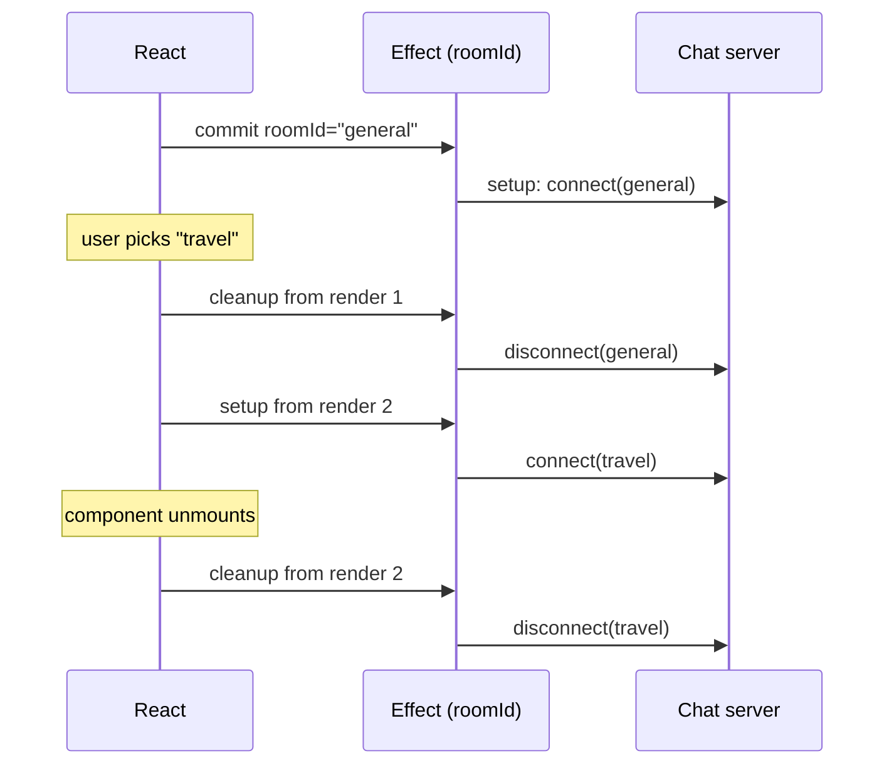
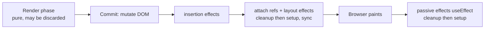
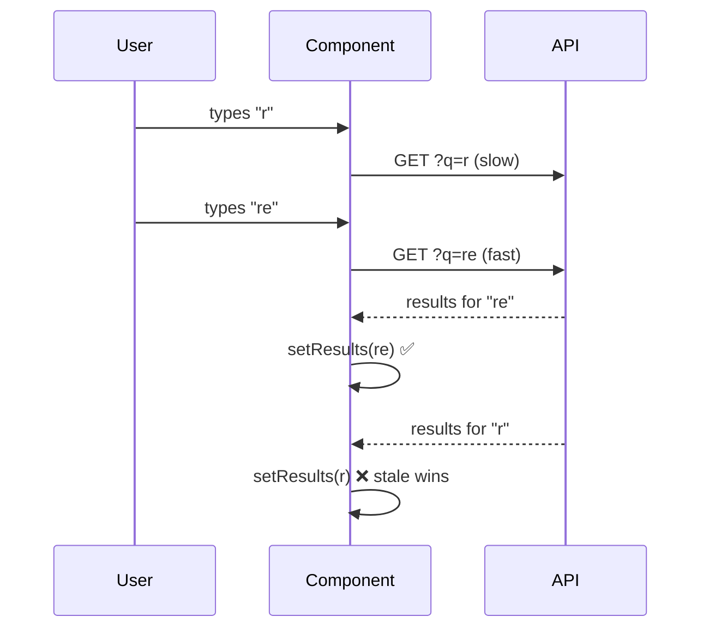

# 09 — Effects

> **How to use this module.** Sections 9.1–9.3 give you the mental model that answers most effect questions. Sections 9.4–9.6 cover the bugs interviewers ask you to find. Sections 9.7–9.10 cover the specialist hooks and internals. If you only have 20 minutes, read 9.1, 9.3, 9.6 and the Summary.

**Prerequisites:** [State as a snapshot](08-state.md#82-usestate-and-state-as-a-snapshot) · [Render phase vs commit phase](06-jsx-and-rendering-model.md#610-render-phase-vs-commit-phase) · [Closures](01-javascript.md#15-closures) · [The event loop](01-javascript.md#116-the-event-loop-call-stack-microtasks-vs-macrotasks-rendering-steps)

**Code for this module:** [`examples/web/src/m09-effects/`](examples/web/src/m09-effects/). Every file below has a test next to it. Run them with `npx vitest run src/m09-effects` from `examples/web`.

---

## 9.1 Effects as synchronization with external systems

### The problem
A component must be **pure** [React]: given the same props and state, rendering returns the same JSX and touches nothing outside itself ([06](06-jsx-and-rendering-model.md#68-purity-and-idempotence)). But real apps have to talk to things React does not control: a WebSocket, a `setInterval`, a browser API, a map widget, `document.title`. That work cannot live in the render function, because React may call render many times, throw a render away, or render without committing.

There are two legitimate homes for side effects:

| Where | Triggered by | Example |
|---|---|---|
| **Event handler** | A specific user action | "Send the message when the user clicks Send" |
| **Effect** (`useEffect`) | The fact that the component **is on screen with these values** | "While `ChatRoom` is shown for `roomId`, stay connected to that room" |

### Mental model
An effect is not a lifecycle callback. It is a **synchronization**: "keep the external system matching these values." React starts the synchronization after the screen is committed. It stops and restarts it whenever the values change, and stops it for good when the component leaves.

> **Java/Spring analogy.** Think of a resource-bound scope, like `try`-with-resources or a bean's `@PostConstruct`/`@PreDestroy` pair. Setup acquires (opens a connection) and cleanup releases (closes it).
>
> **Where the analogy breaks:** a bean lives once and is destroyed once. An effect's setup/cleanup pair can run **many times** during one component's life, once per change in its dependencies, and you never call it yourself. A better analogy is a Kubernetes reconciler: you declare the desired state (`roomId = "travel"`) and the loop makes the world match it, tearing down what no longer matches.

### Minimal code
`examples/web/src/m09-effects/ChatRoom.tsx` (simplified here; the full version is in [9.9](#99-useeffectevent)):

```tsx
import { useEffect } from 'react';
import { createConnection } from './chat';

export function ChatRoom({ roomId }: { roomId: string }) {
  useEffect(() => {
    const connection = createConnection(roomId); // setup: start synchronizing
    connection.connect();
    return () => connection.disconnect();        // cleanup: stop synchronizing
  }, [roomId]);                                  // re-synchronize when roomId changes

  return <h2>Welcome to {roomId}</h2>;
}
```

### How it works internally
`useEffect(setup, deps)` [React] does not run anything during render. It **records** an effect object (the setup function, its deps and a slot for the cleanup) on the component's fiber ([13](13-reconciliation-and-fiber.md#135-fiber-units-of-work-double-buffering-lanes-and-priorities)). After React commits the DOM changes, it walks the fibers that have effects flagged. For each one, it runs the previous cleanup (if the deps changed) and then the new setup. These are called **passive effects**, because React usually lets the browser paint before running them.

### Trade-offs
- ✅ This is the only correct place for synchronization with non-React systems that must follow the component's lifetime.
- ❌ It runs after paint, so it is too late for visual measurement (use [9.7](#97-uselayouteffect)).
- ❌ It runs only on the client, never during server rendering.
- ❌ It is the most overused hook in React. Most "effects" in real codebases should be derived values or event handlers ([9.6](#96-you-might-not-need-an-effect)).

---

## 9.2 Dependencies and the `Object.is` comparison

### The problem
React needs to know **when** to re-synchronize. Re-running the effect after every render would reconnect the chat on every keystroke. Never re-running it would leave you connected to the old room.

### Mental model
The dependency array is not a performance hint you choose. It is a **declaration of every reactive value the effect reads**. *Reactive* means props, state, and anything computed from them in the component body. Your code decides what the deps are; the linter tells you when you lied.

| You write | The effect runs after |
|---|---|
| `useEffect(fn)` (no array) | every commit of this component |
| `useEffect(fn, [])` | the first commit only (plus the Strict Mode dev re-run, [9.10](#910-strict-mode-remounting-and-what-it-reveals)) |
| `useEffect(fn, [a, b])` | the first commit, then any commit where `a` or `b` changed |

### Minimal code: the object-dependency trap

```tsx
function ChatRoom({ roomId }: { roomId: string }) {
  const options = { serverUrl: 'https://chat.example', roomId }; // new object every render
  useEffect(() => {
    const c = createConnection(options);
    c.connect();
    return () => c.disconnect();
  }, [options]); // ❌ always "changed": reconnects on every render
}
```

Fix it by creating the object **inside** the effect and depending on the primitives:

```tsx
useEffect(() => {
  const c = createConnection({ serverUrl: 'https://chat.example', roomId });
  c.connect();
  return () => c.disconnect();
}, [roomId]); // ✅ a string compares by value
```

### How it works internally
After a render, React compares each new dependency with the previous one using `Object.is` [JS], left to right, and stops at the first difference. `Object.is` is `===` except that `Object.is(NaN, NaN)` is `true` and `Object.is(0, -0)` is `false`. Objects, arrays and functions compare **by reference** ([01](01-javascript.md#18-reference-vs-value-equality)), so a value created during render is "new" every time.

### Trade-offs: the ways to remove a dependency honestly
1. **Move it inside the effect**, if only the effect uses it.
2. **Move it outside the component**, if it does not depend on props or state (a constant, a pure helper).
3. **Depend on primitives**, not the object (`[roomId]`, not `[options]`).
4. **Use a functional update** (`setCount(c => c + 1)`), so you do not need to read `count`.
5. **Use an Effect Event** ([9.9](#99-useeffectevent)) for values you need to read but must not react to.
6. **Memoize** (`useMemo`/`useCallback`) only as a last resort, when the object or function genuinely comes from a parent.

> **⚠️ Correction (common bad advice):** "Pass `[]` and add `// eslint-disable-next-line react-hooks/exhaustive-deps` if it re-runs too often." That does not fix anything. It freezes the effect on the first render's values, which is the stale-closure bug ([9.5](#95-stale-closures-in-effects-and-intervals)). Change the code so the dependency is no longer needed; never suppress the rule.

---

## 9.3 Cleanup and the effect lifecycle

### The problem
If an effect opens a connection, subscribes to an event or starts a timer, something must undo that. Otherwise switching rooms leaves two live connections, and unmounting leaks a timer that calls `setState` forever.

### Mental model
Think in **pairs**, not lifecycle moments. Every setup is matched by exactly one cleanup, and the cleanup sees the **same values** as the setup it undoes (it closes over the same render's snapshot).



This exact sequence is asserted in `examples/web/src/m09-effects/ChatRoom.test.tsx` ("switching rooms cleans up the old connection before opening the new one").

### Minimal code: three cleanups you will write constantly

```tsx
// Subscription: examples/web/src/m09-effects/useOnlineStatus.ts
useEffect(() => {
  const update = () => setOnline(navigator.onLine);
  window.addEventListener('online', update);
  window.addEventListener('offline', update);
  return () => {
    window.removeEventListener('online', update); // same function reference as added
    window.removeEventListener('offline', update);
  };
}, []);

// Timer: examples/web/src/m09-effects/Ticker.tsx
useEffect(() => {
  const id = setInterval(onTick, delayMs);
  return () => clearInterval(id);
}, [delayMs]);

// Request: examples/web/src/m09-effects/useSearch.ts (see 9.4)
useEffect(() => {
  const controller = new AbortController();
  fetch(url, { signal: controller.signal }) /* … */;
  return () => controller.abort();
}, [url]);
```

### How it works internally
In each commit, React first runs **all cleanups** for effects whose deps changed (and for unmounting components), then **all setups**. Setups fire **child-first**: a child's effects run before its parent's, as `componentDidMount` did, so a parent effect can safely assume its children's effects have already run. On **unmount**, cleanups walk the deleted tree **parent-first**, as `componentWillUnmount` did. Exercise 5 asserts both orders. `useInsertionEffect` is the one exception: it interleaves cleanup and setup per component ([9.8](#98-useinsertioneffect)).



> The diagram shows the usual order. When the update came from a discrete user event (a click, a keypress), React 18+ flushes the passive effects **synchronously, before paint** (see the Version notes below).

> **Version notes.**
> **React 16.8** (Feb 2019) introduced `useEffect`. **React 17** ran `useEffect` cleanups **asynchronously** (after the screen updates); in 16 they ran synchronously during unmount, so code that read the DOM in a cleanup broke on upgrade. **React 18**: effects caused by a discrete input event (click, keydown) are flushed synchronously before paint, and the "Can't perform a React state update on an unmounted component" warning was **removed**. That warning drove years of `isMounted` workarounds; you can delete them. **React 19** added cleanup functions for **ref callbacks** ([10.3](10-refs-and-dom.md#103-callback-refs-and-ref-cleanup-functions)), so some effects that existed only to undo a ref can go away. Sources: React CHANGELOG 17.0.0, 18.0.0, 19.0.0.

### Trade-offs
Cleanup has to be **symmetric**. If you cannot write the cleanup, the effect is probably doing something that belongs in an event handler (sending a purchase, logging a click).

---

## 9.4 Race conditions and `AbortController`

### The problem
Fetching in an effect looks simple:

```tsx
useEffect(() => {
  fetch(`/search?q=${query}`).then((r) => r.json()).then(setResults); // ❌
}, [query]);
```

The user types `r`, then `re`. Two requests are in flight. If the `r` response is slower, it arrives **last** and overwrites the `re` results. The screen now shows results for a query that is no longer in the input. This is a **race condition**.



### Mental model
Each effect run owns its request. When the next run starts, the cleanup of the previous run must **disown** its request: either ignore its answer, or cancel it outright.

### Minimal code
Two fixes; production code uses both ideas.

**Fix 1: the `ignore` flag** [JS]. It works with any promise (an SDK, a GraphQL client):

```tsx
useEffect(() => {
  let ignore = false;
  fetchResults(query).then((r) => {
    if (!ignore) setResults(r);
  });
  return () => {
    ignore = true;
  };
}, [query]);
```

**Fix 2: `AbortController`** [Browser]. It actually cancels the network request, so the server stops streaming and the bandwidth is freed. From `examples/web/src/m09-effects/useSearch.ts`:

```tsx
useEffect(() => {
  if (!query) return;
  const controller = new AbortController();

  fetch(`${SEARCH_URL}?q=${encodeURIComponent(query)}`, { signal: controller.signal })
    .then((res) => {
      if (!res.ok) throw new Error(`HTTP ${res.status}`);
      return res.json() as Promise<string[]>;
    })
    .then((results) => setSettled({ query, results }))
    .catch((error: unknown) => {
      if (controller.signal.aborted) return; // superseded, not a failure
      setSettled({ query, error: error instanceof Error ? error.message : String(error) });
    });

  return () => controller.abort();
}, [query]);
```

The hook also stores **which query** each answer belongs to and **derives** the status during render (`settled?.query !== query ? 'loading' : …`). That is a third safety net: a late answer for an old query can never be shown as current, and the hook never calls `setState` synchronously inside the effect body ([9.6](#96-you-might-not-need-an-effect)). `SearchBox.test.tsx` uses MSW ([20](20-testing.md#206-msw-for-network-mocking)) to make the `r` response slow and the `re` response fast, and asserts the stale one never appears.

### How it works internally
`controller.abort()` makes `fetch` reject with a `DOMException` named `AbortError`. If the response already arrived, `res.json()` rejects instead. That rejection reaches your `.catch`, which is why the code checks `signal.aborted` and does not show an error message for a cancellation. `fetch` and `AbortController` are browser APIs ([03](03-browser-and-web-platform.md#36-fetch-requestresponse-streaming-bodies-abortcontroller)); React only supplies the cleanup timing.

### Trade-offs
Hand-written effect fetching still lacks caching, deduplication, retries, background refresh and SSR support. Learn it here, because interviews ask you to write it. In production, prefer a data library (TanStack Query) or a framework loader ([17](17-data-fetching.md#171-fetching-in-effects-and-its-pitfalls)).

---

## 9.5 Stale closures in effects and intervals

### The problem
The classic interview bug:

```tsx
function Counter() {
  const [count, setCount] = useState(0);
  useEffect(() => {
    const id = setInterval(() => setCount(count + 1), 1000); // ❌
    return () => clearInterval(id);
  }, []);
  return <p>{count}</p>;
}
```

It shows `1` and stops there forever.

### Mental model
Every render is a **snapshot** ([08](08-state.md#82-usestate-and-state-as-a-snapshot)). The effect from render #1 closes over render #1's `count`, which is `0` ([01](01-javascript.md#15-closures)). With `[]` the effect never re-runs, so the interval keeps computing `0 + 1` forever. The closure is not "out of date"; it is faithfully remembering the render it came from.

> **Java analogy:** a lambda that captures an effectively-final local variable. It captures the **value at creation time**, not a live reference to "the current count."
>
> **Where it breaks:** in Java you would mutate a field to share state. In React the state lives outside your function, in the fiber, so the fix is to ask React for the latest value rather than to mutate anything.

### Minimal code: three correct fixes

```tsx
// 1. Functional update: no need to read count at all (best here)
useEffect(() => {
  const id = setInterval(() => setCount((c) => c + 1), 1000);
  return () => clearInterval(id);
}, []);

// 2. Declare the dependency honestly: correct, but restarts the interval on every tick
useEffect(() => {
  const id = setInterval(() => setCount(count + 1), 1000);
  return () => clearInterval(id);
}, [count]);

// 3. Need to read a PROP (step) without restarting? Effect Event (9.9).
//    examples/web/src/m09-effects/Ticker.tsx
const onTick = useEffectEvent(() => setCount((c) => c + step));
useEffect(() => {
  const id = setInterval(onTick, delayMs);
  return () => clearInterval(id);
}, [delayMs]);
```

`Ticker.test.tsx` proves the difference with fake timers: changing `step` mid-interval takes effect on the next tick **without resetting the interval's phase**.

### Trade-offs
Fix 2 works, but each tick changes `count`, so React tears the interval down and creates a new one every second. In practice it is a chain of `setTimeout`s. Every link adds the time it takes to render, commit and run the effect, so the timing drifts. Re-renders caused by *other* state do **not** restart it, because an effect whose deps are unchanged is left alone. It can only be starved if something else changes `count` faster than `delayMs`, so that each restart cancels the pending tick. Prefer fix 1 or fix 3, which create the interval once.

---

## 9.6 You might not need an effect

### The problem
Most production effect bugs come from effects that **should not exist**: extra renders, flicker, loops, and logic that runs at the wrong time. react.dev's guidance, and the `react-hooks/set-state-in-effect` lint rule in `eslint-plugin-react-hooks` 7, both push you away from them.

### Mental model
Ask one question: **is this synchronizing with something outside React?** If not, it is not an effect.

| You want to… | Don't (effect) | Do instead |
|---|---|---|
| Compute a value from props/state | `useEffect(() => setFull(first + ' ' + last), [first, last])` | `const full = first + ' ' + last;` in render ([08](08-state.md#87-derived-state-compute-do-not-store)) |
| Cache an expensive computation | effect + state | `useMemo` (or the React Compiler, [15](15-performance.md#155-the-react-compiler-and-how-it-changes-the-advice)) |
| Reset all state when a prop changes | effect that calls setters | `key={userId}` on the child ([08](08-state.md#89-resetting-state-with-key)) |
| Adjust *some* state when a prop changes | effect | Store the previous prop and compare during render, or better, restructure so the value is derived |
| Respond to a click/submit | effect watching a "submitted" flag | Do it **in the event handler** |
| Notify the parent of a change | effect calling `onChange(value)` | Call `onChange` in the same handler that sets the state, or lift the state up |
| Chain computations (A changes → set B → set C) | chain of effects | Compute all of it in the handler, or derive it |
| Fetch data | raw effect in production | Data library or framework loader ([17](17-data-fetching.md#171-fetching-in-effects-and-its-pitfalls)) |
| Subscribe to an external store | effect + state | `useSyncExternalStore` ([12](12-hooks-and-custom-hooks.md#1212-usesyncexternalstore)) |
| Run once when the app loads | `useEffect(…, [])` in `App` | Module-level code, or a guard variable outside the component |

### Minimal code
`examples/web/src/m09-effects/NoEffectNeeded.tsx` shows the first three rows as working components (derived filter, reset with `key`, action in handler), with tests.

```tsx
// ❌ two renders per change, one of them showing stale data
const [visible, setVisible] = useState<Todo[]>([]);
useEffect(() => setVisible(showDone ? todos : todos.filter((t) => !t.done)), [todos, showDone]);

// ✅ one render, always consistent
const visible = showDone ? todos : todos.filter((t) => !t.done);
```

### How it works internally
`setState` inside an effect body schedules **another render** right after the commit. The user briefly sees the stale value, then React renders again: a "cascading render." The lint rule `react-hooks/set-state-in-effect` reports it as an **error** in the `recommended` preset (verified by running ESLint with `eslint-plugin-react-hooks` 7.1.1 in `examples/web`). Calling `setState` in a **callback** that the effect registered (a subscription, a `.then`) is fine. That is the "subscribe and update when the external system changes" use case.

### Trade-offs
Measuring layout and then setting state is a legitimate exception, and it belongs in `useLayoutEffect` (9.7). In our run, the rule did not flag the `Tooltip` example's `setHeight` inside `useLayoutEffect`.

---

## 9.7 `useLayoutEffect`

### The problem
A tooltip must be positioned **above** its target, which needs the tooltip's height. You only know the height after it is in the DOM. If you measure in `useEffect`, the browser first paints the tooltip in the wrong place, then moves it: a visible flicker.

### Mental model
`useLayoutEffect` [React] runs **after the DOM is mutated but before the browser paints**, synchronously. A state update inside it re-renders synchronously too, before the paint. The user only ever sees the final position.

> **Java analogy:** none that fits well. The nearest is "a hook that runs inside the same transaction, before commit is visible." What matters is that it **blocks painting**.

### Minimal code
`examples/web/src/m09-effects/Tooltip.tsx`:

```tsx
export function Tooltip({ targetTop, children }: { targetTop: number; children: ReactNode }) {
  const ref = useRef<HTMLDivElement>(null);
  const [height, setHeight] = useState(0);

  useLayoutEffect(() => {
    setHeight(ref.current?.getBoundingClientRect().height ?? 0);
  }, [children]);

  const top = height === 0 ? targetTop : targetTop - height;
  return <div ref={ref} role="tooltip" style={{ position: 'absolute', top }}>{children}</div>;
}
```

The test stubs `getBoundingClientRect`, because jsdom has no layout engine. That is a useful interview point: **unit tests cannot verify layout.** Use a real browser (Playwright, or Vitest browser mode) for that.

### How it works internally
Layout effects run in the commit's layout phase, right after refs are attached ([diagram in 9.3](#93-cleanup-and-the-effect-lifecycle)). Reading `getBoundingClientRect()` forces the browser to compute layout synchronously ([03](03-browser-and-web-platform.md#34-the-rendering-pipeline-parse--style--layout--paint--composite-reflow-and-layout-thrashing)), and the paint waits until your code returns.

### Trade-offs
- ❌ It blocks paint, so slow code here directly hurts INP/LCP. Default to `useEffect`.
- ❌ It does nothing on the server.
- Use it for: measuring before paint, scroll restoration, synchronously positioning popovers, and preventing flicker.

> **Version notes.** React ≤ 18 printed a warning when a component using `useLayoutEffect` was server-rendered ("useLayoutEffect does nothing on the server"). Libraries worked around it with a `useIsomorphicLayoutEffect` helper (`typeof window !== 'undefined' ? useLayoutEffect : useEffect`). **React 19.0 removed that warning** (CHANGELOG 19.0.0: "Remove layout effect warning on server"). You will still see the helper in older codebases. It is harmless, and on React 19 it is no longer needed.

---

## 9.8 `useInsertionEffect`

### The problem
CSS-in-JS libraries (styled-components, Emotion) generate `<style>` rules at runtime. If they inject them in a layout effect, other layout effects may already have measured an unstyled DOM, and injecting them during render is slow and impure.

### Mental model
`useInsertionEffect` [React] fires **before any layout effects**, so styles are in place before anyone measures. **It is for library authors only.**

### Minimal code
```tsx
function useCSS(rule: string) {
  useInsertionEffect(() => {
    const style = document.createElement('style');
    style.textContent = rule;
    document.head.appendChild(style);
    return () => style.remove();
  }, [rule]);
}
```

### How it works internally and its limits (from react.dev)
- It runs before layout effects and before paint. It may run before **or** after the DOM has been updated, so don't rely on either.
- **You cannot update state** inside it, and **refs are not attached yet**.
- Unlike the other effects, it fires cleanup and setup **one component at a time** (interleaved).
- It does not run on the server; libraries collect styles during SSR another way.

### Trade-offs
If an interviewer asks, say what it is for and that application code should not use it. Runtime CSS-in-JS also has trade-offs with Server Components ([04](04-html-css-accessibility.md#411-styling-in-react-inline-css-modules-tailwind-css-in-js-and-the-server-components-trade-off)).

---

## 9.9 `useEffectEvent`

### The problem
The chat room should reconnect when `roomId` changes, but it also shows a "Connected!" notification styled with the current `theme`. Reading `theme` inside the effect forces you to list it as a dependency, so **toggling dark mode reconnects the chat**. Leaving it out is a stale-closure bug that the linter will flag.

### Mental model
Split the effect's code into two kinds:
- **Reactive logic**: should re-synchronize when its values change (`roomId` → reconnect).
- **Non-reactive logic**: should *read* the latest values when something happens, without causing a re-run (`theme` → only used when the "connected" event fires).

`useEffectEvent` [React] wraps the non-reactive part. The function it returns always sees the **latest committed props and state**, and it is **not** a dependency.

> **Java analogy:** a callback that reads a `volatile` field or a `Supplier<Theme>` instead of a captured value: "give me whatever is current when I am invoked."
>
> **Where it breaks:** it is not a general escape hatch. It may only be called from inside effects (or other Effect Events), never during render and never from event handlers.

### Minimal code
`examples/web/src/m09-effects/ChatRoom.tsx`:

```tsx
import { useEffect, useEffectEvent } from 'react';
import { createConnection } from './chat';

type Props = { roomId: string; theme: 'light' | 'dark'; onNotify: (message: string) => void };

export function ChatRoom({ roomId, theme, onNotify }: Props) {
  const onConnected = useEffectEvent(() => {
    onNotify(`Connected to ${roomId} (${theme} theme)`);
  });

  useEffect(() => {
    const connection = createConnection(roomId);
    connection.on('connected', onConnected);
    connection.connect();
    return () => connection.disconnect();
  }, [roomId]); // theme and onNotify deliberately absent; onConnected must never be listed

  return <h2>Welcome to {roomId}</h2>;
}
```

`ChatRoom.test.tsx` asserts that switching the theme does **not** reconnect, and that the next connection's notification uses the **new** theme.

### How it works internally
React keeps the latest version of the callback in the hook's slot, updating it during commit, and the returned function delegates to it. Per react.dev, its **identity intentionally changes on every render**. If you wrongly put it in a dependency array, the effect re-runs on every render and the bug is obvious. Running ESLint confirms the hooks plugin reports it: *"Functions returned from `useEffectEvent` must not be included in the dependency array."*

Rules (react.dev):
- Call it at the top level of a component or custom hook.
- Call the returned function **only from inside effects** (`useEffect`, `useLayoutEffect`, `useInsertionEffect`) or other Effect Events.
- Do **not** pass it to other components or hooks.
- Do **not** use it to dodge a dependency that *should* be reactive. If the effect ought to re-run when a value changes, that value is a dependency.

### Trade-offs and legacy code: the "latest ref" pattern
`useEffectEvent` is **stable since React 19.2** (Oct 2025). Before that it existed only as `experimental_useEffectEvent` in experimental builds. React 18 codebases solve the same problem with a ref:

```tsx
// React 16.8–19.1 pattern ("useLatest" / "useEvent" polyfill)
function useLatest<T>(value: T) {
  const ref = useRef(value);
  useLayoutEffect(() => {
    ref.current = value;
  }); // update after every commit, before passive effects run
  return ref;
}

function ChatRoom({ roomId, theme, onNotify }: Props) {
  const latest = useLatest({ theme, onNotify });
  useEffect(() => {
    const c = createConnection(roomId);
    c.on('connected', () => latest.current.onNotify(`Connected (${latest.current.theme})`));
    c.connect();
    return () => c.disconnect();
  }, [roomId, latest]); // the ref object itself is stable
}
```

Its pitfalls: writing `ref.current = value` **during render** is impure. The React docs say not to read or write `ref.current` during rendering, and the React Compiler's lint rules flag it, so update the ref in an effect as shown. Nothing stops you from calling it during render or passing it around. **Migration:** on React ≥ 19.2, replace `useLatest` + ref reads with `useEffectEvent`, and remove the ref from the dependency array.

> **Version notes.** 19.2.0 shipped `useEffectEvent` as stable. 19.3.0 fixed `useEffectEvent` to read the latest values inside `forwardRef` and `memo()` components (CHANGELOG 19.3.0). If you are on 19.2.x and see stale reads in a memoized component, upgrade.

---

## 9.10 Strict Mode remounting and what it reveals

### The problem
"My effect runs twice! My analytics fire twice! My `connect` is called twice!" This is the most common React 18+ effect question, and the most common wrong fix is a `useRef` guard.

### Mental model
In development, inside `<StrictMode>`, React mounts each component, **immediately runs every effect's cleanup**, then runs every setup again: setup → cleanup → setup. It is a deliberate stress test. If your cleanup mirrors your setup, the user cannot tell the difference. If they see a bug, your effect has a missing or broken cleanup, and it would also break in production when a user navigates away and back (or, with `<Activity>`, when UI is hidden and shown, [21](21-concurrent-ssr-server-components.md#219-activity)).

### Minimal code
`ChatRoom.test.tsx` ("Strict Mode runs one extra setup + cleanup cycle in development") renders inside `<StrictMode>` and asserts the log is exactly:

```text
connect:general → disconnect:general → connect:general
```

The net result is one open connection, which is correct.

### How it works internally
After the first mount, React in dev simulates an unmount/remount of the subtree, reusing the existing state (it is not a fresh mount). This catches components that are not resilient to being reused, which React relies on for features like `<Activity>` and fast back-navigation. The double-invoke runs **only in development**. Production builds skip it.

### Trade-offs: what to do instead of suppressing it
| Symptom in dev | Real fix |
|---|---|
| Connection opened twice | Add `disconnect` in cleanup: you'll see connect → disconnect → connect |
| Fetch fires twice | Abort or ignore in cleanup (9.4). Better: a data library that dedupes. The extra request is acceptable in dev |
| Analytics "page view" logged twice | Acceptable in dev. In production it fires once; or send it from the router/navigation event instead |
| Something that must happen once per **app load** (init SDK) | Module-level code or a top-level guard variable, **not** an effect |
| Non-idempotent POST in an effect | It should not be in an effect. Move it to the event handler that caused it |

> **⚠️ Correction:** `const didRun = useRef(false); if (didRun.current) return; didRun.current = true;` "fixes" the double run by hiding the missing cleanup. The bug comes back in production when the component remounts.

> **Version notes.** **React 18.0** added the effect re-run to Strict Mode ("Make `<StrictMode>` re-run effects to check for restorable state"). React 17 and earlier only double-**rendered**. 18.0 also stopped silencing `console.log` in the second render; DevTools greys it out instead. **React 19.0**: Strict Mode also double-invokes **ref callbacks** on mount, and `useMemo`/`useCallback` reuse the first render's result during the double render. **React 19.3**: Strict Mode now also double-invokes effects **during hydration** and **after Fast Refresh** (CHANGELOG 19.3.0). An SSR app upgrading to 19.3 may see new dev-only double effects that it never saw before. **Next.js:** since **13.5.1**, Strict Mode is on by default with the App Router. Pages Router apps must opt in with `reactStrictMode: true` in `next.config.js` ([Next.js docs: reactStrictMode](https://nextjs.org/docs/app/api-reference/config/next-config-js/reactStrictMode)).

---

## Interview questions

**Q1. Describe what `useEffect` is for in one sentence.**
<details><summary>Answer</summary>

To **synchronize** a component with a system outside React (network, browser API, timer, third-party widget) for as long as it is on screen with given values. That is why it has a setup and a cleanup. **A strong answer adds:** effects are not "lifecycle methods," and if nothing external is involved you probably don't need one (9.6).

</details>

**Q2. When should code go in an event handler versus an effect?**
<details><summary>Answer</summary>

Event handler: it happens **because the user did something specific** (submit, click, drag). Effect: it must happen **because the component is displayed** with certain values, whatever caused that. "POST the order" is caused by the click, so it goes in the handler. "Be connected to room X" is caused by being on screen, so it goes in an effect. **A strong answer adds:** putting handler logic in an effect (watching a `submitted` flag) causes duplicate sends in Strict Mode and on remount.

</details>

**Q3. Exactly when does a `useEffect` callback run?**
<details><summary>Answer</summary>

After React commits the render to the DOM, and normally **after the browser paints**, so the user sees the update first. Exception (React 18+): if the update came from a discrete user input such as a click or keydown, React flushes the passive effects **synchronously before paint**, so the results are observable by the event system. The setup never runs during render or on the server. **A strong answer adds:** the order is DOM mutation → layout effects → paint → passive effects, and children's effects fire before their parents'.

</details>

**Q4. Explain the difference between no dependency array, `[]`, and `[a, b]`.**
<details><summary>Answer</summary>

No array: re-run after **every** commit. `[]`: run after the first commit only (plus the dev Strict Mode re-run). `[a, b]`: run after the first commit and whenever `Object.is` says `a` or `b` changed. **A strong answer adds:** you don't *choose* the array; it must list every reactive value the effect reads. To change when it runs, change the code, not the array.

</details>

**Q5. Why does an effect with an object or function dependency run after every render?**
<details><summary>Answer</summary>

Dependencies are compared with `Object.is`, which compares objects and functions **by reference**. An object literal or arrow function created in the component body is a new reference on every render, so it always counts as changed. Fixes: create it inside the effect, hoist it out of the component, depend on its primitive fields, or (if it comes from a parent) memoize it at the source. **A strong answer adds:** with the React Compiler enabled, many of these values become stable automatically. The correctness rule (list all deps) is unchanged.

</details>

**Q6. Is `useEffect(fn, [])` the same as `componentDidMount`?**
<details><summary>Answer</summary>

Close, not identical. (1) It runs after paint; `componentDidMount` ran before the browser painted, which is closer to `useLayoutEffect`. (2) In Strict Mode dev it runs, cleans up, and runs again. (3) It captures the first render's props and state forever (a closure), whereas `this.props` in a class always reads the latest. **A strong answer adds:** stop translating lifecycles. Ask "what am I synchronizing with?" instead. See the mapping table in [13](13-reconciliation-and-fiber.md#136-class-lifecycle-methods-and-their-hook-equivalents).

</details>

**Q7. When exactly does the cleanup function run, and which values does it see?**
<details><summary>Answer</summary>

Before the effect re-runs because its deps changed, and when the component unmounts. In development it also runs once extra, right after mount (Strict Mode). It sees the props and state **from the render that created it**: the old `roomId`, not the new one. That is exactly what you need to disconnect from the old room. **A strong answer adds:** within a commit, React runs all cleanups for changed effects before any new setups.

</details>

**Q8. My effect runs twice in development. Is that a bug? How do I fix it?**
<details><summary>Answer</summary>

It is React 18+ Strict Mode deliberately running setup → cleanup → setup in dev only, to prove your cleanup is correct. The fix is to **implement the cleanup** (disconnect, unsubscribe, abort, clear the timer) so that the double run is invisible. Do not add a `useRef` "has run" guard and do not remove `<StrictMode>`. **A strong answer adds:** production builds don't double-run. The same resilience is needed for real remounts and for `<Activity>` hide/show.

</details>

**Q9. What's wrong with `useRef` guards to stop the double effect?**
<details><summary>Answer</summary>

They hide the missing cleanup in development, which is exactly what Strict Mode was trying to surface. In production the component can still unmount and remount (navigation, a key change, a conditional), and then the resource leaks or the action duplicates. **A strong answer adds:** if something must happen once per app load, put it at module level, outside React.

</details>

**Q10. Explain the race condition in effect-based data fetching and two ways to fix it.**
<details><summary>Answer</summary>

Requests for successive values (`r`, `re`) can resolve out of order, so a stale response may arrive last and overwrite the current one. Fix 1: an `ignore` flag set to `true` in the cleanup, checked before `setState`. Fix 2: an `AbortController` aborted in the cleanup, which cancels the request itself. **A strong answer adds:** also key the stored result by the request it answers and derive the status, and in production use TanStack Query or a router loader, which handle races, caching and dedupe.

</details>

**Q11. `ignore` flag vs `AbortController`: what's the actual difference?**
<details><summary>Answer</summary>

`ignore` only discards the result. The request still completes, using bandwidth and server time. `AbortController` cancels the HTTP request (the browser closes the stream), and `fetch` rejects with an `AbortError` that you must not show as an error. `ignore` works with any promise; `abort` needs an API that accepts a `signal` (fetch; axios since **0.22.0**, Oct 2021, whose CHANGELOG says "added AbortController support" (#3305); before that, axios only had `CancelToken`; most modern SDKs). **A strong answer adds:** check `signal.aborted` in the `catch`, and note that aborting does not undo a mutation the server already processed.

</details>

**Q12. Why can't the effect callback be `async`?**
<details><summary>Answer</summary>

An `async` function always returns a Promise, but React expects the effect to return **either nothing or a cleanup function**. A returned Promise would be treated as an invalid cleanup, and React logs this in development: *"useEffect must not return anything besides a function, which is used for clean-up. It looks like you wrote useEffect(async () => ...) or returned a Promise."* (verified in the `react-dom` 19.3.0 development build, `cjs/react-dom-client.development.js`). Define an async function inside the effect and call it, keeping the cleanup synchronous. **A strong answer adds:** this is why cancellation must be done with flags or `AbortController`. You cannot "await" in a cleanup.

</details>

**Q13. Why does this interval counter stop at 1? `useEffect(() => { const id = setInterval(() => setCount(count + 1), 1000); return () => clearInterval(id); }, []);`**
<details><summary>Answer</summary>

The effect ran once, in render #1, and its interval callback closed over render #1's `count` (0). Every tick computes `0 + 1`. Fix: a functional update `setCount(c => c + 1)`, which needs no read of `count`. **A strong answer adds:** listing `[count]` is also correct but restarts the interval every tick. If you need a prop like `step`, use `useEffectEvent`.

</details>

**Q14. Is it ever okay to disable `react-hooks/exhaustive-deps`?**
<details><summary>Answer</summary>

Practically never. Disabling it freezes values from the first render, which is a stale closure, and the React Compiler skips optimizing components that suppress the rule. Its 1.0.0 build reports: *"React Compiler has skipped optimizing this component because one or more React ESLint rules were disabled"* (verified in `babel-plugin-react-compiler@1.0.0`'s `dist/index.js`). If the effect re-runs too often, remove the dependency honestly: move code inside, hoist it out, use primitives, use functional updates, or use an Effect Event. **A strong answer adds:** "the linter is wrong" almost always means "the effect is doing two jobs" and should be split.

</details>

**Q15. A function prop `onChange` is in your deps and the parent re-creates it every render. Options?**
<details><summary>Answer</summary>

(1) If the effect only *calls* it when something happens, wrap the call in `useEffectEvent`, so it is not reactive. (2) Ask the parent to memoize it with `useCallback` (or rely on the React Compiler). (3) Reconsider the design: calling `onChange` from an effect is often the "notify the parent" anti-pattern; call it in the event handler instead. **A strong answer adds:** don't just drop it from the array, because you would capture a stale handler.

</details>

**Q16. What problem does `useEffectEvent` solve, and what are its rules?**
<details><summary>Answer</summary>

It separates non-reactive logic that reads the latest props/state from reactive logic that should re-synchronize. Example: the theme in a "connected" notification shouldn't reconnect the chat. Rules: call the hook at the top level; call the returned function only from effects or other Effect Events; don't list it in deps; don't pass it to other components or hooks; don't use it to hide a dependency that should be reactive. **A strong answer adds:** it is stable since React 19.2. Earlier code used a "latest ref" pattern.

</details>

**Q17. Why does a `useEffectEvent` function get a new identity every render?**
<details><summary>Answer</summary>

On purpose (react.dev). If you wrongly put it in a dependency array, the effect re-runs every render and the mistake is immediately visible, instead of silently working. It is a runtime assertion that it is not meant to be a dependency or a stable callback. **A strong answer adds:** that is also why it must not be passed to children as a prop. Use `useCallback` for stable callbacks.

</details>

**Q18. How did you solve the Effect Event problem before React 19.2?**
<details><summary>Answer</summary>

The "latest ref" pattern: keep the latest callback or values in a `useRef`, update `ref.current` in a layout effect (or, less correctly, during render), and read `ref.current` inside the effect. The ref object is stable, so it does not cause re-runs. **A strong answer adds:** writing refs during render is impure and flagged by compiler lint rules. On 19.2+, migrate to `useEffectEvent`.

</details>

**Q19. `useLayoutEffect` vs `useEffect`: when do you choose layout?**
<details><summary>Answer</summary>

`useLayoutEffect` runs synchronously after DOM mutations and **before paint**, so measurements and the state updates that follow them are applied before the user sees anything. Use it for measuring elements, positioning tooltips and popovers, and scroll restoration. Everything else uses `useEffect`, because layout effects block painting and hurt responsiveness. **A strong answer adds:** neither runs on the server. React 19 removed the old SSR warning, which is why `useIsomorphicLayoutEffect` is legacy.

</details>

**Q20. What is `useInsertionEffect` and should you use it?**
<details><summary>Answer</summary>

It is a hook for CSS-in-JS **library authors** to inject `<style>` tags before any layout effects read the DOM. It can't set state, refs aren't attached yet, and its cleanup and setup interleave per component. Application code shouldn't use it. **A strong answer adds:** runtime CSS-in-JS has costs with streaming SSR and Server Components, which is one reason zero-runtime styling has gained ground.

</details>

**Q21. In what order do effects run in a parent/child tree?**
<details><summary>Answer</summary>

Setups run children first (bottom-up), as `componentDidMount` did. On an update, each effect kind runs all its cleanups (child-first) and then all its setups. On unmount, cleanups run **parent-first** (top-down). Layout effects for the whole tree run before paint; passive effects run after. Exercise 5 verifies every case by running it. **A strong answer adds:** this lets a parent's effect assume its children's DOM nodes and effects are already set up. Siblings run in tree order.

</details>

**Q22. Why is `setState` directly inside an effect body flagged by the linter?**
<details><summary>Answer</summary>

It causes a **cascading render**: React commits, runs the effect, which schedules another render, so the user may briefly see an intermediate state and the work is doubled. It usually means the value should be derived during render, set in an event handler, or reset with `key`. `eslint-plugin-react-hooks` 7 reports `react-hooks/set-state-in-effect` as an error in `recommended`. **A strong answer adds:** setting state in a **callback** the effect registered (subscription, promise `.then`) is the legitimate pattern.

</details>

**Q23. A form must clear when `userId` changes. An effect calls `setDraft('')` on `[userId]`. Better?**
<details><summary>Answer</summary>

Render the stateful part with `key={userId}`. React treats a different key as a different component, so all of its state resets naturally, in one render, with no flash of the old draft. **A strong answer adds:** if only part of the state should reset, either split the component or derive the value. Reach for "store the previous prop and compare during render" only rarely.

</details>

**Q24. How do you notify a parent that a child's state changed?**
<details><summary>Answer</summary>

Call the parent's callback **in the same event handler** that updates the child's state, so both updates happen in one batched render. Or lift the state up and make the child controlled. Doing it in an effect that watches the state causes an extra render pass and fires on mount too. **A strong answer adds:** this is the "controlled component API" from [07](07-components-props-composition.md#78-controlled-vs-uncontrolled-component-apis).

</details>

**Q25. Why isn't effect-based fetching recommended for production data loading?**
<details><summary>Answer</summary>

It fetches only after render and paint, creating **network waterfalls** (parent fetches, renders a child, the child fetches…). It has no cache, so remounts refetch. It needs manual race handling. It does not work in SSR, and it duplicates requests. Data libraries (TanStack Query, SWR) add caching, dedupe, retries and background refresh. Framework loaders and Server Components start fetching before or while rendering. **A strong answer adds:** effects are still fine for small apps and are what interviewers ask you to hand-write.

</details>

**Q26. How should a component subscribe to a browser API or an external store?**
<details><summary>Answer</summary>

For simple event subscriptions, an effect that adds a listener and removes the same function in cleanup works (`useOnlineStatus.ts`). For reading external **mutable** data, `useSyncExternalStore` is purpose-built: it prevents tearing under concurrent rendering and accepts a server snapshot. **A strong answer adds:** Redux, Zustand and others use `useSyncExternalStore` internally since React 18.

</details>

**Q27. Do effects run during server-side rendering? What about hydration?**
<details><summary>Answer</summary>

No. Effects run only on the client, after hydration commits. That's why "read `localStorage` in an effect" avoids hydration mismatches: the server and the first client render agree, and the effect then updates. **A strong answer adds:** that pattern causes a flash. React 19.3 adds `use(browser())` from `react-dom` to make a component client-only by suspending on the server ([21](21-concurrent-ssr-server-components.md#215-ssr-hydration-hydration-errors)). Also, in 19.3 Strict Mode double-invokes effects during hydration in dev.

</details>

**Q28. What happens to a component's effects inside `<Activity mode="hidden">`?**
<details><summary>Answer</summary>

`<Activity>` (stable in 19.2) hides UI while **preserving its state**, and it **cleans up its effects** while hidden. They are set up again when it becomes visible. The hidden tree can also pre-render at low priority. So an effect must survive being stopped and restarted without losing correctness, which is exactly what the Strict Mode double-run trains you for. **A strong answer adds:** subscriptions and timers pause while hidden, which is usually what you want (no background polling for an invisible tab).

</details>

**Q29. A user clicks "Buy" and you `setPurchased(true)`; an effect on `[purchased]` POSTs the order. What's wrong?**
<details><summary>Answer</summary>

The POST is caused by the click, not by the component being on screen. As an effect it can run again on remount (navigating back), in Strict Mode dev, or when `purchased` is restored from state. Send the POST in the click handler. **A strong answer adds:** effects should be idempotent synchronizations. Non-idempotent operations belong to events.

</details>

**Q30. How would you test a component with an effect?**
<details><summary>Answer</summary>

Test observable behavior: render, interact, and assert on the DOM. Use MSW for network calls, fake timers plus `act` for intervals, and `unmount()` to check that cleanup ran (timers cleared, listeners removed, connection closed). Render inside `<StrictMode>` to prove cleanup symmetry. **A strong answer adds:** don't assert "useEffect was called". Assert outcomes. See `examples/web/src/m09-effects/*.test.tsx` and [20](20-testing.md#205-async-utilities-and-act).

</details>

**Q31. Class component: `componentDidUpdate(prevProps) { if (prevProps.id !== this.props.id) this.load(); }`. Convert it.**
<details><summary>Answer</summary>

`useEffect(() => { /* load(id) with abort/ignore */ return cleanup; }, [id])`. The dependency array replaces the manual `prevProps` comparison, and one effect covers mount + update + unmount for that concern. **A strong answer adds:** a class split one concern across three methods (didMount, didUpdate, willUnmount) and mixed unrelated concerns inside each one. Hooks group code by concern, which is the real benefit.

</details>

**Q32. Your effect needs the latest `count` inside a WebSocket message handler without reconnecting. How?**
<details><summary>Answer</summary>

Wrap the message handler logic in `useEffectEvent` and register it inside the effect. The connection depends only on the URL/room, and the handler reads the latest `count`. If you only need to *update* `count`, a functional update is enough. **A strong answer adds:** on React < 19.2, use the latest-ref pattern.

</details>

**Q33. Is "the effect runs after every render" a performance problem?**
<details><summary>Answer</summary>

Running the effect is usually cheap. The cost is **what it does**: reconnecting, refetching, or setting state that causes another render. Fix the deps so it only re-synchronizes when needed, and remove effects that only compute values. **A strong answer adds:** profile first ([15](15-performance.md#151-measure-first-react-devtools-profiler-chrome-performance-panel-performance-tracks)). React DevTools shows why a component rendered, and the 19.2 Performance Tracks show effect timing in Chrome.

</details>

---

## Coding exercises

### Exercise 1: Chat room connection

**Statement.** Build `ChatRoom({ roomId, theme, onNotify })` that stays connected to `roomId` using `createConnection(roomId)` from the fake server below. On connect, call `onNotify("Connected to <room> (<theme> theme)")`. Changing `theme` must **not** reconnect. Unmount must disconnect.

```ts
// file: examples/web/src/m09-effects/chat.ts
// A fake chat server: the "external system" our effects synchronize with.
// Every call is recorded in `connectionLog` so tests can assert on the exact sequence.
export const connectionLog: string[] = [];

export type Connection = {
  connect(): void;
  disconnect(): void;
  on(event: 'connected', listener: () => void): void;
};

export function createConnection(roomId: string): Connection {
  const listeners: Array<() => void> = [];
  return {
    connect() {
      connectionLog.push(`connect:${roomId}`);
      listeners.forEach((l) => l());
    },
    disconnect() {
      connectionLog.push(`disconnect:${roomId}`);
    },
    on(_event, listener) {
      listeners.push(listener);
    },
  };
}
```

**Approach.**
1. What is the external system? The chat connection, so this is an effect.
2. What should re-synchronize it? Only `roomId`, so that is the only dependency.
3. The notification reads `theme`, but `theme` must not trigger a reconnect, so it is non-reactive and belongs in `useEffectEvent`.
4. Cleanup must mirror setup: `connect` ↔ `disconnect`.

<details><summary>Hints</summary>

- Create the connection **inside** the effect so it is tied to that run.
- Return `() => connection.disconnect()`.
- Register the Effect Event as the `'connected'` listener inside the effect.

</details>

<details><summary>Solution</summary>

[`examples/web/src/m09-effects/ChatRoom.tsx`](examples/web/src/m09-effects/ChatRoom.tsx):

```tsx
// file: examples/web/src/m09-effects/ChatRoom.tsx
import { useEffect, useEffectEvent } from 'react';
import { createConnection } from './chat';

type Props = {
  roomId: string;
  theme: 'light' | 'dark';
  onNotify: (message: string) => void;
};

export function ChatRoom({ roomId, theme, onNotify }: Props) {
  // Non-reactive logic: reads the latest theme/onNotify without making the effect depend on them.
  const onConnected = useEffectEvent(() => {
    onNotify(`Connected to ${roomId} (${theme} theme)`);
  });

  useEffect(() => {
    const connection = createConnection(roomId);
    connection.on('connected', onConnected);
    connection.connect();
    return () => connection.disconnect();
  }, [roomId]); // theme and onNotify are deliberately NOT here; onConnected must never be.

  return <h2>Welcome to {roomId}</h2>;
}
```

</details>

**Walkthrough.** The effect is keyed only on `roomId`, so a theme toggle re-renders the heading but leaves the connection alone. The Effect Event reads the latest `theme` and `onNotify` when the server signals "connected". On a room switch, React runs the old cleanup (`disconnect:general`) before the new setup (`connect:travel`).

**Interviewer follow-ups.**
- "What if you can't use React 19.2?" Use the latest-ref pattern (9.9).
- "What does Strict Mode do here?" connect → disconnect → connect, with one live connection.
- "The connection is async and may fail. Where's the retry?" Inside the connection object, or with exponential backoff in the effect, cancelled by the cleanup.
- "How would you share one connection across components?" Lift it into a context or an external store read with `useSyncExternalStore`.

**Tests.** [`ChatRoom.test.tsx`](examples/web/src/m09-effects/ChatRoom.test.tsx): mount/unmount, room switch order, theme does not reconnect, Strict Mode sequence.

---

### Exercise 2: Race-free search

**Statement.** Write `useSearch(query)` returning `{ status: 'idle' | 'loading' | 'success' | 'error', … }`, fetching `GET ${SEARCH_URL}?q=…`. A slower response for an older query must never be displayed. Show "Type to search", "Loading…", results, "No results", and an error alert.

**Approach.**
1. Model the state as a **discriminated union** ([02](02-typescript.md#27-discriminated-unions-and-exhaustiveness-with-never)) so impossible states (loading *and* error) can't be represented.
2. Cancel the previous request in the cleanup with `AbortController`.
3. Store the answer **with the query it answers** and derive `loading` as "no answer for the current query yet". This avoids `setState` in the effect body and makes stale answers harmless.
4. Treat an abort as "superseded", not as an error.

<details><summary>Hints</summary>

- An empty query means `idle`: return early from the effect and from the derivation.
- `res.ok` is false for 4xx/5xx; `fetch` rejects only on network failure.
- `encodeURIComponent` the query.

</details>

<details><summary>Solution</summary>

[`useSearch.ts`](examples/web/src/m09-effects/useSearch.ts):

```ts
// file: examples/web/src/m09-effects/useSearch.ts
import { useEffect, useState } from 'react';

export const SEARCH_URL = 'https://api.example.test/search';

export type SearchState =
  | { status: 'idle' }
  | { status: 'loading' }
  | { status: 'success'; results: string[] }
  | { status: 'error'; error: string };

type Settled = { query: string; results: string[] } | { query: string; error: string };

export function useSearch(query: string): SearchState {
  // Store what the server answered *for which query*; derive the status during render.
  const [settled, setSettled] = useState<Settled | null>(null);

  useEffect(() => {
    if (!query) return;
    const controller = new AbortController();

    fetch(`${SEARCH_URL}?q=${encodeURIComponent(query)}`, { signal: controller.signal })
      .then((res) => {
        if (!res.ok) throw new Error(`HTTP ${res.status}`);
        return res.json() as Promise<string[]>;
      })
      .then((results) => setSettled({ query, results }))
      .catch((error: unknown) => {
        if (controller.signal.aborted) return; // superseded by a newer query: not an error
        setSettled({ query, error: error instanceof Error ? error.message : String(error) });
      });

    return () => controller.abort();
  }, [query]);

  if (!query) return { status: 'idle' };
  if (settled?.query !== query) return { status: 'loading' };
  return 'error' in settled
    ? { status: 'error', error: settled.error }
    : { status: 'success', results: settled.results };
}
```

[`SearchBox.tsx`](examples/web/src/m09-effects/SearchBox.tsx):

```tsx
// file: examples/web/src/m09-effects/SearchBox.tsx
import { useState } from 'react';
import { useSearch, type SearchState } from './useSearch';

export function SearchBox() {
  const [query, setQuery] = useState('');
  const search = useSearch(query);

  return (
    <section>
      <label>
        Search
        <input value={query} onChange={(e) => setQuery(e.target.value)} />
      </label>
      <SearchResults state={search} />
    </section>
  );
}

function SearchResults({ state }: { state: SearchState }) {
  switch (state.status) {
    case 'idle':
      return <p>Type to search</p>;
    case 'loading':
      return <p role="status">Loading…</p>;
    case 'error':
      return <p role="alert">Search failed: {state.error}</p>;
    case 'success':
      return state.results.length === 0 ? (
        <p>No results</p>
      ) : (
        <ul>
          {state.results.map((r) => (
            <li key={r}>{r}</li>
          ))}
        </ul>
      );
  }
}
```

</details>

**Walkthrough.** Typing `r` then `re` starts two effect runs. The cleanup of the `r` run aborts its request. Even if the abort lost the race, `settled.query` would be `r` while the input says `re`, so the derived status stays `loading` until the `re` answer lands. The `switch` over `status` in `SearchResults` is exhaustive, so adding a status without a branch is a type error.

**Interviewer follow-ups.**
- "Add debouncing." Debounce the **query** value (`useDebounce`, [12](12-hooks-and-custom-hooks.md#125-usedebounce)), not the fetch function.
- "Cache previous queries." A `Map` keyed by query, or use TanStack Query, where `queryKey: ['search', q]` gives caching, dedupe and races for free.
- "Keep showing old results while loading." Keep the last success and render it dimmed, or use `useDeferredValue`/`placeholderData`.
- "What about accessibility?" `role="status"` on the loading text, so screen readers announce it; that is already in the solution.

**Tests.** [`SearchBox.test.tsx`](examples/web/src/m09-effects/SearchBox.test.tsx): MSW makes `r` slow (150 ms) and `re` fast (10 ms) and asserts `r-result` never appears. It also covers the empty and HTTP 500 states.

---

### Exercise 3: Ticker with live step

**Statement.** `Ticker({ delayMs, step })` adds `step` to a counter every `delayMs`. Changing `step` must apply from the next tick **without restarting** the interval. Changing `delayMs` restarts it. Unmount clears it.

**Approach.**
1. The interval is an external system (a browser timer), so it is an effect keyed on `delayMs`.
2. The tick reads `step` but must not restart on `step`, so put it in an Effect Event.
3. Use a functional update so the tick never reads `count`.

<details><summary>Hints</summary>

`setInterval(onTick, delayMs)` inside the effect; `clearInterval` in cleanup; `onTick = useEffectEvent(() => setCount(c => c + step))`.

</details>

<details><summary>Solution</summary>

[`examples/web/src/m09-effects/Ticker.tsx`](examples/web/src/m09-effects/Ticker.tsx):

```tsx
// file: examples/web/src/m09-effects/Ticker.tsx
import { useEffect, useEffectEvent, useState } from 'react';

type Props = { delayMs: number; step: number };

export function Ticker({ delayMs, step }: Props) {
  const [count, setCount] = useState(0);

  // Reads the latest `step` on every tick without restarting the interval when `step` changes.
  const onTick = useEffectEvent(() => setCount((c) => c + step));

  useEffect(() => {
    const id = setInterval(onTick, delayMs);
    return () => clearInterval(id);
  }, [delayMs]);

  return <p>Count: {count}</p>;
}
```

</details>

**Walkthrough.** At t=1500 ms the count is 1. Switching `step` to 10 doesn't touch the interval, which still fires at t=2000, giving 1 + 10 = 11. If `step` had been a dependency, the interval would have restarted at t=1500 and fired at t=2500 instead. The test checks exactly this phase.

**Interviewer follow-ups.**
- "Why not `setCount(count + step)` with `[count, step, delayMs]`?" Correct, but it restarts every tick and drifts.
- "Pause/resume?" Add `running` to the deps and skip `setInterval` when it is false.
- "Accurate countdown timer?" Intervals drift. Store the target timestamp and compute the remaining time from `Date.now()` on each tick ([26](26-machine-coding.md#2613-countdown-timer)).

**Tests.** [`Ticker.test.tsx`](examples/web/src/m09-effects/Ticker.test.tsx): no stale closure, step change keeps the phase, `vi.getTimerCount()` is 0 after unmount.

---

### Exercise 4: Remove the unnecessary effects

**Statement.** Refactor this component so it has **zero** effects and the same behavior:

```tsx
function Todos({ todos, userId }: { todos: Todo[]; userId: string }) {
  const [showDone, setShowDone] = useState(true);
  const [visible, setVisible] = useState(todos);
  const [draft, setDraft] = useState('');
  useEffect(() => setVisible(showDone ? todos : todos.filter((t) => !t.done)), [todos, showDone]);
  useEffect(() => setDraft(''), [userId]);
  // …renders the list, a checkbox and a draft input
}
```

**Approach.** For each effect ask "what external system?" There is none. `visible` is derived, so compute it. `draft` resetting per user is identity, so use a `key`.

<details><summary>Hints</summary>

Delete the `visible` state. Move the draft input into its own component and render it with `key={userId}`.

</details>

<details><summary>Solution</summary>

[`examples/web/src/m09-effects/NoEffectNeeded.tsx`](examples/web/src/m09-effects/NoEffectNeeded.tsx) (`TodoList`, `ProfilePage`/`CommentDraft`, `BuyButton`):

```tsx
// file: examples/web/src/m09-effects/NoEffectNeeded.tsx
import { useState } from 'react';

export type Todo = { id: number; text: string; done: boolean };

// 1) Derived data: compute during render. No useEffect + extra state, no extra render pass.
export function TodoList({ todos }: { todos: Todo[] }) {
  const [showDone, setShowDone] = useState(true);
  const visible = showDone ? todos : todos.filter((t) => !t.done);

  return (
    <>
      <label>
        <input type="checkbox" checked={showDone} onChange={(e) => setShowDone(e.target.checked)} />
        Show completed
      </label>
      <ul>
        {visible.map((t) => (
          <li key={t.id}>{t.text}</li>
        ))}
      </ul>
    </>
  );
}

// 2) Resetting state when a prop changes: give the stateful child a key. No effect.
export function ProfilePage({ userId }: { userId: string }) {
  return <CommentDraft key={userId} userId={userId} />;
}

function CommentDraft({ userId }: { userId: string }) {
  const [draft, setDraft] = useState('');
  return (
    <label>
      Comment for {userId}
      <input value={draft} onChange={(e) => setDraft(e.target.value)} />
    </label>
  );
}

// 3) Responding to a user action: do it in the event handler, not in an effect watching state.
export function BuyButton({ onPurchase }: { onPurchase: (id: string) => void }) {
  return <button onClick={() => onPurchase('sku-1')}>Buy</button>;
}
```

</details>

**Walkthrough.** The derived list updates in the **same** render as the checkbox, with no frame showing stale data. The keyed child gets a fresh state when `userId` changes, with no flash of the old draft and no extra render.

**Interviewer follow-ups.** "The filter is expensive?" Use `useMemo`, after profiling; the React Compiler may make it automatic. "What if only the draft should reset, not the scroll position?" Split the state so the key only wraps what should reset.

**Tests.** [`NoEffectNeeded.test.tsx`](examples/web/src/m09-effects/NoEffectNeeded.test.tsx).

---

### Exercise 5: Predict the output (render, effect and cleanup order)

**Statement.** Given the component below, write down the exact contents of `log` after each step, **without running it**:
1. `render(<Parent value={1} />)`
2. then `rerender(<Parent value={2} />)`
3. then `unmount()`
4. separately, `render(<StrictMode><Parent value={1} /></StrictMode>)` in development

```tsx
// file: examples/web/src/m09-effects/LogOrder.tsx
import { useEffect, useLayoutEffect } from 'react';

// Every render, layout effect and passive effect (and their cleanups) writes to this log.
export const log: string[] = [];

function useLogged(name: string, value: number) {
  log.push(`${name} render ${value}`);
  useLayoutEffect(() => {
    log.push(`${name} layout setup ${value}`);
    return () => void log.push(`${name} layout cleanup ${value}`);
  }, [name, value]);
  useEffect(() => {
    log.push(`${name} effect setup ${value}`);
    return () => void log.push(`${name} effect cleanup ${value}`);
  }, [name, value]);
}

export function Parent({ value }: { value: number }) {
  useLogged('Parent', value);
  return <Child value={value} />;
}

function Child({ value }: { value: number }) {
  useLogged('Child', value);
  return <p>{value}</p>;
}
```

**Approach.**
1. Render is top-down: a parent's function runs before its children's.
2. The commit applies DOM changes, then **layout** effects (before paint), then **passive** effects.
3. For setups, each kind runs **child-first**. For an update, each kind runs **all its cleanups (with the old values) before its setups**.
4. On unmount, cleanups walk the deleted tree **parent-first**.
5. Strict Mode dev: each component renders twice, then mounts, then simulates unmount (parent-first cleanups), then remounts (child-first setups).

<details><summary>Hints</summary>

- Layout effects of the whole commit finish before any passive effect runs.
- `value` is in both dependency arrays, so an update re-runs everything.
- Mount is bottom-up, like `componentDidMount`. Teardown is top-down, like `componentWillUnmount`.

</details>

<details><summary>Solution</summary>

The exact sequences, as asserted by [`LogOrder.test.tsx`](examples/web/src/m09-effects/LogOrder.test.tsx) on React 19.3 (verified by running it):

```tsx
// file: examples/web/src/m09-effects/LogOrder.test.tsx
import { StrictMode } from 'react';
import { render } from '@testing-library/react';
import { Parent, log } from './LogOrder';

beforeEach(() => {
  log.length = 0;
});

test('mount: render top-down, then layout setups child-first, then passive setups child-first', () => {
  render(<Parent value={1} />);
  expect(log).toEqual([
    'Parent render 1',
    'Child render 1',
    'Child layout setup 1',
    'Parent layout setup 1',
    'Child effect setup 1',
    'Parent effect setup 1',
  ]);
});

test('update: each effect kind runs all cleanups (old values) before its setups', () => {
  const { rerender } = render(<Parent value={1} />);
  log.length = 0;
  rerender(<Parent value={2} />);
  expect(log).toEqual([
    'Parent render 2',
    'Child render 2',
    'Child layout cleanup 1',
    'Parent layout cleanup 1',
    'Child layout setup 2',
    'Parent layout setup 2',
    'Child effect cleanup 1',
    'Parent effect cleanup 1',
    'Child effect setup 2',
    'Parent effect setup 2',
  ]);
});

test('unmount: cleanups run parent-first (top-down), layout before passive', () => {
  const { unmount } = render(<Parent value={1} />);
  log.length = 0;
  unmount();
  expect(log).toEqual([
    'Parent layout cleanup 1',
    'Child layout cleanup 1',
    'Parent effect cleanup 1',
    'Child effect cleanup 1',
  ]);
});

test('Strict Mode (dev): double render, then mount, simulated unmount, remount', () => {
  render(
    <StrictMode>
      <Parent value={1} />
    </StrictMode>,
  );
  expect(log).toEqual([
    'Parent render 1',
    'Parent render 1',
    'Child render 1',
    'Child render 1',
    'Child layout setup 1',
    'Parent layout setup 1',
    'Child effect setup 1',
    'Parent effect setup 1',
    'Parent layout cleanup 1',
    'Child layout cleanup 1',
    'Parent effect cleanup 1',
    'Child effect cleanup 1',
    'Child layout setup 1',
    'Parent layout setup 1',
    'Child effect setup 1',
    'Parent effect setup 1',
  ]);
});
```

</details>

**Walkthrough.** Mount: both renders happen in the render phase. In the commit, child layout setup runs before the parent's (bottom-up), and the passive effects follow the same order after layout is done. Update: within each kind (layout, then passive), every old cleanup runs before any new setup, which is why `Parent layout cleanup 1` precedes `Child layout setup 2`. Unmount: React walks the deleted subtree from the top, so the parent's cleanups come first, and all layout cleanups come before passive ones. Strict Mode: the double render shows up as `Parent render 1` twice, before the child renders. The simulated unmount uses the same parent-first teardown, and the remount repeats the child-first setups. Production logs only the six mount lines.

**Interviewer follow-ups.**
- "Where would `useInsertionEffect` appear?" Before every layout setup, interleaved per component.
- "Would the order change under React 17?" The relative order is the same, but in 17 the passive cleanups ran asynchronously after the screen updated, and Strict Mode did not re-run effects at all (that arrived in 18.0).
- "Why do updates run cleanups before setups across the whole tree?" So that no new subscription ever coexists with the stale one it replaces. For example, a child's new listener is never added while the parent's old listener is still attached.
- "If Parent had no `value` dependency, what would `rerender` log?" The renders, plus only the child's effects (`Child … cleanup 1` / `setup 2`). The parent's effects are skipped because their deps are unchanged.

**Tests.** [`LogOrder.test.tsx`](examples/web/src/m09-effects/LogOrder.test.tsx): mount, update, unmount and Strict Mode, each asserting the exact array.

---

## Gotchas & trick questions

1. **`useEffect(async () => …)`** returns a Promise, which is not a valid cleanup. React logs "It looks like you wrote useEffect(async () => ...) or returned a Promise" in development. Put the async function inside.
2. **`return` of a non-function**: an effect must return `undefined` or a function. An arrow with an expression body, `useEffect(() => doThing())`, accidentally returns whatever `doThing` returns. Returning `null` gets its own dev warning since React 19.1 ("You returned null. If your effect does not require clean up, return undefined").
3. **`removeEventListener` with a new arrow function** removes nothing. You must pass the same reference you added.
4. **Object/array/function deps re-run every render**, because `Object.is` compares references.
5. **`[]` with a value read inside** is a stale closure, not an "only once" optimization.
6. **Effects don't run on the server.** Code that reads `window` belongs in an effect, an event, or behind `use(browser())` (19.3), never at render top level.
7. **Strict Mode double-runs only in development.** Seeing it in production means a real remount, so look for a changing `key` or a component defined inside another component ([13](13-reconciliation-and-fiber.md#134-keys-revisited-and-nested-component-definitions)).
8. **`useLayoutEffect` blocks paint.** Heavy work there hurts INP. "Use layout effect to be safe" is wrong.
9. **jsdom cannot measure layout.** `getBoundingClientRect()` returns zeros in unit tests, so stub it or use a real browser.
10. **Aborting a `fetch` triggers your `.catch`.** Without a `signal.aborted` check you flash an error message on every keystroke.
11. **Aborting doesn't roll back the server.** An aborted POST may still have been processed.
12. **Effect Events in deps** cause a re-run every render, by design, and the linter flags them.
13. **Calling an Effect Event from a click handler** is not allowed. Write a normal function.
14. **`setInterval` drift**: intervals are minimum delays queued as macrotasks ([01](01-javascript.md#116-the-event-loop-call-stack-microtasks-vs-macrotasks-rendering-steps)). Background tabs throttle them heavily, so time-critical logic must compute from timestamps.
15. **Child setups run before parent setups, but unmount cleanups run parent-first.** "Effects are always bottom-up" is only half true (Exercise 5).
16. **"Fixing" an infinite loop by removing deps.** `setState` in an effect with no deps → render → effect → setState… is a loop. Removing deps hides the cause. Derive the value instead.

---

## Common misconceptions / outdated advice

| Claim | Once true? | True now | Since |
|---|---|---|---|
| "Effects = lifecycle methods (`[]` = didMount)" | A teaching shortcut when hooks launched | Effects are synchronization; `[]` captures the first render, runs after paint, and re-runs in Strict Mode dev | Hooks 16.8; Strict Mode re-run 18.0 |
| "You'll get a memory-leak warning if you setState after unmount, so track `isMounted`" | Yes, React ≤ 17 warned | The warning was removed; delete `isMounted` hacks and use abort/ignore for correctness | React 18.0 |
| "useEffect cleanup runs synchronously on unmount" | Yes in React 16 | Asynchronously, after the screen updates | React 17.0 |
| "useEffect always runs after paint" | Mostly, pre-18 | Effects from discrete input (click/keydown) flush synchronously before paint | React 18.0 |
| "Use `useIsomorphicLayoutEffect` to avoid the SSR warning" | Needed for React ≤ 18 | The warning was removed; the helper is harmless legacy | React 19.0 |
| "Use the latest-ref (`useEvent`) pattern for non-reactive values" | Only option before 19.2 | Use `useEffectEvent` | React 19.2 (stable) |
| "Fetch data in `useEffect` (CRA tutorials)" | Common in 2019–2021 | Use a data library, a framework loader or Server Components; the effect is the fallback | CRA deprecated Feb 2025; React docs updated earlier |
| "Strict Mode only double-renders" | React 17 | It also re-runs effects (18), ref callbacks (19), effects during hydration and after Fast Refresh (19.3) | 18.0 / 19.0 / 19.3 |
| "useMemo/useCallback everywhere to keep effect deps stable" | Common advice for years | Fix the dependency structure first; the React Compiler (1.0) memoizes automatically where enabled | Compiler 1.0, Oct 2025 |

---

## Self-check

1. What two questions decide whether code belongs in an effect?
   <details><summary>Answer</summary>Is it synchronizing with an external system? Is it caused by the component being displayed, rather than by a specific user event?</details>
2. Which comparison does React use for deps, and what does it mean for `{}` deps?
   <details><summary>Answer</summary>`Object.is`. Object literals made during render are new each time, so they are always "changed".</details>
3. Write the sequence React performs when `roomId` changes from A to B.
   <details><summary>Answer</summary>Re-render with B → commit → cleanup(A) → setup(B).</details>
4. Name three valid ways to remove a dependency.
   <details><summary>Answer</summary>Move it inside the effect, hoist it outside the component, use a functional update, depend on primitives, or use `useEffectEvent`.</details>
5. Why does an aborted fetch reach your `.catch`, and what do you do there?
   <details><summary>Answer</summary>`fetch` rejects with `AbortError`. Check `signal.aborted` and return without setting an error.</details>
6. When is `useLayoutEffect` the right choice?
   <details><summary>Answer</summary>When you must read layout and update before paint (measuring, positioning, scroll restoration) to avoid flicker.</details>
7. What did React 18 change about Strict Mode and effects?
   <details><summary>Answer</summary>In development it runs setup → cleanup → setup on mount, to check that cleanup is symmetric.</details>
8. Where can an Effect Event be called from?
   <details><summary>Answer</summary>Only inside effects (`useEffect`, `useLayoutEffect`, `useInsertionEffect`) or other Effect Events.</details>
9. Replace `useEffect(() => setFull(a + b), [a, b])`.
   <details><summary>Answer</summary>`const full = a + b;` during render.</details>

---

## Summary (re-read before the interview)

An effect **synchronizes** a component with something outside React for as long as it is on screen with certain values. Setup starts it, cleanup stops it, and React re-runs the pair whenever a dependency changes by `Object.is`. Dependencies are not chosen. They are every reactive value the effect reads, so to change how often an effect runs, change the code: move things inside, hoist them out, use functional updates, or move non-reactive reads into `useEffectEvent` (stable since 19.2; older code uses a latest-ref). Cleanup sees the old render's values, which is what you need to disconnect the old room or abort the old request, and it is how you fix race conditions (`AbortController` or an `ignore` flag). The interval that stops at 1 is a stale closure over the first render. Strict Mode (React 18+, dev only) runs setup → cleanup → setup to prove your cleanup works; fix the cleanup instead of guarding with refs. `useLayoutEffect` runs before paint, for measuring only. `useInsertionEffect` is for CSS-in-JS authors. Most of all, **most effects shouldn't exist**: derive values during render, handle user actions in handlers, reset with `key`, subscribe with `useSyncExternalStore`, and fetch with a data library or loader.

---

**Next:** [10 — Refs and the DOM](10-refs-and-dom.md) · **Related:** [08 State](08-state.md#82-usestate-and-state-as-a-snapshot) · [12 `useSyncExternalStore`](12-hooks-and-custom-hooks.md#1212-usesyncexternalstore) · [13 Class lifecycle ↔ hooks](13-reconciliation-and-fiber.md#136-class-lifecycle-methods-and-their-hook-equivalents) · [17 Data fetching](17-data-fetching.md#171-fetching-in-effects-and-its-pitfalls) · [21 `<Activity>`](21-concurrent-ssr-server-components.md#219-activity) · [20 Testing async code](20-testing.md#205-async-utilities-and-act)
