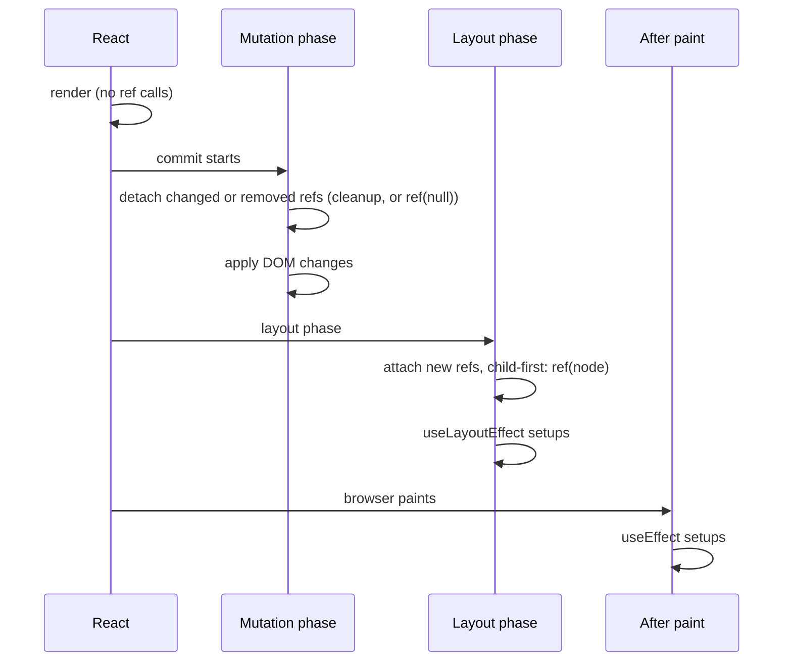
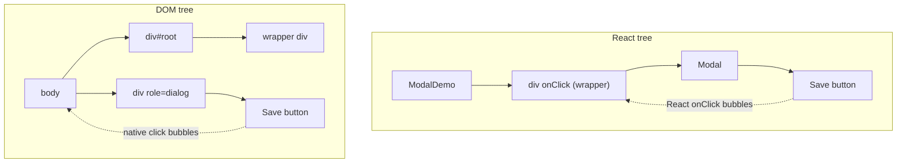

# 10 — Refs and the DOM

> **How to use this module.** Sections 10.1–10.3 give you the mental model behind every ref question: a ref is a box React does not watch, and React fills DOM refs during the commit. Sections 10.4–10.6 cover the APIs interviewers ask you to write (`ref` as a prop, `useImperativeHandle`, portals). Sections 10.7–10.8 cover integration and the newest API, Fragment refs. If you only have 20 minutes, read 10.1, 10.3, 10.6 and the Summary.

**Prerequisites:** [Render phase vs commit phase](06-jsx-and-rendering-model.md#610-render-phase-vs-commit-phase) · [Fragments](06-jsx-and-rendering-model.md#67-fragments) · [Cleanup and the effect lifecycle](09-effects.md#93-cleanup-and-the-effect-lifecycle) · [`useLayoutEffect`](09-effects.md#97-uselayouteffect) · [Focus management](04-html-css-accessibility.md#43-focus-management-and-keyboard-navigation-roving-tabindex)

**Code for this module:** [`examples/web/src/m10-refs/`](examples/web/src/m10-refs/). Every component below has a test next to it. Run them with `npx vitest run src/m10-refs` from `examples/web`.

---

## 10.1 `useRef` as a mutable box that does not trigger renders

### The problem
Some values must survive between renders but must **not** cause one when they change: a timer id you need to clear later, the number of times a user clicked "retry", the instance of a chart library, the previous scroll position. Putting them in state is wasteful (every write re-renders) and sometimes wrong (the render shows a value nobody asked to see). Putting them in a local variable fails, because a component function starts from scratch on every render, and the variable is re-created.

### Mental model
`useRef(initial)` [React] gives you a plain object, `{ current: initial }`, and returns **the same object on every render** of that component instance. You may read and write `current` freely in event handlers and effects. React does not watch it. Writing to it schedules nothing, re-renders nothing and notifies nobody.

| | `useState` | `useRef` |
|---|---|---|
| Survives re-renders | Yes | Yes |
| Writing triggers a render | Yes | **No** |
| Value during render | The snapshot for this render | Whatever was last written (don't read it, see below) |
| Write it how | `setX(next)`, applied on the next render | `ref.current = next`, applied immediately |
| Use for | What the screen shows | What the screen doesn't show: ids, instances, DOM nodes |

> **Java/Spring analogy.** A ref is a private field on a bean, say `private Timer timer;`, that the template never reads. You can assign it anywhere in your methods and nothing re-renders the view.
>
> **Where the analogy breaks:** a component has no `this`. The "field" lives in React's per-instance storage (the fiber), and you reach it through the hook. Also, a Java field read in a template is "live"; a ref read during render is a bug, because React won't re-render when it changes, so the screen goes stale.

### Minimal code
`examples/web/src/m10-refs/RefCounter.tsx`:

```tsx
export function RefCounter() {
  const clicks = useRef(0);
  const [shown, setShown] = useState<number | null>(null);

  return (
    <>
      <button type="button" onClick={() => { clicks.current += 1; }}>Count silently</button>
      <button type="button" onClick={() => setShown(clicks.current)}>Show count</button>
      <p>{shown === null ? 'Not shown yet' : `Clicked ${shown} times`}</p>
    </>
  );
}
```

`RefCounter.test.tsx` wraps it in a `<Profiler>` and proves the point: three clicks on "Count silently" produce **zero** commits, and the single "Show count" click produces exactly one.

### The rule: never read or write `ref.current` during render
Render must be pure ([06](06-jsx-and-rendering-model.md#68-purity-and-idempotence)). A ref is mutable state that React does not track, so:
- **Reading** it during render shows a value React doesn't know about. When it changes, nothing re-renders, and the UI goes stale.
- **Writing** it during render is a side effect. React may call your component twice (Strict Mode) or throw a render away (concurrent rendering), so the write may happen for a render that never commits.

The React docs list one exception: lazy initialization, `if (ref.current === null) ref.current = new ExpensiveThing();`, because it runs once and always produces the same result ([react.dev: useRef](https://react.dev/reference/react/useRef)). `eslint-plugin-react-hooks` 7.1.1 enforces the rule through its compiler-powered `react-hooks/refs` rule, at **error** level in `recommended`. Its message, verified by grepping the plugin's `cjs/eslint-plugin-react-hooks.production.js`, is: *"Cannot access refs during render. React refs are values that are not needed for rendering. Refs should only be accessed outside of render, such as in event handlers or effects."*

Running ESLint confirms that `react-hooks/refs` 7.1.1 accepts the documented lazy-initialization pattern without a report (verified by running it: the rule's null-guard analysis allows it, whereas unguarded render access errors).

### How it works internally
On mount, `useRef` stores `{ current: initial }` in the component's hook list on its fiber ([12](12-hooks-and-custom-hooks.md#122-how-react-stores-hooks-so-call-order-matters)). On every update it returns that same object. That's all there is to it. You could build it from `useState`: `const [ref] = useState(() => ({ current: initial }))` behaves the same, because you never call the setter. The React Compiler ([15](15-performance.md#155-the-react-compiler-and-how-it-changes-the-advice)) treats refs specially: it does not memoize on `ref.current`, which is one more reason never to render from it.

### Trade-offs
- ✅ Use it for timer ids, `AbortController`s you cancel from a handler, third-party instances, previous values read in effects, and DOM nodes (10.2).
- ❌ If the value appears on screen, it is state. "I'll store it in a ref and force an update" is reinventing `useState` badly.
- ❌ A ref is per component instance. Two `<RefCounter />` have two boxes. For a value shared across instances, use a module variable (shared by everything, including tests) or lift state up.

> **Version notes.** `useRef` arrived with hooks in **React 16.8**. Class components used instance fields (`this.timer`) for the same job. **@types/react 19** made the argument required (`useRef()` is a type error; write `useRef(undefined)`) and made every ref mutable: `MutableRefObject` is deprecated in favour of one `RefObject<T>` type, so `useRef<number>(null)` no longer gives you a read-only `current` ([React 19 upgrade guide](https://react.dev/blog/2024/04/25/react-19-upgrade-guide)). The `types-react-codemod` `preset-19` handles both.

---

## 10.2 DOM refs and when to use them

### The problem
React is declarative: you describe the UI, and React mutates the DOM. But some browser features are **imperative methods**, with no attribute that expresses them: `input.focus()`, `input.select()`, `element.scrollIntoView()`, `video.play()`, `element.getBoundingClientRect()`. To call them you need the actual DOM node.

### Mental model
Pass a ref object to a built-in element: `<input ref={inputRef} />`. React writes the DOM node into `inputRef.current` during the **commit**, after the node exists, and writes `null` back when the node is removed. Your code reads it **later**, in an event handler or an effect.

> **Java analogy:** like asking the container for a bean that is created for you, `@Autowired` on a field. You don't construct it, and it's only safe to use once the container has finished wiring (after commit), never in the constructor (render).
>
> **Where the analogy breaks:** the DOM node can be **swapped or removed** during the component's life (conditional rendering, a changed `key`), and React writes `null` back. Always use `ref.current?.…`.

### Minimal code
`examples/web/src/m10-refs/EditableTitle.tsx` (Exercise 1) shows both kinds of DOM ref:

```tsx
const editButtonRef = useRef<HTMLButtonElement>(null);

function finish(nextTitle: string) {
  flushSync(() => {
    setTitle(nextTitle);
    setEditing(false);
  });
  editButtonRef.current?.focus(); // the button exists again only because flushSync committed
}
```

`flushSync` [React DOM] forces React to render and commit the state update **synchronously**, so the next line can use the freshly attached node. Without it, `editButtonRef.current` would still be `null`, because the button was unmounted while editing and has not been re-created yet.

### When to reach for a DOM ref
| Legitimate | Not legitimate (use props/state) |
|---|---|
| Focus, blur, select text ([04](04-html-css-accessibility.md#43-focus-management-and-keyboard-navigation-roving-tabindex)) | Changing text, classes or attributes React renders |
| Scrolling (`scrollIntoView`, `scrollTop`) | Showing/hiding elements (`style.display = 'none'`) |
| Measuring (`getBoundingClientRect`, in a layout effect, [09](09-effects.md#97-uselayouteffect)) | Reading an input's value in a controlled form |
| Media (`play`, `pause`), canvas drawing | Adding or removing children React manages |
| Handing a container node to a non-React library (10.7) | "Talking to a child component" (use props) |
| Observers (`IntersectionObserver`, `ResizeObserver`, [03](03-browser-and-web-platform.md#312-observers-intersection-resize-mutation-performance)) | |

If you mutate DOM that React renders (remove a child, change its text), React's picture of the DOM and the real DOM drift apart. The next commit may overwrite your change, or crash with *"Failed to execute 'removeChild' on 'Node'"*.

### How it works internally
During render, React only records that the element has a `ref`. In the commit's **mutation** phase it detaches old refs (writes `null` or runs a cleanup, 10.3) and applies DOM changes. In the **layout** phase it attaches refs, child-first in tree order, **before** that component's `useLayoutEffect` runs and before passive effects. So every effect can read `ref.current` safely. Verified in the `react-dom` 19.3.0 development build: `safelyDetachRef` is called from `commitMutationEffectsOnFiber` and `commitAttachRef` from `commitLayoutEffectOnFiber`. `RefLog.test.tsx` (Exercise 5) asserts the order by running it.

### Trade-offs
- ✅ It is the only way to call imperative DOM APIs.
- ❌ Each ref is an escape hatch. A component full of refs is usually fighting React. Ask whether a prop, `key` or state expresses the same thing.
- ❌ Refs do not work on the server. Code that reads `ref.current` belongs in effects and handlers, which never run during SSR.
- Note that `autoFocus` exists: `<input autoFocus />` focuses on mount without a ref. React calls `focus()` itself in the commit; it does not rely on the HTML attribute.

> Verified by grepping `react-dom` 19.3.0 (`cjs/react-dom-client.development.js`): `setProp` skips `autoFocus` (no attribute is written on the client), and `commitMount` runs `newProps.autoFocus && domElement.focus()` for `button`, `input`, `select` and `textarea`.

---

## 10.3 Callback refs and ref cleanup functions

### The problem
A ref object is a passive box. You find out **that** the node changed only when you next read it. Sometimes you need to **act at the moment** a node appears or disappears: measure it when it mounts, attach an observer, focus a field that just appeared, or keep a `Map` of refs for a list whose length changes.

### Mental model
Instead of an object, pass a **function**: `ref={(node) => { … }}`. React calls it with the DOM node when the node is attached. What happens on detach depends on the version:

- **React ≤ 18 (and React 19 when you return nothing):** React calls the function again with `null`.
- **React 19, when you return a function:** React calls **that cleanup** instead, and does **not** call your ref with `null`.

It is the same "setup returns cleanup" contract as `useEffect` ([09](09-effects.md#93-cleanup-and-the-effect-lifecycle)), but tied to a **DOM node's** lifetime rather than to dependencies.

> **Java analogy:** a pair of lifecycle callbacks registered per object, like a JPA `@PostPersist`/`@PreRemove` pair or an `AutoCloseable` returned from a `register()` call. Register on attach, close on detach.
>
> **Where the analogy breaks:** React decides "attach" and "detach" by **function identity**, not by the node. Pass a new function on a render, and React treats it as a new ref: it detaches the old one and attaches the new one, even though the node didn't change.

### Minimal code
React 19 style, from `examples/web/src/m10-refs/Modal.tsx`:

```tsx
// Focus the dialog when it mounts; give focus back to whatever had it when it unmounts.
function focusWhileOpen(dialog: HTMLElement | null) {
  if (!dialog) return;
  const previouslyFocused = document.activeElement;
  dialog.focus();
  return () => {
    if (previouslyFocused instanceof HTMLElement) previouslyFocused.focus();
  };
}
// …
<div role="dialog" tabIndex={-1} ref={focusWhileOpen}>…</div>
```

> **TypeScript trap (found by `tsc` on this repo).** `@types/react` 19.3 types a ref callback as a `bivarianceHack(instance: T | null)` method. Bivariance lets the parameter be **narrower** than `T | null`: `(d: HTMLDivElement) => …` on a `<div>` type-checks, with or without a returned cleanup (`RefLog.tsx`'s `stableRef(node: HTMLInputElement)` is the same case). A parameter that is **wider and non-nullable**, `(d: HTMLElement)` on a `<div>`, is neither a subtype nor a supertype of `HTMLDivElement | null`, so `tsc` rejects it: *"Type '(d: HTMLElement) => () => void' is not assignable to type 'Ref<HTMLDivElement>'"* (verified with a throwaway probe file). A reusable callback that serves any element (like `focusWhileOpen`) therefore takes `HTMLElement | null` and returns early on `null`. At runtime, React 19 never calls a cleanup-returning ref with `null`.

The pre-19 equivalent needs a variable outside the callback, because setup and teardown are two separate calls:

```tsx
// React ≤ 18: one function, two calls (node, then null)
let previouslyFocused: Element | null = null;
function focusWhileOpenLegacy(dialog: HTMLElement | null) {
  if (dialog) {
    previouslyFocused = document.activeElement;
    dialog.focus();
  } else if (previouslyFocused instanceof HTMLElement) {
    previouslyFocused.focus();
  }
}
```

A list of refs, which a ref object can't express (you can't call `useRef` in a loop, [12](12-hooks-and-custom-hooks.md#121-the-rules-of-hooks)):

```tsx
const itemsRef = useRef(new Map<string, HTMLLIElement>());
// …
{items.map((item) => (
  <li
    key={item.id}
    ref={(node) => {
      itemsRef.current.set(item.id, node);
      return () => {
        itemsRef.current.delete(item.id); // React 19: no null-check branch needed
      };
    }}
  >
    {item.label}
  </li>
))}
// later, in a handler: itemsRef.current.get(id)?.scrollIntoView();
```

### When React calls a callback ref


A ref is "changed" when the value passed to `ref` is a **different function or object** than last time (`Object.is`). So:

| You write | Called on re-render? |
|---|---|
| `ref={myRefObject}` (from `useRef`) | No |
| `ref={moduleLevelFunction}` | No |
| `ref={useCallback(fn, deps)}` | Only when `deps` change |
| `ref={(node) => …}` inline | **Yes, every render**: cleanup/`null` for the old one, then attach for the new one |

Exercise 5 (`RefLog.test.tsx`) predicts and then asserts all of this, including Strict Mode.

### How it works internally
In the `react-dom` 19.3.0 development build, `commitAttachRef` stores whatever the ref callback returns on the fiber (`finishedWork.refCleanup = ref(instance)`). On detach, `safelyDetachRef` checks it: if `refCleanup` is a function, it calls it; otherwise it calls `ref(null)`; for an object ref it sets `ref.current = null`. A string ref logs *"String refs are no longer supported."* (verified by reading both functions in `cjs/react-dom-client.development.js`).

### Trade-offs
- ✅ Callback refs are the right tool when you need to **act** on attach/detach: measure, observe, focus, register in a map.
- ✅ In React 19, a callback ref with cleanup can replace a `useRef` + `useEffect` pair whose only job was to set up something on a node.
- ❌ Inline callback refs re-run on every render. Usually harmless, but not if they focus, measure or subscribe. Hoist the function, or wrap it in `useCallback`.
- ❌ Strict Mode (React 19, dev) runs attach → detach → attach on mount, so a ref callback without a symmetric cleanup will misbehave there, and on a real remount.

> **Version notes.** Callback refs have existed since early React (0.13-era class components). **React 19.0** added cleanup functions: *"When the component unmounts, React will call the cleanup function returned from the ref callback"*. It also added Strict Mode double-invocation of ref callbacks on initial mount ("Refs are now attached/detached/attached in StrictMode", CHANGELOG 19.0.0). The React 19 post says React will deprecate calling refs with `null` in a future version ([React 19 blog: Cleanup functions for refs](https://react.dev/blog/2024/12/05/react-19#cleanup-functions-for-refs)). **TypeScript:** @types/react 19 rejects implicit returns from ref callbacks, so `ref={(el) => (this.input = el)}` is a type error. Write a block body, `ref={(el) => { this.input = el; }}`; the `types-react-codemod` transform `no-implicit-ref-callback-return` does it for you.

---

## 10.4 Ref as a prop vs `forwardRef`

### The problem
A design-system `<TextInput>` wraps a real `<input>`. A form wants to focus it. Before React 19, `<TextInput ref={r} />` did **not** reach the inner input: `ref` was a reserved attribute that React stripped from props, and on a function component it silently attached to nothing (with a dev warning).

### Mental model
- **React 19:** `ref` is a regular prop on function components. Destructure it and pass it on.
- **React 16.3–18:** wrap the component in `forwardRef((props, ref) => …)`. React then passes `ref` as a second argument.

```tsx
// React 19: examples/web/src/m10-refs/VideoPlayer.tsx (abridged)
type Props = { src: string; label: string; ref?: Ref<PlayerHandle> };
export function VideoPlayer({ src, label, ref }: Props) { /* … */ }

// React 16.3–18: examples/web/src/m10-refs/LegacyVideoPlayer.tsx (abridged)
export const LegacyVideoPlayer = forwardRef<PlayerHandle, { src: string; label: string }>(
  function LegacyVideoPlayer({ src, label }, ref) { /* … */ },
);
```

Both are tested in `VideoPlayer.test.tsx` and expose an identical handle.

> **Java analogy:** `forwardRef` is like a decorator/proxy that exists only to pass one extra constructor argument the framework would otherwise swallow. React 19 removed the need for it by making `ref` an ordinary parameter.
>
> **Where the analogy breaks:** a **class** component's `ref` is still not a prop. It still points at the class instance (`this`), which is why the React 19 blog notes that "`ref`s passed to classes are not passed as props".

### How it works internally
In React 19, the JSX runtime keeps `ref` inside `props`, so it travels like any other prop. `element.ref` is deprecated, and reading it in dev logs *"Accessing element.ref was removed in React 19. ref is now a regular prop. It will be removed from the JSX Element type in a future release."* (verified in `react/cjs/react-jsx-runtime.development.js` 19.3.0). For built-in elements (`<input ref>`), React still treats `ref` specially and attaches the DOM node in the commit.

There is a quiet consequence: a component that spreads its props onto a DOM element, `<input {...props} />`, now **forwards the ref automatically**, because the ref is in `props`.

### Migration
1. Run the codemod `npx codemod react/19/remove-forward-ref --target <path>` (listed in the [reactjs/react-codemod](https://github.com/reactjs/react-codemod) README).
2. Add `ref?: Ref<T>` to the props type. `ComponentProps<'input'>` already includes it in @types/react 19.
3. Keep `memo` on the outside if you had `memo(forwardRef(…))`; with a plain function it is just `memo(Component)`.
4. **Libraries that still support React 18 must keep `forwardRef`**: in React 18, a `ref` prop on a function component is still stripped.

### Trade-offs
- ✅ `ref` as a prop is less ceremony, plays nicely with generics (forwardRef's typing of generic components was famously awkward), and needs no `displayName` work for DevTools.
- ❌ In React 19 a component that ignores its `ref` prop leaves the caller's ref at `null` **silently**. The 18-era warning *"Function components cannot be given refs"* does not exist in the 19.3.0 builds (verified by grepping `react` and `react-dom` dev builds for it: zero matches).

> **Version notes.** `forwardRef` and `createRef` arrived in **React 16.3** (CHANGELOG 16.3.0). **React 19.0**: "`ref` as a prop: Refs can now be used as props, removing the need for `forwardRef`", and `element.ref` access deprecated. `forwardRef` still works in 19.3 with no runtime deprecation warning (the dev build's `forwardRef` only validates its argument), and react.dev says it "will be deprecated in a future release" ([react.dev: forwardRef](https://react.dev/reference/react/forwardRef)).

---

## 10.5 `useImperativeHandle`

### The problem
`VideoPlayer` wraps a `<video>`. The page needs "Play" and "Pause" buttons outside the player. Handing the parent the raw `<video>` node lets it do anything: change `src`, seek, remove the element. You want a **narrow, stable API**, like a public interface over a private implementation.

### Mental model
`useImperativeHandle(ref, createHandle, deps)` [React] says: "whoever holds my `ref` gets **this object**, not my DOM node." It is the component's public imperative interface.

> **Java analogy:** returning an interface (`PlayerHandle`) instead of the concrete class: the caller can call `play()` and `pause()` and nothing else.
>
> **Where the analogy breaks:** it is an escape hatch, not React's main way of communicating. Java code is method calls all the way down; React parents talk to children with **props**. Use a handle only for things props can't express as data (focus, scroll, play, start an animation).

### Minimal code
`examples/web/src/m10-refs/VideoPlayer.tsx` (full file in Exercise 2):

```tsx
export type PlayerHandle = { play: () => Promise<void>; pause: () => void };

export function VideoPlayer({ src, label, ref }: Props) {
  const videoRef = useRef<HTMLVideoElement>(null); // private: the parent never sees it

  useImperativeHandle(
    ref,
    () => ({
      play: () => videoRef.current?.play() ?? Promise.resolve(),
      pause: () => videoRef.current?.pause(),
    }),
    [],
  );

  return <video ref={videoRef} src={src} aria-label={label} />;
}
```

The parent (`VideoControls.tsx`) holds `useRef<PlayerHandle>(null)` and calls `playerRef.current?.play()` in a click handler.

### How it works internally
`useImperativeHandle` is implemented as a **layout effect**. In the commit it calls `createHandle()` and assigns the result to `ref.current` (or calls the callback ref with it). Its cleanup sets `ref.current = null` (or runs the callback-ref cleanup). With deps, the handle is rebuilt only when the deps change. Without a deps array, it is rebuilt after **every** commit. The dev build validates the arguments: *"Expected useImperativeHandle() first argument to either be a ref callback or React.createRef() object."* (verified in `react-dom-client.development.js` 19.3.0). `VideoPlayer.test.tsx` checks that the handle has exactly the keys `['play', 'pause']`, isn't an `HTMLMediaElement`, and is `null` after unmount.

### Trade-offs
- ✅ It encapsulates the DOM and exposes intent (`play()`), which is easier to keep stable than a node.
- ❌ It is imperative coupling. If the handle grows `setVolume`, `setSrc` and `setTitle`, those should have been props.
- ❌ The handle exists only after commit, so it is `null` during the parent's render and in its first render's closure-captured values.
- React docs: "Do not overuse refs. You should only use refs for imperative behaviors that you can't express as props" ([react.dev: useImperativeHandle](https://react.dev/reference/react/useImperativeHandle)).

> **Version notes.** **React 16.8** added the hook. Before 19 you **had** to combine it with `forwardRef`. In React 19, take `ref` as a prop and pass it straight in. The handle's lifecycle also supports React 19 ref cleanups: the React 19 post says cleanup functions work "for DOM refs, refs to class components, and `useImperativeHandle`".

---

## 10.6 Portals

### The problem
A modal, tooltip, dropdown or toast must visually escape its parent. If the parent has `overflow: hidden`, a `transform`, or a low `z-index` stacking context ([04](04-html-css-accessibility.md#48-positioning-and-stacking-contexts)), CSS alone can't put the child on top of the page. You want the child's **DOM** to live elsewhere (usually `document.body`), but you want the **component** to stay where it logically belongs, keeping its props, state and context.

### Mental model
`createPortal(children, domNode)` [React DOM] renders `children` into `domNode`, while keeping them as children of the current component **in the React tree**. So there are two trees, and each answers different questions:

| Question | Answered by |
|---|---|
| Where is it painted? CSS inheritance, `z-index`, `overflow` | **DOM tree** (the portal target) |
| Which context does it read? Whose state owns it? | **React tree** (where you wrote the JSX) |
| Where do React events bubble? | **React tree** |
| Where do native `addEventListener` events bubble? | **DOM tree** |



> **Java analogy:** think of a logger whose output **appender** writes to a different file, while its **logger hierarchy** (configuration, levels) is still inherited from its package. Where the output goes and where the configuration comes from are separate trees.
>
> **Where the analogy breaks:** events. In React, a click inside the portal bubbles to React ancestors that aren't DOM ancestors. No logging framework has anything like that.

### Minimal code
`examples/web/src/m10-refs/Modal.tsx` (full file in Exercise 3):

```tsx
export function Modal({ title, onClose, children, container = document.body }: Props) {
  return createPortal(
    <div role="dialog" aria-modal="true" aria-label={title} tabIndex={-1} ref={focusWhileOpen}
         onKeyDown={(e) => { if (e.key === 'Escape') onClose(); }}>
      <h2>{title}</h2>
      {children}
      <button type="button" onClick={onClose}>Close</button>
    </div>,
    container, // DOM goes here; the React parent stays wherever <Modal> was rendered
  );
}
```

`ModalDemo.test.tsx` asserts that the dialog's `parentElement` is `document.body`, outside the component's container, and that a click on its Save button is still counted by a wrapper `<div onClick>` that is **not** its DOM ancestor.

### How it works internally
A portal is a fiber of type `HostPortal` whose children commit into a different container node. React DOM listens for events at the **root container** (since React 17, [03](03-browser-and-web-platform.md#33-how-reacts-event-system-relates-to-native-events)), and a portal's container gets the same listeners when the portal mounts (in the 19.3.0 dev build, `completeWork` calls `listenToAllSupportedEvents` on a new `HostPortal`'s container). When a native event arrives, React finds the target's fiber and walks the **fiber** tree upwards to collect `onClick` handlers. That walk ignores where the DOM actually lives. `createPortal` throws *"Target container is not a DOM element."* for an invalid container (verified in `react-dom.development.js` 19.3.0).

### Trade-offs
- ✅ It escapes `overflow`/stacking-context traps, and context, state and React events keep working.
- ❌ **Surprise bubbling:** a parent's `onClick`, `onKeyDown` or `onSubmit` fires for interactions inside a portaled child. A "click outside to close" handler that checks `wrapperRef.current.contains(event.target)` misclassifies clicks inside the portal. Check `dialogRef.current.contains(target)` on the portal node instead.
- ❌ **SSR:** `document.body` doesn't exist on the server. Render portals only on the client (after mount, or behind `use(browser())` in 19.3, [21](21-concurrent-ssr-server-components.md#215-ssr-hydration-hydration-errors)), or into a container node you own.
- ❌ **Accessibility is on you.** A portal moves DOM; it doesn't manage focus, trap Tab, hide the background from screen readers (`inert`/`aria-modal`) or restore focus on close. The native `<dialog>` element with `showModal()` gives you top-layer rendering, a focus trap-like behaviour and Escape handling without a portal; consider it first. Full focus trap: [26](26-machine-coding.md#266-modal-with-focus-trap).

> **Version notes.** **React 16.0** introduced `ReactDOM.createPortal` ([React v16.0 post](https://legacy.reactjs.org/blog/2017/09/26/react-v16.0.html)). Before that, libraries used `ReactDOM.unstable_renderSubtreeIntoContainer`, which lost context; 16.3 deprecated the `unstable_createPortal` alias. **React 17** moved event delegation from `document` to the root container ([React v17.0 post](https://legacy.reactjs.org/blog/2020/10/20/react-v17.html)), which changed how `e.stopPropagation()` inside React interacts with native `document` listeners. **React 19.0** removed `unstable_renderSubtreeIntoContainer` (CHANGELOG 19.0.0). **React 19.3** hides portal contents when they are rendered inside a hidden `<Activity>` (CHANGELOG 19.3.0, [21](21-concurrent-ssr-server-components.md#219-activity)).

---

## 10.7 Integrating non-React libraries

### The problem
Your app needs a map (Leaflet, Mapbox), a chart (Chart.js, ECharts), a rich-text editor or a video SDK. These libraries are **imperative**: `new Chart(container, options)`, `chart.update(data)`, `chart.destroy()`. They own the DOM inside their container. React wants to own the DOM too. If both write the same nodes, you get crashes and leaks.

### Mental model
Give the library **an empty node React will never touch**, and treat the library as an **external system** you synchronize with ([09](09-effects.md#91-effects-as-synchronization-with-external-systems)):
1. A DOM ref to the container.
2. An effect that **creates** the instance on mount and **destroys** it in the cleanup.
3. A separate effect (or the same one) that **pushes** prop changes into the instance.
4. A ref to hold the instance, so other effects and handlers can reach it without re-rendering.

> **Java analogy:** wrapping a legacy, stateful SDK in an adapter bean: `@PostConstruct` opens it, `@PreDestroy` closes it, and setters forward configuration changes.
>
> **Where the analogy breaks:** the "bean" can be destroyed and re-created by Strict Mode or a remount at any time. Creation and destruction must be cheap and symmetric.

### Minimal code
The fake library, `examples/web/src/m10-refs/widget.ts`, records every call. The React wrapper, `examples/web/src/m10-refs/Chart.tsx` (full file in Exercise 4):

```tsx
const containerRef = useRef<HTMLDivElement>(null);
const widgetRef = useRef<ChartWidget | null>(null);

useEffect(() => {                       // lifetime: once per mount
  const node = containerRef.current;
  if (!node) return;
  const widget = new ChartWidget(node);
  widgetRef.current = widget;
  return () => {
    widget.destroy();
    widgetRef.current = null;
  };
}, []);

useEffect(() => {                       // data: push changes into the same instance
  widgetRef.current?.update(data);
}, [data]);

return <div ref={containerRef} />;      // no React children: the widget owns the inside
```

`Chart.test.tsx` asserts `create → update 1,2,3 → update 4,5 → destroy` across mount, new data and unmount. It also checks that the same array reference doesn't touch the widget, and that Strict Mode leaves exactly one live widget.

### How it works internally
React renders `<div ref={containerRef} />` with **no children**, so reconciliation never touches anything inside it, and the library may fill it freely. Effects run in declaration order within a component, so the "create" effect runs before the "update" effect on mount. On a data change, only the second effect re-runs. In Strict Mode dev, React runs `destroy`, then `create` and `update` again; the cleanup also sets `widgetRef.current = null`, so a stale instance can't be reused.

Two React 19 alternatives:
- **A callback ref with cleanup** for create/destroy: `ref={(node) => { const w = new ChartWidget(node); return () => w.destroy(); }}`. It is tied to the node itself, which helps when the container is rendered conditionally. Hoist or memoize the function, or it re-creates the widget on every render (10.3).
- **`useLayoutEffect`** instead of `useEffect` when the library measures its container on creation and you want to avoid a flash.

### Trade-offs
- ✅ It is the standard adapter pattern; most "React wrappers" for libraries (`react-chartjs-2`, `react-leaflet`) are this, plus prop diffing.
- ❌ Don't re-create the instance on every prop change; call its update API. Re-creating loses internal state (zoom level, scroll position) and is slow.
- ❌ Never render React children into the library's container, and never let the library modify nodes React renders.
- ❌ Library events that should update React state (map moved, point clicked) are subscriptions. Register them in the effect, unregister in cleanup, and for "read latest props in the handler" use `useEffectEvent` ([09](09-effects.md#99-useeffectevent)).
- If the library exposes subscribable state, `useSyncExternalStore` may be cleaner than mirroring it in state ([12](12-hooks-and-custom-hooks.md#1212-usesyncexternalstore)).

---

## 10.8 Fragment refs

### The problem
A component renders **several siblings with no wrapper**: a list of headings, a group of fields, whatever `children` it receives. You want to observe them with an `IntersectionObserver`, focus the first focusable one, or listen to events on all of them. Before React 19.3 the options were a wrapper `<div>` (which breaks CSS grid/flex layouts and semantics), refs threaded into every child (needs to own every child), or `findDOMNode` (removed in 19).

### Mental model
`<Fragment ref={r}>` [React] gives you a **`FragmentInstance`**: not a DOM node, but a handle over the fragment's children, offering a small, DOM-like API. Per the [React 19.3 post](https://react.dev/blog/2026/09/09/react-19-3) it covers:
- **Events:** `addEventListener`, `removeEventListener`, `dispatchEvent` (on first-level child elements).
- **Focus:** `focus`, `focusLast`, `blur` (depth-first through nested children).
- **Observers:** `observeUsing(observer)`, `unobserveUsing(observer)` for `IntersectionObserver`/`ResizeObserver`.
- **Layout:** `getClientRects`, `getRootNode`, `compareDocumentPosition`, `scrollIntoView`.

The `react-dom` 19.3.0 development build defines exactly these methods on `FragmentInstance.prototype` (verified by grep). @types/react-dom 19.3 types all of them except `compareDocumentPosition`, which is missing from its `FragmentInstance` interface.

> **Java analogy:** a **composite** view over a collection: one object you can call `focus()` on, which delegates to the right member.
>
> **Where the analogy breaks:** it is live. Children added later are covered automatically (listeners and observers attach to new children), because React updates the instance as the fragment's children change (the 19.3.0 dev build calls `commitNewChildToFragmentInstances` when a child is inserted).

### Minimal code
`examples/web/src/m10-refs/AutoFocusFirst.tsx`:

```tsx
import { Fragment, type FragmentInstance, type ReactNode } from 'react';

function focusFirst(fragment: FragmentInstance | null) {
  fragment?.focus();
}

export function AutoFocusFirst({ children }: { children: ReactNode }) {
  return <Fragment ref={focusFirst}>{children}</Fragment>;
}
```

`AutoFocusFirst.test.tsx` renders `<p>`, `<label><input/></label>` and `<button>` inside it and asserts the input receives focus. It also asserts that the container has exactly three children (no wrapper), and that `focusLast()` on a Fragment ref focuses the last button.

### How it works internally
In `commitAttachRef`, a `Fragment` fiber (tag 7) with a ref gets a `new FragmentInstance(fiber)` created once and stored on the fiber. Each method walks the fragment's child **fibers** to find host nodes. `focus()` tries each host element depth-first, calling `element.focus()` and stopping at the first one that actually received focus. It skips children hidden by `<Activity>`/Suspense (verified by reading `FragmentInstance.prototype.focus` and `traverseVisibleInstancesAndTextInstances` in the 19.3.0 dev build).

### Trade-offs
- ✅ No wrapper element, so grid/flex layouts and semantics survive; it works with children you don't own.
- ✅ Observers over a dynamic list without a ref per item.
- ❌ It is not a node: no `querySelector`, `classList` or `textContent`. Its event methods target **first-level** children only.
- ❌ It is new (stable in 19.3, Sept 2026), so most codebases you'll see in interviews still use wrapper divs or per-item callback refs. Know both.
- jsdom has no `IntersectionObserver`/`ResizeObserver` (verified: no implementation under `jsdom/lib` 30.1.1), so test `observeUsing` with a stub or in a real browser ([20](20-testing.md#2011-e2e-with-playwright-and-cypress)).

> **Version notes.** Fragments arrived in **React 16.2** (`Fragment` export, CHANGELOG 16.2.0). Fragment refs were experimental/canary for a long time and became **stable in React 19.3.0** ("Fragment Refs: Add Refs to `<Fragment />` to support composable platform behavior", CHANGELOG 19.3.0). 19.3 also fixed a `FragmentInstance` listener leak and focus for already-focused elements (19.3 post). Only `<Fragment ref>` works; the short syntax `<>…</>` can't take props.

---

## Interview questions

**Q1. What does `useRef` return, and how is it different from `useState`?**
<details><summary>Answer</summary>

A plain object `{ current }` that is the **same object** on every render of that component instance. Writing `ref.current` takes effect immediately and triggers no render. State is a per-render snapshot, and setting it schedules a render. Use state for anything the screen shows, and a ref for values only your handlers and effects need. **A strong answer adds:** `useRef` is equivalent to `useState(() => ({ current: initial }))[0]`: a state slot whose setter you never call.

</details>

**Q2. Why doesn't changing `ref.current` re-render the component?**
<details><summary>Answer</summary>

React re-renders when you call a state setter (or a context/store you subscribe to changes). `ref.current = x` is a plain property assignment on an object React doesn't observe; there is no setter and no subscription. **A strong answer adds:** that is the feature, not a limitation. It is how you keep timer ids and instances without wasting renders. `RefCounter.test.tsx` proves it with a `<Profiler>` that counts zero commits for three ref writes.

</details>

**Q3. Why shouldn't you read or write `ref.current` during render?**
<details><summary>Answer</summary>

Render must be pure and repeatable. Reading a ref during render displays a value React doesn't track, so the UI goes stale when the ref changes. Writing during render is a side effect that may happen for a render React throws away (concurrent rendering) or runs twice (Strict Mode). The documented exception is one-time lazy initialization (`if (ref.current === null) ref.current = create()`). **A strong answer adds:** `eslint-plugin-react-hooks` 7's `react-hooks/refs` rule reports it as an error ("Cannot access refs during render"), and the React Compiler relies on this rule holding.

</details>

**Q4. `useRef` vs a module-level variable vs a local variable: which do you use for a timer id?**
<details><summary>Answer</summary>

Local variable: re-created every render, so the next render can't clear the previous timer. Module variable: shared by **every** instance of the component and leaks between tests. `useRef`: per instance and persistent, which is exactly right. **A strong answer adds:** if the interval is tied to "being on screen", an effect with cleanup owns the id in its closure and needs no ref at all ([09](09-effects.md#93-cleanup-and-the-effect-lifecycle)). Use a ref when a **handler** must stop it.

</details>

**Q5. When is a DOM ref's `current` set? What is it during the first render?**
<details><summary>Answer</summary>

`null` during the first render, because the DOM node doesn't exist yet. React sets it in the commit's layout phase, after DOM mutations and before `useLayoutEffect` and `useEffect` run, and sets it back to `null` when the node is removed. **A strong answer adds:** that's why DOM work goes in effects or handlers, and why `ref.current?.focus()` uses optional chaining: the node may come and go with conditional rendering.

</details>

**Q6. Give legitimate reasons to use a DOM ref.**
<details><summary>Answer</summary>

Imperative browser APIs that have no declarative prop: focus/blur/select, scrolling, measuring layout, media playback, canvas drawing, observers, and giving a container to a non-React library. **A strong answer adds:** the litmus test is "can I express this as data in JSX?" If you can (visibility, text, class), use props or state. Manipulating DOM that React renders causes drift and crashes.

</details>

**Q7. After `setShowInput(true)`, `inputRef.current.focus()` throws. Why, and what are the fixes?**
<details><summary>Answer</summary>

`setState` doesn't re-render synchronously. When the next line runs, the input hasn't been rendered or attached, so `inputRef.current` is `null`. Fixes: (1) a callback ref on the input that focuses on attach (cleanest); (2) `autoFocus` on the input; (3) `flushSync(() => setShowInput(true))` and then focus; (4) an effect that focuses when `showInput` becomes true. **A strong answer adds:** `flushSync` is a deliberate de-optimization, so use it sparingly. Exercise 1 uses it to return focus to a button that must be re-mounted first.

</details>

**Q8. What is a callback ref, and when is it better than a ref object?**
<details><summary>Answer</summary>

A function passed as `ref`. React calls it with the node on attach and with `null` (or the returned cleanup, React 19) on detach. It's better when you must **react to** the node appearing or disappearing (measure, observe, focus, register), when the number of nodes varies (a `Map` of refs for a list), or when the node is conditional. **A strong answer adds:** a ref object only tells you the current value when you ask; a callback ref is an event.

</details>

**Q9. Why does an inline ref callback run on every render, and how do you stop it?**
<details><summary>Answer</summary>

React compares the `ref` value with the previous one. An inline arrow is a new function every render, so React detaches the old one (cleanup or `null`) and attaches the new one, every commit. Fix: define it at module scope if it needs no props or state, or wrap it in `useCallback` with the right deps. **A strong answer adds:** usually harmless, but a measuring or subscribing ref callback then measures or subscribes on every render. Exercise 5 shows the exact sequence.

</details>

**Q10. What changed for ref callbacks in React 19?**
<details><summary>Answer</summary>

A ref callback can **return a cleanup function**. If it does, React calls that cleanup on detach instead of calling the ref with `null`. Strict Mode (dev) also attaches → detaches → attaches ref callbacks on initial mount. TypeScript now rejects implicit returns from ref callbacks. **A strong answer adds:** the React team says calling refs with `null` will be deprecated in a future version, so new code should return cleanups. The `if (node === null)` branch becomes dead code once you return one.

</details>

**Q11. Why does `ref={(el) => (this.input = el)}` fail type-checking after upgrading to React 19 types?**
<details><summary>Answer</summary>

The arrow's expression body **returns** `el`. Now that a ref callback may return a cleanup function, @types/react 19 only allows `void` or a function, because otherwise TypeScript can't tell whether you meant to return a cleanup. Use a block body: `ref={(el) => { this.input = el; }}`. **A strong answer adds:** `npx types-react-codemod@latest preset-19` includes `no-implicit-ref-callback-return`. At runtime, React 19.3 only treats the return value as a cleanup when it's a function; otherwise it calls the ref with `null` as before (read in `safelyDetachRef`).

</details>

**Q12. My ref callback runs twice on mount in development. Bug?**
<details><summary>Answer</summary>

No. Since React 19.0, Strict Mode double-invokes ref callbacks on initial mount (attach, detach, attach) in development, the same way it double-runs effects. It simulates a component being hidden and shown again (Suspense fallback, `<Activity>`). If the double call causes a bug, your ref callback lacks a symmetric cleanup. **A strong answer adds:** production does it once. Exercise 5's Strict Mode test asserts the full sequence.

</details>

**Q13. How do you keep refs to a dynamic list of items?**
<details><summary>Answer</summary>

You can't call `useRef` per item (hooks can't run in loops). Keep a single `useRef(new Map())` and use a callback ref per item: `ref={(node) => { map.set(id, node); return () => { map.delete(id); }; }}`. Then a handler does `map.get(id)?.scrollIntoView()`. **A strong answer adds:** before React 19, the same callback checked `node === null` to delete. An alternative is to extract an `Item` component that owns its own ref and exposes behaviour via props.

</details>

**Q14. In which order are refs attached relative to effects?**
<details><summary>Answer</summary>

In the commit: the mutation phase detaches changed or removed refs and applies DOM changes. The layout phase attaches refs child-first in tree order, and a component's `useLayoutEffect` runs after its children's refs are attached. Passive effects (`useEffect`) run after that, usually after paint. **A strong answer adds:** so any effect can read DOM refs to its own JSX. A parent's effect can also read refs exposed by its children.

</details>

**Q15. How does a function component receive a `ref` in React 19? And in React 18?**
<details><summary>Answer</summary>

React 19: as a regular prop. Destructure `{ ref }` and pass it to an element or to `useImperativeHandle`. React 18: `ref` is stripped from props; wrap the component in `forwardRef((props, ref) => …)` to get it as a second argument. **A strong answer adds:** class components are unchanged: a `ref` on a class points at the instance and is not a prop.

</details>

**Q16. What did `forwardRef` solve, and is it deprecated?**
<details><summary>Answer</summary>

It let a function component (which has no instance) pass a received `ref` on to a child DOM node or handle, because React reserved `ref` and didn't put it in props. In React 19 it is unnecessary but still works without a warning. react.dev says it "will be deprecated in a future release". **A strong answer adds:** the official codemod `react/19/remove-forward-ref` migrates it, but libraries that still support React 18 must keep `forwardRef`.

</details>

**Q17. A component spreads `{...props}` onto an `<input>`. What changes in React 19?**
<details><summary>Answer</summary>

`ref` is now part of `props`, so the spread forwards the ref to the input automatically, with no `forwardRef`. That is usually what you want, but if the component also attaches its own ref to the same input, one of them silently wins depending on order. **A strong answer adds:** to use both, merge the refs (a callback that assigns to both, or a small `mergeRefs` helper).

</details>

**Q18. What does `useImperativeHandle` do, and when should you use it?**
<details><summary>Answer</summary>

It replaces what the parent's ref receives with an object you build: a public imperative API (`{ play, pause }`, `{ focus, scrollToBottom }`). Use it only for operations props can't express as data: focus, scroll, play/pause, start an animation, reset an uncontrolled widget. **A strong answer adds:** it's an encapsulation tool. The parent can't touch the DOM node, so you're free to change your internal markup.

</details>

**Q19. Why expose a handle instead of the `<video>` node itself?**
<details><summary>Answer</summary>

The raw node lets the parent do anything (change `src`, remove children, attach listeners) and couples it to your markup. A handle exposes only intent, so you can swap `<video>` for a third-party player later without breaking callers. **A strong answer adds:** it also enables adding behaviour such as analytics in `play()` or guarding `play()`'s rejected promise in one place.

</details>

**Q20. What happens if you omit the deps array of `useImperativeHandle`?**
<details><summary>Answer</summary>

The handle is rebuilt and re-assigned after every commit, like a layout effect without deps. It works, but a parent that stored the handle or depends on its identity sees a new object each time, and a callback ref receiving the handle is called again. Pass deps listing the values the handle's methods read. Refs to DOM nodes are stable, so `[]` is often right. **A strong answer adds:** it runs in the layout phase, so the handle is available to the parent's layout and passive effects.

</details>

**Q21. Is "the parent calls a method on the child" a React anti-pattern?**
<details><summary>Answer</summary>

Usually, yes. React data flows down as props, and events flow up as callbacks. "Call `child.open()`" is usually better as `<Child open={isOpen} />`, and "call `child.reset()`" as `<Child key={version} />` ([08](08-state.md#89-resetting-state-with-key)). Imperative handles are for things that aren't state: focus, scroll, media, animations. **A strong answer adds:** a test is whether the operation is idempotent and has no state the parent should know. "Focus" is; "open" isn't.

</details>

**Q22. What is a portal and why would you use one?**
<details><summary>Answer</summary>

`createPortal(children, domNode)` renders children into a different DOM node while keeping them in the same place in the React tree. Use it for modals, tooltips, popovers and toasts that must escape `overflow: hidden`, transforms or stacking contexts. **A strong answer adds:** context, state and React events still follow the React tree, which is what makes portals more than "render somewhere else".

</details>

**Q23. A click inside a portaled modal triggers `onClick` on a component that is not its DOM ancestor. Why?**
<details><summary>Answer</summary>

React's synthetic events propagate through the **React** (fiber) tree, not the DOM tree. React listens at the root container (and portal containers), finds the target's fiber, and walks fiber parents collecting handlers. The portal's React parent is the component that rendered it. **A strong answer adds:** native listeners added with `addEventListener` still follow the DOM tree. If you don't want a click to escape, call `e.stopPropagation()` in the portal's root handler. `ModalDemo.test.tsx` asserts this.

</details>

**Q24. Does context work through a portal?**
<details><summary>Answer</summary>

Yes. Context is resolved by walking the React tree, so a portaled child reads the providers above where it was rendered in JSX, even though its DOM lives in `body`. **A strong answer adds:** CSS doesn't follow: inherited styles and CSS variables come from the DOM parent, so a themed modal portaled to `body` can lose a theme set by a class on an ancestor element.

</details>

**Q25. How do you handle "click outside to close" with a portal?**
<details><summary>Answer</summary>

Use a native `pointerdown` listener on `document`, and check whether `event.target` is inside the **portal's** node (`dialogRef.current?.contains(target)`) and the trigger, not inside the original wrapper. React's bubbling can mislead you here: a React `onClick` on the wrapper would treat portal clicks as "inside". **A strong answer adds:** clicking a backdrop element that's part of the portal is often simpler: close when `event.target === event.currentTarget` on the backdrop.

</details>

**Q26. What are the problems with portals and SSR?**
<details><summary>Answer</summary>

`document.body` doesn't exist on the server, so `createPortal(…, document.body)` during server render throws. Render portals only after mount on the client, behind `use(browser())` in a Suspense boundary (19.3), or into a container element that is part of your own rendered tree. **A strong answer adds:** server-rendering a modal into its parent and moving it later causes hydration mismatches. Modals are usually closed on first paint anyway.

</details>

**Q27. What does a portal *not* do for an accessible modal?**
<details><summary>Answer</summary>

It doesn't move focus into the dialog, trap Tab, make the background inert, label the dialog or restore focus on close. You need `role="dialog"`, `aria-modal`, a label, initial focus, a focus trap or `inert` on the rest of the page, Escape to close, and focus restoration. **A strong answer adds:** the native `<dialog>` + `showModal()` provides top-layer rendering, Escape and inertness of the rest of the page natively, often without a portal. Exercise 3 uses a React 19 ref cleanup for focus restoration.

</details>

**Q28. How do you integrate a non-React library such as a chart or a map?**
<details><summary>Answer</summary>

Render an empty container with a ref. In an effect, create the instance on mount, store it in a ref, and destroy it in cleanup. In another effect (deps: the data or options), call the library's update API. Subscribe to library events in the effect and unsubscribe in cleanup. **A strong answer adds:** this is the adapter pattern from [09](09-effects.md#91-effects-as-synchronization-with-external-systems), and Strict Mode will destroy and re-create it once in dev, so destruction must be complete.

</details>

**Q29. Why must React never render children into the library's container?**
<details><summary>Answer</summary>

React assumes it is the only writer of the DOM it renders. If the library replaces or moves those nodes, React's next commit tries to update or remove nodes that are no longer where it thinks, which can throw *"Failed to execute 'removeChild' on 'Node'"* or silently corrupt the UI. **A strong answer adds:** the same applies in reverse, for example a Google Translate or browser extension rewriting text nodes. React 19 can recover from *some* third-party insertions, and only during hydration ("force a client re-render to fix up any mismatched content caused by elements inserted by third-party JS", CHANGELOG 19.0.0). After hydration you are on your own.

</details>

**Q30. Create the library instance in `useEffect`, `useLayoutEffect` or a callback ref?**
<details><summary>Answer</summary>

`useEffect` by default. `useLayoutEffect` if it measures the container and would otherwise flash. A React 19 callback ref with cleanup when the container itself is conditional, so creation follows the node's existence, but hoist or memoize the callback, or it re-creates on every render. **A strong answer adds:** the instance goes in a ref, not state, because nothing renders from it.

</details>

**Q31. What are Fragment refs, and what problem do they solve?**
<details><summary>Answer</summary>

Since React 19.3, `<Fragment ref={r}>` gives you a `FragmentInstance`: a handle over a group of sibling children, with no wrapper element. It offers focus (`focus`, `focusLast`, `blur`), events (`addEventListener` on first-level children), observers (`observeUsing` for Intersection/Resize observers) and layout helpers (`getClientRects`, `scrollIntoView`, `compareDocumentPosition`). **A strong answer adds:** it replaces the wrapper `<div>` (which breaks grid/flex layouts) and the old `findDOMNode`, and works with children you don't own.

</details>

**Q32. Why not just wrap the children in a `<div>` and ref that?**
<details><summary>Answer</summary>

A wrapper changes the DOM: it breaks CSS grid/flex child relationships, `:first-child` selectors, table and list semantics (`<ul>` can only contain `<li>`), and the accessibility tree. It also observes the wrapper's box, not each child. A Fragment ref acts on the children as a group without changing the structure. **A strong answer adds:** `display: contents` hides the box but historically had accessibility bugs, so it's not a free fix.

</details>

**Q33. What were string refs and `findDOMNode`, and what replaces them?**
<details><summary>Answer</summary>

String refs (`<input ref="name" />`, read via `this.refs.name`) were class-only, resolved against the **owner** component, broke with render props and were slow. `ReactDOM.findDOMNode(this)` returned a class component's first DOM node, broke abstraction, and returned only the first child. Both were deprecated (string refs in Strict Mode from 16.3, `findDOMNode` from 16.6) and **removed in React 19**. Replace them with callback refs or `createRef` in classes, ref objects in functions, and Fragment refs for groups. **A strong answer adds:** the codemod `react/19/replace-string-ref` handles string refs. React 18.3 added warnings outside Strict Mode to flush out remaining uses before 19.

</details>

**Q34. `createRef` vs `useRef`?**
<details><summary>Answer</summary>

`createRef()` (16.3) returns a **new** `{ current: null }` every time it's called. In a class you call it once in the constructor or as a field, so that's fine. In a function component it creates a new ref every render, losing the value. `useRef` returns the same object across renders. **A strong answer adds:** `createRef` is still handy in tests (`const handle = createRef<PlayerHandle>()`) and in class components.

</details>

**Q35. How do you test components that use refs in jsdom?**
<details><summary>Answer</summary>

Test behaviour through the DOM: `toHaveFocus()` for focus management, the handle's effect for `useImperativeHandle`, `unmount()` to check cleanup. jsdom lacks layout (`getBoundingClientRect` returns zeros), media playback (`play()` is "not implemented") and Intersection/Resize observers, so stub them (`vi.spyOn(HTMLMediaElement.prototype, 'play')`) or move the test to a real browser. **A strong answer adds:** `mock.contexts[0]` checks *which* element the stubbed method was called on, as `VideoPlayer.test.tsx` does.

</details>

**Q36. What happens to `ref.current` when a component inside `<Activity mode="hidden">` or a Suspense fallback is hidden?**
<details><summary>Answer</summary>

React "disappears" the hidden subtree's layout side: layout effects are cleaned up and refs are **detached** (cleanup or `null`), then re-attached when it becomes visible again. That's the scenario the React 19 Strict Mode ref double-invoke simulates. **A strong answer adds:** code that caches `ref.current` in a variable across that boundary holds a node that may be hidden or replaced. Read it fresh.

</details>

> Q36's claim that `<Activity mode="hidden">` detaches refs was checked by reading `react-dom` 19.3.0's dev build, not by a test: `mountActivityChildren` wraps the children in an Offscreen fiber, hiding an Offscreen fiber calls `recursivelyTraverseDisappearLayoutEffects`, and `disappearLayoutEffects` calls `safelyDetachRef` for host components and class components, the same path Suspense-hidden trees use.

---

## Coding exercises

### Exercise 1: Auto-focus input (inline title editor)

**Statement.** Build `EditableTitle({ initialTitle })`. It shows the title as an `<h2>` and an "Edit title" button. Clicking Edit replaces them with a labelled input (pre-filled, **focused, text selected**) and a Save button. Enter saves, Escape cancels, and in both cases **focus returns to the Edit button**.

**Approach.**
1. The input appears because of a state change, so focus it the moment it **attaches**: a callback ref. It needs no props or state, so define it at module scope, making it stable and avoiding a re-focus on every render.
2. Returning focus is harder: the Edit button doesn't exist while editing. Render it again **synchronously** with `flushSync`, then focus it through a ref object.
3. Read the input value on submit with `FormData`. An uncontrolled input is fine here ([14](14-forms-and-actions.md#141-controlled-vs-uncontrolled-inputs)).

<details><summary>Hints</summary>

- `input?.focus(); input?.select();` inside the callback ref.
- `flushSync(() => { setTitle(next); setEditing(false); }); editButtonRef.current?.focus();`
- Handle Escape in `onKeyDown` on the input.

</details>

<details><summary>Solution</summary>

[`examples/web/src/m10-refs/EditableTitle.tsx`](examples/web/src/m10-refs/EditableTitle.tsx):

```tsx
// file: examples/web/src/m10-refs/EditableTitle.tsx
import { useRef, useState, type SubmitEvent } from 'react';
import { flushSync } from 'react-dom';

// A stable callback ref (module scope): React calls it once when the input mounts
// and once with null when it unmounts, never on re-renders.
function focusAndSelect(input: HTMLInputElement | null) {
  input?.focus();
  input?.select();
}

export function EditableTitle({ initialTitle }: { initialTitle: string }) {
  const [title, setTitle] = useState(initialTitle);
  const [editing, setEditing] = useState(false);
  const editButtonRef = useRef<HTMLButtonElement>(null);

  function finish(nextTitle: string) {
    // Commit synchronously so the Edit button exists again before we focus it.
    flushSync(() => {
      setTitle(nextTitle);
      setEditing(false);
    });
    editButtonRef.current?.focus();
  }

  function handleSubmit(event: SubmitEvent<HTMLFormElement>) {
    event.preventDefault();
    const value = String(new FormData(event.currentTarget).get('title') ?? '').trim();
    finish(value || title);
  }

  if (editing) {
    return (
      <form onSubmit={handleSubmit}>
        <label>
          Title
          <input
            name="title"
            defaultValue={title}
            ref={focusAndSelect}
            onKeyDown={(e) => {
              if (e.key === 'Escape') finish(title);
            }}
          />
        </label>
        <button type="submit">Save</button>
      </form>
    );
  }

  return (
    <>
      <h2>{title}</h2>
      <button type="button" ref={editButtonRef} onClick={() => setEditing(true)}>
        Edit title
      </button>
    </>
  );
}
```

</details>

**Walkthrough.** Clicking Edit sets `editing`, React commits the form, and in the layout phase calls `focusAndSelect(input)`, so the user can type over the selected text straight away. On Enter, the form submits. `finish` commits the non-editing view synchronously; the input unmounts, so `focusAndSelect(null)` is called and does nothing. The button mounts and its ref is attached, so `editButtonRef.current.focus()` succeeds on the next line. Without `flushSync`, the ref would still be `null` at that point, and focus would fall to `<body>`, losing the keyboard user's place.

**Interviewer follow-ups.**
- "Why not `useEffect(() => inputRef.current?.focus(), [editing])`?" It works, but runs after paint (a one-frame flash without focus) and spreads one behaviour across a ref and an effect. The callback ref is tied to the node itself.
- "Why not an inline arrow ref?" It would re-run on every render; re-selecting the text on every keystroke would make typing impossible.
- "What about `autoFocus`?" It handles the focus but not the selection. It's fine for simple cases.
- "Is `flushSync` bad?" It forces a synchronous render, which is fine for one small, user-initiated commit. Never call it in render or effects.

**Tests.** [`EditableTitle.test.tsx`](examples/web/src/m10-refs/EditableTitle.test.tsx): focus and full selection on entering edit mode, save returns focus, Escape cancels and returns focus.

---

### Exercise 2: Video player with an imperative API

**Statement.** Build `VideoPlayer({ src, label, ref })` whose ref exposes **only** `play()` and `pause()`, never the `<video>` element. Build `VideoControls` with Play and Pause buttons outside the player that drive it. Then write the same player for a React 18 codebase.

**Approach.**
1. Keep a private `useRef<HTMLVideoElement>` for the real element.
2. `useImperativeHandle(ref, () => ({ play, pause }), [])` defines the public interface. The deps are empty, because the methods only read the stable ref.
3. React 19: take `ref` as a prop and type it `Ref<PlayerHandle>`. React 18: `forwardRef<PlayerHandle, Props>`.

<details><summary>Hints</summary>

- `play` returns a Promise (it can reject on autoplay policies), so keep `() => Promise<void>` in the handle type.
- jsdom doesn't implement media playback. Stub `HTMLMediaElement.prototype.play` and `pause` in the tests.

</details>

<details><summary>Solution</summary>

[`VideoPlayer.tsx`](examples/web/src/m10-refs/VideoPlayer.tsx):

```tsx
// file: examples/web/src/m10-refs/VideoPlayer.tsx
import { useImperativeHandle, useRef, type Ref } from 'react';

// The only operations a parent may perform. The <video> element itself stays private.
export type PlayerHandle = {
  play: () => Promise<void>;
  pause: () => void;
};

type Props = {
  src: string;
  label: string;
  ref?: Ref<PlayerHandle>; // React 19: ref is a regular prop on function components
};

export function VideoPlayer({ src, label, ref }: Props) {
  const videoRef = useRef<HTMLVideoElement>(null);

  useImperativeHandle(
    ref,
    () => ({
      play: () => videoRef.current?.play() ?? Promise.resolve(),
      pause: () => videoRef.current?.pause(),
    }),
    [],
  );

  return <video ref={videoRef} src={src} aria-label={label} />;
}
```

The parent, [`VideoControls.tsx`](examples/web/src/m10-refs/VideoControls.tsx):

```tsx
// file: examples/web/src/m10-refs/VideoControls.tsx
import { useRef } from 'react';
import { VideoPlayer, type PlayerHandle } from './VideoPlayer';

// The parent drives the player through its handle, not through the <video> element.
export function VideoControls({ src }: { src: string }) {
  const playerRef = useRef<PlayerHandle>(null);

  return (
    <section>
      <VideoPlayer ref={playerRef} src={src} label="Product demo" />
      <button type="button" onClick={() => void playerRef.current?.play()}>
        Play
      </button>
      <button type="button" onClick={() => playerRef.current?.pause()}>
        Pause
      </button>
    </section>
  );
}
```

The React 16.3–18 version, [`LegacyVideoPlayer.tsx`](examples/web/src/m10-refs/LegacyVideoPlayer.tsx):

```tsx
// file: examples/web/src/m10-refs/LegacyVideoPlayer.tsx
import { forwardRef, useImperativeHandle, useRef } from 'react';
import type { PlayerHandle } from './VideoPlayer';

// The React 16.3–18 way. Still works in React 19, but `ref` as a prop (VideoPlayer.tsx) replaces it.
export const LegacyVideoPlayer = forwardRef<PlayerHandle, { src: string; label: string }>(
  function LegacyVideoPlayer({ src, label }, ref) {
    const videoRef = useRef<HTMLVideoElement>(null);

    useImperativeHandle(
      ref,
      () => ({
        play: () => videoRef.current?.play() ?? Promise.resolve(),
        pause: () => videoRef.current?.pause(),
      }),
      [],
    );

    return <video ref={videoRef} src={src} aria-label={label} />;
  },
);
```

</details>

**Walkthrough.** On mount, React attaches `videoRef` to the `<video>`, then runs the imperative-handle layout effect, which sets `playerRef.current = { play, pause }`. Clicking Play calls `handle.play()`, which calls `video.play()` with the real element as `this`; the test checks that through `mock.contexts`. On unmount, the handle's cleanup sets `playerRef.current` back to `null`.

**Interviewer follow-ups.**
- "Show playing/paused state in the parent." Don't read it from the handle during render. Have the player accept `onPlayingChange` and call it from the video's `onPlay`/`onPause` events.
- "`play()` rejects under autoplay policies." Catch it in the handle and surface it via a callback, or let the caller `await` it.
- "Why `[]` deps?" The methods only read `videoRef`, which is stable. If they read a prop, list that prop.
- "Migrate 200 `forwardRef` components." `npx codemod react/19/remove-forward-ref --target src`, unless the package must support React 18.

**Tests.** [`VideoPlayer.test.tsx`](examples/web/src/m10-refs/VideoPlayer.test.tsx): buttons call the stubbed methods on the right element, the handle's keys are exactly `play` and `pause`, the `forwardRef` version matches, and the handle is `null` after unmount.

---

### Exercise 3: Modal via a portal, with focus restore

**Statement.** Build `Modal({ title, onClose, children, container? })` that renders into `document.body` with `role="dialog"`, receives focus when it opens, closes on Escape, and **restores focus** to the previously focused element when it unmounts. Build `ModalDemo` to show that clicks inside the modal bubble to a React parent that is not its DOM parent.

**Approach.**
1. `createPortal(dialog, container)` puts the DOM in `body`.
2. Focus-in and focus-restore are one setup/cleanup pair tied to the dialog node, which is a React 19 ref callback with cleanup. Capture `document.activeElement` in the setup, so the cleanup closes over it.
3. Escape is a React `onKeyDown` on the dialog. It works because the focused dialog is the event target.

<details><summary>Hints</summary>

- `tabIndex={-1}` makes a `<div>` programmatically focusable without adding it to the Tab order.
- Define the ref callback at module scope so re-renders don't re-run it.

</details>

<details><summary>Solution</summary>

[`Modal.tsx`](examples/web/src/m10-refs/Modal.tsx):

```tsx
// file: examples/web/src/m10-refs/Modal.tsx
import type { ReactNode } from 'react';
import { createPortal } from 'react-dom';

// React 19 ref callback with cleanup: focus the dialog when it mounts,
// give focus back to whatever had it when the dialog unmounts.
// Accepts any element, so the param must include null (see 10.3 TypeScript trap); React 19 never passes null here.
function focusWhileOpen(dialog: HTMLElement | null) {
  if (!dialog) return;
  const previouslyFocused = document.activeElement;
  dialog.focus();
  return () => {
    if (previouslyFocused instanceof HTMLElement) previouslyFocused.focus();
  };
}

type Props = {
  title: string;
  onClose: () => void;
  children: ReactNode;
  container?: Element; // defaults to document.body: client-only, see 10.6
};

export function Modal({ title, onClose, children, container = document.body }: Props) {
  return createPortal(
    <div
      role="dialog"
      aria-modal="true"
      aria-label={title}
      tabIndex={-1}
      ref={focusWhileOpen}
      onKeyDown={(e) => {
        if (e.key === 'Escape') onClose();
      }}
    >
      <h2>{title}</h2>
      {children}
      <button type="button" onClick={onClose}>
        Close
      </button>
    </div>,
    container,
  );
}
```

The demo, [`ModalDemo.tsx`](examples/web/src/m10-refs/ModalDemo.tsx):

```tsx
// file: examples/web/src/m10-refs/ModalDemo.tsx
import { useState } from 'react';
import { Modal } from './Modal';

export function ModalDemo() {
  const [open, setOpen] = useState(false);
  const [clicks, setClicks] = useState(0);

  return (
    <>
      <button type="button" onClick={() => setOpen(true)}>
        Open settings
      </button>
      <p>Clicks seen by the wrapper: {clicks}</p>
      {/* The dialog's DOM lives in document.body, but its React parent is this div. */}
      <div onClick={() => setClicks((c) => c + 1)}>
        {open && (
          <Modal title="Settings" onClose={() => setOpen(false)}>
            <button type="button">Save</button>
          </Modal>
        )}
      </div>
    </>
  );
}
```

</details>

**Walkthrough.** Clicking "Open settings" focuses that button (user-event clicks focus), then the state update mounts the modal. In the commit, React inserts the dialog into `body` and calls `focusWhileOpen(dialog)`, which records the opener and focuses the dialog. Escape calls `onClose`, and the modal unmounts. React runs the ref cleanup, focusing the opener again. Clicking Save fires a native click on a node in `body`; React maps it to the Save fiber and bubbles through `Modal` to the wrapper `<div onClick>`, so the counter increments, even though the wrapper `div` doesn't contain the dialog in the DOM.

**Interviewer follow-ups.**
- "Add a focus trap." Handle Tab/Shift+Tab on the dialog to wrap between its first and last focusable elements, or mark the rest of the app `inert` ([26](26-machine-coding.md#266-modal-with-focus-trap)).
- "Stop the wrapper seeing modal clicks." `onClick={(e) => e.stopPropagation()}` on the dialog root, or don't put click handlers above modal call sites.
- "Server rendering?" `document.body` as a default parameter runs during render, so on the server it throws. Mount the modal only on the client.
- "Why not `<dialog>`?" Often you should: `showModal()` gives top-layer rendering, Escape and an inert background natively. The portal approach is what most existing codebases use.
- "React 18 version?" Same portal; replace the cleanup with the two-call `node`/`null` pattern from 10.3.

**Tests.** [`ModalDemo.test.tsx`](examples/web/src/m10-refs/ModalDemo.test.tsx): DOM placement, focus in and focus restore, React-tree bubbling.

---

### Exercise 4: Wrap a non-React widget

**Statement.** `widget.ts` exports a fake imperative chart: `new ChartWidget(container)`, `update(data)`, `destroy()`, each logged to `widgetLog`. Write `Chart({ data })` so the widget is created once per mount, updated when `data` changes (not re-created), and destroyed on unmount, including under Strict Mode.

```ts
// file: examples/web/src/m10-refs/widget.ts
// A fake non-React "chart library": imperative, owns the DOM inside its container,
// and must be destroyed explicitly. Every call is recorded so tests can assert the sequence.
export const widgetLog: string[] = [];

export class ChartWidget {
  #container: HTMLElement;

  constructor(container: HTMLElement) {
    this.#container = container;
    widgetLog.push('create');
  }

  update(data: readonly number[]) {
    this.#container.textContent = `Chart: ${data.join(', ')}`;
    widgetLog.push(`update ${data.join(',')}`);
  }

  destroy() {
    this.#container.textContent = '';
    widgetLog.push('destroy');
  }
}
```

**Approach.**
1. Container: `<div ref={containerRef} />` with no React children.
2. Lifetime effect (`[]`): create, store in `widgetRef`, and in cleanup destroy and reset the ref to `null`.
3. Data effect (`[data]`): `widgetRef.current?.update(data)`.

<details><summary>Hints</summary>

- Effects in one component run in declaration order, so put the lifetime effect first.
- Copy `containerRef.current` into a local inside the effect.

</details>

<details><summary>Solution</summary>

[`Chart.tsx`](examples/web/src/m10-refs/Chart.tsx):

```tsx
// file: examples/web/src/m10-refs/Chart.tsx
import { useEffect, useRef } from 'react';
import { ChartWidget } from './widget';

export function Chart({ data }: { data: readonly number[] }) {
  const containerRef = useRef<HTMLDivElement>(null);
  const widgetRef = useRef<ChartWidget | null>(null);

  // Lifetime: create the widget once per mount, destroy it on unmount.
  useEffect(() => {
    const node = containerRef.current;
    if (!node) return;
    const widget = new ChartWidget(node);
    widgetRef.current = widget;
    return () => {
      widget.destroy();
      widgetRef.current = null;
    };
  }, []);

  // Data: push new data into the existing instance instead of re-creating it.
  useEffect(() => {
    widgetRef.current?.update(data);
  }, [data]);

  // React renders no children here: the widget owns everything inside this div.
  return <div ref={containerRef} data-testid="chart" />;
}
```

</details>

**Walkthrough.** Mount: React attaches `containerRef` in the layout phase, then runs the passive effects in order: `create`, then `update 1,2,3`. A rerender with a new array runs only the data effect (`update 4,5`). A rerender with the same array reference runs nothing, because `Object.is` says unchanged. Unmount runs the lifetime cleanup (`destroy`). In Strict Mode, dev adds `destroy`, `create`, `update 1,2,3` after the first mount, leaving one live widget.

**Interviewer follow-ups.**
- "The parent passes `data={[1, 2, 3]}` inline." A new array every render means an update every render. Memoize at the source, or compare contents before calling `update`.
- "The library fires `onPointClick`." Register it in the lifetime effect, call a `useEffectEvent` wrapper so it sees the latest `onPointClick` prop, and unregister in cleanup.
- "Use a callback ref instead?" `ref={useCallback((node) => { const w = new ChartWidget(node); widgetRef.current = w; return () => w.destroy(); }, [])}` works in React 19 and follows the node, not the component.

**Tests.** [`Chart.test.tsx`](examples/web/src/m10-refs/Chart.test.tsx): lifecycle sequence, same-reference no-op, Strict Mode.

---

### Exercise 5: Predict the output (ref callbacks, ref cleanups and effects)

**Statement.** Given the component below, write down the exact contents of `log` after each step, **without running it**:
1. `render(<RefLog version={1} />)`
2. then `rerender(<RefLog version={2} />)`
3. separately, `render(<RefLog version={1} />)` then `unmount()` (log cleared after the render)
4. separately, `render(<StrictMode><RefLog version={1} /></StrictMode>)` in development

```tsx
// file: examples/web/src/m10-refs/RefLog.tsx
import { useEffect, useLayoutEffect } from 'react';

// Every ref callback, ref cleanup and effect writes to this log.
export const log: string[] = [];

// Stable identity (module scope). Returns a cleanup, so React 19 never calls it with null.
function stableRef(node: HTMLInputElement) {
  log.push(`stable attach ${node.name}`);
  return () => {
    log.push(`stable cleanup ${node.name}`);
  };
}

// Pre-19 style: no cleanup returned, so React calls it again with null on detach.
function legacyRef(node: HTMLInputElement | null) {
  log.push(node ? 'legacy attach' : 'legacy null');
}

export function RefLog({ version }: { version: number }) {
  useLayoutEffect(() => {
    log.push(`layout effect ${version}`);
  });
  useEffect(() => {
    log.push(`effect ${version}`);
  });

  return (
    <>
      <input name="stable" ref={stableRef} />
      <input
        name="inline"
        // A new function on every render: React detaches the old one and attaches the new one.
        ref={() => {
          log.push(`inline attach ${version}`);
          return () => {
            log.push(`inline cleanup ${version}`);
          };
        }}
      />
      <input name="legacy" ref={legacyRef} />
    </>
  );
}
```

**Approach.**
1. Refs are attached in the commit's layout phase, child-first in tree order, **before** the owning component's layout effect. Passive effects come last.
2. A ref is re-attached on an update only if its value changed identity. Module-level functions never change; inline arrows always do.
3. Detaching happens in the mutation phase, before any attach. A returned cleanup replaces the `null` call (React 19).
4. Strict Mode (React 19, dev) simulates unmount + remount after the first commit: detach everything parent-first, then re-attach child-first, with the effects in between as in [09 Exercise 5](09-effects.md#coding-exercises).

<details><summary>Hints</summary>

- Neither effect has a cleanup or a deps array, so both re-run after every commit and log nothing on teardown.
- `legacyRef` returns nothing, so its detach is a call with `null`.

</details>

<details><summary>Solution</summary>

The exact sequences, as asserted by [`RefLog.test.tsx`](examples/web/src/m10-refs/RefLog.test.tsx) on React 19.3:

```tsx
// file: examples/web/src/m10-refs/RefLog.test.tsx
import { StrictMode } from 'react';
import { render } from '@testing-library/react';
import { RefLog, log } from './RefLog';

beforeEach(() => {
  log.length = 0;
});

test('mount: refs attach in tree order, before layout effects, before passive effects', () => {
  render(<RefLog version={1} />);
  expect(log).toEqual([
    'stable attach stable',
    'inline attach 1',
    'legacy attach',
    'layout effect 1',
    'effect 1',
  ]);
});

test('re-render: only the inline ref (new identity) is cleaned up and re-attached', () => {
  const { rerender } = render(<RefLog version={1} />);
  log.length = 0;
  rerender(<RefLog version={2} />);
  expect(log).toEqual(['inline cleanup 1', 'inline attach 2', 'layout effect 2', 'effect 2']);
});

test('unmount: cleanups run for refs that returned one; the legacy ref gets null', () => {
  const { unmount } = render(<RefLog version={1} />);
  log.length = 0;
  unmount();
  expect(log).toEqual(['stable cleanup stable', 'inline cleanup 1', 'legacy null']);
});

test('Strict Mode (dev, React 19): refs are attached, detached and attached again on mount', () => {
  render(
    <StrictMode>
      <RefLog version={1} />
    </StrictMode>,
  );
  expect(log).toEqual([
    'stable attach stable',
    'inline attach 1',
    'legacy attach',
    'layout effect 1',
    'effect 1',
    'stable cleanup stable',
    'inline cleanup 1',
    'legacy null',
    'stable attach stable',
    'inline attach 1',
    'legacy attach',
    'layout effect 1',
    'effect 1',
  ]);
});
```

</details>

**Walkthrough.** **Mount:** no ref is touched during render. In the layout phase, React visits the three inputs in order and attaches each ref (`stable attach stable`, `inline attach 1`, `legacy attach`), then runs `RefLog`'s layout effect, and finally the passive effect. **Re-render:** `stableRef` and `legacyRef` are the same functions as before, so React leaves them alone. The inline arrow is new, so React runs the old arrow's cleanup in the mutation phase (`inline cleanup 1`, which closed over version 1), then attaches the new arrow in the layout phase (`inline attach 2`), then the effects. **Unmount:** React detaches every ref in tree order. Two refs returned cleanups, so React calls those; `legacyRef` returned nothing, so React calls it with `null`. **Strict Mode:** after the normal mount, React simulates an unmount (all refs detached, effects disconnected) and a remount (refs re-attached, effects re-run), so the mount block appears twice with the detach block between them. Production logs only the first five lines.

**Interviewer follow-ups.**
- "What would React 18 log for unmount?" No cleanup support: React ignores the returned functions and calls **every** callback ref with `null`, so the stable and inline cleanups never run. Strict Mode in 18 would not re-attach refs at all.
- "How do you stop the inline ref from re-running?" Hoist it, or `useCallback(fn, [version])`, which still re-runs when `version` changes, honestly.
- "If `RefLog`'s layout effect had a cleanup, where would it appear on re-render?" In the mutation phase, after the children's ref detach and before any attach: `inline cleanup 1`, then the layout cleanup, then `inline attach 2`.
- "Where's the ref attach relative to `useInsertionEffect`?" Insertion effects run in the mutation phase, before refs are attached. That's why refs aren't available there ([09](09-effects.md#98-useinsertioneffect)).

**Tests.** [`RefLog.test.tsx`](examples/web/src/m10-refs/RefLog.test.tsx): mount, re-render, unmount and Strict Mode, each asserting the exact array.

---

## Gotchas & trick questions

1. **`ref.current` is `null` during the first render.** The node is attached in the commit. Code like `const width = ref.current.offsetWidth` at the top of a component crashes on mount.
2. **Reading a ref during render shows stale UI.** React won't re-render when it changes, and `react-hooks/refs` reports it as an error.
3. **Inline callback refs run on every render** (detach + attach). Harmless for `node => (x = node)` style assignments, but a bug for focus, measuring or subscriptions. Hoist the function or use `useCallback`.
4. **Implicit returns from ref callbacks are a TypeScript error** with @types/react 19: `ref={(el) => (this.el = el)}`. Use a block body.
5. **Returning a cleanup turns off the `null` call.** If your callback still has an `if (node === null) teardown()` branch and also returns a function, the branch is dead code, and teardown must live in the cleanup.
6. **React 18 ignores returned cleanups.** A library targeting both 18 and 19 must handle `null` and not rely on cleanups.
7. **`createRef()` in a function component** creates a fresh ref every render. Use `useRef`.
8. **A ref on a component that ignores it stays `null` silently in React 19.** The 18-era "Function components cannot be given refs" warning is gone.
9. **`{...props}` now forwards `ref`** in React 19, because `ref` is in props. Two refs on one element: the spread order decides which one wins.
10. **`useImperativeHandle` without deps** rebuilds the handle after every commit, so its identity changes each time.
11. **Portal events bubble through the React tree.** A parent `onClick`/`onSubmit`/`onKeyDown` fires for interactions inside a modal rendered elsewhere in the DOM.
12. **`createPortal(…, document.body)` during server rendering throws**, because there is no `document`. Portals are client-only unless you portal into a node you render.
13. **CSS doesn't follow the React tree.** A portaled modal loses styles and CSS variables inherited from its React ancestors' DOM elements.
14. **Third-party code that mutates React-managed DOM** leads to "Failed to execute 'removeChild' on 'Node'". Give libraries an empty container.
15. **Strict Mode double-invokes ref callbacks in React 19 dev.** A widget created in a ref callback without a cleanup is created twice.
16. **jsdom can't play media or measure layout, and has no Intersection/Resize observers.** Stub `HTMLMediaElement.prototype.play`, `getBoundingClientRect` and the observers, or test in a real browser.
17. **`<>…</>` can't take a ref.** Fragment refs need `<Fragment ref={…}>` and React 19.3.
18. **Focusing right after `setState` fails**, because the node isn't there yet. Use a callback ref, `autoFocus`, an effect, or `flushSync` (sparingly).

---

## Common misconceptions / outdated advice

| Claim | Once true? | True now | Since |
|---|---|---|---|
| "To pass a ref to a function component you need `forwardRef`" | Yes, 16.3–18 | `ref` is a regular prop; `forwardRef` works but is slated for deprecation | React 19.0 |
| "Use `this.refs.myInput` (string refs) in classes" | Worked until 18 (deprecated in Strict Mode since 16.3, warned everywhere in 18.3) | Removed. Use callback refs or `createRef` | React 19.0 |
| "Use `ReactDOM.findDOMNode(this)` to get a component's node" | Worked until 18 (Strict Mode warning since 16.6, warned everywhere in 18.3) | Removed. Use DOM refs, or Fragment refs for groups | React 19.0 (Fragment refs 19.3) |
| "React always calls your callback ref with `null` on unmount" | Yes, ≤ 18 | Only if the callback returned no cleanup; with a cleanup, React calls the cleanup instead | React 19.0 |
| "Ref callbacks run once on mount" | Yes, ≤ 18 | Strict Mode (dev) runs attach → detach → attach | React 19.0 |
| "`useRef()` with no argument; `useRef<T>(null)` gives a read-only ref" | Yes, @types/react 18 | Argument required; all `RefObject`s are mutable | @types/react 19 |
| "Read `element.ref` to inspect a child's ref" | Yes, ≤ 18 | Deprecated with a dev warning; use `element.props.ref` | React 19.0 |
| "`useImperativeHandle` only works with `forwardRef`" | Yes, 16.8–18 | Pass the `ref` prop directly | React 19.0 |
| "Wrap children in a `<div>` to observe or focus them as a group" | Only option | `<Fragment ref>` gives a `FragmentInstance` with no wrapper | React 19.3 |
| "Use `unstable_renderSubtreeIntoContainer` for modals" | Pre-16 libraries | `createPortal`; the old API was removed | Portals 16.0; removal 19.0 |

---

## Self-check

1. What does writing to `ref.current` trigger?
   <details><summary>Answer</summary>Nothing. No render, no effect, no notification.</details>
2. Where in the commit are refs detached, and where are they attached?
   <details><summary>Answer</summary>Detached in the mutation phase; attached in the layout phase, child-first, before the component's `useLayoutEffect`.</details>
3. Which ref values cause a detach/attach on every re-render?
   <details><summary>Answer</summary>Any new function or object identity, typically an inline arrow callback or `createRef()` inside a function component.</details>
4. In React 19, when does React call a callback ref with `null`?
   <details><summary>Answer</summary>Only when the callback returned no cleanup function. Otherwise it calls the cleanup.</details>
5. How does a function component receive `ref` in React 19 vs 18?
   <details><summary>Answer</summary>19: as a normal prop. 18: through `forwardRef`'s second argument.</details>
6. What should a `useImperativeHandle` handle contain?
   <details><summary>Answer</summary>Only imperative operations props can't express (focus, scroll, play/pause), not state setters.</details>
7. Through which tree do React events from a portal bubble? Native events?
   <details><summary>Answer</summary>React events: the React tree. Native listeners: the DOM tree.</details>
8. Three rules for wrapping a non-React library?
   <details><summary>Answer</summary>Give it an empty container; create and destroy it in a symmetric effect (or ref cleanup); push prop changes through its update API instead of re-creating it.</details>
9. What does `<Fragment ref>` give you, and since when?
   <details><summary>Answer</summary>A `FragmentInstance` with focus, event, observer and layout methods over its children, with no wrapper element. Stable since React 19.3.</details>

---

## Summary (re-read before the interview)

A ref is a **mutable box React does not watch**: the same `{ current }` object on every render, written freely in handlers and effects, and never read or written during render (the `react-hooks/refs` lint rule errors on it). Put a ref object on a DOM element and React fills it in the commit. Old refs are detached in the mutation phase, and new ones attached in the layout phase, child-first, before layout and passive effects, so effects and handlers can call `focus()`, `scrollIntoView()`, `play()` or measure. A **callback ref** is an event for attach and detach. React 19 lets it return a **cleanup** (which replaces the old call with `null`), double-invokes it in Strict Mode dev, and rejects implicit returns in TypeScript. Inline callback refs re-run on every render, so hoist them. React 19 also made **`ref` a regular prop**, so `forwardRef` (16.3–18) is legacy, with a codemod, though libraries supporting 18 still need it. **`useImperativeHandle`** exposes a narrow imperative API (`play`/`pause`) instead of the node; use it only for things props can't express. **Portals** render DOM elsewhere (escaping `overflow` and stacking contexts) while context, state and **React event bubbling follow the React tree**. They are client-only, and accessibility (focus, inertness, restore) is your job. Wrap **non-React libraries** as external systems: an empty container, create/destroy in an effect, update through their API. String refs and `findDOMNode` were removed in React 19; **Fragment refs** (stable in 19.3) are the modern way to focus, observe or listen to a group of children without a wrapper.

---

**Next:** [11 — Context and prop drilling](11-context.md) · **Related:** [09 Effects](09-effects.md#93-cleanup-and-the-effect-lifecycle) · [09 `useLayoutEffect`](09-effects.md#97-uselayouteffect) · [06 Render vs commit](06-jsx-and-rendering-model.md#610-render-phase-vs-commit-phase) · [04 Focus management](04-html-css-accessibility.md#43-focus-management-and-keyboard-navigation-roving-tabindex) · [13 Legacy APIs removed in 19](13-reconciliation-and-fiber.md#138-legacy-apis-removed-in-19) · [26 Modal with focus trap](26-machine-coding.md#266-modal-with-focus-trap)
