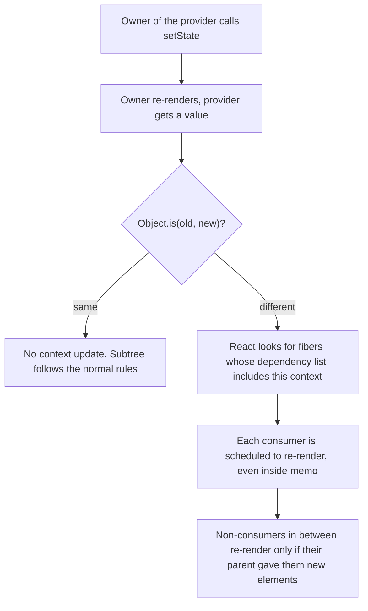
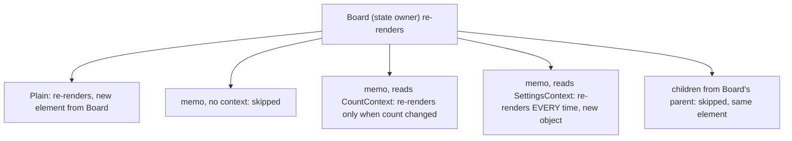

# 11 — Context and prop drilling

> **How to use this module.** Sections 11.1–11.3 give you the mental model ("nearest provider above, re-render on `Object.is` change") that answers most context questions. Sections 11.4–11.6 cover the performance patterns interviewers ask you to write. Sections 11.7–11.8 cover `use` and the limits of context. If you only have 20 minutes, read 11.1, 11.3, 11.4 and the Summary.

**Prerequisites:** [`children` and slot props](07-components-props-composition.md#72-children-and-slot-props) · [Compound components](07-components-props-composition.md#76-compound-components) · [What triggers a render](06-jsx-and-rendering-model.md#69-what-triggers-a-render) · [`useReducer`](08-state.md#810-usereducer) · [Colocation and lifting state up](08-state.md#88-colocation-and-lifting-state-up)

**Code for this module:** [`examples/web/src/m11-context/`](examples/web/src/m11-context/). Every file below has a test next to it. Run them with `npx vitest run src/m11-context` from `examples/web`.

---

## 11.1 Prop drilling and when it is fine

### The problem
State lives in the closest common owner of the components that need it ([08](08-state.md#88-colocation-and-lifting-state-up)). When that owner is `App` and the reader is six levels down, every component in between must accept the prop and pass it on, even though it never uses it:

```tsx
function App() {
  const [user, setUser] = useState<User | null>(null);
  return <Layout user={user} onLogout={() => setUser(null)} />;
}
function Layout({ user, onLogout }: Props) {
  return <Sidebar user={user} onLogout={onLogout} />;   // doesn't use them
}
function Sidebar({ user, onLogout }: Props) {
  return <UserMenu user={user} onLogout={onLogout} />;  // doesn't use them either
}
```

This is **prop drilling** [React]. It hurts when you rename a prop (five files change), add a field (five signatures change), or move `UserMenu` (the chain has to be re-plumbed).

### Mental model
Props are **explicit wiring**. That is a feature: you can read a component's signature and know exactly what it depends on, and tests just pass props. Drilling is only a problem when the intermediate components are **pure plumbing**.

> **Java/Spring analogy:** passing a `userId` through five method signatures of services that don't use it, instead of letting the one class that needs it inject `SecurityContextHolder` or a request-scoped bean.
>
> **Where the analogy breaks:** in Spring the fix is almost always injection. In React, the first fix is usually **not** context but **composition**: restructure the tree so the owner renders the reader directly.

### Minimal code: composition before context
Let the owner build the deep element and pass it down as `children` or a slot prop ([07](07-components-props-composition.md#72-children-and-slot-props)):

```tsx
function App() {
  const [user, setUser] = useState<User | null>(null);
  return (
    <Layout sidebar={<UserMenu user={user} onLogout={() => setUser(null)} />}>
      <Dashboard />
    </Layout>
  );
}
function Layout({ sidebar, children }: { sidebar: ReactNode; children: ReactNode }) {
  return (
    <div className="layout">
      <aside>{sidebar}</aside>
      <main>{children}</main>
    </div>
  );
}
```

`Layout` no longer knows `user` exists. The data goes **one** level, from `App` to `UserMenu`, because `App` creates the `UserMenu` element itself.

### How it works internally
Nothing special: a JSX element is a plain object created by whoever writes the `<UserMenu … />` expression ([06](06-jsx-and-rendering-model.md#63-elements-vs-components-vs-instances)). Where the element is **created** decides which props it can see; where it is **rendered** decides where it appears. Composition separates the two.

### Trade-offs
| Use | When |
|---|---|
| Plain props | 1–3 levels, or the intermediate components genuinely use the value. This is the default. |
| Composition (`children`, slot props) | Intermediate layers are layout or wrappers that don't care about the data |
| Context | Many components at **different depths** need the same value (theme, locale, session, a compound component's shared state) |
| A store ([18](18-state-management.md#182-contexts-limits)) | Large, frequently changing state that many components read **parts** of |

react.dev's guidance is the same order: "start by passing props", then "extract components and pass JSX as children", and only then context ([Passing Data Deeply with Context](https://react.dev/learn/passing-data-deeply-with-context)).

---

## 11.2 `createContext`, `<Context value>` vs `.Provider`

### The problem
Some values really are needed everywhere: the theme, the locale, the signed-in user, a compound component's selected tab ([07](07-components-props-composition.md#76-compound-components)). You want any component to **ask** for them, without every ancestor passing them along.

### Mental model
Context is a **tree-scoped variable**. `createContext(default)` declares the variable. A provider binds a value to it **for one subtree**. Any component inside that subtree reads the value from the **nearest provider above it**. Outside every provider, it reads the default.

> **Java analogy:** Java 21's `ScopedValue` (or a `ThreadLocal` that you set and restore in a `try/finally`). `ScopedValue.where(LOCALE, "es").run(() -> render())` binds a value for everything called inside, and a nested `where` shadows the outer one. An Angular developer already knows this as **hierarchical injectors**: a provider declared on a component is visible to its descendants, and the nearest injector wins.
>
> **Where the analogy breaks:** a scoped value is read once; a React consumer is **subscribed**. When the provider's value changes, React re-renders every component that read it (11.3). And the scope is the **component tree**, not the call stack: a component rendered through `children` sees the providers above where it is *rendered*, not where its element was *created*.

### Minimal code
`examples/web/src/m11-context/Theme.tsx` (excerpt):

```tsx
import { createContext, use, useCallback, useMemo, useState, type ReactNode } from 'react';

export type Theme = 'light' | 'dark';
type ThemeContextValue = { theme: Theme; toggleTheme: () => void };

// 1. Declare the context with a default for consumers outside any provider.
export const ThemeContext = createContext<ThemeContextValue>({
  theme: 'light',
  toggleTheme: () => {
    // No provider above: nothing to toggle.
  },
});

// 2. Provide a value for a subtree (React 19 syntax).
export function ThemeProvider({ initialTheme = 'light', children }: { initialTheme?: Theme; children: ReactNode }) {
  const [theme, setTheme] = useState<Theme>(initialTheme);
  const toggleTheme = useCallback(() => setTheme((t) => (t === 'light' ? 'dark' : 'light')), []);
  const value = useMemo(() => ({ theme, toggleTheme }), [theme, toggleTheme]);
  return <ThemeContext value={value}>{children}</ThemeContext>;
}

// 3. Read it anywhere below.
export function useTheme() {
  return use(ThemeContext); // or useContext(ThemeContext)
}
```

Every way to provide and read a context, oldest first. All except the first still work in React 19.3, and `LegacyContext.tsx` plus its test prove it:

| API | Since | Role | Status in 19.3 |
|---|---|---|---|
| `childContextTypes` + `getChildContext()` / `contextTypes` | pre-16.3 | Legacy provide / read (classes only) | **Removed in 19.0.** Logs an error, passes nothing |
| `<Ctx.Provider value>` | 16.3 | Provide | Works. `Ctx.Provider === Ctx` |
| `<Ctx.Consumer>{(v) => …}</Ctx.Consumer>` | 16.3 | Read (render prop) | Works; react.dev calls it legacy |
| `static contextType = Ctx` → `this.context` | 16.6 | Read (class, one context) | Works |
| `useContext(Ctx)` | 16.8 | Read (function components, top level only) | Works |
| `<Ctx value>` | 19.0 | Provide | The recommended form |
| `use(Ctx)` | 19.0 | Read (may be conditional) | Recommended in new code |

### How it works internally
`createContext` returns a plain object holding the current value and the default. In the React 19.3 source (`react/cjs/react.development.js`), `createContext` sets `context.Provider = context` and creates `context.Consumer = { $$typeof: REACT_CONSUMER_TYPE, _context: context }`. So in 19, `<Ctx>` and `<Ctx.Provider>` are **the same element type**, and `LegacyContext.test.tsx` asserts `expect(LocaleContext.Provider).toBe(LocaleContext)`. The CHANGELOG entry is "Switch `<Context>` to mean `<Context.Provider>`" (19.0.0, #28226).

While rendering, React keeps a **stack** of provider values. Entering a provider pushes its `value`; leaving it pops the previous one. `useContext`/`use` reads the top of that stack and records a **dependency** on the reading fiber, which 11.3 uses to find consumers when the value changes.

> **Version notes.** **≤ 16.2**: only the API now called legacy context (`childContextTypes`, `getChildContext`, `contextTypes`), class components only. **16.3** (Mar 2018): "Add a new officially supported context API" (`createContext`, `Provider`, `Consumer`). **16.6** (Oct 2018): `static contextType`, and `StrictMode` warns about legacy context. **16.8**: `useContext`. **17.0**: warns when a provider has no `value` prop, and `displayName` is used in component stacks. **18.3**: warns about legacy context even outside `StrictMode`. **19.0**: `<Context>` as a provider, `use(Context)`, legacy context **removed**, context changes propagated lazily. **19.2**: context is printed as `SomeContext` instead of `SomeContext.Provider`. **19.3**: Server Components can render a `<Context>` imported from a `'use client'` module (11.8), and two Suspense-related propagation bugs were fixed. Sources: React CHANGELOG entries for each version.
>
> **Migration.** `<Ctx.Provider value={v}>` → `<Ctx value={v}>` is a pure rename, safe to do file by file. react.dev's React 19 post says: "In future versions we will deprecate `<Context.Provider>`". No deprecation warning exists yet: the 19.3 dev build has none, and `@types/react` 19.3 does not mark `Provider` as `@deprecated`.
>
> The codemod has shipped: `npx codemod react/19/remove-context-provider --target <path>` "converts `Context.Provider` JSX opening and closing elements into `Context`" ([react-codemod README](https://github.com/reactjs/react-codemod)).

### Trade-offs
- ✅ It removes plumbing and makes a value available at any depth.
- ❌ It makes dependencies **implicit**. A component that calls `useTheme()` can no longer be understood, rendered in Storybook, or tested without knowing a provider must be above it.
- ❌ Every consumer re-renders when the value changes (11.3), so it is a poor fit for fast-changing data (11.8).
- Keep the context object private where you can, and export a **custom hook** (`useTheme`, `useAuth`) instead. That one hook is then the place to validate the provider, rename fields, or swap the implementation.

---

## 11.3 How propagation and re-rendering work

### The problem
"I wrapped the component in `memo` and it still re-renders." "I changed one field in the context and the whole app re-rendered." Both come from not knowing exactly which components React re-renders when a provider's value changes.

### Mental model
Three rules cover almost everything:

1. **A provider's value "changes" when `Object.is(oldValue, newValue)` is false.** A primitive changes when it differs. An object or function changes whenever it is a **new reference**, even with identical contents.
2. **When it changes, every component that read that context below the provider re-renders**, wherever it is and even if it, or an ancestor, is wrapped in `memo`. react.dev: "Skipping re-renders with `memo` does not prevent the children receiving fresh context values."
3. **Context adds re-renders; it never removes any.** The components between the provider and the consumers follow the normal rules ([06](06-jsx-and-rendering-model.md#69-what-triggers-a-render)): they re-render if their parent re-rendered and created new elements for them, and they are skipped if they are `memo` with equal props or if the element is the same object as last time (the `children` prop case).



Exercise 4 shows these rules as a predict-the-output test. In summary, with `Board` owning the state and providing `CountContext` (a number) and `SettingsContext` (an object literal created on every render):



### Minimal code
`examples/web/src/m11-context/PropagationPuzzle.tsx` (excerpt):

```tsx
const MemoCount = memo(function MemoCount() {
  const count = use(CountContext); // a context dependency punches through memo
  log.push(`MemoCount ${count}`);
  return <p>Count: {count}</p>;
});

// In Board's JSX:
<SettingsContext value={{ theme: 'dark' }}> {/* new object on every Board render */}
```

### How it works internally
Reading a context (`useContext`, `use`, `Consumer`, `static contextType`) appends an entry `{ context, memoizedValue }` to the reading fiber's **dependency list** and flags the fiber as a context reader. In the React 19.3 source (`react-dom-client.development.js`) this is `readContextForConsumer`. When a provider renders with a new value, React compares it with the previous one using `objectIs` and, if it differs, walks the subtree looking for fibers whose dependency list contains that context. It marks them, and their path from the provider, with the current render lane, so the usual bail-out ("props equal, no pending work") no longer applies to them.

**React 19.0** changed when that walk happens: "Lazily propagate context changes" (CHANGELOG 19.0.0, #20890). Up to 18, the provider eagerly scanned its whole subtree as soon as its value changed. In 19 React delays the scan until it actually reaches a bail-out, and checks the changed providers above it at that point (`propagateParentContextChanges` in the 19.3 source). Visible behavior is the same; the difference is that a provider whose subtree re-renders anyway pays nothing extra.

> **Version notes.** The rules above have been the same since 16.3. 19.0's lazy propagation is an internal optimization. 19.3 fixed "context propagation into Suspense fallbacks" and "through suspended Suspense boundaries" (CHANGELOG 19.3.0, #36160 and #35839). If a consumer inside a Suspense fallback showed a stale value on 19.0–19.2, upgrade.

### Trade-offs
- A context with **many consumers** and a **frequently changing** value re-renders all of them on each change. That is the main cost of context, and the reason to split (11.5) or use a store (11.8).
- Re-rendering is not the same as being slow. A dozen consumers re-rendering on a theme toggle is nothing. Measure with the React DevTools Profiler before optimizing ([15](15-performance.md#152-why-components-re-render)).

---

## 11.4 Stable values

### The problem
```tsx
function AuthProvider({ children }: { children: ReactNode }) {
  const [user, setUser] = useState<User | null>(null);
  return (
    <AuthContext value={{ user, login: (n) => setUser({ name: n }), logout: () => setUser(null) }}>
      {children}
    </AuthContext>
  );
}
```

Each time `AuthProvider` renders, the object literal and both arrow functions are **new references**. By rule 1 of 11.3, the value has "changed", so every `useAuth()` consumer re-renders, even when `user` is the same and even when the consumer is `memo`.

When does `AuthProvider` re-render without `user` changing? Whenever **its parent** re-renders, because `AuthProvider` is not `memo`.

### Mental model
The provider value is a dependency of every consumer. Make it change **only when its contents change**, which is what `useMemo` and `useCallback` are for.

> **Java analogy:** an object used as a cache key without `equals`/`hashCode`. Two "equal" instances miss the cache because React compares by identity (`==`), not `equals`.
>
> **Where it breaks:** you cannot override equality in React. The only lever is to **reuse the same instance**.

### Minimal code
`examples/web/src/m11-context/Auth.tsx` (excerpt):

```tsx
const [user, setUser] = useState<User | null>(initialUser);
const login = useCallback((name: string) => setUser({ name }), []);
const logout = useCallback(() => setUser(null), []);
const value = useMemo(() => ({ user, login, logout }), [user, login, logout]);

return <AuthContext value={value}>{children}</AuthContext>;
```

`Auth.test.tsx` ("the memoized value keeps memo() consumers from re-rendering on unrelated parent renders") re-renders the provider's parent and asserts that a `memo` consumer rendered only once.

### How it works internally
`useMemo` returns the cached object while its dependencies are `Object.is`-equal, so the provider sees the same reference and React skips the context update. `useCallback(fn, deps)` is `useMemo(() => fn, deps)`. A setter from `useState` and `dispatch` from `useReducer` are **already stable**, so a callback that only calls a setter can have `[]` deps.

### Trade-offs
- **When it is pointless:** if the provider only re-renders when the value itself changes (for example it sits at the root and its only state *is* the value), memoizing changes nothing. It is still cheap and makes the component robust to being moved under a re-rendering parent.
- **The `children` trick matters as much.** `<AuthProvider>{children}</AuthProvider>` means a state change inside `AuthProvider` does **not** re-render `children`, which were created by its parent (11.3, rule 3). Only consumers re-render. Putting `<App />` *inside* the provider component (`return <AuthContext value={…}><App /></AuthContext>`) loses this: every state change then re-renders the whole app.
- **React Compiler.** With `babel-plugin-react-compiler` 1.0 enabled, components are memoized automatically ([15](15-performance.md#155-the-react-compiler-and-how-it-changes-the-advice)).

> **Unverified:** that the React Compiler 1.0 memoizes an inline `value={{ user, login }}` on its inputs so that the manual `useMemo` becomes redundant. The compiler is not installed in `examples/web`. Check it in the [React Compiler playground](https://playground.react.dev) before stating it.

---

## 11.5 Splitting contexts

### The problem
Even with a memoized value, a context that holds `{ todos, dispatch }` changes whenever `todos` changes. The "Add" form only needs `dispatch`, but it reads the context, so it re-renders on every toggle of every to-do. A single `AppContext` with `{ user, theme, cart, notifications }` is worse: any change re-renders every consumer of any field.

### Mental model
**Consumers subscribe to the whole value, never to a field.** React has no context selector (there is no `useContextSelector` in React 19.3's exports; verified by listing `react/cjs/react.development.js`). So the unit of subscription is the context itself, and you design contexts around **what changes together** and **who reads what**:

- Split by **concern**: `ThemeContext`, `AuthContext`, `CartContext`, not one `AppContext`.
- Split by **rate of change**: the list (changes often) apart from the actions (never change).

> **Java analogy:** interface segregation. A client that only needs `save()` should not depend on an interface that also changes when `findAll()`'s return type changes.

### Minimal code
`examples/web/src/m11-context/TodosContext.tsx` (excerpt):

```tsx
const TodosContext = createContext<Todo[] | null>(null);
const TodosDispatchContext = createContext<Dispatch<TodosAction> | null>(null);

export function TodosProvider({ initialTodos = [], children }: Props) {
  const [todos, dispatch] = useReducer(todosReducer, initialTodos);
  return (
    <TodosContext value={todos}>
      <TodosDispatchContext value={dispatch}>{children}</TodosDispatchContext>
    </TodosContext>
  );
}
```

`TodoApp.test.tsx` asserts that toggling a to-do logs `['TodoList', 'TodoStats']`. `AddTodo`, which only calls `useTodosDispatch()`, does not appear.

### How it works internally
`dispatch` keeps the same identity for the provider's whole life, so `TodosDispatchContext`'s value never changes and never propagates. `TodosContext` changes on every reducer update, and only its readers are scheduled. Because `AddTodo` was passed as `children`, the provider's re-render doesn't touch it either (11.4).

### Trade-offs
- ✅ Free, no library, and it scales well for "a list plus actions".
- ❌ More providers and more hooks. Hide them behind one `XProvider` and two hooks, as here.
- ❌ Splitting by field doesn't scale to "200 components each read a different slice of a big object". That is a store's job: Redux, Zustand or `useSyncExternalStore` let each component subscribe to a **selected** slice ([18](18-state-management.md#182-contexts-limits)).

---

## 11.6 Reducer + context pattern

### The problem
A screen's state has grown into a `useReducer` ([08](08-state.md#810-usereducer)), and now components far apart need to read it and dispatch to it. Drilling `state` and `dispatch` through ten components brings back 11.1.

### Mental model
Combine the two: **the reducer owns the rules, context delivers state and `dispatch`** to whoever needs them. This is a small, local Redux: one store per subtree, actions describing what happened, a pure reducer, and components that read and dispatch.

> **Java/Spring analogy:** a request-scoped aggregate with a command handler (the reducer), plus injection (context) so any controller in that scope can send commands to it.
>
> **Where it breaks:** there is no selector and no middleware. Every reader of the state context re-renders on every action.

### Minimal code
Three pieces, one file each, in `examples/web/src/m11-context/`:

1. `todosReducer.ts`: a pure `(todos, action) => todos` with a discriminated-union action type, unit-tested without React.
2. `TodosContext.tsx`: `TodosProvider` (holds `useReducer`, provides two contexts) and two **guarded hooks**, `useTodos()` and `useTodosDispatch()`, that throw outside the provider.
3. `TodoApp.tsx`: the components, which never import a context object, only the hooks.

```tsx
function TodoItem({ todo }: { todo: Todo }) {
  const dispatch = useTodosDispatch();
  return (
    <li>
      <label>
        <input type="checkbox" checked={todo.done} onChange={() => dispatch({ type: 'toggled', id: todo.id })} />
        {todo.text}
      </label>
      {/* … */}
    </li>
  );
}
```

### How it works internally
Nothing new: `useReducer` (08), two providers (11.2), propagation (11.3). The pattern works because `dispatch` is stable ("`dispatch` has a stable identity", [08](08-state.md#810-usereducer)), so the dispatch context never changes.

### Trade-offs
| Choose reducer + context | Move to a store ([18](18-state-management.md#1811-a-decision-framework)) |
|---|---|
| State belongs to one feature or subtree | State is truly app-wide |
| Tens of consumers | Hundreds, each reading a slice |
| Updates on user actions | Updates many times per second (drag, real-time feeds) |
| No devtools or middleware needed | You want time-travel devtools, middleware, persistence |

---

## 11.7 Reading context with `use`

### The problem
`useContext` is a hook, so it must be called at the top level, unconditionally ([12](12-hooks-and-custom-hooks.md#121-the-rules-of-hooks)). A component that needs the theme **only in one branch** still has to read it on every render, before any early return.

### Mental model
`use` [React] (19.0) is not a hook. It is an API that **reads a resource during render**: a promise ([17](17-data-fetching.md#1710-suspense-based-fetching-and-use)) or a context. For a context it behaves exactly like `useContext` (nearest provider above, re-render on change), but it may be called **inside `if` statements and loops**. The CHANGELOG 19.0.0 entry: "`use` can only be used in render but can be called conditionally."

### Minimal code
`examples/web/src/m11-context/Theme.tsx`:

```tsx
export function Badge({ label, themed = true }: { label: string; themed?: boolean }) {
  if (!themed) return <span>{label}</span>;
  const { theme } = use(ThemeContext); // after an early return: fine for use, an error for useContext
  return <span data-theme={theme}>{label}</span>;
}
```

### How it works internally
Hooks are stored in a per-fiber list indexed by call order, so skipping one shifts all the others ([12](12-hooks-and-custom-hooks.md#122-how-react-stores-hooks-so-call-order-matters)). Reading a context stores nothing in that list. It only appends to the fiber's **dependency list** (11.3), which is rebuilt on every render. So whether a render reads the context or not cannot corrupt anything. When a render skips the read, that render simply does not subscribe.

Its rules, from react.dev and the lint plugin:
- Only during render, in a component or a hook. Not in event handlers or effects.
- **Not inside `try`/`catch`.** `eslint-plugin-react-hooks` 7.1.1 reports *"React Hook "use" cannot be called in a try/catch block."* (read from the plugin's `cjs` build).
- Not in Server Components. react.dev: "Reading context with `use` is not supported in Server Components."

### Trade-offs
- In new React 19 code, prefer `use(Ctx)` everywhere: one API for context and promises, and it can move freely inside branches. `useContext` is not deprecated and stays fine.
- On React ≤ 18, `use` does not exist. Read the context at the top level and branch afterwards.

> **Version notes.** 19.0 added `use` (stable). 19.3 added a development warning "when a component appears to have been unblocked by a conditional `use()`" (CHANGELOG 19.3.0, #37104).
>
> The warning is about `use(promise)`: it fires when a component suspended on `use()` and then stopped calling it once the data was cached ("This library called use() to suspend in a previous render but did not call use() when it finished"), see [PR #37104](https://github.com/facebook/react/pull/37104) and [react.dev/warnings/conditional-use-of-use](https://react.dev/warnings/conditional-use-of-use). `use(Context)` never suspends, so it does not apply to context.

---

## 11.8 When context is the wrong tool

### The problem
Context is built in, so teams reach for it for everything: server data, form state, a 5,000-row grid's selection, mouse position. Each of those has a better tool, and context is often the slowest.

### Mental model
Context is a **dependency-injection mechanism with change notification**, not a state manager. It is excellent for values that are **read widely and change rarely**: theme, locale, session, feature flags, a compound component's internal state, a service object (an API client, an analytics logger).

| Need | Wrong tool | Right tool |
|---|---|---|
| Data from the server (cache, refetch, loading) | Context holding fetched data | TanStack Query, SWR, framework loaders ([17](17-data-fetching.md#173-server-state-vs-client-state)) |
| High-frequency updates (drag position, timers, websockets) | Context value that changes 60×/s | Local state, a ref, or a store with selectors |
| Big global state with many partial readers | One giant context | Redux Toolkit, Zustand, or `useSyncExternalStore` ([18](18-state-management.md#182-contexts-limits)) |
| Values only 2–3 levels down | Context | Props or composition (11.1) |
| URL-shaped state (filters, page) | Context | The URL / router search params |
| Form state | Context per field | A form library or local state ([14](14-forms-and-actions.md#143-react-hook-form--zod)) |

### Minimal code: context as the transport, a store as the state
A common professional pattern: put a **stable store object** in context (so the context never changes) and let components subscribe to slices with `useSyncExternalStore` ([12](12-hooks-and-custom-hooks.md#1212-usesyncexternalstore)). This is how `react-redux`'s `<Provider store>` works: the context carries the store, and `useSelector` subscribes with a selector.

```tsx
const StoreContext = createContext<Store | null>(null);

function useStoreSelector<T>(selector: (s: State) => T): T {
  const store = use(StoreContext)!; // never changes, so never propagates
  return useSyncExternalStore(store.subscribe, () => selector(store.getState()));
}
```

The selector must return a stable value (a primitive or an existing object). A selector that builds a new object or array on every call makes `useSyncExternalStore` think the snapshot always changed. React warns "The result of getSnapshot should be cached to avoid an infinite loop" (verified in `react-dom` 19.3.0's dev build).

### How it works internally: Server Components
Server Components ([21](21-concurrent-ssr-server-components.md#217-server-components-the-mental-model-clientserver-boundary)) cannot **create** or **read** context: `createContext` must live in a `'use client'` module, and `use(Context)` is not supported on the server. Until 19.3, a Server Component that wanted to provide a value had to render a client wrapper:

```tsx
// user-context.tsx
'use client';
export const UserContext = createContext<User | null>(null);
export function UserProvider({ user, children }: { user: User | null; children: ReactNode }) {
  return <UserContext value={user}>{children}</UserContext>;
}
```

**React 19.3** lets the Server Component render the context directly: `<UserContext value={currentUser}>{children}</UserContext>`, imported from the `'use client'` module, with no wrapper (React 19.3 release post, "`<Context>` can be rendered directly in Server Components"; CHANGELOG 19.3.0, #35675).

Because rendering the client context crosses into the client boundary, the `value` passed from a Server Component must be serializable like any other server-to-client prop (verified by running it in `examples/next-rsc` with Next.js 16 / React 19.3: passing a non-serializable value like a client function fails the build with `Error: Functions cannot be passed directly to Client Components unless you explicitly expose it by marking it with "use server"`). The general rule is documented at [react.dev: 'use client'](https://react.dev/reference/rsc/use-client).

### Trade-offs
Context's strength is that it costs nothing: no dependency, no boilerplate, and the same rules as the rest of React. Once you add memoization, two contexts per feature, and you still see wide re-renders in the Profiler, that is the signal to adopt a store ([18](18-state-management.md#1811-a-decision-framework)).

---

## Interview questions

**Q1. What problem does context solve?**
<details><summary>Answer</summary>

It lets a component read a value from an ancestor **without every component in between passing it as a prop**. The ancestor provides the value for its subtree; any descendant reads the nearest one. **A strong answer adds:** it is a delivery mechanism, not a state manager. The state still lives in some component's `useState`/`useReducer`; context only transports it.

</details>

**Q2. What is prop drilling, and is it always bad?**
<details><summary>Answer</summary>

Passing props through components that don't use them, only to reach a deeper one. It is not always bad: through 2–3 levels it is explicit, type-checked and easy to test. It becomes a problem when many intermediate components are pure plumbing and every change touches all of them. **A strong answer adds:** "explicit dependencies" is a real benefit. Replacing every prop with context makes components harder to reuse and test.

</details>

**Q3. Before reaching for context, what would you try?**
<details><summary>Answer</summary>

**Composition**: let the owner create the deep element and pass it via `children` or a slot prop, so the layers in between never see the data (11.1). Also check whether the state is lifted **too high**: moving it down to where it is used removes the drilling ([15](15-performance.md#156-moving-state-down-and-lifting-content-up)). **A strong answer adds:** this is react.dev's order too: props, then children/composition, then context.

</details>

**Q4. What is the `defaultValue` of `createContext` for, and when is it used?**
<details><summary>Answer</summary>

It is the value a consumer reads **when there is no provider of that context anywhere above it**. It is static and never changes. It is *not* used when a provider exists but passes `value={undefined}`: then consumers read `undefined`. **A strong answer adds:** pick a meaningful default (a theme) when components should work standalone, or `null` plus a guarded hook (11.4, Exercise 2) when using the component without a provider is a bug.

</details>

**Q5. `<ThemeContext value={v}>` vs `<ThemeContext.Provider value={v}>`: what is the difference?**
<details><summary>Answer</summary>

In React 19, none at runtime. `createContext` sets `Context.Provider = Context`, so both are the same element type (asserted in `LegacyContext.test.tsx`). `<Context value>` is new in 19.0; `.Provider` is required on React ≤ 18. **A strong answer adds:** react.dev says `.Provider` will be deprecated in a future version, so use `<Context>` in new 19 code. Libraries that support React 18 must keep `.Provider`.

</details>

**Q6. How does a component find which value to read?**
<details><summary>Answer</summary>

React uses the **nearest provider of that context above the component in the tree**, the tree where it is *rendered*. If there is none, it uses the default. A provider rendered by the component itself does **not** count; only providers above it do (`SelfProvider` in Exercise 4). **A strong answer adds:** internally React keeps a stack of provider values while rendering: push on entering a provider, pop on leaving. That is why nesting a second provider overrides the value for its subtree only.

</details>

**Q7. When exactly does a context consumer re-render?**
<details><summary>Answer</summary>

When the nearest provider renders with a value that is not `Object.is`-equal to its previous value. Every component below that read the context re-renders, regardless of `memo` on it or its ancestors. It can also re-render for the usual reasons: its own state, or its parent re-rendering. **A strong answer adds:** the comparison is by reference, so a new object with the same contents counts as a change.

</details>

**Q8. Does `React.memo` stop a component from re-rendering on a context change?**
<details><summary>Answer</summary>

No. `memo` only compares **props**. A context the component reads is a separate dependency, and React schedules the component directly when that context changes. `memo` on a **non-consuming** ancestor doesn't block it either: React walks past it to reach the consumer. **A strong answer adds:** `memo` *does* stop a non-consumer from re-rendering when its parent re-renders, which is half of the "split + memo" optimization.

</details>

**Q9. What is wrong with `<AuthContext value={{ user, login, logout }}>`?**
<details><summary>Answer</summary>

The object literal (and any inline functions) is a new reference on every render of the provider component, so every consumer re-renders whenever the provider re-renders, even if `user` didn't change. Fix: `useCallback` for the functions and `useMemo` for the object, keyed on the real inputs (11.4). **A strong answer adds:** it only matters when the provider re-renders for reasons other than the value changing, typically because its parent re-rendered. With the React Compiler this memoization may be automatic.

</details>

**Q10. When does memoizing the provider value make no difference?**
<details><summary>Answer</summary>

When the provider component only re-renders because the value itself changed, for example a root-level provider whose only state is the value. Then every render produces a genuinely new value anyway. It also doesn't help if consumers re-render for other reasons, such as their parent re-rendering without `memo`. **A strong answer adds:** it is still worth doing in reusable providers, because you don't control where they will be mounted.

</details>

**Q11. Why split a reducer's state and `dispatch` into two contexts?**
<details><summary>Answer</summary>

Consumers subscribe to the whole context value. If one context holds `{ state, dispatch }`, components that only dispatch (buttons, forms) re-render on every state change. `dispatch` never changes, so putting it in its own context means those components never re-render because of context. **A strong answer adds:** `TodoApp.test.tsx` proves it: toggling logs `TodoList` and `TodoStats` but not `AddTodo`.

</details>

**Q12. Why is it safe to put `dispatch` (or a `useState` setter) in context without `useCallback`?**
<details><summary>Answer</summary>

React guarantees their identity is stable for the component's whole life ([08](08-state.md#810-usereducer)). They never cause a context change. **A strong answer adds:** the same is not true of functions you write that *call* the setter. Those need `useCallback` (or the compiler) if they are part of a context value.

</details>

**Q13. Describe the reducer + context pattern.**
<details><summary>Answer</summary>

A provider component holds `useReducer(reducer, initial)`, provides `state` and `dispatch` in two contexts, and exports guarded hooks (`useTodos`, `useTodosDispatch`). Components read state or dispatch actions through the hooks. The reducer is pure and tested without React. **A strong answer adds:** it is a scoped mini-Redux. It lacks selectors, devtools and middleware, which is when you move to Redux Toolkit ([18](18-state-management.md#184-redux-toolkit-configurestore-slices-immer)).

</details>

**Q14. `useContext(Ctx)` vs `use(Ctx)`?**
<details><summary>Answer</summary>

Same result: the nearest provider's value, with a re-render subscription. `use` (19.0) is not a hook, so it can be called inside `if` statements, loops and after early returns. `useContext` must follow the rules of hooks. `use` also accepts promises. **A strong answer adds:** `use` still has rules: only during render, and not inside `try`/`catch` (the hooks lint plugin reports it).

</details>

**Q15. Why can `use(Context)` be conditional when hooks can't?**
<details><summary>Answer</summary>

Hooks keep state in a per-fiber list matched by call order, so skipping one misaligns the rest. Reading a context stores nothing in that list. It only records a dependency for this render, and the dependency list is rebuilt every render. A render that skips the read simply doesn't subscribe. **A strong answer adds:** `useContext` doesn't keep state in the hook list either, but it is still a hook: the lint rule enforces the rules of hooks for it, and React's development build records it in the hook-order check (`mountHookTypesDev` in `react-dom` 19.3.0's dev build), so calling it conditionally triggers the "change in the order of Hooks" warning.

</details>

**Q16. Can you read context in an event handler or inside `useEffect`?**
<details><summary>Answer</summary>

Not by calling `useContext`/`use` there. Read it during render and use the variable in the handler or effect (the closure captures it). Calling it inside a `useMemo` or `useReducer` callback triggers React's dev error: *"Context can only be read while React is rendering. In classes, you can read it in the render method or getDerivedStateFromProps. In function components, you can read it directly in the function body, but not inside Hooks like useReducer() or useMemo()."* (verified in `react-dom` 19.3.0's development build). **A strong answer adds:** if the effect should not re-run when a context value changes, read it into an Effect Event ([09](09-effects.md#99-useeffectevent)).

</details>

**Q17. How does a class component read context?**
<details><summary>Answer</summary>

`static contextType = MyContext` (16.6+) and then `this.context`, limited to one context per class. For more than one, use `<MyContext.Consumer>{(value) => …}</MyContext.Consumer>` in `render`, or wrap the class in a function component that reads the contexts and passes props. **A strong answer adds:** in TypeScript, declare the field: `declare context: React.ContextType<typeof MyContext>`, because `@types/react` types it as `unknown`.

</details>

**Q18. What was legacy context, and what happened to it?**
<details><summary>Answer</summary>

The pre-16.3 API: a provider class declared `static childContextTypes` and `getChildContext()`, and consumers declared `static contextTypes` and read `this.context`. It had a famous bug: an intermediate `shouldComponentUpdate` returning `false` blocked updates from reaching consumers. It was replaced by `createContext` in 16.3, warned about in `StrictMode` from 16.6 and everywhere from 18.3, and **removed in 19.0**. In 19.3 a class using it logs *"… uses the legacy childContextTypes API which was removed in React 19"* and receives no value (`LegacyContext.test.tsx`). **A strong answer adds:** the legacy docs describe the bug: descendants "won't update if an intermediate parent returns false from shouldComponentUpdate" ([legacy docs](https://legacy.reactjs.org/docs/legacy-context.html)). Old libraries built on it, so a React 19 upgrade can force library upgrades.

</details>

**Q19. How would you migrate legacy context to the modern API?**
<details><summary>Answer</summary>

(1) `const ColorContext = createContext(defaultColor)`. (2) Replace the provider's `childContextTypes`/`getChildContext` with rendering `<ColorContext value={…}>` (`.Provider` on ≤ 18) around `this.props.children`. (3) Replace each consumer's `contextTypes` with `static contextType = ColorContext`, `<ColorContext.Consumer>`, or convert it to a function component with `use(ColorContext)`. Do it on React 18.3 first, where the warnings list every remaining usage. **A strong answer adds:** split the old single context object into one context per concern while you are at it.

</details>

**Q20. How do you type a context whose value only exists inside the provider?**
<details><summary>Answer</summary>

`createContext<AuthContextValue | null>(null)`, plus a hook that narrows it: `const v = use(AuthContext); if (v === null) throw new Error('useAuth must be used inside <AuthProvider>'); return v;`. Consumers get a non-null type, and a missing provider fails fast with a clear message. **A strong answer adds:** avoid `createContext({} as AuthContextValue)`. It lies to the type system and turns a missing provider into `undefined is not a function` deep in a click handler.

</details>

**Q21. Why export a custom hook instead of the context object?**
<details><summary>Answer</summary>

One entry point lets you validate the provider (guarded hook), rename or reshape the value without touching consumers, add derived fields, and later swap the implementation (to a store) with the same hook signature. **A strong answer adds:** it also hides the split-context detail. Consumers call `useTodos()` and `useTodosDispatch()` and don't know there are two contexts.

</details>

**Q22. Can a component read the value of a provider it renders itself?**
<details><summary>Answer</summary>

No. `useContext`/`use` look **above** the calling component. A provider in the component's own JSX only affects its children. Exercise 4 (`SelfProvider`) reads `-1` (the default) while its child reads `42`. **A strong answer adds:** the fix is to split the component into an outer one that provides and an inner one that reads, or to just use the local variable.

</details>

**Q23. What happens with nested providers of the same context?**
<details><summary>Answer</summary>

The inner one wins for its subtree; outside it, the outer value applies. That is how you theme one section differently (`ForceTheme` in `Theme.tsx`). An inner provider can read the outer value and extend it: `const outer = use(ThemeContext); <ThemeContext value={{ ...outer, theme: 'dark' }}>`. **A strong answer adds:** memoize that derived value, or every render of the inner provider re-renders its consumers.

</details>

**Q24. You have twelve providers nested in `App` ("provider hell"). Is that a problem?**
<details><summary>Answer</summary>

Mostly cosmetic. Nesting depth costs almost nothing at runtime. Readability can be fixed with an `AppProviders` component that nests them in one place. It is a real problem only if the order matters and is implicit (one provider uses another's hook), or if they all re-render together because their owner re-renders. **A strong answer adds:** twelve contexts may signal that some of this is server state or URL state that belongs elsewhere (11.8).

</details>

**Q25. When is context the wrong tool?**
<details><summary>Answer</summary>

For server data (use a query cache), for values that change many times per second, for big state read in slices by many components, for URL state, and for anything only a couple of levels deep. **A strong answer adds:** a good heuristic is "read widely, change rarely". Theme, locale, session, feature flags and injected services are ideal.

</details>

**Q26. Context vs Redux (or Zustand)?**
<details><summary>Answer</summary>

Context transports a value and re-renders every consumer when it changes. A store holds state outside React, and each component subscribes with a **selector**, re-rendering only when its selected slice changes. Stores add devtools, middleware and persistence. **A strong answer adds:** `react-redux` itself uses context, but only to pass the **store object**, which never changes. Updates go through `useSyncExternalStore` subscriptions, not context propagation.

</details>

**Q27. How could you get "selector" behavior with plain React?**
<details><summary>Answer</summary>

(1) Split contexts by concern and rate of change. (2) Put a stable store in context and subscribe with `useSyncExternalStore(store.subscribe, () => selector(store.getState()))` (11.8). (3) Read the context in a thin wrapper and pass the needed slice as props to a `memo` child, so the expensive child only re-renders when its slice changes. **A strong answer adds:** React 19.3 has no built-in `useContextSelector`; the `use-context-selector` library emulates one.

</details>

**Q28. How does context interact with Server Components?**
<details><summary>Answer</summary>

Server Components can't create or read context. `createContext` lives in a `'use client'` module and consumers are Client Components. Since **19.3**, a Server Component can render `<UserContext value={user}>` directly by importing the context from the client module. Before that, you needed a small client `UserProvider` wrapper. **A strong answer adds:** the common use is passing request data fetched on the server (the current user, feature flags) to the client tree once, at the layout.

</details>

**Q29. A theme toggle re-renders 2,000 components. How would you make it cheap?**
<details><summary>Answer</summary>

Don't route the visual change through React at all: set a `data-theme` attribute or class on `<html>` and let CSS custom properties restyle everything. Keep the context only for the few components that genuinely need the theme in JavaScript (a chart library's colors). **A strong answer adds:** this also avoids a flash of the wrong theme on SSR when combined with a small inline script that sets the attribute before hydration.

</details>

**Q30. Why does a context sometimes "not work", reading the default even though a provider is clearly above?**
<details><summary>Answer</summary>

Usual causes: (1) the provider and the consumer imported **different context objects**, because of duplicate module copies (two React versions, symlinked packages, a monorepo bundling the module twice). react.dev notes they must be the same object by `===`. (2) The consumer is rendered **outside** the provider, often through a portal's or a modal library's separate root. (3) A circular import made the context `undefined` at the time of use. **A strong answer adds:** `static contextType` warns specifically about the circular-import case ("This can also happen due to a circular dependency, so try moving the createContext() call to a separate file.").

</details>

**Q31. Do portals see the context of the component that created them?**
<details><summary>Answer</summary>

Yes. `createPortal` changes where the DOM goes, not where the component sits in the React tree ([10](10-refs-and-dom.md#106-portals)). react.dev: "the child can access the context provided by the parent tree". A modal rendered into `document.body` through a portal still reads the providers above the component that rendered the portal. A **separate root** (`createRoot` on another node) does not. **A strong answer adds:** that is why modal libraries use portals rather than separate roots.

</details>

**Q32. How do you test components that use context?**
<details><summary>Answer</summary>

Render them inside the real provider (preferred), with test props on the provider (`initialUser`, `initialTheme`) to reach the state you need. For many tests, write a custom `render` that wraps every provider ([20](20-testing.md#208-testing-with-context-routers-and-query-clients)). Test the "outside provider" path too: guarded hooks should throw a helpful error. **A strong answer adds:** avoid mocking the hook module. Rendering the provider tests the real wiring.

</details>

**Q33. What does `displayName` on a context do?**
<details><summary>Answer</summary>

It names the context in React DevTools and, since 17.0, in component stacks (CHANGELOG 17.0.0: "Allow to specify `displayName` on context for improved stacks"). Since 19.2 React prints a context as `SomeContext` rather than `SomeContext.Provider`. **A strong answer adds:** set it when the variable name will be minified or when several libraries define a generic `ThemeContext`.

</details>

**Q34. Did React 19 change how context changes propagate?**
<details><summary>Answer</summary>

Internally, yes: "Lazily propagate context changes" (CHANGELOG 19.0.0). Up to 18, a provider whose value changed immediately scanned its whole subtree for consumers. In 19, React postpones that scan until it actually bails out of a subtree, checking the changed providers above it at that point. Which components re-render did not change. **A strong answer adds:** 19.3 then fixed propagation into Suspense fallbacks and through suspended boundaries.

</details>

**Q35. A provider is missing its `value` prop. What happens?**
<details><summary>Answer</summary>

Consumers read `undefined` (not the default, because a provider exists), and React logs in development: *"The `value` prop is required for the `<Context.Provider>`. Did you misspell it or forget to pass it?"* (17.0+, still the wording in the 19.3 dev build, even for `<Context>`). **A strong answer adds:** a typo like `values=` is the classic cause, and TypeScript catches it because `value` is a required prop.

</details>

**Q36. In which order do you add optimizations to a slow context?**
<details><summary>Answer</summary>

Profile first. Then: (1) keep `children` coming from outside the provider, so only consumers re-render; (2) memoize the value; (3) split contexts by concern and rate of change; (4) `memo` expensive non-consuming subtrees; (5) if consumers still need slices of a large, fast-changing value, move to a store with selectors. **A strong answer adds:** with the React Compiler enabled, steps 2 and 4 are largely automatic, so 3 and 5 are the architectural decisions left.

</details>

---

## Coding exercises

### Exercise 1: Theme switcher

**Statement.** Build a `ThemeProvider` holding `'light' | 'dark'`, a `useTheme()` hook, a `ThemeToggleButton` ("Switch to dark theme" / "Switch to light theme"), and a `ThemedPanel` that exposes the current theme as `data-theme`. Components rendered **outside** any provider must still work, defaulting to `light`. Add `ForceTheme` to force a theme for one subtree, while its toggle still flips the app theme. Add a `Badge` that reads the theme only when `themed` is true.

**Approach.**
1. Theme has a sensible default, so give `createContext` a real default value rather than `null`.
2. Hold the theme in `useState` inside the provider; expose `{ theme, toggleTheme }`.
3. Stabilize: `useCallback` for the toggle (functional update, so `[]` deps), `useMemo` for the object.
4. `ForceTheme` reads the outer value and re-provides it with `theme` overridden.
5. `Badge` returns early, then calls `use`, which a hook could not do.

<details><summary>Hints</summary>

- `setTheme((t) => (t === 'light' ? 'dark' : 'light'))` keeps the toggle independent of `theme`.
- A nested provider overrides only its subtree: `<ThemeContext value={{ ...outer, theme }}>`.
- `<section aria-label={title}>` gives the panel the `region` role, which makes the tests easy to scope.

</details>

<details><summary>Solution</summary>

[`examples/web/src/m11-context/Theme.tsx`](examples/web/src/m11-context/Theme.tsx):

```tsx
// file: examples/web/src/m11-context/Theme.tsx
import { createContext, use, useCallback, useMemo, useState, type ReactNode } from 'react';

export type Theme = 'light' | 'dark';

type ThemeContextValue = {
  theme: Theme;
  toggleTheme: () => void;
};

// A theme has a sensible default, so components still render outside a provider.
// The cost: outside a provider, toggleTheme silently does nothing (compare Auth.tsx).
export const ThemeContext = createContext<ThemeContextValue>({
  theme: 'light',
  toggleTheme: () => {
    // No provider above: nothing to toggle.
  },
});

/** Owns the theme state and shares it, plus a stable toggle, with every descendant. */
export function ThemeProvider({
  initialTheme = 'light',
  children,
}: {
  initialTheme?: Theme;
  children: ReactNode;
}) {
  const [theme, setTheme] = useState<Theme>(initialTheme);
  const toggleTheme = useCallback(() => setTheme((t) => (t === 'light' ? 'dark' : 'light')), []);

  // Same object while `theme` is unchanged, so consumers skip work when the provider's parent re-renders.
  const value = useMemo(() => ({ theme, toggleTheme }), [theme, toggleTheme]);

  return <ThemeContext value={value}>{children}</ThemeContext>;
}

/** Overrides the theme for one subtree; toggling inside it still flips the outer theme. */
export function ForceTheme({ theme, children }: { theme: Theme; children: ReactNode }) {
  const outer = use(ThemeContext);
  const value = useMemo(() => ({ ...outer, theme }), [outer, theme]);
  return <ThemeContext value={value}>{children}</ThemeContext>;
}

export function useTheme(): ThemeContextValue {
  return use(ThemeContext);
}

export function ThemeToggleButton() {
  const { theme, toggleTheme } = useTheme();
  return (
    <button type="button" onClick={toggleTheme}>
      Switch to {theme === 'light' ? 'dark' : 'light'} theme
    </button>
  );
}

export function ThemedPanel({ title, children }: { title: string; children?: ReactNode }) {
  const { theme } = useTheme();
  return (
    <section aria-label={title} data-theme={theme} className={`panel panel-${theme}`}>
      <h2>{title}</h2>
      {children}
    </section>
  );
}

/** `use(Context)` may run after an early return or inside an `if`; `useContext` may not. */
export function Badge({ label, themed = true }: { label: string; themed?: boolean }) {
  if (!themed) return <span>{label}</span>;
  const { theme } = use(ThemeContext);
  return <span data-theme={theme}>{label}</span>;
}
```

</details>

**Walkthrough.** The toggle mutates nothing; it schedules a state update in `ThemeProvider`. The provider re-renders with a new memoized `value` (because `theme` changed), and every `useTheme()` reader below re-renders. The nested `ForceTheme` re-derives its value from the new outer value but keeps `theme: 'dark'`, so its panel stays dark while its button still calls the outer `toggleTheme`. Outside a provider, the panel reads the default `light` and the toggle is the default no-op, which is the honest cost of a default value: nothing tells you the provider is missing.

**Interviewer follow-ups.**
- "Persist the choice." Initialize with a lazy `useState(() => readStoredTheme())` and write in the toggle handler, wrapped in `try/catch` ([12](12-hooks-and-custom-hooks.md#127-uselocalstorage)).
- "Follow the OS setting." Read `matchMedia('(prefers-color-scheme: dark)')` with `useSyncExternalStore` ([12](12-hooks-and-custom-hooks.md#129-usemediaquery)).
- "2,000 components re-render on toggle." Put the theme on `<html data-theme>` and use CSS variables (Q29).
- "Would you rather have a `null` default?" If a missing provider should be a bug, yes. Then add a guarded hook as in Exercise 2.

**Tests.** [`Theme.test.tsx`](examples/web/src/m11-context/Theme.test.tsx): toggle, nested override, default value outside a provider, `initialTheme`, conditional `use`.

---

### Exercise 2: Auth context with a guarded hook

**Statement.** Build an `AuthProvider` exposing `{ user, login(name), logout() }`, a `useAuth()` hook that **throws a helpful error** when used outside the provider, an `AuthStatus` component ("Sign in as Ada" / "Signed in as Ada" + "Sign out"), and `RequireAuth`, which renders its children only when signed in. The value must be stable, so a `memo` consumer doesn't re-render when the provider's parent re-renders.

**Approach.**
1. There is no meaningful "default session", so use `createContext<AuthContextValue | null>(null)`.
2. The guarded hook narrows `null` away and throws a message that names the fix.
3. Memoize: `useCallback` for `login`/`logout` (they only call the setter), `useMemo` for the object.
4. Set `displayName` for DevTools.

<details><summary>Hints</summary>

- `if (value === null) throw new Error('useAuth must be used inside <AuthProvider>…')`.
- To test the error, silence `console.error` with a spy (React reports the render error to the console) and assert `expect(() => render(…)).toThrow(…)`.
- To test stability, render a `memo` consumer next to a button that re-renders the provider's parent, and count renders.

</details>

<details><summary>Solution</summary>

[`examples/web/src/m11-context/Auth.tsx`](examples/web/src/m11-context/Auth.tsx):

```tsx
// file: examples/web/src/m11-context/Auth.tsx
import { createContext, use, useCallback, useMemo, useState, type ReactNode } from 'react';

export type User = { name: string };

export type AuthContextValue = {
  user: User | null;
  login: (name: string) => void;
  logout: () => void;
};

// No meaningful default exists for "the signed-in session", so the default is null
// and the guarded hook below turns "forgot the provider" into a clear error.
const AuthContext = createContext<AuthContextValue | null>(null);
AuthContext.displayName = 'AuthContext'; // shown in React DevTools

/** Holds the session and shares it. The value object is memoized so it only changes when `user` does. */
export function AuthProvider({
  initialUser = null,
  children,
}: {
  initialUser?: User | null;
  children: ReactNode;
}) {
  const [user, setUser] = useState<User | null>(initialUser);
  const login = useCallback((name: string) => setUser({ name }), []);
  const logout = useCallback(() => setUser(null), []);
  const value = useMemo(() => ({ user, login, logout }), [user, login, logout]);

  return <AuthContext value={value}>{children}</AuthContext>;
}

/** Guarded hook: fails fast, with the fix in the message, when no <AuthProvider> is above. */
export function useAuth(): AuthContextValue {
  const value = use(AuthContext);
  if (value === null) {
    throw new Error('useAuth must be used inside <AuthProvider>. Wrap your app (or this subtree) in it.');
  }
  return value;
}

export function AuthStatus() {
  const { user, login, logout } = useAuth();
  if (!user) {
    return (
      <button type="button" onClick={() => login('Ada')}>
        Sign in as Ada
      </button>
    );
  }
  return (
    <p>
      Signed in as {user.name}{' '}
      <button type="button" onClick={logout}>
        Sign out
      </button>
    </p>
  );
}

/** Renders `children` only for a signed-in user. */
export function RequireAuth({ children }: { children: ReactNode }) {
  const { user } = useAuth();
  return user ? children : <p role="alert">Please sign in to see this page.</p>;
}
```

</details>

**Walkthrough.** On "Sign in as Ada", `login` sets `user`, `useMemo` produces a new value, and both `AuthStatus` and `RequireAuth` re-render. When the test's `Shell` re-renders for an unrelated counter, `AuthProvider` re-renders too, but `user`, `login` and `logout` are unchanged, so `useMemo` returns the **same object**. React sees no context change, and `memo(UserName)` has equal (empty) props, so it is skipped. Outside a provider, `useAuth` throws during render. React logs it and `render` rethrows, which the test asserts.

**Interviewer follow-ups.**
- "Make `login` async (call an API)." Keep the async logic in `login`, track `status: 'idle' | 'pending' | 'error'` in the same reducer or state, and consider an Action with `useActionState` ([14](14-forms-and-actions.md#147-useactionstate)).
- "Where do you store the token?" Not in context or `localStorage` if you can avoid it. An `HttpOnly` cookie set by the server is safer against XSS ([24](24-react-with-spring-boot.md)).
- "Redirect instead of showing a message." In `RequireAuth`, render the router's `<Navigate>` ([19](19-routing.md)).
- "Server Components?" Fetch the user on the server and, on 19.3+, render `<AuthContext value={user}>` from the layout (11.8).

**Tests.** [`Auth.test.tsx`](examples/web/src/m11-context/Auth.test.tsx): sign in and out, guarded-hook error, stable value with a `memo` consumer.

---

### Exercise 3: Split-context to-do app

**Statement.** Build a to-do app with add, toggle and delete, using a reducer and **two** contexts: one for the list and one for `dispatch`. Prove that the "Add" form, which only dispatches, does **not** re-render when a to-do is toggled, and that typing in it re-renders nothing else.

**Approach.**
1. Write the reducer first, pure and unit-tested: `added` (computes the next id from the list), `toggled`, `deleted`.
2. `TodosProvider` holds `useReducer` and renders two nested providers.
3. Guarded hooks `useTodos()` and `useTodosDispatch()`.
4. `TodoApp` passes the components **as children** of the provider, so the provider's re-render doesn't re-render them by itself.
5. Log renders to an exported array so the test can assert exactly who rendered.

<details><summary>Hints</summary>

- Derive the id inside the reducer (`max + 1`) so the reducer stays pure and deterministic. `Date.now()` or a module counter would not be.
- `Dispatch<TodosAction>` from `react` types the dispatch context.
- `AddTodo` keeps its draft in **local** state. It does not belong in context.

</details>

<details><summary>Solution</summary>

[`todosReducer.ts`](examples/web/src/m11-context/todosReducer.ts):

```ts
// file: examples/web/src/m11-context/todosReducer.ts
export type Todo = { id: number; text: string; done: boolean };

export type TodosAction =
  | { type: 'added'; text: string }
  | { type: 'toggled'; id: number }
  | { type: 'deleted'; id: number };

/** Pure reducer: the id is derived from the current list, so the reducer stays deterministic. */
export function todosReducer(todos: Todo[], action: TodosAction): Todo[] {
  switch (action.type) {
    case 'added': {
      const id = todos.reduce((max, t) => Math.max(max, t.id), 0) + 1;
      return [...todos, { id, text: action.text, done: false }];
    }
    case 'toggled':
      return todos.map((t) => (t.id === action.id ? { ...t, done: !t.done } : t));
    case 'deleted':
      return todos.filter((t) => t.id !== action.id);
  }
}
```

[`TodosContext.tsx`](examples/web/src/m11-context/TodosContext.tsx):

```tsx
// file: examples/web/src/m11-context/TodosContext.tsx
import { createContext, use, useReducer, type Dispatch, type ReactNode } from 'react';
import { todosReducer, type Todo, type TodosAction } from './todosReducer';

// Two contexts on purpose: components that only dispatch never re-render when the list changes,
// because `dispatch` from useReducer has a stable identity for the provider's whole life.
const TodosContext = createContext<Todo[] | null>(null);
const TodosDispatchContext = createContext<Dispatch<TodosAction> | null>(null);

/** Owns the to-do list (reducer) and provides the state and the dispatch function separately. */
export function TodosProvider({
  initialTodos = [],
  children,
}: {
  initialTodos?: Todo[];
  children: ReactNode;
}) {
  const [todos, dispatch] = useReducer(todosReducer, initialTodos);
  return (
    <TodosContext value={todos}>
      <TodosDispatchContext value={dispatch}>{children}</TodosDispatchContext>
    </TodosContext>
  );
}

/** The current list. Re-renders the caller whenever the list changes. */
export function useTodos(): Todo[] {
  const todos = use(TodosContext);
  if (todos === null) throw new Error('useTodos must be used inside <TodosProvider>');
  return todos;
}

/** The stable dispatch function. Never re-renders the caller by itself. */
export function useTodosDispatch(): Dispatch<TodosAction> {
  const dispatch = use(TodosDispatchContext);
  if (dispatch === null) throw new Error('useTodosDispatch must be used inside <TodosProvider>');
  return dispatch;
}
```

[`TodoApp.tsx`](examples/web/src/m11-context/TodoApp.tsx):

```tsx
// file: examples/web/src/m11-context/TodoApp.tsx
import { useState } from 'react';
import { TodosProvider, useTodos, useTodosDispatch } from './TodosContext';
import type { Todo } from './todosReducer';

// Each component records its renders here so the tests can prove which ones re-rendered.
export const renderLog: string[] = [];

/**
 * The provider receives its children as a prop. When the provider's state changes, those child
 * elements are the same objects as before, so React skips them unless they read a changed context.
 */
export function TodoApp({ initialTodos }: { initialTodos?: Todo[] }) {
  return (
    <TodosProvider initialTodos={initialTodos}>
      <AddTodo />
      <TodoList />
      <TodoStats />
    </TodosProvider>
  );
}

function AddTodo() {
  const dispatch = useTodosDispatch(); // reads ONLY the dispatch context
  const [text, setText] = useState('');
  renderLog.push('AddTodo');

  function add() {
    const trimmed = text.trim();
    if (!trimmed) return;
    dispatch({ type: 'added', text: trimmed });
    setText('');
  }

  return (
    <div>
      <label>
        New to-do <input value={text} onChange={(e) => setText(e.target.value)} />
      </label>
      <button type="button" onClick={add}>
        Add
      </button>
    </div>
  );
}

function TodoList() {
  const todos = useTodos();
  renderLog.push('TodoList');
  return (
    <ul aria-label="To-dos">
      {todos.map((todo) => (
        <TodoItem key={todo.id} todo={todo} />
      ))}
    </ul>
  );
}

function TodoItem({ todo }: { todo: Todo }) {
  const dispatch = useTodosDispatch();
  return (
    <li>
      <label>
        <input
          type="checkbox"
          checked={todo.done}
          onChange={() => dispatch({ type: 'toggled', id: todo.id })}
        />
        {todo.text}
      </label>
      <button type="button" aria-label={`Delete ${todo.text}`} onClick={() => dispatch({ type: 'deleted', id: todo.id })}>
        Delete
      </button>
    </li>
  );
}

function TodoStats() {
  const todos = useTodos();
  renderLog.push('TodoStats');
  const remaining = todos.filter((t) => !t.done).length;
  return (
    <p role="status">
      {remaining} of {todos.length} left
    </p>
  );
}
```

</details>

**Walkthrough.** Clicking a checkbox dispatches `toggled`. The reducer returns a new array, so `TodosProvider` re-renders and `TodosContext` gets a new value. `TodosDispatchContext` still holds the same `dispatch`, so nothing propagates through it. React re-renders the two readers of the list, `TodoList` (and its items) and `TodoStats`. `AddTodo` is a child element created by `TodoApp`, which did not re-render, and it reads only the dispatch context, so React skips it. The test asserts `['TodoList', 'TodoStats']`. Typing in the draft changes only `AddTodo`'s local state, so the log is one `AddTodo` per keystroke.

**Interviewer follow-ups.**
- "Add a filter (all / active / done)." It is UI state of the list, so keep it local to `TodoList` or put it in the URL. Don't put it in the shared context unless several components need it.
- "Make it optimistic against a server." Use TanStack Query's mutation with `onMutate` ([17](17-data-fetching.md#176-optimistic-updates)) or `useOptimistic` ([14](14-forms-and-actions.md#149-useoptimistic)).
- "`TodoItem` re-renders for every toggle, even the unchanged items. Fix it." Wrap `TodoItem` in `memo`. The reducer keeps unchanged items by reference (asserted in `todosReducer.test.ts`), so their props compare equal.
- "When would you move this to Zustand or Redux?" When many distant components need **slices** of it, or you need devtools or persistence (11.6 table).

**Tests.** [`todosReducer.test.ts`](examples/web/src/m11-context/todosReducer.test.ts) and [`TodoApp.test.tsx`](examples/web/src/m11-context/TodoApp.test.tsx): reducer cases, add/toggle/delete flow, exact render logs, guarded hooks.

---

### Exercise 4: Predict the output (who re-renders on a context change)

**Statement.** `Board` owns two pieces of state, `count` and `other`. It provides `CountContext` (the number `count`) and `SettingsContext` (an object literal `{ theme: 'dark' }` written **inline**). Below it are: `Plain` (no `memo`, no context), `MemoStatic` (`memo`, no context), `MemoCount` (`memo`, reads `CountContext`), `MemoSettings` (`memo`, reads `SettingsContext`), and a `Slot` passed in as `children` by the test. Every component pushes to `log` when it renders. Write down `log` after each step, **without running it**:

1. Mount `<Board><Slot /></Board>`.
2. Click **count**.
3. On a fresh mount, click **other**.
4. Render `<CountReader />` with no provider above it (`createContext(-1)`).
5. Render `<SelfProvider />`, which reads `CountContext` **and** renders `<CountContext value={42}><CountReader /></CountContext>`.

```tsx
// file: examples/web/src/m11-context/PropagationPuzzle.tsx
import { createContext, memo, use, useState, type ReactNode } from 'react';

// Every component appends to this log while rendering, so the test can show who re-rendered.
export const log: string[] = [];

const CountContext = createContext(-1); // -1 = "no provider above me"
const SettingsContext = createContext({ theme: 'light' });

/** Provides a primitive context (count) and an object context recreated on every render. */
export function Board({ children }: { children?: ReactNode }) {
  const [count, setCount] = useState(0);
  const [other, setOther] = useState(0);
  log.push(`Board count=${count} other=${other}`);

  return (
    <CountContext value={count}>
      {/* A new object literal on every render of Board. */}
      <SettingsContext value={{ theme: 'dark' }}>
        <button type="button" onClick={() => setCount((c) => c + 1)}>
          count
        </button>
        <button type="button" onClick={() => setOther((o) => o + 1)}>
          other
        </button>
        <Plain />
        <MemoStatic />
        <MemoCount />
        <MemoSettings />
        {children}
      </SettingsContext>
    </CountContext>
  );
}

function Plain() {
  log.push('Plain');
  return null;
}

const MemoStatic = memo(function MemoStatic() {
  log.push('MemoStatic');
  return null;
});

const MemoCount = memo(function MemoCount() {
  const count = use(CountContext);
  log.push(`MemoCount ${count}`);
  return <p>Count: {count}</p>;
});

const MemoSettings = memo(function MemoSettings() {
  const { theme } = use(SettingsContext);
  log.push(`MemoSettings ${theme}`);
  return null;
});

/** Passed to Board as `children` by the caller. */
export function Slot() {
  log.push('Slot');
  return null;
}

/** Reads CountContext. Render it with and without a provider above it. */
export function CountReader() {
  const count = use(CountContext);
  log.push(`CountReader ${count}`);
  return <p>Reader sees {count}</p>;
}

/** Renders a provider AND reads the same context itself. */
export function SelfProvider() {
  const count = use(CountContext);
  log.push(`SelfProvider ${count}`);
  return (
    <CountContext value={42}>
      <CountReader />
    </CountContext>
  );
}
```

**Approach.**
1. A component re-renders if its parent re-rendered **and** gave it a new element (and it isn't `memo` with equal props), or if a context it reads changed by `Object.is`.
2. `Slot`'s element was created by the test, not by `Board`, so `Board` re-rendering hands back the same element.
3. A literal `{ theme: 'dark' }` is a new object on every `Board` render.
4. No provider above means the default; a provider is only visible to components **below** it.

<details><summary>Hints</summary>

- Render order is depth-first in tree order: `Board`, then its children left to right.
- `MemoStatic` has no props and no context. What could ever re-render it?
- Clicking **other** doesn't change `count`. Does `MemoCount` have any reason to render?

</details>

<details><summary>Solution</summary>

The exact sequences, as asserted by [`PropagationPuzzle.test.tsx`](examples/web/src/m11-context/PropagationPuzzle.test.tsx) on React 19.3 (verified by running it):

```tsx
// file: examples/web/src/m11-context/PropagationPuzzle.test.tsx
import { render, screen } from '@testing-library/react';
import userEvent from '@testing-library/user-event';
import { Board, CountReader, SelfProvider, Slot, log } from './PropagationPuzzle';

// Every expected array below was predicted before running, then confirmed by running it on React 19.3.

beforeEach(() => {
  log.length = 0;
});

function setup() {
  const user = userEvent.setup();
  render(
    <Board>
      <Slot />
    </Board>,
  );
  const click = (name: 'count' | 'other') => user.click(screen.getByRole('button', { name }));
  return { click };
}

test('1) mount: everything renders once, in tree order', () => {
  setup();
  expect(log).toEqual([
    'Board count=0 other=0',
    'Plain',
    'MemoStatic',
    'MemoCount 0',
    'MemoSettings dark',
    'Slot',
  ]);
});

test('2) click "count": the primitive context changed', async () => {
  const { click } = setup();
  log.length = 0;
  await click('count');
  expect(log).toEqual(['Board count=1 other=0', 'Plain', 'MemoCount 1', 'MemoSettings dark']);
  expect(screen.getByText('Count: 1')).toBeInTheDocument();
});

test('3) click "other": count is unchanged, but the settings object is new', async () => {
  const { click } = setup();
  log.length = 0;
  await click('other');
  expect(log).toEqual(['Board count=0 other=1', 'Plain', 'MemoSettings dark']);
});

test('4) a consumer with no provider above it reads the createContext default', () => {
  render(<CountReader />);
  expect(log).toEqual(['CountReader -1']);
  expect(screen.getByText('Reader sees -1')).toBeInTheDocument();
});

test('5) a component does not see the provider it renders itself', () => {
  render(<SelfProvider />);
  expect(log).toEqual(['SelfProvider -1', 'CountReader 42']);
});
```

</details>

**Walkthrough.**
1. **Mount:** every component renders once, depth-first: `Board`, `Plain`, `MemoStatic`, `MemoCount 0`, `MemoSettings dark`, `Slot`.
2. **Click count:** `Board` re-renders. `Plain` gets a new element and has no `memo`, so it renders. `MemoStatic`'s props are equal and it reads no context, so it is skipped. `CountContext` went from 0 to 1, so `MemoCount` renders **through** its `memo`. `SettingsContext` received a new object, so `MemoSettings` renders too, even though the theme is still `'dark'`. `Slot` is the same element as before and reads nothing, so it is skipped.
3. **Click other:** `count` is unchanged, so `Object.is(0, 0)` holds and `MemoCount` is skipped. The settings object is new again, so `MemoSettings` renders, with contents identical to before. This is the "object value recreated on every parent render" bug from 11.4 in its purest form: the fix is `useMemo` or hoisting the constant out of the component.
4. **No provider:** `CountReader` reads the `createContext(-1)` default.
5. **Self-provided:** `SelfProvider` reads the context from **above** itself (none, so `-1`). Only its child sees `42`.

**Interviewer follow-ups.**
- "Fix `MemoSettings`." Hoist `const settings = { theme: 'dark' }` to module level, or `useMemo` it. After that, step 2 and step 3 no longer log it.
- "Remove `memo` from `MemoCount`: what changes?" Step 3 then logs `MemoCount 0` too, because its parent re-rendered and gave it a new element.
- "What does Strict Mode change?" In development every render is doubled, so each line appears twice in a row ([06](06-jsx-and-rendering-model.md#611-strict-mode-double-invocation-and-why)). The **set** of components doesn't change.
- "And on React 18?" Same output with `<CountContext.Provider value={count}>`; `use` would have to be `useContext`.

**Tests.** [`PropagationPuzzle.test.tsx`](examples/web/src/m11-context/PropagationPuzzle.test.tsx): five tests, each asserting the exact `log` array.

---

### Exercise 5: Migrate legacy context

**Statement.** An old codebase provides a locale with `childContextTypes`/`getChildContext` and reads it with `contextTypes`. On React 19 it silently shows nothing. Show what React 19.3 does with it, then show every **modern** way to provide and read the same value, and prove they interoperate: an old `.Provider` feeding a hook consumer, and a new `<Context value>` feeding a `.Consumer` and a `static contextType` class.

**Approach.**
1. Write the legacy classes as they were, and assert the React 19 error messages and the missing value.
2. Create one `LocaleContext` with `createContext`.
3. Provide it both ways (`.Provider` and `<Context value>`) and read it with `.Consumer` and `static contextType`.

<details><summary>Hints</summary>

- `declare context: ContextType<typeof LocaleContext>` types `this.context` without emitting a class field.
- The legacy warnings are deduplicated per class, so assert them in a single test.

</details>

<details><summary>Solution</summary>

[`examples/web/src/m11-context/LegacyContext.tsx`](examples/web/src/m11-context/LegacyContext.tsx):

```tsx
// file: examples/web/src/m11-context/LegacyContext.tsx
// Context APIs you will READ in older codebases, side by side. The module text gives the migration.
import { Component, createContext, type ContextType, type ReactNode } from 'react';

export const LocaleContext = createContext('en-US');

// 1) React 16.3–18 provider syntax. Still works in 19: `LocaleContext.Provider === LocaleContext`.
export function OldProvider({ locale, children }: { locale: string; children: ReactNode }) {
  return <LocaleContext.Provider value={locale}>{children}</LocaleContext.Provider>;
}

// 2) Render-prop consumer (16.3+). Works anywhere, including class render methods.
export function ConsumerLabel() {
  return <LocaleContext.Consumer>{(locale) => <p>Consumer sees {locale}</p>}</LocaleContext.Consumer>;
}

// 3) static contextType (16.6+): one context per class, read as this.context.
export class ClassLabel extends Component {
  static contextType = LocaleContext;
  declare context: ContextType<typeof LocaleContext>;

  render() {
    return <p>Class sees {this.context}</p>;
  }
}

// 4) Legacy context (childContextTypes / getChildContext / contextTypes): REMOVED in React 19.
//    React 19 logs an error for each class and passes no value down.
export class LegacyColorProvider extends Component<{ children: ReactNode }> {
  static childContextTypes = { color: () => null };

  getChildContext() {
    return { color: 'purple' };
  }

  render() {
    return this.props.children;
  }
}

export class LegacyColorLabel extends Component {
  static contextTypes = { color: () => null };

  render() {
    const color = (this.context as { color?: string } | undefined)?.color;
    return <p>Legacy color: {color ?? 'none'}</p>;
  }
}
```

</details>

**Walkthrough.** On 19.3, `LegacyColorProvider` and `LegacyColorLabel` render, but React logs two errors ("uses the legacy childContextTypes API which was removed in React 19. Use React.createContext() instead." and "uses the legacy contextTypes API which was removed in React 19. Use React.createContext() with static contextType instead.", verified in `react-dom` 19.3.0's development build) and `this.context` holds no `color`, so the label shows "none". The modern APIs all share one context object, so any provider style feeds any consumer style. That lets you migrate a large codebase one file at a time.

**Interviewer follow-ups.**
- "Why use `declare`?" `Component` already declares `context: unknown`. Redeclaring it without `declare` makes TypeScript report "Property 'context' will overwrite the base property in 'Component'. If this is intentional, add an initializer. Otherwise, add a 'declare' modifier or remove the redundant declaration." (message text read from `typescript` 6.0's `lib/typescript.js`). `declare` changes the type only and emits nothing; React assigns `this.context` itself.
- "Two contexts in one class?" `static contextType` takes one. Use `.Consumer` for the second, or convert the class to a function component.
- "How did you find every usage?" Upgrade to React 18.3 first; it warns about legacy context outside `StrictMode` too (CHANGELOG 18.3.0).

**Tests.** [`LegacyContext.test.tsx`](examples/web/src/m11-context/LegacyContext.test.tsx): `Provider === Context`, old provider with old consumers, new provider with old consumers, legacy errors.

---

## Gotchas & trick questions

1. **`memo` does not block context.** A `memo` component that reads a changed context re-renders anyway (react.dev, and Exercise 4 step 2).
2. **Inline object or function values** (`value={{ a, b }}`, `value={() => …}`) change on every provider render and re-render every consumer.
3. **A provider with `value={undefined}` is not "no provider".** Consumers read `undefined`, not the default. The default is only for consumers with **no** provider above.
4. **A component can't read its own provider.** Only providers above the calling component count (Exercise 4 step 5).
5. **The default value never changes.** Mutating the default object or swapping it later does not notify anyone.
6. **Default values hide missing providers.** A no-op default like `toggleTheme: () => {}` makes "forgot the provider" a silent bug. Use `null` plus a guarded hook when missing would be an error.
7. **`createContext({} as Value)`** compiles but crashes later with `x is not a function`. Don't lie to the type checker.
8. **Duplicate module copies break context.** Two copies of the file that calls `createContext` (or of React) means two different context objects, so the consumer reads the default. Common with `npm link`, monorepos and micro-frontends.
9. **Circular imports** can make the context `undefined` when a module first uses it. React's `contextType` warning says to move `createContext()` to a separate file.
10. **`useContext(Ctx.Consumer)` is a bug.** React warns: *"Calling useContext(Context.Consumer) is not supported and will cause bugs. Did you mean to call useContext(Context) instead?"* (verified in `react` 19.3.0's development build). `static contextType = Ctx.Consumer` gets its own warning too.
11. **Reading context inside `useMemo`/`useReducer` callbacks or event handlers** is not allowed; read it in the component body.
12. **`use(Ctx)` inside `try`/`catch`** is reported by the hooks lint rule.
13. **Separate React roots don't share context**, but **portals do**. A component mounted with its own `createRoot` (common in legacy widget integrations) needs its own providers.
14. **Legacy context fails silently in 19.** No crash, just a dev error and an empty `this.context`. Search for `contextTypes`, `childContextTypes` and `getChildContext` before upgrading.
15. **Putting `<App />` inside the provider component** (instead of receiving `children`) makes every provider state change re-render the whole app.
16. **Splitting by field doesn't make a selector.** A `UserContext` holding a whole `user` object still re-renders every reader when any field changes.
17. **`value` key missing** (for example a `values=` typo, in plain JS) logs "The `value` prop is required for the `<Context.Provider>`", and consumers get `undefined`.

---

## Common misconceptions / outdated advice

| Claim | Once true? | True now | Since |
|---|---|---|---|
| "Context is experimental, avoid it" | For the pre-16.3 API, which its docs say "will be removed in a future major version" | `createContext` is stable and the basis of most libraries | 16.3 (Mar 2018) |
| "Provide with `<Context.Provider>`" | Required in React ≤ 18 | `<Context value>`; `.Provider` still works and is the same object | 19.0 |
| "Classes read context with `contextTypes`" | Yes, legacy context | Removed; use `static contextType`, `.Consumer`, or a function component | Superseded 16.3, `StrictMode` warning 16.6, removed 19.0 |
| "Context can't be read conditionally" | Yes, `useContext` is a hook | `use(Context)` can be called in `if` and loops | 19.0 |
| "Server Components need a client `Provider` wrapper" | Yes, 19.0–19.2 | They can render `<Context>` imported from a `'use client'` module | 19.3 |
| "`memo` (or `shouldComponentUpdate`) stops context updates" | Partly: legacy context **was** blocked by `shouldComponentUpdate` (its famous bug) | The new API reaches consumers through any `memo`/`sCU` | 16.3 |
| "Context replaces Redux" | Popular after 16.3 and hooks | It replaces prop drilling; stores still win for big, fast, slice-read state | Since `useSyncExternalStore` (18.0), stores integrate cleanly |
| "Always wrap the provider value in `useMemo`" | Good advice without the compiler | Still right without it; the React Compiler (1.0) can memoize automatically | Compiler 1.0, Oct 2025 |
| "A context change re-renders the provider's whole subtree" | Never true | Only consumers, plus components that re-render for normal reasons | 16.3 |
| "React scans the whole subtree on every context change" | Yes, internally, up to 18 | Propagation is lazy; same observable behavior | 19.0 |

---

## Self-check

1. Where does a consumer get its value from?
   <details><summary>Answer</summary>The nearest provider of that context above it in the render tree, or the `createContext` default if there is none.</details>
2. What comparison decides whether consumers re-render?
   <details><summary>Answer</summary>`Object.is(previousValue, nextValue)` on the provider's `value`.</details>
3. Name two ways to stop an object value from re-rendering every consumer.
   <details><summary>Answer</summary>`useMemo` (with `useCallback` for functions) keyed on the real inputs, or hoist a constant value out of the component. The React Compiler may do the first automatically.</details>
4. Why does `AddTodo` not re-render when a to-do is toggled?
   <details><summary>Answer</summary>It reads only the dispatch context, whose value (`dispatch`) never changes, and its element comes from outside the provider, so the provider's re-render doesn't re-create it.</details>
5. What is the difference between `<Ctx>` and `<Ctx.Provider>` in React 19?
   <details><summary>Answer</summary>None. `Ctx.Provider === Ctx`. `<Ctx>` needs 19+, `.Provider` works everywhere.</details>
6. When would you choose `null` as the default instead of a real value?
   <details><summary>Answer</summary>When using the component without a provider is a bug. Pair it with a guarded hook that throws a clear error.</details>
7. What can `use(Ctx)` do that `useContext(Ctx)` can't, and what can't it do?
   <details><summary>Answer</summary>It can be called conditionally and in loops. It can't be called outside render, inside `try`/`catch`, or in Server Components.</details>
8. What happened to `contextTypes` in React 19?
   <details><summary>Answer</summary>Legacy context was removed. React logs an error and the class receives no value.</details>
9. Give two signs context is the wrong tool.
   <details><summary>Answer</summary>The value changes many times per second, or many components each need a small slice of a large value. Server data is a third.</details>

---

## Summary (re-read before the interview)

Context is a **tree-scoped variable with change notification**: `createContext(default)` declares it, a provider binds a value for a subtree (`<Ctx value>` in React 19, `<Ctx.Provider value>` before, and in 19 they are the same object), and any component below reads the **nearest** value with `useContext` or `use`, falling back to the default only when no provider exists. Reach for it after props and composition, when many components at different depths need the same, rarely changing value: theme, locale, session, injected services, compound components. When the provider's value changes by `Object.is`, **every consumer re-renders, through any `memo`**, so keep the value stable (`useMemo`/`useCallback`, or the React Compiler), receive `children` from outside the provider so only consumers re-render, and **split** contexts by concern and rate of change. The textbook case is reducer + context, with state and `dispatch` in separate contexts behind guarded hooks. `use(Ctx)` (19.0) can be read conditionally. Legacy context (`contextTypes`/`childContextTypes`) was removed in 19.0, and since 19.3 Server Components can render a `<Context>` from a `'use client'` module. For fast-changing state or state read in slices, context is the wrong tool: use a store with selectors, a query cache, or the URL.

---

**Next:** [12 — Rules of hooks and custom hooks](12-hooks-and-custom-hooks.md) · **Related:** [18 Context's limits](18-state-management.md#182-contexts-limits) · [15 Why components re-render](15-performance.md#152-why-components-re-render) · [15 `React.memo`](15-performance.md#153-reactmemo) · [08 `useReducer`](08-state.md#810-usereducer) · [07 Compound components](07-components-props-composition.md#76-compound-components) · [12 `useSyncExternalStore`](12-hooks-and-custom-hooks.md#1212-usesyncexternalstore) · [13 Legacy APIs removed in 19](13-reconciliation-and-fiber.md#138-legacy-apis-removed-in-19) · [20 Testing with context](20-testing.md#208-testing-with-context-routers-and-query-clients) · [21 Server Components](21-concurrent-ssr-server-components.md#217-server-components-the-mental-model-clientserver-boundary)
