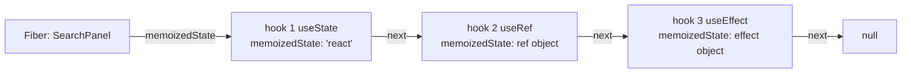
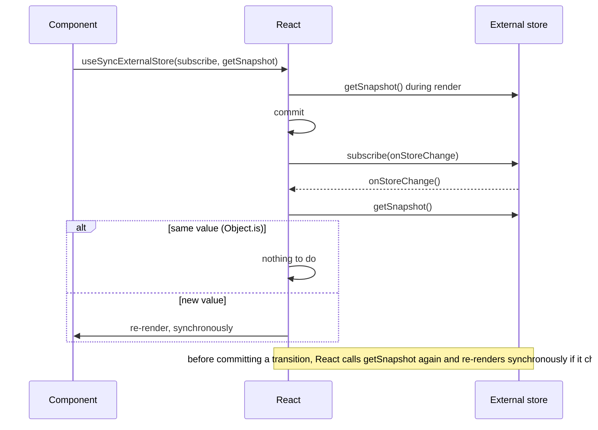

# 12 — Rules of hooks and custom hooks

> **How to use this module.** Sections 12.1–12.4 explain why the rules exist and how to design your own hooks; that is what most interview questions probe. Sections 12.5–12.10 are the six custom hooks interviewers most often ask you to write live, each with tests. Sections 12.11–12.14 cover `useId`, `useSyncExternalStore`, testing, and a reference table of every hook. Short on time? Read 12.1, 12.2, 12.4, 12.12 and the Summary.

**Prerequisites:** [State as a snapshot](08-state.md#82-usestate-and-state-as-a-snapshot) · [Effects as synchronization](09-effects.md#91-effects-as-synchronization-with-external-systems) · [Race conditions and `AbortController`](09-effects.md#94-race-conditions-and-abortcontroller) · [Callback refs and ref cleanup](10-refs-and-dom.md#103-callback-refs-and-ref-cleanup-functions) · [Closures](01-javascript.md#15-closures)

**Code for this module:** [`examples/web/src/m12-hooks/`](examples/web/src/m12-hooks/). Every hook has a test next to it. Run them with `npx vitest run src/m12-hooks` from `examples/web`.

---

## 12.1 The rules of hooks

### The problem
Hooks [React] are plain function calls, `useState(0)`, with no name or key attached. Yet React hands each call back *its own* state on every render. That only works if you play by two rules. Break them and you get a crash, or worse, a component that silently reads another hook's state.

### Mental model
The two rules, from [react.dev: Rules of Hooks](https://react.dev/reference/rules/rules-of-hooks):

1. **Only call hooks at the top level** of a function component or a custom hook. Not inside conditions or loops, not after a conditional `return`, not in event handlers, not in class components, not inside functions passed to `useMemo`, `useReducer` or `useEffect`, and not inside `try`/`catch`/`finally`.
2. **Only call hooks from React functions**: components and custom hooks. Never from a plain JavaScript function or at module level.

Put together, they guarantee one thing: **every render of a component calls the same hooks in the same order.** That is all React needs.

> **Java/Spring analogy.** Think of positional parameters versus named ones, or a JDBC `PreparedStatement`: `setString(1, …)`, `setInt(2, …)`. The driver doesn't care what you call the values; it binds them **by position**. Skip parameter 1 on one execution and parameter 2 lands in slot 1.
>
> **Where the analogy breaks:** a `PreparedStatement` throws if the count is wrong. React only detects a *count* change. If the count stays the same but the order shifts (two branches, each calling `useState` once), nothing throws and state is silently swapped ([12.2](#122-how-react-stores-hooks-so-call-order-matters), Exercise 7 test 4).

### Minimal code

```tsx
function Profile({ user }: { user: User | null }) {
  if (!user) return <p>Signed out</p>; // ❌ early return BEFORE a hook
  const [tab, setTab] = useState('posts'); // runs on some renders and not others
  // …
}

function Profile({ user }: { user: User | null }) {
  const [tab, setTab] = useState('posts'); // ✅ every hook first
  if (!user) return <p>Signed out</p>; //       then branch
  // …
}
```

Conditional *logic* is fine. Conditional *calls* are not. Put the condition **inside** the hook, or inside the effect:

```tsx
// ❌ if (enabled) useEffect(() => { … });
useEffect(() => {
  if (!enabled) return; // ✅ condition inside, hook call unconditional
  // …
}, [enabled]);
```

A loop over items that each need state is a sign of a missing component: render `<Row />` per item, and each row calls its hooks at its own top level ([10](10-refs-and-dom.md#103-callback-refs-and-ref-cleanup-functions) shows the ref-list version).

### How it works internally
React does not parse your code. It counts calls. 12.2 shows the data structure. Two runtime checks exist in the development build of `react-dom` 19.3.0 (`cjs/react-dom-client.development.js`, read for this module):
- if a render calls **more** hooks than the previous one: it throws `Rendered more hooks than during the previous render.`
- if it calls **fewer**: it throws `Rendered fewer hooks than expected. This may be caused by an accidental early return statement.`
- if a hook's **type** at a position differs from last time (say `useEffect` where `useState` was), it logs `React has detected a change in the order of Hooks called by %s…` with a two-column "Previous render / Next render" table. It does this once per component name.

Exercise 7 makes you predict which of these you get for each broken component, and the test asserts it.

The `use` API [React] (19.0) is the documented exception: *"`use` can only be used in render but can be called conditionally"* ([CHANGELOG 19.0.0](https://github.com/facebook/react/blob/main/CHANGELOG.md)). It reads a promise or context and does not occupy a hook slot the same way. Even `use` may not be called inside `try`/`catch` (the lint rule reports it, 12.3).

> **Version notes.** **React 16.8.0** (Feb 2019) introduced hooks, and with them the dev warning about mismatched hook order (CHANGELOG 16.8.0: "Warn about mismatching Hook order in development"). **React 19.0** added `use`, the first hook-like API allowed in conditions and loops. **React 19.3.0** added a dev-only warning "when a component appears to have been unblocked by calling `use()` conditionally" (CHANGELOG 19.3.0).

### Trade-offs
The rules are a design trade, not an accident. The alternatives (named keys, as in `useState('count', 0)`, or a compiler) were discussed when hooks launched. Positional storage keeps the API tiny and makes custom hooks compose with no namespacing: two `useCounter()` calls never collide on a key. The price is that you must follow the rules, so you must run the linter (12.3).

---

## 12.2 How React stores hooks, so call order matters

### The problem
`useState(0)` is called with nothing that identifies it. After a re-render, how does the third `useState` call get the third piece of state?

### Mental model
Every component instance is a **fiber** [React], a node in React's internal tree ([13](13-reconciliation-and-fiber.md#135-fiber-units-of-work-double-buffering-lanes-and-priorities)). Its `memoizedState` field points to a **singly linked list of hook objects**, one per hook call, in call order. Rendering walks the list with a cursor: each hook call advances the cursor one node.



> **Java analogy:** a `LinkedList<Object>` field on each component instance, read through an `Iterator` that is reset at the start of every render. `useState` means `it.next()`.
>
> **Where it breaks:** a Java iterator over the wrong element gives you a `ClassCastException`. React stores everything as untyped slots, so `useState` reading a slot that used to belong to another `useState` simply returns that other value.

### Minimal code
`examples/web/src/m12-hooks/HookPuzzles.tsx` contains the broken component that shows it best:

```tsx
export function SwappedHook({ first }: { first: boolean }) {
  // eslint-disable-next-line react-hooks/rules-of-hooks -- deliberately broken for the exercise
  const [label] = first ? useState('first') : useState('second');
  return <p>label: {label}</p>;
}
```

Render with `first`, then with `first={false}`: the label still says `first`. Both branches are "hook #1", and on an update React ignores the initial value and returns the slot's existing state.

### How it works internally
From `react-dom` 19.3.0's development build:
- **Mount** (`mountWorkInProgressHook`): each call creates `{ memoizedState, baseState, baseQueue, queue, next: null }` and appends it. The first one becomes `fiber.memoizedState`.
- **Update** (`updateWorkInProgressHook`): each call takes the **next** node from the current (committed) fiber's list and clones it into the work-in-progress fiber. If there is no next node, React throws `Rendered more hooks than during the previous render.` After the component returns, if nodes are left over, it throws `Rendered fewer hooks than expected…`.
- **What `memoizedState` holds** depends on the hook: the state value for `useState`/`useReducer`, `{ current }` for `useRef` ([10](10-refs-and-dom.md#101-useref-as-a-mutable-box-that-does-not-trigger-renders)), an effect object (create, deps, cleanup) for the effect hooks ([09](09-effects.md#91-effects-as-synchronization-with-external-systems)), `[value, deps]` for `useMemo`/`useCallback`, and the id string for `useId`.
- In development React also keeps an array of hook **names** per fiber (`_debugHookTypes`). It compares that array on every update; this is where the "change in the order of Hooks" table comes from. Production builds have only the count check. When a slot has the wrong kind (for example `useState` reading what used to be an effect), a later step may also throw `Should have a queue. You are likely calling Hooks conditionally, which is not allowed.`

A custom hook adds **no** node of its own. `useDebounce` calls `useState` and `useEffect`, so it contributes two nodes to the calling component's list. That is why custom hooks follow the same rules and why their state is per component (12.4).

### Trade-offs
Because state lives on the fiber, it is tied to **a component at a position in the tree**, not to the function. Unmount the component, or change its `key`, and the list is thrown away ([08](08-state.md#89-resetting-state-with-key)). Hook lists also explain why React DevTools can show a component's hooks in order with names: it re-runs the component with an instrumented dispatcher and reads the same list.

---

## 12.3 The lint rule and React Compiler rules

### The problem
The rules are easy to break by accident (an early return added months later), and the runtime only catches some breaks. You need a static check in the editor and in CI.

### Mental model
`eslint-plugin-react-hooks` [Tooling: ESLint] encodes the rules as lint rules. Since v6/v7 it also bundles the **React Compiler**'s analyses as lint rules, so it checks the broader "Rules of React" (purity, no refs in render, no `setState` in render) even if you never enable the compiler.

### Minimal code
This project's `examples/web/eslint.config.js` uses the flat preset:

```js
import reactHooks from 'eslint-plugin-react-hooks';
export default tseslint.config(/* … */, reactHooks.configs.flat.recommended);
```

The `recommended` preset of **7.1.1**, read from the plugin's source in `node_modules/eslint-plugin-react-hooks`:

| Rule | Severity | What it catches |
|---|---|---|
| `rules-of-hooks` | error | Hooks called conditionally, in loops, in callbacks, in classes, at top level, in async functions; `use` inside `try`/`catch` |
| `exhaustive-deps` | warn | Missing or extra dependencies in effects, `useMemo`, `useCallback` ([09.2](09-effects.md#92-dependencies-and-the-objectis-comparison)) |
| `set-state-in-effect` | error | `setState` called synchronously in an effect body ([09.6](09-effects.md#96-you-might-not-need-an-effect)) |
| `set-state-in-render` | error | **Unconditional** `setState` during render (a conditional one, as in 12.8, is allowed) |
| `refs` | error | Reading or writing `ref.current` during render |
| `purity` | error | Calling known-impure functions (`Date.now()`, `Math.random()`) during render |
| `globals` | error | Assigning or mutating globals during render |
| `immutability` | error | Mutating props, state or other values React treats as immutable |
| `static-components` | error | Creating components during render ([07](07-components-props-composition.md#77-render-props-and-hocs)) |
| `use-memo` | error | Common `useMemo` mistakes |
| `preserve-manual-memoization` | error | Manual memoization the compiler can't preserve |
| `error-boundaries` | error | `try`/`catch` around JSX instead of an error boundary |
| `config`, `gating` | error | Compiler configuration |
| `unsupported-syntax`, `incompatible-library` | warn | Syntax or libraries the compiler can't optimize |

`recommended-latest` adds `void-use-memo`. Rules with preset `Off` in 7.1.1 include `hooks`, `memo-dependencies`, `exhaustive-effect-dependencies` and `no-deriving-state-in-effects`.

A rule-of-hooks violation reads, from the rule's source: *React Hook "useState" is called conditionally. React Hooks must be called in the exact same order in every component render.*

### How it works internally
- `rules-of-hooks` builds ESLint's **code-path graph** of each component or hook and counts the paths from start to end through every hook call. If a hook is on fewer paths than the function has, it's conditional; if it's in a cycle, it's in a loop. That is why it catches an early `return` above a hook.
- It decides what is a hook by **name**: `use` or `/^use[A-Z0-9]/` (regex read from the source). What is a component: a function whose name starts with an uppercase letter, or a callback to `memo`/`forwardRef`.
- The compiler rules run the React Compiler's front end (HIR, data-flow and mutability analysis) on each component and report its diagnostics as lint errors.
- While react.dev forbids every hook in `try`/`catch`, `useState` inside `try` is not reported by `rules-of-hooks` or `unsupported-syntax` (verified by running it with ESLint 10 and `eslint-plugin-react-hooks` 7.1.1). In contrast, `use` inside `try` is flagged by `react-hooks/rules-of-hooks` ("React Hook 'use' cannot be called in a try/catch block"), and JSX inside `try` is flagged by `react-hooks/error-boundaries`.

> **Version notes (legacy configs you will meet).**
> - **v1–v4** (2019–2022): eslintrc only. `"plugins": ["react-hooks"]` plus `"extends": ["plugin:react-hooks/recommended"]` or the two rules listed by hand. `exhaustive-deps` arrived as a recommended rule with React 16.8.3 (CHANGELOG 16.8.3).
> - **v5.0**: hooks in async functions disallowed; experimental `useEvent` renamed to `useEffectEvent` in the rule; component names must start with an uppercase letter. **v5.2**: flat config support.
> - **v6.1** (6.0 was released by mistake): **flat config is the default `recommended`**; eslintrc moved to `recommended-legacy`; `use` in `try`/`catch` disallowed. **v6.1.1**: `recommended-latest` presets with compiler rules.
> - **v7.0**: only `recommended` and `recommended-latest` remain, with **all compiler rules on by default**; `flat/recommended` and `recommended-latest-legacy` removed. The flat form lives at `configs.flat.recommended`. **v7.1**: ESLint 10 support.
> - The standalone **`eslint-plugin-react-compiler`** is superseded: react.dev's [React Compiler v1.0 post](https://react.dev/blog/2025/10/07/react-compiler-1) says to remove it and use `eslint-plugin-react-hooks@latest`.
>
> Source: [`eslint-plugin-react-hooks` CHANGELOG](https://github.com/facebook/react/blob/main/packages/eslint-plugin-react-hooks/CHANGELOG.md). **Upgrading from v4/v5** to v7 usually surfaces new **errors** (`set-state-in-effect`, `refs`, `purity`) in code that used to pass. They point at real bugs or at patterns the compiler can't optimize, so fix them rather than disabling the preset.

### Trade-offs
- ❌ `// eslint-disable-next-line react-hooks/…` silences the rule and also makes the React Compiler **skip that component** ([09 Q14](09-effects.md#interview-questions)). Only Exercise 7's deliberately broken components do it here.
- ✅ Treat `rules-of-hooks` as a compiler error: there is no legitimate violation.
- The compiler rules are new and occasionally conservative. When one fires on code you believe is correct, rewrite it into the pattern the rule suggests first; the message usually links to the react.dev page with the fix.

---

## 12.4 Designing custom hooks

### The problem
Two components both need "track online status" or "debounce this value". Before 2019 the options were mixins, higher-order components (HOCs) and render props ([07](07-components-props-composition.md#77-render-props-and-hocs)). Each had costs: name clashes, wrapper hell, and logic hidden away from the call site.

### Mental model
A **custom hook** is a function whose name starts with `use` and that calls other hooks. It extracts **stateful logic**, not state. Each component that calls it gets its own copy of every hook inside, because those hooks are appended to *that* component's list (12.2).

> **Spring analogy:** a custom hook is like a reusable helper class you instantiate per request: same code, separate fields. It is not a singleton `@Service`. If you want one shared instance, you need a shared store: lift state up, use context ([11](11-context.md#112-createcontext-context-value-vs-provider)), or an external store (12.12).
>
> **Where it breaks:** a Spring helper's lifetime is whatever you choose. A hook's state lives exactly as long as the component instance at that tree position.

```tsx
// examples/web/src/m12-hooks/HookPuzzles.tsx
export function useCounter(initial = 0) {
  const [count, setCount] = useState(initial);
  const increment = () => setCount((c) => c + 1);
  return { count, increment };
}
// <Counter label="A" /> and <Counter label="B" /> each have their own count (Exercise 7 test 1).
```

### Minimal code: design rules that interviewers check
1. **Name it `use…` only if it calls hooks.** The lint rules key on the name. react.dev: *"If your function doesn't call any Hooks, avoid the `use` prefix"* ([Reusing Logic with Custom Hooks](https://react.dev/learn/reusing-logic-with-custom-hooks)). A pure helper is `getSorted`, not `useSorted`.
2. **Name it after the purpose, not the lifecycle.** `useOnlineStatus`, `useChatRoom(roomId)`. Not `useMount(fn)` or `useUpdateEffect`; react.dev explicitly calls those "custom lifecycle hooks" an anti-pattern, because they hide dependencies from the linter.
3. **Inputs are reactive.** Every argument may change on any render. Use them as effect dependencies (`useFetch(url)` refetches when `url` changes) rather than reading them once.
4. **Return the smallest useful shape.** Tuples (`[value, setValue]`) when callers rename freely and there are ≤ 3 items, like `useState`. Objects (`{ ref, isIntersecting }`) when there are more fields or most callers use only some.
5. **Return discriminated unions for async state** (`{ status: 'success', data }`), not three booleans ([02](02-typescript.md#27-discriminated-unions-and-exhaustiveness-with-never), 12.6).
6. **Keep primitive options, or document stability.** An options object literal is a new reference every render. If it feeds a dependency array or a ref callback, the hook re-runs on every render (12.10).
7. **Label it in DevTools** when it's reused widely: `useDebugValue(isOnline ? 'Online' : 'Offline')` [React] shows a label next to the hook in React DevTools. It does nothing else.

### How it works internally
Nothing special happens: React never sees the custom hook. The call is inlined, in effect, into the component. That is the whole design, and the reason hooks replaced the older patterns:

| Pattern | Era | Shares logic by | Main cost |
|---|---|---|---|
| Mixins (`createClass({ mixins: [...] })`) | 2013–2016 | Merging methods into the class | Name clashes, implicit dependencies, "snowballing" complexity ([Mixins Considered Harmful](https://legacy.reactjs.org/blog/2016/07/13/mixins-considered-harmful.html), 2016) |
| HOC `withX(Component)` | 2016–2019 | Wrapping and injecting props | Wrapper hell, prop collisions, refs and statics must be forwarded |
| Render prop `<X>{(v) => …}</X>` | 2017–2019 | Calling a function child | Nesting ("pyramid") when several are combined |
| **Custom hook** `useX()` | 16.8+ | Calling hooks inside the component | Must follow the rules of hooks |

The [legacy hooks introduction](https://legacy.reactjs.org/docs/hooks-intro.html) names the "wrapper hell" of providers, consumers, HOCs and render props as a motivation for hooks.

> **Version notes.** **React 16.8** made custom hooks possible. **React 18** added `useSyncExternalStore` and `useId`, which most "library" hooks are now built on. **React 19.2** made `useEffectEvent` stable, which replaces the "latest ref"/`useEvent` polyfill inside custom hooks ([09.9](09-effects.md#99-useeffectevent)). Class components can't call hooks. To reuse a hook from a class, wrap it in a small function component or HOC that calls the hook and passes the result as props ([07](07-components-props-composition.md#710-class-components)).

### Trade-offs
- ✅ Custom hooks compose freely: `useFetch` can call `useDebounce`.
- ❌ They do not share state. Two `useLocalStorage('theme')` calls stay in sync only because the **store** (localStorage) is shared and both subscribe to it (12.7).
- ❌ Over-extraction hides simple code behind names. Extract when logic is repeated, or when it hides a mechanism (subscriptions, timers, refs) from the component.

---

## 12.5 `useDebounce`

### The problem
A search box fires a request on every keystroke: typing "react" sends five requests and renders five result lists. You want to wait until the user **pauses**.

### Mental model
Debouncing [JS] means "run only after the input has been quiet for *N* ms; every new input restarts the clock" ([01](01-javascript.md#118-debounce-and-throttle)). In React, debounce the **value**, not the handler: the input stays instant, and a second, delayed copy of the value drives the expensive work.

### Minimal code
`examples/web/src/m12-hooks/useDebounce.ts` (full solution: Exercise 1):

```ts
const [debounced, setDebounced] = useState(value);
useEffect(() => {
  const id = setTimeout(() => setDebounced(value), delayMs);
  return () => clearTimeout(id); // a new value cancels the pending one
}, [value, delayMs]);
return debounced;
```

Use it with module 09's search: `const query = useDebounce(text, 300); const search = useSearch(query);`.

### How it works internally
The timer is an external system, so it lives in an effect ([09](09-effects.md#93-cleanup-and-the-effect-lifecycle)). Each change of `value` re-runs the effect, and the cleanup of the previous run clears its pending timer. Only the last timer survives to fire. `setDebounced` runs in the timer **callback**, not synchronously in the effect body, so `react-hooks/set-state-in-effect` does not apply.

### Trade-offs
- vs **`useDeferredValue`** [React] (18): no fixed delay; React renders the deferred value as soon as it can, at low priority, and abandons stale work. Prefer it for **expensive rendering**. Prefer debounce for **expensive side effects** (network calls, analytics), which `useDeferredValue` does not reduce ([21](21-concurrent-ssr-server-components.md#213-usedeferredvalue)).
- vs **debouncing a callback** (`lodash.debounce` in a ref or `useMemo`): useful for "save draft 1 s after the last keystroke" where nothing renders from the value. The callback version must be created once and cancelled on unmount.
- A value of object type must be stable by reference, or every render restarts the timer.

---

## 12.6 `useFetch`

### The problem
Every interviewer eventually says "extract the fetching logic into a hook." Module 09's `useSearch` already solved the race ([09.4](09-effects.md#94-race-conditions-and-abortcontroller)). A general `useFetch` must keep that safety, work for any URL and type, support "don't fetch yet" (`null`), and offer `refetch`.

### Mental model
Same three safety nets as `useSearch`:
1. **Abort** the previous request in the cleanup.
2. **Ignore aborts** in `.catch`; they are not errors.
3. **Tag every answer** with the request it belongs to, and **derive** the status during render: "no answer for the current request yet" means `loading`.

`refetch` bumps an `attempt` counter. The request key becomes `` `${url}#${attempt}` ``, so the status turns back to `loading` with no `setState` in the effect body.

### Minimal code
`examples/web/src/m12-hooks/useFetch.ts` (full solution: Exercise 2):

```ts
const requestKey = `${url}#${attempt}`;
// effect: fetch(url, { signal }) … setSettled({ requestKey: key, data }) … return () => controller.abort();
if (!url) return { status: 'idle', refetch };
if (settled?.requestKey !== requestKey) return { status: 'loading', refetch };
```

### How it works internally
The effect depends on `[url, attempt]`. A change of either runs the old cleanup (abort) and then a new fetch. The state stores **only** what the server said and for which key, so the rendered status can never disagree with the current `url`: a late answer for an old key is simply ignored by the derivation. `res.json() as Promise<T>` is an **unchecked cast** [TS]; types are erased at runtime, so validate untrusted payloads with a schema ([02](02-typescript.md#216-runtime-validation-with-zod-vs-static-types)).

### Trade-offs
This is a teaching hook. In production it lacks a cache, request deduplication across components, retries, background refresh, and SSR integration. Use TanStack Query (`useQuery({ queryKey: ['user', id], queryFn })`) or a router loader ([17](17-data-fetching.md#171-fetching-in-effects-and-its-pitfalls)). Say this in the interview after you write it.

---

## 12.7 `useLocalStorage`

### The problem
"Remember the theme across reloads." The naïve version, `useState(() => JSON.parse(localStorage.getItem(k)))` plus an effect that writes back, has four bugs: it breaks server rendering, two components with the same key drift apart, other tabs are ignored, and `JSON.parse` throws on corrupt data.

### Mental model
localStorage [Browser] is an **external store**: it lives outside React, other code (and other tabs) can change it, and it can tell you when it changes (partly). That's exactly what `useSyncExternalStore` is for (12.12). The snapshot is the raw string, a primitive, so `Object.is` compares it by value.

### Minimal code
`examples/web/src/m12-hooks/useLocalStorage.ts` (full solution: Exercise 3):

```ts
const raw = useSyncExternalStore(subscribe, () => readRaw(key), () => null);
const value = useMemo(() => parse(raw, initialValue, validate), [raw, initialValue, validate]);
```

- `subscribe` listens to the `storage` event (fired in **other** tabs) and to a custom event the hook dispatches after its own writes (the browser does not fire `storage` in the tab that wrote).
- Every storage access is in `try`/`catch`: localStorage throws when storage is disabled, in some private modes, and when the quota is full. A failed read returns the initial value; a failed write returns `false`.
- Parsing is defensive: missing key, `"null"`, invalid JSON, or a value the optional type guard rejects all yield `initialValue`.

### How it works internally
`setValue` reads the **store**, not the rendered `value`, to compute a functional update, so two updates in one handler compose (`n + 1` twice gives 2). It writes, then dispatches the same-tab event. Every subscribed component re-reads its key; only those whose string actually changed re-render.

On the server, `getServerSnapshot` returns `null`, so the server HTML and the hydration render both use `initialValue`. That's the SSR fix promised in [08](08-state.md#86-lazy-initialization): no hydration mismatch, and after hydration React re-renders with the real stored value.

> **Version notes.** Before React 18, the common version was `useState` + `useEffect` + a `storage` listener (the `usehooks`-style recipe). It works in a single component but can tear under concurrent rendering and needs extra code to sync components in the same tab. On React 16.8–17, use the `use-sync-external-store/shim` package to get the same API (12.12).

### Trade-offs
- The stored value is re-parsed whenever the raw string changes. Fine for preferences; for large data use IndexedDB ([03](03-browser-and-web-platform.md#35-storage-cookies-localstorage-sessionstorage-indexeddb-cache-api)).
- `initialValue` is a memo dependency: pass a primitive or a module-level constant, or every render re-parses and returns a new object.
- The server render can't know the stored value, so there is a brief flash of the default on hydration. If that matters (a dark theme flashing light), set the theme with an inline script before React loads, or store it in a cookie the server can read.
- Never store tokens or credentials in localStorage ([03](03-browser-and-web-platform.md#38-web-security-xss-csrf-csp-clickjacking-samesite-trusted-types)).

---

## 12.8 `usePrevious`

### The problem
"Show whether the price went up or down since the last change." You need the previous value of a prop.

### Mental model
The classic answer, which the old React FAQ once suggested:

```tsx
// ❌ Legacy: flagged by react-hooks/refs in eslint-plugin-react-hooks 7
function usePrevious<T>(value: T) {
  const ref = useRef<T>(undefined);
  useEffect(() => {
    ref.current = value; // written after commit
  });
  return ref.current; //   read during render  ← the problem
}
```

It reads `ref.current` **during render**. react.dev says *"Do not write or read `ref.current` during rendering"* ([useRef](https://react.dev/reference/react/useRef)), because refs are invisible to React: rendering from one can show stale values, and the React Compiler cannot memoize around it. The 7.x `refs` rule reports *"Cannot access refs during render"*, from its source. Even the [legacy hooks FAQ](https://legacy.reactjs.org/docs/hooks-faq.html#how-to-get-the-previous-props-or-state) walked it back: *"We have previously suggested a custom Hook called `usePrevious`… we've found that most use cases fall into the two patterns described above."*

The lint-clean version follows react.dev's **"storing information from previous renders"** pattern ([useState](https://react.dev/reference/react/useState#storing-information-from-previous-renders)): keep the last seen value **in state** and, when it differs, update it **during render**, inside a condition.

### Minimal code
`examples/web/src/m12-hooks/usePrevious.ts` (full solution: Exercise 4):

```ts
const [tracked, setTracked] = useState({ value, previous: undefined as T | undefined });
if (!Object.is(tracked.value, value)) {
  setTracked({ value, previous: tracked.value }); // conditional: allowed
  return tracked.value;
}
return tracked.previous;
```

### How it works internally
Calling the **current component's own** setter during render makes React throw away that render's output and immediately re-render the component with the new state, before rendering any children. The user never sees an intermediate frame. The condition prevents a loop: on the second pass the values are equal. `react-hooks/set-state-in-render` only reports **unconditional** calls; its own message recommends this pattern (*"store the previous value in state and update conditionally"*, from the 7.1.1 source).

**Semantics differ from the ref version, and interviewers like this question.** The ref version returns the value from the previous **render**. After an unrelated re-render it returns the *current* value. The state version returns the value before the last **change**, which is what "previous" means for a trend arrow. `usePrevious.test.tsx` asserts that an unrelated re-render does not move it.

### Trade-offs
- Most "previous value" needs disappear on inspection. To reset state when a prop changes, use `key` ([08](08-state.md#89-resetting-state-with-key)). To react to a change in an event, compare in the handler.
- The setter-during-render trick only works for the rendering component's own state. Setting another component's state during render triggers *"Cannot update a component while rendering a different component"* ([08](08-state.md#interview-questions)).

---

## 12.9 `useMediaQuery`

### The problem
Render a different layout on narrow screens, or follow the OS dark-mode setting. CSS media queries handle styling, but sometimes **JavaScript** needs to know (to render a drawer instead of a sidebar).

### Mental model
`window.matchMedia(query)` [Browser] returns a `MediaQueryList` with a boolean `matches` and a `change` event. It's an external store with a boolean snapshot, the ideal case for `useSyncExternalStore`.

### Minimal code
`examples/web/src/m12-hooks/useMediaQuery.ts` (full solution: Exercise 5):

```ts
const subscribe = useCallback((onStoreChange: () => void) => {
  const list = window.matchMedia(query);
  list.addEventListener('change', onStoreChange);
  return () => list.removeEventListener('change', onStoreChange);
}, [query]);
return useSyncExternalStore(subscribe, () => window.matchMedia(query).matches, () => serverValue);
```

### How it works internally
`subscribe` is memoized on `query`. react.dev: *"If a different `subscribe` function is passed during a re-render, React will re-subscribe"* ([useSyncExternalStore](https://react.dev/reference/react/useSyncExternalStore)). So a stable `subscribe` means one subscription, and a changed `query` correctly moves it to the new list. `getSnapshot` returns a boolean, so React only re-renders when it flips.

### Trade-offs
- ❌ Don't use it for things CSS can do (`@media` in a stylesheet costs no JavaScript and no re-render).
- The server doesn't know the viewport. `serverValue` is a guess; a wrong guess means a layout shift after hydration. For layout-critical decisions, prefer CSS, or render both and hide one with CSS.
- `addEventListener('change')` on `MediaQueryList` replaced the deprecated `addListener` (Safari supported it only from 14). Very old code uses `addListener`.
  > MDN lists the `change` event as Baseline Widely available, across browsers since September 2020, which is when Safari 14 shipped it ([MDN: MediaQueryList change event](https://developer.mozilla.org/en-US/docs/Web/API/MediaQueryList/change_event)).

---

## 12.10 `useIntersectionObserver`

### The problem
Lazy-load images or comments when they scroll near the viewport, fire "seen" analytics, or build infinite scroll. Listening to `scroll` and calling `getBoundingClientRect()` forces layout on every frame ([03](03-browser-and-web-platform.md#34-the-rendering-pipeline-parse--style--layout--paint--composite-reflow-and-layout-thrashing)).

### Mental model
`IntersectionObserver` [Browser] tells you, asynchronously and off the main layout path, when an element crosses a visibility threshold ([03](03-browser-and-web-platform.md#312-observers-intersection-resize-mutation-performance)). The hook connects an observer to **whichever element its ref is attached to**.

### Minimal code
`examples/web/src/m12-hooks/useIntersectionObserver.ts` (full solution: Exercise 6):

```ts
const ref = useCallback((node: T | null) => {
  if (!node) return;
  const observer = new IntersectionObserver((entries) => { /* setEntry(latest) */ }, { threshold, rootMargin });
  observer.observe(node);
  return () => observer.disconnect(); // React 19 ref cleanup
}, [threshold, rootMargin, once]);
```

### How it works internally
A **callback ref** [React] runs when the element is attached and its cleanup runs when it's detached ([10](10-refs-and-dom.md#103-callback-refs-and-ref-cleanup-functions)). That handles three cases a `useRef` + `useEffect` version gets wrong: the element appears later (conditional rendering), the element is swapped for another, and the element is removed while the component stays mounted. The effect version only re-runs when its deps change, and `ref.current` is not a dependency React can watch.

The ref callback is memoized on **primitive** options. If it changed identity every render, React would call the old cleanup and the new callback after every commit, disconnecting and recreating the observer each time.

> **Version notes.** Ref cleanup functions are **React 19**. On React 18 a callback ref receives `null` on detach, so you store the observer in a ref and disconnect it in the `null` branch. Libraries like `react-intersection-observer` wrapped this for years.

### Trade-offs
- `once: true` disconnects after the first intersection, which is what lazy loading wants (`LazySection.tsx`).
- For thousands of elements, share one observer across many targets (a context that owns one `IntersectionObserver`) instead of one per element.
- For long lists, virtualization ([15](15-performance.md#158-virtualization)) beats lazy rendering: it also removes off-screen nodes.

---

## 12.11 `useId`

### The problem
Accessible forms need ids: `<label htmlFor>` must match `<input id>`, and `aria-describedby` must point at the hint ([14](14-forms-and-actions.md#145-accessible-forms)). A hard-coded id breaks when the component renders twice. `Math.random()` is impure, so it differs between the server HTML and the client hydration render. A module counter differs whenever server and client render in a different order, which streaming SSR makes common.

### Mental model
`useId()` [React] (18.0) returns a string that is **unique per component instance** and **identical on server and client**, because it is derived from the component's position in the tree (react.dev: *"generated from the 'parent path' of the calling component"*).

### Minimal code
`examples/web/src/m12-hooks/LabeledField.tsx`:

```tsx
const id = useId(); // one call; derive related ids
return (
  <div>
    <label htmlFor={`${id}-input`}>{label}</label>
    <input id={`${id}-input`} aria-describedby={`${id}-hint`} />
    <p id={`${id}-hint`}>{hint}</p>
  </div>
);
```

`LabeledField.test.tsx` checks that two instances get different ids, that the hint is the input's accessible description, and that the id matches the 19.2+ format and works in `querySelector` without escaping.

### How it works internally
In `react-dom` 19.3.0 (dev build, `mountId`): a client-only render produces `"_" + identifierPrefix + "r_" + counter.toString(32) + "_"`. During hydration it encodes the tree position instead (`"_" + prefix + "R_" + treeId`, plus `"H" + n` for a second `useId` in the same component). The value is stored in the hook's slot, so it is stable for the life of the component.

> **Version notes.** **18.0**: `useId` added (`:r0:` style ids). **19.1**: format changed to `«r123»` so ids are valid CSS selectors (CHANGELOG 19.1.0). **19.2**: changed again to `_r_123_` (CHANGELOG 19.2.0, "Use underscore instead of `:` for IDs generated by `useId`"). Snapshot tests that contain generated ids break on each upgrade. Multiple React roots on one page should pass a distinct `identifierPrefix` to `createRoot`/`hydrateRoot` ([06](06-jsx-and-rendering-model.md#612-createroot-hydrateroot-root-options)).

### Trade-offs
- ❌ **Not for list keys** (react.dev: keys come from your data) and **not for `use()` cache keys**.
- ❌ It cannot be used in **async** Server Components (react.dev).
- With SSR, it requires an identical component tree on the server and the client; a server/client branch difference shifts the ids.

---

## 12.12 `useSyncExternalStore`

### The problem
Module 09's `useOnlineStatus` copies a browser value into state with an effect ([09](09-effects.md#93-cleanup-and-the-effect-lifecycle)). That pattern has two flaws under concurrent rendering ([21](21-concurrent-ssr-server-components.md#211-concurrent-rendering-interruptible-rendering)):
- **Tearing:** React may pause a render halfway. If the store changes during the pause, components rendered before and after the change show **different** values in the same commit.
- **A stale first frame:** the effect runs after paint, so the first render shows the initial state, not the store's current value.

### Mental model
`useSyncExternalStore(subscribe, getSnapshot, getServerSnapshot?)` [React] (18.0) says: "this value lives outside React. Here's how to read it, and here's how to be told it changed." React reads the snapshot **during render** and guarantees every component in a commit saw the same snapshot.

> **Spring analogy:** like an `ApplicationListener` registered on an event publisher, plus a getter you call to read current state. `subscribe` registers; `getSnapshot` reads.
>
> **Where it breaks:** your listener's job is not to deliver the new value. It just says "something changed"; React then calls `getSnapshot` and compares with `Object.is`.



### Minimal code
`examples/web/src/m12-hooks/useOnlineStatusSync.ts`, module 09's hook rewritten:

```ts
function subscribe(onStoreChange: () => void) {
  window.addEventListener('online', onStoreChange);
  window.addEventListener('offline', onStoreChange);
  return () => {
    window.removeEventListener('online', onStoreChange);
    window.removeEventListener('offline', onStoreChange);
  };
}
export function useOnlineStatusSync() {
  return useSyncExternalStore(subscribe, () => navigator.onLine, () => true);
}
```

And a minimal Zustand-like store, `examples/web/src/m12-hooks/createStore.ts`:

```ts
export function useStore<S, U>(store: Store<S>, selector: (state: S) => U): U {
  const getSnapshot = () => selector(store.getState());
  return useSyncExternalStore(store.subscribe, getSnapshot, getSnapshot);
}
```

`createStore.test.tsx` shows the difference from a custom hook: two components **share** the store's state, and a component re-renders only when **its** selected slice changes.

### How it works internally
The rules, from [react.dev](https://react.dev/reference/react/useSyncExternalStore):
- **`getSnapshot` must return a cached or immutable value.** If it returns a new object every call, React sees "changed" every time and loops. The dev build reports *"The result of getSnapshot should be cached to avoid an infinite loop"* (read in `react-dom` 19.3.0). Return primitives, or stored references; never build `{ … }` or `.filter(...)` inside it.
- **A different `subscribe` function means re-subscribe.** Define it at module level, or memoize it on its inputs (12.9).
- **Store updates are always synchronous.** If the store changes during a non-blocking transition, React redoes the update as blocking. That is the trade for "no tearing." Don't suspend based on a store value, because mutations can't be marked as transitions.
- **`getServerSnapshot`** runs on the server and during hydration, and must return the same data on both. Without it, server rendering a component that uses the hook makes React fall back to client rendering, with the dev message *"Missing getServerSnapshot, which is required for server-rendered content. Will revert to client rendering."* (read in `react-dom` 19.3.0).

Libraries rely on it: Zustand 5.0.15's `zustand/react` calls React's `useSyncExternalStore` directly, and react-redux 9.3.0 imports `use-sync-external-store/with-selector` (both read in `examples/web/node_modules`).

> **Version notes.** **React 18.0**: `useSyncExternalStore` added, *"recommended for any library that integrates with state external to React"* ([React 18 post](https://react.dev/blog/2022/03/29/react-v18)). It replaced the experimental **`useMutableSource`**, which existed only in experimental builds of 16/17 ([reactwg/react-18 discussion #86, "useMutableSource → useSyncExternalStore"](https://github.com/reactwg/react-18/discussions/86)). For **React 16.8–17**, libraries import `use-sync-external-store/shim` (*"Backwards compatible shim for React's useSyncExternalStore. Works with any React that supports hooks"*, its `package.json` 1.7.0). `use-subscription`, an older Facebook package, was re-implemented on top of that shim (CHANGELOG 18.1.0). **19.3.0** fixed `useSyncExternalStore` missing store mutations made while an `<Activity>` tree was hidden.

### Trade-offs
- ✅ The right tool for browser APIs (online, media queries, storage, history), for your own observable stores, and for third-party stores.
- ❌ react.dev positions it mainly for **libraries**. For state React owns, use `useState`/`useReducer`/context.
- ❌ Every store change renders synchronously: a store that changes many times per second (mouse position) and feeds a heavy tree will hurt INP. Throttle at the store or select a coarser slice.

---

## 12.13 Testing custom hooks

### The problem
A hook can't be called outside a component. You want to test it without building a demo UI for each one.

### Mental model
Two styles, both used in this module:
- **`renderHook(() => useX(args), { initialProps, wrapper })`** [Library: @testing-library/react] renders a tiny test component that calls your hook and exposes `result.current`. Use it when the hook's **return value** is the contract (`useDebounce`, `usePrevious`, `useLocalStorage`).
- **A real or test component** with `render` and `screen` queries. Use it when the contract is **behavior in the DOM** (`LazySection`, `DebouncedSearch`, `Counter`).

### Minimal code
From `usePrevious.test.tsx`:

```tsx
const { result, rerender } = renderHook(({ value }) => usePrevious(value), { initialProps: { value: 1 } });
rerender({ value: 2 });
expect(result.current).toBe(1);
```

The toolbox the tests in this folder use:

| Need | Technique | Example |
|---|---|---|
| Change the hook's arguments | `initialProps` + `rerender(newProps)` | `useDebounce.test.tsx` |
| Trigger an update | Call the returned function inside `act(() => …)` | `useLocalStorage.test.ts` |
| Timers | `vi.useFakeTimers()`, `act(() => vi.advanceTimersByTime(ms))`; with user-event under Vitest, `vi.useFakeTimers({ shouldAdvanceTime: true })` plus `userEvent.setup({ advanceTimers: vi.advanceTimersByTime })` | `useDebounce.test.tsx` |
| Network | MSW handlers with controlled `delay` ([20](20-testing.md#206-msw-for-network-mocking)) | `useFetch.test.ts` |
| Async result | `await waitFor(() => expect(result.current…))` | `useFetch.test.ts` |
| Browser APIs jsdom lacks (`matchMedia`, `IntersectionObserver`) | A small fake that lets the test play the browser | `useMediaQuery.test.ts`, `useIntersectionObserver.test.tsx` |
| Providers (context, router, query client) | `renderHook(…, { wrapper })` | [20.7](20-testing.md#207-testing-hooks) |
| Cleanup | `unmount()`, then assert listeners removed / `vi.getTimerCount()` is 0 | `useMediaQuery.test.ts` |

### How it works internally
`renderHook` is a thin wrapper around `render`: it mounts a component that calls your callback and stores its return value in `result.current` on each render. `result.current` is a **live getter**: read it after the `act` or `waitFor`, not into a variable before.

> **Version notes.** Until 2022, hooks were tested with **`@testing-library/react-hooks`**. When React 18 arrived, `renderHook` moved into **`@testing-library/react` 13.1.0** (release notes: "Add `renderHook`"), and the old package's README tells React 18 users to switch. The move dropped helpers like `waitForNextUpdate`; use `waitFor`. Enzyme-era tests mounted a dummy component by hand.

### Trade-offs
- Test through the public API only. Don't assert "`useEffect` was called" or inspect internal state.
- Don't test React itself (that `useState` stores values). Test your logic: debounced timing, race safety, sync between instances, cleanup.
- `renderHook` makes it easy to forget the user. When a hook exists to drive UI, add at least one component-level test.

---

## 12.14 Full hooks API reference table

Every hook exported by `react` 19.3 (plus `useFormStatus` from `react-dom`), when it became **stable**, and where this guide covers it. Versions are from the [React CHANGELOG](https://github.com/facebook/react/blob/main/CHANGELOG.md): 16.8.0 "Add Hooks" (the ten original hooks are listed in the [legacy Hooks API reference](https://legacy.reactjs.org/docs/hooks-reference.html)), 18.0.0, 19.0.0 and 19.2.0.

| Hook | Since | Purpose | Covered in |
|---|---|---|---|
| `useState` | 16.8 | Local state; setter triggers a re-render | [08.2](08-state.md#82-usestate-and-state-as-a-snapshot) |
| `useReducer` | 16.8 | State updated by a pure reducer `(state, action) => state` | [08.10](08-state.md#810-usereducer) |
| `useContext` | 16.8 | Read the nearest context value | [11.2](11-context.md#112-createcontext-context-value-vs-provider) |
| `useRef` | 16.8 | Mutable box that persists without re-rendering; DOM refs | [10.1](10-refs-and-dom.md#101-useref-as-a-mutable-box-that-does-not-trigger-renders) |
| `useEffect` | 16.8 | Synchronize with an external system after commit | [09.1](09-effects.md#91-effects-as-synchronization-with-external-systems) |
| `useLayoutEffect` | 16.8 | Same, but before paint (measure layout) | [09.7](09-effects.md#97-uselayouteffect) |
| `useMemo` | 16.8 | Cache a computed value between renders | [15.4](15-performance.md#154-usememo-and-usecallback-and-when-they-waste-effort) |
| `useCallback` | 16.8 | Cache a function identity between renders | [15.4](15-performance.md#154-usememo-and-usecallback-and-when-they-waste-effort) |
| `useImperativeHandle` | 16.8 | Customize what a ref exposes to the parent | [10.5](10-refs-and-dom.md#105-useimperativehandle) |
| `useDebugValue` | 16.8 | Label a custom hook in React DevTools | [12.4](#124-designing-custom-hooks) |
| `useTransition` | 18.0 | Mark updates as non-urgent, with a pending flag | [21.2](21-concurrent-ssr-server-components.md#212-usetransition-and-starttransition) |
| `useDeferredValue` | 18.0 | Render a lagging copy of a value at low priority (`initialValue` arg: 19.0) | [21.3](21-concurrent-ssr-server-components.md#213-usedeferredvalue) |
| `useId` | 18.0 | Unique, SSR-stable ids for accessibility attributes | [12.11](#1211-useid) |
| `useSyncExternalStore` | 18.0 | Subscribe to an external store without tearing | [12.12](#1212-usesyncexternalstore) |
| `useInsertionEffect` | 18.0 | Inject styles before layout effects (CSS-in-JS libraries only) | [09.8](09-effects.md#98-useinsertioneffect) |
| `useActionState` | 19.0 | State produced by an Action, with a pending flag | [14.7](14-forms-and-actions.md#147-useactionstate) |
| `useOptimistic` | 19.0 | Show an optimistic value while an Action is in flight | [14.9](14-forms-and-actions.md#149-useoptimistic) |
| `use` | 19.0 | Read a promise (suspends) or a context; callable conditionally | [11.7](11-context.md#117-reading-context-with-use), [17.10](17-data-fetching.md#1710-suspense-based-fetching-and-use) |
| `useFormStatus` (`react-dom`) | 19.0 | Pending status of the parent `<form>` Action | [14.8](14-forms-and-actions.md#148-useformstatus) |
| `useEffectEvent` | 19.2 | Non-reactive logic called from effects, reading latest props/state | [09.9](09-effects.md#99-useeffectevent) |

**Renamed, replaced or never stable** (you'll see them in older code and RFCs):

| Name | What happened |
|---|---|
| `ReactDOM.useFormState` | Canary name; renamed to `React.useActionState` before 19.0. The 19.3 dev build still warns *"ReactDOM.useFormState has been renamed to React.useActionState"* (read in `react-dom-client.development.js`). |
| `useMutableSource` | Experimental (16/17 experimental builds); replaced by `useSyncExternalStore` in 18.0. |
| `useEvent` | 2022 RFC; renamed `useEffectEvent` (plugin CHANGELOG 5.0.0) and narrowed to effects; stable in 19.2. |
| `useOpaqueIdentifier` | Experimental predecessor of `useId` (it shows up in 17-era experimental builds). |

> `useOpaqueIdentifier` existed only in experimental builds ([PR #22672](https://github.com/facebook/react/pull/22672) removed "the experimental useOpaqueIdentifier API"), and the React 18 working group renamed it to `useId` and changed its return value from an opaque object to a plain string ([reactwg/react-18 #111](https://github.com/reactwg/react-18/discussions/111)).

`startTransition` (18.0), `cache` and `cacheSignal` (RSC), `lazy`, `memo` and `forwardRef` are APIs, not hooks: they are not bound by the rules of hooks.

---

## Interview questions

**Q1. What are the rules of hooks, and why do they exist?**
<details><summary>Answer</summary>

Call hooks only at the top level of function components and custom hooks (not in conditions, loops, nested functions, event handlers, after an early return, or in `try`/`catch`), and only from React functions. They exist because React stores hook state **by call order** in a linked list on the fiber, so every render must make the same calls in the same order. **A strong answer adds:** `use` is the documented exception for conditions and loops, and the `rules-of-hooks` lint rule enforces the rest statically.

</details>

**Q2. What exactly goes wrong if a hook is called conditionally?**
<details><summary>Answer</summary>

On the render where the condition changes, React's cursor through the hook list shifts. If the count changes, React throws (`Rendered more hooks than during the previous render.` or `Rendered fewer hooks than expected…`). If the count stays the same, every hook after the skipped one reads its neighbor's state, silently. **A strong answer adds:** in development React also logs "change in the order of Hooks" with a Previous/Next table when a slot's hook **type** changes; production has only the count check.

</details>

**Q3. A component has `if (x) useState()`. `x` goes from false to true. What does React do? And from true to false?**
<details><summary>Answer</summary>

False → true: one more hook than the committed list has, so React throws `Rendered more hooks than during the previous render.` and the nearest error boundary shows its fallback. The dev build also logs the hook-order table. True → false: the render ends with nodes left over, so it throws `Rendered fewer hooks than expected. This may be caused by an accidental early return statement.` Exercise 7 asserts both. **A strong answer adds:** the messages come from `updateWorkInProgressHook` and the end-of-render check in `react-dom`.

</details>

**Q4. `const [label] = first ? useState('first') : useState('second')`. `first` flips. What's rendered?**
<details><summary>Answer</summary>

Still `first`. Both calls are hook #1. On an update React ignores the argument and returns slot #1's existing state. No error and no warning, because both are `useState`. **A strong answer adds:** this is why "it didn't crash" doesn't mean "it's fine", and why the linter matters more than the runtime check.

</details>

**Q5. Why is an early `return` before a hook a bug, even though it "works" at first?**
<details><summary>Answer</summary>

On renders that return early, the later hooks don't run, so the count changes between renders, and React throws when the condition flips. It "works" as long as the condition never changes during the component's life. **A strong answer adds:** fix by moving all hooks above the first `return`, or by splitting the branch into its own component so each component has a fixed list.

</details>

**Q6. You need one piece of state per item in a list. Can you call `useState` in a `.map`?**
<details><summary>Answer</summary>

No: the number of calls changes with the list length, and items moving changes which state belongs to which item. Render a child component per item and let each call its own hooks; key it by the item's id so state follows the item. Or keep one `useState` holding a `Record<id, value>`. **A strong answer adds:** `use` may be called in a loop, but `useState`/`useRef` may not; a list of refs uses a callback ref writing into a `Map` ([10](10-refs-and-dom.md#103-callback-refs-and-ref-cleanup-functions)).

</details>

**Q7. Why is `use` allowed inside conditions when other hooks aren't?**
<details><summary>Answer</summary>

`use` doesn't keep persistent state in a hook slot the way `useState` does. It reads a promise (suspending if pending) or a context value on each call, so skipping it on a render shifts nothing. The CHANGELOG for 19.0 says it "can only be used in render but can be called conditionally." **A strong answer adds:** it is still not allowed inside `try`/`catch` (lint, plugin 6.1), and 19.3 adds a dev warning when a component appears to be unblocked by a conditional `use`.

</details>

**Q8. How does React know which `useState` call gets which state?**
<details><summary>Answer</summary>

`fiber.memoizedState` points to a linked list of hook objects (`memoizedState`, `queue`, `next`…). On mount each call appends a node. On update each call takes the next node from the committed fiber's list and clones it. Position is the only key. **A strong answer adds:** a custom hook adds no node of its own: its inner hooks are appended to the caller's list.

</details>

**Q9. What makes a function a custom hook?**
<details><summary>Answer</summary>

It's named `use` followed by an uppercase letter (or digit), and it calls other hooks. The name matters to the tooling: the lint rules and the React Compiler identify hooks by the `/^use[A-Z0-9]/` pattern. **A strong answer adds:** react.dev says not to use the prefix for functions that call no hooks; it makes the linter apply hook rules to plain functions and misleads readers.

</details>

**Q10. Two components call `useCounter()`. Do they share the count?**
<details><summary>Answer</summary>

No. Custom hooks share **logic**, not state. Each call appends its own hooks to the calling component's list, so each component has its own count. Exercise 7 test 1 asserts A: 2 and B: 1 after clicks. **A strong answer adds:** to share state, lift it up, put it in context, or keep it in an external store and subscribe with `useSyncExternalStore` (`createStore.test.tsx`).

</details>

**Q11. When should shared state go in context versus an external store?**
<details><summary>Answer</summary>

Context is React-owned, low-frequency, tree-scoped data (theme, current user, locale). Every consumer re-renders when the value changes. An external store suits frequently updated or widely read state where components should subscribe to **slices**: `useSyncExternalStore` with a selector re-renders only components whose slice changed. **A strong answer adds:** that is what Zustand and react-redux do under the hood ([18](18-state-management.md#181-a-taxonomy-local-server-url-form-global-ui)).

</details>

**Q12. Compare mixins, HOCs, render props and custom hooks.**
<details><summary>Answer</summary>

Mixins merged methods into classes: name clashes and implicit dependencies, deprecated by 2016. HOCs wrap a component and inject props: wrapper hell, prop collisions, ref and static forwarding. Render props call a function child: explicit but nests badly. Custom hooks run inside the component: no wrappers, explicit inputs and outputs, composable. **A strong answer adds:** HOCs and render props still fit library APIs (`memo`, `connect`) and components that must own DOM while the caller renders, and classes can consume a hook only through such a wrapper.

</details>

**Q13. Why does react.dev discourage `useMount(fn)` or `useUpdateEffect`?**
<details><summary>Answer</summary>

They wrap `useEffect` with a lifecycle meaning and hide its dependencies from the linter, so `useMount(() => connect(roomId))` silently ignores later `roomId` changes. Name hooks after **what** they synchronize (`useChatRoom(roomId)`) and pass the reactive values in. **A strong answer adds:** lifecycle thinking is exactly what hooks moved away from ([09](09-effects.md#91-effects-as-synchronization-with-external-systems)).

</details>

**Q14. Should a custom hook return a tuple or an object?**
<details><summary>Answer</summary>

Tuple for two or three values that callers will rename (`const [theme, setTheme] = useLocalStorage(...)`), like `useState`. Object for more fields, optional fields, or when callers use a subset (`const { ref, isIntersecting } = …`). For async state, return a discriminated union so impossible combinations can't be represented. **A strong answer adds:** return `as const` for tuples so TypeScript infers a fixed-length tuple, not a union array.

</details>

**Q15. Write `useDebounce`. Why does it need the effect cleanup?**
<details><summary>Answer</summary>

`useState(value)`; an effect on `[value, delayMs]` sets a `setTimeout` that calls `setDebounced(value)`, and its cleanup clears the timeout. Without the cleanup every keystroke's timer would still fire, and you'd get a delayed copy of every value instead of only the last. The cleanup is what turns "delay" into "debounce". **A strong answer adds:** the cleanup also prevents a `setState` after unmount, and the test asserts `vi.getTimerCount()` is 0 after unmount.

</details>

**Q16. Debounce the value or debounce the callback?**
<details><summary>Answer</summary>

Debounce the **value** when the delayed value drives rendering or an effect (search query → fetch); it composes with hooks and has no identity problems. Debounce the **callback** when nothing renders from the value and you only want to delay an action (autosave). A debounced callback must be created once (`useMemo`/ref) and cancelled on unmount, or each render creates a fresh debouncer with its own timer. **A strong answer adds:** never debounce `setState` itself, because the input then lags behind the keyboard.

</details>

**Q17. `useDebounce` vs `useDeferredValue`?**
<details><summary>Answer</summary>

`useDeferredValue` (18) has no fixed delay. It re-renders with the new value at low priority as soon as possible, and React abandons the stale work when new input arrives, so it fixes **slow rendering**. It doesn't reduce side effects: an effect depending on the deferred value still fires for most values. Debounce waits for a pause, so it cuts **network calls**. **A strong answer adds:** they combine well: debounce the query for fetching, defer the list rendering.

</details>

**Q18. Write `useFetch`. What makes it race-safe?**
<details><summary>Answer</summary>

Abort the previous request in the effect cleanup; ignore `AbortError` in `.catch`; store each answer tagged with the request key it answers; derive `loading` when the stored key differs from the current one. Then a stale response can never be shown, even if it resolves after the abort. **A strong answer adds:** deriving status also avoids `setState` in the effect body (`set-state-in-effect`), and `refetch` is just a counter in the key.

</details>

**Q19. Why isn't a hand-written `useFetch` enough in production?**
<details><summary>Answer</summary>

No shared cache (two components fetch twice), no deduplication, no retries or backoff, no background revalidation, no garbage collection of old data, no SSR or prefetching, and it starts fetching only after render (waterfalls). TanStack Query, SWR or a router loader give you all of these. **A strong answer adds:** knowing how to write it is still expected, because it shows you understand races, cleanup and derived state ([17](17-data-fetching.md#171-fetching-in-effects-and-its-pitfalls)).

</details>

**Q20. Why build `useLocalStorage` on `useSyncExternalStore` instead of `useState` + `useEffect`?**
<details><summary>Answer</summary>

localStorage is an external store. With `useSyncExternalStore`, every component reading a key renders from the same snapshot (no drift between instances, no tearing), the first render already has the stored value (no effect-after-paint flash on the client), and `getServerSnapshot` gives a hydration-safe default. **A strong answer adds:** the browser doesn't fire `storage` in the tab that wrote, so the hook dispatches its own event after writes.

</details>

**Q21. What can go wrong with localStorage that your hook must handle?**
<details><summary>Answer</summary>

Access throws (disabled storage, some private modes, quota exceeded); stored data may be invalid JSON, `"null"`, or an old shape; the key may be missing; and there's no localStorage on the server. The hook wraps access in `try`/`catch`, parses defensively (optionally with a type guard), returns the initial value on any bad read, and returns `false` from a failed write. **A strong answer adds:** namespace keys (`app.theme`) and never store tokens there.

</details>

**Q22. Why does the classic `usePrevious` (ref updated in an effect, returned during render) fail lint now?**
<details><summary>Answer</summary>

It reads `ref.current` during render. React docs forbid reading or writing refs during render, because a ref change doesn't trigger a render and the value can be stale; the React Compiler also can't memoize around it. `eslint-plugin-react-hooks` 7 reports it with the `refs` rule ("Cannot access refs during render"). **A strong answer adds:** the lint-clean version stores the last value in state and updates it conditionally during render, react.dev's "storing information from previous renders" pattern.

</details>

**Q23. After an unrelated re-render, what does each `usePrevious` return?**
<details><summary>Answer</summary>

The ref version returns the value from the previous **render**, which after an unrelated re-render equals the current value. The state version returns the value before the last **change**, so it doesn't move. For a trend arrow you want the latter. `usePrevious.test.tsx` asserts it. **A strong answer adds:** clarify which semantics the interviewer means before writing it.

</details>

**Q24. Is calling `setState` during render ever allowed?**
<details><summary>Answer</summary>

Only for the component that is rendering, only inside a condition that becomes false after the update, typically to adjust state when a prop changed. React discards the output and re-renders immediately, before children. Unconditional calls loop ("Too many re-renders") and are reported by `react-hooks/set-state-in-render`. **A strong answer adds:** most uses are better as derived values or a `key` reset ([08](08-state.md#87-derived-state-compute-do-not-store)).

</details>

**Q25. In `useMediaQuery`, why memoize `subscribe` and return a boolean from `getSnapshot`?**
<details><summary>Answer</summary>

A new `subscribe` function each render makes React unsubscribe and resubscribe on every render; `useCallback` on `[query]` resubscribes only when the query changes. A boolean snapshot compares by value, so React re-renders only when the match flips. **A strong answer adds:** a `getSnapshot` that returned the `MediaQueryList` object itself would be a new object each call and trigger the "should be cached" loop.

</details>

**Q26. Why use a callback ref for `useIntersectionObserver` instead of `useRef` + `useEffect`?**
<details><summary>Answer</summary>

An effect runs only when its deps change, and `ref.current` changing isn't something React tracks. If the element mounts later, is swapped, or is removed while the component stays, the effect misses it. A callback ref runs exactly when React attaches or detaches the node, and React 19's ref cleanup disconnects the observer. **A strong answer adds:** memoize the callback on primitive options, or React detaches and re-attaches it every render.

</details>

**Q27. What is `useId` for, and why not `Math.random()` or a counter?**
<details><summary>Answer</summary>

Generating ids for accessibility attributes (`htmlFor`, `aria-describedby`) that are unique per instance and match between server HTML and client hydration. `Math.random()` differs between server and client (a hydration mismatch) and is impure. A module counter depends on render order, which differs with streaming SSR and selective hydration. `useId` derives the id from the component's position in the tree. **A strong answer adds:** call it once and derive suffixes (`${id}-hint`).

</details>

**Q28. Can you use `useId` for list keys? Has its format changed?**
<details><summary>Answer</summary>

No: keys must come from the data, so that they identify items, not component instances. The format changed twice: `:r0:` (18), `«r0»` (19.1) so ids are valid CSS selectors, and `_r_0_` (19.2). Snapshot tests with generated ids break on upgrade. **A strong answer adds:** pass `identifierPrefix` to each root when several React apps share a page.

</details>

**Q29. What problem does `useSyncExternalStore` solve? What is tearing?**
<details><summary>Answer</summary>

Concurrent rendering can pause mid-tree. If an external store changes during the pause, components rendered before and after the change show different values in one commit: that's tearing. `useSyncExternalStore` reads the snapshot during render, re-checks it before commit, and forces a synchronous re-render if it changed, so a commit is always consistent. **A strong answer adds:** the cost is that store-driven updates can't be transitions.

</details>

**Q30. You get "The result of getSnapshot should be cached to avoid an infinite loop". Why, and how do you fix it?**
<details><summary>Answer</summary>

`getSnapshot` returns a new object or array on each call (`{ todos: store.todos }`, `.filter(...)`). React compares snapshots with `Object.is`, sees a change every time, re-renders, calls it again, and loops. Return the stored reference itself, a primitive, or a cached derived value that changes only when the underlying data changes. **A strong answer adds:** for derived slices, `use-sync-external-store/with-selector` memoizes the selection with an equality function; react-redux uses it.

</details>

**Q31. What was `useMutableSource`, and how did libraries support React 16/17 after 18 shipped?**
<details><summary>Answer</summary>

An experimental hook (16/17 experimental builds) for reading mutable external sources safely in concurrent mode. The React 18 working group redesigned it as `useSyncExternalStore` (discussion #86). Libraries supporting older React import `use-sync-external-store/shim`, which uses the native hook on 18+ and an effect-based implementation on older versions. **A strong answer adds:** zustand and react-redux depend on the `use-sync-external-store` package for exactly this.

</details>

**Q32. What changed in `eslint-plugin-react-hooks` between v4 and v7?**
<details><summary>Answer</summary>

v4: eslintrc only, two rules (`rules-of-hooks`, `exhaustive-deps`). v5: ESLint 9, `useEffectEvent` awareness, hooks banned in async functions; v5.2 flat config support. v6.1: flat config is the default `recommended`, `recommended-legacy` for eslintrc, `use` in `try`/`catch` banned. v7: compiler-powered rules on by default (`set-state-in-effect`, `refs`, `purity`, `immutability`, `static-components`…), only `recommended`/`recommended-latest` presets. **A strong answer adds:** it replaces `eslint-plugin-react-compiler`, and an upgrade usually surfaces real bugs as new errors.

</details>

**Q33. How do you test a custom hook?**
<details><summary>Answer</summary>

`renderHook` from `@testing-library/react` when the return value is the contract: pass `initialProps`, `rerender` with new props, wrap updates in `act`, and use `waitFor` for async results. Render a component when the contract is DOM behavior. Use a `wrapper` for providers, MSW for network, fake timers for delays, and small fakes for browser APIs jsdom lacks. **A strong answer adds:** `renderHook` moved from `@testing-library/react-hooks` into RTL 13.1 with React 18.

</details>

**Q34. How do you test a hook that uses `setTimeout` together with user-event?**
<details><summary>Answer</summary>

`vi.useFakeTimers()`, `const user = userEvent.setup({ advanceTimers: vi.advanceTimersByTime })` so user-event's internal delays advance the fake clock, then `act(() => vi.advanceTimersByTime(ms))` to move time and flush the resulting state updates. Restore real timers in `afterEach`. **A strong answer adds:** without `advanceTimers`, user-event awaits timers that never fire and the test hangs ([20](20-testing.md#209-module-mocking)).

**Vitest trap (found by running this repo's test).** `advanceTimers` alone still hangs under Vitest. [Library: @testing-library/react] user-event runs each action through RTL's `asyncWrapper`, which awaits a `setTimeout(0)` and only advances it when `typeof jest !== 'undefined'` (`@testing-library/react` 16.3 `dist/pure.js`, `jestFakeTimersAreEnabled`). Vitest has no `jest` global, so that timeout is faked and never fires. The usual fix is `vi.useFakeTimers({ shouldAdvanceTime: true })`, which lets the fake clock also follow real time, as in `useDebounce.test.tsx`. Under Jest the plain recipe works.

</details>

**Q35. What does `useDebugValue` do, and when would you use it?**
<details><summary>Answer</summary>

It shows a label for a custom hook in React DevTools (`useDebugValue(isOnline ? 'Online' : 'Offline')`), with an optional formatter called only when DevTools inspects the hook. It doesn't affect rendering. Use it in shared or library hooks where the internal state isn't self-explanatory. **A strong answer adds:** it's one of the original 16.8 hooks and almost never needed in app code.

</details>

**Q36. Can a class component use a custom hook?**
<details><summary>Answer</summary>

Not directly: hooks need a function component's fiber and dispatcher, and calling one in a class throws "Invalid hook call" (react-dom's message lists mismatched React versions, breaking the Rules of Hooks, and duplicate React copies as the causes). Wrap the class in a small function component (or HOC) that calls the hook and passes the result as props. **A strong answer adds:** "Invalid hook call" in an app with no classes usually means two copies of React in the bundle.

</details>

---

## Coding exercises

### Exercise 1: `useDebounce`

**Statement.** Write `useDebounce<T>(value: T, delayMs: number): T`. It returns the initial value immediately, then follows `value` only after `value` has stayed unchanged for `delayMs`. Each change restarts the wait. Unmounting leaves no pending timer. Use it in a `DebouncedSearch` component whose input updates instantly while "Searching for: …" waits for a pause.

**Approach.**
1. The timer is an external system, so it lives in an effect with a cleanup.
2. The effect depends on `value` and `delayMs`: every change cancels the old timer (cleanup) and starts a new one.
3. Set state in the timer callback, never in the effect body.

<details><summary>Hints</summary>

- `useState(value)` gives you the initial value with no delay.
- `return () => clearTimeout(id)` is the whole trick.
- Test with `vi.useFakeTimers()` and check the boundary: 1 ms before and exactly at `delayMs` after the last change.

</details>

<details><summary>Solution</summary>

[`useDebounce.ts`](examples/web/src/m12-hooks/useDebounce.ts):

```ts
// file: examples/web/src/m12-hooks/useDebounce.ts
import { useEffect, useState } from 'react';

/**
 * Returns `value`, but only after it has stopped changing for `delayMs`.
 * Every change restarts the timer, because the effect's cleanup cancels the pending one.
 * @param value - Any value compared with `Object.is` (pass primitives or stable references).
 * @param delayMs - Quiet period in milliseconds.
 * @returns The last value that stayed unchanged for `delayMs`.
 */
export function useDebounce<T>(value: T, delayMs: number): T {
  const [debounced, setDebounced] = useState(value);

  useEffect(() => {
    const id = setTimeout(() => setDebounced(value), delayMs); // setState in a callback, not the effect body
    return () => clearTimeout(id);
  }, [value, delayMs]);

  return debounced;
}
```

[`DebouncedSearch.tsx`](examples/web/src/m12-hooks/DebouncedSearch.tsx):

```tsx
// file: examples/web/src/m12-hooks/DebouncedSearch.tsx
import { useState } from 'react';
import { useDebounce } from './useDebounce';

/**
 * A search box whose input updates on every keystroke while the query it reports waits for a pause.
 * In a real app the debounced `query` (never `text`) is what drives the fetch.
 * @param delayMs - Quiet period before the query updates.
 */
export function DebouncedSearch({ delayMs = 300 }: { delayMs?: number }) {
  const [text, setText] = useState('');
  const query = useDebounce(text, delayMs);

  return (
    <section>
      <label>
        Search
        <input value={text} onChange={(e) => setText(e.target.value)} />
      </label>
      <p>Searching for: {query || '(nothing yet)'}</p>
    </section>
  );
}
```

</details>

**Walkthrough.** In the test, the value changes to `ab` at t=0 and to `abc` at t=200. The second change runs the cleanup of the first effect, which clears the `ab` timer, so at t=400 the hook still returns `a`. The `abc` timer started at t=200 fires at t=500, exactly `delayMs` after the last change. Through the component, `user.type` updates the input on every keystroke while the paragraph keeps "(nothing yet)" until 300 ms of fake time pass.

**Interviewer follow-ups.**
- "Add a leading-edge option (fire immediately, then wait)." Track whether a timer is pending; leading-edge suits buttons, not search.
- "Debounce a callback instead." Create the debounced function once (a ref or `useMemo`), call the latest callback through `useEffectEvent` or a ref, and cancel it on unmount.
- "Why not `useDeferredValue`?" It reduces rendering cost, not request count (12.5).
- "What if `value` is an object built in render?" New reference each render, so the timer restarts every render and never fires. Pass primitives or memoize.

**Tests.** [`useDebounce.test.tsx`](examples/web/src/m12-hooks/useDebounce.test.tsx): initial value, restart and exact timing, no timers after unmount, component typing with user-event and fake timers.

---

### Exercise 2: `useFetch`

**Statement.** Write `useFetch<T>(url: string | null)` returning `{ status: 'idle' | 'loading' | 'success' | 'error', data?, error?, refetch }` as a discriminated union. `null` means idle with no request. A slow response for an old URL must never be shown. HTTP errors become the error state. `refetch()` shows `loading` again and then the fresh response.

**Approach.**
1. Start from `useSearch` ([09 Exercise 2](09-effects.md#exercise-2-race-free-search)): abort in cleanup, ignore aborts, tag answers, derive status.
2. Generalize the tag from the query to a **request key**: `url#attempt`.
3. `refetch` increments `attempt`; the effect depends on `[url, attempt]`.

<details><summary>Hints</summary>

- `fetch` rejects only on network failure; check `res.ok`.
- Compute the key inside the effect from the same values it depends on, so the linter is satisfied.
- `settled?.requestKey !== requestKey` is the whole loading logic.

</details>

<details><summary>Solution</summary>

[`useFetch.ts`](examples/web/src/m12-hooks/useFetch.ts):

```ts
// file: examples/web/src/m12-hooks/useFetch.ts
import { useEffect, useState } from 'react';

export type FetchState<T> =
  | { status: 'idle' }
  | { status: 'loading' }
  | { status: 'success'; data: T }
  | { status: 'error'; error: string };

export type FetchResult<T> = FetchState<T> & { refetch: () => void };

// What the server answered, tagged with the request it answers ("url#attempt").
type Settled<T> = { requestKey: string; data: T } | { requestKey: string; error: string };

/**
 * Fetches JSON from `url` and returns a discriminated union describing the request.
 * Race-safe in three ways: the cleanup aborts the old request, aborts are not errors,
 * and the status is derived from whether the stored answer belongs to the current request.
 * @param url - Endpoint to GET, or `null` to stay idle (useful for dependent requests).
 * @returns The current state plus `refetch`, which repeats the request for the same url.
 */
export function useFetch<T>(url: string | null): FetchResult<T> {
  const [attempt, setAttempt] = useState(0);
  const [settled, setSettled] = useState<Settled<T> | null>(null);
  const requestKey = `${url}#${attempt}`;

  useEffect(() => {
    if (!url) return;
    const controller = new AbortController();
    const key = `${url}#${attempt}`;

    fetch(url, { signal: controller.signal })
      .then((res) => {
        if (!res.ok) throw new Error(`HTTP ${res.status}`);
        // Unchecked cast: validate with a schema (Zod) when the payload is not trusted.
        return res.json() as Promise<T>;
      })
      .then((data) => setSettled({ requestKey: key, data }))
      .catch((error: unknown) => {
        if (controller.signal.aborted) return; // superseded or unmounted: not a failure
        setSettled({ requestKey: key, error: error instanceof Error ? error.message : String(error) });
      });

    return () => controller.abort();
  }, [url, attempt]);

  const refetch = () => setAttempt((a) => a + 1);

  if (!url) return { status: 'idle', refetch };
  if (settled?.requestKey !== requestKey) return { status: 'loading', refetch };
  return 'error' in settled
    ? { status: 'error', error: settled.error, refetch }
    : { status: 'success', data: settled.data, refetch };
}
```

</details>

**Walkthrough.** The test renders with user 1 (150 ms response) and immediately switches to user 2 (10 ms). The switch runs the cleanup, aborting user 1's request, and the user 2 answer lands with key `…/2#0`. Even if the user 1 response had arrived, its key `…/1#0` would not match, so the derived status could not show it. On `refetch`, `attempt` becomes 1, the key becomes `…/2#1`, the stored answer no longer matches, and the status is `loading` in the same render, with no effect-body `setState`.

**Interviewer follow-ups.**
- "Keep showing old data while refetching." Keep the last success in the returned object (`{ status: 'loading', previousData }`), or use TanStack Query's `placeholderData`.
- "Cache by URL." A module-level `Map<url, data>` plus `useSyncExternalStore`, or adopt TanStack Query.
- "Validate the payload." Accept a Zod schema and `schema.parse(json)` before storing ([14](14-forms-and-actions.md#143-react-hook-form--zod)).
- "Fetch user, then their posts." `useFetch(user ? `/posts?u=${user.id}` : null)`: the `null` URL makes it dependent.

**Tests.** [`useFetch.test.ts`](examples/web/src/m12-hooks/useFetch.test.ts): idle for `null`, loading → success, the race (slow stale response never shown), HTTP 404, refetch.

---

### Exercise 3: `useLocalStorage`

**Statement.** Write `useLocalStorage<T>(key, initialValue, validate?)` returning `[value, setValue, remove]`. Requirements: works during SSR (no `window` on the server); two components with the same key stay in sync; changes from other tabs are picked up; corrupt data, `"null"`, or a value failing `validate` yields `initialValue`; `setValue` accepts a value or an updater and returns `false` if the write failed.

**Approach.**
1. The store is localStorage. The snapshot is the **raw string** (a primitive, so comparison is by value).
2. Subscribe to `storage` (other tabs) and to a custom event you dispatch after your own writes (same tab).
3. Parse in a `useMemo` keyed on the raw string, defensively.
4. `getServerSnapshot` returns `null`, so the server and hydration render `initialValue`.

<details><summary>Hints</summary>

- `subscribe` at module level: stable identity, one subscription per component.
- A functional update must read the current **stored** value, not the rendered one.
- Wrap every `getItem`/`setItem`/`removeItem` in `try`/`catch`.

</details>

<details><summary>Solution</summary>

[`useLocalStorage.ts`](examples/web/src/m12-hooks/useLocalStorage.ts):

```ts
// file: examples/web/src/m12-hooks/useLocalStorage.ts
import { useCallback, useMemo, useSyncExternalStore } from 'react';

// The browser fires `storage` only in OTHER tabs, so writes from this tab announce themselves.
const SAME_TAB_EVENT = 'm12:local-storage';

type Updater<T> = T | ((previous: T) => T);
type Validator<T> = (value: unknown) => value is T;

// Module-level, so its identity is stable and React never re-subscribes.
function subscribe(onStoreChange: () => void): () => void {
  window.addEventListener('storage', onStoreChange);
  window.addEventListener(SAME_TAB_EVENT, onStoreChange);
  return () => {
    window.removeEventListener('storage', onStoreChange);
    window.removeEventListener(SAME_TAB_EVENT, onStoreChange);
  };
}

// localStorage throws in some browsers (private mode, blocked site data, full quota).
function readRaw(key: string): string | null {
  try {
    return window.localStorage.getItem(key);
  } catch {
    return null;
  }
}

function writeRaw(key: string, raw: string | null): boolean {
  try {
    if (raw === null) window.localStorage.removeItem(key);
    else window.localStorage.setItem(key, raw);
    return true;
  } catch {
    return false;
  } finally {
    window.dispatchEvent(new Event(SAME_TAB_EVENT));
  }
}

// Anything missing, unparsable, `null`, or rejected by the validator yields the fallback.
function parse<T>(raw: string | null, fallback: T, validate?: Validator<T>): T {
  if (raw === null) return fallback;
  try {
    const parsed: unknown = JSON.parse(raw);
    if (parsed === null) return fallback;
    if (validate && !validate(parsed)) return fallback;
    return parsed as T;
  } catch {
    return fallback;
  }
}

function isUpdater<T>(next: Updater<T>): next is (previous: T) => T {
  return typeof next === 'function';
}

/**
 * State persisted in localStorage and kept in sync across components and tabs.
 * The raw string is the external-store snapshot: a primitive, so `Object.is` compares it
 * by value and an unchanged key never re-renders.
 * @param key - Namespaced storage key, e.g. `myapp.theme`.
 * @param initialValue - Used when nothing valid is stored, and on the server. Keep it stable
 *   (a primitive or a module-level constant), because it is a memo dependency.
 * @param validate - Optional type guard; a stored value that fails it yields `initialValue`.
 * @returns `[value, setValue, remove]`. `setValue` returns false when the write failed.
 */
export function useLocalStorage<T>(key: string, initialValue: T, validate?: Validator<T>) {
  const raw = useSyncExternalStore(
    subscribe,
    () => readRaw(key),
    () => null, // server snapshot: no storage there, so hydrate with initialValue
  );

  const value = useMemo(() => parse(raw, initialValue, validate), [raw, initialValue, validate]);

  const setValue = useCallback(
    (next: Updater<T>): boolean => {
      // Read the store, not `value`: two calls in one handler must see each other's writes.
      const previous = parse(readRaw(key), initialValue, validate);
      const resolved = isUpdater(next) ? next(previous) : next;
      return writeRaw(key, JSON.stringify(resolved));
    },
    [key, initialValue, validate],
  );

  const remove = useCallback(() => writeRaw(key, null), [key]);

  return [value, setValue, remove] as const;
}
```

</details>

**Walkthrough.** Hook A calls `setValue('dark')`: it writes `"dark"` and dispatches the same-tab event. Both A and B were subscribed, so React calls each one's `getSnapshot`, gets `"dark"` instead of `null`, and re-renders both. B never had its own React state to update; it re-read the shared store. For a write in another tab, the browser fires `storage` in this tab and the same path runs. When `setItem` throws, the write returns `false` and the snapshot is unchanged, so the value stays `light`.

**Interviewer follow-ups.**
- "Why not just `useState` + an effect?" Instances drift apart within the tab, there's a frame of the default on the client, and it can tear (12.12).
- "Hydration flash for a dark theme?" Set a class from an inline script in `<head>` before React loads, or store the theme in a cookie the server can read.
- "`sessionStorage` version?" Same code with a different storage object; `storage` events fire only for same-origin tabs sharing the session's storage.
- "Large data?" IndexedDB, asynchronously, which needs a loading state.

**Tests.** [`useLocalStorage.test.ts`](examples/web/src/m12-hooks/useLocalStorage.test.ts): default, write and read back, composed functional updates, two hooks in sync, cross-tab event, three kinds of bad data, `remove`, failing write.

---

### Exercise 4: `usePrevious`

**Statement.** Write `usePrevious<T>(value: T): T | undefined` returning the value before the most recent **change** (`undefined` before any change). It must pass `eslint-plugin-react-hooks` 7's `refs` and `set-state-in-render` rules. Explain why the classic ref version fails them.

**Approach.**
1. Refs can't be read during render, so the history must live in **state**.
2. Store `{ value, previous }`. During render, if the incoming `value` differs from the stored one, update the pair **conditionally** and return what the next render will return.
3. Wrap in an object so a function-typed `value` isn't treated as a lazy initializer or updater.

<details><summary>Hints</summary>

- react.dev's `useState` page: "Storing information from previous renders".
- `Object.is` for the comparison, like React.
- Return `tracked.value` from the branch that calls the setter, so even the discarded render computes the right answer.

</details>

<details><summary>Solution</summary>

[`usePrevious.ts`](examples/web/src/m12-hooks/usePrevious.ts):

```ts
// file: examples/web/src/m12-hooks/usePrevious.ts
import { useState } from 'react';

type Tracked<T> = { value: T; previous: T | undefined };

/**
 * Returns the value `value` had before its most recent change, or `undefined` before any change.
 * Lint-clean replacement for the classic ref-based version: it stores the pair in state and
 * adjusts it during render (react.dev, "Storing information from previous renders").
 * Unrelated re-renders do not move it, because it tracks changes, not renders.
 * @param value - Compared with `Object.is`.
 * @returns The previous distinct value.
 */
export function usePrevious<T>(value: T): T | undefined {
  // An object wrapper, so a function `value` is stored as data, not run as an initializer/updater.
  const [tracked, setTracked] = useState<Tracked<T>>({ value, previous: undefined });

  if (!Object.is(tracked.value, value)) {
    // Allowed: conditional, and only this component's own state. React discards this render's
    // output and immediately re-renders with the new state, before touching children.
    setTracked({ value, previous: tracked.value });
    return tracked.value;
  }
  return tracked.previous;
}
```

</details>

**Walkthrough.** Render 1 with `1`: stored `{ value: 1, previous: undefined }`, returns `undefined`. Render with `2`: `1 !== 2`, so the setter is called and React immediately re-renders the component; now `{ value: 2, previous: 1 }`, returns `1`. Render again with `2` (a parent re-rendered): equal, returns `1` unchanged. The ref version would return `2` here. The `Trend` component in the test shows that the committed output is already correct ("up", then "down") with no stale frame.

**Interviewer follow-ups.**
- "Implement the per-render semantics instead." Store the last **rendered** value in state on every change of a render counter you don't have: per-render history is exactly what refs-in-render gave you, and it's why it was removed. Ask whether "per change" works for their use case.
- "Why is setting state during render OK here?" Own component, conditional, converges in one extra pass (12.8).
- "Track the previous value of an object?" Works if the object is immutable and replaced on change; mutated-in-place objects compare equal.

**Tests.** [`usePrevious.test.tsx`](examples/web/src/m12-hooks/usePrevious.test.tsx): first render, successive changes, unrelated re-render, a `Trend` component.

---

### Exercise 5: `useMediaQuery`

**Statement.** Write `useMediaQuery(query, serverValue = false): boolean` that re-renders when the query starts or stops matching, moves its subscription when `query` changes, unsubscribes on unmount, and returns `serverValue` on the server. jsdom has no `matchMedia`, so write a fake for the test.

**Approach.**
1. The `MediaQueryList` is the store; `matches` is the snapshot.
2. `subscribe` adds a `change` listener; memoize it on `query`.
3. `getServerSnapshot` returns `serverValue`.

<details><summary>Hints</summary>

- `useCallback((onStoreChange) => { … }, [query])`.
- The fake needs `matches`, `addEventListener`, `removeEventListener`; keep one entry per query string so the test can flip it.

</details>

<details><summary>Solution</summary>

[`useMediaQuery.ts`](examples/web/src/m12-hooks/useMediaQuery.ts):

```ts
// file: examples/web/src/m12-hooks/useMediaQuery.ts
import { useCallback, useSyncExternalStore } from 'react';

/**
 * Whether a CSS media query currently matches, updated live when it changes.
 * The browser's MediaQueryList is the external store; `matches` (a boolean) is the snapshot.
 * @param query - A media query such as `(prefers-color-scheme: dark)`.
 * @param serverValue - What to render on the server and during hydration, where no window exists.
 * @returns `true` while the query matches.
 */
export function useMediaQuery(query: string, serverValue = false): boolean {
  // Memoized on `query`: a new subscribe function would make React unsubscribe and resubscribe.
  const subscribe = useCallback(
    (onStoreChange: () => void) => {
      const list = window.matchMedia(query);
      list.addEventListener('change', onStoreChange);
      return () => list.removeEventListener('change', onStoreChange);
    },
    [query],
  );

  return useSyncExternalStore(
    subscribe,
    () => window.matchMedia(query).matches,
    () => serverValue,
  );
}
```

</details>

**Walkthrough.** On mount, React calls `getSnapshot` (`false`), commits, and calls `subscribe`, which adds a listener to the `(min-width: 768px)` list. The test flips `matches` and fires the listeners. React calls `getSnapshot`, sees `true`, and re-renders. When the query prop changes, `subscribe` is a new function, so React runs the old unsubscribe and subscribes to the new list: the test asserts the old list has 0 listeners and the new one has 1.

**Interviewer follow-ups.**
- "`usePrefersDarkMode`?" `useMediaQuery('(prefers-color-scheme: dark)')`: a one-line custom hook built on another.
- "Avoid the hydration mismatch on mobile." Prefer CSS for layout; or decide from a server-side hint (Client Hints, user agent) and pass it as `serverValue`.
- "Support Safari 13?" Fall back to `addListener`/`removeListener`.

**Tests.** [`useMediaQuery.test.ts`](examples/web/src/m12-hooks/useMediaQuery.test.ts): initial read, live changes, resubscribe on query change, unsubscribe on unmount.

---

### Exercise 6: `useIntersectionObserver`

**Statement.** Write `useIntersectionObserver<T extends Element>({ threshold, rootMargin, once })` returning `{ ref, entry, isIntersecting }`. It must work when the element appears later (conditional rendering), disconnect on unmount, and with `once` stop observing after the first intersection. Build `LazySection`, which shows a placeholder until it nears the viewport. jsdom has no `IntersectionObserver`; write a fake.

**Approach.**
1. Use a **callback ref** so attaching and detaching the element drives the observer.
2. Create the observer inside the ref callback, return a cleanup that disconnects it (React 19).
3. Memoize the callback on primitive options.
4. Store the latest entry in state from the observer callback.

<details><summary>Hints</summary>

- `entries.at(-1)` is the most recent entry; with `noUncheckedIndexedAccess` it may be `undefined`.
- `once`: call `observer.disconnect()` inside the callback after the first intersecting entry.
- The fake: record instances, `observe` adds to a set, `trigger(isIntersecting)` calls the callback inside `act`.

</details>

<details><summary>Solution</summary>

[`useIntersectionObserver.ts`](examples/web/src/m12-hooks/useIntersectionObserver.ts):

```ts
// file: examples/web/src/m12-hooks/useIntersectionObserver.ts
import { useCallback, useState } from 'react';

export type IntersectionOptions = { threshold?: number; rootMargin?: string; once?: boolean };

/**
 * Observes whichever element the returned callback ref is attached to.
 * A callback ref (not useRef + useEffect) so a conditionally rendered or swapped element is
 * observed too; the React 19 ref cleanup disconnects the observer.
 * Options are primitives on purpose: an options object literal would change the ref callback
 * on every render, and React would detach and re-attach it each time.
 * @param options - `threshold` (0..1), `rootMargin` (CSS margin string), and `once`: stop
 *   observing after the first intersection, so the result stays `true` (lazy loading).
 * @returns `ref` to attach, the latest `entry`, and `isIntersecting`.
 */
export function useIntersectionObserver<T extends Element>({
  threshold = 0,
  rootMargin = '0px',
  once = false,
}: IntersectionOptions = {}) {
  const [entry, setEntry] = useState<IntersectionObserverEntry | null>(null);

  const ref = useCallback(
    (node: T | null) => {
      if (!node) return;
      const observer = new IntersectionObserver(
        (entries) => {
          const latest = entries.at(-1);
          if (!latest) return;
          setEntry(latest);
          if (once && latest.isIntersecting) observer.disconnect();
        },
        { threshold, rootMargin },
      );
      observer.observe(node);
      return () => observer.disconnect();
    },
    [threshold, rootMargin, once],
  );

  return { ref, entry, isIntersecting: entry?.isIntersecting ?? false };
}
```

[`LazySection.tsx`](examples/web/src/m12-hooks/LazySection.tsx):

```tsx
// file: examples/web/src/m12-hooks/LazySection.tsx
import type { ReactNode } from 'react';
import { useIntersectionObserver } from './useIntersectionObserver';

/**
 * Renders a placeholder until the section scrolls near the viewport, then its children.
 * Once shown, it stays shown (lazy loading, not virtualization).
 * @param title - Accessible name of the section.
 * @param children - Content that is expensive to render or load.
 */
export function LazySection({ title, children }: { title: string; children: ReactNode }) {
  const { ref, isIntersecting } = useIntersectionObserver<HTMLElement>({
    rootMargin: '200px',
    once: true,
  });

  return (
    <section ref={ref} aria-label={title}>
      {isIntersecting ? children : <p>Loading {title}…</p>}
    </section>
  );
}
```

</details>

**Walkthrough.** On commit React calls the ref callback with the `<section>`, which creates an observer with `rootMargin: '200px'` and observes it. The test's fake fires an intersecting entry. The hook stores it, `isIntersecting` becomes `true`, and because `once` is set the observer disconnects, so the content stays even if the user scrolls away. In the `Toggle` test, no observer exists until the paragraph renders. That's the case a `useRef` + `useEffect([])` version would miss.

**Interviewer follow-ups.**
- "Infinite scroll." Put the ref on a sentinel after the last item; when it intersects, fetch the next page (or TanStack Query's `fetchNextPage`, [17](17-data-fetching.md#177-pagination-and-infinite-queries)).
- "Thousands of elements." One shared observer in a context, a `Map<Element, callback>` to dispatch entries.
- "React 18?" No ref cleanup: handle the `null` call, keep the observer in a ref.
- "Why not `getBoundingClientRect` on scroll?" It forces layout every frame; the observer computes off the scroll path.

**Tests.** [`useIntersectionObserver.test.tsx`](examples/web/src/m12-hooks/useIntersectionObserver.test.tsx): options passed through, enter/leave, `once`, disconnect on unmount, conditionally rendered element, `LazySection`.

---

### Exercise 7: Predict the output (hook order and shared logic)

**Statement.** Using the components below, predict what is on screen and whether React logs the "change in the order of Hooks" warning after each step. Each broken component is wrapped in an error boundary that renders the error's message in `role="alert"`.
1. Render `<Counter label="A" />` and `<Counter label="B" />`. Click A twice and B once.
2. Render `<ExtraHook withExtra={false} />`, then re-render with `withExtra`.
3. Render `<ExtraHook withExtra />`, then re-render with `withExtra={false}`.
4. Render `<SwappedHook first />`, then re-render with `first={false}`.

```tsx
// file: examples/web/src/m12-hooks/HookPuzzles.tsx
import { useState } from 'react';

/**
 * A custom hook: reusable stateful LOGIC. Each component that calls it gets its own state.
 * @param initial - Starting count.
 * @returns The count and an increment function.
 */
export function useCounter(initial = 0) {
  const [count, setCount] = useState(initial);
  const increment = () => setCount((c) => c + 1);
  return { count, increment };
}

/**
 * A button that counts its own clicks through `useCounter`.
 * @param label - Text before the count.
 */
export function Counter({ label }: { label: string }) {
  const { count, increment } = useCounter();
  return (
    <button onClick={increment}>
      {label}: {count}
    </button>
  );
}

/**
 * BROKEN ON PURPOSE: calls a second `useState` only when `withExtra` is true,
 * so the number of hooks changes between renders.
 * @param withExtra - Whether the conditional hook runs.
 */
export function ExtraHook({ withExtra }: { withExtra: boolean }) {
  const [count] = useState(0);
  if (withExtra) {
    // eslint-disable-next-line react-hooks/rules-of-hooks -- deliberately broken for the exercise
    useState('extra');
  }
  return <p>count: {count}</p>;
}

/**
 * BROKEN ON PURPOSE: the same number and type of hooks on every render, but the two
 * branches are different calls that land in the same slot.
 * @param first - Which branch runs.
 */
export function SwappedHook({ first }: { first: boolean }) {
  // eslint-disable-next-line react-hooks/rules-of-hooks -- deliberately broken for the exercise
  const [label] = first ? useState('first') : useState('second');
  return <p>label: {label}</p>;
}
```

**Approach.**
1. Each component instance has its own hook list (12.2). A custom hook adds nodes to the caller's list.
2. On update React walks the committed list node by node. Running out of nodes and finishing with nodes left over are different errors.
3. The order warning compares hook **names** position by position, only for hooks that actually ran.
4. Same count, same type: React can't tell anything is wrong.

<details><summary>Hints</summary>

- Step 2: what does the update-time "get next hook" do when there is no next node?
- Step 3: only one `useState` runs and it matches position 1. When does React notice the missing one?
- Step 4: on an update, what does `useState` do with its argument?

</details>

<details><summary>Solution</summary>

The predictions, as asserted by [`HookPuzzles.test.tsx`](examples/web/src/m12-hooks/HookPuzzles.test.tsx) on React 19.3 (verified by running it):

```tsx
// file: examples/web/src/m12-hooks/HookPuzzles.test.tsx
import { render, screen } from '@testing-library/react';
import userEvent from '@testing-library/user-event';
import type { ReactNode } from 'react';
import { ErrorBoundary } from 'react-error-boundary';
import type { MockInstance } from 'vitest';
import { Counter, ExtraHook, SwappedHook } from './HookPuzzles';

// React logs caught render errors and hook-order warnings with console.error; capture them.
let consoleError: MockInstance<typeof console.error>;
beforeEach(() => {
  consoleError = vi.spyOn(console, 'error').mockImplementation(() => {});
});
afterEach(() => vi.restoreAllMocks());

const warnedAboutHookOrder = () =>
  consoleError.mock.calls.some(([format]) => String(format).includes('change in the order of Hooks'));

function Boundary({ children }: { children: ReactNode }) {
  return (
    <ErrorBoundary
      fallbackRender={({ error }) => (
        <p role="alert">{error instanceof Error ? error.message : String(error)}</p>
      )}
    >
      {children}
    </ErrorBoundary>
  );
}

test('1. two components using the same custom hook do not share state', async () => {
  const user = userEvent.setup();
  render(
    <>
      <Counter label="A" />
      <Counter label="B" />
    </>,
  );
  await user.click(screen.getByRole('button', { name: 'A: 0' }));
  await user.click(screen.getByRole('button', { name: 'A: 1' }));
  await user.click(screen.getByRole('button', { name: 'B: 0' }));

  expect(screen.getByRole('button', { name: /^A:/ })).toHaveTextContent('A: 2');
  expect(screen.getByRole('button', { name: /^B:/ })).toHaveTextContent('B: 1');
});

test('2. a hook that starts running conditionally: more hooks than last time', () => {
  const { rerender } = render(
    <Boundary>
      <ExtraHook withExtra={false} />
    </Boundary>,
  );
  expect(screen.getByText('count: 0')).toBeInTheDocument();

  rerender(
    <Boundary>
      <ExtraHook withExtra />
    </Boundary>,
  );
  expect(screen.getByRole('alert')).toHaveTextContent(
    'Rendered more hooks than during the previous render.',
  );
  expect(warnedAboutHookOrder()).toBe(true);
});

test('3. a hook that stops running conditionally: fewer hooks than expected', () => {
  const { rerender } = render(
    <Boundary>
      <ExtraHook withExtra />
    </Boundary>,
  );
  rerender(
    <Boundary>
      <ExtraHook withExtra={false} />
    </Boundary>,
  );
  expect(screen.getByRole('alert')).toHaveTextContent(
    'Rendered fewer hooks than expected. This may be caused by an accidental early return statement.',
  );
  expect(warnedAboutHookOrder()).toBe(false);
});

test('4. same hook count, different call sites: no error, the wrong state', () => {
  const { rerender } = render(
    <Boundary>
      <SwappedHook first />
    </Boundary>,
  );
  expect(screen.getByText('label: first')).toBeInTheDocument();

  rerender(
    <Boundary>
      <SwappedHook first={false} />
    </Boundary>,
  );
  expect(screen.getByText('label: first')).toBeInTheDocument(); // not 'second'
  expect(screen.queryByRole('alert')).not.toBeInTheDocument();
  expect(warnedAboutHookOrder()).toBe(false);
});
```

</details>

**Walkthrough.**
1. **Separate state.** `useCounter` is called once per `Counter`, so each fiber gets its own `useState` node: `A: 2`, `B: 1`. No warning.
2. **More hooks.** Render 1 committed one node. Render 2's first `useState` matches node 1. The second call asks for node 2, which doesn't exist on the committed fiber, so `updateWorkInProgressHook` throws `Rendered more hooks than during the previous render.` and the boundary shows it. Before that, the dev-only name check saw position 2 was empty last time and logged the order-change table.
3. **Fewer hooks.** Only position 1 runs, and it matches, so there is no order warning. When the component returns, the committed list still has a node after the cursor, and React throws `Rendered fewer hooks than expected. This may be caused by an accidental early return statement.`
4. **Silent swap.** Both branches are "position 1, `useState`". The update path ignores the initial argument and returns the stored `'first'`. No error, no warning: only the linter catches this.

The order warning is deduplicated **per component name** for the life of the page, so in a real app you see it once even if the bug triggers repeatedly.

**Interviewer follow-ups.**
- "Which of these does the linter catch?" All three broken ones: `rules-of-hooks` reports each conditional call. That's why they need `eslint-disable` comments here.
- "Would production behave differently?" Steps 2 and 3 throw in production too (with minified error codes); the order-warning table is dev-only.
- "How do you fix `ExtraHook`?" Call `useState('extra')` unconditionally and use its value only when `withExtra` is true, or move the extra state into a child component rendered conditionally.
- "Would wrapping step 1's counters in one `useCounter` call in a parent share the count?" Yes: then there's one state, passed down as props. Sharing happens through **where** you call the hook.

**Tests.** [`HookPuzzles.test.tsx`](examples/web/src/m12-hooks/HookPuzzles.test.tsx): four tests, one per step, asserting the screen text and whether the order warning was logged.

---

## Gotchas & trick questions

1. **An early `return` above a hook** is a conditional hook. It works until the condition changes during the component's life, then throws.
2. **Same count, different call sites** (`cond ? useState(a) : useState(b)`) never throws: the second branch silently gets the first branch's state (Exercise 7 step 4).
3. **The hook-order warning prints once per component name.** Fixing one instance and reloading is the only way to see it again in the same page.
4. **Calling a custom hook conditionally** is calling every hook inside it conditionally. The linter treats any `use…` call the same.
5. **`use` may be conditional but not inside `try`/`catch`** (lint since plugin 6.1). Reading the 7.1.1 source, that `try`/`catch` check targets only `use`, even though react.dev forbids every hook there.
6. **A function named `useSomething` that calls no hooks** is subject to hook rules for nothing; a hook named without `use` hides its violations from the linter.
7. **Function values in `useState`-based hooks.** `useDebounce(fn)` passes `fn` to `useState(fn)` and `setDebounced(fn)`, which treat it as a lazy initializer and an updater. Wrap functions in an object, as `usePrevious` does.
8. **Object arguments restart effects.** `useDebounce({ q }, 300)` with a literal never settles, because each render passes a new reference.
9. **`getSnapshot` returning a new object** each call loops ("should be cached to avoid an infinite loop").
10. **An inline `subscribe`** resubscribes on every render. Hoist it or memoize it.
11. **The `storage` event doesn't fire in the tab that wrote.** Same-tab sync needs your own notification.
12. **localStorage throws** in some private modes, with storage disabled, and on quota errors. An unguarded `setItem` can crash a render path.
13. **A callback ref built from an options object literal** detaches and re-attaches every render.
14. **`useId` is not a key** and its format changed in 19.1 and 19.2. Don't hard-code generated ids in CSS or snapshots.
15. **`renderHook`'s `result.current` is a getter.** Copying it into a variable before `act`/`waitFor` gives you a stale snapshot, the same closure trap as in components.
16. **jsdom lacks `IntersectionObserver` and `matchMedia`.** Tests need fakes; layout-dependent behavior needs a real browser ([20](20-testing.md#2011-e2e-with-playwright-and-cypress)).
17. **`eslint-disable` for a hooks rule** also makes the React Compiler skip that component.

---

## Common misconceptions / outdated advice

| Claim | Once true? | True now | Since |
|---|---|---|---|
| "Share logic with mixins / HOCs / render props" | Yes, before hooks | Custom hooks for logic; HOCs/render props only for wrapping APIs | React 16.8 (Feb 2019) |
| "Custom hooks share state between components" | Never | They share logic; each caller gets its own state. Share via lifting, context or a store | Hooks 16.8 |
| "`usePrevious` = ref updated in an effect, read in render" | The recommended recipe in the old hooks FAQ | Reading refs in render is flagged (`refs` rule); store the previous value in state and update conditionally | Legacy FAQ walked it back; lint error in plugin 7.0 |
| "Subscribe to stores with `useEffect` + `useState`" | The standard pattern pre-18 | `useSyncExternalStore` (no tearing, SSR snapshot); effects remain fine for fire-and-forget listeners | React 18.0 |
| "Use `useMutableSource` for external stores" | Experimental only | Replaced by `useSyncExternalStore`; `use-sync-external-store/shim` for 16.8–17 | React 18.0 |
| "Use the latest-ref / `useEvent` polyfill inside hooks" | Only option before 19.2 | `useEffectEvent` | React 19.2 |
| "Generate ids with a counter or `Math.random()`" | Common pre-18 (`lodash.uniqueId`) | `useId`: SSR-safe and per instance | React 18.0 |
| "`useId` returns `:r0:`" | 18.0–19.0 | `«r0»` in 19.1, `_r_0_` since 19.2 | 19.1 / 19.2 |
| "Test hooks with `@testing-library/react-hooks`" | Yes, until 2022 | `renderHook` in `@testing-library/react` | RTL 13.1.0 (Apr 2022) |
| "eslint-plugin-react-hooks has two rules" | v1–v5 | v7 adds compiler-powered rules (`refs`, `purity`, `set-state-in-effect`…) to `recommended` | Plugin 7.0 |
| "Install `eslint-plugin-react-compiler` for compiler lint" | 2024–2025 | Use `eslint-plugin-react-hooks@latest` | Compiler 1.0 (Oct 2025) |
| "No hook may ever be called conditionally" | True until 18 | `use` may be (not in `try`/`catch`) | React 19.0 |

---

## Self-check

1. Where does React store a function component's hook state?
   <details><summary>Answer</summary>In a linked list of hook objects at `fiber.memoizedState`, one node per hook call, in call order.</details>
2. Which two errors can a conditional hook cause, and what decides which one?
   <details><summary>Answer</summary>"Rendered more hooks than during the previous render." when the count grows; "Rendered fewer hooks than expected…" when it shrinks.</details>
3. Do two components using `useLocalStorage('theme')` share state?
   <details><summary>Answer</summary>Not React state. Each has its own hook slots, but both subscribe to the same external store, so they show the same value.</details>
4. What must `getSnapshot` return?
   <details><summary>Answer</summary>The same value (by `Object.is`) when nothing changed: a primitive or a cached/immutable reference.</details>
5. Why is the classic ref-based `usePrevious` flagged by plugin 7?
   <details><summary>Answer</summary>It reads `ref.current` during render (`react-hooks/refs`).</details>
6. Why does `useIntersectionObserver` use a callback ref?
   <details><summary>Answer</summary>It runs whenever the element is attached or detached (including late or swapped elements), and React 19's ref cleanup disconnects the observer.</details>
7. Two uses of `useId` that are wrong?
   <details><summary>Answer</summary>List keys and `use()` cache keys. Also hard-coding its output anywhere.</details>
8. `renderHook`: which package, and since when?
   <details><summary>Answer</summary>`@testing-library/react`, since 13.1.0 (2022); before that `@testing-library/react-hooks`.</details>

---

## Summary (re-read before the interview)

React stores a function component's hooks as a **linked list on its fiber**, matched to calls **by position**, so every render must call the same hooks in the same order: top level only, from components and custom hooks only. A changed count throws ("Rendered more hooks…" / "Rendered fewer hooks…"); a changed type logs a dev warning; same count and type silently swaps state, which only `eslint-plugin-react-hooks` catches. Version 7 of that plugin also ships the React Compiler's rules (`refs`, `purity`, `set-state-in-effect`, `set-state-in-render`…) in `recommended`, as flat config. `use` (19) is the one hook-like API allowed in conditions. A **custom hook** is a `use…` function that calls hooks; it shares **logic, not state**, and replaced mixins, HOCs and render props. Design it around a purpose, with reactive inputs, primitive options, and union return types. The six classics: `useDebounce` (timer in an effect with cleanup), `useFetch` (abort, ignore aborts, key answers, derive status), `useLocalStorage` and `useMediaQuery` (external stores via `useSyncExternalStore`, guarded storage access, SSR snapshot), `usePrevious` (state plus a conditional update during render, not a ref read in render), `useIntersectionObserver` (callback ref with React 19 cleanup). `useId` gives SSR-stable accessibility ids, never keys. `useSyncExternalStore` (18, replacing `useMutableSource`; shim for older React) prevents tearing, requires a cached snapshot and a stable `subscribe`, and powers Zustand and react-redux. Test hooks with `renderHook` (in RTL since 13.1), fake timers, MSW, and small fakes for browser APIs jsdom lacks.

---

**Next:** [13 — Reconciliation, virtual DOM and Fiber](13-reconciliation-and-fiber.md) · **Related:** [08 State](08-state.md#82-usestate-and-state-as-a-snapshot) · [09 `useEffectEvent`](09-effects.md#99-useeffectevent) · [10 Callback refs](10-refs-and-dom.md#103-callback-refs-and-ref-cleanup-functions) · [11 Context](11-context.md#112-createcontext-context-value-vs-provider) · [15 React Compiler](15-performance.md#155-the-react-compiler-and-how-it-changes-the-advice) · [17 Data fetching](17-data-fetching.md#171-fetching-in-effects-and-its-pitfalls) · [18 Zustand](18-state-management.md#188-zustand) · [20 Testing hooks](20-testing.md#207-testing-hooks)
