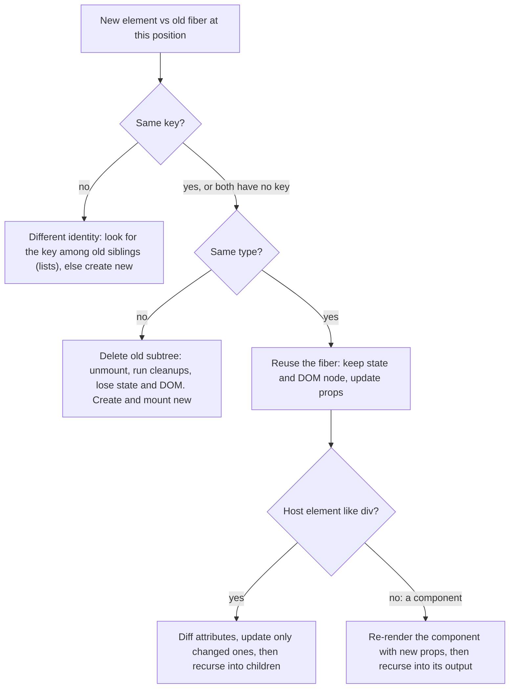
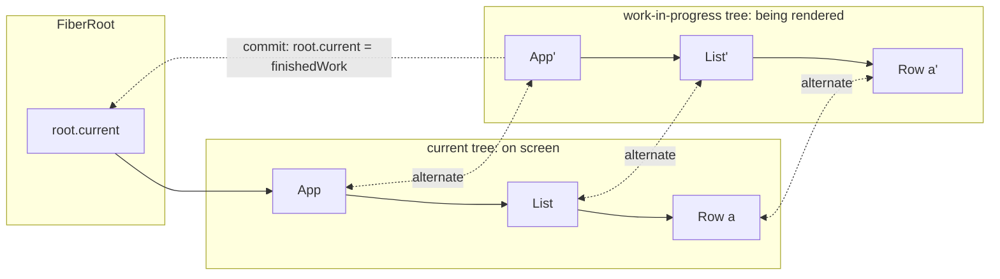
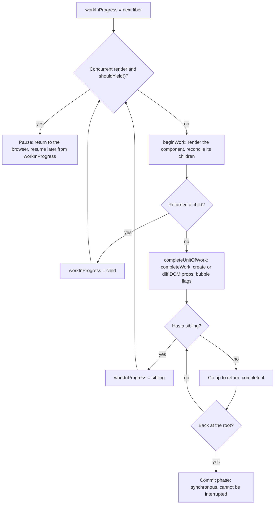
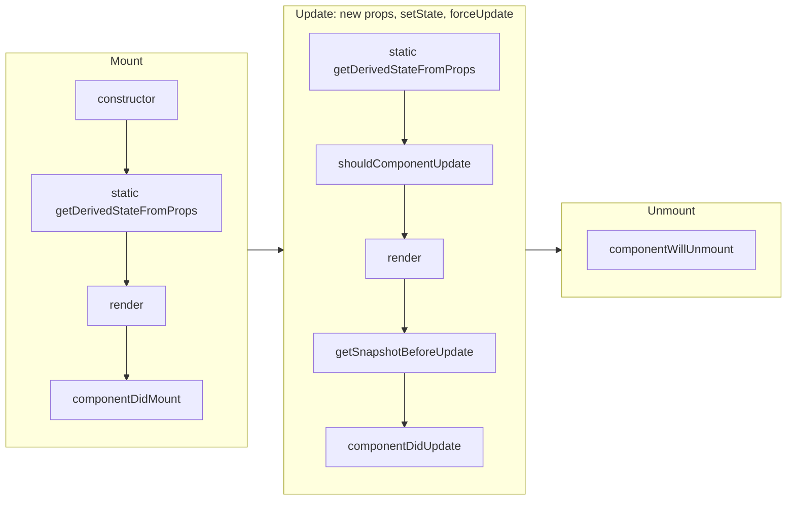

# 13 — Reconciliation, virtual DOM and Fiber

> **How to use this module.** Sections 13.1–13.4 are the part every interview touches: what the virtual DOM is for, how React decides "same component or new one", and why state survives or vanishes. Sections 13.5 covers Fiber internals for deeper rounds. Sections 13.6–13.8 are for reading and converting class-component code, which is still everywhere. If you only have 20 minutes, read 13.2, 13.3, 13.4 and the Summary.

**Prerequisites:** [Elements vs components vs instances](06-jsx-and-rendering-model.md#63-elements-vs-components-vs-instances) · [Lists and keys](06-jsx-and-rendering-model.md#66-lists-and-keys) · [What triggers a render](06-jsx-and-rendering-model.md#69-what-triggers-a-render) · [Render phase vs commit phase](06-jsx-and-rendering-model.md#610-render-phase-vs-commit-phase) · [Resetting state with `key`](08-state.md#89-resetting-state-with-key) · [Class components](07-components-props-composition.md#710-class-components)

**Code for this module:** [`examples/web/src/m13-reconciliation/`](examples/web/src/m13-reconciliation/). Every file below has a test next to it. Run them with `npx vitest run src/m13-reconciliation` from `examples/web`.

**Source citations.** Claims about React internals in this module were checked by reading `examples/web/node_modules/react-dom/cjs/react-dom-client.development.js` from **react-dom 19.3.0** (function names are given so you can find them), the scheduler package **0.28.0**, and `packages/react-reconciler/src/ReactFiberLane.js` on React's `main` branch. Line numbers drift between builds, so search by function name. Simplifications are labelled as such.

---

## 13.1 Why a virtual DOM

### The problem
A UI is a function of state ([06](06-jsx-and-rendering-model.md#61-ui-as-a-function-of-state)), but the browser's DOM is a big mutable object graph. If every state change rebuilt the page with `innerHTML`, you would lose focus, selection, scroll position, typed text, running CSS transitions and every event listener, and you would pay to recreate thousands of nodes for a one-character change. If instead you hand-write the mutations (`el.textContent = …`, `parent.insertBefore(…)`), you are back to jQuery: every code path must know the previous state of the page, and bugs come from forgetting one.

### Mental model
React lets you **describe** the whole UI for the current state, every time, and then works out the **minimal set of DOM mutations** that turns the previous screen into the new one. The description is a tree of plain objects, the React elements. The process of comparing descriptions and applying the differences is **reconciliation** [React].

The legacy React docs define it this way: *"The virtual DOM (VDOM) is a programming concept where an ideal, or "virtual", representation of a UI is kept in memory and synced with the "real" DOM by a library such as ReactDOM. This process is called reconciliation."* ([legacy FAQ: Virtual DOM and Internals](https://legacy.reactjs.org/docs/faq-internals.html)). The same page adds that React *"also uses internal objects called "fibers" to hold additional information about the component tree"*. Today, "virtual DOM" in React really means two things: the **elements** your components return, and the **fiber tree** React keeps between renders (13.5).

> **Java/Spring analogy.** Think of Hibernate's dirty checking. You change fields on managed entities, and at flush time Hibernate compares each entity with its snapshot and emits only the `UPDATE` statements that are needed. You never write SQL for "what changed".
>
> **Where the analogy breaks:** Hibernate diffs the **same** objects against a snapshot. React diffs a **brand-new** description against the previous one, and it has to decide which new element "is" which old one, with no primary keys unless you supply them (`key`, 13.4). It also does not try hard: when the shape differs, it throws the old subtree away rather than searching for the best match (13.2).

### Minimal code
```tsx
function Price({ amount }: { amount: number }) {
  // You describe the result for this state. React works out that only one text node changes.
  return (
    <p className="price">
      Total: <strong>{amount.toFixed(2)}</strong>
    </p>
  );
}
```
Re-rendering `Price` with a new `amount` produces a new element tree. React compares it with the previous one, finds that only the text inside `<strong>` changed, and updates that single text node. The `<p>` and `<strong>` DOM nodes are kept.

### How it works internally
1. Your component returns elements: `{ type: 'p', props: { className, children: […] }, key: null }` ([06](06-jsx-and-rendering-model.md#62-what-jsx-compiles-to)).
2. During the render phase, React walks the **fiber** tree. For each fiber it compares the new element with the fiber's current type and key (13.2) and decides: reuse and update, create, or delete.
3. It records the needed DOM work as **flags** on fibers (`Placement`, `Update`, `ChildDeletion`…).
4. The commit phase applies only those flagged mutations to the DOM ([06](06-jsx-and-rendering-model.md#610-render-phase-vs-commit-phase)).

### Trade-offs
- ✅ Declarative code: you never write "if it was X, now change it to Y". DOM state such as focus and typed text survives because nodes are reused.
- ✅ The description is just data, so the same reconciler drives React DOM, React Native and other renderers.
- ❌ It is **extra work on top of** the DOM updates, not a replacement for them. Building elements and diffing them costs CPU on every render.
- ❌ The diff is heuristic, not optimal (13.2). A change of type or a missing key can make React rebuild far more DOM than necessary.

> **⚠️ Correction: "React is fast because the virtual DOM is faster than the DOM."** The virtual DOM is never faster than the minimal hand-written DOM update; it does that update **plus** the diff. What it buys is **good-enough performance with declarative code**. Rich Harris put it bluntly in *Virtual DOM is pure overhead* (Svelte blog, 2018): the virtual DOM is *"a means to an end, the end being declarative, state-driven UI development"*. The honest interview answer: React is fast enough because the diff is O(n), it touches only changed nodes, and it batches mutations into one commit. Signals-based frameworks (Solid, Svelte 5, Angular signals) and the React Compiler (which skips re-renders automatically) attack the overhead from different sides.

---

## 13.2 Diffing heuristics: type, then key

### The problem
Comparing two arbitrary trees to find the minimum number of edits is expensive. The legacy React docs: *"the state of the art algorithms have a complexity in the order of O(n³)… If we used this in React, displaying 1000 elements would require in the order of one billion comparisons"* ([legacy docs: Reconciliation](https://legacy.reactjs.org/docs/reconciliation.html)). React needs something linear.

### Mental model
React makes **two assumptions** and gets an O(n) algorithm ([same page](https://legacy.reactjs.org/docs/reconciliation.html)):
1. *"Two elements of different types will produce different trees."* So if the type changed, React does not look inside. It destroys the old subtree and builds the new one.
2. *"The developer can hint at which child elements may be stable across different renders with a key prop."*

In practice, for each child position React asks two questions, in this order:



"Type" means the `type` field of the element: a string for host elements (`'div'`, `'input'`) or the **function/class object itself** for components. Two components that render identical markup are still different types.

> **Java analogy:** `equals()` on a `(type, key)` pair, where `type` is compared by **reference** (like `==` on `Class` objects loaded by different classloaders: same source, different classes).
>
> **Where the analogy breaks:** there is no fallback to deep structural comparison. A different type means "replace", even if the two types render byte-identical HTML. And unlike `hashCode`, keys are only compared among siblings of one parent, never globally.

### Minimal code
From `examples/web/src/m13-reconciliation/Preservation.tsx`:

```tsx
// Different types, identical markup: the state is reset when the toggle flips.
{on ? <OtherField label="Name" /> : <Field label="Name" />}

// Same type, different props: the state survives.
{on ? <Field label="Billing" /> : <Field label="Shipping" />}
```

### How it works internally
The child-diffing code lives in `ChildReconciler` in React DOM 19.3 (`reconcileChildFibersImpl`, `updateSlot`, `updateElement`, `reconcileChildrenArray`, `placeChild`, `mapRemainingChildren`). What it does, simplified:

**A single child** (the new children are one element). React scans the old children for a fiber with the **same key** (`null === null` counts). If the key matches **and** `elementType` is the same, it reuses that fiber via `useFiber` (which calls `createWorkInProgress`) and deletes the other old siblings. If the key matches but the type differs, it deletes all old children and creates a new fiber. Non-matching keys are deleted as it scans.

**Host elements.** A reused `<input>` keeps its DOM node. Only changed attributes are written in the commit phase, which is why an `<input>` keeps focus and its native value.

**An array of children** (`reconcileChildrenArray`) runs in phases:
1. Walk old and new in order, calling `updateSlot`. It returns `null` as soon as a **key differs**, which ends this phase. Matching keys with the same type are reused; matching keys with a different type create a new fiber and delete the old one.
2. If the new list ran out, delete the remaining old fibers. If the old list ran out, create the remaining new ones. Appends and removals at the end are handled here, cheaply.
3. Otherwise, put the remaining old fibers in a `Map` (`mapRemainingChildren`: keyed by `key`, or by `index` when the key is `null`). For each remaining new element, look up its key (`updateFromMap`): found means reuse, missing means create. Whatever is left in the map is deleted.
4. **Moves** (`placeChild`): React tracks `lastPlacedIndex`, the highest old index it has kept in place so far. A reused fiber whose old index is **smaller** than `lastPlacedIndex` gets the `Placement` flag and is moved in the commit. Otherwise it stays put and `lastPlacedIndex` advances.

Step 4 has a consequence you can measure. Moving the **first** item to the end moves one DOM node. Moving the **last** item to the front moves **every other** node, because the last item's old index becomes `lastPlacedIndex` immediately and every item after it looks "behind". `KeyedList.test.tsx` observes the DOM with a `MutationObserver` to show it.

```tsx
// file: examples/web/src/m13-reconciliation/KeyedList.tsx
/** A plain keyed list. The test watches which <li> nodes React physically moves. */
export function KeyedList({ items }: { items: string[] }) {
  return (
    <ul>
      {items.map((item) => (
        <li key={item}>{item}</li>
      ))}
    </ul>
  );
}
```

```tsx
// file: examples/web/src/m13-reconciliation/KeyedList.test.tsx
import { render } from '@testing-library/react';
import { KeyedList } from './KeyedList';

// Re-renders the list with a new order and returns the text of every node React (re)inserted.
function movedNodes(before: string[], after: string[]) {
  const { container, rerender } = render(<KeyedList items={before} />);
  const ul = container.querySelector('ul')!;
  const observer = new MutationObserver(() => {});
  observer.observe(ul, { childList: true });
  rerender(<KeyedList items={after} />);
  const records = observer.takeRecords();
  observer.disconnect();
  return {
    inserted: records.flatMap((r) => Array.from(r.addedNodes, (n) => n.textContent)),
    order: Array.from(ul.children, (li) => li.textContent),
  };
}

test('moving the FIRST item to the end moves exactly one DOM node', () => {
  const { inserted, order } = movedNodes(['A', 'B', 'C', 'D'], ['B', 'C', 'D', 'A']);
  expect(order).toEqual(['B', 'C', 'D', 'A']);
  expect(inserted).toEqual(['A']);
});

test('moving the LAST item to the front moves every other node instead', () => {
  const { inserted, order } = movedNodes(['A', 'B', 'C', 'D'], ['D', 'A', 'B', 'C']);
  expect(order).toEqual(['D', 'A', 'B', 'C']);
  expect(inserted).toEqual(['A', 'B', 'C']);
});

test('an unchanged order touches no DOM nodes at all', () => {
  const { inserted } = movedNodes(['A', 'B', 'C'], ['A', 'B', 'C']);
  expect(inserted).toEqual([]);
});
```

> **Simplification:** this skips Fragments, portals, text nodes, lazy elements, hydration and Fast Refresh's `isCompatibleFamilyForHotReloading` check, all of which `updateElement` and `reconcileChildFibersImpl` also handle.

### Trade-offs
- ✅ O(n) per level, with predictable rules you can reason about.
- ❌ Type changes are destructive. Swapping `<div>` for `<section>` around a big subtree remounts all of it, including every component's state.
- ❌ The move algorithm is greedy, not minimal. For large keyed lists where the last item jumps to the top, React moves N−1 nodes. It is rarely a real bottleneck, but it explains "why did all my rows re-insert?" in a performance trace.
- Keys only help **among siblings**. React never matches a component across different parents, so moving a component to another parent always remounts it.

---

## 13.3 Component identity and state preservation

### The problem
"I switched tabs and the form kept the other user's draft." "I added a wrapper `<div>` and the input lost what the user typed." Both are the same rule seen from opposite sides: React keeps state attached to **a position in the tree**, not to a variable, not to a JSX line, and not to the data you think the component represents.

### Mental model
react.dev states it directly: *"React preserves a component's state for as long as it's being rendered at its position in the UI tree"*, and *"it's the position in the UI tree—not in the JSX markup—that matters to React!"* ([Preserving and Resetting State](https://react.dev/learn/preserving-and-resetting-state)).

A component instance's identity is the triple **(parent path, type, key)**. Its "position" is the index among its parent's children, or its key if it has one. As long as all three match from one render to the next, it is the same instance, so state, refs, effects and DOM survive. Change any of them and React unmounts the old instance (running effect cleanups) and mounts a fresh one.

| Change between renders | Same instance? | Why |
|---|---|---|
| Same type, same position, new props | ✅ yes | props are just inputs |
| `cond ? <A x={1}/> : <A x={2}/>` | ✅ yes | one slot, same type |
| `cond ? <A/> : <B/>` | ❌ no | type changed |
| `<A/>` → `<div><A/></div>` | ❌ no | the slot now holds a `div`, and `A` moved one level down |
| `<A key="1"/>` → `<A key="2"/>` | ❌ no | key changed |
| `{cond && <Banner/>}<A/>` | ✅ yes | `false` still occupies slot 0, so `A` stays in slot 1 |
| `{cond && <A/>}{!cond && <A/>}` | ❌ no | two different slots |

> **Java/Spring analogy.** A session-scoped bean keyed by `(beanName, sessionId)`. As long as you ask for the same name in the same session, you get the same instance with its fields intact.
>
> **Where the analogy breaks:** you never ask for the instance by name. React infers identity from **where** the element appears in the returned tree, so innocuous refactors (a wrapper, a reordered ternary) silently change the "name".

### Minimal code
From `examples/web/src/m13-reconciliation/Preservation.tsx`, three cases that surprise people:

```tsx
// Preserved: `false` keeps slot 0 occupied, so Field stays in slot 1.
{on && <p>Welcome back!</p>}
<Field label="Name" />

// Reset: these are two different slots (0 and 1) that take turns being empty.
{on && <Field label="Name" />}
{!on && <Field label="Name" />}

// Preserved: two separate `return` statements, but the same tree shape around Field.
if (on) return <div><Field label="Name" />{toggle}<p>Now with a footer</p></div>;
return <div><Field label="Name" />{toggle}</div>;
```

Exercise 1 asks you to predict nine such cases before running them.

### How it works internally
- `false`, `null`, `undefined` and `true` in a children array still count as positions. `reconcileChildrenArray` iterates by index, so `{cond && <X/>}` always occupies its index whether it renders anything or not.
- A component that returns an **unkeyed Fragment at the top level** is treated as if it returned the Fragment's children: `reconcileChildFibersImpl` unwraps `newChild.type === REACT_FRAGMENT_TYPE && newChild.key === null` before diffing. So `return <><Field/></>` and `return <Field/>` are the same position. A Fragment **inside** an array of siblings is a real fiber (tag 7), and wrapping or unwrapping it there changes the shape.
- State lives on the fiber (`memoizedState`, the hook list, [12](12-hooks-and-custom-hooks.md#122-how-react-stores-hooks-so-call-order-matters)). Reusing the fiber keeps the state. Deleting it discards the state, and the commit runs effect cleanups and ref detachment for the whole deleted subtree.
- react.dev also notes that a different component at the same position resets the state of its **entire subtree**, because the old subtree is deleted wholesale ([same page](https://react.dev/learn/preserving-and-resetting-state)).

### Trade-offs
- Use identity on purpose. To **reset** a component when data changes, give it `key={id}` ([08](08-state.md#89-resetting-state-with-key)). To **keep** state across a visual change, keep the type and position stable (add the wrapper in both branches, or apply the change through props or CSS).
- To keep state while a component is **hidden**, either keep it mounted and hide it (`hidden`, CSS), use `<Activity mode="hidden">` (19.2, [21](21-concurrent-ssr-server-components.md#219-activity)), or lift the state up.
- Conditional wrappers (`{isCard ? <Card><Form/></Card> : <Form/>}`) are a common accidental reset. Prefer `<Wrapper enabled={isCard}><Form/></Wrapper>` that always renders the same element types.

---

## 13.4 Keys revisited, and nested component definitions

### The problem
Module 06 showed why index keys break lists ([06](06-jsx-and-rendering-model.md#66-lists-and-keys)). Two deeper problems come up in interviews and code reviews:
1. Keys are a general **identity tool**, not a list-only warning silencer.
2. The most damaging identity bug in React code is not a key at all. It is a **component defined inside another component**, which creates a new type on every render.

### Mental model
- **A key is part of the identity.** On a single element it says "this is a different instance when the key changes" (reset). In a list it says "this element is the same item as the one with this key last time, wherever it is now" (move).
- **A component type is identity by reference.** `function Inner() {}` written inside `Outer` runs every time `Outer` renders and produces a **new function object**. React compares `elementType` with `===`, sees a different type, and remounts `Inner` and everything under it on every render of `Outer`.

> **Java analogy:** declaring a class inside a method and creating `new Inner()` each call is harmless in Java, because you hold the reference. In React, React holds the instance, keyed by the class identity. A fresh anonymous class per call means React can never find "the same" instance again.
>
> **Where the analogy breaks:** in Java two loads of the same class are the same `Class` object. In JavaScript every evaluation of a function expression or declaration creates a distinct object, even with identical source.

### Minimal code
The bug, shown only in Markdown because the project's lint config rejects it (`react-hooks/static-components` is an error in `eslint-plugin-react-hooks` 7.1.1 recommended, with the message *"Cannot create components during render"*):

```tsx
export function SignupCard() {
  const [email, setEmail] = useState('');

  // ❌ A new PasswordField type every time SignupCard renders, i.e. on every keystroke in Email.
  function PasswordField() {
    const [visible, setVisible] = useState(false);
    return (/* password input + Show/Hide button */);
  }

  return (
    <form>
      <input value={email} onChange={(e) => setEmail(e.target.value)} />
      <PasswordField /> {/* remounts on each keystroke: typed password and "visible" are lost */}
    </form>
  );
}
```

To reproduce it in lint-clean code, `examples/web/src/m13-reconciliation/TypeIdentity.tsx` exports a factory, `makeCounter()`, that returns a new component type on each call. The test calls it **between** renders, outside any component, which is exactly what the inline definition does during render:

```tsx
const First = makeCounter();
const { rerender } = render(<First />);
await user.click(screen.getByRole('button'));   // "Clicked 1"
const Second = makeCounter();                    // same source, new function object
rerender(<Second />);                            // "Clicked 0", and a different DOM node
```

The fix is to declare the component **at module level** and pass what it needs as props (Exercise 2).

### How it works internally
- `updateElement` and the single-child path compare `current.elementType === element.type`. A function created during render fails that check, so `createFiberFromElement` builds a new fiber and the old one is deleted. The commit removes the old DOM nodes and inserts new ones, which is why **focus** and uncontrolled input values are lost too.
- The lint rule (`validateStaticComponents` in the plugin's compiler-based analysis) tracks any value produced by a function expression or a call during render and reports it when it is used as a JSX tag. The [react.dev page for the rule](https://react.dev/reference/eslint-plugin-react-hooks/lints/static-components) says such components are *"recreated on every render. React sees each as a brand new component type, unmounting the old one and mounting the new one, destroying all state and DOM nodes in the process."*

**Key rules recap (beyond 06):**
- Keys are compared **only among siblings**. The same key under two parents is fine; moving an element to another parent always remounts it.
- `key` is not a prop: the child never receives it. Pass the id separately if the child needs it.
- A key on a Fragment is allowed (`<Fragment key={id}>`), and is the only Fragment prop besides `ref` (19.3 Fragment refs, [10](10-refs-and-dom.md#108-fragment-refs)).
- Generating keys during render (`key={crypto.randomUUID()}`, `key={Math.random()}`) is a **guaranteed remount** of every item on every render. The legacy docs: *"Unstable keys (like those produced by Math.random()) will cause many component instances and DOM nodes to be unnecessarily recreated, which can cause performance degradation and lost state in child components"* ([legacy Reconciliation](https://legacy.reactjs.org/docs/reconciliation.html)).
- Without explicit keys, `mapRemainingChildren` falls back to the **index**, so no key and `key={index}` behave the same.

> **Version notes.** React 19.3 changelog: *"Don't invoke effects on moved children in StrictMode"* (#36948). Before 19.3, a keyed child that **moved** inside a Strict Mode tree could get its effects double-invoked in development as if it had remounted. Moves are not remounts, and 19.3 makes Strict Mode agree.

### Trade-offs
- ✅ Hoisting inner components is free and makes them testable. If the inner component needs the parent's values, pass props, use `children`, or use a render function **called** as a function (`{renderRow(item)}`), which is not a component type.
- Applying an HOC inside render has the same bug: `const Enhanced = withLoading(Base)` must run once at module level ([07](07-components-props-composition.md#77-render-props-and-hocs)).
- `useMemo(() => makeComponent(), [])` "works" but is fragile, still flagged by the linter, and resets whenever the memo is discarded. Don't.
- A deliberate key change is the cleanest reset. It costs a full remount of that subtree, so key the smallest subtree that needs resetting.

---

## 13.5 Fiber: units of work, double buffering, lanes and priorities

### The problem
Until React 15, the reconciler walked the tree **recursively**, on the JavaScript call stack: once an update started, it ran to completion. The legacy implementation notes call it the **stack reconciler**: *"The stack reconciler was used in React 15 and earlier"*, and mounting *"is recursive"* ([legacy Implementation Notes](https://legacy.reactjs.org/docs/implementation-notes.html)). A big update could block the main thread for hundreds of milliseconds, and typing or animation would stutter, because a recursive call stack cannot be paused and resumed later.

### Mental model
**Fiber** turned the recursion into a loop over an explicit linked data structure. Each **fiber** is one **unit of work** for one component or host node. Because the "stack" is now a set of heap objects, React can stop after any unit, let the browser handle input or paint, and continue later, or throw the unfinished work away and restart with more urgent work.

The [legacy codebase overview](https://legacy.reactjs.org/docs/codebase-overview.html) lists the Fiber reconciler's goals: *"Ability to split interruptible work in chunks. Ability to prioritize, rebase and reuse work in progress. Ability to yield back and forth between parents and children…"*. React 16 shipped it: *"React 16 is the first version of React built on top of a new core architecture, codenamed "Fiber""* ([React v16.0 post](https://legacy.reactjs.org/blog/2017/09/26/react-v16.0.html)).

> **Java/Spring analogy.** The stack reconciler is a recursive method on a platform thread. Fiber is like turning it into a work queue processed by an executor that checks `Thread.interrupted()` between tasks, or like virtual threads that can park at defined points.
>
> **Where the analogy breaks:** JavaScript has one main thread and no preemption. Fiber yields **cooperatively**: it checks a deadline between units of work. A single slow component still blocks, because React cannot interrupt your function in the middle.

### Minimal code
You never touch fibers directly. You opt into interruptible rendering by marking an update as non-urgent:

```tsx
import { useState, useTransition } from 'react';

function Search({ allItems }: { allItems: string[] }) {
  const [query, setQuery] = useState('');
  const [filter, setFilter] = useState('');
  const [isPending, startTransition] = useTransition();
  return (
    <>
      <input
        value={query}
        onChange={(e) => {
          setQuery(e.target.value); // SyncLane: the input must update now
          startTransition(() => setFilter(e.target.value)); // a TransitionLane: can be interrupted
        }}
      />
      {isPending && <p>Updating…</p>}
      <SlowList items={allItems} filter={filter} />
    </>
  );
}
```
Transitions are covered in [21](21-concurrent-ssr-server-components.md#211-concurrent-rendering-interruptible-rendering). This section is about what makes them possible.

### How it works internally

**A fiber** is a plain object. The `FiberNode` constructor in React DOM 19.3 sets, among others: `tag` (function component, class, host element…), `key`, `type`/`elementType`, `stateNode` (the DOM node or class instance), the tree links `return` (parent), `child` (first child) and `sibling`, `index`, `pendingProps`/`memoizedProps`, `memoizedState` (hooks list or class state), `updateQueue`, `flags`/`subtreeFlags` (side effects to commit), `deletions`, `lanes`/`childLanes` (pending work) and `alternate`.

**Double buffering.** At most two fibers exist per component: the **current** one (what is on screen) and the **work-in-progress** one (what is being built). They point at each other through `alternate`. `createWorkInProgress(current, pendingProps)` reuses `current.alternate` when it exists instead of allocating, and copies `child`, `memoizedProps`, `memoizedState`, `updateQueue`, `lanes` and so on. When the commit finishes the mutation phase, React flips one pointer: `root.current = finishedWork` (in the commit code of 19.3). The work-in-progress tree becomes current, and the old current becomes the next render's spare. The name comes from graphics double buffering: draw the next frame off-screen, then swap.



**The work loop.** The render phase is a loop, not recursion:



In 19.3 the two loops are literally:
- `workLoopSync`: `for (; null !== workInProgress; ) performUnitOfWork(workInProgress);`
- `workLoopConcurrentByScheduler`: the same, plus `&& !shouldYield()`.

`performUnitOfWork` calls `beginWork(current, unitOfWork, lanes)` and either moves to the returned child or calls `completeUnitOfWork`. `shouldYield` is the scheduler's `unstable_shouldYield`, and in `scheduler` 0.28.0 it returns true once `frameInterval` (**5 ms** by default) has elapsed since the current slice started, or when a paint was requested.

**Bailouts.** At the top of `beginWork`, if `current.memoizedProps === workInProgress.pendingProps` (the **same props object**, by reference), the type is unchanged, there is no scheduled update and no context change, React calls `bailoutOnAlreadyFinishedWork`. That function returns `null` (skip the **whole subtree**) when `childLanes` has no work for this render, or clones the children so it can descend to the one that does have work. This is the mechanism behind "the `children` element passed from above is skipped" ([06](06-jsx-and-rendering-model.md#69-what-triggers-a-render)) and behind `memo`/`PureComponent` (they make the comparison shallow instead of by reference).

**Lanes.** Every update gets a **lane**, a bit in a 31-bit mask (`TotalLanes = 31` in `ReactFiberLane.js`). Bitmasks make it cheap to merge pending work and to ask "does this subtree have work at this priority?" (`childLanes & renderLanes`). The ones worth naming, from highest priority to lowest:

| Lane (bit value) | Typically from |
|---|---|
| `SyncLane` (2) | discrete events: `click`, `keydown`, `input`… (`DiscreteEventPriority = 2`), and `flushSync` |
| `InputContinuousLane` (8) | continuous events: `mousemove`, `scroll`… (`ContinuousEventPriority = 8`) |
| `DefaultLane` (32) | updates outside any event: timers, promises, `root.render` (`DefaultEventPriority = 32`) |
| `TransitionLanes` (14 lanes, 256 … 2 097 152) | `startTransition`, `useTransition`, `useDeferredValue` |
| `RetryLanes` (4 lanes) | Suspense retries after data arrives |
| `IdleLane` (268 435 456) | idle work |
| `OffscreenLane` (536 870 912) | hidden `<Activity>` content |

Sources: the constants in `ReactFiberLane.js` (main), which match the bit values in 19.3's `getHighestPriorityLanes`; the event mapping in 19.3's `getEventPriority` and `resolveUpdatePriority`; and `requestUpdateLane`, which returns a transition lane whenever a transition is active (`ReactSharedInternals.T !== null`).

**Which renders can actually be interrupted?** `performWorkOnRoot` in 19.3 picks `renderRootConcurrent` only when `0 === (lanes & 127)` and none of the lanes has expired. The mask 127 covers the sync, input-continuous, default and gesture lanes and their hydration twins. So a click update, or a `setState` in a `setTimeout`, renders **synchronously, without yielding**. Only transitions, retries, idle and offscreen work are time-sliced. Higher-priority work that arrives during a time-sliced render makes React throw away the in-progress tree and restart from the current tree. That is safe precisely because the render phase is pure and nothing was committed.

> **Version notes.** React ≤ 15: stack reconciler, always synchronous. **16.0** (Sept 2017): Fiber, but the React 16 post says *"we're not enabling any async features yet"*. 16.x–17: concurrent rendering only behind experimental/unstable APIs (16.9 replaced `unstable_ConcurrentMode` with `unstable_createRoot`, per the 16.9.0 CHANGELOG). **18.0** (Mar 2022): `createRoot` opts the app into the concurrent renderer (CHANGELOG 18.0.0: *"New features in React 18 don't work without it"*), with `startTransition`, `useDeferredValue` and automatic batching. **19.0**: the legacy root (`ReactDOM.render`) is removed, so every app is on the concurrent renderer. **19.3**: *"Transitions now render independently instead of being entangled into a single render"* (#37290).

> **Simplification:** the real loop also handles suspended work (`replaySuspendedUnitOfWork`), errors (`handleThrow`), profiling timers, and the commit's sub-phases (before-mutation, mutation, layout, passive). Lane selection also involves entanglement, expiration (starved lanes become sync) and pinging after Suspense. Only the parts above were checked against the source.

> **Restart vs resume.** Read from `react-dom` 19.3.0's `renderRootConcurrent`: React throws away the work-in-progress tree and calls `prepareFreshStack` when `workInProgressRoot !== root || workInProgressRootRenderLanes !== lanes`, that is, when the lanes picked for the next render differ from the ones being rendered (for example a higher-priority update arrived). Otherwise it resumes where it yielded.

### Trade-offs
- ✅ Responsiveness: urgent updates (typing) are never stuck behind non-urgent ones (filtering 10 000 rows), **if** you mark the non-urgent ones as transitions.
- ✅ The same structure enables Suspense, error boundaries, `<Activity>` and streaming hydration.
- ❌ Your render functions may run more than once per commit, or run and be discarded. Impure render code (side effects, mutation) breaks under this, which is why Strict Mode double-invokes renders ([06](06-jsx-and-rendering-model.md#611-strict-mode-double-invocation-and-why)).
- ❌ Fiber does not make a slow component fast. Time slicing works **between** components. One component that takes 200 ms is still 200 ms of blocking.
- In tests, `act()` drives the **sync** loop: `renderRootConcurrent` calls `workLoopSync` when `ReactSharedInternals.actQueue` is set. Don't try to observe yielding in a unit test.

---

## 13.6 Class lifecycle methods and their hook equivalents

### The problem
Most production React codebases older than 2019 have class components, and interviewers love to ask "what is `componentDidUpdate` in hooks?". The trap is that there is no one-to-one mapping. Hooks are organized by **concern** (synchronize X), classes by **moment in time** (after mount, after update, before unmount).

### Mental model
A class component goes through three phases:



`constructor`, `getDerivedStateFromProps`, `shouldComponentUpdate` and `render` run in the **render phase** (pure, may run more than once). `getSnapshotBeforeUpdate` runs in the commit just **before** DOM mutations. `componentDidMount`/`componentDidUpdate` run in the commit's layout phase (synchronously, before paint, like `useLayoutEffect`). `componentWillUnmount` runs during the mutation phase.

> **Java/Spring analogy.** Bean lifecycle callbacks: constructor → `@PostConstruct` (`componentDidMount`) → … → `@PreDestroy` (`componentWillUnmount`).
>
> **Where the analogy breaks:** a bean is constructed once and never "updated". A class component's `render` and update methods run on every change, and React may call render-phase methods and then throw the result away.

### Minimal code: the mapping table

| Class | Function component | Notes |
|---|---|---|
| `constructor` (init state, bind) | `useState(initial)` / `useState(() => init())`, `useRef` | No binding needed: closures |
| `static getDerivedStateFromProps` | Compute during render; or "adjust state during render" with a guard ([08](08-state.md#87-derived-state-compute-do-not-store)) | react.dev: equivalent to calling the `set` function during render |
| `shouldComponentUpdate` | `memo(Component, arePropsEqual)` ([15](15-performance.md#153-reactmemo)) | Only covers props; for state, the setter already bails out on `Object.is` |
| `PureComponent` | `memo(Component)` | Shallow props compare |
| `render` | the function body | |
| `getSnapshotBeforeUpdate` | **No hook equivalent** | react.dev: *"At the moment, there is no equivalent to getSnapshotBeforeUpdate for function components"*. `useLayoutEffect` with a ref captured during render covers most uses |
| `componentDidMount` | `useEffect(fn, [])` (or `useLayoutEffect` if it measures DOM) | Class version runs before paint; `useEffect` runs after paint |
| `componentDidUpdate(prevProps)` | `useEffect(fn, [deps])` | The dependency array replaces the `prevProps.x !== this.props.x` checks |
| `componentWillUnmount` | the cleanup returned from the same effect | Pair setup and cleanup in one place ([09](09-effects.md#93-cleanup-and-the-effect-lifecycle)) |
| `componentDidCatch`, `static getDerivedStateFromError` | **No hook equivalent** | Keep a class boundary or use `react-error-boundary` ([16](16-error-handling.md#162-error-boundaries)) |
| `this.forceUpdate()` | `const [, force] = useReducer(x => x + 1, 0)` | Usually a smell: the data should be state |
| `static contextType` | `useContext(Ctx)` / `use(Ctx)` | |
| `UNSAFE_componentWillMount` | code in the `useState` initializer | react.dev: equivalent to passing that state as the initial state to `useState` |
| `UNSAFE_componentWillReceiveProps` | derive during render, or `key` to reset | 13.7 |
| `UNSAFE_componentWillUpdate` | `useLayoutEffect` cleanup / snapshot pattern | |

Sources: [react.dev Component reference](https://react.dev/reference/react/Component) for the quoted equivalences.

### How it works internally
- Class state lives on the instance (`fiber.stateNode`) and in `fiber.memoizedState`. `setState` enqueues on `fiber.updateQueue`, and the render phase processes the queue (`processUpdateQueue`) before calling the methods above.
- In 19.3's class update path, React calls `getDerivedStateFromProps` and then `checkShouldComponentUpdate` only when props, state or context actually changed. `forceUpdate` skips `shouldComponentUpdate` entirely (`hasForceUpdate`).
- When `shouldComponentUpdate` returns `false`, React still assigns the new `props` and `state` to the instance (`_instance.props = nextProps`). It only skips `render` and the update lifecycles. Code that later reads `this.props` sees the new values even though the screen shows the old ones.
- `getSnapshotBeforeUpdate` runs in `commitBeforeMutationEffects`, which descends to the deepest flagged fiber and completes upward, so **children's snapshots run before their parents'**. `componentDidMount`/`componentDidUpdate` also run child-first. `componentWillUnmount` runs **parent-first**, like effect cleanups on unmount ([09 Exercise 5](09-effects.md#93-cleanup-and-the-effect-lifecycle)). Exercise 4 asserts the exact sequence.
- Because `root.current = finishedWork` happens after the mutation phase and before the layout phase, `componentDidMount`/`componentDidUpdate` see the new DOM, and `componentWillUnmount` runs while the old tree is still current.

### Trade-offs
- ✅ The hooks version groups setup and teardown of one concern together. In a class, a subscription is split across `componentDidMount`, `componentDidUpdate` and `componentWillUnmount`, and forgetting the middle one is the classic "it doesn't update when the prop changes" bug.
- ✅ `componentDidUpdate` comparisons become dependency arrays, which the linter checks for you.
- ❌ Two gaps remain: error boundaries and `getSnapshotBeforeUpdate`. That is why classes are not fully dead.
- Timing differs: `componentDidMount` runs before paint, `useEffect` after. A class that measures DOM in `componentDidMount` should become `useLayoutEffect` ([09](09-effects.md#97-uselayouteffect)).

---

## 13.7 `getDerivedStateFromProps`, `shouldComponentUpdate`, `PureComponent`

### The problem
These three are where class-era performance and "sync state with props" logic lived, and where most class bugs hide. Interviewers ask when `getDerivedStateFromProps` runs (people get it wrong), and why `PureComponent` "didn't update".

### Mental model
- **`static getDerivedStateFromProps(props, state)`**: a pure, static function that returns a state patch (or `null`) **before every render**. react.dev: *"React will call it right before calling render, both on the initial mount and on subsequent updates"* ([Component reference](https://react.dev/reference/react/Component)). It cannot touch `this`. It is the rare case where state truly depends on how props **changed** over time.
- **`shouldComponentUpdate(nextProps, nextState)`**: a gate you write by hand; return `false` to skip `render`. It is an optimization only: React may ignore it in the future and calls it twice in Strict Mode dev (since 16.13.0, per the CHANGELOG).
- **`PureComponent`** [React]: a `Component` whose built-in `shouldComponentUpdate` is a **shallow** comparison of props and state (each key compared with `Object.is`). react.dev recommends it over a hand-written `shouldComponentUpdate`.

> **Java analogy:** `PureComponent` is like caching a method result keyed by its arguments' `equals()`, except the "equals" is reference identity on each field. Mutate a list in place and the cache never notices.
>
> **Where the analogy breaks:** the "cache" is the previous render's output, and a miss is not expensive by itself. The danger is a false **hit** (stale UI), not a false miss.

### Minimal code
`examples/web/src/m13-reconciliation/PureList.tsx`:

```tsx
export class PureList extends PureComponent<{ items: string[] }> {
  render() {
    return <ul>{this.props.items.map((item) => <li key={item}>{item}</li>)}</ul>;
  }
}
```

`PureList.test.tsx` shows the three cases: the same array reference skips render; **mutating** the array (`items.push('c')`) also skips, so the screen goes stale; a new array (`[...items, 'c']`) re-renders.

`getDerivedStateFromProps` in its one legitimate pattern, resetting part of the state when an id changes (from react.dev's Component reference, simplified):

```tsx
class Form extends Component<{ userID: string }, { prevUserID: string; email: string }> {
  state = { prevUserID: this.props.userID, email: '' };
  static getDerivedStateFromProps(props: { userID: string }, state: { prevUserID: string }) {
    // Any time the current user changes, reset any parts of state that are tied to that user.
    return props.userID !== state.prevUserID ? { prevUserID: props.userID, email: '' } : null;
  }
  // ...
}
```
The modern replacement is usually simpler: `<Form key={userID} />` ([08](08-state.md#89-resetting-state-with-key)).

### How it works internally
- 19.3's `checkShouldComponentUpdate` calls your `shouldComponentUpdate` if you defined one (logging *"shouldComponentUpdate(): Returned undefined instead of a boolean value"* if you forget to return). Otherwise, if `ctor.prototype.isPureReactComponent` is set (that is what `PureComponent` sets), it returns `!shallowEqual(oldProps, newProps) || !shallowEqual(oldState, newState)`. For a plain `Component`, it returns `true`.
- `getDerivedStateFromProps` runs on **every** render, including those caused by the component's own `setState`, since **16.4.0** (CHANGELOG: *"Properly call getDerivedStateFromProps() regardless of the reason for re-rendering"*). In 16.3 it only ran when the parent re-rendered, which is why some old tutorials disagree.
- Defining `getDerivedStateFromProps` or `getSnapshotBeforeUpdate` **disables** the legacy `componentWillMount`/`componentWillReceiveProps`/`componentWillUpdate` methods. React DOM 19.3 warns: *"Unsafe legacy lifecycles will not be called for components using new component APIs."*

### Trade-offs
- `getDerivedStateFromProps` is almost always the wrong tool. React's own guidance (the 2018 post "You Probably Don't Need Derived State", linked from the warning text as `react.dev/link/derived-state`) lists better options: fully controlled, fully uncontrolled with a `key`, or memoized computation.
- `PureComponent`/`memo` only help when parents pass **stable** references. An inline object or arrow-function prop defeats them on every render.
- `PureComponent` + mutation = stale UI. That bug is the main reason immutable updates matter ([08](08-state.md#85-immutable-updates-of-nested-objects-and-arrays)).
- With the React Compiler (1.0), much of this hand-tuning becomes unnecessary for function components ([15](15-performance.md#155-the-react-compiler-and-how-it-changes-the-advice)). It does not compile classes.

> **Version notes.** **15.3.0** (July 2016): `React.PureComponent` added, *"replacing react-addons-pure-render-mixin"*. **16.3.0** (Mar 2018): `getDerivedStateFromProps`, `getSnapshotBeforeUpdate`, `UNSAFE_` aliases for the legacy lifecycles, and `<StrictMode>`. **16.4.0**: `getDerivedStateFromProps` runs on every render. **16.6.0**: `React.memo` as the function-component counterpart of `PureComponent`. **16.9.0**: the unprefixed `componentWillMount`/`componentWillReceiveProps`/`componentWillUpdate` names start warning (*"Deprecate old names for the UNSAFE_\* lifecycle methods"*). **16.13.0**: `shouldComponentUpdate` is called twice in Strict Mode dev. All from the React CHANGELOG.

---

## 13.8 Legacy APIs removed in 19

### The problem
Upgrading a React 16–18 codebase to 19 fails on APIs that had been deprecated for years. You need to recognize them in code, know what replaced them, and know which ones were **removed** versus merely warned about.

### Mental model
React 18.3 was released as a stepping stone: *"This release is identical to 18.2 but adds warnings for deprecated APIs and other changes that are needed for React 19"* (CHANGELOG 18.3.0). The rule: **upgrade to 18.3.1 first, fix every warning, then go to 19.**

> **Java analogy:** like moving from `javax.*` to `jakarta.*` in Spring Boot 3. The old names did not slowly fade; they are simply gone, and the previous release existed to make you find them.
>
> **Where the analogy breaks:** some React removals fail **silently** (`propTypes` are ignored), not at compile or start-up time. Your tests have to catch them.

### Minimal code: what was removed and what replaces it
All entries are from the **19.0.0 CHANGELOG** ("Removed: …"), with the replacement it gives:

| Removed in 19 | Deprecated since | Replace with |
|---|---|---|
| `ReactDOM.render`, `ReactDOM.hydrate` | 18.0 (*"will warn and run your app in React 17 mode"*) | `createRoot(el).render(<App/>)`, `hydrateRoot(el, <App/>)` from `react-dom/client` ([06](06-jsx-and-rendering-model.md#612-createroot-hydrateroot-root-options)) |
| `ReactDOM.unmountComponentAtNode` | 18.0 | `root.unmount()` |
| `ReactDOM.findDOMNode` | warned in Strict Mode since 16.6; outside it since 18.3 | a DOM ref ([10](10-refs-and-dom.md#102-dom-refs-and-when-to-use-them)) |
| `propTypes` checks | `React.PropTypes` moved to the `prop-types` package in 15.5 | TypeScript; runtime validation (Zod) at the boundaries. *"Using propTypes will now be silently ignored"* |
| `defaultProps` on **function** components | 18.3 warning | ES default parameters. Classes keep `static defaultProps` |
| Legacy context (`contextTypes`, `childContextTypes`, `getChildContext`) | Strict Mode warning since 16.6; outside it since 18.3 | `createContext` + `static contextType` / `useContext` / `use` ([11](11-context.md#112-createcontext-context-value-vs-provider)) |
| String refs (`ref="input"`, `this.refs.input`) | 18.3 warning outside Strict Mode | callback refs or `useRef`/`createRef` ([10](10-refs-and-dom.md#103-callback-refs-and-ref-cleanup-functions)) |
| Module pattern factories (a function component that returns an object with `render`) | 16.9 | a regular function or class |
| `React.createFactory` | | JSX |
| `react-dom/test-utils` (all but `act`) | 18.3 warning | `act` from `react`; React Testing Library ([20](20-testing.md#203-react-testing-library-and-query-priority)) |
| `react-test-renderer/shallow` | | `react-shallow-renderer` package, or RTL |

Also in 19.0.0: `react-test-renderer` itself is **deprecated** (*"logs a deprecation warning and has switched to concurrent rendering for web usage"*), UMD builds were removed, and `element.ref` access is deprecated in favor of `element.props.ref` ([10](10-refs-and-dom.md#104-ref-as-a-prop-vs-forwardref)).

`examples/web/src/m13-reconciliation/RemovedApis.test.tsx` checks the removals against the installed 19.3 packages: no `render`/`hydrate`/`unmountComponentAtNode`/`findDOMNode` on `react-dom`, no `createFactory` on `react`, a `propTypes` validator that is never called, the legacy-context error, and a string ref that throws.

```tsx
// file: examples/web/src/m13-reconciliation/RemovedApis.test.tsx
import * as React from 'react';
import * as ReactDOM from 'react-dom';
import { render } from '@testing-library/react';

// propTypes: a validator that would fail if React still ran it.
const nameValidator = vi.fn(() => new Error('name must be a string'));
function Greeting({ name }: { name: unknown }) {
  return <p>Hello {String(name)}</p>;
}
Greeting.propTypes = { name: nameValidator };

// Legacy context: the pre-16.3 API, removed in 19.
class LegacyConsumer extends React.Component {
  static contextTypes = { theme: () => null };
  render() {
    return <p>legacy</p>;
  }
}

afterEach(() => {
  vi.restoreAllMocks();
});

test('react-dom 19 no longer exports the legacy root APIs', () => {
  for (const name of ['render', 'hydrate', 'unmountComponentAtNode', 'findDOMNode']) {
    expect(name in ReactDOM).toBe(false);
  }
  expect('createPortal' in ReactDOM).toBe(true); // still on 'react-dom'; createRoot lives in 'react-dom/client'
});

test('react 19 no longer exports createFactory, but still exports Component and PureComponent', () => {
  expect('createFactory' in React).toBe(false);
  expect('Component' in React).toBe(true);
  expect('PureComponent' in React).toBe(true);
});

test('propTypes are silently ignored: the validator is never called', () => {
  render(<Greeting name={42} />);
  expect(nameValidator).not.toHaveBeenCalled();
});

test('legacy context (contextTypes) logs a "removed in React 19" error', () => {
  const error = vi.spyOn(console, 'error').mockImplementation(() => {});
  render(<LegacyConsumer />);
  expect(error).toHaveBeenCalledWith(
    expect.stringContaining('uses the legacy contextTypes API which was removed in React 19'),
    'LegacyConsumer',
  );
});

test('a string ref throws during render', () => {
  vi.spyOn(console, 'error').mockImplementation(() => {});
  const stringRef = 'input' as unknown as React.Ref<HTMLInputElement>; // the types already forbid it
  expect(() => render(<input ref={stringRef} />)).toThrow(/Expected ref to be a function/);
});
```

### How it works internally
What the 19.3 build actually does with each leftover (read from the source):
- **`propTypes`**: never read. The string `propTypes` does not appear in `react-dom-client.development.js`. That is what "silently ignored" means: no warning at all.
- **Legacy context**: the class still renders, but development logs *"%s uses the legacy contextTypes API which was removed in React 19. Use React.createContext() with static contextType instead."* (and the `childContextTypes` equivalent). The context value is not delivered.
- **String refs**: `markRef` throws *"Expected ref to be a function, an object returned by React.createRef(), or undefined/null."* during render for anything that is not a function or object. A commit-time branch also logs *"String refs are no longer supported."*
- **`react-dom/test-utils`** still exists as a file, but exports only `act`, which logs *"`ReactDOMTestUtils.act` is deprecated in favor of `React.act`"* and forwards to `React.act`.
- **Unprefixed legacy lifecycles** (`componentWillMount`, `componentWillReceiveProps`, `componentWillUpdate`) were **not** removed in 19. React DOM 19.3 still calls them (`callComponentWillReceiveProps` checks both names) and warns *"componentWillReceiveProps has been renamed, and is not recommended for use"*. That warning text still says *"In React 18.x, only the UNSAFE_ name will work"*, which did not happen. Don't trust it as a version claim.

### Trade-offs: a migration path you can say out loud
1. Upgrade to **18.3.1**, run the app and tests in Strict Mode, and fix every deprecation warning.
2. Run the official codemods (the 19 upgrade guide lists them; `npx react-codemod rename-unsafe-lifecycles` is quoted in React's own warning text) for string refs, `ReactDOM.render`, `act` imports and the `UNSAFE_` renames.
3. Replace `propTypes` with TypeScript types. Keep runtime validation only at real trust boundaries (API responses, forms).
4. Replace `findDOMNode` with refs. With libraries that still use it, upgrade the library or wrap it.
5. Move tests off Enzyme and `react-test-renderer` to React Testing Library. Enzyme never supported React 18's concurrent root.

> The [React 19 upgrade guide](https://react.dev/blog/2024/04/25/react-19-upgrade-guide) recommends the `codemod` CLI over `react-codemod` (the transforms live in the `react-codemod` repo): `npx codemod@latest react/19/migration-recipe` (all of them), `react/19/replace-reactdom-render`, `react/19/replace-string-ref`, `react/19/replace-act-import`, `react/prop-types-typescript`, plus `npx types-react-codemod@latest preset-19 ./src` for the TypeScript types.

---

## Interview questions

**Q1. What is the virtual DOM, in one sentence, and is it faster than the real DOM?**
<details><summary>Answer</summary>

An in-memory description of the UI (React elements, plus React's fiber tree) that React compares with the previous one to compute the minimal DOM mutations. It is not faster than the DOM: it is extra work on top of the DOM updates. It makes declarative code fast **enough** by touching only the nodes that changed and batching them into one commit. **A strong answer adds:** "fast" is relative to naive re-rendering with `innerHTML`, not to hand-written mutations; signals frameworks and the React Compiler reduce the overhead from different sides.

</details>

**Q2. What is reconciliation?**
<details><summary>Answer</summary>

The process of comparing the new element tree with the current fiber tree and deciding, per node, whether to reuse and update, create, or delete, then committing only those changes to the DOM. **A strong answer adds:** it happens in the render phase (pure, interruptible), and only the commit phase touches the DOM.

</details>

**Q3. Why isn't React's diff an optimal tree-edit-distance algorithm?**
<details><summary>Answer</summary>

General tree diff is O(n³), roughly a billion comparisons for 1 000 elements (legacy docs). React trades optimality for O(n) using two heuristics: different types produce different trees, and keys identify stable children. **A strong answer adds:** the heuristics are almost always right in real UIs, because component types rarely change at a position and lists have natural ids.

</details>

**Q4. What exactly happens when an element's type changes at a position?**
<details><summary>Answer</summary>

React deletes the old fiber and its whole subtree: class `componentWillUnmount` and effect cleanups run, refs detach, DOM nodes are removed, all state is lost. Then it creates and mounts the new subtree from scratch. **A strong answer adds:** this applies even when both types render identical markup, and even for `<div>` → `<section>`.

</details>

**Q5. What does React compare to decide "same component"?**
<details><summary>Answer</summary>

Position among siblings (or key), then `key`, then `type` by reference (`elementType ===`). Same key and same type means the fiber is reused, so state is kept and props are updated. **A strong answer adds:** "position" is in the rendered tree, not in the JSX source, so two `return` statements can produce the same position.

</details>

**Q6. Why does `{cond ? <Field label="A" /> : <Field label="B" />}` keep the typed text when `cond` flips?**
<details><summary>Answer</summary>

Both branches render the same type in the same slot, so it is the same instance with new props. The state (and the DOM input) are reused. **A strong answer adds:** to make them independent, give each a key (`key="A"`/`key="B"`) or render them in two separate slots.

</details>

**Q7. Why does `{on && <Banner />}<Field />` not reset `Field` when the banner appears?**
<details><summary>Answer</summary>

`false` still occupies child index 0, so `Field` stays at index 1 in both renders. **A strong answer adds:** this is why `cond && <X/>` is safer for siblings' state than conditionally building arrays with `push`, which shifts indices.

</details>

**Q8. You wrap a form in `<div className="card">` only on wide screens, and users lose their input when they resize. Why, and how do you fix it?**
<details><summary>Answer</summary>

The slot changes from `Form` to `div` (with `Form` one level deeper), a type change, so React remounts. Fix: always render the same element types (always the wrapper, toggling a class), or apply the difference with CSS. **A strong answer adds:** if two layouts are truly different trees, lift the form state above the conditional.

</details>

**Q9. What happens when you change a component's `key`, and when do you do it on purpose?**
<details><summary>Answer</summary>

It becomes a different identity: React unmounts the old instance (cleanups run, state discarded) and mounts a new one. Use it to reset a component when the entity it represents changes (`<Profile key={userId} />`), instead of an effect that clears state. **A strong answer adds:** it remounts the DOM too, so key the smallest subtree that must reset.

</details>

**Q10. Describe how React reconciles a keyed list.**
<details><summary>Answer</summary>

It first walks old and new in order while keys match. If one list runs out, it creates or deletes the tail. Otherwise it puts the remaining old fibers in a map by key (index if unkeyed), looks up each new element, reuses found ones, creates missing ones, and deletes leftovers. Moves are decided with `lastPlacedIndex`: a reused fiber whose old index is behind the last kept position is moved. **A strong answer adds:** moving the last item to the front moves every other DOM node, not one, because of that greedy rule.

</details>

**Q11. Why are index keys "the same as no keys"?**
<details><summary>Answer</summary>

Without a key, `mapRemainingChildren` uses the index as the map key, and the first pass compares by position anyway. With `key={index}`, identity is still position, so after an insert or reorder, state stays at the position and attaches to the wrong item. **A strong answer adds:** index keys are fine only for static lists whose items hold no state.

</details>

**Q12. Do keys need to be globally unique?**
<details><summary>Answer</summary>

No, only among siblings of the same parent. React never compares keys across parents. **A strong answer adds:** which also means a keyed item moved to another parent is always remounted.

</details>

**Q13. What is wrong with `key={Math.random()}` or `key={crypto.randomUUID()}` in a render?**
<details><summary>Answer</summary>

Every render produces new keys, so every item is a new identity: all rows unmount and remount on every render, losing state and focus and recreating all DOM. **A strong answer adds:** generate ids when the data is created (on add, on fetch), never during render.

</details>

**Q14. Why is defining a component inside another component a bug?**
<details><summary>Answer</summary>

Each render of the outer component creates a new function object, so the inner component's type differs every time. React remounts it on every render of the parent: state resets, effects re-run, inputs lose focus. **A strong answer adds:** `react-hooks/static-components` (eslint-plugin-react-hooks 7) reports it as *"Cannot create components during render"*; the fix is to hoist it and pass props.

</details>

**Q15. Is calling `withSomething(Component)` inside render the same bug?**
<details><summary>Answer</summary>

Yes. The HOC returns a new component type each call. Apply HOCs once at module level. **A strong answer adds:** same for `styled(Comp)` or `memo(Comp)` created inside a render.

</details>

**Q16. A colleague "fixed" an inner component by wrapping it in `useMemo(() => Inner, [])`. Is that acceptable?**
<details><summary>Answer</summary>

It stops the per-render remount, but it is fragile: React may discard memoized values, the inner component still closes over the first render's values (stale props), and the linter still flags it. Hoist it and pass props instead. **A strong answer adds:** a render function called as `{renderRow(item)}` is fine, because it is not used as a component type.

</details>

**Q17. What is a fiber?**
<details><summary>Answer</summary>

A plain object representing one component or host node and one unit of work: its type, key, props, state (`memoizedState`), the DOM node or instance (`stateNode`), links to parent/child/sibling, side-effect flags, pending-work lanes, and an `alternate` pointer to its other version. **A strong answer adds:** the linked structure is what lets React pause and resume, unlike the recursive stack reconciler.

</details>

**Q18. What was the stack reconciler and what problem did Fiber solve?**
<details><summary>Answer</summary>

React ≤ 15 reconciled recursively on the JS call stack, so an update ran to completion and could block input and animation. Fiber (React 16) reifies the work as a linked list of units processed in a loop, so React can yield between units, prioritize urgent updates, and throw away or reuse in-progress work. **A strong answer adds:** the legacy docs list the goals as splitting interruptible work, prioritizing/rebasing/reusing work, and yielding between parents and children.

</details>

**Q19. Explain double buffering in React.**
<details><summary>Answer</summary>

React keeps two fiber trees: `current` (on screen) and `workInProgress` (being built), linked through `alternate`. A render builds the work-in-progress tree, reusing the alternates instead of allocating. At commit, after the DOM mutations, React sets `root.current = finishedWork`, so the new tree becomes current and the old one becomes the next spare. **A strong answer adds:** an abandoned render costs nothing visible, because the current tree was never touched.

</details>

**Q20. What are `beginWork` and `completeWork`?**
<details><summary>Answer</summary>

The two halves of processing a fiber in the work loop. `beginWork` goes down: it renders the component (or bails out) and reconciles its children, returning the first child. `completeWork` goes up when a fiber has no more children: for host components it creates or diffs DOM instances (without attaching them to the document) and bubbles flags and lanes to the parent. **A strong answer adds:** the loop moves child → sibling → return, so it is a depth-first traversal without recursion.

</details>

**Q21. What are lanes?**
<details><summary>Answer</summary>

React's priority model: each update gets a bit in a 31-bit mask (`SyncLane`, `InputContinuousLane`, `DefaultLane`, a set of `TransitionLanes`, `RetryLanes`, `IdleLane`, `OffscreenLane`…). Bitmasks make it cheap to batch updates of the same priority, to ask whether a subtree has pending work at the current priority (`childLanes`), and to render several priorities together. **A strong answer adds:** a click maps to `SyncLane`, a `setTimeout` update to `DefaultLane`, and `startTransition` to a transition lane.

</details>

**Q22. Is every render interruptible since React 18?**
<details><summary>Answer</summary>

No. In 19.3, `performWorkOnRoot` time-slices only when the lanes contain none of the sync, input-continuous, default or gesture lanes. Clicks, typing and plain `setState` from timers render synchronously. Only transitions, Suspense retries, idle and offscreen work can yield. **A strong answer adds:** "concurrent React" means React **can** interrupt, when you mark updates as non-urgent.

</details>

**Q23. What does "bail out" mean, and what makes it happen?**
<details><summary>Answer</summary>

Skipping work for a fiber. In `beginWork`, if the props object is the same reference, the type is the same, and there is no pending update or context change for this fiber, React skips calling the component; if no descendant has work (`childLanes`), it skips the whole subtree. `memo`/`PureComponent` widen "same props" to a shallow comparison. **A strong answer adds:** this is why passing `children` from above avoids re-rendering them when the wrapper's state changes.

</details>

**Q24. Does Fiber make a slow component render faster?**
<details><summary>Answer</summary>

No. React yields only **between** units of work. A component that takes 200 ms to render blocks for 200 ms. Fix the component (memoize, virtualize, split) or move the work out of render. **A strong answer adds:** time slicing hides **many medium** components' cost, not one huge one.

</details>

**Q25. In what order are class lifecycle methods called on mount, update and unmount for a parent with one child?**
<details><summary>Answer</summary>

Mount: parent constructor → gDSFP → render, then child constructor → gDSFP → render, then child `componentDidMount`, then parent's. Update: parent gDSFP → sCU → render, child gDSFP → sCU → render, then `getSnapshotBeforeUpdate` child then parent, then `componentDidUpdate` child then parent. Unmount: parent `componentWillUnmount` then child. **A strong answer adds:** render-phase methods go top-down; commit-phase "did" methods go bottom-up; unmount goes top-down (Exercise 4).

</details>

**Q26. Map `componentDidMount`, `componentDidUpdate` and `componentWillUnmount` to hooks.**
<details><summary>Answer</summary>

One `useEffect` per concern: the setup is the didMount/didUpdate code, the dependency array replaces the `prevProps` comparisons, and the returned cleanup is the willUnmount (and "before re-sync") code. **A strong answer adds:** timing differs: class `did*` methods run before paint, like `useLayoutEffect`; `useEffect` runs after paint.

</details>

**Q27. Which class lifecycles have no hook equivalent?**
<details><summary>Answer</summary>

`getSnapshotBeforeUpdate` (react.dev says so explicitly) and the error-boundary pair `getDerivedStateFromError`/`componentDidCatch`. **A strong answer adds:** use a class boundary or `react-error-boundary`, and approximate snapshots with `useLayoutEffect` plus a ref.

</details>

**Q28. When does `getDerivedStateFromProps` run, and why is it static?**
<details><summary>Answer</summary>

Before every render, on mount and on every update, whatever the cause (since 16.4; in 16.3 only on parent re-renders). It is static so it cannot touch `this` or cause side effects: it must be a pure function of props and state. **A strong answer adds:** it is usually the wrong tool; prefer computing during render, a fully controlled component, or `key` to reset.

</details>

**Q29. Why were `componentWillMount`, `componentWillReceiveProps` and `componentWillUpdate` renamed to `UNSAFE_`?**
<details><summary>Answer</summary>

They run in the render phase, which became interruptible and repeatable with async (concurrent) rendering, yet people used them for side effects (fetching, subscriptions). They might run several times per commit or for renders that never commit. 16.3 added the `UNSAFE_` aliases and the replacements (`getDerivedStateFromProps`, `getSnapshotBeforeUpdate`), and 16.9 started warning on the old names. **A strong answer adds:** they still work in React 19.3 (with warnings), but are skipped if the class defines `getDerivedStateFromProps` or `getSnapshotBeforeUpdate`.

</details>

**Q30. `PureComponent` vs `Component` vs `memo`?**
<details><summary>Answer</summary>

`Component` re-renders whenever its parent does (unless `shouldComponentUpdate` says no). `PureComponent` implements `shouldComponentUpdate` as a shallow compare of props **and** state. `memo` is the function-component equivalent for props (state updates already bail out on `Object.is`). **A strong answer adds:** all three are defeated by unstable props and fooled by mutation.

</details>

**Q31. What happens to `this.props` when `shouldComponentUpdate` returns `false`?**
<details><summary>Answer</summary>

React still sets the instance's `props` and `state` to the new values; it only skips `render` and the update lifecycles. Later reads of `this.props` (in a handler, a timer) see props the screen does not reflect. **A strong answer adds:** another reason to keep `shouldComponentUpdate` a pure optimization that never changes behavior.

</details>

**Q32. Which legacy APIs did React 19 remove, and how do you migrate?**
<details><summary>Answer</summary>

`ReactDOM.render`/`hydrate`/`unmountComponentAtNode`/`findDOMNode` (→ `createRoot`, `hydrateRoot`, `root.unmount()`, refs), `propTypes` checks (→ TypeScript), function-component `defaultProps` (→ default parameters), legacy context (→ `createContext`), string refs (→ callback refs), module pattern factories, `createFactory` (→ JSX), and `react-dom/test-utils` except `act` (→ `act` from `react`, RTL). **A strong answer adds:** upgrade to 18.3.1 first, which adds warnings for all of them.

</details>

**Q33. How would a React 16 app's `ReactDOM.render` behave if you ran it on React 18?**
<details><summary>Answer</summary>

It worked, with a warning, in "React 17 mode" (the legacy root): no concurrent features and no automatic batching outside React event handlers. On 19 it does not exist. **A strong answer adds:** switching to `createRoot` turns on automatic batching everywhere, which can change behavior in code that relied on synchronous re-renders after `setState` in a timeout.

</details>

**Q34. How do you prove in a test that React reused a DOM node rather than recreating it?**
<details><summary>Answer</summary>

Grab the node before the update and assert identity after it: `expect(screen.getByLabelText('Password')).toBe(before)`. To see moves, observe the parent with a `MutationObserver` and read `takeRecords()` after `rerender` (`KeyedList.test.tsx`). **A strong answer adds:** checking text alone cannot distinguish "updated in place" from "remounted with the same text".

</details>

---

## Coding exercises

### Exercise 1: Predict the output (does the input keep its text?)

**Statement.** Each component below renders a `Field` (a labelled input whose value is React state) and a **Toggle** button. For each one, you type `hello` into the field and click Toggle. Predict whether the field shows `hello` or is empty afterwards. For `ReversibleList`, you type into Ada's field and click **Reverse**: whose field holds `hello`, with name keys and with index keys?

```tsx
// file: examples/web/src/m13-reconciliation/Preservation.tsx
import { useState, type ReactNode } from 'react';

/** A labelled input whose value lives in React state: "did the text survive?" = "did the state survive?". */
export function Field({ label }: { label: string }) {
  const [value, setValue] = useState('');
  return (
    <label>
      {label}
      <input value={value} onChange={(e) => setValue(e.target.value)} />
    </label>
  );
}

/** Same markup as Field, but a different component type. */
export function OtherField({ label }: { label: string }) {
  const [value, setValue] = useState('');
  return (
    <label>
      {label}
      <input value={value} onChange={(e) => setValue(e.target.value)} />
    </label>
  );
}

function useToggle() {
  const [on, setOn] = useState(false);
  const button = <button onClick={() => setOn((o) => !o)}>Toggle</button>;
  return [on, button] as const;
}

function Shell({ children, toggle }: { children: ReactNode; toggle: ReactNode }) {
  return (
    <div>
      {children}
      {toggle}
    </div>
  );
}

// 1. A ternary that swaps two elements of the SAME type, with different props.
export function SameTypeTernary() {
  const [on, toggle] = useToggle();
  return <Shell toggle={toggle}>{on ? <Field label="Billing" /> : <Field label="Shipping" />}</Shell>;
}

// 2. A ternary that swaps two DIFFERENT types that render identical markup.
export function DifferentTypeTernary() {
  const [on, toggle] = useToggle();
  return <Shell toggle={toggle}>{on ? <OtherField label="Name" /> : <Field label="Name" />}</Shell>;
}

// 3. The same Field, but wrapped in a <div> when the toggle is on.
export function WrapperToggle() {
  const [on, toggle] = useToggle();
  return (
    <Shell toggle={toggle}>
      {on ? (
        <div className="card">
          <Field label="Name" />
        </div>
      ) : (
        <Field label="Name" />
      )}
    </Shell>
  );
}

// 4. The same Field at the same position, but its key changes.
export function KeyToggle() {
  const [on, toggle] = useToggle();
  return (
    <Shell toggle={toggle}>
      <Field key={on ? 'b' : 'a'} label="Name" />
    </Shell>
  );
}

// 5. A conditional sibling appears BEFORE the Field.
export function ConditionalSibling() {
  const [on, toggle] = useToggle();
  return (
    <Shell toggle={toggle}>
      {on && <p>Welcome back!</p>}
      <Field label="Name" />
    </Shell>
  );
}

// 6. Two separate conditional slots, one for each state of the toggle.
export function SeparateSlots() {
  const [on, toggle] = useToggle();
  return (
    <Shell toggle={toggle}>
      {on && <Field label="Name" />}
      {!on && <Field label="Name" />}
    </Shell>
  );
}

// 7. Two different `return` statements that produce the same tree shape around the Field.
export function EarlyReturn() {
  const [on, toggle] = useToggle();
  if (on) {
    return (
      <div>
        <Field label="Name" />
        {toggle}
        <p>Now with a footer</p>
      </div>
    );
  }
  return (
    <div>
      <Field label="Name" />
      {toggle}
    </div>
  );
}

function MaybeFragment({ wrapped }: { wrapped: boolean }) {
  return wrapped ? (
    <>
      <Field label="Name" />
    </>
  ) : (
    <Field label="Name" />
  );
}

// 8. A component returns its Field either bare or inside a Fragment.
export function FragmentToggle() {
  const [on, toggle] = useToggle();
  return (
    <Shell toggle={toggle}>
      <MaybeFragment wrapped={on} />
    </Shell>
  );
}

const PEOPLE = ['Ada', 'Grace'];

// 9. A list of Fields that can be reversed, keyed by name or by index.
export function ReversibleList({ keyBy }: { keyBy: 'name' | 'index' }) {
  const [people, setPeople] = useState(PEOPLE);
  return (
    <div>
      <ul>
        {people.map((name, index) => (
          <li key={keyBy === 'name' ? name : index}>
            <Field label={name} />
          </li>
        ))}
      </ul>
      <button onClick={() => setPeople((p) => [...p].reverse())}>Reverse</button>
    </div>
  );
}
```

**Approach.**
1. For each toggle, write down the element **type at each child index** before and after.
2. Same type, same index, same key → preserved. Anything else → reset.
3. Remember that `false` holds an index, that a component returning an unkeyed Fragment is diffed as if it returned the Fragment's children, and that `key` overrides position.

<details><summary>Hints</summary>

- `Shell` renders `children` then the toggle button inside a `div`. Draw the `div`'s children array for both states.
- `SeparateSlots` has **two** children expressions, so two indices.
- In `EarlyReturn`, ignore that there are two `return` statements. Compare the trees they return.

</details>

<details><summary>Solution</summary>

The expected values, as asserted by [`Preservation.test.tsx`](examples/web/src/m13-reconciliation/Preservation.test.tsx) on React 19.3 (verified by running it):

```tsx
// file: examples/web/src/m13-reconciliation/Preservation.test.tsx
import { render, screen } from '@testing-library/react';
import userEvent from '@testing-library/user-event';
import {
  ConditionalSibling,
  DifferentTypeTernary,
  EarlyReturn,
  FragmentToggle,
  KeyToggle,
  ReversibleList,
  SameTypeTernary,
  SeparateSlots,
  WrapperToggle,
} from './Preservation';

// Each test types "hello" into the field, flips the toggle, then checks what the field holds.
async function typeThenToggle(label = 'Name') {
  const user = userEvent.setup();
  await user.type(screen.getByLabelText(label), 'hello');
  await user.click(screen.getByRole('button', { name: 'Toggle' }));
  return user;
}

test('1. same type at the same position: state is preserved, even though props changed', async () => {
  render(<SameTypeTernary />);
  await typeThenToggle('Shipping');
  expect(screen.getByLabelText('Billing')).toHaveValue('hello');
});

test('2. a different type at the same position: state is reset, even with identical markup', async () => {
  render(<DifferentTypeTernary />);
  await typeThenToggle();
  expect(screen.getByLabelText('Name')).toHaveValue('');
});

test('3. wrapping the field in a <div>: state is reset', async () => {
  render(<WrapperToggle />);
  await typeThenToggle();
  expect(screen.getByLabelText('Name')).toHaveValue('');
});

test('4. changing the key: state is reset', async () => {
  render(<KeyToggle />);
  await typeThenToggle();
  expect(screen.getByLabelText('Name')).toHaveValue('');
});

test('5. a conditional sibling rendered before it with &&: state is preserved', async () => {
  render(<ConditionalSibling />);
  await typeThenToggle();
  expect(screen.getByText('Welcome back!')).toBeInTheDocument();
  expect(screen.getByLabelText('Name')).toHaveValue('hello');
});

test('6. two separate conditional slots: state is reset', async () => {
  render(<SeparateSlots />);
  await typeThenToggle();
  expect(screen.getByLabelText('Name')).toHaveValue('');
});

test('7. two return statements with the same tree shape: state is preserved', async () => {
  render(<EarlyReturn />);
  await typeThenToggle();
  expect(screen.getByText('Now with a footer')).toBeInTheDocument();
  expect(screen.getByLabelText('Name')).toHaveValue('hello');
});

test('8. a top-level unkeyed Fragment around the field: state is preserved', async () => {
  render(<FragmentToggle />);
  await typeThenToggle();
  expect(screen.getByLabelText('Name')).toHaveValue('hello');
});

test('9a. reversing a list keyed by name: the state moves with its item', async () => {
  const user = userEvent.setup();
  render(<ReversibleList keyBy="name" />);
  await user.type(screen.getByLabelText('Ada'), 'hello');
  await user.click(screen.getByRole('button', { name: 'Reverse' }));
  expect(screen.getByLabelText('Ada')).toHaveValue('hello');
  expect(screen.getByLabelText('Grace')).toHaveValue('');
});

test('9b. reversing a list keyed by index: the state stays at its position', async () => {
  const user = userEvent.setup();
  render(<ReversibleList keyBy="index" />);
  await user.type(screen.getByLabelText('Ada'), 'hello');
  await user.click(screen.getByRole('button', { name: 'Reverse' }));
  expect(screen.getByLabelText('Grace')).toHaveValue('hello');
  expect(screen.getByLabelText('Ada')).toHaveValue('');
});
```

</details>

**Walkthrough.**
1. **Same type, ternary** (`Billing`/`Shipping`): one slot, `Field` both times. Preserved; the new label shows the old text. This is react.dev's "same component at the same position" case.
2. **Different type, identical markup**: `Field` → `OtherField`. Type differs, so reset.
3. **Wrapper `div`**: slot 0 goes from `Field` to `div`. Reset, even though a `Field` is still rendered (one level deeper).
4. **Key change**: same type and slot, key `'a'` → `'b'`. Reset.
5. **Conditional sibling**: children are `[false, Field]` then `[<p>, Field]`. `Field` stays at index 1. Preserved.
6. **Separate slots**: children are `[false, Field]` then `[Field, false]`. The `Field` at index 1 is deleted and a new one appears at index 0. Reset.
7. **Two returns**: both trees are `div > [Field, button, …]`. `Field` is at `div` index 0 in both. Preserved; the footer is just a new third child.
8. **Fragment**: `MaybeFragment` returns `<><Field/></>` or `<Field/>`. `reconcileChildFibersImpl` unwraps a top-level unkeyed Fragment, so both are "one `Field` child". Preserved.
9. **Reverse, name keys**: the map lookup finds `Ada` by key, so its fiber (state and DOM) moves. `Ada` keeps `hello`. **Index keys**: keys `0` and `1` stay in place, so the state at index 0 now renders with the label `Grace`. `Grace` shows `hello`, `Ada` is empty.

**Interviewer follow-ups.**
- "How would you make case 1 reset?" `key="billing"`/`key="shipping"`, or render them in two separate slots like case 6.
- "How would you make case 3 keep its state?" Always render the wrapper and toggle a class, or lift the state above the conditional.
- "Would case 8 still preserve state if the Fragment had a key?" No. A keyed Fragment is not unwrapped, so the slot holds a Fragment fiber instead of a `Field`.
- "And what about `<div><p/>{on ? <><Field/></> : <Field/>}</div>`?" Inside an array of siblings the Fragment is a real fiber, so that toggle resets.

**Tests.** [`Preservation.test.tsx`](examples/web/src/m13-reconciliation/Preservation.test.tsx): ten tests, one per case (two for the list).

---

### Exercise 2: Fix the state lost by an inline component

**Statement.** Users report that on the signup card, if they type their password, click **Show**, and then fix a typo in their email, the password field is empty and hidden again. Every keystroke in Email also makes the password field flicker in React DevTools. Here is the component:

```tsx
import { useState } from 'react';

export function SignupCard() {
  const [email, setEmail] = useState('');

  function PasswordField() {
    const [visible, setVisible] = useState(false);
    return (
      <div>
        <label>
          Password
          <input type={visible ? 'text' : 'password'} />
        </label>
        <button type="button" onClick={() => setVisible((v) => !v)}>
          {visible ? 'Hide' : 'Show'}
        </button>
      </div>
    );
  }

  return (
    <form>
      <label>
        Email
        <input value={email} onChange={(e) => setEmail(e.target.value)} />
      </label>
      <PasswordField />
      <p>Signing up as {email || '…'}</p>
    </form>
  );
}
```

Fix it so that the password text, its visibility and its DOM node survive edits to the email. (This file is not in `examples/`: the project's ESLint config rejects it with `react-hooks/static-components`.)

**Approach.**
1. Ask "what is `PasswordField`'s type on render N and on render N+1?" It is a different function object each time.
2. Different type at the same position → delete and remount → state and DOM lost.
3. Make the type stable by moving the declaration to module level. It does not use `email`, so it needs no props. If it did, pass them as props.

<details><summary>Hints</summary>

- The bug is not in `useState`; it is in **where** the component is declared.
- Check: does the inner component read anything from the outer scope? If not, hoisting is a pure move.

</details>

<details><summary>Solution</summary>

[`examples/web/src/m13-reconciliation/SignupCard.tsx`](examples/web/src/m13-reconciliation/SignupCard.tsx):

```tsx
// file: examples/web/src/m13-reconciliation/SignupCard.tsx
import { useState } from 'react';

/**
 * Password input with its own show/hide state. It lives at module level, so its type is
 * created once and React can keep its state while the parent re-renders.
 */
function PasswordField() {
  const [visible, setVisible] = useState(false);
  return (
    <div>
      <label>
        Password
        <input type={visible ? 'text' : 'password'} />
      </label>
      <button type="button" onClick={() => setVisible((v) => !v)}>
        {visible ? 'Hide' : 'Show'}
      </button>
    </div>
  );
}

/** Signup card: the parent's email state changes on every keystroke. */
export function SignupCard() {
  const [email, setEmail] = useState('');
  return (
    <form>
      <label>
        Email
        <input value={email} onChange={(e) => setEmail(e.target.value)} />
      </label>
      <PasswordField />
      <p>Signing up as {email || '…'}</p>
    </form>
  );
}
```

</details>

**Walkthrough.** Typing in Email calls `setEmail`, which re-renders `SignupCard`. In the broken version that re-render evaluates `function PasswordField() {…}` again, creating a new type. Reconciliation sees `elementType` changed at that slot, deletes the old `PasswordField` fiber (with its `visible` state and its `<input>` DOM node holding the uncontrolled password text) and mounts a fresh one. After hoisting, the type is the same object on every render, so React reuses the fiber: `visible` stays `true` and the same `<input>` keeps `secret`. The test asserts identity with `toBe(password)`, not just the text.

`TypeIdentity.test.tsx` reproduces the mechanism without lint-failing code: `makeCounter()` returns a fresh type per call, and re-rendering with a fresh type resets the counter and replaces the DOM node, while re-rendering with the same type keeps both.

**Interviewer follow-ups.**
- "What if `PasswordField` needed `email`, say to warn when the password contains it?" Pass it as a prop: `<PasswordField email={email} />`.
- "Could you have caught this automatically?" Yes: `react-hooks/static-components`, part of `eslint-plugin-react-hooks` 7 recommended.
- "Why did DevTools show it flickering?" Every keystroke unmounted and mounted it; the Profiler would show it as a mount each time.
- "Is a render helper `const renderPassword = () => <input …/>` called as `{renderPassword()}` OK?" Yes: it returns elements whose types (`input`) are stable. It is just not a component, so it cannot have its own hooks.

**Tests.** [`SignupCard.test.tsx`](examples/web/src/m13-reconciliation/SignupCard.test.tsx): password text, visibility and DOM node survive email typing; the email input keeps focus. [`TypeIdentity.test.tsx`](examples/web/src/m13-reconciliation/TypeIdentity.test.tsx): same type preserves, new type resets.

---

### Exercise 3: Convert a class component to hooks

**Statement.** Convert `UserCardClass` to a function component `UserCard` with identical behavior: show "Loading…" until the user for the **current** `userId` has arrived; never show a stale user after a fast switch; abort the request on unmount and on id change; render an alert on error; set `document.title` to the user's name.

```ts
// file: examples/web/src/m13-reconciliation/userApi.ts
// A fake user API: the "server" both UserCard versions load from.
// Every request and abort is recorded so tests can assert on the exact sequence.
export type User = { id: string; name: string };

export const requestLog: string[] = [];

const USERS: Record<string, User> = {
  '1': { id: '1', name: 'Ada Lovelace' },
  '2': { id: '2', name: 'Grace Hopper' },
};

// User 1 answers slowly and user 2 quickly, so a stale response for 1 would land last.
const DELAY_MS: Record<string, number> = { '1': 60, '2': 10 };

/** Resolves with the user after a per-id delay; rejects with an AbortError when the signal aborts. */
export function fetchUser(id: string, signal: AbortSignal): Promise<User> {
  requestLog.push(`request:${id}`);
  return new Promise((resolve, reject) => {
    const timer = setTimeout(() => {
      const user = USERS[id];
      if (user) resolve(user);
      else reject(new Error(`User ${id} not found`));
    }, DELAY_MS[id] ?? 10);
    signal.addEventListener('abort', () => {
      clearTimeout(timer);
      requestLog.push(`abort:${id}`);
      reject(new DOMException('Aborted', 'AbortError'));
    });
  });
}
```

```tsx
// file: examples/web/src/m13-reconciliation/UserCardClass.tsx
import { Component } from 'react';
import { fetchUser, type User } from './userApi';

type Props = { userId: string };
type State = { result: { forId: string; user: User } | { forId: string; error: string } | null };

/** The legacy version: loading logic split across three lifecycle methods. */
export class UserCardClass extends Component<Props, State> {
  state: State = { result: null };
  private controller: AbortController | null = null;

  componentDidMount() {
    this.load(this.props.userId);
  }

  componentDidUpdate(prevProps: Props, prevState: State) {
    if (prevProps.userId !== this.props.userId) this.load(this.props.userId);
    if (prevState.result !== this.state.result) this.syncTitle();
  }

  componentWillUnmount() {
    this.controller?.abort();
  }

  load(userId: string) {
    this.controller?.abort(); // forget to do this and a slow, stale response can win
    const controller = new AbortController();
    this.controller = controller;
    fetchUser(userId, controller.signal)
      .then((user) => this.setState({ result: { forId: userId, user } }))
      .catch((error: unknown) => {
        if (controller.signal.aborted) return;
        this.setState({ result: { forId: userId, error: String(error) } });
      });
  }

  syncTitle() {
    const { result } = this.state;
    if (result && 'user' in result) document.title = result.user.name;
  }

  render() {
    const { result } = this.state;
    if (result?.forId !== this.props.userId) return <p>Loading…</p>;
    if ('error' in result) return <p role="alert">{result.error}</p>;
    return <h2>{result.user.name}</h2>;
  }
}
```

**Approach.**
1. List the **concerns**, not the methods: (a) load the user for `userId`, cancelling the previous load; (b) keep `document.title` in sync with the loaded name.
2. Each concern becomes one `useEffect`. (a) depends on `userId`; its cleanup aborts. That one effect replaces `componentDidMount`, the `prevProps.userId` branch of `componentDidUpdate`, and `componentWillUnmount`. (b) depends on the name.
3. Keep "loading" derived (`result.forId !== userId`), so the effect never calls `setState` synchronously (which `react-hooks/set-state-in-effect` rejects).

<details><summary>Hints</summary>

- The class stores the controller on `this`. In the hook, a local `const controller` inside the effect is enough, because the cleanup closes over it.
- `setState` in a promise callback is fine; `setState` directly in the effect body is not.
- `document.title` depends on the name, not on the whole result object.

</details>

<details><summary>Solution</summary>

[`examples/web/src/m13-reconciliation/UserCard.tsx`](examples/web/src/m13-reconciliation/UserCard.tsx):

```tsx
// file: examples/web/src/m13-reconciliation/UserCard.tsx
import { useEffect, useState } from 'react';
import { fetchUser, type User } from './userApi';

type Result = { forId: string; user: User } | { forId: string; error: string };

/** The hooks version: one effect per concern instead of one method per moment in time. */
export function UserCard({ userId }: { userId: string }) {
  const [result, setResult] = useState<Result | null>(null);

  // Replaces componentDidMount + componentDidUpdate(prevProps.userId) + componentWillUnmount.
  useEffect(() => {
    const controller = new AbortController();
    fetchUser(userId, controller.signal)
      .then((user) => setResult({ forId: userId, user }))
      .catch((error: unknown) => {
        if (controller.signal.aborted) return;
        setResult({ forId: userId, error: String(error) });
      });
    return () => controller.abort();
  }, [userId]);

  // Replaces the document.title half of componentDidUpdate.
  const name = result && 'user' in result ? result.user.name : null;
  useEffect(() => {
    if (name) document.title = name;
  }, [name]);

  if (result?.forId !== userId) return <p>Loading…</p>;
  if ('error' in result) return <p role="alert">{result.error}</p>;
  return <h2>{result.user.name}</h2>;
}
```

</details>

**Walkthrough.** In the class, three methods cooperate through a mutable field (`this.controller`): mount starts a load, update starts another and aborts the previous one, unmount aborts. In the hook, React's effect lifecycle does that bookkeeping: when `userId` changes, React runs the previous effect's cleanup (abort id 1) before the new setup (request id 2), and on unmount it runs the last cleanup. The stale response can never land, because its promise rejects with an `AbortError` and the `catch` ignores aborted signals. The title becomes its own effect keyed on `name`, instead of a `prevState.result !== this.state.result` comparison. The same test suite runs against both versions with `describe.each`, which is how you prove a refactor preserved behavior.

**Interviewer follow-ups.**
- "Why not one effect for both concerns?" Different dependencies. Merging them would refetch when the title changes or skip the title when it should update.
- "What does Strict Mode do to the hook version?" request:2 → abort:2 → request:2 in development, with one live request.
- "What would you use in production instead?" A data library (TanStack Query) or a framework loader ([17](17-data-fetching.md#171-fetching-in-effects-and-its-pitfalls)).
- "The class version reads `this.props.userId` in `render`; any race?" In async callbacks, `this.props` is the latest value, not the one that started the request. The class avoids the bug by capturing `userId` as a parameter of `load`.

**Tests.** [`UserCard.test.tsx`](examples/web/src/m13-reconciliation/UserCard.test.tsx): loading then user and title; a fast switch aborts the slow request and the stale user never appears (exact request log); unmount aborts; unknown id shows an alert. Each test runs for both versions.

```tsx
// file: examples/web/src/m13-reconciliation/UserCard.test.tsx
import type { ComponentType } from 'react';
import { render, screen } from '@testing-library/react';
import { UserCard } from './UserCard';
import { UserCardClass } from './UserCardClass';
import { requestLog } from './userApi';

const versions: Array<[string, ComponentType<{ userId: string }>]> = [
  ['class', UserCardClass],
  ['hooks', UserCard],
];

beforeEach(() => {
  requestLog.length = 0;
  document.title = '';
});

describe.each(versions)('%s version', (_name, Card) => {
  test('shows loading, then the user, and syncs document.title', async () => {
    render(<Card userId="2" />);
    expect(screen.getByText('Loading…')).toBeInTheDocument();
    expect(await screen.findByRole('heading', { name: 'Grace Hopper' })).toBeInTheDocument();
    expect(document.title).toBe('Grace Hopper');
  });

  test('switching users aborts the old request, so a slow stale response never wins', async () => {
    const { rerender } = render(<Card userId="1" />); // slow
    rerender(<Card userId="2" />); // fast
    expect(await screen.findByRole('heading', { name: 'Grace Hopper' })).toBeInTheDocument();
    await new Promise((r) => setTimeout(r, 80)); // let the slow response time out (it was aborted)
    expect(screen.queryByText('Ada Lovelace')).not.toBeInTheDocument();
    expect(requestLog).toEqual(['request:1', 'abort:1', 'request:2']);
  });

  test('unmounting aborts the in-flight request', () => {
    const { unmount } = render(<Card userId="1" />);
    unmount();
    expect(requestLog).toEqual(['request:1', 'abort:1']);
  });

  test('an unknown user renders an error alert', async () => {
    render(<Card userId="404" />);
    expect(await screen.findByRole('alert')).toHaveTextContent('User 404 not found');
  });
});
```

---

### Exercise 4: Predict the output (class lifecycle order)

**Statement.** `Parent` and `Child` log every lifecycle call. Write down the exact `log` after each step, **without running it**:
1. `render(<Parent value={1} />)`
2. then `rerender(<Parent value={2} />)`
3. separately: mount with `value={1}`, then click **Tick 0** (a `setState` in `Parent` that does not change `value`)
4. separately: mount, then `unmount()`

```tsx
// file: examples/web/src/m13-reconciliation/LifecycleLog.tsx
import { Component } from 'react';

// Every lifecycle call appends to this log, so a test can assert the exact order.
export const log: string[] = [];

type Props = { value: number };
type ParentState = { ticks: number };
type ChildState = { lastValue: number };

/** Logs every non-deprecated class lifecycle method. Its button re-renders it without changing `value`. */
export class Parent extends Component<Props, ParentState> {
  constructor(props: Props) {
    super(props);
    this.state = { ticks: 0 };
    log.push('Parent constructor');
  }

  static getDerivedStateFromProps(): null {
    log.push('Parent getDerivedStateFromProps');
    return null; // nothing to derive; returning null means "no state change"
  }

  componentDidMount() {
    log.push('Parent componentDidMount');
  }

  shouldComponentUpdate() {
    log.push('Parent shouldComponentUpdate true');
    return true;
  }

  getSnapshotBeforeUpdate() {
    log.push('Parent getSnapshotBeforeUpdate');
    return null;
  }

  componentDidUpdate() {
    log.push('Parent componentDidUpdate');
  }

  componentWillUnmount() {
    log.push('Parent componentWillUnmount');
  }

  tick = () => this.setState((s) => ({ ticks: s.ticks + 1 }));

  render() {
    log.push('Parent render');
    return (
      <div>
        <button onClick={this.tick}>Tick {this.state.ticks}</button>
        <Child value={this.props.value} />
      </div>
    );
  }
}

/** Skips re-rendering when `value` is unchanged, like a hand-written PureComponent. */
export class Child extends Component<Props, ChildState> {
  constructor(props: Props) {
    super(props);
    this.state = { lastValue: props.value };
    log.push('Child constructor');
  }

  static getDerivedStateFromProps(props: Props): ChildState {
    log.push('Child getDerivedStateFromProps');
    return { lastValue: props.value };
  }

  componentDidMount() {
    log.push('Child componentDidMount');
  }

  shouldComponentUpdate(nextProps: Props) {
    const changed = nextProps.value !== this.props.value;
    log.push(`Child shouldComponentUpdate ${changed}`);
    return changed;
  }

  getSnapshotBeforeUpdate() {
    log.push('Child getSnapshotBeforeUpdate');
    return null;
  }

  componentDidUpdate() {
    log.push('Child componentDidUpdate');
  }

  componentWillUnmount() {
    log.push('Child componentWillUnmount');
  }

  render() {
    log.push('Child render');
    return <p>Value: {this.state.lastValue}</p>;
  }
}
```

**Approach.**
1. Render-phase methods (`constructor`, `getDerivedStateFromProps`, `shouldComponentUpdate`, `render`) run **top-down** as React descends.
2. Commit-phase methods run **bottom-up**: `getSnapshotBeforeUpdate` (before mutation), then `componentDidMount`/`componentDidUpdate` (layout).
3. Unmount runs **top-down**.
4. `Child.shouldComponentUpdate` returns `false` when `value` did not change. A `false` skips `render`, `getSnapshotBeforeUpdate` and `componentDidUpdate` for that component only.

<details><summary>Hints</summary>

- `getDerivedStateFromProps` runs before `shouldComponentUpdate`, on every update.
- `constructor` runs only on mount, and is followed by `getDerivedStateFromProps` before `render`.
- The child's `getDerivedStateFromProps` still runs in step 3, because the parent re-rendered and passed a new props object.

</details>

<details><summary>Solution</summary>

The sequences asserted by [`LifecycleLog.test.tsx`](examples/web/src/m13-reconciliation/LifecycleLog.test.tsx) on React 19.3 (verified by running it):

```tsx
// file: examples/web/src/m13-reconciliation/LifecycleLog.test.tsx
import { render, screen } from '@testing-library/react';
import userEvent from '@testing-library/user-event';
import { Parent, log } from './LifecycleLog';

beforeEach(() => {
  log.length = 0;
});

test('mount: constructor → getDerivedStateFromProps → render top-down, then componentDidMount child-first', () => {
  render(<Parent value={1} />);
  expect(log).toEqual([
    'Parent constructor',
    'Parent getDerivedStateFromProps',
    'Parent render',
    'Child constructor',
    'Child getDerivedStateFromProps',
    'Child render',
    'Child componentDidMount',
    'Parent componentDidMount',
  ]);
});

test('update from new props: render phase top-down, snapshots child-first, then componentDidUpdate child-first', () => {
  const { rerender } = render(<Parent value={1} />);
  log.length = 0;
  rerender(<Parent value={2} />);
  expect(log).toEqual([
    'Parent getDerivedStateFromProps',
    'Parent shouldComponentUpdate true',
    'Parent render',
    'Child getDerivedStateFromProps',
    'Child shouldComponentUpdate true',
    'Child render',
    'Child getSnapshotBeforeUpdate',
    'Parent getSnapshotBeforeUpdate',
    'Child componentDidUpdate',
    'Parent componentDidUpdate',
  ]);
  expect(screen.getByText('Value: 2')).toBeInTheDocument();
});

test('update from parent setState: the child returns false from shouldComponentUpdate and skips the rest', async () => {
  const user = userEvent.setup();
  render(<Parent value={1} />);
  log.length = 0;
  await user.click(screen.getByRole('button', { name: 'Tick 0' }));
  expect(log).toEqual([
    'Parent getDerivedStateFromProps',
    'Parent shouldComponentUpdate true',
    'Parent render',
    'Child getDerivedStateFromProps',
    'Child shouldComponentUpdate false',
    'Parent getSnapshotBeforeUpdate',
    'Parent componentDidUpdate',
  ]);
});

test('unmount: componentWillUnmount runs parent-first', () => {
  const { unmount } = render(<Parent value={1} />);
  log.length = 0;
  unmount();
  expect(log).toEqual(['Parent componentWillUnmount', 'Child componentWillUnmount']);
});
```

</details>

**Walkthrough.** **Mount:** React constructs `Parent`, applies its derived state, renders it, then descends into `Child` and does the same. In the commit, layout callbacks run child-first, so `Child componentDidMount` precedes `Parent componentDidMount`; when the parent's runs, the child is already in the DOM. **Update with new props:** the render phase repeats top-down with `shouldComponentUpdate` after `getDerivedStateFromProps`. In the commit, `commitBeforeMutationEffects` visits the deepest fiber first, so the child's snapshot is taken first, then both `componentDidUpdate` calls run child-first. **Tick:** `Parent` re-renders with new state and passes a new `{ value: 1 }` props object, so `Child` reaches its update path: `getDerivedStateFromProps` runs, `shouldComponentUpdate` returns `false`, and the child does nothing else. Only the parent snapshots and updates. **Unmount:** deletions are processed from the top of the deleted subtree, so `Parent componentWillUnmount` precedes the child's, the same parent-first order 09 Exercise 5 verified for effect cleanups.

**Interviewer follow-ups.**
- "Where would `UNSAFE_componentWillReceiveProps` appear?" Nowhere: these classes define `getDerivedStateFromProps` and `getSnapshotBeforeUpdate`, so React skips the legacy lifecycles and warns.
- "What changes in Strict Mode development?" Render-phase methods (`constructor`, `render`, `getDerivedStateFromProps`, `shouldComponentUpdate`) are called twice, and React 18+ simulates unmount/remount after mount (`componentWillUnmount` then `componentDidMount` again).
- "What would `this.forceUpdate()` on the child log?" Child `getDerivedStateFromProps`, `render`, snapshot and `componentDidUpdate`, with **no** `shouldComponentUpdate`: force updates bypass it.
- "Map this to hooks." `componentDidMount`/`componentDidUpdate` ≈ `useLayoutEffect` setups (child-first); `componentWillUnmount` ≈ cleanups (parent-first on unmount).

**Tests.** [`LifecycleLog.test.tsx`](examples/web/src/m13-reconciliation/LifecycleLog.test.tsx): mount, props update, `shouldComponentUpdate → false`, unmount, each asserting the exact array.

---

## Gotchas & trick questions

1. **Identical markup, different type = reset.** Two components that render the same HTML are still different types. Swapping them loses state (Exercise 1, case 2).
2. **Adding a wrapper `<div>` conditionally remounts everything inside.** Including focus and scroll position. Toggle a class instead.
3. **`{a && <X/>}{!a && <X/>}` resets; `{a ? <X/> : <X/>}` preserves.** Same JSX, different number of slots.
4. **A top-level unkeyed Fragment is invisible to the diff** (`return <><X/></>` ≡ `return <X/>`). Add a key to the Fragment and it is not: the slot then holds a Fragment fiber.
5. **Components declared inside components remount on every parent render.** The symptom is "my input loses focus after every keystroke". Hoist them (Exercise 2).
6. **HOCs and `styled()` called inside render are the same bug.** Apply them once at module level.
7. **`key` on the element inside the child component does nothing for the list.** The key belongs on the element **returned from `map`**.
8. **Moving the last list item to the front moves N−1 DOM nodes**, not one. React's `lastPlacedIndex` rule is greedy (`KeyedList.test.tsx`).
9. **Moving a component to another parent always remounts it**, keyed or not. Keys are sibling-scoped.
10. **"Concurrent" doesn't mean every render yields.** Sync, input-continuous and default lanes render without yielding in 19.3; only transitions, retries, idle and offscreen work time-slice.
11. **In tests, `act` always uses the sync work loop.** You cannot observe time slicing in a unit test.
12. **`shouldComponentUpdate` returning `false` still updates `this.props`.** Event handlers then read props the UI does not show.
13. **`getDerivedStateFromProps` runs on the component's own `setState` too** (since 16.4). Code written for 16.3 semantics that "resets on prop change" without comparing to a stored previous prop will clobber every local update.
14. **Defining `getDerivedStateFromProps` silently disables `UNSAFE_componentWillReceiveProps`.** React only warns in development.
15. **`PureComponent` + in-place mutation = stale UI.** `items.push(x)` keeps the same reference, so the shallow compare says "unchanged" (`PureList.test.tsx`).
16. **`propTypes` in React 19 do nothing and say nothing.** If a team relied on them for runtime validation, that validation silently disappeared in the upgrade.
17. **Unprefixed `componentWillReceiveProps` still runs in React 19.3.** Its own warning text claims "In React 18.x, only the UNSAFE_ name will work", which never happened. Don't quote that warning as a version fact.
18. **`componentDidMount` is not `useEffect(fn, [])`.** The class method runs before paint (layout phase); the effect runs after paint and re-runs in Strict Mode dev.

---

## Common misconceptions / outdated advice

| Claim | Once true? | True now | Since |
|---|---|---|---|
| "The virtual DOM is faster than the real DOM" | Never literally; it was the 2013–2015 marketing shorthand vs `innerHTML` re-rendering | It is overhead that buys declarative code; React is fast enough because it does O(n) diffs and minimal mutations. The React Compiler now cuts re-render work further | Compiler 1.0, Oct 2025 |
| "React diffs the whole tree on every update" | Partly: re-rendering propagates down from the updated component | React starts from the fibers with pending lanes and bails out on unchanged subtrees (`childLanes`, same props reference) | Lanes model since 17; bailouts since Fiber 16.0 |
| "Reconciliation is recursive and can't be interrupted" | Yes: the stack reconciler | Fiber is a loop over linked fibers that can yield between units | React 16.0 (Sept 2017) |
| "Fiber means React renders concurrently by default" | No: 16.0 *"not enabling any async features yet"* | Only with `createRoot`, and only transitions/retries/idle work time-slice | 18.0 (`createRoot`); legacy root removed in 19.0 |
| "Use `key={index}` to silence the warning" | Common in tutorials | Use a stable id from the data; index keys equal no keys | Always; repeated in react.dev |
| "Fetch in `componentWillMount` because it runs earlier" | Common pre-16.3 | Unsafe: it may run multiple times or not commit; use `componentDidMount`, an effect or a data library | 16.3 (`UNSAFE_`), 16.9 (warnings) |
| "Sync state from props with `componentWillReceiveProps`" | Standard pre-16.3 | Derive during render, use a `key`, or (rarely) `getDerivedStateFromProps` | 16.3 |
| "`getDerivedStateFromProps` runs only when props change" | Yes, in 16.3 | Runs before every render, whatever the cause | 16.4.0 |
| "Use `PureComponent`/`shouldComponentUpdate` for performance" | Yes for classes | Function components with `memo`, or the React Compiler (1.0) | `memo` 16.6; Compiler 1.0 2025 |
| "Use `findDOMNode`/string refs/legacy context; they still work" | Yes until 18.x (with growing warnings) | Removed (string refs throw, legacy context is not delivered, `findDOMNode` is gone) | 19.0 |
| "`propTypes` catch bad props at runtime" | Yes, in development | Silently ignored | 19.0 |
| "Test React with Enzyme shallow rendering / `react-test-renderer`" | Common until ~2020 | React Testing Library; `react-test-renderer` deprecated, `/shallow` removed | 19.0 |

---

## Self-check

1. What two assumptions make React's diff O(n)?
   <details><summary>Answer</summary>Different element types produce different trees, and keys mark which children are stable across renders.</details>
2. Name the three parts of a component's identity.
   <details><summary>Answer</summary>Its position (path from the root and index among siblings), its type (by reference), and its key.</details>
3. Does `{on && <p/>}<Field/>` reset `Field` when `on` flips? Why?
   <details><summary>Answer</summary>No. `false` keeps index 0 occupied, so `Field` stays at index 1.</details>
4. What is the symptom of a component defined inside another component, and the fix?
   <details><summary>Answer</summary>It remounts on every parent render: lost state, lost focus, re-run effects. Declare it at module level and pass props.</details>
5. What does `alternate` point to, and when does `root.current` change?
   <details><summary>Answer</summary>The other version of the same fiber (current ↔ work-in-progress). `root.current` is set to the finished work-in-progress tree after the commit's mutation phase.</details>
6. Which updates are time-sliced in React 19.3?
   <details><summary>Answer</summary>Those whose lanes include none of sync, input-continuous, default or gesture lanes: transitions, Suspense retries, idle and offscreen work.</details>
7. What lane does a `click` handler's `setState` get? A `startTransition` update?
   <details><summary>Answer</summary>`SyncLane` (discrete event priority). A transition lane.</details>
8. Which lifecycles run child-first, and which parent-first?
   <details><summary>Answer</summary>Child-first: `getSnapshotBeforeUpdate`, `componentDidMount`, `componentDidUpdate`. Parent-first: render-phase methods and `componentWillUnmount`.</details>
9. Name four APIs removed in React 19 and their replacements.
   <details><summary>Answer</summary>`ReactDOM.render` → `createRoot`; `findDOMNode` → refs; string refs → callback refs; legacy context → `createContext`; also `propTypes` → TypeScript, `createFactory` → JSX, `unmountComponentAtNode` → `root.unmount()`.</details>

---

## Summary (re-read before the interview)

React re-runs your components to get a new **description** of the UI and **reconciles** it with the previous one, applying only the DOM mutations that differ. The "virtual DOM" is not faster than the DOM; it is the price of declarative code, kept low by an O(n) heuristic: **different types produce different trees, and keys identify stable siblings**. That heuristic defines **component identity** as position + type + key. Keep all three stable and state survives (even across different JSX lines or `return` statements); change any one (a wrapper `div`, a different component, a new key, a component defined inside another, a random key) and React unmounts the old subtree and mounts a fresh one. Use that deliberately: `key` to reset, stable types and positions to preserve, ids rather than indices in lists. Underneath, **Fiber** (React 16) replaced the recursive stack reconciler with a loop over linked fibers, double-buffered as `current` and `workInProgress` and swapped at commit. Updates carry **lanes** (bitmask priorities); urgent lanes render synchronously, while transitions can yield every ~5 ms and be restarted. For class code, render-phase methods run top-down, `did*` methods child-first, `componentWillUnmount` parent-first; `getDerivedStateFromProps` runs before every render; `PureComponent` is a shallow compare that mutation defeats; and `getSnapshotBeforeUpdate` and error boundaries have no hook equivalents. Finally, React 19 removed `ReactDOM.render`/`hydrate`/`unmountComponentAtNode`/`findDOMNode`, `propTypes`, function `defaultProps`, legacy context, string refs, module pattern factories, `createFactory` and `react-dom/test-utils` (except `act`): upgrade to 18.3.1 first, fix its warnings, then move to 19.

---

**Next:** [14 — Forms and Actions](14-forms-and-actions.md) · **Related:** [06 Lists and keys](06-jsx-and-rendering-model.md#66-lists-and-keys) · [06 Render vs commit](06-jsx-and-rendering-model.md#610-render-phase-vs-commit-phase) · [08 Resetting state with `key`](08-state.md#89-resetting-state-with-key) · [09 Effect lifecycle](09-effects.md#93-cleanup-and-the-effect-lifecycle) · [12 How React stores hooks](12-hooks-and-custom-hooks.md#122-how-react-stores-hooks-so-call-order-matters) · [15 Why components re-render](15-performance.md#152-why-components-re-render) · [16 Error boundaries](16-error-handling.md#162-error-boundaries) · [21 Concurrent rendering](21-concurrent-ssr-server-components.md#211-concurrent-rendering-interruptible-rendering)
