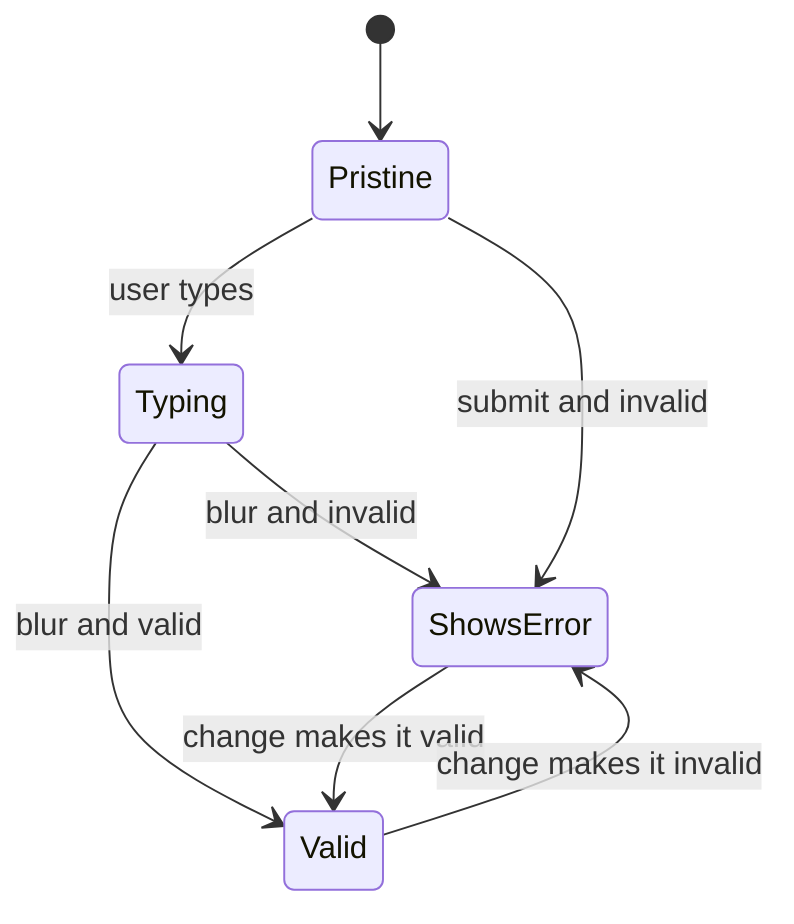
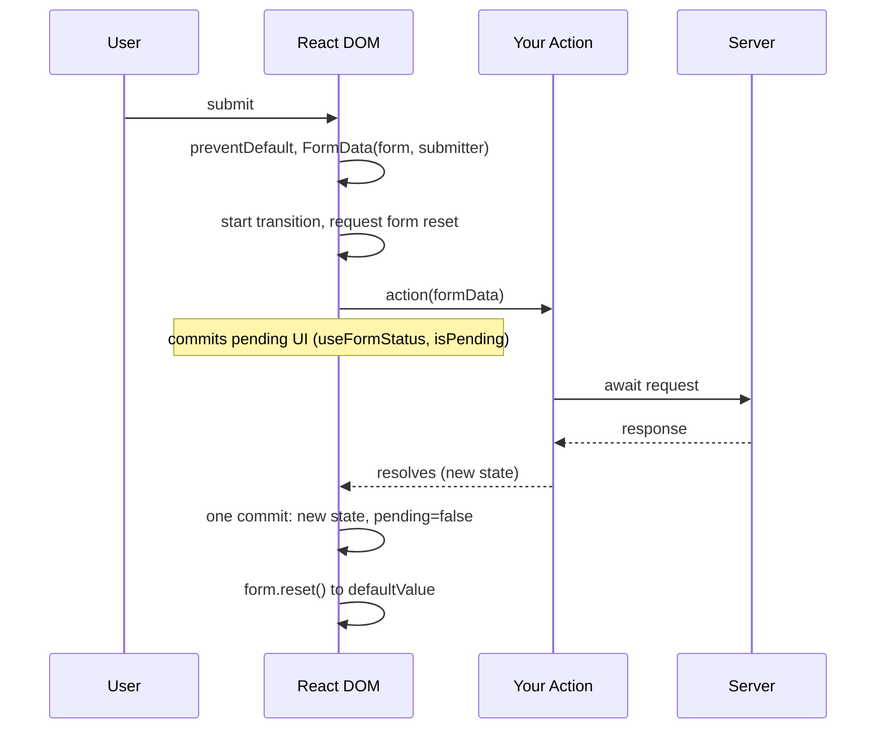
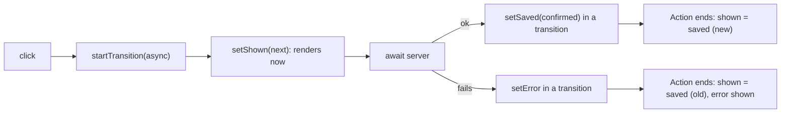

# 14 — Forms and Actions

> **How to use this module.** Sections 14.1–14.5 cover forms as every React version writes them: controlled vs uncontrolled inputs, validation, React Hook Form with Zod, files, and accessibility. Sections 14.6–14.9 cover React 19 Actions (`<form action>`, `useActionState`, `useFormStatus`, `useOptimistic`), and 14.10 puts it together in a multi-step form. If you only have 20 minutes, read 14.1, 14.3, 14.6, 14.7 and the Summary.

**Prerequisites:** [Controlled vs uncontrolled component APIs](07-components-props-composition.md#78-controlled-vs-uncontrolled-component-apis) · [Derived state](08-state.md#87-derived-state-compute-do-not-store) · [You might not need an effect](09-effects.md#96-you-might-not-need-an-effect) · [`useTransition` and `startTransition`](21-concurrent-ssr-server-components.md#212-usetransition-and-starttransition)

**Code for this module:** [`examples/web/src/m14-forms/`](examples/web/src/m14-forms/). Every component has a test next to it, and every network call goes to the fake server in `api.ts`, so the tests are deterministic. Run them with `npx vitest run src/m14-forms` from `examples/web`.

---

## 14.1 Controlled vs uncontrolled inputs

### The problem
A form needs the values the user typed: to validate them, to send them, and sometimes to drive other UI while the user types. There are two places those values can live. React state can hold them, so the DOM is a mirror of state. Or the DOM can hold them, and you read them when you need them. Both work, and choosing the wrong one costs either a lot of boilerplate or a lot of awkward imperative code.

[07](07-components-props-composition.md#78-controlled-vs-uncontrolled-component-apis) covers the **component API** contract (`value`/`onChange` vs `defaultValue`), and [08 Exercise 3](08-state.md#coding-exercises) builds a fully controlled signup form. This section is about **forms**: how each choice affects reading, resetting and submitting.

### Mental model
- **Controlled** [React DOM]: the input shows `value={state}` and reports every keystroke with `onChange`. React state is the source of truth, and the DOM is re-rendered to match it.
- **Uncontrolled** [Browser]: the input owns its value, seeded once by `defaultValue`. You read it on submit, with `FormData` [Browser] or a ref.

> **Java/Spring analogy.** Uncontrolled is a classic HTML form posted to a Spring MVC controller: the browser holds the field values, and your code sees them only when the form is submitted and bound to a `@ModelAttribute`. Controlled is closer to a desktop UI with two-way binding, where every edit updates the model immediately.
>
> **Where the analogy breaks:** with Actions (14.6), the "submit and bind" step happens inside the page, without a navigation. And a controlled React input is not two-way binding: the state flows down, the event flows up, and if you ignore the event the input does not change.

### Minimal code

```tsx
// Controlled: state is the truth; the input re-renders on every keystroke.
function ControlledSearch({ onSearch }: { onSearch: (q: string) => void }) {
  const [query, setQuery] = useState('');
  return (
    <form onSubmit={(e) => { e.preventDefault(); onSearch(query); }}>
      <input value={query} onChange={(e) => setQuery(e.target.value)} aria-label="Search" />
      <p>{query.length}/50</p> {/* live UI from the value is the reason to control it */}
    </form>
  );
}

// Uncontrolled: the DOM is the truth; read everything at submit time.
function UncontrolledSearch({ onSearch }: { onSearch: (q: string) => void }) {
  return (
    <form onSubmit={(e) => {
      e.preventDefault();
      onSearch(String(new FormData(e.currentTarget).get('q') ?? ''));
    }}>
      <input name="q" defaultValue="" aria-label="Search" />
    </form>
  );
}
```

### How it works internally
For a controlled input, React DOM runs your `onChange` after the native `input` event and then **restores** the DOM value to the `value` prop if state did not change. That is why an input whose parent ignores `onChange` looks frozen ([07 Exercise 4](07-components-props-composition.md#coding-exercises) proves it). For an uncontrolled input, React sets `defaultValue` (the HTML `value` attribute) and never touches the live value again. `new FormData(form)` collects every successful control **by its `name`**, so an input without `name` is invisible to `FormData` and to Actions.

### Trade-offs
| | Controlled | Uncontrolled |
|---|---|---|
| Re-renders | Every keystroke | None while typing |
| Live UI from the value (counters, enabling buttons, formatting) | Easy | Needs a ref or a form library |
| Reset | `setState(initial)` | `form.reset()`, or automatic after an Action (14.6) |
| Works with Actions and progressive enhancement | Only if you also give it a `name` | Yes, natively |
| Third-party UI kits (date pickers, selects) | Usually required | Often impossible |

Default to **uncontrolled** for forms you submit as a whole: less code, fewer renders, and it is what Actions and React Hook Form are built on. Control a field when its value drives other UI as the user types.

> **Version notes.** Controlled and uncontrolled inputs work the same from React 0.x to 19. React 19.0 changed the uncontrolled story: a `<form action={fn}>` resets uncontrolled fields after the Action succeeds (CHANGELOG 19.0.0). React 19.3 fires `onReset` for that automatic reset and updates `defaultValue` for `type="number"` inputs to match other input types (CHANGELOG 19.3.0).

---

## 14.2 Validation strategies

### The problem
Users make mistakes, and the server must reject bad data anyway. The client-side questions are **what** to check, **where** the rules live, and **when** to show the messages. Showing "Invalid email" after the first keystroke is hostile. Showing nothing until submit makes users fix five fields at once.

### Mental model
Three layers, from cheapest to most authoritative:

1. **Native constraint validation** [Browser]: `required`, `type="email"`, `minLength`, `pattern`, `min`/`max`. The browser checks them on submit and shows its own bubble. Free, but the messages are hard to style and translate, and cross-field rules (password confirmation) need `setCustomValidity`.
2. **Schema validation** [Library: zod]: one declarative schema validates the whole object, including cross-field rules, and also gives you the TypeScript type. The same schema can run on the server ([02](02-typescript.md#216-runtime-validation-with-zod-vs-static-types)).
3. **Server validation** [Backend: Spring]: the only layer you can trust. Uniqueness ("email already taken") can only be checked there. Map its errors back onto fields ([24](24-react-with-spring-boot.md#248-problemdetail-error-mapping)).

And three timings:

| Timing | Shows an error… | Good for |
|---|---|---|
| on submit | only after the first submit | short forms; least noisy |
| on blur ("touched") | when the user leaves a field | most forms: the user finished typing before being judged |
| on change | on every keystroke | re-validating a field that is **already** showing an error, so the message disappears the moment it is fixed |

The common, user-friendly combination is "validate on blur, then re-validate on change". In React Hook Form that is `mode: 'onTouched'`.



### Minimal code: native validation, and opting out of it

```tsx
// Native: the browser blocks submission and shows its own message.
<form onSubmit={handleSubmit}>
  <input name="email" type="email" required aria-label="Email" />
</form>

// Your own validation (schema or library): turn the native UI off,
// but keep type="email" for the mobile keyboard and autofill.
<form noValidate onSubmit={handleSubmit}>
  <input name="email" type="email" aria-label="Email" />
</form>
```

### How it works internally
On submit, the browser runs **interactive constraint validation** unless the form has `novalidate`. If any control is invalid, it fires `invalid` on it, shows a message, and does **not** fire `submit`, so neither your `onSubmit` nor your Action runs. jsdom 30 implements this too: its `requestSubmit` calls `reportValidity()` unless `novalidate` is set (read in `jsdom/lib/jsdom/living/nodes/HTMLFormElement-impl.js`). `LegacyNewsletterForm.test.tsx` asserts that an empty `required` field sends no request.

### Trade-offs
- Native only: fine for small internal tools. Weak for cross-field rules, custom messages and consistent design.
- Schema + `noValidate`: the default for product forms. One schema for the client, often shared with a Node backend.
- Always validate on the server as well. Client validation is UX; server validation is security.

> **⚠️ Correction:** "Validate on every keystroke so users get instant feedback." Validating a field the user has not finished typing produces an error for every partial email. Validate on blur or submit first, then on change only while an error is showing.

---

## 14.3 React Hook Form + Zod

### The problem
08's signup form needed `values`, `touched`, a validator map and hand-written `aria-*` wiring for three fields. Real forms have twenty fields, async rules, server errors, field arrays and dirty tracking. Writing that by hand in every form is how codebases end up with five subtly different form implementations.

### Mental model
- **React Hook Form (RHF)** [Library: react-hook-form] keeps inputs **uncontrolled**. `register('email')` returns `{ name, onChange, onBlur, ref }`; RHF reads values through the ref and stores them outside React state. Your component re-renders only when form state you actually read (errors, `isSubmitting`…) changes.
- **Zod** [Library: zod] describes the shape and rules once. `z.infer`/`z.output` gives the TypeScript type, so the type and the validation can never disagree.
- **`zodResolver`** [Library: @hookform/resolvers] is the adapter: RHF hands it the raw values, it returns either per-field errors or the parsed (possibly transformed) values.

> **Spring analogy.** Zod is Bean Validation (`@NotBlank`, `@Email`, a class-level `@PasswordMatches` constraint), and `zodResolver` plays the role of the `Validator` that `@Valid` invokes. RHF is the binder: it collects request parameters into an object and exposes a `BindingResult`.
>
> **Where the analogy breaks:** a Zod schema is a **value** you compose at runtime (`.extend`, `.pick`, `.refine`), and it produces the TypeScript type. Bean Validation annotates a class that already exists. And RHF validates on the client as the user types, not once per request.

### Minimal code
`examples/web/src/m14-forms/signupSchema.ts`:

```ts
export const signupSchema = z
  .object({
    email: z.email({ error: 'Enter a valid email' }),
    password: z.string().min(8, { error: 'Password must be at least 8 characters' }),
    confirm: z.string(),
  })
  .refine((values) => values.password === values.confirm, {
    error: 'Passwords do not match',
    path: ['confirm'], // attach the cross-field error to the field the user must fix
  });

export type SignupInput = z.input<typeof signupSchema>;   // what the inputs hold
export type SignupValues = z.output<typeof signupSchema>; // what onValid receives
```

`examples/web/src/m14-forms/RhfSignupForm.tsx` (excerpt):

```tsx
const { register, handleSubmit, setError, formState: { errors, isSubmitting } } =
  useForm<SignupInput, unknown, SignupValues>({
    resolver: zodResolver(signupSchema),
    mode: 'onTouched',
    defaultValues: { email: '', password: '', confirm: '' },
  });

<form noValidate onSubmit={handleSubmit(onValid)}>
  <FormField label="Email" registration={register('email')} error={errors.email?.message} />
```

### How it works internally
- **Defaults** (read from `react-hook-form@7.89.0` `dist/index.esm.mjs`): `mode: 'onSubmit'`, `reValidateMode: 'onChange'`, `shouldFocusError: true`. So out of the box, nothing is validated until the first submit, after which fields re-validate on change, and the first invalid field is focused through its registered ref.
- **Subscriptions:** `formState` is wrapped by `getProxyFormState`, which defines a getter per key and records which keys your component read. RHF only re-renders the component for changes to keys it has read. Destructure what you use, during render.
- **`handleSubmit(onValid)`** calls `preventDefault`, sets `isSubmitting`, runs the resolver, and on success calls `onValid` with the **resolver's output values** (so `.trim()` and other transforms apply). On failure it focuses the first error. If `onValid` throws, RHF still finishes the submit (`isSubmitting: false`, `isSubmitSuccessful: false`) and then rethrows.
- **Types:** `@hookform/resolvers` 5.9.1 types `zodResolver(schema)` as `Resolver<z.input<T>, Context, z.output<T>>`, and it accepts both Zod 3 and Zod 4 schemas. Passing `useForm<Input, unknown, Output>` makes the distinction explicit when a transform changes the type.

### Trade-offs
- ✅ Very few re-renders, small API, first-class TypeScript, schema reuse.
- ✅ Works with native inputs out of the box. For controlled third-party components (MUI `Select`, date pickers), use `<Controller>` or `useController`.
- ❌ The uncontrolled model surprises people used to controlled forms: `watch()` re-renders on every change, and `defaultValues` are read once (use `reset(values)` to load fetched data).
- ❌ RHF's `watch()` cannot be memoized. `eslint-plugin-react-hooks` 7.1.1 ships a list of known-incompatible library APIs that includes it (*"React Hook Form's `useForm()` API returns a `watch()` function which cannot be memoized safely."*), reported by the `incompatible-library` rule as a **warning** in `recommended` (read from the plugin's source, not triggered in our examples). Prefer `useWatch({ name })`, which subscribes one component to one field.

> **Version notes.** **Zod 3 → 4** (Zod 4.0, 2025; `examples/web` runs 4.6.5), from the [migration guide](https://zod.dev/v4/changelog) and checked against the 4.6.5 type definitions:
> - String formats moved to the top level: `z.email()`, `z.url()`, `z.uuid()`. `z.string().email()` still works but is `@deprecated`.
> - Error customization is unified under `error`. `message` is deprecated; `invalid_type_error`, `required_error` and `errorMap` were dropped.
> - `err.flatten()` and `err.format()` are deprecated in favour of `z.flattenError(err)` and `z.treeifyError(err)`. `err.errors` was dropped (use `err.issues`).
> - `.merge()` is deprecated (use `.extend(other.shape)`), and `.passthrough()` is deprecated (use `z.looseObject()` or `.loose()`).
> - `.default()` now short-circuits on `undefined` and must match the **output** type. `.prefault()` restores the old "parse the default" behaviour.
> - Refinements do not run after a **non-continuable** issue (such as a wrong type). The new `when` option controls that; ordinary check failures such as `.min()` do not block an object-level `.refine`.
> - Zod 4 adds `z.file()` (with `.mime()` and size checks) for `File` values.
>
> **@hookform/resolvers** 5 types the resolver from the schema's input and output types. Older 3.x code often used `useForm<z.infer<typeof schema>>()` and broke when a schema had transforms.

### Formik and Yup: what older codebases use

| | Formik + Yup (common 2018–2022) | React Hook Form + Zod (common now) |
|---|---|---|
| Value storage | React state inside `<Formik>` | Refs and an internal store, outside React state |
| Re-render on keystroke | The `<Formik>` subtree | Only components subscribed to what changed |
| Wiring | `<Field name>` or `formik.getFieldProps('email')`, `<ErrorMessage>` | `register('email')`, `formState.errors` |
| Schema | Yup: `yup.object({ email: yup.string().email().required() })`, adapter `validationSchema` | Zod via `resolver: zodResolver(schema)` |
| Types from schema | `yup.InferType<typeof schema>` | `z.infer` / `z.input` / `z.output` |
| Latest release (npm, checked 2026-10-03) | `formik` 2.4.9 (2025-11-10), `yup` 1.7.1 (2025-09-21) | `react-hook-form` 7.89.0, `zod` 4.6.5 |

> **Unverified:** that Formik re-renders the whole `<Formik>` subtree on every keystroke for every field. It follows from Formik keeping values in React state, but it was not measured here. Check with the React DevTools Profiler in a Formik app before you quote it in an interview.

Migration path: keep Yup at first (`@hookform/resolvers/yup` exists), swap `<Formik>` for `useForm`, replace `<Field>` with `register`, and move to Zod schema by schema. TanStack Form (`@tanstack/react-form` 1.33.5) and React Final Form are other options you may meet.

---

## 14.4 File inputs and previews

### The problem
"Upload a profile picture and show a preview before saving." File inputs break the usual rules: you cannot control their value, `accept` does not actually validate, and a preview needs a URL for an in-memory `File`.

### Mental model
- `<input type="file">` [Browser] is **always uncontrolled**. For security, script can only clear its value, never set it. You react to `onChange` and read `e.target.files`.
- A `File` is a `Blob`. `URL.createObjectURL(file)` [Browser] returns a `blob:` URL that keeps the file in memory **until you call `URL.revokeObjectURL`**. Creating one is acquiring an external resource, which makes it an effect with a cleanup ([09](09-effects.md#93-cleanup-and-the-effect-lifecycle)).
- `accept="image/*"` only filters the OS picker. Drag and drop, "All files" in the picker, or a script can still deliver anything, so validate `file.type` and `file.size` yourself, and again on the server.

> **Java analogy.** The object URL is like an open `InputStream`: forget to close it and memory leaks until the page unloads.
>
> **Where the analogy breaks:** there is no `try`-with-resources. The effect cleanup is the only place that reliably runs when the preview goes away.

### Minimal code
`examples/web/src/m14-forms/AvatarPicker.tsx` (excerpt; full version in Exercise 4):

```tsx
function AvatarPreview({ file }: { file: File }) {
  const imgRef = useRef<HTMLImageElement>(null);
  useEffect(() => {
    const img = imgRef.current;
    if (!img) return;
    const url = URL.createObjectURL(file);
    img.src = url;                              // no setState in the effect
    return () => URL.revokeObjectURL(url);      // release it when file changes or on unmount
  }, [file]);
  return ;
}
```

### How it works internally
The effect runs after commit. Each `file` change runs the previous cleanup (revoking the old URL) before creating the new one. In Strict Mode development, a newly mounted preview runs setup → cleanup → setup, so URL #1 is revoked and URL #2 stays on screen; the test asserts exactly that. Writing `img.src` through the ref, rather than storing the URL in state, avoids the `react-hooks/set-state-in-effect` lint error and the extra render it warns about.

### Trade-offs
- `URL.createObjectURL` is synchronous and cheap. `FileReader.readAsDataURL` produces a base64 string (about a third bigger), is asynchronous, and needs its own cancellation. Prefer object URLs for previews.
- For real uploads, send the `File` in `FormData` (multipart) or upload directly to storage with a presigned URL ([24](24-react-with-spring-boot.md#2411-file-uploads-with-s3-presigned-urls)).
- A file input inside a `<form action>` is reset after the Action like any uncontrolled field, so a successful submit clears the selection.

---

## 14.5 Accessible forms

### The problem
A form that only works with a mouse and sighted users fails real people and, in many jurisdictions, the law. Interviewers often ask you to "make this form accessible", and the fixes are concrete.

### Mental model
Every field needs four things a screen reader can announce ([04](04-html-css-accessibility.md#42-accessibility-the-accessibility-tree-aria-rules-names-roles-states)):

| Need | How |
|---|---|
| A **name** | `<label htmlFor={id}>` bound to the input's `id` (`useId`, [12](12-hooks-and-custom-hooks.md#1211-useid)). A placeholder is not a label. |
| A **description** (hint, error) | `aria-describedby="hintId errorId"`, listing the ids of the hint and error elements |
| An **invalid state** | `aria-invalid="true"` only while the error is shown |
| **Announcement** of new errors | A live region (`role="alert"` / `aria-live`), or move focus to the first invalid field on submit |

Plus: a real `<button type="submit">`, errors in text (never colour alone), `autoComplete` tokens (`email`, `new-password`, `street-address`) so password managers and autofill work, and groups of radios or checkboxes in `<fieldset>` with a `<legend>`.

### Minimal code
`examples/web/src/m14-forms/FormField.tsx` is the shared field used by the RHF examples:

```tsx
<label htmlFor={id}>{label}</label>
<input
  id={id}
  aria-invalid={error ? true : undefined}
  aria-describedby={describedBy || undefined} // "hintId errorId"
  {...registration}
/>
{hint && <p id={hintId}>{hint}</p>}
{error && <p id={errorId} role="alert" aria-live="polite">{error}</p>}
```

The tests check accessibility through the same tree a screen reader uses: `getByLabelText('Email')` finds the field by its name, and `toHaveAccessibleDescription('Enter a valid email')` checks what the screen reader would read after the name.

### How it works internally
The browser computes each element's accessible name and description from the DOM (the "accessible name and description computation"). `aria-describedby` concatenates the referenced elements' text in order, which is why the password field's description is "Use 8 or more characters. Password must be at least 8 characters". Focus management comes from RHF: `shouldFocusError: true` calls `.focus()` on the first invalid field's registered ref, and `setError(name, error, { shouldFocus: true })` does the same for server errors.

### Trade-offs
- `role="alert"` interrupts the user. On a long form, several alerts appearing at once are noisy. Many teams use a polite live region per field plus focus on the first error, or a single error summary at the top that links to each field.
- Do not disable the submit button to signal "invalid": a disabled button is skipped by keyboard focus and explains nothing. Let the user submit and show the errors. Disabling it **while submitting** is fine.
- Test with a screen reader at least once. Automated checks (axe, [20](20-testing.md#2012-accessibility-testing)) catch missing labels, not confusing flows.

> **⚠️ Correction:** "Scope your test queries with `getByRole('alert')`." Several fields can legitimately show alerts at the same time (focus moving from one field blurs another). Assert on **the field you mean**, through its accessible description, as every test in this module does.

---

## 14.6 Actions: `<form action={fn}>`

### The problem
Every React ≤ 18 submit handler repeats the same boilerplate: `preventDefault`, build the payload, `setIsSubmitting(true)`, `try`/`catch`/`finally`, reset the fields, and guard against double submits. Forgetting `finally` leaves the button disabled forever. `LegacyNewsletterForm.tsx` shows it all.

### Mental model
An **Action** [React] is a function, possibly async, that React runs inside a **transition** ([21](21-concurrent-ssr-server-components.md#212-usetransition-and-starttransition)). Pass one to `<form action>` [React DOM] and React handles the plumbing:

1. On submit, React calls `preventDefault`, builds `new FormData(form, submitter)`, and calls your function with it.
2. While the Action's promise is pending, the form is "pending": `useFormStatus` (14.8) and `useActionState` (14.7) can show it.
3. When it settles successfully, React **resets the form's uncontrolled fields** to their `defaultValue`.
4. If it throws, the error goes to the nearest error boundary ([16](16-error-handling.md#162-error-boundaries)).



> **Spring analogy.** A form Action is a `@PostMapping` handler that receives the bound form, except that it runs in the browser and the "redirect after POST" is a state update.
>
> **Where the analogy breaks:** nothing is sent to a server unless your function sends it. The same `action` prop also accepts a **Server Function** (`'use server'`), which really is a server endpoint; that is covered in [21](21-concurrent-ssr-server-components.md#218-use-client-and-use-server-server-functions-and-their-security).

### Minimal code

```tsx
function Search({ onSearch }: { onSearch: (q: string) => void }) {
  return (
    <form action={(formData) => onSearch(String(formData.get('q') ?? ''))}>
      <input name="q" aria-label="Search" />
      <button>Search</button>
    </form>
  );
}
```

A `<button formAction={fn}>` [React DOM] overrides the form's action for that button, which is how one form gets "Save draft" and "Publish" buttons.

### How it works internally
Read in `react-dom@19.3.0` (`cjs/react-dom-client.development.js`):
- On `submit`, if the event's `defaultPrevented` is false and the action is a function, React calls `preventDefault`, creates `FormData(form, submitter)`, and calls `startHostTransition`. **If your own `onSubmit` already called `preventDefault`, React does not call the action.**
- `startHostTransition` stores a pending status on the form fiber (what `useFormStatus` reads) and wraps your action as `() => { requestFormReset(form); return action(formData); }`. So the reset is **requested at the start** in the transition's lane and committed with that transition. It becomes visible only when the Action finishes.
- At commit time, the form reset runs at the root after all DOM mutations, so an input whose `defaultValue` changed in the same commit is reset to the **new** default. `NewsletterForm` relies on this to keep what the user typed after a validation error.
- React renders a function `action` as a `javascript:throw new Error('A React form was unexpectedly submitted…')` URL, so a raw `form.submit()` (which skips the `submit` event) fails loudly. Use `form.requestSubmit()`.
- For function actions the method is always POST (react.dev `<form>` reference).

### Trade-offs
- ✅ Pending state, error routing, ordering and reset for free. Works with Server Functions and progressive enhancement.
- ✅ Uncontrolled inputs plus `FormData` means no state per field.
- ❌ The automatic reset is surprising if you expected the values to stay. Return the submitted values in state and use them as `defaultValue`, or control the inputs.
- ❌ RHF's `handleSubmit` is built on `onSubmit`, not Actions. You can call an Action from `onValid` inside `startTransition`, but you lose the automatic `FormData` and reset.

> **Version notes.** **React ≤ 18:** `action` only accepted a URL. A function there was ignored, with a warning. Forms meant `onSubmit` + `e.preventDefault()` + manual pending state (`LegacyNewsletterForm.tsx`). **React 19.0** (Dec 2024): Actions, function `action`/`formAction`, automatic reset of uncontrolled fields, `requestFormReset` (CHANGELOG 19.0.0). **React 19.3** (Sep 2026): the automatic reset fires `onReset`, `submit` events include `submitter`, `FormData` is built with the submitter (so the clicked button's `name`/`value` is included), and a bug where the form status was reset when component state updated was fixed (CHANGELOG 19.3.0). React Router's `<Form>`/`action` ([19](19-routing.md#195-loaders-actions-usefetcher)) predates React Actions and is a different API with the same idea.

---

## 14.7 `useActionState`

### The problem
An Action usually produces a result the UI must show: "Subscribed!", a field error, the saved entity. Storing that result with `useState` inside the Action works, but you then manage ordering when the user submits twice, and you still need a pending flag.

### Mental model
`useActionState(reducerAction, initialState)` [React] is **`useReducer` whose reducer may be async and have side effects**. You get `[state, dispatchAction, isPending]`:
- `dispatchAction(payload)` queues a call to `reducerAction(previousState, payload)`.
- Calls run **one at a time, in order**, and each receives the previous call's result (react.dev).
- `isPending` is `true` while any queued call is running.
- Passed to `<form action={dispatchAction}>`, the payload is the `FormData`.

> **Java analogy.** A single-threaded executor (`Executors.newSingleThreadExecutor()`) feeding a fold: tasks run in submission order, and each sees the state the previous one produced.
>
> **Where the analogy breaks:** the UI may not show intermediate states. While several Actions are in flight, React batches their updates together (react.dev caveat), so the screen can jump from the first state to the last.

### Minimal code
`examples/web/src/m14-forms/NewsletterForm.tsx` (excerpt):

```tsx
export async function subscribeAction(_previous: SubscribeState, formData: FormData): Promise<SubscribeState> {
  const email = String(formData.get('email') ?? '').trim();
  const parsed = emailSchema.safeParse(email);
  if (!parsed.success) return { status: 'error', email, message: parsed.error.issues[0]?.message ?? '…' };
  try {
    await subscribe(parsed.data);
    return { status: 'success', email: parsed.data };
  } catch (error) {
    return { status: 'error', email, message: error instanceof Error ? error.message : '…' };
  }
}

const [state, formAction] = useActionState(subscribeAction, INITIAL_STATE);
<form action={formAction}>…</form>
```

### How it works internally
Read in `react-dom@19.3.0`:
- `dispatchActionState` creates a node per call and appends it to a circular queue. If the queue was empty it runs immediately; otherwise it waits. `onActionSuccess` stores the returned state and starts the next node. That is the sequential queue Exercise 5 makes you predict.
- If a call throws or rejects, `onActionError` marks **every queued node** as rejected (the rest never run), and the hook rethrows during render, so the nearest error boundary shows. Return errors as state instead, as `subscribeAction` does.
- Calling `dispatchAction` outside a transition logs: *"An async function with useActionState was called outside of a transition. This is likely not what you intended (for example, isPending will not update correctly). Either call the returned function inside startTransition, or pass it to an `action` or `formAction` prop."*
- The `reducerAction` is **not** double-invoked in Strict Mode, because it is allowed to have side effects (react.dev).
- The optional third argument, `permalink`, is for Server Function forms submitted before JavaScript loads ([21](21-concurrent-ssr-server-components.md#218-use-client-and-use-server-server-functions-and-their-security)).

### Trade-offs
- ✅ Ordering, pending state and the result in one hook. The Action is a plain function, so you can unit-test it without rendering (`NewsletterForm.test.tsx` does).
- ❌ Calls are serialized. For independent operations (liking several posts), separate transitions or `useOptimistic` fit better.
- ❌ A state update after an `await` inside an Action currently needs its own `startTransition` (react.dev caveat). `LikeButton.tsx` does this.

> **Version notes.** In React's **Canary** releases this hook was **`ReactDOM.useFormState`** (from `react-dom`). React 19.0 renamed it to **`React.useActionState`** (from `react`) and added `isPending` (React 19 blog: "`React.useActionState` was previously called `ReactDOM.useFormState` in the Canary releases, but we've renamed it and deprecated `useFormState`"). In `react-dom@19.3.0`, calling `useFormState` still works but logs *"ReactDOM.useFormState has been renamed to React.useActionState. Please update %s to use React.useActionState."* Migration: change the import to `react`, and read the new third tuple element instead of a separate `useFormStatus` where convenient.

---

## 14.8 `useFormStatus`

### The problem
The submit button lives in a reusable `<SubmitButton>` component, deep inside the form. It needs to know "is my form submitting?" without the form threading an `isPending` prop through every layer.

### Mental model
`useFormStatus()` [React DOM] reads the status of the **nearest parent `<form>`** as if the form were a context provider: `{ pending, data, method, action }`. While idle, `pending` is `false` and the rest are `null`.

### Minimal code
`examples/web/src/m14-forms/NewsletterForm.tsx`:

```tsx
function SubmitButton() {
  const { pending } = useFormStatus(); // from 'react-dom'
  return (
    <button type="submit" disabled={pending}>
      {pending ? 'Subscribing…' : 'Subscribe'}
    </button>
  );
}
```

### How it works internally
The status is the pending state that `startHostTransition` stores on the form's fiber (14.6), exposed to descendants through an internal `HostTransitionContext`, which `useFormStatus` reads with `readContext`. It is an optimistic-style value: `true` while the form's transition is pending, reverting when it completes.

### Trade-offs and caveats (react.dev)
- It **must be called from a component rendered inside the `<form>`**. Called in the component that renders the `<form>`, it does not see that form. This is the number-one `useFormStatus` bug.
- It only reflects submissions that go through `action`/`formAction`. A form submitted with `onSubmit` + `preventDefault` stays `pending: false`.
- `data` is the submitted `FormData`, which lets a child show "Sending ana@example.com…" or an optimistic preview.
- Use `useActionState`'s `isPending` when the component that owns the state needs it. Use `useFormStatus` for reusable children such as buttons and spinners.

---

## 14.9 `useOptimistic`

### The problem
A like button that waits 300 ms for the server before turning red feels broken. Updating local state immediately and "fixing it up" on failure means writing rollback code, and the rollback is easy to get wrong when several requests overlap.

### Mental model
`useOptimistic(value)` [React] returns `[shown, setShown]`. Outside an Action, `shown === value`. **During** an Action, `setShown(x)` makes `shown` equal `x` immediately. When the Action ends, the optimistic value is discarded and `shown` is `value` again, which by then is the new confirmed value (success) or the old one (failure). **There is no rollback code**: you never changed the real state.



> **Java analogy.** A database transaction with optimistic concurrency, seen from the UI: you show the change as if committed, and if the commit fails the view falls back to the last committed snapshot.
>
> **Where the analogy breaks:** nothing is locked or versioned. If two clients like the same post, the server decides, and you must display what it returns.

### Minimal code
`examples/web/src/m14-forms/LikeButton.tsx` (excerpt):

```tsx
const [saved, setSaved] = useState(initial);       // last confirmed by the server
const [shown, setShown] = useOptimistic(saved);    // what the user sees

function handleClick() {
  const next = toggled(shown);
  setError(null);
  startTransition(async () => {
    setShown(next);                                 // immediate
    try {
      const confirmed = await setLike(postId, next.liked);
      startTransition(() => setSaved(confirmed));   // after await: wrap again
    } catch {
      startTransition(() => setError(SAVE_FAILED));
    }
  });
}
```

`useOptimistic(state, reducer)` is the second form: `setShown(action)` runs `reducer(currentShown, action)`, which is handy for "append a pending comment to the list".

### How it works internally
Read in `react-dom@19.3.0`: `setShown` enqueues an update in the **sync lane** with a `revertLane` set to the current transition lane. The optimistic value renders right away, and when the transition's lane commits, the update is reverted and the hook recomputes from the passthrough `value`. Per react.dev, there is no extra render to "clear" it: the optimistic and the real state converge in the same render. Called outside an Action, it logs *"An optimistic state update occurred outside a transition or action. To fix, move the update to an action, or wrap with startTransition."* and the optimistic value only flashes.

### Trade-offs
- ✅ Correct rollback by construction, even with overlapping requests.
- ❌ Only use it where failure is rare and cheap to explain (likes, reorder, rename). For payments, show a pending state instead.
- With TanStack Query, the equivalent is `onMutate` + rollback in `onError`, or rendering `variables` while pending ([17](17-data-fetching.md#176-optimistic-updates)).

---

## 14.10 Multi-step forms

### The problem
A checkout with contact, shipping and payment steps. Each step must validate only **its** fields, going back must not lose data, and the final submit needs everything.

### Mental model
**One form, one schema, many views.** Keep a single `useForm` (or a single reducer) for the whole wizard, render only the current step's fields, and validate per step with `trigger(stepFields)`. Do not create one form per step and merge them at the end; that is three sources of truth.

### Minimal code
`examples/web/src/m14-forms/CheckoutWizard.tsx` (excerpt; full version in Exercise 6):

```tsx
const STEPS = [
  { title: 'Contact', fields: ['email'] },
  { title: 'Shipping', fields: ['fullName', 'address'] },
] as const satisfies ReadonlyArray<{ title: string; fields: ReadonlyArray<keyof CheckoutInput> }>;

async function goNext() {
  if (await trigger(current.fields, { shouldFocus: true })) setStep(LAST_STEP);
}

// Enter on an intermediate step means "Next", not "submit everything".
const onSubmit = step === LAST_STEP ? handleSubmit(onComplete) : (e: SubmitEvent<HTMLFormElement>) => {
  e.preventDefault();
  void goNext();
};
```

### How it works internally
`shouldUnregister: false` (RHF's default) keeps a field's value in the form store after its input unmounts, so the email typed on step 1 is still there on step 2 and is restored if the user goes back. `trigger(names)` runs the resolver and updates errors only for the listed fields. The final `handleSubmit` validates the whole schema.

### Trade-offs
- Persist the draft (`sessionStorage`, or the server) if losing it on refresh would hurt. Put the step in the URL if users should be able to link to it or use the back button ([19](19-routing.md#194-params-and-search-params)).
- Announce the step change: a heading that says "Step 2 of 2: Shipping", and move focus to it or to the first field.
- Without a library, a `useReducer` with `{ step, values }` and a per-step validator works fine ([08](08-state.md#810-usereducer)).

---

## Interview questions

**Q1. What is the difference between a controlled and an uncontrolled input?**
<details><summary>Answer</summary>

Controlled: React state holds the value (`value` + `onChange`), and the DOM is re-rendered to match state on every keystroke. Uncontrolled: the DOM holds the value, seeded once by `defaultValue`, and you read it when needed (`FormData`, a ref). **A strong answer adds:** uncontrolled is the default for submit-as-a-whole forms and is what Actions and React Hook Form build on; control a field when its value drives other UI while typing.

</details>

**Q2. Why does an input with `value` but no `onChange` look frozen?**
<details><summary>Answer</summary>

After every `input` event, React DOM restores the DOM value to the `value` prop. With no `onChange` updating state, the prop never changes, so each keystroke is undone. React warns in development and suggests `defaultValue` or `readOnly`. **A strong answer adds:** the same thing happens with an `onChange` that rejects the value; that is how you build input masks.

</details>

**Q3. What does "A component is changing an uncontrolled input to be controlled" mean?**
<details><summary>Answer</summary>

The input first rendered with `value={undefined}` (uncontrolled) and later with a defined value (controlled). Typical cause: `value={user.name}` where `name` loads later. Fix: `value={user.name ?? ''}`. **A strong answer adds:** pick the mode on mount and never switch, for inputs and for your own components ([07](07-components-props-composition.md#78-controlled-vs-uncontrolled-component-apis)).

</details>

**Q4. How do you read all the values of an uncontrolled form?**
<details><summary>Answer</summary>

`new FormData(formElement)`, then `formData.get('name')`, or `Object.fromEntries(formData)` for single-valued fields. Only controls with a `name` (and not disabled) are included. With a form Action, React builds the `FormData` and passes it to your function. **A strong answer adds:** checkboxes appear only when checked, multi-selects need `getAll`, and `get` returns `string | File | null`, so validate it (Zod) instead of casting.

</details>

**Q5. When would you validate on blur, on change, or on submit?**
<details><summary>Answer</summary>

On blur for the first validation of a field (the user has finished typing), then on change while an error is showing, so it disappears as soon as it is fixed. On submit for short forms or as the last line. Pure on-change validation shows errors for half-typed values. **A strong answer adds:** in RHF this is `mode: 'onTouched'`. The default is `mode: 'onSubmit'` with `reValidateMode: 'onChange'`.

</details>

**Q6. Native constraint validation vs schema validation: when do you use each?**
<details><summary>Answer</summary>

Native (`required`, `type`, `pattern`) is free, accessible and blocks submission before your code runs, but its messages are hard to customize and it is weak for cross-field rules. A schema (Zod) gives custom messages, cross-field rules, a TypeScript type and server reuse; then set `noValidate` so the browser does not interfere. **A strong answer adds:** keep `type="email"` and `autoComplete` even with `noValidate`, for mobile keyboards and autofill.

</details>

**Q7. Why is client-side validation never enough?**
<details><summary>Answer</summary>

Anyone can bypass the browser (devtools, curl, a modified client). Client validation is a UX feature; the server must validate everything again, and some rules (uniqueness, permissions) can only be checked there. **A strong answer adds:** map server errors back onto fields (`setError('email', …)`, or a `ProblemDetail` with field errors from Spring, [24](24-react-with-spring-boot.md#248-problemdetail-error-mapping)).

</details>

**Q8. How does React Hook Form avoid re-rendering on every keystroke?**
<details><summary>Answer</summary>

Inputs are uncontrolled. `register` attaches a ref and native `onChange`/`onBlur` handlers, and values live in RHF's store, not React state. `formState` is a proxy that records which keys you read, and the component re-renders only when those change. **A strong answer adds:** `watch()` opts back into re-renders; `useWatch({ name })` scopes them to one component.

</details>

**Q9. What does `register('email')` return?**
<details><summary>Answer</summary>

`{ name, onChange, onBlur, ref }` (plus constraint props if you pass native rules). Spread it on a native input, or forward it to a custom input that passes `ref` to the DOM element. **A strong answer adds:** in React 19 `ref` is a regular prop, so a custom input no longer needs `forwardRef` ([10](10-refs-and-dom.md#104-ref-as-a-prop-vs-forwardref)).

</details>

**Q10. How do you use RHF with a controlled UI component like a MUI `Select`?**
<details><summary>Answer</summary>

Use `<Controller name control render={({ field }) => <Select {...field} />} />` or `useController`. It adapts RHF's store to a `value`/`onChange` API. **A strong answer adds:** you lose some of the "no re-render" benefit for that field, which is fine.

</details>

**Q11. How do you show an error that comes from the server after submit?**
<details><summary>Answer</summary>

In `onValid`, call the API and, on a business error, `setError('email', { type: 'server', message }, { shouldFocus: true })`. For errors not tied to a field, use `setError('root.server', …)` and render `errors.root?.server`. **A strong answer adds:** return business errors as data from the API layer and reserve thrown errors for transport failures, as `api.ts` does.

</details>

**Q12. What does `zodResolver` do, and what types does it produce?**
<details><summary>Answer</summary>

It adapts a Zod schema to RHF's `resolver` contract: given raw values, return `{ values, errors }`. In `@hookform/resolvers` 5 it is typed `Resolver<z.input<T>, Context, z.output<T>>`, so `useForm<Input, unknown, Output>` keeps input types (what inputs hold) separate from output types (what `onValid` gets after transforms). **A strong answer adds:** RHF passes the resolver's **output** to `onValid`, so `.trim()` or `z.coerce` results are what you submit.

</details>

**Q13. How do you validate "confirm password" with Zod?**
<details><summary>Answer</summary>

An object-level `.refine((v) => v.password === v.confirm, { error: 'Passwords do not match', path: ['confirm'] })`. `path` attaches the issue to the confirm field. **A strong answer adds:** in Zod 4, refinements don't run after non-continuable issues (such as a wrong type); ordinary check failures like `.min()` don't block them, and the `when` option gives explicit control.

</details>

**Q14. Name three API changes from Zod 3 to Zod 4.**
<details><summary>Answer</summary>

`z.email()` and other formats moved to the top level (`z.string().email()` is deprecated); `message` is replaced by `error` and `required_error`/`invalid_type_error`/`errorMap` were dropped; `err.flatten()`/`format()` are deprecated in favour of `z.flattenError`/`z.treeifyError`. Also `.merge()` → `.extend()`, `.default()` short-circuits and must match the output type (`.prefault()` for the old behaviour). **A strong answer adds:** `import * as z from 'zod'` gives v4 in Zod 4.x; `zod/v3` still exists for gradual migration.

</details>

**Q15. Formik vs React Hook Form: why did many teams migrate?**
<details><summary>Answer</summary>

Formik keeps values in React state inside `<Formik>`, so typing re-renders the form subtree; RHF keeps inputs uncontrolled and re-renders only subscribers. RHF also has a smaller API surface and resolvers for Zod, Yup and others. **A strong answer adds:** a migration can keep Yup via `@hookform/resolvers/yup` and move field by field. Formik still works; it is not a bug to leave it in place.

</details>

**Q16. How do you preview an image before upload, and what must you clean up?**
<details><summary>Answer</summary>

`URL.createObjectURL(file)` gives a `blob:` URL for an ``. It keeps the file in memory until `URL.revokeObjectURL(url)`, so create it in an effect keyed on the file and revoke it in the cleanup. **A strong answer adds:** setting `img.src` through a ref avoids `setState` in the effect, and the cleanup makes it Strict Mode safe.

</details>

**Q17. Does `accept="image/*"` validate the file?**
<details><summary>Answer</summary>

No. It filters the OS picker; drag and drop, "All files", or a script can still deliver anything. Validate `file.type` and `file.size` in JavaScript and again on the server (and check the content, not just the extension). **A strong answer adds:** user-event honours `accept` by default (`applyAccept: true`), so a test that uploads a `.txt` sees no change event; use `applyAccept: false` to test your own validation.

</details>

**Q18. Why can't you make a file input controlled?**
<details><summary>Answer</summary>

Browsers do not let script set a file input's value (it would let a page choose files from the user's disk). You can only clear it (`input.value = ''`). Keep the selected `File` in state and render from that. **A strong answer adds:** to let the user pick the same file twice in a row, clear the input after reading it, or no `change` event fires.

</details>

**Q19. Make this form accessible: what do you check?**
<details><summary>Answer</summary>

Each input has a `<label htmlFor>` (not just a placeholder); hints and errors are linked with `aria-describedby`; `aria-invalid` is set while invalid; new errors are announced (live region or focus on the first invalid field); errors are text, not colour; `autoComplete` tokens; radios in a `<fieldset>`/`<legend>`; a real `<button type="submit">`; full keyboard operation. **A strong answer adds:** test it the way users meet it, via `getByLabelText` and `toHaveAccessibleDescription`.

</details>

**Q20. Should the submit button be disabled while the form is invalid?**
<details><summary>Answer</summary>

Usually no. A disabled button can't be focused or clicked, so it can't explain what's wrong, and screen-reader users may never learn why. Let the user submit, show the errors and focus the first one. **A strong answer adds:** disabling it **while submitting** is good: it prevents double submits and signals progress.

</details>

**Q21. What is a React Action?**
<details><summary>Answer</summary>

A function, possibly async, run inside a transition (`startTransition(async () => …)`, a form `action`, or a `formAction`). React tracks its pending state, keeps the UI responsive, sends thrown errors to error boundaries, commits the resulting updates together, and supports optimistic updates while it runs. **A strong answer adds:** the CHANGELOG 19.0.0 definition: "Functions passed to `startTransition` are called 'Actions'."

</details>

**Q22. What does React do when a `<form action={fn}>` is submitted?**
<details><summary>Answer</summary>

It calls `preventDefault`, builds `FormData(form, submitter)`, starts a transition that requests a form reset and calls `fn(formData)`, exposes the pending status to `useFormStatus`, and after the Action succeeds resets the uncontrolled fields. **A strong answer adds:** if your `onSubmit` already called `preventDefault`, React skips the action (read in react-dom 19.3 source).

</details>

**Q23. After an Action, the inputs are empty. The user wanted to fix a typo. How do you keep the values?**
<details><summary>Answer</summary>

React resets uncontrolled fields to `defaultValue` after a successful Action. Return the submitted values in the Action's state and render them as `defaultValue`: the reset is applied after the DOM update, so it lands on the new default. Or control those inputs. **A strong answer adds:** `NewsletterForm` returns `email` in its error state and the test asserts the typed value survives.

</details>

**Q24. Explain `useActionState`'s signature and return value.**
<details><summary>Answer</summary>

`useActionState(reducerAction, initialState, permalink?)` returns `[state, dispatchAction, isPending]`. `reducerAction(previousState, payload)` may be async and may have side effects; its return value becomes the new state. With `<form action={dispatchAction}>`, the payload is the `FormData`. **A strong answer adds:** it is "`useReducer` with side effects in the reducer", and calls are queued sequentially.

</details>

**Q25. The user clicks submit twice quickly with `useActionState`. What happens?**
<details><summary>Answer</summary>

The second call is queued. It runs only after the first resolves, and receives the first call's result as `previousState`. `isPending` stays true throughout. **A strong answer adds:** Exercise 5 shows the exact sequence, including that only one request is in flight at a time. In React ≤ 18 hand-written handlers, you had to guard double submits yourself.

</details>

**Q26. What happens if a `useActionState` action throws?**
<details><summary>Answer</summary>

React cancels all queued calls and rethrows the error during render, so the nearest error boundary shows. That is rarely what a form wants. Catch expected failures inside the action and return them as state (`{ status: 'error', message }`). **A strong answer adds:** keep throwing for truly unexpected errors so they reach monitoring ([16](16-error-handling.md#162-error-boundaries)).

</details>

**Q27. What was `useFormState`?**
<details><summary>Answer</summary>

The Canary-era name of `useActionState`, exported from `react-dom`. React 19.0 renamed it to `useActionState` in `react` and added `isPending`. `react-dom` 19.3 still exports it but logs "ReactDOM.useFormState has been renamed to React.useActionState". **A strong answer adds:** you will see it in Next.js 14 App Router code, which ran React Canary.

</details>

**Q28. Why does `useFormStatus` return `pending: false` even though the form is submitting?**
<details><summary>Answer</summary>

Most often because it is called in the same component that renders the `<form>`; it only reads a **parent** form, so move it into a child component. Otherwise the form is submitted with `onSubmit` + `preventDefault` instead of `action`, which `useFormStatus` does not track. **A strong answer adds:** the hook works like a context provided by the `<form>`.

</details>

**Q29. `isPending` from `useActionState` or `pending` from `useFormStatus`: which one?**
<details><summary>Answer</summary>

`isPending` in the component that owns the action state (it works for any dispatch inside a transition, not just forms). `useFormStatus` in reusable descendants of the form (buttons, spinners) that should not receive props. **A strong answer adds:** `useFormStatus` also gives `data`, the submitted `FormData`, for "Sending X…" messages.

</details>

**Q30. How does `useOptimistic` roll back on failure?**
<details><summary>Answer</summary>

It doesn't need explicit rollback. The optimistic value only exists while the Action is pending. When the Action ends, the hook shows its input value again: the newly confirmed value if you set it, or the unchanged old one if the request failed. **A strong answer adds:** internally the optimistic update has a revert lane tied to the transition, and no extra render is needed to clear it.

</details>

**Q31. Why must state set after an `await` inside an Action be wrapped in `startTransition` again?**
<details><summary>Answer</summary>

React can only associate updates with the transition while the synchronous part of the scope runs. After an `await`, the async context is lost, so the update would be treated as urgent and could commit before the Action ends, showing a mixed state. react.dev documents this as a current limitation. **A strong answer adds:** `LikeButton` wraps both `setSaved` and `setError` in `startTransition` for this reason.

</details>

**Q32. How did you write forms in React 18, and what problems did Actions remove?**
<details><summary>Answer</summary>

`onSubmit` with `e.preventDefault()`, controlled inputs or `FormData`, `setIsSubmitting(true)`, `try`/`catch`/`finally`, manual reset, and a guard against double submits. Actions give pending state (`useFormStatus`, `isPending`), ordering (queued), automatic reset, error routing to boundaries and optimistic updates. **A strong answer adds:** the old pattern still works in React 19 and is still right with libraries built on `onSubmit` (RHF, Formik).

</details>

**Q33. Where do Server Actions fit?**
<details><summary>Answer</summary>

A Server Function (`'use server'`) can be passed directly to `<form action>` or `useActionState`. The framework turns it into an endpoint, and the form can even work before JavaScript loads (progressive enhancement, with `permalink`). Treat it as a public POST endpoint: validate and authorize inside it. Covered in [21](21-concurrent-ssr-server-components.md#218-use-client-and-use-server-server-functions-and-their-security). **A strong answer adds:** client Actions and Server Functions use the same `action` prop and hooks.

</details>

**Q34. How do you test a form built on Actions?**
<details><summary>Answer</summary>

Unit-test the action function directly (it is a plain async function). Render the form, type with `user-event`, click submit, and assert the post-action UI with `findBy*`/`waitFor`, because the Action resolves after a transition. To see pending UI, control when the fake server answers (`fakeServer.hold()` + `resolveNext()` inside `act`). **A strong answer adds:** set `noValidate` or provide valid input, because jsdom runs native constraint validation on submit.

</details>

**Q35. How do you structure a multi-step form?**
<details><summary>Answer</summary>

One form state and one schema for the whole wizard, render one step at a time, validate the current step's fields only (`trigger(stepFields)`), keep values of unmounted steps (`shouldUnregister: false`), and validate everything on the final submit. **A strong answer adds:** handle Enter on intermediate steps (it submits the form), announce the step change, and persist drafts or put the step in the URL when it matters.

</details>

---

## Coding exercises

### Exercise 1: Signup with React Hook Form + Zod

**Statement.** Rebuild 08's signup form with React Hook Form and Zod: email, password (at least 8 characters, with a hint), and confirm password. Validate on blur, then on change. On submit, call `registerUser` from the fake server below. A taken email (`taken@example.com`) must appear as an error **on the email field**, with focus moved there. A network failure shows a form-level alert. Disable the button while submitting.

```ts
// file: examples/web/src/m14-forms/api.ts
// A fake backend for module 14. There is no network: every endpoint awaits `respond()`.
// Auto mode (default): each response arrives on the next macrotask, so tests use findBy/waitFor.
// Held mode: responses wait until the test calls resolveNext() or rejectNext(), so a test can
// look at the UI while a request is still in flight and decide exactly when (and how) it ends.

type Waiting = { label: string; resolve: () => void; reject: (error: Error) => void };

let held = false;
let nextFailure: string | null = null;
const waiting: Waiting[] = [];
const registeredEmails = new Set<string>();
const posts = new Map<string, { liked: boolean; likes: number }>();

function respond(label: string): Promise<void> {
  if (held) {
    return new Promise((resolve, reject) => {
      waiting.push({ label, resolve: () => resolve(), reject });
    });
  }
  const failure = nextFailure;
  nextFailure = null;
  return new Promise((resolve, reject) => {
    setTimeout(() => (failure === null ? resolve() : reject(new Error(failure))), 0);
  });
}

function takeNext(): Waiting {
  const next = waiting.shift();
  if (!next) throw new Error('No request is waiting for a response');
  return next;
}

export const fakeServer = {
  /** Hold every response until the test settles it. */
  hold() {
    held = true;
  },
  /** In auto mode, make the next request fail with this message. */
  failNextRequest(message: string) {
    nextFailure = message;
  },
  /** Labels of the requests that are in flight, oldest first. */
  pending: () => waiting.map((w) => w.label),
  resolveNext() {
    takeNext().resolve();
  },
  rejectNext(message: string) {
    takeNext().reject(new Error(message));
  },
  reset() {
    held = false;
    nextFailure = null;
    waiting.length = 0;
    registeredEmails.clear();
    registeredEmails.add('taken@example.com');
    posts.clear();
    posts.set('post-1', { liked: false, likes: 10 });
  },
};
fakeServer.reset();

export type RegisterResult =
  | { ok: true; userId: string }
  | { ok: false; field: 'email'; message: string };

/** Business-rule failures come back as data; only transport failures reject. */
export async function registerUser(input: { email: string; password: string }): Promise<RegisterResult> {
  await respond(`register ${input.email}`);
  const email = input.email.toLowerCase();
  if (registeredEmails.has(email)) {
    return { ok: false, field: 'email', message: 'This email is already registered' };
  }
  registeredEmails.add(email);
  return { ok: true, userId: `user-${registeredEmails.size}` };
}

export async function setLike(postId: string, liked: boolean): Promise<{ liked: boolean; likes: number }> {
  await respond(`like ${postId} ${liked}`);
  const post = posts.get(postId) ?? { liked: false, likes: 0 };
  const next = post.liked === liked ? post : { liked, likes: post.likes + (liked ? 1 : -1) };
  posts.set(postId, next);
  return next;
}

export async function subscribe(email: string): Promise<void> {
  await respond(`subscribe ${email}`);
  if (email.endsWith('@blocked.test')) throw new Error('This domain cannot subscribe');
}

export async function addToCart(quantity: number): Promise<void> {
  await respond(`add ${quantity}`);
}

export async function placeOrder(order: { email: string; fullName: string; address: string }): Promise<string> {
  await respond(`order ${order.email}`);
  return 'order-1';
}
```

**Approach.**
1. The rules are data: one Zod schema with a `.refine` for the cross-field rule, attached to `confirm` with `path`.
2. `useForm` with `zodResolver(schema)` and `mode: 'onTouched'`. Type it `useForm<z.input, unknown, z.output>`.
3. A shared `FormField` does the label, `aria-describedby` (hint + error) and `aria-invalid`, so the form itself stays short.
4. `onValid` maps the API's business error to `setError(field, …, { shouldFocus: true })`, and a thrown error to `setError('root.server', …)`.

<details><summary>Hints</summary>

- `z.email({ error: '…' })` is Zod 4's email format; `z.string().email()` is deprecated.
- `errors.root?.server?.message` renders the form-level error.
- `formState.isSubmitting` is true from the click until `onValid` settles.

</details>

<details><summary>Solution</summary>

[`signupSchema.ts`](examples/web/src/m14-forms/signupSchema.ts):

```ts
// file: examples/web/src/m14-forms/signupSchema.ts
import * as z from 'zod';

// One schema is the single source of truth: it validates at runtime AND produces the static type.
// Zod 4 style: top-level z.email() (z.string().email() is deprecated) and `error` instead of `message`.
export const signupSchema = z
  .object({
    email: z.email({ error: 'Enter a valid email' }),
    password: z.string().min(8, { error: 'Password must be at least 8 characters' }),
    confirm: z.string(),
  })
  // A cross-field rule. `path` attaches the issue to the field the user must fix.
  .refine((values) => values.password === values.confirm, {
    error: 'Passwords do not match',
    path: ['confirm'],
  });

/** What the inputs hold (what React Hook Form stores). */
export type SignupInput = z.input<typeof signupSchema>;
/** What a successful parse returns (what your submit handler receives). */
export type SignupValues = z.output<typeof signupSchema>;
```

[`FormField.tsx`](examples/web/src/m14-forms/FormField.tsx):

```tsx
// file: examples/web/src/m14-forms/FormField.tsx
import { useId, type HTMLInputTypeAttribute } from 'react';
import type { UseFormRegisterReturn } from 'react-hook-form';

type Props = {
  label: string;
  registration: UseFormRegisterReturn;
  type?: HTMLInputTypeAttribute;
  autoComplete?: string;
  hint?: string;
  error?: string;
};

/**
 * An accessible input for React Hook Form: a real <label>, the hint and the error linked with
 * aria-describedby, aria-invalid while the error is shown, and the error in a polite live region.
 * `registration` is register('name'), which supplies name, onChange, onBlur and the ref RHF uses
 * to read the value and to move focus to the first invalid field.
 */
export function FormField({ label, registration, type = 'text', autoComplete, hint, error }: Props) {
  const id = useId();
  const hintId = `${id}-hint`;
  const errorId = `${id}-error`;
  const describedBy = [hint ? hintId : null, error ? errorId : null].filter(Boolean).join(' ');

  return (
    <div>
      <label htmlFor={id}>{label}</label>
      <input
        id={id}
        type={type}
        autoComplete={autoComplete}
        aria-invalid={error ? true : undefined}
        aria-describedby={describedBy || undefined}
        {...registration}
      />
      {hint && <p id={hintId}>{hint}</p>}
      {error && (
        <p id={errorId} role="alert" aria-live="polite">
          {error}
        </p>
      )}
    </div>
  );
}
```

[`RhfSignupForm.tsx`](examples/web/src/m14-forms/RhfSignupForm.tsx):

```tsx
// file: examples/web/src/m14-forms/RhfSignupForm.tsx
import { zodResolver } from '@hookform/resolvers/zod';
import { useForm } from 'react-hook-form';
import { registerUser } from './api';
import { FormField } from './FormField';
import { signupSchema, type SignupInput, type SignupValues } from './signupSchema';

type Props = { onRegistered: (userId: string) => void };

export function RhfSignupForm({ onRegistered }: Props) {
  const {
    register,
    handleSubmit,
    setError,
    formState: { errors, isSubmitting },
  } = useForm<SignupInput, unknown, SignupValues>({
    resolver: zodResolver(signupSchema),
    mode: 'onTouched', // first validation on blur, then on every change
    defaultValues: { email: '', password: '', confirm: '' },
  });

  // Runs only after the schema passed. Server rules (a taken email) come back as field errors.
  const onValid = async ({ email, password }: SignupValues) => {
    try {
      const result = await registerUser({ email, password });
      if (result.ok) onRegistered(result.userId);
      else setError(result.field, { type: 'server', message: result.message }, { shouldFocus: true });
    } catch {
      setError('root.server', { type: 'server', message: 'Could not reach the server. Try again.' });
    }
  };

  return (
    <form noValidate onSubmit={handleSubmit(onValid)}>
      <FormField
        label="Email"
        type="email"
        autoComplete="email"
        registration={register('email')}
        error={errors.email?.message}
      />
      <FormField
        label="Password"
        type="password"
        autoComplete="new-password"
        hint="Use 8 or more characters."
        registration={register('password')}
        error={errors.password?.message}
      />
      <FormField
        label="Confirm password"
        type="password"
        autoComplete="new-password"
        registration={register('confirm')}
        error={errors.confirm?.message}
      />
      {errors.root?.server && <p role="alert">{errors.root.server.message}</p>}
      <button type="submit" disabled={isSubmitting}>
        {isSubmitting ? 'Creating account…' : 'Create account'}
      </button>
    </form>
  );
}
```

</details>

**Walkthrough.** Typing `ana` in Email changes nothing on screen: the input is uncontrolled and `onTouched` has not fired. Tabbing away runs the resolver; RHF stores the email error and re-renders, because the component read `errors`. `FormField` adds `aria-invalid` and puts the message in the input's description. Typing `@example.com` re-validates on change and the error disappears. On submit, `handleSubmit` runs the schema again, then `onValid` calls the fake server. The server's "already registered" answer is data, not an exception, so it becomes a field error and focus moves to Email.

**Interviewer follow-ups.**
- "Check the email's availability while the user types." An async `.refine` with debouncing, or a separate query on blur; cancel stale checks ([09](09-effects.md#94-race-conditions-and-abortcontroller)). Keep the server check on submit regardless.
- "Load existing values for an edit form." `reset(fetchedValues)` once the data arrives, or the `values` option; `defaultValues` is read once.
- "Share the schema with the backend." Fine for a Node backend. For Spring, generate both sides from OpenAPI or keep Bean Validation as the authority and map its `ProblemDetail` field errors with `setError`.
- "Why not `watch('password')` to show a strength meter?" It re-renders the whole form on every change and is flagged by `react-hooks/incompatible-library`; use `useWatch({ control, name: 'password' })` in the meter component.

**Tests.** [`signupSchema.test.ts`](examples/web/src/m14-forms/signupSchema.test.ts): parse, `z.flattenError`, inferred type. [`RhfSignupForm.test.tsx`](examples/web/src/m14-forms/RhfSignupForm.test.tsx): errors and focus on empty submit, `onTouched` timing, confirm mismatch, server field error, transport failure, pending button.

---

### Exercise 2: A like button with `useOptimistic`

**Statement.** `LikeButton({ postId, initial })` shows a toggle button named "Like" (`aria-pressed`) and "N likes". Clicking must update both **immediately**, then call `setLike(postId, liked)`. If the request fails, return to the last confirmed value and show "Could not save your like. Try again." Do not write manual rollback code.

**Approach.**
1. Two values: `saved` (state, last confirmed) and `shown` (`useOptimistic(saved)`).
2. In the click handler, compute `next` from `shown`, so a second click while pending toggles the optimistic value.
3. `startTransition(async () => { setShown(next); await …; })`. Wrap any state set after `await` in another `startTransition`.
4. On failure, set only the error. `saved` never changed, so `shown` falls back by itself when the Action ends.

<details><summary>Hints</summary>

- The toggle's accessible name stays "Like"; the state is `aria-pressed`, not the label.
- Keep "what the click means" in a pure function (`toggled`) and test it alone.
- Clear the old error **before** the transition, so it disappears immediately.

</details>

<details><summary>Solution</summary>

[`LikeButton.tsx`](examples/web/src/m14-forms/LikeButton.tsx):

```tsx
// file: examples/web/src/m14-forms/LikeButton.tsx
import { startTransition, useOptimistic, useState } from 'react';
import { setLike } from './api';

type LikeState = { liked: boolean; likes: number };
type Props = { postId: string; initial: LikeState };

const SAVE_FAILED = 'Could not save your like. Try again.';

/** Pure: the state the user expects after pressing the button. */
export function toggled({ liked, likes }: LikeState): LikeState {
  return { liked: !liked, likes: likes + (liked ? -1 : 1) };
}

export function LikeButton({ postId, initial }: Props) {
  const [saved, setSaved] = useState(initial); // the truth, as last confirmed by the server
  const [error, setError] = useState<string | null>(null);
  // `shown` equals `saved` except while an Action is pending, when it is the optimistic guess.
  const [shown, setShown] = useOptimistic(saved);

  function handleClick() {
    const next = toggled(shown);
    setError(null);
    startTransition(async () => {
      setShown(next); // rendered immediately; reverts on its own when this Action ends
      try {
        const confirmed = await setLike(postId, next.liked);
        // State set after an `await` needs its own transition to stay part of the Action.
        startTransition(() => setSaved(confirmed));
      } catch {
        // Nothing to undo by hand: `saved` never changed, so the optimistic value falls back to it.
        startTransition(() => setError(SAVE_FAILED));
      }
    });
  }

  return (
    <div>
      <button type="button" aria-pressed={shown.liked} onClick={handleClick}>
        Like
      </button>
      <span>{shown.likes} likes</span>
      {error && (
        <p role="alert" aria-live="polite">
          {error}
        </p>
      )}
    </div>
  );
}
```

</details>

**Walkthrough.** The click starts a transition. Inside it, `setShown(next)` is an optimistic update in the sync lane, so the button shows pressed and "11 likes" before the server answers (the test asserts this while the response is held). On success, `setSaved(confirmed)` commits in a transition and the Action ends; the optimistic value is dropped, and `shown` is the new `saved`, which is the same 11. On failure, only the error state changes; when the Action ends, `shown` is `saved` again, so the UI reads "10 likes", unpressed, with the alert.

**Interviewer follow-ups.**
- "The user clicks five times quickly." Each click toggles from the current optimistic value and starts its own Action; the server receives five requests. Debounce, or send the final intent only (a "desired state" request).
- "Show the count from the server, not our arithmetic." Already done: `saved` is set from the response.
- "Do this with TanStack Query." `useMutation` with `onMutate` (snapshot + `setQueryData`), `onError` (restore the snapshot) and `onSettled` (invalidate), or render the mutation's `variables` while pending ([17](17-data-fetching.md#176-optimistic-updates)).
- "React 18?" Store the optimistic value in state, keep the previous value, and restore it in `catch`; beware of overlapping requests restoring the wrong value.

**Tests.** [`LikeButton.test.tsx`](examples/web/src/m14-forms/LikeButton.test.tsx): the pure toggle, optimistic value while the response is held, revert plus error on failure, and the failure path in auto mode with `findBy`.

---

### Exercise 3: A newsletter form built on Actions

**Statement.** Build `NewsletterForm` with `<form action>`, `useActionState` and a `SubmitButton` that uses `useFormStatus` to show "Subscribing…" and disable itself. Validate the email with Zod **inside the Action**. On success, show a status message and clear the field. On a validation or server error, show the message on the field **and keep what the user typed**. Then compare with the React 18 version.

**Approach.**
1. The Action is `(previous, formData) => Promise<State>`, with state as a discriminated union: idle, success, error.
2. Never throw for expected failures: return `{ status: 'error', email, message }`.
3. `SubmitButton` must be a **child** component of the `<form>`.
4. Use the automatic reset: on success the field clears by itself; on error, `defaultValue={state.email}` makes the reset land on what was typed.

<details><summary>Hints</summary>

- `noValidate` on the form, or the browser's `type="email"` check blocks the submit before your Action runs.
- `parsed.error.issues[0]?.message`: with `noUncheckedIndexedAccess`, index access may be `undefined`.
- Unit-test `subscribeAction` without rendering anything.

</details>

<details><summary>Solution</summary>

[`NewsletterForm.tsx`](examples/web/src/m14-forms/NewsletterForm.tsx):

```tsx
// file: examples/web/src/m14-forms/NewsletterForm.tsx
import { useActionState, useId } from 'react';
import { useFormStatus } from 'react-dom';
import * as z from 'zod';
import { subscribe } from './api';

export type SubscribeState =
  | { status: 'idle' }
  | { status: 'success'; email: string }
  | { status: 'error'; email: string; message: string };

const INITIAL_STATE: SubscribeState = { status: 'idle' };
const emailSchema = z.email({ error: 'Enter a valid email' });

/**
 * The reducer-like Action: (previous state, FormData) → next state.
 * It returns errors as state instead of throwing; a throw would go to the nearest error boundary.
 */
export async function subscribeAction(_previous: SubscribeState, formData: FormData): Promise<SubscribeState> {
  const email = String(formData.get('email') ?? '').trim();
  const parsed = emailSchema.safeParse(email);
  if (!parsed.success) {
    return { status: 'error', email, message: parsed.error.issues[0]?.message ?? 'Enter a valid email' };
  }
  try {
    await subscribe(parsed.data);
    return { status: 'success', email: parsed.data };
  } catch (error) {
    return { status: 'error', email, message: error instanceof Error ? error.message : 'Something went wrong' };
  }
}

export function NewsletterForm() {
  const [state, formAction] = useActionState(subscribeAction, INITIAL_STATE);
  const id = useId();
  const errorId = `${id}-error`;
  const error = state.status === 'error' ? state : null;

  return (
    // noValidate: the Action validates with Zod, so the browser must not block the submit first.
    <form action={formAction} noValidate>
      <label htmlFor={id}>Email</label>
      <input
        id={id}
        name="email"
        type="email"
        autoComplete="email"
        // React resets the form after the Action; on error, the reset lands on what was typed.
        defaultValue={error ? error.email : ''}
        aria-invalid={error ? true : undefined}
        aria-describedby={error ? errorId : undefined}
      />
      {error && (
        <p id={errorId} role="alert" aria-live="polite">
          {error.message}
        </p>
      )}
      <SubmitButton />
      {state.status === 'success' && <p role="status">Subscribed {state.email}. Check your inbox.</p>}
    </form>
  );
}

/** Must be a child of the <form>: useFormStatus reads the nearest parent form, like a context. */
function SubmitButton() {
  const { pending } = useFormStatus();
  return (
    <button type="submit" disabled={pending}>
      {pending ? 'Subscribing…' : 'Subscribe'}
    </button>
  );
}
```

The React ≤ 18 version, for comparison. [`LegacyNewsletterForm.tsx`](examples/web/src/m14-forms/LegacyNewsletterForm.tsx):

```tsx
// file: examples/web/src/m14-forms/LegacyNewsletterForm.tsx
import { useId, useState, type SubmitEvent } from 'react';
import { subscribe } from './api';

/**
 * The same newsletter form written the React ≤ 18 way: onSubmit + preventDefault, a controlled
 * input, and pending/error/success state managed by hand. It still works in React 19.
 */
export function LegacyNewsletterForm() {
  const id = useId();
  const [email, setEmail] = useState('');
  const [isSubmitting, setIsSubmitting] = useState(false);
  const [error, setError] = useState<string | null>(null);
  const [subscribed, setSubscribed] = useState<string | null>(null);

  async function handleSubmit(e: SubmitEvent<HTMLFormElement>) {
    e.preventDefault(); // otherwise the browser navigates (a full page POST/GET)
    if (isSubmitting) return; // guard against double submits; Actions queue them instead
    setIsSubmitting(true);
    setError(null);
    setSubscribed(null);
    try {
      await subscribe(email);
      setSubscribed(email);
      setEmail(''); // the manual "reset"
    } catch (err) {
      setError(err instanceof Error ? err.message : 'Something went wrong');
    } finally {
      setIsSubmitting(false); // forget this and the button stays disabled forever after an error
    }
  }

  return (
    <form onSubmit={handleSubmit}>
      <label htmlFor={id}>Email</label>
      <input
        id={id}
        type="email"
        required
        value={email}
        onChange={(e) => setEmail(e.target.value)}
        aria-invalid={error ? true : undefined}
        aria-describedby={error ? `${id}-error` : undefined}
      />
      {error && (
        <p id={`${id}-error`} role="alert" aria-live="polite">
          {error}
        </p>
      )}
      <button type="submit" disabled={isSubmitting}>
        {isSubmitting ? 'Subscribing…' : 'Subscribe'}
      </button>
      {subscribed && <p role="status">Subscribed {subscribed}. Check your inbox.</p>}
    </form>
  );
}
```

</details>

**Walkthrough.** Submitting runs `subscribeAction` in a transition. `SubmitButton` reads the parent form's pending status and disables itself; the test holds the server response and asserts "Subscribing…". When the Action returns `success`, React commits the new state and resets the form, so the input's value returns to its `defaultValue`, `''`. When it returns `error`, the same commit changes `defaultValue` to the typed email before the reset runs, so the user's text stays. The legacy version needs four `useState`s, a `finally`, a double-submit guard and a manual reset to do the same.

**Interviewer follow-ups.**
- "Make it work without JavaScript." Use a Server Function as the action, with `permalink` for `useActionState` ([21](21-concurrent-ssr-server-components.md#218-use-client-and-use-server-server-functions-and-their-security)).
- "Add an 'Unsubscribe' button to the same form." `<button formAction={unsubscribeAction}>`; don't give it a `name`, React needs that attribute.
- "Show the email being submitted." `useFormStatus().data?.get('email')` in a child.
- "Why does the legacy version still matter?" RHF, Formik and much existing code are built on `onSubmit`; you will maintain it.

**Tests.** [`NewsletterForm.test.tsx`](examples/web/src/m14-forms/NewsletterForm.test.tsx): the action as a unit, pending button and reset after success, value kept after validation and server errors. [`LegacyNewsletterForm.test.tsx`](examples/web/src/m14-forms/LegacyNewsletterForm.test.tsx): manual pending state, error with `finally`, native validation blocking the submit.

---

### Exercise 4: File input with image preview

**Statement.** `AvatarPicker({ onChange })` lets the user choose a PNG, JPEG or WebP image of at most 1 MB and previews it. Show an accessible error for a wrong type or size. Revoke every object URL you create, including in Strict Mode, and report the accepted file (or `null`) to the parent.

**Approach.**
1. Validation is a pure function `validateAvatar(file) → message | null`.
2. Keep the accepted `File` in state; the input stays uncontrolled.
3. The preview owns the object URL: create it in an effect keyed on `file`, set `img.src` through a ref, revoke it in cleanup.
4. `accept` is a hint for the picker. Validate anyway.

<details><summary>Hints</summary>

- `e.target.files?.[0] ?? null` handles "the user cancelled the picker".
- Putting the URL in state from inside the effect triggers `react-hooks/set-state-in-effect`; the ref avoids it.
- In tests, jsdom has no `URL.createObjectURL`: install a fake that returns predictable URLs.

</details>

<details><summary>Solution</summary>

[`AvatarPicker.tsx`](examples/web/src/m14-forms/AvatarPicker.tsx):

```tsx
// file: examples/web/src/m14-forms/AvatarPicker.tsx
import { useEffect, useId, useRef, useState, type ChangeEvent } from 'react';

export const MAX_AVATAR_BYTES = 1024 * 1024;
export const AVATAR_TYPES = ['image/png', 'image/jpeg', 'image/webp'];
const BYTES_PER_KB = 1024;

/** Pure validation, so the rules are testable without a DOM. Returns a message or null. */
export function validateAvatar(file: File): string | null {
  if (!AVATAR_TYPES.includes(file.type)) return 'Choose a PNG, JPEG or WebP image';
  if (file.size > MAX_AVATAR_BYTES) return 'The image must be 1 MB or smaller';
  return null;
}

type Props = { onChange?: (file: File | null) => void };

/**
 * A file input is always uncontrolled: its value can only be set by the user (or cleared).
 * We keep the accepted File in state and render a preview from it.
 */
export function AvatarPicker({ onChange }: Props) {
  const id = useId();
  const errorId = `${id}-error`;
  const [file, setFile] = useState<File | null>(null);
  const [error, setError] = useState<string | null>(null);

  function handleChange(e: ChangeEvent<HTMLInputElement>) {
    const picked = e.target.files?.[0] ?? null;
    const problem = picked ? validateAvatar(picked) : null;
    const accepted = problem ? null : picked;
    setError(problem);
    setFile(accepted);
    onChange?.(accepted);
  }

  return (
    <div>
      <label htmlFor={id}>Profile picture</label>
      <input
        id={id}
        type="file"
        accept={AVATAR_TYPES.join(',')} // a hint for the picker, not validation
        onChange={handleChange}
        aria-invalid={error ? true : undefined}
        aria-describedby={error ? errorId : undefined}
      />
      {error && (
        <p id={errorId} role="alert" aria-live="polite">
          {error}
        </p>
      )}
      {file && <AvatarPreview file={file} />}
    </div>
  );
}

/**
 * An object URL is an external resource (it pins the file in memory until revoked), so creating
 * and revoking it is an effect. Setting img.src through a ref avoids setState inside the effect,
 * and it survives Strict Mode: cleanup revokes URL #1, the re-run creates URL #2.
 */
function AvatarPreview({ file }: { file: File }) {
  const imgRef = useRef<HTMLImageElement>(null);

  useEffect(() => {
    const img = imgRef.current;
    if (!img) return;
    const url = URL.createObjectURL(file);
    img.src = url;
    return () => URL.revokeObjectURL(url);
  }, [file]);

  return (
    <figure>
      
      <figcaption>
        {file.name} ({Math.ceil(file.size / BYTES_PER_KB)} KB)
      </figcaption>
    </figure>
  );
}
```

</details>

**Walkthrough.** Choosing `one.png` stores the file, `AvatarPreview` mounts, and its effect creates `blob:test/1`. Choosing `two.png` changes the `file` prop, so React runs the cleanup first (revoking URL 1) and then the new setup (URL 2). Unmounting revokes URL 2. Under Strict Mode, the freshly mounted preview runs setup, cleanup, setup: URL 1 is created and revoked, URL 2 stays on screen, and nothing leaks.

**Interviewer follow-ups.**
- "Several files?" `multiple`, map `Array.from(files)`, one preview component per file keyed by name + `lastModified`.
- "Resize before upload?" Draw into a `<canvas>` (or `createImageBitmap`) and upload `canvas.toBlob()`.
- "Upload progress?" `fetch` has no upload progress events; use `XMLHttpRequest.upload.onprogress`, or a presigned URL with a library that reports it.
- "Validate the content, not the MIME type?" The browser derives `file.type` from the extension; check magic bytes on the server.

**Tests.** [`AvatarPicker.test.tsx`](examples/web/src/m14-forms/AvatarPicker.test.tsx): pure validation, preview URL, revocation on change and unmount, Strict Mode, size error, `accept` filtering in user-event, and validation with `applyAccept: false`.

---

### Exercise 5: Predict the output (queued Actions and the automatic reset)

**Statement.** `QueuedCart` uses `useActionState` with an async Action. The fake server **holds** every response until the test calls `resolveNext()`. The log records each Action start/end and, after each commit, what the screen shows (count, `isPending`, the input's DOM value), skipping a snapshot identical to the previous one.

```tsx
// file: examples/web/src/m14-forms/QueuedCart.tsx
import { useActionState, useLayoutEffect, useRef } from 'react';
import { addToCart } from './api';

// Records what the Action did and what the screen showed, in order.
export const log: string[] = [];

/** The Action: receives the previous state and the submitted FormData, returns the next state. */
async function addItems(previous: number, formData: FormData): Promise<number> {
  const quantity = Number(formData.get('quantity'));
  log.push(`action start: previous=${previous} quantity=${quantity}`);
  await addToCart(quantity);
  log.push(`action end: returns ${previous + quantity}`);
  return previous + quantity;
}

export function QueuedCart() {
  const [count, formAction, isPending] = useActionState(addItems, 0);
  const quantityRef = useRef<HTMLInputElement>(null);

  // After every commit, log what the user sees, but only when it differs from the last snapshot.
  // A layout effect runs after the DOM (including any automatic form reset) is updated.
  useLayoutEffect(() => {
    const snapshot = `screen: count=${count} pending=${isPending} input=${quantityRef.current?.value}`;
    if (log.findLast((entry) => entry.startsWith('screen:')) !== snapshot) log.push(snapshot);
  });

  return (
    <form action={formAction}>
      <label htmlFor="quantity">Quantity</label>
      <input ref={quantityRef} id="quantity" name="quantity" inputMode="numeric" defaultValue="1" />
      <button type="submit">Add to cart</button>
      <p>In cart: {count}</p>
    </form>
  );
}
```

Write down the exact `log` after each step, **without running it**:

**Scenario A.**
1. Render. Clear the quantity, type `5`, then click "Add to cart" **twice** before any response.
2. The first response arrives.
3. The second response arrives.

**Scenario B** (fresh render).
1. Type `5` and click once.
2. While the request is in flight, change the quantity to `7`.
3. The response arrives. What does the input show?

**Approach.**
1. The Action runs synchronously up to its first `await`, during the click.
2. `useActionState` runs calls **one at a time**; the second waits and receives the first one's result.
3. The pending UI commits right after the click; the form's `FormData` is captured at submit time.
4. While Actions are in flight, React batches their updates; the form reset is part of the Action's transition and lands when it commits.

<details><summary>Hints</summary>

- How many requests are in flight after the two clicks?
- Does the screen ever show `count=5` in Scenario A?
- Scenario B: what is the input's `defaultValue`?

</details>

<details><summary>Solution</summary>

The exact sequences, as asserted by [`QueuedCart.test.tsx`](examples/web/src/m14-forms/QueuedCart.test.tsx) on React 19.3 (verified by running it):

```tsx
// file: examples/web/src/m14-forms/QueuedCart.test.tsx
import { act, render, screen } from '@testing-library/react';
import userEvent from '@testing-library/user-event';
import { fakeServer } from './api';
import { QueuedCart, log } from './QueuedCart';

beforeEach(() => {
  fakeServer.reset();
  fakeServer.hold(); // every response waits for resolveNext()
  log.length = 0;
});

const quantity = () => screen.getByLabelText('Quantity');
const addButton = () => screen.getByRole('button', { name: 'Add to cart' });

test('two quick submits: the second Action is queued and receives the first one\'s result', async () => {
  const user = userEvent.setup();
  render(<QueuedCart />);
  expect(log).toEqual(['screen: count=0 pending=false input=1']);

  // Step 1: type 5, then click "Add to cart" twice before the server answers.
  await user.clear(quantity());
  await user.type(quantity(), '5');
  await user.click(addButton());
  await user.click(addButton());
  expect(log).toEqual([
    'screen: count=0 pending=false input=1',
    'action start: previous=0 quantity=5',
    'screen: count=0 pending=true input=5',
  ]);
  expect(fakeServer.pending()).toEqual(['add 5']); // only ONE request in flight

  // Step 2: the first response arrives.
  await act(async () => fakeServer.resolveNext());
  expect(log.slice(3)).toEqual([
    'action end: returns 5',
    'action start: previous=5 quantity=5',
  ]);
  expect(fakeServer.pending()).toEqual(['add 5']);

  // Step 3: the second response arrives.
  await act(async () => fakeServer.resolveNext());
  expect(log.slice(5)).toEqual(['action end: returns 10', 'screen: count=10 pending=false input=1']);
  expect(screen.getByText('In cart: 10')).toBeInTheDocument();
});

test('typing while an Action is pending is wiped by the automatic reset', async () => {
  const user = userEvent.setup();
  render(<QueuedCart />);

  await user.clear(quantity());
  await user.type(quantity(), '5');
  await user.click(addButton());

  // The user changes their mind while the request is in flight.
  await user.clear(quantity());
  await user.type(quantity(), '7');

  await act(async () => fakeServer.resolveNext());
  expect(log).toEqual([
    'screen: count=0 pending=false input=1',
    'action start: previous=0 quantity=5',
    'screen: count=0 pending=true input=5',
    'action end: returns 5',
    'screen: count=5 pending=false input=1',
  ]);
  expect(quantity()).toHaveValue('1');
});
```

</details>

**Walkthrough.** Scenario A: the first click captures `quantity=5`, starts the transition and runs the Action until `await addToCart`, so `action start: previous=0 quantity=5` is logged during the click. React then commits the urgent pending state: `pending=true`, with the input still showing `5` (the reset waits for the Action). The second click also captures `5`, but `useActionState` queues it, so `fakeServer.pending()` lists one request. When the first response arrives, the first Action returns 5, and the queue immediately starts the second call with `previous=5`. The screen does not show `count=5`: React holds the transition's updates while Actions are still in flight. The second response returns 10, and one commit shows `count=10`, `pending=false`, and the input reset to its `defaultValue` `1`. Scenario B: the reset was requested when the Action started, so it overwrites whatever the user typed meanwhile. The `7` is lost, which is why long-running Actions should disable inputs or keep values in state.

**Interviewer follow-ups.**
- "How do you stop the second submit?" Disable the button with `useFormStatus().pending` or `isPending`.
- "What if the first Action throws?" The queued second call is cancelled and the error boundary shows (`onActionError` rejects every queued node).
- "How would you run them in parallel?" Not with one `useActionState`: dispatch independent transitions, and reconcile results with server-confirmed state.
- "React 18?" No queue: two `onSubmit` handlers run concurrently, and whichever finishes last wins the `setState`.

**Tests.** [`QueuedCart.test.tsx`](examples/web/src/m14-forms/QueuedCart.test.tsx): both scenarios, each asserting the exact log.

---

### Exercise 6: A multi-step checkout

**Statement.** `CheckoutWizard({ onComplete })` has two steps: Contact (email) and Shipping (full name, address). "Next" validates only the current step and focuses the first invalid field. "Back" keeps the values. Pressing Enter on step 1 means Next. The final submit receives all values, trimmed by the schema.

**Approach.**
1. One schema and one `useForm` for the whole wizard. Each step lists its field names.
2. `trigger(step.fields, { shouldFocus: true })` before advancing.
3. Rely on `shouldUnregister: false` to keep values of unmounted fields.
4. A step-aware `onSubmit`: intermediate steps call `goNext`, the last step calls `handleSubmit(onComplete)`.

<details><summary>Hints</summary>

- `as const satisfies ReadonlyArray<…>` keeps the field names as literal types and checks them against the schema keys.
- With `noUncheckedIndexedAccess`, a tuple indexed by `0 | 1` is never `undefined`.
- RHF passes the resolver's output to `onComplete`, so `z.string().trim()` applies.

</details>

<details><summary>Solution</summary>

[`CheckoutWizard.tsx`](examples/web/src/m14-forms/CheckoutWizard.tsx):

```tsx
// file: examples/web/src/m14-forms/CheckoutWizard.tsx
import { zodResolver } from '@hookform/resolvers/zod';
import { useState, type SubmitEvent } from 'react';
import { useForm } from 'react-hook-form';
import * as z from 'zod';
import { FormField } from './FormField';

export const checkoutSchema = z.object({
  email: z.email({ error: 'Enter a valid email' }),
  fullName: z.string().trim().min(1, { error: 'Enter your full name' }),
  address: z.string().trim().min(5, { error: 'Enter a street address' }),
});
type CheckoutInput = z.input<typeof checkoutSchema>;
export type CheckoutValues = z.output<typeof checkoutSchema>;

// One form, one schema; each step only names the fields it shows and validates.
const STEPS = [
  { title: 'Contact', fields: ['email'] },
  { title: 'Shipping', fields: ['fullName', 'address'] },
] as const satisfies ReadonlyArray<{ title: string; fields: ReadonlyArray<keyof CheckoutInput> }>;
type StepIndex = 0 | 1;
const LAST_STEP: StepIndex = 1;

type Props = { onComplete: (values: CheckoutValues) => void };

export function CheckoutWizard({ onComplete }: Props) {
  const [step, setStep] = useState<StepIndex>(0);
  const {
    register,
    trigger,
    handleSubmit,
    formState: { errors },
  } = useForm<CheckoutInput, unknown, CheckoutValues>({
    resolver: zodResolver(checkoutSchema),
    defaultValues: { email: '', fullName: '', address: '' },
    // false is the default: values of fields that unmount (the previous step) are kept.
    shouldUnregister: false,
  });
  const current = STEPS[step];

  async function goNext() {
    // Validate only this step's fields; later steps are not the user's problem yet.
    if (await trigger(current.fields, { shouldFocus: true })) setStep(LAST_STEP);
  }

  // Enter on an intermediate step must mean "Next", not "submit everything".
  const onSubmit =
    step === LAST_STEP
      ? handleSubmit(onComplete)
      : (e: SubmitEvent<HTMLFormElement>) => {
          e.preventDefault();
          void goNext();
        };

  return (
    <form noValidate onSubmit={onSubmit} aria-labelledby="checkout-step-title">
      <h2 id="checkout-step-title">
        Step {step + 1} of {STEPS.length}: {current.title}
      </h2>
      {step === 0 && (
        <FormField
          label="Email"
          type="email"
          autoComplete="email"
          registration={register('email')}
          error={errors.email?.message}
        />
      )}
      {step === 1 && (
        <>
          <FormField
            label="Full name"
            autoComplete="name"
            registration={register('fullName')}
            error={errors.fullName?.message}
          />
          <FormField
            label="Address"
            autoComplete="street-address"
            registration={register('address')}
            error={errors.address?.message}
          />
          <button type="button" onClick={() => setStep(0)}>
            Back
          </button>
        </>
      )}
      <button type="submit">{step === LAST_STEP ? 'Place order' : 'Next'}</button>
    </form>
  );
}
```

</details>

**Walkthrough.** Clicking "Next" with an empty email runs the resolver for `['email']` only, shows "Enter a valid email" and focuses the field. With a valid email, `trigger` resolves `true` and the step changes. The email input unmounts but its value stays in RHF's store, so "Back" shows it again. On the last step, `handleSubmit` validates the whole schema and calls `onComplete` with the parsed output, where `'  Ana Silva '` has become `'Ana Silva'`.

**Interviewer follow-ups.**
- "Survive a refresh." Save the values (debounced) in `sessionStorage` and pass them as `defaultValues`; namespace the key and wrap storage access in `try`/`catch`.
- "Deep-link to step 2." Put the step in the URL and redirect to step 1 if earlier steps are invalid.
- "Different schemas per step." `checkoutSchema.pick({ email: true })` per step, or a discriminated union when steps depend on earlier answers.
- "Without a library?" `useReducer` with `{ step, values, errors }` and the same validator per step ([08](08-state.md#810-usereducer)).

**Tests.** [`CheckoutWizard.test.tsx`](examples/web/src/m14-forms/CheckoutWizard.test.tsx): per-step validation and focus, Enter as Next, values kept after Back, trimmed final payload, last-step errors.

---

## Gotchas & trick questions

1. **An input without `name` is missing from `FormData`**, and therefore from your Action. Controlled inputs need a `name` too if an Action reads them.
2. **`onSubmit` that calls `preventDefault` disables the form's `action`.** React only runs a function `action` when the submit event was not already prevented (react-dom 19.3 source).
3. **Uncontrolled fields reset after a successful Action.** Users lose what they typed during a long request (Exercise 5, Scenario B). Use `defaultValue` from state or control the field.
4. **`useFormStatus` in the component that renders the `<form>`** always reports `pending: false`. Call it in a child.
5. **Throwing in a `useActionState` Action** cancels every queued call and shows the error boundary. Return expected errors as state.
6. **Calling `dispatchAction` outside a transition** (for example directly in `onClick`) logs "An async function with useActionState was called outside of a transition" and `isPending` does not update. Use `startTransition` or the `action` prop.
7. **State set after `await` inside an Action** is not part of the transition unless wrapped in `startTransition` again.
8. **`setOptimistic` outside an Action** logs "An optimistic state update occurred outside a transition or action" and the optimistic value only flashes.
9. **`form.submit()` skips the `submit` event**, so React's action never runs. React even sets the `action` attribute to a `javascript:throw` URL to make this loud. Use `form.requestSubmit()`.
10. **Native validation runs before your code** unless the form has `noValidate`. In jsdom too: an invalid `type="email"` silently blocks the submit in a test.
11. **`accept` is not validation**, and user-event applies it by default (`applyAccept: true`), so a test that uploads the "wrong" file sees no change event at all.
12. **Object URLs leak** until revoked. Revoke in the effect cleanup; in Strict Mode you will see two URLs created and one revoked.
13. **Selecting the same file twice** fires no second `change` event unless you clear `input.value` in between.
14. **RHF `defaultValues` are read once.** Fetched data arriving later needs `reset(data)` (or the `values` option).
15. **Reading `formState` conditionally or in a callback** breaks RHF's proxy subscription: destructure `errors`/`isSubmitting` during render.
16. **RHF's `watch()`** re-renders the whole form and is reported by `react-hooks/incompatible-library`; prefer `useWatch`.
17. **Zod 4 `.refine` on an object** does not run after a non-continuable issue such as a wrong type; use `when` if the rule must run anyway.
18. **`FormEvent` is deprecated** in `@types/react` 19.3 ("FormEvent doesn't actually exist"). Type submit handlers with `SubmitEvent<HTMLFormElement>`, and `onChange` with `ChangeEvent`.
19. **`useFormState` in a React 19 codebase** still works but logs a rename warning; migrate to `useActionState` from `react`.
20. **A `<button>` inside a form defaults to `type="submit"`.** A "Back" or "Clear" button without `type="button"` submits the form.

---

## Common misconceptions / outdated advice

| Claim | Once true? | True now | Since |
|---|---|---|---|
| "React forms must be controlled" | The docs' default teaching for years | Uncontrolled + `FormData` is first-class; Actions and RHF are built on it | React 19.0 (Actions), RHF since v1 |
| "`<form action>` only takes a URL" | Yes, React ≤ 18 | It also takes a function (client Action or Server Function), and `formAction` on buttons | React 19.0 |
| "You need `e.preventDefault()` and an `isSubmitting` state in every form" | Yes, React ≤ 18 | Actions handle `preventDefault`, pending state and reset | React 19.0 |
| "`useFormState` from `react-dom`" | In React Canary (2023–2024) | `useActionState` from `react`, with `isPending` | React 19.0 |
| "Formik + Yup is the standard form stack" | Roughly 2018–2021 | RHF + Zod is the common choice; Formik still works in older apps | RHF v7 (2021), Zod 4 (2025) |
| "`z.string().email()` and `{ message }`" | Zod 3 | `z.email()` and `{ error }` (old forms deprecated) | Zod 4.0 |
| "`err.flatten()` to show field errors" | Zod 3 | `z.flattenError(err)` / `z.treeifyError(err)` | Zod 4.0 |
| "Optimistic UI needs manual rollback code" | Yes, before React 19 (or without a data library) | `useOptimistic` reverts automatically when the Action ends | React 19.0 |
| "Type submit handlers as `FormEvent`" | Yes, in older `@types/react` | `FormEvent` is deprecated; use `SubmitEvent` | `@types/react` 19.3 |
| "Disable submit until the form is valid" | Common UX advice | Let users submit and show errors with focus; disable only while submitting | Accessibility guidance, version-independent |

---

## Self-check

1. Which form submission path does `useFormStatus` track?
   <details><summary>Answer</summary>Only submissions through a function `action`/`formAction` on its **parent** `<form>`.</details>
2. What two things happen when a form Action succeeds?
   <details><summary>Answer</summary>The state updates commit together, and uncontrolled fields are reset to their `defaultValue`.</details>
3. What does `useActionState` pass as the first argument of the second queued call?
   <details><summary>Answer</summary>The state returned by the first call.</details>
4. How does `useOptimistic` undo a failed update?
   <details><summary>Answer</summary>It doesn't need to: the optimistic value disappears when the Action ends, and the hook shows its (unchanged) input value again.</details>
5. What are RHF's default `mode` and `reValidateMode`?
   <details><summary>Answer</summary>`onSubmit` and `onChange`.</details>
6. Zod 4: how do you write an email field with a custom message?
   <details><summary>Answer</summary>`z.email({ error: 'Enter a valid email' })`.</details>
7. Why must object URLs be revoked, and where?
   <details><summary>Answer</summary>They keep the file in memory until revoked; revoke in the effect cleanup that created them.</details>
8. Which four attributes make an input's error accessible?
   <details><summary>Answer</summary>A `<label htmlFor>`, `aria-describedby` pointing at the message, `aria-invalid` while invalid, and an announced message (live region or focus).</details>
9. What did `useActionState` used to be called?
   <details><summary>Answer</summary>`ReactDOM.useFormState`, in React Canary releases.</details>

---

## Summary (re-read before the interview)

Inputs are either **controlled** (React state is the truth, re-render per keystroke) or **uncontrolled** (the DOM is the truth, read with `FormData` or a ref); default to uncontrolled for forms you submit as a whole. Validate in three layers, native, schema and server, and show errors on blur first, then on change while an error is visible. **React Hook Form** keeps inputs uncontrolled and re-renders only for the form state you read, and **Zod** (v4: `z.email()`, `error`, `z.flattenError`) gives one schema for both validation and the TypeScript type, joined by `zodResolver`. File inputs are always uncontrolled, `accept` is only a hint, and object URLs are an effect with a revoke in cleanup. Accessible forms need labels, `aria-describedby`, `aria-invalid`, announced errors and focus on the first error. **React 19 Actions** replace the React 18 `onSubmit` + `preventDefault` + `isSubmitting` boilerplate: `<form action={fn}>` runs `fn(formData)` in a transition, exposes pending state to `useFormStatus` in child components, and resets uncontrolled fields after success. `useActionState` (formerly Canary `useFormState`) is `useReducer` with async side effects, queues calls in order, and sends thrown errors to boundaries, so return expected errors as state. `useOptimistic` shows the expected result during an Action and falls back automatically when it ends. For multi-step forms, keep one form and one schema, and validate per step. Server Functions use the same `action` prop and are covered in [21](21-concurrent-ssr-server-components.md#218-use-client-and-use-server-server-functions-and-their-security).

---

**Next:** [15 — Performance](15-performance.md) · **Related:** [07 Controlled vs uncontrolled APIs](07-components-props-composition.md#78-controlled-vs-uncontrolled-component-apis) · [08 Derived validity](08-state.md#87-derived-state-compute-do-not-store) · [09 Cleanup](09-effects.md#93-cleanup-and-the-effect-lifecycle) · [16 Error boundaries](16-error-handling.md#162-error-boundaries) · [17 Optimistic updates](17-data-fetching.md#176-optimistic-updates) · [19 Router actions](19-routing.md#195-loaders-actions-usefetcher) · [21 Server Functions](21-concurrent-ssr-server-components.md#218-use-client-and-use-server-server-functions-and-their-security) · [24 ProblemDetail mapping](24-react-with-spring-boot.md#248-problemdetail-error-mapping)
