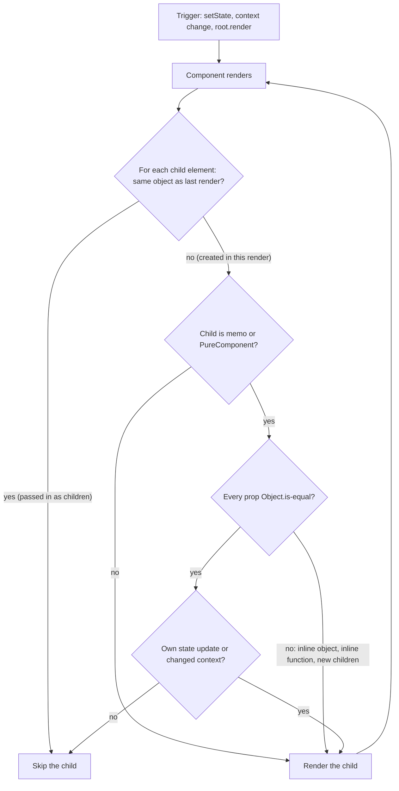

# 15 — Performance

> **How to use this module.** Sections 15.1–15.4 answer most interview questions: measure first, know the three reasons a component re-renders, and know exactly when `memo`, `useMemo` and `useCallback` help and when they waste effort. Section 15.5 explains how the React Compiler changes that advice, and 15.6 shows the two free fixes to try before any memoization. Sections 15.7–15.12 cover loading performance: code splitting, virtualization, transitions, resource hints, bundles and Web Vitals. If you only have 20 minutes, read 15.2, 15.3, 15.6 and the Summary.

**Prerequisites:** [What triggers a render](06-jsx-and-rendering-model.md#69-what-triggers-a-render) · [Render phase vs commit phase](06-jsx-and-rendering-model.md#610-render-phase-vs-commit-phase) · [`children` and slot props](07-components-props-composition.md#72-children-and-slot-props) · [Colocation and lifting state up](08-state.md#88-colocation-and-lifting-state-up) · [How context propagation works](11-context.md#113-how-propagation-and-re-rendering-work) · [`PureComponent`](13-reconciliation-and-fiber.md#137-getderivedstatefromprops-shouldcomponentupdate-purecomponent)

**Code for this module:** [`examples/web/src/m15-performance/`](examples/web/src/m15-performance/). Every file has a test next to it. Run them with `npx vitest run src/m15-performance` from `examples/web`.

---

## 15.1 Measure first: React DevTools Profiler, Chrome Performance panel, Performance Tracks

### The problem
"The page feels slow" is not a diagnosis. The cause can be a slow network request, a 2 MB JavaScript bundle, a layout thrash in a third-party widget, or one component re-rendering 5,000 rows on every keystroke. Each needs a different fix, and `useMemo` fixes only the last one. Optimizing without measuring usually adds complexity in the wrong place.

### Mental model
Treat it like a slow Spring endpoint: you don't sprinkle `@Cacheable` on every method, you open a profiler (async-profiler, JFR) or a trace (Micrometer/Zipkin), find the hot span, fix that, and measure again. Front-end performance has two separate questions, with separate tools:

| Question | Tool | What you see |
|---|---|---|
| Which **components** rendered, how long each took, and why? | **React DevTools Profiler** [Tooling: React DevTools] | Per commit: a flame graph and a ranked chart of components with render times |
| Where does the **main thread** spend time (scripting, layout, paint, network)? | **Chrome DevTools Performance panel** [Browser] | A timeline of tasks, long tasks (> 50 ms), layout, paint, network |
| What was **React** doing at each moment of that timeline? | **React Performance Tracks** [React] (19.2) | Custom "Scheduler ⚛" and "Components ⚛" tracks inside the Performance panel |
| How do real users experience it? | **Field data**: `web-vitals`, CrUX | LCP, INP, CLS at the 75th percentile (15.12) |
| How long does a subtree take, from code? | **`<Profiler onRender>`** [React] | Durations per commit, in a callback |

> **Java/Spring analogy:** the DevTools Profiler is a method-level profiler for one subsystem (React). The Performance panel is the whole-JVM view (GC, I/O, threads). Field metrics are your production SLO dashboards. You need the whole-process view to know whether React is even the problem.
>
> **Where the analogy breaks:** in the browser everything that matters to the user runs on **one** main thread. A 200 ms render is not "slow throughput", it is 200 ms during which clicks and typing get no response.

### Minimal code
`<Profiler>` measures a subtree programmatically. `examples/web/src/m15-performance/StateColocation.test.tsx` uses it to count commits:

```tsx
import { Profiler, type ProfilerOnRenderCallback } from 'react';

const onRender: ProfilerOnRenderCallback = (id, phase, actualDuration, baseDuration, startTime, commitTime) => {
  // phase: 'mount' | 'update' | 'nested-update'
  console.log(id, phase, actualDuration.toFixed(1), baseDuration.toFixed(1));
};

<Profiler id="color-page" onRender={onRender}>
  <ColorPageMovedDown />
</Profiler>;
```

The test asserts that typing three characters produces `['mount', 'update', 'update', 'update']`: one commit per keystroke.

### How it works internally
- **`actualDuration`** is the time spent rendering the subtree for **this** commit. **`baseDuration`** estimates the time to render the **whole** subtree with no memoization, "calculated by summing up the most recent render durations of each component in the tree". react.dev: "Compare `actualDuration` against it to see if memoization is working" ([Profiler reference](https://react.dev/reference/react/Profiler)).
- Timing instrumentation is compiled out of the production build. react.dev: "Profiling adds some additional overhead, so it is disabled in the production build by default." To profile a production bundle, use the **profiling build**: alias `react-dom/client` to `react-dom/profiling` in the bundler ([React Performance Tracks](https://react.dev/reference/dev-tools/react-performance-tracks)).
- **Performance Tracks** (19.2): React writes custom entries into the browser's performance timeline. The **Scheduler** track shows work by priority (subtracks Blocking, Transition, Suspense, Idle) and its phases (Update, Render, Commit, Remaining Effects). The **Components** track is a flame graph of component render and effect durations. In development builds, clicking a component entry shows its **changed props**, which tells you why it rendered. Two server tracks (Server Requests, Server Components) show RSC work. Availability: all tracks in development; in profiling builds only the Scheduler track by default, with the Components track limited to `<Profiler>` subtrees unless the React DevTools extension is installed; nothing in production builds. (All from the [Performance Tracks reference](https://react.dev/reference/dev-tools/react-performance-tracks) and the [19.2 post](https://react.dev/blog/2025/10/01/react-19-2).)

### A measuring routine that works
1. **Reproduce on a production build** with **CPU throttling** (4× or 6× in the Performance panel). react.dev: "your machine is probably faster than your users'", and "measuring performance in development will not give you the most accurate results" ([useMemo reference](https://react.dev/reference/react/useMemo)).
2. Record the interaction in the **Performance panel**. Is the time in scripting (JS), in rendering/layout, or in the network? Long tasks are flagged.
3. If it is React work, read the **Performance Tracks**, or switch to the **React DevTools Profiler** and record the same interaction. Look for components that rendered but whose output didn't change.
4. Fix one thing (15.2–15.8), measure again, keep the fix only if the number moved.

> The two DevTools settings worth turning on are **"Highlight updates when components render"** (General tab) and **"Record why each component rendered while profiling"** (Profiler tab); those are the exact labels in the extension's source ([GeneralSettings.js](https://github.com/facebook/react/blob/main/packages/react-devtools-shared/src/devtools/views/Settings/GeneralSettings.js), [ProfilerSettings.js](https://github.com/facebook/react/blob/main/packages/react-devtools-shared/src/devtools/views/Settings/ProfilerSettings.js)).

> **Version notes.** **16.5** (2018): the React DevTools Profiler tab. **16.9.0**: `<React.Profiler>` added to the public API (CHANGELOG: "Add `<React.Profiler>` API for gathering performance measurements programmatically"). **19.2** (Oct 2025): Performance Tracks, the first React integration into the browser's own Performance panel (CHANGELOG 19.2.0). **19.3**: a batch of Performance Track fixes (CHANGELOG 19.3.0). On React ≤ 19.1 you only have the DevTools Profiler and the plain Performance panel, where React work shows up as anonymous JavaScript. The 16.5 date is from the React blog: "React 16.5 adds support for a new DevTools profiler plugin" ([Introducing the React Profiler](https://legacy.reactjs.org/blog/2018/09/10/introducing-the-react-profiler.html)).

### Trade-offs
- ✅ Measuring takes minutes and stops you from optimizing the wrong layer.
- ❌ Development builds are slower and include extra checks; numbers from them are relative, never absolute.
- ❌ `<Profiler>` adds CPU and memory overhead "so it should be used only when necessary" (react.dev). Don't leave it wrapped around the whole app in production unless you ship the profiling build on purpose.

---

## 15.2 Why components re-render

### The problem
"Why did this component re-render?" is the most common React performance question, and the folk answer, "because its props changed", is wrong in both directions. A component re-renders when its **parent** re-renders even if its props are identical, and a component whose props object was **mutated** does not re-render at all.

### Mental model
Exactly **three** things schedule a render ([06](06-jsx-and-rendering-model.md#69-what-triggers-a-render)): the initial `root.render`, a **state update** with a value that is not `Object.is`-equal, and a **context change** for a component that reads that context ([11](11-context.md#113-how-propagation-and-re-rendering-work)). Then rendering **propagates down**: a component that renders re-renders every child element it **created in this render**, unless that child opts out.

A child opts out (is "skipped" or "bails out") when:
- the element is the **same object** as last time (it came in from above as `children` or another prop), or
- it is wrapped in `memo` (or is a `PureComponent`) and **every prop is `Object.is`-equal** to last time, **and** it has no pending state update and no changed context.



> **Java analogy:** think of a parent's render as re-running a factory method that constructs a fresh tree of DTOs. React then compares each new DTO with the previous one **by reference**, never by `equals()`. A brand-new DTO with the same field values still counts as "different", unless the child declares itself `memo`, which means "compare my fields one by one with `==`".
>
> **Where the analogy breaks:** re-running the factory is not the expensive part you'd fear. Re-rendering only produces objects; the DOM is touched only where the output changed ([06](06-jsx-and-rendering-model.md#610-render-phase-vs-commit-phase)). Most re-renders cost microseconds.

### Minimal code
`examples/web/src/m15-performance/RenderPuzzle.tsx` puts one child of each kind under a parent with state. Exercise 1 asks you to predict the output; the short version is that after a parent state change, a plain child re-renders, a `memo` child with no props or stable props is skipped, and a `memo` child with an inline object, inline function or JSX `children` re-renders anyway.

```tsx
<MemoWithStyle label="inline style" style={{ color: 'teal' }} />  {/* new object: re-renders */}
<MemoWithStyle label="hoisted style" style={HOISTED_STYLE} />      {/* same object: skipped */}
<MemoWithHandler label="inline handler" onPick={() => log.push('picked')} /> {/* re-renders */}
<MemoWithHandler label="stable handler" onPick={stablePick} />    {/* useCallback: skipped */}
<MemoWithChildren><b>bold</b></MemoWithChildren>                  {/* new element: re-renders */}
```

### How it works internally
During the render phase React walks the fiber tree ([13](13-reconciliation-and-fiber.md#135-fiber-units-of-work-double-buffering-lanes-and-priorities)). For each fiber it checks: are the new props the **same object** as the old ones (`oldProps === newProps`), is there no pending update in its lanes, and has no context it reads changed? If all hold, React **bails out**: it does not call the component and, if no descendant has pending work either, skips the whole subtree. An element passed in as `children` from a parent that did not re-render keeps the same props object, which is why it is skipped for free.

For `memo` components the check is relaxed from "same props object" to "**shallowly equal** props": every key compared with `Object.is`. A class `PureComponent` does the same with `shallowEqual` on props and state ([13](13-reconciliation-and-fiber.md#137-getderivedstatefromprops-shouldcomponentupdate-purecomponent)).

What does **not** cause a render: writing `ref.current`, mutating an object in place, changing a module variable, or a prop object being mutated by someone else. React never watches objects.

### Trade-offs
- Re-renders are normal and mostly cheap. A component re-rendering is a problem only when the Profiler says it costs time **and** its output didn't change.
- The cheapest fixes are structural (15.6): keep state where it is used, and pass expensive subtrees in as `children`. They need no memoization and survive refactors.
- Context consumers re-render through `memo`. That is covered in [11](11-context.md#113-how-propagation-and-re-rendering-work) and not repeated here.

---

## 15.3 `React.memo`

### The problem
A parent re-renders often (it owns a text input, a timer, a hover state), and one of its children is genuinely expensive: a chart, a 500-row table. The child's props didn't change, but it re-renders on every keystroke because its parent did.

### Mental model
`memo` [React] wraps a component and gives it a **gate**: "if every prop is `Object.is`-equal to last time, reuse my last output". react.dev: "`memo` lets you skip re-rendering a component when its props are unchanged" ([memo reference](https://react.dev/reference/react/memo)).

> **Java analogy:** a `@Cacheable` method whose cache key is the argument list compared **by reference**. Pass the same `List` instance and you hit; pass a new `List` with the same elements and you miss.
>
> **Where the analogy breaks:** a cache miss in Spring calls the method once more. A miss in React re-runs the child and, without `memo` on **its** children, everything below. And React may discard the cache at any time: react.dev calls memoization "a performance optimization, not a guarantee".

### Minimal code
```tsx
import { memo } from 'react';

type ChartProps = { points: Point[]; onSelect: (id: string) => void };

export const Chart = memo(function Chart({ points, onSelect }: ChartProps) {
  // expensive rendering
});
```

Naming the inner function (`function Chart`) keeps the name in DevTools and stack traces. An optional second argument, `arePropsEqual(prevProps, nextProps)`, replaces the shallow comparison; return `true` to **skip**.

### How it works internally
`memo(Component)` returns a special element type. When React reaches its fiber with new props, it compares old and new with `shallowEqual` (or your `arePropsEqual`). If they are equal and the fiber has no pending update or changed context, React reuses the previous child fibers and does not call your function.

Three things defeat it, and Exercise 1 shows each one:
1. **An inline object or array prop**: `style={{ color: 'teal' }}` is a new object every render.
2. **An inline function prop**: `onPick={() => …}` is a new function every render.
3. **JSX `children`**: `<Memo><b>bold</b></Memo>` passes a new element object as `children` every render.

And two things bypass it by design: the component's **own** state updates, and a **context** it reads changing.

### A custom comparator, and its trap
```tsx
const Row = memo(RowImpl, (prev, next) => prev.label === next.label); // ignores onReport
```
This "optimization" is a bug. The memoized row keeps the `onReport` from its first render, and that closure sees the parent's state **from that render**. Exercise 1, test 3 (`StaleReport`) clicks "add" twice and then "report", and the log says `report sees 0`. react.dev: "You must compare every prop, including functions", and "Avoid doing deep equality checks" because they "can freeze your app for many seconds if someone changes the data structure later" ([memo reference](https://react.dev/reference/react/memo)).

> **Version notes.** **15.3** (2016): `PureComponent`. **16.6.0** (Oct 2018): "Add `React.memo()` as an alternative to `PureComponent` for functions" (CHANGELOG). **16.13.0**: fixed `memo` components dropping updates when interrupted by a higher-priority update. **19.3**: Fast Refresh now applies edits to a `memo()` comparison function (CHANGELOG 19.3.0). With the **React Compiler** enabled, react.dev says it "automatically applies the equivalent of `memo` to all components" and "you typically don't need `React.memo` anymore" (15.5).
>
> **Legacy equivalents.** Class components: `PureComponent` (shallow props **and** state) or a hand-written `shouldComponentUpdate(nextProps, nextState)` that returns `false` to skip ([13](13-reconciliation-and-fiber.md#137-getderivedstatefromprops-shouldcomponentupdate-purecomponent)). `RenderPuzzle.tsx` includes a `PureLegacy` class next to the `memo` components, and it behaves the same way. Before 15.3 the same thing was `PureRenderMixin` with `createClass`.

### Trade-offs
- ✅ Worth it for a component that is **measurably** expensive, re-renders often with the **same** props, and whose parent can pass stable props.
- ❌ Useless if any prop is new on every render. Then it costs a comparison **and** the render.
- ❌ Every `memo` creates an obligation for every caller: keep props stable. That spreads `useMemo`/`useCallback` through the parents (15.4). The structural fixes in 15.6 have no such cost.
- react.dev's list of things to try instead of `memo` everywhere: accept JSX as children, keep state local, keep rendering pure, avoid Effects that update state, and remove unnecessary Effect dependencies ([memo reference](https://react.dev/reference/react/memo)).

---

## 15.4 `useMemo` and `useCallback`, and when they waste effort

### The problem
Two different problems share these hooks:
1. **Expensive computation**: filtering and sorting 10,000 rows on every render, even when the render was caused by something unrelated (a theme toggle).
2. **Unstable identity**: a new object or function on every render breaks `memo` on a child (15.3), re-runs an effect whose dependency it is ([09](09-effects.md#92-dependencies-and-the-objectis-comparison)), or re-renders every consumer of a context ([11](11-context.md#114-stable-values)).

### Mental model
`useMemo(compute, deps)` [React] caches **a value** between renders and recomputes only when a dependency changes by `Object.is`. `useCallback(fn, deps)` caches **a function identity**: it is exactly `useMemo(() => fn, deps)`. react.dev: memoizing functions "is common enough that React has a built-in Hook specifically for that" ([useMemo reference](https://react.dev/reference/react/useMemo)).

> **Java analogy:** `useMemo` is a one-entry memo cache keyed by the dependency array, like `computeIfAbsent` on a map that only ever holds the latest key.
>
> **Where the analogy breaks:** there is one entry per hook call, it is compared by reference, and React may evict it (in development when you edit the file; in development and production when the component suspends during its initial mount, per react.dev). Never use it for correctness, only for speed.

### Minimal code
`examples/web/src/m15-performance/SlowList.tsx` (the "after" half, Exercise 2):

```tsx
const visible = useMemo(() => filterItems(items, query), [items, query]);
const select = useCallback((id: number) => setSelectedId((cur) => (cur === id ? null : id)), []);
// …
<FastRow key={item.id} item={item} selected={item.id === selectedId} onSelect={select} />
```

`useMemo` keeps a theme toggle from re-running the filter. `useCallback` gives every row the **same** `onSelect`, which only matters because `FastRow` is `memo`. Remove the `memo` and the `useCallback` does nothing useful.

### How it works internally
Each call stores `[value, deps]` in the component's hook list ([12](12-hooks-and-custom-hooks.md#122-how-react-stores-hooks-so-call-order-matters)). On the next render React compares each dependency with `Object.is`; if all are equal it returns the stored value **without calling** your function. Note the cost that remains: the dependency array and, for `useCallback`, the inline function are **still created** on every render. `useCallback` does not avoid creating the function; it only decides which one to return.

In Strict Mode development React calls the `useMemo` calculation twice "to help you find accidental impurities" (react.dev). React 19 changed the double **render** so that "useMemo and useCallback will now reuse the memoized results from the first render, during the second render" (CHANGELOG 19.0.0).

### When they waste effort
react.dev says `useMemo` is "only valuable in a few cases" ([useMemo reference](https://react.dev/reference/react/useMemo)):
- the calculation is **noticeably slow** and its dependencies rarely change;
- the value is passed to a **`memo`** component;
- the value is a **dependency of another hook**.

Everything else is noise. Concretely:
- `useMemo(() => a + b, [a, b])`: the comparison costs more than the addition.
- `useCallback` for a handler passed to a plain `<button>`: DOM elements don't compare props.
- `useCallback` for a prop of a component **without** `memo`: it re-renders anyway.
- Memoizing with a dependency that is new every render (`useMemo(…, [options])` where `options` is an inline object): the cache never hits. react.dev: "a single value that's 'always new' is enough to break memoization for an entire component."

**How expensive is expensive?** Wrap it in `console.time`/`console.timeEnd`, perform the interaction, and memoize if "the overall logged time adds up to a significant amount (say, `1ms` or more)" (react.dev). Measure with CPU throttling on.

> **Version notes.** **16.8** (Feb 2019): both hooks. **19.0**: Strict Mode reuses memoized results during the double render (above). The class-era equivalent was memoizing in an instance field or with `memoize-one`, and **Reselect** for Redux selectors ([18](18-state-management.md#186-selectors-and-memoization)). With the **React Compiler** (1.0), new code relies on the compiler; existing manual memoization can stay as "an escape hatch" (15.5).

### Trade-offs
- ✅ Cheap insurance for genuinely expensive derivations and for values that feed `memo` children, effects or context.
- ❌ Every memo adds a dependency array that can be wrong. A missing dependency is a stale value, which is a correctness bug, not a performance one. `react-hooks/exhaustive-deps` catches most of them ([12](12-hooks-and-custom-hooks.md#123-the-lint-rule-and-react-compiler-rules)).
- ❌ Readability. react.dev: "The downside of this approach is that code becomes less readable."
- **Never** use `useMemo` to keep a value alive for correctness (an expensive object you must not recreate, a subscription). Use `useState(() => init)` or `useRef` for that ([10](10-refs-and-dom.md#101-useref-as-a-mutable-box-that-does-not-trigger-renders)).

---

## 15.5 The React Compiler and how it changes the advice

### The problem
Manual memoization is tedious and fragile: one missing `useCallback` four levels up silently defeats a `memo` at the bottom, and every refactor can break the chain. Teams spent years arguing between "memo everything" and "never memo until the profiler says so", and both camps were partly right.

### Mental model
The React Compiler [Tooling: babel-plugin-react-compiler] is a **build-time** plugin that rewrites your components and hooks so that they memoize automatically, at a finer grain than you would by hand. react.dev: "React Compiler is a build-time tool that optimizes your React app through automatic memoization", including "the ability to memoize conditionally, which is not possible through manual memoization" ([React Compiler v1.0 post](https://react.dev/blog/2025/10/07/react-compiler-1)).

What it optimizes, per react.dev's [introduction](https://react.dev/learn/react-compiler/introduction): **skipping cascading re-renders** (a parent re-rendering no longer re-renders children whose inputs didn't change) and **skipping expensive calculations** inside components and hooks.

> **Java analogy:** the JIT. You write straightforward code and an optimizer that understands the language's rules inlines, caches and eliminates work, as long as your code follows those rules.
>
> **Where the analogy breaks:** the JIT never changes semantics, even for weird code. The React Compiler **assumes** the [Rules of React](12-hooks-and-custom-hooks.md#121-the-rules-of-hooks) (pure render, no mutation of props/state, refs not read during render). Code that breaks them can behave differently once compiled, which is why it skips what it can detect and why the lint rules matter.

### Minimal code (prose only)
The compiler is **not installed** in `examples/web`, so this module has no runnable compiler example. Setup, from react.dev's [installation page](https://react.dev/learn/react-compiler/installation):

```bash
npm install -D babel-plugin-react-compiler@latest
```
```js
// vite.config.js with @vitejs/plugin-react 6 (this repo has 6.1.1, which exports reactCompilerPreset)
import { defineConfig } from 'vite';
import react, { reactCompilerPreset } from '@vitejs/plugin-react';
import babel from '@rolldown/plugin-babel';

export default defineConfig({
  plugins: [react(), babel({ presets: [reactCompilerPreset()] })],
});
```
In Next.js 16 it is a config flag, `reactCompiler: true`, off by default ([VERSIONS.md](VERSIONS.md)). With Babel directly, the plugin "must run first". To check that it works, look for the **"Memo ✨"** badge next to component names in React DevTools.

The before/after from react.dev: you delete `memo`, `useMemo` and `useCallback` and write the plain version; the compiler produces equivalent (or finer) caching.

### How it works internally
The compiler parses each component and hook into an intermediate representation, runs data-flow and mutability analysis, and groups values into **reactive scopes**: blocks of JSX and computations that depend on the same inputs. It emits code that stores each scope's output in a per-component cache and re-executes the scope only when one of its inputs changed. The same front end powers the compiler lint rules in `eslint-plugin-react-hooks` 7 ([12](12-hooks-and-custom-hooks.md#123-the-lint-rule-and-react-compiler-rules)).

What it does **not** do, per react.dev:
- "React Compiler only memoizes React components and hooks, not every function", and its "memoization is not shared across multiple components or hooks". A helper called from five components still runs five times.
- When "it encounters code that might break these rules, it safely skips optimization" ([debugging guide](https://react.dev/learn/react-compiler/debugging)). An `eslint-disable` for a hooks rule has the same effect on that component ([12](12-hooks-and-custom-hooks.md#123-the-lint-rule-and-react-compiler-rules)).
- Libraries whose APIs can't be memoized safely are listed in the lint plugin and reported by `react-hooks/incompatible-library` as a **warning**. The list in 7.1.1 includes TanStack Virtual's `useVirtualizer()` ("returns functions that cannot be memoized safely"), TanStack Table's `useReactTable()` and React Hook Form's `watch()` (read from the plugin's source in `node_modules`). `VirtualList.tsx` (Exercise 4) triggers this warning on purpose: it is expected, and the compiler leaves that component alone.

Controls: `"use no memo"` at the top of a function opts it out (the debugging guide's first step when a compiled component misbehaves); `"use memo"` opts it in under `compilationMode: 'annotation'`, which compiles only annotated functions, the usual incremental-adoption setup ([directives reference](https://react.dev/reference/react-compiler/directives)).

### How the advice changes
| Before the compiler | With the compiler (1.0, Oct 2025) |
|---|---|
| `memo` expensive children, then stabilize their props with `useMemo`/`useCallback` up the tree | Write plain components. react.dev: "When React Compiler is enabled, you typically don't need `React.memo` anymore" |
| Memoize context values by hand ([11](11-context.md#114-stable-values)) | Handled for values created in a compiled component |
| "Memo everything" vs "never memo" debate | Moot for compiled code; the structural fixes (15.6) still matter and still read better |
| Existing `useMemo`/`useCallback` | Keep them: "leaving existing memoization in place (removing it can change compilation output) or carefully testing before removing" (v1.0 post). They remain "an escape hatch" for precise control |
| Effects that depend on a value being stable | Still a smell. The debugging guide lists "Effects that rely on referential equality" as the main way compiled code breaks |

> **Version notes.** **1.0** stable on **2025-10-07**, after a beta (2024) and release candidate. It is "compatible with React 17 and up": on 17 and 18 you set a minimum `target` and add `react-compiler-runtime`. Its numbers from Meta: "initial loads and cross-page navigations improve by up to 12%, while certain interactions are more than 2.5× faster" (all from the [v1.0 post](https://react.dev/blog/2025/10/07/react-compiler-1)). Expo SDK 54+ enables it by default; `create-vite` and `create-next-app` offer compiler-enabled templates. The standalone `eslint-plugin-react-compiler` is superseded by `eslint-plugin-react-hooks` 6.1+/7.
>
> The compiler never compiles class components. Its traversal only visits function declarations, function expressions and arrow functions, and it calls `skip()` on every `ClassDeclaration` and `ClassExpression` ("Don't visit functions defined inside classes, because they can reference `this` which is unsafe for compilation"), per the compiler source ([Program.ts](https://github.com/facebook/react/blob/main/compiler/packages/babel-plugin-react-compiler/src/Entrypoint/Program.ts)).

### Trade-offs
- ✅ Removes most hand-written memoization and the bugs from forgotten dependencies.
- ✅ Finer than manual: it can memoize JSX inside a branch, which hooks cannot.
- ❌ A build step that must run first in Babel, and a new way for code that bends the Rules of React to change behavior. Adopt it with the lint rules green, directory by directory (`annotation` mode or `sources`), and with tests.
- ❌ It doesn't fix architecture: a 10,000-row list still needs virtualization (15.8), a 2 MB bundle still needs splitting (15.7), and a slow `fetch` is still slow.

---

## 15.6 Moving state down and lifting content up

### The problem
A page has a text input at the top and an expensive tree below it. The input's state lives in the page component, so every keystroke re-renders the page and therefore the expensive tree, even though the tree never reads the input.

### Mental model
Two structural fixes, both from Dan Abramov's ["Before You memo()"](https://overreacted.io/before-you-memo/) (2021) and listed first in react.dev's advice:

1. **Move state down.** If only part of the page uses the state, extract that part into its own component that **owns** the state. The expensive tree becomes its sibling, and siblings don't re-render when another sibling's state changes.
2. **Lift content up.** If the component that owns the state must **wrap** the expensive tree (it needs the color for its own `<div style>`), let its **parent** create the expensive tree and pass it in as `children`. The element is created by a component that does not re-render, so it is the same object every time, and React skips it ([06](06-jsx-and-rendering-model.md#69-what-triggers-a-render), [07](07-components-props-composition.md#72-children-and-slot-props)).

> **Spring analogy:** keeping state local is the opposite of putting everything in a session-scoped bean. A request-scoped bean only lives (and is only rebuilt) where it is needed.
>
> **Where the analogy breaks:** in React the cost of "too high" is not memory but **re-render scope**: everything the owner renders is re-rendered on every change.

### Minimal code
`examples/web/src/m15-performance/StateColocation.tsx`:

```tsx
// BEFORE: color lives above ExpensiveTree.
function ColorPageBefore() {
  const [color, setColor] = useState('red');
  return (
    <div>
      <input value={color} onChange={(e) => setColor(e.target.value)} />
      <p style={{ color }}>Hello, world!</p>
      <ExpensiveTree />
    </div>
  );
}

// FIX 1: move state down into the part that uses it.
function ColorPageMovedDown() {
  return (
    <div>
      <ColorForm /> {/* owns color */}
      <ExpensiveTree />
    </div>
  );
}

// FIX 2: lift content up. ColorPicker needs color for its wrapper, so the tree comes in as children.
function ColorPageLiftedContent() {
  return (
    <ColorPicker>
      <ExpensiveTree />
    </ColorPicker>
  );
}
```

`StateColocation.test.tsx` types three characters into each version: `ExpensiveTree` renders four times in the first, once in the other two.

### How it works internally
Nothing new, and that is the point. React re-renders the subtree of the component whose state changed. Moving state down shrinks that subtree. Lifting content up keeps the subtree but makes the expensive part an element **created elsewhere**: when `ColorPicker` re-renders, `props.children` is the identical object, so React's bail-out (15.2) applies without `memo`.

### Trade-offs
- ✅ No memoization, no dependency arrays, nothing for a refactor to break. Works the same with or without the compiler.
- ✅ Usually also better design: state colocated with its only reader ([08](08-state.md#88-colocation-and-lifting-state-up)), and layout components that accept `children`.
- ❌ Doesn't help when the expensive tree **does** read the changing state. Then the options are `useDeferredValue`/transitions (15.9), memoizing the expensive part, or virtualization (15.8).
- The same logic explains why a context provider should receive `children` from outside ([11](11-context.md#114-stable-values)).

---

## 15.7 Code splitting with `lazy` and Suspense

### The problem
The admin reports page imports a charting library. Because everything is imported statically from `App`, every user downloads, parses and executes that library on first load, even those who never open reports. Large bundles hurt LCP on slow devices and delay interactivity.

### Mental model
A dynamic `import('./ReportsPage')` [JS] tells the bundler "cut here": the module and everything only it imports go into a separate **chunk**, fetched over the network the first time that code runs ([05](05-tooling-and-setup.md#53-bundling-concepts-module-graph-tree-shaking-code-splitting-hmr)). `lazy` [React] turns that promise into a component, and `<Suspense>` [React] shows a fallback while the chunk loads.

> **Java analogy:** lazy class loading. The JVM doesn't load a class until it is first used. `lazy` does the same for a component, except that "loading" is a network request that can take a second or fail.
>
> **Where the analogy breaks:** class loading is synchronous and practically never fails. A chunk can take seconds, so you must design the loading state, and it can fail (a deploy removed the old chunk), so you need an error boundary ([16](16-error-handling.md#162-error-boundaries)).

### Minimal code
`examples/web/src/m15-performance/LazyRoute.tsx` (Exercise 3):

```tsx
export const loadReports = () => import('./ReportsPage');
const ReportsPage = lazy(loadReports); // module level, never inside a component

<Suspense fallback={<p role="status">Loading reports…</p>}>
  {page === 'home' ? <h2>Home</h2> : <ReportsPage />}
</Suspense>
```

The `Reports` button also calls `loadReports()` on hover and focus: the download starts on **intent**, a few hundred milliseconds before the click.

### How it works internally
`lazy(load)` returns a component type with a status: uninitialized, pending, resolved or rejected. The first render calls `load()`; react.dev: "Both the returned Promise and the Promise's resolved value will be cached, so React will not call `load` more than once" ([lazy reference](https://react.dev/reference/react/lazy)). While pending, rendering it **suspends**: React throws to the nearest `<Suspense>`, which commits its fallback. When the promise resolves, React retries and renders the module's `.default`. If it rejects, "React will `throw` the rejection reason for the nearest Error Boundary to handle."

React 19 also changed what happens to **siblings** of a suspending component: "React will immediately commit the fallback of the nearest Suspense boundary, without waiting for the entire sibling tree to render", then pre-renders the siblings to "pre-warm" their lazy requests (CHANGELOG 19.0.0, "Suspense sibling pre-warming").

Where to split, in order of payoff:
1. **Routes.** Each page is a natural chunk. Routers do it for you: React Router's `lazy` route property, Next.js per-route automatically ([19](19-routing.md#198-lazy-routes-and-code-splitting)).
2. **Heavy, rarely used widgets**: rich-text editors, charts, maps, PDF viewers, admin-only panels.
3. **Below-the-fold or on-interaction UI**: a modal's content, a "Show more" panel.

Don't split tiny components: every chunk is an extra request and a fallback flash.

> **Version notes.** **16.6.0** (Oct 2018): "Add `React.lazy()` for code splitting components" (CHANGELOG) with client-only `Suspense`. Before that, the standard was **`react-loadable`** (a HOC with `loading:` and `loader:`), and in webpack 1 `require.ensure`. Server rendering of `lazy` + Suspense only arrived with React 18's streaming SSR (`renderToPipeableStream`), which is why Next.js Pages Router apps used `next/dynamic` and others used `@loadable/component`. **19.0**: sibling pre-warming (above). **19.3**: "Resolve the `.default` export of a `React.lazy` as the canonical value", and Fast Refresh now remounts edits behind `lazy()` (CHANGELOG 19.3.0).
>
> The React 18 source for this is the working group's architecture post, not a CHANGELOG line: with streaming SSR and selective hydration, "`React.lazy` 'just works' with SSR now" ([New Suspense SSR Architecture in React 18](https://github.com/reactwg/react-18/discussions/37)); the 18.0 CHANGELOG lists it only as "Add the new streaming renderer" ([React v18.0](https://react.dev/blog/2022/03/29/react-v18)).

### Trade-offs
- ✅ Smaller initial bundle, faster first load, and users only pay for what they open.
- ❌ A network round trip on first use. Mitigate with preloading on intent (hover, focus, viewport), or by prefetching likely next routes after the page is idle.
- ❌ Chunk loading can fail after a deploy. Wrap lazy routes in an error boundary with a "Reload" action ([16](16-error-handling.md#162-error-boundaries)).
- ❌ A fallback that replaces visible content is jarring. Wrap the navigation in `startTransition` so React keeps the old page on screen until the new one is ready (15.9, [21](21-concurrent-ssr-server-components.md#214-suspense-in-depth)).

---

## 15.8 Virtualization

### The problem
A log viewer must show 10,000 rows. Rendering all of them creates 10,000+ DOM nodes: mounting takes seconds, every update re-renders thousands of components, scrolling janks, and memory grows. `memo` makes **updates** cheaper but doesn't change the mount cost or the DOM size.

### Mental model
**Render only what is visible.** A virtualized list keeps an outer scroll container of fixed height and an inner element as tall as **all** rows together (so the scrollbar is right). It reads the scroll offset, computes which row indexes intersect the viewport, and renders only those, plus a few "overscan" rows on each side, absolutely positioned at their offset. Scrolling changes which rows are rendered, not how many.

> **Java/Spring analogy:** pagination with `Pageable`, except the page follows the scrollbar continuously and the client fakes the total height. Like a JDBC cursor with a fetch size, you hold only a window of rows.
>
> **Where the analogy breaks:** the window is about **DOM**, not data. All 10,000 rows may already be in memory; virtualization stops them from becoming 10,000 components and DOM nodes. For data that doesn't fit in memory, combine it with infinite loading ([17](17-data-fetching.md#177-pagination-and-infinite-queries)).

### Minimal code
`examples/web/src/m15-performance/VirtualList.tsx` with TanStack Virtual [Library: @tanstack/react-virtual] 3.14 (Exercise 4):

```tsx
const [scrollElement, setScrollElement] = useState<HTMLDivElement | null>(null);
const virtualizer = useVirtualizer({
  count: rows.length,
  getScrollElement: () => scrollElement,
  estimateSize: () => ROW_HEIGHT,
  overscan: 5,
});

<div ref={setScrollElement} style={{ height: 400, overflowY: 'auto' }}>
  <div role="list" style={{ height: virtualizer.getTotalSize(), position: 'relative' }}>
    {virtualizer.getVirtualItems().map((v) => (
      <div key={v.key} role="listitem" style={{ position: 'absolute', top: 0, height: v.size, transform: `translateY(${v.start}px)` }}>
        {rows[v.index]}
      </div>
    ))}
  </div>
</div>
```

The test renders 10,000 rows and asserts that only 17 list items exist, and that after scrolling to row 100 the window has moved.

### How it works internally
Read from `@tanstack/virtual-core` 3.14.13 in `node_modules`:
- On mount, the virtualizer reads the scroll element's size from `offsetWidth`/`offsetHeight` and then subscribes with a `ResizeObserver` (if the window has one). It listens to `scroll` events for the offset.
- It keeps a measurement for every index (`start`, `size`, `end`), initially from `estimateSize`. To find the window it **binary-searches** the first row whose start is at or after the scroll offset, then walks forward until rows pass the viewport's bottom. The default `overscan` is 1.
- Only when the visible range or `isScrolling` changes does it notify React, which re-renders the list. The React adapter re-renders through `flushSync` for scroll-driven updates by default (`useFlushSync`), so rows are in place before paint.
- Variable heights: attach `ref={virtualizer.measureElement}` and `data-index` to each row; the real size, measured by a `ResizeObserver`, replaces the estimate.
- SSR or tests without layout: `initialRect` gives the size to use before measurement. jsdom has no layout, so `VirtualList.test.tsx` stubs `offsetHeight`.

### The landscape
| Library | Status (npm, 2026-10-03) | Notes |
|---|---|---|
| `react-virtualized` | 9.22.6, last published 2025-01 | Brian Vaughn's original (2015+). `List`, `Grid`, `AutoSizer`, `CellMeasurer`. Big; in maintenance. You'll meet it in legacy code. |
| `react-window` | 2.3.3; **2.0.0** published 2025-08-28 | The lighter rewrite by the same author. **v1** exported `FixedSizeList`, `VariableSizeList`, `FixedSizeGrid`, `VariableSizeGrid`; **v2** exports `List` and `Grid` with `rowComponent`, `rowCount`, `rowHeight`, `rowProps` (read from both versions' published files). Migrating from v1 is an API rewrite. |
| `@tanstack/react-virtual` | 3.14.13 | Headless: a hook that computes positions; you render the markup. Vertical, horizontal, grid, window scrolling (`useWindowVirtualizer`), dynamic sizes. |

> **Version notes.** Virtualization is a library concern, not a React feature, so no React version changes it. What changed is the library generation: react-virtualized (2015) → react-window 1.x (2018) → headless hooks (TanStack Virtual 3) and react-window 2 (2025). The browser now offers a partial alternative: CSS `content-visibility: auto` skips rendering work for off-screen content while keeping it in the DOM.
>
> MDN marks `content-visibility` **Baseline 2024, newly available** (all major engines since September 2024), with a note that some parts of the feature have varying support ([MDN](https://developer.mozilla.org/en-US/docs/Web/CSS/content-visibility)). It is fine as a progressive enhancement; check the compatibility table against your oldest supported browser before relying on it.

### Trade-offs
- ✅ Constant DOM size and mount time, whatever the row count. The only real fix for "10k rows".
- ❌ **Find-in-page (Ctrl+F)** can't find rows that aren't in the DOM, and screen readers only see the rendered window. Mitigate with `aria-setsize`/`aria-posinset` (as `VirtualList.tsx` does), a real search box, and pagination for content people need to read through.
- ❌ Variable or unknown row heights need measuring, which can cause scroll jumps. Fixed heights are much simpler.
- ❌ Sticky headers, keyboard navigation and focus retention (a focused row scrolled out is unmounted) need extra work.
- Below a few hundred simple rows, don't bother: plain rendering plus `memo` rows (Exercise 2) is simpler and fast enough. Measure.

---

## 15.9 Transitions for responsiveness

### The problem
Typing in a filter box over a big list feels laggy. Each keystroke updates the input **and** re-renders the filtered list synchronously, and the browser can't paint the new character until the list is done. Memoization doesn't help, because the list **does** depend on the query.

### Mental model
Split the update into **urgent** (the input's own value) and **non-urgent** (the expensive result). Mark the second as a **transition**, and React renders it in the background, **interruptibly**: if another keystroke arrives, it abandons the stale render and starts over. This is the full subject of [21](21-concurrent-ssr-server-components.md#212-usetransition-and-starttransition); here is what you need for performance.

### Minimal code
```tsx
function Search({ items }: { items: Item[] }) {
  const [query, setQuery] = useState('');
  const deferredQuery = useDeferredValue(query); // lags behind while React is busy
  const isStale = query !== deferredQuery;
  return (
    <>
      <input value={query} onChange={(e) => setQuery(e.target.value)} />
      <div style={{ opacity: isStale ? 0.6 : 1 }}>
        <ResultList items={items} query={deferredQuery} /> {/* memo, so it only re-renders when deferredQuery changes */}
      </div>
    </>
  );
}
```
Or, when you own the setter: `startTransition(() => setFilter(next))`, and `useTransition` for an `isPending` flag.

### How it works internally
Transition updates go to a lower-priority lane ([13](13-reconciliation-and-fiber.md#135-fiber-units-of-work-double-buffering-lanes-and-priorities)). React renders them in time slices and yields to the browser between units of work, so input events and paints get in. The Scheduler Performance Track (15.1) shows this as work on the "Transition" subtrack. `ResultList` **must** be `memo` (or compiled): `useDeferredValue` first re-renders with the **old** value, and that render is only cheap if the list can skip it.

### Trade-offs
- ✅ Keeps typing responsive without debouncing and without dropping results. Directly improves INP (15.12).
- ❌ It makes slow renders **interruptible**, not fast. Total CPU work is the same or higher. If each render takes a second, fix the render (virtualize, memoize).
- ❌ Not for controlled input values themselves: the input's own state must stay urgent.

> **Version notes.** **18.0**: `useTransition`, `startTransition`, `useDeferredValue` and concurrent rendering through `createRoot`. **19.0**: `useDeferredValue(value, initialValue)` and async functions in transitions (Actions). On React 17 the only tools were debounce/throttle ([12](12-hooks-and-custom-hooks.md#125-usedebounce)).

---

## 15.10 Images, fonts, preloading

### The problem
The largest element on most pages is an image or a block of text in a web font. If the browser discovers the hero image late (it is set from JavaScript after hydration) or the font only after the CSS is parsed, LCP suffers no matter how fast React renders.

### Mental model
The browser fetches what it **discovers**. Your job is to make critical resources discoverable early and to keep non-critical ones out of the way. React 19's resource APIs [React DOM] let a component declare "I will need this" from anywhere in the tree, and React turns it into the right `<link>` in the document `<head>`.

### Minimal code
```tsx
import { preconnect, prefetchDNS, preinit, preload } from 'react-dom';

function ProductPage() {
  preconnect('https://cdn.example.com'); // open the connection early
  preload('https://cdn.example.com/fonts/inter.woff2', { as: 'font', type: 'font/woff2', crossOrigin: 'anonymous' });
  preinit('https://cdn.example.com/widgets.js', { as: 'script' }); // download AND execute
  return (
    
  );
}
// Below-the-fold images: loading="lazy" decoding="async"
```

### How it works internally
- `preload(href, { as })` hints the browser to download; `preinit` also **inserts and executes** a script or stylesheet. Both can be called while rendering, in an effect or in an event handler, and "multiple equivalent calls … have the same effect as a single call" (react.dev, [preload](https://react.dev/reference/react-dom/preload)). During SSR, calls made while rendering become `<link>` tags in the streamed HTML; react.dev notes they only have an effect on the server "if called while rendering a component or in an async context originating from rendering a component".
- `react-dom` 19.3 exports `preconnect`, `prefetchDNS`, `preload`, `preloadModule`, `preinit` and `preinitModule` (listed from `react-dom/cjs/react-dom.development.js`).
- React 19 also hoists `<link rel="stylesheet" precedence>` and `<title>`/`<meta>` rendered anywhere into `<head>`, and since 19.2 can "Preload `` and `<link>` using hints before they're rendered" during SSR (CHANGELOG 19.2.0).

> **Version notes.** **19.0** (Dec 2024): "React 19 ships with `preinit`, `preload`, `prefetchDNS`, and `preconnect` APIs to optimize initial page loads by moving discovery of additional resources like fonts out of stylesheet loading" (CHANGELOG). On **React 18** you wrote `<link rel="preload">` in `index.html`, used `react-helmet(-async)`, or relied on the framework: `next/font` and `next/image` in Next.js (which also handle sizing and modern formats) or webpack magic comments (`/* webpackPreload: true */`).

### Trade-offs
- ✅ Usually a bigger LCP win than any render optimization.
- ❌ Preloading everything is the same as preloading nothing: you compete with the critical resources. Preload the LCP image and the first-screen fonts, little else.
- `loading="lazy"` on the LCP image is a classic mistake: it delays the most important image.

---

## 15.11 Bundle analysis

### The problem
The production bundle is 1.8 MB. Nobody added a 1.8 MB feature; it grew by `import _ from 'lodash'` here, a full icon set there, `moment` with every locale, and two copies of a date library at different versions.

### Mental model
Look at the **map** before cutting. A bundle analyzer draws a treemap of every output chunk, with each module's size (raw, minified, gzip/brotli). Big rectangles are your targets.

| Bundler | Tool | How |
|---|---|---|
| Vite / Rollup / Rolldown | `rollup-plugin-visualizer` 7.1.1 | Add the plugin and build; it writes `stats.html` |
| webpack (CRA, Next ≤ 15) | `webpack-bundle-analyzer` 5.4.0 | Plugin, or `webpack --profile --json > stats.json` and open it |
| Next.js | `@next/bundle-analyzer` | `ANALYZE=true next build` |
| Any (from source maps) | `source-map-explorer` 2.5.3 (last published 2022) | Reads the built JS and its source map |

(Versions from the npm registry, 2026-10-03.)

### Minimal code
```ts
// vite.config.ts
import { visualizer } from 'rollup-plugin-visualizer';
export default defineConfig({
  plugins: [react(), visualizer({ gzipSize: true, brotliSize: true })],
});
```

> **Unverified:** that `rollup-plugin-visualizer` 7 works unchanged with Vite 8's Rolldown-based build (this repo has Vite 8.3.2). Its [README](https://github.com/btd/rollup-plugin-visualizer) documents a Vite setup and a separate Rolldown config, but does not mention Vite 8; run a build with it before recommending it for Vite 8.

### What to look for, and the fix for each
| Finding | Fix |
|---|---|
| A whole library for one function (`lodash`, an icon pack) | Import per function (`lodash-es`, `lodash/debounce`), per icon, or use the platform (`structuredClone`, `Intl`, `Array.prototype.toSorted`) |
| `moment` with all locales | `date-fns` or `Temporal`/`Intl`; moment is in maintenance mode |
| The same package twice at two versions | `npm ls <pkg>`, dedupe, align ranges ([05](05-tooling-and-setup.md#52-semver-and-ranges-peer-dependencies)) |
| A heavy library in the main chunk used by one page | Split that page (15.7) |
| Code that should have been tree-shaken | Check for CommonJS packages and `sideEffects` in their `package.json` ([05](05-tooling-and-setup.md#53-bundling-concepts-module-graph-tree-shaking-code-splitting-hmr)) |

Put a **budget** in CI (fail the build if the main chunk grows beyond N kB gzip), so the bundle doesn't regrow ([22](22-production-project-structure.md#2210-ci-pipeline)).

> **Version notes.** In **CRA** (webpack 4/5, deprecated 2025-02-14) the common recipe was `source-map-explorer 'build/static/js/*.js'`, because CRA hid the webpack config. Next.js ≤ 15 used webpack by default, so `@next/bundle-analyzer` wraps `webpack-bundle-analyzer`; Next.js 16 defaults to Turbopack ([VERSIONS.md](VERSIONS.md)).
>
> The Next.js docs now describe `@next/bundle-analyzer` as the analyzer **for Webpack**. For Turbopack builds (the 16 default) use the experimental built-in analyzer, `next experimental-analyze` (available in **v16.1** and later; `--output` writes to `.next/diagnostics/analyze`) ([Optimizing package bundling](https://nextjs.org/docs/app/guides/package-bundling)).

### Trade-offs
- ✅ Cheap, objective, and finds wins nobody would guess.
- ❌ Raw size is not the whole story: parse and execute time matter on low-end phones. Check the Performance panel's "Evaluate script" time too.

---

## 15.12 Web Vitals in React

### The problem
The Profiler says renders are fast, yet users complain. Lab measurements on your laptop don't capture real devices, real networks and real interaction patterns. You need **field** metrics, and to know which React habits move them.

### Mental model
Google's **Core Web Vitals** [Browser] are three user-centric metrics, judged at the **75th percentile** of page loads ([web.dev/vitals](https://web.dev/articles/vitals); thresholds from [LCP](https://web.dev/articles/lcp), [INP](https://web.dev/articles/inp), [CLS](https://web.dev/articles/cls)); they are covered from the browser side in [03](03-browser-and-web-platform.md#311-core-web-vitals-and-how-they-are-measured):

| Metric | Measures | Good | Poor | React levers |
|---|---|---|---|---|
| **LCP** Largest Contentful Paint | Loading | ≤ 2.5 s | > 4 s | SSR/streaming, code splitting (15.7), resource hints (15.10), smaller bundles (15.11) |
| **INP** Interaction to Next Paint | Responsiveness | ≤ 200 ms | > 500 ms | Less render work per interaction (15.2–15.6), transitions (15.9), virtualization (15.8), no long tasks in handlers |
| **CLS** Cumulative Layout Shift | Visual stability | ≤ 0.1 | > 0.25 | Reserve space for images and async content, skeletons with the final size, fonts with matching fallbacks |

INP observes "the latency of all click, tap, and keyboard interactions" during the visit (not scrolling or hovering), and each interaction's latency has three parts: **input delay** (waiting for the main thread), **processing duration** (your event handlers, including React's synchronous re-render for a discrete event), and **presentation delay** (until the next frame paints) ([web.dev/inp](https://web.dev/articles/inp)).

> **Spring analogy:** INP is a p75 latency SLO on every user interaction, like a p75 on every endpoint. And as with endpoints, the worst offenders are usually a few interactions doing far too much work.
>
> **Where the analogy breaks:** the "server" is the user's phone, shared with every other script on the page, and a long task blocks **all** interactions, not just one request.

### Minimal code
```ts
// main.tsx: report field data from real users
import { onCLS, onINP, onLCP, type Metric } from 'web-vitals';

function send(metric: Metric) {
  navigator.sendBeacon('/api/vitals', JSON.stringify({ name: metric.name, value: metric.value, id: metric.id }));
}
onCLS(send);
onINP(send);
onLCP(send);
```
On the Spring side, a `@PostMapping("/api/vitals")` that records into Micrometer histograms gives you p75 dashboards per route ([22](22-production-project-structure.md#229-analytics)).

### How React affects INP
- A click or keypress is a **discrete** event: React processes its updates **synchronously** at the highest priority, so a slow render there is processing duration. That's where 15.2–15.6 pay off.
- Transitions (15.9) move the expensive part out of the interaction: the next paint (the input showing the new character) happens before the heavy render.
- Long work in the handler itself (parsing a big JSON, sorting 50,000 items) blocks just the same. Move it to a Web Worker ([03](03-browser-and-web-platform.md#313-workers-and-the-main-thread)), chunk it, or yield (`await scheduler.yield()` where available).
- Hydration is main-thread work too: a huge hydration task delays the first interactions. Streaming SSR and selective hydration help ([21](21-concurrent-ssr-server-components.md#216-streaming-ssr-and-selective-hydration)).

> **Version notes.** **FID → INP.** First Input Delay measured only the input delay of the **first** interaction. INP became a stable Core Web Vital on **2024-03-12**, replacing FID, with "until September 9, 2024" for tools to transition ([web.dev launch post](https://web.dev/blog/inp-cwv-launch)). The `web-vitals` library marked `onFID` `@deprecated` in **v4** (May 2024) and removed it in **v5** (May 2025); the current version is 6.2.2 (verified by reading each version's published `index.d.ts`). If an interviewer says "we optimize FID", that knowledge is from before 2024. CRA projects generated a `reportWebVitals.js` that called `getFID`/`getCLS` from `web-vitals` 1–2; those function names no longer exist.
>
> The rename from `getCLS`/`getFID` to `onCLS`/`onFID` happened in **v3.0.0** (2022-08-24): "Rename the `getXXX()` functions to `onXXX()`" ([web-vitals CHANGELOG](https://github.com/GoogleChrome/web-vitals/blob/main/CHANGELOG.md)).

### Trade-offs
- ✅ Field data tells you what real users feel, on their devices and networks.
- ❌ It tells you **that** an interaction is slow, not **why**. Use the `web-vitals` attribution build or the Performance panel for the why.
- A fast React render doesn't guarantee a good LCP: network and resource discovery usually dominate loading.

---

## Interview questions

**Q1. A user says "the app is slow". What do you do first?**
<details><summary>Answer</summary>

Find out **what** is slow (first load, one interaction, scrolling) and reproduce it on a **production build** with CPU throttling. Record it in the Chrome Performance panel to see whether the time goes to network, scripting, layout or paint. Only if it is React rendering, switch to the React DevTools Profiler or the Performance Tracks to find the components. Fix one thing, measure again (15.1). **A strong answer adds:** check field data (INP/LCP at p75) to confirm real users feel it, and refuse to add `useMemo` before the profile points at a computation.

</details>

**Q2. What is the difference between `actualDuration` and `baseDuration` in `<Profiler onRender>`?**
<details><summary>Answer</summary>

`actualDuration` is the time spent rendering the subtree for this commit, so it drops when memoization skips components. `baseDuration` estimates rendering the whole subtree with no memoization, from each component's most recent render time. Comparing them tells you whether memoization is working. **A strong answer adds:** the other arguments are `id`, `phase` (`'mount' | 'update' | 'nested-update'`), `startTime` and `commitTime`, and the callback is disabled in the production build unless you use the profiling build.

</details>

**Q3. React DevTools Profiler, Chrome Performance panel, Performance Tracks: when do you use which?**
<details><summary>Answer</summary>

The Performance panel shows the whole main thread (scripting, layout, paint, network, long tasks). The DevTools Profiler shows React commits and per-component render times. Performance Tracks (React 19.2) put React's Scheduler and Components tracks **inside** the Performance panel, so you see React work next to layout and network on one timeline. **A strong answer adds:** in development builds the Components track shows changed props for a render, which answers "why did this render?".

</details>

**Q4. Why shouldn't you trust timings from the development build?**
<details><summary>Answer</summary>

Development React does extra work: warnings, checks, Strict Mode double rendering, and the timing instrumentation itself. react.dev says measuring in development "will not give you the most accurate results" and to build for production and test on a device like your users'. **A strong answer adds:** to profile React in production, alias `react-dom/client` to `react-dom/profiling` at build time.

</details>

**Q5. What causes a component to re-render?**
<details><summary>Answer</summary>

Its own state update (with a value not `Object.is`-equal to the current one), a change in a context it reads, or its parent re-rendering and creating a new element for it. The initial render is the fourth case. **A strong answer adds:** "its props changed" is not a cause on its own. Props only change because the parent re-rendered, and a parent re-render re-renders the child even when the props are identical, unless the child is `memo`.

</details>

**Q6. Does a re-render mean the DOM is updated?**
<details><summary>Answer</summary>

No. Rendering calls your component and produces elements. In the commit phase React changes only the DOM nodes whose output differs ([06](06-jsx-and-rendering-model.md#610-render-phase-vs-commit-phase)). A re-render with the same output commits nothing to the DOM. **A strong answer adds:** so the cost of an unnecessary re-render is the JavaScript of rendering it and its subtree, which matters only when that is measurably large.

</details>

**Q7. Why does a child passed as `children` not re-render when its wrapper's state changes?**
<details><summary>Answer</summary>

The element was created by the wrapper's **parent**, which did not re-render, so it is the same object as last time. React bails out on a fiber whose props object is identical and has no pending work. **A strong answer adds:** this is "lifting content up" (15.6), the free alternative to `memo`, and the reason providers should take `children`.

</details>

**Q8. What exactly does `React.memo` compare?**
<details><summary>Answer</summary>

Each prop, old against new, with `Object.is` (a shallow comparison). If every prop is equal, React skips the render and reuses the last output. You can pass `arePropsEqual(prev, next)` to replace the comparison; returning `true` means skip. **A strong answer adds:** it never looks at state or context. The component still re-renders on its own state updates and on context changes.

</details>

**Q9. A component is wrapped in `memo` but still re-renders on every parent render. Why?**
<details><summary>Answer</summary>

Some prop is new on every render: an inline object (`style={{…}}`), an inline array, an inline function, or JSX `children`. Or it reads a context whose value changes, or it has its own state updates. Exercise 1 shows the first three. **A strong answer adds:** use the Performance Tracks' changed-props view or the DevTools "why did this render" setting to find the culprit, then hoist the constant, `useMemo`/`useCallback` it, or restructure.

</details>

**Q10. When would you write a custom `arePropsEqual`, and what is the danger?**
<details><summary>Answer</summary>

Rarely: when a prop is a new object every time but you know only one field matters, for example a large immutable object with a `version` field. The danger is ignoring a prop, especially a function: the child keeps a stale closure (Exercise 1, test 3: `report sees 0`). react.dev: "You must compare every prop, including functions", and avoid deep equality, which can freeze the app. **A strong answer adds:** usually the fix is to make the parent pass stable props, not to write a comparator.

</details>

**Q11. `memo` vs `PureComponent` vs `shouldComponentUpdate`?**
<details><summary>Answer</summary>

`PureComponent` (15.3) gives a class a built-in `shouldComponentUpdate` that shallow-compares props **and** state. A hand-written `shouldComponentUpdate(nextProps, nextState)` returns `false` to skip. `memo` (16.6) is the function-component version and compares **props only**; state is already guarded because `setState` bails out on an equal value. **A strong answer adds:** `memo`'s comparator returns `true` to skip, the opposite of `shouldComponentUpdate`, which returns `false` to skip. A classic migration bug.

</details>

**Q12. What is the relationship between `useCallback` and `useMemo`?**
<details><summary>Answer</summary>

`useCallback(fn, deps)` is `useMemo(() => fn, deps)`. Both return the cached thing while the dependencies are `Object.is`-equal. `useMemo` caches a computed value; `useCallback` caches a function identity. **A strong answer adds:** neither makes anything faster on its own. They only help when someone downstream compares by identity (`memo`, an effect's dependencies, a context value) or when the computation is genuinely expensive.

</details>

**Q13. Does `useCallback` avoid creating a new function on each render?**
<details><summary>Answer</summary>

No. The inline arrow is created on every render and passed to `useCallback`, which returns the **cached** one instead while the deps are unchanged. The new one is garbage. **A strong answer adds:** that is why `useCallback` on a handler for a plain DOM element or a non-`memo` child is pure overhead.

</details>

**Q14. When does `useMemo` waste effort?**
<details><summary>Answer</summary>

When the computation is cheap (comparing deps costs more), when a dependency is new every render (the cache never hits), when the result goes to a non-`memo` component or a DOM element, or when the component rarely re-renders anyway. react.dev lists the only valuable cases: a noticeably slow calculation with rarely changing deps, a value passed to `memo`, or a value used as another hook's dependency. **A strong answer adds:** the cost is mostly readability and dependency bugs, not CPU.

</details>

**Q15. How do you decide whether a calculation is expensive enough to memoize?**
<details><summary>Answer</summary>

Measure: wrap it in `console.time`/`console.timeEnd`, run the interaction, and memoize if the total is around **1 ms or more** (react.dev's threshold), testing with CPU throttling because users' devices are slower. **A strong answer adds:** "unless you're creating or looping over thousands of objects, it's probably not expensive" (react.dev).

</details>

**Q16. Can you rely on `useMemo` to never recompute while the deps are unchanged?**
<details><summary>Answer</summary>

No. It is a performance hint. React may throw away the cache, for example in development when you edit the file, and in both development and production when the component suspends during its initial mount. Strict Mode also calls the calculation twice in development. **A strong answer adds:** if correctness depends on a single instance, use `useState(() => create())` or a ref.

</details>

**Q17. A colleague computes a filtered list in `useEffect` and stores it in state "for performance". Review it.**
<details><summary>Answer</summary>

It is slower and riskier: it renders once with the stale list, then the effect sets state and renders again, and the two values can drift. Derive it during render, with `useMemo` if it is expensive ([08](08-state.md#87-derived-state-compute-do-not-store), [09](09-effects.md#96-you-might-not-need-an-effect)). **A strong answer adds:** the hooks lint plugin 7 reports synchronous `setState` in an effect as an error (`set-state-in-effect`).

</details>

**Q18. What is the React Compiler?**
<details><summary>Answer</summary>

A build-time Babel plugin (`babel-plugin-react-compiler`, 1.0 since 2025-10-07) that analyzes components and hooks and inserts memoization automatically, including conditional memoization that hooks can't express. It skips cascading re-renders and expensive recalculations without `memo`, `useMemo` or `useCallback`. **A strong answer adds:** it relies on the Rules of React and skips code it detects breaking them. Its analysis also powers the lint rules in `eslint-plugin-react-hooks` 7.

</details>

**Q19. You enable the compiler. Do you delete every `useMemo` and `useCallback`?**
<details><summary>Answer</summary>

Not blindly. The v1.0 post recommends "leaving existing memoization in place (removing it can change compilation output) or carefully testing before removing". In new code, rely on the compiler and use the hooks only as an escape hatch for precise control. **A strong answer adds:** an effect whose dependency array relies on a manually memoized object is exactly the code that can start over-firing; fix it first.

</details>

**Q20. What won't the compiler optimize?**
<details><summary>Answer</summary>

Code that breaks the Rules of React (it skips it), components with an `eslint-disable` for a hooks rule, functions that aren't components or hooks, work shared across components (its caches are per component), and APIs from libraries listed as incompatible (TanStack Virtual's `useVirtualizer`, TanStack Table, RHF's `watch`). And it can't fix architecture: big DOM, big bundles, slow network. **A strong answer adds:** `"use no memo"` opts a function out when debugging a regression.

</details>

**Q21. Which React versions does the compiler support?**
<details><summary>Answer</summary>

React 17 and up. On 17 and 18 you configure a minimum `target` and add the `react-compiler-runtime` package; on 19 the runtime is built in. **A strong answer adds:** this makes it an option for a legacy 18 codebase before a React upgrade.

</details>

**Q22. Explain "move state down" and "lift content up".**
<details><summary>Answer</summary>

Move state down: put state in the smallest component that uses it, so its changes re-render only that component, not its siblings. Lift content up: when the state owner must wrap an expensive subtree, have the owner's parent create that subtree and pass it in as `children`; it is then the same element on every owner render and gets skipped. **A strong answer adds:** both beat `memo` because they need no dependency arrays and survive refactors, and react.dev lists them first.

</details>

**Q23. How does code splitting with `lazy` work?**
<details><summary>Answer</summary>

`import('./Page')` creates a separate chunk. `lazy(() => import('./Page'))` returns a component that, on first render, calls the loader and suspends until the promise resolves to a module with a default export. The nearest `<Suspense>` shows its fallback meanwhile. The promise and its result are cached, so the loader runs once. A rejection goes to the nearest error boundary. **A strong answer adds:** declare `lazy` at module level; inside a component it creates a new type each render and resets state.

</details>

**Q24. How do you avoid the loading spinner when navigating to a lazy route?**
<details><summary>Answer</summary>

Preload the chunk on intent (hover, focus, or when the link enters the viewport) by calling the same `import()` function, and/or wrap the navigation in `startTransition` so React keeps the current page visible until the new one is ready instead of showing the fallback. **A strong answer adds:** frameworks do this for you: Next.js prefetches links in the viewport, and React Router supports prefetching on links.

</details>

**Q25. What is virtualization and when do you need it?**
<details><summary>Answer</summary>

Rendering only the rows visible in a scroll container (plus overscan), inside an element sized to hold all rows so the scrollbar is correct. You need it when the number of rows makes mount time, DOM size or update cost noticeable: typically thousands of rows, or hundreds of complex ones. **A strong answer adds:** costs: Ctrl+F doesn't find unrendered rows, screen readers see only the window, and variable heights need measuring.

</details>

**Q26. react-window, react-virtualized, TanStack Virtual: what's the difference?**
<details><summary>Answer</summary>

react-virtualized is the original, large and feature-rich (`AutoSizer`, `CellMeasurer`), now in maintenance. react-window is its lighter successor by the same author; v1 had `FixedSizeList`/`VariableSizeList`, and v2 (2025) changed the API to `List`/`Grid` with `rowComponent`. TanStack Virtual is headless: a hook that computes positions while you write the markup. **A strong answer adds:** in an interview, show you know the mechanism (scroll offset → index range → absolute positions), not just a library name.

</details>

**Q27. How do you test a virtualized list in jsdom?**
<details><summary>Answer</summary>

jsdom has no layout, so every size is 0 and the list renders almost nothing. Stub the sizes the library reads (`offsetHeight`/`offsetWidth` for TanStack Virtual, or `getBoundingClientRect` for others), or pass `initialRect`. Then assert that only a window of rows exists, set `scrollTop` and dispatch `scroll` to move it. **A strong answer adds:** for real scrolling behavior, use an E2E test in a real browser ([20](20-testing.md#2011-e2e-with-playwright-and-cypress)).

</details>

**Q28. How do transitions help performance?**
<details><summary>Answer</summary>

They don't reduce work; they make it **interruptible** and lower priority. The urgent update (the input's value) paints immediately, and the expensive re-render happens in the background and is abandoned if a newer update arrives. `useDeferredValue` does the same for a value you receive. **A strong answer adds:** the deferred part must be `memo` (or compiled) so the first, old-value render is cheap; otherwise you pay twice.

</details>

**Q29. What is INP, and why did it replace FID?**
<details><summary>Answer</summary>

Interaction to Next Paint: the latency of click, tap and keyboard interactions through the whole visit, from input to the next paint, judged at p75 (good ≤ 200 ms, poor > 500 ms). FID measured only the input **delay** of the **first** interaction, missing slow handlers, slow renders and every later interaction. INP replaced FID as a Core Web Vital on 2024-03-12. **A strong answer adds:** the three parts are input delay, processing duration and presentation delay; React rendering for a discrete event lands in processing duration.

</details>

**Q30. Which React habits most affect LCP, INP and CLS?**
<details><summary>Answer</summary>

LCP: shipping less JavaScript before content (code splitting, SSR/streaming), making the LCP image discoverable early (`fetchPriority="high"`, preload), never lazy-loading it. INP: small render scopes, memoization where measured, transitions, virtualization, and no heavy work in handlers. CLS: reserve space (width/height on images, fixed-size skeletons), and don't insert content above what the user is reading. **A strong answer adds:** measure them in the field with `web-vitals` and send them to your backend.

</details>

**Q31. What do `preload` and `preinit` do in React 19?**
<details><summary>Answer</summary>

They are `react-dom` functions you can call from any component (while rendering, in effects, in handlers) to hint resources. `preload` starts downloading (a font, an image, a script); `preinit` downloads **and** inserts/executes a script or stylesheet. React deduplicates equivalent calls and, in SSR, emits them as `<link>` tags early in the HTML. `preconnect` and `prefetchDNS` warm connections. **A strong answer adds:** before 19 you wrote `<link rel="preload">` by hand in `index.html`, used `react-helmet`, or relied on `next/font`/`next/image`.

</details>

**Q32. The bundle is 2 MB. How do you shrink it?**
<details><summary>Answer</summary>

Visualize it first (`rollup-plugin-visualizer` for Vite, `webpack-bundle-analyzer`, `@next/bundle-analyzer`, `source-map-explorer`). Then: split routes and heavy widgets, replace whole-library imports with per-function imports or platform APIs, drop or replace heavy dependencies (moment, full icon sets), dedupe duplicate versions, and check tree-shaking (ESM, `sideEffects`). Add a size budget in CI. **A strong answer adds:** parse/execute time on low-end phones matters as much as transfer size.

</details>

**Q33. In React 18, what changed for performance compared with 17?**
<details><summary>Answer</summary>

`createRoot` enabled concurrent features: automatic batching everywhere (fewer renders, [08](08-state.md#83-batching)), `startTransition`/`useTransition`/`useDeferredValue`, and streaming SSR with selective hydration, which also made `lazy` usable on the server. **A strong answer adds:** apps still on `ReactDOM.render` in 18 get none of it; that root API was removed in 19.

</details>

**Q34. And in React 19?**
<details><summary>Answer</summary>

19.0: resource APIs (`preload`, `preinit`…), stylesheet and metadata hoisting, Suspense sibling pre-warming (the fallback commits immediately), `useDeferredValue` initial value, and Strict Mode reusing memoized results in the double render. 19.2: Performance Tracks and `<Activity>` for keeping hidden UI mounted ([21](21-concurrent-ssr-server-components.md#219-activity)). Separately, React Compiler 1.0 (Oct 2025). **A strong answer adds:** none of these changed the re-render rules from 15.2; they changed the tools.

</details>

**Q35. Context is causing wide re-renders. What are your options?**
<details><summary>Answer</summary>

Memoize the provider value, receive `children` from outside the provider, split contexts by concern and rate of change, `memo` expensive non-consumers, and move fast-changing state read in slices to a store with selectors. Details and tests are in [11](11-context.md#115-splitting-contexts). **A strong answer adds:** a theme change can skip React entirely with CSS custom properties on `<html>`.

</details>

**Q36. Why is "memoize everything" not a free default without the compiler?**
<details><summary>Answer</summary>

Every memo costs a comparison and a dependency array that can be wrong (stale values), it makes the code harder to read, and one unstable value anywhere up the chain silently makes the whole chain useless. react.dev says there is "no significant harm" in wrapping, but the downside is readability and that "a single value that's 'always new' is enough to break memoization for an entire component". **A strong answer adds:** the compiler ends the debate for compiled code because it does it consistently and without hand-written dependency arrays.

</details>

---

## Coding exercises

### Exercise 1: Predict the output (who re-renders after a parent state change)

**Statement.** `Parent` owns `count`. It renders, in order: a plain child, a `memo` child with no props, two `memo` children receiving a `style` object (one inline, one hoisted to module level), two `memo` children receiving an `onPick` function (one inline arrow, one from `useCallback`), a `memo` child receiving JSX `children`, a `PureComponent` class with a string prop, and a `Slot` passed in from the test as `children`. Each component pushes its name to `log` while rendering. A second component, `StaleReport`, passes an inline `onReport` to a `memo` child whose comparator only compares `label`.

Write down `log`, **without running it**, after:
1. Mounting `<Parent><Slot /></Parent>`.
2. Clicking **increment** once (log cleared first).
3. In `StaleReport`, clicking **add** twice and then **report**.

```tsx
// file: examples/web/src/m15-performance/RenderPuzzle.tsx
import { PureComponent, memo, useCallback, useState, type CSSProperties, type ReactNode } from 'react';

// Every component appends to this log while rendering, so the test can show exactly who re-rendered.
export const log: string[] = [];

// Created once, at module level: the same object on every render of Parent.
const HOISTED_STYLE: CSSProperties = { color: 'teal' };

/** Owns one piece of state and renders one child of each kind. */
export function Parent({ children }: { children?: ReactNode }) {
  const [count, setCount] = useState(0);
  const stablePick = useCallback(() => {
    log.push('picked');
  }, []);
  log.push(`Parent ${count}`);

  return (
    <div>
      <button type="button" onClick={() => setCount((c) => c + 1)}>
        increment
      </button>
      <Plain />
      <MemoNoProps />
      <MemoWithStyle label="inline style" style={{ color: 'teal' }} />
      <MemoWithStyle label="hoisted style" style={HOISTED_STYLE} />
      <MemoWithHandler label="inline handler" onPick={() => log.push('picked')} />
      <MemoWithHandler label="stable handler" onPick={stablePick} />
      <MemoWithChildren>
        <b>bold</b>
      </MemoWithChildren>
      <PureLegacy label="pure class" />
      {children}
    </div>
  );
}

function Plain() {
  log.push('Plain');
  return null;
}

const MemoNoProps = memo(function MemoNoProps() {
  log.push('MemoNoProps');
  return null;
});

const MemoWithStyle = memo(function MemoWithStyle({ label, style }: { label: string; style: CSSProperties }) {
  log.push(`MemoWithStyle ${label}`);
  return <span style={style}>{label}</span>;
});

const MemoWithHandler = memo(function MemoWithHandler({ label, onPick }: { label: string; onPick: () => void }) {
  log.push(`MemoWithHandler ${label}`);
  return (
    <button type="button" onClick={onPick}>
      {label}
    </button>
  );
});

// `children` is a prop like any other, and <b>bold</b> is a new element object on every Parent render.
const MemoWithChildren = memo(function MemoWithChildren({ children }: { children: ReactNode }) {
  log.push('MemoWithChildren');
  return <p>{children}</p>;
});

// The class-era equivalent of memo: a shallow comparison of props and state.
class PureLegacy extends PureComponent<{ label: string }> {
  render() {
    log.push(`PureLegacy ${this.props.label}`);
    return null;
  }
}

/** Passed to Parent as `children` by the caller, so Parent never creates this element. */
export function Slot() {
  log.push('Slot');
  return null;
}

// A custom comparator that "optimizes" by ignoring the function prop. This is the bug react.dev warns about.
const MemoIgnoresHandler = memo(
  function MemoIgnoresHandler({ label, onReport }: { label: string; onReport: () => void }) {
    return (
      <button type="button" onClick={onReport}>
        {label}
      </button>
    );
  },
  (prev, next) => prev.label === next.label,
);

/** Shows what a comparator that skips function props does to the closure the child keeps. */
export function StaleReport() {
  const [count, setCount] = useState(0);
  return (
    <div>
      <button type="button" onClick={() => setCount((c) => c + 1)}>
        add
      </button>
      <p>count is {count}</p>
      <MemoIgnoresHandler label="report" onReport={() => log.push(`report sees ${count}`)} />
    </div>
  );
}
```

**Approach.**
1. A child re-renders when its parent re-renders and creates a new element for it, unless it is `memo`/`PureComponent` and every prop is `Object.is`-equal.
2. Inline objects, arrays, functions and JSX are new on every render. Module-level constants and `useCallback([])` results are not.
3. `children` passed from **outside** `Parent` is the same element every time.
4. A comparator that returns `true` makes React keep the **old** props, including the old function.

<details><summary>Hints</summary>

- `<b>bold</b>` is `React.createElement('b', …)`: a new object each time `Parent` runs.
- `PureLegacy` gets the literal `"pure class"` every time. Are two equal strings `Object.is`-equal?
- In step 3, which `count` did the `onReport` that the memoized button holds close over?

</details>

<details><summary>Solution</summary>

The exact logs, as asserted by [`RenderPuzzle.test.tsx`](examples/web/src/m15-performance/RenderPuzzle.test.tsx) on React 19.3 (verified by running it):

```tsx
// file: examples/web/src/m15-performance/RenderPuzzle.test.tsx
import { render, screen } from '@testing-library/react';
import userEvent from '@testing-library/user-event';
import { Parent, Slot, StaleReport, log } from './RenderPuzzle';

// Every expected array below was predicted before running, then confirmed by running it on React 19.3.
// Strict Mode is not on here, so each render is logged once.

beforeEach(() => {
  log.length = 0;
});

function setup() {
  const user = userEvent.setup();
  render(
    <Parent>
      <Slot />
    </Parent>,
  );
  return { user };
}

test('1) mount: every component renders once, in tree order', () => {
  setup();
  expect(log).toEqual([
    'Parent 0',
    'Plain',
    'MemoNoProps',
    'MemoWithStyle inline style',
    'MemoWithStyle hoisted style',
    'MemoWithHandler inline handler',
    'MemoWithHandler stable handler',
    'MemoWithChildren',
    'PureLegacy pure class',
    'Slot',
  ]);
});

test('2) a parent state change: who re-renders?', async () => {
  const { user } = setup();
  log.length = 0;

  await user.click(screen.getByRole('button', { name: 'increment' }));

  expect(log).toEqual([
    'Parent 1',
    'Plain',
    'MemoWithStyle inline style',
    'MemoWithHandler inline handler',
    'MemoWithChildren',
  ]);
});

test('3) a comparator that ignores a function prop keeps a stale closure', async () => {
  const user = userEvent.setup();
  render(<StaleReport />);

  await user.click(screen.getByRole('button', { name: 'add' }));
  await user.click(screen.getByRole('button', { name: 'add' }));
  expect(screen.getByText('count is 2')).toBeInTheDocument();

  await user.click(screen.getByRole('button', { name: 'report' }));
  expect(log).toEqual(['report sees 0']);
});
```

</details>

**Walkthrough.**
1. **Mount:** every component renders once, depth-first in tree order, ending with `Slot`.
2. **Increment:** `Parent 1` renders. `Plain` has no `memo`: renders. `MemoNoProps` has no props, so the (empty) props compare equal: skipped. `MemoWithStyle inline style` gets a new object: renders. `hoisted style` gets the same module constant: skipped. `MemoWithHandler inline handler` gets a new arrow: renders. `stable handler` gets the same `useCallback` result: skipped. `MemoWithChildren` gets a new `<b>` element as `children`: renders. `PureLegacy` gets the same string: skipped. `Slot` is the same element from the test: skipped.
3. **Stale closure:** the comparator compares only `label`, which never changes, so after the first render React never re-renders `MemoIgnoresHandler`, and its button keeps the `onReport` from the first render, which closed over `count = 0`. The screen says `count is 2`, the log says `report sees 0`.

**Interviewer follow-ups.**
- "Fix `MemoWithChildren` without removing `memo`." Have `Parent`'s caller pass the `<b>` in (lift content up), or memoize the element: `const bold = useMemo(() => <b>bold</b>, [])`. Better: drop `memo`; a component whose main input is JSX children rarely benefits from it.
- "Fix `StaleReport`." Delete the comparator and use the default shallow compare. If the re-render must be avoided, pass a handler that doesn't capture `count`, for example a `useCallback` with a functional update or one that reads the value at click time.
- "What does Strict Mode change?" In development each render is doubled, so each line appears twice; the set of components is the same ([06](06-jsx-and-rendering-model.md#611-strict-mode-double-invocation-and-why)).
- "And with the React Compiler?" It would memoize the inline `style` object, the inline arrow and the `<b>` element inside `Parent`, so the three "inline" children should be skipped in step 2 too. **Unverified:** the exact step-2 log under the compiler (for example whether `Plain` is also skipped because its element is memoized). The compiler isn't installed here; check in the [compiler playground](https://playground.react.dev).

**Tests.** [`RenderPuzzle.test.tsx`](examples/web/src/m15-performance/RenderPuzzle.test.tsx): mount order, the post-increment log, and the stale closure.

---

### Exercise 2: Fix a slow list

**Statement.** `SlowList` shows a filter input, a "Toggle theme" button and a list of items; clicking an item toggles its selection (`aria-pressed`). Profiling shows that selecting one item re-renders **every** row and that toggling the theme re-runs the filter and re-renders every row. Write `FastList` with identical behavior where selecting re-renders only the rows whose selection changed, and toggling the theme re-renders no rows and doesn't re-filter. Don't change the data or the markup.

**Approach.**
1. Find why each row re-renders: no `memo`, a new `onSelect` arrow per row per render, and a `selectedId` prop that changes for **every** row when the selection changes.
2. Pass each row a **boolean** `selected` instead of `selectedId`: on a selection change, only two rows' props change.
3. Give every row the same `onSelect` with `useCallback`; the functional update `setSelectedId((cur) => …)` means it needs no dependencies.
4. Wrap the row in `memo`.
5. `useMemo` the filter on `[items, query]` so unrelated state doesn't recompute it.

<details><summary>Hints</summary>

- `memo` alone won't help while `onSelect` is a new arrow each render. Fix props first, then add `memo`.
- If the handler only needed `setSelectedId(id)`, you could pass the setter itself: setters are stable.
- Count renders with a module-level array the rows push to, not with refs (the `react-hooks/refs` rule forbids writing refs during render).

</details>

<details><summary>Solution</summary>

[`SlowList.tsx`](examples/web/src/m15-performance/SlowList.tsx), both versions side by side:

```tsx
// file: examples/web/src/m15-performance/SlowList.tsx
import { memo, useCallback, useMemo, useState } from 'react';

export type Item = { id: number; label: string };

/** Builds `count` items with ids 1..count. Pure, so tests and components get identical data. */
export function makeItems(count: number): Item[] {
  return Array.from({ length: count }, (_, i) => ({ id: i + 1, label: `Item ${i + 1}` }));
}

// Instrumentation for the tests: which rows rendered, and how often the filter ran.
export const rowLog: number[] = [];
export const filterLog: string[] = [];

/** Stands in for an expensive derivation (sorting, grouping, formatting thousands of rows). */
function filterItems(items: Item[], query: string): Item[] {
  filterLog.push(query);
  const q = query.trim().toLowerCase();
  return q ? items.filter((item) => item.label.toLowerCase().includes(q)) : items;
}

// ---------------------------------------------------------------------------
// BEFORE: every state change re-filters and re-renders every row.
// ---------------------------------------------------------------------------

export function SlowList({ items }: { items: Item[] }) {
  const [query, setQuery] = useState('');
  const [selectedId, setSelectedId] = useState<number | null>(null);
  const [dark, setDark] = useState(false);
  const visible = filterItems(items, query); // runs on every render, including theme toggles

  return (
    <div className={dark ? 'theme-dark' : 'theme-light'}>
      <label>
        Filter <input value={query} onChange={(e) => setQuery(e.target.value)} />
      </label>
      <button type="button" onClick={() => setDark((d) => !d)}>
        Toggle theme
      </button>
      <ul aria-label="Items">
        {visible.map((item) => (
          <SlowRow
            key={item.id}
            item={item}
            selectedId={selectedId} // every row gets the id, so every row changes when it changes
            onSelect={(id) => setSelectedId((cur) => (cur === id ? null : id))} // new function per row per render
          />
        ))}
      </ul>
    </div>
  );
}

function SlowRow({
  item,
  selectedId,
  onSelect,
}: {
  item: Item;
  selectedId: number | null;
  onSelect: (id: number) => void;
}) {
  rowLog.push(item.id);
  return (
    <li>
      <button type="button" aria-pressed={item.id === selectedId} onClick={() => onSelect(item.id)}>
        {item.label}
      </button>
    </li>
  );
}

// ---------------------------------------------------------------------------
// AFTER: the same UI. Only the rows whose props changed re-render.
// ---------------------------------------------------------------------------

export function FastList({ items }: { items: Item[] }) {
  const [query, setQuery] = useState('');
  const [selectedId, setSelectedId] = useState<number | null>(null);
  const [dark, setDark] = useState(false);

  // 1. Re-filter only when the inputs of the filter change, not on a theme toggle.
  const visible = useMemo(() => filterItems(items, query), [items, query]);

  // 2. One stable handler for every row. The functional update means it needs no dependencies.
  const select = useCallback((id: number) => setSelectedId((cur) => (cur === id ? null : id)), []);

  return (
    <div className={dark ? 'theme-dark' : 'theme-light'}>
      <label>
        Filter <input value={query} onChange={(e) => setQuery(e.target.value)} />
      </label>
      <button type="button" onClick={() => setDark((d) => !d)}>
        Toggle theme
      </button>
      <ul aria-label="Items">
        {visible.map((item) => (
          // 3. Pass a boolean, not the selected id, so only two rows' props change on a selection.
          <FastRow key={item.id} item={item} selected={item.id === selectedId} onSelect={select} />
        ))}
      </ul>
    </div>
  );
}

// 4. memo: skip the row when item (same object), selected (same boolean) and onSelect (stable) are equal.
const FastRow = memo(function FastRow({
  item,
  selected,
  onSelect,
}: {
  item: Item;
  selected: boolean;
  onSelect: (id: number) => void;
}) {
  rowLog.push(item.id);
  return (
    <li>
      <button type="button" aria-pressed={selected} onClick={() => onSelect(item.id)}>
        {item.label}
      </button>
    </li>
  );
});
```

</details>

**Walkthrough.** Clicking "Item 5" in `SlowList` sets `selectedId`. `SlowList` re-renders, re-runs `filterItems`, and creates 300 new `SlowRow` elements, each with a new `onSelect` arrow and the new `selectedId`: all 300 render (`rowLog` has 300 entries). In `FastList`, the click calls the stable `select`, `FastList` re-renders, `useMemo` returns the cached `visible` array (same `items`, same `query`), and each `FastRow` element gets the same `item` object, the same `select` and a `selected` boolean. Only row 5's boolean changed, so `memo` skips 299 rows (`rowLog` is `[5]`). Selecting 7 next changes two booleans: `[5, 7]`. "Toggle theme" changes `dark` only: the filter isn't re-run and every row's props are equal, so both logs stay empty.

**Interviewer follow-ups.**
- "Now it's 50,000 rows." Mount time and DOM size dominate; `memo` doesn't help those. Virtualize (Exercise 4).
- "Typing in the filter still lags with 5,000 rows." The list **does** depend on the query, so memoization can't skip it. Use `useDeferredValue(query)` for the list (15.9), or debounce.
- "What if `items` comes from a parent that rebuilds the array every render?" Then `useMemo` misses every time. Fix the source (memoize or keep the array in state/query cache).
- "With the React Compiler?" You would write the `SlowList` version and the compiler would memoize the row elements and the filter. The boolean-prop change is still worth making: it is a data-flow decision, not memoization.

**Tests.** [`SlowList.test.tsx`](examples/web/src/m15-performance/SlowList.test.tsx): 300 row renders before vs 1 or 2 after, the theme toggle, deselection, and filtering.

---

### Exercise 3: Split a heavy route

**Statement.** A two-page app (`Home`, `Reports`) imports `ReportsPage` statically, so every user downloads it. Split it into its own chunk with `lazy` and `Suspense`, show an accessible loading state (`role="status"`) while it loads, and start the download when the user hovers or focuses the "Reports" button. Test that the fallback appears and is then replaced by the page, and that a second visit shows the page with no fallback.

**Approach.**
1. Put the page in its own module with a **default export**.
2. Export the loader (`() => import('./ReportsPage')`) so both `lazy` and the preload handler use the same import.
3. Declare `lazy` at module level.
4. Wrap the switching area in `<Suspense fallback={…}>`.
5. In the test, delay the module with `vi.mock` so the fallback is observable, then `findBy` the page.

<details><summary>Hints</summary>

- `vi.mock(path, async (importOriginal) => { await delay; return importOriginal(); })` delays only the first import ([20](20-testing.md#209-module-mocking)).
- `findByRole` retries until the content appears; `getByRole` right after the click sees the fallback.
- `lazy` caches the resolved module for the life of the JS module, so tests in the same file share it.

</details>

<details><summary>Solution</summary>

[`ReportsPage.tsx`](examples/web/src/m15-performance/ReportsPage.tsx):

```tsx
// file: examples/web/src/m15-performance/ReportsPage.tsx
// A "heavy" route. In a real app this module would pull in a charting library or a big table,
// which is exactly why it should live in its own chunk. `lazy` needs a default export.
export default function ReportsPage() {
  return (
    <section aria-label="Reports">
      <h2>Reports</h2>
      <p>Quarterly revenue, churn and cohort charts would render here.</p>
    </section>
  );
}
```

[`LazyRoute.tsx`](examples/web/src/m15-performance/LazyRoute.tsx):

```tsx
// file: examples/web/src/m15-performance/LazyRoute.tsx
import { lazy, Suspense, useState } from 'react';

// The dynamic import() is the split point: bundlers (Vite/Rolldown, webpack) emit ReportsPage
// and everything only it imports as a separate chunk, fetched the first time this runs.
export const loadReports = () => import('./ReportsPage');

// Declared at module level. Declaring it inside a component would create a new component type
// on every render and reset its state (react.dev, `lazy` caveats).
const ReportsPage = lazy(loadReports);

type Page = 'home' | 'reports';

/** Starts downloading the chunk on intent (hover or focus), before the click. */
function preloadReports() {
  void loadReports();
}

/** A two-page app whose second page is code-split. */
export function LazyApp() {
  const [page, setPage] = useState<Page>('home');

  return (
    <div>
      <nav aria-label="Main">
        <button type="button" onClick={() => setPage('home')}>
          Home
        </button>
        <button
          type="button"
          onClick={() => setPage('reports')}
          onMouseEnter={preloadReports}
          onFocus={preloadReports}
        >
          Reports
        </button>
      </nav>
      <Suspense fallback={<p role="status">Loading reports…</p>}>
        {page === 'home' ? <h2>Home</h2> : <ReportsPage />}
      </Suspense>
    </div>
  );
}
```

</details>

**Walkthrough.** User-event moves the pointer onto "Reports" before clicking, so `onMouseEnter` calls `loadReports()` and the (mocked, 100 ms) import starts. The click sets `page` to `'reports'`. Rendering `<ReportsPage />` calls `lazy`'s loader, which returns the already-pending import promise (the module system caches it), and suspends. This is a normal update, not a transition, so React replaces the boundary's content with the fallback and the test sees `role="status"`. When the import resolves, React retries, renders the page, and `findByRole('heading', { name: 'Reports' })` succeeds. In the second test, `lazy`'s status is already "resolved", so React renders the page synchronously: no fallback.

**Interviewer follow-ups.**
- "Keep Home visible instead of flashing the spinner." `startTransition(() => setPage('reports'))`: React keeps the old UI while the transition suspends ([21](21-concurrent-ssr-server-components.md#212-usetransition-and-starttransition)).
- "The chunk 404s after a deploy." Wrap the boundary in an error boundary with a "Reload" button ([16](16-error-handling.md#162-error-boundaries)); some teams also catch the import error and do one hard reload.
- "Named export?" `lazy(() => import('./X').then((m) => ({ default: m.Reports })))`.
- "With React Router?" Use the route's `lazy` property so the router loads code and data in parallel ([19](19-routing.md#198-lazy-routes-and-code-splitting)).

**Tests.** [`LazyRoute.test.tsx`](examples/web/src/m15-performance/LazyRoute.test.tsx): fallback then content, and the cached second visit.

---

### Exercise 4: Virtualize 10,000 rows

**Statement.** Render a list of 10,000 strings in a 400 px tall scroll container so that only the visible rows (plus a few) are in the DOM, the scrollbar reflects the full list, scrolling shows the right rows, and each row tells assistive technology its position in the full list. Use `@tanstack/react-virtual`. Test it in jsdom.

**Approach.**
1. Outer `div`: fixed height, `overflowY: auto`; this is the scroll element.
2. Inner `div`: `height = getTotalSize()`, `position: relative`.
3. Each virtual item: absolutely positioned with `translateY(start)`, keyed by `virtualItem.key`.
4. Get the scroll element with a callback ref into state, so nothing reads a ref during render.
5. In the test, stub `offsetHeight`/`offsetWidth` (jsdom reports 0), then assert the window size; set `scrollTop` and fire `scroll` to move it.

<details><summary>Hints</summary>

- Visible rows = rows intersecting `[scrollTop, scrollTop + 400)`. With 35 px rows that is rows 0–11 at the top.
- `overscan: 5` adds up to 5 rows on each side (none above row 0).
- `aria-setsize`/`aria-posinset` on each `role="listitem"` describe the full list.

</details>

<details><summary>Solution</summary>

[`VirtualList.tsx`](examples/web/src/m15-performance/VirtualList.tsx):

```tsx
// file: examples/web/src/m15-performance/VirtualList.tsx
import { useState } from 'react';
import { useVirtualizer } from '@tanstack/react-virtual';

export const ROW_HEIGHT = 35;
export const VIEWPORT_HEIGHT = 400;

/**
 * Renders only the rows inside the scroll viewport (plus a few extra above and below),
 * however many rows there are. The inner div is as tall as all rows together, so the
 * scrollbar behaves as if every row were in the DOM.
 */
export function VirtualList({ rows }: { rows: string[] }) {
  // A callback ref into state (instead of useRef) so nothing reads ref.current during render,
  // and the virtualizer re-renders once the element exists.
  const [scrollElement, setScrollElement] = useState<HTMLDivElement | null>(null);

  const virtualizer = useVirtualizer({
    count: rows.length,
    getScrollElement: () => scrollElement,
    estimateSize: () => ROW_HEIGHT, // fixed height; use measureElement for variable rows
    overscan: 5, // rows rendered beyond each edge, so fast scrolling doesn't flash blank space
  });

  return (
    <div ref={setScrollElement} data-testid="scroller" style={{ height: VIEWPORT_HEIGHT, overflowY: 'auto' }}>
      {/* Positions are computed at runtime from scroll offset, so they are set inline. */}
      <div role="list" aria-label="Rows" style={{ height: virtualizer.getTotalSize(), position: 'relative' }}>
        {virtualizer.getVirtualItems().map((virtualRow) => (
          <div
            key={virtualRow.key}
            role="listitem"
            aria-setsize={rows.length}
            aria-posinset={virtualRow.index + 1}
            style={{
              position: 'absolute',
              top: 0,
              left: 0,
              width: '100%',
              height: virtualRow.size,
              transform: `translateY(${virtualRow.start}px)`,
            }}
          >
            {rows[virtualRow.index]}
          </div>
        ))}
      </div>
    </div>
  );
}
```

</details>

**Walkthrough.** On the first render the virtualizer has no scroll element and uses `initialRect` (0×0), so it renders a minimal range. The callback ref stores the element in state; the re-render lets the virtualizer's layout effect find it, read its size (400 px, stubbed in the test), subscribe to `scroll`, and notify React. The range is computed by binary search over the row measurements: rows 0–11 intersect 0–400 px, overscan adds rows 12–16, so 17 rows render. The inner div is 10,000 × 35 = 350,000 px tall. Setting `scrollTop` to 3,500 and dispatching `scroll` makes the virtualizer read the new offset, compute a range starting at row 100, and re-render with `flushSync`: row 100 is present, row 0 is gone, and the count stays small.

**Interviewer follow-ups.**
- "Rows have different heights." Add `data-index={v.index}` and `ref={virtualizer.measureElement}` to each row; keep `estimateSize` close to the average to limit scroll jumps.
- "Scroll the page, not a box." `useWindowVirtualizer`.
- "Infinite loading." When the last virtual item's index nears `rows.length`, fetch the next page ([17](17-data-fetching.md#177-pagination-and-infinite-queries)).
- "Why does ESLint warn on this file?" `react-hooks/incompatible-library` flags `useVirtualizer()` because its API "returns functions that cannot be memoized safely"; the compiler skips this component, which is correct (15.5).
- "And keyboard users?" Make the scroll container focusable or manage a roving focus over rows, and scroll the focused index into view with `virtualizer.scrollToIndex`.

**Tests.** [`VirtualList.test.tsx`](examples/web/src/m15-performance/VirtualList.test.tsx): window size, total height, scrolling, and ARIA position attributes.

---

## Gotchas & trick questions

1. **"It re-rendered, so it's slow."** Re-render ≠ DOM update ≠ slow. Measure.
2. **Profiling the development build** gives inflated and distorted numbers, including Strict Mode double renders. Use a production or profiling build.
3. **`memo` with an inline object, array or function prop** is a comparison plus a render: strictly worse than no `memo`.
4. **`memo` with JSX `children`** re-renders every time, because `children` is a new element object each render.
5. **A `memo` comparator returns `true` to skip**; `shouldComponentUpdate` returns `false` to skip. Inverting them when migrating a class is a classic bug.
6. **A comparator that ignores function props** freezes stale closures (Exercise 1, test 3).
7. **`useCallback` doesn't stop the function from being created**; it only returns the cached one.
8. **`useCallback` without `memo` downstream** (or an effect/context dependency) does nothing useful.
9. **A dependency that is new every render** (`[options]` where `options = {…}` inline) makes `useMemo`/`useCallback` recompute every time, silently.
10. **`useMemo` is not a guarantee**: React may discard the cache, and Strict Mode calls the function twice in development.
11. **`memo` doesn't block context**: a consumer re-renders through it ([11](11-context.md#113-how-propagation-and-re-rendering-work)).
12. **`lazy` inside a component** creates a new component type each render and resets its state.
13. **No error boundary around lazy routes**: a failed chunk after a deploy crashes the whole tree.
14. **`loading="lazy"` on the LCP image** delays the most important paint.
15. **Virtualized lists break Ctrl+F** and only expose the rendered window to screen readers.
16. **jsdom has no layout**: virtualization, `IntersectionObserver` and size-based logic need stubs in tests, and their real behavior needs a browser test.
17. **Transitions don't make work faster**; they make it interruptible. Without `memo` on the deferred part you pay for two renders.
18. **Removing manual memoization after enabling the compiler** can change behavior; react.dev recommends leaving it or testing carefully.
19. **An `eslint-disable` for a hooks rule** opts that component out of the compiler.
20. **Optimizing FID in 2024+**: it is no longer a Core Web Vital, and `web-vitals` 5+ doesn't export `onFID`.

---

## Common misconceptions / outdated advice

| Claim | Once true? | True now | Since |
|---|---|---|---|
| "A component re-renders when its props change" | Never the whole story | It re-renders when its parent renders it again (same props or not), or on its own state/context change; `memo` adds the props check | Always (16.0+) |
| "Wrap everything in `memo`/`useMemo`/`useCallback`" vs "never memoize" | Both were defensible pre-compiler positions | Measure; prefer structural fixes; with the compiler, it memoizes for you | React Compiler 1.0, 2025-10-07 |
| "`useCallback` makes functions cheaper to create" | Never | It returns a cached identity; the inline function is still created | 16.8 |
| "Optimize classes with `shouldComponentUpdate`" | Yes, class era | `PureComponent` or `memo`; function components with `memo` | `PureComponent` 15.3; `memo` 16.6 |
| "Code splitting needs `react-loadable` / `@loadable/component`" | Yes before 16.6, and for SSR until 18 | `lazy` + Suspense, server-renderable with streaming SSR | 16.6 (client), 18 (SSR) |
| "Use react-virtualized for long lists" | The standard in 2015–2018 | react-window or headless TanStack Virtual; react-window 2 changed its API | react-window 1.0 2018; 2.0 2025-08-28 |
| "FID is the responsiveness metric" | Core Web Vital until 2024 | INP | 2024-03-12 |
| "Measure with `getFID`/`getCLS` from `web-vitals` (CRA's `reportWebVitals`)" | `web-vitals` 1–2 | `onINP`/`onLCP`/`onCLS`; `onFID` removed in v5 | `web-vitals` v5, 2025-05 |
| "Profile React with the Performance panel only, React work is opaque there" | Yes, ≤ 19.1 | Performance Tracks show Scheduler and Components | 19.2 (2025-10-01) |
| "Preload fonts by hand in `index.html` or with `react-helmet`" | Yes, ≤ 18 | `preload`/`preinit`/`preconnect` from `react-dom`, deduplicated, SSR-aware | 19.0 |
| "Strict Mode makes `useMemo` compute twice per render, so it's useless in dev" | Partly: the double render recomputed | The calculation is still double-called to catch impurity, but the second render reuses the first render's memoized result | 19.0 |
| "Analyze bundles with `webpack-bundle-analyzer`" | Yes for webpack/CRA | Still for webpack; Vite uses `rollup-plugin-visualizer`; Next 16 defaults to Turbopack | Vite era; Next 16 (2025-10) |

---

## Self-check

1. Name the three things that schedule a render.
   <details><summary>Answer</summary>A state update with a new value, a change in a context the component reads, and the initial `root.render`. Then rendering propagates to children created in that render.</details>
2. Which tool tells you whether React is even the bottleneck?
   <details><summary>Answer</summary>The Chrome Performance panel (whole main thread), now with React's Performance Tracks in 19.2+. The DevTools Profiler only sees React.</details>
3. Three props that defeat `memo`?
   <details><summary>Answer</summary>An inline object/array, an inline function, and JSX `children`.</details>
4. When is `useMemo` worth it, per react.dev?
   <details><summary>Answer</summary>A noticeably slow calculation (≈ 1 ms+) with rarely changing deps, a value passed to a `memo` component, or a value used as another hook's dependency.</details>
5. Two fixes to try before any memoization?
   <details><summary>Answer</summary>Move state down to the component that uses it; lift content up by passing the expensive subtree as `children`.</details>
6. What does the React Compiler do, and what should you do with existing `useMemo` calls?
   <details><summary>Answer</summary>It memoizes components and hooks automatically at build time. Leave existing memoization in place or remove it only with careful testing.</details>
7. What does `lazy` cache, and where must it be declared?
   <details><summary>Answer</summary>The loader's promise and its resolved module, so the loader runs once. At module level, never inside a component.</details>
8. How many rows does a virtualized list render?
   <details><summary>Answer</summary>Those intersecting the viewport plus the overscan on each side, independent of the total count.</details>
9. What are INP's thresholds and what did it replace?
   <details><summary>Answer</summary>Good ≤ 200 ms, poor > 500 ms at p75. It replaced FID on 2024-03-12.</details>

---

## Summary (re-read before the interview)

Performance work starts with **measurement**: reproduce on a production build with CPU throttling, use the Chrome Performance panel to see whether React is even the problem, then the React DevTools Profiler or React 19.2's **Performance Tracks** to find the components, and field data (`web-vitals`: LCP, **INP** — which replaced FID in March 2024 — and CLS at p75) to know what users feel. A component re-renders because of **its own state, a context it reads, or its parent re-rendering it**; props alone never trigger anything, and a re-render is not a DOM update. Before memoizing, try the free structural fixes: **move state down** and **lift content up** (pass expensive subtrees as `children`). `React.memo` skips a render when every prop is `Object.is`-equal, so it is defeated by inline objects, functions and JSX children, and a comparator that ignores functions creates stale closures; `PureComponent`/`shouldComponentUpdate` are its class-era equivalents. `useMemo` caches a value and `useCallback` a function identity; they are worth it only for measured-expensive work (≈ 1 ms+) or identities consumed by `memo`, effects or context, and they are hints React may discard. The **React Compiler 1.0** (Oct 2025, React 17+) does this memoization automatically for code that follows the Rules of React; keep existing manual memoization unless you test its removal. For loading, **split** routes and heavy widgets with `lazy` + Suspense (preload on intent, guard with an error boundary), **virtualize** long lists (TanStack Virtual, react-window, react-virtualized in legacy code), use **transitions** to keep typing responsive, hint critical resources with React 19's `preload`/`preinit`, and keep the bundle in check with an analyzer and a CI budget.

---

**Next:** [16 — Error handling](16-error-handling.md) · **Related:** [06 What triggers a render](06-jsx-and-rendering-model.md#69-what-triggers-a-render) · [07 `children` and slot props](07-components-props-composition.md#72-children-and-slot-props) · [08 Colocation](08-state.md#88-colocation-and-lifting-state-up) · [11 Context propagation](11-context.md#113-how-propagation-and-re-rendering-work) · [12 Lint and compiler rules](12-hooks-and-custom-hooks.md#123-the-lint-rule-and-react-compiler-rules) · [13 `PureComponent`](13-reconciliation-and-fiber.md#137-getderivedstatefromprops-shouldcomponentupdate-purecomponent) · [19 Lazy routes](19-routing.md#198-lazy-routes-and-code-splitting) · [21 `useTransition`](21-concurrent-ssr-server-components.md#212-usetransition-and-starttransition) · [21 `useDeferredValue`](21-concurrent-ssr-server-components.md#213-usedeferredvalue)
