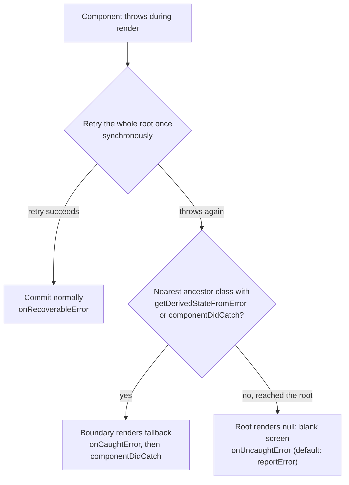
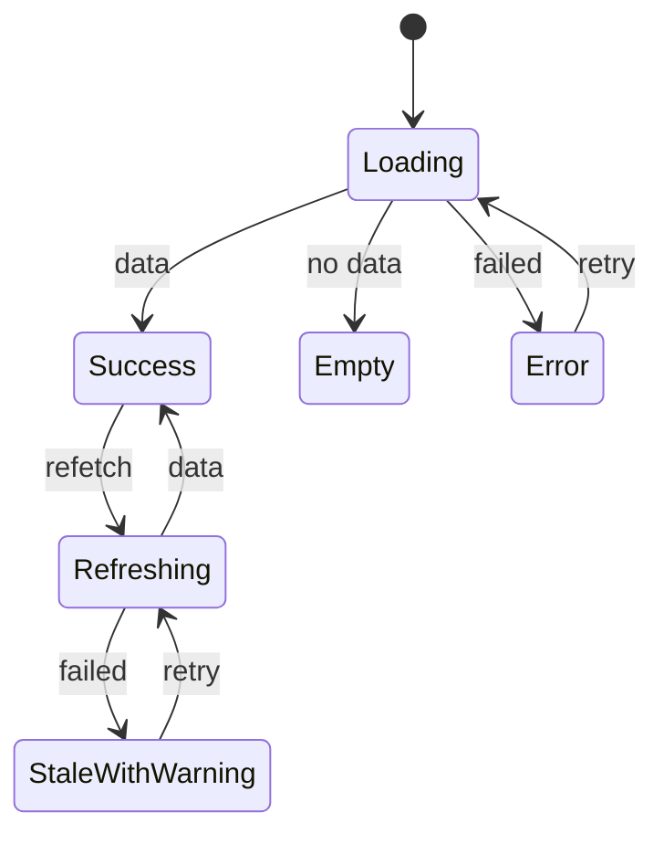

# 16 — Error handling

> **How to use this module.** Sections 16.1–16.2 give you the core model: what React does when a render throws, and how a boundary stops it. Sections 16.3–16.6 cover the library, the blind spots and the React 19 root options that interviewers now ask about. Sections 16.7–16.8 are production practice: monitoring and resilient UI. If you only have 20 minutes, read 16.1, 16.4, 16.5 and the Summary.

**Prerequisites:** [Render phase vs commit phase](06-jsx-and-rendering-model.md#610-render-phase-vs-commit-phase) · [`createRoot` and root options](06-jsx-and-rendering-model.md#612-createroot-hydrateroot-root-options) · [Class components](07-components-props-composition.md#710-class-components) · [Class lifecycle methods](13-reconciliation-and-fiber.md#136-class-lifecycle-methods-and-their-hook-equivalents) · [The event loop](01-javascript.md#116-the-event-loop-call-stack-microtasks-vs-macrotasks-rendering-steps)

**Code for this module:** [`examples/web/src/m16-errors/`](examples/web/src/m16-errors/). Every component has a test next to it. Run them with `npx vitest run src/m16-errors` from `examples/web`.

---

## 16.1 What happens when a render throws

### The problem
A component reads `user.address.city` and `address` is `undefined`. The render function throws a `TypeError` [JS]. React cannot produce the UI it was asked for. What should the screen show?

Three answers have existed over React's history:

| React version | What happened on an uncaught render error |
|---|---|
| ≤ 15 | React's internal state was corrupted; later renders emitted cryptic errors that hid the original one |
| 16–18 | The **whole tree unmounts** (blank page); the error is re-thrown at the root |
| 19 | The whole tree still unmounts, but the error is **reported, not re-thrown**: `onUncaughtError` if you passed one, else `window.reportError` |

Sources: the React 16 post [Error Handling in React 16](https://legacy.reactjs.org/blog/2017/07/26/error-handling-in-react-16.html) ("errors that were not caught by any error boundary will result in unmounting of the whole React component tree") and CHANGELOG 19.0.0 ("Errors in render are not re-thrown: Errors that are not caught by an Error Boundary are now reported to window.reportError").

### Mental model
Think of the component tree as one request in a server. A render error is an exception thrown in the middle of handling it. React walks **up** from the component that threw, looking for the nearest ancestor that declared "I handle errors" (an **error boundary**). If it finds one, only that subtree is replaced by a fallback. If it reaches the root without finding one, the whole UI is removed.

> **Java/Spring analogy.** An exception thrown deep in a service bubbles up the call stack until a `catch` or a `@ControllerAdvice`/`@ExceptionHandler` handles it. With no handler, the request fails with a 500.
>
> **Where the analogy breaks:** a Spring app survives a failed request; the next request is fine. In React the "request" is the whole screen and it stays alive. An unhandled render error removes the **entire** UI until the page reloads. And the "stack" React walks is the **component tree** (parents in JSX), not the JavaScript call stack.

React chose removal over showing broken UI on purpose: "it is worse to leave corrupted UI in place than to completely remove it. For example, in a product like Messenger leaving the broken UI visible could lead to somebody sending a message to the wrong person" (React 16 post).



### Minimal code
`examples/web/src/m16-errors/Bomb.tsx` is the component the tests use to throw on purpose:

```tsx
export function Bomb({ message = 'boom' }: { message?: string }): never {
  throw new Error(message);
}
```

`RootOptions.test.tsx` renders `<section><h1>App</h1><Bomb /></section>` with no boundary and asserts that `onUncaughtError` received the error and that the container is **empty**: the `<h1>`, which did nothing wrong, is gone too.

### How it works internally
Read from `react-dom-client.development.js` 19.3 (`throwException`, `performWorkOnRoot`, `createRootErrorUpdate`):
1. When a component throws, React marks the render as errored and walks the `return` pointers (the parent chain) looking for a class fiber whose type has `getDerivedStateFromError` or whose instance has `componentDidCatch`, and that has not already captured an error in this render.
2. Before giving up, React **retries the whole root once, synchronously**. If the retry succeeds (the error was a fluke, for example a data race during concurrent rendering), it commits normally and calls `onRecoverableError` with an `Error` whose message is *"There was an error during concurrent rendering but React was able to recover by instead synchronously rendering the entire root."* and whose `cause` is your original error. So a component that throws every time renders **at least twice** per attempt; Exercise 4 asserts the count.
3. If a boundary is found, React queues a "capture" update on it. Its payload calls `getDerivedStateFromError(error)` (render phase); its callback calls the root's `onCaughtError` and then `componentDidCatch` (commit phase).
4. If none is found, the root gets an update with `element: null` (the blank screen) and a callback that calls `onUncaughtError`.

### Trade-offs
- ✅ Unmounting is safe: no half-updated, lying UI.
- ❌ It is a terrible user experience on its own. Every real app needs at least one boundary near the root, and usually more ([16.8](#168-resilient-ui-states)).

> **Version notes.** **React 15** had an undocumented `unstable_handleError` method; it stopped working in 16 and must be renamed to `componentDidCatch` (React 16 post, which also links a codemod). **React 16.0** (Sept 2017) introduced error boundaries via `componentDidCatch` and the unmount-on-uncaught-error behavior (CHANGELOG 16.0.0). **16.6** added `static getDerivedStateFromError` (CHANGELOG 16.6.0). **18.0** added the `onRecoverableError` root option. **19.0** stopped re-throwing uncaught errors, sends them to `window.reportError`, logs caught errors once, and added `onCaughtError`/`onUncaughtError` (CHANGELOG 19.0.0; [React 19 blog: "Better error reporting"](https://react.dev/blog/2024/12/05/react-19#error-handling)).

---

## 16.2 Error boundaries

### The problem
You want the failure contained: the chart crashes, the chart area shows "Chart unavailable", the rest of the page keeps working. In imperative code you would wrap the call in `try`/`catch`. But JSX is declarative. `<Chart />` does not *call* `Chart`; React calls it later, during its own render loop, so a `try` around the JSX catches nothing.

### Mental model
An **error boundary** [React] is a `try`/`catch` for a **subtree**, written as a component. It catches errors thrown while React renders its descendants, runs their lifecycle methods/effects, or constructs them, and renders a fallback instead.

It is a class component that defines one or both of:

| Method | Phase | Job |
|---|---|---|
| `static getDerivedStateFromError(error)` | Render (pure) | Return the state that makes `render()` show the fallback |
| `componentDidCatch(error, info)` | Commit | Side effects: log the error and `info.componentStack` |

> **Java/Spring analogy.** `@ControllerAdvice(assignableTypes = …)` scoped to a set of controllers: one handler protects a region of the app.
>
> **Where the analogy breaks:** a boundary only sees errors from React's own render/commit work in its subtree. An exception in a click handler or a `setTimeout` is not "inside" the boundary at all ([16.4](#164-what-boundaries-do-not-catch)).

### Minimal code
`examples/web/src/m16-errors/ErrorBoundary.tsx` (react.dev's example, typed):

```tsx
export class ErrorBoundary extends Component<Props, State> {
  state: State = { hasError: false };

  static getDerivedStateFromError(): State {
    return { hasError: true };            // render phase: pure
  }

  componentDidCatch(error: unknown, info: ErrorInfo) {
    this.props.onError?.(error, info);    // commit phase: log here
  }

  render() {
    return this.state.hasError ? this.props.fallback : this.props.children;
  }
}

// usage
<ErrorBoundary fallback={<p role="alert">Something went wrong</p>}>
  <Profile />
</ErrorBoundary>
```

`ErrorBoundary.test.tsx` asserts that the fallback replaces only the subtree (a heading outside the boundary survives) and that `componentDidCatch` receives a `componentStack` naming the component that threw.

### Why still classes
There is **no hook** for this. react.dev says it plainly: "There is currently no way to write an Error Boundary as a function component" ([Component reference](https://react.dev/reference/react/Component#catching-rendering-errors-with-an-error-boundary)). A hook lives inside the component that is failing; by the time it would run, that component's render has already thrown. A boundary has to be a **different, ancestor** fiber with state that React can update when a descendant fails, and React only supports that contract on classes. You write one class (or install `react-error-boundary`, 16.3) and use it everywhere from function components. See the gap table in [13.6](13-reconciliation-and-fiber.md#136-class-lifecycle-methods-and-their-hook-equivalents).

### How it works internally
- The thrown value is `unknown`. JavaScript can throw a string, an object, even `null`; react.dev notes this for both methods. Narrow before reading `.message`.
- `getDerivedStateFromError` runs during the render phase, so it may run more than once and must be pure. `componentDidCatch` runs once per commit.
- Without `getDerivedStateFromError`, a class with only `componentDidCatch` still acts as a boundary (the old React 16.0 style: call `setState` in `componentDidCatch`), but React 19.3 logs *"Error boundaries should implement getDerivedStateFromError()"* (read in the dev build), and react.dev calls the `setState` pattern deprecated.
- Order on catch (read from `initializeClassErrorUpdate`, asserted in Exercise 4): the root's `onCaughtError` runs **before** the boundary's `componentDidCatch`.

### Trade-offs: where to put boundaries
- One at the **root** (or per route) is the minimum: it turns a blank page into "Something went wrong, reload".
- One per **independent region** (sidebar, feed, chat input, each dashboard widget) keeps the rest interactive. Messenger wrapped "the sidebar, the info panel, the conversation log, and the message input" separately (React 16 post).
- Not one per avatar or button: react.dev advises against wrapping every component. Too fine-grained boundaries show a dozen tiny error states and hide systemic failures.

---

## 16.3 `react-error-boundary`

### The problem
Every app ends up writing the same boundary class plus the same extras: a fallback that receives the error, a "Try again" button, automatic reset when the user navigates, and a way to send async errors in. [`react-error-boundary`](https://github.com/bvaughn/react-error-boundary) [Library: react-error-boundary] (Brian Vaughn, ex-React core) is that class, done once. react.dev itself recommends it.

### Mental model
One `<ErrorBoundary>` component with three ways to render a fallback and three ways to reset.

| Prop / API | What it does |
|---|---|
| `fallback` | Static element |
| `fallbackRender={({ error, resetErrorBoundary }) => …}` | Render prop |
| `FallbackComponent={Comp}` | Component receiving `FallbackProps` |
| `onError(error, info)` | `componentDidCatch` for logging |
| `resetKeys={[a, b]}` | Reset automatically when any key changes (`Object.is`) |
| `onReset(details)` | Called on reset; `details.reason` is `'imperative-api'` or `'keys'` |
| `useErrorBoundary()` → `{ error, showBoundary, resetBoundary }` | Push an error into the nearest boundary from async code; reset from inside the fallback |
| `withErrorBoundary(Comp, props)` | HOC form |
| `getErrorMessage(thrown)` | `message` of an error-like value or a string, else `undefined` (6.1+) |

(All read from `node_modules/react-error-boundary/dist/react-error-boundary.d.ts`, version 6.1.6.)

### Minimal code
`examples/web/src/m16-errors/LibraryBoundary.tsx`:

```tsx
function ProfileFallback({ error, resetErrorBoundary }: FallbackProps) {
  return (
    <div role="alert">
      <p>Could not load the profile: {getErrorMessage(error) ?? 'unknown error'}</p>
      <button type="button" onClick={resetErrorBoundary}>Try again</button>
    </div>
  );
}

export function SafeProfile({ userId, service, onError }: Props) {
  return (
    <ErrorBoundary FallbackComponent={ProfileFallback} resetKeys={[userId]} onError={onError}>
      <Profile userId={userId} service={service} />
    </ErrorBoundary>
  );
}
```

`LibraryBoundary.test.tsx` checks the fallback, `onError`'s component stack, retry, and reset when `userId` changes.

### How it works internally
Read from `dist/react-error-boundary.js` 6.1.6:
- It is a class with `getDerivedStateFromError` (stores `{ didCatch: true, error }`) and `componentDidCatch` (calls `onError`).
- `componentDidUpdate` resets when `resetKeys` changed **and the boundary was already in the error state before this update** (`prevState.didCatch`). Without that check, an update that changes a key and throws in the same render would reset immediately.
- If no fallback prop is given at all, it re-throws the error to the next boundary up.
- It wraps children **and** the fallback in a context, which is how `useErrorBoundary` finds it. `showBoundary(error)` stores the error in the calling component's own state; on the next render the hook **throws it**, so the error enters through the normal render path. Calling the hook outside any `ErrorBoundary` throws `"ErrorBoundaryContext not found"`.

### Trade-offs
- ✅ Small, well-known, and works with any renderer. Prefer it to a hand-written class unless you need custom behavior.
- ❌ `useErrorBoundary` only talks to this library's boundary, so it does not reach a hand-written one. The plain-React alternative in 16.6 works with any boundary.

> **Version notes (react-error-boundary).** From the [GitHub releases](https://github.com/bvaughn/react-error-boundary/releases): **2.1** added `resetKeys` and `onReset`. **2.3** added the `useErrorHandler(error)` hook. **3.0** removed `componentStack` from the fallback props (log it from `onError` instead). **4.0** (2023-03) **replaced `useErrorHandler` with `useErrorBoundary`** (`showBoundary`/`resetBoundary`) and merged `onResetKeysChange` into `onReset(details)`; 4.0.1 made the hook usable inside the fallback; 4.0.3 added `"use client"`. **5.0** (2024-12) updated `withErrorBoundary` types for React 19's `forwardRef` types. **6.0** (2025-05) is **ESM-only**: the README tells projects whose runtime cannot load ES modules to stay on v5. **6.1.0** (2026-01) changed the error type from `Error` to **`unknown`** and exported `getErrorMessage`. **Migration path:** `useErrorHandler(err)` → `if (err) throw err;` during render, or `showBoundary(err)` from async code; `error.message` in a fallback → `getErrorMessage(error)` or an `instanceof Error` check.

---

## 16.4 What boundaries do not catch

### The problem
Teams add a boundary, see it work in a demo, and assume every error is handled. Then a payment button's `onClick` throws in production, the button just stops working, and nobody sees a fallback.

### Mental model
A boundary catches what happens **while React is rendering or committing its subtree**. Anything that runs later, on its own call stack, is outside. react.dev lists the exceptions ([Component reference](https://react.dev/reference/react/Component#catching-rendering-errors-with-an-error-boundary)):

| Not caught | Why | What to do |
|---|---|---|
| **Event handlers** | React calls your handler during event dispatch, not during render. Nothing needs re-rendering, so the UI is not "broken" | `try`/`catch` in the handler; set error state, or send it to a boundary ([16.6](#166-errors-in-event-handlers-and-async-code)) |
| **Async code** (`setTimeout`, `requestAnimationFrame`, promise callbacks) | Runs on a later task; the render that scheduled it finished long ago | Catch it and route it (16.6). **Exception:** functions passed to `startTransition` from `useTransition` *are* caught, and so are rejected promises read with `use` |
| **Server-side rendering** | Boundaries are class lifecycles; the server renderer reports errors through `onError`/`onShellError` and lets the client retry | See below |
| **Errors in the boundary itself** (its own `render`, or its fallback) | A boundary cannot catch what it is in the middle of handling | The next boundary **up** catches it (Exercise 4, test 5) |

**What about effects?** Errors thrown in `useEffect`/`useLayoutEffect` (and class lifecycles) **are** caught: React runs them in the commit and routes the error to the nearest boundary. Exercise 4, test 2 shows an effect error reaching the inner boundary after one successful render.

### Minimal code
From `ErrorBoundary.test.tsx`: a button inside a boundary throws on click. The boundary never shows its fallback; the error reaches `window`'s `error` event instead.

```tsx
<ErrorBoundary fallback={<p role="alert">Oops</p>}>
  <button onClick={() => { throw new Error('click boom'); }}>Pay</button>
</ErrorBoundary>
// after clicking: no alert, the button is still there, window "error" saw 'click boom'
```

### How it works internally
- React 19.3's event system wraps each listener call: `try { listener(event) } catch (error) { reportGlobalError(error) }` (`executeDispatch` in the dev build). `reportGlobalError` is `window.reportError` when it exists, otherwise a synthetic `ErrorEvent('error')` dispatched on `window`, falling back to `console.error`. So a handler error does not stop the other listeners, and it reaches global error handlers, but it never reaches a boundary.
- **SSR.** With `renderToPipeableStream`, an error outside every `<Suspense>` boundary fails the **shell** (`onShellError`, send a fallback HTML). An error inside a `<Suspense>` boundary is reported to `onError`; the server emits that boundary's fallback, and the client retries rendering it. If the client retry also fails, the nearest client error boundary decides; if it succeeds, `onRecoverableError` fires on the client ([renderToPipeableStream docs](https://react.dev/reference/react-dom/server/renderToPipeableStream#recovering-from-errors-outside-the-shell)). Hydration errors: [21.5](21-concurrent-ssr-server-components.md#215-ssr-hydration-hydration-errors).
- The **standalone** `startTransition` (imported from `react`, not from `useTransition`) is not tied to a component, so "an Error Boundary cannot handle errors from its Transition" ([useTransition docs](https://react.dev/reference/react/useTransition)).

### Trade-offs
This is a **design**, not a missing feature. A failed click leaves the UI consistent, so replacing a whole region with a fallback would be an overreaction. You decide per handler whether the failure deserves an inline message, a toast, or the boundary.

---

## 16.5 React 19 root options: `onCaughtError`, `onUncaughtError`, `onRecoverableError`

### The problem
Before React 19 there was no single place to observe React errors. You patched `componentDidCatch` in every boundary for caught errors, listened to `window.onerror` for uncaught ones (and got them twice in development), and only `onRecoverableError` (18.0) existed as a root option.

### Mental model
Three callbacks on the **root**, one per outcome of 16.1's flowchart:

| Option | Fires when | Receives | Default (19.3) |
|---|---|---|---|
| `onCaughtError` | A boundary caught a render/commit error | `(error, { componentStack, errorBoundary })` | `console.error` (dev: with "The above error occurred in the <X> component…") |
| `onUncaughtError` | No boundary caught it; the root unmounted | `(error, { componentStack })` | `reportError(error)`; dev also `console.warn` "Consider adding an error boundary…" |
| `onRecoverableError` | React recovered on its own (retry succeeded, hydration fell back to client rendering) | `(error, { componentStack })`; the original is often `error.cause` | `reportError(error)` |

Sources: [createRoot docs](https://react.dev/reference/react-dom/client/createRoot#parameters); the defaults are read from `defaultOnCaughtError`/`defaultOnUncaughtError`/`defaultOnRecoverableError` in `react-dom-client.development.js` and `.production.js` 19.3 (production `onCaughtError` is a bare `console.error(error)`). The types are in `@types/react-dom/client.d.ts` (`RootOptions`); `errorBoundary` is the boundary's class **instance**.

### Minimal code

```tsx
const root = createRoot(document.getElementById('root')!, {
  onCaughtError: (error, info) => report('caught', error, info.componentStack),
  onUncaughtError: (error, info) => report('uncaught', error, info.componentStack),
  onRecoverableError: (error, info) => report('recoverable', error, info.componentStack),
});
```

`hydrateRoot(container, <App />, options)` accepts the same three. Exercise 3 builds a complete reporter around them.

`RootOptions.test.tsx` asserts, against React 19.3:
- `onCaughtError` replaces the default report, so `console.error` is not called, and `info.errorBoundary` is the `ErrorBoundary` instance.
- A component that throws only on its **first** render is shown normally, and `onRecoverableError` receives the "error during concurrent rendering … recover" wrapper with the original as `cause`.
- Without options, an uncaught error reaches `window`'s `error` event and React logs the `console.warn` hint.

### How it works internally: the testing trap
`logUncaughtError` in 19.3 checks `ReactSharedInternals.actQueue`. **Inside `act()`, React does not call `onUncaughtError` at all**: it collects the error and `act()` re-throws it. Testing Library's `render` runs inside `act`, so an uncaught render error makes `render()` **throw**, and RTL 16.3's `RenderOptions` types `onUncaughtError` as `never` ("Not supported at the moment"). It does accept `onCaughtError` and `onRecoverableError`. To observe `onUncaughtError` in a test, render outside `act`, which is what `examples/web/src/m16-errors/renderOutsideAct.tsx` does (it turns `IS_REACT_ACT_ENVIRONMENT` off and uses `flushSync`).

### Trade-offs
- ✅ One place for all React errors; frameworks and SDKs can plug in (Sentry ships `Sentry.reactErrorHandler()` for exactly these three options, [Sentry React docs](https://docs.sentry.io/platforms/javascript/guides/react/)).
- ❌ They are **root** options: if a framework creates the root for you (Next.js, React Router framework mode), you use its hooks instead (`error.tsx`/`global-error.tsx`, route `ErrorBoundary`, [19.9](19-routing.md#199-error-routes)).
- ❌ They do not see event handler or async errors (16.4). You still need the window listeners (Exercise 3).
- If you override `onCaughtError`, you also take over the dev console output. Keep a `console.error` in development if you want it.

> **Version notes.** **React 16–18**: in development, React replayed failing renders through `invokeGuardedCallback` (a fake DOM event), so **even caught errors** reached `window.onerror`, and one caught error printed **three** console errors: the error, a duplicate, and "The above error occurred in the <X> component: … React will try to recreate this component tree from scratch using the error boundary you provided, X." React 18 re-threw uncaught errors from the root and printed "Consider adding an error boundary to your tree…" (strings read in `react-dom@18.3.1/cjs/react-dom.development.js`, which contains 18 references to `invokeGuardedCallback`; 19.3 contains none). **React 19** logs a single report per error ([React 19 blog](https://react.dev/blog/2024/12/05/react-19#error-handling)), does not re-throw at the root (CHANGELOG 19.0.0: "Don't rethrow errors at the root"), and adds `onCaughtError`/`onUncaughtError`. **18.0** added `onRecoverableError`; **18.2** passed it a component stack; **19.0** removed `errorInfo.digest` from it. **Legacy `ReactDOM.render`** had none of these options; apps used a root boundary plus `window.onerror`. Migration: move to `createRoot` ([6.12](06-jsx-and-rendering-model.md#612-createroot-hydrateroot-root-options)), then move logging out of each boundary's `componentDidCatch` into the root options.
>
> react.dev's `componentDidCatch` caveat still says that in development caught errors "bubble up to `window`". On React 19.3 in jsdom it does **not** happen (verified by running `ErrorBoundary.test.tsx`, "does NOT reach window"). Treat the docs note as describing React ≤ 18. A real browser was not tested.

---

## 16.6 Errors in event handlers and async code

### The problem
Most real failures are async: a `fetch` rejects, a save returns 500, a WebSocket message fails to parse. 16.4 showed boundaries do not see them. You have to decide, for each one, **who shows it**.

### Mental model
Split errors in two:

| Kind | Example | Where it belongs |
|---|---|---|
| **Expected** | Validation failed, 404, 409 conflict, offline | **State.** Render it inline next to the thing that failed ([17.2](17-data-fetching.md#172-loadingerrorempty-states-as-a-union-type), [14.7](14-forms-and-actions.md#147-useactionstate)) |
| **Unexpected** | 500, a bug, a malformed response | **A boundary** (the region cannot continue) plus monitoring |

To send an async error to a boundary you must get it **into a render**. There are three ways:

```tsx
// 1. react-error-boundary
const { showBoundary } = useErrorBoundary();
try { await save(); } catch (error) { showBoundary(error); }

// 2. Plain React: throw from a state updater (runs during the next render)
const [, setState] = useState(0);
setState(() => { throw error; });

// 3. React 19 Actions: errors thrown inside startTransition reach the boundary
startTransition(async () => { await save(); });
```

### Minimal code
`examples/web/src/m16-errors/useThrowToBoundary.ts` (way 2, as a hook) and `SaveButton.tsx` (all three) are Exercise 2.

### How it works internally
- **Way 2:** `setState(updater)` queues the updater. React may run it eagerly when the queue is empty, but 19.3's `dispatchSetStateInternal` wraps that eager call in `try { … } catch {}` ("it will throw again in the render phase"). During the next render React runs the updater again inside the component's render, the throw happens *there*, and 16.1's walk to the nearest boundary applies.
- **Way 3:** the async action's promise is tracked by the transition. When it rejects, React re-throws the error while rendering the component that called `useTransition`, so wrap **that** component in the boundary ([useTransition docs](https://react.dev/reference/react/useTransition#displaying-an-error-to-users-with-error-boundary); [21.2](21-concurrent-ssr-server-components.md#212-usetransition-and-starttransition)).
- **Handler without any routing:** the error goes to `reportGlobalError` (16.4). A rejected promise nobody awaited becomes an `unhandledrejection` event on `window`.

### Trade-offs
- Catch **close to the cause** when you can show something useful there (a field error, "Retry" next to the button). Escalate to a boundary when the region is unusable.
- Do not throw expected errors at boundaries: a 404 on a profile should be a "User not found" state, not a crashed panel.
- `async` handlers that are not awaited by anything swallow nothing: an uncaught rejection still surfaces as `unhandledrejection`. Always end the chain in a `catch`.

---

## 16.7 Logging and monitoring, source maps

### The problem
An error you do not know about cannot be fixed. Production users do not open DevTools, and production stacks look like `at a (index-4f2a.js:1:34567)`.

### Mental model
Monitoring has three parts: **capture** every path an error can take, **enrich** it (component stack, route, release, user id), and **decode** it (source maps). Sentry, Datadog RUM, Bugsnag and friends all follow this shape.

| Capture path | Hook |
|---|---|
| Caught render/commit errors | `onCaughtError` (19) or each boundary's `componentDidCatch` (≤ 18) |
| Uncaught render errors | `onUncaughtError` (19), `window` `error` (≤ 18) |
| Recovered errors, hydration mismatches | `onRecoverableError` |
| Event handlers, timers | `window.addEventListener('error', …)` |
| Unhandled promise rejections | `window.addEventListener('unhandledrejection', …)` |
| Server rendering | `renderToPipeableStream({ onError })`, framework hooks |

### Minimal code
Sentry's React 19 setup ([Sentry React docs](https://docs.sentry.io/platforms/javascript/guides/react/)):

```tsx
const root = createRoot(container, {
  onUncaughtError: Sentry.reactErrorHandler((error, errorInfo) => {
    console.warn('Uncaught error', error, errorInfo.componentStack);
  }),
  onCaughtError: Sentry.reactErrorHandler(),
  onRecoverableError: Sentry.reactErrorHandler(),
});
```

For React 18 and below, Sentry documents `<Sentry.ErrorBoundary fallback={…}>` instead. Exercise 3 builds the vendor-neutral version.

### How it works internally
- **Component stack** (`info.componentStack`) is the chain of components from the root to the one that threw. In production the names are minified, and you decode them with source maps "the same way as you would do for regular JavaScript error stacks" (react.dev, `componentDidCatch`).
- **Owner stack** (`captureOwnerStack()`, 19.1) shows which component *rendered* which. It is **development-only** and returns `null` in production (CHANGELOG 19.1.0).
- **Source maps** map minified positions back to your TypeScript. Generate them in the build (`build.sourcemap` in Vite), **upload them to the monitoring service**, and either do not deploy them publicly (`'hidden'`) or accept that your source becomes readable. Tag every report with the **release** (git SHA) so the right map is used.

> Vite's `build.sourcemap` is `boolean | 'inline' | 'hidden'` (default `false`): `true` writes separate `.map` files, `'inline'` appends the map to the output file as a data URI, and `'hidden'` is like `true` but drops the `sourceMappingURL` comment from the bundle ([Vite build options](https://vite.dev/config/build-options#build-sourcemap)). `'hidden'` is the one to use when you upload maps to a monitoring service.

### Trade-offs
- Deduplicate: the same Error object can arrive by two paths (Exercise 3 uses a `WeakSet`).
- Sample and rate-limit: a render loop can fire thousands of identical errors per minute.
- Scrub PII (tokens in URLs, emails in messages) before sending.
- A reporter must never throw. Wrap the transport in `try`/`catch`.
- Backend correlation: send a request id with each API call and include it in error reports, so a front-end error links to the Spring log line ([24.8](24-react-with-spring-boot.md#248-problemdetail-error-mapping), [22.6](22-production-project-structure.md#226-error-and-logging-strategy)).

---

## 16.8 Resilient UI states

### The problem
"Something went wrong" across the whole page because one widget's API timed out is a failure of design, not of the API.

### Mental model
Design the failure states the same way you design the happy path. Every data-driven region has a small state machine:



Three patterns cover most of it:

| Pattern | What the user sees | React tool |
|---|---|---|
| **Fallback** | The region is replaced by a message, the rest works | A boundary around the region |
| **Retry** | A button (or an automatic, backed-off retry) re-attempts | `reset` / `resetKeys`; data libraries' `retry` ([17.12](17-data-fetching.md#1712-request-deduplication-retries-cancellation)) |
| **Partial failure** | Stale data plus a warning, or 4 of 5 widgets | One boundary per widget; keep last good data instead of throwing |

### Minimal code
`examples/web/src/m16-errors/Dashboard.tsx` wraps each widget in its own `ResettableBoundary` (Exercise 1):

```tsx
{widgets.map((widget) => (
  <section key={widget.id} aria-label={widget.title}>
    <h2>{widget.title}</h2>
    <ResettableBoundary
      fallbackRender={({ reset }) => (
        <div role="alert">
          <p>{widget.title} is unavailable right now.</p>
          <button type="button" onClick={reset}>Retry {widget.title}</button>
        </div>
      )}
    >
      <WidgetBody load={widget.load} />
    </ResettableBoundary>
  </section>
))}
```

`Dashboard.test.tsx` asserts that a failing Revenue widget shows exactly one alert while Orders still renders, and that "Retry Revenue" recovers only that widget.

### How it works internally
Boundaries are independent fibers with independent state, so one widget's error state does not touch its siblings. Note the heading sits **outside** the boundary, so the user still knows *what* failed. Fallbacks should keep the region's size (avoid layout shift) and use `role="alert"` so screen readers announce the failure ([04](04-html-css-accessibility.md)).

### Trade-offs
- A retry button is honest; a silent auto-retry loop can hammer a failing backend. Use exponential backoff and a cap.
- Showing stale data with a warning is often better than an error. That is a data-layer decision (TanStack Query keeps `data` while `error` is set), not a boundary decision.
- Route-level boundaries are the next layer up ([19.9](19-routing.md#199-error-routes)); the root boundary is the last resort.

---

## Interview questions

**Q1. What is an error boundary?**
<details><summary>Answer</summary>

A class component that defines `static getDerivedStateFromError` and/or `componentDidCatch`. When a descendant throws during rendering, in a lifecycle method/effect, or in a constructor, React walks up to the nearest boundary, which renders a fallback instead of its children. **A strong answer adds:** it is a declarative `try`/`catch` for a subtree, it was introduced in React 16, and it does not catch event-handler, async, SSR or self-inflicted errors.

</details>

**Q2. What does React do if nothing catches a render error?**
<details><summary>Answer</summary>

Since React 16 it unmounts the whole tree (a blank page), because corrupted UI is worse than none. In React 19 the error is then reported to `onUncaughtError`, or by default to `window.reportError`, and it is not re-thrown. **A strong answer adds:** React 15 and earlier left corrupted internal state and produced cryptic follow-up errors.

</details>

**Q3. Why can't you write an error boundary with hooks?**
<details><summary>Answer</summary>

A boundary must be an **ancestor** fiber whose state React updates when a descendant fails; a hook runs inside the failing component, which has already thrown. React only exposes that contract through the two class methods, and react.dev says "There is currently no way to write an Error Boundary as a function component." **A strong answer adds:** write one class (or use `react-error-boundary`) and use it from function components everywhere.

</details>

**Q4. `getDerivedStateFromError` vs `componentDidCatch`?**
<details><summary>Answer</summary>

`getDerivedStateFromError(error)` is static, runs in the render phase, must be pure, and returns state that switches to the fallback. `componentDidCatch(error, info)` runs in the commit phase and is for side effects such as logging `info.componentStack`. **A strong answer adds:** before 16.6 only `componentDidCatch` existed and people called `setState` in it, which renders the broken tree once more first; react.dev now calls that deprecated.

</details>

**Q5. Does an error boundary catch errors in `onClick`?**
<details><summary>Answer</summary>

No. Handlers run during event dispatch, not during render, and a failed handler does not leave the UI inconsistent. React 19 catches the error around the listener and passes it to `reportError`, so it reaches `window`'s `error` event. **A strong answer adds:** handle it with `try`/`catch` and state, or forward it with `showBoundary`/`setState(() => { throw e })`.

</details>

**Q6. Does it catch errors in `useEffect`?**
<details><summary>Answer</summary>

Yes. Effects run in React's commit, so React catches the throw and routes it to the nearest boundary. Only code the effect *schedules* (a timer callback, a promise `.then`) escapes. **A strong answer adds:** Exercise 4 shows the effect error caught by the inner boundary after one successful render.

</details>

**Q7. A promise rejects inside `useEffect`'s `.then`. Caught?**
<details><summary>Answer</summary>

No. The callback runs on a later microtask, outside React's render/commit. It becomes an `unhandledrejection` unless you catch it. **A strong answer adds:** catch it and set error state, or route it to a boundary; better, use a data library or `use(promise)`, whose rejection *does* reach the boundary.

</details>

**Q8. What happens if the boundary's own fallback throws?**
<details><summary>Answer</summary>

The boundary cannot catch its own error, so the error propagates to the next boundary up. If there is none, the root unmounts. **A strong answer adds:** keep fallbacks dumb and dependency-free; a fallback that fetches or reads context can fail for the same reason the content did.

</details>

**Q9. What are `onCaughtError`, `onUncaughtError` and `onRecoverableError`?**
<details><summary>Answer</summary>

React 19 root options (`createRoot`/`hydrateRoot`). `onCaughtError`: a boundary caught an error (receives `componentStack` and the `errorBoundary` instance). `onUncaughtError`: nothing caught it and the root unmounted. `onRecoverableError` (18.0): React recovered automatically, for example by re-rendering synchronously or client-rendering after a hydration error; the original is often in `error.cause`. **A strong answer adds:** they centralize reporting that used to be spread across every `componentDidCatch` plus `window.onerror`.

</details>

**Q10. What did React 19 change about error logging?**
<details><summary>Answer</summary>

React 18 dev printed three console errors per caught error (the error twice because of the dev replay, then "The above error occurred…"); React 19 prints one, with all the information. Uncaught errors are no longer re-thrown; they go to `window.reportError`. New root options let you customize both. **A strong answer adds:** in 18 dev, even caught errors reached `window.onerror` because of `invokeGuardedCallback`; that machinery is gone in 19.

</details>

**Q11. What is a "recoverable error"?**
<details><summary>Answer</summary>

An error React handled without your help. When a render throws, React retries the whole root synchronously once; if the retry succeeds, it commits and reports an error saying "React was able to recover by instead synchronously rendering the entire root", with the original as `cause`. Hydration mismatches that fall back to client rendering are the other big source. **A strong answer adds:** these are invisible to users but often signal real bugs (non-deterministic render, SSR/client mismatch), so log them.

</details>

**Q12. Why does a throwing component render twice even without Strict Mode?**
<details><summary>Answer</summary>

Because of that one synchronous retry: React re-renders the whole root once to rule out a transient error before committing the boundary's fallback (read from `performWorkOnRoot` in 19.3; Exercise 4 counts the renders). **A strong answer adds:** with Strict Mode in dev, each attempt is double-invoked on top of that, so never put side effects in render.

</details>

**Q13. What does `resetKeys` do in `react-error-boundary`?**
<details><summary>Answer</summary>

When any value in the array changes (`Object.is`) while the fallback is showing, the boundary resets and tries its children again. Typical keys: the route, the selected id, a query. **A strong answer adds:** the library only resets if the boundary was already in the error state before the update, so an update that both changes a key and throws does not reset itself instantly.

</details>

**Q14. How do you send an async error to a boundary without a library?**
<details><summary>Answer</summary>

`const [, setState] = useState(0); setState(() => { throw error; })`. React runs the updater during the next render, so the throw happens inside render and the nearest boundary catches it. **A strong answer adds:** it works with any boundary; `react-error-boundary`'s `showBoundary` does the same thing by storing the error in the hook's state and throwing it on render.

</details>

**Q15. What replaced `useErrorHandler`?**
<details><summary>Answer</summary>

`react-error-boundary` 4.0 replaced it with `useErrorBoundary()`, which returns `showBoundary(error)` and `resetBoundary()`. The old `useErrorHandler(givenError)` only threw the value, which you can do yourself (`if (error) throw error;`) and mishandled `null`/`undefined`. **A strong answer adds:** v6 is ESM-only and 6.1 types the error as `unknown`.

</details>

**Q16. Where should boundaries go?**
<details><summary>Answer</summary>

At least one at the root (or per route), then one per independent region: navigation, main content, each dashboard widget, the chat input. Not one per leaf component. **A strong answer adds:** keep the region's heading outside the boundary so the user knows what failed, and match boundaries to retry units (what can be retried on its own).

</details>

**Q17. Error boundary vs `try`/`catch`: when do you use which?**
<details><summary>Answer</summary>

`try`/`catch` for imperative code you call: handlers, async functions, parsing. Boundaries for declarative rendering, where React (not you) calls the component. **A strong answer adds:** a `try` around JSX catches nothing because `<Chart />` only creates an element; the render happens later inside React.

</details>

**Q18. Can a Suspense boundary catch errors?**
<details><summary>Answer</summary>

No. `<Suspense>` handles *pending* (a thrown promise / `use` of a pending promise); errors need an error boundary. They are commonly paired: `<ErrorBoundary><Suspense fallback>…</Suspense></ErrorBoundary>`. **A strong answer adds:** in SSR, a server error inside a `<Suspense>` boundary makes React emit that fallback and retry on the client, so Suspense placement also affects error recovery ([21.4](21-concurrent-ssr-server-components.md#214-suspense-in-depth)).

</details>

**Q19. How are errors in `startTransition` handled?**
<details><summary>Answer</summary>

If the function passed to `startTransition` from `useTransition` throws or returns a rejected promise, React re-throws during render and the nearest boundary around the component that called the hook shows. The standalone `startTransition` import has no component, so no boundary can handle it. **A strong answer adds:** `useActionState` re-throws too, so return expected errors as state ([14](14-forms-and-actions.md#147-useactionstate)).

</details>

**Q20. What does `componentStack` contain, and is it useful in production?**
<details><summary>Answer</summary>

The chain of components from the root to the one that threw (with source locations in dev). In production names are minified, but you decode it with source maps, like a JS stack. **A strong answer adds:** `captureOwnerStack()` (19.1) adds who-rendered-whom but is development-only.

</details>

**Q21. Why upload source maps instead of serving them?**
<details><summary>Answer</summary>

The monitoring service needs them to turn `index-4f2a.js:1:34567` into `Profile.tsx:12`. Serving them publicly exposes your source. Uploading at build time with a release tag gives readable stacks without publishing the code. **A strong answer adds:** mismatched releases produce wrong frames, so tag every report with the build SHA.

</details>

**Q22. How do you test an error boundary?**
<details><summary>Answer</summary>

Render a child that throws (`Bomb`), assert the fallback, and spy on `console.error` with `mockImplementation(() => {})` because React logs caught errors in dev. Assert on the log when the log is the point. **A strong answer adds:** test reset by fixing the cause and clicking retry, and test `resetKeys` with `rerender`.

</details>

**Q23. Why does `render()` from Testing Library throw when a component throws with no boundary?**
<details><summary>Answer</summary>

RTL renders inside `act()`. In React 19, uncaught errors inside `act` are collected and re-thrown by `act` instead of going to `onUncaughtError`, so `render` throws. RTL 16.3 types `onUncaughtError` as `never` for this reason. **A strong answer adds:** to test `onUncaughtError`, render with `createRoot` outside `act` (this module's `renderOutsideAct`).

</details>

**Q24. In which order do `onCaughtError` and `componentDidCatch` run?**
<details><summary>Answer</summary>

`onCaughtError` first, then `componentDidCatch`; both in the same commit callback (read from `initializeClassErrorUpdate` in 19.3, asserted in Exercise 4). **A strong answer adds:** `getDerivedStateFromError` ran earlier, during render.

</details>

**Q25. What happens with an error during server rendering?**
<details><summary>Answer</summary>

Error boundaries do not run on the server. With streaming SSR, an error in the shell fires `onShellError` (send fallback HTML, status 500); an error inside a `<Suspense>` boundary fires `onError`, the server streams the fallback, and the client retries that part. If the client succeeds, `onRecoverableError` fires; if it fails, the nearest client boundary shows. **A strong answer adds:** `renderToString` has no streaming recovery; it throws.

</details>

**Q26. How would you build global error reporting for a React 19 SPA?**
<details><summary>Answer</summary>

Root options for render errors, `window` `error` for handler/timer errors, `unhandledrejection` for promises; normalize to one report shape, dedupe by object identity, never throw from the reporter, enrich with release/route/user, upload source maps. **A strong answer adds:** Exercise 3 is exactly this, and SDKs like Sentry wire the same three root options.

</details>

**Q27. A user reports a blank page in production. How do you debug it?**
<details><summary>Answer</summary>

A blank page means an uncaught render error unmounted the root. Check monitoring for `onUncaughtError`/`window` errors around that time, decode the stack with the release's source map, read the component stack. Then add a root boundary so the next one shows a recoverable message. **A strong answer adds:** without monitoring you are guessing; this is why `onUncaughtError` should report somewhere.

</details>

**Q28. How do you reset a boundary when the user navigates?**
<details><summary>Answer</summary>

Pass the route (or the id) as a reset key, or give the boundary `key={pathname}` so it remounts with fresh state ([08](08-state.md#89-resetting-state-with-key)). **A strong answer adds:** `key` also resets every child's state, while `resetKeys` keeps the boundary and only clears the error.

</details>

**Q29. Should you throw on a 404 from the API?**
<details><summary>Answer</summary>

Usually not: a 404 is expected and belongs in state ("User not found"). Throw (or `showBoundary`) for failures that make the region unusable. **A strong answer adds:** map Spring `ProblemDetail` responses to typed errors in the API layer so components can tell them apart ([24.8](24-react-with-spring-boot.md#248-problemdetail-error-mapping)).

</details>

**Q30. What changed for error boundaries between React 15 and 16?**
<details><summary>Answer</summary>

React 15 had an unofficial `unstable_handleError`; 16 renamed it to `componentDidCatch` (with a codemod), made boundaries official, added component stacks in dev, and made uncaught errors unmount the tree. 16.6 added `getDerivedStateFromError`. **A strong answer adds:** upgrading to 16 surfaced crashes that 15 had silently left in the UI.

</details>

**Q31. Why does Next.js say `error.tsx` must be a Client Component?**
<details><summary>Answer</summary>

Because it is wrapped in a React error boundary, and boundaries are class components with client-side state; they cannot run as Server Components. Next.js puts `error.js` around `page.js`, `loading.js` and nested layouts but not the layout in the same segment; root-layout errors need `global-error.js` ([Next.js docs](https://nextjs.org/docs/app/api-reference/file-conventions/error)). **A strong answer adds:** errors from Server Components reach the client with a generic message and a `digest` to match server logs.

</details>

**Q32. What is `getErrorMessage` and why does it exist?**
<details><summary>Answer</summary>

A `react-error-boundary` 6.1 helper that returns `message` from an error-like object, the string itself for a thrown string, and `undefined` otherwise. It exists because 6.1 types the caught value as `unknown`, so `error.message` no longer compiles. **A strong answer adds:** the same narrowing applies to your own boundaries, since JavaScript can throw anything.

</details>

---

## Coding exercises

### Exercise 1: A reusable boundary with reset

**Statement.** Write a class `ResettableBoundary` with props `fallbackRender({ error, reset })`, optional `resetKeys`, `onError(error, info)` and `onReset()`. It must:
1. Show the fallback when a child throws, and call `onError` once per caught error.
2. Re-render the children when the fallback calls `reset` (and show the fallback again if the child still throws).
3. Reset automatically when any reset key changes while the fallback is showing.
4. Not reset when keys are unchanged, even if the cause went away.

**Approach.**
1. State is a discriminated union: `{ failed: false; error: null } | { failed: true; error: unknown }`.
2. `getDerivedStateFromError` switches to failed; `componentDidCatch` calls `onError`.
3. `reset` is an arrow class field (stable `this`) that calls `onReset` and restores the initial state.
4. `componentDidUpdate` compares old and new keys with `Object.is`, but only if the boundary was **already** failed before this update.

<details><summary>Hints</summary>

- `prevState.failed` is the guard that stops an update that changes a key *and* throws from resetting itself.
- Compare lengths first, then element by element.
- The thrown value is `unknown`: let the caller narrow it.

</details>

<details><summary>Solution</summary>

[`examples/web/src/m16-errors/ResettableBoundary.tsx`](examples/web/src/m16-errors/ResettableBoundary.tsx):

```tsx
// file: examples/web/src/m16-errors/ResettableBoundary.tsx
import { Component, type ErrorInfo, type ReactNode } from 'react';

export type FallbackArgs = { error: unknown; reset: () => void };

type Props = {
  children: ReactNode;
  /** Renders the fallback; call `reset` to retry rendering the children. */
  fallbackRender: (args: FallbackArgs) => ReactNode;
  /** When any key changes (Object.is) while the fallback is showing, the boundary resets itself. */
  resetKeys?: readonly unknown[];
  onError?: (error: unknown, info: ErrorInfo) => void;
  onReset?: () => void;
};

type State = { failed: false; error: null } | { failed: true; error: unknown };

const initialState: State = { failed: false, error: null };

function keysChanged(prev: readonly unknown[] = [], next: readonly unknown[] = []): boolean {
  return prev.length !== next.length || prev.some((key, i) => !Object.is(key, next[i]));
}

/** A reusable error boundary with a retry function and reset keys (Exercise 1). */
export class ResettableBoundary extends Component<Props, State> {
  state: State = initialState;

  static getDerivedStateFromError(error: unknown): State {
    return { failed: true, error };
  }

  componentDidCatch(error: unknown, info: ErrorInfo) {
    this.props.onError?.(error, info);
  }

  componentDidUpdate(prevProps: Props, prevState: State) {
    // Reset only if the fallback was ALREADY showing before this update. Otherwise an update
    // that changes a key and also throws would reset straight away and hide its own error.
    if (this.state.failed && prevState.failed && keysChanged(prevProps.resetKeys, this.props.resetKeys)) {
      this.reset();
    }
  }

  reset = () => {
    this.props.onReset?.();
    this.setState(initialState);
  };

  render() {
    if (this.state.failed) {
      return this.props.fallbackRender({ error: this.state.error, reset: this.reset });
    }
    return this.props.children;
  }
}
```

</details>

**Walkthrough.** On a throw, React calls `getDerivedStateFromError` during render, and the boundary renders `fallbackRender`. In the commit, `componentDidCatch` reports it. Clicking "Try again" calls `reset`, which sets state back to `initialState`; React renders the children again. If they still throw, the cycle repeats and `onError` fires a second time. When the parent passes a new `userId` key, `componentDidUpdate` sees the boundary was failed before and after, the keys differ, and resets. With unchanged keys nothing resets: the boundary does not know the cause went away, which is why you give users a button or a key.

**Interviewer follow-ups.**
- "Why not reset in `getDerivedStateFromProps`?" It runs on every render, including the one that just failed, and would loop. Resetting is a reaction to a committed change, so `componentDidUpdate`.
- "Could you use `key` instead of `resetKeys`?" Yes: `<ResettableBoundary key={userId}>` remounts the boundary and its children, which also resets their state. `resetKeys` keeps everything mounted.
- "How would you add backoff to retries?" Keep an attempt count in state, disable the button, and schedule `reset` with a growing delay, cleared on unmount.
- "Why is `reset` an arrow field?" So `onClick={reset}` keeps `this` without `bind` ([07](07-components-props-composition.md#710-class-components)).

**Tests.** [`ResettableBoundary.test.tsx`](examples/web/src/m16-errors/ResettableBoundary.test.tsx): fallback + one report, retry after fix, retry while broken, reset by key, no reset with the same keys. [`Dashboard.test.tsx`](examples/web/src/m16-errors/Dashboard.test.tsx) uses it per widget (16.8).

---

### Exercise 2: Surface an async error to a boundary

**Statement.** A `Save` button calls `save(): Promise<void>`. If it rejects, the nearest error boundary must show its fallback. Implement it three ways:
1. `SaveWithLibrary` with `react-error-boundary`'s `useErrorBoundary().showBoundary`.
2. `SavePlain` with no library, via a hook `useThrowToBoundary()` that works with any boundary.
3. `SaveWithTransition` with React 19's `useTransition`, showing "Saving…" while pending.

**Approach.**
1. A rejection in a handler is outside render, so no boundary sees it (16.4). The job is to get the error **into a render**.
2. Library: catch, then `showBoundary(error)`.
3. Plain: throw from a state updater; React runs it during the next render.
4. Transition: let the action reject; React re-throws it during render for the component that owns the transition.

<details><summary>Hints</summary>

- `setState(() => { throw error; })`; wrap it in `useCallback` so the returned function is stable.
- `showBoundary` needs a `react-error-boundary` `ErrorBoundary` ancestor.
- After an `await` inside a transition, wrap further state updates in another `startTransition`.

</details>

<details><summary>Solution</summary>

[`examples/web/src/m16-errors/useThrowToBoundary.ts`](examples/web/src/m16-errors/useThrowToBoundary.ts):

```ts
// file: examples/web/src/m16-errors/useThrowToBoundary.ts
import { useCallback, useState } from 'react';

/**
 * The plain-React way to hand an error from async code (a promise callback, a timer, an
 * event handler) to the nearest error boundary.
 *
 * Boundaries only catch errors thrown while React renders. So throw from inside a state
 * updater: React runs updaters during the next render, and the error surfaces there.
 * @returns A stable function; call it with the error to show the nearest boundary.
 */
export function useThrowToBoundary(): (error: unknown) => void {
  const [, setState] = useState(0);
  return useCallback((error: unknown) => {
    setState(() => {
      throw error;
    });
  }, []);
}
```

[`examples/web/src/m16-errors/SaveButton.tsx`](examples/web/src/m16-errors/SaveButton.tsx):

```tsx
// file: examples/web/src/m16-errors/SaveButton.tsx
import { useState, useTransition } from 'react';
import { useErrorBoundary } from 'react-error-boundary';
import { useThrowToBoundary } from './useThrowToBoundary';

type Props = { save: () => Promise<void> };

/** react-error-boundary: catch the rejection, then showBoundary(error). */
export function SaveWithLibrary({ save }: Props) {
  const { showBoundary } = useErrorBoundary();
  const [saved, setSaved] = useState(false);

  async function handleClick() {
    try {
      await save();
      setSaved(true);
    } catch (error) {
      showBoundary(error);
    }
  }

  return (
    <button type="button" onClick={handleClick}>
      {saved ? 'Saved' : 'Save'}
    </button>
  );
}

/** Plain React: throw from a state updater. Works with ANY boundary, hand-written or not. */
export function SavePlain({ save }: Props) {
  const throwToBoundary = useThrowToBoundary();
  const [saved, setSaved] = useState(false);

  function handleClick() {
    save().then(() => setSaved(true), throwToBoundary);
  }

  return (
    <button type="button" onClick={handleClick}>
      {saved ? 'Saved' : 'Save'}
    </button>
  );
}

/** React 19 Actions: an error thrown inside startTransition goes to the nearest boundary. */
export function SaveWithTransition({ save }: Props) {
  const [isPending, startTransition] = useTransition();
  const [saved, setSaved] = useState(false);

  function handleClick() {
    startTransition(async () => {
      await save(); // a rejection here is rethrown during render, so a boundary catches it
      startTransition(() => setSaved(true)); // updates after an await need their own transition
    });
  }

  const label = saved ? 'Saved' : 'Save';
  return (
    <button type="button" onClick={handleClick} disabled={isPending}>
      {isPending ? 'Saving…' : label}
    </button>
  );
}
```

</details>

**Walkthrough.** `SaveWithLibrary`: the rejection lands in `catch`, `showBoundary` stores the error in the hook's state, and the re-render throws it, so the library boundary shows "Could not save: 503 Service Unavailable". `SavePlain`: the `.then` rejection handler is `throwToBoundary`, which enqueues a throwing updater; React swallows the eager evaluation and throws on render, so the hand-written `ErrorBoundary` from 16.2 catches it. `SaveWithTransition`: the click sets `isPending` (button disabled, "Saving…"); when the promise rejects, React throws during render and the boundary replaces the button.

**Interviewer follow-ups.**
- "Which would you use?" Transitions in React 19 code that already uses Actions; `showBoundary` if you use the library; the updater trick for legacy or library-free code.
- "Should every failed save go to a boundary?" No. A validation error or 409 should be inline state; only unrecoverable failures escalate.
- "What happens if you forget the `catch` in `SaveWithLibrary`?" The rejection becomes an `unhandledrejection`, the UI shows nothing, and the button looks dead.
- "What about the standalone `startTransition` import?" Its errors cannot reach a boundary, because it is not tied to a component.

**Tests.** [`SaveButton.test.tsx`](examples/web/src/m16-errors/SaveButton.test.tsx): library failure and success, plain React with a hand-written boundary, and the transition's pending state followed by the fallback.

---

### Exercise 3: A global error reporter

**Statement.** Write `createErrorReporter(send)` returning:
- `rootOptions`: `onCaughtError`, `onUncaughtError`, `onRecoverableError` for `createRoot`/`hydrateRoot`;
- `install(target = window)`: listens to `error` and `unhandledrejection`, returns an uninstall function;
- `report(source, error, info?)`.

Every report has `{ source, message, cause?, componentStack? }`. The same Error object must be reported once even if it arrives by two paths. A throwing transport must never break the app.

**Approach.**
1. Normalize anything thrown into a message (`instanceof Error`, else `String`).
2. Keep a `WeakSet` of reported objects for dedupe (primitives cannot be deduped by identity).
3. Map each React option and each window event to a `source`.
4. Wrap `send` in `try`/`catch`.
5. Test uncaught errors **outside `act`** (16.5's trap).

<details><summary>Hints</summary>

- `satisfies RootOptions` types the callbacks without widening the object.
- Recoverable errors carry the original in `error.cause`.
- `ErrorEvent.error` can be `null` for cross-origin scripts; fall back to `event.message`.

</details>

<details><summary>Solution</summary>

[`examples/web/src/m16-errors/errorReporter.ts`](examples/web/src/m16-errors/errorReporter.ts):

```ts
// file: examples/web/src/m16-errors/errorReporter.ts
import type { RootOptions } from 'react-dom/client';

export type ErrorSource = 'caught' | 'uncaught' | 'recoverable' | 'window-error' | 'unhandled-rejection';

export type ErrorReport = {
  source: ErrorSource;
  message: string;
  /** `error.cause`, if any. React's recoverable errors wrap the original error here. */
  cause?: string;
  componentStack?: string;
};

/** Where reports go: a Sentry SDK call, `navigator.sendBeacon`, a batching queue… */
export type Transport = (report: ErrorReport) => void;

type ReactErrorInfo = { componentStack?: string | null | undefined };

function messageOf(thrown: unknown): string {
  return thrown instanceof Error ? thrown.message : String(thrown);
}

/**
 * One reporter for every way an error can escape in a React 19 app (Exercise 3).
 * @param send Receives one normalized report per distinct error.
 * @returns `rootOptions` for createRoot/hydrateRoot, `install()` for the window listeners
 *   (returns the uninstall function), and `report()` for manual calls.
 */
export function createErrorReporter(send: Transport) {
  // The same Error object can arrive by two paths (for example a root callback and a
  // window listener). Objects are deduplicated by identity; primitives cannot be.
  const reported = new WeakSet<object>();

  function report(source: ErrorSource, error: unknown, info?: ReactErrorInfo) {
    if (typeof error === 'object' && error !== null) {
      if (reported.has(error)) return;
      reported.add(error);
    }
    const entry: ErrorReport = { source, message: messageOf(error) };
    if (error instanceof Error && error.cause !== undefined) entry.cause = messageOf(error.cause);
    if (info?.componentStack) entry.componentStack = info.componentStack;
    try {
      send(entry);
    } catch {
      // A broken transport must never become a second error inside the error path.
    }
  }

  const rootOptions = {
    onCaughtError: (error, info) => report('caught', error, info),
    onUncaughtError: (error, info) => report('uncaught', error, info),
    onRecoverableError: (error, info) => report('recoverable', error, info),
  } satisfies RootOptions;

  function install(target: Window = window): () => void {
    const onError = (event: ErrorEvent) => report('window-error', event.error ?? event.message);
    const onRejection = (event: PromiseRejectionEvent) => report('unhandled-rejection', event.reason);
    target.addEventListener('error', onError);
    target.addEventListener('unhandledrejection', onRejection);
    return () => {
      target.removeEventListener('error', onError);
      target.removeEventListener('unhandledrejection', onRejection);
    };
  }

  return { report, rootOptions, install };
}
```

The tests render uncaught errors with this helper, which renders outside `act` so `onUncaughtError` is called:

```tsx
// file: examples/web/src/m16-errors/renderOutsideAct.tsx
import type { ReactNode } from 'react';
import { flushSync } from 'react-dom';
import { createRoot, type RootOptions } from 'react-dom/client';

type ActGlobal = typeof globalThis & { IS_REACT_ACT_ENVIRONMENT?: boolean };

/**
 * Renders synchronously OUTSIDE act().
 *
 * Inside act() (which Testing Library's render uses), React 19 collects uncaught render
 * errors and rethrows them from act() instead of calling `onUncaughtError`. To observe
 * `onUncaughtError` or the default uncaught-error behavior, a test must render outside act.
 * Turning IS_REACT_ACT_ENVIRONMENT off for the duration avoids the "not wrapped in act" warning.
 */
export function renderOutsideAct(ui: ReactNode, options?: RootOptions) {
  const env = globalThis as ActGlobal;
  const previous = env.IS_REACT_ACT_ENVIRONMENT;
  env.IS_REACT_ACT_ENVIRONMENT = false;

  const container = document.createElement('div');
  document.body.append(container);
  const root = createRoot(container, options);
  flushSync(() => root.render(ui));

  return {
    container,
    unmount() {
      root.unmount();
      container.remove();
      env.IS_REACT_ACT_ENVIRONMENT = previous;
    },
  };
}
```

</details>

**Walkthrough.** A caught render error reaches `onCaughtError` with a component stack naming `Bomb`. An uncaught one reaches `onUncaughtError`, and the root is emptied. A throwing click handler is invisible to all three options; React passes it to the global error path, which the `error` listener catches. A dispatched `unhandledrejection` is reported with its `reason`, string or Error. Calling `onCaughtError` and then dispatching an `ErrorEvent` with the **same** Error object produces one report. After `uninstall()`, events are ignored. A transport that throws is swallowed.

**Interviewer follow-ups.**
- "Why keep the window listeners if you have root options?" Root options only see render/commit errors.
- "How would you batch reports?" Queue them and flush with `navigator.sendBeacon` on an interval and on `pagehide`.
- "What do you add to each report?" Release SHA, route, user id (hashed), browser, and a request id that links to the Spring logs.
- "What does overriding `onCaughtError` cost in dev?" You lose React's default console report unless you log it yourself.

**Tests.** [`errorReporter.test.tsx`](examples/web/src/m16-errors/errorReporter.test.tsx): caught, uncaught, event handler, unhandled rejection (Error and string), recoverable with cause, dedupe, uninstall, throwing transport. [`RootOptions.test.tsx`](examples/web/src/m16-errors/RootOptions.test.tsx) covers the raw options and React's defaults.

---

### Exercise 4: Predict the output (where does each error go?)

**Statement.** Given the tree below (`Outer` boundary → heading + `Inner` boundary → `Widget`), predict for each case: the exact `log` array, which boundary shows a fallback (or none), and which root callback fires.
1. `Widget` throws during render.
2. `Widget` throws in `useEffect`.
3. `Widget`'s click handler throws (a `window` `error` listener logs it).
4. `Widget` schedules a `setTimeout` that throws.
5. `Widget` throws during render, **and** `Inner`'s fallback throws too.
6. `Widget` throws during render with **no boundary at all**, rendered with `createRoot` outside `act`.

The root is created with `rootCallbacks` (`onCaughtError` logs the boundary's name via `info.errorBoundary`; `onUncaughtError` logs the message).

```tsx
// file: examples/web/src/m16-errors/WhereDoesItGo.tsx
import { Component, useEffect, type ReactNode } from 'react';
import type { RootOptions } from 'react-dom/client';
import { messageOf } from './Bomb';

// Every render, boundary catch and root callback writes here, so a test can assert the order.
export const log: string[] = [];

type BoundaryProps = { name: string; throwInFallback?: boolean; children: ReactNode };
type BoundaryState = { message: string | null };

/** A boundary that logs what it catches. `throwInFallback` makes the boundary itself fail. */
export class NamedBoundary extends Component<BoundaryProps, BoundaryState> {
  state: BoundaryState = { message: null };

  static getDerivedStateFromError(error: unknown): BoundaryState {
    return { message: messageOf(error) };
  }

  componentDidCatch(error: unknown) {
    log.push(`${this.props.name} componentDidCatch: ${messageOf(error)}`);
  }

  render() {
    const { message } = this.state;
    if (message === null) return this.props.children;
    if (this.props.throwInFallback) throw new Error(`${this.props.name} fallback boom`);
    return (
      <p role="alert">
        {this.props.name} fallback: {message}
      </p>
    );
  }
}

export type Mode = 'render' | 'effect' | 'event' | 'timeout';

function useRenderLog(name: string) {
  log.push(`${name} render`);
}

/** Throws in a different place depending on `mode`. */
export function Widget({ mode }: { mode: Mode }) {
  useRenderLog('Widget');

  useEffect(() => {
    if (mode === 'effect') throw new Error('effect boom');
    if (mode !== 'timeout') return;
    const id = setTimeout(() => {
      throw new Error('timeout boom');
    }, 100);
    return () => clearTimeout(id);
  }, [mode]);

  if (mode === 'render') throw new Error('render boom');

  return (
    <button
      type="button"
      onClick={() => {
        throw new Error('click boom');
      }}
    >
      Widget ({mode})
    </button>
  );
}

/** Outer boundary > heading + Inner boundary > Widget. */
export function App({ mode, throwInInnerFallback = false }: { mode: Mode; throwInInnerFallback?: boolean }) {
  return (
    <NamedBoundary name="Outer">
      <h1>Dashboard</h1>
      <NamedBoundary name="Inner" throwInFallback={throwInInnerFallback}>
        <Widget mode={mode} />
      </NamedBoundary>
    </NamedBoundary>
  );
}

/** Root options that log which callback fired, and for caught errors, which boundary caught it. */
export const rootCallbacks = {
  onCaughtError(error, info) {
    const boundary = info.errorBoundary instanceof NamedBoundary ? info.errorBoundary.props.name : 'unknown';
    log.push(`onCaughtError: ${messageOf(error)} via ${boundary}`);
  },
  onUncaughtError(error) {
    log.push(`onUncaughtError: ${messageOf(error)}`);
  },
} satisfies RootOptions;
```

**Approach.**
1. Render and effect errors walk up the **component tree** to the nearest boundary that has not already failed.
2. React retries a failing render once, synchronously, before committing the fallback.
3. In the commit, the root's `onCaughtError` runs before `componentDidCatch`.
4. Handlers and timers run outside React's render, so no boundary and no root option sees them.
5. Without a boundary, the root unmounts and `onUncaughtError` fires (only outside `act`).

<details><summary>Hints</summary>

- Count `Widget render` lines carefully in the render-error cases.
- An effect error happens after a **successful** render.
- A boundary that throws while showing its fallback is skipped; its parent catches.

</details>

<details><summary>Solution</summary>

The exact values, as asserted by [`WhereDoesItGo.test.tsx`](examples/web/src/m16-errors/WhereDoesItGo.test.tsx) on React 19.3 in jsdom. They were predicted from the react-dom 19.3 source, then confirmed by running it:

```tsx
// file: examples/web/src/m16-errors/WhereDoesItGo.test.tsx
import { render, screen } from '@testing-library/react';
import userEvent from '@testing-library/user-event';
import { messageOf } from './Bomb';
import { renderOutsideAct } from './renderOutsideAct';
import { App, Widget, log, rootCallbacks } from './WhereDoesItGo';

// Exercise 4: predict, for each throw site, which boundary shows a fallback (if any),
// and which root callback fires. Testing Library's render accepts onCaughtError
// (but not onUncaughtError, see test 6).
beforeEach(() => {
  log.length = 0;
  vi.spyOn(console, 'error').mockImplementation(() => {});
});
afterEach(() => {
  vi.useRealTimers();
  vi.restoreAllMocks();
});

const options = { onCaughtError: rootCallbacks.onCaughtError };

test('1. render error: the NEAREST boundary catches it; onCaughtError runs before componentDidCatch', () => {
  render(<App mode="render" />, options);
  expect(log).toEqual([
    'Widget render',
    'Widget render',
    'onCaughtError: render boom via Inner',
    'Inner componentDidCatch: render boom',
  ]);
  expect(screen.getByRole('alert')).toHaveTextContent('Inner fallback: render boom');
  expect(screen.getByRole('heading', { name: 'Dashboard' })).toBeInTheDocument();
});

test('2. effect error: also caught by the nearest boundary, after one successful render', () => {
  render(<App mode="effect" />, options);
  expect(log).toEqual([
    'Widget render',
    'onCaughtError: effect boom via Inner',
    'Inner componentDidCatch: effect boom',
  ]);
  expect(screen.getByRole('alert')).toHaveTextContent('Inner fallback: effect boom');
});

test('3. event handler error: no boundary, no root callback; it reaches window "error"', async () => {
  const user = userEvent.setup();
  const onWindowError = (event: ErrorEvent) => {
    event.preventDefault();
    log.push(`window error: ${messageOf(event.error)}`);
  };
  window.addEventListener('error', onWindowError);
  try {
    render(<App mode="event" />, options);
    await user.click(screen.getByRole('button', { name: 'Widget (event)' }));
  } finally {
    window.removeEventListener('error', onWindowError);
  }
  expect(log).toEqual(['Widget render', 'window error: click boom']);
  expect(screen.queryByRole('alert')).not.toBeInTheDocument();
});

test('4. setTimeout error: React never sees it; it escapes to whoever ran the timer', () => {
  // Real timers would hand the throw to Node as an uncaught exception. Fake timers rethrow
  // it from advanceTimersByTime, which is the "nobody caught it" we want to observe.
  vi.useFakeTimers();
  render(<App mode="timeout" />, options);
  expect(() => vi.advanceTimersByTime(100)).toThrow('timeout boom');
  expect(log).toEqual(['Widget render']);
  expect(screen.queryByRole('alert')).not.toBeInTheDocument();
});

test('5. the boundary itself throws: the error goes to the NEXT boundary up (Outer)', () => {
  render(<App mode="render" throwInInnerFallback />, options);
  expect(log).toEqual([
    'Widget render',
    'Widget render',
    'onCaughtError: Inner fallback boom via Outer',
    'Outer componentDidCatch: Inner fallback boom',
  ]);
  expect(screen.getByRole('alert')).toHaveTextContent('Outer fallback: Inner fallback boom');
  expect(screen.queryByRole('heading', { name: 'Dashboard' })).not.toBeInTheDocument();
});

test('6. no boundary at all: onUncaughtError fires and React removes the whole tree', () => {
  const { container, unmount } = renderOutsideAct(<Widget mode="render" />, rootCallbacks);
  try {
    expect(log).toEqual(['Widget render', 'Widget render', 'onUncaughtError: render boom']);
    expect(container).toBeEmptyDOMElement();
  } finally {
    unmount();
  }
});
```

</details>

**Walkthrough.**
1. **Render error.** `Widget` throws; React retries the root once and `Widget` throws again (two `Widget render` lines). `Inner` is the nearest boundary. In the commit, `onCaughtError` (naming `Inner`) runs, then `Inner componentDidCatch`. The heading, outside `Inner`, survives.
2. **Effect error.** The render succeeds (one line). The effect throws during the commit; React routes it to `Inner`, re-renders `Inner` with its fallback, and reports it the same way. No retry, because the render itself never failed.
3. **Click error.** No re-render, no boundary, no root callback. React catches it around the listener and sends it to the global error path, where the test's `window` listener logs it.
4. **Timer error.** React is not involved at all. With fake timers, `advanceTimersByTime` re-throws it, which is the test's way of saying "it escaped to whoever ran the task". In a browser it would hit `window.onerror`.
5. **Boundary itself fails.** `Inner` catches the render error, but its fallback throws. `Inner` is already marked as having captured an error, so React skips it and `Outer` catches `Inner fallback boom`. The original `render boom` is never reported, because `Inner` never commits. The heading disappears with `Outer`'s children.
6. **No boundary.** Two renders (the retry), then `onUncaughtError`, and the container is empty: React rendered `null` into the root.

**Interviewer follow-ups.**
- "Under Strict Mode, how many `Widget render` lines in case 1?" Each attempt is double-invoked in dev, so expect twice as many. Never rely on render counts.
- "Under React 18, what would case 1 log to the console?" Three console errors in dev (the error twice plus "The above error occurred…"), and a `window.onerror` call even though it was caught.
- "How do you make case 3 show `Inner`'s fallback?" `showBoundary` or `setState(() => { throw e })` in the handler (Exercise 2).
- "Why is `render boom` lost in case 5, and how do you avoid it?" Keep fallbacks trivial, and report from the root option or the outer boundary, which still sees the fallback's error.

**Tests.** [`WhereDoesItGo.test.tsx`](examples/web/src/m16-errors/WhereDoesItGo.test.tsx): one test per case, each asserting the exact `log`.

---

## Gotchas & trick questions

1. **`try { return <Child /> } catch {}` catches nothing.** Creating an element does not render it; React renders `Child` later.
2. **Event handlers bypass boundaries.** The button just "stops working". Handle the error or forward it.
3. **`setTimeout`/promise callbacks bypass boundaries**, even when scheduled from an effect. The effect body itself is covered; what it schedules is not.
4. **A boundary does not catch its own errors.** A fallback that throws escalates to the next boundary (Exercise 4, case 5).
5. **The thrown value may not be an `Error`.** `throw 'oops'` and `throw null` are legal. Narrow with `instanceof Error` or `getErrorMessage`.
6. **No boundary means a blank page**, including all the healthy parts of the UI. Always have a root boundary.
7. **Tests: React logs caught errors with `console.error` in dev.** Spy on it with `mockImplementation(() => {})` and restore it, or your test output fills with stacks.
8. **Tests: RTL's `render` throws on an uncaught error** because `act` re-throws it, and `onUncaughtError` is never called inside `act`.
9. **Tests: under Vitest's jsdom environment, a `window` `error` event with no listener of yours fails the run** as an unhandled error (Vitest's `catchWindowErrors`). Add a listener when you deliberately throw from handlers.
10. **Throwing components render at least twice** because React retries the root once before showing the fallback. Side effects in render run twice.
11. **`resetKeys` built from a new object each render** (`[{ id }]`) changes on every render and resets constantly. Use primitives.
12. **`useErrorBoundary()` outside a `react-error-boundary` boundary throws** "ErrorBoundaryContext not found". It does not talk to hand-written boundaries.
13. **The standalone `startTransition`** (not from `useTransition`) cannot send errors to a boundary.
14. **Overriding `onCaughtError` silences React's default console report.** Log in dev yourself if you still want it.
15. **react-error-boundary 6 is ESM-only.** A Jest/CommonJS setup that cannot load ESM must stay on v5 or transform the package.
16. **react-error-boundary 6.1 types `error` as `unknown`.** `error.message` in a fallback stops compiling after the upgrade.
17. **Expected errors thrown to a boundary** replace a whole region for a 404. Model them as state.
18. **Caught errors in React ≤ 18 dev also reached `window.onerror`**, so global reporters double-counted them. React 19 does not do that, so dedupe logic written for 18 may be dead code after the upgrade.

---

## Common misconceptions / outdated advice

| Claim | Once true? | True now | Since |
|---|---|---|---|
| "A render error just breaks that component" | Sort of, ≤ 15: corrupted state and cryptic follow-up errors | An uncaught render error unmounts the whole root | React 16.0 |
| "Use `unstable_handleError` to catch errors" | Undocumented in React 15 | `componentDidCatch` / `getDerivedStateFromError` | 16.0 / 16.6 |
| "Call `setState` in `componentDidCatch` to show the fallback" | The only way in 16.0–16.5 | Return state from `getDerivedStateFromError`; react.dev calls the setState pattern deprecated | 16.6 |
| "One caught error = three console errors in dev" | Yes, React 16–18 | One combined report | React 19.0 |
| "Uncaught render errors are re-thrown, so `window.onerror` sees them" | Yes, ≤ 18 | Reported via `onUncaughtError`, default `window.reportError`; not re-thrown | React 19.0 |
| "Caught errors also hit `window.onerror` in development" | Yes, ≤ 18 (`invokeGuardedCallback`) | No; that dev replay was removed | React 19.0 |
| "Log errors from `componentDidCatch` in every boundary" | The only hook before 19 | Centralize in `onCaughtError`/`onUncaughtError`/`onRecoverableError` | React 19.0 (`onRecoverableError` 18.0) |
| "Use `useErrorHandler(error)` from react-error-boundary" | v2.3–v3 | `useErrorBoundary().showBoundary`, or `throw` during render | react-error-boundary 4.0 |
| "The fallback gets `componentStack` as a prop" | v2 | Log it from `onError(error, info)` | react-error-boundary 3.0 |
| "Errors in async code can never reach a boundary" | True before Actions (needed the setState trick) | Errors in `useTransition` actions and rejected `use(promise)` reach the nearest boundary | React 19.0 |
| "Error boundaries can be written with hooks now" | Never true | Still class-only; use one class or the library | Still true in 19.3 |

---

## Self-check

1. Name the four things error boundaries do not catch.
   <details><summary>Answer</summary>Event handlers, async code (timers, promise callbacks; `useTransition` actions are the exception), server rendering, and errors thrown by the boundary itself.</details>
2. Which boundary method is pure, and which one logs?
   <details><summary>Answer</summary>`getDerivedStateFromError` (render phase, pure); `componentDidCatch` (commit phase, side effects).</details>
3. What does the user see when no boundary catches a render error in React 16+?
   <details><summary>Answer</summary>Nothing: the whole root is unmounted.</details>
4. Which root option fires for a hydration mismatch React fixed by client rendering?
   <details><summary>Answer</summary>`onRecoverableError`.</details>
5. Write the plain-React way to send an async error to a boundary.
   <details><summary>Answer</summary>`setState(() => { throw error; })` with any state setter of a component under the boundary.</details>
6. Why can't you observe `onUncaughtError` inside `act()`?
   <details><summary>Answer</summary>React collects uncaught errors in the act queue and `act()` re-throws them instead of calling the option.</details>
7. What does `resetKeys` do, and what key values should you avoid?
   <details><summary>Answer</summary>Resets a failed boundary when a key changes (`Object.is`). Avoid objects/arrays created during render; they change every time.</details>
8. What three things make production error reports useful?
   <details><summary>Answer</summary>Capturing every path (root options + window listeners), enrichment (release, route, component stack), and uploaded source maps to decode stacks.</details>

---

## Summary (re-read before the interview)

When a render throws, React retries the root once, then walks **up the component tree** to the nearest **error boundary**: a class with `static getDerivedStateFromError` (pure, picks the fallback) and `componentDidCatch` (logs). There is still no hook for this, so write one class or use `react-error-boundary` (v4+ `useErrorBoundary`/`showBoundary`, `resetKeys`; v6 ESM-only; 6.1 types the error as `unknown`). With no boundary, React 16+ **unmounts the whole tree**; React 19 also stops re-throwing and reports through `onUncaughtError` (default `window.reportError`), logs caught errors once instead of three times, and adds the root options `onCaughtError` and `onUncaughtError` next to 18's `onRecoverableError`. Boundaries catch render, lifecycle and effect errors but **not** event handlers, timers, promise callbacks, SSR or their own errors: catch those yourself, keep expected failures as state, and push unexpected ones into a render with `showBoundary`, `setState(() => { throw e })` or a `useTransition` action. For production, report every path (root options plus `window` `error` and `unhandledrejection`), dedupe, enrich with the release, and upload source maps. Design failure like a feature: a root boundary as the last resort, one boundary per independent region, a retry, and partial failure instead of a blank page. In tests, spy on `console.error`, remember RTL's `render` throws on uncaught errors because of `act`, and render outside `act` to observe `onUncaughtError`.

---

**Next:** [17 — Data fetching](17-data-fetching.md) · **Related:** [06 Root options](06-jsx-and-rendering-model.md#612-createroot-hydrateroot-root-options) · [07 Class components](07-components-props-composition.md#710-class-components) · [13 Class lifecycle ↔ hooks](13-reconciliation-and-fiber.md#136-class-lifecycle-methods-and-their-hook-equivalents) · [14 `useActionState`](14-forms-and-actions.md#147-useactionstate) · [17 Loading/error states](17-data-fetching.md#172-loadingerrorempty-states-as-a-union-type) · [19 Error routes](19-routing.md#199-error-routes) · [21 Hydration errors](21-concurrent-ssr-server-components.md#215-ssr-hydration-hydration-errors) · [22 Error and logging strategy](22-production-project-structure.md#226-error-and-logging-strategy)
