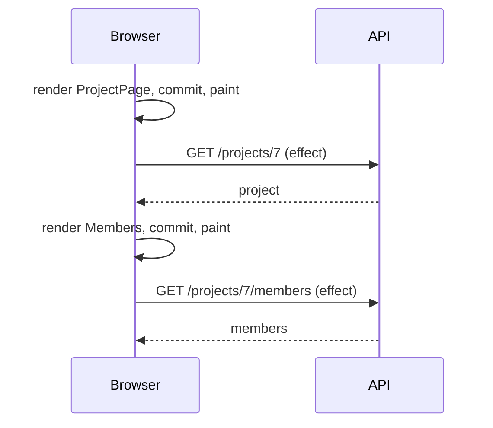
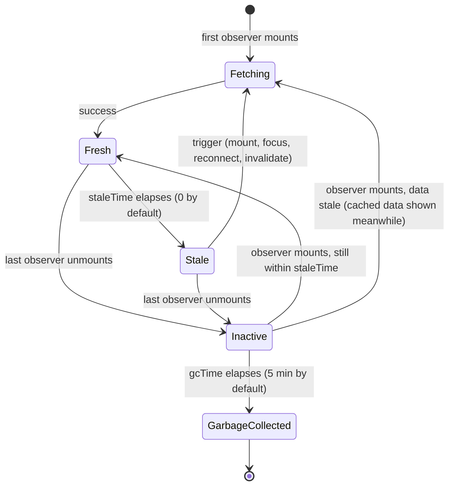
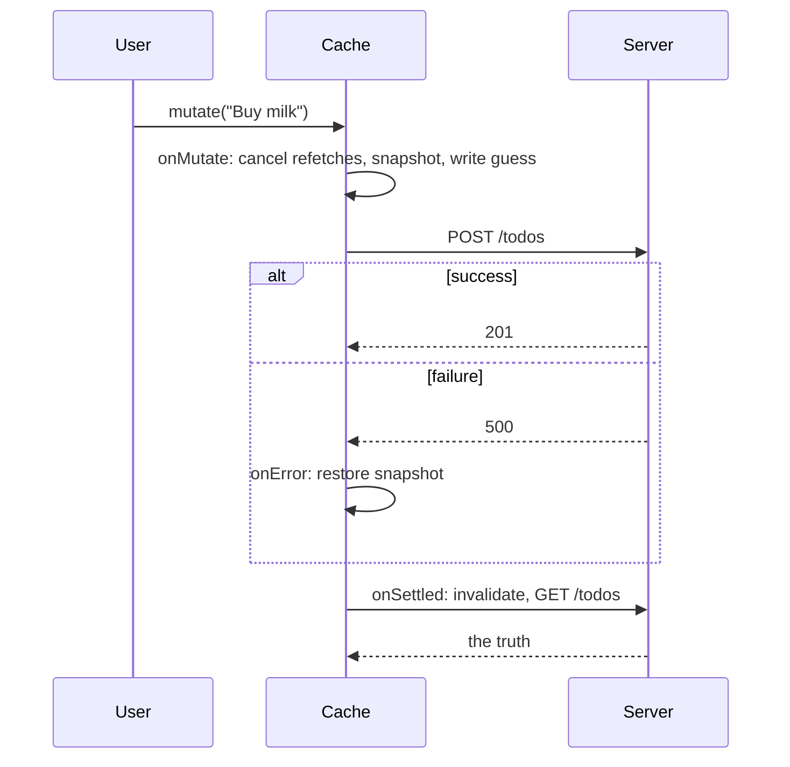

# 17 — Data fetching

> **How to use this module.** Sections 17.1–17.3 explain why hand-written fetching breaks down and give you the vocabulary (union states, server state) that most interview answers rest on. Sections 17.4–17.8 are TanStack Query in practice: keys, freshness, mutations, optimistic updates, pagination, prefetching. Sections 17.9–17.12 cover the alternatives and the internals: SWR, Suspense and `use`, real time, deduplication and cancellation. If you only have 20 minutes, read 17.3, 17.4, 17.6 and the Summary.

**Prerequisites:** [Race conditions and `AbortController`](09-effects.md#94-race-conditions-and-abortcontroller) · [`useFetch`](12-hooks-and-custom-hooks.md#126-usefetch) · [Discriminated unions](02-typescript.md#27-discriminated-unions-and-exhaustiveness-with-never) · [`useOptimistic`](14-forms-and-actions.md#149-useoptimistic) · [`fetch` and `AbortController`](03-browser-and-web-platform.md#36-fetch-requestresponse-streaming-bodies-abortcontroller)

**Code for this module:** [`examples/web/src/m17-data-fetching/`](examples/web/src/m17-data-fetching/). Every component and hook has a test next to it, and the network is mocked with MSW 3 ([20](20-testing.md#206-msw-for-network-mocking)). Run them with `npx vitest run src/m17-data-fetching` from `examples/web`. Library versions are those in [VERSIONS.md](VERSIONS.md): `@tanstack/react-query` 5.104.1, React 19.3.

---

## 17.1 Fetching in effects and its pitfalls

### The problem
You already know how to fetch in an effect correctly: abort the old request in the cleanup, treat an abort as "superseded" rather than as an error, and derive the status from which request the answer belongs to ([09](09-effects.md#94-race-conditions-and-abortcontroller), [12](12-hooks-and-custom-hooks.md#126-usefetch)). That code is correct, and it is still not enough for a real app. Here is what it lacks:

| Pitfall | What the user sees | Why effects cause it |
|---|---|---|
| **Waterfalls** | Spinner, then a second spinner, then a third | A child can only start its fetch after it renders, and it only renders after the parent's fetch finished |
| **Races** | Results for the previous query | Responses arrive out of order; you must abort or ignore by hand |
| **No cache** | A spinner every time you navigate back | State dies with the component; nothing remembers the last answer |
| **No deduplication** | Two identical requests from two components | Each component owns its own effect |
| **No revalidation** | Data from an hour ago, until a reload | Nothing refetches on focus, on reconnect or on a timer |
| **Double fetch in development** | Two requests in the Network tab | Strict Mode runs setup → cleanup → setup (React 18+, dev only) |
| **No SSR** | An empty page until JavaScript runs | Effects never run on the server |

A waterfall in code:

```tsx
function ProjectPage({ id }: { id: string }) {
  const project = useFetch<Project>(`/api/projects/${id}`);   // request 1 starts after first commit
  if (project.status !== 'success') return <Spinner />;
  return <Members projectId={id} />;                           // request 2 can't start until 1 finished
}
```



The two requests are independent, yet the second waits for the first plus two render cycles.

### Mental model
An effect-based fetch is **fetch-on-render**: rendering a component is what starts its request. The alternatives are **fetch-then-render** (a router loader or a Server Component fetches everything a route needs before rendering it) and **render-as-you-fetch** (start the request as early as you know you need it, for example in the click handler or loader, and let components read the pending result through Suspense, 17.10).

> **Java/Spring analogy.** Fetching in every component's effect is like every Spring controller method calling `RestTemplate` directly: no `@Cacheable`, no connection reuse, no retry policy, duplicated error handling. A data library is the shared `@Service` with a cache and a retry template in front of it.
>
> **Where the analogy breaks:** a Spring cache is usually shared by all users on the server. A client-side query cache belongs to one browser tab and one user, and it must also decide when its copy has gone *stale* compared with a server it cannot observe.

### Minimal code
The correct hand-written versions are [`useSearch.ts`](examples/web/src/m09-effects/useSearch.ts) (09) and [`useFetch.ts`](examples/web/src/m12-hooks/useFetch.ts) (12). The TanStack Query equivalent of `useFetch(url)` is one call, and the cache key replaces the "which request does this answer belong to" bookkeeping:

```tsx
const user = useQuery({
  queryKey: ['user', id],
  queryFn: ({ signal }) => fetchJson<User>(`/api/users/${id}`, { signal }),
});
```

### How it works internally
The effect timeline explains the waterfall: render → commit → (usually) paint → passive effects ([09](09-effects.md#91-effects-as-synchronization-with-external-systems)). The request starts only in the last step, so every level of nesting adds one network round trip plus one render. A cache does not remove the first round trip, but it makes every later visit instant, and prefetching (17.8) or a loader ([19](19-routing.md#195-loaders-actions-usefetcher)) moves the start of the request earlier than render.

> **Version notes.** Class components fetched in `componentDidMount` and stored the result with `setState`, with exactly the same waterfall and race problems (plus a "setState on an unmounted component" warning that React 18.0 removed). With hooks (16.8) the same code moved to `useEffect(…, [])`. React 18 added the Strict Mode double effect in development, which made the missing cleanup visible. Since 2023 react.dev recommends a framework or a data library over raw effect fetching, and Create React App, whose tutorials popularized the pattern, was deprecated on 2025-02-14 ([VERSIONS.md](VERSIONS.md)).

### Trade-offs
- ✅ Effect fetching has no dependency and is fine for a one-off widget, a prototype or an interview whiteboard. Write it correctly (abort + derived status).
- ❌ In an app with more than a handful of screens you end up rebuilding a cache, deduplication, retries and revalidation by hand. Use TanStack Query, SWR, RTK Query ([18](18-state-management.md#187-rtk-query)) or a framework loader instead.

---

## 17.2 Loading/error/empty states as a union type

### The problem
Three booleans (`isLoading`, `isError`, `hasData`) allow eight combinations, and only four make sense. Code written against booleans shows a spinner *and* an error, or an empty list while the request is still in flight. "Empty" is the state most often forgotten: an empty `<ul>` renders as blank space, which the user reads as "broken".

### Mental model
Model the screen as a **discriminated union** [TS] ([02](02-typescript.md#27-discriminated-unions-and-exhaustiveness-with-never)): exactly one of `loading`, `error`, `empty`, `success`, each carrying only the data that state needs. A `switch` on the tag is exhaustive, so adding a state without handling it is a type error.

> **Java analogy.** A `sealed interface RemoteData<T> permits Loading, Failed, Empty, Loaded` with a pattern-matching `switch` (Java 21). The compiler tells you when a case is missing.
>
> **Where the analogy breaks:** TypeScript unions are structural and erased at runtime. Nothing stops a cast from producing an invalid object, so the union only protects code that goes through the type checker.

### Minimal code
[`remoteData.ts`](examples/web/src/m17-data-fetching/remoteData.ts) maps TanStack Query's three statuses onto the screen's four:

```ts
export type RemoteData<T> =
  | { kind: 'loading' }
  | { kind: 'error'; message: string }
  | { kind: 'empty' }
  | { kind: 'success'; data: T[] };

export function toRemoteData<T>(query: UseQueryResult<T[]>): RemoteData<T> {
  switch (query.status) {
    case 'pending':
      return { kind: 'loading' };
    case 'error':
      return { kind: 'error', message: query.error.message };
    case 'success':
      return query.data.length === 0 ? { kind: 'empty' } : { kind: 'success', data: query.data };
  }
}
```

[`TodoList.tsx`](examples/web/src/m17-data-fetching/TodoList.tsx) renders it with one exhaustive `switch`. [`TodoList.test.tsx`](examples/web/src/m17-data-fetching/TodoList.test.tsx) checks all three non-trivial states against MSW.

### How it works internally
`UseQueryResult` [Library: TanStack Query] is itself a union of result types discriminated by `status`, so inside `case 'success'` TypeScript knows `query.data` is `T[]` and inside `case 'error'` it knows `query.error` is an `Error` (v5 made `Error` the default error type; it was `unknown` in v4, per the [v5 migration guide](https://tanstack.com/query/latest/docs/framework/react/guides/migrating-to-v5)). Note the subtlety: `status: 'error'` can still carry `data` from an earlier success when a *background* refetch failed. The mapping above chooses to show the error; a screen that prefers to keep the stale data on screen with an error banner should check `query.data` first.

### Trade-offs
- ✅ Impossible states are unrepresentable, and empty becomes a designed state with its own message.
- ❌ It is one more mapping layer. For a single screen, switching directly on `query.status` is fine; the union pays off when several screens or a design-system component share it.
- The same union is what 09's `useSearch` and 12's `useFetch` return. Libraries hand you `status`; the "empty" decision is always yours.

---

## 17.3 Server state vs client state

### The problem
Teams put API responses into Redux or Context, then write code to keep that copy fresh: refetch after a mutation, clear on logout, poll, dedupe. That code is a home-made, buggy cache. It also mixes two kinds of state with different owners.

### Mental model
| | Client state | Server state |
|---|---|---|
| Owner | The browser tab | The server (and other users) |
| Examples | Is the modal open, the draft in a form, the selected tab, the theme | The todo list, the current user's profile, search results |
| Can it change without you? | No | Yes, at any time |
| Your copy is… | The truth | A **snapshot** that may already be out of date |
| Needs | `useState`, `useReducer`, URL, a small store | A cache with freshness, refetching, dedupe, invalidation |

The rule: **server data goes in a server-state cache** (TanStack Query, SWR, RTK Query, or a framework's loader cache); **client state goes in React state**, the URL ([19](19-routing.md#194-params-and-search-params)) or a small store ([18](18-state-management.md#181-a-taxonomy-local-server-url-form-global-ui)). Once you split them, most "global state" disappears.

> **Java/Spring analogy.** Server state is a Hibernate second-level cache entry: a local copy of rows the database owns, valid until evicted or expired. Client state is the HTTP session: data the server-side app itself owns.
>
> **Where the analogy breaks:** the database can tell Hibernate about changes made through the same `SessionFactory`. A browser cache hears about nothing unless you invalidate it after your own mutations or the server pushes events (17.11). Freshness is a guess (`staleTime`).

### Minimal code
Before, the Redux-thunk way (still common in codebases one or two majors behind):

```ts
// thunk: dispatch three actions by hand, store the payload in a slice
export const loadTodos = () => async (dispatch: AppDispatch) => {
  dispatch({ type: 'todos/loading' });
  try {
    dispatch({ type: 'todos/loaded', payload: await fetchTodos() });
  } catch (e) {
    dispatch({ type: 'todos/failed', error: String(e) });
  }
};
// component: useEffect(() => { dispatch(loadTodos()); }, [dispatch]);
```

After:

```tsx
const todos = useQuery(todosQuery()); // cached, deduped, refetched on focus, shared by key
```

### How it works internally
A server-state library keeps one cache entry per **key** outside React (17.4). Components subscribe to entries; the library decides when to refetch based on freshness and events (mount, window focus, reconnect, invalidation). Your components never copy server data into `useState`. They read it from the cache on every render.

### Trade-offs
- ✅ Removes reducers, action types and "refetch after save" code; fixes stale-data bugs by construction.
- ❌ A second state system to learn. Keep client state out of the query cache (no `setQueryData` for a modal flag).
- If the app already uses Redux Toolkit, **RTK Query** gives the same model inside Redux ([18](18-state-management.md#187-rtk-query)). Thunks with `createAsyncThunk` ([18](18-state-management.md#185-thunks-and-createasyncthunk)) are fine for workflows, not for caching.

---

## 17.4 TanStack Query: query keys, `staleTime` vs `gcTime`

### The problem
A cache needs answers to three questions: *what* is this entry (identity), *is it still good enough to show without asking again* (freshness), and *when can I throw it away* (memory). Getting any of them wrong gives either stale screens or a request storm.

### Mental model
- **Query key** = the identity of the data, like a cache key or a REST URL. It is an array, and it must contain **every variable the query function uses**: `['todos', 'list', { status, page }]`.
- **`staleTime`** = how long fetched data counts as *fresh*. Fresh data is served from the cache with no request. Default **0**: data is stale immediately, so it is shown *and* revalidated in the background on the next trigger.
- **`gcTime`** = how long an *inactive* entry (no component observing it) survives before it is garbage collected. Default **5 minutes**. It does nothing while a component is using the query.



> **Java/Spring analogy.** Caffeine's `refreshAfterWrite` is `staleTime` (serve the old value, reload in the background), and `expireAfterAccess` is roughly `gcTime` (evict when nobody uses it).
>
> **Where the analogy breaks:** `gcTime` only starts counting when the *last component stops observing* the entry, not after the last read, and a stale entry is never refused: stale data is still shown while the refetch runs.

### Minimal code
One client per app, created once (module scope or `useState(() => new QueryClient())`, never in the render body):

```tsx
const queryClient = new QueryClient({
  defaultOptions: { queries: { staleTime: 60_000 } }, // a sane app-wide default
});

createRoot(el).render(
  <QueryClientProvider client={queryClient}>
    <App />
  </QueryClientProvider>,
);
```

Keys and functions live together in a factory, [`queries.ts`](examples/web/src/m17-data-fetching/queries.ts):

```ts
export const todoKeys = {
  all: ['todos'] as const,
  list: () => ['todos', 'list'] as const,
};

export function todosQuery() {
  return queryOptions({
    queryKey: todoKeys.list(),
    queryFn: ({ signal }) => fetchTodos(signal),
  });
}
```

`queryOptions` [Library: TanStack Query] tags the key with the data type, so `queryClient.getQueryData(todosQuery().queryKey)` is typed `Todo[] | undefined` without a generic argument.

The defaults, from [Important Defaults](https://tanstack.com/query/latest/docs/framework/react/guides/important-defaults):

| Option | Default | Effect |
|---|---|---|
| `staleTime` | `0` | Cached data is stale at once, so every new mount refetches in the background |
| `gcTime` | 5 minutes | Inactive entries are removed after 5 minutes |
| `retry` | `3` (client), `0` (server) | Failed queries retry with exponential backoff before showing an error |
| `refetchOnMount` / `refetchOnWindowFocus` / `refetchOnReconnect` | `true` | Stale queries refetch on these events |
| `structuralSharing` | `true` | Unchanged parts of new data keep their old object references |

`staleTime` also accepts `Infinity` (fresh until invalidated) and `'static'` (never refetched, even when invalidated), per the same page. Both are in the installed 5.104.1 typings (`type StaleTime = number | 'static'`).

**Two status fields.** `status` answers "do I have data?": `pending` (no data yet), `error`, `success`. `fetchStatus` answers "is the query function running?": `fetching`, `paused` (offline), `idle`. They are independent: `success` + `fetching` is a background refetch, `pending` + `paused` is a first load while offline, and `pending` + `idle` is a disabled query with no data. The derived flags are `isPending` (`status === 'pending'`), `isFetching` (`fetchStatus === 'fetching'`) and `isLoading` (`isPending && isFetching`, the first load).

### How it works internally
Read in `@tanstack/query-core@5.104.1`:
- The `QueryClient` holds a `QueryCache`, a map from **`queryHash`** to `Query`. `hashKey(queryKey)` is `JSON.stringify` with a replacer that **sorts the keys of plain objects** (`utils.js`). So `['todos', { a: 1, b: 2 }]` and `['todos', { b: 2, a: 1 }]` are the same entry, but `['todos', 1]` and `[1, 'todos']` are not.
- Each `useQuery` creates a `QueryObserver` and subscribes to it with React's **`useSyncExternalStore`** (`useBaseQuery.js`). That is why v5 requires React 18 ([migration guide](https://tanstack.com/query/latest/docs/framework/react/guides/migrating-to-v5)).
- Observer results are **tracked**: a component re-renders only when a property it actually read changes.
- Notifications are batched by `notifyManager`, which by default flushes with `setTimeout(callback, 0)` (`notifyManager.js`). This is why a test should `await findBy…` rather than assert synchronously after `setQueryData`.
- When the last observer unsubscribes, the query schedules its own removal after `gcTime`.

> **Version notes.** React Query **v3** accepted string keys and positional arguments: `useQuery('todos', fetchTodos, { cacheTime })`, and had an `idle` status for disabled queries. **v4** (2022) renamed the package to `@tanstack/react-query`, required array keys, and replaced `idle` with `fetchStatus` ([v4 migration](https://tanstack.com/query/latest/docs/framework/react/guides/migrating-to-react-query-4)). **v5** (current major) accepts **only the object form**, renamed `cacheTime` → `gcTime`, `status: 'loading'` → `'pending'`, `isLoading` → `isPending`, and reused the name `isLoading` for the old `isInitialLoading`. It also renamed `useErrorBoundary` → `throwOnError` and requires React 18 ([v5 migration](https://tanstack.com/query/latest/docs/framework/react/guides/migrating-to-v5)). A codemod handles the signature change.

### Trade-offs
- ✅ Pick `staleTime` per kind of data: seconds for a feed, minutes for reference data, `Infinity` for data you invalidate yourself. Most "it refetches too much" complaints are a `staleTime: 0` default nobody chose.
- ❌ A missing variable in the key is the number-one TanStack Query bug: two different requests share one cache entry. The ESLint plugin `@tanstack/eslint-plugin-query` has an `exhaustive-deps` rule for keys.
- `gcTime` rarely needs tuning. Raise it only if users come back after more than 5 minutes and you want an instant screen.

---

## 17.5 Invalidation and mutations

### The problem
After `POST /todos`, every cached list that contains todos is out of date. You need to tell the cache which entries the write affected, without hand-written "refetch the list, then the counter, then the sidebar" code.

### Mental model
A **mutation** is a write. It is not cached, it does not run on mount, and it does not retry by default. After it succeeds you do one of two things:
1. **Invalidate**: mark matching queries stale and refetch the ones on screen. Simple and always correct, at the cost of a request.
2. **Write the response into the cache** with `setQueryData`, when the server returns the updated entity. No extra request, but you must update every affected entry.

> **Java/Spring analogy.** `invalidateQueries({ queryKey: ['todos'] })` is `@CacheEvict(cacheNames = "todos", allEntries = true)`. `setQueryData` is `@CachePut`.
>
> **Where the analogy breaks:** invalidation here also *refetches* the active entries immediately, and keys match by **prefix**: `['todos']` matches `['todos', 'list']` and `['todos', 'detail', 7]`.

### Minimal code
```tsx
const queryClient = useQueryClient();
const addTodo = useMutation({
  mutationFn: createTodo,
  // Returning the promise keeps the mutation pending until the refetch finishes.
  onSuccess: () => queryClient.invalidateQueries({ queryKey: todoKeys.all }),
});

<button onClick={() => addTodo.mutate('Buy milk')} disabled={addTodo.isPending}>Add</button>
```

Writing the response instead:

```tsx
onSuccess: (updated) => {
  queryClient.setQueryData(todoKeys.detail(updated.id), updated);
  return queryClient.invalidateQueries({ queryKey: todoKeys.list() }); // lists may re-sort
},
```

### How it works internally
From [Query Invalidation](https://tanstack.com/query/latest/docs/framework/react/guides/query-invalidation): `invalidateQueries` marks every matching query stale, overriding `staleTime`, and refetches those currently rendered by `useQuery`. Inactive matches are refetched the next time they are used. `useMutation` creates a `MutationObserver`; the mutation's `status` is `idle | pending | success | error`. Callbacks run in the order `onMutate` → `mutationFn` → `onSuccess`/`onError` → `onSettled`, and a returned promise is awaited before the next step (5.104.1 typings). Mutations default to `retry: 0` (same typings).

`mutate(variables, { onSuccess })` also accepts per-call callbacks, but per the [mutations guide](https://tanstack.com/query/latest/docs/framework/react/guides/mutations) they **won't run if the component unmounts before the mutation finishes**. Put cache logic in `useMutation`'s callbacks and UI-only reactions (close the dialog, navigate) in `mutate`'s. `mutateAsync` returns a promise instead; you must catch its rejection yourself.

> **Version notes.** In v5, `onSuccess`/`onError`/`onSettled` were **removed from `useQuery`** (they remain on mutations); the RFC argued they encouraged syncing server data into local state and fired once per observer ([v5 migration](https://tanstack.com/query/latest/docs/framework/react/guides/migrating-to-v5)). Replacements: derive from `data` during render, show errors from `error`, or use the global `QueryCache({ onError })` for toasts. Mutation callbacks in 5.104.1 receive `(…, onMutateResult, context)`, where `context` holds the `client`, `meta` and `mutationKey`.

### Trade-offs
- ✅ Invalidate by default; it cannot leave the cache wrong.
- ✅ Use `setQueryData` from the response when the refetch is expensive or the list is huge.
- ❌ Do not invalidate the whole cache (`invalidateQueries()` with no filter) after every write; it refetches everything on screen.

---

## 17.6 Optimistic updates

### The problem
A to-do that appears 400 ms after you press Enter feels broken. Showing it immediately means displaying something the server has not confirmed, and undoing it correctly if the server says no.

### Mental model
There are two ways to do it with TanStack Query, plus React's own:

| Approach | Where the guess lives | Rollback | Best when |
|---|---|---|---|
| **Via the UI**: render `mutation.variables` while `isPending` | Only in the component that called `mutate` | Automatic: the guess disappears when the mutation ends | One place shows the pending item |
| **Via the cache**: `onMutate` writes into the cache | In the shared cache, so every observer sees it | Manual: restore a snapshot in `onError` | Several components show the same list |
| **`useOptimistic`** ([14](14-forms-and-actions.md#149-useoptimistic)) | React state, scoped to an Action | Automatic, when the Action ends | Actions-based forms without a query cache |



> **Java analogy.** Optimistic locking in JPA (`@Version`): proceed as if there is no conflict and handle the failure when it happens.
>
> **Where the analogy breaks:** JPA detects the conflict before commit. Here the UI has *already shown* the change, so failure handling is a visible undo and must explain itself to the user.

### Minimal code
Via the cache, from [`OptimisticTodos.tsx`](examples/web/src/m17-data-fetching/OptimisticTodos.tsx):

```tsx
useMutation({
  mutationFn: createTodo,
  onMutate: async (title: string) => {
    await queryClient.cancelQueries({ queryKey: listKey });           // 1. stop in-flight refetches
    const previous = queryClient.getQueryData(listKey);                // 2. snapshot
    queryClient.setQueryData(listKey, (old = []) => [...old, optimisticTodo(title)]); // 3. guess
    return { previous };                                               // 4. hand the snapshot on
  },
  onError: (_error, _title, onMutateResult) => {
    queryClient.setQueryData(listKey, onMutateResult?.previous);       // 5. roll back
  },
  onSettled: () => queryClient.invalidateQueries({ queryKey: todoKeys.all }), // 6. resync
});
```

Via the UI, the v5 "simplified" form from the [v5 migration guide](https://tanstack.com/query/latest/docs/framework/react/guides/migrating-to-v5):

```tsx
const addTodo = useMutation({
  mutationFn: createTodo,
  onSettled: () => queryClient.invalidateQueries({ queryKey: todoKeys.all }),
});
// in the list:
{addTodo.isPending && <li className="pending">{addTodo.variables}</li>}
{addTodo.isError && <li role="alert">Could not add "{addTodo.variables}"</li>}
```

### How it works internally
`onMutate` runs and is awaited **before** `mutationFn`, and its return value reaches `onSuccess`, `onError` and `onSettled` as `onMutateResult` (5.104.1 typings; this argument was called `context` in earlier v5 releases and in v4). `cancelQueries` aborts a refetch that would otherwise land after your write and overwrite the guess, and reverts that query to its previous state ([Query Cancellation](https://tanstack.com/query/latest/docs/framework/react/guides/query-cancellation)). Returning the `invalidateQueries` promise from `onSettled` keeps `isPending` true until the fresh list is in the cache, so the UI never flashes the snapshot between "POST done" and "GET done".

### Trade-offs
- ✅ Instant feedback for cheap, usually-successful actions: add, toggle, rename, reorder, like.
- ❌ Not for payments, irreversible actions or anything the server often rejects. Show a pending state instead.
- ❌ Overlapping mutations: if mutation A settles and invalidates while B is still pending, the refetch can briefly remove B's optimistic row. Options: give the mutations a shared `scope: { id }` so they run serially (5.104.1 typings: "Mutations sharing the same `scope.id` run serially"), or only invalidate when no other mutation with the same key is pending (`queryClient.isMutating({ mutationKey }) === 1`).

> The `isMutating(...) === 1` guard is a community pattern (TkDodo's blog), not a documented guarantee. It works because `isMutating` counts mutations whose status is `'pending'` ([QueryClient reference](https://tanstack.com/query/v5/docs/reference/QueryClient)), and the mutation runs its own `onSuccess` and `onSettled` *before* it dispatches `success` ([mutation.ts](https://github.com/TanStack/query/blob/main/packages/query-core/src/mutation.ts)), so inside `onSettled` it still counts itself. That is an implementation detail: re-check it when you upgrade.

---

## 17.7 Pagination and infinite queries

### The problem
Changing page changes the query key, which is a *new* cache entry with no data, so a naive pager drops back to a full loading state on every click, and the list jumps. Infinite feeds have a different problem: many pages must live together and be refetched consistently.

### Mental model
- **Paginated (numbered pages)**: one cache entry per page, `['projects', { page }]`. Use `placeholderData: keepPreviousData` to keep showing the last page while the next loads. `isPlaceholderData` tells you that what is on screen belongs to the previous key.
- **Infinite (load more / scroll)**: one cache entry holding **all** loaded pages, `data.pages[]`, with the cursor for the next page computed from the last page by `getNextPageParam`.

Offset pagination (`?page=3`) is simple and allows jumping to a page, but it skips or duplicates rows when items are inserted while the user pages. Cursor pagination (`?after=abc`) is stable under inserts and is the right default for feeds. The backend side, including Spring's `Page` and `Slice`, is in [24](24-react-with-spring-boot.md#2410-pagination-contracts).

### Minimal code
Paginated, from [`ProjectsPager.tsx`](examples/web/src/m17-data-fetching/ProjectsPager.tsx) (Exercise 1):

```tsx
const query = useQuery({ ...projectsQuery(page), placeholderData: keepPreviousData });
const canGoNext = !query.isPlaceholderData && query.data.hasMore; // (after the pending/error guards)
```

Infinite, from [`InfiniteFeed.tsx`](examples/web/src/m17-data-fetching/InfiniteFeed.tsx) (Exercise 3):

```tsx
const feed = useInfiniteQuery({
  queryKey: ['feed'],
  queryFn: ({ pageParam, signal }) => fetchFeed(pageParam, signal),
  initialPageParam: 0,
  getNextPageParam: (lastPage) => lastPage.nextCursor, // null => hasNextPage === false
});
```

For infinite *scroll*, put a sentinel element after the last item and call `fetchNextPage()` when it intersects ([12](12-hooks-and-custom-hooks.md#1210-useintersectionobserver)). For very long lists, virtualize ([15](15-performance.md#158-virtualization)).

### How it works internally
`keepPreviousData` is just an exported identity function, `(previousData) => previousData` (5.104.1 typings and [v5 migration](https://tanstack.com/query/latest/docs/framework/react/guides/migrating-to-v5)). `placeholderData` can be a function of the previous key's data, and the observer computes it during render, so the placeholder appears in the same render as the key change. Placeholder data is never written to the cache.

For infinite queries, per the [infinite queries guide](https://tanstack.com/query/latest/docs/framework/react/guides/infinite-queries), a stale infinite query is refetched **page by page, sequentially, from the first page**, so cursors computed from fresh data are never mixed with stale ones. `maxPages` limits how many pages are kept (and refetched); with it you also need `getPreviousPageParam` to scroll back.

> **Version notes.** v3/v4 had a `keepPreviousData: true` option and an `isPreviousData` flag. v5 removed both in favor of `placeholderData: keepPreviousData` and `isPlaceholderData`. Two behavior differences: `placeholderData` always reports `status: 'success'`, and `dataUpdatedAt` stays `0` while the placeholder is shown. Infinite queries now **require** `initialPageParam`, manual mode (passing `pageParam` to `fetchNextPage`) was removed, `refetchPage` was replaced by `maxPages`, and `getNextPageParam` may return `null` as well as `undefined` to mean "no more pages" ([v5 migration](https://tanstack.com/query/latest/docs/framework/react/guides/migrating-to-v5)).

### Trade-offs
- ✅ Numbered pages for admin tables (users need "page 7 of 20"); infinite queries for feeds.
- ❌ An infinite query with 40 loaded pages refetches 40 requests on window focus. Set `maxPages`, a higher `staleTime`, or both.
- ❌ Keep page and filters in the **URL** ([19](19-routing.md#194-params-and-search-params)), not only in `useState`, so Back and shared links work.

---

## 17.8 Prefetching and dependent queries

### The problem
Some requests can start *before* a component renders (the user hovers a link, a route is about to load). Others genuinely cannot start until another one finishes (you need the user's id before fetching their projects). The first group should be prefetched; the second should be made explicit, and flattened when the API allows.

### Mental model
- **Prefetch** = put data in the cache early, so the component that later asks for the same key finds it fresh.
- **Dependent query** = a query that is disabled until its input exists. It is a waterfall by definition; the [dependent queries guide](https://tanstack.com/query/latest/docs/framework/react/guides/dependent-queries) recommends a backend endpoint that removes it when possible.

> **Java analogy.** Prefetching is cache warming at startup (`ApplicationReadyEvent` loading reference data). A dependent query is a `CompletableFuture.thenCompose`.
>
> **Where the analogy breaks:** a prefetch in the browser competes with the requests the user is waiting for and costs mobile data. Prefetch on intent (hover, focus, route transition), not "everything at startup".

### Minimal code
Prefetch on intent. In 5.104.1 the imperative `prefetchQuery`, `fetchQuery` and `ensureQueryData` are marked `@deprecated` in favor of `queryClient.query(...)` (checked in the installed typings; [prefetching guide](https://tanstack.com/query/latest/docs/framework/react/guides/prefetching)):

```tsx
function ProjectLink({ id }: { id: string }) {
  const queryClient = useQueryClient();
  const prefetch = () => {
    // Fetches only if the cached data is older than staleTime; errors are non-critical here.
    void queryClient.query({ ...projectQuery(id), staleTime: 60_000 }).catch(noop);
  };
  return <Link to={`/projects/${id}`} onMouseEnter={prefetch} onFocus={prefetch}>Open</Link>;
}
```

In a router, prefetch in the **loader** so the request starts with navigation instead of after render ([19](19-routing.md#195-loaders-actions-usefetcher)), then read it with `useQuery` in the component.

Dependent query:

```tsx
const user = useQuery(userByEmailQuery(email));
const projects = useQuery({
  queryKey: ['projects', { userId: user.data?.id }],
  queryFn: user.data ? () => fetchProjectsByUser(user.data.id) : skipToken, // type-safe "disabled"
});
```

`enabled: !!user.data` is the older, equally valid spelling; `skipToken` keeps `queryFn` correctly typed ([disabling queries](https://tanstack.com/query/latest/docs/framework/react/guides/disabling-queries)). Parallel independent queries need nothing special: two `useQuery` calls run in parallel. For a dynamic number of them, use `useQueries`.

### How it works internally
A prefetch creates (or reuses) the cache entry for that key and runs its query function without an observer. If nothing observes the entry, it is garbage collected after `gcTime`. When the component later mounts with the same key, the observer finds data that is fresh if it is younger than *the component's* `staleTime`. That is why the docs recommend a non-zero `staleTime` on both sides. A disabled query (`enabled: false` or `skipToken`) with no data sits in `status: 'pending'`, `fetchStatus: 'idle'`, so `isPending` is `true` but `isLoading` is `false`.

### Trade-offs
- ✅ Prefetch on hover/focus or in loaders; it is the cheapest perceived-performance win in data-heavy apps.
- ❌ Prefetching without `staleTime` refetches on mount anyway, so you paid twice.
- ❌ Dependent chains of three or more are an API design smell. Ask for a combined endpoint, or move the work to the server (Server Components, a BFF).

---

## 17.9 SWR comparison

### The problem
Interviewers ask "TanStack Query or SWR?" to see whether you choose libraries by features you need or by popularity.

### Mental model
Both implement **stale-while-revalidate** (the HTTP `Cache-Control` directive, RFC 5861): show the cached value, revalidate in the background, swap in the new one. SWR [Library: swr] is smaller and key-centric (`useSWR(key, fetcher)`, where the key is usually the URL). TanStack Query is larger and cache-centric, with mutations, infinite queries, garbage collection, devtools and a framework-agnostic core.

| | SWR 2.x | TanStack Query 5 |
|---|---|---|
| Basic call | `useSWR('/api/todos', fetcher)` | `useQuery({ queryKey: ['todos'], queryFn })` |
| Dedup window | `dedupingInterval` 2 s | Dedup of in-flight requests per key; freshness by `staleTime` |
| Focus revalidation | On, throttled (`focusThrottleInterval` 5 s) | On for stale queries |
| Writes | `mutate(key, data)`, `useSWRMutation` | `useMutation`, invalidation by key prefix |
| Optimistic | `mutate(key, updater, { optimisticData, rollbackOnError })` | `onMutate` + rollback, or `variables` |
| Infinite | `useSWRInfinite` | `useInfiniteQuery` |
| Garbage collection | None by default (cache lives for the session) | `gcTime` |
| Devtools | Community | Official |
| Size | Smaller | Larger |

The SWR defaults above (`dedupingInterval: 2 * 1000`, `focusThrottleInterval: 5 * 1000`, `revalidateOnFocus: true`) were read from `src/_internal/utils/config.ts` on SWR's `main` branch. SWR is not installed in `examples/web`, so this section has no runnable code.

> **Java analogy.** SWR is a `ConcurrentHashMap` with a refresh thread; TanStack Query is Caffeine plus Spring's cache abstraction.
>
> **Where the analogy breaks:** both run in one tab, in one user's browser, so "eviction" matters far less than freshness and request timing.

### Minimal code
```tsx
import useSWR from 'swr';

const fetcher = (url: string) => fetch(url).then((r) => {
  if (!r.ok) throw new Error(`HTTP ${r.status}`);
  return r.json() as Promise<Todo[]>;
});

function Todos() {
  const { data, error, isLoading } = useSWR('/api/todos', fetcher);
  if (isLoading) return <p role="status">Loading…</p>;
  if (error) return <p role="alert">{String(error)}</p>;
  return <ul>{data?.map((t) => <li key={t.id}>{t.title}</li>)}</ul>;
}
```

### How it works internally
SWR keeps a global cache keyed by the serialized key, and it dedupes requests for the same key that start within `dedupingInterval`. Revalidation triggers are mount, focus, reconnect and an optional `refreshInterval`.

> Sources for the table: the SWR 2.0 announcement lists `useSWRMutation`, the `optimisticData`/`populateCache`/`revalidate`/`rollbackOnError` options, and SWRDevTools, a community browser extension ([SWR 2.0](https://swr.vercel.app/blog/swr-v2)). The default cache provider "is an empty `Map`", and the cache docs describe no eviction policy, which is what "none by default" means ([Cache](https://swr.vercel.app/docs/advanced/cache)). You can pass your own provider to get eviction.

### Trade-offs
- ✅ SWR for read-mostly apps, especially on Next.js where it originated, when bundle size matters and writes are simple.
- ✅ TanStack Query for apps with many mutations, optimistic updates, pagination, offline handling or several frameworks.
- In an interview, say you would pick one per codebase and never both.

---

## 17.10 Suspense-based fetching and `use`

### The problem
With `useQuery`, every component handles `pending` and `error` itself, so loading UI is scattered and nested components show cascading spinners. Suspense moves "loading" to a boundary above, the way an error boundary handles "error" ([16](16-error-handling.md#162-error-boundaries)), and lets you choose where the loading UI appears.

### Mental model
A component that needs data that isn't ready **suspends**: React stops rendering it, shows the nearest `<Suspense fallback>`, and retries when the data resolves. Inside the component, the data is simply *there*: `data` is never `undefined`. Rejections go to the nearest error boundary.

> **Java analogy.** A blocking call (`future.get()`) in straight-line code, with the framework showing a loading page while the thread waits.
>
> **Where the analogy breaks:** nothing blocks. React throws away the partial render and re-renders from scratch when the promise settles, so render must be pure and the promise must be the **same object** on the next render.

### Minimal code
With TanStack Query, from [`SuspenseTodos.tsx`](examples/web/src/m17-data-fetching/SuspenseTodos.tsx):

```tsx
function TodoTitles() {
  const { data } = useSuspenseQuery(todosQuery()); // data: Todo[], never undefined
  return <ul>{data.map((t) => <li key={t.id}>{t.title}</li>)}</ul>;
}

<QueryErrorResetBoundary>
  {({ reset }) => (
    <ErrorBoundary onReset={reset} fallbackRender={/* message + "Try again" */}>
      <Suspense fallback={<p role="status">Loading todos…</p>}>
        <TodoTitles />
      </Suspense>
    </ErrorBoundary>
  )}
</QueryErrorResetBoundary>
```

With plain React 19 `use(promise)` [React], from [`UseTodos.tsx`](examples/web/src/m17-data-fetching/UseTodos.tsx). The promise comes from a cache so that every render passes the same object:

```tsx
function TodoTitles({ todosPromise }: { todosPromise: Promise<Todo[]> }) {
  const todos = use(todosPromise);
  return <ul>{todos.map((t) => <li key={t.id}>{t.title}</li>)}</ul>;
}

<Suspense fallback={<p role="status">Loading todos…</p>}>
  <TodoTitles todosPromise={getTodosPromise()} />
</Suspense>
```

In a Server Components app, the usual source of that promise is a Server Component that starts the fetch and passes the promise down to a Client Component ([21](21-concurrent-ssr-server-components.md#214-suspense-in-depth)).

### How it works internally
`use` reads a promise during render. From the [`use` reference](https://react.dev/reference/react/use): the promise "must be cached so that the same instance is reused across re-renders", `use` cannot be called inside `try`/`catch`, and a promise passed from a Server Component must resolve to a serializable value. A promise created during render in a Client Component makes React log (string found in `react-dom@19.3.0`'s development build): *"A component was suspended by an uncached promise. Creating promises inside a Client Component or hook is not yet supported, except via a Suspense-compatible library or framework."*

`useSuspenseQuery` is `useQuery` that throws the query's promise while pending and throws the error when there is no data to show. Its options exclude `enabled`, `placeholderData` and `throwOnError`, and per its JSDoc in 5.104.1, **several `useSuspenseQuery` calls in one component suspend serially** (a waterfall): use `useSuspenseQueries` for more than one. `QueryErrorResetBoundary` clears the errored queries when the error boundary resets, so the retry actually refetches.

> **Version notes.** React 16.6 (2018) shipped `<Suspense>` for `React.lazy` code splitting only. "Suspense for data fetching" stayed **experimental** through React 16, 17 and 18: libraries such as Relay and React Query's `suspense: true` flag threw promises using undocumented behavior. React 18 made Suspense work with streaming SSR and transitions. React **19.0** added `use(promise)` as the public, stable way to read a promise. TanStack Query **v5** removed the experimental `suspense: true` flag and added the dedicated `useSuspenseQuery`, `useSuspenseInfiniteQuery` and `useSuspenseQueries` hooks, which the [v5 migration guide](https://tanstack.com/query/latest/docs/framework/react/guides/migrating-to-v5) calls the point where Suspense for data fetching "finally becomes stable". Some 5.x documentation also described an experimental `useQuery().promise` with `experimental_prefetchInRender`; neither name appears in the installed 5.104.1 typings, so do not rely on them.

### Trade-offs
- ✅ Loading and error UI live at boundaries you design; components get non-optional data and become simpler.
- ✅ With Server Components, start fetches on the server and stream ([21](21-concurrent-ssr-server-components.md#214-suspense-in-depth)).
- ❌ Hand-rolled `use(promise)` caches have no invalidation, no refetch and keep rejected promises forever ([`UseTodos.tsx`](examples/web/src/m17-data-fetching/UseTodos.tsx) needs a manual `clearTodosPromiseCache`). Use a library or framework for the cache.
- ❌ A new key re-suspends and replaces the content with the fallback. Wrap the key change in `startTransition` ([21](21-concurrent-ssr-server-components.md#212-usetransition-and-starttransition)) to keep the old content visible.

> **Testing trap (found by running this repo's test).** [React] [Library: @testing-library/react] A component that suspends on a promise during the first render must be rendered inside an **awaited async `act`**: `await act(async () => render(<UseTodos />))`. RTL's plain `render` wraps it in a synchronous `act`, and React 19.3 then never retries the suspended component. Its dev build logs *"A component suspended inside an `act` scope, but the `act` call was not awaited. When testing React components that depend on asynchronous data, you must await the result"*, and `findByText` times out even though the promise resolved. [`UseTodos.test.tsx`](examples/web/src/m17-data-fetching/UseTodos.test.tsx) shows the fix. By contrast, [`SuspenseTodos.test.tsx`](examples/web/src/m17-data-fetching/SuspenseTodos.test.tsx) (`useSuspenseQuery`) passes with plain `render`. Why the query cache avoids the trap was not investigated ([20](20-testing.md#205-async-utilities-and-act)).

---

## 17.11 Real-time: WebSockets and SSE, plus cache integration

### The problem
Some data changes on the server while the user watches: chat, notifications, job progress, a shared board. Refetching on focus is too slow, and a push channel that writes into its own `useState` creates a second copy of server state that disagrees with the query cache.

### Mental model
Choose the transport by direction and infrastructure:

| | Polling (`refetchInterval`) | Server-Sent Events | WebSocket |
|---|---|---|---|
| Direction | Client asks | Server → client | Both ways |
| Protocol | Plain HTTP | HTTP, `text/event-stream` | Upgraded TCP connection |
| Reconnect | Not needed | Built into `EventSource` | You write it |
| Through proxies / auth cookies | Trivial | Easy (it is HTTP) | Needs proxy support |
| Use for | Low-frequency status | Feeds, notifications, progress | Chat, collaboration, games |

Then integrate with the cache rather than beside it. A message that carries the **full new entity** is written with `setQueryData`. A message that only says **"X changed"** calls `invalidateQueries`, and the normal fetch path loads the truth.

> **Java/Spring analogy.** Spring's `SseEmitter` or STOMP over WebSocket on the server ([24](24-react-with-spring-boot.md#2412-real-time-websocketstomp-sse)); on the client, the push is a cache-eviction event, like a Redis keyspace notification that evicts a local cache entry.
>
> **Where the analogy breaks:** the browser can lose the connection silently (sleep, network change). After a reconnect you must assume you missed events and invalidate.

### Minimal code
[`useTodoEvents.ts`](examples/web/src/m17-data-fetching/useTodoEvents.ts):

```ts
export function useTodoEvents(url: string, connect: ConnectFn = connectEventSource): void {
  const queryClient = useQueryClient();

  useEffect(() => {
    const source = connect(url);
    source.onmessage = (event) => {
      const message = JSON.parse(event.data) as LiveMessage;
      if (message.type === 'todo-updated') {
        queryClient.setQueryData(todosQuery().queryKey, (old) =>
          old?.map((todo) => (todo.id === message.todo.id ? message.todo : todo)),
        );
        return;
      }
      void queryClient.invalidateQueries({ queryKey: todoKeys.all });
    };
    return () => source.close();
  }, [url, connect, queryClient]);
}
```

jsdom has no `EventSource`, so [`useTodoEvents.test.ts`](examples/web/src/m17-data-fetching/useTodoEvents.test.ts) injects a fake source and pushes messages into it.

Polling needs no transport code: `useQuery({ ...jobQuery(id), refetchInterval: (query) => query.state.data?.done ? false : 2000 })`. In v5 the `refetchInterval` callback receives only the `query` ([v5 migration](https://tanstack.com/query/latest/docs/framework/react/guides/migrating-to-v5)).

### How it works internally
The effect is a textbook synchronization ([09](09-effects.md#91-effects-as-synchronization-with-external-systems)): open on mount, close in cleanup, reconnect when `url` changes. `connect` is a dependency, which is why the default is a module-level function (stable reference). Writing with `setQueryData` notifies every observer of that key; invalidating marks the queries stale and refetches the active ones. For a WebSocket, the same hook shape works with `socket.onmessage`; add reconnection with backoff and, after each reconnect, invalidate the affected keys.

> **Version notes.** MSW 3 renamed its WebSocket event `connection` → `websocket:connection` ([VERSIONS.md](VERSIONS.md)), which matters if your tests mock sockets with MSW rather than with an injected fake.

### Trade-offs
- ✅ SSE is the simplest correct choice for server → client updates; it reconnects by itself and goes through ordinary HTTP infrastructure.
- ✅ "Invalidate on message" is robust: messages can be tiny, and a missed message is fixed by the next refetch.
- ❌ Writing payloads straight into the cache is faster, but now the push format must match the query's data shape, and a list may need re-sorting or filtering that only the server knows.
- ❌ One connection per component is wasteful. Open one connection per app (in a provider) and fan messages out to the cache.

---

## 17.12 Request deduplication, retries, cancellation

### The problem
Three components on a page ask for the current user; a request fails because of a flaky network; the user types fast and abandons ten searches. Without deduplication you send three requests, without retries you show an error for a blip, and without cancellation you waste bandwidth on answers nobody will read.

### Mental model
- **Deduplication**: one in-flight request per key. Every observer of that key shares it.
- **Retries**: failed *queries* are retried with exponential backoff; *mutations* are not (writes may not be idempotent).
- **Cancellation**: TanStack Query gives every query function an `AbortSignal`. If you pass it to `fetch`, a query that becomes unused or out of date is actually aborted.

> **Java/Spring analogy.** Deduplication is request coalescing (Caffeine's `AsyncLoadingCache` returns the same `CompletableFuture` to concurrent callers). Retries are Spring Retry's `@Retryable` with `@Backoff(multiplier = 2)`. Cancellation is `Future.cancel(true)`.
>
> **Where the analogy breaks:** `@Retryable` is opt-in per method. Here retries are **on by default** for every query, which surprises people in tests and for 4xx errors.

### Minimal code
```ts
const client = new QueryClient({
  defaultOptions: {
    queries: {
      // Don't retry client errors: a 404 will still be a 404 in two seconds.
      retry: (failureCount, error) =>
        !(error instanceof HttpError && error.status < 500) && failureCount < 3,
    },
  },
});

useQuery({
  queryKey: ['search', q],
  queryFn: ({ signal }) => fetchJson<string[]>(`/api/search?q=${encodeURIComponent(q)}`, { signal }),
});
```

The `HttpError` class is in [`api.ts`](examples/web/src/m17-data-fetching/api.ts). Exercise 4, test C, shows two components on one key producing one request.

### How it works internally
- **Dedupe**: when an observer mounts and the query is already fetching, `fetch()` returns the existing promise instead of starting a new one. This also makes Strict Mode's double mount send **one** request, unlike a raw effect.
- **Retries**: default `retry: 3` and `retryDelay: (attemptIndex) => Math.min(1000 * 2 ** attemptIndex, 30000)`, so a failing query shows its error after roughly 1 + 2 + 4 = 7 seconds ([query retries](https://tanstack.com/query/latest/docs/framework/react/guides/query-retries)). On the server, `retry` defaults to 0 (v5). During retries, `failureCount` and `failureReason` are populated while `status` is still `pending`.
- **Cancellation**: per [Query Cancellation](https://tanstack.com/query/latest/docs/framework/react/guides/query-cancellation), queries that unmount before resolving are **not** cancelled by default; the result still lands in the cache. If you *consume* the `signal`, the request is aborted when the query becomes unused or out of date, and the query's state is reverted. `queryClient.cancelQueries({ queryKey })` cancels explicitly, which is what `onMutate` uses (17.6).
- **Network mode**: by default (`networkMode: 'online'`) a query that would start while offline is `paused` instead of failing. In v5 the online status starts as `true` and follows the `online`/`offline` events; it no longer reads `navigator.onLine` ([v5 migration](https://tanstack.com/query/latest/docs/framework/react/guides/migrating-to-v5)).

### Trade-offs
- ✅ Always pass `signal` to `fetch`; it costs nothing and frees the network on fast navigation.
- ✅ Keep retries for queries in production, skip them for 4xx, and set `retry: false` in tests.
- ❌ Aborting a request does not undo it on the server ([09](09-effects.md#94-race-conditions-and-abortcontroller)). Never "cancel" a mutation and assume nothing happened.

---

## Interview questions

**Q1. Why is fetching in `useEffect` discouraged for production apps, if it works?**
<details><summary>Answer</summary>

Because "works" means "works for one component once". It has no cache (a spinner on every revisit), no deduplication (two components, two requests), no revalidation, no retries, no SSR, races you must handle by hand, and it starts only after render, which creates waterfalls. **A strong answer adds:** you can still write the correct version (abort in cleanup, derived status, [09](09-effects.md#94-race-conditions-and-abortcontroller)), and you would use it for a one-off widget; for an app, use a server-state library or a framework loader.

</details>

**Q2. What is a request waterfall, and how do effects create one?**
<details><summary>Answer</summary>

A chain of requests that run one after another although they could run in parallel. With effects, a child's fetch starts only after the child renders, and the child renders only after the parent's data arrived, so each nesting level adds a round trip. **A strong answer adds:** fixes are hoisting both requests to the same level (parallel `useQuery`s or `useQueries`), prefetching in a loader or event handler, or fetching on the server. A *dependent* query (needs the first result) is a real waterfall and is best removed by a combined endpoint.

</details>

**Q3. Name three ways to avoid showing a stale response when fetching in an effect.**
<details><summary>Answer</summary>

(1) An `ignore` flag set in the cleanup. (2) `AbortController`, aborting in the cleanup and ignoring `AbortError` in the catch. (3) Storing the answer together with the request it answers and **deriving** the status during render, so a late answer for an old query is never shown. **A strong answer adds:** a query library makes this structural: the answer is stored under its own key, and the component reads only the current key's entry.

</details>

**Q4. Your effect fetches twice in development. Is that a bug, and how do you "fix" it?**
<details><summary>Answer</summary>

It is Strict Mode (React 18+, development only) running setup → cleanup → setup to check that the cleanup is correct. It is not a production behavior. The fix is a correct cleanup (abort), not a `useRef` "already fetched" guard, which hides real remount bugs. **A strong answer adds:** with TanStack Query you see one request, because the second mount joins the in-flight request for the same key.

</details>

**Q5. Why model loading/error/empty/success as a discriminated union instead of booleans?**
<details><summary>Answer</summary>

Booleans allow impossible combinations (loading *and* error), and nothing forces you to handle each case. A union allows exactly one state at a time, carries only the data that state has, and an exhaustive `switch` makes a missing case a type error. **A strong answer adds:** TanStack Query's result is already a union discriminated by `status`, so narrowing on `status === 'success'` makes `data` non-optional.

</details>

**Q6. Is an empty list a success or a separate state?**
<details><summary>Answer</summary>

Technically a success, but design it as its own state: an empty `<ul>` renders as blank space, which users read as "broken". Map `success` + `length === 0` to an `empty` variant with a helpful message and, ideally, an action ("Create your first project"). **A strong answer adds:** empty is a *UI* decision; the library cannot make it for you.

</details>

**Q7. Explain server state vs client state, with examples.**
<details><summary>Answer</summary>

Client state is owned by the tab: a modal flag, a form draft, the selected tab. Server state is owned by the server and can change without you: the todo list, the user profile. Your copy of server state is a snapshot that can be stale, so it needs caching, revalidation, deduplication and invalidation. **A strong answer adds:** after moving server state into a query library, most apps discover their "global store" was 80% cached API responses, and what remains fits in local state, the URL and a small store.

</details>

**Q8. Why not keep API responses in Redux or Context?**
<details><summary>Answer</summary>

You end up writing a cache by hand: loading/error flags per resource, refetch after mutations, deduping, expiry, clearing on logout. Context adds a re-render of every consumer on each update ([11](11-context.md#118-when-context-is-the-wrong-tool)). **A strong answer adds:** if the app is committed to Redux, RTK Query provides the server-state model inside it ([18](18-state-management.md#187-rtk-query)).

</details>

**Q9. What is a query key, and what must it contain?**
<details><summary>Answer</summary>

The identity of a cache entry: an array that is hashed deterministically. It must contain every variable the query function depends on (ids, filters, page), otherwise different requests share one entry and show each other's data. **A strong answer adds:** object keys are hashed with sorted keys, so property order inside objects doesn't matter but array order does; keys match by prefix for invalidation, which is why a key factory (`todoKeys.all`, `todoKeys.list(filters)`) is the common pattern.

</details>

**Q10. Explain `staleTime` vs `gcTime`.**
<details><summary>Answer</summary>

`staleTime` is how long data counts as fresh; fresh data is served with no request, stale data is served *and* refetched in the background on a trigger. Default 0. `gcTime` is how long an entry with no observers stays in memory before deletion. Default 5 minutes, and it does nothing while the query is in use. **A strong answer adds:** `gcTime` was called `cacheTime` before v5; the rename exists because almost everyone read `cacheTime` as "how long data is cached", which is `staleTime`'s job ([v5 migration](https://tanstack.com/query/latest/docs/framework/react/guides/migrating-to-v5)).

</details>

**Q11. Which TanStack Query defaults surprise people?**
<details><summary>Answer</summary>

`staleTime: 0` (every mount and window focus refetches), `retry: 3` with exponential backoff (errors appear after ~7 s, and tests time out), refetch on window focus (an "extra" request when you switch tabs), and a 5-minute `gcTime`. **A strong answer adds:** set an app-wide `staleTime` on the `QueryClient` deliberately, and `retry: false` in tests.

</details>

**Q12. `status` vs `fetchStatus`: give a combination that confuses people.**
<details><summary>Answer</summary>

`status` is about data (`pending | error | success`), `fetchStatus` about the query function (`fetching | paused | idle`). Confusing cases: `success` + `fetching` (background refetch, so don't show a full-page spinner); `pending` + `paused` (first load while offline, so `isLoading` is false); `pending` + `idle` (a disabled query with no data). **A strong answer adds:** use `isLoading` (`isPending && isFetching`) for "first load" spinners and `isFetching` for a subtle "refreshing" indicator.

</details>

**Q13. In v5, what are `isPending`, `isLoading` and `isFetching`, and what were they called in v4?**
<details><summary>Answer</summary>

`isPending`: no data yet (status `pending`); in v4 this was `isLoading` with status `'loading'`. `isLoading`: `isPending && isFetching`, the first load actually in progress; in v4 this was `isInitialLoading`. `isFetching`: the query function is running, including background refetches; unchanged. **A strong answer adds:** a disabled query is `isPending` forever, which is why migrating v4 `isLoading` to v5 `isLoading` blindly can hide spinners or show them forever.

</details>

**Q14. Two components mount with the same query key at the same time. How many requests?**
<details><summary>Answer</summary>

One. Both observers subscribe to the same cache entry, and the second observer's mount joins the in-flight fetch. When it resolves, both re-render. **A strong answer adds:** this is measured in Exercise 4, test C. The equivalent with two `useFetch` effects sends two requests.

</details>

**Q15. How does `invalidateQueries` work?**
<details><summary>Answer</summary>

It marks every query whose key starts with the given prefix as stale (overriding `staleTime`) and refetches the ones currently observed; inactive ones refetch next time they are used. It returns a promise that resolves when the refetches finish. **A strong answer adds:** return that promise from `onSuccess`/`onSettled` so the mutation stays pending until the cache is fresh, and options like `exact: true` or a `predicate` narrow the match.

</details>

**Q16. After a successful update, should you invalidate or write the response with `setQueryData`?**
<details><summary>Answer</summary>

Invalidate by default: one line, always correct. Write the response when the server returns the full updated entity and the refetch is expensive, but then you must update every entry that contains the entity (detail, lists, counts), and keep sorting and filtering consistent. **A strong answer adds:** a common hybrid writes the detail entry from the response and invalidates the lists.

</details>

**Q17. `mutate` vs `mutateAsync`, and callbacks on `useMutation` vs on `mutate`.**
<details><summary>Answer</summary>

`mutate` returns nothing and reports errors through state and callbacks; `mutateAsync` returns a promise you must `await` and `catch`. Callbacks on `useMutation` always run; callbacks passed to `mutate(vars, { … })` do **not** run if the component unmounted before the mutation finished ([mutations guide](https://tanstack.com/query/latest/docs/framework/react/guides/mutations)). **A strong answer adds:** put cache updates in `useMutation`, UI reactions (close dialog, navigate) in `mutate`.

</details>

**Q18. Why were `onSuccess`/`onError` removed from `useQuery` in v5, and what do you use instead?**
<details><summary>Answer</summary>

They encouraged copying query data into local state (a second source of truth), and they ran once per observer, not once per fetch, so a toast could fire three times. Instead: derive values from `data` during render, render errors from `error`, and use the `QueryCache`'s global `onError` for one toast per failed query. **A strong answer adds:** mutation callbacks were not removed ([v5 migration](https://tanstack.com/query/latest/docs/framework/react/guides/migrating-to-v5)).

</details>

**Q19. Walk through a cache-based optimistic update.**
<details><summary>Answer</summary>

In `onMutate`: cancel in-flight queries for the key, snapshot the current data, write the guessed data with `setQueryData`, and return the snapshot. In `onError`: restore the snapshot (it arrives as the third argument). In `onSettled`: invalidate the key to resync with the server, returning the promise. **A strong answer adds:** mark optimistic rows (a temporary id) so the UI can show "saving…", and explain the failure to the user, not only roll back (Exercise 2).

</details>

**Q20. Why call `cancelQueries` in `onMutate`?**
<details><summary>Answer</summary>

A refetch already in flight (window focus, an earlier invalidation) would land after your optimistic write and overwrite it with server data that doesn't include the change yet. Cancelling it, and reverting it to its previous state, protects the guess. **A strong answer adds:** `onMutate` is async and awaited before `mutationFn`, so you can `await` the cancellation.

</details>

**Q21. Optimistic UI via `variables` vs via the cache: when do you pick each?**
<details><summary>Answer</summary>

Via `variables`: render `mutation.variables` while `isPending`. There is no rollback code and it is ideal when the pending item appears in one place. Via the cache: every component observing the key sees the change, at the cost of snapshot and rollback logic. **A strong answer adds:** for several pending mutations shown elsewhere, `useMutationState` can read the variables of all pending mutations with a given key.

</details>

**Q22. `useOptimistic` or TanStack Query's optimistic update?**
<details><summary>Answer</summary>

`useOptimistic` ([14](14-forms-and-actions.md#149-useoptimistic)) is React state scoped to an Action: correct rollback by construction, but only the component that owns it sees the guess, and there is no cache. TanStack Query's version updates a shared cache. Pick by where the data lives: Actions + Server Functions → `useOptimistic`; query cache → `onMutate` or `variables`. **A strong answer adds:** the two compose: a mutation can be called from inside an Action.

</details>

**Q23. A paginated table flashes a spinner on every page change. Why, and how do you fix it in v4 and v5?**
<details><summary>Answer</summary>

Each page is a different key, so the new key has no data and the query goes back to `pending`. v4: `keepPreviousData: true`. v5: `placeholderData: keepPreviousData` and check `isPlaceholderData` (to dim the rows and disable "Next"). **A strong answer adds:** in v5 the placeholder reports `status: 'success'` and `dataUpdatedAt: 0`. Also prefetch the next page to remove the wait entirely.

</details>

**Q24. Offset or cursor pagination for an infinite feed?**
<details><summary>Answer</summary>

Cursor. With offsets, an item inserted at the top shifts every page, so the next page repeats the last item of the previous one (or skips one if an item is deleted). A cursor ("after id 1234") is stable under inserts and deletes. Offsets are fine for numbered admin tables where users jump to "page 7". **A strong answer adds:** in Spring, `Slice`/keyset queries are the cursor equivalent of `Page` ([24](24-react-with-spring-boot.md#2410-pagination-contracts)).

</details>

**Q25. How does `useInfiniteQuery` store data, and what happens when it refetches?**
<details><summary>Answer</summary>

One cache entry with `data.pages` (the page payloads) and `data.pageParams` (the params that produced them). `getNextPageParam(lastPage)` returns the next cursor, or `null`/`undefined` for none, which sets `hasNextPage` to false. When stale, it refetches **every loaded page sequentially from the first**, so cursors stay consistent ([infinite queries guide](https://tanstack.com/query/latest/docs/framework/react/guides/infinite-queries)). **A strong answer adds:** `maxPages` caps how many pages are stored and refetched.

</details>

**Q26. When and how do you prefetch?**
<details><summary>Answer</summary>

On intent: hover or focus of a link, the next page of a pager, or in a route loader so the request starts with navigation. In 5.104.1 the API is `queryClient.query({ …options, staleTime })` with `.catch(noop)`; `prefetchQuery` still works but is marked deprecated in the typings. **A strong answer adds:** give the prefetch and the `useQuery` a non-zero `staleTime`, or the component refetches on mount anyway.

</details>

**Q27. How do you write a dependent query, and what's the cost?**
<details><summary>Answer</summary>

Disable it until its input exists: `enabled: !!user` or, type-safe, `queryFn: user ? () => fetchProjects(user.id) : skipToken`. The cost is a waterfall: the second request cannot start until the first finished. **A strong answer adds:** a disabled query with no data is `isPending` but not `isLoading`; prefer a backend endpoint that removes the dependency.

</details>

**Q28. TanStack Query or SWR?**
<details><summary>Answer</summary>

Both implement stale-while-revalidate. SWR is smaller and simpler, good for read-mostly apps. TanStack Query has richer mutations, invalidation by key prefix, garbage collection, infinite queries with `maxPages`, official devtools and a framework-agnostic core. **A strong answer adds:** I choose by the write-side needs (optimistic updates, pagination, offline), and I don't mix them in one codebase.

</details>

**Q29. How does `use(promise)` work, and why must the promise be cached?**
<details><summary>Answer</summary>

During render, if the promise is pending, `use` suspends: React shows the nearest Suspense fallback and retries the render when the promise settles; a rejection goes to the nearest error boundary. Because React re-renders from scratch, a promise created during render would be a *new* pending promise every time, so it would suspend forever; React warns about "an uncached promise". **A strong answer adds:** in practice the promise comes from a Server Component, a framework loader or a library cache; `use` cannot be inside `try`/`catch` but can be called conditionally.

</details>

**Q30. `useSuspenseQuery` vs `useQuery`: what changes?**
<details><summary>Answer</summary>

`useSuspenseQuery`'s `data` is never `undefined`; loading is handled by `<Suspense>` and errors by an error boundary (with `QueryErrorResetBoundary` to retry). It has no `enabled` or `placeholderData`. **A strong answer adds:** two `useSuspenseQuery` calls in one component run serially (the first suspends before the second starts), so use `useSuspenseQueries`, or split them into sibling components.

</details>

**Q31. Was "Suspense for data fetching" usable before React 19?**
<details><summary>Answer</summary>

Only experimentally. React 16.6 shipped Suspense for `React.lazy`; data libraries (Relay, React Query's `suspense: true`, SWR's `suspense` option) threw promises using behavior React documented as unstable. React 18 integrated Suspense with streaming SSR and transitions. React 19 added `use(promise)` as the stable API, and TanStack Query v5 added stable `useSuspense*` hooks. **A strong answer adds:** legacy code may have a hand-written "resource" with `read()` that throws a promise; replace it with `use` or a library hook.

</details>

**Q32. WebSocket, SSE or polling, and how do pushed messages reach the cache?**
<details><summary>Answer</summary>

Polling for low-frequency status, SSE for one-way server → client streams (auto-reconnect, plain HTTP), WebSocket for two-way, high-frequency traffic. Messages update the query cache: `setQueryData` when they carry the full entity, `invalidateQueries` when they only signal a change. **A strong answer adds:** after a reconnect, invalidate, because you may have missed messages; keep one connection per app, not per component.

</details>

**Q33. How does TanStack Query cancel requests, and what if you ignore the `signal`?**
<details><summary>Answer</summary>

Each query function receives an `AbortSignal`. If you pass it to `fetch`, a query that becomes unused or out of date is aborted and its state reverted. If you ignore it, the request runs to completion and its result is still cached, which is the default and often fine. **A strong answer adds:** `cancelQueries` cancels explicitly; aborting never undoes a write on the server.

</details>

**Q34. What are the retry defaults, and why don't mutations retry?**
<details><summary>Answer</summary>

Queries: 3 retries, delay `min(1000 * 2^attempt, 30 s)`, 0 on the server. Mutations: 0 retries, because a write may not be idempotent; retrying a POST can create duplicates. **A strong answer adds:** use a `retry` function to skip 4xx errors, and an idempotency key on the server if you do retry writes.

</details>

**Q35. How do you test components that use TanStack Query?**
<details><summary>Answer</summary>

A **fresh `QueryClient` per test** (no cache leaks), `retry: false` (errors fail fast), a `QueryClientProvider` wrapper, MSW to mock the network at the `fetch` level, and `findBy…`/`waitFor` because updates are asynchronous ([20](20-testing.md#208-testing-with-context-routers-and-query-clients)). **A strong answer adds:** the docs suggest `gcTime: Infinity` under Jest to avoid "did not exit" timers ([testing guide](https://tanstack.com/query/latest/docs/framework/react/guides/testing)); this module's [`testUtils.tsx`](examples/web/src/m17-data-fetching/testUtils.tsx) does all of this.

</details>

**Q36. You inherit a Redux-thunk codebase that fetches in `componentDidMount`. How do you migrate?**
<details><summary>Answer</summary>

Incrementally, per resource. Add a `QueryClientProvider`, move one resource's fetch into a `queryOptions` factory, replace the `connect`/`mapStateToProps` read and the `componentDidMount` dispatch with `useQuery` (class components need a small function wrapper), replace the "refetch after save" thunks with mutations plus invalidation, then delete that slice's loading/error/data reducers. **A strong answer adds:** if the team wants to stay in Redux, RTK Query is the same model with less churn; either way, client state (UI flags) stays where it is.

</details>

---

## Coding exercises

### Exercise 1: Paginated list with TanStack Query

**Statement.** Build `ProjectsPager`, a list of projects from `GET /projects?page=N` (response `{ items, page, hasMore }`), with Previous/Next buttons. Requirements: a loading state on the very first load only; while another page loads, keep the previous rows visible and say "Loading page N…"; disable Next while loading and on the last page; going back to a page loaded within 30 seconds must not hit the network; show an error message if the request fails.

**Approach.**
1. Mental model: one cache entry per page. The "flash" problem is a new key with no data; the fix is placeholder data from the previous key.
2. Put key + function + `staleTime: 30_000` in a `projectsQuery(page)` factory.
3. `useQuery({ ...projectsQuery(page), placeholderData: keepPreviousData })`.
4. Guard `pending` and `error`, then render rows; use `isPlaceholderData` for the "Loading page N…" hint and to disable Next (the placeholder's `hasMore` belongs to the previous page).

<details><summary>Hints</summary>

- `keepPreviousData` is imported from `@tanstack/react-query`; it is not a boolean option in v5.
- After the `pending`/`error` guards, `query.data` is non-optional.
- A page in the cache and younger than `staleTime` renders synchronously with no request.

</details>

<details><summary>Solution</summary>

[`ProjectsPager.tsx`](examples/web/src/m17-data-fetching/ProjectsPager.tsx):

```tsx
// file: examples/web/src/m17-data-fetching/ProjectsPager.tsx
import { keepPreviousData, useQuery } from '@tanstack/react-query';
import { useState } from 'react';
import { projectsQuery } from './queries';

const FIRST_PAGE = 1;

/**
 * Offset pagination with TanStack Query. Every page is its own cache entry; while the next page
 * loads, `placeholderData: keepPreviousData` keeps showing the previous page instead of
 * dropping back to a loading screen.
 */
export function ProjectsPager() {
  const [page, setPage] = useState(FIRST_PAGE);
  const query = useQuery({ ...projectsQuery(page), placeholderData: keepPreviousData });

  if (query.status === 'pending') return <p role="status">Loading projects…</p>;
  if (query.status === 'error') return <p role="alert">Could not load projects: {query.error.message}</p>;

  // While isPlaceholderData is true, `data` is the PREVIOUS page, so its hasMore is not ours.
  const canGoNext = !query.isPlaceholderData && query.data.hasMore;

  return (
    <section aria-busy={query.isFetching}>
      <ul className={query.isPlaceholderData ? 'is-stale' : undefined}>
        {query.data.items.map((project) => (
          <li key={project.id}>{project.name}</li>
        ))}
      </ul>
      <p>Page {page}</p>
      {query.isPlaceholderData && <p role="status">Loading page {page}…</p>}
      <button onClick={() => setPage((p) => p - 1)} disabled={page === FIRST_PAGE}>
        Previous
      </button>
      <button onClick={() => setPage((p) => p + 1)} disabled={!canGoNext}>
        Next
      </button>
    </section>
  );
}
```

[`queries.ts`](examples/web/src/m17-data-fetching/queries.ts) (key factory, shared by every exercise):

```ts
// file: examples/web/src/m17-data-fetching/queries.ts
import { queryOptions } from '@tanstack/react-query';
import { fetchProjects, fetchTodos } from './api';

/**
 * Query keys live in one place. Keys are arrays, matched by prefix, so
 * `invalidateQueries({ queryKey: todoKeys.all })` hits every todo query.
 */
export const todoKeys = {
  all: ['todos'] as const,
  list: () => ['todos', 'list'] as const,
};

/**
 * `queryOptions` bundles key + function + options and tags the key with the data type, so
 * `queryClient.getQueryData(todosQuery().queryKey)` is typed `Todo[] | undefined` without a generic.
 */
export function todosQuery() {
  return queryOptions({
    queryKey: todoKeys.list(),
    queryFn: ({ signal }) => fetchTodos(signal),
  });
}

/** Each page is its own cache entry. 30 s of freshness makes "Previous" instant and free. */
export function projectsQuery(page: number) {
  return queryOptions({
    queryKey: ['projects', { page }] as const,
    queryFn: ({ signal }) => fetchProjects(page, signal),
    staleTime: 30_000,
  });
}
```

[`api.ts`](examples/web/src/m17-data-fetching/api.ts) (the fetch layer: types, `HttpError`, `fetchJson`):

```ts
// file: examples/web/src/m17-data-fetching/api.ts
// The fake backend every m17 example talks to. Tests answer these URLs with MSW.
export const API = 'https://api.example.test';

export type Todo = { id: string; title: string; done: boolean };
export type Project = { id: number; name: string };
export type ProjectPage = { items: Project[]; page: number; hasMore: boolean };
export type Post = { id: number; title: string };
export type FeedPage = { posts: Post[]; nextCursor: number | null };

/** `fetch` only rejects on network failure, so a 4xx/5xx is turned into a thrown error here. */
export class HttpError extends Error {
  readonly status: number;

  constructor(status: number) {
    super(`HTTP ${status}`);
    this.name = 'HttpError';
    this.status = status;
  }
}

/**
 * GETs (or sends) JSON and throws on a non-2xx status, which is what TanStack Query needs:
 * a query function must throw (or reject) for the query to enter the `error` state.
 * @param url - Absolute URL to request.
 * @param init - Optional fetch options, usually just the `signal` TanStack Query passes in.
 * @returns The parsed body. Unchecked cast: validate with Zod when the payload is not trusted.
 */
export async function fetchJson<T>(url: string, init?: RequestInit): Promise<T> {
  const res = await fetch(url, init);
  if (!res.ok) throw new HttpError(res.status);
  return (await res.json()) as T;
}

export function fetchTodos(signal?: AbortSignal): Promise<Todo[]> {
  return fetchJson<Todo[]>(`${API}/todos`, { signal });
}

export function createTodo(title: string): Promise<Todo> {
  return fetchJson<Todo>(`${API}/todos`, {
    method: 'POST',
    headers: { 'Content-Type': 'application/json' },
    body: JSON.stringify({ title }),
  });
}

export function fetchProjects(page: number, signal?: AbortSignal): Promise<ProjectPage> {
  return fetchJson<ProjectPage>(`${API}/projects?page=${page}`, { signal });
}

export function fetchFeed(cursor: number, signal?: AbortSignal): Promise<FeedPage> {
  return fetchJson<FeedPage>(`${API}/feed?cursor=${cursor}`, { signal });
}
```

</details>

**Walkthrough.** First render: no cache entry for page 1, so `status` is `pending` and the loading paragraph shows. When page 1 arrives, the list renders. Clicking Next changes `page` to 2; in that same render the observer has no data for `['projects', { page: 2 }]`, so it returns page 1's data as a placeholder with `isPlaceholderData: true` and `status: 'success'`. The heading already says "Page 2", the rows are page 1's, and Next is disabled. When page 2 arrives, `isPlaceholderData` turns false, and Next stays disabled because `hasMore` is false. Clicking Previous finds page 1 in the cache and fresh (younger than 30 s), so it renders immediately with no request, which the test proves by asserting the requested pages are exactly `[1, 2]`.

**Interviewer follow-ups.**
- "Make Next instant." Prefetch `projectsQuery(page + 1)` when the current page settles and `hasMore` is true, with `queryClient.query(...).catch(noop)` (17.8).
- "Keep the page in the URL." Read and write `?page=` with the router's search params ([19](19-routing.md#194-params-and-search-params)); the key then follows the URL.
- "What if the total count changes while paging?" That is the offset problem; switch to a cursor or show "N new items, refresh".
- "Why not `useState` for the previous page's data?" That is a second copy of server state; `placeholderData` reads the previous key from the cache.

**Tests.** [`ProjectsPager.test.tsx`](examples/web/src/m17-data-fetching/ProjectsPager.test.tsx): first-load state, the placeholder phase (page 2 label + page 1 rows + disabled Next), the swap to page 2, and "Previous" served from cache (requested pages `[1, 2]`).

---

### Exercise 2: Optimistic to-do

**Statement.** Build `OptimisticTodos`: a list from `GET /todos` and a form that `POST`s a new title. The new item must appear **immediately**, marked "(saving…)", before the server answers. On success it becomes a normal item. On failure it disappears and an alert says `Could not add "<title>"`. Other components reading the todo list must see the optimistic item too.

**Approach.**
1. Mental model: "other components must see it" means the guess goes into the **cache**, not into local state or `variables`.
2. `onMutate`: cancel in-flight list queries, snapshot, append a todo with a temporary id, return the snapshot.
3. `onError`: restore the snapshot. `onSettled`: invalidate and return the promise.
4. Render "(saving…)" for temporary ids; render the alert from `mutation.isError` and `mutation.variables`.

<details><summary>Hints</summary>

- `todosQuery().queryKey` is typed, so `getQueryData`/`setQueryData` need no generics.
- `setQueryData(key, (old = []) => [...old, item])` handles an empty cache.
- The third argument of `onError` is whatever `onMutate` returned (`onMutateResult` in 5.104.1).

</details>

<details><summary>Solution</summary>

[`OptimisticTodos.tsx`](examples/web/src/m17-data-fetching/OptimisticTodos.tsx):

```tsx
// file: examples/web/src/m17-data-fetching/OptimisticTodos.tsx
import { useMutation, useQuery, useQueryClient } from '@tanstack/react-query';
import { useId, useState, type SubmitEvent } from 'react';
import { createTodo, type Todo } from './api';
import { todoKeys, todosQuery } from './queries';

const TEMP_ID_PREFIX = 'temp-';
const listKey = todosQuery().queryKey;

/**
 * Builds the row shown before the server has assigned an id.
 * @param title - What the user typed.
 * @returns A todo whose id marks it as not yet saved.
 */
export function optimisticTodo(title: string): Todo {
  return { id: `${TEMP_ID_PREFIX}${title}`, title, done: false };
}

/**
 * The cache-based optimistic update: write the guess into the cache in onMutate, restore the
 * snapshot in onError, and refetch the truth in onSettled whatever happened.
 */
function useAddTodo() {
  const queryClient = useQueryClient();
  return useMutation({
    mutationFn: createTodo,
    onMutate: async (title: string) => {
      // A refetch already in flight would land after our write and erase the optimistic row.
      await queryClient.cancelQueries({ queryKey: listKey });
      const previous = queryClient.getQueryData(listKey);
      queryClient.setQueryData(listKey, (old = []) => [...old, optimisticTodo(title)]);
      return { previous };
    },
    onError: (_error, _title, onMutateResult) => {
      queryClient.setQueryData(listKey, onMutateResult?.previous);
    },
    // Returning the promise keeps the mutation pending until the list is fresh again.
    onSettled: () => queryClient.invalidateQueries({ queryKey: todoKeys.all }),
  });
}

export function OptimisticTodos() {
  const inputId = useId();
  const [title, setTitle] = useState('');
  const todos = useQuery(todosQuery());
  const addTodo = useAddTodo();

  function handleSubmit(e: SubmitEvent<HTMLFormElement>) {
    e.preventDefault();
    const trimmed = title.trim();
    if (!trimmed) return;
    addTodo.mutate(trimmed);
    setTitle('');
  }

  return (
    <section>
      <form onSubmit={handleSubmit}>
        <label htmlFor={inputId}>New todo</label>
        <input id={inputId} value={title} onChange={(e) => setTitle(e.target.value)} />
        <button type="submit">Add</button>
      </form>
      {addTodo.isError && <p role="alert">Could not add "{addTodo.variables}"</p>}
      {todos.status === 'pending' && <p role="status">Loading todos…</p>}
      {todos.status === 'error' && <p role="alert">Could not load todos: {todos.error.message}</p>}
      {todos.data && (
        <ul>
          {todos.data.map((todo) => (
            <li key={todo.id}>
              <span>{todo.title}</span>
              {todo.id.startsWith(TEMP_ID_PREFIX) && <span> (saving…)</span>}
            </li>
          ))}
        </ul>
      )}
    </section>
  );
}
```

</details>

**Walkthrough.** Submitting calls `mutate('Buy milk')`. `onMutate` runs first and is awaited: it cancels any list refetch, saves the current array, and writes `[…old, { id: 'temp-Buy milk', … }]`. Every observer of the list key re-renders with the extra row, marked "(saving…)". The POST takes 150 ms in the test. On success, `onSettled` invalidates `['todos']`; the GET returns the server's list, whose new item has a real id, so the temporary row is replaced and "(saving…)" disappears. On failure, `onError` writes the snapshot back (the row vanishes), `onSettled` refetches to be safe, and only then does the mutation enter `error`, so the alert appears after the list is already correct.

**Interviewer follow-ups.**
- "Do it without touching the cache." Render `addTodo.variables` as a pending row while `addTodo.isPending` (17.6). Only this component sees it.
- "The user adds three items quickly." Overlapping mutations: share a `scope: { id: 'todos' }` to serialize them, or invalidate only when the last one settles.
- "Toggle `done` optimistically." Same pattern, using `map` to replace one item; also update the detail key if one exists.
- "Do it with React 19 Actions." `useOptimistic` inside a form Action ([14](14-forms-and-actions.md#149-useoptimistic)).

**Tests.** [`OptimisticTodos.test.tsx`](examples/web/src/m17-data-fetching/OptimisticTodos.test.tsx): the optimistic row and its "(saving…)" marker appear before the 150 ms POST answers, then settle into a normal row; a failing POST rolls back to one item and shows the alert.

---

### Exercise 3: Infinite feed

**Statement.** Build `InfiniteFeed` over `GET /feed?cursor=N` (response `{ posts, nextCursor }`, `nextCursor: null` at the end). Show the first page, a "Load more" button that appends the next page and reads "Loading more…" (disabled) while fetching, and "No more posts" when the cursor runs out. A failed next page must show a message without losing the posts already loaded.

**Approach.**
1. Mental model: one cache entry, `data.pages`; the next cursor is computed from the last page.
2. `useInfiniteQuery` with `initialPageParam: 0` and `getNextPageParam: (last) => last.nextCursor`.
3. Flatten `data.pages` to render; drive the button from `hasNextPage` and `isFetchingNextPage`; use `isFetchNextPageError` for the "load more failed" message.

<details><summary>Hints</summary>

- In v5, `initialPageParam` is required, and `pageParam` is typed from it.
- `null` from `getNextPageParam` means "no next page" in v5.
- jsdom has no `IntersectionObserver`; a button is testable, and an observer can call the same `fetchNextPage` later.

</details>

<details><summary>Solution</summary>

[`InfiniteFeed.tsx`](examples/web/src/m17-data-fetching/InfiniteFeed.tsx):

```tsx
// file: examples/web/src/m17-data-fetching/InfiniteFeed.tsx
import { useInfiniteQuery } from '@tanstack/react-query';
import { fetchFeed } from './api';

const FIRST_CURSOR = 0;

/**
 * Cursor pagination with `useInfiniteQuery`. All loaded pages live in ONE cache entry
 * (`data.pages`), and `getNextPageParam` reads the next cursor from the last page.
 * The trigger is a button; an IntersectionObserver sentinel would call the same `fetchNextPage`.
 */
export function InfiniteFeed() {
  const feed = useInfiniteQuery({
    queryKey: ['feed'],
    queryFn: ({ pageParam, signal }) => fetchFeed(pageParam, signal),
    initialPageParam: FIRST_CURSOR,
    // `null` (or undefined) means "no next page", which turns hasNextPage false.
    getNextPageParam: (lastPage) => lastPage.nextCursor,
  });

  if (feed.status === 'pending') return <p role="status">Loading feed…</p>;
  if (feed.status === 'error') return <p role="alert">Could not load the feed: {feed.error.message}</p>;

  const posts = feed.data.pages.flatMap((page) => page.posts);

  return (
    <section>
      <ul>
        {posts.map((post) => (
          <li key={post.id}>{post.title}</li>
        ))}
      </ul>
      {feed.isFetchNextPageError && <p role="alert">Could not load more posts. Try again.</p>}
      {feed.hasNextPage ? (
        <button onClick={() => void feed.fetchNextPage()} disabled={feed.isFetchingNextPage}>
          {feed.isFetchingNextPage ? 'Loading more…' : 'Load more'}
        </button>
      ) : (
        <p>No more posts</p>
      )}
    </section>
  );
}
```

</details>

**Walkthrough.** The first render is `pending` with no data. The first page arrives with `nextCursor: 3`, so `hasNextPage` is true and the button reads "Load more". Clicking it calls `fetchNextPage()`, which calls the query function with `pageParam: 3`; `isFetchingNextPage` turns true (the button reads "Loading more…" and is disabled) while `status` stays `success` and the first three posts stay on screen. The second page is appended to `data.pages`. After the third page, `nextCursor` is `null`, `hasNextPage` turns false, and the button is replaced by "No more posts". The test asserts the cursors requested were exactly `[0, 3, 6]`.

**Interviewer follow-ups.**
- "Make it infinite scroll." A sentinel `<li>` with `useIntersectionObserver` ([12](12-hooks-and-custom-hooks.md#1210-useintersectionobserver)) calling `fetchNextPage()` when visible and `hasNextPage && !isFetchingNextPage`.
- "The feed has 2,000 items loaded." Virtualize the list ([15](15-performance.md#158-virtualization)) and set `maxPages` plus `getPreviousPageParam`.
- "What happens on window focus after loading 10 pages?" All 10 refetch sequentially from page 1 if stale. Raise `staleTime` or cap with `maxPages`.
- "New posts arrive at the top." Cursor pagination keeps the loaded pages correct; show a "N new posts" banner that invalidates or prepends.

**Tests.** [`InfiniteFeed.test.tsx`](examples/web/src/m17-data-fetching/InfiniteFeed.test.tsx): the first page only; "Load more" → "Loading more…" (disabled) → appended page; the end state with "No more posts", nine items and cursors `[0, 3, 6]`.

---

### Exercise 4: Predict the output (cache lifecycle, `status`/`fetchStatus`)

**Statement.** `CacheProbe` runs `useQuery({ queryKey: ['probe'], queryFn, staleTime, gcTime })` against an endpoint that answers `{ version: n }`, where `n` counts requests. On every render it records the pair `status/fetchStatus` into `probeLog`, collapsing consecutive repeats. The test client uses `retry: false` and `gcTime: Infinity` unless the probe overrides `gcTime`. **Without running it**, predict for each scenario the number of requests and the contents of `probeLog`:

- **A.** `staleTime: 0`: mount, wait for data, unmount, mount again (same client).
- **B.** `staleTime: 30_000`: the same sequence, within 30 seconds.
- **C.** Two probes with the same key mounted together (requests only).
- **D.** `staleTime: 30_000`: mount, wait for data, click "Refetch".
- **E.** `gcTime: 0`: mount, wait for data, unmount, wait until the entry is collected, mount again.

[`CacheProbe.tsx`](examples/web/src/m17-data-fetching/CacheProbe.tsx):

```tsx
// file: examples/web/src/m17-data-fetching/CacheProbe.tsx
import { useQuery } from '@tanstack/react-query';
import { API, fetchJson } from './api';

export const PROBE_URL = `${API}/probe`;
export const PROBE_KEY = ['probe'] as const;

/** Every DISTINCT `status/fetchStatus` pair the probe renders, in order (repeats are collapsed). */
export const probeLog: string[] = [];

function useProbeLog(entry: string) {
  if (probeLog.at(-1) !== entry) probeLog.push(entry);
}

type Probe = { version: number };

/**
 * A query whose only job is to be observed: it logs its two status fields on every render.
 * @param staleTime - How long fetched data counts as fresh.
 * @param gcTime - How long the cache entry survives with no observer; omitted = client default.
 */
export function CacheProbe({ staleTime = 0, gcTime }: { staleTime?: number; gcTime?: number }) {
  const query = useQuery({
    queryKey: PROBE_KEY,
    queryFn: ({ signal }) => fetchJson<Probe>(PROBE_URL, { signal }),
    staleTime,
    // Spread only when given: `gcTime: undefined` would override the client's default.
    ...(gcTime === undefined ? {} : { gcTime }),
  });
  useProbeLog(`${query.status}/${query.fetchStatus}`);

  return (
    <div>
      <p>{query.data ? `version ${query.data.version}` : 'no data'}</p>
      <button onClick={() => void query.refetch()}>Refetch</button>
    </div>
  );
}
```

<details><summary>Hints</summary>

- `staleTime` decides whether a *mount* triggers a fetch; `gcTime` decides whether there is anything cached to show meanwhile.
- A manual `refetch()` ignores `staleTime`.
- Having data and fetching are independent: `status` and `fetchStatus` change separately.

</details>

<details><summary>Solution</summary>

[`CacheLifecycle.test.tsx`](examples/web/src/m17-data-fetching/CacheLifecycle.test.tsx) asserts the exact output on TanStack Query 5.104 (verified by running it):

```tsx
// file: examples/web/src/m17-data-fetching/CacheLifecycle.test.tsx
import { screen, waitFor } from '@testing-library/react';
import userEvent from '@testing-library/user-event';
import { delay, http, HttpResponse } from 'msw';
import { setupServer } from 'msw/node';
import { CacheProbe, PROBE_KEY, PROBE_URL, probeLog } from './CacheProbe';
import { renderWithClient } from './testUtils';

// PREDICT-THE-OUTPUT. Each test states a prediction (request count and the sequence of
// `status/fetchStatus` pairs). Every expected value below was confirmed by running the test.
let requests = 0;

const server = setupServer(
  http.get(PROBE_URL, async () => {
    requests += 1;
    await delay(30);
    return HttpResponse.json({ version: requests });
  }),
);

beforeAll(() => server.listen({ onUnhandledFrame: 'error' }));
beforeEach(() => {
  requests = 0;
  probeLog.length = 0;
});
afterEach(() => server.resetHandlers());
afterAll(() => server.close());

test('A. staleTime 0: mount → unmount → remount (cache still alive)', async () => {
  const { rerender } = renderWithClient(<CacheProbe staleTime={0} />);
  await screen.findByText('version 1');

  rerender(<></>);
  rerender(<CacheProbe staleTime={0} />);
  expect(screen.getByText('version 1')).toBeInTheDocument(); // cached data, shown at once
  await screen.findByText('version 2'); // ...and refetched in the background

  expect(requests).toBe(2);
  expect(probeLog).toEqual(['pending/fetching', 'success/idle', 'success/fetching', 'success/idle']);
});

test('B. staleTime 30 s: mount → unmount → remount within the window', async () => {
  const { rerender } = renderWithClient(<CacheProbe staleTime={30_000} />);
  await screen.findByText('version 1');

  rerender(<></>);
  rerender(<CacheProbe staleTime={30_000} />);
  await new Promise((r) => setTimeout(r, 100)); // time for a refetch that should not happen

  expect(screen.getByText('version 1')).toBeInTheDocument();
  expect(requests).toBe(1);
  expect(probeLog).toEqual(['pending/fetching', 'success/idle']);
});

test('C. two components with the same key mount together', async () => {
  renderWithClient(
    <>
      <CacheProbe />
      <CacheProbe />
    </>,
  );
  await waitFor(() => expect(screen.getAllByText('version 1')).toHaveLength(2));

  expect(requests).toBe(1);
});

test('D. a manual refetch on success data', async () => {
  const user = userEvent.setup();
  renderWithClient(<CacheProbe staleTime={30_000} />);
  await screen.findByText('version 1');

  await user.click(screen.getByRole('button', { name: 'Refetch' }));
  await screen.findByText('version 2');

  expect(requests).toBe(2);
  expect(probeLog).toEqual(['pending/fetching', 'success/idle', 'success/fetching', 'success/idle']);
});

test('E. gcTime 0: unmount, let GC run, remount', async () => {
  const { rerender, client } = renderWithClient(<CacheProbe gcTime={0} />);
  await screen.findByText('version 1');

  rerender(<></>);
  await waitFor(() => expect(client.getQueryData(PROBE_KEY)).toBeUndefined()); // collected
  rerender(<CacheProbe gcTime={0} />);
  expect(screen.getByText('no data')).toBeInTheDocument(); // a hard loading state again
  await screen.findByText('version 2');

  expect(requests).toBe(2);
  expect(probeLog).toEqual(['pending/fetching', 'success/idle', 'pending/fetching', 'success/idle']);
});
```

</details>

**Walkthrough.**
- **A.** The first mount has no data, so the first render is already `pending/fetching` (the observer computes an optimistic "fetching" result during render), then `success/idle` with version 1. Unmounting makes the entry inactive, but `gcTime` keeps it. The remount finds data that is **stale** (`staleTime: 0`), so it renders version 1 at once with `success/fetching` and refetches in the background, then `success/idle` with version 2. Two requests.
- **B.** Same, but on remount the data is younger than 30 s, so it is fresh: the remount renders `success/idle` (collapsed into the previous entry) and sends nothing. One request.
- **C.** The second observer joins the first observer's in-flight request. One request, both show version 1.
- **D.** `refetch()` fetches regardless of freshness. The data stays on screen: `success/fetching`, then `success/idle` with version 2. Two requests.
- **E.** With `gcTime: 0` the entry is removed right after the last observer leaves. The remount starts from nothing: `pending/fetching` again ("no data" on screen), then `success/idle`. Two requests, and a hard loading state the user would see as a spinner.

**Interviewer follow-ups.**
- "Which scenario matches the default config?" A: `staleTime: 0` with the 5-minute `gcTime`. Instant cached content plus a background refetch, which is exactly stale-while-revalidate.
- "What would Strict Mode change?" The double mount in development produces no extra request in A or B, because the second mount joins the in-flight fetch.
- "How would `refetchOnMount: false` change A?" The remount would not refetch: one request, like B.
- "Where does `isLoading` fit?" It is true only for the `pending/fetching` entries.

**Tests.** [`CacheLifecycle.test.tsx`](examples/web/src/m17-data-fetching/CacheLifecycle.test.tsx): five scenarios, each asserting the request count and the exact `probeLog`.

---

## Gotchas & trick questions

1. **A variable missing from the query key.** `useQuery({ queryKey: ['user'], queryFn: () => fetchUser(id) })` shows user 1's data for user 2. Every input of `queryFn` belongs in the key.
2. **`fetch` does not reject on 404 or 500.** A query function that returns `res.json()` without checking `res.ok` puts the error body into `data` with `status: 'success'`. Throw on non-2xx (see `fetchJson` in `api.ts`).
3. **`new QueryClient()` in the render body** creates an empty cache on every render. Create it at module scope or with `useState(() => new QueryClient())` (the latter for SSR, one client per request).
4. **Tests that take 7 seconds to fail.** Default retries with backoff. Use `retry: false` in the test client, and a fresh client per test, or the cache leaks between tests.
5. **`isPending` is true forever for a disabled query** with no data (v5). Use `isLoading` for spinners on queries that may be disabled.
6. **Placeholder data looks like real data.** `status` is `success`; check `isPlaceholderData` before acting on placeholder fields (Exercise 1's `hasMore`).
7. **A background refetch error gives `status: 'error'` while `data` still holds the old value.** Blanking the screen on `error` throws away good data; show the data with a banner instead.
8. **`onSettled: () => { queryClient.invalidateQueries(...) }`** (with braces, no `return`) settles the mutation before the refetch, so the old list flashes back. Return the promise.
9. **Callbacks passed to `mutate()` are skipped if the component unmounted** before the mutation finished. Cache logic belongs in `useMutation`'s callbacks.
10. **Infinite queries refetch every loaded page**, sequentially, when stale. Forty pages means forty requests on focus; use `maxPages` or a longer `staleTime`.
11. **`getNextPageParam` returning `null`** meant "there is a next page whose param is null" in v4 (only `undefined` ended the list); in v5 both end it.
12. **`use(fetch(url))` directly in a Client Component** creates a new promise each render: it never settles from React's point of view, and React logs "suspended by an uncached promise".
13. **Two `useSuspenseQuery` calls in one component are a waterfall.** The first suspends before the second starts. Use `useSuspenseQueries`.
14. **Copying `data` into `useState`** in an effect creates a second source of truth that stops updating on refetch. Read from the query on every render, and derive.
15. **Ignoring the `signal`** means unmounted or superseded queries still download their full response. Pass it to `fetch` (or axios).
16. **`invalidateQueries()` with no filter** refetches every active query on the page. Always pass a key.
17. **Object order vs array order in keys.** `{ page, sort }` and `{ sort, page }` are the same key (sorted when hashed); `['todos', 'done']` and `['done', 'todos']` are not.

---

## Common misconceptions / outdated advice

| Claim | Once true? | True now | Since |
|---|---|---|---|
| "`cacheTime` is how long data stays cached/fresh" | The option existed, but never meant freshness | `gcTime`: how long an **inactive** entry is kept; freshness is `staleTime` | TanStack Query v5 |
| "`isLoading` means no data yet" | Yes in v3/v4 (`status: 'loading'`) | `isPending` means no data; `isLoading` is `isPending && isFetching` (the old `isInitialLoading`) | v5 |
| "Use `keepPreviousData: true` for pagination" | Yes in v3/v4 | `placeholderData: keepPreviousData` + `isPlaceholderData` | v5 |
| "`useQuery('todos', fetchTodos, options)`" | Yes in v3 (string keys) and v4 (overloads) | Object form only, array keys | Arrays v4; object-only v5 |
| "Use `onSuccess` on `useQuery` to sync state or show toasts" | Yes in v3/v4 | Removed from queries; derive from `data`, or `QueryCache({ onError })` | v5 |
| "Disabled queries are in the `idle` status" | Yes in v3 | `status: 'pending'` with `fetchStatus: 'idle'` | v4 |
| "Prefetch with `prefetchQuery`, read with `ensureQueryData`" | Yes through most of v5 | Still work, but marked deprecated in favor of `queryClient.query(...)` in the 5.104.1 typings | Late v5 (exact minor not verified) |
| "Suspense for data fetching is experimental, don't use it" | Yes in React 16.6–18 | `use(promise)` is stable; TanStack Query's `useSuspenseQuery` is stable | React 19.0; TanStack Query v5 |
| "Fetch in `componentDidMount` / `useEffect(…, [])`" | The standard pattern 2015–2021 | A server-state library, a router loader or Server Components; effects as the fallback | React docs rewrite (2023); CRA deprecated 2025-02-14 |
| "Keep API data in Redux and load it with thunks" | Common 2016–2020 | Server-state cache (TanStack Query/SWR) or RTK Query inside Redux | RTK Query (Redux Toolkit 1.6) |
| "Window-focus refetch listens to `focus`" | Yes before v5 | Only `visibilitychange` | v5 |
| "TanStack Query works with React 16.8+" | Yes up to v4 (with a shim) | Requires React 18 (`useSyncExternalStore`) | v5 |

> RTK Query shipped in **Redux Toolkit 1.6.0** (June 2021): "This release adds the new RTK Query data fetching APIs to Redux Toolkit" ([v1.6.0 release notes](https://github.com/reduxjs/redux-toolkit/releases/tag/v1.6.0)).

---

## Self-check

1. What two independent questions do `status` and `fetchStatus` answer?
   <details><summary>Answer</summary>`status`: do I have data (`pending`/`error`/`success`)? `fetchStatus`: is the query function running (`fetching`/`paused`/`idle`)?</details>
2. With default options, what happens when a component remounts 1 minute after it unmounted?
   <details><summary>Answer</summary>The entry is still cached (`gcTime` 5 min), so the old data shows instantly; it is stale (`staleTime` 0), so it refetches in the background.</details>
3. Write the v5 replacement for `keepPreviousData: true`.
   <details><summary>Answer</summary>`placeholderData: keepPreviousData` (imported from `@tanstack/react-query`), plus `isPlaceholderData` instead of `isPreviousData`.</details>
4. List the steps of a cache-based optimistic update.
   <details><summary>Answer</summary>`onMutate`: cancel queries, snapshot, `setQueryData`, return the snapshot. `onError`: restore it. `onSettled`: return `invalidateQueries(...)`.</details>
5. What does `invalidateQueries({ queryKey: ['todos'] })` match, and what does it do to each match?
   <details><summary>Answer</summary>Every key starting with `['todos']`. It marks them stale and refetches the active ones; inactive ones refetch on next use.</details>
6. Why must the promise passed to `use` be cached?
   <details><summary>Answer</summary>React re-renders the suspended component from scratch; a promise created in render would be new and pending every time.</details>
7. Which `useInfiniteQuery` option became required in v5, and what ends the list?
   <details><summary>Answer</summary>`initialPageParam`; `getNextPageParam` returning `null` or `undefined`.</details>
8. Three settings for a TanStack Query test client?
   <details><summary>Answer</summary>A fresh client per test, `retry: false`, and `gcTime: Infinity` (or explicit cleanup) so no timers outlive the test.</details>

---

## Summary (re-read before the interview)

Fetching in an effect can be made correct (abort in cleanup, derived status), but it stays fetch-on-render: no cache, no dedupe, no revalidation, and waterfalls. The fix is to treat **server state** as a cache that you read, not state that you own. Model each screen as a union of loading, error, empty and success. In TanStack Query, the **key** is the identity (every input of the query function goes in it, matched by prefix). **`staleTime`** (default 0) decides whether data is served without a request; **`gcTime`** (default 5 min, `cacheTime` before v5) decides how long an unused entry survives. `status` (data) and `fetchStatus` (network) are independent. In v5, `isPending` means "no data" and `isLoading` means "first load in progress". Writes are **mutations** followed by **invalidation**, or by `setQueryData` from the response. Optimistic updates either render `variables` while pending or write to the cache in `onMutate`, roll back in `onError` and resync in `onSettled` (or use `useOptimistic` with Actions). Paginate with `placeholderData: keepPreviousData`; build feeds with `useInfiniteQuery` (`initialPageParam` required, `null` ends it, `maxPages` caps refetch cost). Prefetch on intent or in loaders (`queryClient.query` in late v5). Make dependent queries explicit with `skipToken`. SWR is the lighter stale-while-revalidate alternative. Suspense moves loading and error to boundaries: `useSuspenseQuery`, or React 19's `use(promise)` with a **cached** promise. Real-time pushes should update the same cache (`setQueryData` or invalidate). Queries dedupe per key, retry 3 times with backoff (mutations don't), and cancel only if you pass the `signal`. Legacy code speaks v3/v4 (`cacheTime`, `isLoading`, `keepPreviousData`, positional arguments, `onSuccess` on queries), and thunk-era Redux; know both vocabularies.

---

**Next:** [18 — State management landscape](18-state-management.md) · **Related:** [09 Race conditions](09-effects.md#94-race-conditions-and-abortcontroller) · [12 `useFetch`](12-hooks-and-custom-hooks.md#126-usefetch) · [14 `useOptimistic`](14-forms-and-actions.md#149-useoptimistic) · [16 Error boundaries](16-error-handling.md#162-error-boundaries) · [18 RTK Query](18-state-management.md#187-rtk-query) · [19 Loaders](19-routing.md#195-loaders-actions-usefetcher) · [20 MSW](20-testing.md#206-msw-for-network-mocking) · [21 Suspense in depth](21-concurrent-ssr-server-components.md#214-suspense-in-depth) · [24 Pagination contracts](24-react-with-spring-boot.md#2410-pagination-contracts)
