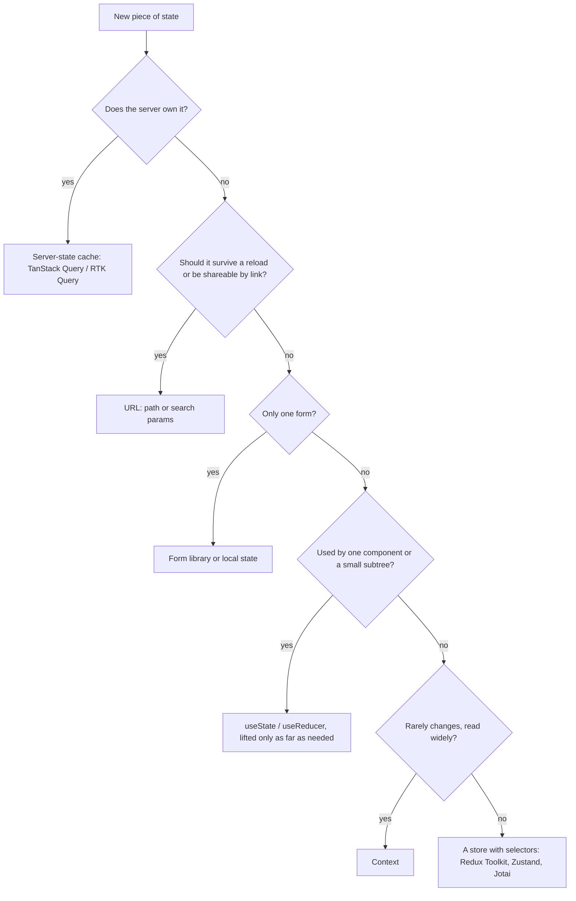
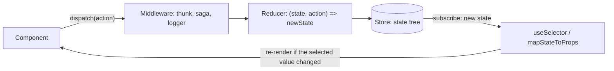

# 18 — State management landscape

> **How to use this module.** Sections 18.1–18.2 are the decision-making core: what kinds of state exist and when built-in React is enough. Sections 18.3–18.7 are Redux in all its eras (hand-written, Redux Toolkit, RTK Query), which is what most existing codebases run. Sections 18.8–18.10 cover Zustand, atoms and state machines, and 18.11 turns it all into a decision framework. If you only have 20 minutes, read 18.1, 18.2, 18.6, 18.8 and 18.11.

**Prerequisites:** [Colocation and lifting state up](08-state.md#88-colocation-and-lifting-state-up) · [`useReducer`](08-state.md#810-usereducer) · [Context and its limits](11-context.md#118-when-context-is-the-wrong-tool) · [Server state vs client state](17-data-fetching.md#173-server-state-vs-client-state) · [`useSyncExternalStore`](12-hooks-and-custom-hooks.md#1212-usesyncexternalstore) · [Why components re-render](15-performance.md#152-why-components-re-render)

**Code for this module:** [`examples/web/src/m18-state-management/`](examples/web/src/m18-state-management/). Every file below has a test next to it, except `Counters.tsx` (a side-by-side of `connect` and hooks, exercised by `legacyRedux.test.tsx`) and the small support files. Run them with `npx vitest run src/m18-state-management` from `examples/web`.

**Installed in `examples/web` (see [VERSIONS.md](VERSIONS.md)):** `@reduxjs/toolkit` 2.13.0, `react-redux` 9.3.0, `zustand` 5.0.15. Transitively present: `redux` 5.0.1, `reselect` 5.3.0, `redux-thunk` 3.1.0, `immer` 11.1.21 (read from `node_modules/*/package.json`). **Not installed:** Jotai, Recoil, XState. Their snippets below are illustrative and labeled *not run*.

---

## 18.1 A taxonomy: local, server, URL, form, global UI

### The problem
"State management" is asked as one question ("Redux or Context?"), but an app holds several different kinds of state with different owners, lifetimes and tools. Putting all of them in one global store is the most common cause of over-engineered React apps, and putting all of them in `useState` is the most common cause of prop drilling and stale data.

### Mental model
Classify first, then pick the tool. Five buckets cover almost everything:

| Kind | Owner | Examples | Default tool |
|---|---|---|---|
| **Local UI state** | One component | Is the dropdown open, a draft input, hover | `useState` / `useReducer` ([08](08-state.md#88-colocation-and-lifting-state-up)) |
| **Server state** | The server (you hold a cache) | Products, current user, search results | TanStack Query, SWR, RTK Query, framework loaders ([17](17-data-fetching.md#173-server-state-vs-client-state)) |
| **URL state** | The address bar | Filters, page number, selected tab, an open record id | Router params and search params ([19](19-routing.md#194-params-and-search-params)) |
| **Form state** | A form | Field values, touched, errors, submitting | A form library or Actions ([14](14-forms-and-actions.md#143-react-hook-form--zod)) |
| **Global UI / client state** | The browser tab | Cart, theme, auth session, multi-step wizard, a notification queue | Context for rarely-changing values, a store (Redux Toolkit, Zustand, Jotai) for the rest |



> **Java/Spring analogy:** the buckets map to where you would keep data on the back end. Server state is a read-through cache (Hibernate second-level cache) over the database. URL state is the request: path and query parameters that fully describe "what is being asked". Local state is a local variable, global UI state is a session-scoped bean, and form state is a command object bound from a request.
>
> **Where the analogy breaks:** a Spring session bean is one object with one lifecycle. In React, every bucket has its own library and its own rendering behavior, and moving state between buckets (URL to local, local to store) changes **who re-renders**, which has no equivalent on the server.

### Minimal code
Same screen, state in the right homes (illustrative, not a file in `examples/`):

```tsx
function ProductsPage() {
  const [params, setParams] = useSearchParams();          // URL state: ?q=key&page=2
  const q = params.get('q') ?? '';
  const { data } = useQuery(productsQuery(q));            // server state: cached by key
  const [menuOpen, setMenuOpen] = useState(false);        // local UI state
  const addToCart = useCartStore((s) => s.add);           // global client state
  // The form for "new product" has its own state inside a form library.
}
```

### How it works internally
There is no mechanism that makes these buckets different at runtime: all of them end as a value read during render. What differs is **who notifies React** when the value changes. `useState` notifies its own fiber. The router notifies subscribers when the location changes. A server-state library notifies observers of a cache entry. A store notifies subscribers through `useSyncExternalStore` ([12](12-hooks-and-custom-hooks.md#1212-usesyncexternalstore)).

### Trade-offs
- ✅ Once server, URL and form state leave your store, "global state" is usually a handful of fields (cart, theme, session, a few flags). Many apps then need no store at all.
- ❌ Five buckets means five tools to learn. Do not add a tool for a bucket you don't have.
- A frequent mistake is to put **server data in the store** and write the refetch logic by hand (see 18.5 and 18.7), or to keep **URL-shaped state in a store**, which breaks the back button and deep links.

> **Summary of 18.1.** Classify before you choose. Server data goes in a cache, shareable state in the URL, form state in a form tool, local state next to its component, and only what is left (cross-cutting client state) needs a store.

---

## 18.2 Context's limits

> Reducer + context is covered in [11.6](11-context.md#116-reducer--context-pattern), and the performance patterns in [11.4](11-context.md#114-stable-values) and [11.5](11-context.md#115-splitting-contexts). This section does not repeat them. It only states where they stop.

### The problem
Context plus `useReducer` is a legitimate global store with zero dependencies. It stops scaling for three reasons, all visible in the code you already wrote in module 11.

### Mental model
Context is **dependency injection with change notification**. A consumer subscribes to the **whole value**, not to a part of it. A store lets a consumer subscribe to a **selected slice** and re-render only if that slice changes.

| Limit | What happens | What a store gives you |
|---|---|---|
| **No selectors** | `useContext` returns the entire value. Any change to any field re-renders every consumer, through `memo` ([11.3](11-context.md#113-how-propagation-and-re-rendering-work)) | `useSelector(s => s.cart.count)` re-renders only when `count` changes |
| **Splitting is manual** | You split by concern (`StateContext`, `DispatchContext`), but "200 components each read a different field" doesn't split | One store, many independent subscriptions |
| **Provider nesting and boundaries** | State lives in the tree. Outside the provider, in a utility function, a WebSocket handler or a test, you can't read or write it | `store.getState()` / `store.dispatch()` work anywhere |
| **No devtools, middleware or time travel** | You build logging and persistence yourself | Redux DevTools, middleware, `persist` |

### Minimal code
The boundary, in one picture (the reducer + context pattern from 11.6 on the left, the store with a selector on the right):

```tsx
// Context: every consumer re-renders when ANY field of `state` changes.
const { count } = use(CartStateContext);

// Store: this component re-renders only when `count` changes.
const count = useCartStore((s) => s.count);
```

### How it works internally
React-Redux's `<Provider>` puts a **stable store object** in context. The context value never changes, so it never triggers context propagation. `useSelector` then subscribes to the store through `useSyncExternalStore` and re-renders only when its selected value changes. This is exactly the "context as the transport, a store as the state" pattern in [11.8](11-context.md#118-when-context-is-the-wrong-tool). Zustand skips the context entirely: its hook subscribes to a module-level store (verified in `zustand/esm/react.mjs`: `useStore` calls `React.useSyncExternalStore(api.subscribe, () => selector(api.getState()), …)`).

### Trade-offs
- Choose **Context** for values that are read widely and change rarely (theme, locale, session, injected services), and for state owned by one feature subtree.
- Choose **a store** when state changes often, many components read different parts of it, or non-React code needs access.
- Don't migrate for performance on a hunch. Measure first ([15](15-performance.md#152-why-components-re-render)); the signal is wide re-renders in the Profiler after you've already memoized the value and split the contexts.

---

## 18.3 Redux core ideas and legacy Redux

### The problem
Many production codebases are Redux codebases written between 2016 and 2020. You need to **read** them, explain why they look the way they do, and migrate them. You also need the core ideas because Redux Toolkit is still just Redux.

### Mental model
Three rules:

1. **One store** holds the whole state tree.
2. State changes only by **dispatching an action**: a plain object with a `type`.
3. A **reducer** is a pure function `(state, action) => newState`. It must not mutate, call APIs or read the clock.



> **Java/Spring analogy:** the store is an in-memory event-sourced aggregate. Actions are events, the reducer is the `apply(event)` method, and the state is the projection. Middleware is a servlet filter or `HandlerInterceptor` around `dispatch`.
>
> **Where the analogy breaks:** an event-sourced aggregate stores the events. Redux stores only the **current state**; the action log exists only if DevTools records it.

### Minimal code
`examples/web/src/m18-state-management/legacyRedux.ts` is the whole pre-Toolkit toolkit in one file: action type constants, action creators, a `switch` reducer with spread updates, `combineReducers`, a hand-written thunk middleware and `createStore(…, applyMiddleware(…))`. The key part:

```ts
export const INCREMENT = 'counter/INCREMENT';
export const increment = (): CounterAction => ({ type: INCREMENT });

export function counterReducer(state: CounterState = initialState, action: CounterAction): CounterState {
  switch (action.type) {
    case INCREMENT:
      return { ...state, count: state.count + 1 };
    case ADD:
      return { ...state, count: state.count + action.payload };
    default:
      return state; // every reducer sees every action: return the same state for the ones you don't own
  }
}
```

Legacy components were wired with `connect` (a higher-order component), in `Counters.tsx`:

```tsx
const mapStateToProps = (state: LegacyRootState) => ({ count: state.counter.count });
const mapDispatchToProps = { increment, incrementIfOdd };       // object shorthand: wrapped in dispatch for you
export const LegacyCounter = connect(mapStateToProps, mapDispatchToProps)(CounterView);
```

The same counter in modern form is `counterSlice.ts` (12 lines) plus a hooks component (`ModernCounter`). `legacyRedux.test.tsx` runs both side by side and asserts they produce identical state after the same steps.

### How it works internally
- `createStore(reducer, preloadedState?, enhancer?)` holds `currentState`, calls `reducer(currentState, action)` on every `dispatch`, then calls every listener.
- `combineReducers({ a, b })` returns a reducer that calls `a` with `state.a` and `b` with `state.b`, and returns the same object if no slice changed.
- `applyMiddleware` wraps `dispatch`. A thunk middleware is five lines: if the action is a function, call it with `(dispatch, getState)`; otherwise pass it on (see `thunkMiddleware` in `legacyRedux.ts`).
- Legacy async came in two families: **`redux-thunk`** (dispatch functions) and **`redux-saga`** (generator functions listening for actions with `takeEvery`/`takeLatest`, running effects such as `call` and `put`). Sagas are still maintained (`redux-saga` 1.0.0 shipped 2019-01-20; latest on npm 1.5.1) and appear in older large apps. The module doesn't install it; see 18.5 for how RTK's listener middleware and thunks replace the common cases.

> **Version notes.** **Redux 4.2.0 (2022-04-18)** marked `createStore` as `@deprecated` in its types (strikethrough only, it still works); the same function without the mark is `legacy_createStore`. Source: redux 5.0.1 `redux.d.ts` in this repo, and the RTK 2 migration guide ("Shows visual strikethrough but continues to work indefinitely with no runtime errors"). **React-Redux 7.1.0 (2019-06-11)** added the hooks `useSelector`/`useDispatch`. **React-Redux 8.0.0 (2022-04-16)** rebuilt `useSelector`/`connect` on `useSyncExternalStore` and removed `connectAdvanced` and the `pure` option of `connect`. **React-Redux 9.3.0** (2026-05-15) marks `connect` `@deprecated` in its types and adds `legacy_connect` as the unmarked alias (verified: absent from `react-redux@9.1.2` and `9.2.0`, present in `9.3.0`'s `react-redux.d.ts`). Redux's own docs have recommended Redux Toolkit for all new code for years.
>
> **Typing trap (found while verifying this module):** with Redux 5.0.1's types, `createStore(reducer, applyMiddleware(mw))` (enhancer as the second argument) infers the preloaded state as `Partial<{ counter: never }>` and fails to type-check. Passing `undefined` as the preloaded state selects the 3-argument overload that works: `createStore(legacyRootReducer, undefined, applyMiddleware(thunkMiddleware))`. That is what `makeLegacyStore()` does.

### Trade-offs
- ✅ Understanding the pattern makes Toolkit's design obvious: every RTK feature removes one chore from this file.
- ❌ Writing new code in this style is a mistake: string constants, switch statements, spread updates and manual thunk typing are all boilerplate that Toolkit removes. Migrate incrementally: a Toolkit `configureStore` accepts legacy reducers, and a slice can sit next to them.
- A migration path that works in practice: (1) swap `createStore` for `configureStore` with the same reducers, (2) convert one reducer at a time to `createSlice`, (3) replace `connect` with hooks per component, (4) move fetching to RTK Query or TanStack Query.

---

## 18.4 Redux Toolkit: `configureStore`, slices, Immer

### The problem
Hand-written Redux needs four artifacts per feature (constants, creators, reducer, selectors), error-prone immutable updates, and manual store setup (DevTools, thunk, checks). Most bugs were typos and accidental mutation.

### Mental model
Redux Toolkit (RTK) is "Redux with the boilerplate removed", from the Redux team. A **slice** is one feature's state, reducers and generated actions in one object. Inside a case reducer you may write mutating code, because you are mutating an Immer **draft** and Immer produces the immutable result.

> **Java/Spring analogy:** a slice is a `@Service` plus its DTO state and its commands in one class, and Immer is a copy-on-write builder: you call setters on a builder and get a new immutable record back (like Lombok `@Builder(toBuilder = true)`).
>
> **Where the analogy breaks:** a builder copies everything you touch eagerly. Immer uses a Proxy to record writes and copies only the **changed path**, sharing every untouched branch by reference (asserted in `cartSlice.test.ts`: `two.lines[0]` is `one.lines[0]`).

### Minimal code
`examples/web/src/m18-state-management/cartSlice.ts` (excerpt):

```ts
export const cartSlice = createSlice({
  name: 'cart',
  initialState: initialCartState,
  reducers: {
    itemAdded(state, action: PayloadAction<Product>) {
      const line = state.lines.find((l) => l.id === action.payload.id);
      if (line) line.quantity += 1;                       // "mutation" of a draft
      else state.lines.push({ ...action.payload, quantity: 1 });
    },
    cleared: () => initialCartState,                      // or return a new value instead
  },
  extraReducers: (builder) => {
    builder.addCase(placeOrder.fulfilled, () => initialCartState);   // builder callback only (RTK 2)
  },
  selectors: { selectLineCount: (state) => state.lines.length },
});
```

`store.ts` builds the store with a factory, so every test gets a fresh one:

```ts
const rootReducer = combineSlices(cartSlice, checkoutSlice, productsApi);
export type RootState = ReturnType<typeof rootReducer>;

export function makeStore(preloadedState?: Partial<RootState>) {
  return configureStore({
    reducer: rootReducer,
    middleware: (getDefaultMiddleware) => getDefaultMiddleware().concat(productsApi.middleware),
    preloadedState,
  });
}
export type AppStore = ReturnType<typeof makeStore>;
export type AppDispatch = AppStore['dispatch'];
```

`hooks.ts` pre-types the hooks once (react-redux 9.1+ `.withTypes`), so components never repeat `RootState`:

```ts
export const useAppDispatch = useDispatch.withTypes<AppDispatch>();
export const useAppSelector = useSelector.withTypes<RootState>();
```

### How it works internally
- `createSlice` calls `createAction` for each case reducer (`itemAdded.type === 'cart/itemAdded'`) and `createReducer` to build the combined reducer. A case reducer may **either** mutate the draft **or** return a new value, never both.
- Immer wraps the state in a Proxy, runs the case reducer, and `finalize`s: unchanged subtrees keep their identity, changed paths are copied, and the result is **auto-frozen** in development and production by default (Immer's `autoFreeze_` defaults to true, verified in `immer@11.1.21`; asserted by `Object.isFrozen(two)` in `cartSlice.test.ts`).
- `configureStore` composes the reducer, enables Redux DevTools, and builds the default middleware: **thunk**, and in development only an **immutability check**, a **serializability check** and an **action-creator check** (verified in `buildGetDefaultMiddleware` in RTK 2.13's `redux-toolkit.modern.mjs`).
- `combineSlices` (RTK 2) builds the root reducer from slices using each slice's `reducerPath`, and supports lazy injection with `.inject()`.
- A **slice's `selectors` option** (RTK 2) declares selectors against the slice state. `cartSlice.selectors.selectLineCount({ cart: state })` takes the root-shaped state.

> **Version notes.** **RTK 1.x** (the 1.0.4 release is dated 2019-11-13 on npm): `configureStore`, `createSlice`, `createAction`, `createReducer`. **RTK 1.6 (2021-06-07):** RTK Query added. **RTK 2.0 / Redux 5.0 / React-Redux 9.0 / Reselect 5.0 / Redux Thunk 3.0 (all published 2023-12-04):** the **object syntax** of `createReducer` and `createSlice.extraReducers` was **removed** (builder callback only); `configureStore({ middleware })` and `enhancers` **must be callbacks** (no more `middleware: [mw]`); non-default middleware/enhancer arrays use `Tuple`; the standalone `getDefaultMiddleware` export and `getType` were removed; `action.type` must be a string; `AnyAction` deprecated in favor of `UnknownAction`; `Middleware`'s `action` and `next` are typed `unknown`; `PreloadedState` type removed; `createSlice.reducers` accepts a callback (`create.asyncThunk`, `create.reducer`, `create.preparedReducer`); `combineSlices`, `selectors` in `createSlice`, `createDynamicMiddleware` and the `autoBatchEnhancer` were added; ESM became the primary artifact. Source: the "Migrating to RTK 2.0 and Redux 5.0" page, fetched 2026-10-04 at `redux.js.org/toolkit/usage/migrating-rtk-2`. It also provides a codemod: `npx @reduxjs/rtk-codemods createReducerBuilder ./src`.
>
> **Migration, old to new:**
> ```ts
> // RTK 1.x: object syntax (REMOVED in 2.0)
> extraReducers: { [placeOrder.fulfilled.type]: () => initialCartState }
> // RTK 2: builder callback
> extraReducers: (builder) => { builder.addCase(placeOrder.fulfilled, () => initialCartState); }
> ```
> The old `middleware: [logger]` form must become `middleware: (gdm) => gdm().concat(logger)`.

### Trade-offs
- ✅ Far less code than hand-written Redux, immutable-by-construction, DevTools and thunks by default, and strong TypeScript inference.
- ❌ Immer is a footgun in four places: you can't both mutate and return; you can't use a draft outside the case reducer; replacing `state` itself (`state = x`) does nothing (return instead); and a draft is not `===` the original, so comparisons inside a case reducer surprise you.
- ❌ A module-level singleton store (`export const store = configureStore(…)`) leaks state between tests and between SSR requests. Export a `makeStore()` factory and create one per test or request.
- ❌ Redux is still a single global store. If most of your "global" state is server data, use RTK Query or TanStack Query first (18.7).

---

## 18.5 Thunks and `createAsyncThunk`

### The problem
Reducers must be pure, so side effects (a fetch) happen outside them. You need a place that can dispatch "started", then "succeeded" or "failed", read current state, and be cancelled, without writing three action types per request by hand.

### Mental model
A **thunk** is a function you dispatch instead of an object. Middleware sees a function, calls it with `(dispatch, getState)`, and lets it do async work and dispatch real actions when ready. `createAsyncThunk` builds the three-action lifecycle (`pending`, `fulfilled`, `rejected`) around one async function.

> **Java/Spring analogy:** a thunk is a `@Transactional` service method that can read the current state and publish several events. `createAsyncThunk` is a method template that always publishes `Started`, then `Succeeded` or `Failed`.
>
> **Where the analogy breaks:** there is no transaction. Every dispatched action is committed immediately; if the request fails midway you have already shown `pending`, so the reducer must handle the failure.

### Minimal code
`examples/web/src/m18-state-management/checkout.ts` (excerpt):

```ts
export const placeOrder = createAsyncThunk<Order, void, ThunkConfig>(
  'checkout/placeOrder',
  async (_arg, { getState, signal, rejectWithValue }) => {
    const { lines } = getState().cart;
    const res = await fetch(`${API}/orders`, { method: 'POST', /* … */ signal });
    if (!res.ok) return rejectWithValue(`Checkout failed (HTTP ${res.status})`);
    return (await res.json()) as Order;
  },
  { condition: (_arg, { getState }) => getState().cart.lines.length > 0 && getState().checkout.status !== 'pending' },
);

// In the slice: extraReducers: (builder) => builder.addCase(placeOrder.pending, …).addCase(placeOrder.fulfilled, …)…
```

In a component: `dispatch(placeOrder())`, and `await dispatch(placeOrder()).unwrap()` when you want a promise that throws on rejection. `checkout.test.ts` covers all of it against an MSW server: `pending` is visible **synchronously** after `dispatch`, a 500 becomes a `rejected` action carrying the `rejectWithValue` message, `unwrap()` rejects with that value, and an empty cart makes `condition` return false so no request and no actions happen.

### How it works internally
Read from RTK 2.13's `redux-toolkit.modern.mjs` (`createAsyncThunk`):
1. Run `options.condition(arg, { getState, extra })`. If it returns `false`, throw an internal `ConditionError`.
2. Dispatch `pending`.
3. Call the payload creator inside `Promise.race` against an abort promise, with `{ dispatch, getState, extra, requestId, signal, abort, rejectWithValue, fulfillWithValue }`.
4. Resolve to `fulfilled(result)`, or `rejected(...)` if it throws or returns `rejectWithValue(...)`.
5. Dispatch the final action, **except** when it is a `rejected` produced by `condition` and `dispatchConditionRejection` is not set (the default): then nothing is dispatched. The returned promise still resolves with that rejected action whose `meta.condition` is `true`, which `checkout.test.ts` asserts.

The returned promise **never rejects** by itself: it resolves to the final action. `.unwrap()` converts a `rejected` action into a thrown error.

Typing the `getState` of a thunk with `RootState` creates a circular type (the store type depends on the slice reducer, which depends on the thunk). `checkout.ts` types only the slices it needs (`{ cart: CartState; checkout: CheckoutState }`) in the `ThunkConfig` instead of importing `RootState`.

> **Version notes.** The **`create.asyncThunk`** form inside `createSlice({ reducers: (create) => … })` is new in RTK 2.0. `createAsyncThunk` itself arrived in **RTK 1.3.0** ([release notes](https://github.com/reduxjs/redux-toolkit/releases/tag/v1.3.0)). **Unverified:** the 1.x minors that introduced `condition`, `getPendingMeta` and `dispatchConditionRejection` (they are not in the 1.4.0 or 1.5.0 notes); search the [RTK releases](https://github.com/reduxjs/redux-toolkit/releases) before quoting them. **Redux Thunk 3.0** (2023-12-04) removed the default export: `import { thunk, withExtraArgument } from 'redux-thunk'`.

### Trade-offs
- ✅ Good for **workflows**: checkout, login, multi-step side effects that read state and dispatch several actions.
- ❌ A thunk that fetches and stores server data is a hand-rolled cache with no deduping, no invalidation and no refetching. Use RTK Query or TanStack Query for that ([17.3](17-data-fetching.md#173-server-state-vs-client-state)).
- ❌ Always pass the `signal` to `fetch`, or `abort()` does nothing.
- Alternatives in the RTK family: the **listener middleware** (`createListenerMiddleware`) reacts to actions with effects and is the modern replacement for most `redux-saga` use. Sagas remain right for complex long-running orchestration.

---

## 18.6 Selectors and memoization

### The problem
`useSelector(fn)` re-renders the component when `fn(state)` is not `===` to its previous result. A selector that builds a new object or array (`state.items.filter(…)`, `{ a: state.a }`) returns a **new reference every time**, so the component re-renders after **every** dispatch, even when nothing it cares about changed.

### Mental model
A selector is a **query on the state**. A **memoized selector** (Reselect's `createSelector`) caches by its **inputs**: if the input selectors return the same references as last time, it returns the previous result object instead of running the result function again.

> **Java/Spring analogy:** `@Cacheable` on a method whose cache key is the identity of its arguments, plus a query method on a repository that returns a projection.
>
> **Where the analogy breaks:** the key is **reference identity** (`===`), not `equals()`. Two equal-but-distinct arrays are two keys. That is why selector inputs must be existing state references, not freshly computed values.

### Minimal code
`examples/web/src/m18-state-management/cartSelectors.ts` (excerpt):

```ts
// Input selectors: plain property reads, they return references that already exist in state.
export const selectCartLines = (state: WithCart): CartLine[] => state.cart.lines;
export const selectCoupon = (state: WithCart): string | null => state.cart.coupon;

// Unmemoized: an equal but NEW object on every call → a useSelector on it re-renders every dispatch.
export function selectCartSummaryUnmemoized(state: WithCart): CartSummary { /* reduce twice */ }

// Memoized: the result function runs only when `lines` changes by reference.
export const selectCartSummary = createSelector([selectCartLines], (lines): CartSummary => ({
  count: lines.reduce((n, l) => n + l.quantity, 0),
  total: lines.reduce((sum, l) => sum + l.price * l.quantity, 0),
}));

// Composition and arguments:
export const selectDiscountedTotal = createSelector([selectCartSummary, selectCoupon], /* … */);
export const selectLinesAtLeast = createSelector(
  [selectCartLines, (_state: WithCart, minPrice: number) => minPrice],
  (lines, minPrice) => lines.filter((l) => l.price >= minPrice),
);
```

Three ways to stop a derived-object selector from re-rendering (compared live in Exercise 4): a **memoized selector**, a **`shallowEqual` equality function** (`useSelector(fn, shallowEqual)`), or **selecting primitives** and building the object in the component.

### How it works internally
- `createSelector` is **Reselect**, re-exported by `@reduxjs/toolkit` (use that export: Reselect is installed as a dependency of RTK and not listed in `package.json` here). The output selector exposes `recomputations()`, `resetRecomputations()`, `lastResult()` and `dependencies`; `cartSelectors.test.ts` uses `recomputations()` to prove the result function ran once per distinct input.
- **Reselect 5 default memoizer is `weakMapMemoize`**: an effectively unbounded cache keyed by the arguments' references, so selectors with arguments (`selectLinesAtLeast(state, 1000)` vs `(state, 0)`) no longer evict each other. It was `defaultMemoize` with a cache size of 1 in Reselect ≤ 4 (renamed `lruMemoize`). `cartSelectors.test.ts` asserts that alternating two different carts does not recompute, which would not hold with a cache size of 1. Source: RTK 2 migration guide, "Reselect Changes".
- **Dev-mode checks** (Reselect 5, `reselect@5.3.0`'s `reselect.mjs`): `inputStabilityCheck` calls the input selectors twice on the first call and warns if they return different references, and `identityFunctionCheck` warns if the result function returns its input. Both default to `'once'`.
- **react-redux 9 has its own dev checks** inside `useSelector` (`stabilityCheck` and `identityFunctionCheck`, both default `"once"`, verified in `react-redux.mjs`): "Selector … returned a different result when called with the same parameters. This can lead to unnecessary rerenders." and "returned the root state when called". `RenderPuzzle.test.tsx` asserts that the first warning fires exactly once for the unmemoized object selector.
- `useSelector` is built on `useSyncExternalStoreWithSelector`: React's own check, that `getSnapshot` returns a cached value, is why returning a fresh object each time is wasteful rather than infinite in react-redux, whereas in Zustand 5 it is an infinite loop (18.8).

> **Version notes.** React-Redux 9.0 changed `useSelector`'s dev-mode check options (`devModeChecks`). `createSelector`'s `ParametricSelector` types were removed in Reselect 5. **The React Compiler** ([15.5](15-performance.md#155-the-react-compiler-and-how-it-changes-the-advice)) memoizes **inside components**; it does not memoize what a selector returns, so it doesn't replace Reselect.

### Trade-offs
- ✅ Memoizing derived data cuts renders and the cost of expensive derivations (filtering a large list).
- ❌ Don't memoize a selector that returns an existing reference or a primitive (`state.cart.coupon`): it adds a cache check for nothing.
- ❌ A memoized selector declared at module level is **shared by every component and every store**. With different arguments that was a cache-thrash problem before Reselect 5; with several stores (tests, SSR) it shares one cache across them. It is safe because the cache is keyed by reference, but call `resetRecomputations()` in tests that count calls.
- ❌ **Don't put derived data in state.** Compute it in a selector, as in [8.7](08-state.md#87-derived-state-compute-do-not-store).

---

## 18.7 RTK Query

### The problem
A thunk plus a slice for every endpoint is a lot of code to get a mediocre cache. Server state wants deduplication, loading and error flags, refetching and invalidation ([17](17-data-fetching.md#173-server-state-vs-client-state)), and a team that already uses Redux wants it **inside** the store.

### Mental model
RTK Query is TanStack-Query-style server-state caching built into Redux Toolkit. You declare **endpoints** (queries and mutations) once with `createApi`; it generates hooks, reducers and middleware. Each cached result is keyed by **endpoint name + serialized argument**, and **tags** link mutations to the queries they make stale.

> **Java/Spring analogy:** `@Cacheable` on `getProducts()`, with `@CacheEvict` on `updatePrice()` expressed as a tag instead of a cache name.
>
> **Where the analogy breaks:** the cache is in each browser tab, the server doesn't know about it, and "evict" doesn't remove the entry. It marks it stale and **refetches every active subscriber**.

### Minimal code
`examples/web/src/m18-state-management/productsApi.ts`:

```ts
export const productsApi = createApi({
  reducerPath: 'productsApi',
  baseQuery: fetchBaseQuery({ baseUrl: API }),
  tagTypes: ['Product'],
  endpoints: (build) => ({
    getProducts: build.query<Product[], void>({ query: () => '/products', providesTags: ['Product'] }),
    updatePrice: build.mutation<Product, { id: string; price: number }>({
      query: ({ id, price }) => ({ url: `/products/${id}`, method: 'PATCH', body: { price } }),
      invalidatesTags: ['Product'],
    }),
  }),
});
export const { useGetProductsQuery, useUpdatePriceMutation } = productsApi;
```

It plugs into the store through `combineSlices(…, productsApi)` and `.concat(productsApi.middleware)` (see `store.ts`). `ProductList.tsx` reads `useGetProductsQuery()` for server state and dispatches `itemAdded` into the cart slice for client state, in **one store**. `ProductList.test.tsx` shows, against MSW: loading then list, the error state, two components sharing **one request**, and a mutation that invalidates the `'Product'` tag so the list **refetches by itself** (two GETs in total).

### How it works internally
`createApi` adds a reducer at `reducerPath` that holds `queries` and `mutations` maps keyed by `getProducts(undefined)`-style cache keys, with subscription counts per entry. The middleware starts fetches, deduplicates concurrent identical requests, removes entries `keepUnusedDataFor` seconds after the last subscriber unmounts (**60** by default, verified in `rtk-query.modern.mjs`), and refetches on invalidation. Hooks subscribe through `useSelector` and re-render when their entry changes.

> **Version notes.** RTK Query arrived in **RTK 1.6 (2021-06-07)**, confirmed by the release notes: "this release adds the new RTK Query data fetching APIs to Redux Toolkit". **RTK 2.0:** the default `invalidationBehavior` became `'delayed'` (invalidation waits until pending queries and mutations settle; set `'immediately'` for the 1.9 behavior), cache-entry tracking was reworked, and custom hooks passed to `reactHooksModule` moved under a `hooks` key (migration guide).

### Trade-offs
- ✅ If you already use Redux, it removes thunks, loading flags and refetch code, and the data shows up in DevTools.
- ❌ Compared with TanStack Query ([17.4](17-data-fetching.md#174-tanstack-query-query-keys-staletime-vs-gctime)) it is less featureful (infinite queries and Suspense support are weaker or less polished) and ties the cache to Redux. **Without Redux, pick TanStack Query**; with Redux, RTK Query is the default.
- ❌ Tags need discipline. Over-broad tags refetch too much; missing tags leave stale data. Optimistic updates are possible with `onQueryStarted` + `updateQueryData` (compare [17.6](17-data-fetching.md#176-optimistic-updates)).

---

## 18.8 Zustand

### The problem
Redux Toolkit is lighter than classic Redux, but it still means a store, slices, a Provider, typed hooks and selectors. For a cart and a few flags that's a lot of ceremony. Context has no selectors. You want a global store that is a **hook**.

### Mental model
Zustand (German for "state") creates a store as a **hook**. State and actions live in **one object**; components read it with a **selector**; there is no Provider and no action objects. It is a tiny external store plus `useSyncExternalStore`.

> **Java/Spring analogy:** a singleton `@Component` with fields and methods, plus an `ApplicationEventPublisher` that notifies listeners only when the field they asked about changed.
>
> **Where the analogy breaks:** a singleton bean is created once per application context. A Zustand store is a **module-level singleton** created at import time, which is why tests and SSR need a reset or a per-request store (`createStore` from `zustand/vanilla` with context).

### Minimal code
`examples/web/src/m18-state-management/cartStore.ts` (excerpt), the same cart as the RTK one:

```ts
export const useCartStore = create<CartStore>()((set) => ({
  lines: [],
  coupon: null,
  add: (product) =>
    set((state) => {
      if (!state.lines.some((l) => l.id === product.id)) return { lines: [...state.lines, { ...product, quantity: 1 }] };
      return { lines: state.lines.map((l) => (l.id === product.id ? { ...l, quantity: l.quantity + 1 } : l)) };
    }),
  remove: (id) => set((state) => ({ lines: state.lines.filter((l) => l.id !== id) })),
  clear: () => set({ lines: [], coupon: null }),
}));
```

Components select **only what they need** (`ZustandCart.tsx`):

```tsx
const add = useCartStore((s) => s.add);          // an action: never changes → never re-renders
const lines = useCartStore((s) => s.lines);      // re-renders when `lines` changes by Object.is
const count = useCartStore(selectCount);         // derived primitive: fine
const total = useCartStore(selectTotal);
```

Because Zustand 5 requires **stable** selector output, `CartSummaryLine` uses two primitive selectors instead of one selector returning `{ count, total }`. To select several fields as an object, wrap the selector in **`useShallow`**:

```tsx
import { useShallow } from 'zustand/shallow';
const { a, b } = useStore(useShallow((s) => ({ a: s.a, b: s.b })));
```

### How it works internally
`create(initializer)` builds a vanilla store (`getState`, `setState`, `getInitialState`, `subscribe`) and returns a hook with that API attached (so `useCartStore.getState()` and `useCartStore.setState()` work in tests and outside React; `cartStore.test.ts` subscribes outside React). The hook calls `React.useSyncExternalStore(api.subscribe, () => selector(api.getState()), …)` (verified in `zustand/esm/react.mjs`). React compares the selector's result with `Object.is` and re-renders only if it changed. `set` **shallow-merges** the returned partial into the state (so `set({ coupon })` keeps `lines` and the actions); updates must still be **immutable**. `setState(x, true)` replaces the whole state, which is how `resetCartStore()` restores `getInitialState()` in `beforeEach`.

> **Version notes (Zustand v4 → v5, released 2024-10-14).** Source: the "How to Migrate to v5 from v4" page in the Zustand repository, plus the installed 5.0.15 typings. Breaking changes: **default exports dropped** (use `import { create } from 'zustand'`); **deprecated features dropped**; **React 18 minimum**; **`use-sync-external-store` became a peer dependency**, needed only for `createWithEqualityFn`/`useStoreWithEqualityFn` in `zustand/traditional`; TypeScript 4.5 minimum; UMD/SystemJS and ES5 dropped. **`create` no longer accepts an equality function:** `useStore(selector, shallow)` (v4) must become `useStore(useShallow(selector))`, or `createWithEqualityFn` from `zustand/traditional`. **Selectors that return a new reference now loop forever** ("Maximum update depth exceeded"), to match React's `useSyncExternalStore` behavior; fix with `useShallow` or a stable fallback constant. Stricter `setState` types when `replace` is `true`. **The `persist` middleware no longer stores the initial state at creation** (also in 4.5.5, published 2024-08-15).
>
> ```ts
> // v4
> const { count, text } = useStore((s) => ({ count: s.count, text: s.text }), shallow);
> // v5
> const { count, text } = useStore(useShallow((s) => ({ count: s.count, text: s.text })));
> ```

### Trade-offs
- ✅ Very little code, no Provider, selectors by default, usable outside React, and tiny. Middleware exists (`persist`, `devtools`, `immer`, `subscribeWithSelector`).
- ❌ **Calling the hook without a selector subscribes to the whole store** (`const { a, b } = useStore()`): the component re-renders on every change (Exercise 4 compares it with a slice selector).
- ❌ A global singleton hurts testing and SSR. Reset in `beforeEach` as `cartStore.test.ts` does, or create the store per test or per request.
- ❌ Fewer conventions than Redux: in a big team, you must agree on slices, naming and where async code lives. No DevTools time travel without the middleware.
- Zustand and Redux Toolkit overlap strongly. Pick Zustand when the state is small or medium and you want minimal ceremony. Pick RTK when you already have Redux, need its middleware/DevTools ecosystem, or want enforced conventions.

---

## 18.9 Atoms: Jotai

> **Not installed in `examples/web`.** The snippets in this section were **not run**. Facts come from the Jotai v3 release and migration guide (fetched 2026-10-04).

### The problem
A store has one big object, and you carve selectors out of it. Some state is naturally **many small independent pieces** with dependencies between them (a filter, a derived list, a selected item). You want to subscribe per piece without writing selectors.

### Mental model
An **atom** is a unit of state. A component that reads an atom re-renders when that atom changes. **Derived atoms** read other atoms, and the library tracks the dependency graph for you. Think of a spreadsheet: cells hold values, and formula cells depend on other cells.

> **Java/Spring analogy:** reactive cells in a dataflow framework (Project Reactor with `combineLatest`), or a spreadsheet engine.
>
> **Where the analogy breaks:** reads inside a derived atom are tracked automatically, so there is no explicit subscription code, which also means there is no single place to read the whole state.

### Minimal code (not run)
```tsx
import { atom, useAtom, useAtomValue, useSetAtom } from 'jotai';

const countAtom = atom(0);
const doubleAtom = atom((get) => get(countAtom) * 2);          // derived, read-only

function Counter() {
  const [count, setCount] = useAtom(countAtom);                // read + write
  const double = useAtomValue(doubleAtom);                     // read only
  return <button onClick={() => setCount((c) => c + 1)}>{count} / {double}</button>;
}
const useIncrement = () => useSetAtom(countAtom);              // write only: never re-renders
```

### How it works internally
Atoms are **configs**, not containers: the value lives in a **store** (a default store if there's no `<Provider>`), keyed by the atom object's identity. The store tracks which atoms each derived atom read, and notifies hook subscribers when a dependency changes. Hooks sit on React's external-store APIs.

> **Version notes.** **Jotai 3.0.0 was published 2026-09-08 and 3.0.1 on 2026-09-29** (GitHub releases API). The migration guide says the public API (`useAtom`, `useAtomValue`, `useSetAtom`) is unchanged and "if your app runs on Jotai v2 without deprecation warnings, it should run on v3 as is". Changes: **React 18** minimum (v2 supported 17), **TypeScript 5.5**, **Node ≥ 22.12**, **ESM only**, `atomFamily` **moved to the `jotai-family` package**, `loadable` **removed** (use `unwrap`), `jotai/babel` plugins moved to `jotai-babel`, and "a subtle mount-timing change" in `useAtomValue` described on the use-atom page. **Unverified:** the details of that timing change. Read it before upgrading a Jotai 2 codebase.
>
> **Recoil is archived.** `facebookexperimental/Recoil`'s repository is marked **archived** on GitHub (`"archived": true` from the GitHub API, 2026-10-04), its last push was **2025-01-01**, and the latest npm release is **0.7.7 (2023-03-01)**; its README still calls it "an experimental state management framework for React". Recoil never reached 1.0 and never supported React 19 officially. **Unverified:** the exact date the repository was archived; the API doesn't expose it. For a legacy Recoil app, plan a migration to Jotai (the closest model: atoms and selectors map to atoms and derived atoms), Zustand or Redux Toolkit; see [23.3](23-ecosystem-libraries.md#233-deprecated-or-archived-libraries-you-will-meet-in-legacy-code).

### Trade-offs
- ✅ Fine-grained re-renders with no selectors, great for derived state and for state that is easier to model as many small pieces, and a small API.
- ❌ State is **scattered across atom definitions**, with no single serializable tree, so there is no Redux-style time travel; dependency graphs can become hard to follow.
- ❌ Atom identity matters. Creating an atom **inside a component** without `useMemo` creates a new atom each render.
- **MobX** (briefly): a different model, **observable mutable state** with automatic tracking (`makeAutoObservable`, `observer`). It is mature (6.0.0 on 2020-09-30 per npm, latest 7.0.6) and common in older enterprise apps. You mutate state directly, and the library tracks reads. Its trade-off is the opposite of Redux's: less ceremony, less explicit data flow. MobX 7 removed the non-Proxy (ES5) fallback and legacy decorators (it uses 2022.3 standard decorators), turned namespaced annotations into named exports (`observable.ref` → `observableRef`), and removed `trace`; mobx-react 10 / mobx-react-lite 5 need React 18+ and drop `Provider`, `inject` and `useObserver` ([MobX CHANGELOG](https://github.com/mobxjs/mobx/blob/main/packages/mobx/CHANGELOG.md)).

---

## 18.10 XState

> **Not installed in `examples/web`.** Snippets are **not run** and written from XState 5's documented shape. Check them against stately.ai/docs before you reuse them.

### The problem
Boolean flags multiply: `isLoading`, `isError`, `isRetrying`, `hasStarted`. Some combinations are impossible (`isLoading && isError`), yet nothing in the types prevents them. Workflows such as a checkout, an upload or an auth flow are really **state machines**.

### Mental model
A **finite state machine** declares the allowed **states**, the **events** each state accepts, and the **transitions** between them. In a given state, events that aren't handled are ignored. **Statecharts** add hierarchy, parallel regions, guards and actions. You already met the lightweight version in [8.11](08-state.md#811-state-machines-in-a-reducer): a reducer over a `status` union.

> **Java/Spring analogy:** Spring Statemachine, or a workflow engine such as a BPMN process, with guards as `Guard<S,E>` and actions as `Action<S,E>`.
>
> **Where the analogy breaks:** the machine runs in the browser as an **actor** that you send events to, and it can spawn child actors (invoked promises, callbacks, other machines).

### Minimal code (not run)
```tsx
import { setup } from 'xstate';
import { useMachine } from '@xstate/react';

const checkoutMachine = setup({ /* actions, guards, actors */ }).createMachine({
  id: 'checkout',
  initial: 'idle',
  states: {
    idle: { on: { SUBMIT: 'submitting' } },
    submitting: { on: { SUCCESS: 'done', FAILURE: 'failed' } },
    failed: { on: { RETRY: 'submitting' } },
    done: { type: 'final' },
  },
});

function Checkout() {
  const [snapshot, send] = useMachine(checkoutMachine);
  return <button disabled={!snapshot.matches('idle')} onClick={() => send({ type: 'SUBMIT' })}>Pay</button>;
}
```

### How it works internally
`createMachine` produces a **definition**; running it creates an **actor** (`createActor(machine).start()`), which holds a **snapshot** (current state + context) and processes events one at a time. `useMachine` creates the actor in a component and subscribes to its snapshot.

> **Version notes.** XState **5.0.0 was published 2023-12-01** (npm); the latest is 5.33.2 ([VERSIONS.md](VERSIONS.md)). The main v4 → v5 changes from the [Stately migration guide](https://stately.ai/docs/migration): `interpret()` became `createActor()`, `machine.withConfig()` became `machine.provide()`, `withContext()` is gone (context comes from `input`), `send()` split into `raise()`/`sendTo()`, `cond` became `guard`, events must be objects, and `actor.onTransition()` became `actor.subscribe()`. `setup()` provides typed actions/guards/actors, and the actor model is first-class. Read the whole guide before migrating a v4 app; the list is long.

### Trade-offs
- ✅ Impossible states become unrepresentable; the machine is a **visualizable, testable specification**; ideal for wizards, auth, uploads, retries and complex async flows.
- ❌ Heavy for simple toggles, and a real learning curve. A `useReducer` over a `status` union ([8.11](08-state.md#811-state-machines-in-a-reducer)) covers most small cases.

---

## 18.11 A decision framework

### The problem
"What state library should we use?" asked in the abstract has no good answer. Interviewers want to hear **criteria**, and a justified default.

### Mental model
Walk the 18.1 diagram top to bottom, then apply these filters:

| Situation | Pick | Why |
|---|---|---|
| State used by one component or a small subtree | `useState` / `useReducer` | Colocation; nothing to learn |
| Value read widely, changes rarely (theme, locale, session) | Context ([11](11-context.md)) | Built in; re-renders are rare |
| Data owned by the server | TanStack Query, or RTK Query if you already use Redux ([17](17-data-fetching.md#173-server-state-vs-client-state), 18.7) | A cache, not a store |
| Shareable or bookmarkable (filters, page) | URL ([19](19-routing.md#194-params-and-search-params)) | Back button, deep links |
| Small or medium client state, many readers, want minimal code | **Zustand** | Selectors, no Provider |
| Large app, many developers, need conventions, middleware, DevTools | **Redux Toolkit** | Enforced structure, ecosystem |
| Many small interdependent pieces, derived values | **Jotai** | Fine-grained, derived atoms |
| A workflow with named states and guarded transitions | **XState** (or a status-union reducer) | Impossible states are unrepresentable |
| Existing Redux codebase | Keep it; move to Toolkit incrementally | A rewrite buys nothing |
| Existing Recoil codebase | Plan a migration (archived) | No maintenance; its last release (0.7.7, 2023-03) predates React 19 (2024-12), so no release targets React 19 |

> **Where I would start:** `useState` and URL params, TanStack Query for server data, Context for theme and session, and **Zustand** the first time a store is genuinely needed. I would choose Redux Toolkit when a team already runs it or needs its conventions at scale. Both are defensible; being able to say *why* is the answer.

### Minimal code
Same cart, three homes (all in `examples/`): a Redux Toolkit slice (`cartSlice.ts`), a Zustand store (`cartStore.ts`), and the memoized selector layer (`cartSelectors.ts`). Compare their UI components `Cart.tsx` and `ZustandCart.tsx`: the JSX is nearly identical, the difference is in the wiring.

### How it works internally
Every option converges on the same React mechanism: an external store notified through `useSyncExternalStore`, with a selected value compared by `Object.is`. The differences are **where state lives** (module, Provider, tree), **how updates are written** (actions and reducers, `set`, atom writes, events) and **how much structure the library imposes**.

### Trade-offs
- The cost of a choice is **migration**, not licensing. Keep state **behind hooks** (`useCart()`), so the library is an implementation detail.
- Two state systems in one app is normal and healthy (server cache plus client store). Three or more global systems is a smell.
- Don't pick by benchmark. At typical sizes, **where state lives and who subscribes** matters more than the library.

---

## Interview questions

**Q1. Name the kinds of state in a React app and a tool for each.**
<details><summary>Answer</summary>

Local UI (`useState`/`useReducer`), server state (TanStack Query, RTK Query), URL state (router search params), form state (a form library or Actions), and global client state (Context for rarely-changing values, a store otherwise). **A strong answer adds:** most "global state" disappears once server, URL and form state leave the store, and it names the owner of each kind: the server, the address bar, the form, the component, the tab (18.1).

</details>

**Q2. Context or Redux?**
<details><summary>Answer</summary>

Context delivers a value to a subtree and re-renders every consumer when it changes. Redux (or any store) lets each component subscribe to a **selected slice** and adds DevTools, middleware and access from outside React. Use Context for values that are read widely and change rarely, a store for frequently changing state read in slices. **A strong answer adds:** react-redux itself uses context, to carry a stable store object, so the comparison is "context as the state" vs "context as the transport" (18.2).

</details>

**Q3. Why does a `useContext` consumer re-render when an unrelated field changes?**
<details><summary>Answer</summary>

Context has no selectors: the consumer depends on the whole `value`, and the provider's value changed by `Object.is`. **A strong answer adds:** splitting contexts and memoizing the value reduce it ([11.4](11-context.md#114-stable-values), [11.5](11-context.md#115-splitting-contexts)), and a store's selector is the structural fix.

</details>

**Q4. State the three principles of Redux.**
<details><summary>Answer</summary>

A single source of truth (one store), state is read-only and changes only by dispatching actions, and changes are made by pure reducers. **A strong answer adds:** a reducer takes `(state, action)` and returns new state without mutation, side effects or randomness, which is why it is trivially testable (`cartSlice.test.ts` calls reducers with no store or React).

</details>

**Q5. What is wrong with a hand-written Redux codebase, and how do you migrate it?**
<details><summary>Answer</summary>

Boilerplate (constants, creators, switch reducers, spread updates), easy accidental mutation, manual store setup. Migrate incrementally: `createStore` to `configureStore` with the same reducers, one reducer at a time to `createSlice`, `connect` to hooks, thunks that fetch to RTK Query. **A strong answer adds:** a rewrite isn't necessary because a Toolkit store accepts legacy reducers (18.3).

</details>

**Q6. What does `connect(mapStateToProps, mapDispatchToProps)` do, and is it deprecated?**
<details><summary>Answer</summary>

It is a higher-order component that subscribes to the store, maps state to props, and wraps action creators in `dispatch`. As of react-redux 9.3.0 the **types** mark `connect` `@deprecated` (strikethrough only) and offer `legacy_connect` without the mark; it still works on React 19 (`legacyRedux.test.tsx` renders one). **A strong answer adds:** the docs recommend `useSelector`/`useDispatch`, and `ConnectedProps<typeof connector>` types the injected props.

</details>

**Q7. What did `createStore` become?**
<details><summary>Answer</summary>

It has been marked `@deprecated` in the types since Redux 4.2.0 (2022-04-18) but still works; `legacy_createStore` is the same function without the mark, and `configureStore` is the recommended replacement. **A strong answer adds:** Redux 5's overload typing can fail when the enhancer is the second argument; pass `undefined` as the preloaded state (18.3).

</details>

**Q8. What does Redux Toolkit remove from classic Redux?**
<details><summary>Answer</summary>

Action type constants and creators (generated by `createSlice`), switch reducers and spread updates (Immer drafts), store setup (`configureStore` adds thunk, DevTools and dev checks), and per-endpoint fetching code (RTK Query). **A strong answer adds:** it is still Redux: same store, actions and reducers underneath.

</details>

**Q9. How can a Redux Toolkit reducer "mutate" state?**
<details><summary>Answer</summary>

`createSlice` runs case reducers on an Immer **draft** (a Proxy). Writes to the draft are recorded and Immer produces a new immutable state, copying only the changed path and sharing the rest. **A strong answer adds:** you may mutate **or** return a new value, never both; reassigning `state = x` does nothing; the result is auto-frozen.

</details>

**Q10. What happens if a case reducer mutates the draft and also returns a value?**
<details><summary>Answer</summary>

Immer throws an error: a producer can either modify the draft or return a new value, not both (returning `undefined` after mutating is the supported case). **A strong answer adds:** arrow shorthand such as `(state) => state.count++` accidentally returns a number, which is a classic cause.

</details>

**Q11. What does `configureStore` set up by default?**
<details><summary>Answer</summary>

Redux DevTools, the thunk middleware, and in development the immutability check, the serializability check and the action-creator check (verified in RTK 2.13's `buildGetDefaultMiddleware`). **A strong answer adds:** the dev checks are the source of "A non-serializable value was detected in the state" warnings when you store a `Date`, a class instance or a `Promise`.

</details>

**Q12. What changed in `configureStore` in RTK 2.0?**
<details><summary>Answer</summary>

`middleware` and `enhancers` must be **callbacks** (`getDefaultMiddleware => getDefaultMiddleware().concat(mw)`); non-default arrays use `Tuple`; the standalone `getDefaultMiddleware` is removed. **A strong answer adds:** field order matters for TypeScript inference (`middleware` before `enhancers`).

</details>

**Q13. What was removed from `createSlice.extraReducers` in RTK 2?**
<details><summary>Answer</summary>

The **object syntax** (`{ [action.type]: reducer }`), also removed from `createReducer`. Use the **builder callback** (`builder.addCase(action, reducer)`). **A strong answer adds:** there's a codemod, `npx @reduxjs/rtk-codemods createReducerBuilder ./src`, and the builder gives better types.

</details>

**Q14. Why create the store with a factory instead of a module-level `export const store`?**
<details><summary>Answer</summary>

A module singleton is shared by every test and every server request, so state leaks. `makeStore()` makes a fresh store per test, per SSR request, or per Storybook story. **A strong answer adds:** `store.ts` exports `makeStore`, `RootState`, `AppStore`, `AppDispatch`, and tests use `renderWithStore` with a new store each time.

</details>

**Q15. How do you type the hooks in a Redux Toolkit app?**
<details><summary>Answer</summary>

Export pre-typed hooks once: `useDispatch.withTypes<AppDispatch>()`, `useSelector.withTypes<RootState>()`, `useStore.withTypes<AppStore>()` (react-redux 9.1+). **A strong answer adds:** before 9.1 you wrote `useAppDispatch: () => AppDispatch = useDispatch` and `TypedUseSelectorHook<RootState>`.

</details>

**Q16. What is a thunk?**
<details><summary>Answer</summary>

A function dispatched instead of an object. The thunk middleware calls it with `(dispatch, getState)`, so it can do async work and dispatch actions when ready. **A strong answer adds:** it is five lines of middleware (`legacyRedux.ts`), and `configureStore` includes it by default.

</details>

**Q17. What actions does `createAsyncThunk` dispatch, and in what order?**
<details><summary>Answer</summary>

`condition` runs first. Then `pending` is dispatched, the payload creator runs, and `fulfilled` or `rejected` follows. **A strong answer adds:** `pending` is dispatched synchronously inside `dispatch(thunk())`, which `checkout.test.ts` asserts, and the returned promise always resolves to the final action.

</details>

**Q18. How do you handle errors from `createAsyncThunk`?**
<details><summary>Answer</summary>

A thrown error becomes `rejected` with a serialized `action.error`. `rejectWithValue(x)` makes `x` the `action.payload` of the rejected action, which is the way to pass server error details. `.unwrap()` on the dispatched promise throws the payload (or the error). **A strong answer adds:** the promise itself never rejects without `unwrap()`, which surprises people who `try/catch` around `await dispatch(…)`.

</details>

**Q19. What is `condition` in `createAsyncThunk` for?**
<details><summary>Answer</summary>

It runs before `pending`; returning `false` cancels the thunk, so no request is made. Typical use: skip if already loading or if the data is cached. **A strong answer adds:** a cancelled thunk dispatches nothing unless `dispatchConditionRejection: true`, and the promise resolves with a rejected action whose `meta.condition` is `true`.

</details>

**Q20. How do you cancel a `createAsyncThunk` request?**
<details><summary>Answer</summary>

Call `.abort()` on the promise returned by `dispatch(thunk())`, and pass the `signal` the payload creator receives to `fetch`. **A strong answer adds:** the rejected action then has `error.name === 'AbortError'`.

</details>

**Q21. When would you use `redux-saga` or the listener middleware instead of a thunk?**
<details><summary>Answer</summary>

When logic is a long-running reaction to actions (debounce, race, cancel on another action, background sync) rather than a one-shot request. RTK's `createListenerMiddleware` covers most of it with plain async functions. **A strong answer adds:** sagas are generator-based, so they're highly testable but have a steep learning curve, and they're common in older large apps.

</details>

**Q22. Why does `useSelector(state => ({ a: state.a }))` re-render on every dispatch?**
<details><summary>Answer</summary>

`useSelector` compares results with `===` by default. The selector returns a **new object each time**, so every store update looks like a change. **A strong answer adds:** react-redux 9 warns in development ("returned a different result when called with the same parameters"), and the fixes are a memoized selector, `shallowEqual`, or selecting primitives (Exercise 4).

</details>

**Q23. What does `createSelector` do, and what is the cache key?**
<details><summary>Answer</summary>

It builds a selector from input selectors and a result function. It recomputes the result only when an input's **reference** changes and otherwise returns the cached result. **A strong answer adds:** inputs must be existing state references, not freshly computed arrays, otherwise it never hits the cache; `recomputations()` lets a test prove it.

</details>

**Q24. What changed in Reselect 5?**
<details><summary>Answer</summary>

`createSelector` defaults to **`weakMapMemoize`** (an unbounded cache keyed by argument references) instead of a size-1 cache; `defaultMemoize` was renamed `lruMemoize`; dev-mode input-stability and identity-function checks were added; `ParametricSelector` types were removed. **A strong answer adds:** with the old cache of size 1, one selector used with two arguments recomputed on every alternation.

</details>

**Q25. Should you put derived data in the store?**
<details><summary>Answer</summary>

No. Compute it with a selector (memoized if costly). Stored derived data goes stale and must be kept in sync by every reducer that touches its inputs. **A strong answer adds:** this is the Redux version of [8.7](08-state.md#87-derived-state-compute-do-not-store).

</details>

**Q26. What is RTK Query, and when would you pick it over TanStack Query?**
<details><summary>Answer</summary>

A server-state cache built into Redux Toolkit: `createApi` endpoints generate hooks, with caching, deduplication, tags for invalidation, and DevTools visibility. Pick it when the app already runs Redux Toolkit and you want one store; otherwise TanStack Query has a richer feature set. **A strong answer adds:** it arrived in RTK 1.6 (2021-06-07).

</details>

**Q27. How do tags work in RTK Query?**
<details><summary>Answer</summary>

A query declares `providesTags: ['Product']`; a mutation declares `invalidatesTags: ['Product']`. When the mutation succeeds, every active subscriber of a query that provides that tag refetches. **A strong answer adds:** in RTK 2 the default `invalidationBehavior` is `'delayed'`, so invalidation waits for pending requests to settle; `ProductList.test.tsx` verifies the automatic refetch.

</details>

**Q28. How does Zustand work, and how does a component avoid re-rendering?**
<details><summary>Answer</summary>

`create` builds a module-level store and returns a hook; the hook calls `useSyncExternalStore` with the selector, and React re-renders only when the selector's result changes by `Object.is`. Selecting one field or just an action avoids re-renders. **A strong answer adds:** calling the hook with no selector subscribes to the whole store.

</details>

**Q29. What changed in Zustand v5?**
<details><summary>Answer</summary>

Default exports removed, React 18 required, `create` no longer takes an equality function (use `useShallow`, or `createWithEqualityFn` from `zustand/traditional`), selectors that return new references can loop infinitely, stricter `setState` replace typing, and `persist` no longer stores the initial state at creation. **A strong answer adds:** `use-sync-external-store` became a peer dependency only needed for the `traditional` entry point.

</details>

**Q30. What is `useShallow` for?**
<details><summary>Answer</summary>

It wraps a selector so that its result is compared **shallowly** with the previous one, and returns the previous reference if every top-level field is equal. That makes `(s) => ({ a: s.a, b: s.b })` or `[s.a, s.b]` safe in Zustand 5. **A strong answer adds:** without it, v5 throws "Maximum update depth exceeded".

</details>

**Q31. How do you test a Zustand store?**
<details><summary>Answer</summary>

Call actions through `useStore.getState()`, assert on `getState()`, and reset with `setState(getInitialState(), true)` in `beforeEach` since the store is a module singleton. Components render without a Provider. **A strong answer adds:** to isolate fully, create the store per test with `createStore` from `zustand/vanilla` and inject it through context.

</details>

**Q32. How would you test a Redux-connected component?**
<details><summary>Answer</summary>

Create a fresh store per test, wrap the component in `<Provider store>` with a custom `render`, interact with `user-event`, and assert on both the DOM and `store.getState()`. Test reducers separately as pure functions. **A strong answer adds:** use `preloadedState` to start from a fixture, not a chain of dispatches ([20.8](20-testing.md#208-testing-with-context-routers-and-query-clients)).

</details>

**Q33. How are atoms (Jotai) different from a store?**
<details><summary>Answer</summary>

State is split into many small atoms, each subscribed to independently; derived atoms track their dependencies automatically, so there are no selectors. **A strong answer adds:** there's no single state tree, so DevTools/time-travel and a global "what's the state" view are harder.

</details>

**Q34. What happened to Recoil?**
<details><summary>Answer</summary>

Its GitHub repository is archived (last push 2025-01-01) and its last npm release was 0.7.7 in March 2023; it never reached 1.0. **A strong answer adds:** for a legacy app, migrate to Jotai (the closest model), Zustand or Redux Toolkit, and say you checked the archive status rather than quoting a date from memory.

</details>

**Q35. When is XState worth it?**
<details><summary>Answer</summary>

When behavior is a workflow with named states and guarded transitions (wizards, auth, uploads with retry), where impossible state combinations are real bugs. **A strong answer adds:** a `useReducer` over a status union ([8.11](08-state.md#811-state-machines-in-a-reducer)) covers small cases.

</details>

**Q36. What are the problems with putting server data in Redux with thunks?**
<details><summary>Answer</summary>

You hand-write loading and error flags, deduplication, staleness, invalidation and refetch, usually badly, and the copy goes stale. **A strong answer adds:** use RTK Query or TanStack Query; keep thunks for workflows ([17.3](17-data-fetching.md#173-server-state-vs-client-state)).

</details>

**Q37. Why must state in Redux be serializable?**
<details><summary>Answer</summary>

DevTools, persistence, time travel and SSR hydration all serialize state; functions, class instances, `Promise`, `Map` and `Date` break those and make equality unreliable. RTK's dev-only serializability middleware warns. **A strong answer adds:** store ISO strings or timestamps and map to `Date` in selectors; ignore specific paths only with a reason.

</details>

**Q38. How does a store avoid re-rendering every component on every change?**
<details><summary>Answer</summary>

Each subscriber supplies a selector and the library compares the selected value with the previous one (`===`/`Object.is`, or a custom equality function). It notifies React only if it changed. **A strong answer adds:** it's `useSyncExternalStore` underneath, which also avoids tearing in concurrent rendering ([12.12](12-hooks-and-custom-hooks.md#1212-usesyncexternalstore)).

</details>

**Q39. How would you choose a state solution for a new app?**
<details><summary>Answer</summary>

Classify the state first: server cache for server data, URL for shareable state, form library for forms, local state where possible, Context for rarely-changing values. Add a store (Zustand by default, Redux Toolkit if the team needs its conventions) only for what is left. **A strong answer adds:** keep state behind custom hooks so the library can change.

</details>

**Q40. A teammate wants to add Redux "because it's standard". What do you say?**
<details><summary>Answer</summary>

Ask what state would go in it. If it's mostly server data, a cache is the right tool; if it's a few flags, Context or Zustand is lighter. If the team is large and needs enforced structure, middleware and DevTools, Redux Toolkit is a good choice. **A strong answer adds:** "standard" was true when Redux was the only option; today the question is what *kind* of state it is.

</details>

---

## Coding exercises

### Exercise 1: A cart in Redux Toolkit

**Statement.** Build a shopping cart with Redux Toolkit: a slice with `itemAdded`, `quantityChanged` (0 removes), `itemRemoved`, `couponApplied` and `cleared`; a `makeStore()` factory; pre-typed hooks; and a `Cart` component with a catalog, a lines list with +/−/remove buttons, and a summary showing the item count and total. Test the reducers as pure functions **and** the component with a `Provider`.

**Approach.**
1. Model state as `{ lines: CartLine[]; coupon: string | null }` with prices in integer cents.
2. Write case reducers against the Immer draft: find the line and increment, or push a new one.
3. Export `makeStore`, `RootState`, `AppDispatch`; create `useAppDispatch`/`useAppSelector` with `.withTypes`.
4. Read lines and the summary with `useAppSelector`, dispatch from event handlers.
5. Test the slice with plain reducer calls, and the component with a fresh store per test.

<details><summary>Hints</summary>

- A case reducer may mutate the draft **or** return a value, not both. `cleared: () => initialCartState` returns.
- `quantityChanged` with `quantity <= 0` should remove the line.
- Pass `Partial<RootState>` as `preloadedState` to start a test from a fixture.
- Use `getByRole('button', { name: 'Add Keyboard' })` and give the +/−/× buttons an `aria-label`.

</details>

<details><summary>Solution</summary>

[`cartSlice.ts`](examples/web/src/m18-state-management/cartSlice.ts):

```ts
// file: examples/web/src/m18-state-management/cartSlice.ts
import { createSlice, type PayloadAction } from '@reduxjs/toolkit';
import { placeOrder } from './checkout';
import type { Product } from './products';

export type CartLine = Product & { quantity: number };
export type CartState = { lines: CartLine[]; coupon: string | null };

export const initialCartState: CartState = { lines: [], coupon: null };

export const cartSlice = createSlice({
  name: 'cart',
  initialState: initialCartState,
  // Case reducers "mutate" an Immer draft; Immer turns the mutations into a new immutable state.
  reducers: {
    itemAdded(state, action: PayloadAction<Product>) {
      const line = state.lines.find((l) => l.id === action.payload.id);
      if (line) line.quantity += 1;
      else state.lines.push({ ...action.payload, quantity: 1 });
    },
    quantityChanged(state, action: PayloadAction<{ id: string; quantity: number }>) {
      const { id, quantity } = action.payload;
      if (quantity <= 0) {
        // Reassigning a draft property is fine too; returning a new state is the other option.
        state.lines = state.lines.filter((l) => l.id !== id);
        return;
      }
      const line = state.lines.find((l) => l.id === id);
      if (line) line.quantity = quantity;
    },
    itemRemoved(state, action: PayloadAction<string>) {
      state.lines = state.lines.filter((l) => l.id !== action.payload);
    },
    couponApplied(state, action: PayloadAction<string | null>) {
      state.coupon = action.payload;
    },
    // Returning a value replaces the state instead of mutating the draft.
    cleared: () => initialCartState,
  },
  // Reacting to an action this slice did not define: builder callback only (RTK 2 removed the object form).
  extraReducers: (builder) => {
    builder.addCase(placeOrder.fulfilled, () => initialCartState);
  },
  // RTK 2: selectors declared on the slice receive the slice state, and are exposed for the root state.
  selectors: {
    selectLineCount: (state) => state.lines.length,
  },
});

export const { itemAdded, quantityChanged, itemRemoved, couponApplied, cleared } = cartSlice.actions;
export const cartReducer = cartSlice.reducer;
```

[`store.ts`](examples/web/src/m18-state-management/store.ts):

```ts
// file: examples/web/src/m18-state-management/store.ts
import { combineSlices, configureStore } from '@reduxjs/toolkit';
import { cartSlice } from './cartSlice';
import { checkoutSlice } from './checkout';
import { productsApi } from './productsApi';

// combineSlices reads each slice's `reducerPath` (its name) and builds { cart, checkout, productsApi }.
const rootReducer = combineSlices(cartSlice, checkoutSlice, productsApi);

export type RootState = ReturnType<typeof rootReducer>;

/**
 * A store factory instead of a module-level singleton: every test (and every SSR request)
 * gets a fresh store, so no state leaks between them.
 * @param preloadedState - Optional starting state, e.g. a cart restored from storage or a test fixture.
 */
export function makeStore(preloadedState?: Partial<RootState>) {
  return configureStore({
    reducer: rootReducer,
    // RTK 2: `middleware` must be a callback. The defaults are thunk plus, in development,
    // the immutability and serializability checks.
    middleware: (getDefaultMiddleware) => getDefaultMiddleware().concat(productsApi.middleware),
    preloadedState,
  });
}

export type AppStore = ReturnType<typeof makeStore>;
export type AppDispatch = AppStore['dispatch'];
```

[`hooks.ts`](examples/web/src/m18-state-management/hooks.ts):

```ts
// file: examples/web/src/m18-state-management/hooks.ts
// Pre-typed hooks: components import these instead of the plain react-redux hooks,
// so RootState and the thunk-aware AppDispatch are never repeated (react-redux 9.1+ `.withTypes`).
import { useDispatch, useSelector, useStore } from 'react-redux';
import type { AppDispatch, AppStore, RootState } from './store';

export const useAppDispatch = useDispatch.withTypes<AppDispatch>();
export const useAppSelector = useSelector.withTypes<RootState>();
export const useAppStore = useStore.withTypes<AppStore>();
```

[`Cart.tsx`](examples/web/src/m18-state-management/Cart.tsx):

```tsx
// file: examples/web/src/m18-state-management/Cart.tsx
import { selectCartLines, selectCartSummary } from './cartSelectors';
import { itemAdded, itemRemoved, quantityChanged, type CartLine } from './cartSlice';
import { useAppDispatch, useAppSelector } from './hooks';
import { CATALOG, formatCents, itemCount } from './products';

/** The Redux Toolkit cart. Needs a react-redux <Provider store> above it. */
export function Cart() {
  return (
    <section aria-label="Cart">
      <Catalog />
      <CartLines />
      <CartSummaryLine />
    </section>
  );
}

function Catalog() {
  // useDispatch subscribes to nothing: this component never re-renders because of the store.
  const dispatch = useAppDispatch();
  return (
    <ul aria-label="Catalog">
      {CATALOG.map((p) => (
        <li key={p.id}>
          {`${p.name} ${formatCents(p.price)} `}
          <button type="button" onClick={() => dispatch(itemAdded(p))}>
            Add {p.name}
          </button>
        </li>
      ))}
    </ul>
  );
}

function CartLines() {
  const lines = useAppSelector(selectCartLines);
  if (lines.length === 0) return <p>Your cart is empty.</p>;
  return (
    <ul aria-label="Cart lines">
      {lines.map((line) => (
        <CartLineRow key={line.id} line={line} />
      ))}
    </ul>
  );
}

function CartLineRow({ line }: { line: CartLine }) {
  const dispatch = useAppDispatch();
  const setQuantity = (quantity: number) => dispatch(quantityChanged({ id: line.id, quantity }));
  return (
    <li>
      <span>{`${line.name} × ${line.quantity}`}</span>
      <button type="button" aria-label={`Decrease ${line.name}`} onClick={() => setQuantity(line.quantity - 1)}>
        −
      </button>
      <button type="button" aria-label={`Increase ${line.name}`} onClick={() => setQuantity(line.quantity + 1)}>
        +
      </button>
      <button type="button" aria-label={`Remove ${line.name}`} onClick={() => dispatch(itemRemoved(line.id))}>
        ×
      </button>
    </li>
  );
}

function CartSummaryLine() {
  // A memoized selector: same object back until the lines change, so no extra re-renders.
  const { count, total } = useAppSelector(selectCartSummary);
  return <p role="status">{`${itemCount(count)} · ${formatCents(total)}`}</p>;
}
```

Supporting files the solution depends on: the catalog and formatting helpers, the thunk the slice reacts to, and the test helper.

```ts
// file: examples/web/src/m18-state-management/products.ts
// Shared catalog for every m18 example. Prices are integer cents, so totals never hit float rounding.
export const API = 'https://api.example.test';

export type Product = { id: string; name: string; price: number };

export const KEYBOARD: Product = { id: 'kb', name: 'Keyboard', price: 4999 };
export const MOUSE: Product = { id: 'mouse', name: 'Mouse', price: 1999 };
export const CABLE: Product = { id: 'cable', name: 'Cable', price: 499 };

export const CATALOG: readonly Product[] = [KEYBOARD, MOUSE, CABLE];

/** 4999 → "$49.99" */
export function formatCents(cents: number): string {
  return `$${(cents / 100).toFixed(2)}`;
}

/** "1 item", "3 items" */
export function itemCount(count: number): string {
  return `${count} ${count === 1 ? 'item' : 'items'}`;
}
```

```ts
// file: examples/web/src/m18-state-management/checkout.ts
import { createAsyncThunk, createSlice } from '@reduxjs/toolkit';
import type { CartState } from './cartSlice';
import { API } from './products';

export type Order = { orderId: string; total: number };
export type CheckoutState = {
  status: 'idle' | 'pending' | 'succeeded' | 'failed';
  orderId: string | null;
  error: string | null;
};

// The thunk only needs these two slices. Typing them here (instead of importing RootState from
// the store) avoids a circular type: the store's type depends on this file's reducer.
type ThunkConfig = { state: { cart: CartState; checkout: CheckoutState }; rejectValue: string };

/**
 * Posts the current cart as an order. Dispatches `checkout/placeOrder/pending` synchronously,
 * then `/fulfilled` with the server's order or `/rejected` with a readable message.
 */
export const placeOrder = createAsyncThunk<Order, void, ThunkConfig>(
  'checkout/placeOrder',
  async (_arg, { getState, signal, rejectWithValue }) => {
    const { lines } = getState().cart;
    const res = await fetch(`${API}/orders`, {
      method: 'POST',
      headers: { 'Content-Type': 'application/json' },
      body: JSON.stringify({ lines: lines.map(({ id, quantity }) => ({ id, quantity })) }),
      signal, // aborted when the caller calls .abort() on the returned promise
    });
    if (!res.ok) return rejectWithValue(`Checkout failed (HTTP ${res.status})`);
    return (await res.json()) as Order;
  },
  {
    // Runs before `pending`: returning false skips the request and dispatches nothing.
    condition: (_arg, { getState }) => {
      const { cart, checkout } = getState();
      return cart.lines.length > 0 && checkout.status !== 'pending';
    },
  },
);

const initialState: CheckoutState = { status: 'idle', orderId: null, error: null };

export const checkoutSlice = createSlice({
  name: 'checkout',
  initialState,
  reducers: {
    checkoutReset: () => initialState,
  },
  extraReducers: (builder) => {
    builder
      .addCase(placeOrder.pending, (state) => {
        state.status = 'pending';
        state.error = null;
      })
      .addCase(placeOrder.fulfilled, (state, action) => {
        state.status = 'succeeded';
        state.orderId = action.payload.orderId;
      })
      .addCase(placeOrder.rejected, (state, action) => {
        state.status = 'failed';
        // payload is the rejectWithValue message; error.message covers thrown errors (network, abort).
        state.error = action.payload ?? action.error.message ?? 'Unknown error';
      });
  },
});

export const { checkoutReset } = checkoutSlice.actions;
```

```tsx
// file: examples/web/src/m18-state-management/testUtils.tsx
import { render } from '@testing-library/react';
import userEvent from '@testing-library/user-event';
import type { ReactElement, ReactNode } from 'react';
import { Provider } from 'react-redux';
import { makeStore, type AppStore } from './store';

/** A `wrapper` for `render`: `rerender` keeps the same store. */
export function createStoreWrapper(store: AppStore) {
  return function StoreWrapper({ children }: { children: ReactNode }) {
    return <Provider store={store}>{children}</Provider>;
  };
}

/**
 * Renders `ui` inside a Provider with a FRESH store (one per test, never a shared singleton).
 * @param store - Pass a preloaded store (`makeStore({ cart })`) to start from a fixture.
 * @returns The store (to assert on state or dispatch directly), a user-event instance and RTL's result.
 */
export function renderWithStore(ui: ReactElement, store: AppStore = makeStore()) {
  return { store, user: userEvent.setup(), ...render(ui, { wrapper: createStoreWrapper(store) }) };
}
```

The tests:

```ts
// file: examples/web/src/m18-state-management/cartSlice.test.ts
import {
  cartReducer,
  cartSlice,
  cleared,
  couponApplied,
  initialCartState,
  itemAdded,
  itemRemoved,
  quantityChanged,
  type CartState,
} from './cartSlice';
import { placeOrder } from './checkout';
import { KEYBOARD, MOUSE } from './products';

// The reducer is a pure function: (state, action) => state. No store, no React.

test('action creators build { type: "slice/caseName", payload }', () => {
  expect(itemAdded(KEYBOARD)).toEqual({ type: 'cart/itemAdded', payload: KEYBOARD });
  expect(itemAdded.type).toBe('cart/itemAdded');
  expect(itemAdded.match({ type: 'cart/itemAdded', payload: KEYBOARD })).toBe(true);
});

test('an unknown action returns the initial state', () => {
  expect(cartReducer(undefined, { type: 'unknown' })).toEqual(initialCartState);
});

test('itemAdded twice merges into one line and never mutates the input', () => {
  const once = cartReducer(initialCartState, itemAdded(KEYBOARD));
  const twice = cartReducer(once, itemAdded(KEYBOARD));

  expect(twice.lines).toEqual([{ ...KEYBOARD, quantity: 2 }]);
  expect(once.lines[0]?.quantity).toBe(1); // the previous state is untouched
  expect(initialCartState.lines).toEqual([]);
});

test('Immer shares untouched branches and freezes the result', () => {
  const one = cartReducer(initialCartState, itemAdded(KEYBOARD));
  const two = cartReducer(one, itemAdded(MOUSE));

  expect(two.lines[0]).toBe(one.lines[0]); // the keyboard line was not copied
  expect(Object.isFrozen(two)).toBe(true);
  expect(Object.isFrozen(two.lines[0])).toBe(true);
});

test('quantityChanged sets a quantity, and 0 removes the line', () => {
  const state: CartState = { lines: [{ ...KEYBOARD, quantity: 1 }, { ...MOUSE, quantity: 2 }], coupon: null };

  expect(cartReducer(state, quantityChanged({ id: 'mouse', quantity: 5 })).lines[1]?.quantity).toBe(5);
  expect(cartReducer(state, quantityChanged({ id: 'mouse', quantity: 0 })).lines).toEqual([{ ...KEYBOARD, quantity: 1 }]);
});

test('itemRemoved and cleared', () => {
  const state: CartState = { lines: [{ ...KEYBOARD, quantity: 1 }], coupon: 'SAVE10' };
  expect(cartReducer(state, itemRemoved('kb')).lines).toEqual([]);
  expect(cartReducer(state, cleared())).toEqual(initialCartState);
});

test('couponApplied keeps the lines array by reference', () => {
  const state = cartReducer(initialCartState, itemAdded(KEYBOARD));
  const next = cartReducer(state, couponApplied('SAVE10'));
  expect(next.coupon).toBe('SAVE10');
  expect(next.lines).toBe(state.lines);
});

test('extraReducers: a successful order empties the cart', () => {
  const state = cartReducer(initialCartState, itemAdded(KEYBOARD));
  const action = placeOrder.fulfilled({ orderId: 'o-1', total: 4999 }, 'request-1', undefined);
  expect(cartReducer(state, action)).toEqual(initialCartState);
});

test('slice selectors receive the root state shape { cart }', () => {
  const state = cartReducer(initialCartState, itemAdded(MOUSE));
  expect(cartSlice.selectors.selectLineCount({ cart: state })).toBe(1);
});
```

```tsx
// file: examples/web/src/m18-state-management/Cart.test.tsx
import { screen, within } from '@testing-library/react';
import { Cart } from './Cart';
import { KEYBOARD, MOUSE } from './products';
import { makeStore } from './store';
import { renderWithStore } from './testUtils';

test('starts empty', () => {
  renderWithStore(<Cart />);
  expect(screen.getByText('Your cart is empty.')).toBeInTheDocument();
  expect(screen.getByRole('status')).toHaveTextContent('0 items · $0.00');
});

test('add, increase, decrease and remove update the lines and the summary', async () => {
  const { store, user } = renderWithStore(<Cart />);

  await user.click(screen.getByRole('button', { name: 'Add Keyboard' }));
  await user.click(screen.getByRole('button', { name: 'Add Keyboard' }));
  expect(screen.getByText('Keyboard × 2')).toBeInTheDocument();
  expect(screen.getByRole('status')).toHaveTextContent('2 items · $99.98');

  await user.click(screen.getByRole('button', { name: 'Add Mouse' }));
  expect(screen.getByRole('status')).toHaveTextContent('3 items · $119.97');

  await user.click(screen.getByRole('button', { name: 'Decrease Keyboard' }));
  expect(screen.getByText('Keyboard × 1')).toBeInTheDocument();

  await user.click(screen.getByRole('button', { name: 'Increase Mouse' }));
  await user.click(screen.getByRole('button', { name: 'Remove Keyboard' }));

  const lines = screen.getByRole('list', { name: 'Cart lines' });
  expect(within(lines).getAllByRole('listitem')).toHaveLength(1);
  expect(within(lines).getByText('Mouse × 2')).toBeInTheDocument();
  expect(screen.getByRole('status')).toHaveTextContent('2 items · $39.98');

  // The UI and the store agree: assert on state too, through the same store instance.
  expect(store.getState().cart.lines).toEqual([{ ...MOUSE, quantity: 2 }]);
});

test('decreasing the last unit removes the line', async () => {
  const store = makeStore({ cart: { lines: [{ ...KEYBOARD, quantity: 1 }], coupon: null } });
  const { user } = renderWithStore(<Cart />, store);

  await user.click(screen.getByRole('button', { name: 'Decrease Keyboard' }));
  expect(screen.getByText('Your cart is empty.')).toBeInTheDocument();
});

test('a preloaded store renders its state, and tests do not share it', () => {
  const store = makeStore({ cart: { lines: [{ ...MOUSE, quantity: 3 }], coupon: null } });
  renderWithStore(<Cart />, store);
  expect(screen.getByRole('status')).toHaveTextContent('3 items · $59.97');
});
```

</details>

**Walkthrough.**
1. `createSlice` generates `itemAdded` and friends; `itemAdded.type` is `'cart/itemAdded'`.
2. Adding the same product twice finds the existing line in the draft and increments it; the **previous** state object is unchanged (asserted).
3. Adding a second product keeps the first line **by reference** (Immer structural sharing) and the result is frozen.
4. `quantityChanged` with `0` filters the line out. `cleared` returns the initial state instead of mutating.
5. `extraReducers` uses the builder callback to clear the cart when `placeOrder.fulfilled` arrives (RTK 2 syntax, the object form no longer exists).
6. `makeStore()` is a factory, so `renderWithStore` gives each test a fresh store; the component test checks the DOM **and** `store.getState()`.

**Interviewer follow-ups.**
- "Why integer cents?" Floating-point rounding: `0.1 + 0.2 !== 0.3`.
- "Why does `Catalog` never re-render on cart changes?" It only uses `useAppDispatch`, which subscribes to nothing.
- "Add persistence." Subscribe in the store factory and write to storage (or use a persist library), and restore through `preloadedState`.
- "What if `lines` were keyed by id?" `createEntityAdapter` provides `addOne`, `updateOne`, `removeOne` and generated selectors; it suits larger collections.

**Tests.** [`cartSlice.test.ts`](examples/web/src/m18-state-management/cartSlice.test.ts) (9 tests, pure reducers) and [`Cart.test.tsx`](examples/web/src/m18-state-management/Cart.test.tsx) (4 tests, with a Provider). Also [`checkout.test.ts`](examples/web/src/m18-state-management/checkout.test.ts) (the thunk, 4 tests with MSW) and [`ProductList.test.tsx`](examples/web/src/m18-state-management/ProductList.test.tsx) (RTK Query, 5 tests with MSW).

---

### Exercise 2: The same cart in Zustand

**Statement.** Rebuild the cart as a Zustand store with the same behavior and the same UI, with no Provider. Write the actions inside the store, expose two derived selectors (`selectCount`, `selectTotal`), provide a reset helper for tests, and test both the store and the component.

**Approach.**
1. Define `CartStore` as state plus actions in one type, and `create<CartStore>()((set) => ({ … }))` (the curried form is how you pass a generic with middleware).
2. Write updates immutably with `set((state) => ({ … }))`; `set` shallow-merges.
3. Select **one thing per hook call** in components; don't return a fresh object.
4. For tests, reset with `setState(getInitialState(), true)` in `beforeEach`.

<details><summary>Hints</summary>

- Selecting an action (`useCartStore((s) => s.add)`) never causes a re-render, because functions defined in `create` keep their identity.
- If you want `{ count, total }` in one hook call, use `useShallow`; otherwise Zustand 5 throws "Maximum update depth exceeded".
- `useCartStore.getState()` and `.subscribe()` work outside React.

</details>

<details><summary>Solution</summary>

[`cartStore.ts`](examples/web/src/m18-state-management/cartStore.ts):

```ts
// file: examples/web/src/m18-state-management/cartStore.ts
import { create } from 'zustand';
import type { CartLine } from './cartSlice';
import type { Product } from './products';

export type CartStore = {
  lines: CartLine[];
  coupon: string | null;
  add: (product: Product) => void;
  setQuantity: (id: string, quantity: number) => void;
  remove: (id: string) => void;
  applyCoupon: (coupon: string | null) => void;
  clear: () => void;
};

/**
 * The same cart as `cartSlice`, as a Zustand store. State and actions live in one object;
 * there is no Provider, no action objects and no reducer: actions call `set` directly.
 * `set` shallow-merges the object you return into the state, so updates must be immutable
 * (no Immer here unless you add the `immer` middleware).
 */
export const useCartStore = create<CartStore>()((set) => ({
  lines: [],
  coupon: null,
  add: (product) =>
    set((state) => {
      if (!state.lines.some((l) => l.id === product.id)) {
        return { lines: [...state.lines, { ...product, quantity: 1 }] };
      }
      return { lines: state.lines.map((l) => (l.id === product.id ? { ...l, quantity: l.quantity + 1 } : l)) };
    }),
  setQuantity: (id, quantity) =>
    set((state) => {
      if (quantity <= 0) return { lines: state.lines.filter((l) => l.id !== id) };
      return { lines: state.lines.map((l) => (l.id === id ? { ...l, quantity } : l)) };
    }),
  remove: (id) => set((state) => ({ lines: state.lines.filter((l) => l.id !== id) })),
  applyCoupon: (coupon) => set({ coupon }),
  clear: () => set({ lines: [], coupon: null }),
}));

/** Derived values are plain functions of the state; they return primitives, so no memoization needed. */
export const selectCount = (state: CartStore): number => state.lines.reduce((n, l) => n + l.quantity, 0);
export const selectTotal = (state: CartStore): number =>
  state.lines.reduce((sum, l) => sum + l.price * l.quantity, 0);

/** The store is a module singleton: tests call this in `beforeEach` to start clean. */
export function resetCartStore(): void {
  // `true` replaces the whole state (actions included, which getInitialState also contains).
  useCartStore.setState(useCartStore.getInitialState(), true);
}
```

[`ZustandCart.tsx`](examples/web/src/m18-state-management/ZustandCart.tsx):

```tsx
// file: examples/web/src/m18-state-management/ZustandCart.tsx
import type { CartLine } from './cartSlice';
import { selectCount, selectTotal, useCartStore } from './cartStore';
import { CATALOG, formatCents, itemCount } from './products';

/** The Zustand cart: same UI as `Cart`, no Provider needed. */
export function ZustandCart() {
  return (
    <section aria-label="Cart">
      <Catalog />
      <CartLines />
      <CartSummaryLine />
    </section>
  );
}

function Catalog() {
  // Selecting an action: functions defined in `create` never change, so this never re-renders.
  const add = useCartStore((s) => s.add);
  return (
    <ul aria-label="Catalog">
      {CATALOG.map((p) => (
        <li key={p.id}>
          {`${p.name} ${formatCents(p.price)} `}
          <button type="button" onClick={() => add(p)}>
            Add {p.name}
          </button>
        </li>
      ))}
    </ul>
  );
}

function CartLines() {
  const lines = useCartStore((s) => s.lines);
  if (lines.length === 0) return <p>Your cart is empty.</p>;
  return (
    <ul aria-label="Cart lines">
      {lines.map((line) => (
        <CartLineRow key={line.id} line={line} />
      ))}
    </ul>
  );
}

function CartLineRow({ line }: { line: CartLine }) {
  const setQuantity = useCartStore((s) => s.setQuantity);
  const remove = useCartStore((s) => s.remove);
  return (
    <li>
      <span>{`${line.name} × ${line.quantity}`}</span>
      <button type="button" aria-label={`Decrease ${line.name}`} onClick={() => setQuantity(line.id, line.quantity - 1)}>
        −
      </button>
      <button type="button" aria-label={`Increase ${line.name}`} onClick={() => setQuantity(line.id, line.quantity + 1)}>
        +
      </button>
      <button type="button" aria-label={`Remove ${line.name}`} onClick={() => remove(line.id)}>
        ×
      </button>
    </li>
  );
}

function CartSummaryLine() {
  // Two primitive selectors instead of one selector returning { count, total }:
  // in Zustand 5 a selector that returns a new object every call loops forever (see 18.8).
  const count = useCartStore(selectCount);
  const total = useCartStore(selectTotal);
  return <p role="status">{`${itemCount(count)} · ${formatCents(total)}`}</p>;
}
```

The tests:

```ts
// file: examples/web/src/m18-state-management/cartStore.test.ts
import { resetCartStore, selectCount, selectTotal, useCartStore } from './cartStore';
import { KEYBOARD, MOUSE } from './products';

// One module-level store: reset it before every test so no state leaks between tests.
beforeEach(() => resetCartStore());

const actions = () => useCartStore.getState();

test('starts empty (the reset worked)', () => {
  expect(useCartStore.getState().lines).toEqual([]);
  expect(useCartStore.getState().coupon).toBeNull();
});

test('add merges by id; setQuantity 0 removes; remove and clear', () => {
  actions().add(KEYBOARD);
  actions().add(KEYBOARD);
  actions().add(MOUSE);
  expect(useCartStore.getState().lines).toEqual([
    { ...KEYBOARD, quantity: 2 },
    { ...MOUSE, quantity: 1 },
  ]);

  actions().setQuantity('kb', 0);
  expect(useCartStore.getState().lines).toEqual([{ ...MOUSE, quantity: 1 }]);

  actions().applyCoupon('SAVE10');
  actions().remove('mouse');
  expect(useCartStore.getState().lines).toEqual([]);
  expect(useCartStore.getState().coupon).toBe('SAVE10');

  actions().clear();
  expect(useCartStore.getState().coupon).toBeNull();
});

test('updates are immutable: an old snapshot is never changed', () => {
  actions().add(KEYBOARD);
  const before = useCartStore.getState();
  actions().add(KEYBOARD);
  const after = useCartStore.getState();

  expect(after).not.toBe(before);
  expect(before.lines[0]?.quantity).toBe(1);
  expect(after.add).toBe(before.add); // set merges, so the actions are carried over unchanged
});

test('derived selectors', () => {
  actions().add(KEYBOARD);
  actions().add(MOUSE);
  actions().add(MOUSE);
  expect(selectCount(useCartStore.getState())).toBe(3);
  expect(selectTotal(useCartStore.getState())).toBe(8997);
});

test('subscribe works outside React (the vanilla store API)', () => {
  const counts: number[] = [];
  const unsubscribe = useCartStore.subscribe((state) => counts.push(selectCount(state)));
  actions().add(KEYBOARD);
  actions().add(KEYBOARD);
  unsubscribe();
  actions().add(KEYBOARD);
  expect(counts).toEqual([1, 2]);
});
```

```tsx
// file: examples/web/src/m18-state-management/ZustandCart.test.tsx
import { render, screen, within } from '@testing-library/react';
import userEvent from '@testing-library/user-event';
import { resetCartStore, useCartStore } from './cartStore';
import { KEYBOARD, MOUSE } from './products';
import { ZustandCart } from './ZustandCart';

beforeEach(() => resetCartStore());

test('starts empty, with no Provider', () => {
  render(<ZustandCart />);
  expect(screen.getByText('Your cart is empty.')).toBeInTheDocument();
  expect(screen.getByRole('status')).toHaveTextContent('0 items · $0.00');
});

test('add, increase, decrease and remove: the same behavior as the RTK cart', async () => {
  const user = userEvent.setup();
  render(<ZustandCart />);

  await user.click(screen.getByRole('button', { name: 'Add Keyboard' }));
  await user.click(screen.getByRole('button', { name: 'Add Keyboard' }));
  await user.click(screen.getByRole('button', { name: 'Add Mouse' }));
  expect(screen.getByRole('status')).toHaveTextContent('3 items · $119.97');

  await user.click(screen.getByRole('button', { name: 'Decrease Keyboard' }));
  await user.click(screen.getByRole('button', { name: 'Increase Mouse' }));
  await user.click(screen.getByRole('button', { name: 'Remove Keyboard' }));

  const lines = screen.getByRole('list', { name: 'Cart lines' });
  expect(within(lines).getAllByRole('listitem')).toHaveLength(1);
  expect(within(lines).getByText('Mouse × 2')).toBeInTheDocument();
  expect(screen.getByRole('status')).toHaveTextContent('2 items · $39.98');
  expect(useCartStore.getState().lines).toEqual([{ ...MOUSE, quantity: 2 }]);
});

test('seeding state before render: setState is the fixture API', () => {
  useCartStore.setState({ lines: [{ ...KEYBOARD, quantity: 3 }] });
  render(<ZustandCart />);
  expect(screen.getByText('Keyboard × 3')).toBeInTheDocument();
  expect(screen.getByRole('status')).toHaveTextContent('3 items · $149.97');
});
```

</details>

**Walkthrough.**
1. The store is a hook **and** a vanilla store: `useCartStore.getState().add(KEYBOARD)` works in a test with no React.
2. `add` and `setQuantity` return a partial state, and Zustand merges it, so `coupon` and the actions survive (asserted: `after.add` is `before.add`).
3. The component test reuses the same assertions as the RTK cart: only the wiring differs.
4. `resetCartStore()` replaces the state with `getInitialState()` (second argument `true`) before each test, so tests don't leak.
5. `CartSummaryLine` selects `count` and `total` separately, both primitives, so there's no object to stabilize.

**Interviewer follow-ups.**
- "Use Immer here." The `immer` middleware lets `set((s) => { s.lines.push(…) })`.
- "Persist to `localStorage`." The `persist` middleware; remember v5 no longer writes the initial state at creation.
- "Make it per-request for SSR." Use `createStore` from `zustand/vanilla` inside a Provider, not a module-level hook.
- "Compare it with Exercise 1." Less code and no Provider, but no enforced structure and no action log.

**Tests.** [`cartStore.test.ts`](examples/web/src/m18-state-management/cartStore.test.ts) (5 tests) and [`ZustandCart.test.tsx`](examples/web/src/m18-state-management/ZustandCart.test.tsx) (3 tests).

---

### Exercise 3: A memoized selector

**Statement.** Add selectors for the Redux cart: a `selectCartSummary` that returns `{ count, total }` and must return **the same object** while the lines are unchanged, a composed `selectDiscountedTotal` with a coupon, and a selector with an argument `selectLinesAtLeast(state, minPrice)`. Write tests that prove referential stability and count recomputations. Include the unmemoized version for comparison.

**Approach.**
1. Write **input selectors** that only read existing references (`state.cart.lines`).
2. Use `createSelector` from `@reduxjs/toolkit` (it re-exports Reselect).
3. Assert `toBe` (same reference), not `toEqual`, on repeated calls. Assert `recomputations()`.
4. Show that an **unrelated** change (the coupon) keeps the summary's reference, and a **related** one (adding an item) replaces it.

<details><summary>Hints</summary>

- Module-level selectors keep their cache between tests: call `resetRecomputations()` in `beforeEach`.
- Type the selectors with `{ cart: CartState }` rather than `RootState`, to avoid importing the store.
- For arguments, add a second input selector that returns the argument: `(_state, minPrice) => minPrice`.
- `toEqual` passes for the unmemoized selector too. Only `toBe` shows the difference.

</details>

<details><summary>Solution</summary>

[`cartSelectors.ts`](examples/web/src/m18-state-management/cartSelectors.ts):

```ts
// file: examples/web/src/m18-state-management/cartSelectors.ts
import { createSelector } from '@reduxjs/toolkit';
import type { CartLine, CartState } from './cartSlice';

// Selectors take the smallest state shape they need, not RootState: they stay testable with a
// plain object and avoid importing the store (and a type cycle).
type WithCart = { cart: CartState };

export type CartSummary = { count: number; total: number };

/** Input selectors: plain property reads, which return existing references. */
export const selectCartLines = (state: WithCart): CartLine[] => state.cart.lines;
export const selectCoupon = (state: WithCart): string | null => state.cart.coupon;

/**
 * Unmemoized on purpose, for comparison: returns an equal but NEW object on every call,
 * so a `useSelector` using it re-renders after every dispatch.
 */
export function selectCartSummaryUnmemoized(state: WithCart): CartSummary {
  const lines = selectCartLines(state);
  return {
    count: lines.reduce((n, l) => n + l.quantity, 0),
    total: lines.reduce((sum, l) => sum + l.price * l.quantity, 0),
  };
}

/**
 * Memoized: the result function runs only when `lines` changes by reference, so the same
 * object is returned for every state that shares those lines (a coupon change, another slice…).
 */
export const selectCartSummary = createSelector([selectCartLines], (lines): CartSummary => ({
  count: lines.reduce((n, l) => n + l.quantity, 0),
  total: lines.reduce((sum, l) => sum + l.price * l.quantity, 0),
}));

const COUPON_RATES: Record<string, number> = { SAVE10: 0.9 };

/** Composed selector: memoized on the summary object and the coupon string. */
export const selectDiscountedTotal = createSelector([selectCartSummary, selectCoupon], (summary, coupon) =>
  Math.round(summary.total * (coupon ? (COUPON_RATES[coupon] ?? 1) : 1)),
);

/**
 * A selector with an argument: `useAppSelector((s) => selectLinesAtLeast(s, 1000))`.
 * Reselect 5's default `weakMapMemoize` caches every (lines, minPrice) pair it has seen,
 * so components passing different arguments no longer evict each other's cache.
 */
export const selectLinesAtLeast = createSelector(
  [selectCartLines, (_state: WithCart, minPrice: number) => minPrice],
  (lines, minPrice) => lines.filter((l) => l.price >= minPrice),
);
```

The test:

```ts
// file: examples/web/src/m18-state-management/cartSelectors.test.ts
import {
  selectCartSummary,
  selectCartSummaryUnmemoized,
  selectDiscountedTotal,
  selectLinesAtLeast,
} from './cartSelectors';
import { couponApplied, itemAdded, type CartState } from './cartSlice';
import { CABLE, KEYBOARD, MOUSE } from './products';
import { makeStore } from './store';

// Selectors are module-level singletons with their own cache, so reset the counters per test.
beforeEach(() => {
  selectCartSummary.resetRecomputations();
  selectLinesAtLeast.resetRecomputations();
});

const cart = (lines: CartState['lines'], coupon: string | null = null) => ({ cart: { lines, coupon } });

test('the unmemoized selector returns an equal but new object every call', () => {
  const state = cart([{ ...KEYBOARD, quantity: 2 }]);
  const a = selectCartSummaryUnmemoized(state);
  const b = selectCartSummaryUnmemoized(state);
  expect(b).toEqual(a);
  expect(b).not.toBe(a);
});

test('same state: the memoized selector returns the same object and computes once', () => {
  const state = cart([{ ...KEYBOARD, quantity: 2 }]);
  const a = selectCartSummary(state);
  const b = selectCartSummary(state);
  expect(a).toEqual({ count: 2, total: 9998 });
  expect(b).toBe(a);
  expect(selectCartSummary.recomputations()).toBe(1);
});

test('an unrelated change (the coupon) keeps the reference; a cart change replaces it', () => {
  const store = makeStore();
  store.dispatch(itemAdded(KEYBOARD));
  const first = selectCartSummary(store.getState());

  store.dispatch(couponApplied('SAVE10'));
  expect(selectCartSummary(store.getState())).toBe(first);
  expect(selectDiscountedTotal(store.getState())).toBe(4499);

  store.dispatch(itemAdded(MOUSE));
  const second = selectCartSummary(store.getState());
  expect(second).not.toBe(first);
  expect(second).toEqual({ count: 2, total: 6998 });
  expect(selectCartSummary.recomputations()).toBe(2);
});

test('weakMapMemoize keeps more than one entry: alternating inputs do not recompute', () => {
  const a = cart([{ ...KEYBOARD, quantity: 1 }]);
  const b = cart([{ ...MOUSE, quantity: 1 }]);
  const first = selectCartSummary(a);
  selectCartSummary(b);
  expect(selectCartSummary(a)).toBe(first);
  expect(selectCartSummary.recomputations()).toBe(2); // with a cache size of 1 (lruMemoize default) it would be 3
});

test('a selector with an argument is stable per (state, argument) pair', () => {
  const state = cart([
    { ...KEYBOARD, quantity: 1 },
    { ...MOUSE, quantity: 1 },
    { ...CABLE, quantity: 3 },
  ]);
  const expensive = selectLinesAtLeast(state, 1000);
  const cheap = selectLinesAtLeast(state, 0);

  expect(expensive.map((l) => l.id)).toEqual(['kb', 'mouse']);
  expect(cheap).toHaveLength(3);
  expect(selectLinesAtLeast(state, 1000)).toBe(expensive);
  expect(selectLinesAtLeast(state, 0)).toBe(cheap);
  expect(selectLinesAtLeast.recomputations()).toBe(2);
});
```

</details>

**Walkthrough.**
1. The **unmemoized** selector returns `toEqual` objects that are `not.toBe` the same: this is what makes `useSelector` re-render on every dispatch.
2. Calling `selectCartSummary` twice on the same state returns the **same object** and runs the result function once (`recomputations() === 1`).
3. Dispatching `couponApplied` changes the cart slice but leaves `lines` untouched, so the summary keeps its reference. `selectDiscountedTotal` is `Math.round(4999 * 0.9) = 4499`.
4. Dispatching `itemAdded` replaces `lines`, so the summary is recomputed (`recomputations() === 2`) and is a new object.
5. Alternating between two carts doesn't recompute (`weakMapMemoize`, Reselect 5).
6. `selectLinesAtLeast(state, 1000)` and `(state, 0)` each cache their own result (2 recomputations in total).

**Interviewer follow-ups.**
- "Why not `useSelector(selectCartSummaryUnmemoized, shallowEqual)`?" It works for re-renders but recomputes the reductions on every call; memoization avoids the work as well as the render.
- "When is the memoized selector pointless?" When it returns a primitive or an existing reference.
- "Why not `useMemo` in the component?" You'd repeat it in every component, and you'd lose testability outside React.
- "What are the dev warnings?" See 18.6: Reselect's input-stability check and react-redux's stability check.

**Tests.** [`cartSelectors.test.ts`](examples/web/src/m18-state-management/cartSelectors.test.ts): 5 tests.

---

### Exercise 4: Predict the output (who re-renders when a store field changes)

**Statement.** There are two stores, each with fields `a` and `b` and two buttons, **inc a** and **inc b**. Below are the readers. Every component pushes to a shared `log` when it renders. **Without running it**, write down the log after each step.

**React-Redux (`ReduxPuzzle`).** `Primitive` selects `state.puzzle.a`; `NewObject` selects `{ a: state.puzzle.a }` built inline, compared with `===`; `Memoized` selects `createSelector([selectA], (a) => ({ a }))`; `Shallow` selects the same inline object with `shallowEqual`; `WholeSlice` selects `state.puzzle`.
1. Mount. How many console warnings does react-redux emit, and for which component?
2. Click **inc b**.
3. Click **inc a**.

**Zustand (`ZustandPuzzle`).** `ZWhole` calls `usePuzzleStore()` with no selector; `ZSlice` selects `s.a`; `ZShallow` selects `{ a: s.a }` wrapped in `useShallow`; `ZActions` selects only the two actions.
4. Mount.
5. Click **inc b**.
6. Click **inc a**.

**Approach.**
1. A reader re-renders when its **selected value** changes by its equality function (`===`/`Object.is`, or `shallowEqual`).
2. Ask of each selector: what does it return when only `b` changed? A new reference, or the same one?
3. A selector returning `state.puzzle` returns a new slice object whenever **any** field changes (Immer replaces the changed path).
4. In Zustand, the whole store object is replaced on every `set`, so a no-selector hook always sees a new value.

<details><summary>Hints</summary>

- Which readers' selected values depend on `b` at all?
- `shallowEqual` compares an object's top-level fields.
- Memoized: the input selector `selectA` returns a primitive that did not change when `b` changed.
- `ZActions` selects two function references that `set` carries over unchanged.

</details>

<details><summary>Solution</summary>

The exact sequences, as asserted by [`RenderPuzzle.test.tsx`](examples/web/src/m18-state-management/RenderPuzzle.test.tsx) on React 19.3 (verified by running it). The components:

```tsx
// file: examples/web/src/m18-state-management/ReduxRenderPuzzle.tsx
import { configureStore, createSelector, createSlice } from '@reduxjs/toolkit';
import { shallowEqual, useDispatch, useSelector } from 'react-redux';
import { log } from './renderLog';

const puzzleSlice = createSlice({
  name: 'puzzle',
  initialState: { a: 0, b: 0 },
  reducers: {
    incA: (state) => {
      state.a += 1;
    },
    incB: (state) => {
      state.b += 1;
    },
  },
});

/** A fresh store per test. */
export function makePuzzleStore() {
  return configureStore({ reducer: { puzzle: puzzleSlice.reducer } });
}

type PuzzleState = ReturnType<ReturnType<typeof makePuzzleStore>['getState']>;
const usePuzzleSelector = useSelector.withTypes<PuzzleState>();

const selectA = (state: PuzzleState) => state.puzzle.a;
const selectAObject = createSelector([selectA], (a) => ({ a }));

// 1) Selects a primitive.
function Primitive() {
  const a = usePuzzleSelector(selectA);
  log.push(`Primitive ${a}`);
  return null;
}

// 2) Builds a new object on every call, compared with === (the default).
function NewObject() {
  const { a } = usePuzzleSelector((state) => ({ a: state.puzzle.a }));
  log.push(`NewObject ${a}`);
  return null;
}

// 3) Same object shape, but from a memoized selector.
function Memoized() {
  const { a } = usePuzzleSelector(selectAObject);
  log.push(`Memoized ${a}`);
  return null;
}

// 4) New object every call, compared with shallowEqual.
function Shallow() {
  const { a } = usePuzzleSelector((state) => ({ a: state.puzzle.a }), shallowEqual);
  log.push(`Shallow ${a}`);
  return null;
}

// 5) Selects the whole slice object, then reads one field from it.
function WholeSlice() {
  const { a } = usePuzzleSelector((state) => state.puzzle);
  log.push(`WholeSlice ${a}`);
  return null;
}

/** Renders the five readers. Its own useDispatch subscribes to nothing, so it never re-renders. */
export function ReduxPuzzle() {
  const dispatch = useDispatch();
  return (
    <>
      <button type="button" onClick={() => dispatch(puzzleSlice.actions.incA())}>
        inc a
      </button>
      <button type="button" onClick={() => dispatch(puzzleSlice.actions.incB())}>
        inc b
      </button>
      <Primitive />
      <NewObject />
      <Memoized />
      <Shallow />
      <WholeSlice />
    </>
  );
}
```

```tsx
// file: examples/web/src/m18-state-management/ZustandRenderPuzzle.tsx
import { create } from 'zustand';
import { useShallow } from 'zustand/shallow';
import { log } from './renderLog';

type PuzzleStore = { a: number; b: number; incA: () => void; incB: () => void };

export const usePuzzleStore = create<PuzzleStore>()((set) => ({
  a: 0,
  b: 0,
  incA: () => set((s) => ({ a: s.a + 1 })),
  incB: () => set((s) => ({ b: s.b + 1 })),
}));

/** Call in beforeEach: the store is a module singleton. */
export function resetPuzzleStore(): void {
  usePuzzleStore.setState(usePuzzleStore.getInitialState(), true);
}

// 1) No selector: subscribes to the whole store.
function ZWhole() {
  const { a, b } = usePuzzleStore();
  log.push(`ZWhole a=${a} b=${b}`);
  return null;
}

// 2) Selects one primitive.
function ZSlice() {
  const a = usePuzzleStore((s) => s.a);
  log.push(`ZSlice ${a}`);
  return null;
}

// 3) A new object every call, stabilized by useShallow.
//    Without useShallow, Zustand 5 would loop ("Maximum update depth exceeded").
function ZShallow() {
  const { a } = usePuzzleStore(useShallow((s) => ({ a: s.a })));
  log.push(`ZShallow ${a}`);
  return null;
}

// 4) Selects only actions, and owns the buttons.
function ZActions() {
  const incA = usePuzzleStore((s) => s.incA);
  const incB = usePuzzleStore((s) => s.incB);
  log.push('ZActions');
  return (
    <>
      <button type="button" onClick={incA}>
        inc a
      </button>
      <button type="button" onClick={incB}>
        inc b
      </button>
    </>
  );
}

export function ZustandPuzzle() {
  return (
    <>
      <ZWhole />
      <ZSlice />
      <ZShallow />
      <ZActions />
    </>
  );
}
```

```ts
// file: examples/web/src/m18-state-management/renderLog.ts
// Every puzzle component appends to this array while rendering, so a test can show who re-rendered.
export const log: string[] = [];
```

The test that asserts the output:

```tsx
// file: examples/web/src/m18-state-management/RenderPuzzle.test.tsx
import { render, screen } from '@testing-library/react';
import userEvent from '@testing-library/user-event';
import { Provider } from 'react-redux';
import type { MockInstance } from 'vitest';
import { makePuzzleStore, ReduxPuzzle } from './ReduxRenderPuzzle';
import { log } from './renderLog';
import { resetPuzzleStore, ZustandPuzzle } from './ZustandRenderPuzzle';

// PREDICTIONS written before running. The coordinator runs this file and corrects any line that differs.

let warn: MockInstance<typeof console.warn>;

beforeEach(() => {
  log.length = 0;
  resetPuzzleStore();
  // react-redux's dev-mode stabilityCheck warns about the NewObject selector; capture it instead of printing.
  warn = vi.spyOn(console, 'warn').mockImplementation(() => {});
});

afterEach(() => vi.restoreAllMocks());

function setupRedux() {
  const user = userEvent.setup();
  render(
    <Provider store={makePuzzleStore()}>
      <ReduxPuzzle />
    </Provider>,
  );
  const click = (name: 'inc a' | 'inc b') => user.click(screen.getByRole('button', { name }));
  return { click };
}

function setupZustand() {
  const user = userEvent.setup();
  render(<ZustandPuzzle />);
  const click = (name: 'inc a' | 'inc b') => user.click(screen.getByRole('button', { name }));
  return { click };
}

describe('react-redux useSelector', () => {
  test('1) mount: every reader renders once, in tree order; one dev warning, for NewObject', () => {
    setupRedux();
    expect(log).toEqual(['Primitive 0', 'NewObject 0', 'Memoized 0', 'Shallow 0', 'WholeSlice 0']);
    expect(warn).toHaveBeenCalledTimes(1);
    expect(String(warn.mock.calls[0]?.[0])).toContain('returned a different result when called with the same parameters');
  });

  test('2) "inc b": only the readers whose selected value changed by ===', async () => {
    const { click } = setupRedux();
    log.length = 0;
    await click('inc b');
    expect(log).toEqual(['NewObject 0', 'WholeSlice 0']);
  });

  test('3) "inc a": every reader re-renders', async () => {
    const { click } = setupRedux();
    log.length = 0;
    await click('inc a');
    expect(log).toEqual(['Primitive 1', 'NewObject 1', 'Memoized 1', 'Shallow 1', 'WholeSlice 1']);
  });
});

describe('Zustand 5', () => {
  test('1) mount', () => {
    setupZustand();
    expect(log).toEqual(['ZWhole a=0 b=0', 'ZSlice 0', 'ZShallow 0', 'ZActions']);
  });

  test('2) "inc b": only the whole-store reader', async () => {
    const { click } = setupZustand();
    log.length = 0;
    await click('inc b');
    expect(log).toEqual(['ZWhole a=0 b=1']);
  });

  test('3) "inc a": every reader of a, never the actions-only component', async () => {
    const { click } = setupZustand();
    log.length = 0;
    await click('inc a');
    expect(log).toEqual(['ZWhole a=1 b=0', 'ZSlice 1', 'ZShallow 1']);
  });
});
```

</details>

**Walkthrough.**
1. **Redux mount:** every reader renders once, in tree order (`Primitive 0`, `NewObject 0`, `Memoized 0`, `Shallow 0`, `WholeSlice 0`). react-redux's dev-mode stability check calls each selector twice on its first run and warns **once**, for `NewObject`, whose two results are not `===`. `Shallow`'s results are shallow-equal, and `Memoized` returns the cached object, so they don't warn.
2. **Redux, inc b:** `NewObject` re-renders (a new object every call) and `WholeSlice` re-renders (the slice object was replaced). `Primitive` still selects `0`, `Memoized` returns the cached `{ a: 0 }` because its only input is unchanged, and `Shallow` is shallow-equal. This is the textbook demonstration of why a fresh-object selector is wasteful.
3. **Redux, inc a:** everything re-renders, since `a` really changed for all five.
4. **Zustand mount:** all four render once. `ZActions` renders because it mounts, not because of the store.
5. **Zustand, inc b:** only `ZWhole` re-renders. It has no selector, so it receives the new whole-store object. `ZSlice` still sees `a`, and `ZShallow` is shallow-equal.
6. **Zustand, inc a:** `ZWhole`, `ZSlice` and `ZShallow` re-render. `ZActions` never does: `set` merges and carries the function references over unchanged, so its selected values are identical.

**Interviewer follow-ups.**
- "Remove `useShallow` from `ZShallow`." In Zustand 5 that selector returns a new object each call, which fails with "Maximum update depth exceeded" (Zustand v5 migration guide). In v4 it re-rendered on every change.
- "Remove `shallowEqual` from `Shallow`." It becomes `NewObject`: re-renders on `inc b`.
- "Does `ReduxPuzzle` re-render when the store changes?" No: `useDispatch` doesn't subscribe.
- "And in StrictMode?" Each line appears twice in a row in development, the *set* of components is unchanged ([06](06-jsx-and-rendering-model.md#69-what-triggers-a-render)).

**Tests.** [`RenderPuzzle.test.tsx`](examples/web/src/m18-state-management/RenderPuzzle.test.tsx): 6 tests, each asserting the exact `log`.

---

### Exercise 5: Migrate a legacy Redux counter

**Statement.** `legacyRedux.ts` is a hand-written Redux counter with action constants, creators, a `switch` reducer, `combineReducers`, a thunk middleware and `createStore`. Write the Redux Toolkit equivalent (`counterSlice.ts`) and show a component wired with `connect` next to one wired with hooks. Prove the two reducers produce the same state for the same sequence of steps.

**Approach.**
1. One `createSlice` replaces the constants, creators and reducer. The action type strings change: `'counter/INCREMENT'` becomes `'counter/increment'`.
2. `configureStore` replaces `createStore`, `applyMiddleware` and the hand-written thunk middleware.
3. `connect(mapState, mapDispatch)` becomes `useSelector` and `useDispatch`.
4. A test feeds both reducers the same steps and compares the states.

<details><summary>Hints</summary>

- `reset: () => ({ count: 0 })` returns a new state instead of mutating.
- The legacy `default: return state` branch is automatic in `createReducer`.
- `connect` is `@deprecated` in the 9.3.0 types but works on React 19.
- For `createStore` with an enhancer, pass `undefined` as preloaded state to get the 3-argument overload (18.3).

</details>

<details><summary>Solution</summary>

The legacy code, the migrated slice, the two components and the proof:

```ts
// file: examples/web/src/m18-state-management/legacyRedux.ts
// Hand-written Redux as it was written roughly 2015–2019. Read it to recognize it; don't write new code like this.
// Legacy files import these from 'redux' and 'redux-thunk'. RTK re-exports all of 'redux', so this
// example imports from '@reduxjs/toolkit' instead of adding direct dependencies.
import { applyMiddleware, combineReducers, createStore, type Dispatch, type Middleware } from '@reduxjs/toolkit';

// 1) Action type constants, so a typo becomes an undefined-variable error instead of a silent no-op.
export const INCREMENT = 'counter/INCREMENT';
export const ADD = 'counter/ADD';
export const RESET = 'counter/RESET';

export type CounterAction = { type: typeof INCREMENT } | { type: typeof ADD; payload: number } | { type: typeof RESET };

// 2) Action creators: functions that build the action objects.
export const increment = (): CounterAction => ({ type: INCREMENT });
export const add = (amount: number): CounterAction => ({ type: ADD, payload: amount });
export const reset = (): CounterAction => ({ type: RESET });

// 3) A switch reducer with hand-written immutable updates (spread), and a default branch that
//    returns the same state for every action it doesn't own.
export type CounterState = { count: number };
const initialState: CounterState = { count: 0 };

export function counterReducer(state: CounterState = initialState, action: CounterAction): CounterState {
  switch (action.type) {
    case INCREMENT:
      return { ...state, count: state.count + 1 };
    case ADD:
      return { ...state, count: state.count + action.payload };
    case RESET:
      return initialState;
    default:
      return state;
  }
}

// 4) combineReducers: one key per reducer; the root state is { counter: CounterState }.
export const legacyRootReducer = combineReducers({ counter: counterReducer });
export type LegacyRootState = ReturnType<typeof legacyRootReducer>;

// 5) A thunk is a function you dispatch instead of an object. This is the whole of redux-thunk's idea.
export type LegacyThunk = (dispatch: Dispatch, getState: () => LegacyRootState) => void;

const thunkMiddleware: Middleware<(thunk: LegacyThunk) => void, LegacyRootState> =
  ({ dispatch, getState }) =>
  (next) =>
  (action) => {
    if (typeof action === 'function') return (action as LegacyThunk)(dispatch, getState);
    return next(action);
  };

/** A thunk that reads state before deciding what to dispatch. */
export const incrementIfOdd = (): LegacyThunk => (dispatch, getState) => {
  if (getState().counter.count % 2 !== 0) dispatch(increment());
};

/**
 * 6) createStore + applyMiddleware. `createStore` has been marked deprecated since Redux 4.2
 * (strikethrough only; it still works). `legacy_createStore` is the same function without the mark.
 */
export function makeLegacyStore() {
  // The explicit `undefined` preloaded state selects the 3-argument overload; with the enhancer as the
  // 2nd argument, Redux 5's types infer the preloaded state as `Partial<{ counter: never }>` and fail.
  return createStore(legacyRootReducer, undefined, applyMiddleware(thunkMiddleware));
}
```

```ts
// file: examples/web/src/m18-state-management/counterSlice.ts
// The legacy counter (legacyRedux.ts) migrated to Redux Toolkit: same actions, same state, same behavior.
import { configureStore, createSlice, type PayloadAction, type ThunkAction, type UnknownAction } from '@reduxjs/toolkit';

export const counterSlice = createSlice({
  name: 'counter',
  initialState: { count: 0 },
  reducers: {
    increment: (state) => {
      state.count += 1;
    },
    add: (state, action: PayloadAction<number>) => {
      state.count += action.payload;
    },
    reset: () => ({ count: 0 }),
  },
});

export const { increment, add, reset } = counterSlice.actions;

/** configureStore adds the thunk middleware and DevTools by default. */
export function makeCounterStore() {
  return configureStore({ reducer: { counter: counterSlice.reducer } });
}

export type CounterRootState = ReturnType<ReturnType<typeof makeCounterStore>['getState']>;
export type CounterDispatch = ReturnType<typeof makeCounterStore>['dispatch'];
type CounterThunk = ThunkAction<void, CounterRootState, unknown, UnknownAction>;

/** Same thunk as the legacy one; only the types changed. */
export const incrementIfOdd = (): CounterThunk => (dispatch, getState) => {
  if (getState().counter.count % 2 !== 0) dispatch(increment());
};
```

```tsx
// file: examples/web/src/m18-state-management/Counters.tsx
import { connect, useDispatch, useSelector, type ConnectedProps } from 'react-redux';
import {
  incrementIfOdd as modernIncrementIfOdd,
  increment as modernIncrement,
  type CounterDispatch,
  type CounterRootState,
} from './counterSlice';
import { increment, incrementIfOdd, type LegacyRootState } from './legacyRedux';

// ---- Legacy: connect(mapStateToProps, mapDispatchToProps)(Component) -------------------------
// `connect` is marked @deprecated in react-redux 9.3's types (strikethrough only, it still works);
// `legacy_connect` is the same function without the mark.

const mapStateToProps = (state: LegacyRootState) => ({ count: state.counter.count });
// Object shorthand: connect wraps each action creator in dispatch, thunk creators included.
const mapDispatchToProps = { increment, incrementIfOdd };

const connector = connect(mapStateToProps, mapDispatchToProps);
type LegacyCounterProps = ConnectedProps<typeof connector>;

function CounterView({ count, increment: onIncrement, incrementIfOdd: onIncrementIfOdd }: LegacyCounterProps) {
  return (
    <div>
      <p>Legacy count: {count}</p>
      <button type="button" onClick={onIncrement}>
        Legacy +1
      </button>
      <button type="button" onClick={onIncrementIfOdd}>
        Legacy +1 if odd
      </button>
    </div>
  );
}

/** The connected (container) component: a higher-order component wrapping the presentational one. */
export const LegacyCounter = connector(CounterView);

// ---- Modern: hooks ---------------------------------------------------------------------------

export function ModernCounter() {
  const count = useSelector((state: CounterRootState) => state.counter.count);
  const dispatch = useDispatch<CounterDispatch>();
  return (
    <div>
      <p>Modern count: {count}</p>
      <button type="button" onClick={() => dispatch(modernIncrement())}>
        Modern +1
      </button>
      <button type="button" onClick={() => dispatch(modernIncrementIfOdd())}>
        Modern +1 if odd
      </button>
    </div>
  );
}
```

```tsx
// file: examples/web/src/m18-state-management/legacyRedux.test.tsx
import { render, screen } from '@testing-library/react';
import userEvent from '@testing-library/user-event';
import { Provider } from 'react-redux';
import * as modern from './counterSlice';
import { LegacyCounter, ModernCounter } from './Counters';
import * as legacy from './legacyRedux';

test('the hand-written reducer and the slice reducer agree on every step', () => {
  const steps = [
    [legacy.increment(), modern.increment()],
    [legacy.add(5), modern.add(5)],
    [legacy.increment(), modern.increment()],
    [legacy.reset(), modern.reset()],
    [legacy.add(2), modern.add(2)],
  ] as const;

  let oldState = legacy.counterReducer(undefined, legacy.reset());
  let newState = modern.counterSlice.reducer(undefined, modern.reset());
  for (const [oldAction, newAction] of steps) {
    oldState = legacy.counterReducer(oldState, oldAction);
    newState = modern.counterSlice.reducer(newState, newAction);
    expect(newState).toEqual(oldState);
  }
  expect(newState).toEqual({ count: 2 });
});

test('the action type strings are the only real difference', () => {
  expect(legacy.increment()).toEqual({ type: 'counter/INCREMENT' });
  expect(modern.increment()).toEqual({ type: 'counter/increment', payload: undefined });
});

test('an unknown action returns the same state object in both', () => {
  const state = { count: 3 };
  expect(legacy.counterReducer(state, { type: 'other' } as unknown as legacy.CounterAction)).toBe(state);
  expect(modern.counterSlice.reducer(state, { type: 'other' })).toBe(state);
});

test('the hand-written thunk middleware runs functions and passes objects on', () => {
  const store = legacy.makeLegacyStore();
  store.dispatch(legacy.incrementIfOdd()); // 0 is even: nothing
  store.dispatch(legacy.increment());
  store.dispatch(legacy.incrementIfOdd()); // 1 is odd: +1
  expect(store.getState()).toEqual({ counter: { count: 2 } });
});

test('connect() still works on react-redux 9 and React 19', async () => {
  const user = userEvent.setup();
  render(
    <Provider store={legacy.makeLegacyStore()}>
      <LegacyCounter />
    </Provider>,
  );
  await user.click(screen.getByRole('button', { name: 'Legacy +1 if odd' }));
  expect(screen.getByText('Legacy count: 0')).toBeInTheDocument();
  await user.click(screen.getByRole('button', { name: 'Legacy +1' }));
  await user.click(screen.getByRole('button', { name: 'Legacy +1 if odd' }));
  expect(screen.getByText('Legacy count: 2')).toBeInTheDocument();
});

test('the hooks version behaves the same', async () => {
  const user = userEvent.setup();
  render(
    <Provider store={modern.makeCounterStore()}>
      <ModernCounter />
    </Provider>,
  );
  await user.click(screen.getByRole('button', { name: 'Modern +1' }));
  await user.click(screen.getByRole('button', { name: 'Modern +1 if odd' }));
  expect(screen.getByText('Modern count: 2')).toBeInTheDocument();
});
```

</details>

**Walkthrough.**
1. The test runs five steps through both reducers and asserts `toEqual` at each step: same state, different action type strings (`counter/INCREMENT` vs `counter/increment`, and the modern action has `payload: undefined`).
2. An unknown action returns **the same state object** in both: the `default` branch by hand, and automatically in the slice.
3. The hand-written `thunkMiddleware` makes `incrementIfOdd` work: a function action is called with `(dispatch, getState)` and anything else passes through to the next middleware.
4. The `connect` component and the hooks component show the same behavior: "+1 if odd" does nothing at 0, then increments at 1.
5. The `createStore` typing issue is solved with `undefined` as the second argument.

**Interviewer follow-ups.**
- "Why did you keep the same state shape?" So reducers, selectors and persisted state keep working during an incremental migration.
- "Can legacy and slice reducers coexist?" Yes: `configureStore({ reducer: { old: legacyReducer, counter: counterSlice.reducer } })`.
- "What about `redux-saga`?" Replace one-shot requests with thunks or RTK Query, and long-running reactions with the listener middleware. Keep the saga until each is migrated.
- "What would a codemod do?" For `extraReducers` object syntax, `npx @reduxjs/rtk-codemods createReducerBuilder ./src` (RTK 2 migration guide).

**Tests.** [`legacyRedux.test.tsx`](examples/web/src/m18-state-management/legacyRedux.test.tsx): 6 tests.

---

## Gotchas & trick questions

1. **A `useSelector` that builds an object or array returns a new reference on every call** and re-renders on every dispatch. Memoize it, use `shallowEqual`, or select primitives (Exercise 4).
2. **`useSelector(state => state)` selects the root state**, so the component re-renders on any change. react-redux's dev check says "returned the root state when called".
3. **Zustand 5 loops forever on a selector that returns a new object** ("Maximum update depth exceeded"). Use `useShallow` or primitives. In v4 it just re-rendered.
4. **`useStore()` with no selector subscribes to the whole store** (Exercise 4: `ZWhole`).
5. **Immer: mutate *or* return, never both.** An arrow shorthand such as `(state) => state.count++` returns a number and throws.
6. **Immer: `state = newValue` does nothing.** Assigning to the parameter doesn't change the draft. Return the value.
7. **Drafts are not real objects.** Don't store a draft outside the reducer, and don't compare one to the original with `===`. Use `current(draft)` to log one.
8. **Storing non-serializable values** (a `Date`, `Map`, class instance, `Promise`, function) triggers RTK's dev warning and breaks DevTools and SSR hydration.
9. **A module-level `export const store = configureStore(…)`** leaks state between tests and between SSR requests. Export `makeStore()`.
10. **`createAsyncThunk` promises don't reject.** `try { await dispatch(thunk()) } catch {}` never catches a failed request; use `.unwrap()` or check `rejected.match`.
11. **Forgetting to pass `signal` to `fetch`** makes `.abort()` a no-op.
12. **A thunk's `getState` typed with `RootState` creates a circular type.** Type only the slices you need (as `checkout.ts` does) or use `createAsyncThunk.withTypes`.
13. **RTK 2 removed the `extraReducers` object syntax.** Old code like `{ [fetchTodos.fulfilled]: … }` fails to type-check and doesn't run. Use the builder callback.
14. **`configureStore({ middleware: [logger] })` is an error in RTK 2.** It must be a callback: `(gdm) => gdm().concat(logger)`.
15. **`createSelector` input selectors that compute a new value** (`state => state.items.filter(…)`) defeat the cache. Inputs must return existing references. Reselect 5 warns in development.
16. **A memoized selector's cache is module-level and shared** across stores and components. Reset `recomputations()` in tests that count calls.
17. **RTK Query entries disappear 60 seconds after the last subscriber unmounts** (`keepUnusedDataFor` default). Not "never", not "forever".
18. **RTK Query tags that are too broad refetch too much; missing tags leave stale data.** `invalidatesTags: ['Product']` refetches every active subscriber of a `'Product'`-providing query.
19. **Zustand `set` merges shallowly:** `set({ nested: { a: 1 } })` replaces `nested` entirely. Update nested state immutably (or use the `immer` middleware).
20. **A Zustand store is a module singleton.** State survives between tests and, on the server, between requests. Reset in `beforeEach`, or use a per-request `createStore`.
21. **`connect` is `@deprecated` in react-redux 9.3's types** (strikethrough only). It still works; `legacy_connect` removes the mark.
22. **`createStore` is `@deprecated` since Redux 4.2.0**, still works, and has `legacy_createStore`. With Redux 5.0.1's types, an enhancer as the second argument may fail to type-check: pass `undefined` for the preloaded state.
23. **`connect` can't be used with hooks inside `mapStateToProps`**, and a `mapStateToProps` that returns a new object every call re-renders on every dispatch, the `connect` version of gotcha 1.
24. **Recoil is archived.** Don't start new code with it, and don't assume it works with React 19.
25. **Jotai: creating an atom inside a component without `useMemo`** makes a new atom (and state) on every render.
26. **Putting URL-shaped state (filters, page) in a store** breaks deep links and the back button.
27. **Context + `useReducer` is not "free Redux":** no selectors, so every consumer re-renders on any change ([11.8](11-context.md#118-when-context-is-the-wrong-tool)).

---

## Common misconceptions / outdated advice

| Claim | Once true? | True now | Since |
|---|---|---|---|
| "Redux is boilerplate-heavy; use Context instead" | True for hand-written Redux (constants, creators, switch reducers) | Redux Toolkit removes most of it, and Context has no selectors | RTK 1.x (2019) |
| "Always use Redux for global state" | Common 2016–2019, before hooks | Classify first. Server data goes to a cache, shareable state to the URL, and a store is for what is left | RTK Query 1.6 (2021-06-07), TanStack Query |
| "`createStore` is the way to create a store" | Yes through Redux 4.1 | Marked `@deprecated` (still works); use `configureStore` or `legacy_createStore` | Redux 4.2.0 (2022-04-18) |
| "`extraReducers: { [action]: fn }`" | Yes in RTK 1.x | Removed. Builder callback only | RTK 2.0 (2023-12-04) |
| "`middleware: [thunk, logger]`" | Yes in RTK 1.x | Must be a callback with `getDefaultMiddleware().concat(...)` | RTK 2.0 |
| "`connect` is how you use Redux in React" | Yes before hooks | Hooks (`useSelector`, `useDispatch`). `connect` is marked `@deprecated` in types but works | Hooks 7.1.0 (2019-06-11); type deprecation 9.3.0 |
| "React-Redux works with React 16.8/17" | Yes through v8 (with a shim) | v9 requires React 18 | react-redux 9.0 (2023-12-04) |
| "`useSelector` re-renders when state *deep-equals* changes" | Never | It compares the selected value with `===` (or your function) | Always |
| "Reselect remembers several results" | Not by default: a cache of size 1 | `weakMapMemoize` is the default and keeps many | Reselect 5 / RTK 2.0 |
| "`defaultMemoize` is Reselect's default memoizer" | Yes in Reselect ≤ 4 | Renamed `lruMemoize`; the default is `weakMapMemoize` | Reselect 5 |
| "Use `useStore(selector, shallow)` in Zustand" | Yes in v4 | `create` takes no equality function: `useStore(useShallow(selector))` | Zustand 5 (2024-10-14) |
| "Zustand handles unstable selectors gracefully" | In v4 it re-rendered on every change | v5 loops forever ("Maximum update depth exceeded") | Zustand 5 |
| "Zustand's `persist` writes the initial state on creation" | Yes in v4 up to 4.5.4 | It no longer does | 4.5.5 (2024-08-15) and v5 |
| "Recoil is Facebook's official state library" | Marketed that way 2020–2022 | Repository archived; last release 0.7.7 (2023-03-01) | Last push 2025-01-01 (archival date unverified) |
| "Jotai `atomFamily` and `loadable` are in `jotai/utils`" | Yes in v2 | `atomFamily` moved to `jotai-family`; `loadable` removed (use `unwrap`) | Jotai 3.0 (2026-09-08) |
| "Immer is slow, avoid it" | An old concern | The cost is small for UI-sized state, and Immer copies only changed paths | RTK uses Immer by default (immer 11.1.21 here) |
| "Keep API data in Redux and load it with thunks" | Common 2016–2020 | RTK Query or TanStack Query | RTK 1.6 |
| "Redux requires one global singleton store" | Common in older docs and examples | Use a `makeStore` factory (tests, SSR) | Current Redux docs |

---

## Self-check

1. Which kinds of state shouldn't go in a global store?
   <details><summary>Answer</summary>Server data (use a cache such as TanStack Query or RTK Query), URL-shaped state (use the router), form state (a form library) and local UI state (`useState`).</details>
2. Why does a Context consumer re-render when an unrelated field changes, and a `useSelector` consumer not?
   <details><summary>Answer</summary>Context has no selectors: the consumer depends on the whole value. `useSelector` compares only the selected value with the previous one.</details>
3. What does `createSlice` generate, and what is a draft?
   <details><summary>Answer</summary>Action creators (type `'<name>/<case>'`) and a reducer. A draft is an Immer Proxy of the state that you can mutate in a case reducer; Immer turns the writes into a new immutable state.</details>
4. What are the three actions of `createAsyncThunk`, and which method turns a rejection into a thrown error?
   <details><summary>Answer</summary>`pending`, `fulfilled`, `rejected`. `.unwrap()` on the dispatched promise.</details>
5. List three ways to stop a derived-object selector from re-rendering on every dispatch.
   <details><summary>Answer</summary>A memoized selector (`createSelector`), `useSelector(fn, shallowEqual)`, or selecting primitives and building the object in the component. In Zustand: `useShallow`.</details>
6. What is Reselect 5's default memoizer, and what did it replace?
   <details><summary>Answer</summary>`weakMapMemoize` (an unbounded cache keyed by argument references), replacing `defaultMemoize` (now `lruMemoize`), a cache of size 1.</details>
7. In RTK Query, how does a mutation cause a list to refetch?
   <details><summary>Answer</summary>The mutation's `invalidatesTags` matches the tags the query `providesTags`; active subscribers of those queries refetch.</details>
8. What must change when moving a Zustand v4 `useStore(selector, shallow)` to v5?
   <details><summary>Answer</summary>Wrap the selector: `useStore(useShallow(selector))`, or import `createWithEqualityFn` from `zustand/traditional`.</details>
9. Name two RTK 2.0 breaking changes you'd hit in a legacy codebase.
   <details><summary>Answer</summary>`extraReducers`/`createReducer` object syntax removed (builder callback only) and `configureStore({ middleware })` must be a callback (`getDefaultMiddleware().concat(...)`).</details>
10. What's the status of Recoil, and what would you move to?
    <details><summary>Answer</summary>The repository is archived (last push 2025-01-01; last release 0.7.7, 2023-03-01). Jotai is the closest model; Zustand or Redux Toolkit are the alternatives.</details>

---

## Summary (re-read before the interview)

Classify state before choosing a tool: **server state** belongs in a cache (TanStack Query, or RTK Query inside Redux), **URL state** in the router, **form state** in a form tool, **local state** next to its component, and **Context** is for values that are read widely and change rarely. A **store** is for what remains. Context has no selectors, so every consumer re-renders on any change; a store lets each component subscribe to a selected slice through `useSyncExternalStore`. **Redux** is one store, actions and pure reducers; hand-written Redux (constants, switch reducers, `connect`, `createStore` deprecated since 4.2, thunks or sagas) is what older codebases run. **Redux Toolkit** removes the boilerplate: `configureStore` (middleware as a callback in RTK 2), `createSlice` with Immer drafts (mutate **or** return), `extraReducers` as a builder callback (the object form was removed in 2.0), a `makeStore` factory for tests and SSR, and `.withTypes` hooks. **`createAsyncThunk`** dispatches `pending`, `fulfilled` and `rejected` (its promise doesn't reject; use `unwrap`), good for workflows but not for caching. **Selectors** are compared with `===`: a selector that returns a new object re-renders on every dispatch, so memoize with `createSelector` (Reselect 5's `weakMapMemoize` keeps many results), use `shallowEqual`, or select primitives. **RTK Query** gives declarative endpoints, tags and automatic refetching inside the store. **Zustand** is a hook-shaped store with selectors and no Provider; v5 drops the equality-function argument (`useShallow`), requires React 18, and loops forever on unstable selector output. **Jotai** models state as atoms (v3 keeps the public API; `atomFamily` moved out), **Recoil** is archived, and **XState** fits workflows with named states. Default choice: local state, URL and a server cache first, Context for theme and session, **Zustand** when a store is needed, **Redux Toolkit** when the team already runs it or needs its conventions at scale, and keep state behind hooks so the choice stays reversible.

---

**Next:** [19 — Routing](19-routing.md) · **Related:** [08 `useReducer`](08-state.md#810-usereducer) · [11 Reducer + context](11-context.md#116-reducer--context-pattern) · [11 When context is the wrong tool](11-context.md#118-when-context-is-the-wrong-tool) · [12 `useSyncExternalStore`](12-hooks-and-custom-hooks.md#1212-usesyncexternalstore) · [15 Why components re-render](15-performance.md#152-why-components-re-render) · [17 Server state vs client state](17-data-fetching.md#173-server-state-vs-client-state) · [19 URL as state](19-routing.md#194-params-and-search-params) · [20 Testing with context, routers and query clients](20-testing.md#208-testing-with-context-routers-and-query-clients) · [23 Archived libraries](23-ecosystem-libraries.md#233-deprecated-or-archived-libraries-you-will-meet-in-legacy-code)
