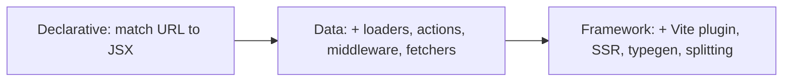
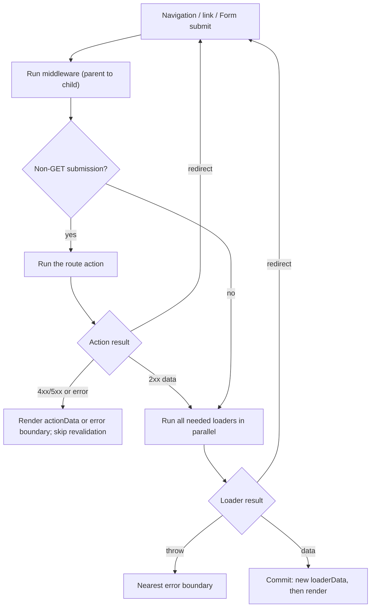

# 19 — Routing

> **How to use this module.** Sections 19.1–19.4 give you the model behind every router (the URL is state, routes are a tree). Sections 19.5–19.9 are the React Router data features that interviewers probe: loaders, actions, middleware, guards, lazy routes and error routes. 19.10 is the version map for legacy codebases (v5, v6, v7) and 19.11 is a brief look at TanStack Router. If you only have 20 minutes, read 19.2, 19.5, 19.7 and the Summary.

**Prerequisites:** [State as a snapshot](08-state.md#82-usestate-and-state-as-a-snapshot) · [Error boundaries](16-error-handling.md#162-error-boundaries) · [Server state vs client state](17-data-fetching.md#173-server-state-vs-client-state) · [Testing with a memory router](20-testing.md#208-testing-with-context-routers-and-query-clients)

**Code for this module:** [`examples/web/src/m19-routing/`](examples/web/src/m19-routing/). Every file below has a test next to it. Run them with `npx vitest run src/m19-routing` from `examples/web`. The examples run on `react-router` 8.4.0 (installed and checked against `node_modules/react-router`, including its bundled `CHANGELOG.md` and `docs/`). Framework mode (`@react-router/dev`) and TanStack Router are **not installed**, so their snippets are labeled *illustrative, not run*.

> **Provenance of claims.** "Checked in the package" means I read `examples/web/node_modules/react-router` (types, `dist/development/lib/router/router.js`, `CHANGELOG.md`, `docs/`). "Verified by running" means a test in `m19-routing` asserts it. Anything else is cited to a source or marked `> **Unverified:**`.

---

## 19.1 Client-side routing and the History API

### The problem
A classic website changes page by asking the server for a new HTML document. A single-page app (SPA) wants the URL to change **without** a document load, so the shell, the in-memory state and the scroll position survive. But users still expect the things a URL gives them: a link they can paste, a working Back button, a bookmark, a page that survives refresh.

### Mental model
The URL is **state that lives outside React**, owned by the browser. A router does three jobs: (1) **read** the URL and decide which components to render, (2) **write** it when the user navigates (links, redirects, `navigate()`), and (3) **listen** for the browser changing it (Back/Forward).

> **Java/Spring analogy.** `@RequestMapping` tables: a path pattern maps to a handler. `@PathVariable` is a route param, `@RequestParam` is a search param, and a servlet `Filter` chain is route middleware.
>
> **Where the analogy breaks:** Spring maps a request to a handler **once, on the server, per HTTP request**. A client router maps a URL to a component tree **in the browser, many times, without any request**, and it must also handle the browser moving the URL by itself (Back button).

### Minimal code
The browser primitives [Browser] ([MDN: History API](https://developer.mozilla.org/en-US/docs/Web/API/History_API)):

```ts
history.pushState({ scroll: 0 }, '', '/projects/apollo'); // new entry, no request, no popstate event
history.replaceState(null, '', '/projects?q=ap');         // rewrite the current entry
window.addEventListener('popstate', () => render(location.pathname)); // Back/Forward only
```

### How it works internally
`pushState`/`replaceState` change the address bar and the session history stack without loading anything. They do **not** fire `popstate`. That event fires only when the user (or `history.back()`) moves between existing entries. A router wraps this in a `history` object: a `<Link>` calls `push`, the router matches the new location against its route tree and re-renders; a `popstate` does the same. In tests, `createMemoryRouter` keeps the stack in an array instead of `window.history`, so tests never touch the jsdom URL ([20.8](20-testing.md#208-testing-with-context-routers-and-query-clients)). A hash router (`createHashRouter`) puts the route after `#`, which a static host can serve without any server configuration.

Because the browser URL is only a *client* trick, a **deep link** (someone pastes `/projects/apollo`) makes a real HTTP request for that path. Your server must answer every unknown path with `index.html` (the "SPA fallback"), otherwise a refresh on a deep link is a 404 ([24.13 Deployment options](24-react-with-spring-boot.md#2413-deployment-options) covers serving the build from Spring).

### Trade-offs
- ✅ Instant navigation, preserved state, shareable URLs.
- ❌ You own focus management, scroll restoration, document titles and announcing route changes to screen readers (a full page load does that for free). React Router's `<ScrollRestoration>` covers scroll in data/framework mode.
- ❌ A deep link needs server cooperation (fallback), and the first load pays for the router JavaScript.
- ❌ The newer [Navigation API](https://developer.mozilla.org/en-US/docs/Web/API/Navigation_API) is only **Baseline 2026, newly available** (all major engines since January 2026, per MDN), so older browsers lack it, and React Router still builds on the History API.

---

## 19.2 React Router 8: framework, data and declarative modes

### The problem
"React Router" names a library whose scope grew over three majors. In an interview, "which React Router?" has at least four answers (v5, v6, v6.4+ data routers, v7/v8 modes), and the right API depends on which of them the codebase uses.

### Mental model
React Router is **one library with three modes**, and the mode is chosen by the top-level router API you mount. Each mode **adds** to the previous one ([docs: Picking a mode](examples/web/node_modules/react-router/docs/start/modes.md), checked in the package):

| Mode | Top-level API | Adds | Choose when |
|---|---|---|---|
| **Declarative** | `<BrowserRouter>` + `<Routes>`/`<Route>` | Matching URLs to components, `<Link>`, `useNavigate`, `useParams`, `useSearchParams`, active links | You want routing only, or have your own data layer; v5/v6 apps (before 6.4) |
| **Data** | `createBrowserRouter(routes)` + `<RouterProvider>` | Route objects outside React; `loader`, `action`, `middleware`, `lazy`, `errorElement`, `<Form>`, `useFetcher`, pending UI | You want data features but keep control of bundling and server |
| **Framework** | `@react-router/dev` Vite plugin, `routes.ts`, route modules | Data mode plus type-safe route modules, automatic code splitting, SSR/SPA/static rendering, `href()` | You are starting fresh, or comparing with Next.js |



> **Java/Spring analogy.** Declarative is a bare `DispatcherServlet` mapping; data mode is Spring MVC with `@ModelAttribute`/`@PostMapping` handlers; framework mode is Spring Boot, where conventions and tooling are included.
>
> **Where the analogy breaks:** all three modes run **in the browser** (framework mode may also render on a server). The modes are additive layers over one router, not three runtimes.

### Minimal code
Declarative (`examples/web/src/m19-routing/declarative/DeclarativeApp.tsx`, tested with `MemoryRouter`):

```tsx
<Routes>
  <Route path="/" element={<Shell />}>
    <Route index element={<h1>Home</h1>} />
    <Route path="users/:userId" element={<UserDetail />} />
    <Route path="*" element={<h1>Page not found</h1>} />
  </Route>
</Routes>
```

Data mode (the shape used by every other file in this module; `renderRouter.tsx` mounts it in tests):

```tsx
import { createBrowserRouter } from 'react-router';
import { RouterProvider } from 'react-router/dom';

const router = createBrowserRouter([
  { path: '/', Component: Root, loader: rootLoader, children: [/* … */] },
]);
createRoot(el).render(<RouterProvider router={router} />);
```

Framework mode (*illustrative, not run: `@react-router/dev` is not installed*):

```ts
// app/routes.ts
import { index, route } from '@react-router/dev/routes';
export default [index('./home.tsx'), route('products/:pid', './product.tsx')];
```

```tsx
// app/product.tsx: a route module; Route.* types are generated
export async function loader({ params }: Route.LoaderArgs) { return { product: await getProduct(params.pid) }; }
export default function Product({ loaderData }: Route.ComponentProps) { return <h1>{loaderData.product.name}</h1>; }
```

### How it works internally
Data mode builds a **router object** (`createRouter` under the hood) outside React. It holds a state machine (`router.state.location`, `.navigation`, `.loaderData`, `.actionData`, `.errors`, `.fetchers`) and exposes `navigate`, `fetch`, `revalidate`. `<RouterProvider>` subscribes React to that state. Declarative mode has no such object: `<Routes>` matches during render, so nothing can run before the component renders, which is why loaders/actions do not exist there. Framework mode compiles route modules into a data-mode route tree and adds the server.

`RouterProvider` exists in both `react-router` and `react-router/dom`. In browsers use the `/dom` one, which can call `ReactDOM.flushSync`; the 7.0.0 changelog introduced the subpath so `react-dom` stays an optional peer (checked in `CHANGELOG.md`). Since v8, `react-router-dom` no longer exists ([19.10](#1910-version-notes-v5--v6--v7--v8)).

### Trade-offs
- Declarative is the simplest and the only choice if your data layer already handles loading (TanStack Query, [17](17-data-fetching.md)). You lose "fetch before render" and the pending-navigation state.
- Data mode is the sweet spot for an existing Vite SPA that wants route-level data and mutations. Its route objects are plain data, so they are easy to test with `createMemoryRouter`.
- Framework mode buys SSR and typegen at the cost of a build-tool dependency and its conventions. React Router's own docs recommend it for "too new to have an opinion" and Next.js comparisons (docs: Picking a mode). Comparison with Next.js and Remix: [21.14](21-concurrent-ssr-server-components.md#2114-react-router-framework-mode--remix-comparison).

> **Version notes.** v7 (2024-11-21) merged Remix into React Router: "What we planned to release as Remix v3 is now going to be released as React Router v7" ([Remix blog, 2024-05-15](https://remix.run/blog/merging-remix-and-react-router)), and framework mode is the Remix feature set. v8 (2026-06-17) keeps all three modes (VERSIONS.md; changelog). For Next.js routing (Pages vs App Router) see [21.11](21-concurrent-ssr-server-components.md#2111-nextjs-app-router-as-the-reference-rendering-strategies).

---

## 19.3 Nested routes, layouts, `<Outlet>`

### The problem
Most screens share chrome (header, sidebar, tabs). Without nesting, every page repeats the layout, and the layout re-mounts (losing state, flashing) on every navigation.

### Mental model
A URL matches a **branch** of a route **tree**, from root to leaf. Every matched route renders; each parent renders its child at the spot where you place `<Outlet />`. A route with **no `path`** is a **layout route**: it adds UI and (in data mode) loaders but no URL segment. An `index` route is the child shown when the parent's path matches exactly.

> **Java/Spring analogy.** A Thymeleaf/Tiles layout with a content slot, or nested `@RequestMapping` on a class plus method.
>
> **Where the analogy breaks:** the layout is **kept mounted** while the child changes, and in data mode the parent's and child's loaders run **in parallel**, not in a template-inclusion order ([19.5](#195-loaders-actions-usefetcher)).

### Minimal code
`examples/web/src/m19-routing/auth/authRoutes.tsx` (shortened):

```tsx
{ path: '/', Component: Shell, children: [
  { index: true, element: <h1>Home</h1> },
  { path: 'app', middleware: [requireUser(session)], loader: appLoader, Component: AppLayout, children: [
    { index: true, Component: Dashboard },
    { path: 'settings', loader: loadSettings, Component: SettingsPage },
  ] },
] }
```

`Shell` and `AppLayout` render `<Outlet />`. Child routes use **relative** paths (`settings`, not `/app/settings`).

### How it works internally
`matchRoutes` flattens the tree into *branches*, ranks them (static segments beat dynamic, dynamic beat splat `*`, longer beats shorter) and picks the best. The result is an array of matches. `<Outlet>` renders "the next match" through context. Because the parent element stays at the same tree position, React preserves its state across child navigations. `useOutletContext` passes data parent→child without props. Data mode adds `useRouteLoaderData('routeId')` for reading an ancestor's loader data and `handle` + `useMatches` for breadcrumbs.

Route **ranking** details changed once in the 8.x line: 8.2.0 fixed ranking for dynamic params with static extension suffixes (changelog 8.2.0), and an `unstable_routePatternMatching` flag (8.4.0) opts into a different matcher ([upgrade docs](examples/web/node_modules/react-router/docs/upgrading/future.md)). Treat that flag as unstable.

### Trade-offs
- ✅ Layouts survive navigation; code splitting and error boundaries attach per route ([19.8](#198-lazy-routes-and-code-splitting), [19.9](#199-error-routes)).
- ❌ Too-deep trees make the data flow hard to see. Prefer a layout per real UI region, not per URL segment.
- ❌ A parent re-renders on child navigations only when router state it reads changes; in 8.4.0 the router split its internal contexts to avoid extra re-renders (changelog 8.4.0), so do not wrap routes in `memo` hoping to fix this.

---

## 19.4 Params and search params

### The problem
Which project is open? Which filter is on? Which page? If that lives in `useState`, it is lost on refresh, cannot be linked, and breaks Back. ([06](06-jsx-and-rendering-model.md) and [08](08-state.md) already point here.)

### Mental model
Split "where am I" state into two kinds. **Params** (`/projects/:projectId`) identify **which resource**. **Search params** (`?q=ap&status=active`) are **optional view state** (filter, sort, page, tab). Both are **strings from outside the app**: untrusted input. The URL is the **single source of truth**; components and loaders read it and write to it, and never keep a parallel copy. This is the "URL" category in [18.1](18-state-management.md#181-a-taxonomy-local-server-url-form-global-ui).

> **Java/Spring analogy.** `@PathVariable` and `@RequestParam`, including the lesson that you validate and convert both.
>
> **Where the analogy breaks:** in Spring the framework converts and validates for you (`@Valid`, `ConversionService`). `useParams()` returns `string | undefined`, and React Router does nothing else (route-pattern param validation exists only behind an `unstable_` field in 8.4.0).

### Minimal code
`examples/web/src/m19-routing/filters/ProjectsPage.tsx` (shortened). The loader reads the URL; the UI writes it:

```tsx
export function createProjectsLoader(store: ProjectStore) {
  return ({ url }: LoaderFunctionArgs) => {
    const q = url.searchParams.get('q') ?? '';
    const status = parseStatus(url.searchParams.get('status')); // validate: unknown → ''
    return { projects: store.list({ q, status }), q, status };
  };
}
// in the component
const [, setSearchParams] = useSearchParams();
setSearchParams((prev) => withFilter(prev, 'status', value), { replace: key === 'q' });
```

### How it works internally
`useParams()` returns the params of all matched routes merged. A search-param change is a **navigation** to the same pathname: `setSearchParams` calls `navigate` with a new search string, so in a data router the **loaders run again** (every matched loader, see 19.5 and Exercise 4). `replace: true` overwrites the current history entry instead of adding one, which is right for typing (otherwise Back walks through every keystroke) and wrong for a discrete choice. The functional form `setSearchParams(prev => …)` preserves unrelated params but, unlike `setState`, it is **not batched across calls** in one event: two calls in one handler compute from the same `prev`. Build one `URLSearchParams` and set it once.

Two form-input traps. A **controlled** input bound to a value read from the URL lags in a data router, because the URL only commits after the loader finishes, so React resets the field and eats keystrokes. The example uses an **uncontrolled** field with `defaultValue` and syncs it to the URL when the URL changes from outside (Back, "Clear filters"). The alternative is local state for the draft plus a debounced `setSearchParams` ([12](12-hooks-and-custom-hooks.md) has `useDebounce`).

### Trade-offs
- ✅ Shareable, bookmarkable, Back-friendly state with no extra store.
- ❌ Everything is a string. Parse numbers and enums at the boundary; cap `pageSize`; never trust `?role=admin`.
- ❌ Not for large or sensitive state, and not for state that changes many times per second.
- ❌ In v5 the same job was `useLocation().search` plus `new URLSearchParams(...)` by hand; `useSearchParams` arrived in v6.

> **Version notes.** `loader({ request })` reading `new URL(request.url)` is the long-standing pattern. v7.15.0 stabilized a ready-made `url` argument on `loader`/`action`/`middleware` (checked in `CHANGELOG.md`, "Stabilize `unstable_url` as `url`"), which the examples use. In framework mode the `request.url` can carry `.data` suffixes unless you use `url`; v8 removed the flag and now always passes the raw request, so use `url` for routing logic (`CHANGELOG.md` 8.0.0).

---

## 19.5 Loaders, actions, `useFetcher`

### The problem
Fetching in a component's effect means: render → commit → effect → request, so each nested level adds a **waterfall** round trip, and every component invents its own loading and error handling ([17.1](17-data-fetching.md#171-fetching-in-effects-and-its-pitfalls)). Mutations have the mirror-image problem: after a POST, who refreshes the data on screen?

### Mental model
Move data **to the route**. A route may declare a **`loader`** (read, runs on `GET` navigations) and an **`action`** (write, runs on non-GET submissions). The router calls them **before rendering the next screen**, **in parallel** for all matched routes, keeps the old screen up while it waits, and exposes the progress as `useNavigation()`. After an action succeeds it **revalidates** (re-runs) the loaders on the page, so the screen is correct without you wiring any refetch.

> **Java/Spring analogy.** `@GetMapping` and `@PostMapping` handlers, with the "Post/Redirect/Get" pattern (`return redirect(...)`) and `BindingResult` errors. `useLoaderData` is the model attribute.
>
> **Where the analogy breaks:** these handlers run **in the browser** (data mode), and after the POST the router **automatically re-runs the GET handlers** of everything on screen. Spring never does that for you.

### Minimal code
Read, write and validate (`examples/web/src/m19-routing/rename/projectRoutes.tsx`, shortened):

```tsx
function loader({ params }: LoaderFunctionArgs) {
  const project = store.get(params.projectId ?? '');
  if (!project) throw data(`No project with id "${params.projectId}"`, { status: 404 });
  return { project };
}
async function action({ request, params }: ActionFunctionArgs) {
  const name = String((await request.formData()).get('name') ?? '').trim();
  const error = validateProjectName(name, (n) => store.nameTaken(n, id));
  if (error) return data<RenameActionData>({ error, name }, { status: 400 }); // stay on the page
  await store.rename(id, name);
  return redirect(`/projects/${id}`); // Post/Redirect/Get
}
// component: <Form method="post">, useActionData(), and useNavigation() for the pending state
```

`useFetcher` calls an action or loader **without navigating** (`examples/web/src/m19-routing/fetcher/starRoutes.tsx`):

```tsx
const fetcher = useFetcher();
const starred = fetcher.formData ? fetcher.formData.get('starred') === 'true' : project.starred; // optimistic
<fetcher.Form method="post" action={`/projects/${project.id}/star`}> … </fetcher.Form>
```



### How it works internally
(All checked in `dist/development/lib/router/router.js`, `getMatchesToLoad` and `handleAction`, and asserted by Exercise 4.)

1. **Parallel, not sequential.** `defaultDataStrategy` resolves every match that `shouldLoad` with one `Promise.all`. A parent loader does not wait for a child loader, which is why you cannot pass data from a parent loader to a child loader (use middleware context, 19.6).
2. **Which loaders run.** A new route instance always loads. For routes that stay matched, the default is: re-run if its own **params/pathname** changed, or the **search string** changed, or the URL is **identical** (treated like a refresh), or an action just succeeded, or `revalidate()` was called. `shouldRevalidate` can override that per route, and `defaultShouldRevalidate={false}` on a `<Form>`/`<Link>` opts out for one event ([docs: Revalidation Optimization](examples/web/node_modules/react-router/docs/how-to/optimize-revalidation.md)).
3. **Action first.** A `POST` runs the action, then the loaders with a fresh GET request. If the action returns/throws a **4xx/5xx status**, revalidation is skipped by default (`shouldSkipRevalidation` in the source). That is why returning `data(…, { status: 400 })` for a validation error keeps the page as is (Exercise 3 asserts the loader is not re-run).
4. **Redirects** from a loader or action start a new navigation. Thrown responses/errors go to the nearest error boundary ([19.9](#199-error-routes)).
5. **`<Form>` vs `useFetcher`.** `<Form>` is a navigation (URL changes, history entry, `useNavigation`). A fetcher is **not**: it has its own `state` (`idle`/`submitting`/`loading`), its own `data`, and its own `formData` for optimistic UI. Use a fetcher for in-place mutations (like, star, inline edit); use `<Form>` when the URL should change. In the source, a fetcher action is followed by revalidation of the page's loaders unless it is told not to ([docs: Form vs fetcher](examples/web/node_modules/react-router/docs/explanation/form-vs-fetcher.md)).
6. **Races.** A new navigation aborts the previous one's `AbortSignal`, so stale loader results are dropped. This is the router-level answer to [9.4](09-effects.md#94-race-conditions-and-abortcontroller).

`useLoaderData` is typed by `SerializeFrom<T>`: pass `typeof loader` in v7+ (`useFetcher<typeof loader>()`; in v6 the generic was the data type), or give the data type explicitly as the examples do.

### Trade-offs
- ✅ No fetch waterfalls on route entry, no hand-written loading/error plumbing, correct data after mutations.
- ✅ Works with **progressive enhancement** in framework mode: a `<Form>` posts even without JavaScript.
- ❌ Loader data is not a cache. Navigating back re-runs loaders (the router does not keep `staleTime`). For caching, combine with TanStack Query: prefetch in the loader (`queryClient.ensureQueryData`) and read with `useQuery` ([17.8](17-data-fetching.md#178-prefetching-and-dependent-queries)). `ensureQueryData(options)` takes a single options object and returns `Promise<TData>`; in current v5 docs it is marked deprecated in favor of `queryClient.query({ ...options, staleTime: 'static' })` ([QueryClient reference](https://tanstack.com/query/v5/docs/reference/QueryClient)).
- ❌ Revalidating *everything* after every mutation is wasteful for big pages: scope with `shouldRevalidate`.
- ❌ React 19 Actions (`<form action={fn}>`, `useActionState`, [14.7](14-forms-and-actions.md#147-useactionstate)) are a **different API with the same idea**. In a router app, prefer the router's `<Form>`/`action` for navigations and use React Actions for local forms.

> **Version notes.** **v5:** no data APIs. Fetch in effects or `connect`. **v6.4.0 (2022-09-13):** data routers arrive: `createBrowserRouter`, `RouterProvider`, `loader`, `action`, `errorElement`, `defer`/`Await`, `<Form>`, `useFetcher`, `<ScrollRestoration>` (v6 CHANGELOG, "brings all the data loading and mutation APIs over from Remix"). **v6.28:** `json()`/`defer()` deprecated in favor of returning raw objects. **v7.0.0:** `json` removed ("use `Response.json`"), `defer` removed (return raw promises; `data()` is the way to set status/headers); also fetcher generic changed to `typeof loader` (`CHANGELOG.md` 7.0.0). The `v7_skipActionErrorRevalidation` flag (4xx/5xx action results skip revalidation) became default in v7. **v8:** `useNavigation().formMethod` is upper-case (the `v7_normalizeFormMethod` flag is gone since 7.0.0), the examples compare with `'POST'`.

---

## 19.6 Middleware

### The problem
Cross-cutting work (auth checks, logging, timing, setting up per-request context) either gets copied into every loader and action, or runs too late (in the component, after data was fetched).

### Mental model
**Middleware** is a function attached to a route that runs **before** the loaders/actions below it and can run code **after** them, by wrapping `next()`. They nest from parent to child on the way down and unwind child to parent on the way up, like servlet `Filter`s or Express/Koa middleware:

```text
root middleware start
  parent middleware start
    child middleware start
      run loaders / the action
    child middleware end
  parent middleware end
root middleware end
```

> **Java/Spring analogy.** `javax.servlet.Filter` / `HandlerInterceptor` (`preHandle` before, `postHandle` after). `context.set(userContext, user)` is a request attribute.
>
> **Where the analogy breaks:** in data mode these run in the **browser** for every client navigation. Hiding a page there is a UX decision, not security: anyone can edit client code. Real access control stays on the server (your Spring API).

### Minimal code
Used in `examples/web/src/m19-routing/auth/session.ts` and `loaderOrder.tsx`:

```tsx
export const userContext = createContext<User>();

export function requireUser(session: Session): MiddlewareFunction {
  return ({ request, context }) => {
    if (!session.user) throw redirect(loginUrl(new URL(request.url).pathname));
    context.set(userContext, session.user);   // typed: loaders call context.get(userContext)
  };
}

const timing: MiddlewareFunction = async (_args, next) => {
  const start = performance.now();
  await next();                                // the loaders/actions run here
  console.log(`navigation took ${performance.now() - start}ms`);
};
// { path: 'app', middleware: [requireUser(session)], loader: appLoader, … }
```

### How it works internally
(Checked in `router.js` `callRouteMiddleware`, `docs/how-to/middleware.md`, and asserted in Exercise 4.)

- `next()` calls the downstream middleware, and at the end the data strategy resolves loaders or the action. You may call it **once**: a second call throws "You may only call `next()` once per middleware".
- If a middleware **does not call `next()`**, it is called for you after the function returns.
- Throwing a `redirect(...)` (or any error) before `next()` means **no loader below runs**. Errors go to the appropriate error boundary and `next()` itself never throws, so ancestor "after" code always runs.
- The `context` is a `RouterContextProvider`. `createContext<T>()` makes a typed key, and `context.get/set` read and write it. A fresh provider is created per navigation or fetcher call (optionally seeded with `getContext` on `createBrowserRouter`/`createMemoryRouter`).
- **Client middleware runs on every client navigation** that touches the route, even with no loaders (docs). In **framework mode** there is also server `middleware` (returns a `Response`) and `clientMiddleware`; server middleware only runs when a request actually goes to the server.
- With an action: the pipeline runs once around the **action**, and once more around the **loader** pass afterwards (Exercise 4, scenarios 4 and 5: verified by running it).

### Trade-offs
- ✅ A single guard on a layout route protects every child, present and future, and runs before their loaders ([19.7](#197-protected-routes-and-auth-redirects)).
- ✅ Typed per-request context replaces reaching into globals.
- ❌ Parent loaders cannot hand data to child loaders. Put the shared value in middleware context.
- ❌ Do not mutate a `Response` body in server middleware, and do not treat client middleware as security.

> **Version notes.** **v7.3.0 (2025-03-06)** shipped middleware as *unstable* (`future.unstable_middleware`). **v7.9.0 (2025-09-12)** stabilized `RouterContextProvider`, `createContext`, `getContext`, but middleware still sat behind `future.v8_middleware`. **v8.0.0 (2026-06-17): middleware is always on**, the flag is removed, and the `context` argument to `loader`, `action` and `middleware` is always a `RouterContextProvider` (so `getLoadContext` on a custom server must return one; `AppLoadContext` is gone). In a v6/v7-without-flag app, `context` was a plain object (framework mode), and a loader-based redirect was the only server-agnostic guard ([19.7](#197-protected-routes-and-auth-redirects)). Sources: `CHANGELOG.md` 7.3.0, 7.9.0, 8.0.0 and `docs/upgrading/v7.md`.

---

## 19.7 Protected routes and auth redirects

### The problem
Some routes need a signed-in user. A guard that checks too late, flashes the protected page, fetches data for an anonymous user, or sends the user to the home page after login (instead of back to where they were going) is a classic bug and a classic interview question.

### Mental model
There are three places to put a guard, and they differ in **when** they run:

| Guard | Runs | Loaders of the protected route | Available in |
|---|---|---|---|
| **Component** (`<RequireAuth>` → `<Navigate>`) | during render | **already ran** (data fetched for a guest) | every mode, v5+ |
| **Loader** (`if (!user) throw redirect(...)`) | before render | the guard's own loader runs; siblings run **in parallel** | data/framework |
| **Middleware** | before any loader below it | **never run** | data/framework, always on in v8 |

Pick the **earliest** one your mode offers (middleware on a layout route). The component guard is the fallback for declarative mode and for UI-only concerns (hiding a button).

> **Java/Spring analogy.** A component guard is checking authorization inside the controller body after the service already ran; middleware is a Spring Security filter in front of the controller. Authorization is **always** also enforced on the API.
>
> **Where the analogy breaks:** nothing in the browser is trustworthy, so a client guard only improves UX. The security boundary is your Spring resource server ([24](24-react-with-spring-boot.md)).

### Minimal code
`examples/web/src/m19-routing/auth/authRoutes.tsx` and `RequireAuth.tsx`:

```tsx
// guard on the layout route (middleware): runs before appLoader and every child loader
{ path: 'app', middleware: [requireUser(session)], loader: appLoader, Component: AppLayout, children: [...] }

// login action: validate, set the session, then go back where the user was headed
const name = String(form.get('name') ?? '').trim();
if (!name) return data({ error: 'Enter your name' }, { status: 400 });
session.user = { name };
return redirect(safeRedirect(form.get('redirectTo') || null)); // only same-origin paths

// component guard (declarative mode)
if (!user) return <Navigate to={loginUrl(location.pathname + location.search)} replace />;
```

### How it works internally
The guard carries the **return path** in the redirect (`/login?redirectTo=%2Fapp%2Fsettings`), the login action reads it and redirects back. `safeRedirect` only accepts values that start with a single `/`, otherwise `?redirectTo=https://evil.example` or `//evil.example` is an **open redirect**. In a component guard, `<Navigate replace>` keeps the guarded URL out of history so Back does not bounce the user into the guard again. The router test in `RequireAuth.test.tsx` shows the key difference: with a component guard the protected route's loader **has run once** by the time the redirect happens; with middleware (`authRoutes.test.tsx`) it has not run at all (verified by running them).

### Trade-offs
- ✅ Middleware on a layout route: one guard, correct ordering, no data fetched for guests, no flash of content.
- ✅ Component guard: works everywhere (v5 `<Redirect>`, v6 `<Navigate>`), is easy to compose with context ([11](11-context.md)), and is fine for role-based UI.
- ❌ Both are client-side. The first protected API call must still return 401/403, and your client needs a refresh/redirect strategy ([24.3 onwards](24-react-with-spring-boot.md#241-architecture-options)).
- ❌ Where does the session live? A module-level object (as in the example) is a test stand-in. In production it is a cookie checked by the server, or a token in memory; never read it from `localStorage` in a middleware you consider secure.

> **Version notes.** **v5:** `<PrivateRoute>` wrappers around `<Route render={...}>` with `<Redirect>`. **v6:** `<Route element={<RequireAuth><Page/></RequireAuth>}>` with `<Navigate>`. **v6.4–v7:** loader redirects (`throw redirect('/login')`), each protected route needing its own loader (or a shared helper). **v7.9/v8:** middleware, always on in v8.

---

## 19.8 Lazy routes and code splitting

### The problem
A router with fifty screens ships fifty screens' code in the first bundle. The route is the natural split point: the user can only see one at a time.

### Mental model
Keep **matching data** (`path`, `children`, `index`) in the main bundle, and load the **rest** of the route (`Component`, `loader`, `action`, `ErrorBoundary`…) lazily on first visit. The router calls `lazy()` itself **in parallel with matching and starts the loaders after the chunk arrives**, so code and data are not a waterfall you wrote ([15.7](15-performance.md#157-code-splitting-with-lazy-and-suspense) covers `React.lazy`, which does not know about data).

> **Java/Spring analogy.** `@Lazy` bean initialization: pay for it on first use.
>
> **Where the analogy breaks:** a lazy chunk is a **network request** that can fail, so lazy routes need an error boundary ([19.9](#199-error-routes)) and a pending state.

### Minimal code
`examples/web/src/m19-routing/lazy/lazyRoutes.tsx` and `reportsRoute.tsx`:

```tsx
{ path: 'reports', lazy: () => import('./reportsRoute') }
// reportsRoute.tsx exports: Component and loader (named exports become route properties)
```

Granular form (v7.5.0+, object of per-property loaders), *illustrative, not run*:

```ts
{ path: 'show/:showId', lazy: {
  loader: async () => (await import('./show.loader')).loader,
  Component: async () => (await import('./show.component')).Component,
} }
```

Framework mode splits every route module for you (*illustrative, not run*), so you write no `lazy` at all.

### How it works internally
`lazy` may return any route properties **except** `path`, `id`, `index`, `children`, `lazy`, `caseSensitive` (and, for the function form, `middleware`): the `UnsupportedLazyRouteFunctionKey` type in `utils.d.ts` lists them. Matching must be possible without downloading anything. The router loads the lazy route when a navigation matches it, then runs its loader. It **dedupes** concurrent calls (7.5.0 changelog) and it does not call `lazy` again once resolved: the test `lazyRoutes.test.tsx` asserts the call count stays at 1 after navigating away and back. On the first, direct visit (deep link) the router has nothing to show while the chunk and loader load, so it renders `HydrateFallback`; without one, development logs "No `HydrateFallback` element provided to render during initial hydration" (`hooks.js`; `renderRouter.tsx` supplies `Booting` for that reason).

### Trade-offs
- ✅ Smaller first bundle, with code and data requested together.
- ❌ A lazy route adds one more request on first visit: preload on hover/intent for hot paths (framework mode has `<Link prefetch>`; in data mode call the dynamic `import()` yourself).
- ❌ Don't lazy-load the shell/layout that every route needs, or tiny routes where the chunk overhead beats the code size.
- ❌ If the chunk request fails, the navigation errors: show a retry in the error element and consider a one-time reload for a stale deploy (a hashed chunk that no longer exists).

> **Version notes.** **v6.4:** `lazy` is a function returning route properties. **v7.5.0 (2025-04-04):** object-based `lazy` for per-property splitting; middleware could be lazy only via the object form (an unstable key at the time). **v8.4.0:** lazy import errors during SPA navigations are preserved instead of being replaced by a missing-`dataStrategy` error (changelog 8.4.0). `React.lazy` + `<Suspense>` still work in declarative mode.

---

## 19.9 Error routes

### The problem
Loaders fail, actions throw, components crash, URLs match nothing. Without a plan, one failing route either white-screens the app or shows the router's default "Unexpected Application Error!" page.

### Mental model
Every route may have an **error boundary** (`ErrorBoundary` component or `errorElement` element). An error from that route's **loader, action, middleware or render** bubbles up the route tree to the **nearest** route that has one, and **replaces only that route's outlet**: the layout above keeps rendering. It is [error boundaries (16.2)](16-error-handling.md#162-error-boundaries) with the route tree as the boundary map. `useRouteError()` reads the error, and `isRouteErrorResponse(error)` distinguishes **expected** errors (a thrown `data(..., { status: 404 })` or an unmatched URL, which have `status`, `statusText`, `data`) from bugs (`Error`).

> **Java/Spring analogy.** `@ControllerAdvice` with `@ExceptionHandler`, and `ResponseStatusException`: throwing a status is the expected path, an unexpected exception is a 500.
>
> **Where the analogy breaks:** errors are rendered as **UI in the tree** at a chosen level, and the boundary resets when the location changes (the router's boundary re-derives state on location change, `hooks.js`).

### Minimal code
`examples/web/src/m19-routing/rename/projectRoutes.tsx`:

```tsx
function ProjectErrorBoundary() {
  const error = useRouteError();
  if (isRouteErrorResponse(error) && error.status === 404) return <h1>Project not found</h1>;
  return <h1>Something went wrong</h1>;
}
// route: { path: 'projects/:projectId', loader, action, Component: ProjectPage, ErrorBoundary: ProjectErrorBoundary }
// loader: throw data(`No project with id "${id}"`, { status: 404 });
```

### How it works internally
The router stores errors in `state.errors` keyed by the **route id of the boundary**. If a loader throws, the router renders matches only down to the boundary route and shows its error element. If an **action** throws or returns a thrown response, the same applies, and loaders **below** the boundary do not run. A middleware that throws **before** `next()` has no `loaderData`, so the error bubbles to the highest route with a loader and looks for a boundary from there (docs/how-to/middleware). With no boundary anywhere, `DefaultErrorComponent` renders "Unexpected Application Error!" and logs through `console.error` (checked in `hooks.js`). In declarative mode only render errors exist: wrap with `react-error-boundary` or a class boundary ([16.3](16-error-handling.md#163-react-error-boundary)); a `path="*"` route handles 404s.

> For error reporting, pass an `onError` prop (type `ClientOnErrorFunction`, called as `(error, { location, params, pattern, errorInfo })`) to `<RouterProvider>` in data mode or `<HydratedRouter>` in framework mode. It is called once per middleware, loader, action or render error, unlike an error element that can re-render; `errorInfo` comes from `componentDidCatch` and is present only for render errors ([Error Reporting](https://reactrouter.com/how-to/error-reporting), [RouterProvider](https://reactrouter.com/api/data-routers/RouterProvider)). Wire your monitoring there ([16.7](16-error-handling.md#167-logging-and-monitoring-source-maps)).

### Trade-offs
- ✅ Put a boundary on the **layout** route so failures keep the navigation visible; add specific ones where a better message exists (not found vs forbidden).
- ✅ Throw responses for expected failures (`404`, `403`), return `data(…, { status: 400 })` for form validation that the user fixes on the page.
- ❌ A single root boundary is a last resort. It replaces the whole screen.
- ❌ Do not use error boundaries for validation: that is action data (Exercise 3).

> **Version notes.** **v6.4:** `errorElement` (an element). **v7:** `ErrorBoundary` as a component prop exists next to `errorElement` (they are mutually exclusive); framework mode exports `ErrorBoundary` from the route module. **v8.0.0** removed the internal `hasErrorBoundary` field from route objects and `lazy` definitions (the router infers it). Also, "client middleware errors load lazy route error boundaries before bubbling" (8.0.0 changelog).

---

## 19.10 Version notes v5 → v6 → v7 → v8

### The problem
You will meet all of these in the wild, and the same words (`Route`, `Switch`, `useHistory`) mean different things. Interviewers use them to test whether you read code or only tutorials.

### Mental model
Four eras: **v5** (2017–2021), **v6** (Nov 2021, rewritten matching, then data routers in 6.4), **v7** (Nov 2024: Remix merged in, one package, framework mode), **v8** (Jun 2026: cleanup). Dates are from the changelogs (v6.0.0 2021-11-03, v6.4.0 2022-09-13, v7.0.0 2024-11-21, v7.9.0 2025-09-12, v8.0.0 2026-06-17).

### Minimal code
The same screen in three eras:

```tsx
// v5
<Switch>
  <Route exact path="/users/:id" render={({ match }) => <User id={match.params.id} />} />
  <Redirect to="/" />
</Switch>
const history = useHistory(); history.push('/home');

// v6 / v7 (declarative)
<Routes>
  <Route path="/users/:id" element={<User />} />
  <Route path="*" element={<Navigate to="/" replace />} />
</Routes>
const navigate = useNavigate(); navigate('/home');

// v8 (data mode)
import { createBrowserRouter, Navigate, useParams } from 'react-router';
import { RouterProvider } from 'react-router/dom';          // NOT react-router-dom
const router = createBrowserRouter([{ path: '/users/:id', Component: User }]);
```

### How it works internally: what changed, version by version
| Version | Change | Source |
|---|---|---|
| **v5** | `<Switch>` (first match wins, so order matters), `component=`/`render=`/`children=`, `exact`, `<Redirect>`, `useHistory`, `withRouter`, `useRouteMatch`, `<Prompt>`, `<NavLink activeClassName exact>`. Last release 5.3.4 | VERSIONS.md; v6 upgrade guide |
| **v6.0** (2021-11-03) | `<Routes>` with best-match ranking; `element`; relative routes and links; `useNavigate`; `<Navigate>` (push by default, v5 `<Redirect>` replaced); `end` instead of `exact`; `useMatch`; no `withRouter`; `activeClassName`/`activeStyle` removed; `<Prompt>` dropped (later `useBlocker`); a `react-router-dom-v5-compat` migration package | [v5→v6 guide](https://reactrouter.com/6.30.0/upgrading/v5) (fetched); compat package name from the [official migration discussion](https://github.com/remix-run/react-router/discussions/8753) |
| **v6.4** (2022-09-13) | Data routers: `createBrowserRouter`, `RouterProvider`, `loader`, `action`, `errorElement`, `defer`/`Await`, `<Form>`, `useFetcher`, `<ScrollRestoration>` | v6 CHANGELOG |
| **v6.28** | Deprecation warnings for `json()` and `defer()`, plus `future.v7_*` flags to opt in to v7 behavior early | v6 / v7 CHANGELOG |
| **v7.0** (2024-11-21) | `react-router-dom` collapsed into `react-router` (the `-dom` package stayed as a re-export); DOM bits under `react-router/dom`; `json` and `defer` removed (return raw promises or `data()`); `@remix-run/*` collapsed in; min React 18, Node 20; framework mode = Remix; `createRemixStub` renamed `createRoutesStub`; `useFetcher<typeof loader>()` | `CHANGELOG.md` 7.0.0; [v7 post](https://remix.run/blog/react-router-v7) |
| **v7.3 → v7.9** | Middleware unstable (7.3.0), `Route.*` types and `url` argument, object `lazy` (7.5.0), `RouterContextProvider`/`createContext`/`getContext` stable and middleware behind `future.v8_middleware` (7.9.0) | `CHANGELOG.md` |
| **v8.0** (2026-06-17) | **`react-router-dom` removed**: import `RouterProvider`/`HydratedRouter` from `react-router/dom`, everything else from `react-router`. **Middleware always on** (flag removed). `v8_passThroughRequests` and `v8_trailingSlashAwareDataRequests` flags removed (now default). `data` → `loaderData` in `meta`, `matches`, `useMatches()`. ESM-only. Node ≥ 22.22, React ≥ 19.2.7, framework mode Vite 7+. Cloudflare dev proxy removed. `hasErrorBoundary` and `AppLoadContext` removed | `CHANGELOG.md` 8.0.0/8.0.1; `docs/upgrading/v7.md` |
| **v8.4** | Deprecates `createStaticRouter({ branches })`; unstable `unstable_routePatternMatching` flag; granular internal contexts. "No future flags yet" for v9 (estimated mid-2027, Node 24+) | `CHANGELOG.md` 8.4.0; `docs/upgrading/future.md` |

**Migration path (what to actually do):**
1. v5 → v6: upgrade to React 16.8+ and v5.1 (hooks), then replace `Switch`→`Routes`, `component/render`→`element`, `useHistory`→`useNavigate`, `exact`→ nothing/`end`, `withRouter`→hooks. Or use the compat package to go route by route (v6 upgrade guide).
2. v6 → v7: update to the latest v6.x, turn on the `v7_*` future flags, fix deprecations (`json`/`defer`), then bump (React 18+, Node 20+). `react-router-dom` still works as a re-export in v7.
3. v7 → v8: update to the latest v7.x, adopt `future.v8_*` flags (middleware, pass-through requests, trailing-slash data requests), update React to 19.2.7+ and Node to 22.22+, **uninstall `react-router-dom`** and rewrite imports, rename `data`→`loaderData`, then bump to 8 (`docs/upgrading/v7.md`).

### Trade-offs
- Do not rewrite a working v6 declarative app into data mode "because it is current". Adopt data features route by route.
- A large v5 app is cheaper to move to v6 with the compat package than in one big bang.
- Next.js has its own router: the Pages Router (`pages/`, `getServerSideProps`) and the App Router (`app/`, Server Components). They are not React Router; see [21.11](21-concurrent-ssr-server-components.md#2111-nextjs-app-router-as-the-reference-rendering-strategies) and [21.13](21-concurrent-ssr-server-components.md#2113-route-handlers-and-proxyts).

---

## 19.11 TanStack Router

### The problem
React Router's types are loose: `useParams()` returns strings you cast, and `to="/projcts"` compiles. Search params are untyped strings you parse by hand.

### Mental model
**TanStack Router** [Library: TanStack Router] treats the **route tree as a typed schema**. Paths, params and search params are inferred end to end, so a wrong link is a compile error. Per its docs it offers "100% inferred TypeScript support", search params "automatically parsed and serialized as JSON" and "validated and typed", route loaders "w/ SWR caching", and file-based route generation ([overview](https://tanstack.com/router/latest/docs/framework/react/overview), fetched). Its full-stack companion is TanStack Start.

> **Java/Spring analogy.** Generated, type-checked client from an OpenAPI spec instead of hand-built URL strings.
>
> **Where the analogy breaks:** the schema is your route tree, and it is validated by TypeScript at build time, not by an external document.

### Minimal code
*Illustrative, not run: `@tanstack/react-router` is not installed here (VERSIONS.md lists 1.170.41). Check names against the docs for your version.*

```tsx
const productsRoute = createRoute({
  getParentRoute: () => rootRoute,
  path: '/products',
  validateSearch: (search: Record<string, unknown>) => ({ q: typeof search.q === 'string' ? search.q : '' }),
  loaderDeps: ({ search }) => ({ q: search.q }),
  loader: ({ deps }) => fetchProducts(deps.q),
});
// <Link to="/products" search={{ q: 'shoes' }} />  // a typo in `to` or a wrong search shape fails to compile
```

### How it works internally
Because loaders depend on declared **search params** (`loaderDeps`), the router can cache per dependency key with stale-while-revalidate, much like TanStack Query's key. React Router instead re-runs loaders by revalidation rules (19.5) and has no cache.

### Trade-offs
- ✅ Best-in-class type safety; search params as first-class typed state.
- ❌ Smaller ecosystem than React Router in existing codebases (you will meet React Router far more often), and a different mental model for loaders and caching.
- ✅/❌ Picking between them: choose TanStack Router for a new, TypeScript-heavy SPA where typed links and search params matter; choose React Router for existing codebases, framework mode comparisons with Next.js, or if the team already knows it. Do not migrate a working app for type safety alone.

---

## Interview questions

**Q1. Why do single-page apps need a client-side router?**
<details><summary>Answer</summary>

A SPA never reloads the document, so without a router the URL would never change. A router changes the URL with the History API (`pushState`/`replaceState`), maps the URL to a component tree, and re-renders on Back/Forward (`popstate`). That gives shareable links, bookmarks and a working Back button. **A strong answer adds:** a deep link still makes a real server request, so the server needs a fallback that serves `index.html` for unknown paths.

</details>

**Q2. Does `history.pushState` fire `popstate`?**
<details><summary>Answer</summary>

No. `popstate` fires only when the user (or `history.back()`/`go()`) moves between existing entries. After `pushState` the router must render itself, which is why router `navigate()` both writes the URL and updates its own state. **A strong answer adds:** `hashchange` is a separate event, which is how hash routers work with static hosts.

</details>

**Q3. What are the three modes of React Router, and how do you pick one?**
<details><summary>Answer</summary>

Declarative (`<BrowserRouter>`, `<Routes>`), data (`createBrowserRouter` + `<RouterProvider>`, adding `loader`/`action`/`middleware`/`lazy`/`useFetcher`) and framework (Vite plugin, route modules, SSR, typegen). The mode is set by the top-level API, and each mode adds to the previous. Pick declarative for routing only or when another library owns data; data mode for route-level data on an existing SPA; framework mode for new full-stack apps. **A strong answer adds:** the docs' advice is framework mode for "too new to have an opinion", data mode if you started a v6.4 data router and like it, declarative if you came from `<BrowserRouter>`.

</details>

**Q4. What is the relationship between React Router and Remix?**
<details><summary>Answer</summary>

Remix's data model (loaders, actions, `<Form>`, fetchers) came into React Router at 6.4 (2022-09), and in 2024 the planned "Remix v3" shipped as React Router v7, which absorbed the Remix compiler and server as **framework mode**. Remix v2 apps upgrade by changing `@remix-run/*` imports to `react-router`. **A strong answer adds:** the same library also ships declarative mode, so "React Router v7" does not imply SSR.

</details>

**Q5. What happened to `react-router-dom`?**
<details><summary>Answer</summary>

v6 split DOM APIs into `react-router-dom` and core into `react-router`. v7 collapsed everything into `react-router` and kept `react-router-dom` as a re-export so v6 imports still worked. **v8 removed the package.** Import `RouterProvider`/`HydratedRouter` from `react-router/dom` and everything else from `react-router`. **A strong answer adds:** `npm uninstall react-router-dom` is part of the upgrade, and it is a pure import change (CHANGELOG 7.0.0 and 8.0.0).

</details>

**Q6. `<BrowserRouter>` vs `createBrowserRouter`: what is the difference?**
<details><summary>Answer</summary>

`<BrowserRouter>` is a component that matches routes while rendering (declarative). `createBrowserRouter(routes)` builds a router **object** outside React from route objects and is rendered with `<RouterProvider>` (data mode). Only the latter supports loaders, actions, middleware, `lazy`, `useFetcher`, `useNavigation`. **A strong answer adds:** `useLoaderData` in a declarative app throws, because there is no data router in context.

</details>

**Q7. What is a layout route and what does `<Outlet>` do?**
<details><summary>Answer</summary>

A layout route has no `path` (or just wraps children) and renders shared UI; `<Outlet />` is where the matched child renders. The layout stays mounted across child navigations, so its state survives. **A strong answer adds:** `index` routes render at the parent's exact path, and `useOutletContext` passes data to children without props.

</details>

**Q8. How are routes ranked when several match?**
<details><summary>Answer</summary>

Best match, not first match (v6+): static segments beat dynamic params, dynamic beat splat (`*`), and longer paths beat shorter. v5's `<Switch>` was first-match, so order mattered and `exact` was needed. **A strong answer adds:** 8.2.0 fixed ranking for dynamic params with static extension suffixes (e.g. `/:id.json` vs `/sitemap.xml`) and 8.4.0 has an *unstable* flag for a new matcher.

</details>

**Q9. What type does `useParams()` return, and what do you do about it?**
<details><summary>Answer</summary>

Values are `string | undefined`. Params come from the URL, so treat them as untrusted: parse numbers, validate enums, handle "not found" (throw a 404 `data()` from the loader). **A strong answer adds:** router param validation is only an `unstable_` route field in 8.4.0, so this is your job.

</details>

**Q10. Path params or search params?**
<details><summary>Answer</summary>

Path params identify **which resource** (`/projects/:projectId`); search params hold **optional view state** (filter, sort, page, tab). Use the URL for anything that should survive refresh, be linkable or work with Back. **A strong answer adds:** keep a single source of truth. The loader reads the URL; components do not mirror it into `useState` ([18.1](18-state-management.md#181-a-taxonomy-local-server-url-form-global-ui)).

</details>

**Q11. How do you update one search param without losing the others?**
<details><summary>Answer</summary>

Use the functional form: `setSearchParams(prev => { const n = new URLSearchParams(prev); n.set('status', v); return n; })`. Delete the key for empty values so the URL stays clean. **A strong answer adds:** it is not batched like `setState`. Two calls in one handler both start from the same `prev`, so build one object and set it once.

</details>

**Q12. When should a search update `replace` the history entry?**
<details><summary>Answer</summary>

For continuous input like typing a query: otherwise Back steps through every keystroke. For a discrete choice (a status filter, a tab) push, so Back undoes it. **A strong answer adds:** the example asserts `historyAction` is `REPLACE` for typing and `PUSH` for the select (verified by running `ProjectsPage.test.tsx`).

</details>

**Q13. Why does a controlled input bound to a search param feel broken in a data router?**
<details><summary>Answer</summary>

`setSearchParams` starts a navigation. The committed URL, and so `useSearchParams()`, only updates after the loaders finish, so a `value` read from the URL is stale while typing and React resets the field. Use an uncontrolled field (`defaultValue`) synced to the URL on external changes, or keep local draft state and debounce the write. **A strong answer adds:** in declarative mode the update is immediate, which is why this bug only shows up after adopting data mode.

</details>

**Q14. What is a loader and when does it run?**
<details><summary>Answer</summary>

A route function that returns the route's data, run by the router **before** the next screen renders, on GET navigations. All matched routes' loaders run **in parallel**. The component reads the result with `useLoaderData()`. **A strong answer adds:** it replaces effect-based fetching, so there is no render→effect→request waterfall, and the old screen stays up with `useNavigation().state === 'loading'` meanwhile.

</details>

**Q15. Parent and child loaders: sequential or parallel? How does a child get the parent's data?**
<details><summary>Answer</summary>

Parallel (`Promise.all` over every match that should load; verified by running Exercise 4: all three "start" lines precede any "end"). A child loader cannot read a parent loader's result. Share via **middleware context** (`context.set`/`get`), or let each loader fetch what it needs (and cache in a query client). **A strong answer adds:** `useRouteLoaderData(routeId)` reads an ancestor's data in a **component**, not in a loader.

</details>

**Q16. Which loaders re-run after a navigation, a search change, and an action?**
<details><summary>Answer</summary>

Navigation: new route instances, plus routes whose own params/pathname changed. Search string change: **every** matched loader. Successful action: **every** loader on the page. Identical URL: all (treated as refresh). Failed action (4xx/5xx): none. **A strong answer adds:** `shouldRevalidate` and `defaultShouldRevalidate={false}` customize this (verified by running Exercise 4).

</details>

**Q17. How do you show a validation error from an action?**
<details><summary>Answer</summary>

Return `data({ error, name }, { status: 400 })` and read it with `useActionData()`. The user stays on the page, nothing is revalidated, and you render `role="alert"` plus `aria-invalid`/`aria-describedby`. On success `return redirect(...)` (Post/Redirect/Get). **A strong answer adds:** do not throw for validation. A thrown response goes to the error boundary and replaces the page.

</details>

**Q18. How do you show a pending state while an action runs?**
<details><summary>Answer</summary>

`useNavigation()`: `state` is `'submitting'` during the action and `'loading'` during the following loaders; `formMethod`/`formData` describe the submission. Disable the button and change its label. **A strong answer adds:** in v7+ `formMethod` is upper-case (`'POST'`), because the `v7_normalizeFormMethod` flag was removed in 7.0.0.

</details>

**Q19. `<Form>` or `useFetcher`?**
<details><summary>Answer</summary>

`<Form>` navigates: URL, history and `useNavigation` change. A fetcher submits or loads **without** navigating and tracks its own `state`/`data`/`formData`, which makes it right for in-place mutations (star, delete, inline edit) and optimistic UI. **A strong answer adds:** each fetcher is independent, so a list of buttons each get their own pending state; and after a fetcher action the page's loaders still revalidate.

</details>

**Q20. How do you do optimistic UI with the router?**
<details><summary>Answer</summary>

Read `fetcher.formData` while it exists and show the *requested* state; otherwise show the loader data. When the action finishes and loaders revalidate, the real value replaces it, and on failure it rolls back automatically. **A strong answer adds:** compare with React 19's `useOptimistic` ([14.9](14-forms-and-actions.md#149-useoptimistic)); this is the router's built-in equivalent for router submissions.

</details>

**Q21. What does `redirect()` return and where can you use it?**
<details><summary>Answer</summary>

A `Response` with a `Location` header (status 302 by default). Return or throw it from loaders, actions and middleware, and the router starts a new navigation. It is not a component: in components use `<Navigate>`/`useNavigate`. **A strong answer adds:** `redirectDocument` forces a full document load, and `replace()` makes the redirect replace the history entry.

</details>

**Q22. What is `data()` for?**
<details><summary>Answer</summary>

It wraps a value with status/headers (`data(body, { status: 404 })`), replacing v6's `json()` helper, which v7 removed. Returned, it is data with a status; thrown, it becomes an error response with `status`/`data` that `isRouteErrorResponse` recognises. **A strong answer adds:** `Response.json()` is the platform replacement if you need a real `Response`.

</details>

**Q23. What is route middleware and in what order does it run?**
<details><summary>Answer</summary>

A function `(args, next)` attached to a route. It runs parent → child before the loaders/action, and "after" code unwinds child → parent after `next()` returns. Throwing a redirect before `next()` stops everything below. **A strong answer adds:** in v8 it is always on; `context` is a `RouterContextProvider` with `createContext` typed keys; `next()` may be called once; and client middleware runs on every client navigation even without loaders.

</details>

**Q24. Where would you put an auth guard: component, loader or middleware?**
<details><summary>Answer</summary>

On a layout route as **middleware** (v8; behind `future.v8_middleware` in 7.9+): it runs before any loader below it, so no data is fetched for a guest, and it covers every child. A loader redirect works in v6.4+ but each protected route needs it; a component guard (`<Navigate>`) works everywhere but runs after the loaders (Exercise 1 asserts this). **A strong answer adds:** none of them is security. The API must enforce authorization.

</details>

**Q25. How do you send the user back to where they were going after login?**
<details><summary>Answer</summary>

Put the original path in the redirect (`/login?redirectTo=…`), read it in the login action and `redirect()` there. Validate it: accept only values starting with a single `/`, or you create an open redirect. **A strong answer adds:** use `replace` so Back does not return to the guard, and encode the value with `URLSearchParams`.

</details>

**Q26. How do you code-split routes in data mode?**
<details><summary>Answer</summary>

`{ path: 'reports', lazy: () => import('./reportsRoute') }` where the module exports `Component`, `loader`, etc. Matching info stays in the main bundle. Since 7.5.0 you can also pass an object of per-property lazy functions. Framework mode splits route modules automatically. **A strong answer adds:** `lazy` cannot supply `path`, `children`, `index` or `id`, and the router calls it once per route and then caches.

</details>

**Q27. `React.lazy` vs the route's `lazy`?**
<details><summary>Answer</summary>

`React.lazy` loads a component on first render under `<Suspense>`, so the chunk request starts **after** the route matched and rendering began, and data fetching starts later still. Route `lazy` loads the chunk **at navigation time with the loader**, so the old screen stays up and code and data are not a waterfall. **A strong answer adds:** `React.lazy` is still right in declarative mode and for non-route components ([15.7](15-performance.md#157-code-splitting-with-lazy-and-suspense)).

</details>

**Q28. What shows while the first lazy route or loader loads?**
<details><summary>Answer</summary>

On the initial load, nothing can render yet, so the router renders `HydrateFallback` (or `hydrateFallbackElement`) from the route that has one; without any, dev mode warns "No `HydrateFallback` element provided to render during initial hydration". On later navigations the old screen stays, and `useNavigation()` shows `loading`. **A strong answer adds:** `RouterProvider` also had a `fallbackElement` prop, removed in v7.0.0 in favor of `HydrateFallback`.

</details>

**Q29. How do error boundaries work in a router?**
<details><summary>Answer</summary>

Each route can have `ErrorBoundary`/`errorElement`. An error thrown by that route's loader, action, middleware or render bubbles to the nearest ancestor route that has one, and replaces just that route's outlet so layouts remain. `useRouteError()` reads it. **A strong answer adds:** with none, the router shows "Unexpected Application Error!" and logs to `console.error`.

</details>

**Q30. How do you tell a 404 from a bug in an error element?**
<details><summary>Answer</summary>

`isRouteErrorResponse(error)` is true for responses thrown with `data()`/`Response` (and for unmatched URLs), with `status`, `statusText`, `data`. Anything else is an `Error` (a bug), which you log and show a generic message for. **A strong answer adds:** never render `error.stack` to users.

</details>

**Q31. What happens on a URL that matches no route?**
<details><summary>Answer</summary>

In a data router the router creates a 404 error response and renders the root error boundary (or the default one). In declarative mode nothing matches, so add `<Route path="*">`. **A strong answer adds:** a splat route under a layout keeps the nav visible, as in `DeclarativeApp.tsx` (tested).

</details>

**Q32. How do you test a component that uses router hooks?**
<details><summary>Answer</summary>

Render it inside a router: `createMemoryRouter(routes, { initialEntries })` + `<RouterProvider>`, or `createRoutesStub` for isolated route modules; `<MemoryRouter>` suffices for declarative components. Loaders and actions are async, so assert with `findBy`; use a fresh router per test. **A strong answer adds:** drive navigation through the UI (`user.click` on a link) and assert `router.state.location`; see [20.8](20-testing.md#208-testing-with-context-routers-and-query-clients).

</details>

**Q33. How does v5 code map to v6?**
<details><summary>Answer</summary>

`Switch`→`Routes` (best match); `component`/`render`→`element`; `exact`→ removed (and `NavLink exact`→`end`); `Redirect`→`Navigate` (push by default); `useHistory`→`useNavigate`; `withRouter`→hooks; `useRouteMatch`→`useMatch`; `activeClassName`→ function `className`; `Prompt`→`useBlocker`; links resolve relative to the route. **A strong answer adds:** upgrade through v5.1 first, or use the compatibility package to migrate route by route.

</details>

**Q34. What changed in React Router v8?**
<details><summary>Answer</summary>

`react-router-dom` removed; middleware always on (`future.v8_middleware` removed); `context` is always a `RouterContextProvider`; the `v8_passThroughRequests` and trailing-slash data-request flags became default; `data`→`loaderData` in `meta`/`useMatches`; ESM-only; React ≥ 19.2.7, Node ≥ 22.22; Vite 7+ for framework mode. **A strong answer adds:** it was designed as a "simple, boring" upgrade for anyone who adopted the v7 flags, and v9 is estimated for mid-2027 with Node 24+.

</details>

**Q35. React Router or TanStack Router?**
<details><summary>Answer</summary>

TanStack Router has end-to-end inferred types for paths, params and validated search params, and caching loaders. React Router has the bigger ecosystem, three modes, framework mode and the Remix lineage, and you will meet it in most existing codebases. Choose by team, codebase and need for type-safe URLs. **A strong answer adds:** don't migrate a working app only for typing.

</details>

**Q36. Router loaders or TanStack Query?**
<details><summary>Answer</summary>

They solve different halves. Loaders decide **when** data starts (at navigation, in parallel). A query cache decides **how long** it is fresh and shares it across components. A common combination: the loader calls `queryClient.ensureQueryData(...)` and the component reads with `useQuery` ([17.8](17-data-fetching.md#178-prefetching-and-dependent-queries)). **A strong answer adds:** loaders alone give no `staleTime`, so back-navigation re-fetches.

</details>

---

## Coding exercises

### Exercise 1: Nested layout with an auth guard

**Statement.** Build `/`, `/login` and a protected `/app` layout with `/app` (dashboard) and `/app/settings`. A guest visiting `/app/settings?tab=profile` must land on `/login` with the return path in `?redirectTo=`, and **the settings loader must not run**. After signing in the user returns to the page they wanted. An off-site `redirectTo` is ignored. Sign out clears the session and re-guards every child. Also write the **component guard** and show how it differs.

**Approach.** Mental model: a guard is a function that runs *before* what it protects; the earlier it runs, the less it wastes.
1. Put the guard on the **layout** route as `middleware` (it covers every child and runs before any loader).
2. The guard throws `redirect(loginUrl(pathname + search))`; otherwise it writes the user into a typed `createContext`.
3. The `/app` loader reads the user with `context.get(userContext)`.
4. The login `action` validates, sets the session, and `redirect(safeRedirect(...))`.
5. For comparison write `<RequireAuth>` with `<Navigate replace>` and count loader calls.

<details><summary>Hints</summary>

- `throw redirect(...)` in middleware means none of its child loaders run.
- `URLSearchParams` encodes the return path for you.
- A redirect target must start with `/` and not `//`.
- A `<Form method="post" action="/logout">` needs a route with an `action`.

</details>

<details><summary>Solution</summary>

Supporting file (the stand-in session, guard and redirect helpers):

```ts
// file: examples/web/src/m19-routing/auth/session.ts
import { createContext, redirect, type MiddlewareFunction } from 'react-router';

export type User = { name: string };

/** Stands in for a cookie session or a token store. One per test. */
export type Session = { user: User | null };

/** Typed router context: middleware writes the user once, every loader below reads it. */
export const userContext = createContext<User>();

const LOGIN_PATH = '/login';
const DEFAULT_AFTER_LOGIN = '/app';

/** `/login?redirectTo=<where the user was going>` */
export function loginUrl(returnTo: string): string {
  return `${LOGIN_PATH}?${new URLSearchParams({ redirectTo: returnTo })}`;
}

/**
 * Only same-origin paths are allowed after login. Without this check, `?redirectTo=https://evil.example`
 * (or `//evil.example`, which browsers treat as protocol-relative) is an open redirect.
 */
export function safeRedirect(target: FormDataEntryValue | string | null): string {
  if (typeof target !== 'string' || !target.startsWith('/') || target.startsWith('//')) {
    return DEFAULT_AFTER_LOGIN;
  }
  return target;
}

/**
 * Route middleware: runs before any loader of the route it is attached to (and of its children).
 * Throwing a redirect here means none of those loaders ever run.
 */
export function requireUser(session: Session): MiddlewareFunction {
  return ({ request, context }) => {
    if (!session.user) {
      const { pathname, search } = new URL(request.url);
      throw redirect(loginUrl(pathname + search));
    }
    context.set(userContext, session.user);
  };
}
```

```tsx
// file: examples/web/src/m19-routing/auth/authRoutes.tsx
import {
  data,
  Form,
  Link,
  Outlet,
  redirect,
  useActionData,
  useLoaderData,
  useSearchParams,
  type ActionFunctionArgs,
  type LoaderFunctionArgs,
  type RouteObject,
} from 'react-router';
import { Booting } from '../renderRouter';
import { requireUser, safeRedirect, userContext, type Session } from './session';

export type Settings = { theme: 'light' | 'dark' };

type LoginActionData = { error: string };

/** Loader of the protected layout: the middleware already put the user in context. */
export function appLoader({ context }: LoaderFunctionArgs) {
  return { user: context.get(userContext) };
}

function Shell() {
  return (
    <>
      <nav aria-label="Main">
        <Link to="/">Home</Link> <Link to="/app">App</Link> <Link to="/app/settings">Settings</Link>
      </nav>
      <main>
        <Outlet />
      </main>
    </>
  );
}

function LoginPage() {
  const [searchParams] = useSearchParams();
  const actionData = useActionData<LoginActionData>();
  return (
    <>
      <h1>Sign in</h1>
      <Form method="post">
        <input type="hidden" name="redirectTo" value={searchParams.get('redirectTo') ?? ''} />
        <label htmlFor="login-name">Name</label>
        <input
          id="login-name"
          name="name"
          aria-invalid={actionData ? true : undefined}
          aria-describedby={actionData ? 'login-error' : undefined}
        />
        {actionData && (
          <p id="login-error" role="alert" aria-live="polite">
            {actionData.error}
          </p>
        )}
        <button type="submit">Sign in</button>
      </Form>
    </>
  );
}

function AppLayout() {
  const { user } = useLoaderData<typeof appLoader>();
  return (
    <section aria-label="App">
      <p>Signed in as {user.name}</p>
      <Form method="post" action="/logout">
        <button type="submit">Sign out</button>
      </Form>
      <Outlet />
    </section>
  );
}

function Dashboard() {
  return <h1>Dashboard</h1>;
}

function SettingsPage() {
  const settings = useLoaderData<Settings>();
  return <h1>Settings ({settings.theme})</h1>;
}

/**
 * Exercise 1. The guard lives on the `/app` layout route as middleware, so it protects every
 * child (present and future) and runs before any of their loaders.
 */
export function createAuthRoutes({ session, loadSettings }: { session: Session; loadSettings: () => Settings }) {
  async function loginAction({ request }: ActionFunctionArgs) {
    const form = await request.formData();
    const name = String(form.get('name') ?? '').trim();
    if (!name) return data<LoginActionData>({ error: 'Enter your name' }, { status: 400 });
    session.user = { name };
    return redirect(safeRedirect(form.get('redirectTo') || null));
  }

  function logoutAction() {
    session.user = null;
    return redirect('/login');
  }

  const routes: RouteObject[] = [
    {
      path: '/',
      Component: Shell,
      HydrateFallback: Booting,
      children: [
        { index: true, element: <h1>Home</h1> },
        { path: 'login', action: loginAction, Component: LoginPage },
        { path: 'logout', action: logoutAction },
        {
          path: 'app',
          middleware: [requireUser(session)],
          loader: appLoader,
          Component: AppLayout,
          children: [
            { index: true, Component: Dashboard },
            { path: 'settings', loader: () => loadSettings(), Component: SettingsPage },
          ],
        },
      ],
    },
  ];
  return routes;
}
```

The component guard for declarative mode:

```tsx
// file: examples/web/src/m19-routing/auth/RequireAuth.tsx
import type { ReactNode } from 'react';
import { Navigate, useLocation } from 'react-router';
import { loginUrl, type User } from './session';

/**
 * The component guard: the only option in declarative mode (and in v5/v6-era code).
 * It decides during render, so in a data router every loader of the route has ALREADY run
 * by the time it redirects. Exercise 1 compares it with the middleware guard.
 */
export function RequireAuth({ user, children }: { user: User | null; children: ReactNode }) {
  const location = useLocation();
  if (!user) return <Navigate to={loginUrl(location.pathname + location.search)} replace />;
  return children;
}
```

The router test helper used by every test in this module (module 20.8's custom render, cut down):

```tsx
// file: examples/web/src/m19-routing/renderRouter.tsx
import { render } from '@testing-library/react';
import { createMemoryRouter, type RouteObject } from 'react-router';
import { RouterProvider } from 'react-router/dom';

/**
 * Module 20.8's custom render, cut down to what route trees need: a fresh in-memory data router
 * per test, started at `initialEntry`. Returns the router so a test can read
 * `router.state.location` or call `router.navigate()`.
 *
 * `RouterProvider` comes from `react-router/dom` (the DOM build that can call `flushSync`), which
 * is what the v7→v8 upgrade guide prescribes for browser apps.
 */
export function renderRouter(routes: RouteObject[], initialEntry = '/') {
  const router = createMemoryRouter(routes, { initialEntries: [initialEntry] });
  const result = render(<RouterProvider router={router} />);
  return { ...result, router };
}

/** Shown while the first loaders run, instead of the "No HydrateFallback" dev warning. */
export function Booting() {
  return <p role="status">Loading…</p>;
}
```

Tests: [`authRoutes.test.tsx`](examples/web/src/m19-routing/auth/authRoutes.test.tsx) and [`RequireAuth.test.tsx`](examples/web/src/m19-routing/auth/RequireAuth.test.tsx).

</details>

**Walkthrough.** Visiting `/app/settings?tab=profile` as a guest: the router matches root → `app` → `settings`, runs the `app` middleware first, which throws a redirect to `/login?redirectTo=%2Fapp%2Fsettings%3Ftab%3Dprofile`, so `loadSettings` is never called (a `vi.fn` asserts zero calls). On `/login` the hidden `redirectTo` field carries the target; the action sets `session.user` and redirects, the router re-matches `/app/settings`, the middleware now passes and the loader runs. An empty name returns a 400 and the message shows next to the field (`aria-invalid`, `aria-describedby`, `role="alert"`). `//evil.example/steal` fails `safeRedirect`, so the user lands on the default `/app`. Sign out clears the session; clicking Settings then redirects again with the new return path. In the component-guard test, the same route has a loader and a `<RequireAuth user={null}>` element: the redirect still happens, but the loader has already been called once.

**Interviewer follow-ups.**
- "Where does the session live in production?" A cookie checked by the server (httpOnly), or an in-memory token refreshed through an interceptor ([24.3](24-react-with-spring-boot.md#241-architecture-options)). The example's mutable object is a stand-in.
- "What if two guards disagree (role vs login)?" Stack them: a login guard on the layout and a role guard on the child, throwing `data(null, { status: 403 })` for the second so a 403 error boundary renders.
- "How would this look on v6/v7 without middleware?" A shared `requireUser(request)` helper called at the top of each protected loader (it throws the redirect), plus the component guard for UI.
- "Is this secure?" No: it is UX. A user can edit the client. Every API call must be authorized.

**Tests.** [`authRoutes.test.tsx`](examples/web/src/m19-routing/auth/authRoutes.test.tsx) (6 tests) and [`RequireAuth.test.tsx`](examples/web/src/m19-routing/auth/RequireAuth.test.tsx) (2 tests).

---

### Exercise 2: A filter UI synced to search params

**Statement.** A projects list with a search box and a status select. The filters live in the URL (`?q=ap&status=active`): a deep link restores them, typing replaces the history entry, picking a status pushes one, Back restores the previous filters **and the form fields**, an empty result shows a message, and "Clear filters" is a plain link.

**Approach.** Mental model: the URL is the state, the loader is the reader, the controls are writers.
1. The loader parses `url.searchParams` (validating `status`) and returns the filtered list plus the parsed filters.
2. `withFilter(params, key, value)` returns a copy with one key set or removed.
3. `update` calls `setSearchParams(prev => withFilter(prev, …), { replace: key === 'q' })`.
4. Inputs are **uncontrolled** (`defaultValue`) and an effect keeps them equal to the URL values after external navigation.

<details><summary>Hints</summary>

- A controlled input would be reset by the lagging URL (Q13).
- `parseStatus` returns `''` for unknown values, so `?status=hacked` means "no filter".
- Syncing a DOM field to a prop in an effect is fine, since it writes to the DOM (a ref), not to React state, so it passes `react-hooks/set-state-in-effect`.
- `router.navigate(-1)` goes Back in a memory router.

</details>

<details><summary>Solution</summary>

The in-memory "backend" (shared by Exercises 2, 3 and 5):

```ts
// file: examples/web/src/m19-routing/projectStore.ts
export type ProjectStatus = 'active' | 'archived';

export type Project = {
  id: string;
  name: string;
  status: ProjectStatus;
  starred: boolean;
};

export const seedProjects: readonly Project[] = [
  { id: 'apollo', name: 'Apollo', status: 'active', starred: false },
  { id: 'apiary', name: 'Apiary', status: 'archived', starred: false },
  { id: 'borealis', name: 'Borealis', status: 'active', starred: true },
  { id: 'cobalt', name: 'Cobalt', status: 'archived', starred: false },
];

export type ProjectFilter = { q?: string; status?: ProjectStatus | '' };

type StoreOptions = {
  /** Runs before every write. Tests pass a gate here to hold an action "in flight". */
  beforeWrite?: () => Promise<void>;
};

/** Reads a `?status=` value from the URL; anything unknown means "no filter". */
export function parseStatus(value: string | null): ProjectStatus | '' {
  return value === 'active' || value === 'archived' ? value : '';
}

/**
 * An in-memory stand-in for a backend. Every call returns copies, so a component can never
 * mutate "server" data by accident. Create one per test.
 */
export function createProjectStore(seed: readonly Project[] = seedProjects, options: StoreOptions = {}) {
  let projects: Project[] = seed.map((p) => ({ ...p }));

  return {
    list({ q = '', status = '' }: ProjectFilter = {}): Project[] {
      const needle = q.trim().toLowerCase();
      return projects
        .filter((p) => (status ? p.status === status : true))
        .filter((p) => (needle ? p.name.toLowerCase().includes(needle) : true))
        .map((p) => ({ ...p }));
    },
    get(id: string): Project | undefined {
      const found = projects.find((p) => p.id === id);
      return found ? { ...found } : undefined;
    },
    nameTaken(name: string, exceptId: string): boolean {
      return projects.some((p) => p.id !== exceptId && p.name.toLowerCase() === name.toLowerCase());
    },
    async rename(id: string, name: string): Promise<void> {
      await options.beforeWrite?.();
      projects = projects.map((p) => (p.id === id ? { ...p, name } : p));
    },
    async setStarred(id: string, starred: boolean): Promise<void> {
      await options.beforeWrite?.();
      projects = projects.map((p) => (p.id === id ? { ...p, starred } : p));
    },
  };
}

export type ProjectStore = ReturnType<typeof createProjectStore>;

/** A promise the test resolves by hand: holds an action or loader "in flight". */
export function createGate() {
  let open: () => void = () => {};
  const promise = new Promise<void>((resolve) => {
    open = resolve;
  });
  return { promise, open: () => open() };
}
```

```tsx
// file: examples/web/src/m19-routing/filters/ProjectsPage.tsx
import { useEffect, useRef } from 'react';
import {
  Link,
  useLoaderData,
  useNavigation,
  useSearchParams,
  type LoaderFunctionArgs,
  type RouteObject,
} from 'react-router';
import { parseStatus, type Project, type ProjectStatus, type ProjectStore } from '../projectStore';
import { Booting } from '../renderRouter';

type ProjectsData = { projects: Project[]; q: string; status: ProjectStatus | '' };

type FilterKey = 'q' | 'status';

/** The URL is the single source of truth: the loader reads the filters from it. */
export function createProjectsLoader(store: ProjectStore) {
  return ({ url }: LoaderFunctionArgs): ProjectsData => {
    const q = url.searchParams.get('q') ?? '';
    const status = parseStatus(url.searchParams.get('status'));
    return { projects: store.list({ q, status }), q, status };
  };
}

/**
 * Returns a copy of `params` with one filter set, or removed when empty, so the URL never
 * carries `?q=` noise. Every other param (paging, sort…) is preserved.
 */
export function withFilter(params: URLSearchParams, key: FilterKey, value: string): URLSearchParams {
  const next = new URLSearchParams(params);
  if (value) next.set(key, value);
  else next.delete(key);
  return next;
}

/**
 * Keeps an uncontrolled field in step with the URL (Back/Forward, "Clear filters").
 * A controlled `value={q}` would lag: in a data router the URL, and so `q`, only change after
 * the loader finishes, and React would reset the field to the old value on every keystroke.
 */
function useSyncFieldWithUrl<T extends HTMLInputElement | HTMLSelectElement>(value: string) {
  const ref = useRef<T>(null);
  useEffect(() => {
    if (ref.current) ref.current.value = value;
  }, [value]);
  return ref;
}

export function ProjectsPage() {
  const { projects, q, status } = useLoaderData<ProjectsData>();
  const [, setSearchParams] = useSearchParams();
  const navigation = useNavigation();
  const searchRef = useSyncFieldWithUrl<HTMLInputElement>(q);
  const statusRef = useSyncFieldWithUrl<HTMLSelectElement>(status);

  // Typing replaces the history entry (no Back-button spam); picking a status pushes one.
  const update = (key: FilterKey, value: string) =>
    setSearchParams((prev) => withFilter(prev, key, value), { replace: key === 'q' });

  return (
    <>
      <h1>Projects</h1>
      <search>
        <label htmlFor="project-search">Search projects</label>
        <input
          id="project-search"
          type="search"
          ref={searchRef}
          defaultValue={q}
          onChange={(e) => update('q', e.target.value)}
        />
        <label htmlFor="project-status">Status</label>
        <select
          id="project-status"
          ref={statusRef}
          defaultValue={status}
          onChange={(e) => update('status', e.target.value)}
        >
          <option value="">All</option>
          <option value="active">Active</option>
          <option value="archived">Archived</option>
        </select>
        <Link to="/projects">Clear filters</Link>
      </search>
      {projects.length === 0 ? (
        <p role="status">No projects match these filters.</p>
      ) : (
        <ul aria-label="Projects" aria-busy={navigation.state === 'loading'}>
          {projects.map((p) => (
            <li key={p.id}>{p.name}</li>
          ))}
        </ul>
      )}
    </>
  );
}

export function createProjectsRoutes(store: ProjectStore): RouteObject[] {
  return [
    {
      path: '/projects',
      loader: createProjectsLoader(store),
      HydrateFallback: Booting,
      Component: ProjectsPage,
    },
  ];
}
```

Test: [`ProjectsPage.test.tsx`](examples/web/src/m19-routing/filters/ProjectsPage.test.tsx).

</details>

**Walkthrough.** A deep link to `/projects?status=archived&q=co` is matched, the loader reads both params, and the page renders `Cobalt` with both fields prefilled from `defaultValue`. Typing "ap" calls `setSearchParams` with `replace: true`; the URL becomes `?q=ap` (history action `REPLACE`), the loader re-runs because the search string changed, and the list follows. Choosing "Active" appends `status` while preserving `q`, with a `PUSH`. Going Back changes the URL to `?q=ap`; the loader re-runs, and the effect writes the new `q`/`status` into the uncontrolled fields, so the select returns to "All". `?q=zzz` yields an empty array, rendered as a `role="status"` message rather than an empty list. "Clear filters" is `<Link to="/projects">`, so the fields are reset by the same effect.

**Interviewer follow-ups.**
- "Debounce?" Keep local draft state and write the URL after a pause ([12](12-hooks-and-custom-hooks.md)); the loader's request is aborted by newer navigations anyway.
- "What about pagination?" `page` and `pageSize` are params; reset `page` when a filter changes, and clamp them in the loader.
- "Why not `useState`?" It dies on refresh, can't be linked, and breaks Back.
- "Server-side?" The loader passes the filters to the Spring endpoint as query params ([24.10](24-react-with-spring-boot.md#2410-pagination-contracts)).

**Tests.** [`ProjectsPage.test.tsx`](examples/web/src/m19-routing/filters/ProjectsPage.test.tsx) (5 tests).

---

### Exercise 3: A route with a loader and an action

**Statement.** `/projects/:projectId` shows the project name and a rename form. The loader provides the project (404 for an unknown id). The action validates the name (required, ≤ 40 characters, unique among other projects) and returns **field errors as action data**; on success it redirects back. While saving, the button shows "Saving…" and is disabled. The route has its own error boundary.

**Approach.** Mental model: loader = read, action = write, validation errors = data, "not found" = error.
1. Loader: `store.get(id)` or `throw data('…', { status: 404 })`.
2. A validator map (`validateProjectName`) returns the first message.
3. Action: invalid → `data({ error, name }, { status: 400 })`; valid → `await store.rename` then `redirect`.
4. Component: `useActionData`, `useNavigation` (`state === 'submitting'` and `formMethod === 'POST'`).
5. `ErrorBoundary` with `isRouteErrorResponse` for the 404.

<details><summary>Hints</summary>

- A 400 from an action skips revalidation, so the page keeps its data (`getSpy` called once).
- `key={project.name}` on the form remounts the uncontrolled input when the saved name changes.
- Hold the action "in flight" with a promise gate (`createGate` in `projectStore.ts`) to assert the pending UI.
- `noValidate` turns off native validation so your messages show.

</details>

<details><summary>Solution</summary>

```ts
// file: examples/web/src/m19-routing/rename/projectValidation.ts
export const MAX_NAME_LENGTH = 40;

type NameRule = (name: string, isTaken: (name: string) => boolean) => string | null;

/** Validator map: a rule per concern, checked in order; the first message wins. */
const nameRules: NameRule[] = [
  (name) => (name ? null : 'Name is required'),
  (name) => (name.length <= MAX_NAME_LENGTH ? null : `Name must be ${MAX_NAME_LENGTH} characters or fewer`),
  (name, isTaken) => (isTaken(name) ? 'Another project already has this name' : null),
];

/**
 * Validates a project name on the server side of the action.
 * `isTaken` answers "does another project use this name?".
 * Returns the first error message, or null when the name is valid.
 */
export function validateProjectName(name: string, isTaken: (name: string) => boolean): string | null {
  for (const rule of nameRules) {
    const message = rule(name, isTaken);
    if (message) return message;
  }
  return null;
}
```

```tsx
// file: examples/web/src/m19-routing/rename/projectRoutes.tsx
import {
  data,
  Form,
  isRouteErrorResponse,
  Link,
  Outlet,
  redirect,
  useActionData,
  useLoaderData,
  useNavigation,
  useRouteError,
  type ActionFunctionArgs,
  type LoaderFunctionArgs,
  type RouteObject,
} from 'react-router';
import type { Project, ProjectStore } from '../projectStore';
import { Booting } from '../renderRouter';
import { validateProjectName } from './projectValidation';

type ProjectData = { project: Project };
export type RenameActionData = { error: string; name: string };

function Layout() {
  return (
    <>
      <nav aria-label="Main">
        <Link to="/projects/apollo">Apollo</Link>
      </nav>
      <main>
        <Outlet />
      </main>
    </>
  );
}

function ProjectPage() {
  const { project } = useLoaderData<ProjectData>();
  const actionData = useActionData<RenameActionData>();
  const navigation = useNavigation();
  const saving = navigation.state === 'submitting' && navigation.formMethod === 'POST';
  const error = actionData?.error;

  return (
    <>
      <h1>{project.name}</h1>
      {/* key: after a successful save the loader returns the new name; remounting resets the field */}
      <Form method="post" key={project.name} noValidate>
        <label htmlFor="project-name">Project name</label>
        <input
          id="project-name"
          name="name"
          defaultValue={actionData?.name ?? project.name}
          aria-invalid={error ? true : undefined}
          aria-describedby={error ? 'project-name-error' : undefined}
        />
        {error && (
          <p id="project-name-error" role="alert" aria-live="polite">
            {error}
          </p>
        )}
        <button type="submit" disabled={saving}>
          {saving ? 'Saving…' : 'Save'}
        </button>
      </Form>
    </>
  );
}

/** Route-level error UI. Expected errors (a thrown 404 response) and bugs get different messages. */
function ProjectErrorBoundary() {
  const error = useRouteError();
  if (isRouteErrorResponse(error) && error.status === 404) {
    return (
      <section aria-label="Error">
        <h1>Project not found</h1>
        <p>{String(error.data)}</p>
      </section>
    );
  }
  return (
    <section aria-label="Error">
      <h1>Something went wrong</h1>
      <p>{error instanceof Error ? error.message : 'Unknown error'}</p>
    </section>
  );
}

/**
 * Exercise 3: `/projects/:projectId` with a loader (read), an action (rename), validation errors
 * returned as action data with a 400, and a route error boundary for unknown ids.
 */
export function createProjectRoutes(store: ProjectStore): RouteObject[] {
  function loader({ params }: LoaderFunctionArgs): ProjectData {
    const project = store.get(params.projectId ?? '');
    if (!project) throw data(`No project with id "${params.projectId}"`, { status: 404 });
    return { project };
  }

  async function action({ request, params }: ActionFunctionArgs) {
    const id = params.projectId ?? '';
    const name = String((await request.formData()).get('name') ?? '').trim();
    const error = validateProjectName(name, (candidate) => store.nameTaken(candidate, id));
    // 400: the router keeps the user on the page, exposes this via useActionData, and does not revalidate.
    if (error) return data<RenameActionData>({ error, name }, { status: 400 });
    await store.rename(id, name);
    // Post/Redirect/Get: a refresh after saving re-runs a GET, not the POST.
    return redirect(`/projects/${id}`);
  }

  return [
    {
      path: '/',
      Component: Layout,
      HydrateFallback: Booting,
      children: [{ path: 'projects/:projectId', loader, action, Component: ProjectPage, ErrorBoundary: ProjectErrorBoundary }],
    },
  ];
}
```

Test: [`projectRoutes.test.tsx`](examples/web/src/m19-routing/rename/projectRoutes.test.tsx).

</details>

**Walkthrough.** On load the loader returns `{ project }` and the form shows "Apollo". Submitting "Cobalt" runs the action: `nameTaken('Cobalt', 'apollo')` is true, so `validateProjectName` returns the message and the action returns a 400 `data`. The router puts it in `actionData`, skips revalidation, and the form re-renders with `role="alert"` text, `aria-invalid="true"`, and the user's input preserved through `actionData.name`; `get` was called only for the initial load. Submitting "Apollo 2" while the store is gated: `navigation.state` is `'submitting'` and `formMethod` is `'POST'`, so the button reads "Saving…". Opening the gate completes the write; the action redirects to the same URL (a GET), the loaders re-run (`get` call number two), the heading becomes "Apollo 2", and the keyed form remounts with the new default. `/projects/nope` throws a 404 in the loader; the route's `ErrorBoundary` renders inside the layout, with the nav still visible.

**Interviewer follow-ups.**
- "Why redirect after a successful POST?" Post/Redirect/Get: a refresh would otherwise re-submit.
- "Client-side validation too?" Yes, for UX (RHF + Zod, [14.3](14-forms-and-actions.md#143-react-hook-form--zod)), but the action is the authoritative check, and your Spring API validates again.
- "Cancel / double submit?" Disable on `submitting`; a new submission aborts the previous navigation.
- "What if the server returns a field-level error?" Map it into the same `{ error, name }` shape in the action ([24.8](24-react-with-spring-boot.md#248-problemdetail-error-mapping)).

**Tests.** [`projectRoutes.test.tsx`](examples/web/src/m19-routing/rename/projectRoutes.test.tsx) (5 tests).

---

### Exercise 4: Predict the output (loaders, middleware and revalidation)

**Statement.** The router below has three nested routes. `root` has a middleware and a loader, `project` (`projects/:projectId`) and `tasks` have loaders, and `tasks` has an action that returns a 422 for an empty title. Every loader logs `"<name> loader start"`, waits one macrotask, then logs `"<name> loader end"`. The middleware logs before and after `next()` with the request method. Write down, **without running it**, the exact contents of `log` for each step:
1. First load at `/projects/1/tasks`.
2. Navigate to `/projects/2/tasks`.
3. Navigate to `/projects/2/tasks?sort=desc`.
4. Submit a POST with `title=Ship it` to `/projects/2/tasks`.
5. Submit a POST with an empty `title`.

```tsx
// file: examples/web/src/m19-routing/loaderOrder.tsx
import { createMemoryRouter, data, useParams, type ActionFunctionArgs, type MiddlewareFunction } from 'react-router';
import { Booting } from './renderRouter';

// Every middleware, loader and action call writes here, in the order it happened.
export const log: string[] = [];

// A macrotask: every loader that starts in the same tick logs "start" before any logs "end".
const tick = () => new Promise<void>((resolve) => setTimeout(resolve, 0));

function loggedLoader(name: string) {
  return async () => {
    log.push(`${name} loader start`);
    await tick();
    log.push(`${name} loader end`);
    return name;
  };
}

const rootMiddleware: MiddlewareFunction = async ({ request }, next) => {
  log.push(`root middleware before ${request.method}`);
  await next();
  log.push(`root middleware after ${request.method}`);
};

async function tasksAction({ request }: ActionFunctionArgs) {
  const form = await request.formData();
  log.push('tasks action');
  if (form.get('title') === '') {
    // A 4xx from an action: the router skips the automatic revalidation.
    return data({ error: 'Title is required' }, { status: 422 });
  }
  return { ok: true };
}

function TasksPage() {
  const { projectId } = useParams();
  return <h1>Tasks for {projectId}</h1>;
}

/**
 * root (middleware + loader) → projects/:projectId (loader) → tasks (loader + action).
 * The router starts loading as soon as it is created.
 */
export function createLoaderOrderRouter(initialEntry: string) {
  return createMemoryRouter(
    [
      {
        id: 'root',
        path: '/',
        middleware: [rootMiddleware],
        loader: loggedLoader('root'),
        HydrateFallback: Booting,
        children: [
          {
            id: 'project',
            path: 'projects/:projectId',
            loader: loggedLoader('project'),
            children: [
              {
                id: 'tasks',
                path: 'tasks',
                loader: loggedLoader('tasks'),
                action: tasksAction,
                Component: TasksPage,
              },
            ],
          },
        ],
      },
    ],
    { initialEntries: [initialEntry] },
  );
}

/** A urlencoded POST body, like the one `<Form method="post">` builds. */
export function formWith(fields: Record<string, string>) {
  const form = new FormData();
  for (const [name, value] of Object.entries(fields)) form.append(name, value);
  return form;
}
```

**Approach.**
1. Middleware wraps the whole data pipeline, so it logs "before" first and "after" last.
2. Loaders of all matched routes **start in the same tick**, so every `start` precedes every `end`. Order within each group follows route order.
3. For a navigation between routes that stay matched, decide per route: did its **own params/pathname** change? Did the **search string** change? (Search change reloads all.)
4. An action runs inside its own middleware pass. Then the loader pass is a **second** pass, with a GET request.
5. A 4xx action result skips revalidation: no loaders, but is the middleware still called?

<details><summary>Hints</summary>

- `root` has path `/`, and its matched pathname stays `/` for every URL here.
- Step 2 changes `:projectId`. Which routes' `pathname` differ (`/projects/1` vs `/projects/2`)?
- Step 4: the action's own pass logs the method `POST`; the loader pass logs `GET`.
- Step 5: `routeHasLoaderOrMiddleware` keeps the router from short-circuiting when a middleware exists.

</details>

<details><summary>Solution</summary>

The exact sequences, as asserted by [`LoaderOrder.test.tsx`](examples/web/src/m19-routing/LoaderOrder.test.tsx) on `react-router` 8.4.0 (verified by running it):

```tsx
// file: examples/web/src/m19-routing/LoaderOrder.test.tsx
import { act, render, screen } from '@testing-library/react';
import { RouterProvider } from 'react-router/dom';
import { createLoaderOrderRouter, formWith, log } from './loaderOrder';

beforeEach(() => {
  log.length = 0;
});

/** Creates the router at `url`, renders it and waits until the first loaders have committed. */
async function start(url: string) {
  const router = createLoaderOrderRouter(url);
  render(<RouterProvider router={router} />);
  await screen.findByRole('heading', { name: /Tasks for/ });
  return router;
}

test('1. first load: middleware wraps every matched loader, and the loaders run in parallel', async () => {
  await start('/projects/1/tasks');
  expect(log).toEqual([
    'root middleware before GET',
    'root loader start',
    'project loader start',
    'tasks loader start',
    'root loader end',
    'project loader end',
    'tasks loader end',
    'root middleware after GET',
  ]);
});

test('2. a param change re-runs only the loaders whose own URL segment changed; middleware still runs', async () => {
  const router = await start('/projects/1/tasks');
  log.length = 0;

  await act(() => router.navigate('/projects/2/tasks'));

  expect(screen.getByRole('heading')).toHaveTextContent('Tasks for 2');
  expect(log).toEqual([
    'root middleware before GET',
    'project loader start',
    'tasks loader start',
    'project loader end',
    'tasks loader end',
    'root middleware after GET',
  ]);
});

test('3. a search-param change re-runs every loader, even the root', async () => {
  const router = await start('/projects/2/tasks');
  log.length = 0;

  await act(() => router.navigate('/projects/2/tasks?sort=desc'));

  expect(log).toEqual([
    'root middleware before GET',
    'root loader start',
    'project loader start',
    'tasks loader start',
    'root loader end',
    'project loader end',
    'tasks loader end',
    'root middleware after GET',
  ]);
});

test('4. a successful action: one middleware pass around the action, then a second around every loader', async () => {
  const router = await start('/projects/2/tasks');
  log.length = 0;

  await act(() =>
    router.navigate('/projects/2/tasks', { formMethod: 'post', formData: formWith({ title: 'Ship it' }) }),
  );

  expect(log).toEqual([
    'root middleware before POST',
    'tasks action',
    'root middleware after POST',
    'root middleware before GET',
    'root loader start',
    'project loader start',
    'tasks loader start',
    'root loader end',
    'project loader end',
    'tasks loader end',
    'root middleware after GET',
  ]);
});

test('5. an action that returns a 4xx skips revalidation, but the loader pass still runs the middleware', async () => {
  const router = await start('/projects/2/tasks');
  log.length = 0;

  await act(() => router.navigate('/projects/2/tasks', { formMethod: 'post', formData: formWith({ title: '' }) }));

  expect(router.state.actionData).toEqual({ tasks: { error: 'Title is required' } });
  expect(log).toEqual([
    'root middleware before POST',
    'tasks action',
    'root middleware after POST',
    'root middleware before GET',
    'root middleware after GET',
  ]);
});
```

</details>

**Walkthrough.** (1) The root middleware logs "before GET", the three loaders start in the same tick (root, project, tasks), end in that order after a macrotask, and the middleware logs "after GET". (2) Moving from project 1 to project 2 changes the matched pathnames of `project` and `tasks` (`/projects/1` → `/projects/2`, and `/projects/1/tasks` → `/projects/2/tasks`) but not root's (`/`), so only those two loaders re-run, while the root middleware still wraps the pass. (3) A search-param change makes every matched loader revalidate, including root. (4) A POST runs the root middleware around the **action** (`before POST`, `tasks action`, `after POST`), then the whole stack again for the loader pass with a GET, and the success result revalidates all three loaders. (5) The 422 skips revalidation, so no loader runs, but the middleware pipeline still runs for the (empty) loader pass, giving `before GET` immediately followed by `after GET`, and the 422 body is in `router.state.actionData` under the `tasks` route id.

**Interviewer follow-ups.**
- "How would you stop the root loader re-running on search changes?" A `shouldRevalidate` on root that returns `false` when only the search changed (`currentUrl.pathname === nextUrl.pathname`).
- "Why is the middleware around the empty pass in step 5?" Middleware is treated as work to do (`routeHasLoaderOrMiddleware`), so a route with middleware is never short-circuited.
- "How would you make the child wait for the parent's data?" Put the shared value in middleware `context`; loaders cannot read each other's results.
- "What changes if you remove the middleware?" Nothing about loaders, but every `middleware` line disappears, and step 5 becomes an empty log.

**Tests.** [`LoaderOrder.test.tsx`](examples/web/src/m19-routing/LoaderOrder.test.tsx) (5 tests).

---

### Exercise 5: Star a project with `useFetcher`

**Statement.** On a list page, each project has a star toggle. Clicking it must not navigate, must update **instantly** (optimistic UI) while the request is in flight, and the list must be reloaded afterwards.

**Approach.** Mental model: a fetcher is a mini-navigation that does not move the URL.
1. Put the mutation on its own action-only route: `/projects/:projectId/star` (no `Component`).
2. In each row, `const fetcher = useFetcher()` and `<fetcher.Form method="post" action=…>`.
3. Derive `starred` from `fetcher.formData` when present, else from loader data.
4. Rely on automatic revalidation to refresh the list.

<details><summary>Hints</summary>

- The hidden field carries the **next** value (`!starred`).
- `router.state.navigation.state` stays `'idle'`: the fetcher is separate.
- Gate the store write to observe the optimistic state.

</details>

<details><summary>Solution</summary>

```tsx
// file: examples/web/src/m19-routing/fetcher/starRoutes.tsx
import { useFetcher, useLoaderData, type ActionFunctionArgs, type RouteObject } from 'react-router';
import type { Project, ProjectStore } from '../projectStore';
import { Booting } from '../renderRouter';

function StarButton({ project }: { project: Project }) {
  const fetcher = useFetcher();
  // Optimistic UI: while the submission is in flight, show what we asked for, not what we have.
  const starred = fetcher.formData ? fetcher.formData.get('starred') === 'true' : project.starred;

  return (
    <fetcher.Form method="post" action={`/projects/${project.id}/star`}>
      <input type="hidden" name="starred" value={String(!starred)} />
      <button type="submit" aria-pressed={starred} aria-label={`Star ${project.name}`}>
        {starred ? '★' : '☆'}
      </button>
    </fetcher.Form>
  );
}

function StarList() {
  const { projects } = useLoaderData<{ projects: Project[] }>();
  return (
    <main>
      <h1>Projects</h1>
      <ul aria-label="Projects">
        {projects.map((p) => (
          <li key={p.id}>
            {p.name} <StarButton project={p} />
          </li>
        ))}
      </ul>
    </main>
  );
}

/**
 * 19.5: `useFetcher` calls an action (or loader) WITHOUT navigating. The star action lives on its
 * own route with no component, a "resource route" in framework terms.
 */
export function createStarRoutes(store: ProjectStore): RouteObject[] {
  async function starAction({ request, params }: ActionFunctionArgs) {
    const form = await request.formData();
    await store.setStarred(params.projectId ?? '', form.get('starred') === 'true');
    return { ok: true };
  }

  return [
    { path: '/projects', loader: () => ({ projects: store.list() }), Component: StarList, HydrateFallback: Booting },
    { path: '/projects/:projectId/star', action: starAction },
  ];
}
```

Test: [`starRoutes.test.tsx`](examples/web/src/m19-routing/fetcher/starRoutes.test.tsx).

</details>

**Walkthrough.** Clicking submits `starred=true` to the star route's action, which waits on the gate. Immediately, `fetcher.formData` is set, so the button renders `aria-pressed="true"` although the store has not changed. The location is still `/projects` and `navigation.state` is `idle`. Opening the gate lets `setStarred` finish; the router then revalidates the list loader (`list` called twice in total) and the loader data confirms the value.

**Interviewer follow-ups.**
- "What if the action fails?" The fetcher's error goes to the nearest boundary unless you return data; the optimistic value disappears because `formData` is gone.
- "How do you stop revalidating the whole page?" `defaultShouldRevalidate={false}` on the form, or `shouldRevalidate` on routes.
- "Why a separate route?" It keeps the mutation reusable and URL-addressable (a resource route).

**Tests.** [`starRoutes.test.tsx`](examples/web/src/m19-routing/fetcher/starRoutes.test.tsx) (1 test).

---

### Exercise 6: A lazy route

**Statement.** Make `/reports` a lazy route: its `Component` and `loader` live in a separate module that is **not requested until the route is visited**, and is requested **once** however many times the user comes back. Show the first-load fallback for a deep link.

**Approach.** The route object keeps only `path` and `lazy`; the module exports the properties.

<details><summary>Hints</summary>

- `lazy: () => import('./reportsRoute')`: the module's named exports are the route properties.
- Count calls in `lazy` to assert laziness.
- `HydrateFallback` goes on the layout route (it is **not** allowed inside `lazy` after hydration).

</details>

<details><summary>Solution</summary>

```tsx
// file: examples/web/src/m19-routing/lazy/reportsRoute.tsx
import { useLoaderData } from 'react-router';

export type ReportsData = { total: number };

/** Lives in the lazy chunk with the component: both arrive together, and only when /reports is visited. */
export function loader(): ReportsData {
  return { total: 42 };
}

export function Component() {
  const { total } = useLoaderData<ReportsData>();
  return <h1>Reports ({total})</h1>;
}
```

```tsx
// file: examples/web/src/m19-routing/lazy/lazyRoutes.tsx
import { Link, Outlet, type RouteObject } from 'react-router';
import { Booting } from '../renderRouter';

function Layout() {
  return (
    <>
      <nav aria-label="Main">
        <Link to="/">Home</Link> <Link to="/reports">Reports</Link>
      </nav>
      <Outlet />
    </>
  );
}

/** Counts how often the lazy function ran: the router calls it once per route, then caches the result. */
export const lazyCalls = { reports: 0 };

/**
 * `lazy` returns the route's non-matching properties (Component, loader, action, ErrorBoundary…).
 * The bundler turns the dynamic import() into a separate chunk. Matching (`path`, `children`)
 * stays in the main bundle so the router can match a URL without downloading anything.
 */
export function createLazyRoutes(): RouteObject[] {
  return [
    {
      path: '/',
      Component: Layout,
      HydrateFallback: Booting,
      children: [
        { index: true, element: <h1>Home</h1> },
        {
          path: 'reports',
          lazy: () => {
            lazyCalls.reports += 1;
            return import('./reportsRoute');
          },
        },
      ],
    },
  ];
}
```

Test: [`lazyRoutes.test.tsx`](examples/web/src/m19-routing/lazy/lazyRoutes.test.tsx).

</details>

**Walkthrough.** At `/` the counter is 0: nothing about reports was requested. Clicking the link matches `reports`, the router calls `lazy` (counter 1), awaits the module, then runs its `loader`, then renders `Component` with the data. A deep link to `/reports` renders `Booting` (from the layout's `HydrateFallback`) until both are ready. Navigating away and back does not call `lazy` again.

**Interviewer follow-ups.**
- "How do you preload?" Call the same `import()` on hover/focus; the bundler returns the cached promise. Framework mode has `<Link prefetch>`.
- "What if the chunk 404s after a deploy?" The navigation errors into the route's error boundary; offer a reload (a stale-chunk problem).
- "Why not lazy the layout?" It is needed by every route.

**Tests.** [`lazyRoutes.test.tsx`](examples/web/src/m19-routing/lazy/lazyRoutes.test.tsx) (4 tests).

---

## Gotchas & trick questions

1. **`react-router-dom` does not exist in v8.** `npm i react-router-dom` installs the last v7 re-export; mixing it with v8 `react-router` gives two router contexts. Import from `react-router` and `react-router/dom`.
2. **`useParams()` values are strings or `undefined`.** `params.id === 5` is always false. Parse and validate.
3. **A search-param change reloads every loader**, even the root's, unless you add `shouldRevalidate` (Exercise 4, scenario 3).
4. **A 4xx/5xx from an action skips revalidation.** Great for validation errors, surprising if you wanted a refresh.
5. **Throwing vs returning.** Throw for "this page can't render" (404/403), return `data(…, { status: 400 })` for "fix the form". Throwing validation errors replaces the whole route with its error boundary.
6. **A component guard runs after the loaders.** The protected loader has already fetched data for the guest (Exercise 1). Guard with middleware or in the loader.
7. **Open redirect via `?redirectTo=`.** Always accept only paths starting with a single `/`.
8. **Controlled input bound to the URL** loses keystrokes in a data router because the URL commits after the loader finishes.
9. **`setSearchParams` twice in one handler** loses the first change: both start from the same `prev`.
10. **`useLoaderData` outside a data router throws.** `<BrowserRouter>` and `<MemoryRouter>` are declarative and have no loaders. Tests need `createMemoryRouter`.
11. **Parent loaders do not feed child loaders.** They run in parallel; use middleware context.
12. **Loader data is not a cache.** Going back re-runs the loader. Add TanStack Query if you need `staleTime`.
13. **A redirect in a loader that already started requests does not cancel them**: loaders do not run if the guard is middleware, but sibling loaders next to a loader-guard run in parallel with it. Put the guard on the parent.
14. **`<Navigate>` pushes by default in v6+** (v5's `<Redirect>` replaced). Use `replace` in guards or Back traps the user.
15. **Data-router navigation is async.** `await user.click(link)` is not enough; assert with `findBy…` or `waitFor`. In tests that hold an action open, wrap the release in `act`.
16. **`HydrateFallback` is missing.** Dev mode warns "No `HydrateFallback` element provided to render during initial hydration" and the first load shows nothing.
17. **`json()` and `defer()` are gone** (removed in 7.0.0). Return raw objects/promises or use `data()`.
18. **`useFetcher<Type>()` changed meaning**: in v7+ the generic is `typeof loader`, not the data type.
19. **`formMethod` is upper-case in v7+** (`'POST'`). Old code comparing with `'post'` breaks.
20. **Deep links 404 without a server fallback.** The router cannot help if the server never serves `index.html`.
21. **A client guard is not security.** Authorize on the server.

---

## Common misconceptions / outdated advice

| Claim | Once true? | True now | Since |
|---|---|---|---|
| "Install `react-router-dom` for web apps" | Yes (v5, v6) | One package: `react-router` (+ `react-router/dom`); `react-router-dom` is removed | Collapsed in 7.0.0; removed in 8.0.0 |
| "Use `<Switch>` with `exact`" | Yes (v5) | `<Routes>` ranks best match; no `exact`; `NavLink end` | v6.0 (2021-11) |
| "Pass `component=`/`render=` to `<Route>`" | Yes (v5) | `element={<X />}` (or `Component` on route objects) | v6.0 |
| "`useHistory().push` to navigate" | Yes (v5) | `useNavigate()`; in a data router a `<Form>`/`redirect` | v6.0 |
| "Wrap protected pages in a `PrivateRoute` component" | Fine in v5/v6 | Prefer a middleware or loader guard; the component guard fetches data first | 6.4 (loaders), 8.0 (middleware always on) |
| "React Router is only a UI router; fetch in `useEffect`" | Yes before 6.4 | Loaders/actions fetch and mutate by route; effects are the fallback | v6.4 (2022-09-13) |
| "Return `json(...)` from loaders" | Yes (v6.4–v6.x) | Return a plain object; `data()` for status/headers; `Response.json()` for a real response | `json` deprecated 6.28, removed 7.0.0 |
| "Stream with `defer()`/`<Await>`" | Yes (v6.4–v6) | Return raw promises from the loader | `defer` removed 7.0.0 |
| "Remix and React Router are separate projects" | Yes until 2024 | Remix v3 became React Router v7; framework mode is Remix | 2024-05 announcement; v7.0.0 (2024-11-21) |
| "Middleware is experimental, behind `unstable_middleware`" | Yes (7.3–7.8) | Stable in 7.9 behind `future.v8_middleware`; always on in v8 | 7.9.0 (2025-09-12); 8.0.0 (2026-06-17) |
| "`future.v8_*` flags must be set in v8" | Yes while on v7 | The flags are removed; the behavior is the default | v8.0.0 |
| "`useFetcher<MyData>()`" | Yes (v6) | `useFetcher<typeof loader>()` | v7.0.0 |
| "`fallbackElement` on `RouterProvider`" | Yes (v6.4–v6) | `HydrateFallback`/`hydrateFallbackElement` on a route | v7.0.0 |
| "`<Prompt>` blocks navigation" | Yes (v5) | `useBlocker` (and `usePrompt`) in data/framework mode | v6 |
| "A route component guard is how you protect routes" | The only option in declarative | Middleware on a layout route runs before the loaders | v8 |
| "Client-only apps need `BrowserRouter`; SSR needs Next.js" | Often said | Framework mode gives SSR/SPA/static with React Router; declarative still fits SPAs | v7.0.0 |

---

## Self-check

1. What are the three React Router modes, and what top-level API selects each?
   <details><summary>Answer</summary>Declarative: `<BrowserRouter>`/`<Routes>`. Data: `createBrowserRouter` + `<RouterProvider>`. Framework: the `@react-router/dev` Vite plugin with route modules.</details>
2. Which loaders re-run on a search-param change, and which on a failed action?
   <details><summary>Answer</summary>Search change: all matched loaders. Action returning 4xx/5xx: none (revalidation is skipped).</details>
3. Why does `throw redirect()` in middleware beat a component guard?
   <details><summary>Answer</summary>It runs before any loader below it, so no data is fetched for the guest, and it covers every child of the layout.</details>
4. Name two differences between `<Form>` and `useFetcher`.
   <details><summary>Answer</summary>`<Form>` navigates (URL, history, `useNavigation`); a fetcher does not and has its own `state`, `data` and `formData`.</details>
5. How do you show a validation error from an action without leaving the page?
   <details><summary>Answer</summary>Return `data({ error }, { status: 400 })` and read it with `useActionData()`. Do not throw.</details>
6. What does `lazy` have to leave in the main bundle?
   <details><summary>Answer</summary>The matching info: `path`, `index`, `children`, `id`. Component, loader, action and ErrorBoundary can be lazy.</details>
7. How does a boundary pick which error element renders?
   <details><summary>Answer</summary>The nearest ancestor route with `ErrorBoundary`/`errorElement`; it replaces that route's outlet only. With none, the default "Unexpected Application Error!" page.</details>
8. What replaced `react-router-dom` in v8?
   <details><summary>Answer</summary>`react-router` for everything, and `react-router/dom` for `RouterProvider`/`HydratedRouter`.</details>
9. Why keep filters in the URL rather than `useState`?
   <details><summary>Answer</summary>Refresh, shareable links, bookmarks and the Back button all work, and there is one source of truth for loader and UI.</details>

---

## Summary (re-read before the interview)

React Router is one library with three additive modes: **declarative** (`<Routes>` matches during render), **data** (`createBrowserRouter` builds a router object outside React, adding `loader`, `action`, `middleware`, `lazy`, `<Form>`, `useFetcher`, pending state) and **framework** (a Vite plugin with SSR, typegen and automatic splitting, which is what Remix became in v7). The URL is state: path params identify the resource, search params hold optional view state, both are untrusted strings, and a search change is a navigation that re-runs every matched loader. A navigation runs middleware parent to child, then the matched **loaders in parallel**; an action runs first for non-GET submissions, and after success the page's loaders revalidate, except after a 4xx/5xx result. Return `data(…, { status: 400 })` for form errors, `throw` for pages that cannot render, and `redirect` after success. Use a fetcher for in-place mutations and optimistic UI (`fetcher.formData`). Put an auth guard as **middleware on a layout route** (always on in v8): it runs before loaders, but it is UX only, since the server must authorize. Lazy routes split `Component`/`loader` from matching data and load with the data; errors bubble to the nearest route boundary, which replaces only that route's outlet. For legacy code: v5 (`Switch`, `component`, `useHistory`) → v6 (`Routes`, `element`, `useNavigate`, data routers in 6.4, `json`/`defer`) → v7 (one package, `json`/`defer` removed, framework mode) → v8 (`react-router-dom` removed, middleware always on, React ≥ 19.2.7, Node ≥ 22.22). TanStack Router is the typed alternative; Next.js has its own routers ([21](21-concurrent-ssr-server-components.md)).

---

**Next:** [20 — Testing](20-testing.md) is already written; continue with [21 — Concurrent React, SSR and Server Components](21-concurrent-ssr-server-components.md) · **Related:** [08 URL state](08-state.md#82-usestate-and-state-as-a-snapshot) · [09 Race conditions](09-effects.md#94-race-conditions-and-abortcontroller) · [14 Router actions vs React Actions](14-forms-and-actions.md#147-useactionstate) · [15 Lazy routes](15-performance.md#157-code-splitting-with-lazy-and-suspense) · [16 Error routes](16-error-handling.md#162-error-boundaries) · [17 Loaders and caches](17-data-fetching.md#178-prefetching-and-dependent-queries) · [20 Testing routers](20-testing.md#208-testing-with-context-routers-and-query-clients) · [21 Framework mode vs Next.js](21-concurrent-ssr-server-components.md#2114-react-router-framework-mode--remix-comparison) · [23 `react-router-dom` in legacy code](23-ecosystem-libraries.md#233-deprecated-or-archived-libraries-you-will-meet-in-legacy-code)
