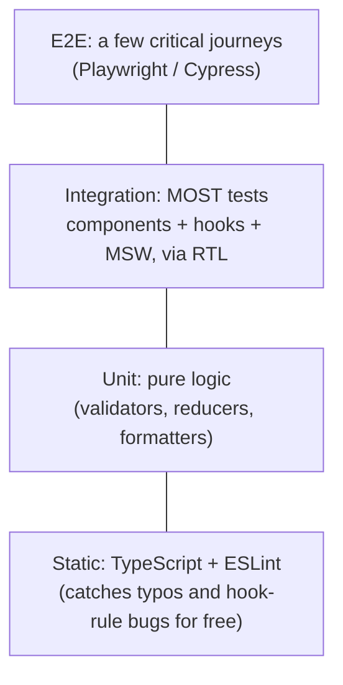
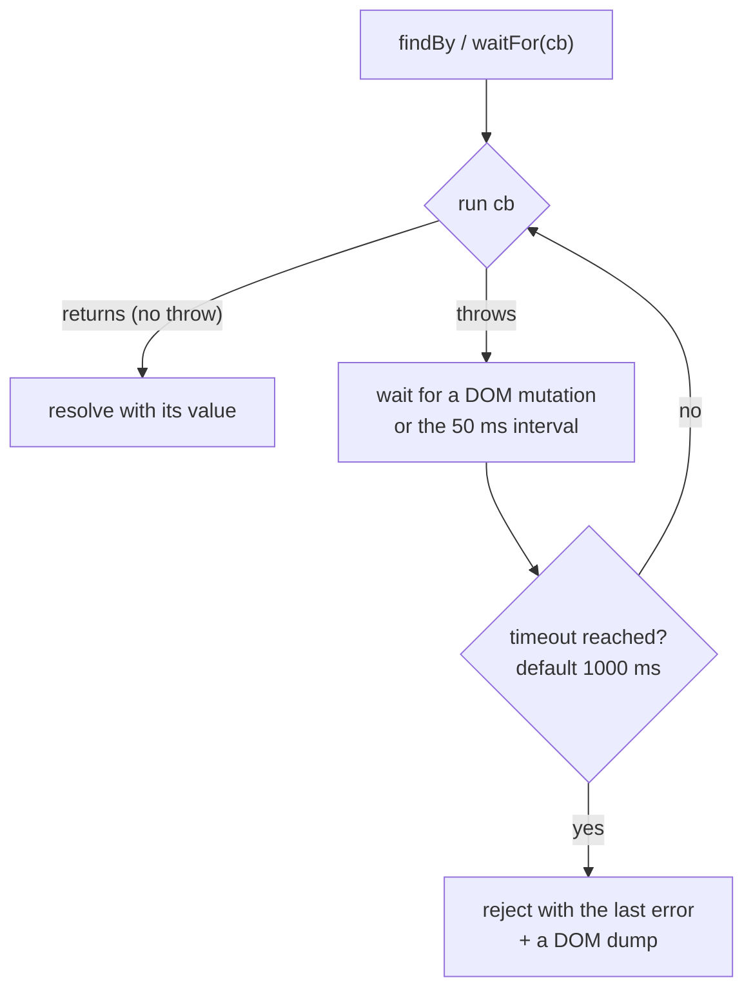
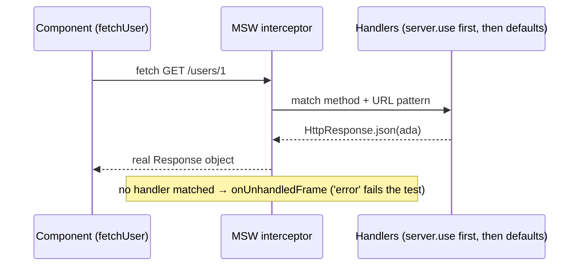

# 20 — Testing

> **How to use this module.** Sections 20.1–20.5 cover what most interviews ask: what to test, how Testing Library finds elements, and how to wait for async UI. Sections 20.6–20.9 cover the tooling that makes real components testable (MSW, providers, hooks, mocks and fake timers). Sections 20.10–20.13 cover the wider strategy. In 20 minutes, read 20.1, 20.3, 20.5, 20.9 and the Summary.

**Prerequisites:** [Effects and cleanup](09-effects.md#93-cleanup-and-the-effect-lifecycle) · [Race conditions](09-effects.md#94-race-conditions-and-abortcontroller) · [Testing custom hooks](12-hooks-and-custom-hooks.md#1213-testing-custom-hooks) · [Accessible forms](14-forms-and-actions.md#145-accessible-forms) · [TanStack Query](17-data-fetching.md#174-tanstack-query-query-keys-staletime-vs-gctime)

**Code for this module:** [`examples/web/src/m20-testing/`](examples/web/src/m20-testing/). Every component and hook there has a test. Run them with `npx vitest run src/m20-testing` from `examples/web`. The toolchain is Vitest 5.0, `@testing-library/react` 16.3, `@testing-library/user-event` 14.6, `@testing-library/jest-dom` 7.0 and MSW 3.0 ([VERSIONS.md](VERSIONS.md)). Jest, Playwright, Cypress and axe are **not installed** in this repo, so their snippets are labelled *illustrative, not run*.

---

## 20.1 The testing trophy and what to test

### The problem
A test suite costs time to write, time to run and time to fix whenever the code changes. Tests that check implementation details (which state variable changed, which child rendered) break on every refactor, even when nothing a user sees has changed. Over time the team stops trusting them. Tests that only check one isolated function miss the bugs that actually reach users: the label isn't wired to the input, the request URL is wrong, or the error state never renders.

### Mental model
Kent C. Dodds' **testing trophy** ([kentcdodds.com, "The Testing Trophy and Testing Classifications"](https://kentcdodds.com/blog/the-testing-trophy-and-testing-classifications)) reshapes the classic pyramid around **confidence per unit of cost**:



The guiding principle, from Testing Library: *"The more your tests resemble the way your software is used, the more confidence they can give you."* So test **behavior through the public surface**: what the user sees, what they can do, and what leaves the component (a request, a callback, a navigation).

> **Java/Spring analogy.** The trophy's wide middle is like `@SpringBootTest` with `MockMvc` and a stubbed downstream (WireMock): real wiring, a fake network edge. Unit tests are your plain JUnit tests of a service method. E2E is the full deployed system.
>
> **Where the analogy breaks:** in Spring, a slice test is noticeably slower than a unit test. In the front end, rendering a component into jsdom takes milliseconds, so the "integration" layer is cheap enough to be the default rather than something you ration.

### Minimal code
`SignupForm.test.tsx` tests the form the way a user meets it. It finds fields by label, types, submits, and asserts the visible error and the callback. It never touches the `errors` state:

```tsx
await user.click(submit);
expect(email).toHaveAccessibleDescription('Enter a valid email');
expect(onSubmit).not.toHaveBeenCalled();
```

### How it works internally
The trophy isn't a mechanism, it's an allocation rule. Static analysis is nearly free and catches whole classes of bugs. Integration tests in jsdom exercise React, the DOM, your hooks and your fetch layer together. E2E runs a real browser against a real (or staging) backend, so it is the slowest and flakiest layer and you keep it to the journeys that make money.

### Trade-offs
- ✅ Behavior-level tests survive refactors (class → hooks, Redux → Query) unchanged.
- ❌ A failing integration test points at a screen, not a line, so you debug a bit more.
- Pure logic with many branches (a validator, a reducer, a date calculation) is still best unit-tested directly. `validate()` in `SignupForm.tsx` is exported for exactly that.

---

## 20.2 Vitest vs Jest

### The problem
Most React codebases you join run **Jest** (every CRA app did). New Vite projects run **Vitest**. The APIs look identical (`describe`, `test`, `expect`, `jest.fn` ↔ `vi.fn`), but a few behaviors differ, and those differences cause hangs and leaking mocks.

### Mental model
Vitest is "Jest's API on Vite's module pipeline". It reuses your `vite.config.ts` (aliases, plugins, JSX transform) and runs native ESM. You get the same test vocabulary and a different engine underneath.

> **Java analogy.** JUnit 4 → JUnit 5: the same ideas and familiar annotations, but extensions, assumptions and lifecycle details changed, and copy-pasted old code compiles and then behaves differently.
>
> **Where the analogy breaks:** you don't migrate Vitest ↔ Jest by changing imports alone. Module mocking semantics, globals and timers differ at runtime, not at compile time.

### Minimal code
This repo's config (`examples/web/vite.config.ts`) is the entire setup:

```ts
test: { environment: 'jsdom', globals: true, setupFiles: ['./src/test/setup.ts'] }
```

`vitestVsJest.test.ts` pins down each difference below by running it.

| Topic | Jest | Vitest | Source |
|---|---|---|---|
| Globals | On by default | **Off** by default (`globals: true` to enable; this repo enables it). Without globals, RTL does not auto-register `cleanup` | [Vitest: Migrating from Jest](https://vitest.dev/guide/migration#jest) |
| `mockReset()` | Implementation becomes an empty function returning `undefined` | Implementation goes back to the **original** passed to `vi.fn(impl)` | same; asserted in `vitestVsJest.test.ts` |
| `fn.mock` | Recreated on `mockClear` | One persistent object | same; asserted |
| Module factory | `jest.mock(path, () => 'hello')` = default export | Factory must return an **object of exports** (`{ default: 'hello' }`) | same |
| `__mocks__` folder | Auto-applied | Only when `vi.mock(path)` is called | same |
| Partial mock | `jest.requireActual` | `await vi.importActual` or the `importOriginal` factory argument | same |
| Legacy timers | `legacyFakeTimers` available | Not supported (sinon fake-timers only) | same |
| `jest.setTimeout` | — | `vi.setConfig({ testTimeout })` | same |
| `jest` global | Exists | **Does not exist**, so RTL cannot detect Vitest's fake timers ([20.9](#209-module-mocking)) | `@testing-library/react` 16.3 `dist/pure.js`; asserted |
| Hook order | Sequential | Stack by default (`sequence.hooks: 'list'` for Jest order) | Vitest migration guide |

> **Version notes (Vitest 5.0, Sep 2026).** From the [Vitest 5 migration guide](https://vitest.dev/guide/migration): **`clearMocks` is on by default**, so `vi.clearAllMocks()` runs before every test and call history recorded at module level or in `beforeAll` is gone by the time a test asserts (asserted in `vitestVsJest.test.ts` and `CopyLinkButton.test.tsx`). **`vi.mock`/`vi.hoisted` inside a function or `describe` now throws** (v4 only warned). **Unawaited async assertions** (`expect(p).resolves…` without `await`) **fail the test**. `expect.poll` fails on timeout. Fake timers also mock `Temporal`. In browser mode, `toHaveTextContent` is now strict equality; that is the Vitest browser matcher, **not** jest-dom's `toHaveTextContent`, which still matches substrings.

**Legacy: Jest + CRA.** `react-scripts test` ran Jest in watch mode with jsdom, Babel-transformed, with `src/setupTests.js` importing `@testing-library/jest-dom`. CRA was deprecated on 2025-02-14 ([VERSIONS.md](VERSIONS.md), [05](05-tooling-and-setup.md#58-creating-a-project-in-2026)). Those suites still exist, and the test code is ~95% portable. The work in a migration is config (`moduleNameMapper` → Vite aliases, `transform` → nothing), `jest.*` → `vi.*`, mock factories that return a bare default, and timer code ([20.9](#209-module-mocking)).

### How it works internally
Vitest transforms each test file through Vite's plugin pipeline and runs it in a worker, with module isolation per file by default (so each file gets its own MSW `server` instance in this repo). Jest uses its own module registry and `babel-jest`/`ts-jest` transforms, and rewrites `jest.mock` calls with `babel-plugin-jest-hoist`. Vitest does the equivalent hoisting in its own transform ([20.9](#209-module-mocking)).

### Trade-offs
- New Vite app: Vitest. It shares your config and is ESM-native, and it is fast in watch mode.
- Large stable Jest suite: migrate only with a reason (speed, ESM pain). Run both runners during the transition rather than rewriting everything at once.
- Neither lays out real CSS. For layout or real browser APIs, use Vitest **browser mode** or Playwright ([20.11](#2011-e2e-with-playwright-and-cypress)).

---

## 20.3 React Testing Library and query priority

### The problem
Selecting elements by class name or component internals (`wrapper.find('.btn-primary')`, `instance.state.open`) couples tests to markup and implementation. Change the CSS framework and every test breaks, although the user sees the same button.

### Mental model
**React Testing Library (RTL)** [Library: @testing-library/react] renders into a real DOM (jsdom) and gives you **queries** that find elements the way people do: by role and accessible name, by label, by visible text. If a test cannot find your button by role and name, a screen-reader user probably cannot either. The test doubles as an accessibility check.

Query priority, from [testing-library.com/docs/queries/about#priority](https://testing-library.com/docs/queries/about#priority):

| Priority | Query | Use for |
|---|---|---|
| 1 | `getByRole('button', { name: 'Save' })` | Almost everything. "There's not much you can't get with this (if you can't, it's possible your UI is inaccessible)." |
| 2 | `getByLabelText('Email')` | Form fields (and the only accessible way to get a **password** input, which has no role) |
| 3 | `getByPlaceholderText` | Only if there is no label (fix that) |
| 4 | `getByText` | Non-interactive content |
| 5 | `getByDisplayValue` | Filled-in form values |
| 6 | `getByAltText`, `getByTitle` | Images; `title` is not reliably announced |
| 7 | `getByTestId` | Last resort: dynamic text, or no semantic hook |

The three query families:

| Prefix | 0 matches | 1 match | >1 matches | Async? |
|---|---|---|---|---|
| `getBy` | throws | element | **throws** | no |
| `queryBy` | `null` | element | **throws** | no |
| `findBy` | rejects after timeout | resolves | rejects | yes (`waitFor` + `getBy`) |
| `getAllBy` / `queryAllBy` / `findAllBy` | throws / `[]` / rejects | `[el]` | `[…]` | as above |

> **Java/Spring analogy.** Like `MockMvc` asserting on the HTTP contract (status, JSON fields) rather than on which private method the controller called.
>
> **Where the analogy breaks:** an HTTP contract is explicit. The "contract" of a UI is the **accessibility tree**, which you produce implicitly through semantic HTML, so bad markup makes the test harder to write. That pressure is intentional.

### Minimal code
From `SignupForm.test.tsx`. Every query is scoped to the form with `within`, so an unrelated message elsewhere on the page can't satisfy or break an assertion:

```tsx
const form = screen.getByRole('form', { name: 'Sign up' });
const email = within(form).getByRole('textbox', { name: 'Email' });
const password = within(form).getByLabelText('Password'); // type="password" has no role
```

The test `'a password input has no textbox role, so it is queried by label'` asserts `queryByRole('textbox', { name: 'Password' })` is `null`.

### How it works internally
`getByRole` walks the DOM and computes each element's **implicit ARIA role** (from `aria-query`'s HTML→role mapping) and its **accessible name** (the W3C accname algorithm: `aria-labelledby`, `aria-label`, `<label for>`, content…). It also filters out elements hidden from the accessibility tree. That is why `getByRole` is the slowest query on huge DOMs (`{ hidden: true }` skips the visibility check). `screen` is just the queries bound to `document.body`. Prefer it to destructuring `render()`'s return value, because you never pass the wrong container. A `<form>` only has the `form` role when it has an accessible name, which is why `SignupForm` sets `aria-label="Sign up"`.

> **Version notes.** RTL 13.0 (2022-03-31) required React 18 and `createRoot`. RTL 13.1 added `renderHook`. RTL **16.0** (2024-06-03) made `@testing-library/dom` a **peer dependency** you must install yourself, which is why `examples/web/package.json` lists it. `@testing-library/jest-dom` **7.0** (2026-07-20) also requires `@testing-library/dom` as a peer and Node 22. Import its matchers with `import '@testing-library/jest-dom/vitest'` (this repo's `src/test/setup.ts`). Sources: GitHub release notes for each tag.

### Trade-offs
- ✅ Tests double as an accessibility check and survive markup refactors.
- ❌ Role queries are slower; on a 5,000-row table, query within a row (`within(row)`).
- Use `data-testid` without guilt for things with no user-facing semantics (a chart canvas, a drag handle), never as the default.

---

## 20.4 user-event vs fireEvent

### The problem
A real keystroke in a browser fires `keydown` → `keypress` → `beforeinput` → `input` → `keyup`, after focus moved to the field, and it respects `maxLength`, `disabled` and the selection. `fireEvent.change(input, { target: { value } })` dispatches **one** event with a value no user could have typed.

### Mental model
`fireEvent` [Library: @testing-library/dom] **dispatches a DOM event**. `user-event` [Library: @testing-library/user-event] **simulates an interaction**: the whole sequence of events plus the browser's default behavior and its checks. The user-event docs say so directly: "`fireEvent` dispatches DOM events, whereas `user-event` simulates full interactions" ([user-event intro](https://testing-library.com/docs/user-event/intro)).

> **Java analogy.** `fireEvent` is calling a controller method directly. `user-event` is sending the request through `MockMvc`, so filters, validation and binding all run.
>
> **Where the analogy breaks:** user-event still runs in jsdom. It has no layout, so it cannot know if an element is covered by another one.

### Minimal code
`CodeInput.tsx` is a `maxLength={4}` field that counts key presses. `CodeInput.test.tsx`:

```tsx
fireEvent.change(input(), { target: { value: 'ABCDEF' } });
// value 'ABCDEF', not focused, 'Key presses: 0'

const user = userEvent.setup();
await user.type(input(), 'ABCDEF');
// value 'ABCD', focused, 'Key presses: 6'
```

A third test shows `fireEvent.change` changing a **disabled** field that `user.type` cannot touch.

### How it works internally
`userEvent.setup()` creates an instance that shares keyboard/pointer state (held modifier keys, pointer position) across calls and installs a clipboard stub on `navigator`. Every API returns a Promise, because it can wait between events (`delay`, default 0) and runs through RTL's `asyncWrapper`/`eventWrapper`, which wraps updates in `act` ([20.5](#205-async-utilities-and-act)).

> **Version notes.** **user-event 14.0** (2022-03-29): "APIs always return a Promise", `userEvent.setup()` introduced, key descriptors renamed (`{ctrl}` → `{Control}`, `{esc}` → `{Escape}`), and `skipPointerEvents` replaced by `pointerEventsCheck`. In **v13**, `userEvent.type(el, 'abc')` was synchronous and called without `await`. Migrating means adding `await`, calling `setup()` first, and renaming keys. Since v14.1 the docs recommend `advanceTimers` over `delay: null` with fake timers. Source: [v14.0.0 release](https://github.com/testing-library/user-event/releases/tag/v14.0.0), [options docs](https://testing-library.com/docs/user-event/options).

### Trade-offs
- Default to `user-event`. It catches "the field is disabled" and "the label isn't clickable" bugs.
- Use `fireEvent` for events user-event doesn't model (`scroll`, media events, a custom `transitionend`), and say why in a comment.
- Call `userEvent.setup()` inside each test (or a `setup()` helper) before `render`, not in `beforeEach`, as the docs advise.

---

## 20.5 Async utilities and `act`

### The problem
Most UI changes happen **later**: after a fetch resolves, a timer fires, or a transition commits. If you assert immediately, the element isn't there yet. If you sleep, the test is slow and still flaky.

### Mental model
**`findBy*` = `waitFor` + `getBy*`.** `waitFor(cb)` keeps calling `cb` until it **stops throwing** or the timeout passes:



**`act()`** [React] is React's "finish your work now" boundary for tests. Inside `act`, React queues renders and effects, and when `act` returns it flushes them, so the DOM is up to date before your next line runs. RTL already wraps `render`, `fireEvent`, user-event and the async utilities in `act`, so you rarely call it yourself.

> **Java analogy.** `waitFor` is Awaitility's `await().atMost(1, SECONDS).until(...)`. `act` is like flushing the persistence context before you assert on the database.
>
> **Where the analogy breaks:** Awaitility polls on a timer. `waitFor` *also* re-checks on every DOM mutation (a `MutationObserver`), so it usually reacts within the same macrotask as the update.

### Minimal code
From `QueryTiming.test.tsx` ([Exercise 5](#exercise-5-predict-the-output-getby-queryby-findby-and-waitfor-timing)):

```tsx
render(<UserProfile userId="1" />, { wrapper: createWrapper() });
expect(screen.getByRole('status')).toHaveTextContent('Loading user…');   // sync: there now
expect(await screen.findByRole('heading', { name: 'Ada Lovelace' })).toBeInTheDocument(); // async
```

The explicit `act` you still need is for **your own** triggers of React work, which RTL does not wrap: advancing fake timers (`act(() => vi.advanceTimersByTime(1000))` in `useCountdown.test.tsx`) and calling a hook's function from `renderHook` (`act(() => result.current.start())`).

### How it works internally
Verified in `node_modules`:
- `@testing-library/dom` 10.4 `dist/wait-for.js`: default `interval = 50`, timeout = `asyncUtilTimeout` (config default **1000**). With real timers it uses `setInterval` **plus a `MutationObserver`** on the container. If the callback returns (even `false`), it resolves immediately. Only a **throw** (or a rejected promise) makes it retry.
- `@testing-library/react` 16.3 `dist/act-compat.js`: uses `React.act` when present, falling back to `react-dom/test-utils`'s `act`, and sets `globalThis.IS_REACT_ACT_ENVIRONMENT = true` around it.
- `dist/pure.js` `asyncWrapper`: during `waitFor`/`findBy`/user-event it sets `IS_REACT_ACT_ENVIRONMENT = false` (so React schedules naturally), then drains with `await new Promise(r => setTimeout(r, 0))`. That `setTimeout(0)` is the source of the Vitest fake-timer hang in [20.9](#209-module-mocking).

The warning *"An update to X inside a test was not wrapped in act(...)"* means React received an update while `IS_REACT_ACT_ENVIRONMENT` was true and no `act` scope was open. Typical causes: a promise resolved **after** your last `await` (the test finished too early), or you advanced fake timers without `act`. The fix is to await the UI consequence (`await findBy…`), not to sprinkle `act`.

> **Version notes.** `act` arrived in **React 16.8** (sync) and **16.9** added `act(async () => …)`. **React 18.0** added the `IS_REACT_ACT_ENVIRONMENT` global and made `act` batch updates. **React 18.3** warns when `act` comes from `react-dom/test-utils`. In **React 19**, `react-dom/test-utils` keeps only a deprecated `act` that logs *"`ReactDOMTestUtils.act` is deprecated in favor of `React.act`"* and forwards to it (checked in `react-dom` 19.3.0 `cjs/react-dom-test-utils.development.js`). Every other test-util (`Simulate`, `renderIntoDocument`…) was removed. Import `act` from `react`, or simply from `@testing-library/react`. Sources: React CHANGELOG 16.8.0, 16.9.0, 18.0.0, 18.3.0; [React 19 upgrade guide](https://react.dev/blog/2024/04/25/react-19-upgrade-guide#removed-react-dom-test-utils).

**Suspending on `use(promise)` needs an awaited `act`.** RTL's `render` is a *sync* `act`. If a component suspends on `use(promise)` during its first render inside a sync `act`, React 19 never retries it. The dev build logs *"A component suspended inside an `act` scope, but the `act` call was not awaited. When testing React components that depend on asynchronous data, you must await the result"*, and the next `findBy` times out. Render it with `await act(async () => render(<Todos />))` instead. This was verified by running `examples/web/src/m17-data-fetching/UseTodos.test.tsx` on React 19.3 ([17.10](17-data-fetching.md#1710-suspense-based-fetching-and-use)). By contrast, the `useSuspenseQuery` test in the same folder (`SuspenseTodos.test.tsx`) passed with plain `render`. That is an observation from running both tests; why the query cache avoids the trap was not investigated, so treat "bare promise needs awaited `act`" as the rule you know holds.

### Trade-offs
- `findBy` for "wait for one element to appear". `waitFor` for "wait until this assertion holds" (a callback called, an element **disappeared**, a count changed). `waitForElementToBeRemoved` for disappearance with a clearer error.
- Put **one assertion and no side effects** inside `waitFor`. It may run 20 times, and a click inside it clicks 20 times.
- Never `await new Promise(r => setTimeout(r, 500))` to "let things settle". The one acceptable exception is proving that something does **not** happen, as `SearchBox.test.tsx` in [09](09-effects.md#94-race-conditions-and-abortcontroller) does for a stale response, and it should stay short.

---

## 20.6 MSW for network mocking

### The problem
Mocking `fetch` (or `axios`) per test (`vi.spyOn(globalThis, 'fetch').mockResolvedValue(...)`) couples tests to the HTTP client and to call order. It also skips your URL building, headers, `res.ok` checks and JSON parsing, which is exactly where integration bugs hide. Swap `fetch` for `ky` and every test breaks.

### Mental model
**Mock Service Worker** [Library: msw] intercepts requests **at the network layer** and answers them from **handlers** that look like a tiny server: `http.get(url, resolver)`. Your code runs unmodified. In Node it patches the request modules (`fetch`, `http`, `XMLHttpRequest`) through `@mswjs/interceptors`. In the browser it uses a Service Worker, so the same handlers power Storybook and local dev.



> **Java/Spring analogy.** WireMock for the front end: stub the HTTP edge, keep the client code real. `server.use()` is a per-test `stubFor(...)` that takes priority, and `resetHandlers()` is `WireMock.reset()` back to the baseline mappings.
>
> **Where the analogy breaks:** WireMock is a separate server on a port. MSW lives in the same process and intercepts before any socket opens, so there is no port, no CORS and no real network.

### Minimal code
Shared happy-path handlers in `test-utils/server.ts`, and the lifecycle in each test file (`UserProfile.test.tsx`):

```ts
beforeAll(() => server.listen({ onUnhandledFrame: 'error' }));
afterEach(() => server.resetHandlers()); // drop per-test overrides
afterAll(() => server.close());

server.use(http.get(USER_URL, () => new HttpResponse(null, { status: 500 })));            // this test only
server.use(http.get(USER_URL, () => new HttpResponse(null, { status: 503 }), { once: true })); // first request only
server.use(http.get(USER_URL, () => HttpResponse.error()));                               // network failure
```

Full walk-through in [Exercise 3](#exercise-3-test-a-fetching-component-with-msw).

### How it works internally
Handlers are checked **most-recent first**: `server.use()` *prepends*, so an override wins over the defaults until `resetHandlers()` removes it. `{ once: true }` marks a handler as used after one match (MSW 3 types: `RequestHandlerOptions.once`). `restoreHandlers()` re-arms used ones. The resolver gets `{ request, params, cookies }` and returns a standard `Response` (`HttpResponse` extends it). `delay(ms)` awaits a `setTimeout`.

> **Version notes.** **MSW 1**: `rest.get(url, (req, res, ctx) => res(ctx.status(200), ctx.json(data)))`. **MSW 2.0** (2023-10-23): `rest` → **`http`**, the resolver receives `{ request, params }` and returns `HttpResponse.json(data)` (a Fetch-API `Response`), browser exports move to `msw/browser`, Node 18+. **MSW 3.0** (2026-09-28): ESM-only, Node 22+, TS 5.9+. **`onUnhandledRequest` → `onUnhandledFrame`**. GraphQL moves to `msw/graphql`. `worker.stop()` returns a Promise. WebSocket `connection` → `websocket:connection`. And: *"The library no longer patches `setTimeout` to circumvent fake timers in test runners. You should advance the fake timers normally for delayed mocked responses to resolve."* `http`, `HttpResponse`, `delay` and `setupServer` from `msw/node` are unchanged (smoke test `m00-smoke/msw.test.ts`). Sources: [v2.0.0](https://github.com/mswjs/msw/releases/tag/v2.0.0), [v3.0.0](https://github.com/mswjs/msw/releases/tag/v3.0.0) release notes; `msw/lib/_chunks/shared-options.d.ts`.

### Trade-offs
- ✅ One set of handlers for unit tests, Storybook and local dev. Tests survive client swaps.
- ✅ `onUnhandledFrame: 'error'` turns a forgotten handler into a clear failure instead of a real network call.
- ❌ Your handlers can drift from the real API. Generate types from OpenAPI ([24](24-react-with-spring-boot.md#249-openapi--typescript-generation)) and keep one contract test against the real backend.
- ❌ Don't assert "fetch was called with X" as your main check. Assert what the user sees. Inspect `request` inside a handler only when the request itself is the contract (a POST body, an auth header).

---

## 20.7 Testing hooks

### The problem
A hook can only run inside a component. You want to test `useUser` or `useCountdown` without building a demo screen for each one.

### Mental model
`renderHook(cb, { initialProps, wrapper })` [Library: @testing-library/react] mounts an invisible component that calls `cb` and stores its return value in **`result.current`**, a live getter you read **after** an `act`/`waitFor`. [12.13](12-hooks-and-custom-hooks.md#1213-testing-custom-hooks) has the full toolbox table. This section adds providers and async state.

> **Java analogy.** Testing a Spring bean with a tiny `@TestConfiguration` that wires just what it needs.
>
> **Where the analogy breaks:** the hook's "container" (the component) re-runs the hook on every render, and `result.current` changes identity each time. Keep the reference to `result`, never to `result.current`.

### Minimal code
`useUser.test.tsx`, a TanStack Query hook, with the provider passed as `wrapper`:

```tsx
const { result } = renderHook(() => useUser('1'), { wrapper: createWrapper() });
expect(result.current.isPending).toBe(true);
await waitFor(() => expect(result.current.isSuccess).toBe(true));
expect(result.current.data).toEqual(ada);
```

Other tests there: `rerender({ id: '2' })` switches keys, a copy of `result.current` taken early stays stale, and passing your own `QueryClient` lets you inspect the cache. Timer hooks: `useCountdown.test.tsx` ([Exercise 4](#exercise-4-test-a-timer-hook-fake-timers-done-right)).

### How it works internally
`renderHook` is a thin layer over `render`: a `TestComponent` calls your callback and assigns the return value to a ref read by the `result.current` getter. `wrapper` wraps that component exactly as it wraps any `render`, so providers work identically. `rerender(newProps)` re-renders with new `initialProps`.

> **Version notes.** Before 2022, hooks were tested with **`@testing-library/react-hooks`** (which needed `react-test-renderer` as a peer). **RTL 13.1.0** (2022-04-15) added `renderHook` ("Add `renderHook`"), and both that package's README and the [TanStack Query testing guide](https://tanstack.com/query/latest/docs/framework/react/guides/testing) tell React 18+ users to switch. Migration: `waitForNextUpdate()` → `await waitFor(() => expect(...))`, and `result.error` → test the thrown error through an error boundary or an `expect(() => renderHook(...)).toThrow()`.

### Trade-offs
- Use `renderHook` when the **return value** is the contract (`useCountdown`, `useUser`).
- When the hook exists to drive UI, add at least one component test too (`CountdownTimer` in `useCountdown.test.tsx`), because the user never calls `result.current.start()`.

---

## 20.8 Testing with context, routers and query clients

### The problem
Real screens call `useParams`, `<Link>`, `useQuery` or `useContext(Auth)`. Rendered bare, they throw ("useParams() may be used only in the context of a <Router>", "No QueryClient set"). Copying three providers into every test is noise, and sharing one `QueryClient` across tests leaks cached data between them.

### Mental model
Write **one custom render** that mounts `ui` inside the same providers the app uses, with test-friendly settings, and returns the handles a test may need (the router, the client). Testing Library's docs call this a [custom render](https://testing-library.com/docs/react-testing-library/setup#custom-render).

> **Java/Spring analogy.** A shared `@TestConfiguration` or a base class with `@AutoConfigureMockMvc`: every test gets the same wiring with test overrides (in-memory DB, stub clock).
>
> **Where the analogy breaks:** Spring caches the application context across tests on purpose. Here you want the **opposite**: a brand-new `QueryClient` and router per test, because their state (the cache, the history) is mutable and would make tests order-dependent.

### Minimal code
`test-utils/render.tsx` ([Exercise 2](#exercise-2-build-a-custom-render-with-providers) builds it):

```tsx
const router = createMemoryRouter([{ path, element: ui }, ...routes], { initialEntries: [route] });
render(
  <QueryClientProvider client={queryClient}>
    <RouterProvider router={router} />
  </QueryClientProvider>,
);
```

Used in `test-utils/render.test.tsx`:

```tsx
const { router } = renderWithProviders(<UserPage />, { path: '/users/:userId', route: '/users/1',
  routes: [{ path: '/', element: <h1>Directory</h1> }] });
await user.click(screen.getByRole('link', { name: 'All users' }));
expect(await screen.findByRole('heading', { name: 'Directory', level: 1 })).toBeInTheDocument();
expect(router.state.location.pathname).toBe('/');
```

For **context** alone, pass a `wrapper` or render the real provider: [11](11-context.md#112-createcontext-context-value-vs-provider) tests `ThemeProvider` and `AuthProvider` exactly that way. Prefer the real provider with controlled inputs over a hand-rolled fake context value. A fake can't drift from production only if it *is* production.

### How it works internally
`createMemoryRouter` [Framework: React Router] keeps history in an array instead of `window.history`, so tests never touch the jsdom URL and can start anywhere (`initialEntries`, `initialIndex`). It is a **data router**, so loaders, actions and `useFetcher` work too ([19](19-routing.md#192-react-router-8-framework-data-and-declarative-modes)). Navigation through a data router is asynchronous (it may run loaders), so assert the destination with `findBy`. For declarative-only components, `<MemoryRouter initialEntries={['/x']}>` is the lighter wrapper. React Router 8 exports both, plus `createRoutesStub` for route modules (checked in `react-router` 8.4.0 `dist/development/index.d.ts`).

`QueryClient` test settings, per the [TanStack Query testing guide](https://tanstack.com/query/latest/docs/framework/react/guides/testing): **`retry: false`**, because the default of three retries with exponential backoff makes error tests time out. And a **new client per test** for isolation. The guide's `gcTime: Infinity` advice is specifically for Jest's "did not exit" warning. Seeding the cache with `queryClient.setQueryData` renders data synchronously, then a stale-time-0 refetch replaces it. The test `'a seeded cache renders synchronously, then refetches in the background'` asserts both.

### Trade-offs
- ✅ One place to change when a provider is added (i18n, theme, auth).
- ❌ A "god" render with every provider hides what a component depends on. Keep options explicit (`route`, `path`, `queryClient`) and let tests opt in.
- For Redux, the same pattern builds a fresh store per test with `preloadedState` ([18](18-state-management.md)).

---

## 20.9 Module mocking

### The problem
Some dependencies must not run in a unit test: an analytics beacon, `Date.now()`, a 30-second timeout, the clipboard. You need to replace a **module**, a **method**, or **time** itself, and the tools hoist and reset in ways that surprise people.

### Mental model
Three tools, from coarse to fine:

| Tool | Replaces | Use for |
|---|---|---|
| `vi.mock('./analytics')` | A whole **module**, for every importer in this test file | Your own side-effecting modules |
| `vi.spyOn(obj, 'method')` | One **method** on an object, calling through until stubbed | Browser APIs, singletons (`navigator.clipboard`, `console.error`) |
| `vi.fn()` | Nothing: a new **function** you pass in | Callbacks/props (`onSubmit`) |
| `vi.useFakeTimers()` | `setTimeout`, `setInterval`, `Date` (and `Temporal` in v5) | Debounce, polling, countdowns |

**Hoisting.** `vi.mock` must apply *before* the imports that load the module. ES `import` statements are evaluated before any other code in the file, so Vitest **moves `vi.mock` and `vi.hoisted` to the top of the file** (and turns static imports into dynamic ones after them). The consequence: a `vi.mock` factory cannot use a normal top-level variable, because it runs before that variable exists. Create the value with **`vi.hoisted(() => …)`** instead, which is hoisted too ([vi.hoisted docs](https://vitest.dev/api/vi#vi-hoisted)).

> **Java analogy.** `vi.mock` ≈ `@MockitoBean`/`@MockBean` replacing a bean in the context. `vi.spyOn` ≈ Mockito `spy()`. `vi.fn` ≈ `mock(Callback.class)`. Fake timers ≈ injecting a `Clock` you control.
>
> **Where the analogy breaks:** Spring swaps a bean **reference** that every consumer looks up through the container. ES modules bind imports **at link time**. A module that calls its own export internally keeps calling the real one, whatever you mocked ([Exercise 6](#exercise-6-predict-the-output-vimock-hoisting-and-partial-mocks)).

### Minimal code
Automock your own module (`CopyLinkButton.test.tsx`):

```tsx
vi.mock('./analytics'); // every export becomes vi.fn() returning undefined
// …
expect(vi.mocked(track)).toHaveBeenCalledExactlyOnceWith('link_copied', { url: URL_TO_COPY });
```

Spy on a method (same file). `userEvent.setup()` installs the clipboard stub, so spy **after** it:

```tsx
const user = userEvent.setup();
const writeText = vi.spyOn(navigator.clipboard, 'writeText').mockRejectedValueOnce(new Error('denied'));
```

Partial mock with `vi.hoisted` (`hoisting/mockHoisting.test.ts`):

```ts
const events = vi.hoisted(() => ['vi.hoisted factory ran']);
vi.mock('./apiConfig', async (importOriginal) => {
  const actual = await importOriginal<typeof import('./apiConfig')>();
  return { ...actual, apiBase: 'https://mock.example.test' };
});
```

**Fake timers, done right under Vitest** (`useCountdown.test.tsx`):

```tsx
// Hook alone, no user-event: plain fake timers give exact, deterministic boundaries.
vi.useFakeTimers();
act(() => result.current.start());
act(() => vi.advanceTimersByTime(999)); // still 3
act(() => vi.advanceTimersByTime(1));   // now 2

// Component + user-event: needs shouldAdvanceTime under Vitest.
vi.useFakeTimers({ shouldAdvanceTime: true });
const user = userEvent.setup({ advanceTimers: vi.advanceTimersByTime });
```

### How it works internally: the Vitest fake-timer trap
`userEvent.setup({ advanceTimers: jest.advanceTimersByTime })` is the documented recipe ([user-event options](https://testing-library.com/docs/user-event/options#advancetimers)). Ported literally to Vitest (`vi.useFakeTimers()` + `advanceTimers: vi.advanceTimersByTime`), **the first `await user.click()` hangs** until the test times out. The batch that produced [12's `useDebounce` test](12-hooks-and-custom-hooks.md#1213-testing-custom-hooks) found this by running it. Why, verified in `@testing-library/react` 16.3 `dist/pure.js`:

1. user-event runs each action through RTL's `asyncWrapper`.
2. `asyncWrapper` ends with `await new Promise(r => { setTimeout(r, 0); if (jestFakeTimersAreEnabled()) jest.advanceTimersByTime(0); })`.
3. `jestFakeTimersAreEnabled()` starts with `typeof jest !== 'undefined'`. Vitest has **no `jest` global** (asserted in `vitestVsJest.test.ts`), so it returns `false`.
4. That `setTimeout(0)` is now a **fake** timer that nobody advances, so the promise never resolves.

`@testing-library/dom`'s `waitFor` has the same Jest-only branch, so `findBy`/`waitFor` hang under plain Vitest fake timers too. **Fix:** `vi.useFakeTimers({ shouldAdvanceTime: true })` makes the fake clock also follow real time (in 20 ms steps by default), so the internal `setTimeout(0)` fires on its own, and you still jump time with `advanceTimersByTime`. Under **Jest**, the plain recipe works because RTL detects `jest` and advances the clock itself.

> **Alternative (verified by running a throwaway probe in this repo):** some teams instead stub a `jest` global (`vi.stubGlobal('jest', { advanceTimersByTime: vi.advanceTimersByTime.bind(vi) })`) so RTL's detection succeeds. With plain `vi.useFakeTimers()` plus `advanceTimers`, the user-event + debounce test that hung then passed. It relies on RTL internals, so prefer `shouldAdvanceTime`.

The cost of `shouldAdvanceTime`: real time leaks into the fake clock, so **exact-boundary assertions** ("still 3 at 999 ms") are unreliable in those tests. `useCountdown.test.tsx` splits the suite: exact boundaries in the pure-fake-timer `renderHook` tests, and only coarse jumps in the user-event test.

> **Version notes.** Jest 26 made "modern" (sinon-based) fake timers available and Jest 27 made them the default ("This modern fake timers implementation will now be the default", [Jest 27 post](https://jestjs.io/blog/2021/05/25/jest-27); `jest.useFakeTimers('legacy')` restored the old one). `legacyFakeTimers` is Jest-only and Vitest never supported it ([Vitest migration guide](https://vitest.dev/guide/migration#jest)). **Vitest 5**: `vi.mock`/`vi.hoisted` outside the module top level **throws**, `clearMocks` defaults to `true`, and fake timers also mock `Temporal`. **MSW 3** stopped bypassing fake timers, so `await delay(300)` in a handler needs the clock advanced (or `shouldAdvanceTime`).

### Trade-offs
- Mock at the **edge** you own (`./analytics`, the clock, the network via MSW), never React itself or a library's internals.
- Over-mocking turns a test into a mirror of the implementation: it passes when the code is wrong and fails on refactor. If a test needs five `vi.mock`s, the component probably needs an injected dependency instead.
- `vi.restoreAllMocks()` restores `spyOn` spies. `clearMocks` (on in v5) only clears history. `mockReset()` restores the original implementation in Vitest, not an empty function as in Jest.

---

## 20.10 Snapshot testing trade-offs

### The problem
`expect(container).toMatchSnapshot()` is one line and "tests everything". Six months later, a 400-line snapshot changes on every PR and reviewers press `u` without reading it.

### Mental model
A snapshot asserts "**nothing changed**", not "**this is correct**". It's a change detector. That is useful when the output is small, stable and meaningful to a human, and useless when it is a large DOM tree.

> **Java analogy.** Golden-master / approval testing (ApprovalTests): great for a serializer's output, terrible for a whole HTML page.
>
> **Where the analogy breaks:** nothing important; the same failure mode exists.

### Minimal code
A small **inline** snapshot of a pure function's output, from `SignupForm.test.tsx`:

```tsx
expect(validate({ email: 'nope', password: 'short' })).toMatchInlineSnapshot(`
  {
    "email": "Enter a valid email",
    "password": "Password must be at least 8 characters",
  }
`);
```

### How it works internally
On the first run, the serialized value (via `pretty-format`) is written into the test file (inline) or into `__snapshots__/*.snap`. Later runs compare against it, and `vitest -u` rewrites it. In CI, a missing snapshot fails instead of being written (Vitest and Jest both detect CI).

> **Version notes.** `react-test-renderer` was the classic snapshot engine (`renderer.create(<C />).toJSON()`). React 19 **deprecated** it (it logs a warning and switched to concurrent rendering) and removed `react-test-renderer/shallow` ([React 19 upgrade guide](https://react.dev/blog/2024/04/25/react-19-upgrade-guide#deprecated-react-test-renderer)). Snapshot DOM from RTL instead (`asFragment()`), or better, assert specific behavior.

### Trade-offs
- ✅ Good for: small serialized data (an error map, a generated config, a formatted string), and an error message's exact wording.
- ❌ Bad for: whole components (noise, approved blindly), anything with ids, dates or random keys.
- For visual regressions, use real screenshots in a real browser (Playwright `toHaveScreenshot`), not DOM snapshots.

---

## 20.11 E2E with Playwright and Cypress

### The problem
jsdom has no layout, no real navigation, no CSS cascade, no `IntersectionObserver` and no real network ([10](10-refs-and-dom.md), [12](12-hooks-and-custom-hooks.md#1213-testing-custom-hooks)). Your RTL suite can be green while the login page is broken in Safari, or while the Spring backend rejects the CORS preflight.

### Mental model
E2E tests drive a **real browser** against the **running app** (ideally with a real or staging backend) and check the few journeys that must never break: sign up, log in, check out. They are slow and expensive, so the trophy keeps them few.

| | Playwright [Tooling: Playwright] | Cypress [Tooling: Cypress] |
|---|---|---|
| Architecture | Test runs in Node; drives browsers over CDP/WebDriver-BiDi-style protocols | Test runs **inside** the browser next to the app |
| Browsers | Chromium, Firefox, WebKit (Safari engine) | Chromium family, Firefox; WebKit experimental |
| Multi-tab / multi-origin | First-class | Constrained (`cy.origin`) |
| Waiting | Auto-waiting locators + auto-retrying `expect` | Retry-ability built into commands/assertions |
| Parallelism | Built-in, free | Via Cypress Cloud or community tools |
| Component testing | 1.62 moved to a **stories + gallery** model with a built-in `mount` fixture; the `@playwright/experimental-ct-*` packages are no longer updated (1.63) | Mature `cy.mount` for React 18 and 19 |

Sources: [Playwright release notes 1.62–1.63](https://playwright.dev/docs/release-notes), [Playwright component testing](https://playwright.dev/docs/test-components), [Cypress React component testing](https://docs.cypress.io/app/component-testing/react/overview). Versions: `@playwright/test` 1.63.0, `cypress` 16.1.1 ([VERSIONS.md](VERSIONS.md)).

Browser and parallelism rows: Playwright runs on "Chromium, WebKit and Firefox" ([Browsers](https://playwright.dev/docs/browsers)) and runs test files in parallel worker processes by default ([Parallelism](https://playwright.dev/docs/test-parallel)). Cypress supports "Chrome-family browsers, Firefox, and WebKit" ([Cross browser testing](https://docs.cypress.io/app/guides/cross-browser-testing)), but WebKit still sits behind the `experimentalWebKitSupport` flag ([Experiments](https://docs.cypress.io/app/references/experiments)), and its built-in parallelization requires `--record` to Cypress Cloud ([Parallelization](https://docs.cypress.io/cloud/features/smart-orchestration/parallelization)).

> **Java analogy.** Selenium/Selenide suites against a deployed environment, with Testcontainers for the backend.
>
> **Where the analogy breaks:** Playwright and Cypress auto-wait on every action and assertion, so the explicit `WebDriverWait` boilerplate disappears. A hard `sleep` is a smell in both.

### Minimal code
*Illustrative, not run in this repo* (Playwright):

```ts
import { test, expect } from '@playwright/test';

test('sign-up shows an error for a bad email', async ({ page }) => {
  await page.goto('/signup');
  await page.getByLabel('Email').fill('ana@');
  await page.getByRole('button', { name: 'Create account' }).click();
  await expect(page.getByRole('alert')).toHaveText('Enter a valid email'); // auto-retries
});
```

*Illustrative, not run* (Cypress E2E, then component test):

```ts
it('shows an error for a bad email', () => {
  cy.visit('/signup');
  cy.get('input[name="email"]').type('ana@');
  cy.contains('button', 'Create account').click();
  cy.contains('[role="alert"]', 'Enter a valid email').should('be.visible');
});

// cypress/react component test: the same SignupForm, mounted in a real browser
it('calls onSubmit with valid values', () => {
  const onSubmit = cy.stub().as('submit');
  cy.mount(<SignupForm onSubmit={onSubmit} />);
  cy.get('input[name="email"]').type('ana@example.com');
  cy.get('input[name="password"]').type('correct-horse{enter}');
  cy.get('@submit').should('have.been.calledOnceWith', { email: 'ana@example.com', password: 'correct-horse' });
});
```

The locators read like RTL queries on purpose: `getByRole`/`getByLabel` exist in Playwright natively and in Cypress through `@testing-library/cypress`.

### How it works internally
Playwright's locators are lazy queries, re-resolved on each attempt, and web-first assertions (`toHaveText`, `toBeVisible`) retry until a timeout. Cypress queues commands and retries the last query plus its assertion. Both record traces/videos for post-mortem debugging. That trace is the main reason E2E failures are debuggable at all.

**Cypress component testing vs RTL.** Both render one component. Cypress CT renders it in a **real browser** (real layout, real CSS, visual debugging), while RTL renders in jsdom (much faster, runs in the same runner as unit tests). Pick CT, or Vitest browser mode, for components whose correctness depends on layout or real browser APIs, and RTL for everything else.

### Trade-offs
- New project: Playwright (WebKit coverage, free parallelism, traces). Existing Cypress suite: keep it. Rewrites rarely pay off.
- Keep E2E to a handful of journeys. Push every edge case down to RTL+MSW, where it is 100× cheaper.
- Seed data through the API or the database, not by clicking through the UI, and give each test its own user to avoid cross-test coupling.

---

## 20.12 Accessibility testing

### The problem
Accessibility bugs (a missing label, an icon button with no name, a broken `aria-describedby`, low contrast) are invisible to sighted developers and easy to regress. Manual audits happen once a quarter, if ever.

### Mental model
Three layers, cheapest first:
1. **RTL queries themselves.** `getByRole('button', { name: 'Save' })` fails when the name is missing. `toHaveAccessibleDescription`, `toHaveAccessibleName` and `toHaveAttribute('aria-invalid', 'true')` (jest-dom) assert the wiring ([14.5](14-forms-and-actions.md#145-accessible-forms)).
2. **axe-core** [Library: axe-core] scans a DOM for rule violations (missing labels, invalid ARIA, duplicate ids…) in unit tests (`jest-axe`, `vitest-axe`) or E2E (`@axe-core/playwright`, `cypress-axe`).
3. **Manual testing** with a keyboard and a screen reader. Automated tools catch only a part of WCAG issues; the Playwright docs say plainly that "many accessibility problems can only be discovered through manual testing" ([Playwright accessibility testing](https://playwright.dev/docs/accessibility-testing)).

> **Java analogy.** Layer 1 is your unit tests, layer 2 is a static analyzer (SpotBugs/Sonar rules), layer 3 is the security pen test: necessary, because tools don't understand intent.
>
> **Where the analogy breaks:** axe needs a **rendered DOM**, not source code, so it runs inside a test after `render`, not as a lint step. (`eslint-plugin-jsx-a11y` is the lint-time complement, on the source.)

### Minimal code
Layer 1, run in this repo (`SignupForm.test.tsx`):

```tsx
expect(email).toHaveAttribute('aria-invalid', 'true');
expect(email).toHaveAccessibleDescription('Enter a valid email');
expect(email).toHaveFocus(); // focus moved to the first invalid field
```

Layer 2, *illustrative, not run* (axe is not installed here):

```tsx
// Vitest with vitest-axe (API per its README; check before use)
import { axe } from 'vitest-axe';
import * as matchers from 'vitest-axe/matchers';
expect.extend(matchers);

test('the sign-up form has no detectable axe violations', async () => {
  const { container } = render(<SignupForm onSubmit={() => {}} />);
  expect(await axe(container)).toHaveNoViolations();
});

// Playwright with @axe-core/playwright (from the Playwright docs)
const results = await new AxeBuilder({ page }).analyze();
expect(results.violations).toEqual([]);
```

> The `vitest-axe` import paths above (`axe` from `vitest-axe`, matchers from `vitest-axe/matchers`, or a one-line `import 'vitest-axe/extend-expect'`) are from its [README](https://github.com/chaance/vitest-axe). `jest-axe`'s equivalent (`const { axe, toHaveNoViolations } = require('jest-axe'); expect.extend(toHaveNoViolations)`) is from its [README](https://github.com/NickColley/jest-axe).

### How it works internally
axe-core walks the DOM, computes roles and names much like Testing Library does, and runs a rule set (tagged by WCAG level). In **jsdom** it cannot compute colors or layout, so `jest-axe` turns the color-contrast rule off: "Color contrast checks do not work in JSDOM so are turned off in jest-axe" ([jest-axe README](https://github.com/NickColley/jest-axe)). Run axe in a real browser (Playwright, Cypress, Storybook's a11y addon) to cover contrast and visibility.

### Trade-offs
- ✅ An axe check per key screen catches most regressions for one line of test code.
- ❌ "No violations" ≠ accessible. axe cannot tell whether your label *makes sense*, focus order is logical, or a modal traps focus correctly. Write explicit tests for focus management.

---

## 20.13 What not to test

### The problem
Teams chasing a coverage number write tests that assert implementation, duplicate library tests, or test the framework itself. Those tests cost maintenance and protect nothing.

### Mental model
Ask: **"Would a user or a caller notice if this broke?"** If not, don't assert on it.

| Don't test | Why | Test instead |
|---|---|---|
| Internal state (`useState` values, reducer state through the component) | Implementation detail; changes on refactor | What renders, what is called |
| That `useEffect` ran, how many times a component rendered | React's job, and Strict Mode or the Compiler change it | The effect's **outcome** (subscribed, request sent, title set) |
| Third-party libraries (that TanStack Query caches, that RHF validates `required`) | Already tested by their authors | *Your* configuration of them (your query key, your schema) |
| Styles and class names | Users don't see classes | Visible state via roles/attributes; visual tests in a real browser |
| Trivial pass-through components | No logic | Covered by the parent's integration test |
| Private helpers through spies | Couples to structure | The public function that uses them |
| Snapshots of whole pages | Change detector, not correctness ([20.10](#2010-snapshot-testing-trade-offs)) | Specific assertions |

### Minimal code
```tsx
// ❌ implementation: breaks if count moves into a reducer, a store, or a URL param
expect(wrapper.state('count')).toBe(1);
// ✅ behavior: what the user sees
expect(screen.getByRole('status')).toHaveTextContent('1 item');
```

### How it works internally
Coverage measures **lines executed**, not **behaviors verified**. A test that renders a component with no assertions reaches high coverage. Use coverage to find untested branches, never as the goal.

### Trade-offs
Exceptions exist: a performance-critical component may warrant a render-count test (with the Profiler API, [15](15-performance.md)). A security-relevant helper deserves exhaustive unit tests even though it is "internal". Say why in the test name.

**Legacy: Enzyme.** Enzyme (Airbnb) offered `shallow()` (render one level, children as stubs) and `mount()`, with access to `state()`, `instance()` and `setProps()`. Its README lists official adapters only up to **React 16** ([Enzyme README](https://github.com/enzymejs/enzyme)). There is no official React 17/18 adapter (17 had an unofficial community one), so Enzyme effectively ends at React 16/17 ([23](23-ecosystem-libraries.md#233-deprecated-or-archived-libraries-you-will-meet-in-legacy-code)). Shallow rendering also hides integration bugs by design. Migration: replace `shallow`/`mount` with `render`, `find('.x')` with role/label queries, `simulate('click')` with `await user.click()`, and `state()` assertions with assertions on visible output. Migrate per file, since the two can coexist until you upgrade React.

---

## Interview questions

**Q1. What is the testing trophy, and how does it differ from the test pyramid?**
<details><summary>Answer</summary>

The pyramid says "mostly unit tests". The trophy (Kent C. Dodds) puts **static analysis** at the base, a thin unit layer, a **wide integration layer** (most tests), and a few E2E tests on top. It optimizes confidence per cost. In the front end, an integration test in jsdom (component + hooks + fetch layer, network stubbed with MSW) costs milliseconds and catches the bugs users hit. **A strong answer adds:** TypeScript and the hooks lint rules are "tests" you get for free, and E2E stays limited to revenue-critical journeys.

</details>

**Q2. What should a React component test assert?**
<details><summary>Answer</summary>

Observable behavior through the public surface: what the user can perceive (rendered text, roles, states like disabled/invalid, focus) and what leaves the component (callbacks called with the right args, requests sent, navigation). Not internal state, hook calls or render counts. **A strong answer adds:** the litmus test is "does this test still pass after a refactor that doesn't change behavior?" If not, it tests implementation.

</details>

**Q3. Why doesn't React Testing Library give you access to component state or instances?**
<details><summary>Answer</summary>

On purpose: its guiding principle is that tests should resemble how the software is used, and users don't see state. Without access to internals, you can't write tests that break on refactors (class → hooks, `useState` → `useReducer`). **A strong answer adds:** this was the main philosophical break from Enzyme, whose `state()`/`instance()` encouraged implementation tests and tied it to React internals, which is why it fell behind React versions.

</details>

**Q4. List RTL's query priority and justify the order.**
<details><summary>Answer</summary>

`getByRole` (with `name`) → `getByLabelText` → `getByPlaceholderText` → `getByText` → `getByDisplayValue` → `getByAltText` → `getByTitle` → `getByTestId`. The order follows how users, including assistive-technology users, find things: role and name come from the accessibility tree, labels are how people find fields, and test ids are invisible to users. **A strong answer adds:** if you can't get an element by role, that's often an accessibility bug in the component. Password inputs are a legitimate exception: they have no ARIA role, so you use `getByLabelText`.

</details>

**Q5. Explain `getBy`, `queryBy` and `findBy`, including what each does with zero and multiple matches.**
<details><summary>Answer</summary>

`getBy`: sync; throws on 0 and on >1. `queryBy`: sync; returns `null` on 0, **throws on >1**. `findBy`: async (`waitFor` + `getBy`); resolves when exactly one appears, rejects on timeout (default 1000 ms) or multiple. Use `queryBy` only to assert absence (`expect(queryBy…).toBeNull()` / `not.toBeInTheDocument()`), `findBy` for things that appear later, `getBy` for everything already there. The `*AllBy` variants return arrays (`queryAllBy` gives `[]` on none). **A strong answer adds:** `queryBy` throwing on multiple matches surprises people (asserted in `QueryTiming.test.tsx`).

</details>

**Q6. Why prefer `screen` over the queries returned by `render`?**
<details><summary>Answer</summary>

`screen` is bound to `document.body`, so you don't destructure and thread the queries through helpers, and portals (modals rendered outside the container) are found too. It also reads better. **A strong answer adds:** to scope, use `within(element)`. This repo's lesson: an unscoped "no alert on screen" assertion broke because a correct, unrelated alert existed elsewhere. Scope with `within(form)` or query by name.

</details>

**Q7. When is `data-testid` acceptable?**
<details><summary>Answer</summary>

When the element has no user-facing semantics or text to target: a canvas chart, a drag handle, a dynamically generated text you can't predict, or a container you need to scope `within`. It's the last resort because users can't see it, so a test that only uses test ids proves nothing about accessibility. **A strong answer adds:** you can rename the attribute (`configure({ testIdAttribute })`) to match an existing `data-cy`/`data-test` convention.

</details>

**Q8. `user-event` vs `fireEvent`: what's the difference, and when do you still use `fireEvent`?**
<details><summary>Answer</summary>

`fireEvent` dispatches one DOM event. `user-event` simulates the full interaction: focus, keydown/keypress/input/keyup per character, pointer events, plus browser rules like `maxLength`, `disabled` and selection. In `CodeInput.test.tsx`, `fireEvent.change` sets `'ABCDEF'` past `maxLength=4` with zero key events and no focus, while `user.type` yields `'ABCD'` with 6 key presses and focus. Use `fireEvent` for events user-event doesn't model (scroll, media, `transitionend`). **A strong answer adds:** `fireEvent` lets tests do things no user could, like change a disabled field, which hides bugs.

</details>

**Q9. Why is every user-event v14 call `await`ed, and why `userEvent.setup()`?**
<details><summary>Answer</summary>

v14 (2022-03-29) made every API return a Promise. Actions can wait between events (the `delay` option), and they run through RTL's async wrapper so React updates are flushed. `setup()` creates an instance that keeps keyboard and pointer state (held modifiers, pointer position) across calls and installs a clipboard stub. Call it inside the test, before `render`. **A strong answer adds:** in v13, `userEvent.type()` was sync. Forgetting `await` in v14 makes assertions run before the interaction finishes, usually as an `act` warning plus a failed assertion.

</details>

**Q10. What does `act` do, and why do you rarely call it directly?**
<details><summary>Answer</summary>

`act(cb)` opens a scope in which React queues updates and effects, and flushes them all before returning, so the DOM reflects the result before the next line. RTL already wraps `render`, `rerender`, `fireEvent`, user-event and the async utilities in `act`. You call it yourself for work RTL doesn't know about: advancing fake timers (`act(() => vi.advanceTimersByTime(ms))`) or calling a function returned by `renderHook`. **A strong answer adds:** import it from `react` (or RTL). `react-dom/test-utils`' `act` is deprecated and warns in React 19, which removed every other test-util.

</details>

**Q11. You see "An update to X inside a test was not wrapped in act(...)". What do you do?**
<details><summary>Answer</summary>

Find the update that happened after your test stopped awaiting: usually a fetch resolving after the last assertion, a timer firing, or a state change after an un-awaited user-event call. Fix it by **awaiting its visible consequence** (`await screen.findBy…`, `await waitFor(...)`), or by wrapping your own trigger (timer advance) in `act`. **A strong answer adds:** wrapping random lines in `act` to silence it hides real races. The warning means the test asserted on a state the user would never settle on.

</details>

**Q12. How does `waitFor` decide when to retry, and what are its defaults?**
<details><summary>Answer</summary>

It calls the callback immediately, then again on every DOM mutation (`MutationObserver`) and every 50 ms, until the callback **returns without throwing** (or its promise resolves) or 1000 ms pass. Then it rejects with the last error and a DOM dump. A callback that returns `false` counts as success: `waitFor(() => x !== null)` resolves at once (asserted in `QueryTiming.test.tsx`). **A strong answer adds:** put an `expect` inside so it throws, keep it to one assertion, and put no side effects in it, since it may run many times.

</details>

**Q13. `findBy` or `waitFor`?**
<details><summary>Answer</summary>

`findBy` when you're waiting for an element to appear: shorter and clearer errors. `waitFor` when waiting on something that isn't "an element appears": a mock being called, an element disappearing, a count changing, an attribute flipping. For disappearance, `waitForElementToBeRemoved` gives a better error. **A strong answer adds:** both run through RTL's `asyncWrapper`, so both hang under Vitest fake timers without `shouldAdvanceTime`.

</details>

**Q14. Why MSW instead of mocking `fetch` or `axios` in each test?**
<details><summary>Answer</summary>

MSW intercepts at the network layer, so the real client code (URL building, headers, `res.ok` handling, JSON parsing, abort) runs, and tests don't depend on which HTTP client you use. Handlers read like a small API, can be shared across tests, Storybook and dev, and `onUnhandledFrame: 'error'` catches requests you forgot to handle. **A strong answer adds:** it's the front-end equivalent of WireMock, and the same handlers run in the browser through a Service Worker.

</details>

**Q15. How do you override a handler for a single test, and how is it undone?**
<details><summary>Answer</summary>

`server.use(http.get(url, () => new HttpResponse(null, { status: 500 })))` **prepends** a handler that wins over the defaults. `afterEach(() => server.resetHandlers())` removes it. For "fail once, then succeed", pass `{ once: true }` as the third argument (used in the Retry test). **A strong answer adds:** `HttpResponse.error()` simulates a network failure (no response), which is a different code path from an HTTP 500 and deserves its own test.

</details>

**Q16. What changed in MSW 2 and MSW 3?**
<details><summary>Answer</summary>

MSW 2 (Oct 2023): `rest` → `http`, the resolver receives `{ request, params }` and returns a Fetch `Response` (`HttpResponse.json`) instead of `res(ctx.json())`, and browser APIs moved to `msw/browser`. MSW 3 (Sep 2026): ESM-only, Node 22+, `onUnhandledRequest` → **`onUnhandledFrame`**, GraphQL from `msw/graphql`, `worker.stop()` returns a Promise, WebSocket event `websocket:connection`, and it **no longer bypasses fake timers**, so delayed responses need the clock advanced. **A strong answer adds:** handler syntax is unchanged from 2 to 3, so most v2 suites only need the option rename.

</details>

**Q17. How do you test a custom hook?**
<details><summary>Answer</summary>

`renderHook(() => useX(args), { initialProps, wrapper })`, read `result.current` after `act`/`waitFor`, `rerender(newProps)` to change inputs, and `unmount()` to check cleanup. Pass providers through `wrapper`. **A strong answer adds:** `renderHook` moved into RTL 13.1 (2022). `@testing-library/react-hooks` is for React ≤17, and its `waitForNextUpdate` becomes `waitFor`. Add a component test when the hook drives UI.

</details>

**Q18. Why is `result.current` a getter, and what bug does copying it cause?**
<details><summary>Answer</summary>

Each render produces a new return value, and the getter reads the latest. `const early = result.current` captures one render's snapshot, so after `await waitFor(...)` the copy still says `isPending: true` (asserted in `useUser.test.tsx`). It's the same stale-closure lesson as in components ([09](09-effects.md#95-stale-closures-in-effects-and-intervals)).

</details>

**Q19. A component uses `useParams`, `<Link>` and `useQuery`. How do you render it in a test?**
<details><summary>Answer</summary>

A custom render (`renderWithProviders`) that builds a fresh `QueryClient` (`retry: false`) and a `createMemoryRouter([{ path, element: ui }], { initialEntries: [route] })`, renders `<QueryClientProvider><RouterProvider/></QueryClientProvider>`, and returns RTL's result plus `router` and `queryClient`. **A strong answer adds:** new instances per test for isolation; assert navigation with `findBy` (data-router navigation is async) and `router.state.location`; seed the cache with `setQueryData` for instant data.

</details>

**Q20. Why does a TanStack Query error test time out, and how do you fix it?**
<details><summary>Answer</summary>

Queries retry 3 times with exponential backoff by default, so the error state appears several seconds later, after `findBy`'s 1000 ms timeout. Set `retry: false` in the test client's `defaultOptions` (TanStack's testing guide). **A strong answer adds:** an explicit `retry: 5` on a specific `useQuery` still wins over defaults, so it must be overridden there too.

</details>

**Q21. What does `vi.mock` hoisting mean, and why is it needed?**
<details><summary>Answer</summary>

Static `import`s are evaluated before any other code in the file, so a mock declared mid-file would come too late. Vitest moves `vi.mock` (and `vi.hoisted`) to the top and turns imports into dynamic imports that run after them, so every importer, including the component under test, receives the mock. Consequence: the factory cannot reference normal top-level variables (they don't exist yet). Use `vi.hoisted(() => …)` for shared values. **A strong answer adds:** Vitest 5 throws if `vi.mock`/`vi.hoisted` is not at module top level (v4 only warned). Jest does the same hoisting with `babel-plugin-jest-hoist` and allows variables prefixed `mock`.

</details>

**Q22. `vi.fn`, `vi.spyOn`, `vi.mock`: when do you use each?**
<details><summary>Answer</summary>

`vi.fn()`: a new function you **pass in** (an `onSubmit` prop). `vi.spyOn(obj, 'm')`: wraps an **existing method**, calling through until stubbed, restorable (`navigator.clipboard.writeText`, `console.error`). `vi.mock(path)`: replaces a **module** for all its importers (your `analytics` module). **A strong answer adds:** prefer dependency injection (props, context) over module mocks when you own the design. A component that takes `onTrack` needs no `vi.mock`.

</details>

**Q23. You partially mock a module (`{ ...actual, apiBase: 'mock' }`). A function in that module still uses the real `apiBase`. Why?**
<details><summary>Answer</summary>

The mock replaces the module's **exports object** seen by importers. Code *inside* the original module refers to its own local binding, not to the exports. So `describeApi()` from the real module keeps reading the real `apiBase` (asserted in `mockHoisting.test.ts`). Same in Jest. **A strong answer adds:** fix it by mocking the function you call too, by moving the dependency to a separate module, or by injecting it as a parameter.

</details>

**Q24. How do you test code with `setTimeout`/`setInterval`?**
<details><summary>Answer</summary>

`vi.useFakeTimers()` in the test (restore with `vi.useRealTimers()` in `afterEach`), trigger the code, then `act(() => vi.advanceTimersByTime(ms))` so the fired callbacks' state updates flush. Assert exact boundaries (999 ms vs 1000 ms) and `vi.getTimerCount() === 0` after unmount to prove cleanup. **A strong answer adds:** with user-event, add `advanceTimers: vi.advanceTimersByTime`, and under Vitest also `shouldAdvanceTime: true`.

</details>

**Q25. Why does `vi.useFakeTimers()` + `userEvent.setup({ advanceTimers: vi.advanceTimersByTime })` hang, when the Jest version works?**
<details><summary>Answer</summary>

RTL's `asyncWrapper` (used by user-event, `waitFor` and `findBy`) awaits a `setTimeout(0)` and advances it only if `jestFakeTimersAreEnabled()`, which first checks `typeof jest !== 'undefined'`. Vitest has no `jest` global, so the fake `setTimeout(0)` never fires and the await never resolves. Fix: `vi.useFakeTimers({ shouldAdvanceTime: true })`. **A strong answer adds:** that makes the fake clock follow real time, so keep exact-boundary assertions in tests without user-event. This repo found it by running the test, and the source is `@testing-library/react` 16.3 `dist/pure.js`.

</details>

**Q26. Name the Vitest vs Jest differences that bite during a migration.**
<details><summary>Answer</summary>

Globals off by default; `mockReset` restores the original implementation (Jest: empty function); module factories must return an exports object (`{ default: … }`); `__mocks__` only apply with `vi.mock`; `requireActual` → `await vi.importActual`; no legacy timers; no `jest` global (the fake-timer hang); hooks run as a stack; `jest.setTimeout` → `vi.setConfig`. **A strong answer adds:** Vitest 5 also defaults `clearMocks: true`, throws on nested `vi.mock`, and fails unawaited `.resolves` assertions.

</details>

**Q27. When are snapshot tests a good idea?**
<details><summary>Answer</summary>

For small, stable, human-readable serialized output: an error map, a generated config, a formatted string. Inline snapshots keep them in the test, where the reviewer reads them. Bad for whole component trees: they change constantly, get approved with `-u` without review, and assert "unchanged", not "correct". **A strong answer adds:** `react-test-renderer`, the classic snapshot engine, is deprecated in React 19. Use real screenshots in a browser for visual regressions.

</details>

**Q28. Playwright or Cypress?**
<details><summary>Answer</summary>

Playwright for new projects: Chromium, Firefox and WebKit, out-of-process control (multi-tab, multi-origin are easy), built-in parallelism, traces. Cypress if the team already has a large suite or values its in-browser runner and mature component testing. Both auto-wait and both support role-based locators. **A strong answer adds:** whichever you choose, keep E2E to critical journeys, seed data via API, and isolate users per test. Playwright 1.62 moved component testing to a stories model, and the experimental `-ct-*` packages are no longer updated.

</details>

**Q29. What can't jsdom tests catch?**
<details><summary>Answer</summary>

Layout and CSS (`getBoundingClientRect` returns zeros, `display: none` from a stylesheet isn't applied unless loaded), real navigation and page loads, `IntersectionObserver`/`ResizeObserver`/`matchMedia` (absent or stubbed), real network/CORS, browser-specific bugs, color contrast, and performance. **A strong answer adds:** cover those with Vitest browser mode or Playwright, and fake the missing browser APIs in unit tests ([12](12-hooks-and-custom-hooks.md#1213-testing-custom-hooks)).

</details>

**Q30. How do you test accessibility automatically, and what's the limit?**
<details><summary>Answer</summary>

Role/label queries plus jest-dom's `toHaveAccessibleName`/`toHaveAccessibleDescription` assert the wiring. axe-core (`jest-axe`/`vitest-axe` in unit tests, `@axe-core/playwright` in E2E) scans for rule violations. The limit: automated tools find only a part of real issues (no judgment of meaning, focus order or announcements), and in jsdom axe can't check contrast. **A strong answer adds:** add explicit focus-management tests (modal trap, focus to first error) and periodic manual keyboard and screen-reader passes.

</details>

**Q31. What should you not test?**
<details><summary>Answer</summary>

Internal state, render counts, that an effect "ran", third-party libraries' own behavior, class names/styles, trivial pass-through components, and private helpers via spies. Test your logic and your configuration of libraries through observable behavior. **A strong answer adds:** coverage counts executed lines, not verified behavior, so use it to find gaps, not as a target.

</details>

**Q32. How would you migrate an Enzyme suite?**
<details><summary>Answer</summary>

Incrementally, file by file, since both can coexist on React ≤16/17. Map `shallow`/`mount` → `render`, `find(selector)` → role/label queries, `simulate('click')` → `await user.click()`, `setProps` → `rerender`, `state()`/`instance()` assertions → visible-output assertions. Shallow-rendered tests often need MSW or providers, because children now render for real. **A strong answer adds:** Enzyme's official adapters stop at React 16, so it blocks the React 18/19 upgrade. Migrating tests is usually the first step of that upgrade.

</details>

**Q33. What replaced `react-test-renderer`?**
<details><summary>Answer</summary>

React 19 deprecated it (it warns and now renders concurrently) and removed `react-test-renderer/shallow`. The React team recommends `@testing-library/react` (or `@testing-library/react-native`). For snapshots, use RTL's `asFragment()`, or better, targeted assertions. **A strong answer adds:** the reasons given: its own renderer environment doesn't match real usage, it promotes implementation testing, and it relies on React internals.

</details>

**Q34. A test passes alone but fails in the full suite. What do you look for?**
<details><summary>Answer</summary>

Shared mutable state between tests: a module-level `QueryClient` or store, a mock with a persistent `mockReturnValue`, MSW overrides not reset, fake timers left on, `localStorage` not cleared, a leaked subscription firing late, or test-order-dependent data in a module variable. **A strong answer adds:** create clients per test, `resetHandlers` in `afterEach`, `vi.useRealTimers()` in `afterEach`, and remember Vitest 5's `clearMocks` default only clears call history, not implementations.

</details>

**Q35. How do you assert something does *not* appear?**
<details><summary>Answer</summary>

`expect(screen.queryByRole('alert')).not.toBeInTheDocument()`. For "never appears later" (a stale response that must not land), wait for the positive outcome first, then give the negative case a bounded window and assert absence. **A strong answer adds:** scope it (`within(form)`) or match by name. An unscoped negative assertion fails when a legitimate element elsewhere matches, and a negative assertion made too early passes trivially.

</details>

---

## Coding exercises

### Exercise 1: Test a form

**Statement.** Write tests for `SignupForm` covering: empty submit shows both errors, wires them to the fields and focuses the first invalid field; fixing one field clears only its error; Enter submits a valid form once with the right values; the validation rules unit-tested directly. Use user-event and accessible queries only.

```tsx
// file: examples/web/src/m20-testing/SignupForm.tsx
import { useId, useState, type SubmitEvent } from 'react';

export type SignupValues = { email: string; password: string };
export type SignupErrors = Partial<Record<keyof SignupValues, string>>;

const EMAIL_PATTERN = /^\S+@\S+\.\S+$/;
const MIN_PASSWORD_LENGTH = 8;
export const MESSAGES = {
  email: 'Enter a valid email',
  password: `Password must be at least ${MIN_PASSWORD_LENGTH} characters`,
} as const;

/**
 * Pure validation, so it can be unit-tested without rendering.
 * @param values - What the user submitted.
 * @returns One message per invalid field, keys in field order; `{}` when everything is valid.
 */
export function validate(values: SignupValues): SignupErrors {
  const errors: SignupErrors = {};
  if (!EMAIL_PATTERN.test(values.email)) errors.email = MESSAGES.email;
  if (values.password.length < MIN_PASSWORD_LENGTH) errors.password = MESSAGES.password;
  return errors;
}

type FieldProps = {
  id: string;
  label: string;
  name: keyof SignupValues;
  type: 'email' | 'password';
  autoComplete: string;
  error: string | undefined;
};

/** A labelled input whose error message is its accessible description while it is shown. */
function Field({ id, label, name, type, autoComplete, error }: FieldProps) {
  const errorId = `${id}-error`;
  return (
    <div>
      <label htmlFor={id}>{label}</label>
      <input
        id={id}
        name={name}
        type={type}
        autoComplete={autoComplete}
        aria-invalid={error ? true : undefined}
        aria-describedby={error ? errorId : undefined}
      />
      {error && (
        <p id={errorId} role="alert" aria-live="polite">
          {error}
        </p>
      )}
    </div>
  );
}

/**
 * Uncontrolled sign-up form. Validates on submit, links each error to its field with
 * aria-describedby, moves focus to the first invalid field, and calls `onSubmit` only when valid.
 * @param props.onSubmit - Receives the values once they pass `validate`.
 */
export function SignupForm({ onSubmit }: { onSubmit: (values: SignupValues) => void }) {
  const [errors, setErrors] = useState<SignupErrors>({});
  const id = useId();

  function handleSubmit(event: SubmitEvent<HTMLFormElement>) {
    event.preventDefault();
    const form = event.currentTarget;
    const data = new FormData(form);
    const values: SignupValues = {
      email: String(data.get('email') ?? ''),
      password: String(data.get('password') ?? ''),
    };

    const nextErrors = validate(values);
    setErrors(nextErrors);

    const firstInvalid = (Object.keys(nextErrors) as (keyof SignupValues)[])[0];
    if (firstInvalid) {
      // Focus by field name: the error attributes are not in the DOM until the next render.
      const field = form.elements.namedItem(firstInvalid);
      if (field instanceof HTMLInputElement) field.focus();
      return;
    }
    onSubmit(values);
  }

  return (
    <form aria-label="Sign up" noValidate onSubmit={handleSubmit}>
      <Field id={`${id}-email`} label="Email" name="email" type="email" autoComplete="email" error={errors.email} />
      <Field
        id={`${id}-password`}
        label="Password"
        name="password"
        type="password"
        autoComplete="new-password"
        error={errors.password}
      />
      <button type="submit">Create account</button>
    </form>
  );
}
```

**Approach.**
1. Mental model: test what a user and the parent see, meaning error text, `aria-invalid`, the accessible description, focus, and the `onSubmit` call.
2. Write a `setup()` that creates the mock, the user-event instance and the render, and returns field handles scoped to the form.
3. Email by role and name; **password by label** (no role).
4. Assert the wiring with jest-dom: `toHaveAccessibleDescription`, `toHaveAttribute('aria-invalid', 'true')`, `toHaveFocus`.
5. Unit-test `validate` with an inline snapshot.

<details><summary>Hints</summary>

- `screen.getByRole('form', { name: 'Sign up' })` works because the form has `aria-label`.
- `await user.type(password, 'correct-horse{Enter}')` triggers implicit submission.
- `toHaveBeenCalledExactlyOnceWith` checks count and args in one matcher.

</details>

<details><summary>Solution</summary>

[`examples/web/src/m20-testing/SignupForm.test.tsx`](examples/web/src/m20-testing/SignupForm.test.tsx):

```tsx
// file: examples/web/src/m20-testing/SignupForm.test.tsx
import { render, screen, within } from '@testing-library/react';
import userEvent from '@testing-library/user-event';
import { SignupForm, validate } from './SignupForm';

// One setup function instead of nested beforeEach blocks: each test reads top to bottom.
function setup() {
  const onSubmit = vi.fn();
  const user = userEvent.setup();
  render(<SignupForm onSubmit={onSubmit} />);
  // Every query is scoped to the form, so an unrelated message elsewhere on the page can't break a test.
  const form = screen.getByRole('form', { name: 'Sign up' });
  return {
    user,
    onSubmit,
    form,
    email: within(form).getByRole('textbox', { name: 'Email' }),
    // <input type="password"> has no ARIA role, so getByRole cannot find it: use its label.
    password: within(form).getByLabelText('Password'),
    submit: within(form).getByRole('button', { name: 'Create account' }),
  };
}

test('submitting an empty form shows both errors, links them to the fields, and focuses the first', async () => {
  const { user, onSubmit, email, password, submit } = setup();

  await user.click(submit);

  expect(email).toHaveAttribute('aria-invalid', 'true');
  expect(email).toHaveAccessibleDescription('Enter a valid email');
  expect(password).toHaveAttribute('aria-invalid', 'true');
  expect(password).toHaveAccessibleDescription('Password must be at least 8 characters');
  expect(email).toHaveFocus();
  expect(onSubmit).not.toHaveBeenCalled();
});

test('a password input has no textbox role, so it is queried by label', () => {
  const { form, password } = setup();
  expect(within(form).queryByRole('textbox', { name: 'Password' })).toBeNull();
  expect(password).toHaveAttribute('type', 'password');
});

test('only the invalid field is flagged; fixing it and resubmitting calls onSubmit', async () => {
  const { user, onSubmit, form, email, password, submit } = setup();

  await user.type(email, 'ana@');
  await user.type(password, 'correct-horse');
  await user.click(submit);

  expect(within(form).getAllByRole('alert')).toHaveLength(1);
  expect(email).toHaveAccessibleDescription('Enter a valid email');
  expect(password).not.toHaveAttribute('aria-invalid');
  expect(password).not.toHaveAccessibleDescription();
  expect(onSubmit).not.toHaveBeenCalled();

  await user.clear(email);
  await user.type(email, 'ana@example.com');
  await user.click(submit);

  expect(onSubmit).toHaveBeenCalledExactlyOnceWith({ email: 'ana@example.com', password: 'correct-horse' });
  expect(email).not.toHaveAttribute('aria-invalid');
});

test('Enter in a field submits the form (implicit submission) and no error is shown in the form', async () => {
  const { user, onSubmit, form, email, password } = setup();

  await user.type(email, 'ana@example.com');
  await user.type(password, 'correct-horse{Enter}');

  expect(onSubmit).toHaveBeenCalledExactlyOnceWith({ email: 'ana@example.com', password: 'correct-horse' });
  expect(within(form).queryByText(/valid email|at least 8/)).toBeNull();
});

test('validate() is a pure function: unit-test the rules directly', () => {
  expect(validate({ email: 'nope', password: 'short' })).toMatchInlineSnapshot(`
    {
      "email": "Enter a valid email",
      "password": "Password must be at least 8 characters",
    }
  `);
  expect(validate({ email: 'ana@example.com', password: 'long enough' })).toEqual({});
});
```

</details>

**Walkthrough.** `setup()` replaces nested `beforeEach` blocks, so every test reads top to bottom. Scoping to `form` means a correct error elsewhere on a larger page can't break "no error shown". Empty submit: `validate` returns both keys, the component renders each error in an `role="alert"` paragraph whose id is referenced by the input's `aria-describedby`, so `toHaveAccessibleDescription` proves the **link**, not just the text. Focus goes to `email` because `handleSubmit` focuses the first invalid field by name. The partial-fix test asserts `password` has **no** `aria-invalid` attribute (React omits it for `undefined`) and no description. The Enter test proves keyboard users can submit. `validate` is pure, so the rules get an inline snapshot without rendering.

**Interviewer follow-ups.**
- "Validate on blur instead?" Add `onBlur` validation, and test with `await user.tab()` to move focus out ([14.2](14-forms-and-actions.md#142-validation-strategies)).
- "Async server validation ('email taken')?" MSW handler returning 409, then `await findByText('Email already registered')`.
- "React Hook Form + Zod?" Same tests, unchanged. That's the point of behavior tests ([14.3](14-forms-and-actions.md#143-react-hook-form--zod)).

**Tests.** [`SignupForm.test.tsx`](examples/web/src/m20-testing/SignupForm.test.tsx): 5 tests.

---

### Exercise 2: Build a custom render with providers

**Statement.** Write `renderWithProviders(ui, options)` that renders `ui` inside a fresh `QueryClient` (no retries) and a React Router memory router. Options: `route` (start URL), `path` (pattern `ui` is mounted at), `routes` (other routes to navigate to), `queryClient` (to seed or inspect). Return RTL's result plus `router` and `queryClient`. Also export `createWrapper(queryClient?)` for `renderHook`. The route component under test:

```tsx
// file: examples/web/src/m20-testing/UserPage.tsx
import { Link, useParams } from 'react-router';
import { UserProfile } from './UserProfile';

/** Route component for /users/:userId. Needs a router (for useParams and Link) and a QueryClient. */
export function UserPage() {
  const { userId } = useParams();
  if (!userId) return <p>No user selected</p>;

  return (
    <section>
      <Link to="/">All users</Link>
      <UserProfile userId={userId} />
    </section>
  );
}
```

**Approach.**
1. Mental model: the same providers as production, new instances per test.
2. `createMemoryRouter([{ path, element: ui }, ...routes], { initialEntries: [route] })`.
3. Wrap `<RouterProvider>` in `<QueryClientProvider>`. Forward the remaining `RenderOptions`.
4. Return `{ ...render(...), router, queryClient }`.

<details><summary>Hints</summary>

- `Omit<RenderOptions, 'wrapper'>`: this helper owns the wrapper.
- Default parameter `queryClient = createTestQueryClient()` gives a new client per call.
- Data-router navigation is async: use `findBy` after a click.

</details>

<details><summary>Solution</summary>

[`examples/web/src/m20-testing/test-utils/render.tsx`](examples/web/src/m20-testing/test-utils/render.tsx):

```tsx
// file: examples/web/src/m20-testing/test-utils/render.tsx
import type { ReactElement, ReactNode } from 'react';
import { QueryClient, QueryClientProvider } from '@tanstack/react-query';
import { render, type RenderOptions } from '@testing-library/react';
import { createMemoryRouter, RouterProvider, type RouteObject } from 'react-router';

/** A fresh client per test: no shared cache, and no retries (the default 3 retries with backoff would time out error tests). */
export function createTestQueryClient() {
  return new QueryClient({
    defaultOptions: {
      queries: { retry: false },
      mutations: { retry: false },
    },
  });
}

type ProviderOptions = Omit<RenderOptions, 'wrapper'> & {
  /** The URL the memory router starts at, e.g. '/users/1'. */
  route?: string;
  /** The route pattern `ui` is mounted at, e.g. '/users/:userId'. */
  path?: string;
  /** Other routes the test can navigate to. */
  routes?: RouteObject[];
  /** Pass one in to seed or inspect the cache. */
  queryClient?: QueryClient;
};

/**
 * Renders `ui` inside the same providers the app uses: a QueryClient and a data router held in memory.
 * Returns RTL's render result plus the router and client, so a test can assert on the location or the cache.
 */
export function renderWithProviders(
  ui: ReactElement,
  { route = '/', path = '/', routes = [], queryClient = createTestQueryClient(), ...options }: ProviderOptions = {},
) {
  const router = createMemoryRouter([{ path, element: ui }, ...routes], { initialEntries: [route] });
  const result = render(
    <QueryClientProvider client={queryClient}>
      <RouterProvider router={router} />
    </QueryClientProvider>,
    options,
  );
  return { ...result, router, queryClient };
}

/** A `wrapper` for render/renderHook when only the QueryClient is needed. */
export function createWrapper(queryClient: QueryClient = createTestQueryClient()) {
  return function QueryWrapper({ children }: { children: ReactNode }) {
    return <QueryClientProvider client={queryClient}>{children}</QueryClientProvider>;
  };
}
```

</details>

**Walkthrough.** Default parameters are evaluated per call, so every test gets a new client and router: no cache or history leaks, as the last test in `render.test.tsx` checks. Putting `ui` at a route with a `path` pattern is what makes `useParams` return `userId`. Returning `router` lets a test assert `router.state.location.pathname` after clicking a `Link`. Returning `queryClient` (or accepting one) enables `setQueryData` seeding, where the first render shows cached data **synchronously** and the stale-time-0 refetch then replaces it.

**Interviewer follow-ups.**
- "Add auth?" Add an `user?: User` option that renders the real `AuthProvider` with that initial value ([11](11-context.md#112-createcontext-context-value-vs-provider)).
- "Loaders?" Put `loader` on the route objects passed in. The data router runs them, and MSW answers their fetches.
- "Why not one global client in `setup.ts`?" Shared cache means order-dependent tests (Q34).

**Tests.** [`test-utils/render.test.tsx`](examples/web/src/m20-testing/test-utils/render.test.tsx): route param → request, Link navigation + location, seeded cache, isolation.

---

### Exercise 3: Test a fetching component with MSW

**Statement.** `UserProfile` loads a user with TanStack Query and shows loading, error (with Retry) and success states. Write shared MSW handlers and tests for: loading then success; a 500 via a per-test override; a 404 from the default handler; a network failure; Retry recovering after a one-shot failure; and two profiles of the same user sharing one request.

```tsx
// file: examples/web/src/m20-testing/api.ts
export const API_BASE = 'https://api.example.test';

export type User = { id: string; name: string; email: string };

/**
 * GET /users/:id.
 * @throws Error('HTTP <status>') for a non-2xx answer, so the UI can show the status.
 */
export async function fetchUser(id: string, signal?: AbortSignal): Promise<User> {
  const res = await fetch(`${API_BASE}/users/${encodeURIComponent(id)}`, { signal });
  if (!res.ok) throw new Error(`HTTP ${res.status}`);
  // Unchecked cast: validate with a schema (Zod) when the payload is not trusted.
  return (await res.json()) as User;
}
```

```tsx
// file: examples/web/src/m20-testing/useUser.ts
import { useQuery } from '@tanstack/react-query';
import { fetchUser } from './api';

/** One user, cached under ['user', id]. TanStack Query passes an AbortSignal it fires on cancel. */
export function useUser(id: string) {
  return useQuery({
    queryKey: ['user', id],
    queryFn: ({ signal }) => fetchUser(id, signal),
  });
}
```

```tsx
// file: examples/web/src/m20-testing/UserProfile.tsx
import { useUser } from './useUser';

/** Loading, error (with retry) and success states for one user. */
export function UserProfile({ userId }: { userId: string }) {
  const query = useUser(userId);

  if (query.isPending) return <p role="status">Loading user…</p>;

  if (query.isError) {
    return (
      <div role="alert">
        <p>Could not load user: {query.error.message}</p>
        <button type="button" disabled={query.isFetching} onClick={() => void query.refetch()}>
          {query.isFetching ? 'Retrying…' : 'Retry'}
        </button>
      </div>
    );
  }

  return (
    <article aria-label="User profile">
      <h2>{query.data.name}</h2>
      <p>{query.data.email}</p>
    </article>
  );
}
```

**Approach.**
1. Mental model: a fake server at the network edge. The component, hook and `fetchUser` run for real.
2. Default handlers answer the happy path (and 404 for unknown ids). Each test overrides only what it needs with `server.use`.
3. Lifecycle: `listen({ onUnhandledFrame: 'error' })`, `resetHandlers` after each, `close` after all.
4. Assert visible states with `findByRole`; count requests in a handler only for the dedup test.

<details><summary>Hints</summary>

- `http.get(USER_URL, resolver, { once: true })` answers once, then falls through to the defaults.
- `HttpResponse.error()` makes `fetch` reject: no status at all.
- Without `retry: false` in the test client, the error tests time out.

</details>

<details><summary>Solution</summary>

[`examples/web/src/m20-testing/test-utils/server.ts`](examples/web/src/m20-testing/test-utils/server.ts) and [`UserProfile.test.tsx`](examples/web/src/m20-testing/UserProfile.test.tsx):

```tsx
// file: examples/web/src/m20-testing/test-utils/server.ts
import { http, HttpResponse } from 'msw';
import { setupServer } from 'msw/node';
import { API_BASE, type User } from '../api';

export const ada: User = { id: '1', name: 'Ada Lovelace', email: 'ada@example.test' };
export const alan: User = { id: '2', name: 'Alan Turing', email: 'alan@example.test' };
const users: Record<string, User> = { [ada.id]: ada, [alan.id]: alan };

export const USER_URL = `${API_BASE}/users/:id`;

/** Happy-path handlers shared by every test file. A test overrides one with server.use(). */
export const handlers = [
  http.get(USER_URL, ({ params }) => {
    const user = users[String(params.id)];
    return user ? HttpResponse.json(user) : new HttpResponse(null, { status: 404 });
  }),
];

/**
 * Each test file gets its own instance (Vitest isolates modules per file) and wires the lifecycle:
 * beforeAll(listen) / afterEach(resetHandlers) / afterAll(close).
 */
export const server = setupServer(...handlers);
```

```tsx
// file: examples/web/src/m20-testing/UserProfile.test.tsx
import { render, screen } from '@testing-library/react';
import userEvent from '@testing-library/user-event';
import { http, HttpResponse } from 'msw';
import { UserProfile } from './UserProfile';
import { createWrapper } from './test-utils/render';
import { ada, server, USER_URL } from './test-utils/server';

// 'error' makes a request with no handler fail the test instead of reaching the real network.
beforeAll(() => server.listen({ onUnhandledFrame: 'error' }));
// Drop the per-test overrides added with server.use(), keeping the happy-path handlers.
afterEach(() => server.resetHandlers());
afterAll(() => server.close());

const renderProfile = (userId: string) => render(<UserProfile userId={userId} />, { wrapper: createWrapper() });

test('shows a loading status, then the user', async () => {
  renderProfile('1');

  expect(screen.getByRole('status')).toHaveTextContent('Loading user…');
  expect(await screen.findByRole('heading', { name: 'Ada Lovelace' })).toBeInTheDocument();
  expect(screen.getByText('ada@example.test')).toBeInTheDocument();
  expect(screen.queryByRole('status')).not.toBeInTheDocument();
});

test('a server error renders the error state (per-test override with server.use)', async () => {
  server.use(http.get(USER_URL, () => new HttpResponse(null, { status: 500 })));
  renderProfile('1');

  expect(await screen.findByRole('alert')).toHaveTextContent('Could not load user: HTTP 500');
  expect(screen.queryByRole('heading')).not.toBeInTheDocument();
});

test('a 404 from the default handler is an error too', async () => {
  renderProfile('999');
  expect(await screen.findByRole('alert')).toHaveTextContent('Could not load user: HTTP 404');
});

test('a network failure (no HTTP response at all) is shown, not swallowed', async () => {
  server.use(http.get(USER_URL, () => HttpResponse.error()));
  renderProfile('1');
  expect(await screen.findByRole('alert')).toHaveTextContent(/Could not load user/);
});

test('Retry recovers: the override answers once, then the default handler takes over', async () => {
  const user = userEvent.setup();
  server.use(http.get(USER_URL, () => new HttpResponse(null, { status: 503 }), { once: true }));
  renderProfile('1');

  const alert = await screen.findByRole('alert');
  expect(alert).toHaveTextContent('HTTP 503');

  await user.click(screen.getByRole('button', { name: 'Retry' }));

  expect(await screen.findByRole('heading', { name: 'Ada Lovelace' })).toBeInTheDocument();
  expect(screen.queryByRole('alert')).not.toBeInTheDocument();
});

test('two profiles for the same user share one request (the cache deduplicates)', async () => {
  let requests = 0;
  server.use(
    http.get(USER_URL, () => {
      requests += 1;
      return HttpResponse.json(ada);
    }),
  );

  render(
    <>
      <UserProfile userId="1" />
      <UserProfile userId="1" />
    </>,
    { wrapper: createWrapper() },
  );

  expect(await screen.findAllByRole('heading', { name: 'Ada Lovelace' })).toHaveLength(2);
  expect(requests).toBe(1);
});
```

</details>

**Walkthrough.** First render: `isPending`, so `getByRole('status')` works synchronously. MSW answers `ada`, the query resolves, and `findByRole('heading', { name: 'Ada Lovelace' })` resolves while the status disappears. The 500 test's `server.use` handler is checked before the default, and `fetchUser` throws `HTTP 500`. With `retry: false` the alert appears at once. The Retry test's 503 handler is `once`, so the click's refetch falls through to the default handler and the heading appears. The `role="alert"` region leaves the DOM because `isError` is false after a successful refetch. The dedup test counts handler hits: two observers of `['user', '1']` mounted together share one in-flight request.

**Interviewer follow-ups.**
- "Test a slow request's loading spinner?" `await delay(…)` in the handler. With fake timers on, advance them (MSW 3 no longer bypasses them).
- "Assert the request had an auth header?" Read `request.headers.get('authorization')` in the handler and return 401 when it's missing. Test the redirect.
- "The real API changes shape?" Generate handler types from OpenAPI and keep a contract test ([24](24-react-with-spring-boot.md#249-openapi--typescript-generation)).

**Tests.** [`UserProfile.test.tsx`](examples/web/src/m20-testing/UserProfile.test.tsx) (6 tests), plus [`useUser.test.tsx`](examples/web/src/m20-testing/useUser.test.tsx) for the hook alone (5 tests).

---

### Exercise 4: Test a timer hook (fake timers done right)

**Statement.** `useCountdown(from, tickMs = 1000)` counts down once started, stops at 0, pauses, resets, and clears its interval on unmount. `CountdownTimer` renders it. Test the hook with exact timing, and the component with user-event, under **Vitest**.

```tsx
// file: examples/web/src/m20-testing/useCountdown.ts
import { useEffect, useState } from 'react';

const DEFAULT_TICK_MS = 1000;

export type Countdown = {
  remaining: number;
  running: boolean;
  done: boolean;
  start: () => void;
  pause: () => void;
  reset: () => void;
};

/**
 * Counts down from `from` to 0, one step per `tickMs`, once started.
 * @param from - Starting value (seconds, if tickMs is 1000).
 * @param tickMs - Interval between steps.
 * @returns The remaining value, whether a timer is live, whether it hit 0, and start/pause/reset.
 */
export function useCountdown(from: number, tickMs = DEFAULT_TICK_MS): Countdown {
  const [remaining, setRemaining] = useState(from);
  const [started, setStarted] = useState(false);
  // Derived, not stored: the interval exists only while started AND there is time left,
  // so reaching 0 tears the interval down without a setState inside an effect.
  const running = started && remaining > 0;

  useEffect(() => {
    if (!running) return;
    const id = setInterval(() => setRemaining((r) => Math.max(0, r - 1)), tickMs);
    return () => clearInterval(id);
  }, [running, tickMs]);

  return {
    remaining,
    running,
    done: remaining === 0,
    start: () => setStarted(true),
    pause: () => setStarted(false),
    reset: () => {
      setStarted(false);
      setRemaining(from);
    },
  };
}
```

```tsx
// file: examples/web/src/m20-testing/CountdownTimer.tsx
import { useCountdown } from './useCountdown';

/** Start/pause/reset countdown. The finished message is a status so screen readers announce it. */
export function CountdownTimer({ seconds }: { seconds: number }) {
  const { remaining, running, done, start, pause, reset } = useCountdown(seconds);

  return (
    <section aria-label="Countdown">
      <p role="timer">{remaining}s</p>
      {running ? (
        <button type="button" onClick={pause}>
          Pause
        </button>
      ) : (
        <button type="button" onClick={start} disabled={done}>
          Start
        </button>
      )}
      <button type="button" onClick={reset}>
        Reset
      </button>
      {done && <p role="status">Time's up!</p>}
    </section>
  );
}
```

**Approach.**
1. Mental model: fake timers freeze time, and you move it. `act` flushes what the timers trigger.
2. Hook tests: plain `vi.useFakeTimers()`, `act(() => vi.advanceTimersByTime(ms))`, exact boundaries, and `vi.getTimerCount()` for cleanup.
3. Component test: `vi.useFakeTimers({ shouldAdvanceTime: true })` **and** `userEvent.setup({ advanceTimers: vi.advanceTimersByTime })`. Coarse jumps only.
4. `afterEach(() => vi.useRealTimers())`.

<details><summary>Hints</summary>

- `running` is derived (`started && remaining > 0`), so the interval disappears at 0 without a `setState` in the effect.
- `vi.getTimerCount()` is 1 while running and 0 after unmount or at 0.
- Why `shouldAdvanceTime`: see [20.9](#209-module-mocking).

</details>

<details><summary>Solution</summary>

[`examples/web/src/m20-testing/useCountdown.test.tsx`](examples/web/src/m20-testing/useCountdown.test.tsx):

```tsx
// file: examples/web/src/m20-testing/useCountdown.test.tsx
import { act, render, renderHook, screen } from '@testing-library/react';
import userEvent from '@testing-library/user-event';
import { CountdownTimer } from './CountdownTimer';
import { useCountdown } from './useCountdown';

// Always hand the real clock back, even when a test fails half-way.
afterEach(() => vi.useRealTimers());

// act() flushes the state updates the fired timers cause, so the next assertion sees them.
const advance = (ms: number) => act(() => vi.advanceTimersByTime(ms));

describe('the hook alone: plain fake timers, exact boundaries', () => {
  beforeEach(() => vi.useFakeTimers());

  test('nothing happens until start()', () => {
    const { result } = renderHook(() => useCountdown(3));
    advance(5000);
    expect(result.current).toMatchObject({ remaining: 3, running: false, done: false });
    expect(vi.getTimerCount()).toBe(0);
  });

  test('ticks exactly on the interval boundary, not before', () => {
    const { result } = renderHook(() => useCountdown(3));
    act(() => result.current.start());

    advance(999);
    expect(result.current.remaining).toBe(3);
    advance(1);
    expect(result.current.remaining).toBe(2);
  });

  test('stops at 0 and removes its interval', () => {
    const { result } = renderHook(() => useCountdown(3));
    act(() => result.current.start());

    advance(3000);
    expect(result.current).toMatchObject({ remaining: 0, running: false, done: true });
    expect(vi.getTimerCount()).toBe(0);

    advance(5000);
    expect(result.current.remaining).toBe(0);
  });

  test('pause keeps the remaining time; start resumes; reset goes back to the start', () => {
    const { result } = renderHook(() => useCountdown(3));
    act(() => result.current.start());
    advance(1000);

    act(() => result.current.pause());
    advance(5000);
    expect(result.current).toMatchObject({ remaining: 2, running: false });

    act(() => result.current.start());
    advance(1000);
    expect(result.current.remaining).toBe(1);

    act(() => result.current.reset());
    expect(result.current).toMatchObject({ remaining: 3, running: false, done: false });
  });

  test('unmount clears the interval', () => {
    const { result, unmount } = renderHook(() => useCountdown(3));
    act(() => result.current.start());
    expect(vi.getTimerCount()).toBe(1);

    unmount();
    expect(vi.getTimerCount()).toBe(0);
  });
});

describe('the component with user-event: the Vitest recipe', () => {
  test('shouldAdvanceTime + advanceTimers: clicks resolve, then we jump the clock', async () => {
    // Plain vi.useFakeTimers() would hang on the first await user.click(): RTL's asyncWrapper waits on
    // a setTimeout(0) that it only advances when a `jest` global exists. shouldAdvanceTime lets the
    // fake clock follow real time, so that timeout fires.
    vi.useFakeTimers({ shouldAdvanceTime: true });
    const user = userEvent.setup({ advanceTimers: vi.advanceTimersByTime });
    render(<CountdownTimer seconds={3} />);

    await user.click(screen.getByRole('button', { name: 'Start' }));
    expect(screen.getByRole('button', { name: 'Pause' })).toBeInTheDocument();

    // No exact-boundary assertions here: real time also moves the fake clock a little.
    advance(3000);
    expect(screen.getByRole('timer')).toHaveTextContent('0s');
    expect(screen.getByRole('status')).toHaveTextContent("Time's up!");
    expect(screen.getByRole('button', { name: 'Start' })).toBeDisabled();

    await user.click(screen.getByRole('button', { name: 'Reset' }));
    expect(screen.getByRole('timer')).toHaveTextContent('3s');
    expect(screen.queryByRole('status')).not.toBeInTheDocument();
  });
});
```

</details>

**Walkthrough.** `start()` sets `started`, so `running` turns true and the effect creates one interval. Advancing 999 ms fires nothing. One more ms fires the first tick, and `act` flushes the `setRemaining`. At 3000 ms the third tick makes `remaining` 0, so `running` is false and the effect cleanup clears the interval: `getTimerCount()` is 0, and advancing further changes nothing. Pause keeps `remaining`. Resuming creates a fresh interval (the partial second is lost, a deliberate simplification). The component test would hang on `await user.click` with plain fake timers, because RTL's `asyncWrapper` awaits a fake `setTimeout(0)` that only a `jest` global would advance. `shouldAdvanceTime` lets it fire. Real time then leaks a few ms into the fake clock, which is why that test only checks the end state after a 3000 ms jump.

**Interviewer follow-ups.**
- "Same test under Jest?" `jest.useFakeTimers()` + `advanceTimers: jest.advanceTimersByTime`, no `shouldAdvanceTime` needed.
- "Accurate timer despite drift and throttled background tabs?" Store the target timestamp and compute remaining from `Date.now()` each tick. Fake timers mock `Date` too, so the tests stay deterministic ([26](26-machine-coding.md#2613-countdown-timer)).
- "Keep the partial second on pause?" Track elapsed ms and resume with a `setTimeout` for the remainder.

**Tests.** [`useCountdown.test.tsx`](examples/web/src/m20-testing/useCountdown.test.tsx): 5 hook tests + 1 component test.

---

### Exercise 5: Predict the output (getBy, queryBy, findBy and waitFor timing)

**Statement.** `UserProfile` (Exercise 3) fetches through MSW. For each numbered test, predict **without running it**: does each line throw, return `null`, resolve or reject, and what does `waitFor` return?

1. Right after `render`: `getByRole('heading', { name: 'Ada Lovelace' })`, `queryByRole(same)`, `getByRole('status')`'s text.
2. `await findByRole(heading)`, then `queryByRole('status')`.
3. The handler delays 300 ms: `findByRole(heading, {}, { timeout: 100 })`, then a second `findByRole(heading)` with the default timeout.
4. `await waitFor(() => screen.queryByRole('heading', ADA) !== null)`: what is the resolved value?
5. Two profiles (Ada and Alan) on screen: `getByRole('heading')`, `queryByRole('heading')`, `getAllByRole('heading').length`, `queryAllByRole('heading', { name: 'Grace Hopper' })`.

**Approach.**
1. `get` = must exist now. `query` = may be absent now. `find` = will exist within the timeout. All but `*All` demand **exactly one** match.
2. A fetch, even a mocked one, resolves asynchronously, so nothing from it exists synchronously after `render`.
3. `waitFor` retries only on **throw**.

<details><summary>Hints</summary>

- Read `waitFor`'s `checkCallback` in `@testing-library/dom/dist/wait-for.js`: a non-promise return value calls `onDone` immediately.
- "Found multiple elements" is thrown by `queryBy` as well.

</details>

<details><summary>Solution</summary>

The assertions in [`QueryTiming.test.tsx`](examples/web/src/m20-testing/QueryTiming.test.tsx) are the answers (verified by running them):

```tsx
// file: examples/web/src/m20-testing/QueryTiming.test.tsx
import { render, screen, waitFor } from '@testing-library/react';
import { delay, http, HttpResponse } from 'msw';
import { UserProfile } from './UserProfile';
import { createWrapper } from './test-utils/render';
import { ada, server, USER_URL } from './test-utils/server';

beforeAll(() => server.listen({ onUnhandledFrame: 'error' }));
afterEach(() => server.resetHandlers());
afterAll(() => server.close());

const ADA = { name: 'Ada Lovelace' } as const;
const renderAda = () => render(<UserProfile userId="1" />, { wrapper: createWrapper() });

test('1. right after render: getBy throws, queryBy returns null, the loading status is there', () => {
  renderAda();

  expect(() => screen.getByRole('heading', ADA)).toThrow();
  expect(screen.queryByRole('heading', ADA)).toBeNull();
  expect(screen.getByRole('status')).toHaveTextContent('Loading user…');
});

test('2. findBy resolves once the data arrives; the loading status is gone by then', async () => {
  renderAda();

  expect(await screen.findByRole('heading', ADA)).toBeInTheDocument();
  expect(screen.queryByRole('status')).toBeNull();
});

test('3. findBy rejects if the element shows up after its timeout', async () => {
  server.use(
    http.get(USER_URL, async () => {
      await delay(300);
      return HttpResponse.json(ada);
    }),
  );
  renderAda();

  await expect(screen.findByRole('heading', ADA, { timeout: 100 })).rejects.toThrow();
  // The default timeout is 1000 ms, so a second findBy still catches it.
  expect(await screen.findByRole('heading', ADA)).toBeInTheDocument();
});

test('4. waitFor only retries when the callback THROWS: returning false resolves at once', async () => {
  renderAda();

  const result = await waitFor(() => screen.queryByRole('heading', ADA) !== null);
  expect(result).toBe(false);

  await screen.findByRole('heading', ADA); // let the request settle before the test ends
});

test('5. multiple matches: getBy and queryBy both throw; getAllBy returns the list', async () => {
  render(
    <>
      <UserProfile userId="1" />
      <UserProfile userId="2" />
    </>,
    { wrapper: createWrapper() },
  );
  await screen.findByRole('heading', ADA);
  await screen.findByRole('heading', { name: 'Alan Turing' });

  expect(() => screen.getByRole('heading')).toThrow(/multiple elements/);
  expect(() => screen.queryByRole('heading')).toThrow(/multiple elements/);
  expect(screen.getAllByRole('heading')).toHaveLength(2);
  expect(screen.queryAllByRole('heading', { name: 'Grace Hopper' })).toEqual([]);
});
```

</details>

**Walkthrough.**
1. The first render is `isPending`: no heading, so `getBy` **throws** and `queryBy` returns **`null`**. The status reads "Loading user…".
2. `findBy` polls (DOM mutations + 50 ms) until the heading exists. By then `isPending` is false, so the status is gone (`null`).
3. 100 ms < 300 ms, so the first `findBy` **rejects**. The second has 1000 ms, and the response lands at about 300 ms, so it **resolves**.
4. The callback returns `false` without throwing, so `waitFor` **resolves immediately with `false`**. It never waited for anything. Always `expect` inside `waitFor`.
5. Two headings: `getBy` and **`queryBy` both throw** "multiple elements"; `getAllBy` has length 2; `queryAllBy` with no match returns `[]`.

**Interviewer follow-ups.**
- "What does `findAllByRole('heading')` do in step 1?" Waits until at least one heading exists, then resolves with all of them.
- "Make step 4 actually wait?" `await waitFor(() => expect(screen.getByRole('heading', ADA)).toBeInTheDocument())`, or simply `findByRole`.
- "Raise the timeout globally?" `configure({ asyncUtilTimeout: 2000 })` in the setup file. Usually a sign the test should control timing instead.

**Tests.** [`QueryTiming.test.tsx`](examples/web/src/m20-testing/QueryTiming.test.tsx): five numbered tests, one per step.

---

### Exercise 6: Predict the output (`vi.mock` hoisting and partial mocks)

**Statement.** Read the three files below and predict, without running: (1) the final contents of `events`, (2) the contents of `moduleLog`, (3) the values of `apiBase` and `describeApi()` in the test.

```ts
// file: examples/web/src/m20-testing/hoisting/moduleLog.ts
/** Records when modules in this folder are evaluated, so a test can observe import order. */
export const moduleLog: string[] = [];
```

```ts
// file: examples/web/src/m20-testing/hoisting/apiConfig.ts
import { moduleLog } from './moduleLog';

// Top-level side effect: runs once, when (and only if) this real module is evaluated.
moduleLog.push('apiConfig.ts evaluated');

export const apiBase = 'https://real.example.test';

/**
 * Describes the API this module points at.
 * @returns A sentence built from `apiBase`, read through this module's own binding, not the exports object.
 */
export function describeApi(): string {
  return `API at ${apiBase}`;
}
```

**Approach.**
1. Vitest moves `vi.hoisted` and `vi.mock` above the imports, in the order written.
2. Imports then run (as dynamic imports). Importing `./apiConfig` triggers the mock factory.
3. The factory's `importOriginal` evaluates the real module once.
4. A spread creates a **new exports object**; the original module's functions still close over its own bindings.

<details><summary>Hints</summary>

- `vi.hoisted` runs first of all, which is why the factory can use `events`.
- `describeApi` lives in the real module and reads `apiBase` from its own scope.

</details>

<details><summary>Solution</summary>

[`examples/web/src/m20-testing/hoisting/mockHoisting.test.ts`](examples/web/src/m20-testing/hoisting/mockHoisting.test.ts), with the answers as assertions (verified by running it):

```ts
// file: examples/web/src/m20-testing/hoisting/mockHoisting.test.ts
// Read this file top to bottom, then predict the three answers before looking at the assertions.
import { moduleLog } from './moduleLog';
import { apiBase, describeApi } from './apiConfig';

// Written AFTER the imports, yet the mock is in place by the time they run.
const events = vi.hoisted(() => ['vi.hoisted factory ran']);

vi.mock('./apiConfig', async (importOriginal) => {
  events.push('vi.mock factory ran');
  const actual = await importOriginal<typeof import('./apiConfig')>();
  events.push('original module imported inside the factory');
  return { ...actual, apiBase: 'https://mock.example.test' };
});

events.push('test file body ran');

test('PREDICT 1: the order of events', () => {
  expect(events).toEqual([
    'vi.hoisted factory ran',
    'vi.mock factory ran',
    'original module imported inside the factory',
    'test file body ran',
  ]);
});

test('PREDICT 2: did the real apiConfig.ts run, and how many times?', () => {
  expect(moduleLog).toEqual(['apiConfig.ts evaluated']);
});

test('PREDICT 3: the overridden export vs the function that reads it internally', () => {
  expect(apiBase).toBe('https://mock.example.test');
  expect(describeApi()).toBe('API at https://real.example.test');
});
```

</details>

**Walkthrough.** After the transform, the file runs `vi.hoisted` (pushes `'vi.hoisted factory ran'`), registers the mock, then imports. `./moduleLog` loads normally. Importing `./apiConfig` runs the factory (`'vi.mock factory ran'`), which calls `importOriginal`. That evaluates the real `apiConfig.ts`, which pushes `'apiConfig.ts evaluated'` into the shared `moduleLog`, and then the factory pushes `'original module imported inside the factory'`. Only then does the rest of the file body run (`'test file body ran'`). The test sees the spread object's `apiBase` (the mock), but `describeApi` is the original function and reads the original module's `apiBase`, so it says `real`.

**Interviewer follow-ups.**
- "Replace `vi.hoisted` with a plain `const events = []` above `vi.mock`?" The factory would hit an uninitialized binding at runtime. Vitest 5 also throws if `vi.mock`/`vi.hoisted` is nested in a block.
- "Factory without `importOriginal`?" `apiConfig.ts` never evaluates, `moduleLog` stays empty, and `describeApi` is `undefined` unless you provide it.
- "Jest equivalent?" `jest.mock(path, () => ({ ...jest.requireActual(path), apiBase: 'mock' }))`; variables used in the factory must be prefixed `mock`.

**Tests.** [`mockHoisting.test.ts`](examples/web/src/m20-testing/hoisting/mockHoisting.test.ts): three `PREDICT` tests.

---

## Gotchas & trick questions

1. **`<input type="password">` has no ARIA role.** `getByRole('textbox', { name: 'Password' })` finds nothing. Use `getByLabelText`.
2. **`queryBy` throws on multiple matches.** It returns `null` only for zero.
3. **`waitFor(() => cond)` with a boolean callback resolves at once**, whatever `cond` is. Only a throw makes it retry.
4. **Side effects inside `waitFor` repeat.** A `user.click` in the callback can run a dozen times.
5. **Plain Vitest fake timers + user-event (or `findBy`/`waitFor`) hang.** No `jest` global, so RTL never advances its `setTimeout(0)`. Use `shouldAdvanceTime: true`.
6. **`shouldAdvanceTime` leaks real time**, so 999-vs-1000 ms assertions flake. Keep exact boundaries in tests without user-event.
7. **MSW 3 `delay()` respects fake timers.** A delayed handler never answers until you advance the clock (MSW ≤ 2 bypassed fake timers).
8. **TanStack Query retries 3× with backoff**: error tests time out unless the test client sets `retry: false`.
9. **A module-level `QueryClient` leaks cache between tests.** Create one per test.
10. **`vi.mock` inside `describe` throws in Vitest 5.** It was hoisted (and silently global) all along.
11. **A `vi.mock` factory can't use ordinary top-level variables.** It runs before they're initialized. Use `vi.hoisted`.
12. **Partial mocks don't affect calls inside the original module** (live bindings, Exercise 6).
13. **Vitest factories return an exports object.** `() => 'x'` is not a default export as in Jest; return `{ default: 'x' }`.
14. **`clearMocks` is on by default in Vitest 5.** Calls recorded in `beforeAll` or at module level are cleared before each test.
15. **Unawaited `expect(promise).resolves…` fails the test in Vitest 5** (v4 auto-awaited and warned).
16. **Unscoped negative assertions break.** "No alert" fails when an unrelated, correct alert exists. Scope with `within` or by name.
17. **`const x = result.current` is a stale snapshot.** Read `result.current` after each `act`/`waitFor`.
18. **`fireEvent.change` ignores `maxLength` and `disabled`.** It can produce states no user can.
19. **`userEvent.setup()` replaces `navigator.clipboard` with a stub** (and resets it after each test). Spy on it after `setup()`.
20. **Data-router navigation is async.** Assert the destination with `findBy`, not `getBy`, right after clicking a `Link`.
21. **`act` from `react-dom/test-utils` warns in React 19**, and the other test-utils (`Simulate`, `renderIntoDocument`) are gone.
22. **jest-dom's `toHaveTextContent` matches substrings.** Vitest 5 browser mode's `toHaveTextContent` is strict, and its partial match moved to `toMatchTextContent`. Same name, different libraries.
23. **A component that suspends on `use(promise)` in its first render needs `await act(async () => render(<X />))`.** With plain `render` (a sync `act`), React 19 never retries it, logs "A component suspended inside an `act` scope, but the `act` call was not awaited", and `findBy` times out. A `useSuspenseQuery` component passed with plain `render` (both verified in [17.10](17-data-fetching.md#1710-suspense-based-fetching-and-use)'s tests).

---

## Common misconceptions / outdated advice

| Claim | Once true? | True now | Since |
|---|---|---|---|
| "Shallow-render components with Enzyme and assert on `state()`" | Popular 2016–2019 | Enzyme's official adapters stop at React 16; render fully with RTL and assert visible behavior | React 17/18 era; Enzyme unmaintained |
| "Snapshot with `react-test-renderer`" | Yes | Deprecated (warns); `/shallow` removed; use RTL | React 19.0 |
| "`import { act } from 'react-dom/test-utils'`" | Yes, 16.8–18.2 | `import { act } from 'react'`; the test-utils `act` is a deprecated forwarder | Warning 18.3; React 19 |
| "Test hooks with `@testing-library/react-hooks`" | Until 2022 | `renderHook` from `@testing-library/react` | RTL 13.1.0 (2022-04-15) |
| "`userEvent.type()` is synchronous" | user-event ≤ 13 | Every call returns a Promise; use `setup()` + `await` | user-event 14.0.0 (2022-03-29) |
| "Mock APIs with `rest.get(…, (req, res, ctx) => res(ctx.json()))`" | MSW 1 | `http.get(…, () => HttpResponse.json())` | MSW 2.0.0 (2023-10-23) |
| "`server.listen({ onUnhandledRequest: 'error' })`" | MSW ≤ 2 | `onUnhandledFrame: 'error'` | MSW 3.0.0 (2026-09-28) |
| "MSW delays ignore your fake timers" | MSW ≤ 2 (patched `setTimeout`) | Advance fake timers for delayed responses | MSW 3.0.0 |
| "`@testing-library/react` brings `@testing-library/dom`" | RTL ≤ 15 | Install `@testing-library/dom` as a peer (jest-dom 7 needs it too) | RTL 16.0.0 (2024-06-03) |
| "Jest is the React test runner" | CRA default | Vite projects use Vitest; CRA deprecated; Jest still common in legacy | CRA deprecated 2025-02-14 |
| "The fake-timer + user-event recipe is the same in Jest and Vitest" | Never under Vitest | Vitest needs `shouldAdvanceTime: true` (no `jest` global) | RTL's Jest-only detection; every Vitest version |
| "Mock call history carries over unless you clear it" | Jest default; Vitest ≤ 4 | Vitest clears before each test | Vitest 5.0 |
| "`vi.mock` inside `describe` is fine" | Vitest ≤ 4 (warning) | Throws | Vitest 5.0 |
| "Playwright component testing = `@playwright/experimental-ct-react`" | Playwright ≤ 1.61 | Stories/gallery model with `mount` fixture; experimental packages no longer updated | Playwright 1.62 / 1.63 |
| "100% coverage means well tested" | Never | Coverage counts executed lines, not verified behavior | — |

---

## Self-check

1. Which layer of the trophy should hold most front-end tests, and why?
   <details><summary>Answer</summary>Integration (components + hooks + MSW in jsdom): cheap to run and closest to how users fail.</details>
2. What does `queryByRole` do with zero, one and two matches?
   <details><summary>Answer</summary>`null`, the element, throws.</details>
3. How do you query a password field?
   <details><summary>Answer</summary>`getByLabelText('Password')`; it has no ARIA role.</details>
4. What makes `waitFor` retry?
   <details><summary>Answer</summary>The callback throwing (or its promise rejecting); it retries on DOM mutations and every 50 ms for up to 1000 ms.</details>
5. Two MSW calls to undo a per-test override and to answer only once?
   <details><summary>Answer</summary>`server.resetHandlers()` in `afterEach`; `{ once: true }` as the handler's third argument.</details>
6. Why `retry: false` and a new `QueryClient` per test?
   <details><summary>Answer</summary>Retries with backoff exceed `findBy`'s timeout; a shared client leaks cached data between tests.</details>
7. Why does `vi.useFakeTimers()` + user-event hang under Vitest, and what's the fix?
   <details><summary>Answer</summary>RTL's `asyncWrapper` awaits a `setTimeout(0)` it only advances when a `jest` global exists. Use `vi.useFakeTimers({ shouldAdvanceTime: true })` plus `advanceTimers: vi.advanceTimersByTime`.</details>
8. What does `vi.hoisted` solve?
   <details><summary>Answer</summary>`vi.mock` factories run before top-level variables are initialized; `vi.hoisted` creates values that exist that early.</details>
9. Name two things jsdom tests can't verify.
   <details><summary>Answer</summary>Layout/CSS (and color contrast), real navigation, real network/CORS, browser-specific behavior, `IntersectionObserver`.</details>

---

## Summary (re-read before the interview)

Test behavior, not implementation: most tests should be **integration tests** that render a component with its real hooks into jsdom, find elements the way users do (`getByRole` with a name, then `getByLabelText`, with `data-testid` last), interact with **user-event** (async since v14, `setup()` first), and stub only the network edge with **MSW** (`http`/`HttpResponse` since v2; `onUnhandledFrame` since v3). `getBy` must exist now, `queryBy` may be absent (both throw on multiple matches), and `findBy` waits, built on `waitFor`, which retries only when its callback throws (50 ms or on mutation, 1000 ms timeout). RTL wraps its APIs in `act` (import it from `react`; `react-dom/test-utils` is gone in 19), so you only call `act` around your own timer advances and hook calls. Wrap providers once in a **custom render** with a fresh `QueryClient` (`retry: false`) and a `createMemoryRouter` per test, and test hooks with `renderHook` (in RTL since 13.1). Vitest looks like Jest but differs: no globals by default, `mockReset` restores the original, factories return export objects, `vi.mock`/`vi.hoisted` are hoisted (and must be top-level in v5), `clearMocks` is on in v5, and **there is no `jest` global**, so fake timers with user-event need `shouldAdvanceTime: true`. Partial mocks don't change calls inside the original module. Keep snapshots small, E2E (Playwright for new work, Cypress where it already lives) to critical journeys, and add axe plus manual checks for accessibility. Legacy you'll meet: Enzyme (stops at React 16), `react-test-renderer` (deprecated in 19), `@testing-library/react-hooks`, user-event 13, MSW 1 `rest`, and Jest on CRA.

---

**Next:** [21 — Concurrent React, SSR and Server Components](21-concurrent-ssr-server-components.md) · **Related:** [09 Race conditions](09-effects.md#94-race-conditions-and-abortcontroller) · [12 Testing custom hooks](12-hooks-and-custom-hooks.md#1213-testing-custom-hooks) · [11 Context](11-context.md#112-createcontext-context-value-vs-provider) · [14 Accessible forms](14-forms-and-actions.md#145-accessible-forms) · [17 TanStack Query](17-data-fetching.md#174-tanstack-query-query-keys-staletime-vs-gctime) · [19 React Router](19-routing.md#192-react-router-8-framework-data-and-declarative-modes) · [23 Legacy libraries](23-ecosystem-libraries.md#233-deprecated-or-archived-libraries-you-will-meet-in-legacy-code)
