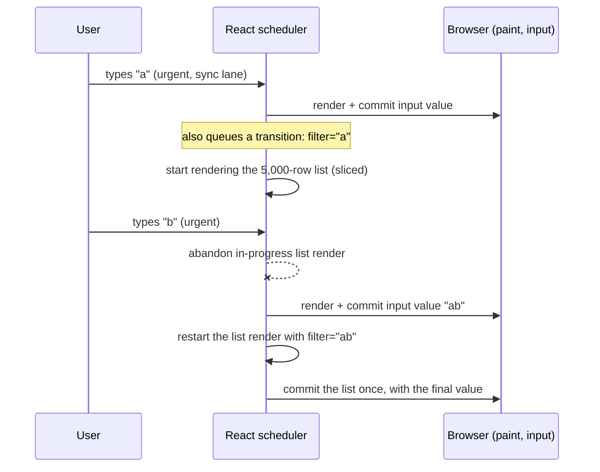
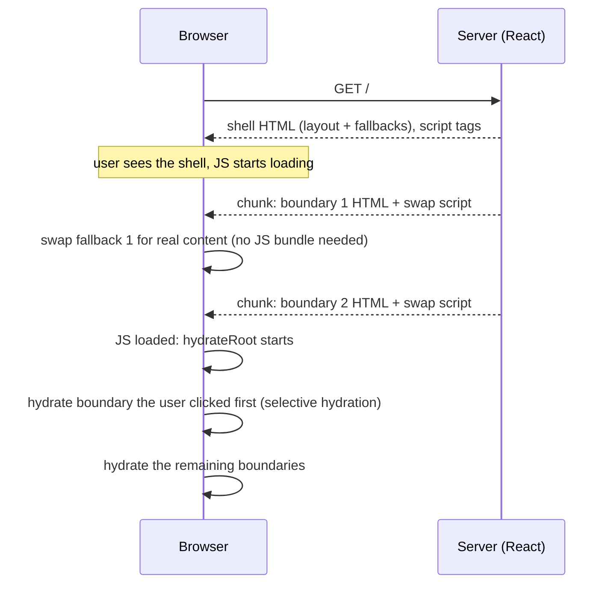
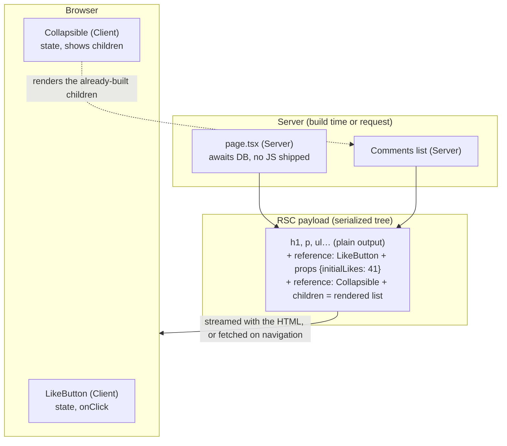

# 21 — Concurrent React, SSR and Server Components

> **How to use this module.** Sections 21.1–21.4 are client-side concurrency (transitions, deferred values, Suspense) and answer most "what is concurrent React" questions. Sections 21.5–21.8 are the server half: SSR, streaming, Server Components and Server Functions. Sections 21.9–21.14 cover the newer APIs and the frameworks that use all of this (Next.js 16, React Router). If you only have 30 minutes, read 21.1, 21.2, 21.7, 21.8, the Summary and the gotchas.

**Prerequisites:** [Render phase vs commit phase](06-jsx-and-rendering-model.md#610-render-phase-vs-commit-phase) · [Fiber, lanes and priorities](13-reconciliation-and-fiber.md#135-fiber-units-of-work-double-buffering-lanes-and-priorities) · [Effects](09-effects.md#91-effects-as-synchronization-with-external-systems) · [Transitions preview](15-performance.md#159-transitions-for-responsiveness) · [`use` + Suspense for data](17-data-fetching.md#1710-suspense-based-fetching-and-use) · [Error boundaries](16-error-handling.md#162-error-boundaries)

**Code for this module:** client-side examples in [`examples/web/src/m21-concurrent/`](examples/web/src/m21-concurrent/) (run `npx vitest run src/m21-concurrent` from `examples/web`); server-side examples in [`examples/next-rsc/`](examples/next-rsc/) (a Next.js 16.3.8 App Router project with no tests: it is checked by `npm run verify`, which runs `tsc --noEmit` and `next build`).

> **Where the verification came from.** Claims marked "verified" were checked against the installed packages (`react` 19.3.0, `react-dom` 19.3.0, `next` 16.3.8, whose docs ship in `node_modules/next/dist/docs/`) or a named react.dev / reactrouter.com page. Test expectations are confirmed by the coordinator's runs; the status is recorded in the coordinator's `PROGRESS.md`. Anything else is marked `> **Unverified:**`.

---

## 21.1 Concurrent rendering: interruptible rendering

### The problem
Before React 18, a render was **synchronous and uninterruptible**. Once React started rendering a tree, it ran to the end without letting the browser do anything else. A keystroke that triggered a heavy re-render (filtering 5,000 rows) froze the input until the whole render finished. You could only dodge that by making the render cheaper, or by debouncing and hoping.

### Mental model
**Concurrent rendering** [React] means React can **start rendering, pause, throw the work away and start over** when something more urgent arrives. It is a property of the *renderer*, not a feature you switch on per component. The things you write (`startTransition`, `useDeferredValue`, `<Suspense>`) only tell React which updates are urgent and which can wait.

> **Java/Spring analogy.** A thread pool with priorities: a user-facing request thread preempts a batch job. In `@Async` terms, the keystroke is the high-priority task and the list re-render is the low-priority one that may be cancelled and resubmitted.
>
> **Where the analogy breaks:** React is single-threaded. Nothing runs in parallel. Rendering is cut into small slices, and between slices the browser can handle input and paint. "Concurrent" here means *interleaved*, not parallel, and an abandoned render has no side effects to roll back because render is pure ([06](06-jsx-and-rendering-model.md#68-purity-and-idempotence)).

### Minimal code
Concurrent features are **opt-in by using them**, and they require a concurrent root:

```tsx
import { createRoot } from 'react-dom/client';

createRoot(document.getElementById('root')!).render(<App />); // React 18+: concurrent root
```

With the root in place, an update is urgent by default, and you downgrade the ones that can wait:

```tsx
const [isPending, startTransition] = useTransition();
// urgent: the input must echo the key
setQuery(next);
// not urgent: may be interrupted, may be delayed
startTransition(() => setFilter(next));
```

### How it works internally
Each update gets a **lane** [React], a bit in a bitmask that encodes its priority ([13.5](13-reconciliation-and-fiber.md#135-fiber-units-of-work-double-buffering-lanes-and-priorities)). A click gets the sync lane, a transition gets one of the transition lanes, a deferred value gets a deferred lane. The scheduler picks the highest-priority lanes with pending work and renders them.

Two behaviors make a render *concurrent*:

1. **Time slicing.** A render of non-urgent lanes checks `shouldYield()` between units of work (fibers) and hands control back to the browser when its slice is used up. The Scheduler package's frame interval is 5 ms (verified: `frameInterval = 5` in the installed `scheduler/cjs/scheduler.development.js`). Urgent sync-lane renders (a discrete click or keypress) are **not** sliced: they run to completion so the UI responds consistently.
2. **Interruption and restart.** If an urgent update arrives while a transition render is in progress, React abandons the in-progress tree (the *work-in-progress* fiber tree, [13.5](13-reconciliation-and-fiber.md#135-fiber-units-of-work-double-buffering-lanes-and-priorities)), renders the urgent update, commits it, and then **restarts** the transition from the top on top of the new state. Nothing from the abandoned attempt was committed, so nothing is visible.

Starvation protection: lanes carry an expiration. In the installed `react-dom-client.development.js`, `computeExpirationTime` gives the sync and input-continuous lanes `currentTime + 250` ms, and the default and transition lanes `currentTime + 5e3` (about **5 seconds**). When a lane expires, React stops time-slicing it and renders it synchronously, so a busy stream of urgent updates cannot postpone a transition forever (verified by reading that function).



> **Version notes.**
> **React 16 (2017):** the Fiber rewrite made interruptible rendering *possible*; it shipped no public API for it. **React 16.x/17:** an experimental "Concurrent Mode" existed only in experimental builds and was dropped in favor of the opt-in `createRoot` model. **React 18.0 (March 2022):** concurrent rendering became real and **opt-in via `createRoot`**; `startTransition`, `useTransition`, `useDeferredValue`, `<Suspense>` on the server and **automatic batching** arrived together. With the legacy `ReactDOM.render` root (React 17 behavior), none of the concurrent features apply and updates outside event handlers are not batched. **React 19:** `ReactDOM.render`, `ReactDOM.hydrate` and `unmountComponentAtNode` are **removed** (verified: `examples/web/src/m21-concurrent/Hydration.test.tsx` asserts that `render`, `hydrate`, `unmountComponentAtNode` and `findDOMNode` are absent from `react-dom`). **Migration path:** swap `ReactDOM.render(<App />, el)` for `createRoot(el).render(<App />)` and `ReactDOM.hydrate` for `hydrateRoot`; fix tests that relied on unbatched updates; then adopt transitions where input feels slow.

### Trade-offs
- ✅ The input stays responsive on slow devices without hand-tuned debouncing; the cost adapts to the device.
- ❌ Render functions may run more times, and with results that are thrown away, so **impure render code breaks** (a global counter incremented in render, a ref written during render). Strict Mode double-rendering exists to surface that ([6.11](06-jsx-and-rendering-model.md#611-strict-mode-double-invocation-and-why)).
- ❌ It does not make the work cheaper. A transition that renders 5,000 rows still renders 5,000 rows; it just does not block typing. Reducing the work (virtualization, [15.8](15-performance.md#158-virtualization)) is a separate fix.
- ❌ A heavy **synchronous** computation inside one component cannot be sliced, because the unit of interruption is a component, not a statement.

---

## 21.2 `useTransition` and `startTransition`

### The problem
Some updates are urgent (echo the keystroke, press feedback) and some are not (re-render a big list for the new filter). If both are in the same event handler, React treats both as urgent, and the expensive one delays the cheap one. Worse, a navigation that suspends shows a loading spinner that replaces the screen the user was just looking at.

### Mental model
A **Transition** [React] says "this update may take a while; keep showing the current UI until the new UI is ready." `useTransition` gives you `isPending`, so you can show something while you wait. Think of it as a **draft** you are rendering in the background and only swap in when it is complete.

> **Java/Spring analogy.** `@Transactional` with deferred commit: the changes are staged and become visible only on success. 
>
> **Where the analogy breaks:** there is no rollback of *your* side effects. A transition only controls which **React state updates** are rendered and committed. A network call you start inside an Action still happens whether or not the render is abandoned.

### Minimal code
`examples/web/src/m21-concurrent/SearchTransition.tsx` (the full file is [Exercise 1](#exercise-1-search-with-transitions)):

```tsx
const [isPending, startTransition] = useTransition();

function handleChange(event: ChangeEvent<HTMLInputElement>) {
  const next = event.target.value;
  setQuery(next); // urgent: controlled input

  startTransition(async () => {
    const found = await search(next); // an "Action": a function passed to startTransition
    startTransition(() => {           // after an await, wrap the state update AGAIN
      setResults(found);
    });
  });
}
```

### How it works internally
`startTransition(fn)` [React] sets an internal "current transition" marker, calls `fn` **immediately and synchronously** (it is not deferred like `setTimeout`), and every state update scheduled while that marker is set is assigned a **transition lane** instead of a sync lane. That is why the *synchronous* part of the function works with no more ceremony.

React 19 added **async Actions**: if `fn` returns a promise, React keeps the transition open (`isPending === true`) until it settles. But the marker applies to the synchronous part only. After an `await`, the marker is gone, so state updates there are urgent unless you call `startTransition` again (documented on [react.dev/reference/react/useTransition](https://react.dev/reference/react/useTransition); this is why the example nests it). React 19.3 also changed transition scheduling so a slow Transition no longer blocks other independent ones (19.3 post, "Transition rendering"). Before that, "Multiple ongoing Transitions are currently batched together" (useTransition docs), so `isPending` stays true until **all** of them finish. The test `SearchTransition.test.tsx` ("an older response that arrives last is ignored") asserts this: `isPending` stays true while the older request is outstanding.

Behaviors to know (all from the useTransition docs unless noted):
- **Interruptible.** Another state update can restart the transition's render.
- **No fallback for revealed content.** If the transition's render suspends on something already visible, React keeps the old UI instead of showing the Suspense fallback ([21.4](#214-suspense-in-depth), asserted in `SuspenseReveal.test.tsx`).
- **Errors** thrown in an Action are re-thrown during render of the component that called `useTransition`, so an error boundary above it catches them ([16](16-error-handling.md)).
- **Not for controlled text inputs.** The input value must update synchronously, so keep `setQuery` outside the transition (the example does).
- **`setTimeout` and `await` lose the marker.** Updates there are urgent.
- **Ordering is not guaranteed.** The hook tracks pending state; it does not serialize your requests. Guard stale responses yourself (a request id, an `AbortController`, or `useActionState` which queues actions in order).

The standalone `startTransition` export (`import { startTransition } from 'react'`) does the same without `isPending`. Use it from libraries, from outside components, or when you do not need the flag.

> **Version notes.** **React 18.0:** `startTransition` and `useTransition` introduced; the function had to be **synchronous** and returned nothing. **React 19.0:** the function can be `async` (Actions), which powers `<form action>`, `useActionState` and `useOptimistic` ([14](14-forms-and-actions.md)). **React 19.3:** `addTransitionType` and `<ViewTransition>` hook into transitions ([21.10](#2110-viewtransition)). **Migration path:** old code that tracked `isLoading` with `useState` around an `await` can often become `startTransition(async () => …)` and read `isPending`. Source: React blog 19.0 and 19.3.

### Trade-offs
- ✅ Keeps the current screen interactive while heavy or suspending updates render.
- ✅ Makes "pending without a spinner flash" the default for navigations (routers wrap navigation in a transition).
- ❌ `isPending` flips only when the transition *starts and ends*; it is not a progress indicator.
- ❌ If the transition's work is cheap, a transition adds nothing. Measure first ([15](15-performance.md)).
- ❌ Do not use it for **timing** (delays). It has no fixed delay; for a delay use a real debounce.

---

## 21.3 `useDeferredValue`

### The problem
You have a value you do not control the setter of (a prop, a router's search param, a value from a library) and a slow component that depends on it. You cannot wrap the setter in `startTransition` because it is not yours.

### Mental model
`useDeferredValue(value)` [React] returns a **lagging copy** of `value`. Render the cheap thing (the input) with the real value and the expensive thing (the list) with the lagging value. When `value` changes React renders twice: first urgently with the **old** deferred value (cheap, fast), then in the background with the new one. It is "a transition for a value".

### Minimal code
`examples/web/src/m21-concurrent/DeferredLog.tsx` (Exercise 4 predicts its output):

```tsx
export function DeferredEcho({ text }: { text: string }) {
  const deferred = useDeferredValue(text);
  log.push(`render text=${text} deferred=${deferred}`);
  return <p>{deferred}</p>;
}
```

A realistic use:

```tsx
function Search({ query }: { query: string }) {
  const deferredQuery = useDeferredValue(query);
  const isStale = query !== deferredQuery; // true while the background render is pending
  return (
    <div style={{ opacity: isStale ? 0.5 : 1 }}>
      <SlowResults query={deferredQuery} /> {/* must be memo(...) to skip the urgent pass */}
    </div>
  );
}
```

### How it works internally
When `value` changes, the first render returns the previous deferred value, so a `memo`-wrapped `SlowResults` whose props did not change **bails out** of the urgent pass. React then schedules a second render on a **deferred lane** with the new value, which is interruptible and restarts if `value` changes again (react.dev). Per the docs:

- **No fixed delay.** The background render starts as soon as the urgent one commits. This is why it is *not* a debounce: it adapts to device speed, and it does **not** stop network requests or reduce how often you compute.
- **Inside a transition it does not defer.** If the update that changes `value` is already a transition, `useDeferredValue` returns the new value at once, because the work is already low priority. Asserted by `DeferredLog.test.tsx` ("inside a transition…"): no render ever pairs the new text with the old deferred value. The log still has two lines, because `useTransition`'s `startTransition` first commits `isPending = true` urgently, with the old text (verified by running it).
- **Suspense integration.** If the background render suspends, the user keeps seeing the old deferred value, with no fallback.
- **Effects** inside the deferred render run only when it commits.
- Pass **primitives or stable objects**. A new object each render would look "changed" and cause pointless background renders.

`initialValue` (second argument, **React 19**): on the first render React returns `initialValue`, then schedules a background render with the real value. Without it, there is nothing to lag behind on mount, so the first render uses the real value. Verified in `DeferredLog.test.tsx`: with `initialValue = ''` the log is `render text=a deferred=` then `render text=a deferred=a`.

> **Version notes.** **React 18.0:** `useDeferredValue(value)` only. **React 19.0:** optional `initialValue`, useful for SSR (the server HTML renders the initial value, the client fills in the real one after hydration). Source: React 19 release notes; react.dev useDeferredValue.

### Trade-offs
- Choose `useTransition` when you own the `setState`; `useDeferredValue` when you only receive the value.
- Pair it with `memo` on the slow child, otherwise the urgent pass re-renders it anyway (with the old value) and you saved nothing ([15](15-performance.md#159-transitions-for-responsiveness)).
- The React Compiler (1.0) memoizes automatically where it is enabled, but a lagging value is still your decision.
- **Debounce** is still right when you want to cut **network** calls or expensive effects. `useDeferredValue` only defers rendering.

---

## 21.4 Suspense in depth

### The problem
Asynchronous things (code, data, images in a transition) have no natural place in a synchronous render function. Handling "not ready yet" in every component with `isLoading` flags produces spinner soup and waterfalls ([17.1](17-data-fetching.md#171-fetching-in-effects-and-its-pitfalls)).

### Mental model
`<Suspense fallback>` [React] is a **try/catch for "not ready"**. A component that cannot render yet *suspends*; React shows the fallback of the nearest boundary above it and retries later. Where you put the boundary decides **how much of the screen is replaced** while waiting.

> **Java/Spring analogy.** A `try/catch` where the "exception" is a pending future, and the `catch` block renders a placeholder. Or a `CompletableFuture` that you `.join()` inside a `@ControllerAdvice` that returns a spinner.
>
> **Where the analogy breaks:** the render is **retried from the component that suspended**, not resumed, and any state of the suspended component created during that attempt is not kept. A suspending component that has never committed has no state to lose; one that has already committed is *hidden*, not unmounted, so its state survives.

### Minimal code
`examples/web/src/m21-concurrent/SuspenseReveal.tsx`:

```tsx
<Suspense fallback={<p>Loading page…</p>}>
  <Text promise={header} />
  <Suspense fallback={<p>Loading sidebar…</p>}>
    <Text promise={sidebar} />
  </Suspense>
  <Suspense fallback={<p>Loading feed…</p>}>
    <Text promise={feed} />
  </Suspense>
</Suspense>
```

### How it works internally: boundaries, fallbacks, reveal order

**Who suspends.** In React 19 the supported ways are: reading a promise with `use(promise)`, `React.lazy` ([15.7](15-performance.md)), and Suspense-enabled frameworks and libraries (Relay, Next.js, TanStack Query's `useSuspenseQuery`). Throwing a promise by hand is an implementation detail, not an API. `use(promise)` needs a promise whose identity is **stable across retries** (from a cache, a Server Component prop, or `useState`), never one created during render ([17.10](17-data-fetching.md#1710-suspense-based-fetching-and-use)).

**Reveal order** (all asserted by `SuspenseReveal.test.tsx`, "nested boundaries reveal from the outside in…"):
1. If the **outer** boundary's own content has not resolved (the header), only the **outer fallback** shows. Inner boundaries do not show their fallbacks yet.
2. When the outer content resolves, it commits and **each inner boundary shows its own fallback** until its own data arrives.
3. Inner boundaries then reveal **independently, in the order their data arrives** (the test resolves the feed before the sidebar).

So **placement is a design decision**: one boundary around the page gives one big spinner; a boundary per widget gives independent loading, at the cost of layout shift and "popcorn" loading.

**Already-revealed content is protected.** When an update suspends:
- **Not in a transition:** the nearest boundary shows its fallback and React **hides** the content already there (`display: none`), without unmounting it. Its state survives. Test: `SuspenseReveal.test.tsx` "without a transition, switching re-suspends".
- **In a transition:** React does not show the fallback for boundaries that are already revealed. It keeps the old UI and flips `isPending`. A *new* boundary that mounts as part of the transition can still show its fallback. Test: "inside a transition, the old content stays".

**Throttling.** React throttles the reveal of Suspense content on the client (`FALLBACK_THROTTLE_MS = 300`, verified in `react-dom-client.development.js`) so quick successive reveals do not flicker. In `act()` this throttle is bypassed, which is why tests do not wait. React 19.2 added a similar batching for **server-streamed** boundaries ([21.6](#216-streaming-ssr-and-selective-hydration)).

**Errors.** Suspense handles *pending*, not *failed*. A rejected promise throws on the retry, and the nearest error boundary catches it ([16](16-error-handling.md)). The common pairing is `<ErrorBoundary><Suspense>…</Suspense></ErrorBoundary>`, with the error boundary **outside** so the fallback is not replaced by the error.

**Testing trap (verified in this repo).** A component that suspends on `use(promise)` at first render must be rendered with `await act(async () => render(...))`. A plain `render` never retries it, and React logs "A component suspended inside an `act` scope, but the `act` call was not awaited" ([17.10](17-data-fetching.md#1710-suspense-based-fetching-and-use), [20.5](20-testing.md#205-async-utilities-and-act)). Every Suspense test here uses the awaited form.

> **Version notes.** **React 16.6:** `lazy` + `Suspense` for code splitting only. **React 18.0:** Suspense on the server (streaming), selective hydration, and Suspense with transitions. **React 19.0:** `use(promise)`. **React 19.2:** batched reveals for streamed boundaries, and `<Activity>` can pre-render hidden Suspense content. Sources: React blog 18, 19, 19.2. **Legacy:** before 18, Suspense did not work with SSR at all; `ReactDOMServer.renderToString` could not stream.

### Trade-offs
- ✅ Declarative loading states, no waterfall of `isLoading` flags, and a clean place for streaming.
- ❌ Waterfalls are still possible: a child that fetches only after its parent resolves. Start requests early (in a loader or Server Component) and read them with `use`.
- ❌ Too many boundaries means a jittery page; too few means a spinner for everything. Group things that should appear together.
- ❌ Suspense does not detect data fetched in an effect.

---

## 21.5 SSR, hydration, hydration errors

### The problem
A client-rendered app sends an empty `<div id="root">` and a bundle. The user sees nothing until the JS downloads, parses and runs, and crawlers may see nothing. **Server-side rendering** sends real HTML first. But that HTML is inert until JavaScript attaches to it.

### Mental model
**SSR** [React DOM] renders the component tree to an HTML string on the server. **Hydration** [React DOM] is the client re-running the *same* component tree against that existing DOM, attaching event handlers and state without recreating the nodes. For hydration to work, **the client's first render must produce the same output as the server's**.

> **Java/Spring analogy.** Thymeleaf renders HTML on the server (SSR). Hydration is as if the browser then "adopted" that HTML and wired Angular/JS behavior onto the existing elements instead of rebuilding them.
>
> **Where the analogy breaks:** in Thymeleaf the server template and the client script are different programs. In React both are the *same* components, so any server/client difference is a **bug in your component**, not a design choice.

### Minimal code
Server (Node), the **legacy** way, and client:

```tsx
// server
import { renderToString } from 'react-dom/server';
const html = renderToString(<App />);      // blocks, no streaming (see below)

// client
import { hydrateRoot } from 'react-dom/client';
hydrateRoot(document.getElementById('root')!, <App />, {
  onRecoverableError: (error) => report(error), // hydration problems arrive here (16.5)
});
```

Provoking and fixing a mismatch (`examples/web/src/m21-concurrent/Hydration.tsx` and `Hydration.test.tsx`, Exercise 7):

```tsx
function Stamp({ value }: { value: string }) { return <p>{value}</p>; }
// server rendered "server", client first render "client" => hydration mismatch

function ClientOnlyStamp({ client }: { client: string }) {
  const value = useSyncExternalStore(subscribe, () => client, () => 'server');
  return <p>{value}</p>; // hydrates with 'server', then re-renders with the client value
}
```

### How it works internally
`hydrateRoot` walks the existing DOM in parallel with the fiber tree it renders. For each fiber it finds the matching DOM node and **adopts** it rather than creating one. It does **not** compare every attribute (that would be expensive); it checks text content and element types and warns about some attribute differences in development. If it finds a mismatch it cannot reconcile:

- It throws a **recoverable error**, **discards the server DOM for the nearest enclosing Suspense boundary (or the whole root if there is none)**, and re-renders it on the client from scratch. The user sees a flash and loses the SSR benefit for that subtree.
- The error is reported via `onRecoverableError` (default: `reportError` / `console.error`), see [16.5](16-error-handling.md#165-react-19-root-options-oncaughterror-onuncaughterror-onrecoverableerror). Verified: `Hydration.test.tsx` "a text mismatch is reported through onRecoverableError and the client output wins".

**Common causes.** `Date.now()`, `new Date().toLocaleString()` with a different timezone/locale between server and browser, `Math.random()`, `typeof window !== 'undefined'` branches in render, `localStorage` reads in render, browser extensions that alter the DOM, invalid HTML nesting (`<div>` inside `<p>`: the HTML parser repairs it before React sees it), and a server that renders with different data than the client's first render.

**Fixes, in order of preference.**
1. Make render **deterministic**: pass the timestamp or locale **from the server as data**.
2. For values that exist only on the client, use `useSyncExternalStore` with `getServerSnapshot`, or an effect that sets state after mount (the effect rule is fine here; see [9.6](09-effects.md#96-you-might-not-need-an-effect)). Verified in `Hydration.test.tsx`.
3. Opt a component out of server rendering: `use(browser())` from `react-dom` (React 19.3; it suspends on the server so the nearest boundary's fallback renders, then renders normally on the client), or `next/dynamic` with `ssr: false` in Next.js Client Components.
4. `suppressHydrationWarning` on **one element** for unavoidable text (a timestamp). It silences the warning and **does not patch up** the text: verified in `Hydration.test.tsx` ("suppressHydrationWarning silences the check but does not patch the text up"; the DOM keeps the server text). It is one level deep, not inherited.

**Hydration and effects.** Effects do not run on the server. In React 19.3 Strict Mode also double-invokes effects during hydration, matching client behavior (19.3 post), so a leak that hydration used to hide now shows up in development ([9.10](09-effects.md#910-strict-mode-remounting-and-what-it-reveals)).

**`useId`** produces ids that match across server and client (it is derived from the tree position), which is why you use it instead of a counter or `Math.random()`. In 19.2 the prefix changed to `_r_` to be valid in `view-transition-name` and XML names (19.2 post).

> **Version notes.** **React ≤ 17:** `ReactDOM.hydrate(<App />, el)`, mismatches were **warnings** ("Text content did not match") and React tried to *patch* attributes and text. **React 18.0:** `hydrateRoot` replaced `hydrate`; mismatches became **errors** with a fall-back to client render of the nearest Suspense boundary, and `onRecoverableError` appeared. **React 19.0:** `ReactDOM.hydrate` removed; hydration mismatches are reported as a single error message with a **diff** (React 19 release post). **Migration path:** `hydrate(app, el)` → `hydrateRoot(el, app)`; replace server `renderToNodeStream`/`renderToStaticNodeStream` (removed in 19) with `renderToPipeableStream`/`prerenderToNodeStream`.

### Trade-offs
- ✅ Faster first paint and crawler-visible HTML.
- ❌ **Uncanny valley**: the page looks ready but is not interactive until hydration finishes. Streaming and selective hydration ([21.6](#216-streaming-ssr-and-selective-hydration)) and Server Components ([21.7](#217-server-components-the-mental-model-clientserver-boundary)) reduce it.
- ❌ You now have two runtimes to keep identical. Anything environment-dependent must come in as data.
- Plain **client-side rendering** is still a perfectly good choice for an authenticated dashboard behind a login. SSR pays off for public, SEO-sensitive, first-load-sensitive pages.

---

## 21.6 Streaming SSR and selective hydration

### The problem
Classic SSR is **all-or-nothing in sequence**: (1) fetch *all* the data, (2) render *all* the HTML, (3) send *all* of it, (4) download *all* the JS, (5) hydrate *everything*. One slow query blocks the entire page, and one heavy component blocks interactivity everywhere.

### Mental model
Streaming SSR [React DOM] sends the page **in chunks**. The **shell** (everything outside any `<Suspense>`, plus the fallbacks) goes first. Each suspended boundary's real HTML follows when it is ready, with a tiny inline script that swaps it in for the fallback. **Selective hydration** lets React hydrate boundaries **independently and in priority order**, including the one the user just clicked.

> **Java/Spring analogy.** `StreamingResponseBody` / Server-Sent Events / a chunked `Transfer-Encoding` response: the controller flushes the header and the first part while a slow service call is still running.
>
> **Where the analogy breaks:** the order is not "first computed, first sent" only; React also decides *which part of the already-sent HTML to make interactive first*, based on user input.

### Minimal code
Node server (`renderToPipeableStream`), the **modern** replacement of `renderToString`:

```tsx
import { renderToPipeableStream } from 'react-dom/server';

app.get('/', (req, res) => {
  const { pipe, abort } = renderToPipeableStream(<App />, {
    bootstrapScripts: ['/main.js'],
    onShellReady() {            // the shell (outside Suspense) rendered
      res.statusCode = 200;
      res.setHeader('content-type', 'text/html');
      pipe(res);                // start streaming
    },
    onShellError() {            // an error in the shell: nothing sent yet, so you can send a 500 page
      res.statusCode = 500;
      res.send('<h1>Something went wrong</h1>');
    },
    onError(error) { console.error(error); },  // any error, including inside Suspense boundaries
  });
  setTimeout(abort, 10_000);    // give up and let the client render the rest
});
```

The Next.js example in this repo: [`examples/next-rsc/app/streaming/page.tsx`](examples/next-rsc/app/streaming/page.tsx) has two `<Suspense>` boundaries (300 ms and 1,500 ms) behind a `loading.tsx`. You can see the stream with `curl -N http://localhost:3000/streaming` after `next start`.

### How it works internally



- **The HTML swap needs no framework JavaScript.** The inline `<script>` that moves the streamed content into place is tiny and runs immediately (Next.js streaming guide). The page paints progressively before hydration even starts.
- **Each Suspense boundary is also a hydration unit.** React hydrates boundaries independently. If a click or key event lands on an un-hydrated boundary, React **raises that boundary's priority**, hydrates it first, and **replays** the event afterward (unverified detail: the event replay comes from the React 18 Working Group discussion on selective hydration, which was not re-fetched for this guide). A hydration of one boundary can also be interrupted by a more urgent one.
- **Code splitting no longer blocks hydration.** In React 17, `lazy` components could not be hydrated before they loaded and would force a deopt. In 18, a `lazy` inside a `<Suspense>` hydrates when its chunk arrives, and the rest of the page does not wait.
- **Errors.** An error *inside* a boundary during streaming does not fail the response: React emits that boundary's fallback and **retries on the client**; `onError` still fires on the server. An error in the **shell** triggers `onShellError`, so you can still send a proper 500 ([16](16-error-handling.md#161-what-happens-when-a-render-throws), react.dev renderToPipeableStream).
- **`onAllReady` for crawlers and static generation.** It fires once *everything*, including suspended content, has rendered. Use it instead of `onShellReady` when the consumer cannot handle a partial page (a bot, a prerender) (react.dev).
- **Batched reveals (19.2).** React now holds streamed boundary reveals for a short time and applies several together, to avoid chaining animations and to match client behavior. It stops batching when the page nears 2.5 s, so it cannot hurt Largest Contentful Paint (19.2 post).
- **HTTP status.** The status line and headers go out with the shell. **You cannot change the status after streaming started**, which is why a `notFound()` or redirect must happen *before* the shell is sent (in Next.js, in the page or `proxy.ts`, not inside a late Suspense boundary).

> **Version notes.** **React ≤ 17:** `renderToString` (synchronous, no Suspense) and `renderToNodeStream` (streamed *without* Suspense support, **removed in 19**). **React 18.0:** `renderToPipeableStream` (Node) and `renderToReadableStream` (web streams/edge) with Suspense; `hydrateRoot` with selective hydration. **React 19.2:** `prerender`, `resume`, `resumeAndPrerender` (Partial Pre-rendering) and web-stream variants in Node; for Node, React still recommends the Node Streams API because it is faster and supports compression (19.2 post). **Legacy `renderToString`** still exists and, per react.dev, "does not support streaming or waiting for data": a suspended component makes it emit the nearest fallback and the client renders that part. **Migration path:** `renderToString` → `renderToPipeableStream` (dynamic pages) or `prerenderToNodeStream` (static generation).

### Trade-offs
- ✅ Time to first byte and first paint no longer depend on the slowest query.
- ❌ Your CDN, reverse proxy and compression layer must not buffer the response, or streaming silently collapses into a single chunk. nginx, for example, has `proxy_buffering on` by default; turn it off for the streaming location or send `X-Accel-Buffering: no` from the app ([nginx proxy module](https://nginx.org/en/docs/http/ngx_http_proxy_module.html#proxy_buffering)). Other proxies and API gateways have their own switches; check yours.
- ❌ You cannot set cookies, headers or the status after the shell is flushed.
- ❌ Layout shift: fallbacks should reserve the final size.

---

## 21.7 Server Components: the mental model, client/server boundary

### The problem
Even with SSR and streaming, **every component's JavaScript still ships to the browser** and runs again there (hydration). A component that only reads a database and formats a list pays for its code, its dependencies (a markdown parser, a date library) and its hydration cost, and the data it fetched travels twice: once as HTML, once as JSON for the client to re-render. And the browser can never safely talk to your database or hold your secrets, so you add an API layer just to feed components.

### Mental model
**React Server Components** (RSC) [React] are components that run **only on the server** (at build time or per request). Their output is not HTML. It is a serialized description of the React tree (the **RSC payload**) in which "client components" appear as **references** ("load this module, with these serializable props"). The client React merges that payload into its tree. Server Component code and its dependencies **never reach the browser**.

There are two kinds of component, and the **module** decides which kind you wrote:

| | Server Component (default in the App Router) | Client Component (`'use client'`) |
|---|---|---|
| Runs | Server only | Server (SSR, for the first HTML) **and** browser |
| Can `await` data, read DB/secrets/filesystem | Yes (it can be `async`) | No |
| `useState`, `useEffect`, event handlers, browser APIs | **No** | Yes |
| In the client bundle | No | Yes |
| Re-renders on the client | Never; it re-runs on the server when the route refreshes | Yes, as usual |

> **Java/Spring analogy.** A server component is a `@Controller` method plus its view fragment (Thymeleaf/JSP) rendered on the server, with direct access to repositories. A client component is a small JavaScript widget embedded in that page. The `'use client'` line is the boundary where the page hands over to the widget.
>
> **Where the analogy breaks:** a Thymeleaf fragment returns HTML you cannot reconcile with later. The RSC payload is a **tree description** that React merges into the live client tree. Navigating or refreshing re-fetches the server part while **preserving client state** (an open dropdown, a typed input) in the client components that survive, which a full page reload never does.

### Minimal code
`examples/next-rsc/app/rsc-island/` (Exercise 2):

```tsx
// page.tsx: a Server Component (async, no directive)
export default async function RscIslandPage() {
  const post = await getPost(1);
  return (
    <main>
      <h1>{post.title}</h1>
      <LikeButton initialLikes={post.likes} />        {/* client island, receives a number */}
      <Collapsible title="comments">                  {/* client component...            */}
        <ul>{post.comments.map(/* … */)}</ul>         {/* ...whose children are server-rendered */}
      </Collapsible>
    </main>
  );
}
```

```tsx
// LikeButton.tsx
'use client';
export function LikeButton({ initialLikes }: { initialLikes: number }) { /* useState … */ }
```

### How it works internally



**The boundary is a module boundary.** `'use client'` marks a **module** and everything it imports as client code, not a node in the render tree (react.dev `'use client'`). That has three consequences:
1. **Do not put `'use client'` high.** If a layout is marked, its whole import graph becomes client code. Push it down to the smallest interactive leaf (the "island").
2. A **Client Component cannot import a Server Component** (that module would become client code). But it can **receive one as `children` or any JSX prop**, because the server already rendered it. This **slot pattern** (`Collapsible` above) keeps big server-rendered subtrees out of the bundle.
3. A shared module with no directive is a Server Component when a server module imports it and a Client Component when a client module imports it. Utility code (formatting, validation) is naturally shared.

**What may cross the boundary.** Props to a Client Component must be **serializable**: primitives, `Date`, `Map`, `Set`, arrays, plain objects, JSX elements, Promises, and Server Functions. Not allowed: ordinary functions, class instances, unregistered symbols (react.dev `'use client'`). That is why you cannot pass `onClick={() => …}` from a Server Component to a Client one, and why a Server Component cannot pass its own callback.

**The React build for server components is a different build.** With the `react-server` export condition, `react` exports a reduced API. Verified by reading `node_modules/react/cjs/react.react-server.development.js` (19.3.0): it exports `Suspense`, `Activity`, `ViewTransition`, `Fragment`, `cache`, `cacheSignal`, `use`, `useId`, `useMemo`, `useCallback`, `useDebugValue`, `lazy`, `memo`, `createElement`, `cloneElement`, `isValidElement`, `Children`... and **does not export** `useState`, `useReducer`, `useEffect`, `useLayoutEffect`, `useContext`, `createContext`, `useTransition`, `useDeferredValue`, `useActionState`, `useOptimistic`. That is the mechanical reason those hooks "don't work in Server Components".

**Data fetching moves into components.** An `async` Server Component can `await` a database call. Two components that need the same data can call the same function; wrap it in `cache()` from `react` to dedupe within one request (React 19.2 adds `cacheSignal()` to know when that cache's lifetime is over). Start independent fetches in parallel (`Promise.all`, or sibling components each in its own `<Suspense>`) to avoid waterfalls.

**Secrets.** A Server Component can read `process.env.DB_PASSWORD`. To make sure a server-only module is never imported by client code by accident, mark it with the `server-only` package (the build fails if a client module imports it). In Next.js, installing `server-only` is **optional**: Next.js handles the `server-only` and `client-only` imports internally and does not use the npm packages' contents; install them only if a lint rule flags extraneous dependencies ([Server and Client Components](https://nextjs.org/docs/app/getting-started/server-and-client-components#preventing-environment-poisoning)).

**Context.** Server Components cannot use `createContext`/`useContext` (not exported, above). Providers are Client Components that take `children`. React 19.3 lets a Server Component render a `<Context>` that is created in a `'use client'` module, so a separate provider wrapper is no longer needed (19.3 post).

> **Version notes.** **React 18 (2022):** RSC existed as an experimental, framework-only feature (Next.js 13 App Router, first in beta/canary). **Next.js 13.4:** the App Router became stable (verified: Next's Pages API docs list `v13.4.0 App Router is now stable`). **React 19.0 (Dec 2024):** Server Components and Server Functions are part of stable React, for frameworks and bundlers to implement. **React 19.2/19.3:** `cacheSignal`, `<Context>` rendering in RSC. **Legacy path:** the **Pages Router** (`pages/`, `getServerSideProps`, `getStaticProps`) renders every component on the server (SSR) *and* hydrates every component on the client; there is no server-only component. **Migration path:** move one route at a time: create `app/…/page.tsx`, move data fetching from `getServerSideProps` into an `async` page, mark interactive components `'use client'`, delete the `pages/` route. Both routers can coexist in one Next.js app (Next.js app-router migration guide).

### Trade-offs
- ✅ Less JavaScript, no client/server data duplication, direct data access, secrets stay on the server, streaming by default.
- ✅ Heavy dependencies (markdown, syntax highlighting, date libs) can live on the server only.
- ❌ A new mental model: you now reason about *where* every module runs, and errors about "hooks in a Server Component" or "functions cannot be passed to Client Components" come from crossing the boundary wrongly.
- ❌ It needs a framework or bundler integration. A Vite SPA does not get RSC for free. React Router's RSC support is unstable (VERSIONS.md).
- ❌ Interactivity still needs client components, so a highly interactive app (a drawing tool, a spreadsheet) gets little from RSC.
- When *not* to use it: an authenticated app that is mostly interactive state, an SPA you already have behind a Spring API, or a team that does not control the server.

---

## 21.8 `'use client'` and `'use server'`; Server Functions and their security

### The problem
The two directives look symmetrical and are not, and the second one creates **public HTTP endpoints** that many developers do not realize they have written.

### Mental model
- `'use client'` says: **"this module is code for the browser."** It marks the Server → Client **boundary**.
- `'use server'` says: **"these functions run on the server, and the client may call them."** It marks the Client → Server **entry point**. It is **not** the opposite of `'use client'`, and it is **not** how you mark a Server Component (Server Components need no directive).

A **Server Function** [React] is an async function marked `'use server'`. React replaces the import on the client with a **reference**; calling it makes a network request (a POST), sends the serialized arguments, runs the function on the server, and returns the serialized result. When used as a form `action`, it is a **Server Action** (the Next.js term, still in its docs).

> **Java/Spring analogy.** A Server Function is a `@PostMapping` controller method that the framework generates a URL and a client stub for. It is an RPC endpoint, not a local call.
>
> **Where the analogy breaks:** you never write the URL, the DTO or the `fetch`. Because the plumbing is invisible, it is easy to forget it is an endpoint with **no authentication, no validation and no CSRF protection of its own** unless you add them.

### Minimal code
`examples/next-rsc/app/server-action/` (Exercise 3):

```ts
// actions.ts
'use server';

export async function signup(_previous: SignupState, formData: FormData): Promise<SignupState> {
  const { values, errors } = validateSignup(formData);   // never trust the input
  if (Object.keys(errors).length > 0) return { /* error state */ };
  // authenticate + authorize here in a real app
  /* … persist … */
}
```

```tsx
// SignupForm.tsx
'use client';
const [state, formAction, isPending] = useActionState(signup, initialSignupState);
return <form action={formAction}>…<SubmitButton /></form>;   // SubmitButton uses useFormStatus
```

### How it works internally
- **Placement.** `'use server'` goes at the top of a **file** (every export becomes a Server Function, and the file may export **only async functions**) or at the top of an **async function body** inside a Server Component. Only the file form can be imported from a Client Component (react.dev `'use server'`). That is why `validate.ts` in the example holds the types and the plain `initialSignupState` constant: they cannot be exported from `actions.ts`.
- **Serialization.** Arguments and return values must be serializable: primitives, `Date`, `FormData`, `Map`, `Set`, plain objects, Promises, other Server Functions. Not React elements, class instances or ordinary functions (react.dev).
- **Next.js behaviors** (Next.js 16.3.8 docs, `node_modules/next/dist/docs/01-app/02-guides/data-security.md` and `server-actions.md`):
  - Server Actions use **POST only**, which prevents most CSRF with SameSite cookies, and Next.js compares the **`Origin` header to the `Host`** (or `X-Forwarded-Host`) and aborts on mismatch. Behind a reverse proxy configure `serverActions.allowedOrigins`.
  - Action **IDs are encrypted, non-deterministic** and recalculated between builds; **unused** Server Actions are removed from the client bundle. This reduces exposure, but the docs still say: *treat them as reachable by direct POST* and verify authentication and authorization **inside each one**.
  - **Closures are encrypted.** A function defined inside a component that closes over a variable sends that variable to the client and back; Next.js encrypts it with a per-build key (self-hosting multiple instances needs the same `NEXT_SERVER_ACTIONS_ENCRYPTION_KEY`). Docs: do not rely on that encryption alone for secrets.
  - Request bodies are capped (default **1 MB**, `serverActions.bodySizeLimit`).
  - The client dispatches Server Actions **one at a time** (an implementation detail that "may change"), so they are for **mutations**, not for parallel data fetching. Fetch in Server Components or Route Handlers.
- **After the mutation:** the response can carry the **refreshed server tree** in the same round trip, so the UI updates without a second request. Cache invalidation (`updateTag`, `revalidateTag`, `revalidatePath`, `refresh`) happens inside the action ([21.12](#2112-nextjs-16-caching)).
- **Progressive enhancement.** A Server Function passed to `<form action>` can submit **before JavaScript loads**; in Next.js, submissions made before hydration are queued and prioritized for hydration (docs).

**Security checklist for every Server Function (all from the docs above):**
1. **Authenticate**: who is calling? Read the session from cookies in the function, not from an argument.
2. **Authorize the resource**: does *this* user own *this* `postId`? (Otherwise: IDOR.)
3. **Validate every argument** at runtime. TypeScript types are erased: `FormData.get()` returns `string | File | null`, and a hand-written POST can send anything. The example narrows with `typeof` and bounds the lengths (`validate.ts`). In a real project use a schema library such as Zod ([14.3](14-forms-and-actions.md#143-react-hook-form--zod)).
4. **Return only what the client needs.** Do not return database rows with internal fields.
5. **Rate limit** and cap input sizes where it matters (a signup, a comment).
6. Keep database access in a `server-only` data-access layer, so the action file stays thin.
7. Do not rely on **hiding** the action: "nobody imports it" is not an access control.

> **Version notes.** **Next.js 13.x (2023):** Server Actions experimental (`experimental.serverActions`). **Next.js 14:** stable and on by default (verified: the `serverActions` config doc says "stable in Next.js 14"). **React 19.0:** "Server Actions" renamed **Server Functions** in the React docs; `useActionState` replaces `useFormState` (Next.js 15 upgrade guide: `useFormState` is deprecated). **React 19.3:** `onReset` fires after Server Actions and `submit` events include the `submitter` (19.3 post). **Next.js 16:** `updateTag` (read-your-writes) and `refresh()` are Server Action-only APIs; `revalidateTag` takes a second argument. **Legacy:** before Server Functions you wrote an API route (`pages/api/…`) or a Route Handler and `fetch`ed it; that is still right when non-React clients or third parties call your endpoint ([21.13](#2113-route-handlers-and-proxyts)).

### Trade-offs
- ✅ No hand-written endpoint, DTO or client for UI mutations; type-checked end to end; works before hydration.
- ❌ Hidden public endpoints, hard to version and to expose to a mobile app. If a mobile client or partner needs the same operation, write a Route Handler or call your Spring API.
- ❌ Sequential dispatch and no `GET` semantics (no HTTP caching) make them unsuitable for reads.
- ❌ For a Spring backend: if the Spring API is the source of truth, a Server Function becomes a **BFF** (backend-for-frontend) hop: browser → Next.js → Spring. That can be good (token stays on the server, [24.6](24-react-with-spring-boot.md#246-oauth2oidc-with-pkce-bff-pattern-spring-security-resource-server)) but is an extra service to operate.

---

## 21.9 `<Activity>`

### The problem
Hide a tab with `{tab === 'A' && <Panel />}` and its state is destroyed: the scroll position, the half-typed form, the expanded tree. Keep it mounted with CSS (`display: none`) and its **effects keep running** (subscriptions, timers, polling) for UI nobody sees, and React still treats it as normal-priority work.

### Mental model
`<Activity mode="hidden">` [React] is a **"background tab"** for part of your tree: the UI is hidden, its state and DOM are **kept**, its effects are **cleaned up**, and its updates are rendered at **low priority**. `mode="visible"` brings it back with state intact and effects re-created. It is the stable successor of the experimental `Offscreen` / `unstable_Offscreen` components.

> **Java/Spring analogy.** A `@SessionScope`/`@Scope("session")` bean that stays in memory between requests while its `@PreDestroy`-like resources (connections) are released and reacquired on demand.
>
> **Where the analogy breaks:** nothing is serialized. The state lives in memory, in the fiber tree, so a hidden Activity still costs memory, and a very large number of them is a leak by design.

### Minimal code
`examples/web/src/m21-concurrent/ActivityTabs.tsx` (Exercise 5):

```tsx
<Activity mode={tab === 'A' ? 'visible' : 'hidden'}>
  <Counter name="A" />
</Activity>
<Activity mode={tab === 'B' ? 'visible' : 'hidden'}>
  <Counter name="B" />
</Activity>
```

### How it works internally
| | `visible` | `hidden` |
|---|---|---|
| UI | shown | `display: none` on the children's DOM |
| State | live | **preserved** |
| DOM | live | **preserved** (not destroyed) |
| Effects | mounted | **cleaned up** (and **not run** for children that start hidden) |
| Updates | normal priority | still re-rendered, at **lower priority**, when React has nothing else to do |

(react.dev `<Activity>` and the 19.2 post.) Verified by `ActivityTabs.test.tsx`: after switching to B, the log shows `A effect cleanup`, `B effect setup`; A's counter is still in the DOM (found with `getByText`; see Exercise 5), not visible, and shows its count when you return; the conditional version resets the counter to 0.

Caveats from the docs, each one a likely interview trap:
- A hidden Activity whose child **renders only text** produces **no output** (there is no element to hide).
- **DOM side effects keep going.** A `<video>`, `<audio>` or `<iframe>` keeps playing when hidden, because only *Effects* are cleaned up. Pause in a `useLayoutEffect` cleanup.
- **Pre-rendering reads only Suspense-activating data**: a promise read with `use` is fetched while hidden; data fetched in an effect is not (the effect does not run).
- Inside `<ViewTransition>`, becoming visible/hidden triggers `enter`/`exit` animations.
- It participates in **selective hydration**: a hidden tab's content can hydrate later while the tab buttons are interactive sooner.
- **Next.js 16 with Cache Components uses `<Activity>` for client navigation**: the previous route is set to `hidden` rather than unmounted, so back-navigation keeps state and effects are cleaned up. A few recent routes are kept hidden (verified: Next docs `cacheComponents`, "Navigation with Activity"). Patterns that assumed unmount on navigation (dialogs, an `onbeforeunload` listener, a `useEffect` that sets up on mount) behave differently; see Next's *Preserving UI state* guide.
- More modes are planned ("In the future, we plan to add more modes", 19.2 post).

> **Version notes.** **React 18 era:** `Offscreen` was an internal/`unstable_` component used by React's own Suspense machinery and in experimental builds; the public name was announced as **Activity** and shipped stable in **React 19.2 (2025-10-01)** with `visible` and `hidden` (VERSIONS.md). **Legacy workaround:** keep both tabs mounted and hide with CSS, or lift the state up/store it in a context or store so unmounting does not lose it. **Migration path:** replace `style={{ display: tab === 'A' ? 'block' : 'none' }}` with `<Activity>` *and* review each effect: a subscription that you relied on staying alive while hidden will now be torn down.

### Trade-offs
- ✅ Instant tab/route switches that keep state, and pre-rendering the likely next screen.
- ❌ Memory grows with the number of hidden trees. Cap it (Next.js keeps only a few).
- ❌ Effects that must keep running while hidden (a live feed counter) need to move out of the hidden tree.
- ❌ Not a replacement for virtualization or for persisting a draft across reloads.

---

## 21.10 `<ViewTransition>`

### The problem
When the DOM changes (a list reorders, a route changes, a Suspense fallback is replaced by content), elements jump. Animating this by hand means measuring old and new positions and orchestrating mount/unmount timing, which fights React's model.

### Mental model
`<ViewTransition>` [React] marks which DOM elements take part in the browser's **View Transitions API** [Browser]. When React commits an update that was caused by a **Transition**, it asks the browser to snapshot "before", apply the DOM change, snapshot "after", and cross-fade or morph between them. You declare *what* animates; the browser animates.

### Minimal code
`examples/web/src/m21-concurrent/SortableList.tsx`:

```tsx
<button onClick={() => startTransition(() => {
  addTransitionType('reorder');
  setDescending((d) => !d);
})}>Reverse</button>

<ul>
  {sorted.map((item) => (
    <ViewTransition key={item}>
      <li>{item}</li>
    </ViewTransition>
  ))}
</ul>
```

### How it works internally
- It animates updates in **`startTransition`**, a **`<Suspense>`** reveal, or a **`useDeferredValue`** update (react.dev). A plain urgent `setState` does not animate, and `flushSync` skips the animation.
- Four triggers: **`enter`** (it is mounted), **`exit`** (it is unmounted), **`update`** (its DOM changed, or an inner boundary resized/moved), **`share`** (an element with the same `name` is unmounted in one place and mounted in another, giving a shared-element morph).
- Customize with the `enter`/`exit`/`update`/`share` props (CSS class names, per transition type), with `addTransitionType` to pick a *direction* (forward/back), or imperatively with `onEnter`, `onExit`, `onUpdate`, `onShare` (Web Animations API). CSS then targets `::view-transition-old(.class)` and `::view-transition-new(.class)`.
- **It must be the first DOM-producing child** to animate enter/exit: `<ViewTransition><div/></ViewTransition>` works, `<div><ViewTransition>…` for an enter of the div does not (react.dev).
- **`prefers-reduced-motion` is not honored automatically.** You must disable the animations in CSS.
- **Without browser support or in jsdom**, React skips the animation and the update still happens. Verified by `SortableList.test.tsx` (the list reorders under jsdom, which has no `document.startViewTransition`). You cannot unit-test the animation itself; use a real browser test ([20](20-testing.md)).
- Back/forward (`popstate`) navigations skip animation to preserve scroll and form restoration (react.dev).

> **Version notes.** **React 19.2 and earlier:** `<ViewTransition>` was only in React **canary** builds (this is also why Next.js's App Router, which runs on React canaries, could use it before 19.3; Next.js *View transitions* guide). **React 19.3 (2026-09-09):** `<ViewTransition>` and `addTransitionType` are **stable** (React 19.3 post; VERSIONS.md). Note that some react.dev reference pages may still label it "canary"; the 19.3 release post is the authority. **Legacy:** animation libraries such as Framer Motion's `AnimatePresence` or React Transition Group did the mount/unmount bookkeeping; they are still right for animations that are not page-state transitions or need wider browser support. Browser support: same-document view transitions (`document.startViewTransition`, which React uses) are **Baseline 2025, newly available** since October 2025 ([MDN](https://developer.mozilla.org/en-US/docs/Web/API/Document/startViewTransition)), so older browsers simply skip the animation.

### Trade-offs
- ✅ Declarative, GPU-composited, integrates with transitions, Suspense and routers.
- ❌ Only transitions animate, so you must route the update through `startTransition` or Suspense.
- ❌ Accessibility and motion preferences are your job; browser support is not universal.
- ❌ Several overlapping animations (a `share` plus unrelated `update`s) need care with names and classes.

---

## 21.11 Next.js App Router as the reference: rendering strategies

### The problem
"SSR", "SSG", "ISR", "CSR", "PPR": interviewers use them as if they were a menu, but in the App Router they are **consequences of what your code does**, not flags you set. In older Next.js versions they were *different APIs*, so a real codebase may use any generation of them.

### Mental model
Per route, Next.js decides **when the HTML (or RSC payload) is produced**: at **build time**, at **request time**, or **a bit of each**. The question is always *"does this route need something only known at request time?"* (cookies, headers, searchParams, uncached data).

| Strategy | HTML produced | Pages Router (legacy) | App Router, without Cache Components (Next 13–16 default config) | App Router with Cache Components (`cacheComponents: true`, Next 16) |
|---|---|---|---|---|
| **SSG** (static) | At build | `getStaticProps` (+ `getStaticPaths`) | A page with no dynamic APIs and no uncached fetch: `○ Static`; with `generateStaticParams`: `● SSG` | Static shell, prerendered |
| **SSR** | On every request | `getServerSideProps` | Using `cookies()`, `headers()`, `searchParams`, `connection()`, or `dynamic = 'force-dynamic'`: `ƒ Dynamic` | Not a mode: dynamic parts **stream** inside the shell |
| **ISR** | Static, regenerated in the background | `getStaticProps` returning `revalidate: n`; `res.revalidate()` | `export const revalidate = n`, `fetch(..., { next: { revalidate } })`, `revalidateTag`/`revalidatePath` | `'use cache'` + `cacheLife()` (the same stale-while-revalidate model) |
| **CSR** | In the browser, after JS loads | `useEffect` fetch; `next/dynamic` with `ssr: false` | A Client Component that fetches in an effect, or `use(browser())` | same |
| **PPR** | Static shell at build, dynamic holes at request | not available | Experimental in Next 15 canaries (`experimental.ppr`), **removed in 16** | **Default model** (`◐ Partial Prerender` in the build output) |

(Sources: Next.js 16.3.8 docs in `node_modules/next/dist/docs`: `01-app/02-guides/building.md` for the symbols, `upgrading/version-16.md` for PPR, `incremental-static-regeneration.md`, and the Pages API docs for `getStaticProps`' `revalidate`.)

**The build output tells you what you got.** After `next build`: `○` Static, `●` SSG, `ƒ` Dynamic, and with Cache Components `◐` Partial Prerender (verified in `building.md`). In this repo: `/rsc-island` and `/server-action` are expected to print `○`, `/streaming` `ƒ` ([Exercises 2 and 3](#exercise-2-a-server-component-with-a-client-island), `connection()` makes it per-request).

### Minimal code
Pages Router (legacy, still everywhere):

```tsx
// pages/posts/[id].tsx
export const getStaticProps: GetStaticProps = async ({ params }) => {
  const post = await getPost(String(params?.id));
  return { props: { post }, revalidate: 60 };  // ISR: re-generate at most every 60 s
};
export const getStaticPaths: GetStaticPaths = async () => ({ paths: [], fallback: 'blocking' });
```

App Router, same intent, without Cache Components (Next 13–15 and 16 default config):

```tsx
// app/posts/[id]/page.tsx
export const revalidate = 60; // ISR (segment config)
export async function generateStaticParams() { return []; }
export default async function Page({ params }: { params: Promise<{ id: string }> }) {
  const { id } = await params; // async since Next 15; sync access removed in 16
  const post = await getPost(id);
  return <h1>{post.title}</h1>;
}
```

### How it works internally
- **Static vs dynamic is decided by what the render touches.** Request-time APIs (`cookies()`, `headers()`, `searchParams`, `connection()`) and, in the non-Cache-Components model, uncached data in a route with `dynamic = 'force-dynamic'`, make the route dynamic. Everything else is prerendered at build.
- **Streaming is independent of the strategy.** A dynamic page can still stream through `loading.tsx` / `<Suspense>` ([21.6](#216-streaming-ssr-and-selective-hydration)); `loading.tsx` wraps `page.tsx` in a Suspense boundary (Next streaming guide).
- **RSC payload vs HTML.** The first request gets HTML *and* the embedded payload (for hydration). A client-side navigation fetches **only the payload** (an `rsc: 1` request) and no HTML (Next streaming guide).

> **Version notes (the Next.js timeline you will meet in real codebases).**
> - **≤ 12 / Pages Router:** `getInitialProps` (legacy), `getStaticProps`, `getStaticPaths`, `getServerSideProps`, ISR via `revalidate`. Client-side data in `useEffect` or SWR.
> - **13.0–13.3:** App Router in beta (`app/`, opt-in). **13.4:** App Router **stable** (verified). **13.5.1:** React **Strict Mode on by default for the App Router** (verified: `reactStrictMode` doc).
> - **14:** Server Actions **stable** (verified). The App Router **cached by default**: `fetch` was cached unless opted out, `GET` Route Handlers were static, and the client Router Cache reused page segments. The 15 upgrade guide documents the reversal, which is the evidence for those 14 defaults: "`fetch` requests are no longer cached by default", "`GET` functions in Route Handlers are no longer cached by default", and page segments "are no longer reused from the Client Cache" on `<Link>` navigation ([upgrading to 15](https://nextjs.org/docs/app/guides/upgrading/version-15)).
> - **15:** React 19 support. **`fetch` requests are no longer cached by default** (opt in with `cache: 'force-cache'` or `fetchCache = 'default-cache'`); **`GET` Route Handlers are no longer cached by default** (opt in with `dynamic = 'force-static'`); **page segments are no longer reused from the client cache** on navigation (`staleTimes` to opt in) (verified: `upgrading/version-15.md`). `params`, `searchParams`, `cookies()`, `headers()` became **async** with a temporary sync fallback. `experimental.ppr` available in canaries.
> - **16 (2025-10-21, VERSIONS.md):** synchronous access to the async request APIs is **removed**; **Cache Components** (`cacheComponents: true`) replaces `experimental.ppr`/`dynamicIO`/`useCache`; **`middleware.ts` → `proxy.ts`**; Turbopack is the default for dev and build; `revalidateTag` requires a profile argument; `updateTag` and `refresh` are new (verified: `upgrading/version-16.md`). **This guide's example project runs 16.3.8 with Cache Components OFF**, which is the default (`cacheComponents` is `false` in `config-shared.d.ts` defaults, verified).
> - **Migration path:** 13/14 → 15: add `cache: 'force-cache'` / `revalidate` where you *relied* on implicit caching; make request APIs async (codemod `next-async-request-api`). 15 → 16: run `npx @next/codemod@canary upgrade latest` (renames `middleware` → `proxy`, removes `unstable_` prefixes, removes `experimental_ppr`); then adopt Cache Components route by route ([21.12](#2112-nextjs-16-caching)). The Pages Router is still supported; migrate route by route.

### Trade-offs
- **Static/ISR:** cheapest and fastest; wrong for per-user data. Pick it for marketing pages, docs, blogs.
- **Dynamic SSR:** always fresh and personalized; every request costs a server render and your TTFB depends on your slowest await (mitigate with streaming).
- **CSR:** simplest hosting (static files) and fine behind a login; bad for SEO and first paint.
- **PPR / Cache Components:** a static shell with dynamic holes gives most of both; it costs a stricter model (you must decide cache/stream for every async read).
- Staff-level rule of thumb: choose per **route**, not per app, and let the build output confirm the choice.

---

## 21.12 Next.js 16 caching

### The problem
Next.js 13/14 cached **implicitly** (everything cached unless you opted out) and developers were surprised by stale data. Next.js 15 flipped to **uncached by default**, and that left people without a clear way to say "cache this on purpose". Next.js 16's **Cache Components** is the explicit answer: nothing is cached unless you write `'use cache'`, and dynamic code simply runs at request time.

### Mental model
With Cache Components on, every route is a **static shell** plus **holes**. For each async read, you pick one of three things:
1. **Cache it** (`'use cache'`): it becomes part of the shell, with a lifetime.
2. **Stream it** (wrap in `<Suspense>`): the fallback is in the shell; the content arrives at request time.
3. **Defer it to request time** using a request API or `connection()`.

If you do none of these for an uncached/runtime read, the dev overlay raises a **blocking-route** insight, and the fix it offers is: wrap in `<Suspense>` or cache it (Next.js `caching.md`).

> **Java/Spring analogy.** Spring's `@Cacheable` / `@CacheEvict` with a TTL (`cacheLife`) and a named cache key (`cacheTag`), except that the cache entry can be a whole rendered UI subtree, not just a method result.
>
> **Where the analogy breaks:** the default cache scope is **in-memory per server instance** at runtime, so on serverless it may not persist across requests. `'use cache: remote'` is the durable, shared variant (Next.js `caching.md`).

### Minimal code
This needs `cacheComponents: true` in `next.config.ts`, which is **not enabled in this repo's example project** (the module's routes run in the default model). The snippets are from the Next.js 16.3.8 docs:

```ts
// next.config.ts
const nextConfig: NextConfig = { cacheComponents: true };
```

```tsx
import { cacheLife, cacheTag } from 'next/cache';

// Data-level cache
export async function getProducts() {
  'use cache';
  cacheLife('hours');       // stale 5 min / revalidate 1 h / expire 1 day (preset)
  cacheTag('products');
  return db.query('SELECT * FROM products');
}

// Stream the uncached part
export default function Page() {
  return (
    <>
      <h1>Shop</h1>                                   {/* static shell */}
      <Products />                                    {/* cached, part of the shell */}
      <Suspense fallback={<p>Loading cart…</p>}>
        <Cart />                                      {/* reads cookies(): request time */}
      </Suspense>
    </>
  );
}
```

```ts
// Server Action: invalidate
'use server';
import { updateTag, revalidateTag } from 'next/cache';

export async function createProduct(formData: FormData) {
  await db.insert(/* validated input */);
  updateTag('products');               // read-your-writes: expire now, the next read waits for fresh data
}
export async function markPopular(id: string) {
  revalidateTag(`product-${id}`, 'max'); // stale-while-revalidate; the 2nd argument is REQUIRED in 16
}
```

### How it works internally
All of the following is from the Next.js 16.3.8 docs (`getting-started/08-caching.md`, `api-reference/functions/cacheLife.md`, `updateTag.md`, `directives/use-cache.md`, `guides/upgrading/version-16.md`) and the installed type declarations (`next/cache.d.ts`, `dist/server/web/spec-extension/revalidate.d.ts`).

- **`'use cache'`** at the top of a **function**, a **component**, or a **file** caches the return value. **Arguments and captured values become part of the cache key**, so different inputs get separate entries. Always pair it with `cacheLife` (otherwise the `default` profile applies).
- **`cacheLife` presets** (`stale` = how long a client may reuse without asking, `revalidate` = after this, the next request triggers a background refresh, `expire` = after this with no traffic, the next request waits):

  | Profile | stale | revalidate | expire |
  |---|---|---|---|
  | `default` | 5 min | 15 min | never |
  | `seconds` | 30 s | 1 s | 1 min |
  | `minutes` | 5 min | 1 min | 1 h |
  | `hours` | 5 min | 1 h | 1 day |
  | `days` | 5 min | 1 day | 1 week |
  | `weeks` | 5 min | 1 week | 30 days |
  | `max` | 5 min | 30 days | 1 year |

  Custom profiles: `cacheLife({ stale, revalidate, expire })` (`expire` must be greater than `revalidate`).
- **`cacheTag(...)`** names an entry for **on-demand invalidation**. Tags can also come from `fetch(url, { next: { tags } })`.
- **`updateTag(tag)`**: **Server Actions only**; immediately expires the entry and the next read **waits for fresh data** (read-your-own-writes). **`revalidateTag(tag, profile)`**: Server Actions and Route Handlers; with `'max'` it serves stale data while refreshing in the background; the **single-argument form is deprecated and a TypeScript error** in 16 (verified in `revalidate.d.ts`: `revalidateTag(tag: string, profile: string | CacheLifeConfig)`). **`refresh()`** refreshes the **client router** after an action (for uncached dynamic data). **`revalidatePath(path, type?)`** still exists.
- **Runtime APIs cannot be read inside a cache scope.** `cookies()`, `headers()`, `searchParams` fail inside `'use cache'`. Read them **outside** and **pass the values as arguments** (they become part of the key), or use `'use cache: private'`, which gives a lifetime to a function that reads cookies, headers or `searchParams` so its result can join a prefetch, or `'use cache: remote'` for durable shared caching. The error can pass `next build` and fail under `next start` on a dynamic route (docs warning).
- **Non-deterministic sync code blocks the prerender**: `new Date()`, `Math.random()`, `crypto.randomUUID()` outside a cache scope or `connection()`/`io()` raise a build error. `connection()` marks "needs a real request" (during prerender it never resolves); `io()` is the equivalent usable inside cache scopes and client components (`next/server`, `next/cache` type declarations).
- **Route segment configs are replaced:** `dynamic`, `revalidate`, `fetchCache` **error** once Cache Components is on (`dynamic = 'force-dynamic'` is "not needed", `fetchCache` "not needed", `revalidate` → `cacheLife`). `runtime = 'edge'` is not supported (`migrating-to-cache-components.md`). Note that `app/api/version/route.ts` in this repo uses `dynamic = 'force-static'`, which is valid only **because Cache Components is off**; with it on, the handler would be prerendered by default if it touches nothing dynamic.
- **Route Handlers** follow the same model: `GET` handlers are prerendered when they touch no uncached/runtime data, dynamic otherwise.
- **Client navigation uses `<Activity>`** to keep recent routes hidden but alive ([21.9](#219-activity)).

**Previous model (no Cache Components, still the default):** `fetch` is uncached; opt in with `cache: 'force-cache'`, `next: { revalidate, tags }`; non-fetch functions use **`unstable_cache(fn, keyParts, { tags, revalidate })`**; routes use segment configs `revalidate`, `dynamic`, `fetchCache`; `revalidatePath`/`revalidateTag`. Docs: *Caching and Revalidating (Previous Model)*.

> **Version notes.** **Next 13/14:** implicit `fetch`/route caching, Data Cache + Full Route Cache + Router Cache + Request Memoization (the "four caches" diagram older blog posts show). **Next 15:** uncached by default (verified); `unstable_cache` for non-fetch; `experimental.dynamicIO`/`ppr` flags in canaries. **Next 16:** `cacheComponents` unifies `ppr`, `dynamicIO` and `useCache` flags (verified: `cacheComponents` doc); `cacheLife`/`cacheTag` lose `unstable_`; `updateTag`, `refresh` new; `revalidateTag` second argument required. **Migration path:** `unstable_cache` → `'use cache'` + `cacheLife` + `cacheTag`; `export const revalidate = 3600` → `cacheLife('hours')`; `fetch(..., { next: { tags } })` can stay; `revalidateTag('x')` → `revalidateTag('x', 'max')` or `updateTag('x')` in an action. The adoption can be incremental: opt routes out of validation with `instant = false` and fix features one by one (migration guide).

### Trade-offs
- ✅ One explicit model replaces four implicit caches; static shell + streaming by default; a lifetime you can read at the call site.
- ❌ You must now think about every async read and every `new Date()`; a missing `<Suspense>` is a dev-time error, not silent slowness.
- ❌ In-memory runtime caches are not durable on serverless; `'use cache: remote'` adds infrastructure.
- ❌ Cache Components requires the Node.js runtime.
- If you are on 14 or 15 and happy, you do not need to adopt it to use the rest of Next 16.

---

## 21.13 Route handlers and `proxy.ts`

### The problem
Sometimes you need an HTTP endpoint that is not a page: a webhook, a public JSON API for a mobile app, a file download, an OAuth callback. And sometimes you need to run code *before* any route renders: redirect, rewrite, set a header. These have their own files in the App Router.

### Mental model
- A **Route Handler** [Framework: Next.js] (`app/**/route.ts`) is the App Router's replacement for **API routes** (`pages/api`). It exports functions named after HTTP methods (`GET`, `POST`…) using the standard Web `Request`/`Response`.
- **`proxy.ts`** [Framework: Next.js] (formerly `middleware.ts`) is a single file at the project root that runs **before a request is completed**: it can rewrite, redirect, change headers, or respond directly.

> **Java/Spring analogy.** A Route Handler is a `@RestController` method. `proxy.ts` is a servlet `Filter` / Spring Security filter chain entry at the edge of the app.
>
> **Where the analogy breaks:** a Spring filter has the whole request, a database and your beans. `proxy.ts` is meant for **fast, cheap decisions** on the request; the docs say it "is not intended for slow data fetching" nor "a full session management or authorization solution".

### Minimal code
`examples/next-rsc/app/api/echo/route.ts` (expected `ƒ Dynamic`) and `app/api/version/route.ts` (expected `○ Static`):

```ts
export function GET(request: NextRequest) {
  const raw = request.nextUrl.searchParams.get('n');
  const n = raw === null ? Number.NaN : Number(raw);
  if (!Number.isInteger(n) || n < 0 || n > 1000) {
    return Response.json({ error: 'n must be an integer from 0 to 1000' }, { status: 400 });
  }
  return Response.json({ n, doubled: n * 2 });
}
```

```ts
// proxy.ts (project root, not in this repo)
import { NextResponse, type NextRequest } from 'next/server';

export function proxy(request: NextRequest) {
  if (!request.cookies.has('session')) {                 // optimistic check only
    return NextResponse.redirect(new URL('/login', request.url));
  }
  return NextResponse.next();
}

export const config = { matcher: '/dashboard/:path*' };
```

### How it works internally
- **Route Handlers**: a `route.ts` **cannot live in the same segment as a `page.tsx`** (`app/route.js` conflicts with `app/page.js`; `app/api/route.js` is valid) (Next docs). Supported methods: `GET`, `POST`, `PUT`, `PATCH`, `DELETE`, `HEAD`, `OPTIONS`. In **Next 15+ `GET` is not cached by default** (opt in with `dynamic = 'force-static'`); with **Cache Components** the handler follows the page model: prerendered if it reads nothing dynamic, request-time if it reads the request, `Math.random()`, `headers()`, or uncached data (docs: *Route Handlers → With Cache Components*).
- **`proxy.ts`**: one file per project, at the root (or `src/`), next to `app/` and `pages/`. Export a `proxy` function or a default export; narrow it with `config.matcher`. It runs on the **Node.js runtime, which cannot be configured**; the `edge` runtime is **not supported in `proxy`**. If you need edge, keep using `middleware.ts` (deprecated) (verified: `upgrading/version-16.md`). `fetch` caching options (`cache`, `next.revalidate`, `next.tags`) **have no effect** in Proxy (docs). For simple redirects prefer the `redirects` config in `next.config.ts`.
- **Where to authorize.** Proxy is for **optimistic** checks (is there a session cookie at all?). The real check belongs next to the data, in a data access layer and in each Server Function ([21.8](#218-use-client-and-use-server-server-functions-and-their-security)). A deployment-level bypass of middleware has happened: the March 2025 advisory CVE-2025-29927 ("Authorization Bypass in Next.js Middleware", CVSS 9.1) let an attacker skip `middleware` by sending an `x-middleware-subrequest` header; it affected 12.0.0–12.3.4, 13.0.0–13.5.8, 14.0.0–14.2.24 and 15.0.0–15.2.2, fixed in 12.3.5, 13.5.9, 14.2.25 and 15.2.3 ([GHSA-f82v-jwr5-mffw](https://github.com/advisories/GHSA-f82v-jwr5-mffw)). The lesson stands either way: never make a filter your only authorization layer.
- **Choosing between a Route Handler and a Server Function:**

  | Need | Use |
  |---|---|
  | A form or button in your own UI mutating data | Server Function |
  | A webhook, a third-party or mobile client, a file download, a custom response format | Route Handler |
  | A read for your own pages | An async Server Component |
  | A cross-cutting redirect/rewrite/header | `proxy.ts` (or `next.config` `redirects`) |

> **Version notes.** **Pages Router:** `pages/api/*.ts` with `(req, res)` Node-style handlers. **Next 13.2:** Route Handlers introduced in the App Router. **Next 12–15:** `middleware.ts` (edge runtime). **Next 15:** `GET` handlers uncached by default (verified). **Next 16:** `middleware.ts` **deprecated**, renamed to **`proxy.ts`** with a `proxy` export, Node runtime; config flags renamed (`skipMiddlewareUrlNormalize` → `skipProxyUrlNormalize`); a codemod does the rename (verified). **Migration path:** `mv middleware.ts proxy.ts`, rename the function to `proxy`; keep `middleware.ts` only if you need the edge runtime. The 13.2 date is from the release post: "Route Handlers are available in 13.2 for the App Router" ([Next.js 13.2](https://nextjs.org/blog/next-13-2), 2023-02-23).

### Trade-offs
- ✅ Standard Web APIs, co-located with the app; trivial webhooks.
- ❌ Not a good place for business logic you want to reuse from Spring, scheduled jobs, or heavy processing; if a Spring service exists, a Route Handler that proxies to it is a BFF layer you must own ([24](24-react-with-spring-boot.md)).
- ❌ Proxy runs on every matched request, so keep it small; a slow proxy slows the whole site.

---

## 21.14 React Router framework mode / Remix comparison

### The problem
You want server rendering, data loading and mutations with **web-standard** primitives but do not want to adopt Next.js's RSC-centered model, or you already have a Remix or React Router app.

### Mental model
**React Router framework mode** [Framework: React Router] adds a Vite plugin and a convention layer to React Router: route modules declare a **`loader`** (reads, run on the server), an **`action`** (writes, via `<Form>`), and a default component. The server renders the matched route tree to HTML (SSR) or you can prerender or run as an SPA. It is **the former Remix**: React Router v7 merged Remix's framework features ([19.2](19-routing.md#192-react-router-8-framework-data-and-declarative-modes), [19.10](19-routing.md#1910-version-notes-v5--v6--v7--v8)).

### Minimal code

```ts
// app/routes.ts
import { type RouteConfig, route } from '@react-router/dev/routes';
export default [route('projects/:id', './routes/project.tsx')] satisfies RouteConfig;
```

```tsx
// app/routes/project.tsx
import { Suspense } from 'react';
import { Await, Form } from 'react-router';
import type { Route } from './+types/project';

export async function loader({ params }: Route.LoaderArgs) {
  const project = await getProject(params.id);         // critical: awaited, blocks the shell
  const activity = getActivity(params.id);              // NOT awaited: streamed
  return { project, activity };
}

export async function action({ request }: Route.ActionArgs) {
  const form = await request.formData();                // web-standard FormData
  /* validate, mutate, return or redirect */
}

export default function Project({ loaderData }: Route.ComponentProps) {
  return (
    <>
      <h1>{loaderData.project.name}</h1>
      <Suspense fallback={<p>Loading activity…</p>}>
        <Await resolve={loaderData.activity}>{(a) => <ActivityList items={a} />}</Await>
      </Suspense>
      <Form method="post">…</Form>
    </>
  );
}
```

```ts
// react-router.config.ts
import type { Config } from '@react-router/dev/config';
export default { ssr: true } satisfies Config;     // or { ssr: false } for SPA mode, or a prerender() list
```

### How it works internally
- **Rendering strategies** (reactrouter.com *Rendering strategies*): `ssr: false` = SPA mode; `ssr: true` = server rendering; `prerender()` returns the URLs to render to static HTML at build time using the route loaders, and individual routes can be prerendered even with SSR on. `clientLoader` lets a route load in the browser.
- **Streaming**: return **un-awaited promises as keys of an object** from a loader; render them with `<Await>` or `React.use` inside `<Suspense>`. A single bare promise cannot be returned. Outstanding promises are rejected after **4,950 ms** by default (`streamTimeout` in `entry.server.tsx`), and you should add an `unhandledRejection` handler on the server (reactrouter.com *Streaming with Suspense*). This is the same Suspense streaming as [21.6](#216-streaming-ssr-and-selective-hydration).
- **Mutations**: `<Form>` posts to the route `action`; afterward React Router **revalidates the loaders** of the active routes so the UI shows new data (the loader/action mechanics are in [19.5](19-routing.md#195-loaders-actions-usefetcher)). This is a *data-router* model: one route = one module = its loader, action and component.
- **Server/client split**: `loader` and `action` code is removed from the client bundle by the build plugin; the same components render on the server and in the browser (so they must be hydration-safe, [21.5](#215-ssr-hydration-hydration-errors)).
- **Middleware** exists (and is always on in v8; [19.6](19-routing.md#196-middleware)).
- **React Server Components** in React Router are **unstable** in v8 (VERSIONS.md). The docs say RSC support "is experimental and subject to breaking changes in minor/patch releases"; every API carries an `unstable_` prefix (`unstable_reactRouterRSC` Vite plugin, `unstable_RSCHydratedRouter`, `unstable_matchRSCServerRequest`…) and Vite with `@vitejs/plugin-rsc` is the documented bundler ([React Server Components](https://reactrouter.com/how-to/react-server-components)).
- **The server entry** (`entry.server.tsx`) is where `renderToPipeableStream` is called (the default entry renders `<ServerRouter>` with `renderToPipeableStream`). The file is optional on Node, where a default is used; `npx react-router reveal` writes it out so you can edit it, and non-Node runtimes must provide one ([entry.server.tsx](https://reactrouter.com/api/framework-conventions/entry.server.tsx)).

| | Next.js 16 App Router | React Router framework mode |
|---|---|---|
| Component model | **Server Components** + Client Components | Ordinary React components (SSR + hydration) |
| Data reads | `async` Server Components, `'use cache'` | Route `loader` (+ `clientLoader`) |
| Mutations | Server Functions (`'use server'`), Route Handlers | Route `action` + `<Form>`, `useFetcher` |
| Caching | Built-in (Cache Components) | You: HTTP headers, CDN, your own cache |
| Streaming | Suspense, `loading.tsx`, PPR | Promises from loaders + `<Await>`/`use`; `ssr:false`/prerender |
| Routing | File system (`app/`) | `routes.ts` config (or file-routes helper) |
| Deployment | Node, Vercel, adapters; a static export exists with limits (Next *Static Exports* guide) | Any Node/edge/static host via adapters |
| Backend bundling | One Next.js server | Your own server entry; adapters |
| Maturity of RSC | Stable in the App Router | Unstable |

> **Version notes.** **Remix v1/v2 (2021–2024):** `@remix-run/*` packages, `json()` / `defer()` helpers, `useLoaderData`. **React Router v7 (2024-11-21):** Remix merged in; `defer` and `json` helpers were replaced by returning plain objects and un-awaited promises; packages consolidated into `react-router`. **v8 (2026-06-17):** `react-router-dom` removed, React ≥ 19.2.7, Node ≥ 22.22, ESM only, middleware always on (VERSIONS.md; [19.10](19-routing.md#1910-version-notes-v5--v6--v7--v8)). Remix → React Router 7 upgrade, per the [Upgrading from Remix](https://reactrouter.com/upgrading/remix) guide: run `npx codemod remix/2/react-router/upgrade`; `@remix-run/react` → `react-router`, `@remix-run/node` → `@react-router/node`, `@remix-run/dev` → `@react-router/dev`; `remix vite:dev`/`vite:build` → `react-router dev`/`build`; add `app/routes.ts` and `react-router.config.ts`; `RemixServer` → `ServerRouter` and `RemixBrowser` → `HydratedRouter`.

### Trade-offs
- Pick **React Router framework mode** when you want web-standard forms and loaders, run on a plain Node or edge host, or already use React Router/Remix, and you accept doing your own caching.
- Pick **Next.js** when you want Server Components, built-in caching and PPR, or the broadest ecosystem and hosting integration, and accept the larger, more opinionated model.
- Pick **neither** (a Vite SPA behind a Spring API) when the app is behind a login and SEO/first paint are not a concern ([22.12](22-production-project-structure.md#2212-deployment-targets-staticcdn-node-server-served-from-spring)).

---

## Interview questions

**Q1. What does "concurrent rendering" mean in React, in one paragraph?**
<details><summary>Answer</summary>

React can start a render, **pause it, abandon it and restart it** when a more urgent update arrives, so a slow render does not block input. It is *interleaved* work on one thread, not parallelism. Urgent updates (clicks, keypresses) render synchronously; non-urgent ones (transitions, deferred values) are time-sliced and interruptible ([21.1](#211-concurrent-rendering-interruptible-rendering)). **A strong answer adds:** it is opt-in by *using* the features on a `createRoot` root, it does not make work cheaper, and render must be pure because renders can be thrown away.

</details>

**Q2. What changed between `ReactDOM.render` and `createRoot`?**
<details><summary>Answer</summary>

`ReactDOM.render` creates a **legacy root**: synchronous rendering, batching only inside React event handlers, none of the concurrent features. `createRoot` creates a **concurrent root**: automatic batching everywhere (timeouts, promises, native events), transitions, deferred values, Suspense semantics. In React 19 `render`, `hydrate` and `unmountComponentAtNode` are removed (asserted in `Hydration.test.tsx`). **A strong answer adds:** the migration is `createRoot(el).render(<App />)` / `hydrateRoot(el, <App />)`, and tests that relied on unbatched updates may need `act` ([6.12](06-jsx-and-rendering-model.md#612-createroot-hydrateroot-root-options)).

</details>

**Q3. What is the difference between an urgent update and a transition?**
<details><summary>Answer</summary>

An urgent update reflects direct interaction (typing, pressing) and must appear immediately; it gets a high-priority lane. A **transition** is a state update marked "may take time; the old UI is acceptable meanwhile"; it gets a transition lane, is interruptible, and never shows a Suspense fallback for already revealed content. **A strong answer adds:** a controlled input's state must stay urgent; only the derived or dependent state goes in the transition ([21.2](#212-usetransition-and-starttransition)).

</details>

**Q4. Why is `startTransition(async () => { await x; setState(y) })` partly wrong, and how do you fix it?**
<details><summary>Answer</summary>

The transition marker only applies to updates scheduled **synchronously** inside the function. After an `await` the marker is gone, so `setState(y)` is an urgent update. Wrap it again: `startTransition(() => setState(y))` (react.dev useTransition; this is the nested call in `SearchTransition.tsx`). **A strong answer adds:** `isPending` stays true for the whole async function regardless.

</details>

**Q5. When does `isPending` become true and false?**
<details><summary>Answer</summary>

True from the start of `startTransition` until **all** pending transitions/Actions of that hook have finished (multiple ongoing Transitions are batched). False once the last one settles and the resulting render commits. **A strong answer adds:** `SearchTransition.test.tsx` shows it staying true while an older request is outstanding even after the newest one resolved.

</details>

**Q6. `useTransition` vs `useDeferredValue`: how do you choose?**
<details><summary>Answer</summary>

Use `useTransition` when you **own the state setter**: you wrap the update. Use `useDeferredValue` when you only **receive the value** (a prop, a router param, a library value) and want a lagging copy for the expensive part. They give the same priority behavior; they differ in where you attach it ([21.3](#213-usedeferredvalue)). **A strong answer adds:** inside a transition, `useDeferredValue` does not defer (the work is already low priority); and `useDeferredValue` needs `memo` on the slow child to skip the urgent pass.

</details>

**Q7. Is `useDeferredValue` a debounce?**
<details><summary>Answer</summary>

No. It has **no fixed delay**: the background render starts right after the urgent one, adapts to device speed, and is **interruptible**. It does not reduce network requests or effect runs. Debounce delays an *action*; deferring delays the *display of results* (react.dev). **A strong answer adds:** combine them when you need both fewer requests and a non-blocking render.

</details>

**Q8. Predict the renders: `useDeferredValue(text)` where `text` goes from "a" to "ab".**
<details><summary>Answer</summary>

Two renders: `text=ab deferred=a` (urgent: the child with the old deferred value can bail out), then `text=ab deferred=ab` (background). On mount there is only one render with both equal, unless you passed `initialValue`. Asserted in `DeferredLog.test.tsx` ([Exercise 4](#exercise-4-predict-the-output-usedeferredvalue-render-log)). **A strong answer adds:** inside a transition it is one render, both new.

</details>

**Q9. What does `<Suspense>` do and what does it not do?**
<details><summary>Answer</summary>

It shows a fallback while a descendant is **not ready** (suspended on `use(promise)`, `lazy`, or a Suspense-enabled library), and retries when it is. It does **not** handle errors (an error boundary does) and does **not** detect data fetched in an effect ([21.4](#214-suspense-in-depth)). **A strong answer adds:** boundary placement controls how much UI is replaced, and in SSR it is also the unit of streaming and of selective hydration.

</details>

**Q10. Nested Suspense boundaries: in which order do they reveal?**
<details><summary>Answer</summary>

Outer content first: until the outer boundary's *own* content resolves, only the outer fallback shows. Then each inner boundary shows its own fallback and reveals **independently, in the order its data arrives** (asserted in `SuspenseReveal.test.tsx`: feed before sidebar). **A strong answer adds:** on the server React 19.2 batches close-together reveals for a short time (and stops if the page nears 2.5 s).

</details>

**Q11. A route change suspends. Why does the old page stay visible with one `setState` but a spinner flash with another?**
<details><summary>Answer</summary>

Inside a **transition**, React will not replace already-revealed content with a fallback, so the old UI stays and `isPending` flips. Outside one, the nearest boundary shows its fallback and the old content is hidden (not unmounted) (`SuspenseReveal.test.tsx`). That is why routers wrap navigations in transitions. **A strong answer adds:** a *newly mounted* boundary inside the transition can still show its fallback.

</details>

**Q12. Why must a test that renders a `use(promise)` component use `await act(async () => render(...))`?**
<details><summary>Answer</summary>

A plain `render` runs inside a synchronous `act`; React suspends, and the retry never happens within that scope, so the test sees the fallback and React logs "A component suspended inside an `act` scope, but the `act` call was not awaited". An awaited async `act` lets the suspended work flush ([17.10](17-data-fetching.md#1710-suspense-based-fetching-and-use), [20.5](20-testing.md#205-async-utilities-and-act)). **A strong answer adds:** resolve the promises inside `await act(async () => …)` too.

</details>

**Q13. What is hydration?**
<details><summary>Answer</summary>

React on the client re-rendering the same tree against server-produced HTML and **adopting** the existing DOM nodes, attaching handlers and state instead of rebuilding ([21.5](#215-ssr-hydration-hydration-errors)). **A strong answer adds:** it requires the first client render to match the server output, and `hydrateRoot` replaces `ReactDOM.hydrate`.

</details>

**Q14. What causes a hydration error and how do you fix one?**
<details><summary>Answer</summary>

The client's first render differs from the server HTML: time, random values, locale/timezone, `window` checks in render, `localStorage`, invalid nesting, extensions. Fix by making render deterministic (pass the value from the server), `useSyncExternalStore` with `getServerSnapshot`, an effect that sets state after mount, `use(browser())` / `ssr: false` to opt out, or `suppressHydrationWarning` on a single element for unavoidable text. **A strong answer adds:** React 18+ treats a mismatch as a recoverable **error** and re-renders the nearest Suspense boundary on the client; report it through `onRecoverableError` ([16.5](16-error-handling.md#165-react-19-root-options-oncaughterror-onuncaughterror-onrecoverableerror)).

</details>

**Q15. Does `suppressHydrationWarning` fix a mismatch?**
<details><summary>Answer</summary>

No. It only silences the warning/error for that element's immediate text or attributes, and React does **not** patch the DOM: the user keeps the server's text (asserted in `Hydration.test.tsx`). It is one level deep. **A strong answer adds:** use it for timestamps, not to paper over data differences.

</details>

**Q16. `renderToString` vs `renderToPipeableStream`?**
<details><summary>Answer</summary>

`renderToString` is synchronous, **does not stream or wait for data**; a suspended component yields the nearest fallback in the HTML. `renderToPipeableStream` (Node) / `renderToReadableStream` (web) streams the shell, then each Suspense boundary as it resolves, with `onShellReady`, `onAllReady`, `onShellError`, `onError` ([21.6](#216-streaming-ssr-and-selective-hydration)). **A strong answer adds:** `prerenderToNodeStream` for static generation and `renderToNodeStream` was removed in 19.

</details>

**Q17. What are `onShellReady` and `onAllReady`?**
<details><summary>Answer</summary>

`onShellReady`: the content outside every `<Suspense>` has rendered; start piping to the user. `onAllReady`: everything, including suspended content, has rendered; use it for crawlers and static generation (react.dev). **A strong answer adds:** an error in the shell triggers `onShellError` (you can still send a 500); an error inside a boundary only sends that boundary's fallback and the client retries.

</details>

**Q18. What is selective hydration?**
<details><summary>Answer</summary>

React hydrates Suspense boundaries **independently** and out of order. A boundary whose JS has arrived hydrates without waiting for the rest, and if the user interacts with a not-yet-hydrated boundary, React **prioritizes** it. **A strong answer adds:** `lazy` inside Suspense no longer blocks the whole page's hydration, and `<Activity>` participates too.

</details>

**Q19. Why can't you change the HTTP status code after streaming started?**
<details><summary>Answer</summary>

Status and headers go out with the first chunk (the shell). A `notFound()` or redirect inside a late Suspense boundary is too late to change the status line; decide in the shell, `proxy.ts`, or before streaming ([21.6](#216-streaming-ssr-and-selective-hydration)). **A strong answer adds:** proxies that buffer responses can make streaming appear not to work.

</details>

**Q20. What is a React Server Component?**
<details><summary>Answer</summary>

A component that runs only on the server (build or request), can be `async`, can read databases and secrets, and ships no JavaScript to the client. Its output is a serialized tree (RSC payload), not HTML, in which Client Components are references ([21.7](#217-server-components-the-mental-model-clientserver-boundary)). **A strong answer adds:** the `react-server` build of React does not export `useState`, `useEffect`, `useContext` or `createContext` (checked in `react.react-server.development.js`).

</details>

**Q21. Server Components vs SSR: aren't they the same?**
<details><summary>Answer</summary>

No. SSR renders **all** components to HTML and then **hydrates all of them** in the browser. Server Components are never hydrated and their code is never shipped; Client Components are still SSR'd and hydrated. They compose: a Next.js page uses both. **A strong answer adds:** the HTML for a route can be produced from RSC payload on the server; client navigations fetch only the payload.

</details>

**Q22. Does `'use client'` mean "renders only in the browser"?**
<details><summary>Answer</summary>

No. Client Components are still **server-rendered for the first HTML** (SSR) and then hydrated. `'use client'` marks a **module boundary**: the module and its imports are in the client bundle. Browser-only code (`window`) still breaks SSR unless guarded. **A strong answer adds:** it is not about the render tree; a Server Component can pass Server-rendered children into a Client Component.

</details>

**Q23. Can a Client Component render a Server Component?**
<details><summary>Answer</summary>

It cannot **import** one (the import would turn it into client code). It can render one **passed in as `children` or another JSX prop** from a Server parent, because the server already rendered it (the `Collapsible` pattern in Exercise 2). **A strong answer adds:** this is how you keep large subtrees on the server inside interactive wrappers.

</details>

**Q24. What can be passed as props from a Server to a Client Component?**
<details><summary>Answer</summary>

Serializable values: primitives, `Date`, `Map`, `Set`, arrays, plain objects, JSX, Promises, and Server Functions. Not plain functions, class instances or unregistered symbols (react.dev `'use client'`). **A strong answer adds:** to pass behavior, pass a Server Function, or move the handler into the client module.

</details>

**Q25. What does `'use server'` do, and what does it not do?**
<details><summary>Answer</summary>

It marks async functions as **Server Functions** the client can call (a POST under the hood). It does **not** mark Server Components (they need no directive) and it is **not** the opposite of `'use client'` ([21.8](#218-use-client-and-use-server-server-functions-and-their-security)). **A strong answer adds:** a `'use server'` file can export only async functions, which is why the example keeps constants and types in a separate module.

</details>

**Q26. Why is a Server Function a security concern?**
<details><summary>Answer</summary>

It is a **public HTTP endpoint**: anyone can POST to it with arbitrary input, whether or not your UI exposes it. Next.js adds encrypted action IDs, dead-code elimination, POST-only and an `Origin`/`Host` check, but its docs still say to verify authentication and authorization inside every action and treat arguments as untrusted. **A strong answer adds:** validate at runtime (TypeScript types are erased; `FormData.get` is `string | File | null`), authorize the specific resource (IDOR), return only necessary fields, rate-limit.

</details>

**Q27. How does Next.js protect Server Actions from CSRF?**
<details><summary>Answer</summary>

Only **POST** is allowed (with SameSite cookies by default this blocks most CSRF), and Next.js compares the `Origin` header with the `Host` / `X-Forwarded-Host`, aborting on mismatch. Behind a proxy list safe origins in `serverActions.allowedOrigins` (data-security guide). **A strong answer adds:** this complements, not replaces, authorization.

</details>

**Q28. What happens to variables a Server Action closes over?**
<details><summary>Answer</summary>

They are serialized to the client and sent back when the action is invoked, **encrypted** with a per-build key (self-hosting across instances needs `NEXT_SERVER_ACTIONS_ENCRYPTION_KEY`). The docs advise not to rely on encryption alone for sensitive values. **A strong answer adds:** prefer passing identifiers and re-reading data on the server.

</details>

**Q29. How do `useActionState` and `useFormStatus` differ?**
<details><summary>Answer</summary>

`useActionState(action, initial)` returns `[state, formAction, isPending]`: the action's **return value** becomes the next state (validation errors, success message), and the action receives the previous state first. `useFormStatus()` reads the status of the **parent `<form>`** and must be called from a **child** of the form (like `SubmitButton`) ([14.7](14-forms-and-actions.md#147-useactionstate), [14.8](14-forms-and-actions.md#148-useformstatus)). **A strong answer adds:** `useFormState` is the deprecated React 18 canary name.

</details>

**Q30. Why does the validation code in the Server Action example live in a different file?**
<details><summary>Answer</summary>

A `'use server'` module may export **only async functions**, and the client form also needs the types and the initial state. A plain module (`validate.ts`) is imported by both without turning the constants into Server Functions. **A strong answer adds:** it also makes the validator a pure function you could unit test with Vitest.

</details>

**Q31. What is `<Activity>` and how does it differ from `display: none`?**
<details><summary>Answer</summary>

`<Activity mode="hidden">` hides the UI, **keeps state and DOM**, **cleans up effects** and renders updates at low priority; `visible` restores state and re-creates effects. Plain CSS hiding keeps effects running and treats everything as normal priority ([21.9](#219-activity)). **A strong answer adds:** the log in `ActivityTabs.test.tsx`; text-only children render nothing when hidden; `<video>` keeps playing; Next.js uses it for client navigation with Cache Components.

</details>

**Q32. Why not just keep the state in the parent when you want a tab to remember it?**
<details><summary>Answer</summary>

You can, and for a few values it is simplest. Activity preserves **everything** (DOM, scroll, uncontrolled inputs, library internals) without wiring each piece of state upward, and pre-renders. Its cost is memory and hidden-effect cleanup semantics. **A strong answer adds:** use lifted state or a store for data that must survive a reload; Activity is in-memory only.

</details>

**Q33. What does `<ViewTransition>` do, and what is required to trigger it?**
<details><summary>Answer</summary>

It marks DOM elements to animate with the browser's View Transitions API. It animates when the update is in a **Transition**, a **Suspense** reveal or a **`useDeferredValue`** update, with `enter`, `exit`, `update` and `share` triggers; `addTransitionType` picks a direction ([21.10](#2110-viewtransition)). **A strong answer adds:** stable in React 19.3, `prefers-reduced-motion` is not automatic, and without browser support the update still happens.

</details>

**Q34. Which Next.js rendering strategies exist in the App Router, and how do you tell which a route got?**
<details><summary>Answer</summary>

Static (prerendered at build), SSG with params, dynamic (per request), ISR-style revalidation, and with Cache Components **Partial Prerendering** (static shell + streamed holes). `next build` prints `○ Static`, `● SSG`, `ƒ Dynamic` and `◐ Partial Prerender` (Next `building.md`). **A strong answer adds:** the strategy follows from what the route touches (`cookies()`, `headers()`, `searchParams`, `connection()`, uncached reads), not from a setting.

</details>

**Q35. What changed about caching between Next.js 14, 15 and 16?**
<details><summary>Answer</summary>

14: `fetch`, `GET` Route Handlers and the client Router Cache were **cached by default**. 15: `fetch` and `GET` handlers are **uncached by default** and page segments are not reused from the client cache (`staleTimes` to opt in). 16: **Cache Components**: nothing is cached unless `'use cache'`, dynamic code runs at request time, and `cacheLife`/`cacheTag`/`updateTag` are stable (Next 15/16 upgrade guides). **A strong answer adds:** the default `next.config` in 16 still has Cache Components **off**, so the "previous model" applies until you opt in.

</details>

**Q36. Explain `'use cache'`, `cacheLife` and `cacheTag`.**
<details><summary>Answer</summary>

`'use cache'` caches the return value of a function, component or file; arguments and captured values form the key. `cacheLife` sets the lifetime as `stale` / `revalidate` / `expire` (presets `seconds` … `max`). `cacheTag` names the entry for on-demand invalidation ([21.12](#2112-nextjs-16-caching)). **A strong answer adds:** runtime APIs (`cookies()`, `headers()`) cannot be read inside; pass values as arguments or use `'use cache: private'`.

</details>

**Q37. `updateTag` vs `revalidateTag` vs `revalidatePath` vs `refresh`?**
<details><summary>Answer</summary>

`updateTag(tag)`: Server Actions only, **immediate** expiry, the next read waits for fresh data (read-your-writes). `revalidateTag(tag, profile)`: Actions and Route Handlers, with `'max'` it serves stale while revalidating; the profile argument is required in 16. `revalidatePath(path)`: invalidates by route. `refresh()`: refreshes the **client router** for uncached dynamic data after an action (`next/cache` d.ts and docs). **A strong answer adds:** use `updateTag` for "user just saved, show it", `revalidateTag(…, 'max')` for content where slightly stale is fine.

</details>

**Q38. What are `connection()` and `<Suspense>` for in a Cache Components app?**
<details><summary>Answer</summary>

`connection()` says "this render needs a real request": prerender stops there, which allows `Math.random()`/`new Date()` after it. `<Suspense>` gives the streamed (uncached/runtime) part a fallback that is part of the static shell. Without a boundary around an uncached or runtime read, the dev overlay reports a **blocking route**. **A strong answer adds:** `<Suspense>` itself does not make something dynamic; synchronous work still completes during prerender.

</details>

**Q39. What replaced `middleware.ts` in Next.js 16, and what changed?**
<details><summary>Answer</summary>

`proxy.ts` (export `proxy`). Same job (rewrite, redirect, headers, respond early), but it runs on the **Node.js** runtime, not edge; `middleware.ts` is deprecated and only kept for edge. A codemod renames it ([21.13](#2113-route-handlers-and-proxyts)). **A strong answer adds:** use it for optimistic checks, not as the only authorization layer, and it ignores `fetch` cache options.

</details>

**Q40. When would you use a Route Handler instead of a Server Function?**
<details><summary>Answer</summary>

For endpoints called by non-React clients or third parties (webhooks, mobile apps, public JSON APIs), file downloads, custom response formats or streaming. Use Server Functions for mutations triggered from your own UI. **A strong answer adds:** if a Spring API already exists, a Route Handler/Server Function that calls it is a BFF layer you must secure and operate.

</details>

**Q41. React Router framework mode vs Next.js: how do you choose?**
<details><summary>Answer</summary>

Next.js: Server Components, built-in caching and PPR, big ecosystem, more opinionated. React Router framework mode: web-standard `loader`/`action`/`<Form>`, runs on any Node/edge host, no RSC (unstable), you handle caching; it is the successor to Remix ([21.14](#2114-react-router-framework-mode--remix-comparison)). **A strong answer adds:** a Vite SPA behind Spring is still valid when SEO is irrelevant.

</details>

**Q42. How does streaming data work in React Router framework mode?**
<details><summary>Answer</summary>

Return un-awaited promises as keys of the loader's returned object; read them with `<Await>` or `React.use` inside `<Suspense>`. Promises left outstanding are rejected after 4,950 ms by default (`streamTimeout` in `entry.server.tsx`) (reactrouter.com). **A strong answer adds:** you cannot return a single bare promise; `defer()` was the Remix/RR6 helper and is no longer needed.

</details>

**Q43. What does Strict Mode do differently with hydration in React 19.3?**
<details><summary>Answer</summary>

Effects are now double-invoked during hydration too, matching client behavior (19.3 post), so effect cleanup bugs that hydration used to hide appear in development. **A strong answer adds:** Next.js's App Router has had Strict Mode on by default since 13.5.1 (`reactStrictMode` doc).

</details>

**Q44. Why can't I use `useState` in an `async` page component?**
<details><summary>Answer</summary>

An `async` component is a Server Component (async client components are not supported), and the server build of React does not export the stateful hooks. Move the state into a `'use client'` child. **A strong answer adds:** the error message usually names the hook and says to add `'use client'`.

</details>

**Q45. How would you migrate a Pages Router page that uses `getServerSideProps` to the App Router?**
<details><summary>Answer</summary>

Create `app/…/page.tsx` as an `async` Server Component, call the data function directly (use `cookies()`/`headers()`/`searchParams` for request data, which makes it dynamic), mark interactive pieces `'use client'`, add `loading.tsx`/Suspense for streaming, move redirects/not-found to `redirect()`/`notFound()`, delete the old route. Routers can coexist during the migration (Next app-router migration guide). **A strong answer adds:** then decide per read between caching (`revalidate` or `'use cache'`) and streaming.

</details>

---

## Coding exercises

Run the web exercises with `npx vitest run src/m21-concurrent` from `examples/web`. The two Next.js exercises have no tests; they are verified by `npm run verify` in `examples/next-rsc` (`tsc --noEmit`, then `next build`).

### Exercise 1: Search with transitions

**Statement.** Build `TransitionSearch({ search })`, where `search(query)` returns `Promise<string[]>`. Requirements: (1) the input echoes every keystroke immediately; (2) results are fetched through an async transition and the **old results stay visible** (dimmed) while a new request is outstanding; (3) show "Searching…" while pending; (4) an **older response that arrives after a newer one must be ignored**.

**Approach.** *Mental model:* two kinds of state with different priorities. `query` is urgent. `results` is a draft you swap in when it is ready. Steps: (1) keep `query` and `results` in separate `useState`; (2) in the change handler call `setQuery` first, then `startTransition(async () => …)`; (3) after `await`, re-wrap the `setResults` in a second `startTransition`; (4) a request counter in a ref, incremented in the handler and compared after the `await`, drops stale responses; (5) read `isPending` for the status line.

<details><summary>Hints</summary>

1. Which update must never be inside the transition? (The controlled input's.)
2. Why does your `setResults` after `await` not look like a transition in the profiler? (The marker is gone after `await`.)
3. Where may you write a ref? In an event handler or an effect, never during render.
4. How do you test "out of order"? Keep each response as a manually resolved deferred promise.

</details>

<details><summary>Solution</summary>

```tsx
// file: examples/web/src/m21-concurrent/SearchTransition.tsx
import { useRef, useState, useTransition, type ChangeEvent } from 'react';

export type SearchFn = (query: string) => Promise<string[]>;

/**
 * A search box built on an async transition.
 *
 * - `query` is the urgent state: the input must echo each keystroke at once.
 * - `results` is the non-urgent state: it is updated inside a transition, so the old list stays
 *   on screen (dimmed) while the new one is fetched, instead of flashing a fallback.
 * - `isPending` stays true until EVERY transition started by this component has finished.
 * - `latestRequest` drops out-of-order responses: the transition API tracks pending state,
 *   it does not order the requests for you.
 */
export function TransitionSearch({ search }: { search: SearchFn }) {
  const [query, setQuery] = useState('');
  const [results, setResults] = useState<string[]>([]);
  const [isPending, startTransition] = useTransition();
  const latestRequest = useRef(0);

  function handleChange(event: ChangeEvent<HTMLInputElement>) {
    const next = event.target.value;
    const requestId = ++latestRequest.current;
    setQuery(next); // urgent: the controlled input updates synchronously

    startTransition(async () => {
      const found = await search(next);
      if (requestId !== latestRequest.current) return; // a newer keystroke superseded this one
      // After an await the transition scope is gone, so wrap the update again.
      startTransition(() => {
        setResults(found);
      });
    });
  }

  return (
    <div>
      <label>
        Search <input value={query} onChange={handleChange} />
      </label>
      {isPending && <p role="status">Searching…</p>}
      <ul aria-label="Results" aria-busy={isPending} style={{ opacity: isPending ? 0.5 : 1 }}>
        {results.map((result) => (
          <li key={result}>{result}</li>
        ))}
      </ul>
    </div>
  );
}
```

</details>

**Walkthrough.** The handler runs in a React event, so `setQuery` is an urgent update and the input echoes the key at once. `startTransition(async …)` runs the function immediately; React keeps the transition open until the promise settles, so `isPending` is true meanwhile. The old `results` remain rendered because nothing has committed a new value. When a response arrives, `requestId !== latestRequest.current` throws away anything not from the latest keystroke. Otherwise the second `startTransition` marks the `setResults` as a transition, so it renders in the background and commits without blocking input. With "ab" typed quickly there are two outstanding actions, so `isPending` stays true until **both** have settled even if the newest finished first (the test asserts that).

**Interviewer follow-ups.**
- "What if the API call throws?" The rejection from the Action is re-thrown while rendering the component that called `useTransition`, so an error boundary above catches it ([16](16-error-handling.md)). To show an inline message instead, catch inside the Action and store it in state.
- "Why not `useDeferredValue(query)` and filter locally?" That is right when the data is already in memory (filter 5,000 rows). For a *network* search it would still fire a request per keystroke and does nothing about ordering.
- "Why not an `AbortController`?" It is better: it cancels the stale request on the wire. Pass `signal` to `search`; the request counter here is the minimal correctness fix, and aborting is the efficiency fix ([9.4](09-effects.md#94-race-conditions-and-abortcontroller)).
- "Debounce?" Add one if the backend cost matters; transitions do not reduce requests.

**Tests.** [`SearchTransition.test.tsx`](examples/web/src/m21-concurrent/SearchTransition.test.tsx): the old list stays while pending; the out-of-order response is ignored.

---

### Exercise 2: A Server Component with a Client island

**Statement.** In `examples/next-rsc/app/rsc-island/`, build a post page as an `async` **Server Component** that reads data from a server-side module, and add (a) a `LikeButton` **client island** with local state, and (b) a `Collapsible` client component that hides/shows **server-rendered children** (the comments list). Pass only serializable props. **Prediction for `next build`:** `/rsc-island` prints **`○ (Static)`**, because it uses no request-time API and Cache Components is off; the "rendered at" line is therefore frozen at build time.

**Approach.** *Mental model:* the server owns data and markup; the client owns only what needs state. Steps: (1) `data.ts` with a typed `getPost`; (2) `page.tsx` without a directive, `async`, calls `getPost`, calls `notFound()` when missing; (3) `LikeButton.tsx` with `'use client'`; props: `initialLikes: number`; (4) `Collapsible.tsx` with `'use client'` accepting `children: ReactNode`; (5) in the page, nest the comments `<ul>` as children of `<Collapsible>`.

<details><summary>Hints</summary>

1. Which file gets `'use client'`? Only the two that use `useState`.
2. Can `Collapsible` import the comments list? No: pass it as `children` from the page.
3. What can you pass to `LikeButton`? A number, string, plain object; not a function.
4. How do you see `○` vs `ƒ`? Read the route table at the end of `next build`.

</details>

<details><summary>Solution</summary>

```ts
// file: examples/next-rsc/app/rsc-island/data.ts
// Server-only data access (it runs only because a Server Component imports it).
export type Comment = { id: number; author: string; text: string };
export type Post = { id: number; title: string; likes: number; publishedAt: string; comments: Comment[] };

const POST: Post = {
  id: 1,
  title: 'Server Components in one page',
  likes: 41,
  publishedAt: '2026-09-09T00:00:00.000Z', // an ISO string: Dates are serializable, but strings are the safe default
  comments: [
    { id: 1, author: 'Ada', text: 'The island is the only part that ships JavaScript.' },
    { id: 2, author: 'Linus', text: 'This list rendered on the server.' },
  ],
};

/** Stands in for a database call. */
export async function getPost(id: number): Promise<Post | undefined> {
  await new Promise((resolve) => setTimeout(resolve, 20));
  return id === POST.id ? POST : undefined;
}
```

```tsx
// file: examples/next-rsc/app/rsc-island/LikeButton.tsx
'use client';

import { useState } from 'react';

// Everything this file imports, and everything it renders, is part of the client bundle.
// Props crossing the boundary must be serializable: numbers and strings, yes; functions, no.
export function LikeButton({ initialLikes }: { initialLikes: number }) {
  const [likes, setLikes] = useState(initialLikes);
  return (
    <button type="button" onClick={() => setLikes((n) => n + 1)}>
      Like ({likes})
    </button>
  );
}
```

```tsx
// file: examples/next-rsc/app/rsc-island/Collapsible.tsx
'use client';

import { useState, type ReactNode } from 'react';

// A Client Component that renders `children` it did not create. The caller (a Server
// Component) built those children on the server; this component only decides whether to show them.
export function Collapsible({ title, children }: { title: string; children: ReactNode }) {
  const [open, setOpen] = useState(true);
  return (
    <section>
      <button type="button" aria-expanded={open} onClick={() => setOpen((o) => !o)}>
        {open ? 'Hide' : 'Show'} {title}
      </button>
      {open && children}
    </section>
  );
}
```

```tsx
// file: examples/next-rsc/app/rsc-island/page.tsx
import { notFound } from 'next/navigation';
import { Collapsible } from './Collapsible';
import { getPost } from './data';
import { LikeButton } from './LikeButton';

// A Server Component: async, awaits data directly, ships no JavaScript of its own.
// `next build` 16.3.8 output (predicted, then confirmed by running it) (no dynamic API is used and Cache Components is off): "○ /rsc-island" (Static).
// The "rendered at" line is therefore frozen at BUILD time: it is a demonstration, not a clock.
export default async function RscIslandPage() {
  const post = await getPost(1);
  if (!post) notFound();

  return (
    <main>
      <h1>{post.title}</h1>
      <p>Published {new Date(post.publishedAt).toISOString().slice(0, 10)}</p>
      <p>Rendered at {new Date().toISOString()} (build time for a static route)</p>

      {/* The island: the only interactive piece. Receives a plain number. */}
      <LikeButton initialLikes={post.likes} />

      {/* Slot pattern: the Server Component list is passed as children of a Client Component. */}
      <Collapsible title="comments">
        <ul>
          {post.comments.map((comment) => (
            <li key={comment.id}>
              <strong>{comment.author}:</strong> {comment.text}
            </li>
          ))}
        </ul>
      </Collapsible>
    </main>
  );
}
```

</details>

**Walkthrough.** `page.tsx` has no directive, so it is a Server Component: it awaits `getPost` on the server, and none of `data.ts`, the page or the comment markup is in the client bundle. `LikeButton` receives a number: serializable, so it crosses the boundary. `Collapsible` is a Client Component, but the `<ul>` is created by the page and passed as `children`, so it stays server-rendered: the client gets the rendered output, not the code. Because nothing in the route reads cookies, headers, search params or `connection()`, `next build` prerenders it, so the timestamp is fixed at build time (a deliberate demonstration of what "static" means).

**Interviewer follow-ups.**
- "What breaks if you add `'use client'` to `page.tsx`?" It cannot be `async` any more, and `data.ts` (and anything it imports) joins the client bundle.
- "How would you make the timestamp per-request?" Add `await connection()` (then `ƒ`), or with Cache Components stream it inside `<Suspense>` ([21.12](#2112-nextjs-16-caching)).
- "Where would you store `likes` so it survives reload?" In a database via a Server Function (Exercise 3's pattern); `useState` alone resets on reload.
- "Pass `onLike={() => …}` from the page?" Error: functions cannot be passed to Client Components unless they are Server Functions.

**Tests.** No Vitest tests in `next-rsc/`. Verification is `npx tsc --noEmit` and `next build`; expected route table entry: `○ /rsc-island`.

---

### Exercise 3: A Server Action form with validation and `useActionState`

**Statement.** In `examples/next-rsc/app/server-action/`, build a signup form (name, email) whose submit handler is a **Server Function**. It must (1) validate the input **on the server** (treat the function as a public endpoint), (2) return field errors and echo the submitted values back via `useActionState`, (3) disable the button with `useFormStatus` while pending, (4) work as a normal `<form action>`. **Prediction for `next build`:** `/server-action` prints **`○ (Static)`**; the Server Function is a separate POST endpoint and does not make the page dynamic.

**Approach.** *Mental model:* the action is a reducer on the server: `(previousState, formData) → nextState`, and the form re-renders with it. Steps: (1) put types, `initialSignupState` and a pure `validateSignup(formData)` in `validate.ts` (no directive: a `'use server'` file may export only async functions); (2) `actions.ts` with `'use server'` exports `signup(previous, formData)`; narrow every `FormData` entry with `typeof … === 'string'`; (3) `SignupForm.tsx` (`'use client'`) calls `useActionState(signup, initialSignupState)`; (4) a child `SubmitButton` calls `useFormStatus()`; (5) the page is a Server Component rendering the form.

<details><summary>Hints</summary>

1. `formData.get('email')` is `FormDataEntryValue | null`. What happens if you cast it with `as string`? (A malicious POST can send a file or nothing.)
2. Why is `SubmitButton` a separate component? (`useFormStatus` reads the *parent* form.)
3. How do you keep the typed values after an error? Return `values` in the state and use `defaultValue`; React 19 resets uncontrolled form fields after a successful action.
4. Where would authentication go? At the top of `signup`, reading the session from cookies.

</details>

<details><summary>Solution</summary>

```ts
// file: examples/next-rsc/app/server-action/validate.ts
// Plain module (no 'use server'): a "use server" file may export ONLY async functions, so the
// types, the initial state and the pure validator live here and are shared by the action and the form.

export type SignupFields = { name: string; email: string };

export type SignupState = {
  status: 'idle' | 'error' | 'success';
  message: string;
  fieldErrors: Partial<Record<keyof SignupFields, string>>;
  values: SignupFields;
};

export const initialSignupState: SignupState = {
  status: 'idle',
  message: '',
  fieldErrors: {},
  values: { name: '', email: '' },
};

const EMAIL = /^[^\s@]+@[^\s@]+\.[^\s@]+$/;

/**
 * Validates untrusted input. FormData values are `FormDataEntryValue | null` (string | File | null),
 * and a hand-made POST can send anything, so every field is narrowed before it is used.
 */
export function validateSignup(formData: FormData): { values: SignupFields; errors: SignupState['fieldErrors'] } {
  const rawName = formData.get('name');
  const rawEmail = formData.get('email');
  const values: SignupFields = {
    name: typeof rawName === 'string' ? rawName.trim() : '',
    email: typeof rawEmail === 'string' ? rawEmail.trim().toLowerCase() : '',
  };
  const errors: SignupState['fieldErrors'] = {};
  if (values.name.length < 2 || values.name.length > 50) errors.name = 'Name must be 2 to 50 characters.';
  if (values.email.length > 254 || !EMAIL.test(values.email)) errors.email = 'Enter a valid email address.';
  return { values, errors };
}
```

```ts
// file: examples/next-rsc/app/server-action/actions.ts
'use server';

import { initialSignupState, validateSignup, type SignupState } from './validate';

// Demo store. A real app would write to a database; module state is per server instance.
const registered = new Set<string>();

/**
 * A Server Function used as a form action. It is a PUBLIC POST endpoint: anyone can call it
 * with any FormData, whether or not your form exists. So it validates its input, and a real one
 * would also authenticate and authorize the caller before touching data.
 * The first parameter is the previous state, supplied by useActionState.
 */
export async function signup(_previous: SignupState, formData: FormData): Promise<SignupState> {
  const { values, errors } = validateSignup(formData);

  if (Object.keys(errors).length > 0) {
    return { ...initialSignupState, status: 'error', message: 'Please fix the highlighted fields.', fieldErrors: errors, values };
  }
  if (registered.has(values.email)) {
    return {
      ...initialSignupState,
      status: 'error',
      message: 'That email is already registered.',
      fieldErrors: { email: 'Already registered.' },
      values,
    };
  }

  registered.add(values.email);
  return { ...initialSignupState, status: 'success', message: `Welcome, ${values.name}!` };
}
```

```tsx
// file: examples/next-rsc/app/server-action/SignupForm.tsx
'use client';

import { useActionState } from 'react';
import { useFormStatus } from 'react-dom';
import { signup } from './actions';
import { initialSignupState } from './validate';

// useFormStatus reads the status of the PARENT <form>, so it must live in a child component.
function SubmitButton() {
  const { pending } = useFormStatus();
  return (
    <button type="submit" disabled={pending}>
      {pending ? 'Signing up…' : 'Sign up'}
    </button>
  );
}

export function SignupForm() {
  const [state, formAction, isPending] = useActionState(signup, initialSignupState);

  return (
    <form action={formAction} aria-busy={isPending}>
      <label>
        Name{' '}
        {/* key resets the uncontrolled input when the server returns new values; defaultValue re-fills it after an error */}
        <input name="name" defaultValue={state.values.name} key={`name-${state.values.name}`} aria-invalid={Boolean(state.fieldErrors.name)} />
      </label>
      {state.fieldErrors.name && <p role="alert">{state.fieldErrors.name}</p>}

      <label>
        Email{' '}
        <input name="email" type="email" defaultValue={state.values.email} key={`email-${state.values.email}`} aria-invalid={Boolean(state.fieldErrors.email)} />
      </label>
      {state.fieldErrors.email && <p role="alert">{state.fieldErrors.email}</p>}

      <SubmitButton />
      {state.message && <p role={state.status === 'error' ? 'alert' : 'status'}>{state.message}</p>}
    </form>
  );
}
```

```tsx
// file: examples/next-rsc/app/server-action/page.tsx
import { SignupForm } from './SignupForm';

// The page is a Server Component with no request-time API, so the build prints "○ /server-action" (Static).
// The Server Function behind the form is a separate POST endpoint; having one does not make the page dynamic.
export default function ServerActionPage() {
  return (
    <main>
      <h1>Sign up (Server Function + useActionState)</h1>
      <SignupForm />
    </main>
  );
}
```

</details>

**Walkthrough.** `useActionState` wraps `signup` so the form's `action` becomes `formAction`, and React runs the Server Function inside a transition (hence `isPending`). On submit React sends the `FormData` in a POST; `validateSignup` trims and lower-cases, bounds lengths and checks the email shape; any errors short-circuit with a typed error state (the previous state is ignored, as the first parameter name `_previous` says). A duplicate email is a business-rule error returned as state, not a thrown exception (thrown errors reach the nearest error boundary instead). On success the returned state shows a message. The inputs use `key` so React re-mounts them with the server's `defaultValue` after each response. The page stays static because the action is not part of the page render.

**Interviewer follow-ups.**
- "Is client-side validation enough?" No: the endpoint is public. Duplicate it on the client for UX, never instead of the server.
- "How would you test `validateSignup`?" It is a pure function of `FormData`, so a Vitest test needs no framework (this folder has none because `next-rsc` has no test runner).
- "What else must a production action check?" Authentication, authorization of the target resource, rate limiting, CSRF/`Origin` (automatic in Next.js, but `allowedOrigins` behind a proxy), and returning only safe fields ([21.8](#218-use-client-and-use-server-server-functions-and-their-security)).
- "After a successful insert you want the product list on another page to update." Call `updateTag('products')` (Cache Components) or `revalidatePath('/products')` in the action ([21.12](#2112-nextjs-16-caching)).
- "Why is the module-level `Set` a bad store?" It is per server instance and lost on restart; use a database with a unique constraint.

**Tests.** No Vitest tests in `next-rsc/`. Expected route table entry: `○ /server-action`; plus the `tsc --noEmit` pass.

---

### Exercise 4: Predict the output (`useDeferredValue` render log)

**Statement.** Write down the exact contents of `log` after each step, **without running it**:
1. `render(<DeferredEcho text="a" />)`
2. then `rerender(<DeferredEcho text="ab" />)`
3. separately, `render(<DeferredEchoWithInitial text="a" />)` (which calls `useDeferredValue(text, '')`)
4. separately, render `<EchoInTransition />` and click "Append b", which sets the state inside `startTransition`.

```tsx
// file: examples/web/src/m21-concurrent/DeferredLog.tsx
import { useDeferredValue, useState, useTransition } from 'react';

/** Every render of the components below appends a line here. The tests reset it. */
export const log: string[] = [];

/** `useDeferredValue(text)`: no initialValue, so the first render does not defer. */
export function DeferredEcho({ text }: { text: string }) {
  const deferred = useDeferredValue(text);
  log.push(`render text=${text} deferred=${deferred}`);
  return <p>{deferred}</p>;
}

/** Same, with `initialValue = ''` (React 19): the first render deliberately shows the initial value. */
export function DeferredEchoWithInitial({ text }: { text: string }) {
  const deferred = useDeferredValue(text, '');
  log.push(`render text=${text} deferred=${deferred}`);
  return <p>{deferred}</p>;
}

/** The same value, but the update that changes it runs inside a transition. */
export function EchoInTransition() {
  const [text, setText] = useState('a');
  const [, startTransition] = useTransition();
  return (
    <>
      <button
        type="button"
        onClick={() =>
          startTransition(() => {
            setText('ab');
          })
        }
      >
        Append b
      </button>
      <DeferredEcho text={text} />
    </>
  );
}
```

**Approach.** *Mental model:* a deferred value lags by **one render**. On an update React renders once urgently with the old deferred value, then once more in the background with the new one. Two cases do not lag: the very first render (nothing to lag behind) and an update that is already a transition (already low priority). `initialValue` creates a lag on mount.

<details><summary>Hints</summary>

1. Each pass of the component function pushes one line.
2. Mount has no "previous" deferred value, unless you pass `initialValue`.
3. What does the docs sentence "inside a Transition `useDeferredValue` always returns the new value" imply for step 4?

</details>

<details><summary>Solution</summary>

The test below asserts the exact arrays on React 19.3 (verified by running it; the step 4 prediction was corrected, see the walkthrough).

```tsx
// file: examples/web/src/m21-concurrent/DeferredLog.test.tsx
import { act, render, screen } from '@testing-library/react';
import { DeferredEcho, DeferredEchoWithInitial, EchoInTransition, log } from './DeferredLog';

beforeEach(() => {
  log.length = 0;
});

// Predicted before running, then confirmed or corrected by running it on React 19.3.
test('useDeferredValue: an urgent render with the OLD deferred value, then a background render', () => {
  const { rerender } = render(<DeferredEcho text="a" />);
  // Mount: nothing to lag behind, so one render with both values equal.
  expect(log).toEqual(['render text=a deferred=a']);

  log.length = 0;
  rerender(<DeferredEcho text="ab" />);
  expect(log).toEqual([
    'render text=ab deferred=a', // urgent pass: new text, deferred still lags
    'render text=ab deferred=ab', // background pass: deferred catches up
  ]);
  expect(screen.getByText('ab')).toBeInTheDocument();
});

test('with an initialValue the first render shows the initial value, then catches up', () => {
  render(<DeferredEchoWithInitial text="a" />);
  expect(log).toEqual(['render text=a deferred=', 'render text=a deferred=a']);
  expect(screen.getByText('a')).toBeInTheDocument();
});

test('inside a transition the deferred value is NOT deferred: no render with new text and old deferred value', async () => {
  render(<EchoInTransition />);
  log.length = 0;

  await act(async () => screen.getByRole('button', { name: 'Append b' }).click());

  expect(log).toEqual([
    // useTransition's startTransition first commits isPending=true urgently; that render still has the
    // old text (corrected after running: the prediction had only the second entry).
    'render text=a deferred=a',
    'render text=ab deferred=ab', // the transition render: deferred is NOT behind text
  ]);
});
```

</details>

**Walkthrough.** Step 1: one render, both values equal. Step 2: the urgent pass sees `text="ab"` but the deferred value is still `"a"`; React commits that (the DOM still shows `a`), then renders again with the deferred value caught up and commits `ab`. Step 3: `initialValue` makes the first render use `''` and a second, background render use `'a'`. Step 4: the click's update is already in a transition lane, so `useDeferredValue` gives the new value at once: the transition render is `text=ab deferred=ab`, and no `text=ab deferred=a` render ever happens. But the log has **two** lines, not one: `useTransition`'s `startTransition` first schedules an urgent `isPending = true` update, and that render still has `text=a deferred=a`. *Correction found by running it:* the prediction listed only the second line. With the standalone `startTransition` from `react` (no `isPending`), the log is the single line `text=ab deferred=ab` (verified with a throwaway probe test).

**Interviewer follow-ups.**
- "How many renders under Strict Mode in development?" Each pass doubles (render functions are invoked twice); the *sequence* is the same ([6.11](06-jsx-and-rendering-model.md#611-strict-mode-double-invocation-and-why)).
- "How do you make the urgent pass cheap?" `memo` the slow child so it bails out when its (old) deferred prop is unchanged.
- "Show a 'stale' hint." `const isStale = text !== deferred`.

**Tests.** [`DeferredLog.test.tsx`](examples/web/src/m21-concurrent/DeferredLog.test.tsx).

---

### Exercise 5: Predict the output (`<Activity>` state and effects)

**Statement.** `Tabs` renders two counters (A and B). In `activity` mode both are wrapped in `<Activity>` and the inactive one is `hidden`. In `conditional` mode the inactive one is not rendered. Without running it, predict: (1) the `log` right after mount in activity mode; (2) after clicking A's counter twice, then "Show B"; (3) after clicking B's counter once, then "Show A": the log, and what each counter shows and whether it is visible; (4) in conditional mode, what A's counter shows after A → B → A.

```tsx
// file: examples/web/src/m21-concurrent/ActivityTabs.tsx
import { Activity, useEffect, useState } from 'react';

/** Effect setups and cleanups append here. The tests reset it. */
export const log: string[] = [];

function Counter({ name }: { name: string }) {
  const [count, setCount] = useState(0);
  useEffect(() => {
    log.push(`${name} effect setup`);
    return () => {
      log.push(`${name} effect cleanup`);
    };
  }, [name]);
  return (
    <button type="button" onClick={() => setCount((c) => c + 1)}>
      {name} count {count}
    </button>
  );
}

type Tab = 'A' | 'B';

/**
 * Two tabs, each with its own counter.
 * `mode="activity"` keeps both mounted and hides the inactive one with <Activity>.
 * `mode="conditional"` is the classic `{tab === 'A' && <Counter />}`, which unmounts it.
 */
export function Tabs({ mode }: { mode: 'activity' | 'conditional' }) {
  const [tab, setTab] = useState<Tab>('A');

  return (
    <div>
      <button type="button" onClick={() => setTab('A')}>
        Show A
      </button>
      <button type="button" onClick={() => setTab('B')}>
        Show B
      </button>
      {mode === 'activity' ? (
        <>
          <Activity mode={tab === 'A' ? 'visible' : 'hidden'}>
            <Counter name="A" />
          </Activity>
          <Activity mode={tab === 'B' ? 'visible' : 'hidden'}>
            <Counter name="B" />
          </Activity>
        </>
      ) : (
        <>
          {tab === 'A' && <Counter name="A" />}
          {tab === 'B' && <Counter name="B" />}
        </>
      )}
    </div>
  );
}
```

**Approach.** *Mental model:* hidden = background tab. State and DOM stay; effects are torn down; a child that starts hidden has never had its effects run.

<details><summary>Hints</summary>

1. Is B's effect set up at mount, when B starts hidden?
2. How do you query an element that React has hidden with `display: none`, when `getByRole` can't match its name?
3. In conditional mode, is the unmounted counter's state kept anywhere?

</details>

<details><summary>Solution</summary>

```tsx
// file: examples/web/src/m21-concurrent/ActivityTabs.test.tsx
import { render, screen } from '@testing-library/react';
import userEvent from '@testing-library/user-event';
import { Tabs, log } from './ActivityTabs';

beforeEach(() => {
  log.length = 0;
});

// Predicted before running, then confirmed or corrected by running it on React 19.3.
test('<Activity mode="hidden"> keeps state and DOM, but cleans up effects (and does not run them until visible)', async () => {
  const user = userEvent.setup();
  render(<Tabs mode="activity" />);

  // B is hidden from the start: its subtree renders (pre-rendering) but its effect never runs.
  expect(log).toEqual(['A effect setup']);

  await user.click(screen.getByRole('button', { name: 'A count 0' }));
  await user.click(screen.getByRole('button', { name: 'A count 1' }));
  expect(screen.getByRole('button', { name: 'A count 2' })).toBeInTheDocument();

  log.length = 0;
  await user.click(screen.getByRole('button', { name: 'Show B' }));
  expect(log).toEqual(['A effect cleanup', 'B effect setup']);
  // A is hidden, not gone: still in the DOM, with its state, just not visible. React hides it with
  // `display: none !important`, and accessible-name computation skips hidden text, so its role name
  // is "" and getByRole(..., { name, hidden: true }) cannot find it. getByText ignores visibility.
  expect(screen.getByText('A count 2')).not.toBeVisible();

  await user.click(screen.getByRole('button', { name: 'B count 0' }));

  log.length = 0;
  await user.click(screen.getByRole('button', { name: 'Show A' }));
  expect(log).toEqual(['B effect cleanup', 'A effect setup']);
  expect(screen.getByRole('button', { name: 'A count 2' })).toBeVisible(); // state restored
  expect(screen.getByText('B count 1')).not.toBeVisible();
});

test('conditional rendering throws the state away: the counter restarts at 0', async () => {
  const user = userEvent.setup();
  render(<Tabs mode="conditional" />);

  await user.click(screen.getByRole('button', { name: 'A count 0' }));
  expect(screen.getByRole('button', { name: 'A count 1' })).toBeInTheDocument();

  await user.click(screen.getByRole('button', { name: 'Show B' }));
  expect(screen.queryByRole('button', { name: /A count/, hidden: true })).not.toBeInTheDocument();

  await user.click(screen.getByRole('button', { name: 'Show A' }));
  expect(screen.getByRole('button', { name: 'A count 0' })).toBeInTheDocument();
});
```

</details>

**Walkthrough.** (1) `['A effect setup']`: B renders (pre-rendered) but its effects are not mounted while hidden. (2) Switching to B hides A (`A effect cleanup`) and shows B (`B effect setup`); A's button remains in the DOM with "A count 2" but is not visible. (3) Switching back logs `B effect cleanup`, `A effect setup`; A shows "A count 2" and is visible, B is hidden with "B count 1". (4) Conditional rendering unmounts A, discarding its state, so it comes back as "A count 0".

**Interviewer follow-ups.**
- "A video in the hidden tab keeps playing, why?" Only Effects are cleaned up, not DOM side effects; pause it in a `useLayoutEffect` cleanup ([21.9](#219-activity)).
- "A polling effect inside the hidden tab: what happens?" It is cleaned up on hide and restarted on show; data may be stale on return, so refetch on visible.
- "How does Next.js use this?" With Cache Components, client navigation hides previous routes with `<Activity>`.

**Tests.** [`ActivityTabs.test.tsx`](examples/web/src/m21-concurrent/ActivityTabs.test.tsx). Verified by running it: React 19.3 hides the inactive subtree with `style="display: none !important"`, so `not.toBeVisible()` holds in jsdom. *Correction found by running it:* the original `getByRole('button', { name: 'A count 2', hidden: true })` found nothing. `hidden: true` lets hidden elements match, but accessible-name computation skips text inside `display: none`, so the hidden button's name is `""`. The test uses `getByText`, which ignores visibility.

---

### Exercise 6: Suspense reveal order, and the transition rule

**Statement.** (a) `RevealPage` has an outer boundary containing a header and two inner boundaries (sidebar, feed). Resolve the promises in this order: header, feed, sidebar. After each resolution, say which fallbacks and which content are on screen. (b) `SuspenseTabs` swaps the promise a boundary reads. With `smooth={false}` and with `smooth={true}`, say what the user sees after clicking "Tab B" before the new data arrives.

**Approach.** Reveal order follows the boundary tree, then data arrival. A transition keeps already-revealed content in place.

<details><summary>Hints</summary>

1. Until the header resolves, can the inner fallbacks exist? (They are inside the outer boundary's content.)
2. Is the old tab's content unmounted when the fallback shows? (It is hidden, so its state survives.)
3. How do you render a suspending component in a test? `await act(async () => render(...))`.

</details>

<details><summary>Solution</summary>

```tsx
// file: examples/web/src/m21-concurrent/SuspenseReveal.tsx
import { Suspense, use, useState, useTransition } from 'react';

function Text({ promise }: { promise: Promise<string> }) {
  return <p>{use(promise)}</p>;
}

/**
 * Nested boundaries. The header is OUTSIDE the inner boundaries, so until it resolves the
 * outer fallback covers everything. After that, the sidebar and feed reveal independently,
 * in the order their data arrives.
 */
export function RevealPage({
  header,
  sidebar,
  feed,
}: {
  header: Promise<string>;
  sidebar: Promise<string>;
  feed: Promise<string>;
}) {
  return (
    <Suspense fallback={<p>Loading page…</p>}>
      <Text promise={header} />
      <Suspense fallback={<p>Loading sidebar…</p>}>
        <Text promise={sidebar} />
      </Suspense>
      <Suspense fallback={<p>Loading feed…</p>}>
        <Text promise={feed} />
      </Suspense>
    </Suspense>
  );
}

/**
 * Switching tabs by swapping the promise a Suspense child reads.
 * `smooth` wraps the switch in a transition: React then keeps the already-revealed content
 * on screen instead of replacing it with the fallback.
 */
export function SuspenseTabs({
  load,
  smooth,
}: {
  load: (tab: string) => Promise<string>;
  smooth: boolean;
}) {
  const [promise, setPromise] = useState(() => load('a'));
  const [isPending, startTransition] = useTransition();

  function select(tab: string) {
    const next = load(tab);
    if (smooth) {
      startTransition(() => setPromise(next));
    } else {
      setPromise(next);
    }
  }

  return (
    <div>
      <button type="button" onClick={() => select('a')}>
        Tab A
      </button>
      <button type="button" onClick={() => select('b')}>
        Tab B
      </button>
      {isPending && <p role="status">Switching…</p>}
      <Suspense fallback={<p>Loading…</p>}>
        <Text promise={promise} />
      </Suspense>
    </div>
  );
}
```

```tsx
// file: examples/web/src/m21-concurrent/SuspenseReveal.test.tsx
import { act, render, screen } from '@testing-library/react';
import { RevealPage, SuspenseTabs } from './SuspenseReveal';

function deferred<T>() {
  let resolve!: (value: T) => void;
  const promise = new Promise<T>((r) => {
    resolve = r;
  });
  return { promise, resolve };
}

// A component that suspends on use(promise) at first render needs an AWAITED act (see 17.10).
test('nested boundaries reveal from the outside in, then each inner one when its data arrives', async () => {
  const header = deferred<string>();
  const sidebar = deferred<string>();
  const feed = deferred<string>();

  await act(async () => {
    render(<RevealPage header={header.promise} sidebar={sidebar.promise} feed={feed.promise} />);
  });
  // Only the OUTER fallback: the header is not ready, so nothing inside is shown.
  expect(screen.getByText('Loading page…')).toBeInTheDocument();
  expect(screen.queryByText('Loading sidebar…')).not.toBeInTheDocument();

  await act(async () => header.resolve('Header ready'));
  // The outer boundary resolves; the inner ones show THEIR fallbacks.
  expect(screen.queryByText('Loading page…')).not.toBeInTheDocument();
  expect(screen.getByText('Header ready')).toBeInTheDocument();
  expect(screen.getByText('Loading sidebar…')).toBeInTheDocument();
  expect(screen.getByText('Loading feed…')).toBeInTheDocument();

  await act(async () => feed.resolve('Feed ready')); // out of source order: the feed first
  expect(screen.getByText('Feed ready')).toBeInTheDocument();
  expect(screen.getByText('Loading sidebar…')).toBeInTheDocument();

  await act(async () => sidebar.resolve('Sidebar ready'));
  expect(screen.getByText('Sidebar ready')).toBeInTheDocument();
  expect(screen.queryByText(/Loading/)).not.toBeInTheDocument();
});

async function renderTabs(smooth: boolean) {
  const pending = new Map<string, ReturnType<typeof deferred<string>>>();
  const load = (tab: string) => {
    const d = deferred<string>();
    pending.set(tab, d);
    return d.promise;
  };
  await act(async () => {
    render(<SuspenseTabs load={load} smooth={smooth} />);
  });
  await act(async () => pending.get('a')?.resolve('Content A'));
  return {
    click: (name: string) => act(async () => screen.getByRole('button', { name }).click()),
    resolve: (tab: string, text: string) => act(async () => pending.get(tab)?.resolve(text)),
  };
}

test('without a transition, switching re-suspends: the fallback replaces content that was already revealed', async () => {
  const tabs = await renderTabs(false);
  expect(screen.getByText('Content A')).toBeVisible();

  await tabs.click('Tab B');
  expect(screen.getByText('Loading…')).toBeInTheDocument();
  // React HIDES the existing content (it is not unmounted, so its state survives).
  expect(screen.getByText('Content A')).not.toBeVisible();

  await tabs.resolve('b', 'Content B');
  expect(screen.getByText('Content B')).toBeVisible();
  expect(screen.queryByText('Loading…')).not.toBeInTheDocument();
});

test('inside a transition, the old content stays and isPending is true; no fallback', async () => {
  const tabs = await renderTabs(true);

  await tabs.click('Tab B');
  expect(screen.queryByText('Loading…')).not.toBeInTheDocument();
  expect(screen.getByText('Content A')).toBeVisible();
  expect(screen.getByRole('status')).toHaveTextContent('Switching…');

  await tabs.resolve('b', 'Content B');
  expect(screen.getByText('Content B')).toBeVisible();
  expect(screen.queryByText('Content A')).not.toBeInTheDocument();
  expect(screen.queryByRole('status')).not.toBeInTheDocument();
});
```

</details>

**Walkthrough.** (a) Before anything resolves: only "Loading page…". Header resolves: header content plus "Loading sidebar…" and "Loading feed…". Feed resolves: the feed appears, the sidebar fallback stays. Sidebar resolves: no fallbacks. (b) `smooth={false}`: "Loading…" replaces the panel and "Content A" is hidden but mounted. `smooth={true}`: no fallback; "Content A" stays visible, "Switching…" shows via `isPending`, then "Content B" replaces it.

**Interviewer follow-ups.**
- "Why create the promise in the click handler and not in render?" `use(promise)` needs a stable promise; one created during render is new on each retry and loops forever ([17.10](17-data-fetching.md#1710-suspense-based-fetching-and-use)).
- "How would a router give you the smooth behavior for free?" It wraps navigation in `startTransition`.
- "Where would the error boundary go?" Outside the Suspense boundary.

**Tests.** [`SuspenseReveal.test.tsx`](examples/web/src/m21-concurrent/SuspenseReveal.test.tsx).

---

### Exercise 7: Provoke and fix a hydration mismatch

**Statement.** Using `renderToString` for the server HTML and `hydrateRoot` on the client (in jsdom), show (a) a text mismatch is reported to `onRecoverableError` and the client output wins, (b) `suppressHydrationWarning` silences it but leaves the **server's** text, (c) `useSyncExternalStore` with `getServerSnapshot` hydrates cleanly and then shows the client value, (d) `ReactDOM.render`, `hydrate`, `unmountComponentAtNode` and `findDOMNode` no longer exist.

**Approach.** Build the server HTML in the test (`container.innerHTML = renderToString(serverUi)`), hydrate with a different tree inside `await act(async …)`, collect errors through the root option, and mock `console.error`.

<details><summary>Hints</summary>

1. Which options object receives hydration errors? (`hydrateRoot(…, { onRecoverableError })`.)
2. Why `act`? Hydration schedules work React must flush before you assert.
3. What does `getServerSnapshot` return during the hydration pass? The server's value, then React re-renders with `getSnapshot`.

</details>

<details><summary>Solution</summary>

```tsx
// file: examples/web/src/m21-concurrent/Hydration.tsx
import { useSyncExternalStore } from 'react';

const subscribe = () => () => {};

/** Renders whatever it is given. Server and client disagreeing on `value` is a hydration mismatch. */
export function Stamp({ value }: { value: string }) {
  return <p>{value}</p>;
}

/** Same, but the one element opts out of the text-mismatch check. It does NOT repair the text. */
export function SuppressedStamp({ value }: { value: string }) {
  return <p suppressHydrationWarning>{value}</p>;
}

/**
 * The right way to show a client-only value: the server (and the hydration pass) use
 * `getServerSnapshot`; once hydrated, React re-renders with `getSnapshot`. No mismatch, no error.
 */
export function ClientOnlyStamp({ client }: { client: string }) {
  const value = useSyncExternalStore(
    subscribe,
    () => client,
    () => 'server',
  );
  return <p>{value}</p>;
}
```

```tsx
// file: examples/web/src/m21-concurrent/Hydration.test.tsx
import { act } from '@testing-library/react';
import type { ReactNode } from 'react';
import * as ReactDOM from 'react-dom';
import { hydrateRoot, type Root } from 'react-dom/client';
import { renderToString } from 'react-dom/server';
import { ClientOnlyStamp, Stamp, SuppressedStamp } from './Hydration';

let root: Root | undefined;
let container: HTMLElement | undefined;

beforeEach(() => {
  vi.spyOn(console, 'error').mockImplementation(() => {}); // React logs hydration problems in development
});
afterEach(async () => {
  await act(async () => root?.unmount());
  container?.remove();
  root = undefined;
  container = undefined;
  vi.restoreAllMocks();
});

/** Produce server HTML for `serverUi`, put it in the DOM, then hydrate it with `clientUi`. */
async function hydrate(serverUi: ReactNode, clientUi: ReactNode) {
  const errors: unknown[] = [];
  container = document.createElement('div');
  container.innerHTML = renderToString(serverUi);
  document.body.append(container);
  const target = container;
  await act(async () => {
    root = hydrateRoot(target, clientUi, { onRecoverableError: (error) => errors.push(error) });
  });
  return { text: () => target.querySelector('p')?.textContent, errors };
}

test('matching server and client output hydrates silently', async () => {
  const { text, errors } = await hydrate(<Stamp value="same" />, <Stamp value="same" />);
  expect(text()).toBe('same');
  expect(errors).toHaveLength(0);
});

test('a text mismatch is reported through onRecoverableError and the client output wins', async () => {
  const { text, errors } = await hydrate(<Stamp value="server" />, <Stamp value="client" />);
  expect(errors.length).toBeGreaterThan(0);
  expect(String((errors[0] as Error).message)).toMatch(/hydrat/i);
  expect(text()).toBe('client'); // React discarded the server HTML and re-rendered on the client
});

test('suppressHydrationWarning silences the check but does not patch the text up', async () => {
  const { text, errors } = await hydrate(
    <SuppressedStamp value="server" />,
    <SuppressedStamp value="client" />,
  );
  expect(errors).toHaveLength(0);
  expect(text()).toBe('server'); // still the server's text: the DOM now disagrees with React's output
});

test('useSyncExternalStore with getServerSnapshot: hydrate with the server value, then update, no error', async () => {
  const { text, errors } = await hydrate(<ClientOnlyStamp client="client" />, <ClientOnlyStamp client="client" />);
  expect(errors).toHaveLength(0);
  expect(text()).toBe('client');
});

test('the legacy root APIs are gone from react-dom in React 19', () => {
  for (const removed of ['render', 'hydrate', 'unmountComponentAtNode', 'findDOMNode']) {
    expect(removed in ReactDOM).toBe(false);
  }
});
```

</details>

**Walkthrough.** `renderToString` produces `<p>server</p>`. In (a) the client's first render says `client`, React cannot adopt the node, reports a recoverable error and re-renders on the client, so the DOM ends with `client`. In (b) the warning is suppressed and React leaves the DOM alone: the user still sees `server` although React thinks `client` (a stale-looking, inconsistent state). In (c) the hydration pass uses `getServerSnapshot` (`server`), matches the HTML, then the store re-renders with `client`: no error. (d) checks the removed legacy APIs.

**Interviewer follow-ups.**
- "How do you do (c) with a plain `useEffect`?" `const [v, setV] = useState('server'); useEffect(() => setV(client), [])`, but React 19's lint rule `set-state-in-effect` flags it; `useSyncExternalStore` is the lint-clean form for external values.
- "Could this mismatch be silent in production?" The message differs in production builds, but the recoverable error path is the same.
- "What would `Date.now()` in render do?" Mismatch every time the second changes between server and client.

**Tests.** [`Hydration.test.tsx`](examples/web/src/m21-concurrent/Hydration.test.tsx). Verified by running it: `react-dom/server` resolves and all 5 tests pass under Vitest/jsdom.

---

## Gotchas & trick questions

1. **After an `await`, the transition marker is gone.** `startTransition(async () => { await x; setY() })` makes `setY` urgent; nest another `startTransition` ([21.2](#212-usetransition-and-starttransition)).
2. **`isPending` waits for every outstanding Action**, not just the latest one.
3. **A transition does not order requests.** Out-of-order responses are your problem (request id, `AbortController`, `useActionState`).
4. **Controlled input state in a transition makes typing lag**, because the update is no longer urgent. Keep it outside.
5. **`useDeferredValue` without `memo` saves nothing**: the child re-renders on the urgent pass with the old value anyway.
6. **`useDeferredValue` is not a debounce**: requests still fire per change.
7. **A promise created during render and read with `use` loops forever** (or re-fetches every retry). Create it in a cache, a Server Component, or an event handler/state.
8. **Suspense handles pending, not errors.** An error boundary goes outside it.
9. **`await act(async () => render(...))` is required for components that suspend at first render** ([20.5](20-testing.md#205-async-utilities-and-act)).
10. **`suppressHydrationWarning` does not fix the DOM** and applies one level deep.
11. **`typeof window !== 'undefined'` in render** causes a hydration mismatch. Branching on the environment during render is the bug; use `useSyncExternalStore` or an effect.
12. **`<div>` inside `<p>` (invalid nesting)** is repaired by the HTML parser before React hydrates, so it surfaces as a mismatch.
13. **`'use client'` is not "browser only".** Client Components are server-rendered for the first HTML too, so `window` access at module top level still crashes SSR.
14. **`'use server'` does not mark Server Components.** Server Components need no directive; `'use server'` marks callable Server Functions.
15. **A `'use server'` file may export only async functions.** Exporting a constant or a type with a value breaks the build; put them in a plain module.
16. **Server Functions are public POST endpoints.** Hiding them in the UI is not access control; validate input and authorize inside.
17. **TypeScript types do not validate `FormData`.** `formData.get('x') as string` is a lie a hand-written request can break.
18. **`'use client'` high in the tree** drags the whole import graph into the bundle. Keep islands small.
19. **A Client Component cannot import a Server Component**, but can render one passed as `children`.
20. **Functions cannot cross Server → Client props** (except Server Functions).
21. **`useFormStatus` in the same component as the `<form>` always reads `pending: false`**; put it in a child.
22. **Async Server Components cannot use hooks like `useState`**, and cannot be `'use client'` async.
23. **A static route's "current time" is the build time** (no dynamic API, Cache Components off). Reading `new Date()` is not what makes a route dynamic in the previous model, but it **fails the prerender** with Cache Components on.
24. **Next.js 14 → 15 silently changes caching.** If a codebase relied on implicit `fetch` caching it needs `cache: 'force-cache'` or `revalidate` after the upgrade.
25. **`revalidateTag('x')` with one argument is a TypeScript error in Next 16**; use `revalidateTag('x', 'max')` or `updateTag('x')` in a Server Action.
26. **`updateTag` only works inside Server Actions**; in a Route Handler use `revalidateTag`.
27. **`cookies()`/`headers()` inside `'use cache'` fail**, possibly only at request time, not in `next build`. Read outside and pass values in.
28. **`dynamic`, `revalidate` and `fetchCache` exports error once `cacheComponents` is on.**
29. **`proxy.ts` is not an authorization layer.** Check access next to the data. It also runs on Node, not edge.
30. **Streaming and proxies:** a buffering reverse proxy turns your stream into one chunk; check `proxy_buffering` and compression.
31. **You cannot change the HTTP status after the shell is sent.**
32. **`<Activity>` hides, it does not pause the DOM.** Videos keep playing; hidden text-only children render nothing.
33. **Effects that assumed "unmount on navigation" break under Cache Components**, because routes are hidden with `<Activity>`.
34. **`<ViewTransition>` ignores `prefers-reduced-motion` unless you disable it in CSS**, and only animates inside a Transition/Suspense/deferred update.

---

## Common misconceptions / outdated advice

| Claim | Once true? | True now | Since |
|---|---|---|---|
| "React 18 turns on concurrent rendering for everyone" | A popular summary | Concurrent features apply only on a `createRoot` root and only matter when you use transitions/deferred values/Suspense | React 18.0 |
| "Use `ReactDOM.render` / `hydrate`" | Yes, React ≤ 17 | Removed; use `createRoot` / `hydrateRoot` | Removed in 19.0 (deprecated 18.0) |
| "Batching only happens in event handlers" | Yes in 17 and legacy roots | Automatic batching everywhere on a concurrent root | React 18.0 |
| "`startTransition` takes only a sync function and returns nothing" | Yes in 18 | Can be `async` (Actions), but updates after `await` need a nested `startTransition` | React 19.0 |
| "`useDeferredValue(value)` has no initial value" | Yes in 18 | Optional `initialValue` | React 19.0 |
| "Suspense is only for `lazy` code splitting" | Yes in 16.6–17 | Data (`use`), streaming SSR and selective hydration | React 18.0 / 19.0 |
| "SSR can't stream or use Suspense" | Yes with `renderToString` | `renderToPipeableStream` / `renderToReadableStream` stream with Suspense; `renderToString` is legacy | React 18.0 |
| "A hydration mismatch is only a warning" | Yes in ≤ 17 | A recoverable error; the nearest boundary re-renders on the client, reported via `onRecoverableError` | React 18.0 |
| "Server Components are experimental" | Yes in 18 / Next 13 beta | Stable in React 19 (for frameworks); Next.js App Router stable since 13.4 | React 19.0 / Next 13.4 |
| "`'use server'` marks Server Components" | Never | It marks Server Functions callable from the client | — |
| "Server Actions are safe because they are not in the URL space" | Never | Public POST endpoints; authenticate, authorize and validate | — |
| "Server Actions" naming | Yes (Next 13–14 docs) | "Server Functions" in React; "Server Action" when used as a form action | React 19.0 |
| "Next.js caches `fetch` by default" | Yes in 13 and 14 | Uncached by default in 15; explicit `'use cache'` in 16 with Cache Components | Next 15.0 / 16.0 |
| "`unstable_cache` is how you cache non-fetch data" | Yes in 14–15 | Previous model; `'use cache'` + `cacheLife` + `cacheTag` with Cache Components | Next 16.0 |
| "`revalidateTag(tag)` is enough" | Yes in 13–15 | Requires a profile (`'max'`) in 16; `updateTag` for read-your-writes | Next 16.0 |
| "Use `middleware.ts`" | Yes in 12–15 | Renamed `proxy.ts` (Node runtime); `middleware.ts` deprecated, kept for edge | Next 16.0 |
| "PPR is `experimental.ppr`" | Yes in 15 canaries | Removed; Partial Prerendering is the default model with `cacheComponents: true` | Next 16.0 |
| "Strict Mode is opt-in in Next.js" | Yes for Pages Router, and before 13.5.1 for App | On by default for the App Router | Next 13.5.1 |
| "Remix is a separate framework" | Yes until 2024 | Remix's framework features are React Router v7+ framework mode | React Router 7 (2024-11) |
| "Hide a tab with CSS or unmount it to keep state/stop effects" | Only options before 19.2 | `<Activity>`: keep state and DOM, clean up effects | React 19.2 |
| "Use `Offscreen`" | Experimental builds only | Shipped as `<Activity>` | React 19.2 |
| "`<ViewTransition>` is canary-only" | Yes, before 19.3 | Stable | React 19.3 |

---

## Self-check

1. What is the difference between an urgent update and a transition?
   <details><summary>Answer</summary>Urgent updates (typing, clicking) render synchronously with high priority. A transition is marked low priority, is interruptible, and keeps the current UI while it renders.</details>
2. After `await` inside `startTransition(async …)`, what must you do for a state update to be a transition?
   <details><summary>Answer</summary>Wrap it in another `startTransition`; the marker only covers the synchronous part.</details>
3. Predict: `useDeferredValue("a" → "ab")`: how many renders and with which values?
   <details><summary>Answer</summary>Two: `text=ab deferred=a`, then `text=ab deferred=ab`.</details>
4. What reveals first with nested Suspense boundaries?
   <details><summary>Answer</summary>The outer content; then each inner boundary independently as its data arrives.</details>
5. Name two ways to fix a hydration mismatch for a client-only value.
   <details><summary>Answer</summary>`useSyncExternalStore` with `getServerSnapshot`, an effect setting state after mount, `use(browser())`/`ssr: false`; pass the value from the server.</details>
6. What does `'use client'` mark, and what can cross it?
   <details><summary>Answer</summary>A module boundary (the module and its imports become client code). Props must be serializable; Server Components can pass server-rendered `children` into Client Components.</details>
7. Why is a Server Function a public endpoint, and what do you do about it?
   <details><summary>Answer</summary>The framework exposes it as a POST route; validate input at runtime, authenticate and authorize inside it, return minimal data.</details>
8. What does `<Activity mode="hidden">` preserve and what does it clean up?
   <details><summary>Answer</summary>Preserves state and DOM; cleans up effects. Updates render at low priority.</details>
9. How do `updateTag` and `revalidateTag(tag, 'max')` differ?
   <details><summary>Answer</summary>`updateTag` (Server Actions only) expires immediately and the next read waits for fresh data; `revalidateTag` with `'max'` serves stale content while revalidating in the background.</details>
10. What did `middleware.ts` become in Next.js 16, and what is it not for?
    <details><summary>Answer</summary>`proxy.ts` (Node runtime). It is not for slow data fetching or as the sole authorization layer.</details>

---

## Summary (re-read before the interview)

Concurrent React (18+, on a `createRoot` root) renders non-urgent work in interruptible, time-sliced passes while urgent updates stay synchronous. You mark what can wait: `startTransition`/`useTransition` for updates you own (async Actions in 19; updates after an `await` need a nested transition), `useDeferredValue` for values you only receive (a lagging copy: render once with the old value, then once in the background; `initialValue` in 19), and `<Suspense>` for "not ready" (outer content first, inner boundaries independently; inside a transition, already revealed content stays put). Server-side, SSR sends HTML and hydration adopts it, so the first client render must match the server; mismatches are recoverable errors reported through `onRecoverableError`, fixed by deterministic render or `useSyncExternalStore`, not by `suppressHydrationWarning`. `renderToPipeableStream` streams the shell and then each Suspense boundary, which React hydrates selectively. Server Components run only on the server, ship no JS and appear to the client as an RSC payload; `'use client'` marks a module boundary (not "browser only") and `'use server'` marks Server Functions, which are **public POST endpoints** that must validate, authenticate and authorize. `<Activity>` hides UI while keeping state and DOM but cleaning up effects (19.2); `<ViewTransition>` animates transition-driven updates (stable in 19.3). In Next.js: 13.4 stabilized the App Router; 14 cached implicitly; 15 uncached by default; 16 adds opt-in **Cache Components** (`'use cache'`, `cacheLife`, `cacheTag`, `updateTag`, `revalidateTag(tag, profile)`, static shell plus streamed holes) and renames `middleware.ts` to `proxy.ts`. React Router framework mode (the former Remix) offers loaders, actions and streamed promises without Server Components. Choose strategies per route and let `next build` confirm them.

---

**Next:** [22 — Production project structure](22-production-project-structure.md) · **Related:** [09 Effects](09-effects.md#91-effects-as-synchronization-with-external-systems) · [14 Forms and Actions](14-forms-and-actions.md#146-actions-form-actionfn) · [15 Performance](15-performance.md#159-transitions-for-responsiveness) · [16 Hydration and recoverable errors](16-error-handling.md#165-react-19-root-options-oncaughterror-onuncaughterror-onrecoverableerror) · [17 `use` and Suspense](17-data-fetching.md#1710-suspense-based-fetching-and-use) · [19 Routing](19-routing.md#192-react-router-8-framework-data-and-declarative-modes) · [24 Spring Boot backend](24-react-with-spring-boot.md)
