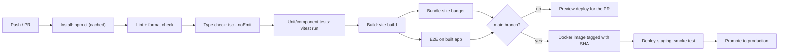

# 22 — Production project structure

> **How to use this module.** Sections 22.1–22.5 are about how code and configuration are organized; 22.6–22.9 are the cross-cutting concerns every production app needs (errors, flags, i18n, analytics); 22.10–22.13 are about shipping it; 22.14 puts it all in one annotated folder tree. If you only have 20 minutes, read 22.1, 22.5, 22.11, 22.12, 22.14 and the Summary.

**Prerequisites:** [Creating a project in 2026](05-tooling-and-setup.md#58-creating-a-project-in-2026) · [Error boundaries and root error callbacks](16-error-handling.md#165-react-19-root-options-oncaughterror-onuncaughterror-onrecoverableerror) · [Server state vs client state](17-data-fetching.md#173-server-state-vs-client-state) · [Lazy routes](19-routing.md#198-lazy-routes-and-code-splitting) · [An API client with interceptors](24-react-with-spring-boot.md#247-an-api-client-with-interceptors)

**Code for this module:** [`examples/web/src/m22-production/`](examples/web/src/m22-production/). The TypeScript files have tests next to them (`npx vitest run src/m22-production` from `examples/web`). The files under `deploy/` (Dockerfile, nginx.conf, CI workflow) are **samples that were not built or run** when this guide was written: they are text, checked only by reading them against the primary documentation.

> **Version notes.** Everything here is stack-agnostic except the tooling. Facts about versions come from [VERSIONS.md](VERSIONS.md) (verified 2026-10-03): React 19.3, Vite 8.3, Node 24 LTS (`examples/.nvmrc`), Create React App deprecated on 2025-02-14. Claims about third-party products (FSD, Module Federation, nginx, GitHub Actions) cite their docs; anything else is marked **Unverified**.

---

## 22.1 Layer-based vs feature-based folders

### The problem
Every project starts with `components/`, `hooks/`, `services/`, `utils/`. At 20 files this is tidy. At 800 files, a change to "the cart" touches six folders, nobody knows which `utils/format.ts` is safe to delete, and every folder is a dumping ground that everything imports from. The folder tree stops describing the product.

### Mental model
Two ways to cut the same code:

| | **By technical layer** (type) | **By feature** (domain) |
|---|---|---|
| Top-level folders | `components/`, `hooks/`, `services/`, `store/`, `utils/` | `cart/`, `checkout/`, `search/`, `account/` |
| "Where is the cart code?" | Scattered over five folders | One folder |
| Deleting a feature | Hunt across the tree | Delete a folder |
| Natural coupling | Everything imports everything | A feature has a public surface; the rest is private |
| Works well for | Tiny apps, tutorials, one-person projects | Teams, long-lived products |

> **Java/Spring analogy.** Package-by-layer (`controller/`, `service/`, `repository/`) versus package-by-feature (`order/`, `customer/`, each with its own controller, service and repository). The Spring community's long-standing advice is package-by-feature (or modules, with Spring Modulith) for the same reason: cohesion, and package-private visibility to hide internals.
>
> **Where the analogy breaks:** Java has `package-private` to enforce "internal". TypeScript has no visibility modifier for folders. A feature's "private" files are private only by convention, until a lint rule (22.2, Exercise 1) enforces it.

### Minimal code
Before (layer-based) and after (feature-based) for the same small shop app:

```text
BEFORE                                  AFTER
src/                                    src/
  components/                             features/
    CartButton.tsx                          cart/
    CartList.tsx                              CartButton.tsx
    ProductCard.tsx                           CartList.tsx
    SearchBox.tsx                             cartStore.ts
  hooks/                                      cartApi.ts
    useCart.ts                                index.ts          <- public surface
    useSearch.ts                            search/
  services/                                   SearchBox.tsx
    cartApi.ts                                useSearch.ts
    productApi.ts                             searchApi.ts
  store/                                      index.ts
    cartStore.ts                          entities/
  utils/                                    product/
    format.ts                                 ProductCard.tsx
                                              productApi.ts
                                              index.ts
                                          shared/
                                            lib/format.ts
```

The rule that makes the right-hand tree work is in `index.ts`: other folders import `features/cart` (the index), never `features/cart/cartStore`.

```ts
// features/cart/index.ts — the feature's public API
export { CartButton } from './CartButton';
export { CartList } from './CartList';
export type { CartItem } from './cartStore';
```

### How it works internally
Nothing in the toolchain cares about the layout: Vite, webpack and TypeScript resolve paths the same way. The layout only matters to humans and to tools that read paths (ESLint rules, `CODEOWNERS`, test selection, bundle splitting by route). That is why structure rules must be **mechanical** (a lint check) or they erode within a quarter.

Two supporting conventions:
- **Colocation.** Keep a file next to the thing that uses it: `Button.tsx`, `Button.test.tsx`, `Button.module.css`. Move it up only when a second consumer appears ("promote on second use"). The repo's own `examples/web/src/m09-effects/` does this: every file has its test next to it.
- **Path alias.** `@/` pointing to `src/` (in `tsconfig.json` `paths` and in Vite's `resolve.alias`) so imports read `@/shared/ui/Button` and not `../../../../shared/ui/Button`. Relative imports inside one feature are fine and preferable.

> **Version notes (legacy).** **CRA era (2016–2024):** Create React App generated `src/App.js`, `src/App.test.js`, `src/index.js`, `src/setupTests.js` and a `public/` folder, and said nothing about structure. Most CRA codebases therefore grew into `components/`, `containers/`, `actions/`, `reducers/` (the Redux-era "by type" layout). **Enzyme era:** tests lived either beside the component (`Foo.test.js`) or in a `__tests__/` folder next to it; both patterns still work with Vitest and Jest, and "test next to the file" is the one that survived. CRA was deprecated for new apps on 2025-02-14 ([VERSIONS.md](VERSIONS.md)).

### Trade-offs
- Use feature folders as soon as two people work on the app or it has more than a handful of screens. For a 10-component demo, layer folders are fine: do not pay for ceremony you will not use.
- A purely feature-based tree still needs a place for genuinely shared code (`shared/`). The failure mode is `shared/` becoming the new `utils/`: put a module there only when two features need it and it knows nothing about either.
- Migration is incremental: move one feature at a time, leave re-exports behind, and add the lint rule for the folders already migrated.

---

## 22.2 Feature-sliced design

### The problem
"Feature folders" says what to group, not how the groups may depend on each other. Without a rule, `cart` imports from `search`, `search` imports from `account`, and you rebuild the tangle one level up.

### Mental model
**Feature-Sliced Design (FSD)** [Library: methodology, [feature-sliced.design](https://feature-sliced.design/docs/get-started/overview)] adds one rule to feature folders: a fixed vertical stack of **layers**, where a module may only import from layers **strictly below** it.

| Layer (top to bottom) | Contains | Has slices? |
|---|---|---|
| `app` | Routing, providers, global styles, entry point | No (segments only) |
| `pages` | Whole screens, route-level composition | Yes |
| `widgets` | Self-contained blocks (a header, a checkout summary) | Yes |
| `features` | User actions with business value (add to cart, search) | Yes |
| `entities` | Business objects (product, user) | Yes |
| `shared` | Project-agnostic code (UI kit, API client, helpers) | No (segments only) |

(FSD also lists a deprecated `processes` layer between `app` and `pages`; this guide leaves it out, as the FSD docs do for new code.) Inside a slice, code is split into **segments** by purpose: `ui`, `api`, `model` (state, schemas, logic), `lib`, `config`. And two import rules, both quoted from the FSD docs in spirit:
1. A module on one layer may import only from layers strictly below.
2. A slice may **not** import another slice on the same layer. `features/cart` cannot import `features/wishlist`.

A third rule is practical, not FSD-specific: import another slice **through its public API** (`index.ts`), never through its internals.

> **Java/Spring analogy.** ArchUnit rules (`layeredArchitecture()`), or the dependency rules in Spring Modulith: "the web layer may use the service layer, never the reverse; module A may only call module B's exported API". FSD is the same discipline in a folder tree.
>
> **Where the analogy breaks:** ArchUnit runs in your Java build as a test. In a TypeScript repo you must add the equivalent yourself (an ESLint boundaries plugin, `dependency-cruiser`, or a small script such as the one in Exercise 1). Nothing fails by default.

### Minimal code
The core of the checker from Exercise 1 (full file: `examples/web/src/m22-production/boundaries.ts`):

```ts
const LAYERS = ['app', 'pages', 'widgets', 'features', 'entities', 'shared'] as const;

// 'upward-layer': an import of something higher in the list
if (LAYERS.indexOf(to.layer) < LAYERS.indexOf(from.layer)) { /* violation */ }
// 'cross-slice': same layer, different slice
if (from.layer === to.layer && from.slice !== to.slice) { /* violation */ }
```

### How it works internally
Everything is a graph problem. Every `import` is an edge from a file to a file; a rule is a predicate over an edge. You can enforce it three ways: **in the editor** (ESLint, instant), **in CI** (the same rule, a blocking check), or **at review** (does not scale). `dependency-cruiser` and the `eslint-plugin-boundaries` family implement this generically; the tested checker in this module shows the entire idea in about 80 lines, including regex-based import extraction.

> **Unverified:** the exact option names of `eslint-plugin-boundaries`, `dependency-cruiser` and FSD's own `@feature-sliced/steiger` linter were not checked. Read their docs before configuring one.

### Trade-offs
- ✅ A new teammate can predict where code goes. Dependencies point one way, so cycles are structurally impossible between layers.
- ❌ The "no cross-slice imports" rule pushes you to lift shared logic down into `entities` or `shared`, or compose in a higher layer (`widgets`, `pages`). That is the point, but it takes practice.
- ❌ It is a vocabulary to learn, and a lot of ceremony for a small app. A lighter version (features + `shared/` + an index-only rule) captures most of the value.
- My default: feature folders with a `shared/` layer and an index-only import rule; adopt the full FSD stack when more than one team shares a repo.
- The regex-based extraction in `boundaries.ts` misses `require()` and imports built from strings, and it does not understand `tsconfig` path aliases other than `@/`. A production tool parses the AST and reads the tsconfig.

---

## 22.3 Shared UI and design systems

### The problem
Five teams build five buttons. Spacing, focus rings and error states drift, and fixing accessibility means five fixes.

### Mental model
Three tiers, from least to most opinionated:

| Tier | What | Where it lives |
|---|---|---|
| **Tokens** | Colors, spacing, type scale, radii as CSS variables or a Tailwind theme | `shared/ui/tokens.css` or the Tailwind config |
| **Primitives** | `Button`, `Input`, `Dialog`, `Tooltip`: accessible, styled by tokens, no business knowledge | `shared/ui/` |
| **Composites** | `ProductCard`, `CheckoutSummary`: know about a domain | `entities/*/ui`, `widgets/*/ui` |

A **design system** is the primitives and tokens plus documentation, versioned and released like a product. Whether it is a folder (`shared/ui`), a workspace package in a monorepo (`packages/ui`), or a separately published npm package is a question of how many apps consume it.

> **Java/Spring analogy.** A shared library module (`company-commons`) versus code in the application module. The shared module has a release process and consumers; the in-app folder has neither.
>
> **Where the analogy breaks:** UI code ships to the browser. A shared package means every consumer's bundle includes it, so tree-shaking (ESM, `sideEffects: false`) and CSS delivery matter in a way a Maven dependency does not.

### Minimal code
A primitive knows nothing about the domain and exposes native attributes. In React 19, `ref` is a normal prop (no `forwardRef`; see [07](07-components-props-composition.md)):

```tsx
import type { ComponentProps } from 'react';

type ButtonProps = ComponentProps<'button'> & { variant?: 'primary' | 'quiet' };

export function Button({ variant = 'primary', className = '', ...rest }: ButtonProps) {
  return <button {...rest} className={`btn btn-${variant} ${className}`} />;
}
```

### How it works internally
- **Headless vs styled.** Headless libraries (Radix, React Aria, Headless UI) give behavior and accessibility without styling; styled kits (MUI, Chakra, Mantine) give both. Choosing is a build-versus-buy decision covered in [23](23-ecosystem-libraries.md).
- **Storybook** (or Ladle, Histoire) is the usual catalogue: one story per state, run in CI as visual or accessibility tests.
- **Versioning.** A published design system needs semver discipline; a monorepo workspace package can be changed together with its consumers in one pull request, which is why many teams start there.
- **Theming** by CSS variables swaps themes (dark mode, brands) with no re-render of the React tree.

### Trade-offs
- Do not build a design system for one app with one team. Start with `shared/ui` and extract when a second app appears.
- A shared button that grows 30 props is a design failure: prefer composition (children, slots) over props.
- Do not let primitives import from `features/` or `entities/`. That is the first import rule from 22.2, and it is the one that keeps the design system extractable.

---

## 22.4 The API layer

### The problem
`fetch('/api/orders')` appears in 40 components, each with its own error handling, headers, base URL and types. Changing the auth scheme means 40 edits.

### Mental model
A thin, typed boundary between the UI and the network, in three pieces:

1. **A client** (one `fetch` wrapper): base URL, credentials, auth header, request id, refresh-on-401, error normalization. Written once. See [24.7](24-react-with-spring-boot.md#247-an-api-client-with-interceptors), with working code in `examples/web/src/m24-spring-client/http.ts`.
2. **Typed endpoint functions** per feature: `listOrders(page): Promise<Page<Order>>`. These know the URL and the types and nothing about React (`m24-spring-client/projectsApi.ts`).
3. **A server-state cache** (TanStack Query, SWR, RTK Query) that calls the endpoint functions and owns loading, caching, retries ([17](17-data-fetching.md#173-server-state-vs-client-state)).

> **Java/Spring analogy.** A Feign client or `RestClient` bean behind a repository-style interface, versus `new RestTemplate().getForObject(...)` sprinkled in controllers.
>
> **Where the analogy breaks:** nothing validates the response shape at runtime. A TypeScript return type on `fetch().then(r => r.json())` is a promise, not a guarantee. For untrusted payloads, validate (Zod 4 is in the repo) or generate types from the OpenAPI document ([24.9](24-react-with-spring-boot.md#249-openapi--typescript-generation)) and accept that they describe the contract, not the bytes.

### Minimal code
Where each piece lives in the feature layout:

```text
features/orders/
  api/ordersApi.ts        listOrders(), getOrder()     (plain functions, typed)
  api/queries.ts          useOrders() = useQuery({ queryKey, queryFn: listOrders })
  ui/OrderList.tsx        uses useOrders(), renders
shared/api/http.ts        the one fetch wrapper + ApiError (ProblemDetail, 24.8)
```

### How it works internally
The layer's boundaries are what make it testable: component tests mock the network with MSW at the `fetch` level ([20](20-testing.md)), endpoint-function tests use the same MSW handlers, and nothing needs `jest.mock('axios')`.

Error normalization is the contract between layers: the client turns every failure into one `ApiError` carrying the Spring `ProblemDetail` ([24.8](24-react-with-spring-boot.md#248-problemdetail-error-mapping)), and the UI decides how to present it. The request id the client attaches goes into logs (22.6) so a front-end report links to a Spring log line.

### Trade-offs
- axios vs `fetch`: `fetch` is enough; axios mostly adds interceptors, which a 60-line wrapper provides ([24.7](24-react-with-spring-boot.md#247-an-api-client-with-interceptors)).
- Generated clients (OpenAPI) remove a class of drift bugs but couple you to the generator's output shape.
- Do not put endpoint functions inside components or hooks. Keep them importable from a plain Node test.

---

## 22.5 Environment config

### The problem
The same build must talk to `localhost:8080` in development, a staging API in staging, and the production API in production. Secrets must not end up in the bundle. And "rebuild for every environment" slows releases and means the artifact you tested is not the one you shipped.

### Mental model
A front-end bundle is **public**. Anything referenced by the code is in the files the browser downloads. So there are only two kinds of configuration:

| Kind | How it gets in | Changes without rebuild? | Examples |
|---|---|---|---|
| **Build-time** | Replaced at build (`import.meta.env.VITE_*`) | No | Release id, feature that is compiled in or out |
| **Runtime** | A `config.json` fetched at startup (or injected into `index.html` by the server) | Yes | API base URL, Sentry DSN, environment name |

And one thing is never configuration: **secrets**. A key in `VITE_*` is a key published to the internet. Secrets belong on the server (the Spring backend, a BFF, [24.6](24-react-with-spring-boot.md#246-oauth2oidc-with-pkce-bff-pattern-spring-security-resource-server)).

> **Java/Spring analogy.** Spring profiles and `application-{profile}.yml` for build-time, `@ConfigurationProperties` bound from environment variables or a Config Server for runtime. The twelve-factor rule "config in the environment" holds.
>
> **Where the analogy breaks:** Spring reads its environment on the server at startup. A browser app has no environment: build-time variables are string-replaced into the JavaScript, and "runtime" config is a network request the app itself makes.

### Minimal code
`examples/web/src/m22-production/runtimeConfig.ts`, tested in `runtimeConfig.test.ts`. One validated object, loaded before the first render:

```ts
export async function loadConfig(fetchFn = fetch, url = '/config.json'): Promise<AppConfig> {
  const response = await fetchFn(url, { cache: 'no-store' });
  if (!response.ok) throw new ConfigError([`GET ${url} returned ${response.status}`]);
  return parseConfig(await response.json());
}
```

The entry point waits for it:

```tsx
// main.tsx (illustrative)
const config = await loadConfig();           // top-level await: fine in an ES module entry
createRoot(document.getElementById('root')!).render(
  <ConfigProvider value={config}><App /></ConfigProvider>,
);
```

### How it works internally
- **Vite** exposes only variables prefixed `VITE_` to client code, through `import.meta.env`; others stay on the build machine. Files `.env`, `.env.local`, `.env.[mode]` are loaded by mode (`development`, `production`, or a custom `--mode staging`). `import.meta.env.MODE`, `PROD` and `DEV` are always present. ([Vite env docs](https://vite.dev/guide/env-and-mode))
- The values are **substituted as literals at build time**. After `vite build`, changing an environment variable on the server does nothing.
- **`parseConfig`** is the single place that validates. A typo in `config.json` fails at startup with a readable list of problems instead of a `TypeError` deep in a render. The tests show both: valid values pass, all three problems are reported at once.
- **Serving it:** nginx serves `/config.json` with `Cache-Control: no-store` (the sample `deploy/nginx.conf`); in Kubernetes it is typically a mounted ConfigMap; in Spring it can be a controller returning the active profile's values.

> **Version notes (legacy).** **CRA:** variables had to start with `REACT_APP_` and were read as `process.env.REACT_APP_API_URL`; `NODE_ENV` was set by the script. Vite uses `VITE_` and `import.meta.env`. Migrating means renaming every variable and every read (a codemod is a `sed`). `process.env` is **not defined** in a Vite browser bundle unless you define it yourself: a classic "works in CRA, `process is not defined` in Vite" failure. See [05](05-tooling-and-setup.md#58-creating-a-project-in-2026) for the migration steps. **Next.js** uses `NEXT_PUBLIC_` for client-exposed variables.

### Trade-offs
- **Build-time only** is the simplest and fine when each environment gets its own build, or when only one environment exists.
- **Runtime `config.json`** gives "one artifact, many environments" at the cost of one blocking request before first render (mitigate with a tiny file, `no-store` and preload; or inline it into `index.html` at serve time).
- Same-origin deployment (24.1, layout B) removes most of the need: `apiBaseUrl: '/api'` is the same everywhere. Many teams need runtime config for almost nothing but the Sentry DSN and environment name.
- Never put secrets in either kind.

---

## 22.6 Error and logging strategy

### The problem
An error you do not know about cannot be fixed, and a log line that contains a user's bearer token is a security incident. "We use Sentry" is not a strategy: the strategy is deciding **what is captured, where it goes, what is scrubbed, and who looks at it**.

### Mental model
Four questions, answered once for the whole app:

| Question | Answer in this guide |
|---|---|
| **Where do errors surface to the user?** | Boundaries at three levels (root, route, widget), recoverable with a retry ([16](16-error-handling.md)) |
| **How do all escaping errors reach one place?** | One reporter wired to `onCaughtError` / `onUncaughtError` / `onRecoverableError` plus `window` `error` and `unhandledrejection` ([16.5](16-error-handling.md#165-react-19-root-options-oncaughterror-onuncaughterror-onrecoverableerror), `m16-errors/errorReporter.ts`) |
| **What is attached?** | Release (git SHA), route, request id, user id (not email), feature flags |
| **What is removed?** | Tokens, passwords, cookies, emails, signed-URL signatures |

Plus a **severity policy** so the signal stays visible: `error` is a bug and pages somebody (or at least files a ticket), `warn` is a handled anomaly (a retry succeeded), `info` is a business event, `debug` is development-only.

> **Java/Spring analogy.** SLF4J with MDC (per-request context in every log line), a Logback appender shipping to a collector, and `@ControllerAdvice` as the last-resort handler. The `child({ feature: 'cart' })` logger below is MDC as a value instead of a thread-local.
>
> **Where the analogy breaks:** the server controls its logs; the front end runs on devices you do not control, with ad blockers that block your telemetry domain, tabs closed mid-send, and no stack that is readable without source maps. Browser reporting is **sampled evidence**, not a complete record.

### Minimal code
`examples/web/src/m22-production/logger.ts`: a leveled, structured, redacting logger with child contexts (tests in `logger.test.ts`):

```ts
const logger = createLogger({ level: 'info', sink: sendToCollector, context: { release: config.release } });
const cartLog = logger.child({ feature: 'cart' });

cartLog.error('checkout failed', { requestId, error });   // Error flattened to { name, message }
cartLog.info('oauth callback', { url: scrubUrl(location.href) }); // ?code=… masked
```

`redact` masks any key matching `password|token|authorization|cookie|secret|email` at any depth; `scrubUrl` masks `code`, `token`, `key`, `secret`, `password` and `signature` query parameters.

### How it works internally
- **Capture** is covered in [16.7](16-error-handling.md#167-logging-and-monitoring-source-maps): the three React 19 root callbacks, the window listeners, a `WeakSet` to deduplicate the same Error arriving by two paths.
- **Enrich** by wrapping: the logger merges the base context, the child context and the call context, then redacts the merge, so a sensitive key added at any layer is still masked. Redaction runs on the merged object, not on each source, on purpose.
- **Never break the caller.** The sink call is wrapped in `try`/`catch` (tested: a throwing sink does not escape). A logger that throws inside an error handler turns one error into two.
- **Depth cap.** `redact` returns `'[truncated]'` at depth 4, so a cyclic object (an Error with a `cause` chain that points back, a DOM node, a React fiber) cannot recurse forever. The cyclic test proves it.
- **Correlate with the backend.** The API client sends an `X-Request-Id` (or W3C `traceparent`) header; the same id goes into the log context and appears in the Spring log via MDC. This is the single most useful field in a full-stack incident.
- **Source maps.** Generate them in the build, upload them to the monitoring service, and do not serve them publicly (16.7 and its Vite `build.sourcemap` caveat: re-read the [Vite build options](https://vite.dev/config/build-options) before quoting values).
- **Transport.** `navigator.sendBeacon` survives page unload where `fetch` may not; vendor SDKs (Sentry, Datadog RUM) wrap this plus batching and sampling.

### Trade-offs
- Buy the vendor SDK for capture and source-map handling; keep your own thin `logger` interface in front of it so components never import the vendor directly (swap-ability, test-ability: the sink is a function).
- Sample high-volume `info` and `warn`; never sample `error` until you must.
- Redaction by key name is a safety net, not a guarantee: a token inside a free-text message is not caught. Do not log request bodies.
- Privacy law (GDPR) treats user ids and IP addresses as personal data. Decide retention and consent with the people who own that, not in a code review.

---

## 22.7 Feature flags

### The problem
You want to merge unfinished work to `main` daily, release a feature to 5% of users, switch it off at 3 a.m. without a deploy, and run an A/B test, all without long-lived branches.

### Mental model
A **feature flag** is a named value decided at runtime, read in code: `if (useFlag('newCheckout')) …`. Four kinds, with very different lifetimes:

| Kind | Lifetime | Example | Owner |
|---|---|---|---|
| **Release flag** | Days to weeks: delete after rollout | `newCheckout` | Engineering |
| **Experiment flag** | Weeks: delete when the test ends | Button color A/B | Product |
| **Ops flag (kill switch)** | Permanent | `disableRecommendations` | Engineering/SRE |
| **Permission flag** | Permanent | Premium-only feature | Product (usually belongs in authorization, not flags) |

> **Java/Spring analogy.** `@ConditionalOnProperty` or `@Profile`, evaluated per request instead of per startup. Server-side libraries (FF4j, Togglz, Unleash, LaunchDarkly) follow the same idea.
>
> **Where the analogy breaks:** a Spring flag decides which bean exists when the app starts. A front-end flag may change **while the user is looking at the page** (a streamed update), and the value you rendered with can disagree with what the server later enforces. Flags in the browser are a UI hint; enforcement belongs on the server.

### Minimal code
`examples/web/src/m22-production/flags.tsx` (Exercise 3 builds it): one typed map, a default for every flag, a provider, one hook.

```tsx
export type Flags = { newCheckout: boolean; searchV2: boolean; maxItems: number; bannerText: string };

function Checkout() {
  const useNew = useFlag('newCheckout');        // boolean, autocompleted, a typo is a compile error
  return useNew ? <NewCheckout /> : <OldCheckout />;
}

// App root: flags from the service, never fetched in the component
<FlagsProvider flags={remoteFlags}><App /></FlagsProvider>

// A test: no mocking library, no network
render(<FlagsProvider overrides={{ newCheckout: true }}><Checkout /></FlagsProvider>);
```

### How it works internally
- **Precedence** (tested): `defaults < remote < overrides`, and `undefined` never wins, so a partial response from the service cannot erase a default.
- **Defaults are the failure mode.** If the flag service is down, users get the defaults: therefore the default is always the **old, safe** behavior. Writing `newCheckout: true` as a default is a bug waiting for an outage.
- **Untrusted input.** `parseFlags` validates the service response: unknown names and wrongly typed values are dropped (tested), so a flag renamed on the server cannot become `undefined` at the call site.
- **Where the values come from.** A fetch (TanStack Query, a React Router loader, `use(promise)` under Suspense) lives *outside* the hook. The provider receives plain values. This is why the hook has no `useEffect`: reading a context value during render is not an effect, and storing a fetched value with `setState` inside an effect is exactly what `react-hooks/set-state-in-effect` flags ([09](09-effects.md)).
- **Context re-render cost.** Every consumer re-renders when the merged object changes. The provider memoizes the merge on its inputs, so a re-render with the same `flags` reference does not. For hundreds of flags and hot components, split contexts or use an external store with `useSyncExternalStore` ([11](11-context.md), [18](18-state-management.md)).
- **Standards.** OpenFeature is a CNCF vendor-neutral API for flag evaluation with provider adapters, including a React SDK: `@openfeature/react-sdk`, with an `OpenFeatureProvider` context provider and hooks such as `useFlag`, `useBooleanFlagValue` and `useSuspenseFlag` ([OpenFeature React SDK](https://openfeature.dev/docs/reference/sdks/client/web/react)).
- **Bundle effect.** A flag does not remove the unused branch from the bundle. For a heavy feature, combine it with a lazy route or `lazy()` so the code is fetched only when the flag is on ([19.8](19-routing.md#198-lazy-routes-and-code-splitting)).

### Trade-offs
- A flag is a branch you have to test both ways, and it is debt: record an owner and an expiry date, and delete release flags. A codebase with 200 stale flags has 2^200 theoretical states.
- Evaluate for the user server-side when you can (targeting rules, percentage rollouts) and send the result; shipping the rule set to the browser leaks it.
- Do not use flags for authorization. A hidden button is not a permission check.
- Flicker: if flags arrive after first paint, the UI changes under the user. Block rendering of the flagged area on the first load (or bootstrap flags in the HTML), and render the default meanwhile.

---

## 22.8 i18n

### The problem
Strings are hard-coded in JSX, dates are formatted with `toLocaleDateString()` without a locale, and "1 items" ships to production. Later someone asks for German and right-to-left support, and every file changes.

### Mental model
Internationalization (i18n) is **three separate jobs**:

| Job | Question | Tool |
|---|---|---|
| **Messages** | What does this sentence say in German, with a name and a count in it? | Message catalogs + ICU MessageFormat (`{count, plural, one {# item} other {# items}}`) |
| **Formatting** | How is 1234.5 / a date / a currency / a list written in this locale? | The built-in `Intl` API [JS] |
| **Layout** | Does the UI survive long words and right-to-left scripts? | CSS logical properties (`margin-inline-start`), `dir="rtl"`, no fixed-width text boxes |

> **Java/Spring analogy.** `MessageSource` with `messages_de.properties`, `MessageFormat`/`ChoiceFormat`, and `java.time.format.DateTimeFormatter.ofLocalizedDate()`. The browser's `Intl` is the equivalent of the JDK's locale-sensitive formatting.
>
> **Where the analogy breaks:** `MessageSource` resolves a key synchronously from the classpath. A browser has to **download** the catalog for the active locale, so loading is asynchronous, catalogs are split per locale (and often per route), and a missing catalog means a flash of the wrong language or an empty page.

### Minimal code
Two libraries dominate. These snippets are **illustrative and not run**: neither is installed in `examples/web`.

react-i18next ([react.i18next.com](https://react.i18next.com)), built on i18next:

```tsx
import { useTranslation } from 'react-i18next';

function CartSummary({ count }: { count: number }) {
  const { t } = useTranslation('cart');            // namespace = one catalog file per feature
  return <p>{t('items', { count })}</p>;            // en/cart.json: { "items_one": "{{count}} item", "items_other": "{{count}} items" }
}
```

FormatJS / react-intl ([formatjs.io](https://formatjs.io)), ICU MessageFormat:

```tsx
import { FormattedMessage, useIntl } from 'react-intl';

<FormattedMessage id="cart.items" defaultMessage="{count, plural, one {# item} other {# items}}" values={{ count }} />
```

What **is** run: the built-in `Intl` and a tiny ICU-subset translator that shows what the libraries do for you: `examples/web/src/m22-production/i18n.ts` (tests in `i18n.test.ts`).

```ts
const t = createTranslator('en-US', { items: '{count, plural, =0 {No items} one {# item} other {# items}}' });
t('items', { count: 1000 });   // "1,000 items"

const f = createFormatters('de-DE');
f.currency(1234.5, 'EUR');      // "1.234,50 €"  (the space before € is U+00A0)
```

### How it works internally
- **Plural categories** come from `Intl.PluralRules`. English has `one` and `other`; Polish also has `few` and `many` (the test asserts 1 → one, 2 → few, 5 → many). That is why `count === 1 ? 'item' : 'items'` is wrong for most languages, and why catalogs have per-language branches.
- **Interpolation is not concatenation.** `"Hello, " + name` fixes the word order; German or Japanese may need the name in the middle. Messages are whole sentences with placeholders, translated whole.
- **Formatting objects are expensive-ish.** `new Intl.NumberFormat(locale)` per render is wasteful; the helper creates formatters once per locale. Time zones: pass `timeZone` explicitly in tests (the date test uses `'UTC'`), otherwise a CI server's zone changes the output.
- **Locale detection** order that works: user's saved choice → URL (`/de/...`) → `Accept-Language` / `navigator.languages` → default. Store it, and set `<html lang>` (accessibility and hyphenation depend on it).
- **Catalog loading.** Load only the active locale's catalog (a dynamic `import('./locales/de.json')`, as lazy-loaded as a route, 19.8). i18next backends and FormatJS's compiled messages (`@formatjs/cli` compile) both support this: `formatjs extract "src/**/*.{ts,tsx}" --out-file lang.json`, then `formatjs compile lang.json --ast --out-file compiled.json` (`--ast` precompiles messages to ASTs; `--format` picks the TMS format) ([FormatJS CLI](https://formatjs.github.io/docs/tooling/cli)).
- **Missing keys.** The test shows a safe policy: fall back to the default locale, then to the key itself, and **report** the miss (`onMissing`) so you find it in monitoring instead of in a customer email.
- **Pseudo-localization** (wrapping strings in `[!!  …  !!]` and lengthening them 30%) is the cheapest way to find hard-coded strings and overflow before translators are involved.

### Trade-offs
- **react-i18next**: huge ecosystem, key-based (`t('cart.title')`), flexible backends, plurals by i18next's own JSON suffix convention (ICU via a plugin). **FormatJS**: ICU-first, extraction tooling from `defaultMessage` in source, compile-time message validation. Both are good: pick the one your translation platform integrates with.
- Keys-versus-source-text: keys survive copy edits, source text is easier to read. Choose one convention and enforce it.
- Do the cheap part now even if you never translate: no string concatenation for sentences, all formatting through `Intl` with an explicit locale, logical CSS properties. Retrofitting later is the expensive path.
- Server-rendered or SSR'd apps must send the same locale to server and client or hydration warns about text mismatches ([21](21-concurrent-ssr-server-components.md)).

---

## 22.9 Analytics

### The problem
Product asks "how many users reach step 3 of checkout?" Developers scatter `gtag('event', …)` calls with free-form names and payloads, then discover that half the events are misspelled, nobody asked for consent, and the tracking script is the largest thing on the page.

### Mental model
Treat analytics like an API with a contract. A **tracking plan** (a table of event names and their properties) is the schema; code is a typed client of it; the vendor (GA4, Segment, PostHog, Amplitude, Plausible) is a swappable transport.

> **Java/Spring analogy.** A domain event published through `ApplicationEventPublisher` or to Kafka: typed events, a publisher interface, and listeners that forward to the vendor.
>
> **Where the analogy breaks:** server events are reliable, ordered, and deliverable. Browser events are dropped by ad blockers, lost on tab close and gated by consent law. Analytics counts are approximations; never reconcile money from them.

### Minimal code
`examples/web/src/m22-production/analytics.ts` (tests in `analytics.test.ts`):

```ts
type Events = {
  page_view: { path: string };
  add_to_cart: { sku: string; qty: number };
};

const analytics = createAnalytics<Events>({
  send: (batch) => navigator.sendBeacon('/api/events', JSON.stringify(batch)),
  hasConsent: () => consentStore.get().analytics,
});

analytics.track('add_to_cart', { sku: 'A1', qty: 2 });   // add_to_cart with { sku: 1 } would not compile
```

A page view on route change is a real synchronization with an external system, so an effect is appropriate here ([09](09-effects.md)); keep it in one component at the router root:

```tsx
function PageViews() {
  const { pathname } = useLocation();
  useEffect(() => { analytics.track('page_view', { path: pathname }); }, [pathname]);
  return null;
}
```
(The effect runs twice in development Strict Mode; the tracker should tolerate it because production does not double-invoke.)

### How it works internally
- **Typed events.** The generic `M extends Record<string, Props>` maps each name to its property shape, so the compiler checks both.
- **Consent is read at call time** (`hasConsent()` is a function, not a boolean captured at startup) and a call without consent is **dropped, not queued**: queueing events "until the user accepts" records behavior before consent. Both behaviors are tested.
- **Batching** reduces requests; `flush()` on `visibilitychange` (hidden) with `sendBeacon` is the reliable end-of-session path.
- **Never break the page.** The transport is wrapped in `try`/`catch` (tested).
- **Performance.** Third-party analytics scripts are a common cause of slow pages. Load them with `async`/`defer`, after consent, ideally after the page is interactive ([15](15-performance.md)).
- **PII.** No emails, names or free text in event properties. Use opaque ids.

### Trade-offs
- Proxying analytics through your own domain avoids blockers and gives you control, at the cost of owning the endpoint.
- Autocapture tools (click tracking with no code) are fast to start and produce unstructured data; a typed tracking plan is slower and produces data people can trust. Mixing both is common.
- Consent is a legal question (GDPR/ePrivacy, CCPA). The code above is the mechanism; the policy comes from legal.

---

## 22.10 CI pipeline

### The problem
"It works on my machine" and a Friday-afternoon `npm run build` are not a release process. A pull request can pass review and still break types in a file nobody opened, fail lint, or produce a 4 MB bundle.

### Mental model
A pipeline is an ordered set of **gates**, cheapest and fastest first, each of which can stop the line. The earlier a gate fails, the less it costs.



> **Java/Spring analogy.** The Maven lifecycle (`validate → compile → test → package → verify → deploy`) plus Checkstyle/Spotless and a container build. Same shape, different tools.
>
> **Where the analogy breaks:** Maven's `package` produces a JAR that is the deployable. A Vite build produces static files whose **configuration is baked in** (22.5) unless you use runtime config, and whose correctness depends on a browser. So there are extra gates (bundle size, E2E in a real browser) that a JAR build does not have.

### Minimal code
`examples/web/src/m22-production/deploy/ci.yml` is a GitHub Actions workflow sample (not run when this guide was written). Its shape:

```yaml
jobs:
  verify:   # install -> lint -> tsc --noEmit -> vitest run -> build -> upload dist
  e2e:      # needs: verify; Playwright against the built app
  image:    # needs: [verify, e2e]; only on main; docker build with VITE_RELEASE=<sha>
```

### How it works internally
- **`npm ci`, not `npm install`.** It installs exactly the lockfile and fails if `package.json` and the lockfile disagree. With `actions/setup-node` and `cache: npm` the package download cache is restored between runs.
- **Order.** Lint and `tsc` are seconds; tests are tens of seconds; E2E is minutes. Running type check before tests means a type error is reported without waiting for the suite. In a small repo run them as steps of one job; split into parallel jobs when wall-clock time hurts and each job's setup is cheap relative to the work.
- **`concurrency` with `cancel-in-progress`.** A new push to the same PR cancels the superseded run. Scoping the group by `github.ref`, as the sample does, keeps a PR's runs from cancelling the runs of `main`.
- **`permissions: contents: read`** at the top follows least privilege: the `GITHUB_TOKEN` gets write access only on the job that pushes an image.
- **One build, promoted.** Build the image once from the commit SHA and promote *that* image through staging to production. Rebuilding for production tests one artifact and ships another.
- **Bundle budgets.** Fail the build if the main chunk grows past a threshold (a script that reads `dist/assets/*.js` sizes, `size-limit`, or Lighthouse CI). > **Unverified:** the current option names of those tools.
- **Dependency hygiene.** Dependabot or Renovate PRs, `npm audit` as a non-blocking report (blocking on every advisory makes the build flaky for reasons unrelated to your change), and pinning actions to a major or a commit SHA.
- **Same checks as locally.** The CI steps should be the `package.json` scripts (`lint`, `typecheck`, `test`, `build`), so a developer reproduces a failure with one command.
- **Architecture gate.** The import-rule checker from 22.2 is a CI step like any other: a test that runs it over `src/` and expects no violations.

### Trade-offs
- E2E tests on every PR are slow and flaky if mis-scoped. Keep a small smoke suite blocking and run the full suite on `main` or nightly ([20](20-testing.md)).
- Preview deploys per PR (Vercel, Netlify, Cloudflare Pages, or a namespace per PR on Kubernetes) catch what unit tests cannot and let designers review; they cost infrastructure and need secrets handled carefully for forks.
- Monorepo CI needs change detection (run the front-end pipeline only when `web/**` changed), or every Java change pays for it.
- The sample pins `actions/*@v7`, the current major of `actions/checkout`, `actions/setup-node` and `actions/upload-artifact` on their releases pages (checked 2026-10-04; [checkout](https://github.com/actions/checkout/releases), [setup-node](https://github.com/actions/setup-node/releases)). Read each major's breaking changes and pin what your organization allows.

---

## 22.11 Dockerized front end

### The problem
The build needs Node, `npm`, 400 MB of `node_modules` and sources. The result is 2 MB of static files. Shipping the build image to production means shipping all of it, with its attack surface; shipping "just the dist folder" means each environment needs a web server configured by hand.

### Mental model
A **multi-stage build** [Docker] uses one Dockerfile with two `FROM`s. Stage 1 is a throwaway workshop (Node, installs, builds). Stage 2 is the shop front (a tiny nginx image) into which you copy only the finished `dist/`. Everything in stage 1 is discarded.

> **Java/Spring analogy.** The standard Spring Boot Dockerfile: a Maven (JDK) stage runs `mvn package`, then a JRE-only stage copies the JAR. Same idea.
>
> **Where the analogy breaks:** the JRE stage still runs *your* code, the JVM. The nginx stage runs **no application code at all**: it only serves files, which is why it is small and boring, and why anything dynamic (configuration, API proxying, SPA routing) has to be expressed in nginx configuration.

### Minimal code
Three sample files in `examples/web/src/m22-production/deploy/` (**not built or run here**; Exercise 2 explains them line by line): `Dockerfile`, `nginx.conf`, and `ci.yml` from 22.10.

### How it works internally
- **Layer caching.** Copying `package.json` and the lockfile and running `npm ci` *before* `COPY . .` means the install layer is reused until dependencies change. Editing a source file only re-runs the build layer.
- **`npm ci`** installs from the lockfile and removes `node_modules` first: reproducible, and slightly slower than a warm `npm install`.
- **`ARG`/`ENV` for build-time values.** `VITE_RELEASE` is baked into the bundle during `npm run build` (22.5). It does not exist in the final stage.
- **`COPY --from=build`** takes files from the earlier stage. Only `dist/` crosses over ([Docker multi-stage docs](https://docs.docker.com/build/building/multi-stage/)).
- **nginx config.** A file placed at `/etc/nginx/conf.d/default.conf` replaces the image's default server block. It carries three behaviors: SPA fallback, cache headers, and the `/api/` proxy (22.12).
- **`.dockerignore`** (`node_modules`, `dist`, `.git`, `.env*`) keeps the build context small and stops local secrets and a host `node_modules` from entering the image. The sample does not include one: add it.
- **Health check.** A `/healthz` location returning `200` gives Docker and Kubernetes a probe that does not depend on the API.

### Trade-offs
- `nginx:stable-alpine` is small but runs as root by default and listens on port 80. Hardened setups use `nginxinc/nginx-unprivileged`: "The default NGINX listen port is now `8080` instead of `80`", and it runs NGINX as a non-root user (UID/GID can be changed with build args) ([image README](https://github.com/nginx/docker-nginx-unprivileged)).
- Pin the base images by digest in regulated environments; a floating tag changes under you.
- If all you need is static hosting, you do **not** need a container at all: upload `dist/` to a bucket and CDN (22.12). A container pays off when you want an identical runtime in every environment, an nginx-level proxy to the API, or one deployment mechanism (Kubernetes) for everything.
- Runtime configuration without rebuild: mount `config.json` (a ConfigMap) over `/usr/share/nginx/html/config.json`.

---

## 22.12 Deployment targets: static/CDN, Node server, served from Spring

### The problem
"Where does the front end run?" has three common answers with different consequences for caching, routing, cookies, rollbacks and who owns the deployment. [24.13](24-react-with-spring-boot.md#2413-deployment-options) compares the deployment *layouts* from the back-end side (separate origins, same origin, single JAR). This section adds the front-end side: what you have to configure for each target.

### Mental model
| Target | What runs | Good for | Front-end concerns |
|---|---|---|---|
| **Static + CDN** (S3 + CloudFront, Cloudflare Pages, Netlify, nginx) | Nothing: files only | Client-rendered SPAs (Vite); the default | SPA fallback, cache headers, runtime config, API origin / CORS |
| **Node server** | A Node process renders HTML (SSR) or serves Server Components | Next.js, React Router framework mode, SEO-critical pages | A running service to scale, monitor and patch; build output differs per framework; cache invalidation of rendered pages |
| **Served from Spring Boot** | The same JAR as the API | Internal tools, small teams, one artifact | Couples releases; Spring needs the SPA fallback; Spring's static resource caching |

> **Java/Spring analogy.** Static + CDN = serving assets from object storage instead of `src/main/resources/static`; Node server = a second service (like a separate Thymeleaf renderer); Spring-served = the classic fat JAR.
>
> **Where the analogy breaks:** a Spring-served bundle and its API always deploy together, so version skew between them cannot exist. With static + CDN, a user's open tab runs **old JavaScript against the new API** until they reload; the API must stay backward compatible for at least one release ([24.13](24-react-with-spring-boot.md#2413-deployment-options)).

### Minimal code
**Static / CDN.** Two rules, both in `deploy/nginx.conf` and portable to any CDN's configuration:
1. **Hashed files cache forever; the entry point never does.** Vite emits `assets/index-<hash>.js`; send `Cache-Control: public, max-age=31536000, immutable` for `/assets/`, and `no-cache` for `index.html`.
2. **Unknown paths serve `index.html`** (so `/orders/7` survives a refresh). On S3 + CloudFront this is a custom error response mapping 403/404 to `/index.html` with status 200; on Netlify a `_redirects` rule `/* /index.html 200`; on nginx `try_files $uri $uri/ /index.html` (files are checked in order, `$uri/` checks for a directory, and the last parameter is the internal-redirect fallback or an `=code`; [nginx try_files](https://nginx.org/en/docs/http/ngx_http_core_module.html#try_files)). Sources: [CloudFront custom error responses](https://docs.aws.amazon.com/AmazonCloudFront/latest/DeveloperGuide/custom-error-pages-response-code.html) and AWS's [SPA knowledge-center article](https://repost.aws/knowledge-center/cloudfront-single-page-application) (map both 403 and 404 to `/index.html` with 200); [Netlify rewrites](https://docs.netlify.com/manage/routing/redirects/rewrites-proxies/) (`/*  /index.html  200`, usually the last rule).

**Node server.** The front-end build produces a server entry plus client assets, run by `node` (Next.js `next start`, or a framework adapter). Put it behind the same kind of reverse proxy, and serve the **hashed static assets from the CDN**, not from Node. A server-rendered HTML response is usually `no-store` or short-lived.

**Spring-served.** The documented Spring Boot behavior is that files under `src/main/resources/static` (also `public`, `resources`, `META-INF/resources`) are served at the root ([Spring Boot reference, static content](https://docs.spring.io/spring-boot/reference/web/servlet.html)). Build the SPA, copy `dist/` into that folder (a Maven `frontend-maven-plugin` step, or a CI step before `mvn package`), and add the fallback controller from [24.13](24-react-with-spring-boot.md#2413-deployment-options) so client-side routes forward to `index.html` but `/api/**` does not.

### How it works internally
- **Why the fallback exists.** A client-side route is a path the *browser* understands. On a hard refresh the browser asks the *server* for `/orders/7`; unless the server answers with `index.html`, the app never loads and you get a 404.
- **Why the order matters in nginx.** `location /assets/` with `try_files $uri =404` returns a real 404 for a missing hashed chunk. If the fallback served `index.html` for a stale `index-abc.js` request, the browser would try to execute HTML as JavaScript and fail with a cryptic syntax error; a clean 404 lets your app detect "new version deployed" and reload.
- **Header inheritance trap in nginx.** `add_header` directives in a `location` **replace** those from the enclosing `server`: they are inherited "if and only if there are no `add_header` directives defined on the current level" ([nginx docs](https://nginx.org/en/docs/http/ngx_http_headers_module.html#add_header)). nginx **1.29.3** added `add_header_inherit merge` to append the parent's headers instead, but older versions (most distro packages) don't have it. Put security headers (CSP, `X-Content-Type-Options`) in every location that sets its own, or use an include.
- **Server-side redirects.** The `/api/` proxy (`proxy_pass http://api:8080;`) is what makes the browser see one origin: no CORS, first-party cookies ([24.1](24-react-with-spring-boot.md#241-architecture-options)). nginx resolves the `api` hostname at start-up; if it does not resolve, nginx refuses to start. In Kubernetes, `api` is the Service name.
- **Rollbacks.** With hashed assets and an immutable image per SHA, a rollback is "point at the previous image": the old `index.html` references old hashed files that are still in that image. On a CDN, **keep old assets for a while** after a deploy, or users with an open tab fetch chunks that were deleted.
- **Environment-specific behavior** in a static deployment comes from runtime `config.json` (22.5), not from different builds.

### Trade-offs
- **My default** for a team that owns both ends: static files behind a CDN, API on its own service, both behind one hostname (path routing). It scales assets for free, deploys independently and has no CORS.
- Choose a **Node server** when you need server rendering (SEO, personalization before first paint, Server Components); it is a different operational commitment, so do not pick it for a dashboard behind a login.
- Choose **Spring-served** for an internal tool where one JAR and one pipeline matter more than independent deploys.
- Edge/serverless platforms (Vercel, Cloudflare) blur the Node-server line: rendering runs near users on a short-lived runtime. They add a vendor, their own limits and cold starts.

---

## 22.13 Micro-frontends

### The problem
Fifteen teams share one front-end repository and one release train: one team's bad merge blocks everybody, the build takes 25 minutes, and a framework upgrade is a six-month migration nobody can start.

### Mental model
A **micro-frontend** architecture splits a front end into independently built and deployed pieces, each owned by a team, composed in the browser (or at the edge). Ways to compose:

| Approach | Composition | Notes |
|---|---|---|
| **Links between apps** | Plain `<a href>` to another app on the same domain | Simplest; full page loads; shared header duplicated |
| **iframes** | Each piece in a frame | Strong isolation, poor UX (sizing, focus, routing, history) |
| **Web Components** | Each piece is a custom element | Framework-agnostic, but React ↔ custom-element ergonomics have edges |
| **Module Federation** | A "host" loads code from "remotes" at runtime, sharing dependencies like `react` | Most popular for React; build-tool-coupled |
| **Server/edge composition** | Fragments stitched into one HTML response | SEO-friendly, needs infrastructure |

> **Java/Spring analogy.** Microservices, applied to the UI: independent deployables with a contract. Also the same lesson: the cost is **operational**, and you pay it before you get the benefit.
>
> **Where the analogy breaks:** microservices communicate over a network contract (HTTP/Kafka) that is language-neutral. Micro-frontends share a **single JavaScript runtime in one browser tab**: one `window`, one React (or two), one CSS cascade. A bad remote can break the page, and "shared" dependencies are real shared objects.

### Minimal code
Webpack's `ModuleFederationPlugin` (illustrative, not run: no webpack in this repo):

```js
// host webpack.config.js
new ModuleFederationPlugin({
  name: 'shell',
  remotes: { cart: 'cart@https://cdn.example.com/cart/remoteEntry.js' },
  shared: { react: { singleton: true }, 'react-dom': { singleton: true } },
});
```
```tsx
// in the host: loaded at runtime, not bundled
const CartApp = lazy(() => import('cart/CartApp'));
```
The `singleton: true` on `react` is the part that matters: two copies of React in one page break hooks ("Invalid hook call").

### How it works internally
- **Module Federation 1 (webpack 5, 2020).** Built into webpack 5. A remote builds a `remoteEntry.js` manifest of what it exposes; the host fetches it at runtime and negotiates **shared** modules (versions, singletons) with the remotes.
- **Module Federation 2.0** ([module-federation.io](https://module-federation.io/guide/start/index.html)) is the standalone successor that works with **Webpack and Rspack**, adds a dedicated **runtime** (with a runtime plugin system), a **manifest**, and **type hints** for exposed modules. I verified that list against the Module Federation docs on 2026-10-03; both versions share the base capability of exposing, loading and sharing modules.
- **Contract surface.** Remotes agree on: the exposed component's props, shared dependency versions, routes, and cross-app events (custom events or a shared store). That contract is the hard part.
- **Versioning.** Remote URLs usually point at "latest", so a remote can be deployed independently, which is the benefit **and** the risk: the host's test suite did not run against this remote build. Mitigate with contract tests, versioned remote paths, and runtime fallbacks (an error boundary around every remote, [16](16-error-handling.md)).
- **Vite.** Federation with Vite goes through a plugin rather than a built-in feature: `@module-federation/vite`, listed in the Module Federation docs, which supports the config options "except for the dev option" ([Vite integration](https://module-federation.io/integrations/build-tool/vite.html)). Prove your shared-dependency setup in a spike before committing.
- **Framework-native alternatives.** Next.js "multi zones" (path-based routing between separate Next apps) and a monorepo with independently deployed apps behind one gateway solve most "independent deploy" needs with no runtime federation. Multi-zones are a current, documented approach in Next.js 16: each zone sets an `assetPrefix`, a proxy or the main app's `rewrites` routes paths to zones, and links across zones must be plain `<a>` tags (a hard navigation) ([Multi-Zones guide](https://nextjs.org/docs/app/guides/multi-zones)).

### Trade-offs
- ✅ Independent deploys, independent upgrade pace, team autonomy.
- ❌ Duplicated dependencies and bigger pages, runtime failure modes (a remote is down), inconsistent UX, a harder local setup, harder end-to-end testing, a shared-design-system versioning problem (22.3), and no compile-time type safety across the boundary unless you generate types.
- **Do not adopt micro-frontends to solve a code-organization problem.** A well-bounded monolith (22.1/22.2 with enforced boundaries) gives most of the modularity at none of the runtime cost. Adopt it for an **organizational** problem: many teams, independent release cadence, or a long migration where old and new stacks must coexist (the "strangler" pattern for a legacy app).
- Interview framing: say what problem you have first, name the cheaper alternative, and then compare.

---

## 22.14 Sample production folder tree, with an explanation for each folder

### The problem
Everything above is easier to judge against a concrete tree. This one is for a Vite + React 19 + TypeScript SPA that talks to a Spring Boot API: "a feature-based layout with FSD-style layers".

### Mental model
Two repositories shapes are common: **monorepo** (`web/` and `api/` side by side, one CI) and **polyrepo** (separate repos). The tree below is the **front-end project** (`web/`), with the monorepo siblings shown for context.

> **Java/Spring analogy.** `web/` is the equivalent of one Maven module (`src/main`, `src/test`, resources), with `src/` split by feature instead of by `controller/service/repository`.
>
> **Where the analogy breaks:** there is no compile step that enforces module boundaries; the tree is a convention until a lint rule or a test enforces it.

### Minimal code

```text
repo/
├── api/                              Spring Boot service (see 24); own build, own CI job
├── web/                              the front-end project
│   ├── .github/workflows/web-ci.yml  CI pipeline (22.10); path-filtered to web/**
│   ├── .nvmrc                        pins the Node version for dev and CI
│   ├── .env.example                  documented build-time variables (VITE_*), no secrets
│   ├── Dockerfile                    multi-stage build, nginx runtime (22.11)
│   ├── nginx.conf                    SPA fallback, cache headers, /api proxy (22.12)
│   ├── index.html                    Vite entry: the one HTML file; links /src/main.tsx
│   ├── package.json                  scripts: dev, build, lint, typecheck, test
│   ├── package-lock.json             exact dependency tree; CI uses npm ci
│   ├── tsconfig.json                 strict TS, the @/ alias to src/
│   ├── vite.config.ts                plugins, alias, dev proxy, Vitest config
│   ├── eslint.config.js              flat config + boundary rules (22.2)
│   ├── public/                       files copied as-is: favicon, robots.txt, config.json
│   ├── e2e/                          Playwright specs; run against the built app
│   └── src/
│       ├── main.tsx                  entry: load runtime config, create root, mount
│       ├── app/                      composition root
│       │   ├── providers/            QueryClientProvider, FlagsProvider, I18nProvider, ConfigProvider
│       │   ├── router.tsx            route table, lazy routes, route-level error boundaries
│       │   ├── error-reporting.ts    root onCaughtError/onUncaughtError wiring (22.6)
│       │   └── styles/               global CSS, tokens import, resets
│       ├── pages/                    one folder per route; compose widgets and features only
│       │   ├── orders/               OrdersPage.tsx, OrderDetailPage.tsx
│       │   └── account/
│       ├── widgets/                  self-contained blocks used by pages
│       │   ├── header/               navigation, user menu
│       │   └── order-summary/
│       ├── features/                 user actions with business value
│       │   ├── cart/
│       │   │   ├── ui/               CartButton.tsx, CartList.tsx (+ tests)
│       │   │   ├── model/            cartStore.ts, selectors, schemas (zod)
│       │   │   ├── api/              cartApi.ts (typed endpoint functions), queries.ts
│       │   │   └── index.ts          the public API: the only file others import
│       │   └── search/
│       ├── entities/                 business objects shared by features
│       │   ├── product/              ProductCard.tsx, product types, productApi.ts, index.ts
│       │   └── user/                 session types, useCurrentUser, index.ts
│       ├── shared/                   no business knowledge: safe to import from anywhere
│       │   ├── api/                  http.ts (fetch wrapper), ApiError, ProblemDetail mapping (24.8)
│       │   ├── config/               runtimeConfig.ts: loadConfig/parseConfig (22.5)
│       │   ├── flags/                flags.tsx: FlagsProvider, useFlag (22.7)
│       │   ├── i18n/                 translator, formatters, locale detection, locales/*.json (22.8)
│       │   ├── analytics/            analytics.ts: typed events, consent gate (22.9)
│       │   ├── logging/              logger.ts: redaction, child contexts (22.6)
│       │   ├── ui/                   design-system primitives: Button, Input, Dialog, tokens
│       │   ├── lib/                  pure helpers: formatting, dates, array utils (no React)
│       │   └── testing/              render helpers, MSW handlers, factories (imported by tests only)
│       └── test/
│           └── setup.ts              Vitest setup: jest-dom, cleanup, MSW server lifecycle
└── docker-compose.yml                web + api + database for local runs
```

### How it works internally
Every folder, and why it exists:

- **`api/`** (repo root): the Spring Boot service. Kept as a sibling so one pull request can change both sides of a contract ([24](24-react-with-spring-boot.md)).
- **`web/.github/workflows/`** (or at the repo root with `paths: web/**`): the pipeline from 22.10. GitHub only reads workflows from the repository root's `.github/`; in a real monorepo the file lives there, with a path filter.
- **`web/` root files:** `.nvmrc` pins Node so "works on my machine" is a version question you can answer; `.env.example` documents variables without values that matter; `Dockerfile` and `nginx.conf` are the deployment contract; `tsconfig.json` and `eslint.config.js` are where the strictness lives; `vite.config.ts` also holds the dev-server proxy to `localhost:8080` that avoids CORS in development ([24.2](24-react-with-spring-boot.md#242-cors-preflight-credentials-spring-corsconfigurationsource)).
- **`public/`:** copied unmodified to the output root. It holds files that must keep their exact name and **no hash**: `favicon.ico`, `robots.txt`, and the runtime `config.json`. Anything imported from code goes in `src/` so it is hashed and cache-busted.
- **`e2e/`:** Playwright tests that drive the built app. Separate from `src/` so unit-test globbing and bundling never touch it.
- **`src/main.tsx`:** the only place that loads runtime config, creates the root and mounts. Nothing else imports it.
- **`src/app/`:** the composition root. **`providers/`** is where every context provider is stacked once; **`router.tsx`** holds the route table with lazy routes and error elements ([19](19-routing.md)); **`error-reporting.ts`** wires the root error callbacks; **`styles/`** is global CSS only.
- **`src/pages/`:** one folder per route. A page **composes** widgets and features; it has little logic of its own. Route-level code splitting happens here.
- **`src/widgets/`:** blocks bigger than a feature, reused across pages (the header). A widget composes features and entities.
- **`src/features/<name>/`:** one user-facing capability. **`ui/`** components, **`model/`** state, schemas and business logic, **`api/`** endpoint functions and query hooks, and **`index.ts`**, the **only** thing other folders may import. Tests sit beside the file they test.
- **`src/entities/<name>/`:** business objects that several features need (`product`, `user`): their types, small presentational components and fetchers. Entities cannot import features.
- **`src/shared/`:** code with no business knowledge. Its subfolders here are the cross-cutting concerns of this module: **`api/`** the HTTP client, **`config/`**, **`flags/`**, **`i18n/`**, **`analytics/`**, **`logging/`**, **`ui/`** the design-system primitives, **`lib/`** pure helpers with no React, **`testing/`** test-only helpers (never imported by production code; a lint rule can enforce it).
- **`src/test/setup.ts`:** the Vitest `setupFiles` entry. Global lifecycle only: `jest-dom` matchers, `cleanup`, and the MSW server `listen`/`resetHandlers`/`close` ([20](20-testing.md)).
- **`docker-compose.yml`:** local orchestration of the web image, the API and a database: the same images CI builds.

What the tree deliberately does not have: a top-level `components/`, `hooks/`, `utils/` or `types/`. Those folders are layer-based dumping grounds (22.1). A hook belongs to the feature or entity that owns its behavior; a type belongs next to the code that produces it.

> **Version notes (legacy).** A CRA project has `public/index.html` (a template with `%PUBLIC_URL%`) and `src/index.js`; Vite moves `index.html` to the project root and references the entry with `<script type="module" src="/src/main.tsx">`. Next.js adds `app/` (App Router) or `pages/` (Pages Router) as a *routing* convention that is separate from the layout above; FSD guidance for Next.js puts Next's `app` folder in the project root, keeps `src/` for FSD code, and renames the colliding FSD layers to `_app` and `_pages`, re-exporting pages from `src/_pages` into Next's `app` ([FSD with Next.js](https://feature-sliced.design/docs/guides/tech/with-nextjs)).

### Trade-offs
- This tree is the **maximum**. For a small app, collapse `pages/` and `widgets/` into `features/`, keep `shared/`, and keep the index-only rule. Add layers when you feel the pain they solve.
- Name folders `kebab-case` (`order-summary/`) and components `PascalCase.tsx`; consistency matters more than which.
- `shared/` subfolders for config, flags, i18n, analytics and logging are small modules, not packages. Extract to a workspace package only when a second app needs them.
- Barrel files (`index.ts`) everywhere can slow dev servers and defeat tree-shaking when they re-export a lot. Keep them at the feature boundary only, and keep them small.

---

## Interview questions

**Q1. Why prefer feature folders over `components/`, `hooks/`, `services/`?**
<details><summary>Answer</summary>

Layer folders group code by *what kind of file it is*; changes happen by *what feature it belongs to*. A feature change then touches many folders, and every layer folder becomes a shared dumping ground. Feature folders keep a feature's UI, state and API calls together, make deletion a folder delete, and give the feature a public surface. **A strong answer adds:** the cost (a `shared/` that rots into `utils/`) and that boundaries need a lint rule to last.

</details>

**Q2. What is Feature-Sliced Design in two sentences?**
<details><summary>Answer</summary>

A layout of layers (`app > pages > widgets > features > entities > shared`) split into slices and segments, with two import rules: only import from layers strictly below, and never import a sibling slice on the same layer. **A strong answer adds:** you import a slice through its public API, and a small project can use a lighter subset.

</details>

**Q3. How do you enforce architecture boundaries in a TypeScript repo?**
<details><summary>Answer</summary>

Treat imports as graph edges and check them with a rule: an ESLint boundaries plugin, `dependency-cruiser`, or a small script/test (Exercise 1) that fails CI. **A strong answer adds:** the Java comparison (ArchUnit) and that review-time enforcement does not scale.

</details>

**Q4. Where does shared code go, and when do you move code there?**
<details><summary>Answer</summary>

Into `shared/` (or `entities/`) when a second consumer appears and the code knows nothing about either consumer's feature. Before that, keep it colocated. **A strong answer adds:** "promote on second use", and that `shared/` must not import upward.

</details>

**Q5. What is the difference between a design system and a `components/` folder?**
<details><summary>Answer</summary>

A design system is tokens plus accessible primitives plus documentation with a release process; a `components/` folder is an unversioned pile. Primitives have no domain knowledge. **A strong answer adds:** start as `shared/ui`, extract to a package when a second app consumes it.

</details>

**Q6. Why should components not call `fetch` directly?**
<details><summary>Answer</summary>

Auth, base URL, error mapping, retries and request ids would be duplicated everywhere, and tests would need to stub each call. A client wrapper plus typed endpoint functions plus a server-state cache gives one place for each concern. **A strong answer adds:** MSW at the network level for tests and `ProblemDetail` mapping ([24.8](24-react-with-spring-boot.md#248-problemdetail-error-mapping)).

</details>

**Q7. Is it safe to put an API key in `VITE_API_KEY`?**
<details><summary>Answer</summary>

No. `VITE_` variables are substituted into the bundle, which every user can read. Only public values belong there. **A strong answer adds:** secrets stay on the server or a BFF, and "private to the build machine" is only true of variables without the prefix.

</details>

**Q8. How do you run one build in staging and production?**
<details><summary>Answer</summary>

Do not bake environment-specific values into the bundle. Serve a runtime `config.json` (fetched with `no-store` before first render and validated), or use same-origin relative URLs so most values are identical everywhere. **A strong answer adds:** the build-time values that remain (release id) and the startup cost of the extra request.

</details>

**Q9. How did environment variables work in Create React App versus Vite?**
<details><summary>Answer</summary>

CRA used `REACT_APP_*` read as `process.env.REACT_APP_*`; Vite uses `VITE_*` read as `import.meta.env.VITE_*`. Both are replaced at build time. **A strong answer adds:** `process is not defined` is the classic migration error; Next.js uses `NEXT_PUBLIC_`.

</details>

**Q10. What belongs in an error-handling strategy besides "install Sentry"?**
<details><summary>Answer</summary>

Where errors surface to users (boundaries), how every escape path reaches one reporter, what context is attached (release, route, request id), what is scrubbed (tokens, emails), severity policy and sampling, and who triages. **A strong answer adds:** the request id that links a front-end error to a Spring log line.

</details>

**Q11. Why can a logger wrapper be safer than calling the vendor SDK directly?**
<details><summary>Answer</summary>

Components depend on a small interface, so the vendor can change, redaction happens in one place, tests pass a fake sink, and the wrapper guarantees it never throws. **A strong answer adds:** the cost is one more layer; keep it thin.

</details>

**Q12. What should you never log?**
<details><summary>Answer</summary>

Passwords, tokens, cookies, authorization headers, personal data (emails, names) and request bodies. Redact by key and scrub URLs (OAuth `code`, signed-URL signatures). **A strong answer adds:** key-based redaction misses secrets embedded in free text, so avoid logging bodies at all.

</details>

**Q13. What kinds of feature flags exist, and which are permanent?**
<details><summary>Answer</summary>

Release and experiment flags are temporary and should be deleted; ops kill switches are permanent; permission flags are usually authorization in disguise. **A strong answer adds:** every temporary flag needs an owner and an expiry.

</details>

**Q14. What should a flag's default be?**
<details><summary>Answer</summary>

The old, safe behavior, because the default is what users get when the flag service fails. **A strong answer adds:** validate the service response so a renamed or mistyped flag falls back to its default, and enforce on the server.

</details>

**Q15. Should a flag hook fetch the flags in an effect and store them in state?**
<details><summary>Answer</summary>

No. Fetch with a data tool (a query library, a loader, `use`) outside the hook and pass plain values to a provider; the hook only reads context during render. A fetch-then-`setState` effect adds a render, a flicker and trips `react-hooks/set-state-in-effect`. **A strong answer adds:** how tests override flags without the network.

</details>

**Q16. Why is `count === 1 ? 'item' : 'items'` not i18n?**
<details><summary>Answer</summary>

Languages have different plural categories (Polish: one, few, many, other). The rule comes from `Intl.PluralRules`/ICU, and the whole sentence is translated together. **A strong answer adds:** word order also changes, so never concatenate.

</details>

**Q17. react-i18next or FormatJS?**
<details><summary>Answer</summary>

Both work. react-i18next: key-based catalogs, a huge ecosystem, flexible backends. FormatJS: ICU MessageFormat first, extraction from `defaultMessage`. Pick by translation-platform integration and team preference. **A strong answer adds:** the built-in `Intl` handles formatting either way.

</details>

**Q18. What do you test in i18n code without a library?**
<details><summary>Answer</summary>

Plural selection, interpolation, fallbacks and missing-key reporting, and `Intl` formatting with an explicit locale and time zone. **A strong answer adds:** time zone and ICU data are environment-dependent, so pin them.

</details>

**Q19. How do you handle consent in analytics?**
<details><summary>Answer</summary>

Check consent at call time and drop events when it is absent; do not queue them until the user accepts. Load third-party scripts only after consent. **A strong answer adds:** the legal policy comes from the organization; the code is the mechanism.

</details>

**Q20. Why use a typed analytics client?**
<details><summary>Answer</summary>

Event names and properties are a schema; a generic map type turns misspelled events and wrong payloads into compile errors, and a tracking plan documents them. **A strong answer adds:** analytics data is approximate (blockers, tab closes), never a source of truth for money.

</details>

**Q21. Walk me through a front-end CI pipeline.**
<details><summary>Answer</summary>

`npm ci` (cached) → lint → type check → unit/component tests → build → bundle-size budget → E2E against the build → image tagged with the commit SHA → staging → promotion. Order cheap checks first. **A strong answer adds:** build once and promote that artifact, and path-filter in a monorepo.

</details>

**Q22. Why `npm ci` in CI?**
<details><summary>Answer</summary>

It installs exactly what the lockfile says, deletes `node_modules` first and fails when `package.json` and the lockfile disagree, so builds are reproducible. **A strong answer adds:** it is slower on a cold cache, which setup-node's package cache offsets.

</details>

**Q23. Why a multi-stage Docker build for a SPA?**
<details><summary>Answer</summary>

The build needs Node and `node_modules`; the result is static files. Copying only `dist/` into a small nginx image removes the toolchain and attack surface. **A strong answer adds:** copy the lockfile first for layer caching, and `.dockerignore`.

</details>

**Q24. What must the server do for a client-side router to survive a refresh?**
<details><summary>Answer</summary>

Return `index.html` for any path that is not a real file (nginx `try_files $uri $uri/ /index.html`, a Spring forward controller, a CDN rewrite). **A strong answer adds:** do not apply the fallback to `/api/**` or to `/assets/`, where a missing file must be a real 404.

</details>

**Q25. What cache headers does a Vite build want?**
<details><summary>Answer</summary>

`Cache-Control: public, max-age=31536000, immutable` for hashed files under `/assets/`; `no-cache` (revalidate) for `index.html` and `config.json`. **A strong answer adds:** keep old assets for a while after deploys for users with open tabs.

</details>

**Q26. Static/CDN, Node server or Spring-served: how do you choose?**
<details><summary>Answer</summary>

Static/CDN for client-rendered SPAs (default); a Node server only when you need server rendering; Spring-served for internal tools where one artifact matters more than independent deploys. **A strong answer adds:** version skew between old tabs and the new API in the static case ([24.13](24-react-with-spring-boot.md#2413-deployment-options)).

</details>

**Q27. What are micro-frontends and when are they a mistake?**
<details><summary>Answer</summary>

Independently built and deployed front-end pieces composed at runtime (Module Federation, iframes, web components, edge composition). They solve organizational scaling, not code organization; a modular monolith with enforced boundaries is cheaper. **A strong answer adds:** shared singleton React, error boundaries around remotes, contract tests.

</details>

**Q28. Module Federation 1 versus 2?**
<details><summary>Answer</summary>

1 is webpack 5's built-in plugin. 2.0 is a standalone toolkit that works with Webpack and Rspack and adds a runtime with plugins, a manifest and type hints (per the Module Federation docs). **A strong answer adds:** `singleton: true` for `react`, and the Vite story needs a plugin (check docs).

</details>

---

## Coding exercises

### Exercise 1: Restructure a layer-based app, with an import rule

**Statement.** The shop app in 22.1 has `components/`, `hooks/`, `services/`, `store/`, `utils/`. (a) Draw the feature-based tree. (b) Write a function `checkImports(edges)` that takes `{ from, to }` pairs (paths relative to `src/`) and returns violations of three rules: *upward-layer*, *cross-slice*, *deep-import*. (c) Extend it to read the edges from source text, so it can run over a real project.

**Approach.**
*Mental model:* a rule is a predicate over an edge; the layout is a lookup from a path to `(layer, slice, rest)`.
1. `parseModule(path)`: first segment is the layer; for layers with slices the second is the slice; the rest is the inside of the slice. Paths outside the layers (`components/...`, packages) return `null` and are ignored.
2. A target in a **higher** layer (smaller index) than the source is an upward import.
3. Same layer and different slice (both non-null) is a cross-slice import.
4. Otherwise, if the target is in another slice and is not the slice's `index`, it is a deep import. `shared` and `app` have no slices, so direct imports are allowed.
5. Extract edges with a regex over `import … from`, side-effect imports, `export … from` and `import()`; resolve relative paths and the `@/` alias to `src`-relative paths.

Before and after (the migration, one feature at a time):

```text
BEFORE                                   AFTER
src/components/CartButton.tsx            src/features/cart/ui/CartButton.tsx
src/components/CartList.tsx              src/features/cart/ui/CartList.tsx
src/hooks/useCart.ts                     src/features/cart/model/useCart.ts
src/store/cartStore.ts                   src/features/cart/model/cartStore.ts
src/services/cartApi.ts                  src/features/cart/api/cartApi.ts
(new)                                    src/features/cart/index.ts
src/components/ProductCard.tsx           src/entities/product/ui/ProductCard.tsx
src/services/productApi.ts               src/entities/product/api/productApi.ts
src/utils/format.ts                      src/shared/lib/format.ts
```

<details><summary>Hints</summary>

1. `LAYERS.indexOf(a) < LAYERS.indexOf(b)` is "a is above b". Remember `indexOf` returns `-1` for unknown: parse first and skip nulls.
2. Check same-slice **before** the deep-import rule, or a feature importing its own internals gets flagged.
3. For multi-line imports, `[^'"]*?from` crosses newlines; a side-effect import (`import './x.css'`) needs its own alternative.
4. `matchAll` needs a global regex; indexes of capture groups can be `undefined` under `noUncheckedIndexedAccess`.

</details>

<details><summary>Solution</summary>

```ts
// file: examples/web/src/m22-production/boundaries.ts
/**
 * An import-rule checker for a Feature-Sliced-Design-style layout (Exercise 1).
 * Paths are relative to `src/`, for example `features/cart/ui/CartButton.tsx`.
 */
export const LAYERS = ['app', 'pages', 'widgets', 'features', 'entities', 'shared'] as const;
export type Layer = (typeof LAYERS)[number];

export type Edge = { from: string; to: string };
export type Rule = 'upward-layer' | 'cross-slice' | 'deep-import';
export type Violation = Edge & { rule: Rule; message: string };

export type ParsedModule = { layer: Layer; slice: string | null; rest: string };

/** `app` and `shared` have no slices; every other layer is `<layer>/<slice>/<rest>`. */
export function parseModule(path: string): ParsedModule | null {
  const [layerName, ...tail] = path.split('/');
  const layer = LAYERS.find((l) => l === layerName);
  if (!layer) return null;
  if (layer === 'app' || layer === 'shared') return { layer, slice: null, rest: tail.join('/') };
  const [slice, ...rest] = tail;
  if (!slice) return null;
  return { layer, slice, rest: rest.join('/') };
}

function isPublicApi(rest: string): boolean {
  return rest === '' || /^index(\.[tj]sx?)?$/.test(rest);
}

export function checkImports(edges: readonly Edge[]): Violation[] {
  const violations: Violation[] = [];
  for (const edge of edges) {
    const from = parseModule(edge.from);
    const to = parseModule(edge.to);
    if (!from || !to) continue; // a package or a path outside the layers: not our rule

    if (LAYERS.indexOf(to.layer) < LAYERS.indexOf(from.layer)) {
      violations.push({ ...edge, rule: 'upward-layer', message: `${from.layer} must not import from ${to.layer} (it is above)` });
      continue;
    }
    const sameSlice = from.layer === to.layer && from.slice === to.slice;
    if (from.layer === to.layer && !sameSlice) {
      violations.push({ ...edge, rule: 'cross-slice', message: `slices on the ${from.layer} layer must not import each other` });
      continue;
    }
    if (!sameSlice && to.slice !== null && !isPublicApi(to.rest)) {
      violations.push({ ...edge, rule: 'deep-import', message: `import ${to.layer}/${to.slice} through its index, not ${to.rest}` });
    }
  }
  return violations;
}

function normalize(parts: string[]): string {
  const out: string[] = [];
  for (const part of parts) {
    if (part === '' || part === '.') continue;
    if (part === '..') out.pop();
    else out.push(part);
  }
  return out.join('/');
}

/** Turns an import specifier into a path relative to `src/`; `null` for packages. */
export function resolveSpecifier(from: string, specifier: string): string | null {
  if (specifier.startsWith('@/')) return specifier.slice(2);
  if (specifier.startsWith('.')) return normalize([...from.split('/').slice(0, -1), ...specifier.split('/')]);
  return null;
}

const IMPORT_RE =
  /(?:import|export)\s[^'"]*?from\s*['"]([^'"]+)['"]|import\s*['"]([^'"]+)['"]|import\(\s*['"]([^'"]+)['"]\s*\)/g;

/** Builds the edges of one file from its source text. Regex-based: see the trade-offs in 22.2. */
export function extractEdges(from: string, source: string): Edge[] {
  const edges: Edge[] = [];
  for (const match of source.matchAll(IMPORT_RE)) {
    const specifier = match[1] ?? match[2] ?? match[3];
    if (!specifier) continue;
    const to = resolveSpecifier(from, specifier);
    if (to !== null) edges.push({ from, to });
  }
  return edges;
}

/** Runs the whole check over `{ path: source }`. */
export function checkProject(files: Readonly<Record<string, string>>): Violation[] {
  return checkImports(Object.entries(files).flatMap(([path, source]) => extractEdges(path, source)));
}
```

</details>

**Walkthrough.** `parseModule('features/cart/ui/CartButton.tsx')` is `{ layer: 'features', slice: 'cart', rest: 'ui/CartButton.tsx' }`. `checkImports` skips edges whose ends do not parse (packages, legacy folders), then applies the rules in order and `continue`s after the first violation so one edge yields one violation. `resolveSpecifier` turns `../model/store` imported from `features/cart/ui/A.tsx` into `features/cart/model/store` by dropping the file name and normalizing `..`. `checkProject` ties it together over `{ path: source }`, which is how a CI test would run it: read every file under `src/`, build the map, and `expect(checkProject(files)).toEqual([])`.

**Interviewer follow-ups.**
- *What does a regex miss?* `require`, computed paths, `tsconfig` aliases beyond `@/`, and imports inside strings or comments. A real tool parses the AST (TypeScript compiler API, or `dependency-cruiser`).
- *How would you introduce the rule into a repo with 300 existing violations?* Record the current violations as a baseline file, fail only on new ones, and shrink the baseline over time.
- *Is `app` importing `shared` allowed?* Yes: `app` is the top layer and `shared` the bottom.
- *Could a type-only import be exempted?* Possibly for `import type`, but cross-slice type imports are usually a sign that the type belongs in `entities`.

**Tests.** [`boundaries.test.ts`](examples/web/src/m22-production/boundaries.test.ts) covers parsing, each rule, ignored paths, every import form, and a whole-project check.

### Exercise 2: Write a Dockerfile (multi-stage, nginx, SPA fallback, cache headers)

> These files are **text samples**. They were not built, linted or run when this guide was written; they were checked by reading against the Docker and nginx documentation.

**Statement.** Containerize the Vite app: stage 1 builds with `node:24`, stage 2 serves `dist/` with nginx. Requirements: the lockfile is installed with `npm ci` and cached; a release id is baked in; unknown paths serve `index.html`; hashed assets cache for a year; `index.html` and `config.json` are never cached; `/api/` proxies to the Spring service; a health endpoint exists.

**Approach.**
*Mental model:* the Dockerfile is the *how to build*, `nginx.conf` is the *how to serve*. They meet at one `COPY --from=build`.
1. Stage 1 from `node:24-alpine`: copy manifests, `npm ci`, copy sources, `npm run build`.
2. Stage 2 from `nginx:stable-alpine`: copy `nginx.conf` over the default server block; copy `/app/dist` into nginx's web root.
3. In `nginx.conf`, one `location` per behavior, most specific first in intent: `/assets/`, `= /config.json`, `= /healthz`, `/api/`, then `/` with the fallback.

<details><summary>Hints</summary>

1. If `npm ci` runs after `COPY . .`, every source edit reinstalls everything.
2. A missing hashed chunk must be a 404 (`try_files $uri =404`), not `index.html`.
3. `add_header` in a location replaces server-level headers; set the caching header in each location that needs it.
4. `proxy_pass` without a URI part forwards the original path unchanged.

</details>

<details><summary>Solution</summary>

```dockerfile
// file: examples/web/src/m22-production/deploy/Dockerfile
# syntax=docker/dockerfile:1
# Sample only: not built or run when this guide was written (module 22, Exercise 2).

# ---- Stage 1: build the static bundle ----
FROM node:24-alpine AS build
WORKDIR /app

# Copy only the manifests first so this layer (and the install) is cached until dependencies change.
COPY package.json package-lock.json ./
RUN npm ci

COPY . .
# Baked into the bundle at build time (import.meta.env.VITE_RELEASE).
ARG VITE_RELEASE=dev
ENV VITE_RELEASE=$VITE_RELEASE
RUN npm run build

# ---- Stage 2: serve it. Node, node_modules and sources are NOT in this image. ----
FROM nginx:stable-alpine AS runtime
COPY deploy/nginx.conf /etc/nginx/conf.d/default.conf
COPY --from=build /app/dist /usr/share/nginx/html
EXPOSE 80
HEALTHCHECK --interval=30s --timeout=3s CMD wget -qO- http://127.0.0.1/healthz || exit 1
```

```nginx
// file: examples/web/src/m22-production/deploy/nginx.conf
# Sample only: not run when this guide was written. Mounted as /etc/nginx/conf.d/default.conf.
server {
  listen 80;
  server_name _;
  root /usr/share/nginx/html;
  index index.html;

  gzip on;
  gzip_types text/css application/javascript application/json image/svg+xml;

  # Hashed build output: the file name changes when the content changes, so cache it "forever".
  location /assets/ {
    add_header Cache-Control "public, max-age=31536000, immutable";
    try_files $uri =404;   # a missing chunk is a real 404, never index.html
  }

  # Runtime configuration (22.5): never cached, so a redeploy of config takes effect on reload.
  location = /config.json {
    add_header Cache-Control "no-store";
    try_files $uri =404;
  }

  # Liveness probe for Docker / Kubernetes.
  location = /healthz {
    access_log off;
    default_type text/plain;
    return 200 "ok\n";
  }

  # Same-origin API (24.1 layout B): no CORS needed.
  location /api/ {
    proxy_pass http://api:8080;
    proxy_set_header Host $host;
    proxy_set_header X-Forwarded-For $proxy_add_x_forwarded_for;
    proxy_set_header X-Forwarded-Proto $scheme;
  }

  # SPA fallback: any other path is a client-side route, so serve the shell.
  location / {
    add_header Cache-Control "no-cache";
    try_files $uri $uri/ /index.html;
  }
}
```

</details>

**Walkthrough (line by line).**

*Dockerfile*
- `# syntax=docker/dockerfile:1`: opts into the current stable Dockerfile frontend.
- `FROM node:24-alpine AS build`: Node 24 matches `examples/.nvmrc`. `AS build` names the stage so stage 2 can copy from it.
- `WORKDIR /app`: all following paths are relative to it.
- `COPY package.json package-lock.json ./` then `RUN npm ci`: the install layer's cache key is these two files only. Source edits do not invalidate it.
- `COPY . .`: now the sources. A `.dockerignore` (not included) should exclude `node_modules`, `dist`, `.git`, `.env*`.
- `ARG VITE_RELEASE=dev` and `ENV VITE_RELEASE=$VITE_RELEASE`: Vite reads `VITE_*` from the environment at build time, so the CI's `--build-arg VITE_RELEASE=<sha>` ends up in `import.meta.env`.
- `RUN npm run build`: produces `/app/dist` (hashed files in `assets/`).
- `FROM nginx:stable-alpine AS runtime`: a fresh image. Nothing from stage 1 is here unless copied.
- `COPY deploy/nginx.conf …/conf.d/default.conf`: replaces the default server block. The path `deploy/nginx.conf` assumes the files are copied into a `deploy/` folder at the project root (here they live under `src/m22-production/deploy/` only so the guide's tooling can find them).
- `COPY --from=build /app/dist /usr/share/nginx/html`: the only artifact that crosses stages.
- `EXPOSE 80`: documentation; it does not publish the port.
- `HEALTHCHECK … wget … /healthz`: `wget` is in Alpine's BusyBox; `|| exit 1` makes a failed request an unhealthy container.

*nginx.conf*
- `listen 80; server_name _; root …; index index.html;`: one catch-all server serving the copied files.
- `gzip on; gzip_types …`: compress text assets (HTML is compressed by default when gzip is on).
- `location /assets/ { add_header Cache-Control "public, max-age=31536000, immutable"; try_files $uri =404; }`: content-hashed files never change at a given URL, so cache for a year and never revalidate; a miss is a 404.
- `location = /config.json { … "no-store"; … }`: exact match; runtime config is always re-fetched (22.5).
- `location = /healthz { access_log off; … return 200 "ok\n"; }`: a probe that does not touch the API and does not fill the access log.
- `location /api/ { proxy_pass http://api:8080; … }`: the same-origin proxy to the Spring service; the three `proxy_set_header` lines preserve the host, the client chain and the scheme for Spring's forwarded-header handling.
- `location / { add_header Cache-Control "no-cache"; try_files $uri $uri/ /index.html; }`: if a file exists serve it; else if a directory exists, serve its index; otherwise serve the shell. `no-cache` means "revalidate before reuse", which is right for `index.html`.

**Interviewer follow-ups.**
- *Why not `npm install`?* `npm ci` is reproducible and fails on lockfile drift.
- *How do you run as non-root?* Use an unprivileged nginx image and a non-privileged port. Check its docs.
- *How do you serve many environments from one image?* Mount `config.json` and keep `VITE_*` values environment-neutral.
- *How does a rollback work?* Redeploy the previous image tag: its `index.html` and hashed files are consistent.
- *Why not put `index.html` in `/assets/`?* Because it must never be cached long; separating hashed output from the entry point is what makes the two cache policies possible.

**Tests.** There is nothing to run here. Verification of these files happens by building the image in your own environment, then checking: `curl -I /assets/<file>.js` shows the immutable header, `curl -I /orders/7` returns 200 with `index.html`, and `curl -I /assets/missing.js` returns 404.

### Exercise 3: Design a feature-flag hook

**Statement.** Build `FlagsProvider` and `useFlag(name)`. Requirements: one typed flag map (`useFlag('typo')` is a compile error and the return type follows the flag); a default for every flag used when no provider or no remote value exists; remote values from a service; a test-friendly `overrides` prop that beats everything; validation of untrusted service data; no `setState` inside an effect body.

**Approach.**
*Mental model:* flags are a read-only value that arrives from outside; a hook that only **reads context** needs no state and no effect.
1. Define `type Flags = {…}` and `flagDefaults: Flags`.
2. `createContext<Flags>(flagDefaults)`: consumers without a provider get the defaults.
3. `mergeFlags(...layers)`: start from the defaults, apply each layer, skip `undefined`.
4. `FlagsProvider` memoizes `mergeFlags(flags, overrides)` and provides it.
5. `useFlag<K extends keyof Flags>(name: K): Flags[K]` reads the context.
6. `parseFlags(raw: unknown)` checks each known key's `typeof` against the default's.

<details><summary>Hints</summary>

1. A generic `<K extends keyof Flags>` is what makes the return type follow the argument.
2. Assigning `target[key] = value` for a *union* key does not type-check; a helper generic in `K` does.
3. React 19 lets you render `<FlagsContext value={…}>` directly.
4. Memoize the merge on the *inputs*, so an unrelated re-render does not create a new object and re-render every consumer.

</details>

<details><summary>Solution</summary>

```tsx
// file: examples/web/src/m22-production/flags.tsx
import { createContext, useContext, useMemo, type ReactNode } from 'react';

/** The single source of truth for flag names and types. Adding a flag means adding it here. */
export type Flags = {
  newCheckout: boolean;
  searchV2: boolean;
  maxItems: number;
  bannerText: string;
};

/** Defaults are what users get when the flag service is down: always the safe, old behaviour. */
export const flagDefaults: Flags = {
  newCheckout: false,
  searchV2: false,
  maxItems: 10,
  bannerText: '',
};

const FlagsContext = createContext<Flags>(flagDefaults);

function assign<K extends keyof Flags>(target: Partial<Flags>, key: K, value: Flags[K] | undefined) {
  if (value !== undefined) target[key] = value;
}

/** defaults < remote < overrides; `undefined` never wins. */
export function mergeFlags(...layers: Array<Partial<Flags> | undefined>): Flags {
  const merged: Flags = { ...flagDefaults };
  for (const layer of layers) {
    if (!layer) continue;
    for (const key of Object.keys(layer) as Array<keyof Flags>) assign(merged, key, layer[key]);
  }
  return merged;
}

/** Validates an untrusted payload (a flag service response): unknown names and wrong types are dropped. */
export function parseFlags(raw: unknown): Partial<Flags> {
  if (typeof raw !== 'object' || raw === null) return {};
  const input = raw as Record<string, unknown>;
  const out: Partial<Flags> = {};
  for (const key of Object.keys(flagDefaults) as Array<keyof Flags>) {
    const value = input[key];
    if (typeof value === typeof flagDefaults[key]) assign(out, key, value as Flags[keyof Flags]);
  }
  return out;
}

type FlagsProviderProps = {
  /** Values from the flag service, already fetched (by TanStack Query, a loader, `use`...). */
  flags?: Partial<Flags>;
  /** Local overrides: tests, Storybook, a QA query string. They beat everything else. */
  overrides?: Partial<Flags>;
  children: ReactNode;
};

export function FlagsProvider({ flags, overrides, children }: FlagsProviderProps) {
  const value = useMemo(() => mergeFlags(flags, overrides), [flags, overrides]);
  return <FlagsContext value={value}>{children}</FlagsContext>;
}

export function useFlag<K extends keyof Flags>(name: K): Flags[K] {
  return useContext(FlagsContext)[name];
}
```

</details>

**Walkthrough.** `mergeFlags({ maxItems: undefined }, { searchV2: true })` starts from the defaults, skips the `undefined`, then sets `searchV2`. In the provider, `useMemo(() => mergeFlags(flags, overrides), [flags, overrides])` recomputes only when a prop reference changes. A caller that builds a new object literal each render (`flags={{ a: true }}`) defeats the memo: pass a stable reference (module constant, query data). `parseFlags` compares `typeof value` to `typeof flagDefaults[key]`, so `maxItems: '99'` is dropped; keys not in the default map are never copied.

**Interviewer follow-ups.**
- *How would flags update live?* The provider's input changes (a query refetching, a stream) and the context value changes with it. For many flags and many consumers, move to an external store read with `useSyncExternalStore`.
- *Where do remote flags come from?* A query library or a router loader; fetch outside the hook.
- *How do you avoid flicker?* Bootstrap flags into the initial HTML or wait for them before rendering the flagged region.
- *Why not one boolean per context?* Re-render cost; one value object with a memoized identity is simpler until it measurably is not.
- *How do you remove a flag?* Delete it from `Flags`; the compiler lists every use.

**Tests.** [`flags.test.tsx`](examples/web/src/m22-production/flags.test.tsx): defaults without a provider, remote values, override precedence, a rerender that changes the flag (no state or effect involved), `mergeFlags` ignoring `undefined`, `parseFlags` dropping bad input.

### Exercise 4: A redacting logger (22.6)

**Statement.** Write `createLogger({ level, sink, context, now })` with `debug|info|warn|error`, a level threshold, `child(extra)`, redaction of sensitive keys at any depth, `Error` flattening, a depth cap, and a sink failure that never reaches the caller. Add `scrubUrl(url)` that masks sensitive query parameters.

**Approach.**
*Mental model:* a logger is a function from `(level, message, context)` to a record sent to a sink; everything else (redaction, child contexts) is a transform applied before the sink.
1. `redact` recursion: Error → `{ name, message }`; arrays map; objects copy with sensitive keys masked; stop at a depth cap.
2. `log` merges base and call context, then redacts the merge.
3. `child` returns a new logger with a merged base context.
4. `scrubUrl` uses `URL` and `searchParams`, resolving relative inputs against a dummy base and printing them relative again.

<details><summary>Hints</summary>

1. Inject `now` so a test controls the timestamp.
2. A cycle needs a depth cap, not a `WeakSet`, if you also want to log shared (non-cyclic) references twice.
3. `URL` needs an absolute base for `'/reset?token=x'`.

</details>

<details><summary>Solution</summary>

```ts
// file: examples/web/src/m22-production/logger.ts
export type Level = 'debug' | 'info' | 'warn' | 'error';
export type LogRecord = { level: Level; message: string; time: string; context: Record<string, unknown> };
export type Sink = (record: LogRecord) => void;

const ORDER: Record<Level, number> = { debug: 10, info: 20, warn: 30, error: 40 };
const SENSITIVE_KEY = /password|token|authorization|cookie|secret|email/i;
const SENSITIVE_PARAM = /token|code|key|secret|password|signature/i;
const MAX_DEPTH = 4;

/** Copies `value` with sensitive keys masked, Errors flattened and depth capped. */
export function redact(value: unknown, depth = 0): unknown {
  if (value instanceof Error) return { name: value.name, message: value.message };
  if (typeof value !== 'object' || value === null) return value;
  if (depth >= MAX_DEPTH) return '[truncated]';
  if (Array.isArray(value)) return value.map((item) => redact(item, depth + 1));
  const out: Record<string, unknown> = {};
  for (const [key, inner] of Object.entries(value)) {
    out[key] = SENSITIVE_KEY.test(key) ? '[redacted]' : redact(inner, depth + 1);
  }
  return out;
}

/** Masks sensitive query parameters (OAuth `code`, `token`, signed-URL signatures) before a URL is logged. */
export function scrubUrl(raw: string): string {
  let url: URL;
  try {
    url = new URL(raw, 'http://placeholder.invalid');
  } catch {
    return '[unparseable url]';
  }
  for (const name of [...url.searchParams.keys()]) {
    if (SENSITIVE_PARAM.test(name)) url.searchParams.set(name, 'REDACTED');
  }
  const relative = !/^[a-z][a-z0-9+.-]*:/i.test(raw);
  return relative ? `${url.pathname}${url.search}${url.hash}` : url.toString();
}

type LoggerOptions = {
  level: Level;
  sink: Sink;
  context?: Record<string, unknown>;
  now?: () => Date;
};

export type Logger = {
  debug: (message: string, context?: Record<string, unknown>) => void;
  info: (message: string, context?: Record<string, unknown>) => void;
  warn: (message: string, context?: Record<string, unknown>) => void;
  error: (message: string, context?: Record<string, unknown>) => void;
  /** A logger that adds `extra` to every record, for example `{ feature: 'cart' }` or a request id. */
  child: (extra: Record<string, unknown>) => Logger;
};

export function createLogger({ level, sink, context = {}, now = () => new Date() }: LoggerOptions): Logger {
  function log(at: Level, message: string, extra: Record<string, unknown> = {}) {
    if (ORDER[at] < ORDER[level]) return;
    const merged = redact({ ...context, ...extra }) as Record<string, unknown>;
    try {
      sink({ level: at, message, time: now().toISOString(), context: merged });
    } catch {
      // Logging must never break the feature that logged.
    }
  }
  return {
    debug: (m, c) => log('debug', m, c),
    info: (m, c) => log('info', m, c),
    warn: (m, c) => log('warn', m, c),
    error: (m, c) => log('error', m, c),
    child: (extra) => createLogger({ level, sink, context: { ...context, ...extra }, now }),
  };
}
```

</details>

**Walkthrough.** `logger.error('failed', { user: { email: 'a@b.c', id: 7 } })`: the call context is merged over the base (`release`), the merged object is redacted (`email` → `[redacted]`, `id` kept), and the sink receives `{ level, message, time, context }`. `child` returns a *new* logger; the test proves the parent is unaffected. The throwing-sink test pins the rule that logging cannot break the caller.

**Interviewer follow-ups.**
- *Why redact after merging?* So a sensitive key added at any layer is covered.
- *What does key-based redaction miss?* Secrets in free text and values under innocently named keys.
- *Should `redact` mutate?* No: it returns a copy, since the caller still needs its objects.
- *Where does the sink send data?* `sendBeacon`, a vendor SDK, a queue (22.6).

**Tests.** [`logger.test.ts`](examples/web/src/m22-production/logger.test.ts).

### Exercise 5: i18n with `Intl`, config and analytics (22.5, 22.8, 22.9)

**Statement.** (a) Write `createTranslator(locale, catalog, fallback, onMissing)` supporting `{name}` and `{n, plural, =0 {…} one {…} other {…}}` with `#` as the formatted count, using only `Intl`. Prove English and Polish plural rules. (b) Write `createFormatters(locale)` for currency, date, relative time and lists. (c) Read the validated config and the typed analytics client in 22.5 and 22.9 and explain their tests.

**Approach.**
*Mental model:* a catalog entry is a template; `Intl.PluralRules` chooses the branch, `Intl.NumberFormat` formats the number.
1. Replace plural blocks first with a regex, parse their branches, choose exact (`=0`) before category before `other`.
2. Then replace `{name}` placeholders, leaving unknown ones visible.
3. Create `Intl` objects once per translator/locale.

<details><summary>Hints</summary>

1. Do plurals before simple placeholders, because plural blocks contain braces.
2. Format interpolated numbers with the locale's `NumberFormat`.
3. Pass `timeZone: 'UTC'` in the date test.
4. For currency in `de-DE` the space before `€` is U+00A0; match `\s`, not a literal space.

</details>

<details><summary>Solution</summary>

```ts
// file: examples/web/src/m22-production/i18n.ts
export type Catalog = Readonly<Record<string, string>>;
export type Values = Readonly<Record<string, string | number>>;

const PLURAL_RE = /\{(\w+),\s*plural,\s*((?:[^{}]*\{[^{}]*\})+)\s*\}/g;
const BRANCH_RE = /(=\d+|\w+)\s*\{([^{}]*)\}/g;

/**
 * A deliberately tiny ICU-subset translator: `{name}` and `{n, plural, one {# item} other {# items}}`.
 * Plural categories come from the built-in `Intl.PluralRules`, numbers from `Intl.NumberFormat`.
 * For real products use FormatJS / react-intl or i18next (22.8).
 */
export function createTranslator(locale: string, catalog: Catalog, fallback: Catalog = {}, onMissing?: (key: string) => void) {
  const numbers = new Intl.NumberFormat(locale);
  const plurals = new Intl.PluralRules(locale);

  function plural(count: number, branchesSource: string): string {
    const branches = new Map<string, string>();
    for (const m of branchesSource.matchAll(BRANCH_RE)) {
      if (m[1] !== undefined && m[2] !== undefined) branches.set(m[1], m[2]);
    }
    const chosen = branches.get(`=${count}`) ?? branches.get(plurals.select(count)) ?? branches.get('other') ?? '';
    return chosen.replaceAll('#', numbers.format(count));
  }

  return function t(key: string, values: Values = {}): string {
    const template = catalog[key] ?? fallback[key];
    if (template === undefined) {
      onMissing?.(key);
      return key;
    }
    return template
      .replace(PLURAL_RE, (_all, name: string, branches: string) => plural(Number(values[name] ?? 0), branches))
      .replace(/\{(\w+)\}/g, (whole, name: string) => {
        const value = values[name];
        if (value === undefined) return whole;
        return typeof value === 'number' ? numbers.format(value) : value;
      });
  };
}

/** Locale-aware formatting with nothing but `Intl`. Create once per locale, not per render. */
export function createFormatters(locale: string) {
  return {
    currency: (amount: number, currency: string) => new Intl.NumberFormat(locale, { style: 'currency', currency }).format(amount),
    date: (date: Date, options: Intl.DateTimeFormatOptions = { dateStyle: 'medium' }) => new Intl.DateTimeFormat(locale, options).format(date),
    relative: (value: number, unit: Intl.RelativeTimeFormatUnit) => new Intl.RelativeTimeFormat(locale, { numeric: 'auto' }).format(value, unit),
    list: (items: string[]) => new Intl.ListFormat(locale, { style: 'long', type: 'conjunction' }).format(items),
  };
}
```

```ts
// file: examples/web/src/m22-production/runtimeConfig.ts
export type AppConfig = {
  apiBaseUrl: string;
  environment: 'development' | 'staging' | 'production';
  release: string;
};

const ENVIRONMENTS = ['development', 'staging', 'production'] as const;

export class ConfigError extends Error {
  problems: string[];
  constructor(problems: string[]) {
    super(`Invalid configuration: ${problems.join('; ')}`);
    this.name = 'ConfigError';
    this.problems = problems;
  }
}

/** Validates an untrusted object (a `config.json`, or values from `import.meta.env`). Fails loudly, once, at startup. */
export function parseConfig(raw: unknown): AppConfig {
  if (typeof raw !== 'object' || raw === null) throw new ConfigError(['config must be an object']);
  const input = raw as Record<string, unknown>;
  const problems: string[] = [];

  const apiBaseUrl = input['apiBaseUrl'];
  const validUrl = typeof apiBaseUrl === 'string' && (apiBaseUrl.startsWith('/') || /^https?:\/\//.test(apiBaseUrl));
  if (!validUrl) problems.push('apiBaseUrl must be a path ("/api") or an http(s) URL');

  const environment = ENVIRONMENTS.find((e) => e === input['environment']);
  if (!environment) problems.push(`environment must be one of ${ENVIRONMENTS.join(', ')}`);

  const release = input['release'];
  if (typeof release !== 'string' || release === '') problems.push('release must be a non-empty string');

  if (problems.length > 0 || typeof apiBaseUrl !== 'string' || !environment || typeof release !== 'string') {
    throw new ConfigError(problems);
  }
  return { apiBaseUrl, environment, release };
}

type FetchLike = (url: string, init?: RequestInit) => Promise<Response>;

/** Build once, run anywhere: the container serves `/config.json`, the app reads it before rendering. */
export async function loadConfig(fetchFn: FetchLike = (url, init) => fetch(url, init), url = '/config.json'): Promise<AppConfig> {
  const response = await fetchFn(url, { cache: 'no-store' });
  if (!response.ok) throw new ConfigError([`GET ${url} returned ${response.status}`]);
  return parseConfig(await response.json());
}

/** Build-time alternative: values baked into the bundle. `env` is `import.meta.env` in a Vite app. */
export function configFromViteEnv(env: Readonly<Record<string, string | undefined>>): AppConfig {
  return parseConfig({
    apiBaseUrl: env['VITE_API_BASE_URL'],
    environment: env['VITE_APP_ENV'],
    release: env['VITE_RELEASE'] ?? 'dev',
  });
}
```

```ts
// file: examples/web/src/m22-production/analytics.ts
type Props = Record<string, string | number | boolean>;

export type Payload = { name: string; props: Props; time: string };

type AnalyticsOptions = {
  /** Sends a batch (`navigator.sendBeacon`, a vendor SDK...). */
  send: (batch: Payload[]) => void;
  /** Read at call time, so a consent change takes effect immediately. */
  hasConsent: () => boolean;
  flushAt?: number;
  now?: () => Date;
};

/**
 * Typed, consent-gated, batched event tracking. `M` maps each event name to its properties,
 * so `track('add_to_cart', { sku: 1 })` is a compile error.
 */
export function createAnalytics<M extends Record<string, Props>>({ send, hasConsent, flushAt = 5, now = () => new Date() }: AnalyticsOptions) {
  let queue: Payload[] = [];

  function flush() {
    if (queue.length === 0) return;
    const batch = queue;
    queue = [];
    try {
      send(batch);
    } catch {
      // Analytics must never break the page.
    }
  }

  function track<K extends keyof M & string>(name: K, props: M[K]) {
    if (!hasConsent()) return; // dropped, not queued: no consent means no record at all
    queue.push({ name, props, time: now().toISOString() });
    if (queue.length >= flushAt) flush();
  }

  return { track, flush, pending: () => queue.length };
}
```

</details>

**Walkthrough.** For `'{count, plural, =0 {No items} one {# item} other {# items}}'` and `count: 1000`: the plural regex captures the branch list, `BRANCH_RE` builds a map (`=0`, `one`, `other`), `=1000` is absent, `Intl.PluralRules('en-US').select(1000)` is `'other'`, so `# items` with `#` replaced by `1,000`. For Polish, `select(2)` is `few`, `select(5)` is `many`. A missing key goes `catalog → fallback → key`, calling `onMissing`. In `runtimeConfig.ts`, `parseConfig` accumulates *all* problems before throwing so a misconfiguration is fixed in one pass; `loadConfig` takes an injectable fetch so the test needs no network. In `analytics.ts` the generic map makes `track('add_to_cart', { sku: 1 })` a compile error, and `hasConsent()` is read per call.

**Interviewer follow-ups.**
- *What does this translator not support?* Nested selects, `select`/`selectordinal`, rich-text tags, escaping. That is why you use FormatJS or i18next.
- *Why is a date test flaky without a time zone?* The formatter uses the machine's zone.
- *Why drop events without consent instead of queueing them?* Queued events are still recorded behavior.
- *Why does `loadConfig` send `cache: 'no-store'`?* A cached stale config survives a redeploy.

**Tests.** [`i18n.test.ts`](examples/web/src/m22-production/i18n.test.ts), [`runtimeConfig.test.ts`](examples/web/src/m22-production/runtimeConfig.test.ts), [`analytics.test.ts`](examples/web/src/m22-production/analytics.test.ts). The CI sample is [`deploy/ci.yml`](examples/web/src/m22-production/deploy/ci.yml):

```yaml
// file: examples/web/src/m22-production/deploy/ci.yml
# Sample only: not run when this guide was written. Would live at .github/workflows/web-ci.yml.
name: web-ci

on:
  pull_request:
  push:
    branches: [main]

concurrency:
  group: web-ci-${{ github.ref }}
  cancel-in-progress: true

permissions:
  contents: read

jobs:
  verify:
    runs-on: ubuntu-latest
    defaults:
      run:
        working-directory: web
    steps:
      - uses: actions/checkout@v7
      - uses: actions/setup-node@v7
        with:
          node-version-file: .nvmrc
          cache: npm
          cache-dependency-path: web/package-lock.json
      - run: npm ci
      - run: npm run lint
      - run: npx tsc --noEmit
      - run: npx vitest run
      - run: npm run build
      - uses: actions/upload-artifact@v7
        with:
          name: dist
          path: web/dist

  e2e:
    needs: verify
    runs-on: ubuntu-latest
    defaults:
      run:
        working-directory: web
    steps:
      - uses: actions/checkout@v7
      - uses: actions/setup-node@v7
        with:
          node-version-file: .nvmrc
          cache: npm
          cache-dependency-path: web/package-lock.json
      - run: npm ci
      - run: npx playwright install --with-deps chromium
      - run: npx playwright test

  image:
    needs: [verify, e2e]
    if: github.ref == 'refs/heads/main'
    runs-on: ubuntu-latest
    permissions:
      contents: read
      packages: write
    steps:
      - uses: actions/checkout@v7
      - uses: docker/login-action@v3
        with:
          registry: ghcr.io
          username: ${{ github.actor }}
          password: ${{ secrets.GITHUB_TOKEN }}
      - uses: docker/build-push-action@v6
        with:
          context: web
          file: web/deploy/Dockerfile
          build-args: VITE_RELEASE=${{ github.sha }}
          push: true
          tags: ghcr.io/${{ github.repository }}/web:${{ github.sha }}
```

---

## Gotchas & trick questions

1. **A `VITE_` variable is public.** `VITE_STRIPE_SECRET` is published to the internet at build time. Secrets never go in the bundle.
2. **Changing an env var on the server does not change a Vite build.** Values are substituted at build time. Use a runtime `config.json` for per-environment values.
3. **`process.env` in a Vite app.** CRA code that reads `process.env.REACT_APP_X` throws `process is not defined` (or reads `undefined`). Rename to `import.meta.env.VITE_X`.
4. **Refreshing `/orders/7` gives a 404 in production but not in dev.** The dev server has an SPA fallback; your production server does not.
5. **The fallback also catches missing assets.** A stale `index-abc.js` request answered with `index.html` makes the browser parse HTML as JavaScript. Return a real 404 for `/assets/`.
6. **Caching `index.html` for a year** means users never see a release. Cache the hashed files, never the entry.
7. **nginx `add_header` inheritance.** Setting any `add_header` in a `location` drops the server-level ones. Your CSP vanishes from exactly the routes you tuned.
8. **`nginx` refuses to start if `proxy_pass http://api:8080` cannot resolve `api`** at boot (outside Docker Compose or Kubernetes DNS).
9. **`COPY . .` before `npm ci`** reinstalls everything on every edit; it also copies a host `node_modules` and `.env` files without a `.dockerignore`.
10. **A flag whose default is "on"** turns a flag-service outage into a surprise release.
11. **A flag hook that fetches in an effect** causes a second render, a flicker, and an ESLint error under `react-hooks/set-state-in-effect`. Fetch outside; read in render.
12. **A new object in `flags={{…}}` each render** defeats the provider's `useMemo` and re-renders every consumer.
13. **String concatenation for sentences, and `n === 1 ? …`** both break in other languages. Use whole messages and plural rules.
14. **`new Date().toLocaleDateString()` in a test** depends on the machine's locale and zone. Pass both explicitly.
15. **`$1,234.50` vs `1.234,50 €`:** the currency's separator and symbol position depend on the *locale*, not the currency; the space in `de-DE` is U+00A0, so a test asserting a normal space fails.
16. **Logging the whole request or error object** can include `Authorization` headers or a URL with an OAuth `code`. Redact by key and scrub URLs.
17. **A logger or reporter that throws** inside an error path hides the original error. Wrap the sink.
18. **Barrel files at every level** slow dev servers and defeat tree-shaking; keep them at feature boundaries.
19. **A `shared/` that imports from `features/`** reverses the dependency rule and makes the design system impossible to extract.
20. **Two copies of React in a micro-frontend** produce "Invalid hook call". Share `react` and `react-dom` as singletons.
21. **`actions/checkout@v7` in a tutorial is not a recommendation:** pin the major or SHA your organization allows and re-check releases.
22. **Version skew.** A tab opened yesterday runs old JavaScript against today's API. Keep the API backward compatible for a release.

---

## Common misconceptions / outdated advice

| Claim | Once true? | True now | Since |
|---|---|---|---|
| "Start a React app with `create-react-app`." | Yes, the official default from 2016 | Deprecated for new apps; use a framework or Vite/Parcel/Rsbuild. CRA codebases still exist and run | CRA deprecated 2025-02-14 ([VERSIONS.md](VERSIONS.md)) |
| "Structure by type: `components/`, `containers/`, `actions/`, `reducers/`." | Yes, the Redux-era convention | Group by feature, enforce boundaries, colocate tests | Feature-based advice has been mainstream for years; no single date. *Unverified as a dated claim* |
| "Environment variables start with `REACT_APP_` and are read from `process.env`." | Yes, in CRA | Vite: `VITE_` and `import.meta.env`; Next.js: `NEXT_PUBLIC_` | Vite era (CRA deprecated 2025-02-14) |
| "Put API keys in env vars and they are safe." | Never for client code | Client env values are visible in the bundle; secrets stay on the server | Always |
| "Webpack Module Federation is the micro-frontend answer." | Yes, from webpack 5 (2020) | Module Federation 2.0 is a standalone toolkit for Webpack and Rspack with a runtime, manifest and type hints; and many needs are met without federation | 2.0 per module-federation.io (verified 2026-10-03) |
| "Enzyme tests go in `__tests__/` and inspect component internals." | Yes, in the Enzyme era | Tests live beside the file and use Testing Library, which queries what users see. Enzyme has no official adapter for React 17 or later: its README lists adapters only up to `enzyme-adapter-react-16` ([Enzyme README](https://github.com/enzymejs/enzyme#installation)) | React 18 era |
| "Build a Docker image from `node` and run `npm start`." | Common | Multi-stage: build with Node, serve static files with nginx | Multi-stage builds have long been available; no single date. *Unverified as dated* |
| "Use `count === 1 ? 'item' : 'items'` for plurals." | Fine for English only | Use ICU plural categories via `Intl.PluralRules` | `Intl.PluralRules` is Baseline widely available, in all major browsers since September 2019 ([MDN](https://developer.mozilla.org/en-US/docs/Web/JavaScript/Reference/Global_Objects/Intl/PluralRules)) |
| "Feature flags need a vendor SDK." | Often | A typed context plus a provider is enough to start; add a vendor when you need targeting and rollouts | Always |

---

## Self-check

**1. Name the three import rules in an FSD-style layout.**
<details><summary>Answer</summary>

Imports go only to layers strictly below; no importing a sibling slice on the same layer; import another slice through its public `index`, not its internals.

</details>

**2. Where must the SPA fallback not apply?**
<details><summary>Answer</summary>

`/api/**` and `/assets/` (missing hashed files must be 404).

</details>

**3. Which cache header for hashed assets, and which for `index.html`?**
<details><summary>Answer</summary>

`public, max-age=31536000, immutable` for hashed assets; `no-cache` (revalidate) for `index.html`.

</details>

**4. Why does a Vite env var named `API_SECRET` stay out of the bundle but `VITE_API_SECRET` does not?**
<details><summary>Answer</summary>

Only `VITE_`-prefixed variables are exposed to client code; and exposed means public.

</details>

**5. What is the safe default for a flag?**
<details><summary>Answer</summary>

The old behavior, because defaults apply when the flag service fails.

</details>

**6. Why create `Intl.NumberFormat` once per locale?**
<details><summary>Answer</summary>

Constructing formatters is comparatively expensive; reuse them rather than creating one per render.

</details>

**7. Why drop (not queue) analytics events without consent?**
<details><summary>Answer</summary>

A queue is still a record of behavior collected before consent.

</details>

**8. Why `npm ci` and `concurrency: cancel-in-progress` in CI?**
<details><summary>Answer</summary>

`npm ci` gives reproducible installs from the lockfile; cancelling superseded runs saves minutes and runner cost.

</details>

**9. What does `singleton: true` on `react` in Module Federation prevent?**
<details><summary>Answer</summary>

Loading two copies of React in one page, which breaks hooks.

</details>

**10. In which stage of the Dockerfile do `node_modules` exist?**
<details><summary>Answer</summary>

Only the build stage; the nginx stage receives just `dist/`.

</details>

---

## Summary (re-read before the interview)

Organize by feature and enforce boundaries mechanically: layers (`app > pages > widgets > features > entities > shared`), no sibling-slice imports, and imports through a slice's `index`, checked by a lint rule or a CI test, because TypeScript has no folder visibility. Put the cross-cutting concerns in `shared/` behind small interfaces: a typed API client with `ProblemDetail` mapping, validated runtime config (a bundle is public, so no secrets, and `VITE_` values are baked in at build time), a redacting logger whose context carries a request id that matches the Spring logs, typed feature flags with safe defaults and no effect-based fetching, i18n with whole messages, ICU plurals and `Intl`, and a typed, consent-gated analytics client. Ship through a pipeline of cheap-first gates (`npm ci`, lint, `tsc`, tests, build, size budget, E2E), build one image from the commit SHA and promote it. Serve a SPA as static files: hashed assets cached for a year, `index.html` and `config.json` never cached, unknown paths falling back to `index.html` while `/assets/` and `/api/` do not. Choose static/CDN by default, a Node server only for server rendering, and Spring-served for internal tools. Reach for micro-frontends only to solve an organizational problem, and know that Module Federation 2.0 adds a runtime, manifest and type hints over webpack's built-in version.

---

**Next:** [23 — Ecosystem libraries](23-ecosystem-libraries.md) · **Related:** [16 — Error handling](16-error-handling.md), [24 — React with a Spring Boot backend](24-react-with-spring-boot.md), [19 — Routing](19-routing.md), [05 — Tooling and setup](05-tooling-and-setup.md#58-creating-a-project-in-2026)
