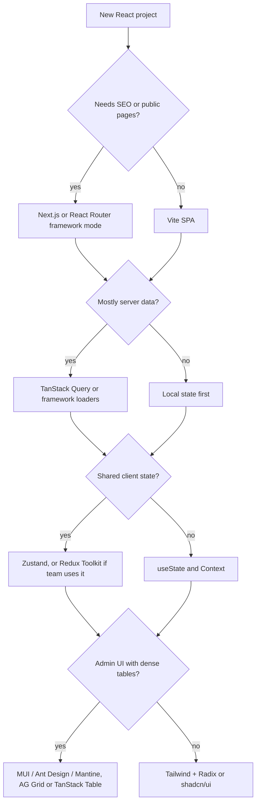

# 23 — Ecosystem libraries

> **How to use this module.** 23.1 is a checklist you can apply to any library an interviewer names, and it is the part to memorize. 23.2 is a reference you skim before the interview, not read: pick the categories your target job uses. 23.3 is the legacy map: what you will find in old codebases and where to migrate it. The exercises train the actual interview skill, which is choosing a stack and defending it.

**Prerequisites:** [Creating a project in 2026](05-tooling-and-setup.md#58-creating-a-project-in-2026) · [A decision framework for state](18-state-management.md#1811-a-decision-framework) · [Styling in React](04-html-css-accessibility.md#411-styling-in-react-inline-css-modules-tailwind-css-in-js-and-the-server-components-trade-off)

**Code for this module:** [`examples/web/src/m23-ecosystem/`](examples/web/src/m23-ecosystem/) (one exercise, no new dependencies). Run it with `npx vitest run src/m23-ecosystem` from `examples/web`.

> **How the facts in this module were checked.** Version numbers ("current major") were read from the **npm registry `latest` dist-tag on 2026-10-04** (`curl https://registry.npmjs.org/<pkg>/latest`). Archive flags and push dates come from the **GitHub REST API on the same day**. Status statements link to the project's own announcement. Anything not confirmed is marked `> **Unverified:**` or `Unverified` in a table cell. Versions move fast: re-run the registry query before you quote a number in an interview. Opinions are labeled **Opinion**.

---

## 23.1 How to evaluate a library

### The problem
A React app is mostly other people's code. Picking a library costs far more than installing it: you inherit its bugs, its release cadence, its bundle size and its upgrade path. In an interview, "I would use X" is weak and "I would use X because of these signals, and here is how I would back out" is strong. The interviewer rarely cares which library you pick; they care that you have a method.

### Mental model
Treat a dependency like a **Maven dependency in a Spring service**, with the same questions: who maintains it, is it on the supported release line, what does it drag in transitively, what is the license, and can I replace it without rewriting the service? The front end adds three costs the backend does not have: **bytes shipped to every user**, **browser/SSR compatibility**, and **accessibility**, which you cannot bolt on later.

> **Where the analogy breaks:** a JVM dependency costs the server a little memory. A front-end dependency is downloaded, parsed and executed on every user's device, so size and runtime cost are paid per visit, not once per deployment.

### The checklist
Apply it in this order. Stop at the first hard fail.

| # | Question | How to check (read-only, 5 minutes) | Red flag |
|---|---|---|---|
| 1 | **Maintenance signals** | npm "last publish" date and the GitHub "archived" flag (`curl -s https://api.github.com/repos/<owner>/<repo>` shows `archived` and `pushed_at`); open vs. closed issue ratio; who funds it | Archived repo; no release in 12+ months while React shipped majors; a "maintenance mode" notice; one maintainer with no succession |
| 2 | **Compatibility with your React** | `peerDependencies` in its `package.json`; the changelog for "React 19" | Peer range stops at `^17`; needs `defaultProps`, `findDOMNode`, `ReactDOM.render` or other removed APIs |
| 3 | **TypeScript support** | Ships its own `types` field vs. `@types/*`; generics quality; does it infer from a schema | Types lag the runtime or live in a third-party package |
| 4 | **SSR / RSC compatibility** | Does it touch `window` at import time? Does it use `createContext`/hooks (so needs `'use client'`)? Is there an SSR guide? See [Server Components](21-concurrent-ssr-server-components.md#217-server-components-the-mental-model-clientserver-boundary) | Runtime CSS-in-JS without a server story; hydration mismatches (date/locale/random ids) |
| 5 | **Bundle size and tree-shaking** | `package.json` `sideEffects: false` and ESM exports; bundlephobia or your bundle analyzer ([15.11](15-performance.md#1511-bundle-analysis)) | CommonJS only; a monolithic import that drags a locale database |
| 6 | **Accessibility** | Does it implement the WAI-ARIA authoring patterns (focus trap, roving tabindex, labelling)? Test the demo with a keyboard ([4.3](04-html-css-accessibility.md#43-focus-management-and-keyboard-navigation-roving-tabindex)) | Custom widgets built from `div` with click handlers |
| 7 | **License** | `license` field; check the **commercial** tier (some grids and chart suites split a free and a paid edition) | AGPL/GPL in a closed-source product without legal review; a "free" tier that lacks the one feature you need |
| 8 | **Escape hatches** | Can you override rendering, style, and behavior? Headless vs. styled ([4.12](04-html-css-accessibility.md#412-component-libraries-mui-radix-shadcnui-headless-vs-styled)) | You must fork to change one thing |
| 9 | **Team familiarity and hiring** | Can new hires be productive in a week? Is there a migration guide from what you have now? | A niche API nobody on the team has used |
| 10 | **Lock-in and reversibility** | How many files import it? Can you hide it behind your own hook or component (the API layer idea in [22.4](22-production-project-structure.md#224-the-api-layer))? | Its types leak into your domain model; it owns your routing or your data layer |

### Minimal code
Wrapping a dependency behind your own seam is the single best lock-in defense. Illustrative shape, not run:

```ts
// app/date.ts: the only file allowed to import the date library
export function formatShortDate(d: Date, locale: string): string {
  return new Intl.DateTimeFormat(locale, { dateStyle: 'medium' }).format(d);
}
```
Application code imports `formatShortDate` from `app/date`. When the library changes, one file changes.

### How it works internally
Most of the signals above are public metadata you can read without installing anything. The registry's per-package document lists every version with its publish `time`, so "when did this last ship" is one request. The GitHub repository object has an `archived` boolean (a read-only repository), and `pushed_at`. A **supply-chain** view adds two more checks that bundle-size tools miss: the number and weight of **transitive dependencies**, and whether install-time scripts exist. Both are visible in the lockfile ([5.1](05-tooling-and-setup.md#51-npm-pnpm-yarn-lockfiles-and-why-to-commit-them)).

### Trade-offs
- **Opinion:** weight "maintenance" and "lock-in" highest. A slightly worse API from a healthy project beats a perfect API from an abandoned one.
- **Opinion:** the platform first. `Intl`, `fetch`, `<dialog>`, CSS container queries and `Array` methods now cover a lot of what small libraries used to; every dependency you skip is one you never upgrade.
- Not every dependency deserves the full checklist. A 2 KB utility you can inline needs a glance. A router, data layer or design system needs all ten rows.
- Familiarity is a legitimate reason. "The team knows Redux Toolkit and it is on the supported line" is a good answer; "it is the newest" is not.

> **Summary.** Check maintenance, React compatibility, types, SSR, size, accessibility, license, escape hatches, familiarity and lock-in, in that order, and isolate the dependency behind your own module.

---

## 23.2 Curated tables: data, state, forms, validation, styling, UI kits, tables, charts, dates, animation, virtualization, testing, i18n, each with "choose when / avoid when"

### The problem
"What would you use for X?" is the most common ecosystem question, and the honest answer is a short list with conditions. A flat list of names does not help you in an interview; the *conditions* do.

### Mental model
Think of each category as a shelf with one **default** and a few **specialists**. Say the default first, then say when you would leave it. This is a map, not a ranking.

> **Where the analogy breaks:** unlike Maven Central, where you pick a library and its transitive dependencies resolve themselves, here many libraries depend on each other's *conventions* (form library + schema library + UI kit). Choose the combination, not each piece alone.

### How to read the tables
- **Current major** is the `latest` dist-tag on npm on **2026-10-04**. A cell reading `Unverified` means I could not confirm it from a primary source.
- "Choose when" and "Avoid when" are **Opinion** unless they cite a fact.
- Libraries covered in depth in another module link there; this module does not re-explain them.

### Data fetching and server state
Covered in depth: [17](17-data-fetching.md).

| Library | What it is | Choose when | Avoid when | Current major |
|---|---|---|---|---|
| TanStack Query (`@tanstack/react-query`) | Async server-state cache: dedup, retries, invalidation ([17.4](17-data-fetching.md#174-tanstack-query-query-keys-staletime-vs-gctime)) | Default for a client-rendered app talking to a REST/JSON API such as Spring | Your framework's loaders already cache everything and you have almost no client-side mutations | 5 (5.104.1; [VERSIONS.md](VERSIONS.md)) |
| SWR | Small stale-while-revalidate hook ([17.9](17-data-fetching.md#179-swr-comparison)) | Light needs, already in a Next.js codebase | You need rich mutation/optimistic tooling out of the box | 2 (2.5.1) |
| RTK Query | Data fetching inside Redux Toolkit ([18.7](18-state-management.md#187-rtk-query)) | The team already runs Redux Toolkit | You do not otherwise need Redux | Ships with `@reduxjs/toolkit` 2 |
| Apollo Client / urql | GraphQL clients | The backend is GraphQL | The backend is REST (Spring MVC) | Apollo 4 (`@apollo/client` 4.3.1); urql 5 (5.0.4) |
| `axios` | Promise HTTP client with interceptors | A codebase already uses it, or you rely on its interceptors | New code where `fetch` plus a thin wrapper is enough ([24](24-react-with-spring-boot.md)) | 1 (1.20.0) |
| `ky` | Small `fetch` wrapper (retries, hooks) | You want ergonomics over `fetch` without `axios` | You need only one or two calls | 2 (2.1.0) |
| `react-query` (unscoped) | Old name of TanStack Query v3 | Never for new code | Always; migrate to `@tanstack/react-query` ([23.3](#233-deprecated-or-archived-libraries-you-will-meet-in-legacy-code)) | 3 (3.39.3, last published 2023-01-25) |

### State management
Covered in depth: [18](18-state-management.md).

| Library | What it is | Choose when | Avoid when | Current major |
|---|---|---|---|---|
| Zustand | Hook-shaped store, no provider ([18.8](18-state-management.md#188-zustand)) | Default when you need a client store | You need strict, enforced conventions across a large team | 5 (5.0.15) |
| Redux Toolkit + React Redux | Predictable store with conventions, RTK Query ([18.4](18-state-management.md#184-redux-toolkit-configurestore-slices-immer)) | Large teams, existing Redux, strong devtools/audit needs | A small app whose state is mostly server data | RTK 2 (2.13.0), react-redux 9 (9.3.0) |
| Jotai | Atomic state ([18.9](18-state-management.md#189-atoms-jotai)) | Fine-grained derived state; closest Recoil replacement | A single shared store reads better | 3 (3.0.1) |
| XState | Statecharts/actors ([18.10](18-state-management.md#1810-xstate)) | Workflows with named states and guarded transitions | Plain loading/error flags | 5 (5.33.2) |
| MobX | Observable, mutation-based state | A team that prefers OOP-style reactive models | You want the React-idiomatic immutable style | 7 (7.0.6) |
| Valtio | Proxy-based mutable state | You like mutating objects and want automatic tracking | Debugging by snapshot is important to you | 2 (2.3.2) |
| Recoil | Facebook's atom library | Never for new code ([23.3](#233-deprecated-or-archived-libraries-you-will-meet-in-legacy-code)) | Always | 0.7.7 (archived) |

### Routing and frameworks
Covered in depth: [19](19-routing.md), [21](21-concurrent-ssr-server-components.md).

| Library | What it is | Choose when | Avoid when | Current major |
|---|---|---|---|---|
| React Router | Routing in three modes ([19.2](19-routing.md#192-react-router-8-framework-data-and-declarative-modes)) | An SPA, or framework mode as a full-stack option | You want RSC today (support is unstable per [VERSIONS.md](VERSIONS.md)) | 8 (8.4.0) |
| TanStack Router | Type-safe router ([19.11](19-routing.md#1911-tanstack-router)) | Search-param-heavy apps that value inferred route types | The team needs the largest hiring pool | 1 (1.170.41) |
| Next.js | Full-stack framework ([21.11](21-concurrent-ssr-server-components.md#2111-nextjs-app-router-as-the-reference-rendering-strategies)) | SEO, SSR, RSC, one deployable | A pure behind-login SPA served from Spring | 16 (16.3.8) |
| Vite | Dev server and bundler ([5.4](05-tooling-and-setup.md#54-vite-vs-webpack)) | Default SPA toolchain | You need a framework's server features | 8 (8.3.2) |

### Forms
Covered in depth: [14](14-forms-and-actions.md).

| Library | What it is | Choose when | Avoid when | Current major |
|---|---|---|---|---|
| React Hook Form | Uncontrolled-first form state ([14.3](14-forms-and-actions.md#143-react-hook-form--zod)) | Default for client forms with many fields | A single form with two inputs; use native + Actions | 7 (7.89.0; v8 in beta per [VERSIONS.md](VERSIONS.md)) |
| TanStack Form | Type-safe headless form state | You want strong inference and framework-agnostic form logic | The team already runs React Hook Form well | 1 (1.33.5) |
| Formik | Controlled form state, `<Formik>`/`useFormik` | Maintaining an existing Formik app | New code ([23.3](#233-deprecated-or-archived-libraries-you-will-meet-in-legacy-code)) | 2 (2.4.9, last published 2025-11-10) |
| Conform | Progressive-enhancement forms built on native `FormData`; designed for server Actions | Forms that must work before hydration (React 19 Actions, Next.js, React Router actions) | You need a large ecosystem of examples | 1 (`@conform-to/react` 1.21.1) |
| React 19 Actions + `useActionState` | Built-in ([14.6](14-forms-and-actions.md#146-actions-form-actionfn)) | Simple to medium forms, server-validated | Rich client-side field arrays and masks | part of React 19.3.0 |

### Validation
| Library | What it is | Choose when | Avoid when | Current major |
|---|---|---|---|---|
| Zod | Schema + inferred TS types ([14.3](14-forms-and-actions.md#143-react-hook-form--zod)) | Default: shared validation and types at the API boundary | Bundle size is critical and you can use a modular schema library | 4 (4.6.5) |
| Valibot | Modular, tree-shakable schemas | Bundle-sensitive client code | The team already standardized on Zod | 1 (1.5.0) |
| Yup | Older schema validator, common with Formik | Existing Formik + Yup codebases | New TypeScript-first code: its type inference is weaker (**Opinion**) | 1 (1.7.1) |
| Ajv / JSON Schema | JSON Schema validator | You generate validation from an OpenAPI document ([24.9](24-react-with-spring-boot.md)) | Hand-writing TypeScript-first schemas | 8 (`ajv` 8.20.0) |

### Styling
Covered in depth: [4.11](04-html-css-accessibility.md#411-styling-in-react-inline-css-modules-tailwind-css-in-js-and-the-server-components-trade-off).

| Library | What it is | Choose when | Avoid when | Current major |
|---|---|---|---|---|
| Tailwind CSS | Utility-first CSS | Default for new apps with a design-token discipline | The team dislikes long class lists and will not extract components | 4 (4.3.3; v3 LTS 3.4.19) |
| CSS Modules | Locally scoped CSS files | Zero-runtime, simple, works everywhere including RSC | You need dynamic styles driven by props at scale | Not versioned as a package (bundler feature) |
| styled-components | Runtime CSS-in-JS | Maintaining an existing app | New code: it is in maintenance mode ([23.3](#233-deprecated-or-archived-libraries-you-will-meet-in-legacy-code)) | 6 (6.5.3) |
| Emotion | Runtime CSS-in-JS (MUI's engine in some setups) | An existing Emotion/MUI app | New code that needs RSC without a client boundary | 11 (`@emotion/react` 11.14.0) |
| vanilla-extract | Zero-runtime, type-safe styles in `.css.ts` | You want typed, build-time CSS | Heavy runtime theming driven by user data | 1 (`@vanilla-extract/css` 1.21.2) |
| Panda CSS | Build-time styling, token/recipes API | CSS-in-JS ergonomics with static output | The team prefers utility classes | 2 (`@pandacss/dev` 2.1.1) |
| StyleX | Meta's build-time atomic CSS | Very large codebases wanting deterministic, atomic output | Small apps; the API is still pre-1.0 | 0.19.1 (pre-1.0) |

### UI kits and primitives
Covered in depth: [4.12](04-html-css-accessibility.md#412-component-libraries-mui-radix-shadcnui-headless-vs-styled).

| Library | What it is | Choose when | Avoid when | Current major |
|---|---|---|---|---|
| MUI (`@mui/material`) | Material Design components | Admin tools where speed matters more than brand | A distinctive brand design | 9 (9.4.0; v7 = 7.3.11 per [VERSIONS.md](VERSIONS.md)) |
| Ant Design (`antd`) | Enterprise component suite (tables, forms, pickers) | Data-dense B2B admin apps | A small marketing site; bundle and visual style are opinionated | 6 (6.6.5) |
| Mantine | Component and hooks library | Full kit with good DX and hooks | You must match a strict custom design system | 9 (`@mantine/core` 9.6.3) |
| Chakra UI | Style-prop component library | Teams that like style props | Upgrading from v2 without budget: v3 changed a lot: `framer-motion` and `@emotion/styled` dropped, `extendTheme` → `createSystem`, compound components (`Modal` → `Dialog.Root`), `isOpen` → `open`, `colorScheme` → `colorPalette` ([v3 migration](https://chakra-ui.com/docs/get-started/migration)) | 3 (`@chakra-ui/react` 3.37.0) |
| Radix Primitives | Unstyled accessible primitives | Building your own design system | You want finished visuals | 1.x per package (`@radix-ui/react-dialog` 1.1.23) |
| shadcn/ui | Copy-in components on Radix + Tailwind | You want to own the component source | You want updates through `npm update` (it is not a dependency) | Not a versioned package |
| Headless UI | Unstyled primitives from Tailwind Labs | Tailwind projects needing a few accessible widgets | You need a large widget catalog | 2 (`@headlessui/react` 2.2.10) |
| React Aria Components | Adobe's accessible, unstyled components | Strong accessibility and i18n requirements | You want quick pre-styled output | 1 (1.21.1) |
| Ark UI | Headless components (state-machine based) | Framework-agnostic primitives | You want the widest community | 5 (`@ark-ui/react` 5.39.2) |

### Tables and grids
| Library | What it is | Choose when | Avoid when | Current major |
|---|---|---|---|---|
| TanStack Table | Headless table logic (sorting, filtering, grouping) | You own the markup and need flexibility; pair with Virtual | You want a ready-made grid with Excel-like features | 9 (`@tanstack/react-table` 9.2.6). **Opinion:** many tutorials still show v8 (`useReactTable` with `getCoreRowModel`); check the v9 migration notes before copying. **Unverified:** the exact v8-to-v9 API differences |
| AG Grid | Full data grid (pinning, grouping, pivot, server-side row model) | Spreadsheet-like enterprise grids | Simple tables; row grouping, pivoting/aggregation, the server-side row model, Excel export and integrated charts are in the paid Enterprise edition ([Community vs Enterprise](https://www.ag-grid.com/react-data-grid/community-vs-enterprise/)) | 36 (`ag-grid-react` 36.2.0) |
| MUI X Data Grid | Grid in the MUI family | You already use MUI | You do not otherwise use MUI; the split matters: the MIT `@mui/x-data-grid` lacks column pinning and multi-sort/multi-filter (Pro) and row grouping/Excel export (Premium) ([MUI X licensing](https://mui.com/x/introduction/licensing/)) | 9 (`@mui/x-data-grid` 9.14.0) |
| Plain `<table>` | Native | A few dozen rows, static | Sorting + virtualization + resize | n/a |

### Charts
| Library | What it is | Choose when | Avoid when | Current major |
|---|---|---|---|---|
| Recharts | Declarative SVG charts as React components | Typical dashboard charts, quick start | Tens of thousands of points | 3 (3.10.1) |
| visx | Low-level D3 + React primitives from Airbnb | Custom, bespoke visualizations | You want a chart in ten lines | 4 (`@visx/visx` 4.0.0) |
| Apache ECharts | Canvas/SVG charting engine (use via a wrapper or directly) | Large datasets, many chart types | You want React-idiomatic composition | 6 (`echarts` 6.1.0) |
| Chart.js + `react-chartjs-2` | Canvas charts | Simple canvas charts, small footprint | Heavy custom composition | `chart.js` 4 (4.5.1); `react-chartjs-2` 5 (5.3.1) |
| Nivo | D3-based React chart suite | Attractive defaults and many chart types | Smallest bundle | `@nivo/core` 0.99.0 (pre-1.0) |
| Victory | Formidable's chart components | Cross-platform (web and React Native) | Large data | 37 (37.3.6) |

> **Accessibility note (Opinion):** charts are the weakest area for accessibility. Whatever you pick, plan a data-table alternative and text summary ([4.2](04-html-css-accessibility.md#42-accessibility-the-accessibility-tree-aria-rules-names-roles-states)).

### Dates and time
| Library | What it is | Choose when | Avoid when | Current major |
|---|---|---|---|---|
| `Intl.DateTimeFormat` / `Intl.RelativeTimeFormat` [JS] | Built-in formatting | Formatting and relative time; zero bytes | You need arithmetic, parsing of free-form strings | Platform |
| date-fns | Function-per-feature utilities, immutable | Default library for arithmetic and formatting; tree-shakes | You need rich time-zone-aware objects | 4 (4.4.0) |
| Day.js | Tiny Moment-like chainable API | Moving a Moment codebase with minimal edits | You want tree-shaken functions | 1 (1.11.23) |
| Luxon | Immutable objects, time zones through `Intl` | Time-zone-heavy logic | Bundle size and a function style matter | 3 (3.7.2) |
| Temporal [JS] | The modern built-in date/time API | Eventually, everywhere | Today if you must support browsers without it | See below |
| Moment | Legacy | Existing code only ([23.3](#233-deprecated-or-archived-libraries-you-will-meet-in-legacy-code)) | New code | 2 (2.31.0) |

**Temporal status.** The polyfills exist: `temporal-polyfill` 1.0.5 and `@js-temporal/polyfill` 0.5.1 (npm, 2026-10-04). MDN marks Temporal **Limited availability** ("not Baseline because it does not work in some of the most widely-used browsers") as of 2026-10-04 ([MDN Temporal](https://developer.mozilla.org/en-US/docs/Web/JavaScript/Reference/Global_Objects/Temporal)), so keep the polyfill for now and re-check the compatibility table before dropping it.

### Animation
| Library | What it is | Choose when | Avoid when | Current major |
|---|---|---|---|---|
| Motion (formerly Framer Motion) | Declarative animation, layout animations, gestures | Default for rich UI animation | You only need a CSS transition | `motion` 14 (14.0.0); `framer-motion` 14.0.0 is still published, but Motion's upgrade guide says to uninstall `framer-motion`, install `motion` and import from `motion/react` ([upgrade guide](https://motion.dev/docs/react-upgrade-guide)) |
| React Spring | Physics-based animation | Natural spring motion | Simple fades | 10 (`@react-spring/web` 10.1.2) |
| CSS transitions, `@starting-style`, View Transitions | Platform | Most UI motion, including route transitions ([21.10](21-concurrent-ssr-server-components.md#2110-viewtransition)) | Complex orchestrated sequences | Platform |
| `@dnd-kit` | Drag and drop toolkit | Sortable lists, accessible DnD | Native HTML5 DnD is enough (see [26](26-machine-coding.md)) | 6 (`@dnd-kit/core` 6.3.1) |

### Virtualization
Covered in depth: [15.8](15-performance.md#158-virtualization).

| Library | What it is | Choose when | Avoid when | Current major |
|---|---|---|---|---|
| TanStack Virtual | Headless virtualizer | Default; lists, grids, dynamic sizes | You want a drop-in component | 3 (3.14.13) |
| react-window | Small component-based virtualizer | Simple fixed/variable lists | Complex dynamic measurement | 2 (2.3.3) |
| react-virtuoso | Feature-rich list component (grouping, reverse scroll, chat) | Chat-like and grouped lists | You want headless control | 4 (4.18.16) |

### Testing and tooling
Covered in depth: [20](20-testing.md).

| Library | What it is | Choose when | Avoid when | Current major |
|---|---|---|---|---|
| Vitest | Vite-native test runner ([20.2](20-testing.md#202-vitest-vs-jest)) | Default for Vite apps | A large existing Jest setup with no pain | 5 (5.0.3) |
| Jest | The long-time runner | Existing codebases, React Native | New Vite apps | 30 (30.5.2) |
| React Testing Library | Test by user-visible behavior ([20.3](20-testing.md#203-react-testing-library-and-query-priority)) | Default for components | Testing internal state | `@testing-library/react` 16 (16.3.3) |
| Testing Library variants | `@testing-library/react-native`, `/vue`, `/dom`, `jest-dom`, `user-event` | The same query philosophy on another platform | n/a | RN 14 (14.0.1); dom 10 (10.4.2); user-event 14 (14.6.7); jest-dom 7 (7.0.1) |
| MSW | Network mocking ([20.6](20-testing.md#206-msw-for-network-mocking)) | Component and integration tests, shared with the browser | You only unit-test pure functions | 3 (3.0.2) |
| Playwright / Cypress | E2E ([20.11](20-testing.md#2011-e2e-with-playwright-and-cypress)) | Critical user journeys | Testing every component state | Playwright 1.63.0; Cypress 16.1.1 |
| Storybook | Component workshop, docs and visual testing | A shared design system with many consumers | A small single-team app | 10 (`storybook` 10.6.1) |

### i18n
Covered in depth: [22.8](22-production-project-structure.md#228-i18n).

| Library | What it is | Choose when | Avoid when | Current major |
|---|---|---|---|---|
| react-i18next / i18next | Largest ecosystem, runtime catalogs | Default; lots of plugins and examples | You want compile-time-extracted messages | `i18next` 26 (26.4.2); `react-i18next` 17 (17.0.15) |
| react-intl (FormatJS) | ICU MessageFormat on `Intl` | ICU plural/select messages, translators who know ICU | You want a plugin ecosystem | 12 (12.1.3) |
| Lingui | Compile-time extraction, small runtime | Smaller bundles and a translator workflow with PO files | You need runtime-edited catalogs | 6 (`@lingui/core` 6.9.0) |
| Native `Intl` | Built-in number/date/plural | Formatting without translation catalogs | Full message management | Platform |

### Drag, select, utilities (one-liners)
`react-select` 5 (5.10.2) for searchable selects; `react-datepicker` 9 (9.1.0) for date pickers; `react-use` 17 (17.6.1) as a hooks grab-bag; `immer` 11 (11.1.21) for immutable updates (already inside Redux Toolkit); `lodash` 4 (4.18.1), where per-method imports or native methods usually suffice (**Opinion**).

### Trade-offs
- A kit that gives you tables, forms, pickers and a theme (MUI, Ant Design, Mantine) saves weeks on an admin tool and costs you in bundle size and brand freedom. A headless stack (Radix or React Aria + Tailwind + TanStack Table) costs weeks and returns control.
- The tables list libraries, not a ranking. **Opinion:** pick the combination where the pieces already agree (for example React Hook Form + Zod + `@hookform/resolvers`, which this guide's examples install).

> **Summary.** For every category, name a default, one specialist and the condition for leaving the default; and say it with a current major you actually checked.

### The decision tree



---

## 23.3 Deprecated or archived libraries you will meet in legacy code

### The problem
Interviewers deliberately pick codebases one or two majors behind (see [STYLE.md](STYLE.md), "Legacy coverage"). You will be asked "what is this, is it still maintained, and how would you move off it?" Naming the **status, date and replacement** is the whole answer.

### Mental model
Think of the Spring ecosystem's Spring Cloud Netflix (Hystrix, Ribbon, Zuul): ubiquitous, then superseded, still running in production years later. The skill is to **recognize it, keep it stable, and plan the exit** rather than rewrite on a whim.

> **Where the analogy breaks:** on the JVM an old library keeps working for as long as the JDK does. A front-end library is tied to React's internals and to build tools that move every year, so an abandoned library breaks on the next React or bundler major.

### The table

| Library | Status | Date | Source | Migrate to |
|---|---|---|---|---|
| **Create React App** (`react-scripts` 5.0.1) | **Deprecated** by the React team; repo `react/create-react-app` last pushed 2025-02-15 | Deprecated **2025-02-14** | [Sunsetting Create React App](https://react.dev/blog/2025/02/14/sunsetting-create-react-app) | A framework (Next.js, React Router) or Vite / Parcel / Rsbuild ([5.8](05-tooling-and-setup.md#58-creating-a-project-in-2026)) |
| **Enzyme** (`enzyme` 3.11.0) | Unmaintained: last npm release **2019-12-20**; adapters target React 16 (`enzyme-adapter-react-16` peer `react ^16`); a community adapter exists for 17 (`@wojtekmaj/enzyme-adapter-react-17`); no official adapter for 18/19 | Last release 2019-12-20 | npm registry; GitHub `enzymejs/enzyme` (last push 2025-10-22, not archived) | React Testing Library ([20.3](20-testing.md#203-react-testing-library-and-query-priority)); React 19 also removed the internals shallow rendering relied on (see below) |
| **Recoil** | Repository **archived**; last npm release 0.7.7 on 2023-03-01; last push 2025-01-01 | Archived by 2025-01-01 (exact date unverified) | GitHub API; see [18.9 note](18-state-management.md#189-atoms-jotai) | Jotai, Zustand or Redux Toolkit ([18.11](18-state-management.md#1811-a-decision-framework)) |
| **moment.js** | **Legacy project in maintenance mode** (the docs say so). Still publishes: 2.31.0 on 2026-09-15 | Maintenance mode announced Sept 2020 (**Unverified:** date; read the "Project Status" page at momentjs.com) | [momentjs.com/docs](https://momentjs.com/docs/) | `Intl`, date-fns, Day.js, Luxon, later Temporal ([23.2](#232-curated-tables-data-state-forms-validation-styling-ui-kits-tables-charts-dates-animation-virtualization-testing-i18n-each-with-choose-when--avoid-when)); Exercise 4 |
| **`react-router-dom`** | **Removed as a package in React Router v8**: import from `react-router` and `react-router/dom` | v8.0, 2026-06-17 | [VERSIONS.md](VERSIONS.md), [19.10](19-routing.md#1910-version-notes-v5--v6--v7--v8), [changelog](https://reactrouter.com/changelog) | `react-router` ≥ 8 (v6/v7 apps keep `react-router-dom`, which re-exported from `react-router` in v7) |
| **React Router v5** (`Switch`, `component=`, `useHistory`) | Superseded; final v5 = 5.3.4 | Superseded by v6 | [19.10](19-routing.md#1910-version-notes-v5--v6--v7--v8) | v6 → v7 → v8, using the codemods/future flags guidance in 19.10 |
| **`@reach/router`** | No release since 2020-06-25 (1.3.4); folded into React Router v6 | Last release 2020-06-25 | npm registry | React Router |
| **`react-test-renderer`** | **Deprecated** by React: "will remain available on NPM but will not be maintained and may break with new React features". It is still published at 19.3.0 | React 19.0 (2024-12): "In React 19, `react-test-renderer` logs a deprecation warning" ([React 19 upgrade guide](https://react.dev/blog/2024/04/25/react-19-upgrade-guide)) | [react.dev/warnings/react-test-renderer](https://react.dev/warnings/react-test-renderer) | React Testing Library; for snapshots see [20.10](20-testing.md#2010-snapshot-testing-trade-offs) |
| **styled-components** | Announced **maintenance mode** by its maintainer: "Thank you" post dated **2025-03-17** on Open Collective. Still releases (6.5.3 on 2026-08-15) | 2025-03-17 | [Open Collective update](https://opencollective.com/styled-components/updates) | Keep for existing code; for new code CSS Modules, Tailwind, or a zero-runtime library ([4.11](04-html-css-accessibility.md#411-styling-in-react-inline-css-modules-tailwind-css-in-js-and-the-server-components-trade-off)) |
| **Formik** | Not archived; latest 2.4.9 on **2025-11-10**; repository moved to `jaredpalmer/formik`. Slow release cadence relative to React Hook Form (**Opinion:** treat it as legacy-friendly, not a default) | Last release 2025-11-10 | npm registry; GitHub API | React Hook Form, TanStack Form or React 19 Actions ([14](14-forms-and-actions.md)) |
| **`react-query`** (unscoped v3) | Renamed to TanStack Query in v4; v3 last published **2023-01-25** | 2023-01-25 | npm registry | `@tanstack/react-query` 5 ([17.4](17-data-fetching.md#174-tanstack-query-query-keys-staletime-vs-gctime)) |
| **`react-helmet`** | Last release 6.1.0 on **2020-06-08**; uses patterns React 19 replaced | 2020-06-08 | npm registry; React 19 [document metadata tags](https://react.dev/blog/2024/12/05/react-19) | React 19 native `<title>`/`<meta>`/`<link>`, or your framework's metadata API. `react-helmet-async` is still published (3.0.0), the successor for SSR on older React |
| **`react-beautiful-dnd`** | npm marks it **deprecated** ("is now deprecated"); GitHub repo **archived** (last push 2025-08-18) | npm deprecation; archived 2025 (**Unverified:** exact date) | npm registry; GitHub API | `@hello-pangea/dnd` (maintained fork, 18.0.1) as a drop-in, or `@dnd-kit` |
| **`ReactDOM.render`, `findDOMNode`, `defaultProps` on function components** | APIs removed in React 19 (see [VERSIONS.md](VERSIONS.md) and the React 19 upgrade guide) | React 19.0, 2024-12 | [React 19 post](https://react.dev/blog/2024/12/05/react-19) | `createRoot`, refs, default parameters. The full list from the [upgrade guide](https://react.dev/blog/2024/04/25/react-19-upgrade-guide): `propTypes` checks, function `defaultProps`, legacy context (`contextTypes`/`getChildContext`), string refs, module-pattern factories, `React.createFactory`, `react-test-renderer/shallow`, `react-dom/test-utils` (except `act`, moved to `react`), `ReactDOM.render`, `hydrate`, `unmountComponentAtNode`, `findDOMNode` |

> **⚠️ Correction.** "`axios` is deprecated, use `fetch`" is false. `axios` 1.20.0 was published on 2026-08-26 with no deprecation flag in the registry. The correct statement is that `fetch` is enough for many apps, and `axios` is a choice, not a mistake. Likewise **`request`** (the Node library, not an `axios` relative) is deprecated; do not confuse the two.

### Minimal code
Replacing the one-line `react-router-dom` import:

```ts
// v6/v7
import { Link, useNavigate } from 'react-router-dom';
// v8 (react-router-dom removed)
import { Link, useNavigate } from 'react-router';
```
The DOM-specific entry point in v8 is `react-router/dom` (for example `RouterProvider` for the DOM); see [19.10](19-routing.md#1910-version-notes-v5--v6--v7--v8) before editing a real project.

### How it works internally
Why do old libraries break on new React? Three reasons. They used **removed APIs** (`findDOMNode`, legacy context, string refs). They reached into **React internals** (Enzyme's shallow renderer and `react-test-renderer` depend on the reconciler's internal shape). Or they have **peer ranges** that stop at an old major, so package managers warn or fail ([5.2](05-tooling-and-setup.md#52-semver-and-ranges-peer-dependencies)). A fix is sometimes a fork (`@hello-pangea/dnd`) or an adapter, which only moves the problem.

### Trade-offs: how to handle a legacy dependency
- **Do not rewrite for fashion.** If a deprecated library works, is isolated and has no security advisory, schedule the migration; do not stop feature work.
- **Wrap before you swap** (the seam in 23.1). Migrating Moment is easy when all date logic lives in one module.
- **Migrate the leaf first.** Replace `react-test-renderer` snapshots as you touch each test; migrate Enzyme tests file by file with RTL running beside it.
- **Security overrides everything.** An unmaintained library with a CVE moves to the top of the list.

> **Summary.** For each dead library, say status, date, source and target: CRA to a framework or Vite, Enzyme to RTL, Recoil to Jotai/Zustand, Moment to `Intl`/date-fns, `react-router-dom` to `react-router` in v8, `react-test-renderer` to RTL, `react-helmet` to React 19 metadata.

---

## Interview questions

**Q1. How do you decide whether to adopt a new library?**
<details><summary>Answer</summary>

Run a short checklist: maintenance (last release, archived flag, issues), React compatibility (peer range), TypeScript, SSR/RSC compatibility, bundle size, accessibility, license, escape hatches, team familiarity and lock-in ([23.1](#231-how-to-evaluate-a-library)). Stop on a hard fail. **A strong answer adds:** the seam: you wrap it behind your own module so a replacement touches one file, and you say which of the ten rows mattered most for *this* project.

</details>

**Q2. What is the single best defense against library lock-in?**
<details><summary>Answer</summary>

Isolate the dependency behind your own function or hook so its types and API do not leak into the domain code. When a library dies, one module changes. **A strong answer adds:** the Spring parallel (an interface in front of a vendor SDK) and the limit: some libraries, like your router or your design system, are impossible to hide completely, so you choose them more carefully.

</details>

**Q3. What do "last published" and "archived" tell you, and what do they not tell you?**
<details><summary>Answer</summary>

They are fast signals of abandonment. A repo with the GitHub `archived` flag is read-only; the npm last-publish date shows release cadence. They do **not** prove quality: a small stable library can be "finished" and rarely release (**Opinion**). Check issues, peer ranges and open security advisories as well. **A strong answer adds:** Recoil's archived repo and 0.7.7 from 2023 as a real example ([23.3](#233-deprecated-or-archived-libraries-you-will-meet-in-legacy-code)).

</details>

**Q4. Why can a library be "SSR-incompatible"?**
<details><summary>Answer</summary>

It touches `window`/`document` at import time, relies on layout measurement during render, generates different ids or markup on server and client (hydration mismatch), or needs hooks and context, so in a Server Components framework it must live behind `'use client'` ([21.7](21-concurrent-ssr-server-components.md#217-server-components-the-mental-model-clientserver-boundary)). Runtime CSS-in-JS is a classic case. **A strong answer adds:** how you would load a browser-only widget: dynamic import with SSR disabled, or an effect.

</details>

**Q5. TanStack Query or Redux Toolkit for API data?**
<details><summary>Answer</summary>

TanStack Query is a server-state cache with dedup, retries and invalidation; Redux Toolkit is a client store. For a REST-backed app, use the cache for server data and keep the client store small ([17.3](17-data-fetching.md#173-server-state-vs-client-state)). If the team already runs RTK, RTK Query gives the same pattern inside the store. **A strong answer adds:** "server state is not client state", and the cost of putting API responses in a global store by hand.

</details>

**Q6. Zustand vs Redux Toolkit vs Context?**
<details><summary>Answer</summary>

Context is for rarely changing values (theme, session) because it has no selectors; every consumer re-renders. Zustand is a small store with selectors; Redux Toolkit adds conventions, devtools and RTK Query, which pay off on large teams ([18.11](18-state-management.md#1811-a-decision-framework)). **A strong answer adds:** start with local state, URL and a server cache; most apps need little global state.

</details>

**Q7. React Hook Form or Formik for a new project?**
<details><summary>Answer</summary>

React Hook Form, in most cases: it is uncontrolled-first, so fewer re-renders, and it pairs with schema resolvers ([14.3](14-forms-and-actions.md#143-react-hook-form--zod)). Formik 2.4.9 was last published 2025-11-10 and is typical of legacy code. **A strong answer adds:** for simple forms, React 19 Actions need no library; and for forms that must work before hydration, Conform.

</details>

**Q8. Zod, Valibot or Yup?**
<details><summary>Answer</summary>

Zod is the default for TypeScript-first validation with inferred types (v4 is current: 4.6.5). Valibot is modular and tree-shakes better, which matters when the validator ships to the client. Yup is mostly met next to Formik. **A strong answer adds:** schemas at the API boundary: parse unknown JSON from the backend with the schema rather than casting with `as`.

</details>

**Q9. A Spring Boot team wants one source of truth for validation. What do you propose?**
<details><summary>Answer</summary>

Bean Validation stays authoritative on the server. On the client, generate types from OpenAPI ([24.9](24-react-with-spring-boot.md)) and keep a schema for UX validation, accepting that rules duplicate. Show the server's field errors from `ProblemDetail` in the form. **A strong answer adds:** client validation is a convenience, never security.

</details>

**Q10. Tailwind, CSS Modules or CSS-in-JS?**
<details><summary>Answer</summary>

Build-time options (Tailwind, CSS Modules, vanilla-extract, Panda, StyleX) have no runtime cost and work with Server Components. Runtime CSS-in-JS (styled-components, Emotion) needs a client boundary and injects styles at runtime; styled-components announced maintenance mode on 2025-03-17. **A strong answer adds:** "migrate when you touch it", not a stop-the-world rewrite.

</details>

**Q11. shadcn/ui is not on npm as a dependency. What are the consequences?**
<details><summary>Answer</summary>

You copy the component source (built on Radix primitives and Tailwind) into your repo. You own and can change it, and there is no version bump to take; fixes are manual. **A strong answer adds:** the trade-off against MUI: control against automatic upgrades, and who owns accessibility regressions ([4.12](04-html-css-accessibility.md#412-component-libraries-mui-radix-shadcnui-headless-vs-styled)).

</details>

**Q12. MUI, Ant Design or Mantine for a B2B admin dashboard?**
<details><summary>Answer</summary>

All three give tables, forms, pickers and theming out of the box. The choice is team familiarity, the quality of the specific components you need (data grid, date pickers) and licensing of the advanced ones. **A strong answer adds:** you would prototype the three hardest screens in a short spike, because the hard components decide, not the button.

</details>

**Q13. TanStack Table or AG Grid?**
<details><summary>Answer</summary>

TanStack Table is headless logic: you render the markup, so it is flexible and light but you build the UI. AG Grid is a full grid with pinning, grouping, server-side row model and Excel-like features, some in a paid edition. **A strong answer adds:** pair TanStack Table with TanStack Virtual for big lists; use AG Grid when the requirements read like a spreadsheet. Verify the license split before committing.

</details>

**Q14. Recharts, visx or ECharts?**
<details><summary>Answer</summary>

Recharts for conventional dashboard charts with React-style composition (SVG, so heavy for huge datasets). visx for bespoke visualizations you assemble from primitives. ECharts for large datasets and many chart types, at the cost of a less React-shaped API. **A strong answer adds:** accessibility: provide a data table or summary alongside any chart.

</details>

**Q15. Moment.js is in a legacy app. What do you replace it with?**
<details><summary>Answer</summary>

Formatting and relative time: `Intl.DateTimeFormat` and `Intl.RelativeTimeFormat`. Arithmetic and parsing: date-fns. Minimal-diff migration: Day.js, which has a Moment-like API. Time-zone-heavy: Luxon. Moment itself is a legacy project in maintenance mode ([momentjs.com](https://momentjs.com/docs/)). **A strong answer adds:** Moment objects are mutable (`add` changes the original), so naive search-and-replace to immutable APIs can change behavior; see Exercise 4.

</details>

**Q16. What is Temporal and can we use it today?**
<details><summary>Answer</summary>

Temporal is the modern built-in date/time API meant to replace `Date`: immutable, time-zone aware, with explicit types for dates, times and instants. Polyfills exist (`temporal-polyfill`, `@js-temporal/polyfill`), and you still need one: MDN lists Temporal as **Limited availability**, not Baseline, as of 2026-10-04 ([MDN](https://developer.mozilla.org/en-US/docs/Web/JavaScript/Reference/Global_Objects/Temporal)). **A strong answer adds:** you would put dates behind your own module so adopting Temporal later is a one-file change.

</details>

**Q17. Framer Motion vs React Spring vs CSS?**
<details><summary>Answer</summary>

Use CSS (transitions, `@starting-style`, View Transitions) for most UI motion. Motion (the library formerly named Framer Motion) for layout animations, gestures and orchestration. React Spring for physics-based motion. **A strong answer adds:** respect `prefers-reduced-motion` ([4.10](04-html-css-accessibility.md#410-modern-css)).

</details>

**Q18. TanStack Virtual, react-window or react-virtuoso?**
<details><summary>Answer</summary>

TanStack Virtual is headless, so it fits custom layouts, tables and grids. react-window is a small component for simple lists. react-virtuoso is a feature-rich component (grouping, reverse scrolling for chat). **A strong answer adds:** virtualization breaks Ctrl+F, anchors and some a11y expectations; apply it only after measuring ([15.8](15-performance.md#158-virtualization)).

</details>

**Q19. Vitest or Jest for a new project?**
<details><summary>Answer</summary>

Vitest for Vite apps: same config and transform pipeline, fast. Jest when you have a large existing suite or React Native. Both pair with React Testing Library ([20.2](20-testing.md#202-vitest-vs-jest)). **A strong answer adds:** do not migrate a working Jest suite just for speed; migrate when config duplication hurts.

</details>

**Q20. Enzyme tests fail after a React upgrade. What do you do?**
<details><summary>Answer</summary>

Enzyme's last npm release was 2019-12-20 and its official adapters target React 16; it relied on internals that newer React changed. Migrate to React Testing Library, file by file, running both while you migrate. **A strong answer adds:** rewrite tests to assert behavior, not implementation; a mechanical translation of `wrapper.state()` assertions keeps the problem.

</details>

**Q21. i18next, react-intl or Lingui?**
<details><summary>Answer</summary>

i18next has the largest ecosystem and runtime catalogs. react-intl uses ICU MessageFormat on top of `Intl`. Lingui extracts messages at build time and keeps the runtime small. Formatting (numbers, dates, plurals) can use native `Intl` without any of them ([22.8](22-production-project-structure.md#228-i18n)). **A strong answer adds:** plurals differ by language (Polish has *few* and *many*), so never build plurals with string concatenation.

</details>

**Q22. Axios or fetch?**
<details><summary>Answer</summary>

`fetch` is built in, and a 30-line wrapper handles base URL, JSON, errors and auth. `axios` adds interceptors and conveniences and is still maintained (1.20.0, 2026-08-26). Neither is "wrong"; what matters is one API layer ([22.4](22-production-project-structure.md#224-the-api-layer)). **A strong answer adds:** `fetch` does not reject on HTTP 4xx/5xx, so the wrapper must check `response.ok`.

</details>

**Q23. What changes for libraries in a React Server Components app?**
<details><summary>Answer</summary>

Anything using state, effects, context or browser APIs must be a Client Component. Many UI libraries need a `'use client'` wrapper; libraries that are pure functions (formatting, validation) work on the server unchanged ([21.8](21-concurrent-ssr-server-components.md#218-use-client-and-use-server-server-functions-and-their-security)). **A strong answer adds:** the cost model: every client library you add grows the client bundle; server-only libraries cost no client bytes.

</details>

**Q24. How would you audit the dependencies of an inherited app?**
<details><summary>Answer</summary>

List direct dependencies; for each, check last publish, archive status, peer ranges, license and size; run the package manager's audit; sort into keep, replace and remove. Replace first anything with a security advisory or a React-compat break. **A strong answer adds:** you propose a migration order (leaf first, wrapped behind a seam) and report what you read from the registry versus what you assumed.

</details>

**Q25. A teammate proposes rewriting from CRA to Next.js. What do you ask?**
<details><summary>Answer</summary>

Why: SEO or first-load performance needs, or just fashion? CRA was deprecated on 2025-02-14, so a move is justified, but the target depends on needs: Vite for a behind-login SPA, a framework for SEO and server rendering ([5.8](05-tooling-and-setup.md#58-creating-a-project-in-2026)). **A strong answer adds:** an incremental path (Vite first, framework later) and how routing, env variables (`REACT_APP_*` to `VITE_*`) and tests change.

</details>

---

## Coding exercises

### Exercise 1: Stack for a B2B admin dashboard on Spring Boot

**Statement.** A logistics company needs an internal admin dashboard behind SSO: dense tables (100k rows), filters, multi-step forms, role-based screens, charts. The backend is Spring Boot with a REST API and OpenAPI. Eight engineers, four of them backend. Choose and justify a front-end stack.

**Approach.** *Mental model:* an internal tool has no SEO needs and wants speed of delivery and consistency. Decide by category using 23.2: build/runtime, data, state, forms/validation, UI kit, tables, charts, testing. Then name the risks.

<details><summary>Hints</summary>

1. Does anything here need server rendering?
2. Where does the data live: server or client?
3. Which single component type decides the UI kit: the grid.
4. How do the four backend engineers contribute safely?

</details>

<details><summary>Solution</summary>

**Model answer.**
- **Runtime:** Vite SPA (React 19), served from Spring static resources or a CDN ([22.12](22-production-project-structure.md#2212-deployment-targets-staticcdn-node-server-served-from-spring)). No SEO need, so no framework server to operate.
- **Routing:** React Router (data or declarative mode) or TanStack Router for type-safe search params on filtered tables.
- **Data:** TanStack Query; types generated from the OpenAPI document ([24.9](24-react-with-spring-boot.md)); one API layer.
- **State:** local state + URL for filters; Zustand for a few client concerns (selection, layout). No Redux unless the team already uses it.
- **Forms and validation:** React Hook Form + Zod; server `ProblemDetail` errors mapped onto fields.
- **UI kit:** MUI, Ant Design or Mantine, chosen by a spike on the grid and date picker; this saves months over a headless stack.
- **Tables:** AG Grid if spreadsheet features (pinning, grouping, server-side row model) are required; otherwise TanStack Table + TanStack Virtual.
- **Charts:** Recharts, with a table alternative for accessibility.
- **Testing:** Vitest + RTL + MSW; Playwright for the three critical flows.

**Trade-offs.** A full kit costs bundle size and brand freedom but buys speed. AG Grid may carry licensing cost. A SPA means no server-rendered first paint; acceptable behind SSO.

**What an interviewer probes.** "Why not Next.js?" (no SEO; one more server to run), "How do you handle 100k rows?" (server-side pagination or virtualization, never render all), "Auth?" (see [24](24-react-with-spring-boot.md): httpOnly cookies or BFF), "What if requirements add a public page?" (add a framework later, for that part).

</details>

**Walkthrough.** The answer follows the decision tree in 23.2: no SEO, so Vite; mostly server data, so TanStack Query; dense tables, so a kit and a grid. The strong parts are the spike for the grid and naming the license risk.

**Interviewer follow-ups.** How do you stop the dashboard from becoming a 4 MB bundle? How would you swap the grid later? (Hide it behind a `DataTable` component.)

**Tests.** None (design exercise).

### Exercise 2: Stack for a content-heavy marketing site with SEO

**Statement.** A marketing site with 300 pages, a blog, a CMS, localized in four languages, with strict Core Web Vitals targets and a small interactive "price calculator". Choose a stack.

**Approach.** *Mental model:* mostly static, mostly read-only, search-engine facing. Minimize JavaScript shipped; interactivity only where needed.

<details><summary>Hints</summary>

1. Which rendering mode: static, streamed, or client?
2. How little client JavaScript can you ship?
3. Which styling approach works with Server Components?
4. Where does i18n live?

</details>

<details><summary>Solution</summary>

**Model answer.**
- **Framework:** Next.js App Router with static generation / Cache Components, or React Router framework mode; pages render on the server with Server Components, so content costs no client JavaScript ([21.11](21-concurrent-ssr-server-components.md#2111-nextjs-app-router-as-the-reference-rendering-strategies)).
- **Content:** headless CMS fetched on the server; revalidation by tag when editors publish.
- **Styling:** CSS Modules or Tailwind (zero runtime); avoid runtime CSS-in-JS.
- **Interactivity:** the price calculator is one Client Component island with React Hook Form + Zod, or plain controlled inputs; no global store.
- **i18n:** a library that supports server rendering and locale routing (`i18next` or `react-intl`, or the framework's i18n routing); format with `Intl` ([22.8](22-production-project-structure.md#228-i18n)).
- **Metadata:** the framework's metadata API (`react-helmet` is legacy).
- **Images and fonts:** framework image optimization, preloaded fonts ([15.10](15-performance.md#1510-images-fonts-preloading)).
- **Testing:** Playwright for rendered output and links; a Lighthouse budget in CI.

**Trade-offs.** A framework adds a server or build step and a learning curve. A pure static export is simpler if no revalidation is needed. > **Unverified:** the exact cost of an adopted CMS or hosting; depends on the vendor.

**What an interviewer probes.** "Why not a SPA?" (SEO, first paint, crawlers), "What do you hydrate?" (only the calculator), "Where does the 300-page build slow down?" (incremental revalidation), "Preview mode for editors?"

</details>

**Walkthrough.** The key move is limiting client JavaScript to the island that needs it; every library you add to the client is paid on every page view.

**Interviewer follow-ups.** How would you localize slugs? How do you avoid hydration mismatches in dates and prices? (Format with the same locale and time zone on both sides.)

**Tests.** None (design exercise).

### Exercise 3: Stack for a real-time collaborative app

**Statement.** A shared whiteboard with comments, presence ("who is here"), and offline tolerance. Spring Boot backend. Choose a stack and say where the hard problems are.

**Approach.** *Mental model:* the hard part is not the library list; it is **conflict resolution** and **transport**. Choose libraries after those two decisions.

<details><summary>Hints</summary>

1. WebSocket, SSE or polling for transport?
2. How do concurrent edits merge: last write wins, OT or CRDT?
3. Where does live data enter the cache?
4. What do you virtualize or throttle?

</details>

<details><summary>Solution</summary>

**Model answer.**
- **Transport:** WebSocket (STOMP via Spring or plain WebSocket) for bidirectional edits and presence; SSE is enough for one-way notifications ([17.11](17-data-fetching.md#1711-real-time-websockets-and-sse-plus-cache-integration), [24](24-react-with-spring-boot.md)).
- **Conflict resolution:** a CRDT library (for example Yjs) or an OT server; current versions are `yjs` 13.6.33 and `@automerge/automerge` 3.5.0 (npm `latest`, 2026-10-04). > **Unverified:** the state of their React bindings; check them before choosing. Do not invent your own merge logic.
- **Client state:** the CRDT document is the source of truth for the canvas; Zustand or `useSyncExternalStore` over it for UI state; TanStack Query for non-live data (users, board list) with WebSocket messages writing into the cache.
- **Rendering:** canvas or SVG with throttled updates (`requestAnimationFrame`), `useDeferredValue`/transitions for non-urgent panels ([21.2](21-concurrent-ssr-server-components.md#212-usetransition-and-starttransition)).
- **Animation:** CSS/Motion for UI; none in the hot path.
- **Forms:** minimal.
- **Testing:** Vitest for merge logic; Playwright with two browser contexts for collaboration scenarios.

**Trade-offs.** CRDTs simplify offline and merging but add document size and a learning curve; a server-authoritative OT model is simpler to reason about but needs a server that serializes operations.

**What an interviewer probes.** "What happens on reconnect?" (replay or state vector sync), "How do you scale WebSockets with Spring?" (sticky sessions or a broker), "How do you test race conditions?"

</details>

**Walkthrough.** A strong answer names the unsolved problem (merge semantics) before listing libraries, and admits where it would verify versions.

**Interviewer follow-ups.** How would you show presence cursors without re-rendering the whole board? What do you do when the socket drops mid-edit?

**Tests.** None (design exercise).

### Exercise 4: Replace moment.js with `Intl` and date-fns equivalents

**Statement.** This legacy code uses Moment. Rewrite it with no new dependency, using `Intl` and plain `Date`. Keep the behavior, noting where Moment differed.

```ts
import moment from 'moment';
const d = moment('2024-01-05T12:00:00Z');
d.format('ll');                       // "Jan 5, 2024"
const later = d.clone().add(30, 'days');
moment('2024-01-08T11:00:00Z').diff(d, 'days');   // 2
moment('nope').isValid();             // false
d.from(moment('2024-01-05T15:00:00Z'));           // "3 hours ago"
```

**Approach.** *Mental model:* Moment is a mutable wrapper; `Date` plus `Intl` is immutable if you never call setters. Map each call: format to `Intl.DateTimeFormat`, add to arithmetic on milliseconds (UTC), diff to a truncated difference, `isValid` to `Number.isNaN(getTime())`, `from` to `Intl.RelativeTimeFormat`. Step by step: fix the time zone for reproducibility; return new `Date` objects; pick the relative unit by magnitude.

<details><summary>Hints</summary>

1. `new Intl.DateTimeFormat(locale, { dateStyle: 'medium', timeZone: 'UTC' })`.
2. `new Date(d.getTime() + n * 86_400_000)` ignores DST because it is UTC arithmetic.
3. `Math.trunc` mirrors Moment's `diff` truncation.
4. `Intl.RelativeTimeFormat` with `numeric: 'auto'` says "yesterday".

</details>

<details><summary>Solution</summary>

File: [`examples/web/src/m23-ecosystem/dates.ts`](examples/web/src/m23-ecosystem/dates.ts)

```ts
// file: examples/web/src/m23-ecosystem/dates.ts
const DAY_MS = 86_400_000;

/** moment(d).format('ll') replacement. Fixed time zone so output is reproducible. */
export function formatShortDate(d: Date, locale = 'en-US', timeZone = 'UTC'): string {
  return new Intl.DateTimeFormat(locale, { dateStyle: 'medium', timeZone }).format(d);
}

/** moment(d).add(n, 'days') replacement, immutable. Pure UTC arithmetic (no DST shifts). */
export function addDaysUtc(d: Date, n: number): Date {
  return new Date(d.getTime() + n * DAY_MS);
}

/** moment(b).diff(a, 'days') replacement: whole days, truncated toward zero. */
export function diffInDays(a: Date, b: Date): number {
  return Math.trunc((b.getTime() - a.getTime()) / DAY_MS);
}

/** moment(x).isValid() replacement. */
export function isValidDate(d: Date): boolean {
  return !Number.isNaN(d.getTime());
}

/** moment(from).from(to) replacement using Intl.RelativeTimeFormat. */
export function relativeTime(from: Date, to: Date, locale = 'en'): string {
  const rtf = new Intl.RelativeTimeFormat(locale, { numeric: 'auto' });
  const seconds = Math.round((from.getTime() - to.getTime()) / 1000);
  const abs = Math.abs(seconds);
  if (abs < 60) return rtf.format(seconds, 'second');
  if (abs < 3600) return rtf.format(Math.round(seconds / 60), 'minute');
  if (abs < 86_400) return rtf.format(Math.round(seconds / 3600), 'hour');
  return rtf.format(Math.round(seconds / 86_400), 'day');
}
```

</details>

**Walkthrough.**
1. `formatShortDate` fixes `timeZone: 'UTC'`, because `Intl` otherwise uses the machine's zone and the output would differ by environment.
2. `addDaysUtc` returns a **new** `Date`; Moment's `add` mutated the original (hence `.clone()` in the legacy code).
3. `diffInDays` truncates toward zero, as Moment's `diff` does by default.
4. `isValidDate` replaces `isValid`. Note a trap: `new Date('nope')` is an Invalid Date, not an exception.
5. `relativeTime` chooses seconds, minutes, hours or days. Moment's `from` has its own thresholds (for example "a few seconds ago") that this does not reproduce exactly.

> **Opinion:** calendar-aware arithmetic (add a month, start of week, DST-safe local days) is where date-fns or Temporal earns its keep; fixed 24-hour arithmetic is only correct in UTC.

**Interviewer follow-ups.** What breaks across a DST change in local time? (A "day" can be 23 or 25 hours; this is why `addDaysUtc` says UTC.) How is date-only parsing different? (`new Date('2024-01-05')` parses as UTC, while `new Date('2024-01-05T00:00')` is local.) Where would you use date-fns instead?

**Tests.** [`examples/web/src/m23-ecosystem/dates.test.ts`](examples/web/src/m23-ecosystem/dates.test.ts). The expected strings were predicted from `Intl` behavior in `en-US`/`en`, then verified by running them on Node 24 (full ICU). On another ICU version a mismatch is a test to update, not a library to blame.

```ts
// file: examples/web/src/m23-ecosystem/dates.test.ts
import { addDaysUtc, diffInDays, formatShortDate, isValidDate, relativeTime } from './dates';

const base = new Date('2024-01-05T12:00:00Z');

test('formatShortDate formats with Intl in a fixed zone', () => {
  expect(formatShortDate(base)).toBe('Jan 5, 2024');
});

test('addDaysUtc does not mutate its input (moment mutated)', () => {
  const next = addDaysUtc(base, 30);
  expect(next.toISOString()).toBe('2024-02-04T12:00:00.000Z');
  expect(base.toISOString()).toBe('2024-01-05T12:00:00.000Z');
});

test('diffInDays truncates toward zero', () => {
  expect(diffInDays(base, new Date('2024-01-08T11:00:00Z'))).toBe(2);
  expect(diffInDays(new Date('2024-01-08T11:00:00Z'), base)).toBe(-2);
});

test('isValidDate detects Invalid Date', () => {
  expect(isValidDate(new Date('nope'))).toBe(false);
  expect(isValidDate(base)).toBe(true);
});

test('relativeTime picks a unit and reads naturally', () => {
  expect(relativeTime(new Date(base.getTime() - 3 * 3600_000), base)).toBe('3 hours ago');
  expect(relativeTime(new Date(base.getTime() + 5 * 60_000), base)).toBe('in 5 minutes');
  expect(relativeTime(new Date(base.getTime() - 86_400_000), base)).toBe('yesterday');
});
```

### Exercise 5: Evaluate a library from its package and repo signals

**Statement.** You are given this (fictional) data and must write a go/no-go with reasons.

```
package: react-fancy-table   latest: 2.4.1   last publish: 2022-03-10
peerDependencies: { "react": "^16.8 || ^17" }
license: GPL-3.0     types: @types/react-fancy-table (community)
repo: archived=false, pushed_at=2024-02-01, open issues: 410
exports: CommonJS only, no "sideEffects" field
weekly downloads: 800k
```

**Approach.** *Mental model:* run the 23.1 checklist row by row, and let the first hard fail decide; popularity is not a row.

<details><summary>Hints</summary>

1. React 19 is current. What does the peer range say?
2. What does GPL imply for a closed-source product?
3. Downloads versus maintenance: which matters?

</details>

<details><summary>Solution</summary>

**No-go.** Row 1: no release in 3+ years and an unreleased push in 2024: stale. Row 2: peers stop at React 17, so React 19 installs need `--legacy-peer-deps` or overrides and may break. Row 3: community types. Row 5: CommonJS only and no `sideEffects` means poor tree-shaking. Row 7: GPL-3.0 may be incompatible with a closed-source product; ask legal. The 800k downloads reflect legacy installs, not health. **Alternative:** TanStack Table (headless) or a kit's grid, evaluated with the same checklist. If a team insists, wrap it behind a `DataTable` seam and plan the exit.

</details>

**Walkthrough.** Hard fails stop the evaluation: a peer range excluding your React major is enough.

**Interviewer follow-ups.** What if it is the only library with feature X? (Vendoring, forking, building the 20% you need, or a seam so it is replaceable.) What would change your mind? (A recent release adding React 19 support and a permissive license.)

**Tests.** None (analysis exercise).

### Exercise 6: Predict the output of a dependency-compat check

**Statement.** This pure function decides whether a dependency's peer range allows your React version. Predict the result for each call before reading the answer.

```ts
function allowsMajor(peer: string, major: number): boolean {
  return peer.split('||').some((part) => part.trim().replace(/^[\^~>=\s]+/, '').split('.')[0] === String(major));
}
allowsMajor('^16.8 || ^17', 17);   // ?
allowsMajor('^16.8 || ^17', 19);   // ?
allowsMajor('>=18', 19);           // ?
```

**Approach.** Trace `split('||')`, then strip leading range operators, then take the major.

<details><summary>Hints</summary>

1. `'>=18'` becomes `'18'` after the replace.
2. The function compares majors for equality, not ranges.

</details>

<details><summary>Solution</summary>

`true`, `false`, **`false`**. The third call is the trap: `>=18` means 18 and above, including 19, but this naive function only checks equality of the leading major, so it returns `false`. This is why you should use the `semver` package's `satisfies` rather than parse ranges by hand ([5.2](05-tooling-and-setup.md#52-semver-and-ranges-peer-dependencies)). The function is illustrative; it is **not** in `examples/` and has not been run (read from the source, not executed).

</details>

**Walkthrough.** Each part is split on `||`, trimmed, stripped of `^ ~ > =` and spaces, and the text before the first dot is compared as a string to `"17"` or `"19"`.

**Interviewer follow-ups.** How does npm treat a peer-range conflict (error in npm 7+ unless `--legacy-peer-deps`)? How do `overrides` help, and when are they dangerous?

**Tests.** None.

---

## Gotchas & trick questions

1. **Downloads are not health.** Enzyme and `react-helmet` still show large download counts from legacy projects. Check last publish, peer ranges and issues.
2. **"Not archived" does not mean "maintained".** Enzyme's repository is not archived, but its last npm release was 2019-12-20.
3. **`react-router-dom` vs `react-router`.** v6/v7 apps import from `react-router-dom`; in v8 the package is removed: import DOM-specific APIs from `react-router/dom` and everything else from `react-router` ([v7 → v8 upgrade](https://reactrouter.com/upgrading/v7)). > **Unverified:** whether mixing the two packages across majors causes duplicate-context bugs; the upgrade guide does not say.
4. **Moment mutates.** `m.add(1, 'day')` changes `m`; code that "worked" may rely on that. Replace with an immutable API and expect behavior changes.
5. **`new Date('2024-01-05')` is UTC; `new Date('2024-01-05T00:00')` is local.** A date-only string shows the previous day in negative-offset time zones when formatted locally.
6. **Month indexes are 0-based in `Date` (and in Moment's `month()`), but 1-based in ISO strings.** An off-by-one-month bug is a classic during a Moment migration.
7. **`axios` is not deprecated.** The rumor confuses it with the deprecated `request` package.
8. **`framer-motion` and `motion`.** Both package names exist on npm at 14.0.0. Do not mix imports from both in one codebase. Motion's official guidance is to replace `framer-motion` with `motion` and import from `motion/react` ([upgrade guide](https://motion.dev/docs/react-upgrade-guide)).
9. **shadcn/ui is not a package.** You cannot `npm update` it; fixes are copied by hand.
10. **TanStack Table tutorials may show v8.** The current major is 9 (9.2.6); copying v8 snippets may not compile ([23.2](#232-curated-tables-data-state-forms-validation-styling-ui-kits-tables-charts-dates-animation-virtualization-testing-i18n-each-with-choose-when--avoid-when)).
11. **Runtime CSS-in-JS and Server Components.** A library that injects styles at runtime needs a client boundary; "it works in the SPA" does not transfer.
12. **A peer-dependency warning is not noise.** `--legacy-peer-deps` hides a real incompatibility; it can fail at runtime on the next React feature.
13. **Bundle size depends on how you import.** A locale-loaded date library or a barrel import can pull in far more than the docs suggest; measure with your analyzer.
14. **Free tier traps.** A grid or chart suite may keep the one feature you need (pivoting, export) in a paid edition; read the feature table before standardizing.
15. **`react-test-renderer` still installs.** It is published at 19.3.0 but deprecated and unmaintained by React; its presence is not an endorsement.
16. **Recoil's README still reads as active.** It calls itself "experimental"; the repo is archived.
17. **Peer range `>=18` is open-ended.** It does not prove the library works on 19; check the changelog.

---

## Common misconceptions / outdated advice

| Claim | Once true? | True now | Since |
|---|---|---|---|
| "Start new React apps with Create React App" | Yes, official recommendation for years | Deprecated; use a framework or Vite/Parcel/Rsbuild | 2025-02-14 ([source](https://react.dev/blog/2025/02/14/sunsetting-create-react-app)) |
| "Test components with Enzyme" | Yes, de facto standard (React 15/16 era) | Last release 2019-12-20; use React Testing Library | Enzyme stalled at 3.11.0 (2019-12) |
| "Recoil is Facebook's way to manage state" | Marketed that way 2020–2022 | Repo archived; last release 0.7.7 (2023-03-01) | By 2025-01-01 (last push; exact archival date unverified) |
| "Use Moment for dates" | Yes, the default for years | Legacy project in maintenance mode; use `Intl`, date-fns, Day.js, Luxon or Temporal | Maintenance mode (momentjs.com; date unverified) |
| "`react-router-dom` is the package to install" | Yes in v5, v6 and v7 | Removed in v8; import from `react-router` | React Router 8.0, 2026-06-17 |
| "`react-query` is the data-fetching library" | Yes, v1 to v3 | The package is `@tanstack/react-query` (5.104.1); `react-query` v3 last published 2023-01-25 | v4 rename |
| "`axios` is deprecated, always use fetch" | Never | `axios` 1.20.0 published 2026-08-26, not deprecated | n/a |
| "styled-components is the standard way to style React" | Yes, 2018–2022 | Maintenance mode announced 2025-03-17; prefer zero-runtime options for new code | 2025-03-17 |
| "Use `react-helmet` for the document head" | Yes | React 19 renders `<title>`, `<meta>` and `<link>` natively | React 19, 2024-12 |
| "Snapshot with `react-test-renderer`" | Yes, the React docs recommended it | Deprecated; it will not be maintained | React 19.0: it logs a deprecation warning ([upgrade guide](https://react.dev/blog/2024/04/25/react-19-upgrade-guide)) |
| "Formik is the form library" | Yes, 2018–2020 | Still published (2.4.9, 2025-11-10) but React Hook Form and Actions are the usual new-code choices (**Opinion**) | n/a |
| "`react-beautiful-dnd` for drag and drop" | Yes | npm-deprecated, repo archived; use `@hello-pangea/dnd` or `@dnd-kit` | Archived 2025 (exact date unverified) |

---

## Self-check

1. Name five rows of the library evaluation checklist.
<details><summary>Answer</summary>

Any five of: maintenance, React compatibility, TypeScript, SSR/RSC, bundle size, accessibility, license, escape hatches, team familiarity, lock-in.

</details>

2. What replaces `react-router-dom` in React Router v8?
<details><summary>Answer</summary>

`react-router` (and `react-router/dom` for DOM-specific entry points); the `react-router-dom` package was removed in v8.

</details>

3. Give two replacements for Enzyme tests and the first thing you change.
<details><summary>Answer</summary>

React Testing Library (with user-event); first rewrite assertions to user-visible behavior instead of `wrapper.state()`/`instance()`.

</details>

4. What is Recoil's status and what do you migrate to?
<details><summary>Answer</summary>

Archived repo, last release 0.7.7 (2023-03-01); migrate to Jotai (closest model), Zustand or Redux Toolkit.

</details>

5. Why does `moment.add` need `.clone()` and what replaces it?
<details><summary>Answer</summary>

Moment objects are mutable. Use immutable `Date` arithmetic, date-fns or Luxon, which return new objects.

</details>

6. Which category's libraries need a `'use client'` boundary in a Server Components app?
<details><summary>Answer</summary>

Anything using state, effects, context or browser APIs: interactive UI kits, form libraries, runtime CSS-in-JS, charts and animation.

</details>

7. Is `axios` deprecated?
<details><summary>Answer</summary>

No (1.20.0, 2026-08-26). The deprecated one is `request`.

</details>

8. When would you choose TanStack Table over AG Grid?
<details><summary>Answer</summary>

When you want headless logic and your own markup (often with TanStack Virtual); choose AG Grid for spreadsheet-like enterprise features.

</details>

9. What does a peer range ending at `^17` mean for a React 19 app?
<details><summary>Answer</summary>

The library does not declare support; installs warn or fail, and runtime breakage is possible. Check for a newer release or choose another library.

</details>

10. What is the best protection against lock-in?
<details><summary>Answer</summary>

Wrapping the library behind your own module or hook.

</details>

---

## Summary (re-read before the interview)

Evaluate a library with a fixed checklist (maintenance, React compatibility, types, SSR/RSC, size, accessibility, license, escape hatches, familiarity, lock-in), stop on the first hard fail, and hide it behind your own seam. Per category, name a default and when you would leave it: TanStack Query for server data, Zustand or Redux Toolkit for client state, React Hook Form with Zod for forms, Tailwind or CSS Modules for styling, a UI kit for admin tools and a headless stack for design systems, TanStack Table or AG Grid for tables, Recharts/visx/ECharts for charts, `Intl` or date-fns for dates, Motion or CSS for animation, TanStack Virtual for virtualization, Vitest with RTL and MSW for tests. Know the legacy map with status, date and target: CRA (deprecated 2025-02-14) to a framework or Vite, Enzyme (last release 2019) to RTL, Recoil (archived) to Jotai/Zustand, Moment (maintenance mode) to `Intl`/date-fns, `react-router-dom` (removed in v8) to `react-router`, `react-test-renderer` and `react-helmet` to RTL and React 19 metadata, styled-components (maintenance mode since 2025-03-17) to zero-runtime styling. Quote versions only after checking the registry, and say what you verified versus assumed.

---

**Next:** [24 — React with a Spring Boot backend](24-react-with-spring-boot.md) · **Related:** [18 — State management](18-state-management.md), [20 — Testing](20-testing.md), [22 — Production project structure](22-production-project-structure.md)
