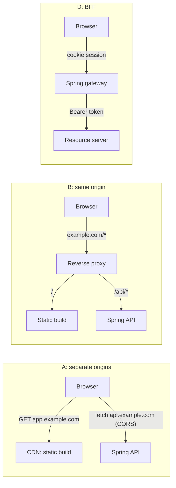
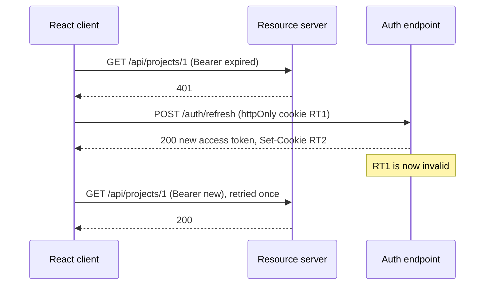
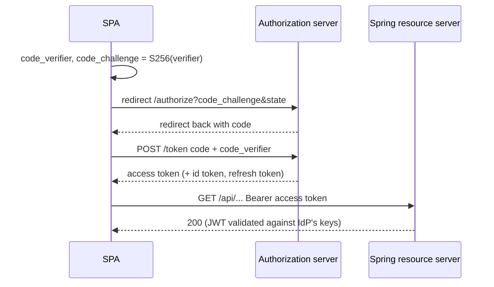
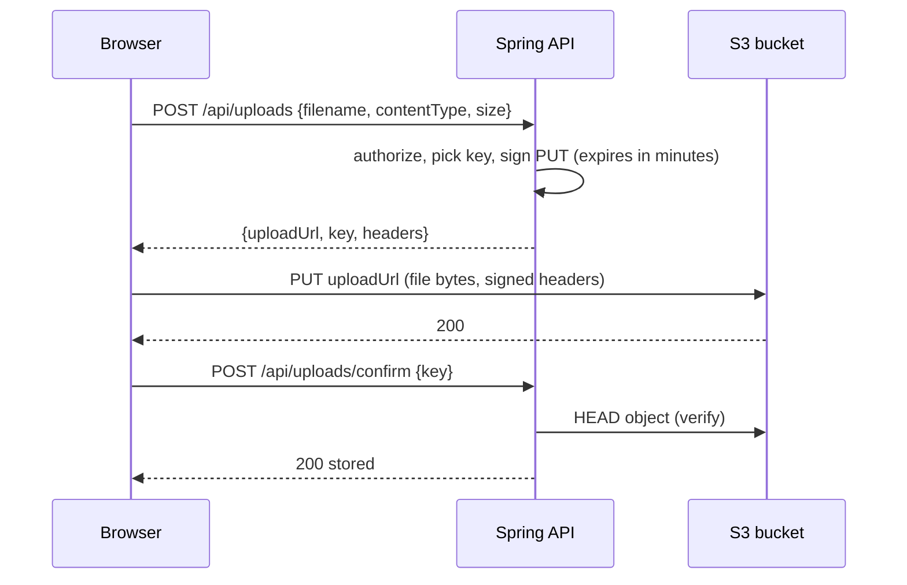

# 24 — React with a Spring Boot backend

> **How to use this module.** Sections 24.1–24.5 are the questions every full-stack interview asks: where the two apps live, CORS, where tokens live, and CSRF. Sections 24.6–24.10 cover OAuth2, the API client, error contracts and pagination. Sections 24.11–24.13 cover uploads, real time and deployment. In 20 minutes, read 24.1, 24.2, 24.3, 24.8 and the Summary.

**Prerequisites:** [TanStack Query](17-data-fetching.md#174-tanstack-query-query-keys-staletime-vs-gctime) · [Invalidation and mutations](17-data-fetching.md#175-invalidation-and-mutations) · [MSW for network mocking](20-testing.md#206-msw-for-network-mocking) · [Error handling](16-error-handling.md)

**Code for this module:**
- Client (React side): [`examples/web/src/m24-spring-client/`](examples/web/src/m24-spring-client/). Run its tests with `npx vitest run src/m24-spring-client` from `examples/web`. The tests mock the Spring API with MSW using the **exact** contract of the real backend. They never start Spring.
- Server (Spring side): [`examples/spring-api/`](examples/spring-api/) (Spring Boot 4.1.1, Spring Framework 7). Run it with `mvn spring-boot:run`, test it with `mvn verify` from that folder. It is deliberately minimal: **no Spring Security**. Security snippets in this module are labeled *not run in this repo*.

**The contract the client is written against** (it is the one in `examples/spring-api/README.md`):

| Call | Success | Failure |
|---|---|---|
| `GET /api/projects?page&size` (page ≥ 0, 1 ≤ size ≤ 50) | `{ content: [{id, name}], page: { size, number, totalElements, totalPages } }` | 400 problem+json |
| `GET /api/projects/{id}` | `{ id, name }` | 404 `application/problem+json` with `type` `https://example.com/problems/project-not-found`, `title`, `status`, `detail`, `instance` |
| `POST /api/projects` `{ name }` (`@NotBlank`, `@Size(max=60)`) | 201 + `Location` header + body | 400 problem+json with `errors: [{ field, message }]`, sorted |
| CORS on `/api/**` | `http://localhost:5173` only; `GET`, `POST`, `OPTIONS`; credentials; exposes `Location`; `max-age` 3600 | other origins: 403 |

> **Version notes.** Spring Boot 2.x (Spring Framework 5): `javax.*`, `WebSecurityConfigurerAdapter`, no `ProblemDetail`. Spring Boot 3 (Framework 6, Security 6): Java 17 minimum, **`javax.*` became `jakarta.*`**, `WebSecurityConfigurerAdapter` removed, `ProblemDetail` and `ErrorResponse` added. Spring Boot 4 (Framework 7, Security 7): modularized starters (`spring-boot-starter-web` → `spring-boot-starter-webmvc`, per the [Boot 4.0 migration guide](https://github.com/spring-projects/spring-boot/wiki/Spring-Boot-4.0-Migration-Guide)), `@WebMvcTest` moved to `org.springframework.boot.webmvc.test.autoconfigure`, and `ProblemDetail.type` no longer defaults. The Spring Boot version in this repo is **4.1.1** ([VERSIONS.md](VERSIONS.md)). The Spring Security 7 snippets below were checked against the 7.1.1 reference docs on docs.spring.io.

---

## 24.1 Architecture options

### The problem
React runs in a browser; Spring runs on a server. Before any line of code you must decide **where each is served from**, because that one choice decides whether you need CORS, where cookies are sent, how CSRF applies, and how you deploy.

### Mental model
Think of the **origin** [Browser] (scheme + host + port) as the browser's security perimeter. There are three layouts:

| Layout | Example | CORS needed? | Typical use |
|---|---|---|---|
| **A. Separate origins** | `app.example.com` (static) calls `api.example.com` | Yes | CDN-hosted SPA, public APIs, mobile + web sharing one API |
| **B. Same origin via reverse proxy** | `example.com/` → static, `example.com/api/*` → Spring | **No** | Most production SPAs; nginx, an ingress, CloudFront behaviors |
| **C. Spring serves the build** | `target/classes/static/` inside the JAR | **No** | Small apps, one deployable |
| **D. BFF** (Backend For Frontend) | SPA talks only to a Spring gateway that holds the tokens | No (same origin) | When tokens must never reach the browser ([24.6](#246-oauth2oidc-with-pkce-bff-pattern-spring-security-resource-server)) |

📊 How a request travels in each layout:



> **Java/Spring analogy.** Layout B is a Spring Cloud Gateway or an Apache `mod_proxy` in front of two services: one public URL, many back ends. 
>
> **Where the analogy breaks:** a gateway between services is a convenience. The browser's origin rule is a *security boundary you do not control*: no server-side setting can turn it off, only relax it for specific origins (CORS).

### Minimal code
In development Vite plays the reverse proxy, so the browser still sees one origin:

```ts
// vite.config.ts (illustrative: examples/web does not proxy to Spring)
export default defineConfig({
  server: { proxy: { '/api': 'http://localhost:8080' } },
});
```
The `examples/web` tests use layout A on purpose (`API_ORIGIN = 'http://localhost:8080'` in `contract.ts`) because that is what the CORS configuration in [24.2](#242-cors-preflight-credentials-spring-corsconfigurationsource) exists for.

### How it works internally
The browser attaches the `Origin` header to cross-origin requests and refuses to expose the response to script unless the server answers with a matching `Access-Control-Allow-Origin`. Same-origin requests carry no such check and send cookies by default. That is why layout B removes a whole class of problems rather than solving them.

### Trade-offs
- ✅ **B/C: no CORS, cookies "just work"**, one URL to firewall, one TLS certificate.
- ✅ **A: independent deploys and CDN caching** of the static build; the API can serve many clients.
- ❌ A needs correct CORS, a credentialed-CORS cookie policy (`SameSite=None; Secure` for third-party-looking cookies) and a preflight on every non-simple request.
- ❌ C couples the front-end release to the back-end release and puts static traffic on your JVM.
- **My pick:** B for a team that owns both halves. It keeps CORS out of production and still deploys the two artifacts separately.

---

## 24.2 CORS: preflight, credentials, Spring `CorsConfigurationSource`

### The problem
The SPA at `http://localhost:5173` calls `http://localhost:8080/api/projects`. The browser blocks the *response*: "has been blocked by CORS policy". The server received and processed the request; the browser just refuses to hand the result to your code.

### Mental model
CORS [Browser] is the **server telling the browser which other origins may read its responses**. Two shapes:
- **Simple request** (GET/HEAD/POST with only safelisted headers and a form-like `Content-Type`): sent directly; the browser checks the response headers.
- **Preflighted request** (anything else: `Content-Type: application/json`, an `Authorization` header, `PUT`/`DELETE`): the browser first sends `OPTIONS` with `Origin`, `Access-Control-Request-Method`, `Access-Control-Request-Headers`, and only sends the real request if the answer allows it.

> **Java/Spring analogy.** A bouncer's guest list: the server publishes a list of allowed origins, methods and headers, and the *browser* enforces it. 
>
> **Where the analogy breaks:** it protects the *user's browser*, not your server. `curl` and Postman ignore CORS completely, so "it works in Postman" proves nothing.

### Minimal code
The real configuration of `examples/spring-api` (a `WebMvcConfigurer`, because this project has no Spring Security):

```java
// file: examples/spring-api/src/main/java/com/interviewprep/springapi/web/CorsConfig.java
package com.interviewprep.springapi.web;

import org.springframework.context.annotation.Configuration;
import org.springframework.http.HttpHeaders;
import org.springframework.http.HttpMethod;
import org.springframework.web.servlet.config.annotation.CorsRegistry;
import org.springframework.web.servlet.config.annotation.WebMvcConfigurer;

// WebMvcConfigurer rather than a CorsConfigurationSource bean: there is no Spring Security filter
// chain to consume such a bean, so MVC's own handler-mapping CORS processing is the only consumer.
// Switch to a CorsConfigurationSource once Spring Security is added, otherwise the security filter
// would reject preflights before MVC ever sees them.
@Configuration
public class CorsConfig implements WebMvcConfigurer {

    private static final String API_PATH_PATTERN = "/api/**";
    // Exact origin, not a pattern: credentials are allowed, and the CORS spec forbids pairing them
    // with a wildcard, which would also let any site act with the user's cookies.
    private static final String DEV_CLIENT_ORIGIN = "http://localhost:5173";
    // Only the methods the API serves; anything else (e.g. DELETE) is rejected at preflight.
    private static final String[] ALLOWED_METHODS = {
        HttpMethod.GET.name(), HttpMethod.POST.name(), HttpMethod.OPTIONS.name()
    };
    // Location is exposed so the client can follow the URI of a newly created project; browsers
    // hide non-safelisted response headers from scripts otherwise.
    private static final String EXPOSED_HEADER = HttpHeaders.LOCATION;
    // One hour of preflight caching trades faster config rollout for fewer OPTIONS round trips.
    private static final long PREFLIGHT_MAX_AGE_SECONDS = 3600L;

    @Override
    public void addCorsMappings(CorsRegistry registry) {
        registry.addMapping(API_PATH_PATTERN)
                .allowedOrigins(DEV_CLIENT_ORIGIN)
                .allowedMethods(ALLOWED_METHODS)
                .allowCredentials(true)
                .exposedHeaders(EXPOSED_HEADER)
                .maxAge(PREFLIGHT_MAX_AGE_SECONDS);
    }
}
```

From the client, a credentialed cross-origin call is a `fetch` option:

```ts
await fetch('http://localhost:8080/api/projects', { credentials: 'include' });
```
`credentials: 'include'` is what `createApiClient` in `examples/web/src/m24-spring-client/http.ts` sets on every call.

### How it works internally
1. `fetch` with `Content-Type: application/json` is not a simple request, so the browser sends the preflight. The Spring-side tests in `examples/spring-api/src/test/java/.../web/CorsConfigTest.java` assert the allowed answer (200 with `Access-Control-Allow-Origin: http://localhost:5173`) and the rejected answer (403 for `http://evil.example`).
2. Spring MVC's handler mapping answers the preflight through `DefaultCorsProcessor` and never reaches your controller.
3. Rules the browser applies to the **response**:
   - With `credentials: 'include'`, `Access-Control-Allow-Origin` must be one exact origin, **never `*`**, and `Access-Control-Allow-Credentials: true` must be present.
   - JavaScript can read only safelisted response headers unless you list others in `Access-Control-Expose-Headers`. That is why this API exposes `Location`.
   - `Access-Control-Max-Age` (3600 here) lets the browser cache the preflight result. Browsers cap it: Firefox at 24 hours, Chromium at 2 hours since v76 (10 minutes before), and the default without the header is 5 seconds ([MDN](https://developer.mozilla.org/en-US/docs/Web/HTTP/Reference/Headers/Access-Control-Max-Age)).
   - A response that varies by `Origin` needs `Vary: Origin` so a shared cache does not serve the wrong header.

**Verified by running it in `examples/spring-api`:** spring-web 7.0.9's `DefaultCorsProcessor` also sends `Access-Control-Expose-Headers` on preflight responses. It is harmless: browsers read that header only on actual responses.

**Spring Security changes the rules.** When Spring Security is on the classpath, its filter chain runs *before* MVC. A preflight carries no cookie and no `Authorization` header, so Security would reject it as unauthenticated unless CORS is handled first. The 7.1.1 reference says to use `http.cors(Customizer.withDefaults())`, which reuses MVC's CORS configuration or a `CorsConfigurationSource` bean:

```java
// Not run in this repo: Spring Security is not in examples/spring-api.
@Bean
CorsConfigurationSource corsConfigurationSource() {
    CorsConfiguration config = new CorsConfiguration();
    config.setAllowedOrigins(List.of("http://localhost:5173"));
    config.setAllowedMethods(List.of("GET", "POST", "OPTIONS"));
    config.setAllowedHeaders(List.of("Authorization", "Content-Type", "X-XSRF-TOKEN"));
    config.setAllowCredentials(true);
    UrlBasedCorsConfigurationSource source = new UrlBasedCorsConfigurationSource();
    source.registerCorsConfiguration("/api/**", config);
    return source;
}
// in the SecurityFilterChain: http.cors(Customizer.withDefaults())
```
The source comment in `CorsConfig.java` above says the same: switch to a `CorsConfigurationSource` once Spring Security is added.

> **Version notes.** `@CrossOrigin` (Spring 4.2+, per its [Javadoc](https://docs.spring.io/spring-framework/docs/current/javadoc-api/org/springframework/web/bind/annotation/CrossOrigin.html)) annotates one controller or method. A global `WebMvcConfigurer#addCorsMappings` (as above) covers every controller in one place. A `CorsConfigurationSource` bean is the form Spring Security consumes. Pick one source of truth: `@CrossOrigin` on controllers *plus* a global config is how teams end up with a confusing union of both. Spring Framework 7 / Security 7 (this repo) keep all three.

### Trade-offs
- ✅ A tight allow-list (exact origin, only the methods you serve) is cheap and blocks most cross-site abuse.
- ❌ `allowedOrigins("*")` with credentials is rejected by the spec. `allowedOriginPatterns("*")` (Spring 5.3+; it sets `Access-Control-Allow-Origin` to the matched origin, per the [`CorsConfiguration` Javadoc](https://docs.spring.io/spring-framework/docs/current/javadoc-api/org/springframework/web/cors/CorsConfiguration.html)) makes Spring echo whatever `Origin` arrives, which silently re-opens everything. Do not do it in production.
- ❌ **MSW cannot test CORS.** It intercepts `fetch` inside Node, where there is no CORS enforcement. The `CorsConfigTest` in the Java project is what proves the headers; the client tests prove only that the client sends `credentials: 'include'` and reads what the contract says. A real browser (Playwright, [20.11](20-testing.md#2011-e2e-with-playwright-and-cypress)) is the only place a CORS misconfiguration fails the way users see it.

---

## 24.3 Auth options: JWT in memory vs httpOnly cookies

### The problem
After login the SPA must prove who it is on every call. Where the credential *lives* decides which attacker can steal it.

### Mental model
Two attackers matter:
- **XSS** (script injected into your page) can read anything JavaScript can read, and can *use* the browser's ambient credentials too.
- **CSRF** (another site makes the browser send your cookies) cannot read responses but rides on automatic cookie sending.

| Storage | XSS can steal the token? | CSRF possible? | Survives reload? |
|---|---|---|---|
| `localStorage` / `sessionStorage` | **Yes**, trivially, and exfiltrate it | No (not sent automatically) | Yes (localStorage) |
| JS memory (a module variable) | Only while the page lives; the attacker can still call `fetch` as the user | No | **No**: needs a silent refresh |
| httpOnly cookie | **No** (script cannot read it), but XSS can still make authenticated requests | **Yes**: needs `SameSite` and CSRF tokens ([24.5](#245-csrf-with-cookie-auth)) | Yes |

> **Java/Spring analogy.** `HttpSession` + `JSESSIONID` is the cookie model: the server holds the state, the browser holds an opaque id. A JWT in a header is a signed ticket the client holds and presents.
>
> **Where the analogy breaks:** a `JSESSIONID` can be revoked by deleting the server session. A JWT is valid until it expires unless you add a deny-list, which is why access tokens are short-lived.

### Minimal code
The pattern in this module: **short-lived access token in memory, refresh token in an httpOnly cookie.** `examples/web/src/m24-spring-client/session.ts`:

```ts
let token: string | null = null; // in memory: gone on reload, unreadable by other scripts' storage scans
// refresh: POST /auth/refresh with credentials:'include'; the cookie is attached by the browser,
// the response body carries a new accessToken. JS never sees the refresh token.
```

### How it works internally
`getAccessToken()` is read per request by the client. On reload the variable is empty, so the first call 401s, the client calls `/auth/refresh`, the cookie goes along automatically, and a new access token arrives. The user sees nothing. The refresh endpoint is the only place that needs the cookie, so you can scope it: `Path=/auth/refresh; HttpOnly; Secure; SameSite=Strict` (or `Lax`).

### Trade-offs
- ✅ In-memory access token + httpOnly refresh cookie removes "XSS steals a long-lived token from `localStorage`".
- ❌ It does **not** stop XSS from acting as the user while the tab is open. Fix XSS first ([React escaping, `dangerouslySetInnerHTML`](06-jsx-and-rendering-model.md)), then add a Content-Security-Policy.
- ❌ Extra moving part: refresh endpoint, rotation, single-flight on the client ([24.4](#244-refresh-token-rotation), [24.7](#247-an-api-client-with-interceptors)).
- The oldest advice was "store the JWT in `localStorage`"; every major guidance since (OAuth 2.0 for Browser-Based Apps BCP) steers away from it. The strongest option is not to give the browser any token: the BFF ([24.6](#246-oauth2oidc-with-pkce-bff-pattern-spring-security-resource-server)).

---

## 24.4 Refresh-token rotation

### The problem
An access token is valid for minutes (say 5–15). A user works for hours. Asking them to log in every 10 minutes is unacceptable; making the token last for days defeats the point. So a **refresh token** mints new access tokens, and now *it* is the valuable secret.

### Mental model
**Rotation**: every refresh returns a *new* refresh token and invalidates the old one. If the old one is ever used again, someone copied it, so the server revokes the whole token family. A refresh token becomes single-use.

📊 The silent refresh the client performs:



> **Java/Spring analogy.** A one-time password / a rotating session id (`changeSessionId()` after login in Spring Security's session fixation protection).
>
> **Where the analogy breaks:** session fixation protection rotates *once at login*. Refresh rotation happens on *every* refresh, so concurrency bugs become security bugs ([thundering herd](#247-an-api-client-with-interceptors)).

### Minimal code
`session.ts` `refresh()` and the single-flight guard in `http.ts` are the client half; both are in [Exercise 2](#exercise-2-refresh-on-401-interceptor-single-flight-retry-once). The server half in Spring is an authorization server concern (Spring Authorization Server, Keycloak, Auth0). *Not run in this repo.*

### How it works internally
Two tabs, or two parallel requests, both see the 401. If each calls `/auth/refresh` with the same cookie `RT1`, the first succeeds and rotates; the second presents a now-used token, and a strict server treats that as theft and **logs the user out everywhere**. That is the *thundering herd*. The fix is on the client: share one in-flight refresh promise (**single-flight**). Across *tabs* you also need a lock (`navigator.locks`) or a `BroadcastChannel`; many servers add a short **reuse grace window** for exactly this reason.

### Trade-offs
- ✅ A stolen refresh token has a short useful life and its misuse is detectable.
- ❌ Complexity and a failure mode that looks like random logouts. Test the concurrent case ([Exercise 4](#exercise-4-predict-the-output-two-requests-401-at-once)).
- ❌ If the response with the new token is lost (network drop) after the server rotated, the client is locked out. Grace windows or idempotent refresh handle this.

---

## 24.5 CSRF with cookie auth

### The problem
If authentication is a cookie, the browser attaches it to *any* request to your domain, including one triggered by `evil.example`: `<form action="https://bank.example/transfer" method="post">`. The attacker cannot read the response but the state change happens.

### Mental model
CSRF protection proves the request came from *your* page. The classic approach is a **synchronizer/double-submit token**: the server gives the page a random token; the page sends it back in a header; a foreign site cannot read it (same-origin policy) so it cannot send it.

> **Java/Spring analogy.** The hidden `_csrf` field Thymeleaf adds to forms automatically.
>
> **Where the analogy breaks:** an SPA has no server-rendered form to put it in, so the token travels by **cookie → header**: Spring writes a readable `XSRF-TOKEN` cookie; your JS copies it into an `X-XSRF-TOKEN` header. (A header is something a cross-site form post cannot set.)

### Minimal code
Spring Security 7.1.1 reference, SPA section (checked against docs.spring.io; *not run in this repo*):

```java
@Bean
SecurityFilterChain filterChain(HttpSecurity http) throws Exception {
    http
        .csrf(csrf -> csrf.spa())          // CookieCsrfTokenRepository + SPA-friendly request handler
        .authorizeHttpRequests(a -> a.anyRequest().authenticated());
    return http.build();
}
```
The older, explicit form that the 7.1 docs call "not recommended" but you will meet in existing code:

```java
http.csrf(csrf -> csrf
    .csrfTokenRepository(CookieCsrfTokenRepository.withHttpOnlyFalse()) // JS must read the cookie
    .csrfTokenRequestHandler(new SpaCsrfTokenRequestHandler()));         // your own class from the 6.x docs
```
Client side, the fetch wrapper adds the header on unsafe methods (illustrative, not in `m24-spring-client`):

```ts
function xsrfToken(): string | undefined {
  return document.cookie.split('; ').find((c) => c.startsWith('XSRF-TOKEN='))?.split('=')[1];
}
// on POST/PUT/PATCH/DELETE: headers.set('X-XSRF-TOKEN', decodeURIComponent(xsrfToken() ?? ''));
```

### How it works internally
- **Security 5.x**: CSRF on by default for session apps; `CookieCsrfTokenRepository.withHttpOnlyFalse()` was the standard SPA recipe and "just worked" with Angular's built-in XSRF support.
- **Security 5.8/6.0**: the token is **loaded lazily** (deferred) and **XOR-masked per request** for BREACH protection. A masked value is what the server compares, but the cookie holds the *raw* token. A SPA that copies the cookie into the header therefore *fails* with 403 unless the request handler also accepts the raw value. That is the famous "CSRF broke my SPA after upgrading to Spring Boot 3" question.
- **Security 6.x docs**: a `SpaCsrfTokenRequestHandler` (resolve the raw token from the header, masked token from a form parameter) plus a filter that touches the deferred token so the cookie is written on the first response.
- **Security 7.1.1 docs**: the same wrapped as `csrf.spa()`. `spa()` is new in **Spring Security 7.0** ("Since: 7.0" in the [`CsrfConfigurer` Javadoc](https://docs.spring.io/spring-security/site/docs/current/api/org/springframework/security/config/annotation/web/configurers/CsrfConfigurer.html)); on 6.x use the handler class from that version's docs. Note that `spa()` replaces any token repository you configured before it ([issue #18718](https://github.com/spring-projects/spring-security/issues/18718)), so call it first.
- A bearer token in the `Authorization` header is **not** sent automatically, so a pure header-token API (no cookies) does not need CSRF protection and Spring's resource-server setup disables it (`http.csrf(csrf -> csrf.disable())` is correct *there*, wrong for cookie auth).
- `SameSite=Lax` (the browser default since ~2020) already blocks cross-site `POST` cookies, but it is defense in depth, not a replacement: subdomains count as same-site, and old browsers ignore it.

### Trade-offs
- ✅ Cookie auth + CSRF token + `SameSite` is a mature, well-understood stack.
- ❌ `csrf.disable()` "to make POST work" is the most common wrong fix. It removes protection from every cookie-authenticated endpoint.
- ❌ The cookie/header handshake is one more thing to forget in a custom fetch wrapper. Cover it with a test that asserts the header on `POST`.

---

## 24.6 OAuth2/OIDC with PKCE; BFF pattern; Spring Security resource server

### The problem
You do not want to store passwords, build MFA or rotate keys. An identity provider (Keycloak, Okta, Auth0, Entra ID) does it, and your app gets tokens through **OAuth 2.0** [Library: Spring Security] (delegated authorization) with **OIDC** (OpenID Connect, an identity layer adding the ID token and `/userinfo`).

### Mental model
A SPA is a **public client**: it cannot keep a secret (its code ships to the browser), so a client secret is meaningless. The **authorization code flow with PKCE** (RFC 7636, "pixy") fixes this: the app creates a random `code_verifier`, sends only its hash (`code_challenge`) on the redirect, and proves it holds the verifier when exchanging the code. An attacker who steals the code cannot redeem it.



> **Java/Spring analogy.** Spring Security's `oauth2Login()` / `oauth2Client()` is the *client* side; `oauth2ResourceServer()` is the *API* side, validating bearer tokens like a service validating a signed ticket.
>
> **Where the analogy breaks:** the resource server never talks to the user. It only checks signature, `iss`, `exp`, `aud`/scopes. Login is the authorization server's job.

### Minimal code
Resource server (Spring Security 7.1.1 docs; *not run in this repo*):

```properties
spring.security.oauth2.resourceserver.jwt.issuer-uri=https://idp.example.com/realms/demo
```
```java
@Bean
SecurityFilterChain api(HttpSecurity http) throws Exception {
    http
        .cors(Customizer.withDefaults())
        .csrf(csrf -> csrf.disable())                      // bearer tokens: not sent automatically
        .authorizeHttpRequests(a -> a
            .requestMatchers("/api/public/**").permitAll()
            .requestMatchers(HttpMethod.POST, "/api/projects").hasAuthority("SCOPE_projects:write")
            .anyRequest().authenticated())
        .oauth2ResourceServer(o -> o.jwt(Customizer.withDefaults()));
    return http.build();
}
```
Spring fetches the issuer's JWKS (public keys) and validates signature, expiry and issuer. It maps `scope` claims to `SCOPE_*` authorities. Note the resource server accepts **access** tokens, not ID tokens.

### How it works internally
- **Authorization Code + PKCE** replaced the **implicit flow** (token returned in the URL fragment, no code exchange). The OAuth 2.0 Security BCP (RFC 9700) says not to use implicit, and OAuth 2.1 drafts drop it, along with the password grant. If a legacy SPA uses `response_type=token`, the migration is: switch to `code`, add PKCE (S256), send `state`, and exchange at `/token`.
- **Legacy Spring:** `spring-security-oauth2` (`@EnableResourceServer`, `@EnableAuthorizationServer`) is end-of-life. Spring Security 5.1+ introduced `oauth2ResourceServer()` and `oauth2Login()`; Spring Authorization Server replaces the server half.
- **BFF (Backend For Frontend)**: instead of the SPA holding tokens, a small Spring service (often Spring Cloud Gateway with `oauth2Login()` and a `TokenRelay` filter) does the code flow, keeps tokens server-side, and gives the browser only a **session cookie**. The SPA calls `/api/*` on the BFF same-origin; the BFF adds `Authorization: Bearer …` towards the resource servers. XSS can no longer steal a token, because there is no token in the browser. It requires CSRF protection ([24.5](#245-csrf-with-cookie-auth)). For a servlet (MVC) stack the starter is `spring-cloud-starter-gateway-server-webmvc`, and it has its own `TokenRelay` filter ([Gateway Server MVC](https://docs.spring.io/spring-cloud-gateway/reference/spring-cloud-gateway-server-webmvc/starter.html)); the WebFlux gateway is the other option. Check the Spring Cloud release train that matches your Boot version.
- JWT validation specifics (algorithm allow-list, `aud` check, clock skew) live in `JwtDecoder`/`JwtValidators`; Spring defaults check `exp`, `nbf` and issuer when `issuer-uri` is set, not audience.

### Trade-offs
- **Tokens in the SPA (PKCE)**: no extra service, works with a pure static host; but the tokens are reachable by XSS, so keep the access token in memory with short expiry and use the refresh cookie pattern ([24.3](#243-auth-options-jwt-in-memory-vs-httponly-cookies)).
- **BFF**: strongest browser story and what current browser-app guidance recommends for high-value apps; costs one more service, session state and CSRF handling.
- **Opaque tokens** (`opaqueToken()` + introspection) give instant revocation at the price of a network hop per validation.

---

## 24.7 An API client with interceptors

### The problem
Every call needs the same plumbing: base URL, `credentials`, the bearer token, JSON headers, turning a 4xx into an error (`fetch` only rejects on network failure), parsing the error body, and **refreshing an expired token without every caller knowing**. Copy-pasting that into 40 hooks guarantees drift.

### Mental model
One module owns the wire. Components call typed functions (`api.list(page, size)`), never `fetch`. The wrapper behaves like a **Spring `ClientHttpRequestInterceptor` / `ExchangeFilterFunction`**: a chain around the real call.

> **Java/Spring analogy.** `RestClient` with an interceptor that attaches a token and retries on 401.
>
> **Where the analogy breaks:** a `Request` body in browsers can be a *stream*, which is consumed once. Retrying a request means rebuilding it, so interceptors that "just resend" fail for streamed bodies.

### Minimal code
`examples/web/src/m24-spring-client/http.ts` is a ~60-line `fetch` wrapper:
- adds `Authorization: Bearer <token>` and `credentials: 'include'`,
- on **401**: refresh **once** (shared by every concurrent caller), retry the request **once**,
- throws an `ApiError` with the parsed problem for any non-2xx (`problem.ts`).

Typed calls sit on top (`projectsApi.ts`) and components receive the API as a prop, which keeps them testable ([Exercise 1](#exercise-1-a-working-client-and-spring-api-cors-problemdetail-pagination)).

If you must use axios (it is **not installed** in this repo, so this snippet is *illustrative and not run*):

```ts
// Illustrative: not run in this repo.
let refreshing: Promise<string> | null = null;
axios.interceptors.response.use(undefined, async (error) => {
  const original = error.config;
  if (error.response?.status !== 401 || original._retried) throw error;
  original._retried = true;
  refreshing ??= refresh().finally(() => (refreshing = null));
  original.headers.Authorization = `Bearer ${await refreshing}`;
  return axios(original);
});
```
Same idea, different spelling: axios rejects on non-2xx for you and gives interceptors; `fetch` gives you neither, so you write 60 lines once.

### How it works internally
- **Single flight**: `inflight ??= auth.refresh().finally(() => { inflight = null })`. The first 401 starts the refresh; every concurrent 401 awaits the same promise.
- **Token changed while waiting**: a request that 401s *after* someone else's refresh finished would otherwise start a second refresh. The wrapper compares the token it used with the current one and, if they differ, retries with the current token and does not refresh again (`http.test.ts` asserts `refreshCalls === 1`).
- **Retry once**: a 401 after the retry is final (`onSignedOut`), otherwise a revoked account would loop forever.
- **Never retry non-idempotent calls blindly**: the retry here happens only after a 401, which means the server rejected the call before running it, so resending a `POST` is safe. Retrying a *5xx* `POST` is not (it may have been processed).
- `AbortSignal` passes through (`init.signal`), so TanStack Query's cancellation ([17.12](17-data-fetching.md#1712-request-deduplication-retries-cancellation)) still works.

### Trade-offs
- ✅ One place for auth, errors and observability (request ids, logging).
- ❌ Do not retry on every error class: retrying a 400 or 403 is just noise.
- ❌ If you adopt generated clients ([24.9](#249-openapi--typescript-generation)), keep your wrapper as the `fetch` they call so interceptors survive.
- `axios` vs `fetch`: axios adds progress events for uploads, interceptors and automatic JSON; `fetch` is built-in and enough for most apps. Pick `fetch` unless you need upload progress or an axios-only ecosystem library.

---

## 24.8 `ProblemDetail` error mapping

### The problem
A backend that answers errors as `{"error":"Bad things"}`, or HTML, or a different shape per endpoint, forces the client to guess. The client must distinguish "show this on the name field" from "session expired" from "server on fire".

### Mental model
**RFC 9457** (Problem Details for HTTP APIs, which obsoletes RFC 7807; [RFC 9457](https://www.rfc-editor.org/rfc/rfc9457.html)) standardizes the error body: media type `application/problem+json` with members `type` (a URI identifying the *kind* of error), `title`, `status`, `detail`, `instance`, plus **extension members** you define. In this API, `errors: [{field, message}]` is the extension.

> **Java/Spring analogy.** `@ControllerAdvice` + `@ExceptionHandler` mapping exceptions to a body. `ProblemDetail` is that body, standardized.
>
> **Where the analogy breaks:** the client has no `catch (ProjectNotFoundException)`. It has `status` and `type`, so the **`type` URI is the real contract**; changing it is a breaking change.

### Minimal code
The real backend (Spring Framework 7, `examples/spring-api`):

```java
// file: examples/spring-api/src/main/java/com/interviewprep/springapi/web/ApiExceptionHandler.java
package com.interviewprep.springapi.web;

import java.net.URI;
import java.util.Comparator;
import java.util.List;
import org.springframework.http.HttpHeaders;
import org.springframework.http.HttpStatusCode;
import org.springframework.http.ProblemDetail;
import org.springframework.http.ResponseEntity;
import org.springframework.web.bind.MethodArgumentNotValidException;
import org.springframework.web.bind.annotation.RestControllerAdvice;
import org.springframework.web.context.request.WebRequest;
import org.springframework.web.servlet.mvc.method.annotation.ResponseEntityExceptionHandler;

// Extending ResponseEntityExceptionHandler rather than enabling spring.mvc.problemdetails
// keeps the errors extension and the type fallback in one advice, while the inherited handlers
// render validation and type-mismatch failures, and ErrorResponseException subclasses such as
// ProjectNotFoundException, as RFC 9457 ProblemDetail with no extra handler code (the instance
// URI is filled from the request path by the MVC return-value handler).
@RestControllerAdvice
public class ApiExceptionHandler extends ResponseEntityExceptionHandler {

    // RFC 9457 section 4.2.1: about:blank means "no semantics beyond the HTTP status", which is
    // exactly what these generic 400s carry; a per-error-kind URI was rejected because no client
    // distinguishes them yet and inventing unresolvable URIs would freeze an undocumented contract.
    private static final URI DEFAULT_PROBLEM_TYPE = URI.create("about:blank");

    // RFC 9457 extension member; the intended client contract is that a form maps each entry
    // onto its input field by name.
    private static final String ERRORS_PROPERTY = "errors";

    // Field then message gives a stable order across requests, so clients and tests do not
    // depend on the validator's unspecified constraint evaluation order.
    private static final Comparator<FieldErrorResponse> FIELD_ERROR_ORDER = Comparator
            .comparing(FieldErrorResponse::field)
            .thenComparing(FieldErrorResponse::message);

    // Starts from the exception's own ProblemDetail so type/title/status/detail stay the ones
    // Spring defines; the body is passed explicitly (not null) so the extension does not depend
    // on updateAndGetBody returning the same instance, and it still flows through createResponseEntity
    // for the about:blank type fallback. Only field errors are exposed: global (object-level)
    // errors have no input to attach to, and CreateProjectRequest declares none.
    @Override
    protected ResponseEntity<Object> handleMethodArgumentNotValid(
            MethodArgumentNotValidException ex, HttpHeaders headers, HttpStatusCode status, WebRequest request) {
        ProblemDetail problem = ex.getBody();
        List<FieldErrorResponse> errors = ex.getBindingResult().getFieldErrors().stream()
                .map(error -> new FieldErrorResponse(error.getField(), error.getDefaultMessage()))
                .sorted(FIELD_ERROR_ORDER)
                .toList();
        problem.setProperty(ERRORS_PROPERTY, errors);
        return handleExceptionInternal(ex, problem, headers, status, request);
    }

    // RFC 9457 section 3.1.1 already reads an absent "type" as about:blank, but Spring Framework 7
    // no longer defaults ProblemDetail.type and its Jackson mixin omits null fields, while this
    // API's contract, which clients and tests rely on, is that "type" is always present explicitly.
    // Filling it here, after the inherited handler has built the body, covers every inherited and
    // future handler in one place instead of each handler setting it individually.
    @Override
    protected ResponseEntity<Object> createResponseEntity(
            Object body, HttpHeaders headers, HttpStatusCode statusCode, WebRequest request) {
        if (body instanceof ProblemDetail problem && problem.getType() == null) {
            problem.setType(DEFAULT_PROBLEM_TYPE);
        }
        return super.createResponseEntity(body, headers, statusCode, request);
    }
}
```
```java
// file: examples/spring-api/src/main/java/com/interviewprep/springapi/project/ProjectNotFoundException.java
package com.interviewprep.springapi.project;

import java.net.URI;
import org.springframework.http.HttpStatus;
import org.springframework.http.ProblemDetail;
import org.springframework.web.ErrorResponseException;

// Extending ErrorResponseException rather than adding an @ExceptionHandler lets the inherited
// ResponseEntityExceptionHandler render it as problem+json with no new advice code. The type is
// set here, not left to the advice's about:blank fallback, because a specific type URI is the
// intended contract for clients to tell "not found" apart from generic failures. example.com is
// the RFC 2606 reserved placeholder for a domain the project owns: an absolute URI on it cannot
// point at a third party's site, and unlike a relative reference it does not resolve differently
// behind the dev proxy, on port 8080 or under MockMvc.
public class ProjectNotFoundException extends ErrorResponseException {

    private static final URI TYPE = URI.create("https://example.com/problems/project-not-found");
    private static final String TITLE = "Project not found";
    private static final String DETAIL_FORMAT = "Project %d does not exist";

    public ProjectNotFoundException(long id) {
        super(HttpStatus.NOT_FOUND, problemFor(id), null);
    }

    private static ProblemDetail problemFor(long id) {
        ProblemDetail problem = ProblemDetail.forStatusAndDetail(HttpStatus.NOT_FOUND, DETAIL_FORMAT.formatted(id));
        problem.setType(TYPE);
        problem.setTitle(TITLE);
        return problem;
    }
}
```

The wire format of a validation failure (`POST /api/projects` with `{"name":"   "}`):

```json
{
  "type": "about:blank",
  "title": "Bad Request",
  "status": 400,
  "detail": "Invalid request content.",
  "instance": "/api/projects",
  "errors": [{ "field": "name", "message": "must not be blank" }]
}
```

The client half: `examples/web/src/m24-spring-client/problem.ts` validates the body with Zod, builds an `ApiError`, and `fieldErrors(error)` turns `errors` into `{ name: 'must not be blank' }`. `NewProjectForm.tsx` puts that message on the input with `aria-invalid` and `aria-describedby`.

### How it works internally
- **Spring Framework 6 (Boot 3):** `ProblemDetail`, `ErrorResponse` and `ErrorResponseException` arrived, with `ResponseEntityExceptionHandler` rendering them. Opt-in global switch: `spring.mvc.problemdetails.enabled=true`. Spring 5 / Boot 2 had no such type; teams hand-rolled `ErrorResponse` DTOs or used the `problem-spring-web` library (Zalando).
- **Spring Framework 7 (Boot 4), verified by running it in `examples/spring-api`:** `ProblemDetail` leaves **`type` null** and its Jackson mixin is `NON_EMPTY`, so `type` is **omitted** unless set. Spring 6 defaulted to `about:blank` and always serialized it. RFC 9457 treats an absent `type` as `about:blank`, so both are legal; this API's `ApiExceptionHandler#createResponseEntity` sets `about:blank` explicitly because its documented contract says `type` is always present. The Zod schema in `problem.ts` therefore marks `type` optional so the client works against either.
- `instance` is filled by Spring from the request path.
- A non-JSON error (a proxy's 502 HTML page) has **no** problem. `readApiError` only parses the body when `Content-Type` includes `application/problem+json`, and treats a mismatching body as "no problem" (asserted in `problem.test.ts`).
- Sorted `errors` (field, then message) make a form's "first message per field" stable.

### Trade-offs
- ✅ One client branch for every error: `error.problem?.errors` for forms, `status` for routing (401 → login, 403 → forbidden page, 404 → not found, 5xx → toast).
- ✅ Validate the error body at the boundary with a schema. A wrongly-shaped error should degrade to "HTTP 400", not crash the form.
- ❌ Do not branch on `title` or `detail` text (human-readable, may be localized or reworded). Branch on `status` and `type`.
- ❌ Do not leak stack traces or internal ids in `detail`.

---

## 24.9 OpenAPI → TypeScript generation

### The problem
`contract.ts` in this module is **hand-copied** from Java. The day someone renames `totalElements`, the TypeScript still compiles and production breaks. Two files describing one contract will diverge.

### Mental model
Make the server the **single source of truth**: Spring generates an OpenAPI document (the `/v3/api-docs` endpoint of springdoc-openapi), and a tool turns it into TypeScript types (and optionally a client), so a backend change becomes a front-end **compile error**.

> **Java/Spring analogy.** Schema-first vs code-first APIs, the same trade-off as JPA entities vs a DB migration tool. 
>
> **Where the analogy breaks:** it checks shape, not behaviour. Types can't tell you the 404 body is a problem+json unless the spec says so.

### Minimal code
Commands from the openapi-typescript / openapi-fetch docs (checked on openapi-ts.dev; *not run in this repo*, since `examples/spring-api` has no springdoc):

```bash
npm i openapi-fetch
npm i -D openapi-typescript typescript
npx openapi-typescript http://localhost:8080/v3/api-docs -o src/api/schema.d.ts
```
```ts
// Illustrative, not run.
import createClient from 'openapi-fetch';
import type { paths } from './schema';

const client = createClient<paths>({ baseUrl: 'http://localhost:8080' });
const { data, error } = await client.GET('/api/projects/{id}', { params: { path: { id: 1 } } });
```

### How it works internally
`openapi-typescript` emits a `paths`/`components` type tree (no runtime code). `openapi-fetch` is a ~6 kb typed wrapper over `fetch` that returns `{ data, error }` and supports middleware (the equivalent of the interceptors in [24.7](#247-an-api-client-with-interceptors)). Alternatives: `orval` and `openapi-generator` produce runtime clients and TanStack Query hooks; Zod-based generators give runtime validation. For Spring, `springdoc-openapi` reads controllers, `@Valid` constraints and `ProblemDetail`. Use **springdoc-openapi 3.x** with Spring Boot 4 (2.x is the Boot 3 line) ([springdoc.org](https://springdoc.org/)); check its FAQ compatibility matrix for the exact minor.

### Trade-offs
- ✅ Contract drift becomes a compile error; no hand-typed DTOs.
- ✅ Generate in CI and fail the build if the committed `schema.d.ts` is stale.
- ❌ Generated types are compile-time only. They do not validate responses at runtime, so keep schemas (Zod) for untrusted or critical boundaries like the problem body in `problem.ts`.
- ❌ The spec is only as accurate as the annotations. Wrong `@Schema` means precisely typed lies.

---

## 24.10 Pagination contracts

### The problem
The list grows. Returning everything is slow and unbounded; so the contract must say how to ask for a slice and how the client knows what exists beyond it.

### Mental model
| Style | Request | Response | Good for | Weak at |
|---|---|---|---|---|
| **Offset** (`page`, `size`) | `?page=2&size=10` | slice + totals | Numbered pages, "jump to page 7", admin tables | Deep pages get slower; **rows shift** when data changes between requests (duplicates/skips) |
| **Cursor / keyset** | `?after=<opaque>&limit=20` | slice + `nextCursor` | Infinite feeds, large or fast-changing data | No random access, no total count |

> **Java/Spring analogy.** Spring Data's `Pageable` (offset, `LIMIT/OFFSET`) vs a keyset query (`WHERE id > :last ORDER BY id LIMIT n`) or `ScrollPosition` (Spring Data's cursor-style `Window`).
>
> **Where the analogy breaks:** on the client the contract is the whole story. If you serialize Spring's `Page` directly, you publish its internals.

### Minimal code
The backend returns a record that mirrors Spring Data's `PagedModel` shape without needing Spring Data:

```java
// file: examples/spring-api/src/main/java/com/interviewprep/springapi/project/PageResponse.java
package com.interviewprep.springapi.project;

import java.util.List;

// Mirrors Spring Data's PagedModel JSON shape (content + page metadata) so clients written
// against a Spring Data backend work unchanged, without pulling Spring Data in for an
// in-memory store.
public record PageResponse<T>(List<T> content, PageMetadata page) {

    public record PageMetadata(int size, int number, long totalElements, int totalPages) {
    }

    public static <T> PageResponse<T> of(List<T> content, int number, int size, long totalElements) {
        int totalPages = Math.toIntExact(Math.ceilDiv(totalElements, (long) size));
        return new PageResponse<>(content, new PageMetadata(size, number, totalElements, totalPages));
    }
}
```
```java
// file: examples/spring-api/src/main/java/com/interviewprep/springapi/project/ProjectController.java
package com.interviewprep.springapi.project;

import jakarta.validation.Valid;
import jakarta.validation.constraints.Max;
import jakarta.validation.constraints.Min;
import java.net.URI;
import org.springframework.http.ResponseEntity;
import org.springframework.web.bind.annotation.GetMapping;
import org.springframework.web.bind.annotation.PathVariable;
import org.springframework.web.bind.annotation.PostMapping;
import org.springframework.web.bind.annotation.RequestBody;
import org.springframework.web.bind.annotation.RequestMapping;
import org.springframework.web.bind.annotation.RequestParam;
import org.springframework.web.bind.annotation.RestController;
import org.springframework.web.servlet.support.ServletUriComponentsBuilder;

// No class-level @Validated: Spring MVC's built-in method validation raises
// HandlerMethodValidationException, which ResponseEntityExceptionHandler already maps to a
// 400 ProblemDetail; the AOP-based alternative would raise ConstraintViolationException and
// need a hand-written mapping.
@RestController
@RequestMapping(ProjectController.PATH)
public class ProjectController {

    static final String PATH = "/api/projects";
    private static final String ID_PATH = "/{id}";
    private static final String DEFAULT_PAGE = "0";
    private static final String DEFAULT_SIZE = "10";
    private static final long MIN_PAGE = 0;
    private static final long MIN_SIZE = 1;
    // Upper bound caps the work a single request can force on the server.
    private static final long MAX_SIZE = 50;

    private final InMemoryProjectRepository repository;

    public ProjectController(InMemoryProjectRepository repository) {
        this.repository = repository;
    }

    @GetMapping
    public PageResponse<Project> list(
            @RequestParam(defaultValue = DEFAULT_PAGE) @Min(MIN_PAGE) int page,
            @RequestParam(defaultValue = DEFAULT_SIZE) @Min(MIN_SIZE) @Max(MAX_SIZE) int size) {
        return repository.findPage(page, size);
    }

    @GetMapping(ID_PATH)
    public Project get(@PathVariable long id) {
        return repository.findById(id).orElseThrow(() -> new ProjectNotFoundException(id));
    }

    // Location is built from the current request URI rather than a hard-coded host so it stays
    // correct behind any context path or forwarded host; @Valid on the body (and no constraint on
    // the parameter itself) keeps failures on MethodArgumentNotValidException, whose field errors
    // ApiExceptionHandler exposes for client-side form mapping.
    @PostMapping
    public ResponseEntity<Project> create(@Valid @RequestBody CreateProjectRequest request) {
        Project saved = repository.save(request.name());
        URI location = ServletUriComponentsBuilder.fromCurrentRequest()
                .path(ID_PATH)
                .buildAndExpand(saved.id())
                .toUri();
        return ResponseEntity.created(location).body(saved);
    }
}
```
Client: `ProjectsPage.tsx` keeps `page` (0-based, like Spring) in the query key and uses `placeholderData: keepPreviousData` so the list does not flash empty between pages ([17.7](17-data-fetching.md#177-pagination-and-infinite-queries)). It displays `meta.number + 1` and disables Next from `meta.totalPages`.

### How it works internally
- **Off-by-one is the classic bug:** Spring pages are **0-based**; people read "Page 1" in the UI. Convert at the edge, once.
- `size` is **validated server-side** (`@Min(1) @Max(50)`), so a client cannot request 1 million rows; a violation is a 400 problem (`projectsApi.test.ts` asserts it).
- **Spring Data's `Page`:** older versions serialized `PageImpl` directly with a verbose, unstable shape (`pageable`, `sort`, `first`, `last`, `numberOfElements`...). Spring Data 3.3 added a warning for this and the DTO-based `PagedModel` (`content` + `page` metadata), which is the shape used here: return `new PagedModel<>(page)` or set `@EnableSpringDataWebSupport(pageSerializationMode = VIA_DTO)` ([Spring Data web support](https://docs.spring.io/spring-data/commons/reference/repositories/core-extensions.html)). Prefer a stable DTO.
- Cursor pagination hands the client an opaque token; the client uses `useInfiniteQuery` with `getNextPageParam` ([17.7](17-data-fetching.md#177-pagination-and-infinite-queries)).

### Trade-offs
- Choose **offset** when users need page numbers and the data set is moderate; **cursor** for feeds, big tables, or data inserted while scrolling.
- Always bound `size` on the server. Always sort deterministically (the repository keeps id order) or pages overlap.

---

## 24.11 File uploads with S3 presigned URLs

### The problem
Streaming a 2 GB file through your Spring service ties up a thread, bandwidth and memory, and your API becomes the bottleneck for a job object storage already does well.

### Mental model
Give the browser a **short-lived, pre-authorized URL** for one object and let it upload **straight to S3**. Your API only authorizes, signs and records.

📊 The three-step flow:



> **Java/Spring analogy.** A valet key: it opens one door for a limited time and nothing else.
>
> **Where the analogy breaks:** anyone holding the URL can use it until it expires. Treat it like a bearer token.

### Minimal code
Server (AWS SDK for Java v2; *illustrative, not run in this repo*, not in `examples/spring-api`):

```java
PutObjectRequest put = PutObjectRequest.builder()
    .bucket(bucket).key(key).contentType(contentType).build();
PresignedPutObjectRequest presigned = presigner.presignPutObject(r -> r
    .signatureDuration(Duration.ofMinutes(5))
    .putObjectRequest(put));
// return presigned.url().toString(), key, presigned.signedHeaders()
```
Client: `examples/web/src/m24-spring-client/upload.ts` (full file in [Exercise 3](#exercise-3-presigned-upload-flow)). The crucial lines: the `PUT` to S3 uses plain `fetch`, **not** the authenticated client, with exactly the headers the server signed.

### How it works internally
- The signature (SigV4) covers the method, path, expiry and **signed headers**. Send a different `Content-Type` than the one signed and S3 answers **403 `SignatureDoesNotMatch`**.
- **Do not send your `Authorization: Bearer` header to S3**: it would break the signature (S3 sees two auth schemes) and leak your token to another origin. The upload test asserts the S3 request carries no `Authorization`.
- The bucket needs its **own CORS configuration** (S3's, not Spring's) allowing `PUT` from your origin and the headers you send, and exposing `ETag` if you need it. A bucket CORS mistake looks exactly like a Spring CORS mistake in the console.
- `fetch` has no upload progress events. If you need a progress bar, use `XMLHttpRequest` (`upload.onprogress`) for step 2. > **Unverified in this repo:** a progress-bar test; MSW's XHR interception isn't covered here.
- **Confirm** (step 3) lets the server verify the object exists, match size/type, and flip a DB row from `PENDING` to `READY`. Never trust the client's claim that it uploaded.
- Files over ~100 MB use **multipart upload** with one presigned URL per part (5 MB minimum part size except the last).
- Validate on the server: allowed types, max size (a presigned `PUT` itself does not enforce a size cap; presigned **POST** policies can via `content-length-range`).

### Trade-offs
- ✅ Spring stays out of the data path; scales with S3.
- ❌ More moving parts: three calls, bucket CORS, an expiry, and orphaned objects when step 3 never happens (use a lifecycle rule or a cleanup job).
- ❌ The security of the key naming scheme is yours: a user-chosen key can overwrite others. Generate keys server-side.

---

## 24.12 Real time: WebSocket/STOMP, SSE

### The problem
HTTP is request/response. Live data (notifications, progress, chat) needs the **server to push**. Polling works and is often fine, but wastes requests and adds latency.

### Mental model
| Option | Direction | Transport | Browser API | Spring |
|---|---|---|---|---|
| **SSE** (Server-Sent Events) | server → client | plain HTTP, `text/event-stream` | `EventSource` (auto-reconnect, `Last-Event-ID`) | `SseEmitter` (MVC), `Flux<ServerSentEvent>` (WebFlux) |
| **WebSocket** | both ways | upgraded TCP | `WebSocket` | `WebSocketHandler`, or **STOMP** over WebSocket |
| **STOMP** | pub/sub messaging *on top of* WebSocket | text frames | a client lib (`@stomp/stompjs`) | `@EnableWebSocketMessageBroker`, `@MessageMapping`, `SimpMessagingTemplate` |
| Long polling | server → client | repeated HTTP | `fetch` loop | `DeferredResult` |

> **Java/Spring analogy.** STOMP in Spring is a mini JMS: destinations (`/topic/…`, `/queue/…`), a broker (in-memory simple broker or RabbitMQ/ActiveMQ relay), and `@MessageMapping` instead of `@RequestMapping`.
>
> **Where the analogy breaks:** `EventSource` cannot set an `Authorization` header and has no body, so token auth for SSE usually relies on cookies or a short-lived query-string ticket.

### Minimal code
`EventSource` [Browser] (illustrative):

```ts
const source = new EventSource('/api/projects/events', { withCredentials: true });
source.addEventListener('project-created', (e) => handle(JSON.parse(e.data)));
return () => source.close(); // cleanup in the effect
```
Wire it to the cache with the pattern in [17.11](17-data-fetching.md#1711-real-time-websockets-and-sse-plus-cache-integration): on an event, `queryClient.invalidateQueries` or `setQueryData`. There is a tested `useTodoEvents` in `examples/web/src/m17-data-fetching/useTodoEvents.ts`.

Spring SSE sketch (*not run in this repo*): `@GetMapping(produces = TEXT_EVENT_STREAM_VALUE) SseEmitter stream() { ... emitter.send(event) ... }`.

### How it works internally
- SSE is HTTP: it passes proxies and HTTP/2, reconnects automatically, but is limited to ~6 connections per origin on HTTP/1.1 (browser limit). Behind nginx you must disable buffering (`proxy_buffering off`) or events arrive in bursts.
- WebSocket needs the proxy to forward `Upgrade`/`Connection` headers and idle timeouts raised; load balancers need sticky sessions or a shared broker relay for multiple instances.
- WebSocket handshakes send cookies, but have **no CORS**: the server must check `Origin` itself (Spring: `setAllowedOrigins`). That is *cross-site WebSocket hijacking*.
- STOMP in the browser: `@stomp/stompjs` client; SockJS was the fallback for browsers without WebSocket, which is now nearly irrelevant for browsers. Current Spring docs still describe SockJS as an optional fallback for when WebSocket cannot get through (restrictive proxies, very old browsers) rather than a default ([SockJS fallback](https://docs.spring.io/spring-framework/reference/web/websocket/fallback.html)). Enable it only if your network path needs it.
- Always handle reconnect and **resume** (missed events while offline): send a version or `Last-Event-ID` and let the client refetch on reconnect.

### Trade-offs
- **Default to SSE** for server-to-client updates (notifications, progress, dashboards); simplest to run and secure.
- **WebSocket/STOMP** when you need true two-way, low-latency traffic (chat, collaboration) or Spring's broker features.
- **Polling** (`refetchInterval`) is the right answer when freshness of 10–30 s is fine. It is boring and robust.

---

## 24.13 Deployment options

### The problem
Two artifacts (a static bundle and a JAR) have to be built, versioned, configured per environment and rolled out together or independently, without baking secrets into either.

### Mental model
| Option | Shape | Pros | Cons |
|---|---|---|---|
| **Static + API behind one proxy** (layout B) | S3+CloudFront / nginx → Spring in container | No CORS, independent deploys, CDN caching | Needs path routing config |
| **Spring serves the SPA** (layout C) | Vite build copied into `src/main/resources/static`, one JAR | One artifact, simplest | Coupled releases; SPA routes need a fallback controller |
| **Separate origins** (layout A) | `app.` and `api.` subdomains | Independent everything | CORS, cookie domains, preflights |
| **Container per tier** | nginx image + Spring image, compose/K8s | Reproducible | More infra |

> **Java/Spring analogy.** The 12-factor app: build once, configure per environment, no config inside the artifact.
>
> **Where the analogy breaks:** a Vite build is **static**: `import.meta.env.VITE_*` values are baked in at *build* time, so "one build, many environments" needs a runtime `config.json` fetched at startup, not env vars.

### Minimal code
Spring serving the SPA's client-side routes (illustrative, not run):

```java
@Controller
class SpaForwardController {
    @GetMapping({"/", "/{path:[^\\.]*}", "/**/{path:[^\\.]*}"})
    String forward() { return "forward:/index.html"; }
}
```
nginx for the same job: `location / { try_files $uri /index.html; }` and `location /api/ { proxy_pass http://spring:8080; }`.

### How it works internally
- **Caching:** hashed asset files (`app.3f9a1c.js`) get `Cache-Control: public, max-age=31536000, immutable`; **`index.html` must not be cached long**, or users never see new releases.
- **SPA routing:** a hard refresh on `/projects/7` asks the server for that path. Without the fallback to `index.html` you get a 404 (the router never loaded). Do not forward `/api/*`.
- **Config:** build-time `VITE_API_URL` for one environment; a runtime `config.json` when the same image runs in many.
- **Cookies:** layout A needs `SameSite=None; Secure` for cross-site cookies, or a shared parent domain; layout B avoids it.
- **Version skew:** a user's open tab runs old JS against the new API. Keep the API backward compatible for at least one release, or version it (`/api/v2`).
- **Health and graceful shutdown:** Spring Boot Actuator `/actuator/health` for probes, `server.shutdown=graceful`.

### Trade-offs
- My default for a team owning both: static bundle on a CDN + Spring in a container, one hostname through the CDN/ingress, `/api/*` routed to Spring.
- Pick the single-JAR option for internal tools and demos.

---

## Interview questions

**Q1. The browser says "blocked by CORS policy". Did the request reach the server?**
<details><summary>Answer</summary>

Usually yes for simple requests: the server processed it, and the browser withheld the *response*. For preflighted requests the real request is not sent if the `OPTIONS` check fails. CORS is enforced by the browser to protect the user, so it is invisible to `curl`. **A strong answer adds:** how to debug it: read the `OPTIONS` request/response in the Network tab, compare `Origin` with `Access-Control-Allow-Origin`, and check `Allow-Methods`/`Allow-Headers`.

</details>

**Q2. What triggers a preflight?**
<details><summary>Answer</summary>

Any request that is not "simple": methods other than GET/HEAD/POST, a non-safelisted header such as `Authorization` or `X-XSRF-TOKEN`, or a `Content-Type` other than form/text. `application/json` alone triggers one. **A strong answer adds:** `Access-Control-Max-Age` caches it, and the preflight carries no credentials, which is why Spring Security must handle CORS before authentication.

</details>

**Q3. Why can't you combine `Access-Control-Allow-Origin: *` with credentials?**
<details><summary>Answer</summary>

The spec forbids it: with `credentials: 'include'` the response must name one exact origin and send `Allow-Credentials: true`. A wildcard would let any site act with the user's cookies. **A strong answer adds:** `allowedOriginPatterns("*")` makes Spring echo the request origin and defeats the protection, so it is not a fix.

</details>

**Q4. Why does this API expose `Location` through CORS?**
<details><summary>Answer</summary>

Browsers expose only safelisted response headers to script. `Location` is not safelisted, so without `Access-Control-Expose-Headers: Location` the client's `res.headers.get('Location')` returns `null` after a 201. **A strong answer adds:** MSW-based tests will not catch this because MSW bypasses CORS; the Java `CorsConfigTest` and a real-browser test do.

</details>

**Q5. `@CrossOrigin` vs global CORS config vs `CorsConfigurationSource`?**
<details><summary>Answer</summary>

`@CrossOrigin` is per controller/method; `WebMvcConfigurer#addCorsMappings` is global for MVC; a `CorsConfigurationSource` bean is what Spring Security's `http.cors()` consumes. **A strong answer adds:** with Spring Security present, MVC-only CORS is not enough unless `http.cors(withDefaults())` hands the chain MVC's configuration; otherwise preflights are rejected as unauthenticated. Keep one source of truth.

</details>

**Q6. Where would you store the access token in a SPA?**
<details><summary>Answer</summary>

In memory (a module variable), short-lived, with the refresh token in an httpOnly, Secure, `SameSite` cookie. `localStorage` is readable by any injected script. **A strong answer adds:** the best choice for sensitive apps is a BFF so the browser never holds a token, and that in-memory storage reduces *theft*, not *use* by XSS.

</details>

**Q7. If httpOnly cookies are safe from XSS, why do they need CSRF protection?**
<details><summary>Answer</summary>

httpOnly stops *reading* the cookie, not the browser *sending* it. A foreign site can trigger a request that carries it. Hence CSRF tokens, `SameSite`, and checking `Origin`. **A strong answer adds:** header-token auth has no CSRF issue because nothing is sent automatically.

</details>

**Q8. Explain the CSRF token flow for a SPA with Spring Security.**
<details><summary>Answer</summary>

Spring writes a readable `XSRF-TOKEN` cookie ([`CookieCsrfTokenRepository`](#245-csrf-with-cookie-auth)); the SPA copies it into `X-XSRF-TOKEN` on unsafe requests; Spring compares. A cross-site page cannot read your cookie, so it cannot set the header. **A strong answer adds:** Security 6's deferred and XOR-masked tokens broke the naive recipe, and the fix is the SPA request handler (`csrf.spa()` in the 7.1.1 docs).

</details>

**Q9. After upgrading to Spring Boot 3 your POSTs return 403. Why?**
<details><summary>Answer</summary>

Security 6 made CSRF token loading deferred and applies BREACH masking by default. A SPA that reads the cookie and sends the raw value no longer matches the masked comparison. **A strong answer adds:** do not disable CSRF; configure the SPA handler. Also check that the first response actually sets the cookie (the deferred token must be touched by a filter).

</details>

**Q10. When do you legitimately disable CSRF?**
<details><summary>Answer</summary>

For a stateless API authenticated only by an `Authorization` header (bearer tokens), because browsers don't attach those automatically. **A strong answer adds:** never for cookie-authenticated endpoints, and mixed setups (BFF with a session cookie) need it on.

</details>

**Q11. Authorization code flow with PKCE: why is it needed for SPAs?**
<details><summary>Answer</summary>

A SPA cannot hold a client secret. PKCE binds the authorization request to the token request via a one-time `code_verifier` (the request carries its S256 hash). A stolen code is useless without the verifier. **A strong answer adds:** RFC 7636, `state` against CSRF on the redirect, and exact redirect URI matching.

</details>

**Q12. Why is the implicit flow deprecated?**
<details><summary>Answer</summary>

It returns the access token in the redirect URL (history, referrer, logs, no sender constraint) and has no code exchange. The Security BCP says not to use it; OAuth 2.1 drops it. **A strong answer adds:** the migration: `response_type=code`, PKCE, `/token` exchange, refresh handling, and Spring's resource-server side does not change.

</details>

**Q13. What is a BFF and when would you choose it over tokens in the SPA?**
<details><summary>Answer</summary>

A server component serving the SPA that performs OAuth itself, keeps tokens server-side, and gives the browser a session cookie; it relays tokens to APIs. Choose it when XSS-stolen tokens are unacceptable (banking, admin tools). **A strong answer adds:** the costs: another service, sessions to scale, CSRF protection, and an `/api` proxy.

</details>

**Q14. What does a Spring Security resource server validate in a JWT?**
<details><summary>Answer</summary>

Signature against the issuer's JWKS, expiry (`exp`), not-before, and issuer (when configured via `issuer-uri`). It maps `scope` to `SCOPE_*` authorities. **A strong answer adds:** audience is not checked by default; add a validator. And it accepts *access* tokens only.

</details>

**Q15. Show the old and new way to configure Spring Security.**
<details><summary>Answer</summary>

Old (≤5.6): `class SecurityConfig extends WebSecurityConfigurerAdapter { protected void configure(HttpSecurity http) { http.authorizeRequests().antMatchers(...).and().csrf()... } }`. 5.7 deprecated the adapter in favour of a `SecurityFilterChain` `@Bean`. 6.x removed it, replaced `authorizeRequests`/`antMatchers` with `authorizeHttpRequests`/`requestMatchers`, and moved to the lambda DSL. **A strong answer adds:** `and()` chaining is gone in 7, so the lambda DSL is the only form.

</details>

**Q16. `javax` vs `jakarta`: what breaks when moving Boot 2 → 3?**
<details><summary>Answer</summary>

Every `javax.servlet`, `javax.persistence`, `javax.validation` import becomes `jakarta.*` (Jakarta EE 9+). Third-party libs not yet migrated break; Java 17 is required. **A strong answer adds:** tools like OpenRewrite automate the rename, and the example API's `jakarta.validation.constraints.NotBlank` is the Boot 3/4 form.

</details>

**Q17. What changed in Boot 4 for testing a controller?**
<details><summary>Answer</summary>

Starters are modularized (`spring-boot-starter-webmvc`, `spring-boot-starter-webmvc-test`) and `@WebMvcTest` moved to `org.springframework.boot.webmvc.test.autoconfigure`. **A strong answer adds:** verified by building `examples/spring-api`; also with `MockMvc` constructor injection you need `@Autowired` on the constructor.

</details>

**Q18. What is `ProblemDetail` and where did it come from?**
<details><summary>Answer</summary>

Spring's model of RFC 9457 (and 7807) error bodies, introduced in Spring Framework 6 / Boot 3 ("Since: 6.0", [`ProblemDetail` Javadoc](https://docs.spring.io/spring-framework/docs/current/javadoc-api/org/springframework/http/ProblemDetail.html)). In Spring 5 it did not exist. **A strong answer adds:** `ResponseEntityExceptionHandler` renders it; opt-in `spring.mvc.problemdetails.enabled`; extension members via `setProperty`.

</details>

**Q19. What changed about `ProblemDetail.type` in Spring 7?**
<details><summary>Answer</summary>

It is left null and omitted from JSON unless set; Spring 6 defaulted to `about:blank` and always wrote it. Verified by running it in `examples/spring-api`. **A strong answer adds:** RFC 9457 treats an absent `type` as `about:blank`, so a client must treat a missing `type` the same as `about:blank` (the Zod schema marks it optional).

</details>

**Q20. How do you show server-side validation errors on a form?**
<details><summary>Answer</summary>

Return `errors: [{field, message}]` in the 400 problem; the client maps it to `{field: message}`, renders the message next to the input, and sets `aria-invalid` and `aria-describedby`. **A strong answer adds:** client validation is for UX only; the server is the authority, so the UI must handle server errors anyway.

</details>

**Q21. Why not branch on the `detail` text?**
<details><summary>Answer</summary>

It is human-readable and may change or be localized. Use `status` and the `type` URI as the machine-readable contract. **A strong answer adds:** a `type` URI is a breaking-change surface, so version and document it.

</details>

**Q22. Why does `fetch` not reject on a 404?**
<details><summary>Answer</summary>

`fetch` rejects only on network failure; HTTP errors resolve with `ok: false`. So the wrapper checks `res.ok` and throws an `ApiError`. TanStack Query needs a thrown error to enter `error` state. **A strong answer adds:** axios rejects for non-2xx by default, a frequent source of migration bugs.

</details>

**Q23. Two requests get 401 at the same time. What should happen?**
<details><summary>Answer</summary>

One refresh, both retries. Share one in-flight refresh promise. With refresh-token rotation, two refreshes with the same token make the second look like reuse and can revoke the session. **A strong answer adds:** a request that 401s after the refresh finished must reuse the new token rather than refresh again; also cross-tab coordination (`navigator.locks`).

</details>

**Q24. Why retry only once after a refresh?**
<details><summary>Answer</summary>

If the new token is also rejected (revoked user, wrong audience), another refresh won't fix it and you'd loop. A second 401 means sign out. **A strong answer adds:** only retry safe-to-resend requests and rebuild streamed bodies.

</details>

**Q25. Is it safe to retry a `POST` after a 401?**
<details><summary>Answer</summary>

Generally yes: a 401 means the server rejected the call before executing it. Retrying a POST after a 5xx or timeout is not safe, because it may have run. **A strong answer adds:** idempotency keys for payments and creates.

</details>

**Q26. Offset or cursor pagination?**
<details><summary>Answer</summary>

Offset for numbered pages, moderate data; cursor for feeds and large or changing data (no duplicates or skips, stable cost). **A strong answer adds:** Spring Data `Pageable`/`Page` is offset; `ScrollPosition`/`Window` is keyset; and the page index is 0-based on the wire.

</details>

**Q27. Why bound `size` on the server?**
<details><summary>Answer</summary>

Otherwise one request can ask for the entire table. This API returns a 400 problem for `size` outside 1–50. **A strong answer adds:** also cap deep offsets or move to keyset; `COUNT(*)` for totals gets expensive at scale.

</details>

**Q28. Why not serialize Spring's `Page` directly?**
<details><summary>Answer</summary>

Its JSON exposes internals (`pageable`, `sort`, `first`, `last`) that Spring Data can change. Use a DTO or `PagedModel`. **A strong answer adds:** `PageResponse` in this API mirrors `PagedModel` (`content` + `page`), so clients are not coupled to Spring Data's class shape.

</details>

**Q29. How do presigned URLs work and what are the pitfalls?**
<details><summary>Answer</summary>

The server signs a time-limited request for one object (method, key, headers). The browser PUTs directly to S3. Pitfalls: the `Content-Type` must match what was signed; do not send your API's `Authorization` header to S3; bucket CORS must allow your origin; the URL is a bearer secret until it expires. **A strong answer adds:** the confirm step and cleaning up orphaned uploads.

</details>

**Q30. How do you show upload progress?**
<details><summary>Answer</summary>

`fetch` has no upload-progress events; use `XMLHttpRequest.upload.onprogress` (or axios, which wraps XHR). **A strong answer adds:** multipart upload for big files, with per-part progress.

</details>

**Q31. SSE vs WebSocket?**
<details><summary>Answer</summary>

SSE: one-way server→client over HTTP, automatic reconnect, simple. WebSocket: full duplex, custom protocol, needs proxy upgrade support. **A strong answer adds:** `EventSource` can't set headers, WebSockets have no CORS (check `Origin`), and for 10–30 s freshness polling is enough.

</details>

**Q32. What is STOMP and why use it with Spring?**
<details><summary>Answer</summary>

A simple pub/sub text protocol over WebSocket. Spring maps `@MessageMapping` to destinations and uses a broker (simple in-memory or an external relay). **A strong answer adds:** it solves routing/subscriptions that raw WebSockets leave to you, but multiple instances need a shared broker.

</details>

**Q33. Why does a hard refresh on `/projects/7` 404 in production?**
<details><summary>Answer</summary>

The server looks for that path, which only exists in the client router. Add a fallback to `index.html` (nginx `try_files`, a Spring forward controller). **A strong answer adds:** never fall back for `/api/*` and cache `index.html` briefly.

</details>

**Q34. How do you generate TypeScript types from a Spring API?**
<details><summary>Answer</summary>

springdoc-openapi exposes `/v3/api-docs`; `openapi-typescript` generates a `paths` type, `openapi-fetch` gives a typed client. Run it in CI to fail on drift. **A strong answer adds:** generated types do not validate at runtime, so keep schemas for risky boundaries.

</details>

**Q35. How do you test a React client against a Spring API without starting Spring?**
<details><summary>Answer</summary>

MSW handlers that replay the *exact* contract: same JSON shapes, `application/problem+json`, `Location`, status codes. **A strong answer adds:** MSW cannot prove CORS or serialization; keep MockMvc/CORS tests on the Java side and a few end-to-end tests with both running.

</details>

---

## Coding exercises

### Exercise 1: A working client and Spring API (CORS, ProblemDetail, pagination)

**Statement.** The Spring half exists in `examples/spring-api` (read the Java above). Write the React half: a typed API module, a paginated list (0-based pages on the wire, 1-based in the UI) and a create form that shows the server's field error under the input. Test it with MSW answering the real contract: pagination shape, problem+json, `Location`.

**Approach.** *Mental model:* the client is a mirror of the contract. Step by step:
1. Put the wire types in one file (`contract.ts`).
2. Build `ApiError` + a Zod-validated problem parser (`problem.ts`).
3. `projectsApi(client)` returns typed functions.
4. Components take the API as a prop and use TanStack Query.
5. A test server (`testServer.ts`) reproduces the Spring responses.

<details><summary>Hints</summary>

- `fetch` resolves on 404. Check `res.ok`.
- A `Response` built for tests must carry `Content-Type: application/problem+json`, or the parser (rightly) ignores the body.
- Put `page` in the query key; use `keepPreviousData`.
- `fieldErrors` keeps the first message per field.

</details>

<details><summary>Solution</summary>

```ts
// file: examples/web/src/m24-spring-client/contract.ts
// The wire contract of examples/spring-api, written down once as TypeScript types.
// Every shape below is what the Java records serialize to (verified against the MockMvc tests there).

/** Base URL of the Spring API (`mvn spring-boot:run` listens on 8080). Tests answer it with MSW. */
export const API_ORIGIN = 'http://localhost:8080';

export type Project = { id: number; name: string };

/** Mirrors Spring Data's PagedModel JSON: `content` plus a `page` metadata object. 0-based `number`. */
export type PageMetadata = { size: number; number: number; totalElements: number; totalPages: number };
export type PageResponse<T> = { content: T[]; page: PageMetadata };

export type CreatedProject = { project: Project; location: string | null };
```
```ts
// file: examples/web/src/m24-spring-client/problem.ts
import { z } from 'zod';

// RFC 9457 members plus this API's `errors` extension (sorted by field, then message).
const fieldErrorSchema = z.object({ field: z.string(), message: z.string() });

export const problemSchema = z.object({
  type: z.string().optional(), // Spring 7 omits it unless set; absent means about:blank
  title: z.string().optional(),
  status: z.number().optional(),
  detail: z.string().optional(),
  instance: z.string().optional(),
  errors: z.array(fieldErrorSchema).optional(),
});

export type ProblemDetail = z.infer<typeof problemSchema>;

/** Any non-2xx answer. `problem` is set only when the body really was `application/problem+json`. */
export class ApiError extends Error {
  readonly status: number;
  readonly problem: ProblemDetail | undefined;

  constructor(status: number, problem?: ProblemDetail) {
    super(problem?.detail ?? problem?.title ?? `HTTP ${status}`);
    this.name = 'ApiError';
    this.status = status;
    this.problem = problem;
  }
}

/** Turns a failed Response into an ApiError, parsing the body only if it is problem+json. */
export async function readApiError(res: Response): Promise<ApiError> {
  if (res.headers.get('Content-Type')?.includes('application/problem+json')) {
    const parsed = problemSchema.safeParse(await res.json().catch(() => undefined));
    if (parsed.success) return new ApiError(res.status, parsed.data);
  }
  return new ApiError(res.status);
}

/** Maps `errors: [{field, message}]` to `{ field: firstMessage }` for a form. Empty for any other error. */
export function fieldErrors(error: unknown): Record<string, string> {
  const result: Record<string, string> = {};
  if (!(error instanceof ApiError)) return result;
  for (const { field, message } of error.problem?.errors ?? []) {
    result[field] ??= message; // the API sorts by field then message, so the first one is stable
  }
  return result;
}

export function describeError(error: unknown): string {
  if (error instanceof ApiError) return error.problem?.title ? `${error.status} ${error.problem.title}` : `HTTP ${error.status}`;
  return 'Network error';
}
```
```ts
// file: examples/web/src/m24-spring-client/projectsApi.ts
import type { ApiClient } from './http';
import type { CreatedProject, PageResponse, Project } from './contract';

export type ProjectsApi = ReturnType<typeof projectsApi>;

/** Typed calls for /api/projects. Page numbers are 0-based on the wire, exactly like Spring. */
export function projectsApi(client: ApiClient) {
  return {
    list: (page: number, size: number, signal?: AbortSignal) =>
      client.request<PageResponse<Project>>(`/api/projects?page=${page}&size=${size}`, { signal }),
    get: (id: number) => client.request<Project>(`/api/projects/${id}`),
    async create(name: string): Promise<CreatedProject> {
      const res = await client.fetch('/api/projects', { method: 'POST', body: JSON.stringify({ name }) });
      return { project: (await res.json()) as Project, location: res.headers.get('Location') };
    },
  };
}
```
```tsx
// file: examples/web/src/m24-spring-client/ProjectsPage.tsx
import { keepPreviousData, useQuery } from '@tanstack/react-query';
import { useState } from 'react';
import { describeError } from './problem';
import type { ProjectsApi } from './projectsApi';

/** Server-paged list. The page lives in the query key, so each page is its own cache entry (see 17.7). */
export function ProjectsPage({ api, size = 5 }: { api: ProjectsApi; size?: number }) {
  const [page, setPage] = useState(0);
  const query = useQuery({
    queryKey: ['projects', { page, size }],
    queryFn: ({ signal }) => api.list(page, size, signal),
    placeholderData: keepPreviousData,
  });

  if (query.isPending) return <p role="status">Loading projects…</p>;
  if (query.isError) return <p role="alert">{describeError(query.error)}</p>;

  const { content, page: meta } = query.data;
  return (
    <section>
      <ul>
        {content.map((p) => (
          <li key={p.id}>{p.name}</li>
        ))}
      </ul>
      <p>
        Page {meta.number + 1} of {meta.totalPages} ({meta.totalElements} projects)
      </p>
      <button onClick={() => setPage((p) => p - 1)} disabled={page === 0}>
        Previous
      </button>
      <button onClick={() => setPage((p) => p + 1)} disabled={page + 1 >= meta.totalPages || query.isPlaceholderData}>
        Next
      </button>
    </section>
  );
}
```
```tsx
// file: examples/web/src/m24-spring-client/NewProjectForm.tsx
import { useMutation, useQueryClient } from '@tanstack/react-query';
import { useState } from 'react';
import { describeError, fieldErrors } from './problem';
import type { ProjectsApi } from './projectsApi';

/** Creates a project; a 400 problem+json with `errors` becomes an inline message on the field. */
export function NewProjectForm({ api }: { api: ProjectsApi }) {
  const queryClient = useQueryClient();
  const [name, setName] = useState('');
  const mutation = useMutation({
    mutationFn: (value: string) => api.create(value),
    onSuccess: () => queryClient.invalidateQueries({ queryKey: ['projects'] }),
  });
  const nameError = fieldErrors(mutation.error)['name'];
  const otherError = mutation.isError && !nameError ? describeError(mutation.error) : null;

  return (
    <form
      onSubmit={(e) => {
        e.preventDefault();
        mutation.mutate(name, { onSuccess: () => setName('') });
      }}
    >
      <label htmlFor="project-name">Name</label>
      <input
        id="project-name"
        value={name}
        onChange={(e) => setName(e.target.value)}
        aria-invalid={nameError ? true : undefined}
        aria-describedby={nameError ? 'project-name-error' : undefined}
      />
      {nameError && (
        <p id="project-name-error" role="alert">
          {nameError}
        </p>
      )}
      {otherError && <p role="alert">{otherError}</p>}
      <button type="submit" disabled={mutation.isPending}>
        Create
      </button>
      {mutation.isSuccess && <p role="status">Created {mutation.data.project.name} at {mutation.data.location}</p>}
    </form>
  );
}
```
```ts
// file: examples/web/src/m24-spring-client/testServer.ts
import { http, HttpResponse } from 'msw';
import { API_ORIGIN, type PageResponse, type Project } from './contract';

/** problem+json, with the content type Spring sends. `HttpResponse.json` would label it application/json. */
export function problem(status: number, body: Record<string, unknown>) {
  return new HttpResponse(JSON.stringify(body), {
    status,
    headers: { 'Content-Type': 'application/problem+json' },
  });
}

const SEED = 25;

/** Fresh in-memory store per call, so tests never share state. Mirrors InMemoryProjectRepository (ids 1..25). */
export function springApiHandlers() {
  const store: Project[] = Array.from({ length: SEED }, (_, i) => ({ id: i + 1, name: `Project ${String(i + 1).padStart(2, '0')}` }));
  let nextId = SEED + 1;

  return [
    http.get(`${API_ORIGIN}/api/projects`, ({ request }) => {
      const params = new URL(request.url).searchParams;
      const page = Number(params.get('page') ?? '0');
      const size = Number(params.get('size') ?? '10');
      if (!(page >= 0) || !(size >= 1 && size <= 50)) {
        return problem(400, { type: 'about:blank', title: 'Bad Request', status: 400, detail: 'Invalid request content.', instance: '/api/projects' });
      }
      const body: PageResponse<Project> = {
        content: store.slice(page * size, page * size + size),
        page: { size, number: page, totalElements: store.length, totalPages: Math.ceil(store.length / size) },
      };
      return HttpResponse.json(body);
    }),
    http.get(`${API_ORIGIN}/api/projects/:id`, ({ params }) => {
      const project = store.find((p) => p.id === Number(params['id']));
      if (!project) {
        return problem(404, {
          type: 'https://example.com/problems/project-not-found',
          title: 'Project not found',
          status: 404,
          detail: `Project ${String(params['id'])} does not exist`,
          instance: `/api/projects/${String(params['id'])}`,
        });
      }
      return HttpResponse.json(project);
    }),
    http.post(`${API_ORIGIN}/api/projects`, async ({ request }) => {
      const { name } = (await request.json()) as { name?: string };
      if (!name || name.trim() === '') {
        return problem(400, {
          type: 'about:blank',
          title: 'Bad Request',
          status: 400,
          detail: 'Invalid request content.',
          instance: '/api/projects',
          errors: [{ field: 'name', message: 'must not be blank' }],
        });
      }
      const project = { id: nextId++, name };
      store.push(project);
      return HttpResponse.json(project, { status: 201, headers: { Location: `${API_ORIGIN}/api/projects/${project.id}` } });
    }),
  ];
}
```

</details>

**Walkthrough.**
1. `contract.ts` is the TypeScript copy of what the Java records serialize to. `createProject` returns `{ project, location }` because the 201 carries a body and a `Location`.
2. `readApiError` only trusts a body when the content type is problem+json *and* it matches the schema; otherwise the error has a status and no problem.
3. `ProjectsPage` stores a 0-based `page`; the UI prints `number + 1`. Because `queryKey` includes `page`, every page is cached separately; `placeholderData: keepPreviousData` keeps the old rows on screen while the next arrive, and `isPlaceholderData` disables Next in that window to avoid skipping.
4. `NewProjectForm` calls `fieldErrors(mutation.error)['name']` and wires `aria-describedby` to the message. A second submit resets `mutation.error` while pending, so the message disappears on retry.
5. `testServer.ts` serves the 25 seeded projects, validates `page`/`size` like the controller, and answers 404/400 as problem+json with the same `type`, `title`, `instance`.

**Interviewer follow-ups.**
- How would you keep the TypeScript contract from drifting? ([24.9](#249-openapi--typescript-generation))
- What does this test prove, and what does it not prove about CORS? (Nothing about CORS; see [24.2](#242-cors-preflight-credentials-spring-corsconfigurationsource).)
- Switch the list to infinite scroll with cursors. What changes in the contract?
- What goes wrong if `size` is user-controlled and unbounded?

**Tests.** [`ProjectsPage.test.tsx`](examples/web/src/m24-spring-client/ProjectsPage.test.tsx), [`NewProjectForm.test.tsx`](examples/web/src/m24-spring-client/NewProjectForm.test.tsx), [`projectsApi.test.ts`](examples/web/src/m24-spring-client/projectsApi.test.ts), [`problem.test.ts`](examples/web/src/m24-spring-client/problem.test.ts). On the Java side: `examples/spring-api/src/test/java/com/interviewprep/springapi/project/ProjectControllerCreateTest.java` and `web/CorsConfigTest.java`.

---

### Exercise 2: Refresh-on-401 interceptor (single-flight, retry once)

**Statement.** Write a `fetch` wrapper that adds a bearer token, and when a call returns 401, refreshes the token **once** (even if several calls fail together), retries the failed call **once**, and signs the user out if the refresh fails or the retry is still 401.

**Approach.** *Mental model:* a refresh is a shared, in-flight resource, like a connection-pool checkout that everyone waits on. Steps: remember the token you used → send → on 401, join or start the single refresh → retry exactly once → a second 401 is final.

<details><summary>Hints</summary>

- `inflight ??= refresh().finally(() => { inflight = null })`.
- Compare `usedToken` with `getAccessToken()` after a 401. If someone refreshed already, skip refreshing.
- Do not loop. One retry, with the same `init`.
- A string body is safe to resend; a stream is not.

</details>

<details><summary>Solution</summary>

```ts
// file: examples/web/src/m24-spring-client/http.ts
import { readApiError } from './problem';

/** What the client needs from whoever owns the session. */
export type AuthHooks = {
  getAccessToken: () => string | null;
  /** Obtain a new access token (the refresh cookie is httpOnly, so JS never sees it). Throws on failure. */
  refresh: () => Promise<string>;
  /** Called when the session is over: clear state, route to login. */
  onSignedOut: () => void;
};

export type ApiClient = {
  /** Authenticated fetch: adds the bearer token, refreshes once on 401, throws ApiError on non-2xx. */
  fetch: (path: string, init?: RequestInit) => Promise<Response>;
  /** Same, then parses the JSON body. */
  request: <T>(path: string, init?: RequestInit) => Promise<T>;
};

export type ApiClientOptions = {
  baseUrl: string;
  auth: AuthHooks;
  /** false reproduces the thundering herd: every 401 starts its own refresh. Exists to be compared against. */
  singleFlight?: boolean;
};

export function createApiClient({ baseUrl, auth, singleFlight = true }: ApiClientOptions): ApiClient {
  let inflight: Promise<string> | null = null;

  function refresh(): Promise<string> {
    if (!singleFlight) return auth.refresh();
    inflight ??= auth.refresh().finally(() => {
      inflight = null;
    });
    return inflight;
  }

  function send(path: string, init: RequestInit, token: string | null): Promise<Response> {
    const headers = new Headers(init.headers);
    if (typeof init.body === 'string' && !headers.has('Content-Type')) headers.set('Content-Type', 'application/json');
    if (token) headers.set('Authorization', `Bearer ${token}`);
    return globalThis.fetch(`${baseUrl}${path}`, { ...init, headers, credentials: 'include' });
  }

  async function authedFetch(path: string, init: RequestInit = {}): Promise<Response> {
    const usedToken = auth.getAccessToken();
    let res = await send(path, init, usedToken);

    if (res.status === 401) {
      const current = auth.getAccessToken();
      let token: string;
      try {
        // Someone already refreshed while this request was in flight: just retry with their token.
        token = current !== usedToken && current !== null ? current : await refresh();
      } catch {
        auth.onSignedOut();
        throw await readApiError(res);
      }
      res = await send(path, init, token); // retried exactly once: no loop
      if (res.status === 401) auth.onSignedOut();
    }

    if (!res.ok) throw await readApiError(res);
    return res;
  }

  return {
    fetch: authedFetch,
    request: async <T>(path: string, init?: RequestInit) => {
      const text = await (await authedFetch(path, init)).text();
      return (text ? JSON.parse(text) : undefined) as T; // 204/empty bodies are legal
    },
  };
}
```
```ts
// file: examples/web/src/m24-spring-client/session.ts
import type { AuthHooks } from './http';
import { ApiError } from './problem';

export type Session = AuthHooks & { setAccessToken: (token: string | null) => void };

/**
 * An in-memory access token plus a refresh call. The refresh token lives in an httpOnly cookie,
 * so this code can POST /auth/refresh with `credentials: 'include'` but can never read it.
 * `/auth/refresh` is NOT part of examples/spring-api: it is the contract an auth server would expose.
 */
export function createSession(baseUrl: string, onSignedOut: () => void = () => {}): Session {
  let token: string | null = null;
  return {
    getAccessToken: () => token,
    setAccessToken: (next) => {
      token = next;
    },
    async refresh() {
      const res = await fetch(`${baseUrl}/auth/refresh`, { method: 'POST', credentials: 'include' });
      if (!res.ok) {
        token = null;
        throw new ApiError(res.status);
      }
      const body = (await res.json()) as { accessToken: string };
      token = body.accessToken;
      return token;
    },
    onSignedOut: () => {
      token = null;
      onSignedOut();
    },
  };
}
```

</details>

**Walkthrough.**
1. `usedToken` is captured **before** the first send.
2. On 401 the wrapper checks whether the session's token changed meanwhile. If so, another caller's refresh finished: reuse its token.
3. Otherwise `refresh()` starts the real refresh or joins `inflight`. The guard is cleared in `finally`, so a failure does not poison future refreshes.
4. If the refresh throws, `onSignedOut()` runs and the original 401 becomes the `ApiError`.
5. The retry is a single `send`. A 401 on it triggers `onSignedOut()` and falls through to the error.

**Interviewer follow-ups.**
- What if two **tabs** refresh together? (`navigator.locks`, `BroadcastChannel`, or a server reuse window.)
- How do you handle a request body that is a `ReadableStream`?
- Where does `onSignedOut` navigate, and how do you avoid doing it inside a render?
- Proactive refresh (decode `exp` and refresh 30 s early) vs reactive: pros and cons?
- What would the axios version look like? ([24.7](#247-an-api-client-with-interceptors))

**Tests.** [`http.test.ts`](examples/web/src/m24-spring-client/http.test.ts) covers success after refresh, a failed refresh, a 401 after a refresh (no loop), and the "token changed" shortcut.

---

### Exercise 3: Presigned upload flow

**Statement.** Implement `uploadFile(client, file)`: ask the API for a presigned URL, `PUT` the file straight to S3 with the signed headers (never sending your API token), then confirm with the API. If S3 rejects (expired URL), throw `UploadError` and do **not** confirm. Mock both the API and S3 with MSW.

**Approach.** *Mental model:* three independent hops with three different trust domains. Step by step: call the API through the authenticated client → call S3 with plain `fetch` and exactly the signed headers → call the API again to record success.

<details><summary>Hints</summary>

- The S3 request must not go through `client`, or it would get your `Authorization` header.
- Use `presigned.headers` as-is for the PUT.
- Check `put.ok`; `fetch` will not throw on a 403.
- MSW's `http.put(url)` matching ignores the query string, so the signature parameters do not matter in the test.

</details>

<details><summary>Solution</summary>

```ts
// file: examples/web/src/m24-spring-client/upload.ts
import type { ApiClient } from './http';

export type PresignedUpload = { uploadUrl: string; key: string; headers: Record<string, string> };

export class UploadError extends Error {
  readonly status: number;
  constructor(status: number) {
    super(`Upload to storage failed: HTTP ${status}`);
    this.name = 'UploadError';
    this.status = status;
  }
}

/**
 * Presigned upload in three steps. None of them sends the file through the Spring API.
 * 1. ask the API for a short-lived signed URL  2. PUT the bytes straight to S3  3. tell the API it is done.
 * The routes `/api/uploads` and `/api/uploads/confirm` are NOT in examples/spring-api; they are the contract
 * module 24.11 proposes.
 */
export async function uploadFile(client: ApiClient, file: File): Promise<{ key: string }> {
  const presigned = await client.request<PresignedUpload>('/api/uploads', {
    method: 'POST',
    body: JSON.stringify({ filename: file.name, contentType: file.type, size: file.size }),
  });

  // Plain fetch, not `client`: S3 must not receive our bearer token (it would break the signature
  // and leak the token to another origin), and the signed headers must be sent exactly as signed.
  const put = await fetch(presigned.uploadUrl, { method: 'PUT', headers: presigned.headers, body: file });
  if (!put.ok) throw new UploadError(put.status);

  await client.request('/api/uploads/confirm', { method: 'POST', body: JSON.stringify({ key: presigned.key }) });
  return { key: presigned.key };
}
```

</details>

**Walkthrough.**
1. `client.request('/api/uploads', ...)` is authenticated and returns `{ uploadUrl, key, headers }`.
2. `fetch(uploadUrl, { method: 'PUT', headers, body: file })` goes to another origin with no credentials and no bearer token.
3. A non-2xx from S3 throws `UploadError(status)`; the confirm call never happens.
4. `confirm` sends the `key`; the server should `HEAD` the object before marking it ready.

**Interviewer follow-ups.**
- How do you show a progress bar? (XHR `upload.onprogress`.)
- How would you upload a 5 GB file? (Multipart, part URLs, retries per part.)
- What if the user closes the tab after step 2? (Orphans: lifecycle rule or sweeper; `PENDING` rows.)
- Why must the key be chosen by the server?
- What does bucket CORS need?

**Tests.** [`upload.test.ts`](examples/web/src/m24-spring-client/upload.test.ts) asserts the order of calls, that S3 gets no `Authorization`, and that a 403 skips the confirm.

> **Unverified:** the test builds the file with jsdom's `File` and sends it with Node's `fetch`. It asserts headers and order only, never the body bytes, because jsdom's `Blob` and the network `fetch`'s `Blob` are different implementations.

---

### Exercise 4: Predict the output (two requests 401 at once)

**Statement.** Two calls (`GET /api/projects/1` and `/2`) start together with an expired token `old`. The API answers 401 to `old` and 200 to `fresh` (each GET takes 10 ms). `POST /auth/refresh` takes 50 ms and returns `fresh`. **Before reading the solution**, write down: (1) the exact sequence of requests the server sees with single-flight; (2) the sequence without it; (3) what each caller finally gets.

**Approach.** Trace by hand: both first requests go out before either answers; both 401; who calls refresh and when; then who retries and with what token.

<details><summary>Hints</summary>

- With single-flight the second caller joins the first caller's promise.
- Without it, each 401 calls `auth.refresh()` itself, and the two refreshes overlap.
- Retries start only after a refresh resolves.
- The final UI/results are the same in both cases. The difference is the *requests*, and with rotation the herd costs you the session.

</details>

<details><summary>Solution</summary>

```ts
// file: examples/web/src/m24-spring-client/refresh.predict.test.ts
import { delay, http, HttpResponse } from 'msw';
import { setupServer } from 'msw/node';
import { API_ORIGIN } from './contract';
import { createApiClient } from './http';
import { createSession } from './session';
import { problem } from './testServer';

// PREDICT THE OUTPUT. Two requests are sent at the same moment with an expired token ("old").
// The API answers 401 to "old", and 200 to "fresh". POST /auth/refresh takes 50 ms and returns "fresh".
// Before reading the assertions, write down: (1) the order of requests the server sees,
// (2) how many refreshes happen with single-flight, (3) how many without it, (4) what each caller gets.

const log: string[] = [];
const server = setupServer(
  http.get(`${API_ORIGIN}/api/projects/:id`, async ({ request, params }) => {
    const id = String(params['id']);
    log.push(`GET ${id} ${request.headers.get('authorization')}`);
    await delay(10);
    return request.headers.get('authorization') === 'Bearer fresh'
      ? HttpResponse.json({ id: Number(id), name: `Project ${id}` })
      : problem(401, { title: 'Unauthorized', status: 401 });
  }),
  http.post(`${API_ORIGIN}/auth/refresh`, async () => {
    log.push('POST refresh');
    await delay(50);
    return HttpResponse.json({ accessToken: 'fresh' });
  }),
);

beforeAll(() => server.listen({ onUnhandledFrame: 'error' }));
beforeEach(() => {
  log.length = 0;
});
afterAll(() => server.close());

async function fireTwo(singleFlight: boolean) {
  const session = createSession(API_ORIGIN);
  session.setAccessToken('old');
  const client = createApiClient({ baseUrl: API_ORIGIN, auth: session, singleFlight });
  return Promise.all([client.request<{ name: string }>('/api/projects/1'), client.request<{ name: string }>('/api/projects/2')]);
}

// Two concurrent requests have no guaranteed arrival order (verified by running it: the single-flight
// run logged GET 1 first, the herd run logged GET 2 first, on every run). So each concurrent group is
// compared as a sorted set: [first attempts] → [refreshes] → [retries].
const phases = (entries: string[]) => [entries.slice(0, 2).sort(), entries.slice(2, -2), entries.slice(-2).sort()];

test('single-flight: both 401s share ONE refresh, then both retry with the new token', async () => {
  const results = await fireTwo(true);

  expect(phases(log)).toEqual([
    ['GET 1 Bearer old', 'GET 2 Bearer old'],
    ['POST refresh'],
    ['GET 1 Bearer fresh', 'GET 2 Bearer fresh'],
  ]);
  expect(results.map((r) => r.name)).toEqual(['Project 1', 'Project 2']);
});

test('without single-flight: the herd refreshes twice (with rotation, the second would invalidate the first)', async () => {
  const results = await fireTwo(false);

  expect(phases(log)).toEqual([
    ['GET 1 Bearer old', 'GET 2 Bearer old'],
    ['POST refresh', 'POST refresh'],
    ['GET 1 Bearer fresh', 'GET 2 Bearer fresh'],
  ]);
  expect(results.map((r) => r.name)).toEqual(['Project 1', 'Project 2']);
});
```

</details>

**Walkthrough.**
1. t=0: `GET 1 Bearer old` and `GET 2 Bearer old` are logged (both start before any answer).
2. t≈10 ms: both get 401. The first to resume starts `POST refresh`; with single-flight the second joins it. Without it, it starts its own refresh, so the log shows a second `POST refresh`.
3. t≈60 ms: refresh resolves to `fresh`. Each caller retries once: `GET 1 Bearer fresh`, `GET 2 Bearer fresh`.
4. Both callers resolve with `Project 1` and `Project 2`. In the herd, the *user* sees the same UI, but a rotating server would have invalidated one of the two refresh tokens.

**Interviewer follow-ups.**
- What if request 2 had taken 200 ms? (It 401s after the refresh finished: the token-changed shortcut retries without another refresh. `http.test.ts` asserts it.)
- What changes with two browser tabs?

**Tests.** [`refresh.predict.test.ts`](examples/web/src/m24-spring-client/refresh.predict.test.ts), verified by running it. *Correction found by running it:* the original prediction fixed the order inside each concurrent pair (`GET 1` before `GET 2`). In the herd run, MSW logged `GET 2` first on every run. Concurrent requests have no guaranteed arrival order, so the test compares each phase as a sorted set: first attempts, then refreshes (1 with single-flight, 2 without), then retries. The phase structure and the refresh counts were predicted correctly. In an interview, never claim an order between concurrent requests.

---

## Gotchas & trick questions

1. **"It works in Postman" says nothing about CORS.** Only browsers enforce it.
2. **`credentials: 'include'` + `*`** is invalid: use an exact origin.
3. **`Location` is invisible to JS without `Access-Control-Expose-Headers`.**
4. **MSW can't test CORS.** It runs inside Node/jsdom. Prove CORS in `CorsConfigTest` (Java) and a real browser.
5. **Spring Security rejects the preflight** if CORS is not wired into the filter chain (`http.cors(...)`): the OPTIONS request has no credentials.
6. **`csrf.disable()` to "fix" a 403** removes protection from cookie auth. Fix the SPA token handler instead.
7. **Security 6 deferred/XOR tokens** broke the "copy the cookie to a header" recipe.
8. **`fetch` doesn't reject on 4xx/5xx.** Check `res.ok`.
9. **Refreshing in parallel** breaks rotating refresh tokens. Single-flight it.
10. **Infinite refresh loops:** retry once and treat the second 401 as final.
11. **Sending `Authorization` to S3** breaks the signature and leaks the token.
12. **A presigned PUT with a different `Content-Type`** returns 403 `SignatureDoesNotMatch`.
13. **Pages are 0-based in Spring**; the UI says "Page 1". Convert once.
14. **`localStorage` tokens** survive reloads and every XSS.
15. **`type` may be absent** from a Spring 7 problem. Treat it as `about:blank`, and do not mark it required in the schema.
16. **Branching on `title`/`detail` text** breaks when someone rewords it.
17. **`index.html` cached for a year** means nobody gets the new release.
18. **A hard refresh 404s** without an SPA fallback.
19. **`EventSource` can't send `Authorization`.** Use cookies or a short-lived ticket.
20. **WebSockets have no CORS.** Validate `Origin` on the server.
21. **Vite `VITE_*` variables are build-time.** "Build once, deploy everywhere" needs a runtime config file.
22. **Retrying a 5xx `POST`** can duplicate the action; a 401 retry cannot.
23. **A streamed request body can't be replayed** on retry.
24. **`allowedOriginPatterns("*")` with credentials** is as bad as no CORS.
25. **`javax` vs `jakarta`**: a Boot 3+ project can't use `javax.validation.*`.

---

## Common misconceptions / outdated advice

| Claim | Once true? | True now | Since |
|---|---|---|---|
| "Store the JWT in `localStorage`." | Common SPA tutorial advice for years | Prefer in-memory access token + httpOnly refresh cookie, or a BFF | OAuth for Browser-Based Apps BCP |
| "SPAs should use the implicit flow." | Recommended for public clients (~2012–2018) | Authorization code + PKCE; implicit is not recommended | OAuth 2.0 Security BCP (RFC 9700), OAuth 2.1 drafts |
| "Extend `WebSecurityConfigurerAdapter`." | Standard through Spring Security 5.6 | Declare a `SecurityFilterChain` bean with the lambda DSL | 5.7 deprecated, 6.0 removed |
| "`authorizeRequests().antMatchers()`" | Standard in 5.x | `authorizeHttpRequests().requestMatchers()` | 6.0 |
| "Disable CSRF for SPAs." | Often fine for pure bearer APIs | Only for header-token APIs; cookie auth needs CSRF (`csrf.spa()` in 7.1.1 docs) | Security 6 (deferred/XOR tokens) |
| "`CookieCsrfTokenRepository.withHttpOnlyFalse()` alone works for SPAs." | Yes in Security 5.x | Needs the SPA request handler (Security 6 docs) or `csrf.spa()` (7.1.1 docs) | 6.0 |
| "Spring has no standard error body." | True in Boot 2 | `ProblemDetail` (RFC 7807, now 9457) | Spring 6 / Boot 3 |
| "`ProblemDetail` always includes `type: about:blank`." | True in Spring 6 | `type` is omitted unless set; absent means `about:blank` | Spring 7 / Boot 4 (verified by running it in `examples/spring-api`) |
| "Use `javax.validation`." | Boot 2.x | `jakarta.validation` | Boot 3 |
| "Serialize Spring Data `Page` as-is." | Common | Use a DTO / `PagedModel` shape | Spring Data 3.3 ([docs](https://docs.spring.io/spring-data/commons/reference/repositories/core-extensions.html)) |
| "`@CrossOrigin` on every controller." | Valid since 4.2 | One global/`CorsConfigurationSource` config | Preference, not a version change |
| "Use `@WebMvcTest` from `org.springframework.boot.test.autoconfigure.web.servlet`." | Boot 2/3 | `org.springframework.boot.webmvc.test.autoconfigure` | Boot 4 (verified in `examples/spring-api`) |
| "Upload through Spring `MultipartFile`." | Fine for small files | Presigned URLs for large files | Cloud-era pattern |

---

## Self-check

1. **Which header lets JS read `Location` from a cross-origin response?**
<details><summary>Answer</summary>`Access-Control-Expose-Headers: Location`.</details>

2. **A POST returns 403 only after upgrading to Boot 3. First suspect?**
<details><summary>Answer</summary>CSRF: deferred and XOR-masked tokens. Fix the SPA handler; do not disable CSRF.</details>

3. **What does `credentials: 'include'` require from the server?**
<details><summary>Answer</summary>One exact origin (no `*`) and `Access-Control-Allow-Credentials: true`.</details>

4. **How many refreshes should two simultaneous 401s cause?**
<details><summary>Answer</summary>One, shared; both retry once with the new token.</details>

5. **Which part of a problem+json should clients branch on?**
<details><summary>Answer</summary>`status` and `type`, not `title`/`detail`.</details>

6. **How do you show a server field error accessibly?**
<details><summary>Answer</summary>Message next to the input, `aria-invalid`, `aria-describedby`, `role="alert"`.</details>

7. **Why plain `fetch` for the S3 PUT?**
<details><summary>Answer</summary>To avoid sending your bearer token to S3 and to send exactly the signed headers.</details>

8. **Offset or cursor for an infinite feed?**
<details><summary>Answer</summary>Cursor: stable under inserts, constant cost, no page numbers.</details>

---

## Summary (re-read before the interview)

Pick the origin layout first: same origin through a proxy (or a BFF) avoids CORS, while separate origins need an exact-origin credentialed CORS config, `Expose-Headers` for anything you read, and, with Spring Security, `http.cors()` so preflights are answered before authentication. Keep access tokens short-lived and in memory with a rotating httpOnly refresh cookie, or avoid browser tokens entirely with a BFF; use authorization code + PKCE (never implicit) against a Spring resource server; cookie auth needs CSRF (the Security 6 deferred/XOR change broke the old cookie-to-header recipe; use the SPA handler or `csrf.spa()` in 7.1) while header-token APIs don't. One typed `fetch` wrapper owns auth, errors and refresh: single-flight the refresh, retry once, treat a second 401 as sign-out. Errors are RFC 9457 problem+json: branch on `status` and `type`, map `errors[]` to form fields, and remember Spring 7 omits `type` unless set. Paginate with a stable DTO, 0-based pages, bounded `size`; use cursors for feeds. Upload big files with presigned URLs: request, PUT to S3 with signed headers and no bearer token, confirm. Default to SSE for push and polling when freshness allows. Know the legacy migration: `javax`→`jakarta` (Boot 3), `WebSecurityConfigurerAdapter`→`SecurityFilterChain` (5.7→6), implicit→code+PKCE, `ProblemDetail` (6) and its `type` change (7). MSW proves your client against the contract; only Java tests and a real browser prove CORS.

---

**Next:** [25 — Front-end system design](25-frontend-system-design.md) · **Related:** [17 — Data fetching](17-data-fetching.md) · [20 — Testing](20-testing.md) · [16 — Error handling](16-error-handling.md)
