# 25 — Front-end system design

> **How to use this module.** 25.1 is the framework you apply to every prompt; read it first and keep it in your head. 25.2–25.11 are ten worked designs that each follow that framework, so you can skim the ones you are least likely to be asked. Three designs (typeahead, chat, uploader) have tested code in `examples/` and double as the coding exercises. In 20 minutes, read 25.1, 25.2, 25.5 and the Summary.

**Prerequisites:** [State taxonomy and decision framework](18-state-management.md#181-a-taxonomy-local-server-url-form-global-ui) · [TanStack Query and infinite queries](17-data-fetching.md#177-pagination-and-infinite-queries) · [Real time: WebSockets and SSE](17-data-fetching.md#1711-real-time-websockets-and-sse-plus-cache-integration) · [Virtualization](15-performance.md#158-virtualization) · [Pagination contracts](24-react-with-spring-boot.md#2410-pagination-contracts) · [`useDebounce`](12-hooks-and-custom-hooks.md#125-usedebounce)

**Code for this module:** [`examples/web/src/m25-system-design/`](examples/web/src/m25-system-design/). Run its tests with `npx vitest run src/m25-system-design` from `examples/web`.

> **Verification status.** The code in `m25-system-design` was written without running it (the coordinator runs type-check, lint and tests). Standards claims were checked against the sources linked in each section (W3C APG combobox and carousel patterns, the Figma multiplayer post, the Yjs awareness docs). Anything else version- or vendor-specific is marked `> **Unverified:**`.

---

## 25.1 The answer framework

### The problem
A front-end design prompt ("design a typeahead", "design a chat") is deliberately vague and has no single right answer. Candidates fail in two ways: they dive straight into components and never state requirements, or they list buzzwords (virtualization, CRDTs, CDN) without tying any to a requirement. The interviewer is grading *how you reduce an open problem*: whether you ask, decide, justify and name the cost.

### Mental model
Treat the interview like a **design review of a service you will own**, the same conversation you would have with a Spring team about a new endpoint: requirements first, then the contract between client and server, then where state lives, then the non-functional "-ilities". The front end adds three concerns the backend rarely carries: **per-keystroke latency** (the user is a real-time client), **accessibility** and **a runtime you do not control** (the browser, the network, the device).

> **Where the analogy breaks:** a backend service owns its data and runs in one place. A front end *borrows* its data (a cache of server state), runs on thousands of unknown devices, and is interrupted by the user at any instant. Races, stale data and partial failure are the default, not the edge case.

### The ten-step framework

| # | Step | What you produce | Typical time (45 min) |
|---|---|---|---|
| 1 | **Requirements** | Clarifying questions; functional list; non-functional targets (scale, latency, devices, offline, i18n, a11y) | 5 min |
| 2 | **Component architecture** | A tree or boxes: container vs presentational, where hooks live | 5 min |
| 3 | **Data model** | TS types for entities and for UI state | 3 min |
| 4 | **API contract** | Endpoints, request/response shapes, pagination, errors, idempotency | 7 min |
| 5 | **State** | Each piece placed: server cache, URL, local, global ([18.1](18-state-management.md#181-a-taxonomy-local-server-url-form-global-ui)) | 5 min |
| 6 | **Performance** | The one or two real bottlenecks, with a number | 7 min |
| 7 | **Accessibility** | The ARIA pattern and keyboard map | 4 min |
| 8 | **i18n** | Text, plurals, dates, RTL | 2 min |
| 9 | **Security** | XSS, authorization, CSRF, untrusted input | 3 min |
| 10 | **Observability** | What you log, measure and alert on | 2 min |

Then close with **trade-offs** (what you rejected and why) and **what you would do with more time**.


### Minimal code: the question checklist you say out loud
```text
Users and scale   Who uses it, how many items, how many concurrent users?
Devices           Mobile, slow CPU, slow network? Touch and keyboard?
Freshness         How stale may the data be? Is real time required, or is polling fine?
Failure           What does the user see offline, on error, on a slow response?
Reach             Languages, RTL, accessibility level, browsers?
Out of scope      What do we explicitly NOT build today?
```

### How it works internally
The framework works because each step *constrains the next*. "10 million items" forces cursor pagination in step 4, which forces an infinite query and virtualization in steps 5 and 6. "Must work offline" changes the data model in step 3 (client-generated ids, a version per record) and the API in step 4 (idempotency keys). If an answer in a later step does not trace back to a requirement, it is decoration.

Reduce every open choice to **a named trade-off with a number**: "debounce 250 ms, because typing speed is about 200 ms per character and we want one request per burst"; "cursor, not offset, because rows are inserted while the user scrolls".

### Trade-offs
- Do not spend more than a third of the time on one step. If the interviewer is interested in performance, follow them, but say what you skipped.
- Prefer **boring, standard** choices (TanStack Query, native `<dialog>`, ARIA patterns from the APG) and spend your novelty budget on the one requirement that is actually hard.
- State **assumptions** instead of waiting for permission: "I'll assume 10k results max per query unless you tell me otherwise."

> **Version notes.** Nothing in this section is version-specific. The tools named in later sections are pinned in [VERSIONS.md](VERSIONS.md): `@tanstack/react-query` 5, `@tanstack/react-virtual` 3, React 19.3.

### Summary
Ask, then walk the ten steps in order, tying each decision to a requirement and each choice to a trade-off. Leave time for extensions.

---

## 25.2 Autocomplete/typeahead

### The problem
A search box that fires a request per keystroke floods the API, renders results for text the user already deleted, and is unusable with a keyboard or a screen reader.

### Mental model
A typeahead is **a text input plus a derived, asynchronous list**, glued by an ARIA combobox. The input is the source of truth; the list is a cache entry keyed by the *current* query. Everything hard is a race: slow response for an old query vs fast response for a new one.

> **Java/Spring analogy.** A `@Cacheable` lookup keyed by the query string, where the cache is allowed to be empty while a load is in flight.
>
> **Where the analogy breaks:** a server request cannot be cancelled by the caller's next call. In the browser the *client* issues overlapping requests and must discard the loser itself.

### Requirements
- **Functional:** suggestions as you type; arrow-key navigation; Enter selects; Escape closes; mouse selection; highlight the matched prefix; recent searches (stretch).
- **Non-functional:** first suggestion within 200 ms of the pause (p95); no more than one request per typing burst; correct under out-of-order responses; keyboard and screen-reader operable; works on 3G (small payloads, max 10 suggestions).
- **Clarifying questions:** Is the dataset small enough to filter on the client (under about 1 000 items)? Is ranking server-side? Do we need multi-select or free text? Fuzzy matching? Languages and scripts (IME composition)?

### Component tree
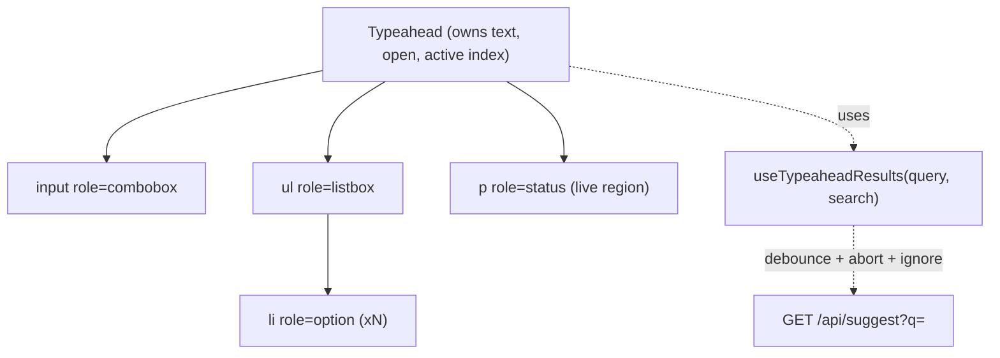

### Data model
```ts
type Suggestion = { id: string; label: string; highlight?: [start: number, end: number][] };
type TypeaheadState =
  | { status: 'idle' }                       // empty query
  | { status: 'loading' }                    // result does not yet match the current query
  | { status: 'ready'; items: Suggestion[] }
  | { status: 'error'; message: string };
// UI-only state: text, open: boolean, activeIndex: number (-1 = none)
```

### API contract
```http
GET /api/suggest?q=par&limit=10&lang=en      Accept-Language: en
200 { "query": "par", "items": [ { "id": "c_42", "label": "Paris" } ] }
400 application/problem+json   (query too long)
429 Retry-After: 1             (rate limited: back off, do not retry in a loop)
```
Echo `query` in the response so the client can verify the answer matches the question (the code in 25.2 does this by remembering the query *with* the result). Set `Cache-Control: public, max-age=60` for non-personalized suggestions so the browser and CDN absorb repeats ([24.10](24-react-with-spring-boot.md#2410-pagination-contracts) covers contracts). No pagination: a typeahead is `limit`-bounded by design.

### State placement
| State | Home | Why |
|---|---|---|
| `text` | local `useState` | Changes per keystroke; nobody else needs it |
| `open`, `activeIndex` | local | Pure UI |
| Suggestions | server cache (TanStack Query keyed `['suggest', q]`) or the hook in Exercise 1 | Derived from the query, cacheable, deduplicated |
| Committed selection | caller / URL (`?city=paris`) | Shareable, survives refresh |

With TanStack Query you get abort, dedup and caching by key; pair it with `useDebounce` ([12.5](12-hooks-and-custom-hooks.md#125-usedebounce)) on the key. The exercise builds the primitive by hand so you can explain what the library does.

### Performance
- **Debounce** 150 to 300 ms ([12.5](12-hooks-and-custom-hooks.md#125-usedebounce)). **Abort** the superseded request with `AbortController` [Browser]; **ignore** late answers anyway, because a fake or a proxy may not honor the signal.
- **Minimum length** (2 chars) and **cache by prefix**: results for "par" can serve "pa" only if the server is prefix-complete; otherwise cache per exact key.
- Bound the list (max 10) so no virtualization is needed ([15.8](15-performance.md#158-virtualization) is for hundreds).
- Measure INP: the input handler must stay cheap; the list render is a transition ([15.9](15-performance.md#159-transitions-for-responsiveness)). Target INP 200 ms or less (the "good" threshold at the 75th percentile, [web.dev Web Vitals](https://web.dev/articles/vitals)).

### Accessibility
This is the **W3C APG editable combobox with list autocomplete** (checked against the APG example page): the input has `role="combobox"`, `aria-autocomplete="list"`, `aria-controls` (the listbox id), `aria-expanded`, and `aria-activedescendant` pointing at the highlighted option while **DOM focus stays on the input**. The popup is `role="listbox"` with `role="option"` children; the highlighted one has `aria-selected="true"`.

| Key | Behavior (APG) |
|---|---|
| Down Arrow | Open if closed; else move to next option (the code wraps) |
| Up Arrow | Move to previous option (wraps to the last) |
| Enter | Accept the active option, set the text, close |
| Escape | Close the list; when already closed, clear the text |

Announce the result count with a polite live region (`role="status"`), otherwise a screen-reader user hears nothing when suggestions arrive. Do not use `aria-live` on the whole list.

### i18n
Send `Accept-Language` or `lang`; sort and match server-side with locale-aware collation. Respect **IME composition**: do not search on `compositionupdate` for CJK input (use `onCompositionEnd` or check `e.nativeEvent.isComposing`). Match case- and accent-insensitively (`Intl.Collator` with `sensitivity: 'base'` for client filtering). Mirror the listbox for RTL via logical CSS properties.

### Security
Render labels as **text**, never `dangerouslySetInnerHTML`; for highlighting, return offsets and wrap `<mark>` in JSX. Validate and length-cap `q` on the server; do not leak private entities in suggestions (authorize per user). Rate-limit the endpoint.

### Observability
Log: query length (not the text, privacy), latency, result count, zero-result rate, selection rank (position of the chosen item), abandonment (typed but selected nothing). Zero-result and low-rank-selection rates drive ranking work.

### Trade-offs
- Hand-rolled hook (no cache, exact control) vs TanStack Query (cache, retries, devtools). Pick the library in a real app.
- Keep previous results visible while loading (smoother, but Enter may pick a stale suggestion) vs clear them (honest, flickers). The exercise clears; `placeholderData: keepPreviousData` is the library equivalent for the other choice.
- Client-side filtering for small sets (zero latency) vs server search (any size).

### What a strong candidate adds
Race-safety stated as a bug class and tested (Exercise 1). The **ARIA pattern by name** and `aria-activedescendant` vs roving focus. Min length and prefix caching. A note that selection must not re-trigger a search (the exercise does re-run once, then a cache would absorb it). Recent searches in `localStorage`. Highlighting without `innerHTML`.

---

## 25.3 Infinite feed

### The problem
A social or activity feed has unbounded length. Loading everything is impossible; loading pages with offset pagination duplicates or skips items when new posts arrive; rendering thousands of cards freezes the browser.

### Mental model
A feed is **a window moving over an append-and-prepend log**. The server hands out *bookmarks* (cursors), the client keeps a list of pages, and the DOM shows only the pages near the viewport.

> **Java/Spring analogy.** Keyset pagination in Spring Data (`Window`/`ScrollPosition`) as opposed to `Pageable` offset.
>
> **Where the analogy breaks:** a REST client holds the whole page in memory while it is on screen, and must also decide when to evict old pages.

### Requirements
- **Functional:** load more on scroll; pull-to-refresh or "N new posts" banner; like/comment inline (optimistic); restore scroll on back navigation; media lazy loading.
- **Non-functional:** 60 fps scrolling with thousands of items; no duplicates or gaps while new posts arrive; first page under LCP 2.5 s; works on a mid-range phone.
- **Questions:** Chronological or ranked? Do items change height (images, expanding text)? Are new items pushed in real time or pulled? Maximum depth the user realistically scrolls?

### Component tree
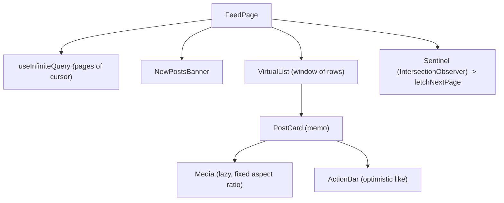

### Data model
```ts
type Post = { id: string; authorId: string; createdAt: string; body: string; media?: { url: string; width: number; height: number }; likeCount: number; likedByMe: boolean };
type FeedPage = { items: Post[]; nextCursor: string | null; prevCursor: string | null };
type FeedData = { pages: FeedPage[]; pageParams: (string | null)[] }; // TanStack infinite query shape
```
Normalize posts by `id` if the same post appears in several lists (feed, profile, detail); otherwise let the query cache own each list and invalidate.

### API contract
```http
GET /api/feed?cursor=eyJ0IjoiMjAyNi0xMC0wMVQxMDowMDowMFoiLCJpIjoiNDIifQ&limit=20
200 { "items": [...], "nextCursor": "eyJ0Ij...", "prevCursor": "eyJ0Ij..." }
GET /api/feed?after=<newest-id>     -> items newer than what I have (the "N new posts" check)
POST /api/posts/{id}/like   Idempotency-Key: <uuid>   -> 200 { likeCount, likedByMe }
```
**Cursor (keyset), not offset:** the cursor encodes `(createdAt, id)` of the last item, so an insert at the head never shifts later pages. Cursors are opaque to the client. Errors: `application/problem+json` ([24.8](24-react-with-spring-boot.md#248-problemdetail-error-mapping)); expired cursor returns 410 and the client restarts from the head.

### State placement
| State | Home |
|---|---|
| Pages of posts | Server cache: `useInfiniteQuery` ([17.7](17-data-fetching.md#177-pagination-and-infinite-queries)) |
| Optimistic like | Mutation with `onMutate` rollback ([17.6](17-data-fetching.md#176-optimistic-updates)) |
| Scroll position per feed tab | Router history state / `sessionStorage` (restoration) |
| "New posts" count | Local, fed by a poll or SSE |
| Selected filter (`?tab=following`) | **URL** |

### Performance
- **Virtualize** with `@tanstack/react-virtual` ([15.8](15-performance.md#158-virtualization)) once DOM nodes pass a few hundred, using `measureElement` for variable heights; reserve media space (`width`/`height` or `aspect-ratio`) to avoid layout shift (CLS 0.1 or less is "good").
- Trigger `fetchNextPage` with an `IntersectionObserver` [Browser] sentinel placed N rows before the end, not on `scroll` events ([12.10](12-hooks-and-custom-hooks.md#1210-useintersectionobserver)). Prefetch the next page when idle.
- Images: `loading="lazy"`, `srcset`/`sizes`, `fetchpriority="high"` only for the first image ([15.10](15-performance.md#1510-images-fonts-preloading)).
- Cap retained pages (`maxPages` option of the infinite query) so memory does not grow forever. `maxPages` limits "the number of pages stored in the query data", and works together with `getNextPageParam` and `getPreviousPageParam` so dropped pages can be fetched again in either direction ([infinite queries](https://tanstack.com/query/v5/docs/framework/react/guides/infinite-queries)).
- Memoize `PostCard` or rely on the React Compiler ([15.5](15-performance.md#155-the-react-compiler-and-how-it-changes-the-advice)); keep like-state local to the card so a like re-renders one row.

### Accessibility
Use the APG **feed pattern**: container `role="feed"`, each post `role="article"` with `aria-posinset`, `aria-setsize` (`-1` when unknown) and a label, plus `aria-busy="true"` on the feed while pages are being inserted ([APG feed pattern](https://www.w3.org/WAI/ARIA/apg/patterns/feed/)). Keep a visible **"Load more" button** as a fallback (infinite scroll alone traps keyboard users in front of the footer and is hostile to screen readers). Announce "20 more posts loaded" politely. Move no focus when new content loads.

### i18n
Relative times via `Intl.RelativeTimeFormat`, numbers via `Intl.NumberFormat` (compact "1.2K"); user text may be RTL inside an LTR UI, so set `dir="auto"` on post bodies.

### Security
Sanitize rich text (or render as text); validate media URLs and serve them from a separate cookieless origin; authorization on every cursor request (a cursor must not let you read another user's feed); rate-limit.

### Observability
Time to first post, fetch latency per page, scroll depth, dropped-frame rate (long animation frames), duplicate-item count (a client assertion that should be zero), image load failures.

### Trade-offs
Cursor pagination cannot jump to "page 37" (acceptable for a feed). Virtualization breaks browser find-in-page and some a11y tooling. Real-time insertion vs a "N new posts" banner: the banner avoids the list jumping under the user's thumb.

### What a strong candidate adds
Keyset vs offset with the *insert-while-scrolling* failure demonstrated. Scroll restoration. `maxPages` or windowing to bound memory. Idempotency keys on likes. A banner instead of auto-prepend. A separate story for ranking changes (a ranked feed reorders; use a stable "session" snapshot id in the cursor).

---

## 25.4 Data grid

### The problem
A table with 100 000 rows, sortable, filterable, with resizable columns and inline edit, will either lock the main thread (render everything) or lie to the user (render a slice that is inconsistent with sort and filter).

### Mental model
A data grid is **a viewport over a server-side query**. Sort, filter and page are the query; the grid renders only the visible rows of the result.

> **Java/Spring analogy.** A Spring Data `Specification` + `Sort` + `Pageable`, with the grid as a UI for building them.
>
> **Where the analogy breaks:** the client must also render *only the visible window* of what the server returned.

### Requirements
- **Functional:** column sort (multi), filter, resize/reorder/hide columns, sticky header and first column, row selection, inline edit, export CSV.
- **Non-functional:** 100k+ rows, 60 fps scroll, keyboard navigable like a spreadsheet, sort/filter response under 300 ms.
- **Questions:** Is the data editable? Server- or client-side data? Max columns? Do rows have variable height? Grouping/pivot (out of scope unless asked)?

### Component tree
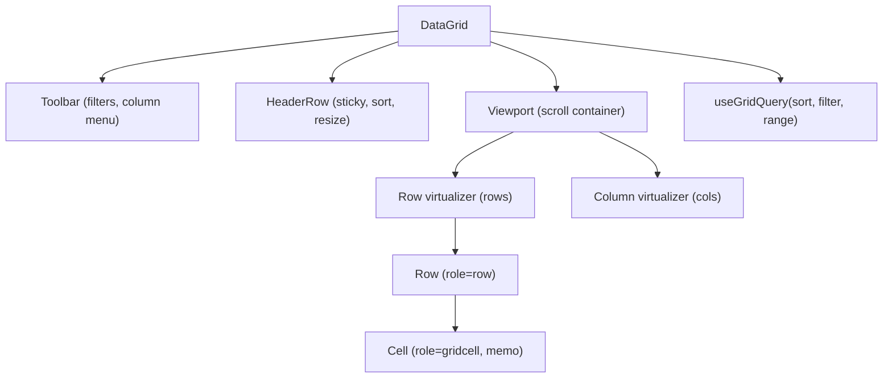

### Data model
```ts
type ColumnDef<R> = { id: string; header: string; width: number; sortable?: boolean; accessor: (r: R) => string | number; pin?: 'left' };
type Sort = { id: string; dir: 'asc' | 'desc' }[];
type Filter = Record<string, { op: 'contains' | 'eq' | 'gt' | 'lt' | 'between'; value: string | number | [number, number] }>;
type GridQuery = { sort: Sort; filter: Filter; cursor?: string; limit: number };
type GridPage<R> = { rows: R[]; nextCursor: string | null; totalCount?: number };
```

### API contract
```http
POST /api/orders/search      (body, because filters get long; or GET with a saved-view id)
{ "sort":[{"id":"createdAt","dir":"desc"}], "filter":{"status":{"op":"eq","value":"open"}}, "cursor":null, "limit":100 }
200 { "rows":[...], "nextCursor":"...", "totalCount":123456 }
PATCH /api/orders/{id}  If-Match: "v7"   { "status": "shipped" }
409 / 412 problem+json on version conflict
```
Whitelist sortable/filterable columns server-side (never pass column names to SQL). `totalCount` is expensive, so make it optional or approximate. Optimistic concurrency with `If-Match`/ETag for inline edits.

### State placement
| State | Home |
|---|---|
| Sort, filter, column visibility/order | **URL** (shareable views) and/or saved views on the server |
| Row pages | Server cache (infinite query keyed by `{sort, filter}`) |
| Selection | Local (`Set<id>`), or "all matching" as a flag + exclusions |
| Column widths, scroll offset | Local; widths persisted per user |
| Edit draft of a cell | Local until committed |

### Performance
- **Row and column virtualization** ([15.8](15-performance.md#158-virtualization)); fixed row height is by far the cheapest. Overscan a few rows to avoid blank flashes.
- Cells are `memo`'d and receive primitives; the sort/filter inputs are debounced (see 25.2) and applied in a transition ([15.9](15-performance.md#159-transitions-for-responsiveness)).
- Heavy client-side sort/filter (over about 50k rows) belongs in a **Web Worker** or on the server.
- Sticky header/column with CSS `position: sticky`, not JS scroll syncing. Resize with a CSS variable per column and `pointer` events, not React state per move.

### Accessibility
APG **grid pattern**: `role="grid"`, `role="row"`, `role="columnheader"` (with `aria-sort`), `role="gridcell"`. With virtualization, set `aria-rowcount` / `aria-colcount` on the grid and `aria-rowindex` / `aria-colindex` on rows and cells so assistive tech knows the true size. Arrow keys move cell focus (roving `tabindex`: one cell has `tabindex=0`), Home/End/Ctrl+Home/End jump, Enter/F2 enters edit mode, Escape leaves it. If the grid is only a read-only table, prefer a real `<table>` and skip the grid role.

### i18n
Locale-aware number/date/currency cells (`Intl`), locale-aware sort (`Intl.Collator` or server collation), RTL mirrors pinned columns (use logical `inset-inline-start`), translated headers and filter operators.

### Security
Server enforces row-level authorization and a column whitelist; never trust the client's sort key; escape CSV export against formula injection (cells starting with `=`, `+`, `-`, `@`); cap `limit`; authorize bulk actions by the server-side filter, not a client-supplied id list of 100k ids.

### Observability
Time to first rows, query latency per filter shape, scroll jank, slow-query reports from the API, client errors per column.

### Trade-offs
Server-side everything (scales, needs an API per capability) vs client-side everything (instant, bounded by memory). A library (AG Grid, TanStack Table) vs custom: the grid's keyboard model alone is weeks of work, so buy it unless the grid is the product. `totalCount` accuracy vs cost.

### What a strong candidate adds
`aria-rowindex` under virtualization. "Select all" semantics for rows not loaded. Optimistic concurrency on edits. CSV formula-injection. Web Worker for client sort. Saved views in the URL. Stating that TanStack Table is headless and pairs with TanStack Virtual.

---

## 25.5 Real-time chat

### The problem
Messages arrive over a socket in any order, sometimes twice, sometimes not at all. The sender expects instant feedback, and a reconnect must not lose or duplicate messages.

### Mental model
Chat is **an append-only log owned by the server**, replayed on the client. The client may show *optimistic* entries that are not yet in the log, and must **merge** the three ways a message can arrive (ack, broadcast, catch-up) into one list without duplicates.

> **Java/Spring analogy.** A Kafka consumer: at-least-once delivery, a per-partition offset (our `seq`), and idempotent processing keyed by id.
>
> **Where the analogy breaks:** a Kafka consumer never shows a message before the broker confirms it; a chat UI does (optimistic send), so it needs a client-generated id to match the echo.

### Requirements
- **Functional:** send/receive in rooms; message history with scroll-up paging; delivery status (sending, sent, failed + retry); unread counts; typing indicator and presence (stretch); attachments (see 25.9).
- **Non-functional:** under 200 ms from send to local display (optimistic), under 1 s to remote delivery; survives reconnects without duplicates or gaps; thousands of messages per room; mobile data friendly.
- **Questions:** Rooms or 1:1? Ordering guarantee needed (per room)? Message edit/delete? End-to-end encryption (changes everything about search and history)? Read receipts?

### Component tree and message flow
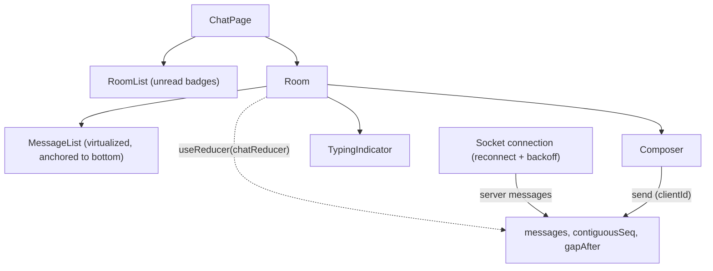

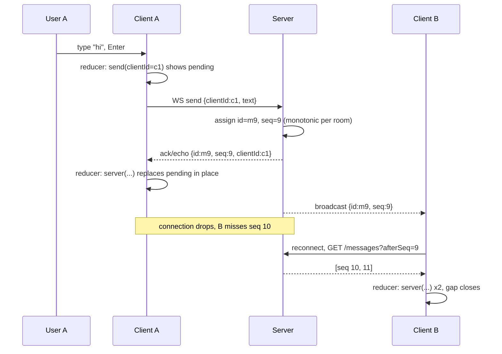

### Data model
The types in [`chatReducer.ts`](examples/web/src/m25-system-design/chatReducer.ts) (Exercise 2):
```ts
type ChatMessage = { clientId: string; id: string | null; seq: number | null; author: string; text: string; status: 'pending' | 'sent' | 'failed' };
type ChatState = { messages: readonly ChatMessage[]; contiguousSeq: number; gapAfter: number | null };
```
Two ids on purpose: **`clientId`** (made by the sender, used to match the echo) and **`id`/`seq`** (made by the server; `seq` orders). Never order by client timestamps: clocks lie.

### API contract
```http
WS  /ws/rooms/{roomId}                  client -> { "type":"send", "clientId":"c1", "text":"hi" }
                                        server -> { "type":"message", "id":"m9", "seq":9, "clientId":"c1", "author":"ann", "text":"hi" }
GET /api/rooms/{roomId}/messages?afterSeq=9&limit=50    catch-up after a reconnect
GET /api/rooms/{roomId}/messages?beforeSeq=40&limit=50  history, scrolling up
POST /api/rooms/{roomId}/messages  { clientId, text }   HTTP fallback; the server dedups on (roomId, clientId)
```
**Idempotency:** the server must treat a repeated `clientId` as the same message, because retries after a timeout are the normal case. Errors on the socket carry a `code` the client maps to "failed" or "retry later". WebSocket vs SSE vs polling is covered in [17.11](17-data-fetching.md#1711-real-time-websockets-and-sse-plus-cache-integration) and [24.12](24-react-with-spring-boot.md#2412-real-time-websocketstomp-sse): chat needs a bidirectional, low-latency channel, so a WebSocket; SSE + POST also works and is simpler to scale behind HTTP infrastructure.

### State placement
| State | Home |
|---|---|
| Message list for the open room | **Reducer**, because every update is a *merge*, not a replace (a query cache `setQueryData` would work too, with the same merge function) |
| History pages | Fetched on demand, merged by the same `server` action |
| Socket connection | One module-level or provider object, subscribed with `useSyncExternalStore` ([12.12](12-hooks-and-custom-hooks.md#1212-usesyncexternalstore)) |
| Unread counts, room list | Server cache + a global store for the badge |
| Composer draft per room | Local, persisted so a refresh keeps it |
| Active room | **URL** (`/rooms/:id`) |

### Performance
Virtualize long histories, anchoring to the bottom and preserving scroll offset when older messages are prepended ([15.8](15-performance.md#158-virtualization)). Batch incoming socket messages per animation frame so a burst renders once. Collapse typing events (throttle 2-3 s). Keep a bounded window per room in memory. Reconnect with **exponential backoff and jitter** so a server restart does not become a thundering herd.

### Accessibility
The list is a log: `role="log"` has an implicit polite `aria-live` ([MDN log role](https://developer.mozilla.org/en-US/docs/Web/Accessibility/ARIA/Reference/Roles/log_role)); announce *new* messages, never re-announce history on load. Do not steal focus from the composer. Provide a "jump to latest" button when scrolled up. Status ("sending", "failed, retry") must be text or `aria-label`, not only an icon colour. Respect `prefers-reduced-motion` for auto-scroll animation.

### i18n
Timestamps in the viewer's time zone and locale; `dir="auto"` per message; emoji and IME composition (Enter during composition must not send: check `isComposing`); translated system messages ("Ann joined") built with ICU plural/select formats.

### Security
Render messages as text (stored XSS is the classic chat bug); authorize room membership on the socket handshake **and** on each message; authenticate the WebSocket with a short-lived ticket or cookie (browsers cannot set an `Authorization` header: the `WebSocket` constructor takes only a URL and sub-protocols, [MDN](https://developer.mozilla.org/en-US/docs/Web/API/WebSocket/WebSocket)); validate `Origin`; rate-limit senders; sanitize link previews server-side (SSRF).

### Observability
Send-to-ack latency, ack-to-render latency, reconnect rate, gap-fill count (how often the catch-up path fires), duplicate-drop count, failed-send rate, socket close codes.

### Trade-offs
WebSocket (full duplex, stateful servers, sticky sessions or a broker) vs SSE + POST (simple, HTTP-friendly, one-directional). Server `seq` per room (total order, a hot spot) vs per-user vectors (complex). Optimistic send (feels instant, needs failure UI) vs wait for ack.

### What a strong candidate adds
The **two-id scheme** and an idempotent merge (Exercise 2). **Gap detection** by sequence numbers with `afterSeq` catch-up. Backoff with jitter. `Origin` check and the WebSocket auth limitation. Presence as ephemeral, not persisted. A note that read receipts and typing indicators must not be in the durable log.

---

## 25.6 Dashboard

### The problem
A dashboard shows many independent widgets (charts, KPIs, tables). One slow query blocks the page, one failing widget blanks everything, and 12 widgets polling every second hammer the API.

### Mental model
A dashboard is **a grid of independent mini-applications** that share a filter bar. Each widget owns its query, its loading state and its failure; the shell owns layout and the shared filters.

> **Java/Spring analogy.** A BFF aggregating several downstream calls: you do not want one slow downstream to fail the whole response (timeouts and circuit breakers per call).
>
> **Where the analogy breaks:** the "aggregation" happens in the browser over parallel requests, and the user sees partial results progressively.

### Requirements
- **Functional:** widgets (KPI, line/bar chart, table); global date range and filters; refresh; user-configurable layout (drag/resize) as a stretch; drill-down; export.
- **Non-functional:** first useful widget in under 2 s; each widget fails independently; data no more than 60 s stale; works on a wall display for 12 hours without leaking memory.
- **Questions:** Real-time or periodic refresh? How many widgets? Can users customize the layout? Large time series (decimate)? Who may see which widget?

### Component tree
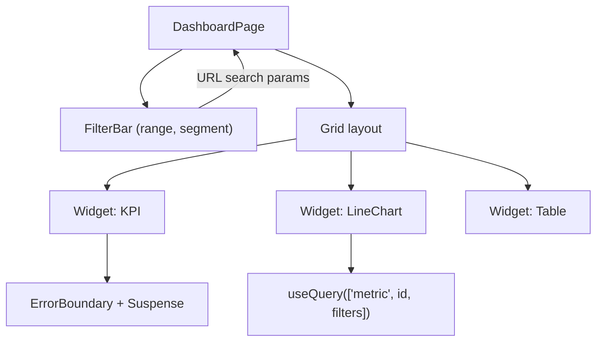

### Data model
```ts
type Filters = { from: string; to: string; segment?: string }; // ISO dates
type WidgetConfig = { id: string; type: 'kpi' | 'line' | 'table'; metric: string; layout: { x: number; y: number; w: number; h: number } };
type TimeSeries = { metric: string; granularity: 'hour' | 'day'; points: { t: string; v: number }[]; asOf: string };
type Kpi = { metric: string; value: number; previous: number; unit: string; asOf: string };
```

### API contract
```http
GET /api/dashboards/{id}                        -> { widgets: WidgetConfig[] }
GET /api/metrics/{metric}?from=..&to=..&granularity=day&segment=eu
200 { "metric":"revenue","granularity":"day","points":[...],"asOf":"2026-10-04T10:00:00Z" }
```
One endpoint per widget (parallel, independent failure) beats one mega-endpoint for resilience; a batch endpoint (`POST /api/metrics:batch`) is the fix when the *number of requests* is the bottleneck (HTTP/2 helps first). Always return `asOf` so the UI can show data age. Cache headers per metric volatility. Server-side downsampling: never ship 1M points to draw 800 pixels.

### State placement
| State | Home |
|---|---|
| Date range, segment | **URL** search params (shareable, back/forward) |
| Each widget's data | Server cache, keyed by `[metric, filters]` with `staleTime` matching freshness |
| Layout customization | Server (per-user config); drag state local |
| Which widget is expanded | Local or URL |

### Performance
- Independent queries in parallel; **Suspense + error boundary per widget** so a slow or failing one shows its own skeleton or retry ([16](16-error-handling.md), [17.10](17-data-fetching.md#1710-suspense-based-fetching-and-use)).
- **Polling** with `refetchInterval` and pause when the tab is hidden; or SSE for true real time ([17.11](17-data-fetching.md#1711-real-time-websockets-and-sse-plus-cache-integration)). Stagger intervals so widgets do not fire in one burst.
- Charts: canvas for many points, SVG for few; decimate (LTTB or server aggregation); **lazy-load the chart library** with `lazy` ([15.7](15-performance.md#157-code-splitting-with-lazy-and-suspense)); render only widgets near the viewport.
- Reserve widget size to avoid CLS; prefetch on filter-bar hover.
- Memory leaks on a 12 h wall display: abort and unsubscribe on unmount, cap retained data, and cap cache `gcTime`.

### Accessibility
Charts are not accessible by default: give each a text summary (`aria-label` or a visually hidden description) and a **data-table alternative**; never rely on colour alone (patterns, labels, a colour-blind-safe palette); every widget is a landmark-like region with a heading. Do not auto-announce every refresh; announce only user-triggered changes. Provide a pause control for auto-refresh (WCAG 2.2.2 pause, stop, hide).

### i18n
`Intl.NumberFormat` (compact, currency, percent) and `Intl.DateTimeFormat` with the user's time zone, **and say which time zone the data is aggregated in** (a classic dashboard bug); translated axis labels; RTL chart axes.

### Security
Authorization per metric (a user must not query a metric they cannot see just by changing the path); do not put tokens in URLs that include filters; export endpoints authorized and audited; if embedding third-party BI, sandbox the iframe.

### Observability
Per-widget load time and error rate, query p95 per metric, staleness shown vs real, client memory over time on the wall display, which widgets users actually open.

### Trade-offs
Per-widget endpoints (resilient, N requests) vs batch (one round trip, coupled failure). Polling (simple) vs push (fresh, stateful). Canvas (fast, harder a11y) vs SVG (accessible, slow at scale). Build vs embed a BI tool.

### What a strong candidate adds
Independent failure domains per widget. `asOf` and time-zone honesty. Server-side downsampling. Pause-when-hidden polling. Data-table fallback for charts. URL as the source of truth for filters. A long-running-session memory story.

---

## 25.7 Image carousel

### The problem
A carousel looks trivial and hides the most accessibility mistakes on the web: auto-rotation that cannot be stopped, focus traps, off-screen slides announced to screen readers, and images that all load at once.

### Mental model
A carousel is **a scroll container with snap points plus a current-index state**. Do not reimplement scrolling in JS: let the browser scroll and snap (CSS `scroll-snap-type`), and only *observe* which slide is in view.

> **Java/Spring analogy.** Pagination again: "current page" is derived, the content is lazily loaded per page.
>
> **Where the analogy breaks:** the user can move between pages by touch, wheel, keyboard and buttons, so the *source of truth for position is the scroll offset*, not your state.

### Requirements
- **Functional:** prev/next, dots, swipe/drag, optional autoplay with a pause/play button, deep link to a slide (stretch), thumbnails, loop (stretch).
- **Non-functional:** no layout shift; first slide is the LCP element and must load fast; smooth on touch; works without JS for the first slide; respects `prefers-reduced-motion`.
- **Questions:** Autoplay (it is an a11y liability; justify)? How many slides? Same aspect ratio? Marketing hero or product gallery (affects lazy loading)?

### Component tree
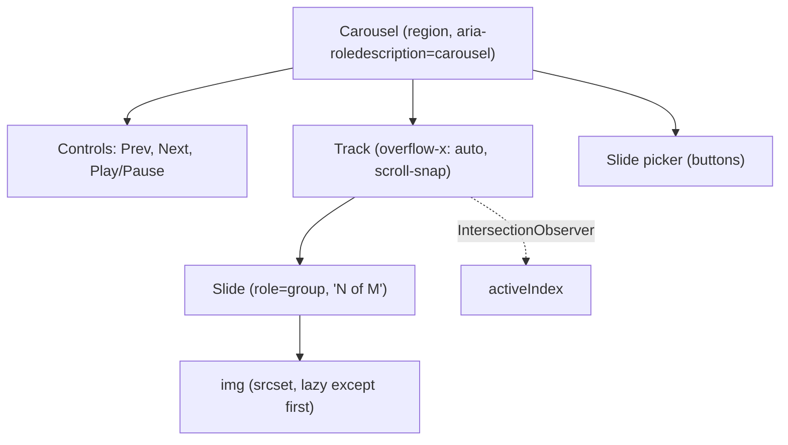

### Data model
```ts
type Slide = { id: string; src: string; srcSet: string; width: number; height: number; alt: string; caption?: string };
type CarouselState = { activeIndex: number; playing: boolean }; // playing defaults to false if prefers-reduced-motion
```

### API contract
Usually static content from a CMS: `GET /api/galleries/{id}` returns `{ slides: Slide[] }`, with `width`/`height` (to reserve space) and **meaningful `alt` per slide** authored in the CMS. Cache aggressively (`Cache-Control: public, max-age=300, stale-while-revalidate`). Image URLs come from an image CDN that accepts width/format parameters. If slides are many, paginate the *metadata* and lazy-load the pixels.

### State placement
| State | Home |
|---|---|
| Slides | Server cache or props |
| `activeIndex` | Derived from scroll position (observer) into local state; buttons call `scrollTo` rather than set state directly |
| `playing` | Local; initial value from `matchMedia('(prefers-reduced-motion: reduce)')` ([12.9](12-hooks-and-custom-hooks.md#129-usemediaquery)) |
| Deep-linked slide | URL hash or query (optional) |

### Performance
- **First slide eager with `fetchpriority="high"`; others `loading="lazy"`**; never lazy-load the LCP image ([15.10](15-performance.md#1510-images-fonts-preloading), [15.12](15-performance.md#1512-web-vitals-in-react)). Preload the *next* slide on idle.
- `srcset`/`sizes` and modern formats; fixed `aspect-ratio` so there is zero CLS.
- Scroll-snap and `overflow` are compositor-friendly; avoid per-frame JS. Use `IntersectionObserver` with a 0.6 threshold to find the active slide ([12.10](12-hooks-and-custom-hooks.md#1210-useintersectionobserver)).
- Autoplay timers pause when the tab is hidden.

### Accessibility
Follow the **W3C APG carousel pattern** (checked against the pattern page): container `role="region"` (or `group`) with `aria-roledescription="carousel"` and an accessible name; each slide `role="group"` with `aria-roledescription="slide"` and a name such as "3 of 8"; prev/next buttons are required; set the slide container `aria-live="off"` while auto-rotating and `"polite"` otherwise. Auto-rotation **must stop** when keyboard focus enters the carousel and when the pointer hovers, must not restart unless the user asks, and needs a dedicated play/pause button. Inactive slides should not be reachable by Tab (`inert` or `aria-hidden` plus no focusable children). Honor `prefers-reduced-motion`.

### i18n
Translated control labels ("Next slide", "Slide 3 of 8" with ICU message formats), swapped prev/next direction and swipe direction in RTL (`dir="rtl"` flips scroll), captions localized from the CMS.

### Security
Image URLs from trusted/allow-listed origins; user-uploaded images re-encoded server-side (strip EXIF GPS, reject SVG with scripts); `referrerpolicy` as needed; no `dangerouslySetInnerHTML` in captions.

### Observability
LCP element and time for pages with a carousel, slide interaction rate (if nobody advances past slide 1 the carousel is hurting), image load errors, autoplay pause rate.

### Trade-offs
Native scroll-snap (robust, accessible, less custom animation) vs JS-driven transform (full control, more bugs, worse touch). Autoplay (engagement metric) vs accessibility and performance cost; many teams drop it. Library (Embla, Swiper) vs custom: a library for loops and drag physics, custom for a simple snap gallery.

### What a strong candidate adds
"Do we need autoplay?" as a question. LCP image not lazy. `prefers-reduced-motion`. `inert` on off-screen slides. The APG rotation rules. Observing scroll instead of owning it.

---

## 25.8 Multi-step wizard

### The problem
A checkout or onboarding flow loses data on refresh, lets users jump to step 4 by URL without finishing step 2, validates too early or too late, and traps focus or screen-reader context when the step changes.

### Mental model
A wizard is **a finite state machine over a draft**. Steps are states, "Next" is a guarded transition (validate), and the draft is a document that is saved as you go.

> **Java/Spring analogy.** A Spring Statemachine (or a saga), plus a draft entity persisted between steps.
>
> **Where the analogy breaks:** the user can press Back, reload, open a second tab or leave and return a week later, so the machine must be resumable from persisted state, not memory.

### Requirements
- **Functional:** ordered steps with per-step validation; back/forward; progress indicator; save draft and resume; conditional steps (skip step 3 if country is X); review step; final submit; edit from review.
- **Non-functional:** no data loss on refresh or crash; submission is idempotent (double-click safe); step change under 100 ms; accessible step announcements.
- **Questions:** Is the draft sensitive (do not store a card number in `localStorage`)? Must the user resume on another device (server draft)? Are steps dependent (later options depend on earlier answers)? Is there an upper time limit?

### Component tree
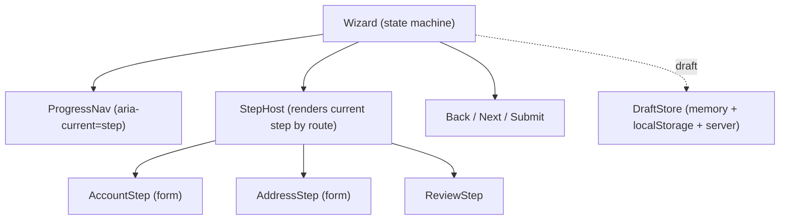
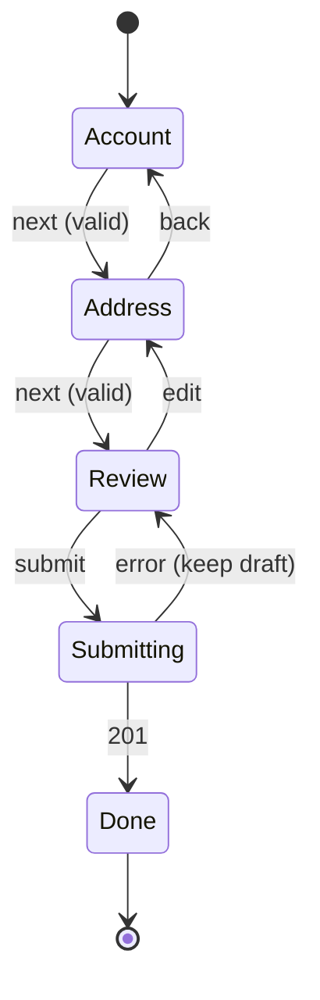

### Data model
```ts
type StepId = 'account' | 'address' | 'review';
type Draft = { account?: { email: string; name: string }; address?: { line1: string; country: string; postcode: string } };
type WizardState = { step: StepId; draft: Draft; visited: StepId[]; status: 'editing' | 'submitting' | 'done' | 'error'; submissionKey: string };
```
Validate each step with a **zod** schema (the same schema validates the whole draft at submit, and the server re-validates).

### API contract
```http
PUT  /api/drafts/{id}      { "step":"address", "data": {...} }   -> 200 { "version": 4 }   (autosave, partial)
GET  /api/drafts/{id}      -> { "step":"address", "data": {...}, "version": 4 }
POST /api/orders           Idempotency-Key: <submissionKey>      -> 201 { "id":"o_9" }  | 422 problem+json with per-field errors
```
Return **field-level errors** in the problem body ([24.8](24-react-with-spring-boot.md#248-problemdetail-error-mapping)) so the client can route the user back to the step that owns the failing field. The `Idempotency-Key` header makes retried submits safe. Don't call it a standard: the IETF `Idempotency-Key` header draft never became an RFC; its last revision (-07, 2025-10-15) has expired ([datatracker](https://datatracker.ietf.org/doc/draft-ietf-httpapi-idempotency-key-header/)). The header name is a widely used convention.

### State placement
| State | Home |
|---|---|
| Current step | **URL** (`/checkout/address`): back/forward and deep links work, refresh stays on the step |
| Draft | Memory (a store/reducer in the wizard) + persisted (server for logged-in, `sessionStorage` for anonymous non-sensitive data) |
| Per-field input | Form library local state ([14](14-forms-and-actions.md)); committed to the draft on valid Next |
| `submissionKey` | Generated once per wizard, stored with the draft |
| Server-validated lookups (countries) | Server cache |

### Performance
Code-split heavy steps (`lazy`, [15.7](15-performance.md#157-code-splitting-with-lazy-and-suspense)); prefetch the next step's chunk and data on idle; autosave debounced (see 25.2) and coalesced; do not re-render all steps on each keystroke (keep the form state local to the active step).

### Accessibility
Move focus to the new step's heading on navigation (and update `document.title`); announce "Step 2 of 4: Address"; progress nav uses `aria-current="step"`; show errors in an **error summary** with links to fields and `aria-invalid` + `aria-describedby` per field; do not disable "Next" silently (explain what is missing); keep Back reachable by keyboard.

### i18n
Address and phone formats vary by country (do not hard-code a US address form), name fields without assuming first/last, localized validation messages, date pickers by locale, right-to-left progress indicator.

### Security
Never put secrets/PII in the URL; do not store card data in web storage (use the PSP's hosted fields); server re-validates every step and the final draft (the client's step order is not a guard); CSRF protection for cookie auth ([24.5](24-react-with-spring-boot.md#245-csrf-with-cookie-auth)); expire drafts; guard the "skip" logic server-side.

### Observability
Funnel analytics per step (entered, completed, abandoned), validation-error rates per field, time per step, submit failures by reason, draft-resume success rate.

### Trade-offs
One route per step (deep links, back button, more wiring) vs one route with internal state (simple, breaks Back). Per-step validation (fast feedback) vs whole-form at end (fewer interruptions). Server draft (cross-device, API cost) vs local (private, single device). An explicit state machine (XState, [18.10](18-state-management.md#1810-xstate)) vs a reducer: use the machine when conditional steps multiply.

### What a strong candidate adds
URL = step. Idempotent submit. Server-side re-validation and field-error routing. Focus management on step change. Resume from draft. A statement about not persisting sensitive fields. Funnel metrics.

---

## 25.9 File uploader

### The problem
Uploading large files over flaky networks needs progress, cancel, retry, concurrency limits and resumption, and it must not push gigabytes through your API server or lose the user's work on a tab close.

### Mental model
An uploader is **a queue of jobs with a small state machine per job**, and a scheduler that keeps at most N running. The file bytes go **directly to object storage** with a short-lived signed URL, not through your API.

> **Java/Spring analogy.** A `ThreadPoolExecutor` with a bounded queue and per-task `Future` that can be cancelled, plus a retry policy (Spring Retry).
>
> **Where the analogy breaks:** the "worker" is the network, and cancelling means aborting an in-flight request while its late response may still arrive.

### Requirements
- **Functional:** select or drag and drop many files; per-file progress; cancel; retry; auto-retry transient failures; type and size validation; previews; resume large files (stretch).
- **Non-functional:** 3 concurrent uploads; files up to several GB; survives network drops; no UI jank during progress; accessible status.
- **Questions:** Max file size and types? Resumable needed (mobile, large video)? Do we scan for malware? Upload before or after the form is submitted?

### Component tree and flow
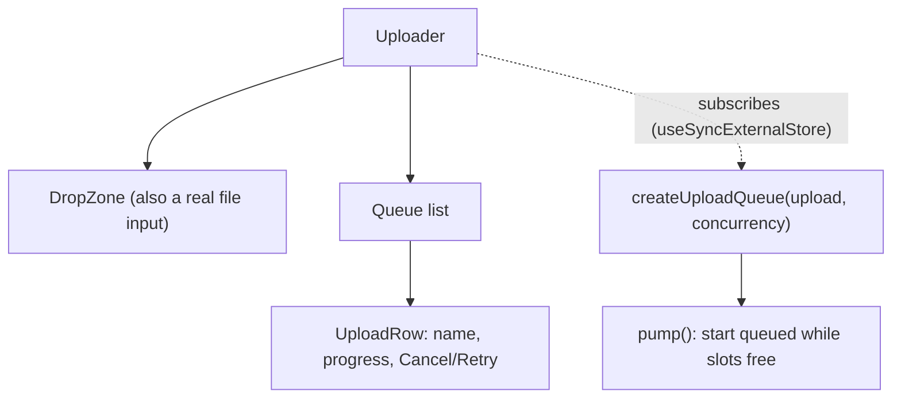
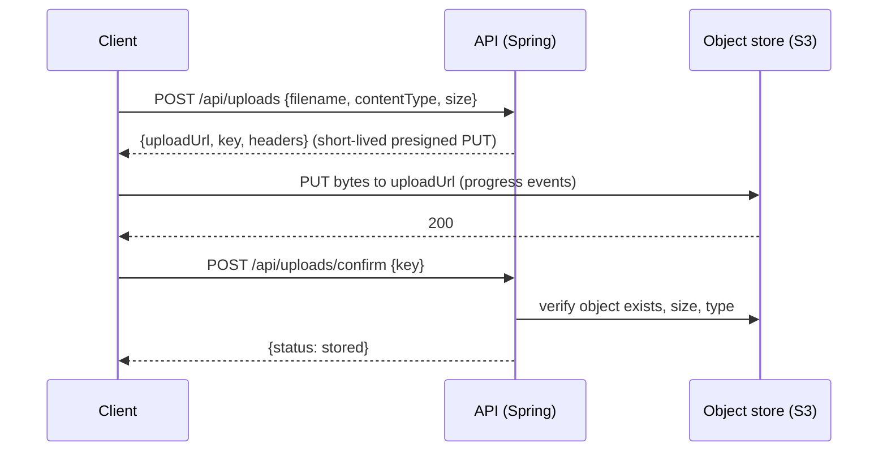
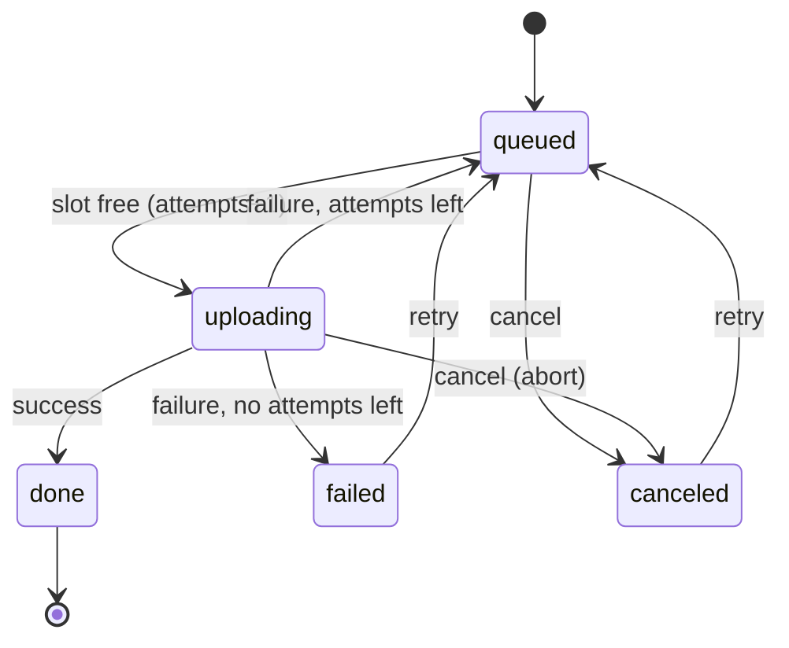

### Data model
The reducer types in [`uploadQueue.ts`](examples/web/src/m25-system-design/uploadQueue.ts) (Exercise 3):
```ts
type UploadStatus = 'queued' | 'uploading' | 'done' | 'failed' | 'canceled';
type UploadItem = { id: string; name: string; size: number; status: UploadStatus; progress: number; attempts: number; error: string | null };
```
Keep the `File` objects outside the reducer (a `Map<id, File>`): they are not serializable and do not belong in state.

### API contract
The presigned flow is [24.11](24-react-with-spring-boot.md#2411-file-uploads-with-s3-presigned-urls), implemented in `examples/web/src/m24-spring-client/upload.ts`. For **large files** use **multipart / chunked upload**: the client asks for a multi-part session, uploads parts (each with its own signed URL, retried independently), then completes the session with the part ETags; a failed part is retried without restarting the file, and the list of finished parts makes the upload resumable. S3 multipart limits: parts of 5 MiB to 5 GiB (no minimum for the last part), at most 10,000 parts per upload ([S3 multipart limits](https://docs.aws.amazon.com/AmazonS3/latest/userguide/qfacts.html)). The tus protocol is an open resumable-upload standard if you are not on S3.

Errors: 403 expired URL (request a new one and retry), 413 too large, 415 type rejected, 5xx/network (retry with backoff).

### State placement
| State | Home |
|---|---|
| Queue items, status, progress | A **reducer behind an external store** (the controller in the exercise), subscribed with `useSyncExternalStore` ([12.12](12-hooks-and-custom-hooks.md#1212-usesyncexternalstore)) so progress ticks do not flow through context |
| `File`/`Blob` handles | Module scope / `Map`, not state |
| Resume info (upload id, finished parts) | `IndexedDB` (survives reload) |
| Server record after confirm | Server cache; invalidate the file list |

### Performance
Throttle progress updates (the `progress` event fires very often; update at most every ~100 ms or on integer percent change); render each row with `memo` so one file's progress re-renders one row. Hash large files in a Web Worker if you dedupe by content; read slices (`Blob.slice`) rather than the whole file into memory; cap concurrency (3 is a common starting point, tune by measuring). Generate previews with `URL.createObjectURL` and **revoke** them.

### Accessibility
The drop zone must be backed by a real, labelled `<input type="file">` (drag and drop is not keyboard accessible). Per-file status in text; a polite live region for "3 of 5 uploaded"; progress as `<progress>` or `role="progressbar"` with `aria-valuenow`; errors tied to the file name; Cancel/Retry buttons labelled with the file name ("Cancel upload of cat.png").

### i18n
Localized size units (`Intl.NumberFormat` with `style: 'unit'`), file names with non-Latin characters and normalization, translated error messages mapped from error codes, RTL layout for the queue.

### Security
Validate **on the server** (type by content sniffing, not the extension or client `Content-Type`; size; virus scan; image re-encode); presigned URLs are **short-lived, single-key, size/type-constrained**; never trust the filename (generate the key server-side, strip path segments); serve user files from a separate origin with `Content-Disposition: attachment` as appropriate; confirm step verifies the object before the DB row says "stored"; authorize who may request upload URLs.

### Observability
Success/failure rate per attempt, retries per upload, bytes/second by network type, time to confirm, abandoned uploads (orphaned objects, cleaned by a lifecycle rule), error codes by step (request-URL vs PUT vs confirm).

### Trade-offs
Direct-to-storage (scales, two-step flow, needs CORS config on the bucket) vs proxy through the API (simple, expensive and slow). Chunked/resumable (robust, complex) vs single PUT (fine under about 100 MB on good networks). Auto-retry (smooth) vs surfacing failures (honest); retry only idempotent, transient errors.

### What a strong candidate adds
The **state machine with illegal transitions ignored** (a late success after cancel must not resurrect the item, Exercise 3). Presigned direct upload plus a verifying confirm step. Resumable multipart with persisted parts. Server-side content validation. Throttled progress, revoked object URLs, queue outside React state.

---

## 25.10 Notifications system

### The problem
Users must learn about events (a comment, a failed job, a deploy) in the right place and at the right time without being spammed, without missing anything across devices, and without a screen reader being shouted at.

### Mental model
Notifications are **two products sharing a pipeline**: **transient toasts** (feedback about what I just did, auto-dismiss) and a **persistent inbox** (things that happened while I was away, with read state). The inbox is a *server-owned list with a per-user read pointer*.

> **Java/Spring analogy.** An outbox + subscription: events are persisted per recipient, then delivered over several channels (SSE/WebSocket, push, email) with deduplication.
>
> **Where the analogy breaks:** a client must reconcile three arrivals of the same notification (live push, a refetch, and another tab) and keep an unread badge correct across all of them.

### Requirements
- **Functional:** toast for action feedback; in-app bell with unread badge and list; mark read/all read; deep link to the source; preferences per channel/type; optional browser push.
- **Non-functional:** badge accurate within seconds across tabs and devices; delivery latency under a few seconds; no duplicates; rate-limited or grouped so bursts do not flood; accessible announcements.
- **Questions:** Which channels (in-app, push, email)? Real-time required? Grouping ("5 people liked")? Retention period? Do-not-disturb schedules?

### Component tree and data flow
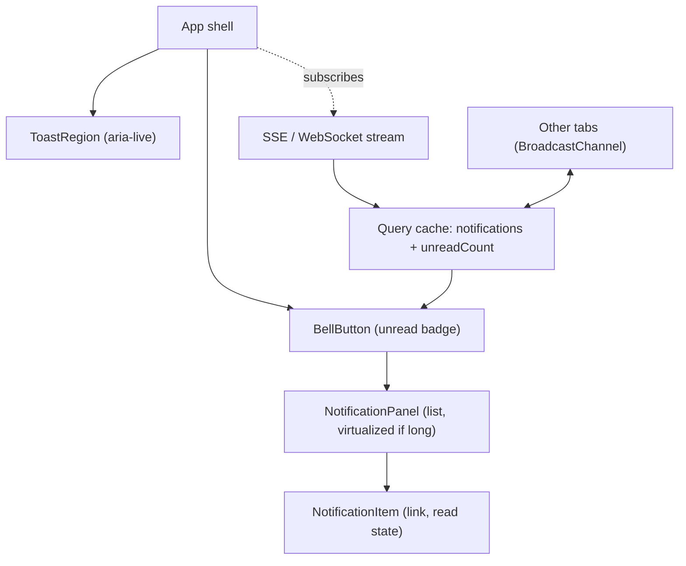
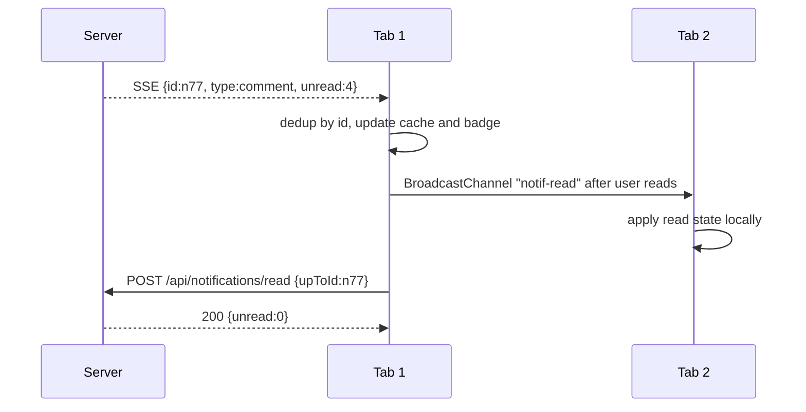

### Data model
```ts
type Notification = { id: string; type: 'comment' | 'mention' | 'job_failed'; actor?: { id: string; name: string }; target: { href: string; label: string }; createdAt: string; readAt: string | null; groupKey?: string };
type NotificationPage = { items: Notification[]; nextCursor: string | null; unreadCount: number };
type Toast = { id: string; kind: 'info' | 'success' | 'error'; message: string; durationMs: number | null }; // client only
```
Toasts are **client-only, in-memory** UI state; notifications are server data.

### API contract
```http
GET  /api/notifications?cursor=..&limit=20     -> NotificationPage
GET  /api/notifications/stream                 (SSE, supports Last-Event-ID for resume)
POST /api/notifications/read   { "upToId": "n77" }   (a read *pointer*, cheaper than per-item flags)
PUT  /api/notification-preferences  { "comment": { "inApp": true, "push": false } }
POST /api/push/subscriptions  { endpoint, keys }     (Web Push registration)
```
On reconnect, `EventSource` sends the last event id in the `Last-Event-ID` header (WHATWG HTML spec, server-sent events), so the server can replay missed events. > **Unverified:** that your Spring SSE emitter and any proxy preserve `id:` fields and the header end to end; test it. Use SSE for one-way delivery (see [24.12](24-react-with-spring-boot.md#2412-real-time-websocketstomp-sse)).

### State placement
| State | Home |
|---|---|
| Notification list and `unreadCount` | Server cache; live events call `setQueryData` or `invalidateQueries` ([17.11](17-data-fetching.md#1711-real-time-websockets-and-sse-plus-cache-integration)) |
| Toast queue | Small global store or context (UI state, [18.11](18-state-management.md#1811-a-decision-framework)) |
| Panel open/closed | Local |
| Cross-tab read sync | `BroadcastChannel` [Browser] (or the `storage` event) |
| Preferences | Server cache + form state |

### Performance
One stream per user (not per component); dedupe by `id`; coalesce bursts (group by `groupKey`, debounce badge updates); virtualize the panel when long; pause or slow polling in hidden tabs; lazy-load the panel code. Fall back to **polling** with `ETag`/`If-None-Match` where SSE is blocked.

### Accessibility
Toasts live in a persistent region: `role="status"` (polite) for info/success, `role="alert"` for errors; the region exists in the DOM *before* content is inserted or announcements are missed. Toasts must be dismissible, **must not vanish while focused or hovered**, and persist long enough to read (give actions like "Undo" a generous or no timeout; [WCAG 2.2.1 Timing Adjustable](https://www.w3.org/WAI/WCAG22/Understanding/timing-adjustable.html) requires that a time limit can be turned off, adjusted, or extended). The bell is a button with an accessible name including the unread count ("Notifications, 3 unread"); the panel is a disclosure or dialog with focus management; never move focus to a toast.

### i18n
Server sends **structured data**, not formatted sentences: `{type, actor, count}` rendered client-side with ICU plural messages ("Ann and 3 others commented"), so every locale gets the right plural rules; relative timestamps with `Intl.RelativeTimeFormat`; honor the user's language for push payloads (the server must localize those).

### Security
Notification content is user-generated: render as text. Authorize per recipient; deep-link targets validated (no open redirects); push endpoints are secrets, store and rotate server-side; ask for the browser push permission only after a user action in context (a cold prompt is denied and hard to undo); do not put sensitive content in push payloads shown on a lock screen.

### Observability
Delivery latency (event time to render), delivery success per channel, dedupe-drop count, open/click-through rate per type, mute/unsubscribe rate (the real quality signal), stream reconnect rate.

### Trade-offs
Real-time (SSE/WebSocket) vs polling (simple, a few seconds late). Read pointer (cheap, cannot mark one item unread) vs per-item flags. Grouping (less noise, more server logic). Web Push (reaches closed tabs, permission friction, per-browser quirks).

### What a strong candidate adds
Toast vs inbox as different data. Live region mechanics (`status` vs `alert`, region present first). Read pointer and cross-tab sync. `Last-Event-ID` resume. Structured payloads with ICU plurals. Permission timing for push. Unsubscribe rate as the quality metric.

---

## 25.11 Collaborative editor

### The problem
Two people edit the same document at the same time, one of them on a train with no signal. Everyone's edits must survive, everyone must converge to the same text, and the cursor of each person should be visible. This section is deliberately **high level**: a design discussion, not an implementation.

### Mental model
Concurrent edits conflict, so you need a rule that makes all replicas end identical. Two families exist:
- **Operational Transformation (OT):** a central server orders operations and *transforms* each incoming operation against the ones that happened concurrently, so applying them in any arrival order converges. Requires a coordinating server; the transform functions are notoriously hard to get right.
- **CRDT (conflict-free replicated data type):** the data structure itself is designed so that concurrent changes **merge deterministically in any order**, with no central arbiter. Peers can sync directly and work offline.

> **Java/Spring analogy.** OT is optimistic locking with a server that rebases your change (like a git rebase on the server). A CRDT is closer to a merge-friendly data structure (a `ConcurrentHashMap` merge, a G-Counter) whose merge function is associative, commutative and idempotent.
>
> **Where the analogy breaks:** text has *intent* ("insert between these two characters"); naive merging of strings loses it, which is why text CRDTs track each character's identity.

### Requirements
- **Functional:** real-time co-editing of rich text; presence (who is here, cursors, selections); comments; undo/redo per user; version history; offline editing.
- **Non-functional:** convergence (all replicas identical); remote edits visible in under a second; offline edits merge on reconnect without loss; documents up to hundreds of pages; permissions per document.
- **Questions:** Is a central server acceptable (always yes for auth, persistence and permissions)? Rich text or plain? Offline expectation? How many concurrent editors (tens, not thousands)? Do we need history/audit?

### Component tree and data flow
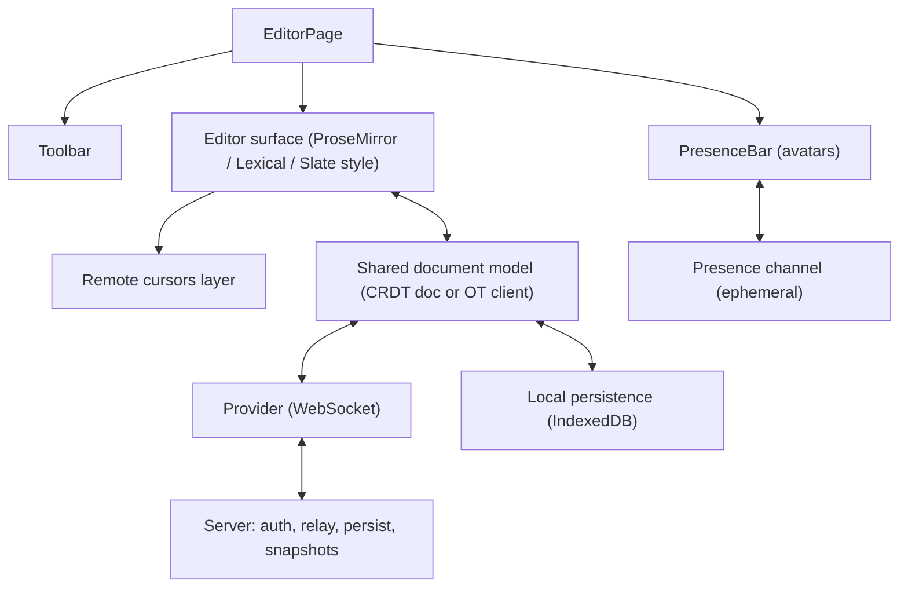
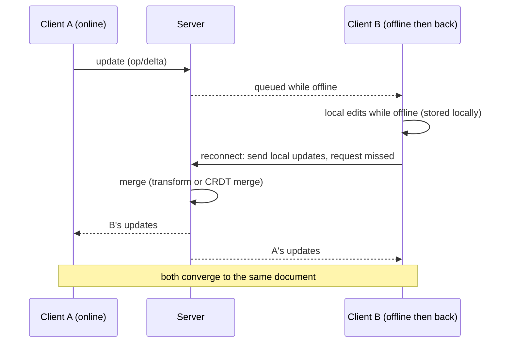

### Data model
Do not model the document as a string in React state. The **editor model** (a tree of nodes for rich text) lives in the editor library, backed by the shared type; React renders the chrome around it.
```ts
// Conceptual, not a specific library's API
type DocumentId = string;
type Update = Uint8Array; // an opaque, mergeable delta (CRDT) or an operation with a base revision (OT)
type Presence = { userId: string; name: string; color: string; cursor?: { anchor: number; head: number } };
```

### API contract
Two shapes, depending on the approach:
```http
OT (server-ordered):  WS /ws/docs/{id}   client -> { "rev": 41, "ops": [...] }   server -> { "rev": 42, "ops": [...] } (transformed) or ack
CRDT (state-based sync):  WS /ws/docs/{id}   binary frames: sync step 1 (state vector), sync step 2 (missing updates), then incremental updates
GET /api/docs/{id}/snapshots      history
POST /api/docs/{id}/permissions   authz is always server-side
```
Keep the server in the loop for **authorization, persistence, compaction and snapshots** even with CRDTs.

### State placement
| State | Home |
|---|---|
| Document content | Shared CRDT/OT model (not React state, not the query cache) |
| Presence/cursors | Ephemeral channel; **not part of the document** |
| Toolbar state, selection formatting | Derived from the editor state |
| Comments, permissions, metadata | Server cache (ordinary REST) |
| Unsent/offline updates | IndexedDB |

### Performance
Send **deltas**, not whole documents; throttle cursor updates (about 50 to 100 ms); compact the history (CRDT metadata grows with every edit, so snapshot and garbage-collect); render remote cursors in a separate layer; avoid re-rendering React per keystroke (the editor owns the DOM); lazy-load the editor bundle.

### Accessibility
Rich-text editing is the hardest a11y surface: use a library with proven support (`contenteditable` is fragile), keep the toolbar a proper `role="toolbar"` with roving focus, announce remote joins politely and *rarely* (not every cursor move), expose keyboard shortcuts, do not rely on cursor colour alone to identify collaborators.

### i18n
IME composition must be handled by the editor (a classic source of CRDT/OT bugs), bidirectional text, grapheme clusters (an emoji is several code units, so cursor offsets must be grapheme- or model-aware), localized UI and a spell-check language per document.

### Security
Authorize on every connection and per update; a malicious client can send huge or malformed updates, so cap sizes and validate; sanitize pasted HTML; sign or scope WebSocket tokens; link sharing with scoped, revocable tokens; audit log; E2E encryption conflicts with server-side merge, search and history, so treat it as a different product.

### Observability
Convergence checks (periodic hash compare in test and staging), sync lag, update size, reconnect and resync rate, document size and CRDT metadata growth, client error reports with document id.

### OT vs CRDT: what is verified
- **Figma:** their multiplayer system is *not* OT and not a true CRDT. It is a server-authoritative design "inspired by CRDTs"; conflicts are resolved **per property on an object with last-writer-wins**, where the server decides the order. They say CRDTs target decentralized systems without a central authority, which they do not need (Figma engineering blog, "How Figma's multiplayer technology works").
- **Yjs presence:** the **awareness** protocol is a small, state-based awareness CRDT that propagates JSON (cursor, user name, color); it is **not stored in the document**, and a client's state is removed automatically when it goes offline (Yjs docs, "Adding Awareness").
- **Yjs and Automerge** are CRDT libraries with editor bindings and network-agnostic "providers"; Yjs ships providers such as a WebSocket one and an IndexedDB one for offline persistence.

> **Unverified:** that Google Docs uses OT (widely reported, but this guide did not check a primary source); that Notion uses a CRDT or OT for page text (do not claim either); the specific memory and performance numbers of Yjs vs Automerge (benchmark before choosing); the exact provider package names (`y-websocket`, `y-indexeddb`) and their current maintenance state in 2026. Check the Yjs and Automerge docs before quoting any of these.

### Trade-offs
| | OT | CRDT |
|---|---|---|
| Central server | Required (the transform and order authority) | Optional (peer-to-peer possible), though servers still do auth and persistence |
| Offline / long divergence | Harder, transform chains grow | Natural: merge when you meet |
| Complexity | In the transform functions; easy to get subtly wrong | In the data structure and its metadata |
| Metadata growth | Low | Grows with edits, needs compaction/GC |
| History / undo | Server-ordered log | Needs per-user undo logic on top |
| When to pick | Server-centric product, existing OT stack | Offline-first, local-first, peer sync, you want a ready library |

For an interview answer: choose a **CRDT library (Yjs or Automerge)** unless the problem says you must build it; spend your time on presence, permissions, persistence and offline, not on inventing a merge algorithm.

### What a strong candidate adds
Convergence as the stated requirement. The OT vs CRDT trade-off table and "I would not write this myself". **Presence separated from the document** (ephemeral, throttled). Server role: auth, persistence, snapshots, compaction. Offline queue in IndexedDB. The honest caveat about metadata growth and E2E encryption. Citing Figma's pragmatic server-authoritative last-writer-wins as proof that "you may not need a full CRDT".

---

## Interview questions

**Q1. You get "design Twitter's timeline" with no other detail. What do you do in the first five minutes?**
<details><summary>Answer</summary>

Do not draw boxes. Ask about users and scale, devices, freshness (real time or pull), failure behavior, reach (i18n, a11y) and what is out of scope, then **write down assumptions** and the non-functional targets. Every later decision should cite one of them. **A strong answer adds:** you state the assumptions out loud so the interviewer can correct them ([25.1](#251-the-answer-framework)).

</details>

**Q2. Why do front-end designs start from requirements and an API contract instead of components?**
<details><summary>Answer</summary>

Components are the cheapest thing to change; the data model and API contract are the expensive ones (they are shared with the backend and mobile clients). Requirements such as "rows are inserted while scrolling" decide the contract (cursor pagination), and the contract decides the state shape. **A strong answer adds:** a concrete example of a requirement flipping a decision ("offline" adds client ids and idempotency keys).

</details>

**Q3. How do you make a typeahead safe against out-of-order responses?**
<details><summary>Answer</summary>

Three layers: (1) **debounce** so there are fewer requests; (2) **abort** the superseded request with `AbortController` in the effect cleanup; (3) **ignore** any answer that does not match the *current* query (the hook stores the query with the result and derives `status` from it). Abort alone is not enough: a mock, proxy or already-received response can still resolve late. **A strong answer adds:** a test where the older request resolves last ([Exercise 1](#exercise-1-race-safe-typeahead-with-keyboard-combobox)).

</details>

**Q4. Which ARIA pattern is a typeahead, and where does DOM focus live?**
<details><summary>Answer</summary>

The APG **editable combobox with list autocomplete**: `role="combobox"` on the input with `aria-controls`, `aria-expanded`, `aria-autocomplete="list"` and `aria-activedescendant`; a `role="listbox"` popup of `role="option"` items. Focus **stays on the input**; `aria-activedescendant` says which option is "virtually focused". **A strong answer adds:** the key map (Down/Up move, Enter accepts, Escape closes then clears) and a polite live region for the result count.

</details>

**Q5. Cursor or offset pagination for a feed, and why?**
<details><summary>Answer</summary>

Cursor (keyset). With offset, an insert at the head shifts every later page, so the client sees duplicates or skips; offset also gets slower with depth (`OFFSET 100000`). A cursor encodes the last `(createdAt, id)`, so pages are stable. The cost: no jump to page N and no cheap total count ([24.10](24-react-with-spring-boot.md#2410-pagination-contracts)). **A strong answer adds:** cursors are opaque to the client, and an expired cursor returns 410.

</details>

**Q6. How do you keep scrolling smooth with 10 000 posts?**
<details><summary>Answer</summary>

Virtualize so only the visible window is in the DOM ([15.8](15-performance.md#158-virtualization)), measure variable heights, reserve media space to avoid layout shift, trigger the next page with an `IntersectionObserver` sentinel (not scroll handlers), and bound memory (limit retained pages). **A strong answer adds:** virtualization costs find-in-page and complicates a11y, so keep a "Load more" button and `aria-posinset`/`aria-setsize`.

</details>

**Q7. Where does each kind of state live in a data grid?**
<details><summary>Answer</summary>

Sort/filter/visible columns in the **URL** (shareable views); row pages in the **server cache** keyed by the query; selection and column widths **local**; cell edit drafts local until committed ([18.1](18-state-management.md#181-a-taxonomy-local-server-url-form-global-ui)). **A strong answer adds:** "select all" means "all matching this filter", sent as the filter, not as 100k ids.

</details>

**Q8. A grid is virtualized. How does a screen reader know there are 100 000 rows?**
<details><summary>Answer</summary>

Set `aria-rowcount` (and `aria-colcount`) on the grid and `aria-rowindex`/`aria-colindex` on each rendered row/cell, because the DOM contains only a window. **A strong answer adds:** if the data is read-only, a real `<table>` is better than the grid role.

</details>

**Q9. In a chat, a message arrives twice and another arrives out of order. How does the client cope?**
<details><summary>Answer</summary>

Make the merge **idempotent and order-independent**: key by server `id`, match your own optimistic message by `clientId`, order by server-assigned `seq`. A duplicate returns the same state; an early message is sorted into place. The reducer in Exercise 2 does exactly this. **A strong answer adds:** never order by client timestamps (clock skew).

</details>

**Q10. How does the client detect that it missed messages while disconnected?**
<details><summary>Answer</summary>

`seq` is monotonic per room, so a received `seq` greater than `contiguousSeq + 1` is a **gap**. The client calls `GET /messages?afterSeq=<contiguousSeq>` and feeds the results through the same merge. **A strong answer adds:** do this also on every reconnect, and use exponential backoff with jitter for the reconnect itself.

</details>

**Q11. WebSocket, SSE or polling for chat? For notifications?**
<details><summary>Answer</summary>

Chat is bidirectional and latency-sensitive: WebSocket (or SSE downstream + POST upstream if you prefer plain HTTP infrastructure). Notifications are one-way: SSE is simpler and auto-reconnects with `Last-Event-ID`; polling with `ETag` is the fallback when proxies break streams ([17.11](17-data-fetching.md#1711-real-time-websockets-and-sse-plus-cache-integration), [24.12](24-react-with-spring-boot.md#2412-real-time-websocketstomp-sse)). **A strong answer adds:** a WebSocket cannot set an `Authorization` header from the browser constructor, so use a ticket or cookie plus an `Origin` check.

</details>

**Q12. A dashboard has 12 widgets and one query is slow. How do you stop it blocking the page?**
<details><summary>Answer</summary>

Make widgets **independent failure domains**: one query each, a Suspense boundary and an error boundary per widget, skeletons sized to avoid layout shift. The shell renders immediately. **A strong answer adds:** `asOf` timestamps, per-widget retry, and a batch endpoint only if request count is the measured problem.

</details>

**Q13. How would you refresh a dashboard that runs on a wall display for 12 hours?**
<details><summary>Answer</summary>

Polling with `refetchInterval` (staggered across widgets, paused when the tab is hidden) or SSE; cap cache lifetime (`gcTime`) and retained data; abort and unsubscribe on unmount; downsample series. Watch memory over time in observability. **A strong answer adds:** a pause control for auto-refresh (WCAG 2.2.2) and a note that the long-run test is part of the definition of done.

</details>

**Q14. Are charts accessible? How do you make them so?**
<details><summary>Answer</summary>

Not by default. Give a text summary, provide a **data-table alternative**, do not rely on colour alone, and label every widget with a heading. Do not live-announce every refresh. **A strong answer adds:** canvas charts need the table because the canvas has no semantics.

</details>

**Q15. What does the W3C APG say about carousel auto-rotation?**
<details><summary>Answer</summary>

Auto-rotation **stops when keyboard focus enters** the carousel and does not restart unless the user asks, also stops on hover, and there must be a dedicated button to stop/start it. Use `aria-live="off"` while rotating and `"polite"` otherwise; container `aria-roledescription="carousel"`, slides `aria-roledescription="slide"` named "N of M" (checked against the APG carousel page). **A strong answer adds:** the best autoplay is none, and honor `prefers-reduced-motion`.

</details>

**Q16. Which carousel image should not be lazy-loaded?**
<details><summary>Answer</summary>

The first (visible) slide, usually the **LCP element**: load it eagerly with `fetchpriority="high"`; lazy-load the rest and preload the next on idle. Lazy-loading the LCP image delays LCP ([15.12](15-performance.md#1512-web-vitals-in-react)). **A strong answer adds:** fixed `aspect-ratio`/`width`+`height` for zero CLS, and `srcset` for the right size.

</details>

**Q17. Where does the "current step" of a wizard live, and why?**
<details><summary>Answer</summary>

In the **URL** (`/checkout/address`): Back/Forward, refresh and deep links work. The draft lives in a store with persistence (server or `sessionStorage`), and per-field input stays local to the active step's form. **A strong answer adds:** the server re-validates the whole draft at submit and never trusts that the client followed the step order.

</details>

**Q18. A user double-clicks "Submit" on the last step. What stops two orders?**
<details><summary>Answer</summary>

Disable the button while `submitting` (UX only) and send an **idempotency key** generated once per wizard so the server returns the same result for a repeat. The UI guard is not a safety guarantee. **A strong answer adds:** the `Idempotency-Key` header is only an expired IETF draft, not an RFC ([datatracker](https://datatracker.ietf.org/doc/draft-ietf-httpapi-idempotency-key-header/)); the server-side dedup table (key -> response) is the actual mechanism.

</details>

**Q19. Why send file bytes directly to object storage instead of through your API?**
<details><summary>Answer</summary>

Gigabytes through the API tie up threads, memory and bandwidth you pay for twice. The API issues a short-lived, single-key **presigned URL**; the client PUTs to storage; a **confirm** call lets the API verify the object before it is marked stored ([24.11](24-react-with-spring-boot.md#2411-file-uploads-with-s3-presigned-urls)). **A strong answer adds:** the bucket needs CORS configured, and the server (not the client) validates type by content.

</details>

**Q20. How do you model an upload queue so cancel and retry cannot corrupt state?**
<details><summary>Answer</summary>

A **state machine** with explicit legal transitions (`queued -> uploading -> done/failed/queued`, `cancel` from queued or uploading, `retry` from failed or canceled). The reducer returns the *same state* for an illegal transition, so a late success after cancel is ignored. Controllers keep an `AbortController` per item and drop settlements from aborted requests ([Exercise 3](#exercise-3-upload-queue-state-machine)). **A strong answer adds:** keep `File` objects out of state.

</details>

**Q21. Resumable uploads: how, and what do you persist?**
<details><summary>Answer</summary>

Split into parts (multipart upload or the tus protocol), upload parts independently with retries, and persist the upload id and the finished parts (IndexedDB) so a reload continues instead of restarting. **A strong answer adds:** a lifecycle rule to clean orphaned incomplete uploads. S3 allows 5 MiB to 5 GiB per part (the last part can be smaller) and up to 10,000 parts ([S3 multipart limits](https://docs.aws.amazon.com/AmazonS3/latest/userguide/qfacts.html)).

</details>

**Q22. Toast vs notification inbox: how are they different in design?**
<details><summary>Answer</summary>

A toast is **client-only transient feedback** about the user's own action (in-memory queue, auto-dismiss, live region). An inbox is **server-owned persistent data** with a read pointer, delivered live and fetched on load. They share presentation tricks, not storage. **A strong answer adds:** `role="status"` vs `role="alert"`, region present before content, toasts must not vanish while focused.

</details>

**Q23. The unread badge shows 3 in one tab and 0 in another. Fix it.**
<details><summary>Answer</summary>

The server owns `unreadCount`; every tab reads it from the same cache logic and applies live events deduplicated by `id`. When one tab marks read, it POSTs the read pointer **and** broadcasts via `BroadcastChannel` so other tabs update immediately; on focus, refetch as a safety net. **A strong answer adds:** a read *pointer* (`upToId`) is cheaper than per-item flags.

</details>

**Q24. OT or CRDT for a collaborative editor?**
<details><summary>Answer</summary>

OT needs a central server that orders and transforms operations; CRDTs make merges commutative and idempotent in the data structure, so offline and peer sync are natural, at the cost of metadata growth. Unless told to build it, use a CRDT library (Yjs or Automerge) and spend the time on presence, auth, persistence and offline. **A strong answer adds:** Figma uses neither purely: a server-authoritative system with per-property last-writer-wins, because they have a central authority (Figma blog).

</details>

**Q25. How is presence (cursors, who is online) different from document content?**
<details><summary>Answer</summary>

It is **ephemeral**: not persisted, not versioned, throttled, and cleaned up when a client goes away. In Yjs this is the awareness protocol, which is separate from the document and removes a client's state when it goes offline (Yjs docs). **A strong answer adds:** throttle cursor updates to about 50 to 100 ms and render them on a separate layer.

</details>

**Q26. Where do server-state libraries stop helping in these designs?**
<details><summary>Answer</summary>

They model request/response caches. They do not model merge logic (chat ordering, CRDT documents), per-item state machines (uploads), or ephemeral presence. For those, use a reducer or an external store, and feed the cache only the *results* ([18.11](18-state-management.md#1811-a-decision-framework)). **A strong answer adds:** you can still use `setQueryData` as the sink if you reuse the same merge function.

</details>

**Q27. How do you talk about performance in a design interview without hand-waving?**
<details><summary>Answer</summary>

Name the **specific metric and target** (INP 200 ms or less, LCP 2.5 s or less, CLS 0.1 or less are the web.dev "good" thresholds, measured at the 75th percentile; [Web Vitals](https://web.dev/articles/vitals)), say which step of the design threatens it, and name the technique and its cost. "Virtualization, because 10k DOM nodes will blow INP, at the cost of find-in-page." **A strong answer adds:** how you would measure it (RUM, Profiler) before and after ([15.1](15-performance.md#151-measure-first-react-devtools-profiler-chrome-performance-panel-performance-tracks)).

</details>

**Q28. What do you log for observability in a front-end design, and what do you avoid logging?**
<details><summary>Answer</summary>

Log outcomes and timings: latency, error codes, retry counts, funnel steps, Core Web Vitals, reconnect rates, zero-result rates. Avoid raw user content (search text, message bodies, file names) and PII; log lengths or hashes instead. **A strong answer adds:** a correlation id sent to the backend so a client error can be traced across the stack.

</details>

---

## Coding exercises

All three exercises turn a design from this module into small, tested code. The Solution blocks are filled from the files by `examples/scripts/check-links.mjs --sync`.

### Exercise 1: Race-safe typeahead with keyboard combobox

**Statement.** Build `useTypeaheadResults(query, search, delayMs)` and a `Typeahead` component. Requirements: (1) one request per typing burst (debounce); (2) the superseded request is aborted and a late answer for an older query never shows; (3) status is `idle | loading | ready | error`, derived during render (no `setState` in the effect body, which `react-hooks/set-state-in-effect` forbids); (4) ARIA combobox: `role="combobox"`, `aria-expanded`, `aria-controls`, `aria-activedescendant`; ArrowDown/ArrowUp move (wrapping), Enter selects, Escape closes then clears; (5) a `role="status"` live region reports "Searching…", "N results", "No results" or the error.

**Approach.**
1. *Mental model:* the result is a cache entry **tagged with the query it answers**. If the tag differs from the current query, the answer is stale by definition, so `status` is `loading`.
2. Effect keyed on `[trimmedQuery, search, delayMs]`: start a timer; when it fires, call `search(query, signal)`; cleanup clears the timer, aborts, and sets an `ignore` flag.
3. `setOutcome` runs only in the promise callbacks, so it is not synchronous in the effect body.
4. The component keeps `text`, `open`, `active` locally and derives `expanded` and `activeIndex`.
5. Clicking an option uses `onMouseDown` + `preventDefault` so the input does not blur and close the list before `click` fires.

<details><summary>Hints</summary>

- Store `{ query, items, error }` and compare `outcome.query` with the current query.
- `new Promise((resolve) => resolve(search(...)))` also turns a synchronous throw into a rejection.
- `(activeIndex + 1) % items.length` wraps down; up from 0 wraps to `items.length - 1`.
- In tests use `vi.useFakeTimers({ shouldAdvanceTime: true })` together with `userEvent.setup({ advanceTimers: vi.advanceTimersByTime })`, and flush with `await act(async () => { await vi.advanceTimersByTimeAsync(300) })`.

</details>

<details><summary>Solution</summary>

[`useTypeaheadResults.ts`](examples/web/src/m25-system-design/useTypeaheadResults.ts):

```ts
// file: examples/web/src/m25-system-design/useTypeaheadResults.ts
import { useEffect, useState } from 'react';

export type SearchFn = (query: string, signal: AbortSignal) => Promise<string[]>;

export type TypeaheadState =
  | { status: 'idle'; items: string[]; error: null }
  | { status: 'loading'; items: string[]; error: null }
  | { status: 'ready'; items: string[]; error: null }
  | { status: 'error'; items: string[]; error: string };

// The result remembers WHICH query it answers, so a stale result can never be shown for a newer query.
type Outcome = { query: string; items: string[]; error: string | null };

const IDLE: TypeaheadState = { status: 'idle', items: [], error: null };
const LOADING: TypeaheadState = { status: 'loading', items: [], error: null };

/**
 * Race-safe typeahead query. Debounces, aborts the superseded request, ignores late answers,
 * and derives `status` during render (no setState in the effect body).
 * `search` must be referentially stable (module-level function or useCallback).
 */
export function useTypeaheadResults(query: string, search: SearchFn, delayMs = 250): TypeaheadState {
  const [outcome, setOutcome] = useState<Outcome | null>(null);
  const trimmed = query.trim();

  useEffect(() => {
    if (trimmed === '') return;
    const controller = new AbortController();
    let ignore = false;
    const timer = setTimeout(() => {
      new Promise<string[]>((resolve) => resolve(search(trimmed, controller.signal))).then(
        (items) => {
          if (!ignore) setOutcome({ query: trimmed, items, error: null });
        },
        (err: unknown) => {
          if (!ignore) setOutcome({ query: trimmed, items: [], error: err instanceof Error ? err.message : 'Search failed' });
        },
      );
    }, delayMs);
    return () => {
      ignore = true;
      clearTimeout(timer);
      controller.abort();
    };
  }, [trimmed, search, delayMs]);

  if (trimmed === '') return IDLE;
  if (outcome?.query !== trimmed) return LOADING;
  if (outcome.error !== null) return { status: 'error', items: [], error: outcome.error };
  return { status: 'ready', items: outcome.items, error: null };
}
```

[`Typeahead.tsx`](examples/web/src/m25-system-design/Typeahead.tsx):

```tsx
// file: examples/web/src/m25-system-design/Typeahead.tsx
import { useId, useState, type KeyboardEvent } from 'react';
import { useTypeaheadResults, type SearchFn } from './useTypeaheadResults';

type Props = {
  label: string;
  search: SearchFn;
  onSelect: (value: string) => void;
  delayMs?: number;
};

// WAI-ARIA APG "editable combobox with list autocomplete": DOM focus stays on the input,
// aria-activedescendant points at the highlighted option.
export function Typeahead({ label, search, onSelect, delayMs }: Props) {
  const id = useId();
  const inputId = `${id}-input`;
  const listId = `${id}-list`;
  const optionId = (i: number) => `${id}-opt-${i}`;

  const [text, setText] = useState('');
  const [open, setOpen] = useState(false);
  const [active, setActive] = useState(-1);
  const { status, items, error } = useTypeaheadResults(text, search, delayMs);

  const expanded = open && status === 'ready' && items.length > 0;
  const activeIndex = expanded && active < items.length ? active : -1;

  function choose(value: string) {
    setText(value);
    setOpen(false);
    setActive(-1);
    onSelect(value);
  }

  function onKeyDown(e: KeyboardEvent<HTMLInputElement>) {
    switch (e.key) {
      case 'ArrowDown':
        e.preventDefault();
        if (!expanded) setOpen(true);
        else setActive((activeIndex + 1) % items.length);
        break;
      case 'ArrowUp':
        e.preventDefault();
        if (expanded) setActive(activeIndex <= 0 ? items.length - 1 : activeIndex - 1);
        break;
      case 'Enter': {
        const value = items[activeIndex];
        if (value !== undefined) {
          e.preventDefault();
          choose(value);
        }
        break;
      }
      case 'Escape':
        if (expanded) setOpen(false);
        else setText('');
        break;
    }
  }

  const message =
    status === 'loading' ? 'Searching…' : status === 'error' ? error : status === 'ready' ? (items.length === 0 ? 'No results' : `${items.length} results`) : '';

  return (
    <div>
      <label htmlFor={inputId}>{label}</label>
      <input
        id={inputId}
        role="combobox"
        autoComplete="off"
        aria-autocomplete="list"
        aria-expanded={expanded}
        aria-controls={listId}
        aria-activedescendant={activeIndex >= 0 ? optionId(activeIndex) : undefined}
        value={text}
        onChange={(e) => {
          setText(e.target.value);
          setOpen(true);
          setActive(-1);
        }}
        onKeyDown={onKeyDown}
        onBlur={() => setOpen(false)}
      />
      <ul id={listId} role="listbox" aria-label={label} hidden={!expanded}>
        {items.map((item, i) => (
          <li
            key={item}
            id={optionId(i)}
            role="option"
            aria-selected={i === activeIndex}
            onMouseDown={(e) => e.preventDefault()} // keep focus on the input
            onClick={() => choose(item)}
          >
            {item}
          </li>
        ))}
      </ul>
      <p role="status">{message}</p>
    </div>
  );
}
```

</details>

**Walkthrough.**
1. The user types "par": `text` changes, the effect cleanup of the previous run (if any) fires, a new 300 ms timer starts. Typing "ab" cancels the timer before it fires, so a burst produces **one** request.
2. When the timer fires, `search` is called with an `AbortSignal`. While waiting, the hook returns `LOADING` because `outcome` is `null` or belongs to another query.
3. The user types another character: the cleanup sets `ignore = true`, clears the timer and aborts. Even if the old promise resolves, `if (!ignore)` drops it. The test resolves the **newer** request first and the **older** one last, and asserts the list still shows the newer results.
4. When `outcome.query === trimmed`, status becomes `ready` and the list renders. `expanded` additionally needs `open`, so Escape can hide the list without discarding the results.
5. ArrowDown sets `active`; `aria-activedescendant` points at `${id}-opt-${i}`; DOM focus never leaves the input (`toHaveFocus` is asserted).
6. Enter calls `choose`, which sets the text, closes the list and calls `onSelect`. Selecting changes `text`, so the hook searches once more for the chosen label; a query cache would absorb that, and in the UI the list stays closed because `open` is false.

**Interviewer follow-ups.**
- Swap the hook for TanStack Query: what do you get for free, and what do you give up? (Dedup, cache, abort; the debounce still needs `useDebounce` on the key.)
- Keep the previous results visible while loading: what changes, and what is the risk with Enter? 
- Add recent searches and highlight the matched prefix without `innerHTML`.
- How does IME composition break the debounce, and what do you check? (`isComposing`.)
- What if `search` is an inline arrow function? (The effect re-runs every render; require a stable function.)

**Tests.** [`Typeahead.test.tsx`](examples/web/src/m25-system-design/Typeahead.test.tsx), with the full test inline:

```tsx
// file: examples/web/src/m25-system-design/Typeahead.test.tsx
import { act, render, screen } from '@testing-library/react';
import userEvent from '@testing-library/user-event';
import { Typeahead } from './Typeahead';
import type { SearchFn } from './useTypeaheadResults';

type Call = {
  query: string;
  signal: AbortSignal;
  resolve: (items: string[]) => void;
  reject: (e: Error) => void;
};

beforeEach(() => {
  vi.useFakeTimers({ shouldAdvanceTime: true });
});
afterEach(() => {
  vi.useRealTimers();
});

const wait = (ms: number) =>
  act(async () => {
    await vi.advanceTimersByTimeAsync(ms);
  });

function setup() {
  const calls: Call[] = [];
  const search: SearchFn = (query, signal) =>
    new Promise<string[]>((resolve, reject) => {
      calls.push({ query, signal, resolve, reject });
    });
  const onSelect = vi.fn();
  const user = userEvent.setup({ advanceTimers: vi.advanceTimersByTime });
  render(<Typeahead label="City" search={search} onSelect={onSelect} delayMs={300} />);
  const input = screen.getByRole('combobox', { name: 'City' });
  return { calls, onSelect, user, input };
}

const optionNames = () => screen.queryAllByRole('option').map((o) => o.textContent);

test('debounces: typing three characters sends one request', async () => {
  const { calls, user, input } = setup();
  await user.type(input, 'par');
  expect(calls).toHaveLength(0);
  await wait(300);
  expect(calls.map((c) => c.query)).toEqual(['par']);
});

test('clearing before the delay sends nothing', async () => {
  const { calls, user, input } = setup();
  await user.type(input, 'a');
  await user.clear(input);
  await wait(300);
  expect(calls).toHaveLength(0);
});

test('a late answer for an older query never overwrites the newer one', async () => {
  const { calls, user, input } = setup();
  await user.type(input, 'a');
  await wait(300);
  await user.type(input, 'b');
  await wait(300);
  const first = calls.find((c) => c.query === 'a');
  const second = calls.find((c) => c.query === 'ab');
  expect(first?.signal.aborted).toBe(true);
  expect(second?.signal.aborted).toBe(false);

  await act(async () => second?.resolve(['Abbeville']));
  expect(optionNames()).toEqual(['Abbeville']);

  await act(async () => first?.resolve(['Aachen', 'Aalborg'])); // arrives late
  expect(optionNames()).toEqual(['Abbeville']);
});

test('keyboard: arrows move aria-activedescendant and wrap, Enter selects, focus stays on the input', async () => {
  const { calls, onSelect, user, input } = setup();
  await user.type(input, 'par');
  await wait(300);
  await act(async () => calls[0]?.resolve(['Paris', 'Parma', 'Parry']));
  expect(input).toHaveAttribute('aria-expanded', 'true');

  await user.keyboard('{ArrowDown}');
  expect(input).toHaveAttribute('aria-activedescendant', screen.getByRole('option', { name: 'Paris' }).id);
  expect(screen.getByRole('option', { name: 'Paris' })).toHaveAttribute('aria-selected', 'true');

  await user.keyboard('{ArrowUp}'); // wraps to the last option
  expect(input).toHaveAttribute('aria-activedescendant', screen.getByRole('option', { name: 'Parry' }).id);
  await user.keyboard('{ArrowDown}'); // wraps to the first
  await user.keyboard('{ArrowDown}');
  expect(input).toHaveAttribute('aria-activedescendant', screen.getByRole('option', { name: 'Parma' }).id);
  expect(input).toHaveFocus();

  await user.keyboard('{Enter}');
  expect(onSelect).toHaveBeenCalledWith('Parma');
  expect(input).toHaveValue('Parma');
  expect(input).toHaveAttribute('aria-expanded', 'false');
});

test('Escape closes the list first, and clears the text on the second press', async () => {
  const { calls, user, input } = setup();
  await user.type(input, 'par');
  await wait(300);
  await act(async () => calls[0]?.resolve(['Paris']));
  expect(input).toHaveAttribute('aria-expanded', 'true');

  await user.keyboard('{Escape}');
  expect(input).toHaveAttribute('aria-expanded', 'false');
  expect(input).toHaveValue('par');

  await user.keyboard('{Escape}');
  expect(input).toHaveValue('');
});

test('announces empty and failed searches in the live region', async () => {
  const { calls, user, input } = setup();
  await user.type(input, 'zz');
  await wait(300);
  await act(async () => calls[0]?.resolve([]));
  expect(screen.getByRole('status')).toHaveTextContent('No results');

  await user.type(input, 'z');
  await wait(300);
  await act(async () => calls[1]?.reject(new Error('Server unavailable')));
  expect(screen.getByRole('status')).toHaveTextContent('Server unavailable');
});
```

### Exercise 2: Chat message ordering and dedup reducer

**Statement.** Write a pure `chatReducer` for a chat room. Actions: `send` (optimistic), `server` (any confirmed message: ack, broadcast, catch-up or history), `failed`, `retry`. Requirements: a confirmed message that matches a pending `clientId` **replaces it in place**; a repeated `id` is a no-op that returns the **same state reference**; confirmed messages are ordered by server `seq`, unconfirmed ones stay at the end in send order; the reducer reports `contiguousSeq` and `gapAfter` so the UI knows when to fetch `afterSeq`; `failed` applies only to a still-pending message.

**Approach.**
1. *Mental model:* one merge function for all arrivals. If every path is "merge by id, match by clientId, sort by seq", delivery can be at-least-once and unordered.
2. Two ids: `clientId` (sender) matches the echo; `id`/`seq` (server) dedup and order.
3. After each merge, recompute `contiguousSeq` by walking the sorted confirmed list and advancing while `seq === contiguousSeq + 1`.
4. `gapAfter` is `contiguousSeq` when the highest seq is beyond it, else `null`.
5. Return `state` unchanged (same reference) whenever nothing changes, so React skips the re-render.

<details><summary>Hints</summary>

- `state.messages.some((m) => m.id === message.id)` is the dedup check.
- Match your own message with `findIndex` on `clientId`, and replace by index with `map`.
- For another user's message use `srv:${id}` as its `clientId`.
- Pass `baseSeq` to `createChatState` when the loaded history does not start at seq 1.

</details>

<details><summary>Solution</summary>

[`chatReducer.ts`](examples/web/src/m25-system-design/chatReducer.ts):

```ts
// file: examples/web/src/m25-system-design/chatReducer.ts
// Message ordering and dedup for a real-time chat.
// One action, `server`, covers every way a confirmed message can arrive: the HTTP ack of our own
// send, the WebSocket echo/broadcast, a catch-up fetch after a reconnect, or a history page.
// Merging is idempotent, so delivery can be at-least-once and in any order.

export type MessageStatus = 'pending' | 'sent' | 'failed';

export type ChatMessage = {
  clientId: string; // generated by the sender; `srv:<id>` for other people's messages
  id: string | null; // server id, null until confirmed
  seq: number | null; // server-assigned, monotonic per room, null until confirmed
  author: string;
  text: string;
  status: MessageStatus;
};

export type ServerMessage = { id: string; seq: number; clientId?: string; author: string; text: string };

export type ChatState = {
  messages: readonly ChatMessage[]; // confirmed by seq, then unconfirmed in send order
  contiguousSeq: number; // every seq <= this is present
  gapAfter: number | null; // non-null: a hole exists, fetch messages with seq > gapAfter
};

export type ChatAction =
  | { type: 'send'; clientId: string; author: string; text: string }
  | { type: 'server'; message: ServerMessage }
  | { type: 'failed'; clientId: string }
  | { type: 'retry'; clientId: string };

/** `baseSeq` = the seq just before the oldest message we load (0 for a brand-new room). */
export function createChatState(baseSeq = 0): ChatState {
  return { messages: [], contiguousSeq: baseSeq, gapAfter: null };
}

function normalize(baseContiguous: number, messages: ChatMessage[]): ChatState {
  const confirmed = messages.filter((m) => m.seq !== null).sort((a, b) => (a.seq ?? 0) - (b.seq ?? 0));
  const unconfirmed = messages.filter((m) => m.seq === null);
  let contiguousSeq = baseContiguous;
  for (const m of confirmed) if (m.seq === contiguousSeq + 1) contiguousSeq = m.seq;
  const last = confirmed[confirmed.length - 1];
  const gapAfter = last?.seq !== undefined && last.seq !== null && last.seq > contiguousSeq ? contiguousSeq : null;
  return { messages: [...confirmed, ...unconfirmed], contiguousSeq, gapAfter };
}

function setStatus(state: ChatState, clientId: string, from: MessageStatus, to: MessageStatus): ChatState {
  if (!state.messages.some((m) => m.clientId === clientId && m.status === from)) return state;
  return { ...state, messages: state.messages.map((m) => (m.clientId === clientId ? { ...m, status: to } : m)) };
}

export function chatReducer(state: ChatState, action: ChatAction): ChatState {
  switch (action.type) {
    case 'send': {
      if (state.messages.some((m) => m.clientId === action.clientId)) return state;
      const pending: ChatMessage = { clientId: action.clientId, id: null, seq: null, author: action.author, text: action.text, status: 'pending' };
      return { ...state, messages: [...state.messages, pending] };
    }
    case 'server': {
      const m = action.message;
      if (state.messages.some((x) => x.id === m.id)) return state; // duplicate delivery: no-op, same reference
      const confirmed: ChatMessage = { clientId: m.clientId ?? `srv:${m.id}`, id: m.id, seq: m.seq, author: m.author, text: m.text, status: 'sent' };
      const idx = m.clientId === undefined ? -1 : state.messages.findIndex((x) => x.clientId === m.clientId);
      const next = idx >= 0 ? state.messages.map((x, i) => (i === idx ? confirmed : x)) : [...state.messages, confirmed];
      return normalize(state.contiguousSeq, next);
    }
    case 'failed': // only a still-pending message can fail: an ack that already arrived wins
      return setStatus(state, action.clientId, 'pending', 'failed');
    case 'retry':
      return setStatus(state, action.clientId, 'failed', 'pending');
  }
}
```

</details>

**Walkthrough.**
1. `send` appends a `pending` message with `id = seq = null`; it renders immediately.
2. The server's message (carrying the same `clientId`) arrives. `findIndex` finds the pending one and the map **replaces it in place**, now `sent` with `id` and `seq`. The list has one entry, not two.
3. If the echo arrives again (or the ack came first and the broadcast second), `some(id)` is true and the reducer returns `state` itself: the test asserts `toBe` (same reference).
4. Messages with seq 1 and 3 arrive: sorted `[1, 3]`; the walk stops at 1, so `contiguousSeq = 1` and `gapAfter = 1`. Seq 2 arrives (from `afterSeq=1`): the walk advances through 3, the gap closes.
5. Unconfirmed messages are filtered out of the sort and appended after the confirmed ones, so a pending message never jumps above a confirmed one.
6. `failed` after the ack is ignored because `setStatus` requires `from = 'pending'`; `retry` flips `failed` back to `pending`.

**Interviewer follow-ups.**
- Where do edits and deletes fit? (More actions keyed by `id` with a version; tombstones, so a late original cannot resurrect.)
- How do you page history upward without breaking `contiguousSeq`? (`baseSeq`, or treat history as a separate contiguous range.)
- How would you store this in TanStack Query instead? (`setQueryData` with the same merge function.)
- What if the server cannot guarantee a gapless `seq` per room? (Then gap detection needs a different signal, such as a server-provided `prevSeq` on each message.)
- Prove convergence: does the order of actions change the final state? (The tests compare orders for echo/ack.)

**Tests.** [`chatReducer.test.ts`](examples/web/src/m25-system-design/chatReducer.test.ts):

```ts
// file: examples/web/src/m25-system-design/chatReducer.test.ts
import { chatReducer, createChatState, type ChatAction, type ChatState, type ServerMessage } from './chatReducer';

const run = (actions: ChatAction[], from: ChatState = createChatState()) => actions.reduce(chatReducer, from);
const srv = (seq: number, extra: Partial<ServerMessage> = {}): ChatAction => ({
  type: 'server',
  message: { id: `m${seq}`, seq, author: 'bob', text: `msg ${seq}`, ...extra },
});
const texts = (s: ChatState) => s.messages.map((m) => `${m.text}:${m.status}`);

test('sending shows the message immediately as pending', () => {
  const s = run([{ type: 'send', clientId: 'c1', author: 'me', text: 'hi' }]);
  expect(texts(s)).toEqual(['hi:pending']);
});

test('the ack replaces the pending message in place; the later echo is a no-op (no duplicate)', () => {
  const send: ChatAction = { type: 'send', clientId: 'c1', author: 'me', text: 'hi' };
  const confirmed = srv(1, { clientId: 'c1', author: 'me', text: 'hi' });
  const afterAck = run([send, confirmed]);
  expect(afterAck.messages).toHaveLength(1);
  expect(afterAck.messages[0]).toMatchObject({ id: 'm1', seq: 1, status: 'sent' });

  const afterEcho = chatReducer(afterAck, confirmed);
  expect(afterEcho).toBe(afterAck);
});

test('echo before ack gives the same result as ack before echo', () => {
  const send: ChatAction = { type: 'send', clientId: 'c1', author: 'me', text: 'hi' };
  const a = srv(1, { clientId: 'c1', author: 'me', text: 'hi' });
  expect(run([send, a, a])).toEqual(run([send, a]));
});

test('out-of-order arrival is sorted by seq and the gap is reported, then closed by catch-up', () => {
  const s1 = run([srv(1), srv(3)]);
  expect(s1.messages.map((m) => m.seq)).toEqual([1, 3]);
  expect(s1.contiguousSeq).toBe(1);
  expect(s1.gapAfter).toBe(1);

  const s2 = chatReducer(s1, srv(2));
  expect(s2.messages.map((m) => m.seq)).toEqual([1, 2, 3]);
  expect(s2.contiguousSeq).toBe(3);
  expect(s2.gapAfter).toBeNull();
});

test('unconfirmed messages stay after confirmed ones, in send order', () => {
  const s = run([
    { type: 'send', clientId: 'c1', author: 'me', text: 'first' },
    srv(1),
    { type: 'send', clientId: 'c2', author: 'me', text: 'second' },
    srv(2),
  ]);
  expect(texts(s)).toEqual(['msg 1:sent', 'msg 2:sent', 'first:pending', 'second:pending']);
});

test('a history page below the loaded range closes with baseSeq', () => {
  const s = run([srv(11), srv(12)], createChatState(10));
  expect(s.gapAfter).toBeNull();
  expect(s.contiguousSeq).toBe(12);
});

test('fail and retry only apply in the right state; a failure after the ack is ignored', () => {
  const send: ChatAction = { type: 'send', clientId: 'c1', author: 'me', text: 'hi' };
  const failed = run([send, { type: 'failed', clientId: 'c1' }]);
  expect(texts(failed)).toEqual(['hi:failed']);
  expect(texts(chatReducer(failed, { type: 'retry', clientId: 'c1' }))).toEqual(['hi:pending']);

  const acked = run([send, srv(1, { clientId: 'c1', author: 'me', text: 'hi' })]);
  expect(chatReducer(acked, { type: 'failed', clientId: 'c1' })).toBe(acked);
});
```

### Exercise 3: Upload queue state machine

**Statement.** Build `uploadQueueReducer` (pure) and `createUploadQueue({ upload, concurrency, maxAttempts })` (controller). Requirements: at most `concurrency` items upload at once and a freed slot starts the next queued item; progress is clamped to 0-100 and ignored unless the item is uploading; a failure re-queues the item until `maxAttempts`, then marks it `failed` with the error; `retry` restarts a failed or canceled item with a fresh attempt count; `cancel` aborts the in-flight request, frees the slot, and a late success or failure after cancel is ignored; illegal transitions return the same state; `subscribe`/`getState` make it usable with `useSyncExternalStore`.

**Approach.**
1. *Mental model:* a state machine per item plus a scheduler. The reducer holds *all the rules*; the controller only performs side effects and calls `pump()`.
2. `change(state, id, allowedFrom, patch)` applies a transition only from allowed states, otherwise returns the same state. That one helper makes every illegal transition a no-op.
3. `pump()` starts queued items while `uploading < concurrency`.
4. Each run has its own `AbortController`; a settlement from an aborted run is dropped (`signal.aborted`).
5. `attempts` increments on `start`, and `fail` compares it with `maxAttempts` to choose `queued` vs `failed`.

<details><summary>Hints</summary>

- Count slots from state (`items.filter(status === 'uploading')`), not from a separate counter.
- Wrap the call in `new Promise((resolve) => resolve(upload(...)))` to turn sync throws into failures.
- `cancel` should delete the controller after aborting it and then call `pump()`.
- In tests, hold each upload's `resolve`/`reject` in an array and flush with `await new Promise((r) => setTimeout(r, 0))`.

</details>

<details><summary>Solution</summary>

[`uploadQueue.ts`](examples/web/src/m25-system-design/uploadQueue.ts):

```ts
// file: examples/web/src/m25-system-design/uploadQueue.ts
// Upload queue as a state machine: pure reducer (all the rules) + a thin controller (side effects).
// Item lifecycle:  queued -> uploading -> done
//                              |-> queued (auto retry while attempts < maxAttempts) | failed
//                  queued|uploading -> canceled;  failed|canceled -> queued (manual retry)

export type UploadStatus = 'queued' | 'uploading' | 'done' | 'failed' | 'canceled';

export type UploadItem = {
  id: string;
  name: string;
  size: number;
  status: UploadStatus;
  progress: number; // 0..100
  attempts: number;
  error: string | null;
};

export type QueueState = { items: readonly UploadItem[]; maxAttempts: number };

export type QueueAction =
  | { type: 'add'; items: { id: string; name: string; size: number }[] }
  | { type: 'start'; id: string }
  | { type: 'progress'; id: string; percent: number }
  | { type: 'succeed'; id: string }
  | { type: 'fail'; id: string; error: string }
  | { type: 'cancel'; id: string }
  | { type: 'retry'; id: string };

export function createQueueState(maxAttempts = 3): QueueState {
  return { items: [], maxAttempts };
}

// Applies `patch` only when the item is in one of the allowed states; otherwise returns the SAME state.
function change(state: QueueState, id: string, allowed: UploadStatus[], patch: (i: UploadItem) => Partial<UploadItem>): QueueState {
  const items = state.items.map((i) => (i.id === id && allowed.includes(i.status) ? { ...i, ...patch(i) } : i));
  return items.some((item, idx) => item !== state.items[idx]) ? { ...state, items } : state;
}

export function uploadQueueReducer(state: QueueState, action: QueueAction): QueueState {
  switch (action.type) {
    case 'add':
      return {
        ...state,
        items: [...state.items, ...action.items.map((i): UploadItem => ({ ...i, status: 'queued', progress: 0, attempts: 0, error: null }))],
      };
    case 'start':
      return change(state, action.id, ['queued'], (i) => ({ status: 'uploading', attempts: i.attempts + 1, progress: 0, error: null }));
    case 'progress':
      return change(state, action.id, ['uploading'], () => ({ progress: Math.min(100, Math.max(0, action.percent)) }));
    case 'succeed':
      return change(state, action.id, ['uploading'], () => ({ status: 'done', progress: 100 }));
    case 'fail':
      return change(state, action.id, ['uploading'], (i) => ({ status: i.attempts < state.maxAttempts ? 'queued' : 'failed', error: action.error }));
    case 'cancel':
      return change(state, action.id, ['queued', 'uploading'], () => ({ status: 'canceled' }));
    case 'retry':
      return change(state, action.id, ['failed', 'canceled'], () => ({ status: 'queued', attempts: 0, progress: 0, error: null }));
  }
}

export type UploadFn = (item: UploadItem, ctx: { signal: AbortSignal; onProgress: (percent: number) => void }) => Promise<void>;

type Options = { upload: UploadFn; concurrency?: number; maxAttempts?: number };

export function createUploadQueue({ upload, concurrency = 3, maxAttempts = 3 }: Options) {
  let state = createQueueState(maxAttempts);
  let counter = 0;
  const listeners = new Set<() => void>();
  const controllers = new Map<string, AbortController>();

  function dispatch(action: QueueAction) {
    const next = uploadQueueReducer(state, action);
    if (next === state) return;
    state = next;
    listeners.forEach((l) => l());
  }

  function run(id: string) {
    const controller = new AbortController();
    controllers.set(id, controller);
    dispatch({ type: 'start', id });
    const item = state.items.find((i) => i.id === id);
    if (!item) return;
    const settle = (action: QueueAction) => {
      if (controller.signal.aborted) return; // canceled meanwhile: the answer is stale
      controllers.delete(id);
      dispatch(action);
      pump();
    };
    new Promise<void>((resolve) => resolve(upload(item, { signal: controller.signal, onProgress: (percent) => dispatch({ type: 'progress', id, percent }) }))).then(
      () => settle({ type: 'succeed', id }),
      (err: unknown) => settle({ type: 'fail', id, error: err instanceof Error ? err.message : 'Upload failed' }),
    );
  }

  function pump() {
    for (const item of state.items) {
      if (state.items.filter((i) => i.status === 'uploading').length >= concurrency) return;
      if (item.status === 'queued') run(item.id);
    }
  }

  return {
    add(files: { name: string; size: number }[]): string[] {
      const items = files.map((f) => ({ id: `u${++counter}`, name: f.name, size: f.size }));
      dispatch({ type: 'add', items });
      pump();
      return items.map((i) => i.id);
    },
    cancel(id: string) {
      controllers.get(id)?.abort();
      controllers.delete(id);
      dispatch({ type: 'cancel', id });
      pump();
    },
    retry(id: string) {
      dispatch({ type: 'retry', id });
      pump();
    },
    getState: () => state,
    subscribe(listener: () => void) {
      listeners.add(listener);
      return () => void listeners.delete(listener);
    },
  };
}

export type UploadQueue = ReturnType<typeof createUploadQueue>;
```

</details>

**Walkthrough.**
1. `add` assigns ids, dispatches `add` (all `queued`), then `pump()` starts the first `concurrency` items (`start` makes them `uploading`, `attempts = 1`). With concurrency 2 and three files the statuses are `uploading, uploading, queued`.
2. When the first upload resolves, `settle` dispatches `succeed` then `pump()`, which sees a free slot and starts the third.
3. A failure dispatches `fail`: with `attempts (1) < maxAttempts (2)` the item returns to `queued`, and `pump()` immediately restarts it as attempt 2. At the second failure `attempts (2) < 2` is false, so it becomes `failed` and keeps `error: 'network'`.
4. `cancel` on an uploading item aborts its signal, dispatches `cancel` (`canceled`), and `pump()` starts the next queued file. When the aborted request later resolves, `settle` sees `signal.aborted` and returns, so the item stays `canceled`.
5. `retry` on a failed item resets attempts to 0 and re-queues it; `pump()` starts it.
6. Direct reducer calls show `succeed` on a `queued` item and `progress` on a `canceled` item return the identical state object.

**Interviewer follow-ups.**
- Add exponential backoff between automatic retries. (A `retryAt` timestamp and a timer in the controller; keep the reducer pure.)
- Make the upload resumable. (Persist upload id and finished parts to IndexedDB; the `upload` function skips finished parts.)
- Prioritize small files or pause the whole queue.
- Wire it into React. (`useSyncExternalStore(queue.subscribe, queue.getState)`; memoize rows.)
- Why are `File` objects not in the reducer state? (Not serializable; identity-based; huge.)

**Tests.** [`uploadQueue.test.ts`](examples/web/src/m25-system-design/uploadQueue.test.ts):

```ts
// file: examples/web/src/m25-system-design/uploadQueue.test.ts
import { createUploadQueue, createQueueState, uploadQueueReducer, type UploadFn, type UploadQueue } from './uploadQueue';

type Call = { id: string; attempt: number; signal: AbortSignal; onProgress: (n: number) => void; resolve: () => void; reject: (e: Error) => void };

function setup(opts: { concurrency?: number; maxAttempts?: number } = {}) {
  const calls: Call[] = [];
  const upload: UploadFn = (item, ctx) =>
    new Promise<void>((resolve, reject) => {
      calls.push({ id: item.id, attempt: item.attempts, signal: ctx.signal, onProgress: ctx.onProgress, resolve, reject });
    });
  return { queue: createUploadQueue({ upload, ...opts }), calls };
}

const flush = () => new Promise<void>((r) => setTimeout(r, 0));
const statuses = (q: UploadQueue) => q.getState().items.map((i) => i.status);
const files = (n: number) => Array.from({ length: n }, (_, i) => ({ name: `f${i + 1}.png`, size: 10 }));

test('runs at most `concurrency` uploads and starts the next one when a slot frees', async () => {
  const { queue, calls } = setup({ concurrency: 2 });
  queue.add(files(3));
  expect(statuses(queue)).toEqual(['uploading', 'uploading', 'queued']);
  expect(calls).toHaveLength(2);

  calls[0]?.resolve();
  await flush();
  expect(statuses(queue)).toEqual(['done', 'uploading', 'uploading']);
  expect(calls).toHaveLength(3);
});

test('progress is recorded and clamped to 0..100', () => {
  const { queue, calls } = setup();
  queue.add(files(1));
  calls[0]?.onProgress(40);
  expect(queue.getState().items[0]?.progress).toBe(40);
  calls[0]?.onProgress(250);
  expect(queue.getState().items[0]?.progress).toBe(100);
});

test('a failure retries automatically until maxAttempts, then the item is failed with its error', async () => {
  const { queue, calls } = setup({ maxAttempts: 2 });
  queue.add(files(1));
  calls[0]?.reject(new Error('network'));
  await flush();
  expect(statuses(queue)).toEqual(['uploading']);
  expect(calls).toHaveLength(2);
  expect(calls[1]?.attempt).toBe(2);

  calls[1]?.reject(new Error('network'));
  await flush();
  expect(queue.getState().items[0]).toMatchObject({ status: 'failed', attempts: 2, error: 'network' });
});

test('manual retry restarts a failed item with a fresh attempt count', async () => {
  const { queue, calls } = setup({ maxAttempts: 1 });
  const [id] = queue.add(files(1));
  calls[0]?.reject(new Error('boom'));
  await flush();
  expect(statuses(queue)).toEqual(['failed']);

  queue.retry(id ?? '');
  expect(statuses(queue)).toEqual(['uploading']);
  expect(calls).toHaveLength(2);
  expect(queue.getState().items[0]?.attempts).toBe(1);
});

test('canceling aborts the request, frees the slot, and a late success is ignored', async () => {
  const { queue, calls } = setup({ concurrency: 1 });
  const [first] = queue.add(files(2));
  queue.cancel(first ?? '');
  expect(calls[0]?.signal.aborted).toBe(true);
  expect(statuses(queue)).toEqual(['canceled', 'uploading']);
  expect(calls).toHaveLength(2);

  calls[0]?.resolve(); // the aborted request still resolves
  await flush();
  expect(statuses(queue)).toEqual(['canceled', 'uploading']);
});

test('the reducer ignores transitions that are not legal from the current state', () => {
  let state = uploadQueueReducer(createQueueState(), { type: 'add', items: [{ id: 'a', name: 'a', size: 1 }] });
  expect(uploadQueueReducer(state, { type: 'succeed', id: 'a' })).toBe(state); // queued cannot succeed
  expect(uploadQueueReducer(state, { type: 'retry', id: 'a' })).toBe(state);
  state = uploadQueueReducer(state, { type: 'cancel', id: 'a' });
  expect(uploadQueueReducer(state, { type: 'progress', id: 'a', percent: 50 })).toBe(state);
});

test('subscribers are notified on change and can unsubscribe', () => {
  const { queue } = setup();
  const listener = vi.fn();
  const unsubscribe = queue.subscribe(listener);
  queue.add(files(1));
  expect(listener).toHaveBeenCalled();
  const n = listener.mock.calls.length;
  unsubscribe();
  queue.add(files(1));
  expect(listener).toHaveBeenCalledTimes(n);
});
```

---

## Gotchas & trick questions

1. **Aborting is not enough.** `AbortController` cancels the request, but a response already in flight, a mock, or a service worker can still resolve. Always also compare the answer to the *current* query (the `ignore` flag or the tag-with-query pattern).
2. **`useEffect` + `setState` for "loading".** Setting `loading = true` synchronously in the effect body triggers `react-hooks/set-state-in-effect` (an error in `eslint-plugin-react-hooks` 7.1.1 recommended) and an extra render. Derive `loading` from "result does not match query".
3. **An inline `search` function in the deps** restarts the effect on every render and the debounce never fires. Require a stable function (module scope or `useCallback`).
4. **Blur closes the list before click.** Clicking an option blurs the input first; if `onBlur` closes the list, `click` never lands. Use `onMouseDown` + `preventDefault` on options.
5. **Moving DOM focus into the options** breaks typing. The APG combobox keeps focus on the input and uses `aria-activedescendant`.
6. **Offset pagination in a live feed** duplicates or skips rows as items are inserted. Use a cursor on `(createdAt, id)`.
7. **Ordering chat by client timestamps.** Clocks skew and users change time zones; order by a server `seq`.
8. **Two ids, one message.** Forgetting the `clientId` means your optimistic message is never matched with its echo, so the user sees it twice.
9. **Lazy-loading the LCP image.** `loading="lazy"` on the first carousel/hero image delays LCP; make it eager with `fetchpriority="high"`.
10. **Autoplay carousels fail WCAG.** Auto-moving content lasting more than five seconds needs a pause, stop or hide mechanism ([WCAG 2.2.2](https://www.w3.org/WAI/WCAG22/Understanding/pause-stop-hide.html)). Rotation that cannot be paused, or restarts after focus leaves, violates the APG rotation rules; hidden slides must also leave the tab order.
11. **Virtualized grids lie to assistive tech** unless you set `aria-rowcount`, `aria-rowindex` and `aria-colcount`.
12. **Stuffing the draft into the URL.** Step in the URL is good; PII and card data in the URL or web storage is a leak.
13. **Disabling "Submit" is not idempotency.** The user can retry from another tab or after a timeout. Use an idempotency key and server dedup.
14. **A late success resurrecting a canceled upload.** Without guarded transitions and an `aborted` check, the old promise flips `canceled` back to `done`.
15. **Progress events flood React.** Upload `progress` fires many times a second; throttle and keep rows memoized.
16. **The browser `WebSocket` cannot set `Authorization`.** Use a short-lived ticket in the URL or a cookie, and validate `Origin` server-side.
17. **Live regions must exist first.** Inserting a `role="status"` node *with* its text often goes unannounced; render the empty region, then change its text.
18. **CSV export formula injection.** A cell starting with `=`, `+`, `-` or `@` executes in a spreadsheet; prefix or escape.
19. **CRDT metadata grows forever** unless you snapshot and garbage-collect; "it never conflicts" is not "it is free".
20. **Presence in the document.** Putting cursors into the persisted document pollutes history and storage; keep them in an ephemeral channel.

---

## Common misconceptions / outdated advice

| Claim | Once true? | True now | Since |
|---|---|---|---|
| "Debounce is enough for typeahead" | Fine for a demo | Debounce reduces requests but does not fix out-of-order answers; abort and match-by-query are also needed | Always; `AbortController` in all evergreen browsers for years |
| "Use `aria-live` on the results list" | A common 2010s tip | Keep the list a `listbox` with `aria-activedescendant` and announce the *count* in a separate polite `status` region (APG combobox) | WAI-ARIA 1.2 combobox pattern |
| "Infinite scroll with a `scroll` listener and offset pages" | Worked for small, static data | Use `IntersectionObserver` and cursor pagination, virtualize long lists, keep a "Load more" fallback | `IntersectionObserver` widely available since about 2019; cursor pattern standard for live feeds |
| "Build a carousel with JS transforms and autoplay" | Typical jQuery-era plugin | Native `scroll-snap`, no autoplay by default, APG rotation rules, `prefers-reduced-motion` | CSS scroll snap broadly supported; APG carousel pattern |
| "Real time means WebSockets" | When WebSockets were the only option | SSE is simpler for one-way push and auto-resumes with `Last-Event-ID`; WebSocket is for bidirectional low latency | SSE in browsers since the early 2010s; evaluate per requirement |
| "OT is how collaborative editors work; CRDTs are academic" | Google Docs-era assumption | CRDT libraries (Yjs, Automerge) are production options with editor bindings; Figma uses a server-authoritative design with per-property last-writer-wins (neither pure OT nor CRDT) | Figma post 2019; Yjs/Automerge docs |
| "Upload through your API server" | Simple, and fine for small files | Presigned direct-to-storage upload plus a confirm step, multipart for large files | S3 presigned URLs are long-standing; see [24.11](24-react-with-spring-boot.md#2411-file-uploads-with-s3-presigned-urls) |
| "Fetch in `useEffect` and keep `loading` in state" | CRA-era tutorials | Use a data library or derive status from the result; `setState` synchronously in an effect is a lint error | React 19-era guidance; `eslint-plugin-react-hooks` 7.x |
| "Store the wizard step in component state" | Single-page demos | Step in the URL so Back, refresh and deep links work; draft persisted | Router-based apps; see [19](19-routing.md) |

---

## Self-check

1. Name the ten steps of the framework in order.
   <details><summary>Answer</summary>Requirements, components, data model, API contract, state, performance, a11y, i18n, security, observability; then trade-offs and extensions ([25.1](#251-the-answer-framework)).</details>
2. What are the three layers of race safety in a typeahead?
   <details><summary>Answer</summary>Debounce, abort the superseded request, ignore any answer whose query is not the current one.</details>
3. Where does DOM focus stay in an ARIA combobox, and which attribute names the highlighted option?
   <details><summary>Answer</summary>On the input; `aria-activedescendant`.</details>
4. Why cursor rather than offset pagination for a feed?
   <details><summary>Answer</summary>Inserts at the head shift offsets (duplicates/skips) and deep offsets are slow; a cursor on `(createdAt, id)` is stable.</details>
5. What two ids does a chat message carry, and what is each for?
   <details><summary>Answer</summary>`clientId` matches the optimistic message with its echo; the server `id`/`seq` dedups and orders.</details>
6. How does a chat client detect a gap?
   <details><summary>Answer</summary>A received `seq` greater than `contiguousSeq + 1`; fetch `afterSeq=contiguousSeq`.</details>
7. Which carousel image is eager, and what must be true of auto-rotation?
   <details><summary>Answer</summary>The first (LCP) image, with `fetchpriority="high"`; auto-rotation stops on focus and hover and needs a pause button.</details>
8. In an upload queue, why must a late success after cancel be ignored?
   <details><summary>Answer</summary>Otherwise it resurrects a canceled item; guard transitions by current status and drop settlements from aborted requests.</details>
9. What separates presence from document content in a collaborative editor?
   <details><summary>Answer</summary>Presence is ephemeral and not persisted (Yjs awareness); content is the durable shared model.</details>
10. When would you pick a CRDT over OT?
    <details><summary>Answer</summary>Offline-first or peer sync needs, or when a CRDT library saves you from writing transform logic; OT suits a server-centric product with an existing stack.</details>

---

## Summary (re-read before the interview)

Apply the ten-step framework in order (requirements, components, data model, API contract, state, performance, a11y, i18n, security, observability) and tie every choice to a stated requirement and a named trade-off. Most designs reduce to a few primitives. **Typeahead:** debounce, abort, and tag each answer with its query, plus the APG combobox (focus on the input, `aria-activedescendant`). **Feed:** cursor pagination, an infinite query, virtualization, an `IntersectionObserver` sentinel, and a "Load more" fallback. **Grid:** sort and filter in the URL, server-side query, row and column virtualization, `aria-rowindex`. **Chat:** two ids (`clientId` and server `seq`), an idempotent merge reducer, gap detection with `afterSeq`, reconnect backoff with jitter. **Dashboard:** independent widgets with their own boundaries, `asOf`, downsampling, and a data-table alternative for charts. **Carousel:** native scroll-snap, eager LCP image, APG rotation rules. **Wizard:** step in the URL, persisted draft, idempotent submit, focus on step change. **Uploader:** presigned direct upload with a confirm step, a state machine with guarded transitions, resumable multipart. **Notifications:** toast (client) vs inbox (server, read pointer), `status` vs `alert`, SSE with `Last-Event-ID`, cross-tab sync. **Collaborative editor:** convergence is the requirement; prefer Yjs or Automerge over writing OT; keep presence ephemeral; Figma shows a server-authoritative last-writer-wins can be enough. Close with trade-offs and what you would do with more time.

---

**Next:** [26 — Machine-coding round](26-machine-coding.md) · **Related:** [15 Performance](15-performance.md#158-virtualization) · [17 Data fetching](17-data-fetching.md#177-pagination-and-infinite-queries) · [18 State management](18-state-management.md#1811-a-decision-framework) · [24 React with Spring Boot](24-react-with-spring-boot.md#2410-pagination-contracts) · [12 Custom hooks](12-hooks-and-custom-hooks.md#125-usedebounce)
