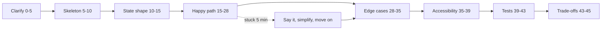
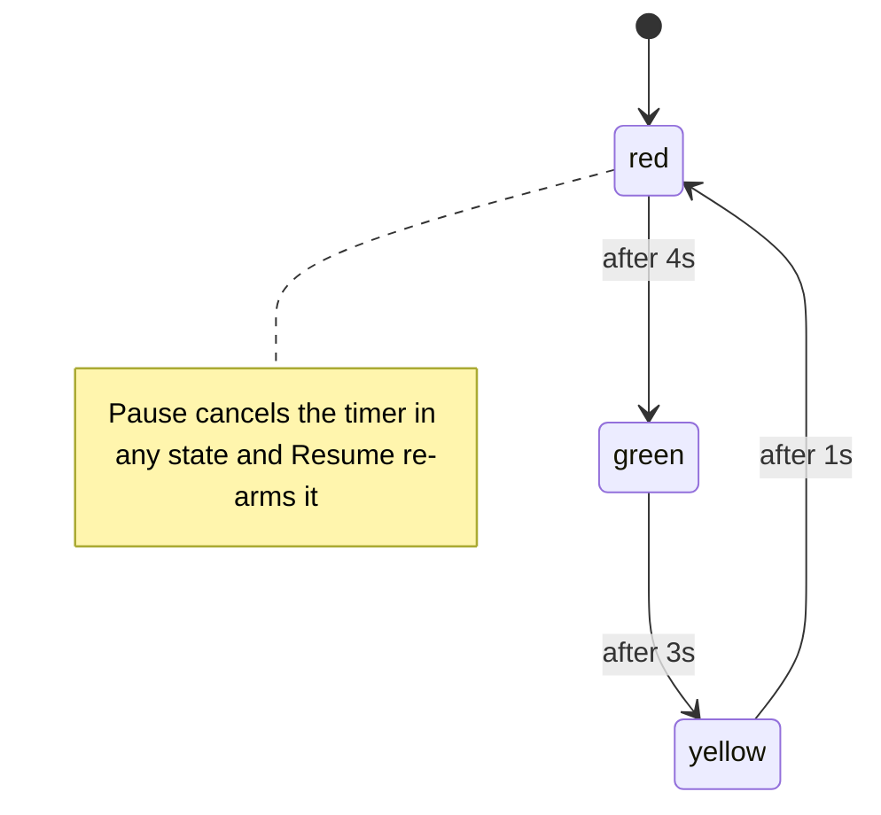

# 26 — Machine-coding round

> **How to use this module.** Read 26.1 once (it is the process), then do the exercises in order with a 45-minute timer and a blank file, and only open the Solution after you have tried. Each exercise is deliberately a small, standalone interview version; the earlier modules go deeper on the same idea and are linked from each section.

**Prerequisites:** [State as a snapshot](08-state.md#82-usestate-and-state-as-a-snapshot) · [Derived state](08-state.md#87-derived-state-compute-do-not-store) · [Cleanup and the effect lifecycle](09-effects.md#93-cleanup-and-the-effect-lifecycle) · [Accessible forms](14-forms-and-actions.md#145-accessible-forms) · [user-event vs fireEvent](20-testing.md#204-user-event-vs-fireevent)

**Code for this module:** [`examples/web/src/m26-machine-coding/`](examples/web/src/m26-machine-coding/), one subfolder per exercise, each with its component and a colocated `*.test.tsx`. Run one with `npx vitest run src/m26-machine-coding/todo` from `examples/web`.

---

## 26.1 How to approach a 45-minute round

### The problem
A machine-coding round gives you a vague product sentence ("build a star rating") and about 45 minutes in a shared editor or sandbox. People fail it in predictable ways: they start typing before they know the requirements, they build the second feature before the first one works, they store derived data in state, they ignore the keyboard, and they go silent. The code that "almost works" at minute 44 scores worse than a smaller thing that works, is accessible and can be explained.

### Mental model
Treat the round like a short **sprint with a demo at the end**. The interviewer is not grading how fast you type. They are grading whether you can turn an ambiguous request into a small, correct, reviewable piece of software and talk about it like a colleague.

> **Java/Spring analogy.** It is a design-review plus pairing session on one endpoint: you agree on the contract (props and behaviour), sketch the data model (state shape), implement the happy path, then harden it (validation and edge cases) and add a test, exactly as you would before opening a pull request.
>
> **Where the analogy breaks:** on the backend the framework hides the UI-specific part. Here, *accessibility and keyboard support are part of correctness*, and the "request" lives for minutes, so state transitions matter more than any single call.

### Minimal code: the skeleton you type in the first five minutes
```tsx
type Item = { id: number; text: string };           // 1. the data shape (the source of truth)

export function Widget() {
  const [items, setItems] = useState<Item[]>([]);   // 2. the SMALLEST state that determines the UI
  const visible = items.filter(/* … */);            // 3. everything else is derived
  return (                                          // 4. semantic HTML first (form, button, ul, label)
    <section aria-label="Widget">{/* … */}</section>
  );
}
```

### How a round runs (the process)
| Step | Minutes | What you do and say |
|---|---|---|
| 1. Clarify | 0–5 | Repeat the requirement in your own words. Ask about scope (what is out), data (static or async), accessibility, and what "done" looks like. Write the agreed list at the top of the file as comments. |
| 2. Skeleton | 5–10 | Component names, props, folder. Render static JSX with hard-coded data so something is on screen. |
| 3. State shape | 10–15 | Say it aloud: "the source of truth is X; Y and Z are derived". One reducer or a few `useState`. No state that can be computed. |
| 4. Happy path | 15–28 | Wire the main interaction end to end. Resist extras. |
| 5. Edge cases | 28–35 | Empty input, boundaries (first/last page, 0 and max), rapid repeats, unmount while something is pending. |
| 6. Accessibility | 35–39 | Roles and names, keyboard operation, focus handling, `aria-*` state. |
| 7. Tests | 39–43 | Two or three tests with Testing Library: one happy path, one edge case, one keyboard path. |
| 8. Trade-offs | 43–45 | Name what you would do with more time (virtualization, a reducer, a library) and what you chose not to build. |



### How it works internally: what interviewers score
They usually use a rubric close to this one (the weights differ by company, so treat it as typical, not official):
- **Requirements and communication**: did you clarify, state assumptions, and keep the interviewer informed?
- **Component design**: small components, props that make sense, state at the right level ([8.8](08-state.md#88-colocation-and-lifting-state-up)), no copy-pasted blocks.
- **State modelling**: minimal source of truth, derived values computed in render, immutable updates ([8.5](08-state.md#85-immutable-updates-of-nested-objects-and-arrays)).
- **Correctness under edge cases**: empty, boundary, rapid input, async races ([9.4](09-effects.md#94-race-conditions-and-abortcontroller)).
- **Accessibility**: semantic elements, labels, roles per the WAI-ARIA Authoring Practices pattern, keyboard operation, focus.
- **Code quality**: names, no dead code, TypeScript types that say something, no effect where a derived value works ([9.6](09-effects.md#96-you-might-not-need-an-effect)).
- **Testing instinct**: you can say what you would assert, or you write it.
- **Trade-offs**: you can say why you did not use a library, memoization or a reducer, and when you would.

> **Version notes.** React 19.3 is what `examples/web` runs ([VERSIONS.md](VERSIONS.md)). If the sandbox is older, know the swaps: React 18 has `forwardRef` instead of ref-as-prop, `<Context.Provider>`, no `useEffectEvent` (use a latest-ref, [9.9](09-effects.md#99-useeffectevent)), and ref callbacks cannot return a cleanup (that arrived in 19, [10.3](10-refs-and-dom.md#103-callback-refs-and-ref-cleanup-functions)). In a CRA-era or class-component codebase the same state design applies with `this.setState` and `componentDidUpdate`; only the syntax changes.

### Trade-offs
- ✅ A fixed process stops you freezing and gives the interviewer something to follow.
- ✅ Small, derived state makes every later requirement ("add a filter", "make it controlled") a small change.
- ❌ Over-planning burns the clock: if the sketch is not on screen by minute 10, you are late.
- ❌ Reaching for a library you cannot configure from memory costs more than writing 20 lines. Native DnD, a `Map` and `setInterval` are enough for everything below.
- **My rule:** get a *working, ugly* happy path on screen before minute 20, then improve it in the order correctness, keyboard, tests, polish.

### Tooling note for the tests in this module
- **Timers.** Fake-timer tests use `vi.useFakeTimers()` with `fireEvent` and `act(() => { vi.advanceTimersByTime(ms); })`. In this repo `vi.useFakeTimers()` together with `userEvent.setup({ advanceTimers: vi.advanceTimersByTime })` **hangs**, and the working combination is `vi.useFakeTimers({ shouldAdvanceTime: true })` plus `advanceTimers` ([20.4](20-testing.md#204-user-event-vs-fireevent), [20.5](20-testing.md#205-async-utilities-and-act)). Vitest's fake timers also fake `Date`, which the countdown relies on.
- **jsdom limits.** No layout, `IntersectionObserver`, `ResizeObserver` or `matchMedia`, so infinite scroll installs a fake observer. jsdom 30.1.1's `HTMLDialogElement` is an empty class (checked in `node_modules/jsdom/lib/jsdom/living/nodes/HTMLDialogElement-impl.js`: no `showModal`), so the modal is a `div role="dialog"`. jsdom has no `DataTransfer`, so the kanban test drives drag events with `fireEvent.dragStart/dragOver/drop` and a plain stub object.

---

## Coding exercises

Eighteen exercises, each solvable from a blank file in about 45 minutes. Every one has a statement, clarifying questions, an approach, collapsed hints, a collapsed full solution, a walkthrough, follow-ups and a test file. The Solution blocks are the files in `examples/`.

| # | Exercise | Core skill |
|---|---|---|
| [26.2](#262-todo-with-filters) | Todo with filters | Derived state, lists, forms |
| [26.3](#263-star-rating) | Star rating | Hover preview, roving tabindex |
| [26.4](#264-accordion) | Accordion | Disclosure pattern, ARIA |
| [26.5](#265-tabs) | Tabs | Tabs pattern, keyboard |
| [26.6](#266-modal-with-focus-trap) | Modal with focus trap | Focus management |
| [26.7](#267-debounced-search) | Debounced search | Debounce, races, abort |
| [26.8](#268-pagination) | Pagination | Pure function, clamping |
| [26.9](#269-infinite-scroll) | Infinite scroll | IntersectionObserver, guards |
| [26.10](#2610-nested-comments) | Nested comments | Recursion, immutable tree update |
| [26.11](#2611-file-explorer-tree) | File explorer tree | Tree view pattern |
| [26.12](#2612-progress-bar) | Progress bar | Interval cleanup, ARIA |
| [26.13](#2613-countdown-timer) | Countdown timer | Timestamps, drift |
| [26.14](#2614-kanban-drag-and-drop) | Kanban drag-and-drop | Native DnD API |
| [26.15](#2615-form-wizard) | Form wizard | Multi-step state, validation |
| [26.16](#2616-tic-tac-toe) | Tic-tac-toe | Derive everything |
| [26.17](#2617-autocomplete-with-keyboard-nav) | Autocomplete | Combobox pattern |
| [26.18](#2618-traffic-light) | Traffic light | State machine as data |
| [26.19](#2619-data-table-with-sortfilter) | Data table | Pipelines, stable sort |

---

## 26.2 Todo with filters

**Statement.** Build a todo list. The user can add a todo, mark it done, delete it and filter by All, Active or Done. Show how many are left.

**Clarifying questions to ask first.**
- Persist across reloads? (assume no; `localStorage` is a follow-up.)
- Are blank todos allowed? Are duplicates allowed?
- Can todos be edited or reordered? (out of scope for now.)
- Does the filter apply to the counter? (the counter is always the active count.)

**Approach.**

**Mental model.** A todo list is one array plus one filter. Everything on screen (the visible rows, the counter) is a *view* of those two values, so none of it is state ([8.7](08-state.md#87-derived-state-compute-do-not-store)).

1. State: `items: {id, text, done}[]`, `filter`, and the input's `draft`.
2. Derive `visibleItems(items, filter)` and `left` during render.
3. Use a real `<form>` so Enter submits and the button is free keyboard support.
4. Give each item a stable `id` (a counter in a ref, read only in handlers). Never use the array index as a key for a list you can delete from ([13.2](13-reconciliation-and-fiber.md#132-diffing-heuristics-type-then-key)).
5. Use functional updates (`setItems(prev => …)`) so rapid clicks cannot overwrite each other ([8.4](08-state.md#84-functional-updates)).

<details><summary>Hints</summary>

- Write `visibleItems` before the JSX.
- `aria-pressed` on the filter buttons shows which one is active.
- Wrap the checkbox and text in one `<label>` so the checkbox has an accessible name.
- ``aria-label={`Delete ${text}`}`` makes the icon-only delete button identifiable.

</details>

<details><summary>Solution</summary>

[`examples/web/src/m26-machine-coding/todo/Todo.tsx`](examples/web/src/m26-machine-coding/todo/Todo.tsx):

```tsx
// file: examples/web/src/m26-machine-coding/todo/Todo.tsx
import { useRef, useState, type FormEvent } from 'react';

export type Filter = 'all' | 'active' | 'done';
type Item = { id: number; text: string; done: boolean };

const FILTERS: Filter[] = ['all', 'active', 'done'];
const LABEL: Record<Filter, string> = { all: 'All', active: 'Active', done: 'Done' };

// Single source of truth: `items`. The visible list and the counter are derived, never stored.
function visibleItems(items: Item[], filter: Filter): Item[] {
  if (filter === 'active') return items.filter((item) => !item.done);
  if (filter === 'done') return items.filter((item) => item.done);
  return items;
}

export function Todo() {
  const [items, setItems] = useState<Item[]>([]);
  const [filter, setFilter] = useState<Filter>('all');
  const [draft, setDraft] = useState('');
  const nextId = useRef(1); // only read in event handlers, never during render

  function add(event: FormEvent) {
    event.preventDefault();
    const text = draft.trim();
    if (!text) return;
    const id = nextId.current++;
    setItems((prev) => [...prev, { id, text, done: false }]);
    setDraft('');
  }

  const toggle = (id: number) =>
    setItems((prev) => prev.map((item) => (item.id === id ? { ...item, done: !item.done } : item)));
  const remove = (id: number) => setItems((prev) => prev.filter((item) => item.id !== id));

  const left = items.filter((item) => !item.done).length;

  return (
    <section aria-label="Todo list">
      <form onSubmit={add}>
        <label>
          New todo
          <input value={draft} onChange={(e) => setDraft(e.target.value)} />
        </label>
        <button type="submit">Add</button>
      </form>

      <div role="group" aria-label="Filter">
        {FILTERS.map((name) => (
          <button key={name} type="button" aria-pressed={filter === name} onClick={() => setFilter(name)}>
            {LABEL[name]}
          </button>
        ))}
      </div>

      <ul>
        {visibleItems(items, filter).map((item) => (
          <li key={item.id}>
            <label>
              <input type="checkbox" checked={item.done} onChange={() => toggle(item.id)} />
              {item.text}
            </label>
            <button type="button" aria-label={`Delete ${item.text}`} onClick={() => remove(item.id)}>
              ×
            </button>
          </li>
        ))}
      </ul>

      <p>{left} left</p>
    </section>
  );
}
```

</details>

**Walkthrough.** `add` trims the draft and ignores it when empty, takes the next id from a ref (`nextId.current++` happens in the handler, not in render, so it does not break the purity rules), appends immutably and clears the draft. `toggle` and `remove` use `map` and `filter`, which return new arrays. The filter buttons only set `filter`; `visibleItems` does the rest, so the counter stays correct whatever filter is on.

**Interviewer follow-ups.**
- Persist to `localStorage`. Read lazily (`useState(() => load())`) and write in an effect or in the handlers ([12.7](12-hooks-and-custom-hooks.md#127-uselocalstorage)).
- Edit on double click. A per-item `editing` id in state; Escape cancels, Enter or blur commits.
- 1,000 todos: still fine; at 100,000 you would virtualize ([15.8](15-performance.md#158-virtualization)).
- Convert the three `useState` calls to a `useReducer` and explain when that pays off ([8.10](08-state.md#810-usereducer)).
- Add an "undo delete" toast without a library.

**Tests.** [`examples/web/src/m26-machine-coding/todo/Todo.test.tsx`](examples/web/src/m26-machine-coding/todo/Todo.test.tsx). Add, Enter-to-submit, blank rejection, toggle with the counter, all three filters and delete.

---

## 26.3 Star rating

**Statement.** Build a `StarRating` with 5 stars. Clicking sets the rating, hovering previews it, and the component reports changes through `onChange`.

**Clarifying questions to ask first.**
- Is `max` configurable? (yes, default 5.)
- Controlled or uncontrolled? (uncontrolled with `defaultValue`; controlled is a follow-up.)
- Can the user clear the rating? Half stars?
- Keyboard: should arrow keys change the value?

**Approach.**

**Mental model.** The visible fill is `hover ?? value`: a *preview* that wins while the pointer is over a star, and falls back to the committed value. Two pieces of state, one derived number. Semantically it is a **radio group**, which tells you the ARIA contract and the keyboard map.

1. State: `value` (committed) and `hover` (`number | null`).
2. Render `max` buttons with `role="radio"`, `aria-checked`, and a label such as "3 stars".
3. Roving tabindex: only the checked star (or the first) is a tab stop.
4. Arrow keys move the selection and focus, clamped to `1…max`.

<details><summary>Hints</summary>

- `Array.from({ length: max }, (_, i) => i + 1)` builds the stars.
- The glyph is decoration: `aria-hidden` on it, and the accessible name comes from `aria-label`.
- Focus the new star with `querySelector('[data-star="…"]')` in the handler: the element already exists.

</details>

<details><summary>Solution</summary>

[`examples/web/src/m26-machine-coding/star-rating/StarRating.tsx`](examples/web/src/m26-machine-coding/star-rating/StarRating.tsx):

```tsx
// file: examples/web/src/m26-machine-coding/star-rating/StarRating.tsx
import { useState, type KeyboardEvent } from 'react';

type Props = {
  max?: number;
  defaultValue?: number;
  onChange?: (value: number) => void;
};

const starLabel = (n: number) => `${n} star${n === 1 ? '' : 's'}`;

/** A radiogroup: arrow keys move and select, hover previews, one tab stop (roving tabindex). */
export function StarRating({ max = 5, defaultValue = 0, onChange }: Props) {
  const [value, setValue] = useState(defaultValue);
  const [hover, setHover] = useState<number | null>(null);
  const shown = hover ?? value; // the preview wins while the pointer is over a star

  function select(next: number, group?: HTMLElement) {
    setValue(next);
    onChange?.(next);
    group?.querySelector<HTMLElement>(`[data-star="${next}"]`)?.focus();
  }

  function onKeyDown(event: KeyboardEvent<HTMLDivElement>) {
    const steps: Record<string, number> = { ArrowRight: 1, ArrowUp: 1, ArrowLeft: -1, ArrowDown: -1 };
    const step = steps[event.key];
    if (step === undefined) return;
    event.preventDefault();
    select(Math.min(max, Math.max(1, (value || 0) + step)), event.currentTarget);
  }

  return (
    <div role="radiogroup" aria-label="Rating" onKeyDown={onKeyDown}>
      {Array.from({ length: max }, (_, i) => i + 1).map((n) => (
        <button
          key={n}
          type="button"
          role="radio"
          aria-checked={value === n}
          aria-label={starLabel(n)}
          data-star={n}
          data-filled={n <= shown}
          tabIndex={n === (value || 1) ? 0 : -1} // roving tabindex: first star is the tab stop until a rating exists
          onClick={() => select(n)}
          onMouseEnter={() => setHover(n)}
          onMouseLeave={() => setHover(null)}
        >
          <span aria-hidden="true">{n <= shown ? '★' : '☆'}</span>
        </button>
      ))}
    </div>
  );
}
```

</details>

**Walkthrough.** Every star is a `button role="radio"` inside a `radiogroup`. `shown = hover ?? value` decides which glyphs are filled. The `onKeyDown` on the group maps arrows to a step, clamps with `Math.min/Math.max`, calls `select`, which updates state, notifies the parent and moves DOM focus. `tabIndex` is 0 only on the selected star (or star 1 when nothing is selected), which is the roving-tabindex pattern from the WAI-ARIA radio group.

**Interviewer follow-ups.**
- Make it controlled with `value`/`onChange` or reuse `useControllableState` ([7.8](07-components-props-composition.md#78-controlled-vs-uncontrolled-component-apis)).
- Support half stars (hover position inside the star) and read-only mode (`aria-readonly`).
- Clicking the current value clears it: what changes in state and in the radio semantics?
- Style without CSS-in-JS: `data-filled` attributes and one stylesheet.
- Why not native `<input type="radio">`? (You can: visually hidden radios give arrow keys for free. Custom buttons were chosen to show the keyboard handling.)

**Tests.** [`examples/web/src/m26-machine-coding/star-rating/StarRating.test.tsx`](examples/web/src/m26-machine-coding/star-rating/StarRating.test.tsx). Click selection with `onChange`, hover preview and restore, arrow keys with focus and clamping, and a single tab stop.

---

## 26.4 Accordion

**Statement.** Build an `Accordion` from an `items` array. Each header toggles its panel. By default opening a panel closes the others; a `multiple` prop lets several stay open.

**Clarifying questions to ask first.**
- Is one panel open at the start? (assume all closed.)
- Should the open panel be collapsible by clicking again? (yes.)
- Animation? (out of scope; mention `grid-template-rows` or `<details>`.)
- Keyboard beyond Enter/Space?

**Approach.**

**Mental model.** State is a **set of open ids**, nothing else. "Single" versus "multiple" is only a different update rule, not a different structure. This is the WAI-ARIA *accordion* pattern: a heading containing a button with `aria-expanded` and `aria-controls`, and a `region` labelled by that button.

1. `open: Set<string>`; `toggle(id)` builds a new set (never mutate the old one).
2. Single mode starts from an empty set, multiple from a copy of the previous one.
3. Header: `<h3><button aria-expanded aria-controls>`. Panel: `role="region" aria-labelledby hidden`.
4. Optional: Up/Down/Home/End move focus between headers. Older APG versions listed them as optional; the current [accordion pattern](https://www.w3.org/WAI/ARIA/apg/patterns/accordion/) specifies only Enter/Space and Tab/Shift+Tab, so they are an extra, not a requirement.

<details><summary>Hints</summary>

- Make ids with `useId` so two accordions on one page do not collide.
- Use `hidden`, not conditional rendering, if panels should keep their internal state while closed.
- `new Set(multiple ? prev : [])` is the whole difference between the two modes.

</details>

<details><summary>Solution</summary>

[`examples/web/src/m26-machine-coding/accordion/Accordion.tsx`](examples/web/src/m26-machine-coding/accordion/Accordion.tsx):

```tsx
// file: examples/web/src/m26-machine-coding/accordion/Accordion.tsx
import { useId, useState, type KeyboardEvent } from 'react';

export type AccordionItem = { id: string; title: string; content: string };

type Props = {
  items: AccordionItem[];
  /** Allow several panels open at once. Default: opening one closes the others. */
  multiple?: boolean;
};

/** WAI-ARIA accordion: heading > button[aria-expanded][aria-controls] + region[aria-labelledby]. */
export function Accordion({ items, multiple = false }: Props) {
  const baseId = useId();
  const [open, setOpen] = useState<ReadonlySet<string>>(new Set());

  function toggle(id: string) {
    setOpen((prev) => {
      const next = new Set(multiple ? prev : []); // single mode starts from empty
      if (prev.has(id)) next.delete(id);
      else next.add(id);
      return next;
    });
  }

  // Up/Down/Home/End move between the headers (the current APG accordion pattern no longer lists them as optional).
  function onKeyDown(event: KeyboardEvent<HTMLDivElement>) {
    const triggers = Array.from(event.currentTarget.querySelectorAll<HTMLElement>('[data-trigger]'));
    const current = triggers.findIndex((el) => el === document.activeElement);
    const target: Record<string, number> = {
      ArrowDown: (current + 1) % triggers.length,
      ArrowUp: (current - 1 + triggers.length) % triggers.length,
      Home: 0,
      End: triggers.length - 1,
    };
    const next = target[event.key];
    if (next === undefined || current === -1) return;
    event.preventDefault();
    triggers[next]?.focus();
  }

  return (
    <div onKeyDown={onKeyDown}>
      {items.map(({ id, title, content }) => {
        const isOpen = open.has(id);
        return (
          <div key={id}>
            <h3>
              <button
                type="button"
                id={`${baseId}-trigger-${id}`}
                data-trigger=""
                aria-expanded={isOpen}
                aria-controls={`${baseId}-panel-${id}`}
                onClick={() => toggle(id)}
              >
                {title}
              </button>
            </h3>
            <div
              role="region"
              id={`${baseId}-panel-${id}`}
              aria-labelledby={`${baseId}-trigger-${id}`}
              hidden={!isOpen}
            >
              {content}
            </div>
          </div>
        );
      })}
    </div>
  );
}
```

</details>

**Walkthrough.** `toggle` receives the previous set from the functional updater, copies it (or starts empty in single mode), flips the id and returns the new set. `aria-controls` and `aria-labelledby` point to ids built from `useId`, so a screen reader announces "Shipping, button, collapsed" and later "Shipping, region". The container's `onKeyDown` finds the focused header among `[data-trigger]` elements and moves focus with wrap-around.

**Interviewer follow-ups.**
- Controlled API (`openIds` and `onChange`).
- Animate the height: why `height: auto` does not transition, and what to use instead.
- Use the native `<details name="group">` for exclusive accordions and explain what you lose (no animation control, less styling).
- Should closed content be mounted? Trade-off between state retention and render cost.
- Deep links: open the panel whose id is in `location.hash`.

**Tests.** [`examples/web/src/m26-machine-coding/accordion/Accordion.test.tsx`](examples/web/src/m26-machine-coding/accordion/Accordion.test.tsx). Collapsed start, toggling with `aria-expanded`, single versus multiple, the labelled region, and Enter/Space plus arrow/Home/End focus. Closed panels are `display: none`, so the tests use `getByText(...).not.toBeVisible()` rather than `getByRole`.

---

## 26.5 Tabs

**Statement.** Build `SimpleTabs({ tabs, label })` where each tab has an id, a label and content. Show one panel at a time and support the keyboard.

**Clarifying questions to ask first.**
- Automatic activation (focus selects) or manual (Enter selects)? Assume automatic.
- Should hidden panels keep their state? (decide, and say the cost.)
- Vertical tabs? Overflow scrolling?
- Controlled or uncontrolled?

**Approach.**

**Mental model.** One piece of state: the selected tab id. This is the WAI-ARIA [*tabs* pattern](https://www.w3.org/WAI/ARIA/apg/patterns/tabs/) (Left/Right wrap around; Home/End are marked optional there): `tablist` > `tab` (with `aria-selected`, `aria-controls`) and one `tabpanel` (with `aria-labelledby`). Only the selected tab is in the tab order (**roving tabindex**); Left/Right/Home/End move between tabs, and Tab moves into the panel.

1. `selectedId` state, default `tabs[0]`.
2. Render the tablist, then the selected panel only.
3. `onKeyDown` on the tablist computes the target index with wrap-around, then selects and focuses.
4. IDs from `useId` link tab and panel.

> **Module 07 comparison.** [7.6](07-components-props-composition.md#76-compound-components) builds a compound, controllable `Tabs` with context and keeps every panel mounted but `hidden`. This version is the data-driven, 45-minute one and unmounts inactive panels. Say which you picked and what each costs.

<details><summary>Hints</summary>

- Compute the next index with a lookup object keyed by `event.key`.
- Focus the new tab by `querySelector` inside the handler.
- `tabIndex={tab.id === selectedId ? 0 : -1}`.

</details>

<details><summary>Solution</summary>

[`examples/web/src/m26-machine-coding/tabs/SimpleTabs.tsx`](examples/web/src/m26-machine-coding/tabs/SimpleTabs.tsx):

```tsx
// file: examples/web/src/m26-machine-coding/tabs/SimpleTabs.tsx
import { useId, useState, type KeyboardEvent, type ReactNode } from 'react';

export type TabItem = { id: string; label: string; content: ReactNode };

/** Data-driven tabs with automatic activation (arrow keys move focus AND select). */
export function SimpleTabs({ tabs, label }: { tabs: TabItem[]; label: string }) {
  const baseId = useId();
  const [selectedId, setSelectedId] = useState(tabs[0]?.id);

  function onKeyDown(event: KeyboardEvent<HTMLDivElement>) {
    const index = tabs.findIndex((tab) => tab.id === selectedId);
    const last = tabs.length - 1;
    const targets: Record<string, number> = {
      ArrowRight: index === last ? 0 : index + 1,
      ArrowLeft: index === 0 ? last : index - 1,
      Home: 0,
      End: last,
    };
    const next = targets[event.key];
    const tab = next === undefined ? undefined : tabs[next];
    if (!tab) return;
    event.preventDefault();
    setSelectedId(tab.id);
    // The tab element already exists, so we can focus it before React re-renders.
    event.currentTarget.querySelector<HTMLElement>(`[data-tab="${tab.id}"]`)?.focus();
  }

  const selected = tabs.find((tab) => tab.id === selectedId);

  return (
    <div>
      <div role="tablist" aria-label={label} onKeyDown={onKeyDown}>
        {tabs.map((tab) => (
          <button
            key={tab.id}
            type="button"
            role="tab"
            id={`${baseId}-tab-${tab.id}`}
            data-tab={tab.id}
            aria-selected={tab.id === selectedId}
            aria-controls={`${baseId}-panel-${tab.id}`}
            tabIndex={tab.id === selectedId ? 0 : -1} // roving tabindex
            onClick={() => setSelectedId(tab.id)}
          >
            {tab.label}
          </button>
        ))}
      </div>
      {selected && (
        <div
          role="tabpanel"
          id={`${baseId}-panel-${selected.id}`}
          aria-labelledby={`${baseId}-tab-${selected.id}`}
          tabIndex={0}
        >
          {selected.content}
        </div>
      )}
    </div>
  );
}
```

</details>

**Walkthrough.** Click sets `selectedId`. The keydown handler maps `ArrowRight/ArrowLeft` with wrap-around plus `Home/End`, calls `preventDefault` so the page does not scroll, selects the target and focuses its element. Because only one tab has `tabIndex=0` and the panel itself has `tabIndex=0`, one Tab press from the selected tab lands in the panel, as the pattern recommends.

**Interviewer follow-ups.**
- Manual activation: arrow keys only move focus, Enter/Space selects. What changes?
- Make it controlled and add `onChange` ([7.8](07-components-props-composition.md#78-controlled-vs-uncontrolled-component-apis)).
- Lazy panels: render a panel the first time it is visited and keep it afterwards.
- Sync the selected tab with the URL (query param or route) ([19](19-routing.md)).
- Handle tabs being added or removed: what if `selectedId` no longer exists? (derive a fallback to the first tab.)

**Tests.** [`examples/web/src/m26-machine-coding/tabs/SimpleTabs.test.tsx`](examples/web/src/m26-machine-coding/tabs/SimpleTabs.test.tsx). Roles and wiring, click switching, wrapping arrows with Home/End and focus, and the roving tab stop.

---

## 26.6 Modal with focus trap

**Statement.** Build a `Modal` that is mounted while open. It must trap Tab/Shift+Tab inside, close on Escape, on a backdrop click and with a Close button, move focus in when it opens and give focus back to the opener when it closes.

**Clarifying questions to ask first.**
- Native `<dialog>` allowed? (yes in a browser; here a `div` because jsdom has no `showModal`.)
- Scroll lock on the page behind it?
- Should it render in a portal? (yes, to escape `overflow` and stacking contexts.)
- Nested modals?

**Approach.**

**Mental model.** A modal dialog makes the rest of the page unreachable until it is dismissed. Visually that is a backdrop; for keyboards and screen readers it is **focus management**: (1) move focus in, (2) keep it in, (3) put it back. This follows the WAI-ARIA *dialog (modal)* pattern: `role="dialog"`, `aria-modal="true"`, a label, Escape closes, Tab wraps.

1. Render through a portal ([10.6](10-refs-and-dom.md#106-portals)).
2. A ref callback with a cleanup ([10.3](10-refs-and-dom.md#103-callback-refs-and-ref-cleanup-functions)) remembers `document.activeElement`, focuses the first focusable element and restores focus in the cleanup.
3. `onKeyDown`: Escape closes. On Tab, find the first and last focusable elements: Tab on the last wraps to the first, Shift+Tab on the first wraps to the last.
4. Backdrop: close only if `event.target === event.currentTarget`.

> **Why a `div` here.** The native `<dialog>` with `showModal()` gives you the trap, Escape and the top layer for free and is what I would ship in a browser-only app. jsdom 30.1.1 does not implement `showModal` (verified by reading `HTMLDialogElement-impl.js`, an empty class), so a unit test of a native dialog needs a polyfill or a real browser. In the interview, ask which is allowed and say that you would prefer `<dialog>`.

<details><summary>Hints</summary>

- The focusable selector: `a[href], button:not([disabled]), input:not([disabled]), select, textarea, [tabindex]:not([tabindex="-1"])`.
- Only call `preventDefault` when you actually redirect focus; otherwise leave Tab alone.
- `aria-labelledby` pointing at the heading beats a bare `aria-label`.
- The trap needs the *focused element being inside* the dialog; focusing the dialog itself (`tabIndex=-1`) covers the no-focusables case.

</details>

<details><summary>Solution</summary>

[`examples/web/src/m26-machine-coding/modal/Modal.tsx`](examples/web/src/m26-machine-coding/modal/Modal.tsx):

```tsx
// file: examples/web/src/m26-machine-coding/modal/Modal.tsx
import { useId, type KeyboardEvent, type MouseEvent, type ReactNode } from 'react';
import { createPortal } from 'react-dom';

const FOCUSABLE =
  'a[href], button:not([disabled]), input:not([disabled]), select:not([disabled]), textarea:not([disabled]), [tabindex]:not([tabindex="-1"])';

const focusablesIn = (root: HTMLElement) => Array.from(root.querySelectorAll<HTMLElement>(FOCUSABLE));

// Ref callback with cleanup (React 19): move focus in on mount, give it back on unmount.
// The parameter type includes null (React's RefCallback type): see 10.3.
function focusWhileOpen(dialog: HTMLElement | null) {
  if (!dialog) return;
  const opener = document.activeElement;
  (focusablesIn(dialog)[0] ?? dialog).focus();
  return () => {
    if (opener instanceof HTMLElement) opener.focus();
  };
}

type Props = { title: string; onClose: () => void; children: ReactNode };

/**
 * Modal built from a div, not <dialog>: jsdom has no showModal(), and the trap is what is being tested.
 * Render it conditionally: mounted = open.
 */
export function Modal({ title, onClose, children }: Props) {
  const titleId = useId();

  function onKeyDown(event: KeyboardEvent<HTMLDivElement>) {
    if (event.key === 'Escape') {
      onClose();
      return;
    }
    if (event.key !== 'Tab') return;

    const focusable = focusablesIn(event.currentTarget);
    const first = focusable[0];
    const last = focusable.at(-1);
    if (!first || !last) {
      event.preventDefault(); // nothing to focus: keep focus on the dialog
      return;
    }
    const active = document.activeElement;
    if (event.shiftKey && (active === first || active === event.currentTarget)) {
      event.preventDefault();
      last.focus();
    } else if (!event.shiftKey && active === last) {
      event.preventDefault();
      first.focus();
    }
  }

  // Close only when the press lands on the backdrop itself, not on something inside the dialog.
  function onBackdropClick(event: MouseEvent<HTMLDivElement>) {
    if (event.target === event.currentTarget) onClose();
  }

  return createPortal(
    <div data-testid="backdrop" onClick={onBackdropClick}>
      <div
        role="dialog"
        aria-modal="true"
        aria-labelledby={titleId}
        tabIndex={-1}
        ref={focusWhileOpen}
        onKeyDown={onKeyDown}
      >
        <h2 id={titleId}>{title}</h2>
        {children}
        <button type="button" onClick={onClose}>
          Close
        </button>
      </div>
    </div>,
    document.body,
  );
}
```

</details>

**Walkthrough.** On mount the ref callback stores the opener and focuses the first control; React runs the returned cleanup on unmount, restoring focus. The keydown handler computes `focusablesIn(dialog)` each time (the content can change) and wraps at the ends. The backdrop `onClick` ignores clicks that bubble up from inside the dialog because `event.target` is then not the backdrop itself. A `<button>Close</button>` is the last control, so Tab from it wraps to the first field.

**Interviewer follow-ups.**
- Mark the rest of the page `inert` (MDN) so assistive tech and pointer cannot reach it, instead of relying on `aria-modal` alone.
- Lock body scroll and restore it on close.
- Stacked modals: only the top one traps; keep a stack.
- Animate in and out: when do you unmount? (after `transitionend`, with a `closing` state.)
- Return focus when the opener was removed from the DOM: fall back to a known element.

**Tests.** [`examples/web/src/m26-machine-coding/modal/Modal.test.tsx`](examples/web/src/m26-machine-coding/modal/Modal.test.tsx). Labelled modal with initial focus, wrapping Tab and Shift+Tab, Escape and Close restoring focus to the opener, and backdrop versus inner clicks.

---

## 26.7 Debounced search

**Statement.** Build a search box that calls `search(query, signal)` only after the user stops typing for 300 ms. Show "Searching…", the results, "No results" or an error. A slow old response must never replace a newer one.

**Clarifying questions to ask first.**
- Minimum query length? Trim whitespace?
- Cache results? Show previous results while loading?
- What does the API do on an empty query? (we send nothing.)
- Is `search` stable across renders? (it must be, or the effect re-runs.)

**Approach.**

**Mental model.** Two separate problems: *when* to fire (debounce) and *which answer to believe* (races). Debounce is a value that follows another value after a quiet period ([12.5](12-hooks-and-custom-hooks.md#125-usedebounce)). The race fix is the cleanup of the effect that fires the request ([9.4](09-effects.md#94-race-conditions-and-abortcontroller)).

1. State `query` (immediate, drives the input) and `debounced = useDebounced(query, delay)`.
2. An effect keyed on `debounced` starts a request with an `AbortController` and aborts it in the cleanup.
3. Store the outcome *together with the query it answers*: `{ query, items, failed }`.
4. Derive what to show: `outcome?.query === debounced ? outcome : null`; no outcome yet means "Searching…".
5. Never call `setState` synchronously in the effect body (lint error); call it from the promise callbacks.

<details><summary>Hints</summary>

- The loading state is derived (`debounced` non-empty and no outcome for it), not a boolean you set.
- On rejection, check `controller.signal.aborted` before reporting an error.
- Ignore a *fulfilled* answer when aborted too: your fake or API may not reject on abort, and the single `outcome` slot would be overwritten.

</details>

<details><summary>Solution</summary>

[`examples/web/src/m26-machine-coding/search/Search.tsx`](examples/web/src/m26-machine-coding/search/Search.tsx):

```tsx
// file: examples/web/src/m26-machine-coding/search/Search.tsx
import { useEffect, useState } from 'react';

export type SearchFn = (query: string, signal: AbortSignal) => Promise<string[]>;

type Outcome = { query: string; items: string[]; failed: boolean };

type Props = { search: SearchFn; delayMs?: number };

// Debounce: the returned value only follows `value` after it has been quiet for `delayMs`.
function useDebounced(value: string, delayMs: number): string {
  const [debounced, setDebounced] = useState(value);
  useEffect(() => {
    const id = setTimeout(() => setDebounced(value), delayMs);
    return () => clearTimeout(id);
  }, [value, delayMs]);
  return debounced;
}

export function Search({ search, delayMs = 300 }: Props) {
  const [query, setQuery] = useState('');
  const debounced = useDebounced(query.trim(), delayMs);
  const [outcome, setOutcome] = useState<Outcome | null>(null);

  useEffect(() => {
    if (!debounced) return;
    const controller = new AbortController();
    search(debounced, controller.signal).then(
      (items) => {
        // The single `outcome` slot would be overwritten by a late answer to an old query, so ignore it.
        if (!controller.signal.aborted) setOutcome({ query: debounced, items, failed: false });
      },
      () => {
        if (!controller.signal.aborted) setOutcome({ query: debounced, items: [], failed: true });
      },
    );
    return () => controller.abort(); // a newer query (or unmount) cancels this one
  }, [debounced, search]);

  // Everything below is derived: an outcome only counts if it answers the CURRENT debounced query.
  const current = outcome?.query === debounced ? outcome : null;

  return (
    <div>
      <input aria-label="Search" value={query} onChange={(e) => setQuery(e.target.value)} />
      {debounced && !current && <p role="status">Searching…</p>}
      {current?.failed && <p role="alert">Search failed</p>}
      {current && !current.failed && current.items.length === 0 && <p>No results</p>}
      {current && current.items.length > 0 && (
        <ul>
          {current.items.map((item) => (
            <li key={item}>{item}</li>
          ))}
        </ul>
      )}
    </div>
  );
}
```

</details>

**Walkthrough.** The input is controlled by `query`. After 300 ms of quiet, `debounced` changes and the effect fires one request. Typing again cleans up the effect first, which aborts the previous request, and the guard `!controller.signal.aborted` stops a late answer from calling `setOutcome`. Because `outcome` carries its `query`, even a stale outcome that sneaked in is never displayed for the wrong query. Clearing the box makes `debounced` empty: no request, and the old results disappear because they no longer match.

**Interviewer follow-ups.**
- Add a client cache (`Map<string, string[]>`) or move to TanStack Query ([17](17-data-fetching.md)).
- Debounce versus throttle: which one for scroll, which one for search?
- Keyboard navigation of results: link to [26.17](#2617-autocomplete-with-keyboard-nav).
- Highlight the matched substring safely (no `dangerouslySetInnerHTML`).
- Announce results to screen readers with a polite live region.

**Tests.** [`examples/web/src/m26-machine-coding/search/Search.test.tsx`](examples/web/src/m26-machine-coding/search/Search.test.tsx). Fake timers with `fireEvent` and `act`. One request for fast typing, loading then results, the stale-response race (resolved in the wrong order on purpose, with `signal.aborted` asserted), empty and error states, and clearing. The test controls each promise by hand and never asserts an order between concurrent requests.

---

## 26.8 Pagination

**Statement.** Show a list in pages of N items with Previous/Next and numbered page buttons. For many pages, collapse the middle with an ellipsis (`1 … 4 5 6 … 10`).

**Clarifying questions to ask first.**
- Page size fixed or selectable?
- Is the data client-side (a slice) or server-side (page param)?
- What happens when the list shrinks and the current page no longer exists?
- How many sibling pages around the current one?

**Approach.**

**Mental model.** The hard part is a **pure function**: `getPageItems(page, count, siblings)` returns the numbers and ellipses to render. Isolate it, test it with plain assertions, and the component becomes trivial. Keep the total slot count constant so the control does not shift as you click.

1. Few pages (`count <= siblings*2 + 5`): show all.
2. Compute `left = page - siblings`, `right = page + siblings`; decide whether a gap exists on each side.
3. No left gap: first `siblings*2 + 3` pages, an ellipsis, the last page. No right gap: the mirror image. Both gaps: `1 … left..right … last`.
4. The list component stores the *requested* page and derives `page = min(requested, pageCount)`.

<details><summary>Hints</summary>

- Write down the five cases on paper first: start, near start, middle, near end, end.
- `aria-current="page"` marks the current page; `aria-label="Page 3"` names it.
- Disable Previous on page 1 and Next on the last page.

</details>

<details><summary>Solution</summary>

[`examples/web/src/m26-machine-coding/pagination/Pagination.tsx`](examples/web/src/m26-machine-coding/pagination/Pagination.tsx):

```tsx
// file: examples/web/src/m26-machine-coding/pagination/Pagination.tsx
import { useState } from 'react';

const range = (from: number, to: number) => Array.from({ length: to - from + 1 }, (_, i) => from + i);

/**
 * The page numbers to show, with '…' for skipped runs. Always the same length once there are
 * enough pages, so the control does not jump around while you click through it.
 */
export function getPageItems(page: number, count: number, siblings = 1): Array<number | '…'> {
  const total = siblings * 2 + 5; // first + last + current + 2 gaps + siblings on both sides
  if (count <= total) return range(1, count);

  const left = Math.max(page - siblings, 1);
  const right = Math.min(page + siblings, count);
  const gapLeft = left > 2;
  const gapRight = right < count - 1;
  const edge = siblings * 2 + 3;

  if (!gapLeft) return [...range(1, edge), '…', count];
  if (!gapRight) return [1, '…', ...range(count - edge + 1, count)];
  return [1, '…', ...range(left, right), '…', count];
}

type PaginationProps = { page: number; pageCount: number; onPageChange: (page: number) => void };

/** Presentational and controlled: it owns no state. */
export function Pagination({ page, pageCount, onPageChange }: PaginationProps) {
  return (
    <nav aria-label="Pagination">
      <button type="button" disabled={page <= 1} onClick={() => onPageChange(page - 1)}>
        Previous
      </button>
      {getPageItems(page, pageCount).map((item, index) =>
        item === '…' ? (
          <span key={`gap-${index}`} aria-hidden="true">
            …
          </span>
        ) : (
          <button
            key={item}
            type="button"
            aria-label={`Page ${item}`}
            aria-current={item === page ? 'page' : undefined}
            onClick={() => onPageChange(item)}
          >
            {item}
          </button>
        ),
      )}
      <button type="button" disabled={page >= pageCount} onClick={() => onPageChange(page + 1)}>
        Next
      </button>
    </nav>
  );
}

type ListProps = { items: string[]; pageSize?: number };

export function PaginatedList({ items, pageSize = 5 }: ListProps) {
  const [requested, setRequested] = useState(1);
  const pageCount = Math.max(1, Math.ceil(items.length / pageSize));
  const page = Math.min(requested, pageCount); // derived clamp: survives the list shrinking
  const slice = items.slice((page - 1) * pageSize, page * pageSize);

  return (
    <div>
      <ul>
        {slice.map((item) => (
          <li key={item}>{item}</li>
        ))}
      </ul>
      <Pagination page={page} pageCount={pageCount} onPageChange={setRequested} />
    </div>
  );
}
```

</details>

**Walkthrough.** `getPageItems` returns `[1, 2, 3, 4, 5, '…', 10]` at the start, `[1, '…', 4, 5, 6, '…', 10]` in the middle and `[1, '…', 6, 7, 8, 9, 10]` at the end: always seven slots for ten pages. `Pagination` is a controlled, presentational `<nav>`. `PaginatedList` slices the items and derives the page, so shrinking the list (or changing the filter) can never leave you on a non-existent page and no effect is needed to "fix" it.

**Interviewer follow-ups.**
- Server-side pagination: page in the URL, `keepPreviousData`/`placeholderData` while loading ([17](17-data-fetching.md)).
- Cursor-based versus offset pagination and why offset breaks when rows are inserted.
- Reset to page 1 when the filter changes: derive or reset with `key` ([8.9](08-state.md#89-resetting-state-with-key)).
- Add a page-size select and keep the first visible item stable.
- Focus management after changing page (move focus to the list heading).

**Tests.** [`examples/web/src/m26-machine-coding/pagination/Pagination.test.tsx`](examples/web/src/m26-machine-coding/pagination/Pagination.test.tsx). The pure function across all positions and a wider sibling window, then the component: first page, Next/Previous/numbered clicks, last short page and clamping when the list shrinks.

---

## 26.9 Infinite scroll

**Statement.** Build a list that loads the next page when the user scrolls near the bottom, using `fetchPage(page) => { items, hasMore }`. Show loading, an error with retry and the end of the list.

**Clarifying questions to ask first.**
- Scroll container or window? (assume the window.)
- What if the first page is shorter than the viewport?
- Keyboard users and screen readers: how do they load more?
- Do we keep all pages in the DOM? (yes for now.)

**Approach.**

**Mental model.** A sentinel `<div>` at the end of the list plus an `IntersectionObserver` ([Browser]) that says "the sentinel is visible" ([12.10](12-hooks-and-custom-hooks.md#1210-useintersectionobserver)). The observer only *reports changes*, so after each page you must observe again, otherwise a short page leaves the sentinel visible and nothing ever fires.

1. State: `{ items, page, hasMore, loading, error }`.
2. `loadMore` guarded by an `inFlight` **ref** (it must flip synchronously; state would be stale in the same tick).
3. Effect creates the observer when `page`/`hasMore`/`error` change, and disconnects in the cleanup. No observer after an error so a failing API is not hammered.
4. Always render a *Load more* button too: keyboard fallback, retry, and the only path in browsers or tests without `IntersectionObserver`.
5. The observer callback calls an Effect Event ([9.9](09-effects.md#99-useeffectevent)) so it always runs the latest `loadMore` without being a dependency. On React 18, use a latest-ref instead.

<details><summary>Hints</summary>

- Do not set state in the effect body to start the first load: let the first observer sighting (or the button) trigger it.
- Append with `[...s.items, ...items]` in a functional update.
- In the test, fake the observer: a class that records its callback so you can fire it.

</details>

<details><summary>Solution</summary>

[`examples/web/src/m26-machine-coding/infinite-scroll/InfiniteList.tsx`](examples/web/src/m26-machine-coding/infinite-scroll/InfiniteList.tsx):

```tsx
// file: examples/web/src/m26-machine-coding/infinite-scroll/InfiniteList.tsx
import { useEffect, useEffectEvent, useRef, useState } from 'react';

export type Page = { items: string[]; hasMore: boolean };
type Props = { fetchPage: (page: number) => Promise<Page> };

type State = { items: string[]; page: number; hasMore: boolean; loading: boolean; error: boolean };
const INITIAL: State = { items: [], page: 0, hasMore: true, loading: false, error: false };

export function InfiniteList({ fetchPage }: Props) {
  const [state, setState] = useState<State>(INITIAL);
  const sentinel = useRef<HTMLDivElement>(null);
  const inFlight = useRef(false); // guards double triggers; a ref, because it must update synchronously

  async function loadMore() {
    if (inFlight.current || !state.hasMore) return;
    inFlight.current = true;
    setState((s) => ({ ...s, loading: true, error: false }));
    try {
      const { items, hasMore } = await fetchPage(state.page + 1);
      setState((s) => ({ items: [...s.items, ...items], page: s.page + 1, hasMore, loading: false, error: false }));
    } catch {
      setState((s) => ({ ...s, loading: false, error: true }));
    } finally {
      inFlight.current = false;
    }
  }

  // The observer callback always runs the latest loadMore without making the effect depend on it.
  const onIntersect = useEffectEvent(() => {
    void loadMore();
  });

  // Re-observe after every page: an observer only reports CHANGES, so if the new content is still
  // too short to push the sentinel off screen, a fresh observer fires once and loads the next page.
  // Skipped after an error, so a failing endpoint is not hammered in a loop.
  useEffect(() => {
    const element = sentinel.current;
    if (!element || state.error || typeof IntersectionObserver === 'undefined') return;
    const observer = new IntersectionObserver((entries) => {
      if (entries.some((entry) => entry.isIntersecting)) onIntersect();
    });
    observer.observe(element);
    return () => observer.disconnect();
  }, [state.page, state.hasMore, state.error]);

  return (
    <div>
      <ul>
        {state.items.map((item) => (
          <li key={item}>{item}</li>
        ))}
      </ul>
      {state.loading && <p role="status">Loading…</p>}
      {state.error && <p role="alert">Could not load more</p>}
      {!state.hasMore && <p>No more items</p>}
      {state.hasMore && (
        <>
          <div ref={sentinel} aria-hidden="true" />
          {/* Fallback for keyboard users, failed loads and browsers without IntersectionObserver. */}
          <button type="button" disabled={state.loading} onClick={() => void loadMore()}>
            Load more
          </button>
        </>
      )}
    </div>
  );
}
```

</details>

**Walkthrough.** On mount the observer is created and, in a real browser, immediately reports that the sentinel intersects, so page 1 loads. When the response arrives `page` changes, the effect cleans up the old observer and creates a new one, which fires again if the sentinel is still on screen. A second trigger while a request is in flight returns early because `inFlight.current` is true. On error no observer is created, the alert shows and the button retries.

**Interviewer follow-ups.**
- Virtualize or window the list when it grows ([15.8](15-performance.md#158-virtualization)).
- `rootMargin: '200px'` to prefetch before the sentinel is visible.
- Scroll restoration when navigating back.
- Replace the effect with TanStack Query's `useInfiniteQuery` ([17](17-data-fetching.md)) and say what it handles for you.
- Accessibility: announce loaded count with a live region; why infinite scroll is hard on keyboard users and footers.

**Tests.** [`examples/web/src/m26-machine-coding/infinite-scroll/InfiniteList.test.tsx`](examples/web/src/m26-machine-coding/infinite-scroll/InfiniteList.test.tsx). A hand-written fake `IntersectionObserver` (installed with `vi.stubGlobal`), one page per sighting, the end state, a double trigger in flight, failure plus retry, and the no-observer fallback.

---

## 26.10 Nested comments

**Statement.** Render a comment thread of arbitrary depth. Each comment has Reply (inline form, adds a child) and a Hide/Show control for its replies.

**Clarifying questions to ask first.**
- Max depth? Do replies persist? (in memory.)
- Show the number of hidden replies on collapse?
- Edit and delete? (out of scope.)
- Sort order? (insertion.)

**Approach.**

**Mental model.** The data is a **tree**, so the components recurse: `CommentNode` renders its replies as a list of `CommentNode`. Split state by who needs it: the *data* (the tree) lives in the root so any node can add to it; the *UI state* (collapsed, reply form open, draft) lives in each node.

1. Types: `CommentData { id, author, text, replies: CommentData[] }` (not `Comment`, which is a DOM global).
2. A pure `addReply(tree, parentId, reply)` that recurses with `map` and copies the path ([8.5](08-state.md#85-immutable-updates-of-nested-objects-and-arrays)).
3. The root owns `tree` and exposes `onReply(parentId, text)`; ids come from a ref counter in the handler.
4. A node hides its subtree when collapsed and re-expands after a new reply.

<details><summary>Hints</summary>

- Unit test `addReply` separately from the UI.
- Key by `comment.id`, never the index.
- `aria-expanded` on the toggle and a name that includes the author.

</details>

<details><summary>Solution</summary>

[`examples/web/src/m26-machine-coding/comments/Comments.tsx`](examples/web/src/m26-machine-coding/comments/Comments.tsx):

```tsx
// file: examples/web/src/m26-machine-coding/comments/Comments.tsx
import { useRef, useState, type FormEvent } from 'react';

export type CommentData = { id: number; author: string; text: string; replies: CommentData[] };

/** Pure, immutable update of an arbitrary-depth tree: every level is copied, which is fine for a tree this size. */
export function addReply(tree: CommentData[], parentId: number, reply: CommentData): CommentData[] {
  return tree.map((node) =>
    node.id === parentId
      ? { ...node, replies: [...node.replies, reply] }
      : { ...node, replies: addReply(node.replies, parentId, reply) },
  );
}

export function countReplies(node: CommentData): number {
  return node.replies.reduce((sum, child) => sum + 1 + countReplies(child), 0);
}

type NodeProps = { comment: CommentData; onReply: (parentId: number, text: string) => void };

// UI state (collapsed, form open, draft) lives in the node; the DATA lives in the root.
function CommentNode({ comment, onReply }: NodeProps) {
  const [collapsed, setCollapsed] = useState(false);
  const [replying, setReplying] = useState(false);
  const [draft, setDraft] = useState('');
  const hidden = countReplies(comment);

  function submit(event: FormEvent) {
    event.preventDefault();
    const text = draft.trim();
    if (!text) return;
    onReply(comment.id, text);
    setDraft('');
    setReplying(false);
    setCollapsed(false); // show the reply that was just posted
  }

  return (
    <li>
      <p>
        <strong>{comment.author}</strong>: <span>{comment.text}</span>
      </p>
      <button type="button" aria-label={`Reply to ${comment.author}`} onClick={() => setReplying((r) => !r)}>
        Reply
      </button>
      {hidden > 0 && (
        <button
          type="button"
          aria-label={`Replies to ${comment.author}`}
          aria-expanded={!collapsed}
          onClick={() => setCollapsed((c) => !c)}
        >
          {collapsed ? `Show ${hidden}` : 'Hide'}
        </button>
      )}
      {replying && (
        <form onSubmit={submit}>
          <input aria-label={`Your reply to ${comment.author}`} value={draft} onChange={(e) => setDraft(e.target.value)} />
          <button type="submit">Post reply</button>
        </form>
      )}
      {!collapsed && comment.replies.length > 0 && (
        <ul>
          {comment.replies.map((child) => (
            <CommentNode key={child.id} comment={child} onReply={onReply} />
          ))}
        </ul>
      )}
    </li>
  );
}

export function Comments({ initial }: { initial: CommentData[] }) {
  const [tree, setTree] = useState(initial);
  const nextId = useRef(1000);

  function reply(parentId: number, text: string) {
    const id = nextId.current++;
    setTree((prev) => addReply(prev, parentId, { id, author: 'You', text, replies: [] }));
  }

  return (
    <ul aria-label="Comments">
      {tree.map((comment) => (
        <CommentNode key={comment.id} comment={comment} onReply={reply} />
      ))}
    </ul>
  );
}
```

</details>

**Walkthrough.** `addReply` returns a new tree: the matching node gets a new `replies` array, every other node is copied with its recursively processed replies. React re-renders the changed path and, because keys are ids, keeps the state of every untouched node. Collapsing is local to a node, so collapsing one thread never affects another. A reply posted to a collapsed node re-expands it so the user sees what they just wrote.

**Interviewer follow-ups.**
- Normalize the tree (`byId` + `childIds`) so an update is O(1) instead of O(depth). When is it worth it?
- Deeply nested threads: cap the indentation and add "continue this thread".
- Load replies lazily on expand.
- Optimistic posting with rollback ([14.9](14-forms-and-actions.md#149-useoptimistic)).
- `React.memo` on `CommentNode`: does it help when `onReply` is stable? ([15.3](15-performance.md#153-reactmemo))

**Tests.** [`examples/web/src/m26-machine-coding/comments/Comments.test.tsx`](examples/web/src/m26-machine-coding/comments/Comments.test.tsx). The pure `addReply` (deep insert, no mutation) and the UI: recursive rendering, replying to a nested node, rejecting blank replies, collapsing a subtree and re-expanding on reply.

---

## 26.11 File explorer tree

**Statement.** Render a nested folder/file structure. Clicking a folder expands or collapses it; clicking a file selects it. Support the keyboard like a real tree.

**Clarifying questions to ask first.**
- Lazy-loaded children? (assume all in memory.)
- Single or multi select? (single.)
- Is typeahead (type a letter to jump) required? (no.)
- Rename, drag and drop? (out of scope.)

**Approach.**

**Mental model.** Expansion is a **set of ids**; the tree on screen is `flatten(nodes, expanded)`, a list of *visible rows* with `depth` and `parentId`. Rendering and keyboard navigation then both work on a flat list, which makes Up/Down trivial. This follows the WAI-ARIA *tree view* pattern, in its flat form: `role="tree"`, rows as `treeitem` with `aria-level`, `aria-expanded` only on folders, `aria-selected`, and a roving tabindex.

1. `flatten` recurses only into expanded folders.
2. State: `expanded: Set<string>`, `selectedId`, `activeId` (the single tab stop).
3. Keys: Down/Up/Home/End move; Right expands a closed folder, or moves to the first child; Left collapses an open folder, or moves to the parent; Enter/Space select and toggle (keys per the [APG tree view pattern](https://www.w3.org/WAI/ARIA/apg/patterns/treeview/)).
4. Return without `preventDefault` for any other key, so Tab keeps working.

<details><summary>Hints</summary>

- Write `flatten` first and test it.
- The icon is decoration: `aria-hidden`.
- `aria-expanded` must be absent on files (not `false`).

</details>

<details><summary>Solution</summary>

[`examples/web/src/m26-machine-coding/file-tree/FileTree.tsx`](examples/web/src/m26-machine-coding/file-tree/FileTree.tsx):

```tsx
// file: examples/web/src/m26-machine-coding/file-tree/FileTree.tsx
import { useState, type KeyboardEvent } from 'react';

export type TreeNode = { id: string; name: string; children?: TreeNode[] };
type Row = { node: TreeNode; depth: number; parentId: string | null };

/** Turn the tree into the flat list of rows that are VISIBLE (children of collapsed folders are skipped). */
export function flatten(
  nodes: TreeNode[],
  expanded: ReadonlySet<string>,
  depth = 1,
  parentId: string | null = null,
): Row[] {
  return nodes.flatMap((node) => [
    { node, depth, parentId },
    ...(node.children && expanded.has(node.id) ? flatten(node.children, expanded, depth + 1, node.id) : []),
  ]);
}

/** WAI-ARIA tree view, flat variant: every row is a treeitem with aria-level. */
export function FileTree({ nodes }: { nodes: TreeNode[] }) {
  const [expanded, setExpanded] = useState<ReadonlySet<string>>(new Set());
  const [selectedId, setSelectedId] = useState<string | null>(null);
  const [activeId, setActiveId] = useState(nodes[0]?.id); // the one row in the tab order

  const rows = flatten(nodes, expanded);

  function toggle(id: string) {
    setExpanded((prev) => {
      const next = new Set(prev);
      if (!next.delete(id)) next.add(id);
      return next;
    });
  }

  function focusRow(row: Row | undefined, tree: HTMLElement) {
    if (!row) return;
    setActiveId(row.node.id);
    // The row is already in the DOM (it is visible), so focus it now instead of waiting for a render.
    Array.from(tree.querySelectorAll<HTMLElement>('[role="treeitem"]'))
      .find((el) => el.dataset.id === row.node.id)
      ?.focus();
  }

  function onKeyDown(event: KeyboardEvent<HTMLDivElement>) {
    const index = rows.findIndex((r) => r.node.id === activeId);
    const row = rows[index];
    if (!row) return;
    const tree = event.currentTarget;
    const isFolder = row.node.children !== undefined;
    const isOpen = expanded.has(row.node.id);

    switch (event.key) {
      case 'ArrowDown':
        focusRow(rows[index + 1], tree);
        break;
      case 'ArrowUp':
        focusRow(rows[index - 1], tree);
        break;
      case 'Home':
        focusRow(rows[0], tree);
        break;
      case 'End':
        focusRow(rows.at(-1), tree);
        break;
      case 'ArrowRight':
        if (!isFolder) break;
        if (!isOpen) toggle(row.node.id);
        else if (rows[index + 1]?.parentId === row.node.id) focusRow(rows[index + 1], tree);
        break;
      case 'ArrowLeft':
        if (isFolder && isOpen) toggle(row.node.id);
        else focusRow(rows.find((r) => r.node.id === row.parentId), tree);
        break;
      case 'Enter':
      case ' ':
        setSelectedId(row.node.id);
        if (isFolder) toggle(row.node.id);
        break;
      default:
        return; // not ours: let the browser handle it (Tab!)
    }
    event.preventDefault();
  }

  const selected = rows.find((r) => r.node.id === selectedId);

  return (
    <div>
      <div role="tree" aria-label="Files" onKeyDown={onKeyDown}>
        {rows.map(({ node, depth }) => (
          <div
            key={node.id}
            role="treeitem"
            data-id={node.id}
            aria-level={depth}
            aria-expanded={node.children ? expanded.has(node.id) : undefined}
            aria-selected={node.id === selectedId}
            tabIndex={node.id === activeId ? 0 : -1}
            style={{ paddingLeft: `${depth * 16}px` }}
            onClick={() => {
              setActiveId(node.id);
              setSelectedId(node.id);
              if (node.children) toggle(node.id);
            }}
          >
            <span aria-hidden="true">{node.children ? (expanded.has(node.id) ? '▾ ' : '▸ ') : '· '}</span>
            {node.name}
          </div>
        ))}
      </div>
      <p role="status">{selected ? `Selected: ${selected.node.name}` : 'Nothing selected'}</p>
    </div>
  );
}
```

</details>

**Walkthrough.** The tree renders `rows`, indentation by `depth`. Each key handler works from the flat index of the active row: `ArrowRight` on an open folder checks that the next row's `parentId` is the current id before moving, so an empty folder does not jump to a sibling. Focusing an element before the next render is fine because the row is already in the DOM.

**Interviewer follow-ups.**
- Typeahead: accumulate typed characters for 500 ms and focus the first match.
- Render recursively with nested `role="group"` instead; what do you gain (semantics) and lose (flat navigation)?
- Lazy loading children with a loading row and error row.
- Virtualize a 50,000-row tree: the flat list makes this straightforward ([15.8](15-performance.md#158-virtualization)).
- Persist the expanded set in the URL or `localStorage`.

**Tests.** [`examples/web/src/m26-machine-coding/file-tree/FileTree.test.tsx`](examples/web/src/m26-machine-coding/file-tree/FileTree.test.tsx). Pure `flatten`, expand/collapse by click, file selection, and the full keyboard map including parent/child jumps.

---

## 26.12 Progress bar

**Statement.** Build `ProgressBar` (value, max, label) and an `AutoProgress` that fills over a duration with Start, Pause and Reset, calling `onDone` once when it finishes.

**Clarifying questions to ask first.**
- Determinate or indeterminate? (determinate.)
- Does `value` come from outside (upload) or from a timer? (build both.)
- Resumable after pause?
- Smooth animation or steps? (steps; CSS transition is a follow-up.)

**Approach.**

**Mental model.** Split *presentation* from *source*. `ProgressBar` is a pure function of `value/max` that exposes the ARIA `progressbar` contract. `AutoProgress` holds one number, `elapsed`, and an interval that adds to it. "Done" and the percentage are derived.

1. `ProgressBar`: clamp, compute the percent, `role="progressbar"` with `aria-valuemin/max/now` and a label.
2. `AutoProgress`: `elapsed`, `running`; `done = elapsed >= duration`.
3. Effect: when `running && !done`, start an interval with a functional update; cleanup clears it. Nothing is scheduled otherwise.
4. `onDone` through an Effect Event, fired by an effect on `done` (not from inside the interval callback).

<details><summary>Hints</summary>

- The effect depends on `done`, so reaching 100% removes the interval by itself.
- Pause only flips `running`: the cleanup stops the timer and `elapsed` stays.
- The button label is derived from `done` and `running`.

</details>

<details><summary>Solution</summary>

[`examples/web/src/m26-machine-coding/progress/ProgressBar.tsx`](examples/web/src/m26-machine-coding/progress/ProgressBar.tsx):

```tsx
// file: examples/web/src/m26-machine-coding/progress/ProgressBar.tsx
import { useEffect, useEffectEvent, useState } from 'react';

type BarProps = { value: number; max?: number; label: string };

/** Presentational: clamps the value and exposes the ARIA progressbar contract. */
export function ProgressBar({ value, max = 100, label }: BarProps) {
  const clamped = Math.min(max, Math.max(0, value));
  const percent = Math.round((clamped / max) * 100);
  return (
    <div role="progressbar" aria-label={label} aria-valuemin={0} aria-valuemax={max} aria-valuenow={clamped}>
      <div style={{ width: `${percent}%`, height: 8, background: 'currentColor' }} />
    </div>
  );
}

type AutoProps = { durationMs: number; tickMs?: number; onDone?: () => void };

/** Fills over `durationMs`; Start / Pause / Reset. Elapsed time is the only state. */
export function AutoProgress({ durationMs, tickMs = 100, onDone }: AutoProps) {
  const [elapsed, setElapsed] = useState(0);
  const [running, setRunning] = useState(false);
  const done = elapsed >= durationMs;
  const notifyDone = useEffectEvent(() => onDone?.());

  useEffect(() => {
    if (!running || done) return; // nothing to schedule: derived, no setState here
    const id = setInterval(() => setElapsed((e) => Math.min(durationMs, e + tickMs)), tickMs);
    return () => clearInterval(id);
  }, [running, done, durationMs, tickMs]);

  useEffect(() => {
    if (done) notifyDone();
  }, [done]);

  function press() {
    if (done) {
      setElapsed(0);
      setRunning(false);
    } else {
      setRunning((r) => !r);
    }
  }

  return (
    <div>
      <ProgressBar label="Progress" value={elapsed} max={durationMs} />
      <p>{Math.round((elapsed / durationMs) * 100)}%</p>
      <button type="button" onClick={press}>
        {done ? 'Reset' : running ? 'Pause' : 'Start'}
      </button>
    </div>
  );
}
```

</details>

**Walkthrough.** Start sets `running`; the effect creates the interval. Each tick adds `tickMs` to `elapsed`, clamped to the duration with `Math.min`. When `elapsed` reaches the duration, `done` becomes true: the first effect re-runs and schedules nothing (cleanup cleared the interval), and the second effect calls `onDone` exactly once. Reset sets `elapsed` back to 0 so `done` flips back.

**Interviewer follow-ups.**
- Count by timestamps instead of ticks to avoid drift ([26.13](#2613-countdown-timer)).
- Smooth fill with a CSS `transition: width` or `requestAnimationFrame`; why `setState` per frame is the wrong tool.
- Indeterminate state: omit `aria-valuenow`.
- Multiple queued tasks with an overall progress bar.
- Announce milestones with a live region, not every percent.

**Tests.** [`examples/web/src/m26-machine-coding/progress/ProgressBar.test.tsx`](examples/web/src/m26-machine-coding/progress/ProgressBar.test.tsx). The ARIA attributes and clamping, then fake timers: nothing before Start, 50% at half time, a single `onDone`, no leftover timers, pause then resume and unmount cleanup.

---

## 26.13 Countdown timer

**Statement.** Build `Countdown({ seconds })` that shows `mm:ss` and has Start, Pause and Reset. At zero it stops and announces "Time's up!".

**Clarifying questions to ask first.**
- Does it keep correct time when the tab is in the background?
- Resume from the paused time or restart?
- Sub-second display?
- What if `seconds` changes while running? (reset with a `key`.)

**Approach.**

**Mental model.** Never *count* ticks to measure time: timers are minimum delays and background tabs throttle them ([09 gotcha 14](09-effects.md#gotchas--trick-questions)). Instead the interval is just a **heartbeat that triggers a re-read of the clock**: `remaining = endAt - Date.now()`.

1. State: `remainingMs` and `endAt` (`null` = not running).
2. Start: `endAt = Date.now() + remainingMs` (in the handler; `Date.now()` during render breaks the purity rule).
3. Effect on `endAt`: an interval every 250 ms that computes `left` from the clock, stores it, and clears `endAt` at 0. Cleanup clears the interval.
4. Pause: store the remaining time and set `endAt` to `null`.
5. Display `Math.ceil(remainingMs / 1000)` so "00:03" lasts until the last millisecond of that second.

> **Module 20 comparison.** [20.5](20-testing.md#205-async-utilities-and-act) tests a tick-counting `useCountdown` hook. This exercise is the drift-proof alternative; the trade-off is a few more lines for correctness under throttling.

<details><summary>Hints</summary>

- Start `setInterval` at 250 ms so the displayed second is never visibly late.
- `role="timer"` for the clock and `role="status"` for the finish message; a `timer` is not announced on every change.
- Test with fake timers: they also fake `Date`, and `vi.setSystemTime` simulates a throttled tab.

</details>

<details><summary>Solution</summary>

[`examples/web/src/m26-machine-coding/countdown/Countdown.tsx`](examples/web/src/m26-machine-coding/countdown/Countdown.tsx):

```tsx
// file: examples/web/src/m26-machine-coding/countdown/Countdown.tsx
import { useEffect, useState } from 'react';

const TICK_MS = 250; // ticks faster than 1s so the display never lags a visible second

export function formatTime(totalSeconds: number): string {
  const minutes = Math.floor(totalSeconds / 60);
  const seconds = totalSeconds % 60;
  return `${String(minutes).padStart(2, '0')}:${String(seconds).padStart(2, '0')}`;
}

/**
 * Timestamp-based countdown. The interval only triggers re-renders; the remaining time is always
 * computed from `endAt - Date.now()`, so throttled background tabs and late ticks cannot drift.
 */
export function Countdown({ seconds }: { seconds: number }) {
  const [remainingMs, setRemainingMs] = useState(seconds * 1000);
  const [endAt, setEndAt] = useState<number | null>(null); // non-null = running
  const done = remainingMs === 0;

  useEffect(() => {
    if (endAt === null) return;
    const id = setInterval(() => {
      const left = Math.max(0, endAt - Date.now());
      setRemainingMs(left);
      if (left === 0) setEndAt(null);
    }, TICK_MS);
    return () => clearInterval(id);
  }, [endAt]);

  const start = () => setEndAt(Date.now() + remainingMs); // Date.now() in a handler is fine; in render it would not be
  function pause() {
    if (endAt === null) return;
    setRemainingMs(Math.max(0, endAt - Date.now()));
    setEndAt(null);
  }
  function reset() {
    setRemainingMs(seconds * 1000);
    setEndAt(null);
  }

  const running = endAt !== null;
  return (
    <div>
      <div role="timer">{formatTime(Math.ceil(remainingMs / 1000))}</div>
      <p role="status">{done ? "Time's up!" : ''}</p>
      <button type="button" onClick={start} disabled={running || done}>
        Start
      </button>
      <button type="button" onClick={pause} disabled={!running}>
        Pause
      </button>
      <button type="button" onClick={reset}>
        Reset
      </button>
    </div>
  );
}
```

</details>

**Walkthrough.** Only `endAt` decides whether the interval exists. Each tick recomputes `left` from the wall clock, so a late tick shows the correct value instead of drifting. When `left` hits 0, `remainingMs` becomes 0 (derived `done`), `endAt` is cleared, the cleanup stops the interval and the Start button is disabled. Reset restores `seconds * 1000`.

**Interviewer follow-ups.**
- Add milliseconds or a progress ring.
- Use `requestAnimationFrame` for display and why interval is enough here.
- Keep the countdown across page reloads: persist `endAt`, not the remaining time.
- Sync with the server's clock (clock skew, `Date.now()` from the server).
- A pomodoro mode with multiple phases: this is the traffic light's state machine ([26.18](#2618-traffic-light)).

**Tests.** [`examples/web/src/m26-machine-coding/countdown/Countdown.test.tsx`](examples/web/src/m26-machine-coding/countdown/Countdown.test.tsx). Fake timers with `fireEvent` and `act`. Format, no ticking before Start, boundary behaviour, a clock jump that proves it is not counting ticks, finish, pause/resume, reset and unmount cleanup.

---

## 26.14 Kanban drag-and-drop

**Statement.** Build a board with To do, Doing and Done columns. Cards can be dragged between columns, and dropped on another card to be inserted before it. Use the native HTML Drag and Drop API (no library).

**Clarifying questions to ask first.**
- Reordering inside a column, or only moving between columns? (both.)
- Touch support? (the native API does not fire on touch; follow-up.)
- Persist? Add/delete cards? (out of scope.)
- Keyboard users? (they need an alternative.)

**Approach.**

**Mental model.** Native DnD ([Browser]) is four events: `dragstart` on the card, `dragover` on the target (you **must** `preventDefault` or `drop` never fires), `drop` on the target, `dragend` on the source. The logic lives in one **pure function**, `moveCard(board, cardId, toColumn, index)`, which the events merely call.

1. State: `board: Record<ColumnId, Card[]>` and `draggingId`.
2. `draggable` cards; `dragstart` calls `dataTransfer.setData` (Firefox needs it) and stores `draggingId`.
3. Columns and cards allow drops via `dragover` + `preventDefault`.
4. Drop on a column appends; drop on a card inserts before it and calls `stopPropagation` so the column does not also handle it.
5. In `moveCard`, when moving within the same column from above the target index, subtract one (the removed card shifts everything).
6. Keyboard alternative: a `<select>` on each card.

<details><summary>Hints</summary>

- Write and test `moveCard` first.
- The index-shift is the classic off-by-one.
- `dataTransfer.getData` is not readable during `dragover` in browsers; keep your own `draggingId` for styling.
- In jsdom use `fireEvent.dragStart(el, { dataTransfer })` with a stub object.

</details>

<details><summary>Solution</summary>

[`examples/web/src/m26-machine-coding/kanban/Kanban.tsx`](examples/web/src/m26-machine-coding/kanban/Kanban.tsx):

```tsx
// file: examples/web/src/m26-machine-coding/kanban/Kanban.tsx
import { useState, type DragEvent } from 'react';

export type ColumnId = 'todo' | 'doing' | 'done';
export type Card = { id: string; title: string };
export type Board = Record<ColumnId, Card[]>;

export const COLUMNS: Array<{ id: ColumnId; title: string }> = [
  { id: 'todo', title: 'To do' },
  { id: 'doing', title: 'Doing' },
  { id: 'done', title: 'Done' },
];

/** Pure board update: remove the card wherever it is, then insert it at `index` of `to`. */
export function moveCard(board: Board, cardId: string, to: ColumnId, index: number): Board {
  const from = COLUMNS.find((c) => board[c.id].some((card) => card.id === cardId))?.id;
  const card = from && board[from].find((c) => c.id === cardId);
  if (!from || !card) return board;

  const fromIndex = board[from].findIndex((c) => c.id === cardId);
  // Removing a card above the target index shifts everything after it up by one.
  const target = from === to && fromIndex < index ? index - 1 : index;

  const next: Board = { ...board, [from]: board[from].filter((c) => c.id !== cardId) };
  next[to] = [...next[to].slice(0, target), card, ...next[to].slice(target)];
  return next;
}

export function Kanban({ initial }: { initial: Board }) {
  const [board, setBoard] = useState(initial);
  const [draggingId, setDraggingId] = useState<string | null>(null);

  function drop(to: ColumnId, index: number) {
    if (draggingId) setBoard((b) => moveCard(b, draggingId, to, index));
    setDraggingId(null);
  }

  function onDragStart(event: DragEvent, id: string) {
    event.dataTransfer.setData('text/plain', id); // Firefox will not start a drag without data
    event.dataTransfer.effectAllowed = 'move';
    setDraggingId(id);
  }

  // Without preventDefault in dragover the browser treats the element as a non-target and never fires drop.
  function allowDrop(event: DragEvent) {
    event.preventDefault();
    event.dataTransfer.dropEffect = 'move';
  }

  return (
    <div style={{ display: 'flex', gap: 16 }}>
      {COLUMNS.map((column) => (
        <section
          key={column.id}
          aria-label={column.title}
          onDragOver={allowDrop}
          onDrop={() => drop(column.id, board[column.id].length)} // dropped on empty space: append
        >
          <h3>{column.title}</h3>
          <ul>
            {board[column.id].map((card, index) => (
              <li
                key={card.id}
                draggable
                data-dragging={card.id === draggingId}
                onDragStart={(e) => onDragStart(e, card.id)}
                onDragEnd={() => setDraggingId(null)}
                onDrop={(e) => {
                  e.stopPropagation(); // the card handled it: do not also append via the column
                  drop(column.id, index); // dropped on a card: insert before it
                }}
              >
                <span>{card.title}</span>
                {/* DnD is not keyboard accessible, so every card also gets a plain control. */}
                <select
                  aria-label={`Move ${card.title}`}
                  value={column.id}
                  onChange={(e) => setBoard((b) => moveCard(b, card.id, e.target.value as ColumnId, b[e.target.value as ColumnId].length))}
                >
                  {COLUMNS.map((c) => (
                    <option key={c.id} value={c.id}>
                      {c.title}
                    </option>
                  ))}
                </select>
              </li>
            ))}
          </ul>
        </section>
      ))}
    </div>
  );
}
```

</details>

**Walkthrough.** `moveCard` finds the source column, removes the card, adjusts the target index when the card moves down inside its own column and inserts it in a fresh copy of the target column, never mutating the old board. The UI wires events to it and clears `draggingId` on drop and `dragend`. The `<select>` calls the same function, so mouse and keyboard share one code path.

**Interviewer follow-ups.**
- Touch and mobile: pointer-events based drag, or a library such as dnd-kit, and what native DnD cannot do (custom drag preview on touch, autoscroll).
- Drop indicator line between cards using `dragenter`/`dragleave` counters, and why `dragleave` fires when entering a child.
- Optimistic persistence with rollback when the server rejects the move.
- Large boards: virtualize columns.
- Announce moves to assistive tech: live region ("Moved Fix bug to Done, position 2").

**Tests.** [`examples/web/src/m26-machine-coding/kanban/Kanban.test.tsx`](examples/web/src/m26-machine-coding/kanban/Kanban.test.tsx). Pure `moveCard` (cross-column, empty column, same-column index shift, no mutation, unknown id) and UI tests that drive the native events by hand (dragStart, dragOver, drop) with a minimal `dataTransfer` stub, because jsdom has no `DataTransfer`. A cancelled `dragover` is asserted through `fireEvent`'s return value. The keyboard path uses `selectOptions`.

---

## 26.15 Form wizard

**Statement.** Build a three-step sign-up wizard: Account (email), Profile (name) and Review. Next validates the current step, Back keeps what was typed, Submit calls `onSubmit(values)` with everything.

**Clarifying questions to ask first.**
- Validate on change, on blur or on Next? (on Next; then live.)
- Are steps skippable or revisitable? (revisitable via Back.)
- Persist the draft? Server-side validation?
- Where do errors show and how are they announced?

**Approach.**

**Mental model.** One `values` object lives **above** the steps, so unmounting a step never loses data. The step index is the only navigation state. Validation is a pure `validate(step, values)`; errors are *derived* from it once the user has tried to proceed (`attempted`), so they also disappear the moment the field becomes valid, with no effect and no extra state ([14.10](14-forms-and-actions.md#1410-multi-step-forms)).

1. State: `step`, `values`, `attempted`, `submitted`.
2. `errors = attempted ? validate(step, values) : {}`.
3. A real `<form noValidate onSubmit>`: Enter and the Next button share one path.
4. Changing step resets `attempted`.
5. Fields: label, `aria-invalid`, `aria-describedby` to an `role="alert"` message.

<details><summary>Hints</summary>

- Decide on `noValidate`: you own the messages.
- A tiny `Field` component removes the repeated markup.
- Do not put `values` inside each step component's state.
- The step title is an `<h2>`; announce step changes (follow-up).

</details>

<details><summary>Solution</summary>

[`examples/web/src/m26-machine-coding/wizard/Wizard.tsx`](examples/web/src/m26-machine-coding/wizard/Wizard.tsx):

```tsx
// file: examples/web/src/m26-machine-coding/wizard/Wizard.tsx
import { useState, type FormEvent } from 'react';

export type Values = { email: string; name: string };
type Errors = Partial<Record<keyof Values, string>>;

const STEPS = ['Account', 'Profile', 'Review'] as const;

/** Pure per-step validation: easy to unit test, and the only place the rules live. */
export function validate(step: number, values: Values): Errors {
  if (step === 0 && !/^\S+@\S+\.\S+$/.test(values.email)) return { email: 'Enter a valid email' };
  if (step === 1 && !values.name.trim()) return { name: 'Name is required' };
  return {};
}

function Field(props: {
  label: string;
  value: string;
  error: string | undefined;
  onChange: (value: string) => void;
}) {
  const errorId = `${props.label}-error`;
  return (
    <div>
      <label>
        {props.label}
        <input
          value={props.value}
          aria-invalid={props.error ? true : undefined}
          aria-describedby={props.error ? errorId : undefined}
          onChange={(e) => props.onChange(e.target.value)}
        />
      </label>
      {props.error && (
        <p id={errorId} role="alert">
          {props.error}
        </p>
      )}
    </div>
  );
}

export function Wizard({ onSubmit }: { onSubmit: (values: Values) => void }) {
  const [step, setStep] = useState(0);
  const [values, setValues] = useState<Values>({ email: '', name: '' }); // lives above the steps, so Back keeps it
  const [attempted, setAttempted] = useState(false);
  const [submitted, setSubmitted] = useState(false);

  // Errors are derived. They appear after a failed Next and vanish as soon as the field is valid.
  const errors = attempted ? validate(step, values) : {};
  const isLast = step === STEPS.length - 1;

  function goTo(next: number) {
    setStep(next);
    setAttempted(false);
  }

  function handleSubmit(event: FormEvent) {
    event.preventDefault(); // Enter in an input submits the form: same path as the Next button
    if (Object.keys(validate(step, values)).length > 0) {
      setAttempted(true);
      return;
    }
    if (isLast) {
      onSubmit(values);
      setSubmitted(true);
    } else {
      goTo(step + 1);
    }
  }

  if (submitted) return <p role="status">Thanks, {values.name}!</p>;

  return (
    <form onSubmit={handleSubmit} noValidate aria-label="Sign up">
      <p>
        Step {step + 1} of {STEPS.length}
      </p>
      <h2>{STEPS[step]}</h2>

      {step === 0 && (
        <Field label="Email" value={values.email} error={errors.email} onChange={(email) => setValues((v) => ({ ...v, email }))} />
      )}
      {step === 1 && (
        <Field label="Name" value={values.name} error={errors.name} onChange={(name) => setValues((v) => ({ ...v, name }))} />
      )}
      {isLast && (
        <dl>
          <dt>Email</dt>
          <dd>{values.email}</dd>
          <dt>Name</dt>
          <dd>{values.name}</dd>
        </dl>
      )}

      <button type="button" disabled={step === 0} onClick={() => goTo(step - 1)}>
        Back
      </button>
      <button type="submit">{isLast ? 'Submit' : 'Next'}</button>
    </form>
  );
}
```

</details>

**Walkthrough.** `handleSubmit` validates the current step. If errors exist it flips `attempted` and stays; otherwise it advances, or, on the last step, calls `onSubmit` and shows a status message. Because errors are computed during render from `values`, typing a valid email clears the error immediately. Back is a plain button that sets the previous step and resets `attempted`.

**Interviewer follow-ups.**
- Move step focus to the heading (or first invalid field) after Next, and why that matters for screen readers.
- Use React Hook Form with a Zod schema per step ([14.3](14-forms-and-actions.md#143-react-hook-form--zod)).
- Model the steps in a reducer or an XState machine ([8.11](08-state.md#811-state-machines-in-a-reducer)).
- Persist the draft in `sessionStorage` and resume.
- Make the steps URL-addressable so the browser Back button works.

**Tests.** [`examples/web/src/m26-machine-coding/wizard/Wizard.test.tsx`](examples/web/src/m26-machine-coding/wizard/Wizard.test.tsx). Validation as a pure function, blocked Next with `role="alert"` and `aria-invalid`, error clearing, the full walk with data kept across Back, the final `onSubmit` payload, Enter-to-advance and the disabled Back on step one.

---

## 26.16 Tic-tac-toe

**Statement.** Build a playable tic-tac-toe: X starts, players alternate, the winner or a draw is announced, the winning line is highlighted, and Reset starts again.

**Clarifying questions to ask first.**
- Two players on one screen, or against the computer? (two players.)
- Move history with undo? (follow-up.)
- Board size configurable? (3×3.)
- How do screen-reader users know the state of a cell?

**Approach.**

**Mental model.** The game is an array of nine cells. *Everything else is derived*: who is next (count the marks), the winner (`calculateWinner(squares)`), the draw (no winner and nine marks) and the status line. The classic mistake is `xIsNext`, `winner` and `isDraw` all stored in state and drifting apart.

1. State: `squares: ('X' | 'O' | null)[9]`.
2. `calculateWinner` loops over the eight winning lines and returns `{ winner, line }`.
3. `play(i)` ignores occupied cells and finished games, otherwise returns a new array.
4. Cells are `<button>`s labelled "Cell 3, X", so state is in the accessible name.

<details><summary>Hints</summary>

- Write `calculateWinner` and test it before any JSX.
- `squares.map((mark, i) => i === index ? next : mark)` is the immutable update.
- Use `data-winning` for styling the line.

</details>

<details><summary>Solution</summary>

[`examples/web/src/m26-machine-coding/tictactoe/TicTacToe.tsx`](examples/web/src/m26-machine-coding/tictactoe/TicTacToe.tsx):

```tsx
// file: examples/web/src/m26-machine-coding/tictactoe/TicTacToe.tsx
import { useState } from 'react';

type Mark = 'X' | 'O';
type Squares = Array<Mark | null>;

const LINES = [
  [0, 1, 2], [3, 4, 5], [6, 7, 8], // rows
  [0, 3, 6], [1, 4, 7], [2, 5, 8], // columns
  [0, 4, 8], [2, 4, 6], // diagonals
] as const;

export function calculateWinner(squares: Squares): { winner: Mark; line: readonly number[] } | null {
  for (const line of LINES) {
    const [a, b, c] = line;
    const mark = squares[a];
    if (mark && mark === squares[b] && mark === squares[c]) return { winner: mark, line };
  }
  return null;
}

export function TicTacToe() {
  const [squares, setSquares] = useState<Squares>(Array<Mark | null>(9).fill(null));

  // Everything else is derived from `squares`: no "xIsNext", "winner" or "isDraw" state to keep in sync.
  const result = calculateWinner(squares);
  const filled = squares.filter(Boolean).length;
  const next: Mark = filled % 2 === 0 ? 'X' : 'O';
  const status = result ? `Winner: ${result.winner}` : filled === 9 ? 'Draw' : `Next player: ${next}`;

  function play(index: number) {
    if (squares[index] || result) return; // occupied cell or finished game: ignore
    setSquares(squares.map((mark, i) => (i === index ? next : mark)));
  }

  return (
    <div>
      <p role="status">{status}</p>
      <div style={{ display: 'grid', gridTemplateColumns: 'repeat(3, 3rem)' }}>
        {squares.map((mark, index) => (
          <button
            key={index}
            type="button"
            aria-label={`Cell ${index + 1}, ${mark ?? 'empty'}`}
            data-winning={result?.line.includes(index) ?? false}
            onClick={() => play(index)}
          >
            {mark}
          </button>
        ))}
      </div>
      <button type="button" onClick={() => setSquares(Array<Mark | null>(9).fill(null))}>
        Reset
      </button>
    </div>
  );
}
```

</details>

**Walkthrough.** `next` comes from `filled % 2`, `result` from `calculateWinner`, and `status` picks one of three strings. `play` guards against occupied cells and a decided game. Reset replaces the array. Because nothing derived is stored, a state like "winner is X but next is X" cannot exist.

**Interviewer follow-ups.**
- Undo/jump to move N: store `history` (array of boards) and a `stepNumber`; the current board is derived ([8.12](08-state.md#812-choosing-the-state-shape)).
- Play against the computer with minimax: where does the move run so it does not block render?
- N×N board and K-in-a-row: generate the lines instead of listing them.
- Arrow-key navigation across the grid (the APG *grid* pattern).
- Why `useReducer` suits this: actions `play` and `reset`.

**Tests.** [`examples/web/src/m26-machine-coding/tictactoe/TicTacToe.test.tsx`](examples/web/src/m26-machine-coding/tictactoe/TicTacToe.test.tsx). `calculateWinner` for rows, columns, diagonals and none; alternating turns; refusal to overwrite; a win with highlighted cells and a locked board; a draw; and Reset.

---

## 26.17 Autocomplete with keyboard nav

**Statement.** Build an autocomplete input over a list of options. Typing filters (case-insensitive), the arrow keys highlight, Enter selects, Escape closes, and clicking an option selects it.

**Clarifying questions to ask first.**
- Static list or async? (static; async combines with [26.7](#267-debounced-search).)
- Free text allowed or must pick from the list? (free text.)
- Highlight the match? Show a result count?
- What does Escape do on the second press?

**Approach.**

**Mental model.** This is the WAI-ARIA *combobox* with a *listbox* popup (list autocomplete). **DOM focus never leaves the input.** The "highlighted" option is communicated with `aria-activedescendant` pointing at the option's id, while the options carry `aria-selected`. State: `query`, `open`, `active` (an index into the matches). The matches are derived from `options` and `query`.

1. Input: `role="combobox"`, `aria-expanded`, `aria-controls`, `aria-autocomplete="list"`, `aria-activedescendant`.
2. `onChange`: set query, open, reset `active` to `-1`.
3. Keys: Down/Up move with wrap-around (and open the list); Enter selects the active option only when one is highlighted and the list is open; first Escape closes, second clears (the [APG combobox](https://www.w3.org/WAI/ARIA/apg/patterns/combobox/) makes the clear optional: "if the popup is hidden before Escape is pressed, clears the combobox").
4. Options use `onMouseDown={preventDefault}` so the input does not blur before the click lands; then `onClick` selects.
5. A `role="status"` line announces the number of results.

<details><summary>Hints</summary>

- Guard `% matches.length` when there are no matches.
- Close on blur, but make sure clicking an option does not blur first (the `mousedown` trick).
- `id`s via `useId`: `${base}-opt-${index}`.
- Enter must `preventDefault` when it selects, so a surrounding form is not submitted.

</details>

<details><summary>Solution</summary>

[`examples/web/src/m26-machine-coding/autocomplete/Autocomplete.tsx`](examples/web/src/m26-machine-coding/autocomplete/Autocomplete.tsx):

```tsx
// file: examples/web/src/m26-machine-coding/autocomplete/Autocomplete.tsx
import { useId, useState, type ChangeEvent, type KeyboardEvent } from 'react';

type Props = { options: string[]; onSelect?: (option: string) => void };

/** WAI-ARIA combobox with a listbox popup (list autocomplete); DOM focus stays on the input. */
export function Autocomplete({ options, onSelect }: Props) {
  const baseId = useId();
  const [query, setQuery] = useState('');
  const [open, setOpen] = useState(false);
  const [active, setActive] = useState(-1); // index into `matches`, -1 = nothing highlighted

  const needle = query.trim().toLowerCase();
  const matches = options.filter((option) => option.toLowerCase().includes(needle)); // derived, never stored
  const expanded = open && matches.length > 0;

  function choose(option: string) {
    setQuery(option);
    setOpen(false);
    setActive(-1);
    onSelect?.(option);
  }

  function onChange(event: ChangeEvent<HTMLInputElement>) {
    setQuery(event.target.value);
    setOpen(true);
    setActive(-1); // the list changed under the highlight: start again
  }

  function onKeyDown(event: KeyboardEvent<HTMLInputElement>) {
    const count = matches.length;
    switch (event.key) {
      case 'ArrowDown':
        event.preventDefault();
        setOpen(true);
        if (count === 0) break; // % 0 would give NaN
        setActive((a) => (a + 1) % count);
        break;
      case 'ArrowUp':
        event.preventDefault();
        setOpen(true);
        if (count === 0) break;
        setActive((a) => (a <= 0 ? count - 1 : a - 1));
        break;
      case 'Enter': {
        const option = matches[active];
        if (expanded && option !== undefined) {
          event.preventDefault(); // do not submit a surrounding form
          choose(option);
        }
        break;
      }
      case 'Escape':
        if (open) setOpen(false); // first Escape closes the list
        else setQuery(''); // second one clears the text
        break;
    }
  }

  return (
    <div>
      <label htmlFor={`${baseId}-input`}>Language</label>
      <input
        id={`${baseId}-input`}
        role="combobox"
        aria-autocomplete="list"
        aria-expanded={expanded}
        aria-controls={`${baseId}-list`}
        aria-activedescendant={expanded && active >= 0 ? `${baseId}-opt-${active}` : undefined}
        autoComplete="off"
        value={query}
        onChange={onChange}
        onKeyDown={onKeyDown}
        onBlur={() => setOpen(false)}
      />
      {expanded && (
        <ul role="listbox" id={`${baseId}-list`} aria-label="Suggestions">
          {matches.map((option, index) => (
            <li
              key={option}
              role="option"
              id={`${baseId}-opt-${index}`}
              aria-selected={index === active}
              onMouseDown={(e) => e.preventDefault()} // keep focus on the input, or blur would close the list first
              onClick={() => choose(option)}
            >
              {option}
            </li>
          ))}
        </ul>
      )}
      <p role="status">{open ? (matches.length === 0 ? 'No matches' : `${matches.length} results available`) : ''}</p>
    </div>
  );
}
```

</details>

**Walkthrough.** `matches` is recomputed each render. `active` is an index into it, reset whenever the query changes because the list underneath changed. The ARIA attributes make a screen reader announce "Language, combo box, 2 results available" and the highlighted option as you arrow through, even though real focus stays in the input. `choose` writes the option into the query, closes the list and notifies the parent.

**Interviewer follow-ups.**
- Async options with debounce and abort ([26.7](#267-debounced-search)); keep the old matches visible while loading.
- Home/End inside the listbox, PageUp/PageDown, and scroll the active option into view.
- Multi-select chips.
- Virtualize a 10,000-option list: `aria-activedescendant` still works because options are addressed by id.
- Native alternative: `<input list>` with `<datalist>`; what it cannot do (styling, async, custom rendering).

**Tests.** [`examples/web/src/m26-machine-coding/autocomplete/Autocomplete.test.tsx`](examples/web/src/m26-machine-coding/autocomplete/Autocomplete.test.tsx). Filtering, `aria-activedescendant` with arrow wrapping, Enter selection, Enter with nothing highlighted, click selection keeping focus, the two-step Escape, the no-matches state and closing on blur.

---

## 26.18 Traffic light

**Statement.** Build a traffic light: red for 4 s, green for 3 s, yellow for 1 s, then back to red, forever. Add a Pause/Resume button. The cycle must be configurable.

**Clarifying questions to ask first.**
- Is the order fixed? Are durations fixed?
- Pause: resume the remaining time or restart the current light? (restart; remaining time is a follow-up.)
- What is accessible here? (a status text; the lamps are decoration.)
- Do pedestrians or a flashing mode exist? (follow-up.)

**Approach.**

**Mental model.** A finite **state machine** ([8.11](08-state.md#811-state-machines-in-a-reducer)): states `red`, `green`, `yellow`; each state knows its duration and its successor. Put that in a **data table**, not in an `if/else` ladder, and the component only has to "wait for `ms`, then go to `next`".



1. `DEFAULT_CYCLE: Record<Light, { next, ms }>`.
2. State: `light`, `running`.
3. One effect per state: `setTimeout(() => setLight(cycle[light].next), cycle[light].ms)`, cleanup `clearTimeout`. The dependency on `light` re-arms it for the next state.
4. Why `setTimeout` and not `setInterval`: the durations differ per state.

<details><summary>Hints</summary>

- The cycle object is a dependency: pass a stable reference (a module constant), never an inline literal re-created each render.
- `setState` inside the timeout callback is fine; inside the effect body it would not be.
- Lamps are `aria-hidden`; a `role="status"` text carries the meaning.

</details>

<details><summary>Solution</summary>

[`examples/web/src/m26-machine-coding/traffic-light/TrafficLight.tsx`](examples/web/src/m26-machine-coding/traffic-light/TrafficLight.tsx):

```tsx
// file: examples/web/src/m26-machine-coding/traffic-light/TrafficLight.tsx
import { useEffect, useState } from 'react';

export type Light = 'red' | 'green' | 'yellow';

/** The state machine as data: each state knows how long it lasts and what comes next. */
export const DEFAULT_CYCLE: Record<Light, { next: Light; ms: number }> = {
  red: { next: 'green', ms: 4000 },
  green: { next: 'yellow', ms: 3000 },
  yellow: { next: 'red', ms: 1000 },
};

const LIGHTS: Light[] = ['red', 'yellow', 'green'];

export function TrafficLight({ cycle = DEFAULT_CYCLE }: { cycle?: typeof DEFAULT_CYCLE }) {
  const [light, setLight] = useState<Light>('red');
  const [running, setRunning] = useState(true);

  useEffect(() => {
    if (!running) return;
    // One timeout per state, not one interval: durations differ, and the cleanup cancels it on pause/unmount.
    const id = setTimeout(() => setLight(cycle[light].next), cycle[light].ms);
    return () => clearTimeout(id);
  }, [light, running, cycle]);

  return (
    <div>
      <div aria-hidden="true">
        {LIGHTS.map((color) => (
          <span key={color} data-color={color} data-lit={color === light} style={{ color: color === light ? color : 'gray' }}>
            ●
          </span>
        ))}
      </div>
      <p role="status">Light: {light}</p>
      <button type="button" onClick={() => setRunning((r) => !r)}>
        {running ? 'Pause' : 'Resume'}
      </button>
    </div>
  );
}
```

</details>

**Walkthrough.** On mount, `light = 'red'` and the effect arms a 4 s timeout. When it fires, `setLight('green')`; the effect re-runs because `light` changed, so its cleanup cancels the finished timeout and a 3 s timeout is armed, and so on. Pause sets `running` to false: the effect returns early and the cleanup has already removed the timer, so nothing runs. Unmounting does the same.

**Interviewer follow-ups.**
- Resume with the *remaining* time: record the start timestamp, or use a reducer with `elapsed`.
- Add a pedestrian-request button that forces the next red: an event in the machine.
- Express it with `useReducer` or XState ([18](18-state-management.md)) and compare.
- Test with fake timers and boundary values: 3999 ms is still red, 4000 is green.
- Why not `setInterval` with a counter modulo 8? (it works for fixed durations, but encodes the schedule in arithmetic.)

**Tests.** [`examples/web/src/m26-machine-coding/traffic-light/TrafficLight.test.tsx`](examples/web/src/m26-machine-coding/traffic-light/TrafficLight.test.tsx). Fake timers with `fireEvent` and `act`: red on mount, exact boundaries through the whole cycle, one lamp lit, a custom cycle, pause (no timers left) and resume, and unmount cleanup.

---

## 26.19 Data table with sort/filter

**Statement.** Render a table of people (name, role, age). A filter input narrows rows by name or role, and clicking a column header sorts ascending, then descending, then back to unsorted.

**Clarifying questions to ask first.**
- Is the sort stable and numeric for numbers? (yes.)
- Filter on all columns or some? (name and role.)
- Client-side or server-side? Page size?
- How is the sort announced?

**Approach.**

**Mental model.** A **pipeline** over the source of truth: `rows → filterRows(query) → sortRows(sort)`. State is only `query` and `sort` (`{ key, direction } | null`). Both steps are pure functions that copy before sorting (never `rows.sort()` on props).

1. `filterRows`: trim, lowercase, `includes` on `name + role`.
2. `sortRows`: numbers by subtraction, strings by `localeCompare`, sign flips for `desc`. `Array.prototype.sort` is stable, so ties keep their order.
3. Header cycle: another column starts at ascending; the same column goes asc → desc → none.
4. Semantics: a real `<table>` with `<th scope="col" aria-sort>` and a **button** inside the header.

<details><summary>Hints</summary>

- `aria-sort` is a value on the `th`: `ascending`, `descending` or `none`.
- A header click target must be a button, not a clickable `th`.
- The empty state is a derived `visible.length === 0`.

</details>

<details><summary>Solution</summary>

[`examples/web/src/m26-machine-coding/data-table/DataTable.tsx`](examples/web/src/m26-machine-coding/data-table/DataTable.tsx):

```tsx
// file: examples/web/src/m26-machine-coding/data-table/DataTable.tsx
import { useState } from 'react';

export type Person = { id: number; name: string; role: string; age: number };
type SortKey = 'name' | 'role' | 'age';
type Direction = 'asc' | 'desc';
type Sort = { key: SortKey; direction: Direction } | null;

const COLUMNS: Array<{ key: SortKey; label: string }> = [
  { key: 'name', label: 'Name' },
  { key: 'role', label: 'Role' },
  { key: 'age', label: 'Age' },
];

/** Pure and stable: copies before sorting (never sort props), ties keep their original order. */
export function sortRows(rows: Person[], sort: Sort): Person[] {
  if (!sort) return rows;
  const sign = sort.direction === 'asc' ? 1 : -1;
  return [...rows].sort((a, b) => {
    const x = a[sort.key];
    const y = b[sort.key];
    const order = typeof x === 'number' && typeof y === 'number' ? x - y : String(x).localeCompare(String(y));
    return order * sign;
  });
}

export function filterRows(rows: Person[], query: string): Person[] {
  const needle = query.trim().toLowerCase();
  return needle ? rows.filter((r) => `${r.name} ${r.role}`.toLowerCase().includes(needle)) : rows;
}

export function DataTable({ rows }: { rows: Person[] }) {
  const [query, setQuery] = useState('');
  const [sort, setSort] = useState<Sort>(null);

  // Pipeline over the source of truth: filter, then sort. Nothing derived is stored.
  const visible = sortRows(filterRows(rows, query), sort);

  // Cycle for one column: none -> ascending -> descending -> none. Another column starts at ascending.
  function cycle(key: SortKey) {
    setSort((current) => {
      if (current?.key !== key) return { key, direction: 'asc' };
      return current.direction === 'asc' ? { key, direction: 'desc' } : null;
    });
  }

  return (
    <div>
      <label>
        Filter
        <input value={query} onChange={(e) => setQuery(e.target.value)} />
      </label>
      <table>
        <caption>People</caption>
        <thead>
          <tr>
            {COLUMNS.map(({ key, label }) => {
              const direction = sort?.key === key ? sort.direction : null;
              return (
                <th
                  key={key}
                  scope="col"
                  aria-sort={direction === 'asc' ? 'ascending' : direction === 'desc' ? 'descending' : 'none'}
                >
                  <button type="button" onClick={() => cycle(key)}>
                    {label}
                    <span aria-hidden="true">{direction === 'asc' ? ' ▲' : direction === 'desc' ? ' ▼' : ''}</span>
                  </button>
                </th>
              );
            })}
          </tr>
        </thead>
        <tbody>
          {visible.map((row) => (
            <tr key={row.id}>
              <td>{row.name}</td>
              <td>{row.role}</td>
              <td>{row.age}</td>
            </tr>
          ))}
        </tbody>
      </table>
      {visible.length === 0 && <p>No matching rows</p>}
    </div>
  );
}
```

</details>

**Walkthrough.** Each render computes `visible` from `rows`, `query` and `sort`; nothing derived is stored. `cycle` uses a functional update so it can read the previous sort. `sortRows` returns the original array when there is no sort, which preserves the source order for the "unsorted" state.

**Interviewer follow-ups.**
- Memoize the pipeline with `useMemo` for 50,000 rows and discuss when it is premature ([15.4](15-performance.md#154-usememo-and-usecallback-and-when-they-waste-effort)).
- Server-side sort/filter: the state becomes query params and the rows come from the server.
- Multi-column sort with shift-click.
- Column resizing, sticky header, virtualization ([15.8](15-performance.md#158-virtualization)).
- `Intl.Collator` for locale-aware, numeric-aware string sort.

**Tests.** [`examples/web/src/m26-machine-coding/data-table/DataTable.test.tsx`](examples/web/src/m26-machine-coding/data-table/DataTable.test.tsx). Pure `sortRows` (numeric, alphabetical, stable, non-mutating) and `filterRows`; then the UI: original order, the three-state header cycle with `aria-sort`, switching columns, and filter plus sort together.

---

## Interview questions

**Q1. You are given a one-line prompt and 45 minutes. What do you do in the first five?**
<details><summary>Answer</summary>

Clarify before typing: restate the requirement, ask what is in and out of scope, whether data is static or async, and what accessibility and browser support are expected, then write the agreed list as comments at the top of the file. Interviewers deliberately under-specify, and the questions are part of the score. **A strong answer adds:** you also name one thing you are explicitly *not* building, so the scope is a shared decision rather than something you guessed.

</details>

**Q2. How do you decide what goes in state?**
<details><summary>Answer</summary>

State is the smallest set of values from which everything else on screen can be computed. If a value can be derived from props or other state, compute it during render ([8.7](08-state.md#87-derived-state-compute-do-not-store)). **A strong answer adds:** a concrete example, such as the todo list storing `items` and `filter` but deriving the visible rows and the counter, or tic-tac-toe deriving next player, winner and draw from one array.

</details>

**Q3. The component works, but you are at minute 35 and have not done keyboard support. What now?**
<details><summary>Answer</summary>

Cut scope, not accessibility: stop adding features, add the roles and the keyboard map for the one pattern you built (WAI-ARIA APG), and tell the interviewer what you are skipping. A smaller component that is operable by keyboard beats a richer one that is not. **A strong answer adds:** name the pattern (tabs, combobox, dialog) because the pattern defines the keys.

</details>

**Q4. When would you use `useReducer` instead of `useState` in a machine-coding round?**
<details><summary>Answer</summary>

When several fields change together under named events (wizard steps, a game with undo, a state machine) or when the next state depends on the previous in several places ([8.10](08-state.md#810-usereducer)). For one or two independent values it is ceremony. **A strong answer adds:** a reducer makes the transitions testable without rendering.

</details>

**Q5. Why is `key={index}` wrong for the todo list and the comments tree?**
<details><summary>Answer</summary>

Keys identify items across renders. With deletes or inserts, an index key makes React reuse the DOM node and its state (a checked box, a half-typed reply) for the wrong item ([13.2](13-reconciliation-and-fiber.md#132-diffing-heuristics-type-then-key)). Use a stable id. **A strong answer adds:** index keys are acceptable only for static, never-reordered lists, and the tic-tac-toe cells are exactly that case.

</details>

**Q6. How do you avoid `setState` in an effect when you need loading state for a request?**
<details><summary>Answer</summary>

Derive it. Keep the *result with the key it answers* and compute "loading" as "there is a current key but no result for it" (26.7). State is then only set from promise callbacks and handlers, which the React Hooks lint rule `set-state-in-effect` accepts. **A strong answer adds:** this also removes the stale-result bug, because a result for an old key simply does not match.

</details>

**Q7. How do you handle out-of-order responses in a search box?**
<details><summary>Answer</summary>

Abort the previous request in the effect cleanup, ignore a fulfilled result when its signal was aborted, and tag each result with the query it answers ([9.4](09-effects.md#94-race-conditions-and-abortcontroller)). **A strong answer adds:** aborting a `fetch` rejects with `AbortError`, so the catch must check `signal.aborted`, and an abort does not undo what the server already processed.

</details>

**Q8. Debounce or throttle for search? For scroll?**
<details><summary>Answer</summary>

Debounce for search: wait until the user pauses, then fire once. Throttle for scroll or resize: fire at most once per interval while the stream continues. **A strong answer adds:** with `IntersectionObserver` you often need neither for infinite scroll, because the browser reports the visibility change for you.

</details>

**Q9. Why does your countdown not count ticks?**
<details><summary>Answer</summary>

Timers are minimum delays and background tabs are throttled, so counting ticks drifts. The interval only triggers a re-read of the clock: `remaining = endAt - Date.now()` (26.13). **A strong answer adds:** store `endAt` rather than the remaining time if you want it to survive a reload.

</details>

**Q10. Why is the focus trap in a modal not optional?**
<details><summary>Answer</summary>

Without it, Tab leaves the dialog into content that is visually and semantically blocked, and screen-reader users lose their place. The dialog pattern requires focus in, focus kept in, and focus restored (WAI-ARIA APG, dialog modal). **A strong answer adds:** `<dialog>.showModal()` and the `inert` attribute give most of this natively, and you would prefer them outside a jsdom test.

</details>

**Q11. Native `<dialog>` or a custom modal?**
<details><summary>Answer</summary>

Prefer native `<dialog>` with `showModal()` in a real browser: top layer, Escape, inert background and backdrop are built in. Use a custom one when you must support something it cannot do, or when the test environment lacks it (jsdom 30.1.1 has no `showModal`, see 26.1). **A strong answer adds:** say what you would verify in a real browser, since jsdom cannot show focus behaviour faithfully.

</details>

**Q12. What is a roving tabindex, and where did you use it?**
<details><summary>Answer</summary>

Only one element of a composite widget has `tabindex="0"`, the others `-1`; arrow keys move the zero. The widget is one Tab stop instead of N. Used in star rating, tabs and the tree view. **A strong answer adds:** the alternative is `aria-activedescendant` (autocomplete), where DOM focus never moves.

</details>

**Q13. `aria-activedescendant` or moving DOM focus: how do you choose?**
<details><summary>Answer</summary>

Moving focus suits widgets whose items are real controls (tabs, tree items, radios). `aria-activedescendant` suits widgets where focus must stay in a text input (combobox with a listbox), so typing keeps working while the highlight moves. **A strong answer adds:** with `aria-activedescendant` each option needs a unique id, which is why `useId` appears in the solution.

</details>

**Q14. How would you make the Kanban board accessible when native drag and drop is mouse only?**
<details><summary>Answer</summary>

Provide an equivalent non-drag control for every drag action: a per-card "move to" select or buttons that call the same `moveCard` function, and announce results in a live region. **A strong answer adds:** WCAG 2.2 requires a single-pointer alternative to dragging movements (SC 2.5.7, Level AA: functionality that uses dragging "can be achieved by a single pointer without dragging"; [Understanding 2.5.7](https://www.w3.org/WAI/WCAG22/Understanding/dragging-movements.html)), so this is a requirement, not polish.

</details>

**Q15. What goes wrong if you forget `preventDefault` in `dragover`?**
<details><summary>Answer</summary>

The browser treats the element as an invalid drop target, so `drop` never fires and the cursor shows "not allowed". **A strong answer adds:** in tests, `fireEvent.dragOver` returns `false` when the default was prevented, so you can assert it.

</details>

**Q16. Why is `Date.now()` or `Math.random()` in the render body a problem now?**
<details><summary>Answer</summary>

Render must be pure: it may run twice (Strict Mode), be discarded or be replayed, and the React Compiler assumes purity. The `react-hooks` purity rule flags them. Call them in event handlers and effects instead ([6.8](06-jsx-and-rendering-model.md#68-purity-and-idempotence)). **A strong answer adds:** ids come from a counter ref in a handler or `useId`/`crypto.randomUUID()` in a handler.

</details>

**Q17. Where do you keep an id counter for new items?**
<details><summary>Answer</summary>

In a `useRef` that you only read and write inside event handlers; it is not display data, so it must not trigger renders ([10.1](10-refs-and-dom.md#101-useref-as-a-mutable-box-that-does-not-trigger-renders)). **A strong answer adds:** never read or write `ref.current` during render, and generate the id *outside* the `setState` updater so the updater stays pure.

</details>

**Q18. How do you test code with timers without making tests slow or flaky?**
<details><summary>Answer</summary>

Fake timers. Here: `vi.useFakeTimers()`, `fireEvent` for interactions and `act(() => { vi.advanceTimersByTime(ms); })` for time, with `afterEach(vi.useRealTimers)` ([20.5](20-testing.md#205-async-utilities-and-act)). In this repo `userEvent.setup({ advanceTimers })` with plain fake timers hangs; add `shouldAdvanceTime: true` if you need `userEvent`. **A strong answer adds:** assert boundaries (999 ms versus 1000 ms) and that no timers remain with `vi.getTimerCount()`.

</details>

**Q19. jsdom has no `IntersectionObserver`. How do you test infinite scroll?**
<details><summary>Answer</summary>

Install a fake with `vi.stubGlobal`, keep its callback, and call it with `{ isIntersecting: true }` entries inside `act` (26.9). Also test the fallback path where the global is missing. **A strong answer adds:** real scrolling and layout need a browser test (Playwright), and you say so ([20.11](20-testing.md#2011-e2e-with-playwright-and-cypress)).

</details>

**Q20. How do you test a component in which a hidden panel contains text?**
<details><summary>Answer</summary>

`display: none` elements have no accessible name and `getByRole` skips them, so assert with `getByText(...)` and `toBeVisible()` / `not.toBeVisible()` (26.4). **A strong answer adds:** `queryByRole` returning null for a hidden node is correct behaviour, not a bug in your component.

</details>

**Q21. Your test asserts there is no alert, and it fails because of an unrelated error. What did you do wrong?**
<details><summary>Answer</summary>

The assertion was too broad: `queryByRole('alert')` matches any alert in the document. Scope to the region under test with `within(...)` or give the message a specific name or text. **A strong answer adds:** never assert the relative order of concurrent requests either; control each promise and assert the final state.

</details>

**Q22. How do you split state between a parent and a recursive child (comments tree)?**
<details><summary>Answer</summary>

Data that several nodes mutate lives at the root; UI state private to a node (collapsed, form open, draft) stays in the node. Updating data goes through a pure recursive function and a callback prop (26.10). **A strong answer adds:** the normalized `byId`/`childIds` shape if updates or lookups become hot.

</details>

**Q23. How do you keep the form wizard's data when a step unmounts?**
<details><summary>Answer</summary>

Hold the values above the steps, in the wizard component, not in each step ([14.10](14-forms-and-actions.md#1410-multi-step-forms)). **A strong answer adds:** derive the visible errors from the values plus an `attempted` flag instead of copying them into state.

</details>

**Q24. What would you cut first if you ran out of time on the autocomplete?**
<details><summary>Answer</summary>

Highlight rendering, result counts and async: keep filtering, `aria-activedescendant` navigation, Enter, Escape. Say what you cut and how you would add it. **A strong answer adds:** the order of importance is correctness, keyboard, accessibility names, tests, then polish.

</details>

**Q25. When do you reach for a library instead of writing it yourself?**
<details><summary>Answer</summary>

When the problem is a known-hard area: drag and drop on touch (dnd-kit), virtualization (`@tanstack/react-virtual`), server caching (TanStack Query), complex forms (React Hook Form). In a machine-coding round, the point is to show you can build the core, so you usually do not. **A strong answer adds:** name the point where you would switch (touch support, 10,000 rows, shared cache).

</details>

**Q26. What does the traffic light teach about modelling UI?**
<details><summary>Answer</summary>

That many widgets are state machines: a fixed set of states, a table of transitions, and time or events as triggers. Encode the table as data and the component stays tiny (26.18); the same idea fits wizards, async status and game turns ([8.11](08-state.md#811-state-machines-in-a-reducer)). **A strong answer adds:** make illegal states unrepresentable with a union type instead of several booleans.

</details>

---

## Gotchas & trick questions

1. **Storing derived data in state.** `visibleItems`, `winner`, `isDraw`, `filteredRows` stored next to their source drift out of sync. Compute them in render.
2. **Starting to code before clarifying.** The prompt is under-specified on purpose; an unasked question becomes a wrong assumption at minute 30.
3. **Index as key in a mutable list.** Deleting the first todo shifts the checkbox state onto the next item.
4. **Mutating state.** `items.push(x); setItems(items)` does not re-render, and `rows.sort()` on a prop reorders the parent's data. Copy first (`[...rows].sort`).
5. **Stale closures in intervals.** `setInterval(() => setN(n + 1), 1000)` freezes at the first value; use a functional update or recompute from the clock ([9.5](09-effects.md#95-stale-closures-in-effects-and-intervals)).
6. **Counting ticks to measure time.** Intervals drift and are throttled in background tabs; compute from `Date.now()` (26.13).
7. **Forgetting the effect cleanup.** Unmounting a timer, observer or listener without cleanup leaks and fires `setState` into the void; every setup in these exercises has a symmetric teardown.
8. **Using `Date.now()`/`Math.random()` in render.** Impure render; the `react-hooks` purity rules flag it. Call them in handlers or effects.
9. **`setState` synchronously in an effect body.** The `set-state-in-effect` lint rule is an error in `eslint-plugin-react-hooks` 7.1.1 `recommended`: derive the value or set it from a callback.
10. **Late responses overwriting newer ones.** Abort in the cleanup, ignore results when `signal.aborted`, and key results by the query they answer (26.7).
11. **An `IntersectionObserver` that never re-fires.** It reports changes only; if new content is still short, the sentinel stays visible and loading stops. Re-observe after each page (26.9).
12. **A double trigger loads a page twice.** Guard with a ref that flips synchronously; state updates are batched and stale in the same tick.
13. **No `preventDefault` in `dragover`.** `drop` never fires. And `dragenter`/`dragleave` flicker when the pointer enters a child element.
14. **Forgetting the keyboard.** Click-only tabs, accordions and modals fail the round on accessibility. Name the APG pattern and implement its keys.
15. **`getByRole` for hidden content in tests.** `display: none` elements have an empty accessible name; use `getByText` and `toBeVisible`.
16. **`vi.useFakeTimers()` plus `userEvent` with `advanceTimers` hangs** in this repo. Use `fireEvent` and `act(() => { vi.advanceTimersByTime(ms); })`, or `shouldAdvanceTime: true`.
17. **Focus trap that traps nothing.** Without a focusable element, Tab escapes; give the dialog `tabIndex={-1}` and keep focus on it, and restore focus to the opener on close.
18. **Not a button.** `div onClick` headers and cells have no role, no focus and no keys. Use `<button>` and let the platform do the work.
19. **Inline object props as effect dependencies.** `<TrafficLight cycle={{…}} />` with an inline literal re-arms the timer on every parent render; hoist it or memoize.
20. **Over-building.** A virtualized, animated, themed todo list that does not add on Enter loses to the plain one that does.

---

## Common misconceptions / outdated advice

| Claim | Once true? | True now | Since |
|---|---|---|---|
| "Use a `componentDidUpdate`/effect to keep derived values in sync" | The class-component way | Compute derived values during render; an effect that only calls `setState` is an error under `set-state-in-effect` | Hooks 16.8; lint rule in eslint-plugin-react-hooks 6/7 |
| "Clear a form/step by calling `setState` in an effect when props change" | Common in 2018 code | Reset with `key`, or derive the value ([8.9](08-state.md#89-resetting-state-with-key)) | React docs "You might not need an effect" (2023) |
| "Set `isMounted` or ignore flags to avoid unmounted `setState` warnings" | React ≤ 17 warned | The warning is gone; use abort or a staleness check for correctness, not for the warning | React 18.0 |
| "Use `forwardRef` and `useImperativeHandle` to focus the dialog" | Required before 19 | `ref` is a prop; ref callbacks can return a cleanup that restores focus | React 19.0 |
| "Use a library for a modal focus trap" | Only option before `inert` and `<dialog>` matured | Native `<dialog>.showModal()` and the `inert` attribute do most of it; a hand-written trap is what you show in an interview or need in jsdom | `<dialog>` Baseline widely available since March 2022, `inert` since April 2023 ([MDN dialog](https://developer.mozilla.org/en-US/docs/Web/HTML/Reference/Elements/dialog), [MDN inert](https://developer.mozilla.org/en-US/docs/Web/HTML/Reference/Global_attributes/inert)) |
| "Test timers with `jest.useFakeTimers()` and `userEvent` freely" | Worked in Jest setups | In this repo's Vitest toolchain plain fake timers plus `userEvent` `advanceTimers` hangs; use `fireEvent` + `act`, or `shouldAdvanceTime: true` | Vitest in `examples/web` (VERSIONS.md) |
| "Native drag and drop is enough for every board" | Fine for desktop-only tools | The HTML DnD API does not fire on touch and has no keyboard story; ship an alternative control or a pointer-based library | Ongoing; WCAG 2.2 (2023) [SC 2.5.7 Dragging Movements](https://www.w3.org/WAI/WCAG22/Understanding/dragging-movements.html) |
| "Debounce with a hand-rolled `setTimeout` in the handler" | Common before hooks | A `useDebounce`-style value plus an effect with abort keeps the timer, the request and the cleanup in one lifecycle | Hooks 16.8 |
| "Infinite scroll = a `scroll` listener comparing `scrollTop`" | The only option before 2019 | `IntersectionObserver` is supported everywhere and does not run on every scroll event | Baseline widely available since March 2019 ([MDN](https://developer.mozilla.org/en-US/docs/Web/API/Intersection_Observer_API)) |

---

## Self-check

1. In which order do you spend a 45-minute round?
   <details><summary>Answer</summary>Clarify, skeleton, state shape, happy path, edge cases, accessibility, tests, trade-offs; see the time plan in 26.1.</details>
2. Which values in a todo list are state and which are derived?
   <details><summary>Answer</summary>State: `items`, `filter`, `draft`. Derived: the visible rows and the remaining count.</details>
3. Why is the star rating a radiogroup, and which keys does it need?
   <details><summary>Answer</summary>It is a single choice from a set, so `radiogroup`/`radio`; arrow keys move and select, and only the checked star is a tab stop.</details>
4. What three things must a modal do with focus?
   <details><summary>Answer</summary>Move focus in on open, trap Tab/Shift+Tab, and restore focus to the opener on close.</details>
5. How do you stop a slow, old search response from showing?
   <details><summary>Answer</summary>Abort in the effect cleanup, ignore results when the signal is aborted, and only display a result whose stored query equals the current one.</details>
6. Why does infinite scroll need to re-observe after each page?
   <details><summary>Answer</summary>An observer fires on visibility *changes*; if the new content leaves the sentinel visible, nothing changes and loading would stall.</details>
7. Why compute a countdown from `endAt - Date.now()`?
   <details><summary>Answer</summary>Intervals drift and are throttled in background tabs; the clock is the truth, the interval is only a re-render trigger.</details>
8. What must happen in `dragover` for a `drop` to fire?
   <details><summary>Answer</summary>Call `event.preventDefault()` on the target.</details>
9. How does the combobox keep typing working while the user arrows through options?
   <details><summary>Answer</summary>DOM focus stays on the input and `aria-activedescendant` points to the highlighted option's id.</details>
10. How do you model the traffic light so it is easy to change?
   <details><summary>Answer</summary>As a data table of `{ next, ms }` per state with one timeout per state, re-armed by the state change.</details>

---

## Summary (re-read before the interview)

A machine-coding round rewards process more than speed: clarify and write the scope down, get a skeleton on screen by minute ten, choose the **smallest state** and derive everything else, make the happy path work end to end, then harden it with edge cases, the keyboard and accessibility of the matching WAI-ARIA pattern (tabs, accordion, dialog, combobox, tree, progressbar), and add two or three Testing Library tests before you talk through the trade-offs. The recurring ideas are few: sets and arrays as sources of truth with pure helpers (`moveCard`, `addReply`, `getPageItems`, `calculateWinner`), effects only for real synchronization with symmetric cleanup (timers, observers, requests), races solved by abort plus answers keyed by their query, time computed from the clock rather than counted, focus handled deliberately (roving tabindex, `aria-activedescendant`, a trap with restore) and state machines expressed as data. In tests, fake timers need `fireEvent` and `act` in this repo, jsdom needs stubs for `IntersectionObserver` and `DataTransfer`, and hidden content is asserted with `getByText`.

---

**Next:** [27 — Interview execution](27-interview-execution.md) · **Related:** [07 Components and composition](07-components-props-composition.md#76-compound-components) · [09 Effects](09-effects.md#94-race-conditions-and-abortcontroller) · [10 Refs and the DOM](10-refs-and-dom.md#106-portals) · [12 Custom hooks](12-hooks-and-custom-hooks.md#125-usedebounce) · [14 Forms](14-forms-and-actions.md#1410-multi-step-forms) · [15 Virtualization](15-performance.md#158-virtualization) · [20 Testing](20-testing.md#205-async-utilities-and-act)
