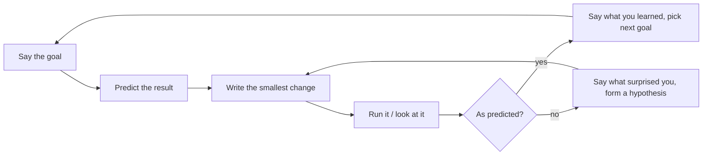

# 27 — Interview execution

> **How to use this module.** Modules 01–26 give you the knowledge. This one is about delivering it under pressure, in four formats: thinking aloud while you code (27.1), a take-home project (27.2), reviewing someone else's code (27.3), and the conversation rounds, behavioral, your backend-to-full-stack story and your own questions (27.4–27.6). Read 27.1 and 27.5 first; they change the most for a backend engineer. Everything about hiring practices below is common practice or opinion, not a rule, and it varies by company.

**Prerequisites:** [How to approach a 45-minute round](26-machine-coding.md#261-how-to-approach-a-45-minute-round) · [The answer framework](25-frontend-system-design.md#251-the-answer-framework) · [Race conditions and `AbortController`](09-effects.md#94-race-conditions-and-abortcontroller) · [Derived state](08-state.md#87-derived-state-compute-do-not-store) · [Testing](20-testing.md)

**Code for this module:** [`examples/web/src/m27-interview/`](examples/web/src/m27-interview/) holds the code-review exercise: a deliberately flawed component, the reviewed version and the tests. Run them with `npx vitest run src/m27-interview` from `examples/web`.

**Backend companions in this repository:** [Backend Interview Study Guide, section 9 (behavioral, and telling a story that lands)](../Backend%20Interview%20Study%20Guide%20-%20Data%20storage%2C%20behavioral%20%26%20concurrency.md) and its section 10 on questions to ask. This module reuses their structure and applies it to a React role. Your incident and design stories from those guides are the raw material for 27.4 and 27.5.

---

## 27.1 Talking through live coding

### The problem
In a live-coding round the interviewer sees two things: the code and you. Most candidates only manage the first. Two failure modes are common. The **silent coder** types for six minutes, and the interviewer has no evidence of how they think, so they score on the code alone and cannot give credit for a good idea that did not land. The **narrator who never stops** reads every keystroke aloud ("now I type `const`") and never states a decision. Neither gives the signal the round exists to collect: how you turn an unclear request into working software, and how you behave when it goes wrong.

For a backend engineer there is an extra trap. In a Spring review you are used to being judged on the design document and the PR. Here the *process* is part of the artifact, and nobody has read your design beforehand. You have to say it.

### Mental model
Narrate **decisions and predictions, not keystrokes**. A good narration answers one of four questions: *what am I about to do, why this and not the alternative, what do I expect to happen, what did I just learn.*

> **Java/Spring analogy.** It is pair programming on a hard service ticket, or walking a colleague through a design review live. You would never say "I am typing `@Service`"; you would say "I will keep this logic out of the controller so it is testable without MVC".
>
> **Where the analogy breaks:** in a pairing session your partner can interrupt and has the context. In an interview the interviewer has *no* context and is also writing notes, so you must state assumptions explicitly and leave short pauses they can use to steer you. Their steering is usually a gift, not a criticism.

### Minimal code: the loop you run for every feature


The loop is the same one [26.1](26-machine-coding.md#261-how-to-approach-a-45-minute-round) uses for the clock; this section is about what you say at each arrow. Do not repeat the process from 26.1 here, apply it with a voice.

### How it works internally: what the narration is for
Common practice (not an official rubric) is that interviewers fill in a scorecard with items like problem solving, communication, code quality and collaboration. Narration feeds three of the four.
1. **It makes your reasoning auditable.** A wrong turn you explain and correct scores better than a right answer you cannot explain.
2. **It lets the interviewer help.** If you say "I am going to store the filtered list in state", a good interviewer may nudge you. If you were silent, they cannot without breaking the exercise.
3. **It buys you thinking time.** "Let me think about the state shape for a moment" is a legitimate sentence. Ten seconds of announced silence is fine; ninety seconds of unannounced silence is not.

#### Narration scripts, by phase
These are templates. Replace the nouns, keep the shape.

| Phase | What to say |
|---|---|
| Opening (min 0–5) | "Let me restate it to check I have it: [one sentence]. Questions before I start: is the data static or fetched? Do I need keyboard and screen-reader support? Is there anything out of scope? I will assume [X] and write it at the top of the file so we can change it." |
| Skeleton | "I will start with static JSX and hard-coded data so there is something on screen, then add behaviour. The component is `[Name]`, its props are [A, B]." |
| State shape | "The source of truth is `[items]` and `[filter]`. The visible rows and the count are derived, so they are not state. If I stored them I would have to keep three things in sync." |
| Before running | "I expect typing in the box to filter the list immediately and the count to drop to 2." |
| After a surprise | "That is not what I expected. The count did not update. My first guess is [stale value / wrong key / I am mutating]. I will check by [logging X / reading the handler]." |
| Edge cases | "Edge cases I can think of: empty input, no matches, a very fast second keystroke while the first request is pending. I will handle the first two now and say what I would do for the third." |
| Trade-off | "I used `useState` because there are two independent values. If transitions got more complex I would move to a reducer. I am not adding `useMemo` because I have not measured a problem." |
| Wrap-up | "What works: [..]. What I did not get to: [..]. With another hour I would [tests / virtualization / error state]." |

#### What to say when you are stuck
Being stuck is expected; how you handle it is the signal. A reliable ladder, with the time you give each rung:

1. **Name it (10 seconds).** "I am stuck on how to cancel the old request." Saying it aloud often unsticks you and tells the interviewer where to help.
2. **Narrow it (1 minute).** Reproduce in the smallest case: log the value, comment out half the component, write the failing input as a test.
3. **Say the hypotheses.** "Two possibilities: the effect runs with a stale closure, or my key changes. I will test the first because it is cheaper."
4. **Ask a scoped question (at 3–5 minutes).** "Is it fine if I use `AbortController` here, or is there a convention you prefer?" A specific question reads as collaboration. "I do not know what to do" does not.
5. **Simplify and keep moving (at 5 minutes).** "I will hard-code this and come back to it, because the filter is more important." Put a `// TODO:` and move on.

**Phrases to avoid**: "this is easy" (and then it is not), "I never use this", "hmm" repeated with no content, and apologising for every line.

#### Time checks
Say the time out loud twice; it shows you manage a budget, and the interviewer can correct a mismatch early.
- **At the 25% mark:** "We are about a quarter in and I have the skeleton. I want the happy path working by the half-way point."
- **At the 75% mark:** "Fifteen minutes left. I will stop adding features and spend it on [the keyboard path and one test]."
- **When you disagree with the clock:** "I would like to finish the list before the filter. Is that the right order for you?"

> **⚠️ Correction.** "Always think out loud continuously" is poor advice. Continuous speech while you are doing something hard (tracing a bug) produces filler. Say what you are doing, then stop and work; a one-sentence summary afterwards is enough. The popular advice is really "never be *unexplained*".

### Trade-offs
- ✅ Narrated reasoning gives partial credit when the code is incomplete, and lets the interviewer steer you.
- ✅ Predicting the result before you run it makes surprises visible instead of embarrassing.
- ❌ Narrating a language you are not fluent in costs thinking capacity. If English is a second language, prepare the phrases above in advance; they are scripts, so you spend no effort composing them.
- ❌ Over-narration makes you slow. Keep sentences short and put the explanation before the typing, not during it.
- **My rule:** one spoken sentence per decision, one per surprise, two time checks.

> **Version notes.** The interview format changes more than React does. Some companies allow an AI assistant or search in the round and some forbid both. Ask in the first minute: "Can I look things up and use autocomplete?" Whatever you use, you can be asked to explain every line, so narrate what the assistant produced as if it were yours.

---

## 27.2 Take-home expectations

### The problem
A take-home is the opposite problem from live coding: you have days, nobody watches, and the reviewer reads the result later with a checklist and a stack of other candidates. The risk is not running out of time; it is **ambiguity about quality**. Without a reviewer in the room, the repository itself has to carry everything the narration carried in 27.1: your decisions, your priorities and what you left out.

### Mental model
A take-home is a **pull request to a team you want to join**. Reviewers decide in the first ten minutes, from the README and the layout, whether to read on. Scope it as you would a ticket: small, finished, explained.

> **Java/Spring analogy.** The README is the PR description and the ADR (architecture decision record) in one. The tests are the proof. You would not open a PR to the platform team with no description and 40 changed files.
>
> **Where the analogy breaks:** a PR has a team that can ask questions. Here nobody can, so anything not written down does not exist.

### Minimal code: the repository a reviewer wants to open
```text
README.md           run it, test it, what it does, what is missing (first screen!)
DECISIONS.md        or a README section: trade-offs and what you would do next
package.json        npm install && npm run dev && npm test all work from a clean clone
src/
  features/…        grouped by feature, small components, one hook for the data fetching
  …test.tsx         tests next to the code they cover
```

A README skeleton that works:
```markdown
# Project name
One sentence on what it does.

## Run
npm install · npm run dev · npm test   (Node version, port)

## What is implemented
- [x] Requirement 1  - [x] Requirement 2  - [ ] Requirement 3 (not done, see below)

## Decisions and trade-offs
- State: [useState/reducer/React Query] because …
- Not used: [Redux] because the state is local to two components.

## What I would do with more time
- Pagination; the API returns everything, which is fine for 50 rows but not for 5000.

## Time spent
About 4 hours: 1h setup and data layer, 2h UI, 1h tests and README.
```

### How it works internally: what reviewers weigh
Common practice (varies by company; treat as opinion, not fact):
- **Does it run on the first try?** A reviewer who cannot start the project in two minutes may stop. Test on a fresh clone.
- **Does it satisfy the stated requirements?** Re-read the brief; list each requirement in the README.
- **Scope discipline.** A finished small solution beats an unfinished ambitious one. The usual instruction is "spend about N hours"; respect it, and say honestly what that bought.
- **Tests.** A few meaningful tests of behaviour, as [20](20-testing.md) shows, beat a coverage number. Test one happy path, one error path and the trickiest logic.
- **Trade-offs are visible.** Reviewers read for judgement. "I did not add Redux because…" is a stronger signal than adding it.
- **Code quality.** Small components, derived state, no dead code, typed props, sensible names, consistent formatting (run the formatter and linter).
- **Accessibility and error/empty/loading states.** These are the details that distinguish a thoughtful solution from a demo.
- **Git history** (if you submit a repo): a few meaningful commits, not one "final" commit and not forty "wip" commits.

#### Time-boxing
1. **Read the brief twice** and write the requirements as a checklist in the README before any code.
2. **Budget the hours** across: setup (10%), core flow (40%), edge/error states (15%), tests (20%), README and cleanup (15%). Put the README budget in *before* you start; it is the first thing to get cut and the first thing read.
3. **Stop at the stated time.** If you went over, say so; do not hide it.
4. **Ask a clarifying question by email early** when the brief is ambiguous. Asking is normal; recruiters often expect one or two questions. Do not ask five.

> **⚠️ Correction.** "Go above and beyond: add extra features, animations and a state-management library to stand out" is common and counter-productive. Extra surface area means extra places to be wrong and a bigger review. Polish the required flow (loading, error, empty, keyboard) instead of adding features.

### Trade-offs
- ✅ You control the environment and can show testing and structure.
- ❌ It costs hours, and companies differ on whether they pay for them. It is reasonable to ask about the expected time and whether a live follow-up (an explanation or an extension of the take-home) is part of the process, which is common.
- **Expect a follow-up.** A frequent next step is a call where you explain the code and extend it live. Write code you can explain line by line, and run the project from a clean clone one more time the night before.

---

## 27.3 Reviewing code in an interview

### The problem
Some interviews hand you a component and ask "review this" or "what is wrong with it?". It tests whether you can read React the way you read a Spring PR: find correctness bugs first, then design, and communicate the findings in order of importance. The failure mode is a wall of style nitpicks that misses the race condition.

### Mental model
Review in **passes**, highest risk first, and say which pass you are in. Do not read top to bottom and comment on whatever you see.

> **Java/Spring analogy.** You already do this on a service PR: transactional boundaries and concurrency first, then null-handling and error mapping, then naming. The React equivalent of "this `@Transactional` is on the wrong layer" is "this state is derived and stored".
>
> **Where the analogy breaks:** on the backend each request is isolated; in React one component lives for minutes and handles a *sequence* of events, so a whole class of bugs (stale closures, out-of-order responses, leaked subscriptions) is about time, and unit-test-style reading of one render misses them.

### The checklist
Read it as passes. Each item is a question to ask of the code.

| Pass | Questions |
|---|---|
| **1. Correctness** | Does it do what the requirements say, including empty, error and loading? What if the call fails? What if two events overlap? Any off-by-one or missing `await`? |
| **2. React-specific** | Is any state derivable from other state or props ([8.7](08-state.md#87-derived-state-compute-do-not-store))? Is an effect needed at all ([9.6](09-effects.md#96-you-might-not-need-an-effect))? Does every subscription, timer and request have cleanup or an abort ([9.4](09-effects.md#94-race-conditions-and-abortcontroller))? Are `key`s stable ids rather than indexes? Is state mutated? Are updates functional where they use the previous value? Any stale closure? |
| **3. Accessibility** | Is every control a real element (`button`, `a`, `input`) with an accessible name? Are labels associated? Do async changes (loading, errors, result counts) reach a screen reader (`role="status"`, `role="alert"`)? Is it keyboard-operable? ([04](04-html-css-accessibility.md)) |
| **4. Performance** | Only after correctness: unneeded renders, work in render, huge lists, a request per keystroke ([15](15-performance.md)). Name a measurement before recommending memoization. |
| **5. Security** | `dangerouslySetInnerHTML` with untrusted data, user input in URLs, secrets in the client bundle, tokens in `localStorage`, unvalidated server data trusted by type only ([03](03-browser-and-web-platform.md), [24](24-react-with-spring-boot.md)). |
| **6. Tests** | What would I assert? Is the behaviour testable (injectable fetcher, no hidden global)? Does a test exist for the unhappy path ([20](20-testing.md))? |
| **7. Naming and structure** | Do names say what things are (`users`, not `data`)? Is the component doing too much? Is there a custom hook hiding there? |

#### How to deliver the review
Say, in this order: **(1)** one-sentence summary of what the component does, **(2)** the most important issue and why it hurts the *user*, **(3)** the others grouped by pass, **(4)** what you would change first, **(5)** what is good. Label severity ("must fix", "should fix", "nit"). Phrase findings as the behaviour that goes wrong: "if the user types `ab` quickly, the results for `a` can replace the results for `ab`", not "you forgot an abort".

### How it works internally: the example component
`examples/web/src/m27-interview/UserSearchFlawed.tsx` is a user search box. It type-checks and passes lint; every flaw is a behaviour or design flaw. This is deliberate: the hooks lint rules catch some bugs mechanically ([9.6](09-effects.md#96-you-might-not-need-an-effect)), but review is for the rest.

The flaws, in the order a good reviewer would raise them:

1. **Race condition [React/Browser].** `handleChange` starts a request per keystroke and writes whatever returns, in arrival order. Responses can arrive in a different order than they were sent, so the list can show results for an older query. There is no `AbortController` and no check that the response belongs to the current query.
2. **Loading flag is wrong.** `setLoading(false)` runs when *any* request finishes, so the spinner disappears while the latest request is still pending.
3. **No error handling.** A rejected promise is never caught: no message, and an unhandled rejection in the browser console.
4. **Derived state stored in state.** `count` is `users.length`, kept in a second `useState` and set by hand. It is one line from drifting out of sync.
5. **Empty query still searches.** Clearing the box sends `search('')`.
6. **Index as key.** `key={index}` on a list whose contents change order and length causes the wrong DOM and any child state to be reused ([13](13-reconciliation-and-fiber.md)).
7. **Accessibility.** The input has only a placeholder, which is not a label. Results are `div`s with `onClick`: not focusable, no role, no keyboard activation. The loading and result-count text is not announced.
8. **Structure.** Data fetching sits in an event handler with no hook or injectable boundary beyond the `search` prop. (The prop is good for tests; keep it.)
9. **Not covered by code here (prose only):** no debouncing, so each keystroke is a request; a production version would debounce with [`useDebounce`](12-hooks-and-custom-hooks.md#125-usedebounce) or use a library with request deduplication ([17](17-data-fetching.md)). Also trimming and case rules are unspecified; a review should ask.

`UserSearchFixed.tsx` fixes 1–7 this way: the request lives in an **effect** keyed on the trimmed query, because the effect is genuinely synchronizing with an external system; the cleanup calls `abort()`; the stored result carries the query it answered, so the component only *shows* an answer whose query equals the current one; `loading` and the result count are **derived during render**; an error is stored and rendered in `role="alert"`; the input has a `<label>`; results are `<ul>` with real `<button>`s keyed by `id`; the status has `role="status"`.

> **Version notes.** React 18 Strict Mode runs the effect twice in development (setup, cleanup, setup), so the first request is aborted immediately. The fixed component is correct under that because abort is exactly what cleanup is for ([9.10](09-effects.md#910-strict-mode-remounting-and-what-it-reveals)). With React 19 and a data library, the same job is usually a query hook that does the abort and cache for you ([17](17-data-fetching.md)).

### Trade-offs
- ✅ A pass-ordered review is quick to run and easy for the interviewer to follow.
- ✅ Behavioural phrasing makes the cost of each issue concrete.
- ❌ Do not rewrite everything. In an interview, fix the top two or three issues, list the rest and ask which to continue with.
- ❌ Do not criticise the author. Prefer "what happens if…" to "this is wrong".

---

## 27.4 Behavioral questions for front-end/full-stack

### The problem
Behavioral rounds feel soft, but they usually carry a real weight in the hiring decision (common practice; it varies by company). A strong engineer fails them by telling a story with plenty of context and no outcome, or a story with "we" throughout so the interviewer cannot tell what *you* did. The backend guide's section 9 makes the same point: the Result is non-negotiable and is the last thing you say.

### Mental model
STAR is a **four-part answer shape**: *Situation, Task, Action, Result*. Spend roughly 10% on Situation and Task together (two sentences), 60% on Action, 20% on Result and 10% on what you learned. Two minutes total.

> **Java/Spring analogy.** A post-incident review: context, the ask, what you did, what changed in the metrics.
>
> **Where the analogy breaks:** a post-mortem is a team document and says "we". An interview answer must separate "I decided / I wrote" from "the team did".

### Minimal code: how to prepare
Build a **story bank** of six to eight real stories from your own work, each tagged with the themes it can answer (conflict, failure, ambiguity, ownership, learning, influence, deadline, mentoring). The same incident can answer three different prompts. The templates below are *templates*: replace every `[placeholder]` with something true. Do not invent facts, and do not use numbers you cannot defend; an unsupported metric is worse than none.

### The templates
Each template is grounded in typical backend work (Java/Spring Boot services, PostgreSQL, Redis, AWS, Docker) and shows where the front-end role would see the value. Fill in with your own.

**T1. A disagreement about a technical decision**
- **S/T:** On [service/project], [colleague/team] wanted [option A, e.g. synchronous REST calls between services]; I thought [option B, e.g. an event via a queue] fit better because [reason tied to a requirement: failure isolation, latency].
- **A:** I wrote a one-page comparison with [two or three measurable criteria], built a [small prototype / load test] to check [assumption], and shared it before the meeting. I listened for the case where A was better ([where they were right]). We agreed on [decision]. I committed to it and [did X to support it].
- **R:** [Outcome, with a measure if you have one, e.g. error rate, latency, delivery date]. Or, if the decision went against me: "It went with A, and it worked out/had [cost]. I learned [lesson about when to stop arguing]."
- **Frontend link:** "I would use the same approach for a state-management or library choice: a short comparison, a prototype, then commit."

**T2. A production incident**
- **S/T:** [Service] began [symptom: timeouts, 500s, slow queries] at [time]; I was [on call / the person who picked it up]. Goal: restore service, then find the cause.
- **A:** I [checked dashboards/logs by correlation id], formed hypothesis [H1], disproved it by [evidence], then found [root cause: connection-pool exhaustion, N+1 query, missing index, cache stampede]. I [rolled back / mitigated], communicated status to [stakeholders] every [N] minutes, and afterwards [added alert/test/runbook].
- **R:** Impact lasted [duration]; recurrence [none / reduced by X]. "What I would change: [monitoring/process]."
- **Frontend link:** "On the front end I would use the same loop: reproduce, hypothesis, evidence, e.g. React DevTools Profiler or the Network tab."

**T3. Learning a new technology quickly**
- **S/T:** My team adopted [Angular/another framework] and I had to be productive within [period], coming from backend.
- **A:** I mapped what I knew to what I did not (services to injectable services, DTOs to typed models, [DI] to [framework equivalent]), built [a small feature end to end] first, read the official docs for [the concept that bit me, e.g. change detection], and asked for review on [first PRs].
- **R:** I shipped [feature] in [time] and by [month] was reviewing [others' PRs]. Learning: "I learn fastest by building the thinnest vertical slice."
- **Frontend link:** Say you are doing the same for React, and name the concrete thing you built (this guide's modules are a fair thing to cite).

**T4. Ambiguous requirements**
- **S/T:** Product asked for [vague feature]; the spec said [one line] and the deadline was [date].
- **A:** I wrote down my assumptions and the open questions, asked [product/design] the three that blocked the design, built the part that did not depend on the answers first, and showed [a demo/API contract] early.
- **R:** We [avoided a rework / found that requirement X was different from what was assumed] and delivered [on time].
- **Frontend link:** "In a UI the cost of an ambiguous requirement is high, so I ask about empty, error and loading states early."

**T5. A mistake or failure you owned**
- **S/T:** I [shipped/changed] [something] on [service] and it [caused X: bad migration, missing validation, a slow query in production].
- **A:** I [told the team immediately], [rolled back/fixed], wrote [a post-mortem / test / checklist item], and changed [my own habit, e.g. always test migrations against a production-sized copy].
- **R:** [Resolution and prevention]. Choose a real mistake with a real lesson; avoid "I work too hard".
- **Frontend link:** "I now treat the unhappy paths (network failure, slow response, stale data) as part of the feature, not a follow-up."

**T6. Mentoring or raising the team's bar**
- **S/T:** [Teammate] was [new / struggling with X, e.g. transactions and JPA]. I wanted them independent in [period].
- **A:** I changed how I gave feedback: [pair on the first change, then review with comments that explain why, then let them lead]. I wrote [a short guide/checklist].
- **R:** They [delivered X independently by month Y]; the checklist is [still used / reduced review rounds from N to M].
- **Frontend link:** "I'd do the same for a React code-review checklist (27.3)."

**T7. Working under a deadline with trade-offs**
- **S/T:** [Release] was due in [period]; scope exceeded capacity by about [amount].
- **A:** I split scope into must/should/could with [product], proposed cutting [feature] and shipping [simpler version], and documented what was deferred and the risk.
- **R:** We shipped [on time] with [the core], and [the deferred item] followed in [period]. No [incident].
- **Frontend link:** "In a machine-coding round or take-home I use the same split: working happy path first, polish after."

**T8. Cross-team collaboration (the API contract)**
- **S/T:** [Frontend team] and my team disagreed about an API [shape/pagination/error format]; they were blocked and we were releasing separately.
- **A:** I proposed a contract-first approach: an OpenAPI spec reviewed together, a mock for the frontend, and a consistent error body. I [listened to what they needed: smaller payloads, stable ids, field names].
- **R:** [Reduced integration bugs / unblocked delivery by N days], and they could develop against the mock.
- **Frontend link:** "This is exactly the full-stack seam: I know what the other side needs from an API, because I have been the one writing it ([24](24-react-with-spring-boot.md))."

**T9. Improving performance**
- **S/T:** [Endpoint/page] had [p95 latency X] and was hurting [users/cost].
- **A:** I measured first ([tool: APM, EXPLAIN ANALYZE, profiler]), found the bottleneck ([N+1, missing index, no cache, oversized payload]), changed [one thing], and re-measured under realistic load.
- **R:** [p95 from X to Y], and I confirmed it with [method]. "It cost [complexity: a cache and an invalidation rule]."
- **Frontend link:** "On the UI I would also measure first (Profiler, Lighthouse, bundle analysis) before memoizing anything ([15](15-performance.md))."

**T10. Taking ownership beyond your role**
- **S/T:** I noticed [recurring problem: flaky tests, slow CI, no runbook] that nobody owned.
- **A:** I [quantified the cost], proposed [fix] to [lead], did [part] myself in [time] and got [team] to adopt it.
- **R:** [CI time from X to Y / fewer incidents]. "I also learned [how to get buy-in]."

> **⚠️ Correction.** "Use STAR for every question" is overdone. For a short factual question ("why are you moving to React?") a 20-second direct answer is better; save STAR for "tell me about a time…". Also, "Result" does not have to be a success: a clear negative result with a lesson reads as maturity.

### How it works internally: what interviewers extract
Common practice is that behavioral prompts probe a small set of traits: ownership, handling conflict, learning, communicating with non-engineers, handling failure and impact. They write notes in terms of **what you did** and **what changed**. Every sentence in your Action should be an "I" verb with an object ("I wrote", "I measured", "I proposed"). Expect follow-ups: "What would you do differently?", "What did the other person think?", "How did you know it worked?" Prepare one sentence for each.

### Trade-offs
- ✅ A bank of reusable stories means you can answer most prompts with something you have already told aloud.
- ❌ A memorised script sounds memorised. Know the beats, not the sentences.
- ❌ Backend stories without a front-end bridge leave the interviewer wondering about fit. End each with one sentence on how the lesson applies to a UI or full-stack team, but do not invent front-end experience you do not have.

---

## 27.5 Explaining the backend → full-stack transition

### The problem
"You are a backend engineer; why should we hire you for React?" is nearly certain, and an unprepared answer sounds either apologetic ("I only know a little front end") or inflated ("I am basically full-stack already"). Interviewers are usually checking three things: whether the move is motivated and planned, whether you are honest about your gaps, and whether your strengths transfer.

### Mental model
Think of your story as a **bridge**: strengths you already have on one bank, gaps you are closing on the other, and evidence that you are already crossing (what you built, what you studied).

> **Java/Spring analogy.** It is the same conversation as moving from one framework to another. You would say "the concepts transfer, the idioms do not": Spring's DI is not React's context, but the thinking about boundaries and lifecycles helps.
>
> **Where the analogy breaks:** UI is event-driven and long-lived, with state that changes for minutes and a user watching. Your instincts about stateless request handling can mislead you, so say so.

### Minimal code: the 60-second pitch template
```text
1. WHO (10s):     "I'm a [backend] engineer with [4] years in Java and Spring Boot,
                   building [microservices] on PostgreSQL, Redis and AWS."
2. BRIDGE (15s):  "In the last [year] I also worked in Angular on [feature], so I've seen
                   the other side of the API and enjoyed it: [one specific reason]."
3. EVIDENCE (20s):"Moving to React, I've [built X / studied the model: state as a snapshot,
                   effects as synchronization, data fetching with cache] and built [project]."
4. VALUE (10s):   "What I bring is [API design that the UI team enjoys, reliability thinking,
                   testing discipline, performance debugging]."
5. FIT (5s):      "That's why this [full-stack] role at [company] is the right next step."
```
Practise it aloud until it takes about 60 seconds and ends with a reason about *this* role.

### How it works internally: what to lead with, and what to own

**Strengths to lead with** (each is a claim you should back with an example):
| Strength | How it helps a full-stack team |
|---|---|
| API design and contracts | You can design endpoints, pagination and errors that make the UI simple, and can review a front-end team's API needs ([24](24-react-with-spring-boot.md)). |
| Data modelling (PostgreSQL) | Normalised thinking helps shape client-side state and caches; you know what a join costs. |
| Reliability and failure modes | Timeouts, retries, idempotency, partial failure: these are the unhappy paths UIs forget ([16](16-error-handling.md)). |
| Caching and consistency (Redis) | Maps directly to client caches, `staleTime` and invalidation ([17](17-data-fetching.md)). |
| Security | AuthN/AuthZ, CORS, CSRF, token storage: the browser side of what you have secured on the server ([03](03-browser-and-web-platform.md)). |
| Testing discipline and debugging | You already write tests and read traces; you can learn Testing Library quickly ([20](20-testing.md)). |
| Observability and operations | Error tracking, logging and performance budgets on the client ([22](22-production-project-structure.md)). |
| Prior front-end exposure | About a year of Angular means you already know components, templates, routing and a build toolchain; you are mapping concepts, not starting from zero. |

**Gaps to own** (say them first; it removes the interviewer's chance to find them):
- **CSS and layout.** "My CSS is the weakest part; I am practising by building [layouts]." ([04](04-html-css-accessibility.md))
- **The React mental model.** State as a snapshot, effect dependencies, re-render rules. Reading the docs is not the same as production experience.
- **Browser and rendering performance**, accessibility depth, and design-system or UX instincts.
- **Production React.** Say plainly you have not run a large React codebase; say what you did to prepare.

The pattern for a gap: **name it, show a concrete step, state the next one.** "I haven't shipped React to production. I built [a project with tests], I read [the modules on effects and state], and I'd want to pair on [area] in my first month."

> **⚠️ Correction.** "Backend engineers are weak at front end" and "it's just JavaScript, how hard can it be" are both wrong. The common practice for a convincing story is neither modesty nor bravado: specific strengths, specific gaps, specific evidence.

#### The Angular bridge
If you have ~1 year of Angular, use it, but do not claim the frameworks are the same. Translate:

| Angular | React | Where they differ |
|---|---|---|
| Component with a template | Function component returning JSX | JSX is JavaScript, not a template language; no directives. |
| Services and DI | Hooks, context, modules | No DI container; you pass values or use context. |
| RxJS observables | Promises, `useEffect`, a data library | React has no built-in streams. |
| Change detection | Re-render on state change | Default is "render the whole subtree", memoization is opt-in. |
| Two-way binding `[(ngModel)]` | Controlled inputs, one-way data flow | You wire value and `onChange` yourself. |

### Trade-offs
- ✅ A concise, honest bridge makes a backend background read as an asset.
- ❌ Do not over-apologise. One sentence on the gap is enough, then move to evidence.
- ❌ Do not claim experience you lack; follow-up questions expose it fast. See the gotchas.
- **My rule:** lead with API and reliability strengths because they are where a full-stack hire is rarest, name CSS as the gap, and show a project.

---

## 27.6 Questions to ask the interviewer

### The problem
"Do you have any questions for us?" is a scored part of the interview (common practice), and "No, I think you covered everything" is a missed signal. Generic questions ("what is the culture like?") get generic answers, and you also need real information: you are choosing a job.

### Mental model
Ask questions whose answers **would change your decision**, and match each to the person in front of you. An engineer can tell you how the work really is; a manager can tell you about priorities and growth; a product person can tell you what success means.

> **Java/Spring analogy.** It is a requirements-gathering session where you are the one who will live with the system: ask about the failure modes, the deployment story and who gets paged.
>
> **Where the analogy breaks:** here there is no spec; each answer is one person's opinion. Ask the same question of several people and compare, as the backend guide suggests.

### Minimal code: a short list per audience
Prepare five, ask two or three, and write the answers down.

**To an engineer (peer)**
1. What does a typical week look like, and how much of it is feature work vs maintenance?
2. How are front-end and back-end split here? Who owns the API contract and how do changes get negotiated?
3. What is the oldest part of the front-end codebase that is still load-bearing, and what makes it hard to change? (React/Router/Next.js version? Is there a migration?)
4. How do you test the UI (unit, component, end to end), and how long does CI take?
5. What does code review look like, and how are AI tools used on the team?
6. When something breaks in production, what does the debugging path look like (error tracking, logs, on-call)?
7. What did you wish you had known in your first month?

**To an engineering manager**
1. What does success look like in the first 90 days for this role?
2. How is the team structured, and where would a backend-leaning full-stack hire add the most?
3. How do you support someone ramping up in a technology they have not used in production? Is there a mentor or a ramp plan?
4. How are priorities decided and how often do they change?
5. How are performance and growth assessed, and what has the last promotion on the team looked like?
6. What are the biggest risks to the team in the next year?

**To product or design**
1. How do you decide what to build next, and how do engineers get involved early?
2. How do you measure whether a feature worked?
3. How does design hand off to engineering (design system, component library, accessibility expectations)?
4. How are trade-offs between scope and deadline negotiated?
5. Tell me about a recent feature that changed after it shipped.

**For everyone, separately:** "What is something about this team that people usually only find out after joining?" Compare the answers.

### How it works internally
A good question shows research (a specific product detail, a public engineering post), shows you think about the work (testing, deployment, ownership) and is open-ended. Avoid, at least in a first interview: salary and perks (ask the recruiter), anything answerable from the careers page, and questions that sound like you are auditing the interviewer.

### Trade-offs
- ✅ Specific questions signal seniority of thinking and give you real data.
- ❌ Asking all of them exhausts the interviewer; two or three that matter beat ten.
- ❌ Do not ask a question whose answer you will not listen to. Follow up on what they say.
- **Red-flag listening:** vague answers about on-call, "we are a family", no tests, no code review, and nobody able to describe how success is measured. This is opinion, not a rule; weigh it.

---

## Interview questions

**Q1. What should you narrate in a live-coding round, and what should you not?**
<details><summary>Answer</summary>

Narrate decisions, predictions and surprises: the goal, why this approach over another, what you expect to happen, and what you learned after running it. Do not narrate keystrokes or read the code aloud, because that adds no information and slows you down. **A strong answer adds:** announced silence is fine ("let me think about the state shape for ten seconds"), but unannounced silence is not.

</details>

**Q2. You are stuck at minute 20. What do you do?**
<details><summary>Answer</summary>

Name the problem aloud, narrow it to the smallest case, say your hypotheses and test the cheapest, and if you have made no progress in about three to five minutes ask a scoped question or simplify and move on with a `TODO`. **A strong answer adds:** a scoped question ("is `AbortController` acceptable here?") reads as collaboration, whereas "I do not know" does not.

</details>

**Q3. The requirement is ambiguous. What do you do first?**
<details><summary>Answer</summary>

Restate it, ask about scope, data source and accessibility, state your assumptions and write them at the top of the file. Ambiguity is often deliberate, and the questions are scored ([26.1](26-machine-coding.md#261-how-to-approach-a-45-minute-round)). **A strong answer adds:** you also say what you will not build.

</details>

**Q4. Why predict the outcome before running the code?**
<details><summary>Answer</summary>

It turns debugging into hypothesis testing and shows the interviewer your mental model. If the prediction is wrong, the surprise tells you where your model is. **A strong answer adds:** you say the prediction in one sentence, not a paragraph.

</details>

**Q5. How do you handle the clock in a 45-minute round?**
<details><summary>Answer</summary>

Budget it at the start, say two time checks aloud (about a quarter and three-quarters through), get a working ugly happy path on screen early, and spend the last quarter on edge cases, accessibility and tests rather than new features. **A strong answer adds:** what you will cut, named in advance.

</details>

**Q6. What does a reviewer look at first in a take-home?**
<details><summary>Answer</summary>

Common practice: whether it runs from a clean clone, and the README, which shows scope, decisions and what is missing. Code quality and tests come next. **A strong answer adds:** you test on a fresh clone before sending, because "works on my machine" is the most avoidable failure.

</details>

**Q7. A take-home says "spend about 4 hours". You could do 12. What do you do?**
<details><summary>Answer</summary>

Respect the box and say what it bought. Finish the required flow well (loading, error, empty, a few tests), and list what you would do with more time. Going far over signals poor scoping, and a longer solution is also longer to review. **A strong answer adds:** you also state the time you actually spent, honestly.

</details>

**Q8. Which tests do you include in a take-home?**
<details><summary>Answer</summary>

A few that assert behaviour through the UI: the main happy path, one error or empty path, and the trickiest logic (a reducer, a race, a pure helper). Coverage percentage is not the goal ([20](20-testing.md)). **A strong answer adds:** the tests are written against what the user sees, so a refactor does not break them.

</details>

**Q9. What do you put in the README?**
<details><summary>Answer</summary>

How to run and test, what is implemented against each requirement, decisions and trade-offs (including what you did not use and why), known gaps, and time spent. **A strong answer adds:** a "what I would do next" list, which shows judgement.

</details>

**Q10. You are asked to review a component. How do you start?**
<details><summary>Answer</summary>

Summarise what it does, then review in passes, highest risk first: correctness (including unhappy paths and overlapping events), React-specific issues, accessibility, performance, security, tests, naming. Report the most user-impacting issue first. **A strong answer adds:** you phrase findings as behaviour ("typing quickly can show the wrong results") and mark severity.

</details>

**Q11. In the `UserSearchFlawed` example, what is the most serious flaw?**
<details><summary>Answer</summary>

The race condition: every keystroke starts a request, and whichever response arrives last wins, so the list can show results for an older query. The test `BUG: a stale response overwrites the newest one` in `UserSearch.test.tsx` demonstrates it. **A strong answer adds:** the fix is abort in cleanup plus storing which query a result answers ([9.4](09-effects.md#94-race-conditions-and-abortcontroller)), and the loading flag bug has the same root.

</details>

**Q12. Why is `count` stored in state a problem there?**
<details><summary>Answer</summary>

It is `users.length`, so it is derived state that must be set by hand wherever `users` changes, and any path that forgets will show a wrong count ([8.7](08-state.md#87-derived-state-compute-do-not-store)). **A strong answer adds:** in the fix, the count comes from the shown results during render, so it cannot disagree.

</details>

**Q13. Why is a placeholder not an accessible label?**
<details><summary>Answer</summary>

A placeholder disappears when typing, often has poor contrast, and is not reliably exposed as the name for assistive technology; a `<label>` is persistent and clickable. In the test, `getByLabelText('Search users')` fails on the flawed version and passes on the fixed one. **A strong answer adds:** `role="status"` for result counts and `role="alert"` for errors, so async changes are announced.

</details>

**Q14. Why not use `key={index}`?**
<details><summary>Answer</summary>

When items are reordered, inserted or removed, React matches by key, so an index key reuses the wrong DOM node and any child state or focus with it ([13](13-reconciliation-and-fiber.md)). Use a stable id. **A strong answer adds:** an index key is acceptable only for a static list that never changes order.

</details>

**Q15. Name a bug a linter will not catch that you would raise in review.**
<details><summary>Answer</summary>

A race between requests, a missing error state, a wrong loading flag, or derived state kept in state. These are behavioural, and the flawed example passes both `tsc` and ESLint. **A strong answer adds:** which test would reveal each one.

</details>

**Q16. What is the STAR structure and where do people go wrong?**
<details><summary>Answer</summary>

Situation, Task, Action, Result. People over-explain the situation, say "we" throughout, and omit the result. Keep context to two sentences, make the Action all "I" verbs, and finish with an explicit result. **A strong answer adds:** a negative result stated clearly with a lesson beats a good result left implied.

</details>

**Q17. Tell me about a disagreement with a teammate.**
<details><summary>Answer</summary>

Use template T1: the technical disagreement, how you gathered evidence (comparison, prototype), where the other person was right, and how you committed once decided. **A strong answer adds:** how you knew when to stop arguing, and a sentence tying it to a front-end decision.

</details>

**Q18. Tell me about a time you learned something fast.**
<details><summary>Answer</summary>

Use T3: map what you know to what you do not, build the thinnest vertical slice first, get review early, state the outcome. **A strong answer adds:** you name the concrete thing you built in React, not only the plan.

</details>

**Q19. Tell me about a mistake you made.**
<details><summary>Answer</summary>

Use T5: a real mistake, immediate disclosure, the fix, and the habit you changed. **A strong answer adds:** a concrete preventive mechanism (a test, a checklist, an alert), and no humble-brag.

</details>

**Q20. Why are you moving from backend to full-stack with React?**
<details><summary>Answer</summary>

Use the 60-second pitch: who you are, the bridge (Angular exposure, seeing the other side of the API), evidence (project, study), the value you bring and why this role. **A strong answer adds:** a specific, honest reason you enjoyed the UI side, not "to be more marketable".

</details>

**Q21. What are the gaps in your React experience?**
<details><summary>Answer</summary>

Name them without apology: CSS and layout depth, production React at scale, performance profiling in the browser, and accessibility depth. For each, state what you did and what you will do next. **A strong answer adds:** you ask for the kind of pairing or ramp the team offers.

</details>

**Q22. What transfers from backend to front end?**
<details><summary>Answer</summary>

API and contract design, data modelling, failure thinking (timeouts, retries, idempotency), cache and consistency reasoning, security basics, testing and debugging discipline, observability. **A strong answer adds:** a one-line example for each you claim, and a note on what does not transfer: the UI is long-lived and event-driven.

</details>

**Q23. How is Angular experience useful when interviewing for React?**
<details><summary>Answer</summary>

Components, routing, forms, build tooling and TypeScript are shared concepts; translate them (services/DI to hooks and context, RxJS to promises and a data library, change detection to re-render) and say where they differ. **A strong answer adds:** you do not claim they are equivalent; the re-render model and one-way data flow are the real differences.

</details>

**Q24. What would you ask an engineering manager?**
<details><summary>Answer</summary>

Success criteria in the first 90 days, team structure, onboarding and mentoring for a new technology, how priorities are decided, how growth is assessed, and the main risks. **A strong answer adds:** ask something that came from your research on the team.

</details>

**Q25. What questions would you avoid in a first interview?**
<details><summary>Answer</summary>

Pay, perks and vacation (ask the recruiter), anything on the careers page, and questions that sound like auditing ("why is your test coverage low?"). **A strong answer adds:** you ask about practices (testing, review, on-call) in open, curious phrasing.

</details>

**Q26. The interviewer says you can use an AI assistant. How do you handle it?**
<details><summary>Answer</summary>

Treat it as a tool you must be able to explain: state the prompt in a sentence, read the output before accepting it, narrate what you check (types, edge cases, accessibility), and write the tests yourself. Ask first what is allowed. **A strong answer adds:** you catch and fix one thing the assistant got wrong, which shows judgement. This reflects common practice, which varies; ask.

</details>

**Q27. You finish a coding exercise with ten minutes left. What do you do?**
<details><summary>Answer</summary>

Do not add features. Run through edge cases (empty, error, rapid input), keyboard use and a test, then summarise what you built and what you would do next. **A strong answer adds:** ask the interviewer which of those they want to see.

</details>

---

## Coding exercises

### Exercise 1: Review this component (find and fix the issues)

**Statement.** A teammate opened a PR containing `UserSearchFlawed`. It type-checks and lint passes. Review it using the 27.3 checklist: list every issue in order of severity, then fix them. The fixed component must keep the `search` and `onSelect` props, stay accessible and not search on an empty query.

**Approach.**
*Mental model:* a user types fast, the network is slow and unreliable, and a screen-reader user is also there. The flawed component only handles one user on a good day.
1. Read the component once for what it does. Say it in a sentence.
2. Walk the passes: correctness (race, error, empty query), React-specific (derived state, key), accessibility (label, button, status), performance (debounce, in prose), tests.
3. Decide what changes: move the request into an effect keyed on the trimmed query; abort in cleanup; store which query each result answers; derive `loading`, the count and visibility during render.
4. Write the unhappy-path tests first, with a fake `search` whose promises you resolve by hand, so response order is decided by the test, not by timing.

<details><summary>Hints</summary>

- Which value tells you whether a stored result belongs to the current input?
- What can be computed instead of stored: `loading`, `count`, "should I show the list"?
- How can a test make an old request finish *after* a newer one without sleeping?
- Which element gives you a keyboard-operable, named control for free?

</details>

<details><summary>Solution</summary>

The flawed component (kept as the review target):

```tsx
// file: examples/web/src/m27-interview/UserSearchFlawed.tsx
import { useState, type ChangeEvent } from 'react';
import type { SearchUsersNoSignal, User } from './types';

// DELIBERATELY FLAWED (interview exercise 1). It type-checks and passes lint; every flaw is behavioural.
// Find them before reading UserSearchFixed.tsx. The checklist is in 27.3 of the guide.
export function UserSearchFlawed({
  search,
  onSelect,
}: {
  search: SearchUsersNoSignal;
  onSelect: (user: User) => void;
}) {
  const [query, setQuery] = useState('');
  const [users, setUsers] = useState<User[]>([]);
  const [count, setCount] = useState(0);
  const [loading, setLoading] = useState(false);

  function handleChange(event: ChangeEvent<HTMLInputElement>) {
    const next = event.target.value;
    setQuery(next);
    setLoading(true);
    search(next).then((found) => {
      setUsers(found);
      setCount(found.length);
      setLoading(false);
    });
  }

  return (
    <div>
      <input placeholder="Search users" value={query} onChange={handleChange} />
      {loading && <p>Searching…</p>}
      <p>{count} results</p>
      {users.map((user, index) => (
        <div key={index} onClick={() => onSelect(user)}>
          {user.name}
        </div>
      ))}
    </div>
  );
}
```

The reviewed version:

```tsx
// file: examples/web/src/m27-interview/UserSearchFixed.tsx
import { useEffect, useId, useState } from 'react';
import type { SearchUsers, User } from './types';

type Outcome = { for: string; users: User[] } | { for: string; error: string };

// The reviewed version of UserSearchFlawed. Each change maps to an item in the 27.3 checklist.
export function UserSearchFixed({
  search,
  onSelect,
}: {
  search: SearchUsers;
  onSelect: (user: User) => void;
}) {
  const inputId = useId();
  const [query, setQuery] = useState('');
  const [outcome, setOutcome] = useState<Outcome | null>(null);
  const term = query.trim();

  useEffect(() => {
    if (term === '') return undefined; // nothing to synchronize with
    const controller = new AbortController();
    search(term, controller.signal).then(
      (users) => {
        if (!controller.signal.aborted) setOutcome({ for: term, users });
      },
      (error: unknown) => {
        if (controller.signal.aborted) return;
        setOutcome({ for: term, error: error instanceof Error ? error.message : 'Search failed' });
      },
    );
    return () => controller.abort();
  }, [term, search]);

  // Derived during render: only an answer that belongs to the CURRENT term is shown.
  const current = term !== '' && outcome?.for === term ? outcome : null;
  const loading = term !== '' && current === null;

  let status = '';
  if (loading) status = 'Searching…';
  else if (current && 'users' in current) {
    const n = current.users.length;
    status = n === 0 ? `No users match "${term}"` : `${n} ${n === 1 ? 'result' : 'results'}`;
  }

  return (
    <div>
      <label htmlFor={inputId}>Search users</label>
      <input id={inputId} type="search" value={query} onChange={(e) => setQuery(e.target.value)} />
      <p role="status">{status}</p>
      {current && 'error' in current && <p role="alert">Could not load users: {current.error}</p>}
      {current && 'users' in current && (
        <ul>
          {current.users.map((user) => (
            <li key={user.id}>
              <button type="button" onClick={() => onSelect(user)}>
                {user.name}
              </button>
            </li>
          ))}
        </ul>
      )}
    </div>
  );
}
```

Supporting types:

```ts
// file: examples/web/src/m27-interview/types.ts
export type User = { id: number; name: string };

/** The fixed component passes a signal; the flawed one ignores it. A fake `(q, signal?)` fits both. */
export type SearchUsers = (query: string, signal: AbortSignal) => Promise<User[]>;
export type SearchUsersNoSignal = (query: string) => Promise<User[]>;
```

</details>

**Walkthrough.**
1. **Race.** The fix runs the request in an effect with deps `[term, search]`. When `term` changes, React runs the previous cleanup (`controller.abort()`) before the new setup ([9.1](09-effects.md#91-effects-as-synchronization-with-external-systems)). The fake in the tests records each call's `signal`, so the test asserts the old one was aborted.
2. **Belt and braces.** Aborting only helps if the fetcher honours the signal. A fake or a function that ignores it still resolves, so the `.then` ignores aborted results *and* the shown result is only used when `outcome.for === term`. In the out-of-order test the stale answer for `a` arrives after `ab` and is not displayed.
3. **Derived values.** `current`, `loading` and the status text are computed during render. There is no `loading` state to forget to reset, and no `count` to drift. Clearing the input makes `term === ''`, so `current` is `null` and the old list disappears without any `setState`.
4. **Why store the result in state at all.** `outcome` is the one thing that cannot be computed: it is the answer from an external system. Storing the query alongside it is what lets everything else be derived.
5. **Errors.** The rejection handler stores the message; the alert is rendered when the error belongs to the current term. An aborted request does not report an error.
6. **Accessibility.** A `<label>`, a list of `<button>`s keyed by `id`, `role="status"` and `role="alert"`.
7. **Lint note.** `setOutcome` is called inside promise callbacks, not synchronously in the effect body, so it is not the pattern `react-hooks/set-state-in-effect` reports ([9.6](09-effects.md#96-you-might-not-need-an-effect)). Not run here; the coordinator's lint run verifies it.

**Interviewer follow-ups.**
- Add debounce. (Debounce the value, then key the effect on the debounced value; see [12.5](12-hooks-and-custom-hooks.md#125-usedebounce). Note that the label and status still reflect the typed text.)
- What if the user retries after an error? (Add a retry control that bumps a counter in the effect's deps.)
- How would React Query change this? (It would own the request, the abort, the cache and the loading and error flags; [17](17-data-fetching.md).)
- What would you virtualise? ([15](15-performance.md))

**Tests.** [`UserSearch.test.tsx`](examples/web/src/m27-interview/UserSearch.test.tsx): six tests assert the fixed version's behaviour, and four tests labelled `BUG:` pass by asserting the flawed component's behaviour (stale overwrite, loading flag cleared early, empty-string request, no label and no buttons). If someone fixes the flawed file, those four tests should fail, which is the point.

---

### Exercise 2: Narrate a solution (write the think-aloud script)

**Statement.** You get 25 minutes and this prompt: *"Build a product list that can be filtered by a text box and an 'in stock only' checkbox, and shows how many products are visible."* Write the script you would say, from the first minute to the wrap-up, using the phases in 27.1. No code file; the deliverable is the script.

**Approach.**
*Mental model:* every spoken line is a decision, a prediction, a surprise or a time check. Write the script with a timestamp and the code that accompanies each line.
1. Clarify aloud and write assumptions.
2. Pick the state shape and say why.
3. Predict before each run.
4. Include one deliberate surprise and the recovery.
5. Close with a trade-off and the next steps.

<details><summary>Hints</summary>

- What is the source of truth and what is derived? (Products, text, in-stock flag are state or props; the visible list and the count are derived.)
- Which event do you handle, and where does the filtering happen?
- What is a realistic "surprise" for this task? (A stale value in the count, or a filter that is case-sensitive.)

</details>

<details><summary>Solution</summary>

A model script (the words in quotes are said aloud; the bracketed text is what is on screen).

**Minute 0–3, clarify.**
"Let me restate it. A list of products, a text filter, an in-stock-only checkbox, and a count of the visible ones. Questions: is the product list passed in or fetched? I will assume it is a prop, a static array, and I will say so in a comment. Should the filter be case-insensitive? I will assume yes. Do we need keyboard and screen-reader support? I will use a real input and checkbox with labels, so that comes for free. Out of scope: sorting, pagination. Is that fine?" [types the assumptions as comments at the top]

**Minute 3–6, skeleton.**
"I will begin with static JSX so something is on screen. `ProductList` takes `products`. A label with an input, a label with a checkbox, a paragraph for the count, a `ul` for the list." [renders the list, no behaviour]

**Minute 6–9, state shape.**
"Two pieces of state change over time: the text and the in-stock flag. The products come from props. The visible products and the count are *derived*: I compute them during render from those three. If I stored the filtered list in state, I would have to update it in three places and keep it in sync with the props." [adds `useState` for text and flag]

**Minute 9–15, happy path.**
"Predicting: typing `ph` should leave only the products containing `ph`, and the count should change at once." [types a filter expression] "Running it." [types in the box] "As expected. Now the checkbox. I expect only in-stock items to remain." [clicks] "Good."

**Surprise (minute 15).**
"That is not what I expected. With the filter `PH` nothing shows. My guess is that my comparison is case-sensitive, because I did not lowercase. I will lowercase both sides." [fixes] "That matches now."

**Time check (minute 15).**
"We are 15 minutes in of 25. Happy path is done. I will use five minutes for edge cases, then tests."

**Minute 15–20, edge cases.**
"Edge cases: no matches should say so rather than show an empty list. Whitespace in the filter: I will trim it. Duplicate product names: I use the product `id` as the key, not the index, because the list changes as you filter." [edits]

**Minute 20–23, test.**
"One test through the UI: render with three products, type, assert the count and the visible names, tick the checkbox and assert again. I query the input by its label, as a user would." [writes the test]

**Minute 23–25, wrap-up and trade-off.**
"What works: filtering by text and stock, count, empty message. What I did not do: sorting, pagination, debounce. For a few thousand products I would measure first, then consider `useDeferredValue` or virtualization; at 50 products I would do neither. I kept state as two `useState`s because they are independent; with more filters I would move to a reducer."

</details>

**Walkthrough.** The script has the five elements: assumptions up front, a stated state shape with the reason, predictions before running, a surprise with a hypothesis, and two time checks plus a trade-off. Notice what it avoids: no keystroke reading, no apology, no silence longer than a sentence.

**Interviewer follow-ups.**
- "Make it load the products from an API." (Add loading and error states; mention abort and the race in [9.4](09-effects.md#94-race-conditions-and-abortcontroller).)
- "The list has 10,000 items and typing lags." (Measure; debounce or `useDeferredValue`; virtualize; [15](15-performance.md).)
- "Sync the filter to the URL." ([19](19-routing.md); the URL becomes the source of truth.)

**Tests.** None for this exercise: the deliverable is the script. For the code a candidate would write, see the filter pattern in [26.2](26-machine-coding.md#262-todo-with-filters).

---

### Exercise 3: Answer three behavioral prompts with STAR templates

**Statement.** Prepare answers to the following, using the templates in 27.4 and your own work (placeholders are shown; replace each with a true fact):
1. "Tell me about a time you disagreed with a teammate about a technical approach."
2. "Describe a time something you built failed in production."
3. "Tell me about a time you had to learn something quickly."
Each answer must be about two minutes and must end with a result sentence and a one-line link to a full-stack role.

**Approach.**
*Mental model:* a story is a short post-incident review told in the first person.
1. Choose three real stories (from your story bank).
2. Write Situation and Task in two sentences, then the Action as a list of "I" verbs.
3. Write the Result sentence first if you struggle, then work backwards.
4. Time yourself aloud; cut context, not the result.

<details><summary>Hints</summary>

- If your sentence says "we", ask "what did I personally do?"
- Quantify only what you can defend (a before and after you measured).
- Include one abandoned hypothesis or one thing you would do differently.

</details>

<details><summary>Solution</summary>

**Prompt 1: disagreement (T1 filled with generic backend content).**
*S/T:* "On the [orders] service, a teammate wanted the [payments] call to be synchronous REST; I was worried that when [payments] slowed down, [orders] would slow down too, and we had a [latency/availability] target." 
*A:* "I wrote a one-page comparison with three criteria: failure isolation, latency and complexity. I ran a small test that simulated a slow dependency to show the thread pool filling. I also said where synchronous won: simpler to reason about and no extra infrastructure. We agreed on [a timeout, circuit breaker and a queue for the non-critical path]. After that I implemented my part and documented the failure modes." 
*R:* "During the next [dependency incident], [orders] kept serving [N%] of requests and we had no cascade. The cost was [more operational complexity], and I would raise that earlier next time. On a full-stack team I would take the same approach to disagreements about where state lives: a short comparison and a prototype, then commit."

**Prompt 2: failure in production (T5).**
*S/T:* "I shipped [a migration/endpoint change] on [service]. A [missing index / unbounded query] made [endpoint] slow under real data, and [users saw timeouts] for about [duration]."
*A:* "I [told the team in the incident channel within minutes], rolled back, reproduced it locally with a production-sized copy, added the index and a limit, and wrote a test for the query plan. I added a checklist item: every migration is run against production-like data first."
*R:* "No recurrence in [period], and the checklist is now part of our PR template. The lesson I carry into UI work is to design the unhappy path (slow, empty, failing) up front rather than after the demo."

**Prompt 3: learn quickly (T3).**
*S/T:* "My team moved a [feature] to [Angular], and I was the backend engineer who knew the API best, so I volunteered to build it, with about [N weeks] to be useful."
*A:* "I mapped the concepts I knew to the framework (services to injectable services, DTOs to typed interfaces), built one thin vertical slice, a [form that calls the API], got it reviewed by [a front-end colleague], and read the docs on the one concept that confused me, [change detection]. I then wrote tests for what I built."
*R:* "I shipped [the feature] in [time] and was reviewing front-end PRs within [period]. I am now applying the same method to React: I built [project], and the part I am strengthening is [CSS/layout]."

</details>

**Walkthrough.** Each answer: two-sentence context, the Action as first-person verbs, a result that includes a cost or a lesson, and a bridge sentence to the role. None of them invents specifics; the placeholders are yours to fill. Check each against the backend guide's drill: if you have not said a result sentence by the two-minute mark, restructure.

**Interviewer follow-ups.** "What would you do differently?" · "What did the other person think of your approach?" · "How did you know the fix worked?" · "How did you communicate during the incident?"

**Tests.** None; practise aloud with a timer.

---

### Exercise 4 (optional): Critique a take-home README

**Statement.** Below is the README of a take-home submission for a "task board" app. List what a reviewer would flag, then rewrite it.

```markdown
# task-board
A task board made with React.
Run: npm start
Used Redux Toolkit, React Query, Tailwind, Framer Motion and Storybook.
Tests: some.
```

**Approach.** Read it as a reviewer with ten minutes and ten other candidates. Check: can I run it, what does it do, what was asked and what is done, why these choices, what is missing, what is tested.

<details><summary>Hints</summary>

- What is the brief's requirement list and where is it ticked off?
- Does the stack list justify itself or just brag?
- What does "Tests: some" tell a reviewer?

</details>

<details><summary>Solution</summary>

**What a reviewer flags:**
1. No install or version instructions (`npm start` is a CRA-era script; is there one?), so it might not run.
2. No requirement checklist, so the reviewer cannot see what is done.
3. A list of five libraries with no reasons; for a small board, Redux Toolkit plus React Query is likely over-built, and the choice looks like résumé decoration.
4. "Tests: some" gives no information: what is covered and how to run them?
5. No trade-offs, no known gaps, no time spent.

**A better README:**
```markdown
# task-board
A three-column task board (to do / doing / done). Tasks can be added, moved and deleted.

## Run
Node 24. `npm install`, `npm run dev` (http://localhost:5173), `npm test`.

## Requirements
- [x] Add a task  - [x] Move between columns by button and by drag  - [x] Persist on reload
- [ ] Edit task title (not done; see below)

## Decisions
- State: one `useReducer` for the board (moves are named events, easy to test). No Redux: one component tree owns it.
- Persistence: `localStorage`, behind one small module so a real API can replace it.
- No animation library; focus went on keyboard operation of the move buttons.

## Tests
`npm test` runs 9 tests: reducer transitions (6) and UI flows (3: add, move, empty state).

## Known gaps / next
- No edit; no conflict handling if opened in two tabs; drag is mouse-only (buttons are the accessible path).

## Time
About 4 hours: 1h structure, 2h board and reducer, 1h tests and README.
```

</details>

**Walkthrough.** The rewrite answers the reviewer's six questions in the first screen. Notice that it admits what is missing: honest gaps read as judgement.

**Interviewer follow-ups.** "Why a reducer here?" · "How would the persistence module change with a real API?" · "How do you make drag accessible?"

**Tests.** None; a documentation exercise.

---

## Gotchas & trick questions

1. **Silent coding for five minutes.** The interviewer scores on code alone and cannot help. Announce silences and summarise afterwards.
2. **Narrating keystrokes.** "Now I type const…" carries no signal. Narrate decisions.
3. **Starting to code before clarifying.** Restate and ask first; the questions are part of the score ([26.1](26-machine-coding.md#261-how-to-approach-a-45-minute-round)).
4. **"This is easy" or "I always use X".** Easy things go wrong, and absolutes invite a counter-example.
5. **Not saying you are stuck.** Hiding it costs time; naming it often solves it and invites help.
6. **Gold-plating a take-home.** More features means more surface to review and more mistakes. Polish the required flow.
7. **A README that lacks run instructions, or a project that fails on a clean clone.** The most avoidable failure. Test on a fresh clone.
8. **A library list without reasons.** Reads as résumé decoration; say why, and what you did *not* use.
9. **A review that is only style nitpicks.** Missing the race condition while correcting variable names is the review equivalent of failing the round.
10. **Rewriting the whole component in a review.** Fix the top issues, list the rest, ask where to go.
11. **Calling the author's work bad.** Describe behaviour and risk, not people.
12. **STAR with no Result.** "And then we moved on" leaves the note "unclear impact".
13. **"We" for everything.** The interviewer cannot tell what you did. Use "I" for your actions and "we" for team results.
14. **Inventing a metric.** Unsupported numbers collapse under the first follow-up. Describe the method instead.
15. **Over-apologising for backend background, or over-claiming front-end depth.** Both read as lack of judgement. Name strengths, gaps and evidence.
16. **Claiming Angular and React are the same.** The re-render model, one-way flow and absence of DI are real differences; say what you know about them.
17. **"No, I have no questions."** A missed signal. Ask two or three that would change your decision.
18. **Asking about salary or vacation of the engineer in round one.** Ask the recruiter.
19. **Pasting AI output you cannot explain.** You can be asked about every line. Read it and narrate what you check.
20. **Memorised scripts.** Know the beats, not the sentences; scripts sound rehearsed.

---

## Common misconceptions / outdated advice

| Claim | Once true? | True now | Since |
|---|---|---|---|
| "Think out loud at all times." | Popular interview advice for years | Narrate decisions, predictions and surprises; short announced silences are fine | n/a (practice) |
| "Memorise algorithm puzzles; front-end interviews are LeetCode." | Some companies did mostly algorithms | Many front-end and full-stack loops add machine coding, UI debugging, system design and code review; it varies, so ask the recruiter | n/a (practice) |
| "A take-home should show off every skill." | Folk advice to "stand out" | Reviewers favour a scoped, finished, explained solution with tests over breadth | n/a (practice) |
| "A placeholder is a fine label." | Many designs did this | Placeholders are not a reliable accessible name; use a `<label>` | n/a (accessibility guidance, long-standing) |
| "STAR for everything." | Taught in most guides | Use STAR for "tell me about a time" prompts; answer factual questions directly | n/a (practice) |
| "Never admit a gap." | Old interview folklore | Naming a gap with a concrete plan reads as self-awareness | n/a (practice) |
| "Using AI or search in an interview is cheating." | Interviews were closed-book | Some companies now allow assistants or search; others forbid them. Ask, and follow the stated rule | n/a (practice, changing) |
| "Index keys are fine because nothing breaks." | Works for static lists | Breaks on reorder, insert or remove: wrong DOM and state reused ([13](13-reconciliation-and-fiber.md)) | n/a (React behaviour since 0.x) |
| "Store the count and loading flag in state, it is clearer." | Common in early hook code | Derive what you can; store only what an external system provided ([8.7](08-state.md#87-derived-state-compute-do-not-store)) | React 16.8 (hooks) onward |

---

## Self-check

1. Name the four things worth narrating in live coding.
   <details><summary>Answer</summary>The goal, why this approach, the predicted result, and what you learned (including surprises).</details>
2. What is the five-rung ladder when you are stuck?
   <details><summary>Answer</summary>Name it, narrow it, state hypotheses, ask a scoped question at 3-5 minutes, simplify and move on.</details>
3. What three things do reviewers look at first in a take-home?
   <details><summary>Answer</summary>Whether it runs from a clean clone, the README (scope, decisions, gaps), and then tests and code quality. This is common practice, not a rule.</details>
4. In what order do you review a component?
   <details><summary>Answer</summary>Correctness, React-specific, accessibility, performance, security, tests, naming; most user-impacting issue first.</details>
5. Which flaws in `UserSearchFlawed` does `tsc` and ESLint not catch?
   <details><summary>Answer</summary>The race, the wrong loading flag, no error handling, derived state, empty-query request, index keys and the accessibility gaps. All are behavioural.</details>
6. What is the proportion of a STAR answer?
   <details><summary>Answer</summary>About 10% situation and task, 60% action, 20% result, and a closing lesson; end with the result.</details>
7. What goes in the 60-second pitch?
   <details><summary>Answer</summary>Who you are, the bridge, evidence, the value you bring, and why this role.</details>
8. How do you describe a gap?
   <details><summary>Answer</summary>Name it, show a concrete step you took, state the next step.</details>
9. Who do you ask about growth and priorities?
   <details><summary>Answer</summary>The engineering manager; ask engineers about daily work, testing and code review, and product about success measures.</details>
10. Why does the fixed component store the query next to each result?
    <details><summary>Answer</summary>So it can display only a result that answers the current query, which makes stale or out-of-order responses harmless and lets loading be derived.</details>

---

## Summary (re-read before the interview)

Interview execution is a communication skill built on the same technical judgement as modules 01-26. In live coding, narrate decisions, predictions and surprises rather than keystrokes, state assumptions, say the time twice, and when stuck name it, narrow it, state hypotheses, ask a scoped question and then simplify. For a take-home, treat the repository as a pull request to the team: it must run from a clean clone, the README states requirements met, decisions, trade-offs, gaps and time spent, tests cover a few behaviours that matter, and scope stays within the box. In a code review, work in passes (correctness, React-specific, accessibility, performance, security, tests, naming), report the most user-impacting issue first and phrase findings as behaviour; the `UserSearch` exercise shows that a component can pass the compiler and linter and still have a race, a wrong loading flag, derived state, no error state and no accessible name. For behavioral rounds, keep a bank of real stories in STAR form with "I" actions and an explicit result, bridged to a UI or full-stack lesson. For the backend-to-full-stack move, lead with API design, reliability, data and security strengths, own the CSS and production-React gaps with evidence, translate your Angular experience honestly, and prepare a 60-second pitch. Finally, ask two or three questions per audience that would change your decision, and listen to the answers.

---

**Next:** [28 — Rapid-fire question bank](28-rapid-fire-bank.md) · **Related:** [26 Machine coding](26-machine-coding.md#261-how-to-approach-a-45-minute-round) · [25 Frontend system design](25-frontend-system-design.md#251-the-answer-framework) · [20 Testing](20-testing.md) · [09 Effects](09-effects.md#94-race-conditions-and-abortcontroller) · [24 React with Spring Boot](24-react-with-spring-boot.md)
