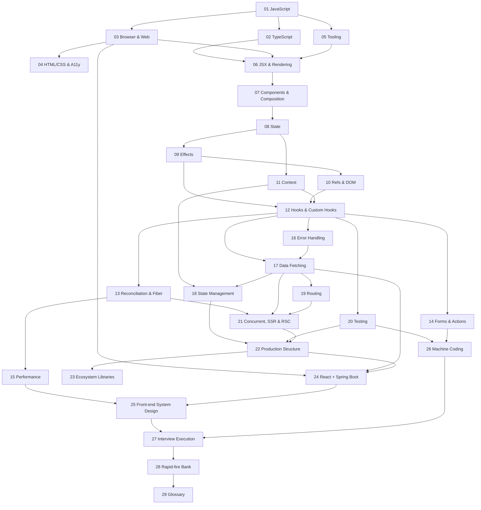

# React Full-Stack Interview Guide

A study guide for full-stack interviews where React is the front end and Spring Boot (or any backend) sits behind it. It teaches each idea before it tests it. Every module goes from the simplest mental model down to the internals, so a beginner can stop early and an expert can skim to the deep end.

**Versions verified as of 2026-10-03**: React 19.3, React Router 8.4, Next.js 16.3, TypeScript 7.0, TanStack Query 5, Redux Toolkit 2, Zustand 5, Vite 8, Vitest 5. See [VERSIONS.md](VERSIONS.md). Conventions are in [STYLE.md](STYLE.md); build status is in [PROGRESS.md](PROGRESS.md).

> **How to use this guide.** Read the modules in numeric order: no module uses a concept before an earlier one has introduced it. Or jump in through the concept map below. Every module opens with **Prerequisites** and closes with **Next** and **Related** links. Answers are hidden in collapsed blocks: answer out loud first, then open the block. Re-read each module's **Summary** the night before an interview.

---

## 0. Start here

This README is module 00. It is the entry point, so it has no separate file.

### 0.1 Who this is for
- **Coming from Java/Spring:** look for the `Where the analogy breaks` callouts. Your instincts about classes, DI and threads will mislead you in specific, predictable places: the event loop, closures, and rendering as a pure function.
- **Coming from Angular:** React has no DI container, no two-way binding by default and no zones. Change detection is replaced by "a re-render runs your function again." Modules 06 and 08 cover this.
- **Never written React:** read modules 01 → 13 in order before anything else.

### 0.2 Study plans
| Plan | Days | Path |
|---|---|---|
| **1-week cram** | 7 | D1: 01 (event loop, closures, equality) + 06. D2: 08, 09. D3: 10–12. D4: 13, 15, 17. D5: 14, 18, 19, 20 (questions only). D6: 24, 25 (two worked designs), 26 (five exercises). D7: 28 rapid-fire + every module **Summary**. |
| **4-week** | 28 | W1: 01–05. W2: 06–13. W3: 14–21. W4: 22–27, then 28 daily. |
| **8-week** | 56 | Two weeks per quarter of the guide, all exercises, all self-checks; take 26 under a timer (45 min each); add your own questions to 28. |

### 0.3 How to use the self-checks
Answer before you expand. Score yourself: ✅ fluent, 🟡 hesitant, ❌ wrong. Re-read the linked section for every 🟡 and ❌, then retry two days later (spaced repetition). The rapid-fire bank (28) is the final drill.

### 0.4 Origin tags
`[JS]` `[TS]` `[Browser]` `[React]` `[React DOM]` `[Library: …]` `[Framework: Next.js]` `[Framework: React Router]` `[Backend: Spring]` `[Tooling: …]` `[Protocol: …]` (JWT, OAuth 2.0, OIDC, PKCE, OpenAPI, STOMP: standards, not Spring) `[System design]` `[Interview]`. Interviewers like to ask "is that React or the browser?", and these tags answer it.

### 0.5 Concept map

---

## Module index

| # | Module | Status |
|---|---|---|
| 00 | Start here (this README) | ✅ |
| 01 | [JavaScript for React and interviews](01-javascript.md) | ✅ |
| 02 | [TypeScript](02-typescript.md) | ✅ |
| 03 | [Browser and web platform](03-browser-and-web-platform.md) | ✅ |
| 04 | [HTML, CSS and accessibility](04-html-css-accessibility.md) | ✅ |
| 05 | [Tooling and project setup](05-tooling-and-setup.md) | ✅ |
| 06 | [JSX and the rendering model](06-jsx-and-rendering-model.md) | ✅ |
| 07 | [Components, props and composition](07-components-props-composition.md) | ✅ |
| 08 | [State](08-state.md) | ✅ |
| 09 | [Effects](09-effects.md) | ✅ |
| 10 | [Refs and the DOM](10-refs-and-dom.md) | ✅ |
| 11 | [Context and prop drilling](11-context.md) | ✅ |
| 12 | [Rules of hooks and custom hooks](12-hooks-and-custom-hooks.md) | ✅ |
| 13 | [Reconciliation, virtual DOM and Fiber](13-reconciliation-and-fiber.md) | ✅ |
| 14 | [Forms and Actions](14-forms-and-actions.md) | ✅ |
| 15 | [Performance](15-performance.md) | ✅ |
| 16 | [Error handling](16-error-handling.md) | ✅ |
| 17 | [Data fetching](17-data-fetching.md) | ✅ |
| 18 | [State management landscape](18-state-management.md) | ✅ |
| 19 | [Routing](19-routing.md) | ✅ |
| 20 | [Testing](20-testing.md) | ✅ |
| 21 | [Concurrent React, SSR and Server Components](21-concurrent-ssr-server-components.md) | ✅ |
| 22 | [Production project structure](22-production-project-structure.md) | ✅ |
| 23 | [Ecosystem libraries](23-ecosystem-libraries.md) | ✅ |
| 24 | [React with a Spring Boot backend](24-react-with-spring-boot.md) | ✅ |
| 25 | [Front-end system design](25-frontend-system-design.md) | ✅ |
| 26 | [Machine-coding round](26-machine-coding.md) | ✅ |
| 27 | [Interview execution](27-interview-execution.md) | ✅ |
| 28 | [Rapid-fire question bank](28-rapid-fire-bank.md) | ✅ |
| 29 | [Glossary](29-glossary.md) | ✅ |
| — | [Companion examples project](examples/README.md) | ✅ scaffold |

---

## Full outline

Each module also ends with the standard tail from [STYLE.md](STYLE.md): Interview questions · Coding exercises · Gotchas & trick questions · Common misconceptions / outdated advice · Self-check · Summary · Next/Related. The tail is not repeated in the outlines below. 📊 marks a planned Mermaid diagram.

### 01 — JavaScript for React and interviews
1.1 Values, types and `typeof` quirks · 1.2 Coercion and `==` vs `===` (and `Object.is`) · 1.3 Scope: global, function, block · 1.4 Hoisting and the TDZ · 1.5 Closures (and stale values, the root of stale React state) · 1.6 `this` and binding: call/apply/bind, arrow functions · 1.7 Prototypes, `class`, and how they differ from Java classes · 1.8 Reference vs value equality · 1.9 Immutability and structural sharing · 1.10 Spread, rest, destructuring, optional chaining, nullish coalescing · 1.11 Array and object methods (map/filter/reduce/find/some/every/flatMap/toSorted/structuredClone/Object.entries/groupBy) · 1.12 Modules: ESM vs CommonJS, live bindings, dynamic `import()` · 1.13 Iterators and generators · 1.14 Promises (states, chaining, `all`/`allSettled`/`race`/`any`) · 1.15 async/await and error handling · 1.16 The event loop: call stack, microtasks vs macrotasks, rendering steps 📊 · 1.17 Errors: `try/catch`, `finally`, custom errors, `cause`, unhandled rejections · 1.18 Debounce and throttle (implemented) · 1.19 Shallow vs deep copy (`structuredClone`, its limits) · 1.20 Memory: GC, leaks from closures, listeners and timers, `WeakMap`/`WeakRef` · 1.21 Classic trick questions and output-prediction puzzles (20+) · Exercises: debounce, throttle, `Promise.all` polyfill, deep clone, `curry`, `memoize`, event emitter, flatten, `retry` with backoff, LRU cache.

### 02 — TypeScript
2.1 Why static types on a dynamic runtime (types are erased; compare with Java generics erasure) · 2.2 Primitives, literal types, `as const` · 2.3 Inference and contextual typing · 2.4 Structural typing (vs Java's nominal typing) · 2.5 Unions and intersections · 2.6 Narrowing: `typeof`, `in`, `instanceof`, type predicates, assertion functions · 2.7 Discriminated unions and exhaustiveness with `never` · 2.8 Generics and constraints · 2.9 Utility types (`Partial`, `Pick`, `Omit`, `Record`, `ReturnType`, `Awaited`, `NoInfer`…) · 2.10 Mapped, conditional and template-literal types, `infer` · 2.11 `unknown` vs `any` vs `never`; `satisfies` · 2.12 `interface` vs `type` · 2.13 Typing React: props, children, events, refs, generic components, `ComponentProps` · 2.14 Declaration files, `@types`, module augmentation · 2.15 `tsconfig` strictness flags (`strict`, `noUncheckedIndexedAccess`, `exactOptionalPropertyTypes`, `verbatimModuleSyntax`) · 2.16 Runtime validation with Zod vs static types 📊 · 2.17 TypeScript 6/7: the native compiler and what changed (version notes) · Exercises: typed `groupBy`, a `DeepPartial`, an exhaustive reducer, a typed API client with Zod.

### 03 — Browser and web platform
3.1 The DOM tree and the DOM APIs · 3.2 Events: capture → target → bubble, `stopPropagation`, `preventDefault`, delegation 📊 · 3.3 How React's event system relates to native events (root delegation since 17) · 3.4 The rendering pipeline: parse → style → layout → paint → composite; reflow and layout thrashing 📊 · 3.5 Storage: cookies (attributes), localStorage, sessionStorage, IndexedDB, Cache API · 3.6 `fetch`, `Request`/`Response`, streaming bodies, `AbortController` · 3.7 CORS from the browser's side: simple vs preflighted, credentials 📊 · 3.8 Web security: XSS (stored/reflected/DOM), CSRF, CSP, clickjacking, `SameSite`, Trusted Types · 3.9 HTTP caching: `Cache-Control`, ETag, validation, immutable assets · 3.10 Service workers and PWA basics · 3.11 Core Web Vitals (LCP, INP, CLS) and how they are measured · 3.12 Observers: Intersection, Resize, Mutation, Performance · 3.13 Workers and the main thread · Exercises: event delegation list, a `fetch` wrapper with timeout and abort, a layout-thrashing fix.

### 04 — HTML, CSS and accessibility
4.1 Semantic HTML and landmarks · 4.2 Accessibility: the accessibility tree, ARIA rules ("no ARIA is better than bad ARIA"), names, roles, states · 4.3 Focus management and keyboard navigation, roving tabindex · 4.4 Box model and `box-sizing` · 4.5 Cascade, specificity, `@layer`, inheritance · 4.6 Flexbox · 4.7 Grid · 4.8 Positioning and stacking contexts (`z-index` traps) · 4.9 Responsive design: media and container queries, units, mobile-first · 4.10 Modern CSS (nesting, `:has()`, custom properties) · 4.11 Styling in React: inline, CSS Modules, Tailwind, CSS-in-JS (runtime vs zero-runtime) and the Server Components trade-off · 4.12 Component libraries: MUI, Radix, shadcn/ui, headless vs styled · Exercises: accessible disclosure, holy-grail layout with Grid, a centered modal with a stacking-context fix.

### 05 — Tooling and project setup
5.1 npm, pnpm, yarn; lockfiles and why to commit them · 5.2 Semver and ranges (`^`, `~`), peer dependencies · 5.3 Bundling concepts: module graph, tree shaking, code splitting, HMR 📊 · 5.4 Vite vs webpack (and Rspack/Turbopack) · 5.5 Transpilers: Babel, SWC, esbuild; what JSX transform means · 5.6 ESLint flat config, `eslint-plugin-react-hooks`, Prettier, and the line between them · 5.7 Environment variables (`import.meta.env`, `VITE_` prefix, build-time vs runtime) · 5.8 Creating a project in 2026 (why not CRA) · 5.9 Monorepos: workspaces, Turborepo/Nx basics · 5.10 Source maps and debugging · Exercises: configure path aliases, set up a runtime-config pattern, diagnose a duplicate-React bug.

### 06 — JSX and the rendering model
6.1 UI as a function of state · 6.2 What JSX compiles to (`jsx()` from `react/jsx-runtime` vs `React.createElement`) · 6.3 Elements vs components vs instances · 6.4 Expressions, attributes, `className`, `style` · 6.5 Conditional rendering (and the `0 &&` trap) · 6.6 Lists and keys (why index keys break) · 6.7 Fragments · 6.8 Purity and idempotence · 6.9 What triggers a render (and what does not) · 6.10 Render phase vs commit phase 📊 · 6.11 Strict Mode double-invocation, and why · 6.12 `createRoot`, `hydrateRoot`, root options · Exercises: render a filtered list, fix a key bug, find the impure component.

### 07 — Components, props and composition
7.1 Function components and props (read-only) · 7.2 `children` and slot props · 7.3 Composition vs inheritance (why React chose composition; compare with Spring's beans) · 7.4 Props vs state · 7.5 Container/presentational, and why hooks made it optional · 7.6 Compound components · 7.7 Render props and HOCs (recognize legacy code) · 7.8 Controlled vs uncontrolled component APIs (`value`/`defaultValue`/`onChange`) · 7.9 Polymorphic components (`as` prop) and prop spreading · 7.10 Class components (read-only fluency) · Exercises: compound `Tabs`, a `Card` with slots, a controllable `Toggle`.

### 08 — State
8.1 Why local variables do not persist · 8.2 `useState` and state as a snapshot 📊 · 8.3 Batching (automatic batching since 18) · 8.4 Functional updates · 8.5 Immutable updates of nested objects and arrays (Immer briefly) · 8.6 Lazy initialization · 8.7 Derived state: compute, do not store · 8.8 Colocation and lifting state up · 8.9 Resetting state with `key` · 8.10 `useReducer` · 8.11 State machines in a reducer · 8.12 Choosing the state shape (avoid contradictions and duplication) · Exercises: shopping cart, undo/redo with a reducer, a form with derived validity.

### 09 — Effects
9.1 Effects as synchronization with external systems · 9.2 Dependencies and the `Object.is` comparison · 9.3 Cleanup and the effect lifecycle 📊 · 9.4 Race conditions and `AbortController` · 9.5 Stale closures in effects and intervals · 9.6 You might not need an effect (a catalogue) · 9.7 `useLayoutEffect` · 9.8 `useInsertionEffect` · 9.9 `useEffectEvent` (stable in 19.2) · 9.10 Strict Mode remounting and what it reveals · Exercises: a chat-room connection, a race-free search, an interval counter without stale state.

### 10 — Refs and the DOM
10.1 `useRef` as a mutable box that does not trigger renders · 10.2 DOM refs and when to use them · 10.3 Callback refs and ref cleanup functions (19) · 10.4 Ref as a prop (19) vs `forwardRef` · 10.5 `useImperativeHandle` · 10.6 Portals · 10.7 Integrating non-React libraries (maps, charts) · 10.8 Fragment refs (19.3) · Exercises: auto-focus input, a video player with an imperative API, a tooltip portal.

### 11 — Context and prop drilling
11.1 Prop drilling and when it is fine · 11.2 `createContext`, `<Context value>` (19) vs `.Provider` · 11.3 How propagation and re-rendering work 📊 · 11.4 Stable values (memoized provider values) · 11.5 Splitting contexts (state vs dispatch) · 11.6 Reducer + context pattern · 11.7 Reading context with `use` · 11.8 When context is the wrong tool · Exercises: theme switcher, auth context with a guarded hook, a split-context to-do app.

### 12 — Rules of hooks and custom hooks
12.1 The rules of hooks · 12.2 How React stores hooks (a linked list per fiber), so call order matters 📊 · 12.3 The lint rule and React Compiler rules · 12.4 Designing custom hooks (they share logic, not state) · 12.5 `useDebounce` · 12.6 `useFetch` · 12.7 `useLocalStorage` · 12.8 `usePrevious` · 12.9 `useMediaQuery` · 12.10 `useIntersectionObserver` · 12.11 `useId` · 12.12 `useSyncExternalStore` · 12.13 Testing custom hooks · 12.14 Full hooks API reference table (every hook, its version, its purpose) · Exercises: the six hooks above, each with tests.

### 13 — Reconciliation, virtual DOM and Fiber
13.1 Why a virtual DOM (and the "VDOM is fast" myth) · 13.2 Diffing heuristics: type, then key 📊 · 13.3 Component identity and state preservation (position in the tree) · 13.4 Keys revisited, and nested component definitions · 13.5 Fiber: units of work, double buffering, lanes and priorities 📊 · 13.6 Class lifecycle methods and their hook equivalents (table) · 13.7 `getDerivedStateFromProps`, `shouldComponentUpdate`, `PureComponent` · 13.8 Legacy APIs removed in 19 (`propTypes`, string refs, legacy context, `ReactDOM.render`) · Exercises: predict state preservation, fix state lost by an inline component, convert a class to hooks.

### 14 — Forms and Actions
14.1 Controlled vs uncontrolled inputs · 14.2 Validation strategies (native, schema, on-blur/on-submit) · 14.3 React Hook Form + Zod · 14.4 File inputs and previews · 14.5 Accessible forms (labels, errors, `aria-describedby`) · 14.6 Actions: `<form action={fn}>` 📊 · 14.7 `useActionState` · 14.8 `useFormStatus` · 14.9 `useOptimistic` · 14.10 Multi-step forms · Exercises: signup with RHF + Zod, a like button with `useOptimistic`, a form built on Actions.

### 15 — Performance
15.1 Measure first: React DevTools Profiler, Chrome Performance panel, Performance Tracks (19.2) · 15.2 Why components re-render 📊 · 15.3 `React.memo` · 15.4 `useMemo` and `useCallback`, and when they waste effort · 15.5 The React Compiler (1.0) and how it changes the advice · 15.6 Moving state down and lifting content up · 15.7 Code splitting with `lazy` and Suspense · 15.8 Virtualization (TanStack Virtual) · 15.9 Transitions for responsiveness (preview of 21) · 15.10 Images, fonts, preloading (`preload`/`preinit`) · 15.11 Bundle analysis · 15.12 Web Vitals in React (INP especially) · Exercises: fix a slow list, split a heavy route, virtualize 10k rows.

### 16 — Error handling
16.1 What happens when a render throws · 16.2 Error boundaries (why still classes) · 16.3 `react-error-boundary` · 16.4 What boundaries do not catch (events, async, SSR, the boundary itself) · 16.5 React 19 root options: `onCaughtError`, `onUncaughtError`, `onRecoverableError` · 16.6 Errors in event handlers and async code · 16.7 Logging and monitoring (Sentry-style), source maps · 16.8 Resilient UI states (retry, fallback, partial failure) 📊 · Exercises: a reusable boundary with reset, an async error surfaced to a boundary, a global error reporter.

### 17 — Data fetching
17.1 Fetching in effects and its pitfalls (waterfalls, races, no cache) · 17.2 Loading/error/empty states as a union type · 17.3 Server state vs client state · 17.4 TanStack Query: query keys, `staleTime` vs `gcTime` 📊 · 17.5 Invalidation and mutations · 17.6 Optimistic updates · 17.7 Pagination and infinite queries · 17.8 Prefetching and dependent queries · 17.9 SWR comparison · 17.10 Suspense-based fetching and `use` · 17.11 Real-time: WebSockets and SSE, plus cache integration · 17.12 Request deduplication, retries, cancellation · Exercises: paginated list with TanStack Query, optimistic to-do, infinite feed.

### 18 — State management landscape
18.1 A taxonomy: local, server, URL, form, global UI 📊 · 18.2 Context's limits · 18.3 Redux core ideas and legacy Redux (recognize it) · 18.4 Redux Toolkit: `configureStore`, slices, Immer · 18.5 Thunks and `createAsyncThunk` · 18.6 Selectors and memoization (Reselect) · 18.7 RTK Query · 18.8 Zustand · 18.9 Atoms: Jotai (and Recoil, which is archived) · 18.10 XState (brief) · 18.11 A decision framework · Exercises: a cart in RTK, the same cart in Zustand, a memoized selector.

### 19 — Routing
19.1 Client-side routing and the History API · 19.2 React Router 8: framework, data and declarative modes · 19.3 Nested routes, layouts, `<Outlet>` · 19.4 Params and search params (URL as state) · 19.5 Loaders, actions, `useFetcher` 📊 · 19.6 Middleware (always on in v8) · 19.7 Protected routes and auth redirects · 19.8 Lazy routes and code splitting · 19.9 Error routes (`errorElement`/`ErrorBoundary`) · 19.10 Version notes v5 → v6 → v7 → v8 · 19.11 TanStack Router (brief) · Exercises: nested layout with auth guard, a filter UI synced to search params, a route with loader + action.

### 20 — Testing
20.1 The testing trophy and what to test · 20.2 Vitest vs Jest (APIs and mocking differences) · 20.3 React Testing Library and query priority · 20.4 user-event vs fireEvent · 20.5 Async utilities (`findBy`, `waitFor`) and `act` · 20.6 MSW for network mocking · 20.7 Testing hooks (`renderHook`) · 20.8 Testing with context, routers and query clients (custom render) · 20.9 Module mocking (`vi.mock` hoisting, spies, fake timers) · 20.10 Snapshot testing trade-offs · 20.11 E2E with Playwright and Cypress · 20.12 Accessibility testing (axe) · 20.13 What not to test · Exercises: test a form, a fetching component with MSW, and a timer hook.

### 21 — Concurrent React, SSR and Server Components
21.1 Concurrent rendering: interruptible rendering 📊 · 21.2 `useTransition` and `startTransition` · 21.3 `useDeferredValue` · 21.4 Suspense in depth (boundaries, fallbacks, reveal order) · 21.5 SSR, hydration, hydration errors · 21.6 Streaming SSR and selective hydration 📊 · 21.7 Server Components: the mental model, client/server boundary 📊 · 21.8 `'use client'` and `'use server'`; Server Functions and their security · 21.9 `<Activity>` (19.2) · 21.10 `<ViewTransition>` (19.3) · 21.11 Next.js App Router as the reference: rendering strategies (SSR/SSG/ISR/CSR/PPR) · 21.12 Next.js 16 caching (Cache Components, `'use cache'`, tags) · 21.13 Route handlers and `proxy.ts` (formerly middleware) · 21.14 React Router framework mode / Remix comparison · Exercises: a search with transitions, a Server Component + Client island, a Server Action form (Next.js sub-project).

### 22 — Production project structure
22.1 Layer-based vs feature-based folders · 22.2 Feature-sliced design · 22.3 Shared UI and design systems · 22.4 The API layer · 22.5 Environment config · 22.6 Error and logging strategy · 22.7 Feature flags · 22.8 i18n (react-i18next, FormatJS) · 22.9 Analytics · 22.10 CI pipeline 📊 · 22.11 Dockerized front end (multi-stage, nginx) · 22.12 Deployment targets: static/CDN, Node server, served from Spring · 22.13 Micro-frontends (Module Federation, trade-offs) · 22.14 Sample production folder tree, with an explanation for each folder · Exercises: restructure a layer-based app, write a Dockerfile, design a feature-flag hook.

### 23 — Ecosystem libraries
23.1 How to evaluate a library · 23.2 Curated tables: data, state, forms, validation, styling, UI kits, tables, charts, dates, animation, virtualization, testing, i18n, each with "choose when / avoid when" · 23.3 Deprecated or archived libraries you will meet in legacy code (CRA, Enzyme, Recoil, moment.js, `react-router-dom`) · Exercises: choose a stack for three scenarios and justify it.

### 24 — React with a Spring Boot backend
24.1 Architecture options (separate origins vs same origin) 📊 · 24.2 CORS: preflight, credentials, Spring `CorsConfigurationSource` · 24.3 Auth options: JWT in memory vs httpOnly cookies · 24.4 Refresh-token rotation 📊 · 24.5 CSRF with cookie auth (Spring's `CookieCsrfTokenRepository`) · 24.6 OAuth2/OIDC with PKCE; BFF pattern; Spring Security resource server · 24.7 An API client with interceptors (fetch wrapper, or axios if you must) · 24.8 `ProblemDetail` (RFC 9457) error mapping · 24.9 OpenAPI → TypeScript generation · 24.10 Pagination contracts (offset vs cursor, Spring `Page`) · 24.11 File uploads with S3 presigned URLs 📊 · 24.12 Real time: WebSocket/STOMP, SSE · 24.13 Deployment options · Exercises: a working client + Spring API (CORS, ProblemDetail, pagination), refresh-on-401 interceptor, presigned upload flow.

### 25 — Front-end system design
25.1 The answer framework: requirements → component architecture → data model → API contract → state → performance → a11y → i18n → security → observability · Worked designs, each with diagrams: 25.2 Autocomplete/typeahead · 25.3 Infinite feed · 25.4 Data grid · 25.5 Real-time chat · 25.6 Dashboard · 25.7 Image carousel · 25.8 Multi-step wizard · 25.9 File uploader · 25.10 Notifications system · 25.11 Collaborative editor (high level: OT vs CRDT).

### 26 — Machine-coding round
26.1 How to approach a 45-minute round · Exercises with solutions and tests: 26.2 Todo with filters · 26.3 Star rating · 26.4 Accordion · 26.5 Tabs · 26.6 Modal with focus trap · 26.7 Debounced search · 26.8 Pagination · 26.9 Infinite scroll · 26.10 Nested comments · 26.11 File explorer tree · 26.12 Progress bar · 26.13 Countdown timer · 26.14 Kanban drag-and-drop (native DnD) · 26.15 Form wizard · 26.16 Tic-tac-toe · 26.17 Autocomplete with keyboard nav · 26.18 Traffic light · 26.19 Data table with sort/filter.

### 27 — Interview execution
27.1 Talking through live coding · 27.2 Take-home expectations · 27.3 Reviewing code in an interview (a checklist) · 27.4 Behavioral questions for front-end/full-stack (STAR, with example answers grounded in backend experience) · 27.5 Explaining the backend → full-stack transition · 27.6 Questions to ask the interviewer.

### 28 — Rapid-fire question bank
200+ one-line questions with short answers, grouped by module. Every answer links to its section.

### 29 — Glossary
Every term in the guide: a one-line definition and a link.

---

## Companion code
[`examples/`](examples/README.md) contains `web/` (Vite + React + TS + Vitest + RTL + user-event + MSW), `next-rsc/` (Server Components and Server Actions, module 21 only) and `spring-api/` (module 24 only).
