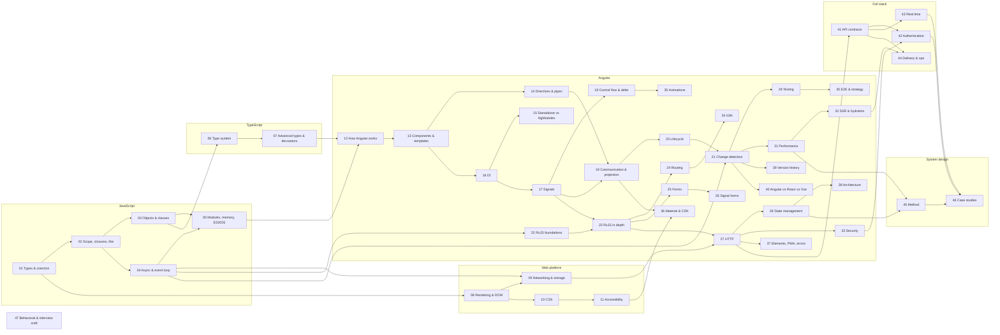

# Syllabus

**Status:** APPROVED 2026-10-03, with the decisions recorded in §7.
**Written against:** [VERSIONS.md](VERSIONS.md) (Angular 22.2.1, TypeScript 6.0, RxJS 7.8.2, snapshot 2026-10-03).
**Format rules:** [STYLE-GUIDE.md](STYLE-GUIDE.md).

This file is the plan. It lists every module with its slug, its topic checklist, its prerequisites, its question and exercise targets, and its lab folder. Topic checkboxes are ticked in [PROGRESS.md](PROGRESS.md), not here.

**Legend.** **NG** marks an Angular module (floor: 25 questions and 4 exercises). Every other module has a floor of 15 questions and 2 exercises. "Q / Ex" are **upper limits, not quotas** (decision 4): write only the questions a topic genuinely supports. No filler is written to reach a number, and the reviewer deletes duplicates and shallow answers. The floors are guidance, and a module may finish below one when the topic is exhausted. The coordinator then records the reason in PROGRESS.md. ⇢ marks a link to an existing backend guide in this repository, which we link to instead of duplicating.

## 1. Module list at a glance

| # | Slug | Part | Kind | Q | Ex | Prerequisites |
|---|---|---|---|---|---|---|
| 01 | `js-values-types-coercion` | A · JavaScript | — | 22 | 3 | none |
| 02 | `js-scope-closures-this` | A | — | 22 | 3 | 01 |
| 03 | `js-objects-prototypes-classes` | A | — | 22 | 3 | 02 |
| 04 | `js-async-event-loop` | A | — | 28 | 4 | 02 |
| 05 | `js-modules-memory-modern-features` | A | — | 22 | 3 | 03, 04 |
| 06 | `ts-type-system-essentials` | B · TypeScript | — | 25 | 4 | 03 |
| 07 | `ts-advanced-types-and-decorators` | B | — | 25 | 4 | 06 |
| 08 | `browser-rendering-dom-events` | C · Platform | — | 20 | 3 | 01 |
| 09 | `web-networking-storage-security` | C | — | 24 | 3 | 04, 08 |
| 10 | `css-essentials` | C | — | 20 | 3 | 08 |
| 11 | `accessibility` | C | — | 20 | 3 | 08, 10 |
| 12 | `angular-how-it-works` | D · Angular | **NG** | 28 | 4 | 05, 07 |
| 13 | `components-and-templates` | D | **NG** | 30 | 5 | 12 |
| 14 | `directives-and-pipes` | D | **NG** | 28 | 5 | 13 |
| 15 | `standalone-and-ngmodules` | D | **NG** | 25 | 4 | 13, 16 |
| 16 | `dependency-injection` | D | **NG** | 40 | 6 | 12, 13 |
| 17 | `signals` *(pilot)* | D | **NG** | 40 | 6 | 13, 16 |
| 18 | `control-flow-and-defer` | D | **NG** | 26 | 4 | 13, 17 |
| 19 | `component-communication-and-projection` | D | **NG** | 30 | 5 | 14, 17 |
| 20 | `lifecycle-and-render-hooks` | D | **NG** | 25 | 4 | 19 |
| 21 | `change-detection` | D | **NG** | 38 | 6 | 04, 17, 20 |
| 22 | `rxjs-foundations` | D | **NG** | 35 | 5 | 04, 07 |
| 23 | `rxjs-in-depth` | D | **NG** | 38 | 6 | 22, 17 |
| 24 | `routing` | D | **NG** | 35 | 6 | 16, 19, 23 |
| 25 | `forms-reactive-and-template-driven` | D | **NG** | 35 | 6 | 19, 23 |
| 26 | `signal-forms` | D | **NG** | 28 | 5 | 17, 25 |
| 27 | `http-client` | D | **NG** | 35 | 6 | 16, 23, 09 |
| 28 | `state-management` | D | **NG** | 35 | 5 | 17, 23, 27 |
| 29 | `testing-angular` | D | **NG** | 35 | 6 | 21, 27 |
| 30 | `e2e-and-testing-strategy` | D | — | 18 | 3 | 29 |
| 31 | `performance` | D | **NG** | 30 | 5 | 18, 21, 24 |
| 32 | `ssr-ssg-hydration` | D | **NG** | 30 | 4 | 18, 24, 31 |
| 33 | `security` | D | **NG** | 30 | 4 | 09, 13, 27 |
| 34 | `i18n` | D | **NG** | 25 | 4 | 14, 24 |
| 35 | `animations` | D | **NG** | 25 | 4 | 18, 10 |
| 36 | `material-and-cdk` | D | **NG** | 25 | 4 | 11, 19 |
| 37 | `elements-pwa-errors-ecosystem` | D | **NG** | 25 | 4 | 16, 27, 09 |
| 38 | `architecture-and-production-structure` | D | **NG** | 30 | 4 | 15, 28, 29 |
| 39 | `version-history-and-migrations` | D | **NG** | 25 | 4 | 15, 21 |
| 40 | `framework-comparisons` | D | — | 16 | 2 | 17, 21 |
| 41 | `fullstack-api-contracts` | E · Full stack | — | 32 | 5 | 27 |
| 42 | `fullstack-authentication` | E | — | 38 | 5 | 33, 41 |
| 43 | `fullstack-realtime` | E | — | 24 | 3 | 23, 41 |
| 44 | `fullstack-delivery-and-operations` | E | — | 30 | 4 | 32, 41 |
| 45 | `frontend-system-design-method` | F · System design | — | 18 | 2 | 28, 31 |
| 46 | `system-design-case-studies` | F | — | 30 | 6 | 45, 42, 43 |
| 47 | `behavioral-and-interview-craft` | G · Practice | — | 15 | 2 | none |

**Totals (upper limits):** **1,302 questions** and **199 exercises**. The guide-wide floor of 600 still applies. The weight by part:

| Part | Modules | Questions | Share of questions |
|---|---|---|---|
| A–C: JavaScript, TypeScript, platform | 11 | 250 | 19% |
| D: Angular | 29 | 865 | 66% |
| E–F: full stack and system design | 6 | 172 | 13% |
| G: practice | 1 | 15 (plus the mocks) | 1% |

Full-stack material also runs through modules 27 (HTTP), 33 (security) and 46 (case studies), and through the mock interviews. Measured by content rather than question count, Part E plus F plus those sections should come close to the requested 20%. I will measure this after Phase 3 and report it.

## 2. Knowledge map (prerequisites)

The README will carry the same graph. An arrow means "read before".



## 3. Study paths (to be detailed in README.md)

Each path is described by its goal, never by level.

| Path | Goal | Modules |
|---|---|---|
| Linear | Learn everything in dependency order | 01 → 47 |
| Interview in one week | Maximum interview coverage per hour | 12, 13, 16, 17, 18, 21, 22, 23 (operators and higher-order mapping), 24, 25, 27, 28, 29, 31, 33, 41, 42, 45, then [CHEATSHEET](CHEATSHEET.md) and two [mocks](MOCK-INTERVIEWS.md) |
| Coming from the backend | Map existing Spring/Java knowledge, then fill the gaps | 06, 07, 16, 22, 23, 27, 41, 42, 44, 38, then 17, 21 |
| Frontend fundamentals first | Solid platform base before the framework | 01–11, then Part D in order |
| Architect deep dive | Internals, trade-offs and system-level decisions | 12, 16, 17, 21, 23, 28, 31, 32, 38, 39, 40, 44, 45, 46 |

## 4. Module topic checklists

Every module also contains, by template: question bank, exercises, *Check your understanding*, and *Connections*. The checklists below list **concepts**. Each concept follows the seven-step template.

### Part A · JavaScript language core

**01 `js-values-types-coercion`**: Values, types and coercion
- [ ] The 7 primitives + objects; `typeof` quirks (`null`, functions); wrapper objects
- [ ] Number: IEEE-754, `0.1+0.2`, `NaN`, `-0`, `Number.EPSILON`, safe integers, `BigInt`
- [ ] Strings: UTF-16, code units vs code points, `length` traps, `Intl.Segmenter` (pointer only)
- [ ] Symbols and well-known symbols (`Symbol.iterator`, `toPrimitive`, `toStringTag`)
- [ ] Coercion algorithms: ToPrimitive, ToNumber, ToString, ToBoolean; truthy/falsy
- [ ] Equality: `==` algorithm, `===`, `Object.is`, SameValueZero (used by `includes`, `Map`)
- [ ] `null` vs `undefined`, `??` vs `||`, optional chaining, `??=`/`||=`/`&&=`
- [ ] Output drill: 10+ "what does this print" coercion puzzles (verified)

**02 `js-scope-closures-this`**: Scope, closures and `this`
- [ ] Lexical scope, scope chain, block vs function scope, global object / `globalThis`
- [ ] Hoisting of `var`, functions, classes; `let`/`const` and the temporal dead zone
- [ ] Closures: mechanism (environment records), uses (encapsulation, factories, memoization), loop-closure bug
- [ ] `this` binding rules: default, implicit, explicit (`call`/`apply`/`bind`), `new`, arrow (lexical); precedence
- [ ] Strict mode and why modules/classes are strict
- [ ] Higher-order functions, currying, partial application, debounce/throttle implementations
- [ ] Closures and memory (captured variables kept alive) → link 05

**03 `js-objects-prototypes-classes`**: Objects, prototypes, classes, metaprogramming
- [ ] Property descriptors, getters/setters, `Object.freeze`/`seal`/`preventExtensions`
- [ ] Prototype chain, `__proto__` vs `prototype`, `Object.create`, property lookup
- [ ] Classes as sugar + what is *not* sugar (private `#fields`, static blocks, `super` home object)
- [ ] Inheritance vs composition; mixins
- [ ] Proxy and Reflect: traps, invariants, use cases (validation, observability: how Vue 3 reactivity works)
- [ ] Copying: shallow vs deep, spread, `structuredClone` (what it cannot clone), JSON round-trip traps
- [ ] Immutability patterns and immutable array methods (`toSorted`, `toSpliced`, `with`; verify edition)
- [ ] Iteration protocols: iterables, iterators, generators (`yield`, `return`, delegation)

**04 `js-async-event-loop`**: The event loop and asynchronous JavaScript
- [ ] The event loop per the HTML spec: tasks (macrotasks), microtasks, rendering steps, `requestAnimationFrame`, `requestIdleCallback`
- [ ] Node's event loop phases vs the browser (`process.nextTick`, `setImmediate`); why it matters for SSR
- [ ] Callbacks → Promises: states, chaining, thenables, `resolve` vs `reject` semantics
- [ ] Combinators: `all`, `allSettled`, `race`, `any`; `Promise.withResolvers` (verify edition)
- [ ] async/await desugaring, error handling, sequential vs parallel awaits, top-level await
- [ ] Async iterators and `for await`; `Array.fromAsync` (ES2026)
- [ ] Cancellation: `AbortController`/`AbortSignal`, `AbortSignal.timeout`/`any`
- [ ] Unhandled rejections, `queueMicrotask`, starvation
- [ ] Output drill: 12+ ordering puzzles (verified) → this is what zone.js patches (link 21)

**05 `js-modules-memory-modern-features`**: Modules, memory, errors, modern features
- [ ] ESM vs CommonJS: static vs dynamic, live bindings, cycles, interop, `import()`, tree-shaking prerequisites
- [ ] Import maps, `import.meta`, JSON modules / import attributes (verify edition)
- [ ] Memory: GC reachability, generational GC (conceptual), common leaks (listeners, timers, closures, detached DOM, caches), `WeakMap`/`WeakSet`/`WeakRef`/`FinalizationRegistry`
- [ ] Error handling: `Error` subclasses, `cause`, `AggregateError`, `Error.isError` (ES2026), global handlers
- [ ] Feature-by-edition table ES2015 → ES2026 (each verified against TC39 finished-proposals list)
- [ ] Explicit resource management (`using`) — status verified, marked accordingly

### Part B · TypeScript

**06 `ts-type-system-essentials`**: The type system essentials
- [ ] What TS is: erased types, compile-time only; TS 6.0 vs TS 7 (native compiler); `tsc` vs esbuild/isolatedModules
- [ ] Structural typing, excess property checks, assignability, `readonly`
- [ ] Narrowing: `typeof`, `instanceof`, `in`, equality, truthiness, user-defined guards, assertion functions, control-flow analysis
- [ ] Unions, intersections, discriminated unions, exhaustiveness with `never`
- [ ] `any` vs `unknown` vs `never` vs `void`; `object` vs `{}` vs `Object`
- [ ] Enums (numeric, string, `const enum`) vs union of literals vs `as const` objects; why Angular style prefers unions
- [ ] `satisfies`, `as const`, type assertions and their danger
- [ ] `tsconfig`: `strict` family flags, `noUncheckedIndexedAccess`, `exactOptionalPropertyTypes`, `module`/`moduleResolution`, `isolatedModules`, `verbatimModuleSyntax`; TS 6.0 default changes (verified)
- [ ] Declaration files, `@types`, module augmentation, `declare global`

**07 `ts-advanced-types-and-decorators`**: Advanced types, decorators and runtime safety
- [ ] Generics, constraints, defaults, inference sites, `const` type parameters
- [ ] `keyof`, indexed access, mapped types (`as` remapping, modifiers), template literal types
- [ ] Conditional types, distributivity, `infer`, recursive types
- [ ] Utility types (built-in) and implementing `Partial`, `Pick`, `Omit`, `ReturnType`, `Awaited` by hand
- [ ] Variance (`in`/`out` annotations), function parameter bivariance and `strictFunctionTypes`
- [ ] Branded / nominal types for IDs and money
- [ ] Decorators: TC39 standard decorators vs `experimentalDecorators`; which one Angular uses and why the compiler makes it mostly irrelevant (verified)
- [ ] Type erasure → runtime validation of API data with Zod 4; schema-first types (`z.infer`)
- [ ] Typing patterns in Angular code: typed `InjectionToken<T>`, typed forms, `input<T>()` inference, typed route data, generic components

### Part C · Web platform and browser

**08 `browser-rendering-dom-events`**: Rendering pipeline, DOM and events
- [ ] Critical rendering path: parse HTML/CSS, DOM/CSSOM, render tree, layout, paint, composite; render-blocking resources, `defer`/`async`/`module` scripts
- [ ] Reflow and repaint triggers, layout thrashing, compositor-only properties, `will-change`, `content-visibility`
- [ ] DOM APIs, `DocumentFragment`, `MutationObserver`, `IntersectionObserver`, `ResizeObserver`
- [ ] Events: capture, target, bubble; `stopPropagation` vs `stopImmediatePropagation` vs `preventDefault`; passive listeners; delegation; custom events
- [ ] Web Components: Custom Elements, Shadow DOM (open/closed, slots, `:host`, `::part`), templates; declarative shadow DOM
- [ ] Core Web Vitals: LCP, INP, CLS (current thresholds verified on web.dev), how to measure (field vs lab)
- [ ] History API vs Navigation API (feeds 24)

**09 `web-networking-storage-security`**: Networking, storage and browser security
- [ ] HTTP semantics: methods, idempotency, status codes, headers
- [ ] HTTP/1.1 vs HTTP/2 vs HTTP/3 (QUIC): multiplexing, HOL blocking, what changes for bundling strategy ⇢ *Backend Interview Study Guide §5 Networking*
- [ ] HTTP caching: `Cache-Control` directives, validators (`ETag`, `Last-Modified`), hashed-asset strategy, `no-cache` vs `no-store`
- [ ] Same-origin policy and CORS from the browser's side: simple vs preflighted requests, credentials, what the browser enforces (backend config is in 41)
- [ ] Cookies: `Secure`, `HttpOnly`, `SameSite`, `Domain`/`Path`, `__Host-` prefix, partitioning (CHIPS)
- [ ] Storage: `localStorage`, `sessionStorage`, IndexedDB, Cache Storage, quotas; what each is safe for
- [ ] CSP: directives, nonces/hashes, `strict-dynamic`, report-only; Trusted Types
- [ ] Service workers lifecycle and caching strategies; PWA manifest (Angular specifics in 37)
- [ ] `fetch` vs XHR: streams, progress, abort, `keepalive`

**10 `css-essentials`**: CSS for application developers
- [ ] Box model, `box-sizing`, margin collapse, formatting contexts
- [ ] Cascade: origin, specificity, `!important`, cascade layers (`@layer`), `:where`/`:is`/`:has`
- [ ] Flexbox and Grid (when each), `subgrid`
- [ ] Positioning, stacking contexts and z-index bugs
- [ ] Responsive design: media queries, container queries, fluid typography (`clamp`), logical properties
- [ ] Custom properties, theming (light/dark), `color-scheme`
- [ ] CSS nesting (native) vs Sass; when Sass still earns its keep in Angular projects

**11 `accessibility`**: Accessibility
- [ ] Why: users, law (WCAG 2.2 levels, EAA in the EU; verified), business
- [ ] Semantic HTML first; landmark regions; headings outline
- [ ] ARIA: roles, states, properties; the five rules of ARIA; when ARIA makes it worse
- [ ] Keyboard navigation, focus order, roving tabindex, focus traps in dialogs, skip links
- [ ] Focus management in SPAs (route changes, dynamic content), live regions
- [ ] Accessible names and descriptions computation; forms and error messaging
- [ ] Testing: axe, Lighthouse, screen readers (NVDA/VoiceOver), manual checklist (Angular CDK a11y in 36)

### Part D · Angular

**12 `angular-how-it-works`** (NG): Compiler, runtime, CLI and build
- [ ] What a framework does vs a library; Angular's philosophy (batteries included, opinionated)
- [ ] The compiler: templates → instructions (Ivy), locality principle, incremental DOM idea, what `ɵcmp` contains
- [ ] AOT vs JIT: what each does, why JIT is now only for edge cases, template type checking (`strictTemplates`)
- [ ] Bootstrapping: `bootstrapApplication`, `ApplicationConfig`, the platform, the root injector, `APP_INITIALIZER` → `provideAppInitializer`
- [ ] The CLI: workspaces, `angular.json` anatomy, projects (application/library), schematics and `ng update`
- [ ] Build: `@angular/build:application` (esbuild + Vite dev server), output layout, budgets; legacy webpack builder `[Deprecated since CLI 22]` and migration
- [ ] Environments and configuration: file replacements, `define`, build configurations; why runtime config is different (→ 44)
- [ ] HMR for styles/templates; Angular DevTools overview
- [ ] Framework vs platform: decorators are compile-time metadata here

**13 `components-and-templates`** (NG): Components and templates
- [ ] Component anatomy: selector, template, styles, `imports`, metadata; the v22 file convention
- [ ] Interpolation and template expressions (what is allowed; v20+ operators: exponentiation, `in`, `void`, template literals, `typeof`, verified)
- [ ] Property, attribute, class and style bindings; event binding; two-way binding `[()]` (desugaring)
- [ ] Template reference variables, `@let` (pointer to 18)
- [ ] Host element: `host` metadata vs `@HostBinding`/`@HostListener` (legacy), host-binding type checking (v21)
- [ ] View encapsulation: Emulated (attribute rewriting), ShadowDom, None; `:host`, `:host-context`, `::ng-deep` (deprecated status)
- [ ] Styling strategies: component styles, global styles, CSS variables for theming, Tailwind integration
- [ ] Safe navigation, non-null assertion in templates, `$any`
- [ ] Framework vs platform: emulated encapsulation vs Shadow DOM

**14 `directives-and-pipes`** (NG): Directives and pipes
- [ ] Attribute directives: `host`, inputs, `ElementRef`/`Renderer2`, why not touch the DOM directly
- [ ] Structural directives: `TemplateRef` + `ViewContainerRef`, microsyntax, `ngTemplateContextGuard`; why built-in control flow replaced `*ngIf`/`*ngFor` `[Deprecated since v20]`
- [ ] Host directives (composition API), input/output aliasing and exposure
- [ ] Built-in directives still current (`NgClass`/`NgStyle` vs bindings, `NgTemplateOutlet`, `NgComponentOutlet`)
- [ ] Pipes: pure vs impure (memoization semantics), custom pipes, pipe with DI, standalone pipe imports
- [ ] The `async` pipe internals (subscription, marking for check, error behavior since v20)
- [ ] Built-in pipes: `date`, `currency`, `number`, `percent`, `json`, `keyvalue`, `i18nPlural`; locale dependence (→ 34)
- [ ] Pipe vs `computed` vs method call in templates: performance and readability

**15 `standalone-and-ngmodules`** (NG): Standalone architecture and NgModules
- [ ] What NgModules did: compilation context, DI scoping, lazy-loading unit; why they were confusing
- [ ] Standalone components: `imports`, `standalone` default since v19, `bootstrapApplication`
- [ ] Providers in a standalone world: `provide*` functions, `EnvironmentProviders`, `importProvidersFrom`
- [ ] Lazy loading without modules: `loadComponent`, `loadChildren` with route arrays
- [ ] Legacy: `declarations`, `imports`/`exports`, `forRoot`/`forChild`, `SharedModule` anti-pattern, `CoreModule`
- [ ] Migration: `ng generate @angular/core:standalone` (three passes), hybrid apps, common failures
- [ ] Interop: using NgModule-based libraries in standalone apps and vice versa

**16 `dependency-injection`** (NG): Dependency injection
- [ ] Why DI: testability, configurability, inversion of control; plain constructor injection vs a DI container
- [ ] Providers: `useClass`, `useValue`, `useFactory`, `useExisting`; `providedIn: 'root'` and tree-shaking; `'platform'`; deprecated `'any'`/module
- [ ] `inject()` vs constructor injection; injection context, `runInInjectionContext`, `assertInInjectionContext`
- [ ] Injector hierarchy: platform → root environment → route environment injectors → element (node) injectors; resolution algorithm
- [ ] `providers` vs `viewProviders`; component-level providers for per-instance state
- [ ] Resolution modifiers: `optional`, `self`, `skipSelf`, `host`
- [ ] `InjectionToken<T>` with factories; multi providers (`HTTP_INTERCEPTORS`, `ENVIRONMENT_INITIALIZER`), `provideEnvironmentInitializer`/`provideAppInitializer`
- [ ] `DestroyRef`, `EnvironmentInjector`, `createEnvironmentInjector`, `Injector.create`
- [ ] Forward references and circular dependencies
- [ ] DI-based patterns: strategy via tokens, facade, adapter, configuration objects, feature flags, `provideX()` API design for libraries
- [ ] Coming from the backend: Angular DI vs the Spring container (scopes, proxies, no component scanning) ⇢ *Backend Study Guide Part IV*

**17 `signals`** (NG, *pilot module*): Signals and reactive primitives
- [ ] Why signals: fine-grained reactivity, glitch-free derivation, the zone.js cost
- [ ] Mental model: the reactive graph (producers, consumers), push-dirty/pull-value, version counters
- [ ] `signal`, `set`/`update`, equality functions, `asReadonly`, `untracked`
- [ ] `computed`: laziness, memoization, dynamic dependencies, errors in computeds
- [ ] `effect`: scheduling (component vs root effects), cleanup, `afterRenderEffect`, correct vs incorrect uses (state propagation anti-pattern)
- [ ] `linkedSignal`: writable derived state, `source`/`computation` form, previous value
- [ ] `resource` and `rxResource`: params, loader, status signals, abort, reload, `hasValue`; `httpResource` (pointer to 27)
- [ ] Signal-based component APIs: `input()`, `input.required()`, transforms, `output()`, `model()`; signal queries `viewChild`/`viewChildren`/`contentChild`/`contentChildren`
- [ ] Interop: `toSignal`, `toObservable`, `outputFromObservable`, `outputToObservable` (deeper in 23)
- [ ] Signals and change detection (pointer to 21): how a signal read in a template marks the view
- [ ] Framework vs platform: Angular signals vs the TC39 Signals proposal (stage verified)
- [ ] Coming from the backend: signals vs Reactor/`Flux`, and vs JavaFX properties

**18 `control-flow-and-defer`** (NG): Built-in control flow and deferrable views
- [ ] `@if`/`@else if`/`@else`, `as` aliasing
- [ ] `@for` with mandatory `track`: the diffing algorithm, `$index`/`$first`/`$count`…, `@empty`, tracking by identity vs `$index`
- [ ] `@switch`/`@case`/`@default`; exhaustiveness checking (`@default never`, verified)
- [ ] `@let`: scope, reactivity, when it helps
- [ ] `@defer`: placeholder/loading/error blocks, `minimum`/`after`, triggers (`idle`, `viewport`, `interaction`, `hover`, `immediate`, `timer`, `when`), `prefetch`, how dependencies become lazy chunks
- [ ] `@defer` in SSR and incremental hydration triggers (`hydrate on …`) → 32
- [ ] Migration from `*ngIf`/`*ngFor`/`*ngSwitch` (`ng generate @angular/core:control-flow`)

**19 `component-communication-and-projection`** (NG): Component communication and content projection
- [ ] Parent → child (inputs), child → parent (outputs), two-way (`model`)
- [ ] Sibling and distant communication: shared services with signals, DI-scoped state
- [ ] Content projection: single/multi-slot `ng-content` with `select`, `ngProjectAs`, fallback content; projection is not instantiation (lifecycle trap)
- [ ] `ng-template`, `ngTemplateOutlet` with context; template-driven APIs (render props equivalent)
- [ ] View queries vs content queries; signal queries vs `@ViewChild`/`@ContentChild` (legacy); `read` option, `static`
- [ ] Ownership note (pilot review): 19 owns decorator queries (`static`, `QueryList`) and the `@Input`/`@Output`/query migration schematics. Module 17's Q17.30 and Q17.31 cover only the signal APIs and link here.
- [ ] Dynamic components: `ViewContainerRef.createComponent`, `NgComponentOutlet`, `inputBinding`/`outputBinding` (verify), `ComponentFactoryResolver` `[Removed in v22]`
- [ ] Decorator-based `@Input`/`@Output` (legacy) and migration schematics

**20 `lifecycle-and-render-hooks`** (NG): Lifecycle and render hooks
- [ ] Order of `ngOnChanges`, `ngOnInit`, `ngDoCheck`, `ngAfterContentInit/Checked`, `ngAfterViewInit/Checked`, `ngOnDestroy`; parent/child ordering
- [ ] Which hooks still matter with signals (and which become `computed`/`effect`)
- [ ] `afterNextRender`, `afterEveryRender` (renamed from `afterRender` in v20), phases (`earlyRead`, `write`, `mixedReadWrite`, `read`)
- [ ] `DestroyRef.onDestroy`, `takeUntilDestroyed`
- [ ] `ExpressionChangedAfterItHasBeenCheckedError`: cause and correct fixes
- [ ] Constructor vs `ngOnInit` (and `inject()` timing)

**21 `change-detection`** (NG): Change detection
- [ ] The problem: keeping the DOM in sync with state; dirty checking vs fine-grained reactivity
- [ ] zone.js: monkey-patching, `NgZone`, `onMicrotaskEmpty`, `runOutsideAngular`, why it was removed from the default
- [ ] Strategies: OnPush (default since v22) vs `Eager` (formerly `Default`); what marks a view dirty (inputs by reference, template events, `async` pipe, signals, `markForCheck`)
- [ ] The tree walk: top-down, `RefreshView` vs `CheckAlways`, signals marking only consumer views (targeted mode)
- [ ] Zoneless: `provideZonelessChangeDetection` (stable since 20.2, default since v21), scheduler triggers, `PendingTasks`, migrating a zone app
- [ ] `ChangeDetectorRef`: `markForCheck`, `detectChanges`, `detach`/`reattach`
- [ ] Debugging: Angular DevTools profiler, `provideCheckNoChangesConfig`, `ngZone` profiling
- [ ] Coming from the backend: no equivalent; nearest is a dirty-checking ORM flush (Hibernate) — where it breaks

**22 `rxjs-foundations`** (NG): RxJS foundations
- [ ] Observables as push collections; Observable vs Promise vs iterator; laziness
- [ ] Anatomy: `Observable`, `Observer`, `Subscription`, teardown; building one by hand
- [ ] Cold vs hot; unicast vs multicast
- [ ] Subjects: `Subject`, `BehaviorSubject`, `ReplaySubject`, `AsyncSubject`; when a Subject is a smell
- [ ] Operator catalogue grouped by purpose: creation, transformation, filtering, combination (`combineLatest`, `withLatestFrom`, `forkJoin`, `zip`, `merge`, `concat`), utility, conditional, aggregation, timing (`debounceTime`, `throttleTime`, `auditTime`, `sampleTime`)
- [ ] Pipeable operators and writing a custom operator
- [ ] Framework vs platform: RxJS vs the WICG `Observable` (status in browsers verified)
- [ ] Coming from the backend: RxJS vs Project Reactor (cold by default, backpressure: where it breaks)

**23 `rxjs-in-depth`** (NG): RxJS in depth and interop with signals
- [ ] Higher-order mapping: `switchMap`, `mergeMap`, `concatMap`, `exhaustMap`: semantics, use cases, bugs from the wrong choice
- [ ] Error handling: `catchError` placement, `retry` with config and backoff, `finalize`, error vs complete semantics
- [ ] Multicasting: `share` with config, `shareReplay` pitfalls (`refCount`, memory, stale data)
- [ ] Schedulers: `asyncScheduler`, `asapScheduler`, `animationFrameScheduler`, `queueScheduler`; `observeOn`/`subscribeOn`
- [ ] Unsubscription strategies: `takeUntilDestroyed`, `async` pipe, `toSignal`, `take`/`first`; leaks and how to detect them
- [ ] Testing with `TestScheduler` and marble diagrams
- [ ] RxJS vs signals: decision rules; `toSignal` (`initialValue`, `requireSync`), `toObservable` (effect timing), `rxResource`
- [ ] Common Angular patterns: typeahead, polling, cache-then-network, race of requests
- [ ] Ownership note (pilot review): 23 owns the signals-vs-RxJS decision rules and the typeahead trade-off (moved out of 17). The basic `toSignal` behavior question is Q17.37 in module 17; 23 links to it and goes deeper (`requireSync`, `manualCleanup`, timing of `toObservable`).

**24 `routing`** (NG): Routing and navigation
- [ ] Router configuration: `provideRouter`, route matching (prefix/full), redirects (functional `redirectTo`), wildcard
- [ ] Parameters: path, query, matrix, fragment; `withComponentInputBinding`; `paramsInheritanceStrategy` `[Changed in v22: default 'always']`
- [ ] Nested and named (auxiliary) outlets
- [ ] Lazy loading (`loadComponent`, `loadChildren`) and route-level providers (environment injectors)
- [ ] Functional guards (`CanActivateFn`, `CanMatchFn` with `currentSnapshot` `[Changed in v22]`, `CanDeactivateFn`), resolvers, `RedirectCommand`; why guards are UX, not security (→ 33)
- [ ] Preloading strategies (built-in and custom), route reuse strategy
- [ ] Navigation lifecycle and events; `Router.lastSuccessfulNavigation` signal (v21), cancelling navigations
- [ ] View transitions (`withViewTransitions`), scroll restoration (`withInMemoryScrolling`), titles (`TitleStrategy`)
- [ ] Framework vs platform: Router vs History API / Navigation API; `HashLocationStrategy` vs path

**25 `forms-reactive-and-template-driven`** (NG): Reactive and template-driven forms
- [ ] Template-driven forms (`ngModel`) vs reactive forms: architecture, testability, when each
- [ ] `FormControl`, `FormGroup`, `FormArray`, `FormRecord`, `FormBuilder`, `NonNullableFormBuilder`; typed forms
- [ ] Validators: built-in, custom sync, async (debounce, cancellation), cross-field (group-level); `min`/`max` numeric only `[Changed in v22]`
- [ ] Status, `updateOn`, `valueChanges`/`statusChanges`, unified `events` stream
- [ ] Dynamic forms and `FormArray` patterns; config-driven forms
- [ ] `ControlValueAccessor`: contract, `NG_VALUE_ACCESSOR`, building a custom control, `Validator` interface
- [ ] Error display strategies and accessibility of errors (→ 11)

**26 `signal-forms`** (NG): Signal Forms *(public API since v22; status and API surface re-verified at write time)*
- [ ] Why a third forms API: model-first, signals end to end
- [ ] Creating a form from a model signal; the field tree; binding with the field directive
- [ ] Schema rules and validation (built-in rules, custom, async, `debounce()`), cross-field rules, conditional rules (hidden/disabled/readonly)
- [ ] Submission, pending state, server errors
- [ ] Custom controls (signal-based contract vs CVA)
- [ ] Interop with reactive forms; migration strategy; what changed between the v21 experimental API and v22

**27 `http-client`** (NG): HTTP client
- [ ] `provideHttpClient` and features (`withInterceptors`, `withXsrfConfiguration`, `withXhr`); fetch backend default `[Changed in v22]`, `withFetch` `[Deprecated since v22]`
- [ ] Requests: typed responses, `observe`, `responseType`, params/headers immutability, `HttpContext`
- [ ] Functional interceptors (order, `next`), class interceptors via `withInterceptorsFromDi` (legacy)
- [ ] Error handling: `HttpErrorResponse`, error mapping layer, retry with exponential backoff and jitter, which errors are retryable
- [ ] Cancellation (unsubscription, `AbortSignal` with fetch), caching (interceptor cache, `shareReplay`, transfer cache for SSR)
- [ ] Auth: attaching tokens, refresh on 401 with **concurrent request queuing**, avoiding refresh loops
- [ ] XSRF: how Angular reads the cookie and sets the header, when it does not (absolute URLs, GET)
- [ ] Progress: `reportUploadProgress`/`reportDownloadProgress` (`reportProgress` `[Deprecated since v22]`), XHR requirement for upload progress
- [ ] `httpResource`: signal-driven requests, when to prefer it over `HttpClient`
- [ ] Testing with `provideHttpClientTesting` and `HttpTestingController`
- [ ] Framework vs platform: `HttpClient` vs `fetch`

**28 `state-management`** (NG): State management
- [ ] Kinds of state: server cache, UI state, form state, URL state, session state; where each belongs
- [ ] Service-with-signals store; service-with-`BehaviorSubject` store (legacy-but-common)
- [ ] NgRx Store: actions, reducers, selectors (memoization), `createFeature`, `createActionGroup`, Effects (functional), Entity, Router Store, DevTools
- [ ] NgRx ComponentStore (status in v22 verified) and NgRx SignalStore (`signalStore`, `withState`, `withComputed`, `withMethods`, `rxMethod`, `withEntities`, custom features, events plugin status verified)
- [ ] Alternatives: NGXS, Elf (maintenance status verified), TanStack Query for Angular `[Experimental]`
- [ ] Decision framework: when a store library is and is not justified (team size, cross-cutting state, time travel, server-cache vs client state)
- [ ] Optimistic updates, normalization, undo

**29 `testing-angular`** (NG): Testing Angular applications
- [ ] What to test where: unit vs integration vs component vs e2e; testing pyramid vs trophy
- [ ] Runners: Vitest (default since v21) via `@angular/build:unit-test`, Karma/Jasmine (legacy, migration schematic), Jest (`jest-preset-angular`); browser mode vs jsdom
- [ ] TestBed: `configureTestingModule`, `inject`, overriding providers, `TestBed.tick()`/`fixture.whenStable()` in zoneless tests
- [ ] Component tests: DOM queries, `ComponentFixture`, setting signal inputs (`setInput`), outputs, OnPush, zoneless
- [ ] Mocking strategies: fakes vs stubs vs spies, `vi.fn`, provider overrides, avoiding over-mocking
- [ ] Component harnesses (CDK `TestbedHarnessEnvironment`), Angular Testing Library
- [ ] Testing services, pipes, directives, guards, interceptors, effects, resources
- [ ] Async testing: fake timers in Vitest vs `fakeAsync` (zone-dependent), `waitForAsync`

**30 `e2e-and-testing-strategy`**: End-to-end tests and testing strategy
- [ ] Playwright vs Cypress: architecture, auto-waiting, parallelism, trade-offs
- [ ] Page objects vs fixtures; selectors (role-based); flaky test root causes
- [ ] API mocking at the network layer; contract testing with the backend (pointer to 41)
- [ ] Visual regression and accessibility checks in e2e
- [ ] CI strategy: sharding, retries policy, test data management

**31 `performance`** (NG): Performance
- [ ] Measure first: Lighthouse, Core Web Vitals (field data), Angular DevTools profiler, Chrome Performance panel
- [ ] Runtime: OnPush/zoneless, signals, `@for` `track`, pure pipes, avoiding template method calls, virtual scrolling (CDK)
- [ ] Loading: lazy routes, `@defer`, preloading, bundle budgets, `source-map-explorer`/esbuild metafile analysis, tree-shaking pitfalls
- [ ] Images: `NgOptimizedImage` (priority, `fill`, loaders, placeholders)
- [ ] Memory leaks: heap snapshots, detached nodes, subscription leaks; DevTools workflow
- [ ] Web workers in Angular; `runOutsideAngular` in zone apps
- [ ] Rendering strategy choice (CSR/SSR/SSG) as a performance decision (→ 32)

**32 `ssr-ssg-hydration`** (NG): Server-side rendering, prerendering and hydration
- [ ] Why SSR/SSG: performance, SEO, social previews; costs
- [ ] `@angular/ssr`: `ng add`, server routes and `RenderMode` (Server/Client/Prerender), `getPrerenderParams`
- [ ] Hydration: full hydration, `ngSkipHydration`, hydration mismatches; event replay (stable since v19, default)
- [ ] Incremental hydration (stable since v20) with `@defer` + `hydrate` triggers
- [ ] Platform-safe code: `isPlatformBrowser`, `afterNextRender`, `DOCUMENT`, `REQUEST`/`RESPONSE_INIT` tokens
- [ ] HTTP transfer cache, state transfer
- [ ] Deployment of SSR (Node server, edge), caching rendered pages

**33 `security`** (NG): Front-end security in Angular
- [ ] Threat model of a SPA ⇢ *Backend Study Guide Part I (OWASP)*
- [ ] XSS: Angular's contextual auto-escaping and sanitization (HTML, style, URL, resource URL)
- [ ] `DomSanitizer` and `bypassSecurityTrust*`: when it is dangerous, safe patterns
- [ ] CSP with Angular (`autoCsp` / nonce support, verified) and Trusted Types
- [ ] Token storage options: memory, `localStorage`, `HttpOnly` cookies, BFF; trade-off matrix
- [ ] CSRF: when SPAs are vulnerable, Angular XSRF support (→ 42 for Spring side)
- [ ] Route guards are UX, not a security boundary; authorization belongs on the server
- [ ] Dependency security: `npm audit`, lockfiles, supply-chain risks, SRI

**34 `i18n`** (NG): Internationalization
- [ ] i18n vs l10n; locale data, `LOCALE_ID`, `Intl` APIs
- [ ] Angular built-in i18n: `i18n` attributes, `$localize`, ICU (plural/select), extraction, compile-time per-locale builds, runtime loading option
- [ ] Transloco and ngx-translate: runtime translation, lazy loading scopes; trade-offs vs built-in
- [ ] Dates, numbers, currencies, RTL layouts, logical CSS properties
- [ ] Framework vs platform: Angular pipes vs `Intl`

**35 `animations`** (NG): Animations
- [ ] Native CSS transitions/animations and the Web Animations API
- [ ] `animate.enter`/`animate.leave` (current API; v22 leave semantics change)
- [ ] Legacy `@angular/animations` `[Deprecated since v20.2]`: triggers, states, transitions, query/stagger; migration path
- [ ] View transitions API with the router
- [ ] Performance (compositor properties) and `prefers-reduced-motion`

**36 `material-and-cdk`** (NG): Angular Material and the CDK
- [ ] Material vs CDK: styled components vs behavior primitives
- [ ] Theming with Material 3 design tokens and system variables (verified for v22)
- [ ] CDK: Overlay, Portal, Drag and Drop, Virtual Scroll, Table, Stepper, Layout/BreakpointObserver, Clipboard
- [ ] CDK a11y: `FocusTrap`, `FocusMonitor`, `LiveAnnouncer`, `ListKeyManager`
- [ ] Testing with component harnesses
- [ ] Angular Aria / headless components (if present in v22: verified before writing)
- [ ] Building a design system on the CDK vs wrapping Material

**37 `elements-pwa-errors-ecosystem`** (NG): Angular Elements, PWA, global error handling, ecosystem
- [ ] Angular Elements: custom elements from components, inputs ↔ attributes, zoneless implications, use cases
- [ ] PWA with `@angular/service-worker`: `ngsw-config.json`, update flow (`SwUpdate`), push
- [ ] Global error handling: `ErrorHandler`, `provideBrowserGlobalErrorListeners`, HTTP error UX, error boundaries pattern
- [ ] Logging and error tracking integration (pointer to 44)
- [ ] The production ecosystem map: UI kits, date libs, charts, forms helpers, i18n, state, testing, lint; how to evaluate a library

**38 `architecture-and-production-structure`** (NG): Architecture and production structure
- [ ] Folder structures that scale: feature-based, domain-driven slices; shared/core/feature boundaries
- [ ] Smart (container) vs presentational components; facade pattern; data-access layer
- [ ] Libraries: Angular CLI libraries (ng-packagr), public API surfaces
- [ ] Nx monorepos: project graph, tags, `@nx/enforce-module-boundaries`, affected commands, caching
- [ ] Micro-frontends: Module Federation vs Native Federation, when justified (and the costs)
- [ ] Linting and formatting: angular-eslint rules, Prettier, import ordering, commit hooks
- [ ] Storybook for component development
- [ ] CI pipeline for a frontend: lint → test → build → e2e → deploy previews
- [ ] A complete sample production folder tree with the reasoning behind every folder
- [ ] Coming from the backend: hexagonal/layered architecture vs frontend layering ⇢ *Architect-Level Production & Architect.md*

**39 `version-history-and-migrations`** (NG): Version history and migrations
- [ ] AngularJS (1.x): scopes, digest cycle, why the rewrite
- [ ] Matrix v2 → v22: per version, the changes interviewers ask about and why each change was made
- [ ] `ng update`, migration schematics, update guide; skipping versions safely
- [ ] AngularJS → Angular migration strategies (ngUpgrade, strangler)
- [ ] Planned migrations for old codebases: NgModules → standalone, `*ngIf` → `@if`, decorators → signal APIs, zone → zoneless, Karma → Vitest, webpack → application builder

**40 `framework-comparisons`**: Angular vs React vs Vue (and others)
- [ ] Philosophy: framework vs library vs progressive framework
- [ ] Reactivity: signals (Angular, Vue refs, Solid) vs virtual DOM re-render (React, React Compiler)
- [ ] DI, routing, forms, tooling, testing; the size of the ecosystem
- [ ] When to choose each; balanced trade-offs; how to answer "why Angular?"

### Part E · Full-stack integration with Spring Boot

Backend snippets target Spring Boot 4.x / Spring Security 7 (version verified at write time and added to VERSIONS.md). Backend-only depth links to the root guides.

**41 `fullstack-api-contracts`**: API contracts between Angular and Spring Boot
- [ ] CORS on both sides: Spring `CorsConfigurationSource` + Security, preflight caching, credentials; dev proxy (`proxy.conf.json`) as the alternative
- [ ] DTO contracts; OpenAPI (springdoc) → generated TypeScript clients (openapi-generator / orval / ng-openapi-gen); versioning
- [ ] Error contracts with `ProblemDetail` (RFC 9457); mapping on the Angular side
- [ ] Pagination (offset vs cursor), sorting, filtering contracts; Spring Data `Page` serialization
- [ ] Validation mirrored on both layers (Bean Validation ↔ Angular validators), server errors to form fields
- [ ] File upload (multipart, chunked, progress) and download (blob, `Content-Disposition`, streaming)
- [ ] Dates, time zones, decimals and money across the wire

**42 `fullstack-authentication`**: Authentication and authorization end to end
- [ ] Sessions vs JWT: trade-offs, revocation, scaling
- [ ] OAuth2/OIDC with Authorization Code + PKCE for SPAs; why implicit flow is gone
- [ ] Backend-for-Frontend (Spring Cloud Gateway / Spring Security OAuth2 client + session cookies)
- [ ] Refresh token rotation and reuse detection; silent renew
- [ ] Spring Security as a resource server (JWT validation, scopes → authorities)
- [ ] CSRF with Spring's `CookieCsrfTokenRepository` + Angular XSRF; SPA config in Spring Security 6+/7
- [ ] Angular side: guards (UX), interceptors, `angular-oauth2-oidc` / `angular-auth-oidc-client` (versions verified)
- [ ] Logout everywhere, session timeout UX ⇢ *Backend Study Guide Part I*

**43 `fullstack-realtime`**: Real-time communication
- [ ] Polling vs long polling vs SSE vs WebSockets: trade-offs
- [ ] SSE: Spring `SseEmitter`/WebFlux, Angular client with `EventSource`/fetch streams, reconnection
- [ ] WebSockets + STOMP: Spring messaging, `@stomp/rx-stomp` on Angular, auth on the handshake
- [ ] Scaling: sticky sessions, broker relay, backpressure; RxJS and signals integration on the client

**44 `fullstack-delivery-and-operations`**: Delivery and operations
- [ ] API gateway vs BFF vs direct calls
- [ ] Docker multi-stage build for Angular; Nginx config with SPA fallback, caching headers for hashed assets, gzip/brotli
- [ ] Runtime configuration without rebuilding (`config.json` + `provideAppInitializer`, env substitution)
- [ ] Serving SSR apps in containers
- [ ] Frontend observability: error tracking (Sentry-style), OpenTelemetry for the web, RUM, correlation IDs to backend traces ⇢ *Architect-Level Group E*
- [ ] Feature flags (OpenFeature), canary releases
- [ ] CI/CD for both layers; monorepo vs separate repos; versioning of the contract ⇢ *Architect-Level Group H*

### Part F · System design

**45 `frontend-system-design-method`**: Frontend system design method
- [ ] The interview format and how it differs from backend system design ⇢ *Backend Interview Study Guide §7*
- [ ] Method: requirements (functional/non-functional) → component architecture → data model and flow → state → API design → performance → accessibility → failure modes and observability
- [ ] Rendering strategy, caching layers, offline, consistency choices
- [ ] Communicating trade-offs and drawing diagrams under time pressure

**46 `system-design-case-studies`**: Case studies spanning both layers (each with diagrams, API design, state design, failure modes, and a code kernel in labs)
- [ ] Real-time operations dashboard
- [ ] Money transfer flow with idempotency keys and optimistic UI
- [ ] Large data grid with server-side filtering, sorting and pagination
- [ ] Infinite-scroll feed
- [ ] Multi-step form wizard with draft saving
- [ ] Autocomplete / typeahead search
- [ ] (stretch) Collaborative editing indicator / notifications center

### Part G · Interview practice

**47 `behavioral-and-interview-craft`**: Behavioral interviews and interview craft for frontend work
- [ ] STAR stories for frontend work: performance wins, migrations, incidents, disagreements over architecture ⇢ *Backend Interview Study Guide §9*
- [ ] Talking about legacy codebases and migrations without blaming
- [ ] Live-coding etiquette for Angular tasks; take-home expectations
- [ ] Questions to ask the interviewer about the frontend practice

Root-level practice files (Phase 5): [CHEATSHEET.md](CHEATSHEET.md), [MOCK-INTERVIEWS.md](MOCK-INTERVIEWS.md) (target: 8 full mocks, spanning Angular core, RxJS/state, full stack, system design and architecture, each with model answers and scoring notes), [GLOSSARY.md](GLOSSARY.md), [QUESTION-INDEX.md](QUESTION-INDEX.md).

## 5. Labs

```
labs/
  angular/                 # `ng new` with CLI 22.2.1, strict, zoneless, Vitest (`ng test`)
    src/app/modules/NN-slug/exercise-N/…   # one folder per exercise: code + .spec.ts
    projects/                # extra apps only where a single app cannot host the topic:
      ssr-lab/               #   32 (needs @angular/ssr)
      elements-lab/          #   37 (Angular Elements build)
      ui-lib/                #   38 (CLI library + public API)
    deploy/                  # 44: Dockerfile, nginx.conf, runtime config (built only if Docker is available)
  ts-js/                   # Node + TypeScript 6.0 + Vitest: modules 01–07 and non-Angular kernels
    src/modules/NN-slug/…    # exercise solutions + tests
    src/outputs/NN-slug/…    # every "what does this print?" snippet + a test asserting captured output
  e2e/                     # 30: Playwright against labs/angular (browsers installed only for this unit)
  tools/
    check-links.mjs          # internal link + anchor checker (Node stdlib only, no dependency)
```

- `.gitignore` covers `node_modules/`, `dist/`, `.angular/`, `coverage/`, `test-results/`, `playwright-report/`, `.vitest*`.
- Module 15 (NgModules) and 39 (migrations) keep deliberately legacy examples in `labs/angular/src/app/modules/15-…/legacy/`. They compile under v22, and where an API no longer exists (for example `ComponentFactoryResolver`) the snippet is marked as non-compiling history, not placed in labs.
- **Spring Boot side (modules 41–44):** Java snippets are illustrative and **not compiled**, and they are marked as such (STYLE-GUIDE §7.2). The Angular side of every full-stack exercise is compiled and tested in `labs/angular` against `HttpTestingController` or a stub. See decision 2 in §7. Snippets are checked against the Spring reference docs for the versions in VERSIONS.md.

## 6. Execution plan (Phases 2–5)

**Unit = one module file + its labs folder(s) + the sources/glossary terms it reports back.** All units write disjoint files. The coordinator alone owns `README.md`, `GLOSSARY.md`, `QUESTION-INDEX.md`, `CHEATSHEET.md`, `MOCK-INTERVIEWS.md`, `SOURCES.md`, `PROGRESS.md`, every `package.json`/lockfile, and **every** `npm`/`ng` install, build and test run, executed serially.

| Order | Units | Mode | Why |
|---|---|---|---|
| 0 | Labs scaffolding: `labs/angular` (`ng new`), `labs/ts-js`, `tools/check-links.mjs` | Sequential (coordinator) | Shared by every unit; built once, read-only afterwards. |
| 1 | **17 Signals (pilot)** | Sequential, then **stop for review** | Sets the quality bar. |
| 2 | 01–11 (JS/TS/platform) | Parallel batches of ~4 | Disjoint files; only `labs/ts-js/src/{modules,outputs}/NN-*`. |
| 3 | 12–16, 18–21 | Parallel batches of ~4 | Disjoint folders under `labs/angular/src/app/modules/`. |
| 4 | 22–30 | Parallel batches of ~4 | Same. |
| 5 | 31–40 | Parallel batches of ~4 | 32 and 37 each add a project under `labs/angular/projects/`; `angular.json` edits are done by the coordinator before dispatch. |
| 6 | 41–47 | Parallel batches of ~4 | Same. |
| 7 | Independent review (Phase 4) | One reviewer per batch, did not author it | Findings fixed before assembly. |
| 8 | Root files (Phase 5), link check, root README link | Sequential (coordinator) | |

The justification for parallelism: each unit is substantial (8–25k words) and touches only its own files. Verification is serialized. After each batch the coordinator runs `npm test` once per labs project, plus the link check. **If anything fails, nothing new is dispatched until it is fixed.** Workers report readiness and never run builds.

`PROGRESS.md` is updated after every unit (module status, counts, verification run, open issues) so the work can resume in a new session.

## 7. Decisions (resolved 2026-10-03)

1. **Node version.** Node 24 LTS is installed keg-only (`brew install node@24`, which does not replace the default `node`). It is used only for `labs/` commands and pinned in `labs/.nvmrc`.
2. **Spring Boot code.** Java snippets stay illustrative and are **not compiled**. They must still be accurate for Spring Boot 4.1 / Spring Security 7.1 (see [VERSIONS.md](VERSIONS.md#backend-full-stack-modules-4144)) and are checked against the official Spring reference documentation. No `labs/spring-backend/`.
3. **Playwright.** Install Chromium only (`npx playwright install chromium`), not every browser.
4. **Scale.** The per-module numbers are upper limits, not quotas (see the legend above).
5. **Sessions.** This session continues the work. The duplicate session's 49-module draft was discarded, and this 47-module syllabus is the approved plan.
