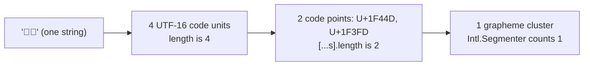
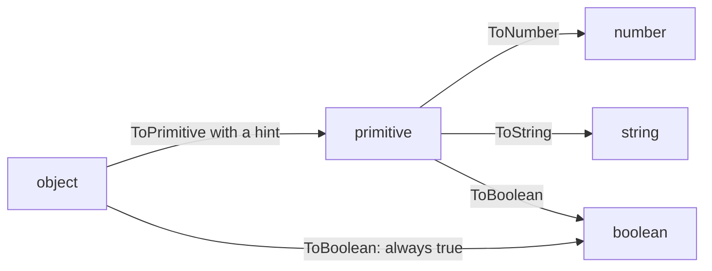
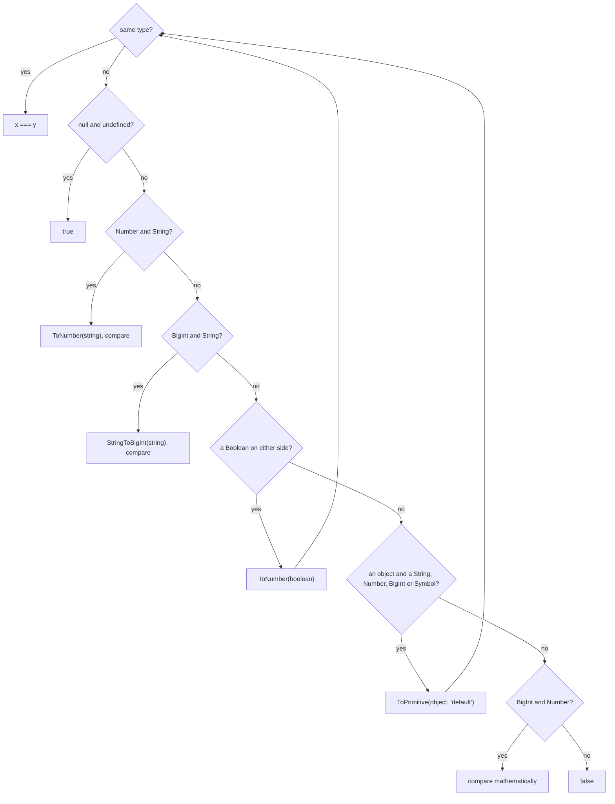

# 01. Values, types and coercion

> **What this covers:** the seven primitive types and objects, how numbers and strings really work (IEEE-754 doubles, `NaN`, `-0`, `BigInt`, UTF-16), symbols, the coercion algorithms the language runs behind every operator, and the four kinds of equality. By the end you can predict the output of any coercion puzzle by running the specification's algorithm in your head, instead of memorizing results.
> **Prerequisites:** none
> **Leads to:** [02. Scope, closures and `this`](02-js-scope-closures-this.md), [03. Objects, prototypes and classes](03-js-objects-prototypes-classes.md), [06. TypeScript type system](06-ts-type-system-essentials.md), [08. Browser rendering and DOM](08-browser-rendering-dom-events.md)
> **Applies to:** ECMAScript 2026, TypeScript 6.0 (labs), Node.js 24 (lab runtime)
> **Study time:** ~3 hours reading + ~3 hours exercises
> **Short on time:** read [5. Coercion](#5-coercion) and [6. Equality](#6-equality), then drill [Q01.04](#q01-04), [Q01.15](#q01-15), [Q01.18](#q01-18), [Q01.19](#q01-19), [Q01.20](#q01-20) and [Q01.21](#q01-21), and finish with the [Summary](#summary).
> **Labs:** [`labs/ts-js/src/modules/01-js-values-types-coercion/`](../labs/ts-js/src/modules/01-js-values-types-coercion/) (exercises) and [`labs/ts-js/src/outputs/01-js-values-types-coercion/`](../labs/ts-js/src/outputs/01-js-values-types-coercion/) (every *Output* question). Run (from `labs/ts-js`, Node 24): `npx vitest run src/modules/01-js-values-types-coercion src/outputs/01-js-values-types-coercion`

## Contents

1. [Values and types](#1-values-and-types)
2. [Numbers](#2-numbers)
3. [Strings and Unicode](#3-strings-and-unicode)
4. [Symbols](#4-symbols)
5. [Coercion](#5-coercion)
6. [Equality](#6-equality)
7. [Null, undefined and the nullish operators](#7-null-undefined-and-the-nullish-operators) (an applied close: it uses the coercion and equality rules of sections 5 and 6, which is why it comes last)
- [Summary](#summary)
- [Question bank](#question-bank)
- [Hands-on exercises](#hands-on-exercises)
- [Check your understanding](#check-your-understanding)
- [Connections](#connections)

---

## 1. Values and types

### The problem it solves

A form handler counts the fields of whatever it receives:

```js
// Partial: plain JavaScript, run in Node 24
function fieldCount(value) {
  if (typeof value === 'object') return Object.keys(value).length;
  return 0;
}
fieldCount(null); // TypeError: Cannot convert undefined or null to object
```

`typeof null` is `'object'`, so the "is it an object?" check lets `null` through ([Q01.02](#q01-02)).

JavaScript variables have no types; **values** do. A variable can hold a number now and a string later, and every operator must decide at run time what to do with whatever it receives. Interviewers start here because nearly every "weird JavaScript" result traces back to two facts: which type a value really has, and what the language converts it to. If you misjudge the type (for example, believing `typeof null` tells you "null"), every later step of your reasoning is wrong.

### Mental model

There are exactly eight types in the language specification ([ECMA-262 §6.1](https://tc39.es/ecma262/#sec-ecmascript-language-types)): seven **primitive** types and **Object**.

| Primitive | Example | `typeof` |
|---|---|---|
| Undefined | `undefined` | `'undefined'` |
| Null | `null` | `'object'` (a historical bug, kept for compatibility) |
| Boolean | `true` | `'boolean'` |
| Number | `42`, `NaN` | `'number'` |
| BigInt [Added in ES2020] | `42n` | `'bigint'` |
| String | `'hi'` | `'string'` |
| Symbol | `Symbol('id')` | `'symbol'` |
| *Object* (including arrays, functions, dates) | `{}`, `[]`, `() => 1` | `'object'`, or `'function'` for callables |

A primitive is a value with no identity: two strings `'hi'` are the same value, as two numbers `3` are. An object is a container with **identity**: two `{}` literals are two different objects, even when they look identical. Primitives are immutable. `s.toUpperCase()` returns a new string, and nothing can change the string `s` holds ([Q01.01](#q01-01)).

### How it actually works

`typeof` is an operator whose result comes from a fixed table ([§13.5.3](https://tc39.es/ecma262/#sec-typeof-operator)). Two rows surprise people. `typeof null` is `'object'`, a bug from the first implementation (values carried a type tag, and the tag for objects was 0, which is also what the null pointer looked like) that can no longer be fixed without breaking the web ([MDN: typeof](https://developer.mozilla.org/en-US/docs/Web/JavaScript/Reference/Operators/typeof#typeof_null)). And any object with a `[[Call]]` internal method (the hidden method only callable objects have) reports `'function'`, which is why classes do too. `typeof` on an undeclared identifier returns `'undefined'` instead of throwing, which was the classic way to feature-detect globals ([Q01.02](#q01-02)).

Primitives still have methods: `'hi'.length` works. When you access a property on a primitive, the engine performs `ToObject` (the spec operation that wraps a primitive in its object counterpart) and looks the property up on a temporary **wrapper object** (`String.prototype`, `Number.prototype`…). Engines optimize the wrapper away, but the semantics explain an odd rule: writing a property on a primitive cannot work. The engine creates the wrapper for the lookup, but the assignment's receiver is still the primitive, and `[[Set]]` (the spec's internal property-write operation) refuses to create a property on a non-object receiver (a wrapper you keep, `new String('a')`, does accept the write). In strict mode (modules and class bodies are always strict, see [Module 02](02-js-scope-closures-this.md)) that write throws a `TypeError`. In sloppy scripts (non-strict code, the default for classic scripts) it is silently lost ([Q01.03](#q01-03)).

You can create wrappers explicitly with `new String('a')`, `new Number(1)` or `new Boolean(false)`. They are objects, so they have identity and are always truthy. Calling the same functions **without** `new` (`String(x)`, `Number(x)`, `Boolean(x)`) performs a type conversion and returns a primitive. That second form is the idiomatic way to convert.

### Code

To tell types apart reliably, combine `typeof` with explicit checks for its two blind spots: `null` and arrays.

```ts
// Partial: a teaching helper, not in the labs
function describe(value: unknown): string {
  if (value === null) return 'null';
  if (Array.isArray(value)) return 'array';
  return typeof value; // 'undefined' | 'boolean' | 'number' | 'bigint' | 'string' | 'symbol' | 'object' | 'function'
}
```

> [!TIP]
> **Coming from the backend.** Java also splits primitives (`int`, `double`) from objects, and autoboxing wraps an `int` in an `Integer` when an object is needed. The classic Java trap, `Integer a = 128, b = 128; a == b` being `false` because `==` compares references (only values from -128 to 127 are guaranteed to box to the same object, [JLS §5.1.7](https://docs.oracle.com/javase/specs/jls/se21/html/jls-5.html#jls-5.1.7)), has a direct JavaScript twin: `new String('a') === new String('a')` is `false`. **Where the analogy breaks:** in JavaScript you never need a wrapper. Java generics work only over objects, so a `List<Integer>` needs boxing, while a JavaScript array holds numbers and strings directly, and the wrapper is created implicitly only for the duration of a property access. Explicit `new Number(…)` is always a mistake in application code.

### Best practices and anti-patterns

- **Do convert with `String(x)`, `Number(x)` and `Boolean(x)` without `new`**, because they return primitives that compare and test as you expect.
- **Avoid `new String`/`new Number`/`new Boolean`**, because they create objects: `new Boolean(false)` is truthy, and wrappers never `===` a primitive.
- **Do check `null` explicitly before `typeof x === 'object'`**, because `typeof null` is `'object'`. TypeScript's narrowing knows this rule ([Module 06](06-ts-type-system-essentials.md#3-narrowing-and-control-flow-analysis)).

### Misconceptions and traps

- *"Everything in JavaScript is an object."* No. Primitives are not objects. They *borrow* methods through temporary wrappers, which is why they look like objects. The myth comes from `'hi'.length` working, which makes a primitive look like an object.
- *"`typeof` tells you the type."* It tells you a tag from a lookup table that has two known holes: `null` and functions (functions are objects, but get their own tag). The myth comes from the operator's name.
- *"Arrays have their own type."* An array is an object with special `length` behavior. Use `Array.isArray`, which also works across realms (separate global environments with their own built-ins, such as an iframe), unlike `instanceof Array`. The myth comes from arrays having their own literal syntax.
- *"`typeof x` never throws."* Once true: before ES2015 every identifier, declared or not, gave a string. Now: `let` and `const` have a temporal dead zone, so `typeof x` before `let x` in the same scope throws `ReferenceError` (run in Node 24; [02 §2](02-js-scope-closures-this.md#2-hoisting-and-the-temporal-dead-zone)).
- *"`Object.prototype.toString.call(x)` is a reliable brand check."* Once true: in ES5 the tag came from an internal `[[Class]]` property. Now: `Symbol.toStringTag` [Added in ES2015] lets any object choose its tag, so `{ [Symbol.toStringTag]: 'Array' }` reports `[object Array]` while `Array.isArray` says `false` (run in Node 24, [Q01.14](#q01-14)).

---

## 2. Numbers

### The problem it solves

JavaScript has one number type for integers and fractions alike: the IEEE-754 binary64 double ([§6.1.6.1](https://tc39.es/ecma262/#sec-ecmascript-language-types-number-type)). That single choice explains `0.1 + 0.2 !== 0.3`, why a 64-bit database ID can arrive in the browser off by one, why `NaN` is not equal to itself, and why there is a negative zero. Money, IDs and comparisons all break in production when developers do not know these rules.

### Mental model

A double is scientific notation in base 2: a sign, an 11-bit exponent and a 52-bit fraction (53 significant bits with the implicit leading 1). Think of it as a ruler whose marks are dense near zero and spread further apart as numbers grow.

- Fractions like `0.1` fall **between** marks: the stored value is the nearest mark, not `0.1`. Just as `1/3` has no finite decimal expansion, `1/10` has no finite binary one.
- Integers are exact only up to 2^53 (`Number.MAX_SAFE_INTEGER` is 2^53 − 1 = 9007199254740991). Beyond that, the marks are 2 apart, then 4, and integers start to collide.

### How it actually works

- **Rounding.** Every arithmetic result is rounded to the nearest representable double (ties to even). `0.1 + 0.2` produces `0.30000000000000004`, the double next to the one nearest `0.3` ([Q01.04](#q01-04)).
- **Printing.** `Number::toString` prints the *shortest* decimal string that round-trips to the same double ([§6.1.6.1.20](https://tc39.es/ecma262/#sec-numeric-types-number-tostring)). That is why `0.1` prints as `0.1` even though it is not exactly 0.1.
- **`Number.EPSILON`** is the gap between 1 and the next double (2^−52). It is a reasonable tolerance for comparing results near 1, and too large or too small for values of other magnitudes, where a tolerance scaled to the operands is needed.
- **`NaN`** ("not a number") is the result of invalid numeric operations (`0 / 0`, `Number('abc')`). IEEE-754 defines it as unequal to everything, including itself. Most operations that receive `NaN` return `NaN`, so it propagates silently ([Q01.05](#q01-05)).
- **`Infinity`** is what overflow and division by zero give: `Number.MAX_VALUE * 2` and `1 / 0` are `Infinity`, `-1 / 0` is `-Infinity`, and only `0 / 0` is `NaN`. To test for an ordinary number, use `Number.isFinite`: the global `isFinite` coerces its argument first, exactly like the global `isNaN`, so `isFinite('12')` and `isFinite(null)` are `true` while `Number.isFinite('12')` is `false`. Verified: `Section 2: overflow gives Infinity, …` in [`sections.test.ts`](../labs/ts-js/src/outputs/01-js-values-types-coercion/sections.test.ts).
- **Signed zero.** IEEE-754 has `+0` and `-0`. They are `===` equal, but `1 / -0` is `-Infinity`, and `Math.round(-0.4)` is `-0`. Only `Object.is` tells them apart ([Q01.06](#q01-06)).
- **BigInt** ([§6.1.6.2](https://tc39.es/ecma262/#sec-ecmascript-language-types-bigint-type)) is a separate primitive for arbitrary-precision integers, written `10n`. It never mixes implicitly with Number: `1n + 1` throws `TypeError`, because any implicit choice would silently lose either precision (to Number) or the fraction (to BigInt). The proposal's design goals say it "errs on the side of throwing an exception rather than rely on type coercion and risk giving an imprecise answer" ([proposal-bigint README](https://github.com/tc39/proposal-bigint#design-goals-or-why-is-this-like-this)). Division truncates toward zero, and `JSON.stringify` throws on it ([Q01.08](#q01-08)).

### Code

When you must compare computed doubles, compare with a tolerance, not with `===`. The helper below is a hybrid: relative to the operands above 1, and an absolute `1e-9` near zero (the `1` in `Math.max` sets that floor), so `nearlyEqual(1e-12, 2e-12)` is `true`. Drop the `1` for a purely relative test when tiny values matter.

```ts
// Partial: a teaching helper, not in the labs
function nearlyEqual(a: number, b: number, relTol = 1e-9): boolean {
  return Math.abs(a - b) <= relTol * Math.max(Math.abs(a), Math.abs(b), 1);
}
```

For money, avoid doubles entirely: keep integer minor units (cents) and convert only at the edges. [Exercise 01.3](#ex01-3) builds such a type on `BigInt`.

> [!TIP]
> **Coming from the backend.** Java's `double` is the same IEEE-754 type, so `0.1 + 0.2` prints `0.30000000000000004` there too, and `Double.equals` behaves exactly like `Object.is`: it treats `NaN` as equal to itself and `0.0` as different from `-0.0` ([Javadoc: `Double.equals`](https://docs.oracle.com/en/java/javase/21/docs/api/java.base/java/lang/Double.html#equals(java.lang.Object))). `BigInt` corresponds to `BigInteger`. **Where the analogy breaks:** JavaScript has no `long` and no `BigDecimal`. A Java `long` ID above 2^53 silently changes value when a browser parses it from JSON, and there is no built-in exact decimal type, so you model money as integer minor units yourself ([Q01.07](#q01-07), [Q01.09](#q01-09)).

### Best practices and anti-patterns

- **Do send 64-bit IDs as JSON strings**, because `JSON.parse` turns large numeric literals into the nearest double without any error.
- **Do use `Number.isNaN`, not the global `isNaN`**, because the global one coerces its argument first, so `isNaN('abc')` is `true`.
- **Avoid `toFixed` for financial rounding**, because it rounds the *binary* value: `(1.005).toFixed(2)` is `'1.00'`.
- **Do use `Number.isSafeInteger` at trust boundaries** (parsed input, API payloads), because beyond 2^53 arithmetic on integers is no longer exact.

### Misconceptions and traps

- *"`0.1 + 0.2` is a JavaScript bug."* It is IEEE-754 behavior, identical in Java, C#, Python and every language that uses doubles. JavaScript only makes it visible because it has no integer or decimal type to fall back on. The myth comes from JavaScript having only doubles, so the effect shows up in everyday code.
- *"`Number.EPSILON` is the right tolerance for any float comparison."* It is the spacing at 1. For values around 1,000,000 the spacing is much larger, so an `EPSILON` comparison would fail for numbers that are as close as doubles can be. The myth comes from the name, which sounds like a universal "small number".
- *"BigInt is a faster or safer Number."* It is slower, cannot represent fractions, cannot be used with `Math`, and does not serialize to JSON. Use it where exact large integers matter, not as a default. The myth comes from "exact" sounding like "safer".

---

## 3. Strings and Unicode

### The problem it solves

A JavaScript string is a sequence of **UTF-16 code units** ([§6.1.4](https://tc39.es/ecma262/#sec-ecmascript-language-types-string-type)), not of characters. Anything outside the Basic Multilingual Plane (most emoji, many CJK ideographs) takes two code units. So `'😀'.length` is `2`, `slice` can cut an emoji in half, a "max 280 characters" check disagrees with what the user sees, and two strings that render identically (`é` as one code point, or `e` plus a combining accent) are not `===`.

### Mental model

There are three levels, and every string API works at exactly one of them:

| Level | Unit | APIs that use it |
|---|---|---|
| Code unit | 16 bits | `length`, indexing `s[i]`, `charCodeAt`, `slice`, `split('')` |
| Code point | a Unicode scalar (1 or 2 code units) | `for…of`, spread `[...s]`, `Array.from(s)`, `codePointAt`, regex with the `u`/`v` flag |
| Grapheme cluster | what a reader sees as one character | [`Intl.Segmenter`](https://developer.mozilla.org/en-US/docs/Web/JavaScript/Reference/Global_Objects/Intl/Segmenter) with `granularity: 'grapheme'` [Added in ES2022, ECMA-402] |



What to notice: each level groups the one below it, and only the top level matches what a reader sees. `length`, indexing and `slice` work at the bottom level (counts run in Node 24).

`👍🏽` is one grapheme, two code points (thumbs up plus a skin-tone modifier) and four code units.

### How it actually works

A code point above U+FFFF is stored as a **surrogate pair**: a high surrogate (U+D800–U+DBFF) followed by a low surrogate (U+DC00–U+DFFF). Code-unit APIs see two separate units. A surrogate without its partner is a **lone surrogate**, which makes the string *ill-formed*: it cannot be encoded as valid UTF-8, so `TextEncoder` and `encodeURIComponent` either replace it with U+FFFD or throw. `isWellFormed()` and `toWellFormed()` [Added in ES2024] detect and repair this ([MDN](https://developer.mozilla.org/en-US/docs/Web/JavaScript/Reference/Global_Objects/String/isWellFormed)).

The string iterator ([§22.1.5](https://tc39.es/ecma262/#sec-string-iterator-objects)) yields code points, which is why spread and `for…of` keep pairs together. Graphemes need the Unicode segmentation rules (UAX #29), which the language core does not implement; `Intl.Segmenter` exposes them. [Module 34](34-i18n.md) covers `Intl` in depth ([Q01.10](#q01-10)).

The same text can also be encoded in different ways. `'\u00E9'` (precomposed é) and `'e\u0301'` (e plus combining acute accent) render the same, but they are different code-unit sequences. `normalize('NFC')` composes and `normalize('NFD')` decomposes, so normalize both sides before comparing user-entered text.

### Code

Count and cut at the level the user sees. The approach is to segment once with a shared `Intl.Segmenter`, then operate on the array of clusters.

```ts
// Excerpt of labs/ts-js/src/modules/01-js-values-types-coercion/unicode-text.ts
export function graphemes(text: string): string[] {
  return Array.from(GRAPHEME_SEGMENTER.segment(text), (part) => part.segment);
}
```

> [!TIP]
> **Coming from the backend.** Java strings are UTF-16 too: `"😀".length()` is 2, a `char` is a code unit, and `codePointCount` is the equivalent of `[...s].length`. **Where the analogy breaks:** the database usually counts differently. PostgreSQL's `varchar(n)` counts characters, "not bytes" ([PostgreSQL: Character Types](https://www.postgresql.org/docs/current/datatype-character.html)), which in a UTF-8 database are code points, so a form that validates with `.length` can reject text the column would accept. Agree on one unit per field across the UI, the API and the schema.

### Best practices and anti-patterns

- **Do truncate and reverse by grapheme or at least by code point**, because code-unit slicing produces lone surrogates that render as `�` and fail to encode.
- **Do normalize (`NFC`) before comparing or storing user-entered text**, because visually identical strings can differ in code units.
- **Avoid `split('')` on user text**, because it splits surrogate pairs. Use `[...s]` or `Intl.Segmenter`.

### Misconceptions and traps

- *"`length` is the number of characters."* It is the number of UTF-16 code units. It equals the character count only for BMP text without combining marks. The myth comes from tutorials that use only ASCII text, where the two counts agree.
- *"Spreading a string fixes everything."* It fixes surrogate pairs, not grapheme clusters: `[...'👍🏽']` has two elements, and reversing them moves the skin tone in front of the thumb ([Q01.11](#q01-11)). The myth comes from spread fixing the single-code-point emoji most tests use.
- *"JavaScript strings are UTF-8."* Source files and network payloads usually are. In memory, the language exposes UTF-16 code units. The myth comes from files, HTTP and databases, which mostly are UTF-8.

---

## 4. Symbols

### The problem it solves

A plugin stores its data under a string key on objects it does not own:

```js
// Partial: plain JavaScript, run in Node 24
const user = { id: 1, _meta: 'from the API' };
user._meta = { plugin: 'audit' }; // overwrites the API's field
JSON.stringify(user); // '{"id":1,"_meta":{"plugin":"audit"}}': the plugin's data leaks out
```

With a symbol key, `user[META] = …` leaves `_meta` alone and `JSON.stringify` skips it (run in Node 24, [Q01.12](#q01-12)).

Before ES2015, every property key was a string, so a library that added a property to your object (say, `id` or `_meta`) could collide with yours, and the language itself could not add new hooks such as "how do I iterate this object" without risking existing property names. A **symbol** is a primitive that is guaranteed unique, so it can be used as a property key that nothing else can collide with by accident.

### Mental model

A symbol is a unique token with an optional description label. `Symbol('id')` creates a new token every time; the description is for debugging only. Two exceptions to "new every time": `Symbol.for('key')` returns a token from a global **registry** (the same key gives the same symbol across modules and realms), and the **well-known symbols** (`Symbol.iterator`, `Symbol.toPrimitive`, `Symbol.toStringTag`…) are fixed tokens the language uses as protocol hooks.

### How it actually works

Symbol-keyed properties are ordinary properties, but most string-oriented reflection skips them: `Object.keys`, `for…in` and `JSON.stringify` ignore them, and `Object.getOwnPropertySymbols` or `Reflect.ownKeys` list them. They are hidden from casual enumeration, not private: anyone holding the symbol (or calling `getOwnPropertySymbols`) can read them. Real privacy comes from `#private` fields ([Module 03](03-js-objects-prototypes-classes.md)).

Symbols refuse implicit string conversion: `'key: ' + sym` throws `TypeError` ([§7.1.19 ToString](https://tc39.es/ecma262/#sec-tostring)), because silently turning a unique token into the text `'Symbol(id)'` would defeat its purpose. Explicit `String(sym)` and `sym.description` work.

The well-known symbols this module needs:

- **`Symbol.toPrimitive`**: a method `(hint) => primitive` that controls how an object converts to a primitive. The hint is `'number'`, `'string'` or `'default'` ([section 5](#5-coercion), [Q01.13](#q01-13)).
- **`Symbol.toStringTag`**: a string used by `Object.prototype.toString` to build `[object Tag]` ([Q01.14](#q01-14)).
- **`Symbol.iterator`**: the method that makes an object iterable by `for…of` and spread. It belongs to the iteration protocols in [Module 03](03-js-objects-prototypes-classes.md) ([Q01.12](#q01-12)).

### Code

Give a domain type a readable tag, and make it refuse arithmetic, with two well-known symbols.

```ts
// Excerpt of labs/ts-js/src/modules/01-js-values-types-coercion/money.ts
  [Symbol.toPrimitive](hint: string): string {
    if (hint === 'string') return this.toString();
    throw new TypeError(`Money cannot be converted with the "${hint}" hint; use plus(), allocate() or format()`);
  }
```

### Best practices and anti-patterns

- **Do use symbols for metadata keys a library attaches to foreign objects**, because they cannot collide with the object's own string keys.
- **Avoid symbols as a privacy mechanism**, because `Object.getOwnPropertySymbols` reveals them. Use `#private` fields or a `WeakMap`.
- **Do use `Symbol.for` only when two independently bundled copies of a library must agree on a key**, because the registry is global and its keys are just strings that can collide.

### Misconceptions and traps

- *"`Symbol('x') === Symbol('x')`."* False. The description does not identify the symbol. Only `Symbol.for` deduplicates. The myth comes from the description looking like a name or an ID.
- *"Symbol properties are private."* They are non-enumerable by string-based APIs, not inaccessible. The myth comes from `Object.keys` and `JSON.stringify` skipping them.
- *"`new Symbol()` creates a symbol."* It throws `TypeError`. The spec's `Symbol` function starts with "If NewTarget is not undefined, throw a TypeError exception" ([§20.4.1.1](https://tc39.es/ecma262/#sec-symbol-description)), so the only way to get a Symbol wrapper object is `Object(sym)`. The myth comes from `new String` and `new Number` working.

---

## 5. Coercion

### The problem it solves

Operators need operands of specific types: `-` needs numbers, `if` needs a boolean, a template literal needs strings. When you pass something else, JavaScript **coerces** it (converts it implicitly) using a small set of abstract operations defined in the specification. Every famous puzzle (`[] + {}`, `'3' - 1`, `[] == ![]`) is these operations applied mechanically. Learn the four operations and you can derive any result, which is what interviewers want to see.

### Mental model

Coercion is a pipeline: **objects first become primitives, then primitives become the type the operator needs.**



What to notice: `ToBoolean` never calls any method on an object. Every object, even an empty array or `new Boolean(false)`, is truthy.

### How it actually works

**ToPrimitive(input, hint)** ([§7.1.1](https://tc39.es/ecma262/#sec-toprimitive)). If the object has a `Symbol.toPrimitive` method, call it with the hint `'string'`, `'number'` or `'default'`, and throw `TypeError` if it returns an object. Otherwise run **OrdinaryToPrimitive**: for the `'string'` hint try `toString()` then `valueOf()`; for `'number'` and `'default'` try `valueOf()` then `toString()`. The first method that returns a primitive wins. Plain objects and arrays inherit a `valueOf` that returns the object itself, so in practice they fall through to `toString()`: `[]` becomes `''`, `[1, 2]` becomes `'1,2'`, `{}` becomes `'[object Object]'`. `Date` is the exception: its `Symbol.toPrimitive` treats `'default'` as `'string'`, so `date + 1` concatenates.

If neither method returns a primitive, or the object has none (`Object.create(null)` inherits no `valueOf` or `toString`), ToPrimitive throws: `+Object.create(null)` and `String(Object.create(null))` both throw `TypeError: Cannot convert object to primitive value`. Verified: `Section 5: an object with no usable conversion method throws TypeError` in [`sections.test.ts`](../labs/ts-js/src/outputs/01-js-values-types-coercion/sections.test.ts).

Which hint each operator passes:

| Operator | Hint |
|---|---|
| Unary `+` and `-`, binary `-`, `*`, `/`, `**` [Added in ES2016], relational `<`, `>`, `<=`, `>=`, `Number(x)` | `'number'` |
| Template literal `${x}`, `String(x)`, property keys | `'string'` |
| Binary `+`, `==` | `'default'` |

**ToNumber** ([§7.1.4](https://tc39.es/ecma262/#sec-tonumber)): `undefined` → `NaN`, `null` → `0`, `true` → `1`, strings are parsed as a whole after trimming whitespace (`''` → `0`, `'0x1F'` → `31`, `'4 2'` → `NaN`), BigInt and Symbol throw `TypeError`. `parseInt` and `parseFloat` are different: they parse a *prefix* and stop at the first invalid character.

One BigInt nuance: `Number(1n)` is `1`, because `Number(x)` runs ToNumeric and then converts a BigInt explicitly, while unary `+1n` calls ToNumber and throws `TypeError: Cannot convert a BigInt value to a number`. Verified: `Section 5: Number(1n) converts, but unary +1n throws`.

**ToString** ([§7.1.19](https://tc39.es/ecma262/#sec-tostring)): `null` → `'null'`, `-0` → `'0'`, numbers use the shortest round-trip form, Symbol throws.

**ToBoolean** ([§7.1.2](https://tc39.es/ecma262/#sec-toboolean)): exactly these values are falsy: `false`, `0`, `-0`, `0n`, `NaN`, `''`, `null`, `undefined` (plus the legacy browser object `document.all`). Everything else is truthy, including `'0'`, `'false'`, `[]` and `{}` ([Q01.17](#q01-17)).

**Binary `+`** ([§13.15.3](https://tc39.es/ecma262/#sec-applystringornumericbinaryoperator)) is the one overloaded operator: ToPrimitive both sides with the `'default'` hint; if **either** primitive is a string, ToString both and concatenate; otherwise ToNumeric both and add. Every other arithmetic operator always converts to numbers.

### Code

Angular's input transforms are coercion written out explicitly. `numberAttribute` rejects the empty string, which plain `Number('')` would turn into `0`:

```ts
// Excerpt of labs/angular/node_modules/@angular/core/fesm2022/core.mjs (Angular 22.2.1, the published package)
function booleanAttribute(value) {
  return typeof value === 'boolean' ? value : value != null && value !== 'false';
}
function numberAttribute(value, fallbackValue = NaN) {
  const isNumberValue = !isNaN(parseFloat(value)) && !isNaN(Number(value));
  return isNumberValue ? Number(value) : fallbackValue;
}
```

`parseFloat` rejects `''` and `'  '` (no numeric prefix) and `Number` rejects `'12px'` (not numeric as a whole); together they accept only fully numeric strings. HTML attributes are always strings, which is why these transforms exist ([Module 19](19-component-communication-and-projection.md)).

> [!NOTE]
> **Framework vs platform.** `Number(x)`, ToBoolean and `==` are the platform. `booleanAttribute` and `numberAttribute` are Angular functions with their own rules: `booleanAttribute('false')` is `false`, while `Boolean('false')` is `true` (both read from the excerpt above and the ToBoolean table).
 The excerpt is the published 22.2.1 package build, which exists under `labs/angular/node_modules` only after `npm install`; the API pages are [`booleanAttribute`](https://angular.dev/api/core/booleanAttribute) and [`numberAttribute`](https://angular.dev/api/core/numberAttribute).

### Best practices and anti-patterns

- **Do convert explicitly at boundaries** (`Number(input.value)`, `String(id)`), because explicit conversion documents intent and makes the failure value (`NaN`) visible at the point of entry.
- **Avoid using `+` to add values that might be strings**, because one string operand turns addition into concatenation: form values are strings, so `qty + 1` becomes `'21'`.
- **Avoid `parseInt` without a radix, and never pass it as a callback to `map`**, because `map` passes the index as the radix ([Q01.16](#q01-16)).

### Misconceptions and traps

- *"`{} + []` is `'[object Object]'`, but the console says `0`."* Both can be right. At the start of a statement, `{}` is parsed as an empty block, leaving `+[]`, which is `0`. Inside an expression it is an object literal ([Q01.15](#q01-15)). Consoles differ in which they do: `eval('{} + []')` gives `0`, while Node 24's REPL prints `'[object Object]'` (both run on 2026-10-06). The confusion comes from consoles that evaluate the input as a statement.
- *"Coercion is random."* It is fully specified and deterministic. The results look random only when you skip the ToPrimitive step. The myth comes from tables of puzzle results shown without the algorithm.
- *"`parseInt('08')` is read as octal."* Once true in ES3 engines. Now: since ES5, a leading `0` no longer selects octal ([ES5.1 Annex E](https://262.ecma-international.org/5.1/#sec-E): "parseInt no longer allows implementations to treat Strings beginning with a 0 character as octal values"), so `parseInt('08')` is `8` and `parseInt('010')` is `10` (run in Node 24). Pass the radix anyway: `'0x10'` still parses as hexadecimal, `16`.
- *"Empty arrays are falsy."* `ToBoolean` of any object is `true`. `[] == false` is also `true`, but for a different reason: `==` converts the array to `''` and then to `0` ([Q01.17](#q01-17)). The myth comes from Python, where an empty list is falsy, and from `[] == false` being `true`.

---

## 6. Equality

### The problem it solves

"Are these two values the same?" has four different answers in JavaScript, because different jobs need different definitions. A `switch`, `===` and `indexOf` need the fast, conventional IEEE answer. `Map`, `Set` and `includes` [Added in ES2016] need `NaN` to be findable. React-style change detection and Angular signals use `Object.is` (SameValue), so that `NaN` does not look like a change on every write; a side effect is that `0` to `-0` counts as one. And `==` exists for historical convenience. Using the wrong one causes bugs such as an `indexOf` that never finds `NaN` or a deduplication that treats `'1'` and `1` as equal.

### Mental model

| Algorithm | Used by | `NaN` vs `NaN` | `+0` vs `-0` | Converts types? |
|---|---|---|---|---|
| **IsLooselyEqual** | `==`, `!=` | false | equal | yes |
| **IsStrictlyEqual** | `===`, `!==`, `indexOf`, `lastIndexOf`, `switch` | false | equal | no |
| **SameValueZero** | `includes`, `Map`, `Set`, `TypedArray` search | **true** | equal | no |
| **SameValue** | `Object.is`, `Object.defineProperty` checks, Angular signals' default `equal` | **true** | **different** | no |

Sources: [§7.2.9 SameValue](https://tc39.es/ecma262/#sec-samevalue), [§7.2.10 SameValueZero](https://tc39.es/ecma262/#sec-samevaluezero), [§7.2.13 IsLooselyEqual](https://tc39.es/ecma262/#sec-islooselyequal), [§7.2.14 IsStrictlyEqual](https://tc39.es/ecma262/#sec-isstrictlyequal), and the [MDN overview](https://developer.mozilla.org/en-US/docs/Web/JavaScript/Guide/Equality_comparisons_and_sameness). Objects are compared by identity under all four.

### How it actually works

`IsLooselyEqual(x, y)` is a short list of steps:

1. Same type: return `x === y`.
2. `null == undefined` (either order): `true`. `null` and `undefined` are loosely equal to nothing else.
3. Number and String: convert the string with ToNumber, compare.
4. BigInt and String: convert the string with StringToBigInt (an invalid string means `false`), compare.
5. Boolean on either side: convert the boolean to a Number (`true` → `1`), start again.
6. Object and a String, Number, BigInt or Symbol: ToPrimitive the object (no hint, so `'default'`), start again.
7. BigInt and Number: compare mathematically (`NaN` and `±Infinity` are never equal to a BigInt).
8. Anything else: `false`.



What to notice: only the Boolean and object edges loop back to the top, so one comparison can be a chain of single conversions (`[] == false` loops twice: `[] == 0`, then `'' == 0`). `null` has no conversion edge at all, which is why `null == 0` is `false`.

Two consequences explain most puzzles. Booleans are converted to numbers **before** the object step, so `'true' == true` is `'true' == 1`, which is `NaN == 1`, which is `false`. And relational operators (`<`, `>=`) are a **different** algorithm (IsLessThan, with the `'number'` hint), not built from `==`: `null >= 0` is `true` while `null == 0` is `false` ([Q01.19](#q01-19)).

When **both** sides of `<` are strings, IsLessThan compares them code unit by code unit, not numerically and not by locale: `'10' < '9'` is `true`, while `'10' < 9` converts the string and is `false`. The default `Array.prototype.sort` converts elements to strings and compares them the same way, so `[10, 9, 1].sort()` gives `1,10,9`. Pass a comparator: `(a, b) => a - b` for numbers, or `new Intl.Collator('en', { numeric: true }).compare` for strings that contain numbers ([Module 34](34-i18n.md)). Verified: `Section 6: strings compare by code unit, …` in [`sections.test.ts`](../labs/ts-js/src/outputs/01-js-values-types-coercion/sections.test.ts).

`Set` and `Map` also normalize `-0` to `+0` when storing a key ([§24.2.4.1 Set.prototype.add](https://tc39.es/ecma262/#sec-set.prototype.add)), which is why their lookups can use SameValueZero consistently.

### Code

[Exercise 01.2](#ex01-2) implements `==` by hand. Its core is the dispatch over type pairs, tried from both sides:

```ts
// Excerpt of labs/ts-js/src/modules/01-js-values-types-coercion/loose-equals.ts
export function looseEquals(x: unknown, y: unknown): boolean {
  if (specType(x) === specType(y)) return x === y;
  if (isNullish(x) || isNullish(y)) return isNullish(x) && isNullish(y);
  return coerceFrom(x, y) ?? coerceFrom(y, x) ?? false;
}
```

> [!TIP]
> **Coming from the backend.** JavaScript's `===` on objects is Java's `==` on references: identity. But there is no `equals()` protocol: no operator or collection calls a user-defined equality method, so a `Set` of `{ id: 1 }` objects keeps duplicates. You deduplicate by key (`new Map(items.map((i) => [i.id, i]))`) instead. **Where the analogy breaks:** for primitives, `===` compares values, strings included, so the Java trap of comparing strings with `==` does not exist in JavaScript.

### Best practices and anti-patterns

- **Do use `===` by default**, because it never converts types, so its result is obvious from the operands.
- **Do accept `x == null` as the one idiomatic use of `==`**, because it means exactly "`null` or `undefined`" and nothing else. ESLint's `eqeqeq` rule has a `null: 'ignore'` option and a `'smart'` mode for this ([ESLint: eqeqeq](https://eslint.org/docs/latest/rules/eqeqeq)), and Angular's own `booleanAttribute` uses it.
- **Do use `Number.isNaN` or `includes` to find `NaN`**, because `indexOf` and `===` never match it.

### Misconceptions and traps

- *"`==` checks value, `===` checks value and type."* Close, but misleading: `==` *converts* by a fixed algorithm, which is not the same as "ignoring type". `[] == ![]` is `true` while `[] == []` is `false`. The myth comes from teaching `===` as "`==` plus a type check".
- *"`Object.is` is just a stricter `===`."* It differs from `===` in exactly two cases: `Object.is(NaN, NaN)` is `true` and `Object.is(0, -0)` is `false`. The myth comes from its name and from equality tables that list it next to `===`.
- *"A `Set` can store `-0`."* It stores `+0` instead ([Q01.20](#q01-20)). The myth comes from `Object.is(0, -0)` being `false`, which suggests collections keep both.

---

## 7. Null, undefined and the nullish operators

### The problem it solves

JavaScript has two "no value" values. `undefined` is what the language produces when something was never set: a missing property, an uninitialized `let`, a missing argument, a function that returns nothing. `null` is what programmers write to say "deliberately empty". Code that does not distinguish them, or that uses `||` to supply defaults, overwrites legitimate values like `0`, `''` and `false`, and crashes on `cannot read properties of undefined`.

### Mental model

Think of a form field. `undefined` means "the field is not in the form at all". `null` means "the field is in the form, and the user cleared it". The **nullish** operators treat both as "no value" and nothing else, while `||` treats every falsy value as "no value".

| Expression | Falls back when the left side is |
|---|---|
| `a \|\| b` | any falsy value: `0`, `''`, `false`, `NaN`, `null`, `undefined` |
| `a ?? b` | `null` or `undefined` only |
| `a?.b` | returns `undefined` (and stops the whole chain) when `a` is `null` or `undefined` |
| `a ??= b`, `a \|\|= b`, `a &&= b` | assigns only when `??`, `\|\|` or `&&` would evaluate `b` |

### How it actually works

- **`??`** [Added in ES2020] evaluates the right side only if the left is `null` or `undefined`. It cannot be mixed with `||` or `&&` without parentheses; `a || b ?? c` is a `SyntaxError` by design, so the precedence is never guessed ([MDN](https://developer.mozilla.org/en-US/docs/Web/JavaScript/Reference/Operators/Nullish_coalescing)).
- **Optional chaining `?.`** [Added in ES2020] short-circuits the **entire** chain: in `a?.b.c.d`, if `a` is nullish, none of `.b.c.d` is evaluated and the result is `undefined`. It also works for calls (`fn?.()`) and indexing (`obj?.[key]`). It does not protect against `a` being undeclared.
- **Logical assignment** (ES2021) `??=`, `||=`, `&&=` short-circuit: if no assignment is needed, the setter is not even called.
- **Defaults apply only to `undefined`.** Default parameters and destructuring defaults trigger when the value is `undefined`, never for `null` ([Q01.22](#q01-22)).
- **`JSON` has no `undefined`.** `JSON.stringify` omits properties whose value is `undefined` (and turns `undefined` array elements into `null`), while `null` is kept. That is exactly the difference between "field absent" and "field cleared" in a PATCH request.

### Code

Read a nested optional value with a default that keeps `0`:

```ts
// Partial: `Config` is an assumed interface with optional nested fields
function pageSize(config: Config | undefined): number {
  return config?.paging?.size ?? 20;
}
```

In Angular templates, `?.` and `??` work as in TypeScript [Changed in v22: a template `a?.b` on a nullish `a` evaluates to `undefined`, as in TypeScript, instead of `null` ([Angular 22.0.0 changelog](https://github.com/angular/angular/blob/main/CHANGELOG.md#2200-2026-06-03): "Angular expressions with optional chaining returns `undefined`")], and they are the idiomatic way to render optional data ([Module 13](13-components-and-templates.md)).

> [!TIP]
> **Coming from the backend.** In Java, `null` is the only "absent" value, and binding JSON to a plain DTO with Jackson leaves the field `null` both when it is missing and when it is an explicit `null` (an assumption from Jackson's default binding, not compiled in this guide's labs). A browser client sends both: `{}` (field omitted, because it was `undefined`) and `{"middleName": null}` (cleared). A PATCH endpoint that must distinguish "leave unchanged" from "clear" needs a representation that keeps the difference (for example `JsonNode`, a map, or a wrapper type), and the contract design belongs in [Module 41](41-fullstack-api-contracts.md). **Where the analogy breaks:** `Optional` is a wrapper you must unwrap; `undefined` is a value the language hands you anywhere, so TypeScript's `strictNullChecks` is what plays `Optional`'s role ([Module 06](06-ts-type-system-essentials.md#7-tsconfig-the-strict-family-module-settings-and-typescript-60-defaults)).

### Best practices and anti-patterns

- **Do use `??` for defaults**, because `||` replaces valid falsy values (`0` items per page, an empty search string, `false`).
- **Do choose one "empty" value per API field and document it**, because `null` and `undefined` serialize differently.
- **Avoid long `?.` chains in domain logic**, because each `?.` hides a case where data is missing. Validate at the boundary once, then work with non-optional types.

### Misconceptions and traps

- *"`a?.b.c` throws when `a` is null, because `.c` is not optional."* It does not throw: the whole chain short-circuits ([Q01.21](#q01-21)). It throws only if `a` exists and `a.b` is nullish. The myth comes from reading `?.` as applying to one property access only.
- *"`??` and `||` are interchangeable."* They differ exactly on `0`, `''`, `false` and `NaN`. Once the only option: before `??` [Added in ES2020], `x || fallback` was the idiom, and code written then still treats `0` and `''` as missing.
- *"Default parameters handle `null`."* They do not. `greet(null)` receives `null`. The myth comes from `null` and `undefined` both meaning "no value" in everyday code.

---

## Summary

Values, not variables, have types: seven primitives plus Object ([1](#1-values-and-types)). `typeof` reads a lookup table with two holes, `null` reporting `'object'` and every callable reporting `'function'`, and primitives borrow their methods from throwaway wrapper objects, so a property written on a primitive is lost (and the write throws in strict code). Every number is an IEEE-754 double ([2](#2-numbers)): `0.1 + 0.2` is `0.30000000000000004`, integers are exact only up to `Number.MAX_SAFE_INTEGER` (2^53 − 1), so 64-bit IDs must travel as JSON strings, `NaN` is unequal to itself, and `-0` shows only through `Object.is` or division. `BigInt` is exact but never mixes with Number and does not serialize to JSON; money belongs in integer minor units. Strings are UTF-16 code units ([3](#3-strings-and-unicode)): `length`, indexing and `slice` count units, spread counts code points, and only `Intl.Segmenter` counts what a reader sees, so normalize and segment before you compare, count or cut user text. Symbols ([4](#4-symbols)) are collision-free property keys and the language's protocol hooks (`Symbol.toPrimitive`, `Symbol.toStringTag`, `Symbol.iterator`); string-keyed reflection skips them, but they are not private, and they refuse implicit string conversion.

Coercion ([5](#5-coercion)) is a deterministic pipeline: ToPrimitive with a hint (`Symbol.toPrimitive` if present, otherwise `valueOf` and `toString` in the hint's order), then ToNumber, ToString or ToBoolean. Binary `+` concatenates when either primitive is a string and adds otherwise; ToBoolean never calls a method, so every object, `[]` included, is truthy; and a statement-leading `{}` is a block, which is why `{} + []` evaluated as a statement (with `eval`, or in a console that does not first try it as an expression) is `0`. Equality has four algorithms ([6](#6-equality)): `==` converts by a fixed list of steps (booleans become numbers first, and `null` equals only `undefined`), `===` never converts, SameValueZero (`includes`, `Map`, `Set`) finds `NaN`, and SameValue (`Object.is`, the default `equal` of Angular signals) also separates `-0` from `+0`. Relational operators are a different algorithm, so `null >= 0` is `true` while `null == 0` is `false`. Finally ([7](#7-null-undefined-and-the-nullish-operators)), `undefined` means "never set" and `null` means "deliberately empty": `??` falls back only on those two while `||` also replaces `0`, `''` and `false`, `?.` short-circuits the whole chain, defaults fire only for `undefined`, and JSON drops `undefined` properties but keeps `null`, which is the difference a PATCH request depends on.

---

## Question bank

The questions run from the basic idea to the deep details. Every *Output* answer is asserted by a test in [`labs/ts-js/src/outputs/01-js-values-types-coercion/`](../labs/ts-js/src/outputs/01-js-values-types-coercion/). Because most of these snippets are code that TypeScript rejects on purpose, each test keeps the snippet as source text and runs it unchanged with [`run-snippet.ts`](../labs/ts-js/src/outputs/01-js-values-types-coercion/run-snippet.ts) (`new Function`, with `console.log` routed to `captureLogs`). Such code runs as a sloppy-mode script unless the snippet starts with `'use strict'`. The logger formats arguments the way `console.log` does in Node (`util.format`), so `-0`, `10n` and `[ 1, 2 ]` are asserted as Node prints them. Where a browser console would print a value differently (BigInt results, for example), the snippet converts it with `String(...)` itself.

<a id="q01-01"></a>
### Q01.01 · Concept · What are the primitive types in JavaScript, and how do primitives differ from objects?

<details>
<summary>Answer</summary>

**Short answer (30 seconds).** Seven primitive types: `undefined`, `null`, boolean, number, bigint, string and symbol. Everything else is an object. Primitives are immutable values without identity, compared by value. Objects are mutable, have identity, and are compared by reference.

**Full explanation.** "Value without identity" means there is no way to tell two `'hi'` strings apart, so the language can copy, intern or share them freely. Immutability follows: every string or number "operation" returns a new value. Objects carry identity, so `{} === {}` is `false`, and mutating an object is visible through every reference to it. Function arguments are passed the same way for both: the value is copied, and for an object the value *is* the reference. That is why a function can mutate an object you pass but cannot replace your variable's object. Primitives can still call methods because property access creates a temporary wrapper object ([section 1](#1-values-and-types)).

**Follow-ups an interviewer will ask.**
- *Is JavaScript pass-by-reference for objects?* No. It is pass-by-value where the value is a reference ("call by sharing"). Reassigning the parameter does not affect the caller.
- *Why does immutability of primitives matter for Angular?* Change detection and signals compare with `===`/`Object.is`, which is cheap and exact for primitives but sees only reference changes for objects ([Module 17](17-signals.md#q17-04)).

**Trap to avoid.** Listing "object, array, function" as separate types. Arrays and functions are objects.

</details>

<a id="q01-02"></a>
### Q01.02 · Output · What does `typeof` return for each of these?

```js
console.log(typeof null);
console.log(typeof undefined);
console.log(typeof notDeclaredAnywhere);
console.log(typeof NaN);
console.log(typeof 10n);
console.log(typeof Symbol('id'));
console.log(typeof []);
console.log(typeof function () {});
console.log(typeof class {});
```

<details>
<summary>Answer</summary>

**Short answer (30 seconds).** `object`, `undefined`, `undefined`, `number`, `bigint`, `symbol`, `object`, `function`, `function`. `null` reports `'object'` because of a bug kept for compatibility, an undeclared name is allowed in `typeof` and gives `'undefined'`, and classes are functions.

**Full explanation.** `typeof` reads a fixed table ([§13.5.3](https://tc39.es/ecma262/#sec-typeof-operator)). `NaN` is a value of the Number type ("not a number" describes the result of an invalid operation, not its type). Arrays are ordinary objects with a special `length`, so they get `'object'`. Anything callable reports `'function'`, and a class is a constructor function with extra restrictions. The undeclared case is a deliberate exception: `typeof x` on an unresolvable reference returns `'undefined'` instead of throwing `ReferenceError`. That exception does not cover the temporal dead zone: `typeof x` before a `let x` declaration in the same scope throws ([Module 02](02-js-scope-closures-this.md), `ReferenceError`). Verified: `Q01.02` in `types.test.ts` (the `typeof` table), and "Q01.02 follow-up: typeof in the temporal dead zone throws ReferenceError" in the same file. Background: [section 1](#1-values-and-types).

**Follow-ups an interviewer will ask.**
- *How do you detect an array?* `Array.isArray(value)`, which works across iframes, unlike `instanceof Array`.
- *How do you detect `null`?* `value === null`. There is no `typeof` route.

**Trap to avoid.** Answering `'null'` for `typeof null`, or `'array'` for `typeof []`.

</details>

<a id="q01-03"></a>
### Q01.03 · Bug hunt · Two "harmless" lines from a code review. What goes wrong, and what would you write instead?

```js
// Excerpt of labs/ts-js/src/outputs/01-js-values-types-coercion/types.test.ts
'use strict'; // the file is an ES module in the app; this makes a script behave the same
function badge(user) {
  const label = user.name;
  label.highlight = user.isAdmin; // remember the flag on the label
  const admin = new Boolean(user.isAdmin); // an "explicit" boolean
  return admin ? '★ ' + label : label;
}
```

<details>
<summary>Answer</summary>

**Short answer (30 seconds).** Two bugs. `label.highlight = …` writes a property on a string, which is a primitive: in strict code, and every ES module is strict, the write throws `TypeError`, so `badge` never returns. In a sloppy script the write is silently lost instead. And `new Boolean(user.isAdmin)` is an object, so it is truthy even when it wraps `false`: once the first bug is out of the way, every user gets the star.

**Full explanation.** Reading `label.length` works because property access converts the primitive to a temporary `String` wrapper for the lookup. A write goes through the same wrapper, but the specification's ordinary `[[Set]]` refuses to create a property when the receiver is not an object and returns `false`; a failed assignment throws in strict code and is ignored in sloppy code. There is no object to keep the flag, so the data was never going to survive either way. The second line confuses conversion with construction: `Boolean(x)` converts and returns a primitive, `new Boolean(x)` builds a wrapper object, and ToBoolean of any object is `true`. Comparing the wrapper loosely hides the problem, because `new Boolean(false) == false` is `true` (the object is converted to its primitive), while the `if` test sees an object. Verified: the three `Q01.03` tests in `types.test.ts` (strict: `TypeError`; sloppy: `★ Ada` for a non-admin and `true` for the loose comparison; plus the wrapper evidence: `new String('a') == 'a'` is `true` and `=== 'a'` is `false`). Background: [section 1](#1-values-and-types).

**Code.**

```js
// Partial: the corrected function, not in the labs
function badge(user) {
  const label = user.isAdmin ? '★ ' + user.name : user.name;
  return { label, highlight: user.isAdmin }; // data lives on an object, never on a primitive
}
```

**Follow-ups an interviewer will ask.**
- *Why did this pass review and tests at first?* If the tests ran the file as a sloppy script, the write failed silently and only admins were tested. The same code throws as soon as it runs inside a module, which is how every Angular and TypeScript application ships. Verified: `Q01.03 follow-up` in `types.test.ts`.
- *When is code strict without the directive?* Inside ES modules and class bodies ([Module 02](02-js-scope-closures-this.md)).
- *Is `new String('a') === 'a'`?* No. The left side is an object and the right side a primitive; `===` never converts, so wrappers never strictly equal a primitive.

**Trap to avoid.** Saying the write "works on a copy". There is no copy you can ever read again, and in a module there is no write at all, only an exception.

</details>

<a id="q01-04"></a>
### Q01.04 · Output · What does this print?

```js
console.log(0.1 + 0.2);
console.log(0.1 + 0.2 === 0.3);
console.log(Math.abs(0.1 + 0.2 - 0.3) < Number.EPSILON);
console.log(1.005 * 100);
console.log((1.005).toFixed(2));
```

<details>
<summary>Answer</summary>

**Short answer (30 seconds).** `0.30000000000000004`, `false`, `true`, `100.49999999999999`, `1.00`. `0.1`, `0.2` and `1.005` cannot be stored exactly in binary, so the stored values are slightly off, and the error shows up in sums, products and rounding.

**Full explanation.** The nearest double to 0.1 is slightly above 0.1, the nearest to 0.2 slightly above 0.2, and their sum rounds to the double just **above** the one nearest 0.3. Printing uses the shortest decimal string that identifies that double, which needs 17 significant digits. The difference is about 5.55e-17, below `Number.EPSILON` (about 2.22e-16), so the tolerance check passes. `1.005` is stored as 1.00499999999999989…, so multiplying by 100 lands just below 100.5, and `toFixed(2)`, which works on the exact stored value, rounds it down to `'1.00'` ([§21.1.3.3](https://tc39.es/ecma262/#sec-number.prototype.tofixed)). Verified: `Q01.04` in `numbers.test.ts`.

**Follow-ups an interviewer will ask.**
- *So how do you round money to cents?* Do not hold money as a double in the first place. Use integer minor units, or a decimal string from the server ([Q01.09](#q01-09)).
- *Is `Number.EPSILON` always the right tolerance?* No. It is the spacing at 1. Use a relative tolerance for numbers of other magnitudes ([section 2](#2-numbers)).

**Trap to avoid.** Calling this a JavaScript bug. It is IEEE-754 behavior, the same in Java's `double`.

</details>

<a id="q01-05"></a>
### Q01.05 · Output · What does this print about `NaN`?

```js
console.log(NaN === NaN);
console.log(isNaN('abc'), Number.isNaN('abc'));
console.log(Object.is(NaN, 0 / 0));
console.log(Math.max(1, NaN, 3));
console.log(NaN ** 0);
```

<details>
<summary>Answer</summary>

**Short answer (30 seconds).** `false`, `true false`, `true`, `NaN`, `1`. `NaN` is unequal to itself by IEEE-754 definition; the global `isNaN` coerces its argument while `Number.isNaN` does not; `Object.is` treats all `NaN`s as the same value; `NaN` poisons `Math.max`; and anything to the power 0 is 1, even `NaN`.

**Full explanation.** IEEE-754 makes `NaN` compare unequal to everything so that a failed computation can never accidentally satisfy an equality check. The global `isNaN(x)` first runs ToNumber, so `isNaN('abc')` asks "does `'abc'` convert to NaN?", which is a different question. `Number.isNaN` (ES2015) returns `true` only for the actual `NaN` value. `Object.is` uses SameValue, under which every `NaN` is the same value. `Math.max` returns `NaN` if any argument is `NaN`. The exponent rule is the odd one: the spec says that if the exponent is ±0 the result is 1, whatever the base ([§6.1.6.1.3 Number::exponentiate](https://tc39.es/ecma262/#sec-numeric-types-number-exponentiate)). Verified: `Q01.05` in `numbers.test.ts`. Background: [section 2](#2-numbers).

**Follow-ups an interviewer will ask.**
- *How do you find `NaN` in an array?* `includes(NaN)` or `findIndex(Number.isNaN)`. `indexOf` never finds it ([Q01.20](#q01-20)).
- *What does `x !== x` test?* Whether `x` is `NaN`: it is the only value not equal to itself. It was the pre-ES2015 idiom.

**Trap to avoid.** Using the global `isNaN` to validate input: `isNaN('')` is `false`, because `''` converts to `0`.

</details>

<a id="q01-06"></a>
### Q01.06 · Output · Negative zero. What does this print?

```js
const z = -0;
console.log(z === 0, Object.is(z, 0));
console.log(1 / z);
console.log(String(z), JSON.stringify(z));
console.log(Object.is(Math.round(-0.4), -0));
const fmt = new Intl.NumberFormat('en-US', { maximumFractionDigits: 0 });
console.log(fmt.format(-0.4));
const fmtNegative = new Intl.NumberFormat('en-US', { maximumFractionDigits: 0, signDisplay: 'negative' });
console.log(fmtNegative.format(-0.4));
```

<details>
<summary>Answer</summary>

**Short answer (30 seconds).** `true false`, `-Infinity`, `0 0`, `true`, `-0`, `0`. `-0` equals `0` under `===` but not under `Object.is`; dividing by it reveals its sign; `String` and JSON hide the sign; `Math.round(-0.4)` produces `-0`; and `Intl.NumberFormat` shows `-0` unless you ask for `signDisplay: 'negative'` [Added in ES2023, ECMA-402 `Intl.NumberFormat` v3].

**Full explanation.** IEEE-754 keeps the sign of zero so that results which underflow toward zero from below keep the direction they came from; `1 / -0` is `-Infinity`. `===` treats the two zeros as equal for convenience, and ToString drops the sign, so `-0` usually hides. `Math.round` returns `-0` for inputs in [-0.5, -0) ([§21.3.2.29](https://tc39.es/ecma262/#sec-math.round)). The real-world bite is display: a temperature of -0.4 rounded to whole degrees renders as "-0" through `Intl.NumberFormat`, whose default sign display shows negative zero. The `'negative'` option shows a sign only for negative numbers other than zero ([MDN: signDisplay](https://developer.mozilla.org/en-US/docs/Web/JavaScript/Reference/Global_Objects/Intl/NumberFormat/NumberFormat#signdisplay)). Verified: `Q01.06` in `numbers.test.ts`. Background: [section 2](#2-numbers).

**Follow-ups an interviewer will ask.**
- *Does Angular's signal equality notice `-0`?* Yes. The default `equal` is `Object.is`, so setting a signal from `0` to `-0` is a change ([Module 17](17-signals.md#2-writable-signals)).
- *How do you normalize it?* `x + 0` turns `-0` into `+0` (and leaves every other number unchanged).

**Trap to avoid.** Concluding from `String(-0) === '0'` that the sign is gone. The value still behaves differently in division, `Object.is`, `Math.sign` and `Intl`.

</details>

<a id="q01-07"></a>
### Q01.07 · Output · Safe integers and large IDs. What does this print?

```js
console.log(Number.MAX_SAFE_INTEGER);
console.log(2 ** 53 === 2 ** 53 + 1);
console.log(Number.isSafeInteger(2 ** 53));
console.log(9007199254740993);
console.log(JSON.parse('{"id":9007199254740993}').id);
console.log(JSON.parse('{"id":"9007199254740993"}').id);
```

<details>
<summary>Answer</summary>

**Short answer (30 seconds).** `9007199254740991`, `true`, `false`, `9007199254740992`, `9007199254740992`, `9007199254740993`. Above 2^53 doubles are spaced 2 apart, so 2^53 + 1 does not exist and rounds to 2^53. `JSON.parse` rounds silently, so a 64-bit ID from the server changes; as a string it survives.

**Full explanation.** A double has 53 significant bits, so every integer up to 2^53 is exact, and 2^53 − 1 is the largest *safe* integer: the largest `n` such that `n` and `n + 1` are both exactly representable. 9007199254740993 lies exactly between 2^53 and 2^53 + 2; ties go to the even significand, which is 2^53. `JSON.parse` converts numeric literals with the same rounding, without an error. This is a classic full-stack bug: a Java `long` ID (for example a Snowflake-style ID) serialized as a JSON number arrives in Angular with a different value, and the next `GET /orders/{id}` returns 404. Verified: `Q01.07` in `numbers.test.ts`. Background: [section 2](#2-numbers).

**Follow-ups an interviewer will ask.**
- *How do you fix it end to end?* Serialize such IDs as strings on the server and type them as `string` in TypeScript. Never do arithmetic on IDs ([Module 41](41-fullstack-api-contracts.md)).
- *Could the client use `BigInt`?* Only if it receives the digits as a string first. By the time `JSON.parse` returns a number, the precision is already lost.

**Trap to avoid.** Answering `9007199254740993` for the literal. The source text has that value; the number does not.

</details>

<a id="q01-08"></a>
### Q01.08 · Output · BigInt. What does each line print? (`attempt` prints the error name if the call throws.)

```js
const attempt = (f) => { try { return String(f()); } catch (e) { return e.name; } };
console.log(attempt(() => 2n ** 64n));
console.log(attempt(() => 7n / 2n), attempt(() => -7n / 2n));
console.log(attempt(() => 1n + 1));
console.log(1n == 1, 1n === 1, 2n > 1);
console.log(attempt(() => BigInt('9007199254740993')));
console.log(attempt(() => BigInt(1.5)));
console.log(attempt(() => JSON.stringify({ id: 1n })));
```

<details>
<summary>Answer</summary>

**Short answer (30 seconds).** `18446744073709551616`, `3 -3`, `TypeError`, `true false true`, `9007199254740993`, `RangeError`, `TypeError`. BigInt is exact and integer-only (division truncates toward zero), never mixes with Number in arithmetic, compares with Number across types, and is not supported by JSON.

**Full explanation.** `2n ** 64n` is exact, far beyond 2^53. Integer division truncates toward zero, so `-7n / 2n` is `-3n`, not `-4n`. Mixing BigInt and Number in arithmetic throws `TypeError`, because there is no safe common type. Comparisons are allowed: `==` and `>` compare the mathematical values, while `===` sees two different types. `BigInt('…')` parses the string exactly, which is the right way to receive a large ID sent as a string. `BigInt(1.5)` throws `RangeError` because the number is not an integer. `JSON.stringify` throws `TypeError` on BigInt values unless you define `BigInt.prototype.toJSON` or pass a replacer ([MDN: BigInt](https://developer.mozilla.org/en-US/docs/Web/JavaScript/Reference/Global_Objects/BigInt#use_within_json)). Verified: `Q01.08` in `numbers.test.ts`. Background: [section 2](#2-numbers).

**Follow-ups an interviewer will ask.**
- *Why `String(f())` in the helper?* To make the printed line independent of how a particular console formats BigInt values. `String(3n)` is `'3'`.
- *Can you use BigInt with `Math.max`?* No. `Math` functions convert to Number, and ToNumber throws on BigInt.

**Trap to avoid.** Expecting `7n / 2n` to be `3.5`. BigInt has no fractions.

</details>

<a id="q01-09"></a>
### Q01.09 · Design · How do you represent money in a JavaScript or TypeScript front end?

<details>
<summary>Answer</summary>

**Short answer (30 seconds).** Never as a floating-point number of major units. Keep amounts as integers of minor units (cents) together with an ISO currency code, receive them from the API as strings or integers, do arithmetic only on integers, and format for display with `Intl.NumberFormat`. Rounding and allocation rules belong to the domain, ideally on the server.

**Full explanation.** Doubles cannot represent most decimal fractions, so sums drift (`0.1 + 0.2`) and rounding goes the wrong way (`(1.005).toFixed(2)` is `'1.00'`). Integer cents are exact up to 2^53 − 1 cents (about 90 trillion in major units) as a Number, and without limit as a `BigInt`. The currency must travel with the amount, because the number of minor units varies (JPY has 0, USD has 2, KWD has 3), and `Intl.NumberFormat(...).resolvedOptions().maximumFractionDigits` reports it. Splitting an amount (instalments, shared bills) must distribute the leftover cents explicitly so that the parts add up to the whole. On the wire, a decimal string such as `"12.34"` is the safest format, because no JSON parser turns it into a double; `Intl.NumberFormat.prototype.format` accepts such a string and formats the exact value (ES2023). [Exercise 01.3](#ex01-3) implements all of this. Background: [section 2](#2-numbers).

**Code.** The approach: match the decimal string with a regular expression and build integer cents from its groups as `bigint`, so the amount never passes through a `number`.

```ts
// Excerpt of labs/ts-js/src/modules/01-js-values-types-coercion/money.ts
  static parse(amount: string, currency: string): Money {
    assertTwoMinorUnits(currency);
    const match = AMOUNT_PATTERN.exec(amount);
    if (match === null) {
      throw new SyntaxError(`Not an amount with at most ${MINOR_UNITS} decimals: "${amount}"`);
    }
    const [, sign = '', whole = '0', fraction = ''] = match;
    const magnitude = BigInt(whole) * MINOR_PER_MAJOR + BigInt(fraction.padEnd(MINOR_UNITS, '0'));
    return new Money(sign === '-' ? -magnitude : magnitude, currency);
  }
```

**Follow-ups an interviewer will ask.**
- *What does the Spring side use?* `BigDecimal`, serialized as a string or as a JSON number that the client never parses into a double ([Module 41](41-fullstack-api-contracts.md)).
- *How do you stop a raw number from being mixed into money?* A branded type in TypeScript: `amount + tax` still compiles, but its plain `number` result cannot be used as `Cents` ([Module 07 §6](07-ts-advanced-types-and-decorators.md#6-branded-types-for-ids-and-money)); or a class that throws on implicit conversion through `Symbol.toPrimitive`, as the exercise does.

**Trap to avoid.** "Round with `toFixed(2)` before saving." It hides the drift in display and rounds incorrectly at the half-cent.

</details>

<a id="q01-10"></a>
### Q01.10 · Output · Strings and Unicode. What does this print?

```js
const smile = '😀';
console.log(smile.length, [...smile].length);
console.log(smile.charCodeAt(0), smile.codePointAt(0));
console.log(smile.slice(0, 1) === '\uD83D');
const composed = 'caf\u00E9';
const decomposed = 'cafe\u0301';
console.log(composed === decomposed, composed.length, decomposed.length);
console.log(composed === decomposed.normalize('NFC'));
console.log('👍🏽'.length, [...'👍🏽'].length);
```

<details>
<summary>Answer</summary>

**Short answer (30 seconds).** `2 1`, `55357 128512`, `true`, `false 4 5`, `true`, `4 2`. U+1F600 needs a surrogate pair, so it has two code units but one code point; `slice` cuts between them. The two spellings of "café" differ until normalized. The thumb with skin tone is two code points and four code units.

**Full explanation.** `length` counts UTF-16 code units, while spread iterates code points. `charCodeAt(0)` returns the high surrogate 0xD83D (55357); `codePointAt(0)` sees the pair and returns 0x1F600 (128512). `slice(0, 1)` returns the lone high surrogate, an ill-formed string. `'\u00E9'` (é) is one precomposed code point, while `'e\u0301'` is a base letter plus a combining mark, so the two "café" strings differ in length and are not `===` until `normalize('NFC')` composes the second one. `👍🏽` is U+1F44D followed by the modifier U+1F3FD, both astral, hence 4 code units and 2 code points, although a reader sees one character. Verified: `Q01.10` in `strings-symbols.test.ts`. Background: [section 3](#3-strings-and-unicode).

**Follow-ups an interviewer will ask.**
- *How do you count what the user sees?* `Intl.Segmenter` with `granularity: 'grapheme'` ([Exercise 01.1](#ex01-1)).
- *Do regular expressions see code points?* Only with the `u` or `v` flag. Without them, `/^.$/.test('😀')` is `false`, because `.` matches one code unit.

**Trap to avoid.** Believing spread gives "characters". It gives code points; `👍🏽` is still two of them.

</details>

<a id="q01-11"></a>
### Q01.11 · Bug hunt · This `reverse` passes the unit tests written with ASCII strings. What is wrong?

```js
// Excerpt of labs/ts-js/src/outputs/01-js-values-types-coercion/strings-symbols.test.ts
const reverse = (s) => s.split('').reverse().join('');
```

<details>
<summary>Answer</summary>

**Short answer (30 seconds).** `split('')` splits into UTF-16 code units, so every astral character (most emoji) is split into two surrogates, and reversing swaps them into an ill-formed string that renders as `��`. Splitting by code point (`[...s]`) fixes surrogates but still breaks grapheme clusters such as `👍🏽`; only `Intl.Segmenter` reverses what users see.

**Full explanation.** `reverse('ab😀')` returns a 4-unit string beginning with a low surrogate followed by a high one: `isWellFormed()` is `false`. Using the string iterator (`[...s]`) keeps each surrogate pair together, so `'ab😀'` correctly becomes `'😀ba'`. But a grapheme cluster made of several code points is still split: `[...'ok👍🏽'].reverse()` puts the skin-tone modifier *before* the thumb (`'🏽👍ko'`), and a decomposed `é` would move its accent onto the wrong letter. Segmenting into grapheme clusters first gives `'👍🏽ko'`. The same three-level reasoning applies to truncation, which is more common in real applications than reversal. Verified: `Q01.11` in `strings-symbols.test.ts`. Background: [section 3](#3-strings-and-unicode).

The fix:

**Code.**

```js
// Excerpt of labs/ts-js/src/outputs/01-js-values-types-coercion/strings-symbols.test.ts
const segmenter = new Intl.Segmenter('en', { granularity: 'grapheme' });
const byGrapheme = (s) => Array.from(segmenter.segment(s), (g) => g.segment).reverse().join('');
```

**Follow-ups an interviewer will ask.**
- *Why does it pass the tests?* ASCII strings have one code unit per code point per grapheme, so all three levels agree. Test with emoji and combining marks.
- *Is `Intl.Segmenter` available everywhere?* It is part of ECMA-402 (2022) and ships in Chrome 87, Firefox 125, Safari 14.1 and Node 16 (MDN compatibility data, read 2026-10-06), so older Firefox versions lack it; [Module 34](34-i18n.md) covers `Intl`.

**Trap to avoid.** Saying "use `Array.from(s)`" and stopping there. It is the same code-point fix as spread.

</details>

<a id="q01-12"></a>
### Q01.12 · Design · A plugin must attach its own metadata to objects it does not own. String key, symbol, `Symbol.for`, `WeakMap` or a private field?

<details>
<summary>Answer</summary>

**Short answer (30 seconds).** A module-private `Symbol()` key when the metadata may live on the object: it is unique, and `Object.keys`, `for…in` and `JSON.stringify` skip it. A `WeakMap` keyed by the object when the object must stay untouched or the data must be truly hidden. `Symbol.for` only when separately bundled copies must agree on the key. Never a plain string key.

**Full explanation.** A plain string key collides and leaks into JSON, and a `#private` field is not an option, because it exists only on objects your own class constructed. A `WeakMap` fits when the object may be frozen, shared or serialized by someone else. A symbol is a primitive whose only property is identity; its description (`Symbol('plugin-meta')`) is a debugging label, so two calls with the same text give two different keys, while `Symbol.for('key')` returns one shared entry of a global registry, whose string keys can collide like any other global name. Symbol-keyed properties are hidden from string-oriented reflection but not private: `Object.getOwnPropertySymbols` and `Reflect.ownKeys` list them, so anyone determined can read them. A symbol key still *mutates* the object, and that is the deciding constraint here: adding any property to a frozen or non-extensible object throws in strict code. A `WeakMap` leaves the object untouched, cannot be discovered from the object, and holds its keys weakly, so an entry does not keep a discarded object alive. Its cost is indirection: only code that holds the `WeakMap` can find the metadata, and a `WeakMap` cannot be iterated or sized, so the plugin cannot list what it has tagged. Finally, symbols refuse implicit string conversion, so a log line built with `'meta: ' + META` throws; use `String(META)` or `META.description`. Verified: `Q01.12` tests in `strings-symbols.test.ts` (a frozen object rejects the symbol key with `TypeError` while a `WeakMap` stores the metadata and the object keeps its single key; the evidence test covers identity, the registry, `Object.keys`/JSON skipping, `getOwnPropertySymbols`, and the `TypeError` on concatenation). Background: [section 4](#4-symbols).

**Code.**

```js
// Partial: a plugin's metadata helpers; the stored shape is up to the plugin
const META = new WeakMap();
export const setMeta = (target, meta) => {
  META.set(target, meta);
};
export const getMeta = (target) => META.get(target);
```

**Follow-ups an interviewer will ask.**
- *Name three well-known symbols.* `Symbol.iterator` (iteration, [Module 03](03-js-objects-prototypes-classes.md)), `Symbol.toPrimitive` ([Q01.13](#q01-13)) and `Symbol.toStringTag` ([Q01.14](#q01-14)). Others include `Symbol.asyncIterator` and `Symbol.hasInstance`.
- *Do you see symbols in Angular code?* Rarely by name, but every `for…of`, spread and `@for` over a `Map` or `Set` relies on `Symbol.iterator`.
- *Why not a `Map` instead of a `WeakMap`?* A `Map` holds its keys strongly, so every object the plugin ever saw stays in memory until the plugin removes it by hand.

**Trap to avoid.** Calling symbol keys "private properties". They are only skipped by string-based APIs; `#private` fields and `WeakMap`s are the private options.

</details>

<a id="q01-13"></a>
### Q01.13 · Output · `Symbol.toPrimitive` and hints. What does this print?

```js
const temp = {
  [Symbol.toPrimitive](hint) {
    console.log('hint:', hint);
    return hint === 'string' ? '21°C' : 21;
  },
};
console.log(+temp);
console.log(`${temp}`);
console.log(temp + 1);
console.log(temp == 21);
console.log(temp < 30);
```

<details>
<summary>Answer</summary>

**Short answer (30 seconds).** `hint: number`, `21`, `hint: string`, `21°C`, `hint: default`, `22`, `hint: default`, `true`, `hint: number`, `true`. Unary `+` and `<` ask for a number, template literals ask for a string, and binary `+` and `==` pass `'default'` because they do not know yet whether they will deal with strings or numbers.

**Full explanation.** Every coercion of an object starts with ToPrimitive, and the operator chooses the hint ([section 5](#5-coercion)). Each conversion happens while evaluating the argument of `console.log`, so the hint line prints before the result. Binary `+` cannot ask for a number, because a string result would mean concatenation; it asks for `'default'` and decides afterwards. `==` also uses no hint (`'default'`). Relational operators always want numbers. Objects without `Symbol.toPrimitive` treat `'default'` like `'number'` (`valueOf` first). Verified: `Q01.13` in `strings-symbols.test.ts`.

**Follow-ups an interviewer will ask.**
- *Which built-in treats `'default'` as `'string'`?* `Date`. So `new Date(0) + 1` is a string and `new Date(0) - 1` is a number. Verified: `Q01.13 follow-up` in `strings-symbols.test.ts`.
- *When would you implement `Symbol.toPrimitive`?* To make a value type convert sensibly, or to make it refuse arithmetic, as the `Money` type in [Exercise 01.3](#ex01-3) does.

**Trap to avoid.** Expecting `temp + 1` to use the `'number'` hint. It is `'default'`.

</details>

<a id="q01-14"></a>
### Q01.14 · Trade-off · How do you check what a value is at run time: `typeof`, `instanceof`, `Array.isArray`, `Object.prototype.toString`, or a type guard?

<details>
<summary>Answer</summary>

**Short answer (30 seconds).** Pick by question. `typeof` for primitives and functions, after an explicit `=== null` check. `Array.isArray` for arrays: it works across realms. `instanceof` only for "built by my class, in this realm". `Object.prototype.toString` only for log tags, since any object can fake it. For data crossing a trust boundary, a structural type guard or schema check.

**Full explanation.** For API responses, storage and `postMessage` data, none of the built-in checks can tell you that an object has the fields you need, which is why the guard below checks them. `typeof` is a fixed lookup table: fast, never throws on undeclared names, blind to `null` (`'object'`) and to every kind of object except callables ([section 1](#1-values-and-types)). `instanceof` walks the prototype chain looking for `Constructor.prototype`, so it answers a question about construction, not shape. It fails for an array created in another realm (an iframe, a worker, Node's `vm`), because that realm has its own `Array`, and a class can override it entirely with a static `Symbol.hasInstance`. Plain objects from `JSON.parse` are never instances of your classes. `Array.isArray` checks for the array exotic object itself, so it passes across realms and cannot be faked with `Symbol.toStringTag`. A Proxy whose target is an array also passes, by design: `Array.isArray(new Proxy([], {}))` is `true` (run in Node 24). `Object.prototype.toString` used to read an internal class and was the robust check before ES2015; it now prefers a `Symbol.toStringTag` property when present, so `{ [Symbol.toStringTag]: 'Array' }` reports `[object Array]` while `Array.isArray` says `false` ([§20.1.3.6](https://tc39.es/ecma262/#sec-object.prototype.tostring)). That makes it good for readable logs and custom class names, and bad as a security check. A type guard checks the properties you are about to use, which is the only question that matters for untrusted data; in TypeScript it also narrows the type ([Module 06](06-ts-type-system-essentials.md#3-narrowing-and-control-flow-analysis)), and schema libraries generate such guards for whole payloads ([Module 41](41-fullstack-api-contracts.md)). Verified in `strings-symbols.test.ts`: `Q01.14 instanceof can be overridden…` (`1 instanceof` a class with `Symbol.hasInstance` is `true`), `Q01.14 an array from another realm…` (`instanceof Array` is `false`, `Array.isArray` is `true`, the tag is still `[object Array]`), and the evidence test for `toStringTag` (`[object Null]`, `[object Money]` for a class with a tag, and the spoofed `[object Array]` with `Array.isArray` `false`).

**Code.** The approach: rule out primitives and `null` first, then check the type of each field you will read.

```ts
// Partial: `User` is an assumed interface { id: string; name: string }
function isUser(value: unknown): value is User {
  if (typeof value !== 'object' || value === null) return false;
  const { id, name } = value as Partial<Record<keyof User, unknown>>;
  return typeof id === 'string' && typeof name === 'string';
}
```

**Follow-ups an interviewer will ask.**
- *Why does `instanceof Array` fail across iframes?* Each realm has its own `Array` constructor and `Array.prototype`. An array from the iframe has the iframe's prototype in its chain, not yours.
- *Why give your own classes a `Symbol.toStringTag`?* Values that end up in logs or error messages print as `[object Money]` instead of `[object Object]`, which makes debugging easier.
- *Does TypeScript make runtime checks unnecessary?* No. Types are erased at compile time, so data arriving at run time is unchecked until your code checks it.

**Trap to avoid.** Using `instanceof` on parsed JSON, or treating `Object.prototype.toString` as tamper-proof.

</details>

<a id="q01-15"></a>
### Q01.15 · Output · The binary `+` operator. What does this print?

```js
console.log([] + []);
console.log([] + {});
console.log(1 + '2', 1 + 2 + '3', '1' + 2 + 3);
console.log(true + 1, null + 1, undefined + 1);
console.log([1, 2] + [3]);
console.log({} + []);
console.log(eval('{} + []'));
```

<details>
<summary>Answer</summary>

**Short answer (30 seconds).** An empty line, `[object Object]`, `12 33 123`, `2 1 NaN`, `1,23`, `[object Object]`, `0`. Binary `+` converts both operands to primitives; if either is a string it concatenates, otherwise it adds numbers. Arrays become comma-joined strings, plain objects become `'[object Object]'`, and a statement-leading `{}` is a block.

**Full explanation.** `[]` converts to `''` (its `valueOf` returns the array itself, so `toString`, which is `join`, is used), so `[] + []` is `''`. `{}` converts to `'[object Object]'`. `+` is left-associative: `1 + 2 + '3'` is `3 + '3'`, which is `'33'`, while `'1' + 2 + 3` is `'12' + 3`, which is `'123'`. Without strings, operands go through ToNumber: `true` → 1, `null` → 0, `undefined` → `NaN`. `[1, 2] + [3]` is `'1,2' + '3'`. Inside `console.log(...)`, `{}` is an object literal. But `eval` parses `{} + []` as a program, where the leading `{}` is an empty block statement, leaving the expression statement `+[]`, which is `0`. That is why browser consoles have historically shown `0` for this input ([§13.15.3](https://tc39.es/ecma262/#sec-applystringornumericbinaryoperator)). Verified: `Q01.15` in `coercion.test.ts`. Background: [section 5](#5-coercion).

**Follow-ups an interviewer will ask.**
- *What is `[] - []`?* `0`. Subtraction always uses ToNumber, and `+''` is 0.
- *How do you avoid accidental concatenation in an Angular form?* Convert at the boundary: use `<input type="number">` with a number-typed form control, or `numberAttribute` for inputs.

**Trap to avoid.** Evaluating left to right with "strings win" for the whole expression. `1 + 2 + '3'` adds first.

</details>

<a id="q01-16"></a>
### Q01.16 · Output · `ToNumber`, `Number()` and `parseInt`. What does this print?

```js
console.log(+'', +' 42\n', +'4 2');
console.log(+[], +[7], +[1, 2]);
console.log(+null, +undefined, +true);
console.log(Number('0x1F'), Number('1e3'), parseInt('1e3'));
console.log(parseInt('08px'), Number('08px'));
console.log(['1', '7', '11'].map(parseInt).join(', '));
console.log(parseInt(0.0000005));
```

<details>
<summary>Answer</summary>

**Short answer (30 seconds).** `0 42 NaN`, `0 7 NaN`, `0 NaN 1`, `31 1000 1`, `8 NaN`, `1, NaN, 3`, `5`. `Number` and unary `+` parse the **whole** trimmed string (empty means 0); `parseInt` parses a **prefix** and stops at the first invalid character; and `map` passes the index as `parseInt`'s radix.

**Full explanation.** ToNumber trims whitespace (including `\n`), treats an empty string as 0, accepts hex, binary, octal prefixes and exponents, and returns `NaN` for anything else, such as an inner space. Arrays first become strings: `''` → 0, `'7'` → 7, `'1,2'` → `NaN`. `parseInt('1e3')` reads `1` and stops at `e`. In `map(parseInt)`, the calls are `parseInt('1', 0)` (radix 0 means "default", so 1), `parseInt('7', 1)` (radix 1 is invalid, `NaN`) and `parseInt('11', 2)` (binary, 3). `parseInt(0.0000005)` first converts the number to a string, `'5e-7'`, and then reads the prefix `5`. Verified: `Q01.16` in `coercion.test.ts`.

**Follow-ups an interviewer will ask.**
- *Which should validate a numeric form field?* `Number(value)` plus a check for `''`, or Angular's `numberAttribute`, which combines `parseFloat` and `Number` for exactly that reason ([section 5](#5-coercion)).
- *And for a CSS length like `'12px'`?* `parseFloat`, because you want the prefix.

**Trap to avoid.** Answering `1, 7, 11` for the `map` line.

</details>

<a id="q01-17"></a>
### Q01.17 · Bug hunt · Three truthiness checks from a product page. Which ones are wrong?

```js
// Excerpt of labs/ts-js/src/outputs/01-js-values-types-coercion/coercion.test.ts
function stockLabel(quantityField) { // the value of an <input>: always a string
  return quantityField ? 'In stock' : 'Out of stock';
}
function resultsView(results) { // an array from the API
  return results ? 'list' : 'empty state';
}
function shippingLabel(costCents) { // a number, or undefined while it loads
  return costCents ? '$' + (costCents / 100).toFixed(2) : 'Calculating…';
}
```

<details>
<summary>Answer</summary>

**Short answer (30 seconds).** All three. `stockLabel('0')` says "In stock", because `'0'` is a non-empty string and therefore truthy. `resultsView([])` renders the list, because every object, an empty array included, is truthy. `shippingLabel(0)` shows "Calculating…" forever for free shipping, because `0` is falsy. Each check asked "is it truthy?" when it meant something more specific.

**Full explanation.** ToBoolean is a fixed table, not a conversion through numbers or strings: exactly eight values are falsy (`false`, `0`, `-0`, `0n`, `NaN`, `''`, `null`, `undefined`), and everything else is truthy. It never calls `valueOf` or `toString`, so `[]`, `{}` and `new Boolean(false)` are all truthy, and the strings `'0'`, `'false'` and `' '` are truthy because they are not empty. The three bugs are the three edges of that table: a string that *looks* like zero, an object that *looks* empty, and a number that *is* zero but is a legitimate value. The confusing neighbor is `[] == false`, which is `true` even though `[]` is truthy: `==` never uses ToBoolean; it converts the boolean to `0` and the array to `''` and then `0` ([section 6](#6-equality)). The fix is to test the condition you mean, as below. Verified: `Q01.17` tests in `coercion.test.ts` (the buggy versions print `In stock | list | Calculating…`; the fixes print `Out of stock | empty state | $0.00 | Calculating…`; the evidence test covers all eight falsy values, the truthy cases and `[] == false`).

**Code.**

```js
// Partial: the corrected checks (asserted in the "Q01.17 the fixes" test)
const stockLabel = (quantityField) => (Number(quantityField) > 0 ? 'In stock' : 'Out of stock');
const resultsView = (results) => (results.length > 0 ? 'list' : 'empty state');
const shippingLabel = (costCents) =>
  costCents === undefined ? 'Calculating…' : '$' + (costCents / 100).toFixed(2);
```

**Follow-ups an interviewer will ask.**
- *Is there a falsy object?* `document.all`, a legacy browser object that the specification special-cases so that old feature detection keeps working (the `[[IsHTMLDDA]]` slot, [Exercise 01.2](#ex01-2)).
- *Where does this bite in Angular templates?* `@if (items)` is true for an empty array. Write `@if (items.length)` when you mean "non-empty" ([Module 18](18-control-flow-and-defer.md)).
- *What does `filter(Boolean)` remove?* Every falsy element, which includes `0` and `''`. That is right for dropping `null`s from a list of objects and wrong for a list of quantities.

**Trap to avoid.** Treating `'0'` as falsy, as PHP does, or "fixing" the shipping check with `costCents || 0`, which still cannot tell "free" from "not loaded".

</details>

<a id="q01-18"></a>
### Q01.18 · Concept · Walk me through the `==` algorithm.

<details>
<summary>Answer</summary>

**Short answer (30 seconds).** Same types: compare like `===`. `null` and `undefined` equal each other and nothing else. Number vs String: convert the string to a number. BigInt vs String: parse the string as a BigInt. A Boolean is converted to a number first. An object against a primitive is converted with ToPrimitive. BigInt vs Number compares mathematically. Anything else is `false`.

**Full explanation.** The algorithm is IsLooselyEqual ([§7.2.13](https://tc39.es/ecma262/#sec-islooselyequal)), and it is recursive: each coercion step converts one operand and starts again, until both sides have the same type. Three properties follow. It never converts to boolean, so truthiness is irrelevant; booleans become `1` or `0`, which is why `'true' == true` is `false`. Objects are converted only when compared to a primitive; two objects are always compared by identity. And `null`/`undefined` are isolated: `null == 0` is `false` even though `+null` is 0, because no step converts `null`. Those properties are what make `x == null` a precise test for "nullish", and everything else unpredictable at a glance. Background: [section 6](#6-equality).

**Code.** The step table, as written in [Exercise 01.2](#ex01-2):

```ts
// Excerpt of labs/ts-js/src/modules/01-js-values-types-coercion/loose-equals.ts
function coerceFrom(a: unknown, b: unknown): boolean | undefined {
  const typeA = specType(a);
  const typeB = specType(b);
  if (typeA === 'number' && typeB === 'string') return a === Number(b);
  if (typeA === 'bigint' && typeB === 'string') return a === stringToBigInt(b as string);
  if (typeA === 'boolean') return looseEquals(Number(a), b);
  if (typeA === 'object' && ['string', 'number', 'bigint', 'symbol'].includes(typeB)) {
    return looseEquals(toPrimitiveDefault(a as object), b);
  }
  if (typeA === 'bigint' && typeB === 'number') return bigIntEqualsNumber(a as bigint, b as number);
  return undefined;
}
```

**Follow-ups an interviewer will ask.**
- *Should a team ban `==`?* Mostly yes, with one exception: `x == null`. ESLint's `eqeqeq` supports it with `{ null: 'ignore' }` or `'smart'` ([ESLint: eqeqeq](https://eslint.org/docs/latest/rules/eqeqeq)). The trade-off is one memorized idiom versus writing `x === null || x === undefined` everywhere.
- *Is `==` slower?* The difference is negligible. The argument against it is readability, not speed.

**Trap to avoid.** Saying `==` "converts both sides to the same type". It converts one side at a time, toward numbers, in a fixed order.

</details>

<a id="q01-19"></a>
### Q01.19 · Output · Loose equality and comparison puzzles. What does this print?

```js
console.log(null == undefined, null == 0, null >= 0);
console.log(undefined == 0, undefined >= 0);
console.log('' == 0, '0' == false, ' \t' == 0);
console.log([] == ![], [0] == false, '1,2' == [1, 2]);
console.log(NaN == NaN, {} == '[object Object]');
```

<details>
<summary>Answer</summary>

**Short answer (30 seconds).** `true false true`, `false false`, `true true true`, `true true true`, `false true`. `null` is loosely equal only to `undefined`, but relational operators convert it to 0, so `null >= 0` holds. Whitespace-only strings convert to 0. Arrays become strings, then numbers.

**Full explanation.** `null == 0` is `false` because IsLooselyEqual has no step that converts `null`. `>=` is not built on `==`: it evaluates `!(null < 0)`, and `<` converts `null` with ToNumber to 0, so it is `!(0 < 0)`, which is `true`. `undefined` converts to `NaN`, and every comparison with `NaN` is false, so `undefined >= 0` is `false`. `''` and `' \t'` both trim to empty, which is 0. `'0' == false` becomes `'0' == 0` and then `0 == 0`. In `[] == ![]`, `![]` is `false` (an object is truthy), then `[] == 0`, then `'' == 0`, then `true`. `[0] == false` follows the same path through `'0'`. `{}` converts to `'[object Object]'`. Verified: `Q01.19` in `equality.test.ts`. Background: [section 6](#6-equality).

**Follow-ups an interviewer will ask.**
- *Is `a <= b` the same as `!(a > b)`?* Not for `NaN`: `NaN <= 1` and `NaN > 1` are both `false`, while `!(NaN > 1)` is `true` (run in Node 24). IsLessThan returns `undefined` for a `NaN` operand, and `<=`/`>=` map `undefined` to `false` instead of negating it. For other values, such as `null >= 0`, the negated form does hold.
- *What is `undefined == null` in a `switch`?* `switch` uses `===`, so a `case null` does not match `undefined`.

**Trap to avoid.** Concluding `null >= 0` from `null == 0` (or the reverse). Equality and relational comparison are different algorithms.

</details>

<a id="q01-20"></a>
### Q01.20 · Difference · Output · `===`, `Object.is` and SameValueZero in collections. What does this print?

```js
const values = [NaN, 0];
console.log(values.indexOf(NaN), values.includes(NaN), values.findIndex(Number.isNaN));
console.log(values.includes(-0), Object.is(-0, 0), -0 === 0);
console.log(new Set([NaN, NaN, 0, -0]).size);
const m = new Map([[-0, 'zero']]);
console.log(m.get(0));
const [stored] = new Set([-0]);
console.log(Object.is(stored, -0));
```

<details>
<summary>Answer</summary>

**Short answer (30 seconds).** `-1 true 0`, `true false true`, `2`, `zero`, `false`. `indexOf` uses `===` and never finds `NaN`; `includes`, `Set` and `Map` use SameValueZero, which finds `NaN` and treats the two zeros as equal; `Object.is` (SameValue) distinguishes the zeros; and `Set`/`Map` store `-0` as `+0`.

**Full explanation.** The spec defines four equality algorithms ([section 6](#6-equality)). `indexOf` predates ES2015 and kept `===` for compatibility, while `includes` (ES2016) was designed with SameValueZero so that `NaN` is findable. `findIndex(Number.isNaN)` is the predicate-based alternative. A `Set` dedupes the two `NaN`s and the two zeros, leaving `{NaN, 0}`. When a key or value is `-0`, `Set.prototype.add` and `Map.prototype.set` replace it with `+0`, so a lookup with `0` succeeds, and the stored value is positive zero. Verified: `Q01.20` in `equality.test.ts`.

**Follow-ups an interviewer will ask.**
- *Which algorithm do Angular signals use?* `Object.is` by default, so writing `NaN` over `NaN` is not a change, but `0` to `-0` is ([Module 17](17-signals.md#2-writable-signals)).
- *Can a `Map` use object keys by value?* No. Object keys use identity under every algorithm. Use a string key derived from the object.

**Trap to avoid.** Saying `includes` is "just `indexOf() !== -1`". It differs exactly on `NaN`.

</details>

<a id="q01-21"></a>
### Q01.21 · Bug hunt · A settings loader uses `||` and plain property chains. Find the bugs.

```js
// Partial: the Q01.21 test in nullish.test.ts runs this code, with the last call wrapped in try/catch
function loadSettings(saved) {
  return {
    retries: saved.retries || 3,
    label: saved.label || 'Untitled',
    theme: saved.theme || 'light',
    city: saved.user.address.city,
  };
}
loadSettings({ retries: 0, label: '', theme: null });
```

<details>
<summary>Answer</summary>

**Short answer (30 seconds).** The call throws `TypeError`, because `saved.user` is `undefined` and `.address` is read from it. Without that line, `||` would still overwrite two valid choices: `retries: 0` (the user turned retries off) becomes `3`, and the deliberately empty `label: ''` becomes `'Untitled'`. Only `theme: null` should fall back. Use `??`, which falls back only on `null` and `undefined`, and `?.`, which stops the chain at the first nullish link.

**Full explanation.** `a || b` returns `b` for any falsy `a`, so it cannot tell "not set" from "set to `0`, `''` or `false`". `a ?? b` (ES2020) returns `b` only when `a` is `null` or `undefined`, which is what a default means. `saved.user?.address.city` short-circuits the **whole** chain when `user` is nullish: `.address.city` is never evaluated and the result is `undefined`, with no `TypeError`. Logical assignment follows the same rules and does not even evaluate its right side when no assignment happens: `counter.count ??= expensive()` never calls `expensive` while `count` is `0`. Finally, the grammar forbids mixing `??` with `||` or `&&` without parentheses (`a || b ?? c` is a `SyntaxError`) so that nobody has to guess the precedence ([MDN](https://developer.mozilla.org/en-US/docs/Web/JavaScript/Reference/Operators/Nullish_coalescing#no_chaining_with_and_or_or_operators)). Verified: `Q01.21` tests in `nullish.test.ts` (the buggy loader throws `TypeError` and the `||` defaults give `3 Untitled light`; the fixed loader returns `{"retries":0,"label":"","theme":"light"}` with `city` `undefined`, and `??=` leaves `0` without calling its right side; the evidence test covers `||=`, `??=` and the `SyntaxError`). Background: [section 7](#7-null-undefined-and-the-nullish-operators).

**Code.**

```js
// Partial: the fixed loader (asserted in the "Q01.21 the fix" test)
function loadSettings(saved) {
  return {
    retries: saved.retries ?? 3,
    label: saved.label ?? 'Untitled',
    theme: saved.theme ?? 'light',
    city: saved.user?.address.city,
  };
}
```

**Follow-ups an interviewer will ask.**
- *Is `label ?? 'Untitled'` always right?* Only if `''` is a legitimate value. If an empty label should also fall back, `||` states that intent; the bug is using `||` without deciding.
- *Can `?.` appear on the left of an assignment?* No. `a?.b = 1` is a syntax error.
- *Where should these defaults live?* At the boundary where the data enters (the loader), once, so the rest of the code works with a complete settings object instead of repeating `??` everywhere.

**Trap to avoid.** Expecting `saved.user?.address.city` to throw because `.address` is not optional. The whole chain short-circuits.

</details>

<a id="q01-22"></a>
### Q01.22 · Difference · Output · `null` versus `undefined`: defaults, destructuring and JSON. What does this print?

```js
function greet(name = 'guest') { return 'hi ' + name; }
console.log(greet(undefined), '|', greet(null));
const { size = 10 } = { size: null };
const { page = 1 } = { page: undefined };
console.log(size, page);
console.log(JSON.stringify({ a: undefined, b: null }));
console.log(JSON.stringify([undefined, null]));
console.log('a' in { a: undefined }, 'a' in {});
```

<details>
<summary>Answer</summary>

**Short answer (30 seconds).** `hi guest | hi null`, `null 1`, `{"b":null}`, `[null,null]`, `true false`. Defaults apply only to `undefined`; JSON drops `undefined` properties but keeps `null`; and a property can exist while holding `undefined`.

**Full explanation.** Default parameters and destructuring defaults are defined as "if the value is `undefined`", so an explicit `null` passes through and then concatenates as `'null'`. In JSON there is no `undefined`: `JSON.stringify` omits object properties with that value and writes `null` for array holes and `undefined` elements, so that indexes stay aligned. `in` checks whether the property exists, not its value, which shows that "missing" and "present but undefined" are different states, even though reading both gives `undefined`. For an API this is the difference between "do not touch this field" (omitted) and "clear this field" (`null`) in a PATCH body. Verified: `Q01.22` in `nullish.test.ts`. Background: [section 7](#7-null-undefined-and-the-nullish-operators).

**Follow-ups an interviewer will ask.**
- *Which should your code use for "no value"?* Pick one per layer and be consistent. A common convention is `undefined` for optional fields inside the app (it matches TypeScript's `?:`) and `null` where the API contract says "explicitly empty".
- *How does TypeScript model the difference?* `name?: string` means "may be missing or `undefined`"; `name: string | null` means "present, possibly null". With `exactOptionalPropertyTypes` they become fully distinct ([Module 06](06-ts-type-system-essentials.md#7-tsconfig-the-strict-family-module-settings-and-typescript-60-defaults)).

**Trap to avoid.** Assuming a default parameter protects against `null` coming from an API.

</details>

---

## Hands-on exercises

<a id="ex01-1"></a>
### Exercise 01.1 · Unicode-safe text helpers

**Problem.** A product card shows a title cut to a fixed number of characters with an ellipsis. The current code uses `title.slice(0, n) + '…'` and sometimes renders `�` or half an emoji. Write `codePointLength`, `graphemeCount` and `truncate(text, maxGraphemes, ellipsis = '…')`.

**Constraints.** No dependencies. `truncate` counts the ellipsis inside the limit. Reuse one `Intl.Segmenter`.

**Acceptance criteria.**
- [ ] `codePointLength` counts code points: `'😀'` is 1.
- [ ] `graphemeCount` counts what a reader sees: `'👍🏽'` and `'é'` are 1 each.
- [ ] `truncate` returns the input unchanged when it fits.
- [ ] The result has at most `maxGraphemes` clusters, ellipsis included.
- [ ] `truncate` never splits a surrogate pair or a grapheme cluster.
- [ ] A `maxGraphemes` that is not a positive integer throws `RangeError`.

<details><summary>Hint 1</summary>

`Intl.Segmenter(undefined, { granularity: 'grapheme' }).segment(text)` is iterable; each item has a `segment` string.

</details>

<details><summary>Hint 2</summary>

Segment once into an array of clusters. Then the length check and the cut are plain array operations, and joining a prefix of whole clusters can never produce a lone surrogate.

</details>

<details><summary>Worked solution</summary>

**Approach.** Work at the grapheme level for everything the user sees, and at the code-point level only where a protocol needs it. Segment once, compare the cluster count with the limit, and if it is too long keep `maxGraphemes − ellipsisLength` clusters. If the ellipsis alone does not fit, drop it.

1. Segment the text once into grapheme clusters.
2. Compare the cluster count with the limit; return the text unchanged if it fits.
3. Reserve room for the ellipsis inside the limit.
4. Join whole clusters, never cutting one in half.

```ts
// Excerpt of labs/ts-js/src/modules/01-js-values-types-coercion/unicode-text.ts
export function truncate(text: string, maxGraphemes: number, ellipsis: string = DEFAULT_ELLIPSIS): string {
  if (!Number.isInteger(maxGraphemes) || maxGraphemes < 1) {
    throw new RangeError(`maxGraphemes must be a positive integer, got ${maxGraphemes}`);
  }
  const clusters = graphemes(text);
  if (clusters.length <= maxGraphemes) return text;

  const ellipsisLength = graphemeCount(ellipsis);
  if (ellipsisLength >= maxGraphemes) return clusters.slice(0, maxGraphemes).join('');
  return clusters.slice(0, maxGraphemes - ellipsisLength).join('') + ellipsis;
}
```

**How each criterion is met.** The tests are in `unicode-text.test.ts`, `describe('E01.1 Unicode-safe text helpers')`, one per criterion in checklist order. Code points ("codePointLength counts code points, not code units"): `[...text].length` uses the string iterator. Graphemes ("graphemeCount counts what a reader sees"): `Intl.Segmenter`. Unchanged when it fits ("truncate returns the input unchanged when it fits"): the early return. Limit including the ellipsis ("truncate keeps the result within maxGraphemes, ellipsis included"): the cut keeps `maxGraphemes − ellipsisLength` clusters, and the test counts the result. Never splitting ("truncate never splits a surrogate pair or a grapheme cluster"): the result is a join of whole clusters, and the test checks `isWellFormed()` for every limit on a string mixing a skin-tone emoji and a combining accent. Invalid limits ("truncate rejects a maxGraphemes that is not a positive integer"): the guard clause.

**Alternative approach:** cut by code points (`[...text].slice(0, n).join('')`). It needs no `Intl`, and it never produces a lone surrogate, but it can still split `👍🏽` or a decomposed `é`. **Trade-offs:** code points are enough when the text is known to contain no combining sequences (identifiers, codes); user-generated text needs graphemes. CSS `text-overflow: ellipsis` is the better tool when the limit is visual width rather than a character count ([Module 10](10-css-essentials.md)).

**Interviewer follow-ups.**
- *"The database column is limited to 255 bytes, not characters."* Take whole clusters while the running total of `new TextEncoder().encode(cluster).length` stays within the limit. UTF-8 sizes differ per cluster (`'é'` is 2 bytes, `'👍🏽'` is 8), so a byte budget and a grapheme budget cut in different places, and the field contract must say which one applies.
- *"A product description is 50,000 characters long. Do you still segment all of it?"* No. Iterate `segmenter.segment(text)` directly and stop after `maxGraphemes + 1` clusters: that is enough to know the text is too long and to build the prefix, so the loop never walks the rest of the description.
- *"Does the segmenter's locale matter?"* Little for graphemes: the default extended-grapheme-cluster rules of [Unicode UAX #29](https://www.unicode.org/reports/tr29/) are the same for every language. It matters for `granularity: 'word'`, where languages written without spaces (Thai, Japanese) need locale-specific rules ([Module 34](34-i18n.md)).

**Tests:** [`unicode-text.test.ts`](../labs/ts-js/src/modules/01-js-values-types-coercion/unicode-text.test.ts)

</details>

<a id="ex01-2"></a>
### Exercise 01.2 · Implement `==` by hand

**Problem.** Write `looseEquals(x, y)` that returns exactly what `x == y` returns, for every pair of values, by implementing the IsLooselyEqual steps. Also export `toPrimitiveDefault(object)`.

**Constraints.** Do not use `==` or `!=`. Low cyclomatic complexity: no function with more than about ten branches. The browser-only `document.all` special case is out of scope.

**Acceptance criteria.**
- [ ] Same-type comparisons behave like `===` (`NaN`, `-0`, object identity).
- [ ] `null` and `undefined` are loosely equal only to each other.
- [ ] Numbers, strings and booleans are compared through ToNumber.
- [ ] BigInt compares with strings via StringToBigInt and with numbers mathematically.
- [ ] Objects go through ToPrimitive with the `'default'` hint (`Symbol.toPrimitive` first, then `valueOf` before `toString`), or throw `TypeError`.
- [ ] The result agrees with `==`, including thrown errors, on every pair of a matrix of 34 tricky values.

<details><summary>Hint 1</summary>

The spec's Type is not `typeof`: `null` is its own type and functions are objects. Write a `specType` helper first.

</details>

<details><summary>Hint 2</summary>

Each coercion rule is asymmetric ("Number and String"), but the spec also lists the mirrored case. Write the rules once from the left operand's point of view, and try `(x, y)` and then `(y, x)`.

</details>

<details><summary>Worked solution</summary>

**Approach.** Three layers. `specType` maps values to the spec's types. `toPrimitiveDefault` implements ToPrimitive without a hint: call `Symbol.toPrimitive` with `'default'` if present, otherwise `valueOf` then `toString`, and throw if no primitive comes back. `coerceFrom` holds the coercion steps seen from one side, each returning a recursive `looseEquals` call or a final answer. `looseEquals` handles same type and nullish values, then tries both orientations.

```ts
// Excerpt of labs/ts-js/src/modules/01-js-values-types-coercion/loose-equals.ts
export function toPrimitiveDefault(input: object): Primitive {
  const exotic: unknown = (input as Record<symbol, unknown>)[Symbol.toPrimitive];
  if (isNullish(exotic)) return ordinaryToPrimitive(input);
  if (typeof exotic !== 'function') throw new TypeError('Symbol.toPrimitive is not a function');
  const result: unknown = exotic.call(input, 'default');
  if (isObject(result)) throw new TypeError(CANNOT_CONVERT);
  return result as Primitive;
}

function stringToBigInt(text: string): bigint | undefined {
  try {
    return BigInt(text);
  } catch {
    return undefined;
  }
}

function bigIntEqualsNumber(big: bigint, num: number): boolean {
  return Number.isInteger(num) && BigInt(num) === big;
}
```

`coerceFrom` and `looseEquals` are shown in [Q01.18](#q01-18) and [section 6](#6-equality). `BigInt(string)` applies exactly the StringToBigInt grammar (whitespace trimmed, `''` is `0n`, `'0x10'` is `16n`, `'1.5'` is invalid), so reusing it is both shorter and more faithful than a hand-written parser.

**How each criterion is met.** The tests are in `loose-equals.test.ts`, `describe('E01.2 looseEquals: the == algorithm by hand')`, one per criterion in checklist order. Same type ("same-type comparisons behave like ==="): the first line returns `x === y`, which already has the `NaN` and `-0` behavior. Nullish ("null and undefined are loosely equal only to each other"): the second line. ToNumber ("numbers, strings and booleans are compared through ToNumber"): the Number/String and Boolean rules. BigInt ("BigInt compares with strings via StringToBigInt and with numbers mathematically"): `stringToBigInt` and `bigIntEqualsNumber`, which rejects `NaN`, infinities and fractions through `Number.isInteger`. Objects ("objects go through ToPrimitive with the default hint, or throw TypeError"): `toPrimitiveDefault`, with a probe that records the hint, and objects that cannot convert (`Object.create(null)`, a `Symbol.toPrimitive` that returns an object). Agreement ("agrees with == on every pair of the matrix"): the test compares `looseEquals` with the real `==` on all 1,156 ordered pairs, treating "throws TypeError" as an outcome.

**Alternative approach:** a lookup table keyed by `${typeA}:${typeB}`. It reads like the spec's step list, but needs an entry per ordered pair. **Trade-offs:** the table is easier to audit against the spec; the two-sided `coerceFrom` is shorter and cannot forget a mirrored case.

**Interviewer follow-ups.**
- *"Why compare against the engine instead of writing expected values by hand?"* The engine is a trusted oracle, so the test is a *differential* test: the 34-value matrix gives 1,156 ordered pairs, including thrown errors, which no one would write out by hand and which catch a missing mirrored case at once.
- *"Now add `document.all`."* It is the one object the specification lets behave like `undefined`: Annex B gives it an [`[[IsHTMLDDA]]` internal slot](https://tc39.es/ecma262/#sec-IsHTMLDDA-internal-slot), which makes `typeof` return `'undefined'`, ToBoolean return `false`, and `== null` and `== undefined` return `true`. A faithful `looseEquals` adds one rule before the nullish check.
- *"Implement `<` with the same helpers."* It is a different algorithm (IsLessThan): ToPrimitive with the `'number'` hint, then a code-unit comparison if both sides are strings, and a numeric comparison otherwise. Reusing `looseEquals` would get `null >= 0` wrong ([section 6](#6-equality), [Q01.19](#q01-19)).

**Tests:** [`loose-equals.test.ts`](../labs/ts-js/src/modules/01-js-values-types-coercion/loose-equals.test.ts)

</details>

<a id="ex01-3"></a>
### Exercise 01.3 · An exact `Money` type

**Problem.** Build an immutable `Money` class for two-decimal currencies that parses decimal strings, adds, splits an amount by ratios, formats for display, serializes safely to JSON, and makes accidental arithmetic (`price + 1`) fail loudly.

**Constraints.** No floating point anywhere in the arithmetic. No dependencies. Use the platform (`Intl`) for currency data and formatting.

**Acceptance criteria.**
- [ ] `parse` turns decimal strings into exact minor units, so 0.10 + 0.20 is 0.30.
- [ ] Malformed amounts and more than two decimals throw `SyntaxError`.
- [ ] Currencies without two minor units (`JPY`) throw `RangeError`, and adding different currencies throws `TypeError`.
- [ ] `allocate` splits without losing or inventing a cent, for positive and negative amounts.
- [ ] Amounts beyond `Number.MAX_SAFE_INTEGER` cents stay exact, in arithmetic and in formatting.
- [ ] `format` uses `Intl.NumberFormat` for the requested locale.
- [ ] Arithmetic and `==` on a `Money` throw `TypeError`; `String`, template literals, `JSON.stringify` and `Object.prototype.toString` give readable results.

<details><summary>Hint 1</summary>

Store a `bigint` of cents. Parse with a regular expression into sign, whole part and up to two fraction digits; never call `Number()` on the amount.

</details>

<details><summary>Hint 2</summary>

For allocation, compute each share with BigInt division (which truncates), then hand out the leftover one cent at a time. For formatting, pass a decimal *string* to `Intl.NumberFormat.prototype.format`.

</details>

<details><summary>Worked solution</summary>

**Approach.** The class holds `minor: bigint` and `currency: string` and never exposes a mutable state. `parse` validates the currency by asking `Intl` how many fraction digits it uses, then builds cents from the regex groups (shown in [Q01.09](#q01-09)). `allocate` distributes the remainder explicitly. `format` converts back to an exact decimal string. `Symbol.toPrimitive` accepts only the `'string'` hint ([section 4](#4-symbols)), so `+`, `*` and `==` against a primitive throw; `==` between two `Money` objects never converts and compares identity.

1. Hold the amount as `bigint` minor units plus a currency code.
2. Parse strings with a regular expression, never through a `number`.
3. Allocate by truncated shares, then hand out the leftover units one by one.
4. Format by passing the exact decimal string to `Intl.NumberFormat`, never a double.
5. Refuse the `'number'` and `'default'` hints in `Symbol.toPrimitive`, so accidental arithmetic throws.

```ts
// Excerpt of labs/ts-js/src/modules/01-js-values-types-coercion/money.ts
  allocate(ratios: readonly number[]): Money[] {
    if (ratios.length === 0 || ratios.some((ratio) => !Number.isInteger(ratio) || ratio < 1)) {
      throw new RangeError('ratios must be a non-empty list of positive integers');
    }
    const totalRatio = BigInt(ratios.reduce((sum, ratio) => sum + ratio, 0));
    const shares = ratios.map((ratio) => (this.minor * BigInt(ratio)) / totalRatio);
    const leftover = this.minor - shares.reduce((sum, share) => sum + share, 0n);
    const step = leftover < 0n ? -1n : 1n;
    const leftoverCount = leftover * step;
    return shares.map((share, index) =>
      new Money(BigInt(index) < leftoverCount ? share + step : share, this.currency),
    );
  }

  format(locale: string): string {
    const formatter = new Intl.NumberFormat(locale, { style: 'currency', currency: this.currency });
    return formatter.format(this.toDecimalString() as Intl.StringNumericLiteral);
  }
```

Each truncated share loses less than one cent, so the leftover is smaller than the number of shares, and giving one cent to each of the first shares always uses it up exactly. The cast to `Intl.StringNumericLiteral` is needed because TypeScript cannot prove that a template string is numeric; the format pattern guarantees it.

**How each criterion is met.** The tests are in `money.test.ts`, `describe('E01.3 Money: exact amounts without floating point')`, one per criterion in checklist order. Exact parsing ("parses decimal strings into exact minor units, so 0.10 + 0.20 is 0.30"): `0.1` plus `0.2` gives `'0.30'`. Malformed input ("rejects malformed amounts and more than two decimals with SyntaxError"): the regex rejects `'12.345'`, `'1e3'`, `''` and `'12,34'`. Currency rules ("rejects currencies without two minor units, and mixing currencies"): `assertTwoMinorUnits` and the check in `plus`. Allocation ("allocates without losing or inventing a cent"): 100.00 by `[1, 1, 1]` is 33.34, 33.33, 33.33, the negative case mirrors it, and the sums are asserted. Beyond 2^53 ("stays exact beyond Number.MAX_SAFE_INTEGER cents"): `'90071992547409.93'` keeps its last digit and formats as `$90,071,992,547,409.93`. Formatting ("formats with Intl for the requested locale"): `en-US` output with grouping and the minus sign, and `de-DE` output `'1.234,50 €'` with a no-break space before the sign. Loud failures ("fails loudly on accidental arithmetic but converts to string and JSON"): `price + 1`, `price * 2` and `price == 12.34` throw, while `price == samePrice` is `true` without any conversion (two objects compare by identity), and `String`, template literals, `toJSON` and `Symbol.toStringTag` produce readable values.

**Alternative approach:** store cents as a `number`. It is faster and JSON-friendly, and exact up to about 90 trillion in major units, which is enough for most shops. **Trade-offs:** `bigint` removes the ceiling and the `isSafeInteger` checks but costs speed and needs explicit JSON handling, which `toJSON` provides here. Supporting JPY or KWD means storing the scale per currency instead of the `MINOR_UNITS` constant.

**Interviewer follow-ups.**
- *"Support JPY and KWD."* Store the scale per instance instead of the `MINOR_UNITS` constant, reading it from the same `Intl` call the solution already makes: `resolvedOptions().maximumFractionDigits` is `0` for `JPY`, `3` for `KWD` and `2` for `USD` (Node 24, checked 2026-10-05). Parsing, `toString` and allocation then use `10n ** BigInt(scale)`.
- *"Apply an 8.25% tax."* Keep the rate rational (`825n` over `10000n`), multiply in BigInt, and round with a rule the business names (half-up or half-even), because BigInt division truncates toward zero (`-7n / 2n` is `-3n`) and silent truncation is a rounding policy nobody chose.
- *"How does this cross the wire to a Java backend?"* As the `toJSON` shape, `{ amount: '12.34', currency: 'EUR' }`: a decimal string the server parses into `BigDecimal` without ever passing through a `double`. The contract design is in [Module 41](41-fullstack-api-contracts.md).

**Tests:** [`money.test.ts`](../labs/ts-js/src/modules/01-js-values-types-coercion/money.test.ts)

</details>

---

## Check your understanding

**Explain it back.**
1. Explain to a colleague who just saw `[] + {}` in a meme why the result is `'[object Object]'`, using ToPrimitive and the rule of binary `+`.
2. Explain to a backend developer why a `long` order ID can arrive in the Angular app as a different number, and what both sides should change.
3. Explain to a product manager why a "max 280 characters" counter and the database can disagree about the same text.
4. Explain to a reviewer when `x == null` is acceptable and why every other `==` should be `===`.
5. Explain to a teammate why `settings.retries || 3` is a bug and what to write instead.
6. Explain to an interviewer the difference between `===`, `Object.is` and SameValueZero, with one API that uses each.

**Flashcards.**

<details><summary>The seven primitive types?</summary>

`undefined`, `null`, boolean, number, bigint, string, symbol.

</details>

<details><summary>`typeof null`?</summary>

`'object'`, a historical bug kept for compatibility.

</details>

<details><summary>The eight falsy values?</summary>

`false`, `0`, `-0`, `0n`, `NaN`, `''`, `null`, `undefined` (plus the legacy `document.all`).

</details>

<details><summary>`Number.MAX_SAFE_INTEGER`?</summary>

2^53 − 1 = 9007199254740991.

</details>

<details><summary>Which equality does `includes` use, and how does it differ from `indexOf`?</summary>

SameValueZero. It finds `NaN`; `indexOf` (`===`) does not.

</details>

<details><summary>What hint does binary `+` pass to `Symbol.toPrimitive`?</summary>

`'default'`. Unary `+` passes `'number'`, template literals `'string'`.

</details>

<details><summary>`'😀'.length` and `[...'😀'].length`?</summary>

2 and 1: two UTF-16 code units, one code point.

</details>

<details><summary>Do default parameters apply to `null`?</summary>

No. Only to `undefined`.

</details>

<details><summary>`1n + 1`?</summary>

`TypeError`: BigInt and Number never mix in arithmetic.

</details>

<details><summary>`null >= 0` and `null == 0`?</summary>

`true` and `false`: relational operators use ToNumber, `==` never converts `null`.

</details>

---

## Connections

- **Builds on:** nothing. This is the first module.
- **Read next:** [02. Scope, closures and `this`](02-js-scope-closures-this.md), which explains strict mode (used in [Q01.03](#q01-03)) and the temporal dead zone that `typeof` does not escape.
- **Uses these ideas later:** [03. Objects, prototypes and classes](03-js-objects-prototypes-classes.md) (property keys, `Symbol.iterator` and the iteration protocols), [06. TypeScript type system](06-ts-type-system-essentials.md) (`typeof` narrowing in [§3](06-ts-type-system-essentials.md#3-narrowing-and-control-flow-analysis), `unknown` in [§5](06-ts-type-system-essentials.md#5-any-unknown-never-void-and-object-versus-), `strictNullChecks` in [§7](06-ts-type-system-essentials.md#7-tsconfig-the-strict-family-module-settings-and-typescript-60-defaults)), [07. Advanced types](07-ts-advanced-types-and-decorators.md) (branded types for IDs and money), [13. Components and templates](13-components-and-templates.md) (`?.` and `??` in templates), [17. Signals](17-signals.md) (`Object.is` as the default equality), [19. Component communication](19-component-communication-and-projection.md) (`booleanAttribute`, `numberAttribute`), [08. Browser rendering and DOM](08-browser-rendering-dom-events.md#3-dom-apis-and-observers) (input values and `dataset` entries are strings, so `Number(input.value)` and its `''` → `0` conversion apply), [34. i18n](34-i18n.md) (`Intl.NumberFormat`, `Intl.Segmenter`), and [41. API contracts](41-fullstack-api-contracts.md) (IDs, decimals and money across the wire).
