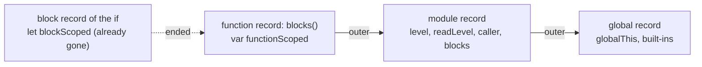
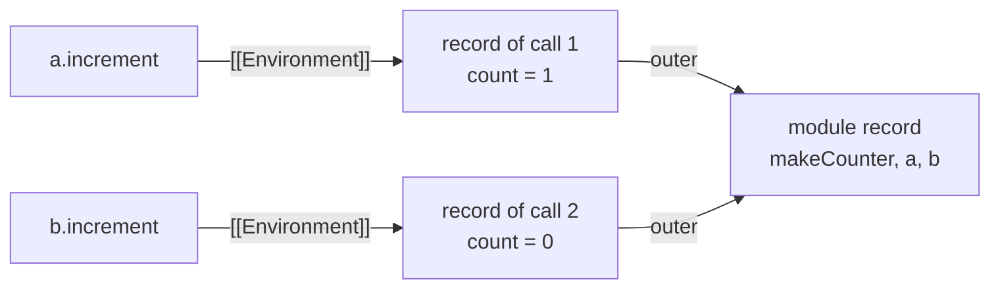
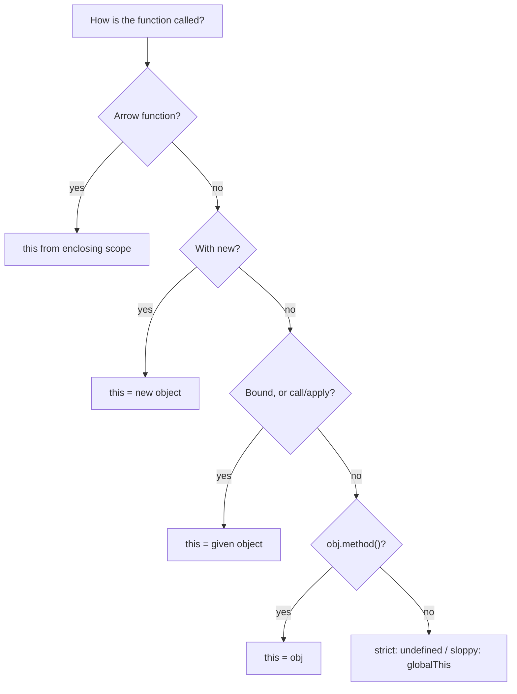
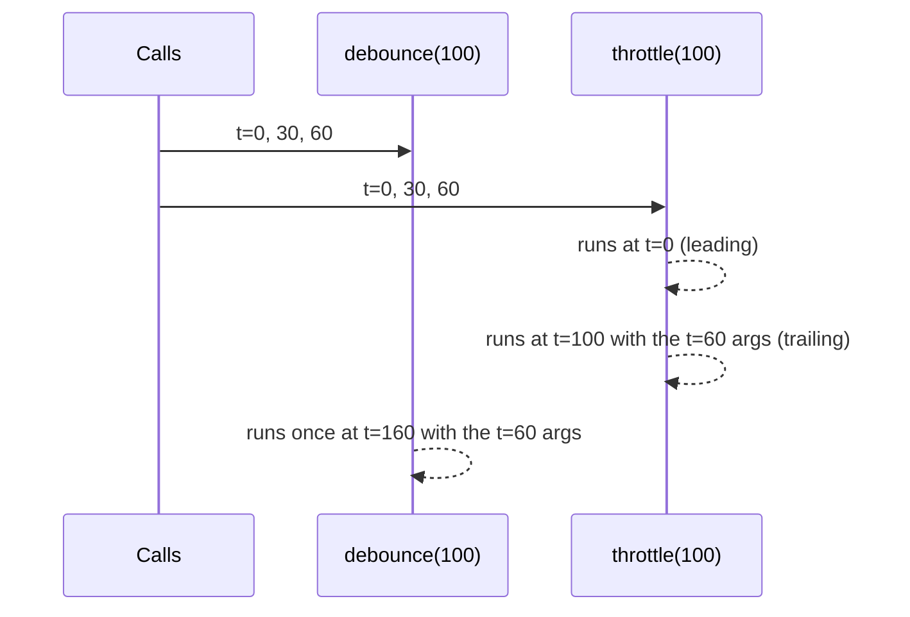

# 02. Scope, closures and `this`

> **What this covers:** how JavaScript decides which variable a name refers to (lexical scope, hoisting, the temporal dead zone), how functions remember the variables around them (closures), and how the value of `this` is chosen on every call. It ends with the function-building tools interviewers ask you to write by hand: currying, partial application, memoization, debounce and throttle.
> **Prerequisites:** [01. Values and types](01-js-values-types-coercion.md#1-values-and-types) (primitives versus objects, wrappers) and [01. Equality](01-js-values-types-coercion.md#6-equality) (identity comparison, used for `bind` and listener removal)
> **Leads to:** [03. Objects, prototypes and classes](03-js-objects-prototypes-classes.md), [04. Async and the event loop](04-js-async-event-loop.md), [05. Modules, memory and modern features](05-js-modules-memory-modern-features.md), [17. Signals](17-signals.md)
> **Applies to:** ECMAScript 2026 (ECMA-262, 17th edition), TypeScript 6.0 for the labs; verified on Node 24.21 (V8 13.6)
> **Study time:** ~3 hours reading + ~3 hours exercises
> **Short on time:** read [3. Closures](#3-closures) and [4. How this is bound](#4-how-this-is-bound), then drill [Q02.03](#q02-03), [Q02.06](#q02-06), [Q02.11](#q02-11), [Q02.13](#q02-13), [Q02.15](#q02-15) and [Q02.19](#q02-19), and finish with the [Summary](#summary).
> **Labs:** [`labs/ts-js/src/modules/02-js-scope-closures-this/`](../labs/ts-js/src/modules/02-js-scope-closures-this/) (exercises) and [`labs/ts-js/src/outputs/02-js-scope-closures-this/`](../labs/ts-js/src/outputs/02-js-scope-closures-this/) (every *Output* question). Run (from `labs/ts-js`, Node 24): `npx vitest run src/modules/02-js-scope-closures-this src/outputs/02-js-scope-closures-this`

## Contents

1. [Lexical scope and the scope chain](#1-lexical-scope-and-the-scope-chain)
2. [Hoisting and the temporal dead zone](#2-hoisting-and-the-temporal-dead-zone)
3. [Closures](#3-closures)
4. [How this is bound](#4-how-this-is-bound)
5. [Strict mode](#5-strict-mode)
6. [Higher-order functions: currying, partial application, debounce and throttle](#6-higher-order-functions-currying-partial-application-debounce-and-throttle)
- [Summary](#summary)
- [Question bank](#question-bank)
- [Hands-on exercises](#hands-on-exercises)
- [Check your understanding](#check-your-understanding)
- [Connections](#connections)

A note on the snippets: the lab tests run as ES modules, and module code is always strict. Unless a snippet says otherwise, assume strict mode. Several *Output* tests wrap their snippet in a function that starts with `'use strict'`; the test files are modules, so the directive only states the mode explicitly. Sloppy-mode behavior (the non-strict default of *classic scripts*, that is, scripts loaded without `type="module"`; [section 5](#5-strict-mode)) is shown with `new Function(...)`, whose body is sloppy unless it starts with `"use strict"`.

---

## 1. Lexical scope and the scope chain

### The problem it solves

A program reuses names: two functions both have an `i`, a library and your code both define `config`. The language needs a rule that says which `i` a line means, predictable from the source alone, so that you and your tools (TypeScript, bundlers) can reason about it without running the program.

Without a clear rule you get the bugs JavaScript was famous for before 2015: loop counters leaking out of loops, and scripts overwriting each other's globals.

### Mental model

Think of nested rooms. Each function and each `{ … }` block is a room inside another room. From inside a room you see your room and every room that contains it, never a room nested inside yours or beside it. To look up a name, search your room, then walk outward until you find it. The outermost room is the global scope.

The walls are fixed when the code is **written**, not when it runs. That is what *lexical* (also called *static*) scope means: the scope of a name depends on where the code sits in the source, not on who calls it.

### How it actually works

The specification models every scope as an **environment record** (a table that maps names to bindings) with a pointer to its **outer environment**. That chain of records is the **scope chain**. Resolving an identifier walks the chain from the innermost record outward ([ECMA-262, Environment Records](https://tc39.es/ecma262/#sec-environment-records)). If the walk reaches the global record without finding the name, reading it throws a `ReferenceError`.

The records you meet in practice:

| Record | Created for | Holds |
|---|---|---|
| Function environment | each call of a function | parameters, `var` and function declarations of that function, and the function's `this` binding |
| Declarative (block) environment | each evaluation of a block, `for` loop iteration, `catch` clause | `let`, `const`, `class` declarations of that block |
| Module environment | each module, once | the module's top-level declarations and its imports |
| Global environment | the realm (the global object plus its built-ins; one per global object: each page, iframe or worker has its own) | an object part (properties of the global object) plus a declarative part |

Two consequences matter for interviews:

- **`var` is function-scoped.** It ignores blocks and attaches to the nearest function (or to the global scope). **`let`, `const` and `class` are block-scoped** ([Q02.01](#q02-01)).
- **The global scope has two halves.** In a classic script, top-level `var` and function declarations become **properties of the global object** (`window` in a browser), while top-level `let`, `const` and `class` live in the global environment's declarative part: they are global variables, but not properties of `window` ([ECMA-262, GlobalDeclarationInstantiation](https://tc39.es/ecma262/#sec-globaldeclarationinstantiation)). In a **module**, top-level declarations of any kind stay in the module's own scope and never touch the global object.

`globalThis` (ES2020) is the standard name for the global object everywhere: `window` in a page, `self` in a worker, `global` in Node ([MDN: globalThis](https://developer.mozilla.org/en-US/docs/Web/JavaScript/Reference/Global_Objects/globalThis)). [Q02.21](#q02-21) shows the two halves across classic scripts.

### Code

The approach is to show that blocks fence `let` but not `var`, and that lookup goes outward from where the function was written, not from where it is called.

```js
// Partial: a standalone module; results are in the comments
const level = 'module';

function readLevel() {
  return level; // resolved by where readLevel is written
}

function caller() {
  const level = 'caller';
  return readLevel();
}

caller(); // 'module', not 'caller': lexical, not dynamic, scope

function blocks() {
  if (true) {
    var functionScoped = 1;
    let blockScoped = 2;
  }
  return typeof functionScoped + ' ' + typeof blockScoped; // 'number undefined'
}
```

Verified: the `Section 1: lookup follows where code is written, and blocks fence let but not var` test in `q02-closures.test.ts` runs this snippet (with a function scope in place of the module scope). The records behind it, while the `return` line of `blocks()` runs:



What to notice: lookup only follows the *outer* arrows, from the record where the code was written. The block's record is no longer on the chain at the `return` line, so `blockScoped` is not found (`typeof` gives `'undefined'`), while `functionScoped` lives in the function record and is.

Before block scope existed, private scopes were made with an **IIFE** (immediately invoked function expression): `(function () { /* private */ })();`. Modules and blocks have made it rare in new code.

### Best practices and anti-patterns

- **Do use `const` by default and `let` when you reassign**, because block scope keeps a name visible only where it is meaningful, and `const` tells the reader the binding never changes.
- **Avoid `var` in new code**, because it leaks out of blocks, can be redeclared silently, and reads as `undefined` before its declaration instead of failing.
- **Avoid writing to globals**, because every script on the page shares them. Modules solve this by giving each file its own scope.

### Misconceptions and traps

- *"`const` makes a value immutable."* It makes the **binding** constant. `const list = []; list.push(1)` is legal. Freezing the value is a separate operation ([Module 03](03-js-objects-prototypes-classes.md)). The myth comes from C and C++, where `const` on an object makes the object itself read-only through that name.
- *"JavaScript has no block scope; only functions create a scope."* Once true: until ES2015, apart from function declarations and the `catch` clause parameter (block-scoped since ES3), the only way to declare a variable was `var`, which is function-scoped, which is why older code wraps everything in IIFEs. Now: `let`, `const` and `class` (all ES2015) are block-scoped, and only `var` still ignores blocks ([MDN: `let`](https://developer.mozilla.org/en-US/docs/Web/JavaScript/Reference/Statements/let)).
- *"JavaScript has dynamic scope because `this` changes per call."* Variables are lexically scoped. `this` is the one thing that is set per call (section 4), which is exactly why it confuses people.

---

## 2. Hoisting and the temporal dead zone

### The problem it solves

A module calls `init()` on its first line. `init` calls `formatPrice()`, defined at the bottom of the file, and `formatPrice` reads `const currency`, declared halfway down. The call to `formatPrice` itself works, but the read of `currency` throws `ReferenceError: Cannot access 'currency' before initialization`, and the same `init()` called after the `const` line returns `'EUR'` (checked by running Node 24). Which names exist, and which can be read, before their line runs is decided by a setup phase. To resolve names lexically, the engine must know every name a scope declares **before** it runs the scope's first line. *Hoisting* is the name for that "declare everything first" step. The *temporal dead zone* (TDZ) is the guard that makes it safe for `let`, `const` and `class`.

### Mental model

Before a scope runs, the engine reads it once and writes every declared name on a whiteboard. What it writes next to each name depends on the keyword:

| Declaration | Written on the whiteboard as | Reading it before the declaration line |
|---|---|---|
| `function f() {}` | the finished function | works |
| `var x = 1` | `undefined` | gives `undefined` |
| `let`, `const`, `class` | "do not touch yet" | throws `ReferenceError` |

Nothing is physically moved to the top of the file. "Hoisting" is a description of this setup phase.

### How it actually works

When a function is called, the spec runs **FunctionDeclarationInstantiation** before the body ([ECMA-262](https://tc39.es/ecma262/#sec-functiondeclarationinstantiation)):

1. It creates bindings for every `var` name and initializes them to `undefined`.
2. It creates every top-level function declaration as a function object and assigns it, which is why a function declaration with the same name as a `var` wins at the start ([Q02.02](#q02-02)).
3. It creates bindings for `let`, `const` and `class` names **without initializing them**. A binding in that state cannot be read or written. Any access throws a `ReferenceError` ([ECMA-262, Let and Const Declarations](https://tc39.es/ecma262/#sec-let-and-const-declarations)). The binding becomes usable when execution reaches its declaration.

The period between entering the scope and reaching the declaration is the **temporal dead zone**. It is *temporal* because it depends on execution order, not position: a closure that reads a `let` declared later in the same scope is fine if it is *called* after the declaration runs.

Two details interviewers like: `typeof` on a **never-declared** name returns `'undefined'`, but `typeof` on a name in its TDZ throws ([Q02.03](#q02-03)); and a **function declared inside a block** is block-scoped in strict code but also leaks to the function scope in sloppy code ([Q02.04](#q02-04); strict and sloppy mode are [section 5](#5-strict-mode)).

Class declarations behave like `let`: they are in the TDZ until evaluated, so `new Widget()` before `class Widget {}` throws a `ReferenceError`. Verified: the `Section 2: class declarations are in the dead zone until evaluated` test.

### Code

The difference between the first two rows of the table, in four lines (checked by running Node 24):

```js
// Partial: a standalone module; results in the comments
declared();  // works: the declaration arrives finished
expressed(); // TypeError: expressed is not a function (the var is undefined until its line runs)
function declared() {}
var expressed = function () {};
```

The tested versions are [Q02.02](#q02-02) (`var` and function declarations) and [Q02.03](#q02-03) (`let` and the TDZ).

> [!NOTE]
> **Framework vs platform.** TypeScript reports the TDZ reads it can see statically (*"Block-scoped variable 'x' used before its declaration."*), which is why the lab file that demonstrates them disables type checking. The run-time rule belongs to JavaScript, and a TDZ read hidden behind a function call still reaches run time.

### Best practices and anti-patterns

- **Do declare before use, even for functions**, because humans read top to bottom and do not hoist.
- **Do treat a TDZ `ReferenceError` as a design signal**: it points at an initialization-order problem (often a circular import) that `var`'s silent `undefined` would have hidden. In modules, circular imports are where TDZ errors appear in real code ([Module 05](05-js-modules-memory-modern-features.md)).
- **Avoid function declarations inside blocks** in code that might run sloppy, because their scope differs between strict and sloppy mode. Use `const f = () => …` in the block instead.

### Misconceptions and traps

- *"`let` and `const` are not hoisted."* They are hoisted (the scope knows about them from the start, which is why an inner `let x` shadows an outer `x` even on lines above it). They are not *initialized*. That is the whole difference. The myth comes from describing hoisting as "moving declarations to the top": a `let` read above its line fails, so it looks as if nothing moved.
- *"Function expressions are hoisted like declarations."* `var f = function () {}` hoists the `var` (as `undefined`), not the function. Calling `f()` early throws `TypeError: f is not a function`. The myth comes from both forms starting with the word `function`.
- *"The TDZ is about the line position."* It is about time. Reading a `let` from a function declared above it is fine, provided the function runs after the declaration. The myth comes from the name: a "zone" sounds like a region of source text.

---

## 3. Closures

### The problem it solves

A function often needs data that outlives the call that created it: a click handler needs the item it was created for, a counter needs its count between calls, a debounced function needs its timer. Without closures you would push all of that into globals or into objects passed around by hand. Closures let a function carry its own private state.

### Mental model

A function value is not only code. It is code **plus a backpack**: a reference to the scope it was created in. Wherever the function goes (returned, stored, passed as a callback), the backpack goes with it, and the function can keep reading and writing the variables inside.

The backpack holds **variables, not snapshots**. If someone changes a variable after the closure was created, the closure sees the change.

### How it actually works

When the engine creates a function object, it stores the current environment record in the function's internal `[[Environment]]` slot. When the function is later called, its new function environment gets that stored record as its **outer** environment (ECMA-262: [OrdinaryFunctionCreate](https://tc39.es/ecma262/#sec-ordinaryfunctioncreate) stores it, and [NewFunctionEnvironment](https://tc39.es/ecma262/#sec-newfunctionenvironment), called from [PrepareForOrdinaryCall](https://tc39.es/ecma262/#sec-prepareforordinarycall), sets `[[OuterEnv]]` to it). Name lookup inside the function therefore walks into the scope where it was **created**, which is lexical scope applied to functions that outlive their scope ([Q02.05](#q02-05)).

Three consequences:

1. **Each call creates a fresh environment.** Calling a factory twice gives two independent sets of variables ([Q02.07](#q02-07)).
2. **Capture is by reference to the binding.** A closure reads the variable's current value when it runs.
3. **Captured variables stay reachable** for as long as the closure is reachable. The garbage collector cannot free them. This is how closures cause memory leaks ([Q02.08](#q02-08), and [Module 05](05-js-modules-memory-modern-features.md) for the full picture).

**The loop-closure bug.** A `for (var i …)` loop has one `i` for the whole function, so every callback created in the loop shares it, and they all see its final value. A `for (let i …)` loop gets special treatment: the spec creates a **new environment per iteration** and copies the current value into it (CreatePerIterationEnvironment, [ECMA-262](https://tc39.es/ecma262/#sec-createperiterationenvironment)). Each callback captures its own `i` ([Q02.06](#q02-06)).

### Code

The canonical use is a factory with private state. The approach: declare the state inside the factory, return functions that use it, and return nothing that exposes it directly.

1. `count` lives in the environment of one `makeCounter` call.
2. The returned methods close over it, so they are the only way to reach it.

```js
// Partial: a standalone module
function makeCounter() {
  let count = 0;
  return {
    increment: () => ++count,
    current: () => count,
  };
}

const a = makeCounter();
a.increment(); // 1
a.current();   // 1; there is no way to set count from outside
```

If you also called `const b = makeCounter()`, the objects would be linked like this:



What to notice: the backpack is a pointer to a whole environment record, one per factory call, so `a` and `b` never share `count`, and each record stays alive as long as a function pointing at it does.

Memoization (caching results by argument) is the same idea with a `Map` instead of a number. [Exercise 02.1](#ex02-1) builds one, and [Q02.20](#q02-20) designs a `once` helper.

> [!TIP]
> **Coming from the backend.** A Java lambda or anonymous class may use a local variable only if it is *final or effectively final* (lambdas: [JLS §15.27.2](https://docs.oracle.com/javase/specs/jls/se21/html/jls-15.html#jls-15.27.2); inner classes: [JLS §8.1.3](https://docs.oracle.com/javase/specs/jls/se21/html/jls-8.html#jls-8.1.3)), because Java copies the value into the lambda. That rule is why you reach for `AtomicInteger` to count inside a lambda. A JavaScript closure captures the variable itself, so it can read later changes and assign to it. The nearest Java picture is an object with private fields whose only accessors are the returned methods. **Where the analogy breaks:** JavaScript runs one thread per realm, so a shared captured variable has no data races or memory-visibility problems, and there is no need for `final`. Logical races remain: code interleaves at every `await` and callback, so a check-then-act on a captured flag (`if (!busy) { await load(); busy = true; }`) lets two calls both pass the check ([Module 04](04-js-async-event-loop.md#5-async-and-await)). The price is the opposite bug: the loop-closure problem cannot happen in Java because Java forbids capturing a variable that changes.

### Best practices and anti-patterns

- **Do use closures for private state in small units** (factories, hooks, debounce timers), because the state is truly unreachable from outside, without any class machinery. [Q02.09](#q02-09) compares this with `#private` class fields.
- **Do capture only what you need** in long-lived callbacks (event listeners, intervals, caches), because everything a closure references stays in memory as long as the callback is registered.
- **Avoid creating closures in hot paths only to bind data** (for example a new arrow per item per render) when a stable function with an argument would do, because each closure is an allocation and a new identity, which defeats reference-equality checks in frameworks.

### Misconceptions and traps

- *"A closure copies the variables it uses."* It references the bindings. Later writes are visible ([Q02.07](#q02-07)). The myth comes from Java, whose lambdas capture copies of effectively final values (see the callout above).
- *"Closures are a special feature you opt into."* Every function in JavaScript is a closure. The term matters only when the function outlives the scope that created it. The myth comes from tutorials that introduce closures with a returned nested function, as if the nesting created them.

---

## 4. How this is bound

### The problem it solves

Methods are shared: one function on a prototype serves every instance, so it needs to know *which* instance this call is about. JavaScript answers with `this`, a hidden parameter supplied by the **call site**. Sharing is cheap, but the same function sees a different `this` depending on how it is called, which is the source of most "`this` is not my component" bugs in Angular callbacks (`this` turns out to be `undefined`, `window` or the element).

### Mental model

Think of `this` as a name badge the caller pins on the function at each call: whoever makes the call decides what it says, and an arrow function wears no badge, so it reads the badge of the function around it. To find the badge, ignore where the function is written (unless it is an arrow function) and look at the **call expression**:

1. Called with `new`? `this` is the new object.
2. Called through `call`, `apply`, or a function made by `bind`? `this` is the object you passed.
3. Called as `obj.method()`? `this` is `obj`, the thing to the left of the dot at the moment of the call.
4. Called as a plain `f()`? `this` is `undefined` in strict code (the global object in sloppy code; [section 5](#5-strict-mode)).
5. **Arrow functions skip all of the above.** They have no `this` of their own and use the `this` of the scope where they were written, like any other variable.

Rules are checked in that order, so `new` beats `bind`, and `bind` beats a dot ([Q02.10](#q02-10)).



What to notice: the arrow test comes first, because an arrow ignores every other rule; `new` is checked before `bind`; and the dot is the weakest rule that sets `this`, lost as soon as the function is taken out of the property access.

### How it actually works

`this` is resolved when a function is **called**, not when it is defined:

- A property access like `obj.method` evaluates to a *Reference* that remembers its base, `obj`. Calling a Reference uses the base as `this`. As soon as the function is pulled out of the reference (assigned to a variable, passed as an argument, or even `(0, obj.method)`), the base is lost ([Q02.11](#q02-11)).
- The callee binds `this` in **OrdinaryCallBindThis** ([ECMA-262](https://tc39.es/ecma262/#sec-ordinarycallbindthis)). A strict function uses the value it was given. A sloppy function replaces `undefined` or `null` with the global object and boxes primitives (`5` becomes a `Number` object).
- `fn.bind(obj)` returns a **bound function exotic object** (an object whose internal methods differ from an ordinary object's, here `[[Call]]` and `[[Construct]]`): a new function that remembers the target, the `this` value and any preset arguments ([ECMA-262, Function.prototype.bind](https://tc39.es/ecma262/#sec-function.prototype.bind)). Calling it ignores the `this` it is called with. Binding it again cannot change the stored `this`. But `new` on a bound function constructs the *target*, so `new` wins over `bind` ([Q02.13](#q02-13); [Q02.14](#q02-14) compares `call`, `apply` and `bind`).
- An **arrow function** has no `this` binding at all. Its function environment simply does not have one, so the lookup walks outward like any variable ([ECMA-262, Arrow Function Definitions](https://tc39.es/ecma262/#sec-arrow-function-definitions)). `call`, `apply` and `bind` cannot change it. Arrows also have no `arguments` object and no `prototype`, and cannot be used with `new`. Verified: the `Section 4: arrow functions cannot be called with new and have no own arguments` test.
- **Callbacks** get whatever `this` their caller passes. `Array.prototype.map` passes its optional `thisArg` (`undefined` by default). The DOM calls event listeners with `this` set to the event's `currentTarget` ([DOM Standard, inner invoke](https://dom.spec.whatwg.org/#concept-event-listener-inner-invoke)). A browser calls a `setTimeout` callback with `this` set to the `WindowProxy` (the global itself in a worker; [HTML: timer initialization steps](https://html.spec.whatwg.org/multipage/timers-and-user-prompts.html#timer-initialisation-steps)), and Node passes its `Timeout` object (checked by running Node 24). None of them is your component.

### Code

In Angular the bug looks like `setTimeout(this.refresh, 1000)` or `addEventListener('change', this.onChange)` with a regular method: the method is passed as a callback, loses its base, and then reads `this` ([Q02.15](#q02-15)). The approach is to pick the fix that matches the situation:

1. **Best:** let Angular bind for you. A template or `host` listener calls the method *on* the component.
2. **Arrow class field** when you must hand a function to a non-Angular API and also need a stable reference to remove it later.
3. **Inline arrow** for a one-off callback that never needs removing: `setTimeout(() => this.refresh(), 1000)`.

```ts
// Partial: imports (Component, DestroyRef, inject, signal) omitted; browser-only (uses window)
@Component({
  selector: 'lab-shortcuts',
  template: `<p>Last event: {{ lastEvent() }}</p>`,
  host: { '(document:keydown)': 'onKey($event)' }, // 1. Angular calls this.onKey(...)
})
export class Shortcuts {
  protected readonly lastEvent = signal('');
  readonly #darkMode = window.matchMedia('(prefers-color-scheme: dark)');

  // 2. An arrow field: `this` is captured when the instance is constructed, and the
  //    reference is stable, so removeEventListener finds the same function.
  readonly onSchemeChange = (): void => this.lastEvent.set('color scheme changed');

  constructor() {
    this.#darkMode.addEventListener('change', this.onSchemeChange);
    inject(DestroyRef).onDestroy(() => this.#darkMode.removeEventListener('change', this.onSchemeChange));
  }

  onKey(event: KeyboardEvent): void {
    this.lastEvent.set(`key ${event.key}`);
  }
}
```

Class fields, including arrow fields, and `#private` members such as `#darkMode` are ES2022. The `document:`, `window:` and `body:` prefixes for host listeners are documented on the `host` option of `@Directive` (`@angular/core` 22.2.1 type declarations). Template event bindings and host listeners are covered in [Module 13](13-components-and-templates.md).

> [!TIP]
> **Coming from the backend.** In a Java lambda, `this` means the enclosing instance ([JLS §15.27.2](https://docs.oracle.com/javase/specs/jls/se21/html/jls-15.html#jls-15.27.2)), which is exactly how an arrow function behaves. A method reference such as `this::onKey` is a bound function: it fixes the receiver when it is created. **Where the analogy breaks:** Java's unbound form, `Shortcuts::onKey`, turns the receiver into an explicit first parameter, so the compiler forces every caller to supply one. In JavaScript the receiver is an implicit parameter that any caller can omit, and `this.onKey` passes the unbound function, not the equivalent of `this::onKey`.

### Best practices and anti-patterns

- **Do prefer template and `host` event bindings in Angular**, because Angular calls the method on the component and removes the listener with the view.
- **Avoid `addEventListener('x', this.handler.bind(this))` paired with `removeEventListener('x', this.handler.bind(this))`**, because each `bind` creates a new function, so the removal matches nothing and the listener leaks ([Q02.15](#q02-15)).
- **Avoid arrow functions as object-literal methods or prototype methods that need the object**, because the arrow's `this` comes from the surrounding scope, not from the object ([Q02.12](#q02-12)).

### Misconceptions and traps

- *"`this` is the object the function was defined in."* For non-arrow functions it is decided by the call. Arrows use the enclosing scope's `this`, which is not the object literal they sit in. The myth comes from class-based languages, where `this` is always the instance the method belongs to.
- *"Arrow functions bind `this`."* They do the opposite: they have no `this`, so they cannot bind one. The difference matters, because `call` and `bind` cannot change an arrow's `this` either. The myth comes from the effect: inside an arrow, `this` behaves as if it were bound.
- *"Arrow class fields are always better than methods."* They cost one function per instance, and they are not on the prototype, so prototype spies and `super` calls miss them. Use them where detaching is real ([Q02.16](#q02-16)). The myth comes from the fact that they fix the most common `this` bug.

---

## 5. Strict mode

### The problem it solves

Early JavaScript kept running at almost any cost. Assigning to a misspelled variable silently created a global, writing a read-only property silently did nothing, and a plain call handed `this` the global object, so a detached method could scribble over `window`. Silent failures turn typos into production bugs.

ES5 (2009) added **strict mode**, an opt-in variant of the language that turns these silent failures into errors. It had to be opt-in, because changing the default would have broken existing websites.

### Mental model

Strict mode is the language with the safety catch on. The same syntax, minus the forgiving behaviors that hide mistakes, plus a few reserved words kept free for future features.

### How it actually works

Code is strict if it is any of these ([ECMA-262, Strict Mode Code](https://tc39.es/ecma262/#sec-strict-mode-code)):

- a script or function whose body starts with the `"use strict"` directive (a function inherits strictness from the code it is written in);
- **module code**, always;
- every part of a **class** declaration or expression, always;
- code passed to a direct `eval` call from strict code (an indirect call such as `(0, eval)(code)` runs it as sloppy global code), and a `Function` constructor body that starts with the directive.

The main differences (the full list is Annex C of ECMA-262, and [MDN: Strict mode](https://developer.mozilla.org/en-US/docs/Web/JavaScript/Reference/Strict_mode)):

| Behavior | Sloppy | Strict |
|---|---|---|
| Assigning to an undeclared name | creates a global property | `ReferenceError` |
| `this` in a plain call | `globalThis` | `undefined` |
| `this` when a primitive is passed | boxed into an object | left as the primitive |
| Writing a read-only or getter-only property | silently ignored | `TypeError` |
| `with` statement | allowed | `SyntaxError` |
| Duplicate parameter names | allowed | `SyntaxError` |
| `arguments` | mirrors named parameters | independent copy |
| Function declarations in blocks | Annex B: also leak to function scope | block-scoped |

**Why modules and classes are strict.** Both arrived in ES2015 and had no legacy code to stay compatible with, so the committee made the safer semantics the only semantics. Every Angular application is written in modules and classes, so Angular code is strict by construction, and so is TypeScript's output for module files.

### Code

The approach is to run the same body in both modes. The `Function` constructor creates a sloppy function unless its body starts with the directive, which is the only reliable way to show sloppy mode from inside a module ([Q02.17](#q02-17)).

```js
// Partial: inside a module (strict); results in the comments
const sloppy = new Function('return this');
const strict = new Function('"use strict"; return this');
sloppy() === globalThis; // true
strict();                // undefined
typeof sloppy.call(5);   // 'object' (boxed)
typeof strict.call(5);   // 'number'
```

Verified: the `Q02.17` test asserts these four results.

### Best practices and anti-patterns

- **Do write modules**, because strictness then needs no directive and cannot be forgotten.
- **Avoid adding `"use strict"` to a function with default, rest or destructured parameters**: it is a `SyntaxError`, because the parameters would be parsed before the directive is known.

### Misconceptions and traps

- *"TypeScript's `alwaysStrict` makes my code strict."* It makes `tsc` **emit** the directive and parse in strict mode. Modules are strict anyway. The run-time semantics come from JavaScript, not from TypeScript ([Module 06](06-ts-type-system-essentials.md#7-tsconfig-the-strict-family-module-settings-and-typescript-60-defaults) covers the `strict` flag family, which is a different thing: stricter *type checking*).
- *"`this` is `undefined` in every callback in strict mode."* Only when the caller passes nothing. The DOM passes the element, `map` passes its `thisArg`, and a browser timer passes the `WindowProxy`. Strict mode only stops the *substitution* of the global object.

---

## 6. Higher-order functions: currying, partial application, debounce and throttle

### The problem it solves

A search box calls the API on every keystroke, so typing `angular` sends seven requests whose responses can arrive out of order, and a scroll handler runs on every scroll event, many times per second. Hand-written fixes (a timer variable here, a cache there) get copied into every component. A **higher-order function** takes or returns a function. It lets you write a behavior once (cache, delay, rate-limit, preset arguments) and apply it to any function. Interviewers like them because each is ten to thirty lines that test closures, `this`, timers and API design at once.

### Mental model

A higher-order function is a wrapper factory: give it a function, get back a new function with the same call shape and one extra behavior. The wrapper's private state (the cache, the timer, the arguments so far) lives in a closure created by the factory call.

- **Partial application** fixes some arguments now: `partial(volume, 2, 3)` gives `(height) => volume(2, 3, height)`.
- **Currying** reshapes an N-argument function into N one-argument functions: `curry(volume)(2)(3)(4)`.
- **Memoization** remembers results by input.
- **Debounce** waits for silence: run once, `wait` ms after the last call. Good for a search box.
- **Throttle** sets a speed limit: run at most once per interval. Good for scroll or resize handlers.



What to notice: for the same three calls, the throttle runs twice (at t=0 and t=100), keeping the user informed during the burst, while the debounce runs once, 100 ms after the last call.

### How it actually works

Each wrapper keeps state in variables of the factory call and returns an inner function. Two details separate a correct implementation from a broken one:

1. **Forward `this` and the arguments.** The inner function must be a regular `function` (so it receives the caller's `this`) and must call the original with `fn.apply(this, args)`. An arrow inner function would lose the method's object.
2. **Keep per-wrapper state in the factory's closure, never in module-level variables**, so two debounced functions do not share one timer.

A curry uses `fn.length` to know when to stop. It counts only the parameters **before** the first default or rest parameter, so `(a, b = 1) => …` has length 1 ([MDN: Function.length](https://developer.mozilla.org/en-US/docs/Web/JavaScript/Reference/Global_Objects/Function/length)). Verified: the `Section 6: function length` tests in `labs/ts-js/src/modules/02-js-scope-closures-this/curry.test.ts`.

### Code

The debounce from [Exercise 02.3](#ex02-3) shows both details. The approach:

1. Keep the pending timer in the factory's closure.
2. On every call, clear the old timer and start a new one.
3. When it fires, call `fn` with the `this` and arguments of the **last** call. The timer callback is an arrow, so its `this` is the `this` of `debounced`.

```ts
// Excerpt of labs/ts-js/src/modules/02-js-scope-closures-this/rate-limit.ts
export function debounce<T, A extends unknown[]>(
  fn: (this: T, ...args: A) => void,
  waitMs: number,
): RateLimited<T, A> {
  let timer: TimerId | undefined;

  function debounced(this: T, ...args: A): void {
    clearTimeout(timer);
    // An arrow function, so that `this` inside the timer callback is the caller's `this`.
    timer = setTimeout(() => {
      timer = undefined;
      fn.apply(this, args);
    }, waitMs);
  }

  const cancel = (): void => {
    clearTimeout(timer);
    timer = undefined;
  };

  return Object.assign(debounced, { cancel });
}
```

The `this: T` parameter is TypeScript syntax: a fake first parameter that types `this` and is erased at compile time ([TypeScript handbook: Declaring `this` in a function](https://www.typescriptlang.org/docs/handbook/2/functions.html#declaring-this-in-a-function)).

> [!NOTE]
> **Framework vs platform.** JavaScript has no built-in `debounce`, `throttle` or `curry`. In Angular you rarely hand-write them for UI events: RxJS provides `debounceTime`, `throttleTime` and `auditTime` for streams ([Module 22](22-rxjs-foundations.md)), and they handle cancellation and teardown with the subscription. Note that `throttleTime` defaults to `{ leading: true, trailing: false }`, so it drops the final value unless you pass `{ leading: true, trailing: true }`, which is the behavior of [Exercise 02.3](#ex02-3). Writing them by hand remains a standard interview exercise, and the right tool for plain callbacks outside a stream.

### Best practices and anti-patterns

- **Do give rate-limited wrappers a `cancel()`**, and call it when the owner is destroyed (in Angular, from `DestroyRef.onDestroy`), because a pending timer otherwise fires after the component is gone.
- **Do bound a memoization cache** (or scope it to a short-lived object) when keys are unbounded, because an unbounded `Map` in a long-lived closure is a memory leak by design ([Module 05](05-js-modules-memory-modern-features.md)).
- **Avoid memoizing impure functions**, because a cached result for something time- or state-dependent is a stale answer that looks correct.

### Misconceptions and traps

- *"Currying and partial application are the same thing."* Currying always produces a chain of one-argument functions. Partial application fixes any number of arguments once ([Q02.18](#q02-18)). The myth comes from libraries such as Lodash, whose `curry` also accepts several arguments per call, which blurs the two.
- *"Throttle is debounce with a shorter delay."* Debounce can postpone forever while calls keep coming. Throttle guarantees a run per interval ([Q02.19](#q02-19)). The myth comes from both being described as rate limiting with a delay in milliseconds.
- *"An arrow function is the safest inner function for a wrapper."* For the **returned** function it is the wrong choice: it would ignore the caller's `this`. Arrows are right for callbacks *inside* the wrapper (like the timer), where you want the wrapper's `this`. The myth comes from the advice "use arrows to keep `this`", applied one level too far out.

---

## Summary

A name means whatever the source text around it says ([1](#1-lexical-scope-and-the-scope-chain)): every function call, block and module gets an environment record, and lookup walks outward from where the code was **written**, never from where it was called. `var` is function-scoped, while `let`, `const` and `class` are block-scoped; in a classic script, top-level `var` and function declarations become properties of the global object, and in a module nothing does. Before a scope runs, its declarations are set up ([2](#2-hoisting-and-the-temporal-dead-zone)): function declarations arrive finished, `var` arrives as `undefined`, and `let`, `const` and `class` exist but stay uninitialized until their line runs. That window is the temporal dead zone: it is about time, not position, and even `typeof` throws inside it. A closure ([3](#3-closures)) is a function plus the environment it was created in, stored in `[[Environment]]`; it captures **variables, not values**, each factory call creates fresh ones, and whatever a long-lived closure references stays in memory. A `for (let …)` loop creates a new binding per iteration, which is why its callbacks see 0, 1, 2 while a `var` loop's callbacks all see the final value.

`this` is a hidden argument chosen by the call ([4](#4-how-this-is-bound)), checked in order: `new` creates it, `call`/`apply`/`bind` set it, `obj.method()` passes `obj`, and a plain call passes `undefined` (the global object in sloppy code). Pulling a method out of its object loses the base, `bind` returns a new function each time (so `removeEventListener` with a fresh `bind` removes nothing), `new` still beats `bind`, and arrow functions have no `this` of their own and use the enclosing scope's. Strict mode ([5](#5-strict-mode)) turns the silent failures of early JavaScript into errors and stops `this` from becoming the global object; modules and class bodies are always strict, so Angular code is too. Higher-order functions ([6](#6-higher-order-functions-currying-partial-application-debounce-and-throttle)) are wrapper factories whose state lives in the factory's closure: the returned function must be a regular `function` that forwards `this` and its arguments, currying makes a chain of one-argument calls while partial application presets some arguments once, debounce waits for silence while throttle guarantees one run per interval, and both need a `cancel()` for when their owner is destroyed.

---

## Question bank

Questions run from foundational to deep. Every *Output* answer is asserted by a test in [`labs/ts-js/src/outputs/02-js-scope-closures-this/`](../labs/ts-js/src/outputs/02-js-scope-closures-this/). Snippets are strict (module) code unless stated.

<a id="q02-01"></a>
### Q02.01 · Difference · What is the difference between `var`, `let` and `const`?

<details>
<summary>Answer</summary>

**Short answer (30 seconds).** `var` is function-scoped, initialized to `undefined` at the start of its function, and can be redeclared. `let` and `const` are block-scoped, are in the temporal dead zone until their declaration runs, and cannot be redeclared in the same scope. `const` also forbids reassignment, but not mutation of the value.

**Full explanation.**

| | `var` | `let` | `const` |
|---|---|---|---|
| Scope | function (or global) | block | block |
| Before the declaration line | `undefined` | `ReferenceError` (TDZ) | `ReferenceError` (TDZ) |
| Redeclare in same scope | allowed | `SyntaxError` | `SyntaxError` |
| Reassign | yes | yes | `TypeError` |
| Top-level in a classic script | property of `window` | global, not on `window` | global, not on `window` |
| In a `for` loop with closures | one shared binding | one binding per iteration | one per iteration (`for…of`) |

The design reason for the change: `var`'s behaviors each hid a class of bugs. Silent redeclaration hid name collisions, function scope leaked loop counters, `undefined`-before-assignment hid ordering mistakes. `let`/`const` turn each into an error or make it impossible.

**Follow-ups an interviewer will ask.**
- *Can you use `const` in a classic `for (const i = 0; i < n; i++)` loop?* No. The `i++` reassigns it, which throws a `TypeError` after the first iteration. `const` works in `for…of` and `for…in`, where each iteration gets a fresh binding.
- *Why does `window.x` exist after a top-level `var x` but not after `let x`?* The global environment has an object part (the global object) and a declarative part. `var` and function declarations go to the object part.

**Trap to avoid.** Saying `let` "is not hoisted". It is hoisted but uninitialized ([section 2](#2-hoisting-and-the-temporal-dead-zone)).

</details>

<a id="q02-02"></a>
### Q02.02 · Output · What does this print?

```js
function snippet() {
  console.log(typeof hoisted);
  console.log(typeof assigned);
  console.log(value);
  var value = 1;
  var assigned = function () {};
  function hoisted() {}
  console.log(value, typeof assigned);
}

function sameName() {
  console.log(typeof both);
  var both = 1;
  function both() {}
  console.log(typeof both);
}

snippet();
sameName();
```

<details>
<summary>Answer</summary>

**Short answer (30 seconds).**

```text
function
undefined
undefined
1 function
function
number
```

Function declarations are created with their value before the body runs. `var` names exist from the start but hold `undefined` until their assignment line runs. When a `var` and a function declaration share a name, the function is the initial value, and the later `var` assignment overwrites it.

**Full explanation.** FunctionDeclarationInstantiation ([ECMA-262](https://tc39.es/ecma262/#sec-functiondeclarationinstantiation)) first creates every `var` binding as `undefined`, then instantiates each function declaration and assigns it. `assigned` is a `var` whose value is a function *expression*, so only the name is hoisted. In `sameName`, the binding `both` is created once and set to the function. `var both = 1` does not create a second binding: as a statement it is just the assignment `both = 1`, which runs in order. Verified: `Q02.02` in `q02-hoisting-tdz.test.ts`. The test builds `sameName` with the `Function` constructor, because the test toolchain's parser (Vite's oxc) wrongly rejects this legal code, while Node runs it as shown.

**Follow-ups an interviewer will ask.**
- *What happens if you call `assigned()` on the first line?* `TypeError: assigned is not a function`, because it is `undefined` then.
- *And with `let both = 1` instead of `var`?* A `SyntaxError` at parse time: `let` cannot share a name with another declaration in the same scope.

**Trap to avoid.** Answering `undefined` for the first `typeof both`. The function declaration wins at instantiation time.

</details>

<a id="q02-03"></a>
### Q02.03 · Output · What does this print? (the temporal dead zone)

```js
function snippet() {
  let x = 'outer';
  function inner() {
    try {
      console.log(x);
    } catch (error) {
      console.log(error.name);
    }
    let x = 'inner';
    console.log(x);
  }
  inner();
  console.log(typeof neverDeclared);
  try {
    console.log(typeof later);
  } catch (error) {
    console.log(error.name);
  }
  let later = 1;
  console.log(x, later);
}
snippet();
```

<details>
<summary>Answer</summary>

**Short answer (30 seconds).**

```text
ReferenceError
inner
undefined
ReferenceError
outer 1
```

Inside `inner`, the local `let x` is hoisted for the whole function, so the first `console.log(x)` refers to the local `x`, which is still in its temporal dead zone. It does not fall back to the outer `x`. `typeof` is safe on a name that does not exist, but not on a name in its TDZ.

**Full explanation.** When `inner` is called, its scope already contains an uninitialized binding `x`. Name resolution finds it first and stops. Reading an uninitialized binding throws. The `typeof` operator has a special case for *unresolvable* references (names not found anywhere), which return `'undefined'`. A TDZ name is resolvable (the binding exists), so the read is attempted and throws. V8's message names the binding: `Cannot access 'early' before initialization` for a binding called `early`. Verified: `Q02.03` and `Q02.03 (V8 message)` in `q02-hoisting-tdz.test.ts`.

**Follow-ups an interviewer will ask.**
- *Why did the language add the TDZ instead of using `undefined` like `var`?* So that reading too early is an error at the point of the mistake, and so that `const` never shows two values (`undefined`, then its real value).
- *Where does the TDZ appear in real code?* Circular ES module imports: a module that reads an imported `let`/`const`/`class` before the exporting module has evaluated it ([05 §1](05-js-modules-memory-modern-features.md#1-es-modules-static-structure-linking-and-live-bindings), drilled in [Q05.04](05-js-modules-memory-modern-features.md#q05-04)).

**Trap to avoid.** Answering `outer` on the first line. Shadowing applies to the whole scope, including the lines above the declaration.

</details>

<a id="q02-04"></a>
### Q02.04 · Output · A function is declared inside a block. What does `typeof` say before and after the block, in strict and in sloppy code?

```js
function strictSnippet() {
  'use strict';
  const before = typeof inner;
  {
    function inner() {}
  }
  return `${before} ${typeof inner}`;
}
const sloppySnippet = new Function(
  'const before = typeof inner; { function inner() {} } return before + " " + typeof inner;',
);
console.log('strict:', strictSnippet());
console.log('sloppy:', sloppySnippet());
```

<details>
<summary>Answer</summary>

**Short answer (30 seconds).**

```text
strict: undefined undefined
sloppy: undefined function
```

In strict code, a function declared in a block is scoped to that block, like `let`. In sloppy code, a legacy web-compatibility rule also creates a function-scoped `var` binding, initialized to `undefined`, and copies the function into it when the block's declaration is evaluated.

**Full explanation.** ES2015 made block-level function declarations block-scoped. Browsers had already implemented incompatible behaviors for them in sloppy code, and websites relied on them, so ECMA-262 Annex B defines the sloppy compatibility semantics ([Annex B, block-level function declarations](https://tc39.es/ecma262/#sec-block-level-function-declarations-web-legacy-compatibility-semantics)). The `Function` constructor gives a sloppy body here, because the body has no directive. Verified: `Q02.04` in `q02-hoisting-tdz.test.ts`.

**Follow-ups an interviewer will ask.**
- *Does Annex B apply in Node?* ECMA-262 requires Annex B when the host is a web browser and leaves it optional elsewhere. Node (V8) implements it, as the test shows.
- *What should you write instead?* `const inner = () => {}` in the block, which has the same, explicit meaning in both modes.

**Trap to avoid.** Answering from one mode only. The point of the question is that the same source has two meanings.

</details>

<a id="q02-05"></a>
### Q02.05 · Concept · What is a closure, and how does the engine implement it?

<details>
<summary>Answer</summary>

**Short answer (30 seconds).** A closure is a function together with the scope it was created in. The function object stores a reference to its creation environment, and every call uses that environment as its outer scope, so the function can keep reading and writing those variables after the outer function has returned.

**Full explanation.** In spec terms, creating a function stores the running environment record in the function's `[[Environment]]` slot. Calling it creates a new function environment whose outer link is that stored record ([OrdinaryFunctionCreate](https://tc39.es/ecma262/#sec-ordinaryfunctioncreate) stores it; [NewFunctionEnvironment](https://tc39.es/ecma262/#sec-newfunctionenvironment) links it). Environments are garbage-collected objects, not stack frames: they live as long as something references them, which is why a closure can outlive its creator. Uses: private state, function factories, memoization caches, and any callback that needs context. Cost: everything reachable from a captured environment stays alive ([Q02.08](#q02-08)).

**Follow-ups an interviewer will ask.**
- *Is every function a closure?* Yes, in the sense that every function captures its environment. The word is usually reserved for functions that outlive their scope.
- *Do engines keep the whole scope alive?* The spec says the function references the environment record. Engines are free to optimize and may keep only the variables that inner functions actually use. Do not rely on either behavior for memory: release references explicitly.

**Trap to avoid.** Defining a closure as "a function inside a function". A nested function that never escapes is not doing anything interesting. The essence is that the scope outlives the call.

</details>

<a id="q02-06"></a>
### Q02.06 · Output · What does this print? (the classic loop)

```js
for (var i = 0; i < 3; i++) {
  setTimeout(() => console.log('var', i), 0);
}
for (let j = 0; j < 3; j++) {
  setTimeout(() => console.log('let', j), 0);
}
```

<details>
<summary>Answer</summary>

**Short answer (30 seconds).**

```text
var 3
var 3
var 3
let 0
let 1
let 2
```

There is only one `i` for the whole function, and by the time the timers fire the loop has finished and left it at `3`. With `let`, each iteration gets its own copy of `j`, so each callback captured a different binding.

**Full explanation.** The callbacks run later, in timer order (all six have the same delay, so they run in the order they were scheduled; event-loop ordering is [Module 04](04-js-async-event-loop.md)). For `var`, all three arrows close over the same binding. For `let`, the spec's CreatePerIterationEnvironment ([ECMA-262](https://tc39.es/ecma262/#sec-createperiterationenvironment)) copies the loop variables into a fresh environment before each iteration, and the increment then runs on the new copy. A closure created in an earlier iteration keeps the binding of its own iteration. Verified: `Q02.06` in `q02-closures.test.ts`.

**Code.** The pre-2015 fix creates a scope per iteration by hand with an IIFE:

```js
// Partial: legacy pattern, shown for recognition
for (var i = 0; i < 3; i++) {
  (function (captured) {
    setTimeout(() => console.log(captured), 0);
  })(i);
}
```

**Follow-ups an interviewer will ask.**
- *Other fixes besides `let`?* Pass the value as an argument: `setTimeout(console.log, 0, i)` (extra `setTimeout` arguments are passed to the callback), or `forEach((_, i) => …)`, which calls a new function per element.
- *Where does this bite in Angular?* Rarely in templates (`@for` gives each row its own context), but often in imperative code that registers listeners or subscriptions in a `var` loop.

**Trap to avoid.** Answering `var 2` three times. The loop exits only after `i++` makes the condition false, so the final value is 3.

</details>

<a id="q02-07"></a>
### Q02.07 · Output · What does this print? (what a closure captures)

```js
function makeCounter() {
  let count = 0;
  return {
    increment: () => ++count,
    current: () => count,
  };
}
const a = makeCounter();
const b = makeCounter();
a.increment();
a.increment();
b.increment();
console.log(a.current(), b.current());

let greeting = 'hello';
const greet = () => greeting;
greeting = 'goodbye';
console.log(greet());

const handlers = [];
let shared = 0;
for (const step of [1, 2, 3]) {
  shared += step;
  handlers.push(() => shared * 10 + step);
}
console.log(handlers.map((handler) => handler()).join(' '));
```

<details>
<summary>Answer</summary>

**Short answer (30 seconds).**

```text
2 1
goodbye
61 62 63
```

Each `makeCounter()` call creates its own `count`. A closure reads the variable's **current** value when it runs, so `greet` sees `'goodbye'`. In the loop, `step` is per-iteration but `shared` is one variable outside the loop, and all three handlers read its final value, 6.

**Full explanation.** The third block is the one that separates candidates. It combines both rules: `const step` in `for…of` gets a fresh binding per iteration (1, 2, 3), while `shared` lives in the enclosing scope and is captured by reference. When the handlers run, `shared` is 6, so they return 61, 62 and 63. This is the general form of the loop bug: it is not about `var`, it is about **which binding is shared**. Verified: `Q02.07` in `q02-closures.test.ts`.

**Follow-ups an interviewer will ask.**
- *How would you freeze the value of `shared` per handler?* Copy it into a per-iteration binding: `const snapshot = shared;` inside the loop, and capture `snapshot`.
- *Is `count` truly private?* Yes. No property or reflection API can reach a closure variable. Only the returned functions can.

**Trap to avoid.** Answering `11 32 63`, as if each handler had captured the value of `shared` at its own iteration.

</details>

<a id="q02-08"></a>
### Q02.08 · Bug hunt · Memory grows every time a user opens and closes this panel. Why?

```js
// Partial: called each time the panel opens; the panel's DOM is removed on close
function openPanel(panelElement, rows /* 50,000 report rows */) {
  window.addEventListener('resize', () => {
    panelElement.style.height = `${Math.min(rows.length * 24, innerHeight)}px`;
  });
}
```

<details>
<summary>Answer</summary>

**Short answer (30 seconds).** The listener is a closure over `rows` and `panelElement`, and it is registered on `window`, which lives forever. It is never removed, so every opening adds a listener that keeps one full `rows` array and one detached panel element alive. The fix is to remove the listener when the panel closes, and to build the listener where only what it needs is in scope.

**Full explanation.** Garbage collection frees what is unreachable. Here the path is `window` → listener list → arrow function → its environment → `rows` and `panelElement`. Removing the panel from the DOM does not break that path. Two changes fix it: give the listener a lifetime (an `AbortController` whose `abort()` removes every listener registered with its signal), and create the listener in a helper that receives only the panel and one number, so `rows` is not in the listener's environment at all. Computing the number in `openPanel` and capturing it there is not enough by specification: the arrow function would still reference `openPanel`'s environment record, which holds `rows`; engines usually keep only the variables an inner function uses, but [Q02.05](#q02-05) explains why you should not rely on that. The full catalog of leaks (timers, detached DOM, caches, `WeakMap`) is in [Module 05](05-js-modules-memory-modern-features.md). The fix:

**Code.**

```js
// Partial: the caller keeps the returned function and calls it on close
function openPanel(panelElement, rows) {
  const controller = new AbortController();
  window.addEventListener('resize', resizeTo(panelElement, rows.length * 24), { signal: controller.signal });
  return () => controller.abort(); // removes the listener
}

// The listener's environment holds only these two parameters, never `rows`.
function resizeTo(panelElement, contentHeight) {
  return () => { panelElement.style.height = `${Math.min(contentHeight, innerHeight)}px`; };
}
```

**Follow-ups an interviewer will ask.**
- *How does Angular avoid this?* Template and `host` listeners are removed when the view is destroyed. For manual listeners, register cleanup with `inject(DestroyRef).onDestroy(...)` ([Module 16](16-dependency-injection.md)).
- *How would you confirm the leak?* Take heap snapshots in DevTools before and after several open/close cycles and look for growing counts of the array and detached elements.

**Trap to avoid.** Saying "closures leak memory". Closures keep alive what they reference, which is their job. The bug is an unbounded lifetime: a listener nobody removes.

</details>

<a id="q02-09"></a>
### Q02.09 · Trade-off · Private state: closure (factory) or class with `#private` fields?

<details>
<summary>Answer</summary>

**Short answer (30 seconds).** Both give real privacy. Use a closure for small, function-shaped units (a debounced callback, a store created by a factory function, a composable). Use a class with `#private` fields when you have many instances with several methods, need `instanceof`, inheritance or prototype sharing, or are in Angular, where services and components are classes.

**Full explanation.** A factory that returns an object of arrow functions creates **new function objects per instance**: ten methods times ten thousand instances is a hundred thousand functions. A class puts methods on the prototype once, and `#private` fields give language-enforced privacy per instance, plus a brand check (`#field in obj`, ES2022, which tests whether an object has that private field) ([Module 03](03-js-objects-prototypes-classes.md) covers private fields in depth). Closures win on simplicity and composability: no `this` at all, so the returned functions can be destructured and passed around freely, which is why many functional APIs and Angular's own `signal()` (a getter function with state behind it, [Module 17](17-signals.md)) are function-shaped. TypeScript's `private` keyword is **not** in this comparison: it is erased at compile time and gives no run-time privacy.

**Follow-ups an interviewer will ask.**
- *Which is easier to test?* Both are tested through their public surface. Closures cannot be poked by tests at all, which is a feature.
- *What did people use before `#private`?* Closures (the "module pattern"), `WeakMap`s keyed by instance, or the `_underscore` convention, which is not private.

**Trap to avoid.** Claiming TypeScript `private` is equivalent to `#private`. It is a compile-time check only.

</details>

<a id="q02-10"></a>
### Q02.10 · Concept · What are the rules that decide `this`, and in what order do they apply?

<details>
<summary>Answer</summary>

**Short answer (30 seconds).** Arrow functions take `this` from their enclosing scope and ignore everything else. For other functions, check the call: `new` gives the new object; a bound function, `call` or `apply` gives the explicit value; `obj.method()` gives `obj`; a plain call gives `undefined` in strict code and `globalThis` in sloppy code. That is also the precedence order.

**Full explanation.** `this` is a per-call hidden parameter supplied by the call site, which lets one prototype method serve every instance. The precedence follows from the mechanism. `new` creates the object and passes it in, even through a bound function, because a bound function's construct behavior forwards to the target and ignores the bound `this`. A bound function ignores the `this` it is called with, so it beats both `call` and the dot. The dot only supplies a value when the function is called directly through a property reference. The plain call is the fallback, and only sloppy functions substitute the global object ([OrdinaryCallBindThis](https://tc39.es/ecma262/#sec-ordinarycallbindthis)). Arrows sit outside the list because they have no `this` binding to set. See the flowchart in [section 4](#4-how-this-is-bound).

**Follow-ups an interviewer will ask.**
- *What is `this` at the top level of an ES module?* `undefined`. In a classic script it is the global object.
- *What is `this` inside a `static` method?* The class constructor itself (when called as `Class.method()`), by the implicit rule.

**Trap to avoid.** Listing the rules without the order. Interviewers follow up with a `new` + `bind` or `bind` + `call` combination ([Q02.13](#q02-13)).

</details>

<a id="q02-11"></a>
### Q02.11 · Output · What does this print? (detached methods)

```js
const counter = {
  count: 0,
  increment() {
    this.count++;
    return this.count;
  },
};
console.log(counter.increment());
const detached = counter.increment;
try {
  detached();
} catch (error) {
  console.log(error.name);
}
console.log((counter.increment)());
try {
  (0, counter.increment)();
} catch (error) {
  console.log(error.name);
}
console.log(counter.increment.bind(counter)());
```

<details>
<summary>Answer</summary>

**Short answer (30 seconds).**

```text
1
TypeError
2
TypeError
3
```

`this` comes from the shape of the call. `detached()` and `(0, counter.increment)()` call the function value with no base object, so in strict code `this` is `undefined` and `this.count` throws. Parentheses alone do not detach: `(counter.increment)()` is still a call on the property reference.

**Full explanation.** `counter.increment` evaluates to a *Reference* whose base is `counter`. Grouping parentheses return that Reference unchanged, so the call still has a base. Assigning it to a variable, or passing it through the comma operator, takes the **value** out of the Reference and loses the base. The last line re-attaches it with `bind`, which returns a new function whose `this` is fixed ([Q02.14](#q02-14) compares `call`, `apply` and `bind`). In strict code the function then gets `undefined`, and reading `undefined.count` is a `TypeError`. In sloppy code it would instead get `globalThis` and silently create `globalThis.count = NaN`, which is worse. The comma form is not trivia: compilers and bundlers emit `(0, fn)()` on purpose to call an imported function without a `this`. Verified: `Q02.11` in `q02-this-binding.test.ts`.

**Follow-ups an interviewer will ask.**
- *Why did the count not change on the failed calls?* The error is thrown while reading `this.count`, before any write.
- *Where does this happen in Angular code?* `setTimeout(this.refresh, 1000)`, `promise.then(this.onLoaded)`, `array.forEach(this.process)`: each passes the function value without its object ([Q02.15](#q02-15)).

**Trap to avoid.** Expecting `(counter.increment)()` to fail. Only operations that produce a value (assignment, comma, `||`, passing as an argument) lose the base.

</details>

<a id="q02-12"></a>
### Q02.12 · Output · What does this print? (arrow functions and `this`)

```js
function makeObject() {
  return {
    name: 'inner',
    regular() {
      return this.name;
    },
    arrow: () => this.name,
    viaArrowCallback() {
      return [0].map(() => this.name)[0];
    },
    viaRegularCallback() {
      return [0].map(function () {
        return this?.name;
      })[0];
    },
  };
}
const obj = makeObject.call({ name: 'outer' });
console.log(obj.regular());
console.log(obj.arrow());
console.log(obj.viaArrowCallback());
console.log(obj.viaRegularCallback());
console.log(obj.arrow.call({ name: 'explicit' }));
```

<details>
<summary>Answer</summary>

**Short answer (30 seconds).**

```text
inner
outer
inner
undefined
outer
```

`arrow` was created while `makeObject` ran with `this = { name: 'outer' }`, and an object literal does not create a `this` scope, so the arrow uses `'outer'` forever, even under `call`. The arrow callback inside `viaArrowCallback` inherits the method's `this` (the object). The regular callback is called by `map` with no `thisArg`, so its `this` is `undefined`.

**Full explanation.** Only functions create a `this` binding, and arrow functions do not (the snippet's `this?.name` uses optional chaining, ES2020, so a missing `this` prints `undefined` instead of throwing). Braces of an object literal are not a scope at all. Arrows are the right tool **inside** methods (callbacks that should see the method's `this`) and the wrong tool **as** methods. `call`, `apply` and `bind` pass a `this` that an arrow simply has nowhere to store. Verified: `Q02.12` in `q02-this-binding.test.ts`.

**Follow-ups an interviewer will ask.**
- *How would you fix `viaRegularCallback` without an arrow?* Pass `map`'s second argument: `[0].map(function () { return this.name; }, this)`.
- *What if `makeObject` were called plainly, `makeObject()`?* `this` would be `undefined` in strict code, so calling `obj.arrow()` would throw a `TypeError` when it reads `undefined.name`.

**Trap to avoid.** Answering `explicit` for the last line. Arrows ignore `call`.

</details>

<a id="q02-13"></a>
### Q02.13 · Output · What does this print? (`bind`, `call` and `new` together)

```js
function whoAmI() {
  return this.name;
}
const a = { name: 'a' };
const b = { name: 'b' };
const boundToA = whoAmI.bind(a);
console.log(boundToA.call(b));
console.log(boundToA.bind(b)());
const holder = { name: 'holder', who: boundToA };
console.log(holder.who());

function Person(name) {
  this.name = name;
}
const BoundPerson = Person.bind(a);
const p = new BoundPerson('p');
console.log(p.name, a.name, p instanceof Person);
```

<details>
<summary>Answer</summary>

**Short answer (30 seconds).**

```text
a
a
a
p a true
```

A bound function always calls its target with the stored `this`, so `call`, a second `bind`, and a method call all lose. `new` is the exception: constructing a bound function constructs the original target with a fresh object, so `a` is untouched and `p` is a real `Person`.

**Full explanation.** A bound function is an exotic object with `[[BoundTargetFunction]]`, `[[BoundThis]]` and `[[BoundArguments]]`. Its `[[Call]]` ignores the incoming `this` and uses `[[BoundThis]]`. Binding it again wraps it in a new bound function whose target is the first one, which still uses `a`. Its `[[Construct]]` ignores `[[BoundThis]]` and calls the target's construct with the same `new.target` logic, so the new object's prototype is `Person.prototype` ([ECMA-262, bound function objects](https://tc39.es/ecma262/#sec-bound-function-exotic-objects)). Bound **arguments** do survive `new`: `Person.bind(null, 'preset')` makes a constructor with a preset first argument. Verified: `Q02.13` in `q02-this-binding.test.ts`.

**Follow-ups an interviewer will ask.**
- *So what is `bind` with `new` good for?* Presetting constructor arguments. The `this` part is ignored.
- *Can you un-bind a function?* No. Keep a reference to the original.

**Trap to avoid.** Answering `b` for the second line, as if the last `bind` wins. The first `bind` wins.

</details>

<a id="q02-14"></a>
### Q02.14 · Difference · What is the difference between `call`, `apply` and `bind`?

<details>
<summary>Answer</summary>

**Short answer (30 seconds).** `call` and `apply` invoke the function immediately with a given `this`. `call` takes the arguments one by one, `apply` takes them as an array. `bind` does not call anything: it returns a new function with `this` (and optionally leading arguments) fixed, for later.

**Full explanation.** `call` and `apply` are for one-off invocations with an explicit receiver, typically to borrow a method: `Array.prototype.slice.call(arguments)` in old code. Spread syntax has replaced most uses of `apply` (`Math.max(...numbers)` instead of `Math.max.apply(null, numbers)`). `apply` survives in wrappers that forward an unknown argument list along with `this`, which is exactly what the debounce in [section 6](#6-higher-order-functions-currying-partial-application-debounce-and-throttle) does. `bind` is for **callbacks**: you hand the bound function to someone who will call it later without your object. `bind` also does partial application of leading arguments, and it allocates a new function each time, which matters for listener removal and for reference-equality checks.

**Code.**

```js
// Partial: a standalone module
function greet(greeting, punctuation) {
  return `${greeting}, ${this.name}${punctuation}`;
}
const user = { name: 'Ada' };
greet.call(user, 'Hi', '!');     // 'Hi, Ada!'
greet.apply(user, ['Hi', '!']);  // 'Hi, Ada!'
const hiAda = greet.bind(user, 'Hi');
hiAda('?');                      // 'Hi, Ada?'
```

**Follow-ups an interviewer will ask.**
- *Implement `bind` without using `bind`.* `function myBind(fn, self, ...preset) { return function (...rest) { return fn.apply(self, [...preset, ...rest]); }; }`. It handles calls, but not `new` (a real bound function constructs the target). Mention that limitation.
- *Do these work on arrow functions?* They run, and arguments are passed, but the `this` argument is ignored.

**Trap to avoid.** Saying `bind` calls the function.

</details>

<a id="q02-15"></a>
### Q02.15 · Bug hunt · This component throws on resize and keeps listening after it is destroyed. Find both bugs.

```ts
// Partial: imports (Component, signal, inject, DestroyRef) omitted
@Component({ selector: 'lab-viewport', template: `{{ width() }}px` })
export class Viewport {
  protected readonly width = signal(window.innerWidth);

  constructor() {
    window.addEventListener('resize', this.onResize);
    inject(DestroyRef).onDestroy(() => {
      window.removeEventListener('resize', this.onResize.bind(this));
    });
  }

  onResize(): void {
    this.width.set(window.innerWidth);
  }
}
```

<details>
<summary>Answer</summary>

**Short answer (30 seconds).** First, `this.onResize` is passed without its object, and the DOM calls listeners with `this` set to the event's current target (`window`), so `this.width` is `undefined` and `.set` throws a `TypeError`. Second, `bind` creates a new function, so `removeEventListener` is given a function that was never added and removes nothing. Use a `host` listener, or an arrow class field that is both bound and stable.

**Full explanation.** Class bodies are strict, but strictness does not help here: the DOM passes an explicit `this` (the event's `currentTarget`, [DOM Standard](https://dom.spec.whatwg.org/#concept-event-listener-inner-invoke)). `removeEventListener` matches by function **identity**, and every `bind` call returns a new function object. The idiomatic Angular fix avoids manual listeners entirely: `host: { '(window:resize)': 'onResize()' }` lets Angular call the method on the component and remove the listener with the view. When you need a manual listener (for example on an element Angular does not own), make the handler an arrow class field so that the same, already-bound function is added and removed. The fix:

**Code.**

```ts
// Partial: imports (Component, signal) omitted
@Component({
  selector: 'lab-viewport',
  template: `{{ width() }}px`,
  host: { '(window:resize)': 'onResize()' },
})
export class Viewport {
  protected readonly width = signal(window.innerWidth);

  onResize(): void {
    this.width.set(window.innerWidth);
  }
}
```

**Follow-ups an interviewer will ask.**
- *And if you must keep `addEventListener`?* `readonly onResize = (): void => this.width.set(window.innerWidth);`, then add and remove `this.onResize`. Or pass `{ signal }` from an `AbortController` and abort it in `onDestroy`, which needs no stable reference at all.
- *Does this code run during server-side rendering?* No: `window` does not exist on the server. Browser-only code belongs in `afterNextRender` or behind a platform check ([Module 32](32-ssr-ssg-hydration.md)).

**Trap to avoid.** Fixing only the first bug with `addEventListener('resize', this.onResize.bind(this))`, which keeps the second bug and makes it look fixed.

</details>

<a id="q02-16"></a>
### Q02.16 · Output · Arrow class field versus prototype method. What does this print?

```ts
class Ticker {
  label = 'ticker';
  arrowTick = () => this.label;
  methodTick() {
    return this?.label;
  }
}
const t = new Ticker();
const { arrowTick, methodTick } = t;
console.log(arrowTick());
console.log(methodTick());
console.log(Object.hasOwn(t, 'arrowTick'), Object.hasOwn(t, 'methodTick'));
const other = new Ticker();
console.log(other.arrowTick === t.arrowTick, other.methodTick === t.methodTick);
```

<details>
<summary>Answer</summary>

**Short answer (30 seconds).**

```text
ticker
undefined
true false
false true
```

A class field initializer runs inside the constructor for each instance, so the arrow captures that instance's `this` and becomes an **own property** of the instance. The method lives once on `Ticker.prototype`. Detached, it gets `undefined` as `this`, since class bodies are strict.

**Full explanation.** Class fields (ES2022) are initialized per instance, and `Object.hasOwn` (ES2022) shows that the arrow is an own property while the method is not. Field initializers are evaluated per instance, with `this` bound to the instance being constructed ([MDN: Public class fields](https://developer.mozilla.org/en-US/docs/Web/JavaScript/Reference/Classes/Public_class_fields)). So each instance owns a separate arrow function (`other.arrowTick !== t.arrowTick`), while all instances share one prototype method. That is the trade-off: arrow fields survive being passed as callbacks, and their identity is stable per instance (good for `removeEventListener`), but they cost one function per instance, cannot be overridden with `super.arrowTick()` in a subclass, and cannot be spied on through the prototype in tests. `this?.label` is used only so the detached call prints instead of throwing. Verified: `Q02.16` in `q02-class-fields-strict.test.ts`.

**Follow-ups an interviewer will ask.**
- *Does TypeScript change this?* Not for this example. With `useDefineForClassFields` (TypeScript's default for targets ES2022 and later; the labs target ES2024) fields are emitted as real class fields. With the older assignment semantics they become `this.x = …` in the constructor. Either way the arrow is created per instance with that instance as `this`.
- *When should an Angular component use arrow fields?* For handlers given to non-Angular APIs that must be removed later. Template-bound methods should stay methods.

**Trap to avoid.** Answering `ticker` for `methodTick()`. Being declared in a class does not bind a method to its instances.

</details>

<a id="q02-17"></a>
### Q02.17 · Difference · Output · What changes in strict mode? What does this print?

```js
const LEAKED_GLOBAL = 'q02LeakedGlobal';
const sloppyThis = new Function('return this');
const strictThis = new Function('"use strict"; return this');
console.log(sloppyThis() === globalThis, strictThis());
console.log(typeof sloppyThis.call(5), typeof strictThis.call(5));

new Function(`${LEAKED_GLOBAL} = 1`)();
console.log(globalThis[LEAKED_GLOBAL]);
delete globalThis[LEAKED_GLOBAL];

try {
  new Function(`"use strict"; ${LEAKED_GLOBAL} = 1`)();
} catch (error) {
  console.log(error instanceof ReferenceError, LEAKED_GLOBAL in globalThis);
}
```

<details>
<summary>Answer</summary>

**Short answer (30 seconds).**

```text
true undefined
object number
1
true false
```

A sloppy function replaces a missing `this` with the global object and boxes primitives. A strict function takes `this` as given. Assigning to an undeclared name creates a global property in sloppy code and throws a `ReferenceError` in strict code.

**Full explanation.** A `Function` constructor body is sloppy unless it starts with the directive, regardless of the code that calls the constructor, which is why it can demonstrate both modes from inside a module. The `this` rules come from OrdinaryCallBindThis ([ECMA-262](https://tc39.es/ecma262/#sec-ordinarycallbindthis)). The undeclared assignment falls through the scope chain to the global object in sloppy code, and the same lookup failure is an error in strict code. The other strict-mode changes (read-only writes throw, no `with`, no duplicate parameters, unlinked `arguments`, block-scoped block functions) are in the table in [section 5](#5-strict-mode). Modules and class bodies are always strict, so in Angular code you never see the sloppy column. Verified: `Q02.17` in `q02-class-fields-strict.test.ts` (the test uses `Reflect.get`, `Reflect.has` and `Reflect.deleteProperty` for the global property, which is the same operation in a form TypeScript accepts).

**Follow-ups an interviewer will ask.**
- *Why can't strict mode simply be the default everywhere?* Existing scripts depend on sloppy behavior, and the web does not break existing pages. New syntax (modules, classes) was the chance to make it the default.
- *What does `"use strict"` do in the middle of a file?* Nothing. A directive only counts at the start of a script or function body.

**Trap to avoid.** Saying strict mode makes `this` `undefined` in all functions. It only stops the substitution when the caller passes `undefined` or `null`.

</details>

<a id="q02-18"></a>
### Q02.18 · Difference · What is the difference between currying and partial application?

<details>
<summary>Answer</summary>

**Short answer (30 seconds).** Currying turns a function of N parameters into a chain of N one-parameter functions: `f(a, b, c)` becomes `f(a)(b)(c)`. Partial application fixes some arguments now and returns a function of the rest: `partial(f, a)` is `(b, c) => f(a, b, c)`. Currying makes partial application trivial, but it is a change of shape, not a call.

**Full explanation.** Both rely on closures: each returned function remembers the arguments supplied so far. Partial application is the everyday tool. `fn.bind(null, a)` does it natively (ignoring `this`), and so does an arrow wrapper. Currying is the functional-programming tool for building pipelines out of single-argument functions, which is why point-free styles and libraries such as Ramda favor it. In TypeScript, a typed one-argument curry and a typed `partial` are both expressible (variadic tuple types, which let a tuple type spread another tuple type's elements, [TypeScript 4.0 release notes](https://www.typescriptlang.org/docs/handbook/release-notes/typescript-4-0.html)). [Exercise 02.2](#ex02-2) builds both. A curry needs to know the arity (the number of parameters), usually from `fn.length`, which does not count default or rest parameters. That is the usual bug in hand-written curries.

**Code.**

```ts
// Excerpt of labs/ts-js/src/modules/02-js-scope-closures-this/curry.ts
export function partial<P extends unknown[], A extends unknown[], R>(
  fn: (...args: [...P, ...A]) => R,
  ...preset: P
): (...rest: A) => R {
  return (...rest) => fn(...preset, ...rest);
}
```

**Follow-ups an interviewer will ask.**
- *Why must each curried step copy the arguments instead of pushing into a shared array?* So that a partially applied step can be reused: `const base = c(2); base(3); base(5)` must give two independent chains. A shared array would mix them (the test `lets each partially applied step be reused independently` checks this).
- *Where would you use partial application in Angular?* Factories for validators or interceptors configured with a value, such as `maxLength(10)`, are partial application in spirit.

**Trap to avoid.** Calling `bind(null, x)` "currying". It is partial application.

</details>

<a id="q02-19"></a>
### Q02.19 · Difference · What is the difference between debounce and throttle, and when do you use each?

<details>
<summary>Answer</summary>

**Short answer (30 seconds).** Debounce runs the function once, after calls have **stopped** for the wait period. Throttle runs it **at most once per interval** while calls keep coming. Debounce a search box (act when typing pauses). Throttle scroll, resize or drag handlers (keep updating, but at a bounded rate).

**Full explanation.** Under a continuous stream of calls every 10 ms, a 100 ms debounce never runs until the stream stops, while a 100 ms throttle runs about ten times per second. That is the deciding question: must the user see updates *during* the activity (throttle), or only the final state (debounce)? Implementation details are part of the answer. Both keep a timer in a closure. Both should forward the latest `this` and arguments, and offer `cancel()`. A throttle has to decide about its edges: *leading* (run immediately on the first call) and *trailing* (run once more at the end with the last arguments, so the final position is not lost). [Exercise 02.3](#ex02-3) implements leading plus trailing. In Angular, prefer the RxJS operators `debounceTime` and `throttleTime` on event streams, which also cancel with the subscription ([Module 22](22-rxjs-foundations.md)); pass `{ leading: true, trailing: true }` to `throttleTime`, whose default drops the trailing value (rxjs 7.8.2 `throttleTime` documentation comment).

**Follow-ups an interviewer will ask.**
- *What is a leading-edge debounce?* Run on the first call, then ignore calls until a quiet period passes. Useful for a "save" button to prevent double submission.
- *How do you test either one without waiting?* Fake timers: Vitest's `vi.useFakeTimers()` and `vi.advanceTimersByTime(ms)`, as the exercise tests do.

**Trap to avoid.** Forgetting the trailing call in a throttle. Without it, the last scroll position in a burst is dropped, and the UI ends in a stale state.

</details>

<a id="q02-20"></a>
### Q02.20 · Design · Design a `once(fn)` helper for "initialize the SDK". What must it get right?

<details>
<summary>Answer</summary>

**Short answer (30 seconds).** A closure holds a `done` flag and the result. The first call runs `fn` with the caller's `this` and arguments and stores the result; later calls return the stored result without calling `fn`. Then decide the edge cases out loud: set `done` only *after* `fn` returns, so a first call that throws can be retried; know that a call made *during* the first run (re-entry) runs `fn` again; and for an async initializer cache the promise, dropping it if it rejects.

**Full explanation.** This is the smallest wrapper that tests everything in this module at once: state in the factory's closure ([section 3](#3-closures)), a returned regular `function` that forwards `this` ([section 6](#6-higher-order-functions-currying-partial-application-debounce-and-throttle)), and the API decisions an interviewer is really asking about. *Errors:* if you set `done = true` before calling `fn`, a failed first call leaves the helper permanently "done" with an `undefined` result; setting it after the call means the next call retries. *Re-entry:* while the first run is still executing, `done` is still `false`, so if `fn` (directly or through a callback) calls the wrapper again, `fn` runs again; the `Q02.20` test shows a self-calling initializer running three times. Guard with a second flag (`running`) and throw or return early if re-entry is a bug in your domain. *Async:* `once(async () => …)` already shares one promise between concurrent callers, because the first call stores the promise synchronously; but a rejected promise is cached forever, so reset the state in a `catch` if retrying should be possible ([Module 04](04-js-async-event-loop.md)). Verified: the `Q02.20` test in `q02-closures.test.ts` (one run with the caller's `this`, a retry after a throwing first call, and re-entry).

**Code.**

```js
// Partial: the helper from the Q02.20 test, without its types
function once(fn) {
  let done = false;
  let result;
  return function (...args) {
    if (!done) {
      result = fn.apply(this, args);
      done = true; // set after the call: a throwing first call can be retried
    }
    return result;
  };
}
```

**Follow-ups an interviewer will ask.**
- *Why `function` and not an arrow for the returned wrapper?* So that `sdk.init()` passes `sdk` as `this` to the wrapper, which forwards it with `apply`. An arrow would use the `this` of the scope where `once` was written ([Q02.12](#q02-12)).
- *How would you let callers reset it, for tests?* Return the wrapper with a `reset()` method attached (`Object.assign(wrapper, { reset })`), the same shape as the `cancel()` of [Exercise 02.3](#ex02-3).
- *Where does Angular give you "once" for free?* A service created by DI is instantiated once per injector, so initialization in its constructor runs once per application for a root service, and `provideAppInitializer` runs a function once during bootstrap ([Module 16](16-dependency-injection.md)).

**Trap to avoid.** Setting the flag first "to be safe". It turns one transient failure into a permanently broken feature that returns `undefined`.

</details>

<a id="q02-21"></a>
### Q02.21 · Concept · What is the global scope in a browser page, and why is a top-level `let` not a property of `window`?

<details>
<summary>Answer</summary>

**Short answer (30 seconds).** A page has one global environment shared by all its classic scripts, and it has two parts. The **object part** is the global object (`window`, also reachable as `globalThis`, ES2020): top-level `var` and function declarations become its properties, next to the built-ins. The **declarative part** holds top-level `let`, `const` and `class`: they are global variables, visible to every later classic script, but not properties of `window`. Modules use neither: each module has its own scope.

**Full explanation.** Before a classic script runs, GlobalDeclarationInstantiation registers its top-level declarations ([ECMA-262](https://tc39.es/ecma262/#sec-globaldeclarationinstantiation)): `var` and function names on the global object, lexical names in the declarative record. That explains three behaviors, all checked by the `Q02.21` test, which runs classic scripts in one Node `vm` context (one realm, like one page): after script 1 declares `var legacy` and `let modern`, `typeof globalThis.legacy` is `'number'`, `typeof globalThis.modern` is `'undefined'`, and a later script still reads `modern` as `2`; and a later script that declares `let modern` again fails before running with `SyntaxError: Identifier 'modern' has already been declared`, because the two scripts share one declarative record. Modules change all of this: top-level declarations of any kind stay in the module ([section 1](#1-lexical-scope-and-the-scope-chain)), so an Angular application puts nothing on `window` unless code assigns a property explicitly.

**Code.**

```js
// Partial: three classic scripts on one page, run in order
// script 1
var legacy = 1;
let modern = 2;
// script 2
console.log(typeof window.legacy, typeof window.modern, modern); // number undefined 2
// script 3: fails before running, nothing in it executes
let modern = 3; // SyntaxError: Identifier 'modern' has already been declared
```

**Follow-ups an interviewer will ask.**
- *How do you share a value deliberately between scripts or with a third-party snippet?* Assign a property explicitly (`globalThis.analyticsConfig = …`) and document it, because every global is shared by every script on the page. In an application, import it from a module instead.
- *Why does `globalThis` exist when `window` does?* Workers have no `window` (their global is `self`) and Node had `global`; `globalThis` is the one name that works in all of them.

**Trap to avoid.** Saying "top-level variables are properties of `window`". Only `var` and function declarations of classic scripts are; `let`, `const`, `class` and anything in a module are not.

</details>

---

## Hands-on exercises

The exercises run from a pure closure (a cache) to closures plus `this` plus timers. All solutions and tests are in [`labs/ts-js/src/modules/02-js-scope-closures-this/`](../labs/ts-js/src/modules/02-js-scope-closures-this/).

<a id="ex02-1"></a>
### Exercise 02.1 · A memoizer with a private cache

**Problem.** Write `memoize(fn, keyOf?)`, which returns a function with the same signature as `fn` that computes each distinct key only once.

**Constraints.** No module-level state. Strict TypeScript, no `any`. The returned function must work as a method (it receives `this`).

**Acceptance criteria.**
- [ ] Each distinct key is computed once. Repeated calls return the cached value without calling `fn`.
- [ ] The default key is the first argument, compared with SameValueZero (so `NaN` matches `NaN`, and `0` matches `-0`).
- [ ] A result of `undefined` is cached like any other value.
- [ ] A custom `keyOf` function can be supplied for functions with several arguments.
- [ ] The caller's `this` is forwarded to `fn`.
- [ ] Each memoized function has its own cache, and `clear()` empties it.
- [ ] A call that throws caches nothing, so the next call retries.

<details><summary>Hint 1</summary>

The cache is a `Map` declared inside `memoize`. Every call to `memoize` therefore creates a new one.

</details>

<details><summary>Hint 2</summary>

A cached value may itself be `undefined`, so check `cache.has(key)`, not `cache.get(key) !== undefined`.

</details>

<details><summary>Worked solution</summary>

**Approach.** The cache lives in the closure of one `memoize` call. The returned function is a regular `function` with a `this: T` parameter, so a method call passes the object through to `fn.apply`. `Map` gives SameValueZero for free. Because the value is stored only after `fn` returns, an exception skips the `set`.

```ts
// Excerpt of labs/ts-js/src/modules/02-js-scope-closures-this/memoize.ts
export function memoize<T, A extends unknown[], R>(
  fn: (this: T, ...args: A) => R,
  keyOf: (...args: A) => unknown = (...args) => args[0],
): Memoized<T, A, R> {
  const cache = new Map<unknown, R>();

  function memoized(this: T, ...args: A): R {
    const key = keyOf(...args);
    if (cache.has(key)) {
      return cache.get(key) as R;
    }
    const result = fn.apply(this, args);
    cache.set(key, result);
    return result;
  }

  return Object.assign(memoized, { clear: () => cache.clear() });
}
```

**How each criterion is met.** One test per criterion in `memoize.test.ts`, in order. *"computes each distinct key once and serves repeats from the cache"*: the `has` check returns before `fn` runs. *"uses the first argument as the default key, compared with SameValueZero"*: `Map` supplies SameValueZero (tested with `NaN` and `-0`). *"caches an undefined result, so it is computed only once"*: `has`, not `get(key) !== undefined` (Hint 2). *"accepts a custom key function for functions of several arguments"*: `keyOf` builds `"a,b"` keys. *"forwards the caller's this to the original function"*: `fn.apply(this, args)`. *"keeps one cache per memoized function, and clear() empties it"*: two `memoize` calls give two closures. *"caches nothing when the function throws, so the next call retries"*: a throw skips `cache.set`.

**Alternative approach:** a `WeakMap` cache keyed by object arguments, so entries disappear when the key object is collected. **Trade-offs:** it only accepts object keys, but it cannot leak. The `Map` version needs `clear()` or a size bound in long-lived code. Lodash's `memoize` exposes its cache for that reason.

**Interviewer follow-ups.**
- *"Memoize an async function."* Cache the promise, not the resolved value, so concurrent callers share one in-flight request, and delete the entry when the promise rejects, so a failure is not cached forever. It is the asynchronous version of "a call that throws caches nothing" ([Module 04](04-js-async-event-loop.md)).
- *"The keys are unbounded. Add a limit."* Make it an LRU cache with the same `Map`: a `Map` iterates in insertion order, so on a hit delete and re-insert the key to mark it recent, and when the size passes the limit delete `cache.keys().next().value`, the oldest entry.
- *"Why not join all arguments into a string key by default?"* Joined keys collide (`['a,b']` and `['a', 'b']` both become `'a,b'`), and every object becomes `'[object Object]'`. A caller-supplied `keyOf`, or one nested `Map` per argument position, avoids both.

**Tests:** [`memoize.test.ts`](../labs/ts-js/src/modules/02-js-scope-closures-this/memoize.test.ts)

</details>

<a id="ex02-2"></a>
### Exercise 02.2 · Typed `curry` and `partial`

**Problem.** Write `curry(fn)`, which turns a function of N required parameters into N one-argument calls, and `partial(fn, ...preset)`, which fixes leading arguments. Both must be fully typed: a wrong argument type at any step is a compile error.

**Constraints.** `fn` has only required parameters (no default or rest). One argument per curried step.

**Acceptance criteria.**
- [ ] `curry(volume)(2)(3)(4)` returns `24`, typed as `number`, and passing a wrong argument type to a step fails to compile.
- [ ] The original function is not called until the last argument arrives.
- [ ] Each partially applied step can be reused independently.
- [ ] `partial(volume, 2, 3)` returns a reusable function of the remaining parameter, typed so that a wrong type fails to compile.

<details><summary>Hint 1</summary>

A recursive conditional type peels one parameter at a time: `A extends [infer First, ...infer Rest] ? (arg: First) => Curried<Rest, R> : R`.

</details>

<details><summary>Hint 2</summary>

At run time, a helper `step(received)` either calls `fn` (when `received.length >= fn.length`) or returns `(arg) => step([...received, arg])`. The spread creates a new array per step.

</details>

<details><summary>Worked solution</summary>

**Approach.** Types and run time are separate problems. The type `Curried<A, R>` describes the chain. The implementation works on `unknown[]` and is asserted to that type once, at the boundary. Each step closes over its **own** array, which is what makes reuse safe.

```ts
// Excerpt of labs/ts-js/src/modules/02-js-scope-closures-this/curry.ts
export function curry<A extends [unknown, ...unknown[]], R>(fn: (...args: A) => R): Curried<A, R> {
  const arity = fn.length;

  // Each step closes over its own copy of the arguments so far. Copying (instead of pushing
  // into one shared array) is what lets a partially applied step be reused safely.
  const step = (received: unknown[]): unknown =>
    received.length >= arity ? fn(...(received as A)) : (arg: unknown) => step([...received, arg]);

  return step([]) as Curried<A, R>;
}
```

`partial` is shown in [Q02.18](#q02-18). It is the variadic-tuple pattern from the TypeScript 4.0 release notes: `P` is inferred from the preset arguments, and `A` is whatever remains of `fn`'s parameters.

**How each criterion is met.** Each criterion has one test in `curry.test.ts`. *"turns an N-argument function into N one-argument calls, typed at every step"*: `const result: number = curried(2)(3)(4)` compiles, and `// @ts-expect-error` on `curried(2)('3')` makes the typecheck fail if the wrong type were accepted. *"does not call the original function until the last argument arrives"*: a recorded-calls array stays empty until the last argument. *"lets each partially applied step be reused independently"*: `base(3)` and `base(5)` from the same step give independent results. *"fixes leading arguments now and takes the rest later, with typed rest parameters"*: `withBase(4)` and `withBase(5)`, plus a `// @ts-expect-error` on `withBase('4')`.

**Alternative approach:** a "loose" curry that accepts any number of arguments per step (`f(1, 2)(3)`), as Lodash's does. **Trade-offs:** more flexible to call, but much harder to type precisely, and it inherits the `fn.length` trap for functions with default parameters. That is why an explicit arity parameter is common in libraries.

**Interviewer follow-ups.**
- *"Make it work for functions with default parameters."* Accept the arity explicitly, `curry(fn, arity = fn.length)`, because `fn.length` stops counting at the first default or rest parameter, so `curry` would call `fn` too early ([section 6](#6-higher-order-functions-currying-partial-application-debounce-and-throttle)).
- *"Where does partial application show up in Angular code?"* In factories that preset an argument and return the function Angular calls, such as a guard factory `hasRole('admin')` that returns a `CanActivateFn` reading the role from its closure ([Module 24](24-routing.md)).
- *"Why is there a type assertion in the implementation?"* TypeScript cannot check a run-time loop over `unknown[]` against the recursive `Curried<A, R>` type, so the boundary asserts it once, and the `// @ts-expect-error` lines in the tests make the typecheck fail if the public type ever becomes too loose.

**Tests:** [`curry.test.ts`](../labs/ts-js/src/modules/02-js-scope-closures-this/curry.test.ts)

</details>

<a id="ex02-3"></a>
### Exercise 02.3 · `debounce` and `throttle` with `cancel()`

**Problem.** Write `debounce(fn, waitMs)` and `throttle(fn, intervalMs)`. Both return a function with the same parameters as `fn` and a `cancel()` method. The throttle runs on the leading edge and, if calls arrived during the interval, once more on the trailing edge with the latest arguments.

**Constraints.** Timers only (`setTimeout`/`clearTimeout`), no RxJS. All state in closures. Tested with Vitest fake timers.

**Acceptance criteria.**
- [ ] Debounce runs once, `waitMs` after the last call, with the last arguments.
- [ ] Debounce restarts the wait on every call.
- [ ] Debounce calls `fn` with the `this` of the last call.
- [ ] Debounce `cancel()` drops the pending call.
- [ ] Throttle runs the first call immediately.
- [ ] Throttle runs one trailing call with the latest arguments at the end of the interval, and a trailing run starts a new interval.
- [ ] Throttle makes no trailing call when nothing arrived during the interval.
- [ ] Throttle calls `fn` with the `this` of the call it runs.
- [ ] Throttle `cancel()` drops the pending trailing call.

<details><summary>Hint 1</summary>

The returned function must be a regular `function` with a `this: T` parameter. The timer callback inside it should be an arrow, so it sees that same `this`.

</details>

<details><summary>Hint 2</summary>

For the throttle, "inside an interval" is simply "a timer is pending". Store the latest `{ self, args }` while it is, and let the timer decide whether to run them and start another interval.

</details>

<details><summary>Worked solution</summary>

**Approach.** The debounce is shown in [section 6](#6-higher-order-functions-currying-partial-application-debounce-and-throttle). The throttle keeps two closure variables: the interval timer and the pending call. A call with no timer runs immediately and starts an interval. A call during an interval only overwrites `pending`. When the interval ends, a pending call runs and starts a new interval, so a steady stream produces one run per interval.

```ts
// Excerpt of labs/ts-js/src/modules/02-js-scope-closures-this/rate-limit.ts
export function throttle<T, A extends unknown[]>(
  fn: (this: T, ...args: A) => void,
  intervalMs: number,
): RateLimited<T, A> {
  let timer: TimerId | undefined;
  let pending: PendingCall<T, A> | undefined;

  const startInterval = (): void => {
    timer = setTimeout(() => {
      timer = undefined;
      if (pending === undefined) {
        return;
      }
      const { self, args } = pending;
      pending = undefined;
      fn.apply(self, args);
      startInterval();
    }, intervalMs);
  };

  function throttled(this: T, ...args: A): void {
    if (timer !== undefined) {
      pending = { self: this, args };
      return;
    }
    fn.apply(this, args);
    startInterval();
  }

  const cancel = (): void => {
    clearTimeout(timer);
    timer = undefined;
    pending = undefined;
  };

  return Object.assign(throttled, { cancel });
}
```

**How each criterion is met.** One test per criterion in `rate-limit.test.ts`, in order. Debounce: *"runs once, waitMs after the last call, with the last arguments"* and *"restarts the wait on every call"*: `clearTimeout` plus a new `setTimeout` on every call (checked at `waitMs - 1` and `waitMs`); *"calls the function with the this of the last call"*: the arrow timer callback reads `debounced`'s `this`, and the test calls one debounced function through two different objects, so only the second receives the value; *"drops the pending call on cancel()"*: `cancel` clears the timer. Throttle: *"runs the first call immediately (leading edge)"*: no timer means run now; *"runs one trailing call with the latest arguments at the end of the interval"*: `pending` is overwritten during the interval, so only the latest call runs at t = 100, and a call at t = 150 waits until t = 200; *"makes no trailing call when nothing arrived during the interval"*: with no `pending`, nothing runs and the next call is a new leading call; *"calls the function with the this of the call it runs"*: `pending` stores `self` with `args`, and the test checks that the leading run uses the first object and the trailing run the last; *"drops the pending trailing call on cancel()"*: `cancel` clears both.

**Alternative approach:** a timestamp-based throttle (`Date.now() - lastRun >= intervalMs`). **Trade-offs:** simpler for leading-only throttling, but the trailing call still needs a timer, and two mechanisms are harder to reason about than one.

**Interviewer follow-ups.**
- *"Add a `leading` option to the debounce."* When no timer is pending, call `fn` at once; on every call restart the timer; when the timer fires, call `fn` again only if more calls arrived after the leading one. Without that last check a single click would run twice.
- *"Make the debounced function return a promise of the result."* Every call must get a promise that settles, including the calls that were superseded: resolve them all with the result of the run that finally happens (or reject them on `cancel()`). A promise that never settles leaves the caller's `await` hanging.
- *"How do you test this without waiting in real time?"* With fake timers: the tests call `vi.useFakeTimers()` and step the clock with `vi.advanceTimersByTime`, checking just before and exactly at the deadline (`waitMs - 1`, then `waitMs`).

**Tests:** [`rate-limit.test.ts`](../labs/ts-js/src/modules/02-js-scope-closures-this/rate-limit.test.ts)

</details>

---

## Check your understanding

**Explain it back.**
1. Explain to a colleague who only writes Java why a JavaScript callback created in a `for (var i…)` loop sees the final `i`, and why Java would not even compile the equivalent.
2. Explain to a teammate why `let` is "hoisted but not initialized", using `typeof` to show the difference from an undeclared name.
3. Explain to a code reviewer why `setTimeout(this.refresh, 1000)` inside an Angular component throws, and give two fixes with their trade-offs.
4. Explain to an interviewer the precedence of the `this` rules, and prove it with a `bind` plus `new` example.
5. Explain to a product manager the difference between debouncing and throttling, using a search box and a scrolling list.

**Flashcards.**

<details><summary>Scope of <code>var</code> vs <code>let</code>?</summary>

`var`: the enclosing function (or global). `let`/`const`/`class`: the enclosing block.

</details>

<details><summary>What does reading a <code>let</code> before its declaration do?</summary>

Throws a `ReferenceError`: the binding exists but is in the temporal dead zone.

</details>

<details><summary><code>typeof</code> on a never-declared name?</summary>

`'undefined'`, without throwing. On a name in its TDZ, it throws.

</details>

<details><summary>Does a closure capture values or variables?</summary>

Variables (bindings). It sees writes made after it was created.

</details>

<details><summary>Why does <code>for (let i…)</code> fix the loop-closure bug?</summary>

The spec creates a new environment per iteration and copies `i` into it.

</details>

<details><summary>Order of the <code>this</code> rules?</summary>

Arrow (lexical) outside the list; then `new` > explicit (`bind`/`call`/`apply`) > implicit (`obj.m()`) > default (`undefined` strict, `globalThis` sloppy).

</details>

<details><summary>Can <code>call</code> change an arrow function's <code>this</code>?</summary>

No. Arrows have no `this` binding. `call`, `apply` and `bind` cannot set one.

</details>

<details><summary>Which code is always strict?</summary>

Module code and class bodies, plus code under a `"use strict"` directive.

</details>

<details><summary>What does <code>fn.length</code> count?</summary>

Parameters before the first default or rest parameter.

</details>

<details><summary>Debounce vs throttle in one line each?</summary>

Debounce: once, after the calls stop. Throttle: at most once per interval while calls continue.

</details>

---

## Connections

- **Builds on:** [01. Values, types and coercion](01-js-values-types-coercion.md) (`typeof`, primitives and boxing, which explains the sloppy-mode `this` boxing).
- **Read next:** [03. Objects, prototypes and classes](03-js-objects-prototypes-classes.md), where `this` meets the prototype chain, `#private` fields and `super`, and [04. Async and the event loop](04-js-async-event-loop.md), where closures meet timers and promises.
- **Uses these ideas later:** [05. Modules, memory and modern features](05-js-modules-memory-modern-features.md) (closures and leaks in [§4](05-js-modules-memory-modern-features.md#4-garbage-collection-and-memory-leaks), TDZ in circular imports in [§1](05-js-modules-memory-modern-features.md#1-es-modules-static-structure-linking-and-live-bindings)), [06. TypeScript type system essentials](06-ts-type-system-essentials.md) (the `strict` flags in [§7](06-ts-type-system-essentials.md#7-tsconfig-the-strict-family-module-settings-and-typescript-60-defaults), `this` types in [§3](06-ts-type-system-essentials.md#3-narrowing-and-control-flow-analysis)), [13. Components and templates](13-components-and-templates.md) (template and host event bindings, which call methods with the right `this`), [16. Dependency injection](16-dependency-injection.md) (`DestroyRef` for cleanup), [17. Signals](17-signals.md) (a signal is a getter function with state in a closure-like node; [Exercise 17.6](17-signals.md#ex17-6) builds one), and [22. RxJS foundations](22-rxjs-foundations.md) (`debounceTime`, `throttleTime`).
