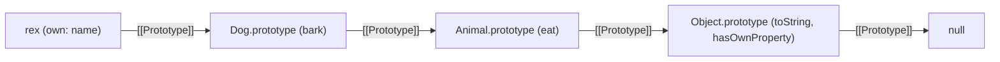
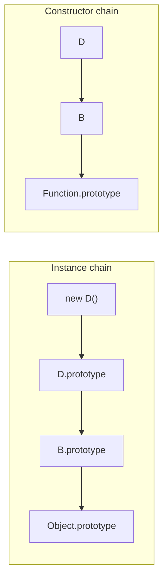
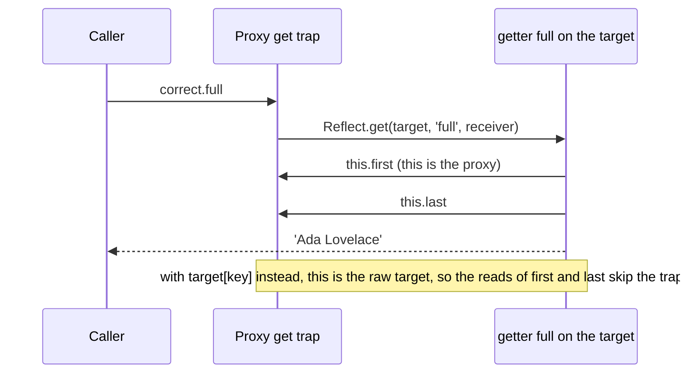
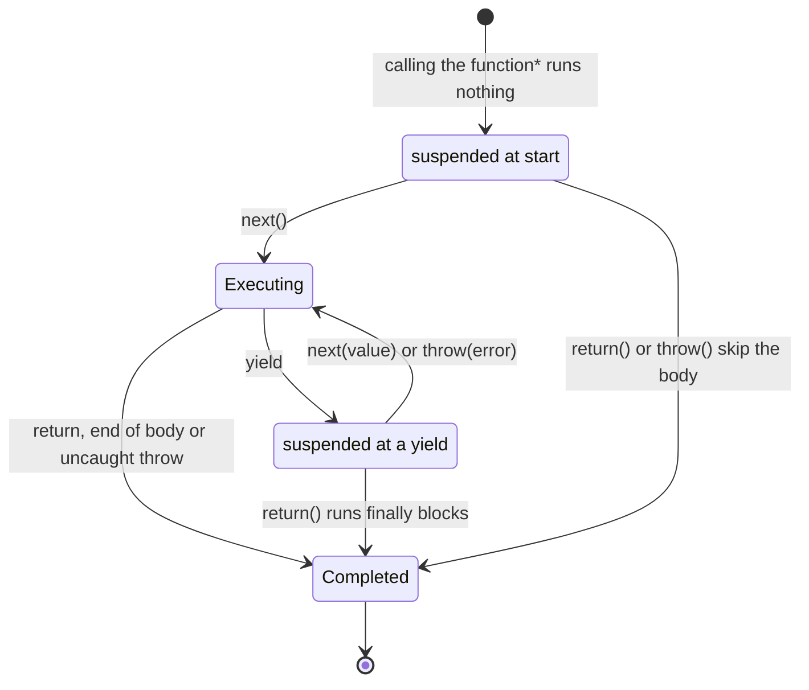

# 03. Objects, prototypes and classes

> **What this covers:** how JavaScript objects really work (properties with attributes, a prototype chain instead of class blueprints), what `class` syntax adds on top and what it does not, how Proxy and Reflect let you intercept object operations, how to copy and protect data correctly, and the iteration protocols that `for...of`, spread and generators are built on. By the end you can predict property lookups, explain why a deep copy lost its methods, and implement Proxy-based change tracking.
> **Prerequisites:** [02. How this is bound](02-js-scope-closures-this.md#4-how-this-is-bound) (methods, `call`/`bind`, arrow class fields), [02. Closures](02-js-scope-closures-this.md#3-closures) and [02. Strict mode](02-js-scope-closures-this.md#5-strict-mode) (why failed writes throw in modules), [01. Symbols](01-js-values-types-coercion.md#4-symbols) (well-known symbols such as `Symbol.iterator`) and [01. Equality](01-js-values-types-coercion.md#6-equality) (SameValueZero)
> **Leads to:** [05. Modules, memory and modern features](05-js-modules-memory-modern-features.md), [06. TypeScript type system essentials](06-ts-type-system-essentials.md), [17. Signals](17-signals.md), [28. State management](28-state-management.md)
> **Applies to:** ECMAScript 2026, TypeScript 6.0, Node 24 (the lab runtime)
> **Study time:** ~3.5 hours reading + ~3 hours exercises
> **Short on time:** read [2. The prototype chain](#2-the-prototype-chain) and [3. Classes](#3-classes-the-sugar-and-what-is-not-sugar), then drill [Q03.04](#q03-04), [Q03.06](#q03-06), [Q03.08](#q03-08), [Q03.09](#q03-09), [Q03.12](#q03-12) and [Q03.15](#q03-15), and finish with the [Summary](#summary).
> **Labs:** [`labs/ts-js/src/modules/03-js-objects-prototypes-classes/`](../labs/ts-js/src/modules/03-js-objects-prototypes-classes/) (exercises and section claims) and [`labs/ts-js/src/outputs/03-js-objects-prototypes-classes/`](../labs/ts-js/src/outputs/03-js-objects-prototypes-classes/) (every *Output* question). Run (from `labs/ts-js`, Node 24): `npx vitest run src/modules/03-js-objects-prototypes-classes src/outputs/03-js-objects-prototypes-classes`, plus `npm run typecheck` for the compile-time halves (`npm test` runs both)

## Contents

1. [Properties and descriptors](#1-properties-and-descriptors)
2. [The prototype chain](#2-the-prototype-chain)
3. [Classes: the sugar and what is not sugar](#3-classes-the-sugar-and-what-is-not-sugar)
4. [Inheritance, composition and mixins](#4-inheritance-composition-and-mixins)
5. [Proxy and Reflect](#5-proxy-and-reflect)
6. [Copying: shallow, deep and structured](#6-copying-shallow-deep-and-structured)
7. [Immutability and change-by-copy array methods](#7-immutability-and-change-by-copy-array-methods)
8. [Iteration protocols and generators](#8-iteration-protocols-and-generators)
- [Summary](#summary)
- [Question bank](#question-bank)
- [Hands-on exercises](#hands-on-exercises)
- [Check your understanding](#check-your-understanding)
- [Connections](#connections)

All snippets run as ES module code, which is always in *strict mode* (the stricter variant of JavaScript in which silent failures throw, see [Module 02](02-js-scope-closures-this.md)). Several answers below depend on that: a failed write that is silently ignored in a sloppy script throws a `TypeError` in a module.

---

## 1. Properties and descriptors

### The problem it solves

`obj.x = 1` looks like storing a value in a slot. It is more than that. Every property carries **attributes** that decide whether it can be changed, whether it shows up in `Object.keys` and `JSON.stringify`, and whether it can be deleted or redefined. Libraries rely on this: frameworks hide internal state from serialization, configuration objects are frozen, and getters compute values on read. Without knowing the attributes you cannot explain why a property is invisible to `JSON.stringify`, or why an assignment throws in one place and works in another.

### Mental model

A property is a small record, not a bare value. Think of a database row with columns: the key, then either a stored value or a pair of functions, then three permission flags.

| Kind | Fields | Example |
|---|---|---|
| **Data property** | `value`, `writable`, `enumerable`, `configurable` | `{ x: 1 }` |
| **Accessor property** | `get`, `set`, `enumerable`, `configurable` | `{ get total() { … } }` |

- `writable`: can the value be reassigned?
- `enumerable`: does it appear in `for...in`, `Object.keys`, spread and `JSON.stringify`?
- `configurable`: can it be deleted, or its attributes changed?

### How it actually works

The spec calls the record a *property descriptor*. You read one with `Object.getOwnPropertyDescriptor(obj, key)` and write one with `Object.defineProperty(obj, key, descriptor)`. The two creation paths have **opposite defaults**:

- Assignment and object literals create a data property with all three flags `true`.
- `Object.defineProperty` sets every flag you omit to `false` ([Q03.01](#q03-01)).

An accessor property has no stored value. Reading it calls `get` with `this` bound to the object the read started on, and assigning calls `set`. A getter-only accessor makes assignments fail (a `TypeError` in strict mode). With the descriptor API directly, `Object.defineProperty(o, 'id', { get() { return 42; }, enumerable: false })` defines a hidden, getter-only property.

Three built-ins change the object as a whole, each stronger than the last. They act on the object's own properties and on its *extensible* flag (whether new properties can be added). None of them is recursive.

| Operation | Add properties | Delete | Change values | Reconfigure |
|---|---|---|---|---|
| `Object.preventExtensions(o)` | no | yes | yes | yes |
| `Object.seal(o)` | no | no | yes | no |
| `Object.freeze(o)` | no | no | no (data properties) | no |

`freeze` makes data properties non-writable and non-configurable, but a frozen accessor can still run its setter, and a frozen object's nested objects are untouched. Verified: `§1 seal allows writes but not adds or deletes; preventExtensions still allows deletes` in [`sections.test.ts`](../labs/ts-js/src/modules/03-js-objects-prototypes-classes/sections.test.ts).

### Code

An accessor is the right tool when a property must be *derived* on read or *validated* on write while keeping property syntax for callers. The approach: store the source of truth in a private field, expose a getter that derives from it, and a setter that validates before storing.

1. Keep the canonical value (`#celsius`) private.
2. The getter converts on read, so the two units never drift.
3. The setter rejects invalid input before it reaches the state.

```ts
// Partial: the full test is "§1 an accessor property computes on read and validates on write" in sections.test.ts
class Temperature {
  #celsius = 0;
  get fahrenheit(): number {
    return this.#celsius * 1.8 + 32;
  }
  set fahrenheit(value: number) {
    if (!Number.isFinite(value)) throw new RangeError('not a finite number');
    this.#celsius = (value - 32) / 1.8;
  }
}
```

The accessor lives on `Temperature.prototype`, not on the instance, so `Object.keys(new Temperature())` is `[]`.

### Best practices and anti-patterns

- **Do use `Object.freeze` for module-level constants and configuration**, because it turns accidental writes into a `TypeError` at the point of the mistake instead of a silent change discovered later.
- **Avoid expensive or side-effecting getters.** Callers read `obj.total` as if it were a field, in loops and templates. If it costs something, make it a method (or a `computed` in Angular, [Module 17](17-signals.md#3-computed-signals)) so the cost is visible.
- **Do pass all three flags explicitly to `Object.defineProperty`.** The `false` defaults surprise readers, and an explicit descriptor documents intent.

### Misconceptions and traps

- *"`const` makes an object immutable."* `const` freezes the **binding** (the variable cannot be reassigned), not the object. `const o = {}; o.x = 1` is fine. The myth comes from `final` and `const` in other languages, and from treating the variable and the object as one thing.
- *"`Object.freeze` makes an object deeply immutable."* It is shallow ([Q03.02](#q03-02)). Exercise [E03.1](#ex03-1) builds the deep version. The myth comes from the name: "freeze" sounds total.
- *"Non-enumerable means private."* It only hides the key from enumeration. `Object.getOwnPropertyNames` and `Reflect.ownKeys` still list it, and anyone can read it. Real privacy is a `#private` field ([section 3](#3-classes-the-sugar-and-what-is-not-sugar)) or a closure ([Module 02](02-js-scope-closures-this.md)). Once the closest thing to private: before `#private` fields [Added in ES2022], libraries hid internals with non-enumerable properties, `_underscore` names or symbols.

---

## 2. The prototype chain

### The problem it solves

Thousands of objects need the same methods. Copying every method into every object would waste memory and make it impossible to fix a method in one place. JavaScript's answer is **delegation**: an object that lacks a property asks another object, its *prototype*. This is the only inheritance mechanism in the language. `class`, `extends` and `instanceof` are all built on it, so every interview question about inheritance eventually becomes a question about the chain.

### Mental model

Each object has a hidden link to one other object (or to `null`). Looking up a property is like asking a colleague a question: if they do not know, they ask their manager, who asks theirs, until someone answers or you reach the top of the hierarchy and get `undefined`.



What to notice: `rex.eat()` is found two links up. Writing `rex.eat = …` would not change `Animal.prototype`. It would create an own property on `rex` that *shadows* the inherited one.

### How it actually works

- Every object has an internal slot, `[[Prototype]]`. Read it with `Object.getPrototypeOf(o)`, set it at creation with `Object.create(proto)`, or later with `Object.setPrototypeOf` (slow: engines optimize objects by their shape (the engine's internal record of which properties an object has, also called a hidden class), and changing the prototype invalidates those optimizations, per [MDN](https://developer.mozilla.org/en-US/docs/Web/JavaScript/Reference/Global_Objects/Object/setPrototypeOf)).
- **Reads walk the chain.** `o.x` checks `o`'s own properties, then its prototype's, and so on, until it finds `x` or reaches `null`. When an inherited getter or method runs, `this` is still `o`, the object the lookup started on.
- **Writes do not walk the chain to store.** `o.x = v` creates or updates an own property on `o`, with two exceptions found by looking up the chain: an inherited **setter** is called instead, and an inherited **non-writable** data property makes the assignment fail ([Q03.06](#q03-06)).
- `F.prototype` is an ordinary property of a function. `new F()` creates an object whose `[[Prototype]]` is `F.prototype`. That is the only relationship between the two names ([Q03.03](#q03-03)). In full, `new F()` creates an object, links it to `F.prototype`, calls `F` with `this` set to it, and returns it unless `F` returns another object ([02. How this is bound](02-js-scope-closures-this.md#4-how-this-is-bound)).
- `__proto__` is a legacy accessor on `Object.prototype` that reads and writes `[[Prototype]]`. ECMA-262 keeps it for web compatibility and marks it "Normative Optional, Legacy" ([§20.1.3.8](https://tc39.es/ecma262/#sec-object.prototype.__proto__); it moved out of Annex B into the main text in ES2022). Objects created with `Object.create(null)` do not inherit it.
- `instanceof` walks the chain of the left operand looking for `Right.prototype` (unless `Right` defines `Symbol.hasInstance`). `Object.hasOwn(o, key)` [Added in ES2022] checks only own properties, and `key in o` checks the whole chain.

### Code

`Object.create` makes the chain explicit, with no constructor involved. The approach is to create a shared behavior object, then derive objects that delegate to it.

```ts
// Partial: the same pattern is exercised in Q03.04 (descriptors-prototypes.test.ts)
const base = {
  name: 'base',
  greet(): string {
    return `hi ${this.name}`;
  },
};
const child: { name?: string; greet(): string } = Object.create(base);
child.name = 'child'; // own property, shadows base.name
child.greet(); // 'hi child': greet is inherited, this is child
```

> [!TIP]
> **Coming from the backend.** In Java a class is a compile-time blueprint, and an object's class never changes. In JavaScript a prototype is a **live object**: adding a method to `Dog.prototype` at run time gives it instantly to every existing dog, and the chain can be any object, not only a "class". **Where the analogy breaks:** there is no separate class/instance distinction at run time. `Dog.prototype` is itself an instance of `Object`, and inheritance is lookup-time delegation, not copying fields into a subclass layout.

### Best practices and anti-patterns

- **Do use `Object.create(null)`, or better a `Map`, for dictionaries keyed by user input**, because a plain `{}` inherits keys such as `constructor` and `toString`, and a key named `__proto__` reaches the prototype setter ([Q03.07](#q03-07), [Q03.07a](#q03-07a)).
- **Avoid mutable objects or arrays on a shared prototype**, because every instance mutates the same one ([Q03.05](#q03-05)). Per-instance state belongs in class fields or the constructor.
- **Avoid `Object.setPrototypeOf` on existing objects in hot code**, because it defeats engine optimizations. Choose the prototype at creation with `Object.create` or `class`.
- **Never extend built-in prototypes (`Array.prototype.last = …`) in application code**, because it collides with future standard methods. It has happened: `Array.prototype.flat` was first proposed as `flatten`, and renamed because a library's own `flatten` on `Array.prototype` would have broken existing sites ([proposal-flatMap README](https://github.com/tc39/proposal-flatMap#readme)).

### Misconceptions and traps

- *"`obj.__proto__` and `Fn.prototype` are the same thing."* The first is the object's own link. The second is the object a constructor will link *new* instances to. The myth comes from both names containing "proto".
- *"Assignment always creates an own property."* Not when the chain has a setter or a read-only property with that name. The myth comes from plain data objects, where no setter is on the chain, so it is almost always true.
- *"`hasOwnProperty` is always safe to call."* `obj.hasOwnProperty(k)` fails on `Object.create(null)` objects and can be shadowed by a key named `hasOwnProperty`. `Object.hasOwn` has neither problem. Once the standard idiom: before `Object.hasOwn` [Added in ES2022], the safe form was `Object.prototype.hasOwnProperty.call(obj, k)`.

---

## 3. Classes: the sugar and what is not sugar

### The problem it solves

Write a custom error the pre-2015 way and it silently loses what makes it an error:

```js
// Partial: the ES5 pattern, plain JavaScript
function MyError(message) { Error.call(this, message); }
MyError.prototype = Object.create(Error.prototype);
new MyError('disk full').message; // '' (inherited): Error.call returned a new error and ignored `this`
```

It has no own `stack`, and `Object.prototype.toString` reports `[object Object]`, although `instanceof Error` is `true`. Verified: `§3 an ES5 Error subclass gets no message, no stack and no error brand` in `sections.test.ts`. `class MyError extends Error` gets all three right, because the base constructor creates the object ([How it actually works](#3-classes-the-sugar-and-what-is-not-sugar)).

Before ES2015 every library wrote inheritance by hand: constructor functions, `Child.prototype = Object.create(Parent.prototype)`, restoring `constructor`, and calling `Parent.call(this)`. It was verbose and easy to get subtly wrong. `class` gave the pattern one standard syntax, and later editions added real capabilities that hand-written prototypes cannot express.

### Mental model

A `class` declaration builds the same two objects you would build by hand: a constructor function and its `prototype` object, linked to the parent's. Methods go on the prototype, and static members go on the constructor. On top of that skeleton, the class body adds features that are **not** expressible with prototypes alone, chiefly private elements and `super`. Think of `class` as a flat-pack kit: it assembles the same two pieces you used to build by hand, and adds locked compartments that no hand-built version can have.



What to notice: `class D extends B` links **two** chains. Instance lookups walk the first, and static methods are found through the second, so `D.create()` finds `B.create`. Verified: `§3 extends links two chains`.

### How it actually works

What *is* sugar (same objects as the hand-written version):

- Methods are placed on `C.prototype`, and `static` members on `C` itself.
- `class D extends B` links **two** chains: `D.prototype → B.prototype` for instances, and `D → B` for the constructors, which is why static methods are inherited. Verified: `§3 extends links two chains` in `sections.test.ts`.

What differs from the hand-written version even though it looks equivalent:

- A class constructor **throws** a `TypeError` when called without `new`, and class methods are **non-enumerable** ([Q03.08](#q03-08)).
- Class bodies are always strict mode.
- Class declarations are hoisted into a *temporal dead zone* (the span before the declaration in which access throws), unlike function declarations ([Module 02](02-js-scope-closures-this.md)).
- In a derived class, `this` does not exist until `super()` returns, because the **base** constructor allocates the object. That is what lets `class MyError extends Error` and `class MyArray extends Array` produce real arrays (an [exotic object](02-js-scope-closures-this.md#4-how-this-is-bound) with the special `length` behavior) and real errors (with the internal slot the engine and `Object.prototype.toString` expect), which `Parent.call(this)` never could.

What is **not** sugar at all:

- **Private elements** (`#field`, `#method()`, `static #x`) [Added in ES2022]. They are not properties. They live in a per-object list of *private elements* that only code inside the class body can address, with no reflection API to reach them. Accessing `#x` on an object that does not have it throws a `TypeError`, and `#x in obj` [Added in ES2022] checks for it without throwing (an *ergonomic brand check*). Consequences: private fields are invisible to `Object.keys`, spread and `JSON.stringify`, are not copied by `structuredClone`, and break through a Proxy ([Q03.09](#q03-09)).
- **`super`**. A method defined in a class or object literal records its *home object* (the object it was defined on) in an internal `[[HomeObject]]` slot. `super.m()` looks up `m` on the prototype of the home object, fixed at definition time, **not** on the prototype of `this` ([Q03.10](#q03-10)).
- **Class fields** [Added in ES2022] are defined on each instance with define semantics (like `Object.defineProperty`), not by assignment, so they do not trigger inherited setters. TypeScript emits them this way when `useDefineForClassFields` is on, which is its default for `target` ES2022 and later (this lab uses ES2024); with an older target it emits assignments instead. Verified: `§3 class fields use define semantics, not inherited setters` in `sections.test.ts`.
- **Derived fields are initialized after `super()` returns.** The base constructor runs first, so if it calls a method the subclass overrides, that override sees the subclass's fields as `undefined`. Verified: `§3 a derived class's fields are initialized after super() returns`.
- **Static initialization blocks** (`static { … }`) [Added in ES2022] run once, when the class is evaluated, with access to private names. Verified: `§3 a static block runs once` in `sections.test.ts`.

Editions are from the TC39 [finished proposals list](https://github.com/tc39/proposals/blob/main/finished-proposals.md) (class fields, static blocks and ergonomic brand checks are all listed for 2022).

### Code

The approach: keep invariants in private fields, expose behavior through methods, and use a brand check for a safe type test that cannot be faked by duck typing.

```ts
// Excerpt of labs/ts-js/src/outputs/03-js-objects-prototypes-classes/classes.test.ts (Q03.09)
class Counter {
  #count = 0;
  inc(): number {
    return ++this.#count;
  }
  static isCounter(o: object): boolean {
    return #count in o;
  }
}
```

`isCounter` returns `true` only for objects created by this class's constructor. An object literal with a `count` property, a subclass of another class, or a Proxy around a real counter all return `false`.

> [!NOTE]
> **Framework vs platform.** `#field` is a JavaScript runtime feature: the engine enforces it. TypeScript's `private` keyword is a compile-time check only. It is erased, so the property is an ordinary public property at run time (visible in `Object.keys` and JSON, and reachable with `obj['x']`). Angular code commonly uses both: `#state` for real encapsulation, and `protected` or `private` for members a template must reach, since templates cannot use `#` names (the template parser rejects them: "Private identifiers are not supported"). Angular 22.2.1 compiles a template that reads a `private` member, but the [Angular style guide](https://angular.dev/style-guide#use-protected-on-class-members-that-are-only-used-by-a-components-template) recommends `protected` for members only the template uses. [Module 06](06-ts-type-system-essentials.md#2-structural-typing-assignability-and-readonly) covers TypeScript's modifiers, and [Module 07](07-ts-advanced-types-and-decorators.md) covers decorators.

> [!TIP]
> **Coming from the backend.** `class`, `extends`, `super` and `static` read like Java, and `#field` behaves much like Java's `private`: enforced by the runtime, and per class (a subclass cannot see its parent's `#x`). **Where the analogy breaks:** there is no method overloading, no interface at run time, and no `protected` in JavaScript itself. Methods are not bound to the instance either: `const f = obj.method; f()` loses `this` ([Module 02](02-js-scope-closures-this.md)). And because `super` is fixed by the home object rather than by a vtable, copying a method to another object keeps the original `super` target.

### Best practices and anti-patterns

- **Do use `#private` for state that must stay consistent**, because the runtime enforces it and no consumer can couple to it.
- **Avoid private fields on objects that you plan to wrap in a Proxy** (or pass to a library that does), because every method touching `#x` through the proxy throws. Choose between them deliberately ([section 5](#5-proxy-and-reflect)).
- **Do keep constructors cheap and side-effect free**, because a subclass cannot touch `this` until `super()` returns, and work done there runs for every instance, including those created in tests.

### Misconceptions and traps

- *"Classes are just syntactic sugar over prototypes."* Half true. The prototype wiring is sugar. Private elements, `super`'s home object, `new`-only constructors, field define semantics and correct subclassing of built-ins are not ([Q03.08](#q03-08)). Once closer to true: the ES2015 class added mostly syntax, `new`-only construction and `super`. ES2022 added private elements and static blocks, which have no prototype equivalent.
- *"Arrow functions in class fields are free."* `handle = () => {…}` creates one function per instance and puts it on the instance, not the prototype. That is a fair price for a stable `this` in callbacks, but it is not free, and subclasses cannot call it through `super`. The myth comes from framework code using them everywhere to keep `this`.

---

## 4. Inheritance, composition and mixins

### The problem it solves

A subclass that counts how many items were added to a `Set`:

```ts
// Partial: the subclass depends on how its parent works inside
class CountingSet<T> extends Set<T> {
  added = 0;
  override add(value: T): this {
    this.added++;
    return super.add(value);
  }
}
new CountingSet(['a', 'b', 'c']).added; // 0, not 3
```

The `Set` constructor calls `this.add` for each initial item, and the field `added = 0` is initialized after `super()` returns, so it wipes those counts. The result depends on internals the subclass never chose to rely on. Verified: `§4 a subclass that counts add() misses the items the Set constructor added`.

Inheritance couples a subclass to its parent's internals. When the parent changes, subclasses break (the *fragile base class* problem), and a single chain cannot express "is a `Timestamped` **and** an `Auditable`". Composition and mixins are the two standard answers. Interviewers use this topic to see whether you know the trade-off and can name where each one wins.

### Mental model

- **Inheritance** says "is a": a `Dog` *is an* `Animal` and receives all of its behavior through one chain.
- **Composition** says "has a": a `Car` *has an* `Engine` and forwards to it. Any number of parts, swappable at run time.
- A **mixin** is a function from a class to a new subclass: `Timestamped(Entity)` returns a class that extends `Entity` and adds behavior. It stacks behaviors by **generating** an inheritance chain.

An analogy: inheritance is a family tree (you receive everything your parent has, fixed at birth), composition is a toolbox (you pick the parts and can swap them), and a mixin is a stack of transparent layers laid over a base, each adding a little.


What to notice: a class-expression mixin adds a **link**, not a copy. `super.m()` in the A part reaches the B part, and `instanceof Entity` still holds because `Entity.prototype` is on the chain.

### How it actually works

`extends` accepts any expression that evaluates to a constructor, including a function call. That is the whole mechanism of class-expression mixins: `class extends Base {…}` inside a function, where `Base` is a parameter. Applying `A(B(Entity))` builds the chain `A-part → B-part → Entity`, so `instanceof Entity` still holds and `super` calls flow down the chain.

TypeScript types this pattern with a constructor type, and it requires the mixin's constructor parameter to be `...args: any[]` (error TS2545 otherwise). It is one of the few places where `any` is mandated by the compiler rather than a choice.

### Code

The approach: write the mixin as a function that takes a base constructor and returns a class expression extending it.

```ts
// Partial: the full test is "§4 a class-expression mixin adds behavior" in sections.test.ts
type Constructor<T = object> = new (...args: any[]) => T; // any[] is required here (TS2545)

function Timestamped<TBase extends Constructor>(Base: TBase) {
  return class extends Base {
    readonly createdAt = new Date(0);
  };
}

class Entity {
  constructor(readonly id: string) {}
}
const e = new (Timestamped(Entity))('42'); // e.id, e.createdAt, e instanceof Entity
```

Composition needs no special syntax: inject the collaborator and delegate. This is also the model Angular's dependency injection is built around ([Module 16](16-dependency-injection.md)).

> [!TIP]
> **Coming from the backend.** Java's advice "favor composition over inheritance" (Effective Java, item 18) applies unchanged, and default methods on interfaces play roughly the role mixins play here. **Where the analogy breaks:** a JavaScript mixin creates a real new class at run time and inserts it into the prototype chain, so mixins can carry state (fields) and participate in `super` calls, which Java interfaces cannot.

### Best practices and anti-patterns

- **Do prefer composition for behavior that varies or is shared across unrelated types**, because it keeps each part testable and replaceable, and it avoids deep chains ([Q03.11](#q03-11)).
- **Use inheritance for a genuine, stable "is a" relationship**, often a framework base class (`HTMLElement`, `Error`), because there the parent's contract is designed for extension.
- **Avoid mixin stacks deeper than two or three**, because the order of application changes `super` resolution, and debugging a generated chain is hard.

### Misconceptions and traps

- *"Mixins copy methods onto the target."* That was the old `Object.assign(Target.prototype, mixin)` style, which cannot carry `super` or private state. Class-expression mixins extend instead of copying. The copying style predates ES2015 classes, which is why older articles still teach it.
- *"Composition means no classes."* Composition is about *how behavior is combined*. Composed parts are often classes. The myth comes from reading "composition over inheritance" as "functions over classes".

---

## 5. Proxy and Reflect

### The problem it solves

Some features need to run code whenever an object is *used*: validate every write, log every read, track which properties a render depended on, or present a remote object as a local one. Getters and setters work only for keys you know in advance. A **Proxy** intercepts the fundamental operations themselves (get, set, has, delete, enumerate keys, call, construct) for **any** key, including keys added later.

### Mental model

A Proxy is a receptionist standing in front of a target object. Every request goes to the receptionist first. For each kind of request, the *handler* object may define a *trap* (a function). Without a trap, the request passes straight to the target. **Reflect** is the receptionist's manual: one function per operation (`Reflect.get`, `Reflect.set`, …) that performs the default behavior, so a trap can add something and then "do the normal thing".



What to notice: only passing the `receiver` makes the reads *inside* the getter come back through the trap ([Q03.12](#q03-12)).

### How it actually works

- The spec defines every object operation as an *internal method*: `[[Get]]`, `[[Set]]`, `[[HasProperty]]`, `[[Delete]]`, `[[OwnPropertyKeys]]`, `[[DefineOwnProperty]]`, `[[GetOwnProperty]]`, `[[GetPrototypeOf]]`, `[[SetPrototypeOf]]`, `[[IsExtensible]]`, `[[PreventExtensions]]`, plus `[[Call]]` and `[[Construct]]` for functions. A Proxy has 13 traps, one per internal method (see [MDN Proxy](https://developer.mozilla.org/en-US/docs/Web/JavaScript/Reference/Global_Objects/Proxy)). `Reflect` has one static function per trap, with the same signature.
- **The receiver.** `get` and `set` traps receive a `receiver`: the object the operation started on, usually the proxy. Passing it to `Reflect.get(target, key, receiver)` makes inherited getters and setters run with `this` = the proxy, so reads inside them are intercepted too. Writing `target[key]` instead runs them with `this` = the raw target, and those inner reads become invisible ([Q03.12](#q03-12)).
- **Invariants.** A proxy cannot lie about facts the target has committed to. After each trap, the engine checks the result against the target. For example, `get` must return the actual value of a non-writable, non-configurable data property, and `has` cannot hide a non-configurable property. A violation throws a `TypeError` ([Q03.13](#q03-13)). Invariants are what keep `Object.freeze` meaningful in a world with proxies.
- **A `false` from `set`, `deleteProperty` or `defineProperty`** means "refused". For `set` and `deleteProperty`, the assignment or `delete` throws a `TypeError` in strict mode and fails silently in sloppy code. For `defineProperty`, `Object.defineProperty` always throws, in both modes, while `Reflect.defineProperty` returns `false`.
- **Internal slots are not forwarded.** Built-ins such as `Map`, `Set`, `Date` and Promise store their data in internal slots (hidden per-object storage the spec defines for built-ins), and class instances store private fields in a similar per-object list. A method called with `this` = proxy finds no slot or private element on the proxy and throws a `TypeError`. The usual fix is a `get` trap that binds methods to the target. Verified: `§5 a Proxy over a Map breaks methods that need internal slots` in `sections.test.ts`. Verified for `Date` and `Promise`: `§5 a Proxy over Date and Promise breaks slot methods`.
- `Proxy.revocable(target, handler)` returns `{ proxy, revoke }`. After `revoke()`, every operation on the proxy throws, which is useful for handing out access you can later withdraw. Verified: `§5 a revoked Proxy throws on every operation`.
- Proxies are not free: every intercepted operation calls a function. Keep them away from tight numeric loops.

### Code

Validation is the canonical use case. The approach: a `set` trap checks the incoming value, then delegates to `Reflect.set` with the receiver so setters and inheritance keep working.

```ts
// Partial: a standalone illustration; Exercise 03.2 builds and tests a full change-tracking proxy
function validated<T extends object>(target: T, rules: Partial<Record<keyof T, (v: unknown) => boolean>>): T {
  return new Proxy(target, {
    set(t, key, value: unknown, receiver) {
      const rule = rules[key as keyof T];
      if (rule && !rule(value)) throw new TypeError(`invalid value for ${String(key)}`);
      return Reflect.set(t, key, value, receiver);
    },
  });
}
```

**Observability: how Vue 3 reactivity works.** Vue's `reactive()` returns a Proxy whose `get` trap records "the running effect read `key` of `target`" (*track*) and whose `set` trap re-runs the effects that read that key (*trigger*), as described in Vue's [Reactivity in Depth](https://vuejs.org/guide/extras/reactivity-in-depth.html). Nested objects are wrapped lazily when read. Exercise [E03.2](#ex03-2) builds the *trigger* half of this. [Q03.14](#q03-14) compares the approach with Angular's getter-based signals.

> [!NOTE]
> **Framework vs platform.** Proxy and Reflect are ECMAScript (ES2015). Vue's `reactive`, MobX's observables and Immer's drafts are libraries built on them. Angular signals do **not** use Proxy: a signal is a getter function that registers the read ([Module 17](17-signals.md#1-why-signals-exist)).

> [!TIP]
> **Coming from the backend.** `java.lang.reflect.Proxy` and Spring AOP proxies intercept method calls the same way, through an `InvocationHandler`. **Where the analogy breaks:** a Java dynamic proxy implements **interfaces** and intercepts only method calls. A JavaScript Proxy wraps any object and intercepts property reads, writes, deletes, `in` and key enumeration too, and by default it has no equivalent of Spring's self-invocation problem: inside a method called through the proxy, `this` *is* the proxy. The exception is a `get` trap that binds methods to the target (the usual fix for internal slots and private fields): then `this` is the raw target, and calls made inside the method bypass the traps, which is the self-invocation problem again.

### Best practices and anti-patterns

- **Do forward with `Reflect.*` and pass the receiver**, because it preserves default semantics (setters, inheritance, return values) that hand-written `target[key] = value` silently changes.
- **Do return the value of `Reflect.set` from a `set` trap**, because returning `true` unconditionally hides failed writes to frozen targets.
- **Avoid comparing a proxy with its target by identity.** `proxy === target` is `false`, so code mixing raw and wrapped references breaks caches and `Set` membership. Vue's documentation calls this out for `reactive()` ([Reactive Proxy vs. Original](https://vuejs.org/guide/essentials/reactivity-fundamentals.html#reactive-proxy-vs-original)).

### Misconceptions and traps

- *"A Proxy can make an object look like anything."* Not around non-configurable properties or non-extensible targets: the invariants forbid it. The myth comes from demos that virtualize whole objects whose targets make no such commitments.
- *"`Reflect` is just a namespace for the `Object` methods."* It overlaps, but `Reflect` functions return booleans instead of throwing (`Reflect.defineProperty`), take a receiver, and map one-to-one to the traps. That last property is why they exist. The myth comes from the overlap: most `Reflect` functions have an `Object` twin.

---

## 6. Copying: shallow, deep and structured

### The problem it solves

State bugs often come down to two pieces of code sharing one object that each thought was its own. Copying fixes this, but each copying technique copies a different amount, and choosing the wrong one gives you either a shared nested array (too shallow) or a broken `Date`, a lost class or a thrown exception (the wrong deep copy).

### Mental model

Picture a folder of papers. A **shallow copy** is a new folder with the same papers in it: rename the folder freely, but writing on a paper shows up in both. A **deep copy** photocopies every paper, and every paper inside those papers. The question for each technique is how deep it photocopies, and what it cannot photocopy.

### How it actually works

| Technique | Depth | Keeps | Loses or breaks |
|---|---|---|---|
| `{ ...o }`, `Object.assign({}, o)`, `[...a]`, `a.slice()` | one level | everything at the top level, by reference | prototype (spread makes a plain object), accessors (they are invoked and copied as values), non-enumerable and private members |
| `JSON.parse(JSON.stringify(o))` | deep | strings, finite numbers, booleans, `null`, plain objects and arrays | `Date` becomes a string, `undefined` and functions vanish from objects (`null` in arrays), `NaN`/`Infinity` become `null`, `Map`/`Set` become `{}`, `BigInt` and cycles throw `TypeError` |
| `structuredClone(o)` | deep | `Date`, `RegExp`, `Map`, `Set`, `ArrayBuffer` and typed arrays, `BigInt`, `undefined`, `NaN`, most `Error` types, **cycles and shared references** | prototype (a class instance comes back as a plain object), getters (only own enumerable data is copied, as data), private fields, property attributes. **Throws `DataCloneError`** on functions, DOM nodes, symbols and Proxy objects |

The JSON row and the `structuredClone` row are verified by `§6 JSON round-trip traps` and `§6 structuredClone keeps cycles, Map and Set, and rejects proxies and symbols` in `sections.test.ts`, and by [Q03.15](#q03-15) and [Q03.16](#q03-16). The full list of supported types is in MDN's [structured clone algorithm](https://developer.mozilla.org/en-US/docs/Web/API/Web_Workers_API/Structured_clone_algorithm).

`structuredClone` is not part of ECMAScript. It is defined by the HTML standard ([WHATWG](https://html.spec.whatwg.org/multipage/structured-data.html#dom-structuredclone)) and uses the same *structured serialization* as `postMessage`, IndexedDB and `history.pushState`. Browsers and Node expose it as a global: Node since 17.0.0, Chrome 98, Firefox 94 and Safari 15.4 (MDN compatibility data, read 2026-10-06). That is why its errors are `DOMException`s named `DataCloneError`, not plain `TypeError`s.

The Proxy row matters in practice: an object returned by Vue's `reactive()` or a similar library is a Proxy, so `structuredClone(state)` throws. Unwrap it to the raw object first.

> [!TIP]
> **Coming from the backend.** Java's `Object.clone()` is shallow by default and requires `Cloneable`; deep copies are usually written by hand or done through serialization (Jackson round-trips). `JSON.parse(JSON.stringify(x))` is the JavaScript equivalent of that serialization round-trip, with the same weakness: anything the format cannot represent is lost. **Where the analogy breaks:** `structuredClone` has no hooks. There is no `clone()` override, `readObject` or custom serializer, so a class cannot teach it to preserve its type. If you need typed copies, write a `copy()` or `with…()` method.

### Code

When you need a deep copy of plain data (API responses, form state), the approach is `structuredClone`. For domain objects with behavior, add an explicit copy method, because no generic mechanism preserves classes.

```ts
// Partial: a domain type with an explicit, type-preserving copy method
class Money {
  constructor(readonly cents: number, readonly currency: string) {}
  withCents(cents: number): Money {
    return new Money(cents, this.currency);
  }
}
const draft = structuredClone({ lines: [{ sku: 'a', qty: 1 }], savedAt: new Date() }); // plain data: fine
```

### Best practices and anti-patterns

- **Do prefer immutable updates over deep copies.** Copying only the path you change (`{ ...state, user: { ...state.user, name } }`) shares every untouched branch, which is cheaper and lets reference checks (`===`) detect what changed ([section 7](#7-immutability-and-change-by-copy-array-methods)).
- **Avoid `JSON.parse(JSON.stringify(x))` as a general deep copy**, because it silently corrupts dates, drops `undefined` and loses maps. Use it only when the data is already JSON (for example, a response you are about to send back).
- **Do treat `structuredClone` as a data copy, not an object copy**, because it strips prototypes and methods.

### Misconceptions and traps

- *"Spread does a deep copy."* One level only ([Q03.15](#q03-15)). The myth comes from the result being a new object at the top level, which looks like a full copy.
- *"`structuredClone` copies anything."* Functions, symbols, DOM nodes and proxies throw, and classes come back as plain objects ([Q03.16](#q03-16)). The myth comes from it replacing `JSON.parse(JSON.stringify(o))`, the usual deep copy before `structuredClone` shipped (Node 17, Chrome 98, Firefox 94, Safari 15.4).
- *"`Object.assign` copies getters."* It invokes them on the source and defines plain data properties on the target with the results. To copy accessors as accessors, use `Object.defineProperties(target, Object.getOwnPropertyDescriptors(source))`. The myth comes from it being described as "copying properties".

---

## 7. Immutability and change-by-copy array methods

### The problem it solves

Modern UI state management relies on a cheap question: "did this value change?" With immutable updates the answer is a reference comparison, `old !== new`. Angular signals compare with `Object.is` ([Q17.04](17-signals.md#q17-04)), OnPush components (which Angular re-checks only when an input changes by reference, an event fires inside them, or they are marked for check) compare inputs by reference ([Module 21](21-change-detection.md)), and NgRx reducers must return new objects ([Module 28](28-state-management.md)). Mutating in place defeats all of them: the reference stays the same, so nothing is notified. Historically the array API made this easy to get wrong, because `sort`, `reverse` and `splice` mutate.

### Mental model

Treat a value as a snapshot. To "change" it, produce a new snapshot that shares everything that did not change. Mutating methods are editing a photo everyone is holding. Change-by-copy methods hand you a new print.

### How it actually works

ES2023 added four non-mutating counterparts to `Array.prototype` (and the typed-array ones, except `toSpliced`), through the *Change Array by copy* proposal, listed under 2023 in the TC39 [finished proposals list](https://github.com/tc39/proposals/blob/main/finished-proposals.md):

| Mutating | Change-by-copy [Added in ES2023] |
|---|---|
| `a.sort(cmp)` | `a.toSorted(cmp)` |
| `a.reverse()` | `a.toReversed()` |
| `a.splice(i, n, …items)` | `a.toSpliced(i, n, …items)` (returns the new array, not the removed items) |
| `a[i] = v` | `a.with(i, v)` (negative `i` counts from the end; out of range throws `RangeError`) |

Details that interviewers probe ([Q03.17](#q03-17)):

- `toSorted()` uses the same default comparator as `sort()`: it compares **strings**, so `[10, 9, 1].toSorted()` is `[1, 10, 9]`. Pass `(a, b) => a - b` for numbers.
- The copy methods always return a **dense** array. Holes in a sparse array become `undefined` properties, whereas `sort` and `reverse` preserve holes.
- They copy one level. Objects inside the array are shared.

The older non-mutating methods (`map`, `filter`, `slice`, `concat`, spread) remain the other half of the toolkit. TypeScript types the new methods in `lib.es2023.array.d.ts`, so `"lib": ["ES2023"]` or later is required to use them. In browsers they ship in Chrome 110, Firefox 115 and Safari 16 (Node 20), per MDN's compatibility data on 2026-10-06.

For enforcement there are three levels, each with a different cost ([Q03.18](#q03-18)):

1. **Discipline plus types.** `readonly T[]`, `ReadonlyArray<T>` and `Readonly<T>` make mutations a compile error at zero run-time cost, but casts and `any` bypass them ([Module 06](06-ts-type-system-essentials.md#2-structural-typing-assignability-and-readonly)).
2. **`Object.freeze`** (deep, if needed: [E03.1](#ex03-1)) makes mutation a run-time `TypeError`, and costs a walk over the data.
3. **Libraries.** Immer records mutations on a Proxy draft and produces a structurally shared new state, and NgRx's runtime checks freeze state in development mode ([Module 28](28-state-management.md)).

### Code

The approach for updating one item in a list of records: copy the path you change, share the rest.

```ts
// Partial: Todo is { id: string; done: boolean; title: string }
function toggle(todos: readonly Todo[], id: string): readonly Todo[] {
  const index = todos.findIndex((t) => t.id === id);
  if (index === -1) return todos; // unchanged reference: consumers skip work
  const current = todos[index]!;
  return todos.with(index, { ...current, done: !current.done });
}
```

Returning the same reference when nothing changed matters as much as returning a new one when something did: it is what lets `Object.is`-based consumers skip work.

> [!TIP]
> **Coming from the backend.** Java records and `List.copyOf` give you immutability by construction, enforced by the runtime. **Where the analogy breaks:** JavaScript has no immutable record type. `Readonly<T>` is erased at compile time, and `Object.freeze` is shallow and opt-in. (The Records & Tuples proposal for deeply immutable primitives was withdrawn from TC39, per its [repository](https://github.com/tc39/proposal-record-tuple).)

### Best practices and anti-patterns

- **Do use the change-by-copy methods on state that is compared by reference** (signals, OnPush inputs, store state), because `sort()` on such a value mutates it and keeps its identity, so nothing re-renders.
- **Avoid copying for the sake of it** in local, unshared variables. A function that builds an array and sorts it before returning may mutate freely. Immutability matters at **sharing boundaries**, because copying costs time and memory and, inside one function, nobody else can observe the mutation.
- **Do return the original reference for a no-op update**, because a fresh but equal object makes every consumer recompute.

### Misconceptions and traps

- *"`toSorted` sorts numbers numerically."* Same default comparator as `sort`. The myth comes from the new name suggesting new behavior.
- *"Freezing makes code faster."* It is a correctness tool. Engines do not promise a speed-up. The myth comes from the plausible idea that a fixed object is easier to optimize.
- *"`readonly` arrays are immutable at run time."* They are ordinary arrays. Only the type checker objects. The myth comes from TypeScript errors looking like run-time protection.

---

## 8. Iteration protocols and generators

### The problem it solves

`for (const entry of settings)` on a plain object `settings` throws `TypeError: … is not iterable` (TypeScript rejects it at compile time too), while the same loop over a `Map` works. Verified: `§8 a plain object is not iterable`. Something has to say which objects are sequences and how to walk them.

`for...of`, spread, destructuring, `Array.from`, `new Map(entries)` and `Promise.all` all need to consume "a sequence of values" from arrays, strings, maps, sets, DOM collections and your own types alike. The **iteration protocols** are the shared contract that makes all of these work with any data structure, including infinite and lazily computed ones.

### Mental model

- An **iterable** is something you can ask for a fresh cursor: it has a `[Symbol.iterator]()` method that returns an iterator.
- An **iterator** is the cursor: `next()` returns `{ value, done }`, and an optional `return()` lets a consumer that stops early release resources.
- A **generator** function (`function*`) writes the cursor for you. Each `yield` pauses the function and hands out a value. The next `next()` resumes it exactly where it stopped, with its local variables intact.

An analogy: an iterator is a bookmark in one reading of a book, and each `[Symbol.iterator]()` call hands out a new bookmark. A generator is a recipe paused mid-step: `yield` puts the spoon down, and `next()` picks it up again.



What to notice: `return()` on a generator paused at a `yield` acts like a `return` statement at that point, so its `finally` blocks run. A generator that never started skips its body entirely.

### How it actually works

- The protocols are duck-typed: no base class is involved, only the method names. `Symbol.iterator` is a *well-known symbol* (a built-in symbol the language uses as a protocol key, see [Module 01](01-js-values-types-coercion.md)).
- `for...of` calls `[Symbol.iterator]()` once, then `next()` until `done: true`. If the loop exits early (`break`, `return`, an exception), it calls the iterator's `return()`. For a generator, that resumes it as if a `return` statement were at the paused `yield`, so its `finally` blocks run ([Q03.19](#q03-19)).
- A generator object is **both** an iterator and an iterable whose `[Symbol.iterator]()` returns itself. That makes generators, and built-in iterators like `array.values()`, **one-shot**: a second `for...of` over the same object finds it exhausted ([Q03.20](#q03-20)). Arrays, maps and a class with a generator method are reusable, because each `[Symbol.iterator]()` call starts a new cursor ([E03.3](#ex03-3)).
- `gen.next(x)` resumes the generator with `x` as the result of the paused `yield` expression. The first `next()` argument is ignored, because no `yield` is paused yet. `gen.return(v)` finishes it (running `finally`), and `gen.throw(e)` throws at the paused `yield`.
- `yield* inner` delegates to another iterable until it finishes, forwarding `next`, `return` and `throw`, and evaluates to the inner generator's return value ([Q03.19a](#q03-19a)).
- A generator's body does not run until the first `next()`. Argument validation inside a generator is therefore deferred, a trap [E03.3](#ex03-3) asks you to avoid.
- **Iterator helpers** [Added in ES2025]: built-in iterators inherit `map`, `filter`, `take`, `drop`, `flatMap`, `reduce`, `toArray`, `forEach`, `some`, `every` and `find` from `Iterator.prototype`, and `Iterator.from` adapts any iterator. They are **lazy**: nothing runs until a value is pulled, and they consume the underlying iterator ([Q03.20](#q03-20)). The edition is from the TC39 finished proposals list ("Iterator helpers (Sync)", 2025). Async iteration (`for await`, async generators, `Array.fromAsync`) belongs to [Module 04](04-js-async-event-loop.md). They ship in Chrome 122, Firefox 131 and Safari 18.4 (Node 22), per MDN's compatibility data on 2026-10-06, and TypeScript 6.0.3 types them in `lib.es2025.iterator.d.ts`, so `"lib": ["ES2025"]` is the minimum (the lab uses `ESNext`).

### Code

The approach for a custom collection: make `[Symbol.iterator]` a generator method, so every iteration gets its own cursor and the class works with every consumer of the protocol.

```ts
// Excerpt of labs/ts-js/src/modules/03-js-objects-prototypes-classes/range.ts
export class Range implements Iterable<number> {
  readonly start: number;
  readonly end: number;
  readonly step: number;

  // A generator method returns a fresh iterator per call, which is what makes the range reusable.
  *[Symbol.iterator](): Generator<number, void, undefined> {
    for (let n = this.start; n < this.end; n += this.step) yield n;
  }
}
```

> [!TIP]
> **Coming from the backend.** `Iterable`/`Iterator` map directly onto Java's `Iterable<T>`/`Iterator<T>`, and iterator helpers resemble lazy `Stream` operations. **Where the analogy breaks:** JavaScript iterators have no `hasNext()`. You learn about the end by calling `next()` and getting `done: true`. And a generator is a *resumable function* with its own suspended stack frame, closer to a coroutine than to anything in the Java collections API.

### Best practices and anti-patterns

- **Do use generators for lazy or infinite sequences and for paging through large data**, because values are produced only as they are consumed.
- **Do put cleanup in `try...finally` inside generators**, because consumers that stop early trigger `return()`, and `finally` is how the generator learns about it.
- **Avoid handing the same iterator to two consumers.** They will split the values between them. Pass the iterable, or materialize with `toArray()`.

### Misconceptions and traps

- *"`for...in` and `for...of` are interchangeable."* `for...in` enumerates enumerable **string keys**, including inherited ones. `for...of` uses the iteration protocol and yields **values**. The myth comes from the identical syntax.
- *"Plain objects are iterable."* They are not. Use `Object.entries(o)`. The myth comes from `for...in` working on them, and from dictionaries being iterable in Python and Java's `Map.entrySet()`.
- *"Generators are asynchronous."* Plain generators are synchronous. They pause only between `next()` calls that you make. The myth comes from async generators (`async function*`) and from `yield` looking like `await`.

---

## Summary

A property is a record, not a bare value ([1](#1-properties-and-descriptors)): a value or a getter/setter pair plus `writable`, `enumerable` and `configurable` flags. Assignment creates all flags `true` and `Object.defineProperty` defaults every omitted flag to `false`; `preventExtensions`, `seal` and `freeze` lock progressively more of an object, but only its own properties, never what they point to. Every object links to a prototype ([2](#2-the-prototype-chain)): reads walk that chain and run inherited methods and getters with `this` set to the original object, while writes create an own property that shadows the inherited one, except that an inherited setter runs instead and an inherited read-only property blocks the write. A mutable value on a shared prototype is shared by every instance, and a plain `{}` used as a dictionary inherits keys, which is why `Map` or `Object.create(null)` exist. `class` ([3](#3-classes-the-sugar-and-what-is-not-sugar)) builds the same constructor-plus-prototype pair you could build by hand, but it is more than sugar: constructors refuse calls without `new`, methods are non-enumerable, the body is strict, fields use define semantics, `super` is resolved through the method's fixed home object, and `#private` elements are not properties at all, so a Proxy around an instance breaks every method that touches them. Prefer composition for behavior shared across unrelated types, inheritance for a stable "is a" contract, and class-expression mixins sparingly ([4](#4-inheritance-composition-and-mixins)).

A Proxy ([5](#5-proxy-and-reflect)) intercepts the fundamental operations for any key, and `Reflect` performs each default; forward with the receiver, or getters run against the raw target and their reads escape the trap. Invariants stop a proxy from lying about non-configurable properties, and internal slots and private elements are not forwarded. Copies differ in depth ([6](#6-copying-shallow-deep-and-structured)): spread and `Object.assign` copy one level, a JSON round trip corrupts dates and drops `undefined`, and `structuredClone` keeps cycles, `Date`, `Map` and `Set` but strips prototypes and throws on functions, symbols and proxies. Reference-compared state (signals, OnPush inputs, store reducers) needs immutable updates ([7](#7-immutability-and-change-by-copy-array-methods)): copy the changed path, share the rest, return the same reference for a no-op, and use the ES2023 `toSorted`, `toReversed`, `toSpliced` and `with`, remembering that `toSorted` still compares as strings by default. Finally, the iteration protocols ([8](#8-iteration-protocols-and-generators)) are duck-typed contracts: an iterable hands out a fresh iterator, generators write iterators for you and run `finally` when a consumer stops early, generator objects and built-in iterators are one-shot, and the ES2025 iterator helpers are lazy and consume the iterator they wrap.

---

## Question bank

The questions run from the basic idea to the deep trade-offs. Every *Output* answer is asserted by a test in [`labs/ts-js/src/outputs/03-js-objects-prototypes-classes/`](../labs/ts-js/src/outputs/03-js-objects-prototypes-classes/), named after the question ID, and runtime claims in other answers by [`sections.test.ts`](../labs/ts-js/src/modules/03-js-objects-prototypes-classes/sections.test.ts). Snippets run as ES modules, so in strict mode.

<a id="q03-01"></a>
### Q03.01 · Output · What does this print?

```ts
const o: { x?: number } = {};
Object.defineProperty(o, 'x', { value: 1 });
console.log(Object.keys(o).length, JSON.stringify(o));
try {
  o.x = 2;
} catch (e) {
  console.log(e instanceof TypeError);
}
console.log(o.x);
```

<details>
<summary>Answer</summary>

**Short answer (30 seconds).** `0 {}`, then `true`, then `1`. `defineProperty` defaults every omitted flag to `false`, so `x` is non-enumerable (invisible to `keys` and JSON) and non-writable (the assignment throws in strict mode).

**Full explanation.** Assignment and literals create properties with all flags `true`, while `defineProperty` is conservative by design: it is the API for *precise* definitions, so it grants nothing you did not ask for. The `TypeError` comes from strict mode. In a sloppy-mode script the assignment would fail silently and the program would continue with `o.x === 1`, which is the more dangerous outcome. Verified: `Q03.01` in `descriptors-prototypes.test.ts`. Background: [section 1](#1-properties-and-descriptors).

**Follow-ups an interviewer will ask.**
- *Is `x` deletable?* No: `configurable` also defaulted to `false`, so `delete o.x` throws in strict mode.
- *What if `x` already existed?* `defineProperty` then only changes the attributes you pass, and keeps the others.

**Trap to avoid.** Answering `1 {"x":1}`. The defaults of `defineProperty` are the opposite of assignment's.

</details>

<a id="q03-02"></a>
### Q03.02 · Difference · Output · How do `Object.freeze`, `seal`, `preventExtensions` and `const` differ? What does this print?

```ts
const config = Object.freeze({ retries: 3, endpoints: ['a'] });
try {
  // @ts-expect-error retries is readonly in the type returned by Object.freeze
  config.retries = 5;
} catch (e) {
  console.log((e as Error).constructor.name);
}
config.endpoints.push('b');
console.log(config.retries, config.endpoints.length, Object.isFrozen(config), Object.isFrozen(config.endpoints));
```

<details>
<summary>Answer</summary>

**Short answer (30 seconds).** It prints `TypeError`, then `3 2 true false`. `freeze` locks the object's own properties, so the write to `retries` throws, but it is **shallow**: the nested array is a different object and is still mutable. `const` only stops rebinding the variable, `preventExtensions` stops additions, `seal` also stops deletions, and `freeze` also stops writes.

**Full explanation.** The three built-ins form a ladder (see the table in [section 1](#1-properties-and-descriptors)): `preventExtensions` clears the object's extensible flag, `seal` additionally makes every property non-configurable, and `freeze` additionally makes data properties non-writable. All three apply to one object only. `config.endpoints` holds a *reference* to an array, the reference cannot change, but the array it points to was never frozen. `const` is unrelated to all three: it is about the variable binding, not the value. TypeScript models `freeze` as returning `Readonly<T>`, which is also shallow, which is why `push` compiles. Verified: `Q03.02`, and the seal/preventExtensions rows by `§1 seal allows writes…` in `sections.test.ts`.

**Follow-ups an interviewer will ask.**
- *How do you freeze deeply?* Walk the graph and freeze each object, with a visited set for cycles ([E03.1](#ex03-1)).
- *Can you unfreeze?* No. Freezing is irreversible. Make a copy instead.

**Trap to avoid.** Saying that `Object.freeze` protects nested data, or that `const` makes anything immutable.

</details>

<a id="q03-03"></a>
### Q03.03 · Difference · What is the difference between `prototype`, `__proto__` and `Object.getPrototypeOf`?

<details>
<summary>Answer</summary>

**Short answer (30 seconds).** `Object.getPrototypeOf(o)` returns `o`'s actual prototype link (`[[Prototype]]`). `__proto__` is a legacy accessor that reads and writes the same link. `F.prototype` is just a property on a function: the object that `new F()` will use as the prototype of the instances it creates. So `Object.getPrototypeOf(new F()) === F.prototype`, but `F`'s own prototype is `Function.prototype`.

**Full explanation.** The confusion comes from one word naming two things. Every object has the internal link. Only functions (and classes) have a `prototype` property, and it matters only when the function is used with `new`. The default `F.prototype` also has a `constructor` property pointing back at `F`. `__proto__` is an accessor inherited from `Object.prototype`, kept only for web compatibility (ECMA-262 Annex B). It does not exist on objects created with `Object.create(null)`, which is one reason to prefer `Object.getPrototypeOf`/`Object.setPrototypeOf`. In an object *literal*, `{ __proto__: p }` is a separate syntax (also specified in Annex B) that sets the prototype at creation. Verified: `Q03.03` in `sections.test.ts`. Background: [section 2](#2-the-prototype-chain).

**Code.**
```ts
// Partial: illustrative
function Point(this: { x: number }, x: number) { this.x = x; }
const p = Reflect.construct(Point, [1]);
Object.getPrototypeOf(p) === Point.prototype;        // true
Point.prototype.constructor === Point;               // true
Object.getPrototypeOf(Point) === Function.prototype; // true
Object.getPrototypeOf(Object.create(null));          // null, and it has no __proto__ accessor
```

**Follow-ups an interviewer will ask.**
- *What does `instanceof` check?* Whether `Right.prototype` appears anywhere on the left operand's chain.
- *Do arrow functions have `prototype`?* No, and they cannot be called with `new`.

**Trap to avoid.** Saying "an object's `prototype` property is its parent". Plain objects do not have one.

</details>

<a id="q03-04"></a>
### Q03.04 · Output · What does this print?

```ts
const base = {
  name: 'base',
  greet(): string {
    return `hi ${this.name}`;
  },
};
const child: { name?: string; greet(): string } = Object.create(base);
child.name = 'child';
console.log(child.greet());
console.log(Object.hasOwn(child, 'greet'), 'greet' in child);
delete child.name;
console.log(child.greet());
```

<details>
<summary>Answer</summary>

**Short answer (30 seconds).** `hi child`, `false true`, `hi base`. `greet` is found on the prototype, but it runs with `this` = `child`. The own `name` shadows `base.name`. Deleting it uncovers the inherited value.

**Full explanation.** Lookup starts at the receiver. `child.greet` is not own, so it is found on `base`, and the call still has `child` as `this` because `this` comes from the call site (`child.greet()`), not from where the method lives. Inside, `this.name` starts again at `child` and finds the own `name`. `Object.hasOwn` sees only own properties, while `in` searches the chain. `delete` removes only own properties, so after it, `this.name` falls through to `base`. Verified: `Q03.04`. Background: [section 2](#2-the-prototype-chain).

**Follow-ups an interviewer will ask.**
- *What would `delete child.greet` do?* Nothing: there is no own `greet`. `delete` never touches the prototype.
- *What about `for...in` over `child`?* It lists `name` and then the inherited enumerable `greet`.

**Trap to avoid.** Expecting `hi base` first, on the theory that the method uses "its own" object.

</details>

<a id="q03-05"></a>
### Q03.05 · Bug hunt · Objects share defaults through a prototype. What is the bug, and how do you fix it?

```ts
// Partial: the Q03.05 test in descriptors-prototypes.test.ts runs this code, logging through `log` instead of `console.log`
const defaults = { tags: [] as string[] };
const a = Object.create(defaults) as typeof defaults;
const b = Object.create(defaults) as typeof defaults;
a.tags.push('urgent');
b.tags.push('later');
console.log(a.tags.join(), b.tags === a.tags, Object.hasOwn(a, 'tags'));
a.tags = ['own'];
console.log(a.tags.join(), b.tags.join());
```

<details>
<summary>Answer</summary>

**Short answer (30 seconds).** Both objects share one array. `a.tags.push` *reads* `tags`, finds it on the shared prototype, and mutates that single array, so `b` sees `'urgent'` and `a` sees `'later'`; neither object has an own `tags` until the assignment `a.tags = …` creates one. The fix is to give every object its own array, which a class field does by construction.

**Full explanation.** Reads walk the chain, writes to a property create an own property, but `a.tags.push(x)` is a read followed by a method call on the result, not a write to `a.tags`. The classic version of this bug is `Team.prototype.members = []` with constructor functions: every team shares one roster. Class fields fix it by construction, because `members: string[] = []` in a class body is evaluated once per instance. Verified: `Q03.05` in `descriptors-prototypes.test.ts`: the first log prints `urgent,later true false` (shared contents, same array, no own property) and, after the assignment, `own urgent,later`. Background: [section 2](#2-the-prototype-chain).

The fix: put per-instance state on the instance.

**Code.**
```ts
// Partial: illustrative fix
class Item {
  tags: string[] = []; // a fresh array per instance
}
```

**Follow-ups an interviewer will ask.**
- *Is sharing primitives on a prototype also a bug?* No. A primitive cannot be mutated in place, so the first write creates an own property. That is why prototypes are fine for constants and methods.
- *Where else does this bite?* Default parameter objects defined once at module level and mutated by callers.

**Trap to avoid.** Thinking `a.tags.push` creates an own `tags` on `a`.

</details>

<a id="q03-06"></a>
### Q03.06 · Output · What happens when you assign to a property that is read-only on the prototype?

```ts
const proto = Object.freeze({ kind: 'base' });
const obj: { kind: string } = Object.create(proto);
try {
  obj.kind = 'own';
} catch (e) {
  console.log(e instanceof TypeError);
}
console.log(obj.kind, Object.hasOwn(obj, 'kind'));
Object.defineProperty(obj, 'kind', { value: 'own', writable: true, enumerable: true, configurable: true });
console.log(obj.kind, Object.hasOwn(obj, 'kind'));
```

<details>
<summary>Answer</summary>

**Short answer (30 seconds).** `true`, then `base false`, then `own true`. An inherited **non-writable** property blocks assignment on the child, even though the child has no such property, and in strict mode that throws. `defineProperty` bypasses the check, because it defines an own property instead of assigning.

**Full explanation.** Assignment (`[[Set]]`) looks up the chain to decide *how* to write: an inherited setter would be called, and an inherited non-writable data property makes the write fail. The rule exists so that a read-only property cannot be silently overridden through assignment. It is known as the *override mistake*, because it makes freezing shared prototypes (for example, `Object.freeze(Object.prototype)` as a hardening measure) break ordinary code that assigns `obj.toString = …`. Defining (`[[DefineOwnProperty]]`) only looks at the object itself. Class fields use define semantics, so a field named `kind` in a subclass would also succeed. Verified: `Q03.06`. Background: [section 2](#2-the-prototype-chain).

**Follow-ups an interviewer will ask.**
- *What if the inherited property were an accessor with only a getter?* Same result: no setter, so the assignment fails.
- *Why does this matter for security hardening?* Freezing built-in prototypes to stop prototype pollution makes assignments like this throw across libraries. Hardening tools have to account for it.

**Trap to avoid.** Answering `own true` for the second line, on the theory that writes always land on the receiver.

</details>

<a id="q03-07"></a>
### Q03.07 · Bug hunt · A config loader merges user JSON into defaults with this helper. What is the vulnerability?

```ts
// Partial: `userInput` is untrusted JSON; the Q03.07 test in sections.test.ts runs this merge on a polluting payload
type Bag = Record<string, unknown>;
const isBag = (value: unknown): value is Bag => typeof value === 'object' && value !== null;
function naiveMerge(target: Bag, source: Bag): Bag {
  for (const [key, value] of Object.entries(source)) {
    if (isBag(value)) naiveMerge((target[key] ??= {}) as Bag, value);
    else target[key] = value;
  }
  return target;
}
naiveMerge({}, JSON.parse(userInput));
```

<details>
<summary>Answer</summary>

**Short answer (30 seconds).** *Prototype pollution.* `JSON.parse('{"__proto__": {"polluted": true}}')` creates an **own** key named `__proto__`. The merge then reads `target['__proto__']`, which goes through the inherited accessor and returns `Object.prototype`, and recursively writes `polluted` onto it. Every object in the process now has `polluted === true`.

The naive merge uses `Object.entries` [Added in ES2017] and `??=` [Added in ES2021].

**Full explanation.** The bug needs two facts from this module: `JSON.parse` defines `__proto__` as an ordinary own data property (it does not call the setter), while bracket access on a plain object goes through the `__proto__` accessor inherited from `Object.prototype`. Recursive merges, deep `set(obj, 'a.b.c', v)` helpers and query-string parsers have all shipped this bug. The impact ranges from denial of service to privilege escalation (`if (user.isAdmin)` now reads `true` from the prototype) and beyond, depending on what later reads the polluted property. Verified: `Q03.07` in `sections.test.ts` pollutes and then cleans up `Object.prototype`. The browser and server side of this vulnerability class are in [Module 09](09-web-networking-storage-security.md). Background: [section 2](#2-the-prototype-chain).

The fix: refuse the dangerous keys, only descend into own properties, and prefer prototype-less targets or `Map`s for untrusted keys.

**Code.**
```ts
// Excerpt of labs/ts-js/src/modules/03-js-objects-prototypes-classes/sections.test.ts (Q03.07)
const FORBIDDEN = new Set(['__proto__', 'constructor', 'prototype']);
function safeMerge(target: Bag, source: Bag): Bag {
  for (const [key, value] of Object.entries(source)) {
    if (FORBIDDEN.has(key)) continue;
    if (isBag(value)) {
      const existing = Object.hasOwn(target, key) ? target[key] : undefined;
      safeMerge(isBag(existing) ? existing : ((target[key] = {}) as Bag), value); // replace a primitive or null
    } else target[key] = value;
  }
  return target;
}
```

It descends only into an existing *own* object, so a primitive or `null` default is replaced instead of crashing the merge. Verified: the `Q03.07` test also merges `{ theme: { mode: 'light' } }` over `'dark'`, over `null` and over an object.

**Follow-ups an interviewer will ask.**
- *Why `constructor` too?* `target.constructor.prototype` reaches `Object.prototype` in two steps without using `__proto__`.
- *Is validating input with a schema enough?* A schema (for example Zod, which strips unknown keys by default, [Module 07 §8](07-ts-advanced-types-and-decorators.md#8-runtime-validation-with-zod-4-schema-first-types)) removes unexpected keys before any merge, which is the most robust layer.

**Trap to avoid.** Thinking `JSON.parse` is safe because it "cannot set prototypes". It does not set one, but it creates the key that a later bracket access turns into one.

</details>

<a id="q03-07a"></a>
### Q03.07a · Trade-off · A dictionary keyed by user input: plain object, `Object.create(null)` or `Map`?

<details>
<summary>Answer</summary>

**Short answer (30 seconds).** For a dictionary whose keys arrive at run time, prefer a `Map`: it accepts any key type, inherits no keys, has no `__proto__` special case, iterates in insertion order, and reports its `size`. Use a plain object when the data is a *record* with a known set of keys, or must be JSON as it is (API payloads, configuration). `Object.create(null)` is the middle ground: a prototype-less object with no inherited keys and an ordinary `__proto__` key, which still serializes to JSON, but whose keys are still strings or symbols only and still follow object key ordering.

**Full explanation.** A plain `{}` inherits from `Object.prototype`, so `'toString' in dict` is `true` before you store anything, and a key named `__proto__` reaches the inherited accessor instead of becoming data, which is the root of prototype pollution ([Q03.07](#q03-07)). `Object.create(null)` removes both problems, because there is no prototype: `'toString' in bare` is `false`, and `bare['__proto__'] = 1` creates an ordinary own key. Two object rules remain. Keys are strings (or symbols), so `dict[1]` and `dict['1']` are the same entry. And key order is not insertion order: integer-like keys come first, in ascending order, then the other strings in insertion order, so `{ b, 2, a, 1 }` lists `1,2,b,a`. A `Map` compares keys with SameValueZero (like `===`, except that `NaN` equals `NaN`), so `1` and `'1'` are different keys and an object key is matched by identity ([Module 01](01-js-values-types-coercion.md#6-equality)), and it iterates in pure insertion order (`b,2,a,1`). MDN's comparison table also notes that a `Map` performs better with frequent additions and removals ([MDN: Objects vs. maps](https://developer.mozilla.org/en-US/docs/Web/JavaScript/Reference/Global_Objects/Map#objects_vs._maps)). The price of a `Map` is serialization: `JSON.stringify(map)` is `'{}'`, so convert at the boundary with `Object.fromEntries(map)` [Added in ES2019] and back with `new Map(Object.entries(json))` [Added in ES2017]. The counting line uses `??` [Added in ES2020]. Verified: `Q03.07a` in `descriptors-prototypes.test.ts` (key orders, `in` with and without a prototype, the two `__proto__` writes, and both JSON results). Background: [section 2](#2-the-prototype-chain).

**Code.**

```ts
// Partial: counting words typed by users; `words` is a string[]
const counts = new Map<string, number>();
for (const word of words) counts.set(word, (counts.get(word) ?? 0) + 1);
const payload = JSON.stringify(Object.fromEntries(counts)); // a Map must be converted for JSON
```

**Follow-ups an interviewer will ask.**
- *How do you type each option in TypeScript?* A record with known keys as an interface; a string-keyed object as `Record<string, T>`, where `noUncheckedIndexedAccess` makes every read `T | undefined`; a `Map<K, V>`, whose `get` already returns `V | undefined` ([Module 06](06-ts-type-system-essentials.md#7-tsconfig-the-strict-family-module-settings-and-typescript-60-defaults)).
- *When is `Object.hasOwn(dict, key)` enough?* When you must keep a plain object (for example, it came from `JSON.parse`): check own keys with `Object.hasOwn` instead of `in` or a truthiness test, and never assign a user-supplied key without validating it.
- *And when the keys are objects whose lifetime you do not control?* A `WeakMap`, which does not keep its keys alive ([05 §5](05-js-modules-memory-modern-features.md#5-weak-references-weakmap-weakset-weakref-and-finalizationregistry)).

**Trap to avoid.** Testing membership with `key in dict` or `dict[key] !== undefined` on a plain object built from user input: inherited names such as `toString` and `constructor` are reported as present.

</details>

<a id="q03-08"></a>
### Q03.08 · Concept · "Classes are just syntactic sugar over prototypes." Correct the statement.

<details>
<summary>Answer</summary>

**Short answer (30 seconds).** Half true. The prototype *wiring* is sugar: a class is a function, and its methods live on its `prototype`, as with a hand-written constructor. But a class also does things hand-written prototypes do not: its methods are non-enumerable, it throws when called without `new`, its body is strict, it has private elements and `super` with a home object, it uses define semantics for fields, and a derived class lets the base constructor allocate `this`, which is what makes subclassing `Array` and `Error` work.

**Full explanation.** `typeof A === 'function'` is the sugar part. The enumerable-methods difference is why `for...in` over an old-style instance lists methods and over a class instance does not. The `new` check exists because calling a constructor as a plain function was a common silent bug with constructor functions (with `this` undefined in strict code, or the global object in sloppy code). Private elements and `super` are the parts with no prototype equivalent at all ([section 3](#3-classes-the-sugar-and-what-is-not-sugar), [Q03.09](#q03-09), [Q03.10](#q03-10)). The snippet below shows three of the differences in a few lines; the `Q03.08` test in `classes.test.ts` runs it and asserts the results in the comments.

**Code.**

```ts
// Partial: the Q03.08 test in classes.test.ts runs this code, logging through `log` instead of `console.log`
class A {
  m(): void {}
}
function B(): void {}
B.prototype.m = function (): void {};
console.log(Object.keys(A.prototype).length, Object.keys(B.prototype).length); // 0 1
try {
  // @ts-expect-error a class constructor cannot be invoked without 'new'
  A();
} catch (e) {
  console.log(e instanceof TypeError); // true
}
console.log(typeof A); // function
```

**Follow-ups an interviewer will ask.**
- *Are class declarations hoisted?* Yes, but into the temporal dead zone, so using the class before its declaration throws a `ReferenceError` ([Module 02](02-js-scope-closures-this.md)).
- *What does `class X extends null` do?* `X.prototype` gets a `null` prototype, but `new X()` throws a `TypeError` ("Super constructor null of X is not a constructor"), because the implicit constructor calls `super()`. It only works when the constructor returns an object itself, for example `Object.create(X.prototype)`. It is a niche way to build prototype-less class hierarchies. Verified: `§3 class X extends null cannot be constructed`.
- *A base constructor calls an overridden method. What does the override see?* The subclass's fields are still `undefined`, because they are initialized only after `super()` returns ([section 3](#3-classes-the-sugar-and-what-is-not-sugar)). Do not call overridable methods from a constructor.

**Trap to avoid.** Treating "it is sugar" as the whole answer. Interviewers ask this to hear the exceptions.

</details>

<a id="q03-09"></a>
### Q03.09 · Output · Private fields meet brand checks, a Proxy and JSON. What does this print?

```ts
class Counter {
  #count = 0;
  inc(): number {
    return ++this.#count;
  }
  static isCounter(o: object): boolean {
    return #count in o;
  }
}
const c = new Counter();
const p = new Proxy(c, {});
console.log(c.inc(), Counter.isCounter(c), Counter.isCounter(p));
try {
  p.inc();
} catch (e) {
  console.log(e instanceof TypeError);
}
console.log(Object.keys(c).length, JSON.stringify(c));
```

<details>
<summary>Answer</summary>

**Short answer (30 seconds).** `1 true false`, then `true`, then `0 {}`. Private fields belong to the object the constructor created, and the proxy is a different object, so `#count in p` is `false`, and `p.inc()` runs `this.#count` with `this` = the proxy and throws. Private fields are not properties, so keys and JSON do not see them.

**Full explanation.** A Proxy forwards *property* operations to its target. Private element access is not a property operation: it checks the object's own list of private elements, and the proxy has none, so no trap is consulted and nothing is forwarded. This is the price of real privacy, and it is why In practice, class instances with `#fields` break behind a transparent Proxy (this answer's test shows it), which is one reason Proxy-based state libraries steer you toward plain data. `#count in o` [Added in ES2022] is the safe way to test for the brand, because accessing `o.#count` on the wrong object throws. Verified: `Q03.09`. Background: [section 3](#3-classes-the-sugar-and-what-is-not-sugar).

**Follow-ups an interviewer will ask.**
- *How do you make such a class work behind a Proxy?* A `get` trap that binds methods to the raw target, which loses interception for calls made inside those methods. Or keep the state in public properties and give up runtime privacy.
- *Would TypeScript's `private count` behave the same?* No. It is an ordinary property at run time, so it works through the proxy and appears in JSON.

**Trap to avoid.** Expecting a transparent Proxy (`{}` handler) to behave identically to its target. Private fields and internal slots break that transparency.

</details>

<a id="q03-10"></a>
### Q03.10 · Output · What does `super` refer to when a method is borrowed by another object?

```ts
class Animal {
  describe(): string {
    return 'animal';
  }
}
class Dog extends Animal {
  override describe(): string {
    return `dog > ${super.describe()}`;
  }
}
class Robot {
  describe(): string {
    return 'robot';
  }
}
const r = new Robot();
r.describe = Dog.prototype.describe;
console.log(r.describe());
```

<details>
<summary>Answer</summary>

**Short answer (30 seconds).** `dog > animal`. `super` is resolved from the method's *home object* (`Dog.prototype`, fixed when the method was defined), not from `this`. So `super.describe` is `Animal.prototype.describe`, even though the method now runs on a `Robot`.

**Full explanation.** Methods defined with method syntax in a class or object literal store a `[[HomeObject]]`. `super.x` means "look up `x` starting at `Object.getPrototypeOf(HomeObject)`", and `this` is passed along unchanged. If `super` were resolved through `this`, a method that calls `super` would loop forever when inherited two levels deep, because `this`'s prototype would always point to the same level. Static binding is what makes `super` work at every level. The flip side is this surprising result for borrowed methods. Verified: `Q03.10`. Background: [section 3](#3-classes-the-sugar-and-what-is-not-sugar).

**Follow-ups an interviewer will ask.**
- *Can a plain function use `super`?* No. Only methods (method syntax) have a home object, so `super` in a `function` expression is a syntax error.
- *Does `this` change?* No. Inside `Animal.prototype.describe`, `this` is still `r`.

**Trap to avoid.** Answering `dog > robot`, on the theory that `super` means "the prototype of `this`".

</details>

<a id="q03-11"></a>
### Q03.11 · Trade-off · Inheritance, composition or mixins: how do you choose?

<details>
<summary>Answer</summary>

**Short answer (30 seconds).** Use inheritance for a stable "is a" relationship, usually extending a framework or platform base designed for it (`Error`, `HTMLElement`). Use composition by default for sharing behavior: it is explicit, testable and swappable. Use class-expression mixins when several unrelated classes need the same small, stateful capability **and** callers need it on the instance itself (`entity.createdAt`), not through a collaborator.

**Full explanation.** *For inheritance:* zero forwarding code, `instanceof` works, and `super` lets you extend a behavior instead of replacing it. *Against:* the subclass depends on the parent's internals (which methods call which), so harmless-looking parent changes break children, and a single chain cannot model independent capabilities. *For composition:* each part has its own small interface and can be faked in tests, and you can swap parts at run time. *Against:* forwarding boilerplate, and identity checks become interface checks. *Mixins* sit between the two: they generate an inheritance chain, so they keep `super` and fields, but the order of application matters and stack traces show anonymous classes. In Angular, composition through DI is the dominant pattern ([Module 16](16-dependency-injection.md)): services compose other services, components inject them, and base-class components are a known source of fragile code ([Module 38](38-architecture-and-production-structure.md)).

**Code.**
```ts
// Partial: composition by delegation
class AuditLog {
  record(event: string): void { /* … */ }
}
class OrderService {
  constructor(private readonly audit: AuditLog) {}
  place(id: string): void {
    this.audit.record(`order ${id} placed`);
  }
}
```

**Follow-ups an interviewer will ask.**
- *How would you type a mixin in TypeScript?* A `Constructor<T>` type whose parameters are `...args: any[]` (required by TS2545) and a generic function returning a class expression ([section 4](#4-inheritance-composition-and-mixins)).
- *What is the fragile base class problem in one sentence?* A subclass that overrides a method the parent calls internally breaks when the parent changes which of its own methods it calls.

**Trap to avoid.** Answering "never use inheritance". Extending `Error` for typed errors and `HTMLElement` for custom elements are correct uses.

</details>

<a id="q03-12"></a>
### Q03.12 · Bug hunt · Output · A tracing proxy misses some reads. What does this print, and why?

```ts
const user = {
  first: 'Ada',
  last: 'Lovelace',
  get full(): string {
    return `${this.first} ${this.last}`;
  },
};
const naive = new Proxy(user, {
  get(target, key) {
    console.log(`get ${String(key)}`);
    return target[key as keyof typeof target];
  },
});
console.log(naive.full);
const correct = new Proxy(user, {
  get(target, key, receiver) {
    console.log(`get ${String(key)}`);
    return Reflect.get(target, key, receiver);
  },
});
console.log(correct.full);
```

<details>
<summary>Answer</summary>

**Short answer (30 seconds).** `get full`, `Ada Lovelace`, then `get full`, `get first`, `get last`, `Ada Lovelace`. The naive trap evaluates `target[key]`, so the getter runs with `this` = the raw target, and its reads of `first` and `last` bypass the proxy. `Reflect.get` with the receiver runs the getter with `this` = the proxy, so the inner reads are trapped too.

**Full explanation.** For a reactivity system this is the difference between correct and stale UI. If a component renders `state.full`, the naive proxy records a dependency on `full` only. A later write to `state.first` then notifies nobody, because nobody "read" `first`. The receiver argument exists for exactly this: it carries the original object of the operation through inherited accessors. Vue's documentation shows a simplified `target[key]` version of `reactive()` for teaching, and a production implementation needs the receiver for this reason. Verified: `Q03.12` in `proxy.test.ts`. Background: [section 5](#5-proxy-and-reflect).

The fix: forward with `Reflect.get(target, key, receiver)` (and `Reflect.set(target, key, value, receiver)` for writes).

**Follow-ups an interviewer will ask.**
- *Does the same issue affect setters?* Yes. A setter that writes `this.first` must run with `this` = proxy for the inner write to be trapped. [E03.2](#ex03-2) tests exactly that.
- *When is the receiver not the proxy?* When the proxy is on the prototype chain of another object: the receiver is then that object.

**Trap to avoid.** Predicting `get first` and `get last` for the naive version, on the theory that "everything goes through the proxy".

</details>

<a id="q03-13"></a>
### Q03.13 · Output · Can a proxy lie about its target? What does this print?

```ts
const target: { id?: number; other?: number } = {};
Object.defineProperty(target, 'id', { value: 1 }); // non-writable, non-configurable
const lying = new Proxy(target, { get: () => 2 });
console.log(lying.other);
try {
  console.log(lying.id);
} catch (e) {
  console.log(e instanceof TypeError);
}
const readOnly = new Proxy({ x: 1 }, { set: () => false });
try {
  readOnly.x = 5;
} catch (e) {
  console.log(e instanceof TypeError);
}
console.log(readOnly.x);
```

<details>
<summary>Answer</summary>

**Short answer (30 seconds).** `2`, `true`, `true`, `1`. The trap may invent a value for `other`, which does not exist on the target. It may not misreport `id`, a non-writable, non-configurable property: the engine checks the trap's result and throws a `TypeError`. A `set` trap returning `false` is a refused write, which throws in strict mode.

**Full explanation.** Proxy *invariants* are checks the engine performs after a trap returns, to guarantee that commitments the target has made (non-configurable, non-writable, non-extensible) still hold when seen through any proxy. Without them, `Object.freeze` would be meaningless: a proxy could present a frozen object as changing. The `set` rule is the general "boolean-returning trap" rule: `set`, `deleteProperty` and `defineProperty` report success with a boolean. For `set` and `deleteProperty`, strict code turns a `false` into a `TypeError`. `Object.defineProperty` throws on `false` in any mode. Verified: `Q03.13`. Background: [section 5](#5-proxy-and-reflect).

**Follow-ups an interviewer will ask.**
- *Name another invariant.* `has` cannot report a non-configurable own property as absent, and `ownKeys` must include every non-configurable own key, and must list exactly the target's keys if the target is non-extensible.
- *How does this affect a deep reactive wrapper?* Its `get` trap cannot return a wrapper for a nested object stored in a frozen property. [E03.2](#ex03-2) handles that case.

**Trap to avoid.** Believing proxies can virtualize anything. Invariants constrain them wherever the target is locked down.

</details>

<a id="q03-14"></a>
### Q03.14 · Design · How does Proxy-based reactivity (Vue 3) work, and how does it compare with Angular's signals?

<details>
<summary>Answer</summary>

**Short answer (30 seconds).** Proxy-based reactivity wraps state in a proxy whose `get` trap records "the running effect read `target.key`" and whose `set` trap re-runs the effects that read that key. You read and write plain-looking properties. Angular signals make reactivity explicit: a signal is a function you call to read (which records the dependency) and `set`/`update` to write. Proxies give finer-grained tracking per property with less ceremony. Signals give explicit, typed reactive boundaries, no identity or `#private` surprises, and immutable-update discipline.

**Full explanation.** *Proxy approach:* dependencies are tracked per (object, key) automatically, deep objects are wrapped lazily on read, and mutation is the update API (`state.items.push(x)` triggers). The costs: proxies are not `===` their targets, destructuring a primitive property loses reactivity (Vue's docs warn about both: [Limitations of reactive()](https://vuejs.org/guide/essentials/reactivity-fundamentals.html#limitations-of-reactive)), private fields and built-ins with internal slots need special handling ([Q03.09](#q03-09), [section 5](#5-proxy-and-reflect)), `structuredClone` throws on a proxy, and every property access pays for a trap. *Signal approach:* each signal holds one value compared with `Object.is` ([Q17.04](17-signals.md#q17-04)). The dependency graph is explicit and glitch-free with push-dirty/pull-value propagation ([section 9 of Module 17](17-signals.md#9-under-the-hood-the-reactive-graph)). You update by replacing values, which pairs with the change-by-copy methods of [section 7](#7-immutability-and-change-by-copy-array-methods). Granularity is whatever you choose to put in a signal. Vue itself also has `ref()`, which its docs describe as the same kind of primitive as signals ("Fundamentally, signals are the same kind of reactivity primitive as Vue refs", [Connection to Signals](https://vuejs.org/guide/extras/reactivity-in-depth.html#connection-to-signals)). Interviewers want the mechanism and the trade-off, not a winner.

**Code.**
```ts
// Partial: track/trigger in one screen; Exercise 03.2 implements and tests the trigger side
const deps = new WeakMap<object, Map<PropertyKey, Set<() => void>>>();
let activeEffect: (() => void) | null = null;

function reactive<T extends object>(target: T): T {
  return new Proxy(target, {
    get(t, key, receiver) {
      if (activeEffect) depsFor(t, key).add(activeEffect); // track
      return Reflect.get(t, key, receiver);
    },
    set(t, key, value: unknown, receiver) {
      const ok = Reflect.set(t, key, value, receiver);
      depsFor(t, key).forEach((run) => run()); // trigger
      return ok;
    },
  });
}
```

**Follow-ups an interviewer will ask.**
- *Which approach makes "did it change?" cheaper?* Signals: one `Object.is` per write. Proxies need no comparison of whole objects either, because writes are intercepted per key, but each read and write costs a trap call.
- *Could Angular adopt proxies?* Angular's templates, OnPush and zoneless scheduling are built on explicit signal reads ([Module 21](21-change-detection.md)). Libraries can still layer proxies on top, but that is not Angular's model.

**Trap to avoid.** Saying Vue "uses getters/setters like Vue 2". Vue 2 used `Object.defineProperty`, which could not detect added or deleted keys or array index writes. Vue 3's `reactive` uses Proxy precisely to fix that, and only its `ref()` uses a getter/setter pair.

</details>

<a id="q03-15"></a>
### Q03.15 · Difference · Output · Spread, JSON round-trip or `structuredClone`? What does this print?

```ts
const original = { tags: ['a'], when: new Date(0), meta: undefined };
const spread = { ...original };
const json = JSON.parse(JSON.stringify(original));
const clone = structuredClone(original);
original.tags.push('b');
console.log(spread.tags.length, json.tags.length, clone.tags.length);
console.log(typeof json.when, clone.when instanceof Date, 'meta' in json, 'meta' in clone);
```

<details>
<summary>Answer</summary>

**Short answer (30 seconds).** `2 1 1`, then `string true false true`. Spread is shallow, so `spread.tags` is the same array and sees the push. Both deep copies have their own array. JSON turns the `Date` into an ISO string and drops the `undefined` property. `structuredClone` keeps the `Date` and the `undefined` property.

**Full explanation.** Spread copies own enumerable properties one level deep, so nested objects are shared by reference. The JSON round-trip is a serialization to a format with no `Date` and no `undefined`: `Date.prototype.toJSON` produces a string, and `JSON.parse` has no way to know it was a date. `undefined`-valued properties are omitted from the output entirely. `structuredClone` serializes into an internal format that supports `Date`, `undefined`, `Map`, `Set` and cycles. Verified: `Q03.15` in `copying-arrays.test.ts`. Background: [section 6](#6-copying-shallow-deep-and-structured).

**Follow-ups an interviewer will ask.**
- *Can JSON be made to restore dates?* Yes, with a `reviver` function in `JSON.parse` that recognizes date strings. It is a convention, not a guarantee.
- *Which is fastest?* It depends on the engine and data shape. Do not choose a copy strategy by speed before correctness.

**Trap to avoid.** Saying `json.when` is a `Date`, or that spread copies the nested array.

</details>

<a id="q03-16"></a>
### Q03.16 · Output · What does `structuredClone` do with a class instance and with a function?

```ts
class Money {
  #cents: number;
  currency = 'EUR';
  constructor(cents: number) {
    this.#cents = cents;
  }
  get cents(): number {
    return this.#cents;
  }
}
const copy = structuredClone(new Money(500));
console.log(copy instanceof Money, JSON.stringify(copy), copy.cents);
try {
  structuredClone({ onClick() {} });
} catch (e) {
  console.log((e as DOMException).name);
}
```

<details>
<summary>Answer</summary>

**Short answer (30 seconds).** `false {"currency":"EUR"} undefined`, then `DataCloneError`. The clone is a plain object holding only the own enumerable data (`currency`). The prototype, with its getter, is not copied, and neither is the private field. Functions cannot be cloned, so the second call throws a `DataCloneError` `DOMException`.

**Full explanation.** Structured serialization (defined in the HTML standard, not in ECMAScript) handles a fixed list of types and, for any other ordinary object, copies its own enumerable string-keyed properties into a new plain object. The prototype chain is not walked, so methods and accessors defined on `Money.prototype` are gone, and `#cents` is not a property at all. TypeScript still types `copy` as `Money`, because `structuredClone<T>(value: T): T` in `lib.dom.d.ts` promises the same type: **the type is a lie** for class instances. Functions are rejected outright, because they carry code and closure scope that cannot be serialized. Verified: `Q03.16`. Background: [section 6](#6-copying-shallow-deep-and-structured).

**Follow-ups an interviewer will ask.**
- *How do you send a class instance to a Web Worker?* Send plain data (a DTO, a data transfer object: plain fields, no methods), and rebuild the instance on the other side with a factory such as `Money.fromJSON(data)`.
- *Does the same apply to Angular's `TransferState` or to HTTP responses?* Yes in spirit: data crosses as JSON, so what arrives are plain objects, never class instances ([Module 27](27-http-client.md)).

**Trap to avoid.** Trusting `copy.cents` because TypeScript accepts it.

</details>

<a id="q03-17"></a>
### Q03.17 · Output · What do the change-by-copy array methods return?

```ts
const scores = [3, 1, 2];
console.log(scores.toSorted().join(), scores.with(0, 9).join(), scores.toSpliced(1, 1).join(), scores.join());
console.log([10, 9, 1].toSorted().join());
const sparse = [1, , 3];
const reversed = sparse.toReversed();
console.log(reversed.join('|'), 1 in reversed, 1 in sparse);
try {
  scores.with(5, 0);
} catch (e) {
  console.log(e instanceof RangeError);
}
```

<details>
<summary>Answer</summary>

**Short answer (30 seconds).** `1,2,3 9,1,2 3,2 3,1,2`, then `1,10,9`, then `3||1 true false`, then `true`. Each method returns a new array and leaves `scores` unchanged. `toSorted` uses the default *string* comparison. The copies are dense, so the hole becomes a real `undefined` element. `with` throws a `RangeError` for an out-of-range index.

**Full explanation.** `toSorted`, `toReversed`, `toSpliced` and `with` were added in ES2023 (the *Change Array by copy* proposal). They mirror `sort`, `reverse`, `splice` and index assignment without mutating the receiver. `toSpliced(1, 1)` returns the array *after* removal (`[3, 2]`), not the removed items, which is a difference from `splice` that people get wrong. The default comparator converts elements to strings, so `"10" < "9"`. Unlike `reverse`, the copy methods read every index from `0` to `length - 1` and write it to the result, which turns holes into `undefined` values (`1 in reversed` is `true`). Verified: `Q03.17`. Background: [section 7](#7-immutability-and-change-by-copy-array-methods).

**Follow-ups an interviewer will ask.**
- *Why not just use `[...a].sort()`?* It works and is equivalent. The new methods express intent in one call and work on array-likes via `Array.prototype.toSorted.call`.
- *Is `toSpliced` available on typed arrays?* No. Typed arrays got `toSorted`, `toReversed` and `with`, but not `toSpliced`, because they have a fixed length.

**Trap to avoid.** Expecting `1,2,3,9,10` style numeric sorting, or `toSpliced` to return `[1]`.

</details>

<a id="q03-18"></a>
### Q03.18 · Trade-off · How would you enforce immutability of application state: TypeScript `readonly`, `Object.freeze`, or a library?

<details>
<summary>Answer</summary>

**Short answer (30 seconds).** Use `readonly` types everywhere, because they cost nothing at run time and catch most mistakes at compile time. Add freezing (deep, in development builds only) at the store boundary when bugs from mutation are expensive. Reach for a library such as Immer when updates are deeply nested and immutable spreads become unreadable.

**Full explanation.** *Types* (`readonly T[]`, `Readonly<T>`, `as const`) are free and catch mutations in your code, but they are erased, shallow unless you build a deep type ([E03.1](#ex03-1)), and bypassed by `any`, casts and untyped libraries. *Freezing* catches every mutation at run time, including those from libraries, but costs a walk over the data on every update and throws only in strict code (fine in modules). NgRx's runtime checks freeze state and actions in development for this reason ([ngrx.io runtime checks](https://ngrx.io/guide/store/configuration/runtime-checks), [Module 28](28-state-management.md)). *Immer* lets you write mutations against a Proxy draft and produces a structurally shared new state: readable for deep updates, at the cost of a dependency, the proxy overhead and the occasional surprise when a draft escapes. For signal state, the rule of thumb is types plus discipline, because `Object.is` equality already makes accidental mutation visible as "the screen did not update" ([Q17.04](17-signals.md#q17-04)). Background: [section 7](#7-immutability-and-change-by-copy-array-methods).

**Follow-ups an interviewer will ask.**
- *Why freeze only in development?* Production pays the walk on every update for no user-visible benefit, once tests have shaken out the mutations.
- *What is structural sharing?* A new version reuses every unchanged subtree by reference, so an update costs the depth of the change, not the size of the state.

**Trap to avoid.** Claiming `readonly` makes data immutable at run time.

</details>

<a id="q03-19"></a>
### Q03.19 · Output · A generator receives values, is abandoned by a loop, and is closed with `return()`. What does this print?

```ts
function* ids(): Generator<number, unknown, boolean | undefined> {
  try {
    let i = 1;
    while (true) {
      const reset = yield i++;
      if (reset) i = 1;
    }
  } finally {
    console.log('cleanup');
  }
}
const gen = ids();
console.log(gen.next().value, gen.next().value, gen.next(true).value);
for (const id of ids()) {
  if (id > 2) break;
  console.log('id', id);
}
console.log(JSON.stringify(gen.return(42)), JSON.stringify(gen.next()));
```

<details>
<summary>Answer</summary>

**Short answer (30 seconds).** `1 2 1`, `id 1`, `id 2`, `cleanup`, `cleanup`, then `{"value":42,"done":true} {"done":true}`. `next(true)` makes the paused `yield` evaluate to `true`, which resets the counter. `break` calls the second generator's `return()`, which runs its `finally`. `gen.return(42)` does the same for the first generator and finishes it, after which `next()` reports `done` with an `undefined` value (omitted by `JSON.stringify`).

**Full explanation.** Walk it step by step. The first `next()` runs to the first `yield`, producing `1`. The second resumes with `reset = undefined`, so it yields `2`. The third resumes with `reset = true`, resets `i`, and yields `1`. The `for...of` creates a fresh generator, logs `1` and `2`, and on `3` breaks: `for...of` then calls `return()`, which resumes the generator as if `return` were written at the paused `yield`, so the `finally` block logs `cleanup`. In the last line, `gen.return(42)` is evaluated first (as an argument), runs `finally` (the second `cleanup`), and returns `{ value: 42, done: true }`. A finished generator then always returns `{ value: undefined, done: true }`. Verified: `Q03.19` in `iteration.test.ts`. Background: [section 8](#8-iteration-protocols-and-generators).

**Follow-ups an interviewer will ask.**
- *What if `finally` contained a `yield`?* `return()` would produce that yielded value with `done: false`, and the generator would finish on the next `next()`. That is legal but confusing.
- *Why does TypeScript need the `Generator<…, …, boolean | undefined>` annotation?* Without it, the type of the `yield` expression is unknown to the checker, and strict mode reports an implicit `any` (TS7057).

**Trap to avoid.** Forgetting the first `cleanup` (from `break`) or placing the second one after the JSON line.

</details>

<a id="q03-19a"></a>
### Q03.19a · Design · How would you walk a nested menu tree lazily, and what does `yield*` do for you?

<details>
<summary>Answer</summary>

**Short answer (30 seconds).** Write a recursive generator: yield the node, then `yield* walk(child)` for each child. The caller gets one flat, lazy sequence in depth-first order, so a search can stop at the first match without visiting the rest of the tree. `yield*` delegates to the inner generator: it forwards every `next()`, `return()` and `throw()` to it and evaluates to its return value, so stopping early closes every open level, inner first, and each level's `finally` runs.

**Full explanation.** Without delegation, each level would have to loop over the child generator and re-yield its values by hand, and it would still not forward `return()` when the consumer stops, so inner `finally` blocks would never run. `yield* iterable` does the forwarding for you, which is what makes recursive generators composable. Laziness comes from the protocol: a generator's body runs only while someone pulls values, so after `break` the unvisited siblings are never touched. The design has one limit worth naming: each level of nesting is one suspended generator, and every `next()` resumes the whole chain of them, so a pathologically deep tree (for example a linked list stored as a tree) exhausts the call stack. In the lab, a 100-level chain walks fine and a 100,000-level chain throws `RangeError`; the exact threshold depends on the engine's stack size, and real menus are nowhere near it. For such data, keep an explicit stack in a single loop. Verified in `iteration.test.ts`: `Q03.19a a recursive generator with yield* walks lazily…` logs `visit root 0`, `visit files 1`, `visit open 2`, then `close open`, `close files`, `close root` after `break` (the `save` and `help` nodes are never visited), `Q03.19a yield* evaluates to the return value…` shows the delegated return value arriving in the outer generator, and `Q03.19a a very deep chain…` checks the stack limit. Background: [section 8](#8-iteration-protocols-and-generators).

**Code.**

```ts
// Partial: the walker from the Q03.19a test, without its logging; `menu` is a MenuNode tree
interface MenuNode {
  label: string;
  children?: readonly MenuNode[];
}
function* walk(node: MenuNode, depth = 0): Generator<[string, number]> {
  yield [node.label, depth];
  for (const child of node.children ?? []) yield* walk(child, depth + 1);
}
const firstMatch = Iterator.from(walk(menu)).find(([label]) => label.startsWith('op'));
```

**Follow-ups an interviewer will ask.**
- *Breadth-first instead?* Replace the recursion with a queue in one generator: shift a node, yield it, push its children. Delegation is not needed, and the queue holds one tree level at a time.
- *The children come from an API.* Make it an `async function*` and delegate with `yield*` inside it; consumers use `for await`, and early exit still closes every level ([Module 04](04-js-async-event-loop.md)).
- *What does the iterator helper add here?* `find` and `take` stop pulling as soon as they have an answer, so they keep the walk lazy while reading like array code ([Q03.20](#q03-20)).

**Trap to avoid.** Writing `yield walk(child)` without the star: it yields the child *generator object* itself as one value instead of its nodes.

</details>

<a id="q03-20"></a>
### Q03.20 · Output · Iterators are one-shot and iterator helpers are lazy. What does this print?

```ts
const once = [1, 2, 3].values();
console.log([...once].join(), [...once].length);
const nums = [1, 2, 3, 4].values();
const evens = nums.filter((n) => {
  console.log(`check ${n}`);
  return n % 2 === 0;
});
console.log('created');
console.log(evens.next().value);
console.log([...nums].join());
```

<details>
<summary>Answer</summary>

**Short answer (30 seconds).** `1,2,3 0`, `created`, `check 1`, `check 2`, `2`, `3,4`. An array *iterator* is consumed by the first spread. Iterator helpers [Added in ES2025] do nothing until a value is pulled, then pull only as far as needed (`1` and `2`), and they share the underlying iterator, so spreading `nums` afterwards yields only what is left.

**Full explanation.** `array.values()` returns an iterator whose `[Symbol.iterator]()` returns itself, so a second spread continues from where the first stopped: at the end. The array itself is reusable because each spread of the array calls `[Symbol.iterator]()` and gets a fresh iterator. `filter` on an iterator returns a new lazy iterator. Creating it runs no callback, which is why `created` comes first. `next()` pulls from `nums` until the predicate passes. Lazy pipelines like this can work on infinite sources, unlike `Array.prototype.filter`, which needs the whole array. Verified: `Q03.20`. Background: [section 8](#8-iteration-protocols-and-generators).

**Follow-ups an interviewer will ask.**
- *How do you make an iterator reusable?* You cannot. Keep the iterable (the array, or an object whose `[Symbol.iterator]` is a generator method) and ask it for a new iterator.
- *How do these compare with RxJS operators?* Iterators are *pull* (the consumer asks for the next value), Observables are *push* (the producer emits) ([Module 22](22-rxjs-foundations.md)).

**Trap to avoid.** Expecting all four `check` lines before `2`, as `Array.prototype.filter` would print.

</details>

---

## Hands-on exercises

Try each exercise before opening the hints. Every solution lives in the labs and passes its tests. Run them with `npm test` in `labs/ts-js`, using Node 24 (see [`labs/.nvmrc`](../labs/.nvmrc)). `npm test` runs `npm run typecheck` first, so the compile-time criteria are checked too. The order departs from "the last exercise integrates": Exercise 03.2 is the integrating one (descriptors and invariants from section 1, Proxy and the receiver from section 5), and 03.3 comes last because it needs section 8; the module's ceiling of three exercises leaves no room for a fourth.

<a id="ex03-1"></a>
### Exercise 03.1 · A deep, cycle-safe `deepFreeze`

**Problem.** Write `deepFreeze(value)` that freezes an object and everything reachable from it, and a `DeepReadonly<T>` type so the compiler rejects writes at any depth.

**Constraints.** No dependencies. Must not overflow on cyclic data. Must not invoke getters (they may have side effects). Returns the same reference.

**Acceptance criteria.**
- [ ] Nested objects and arrays are frozen.
- [ ] Returns the same reference, and passes primitives through.
- [ ] Handles cycles.
- [ ] Descends into the children of an object that was already frozen.
- [ ] Does not invoke getters.
- [ ] Writes are rejected at compile time and at run time.
- [ ] Map contents stay mutable, documented as a limitation.

<details><summary>Hint 1</summary>

A `WeakSet` of visited objects handles cycles. Do not use `Object.isFrozen` as the "visited" test: a shallowly frozen object can have unfrozen children.

</details>

<details><summary>Hint 2</summary>

`Reflect.ownKeys` lists string and symbol keys, enumerable or not. Read each child through `Object.getOwnPropertyDescriptor` and follow only data properties (`'value' in descriptor`), so getters never run.

</details>

<details><summary>Worked solution</summary>

**Approach.** Walk the object graph depth-first. Freeze each object when first seen, then recurse into the values of its own data properties. The type mirrors the walk: a recursive mapped type with `readonly` on every level, leaving functions untouched.

```ts
// Excerpt of labs/ts-js/src/modules/03-js-objects-prototypes-classes/deep-freeze.ts
export type DeepReadonly<T> = T extends (...args: never[]) => unknown
  ? T
  : T extends object
    ? { readonly [K in keyof T]: DeepReadonly<T[K]> }
    : T;

export function deepFreeze<T>(value: T): DeepReadonly<T> {
  freezeGraph(value, new WeakSet<object>());
  return value as DeepReadonly<T>;
}

function freezeGraph(value: unknown, seen: WeakSet<object>): void {
  // The seen-set, not Object.isFrozen, stops the walk: a frozen object can still hold unfrozen children.
  if (typeof value !== 'object' || value === null || seen.has(value)) return;
  seen.add(value);
  Object.freeze(value);
  for (const key of Reflect.ownKeys(value)) {
    freezeGraph(dataValueOf(value, key), seen);
  }
}

// Reading through the descriptor instead of value[key] avoids running getters, which may have side effects.
function dataValueOf(target: object, key: PropertyKey): unknown {
  const descriptor = Object.getOwnPropertyDescriptor(target, key);
  return descriptor !== undefined && 'value' in descriptor ? descriptor.value : undefined;
}
```

**How each criterion is met.** In `deep-freeze.test.ts` (`describe('E03.1 deepFreeze')`). *Nested* ("freezes nested objects and arrays"): the recursion reaches every data property, and arrays are objects whose indices are own keys. *Same reference* ("returns the same reference and passes primitives through"): the function returns its argument, and the `typeof` guard returns primitives untouched. *Cycles* ("handles cycles"): the `WeakSet` stops at the second visit. *Already frozen* ("descends into children of an object that was already frozen"): nothing short-circuits on `isFrozen`. *Getters* ("does not invoke getters"): children are read from descriptors, and accessor descriptors have no `value`. *Compile and run time* ("rejects writes at compile time and at run time"): the test uses `@ts-expect-error` on two writes and asserts each throws a `TypeError` in strict mode. *Map* ("leaves Map contents mutable (documented limitation)"): `freeze` locks properties, while a `Map` stores entries in an internal slot, so `set` still works. The test documents that. An extra test, "a frozen class instance keeps its #private state writable", backs a follow-up below.

**Alternative approach:** freeze bottom-up (recurse first, freeze after). The result is the same, but a cycle needs the visited set before freezing anyway, so top-down is simpler. **Trade-offs:** freezing has a cost proportional to the data size on every call, so production code usually limits it to development builds or to configuration loaded once.

**Interviewer follow-ups.**
- *"Freezing costs a walk of the whole state on every update. How would you ship this?"* Only in development: call it behind Angular's `isDevMode()`, the way NgRx's `strictStateImmutability` runtime check, on by default in development, freezes the store state ([Module 28](28-state-management.md)). Production keeps the type-level `DeepReadonly` and skips the run-time cost.
- *"Does a frozen class instance protect its `#private` state?"* No. Private elements are not properties, so `Object.freeze` does not touch them, and a method can keep changing `this.#count` on a frozen instance (verified: `a frozen class instance keeps its #private state writable` in `deep-freeze.test.ts`).
- *"Make Maps and Sets read-only too."* Their entries live in internal slots that `freeze` cannot reach. Expose a read-only view instead (an object with only `get`, `has`, `size` and iteration, typed as `ReadonlyMap`), or convert to frozen arrays of entries at the boundary.

**Tests:** [`deep-freeze.test.ts`](../labs/ts-js/src/modules/03-js-objects-prototypes-classes/deep-freeze.test.ts)

</details>

<a id="ex03-2"></a>
### Exercise 03.2 · A change-tracking Proxy

**Problem.** Write `observable(target, onChange)` that returns a proxy over `target` and calls `onChange(path, value)` after every effective write or delete, at any depth, with a dotted path such as `user.address.city`. This is the *trigger* half of Proxy-based reactivity ([Q03.14](#q03-14)).

**Constraints.** Use `Reflect` for every default operation. Wrap nested objects lazily, when they are read. No dependencies.

**Acceptance criteria.**
- [ ] A top-level write reports its path and value.
- [ ] A nested write reports a dotted path.
- [ ] `push` on an array reports once, as the new index.
- [ ] Writing an identical value (`Object.is`) reports nothing.
- [ ] Deleting an existing key reports it, and deleting a missing key does not.
- [ ] Repeated reads of a nested object return the same proxy.
- [ ] Setters run against the proxy, so their inner writes are reported.
- [ ] Reading a frozen nested object respects the proxy invariants (no `TypeError`).
- [ ] Assigning a proxy into the state stores the plain object, never the proxy.

<details><summary>Hint 1</summary>

The `get` trap returns `wrap(value, path + '.' + key)` for object values. Cache proxies in a `WeakMap` keyed by target, or every read creates a new proxy and identity breaks.

</details>

<details><summary>Hint 2</summary>

`push(x)` performs two writes: index `n`, then `length`. After the index write, the array's `length` has already changed, so comparing the previous `length` with the new one with `Object.is` filters the second write out. For invariants, return the raw value when the property is non-writable and non-configurable.

</details>

<details><summary>Worked solution</summary>

**Approach.** One handler per (target, path). `get` reads with the receiver, so getters see the proxy, and wraps object results lazily, except where an invariant forbids it. `set` unwraps incoming proxies, reads the previous value, writes with `Reflect.set` and the receiver, and reports only when the write succeeded and the value really changed. `deleteProperty` reports only keys that existed.

```ts
// Excerpt of labs/ts-js/src/modules/03-js-objects-prototypes-classes/observable.ts
function createHandler(path: string, context: Context): ProxyHandler<object> {
  return {
    get(target, key, receiver) {
      // The receiver makes getters run with `this` = proxy, so their inner reads are seen too.
      const value: unknown = Reflect.get(target, key, receiver);
      if (!isObject(value) || typeof key === 'symbol' || isInvariantLocked(target, key)) return value;
      return wrap(value, join(path, key), context);
    },
    set(target, key, value: unknown, receiver) {
      const next = isObject(value) ? (context.targets.get(value) ?? value) : value;
      const previous: unknown = Reflect.get(target, key, receiver);
      const ok = Reflect.set(target, key, next, receiver);
      if (ok && !Object.is(previous, next)) context.onChange(join(path, key), next);
      return ok;
    },
    deleteProperty(target, key) {
      const existed = Object.hasOwn(target, key);
      const ok = Reflect.deleteProperty(target, key);
      if (ok && existed) context.onChange(join(path, key), undefined);
      return ok;
    },
  };
}
```

**How each criterion is met.** In `observable.test.ts` (`describe('E03.2 observable')`). *Top-level and nested paths* ("reports a top-level write with its path and value", "reports a nested write with a dotted path"): every proxy knows its path, and `get` passes `path.key` to the child. *`push`* ("reports Array.prototype.push once, as the new index"): the `length` write is filtered by `Object.is` because the index write already grew the array. *Identical value* ("does not report a write of an identical value"): the same check. *Delete* ("reports deletes of existing keys only"): `existed` is computed before deleting. *Identity* ("returns the same proxy for repeated reads of a nested object"): `wrap` caches by target and path in a `WeakMap`, so unreachable state can still be garbage-collected. *Setters* ("runs setters against the proxy, so their inner writes are reported"): `Reflect.set` with the receiver calls the setter with `this` = proxy, so `this.first = …` goes through the `set` trap again. *Invariants* ("respects proxy invariants when reading frozen nested objects"): `isInvariantLocked` returns the raw value for non-writable, non-configurable properties. *No proxies in state* ("stores plain data, never a proxy, when a proxy is assigned"): the `targets` map translates a proxy back to its target before storing.

**Alternative approach:** wrap the whole graph eagerly at creation. It is simpler to reason about, but costs a full walk up front, misses objects added later unless `set` wraps them too, and allocates proxies nobody reads. **Trade-offs:** lazy wrapping is what production libraries do. The price is the cache, and paths are per access route, so the same object reachable by two routes gets two proxies.

**Interviewer follow-ups.**
- *"Now add the *track* half."* In the `get` trap, record that the currently running effect read `key` of `target`, in a `WeakMap<target, Map<key, Set<effect>>>`; in `set`, look up that key and re-run only the effects recorded for it. That is the design [Q03.14](#q03-14) compares with Angular signals.
- *"Ten writes in a row produce ten callbacks. Batch them."* Collect the changed paths in an array and flush once with `queueMicrotask`, so all synchronous writes of one task produce one notification ([Module 04](04-js-async-event-loop.md#1-the-event-loop-tasks-microtasks-and-rendering)).
- *"Why did Vue 2 need `Vue.set`, and why does Vue 3 not?"* Vue 2 made existing properties reactive with `Object.defineProperty` getters and setters, which cannot see a property added later or an array index assignment, so it documented `Vue.set` as the workaround ([Vue 2: Change Detection Caveats](https://v2.vuejs.org/v2/guide/reactivity.html#Change-Detection-Caveats)). A Proxy traps operations on any key, including new ones.

**Tests:** [`observable.test.ts`](../labs/ts-js/src/modules/03-js-objects-prototypes-classes/observable.test.ts)

</details>

<a id="ex03-3"></a>
### Exercise 03.3 · A reusable `Range` and a lazy `chunk`

**Problem.** Write a `Range` class (start inclusive, end exclusive, positive step) that works with `for...of` and spread, and a `chunk(iterable, size)` function that lazily groups any iterable into arrays.

**Constraints.** Generators only, no intermediate arrays of the whole input. `chunk` must work on infinite sources.

**Acceptance criteria.**
- [ ] `Range` yields values from `start` (inclusive) to `end` (exclusive) by `step`.
- [ ] `Range` is reusable: every iteration starts over.
- [ ] `Range` is empty when `start >= end`.
- [ ] `Range` rejects a non-positive or `NaN` step at construction.
- [ ] `chunk` groups items and keeps a shorter last chunk.
- [ ] `chunk` is lazy: it works on an infinite source.
- [ ] Stopping early closes the source iterator.
- [ ] An invalid `size` throws when `chunk` is called, not on the first `next()`.

<details><summary>Hint 1</summary>

Make `[Symbol.iterator]` a generator *method* of the class. Each call creates a new generator, which is what makes the range reusable.

</details>

<details><summary>Hint 2</summary>

A generator's body does not run until the first `next()`. Validate in a plain function, then return the generator.

</details>

<details><summary>Worked solution</summary>

**Approach.** `Range` stores its bounds and implements the protocol with a generator method. `chunk` validates eagerly and delegates to a private generator that buffers at most `size` items. Early-exit cleanup comes for free: `for...of` inside `chunkGenerator` calls `return()` on the source when the generator itself is closed.

```ts
// Excerpt of labs/ts-js/src/modules/03-js-objects-prototypes-classes/range.ts
export function chunk<T>(source: Iterable<T>, size: number): Generator<T[], void, undefined> {
  if (!Number.isInteger(size) || size < 1) throw new RangeError(`size must be a positive integer, got ${size}`);
  return chunkGenerator(source, size);
}

// Kept separate because a generator body does not run until the first next(),
// so validation inside it would be deferred.
function* chunkGenerator<T>(source: Iterable<T>, size: number): Generator<T[], void, undefined> {
  let batch: T[] = [];
  for (const item of source) {
    batch.push(item);
    if (batch.length === size) {
      yield batch;
      batch = [];
    }
  }
  if (batch.length > 0) yield batch;
}
```

**How each criterion is met.** In `range.test.ts` (`describe('E03.3 Range and chunk')`). *Values and emptiness* ("Range yields values from start (inclusive) to end (exclusive) by step", "Range is empty when start >= end"): the loop condition `n < end` handles both. *Reusable* ("Range is reusable: every iteration starts over"): the generator method returns a fresh iterator per call. *Step validation* ("Range rejects a non-positive or NaN step at construction"): `!(step > 0)` rejects zero, negatives and `NaN` in one comparison, since every comparison with `NaN` is false. *Chunks* ("chunk groups items and keeps a shorter last chunk"): the buffer is flushed at `size` and once more at the end. *Lazy* ("chunk is lazy: it works on an infinite source"): the test pulls two chunks from an infinite source with the iterator helpers `take(2).toArray()`. *Early exit* ("stopping early closes the source iterator"): the test's source has a `finally` that sets a flag. Breaking out of the outer loop closes `chunkGenerator`, whose `for...of` closes the source. *Eager validation* ("an invalid size throws when chunk is called, not on the first next()"): the check runs in the plain function.

**Alternative approach:** implement `next()` by hand in an iterator class. It works, but it is longer, and you must also write `return()` yourself to propagate early exits. **Trade-offs:** generators give you `return()` propagation and suspension for free, at the cost of a generator object per iteration, which is negligible next to typical per-item work.

**Interviewer follow-ups.**
- *"Support a negative step and fractional steps."* Reject only `0` and `NaN`, choose the loop condition by the sign of `step`, and compute each value as `start + i * step` instead of adding `step` repeatedly: ten additions of `0.1` give `0.9999999999999999`, while `0 + 10 * 0.1` gives `1` (checked by running Node 24), so repeated addition can produce an extra or missing last element.
- *"The source is a paginated API. Make `chunk` work with it."* Make it an async generator consumed with `for await`. Early exit still calls `return()` on the source, so the same `finally`-based cleanup applies ([Module 04](04-js-async-event-loop.md)).
- *"Couldn't you use the ES2025 iterator helpers instead?"* They provide `map`, `filter`, `take`, `drop`, `flatMap` and friends, but no chunking method (`Iterator.prototype.chunk` is `undefined` in Node 24), so `chunk` stays a generator. It composes with them: `chunk(Iterator.from(source).filter(isValid), 10)`.

**Tests:** [`range.test.ts`](../labs/ts-js/src/modules/03-js-objects-prototypes-classes/range.test.ts)

</details>

---

## Check your understanding

**Explain it back.**
1. Explain to a colleague who knows only Java classes how `rex.eat()` finds a method two levels up, and why adding a method to a prototype at run time affects existing objects.
2. Explain to a reviewer why `a.tags.push(x)` on an object created with `Object.create(defaults)` changes every other object too.
3. Explain to a teammate why a Proxy around an instance with `#private` fields throws, and what the two possible fixes cost.
4. Explain to a junior developer why `structuredClone(new Money(5))` "loses its methods", and what to do instead.
5. Explain to an interviewer how a Proxy-based reactive object tracks dependencies, and why the trap must pass the receiver to `Reflect.get`.
6. Explain to a product engineer why `state.items.sort()` does not update an Angular view that reads `items()`, but `toSorted()` does.

**Flashcards.**

<details><summary>Defaults of the flags when you use <code>Object.defineProperty</code>?</summary>

All `false`: not writable, not enumerable, not configurable.

</details>

<details><summary><code>freeze</code> vs <code>seal</code> vs <code>preventExtensions</code>?</summary>

`preventExtensions`: no new properties. `seal`: also no deletes or reconfiguration. `freeze`: also no writes to data properties. All three are shallow.

</details>

<details><summary>What does <code>Object.getPrototypeOf(new F())</code> return?</summary>

`F.prototype`.

</details>

<details><summary>Why use <code>Object.hasOwn</code> over <code>obj.hasOwnProperty</code>?</summary>

It works on `Object.create(null)` objects and cannot be shadowed. Added in ES2022.

</details>

<details><summary>Where does <code>super.m()</code> look up <code>m</code>?</summary>

On the prototype of the method's home object, fixed at definition, not on the prototype of `this`.

</details>

<details><summary>Safe way to test that an object has a private field?</summary>

`#field in obj` (an ergonomic brand check, ES2022).

</details>

<details><summary>What does a Proxy invariant guarantee?</summary>

That a proxy cannot misreport facts the target has committed to, such as the value of a non-writable, non-configurable property. A violation throws `TypeError`.

</details>

<details><summary>Four things <code>structuredClone</code> throws on?</summary>

Functions, symbols, DOM nodes and Proxy objects (`DataCloneError`).

</details>

<details><summary>Edition of <code>toSorted</code>, <code>toReversed</code>, <code>toSpliced</code>, <code>with</code>?</summary>

ES2023 (Change Array by copy).

</details>

<details><summary>What does <code>for...of</code> call when you <code>break</code>?</summary>

The iterator's `return()`, which runs a generator's `finally` blocks.

</details>

---

## Connections

- **Builds on:** [02. Scope, closures and `this`](02-js-scope-closures-this.md) (how `this` is bound, strict mode, the temporal dead zone) and [01. Values, types and coercion](01-js-values-types-coercion.md) (symbols, including `Symbol.iterator`).
- **Read next:** [05. Modules, memory and modern features](05-js-modules-memory-modern-features.md), for `WeakMap`/`WeakRef` ([§5](05-js-modules-memory-modern-features.md#5-weak-references-weakmap-weakset-weakref-and-finalizationregistry), used by the proxy cache in E03.2) and the full feature-by-edition table ([§8](05-js-modules-memory-modern-features.md#8-modern-features-by-edition-es2015-to-es2026)). Then [06. TypeScript type system essentials](06-ts-type-system-essentials.md), for `readonly`, structural typing and TypeScript's `private` ([§2](06-ts-type-system-essentials.md#2-structural-typing-assignability-and-readonly)).
- **Uses these ideas later:** [04. Async and the event loop](04-js-async-event-loop.md) (async iterators and `for await`), [07. Advanced types and decorators](07-ts-advanced-types-and-decorators.md) (recursive types like `DeepReadonly` in [§3](07-ts-advanced-types-and-decorators.md#3-conditional-types-distributivity-infer-and-recursive-types), decorators on classes), [17. Signals](17-signals.md) (immutable updates and `Object.is` equality, and the alternative to Proxy reactivity), [22. RxJS foundations](22-rxjs-foundations.md) (push vs pull), [28. State management](28-state-management.md) (immutable state, runtime freeze checks), and [09. Web networking, storage and security](09-web-networking-storage-security.md) (prototype pollution).
- **Comparisons:** [40. Framework comparisons](40-framework-comparisons.md) puts Vue's Proxy-based reactivity next to Angular's signals.
