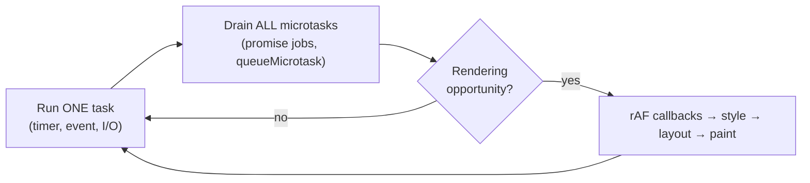
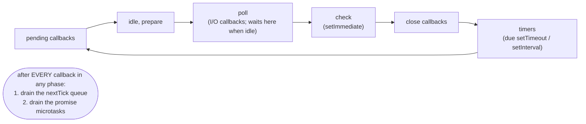
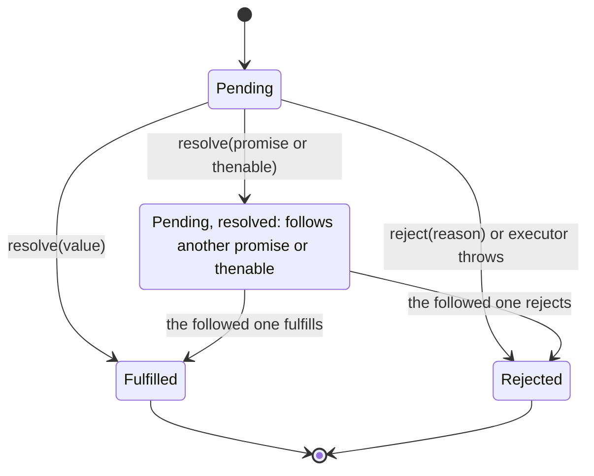
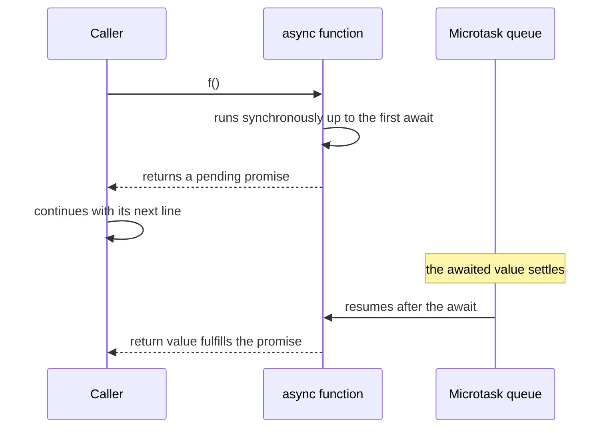
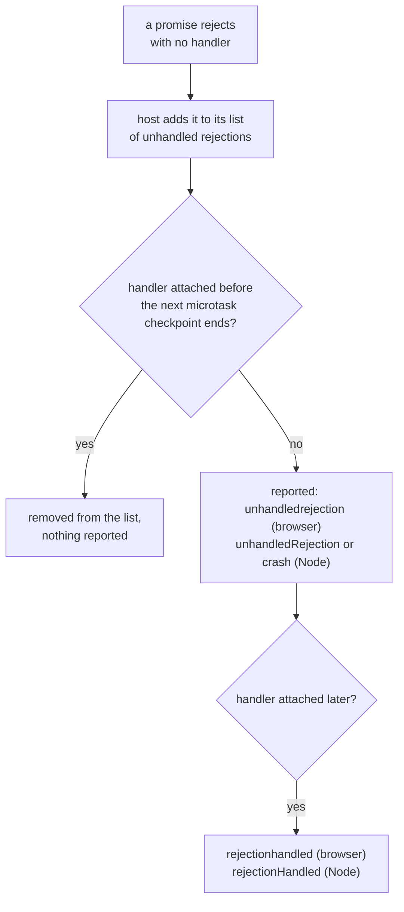

# 04. The event loop and asynchronous JavaScript

> **What this covers:** how one JavaScript thread interleaves timers, network responses, promise callbacks and rendering, as defined by the HTML Standard, ECMA-262 and Node.js. Then the tools built on that model: promises and their combinators, `async`/`await`, async iteration, cancellation with `AbortController`, and the failure modes (unhandled rejections, starvation). By the end you can predict the output of any ordering puzzle an interviewer writes and explain *why*, step by step.
> **Prerequisites:** [02. Closures](02-js-scope-closures-this.md#3-closures) (callbacks that outlive their caller, captured state in timers and listeners)
> **Leads to:** [05. Modules, memory and modern features](05-js-modules-memory-modern-features.md), [09. Networking, storage and security](09-web-networking-storage-security.md), [21. Change detection](21-change-detection.md), [22. RxJS foundations](22-rxjs-foundations.md)
> **Applies to:** ECMAScript 2026, the HTML Living Standard, Node.js 24, TypeScript 6.0
> **Study time:** ~3 hours reading + ~3 hours exercises
> **Short on time:** read [1. The event loop](#1-the-event-loop-tasks-microtasks-and-rendering), [3. Promises](#3-promises-from-callbacks-to-a-state-machine) and [5. `async` and `await`](#5-async-and-await), then drill [Q04.03](#q04-03), [Q04.04](#q04-04), [Q04.12](#q04-12), [Q04.18](#q04-18), [Q04.20](#q04-20) and [Q04.26](#q04-26), and finish with the [Summary](#summary).
> **Labs:** [`labs/ts-js/src/modules/04-js-async-event-loop/`](../labs/ts-js/src/modules/04-js-async-event-loop/) (exercises) and [`labs/ts-js/src/outputs/04-js-async-event-loop/`](../labs/ts-js/src/outputs/04-js-async-event-loop/) (every *Output* question). Run (from `labs/ts-js`, Node 24): `npx vitest run src/modules/04-js-async-event-loop src/outputs/04-js-async-event-loop`

## Contents

1. [The event loop: tasks, microtasks and rendering](#1-the-event-loop-tasks-microtasks-and-rendering)
2. [Node's event loop and why it matters for SSR](#2-nodes-event-loop-and-why-it-matters-for-ssr)
3. [Promises: from callbacks to a state machine](#3-promises-from-callbacks-to-a-state-machine)
4. [Combinators and helpers](#4-combinators-and-helpers)
5. [`async` and `await`](#5-async-and-await)
6. [Async iteration](#6-async-iteration)
7. [Cancellation with `AbortController`](#7-cancellation-with-abortcontroller)
8. [Unhandled rejections, `queueMicrotask` and starvation](#8-unhandled-rejections-queuemicrotask-and-starvation)
- [Summary](#summary)
- [Question bank](#question-bank)
- [Hands-on exercises](#hands-on-exercises)
- [Check your understanding](#check-your-understanding)
- [Connections](#connections)

**How the claims here are verified.** Every ordering in an *Output* question is asserted by a test in the labs, run on Node 24. Browser-only behavior (rendering, `requestAnimationFrame`, `requestIdleCallback`, real user clicks) cannot run there, so it is taught from the HTML Standard and cited, never presented as observed.

---

## 1. The event loop: tasks, microtasks and rendering

### The problem it solves

JavaScript in a page runs on **one thread** that it shares with style calculation, layout and painting. If code waited for a network response by blocking that thread, the page would freeze: no clicks, no scrolling, no animation. The language therefore never blocks on I/O. Instead, the *host* (the browser or Node.js) does the waiting and later **queues a callback**. Something has to decide which queued callback runs next, and when the screen gets a chance to update in between. That something is the **event loop** ([Q04.01](#q04-01)).

Without a precise model of it you get real bugs: a spinner that never appears because the work that should follow it runs before the browser paints, a "fix" with `setTimeout(fn, 0)` that works on one machine and not another, or a test that passes only because of an accidental extra tick.

### Mental model

Picture a cook (the thread) in a restaurant:

- The **call stack** is what the cook is doing right now. Nothing interrupts it.
- **Task queues** are order tickets: a timer fired, a click arrived, a response came back. The cook takes **one** ticket at a time.
- The **microtask queue** is the cook's "finish this first" list: promise callbacks and `queueMicrotask` jobs. After every ticket, the cook clears this list **completely**, including anything added to it while clearing it ([Q04.05](#q04-05)).
- **Rendering** is plating: at most once per display frame, between tickets, and only when there is something new to show.



What to notice: microtasks are not "small tasks". They are a separate queue that is always emptied before the loop moves on, which is why they run before any timer.

### How it actually works

Two specifications share the work. **ECMA-262** (the language) defines *jobs*: when a promise settles, it asks the host to enqueue a *promise job* ([HostEnqueuePromiseJob](https://tc39.es/ecma262/#sec-hostenqueuepromisejob)). The language itself has no timers, no events and no rendering. The **HTML Standard** defines the browser's [event loop](https://html.spec.whatwg.org/multipage/webappapis.html#event-loop-processing-model) and maps promise jobs onto its *microtask queue*. Its processing model, simplified:

1. Pick a task queue that has a runnable task. The choice between queues is *implementation-defined*: the spec says "task queues are sets, not queues", so a browser may prioritize input events over timers. Order is guaranteed only **within** one task source (two timers, two messages on one port).
2. Run the oldest runnable task from that queue to completion.
3. **Perform a microtask checkpoint**: run microtasks until the queue is empty. Microtasks queued during the checkpoint run in the same checkpoint.
4. In the current spec, rendering is itself queued as a task on the *rendering task source* when the page has a **rendering opportunity** (typically once per display refresh, about 16.7 ms at 60 Hz; the spec leaves the exact model to the browser, naming refresh rate, page performance and visibility as factors, so hidden or slow pages get fewer). The "update the rendering" steps then run, in this order: resize and scroll steps, media queries, CSS animations and their events, fullscreen, **animation frame callbacks** (`requestAnimationFrame`), then style recalculation and layout (with `ResizeObserver` callbacks looping back into layout), intersection observations, and finally paint. A document with no visible change and no rAF callbacks may skip the whole step.
5. When the loop has nothing urgent to do, it may start an *idle period*. The HTML Standard only computes the deadline and calls "start an idle period"; `requestIdleCallback` itself is defined by the W3C [Cooperative Scheduling of Background Tasks](https://w3c.github.io/requestidlecallback/) spec, and it is not universal: Chrome 47+ and Firefox 55+ ship it, Safari only in Technology Preview behind a flag (MDN compatibility data, read 2026-10-06). Feature-detect it and fall back to `setTimeout`.

There is a second microtask checkpoint that interviewers love: the spec's *clean up after running script* step performs a checkpoint **whenever the JavaScript stack becomes empty**. When the browser dispatches a real click to two listeners, it calls each listener from an empty stack, so microtasks queued by the first listener run *before* the second listener. When your own code calls `element.click()` or `dispatchEvent()`, your code is still on the stack, so all listeners run first and the microtasks run afterwards ([Q04.06](#q04-06)).

**Timers are not precise.** `setTimeout(fn, 0)` means "queue a task after at least 0 ms". The HTML [timer initialization steps](https://html.spec.whatwg.org/multipage/timers-and-user-prompts.html#timers) also say: "If nestingLevel is greater than 5, and timeout is less than 4, then set timeout to 4." Deeply nested timers are therefore clamped to 4 ms. The same steps let the browser "optionally, wait a further implementation-defined length of time", which is how browsers throttle background tabs. A timer can only fire when the stack is empty and earlier tasks are done, so the delay is a minimum, never a promise.

**Which API queues what** ([Q04.02](#q04-02)). A `MessageChannel` is a pair of connected ports: a message posted on one arrives as a task on the other.

| Queues a **task** (macrotask) | Queues a **microtask** | Runs in **rendering** |
|---|---|---|
| `setTimeout`, `setInterval`, UI events, `MessageChannel` messages, network and I/O callbacks, `postMessage`, `IntersectionObserver` callbacks | `Promise.prototype.then`/`catch`/`finally` reactions, `await` continuations, `queueMicrotask`, `MutationObserver` callbacks | `requestAnimationFrame`, `ResizeObserver` callbacks |

> [!NOTE]
> **Framework vs platform.** The *language* gives you promises, `async`/`await` and the job queue. The *host* gives you everything else: `setTimeout`, `queueMicrotask`, events, `fetch`, `AbortController` and the event loop itself (the HTML Standard in browsers, libuv (the C library that runs Node's loop and its I/O) plus Node's own queues on the server). Angular adds nothing to the loop. Before v21, Angular apps used [zone.js](../GLOSSARY.md#zonejs), a library that monkey-patches these host scheduling APIs so the framework learns when a task or microtask finished and can run change detection. Zoneless Angular [Changed in v21: zoneless is the default for new apps] instead relies on signals and explicit notifications. How zone.js patches each API, and why `onMicrotaskEmpty` exists, is taught in [21. Change detection](21-change-detection.md).

### Code

The spinner bug from the opening: showing the spinner and doing the heavy work happen in one task, so no rendering opportunity falls between them. The approach: let one frame paint before the work starts, by queuing the work as a task from inside `requestAnimationFrame`.

```ts
// Partial: browser only; spinner is an element, buildReport() is ~300 ms of synchronous work
spinner.hidden = false;
buildReport(); // same task: the browser never paints the spinner
spinner.hidden = true;

// Fix: rAF runs just before this frame's paint, and the timer task it queues runs after that paint
spinner.hidden = false;
requestAnimationFrame(() =>
  setTimeout(() => {
    buildReport();
    spinner.hidden = true;
  }, 0),
);
```

`await Promise.resolve()` before `buildReport()` would not help, because a microtask runs before any rendering opportunity. This snippet is not run in the lab (it needs a browser that renders); the order follows the processing model above. The plain ordering drill is [Q04.03](#q04-03).

### Best practices and anti-patterns

- **Do use `requestAnimationFrame` for visual updates**, because it runs right before style and layout in the frame that will paint them. A `setTimeout` may fire twice in one frame or just after a paint, which causes jank.
- **Avoid long synchronous tasks** (over about 50 ms). Nothing else, including input handling and paint, can run until they finish. Split the work across tasks or move it to a Web Worker, a script that runs on its own thread and talks to the page by messages ([31. Performance](31-performance.md)).
- **Do treat `setTimeout(fn, 0)` as "after the current task and its microtasks"**, not as "now". It is a legitimate way to yield to rendering and input, but never a synchronization tool between two pieces of your own code.
- **Avoid relying on ordering between different task sources** (a timer versus a message versus a click). The spec lets browsers choose between queues.

### Misconceptions and traps

- *"`setTimeout(fn, 0)` runs immediately after the current line."* It runs after the current task, after every microtask, possibly after a render, and possibly 4 ms or more later. The myth comes from reading `0` as "now".
- *"Promises are asynchronous, so they are just faster timers."* Promise reactions are microtasks. A chain of them can run thousands of steps before the next timer or paint ([Q04.28](#q04-28)). The myth comes from both being written as "later" in the code.
- *"The browser renders after every task."* It renders only at rendering opportunities, and skips the step when nothing changed. Several tasks can run between two frames. The myth comes from DevTools traces, where one long task is often followed by a paint.
- *"`requestAnimationFrame` is a task."* It is a step of "update the rendering", so its callbacks all run in one batch, before layout, and never in a hidden tab that has no rendering opportunities. The myth comes from the API looking like `setTimeout` with the delay left out.

---

## 2. Node's event loop and why it matters for SSR

### The problem it solves

Angular's server-side rendering (SSR: running the app in Node to send finished HTML), its build tools and most of its tests run on Node.js, and Node's loop is not the browser's. It has no rendering step, it has two extra scheduling APIs (`process.nextTick` and `setImmediate`), and on a server one blocked loop stalls **every** request, not one tab.

### Mental model

Node's loop is a **round of fixed stations**. Each station has its own queue of callbacks. Between any two callbacks, Node empties two "VIP" queues: first the `nextTick` queue, then the promise microtask queue.



What to notice: the phases form a cycle, so "which runs first" depends on where the loop is when you schedule. `check` comes straight after `poll`, which is why `setImmediate` wins inside an I/O callback, and the two VIP queues run between callbacks, not once per lap.

### How it actually works

The [Node.js event loop guide](https://nodejs.org/en/learn/asynchronous-work/event-loop-timers-and-nexttick) lists six phases that repeat as a cycle: **pending callbacks** (some deferred system errors), **idle, prepare** (internal), **poll** (retrieve I/O events and run their callbacks, and wait here if nothing else is pending), **check** (`setImmediate` callbacks), **close callbacks** (for example a socket's `close`) and **timers** (`setTimeout`/`setInterval` callbacks that are due). [Changed in Node 20: libuv 1.45 runs timers after poll in each iteration; they used to run first. Timers still run once before the first iteration, which is why older articles start the list with them.] The guide adds that this "can affect the timing of setImmediate() callbacks and how they interact with timers".

- `process.nextTick(fn)` is not a phase. Per the guide, "the `nextTickQueue` will be processed after the current operation is completed, regardless of the current phase of the event loop". After each callback, Node runs the whole nextTick queue, then the promise microtask queue ([Q04.08](#q04-08)).
- **The ES module exception.** The [`process.nextTick` docs](https://nodejs.org/api/process.html#processnexttickcallback-args) warn that in an ES module the top-level code is itself evaluated as part of the microtask queue, so at the top level of an `.mjs` file `queueMicrotask` and promise callbacks run **before** `nextTick` callbacks, the reverse of CommonJS.
- **`setImmediate` versus `setTimeout(fn, 0)`.** From the main module their order is non-deterministic (it depends on how long process start-up took). Inside an I/O callback `setImmediate` always runs first, because the check phase follows the poll phase directly.

**Why it matters for SSR.** A server render runs your components, resolvers and services in Node:

1. **CPU-bound work blocks all users.** A 200 ms synchronous loop in a component delays every concurrent request on that process.
2. **The server must know when the page is "done".** Pending timers, open HTTP calls and long-polling keep the render waiting. Angular tracks this through its stability and pending-task mechanisms ([21. Change detection](21-change-detection.md), [32. SSR, SSG and hydration](32-ssr-ssg-hydration.md)). A `setInterval` started during render can keep it from ever completing.
3. **Browser-only scheduling APIs do not exist there.** `requestAnimationFrame` and `requestIdleCallback` are absent in Node, so code that calls them during render must be guarded or moved to browser-only hooks ([20. Lifecycle and render hooks](20-lifecycle-and-render-hooks.md)).

### Code

The I/O case from the `setImmediate` bullet. The approach: schedule both callbacks from inside an I/O callback, which runs in the poll phase.

```ts
// Partial: Node only; readFile is from node:fs and path is any readable file
readFile(path, () => {
  setTimeout(() => console.log('timeout'), 0);
  setImmediate(() => console.log('immediate'));
});
// immediate, timeout: check comes right after poll, and the timer can only run in a later timers phase
```

Verified: the `Section 2:` test in [`node-event-loop.test.ts`](../labs/ts-js/src/outputs/04-js-async-event-loop/node-event-loop.test.ts) runs it 20 times. The `nextTick` order inside a timer callback is [Q04.08](#q04-08).

### Best practices and anti-patterns

- **Prefer `queueMicrotask` over `process.nextTick` in code that also runs in browsers**, because only the former exists in both. Node's [process docs](https://nodejs.org/api/process.html#when-to-use-queuemicrotask-vs-processnexttick) go further: for most userland code `queueMicrotask()` "provides a portable and reliable mechanism" and "should be favored over `process.nextTick()`".
- **Avoid recursive `process.nextTick`**, because the nextTick queue is drained completely before I/O, so it starves the loop exactly like recursive microtasks ([section 8](#8-unhandled-rejections-queuemicrotask-and-starvation)).
- **Do move CPU-heavy work off the request path** (a worker thread, a queue, or precomputation at build time), because one blocked loop is a blocked server.

### Misconceptions and traps

- *"`nextTick` runs on the next tick of the loop."* It runs before the loop continues at all. `setImmediate` is the one that waits for the next check phase. The names are historically backwards.
- *"Node and the browser have the same event loop."* They share the task/microtask contract, which is what promise-ordering puzzles test. Phases, `nextTick`, `setImmediate` and the absence of rendering are Node-specific. The myth comes from the same puzzles giving the same answers in both, as long as only promises and timers are involved.

---

## 3. Promises: from callbacks to a state machine

### The problem it solves

Before promises, asynchronous APIs took callbacks: `readFile(path, (err, data) => …)`. That style has three structural problems. **Inversion of control**: you hand your continuation to someone else's code, which might call it twice, never, or synchronously. **No composition**: sequencing, parallelism and error handling are hand-written each time (the "pyramid of doom"). **Lost errors**: an exception thrown inside a callback does not reach the caller's `try`/`catch`, so every level must check `err` by hand ([Q04.09](#q04-09)).

### Mental model

A promise is a **receipt for a future value**. It starts *pending* and changes state exactly once, to *fulfilled* (with a value) or *rejected* (with a reason). Whoever holds the receipt can attach reactions at any time, before or after it settles, and each reaction runs exactly once, always asynchronously.



What to notice: the first arrow out of `Pending` locks the fate, so every later `resolve`/`reject` is ignored. A *thenable* is any object with a callable `then` method. `Following` is still *pending* by state, which is why "resolved" and "fulfilled" are not synonyms.

### How it actually works

- **States and fates.** ECMA-262 distinguishes *state* (pending, fulfilled, rejected) from *fate*. A promise is *resolved* once its fate is locked in: it was settled, or it was resolved **with another promise or thenable** and now follows it. A resolved promise can therefore still be pending. Later calls to `resolve`/`reject` are ignored, and so is a `throw` in the executor after `resolve` ([Q04.10](#q04-10)).
- **The executor runs synchronously.** `new Promise(executor)` calls the executor immediately. Only the reactions are deferred.
- **Reactions are always microtasks**, even on an already-settled promise. This removes "sometimes sync, sometimes async" APIs (nicknamed "releasing Zalgo"), so code after `.then(…)` always runs before the callback.
- **`then` returns a new promise**, resolved with whatever the handler returns. Returning a value fulfills it, throwing rejects it, and returning a promise makes it follow that promise. A missing handler passes the value or reason through, which is why one `catch` at the end handles errors from any step ([Q04.11](#q04-11)).
- **Thenables.** `resolve(x)` checks whether `x` is an object with a callable `then`. If so, it queues a [NewPromiseResolveThenableJob](https://tc39.es/ecma262/#sec-newpromiseresolvethenablejob), which calls `x.then(resolve, reject)` in a later microtask. Resolving with a promise therefore costs **two extra ticks** ([Q04.12](#q04-12)). `Promise.resolve(p)` is different: when `p` is already a native promise from the same constructor, it returns `p` itself.
- **`finally(fn)`** runs `fn` with no argument and passes the original value or reason through, unless `fn` throws or returns a rejected promise.

### Code

Wrapping a callback API is the one legitimate use of `new Promise`. The approach: call the callback API inside the executor, and map its two outcomes to `resolve` and `reject`. [Exercise 04.1](#ex04-1) applies this to `setTimeout` with cancellation.

```ts
// Partial: `legacyRead` is any Node-style (err, data) callback API
function readText(path: string): Promise<string> {
  return new Promise((resolve, reject) => {
    legacyRead(path, (error: Error | null, data?: string) => {
      if (error) reject(error);
      else resolve(data ?? '');
    });
  });
}
```

> [!TIP]
> **Coming from the backend.** A promise is close to Java's `CompletableFuture`. `then` returning a plain value is `thenApply`, `then` returning a promise is `thenCompose` (promises flatten automatically), `catch` is `exceptionally`, and `Promise.all`/`race` resemble `allOf`/`anyOf`. **Where the analogy breaks:** there is only one thread, so continuations never run in parallel and need no synchronization, but CPU-bound work in any of them freezes everything. A `CompletableFuture` callback on an already-completed future runs synchronously on the calling thread, while a promise reaction is always deferred to a microtask. Promises have no `cancel()` and no executor or thread pool to choose. Java 21's **virtual threads** let blocking-style code scale because the JVM parks the thread. `await` gives similar readability, but it is explicit: only `async` functions can use it, and every caller up the chain must deal with the returned promise.

### Best practices and anti-patterns

- **Do return promises from `then` handlers** instead of nesting `.then` inside `.then`, because a returned promise joins the chain and its errors reach the final `catch`.
- **Avoid wrapping an existing promise in `new Promise`** (the explicit-construction anti-pattern, [Q04.13](#q04-13)), because it adds code, and it loses rejections when the wrapper forgets to forward them.
- **Do always end a chain with error handling, or return it to a caller who handles it**, because an unhandled rejection crashes a Node process by default ([section 8](#8-unhandled-rejections-queuemicrotask-and-starvation)).
- **Do reject with `Error` objects**, because they carry a stack trace. `reject('failed')` gives the catcher a string and no location.

### Misconceptions and traps

- *"Resolved means fulfilled."* A promise resolved with a pending promise is still pending, and one resolved with a rejected promise ends up rejected.
- *"`new Promise` makes code asynchronous."* The executor runs synchronously. A CPU-heavy executor blocks just like any other function call. The myth comes from seeing `new Promise` almost only around callback APIs that are asynchronous themselves.
- *"`catch` stops the chain."* `catch` returns a new promise fulfilled with its handler's return value, so the chain continues as recovered ([Q04.11](#q04-11)). The myth comes from `try`/`catch`, where nothing after the `catch` block belongs to the failed operation.

---

## 4. Combinators and helpers

### The problem it solves

Real code waits for several things: load a user and their settings in parallel, take the fastest mirror, try several sources until one works, report which of ten uploads failed. Writing that with counters and flags is error-prone. The four combinators encode the four useful policies.

### Mental model

Each combinator answers two questions: **when do I settle**, and **what do I do with failures**?

| Combinator | Fulfills when | Rejects when | Empty input |
|---|---|---|---|
| `Promise.all` | all fulfill (array of values, in input order) | the **first** rejection (fail-fast) | fulfills with `[]` |
| `Promise.allSettled` (ES2020) | all settle (array of `{status, value \| reason}`) | never | fulfills with `[]` |
| `Promise.race` | the first to settle fulfills | the first to settle rejects | stays pending forever |
| `Promise.any` (ES2021) | the **first** fulfillment | all reject, with an `AggregateError` (ES2021) whose `errors` holds every reason | rejects with an `AggregateError` |

### How it actually works

- Every combinator calls the constructor's `resolve` (`Promise.resolve` for native promises) on each element (so plain values and thenables are accepted) and attaches handlers to **all** of them synchronously. A rejection in an input is therefore always "handled", even after the combinator has settled.
- **Fail-fast does not cancel.** When `Promise.all` rejects, the other operations keep running, their results are discarded, and their side effects still happen ([Q04.15](#q04-15)). Stopping them needs a shared `AbortSignal` ([section 7](#7-cancellation-with-abortcontroller)).
- **Results keep input order**, not completion order, because each element's handler writes to its own index.
- **`Promise.withResolvers()`** (ES2024) returns `{ promise, resolve, reject }`. It replaces the pattern of declaring `let resolve` outside an executor, which TypeScript cannot prove is assigned. Use it when the code that settles the promise lives somewhere else, such as an event handler or a test.
- **`Promise.try(fn, ...args)`** (ES2025) calls `fn` synchronously and returns a promise of its result. A synchronous `throw` becomes a rejection instead of an exception, so one `.catch` handles both kinds of failure. Unlike `Promise.resolve().then(fn)`, it does not delay `fn` by a tick. Both helpers are compared in [Q04.17](#q04-17).

Edition years come from the [TC39 finished-proposals list](https://github.com/tc39/proposals/blob/main/finished-proposals.md). All of them run on Node 24, and per MDN's compatibility data (read 2026-10-06) in current browsers: `Promise.withResolvers` since Chrome 119, Firefox 121 and Safari 17.4; `Promise.try` since Chrome 128, Firefox 134 and Safari 18.2; `Array.fromAsync` since Chrome 121, Firefox 115 and Safari 16.4.

### Code

`Promise.withResolvers` is how the labs control promises from tests. The approach: create the deferred, hand out its promise, and settle it later from the test.

```ts
// Excerpt of labs/ts-js/src/modules/04-js-async-event-loop/latest-only.test.ts
function controllableSearch() {
  const calls: { query: string; signal: AbortSignal; deferred: PromiseWithResolvers<string[]> }[] = [];
  const search = (signal: AbortSignal, query: string): Promise<string[]> => {
    const deferred = Promise.withResolvers<string[]>();
    calls.push({ query, signal, deferred });
    return deferred.promise;
  };
  const call = (index: number) => {
    const found = calls[index];
    if (!found) throw new Error(`call ${index} was never made`);
    return found;
  };
  return { search, calls, call };
}
```

### Best practices and anti-patterns

- **Do use `Promise.all` for independent work that must all succeed**, because it runs everything concurrently and fails as soon as the outcome is known.
- **Do use `allSettled` when partial success is meaningful** (a dashboard with independent widgets, a batch upload report), because `all` throws away every successful result on one failure.
- **Avoid `Promise.race` for timeouts without cleanup**: the losing timer and the losing operation keep running ([Q04.26](#q04-26)). Prefer `AbortSignal.timeout`.
- **Avoid `Promise.all` over thousands of items**, because it starts them all at once. Use a concurrency limit ([Exercise 04.2](#ex04-2)).

### Misconceptions and traps

- *"`Promise.all` runs the promises in parallel."* Promises do not run. The operations started **when you created them**, and `all` only waits. `Promise.all(ids.map(load))` is concurrent because `map` started every `load` call. The myth comes from the name, and from the idiom always appearing with `map`.
- *"`race` returns the first success."* It returns the first *settlement*, failure included. That is `any` ([Q04.16](#q04-16)). The myth comes from the name: a race suggests a winner, and a failure does not sound like winning.

---

## 5. `async` and `await`

### The problem it solves

Promise chains fixed composition but not readability: loops, conditionals and `try`/`catch` across asynchronous steps still turn into nested callbacks. `async`/`await` (ES2017) lets you write asynchronous code with ordinary control flow while keeping the non-blocking model.

### Mental model

An `async` function (ES2017) is a **pausable function**. It runs synchronously until its first `await`, then returns a pending promise to its caller. Each `await` parks the function and schedules the rest of it as a microtask when the awaited value settles. A `return` fulfills the function's promise, and a `throw` rejects it.



What to notice: the caller gets control back at the first `await`, not at the end of the function, and the rest of the body comes back as a microtask, so it runs before any timer that was already queued.

### How it actually works

- **Desugaring.** Conceptually, an async function is a generator driven by promises: each `await x` is `yield x`, and a driver calls `next(value)` or `throw(reason)` from a `.then` handler. TypeScript emits exactly that (with a helper) when compiling to targets older than ES2017.
- **The cost of `await`.** The spec's [Await](https://tc39.es/ecma262/#await) calls `PromiseResolve(value)`, which returns a native promise unchanged, then attaches a reaction. Awaiting a native promise or a plain value therefore costs **one** microtask. Before a 2019 spec change, which V8 shipped in 7.2 (Chrome 72, Node 12) and describes in the article [Faster async functions and promises](https://v8.dev/blog/fast-async), it cost three, which is why old blog posts give different answers to [Q04.04](#q04-04).
- **`return promise` versus `return await promise`.** Returning a promise from an async function *resolves* the function's promise with it, which costs the two extra thenable ticks of [section 3](#3-promises-from-callbacks-to-a-state-machine). More importantly, inside `try`, only `return await` lets the `catch` see the rejection ([Q04.18](#q04-18)).
- **Sequential versus parallel.** `const a = await f(); const b = await g();` runs `g` only after `f` finished. If they are independent, start both and then wait: `const [a, b] = await Promise.all([f(), g()]);` ([Q04.20](#q04-20)).
- **Errors.** A `throw` before the first `await` still produces a rejected promise, never a synchronous exception, because the whole body runs inside the promise machinery.
- **Top-level `await`** (ES2022) works only in modules. A module that awaits at the top level delays the evaluation of every module that imports it, until the awaited promise settles ([Q04.21](#q04-21)).

### Code

Two independent requests, written three ways. The approach: start every independent operation before awaiting any of them, and let one combinator own the error handling.

```ts
// Partial: loadUser and loadSettings return promises
async function slow(id: string) {
  const user = await loadUser(id); // waits ~200 ms
  const settings = await loadSettings(id); // only then starts, another ~200 ms
  return { user, settings };
}

async function fast(id: string) {
  const [user, settings] = await Promise.all([loadUser(id), loadSettings(id)]); // ~200 ms total
  return { user, settings };
}
```

The third way, `const u = loadUser(id); const s = loadSettings(id); return { user: await u, settings: await s };`, is concurrent too, but if `s` rejects while `await u` is still pending, nothing is listening to `s` yet. Node reports it as an unhandled rejection. `Promise.all` attaches handlers to both at once.

### Best practices and anti-patterns

- **Do start independent work before awaiting it**, because sequential awaits add the latencies together. This is the most common performance bug in async code.
- **Avoid `array.forEach(async …)`**, because `forEach` ignores the returned promises: nothing waits and nothing catches ([Q04.19](#q04-19)). Use `for…of` with `await` for sequential work, or `Promise.all(array.map(…))` for concurrent work.
- **Do write `return await` inside `try` blocks**, because otherwise the rejection escapes the `catch` and `finally` runs too early.
- **Avoid `async` on functions that never `await`** unless you want the promise wrapper, because it turns synchronous exceptions into rejections that callers may not expect.

### Misconceptions and traps

- *"`await` blocks the thread."* It suspends only the current function. The caller continues immediately with a pending promise, and the event loop keeps running. The myth comes from the code reading like a blocking call in Java or C#.
- *"An async function runs asynchronously from its first line."* Everything before the first `await` runs synchronously, during the call ([Q04.04](#q04-04)).
- *"`return await` is redundant."* Outside `try` it mostly is (one tick of difference). Inside `try`/`catch`/`finally` it changes behavior. The myth comes from lint rules and style guides that once flagged every `return await` as a wasted tick.
- *"Every `await` costs three microtask ticks."* Once true: the original spec wrapped every awaited value in a new promise, so even awaiting a native promise took three ticks, until V8 7.2 / Chrome 72 and Node 12 (the first Node line on V8 7.2 or later; Node 11 shipped V8 7.0). Now: one tick for a native promise or a plain value [Changed in ES2019: the normative PR "Reduce the number of ticks in async/await", merged into ECMA-262 in February 2019]. Puzzle answers written before 2019 differ for this reason ([Q04.04](#q04-04)).

---

## 6. Async iteration

### The problem it solves

Some data arrives as a **sequence over time**: pages of an API, lines of a stream, messages from a socket. A promise gives you one value. An array of promises makes you start everything up front. You need a pull-based sequence where each next item may take time.

### Mental model

An **async iterator** (ES2018, with `for await…of`) is an iterator whose `next()` returns a *promise* of `{ value, done }`. `for await…of` calls `next()`, awaits the result, runs the body, and repeats. The consumer pulls, so a slow consumer naturally slows the producer down (backpressure).

### How it actually works

- An object is async-iterable if it has a `[Symbol.asyncIterator]()` method. **Async generators** (`async function*`, ES2018) produce such iterators: they can both `await` and `yield`.
- `for await` also accepts **sync iterables** and awaits each element, so `for await (const x of [p1, p2])` works, but it awaits them one at a time.
- **Early exit calls `return()`**. A `break`, `return` or `throw` in the loop body calls the iterator's `return()` method, which runs the generator's `finally` blocks. That is how a stream reader releases its lock or closes its socket ([Q04.22](#q04-22)).
- **`Array.fromAsync(input, mapFn?)`** (ES2026) collects an async iterable (or a sync iterable of promises) into an array. Per its [proposal README](https://github.com/tc39/proposal-array-from-async), it awaits **sequentially**, and it is not a replacement for `Promise.all`: "Just like with `for await`, Array.fromAsync will **not** catch any rejections by the input's promises whenever those rejections occur **before** the ticks in which Array.fromAsync's iteration reaches those promises."

### Code

Paging an API is the textbook async generator. The approach: loop while there is a next page, yield each item, and let the consumer decide when to stop.

```ts
// Partial: Item and fetchPage(cursor): Promise<{ items: Item[]; next: string | null }> are assumed
async function* allItems<T>(fetchPage: (cursor: string | null) => Promise<{ items: T[]; next: string | null }>) {
  let cursor: string | null = null;
  do {
    const page = await fetchPage(cursor);
    yield* page.items;
    cursor = page.next;
  } while (cursor !== null);
}

// Consumer: stops after 100 items. `break` calls return(), so no further page is fetched.
const firstHundred: Item[] = [];
for await (const item of allItems(fetchPage)) {
  firstHundred.push(item);
  if (firstHundred.length === 100) break;
}
const everything = await Array.fromAsync(allItems(fetchPage)); // all pages, fetched one after another
```

Iterator helpers such as `.take()` exist for *sync* iterators (ES2025), but async iterator helpers are a separate proposal that is not part of ES2026, so the consumer counts by hand.

### Best practices and anti-patterns

- **Do use `for await` for streams and paginated sources**, because it fetches only what the consumer uses and cleans up on `break`.
- **Avoid `for await` over an array of already-started promises**, because a later promise that rejects early goes unhandled. Use `Promise.all` or `allSettled` for that ([Q04.23](#q04-23)).
- **Do put cleanup in the generator's `finally`**, because it runs on normal completion, on `break`, and on errors thrown by the consumer.

### Misconceptions and traps

- *"`for await` runs the iterations in parallel."* It is strictly sequential: the next `next()` is not called until the body finishes. The myth comes from `await` inside `Promise.all`, which it resembles but does not do.
- *"RxJS Observables and async iterators are the same."* Observables *push* values at the producer's pace. Async iterators are *pulled* at the consumer's pace ([22. RxJS foundations](22-rxjs-foundations.md)). The myth comes from both being described as "streams of values".

---

## 7. Cancellation with `AbortController`

### The problem it solves

A user types "an", then "ang". The response for "an" arrives last and overwrites the correct results. A component is destroyed while its request is in flight. A retry loop keeps going after the user left the page. Promises cannot be cancelled: they are receipts, not handles to the work. You need a separate channel that tells the work to stop.

### Mental model

An `AbortController` is a **remote control with one button**. You keep the controller, and you hand its `signal` to every piece of work that should stop together. The work listens for the signal and cleans up. Pressing the button is idempotent: the first press counts and later presses do nothing.

### How it actually works

`AbortController` and `AbortSignal` are defined by the [WHATWG DOM Standard](https://dom.spec.whatwg.org/#interface-abortcontroller), not by ECMAScript, and Node implements them too.

- `controller.abort(reason?)` sets `signal.aborted` to `true`, stores `signal.reason` (a `DOMException` named `"AbortError"` when you pass no reason), and dispatches the `abort` event **synchronously**. A second call does nothing ([Q04.25](#q04-25)).
- `signal.throwIfAborted()` throws `signal.reason` if aborted. Call it at the start of each step of a long operation.
- `fetch(url, { signal })` rejects with `signal.reason` when aborted ([MDN: AbortSignal](https://developer.mozilla.org/en-US/docs/Web/API/AbortSignal)). Many other APIs accept a signal too, including `addEventListener` (removing the listener on abort) and streams.
- `AbortSignal.timeout(ms)` returns a signal that aborts after `ms` with a `DOMException` named `"TimeoutError"`. `AbortSignal.any([a, b])` (Node 20.3 and 18.17) returns a signal that aborts when any input does, with that input's reason. `AbortSignal.abort(reason)` returns an already-aborted signal. All three are in the TypeScript 6.0 DOM typings and in Node 24.
- **Cancellation is cooperative.** Aborting only *asks*. Your own async functions must accept a signal, pass it down, and check it.

Angular builds on the same contract. A `resource` loader receives an `abortSignal` and Angular aborts it when the request is superseded ([17. Signals](17-signals.md#6-resources-async-data-as-signals)), and RxJS's `switchMap` unsubscribes from the previous inner request, which `HttpClient` turns into an aborted HTTP call ([23. RxJS in depth](23-rxjs-in-depth.md)).

### Code

A search that combines user cancellation with a timeout. The approach: merge both reasons into one signal with `AbortSignal.any`, pass it to `fetch`, and tell the two failures apart by the reason's `name`. The rethrown error keeps the original in `cause` (ES2022).

```ts
// Partial: `controller` is aborted by the UI when a newer query arrives
async function search(query: string, controller: AbortController): Promise<unknown> {
  const signal = AbortSignal.any([controller.signal, AbortSignal.timeout(5_000)]);
  try {
    const response = await fetch(`/api/search?q=${encodeURIComponent(query)}`, { signal });
    return await response.json();
  } catch (error) {
    if (error instanceof DOMException && error.name === 'TimeoutError') throw new Error('Search timed out', { cause: error });
    throw error; // AbortError: superseded, usually ignored by the caller
  }
}
```

[Exercise 04.4](#ex04-4) packages "only the latest call wins" as a reusable function.

### Best practices and anti-patterns

- **Do accept an optional `signal` in every async function that does I/O or waits**, and pass it down, because cancellation only works if every layer forwards it.
- **Do remove abort listeners and clear timers when the work finishes normally**, because a long-lived signal otherwise accumulates listeners ([Exercise 04.1](#ex04-1)).
- **Do treat `AbortError` as an expected outcome**, not as an error to report, because a superseded request is normal behavior.
- **Avoid reusing an aborted controller**, because it stays aborted forever. Create a new one per operation.

### Misconceptions and traps

- *"`Promise.race` with a timeout cancels the slow operation."* It only stops *waiting* for it ([Q04.26](#q04-26)). The myth comes from HTTP clients whose `timeout` option does abort the request.
- *"Aborting a fetch guarantees the server did nothing."* The request may already have reached the server. Abort stops the client from waiting and frees its resources. Non-idempotent operations still need server-side protection such as idempotency keys ([41. API contracts](41-fullstack-api-contracts.md)). The myth comes from the browser's network panel, which shows the request as "cancelled".

---

## 8. Unhandled rejections, `queueMicrotask` and starvation

### The problem it solves

Two failure modes are specific to promise-based code. A rejection that nobody handles is an error that silently disappears, unless the host notices it. And because the microtask queue is drained completely, code that keeps queuing microtasks can stop the page from ever rendering or responding again.

### Mental model

The host keeps a list of rejected promises with no handler. After a microtask checkpoint, it reports whatever is still on the list. A handler attached later removes the promise and triggers a "handled after all" notification. For starvation, remember the cook: the "finish this first" list must be empty before the next ticket. A list that refills itself means no more tickets.



What to notice: "unhandled" is decided at a checkpoint, not at the moment of rejection, so a handler attached in the same synchronous code is always in time, and one attached after a `setTimeout` is too late.

### How it actually works

- **Browsers** fire an `unhandledrejection` event on the global object for a rejection still unhandled after a microtask checkpoint, and log it to the console. If a handler is attached later, they fire `rejectionhandled`. The page keeps running ([MDN: unhandledrejection](https://developer.mozilla.org/en-US/docs/Web/API/Window/unhandledrejection_event)).
- **Node** emits `process.on('unhandledRejection')`, and the default `--unhandled-rejections` mode is `throw` ([Node CLI docs](https://nodejs.org/api/cli.html#--unhandled-rejectionsmode)): with no listener, the rejection is raised as an uncaught exception and **the process exits**. On an SSR server, one forgotten `.catch` can take down the process ([Q04.27](#q04-27)).
- **`queueMicrotask(fn)`** (HTML Standard, also in Node) queues `fn` directly as a microtask without creating a promise. An exception thrown in `fn` is reported like any uncaught exception, not turned into a rejection. Use it when you need "after the current synchronous code, before any task", for example to batch several synchronous updates into one notification.
- **Starvation.** The HTML Standard notes that "scheduling a lot of microtasks has the same performance downsides as running a lot of synchronous code. Both will prevent the browser from doing its own work, such as rendering" ([HTML: microtask queuing](https://html.spec.whatwg.org/multipage/timers-and-user-prompts.html#microtask-queuing)). A self-rescheduling microtask or a promise chain that never waits for a task is effectively an infinite loop ([Q04.28](#q04-28)). Rescheduling with `setTimeout` or `MessageChannel` instead yields to the loop between steps.

### Code

Batching with `queueMicrotask`: several synchronous calls in the same task produce one flush. The approach: queue a flush only when none is pending, and collect work until it runs.

```ts
// Partial: notify() delivers a batch to listeners
const pending: string[] = [];
let scheduled = false;

function enqueue(change: string): void {
  pending.push(change);
  if (scheduled) return;
  scheduled = true;
  queueMicrotask(() => {
    scheduled = false;
    notify(pending.splice(0));
  });
}
```

Verified: the `Section 8:` test in [`event-loop.test.ts`](../labs/ts-js/src/outputs/04-js-async-event-loop/event-loop.test.ts) enqueues three changes and gets one batch. This is the same idea as a signal effect running once for several writes ([17. Signals](17-signals.md#4-effects)), although Angular schedules effects through its own scheduler.

### Best practices and anti-patterns

- **Do register global last-resort handlers** (`unhandledrejection` in the browser, `process.on('unhandledRejection')` on the server) to log and report. Angular's `provideBrowserGlobalErrorListeners()`, which new v22 projects include, listens to the window's `unhandledrejection` and `error` events and forwards them to Angular's `ErrorHandler` (per its doc comment in the 22.2.1 typings) ([37. Elements, PWA and errors](37-elements-pwa-errors-ecosystem.md)).
- **Avoid using global handlers as the error strategy**, because by then the context (which request, which user action) is lost. Handle rejections where the promise is created or awaited.
- **Do break long loops of async work with a real task boundary** (`await new Promise(r => setTimeout(r, 0))` or the [`scheduler.yield()`](https://developer.mozilla.org/en-US/docs/Web/API/Scheduler/yield) API, in Chrome 129+ and Firefox 142+ but not Safari per MDN's compatibility data on 2026-10-06, so feature-detect `globalThis.scheduler?.yield`), because `await Promise.resolve()` does not yield to rendering or input.

### Misconceptions and traps

- *"`await` in a loop gives the browser a chance to render."* Only if the awaited thing waits for a task (a timer, I/O). Awaiting an already-resolved promise just queues a microtask. The myth comes from `await` *looking* like a pause, and from code that happens to await real I/O.
- *"An unhandled rejection is only a console warning."* Once true: up to Node 14 the default was a warning plus a deprecation notice. Now: since Node 15 the default `--unhandled-rejections` mode is `throw`, so an unhandled rejection with no `unhandledRejection` listener crashes the process ([Node.js CLI: `--unhandled-rejections`](https://nodejs.org/api/cli.html#--unhandled-rejectionsmode)). Browsers still only report it, through the `unhandledrejection` event and the console.

---

## Summary

One thread runs JavaScript, and the host does all the waiting ([1](#1-the-event-loop-tasks-microtasks-and-rendering)). Each turn of the event loop runs one task (a timer, an event, a network callback), then drains the **whole** microtask queue (promise reactions, `queueMicrotask`), then, at a rendering opportunity only, runs `requestAnimationFrame` callbacks, style, layout and paint. So a microtask always runs before the next timer, a long synchronous block or an endless microtask chain freezes the page, and `setTimeout(fn, 0)` means "after this task, its microtasks and maybe a frame", clamped to 4 ms once nested. Node ([2](#2-nodes-event-loop-and-why-it-matters-for-ssr)) keeps the same task/microtask contract but splits tasks into phases (timers, poll, check), adds `process.nextTick`, which runs before promise microtasks, and `setImmediate`, which runs in the check phase, and has no rendering; in SSR, blocking that one thread blocks every request. A promise ([3](#3-promises-from-callbacks-to-a-state-machine)) is a state machine that settles once: its executor runs synchronously, its reactions always run as microtasks, every `then` returns a new promise, and resolving with another promise adopts its state at the cost of extra ticks. The combinators ([4](#4-combinators-and-helpers)) only *wait*, they start nothing: `all` fails fast, `allSettled` never rejects, `race` takes the first settlement and `any` the first fulfilment, while `withResolvers` and `try` cover creation and synchronous throws.

`async`/`await` ([5](#5-async-and-await)) is promise chaining written as straight-line code: everything before the first `await` runs during the call, each `await` suspends only its own function, sequential awaits serialize independent work that `Promise.all` would overlap, and `return await` matters inside `try`. Async iteration ([6](#6-async-iteration)) pulls values one at a time with `for await`, is strictly sequential, and calls `return()` on early exit, so `finally` cleanup in an async generator runs. Promises cannot be cancelled, so cancellation is a separate signal ([7](#7-cancellation-with-abortcontroller)): an `AbortController` aborts its `AbortSignal` with a reason, APIs such as `fetch` honor it, `AbortSignal.timeout` and `AbortSignal.any` compose signals, and racing against a timer only stops waiting, never the work. Finally ([8](#8-unhandled-rejections-queuemicrotask-and-starvation)), a rejection nobody handles is reported by browsers and crashes Node by default, `queueMicrotask` schedules work before the next task without creating a promise, and awaiting an already-resolved promise yields only to the microtask queue, so a loop of them still starves timers and rendering.

---

## Question bank

<a id="q04-01"></a>
### Q04.01 · Concept · What is the event loop, and why does JavaScript need one?

<details>
<summary>Answer</summary>

**Short answer (30 seconds).** JavaScript runs your code on one thread that never blocks on I/O. The host (browser or Node) waits for timers, network and input, and queues callbacks. The event loop repeatedly takes one task, runs it to completion, drains the microtask queue, and, in a browser, renders when a frame is due.

**Full explanation.** The single thread is a design choice: the DOM is not thread-safe, and run-to-completion means no other JavaScript can interleave inside your function, so there are no data races on shared variables. The price is that a long task freezes everything. The loop is the host's scheduler. ECMA-262 defines only *jobs* (promise reactions). The HTML Standard defines the browser loop: task queues chosen in an implementation-defined order, a microtask checkpoint after each task, and an "update the rendering" step at rendering opportunities (rAF callbacks, style, layout, paint). Node implements the same task/microtask contract on top of libuv, with its own phases ([section 2](#2-nodes-event-loop-and-why-it-matters-for-ssr)).

**Follow-ups an interviewer will ask.**
- *Is JavaScript single-threaded?* Each agent (a page, a worker) runs JavaScript on one thread. Web Workers and Node worker threads add more agents, each with its own loop, communicating by messages.
- *Where does `await` fit?* Each continuation after `await` is a microtask.

**Trap to avoid.** Saying the event loop is part of the JavaScript language. It is defined by the host. ECMA-262 has no event loop, only jobs.

</details>

<a id="q04-02"></a>
### Q04.02 · Difference · What is the difference between a task (macrotask) and a microtask? Name the APIs that queue each.

<details>
<summary>Answer</summary>

**Short answer (30 seconds).** The loop runs **one** task per turn, then drains **all** microtasks, including microtasks queued while draining. Tasks: `setTimeout`, `setInterval`, UI events, I/O, `MessageChannel`. Microtasks: promise reactions, `await` continuations, `queueMicrotask`, `MutationObserver`.

**Full explanation.** The distinction exists for consistency: promise callbacks must run after the current code but before anything else can observe intermediate state, including the next event or a paint. So microtasks run at every checkpoint, which happens after each task and whenever the JavaScript stack becomes empty (between listeners of a real user event). Rendering can happen between two tasks but never between two microtasks. The HTML Standard calls tasks just "tasks". "Macrotask" is community vocabulary.

**Follow-ups an interviewer will ask.**
- *Is `requestAnimationFrame` a task or a microtask?* Neither. Its callbacks run inside the "update the rendering" step, before style and layout ([Q04.07](#q04-07)).
- *Do two different task queues have a guaranteed order?* No. Only tasks from the same source keep their order.

**Trap to avoid.** Saying microtasks are "higher priority tasks". They are a different mechanism: the queue is drained to empty, not sampled once per turn.

</details>

<a id="q04-03"></a>
### Q04.03 · Output · What does this print?

```ts
console.log('script start');
setTimeout(() => console.log('timeout'), 0);
Promise.resolve().then(() => console.log('then'));
queueMicrotask(() => console.log('microtask'));
console.log('script end');
```

<details>
<summary>Answer</summary>

**Short answer (30 seconds).** `script start`, `script end`, `then`, `microtask`, `timeout`. Synchronous code runs first. The two microtasks run in the order they were queued, when the stack empties. The timer is a task, so it waits for the next turn.

**Full explanation.** `setTimeout` hands a callback to the timer system, which queues a task after the delay. `Promise.resolve().then(fn)` queues `fn` as a microtask right away, because the promise is already fulfilled. `queueMicrotask` appends to the same microtask queue, so FIFO order puts `then` before `microtask`. Verified: `Q04.03` in [`event-loop.test.ts`](../labs/ts-js/src/outputs/04-js-async-event-loop/event-loop.test.ts). Background: [section 1](#1-the-event-loop-tasks-microtasks-and-rendering).

**Follow-ups an interviewer will ask.**
- *What if the `queueMicrotask` line came first?* Then `microtask` prints before `then`. Both use one FIFO queue.
- *Can the timer ever run before the promise callback?* No. Microtasks always drain before the loop picks the next task.

**Trap to avoid.** Treating `queueMicrotask` as "higher priority" than promises. They share one queue.

</details>

<a id="q04-04"></a>
### Q04.04 · Output · The classic: what does this print?

```ts
async function async1() {
  console.log('async1 start');
  await async2();
  console.log('async1 end');
}
async function async2() {
  console.log('async2');
}
console.log('script start');
setTimeout(() => console.log('setTimeout'), 0);
async1();
new Promise<void>((resolve) => {
  console.log('promise1');
  resolve();
}).then(() => console.log('promise2'));
console.log('script end');
```

<details>
<summary>Answer</summary>

**Short answer (30 seconds).** `script start`, `async1 start`, `async2`, `promise1`, `script end`, `async1 end`, `promise2`, `setTimeout`. Async functions and promise executors run synchronously until the first `await`. The `await` continuation was queued before `promise2`, so it runs first.

**Full explanation.** `async1()` logs, then calls `async2()`, which logs synchronously and returns an already-fulfilled promise. `await` on a native promise attaches a reaction directly, so `async1 end` is queued as microtask 1. The executor logs `promise1` synchronously, and `resolve()` plus `.then` queues `promise2` as microtask 2. After `script end`, the microtasks drain in order, then the timer task runs. Verified: `Q04.04` in [`event-loop.test.ts`](../labs/ts-js/src/outputs/04-js-async-event-loop/event-loop.test.ts). Background: [section 5](#5-async-and-await).

**Follow-ups an interviewer will ask.**
- *Old articles say `promise2` prints before `async1 end`. Why?* Engines before the 2019 spec change (V8 7.2, Chrome 72, Node 12) spent three ticks on every `await` ([V8: faster async functions](https://v8.dev/blog/fast-async)). Current engines spend one.
- *What if `async2` returned `new Promise(r => setTimeout(r, 0))`?* Then `async1 end` would print last, after `setTimeout`: the `await` now waits for a timer task that was queued after the first one.

**Trap to avoid.** Thinking `async1 start` waits for anything. The body before the first `await` runs during the call.

</details>

<a id="q04-05"></a>
### Q04.05 · Output · What does this print?

```ts
setTimeout(() => {
  console.log('timeout 1');
  Promise.resolve().then(() => console.log('then inside timeout 1'));
}, 0);
setTimeout(() => console.log('timeout 2'), 0);
Promise.resolve().then(() => {
  console.log('then 1');
  setTimeout(() => console.log('timeout 3'), 0);
  queueMicrotask(() => console.log('microtask inside then 1'));
});
```

<details>
<summary>Answer</summary>

**Short answer (30 seconds).** `then 1`, `microtask inside then 1`, `timeout 1`, `then inside timeout 1`, `timeout 2`, `timeout 3`. A microtask queued during the drain runs in the same drain. A microtask queued by a task runs before the next task.

**Full explanation.** After the script, the microtask queue holds `then 1`. Running it queues another microtask (same checkpoint, so it runs next) and a third timer, which goes behind the two existing timers. Then each timer is one task, and after `timeout 1` the checkpoint runs its promise callback before `timeout 2` starts. This is the rule that makes promise code inside an event handler finish before the next event. Verified: `Q04.05` in [`event-loop.test.ts`](../labs/ts-js/src/outputs/04-js-async-event-loop/event-loop.test.ts).

**Follow-ups an interviewer will ask.**
- *Could the browser render between `timeout 1` and `timeout 2`?* Yes, if a rendering opportunity falls between the two tasks. It can never render between `timeout 1` and its microtask.
- *Are the three timers guaranteed to fire in this order?* They share a task source and equal delays, so yes in practice, but nesting clamps and throttling can change actual delays.

**Trap to avoid.** Running all timers first and then all microtasks, as if microtasks were a lower-priority batch.

</details>

<a id="q04-06"></a>
### Q04.06 · Output · Two listeners each queue a microtask. What does this print, and would a real user click print the same?

```ts
const target = new EventTarget();
target.addEventListener('ping', () => {
  console.log('listener 1');
  queueMicrotask(() => console.log('microtask 1'));
});
target.addEventListener('ping', () => {
  console.log('listener 2');
  queueMicrotask(() => console.log('microtask 2'));
});
target.dispatchEvent(new Event('ping'));
console.log('after dispatch');
```

<details>
<summary>Answer</summary>

**Short answer (30 seconds).** `listener 1`, `listener 2`, `after dispatch`, `microtask 1`, `microtask 2`. `dispatchEvent` calls listeners synchronously while your script is on the stack, so no microtask checkpoint can happen until the script ends. A real user click on an element with two such listeners would print `listener 1`, `microtask 1`, `listener 2`, `microtask 2`.

**Full explanation.** The HTML Standard performs a microtask checkpoint in *clean up after running script* "if the JavaScript execution context stack is now empty". When the browser dispatches a user click, it calls each listener from an empty stack, so a checkpoint runs after each listener. When script calls `dispatchEvent()` or `element.click()`, the calling script stays on the stack, so the checkpoint waits. The scripted half is verified: `Q04.06` in [`event-loop.test.ts`](../labs/ts-js/src/outputs/04-js-async-event-loop/event-loop.test.ts) (Node implements `EventTarget` with the same synchronous dispatch). The user-click half follows from the [HTML Standard](https://html.spec.whatwg.org/multipage/webappapis.html#clean-up-after-running-script) and cannot run in the Node lab.

**Follow-ups an interviewer will ask.**
- *Why does this matter in practice?* A test that simulates clicks with `element.click()` can see different ordering than a user, for example when one listener calls `preventDefault()` inside a promise callback.
- *Does `event.preventDefault()` work inside a `.then`?* In a real click, a microtask queued by any listener runs right after that listener returns and before dispatch ends, so `preventDefault()` inside it still works. In a scripted `dispatchEvent` or `element.click()`, the microtasks run after dispatch has finished, so it is too late. Do not rely on either. Call it synchronously.

**Trap to avoid.** Assuming synthetic events behave exactly like real ones with respect to microtasks.

</details>

<a id="q04-07"></a>
### Q04.07 · Concept · Where do `requestAnimationFrame` and `requestIdleCallback` run, and when should you use each?

<details>
<summary>Answer</summary>

**Short answer (30 seconds).** rAF callbacks run in the "update the rendering" step, once per frame, right before style recalculation and layout. Use them for visual updates and animations. rIC callbacks run in idle periods, with a deadline, when the loop has nothing urgent to do. Use them for low-priority work such as analytics batching or prefetching.

**Full explanation.** In the HTML Standard's rendering steps, animation frame callbacks run after resize, scroll, media-query and CSS-animation steps and before "recalculate styles and update layout". Writes made in rAF are therefore laid out and painted in the same frame. Batch all layout reads before any writes in rAF: a read after a write forces a synchronous layout (layout thrashing). All rAF callbacks queued for a frame run as one batch, and a callback scheduled inside rAF runs in the *next* frame. Browsers give hidden tabs few or no rendering opportunities (the spec lets visibility decide), so rAF pauses, which is a feature for animations. `requestIdleCallback(cb, { timeout })` passes a deadline object, and `timeout` forces a run if the browser never becomes idle. It comes from a separate W3C spec and Safari has not shipped it (section 1), so feature-detect it. Neither API exists in Node. These claims come from the [HTML Standard processing model](https://html.spec.whatwg.org/multipage/webappapis.html#event-loop-processing-model) and are not verified in the Node lab.

**Follow-ups an interviewer will ask.**
- *Why not animate with `setTimeout(fn, 16)`?* Timers are not aligned to frames. They drift, fire twice in one frame or miss frames, and keep running in background tabs.
- *What does Angular use for post-render DOM work?* `afterNextRender` and `afterEveryRender`, with read/write phases ([20. Lifecycle and render hooks](20-lifecycle-and-render-hooks.md)).

**Trap to avoid.** Doing heavy computation inside rAF. It runs inside the frame budget, so it delays the very paint it was meant to prepare.

</details>

<a id="q04-08"></a>
### Q04.08 · Difference · Output · In Node, inside a timer callback, what does this print? How does `process.nextTick` differ from `queueMicrotask`?

```ts
setTimeout(() => {
  console.log('timer');
  setTimeout(() => console.log('next timer'), 0);
  Promise.resolve().then(() => console.log('promise'));
  queueMicrotask(() => console.log('queueMicrotask'));
  process.nextTick(() => console.log('nextTick'));
}, 0);
```

<details>
<summary>Answer</summary>

**Short answer (30 seconds).** `timer`, `nextTick`, `promise`, `queueMicrotask`, `next timer`. After each callback, Node empties the nextTick queue first, then the promise microtask queue. The new timer is a task for a later timers phase.

**Full explanation.** `process.nextTick` is a Node-only queue that "will be processed after the current operation is completed, regardless of the current phase" ([Node event loop guide](https://nodejs.org/en/learn/asynchronous-work/event-loop-timers-and-nexttick)). `queueMicrotask` and promise reactions share V8's microtask queue, which Node drains after the nextTick queue. Verified: `Q04.08` in [`node-event-loop.test.ts`](../labs/ts-js/src/outputs/04-js-async-event-loop/node-event-loop.test.ts). The same lines at the **top level of an ES module** print the microtasks before `nextTick`, because module evaluation already runs inside the microtask queue ([Node `process.nextTick` docs](https://nodejs.org/api/process.html#processnexttickcallback-args)). That variant is documented, not tested here.

**Follow-ups an interviewer will ask.**
- *`setImmediate` versus `setTimeout(fn, 0)`?* From the main module the order is non-deterministic. Inside an I/O callback, `setImmediate` always runs first, because the check phase directly follows poll.
- *Which should a library use?* `queueMicrotask`. Node's docs say it should be favored over `process.nextTick()` for most userland code, and it also runs in browsers.

**Trap to avoid.** Giving one universal answer for nextTick versus promises. It depends on CommonJS versus ESM context.

</details>

<a id="q04-09"></a>
### Q04.09 · Concept · What problems of callback-based APIs do promises solve?

<details>
<summary>Answer</summary>

**Short answer (30 seconds).** Promises turn "call me back" into a value you hold. They fix inversion of control (a promise settles once, and reactions are always asynchronous), composition (chaining, combinators), and error propagation (a rejection flows down the chain to one `catch`).

**Full explanation.** With callbacks, you trust the callee to call you exactly once, with the right arguments, and asynchronously. A buggy library can call twice or synchronously, and a synchronous call before your setup code runs is a classic bug. A promise's state machine enforces "settles once", and the spec guarantees reactions run as microtasks even on settled promises. Composition: a value can be passed around, stored, and combined with `all`/`race`. Errors: `throw` inside a `then` handler becomes a rejection of the derived promise, so errors propagate like exceptions instead of being checked manually at each level. `async`/`await` then lets you use ordinary `try`/`catch` ([section 5](#5-async-and-await)).

**Follow-ups an interviewer will ask.**
- *What do promises not solve?* Cancellation, progress, and multiple values over time. Those need `AbortSignal`, events, or Observables and async iterators.
- *How do you convert a callback API?* Wrap it once in `new Promise` ([section 3 Code](#3-promises-from-callbacks-to-a-state-machine)), or use the platform's promise version (`fs/promises` in Node).

**Trap to avoid.** Saying promises make code faster or run in the background. They change coordination, not execution.

</details>

<a id="q04-10"></a>
### Q04.10 · Output · What does this print?

```ts
const p = new Promise<string>((resolve, reject) => {
  console.log('executor');
  resolve('first');
  resolve('second');
  reject(new Error('ignored'));
  console.log('after resolve');
  throw new Error('swallowed');
});
p.then((value) => console.log('then', value));
console.log('sync end');
```

<details>
<summary>Answer</summary>

**Short answer (30 seconds).** `executor`, `after resolve`, `sync end`, `then first`. The executor runs synchronously, `resolve` does not stop it, and only the first settlement counts. The final `throw` is caught by the constructor and ignored, because the promise is already resolved.

**Full explanation.** `resolve` and `reject` share an "already resolved" flag. After `resolve('first')`, every later call returns without effect. The `Promise` constructor wraps the executor in a try/catch that calls `reject` with the exception, which is also a no-op here, so the error vanishes with no trace. The `then` callback is a microtask, so it prints after the synchronous `sync end`. Verified: `Q04.10` in [`promises.test.ts`](../labs/ts-js/src/outputs/04-js-async-event-loop/promises.test.ts). Background: [section 3](#3-promises-from-callbacks-to-a-state-machine).

**Follow-ups an interviewer will ask.**
- *What if the `throw` came before `resolve`?* The promise rejects with that error, and the rest of the executor does not run.
- *Should you `return resolve(x)`?* It is a common idiom to stop the executor after settling, which avoids running code that assumes the promise is still pending.

**Trap to avoid.** Expecting the `throw` to surface somewhere. Errors after settlement in an executor are silently lost.

</details>

<a id="q04-11"></a>
### Q04.11 · Output · What does this chain print?

```ts
Promise.resolve(1)
  .then((v) => { console.log('a', v); return v + 1; })
  .then((v) => { console.log('b', v); throw new Error('oops'); })
  .then((v) => console.log('c', v))
  .catch((e: Error) => { console.log('catch', e.message); return 'recovered'; })
  .then((v) => console.log('d', v))
  .finally(() => console.log('finally'));
```

<details>
<summary>Answer</summary>

**Short answer (30 seconds).** `a 1`, `b 2`, `catch oops`, `d recovered`, `finally`. Each `then` receives its predecessor's return value, a `throw` skips fulfillment handlers until a rejection handler, and `catch` returning a value recovers the chain.

**Full explanation.** Every `.then` creates a new promise. The `c` step has no rejection handler, so its derived promise is rejected with the same reason (pass-through). `catch(fn)` is `then(undefined, fn)`: its return value fulfills the next promise, so `d` sees `'recovered'`. `finally` runs regardless of outcome and passes the previous result through. Verified: `Q04.11` in [`promises.test.ts`](../labs/ts-js/src/outputs/04-js-async-event-loop/promises.test.ts).

**Follow-ups an interviewer will ask.**
- *How do you rethrow from `catch` after logging?* `throw e` inside it, which keeps the chain rejected.
- *`then(onOk, onErr)` versus `then(onOk).catch(onErr)`?* The first does not catch errors thrown by `onOk`. The second does.

**Trap to avoid.** Thinking `catch` ends the chain, or that `finally` receives the value.

</details>

<a id="q04-12"></a>
### Q04.12 · Output · Resolving with a promise: what does this print?

```ts
const inner = Promise.resolve('inner');
console.log('same object', Promise.resolve(inner) === inner);
new Promise((resolve) => resolve(inner)).then(() => console.log('outer resolved'));
Promise.resolve()
  .then(() => console.log('tick 1'))
  .then(() => console.log('tick 2'))
  .then(() => console.log('tick 3'));
```

<details>
<summary>Answer</summary>

**Short answer (30 seconds).** `same object true`, `tick 1`, `tick 2`, `outer resolved`, `tick 3`. `Promise.resolve` returns a native promise unchanged. But `resolve(inner)` treats `inner` as a thenable, which costs two extra microtasks before the outer promise settles.

**Full explanation.** Resolving with a thenable queues a *NewPromiseResolveThenableJob* (tick 1). That job calls `inner.then(resolveOuter)`. `inner` is already fulfilled, so its reaction is queued (tick 2). That reaction fulfills the outer promise, which queues `outer resolved` (tick 3). Meanwhile the plain chain logs one step per tick, so `outer resolved` lands between `tick 2` and `tick 3`. The extra job exists so that a foreign thenable's `then` is never called synchronously during `resolve` ([ECMA-262](https://tc39.es/ecma262/#sec-newpromiseresolvethenablejob)). Verified: `Q04.12` in [`promises.test.ts`](../labs/ts-js/src/outputs/04-js-async-event-loop/promises.test.ts).

**Follow-ups an interviewer will ask.**
- *Where does this matter in real code?* `return somePromise` from an `async` function or a `then` handler pays the same two ticks. It is rarely a performance issue, but it explains "impossible" orderings in tests.
- *Why does `await inner` cost only one tick?* `await` uses `PromiseResolve`, which returns `inner` as is.

**Trap to avoid.** Assuming `resolve(p)` and `Promise.resolve(p)` behave the same.

</details>

<a id="q04-13"></a>
### Q04.13 · Bug hunt · What is wrong with this function?

```ts
// Partial: api.get returns Promise<User>
function loadUser(id: string): Promise<User> {
  return new Promise((resolve) => {
    api.get(`/users/${id}`).then((user) => {
      resolve(normalize(user));
    });
  });
}
```

<details>
<summary>Answer</summary>

**Short answer (30 seconds).** It is the *explicit-construction anti-pattern*: wrapping a promise in `new Promise`. If `api.get` rejects, or `normalize` throws, nothing calls `reject`, so the returned promise stays pending forever and the inner rejection is unhandled.

**Full explanation.** `api.get` already returns a promise, so `then` already creates the derived promise you want, with errors propagated for free. The wrapper adds a second promise that only knows about success. The caller's `await loadUser(id)` hangs, a loading spinner never ends, and in Node the inner rejection may crash the process. The fix: return the chain, or use `async`/`await`.

**Code.**

```ts
// Partial: api.get returns Promise<User>
async function loadUser(id: string): Promise<User> {
  return normalize(await api.get(`/users/${id}`));
}
```

**Follow-ups an interviewer will ask.**
- *When is `new Promise` correct?* When adapting a non-promise API: a callback, an event, a timer ([Exercise 04.1](#ex04-1)).
- *How would you find these in a codebase?* Search for `new Promise(` whose executor contains `.then(` or `await`.

**Trap to avoid.** "Fixing" it by adding `reject` to the wrapper. It works, but the wrapper is still pointless.

</details>

<a id="q04-14"></a>
### Q04.14 · Difference · Compare `Promise.all`, `allSettled`, `race` and `any`. Which would you use for a dashboard, a mirror selection and a timeout?

<details>
<summary>Answer</summary>

**Short answer (30 seconds).** `all`: all must succeed, fail-fast. `allSettled`: wait for everything, never rejects. `race`: first settlement wins, success or failure. `any`: first success wins, rejects with `AggregateError` only if all fail. Dashboard: `allSettled`. Mirrors: `any`. Timeout: `AbortSignal.timeout`, or `race` with cleanup.

**Full explanation.** A dashboard with independent widgets should show what loaded and an error per failed widget, which needs every outcome (`allSettled`). Mirror or CDN selection wants the first *working* response, and a fast failure must not win (`any`). For a timeout, `race` between the operation and a timer expresses "whichever first", but the loser keeps running, so a signal-based timeout that actually aborts the work is better ([Q04.26](#q04-26)). The empty-input behaviors are interview favorites: `all([])` and `allSettled([])` fulfill with `[]`, `race([])` never settles, `any([])` rejects with an `AggregateError` ([MDN: Promise](https://developer.mozilla.org/en-US/docs/Web/JavaScript/Reference/Global_Objects/Promise)).

**Follow-ups an interviewer will ask.**
- *How do you get partial results from `all`?* You cannot. Use `allSettled`, or catch per item: `Promise.all(items.map(p => p.catch(toErrorResult)))`.
- *Which ones are newest?* `allSettled` is ES2020, `any` and `AggregateError` are ES2021.

**Trap to avoid.** Saying `Promise.all` cancels the others on failure. It only stops waiting.

</details>

<a id="q04-15"></a>
### Q04.15 · Output · What does this print?

```ts
const slow = new Promise<string>((resolve) =>
  setTimeout(() => { console.log('slow finished'); resolve('slow'); }, 0),
);
const failed = Promise.reject(new Error('boom'));
Promise.all([slow, failed]).then(
  (values) => console.log('all', values.join()),
  (e: Error) => console.log('all rejected', e.message),
);
Promise.allSettled([slow, failed]).then((results) =>
  console.log('allSettled', results.map((r) => r.status).join()),
);
```

<details>
<summary>Answer</summary>

**Short answer (30 seconds).** `all rejected boom`, `slow finished`, `allSettled fulfilled,rejected`. `Promise.all` rejects as soon as one input rejects, in a microtask, while the slow work keeps running. `allSettled` waits for the timer.

**Full explanation.** Both combinators subscribe to both inputs synchronously. `failed` is already rejected, so `all` rejects within the first microtask drain. The slow operation is unaffected: its timer fires, it logs, and it fulfills, which completes `allSettled`. `failed` never counts as unhandled, because both combinators attached handlers to it in the same synchronous run. Verified: `Q04.15` in [`promises.test.ts`](../labs/ts-js/src/outputs/04-js-async-event-loop/promises.test.ts). Background: [section 4](#4-combinators-and-helpers).

**Follow-ups an interviewer will ask.**
- *How would you stop `slow` when `all` fails?* Give every operation the same `AbortSignal` and abort it in the rejection handler.
- *What is the order of `values` when it succeeds?* Input order, regardless of completion order.

**Trap to avoid.** Printing `slow finished` first because it was created first. Creation order does not matter, only which queue each callback lands in.

</details>

<a id="q04-16"></a>
### Q04.16 · Output · `race` versus `any`: what does this print?

```ts
const late = new Promise<string>((resolve) => setTimeout(() => resolve('late ok'), 0));
const fastFail = Promise.reject(new Error('fast fail'));
Promise.race([fastFail, late]).then(
  (v) => console.log('race', v),
  (e: Error) => console.log('race rejected', e.message),
);
Promise.any([fastFail, late]).then((v) => console.log('any', v));
Promise.any([fastFail, Promise.reject(new Error('second'))]).catch((e: AggregateError) =>
  console.log('any rejected', e instanceof AggregateError, e.errors.length),
);
```

<details>
<summary>Answer</summary>

**Short answer (30 seconds).** `race rejected fast fail`, `any rejected true 2`, `any late ok`. `race` adopts the first settlement, here a rejection. `any` ignores rejections until something fulfills, and rejects with an `AggregateError` holding every reason only when all inputs reject.

**Full explanation.** The two rejection-only outcomes happen in the first microtask drain, in the order their reactions were queued. `any([fastFail, late])` keeps waiting after `fastFail` rejects, and fulfills when the timer resolves `late`. `AggregateError` (ES2021) keeps every reason in `errors`, in input order, so you can report each failure. Verified: `Q04.16` in [`promises.test.ts`](../labs/ts-js/src/outputs/04-js-async-event-loop/promises.test.ts). Background: [section 4](#4-combinators-and-helpers).

**Follow-ups an interviewer will ask.**
- *What does `race` resolve to if two inputs are already settled?* The first one in iteration order, because their reactions are queued in that order.
- *Is `any` the inverse of `all`?* Roughly: `all` fails on the first rejection and `any` succeeds on the first fulfillment.

**Trap to avoid.** Using `race` when you mean "first success".

</details>

<a id="q04-17"></a>
### Q04.17 · Concept · What are `Promise.withResolvers` and `Promise.try` for?

<details>
<summary>Answer</summary>

**Short answer (30 seconds).** `Promise.withResolvers()` (ES2024) returns `{ promise, resolve, reject }`, for when the code that settles the promise lives outside the executor. `Promise.try(fn)` (ES2025) runs `fn` synchronously and always returns a promise, turning a synchronous `throw` into a rejection.

**Full explanation.** Before `withResolvers`, people wrote `let resolve!: (v: T) => void; const p = new Promise<T>(r => (resolve = r));`, which needs a definite-assignment assertion and splits one concept across statements. Typical uses are deferreds in tests (this module's labs use it), bridging events into promises, and request/response matching over `postMessage` or WebSockets. `Promise.try` solves "this function might throw synchronously or return a rejected promise": `Promise.try(parse, input).catch(handle)` handles both, and unlike `Promise.resolve().then(fn)` it does not defer `fn` by a microtask. Types: `lib.es2024.promise.d.ts` and `lib.es2025.promise.d.ts` in TypeScript 6.0. Background: [section 4](#4-combinators-and-helpers).

**Code.**

```ts
// Partial: socket and Reply are assumed
function nextReply(socket: EventTarget): Promise<Reply> {
  const { promise, resolve } = Promise.withResolvers<Reply>();
  socket.addEventListener('message', (e) => resolve((e as MessageEvent<Reply>).data), { once: true });
  return promise;
}
```

**Follow-ups an interviewer will ask.**
- *What is the risk of `withResolvers`?* A promise that nobody ever settles. Pair it with a timeout or an abort path.
- *Is `async () => fn()` the same as `Promise.try(fn)`?* Almost: both run `fn` synchronously and catch synchronous throws. `Promise.try` also forwards arguments and avoids declaring a wrapper.

**Trap to avoid.** Using `withResolvers` to wrap something that already returns a promise ([Q04.13](#q04-13)).

</details>

<a id="q04-18"></a>
### Q04.18 · Bug hunt · Output · Which function's `catch` runs? What does this print?

```ts
async function failing(): Promise<string> {
  throw new Error('boom');
}
async function withoutAwait(): Promise<string> {
  try {
    return failing();
  } catch {
    return 'fallback';
  }
}
async function withAwait(): Promise<string> {
  try {
    return await failing();
  } catch {
    return 'fallback';
  }
}
withoutAwait().then(
  (v) => console.log('withoutAwait', v),
  (e: Error) => console.log('withoutAwait rejected', e.message),
);
withAwait().then((v) => console.log('withAwait', v));
```

<details>
<summary>Answer</summary>

**Short answer (30 seconds).** `withAwait fallback`, `withoutAwait rejected boom`. `return failing()` returns a rejected promise without ever throwing inside the `try`, so the `catch` is skipped. `return await` turns the rejection into a throw at that line, inside the `try`. `withAwait` also finishes first, because returning a promise costs two extra ticks.

**Full explanation.** `failing()` never throws synchronously. It returns a rejected promise. In `withoutAwait`, that promise is simply the return value, and the function's own promise follows it, rejecting with `boom`. In `withAwait`, `await` rethrows the rejection inside the `try`, so the `catch` returns `'fallback'`. The same applies to `finally`: without `await`, it runs before the operation finishes. Verified: `Q04.18` in [`async-await.test.ts`](../labs/ts-js/src/outputs/04-js-async-event-loop/async-await.test.ts). The fix: write `return await` inside `try` blocks.

**Follow-ups an interviewer will ask.**
- *Is there a lint rule?* typescript-eslint's `return-await` rule can require `return await` inside `try`/`catch` and forbid it elsewhere.
- *Why is the order reversed relative to the call order?* `withAwait` needs one tick to resume and one to notify. `withoutAwait` resolves its promise with a thenable, which needs three.

**Trap to avoid.** Believing `return await` is always redundant.

</details>

<a id="q04-19"></a>
### Q04.19 · Bug hunt · Output · What does this print, and what is wrong?

```ts
const ids = [1, 2];
async function save(id: number) {
  await new Promise((resolve) => setTimeout(resolve, 0));
  console.log('saved', id);
}
async function saveAll() {
  ids.forEach(async (id) => {
    await save(id);
  });
  console.log('all saved?');
}
await saveAll();
console.log('after saveAll');
```

<details>
<summary>Answer</summary>

**Short answer (30 seconds).** `all saved?`, `after saveAll`, `saved 1`, `saved 2`. `forEach` calls the async callback, ignores the returned promise, and returns immediately. `saveAll` resolves before anything is saved, and a failed save would be an unhandled rejection.

**Full explanation.** `forEach` is a synchronous loop that discards return values. Each callback starts `save`, which parks on a timer, and returns a pending promise that nobody holds. So the caller's `await` is satisfied immediately. Errors cannot reach `saveAll`'s caller, and the order of completion is not controlled. The snippet uses top-level `await`, so it runs as a module (the test runs it inside an async function, same order). Verified: `Q04.19` in [`async-await.test.ts`](../labs/ts-js/src/outputs/04-js-async-event-loop/async-await.test.ts). The fix depends on intent: sequential, or concurrent.

**Code.**

```ts
// Partial: ids and save as above
async function saveAllSequentially() {
  for (const id of ids) await save(id); // one at a time, stops at the first error
}
async function saveAllConcurrently() {
  await Promise.all(ids.map((id) => save(id))); // all at once, rejects on the first error
}
```

**Follow-ups an interviewer will ask.**
- *Same problem with `map`?* `map(async …)` returns an array of promises, which is fine if you pass it to `Promise.all`. `filter(async …)` is always wrong: a promise is truthy, so every element passes.
- *What about thousands of ids?* Limit concurrency ([Exercise 04.2](#ex04-2)).

**Trap to avoid.** Answering only "it is not sequential". The bigger bug is that nothing waits and nothing catches.

</details>

<a id="q04-20"></a>
### Q04.20 · Trade-off · Sequential awaits, `Promise.all`, or "start now, await later"?

<details>
<summary>Answer</summary>

**Short answer (30 seconds).** Sequential awaits when each step needs the previous result or the operations must not overlap. `Promise.all` (or `allSettled`) when they are independent. Avoid "start now, await later" with two separate `await`s, because an early rejection of the second promise is unhandled while you wait for the first.

**Full explanation.** Sequential code is simplest and gives natural back-pressure, but latency adds up: three independent 200 ms calls take 600 ms. `Promise.all` takes as long as the slowest call and fails fast, but it starts everything at once, which can overload a server or hit browser connection limits. Then you need a pool ([Exercise 04.2](#ex04-2)). The pattern `const a = fa(); const b = fb(); await a; await b;` is concurrent, but an early rejection of `b` is reported as unhandled ([section 5](#5-async-and-await) shows why). `Promise.all` attaches both handlers immediately. In Angular, combining HTTP calls is often written with RxJS `forkJoin` instead ([22. RxJS foundations](22-rxjs-foundations.md)).

**Follow-ups an interviewer will ask.**
- *When must operations stay sequential even if independent?* When they share a resource that cannot be used concurrently (one database transaction, rate-limited API), or order matters for side effects.
- *How do you measure the difference?* The browser Network panel's waterfall shows sequential calls as a staircase.

**Trap to avoid.** Recommending `Promise.all` for an unbounded list.

</details>

<a id="q04-21"></a>
### Q04.21 · Concept · What is top-level `await`, where can you use it, and what does it cost?

<details>
<summary>Answer</summary>

**Short answer (30 seconds).** Since ES2022, a **module** can use `await` outside any function. Evaluating that module becomes asynchronous, and every module that imports it waits until it finishes. It is not available in classic scripts or CommonJS.

**Full explanation.** Module evaluation is a graph walk. When a module awaits at the top level, the spec marks it as async, and its importers are evaluated only after its promise settles, so they can safely use its exports (a loaded configuration, a WASM instance, a dynamically chosen implementation). The cost is that the whole subgraph above it waits: a slow top-level `fetch` delays application start-up, and an `await` on something that never settles blocks every importer forever. Bundlers must also preserve the async ordering, which can affect chunking ([05. Modules](05-js-modules-memory-modern-features.md)). Background: [section 5](#5-async-and-await).

**Follow-ups an interviewer will ask.**
- *Would you use it in an Angular app?* Rarely. Configuration that must load before bootstrap is usually fetched in `main.ts` before `bootstrapApplication`, or in an app initializer ([16. Dependency injection](16-dependency-injection.md)).
- *Does it work in Node?* Yes, in ES modules (`.mjs`, or `"type": "module"`), not in CommonJS files.

**Trap to avoid.** Thinking top-level `await` blocks the thread. It delays dependent module evaluation, and the event loop keeps running.

</details>

<a id="q04-22"></a>
### Q04.22 · Output · What does this print?

```ts
async function* numbers() {
  try {
    yield 1;
    yield 2;
    yield 3;
  } finally {
    console.log('cleanup');
  }
}
for await (const n of numbers()) {
  console.log('got', n);
  if (n === 2) break;
}
console.log('after loop');
```

<details>
<summary>Answer</summary>

**Short answer (30 seconds).** `got 1`, `got 2`, `cleanup`, `after loop`. `break` calls the iterator's `return()`, which resumes the generator as if `return` were executed at the paused `yield`, so its `finally` runs before the loop exits.

**Full explanation.** `for await` pulls each value with `next()`. Leaving the loop early (with `break`, `return`, or an exception) triggers `AsyncIteratorClose`, which awaits `iterator.return()`. For a generator, that completes the paused `yield 2` with a return, so `try…finally` cleanup runs, and `yield 3` never executes. This is how stream readers and database cursors free resources when the consumer stops early. Verified: `Q04.22` in [`async-await.test.ts`](../labs/ts-js/src/outputs/04-js-async-event-loop/async-await.test.ts). Background: [section 6](#6-async-iteration).

**Follow-ups an interviewer will ask.**
- *What if the `finally` itself awaits?* The loop exit waits for it, because `return()` is awaited.
- *What if you iterate manually with `next()` and stop?* Nothing calls `return()`, so cleanup does not run unless you call it yourself.

**Trap to avoid.** Expecting `cleanup` never to print because the generator "did not finish".

</details>

<a id="q04-23"></a>
### Q04.23 · Difference · `for await` (or `Array.fromAsync`) over an array of promises versus `Promise.all`: what is the difference?

<details>
<summary>Answer</summary>

**Short answer (30 seconds).** Both give values in order, but `for await` and `Array.fromAsync` await **one element at a time**. If a later promise rejects while an earlier one is still pending, that rejection has no handler yet and is reported as unhandled. `Promise.all` subscribes to all inputs at once and fails fast.

**Full explanation.** Over a sync iterable, `for await` wraps each element and awaits it only when iteration reaches it. The operations themselves are already running (you created the promises), so there is no laziness benefit, only a handling gap. The `Array.fromAsync` proposal README states this caveat explicitly ([proposal](https://github.com/tc39/proposal-array-from-async)). Over a true async iterable (a generator that starts work only when asked), sequential pulling is exactly what you want: lazy, bounded, and back-pressured. Rule: async iterables go to `for await`/`Array.fromAsync`, and arrays of started promises go to `Promise.all`/`allSettled`. Background: [section 6](#6-async-iteration).

**Follow-ups an interviewer will ask.**
- *When is `Array.fromAsync` the right tool?* Collecting a paginated async generator into an array, or mapping with an async `mapFn` sequentially.
- *Is it available?* ES2026, typed in TypeScript 6.0's `lib.esnext.array.d.ts`, and implemented in Node 24.

**Trap to avoid.** Calling `for await (const x of promises)` a "sequential `Promise.all`". It is sequential *waiting*, not sequential *work*.

</details>

<a id="q04-24"></a>
### Q04.24 · Design · Promises cannot be cancelled. How do you design cancellable async APIs?

<details>
<summary>Answer</summary>

**Short answer (30 seconds).** Separate the *result* (a promise) from the *control* (an `AbortSignal`). Every async function that does I/O or waits takes an optional `signal`, passes it to `fetch` and to nested calls, checks `signal.throwIfAborted()` between steps, removes its listeners when done, and rejects with `signal.reason` when aborted.

**Full explanation.** A promise is shared by every consumer, so letting one consumer cancel it would break the others. The platform's answer is a capability: whoever owns the `AbortController` decides, and whoever receives the signal cooperates. Conventions that make this work: put the signal in an options object (`{ signal }`), reject with `signal.reason` (so callers can tell `AbortError` from `TimeoutError` from their own reason), combine scopes with `AbortSignal.any` (component lifetime plus request timeout), and treat abort as an expected outcome. Angular follows the same split. `resource` passes an `abortSignal` to its loader, and Observables model cancellation as unsubscription, which `HttpClient` maps to aborting the request ([23. RxJS in depth](23-rxjs-in-depth.md)).

**Code.**

```ts
// Excerpt of labs/ts-js/src/modules/04-js-async-event-loop/retry.ts
export async function retry<T>(
  operation: (attempt: number, signal?: AbortSignal) => Promise<T>,
  options: RetryOptions,
): Promise<T> {
  const { retries, baseDelayMs, signal } = options;
  const factor = options.factor ?? DEFAULT_FACTOR;
  const maxDelayMs = options.maxDelayMs ?? Number.POSITIVE_INFINITY;
  const shouldRetry = options.shouldRetry ?? (() => true);

  for (let attempt = 0; ; attempt++) {
    signal?.throwIfAborted();
    try {
      // `return await`, not `return`: without the await, a rejection would skip this catch.
      return await operation(attempt, signal);
    } catch (error) {
      if (attempt >= retries || !shouldRetry(error, attempt)) throw error;
      await delay(backoffDelay(attempt, baseDelayMs, factor, maxDelayMs), signal);
    }
  }
}
```

**Follow-ups an interviewer will ask.**
- *How do you cancel CPU-bound work?* Check the signal periodically between chunks, or run it in a Worker and terminate the worker.
- *Why not a `cancel()` method on a custom promise subclass?* It breaks `then` chaining (derived promises lose the method) and couples control to the value.

**Trap to avoid.** Thinking aborting a signal stops code by itself. Nothing stops unless someone listens.

</details>

<a id="q04-25"></a>
### Q04.25 · Output · What does this print?

```ts
const controller = new AbortController();
controller.signal.addEventListener('abort', () => console.log('abort event', controller.signal.reason.name));
console.log('before', controller.signal.aborted);
controller.abort();
console.log('after', controller.signal.aborted);
controller.abort(new Error('again'));
console.log('reason', controller.signal.reason.name);
const combined = AbortSignal.any([new AbortController().signal, AbortSignal.abort('stop')]);
console.log('any', combined.aborted, combined.reason);
```

<details>
<summary>Answer</summary>

**Short answer (30 seconds).** `before false`, `abort event AbortError`, `after true`, `reason AbortError`, `any true stop`. `abort()` dispatches the event synchronously, with a default `DOMException` reason named `AbortError`. A second `abort` is ignored. `AbortSignal.any` is already aborted if any input is, with that input's reason.

**Full explanation.** The DOM Standard's "signal abort" steps return early if the signal is already aborted, so the reason stays the first one and the event fires once. The event is dispatched during the `abort()` call, not queued, so the listener logs before the next line. `AbortSignal.abort('stop')` creates a pre-aborted signal whose reason can be any value, here a string. Verified: `Q04.25` in [`cancellation.test.ts`](../labs/ts-js/src/outputs/04-js-async-event-loop/cancellation.test.ts).

**Follow-ups an interviewer will ask.**
- *A listener added after abort: does it fire?* No. Check `signal.aborted` first, as [Exercise 04.1](#ex04-1) does.
- *What reason does `AbortSignal.timeout` use?* A `DOMException` named `TimeoutError`.

**Trap to avoid.** Expecting the abort event to be asynchronous, or the reason to change on the second call.

</details>

<a id="q04-26"></a>
### Q04.26 · Bug hunt · What is wrong with this timeout helper?

```ts
// Partial: the helper under review, standalone; it compiles as shown and is not in the labs
function withTimeout<T>(work: Promise<T>, ms: number): Promise<T> {
  const timeout = new Promise<never>((_, reject) => setTimeout(() => reject(new Error('timeout')), ms));
  return Promise.race([work, timeout]);
}
```

<details>
<summary>Answer</summary>

**Short answer (30 seconds).** Two leaks. The timer is never cleared, so it keeps the Node process alive and holds closures until it fires, even when `work` finished long before. And `work` is not cancelled on timeout: the request keeps running and its result is thrown away.

**Full explanation.** `race` stops *waiting* for the loser, it does not stop it. On a server, thousands of finished requests each leave a pending timer behind, and a timed-out database call still consumes a connection. In a UI, the abandoned request may still apply side effects. The fix: let the work accept a signal and use `AbortSignal.timeout` (or a controller plus `clearTimeout` in `finally`), so a timeout aborts the work, and success leaves nothing scheduled.

**Code.**

```ts
// Partial: work accepts an AbortSignal
async function withTimeout<T>(work: (signal: AbortSignal) => Promise<T>, ms: number, signal?: AbortSignal): Promise<T> {
  const timeout = AbortSignal.timeout(ms);
  return work(signal ? AbortSignal.any([signal, timeout]) : timeout);
}
```

When `work` is a promise you cannot cancel (a third-party API), keep the race but clean up the timer. Only the waiting stops:

```ts
// Excerpt of labs/ts-js/src/outputs/04-js-async-event-loop/cancellation.test.ts
async function raceWithTimeout<T>(work: Promise<T>, ms: number): Promise<T> {
  let id: ReturnType<typeof setTimeout> | undefined;
  const timeout = new Promise<never>((_, reject) => {
    id = setTimeout(() => reject(new Error('timeout')), ms);
  });
  try {
    return await Promise.race([work, timeout]);
  } finally {
    clearTimeout(id); // nothing stays scheduled after success or failure
  }
}
```

Verified: the `Q04.26` test checks, with fake timers, that no timer is left after either outcome and that the slow work keeps running.

**Follow-ups an interviewer will ask.**
- *What if `work` cannot accept a signal (a third-party promise)?* Then you can only stop waiting: `raceWithTimeout` above, documented as "the work continues".
- *How do you tell a timeout from a user cancel?* `error.name === 'TimeoutError'` versus `'AbortError'`.

**Trap to avoid.** Answering only "add `clearTimeout`". That fixes the leak but still leaves the work running.

</details>

<a id="q04-27"></a>
### Q04.27 · Concept · What is an unhandled rejection, and how do browsers and Node react to it?

<details>
<summary>Answer</summary>

**Short answer (30 seconds).** A promise that rejects and still has no rejection handler after the current microtask drain. Browsers fire `unhandledrejection` on the global object and log it, and the page continues. Node emits `unhandledRejection`, and with its default `throw` mode, raises it as an uncaught exception that ends the process.

**Full explanation.** The host cannot know whether a handler will be attached later, so it reports after a checkpoint and sends a follow-up notification (`rejectionhandled` in browsers, `rejectionHandled` in Node) if one arrives late. Common sources: a missing `catch` on a fire-and-forget call, `forEach(async …)`, a promise created now and awaited later ([Q04.20](#q04-20)), and the explicit-construction anti-pattern ([Q04.13](#q04-13)). Node's default changed to `throw` in Node 15. Before that it only warned ([Node CLI](https://nodejs.org/api/cli.html#--unhandled-rejectionsmode)). For an Angular SSR server, that makes rejection hygiene a reliability issue, not a style issue.

**Follow-ups an interviewer will ask.**
- *How do you mark a fire-and-forget call as intentional?* Attach a handler that reports the error: `void sendAnalytics().catch(report)`. The `void` operator alone silences linters, not the runtime.
- *Where should global handlers report to?* Your error monitoring, as a last resort. Angular's `ErrorHandler` covers errors inside the framework ([37. Errors](37-elements-pwa-errors-ecosystem.md)).

**Trap to avoid.** Thinking a `try`/`catch` around a call that returns a promise catches its rejection without `await`.

</details>

<a id="q04-28"></a>
### Q04.28 · Output · Concept · Can promise code starve the event loop? What does this print?

```ts
let count = 0;
setTimeout(() => console.log('timeout sees', count), 0);
function spin(): void {
  count++;
  if (count < 1_000) queueMicrotask(spin);
}
queueMicrotask(spin);
console.log('sync end', count);
```

<details>
<summary>Answer</summary>

**Short answer (30 seconds).** `sync end 0`, `timeout sees 1000`. All 1,000 microtasks run in one checkpoint before the timer task gets a turn. Without the bound, the timer would never run, and in a browser nothing would render or respond to input: microtasks can starve the loop.

**Full explanation.** A microtask checkpoint runs until the queue is empty, and each `spin` adds one more before finishing. The loop cannot reach the next task, or a rendering step, until the chain stops. This is the starvation the HTML Standard warns about ([section 8](#8-unhandled-rejections-queuemicrotask-and-starvation)). The same happens with `while (busy) await Promise.resolve()` and with recursive `process.nextTick` in Node. Rescheduling with `setTimeout` (or `MessageChannel`, or `scheduler.yield()` where supported) yields a task boundary on every step. Verified: `Q04.28` in [`event-loop.test.ts`](../labs/ts-js/src/outputs/04-js-async-event-loop/event-loop.test.ts).

**Follow-ups an interviewer will ask.**
- *Why can a zone.js-based app hit this harder?* Change detection hooked to "microtask queue empty" waits for the queue to drain. The details are in [21. Change detection](21-change-detection.md).
- *How do you process a big array without freezing the UI?* Chunk it and yield to a task between chunks, or move it to a Web Worker.

**Trap to avoid.** Believing `await` in a loop automatically "lets the browser breathe".

</details>

---

## Hands-on exercises

Solutions and tests live in [`labs/ts-js/src/modules/04-js-async-event-loop/`](../labs/ts-js/src/modules/04-js-async-event-loop/). Each test file has one `describe` named after its exercise (`E04.1` to `E04.4`) and one `it` per acceptance criterion, in the same order, titled with the criterion's text.

<a id="ex04-1"></a>
### Exercise 04.1 · An abortable `delay`

**Problem.** Write `delay(ms, signal?)`: a promise that resolves after `ms` milliseconds, and can be cancelled with an `AbortSignal`. It is the building block for the next two exercises.

**Constraints.** No dependencies. No timer or listener may outlive the promise. Use fake timers in tests, not real waiting.

**Acceptance criteria.**
- [ ] Resolves only after `ms` milliseconds.
- [ ] Rejects with `signal.reason` when aborted while waiting, and clears its timer.
- [ ] Rejects immediately, without scheduling a timer, when the signal is already aborted.
- [ ] Removes its abort listener when it resolves normally.
- [ ] Rejects with a `RangeError` for a negative or non-finite duration.

<details><summary>Hint 1</summary>

An abort listener added to an already-aborted signal never fires. Check `signal.aborted` before anything else.

</details>

<details><summary>Worked solution</summary>

**Approach.** Wrap `setTimeout` in `new Promise` (the legitimate use: adapting a non-promise API). Each completion path cleans up the other: the timer removes the listener, and the listener clears the timer. `{ once: true }` removes the listener after an abort.

```ts
// Excerpt of labs/ts-js/src/modules/04-js-async-event-loop/delay.ts
export function delay(ms: number, signal?: AbortSignal): Promise<void> {
  if (!Number.isFinite(ms) || ms < 0) {
    return Promise.reject(new RangeError(`delay: ms must be a finite number >= 0, got ${ms}`));
  }
  if (signal?.aborted) {
    return Promise.reject(signal.reason);
  }
  return new Promise<void>((resolve, reject) => {
    const onAbort = (): void => {
      clearTimeout(timer);
      reject(signal?.reason);
    };
    const timer = setTimeout(() => {
      signal?.removeEventListener('abort', onAbort);
      resolve();
    }, ms);
    signal?.addEventListener('abort', onAbort, { once: true });
  });
}
```

**How each criterion is met.** In `delay.test.ts` (`describe('E04.1 delay')`), each `it` is titled with its criterion, from "resolves only after the given number of milliseconds" to "rejects with a RangeError for a negative or non-finite duration". Timing: the test advances fake time by 99 ms (still pending), then 1 ms more. Abort while waiting: `onAbort` rejects with the reason and clears the timer, and `vi.getTimerCount()` is 0. Pre-aborted: the early return schedules nothing. Listener removal: a spy on `removeEventListener` sees the call after a normal resolution. Validation: the first guard.

**Alternative approach:** Node's `timers/promises` `setTimeout(ms, value, { signal })` does this natively, but only in Node. **Trade-offs:** the hand-written version runs in browsers and Node, and it makes the cleanup explicit, which is the point of the exercise.

**Interviewer follow-ups.**
- *"Why reject on abort instead of resolving early?"* Because the caller must be able to tell "the time passed" from "we were cancelled": code after `await delay(…)` should not run as if the wait completed. Rejecting with `signal.reason` also matches the platform: Node's `timers/promises` `setTimeout` rejects with an `AbortError` whose `code` is `'ABORT_ERR'` (verified: the `Exercise 04.1:` test in [`cancellation.test.ts`](../labs/ts-js/src/outputs/04-js-async-event-loop/cancellation.test.ts)).
- *"Add a timeout to the caller's signal without losing it."* Combine them with `AbortSignal.any([signal, AbortSignal.timeout(ms)])`: the result aborts when either one does, with that signal's reason ([section 7](#7-cancellation-with-abortcontroller)).
- *"What breaks if you forget `removeEventListener` on the normal path?"* Every resolved delay leaves a listener, and the closure it holds, on a signal that may live for the whole page, such as a component's destroy signal. The leak grows with every call.

**Tests:** [`delay.test.ts`](../labs/ts-js/src/modules/04-js-async-event-loop/delay.test.ts)

</details>

<a id="ex04-2"></a>
### Exercise 04.2 · A concurrency-limited promise pool

**Problem.** Implement `mapWithConcurrency(items, limit, mapper)`: like `Promise.all(items.map(mapper))`, but with at most `limit` calls in flight.

**Constraints.** A new call starts as soon as **any** running call settles (a pool, not fixed batches). Results must be in input order.

**Acceptance criteria.**
- [ ] Resolves with results in input order even when items finish out of order.
- [ ] Never runs more than `limit` calls at once.
- [ ] Starts the next item as soon as any call settles, not when the whole batch does.
- [ ] Rejects with the first error and starts no new items after it.
- [ ] Resolves with an empty array for no items, and rejects an invalid limit with a `RangeError`.

<details><summary>Hint 1</summary>

Start `limit` "workers". Each worker loops: take the next index from a shared cursor, await the mapper, store the result at that index.

</details>

<details><summary>Worked solution</summary>

**Approach.** Workers share a cursor. Because JavaScript runs one callback at a time, `nextIndex++` needs no lock: no other worker can run in the middle of a statement. A `failed` flag stops workers from taking new items after the first error, and `Promise.all` over the workers propagates that error.

```ts
// Excerpt of labs/ts-js/src/modules/04-js-async-event-loop/promise-pool.ts
export async function mapWithConcurrency<T, R>(
  items: readonly T[],
  limit: number,
  mapper: (item: T, index: number) => Promise<R>,
): Promise<R[]> {
  if (!Number.isInteger(limit) || limit < 1) {
    throw new RangeError(`mapWithConcurrency: limit must be an integer >= 1, got ${limit}`);
  }
  const results = new Array<R>(items.length);
  let nextIndex = 0;
  let failed = false;

  // Each worker pulls the next index from a shared cursor. JavaScript runs one callback at a
  // time, so `nextIndex++` needs no lock: no other worker can interleave inside the statement.
  async function worker(): Promise<void> {
    while (!failed && nextIndex < items.length) {
      const index = nextIndex++;
      try {
        results[index] = await mapper(items[index] as T, index);
      } catch (error) {
        failed = true;
        throw error;
      }
    }
  }

  const workerCount = Math.min(limit, items.length);
  await Promise.all(Array.from({ length: workerCount }, () => worker()));
  return results;
}
```

**How each criterion is met.** In `promise-pool.test.ts` (`describe('E04.2 mapWithConcurrency')`), each `it` is titled with its criterion, from "resolves with results in input order even when items finish out of order" to "resolves with an empty array for no items and rejects an invalid limit with a RangeError". The tests drive a mapper whose calls stay pending until the test settles them with `Promise.withResolvers`. Order: results are written by index. Limit: only `min(limit, n)` workers exist, and the test records the maximum in-flight count. Pool behavior: settling item 1 while item 0 is pending starts item 2. Fail-fast: the `failed` flag, checked before each new item. Edge cases: the `RangeError` guard (thrown inside an `async` function, so it surfaces as a rejection), and zero workers for an empty list.

**Alternative approach:** a semaphore (`acquire`/`release`) around each call, with `Promise.all(items.map(...))`. It reads naturally, but it creates all `n` promises up front. **Trade-offs:** the worker pool keeps memory proportional to `limit`. Neither version cancels in-flight calls on failure. Add a shared `AbortSignal` for that.

**Interviewer follow-ups.**
- *"Why does `nextIndex++` need no lock with several workers?"* Workers interleave only at `await`. A statement runs to completion on the one thread, so no two workers can read the same index ([section 1](#1-the-event-loop-tasks-microtasks-and-rendering)).
- *"Collect every result, failures included, instead of failing fast."* Catch inside each call and store `{ status: 'fulfilled', value }` or `{ status: 'rejected', reason }`, the shape `Promise.allSettled` uses ([Q04.14](#q04-14)); the pool then always resolves.
- *"How would you do this in Angular?"* For Observables, RxJS `mergeMap(fn, concurrency)` is the same pool, and unsubscribing cancels the calls in flight ([22. RxJS foundations](22-rxjs-foundations.md)).

**Tests:** [`promise-pool.test.ts`](../labs/ts-js/src/modules/04-js-async-event-loop/promise-pool.test.ts)

</details>

<a id="ex04-3"></a>
### Exercise 04.3 · Retry with exponential backoff and an `AbortSignal`

**Problem.** Implement `retry(operation, options)`: call `operation` until it fulfils, waiting `baseDelayMs × factorⁿ` (capped at `maxDelayMs`) between attempts, and stop when the retries run out, the error is not retryable, or the signal aborts.

**Constraints.** Reuse `delay` from Exercise 04.1. Test with Vitest fake timers.

**Acceptance criteria.**
- [ ] Fulfils with the first successful result after transient failures.
- [ ] Waits `base × factorⁿ` between attempts.
- [ ] Caps each wait at `maxDelayMs`.
- [ ] Rejects with the last error when the retries run out.
- [ ] Rethrows immediately, without waiting, when `shouldRetry` returns `false`.
- [ ] Rejects with `signal.reason` when aborted during a wait, and makes no further attempts.
- [ ] Never calls the operation when the signal is already aborted.
- [ ] Passes the attempt number and the signal to the operation.

<details><summary>Hint 1</summary>

A `for (;;)` loop with `try { return await operation(...) } catch { … await delay(...) }` reads better than recursion. Note the `return await`.

</details>

<details><summary>Worked solution</summary>

**Approach.** The loop is shown in [Q04.24](#q04-24). The backoff formula is a pure function, so it can be tested without timers. The signal does three jobs: `throwIfAborted()` before each attempt, forwarded to the operation, and forwarded to `delay`, which turns an abort during a wait into an immediate rejection.

```ts
// Excerpt of labs/ts-js/src/modules/04-js-async-event-loop/retry.ts
export function backoffDelay(attempt: number, baseDelayMs: number, factor: number, maxDelayMs: number): number {
  return Math.min(baseDelayMs * factor ** attempt, maxDelayMs);
}
```

**How each criterion is met.** In `retry.test.ts` (`describe('E04.3 retry with backoff')`), each `it` is titled with its criterion, from "fulfils with the first successful result after transient failures" to "passes the attempt number and the signal to the operation". The tests use `vi.useFakeTimers()` and `vi.advanceTimersByTimeAsync`, which runs pending microtasks between timers. Success: an operation failing twice, with 300 ms advanced. Waits: call counts checked at 99 ms, 100 ms, 399 ms and 400 ms with `factor: 3`. Cap: `backoffDelay` on attempts 0 to 3 with a 250 ms maximum. Exhaustion: `retries: 2` gives three calls and the third error. `shouldRetry`: one call, no timer. Abort: the reason propagates through `delay`, and no further calls happen even after advancing 10 s. Pre-aborted: `throwIfAborted` throws before the first call. Arguments: the recorded `(attempt, signal)` pairs.

**Alternative approach:** add *jitter* (randomize each wait, for example uniformly between 0 and the computed delay), so that many clients failing together do not retry in lockstep. **Trade-offs:** jitter makes the waits non-deterministic, so inject the random source to keep tests exact. In Angular, the RxJS `retry({ count, delay })` operator does the same for Observables ([23. RxJS in depth](23-rxjs-in-depth.md)).

**Interviewer follow-ups.**
- *"Which errors should `shouldRetry` accept for HTTP?"* Network failures, `429` and most `5xx` responses are transient; other `4xx` responses will fail the same way again. Retry a non-idempotent request such as `POST` only when the server supports an idempotency key, because the first attempt may have succeeded ([section 7](#7-cancellation-with-abortcontroller)).
- *"The server sends `Retry-After`."* Use it as the wait for that attempt (still capped and still abortable) instead of the computed backoff.
- *"Add a timeout per attempt."* Give each attempt `AbortSignal.any([signal, AbortSignal.timeout(attemptMs)])`, so the caller's abort still stops everything and a hung attempt counts as a failure.

**Tests:** [`retry.test.ts`](../labs/ts-js/src/modules/04-js-async-event-loop/retry.test.ts)

</details>

<a id="ex04-4"></a>
### Exercise 04.4 · "Latest call wins" for a typeahead

**Problem.** Implement `latestOnly(fn)`. It wraps an abortable async function `fn(signal, ...args)` so that each new call aborts the previous one, and a superseded call can never deliver a stale result. This is the promise version of RxJS `switchMap`.

**Constraints.** It must protect against stale results even if `fn` ignores its signal.

**Acceptance criteria.**
- [ ] Forwards the arguments, and gives every call a fresh, unaborted signal.
- [ ] Aborts the previous call's signal with an `AbortError` `DOMException`.
- [ ] Rejects a superseded call immediately, even if its work resolves later (no stale result).
- [ ] Settles the latest call with its own value or its own error.

<details><summary>Hint 1</summary>

A promise settles only once. If the abort listener rejects it first, a later `resolve` from the stale work is a no-op.

</details>

<details><summary>Worked solution</summary>

**Approach.** Keep the current controller in a closure. Each call aborts it, creates a new one, and returns a promise that settles with whichever comes first: the abort or `fn`'s outcome.

```ts
// Excerpt of labs/ts-js/src/modules/04-js-async-event-loop/latest-only.ts
export function latestOnly<A extends unknown[], R>(
  fn: (signal: AbortSignal, ...args: A) => Promise<R>,
): (...args: A) => Promise<R> {
  let current: AbortController | undefined;

  return (...args: A): Promise<R> => {
    current?.abort(new DOMException(SUPERSEDED_MESSAGE, 'AbortError'));
    const controller = new AbortController();
    current = controller;
    const { signal } = controller;

    return new Promise<R>((resolve, reject) => {
      // A promise settles once: whichever comes first, the abort or fn's outcome, wins.
      signal.addEventListener('abort', () => reject(signal.reason), { once: true });
      fn(signal, ...args).then(resolve, reject);
    });
  };
}
```

**How each criterion is met.** In `latest-only.test.ts` (`describe('E04.4 latestOnly')`), each `it` is titled with its criterion, from "forwards the arguments and gives every call a fresh, unaborted signal" to "settles the latest call with its own value or its own error". The tests use a fake search controlled with `Promise.withResolvers`. Arguments and fresh signals: the recorded queries and signal identities. Abort reason: the first call's signal is aborted with a `DOMException` named `AbortError`. No stale result: the first promise rejects before its slow response is resolved, and the late `resolve` changes nothing. Latest: the last call fulfils or rejects with its own outcome.

**Alternative approach:** a sequence number. Each call captures `++seq` and drops results whose number is no longer current. **Trade-offs:** sequence numbers prevent stale UI updates but do not cancel the network request. The `AbortSignal` version does both, provided `fn` forwards the signal to `fetch`. In Angular you would usually reach for `switchMap` or a `resource`, which both cancel the previous request ([17. Signals](17-signals.md#6-resources-async-data-as-signals), [23. RxJS in depth](23-rxjs-in-depth.md)).

**Interviewer follow-ups.**
- *"Why reject a superseded call instead of leaving it pending?"* A promise that never settles leaves its caller's `await` suspended forever, along with everything that function's closure holds. Rejecting with an `AbortError` lets callers ignore it by name.
- *"What if you want the first call to win, or every call to run in order?"* Those are the other flattening strategies: ignore new calls while one is running (RxJS `exhaustMap`, good for a submit button) or queue them (`concatMap`). `latestOnly` is `switchMap` ([22. RxJS foundations](22-rxjs-foundations.md)).
- *"Add debouncing."* Put the debounce in front of `latestOnly`, so fewer calls start, and keep `latestOnly` for the responses that still arrive out of order ([Module 02](02-js-scope-closures-this.md#6-higher-order-functions-currying-partial-application-debounce-and-throttle)).

**Tests:** [`latest-only.test.ts`](../labs/ts-js/src/modules/04-js-async-event-loop/latest-only.test.ts)

</details>

---

## Check your understanding

**Explain it back.**
1. Explain to a colleague who writes `setTimeout(fn, 0)` "to run after the promise" why that works, and why `queueMicrotask` or `await` would express the intent better.
2. Explain to a junior developer why `items.forEach(async …)` lets errors escape, and give the two correct rewrites.
3. Explain to a backend developer used to `CompletableFuture` and virtual threads what `await` does to the thread, and what it does not do.
4. Explain to a reviewer why `Promise.race([work, timeout])` is not a timeout, and what to write instead.
5. Explain to an interviewer why a real click and `element.click()` can produce different orderings of listeners and microtasks.
6. Explain to an SSR newcomer why one unhandled rejection or one long synchronous loop affects every user of the server.

**Flashcards.**

<details><summary>What runs after every task, before rendering?</summary>

A microtask checkpoint: the whole microtask queue is drained, including microtasks queued during the drain.

</details>

<details><summary>Where do `requestAnimationFrame` callbacks run?</summary>

In the "update the rendering" step, after scroll/resize/animation steps and before style and layout.

</details>

<details><summary>Minimum delay of a deeply nested `setTimeout(fn, 0)`?</summary>

4 ms once the nesting level is greater than 5 (HTML timer initialization steps).

</details>

<details><summary>Node: `nextTick` or promise callback first (CommonJS, inside a callback)?</summary>

`nextTick`. Node drains the nextTick queue before the microtask queue. At the top level of an ES module, the order reverses.

</details>

<details><summary>How many microtasks does `await` of a native promise cost?</summary>

One. Resolving a promise with another promise (`resolve(p)`, or `return p` from an async function) costs two extra.

</details>

<details><summary>`Promise.race([])`, `Promise.any([])`, `Promise.all([])`?</summary>

Pending forever; rejects with `AggregateError`; fulfills with `[]`.

</details>

<details><summary>Default reason of `controller.abort()`?</summary>

A `DOMException` named `AbortError`. `AbortSignal.timeout` uses `TimeoutError`.

</details>

<details><summary>Node's default `--unhandled-rejections` mode?</summary>

`throw`: raised as an uncaught exception, which exits the process if nothing handles it.

</details>

<details><summary>Edition of `Promise.withResolvers`, `Promise.try`, `Array.fromAsync`?</summary>

ES2024, ES2025, ES2026.

</details>

---

## Connections

- **Builds on:** [02. Scope, closures and `this`](02-js-scope-closures-this.md): every callback and continuation in this module is a closure over its scope.
- **Read next:** [05. Modules, memory and modern features](05-js-modules-memory-modern-features.md) (module evaluation and top-level `await` in [§1](05-js-modules-memory-modern-features.md#1-es-modules-static-structure-linking-and-live-bindings); `Error` causes, `AggregateError` and global error handlers in [§6](05-js-modules-memory-modern-features.md#6-errors-subclasses-causes-aggregation-and-global-handlers)), then [08. Browser rendering, DOM and events](08-browser-rendering-dom-events.md) for what happens inside the rendering step ([§1](08-browser-rendering-dom-events.md#1-the-critical-rendering-path-from-bytes-to-pixels), [§2](08-browser-rendering-dom-events.md#2-layout-paint-and-composite-what-each-change-costs)).
- **Uses these ideas later:** [17. Signals](17-signals.md) (batched effects, `resource` and its `abortSignal`), [21. Change detection](21-change-detection.md) (how zone.js patches these APIs, and how zoneless scheduling works), [22. RxJS foundations](22-rxjs-foundations.md) (Observable versus Promise, pull versus push), [23. RxJS in depth](23-rxjs-in-depth.md) (`switchMap` cancellation, schedulers built on these queues, `retry` with backoff), [27. HTTP client](27-http-client.md), [29. Testing](29-testing-angular.md) (fake timers and flushing), and [32. SSR, SSG and hydration](32-ssr-ssg-hydration.md) (app stability on the server).
