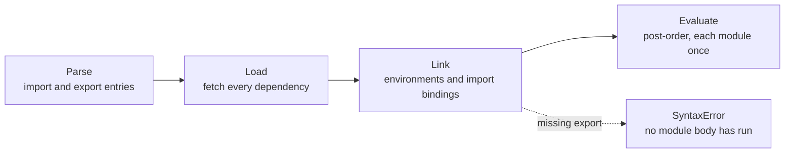
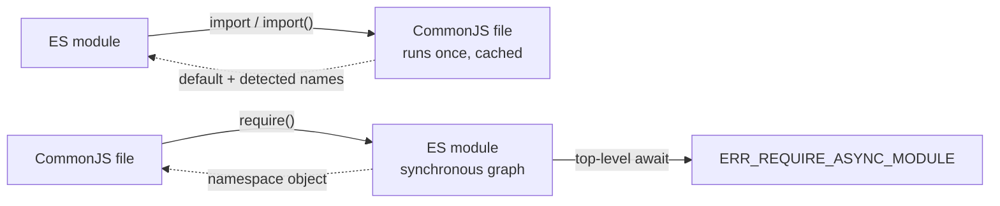
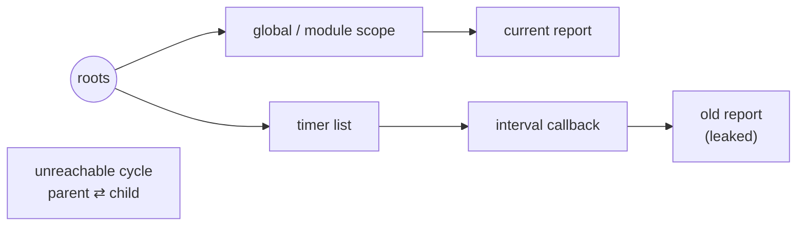
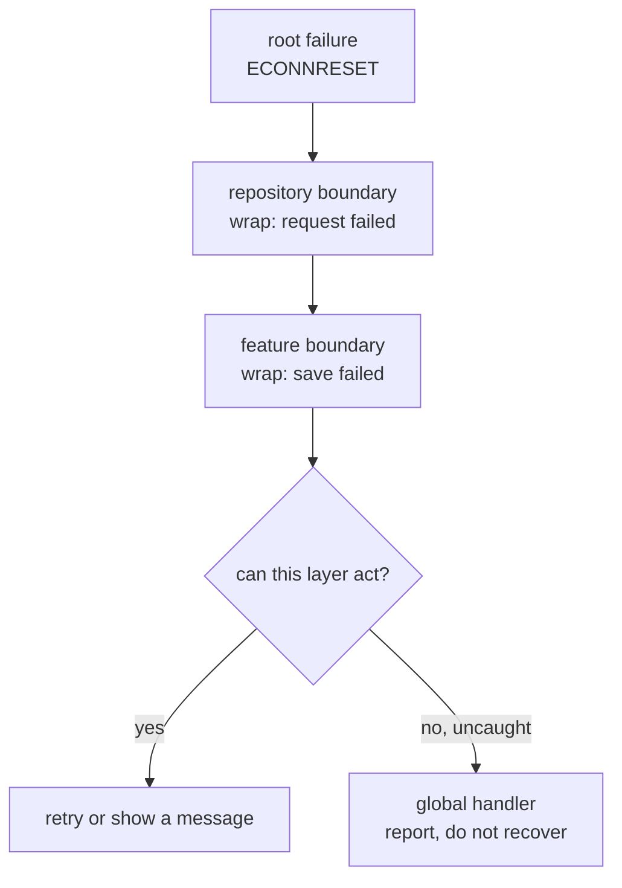
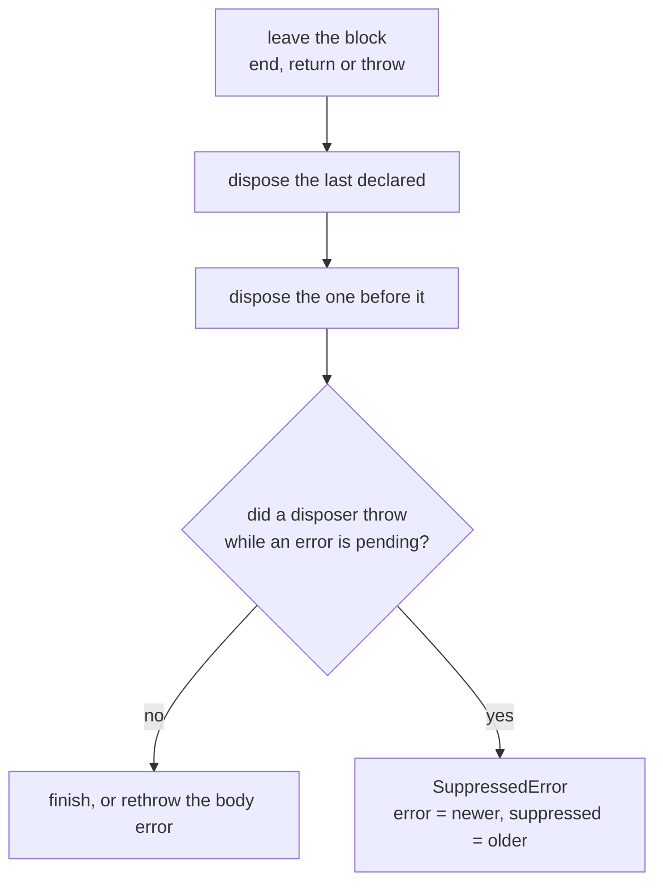
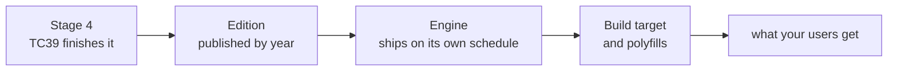

# 05. Modules, memory, errors and modern features

> **What this covers:** how JavaScript code is split into modules and wired together (ES modules, CommonJS, the interop between them, `import()`, import maps and import attributes), how memory is reclaimed and why it leaks (reachability, generational collection, weak references), how to model and handle errors (subclasses, `cause`, `AggregateError`, `Error.isError` [Added in ES2026], global handlers), deterministic cleanup with `using` [Added in ES2027], and which feature arrived in which ECMAScript edition. By the end you can predict what an import graph prints, find the leak in a code review, and say both "which edition" and "can I use it here".
> **Prerequisites:** [02. Hoisting and the temporal dead zone](02-js-scope-closures-this.md#2-hoisting-and-the-temporal-dead-zone) (cycles in imports), [02. Closures](02-js-scope-closures-this.md#3-closures) (what a closure keeps alive), [03. Classes](03-js-objects-prototypes-classes.md#3-classes-the-sugar-and-what-is-not-sugar) (`Error` subclasses), [04. `async` and `await`](04-js-async-event-loop.md#5-async-and-await) (top-level `await` [Added in ES2022]) and [04. Unhandled rejections](04-js-async-event-loop.md#8-unhandled-rejections-queuemicrotask-and-starvation) (global handlers)
> **Leads to:** [06. TypeScript type system essentials](06-ts-type-system-essentials.md), [12. How Angular works](12-angular-how-it-works.md), [31. Performance](31-performance.md), [37. Elements, PWA and global error handling](37-elements-pwa-errors-ecosystem.md)
> **Applies to:** ECMAScript 2026 (and the ES2027 features already finished), Node.js 24, the HTML Living Standard, TypeScript 6.0
> **Study time:** ~3 hours reading + ~3 hours exercises
> **Short on time:** read [1. ES modules](#1-es-modules-static-structure-linking-and-live-bindings), [4. Garbage collection and memory leaks](#4-garbage-collection-and-memory-leaks) and [6. Errors](#6-errors-subclasses-causes-aggregation-and-global-handlers), then drill [Q05.02](#q05-02), [Q05.04](#q05-04), [Q05.06](#q05-06), [Q05.12](#q05-12), [Q05.16](#q05-16) and [Q05.19](#q05-19), and finish with the [Summary](#summary).
> **Labs:** [`labs/ts-js/src/modules/05-js-modules-memory-modern-features/`](../labs/ts-js/src/modules/05-js-modules-memory-modern-features/) (exercises and section claims) and [`labs/ts-js/src/outputs/05-js-modules-memory-modern-features/`](../labs/ts-js/src/outputs/05-js-modules-memory-modern-features/) (every *Output* question). Run (from `labs/ts-js`, Node 24): `npx vitest run src/modules/05-js-modules-memory-modern-features src/outputs/05-js-modules-memory-modern-features`

## Contents

1. [ES modules: static structure, linking and live bindings](#1-es-modules-static-structure-linking-and-live-bindings)
2. [CommonJS, interop and dynamic `import()`](#2-commonjs-interop-and-dynamic-import)
3. [Import maps, `import.meta` and import attributes](#3-import-maps-importmeta-and-import-attributes)
4. [Garbage collection and memory leaks](#4-garbage-collection-and-memory-leaks)
5. [Weak references: `WeakMap`, `WeakSet`, `WeakRef` and `FinalizationRegistry`](#5-weak-references-weakmap-weakset-weakref-and-finalizationregistry)
6. [Errors: subclasses, causes, aggregation and global handlers](#6-errors-subclasses-causes-aggregation-and-global-handlers)
7. [Explicit resource management: `using` and `DisposableStack`](#7-explicit-resource-management-using-and-disposablestack)
8. [Modern features by edition, ES2015 to ES2026](#8-modern-features-by-edition-es2015-to-es2026)
- [Summary](#summary)
- [Question bank](#question-bank)
- [Hands-on exercises](#hands-on-exercises)
- [Check your understanding](#check-your-understanding)
- [Connections](#connections)

**How the claims here are verified.** Module behavior is run in real Node 24 (each lab test executes fixture files with `node`, because a test runner's own module transform is not Node's loader). Garbage-collection observations are run with `node --expose-gc` and labelled "observed in Node 24.21 over 20 runs, not guaranteed", since the specification leaves collection timing to the engine. Browser-only behavior (import maps, detached DOM nodes, the `window` `error` event) is taught from the HTML Standard and MDN and cited, never presented as observed. Snippets use ES2022 syntax and APIs (for example `??=` [Added in ES2021] and `.at()` [Added in ES2022]), with the one exception of `using` [Added in ES2027], which [section 7](#7-explicit-resource-management-using-and-disposablestack) explains.

---

## 1. ES modules: static structure, linking and live bindings

### The problem it solves

Before modules, `<script>` files talked through globals. If `analytics.js` ran before `config.js`, it read `undefined`, and two files declaring `config` silently overwrote each other. Nothing listed what a file needed. ES modules make dependencies part of the code: each file states its imports and exports, and the engine refuses to start a program whose wiring is broken.

### Mental model

Think of a wiring diagram checked before the power is switched on: the engine reads every file, connects each import to the export it names, and only then runs code, starting with the leaves.



What to notice: no module body runs until the whole graph is linked, so a misspelled import fails before any `console.log`, and tools can analyze the graph without running it.

### How it actually works

ECMA-262 represents each file as a *Module Record* (the engine's description of one module: its import entries, its export entries and, later, its variables) and processes the graph in three phases ([§16.2.1.6](https://tc39.es/ecma262/#sec-cyclic-module-records)):

1. **Load.** `LoadRequestedModules` asks the host for every module the graph mentions. The host resolves specifiers. A browser fetches by URL with CORS (the cross-origin permission check) and keeps a *module map* keyed by URL and type, which "ensure[s] that imported module scripts are only fetched, parsed, and evaluated once per Document or worker" ([HTML Standard](https://html.spec.whatwg.org/multipage/webappapis.html#module-map)). Node resolves files and packages ([Node.js ESM](https://nodejs.org/api/esm.html)).
2. **Link.** `InitializeEnvironment` ([§16.2.1.7.3.1](https://tc39.es/ecma262/#sec-source-text-module-record-initialize-environment)) creates the module's own scope, its *module environment*. Each import becomes "an initialized immutable indirect binding" ([CreateImportBinding, §9.1.1.5.5](https://tc39.es/ecma262/#sec-createimportbinding)). It is not a copy: every read goes to the exporter's variable. `let`, `const` and `class` bindings are created but left uninitialized. Function declarations are instantiated right away. If a name cannot be resolved, linking throws a `SyntaxError` and nothing runs.
3. **Evaluate.** `InnerModuleEvaluation` ([§16.2.1.6.1.3.1](https://tc39.es/ecma262/#sec-innermoduleevaluation)) walks the graph depth-first and runs each body after its dependencies, which is *post-order*. A module whose status is `evaluated` never runs again, so a module is a singleton per realm (one global environment, such as a page or a worker). In a cycle, the module that closes it runs before the one it imports from and can see that module's uninitialized bindings. That is the temporal dead zone (TDZ) of [module 02](02-js-scope-closures-this.md#2-hoisting-and-the-temporal-dead-zone).

Module code is always strict ([module 02 §5](02-js-scope-closures-this.md#5-strict-mode)), and top-level `this` is `undefined` (`GetThisBinding`, [§9.1.1.5.4](https://tc39.es/ecma262/#sec-module-environment-records-getthisbinding)). Top-level `await` [Added in ES2022] makes evaluation of a module and its importers asynchronous ([Q04.21](04-js-async-event-loop.md#q04-21)).

### Code

Approach: the exporter owns a mutable `let` and a function that changes it; the importer (1) reads the import, (2) calls the function, (3) reads again, and (4) tries to assign to the import.

```js
export let count = 0;

export function increment() {
  count += 1;
}
```
<sub>Source: [labs/ts-js/src/modules/05-js-modules-memory-modern-features/fixtures/section-1/live/counter.mjs](../labs/ts-js/src/modules/05-js-modules-memory-modern-features/fixtures/section-1/live/counter.mjs)</sub>

```js
import { count, increment } from './counter.mjs';

console.log('before', count);
increment();
console.log('after', count);
try {
  count = 10;
} catch (error) {
  console.log(error.name, error.message);
}
```
<sub>Source: [labs/ts-js/src/modules/05-js-modules-memory-modern-features/fixtures/section-1/live/main.mjs](../labs/ts-js/src/modules/05-js-modules-memory-modern-features/fixtures/section-1/live/main.mjs)</sub>

Node 24 prints `before 0`, `after 1`, then `TypeError Assignment to constant variable.`: the import follows the exporter's variable, and only the exporter can change it. The same test file also shows a diamond graph evaluating `shared`, `a`, `b`, `main` (`shared` once), and a cycle that fails with `ReferenceError: Cannot access 'a' before initialization` unless the binding read early is a function declaration. Verified: the `Section 1:` tests in [`section-1-esm.test.ts`](../labs/ts-js/src/modules/05-js-modules-memory-modern-features/section-1-esm.test.ts), each running the fixture with `node`. Drill it with [Q05.01](#q05-01) (what a module changes), [Q05.02](#q05-02) (default-export snapshots), [Q05.03](#q05-03) (evaluation order) and [Q05.04](#q05-04) (a cycle bug).

> [!TIP]
> **Coming from the backend.** A Java `import` only shortens names at compile time. Class initialization happens later, lazily, "immediately before" the first instance creation, static method call or non-constant static field use ([JLS §12.4.1](https://docs.oracle.com/javase/specs/jls/se21/html/jls-12.html#jls-12.4.1)). ES modules evaluate eagerly, the whole graph at startup, in import order. **Where the analogy breaks:** in a Java initialization cycle, the recursive request "complete[s] normally" ([JLS §12.4.2](https://docs.oracle.com/javase/specs/jls/se21/html/jls-12.html#jls-12.4.2)), so code silently reads `null` or `0`. A module cycle that reads an uninitialized `let`/`const` throws instead.

### Best practices and anti-patterns

- **Do keep module top levels free of side effects other than declarations**, because the evaluation order follows the import graph, which no one reads, and side-effect-free modules are what bundlers (build tools such as esbuild and webpack that combine modules into a few files, see [module 31](31-performance.md)) can drop ([section 2](#2-commonjs-interop-and-dynamic-import)).
- **Do export functions or read-only accessors instead of mutable `let` state**, because a live binding makes every importer depend on *when* it reads. A function such as `getCount()` makes that moment explicit.
- **Do break an import cycle by moving the shared piece into a third module**, because a cycle works only while no module reads the other's bindings during evaluation, and a later refactor quietly breaks that condition.
- **Avoid relying on import order for setup**, except for polyfills (code that supplies a missing API at run time) placed first in the entry module, because the entry is the only place where order is obvious.

### Misconceptions and traps

- *"An import is a copy of the exported value."* It is a live, read-only view of the exporter's variable. The myth comes from CommonJS, where `require` returns a value ([section 2](#2-commonjs-interop-and-dynamic-import)).
- *"`import` statements run where they are written."* All imports are linked before any line of the module runs, so an import placed after a `console.log` still fails before it (the missing-export test shows an empty stdout). The myth comes from reading imports like `require` calls.
- *"Circular imports are always an error."* A cycle is legal. Only reading a binding the other module has not initialized yet fails, and function declarations are ready at link time. The myth comes from the TDZ error message and from bundler warnings about cycles.
- *"A module script needs `defer`."* Module scripts are deferred already: "the defer attribute has no effect on module scripts" ([HTML Standard](https://html.spec.whatwg.org/multipage/scripting.html#attr-script-defer)). The habit carries over from classic scripts.
- *"Node cannot run ES modules without a flag."* Once true: ES modules needed `--experimental-modules` until Node 13.2.0 and 12.17.0 ([Node.js ESM history](https://nodejs.org/api/esm.html)). Now: they are stable in every supported Node, and browsers have supported `<script type="module">` since Chrome 61, Firefox 60 and Safari 10.1 ([MDN BCD](https://github.com/mdn/browser-compat-data/blob/main/html/elements/script.json)).

## 2. CommonJS, interop and dynamic `import()`

### The problem it solves

You import one function from a CommonJS date library and the whole library ships to the browser, because no tool can prove the rest is unused. A CommonJS service upgrades a dependency that went ESM-only and crashes with `ERR_REQUIRE_ESM`. Both failures come from how CommonJS works and where it meets ES modules.

### Mental model

CommonJS is a function call: `require('./x')` runs the file (the first time) and hands you whatever it left in `module.exports`, like a vending machine that gives you a value. An ES module is a declaration that the engine reads before running anything ([section 1](#1-es-modules-static-structure-linking-and-live-bindings)). Tools can analyze declarations; they can only guess at calls.



What to notice: each direction hands back a different shape (`module.exports` becomes `default` plus the names Node can detect, while `require` of an ES module returns the whole namespace), and `require` fails for a graph that uses top-level `await`, because a synchronous call cannot wait.

### How it actually works

- **The wrapper.** Node runs every CommonJS file inside `(function(exports, require, module, __filename, __dirname) { … })` ([Node.js modules](https://nodejs.org/api/modules.html#the-module-wrapper)). That is why those five names exist without being imported, and why top-level `this` is `module.exports`.
- **The cache.** The first `require` of a path evaluates the file and caches its `module`. Later calls return the cached `module.exports`. In a cycle, Node returns "an unfinished copy" of the exports object, so the module that closes the cycle sees whatever was assigned so far ([Node.js cycles](https://nodejs.org/api/modules.html#cycles)). It gets no error and no TDZ.
- **Values, not bindings.** `module.exports = { count }` copies the current value of `count`. Later changes inside the module are invisible to importers.
- **ESM importing CommonJS.** Node builds a namespace before the CommonJS file runs: `default` is `module.exports`, plus the named exports a "heuristic static analysis" finds in the source, plus a `'module.exports'` key [Changed in Node 23.0: the `'module.exports'` key was added] ([Node.js ESM, CommonJS namespaces](https://nodejs.org/api/esm.html#commonjs-namespaces)). An export assigned through a computed key is not found.
- **CommonJS requiring ESM.** `require(esm)` returns the module namespace object (the object that holds all of a module's exports). It is unflagged since Node 22.12.0 and 20.19.0 and "no longer experimental" since 24.15.0. A graph with top-level `await` cannot be loaded synchronously and throws `ERR_REQUIRE_ASYNC_MODULE` ([Node.js modules](https://nodejs.org/api/modules.html#loading-ecmascript-modules-using-require)).
- **`import()`** [Added in ES2020] works in both systems and returns a promise of the namespace. It goes through the same module map, so a second call gets the same object and does not run the module again. Bundlers treat it as a split point: Angular's lazy routes and `@defer` blocks compile to `import()` ([module 24](24-routing.md), [module 18](18-control-flow-and-defer.md)).
- **Tree shaking**, the bundler's dead-code elimination, "relies on the static structure of ES2015 module syntax" ([webpack guide](https://webpack.js.org/guides/tree-shaking/)). It also needs to know that dropping a module is safe. The `"sideEffects"` field in `package.json` declares which files have top-level side effects, and a `/* @__PURE__ */` comment marks a call whose result can be dropped if unused ([esbuild](https://esbuild.github.io/api/#tree-shaking)).

### Code

Approach: write the counter from section 1 in CommonJS. The exporter builds an object, and the importer reads its property before and after calling `increment()`.

```js
let count = 0;

function increment() {
  count += 1;
}

module.exports = { count, increment };
```
<sub>Source: [labs/ts-js/src/modules/05-js-modules-memory-modern-features/fixtures/section-2/copy/counter.cjs](../labs/ts-js/src/modules/05-js-modules-memory-modern-features/fixtures/section-2/copy/counter.cjs)</sub>

```js
const counter = require('./counter.cjs');

console.log('before', counter.count);
counter.increment();
console.log('after', counter.count);
```
<sub>Source: [labs/ts-js/src/modules/05-js-modules-memory-modern-features/fixtures/section-2/copy/main.cjs](../labs/ts-js/src/modules/05-js-modules-memory-modern-features/fixtures/section-2/copy/main.cjs)</sub>

Node 24 prints `before 0` and `after 0`. The ES module version printed `after 1`. Verified: the `Section 2:` tests in [`section-2-commonjs-interop.test.ts`](../labs/ts-js/src/modules/05-js-modules-memory-modern-features/section-2-commonjs-interop.test.ts), which also run the wrapper, the cycle, both interop directions and `import()` with `node`. Drill it with [Q05.05](#q05-05) (ESM versus CommonJS), [Q05.06](#q05-06) (interop output), [Q05.07](#q05-07) (tree shaking) and [Q05.08](#q05-08) (lazy loading).

> [!NOTE]
> **Framework vs platform.** `import()` is the platform. `@defer` is Angular template syntax: the compiler turns each deferrable dependency into an `import(path).then(…)` call (read in `@angular/compiler` 22.2.1, `compileDeferResolverFunction`), so the load itself is this section's `import()`. What `@defer` adds on top are the placeholder, loading and error blocks ([module 18](18-control-flow-and-defer.md)).

#### Legacy

Before Node's CommonJS reached the browser through bundlers, browsers used **AMD**, the RequireJS format `define(['jquery'], function ($) { … })`. It loaded dependencies asynchronously over many script tags ([RequireJS, Why AMD](https://requirejs.org/docs/whyamd.html)). **UMD** wrapped one file so that it worked as AMD, as CommonJS or as a global ([umdjs/umd](https://github.com/umdjs/umd)). Native ES modules replaced both. They survive in old packages; the migration is to publish ESM, adding a CommonJS build only if consumers need one.

### Best practices and anti-patterns

- **Do write and publish ES modules**, because only static `import`/`export` lets bundlers drop what you do not use.
- **Do mark packages `"sideEffects": false`** (or list the files that have side effects, such as CSS imports) only when it is true, because bundlers trust the flag and will delete a polyfill that lied.
- **Do import CommonJS through its default export when named imports fail**, because detection is heuristic. Node's own error message suggests `import pkg from …`.
- **Avoid `require` inside conditionals in browser code**, because a bundler cannot split a dynamic `require`. Use `import()` for a lazy dependency.

### Misconceptions and traps

- *"CommonJS cannot load ES modules."* Once true: `require` threw `ERR_REQUIRE_ESM` until Node 22.12.0 and 20.19.0. Now it works for synchronous graphs [Changed in Node 22.12: `require(esm)` needs no flag].
- *"Tree shaking removes every unused export."* Only when the bundler can prove that dropping it is safe. Top-level side effects, CommonJS and a missing `sideEffects` hint keep code in. The myth comes from small ESM-only demos.
- *"`import()` re-runs the module each time."* It reads the same module map, so a module evaluates once per realm. The myth comes from treating it like `fetch`.
- *"Named imports from CommonJS always work."* They depend on static analysis of the source (the test with a computed key fails with `SyntaxError: Named export 'computed' not found`). Bundlers that accept such imports are emulating them. The belief comes from that emulation.

## 3. Import maps, `import.meta` and import attributes

### The problem it solves

`import { signal } from '@angular/core'` fails in a file the browser loads directly: browsers resolve URLs, and a *bare specifier* (a package name, not `./…` or a URL) means nothing to them. Bundlers hide this by rewriting specifiers. Two neighbors: a module must find files relative to itself, and an import of `.json` must never run a script the server sent instead.

### Mental model

An import map is a phone book the browser consults before fetching. `import.meta` is the module's badge, carrying its URL. An import attribute is a label on a parcel ("must be JSON"): mismatched content is refused.

### How it actually works

- **Import maps** are a `<script type="importmap">` whose JSON has `imports` (specifier → URL), optional `scopes` (different mappings for modules under a path prefix) and `integrity` ([HTML Standard](https://html.spec.whatwg.org/multipage/webappapis.html#import-maps)). Resolution checks the most specific scope first and falls back to the top-level `imports`. A document can have several maps; the merge algorithm "ensures that new import maps cannot define the module resolution for modules that were already defined by past import maps, or for ones that were already resolved". Support: Chrome 89, Firefox 108, Safari 16.4; multiple maps Chrome 133 and Safari 18.4, while Firefox 150 has them only behind the `dom.multiple_import_maps.enabled` preference ([MDN BCD](https://github.com/mdn/browser-compat-data/blob/main/html/elements/script.json)). Native Federation, a micro-frontend approach for Angular, wires remotes "together by an import map" ([native-federation/angular-adapter](https://github.com/native-federation/angular-adapter); [module 38](38-architecture-and-production-structure.md)).
- **`import.meta`** [Added in ES2020] is an object the host fills in ([`HostGetImportMetaProperties`, §13.3.12.1.1](https://tc39.es/ecma262/#sec-hostgetimportmetaproperties)). Browsers and Node provide `url` and `resolve(specifier)`. Node also provides `filename` and `dirname`, added in 20.11.0 and "no longer experimental" in 24.0.0 ([Node.js ESM](https://nodejs.org/api/esm.html#importmetadirname)). These replace CommonJS's `__dirname`, which does not exist in a module.
- **Import attributes** [Added in ES2025] add `with { type: 'json' }` to an import. The host checks the type against what it loaded, and a JSON module is a *synthetic module* whose only export is `default` ([ParseJSONModule, §16.2.1.8.2](https://tc39.es/ecma262/#sec-parse-json-module)). The attribute is part of the module map key, so the same URL imported as JSON and as JavaScript are two different modules ([section 1](#1-es-modules-static-structure-linking-and-live-bindings)).

### Code

Approach: map a bare specifier in the page, then import JSON with an attribute in Node.

```html
<script type="importmap">
  { "imports": { "date-fns": "/vendor/date-fns/index.js" } }
</script>
<script type="module">
  import { format } from 'date-fns';
</script>
```

The HTML is illustrative (Node has no import maps). The JSON import is run:

```js
import config from './config.json' with { type: 'json' };

console.log(config.name, config.retries);
```
<sub>Source: [labs/ts-js/src/modules/05-js-modules-memory-modern-features/fixtures/section-3/json-with.mjs](../labs/ts-js/src/modules/05-js-modules-memory-modern-features/fixtures/section-3/json-with.mjs)</sub>

It prints `lab-config 3`. Without the attribute, Node 24 throws `TypeError [ERR_IMPORT_ATTRIBUTE_MISSING]` (`needs an import attribute of "type: json"`), and `import { name } from './config.json' with { type: 'json' }` fails at link time because JSON modules have no named exports. Verified: the `Section 3:` tests in [`section-3-meta-attributes.test.ts`](../labs/ts-js/src/modules/05-js-modules-memory-modern-features/section-3-meta-attributes.test.ts). Drill it with [Q05.09](#q05-09) (import maps) and [Q05.10](#q05-10) (JSON import output).

### Best practices and anti-patterns

- **Do read configuration with a JSON import or `fetch`, not by importing a `.js` file that exports an object**, because the attribute makes the server's answer data, never code.
- **Do use `import.meta.url` or `import.meta.dirname` for files next to a module**, because the process's working directory depends on where the command was started.
- **Avoid hand-maintained import maps in large apps**, because every package and version needs an entry; let the build generate them.

### Misconceptions and traps

- *"Use `assert { type: 'json' }`."* Once true: that was the Stage 3 syntax, shipped in Chrome 91 and Node 16.14. It was renamed `with` and removed in Chrome 126 and Node 22.0.0 ([MDN BCD](https://github.com/mdn/browser-compat-data/blob/main/javascript/statements.json)), and Node 24 reports `SyntaxError: Unexpected identifier 'assert'`. Now: `with`.
- *"Import maps make bundlers unnecessary."* They fix resolution only. Bundlers still split, minify, tree-shake ([section 2](#2-commonjs-interop-and-dynamic-import)) and cut the request count. The myth comes from small demos that load a handful of files.
- *"`__dirname` works in ES modules."* It is a parameter of the CommonJS wrapper ([section 2](#2-commonjs-interop-and-dynamic-import)), so a module throws `ReferenceError`. Use `import.meta.dirname`. The habit comes from CommonJS, where `__dirname` is always there.

## 4. Garbage collection and memory leaks

### The problem it solves

A dashboard tab gains 20 MB per report switch until the browser kills it. Nobody wrote "keep the old report": a polling interval nobody cleared still references it. JavaScript frees only memory it can prove is unused, and one forgotten reference is enough to keep it.

### Mental model

Memory is a graph. The collector starts at the *roots* (the global object, the current call stacks, and handles the host keeps, such as active timers and registered listeners) and follows every reference. Whatever it reaches is kept, and everything else is garbage. Picture staff walking every corridor of a warehouse from the doors and binning any box no corridor reaches: a leak is a box still connected by a corridor you forgot.



What to notice: the old report has no link from your code, but the timer list is a root, so the callback keeps it reachable. The cycle on the right has no path from a root, so it is collected even though its two objects point at each other.

### How it actually works

- **Reachability, not reference counts.** Reference counting frees an object when nothing points at it, so two objects pointing at each other are never freed. MDN: "all modern engines ship a mark-and-sweep garbage collector" ([MDN, Memory management](https://developer.mozilla.org/en-US/docs/Web/JavaScript/Guide/Memory_management)). Marking finds what roots reach, and sweeping reclaims the rest.
- **Generations.** V8 relies on the generational hypothesis, "most objects die young" ([V8, Trash talk](https://v8.dev/blog/trash-talk)). New objects go to a small young generation, cleaned often by the *Scavenger*, which copies the few survivors. Objects that survive twice move to the old generation, which the *Mark-Compact* major GC handles. The Orinoco project made that work "mostly parallel and concurrent", so pauses are short but not zero. None of this is exposed as an API.
- **The leak catalogue.** Each leak is a path from a root you did not intend:
  - a **listener** on a long-lived target (`window`, a global event bus) whose callback captures component state;
  - an **interval or timeout** never cleared;
  - a **closure** that keeps a whole scope alive (taught in [module 02](02-js-scope-closures-this.md#3-closures), drilled in [Q02.08](02-js-scope-closures-this.md#q02-08));
  - a **detached DOM node**, removed from the page "but some JavaScript still references it" ([Chrome DevTools, Fix memory problems](https://developer.chrome.com/docs/devtools/memory-problems));
  - a **cache** (`Map`, object, array) that only grows ([section 5](#5-weak-references-weakmap-weakset-weakref-and-finalizationregistry)).
- **Finding one.** Take a heap snapshot, repeat the action, take another, and compare what grew. Then follow the "retainers" path back to the root. The DevTools workflow for Angular apps is in [module 31](31-performance.md).

### Code

Approach: observe the report through a `WeakRef` [Added in ES2021], which does not keep it alive ([section 5](#5-weak-references-weakmap-weakset-weakref-and-finalizationregistry)). (1) Force a collection while the interval runs. (2) Clear the interval. (3) Collect again.

```js
// Run with: node --expose-gc timer-leak.mjs
// A WeakRef observes the report without keeping it alive. Each check waits one task first,
// because a WeakRef target read in the current job stays alive until that job ends.
const nextTask = () => new Promise((resolve) => setTimeout(resolve, 0));

function startPolling() {
  const report = { title: 'quarterly', rows: new Array(100_000).fill(0) };
  const probe = new WeakRef(report);
  const timer = setInterval(() => report.rows.length, 60_000);
  return { probe, timer };
}

const { probe, timer } = startPolling();

await nextTask();
globalThis.gc();
console.log('interval running, report alive:', probe.deref() !== undefined);

clearInterval(timer);
await nextTask();
globalThis.gc();
console.log('after clearInterval, report alive:', probe.deref() !== undefined);
```
<sub>Source: [labs/ts-js/src/modules/05-js-modules-memory-modern-features/fixtures/section-4/timer-leak.mjs](../labs/ts-js/src/modules/05-js-modules-memory-modern-features/fixtures/section-4/timer-leak.mjs)</sub>

It prints `true`, then `false`. The same test file shows a listener on an `EventTarget` keeping a forgotten panel alive until `removeEventListener`, and an unreachable parent ⇄ child cycle being collected. Verified: the `Section 4:` tests in [`section-4-gc-leaks.test.ts`](../labs/ts-js/src/modules/05-js-modules-memory-modern-features/section-4-gc-leaks.test.ts), run with `node --expose-gc`. This is observed in Node 24.21 (stable over 20 runs), not guaranteed: the specification leaves timing to the engine. Drill it with [Q05.11](#q05-11) (how collection works) and [Q05.12](#q05-12) (a leaking widget).

> [!TIP]
> **Coming from the backend.** The JVM makes the same bet: "the weak generational hypothesis, which states that most objects survive for only a short period of time" ([HotSpot GC tuning guide](https://docs.oracle.com/javase/8/docs/technotes/guides/vm/gctuning/generations.html)), and a heap dump plays the role of a heap snapshot. **Where the analogy breaks:** a page has no `-Xmx` or collector flags to tune. Leaks come mostly from the host (listeners, timers, DOM nodes) rather than from your own data structures, and a single-page app lives for hours, so even small leaks add up.

### Best practices and anti-patterns

- **Do pair every `addEventListener`, `setInterval` and subscription with its removal in the same component**, because the root keeps the callback, and the callback keeps everything it captures. In Angular, `DestroyRef` and `takeUntilDestroyed` give you the hook ([module 16](16-dependency-injection.md)).
- **Do bound every cache by size or lifetime**, because a cache that only grows is a leak with a nicer name.
- **Avoid keeping references to removed DOM nodes**, because the node and its whole subtree stay in memory.
- **Avoid calling `gc()` or tuning code for the collector**, because collection timing is not yours to control. Measure with snapshots instead.

### Misconceptions and traps

- *"Circular references leak."* Only under reference counting. The belief comes from that older scheme (MDN uses this very cycle as its example). Mark-and-sweep collects unreachable cycles (lab: `unreachable cycle collected: true`).
- *"Setting a variable to `null` frees the object."* It removes one path. The object goes only when no path is left, and only when the collector runs. The habit comes from manual memory management.
- *"Removing the listener is enough."* In the lab, a panel stayed alive after `removeEventListener` because the returned `close` function, still held, captured the handler, which captured the panel. Any path counts. The belief comes from the one-path case, where removing the only listener does cut the only path.

## 5. Weak references: `WeakMap`, `WeakSet`, `WeakRef` and `FinalizationRegistry`

### The problem it solves

[Exercise 03.2](03-js-objects-prototypes-classes.md#ex03-2) caches one proxy per target object. With a `Map`, every object ever wrapped stays in memory for the life of the page, because the cache itself is a path from a root ([section 4](#4-garbage-collection-and-memory-leaks)). The cache needs to say "remember this while the object exists, but do not be the reason it exists".

### Mental model

A weak reference is a reference the collector ignores when it decides what is reachable. It is a sticky note on a box, not a corridor to it: when the box is binned, the note goes with it.

### How it actually works

- **`WeakMap` and `WeakSet`** hold their keys weakly. A `WeakMap` entry is an *ephemeron*: the value is kept only while the key is reachable from somewhere else, even if the value points back at the key (lab: `key collected although its value references it: true`). The spec provides "no mechanism … for enumerating" the keys ([§24.3](https://tc39.es/ecma262/#sec-weakmap-objects)), so there is no `size`, `keys()` or iteration. Iteration would expose the moment the collector ran, which differs between engines and runs.
- **What may be held weakly.** `CanBeHeldWeakly` ([§9.13](https://tc39.es/ecma262/#sec-canbeheldweakly)) accepts objects and symbols that are not registered with `Symbol.for` [Changed in ES2023: symbols as `WeakMap` keys]. A registered symbol can be recreated from its string at any time, so it can never become unreachable, and `set` throws `TypeError: Invalid value used as weak map key`. TypeScript cannot catch this, because both kinds of symbol have the type `symbol`.
- **`WeakRef`** [Added in ES2021] wraps one target. `deref()` returns it, or `undefined` once it has been collected. Creating or dereferencing a `WeakRef` calls `AddToKeptObjects` ([§9.11](https://tc39.es/ecma262/#sec-addtokeptobjects)). The target then stays alive until the current synchronous run of code ends (`ClearKeptObjects`, [§9.10](https://tc39.es/ecma262/#sec-clear-kept-objects)), so two `deref()` calls in a row cannot disagree.
- **`FinalizationRegistry`** [Added in ES2021] calls a cleanup callback with a held value some time after a registered target is collected. It runs as a separate task and is never synchronous. The spec makes no promise that anything is ever collected: objects "may be released after long periods of time, or never at all" ([§9.9.1](https://tc39.es/ecma262/#sec-weakref-processing-model)). The proposal says these two features "are best avoided if possible" ([proposal-weakrefs](https://github.com/tc39/proposal-weakrefs)). Support: Chrome 84, Firefox 79, Safari 14.1, Node 14.6.0 ([MDN BCD](https://github.com/mdn/browser-compat-data/blob/main/javascript/builtins/WeakRef.json)).

### Code

Approach: store a value that points back at its key, drop the only outside reference to the key, then collect in a later task.

```js
// Run with: node --expose-gc ephemeron.mjs
const nextTask = () => new Promise((resolve) => setTimeout(resolve, 0));
const metadata = new WeakMap();

let key = { id: 7 };
metadata.set(key, { owner: key }); // the value points back at its own key
const probe = new WeakRef(key);
key = null;

await nextTask();
globalThis.gc();
console.log('key collected although its value references it:', probe.deref() === undefined);
```
<sub>Source: [labs/ts-js/src/modules/05-js-modules-memory-modern-features/fixtures/section-5/ephemeron.mjs](../labs/ts-js/src/modules/05-js-modules-memory-modern-features/fixtures/section-5/ephemeron.mjs)</sub>

It prints `true`. The same test file shows that a `WeakRef` target survives `gc()` within its own job (`cached`) and is gone in the next task (`undefined`), and that a `FinalizationRegistry` callback (`cleanup for session-42`) runs in a later task. Verified: the `Section 5:` tests in [`section-5-weak-refs.test.ts`](../labs/ts-js/src/modules/05-js-modules-memory-modern-features/section-5-weak-refs.test.ts). The collection results are observed, not guaranteed. Drill it with [Q05.13](#q05-13) (`Map` versus `WeakMap`), [Q05.14](#q05-14) (`WeakRef` and finalization output) and [Q05.15](#q05-15) (choosing a cache).

### Best practices and anti-patterns

- **Do use a `WeakMap` for data about objects you do not own** (caches keyed by a target, per-element state), because the entry dies with the object ([Q01.12](01-js-values-types-coercion.md#q01-12) compares it with symbols and private fields).
- **Do prefer a size-bounded `Map` (an LRU, least recently used: it evicts the entry untouched the longest) when you need iteration, eviction order or primitive keys**, because a weak collection offers none of these.
- **Avoid `FinalizationRegistry` for anything that must happen**, such as closing a socket or flushing data, because the callback may never run. Use explicit disposal ([section 7](#7-explicit-resource-management-using-and-disposablestack)).
- **Avoid building logic on when `deref()` turns `undefined`**, because it varies across engines, versions and memory pressure.

### Misconceptions and traps

- *"A `WeakMap` holds weak values."* The keys are weak and the values are strong while their key lives. A cache of large values keyed by a long-lived object still holds them. The name suggests otherwise.
- *"`WeakRef` lets me observe garbage collection."* It shows only that collection already happened, at an unspecified time. The specification avoids promising anything ("may", §9.9.1). The belief comes from demos that call `gc()` by hand, as this module's labs do.
- *"Only objects can be weak keys."* Once true: until ES2022 only objects qualified. Now non-registered symbols qualify too [Changed in ES2023].

## 6. Errors: subclasses, causes, aggregation and global handlers

### The problem it solves

An error report says `Error: save failed`, with a stack ending in your own `catch`. The real reason, a network reset three layers down, was discarded by `catch (e) { throw new Error('save failed') }`. Elsewhere a check `error instanceof HttpError` is `false` for an error that came from an iframe, and the user sees a blank screen instead of a retry button.

### Mental model

An error is a value plus a chain of "because" links: *save failed* because *the request failed* because *the connection was reset*. Each layer adds context at its boundary and keeps the link below it. The global handlers are the last net under the whole program, not a place to recover.



What to notice: every wrap adds a layer and keeps the one below as its `cause`, so the chain reads from `save failed` down to `ECONNRESET`. Only an error nobody handled reaches the global handler, which reports it and never repairs the state.

### How it actually works

- **Subclasses.** `class ValidationError extends Error` gets `instanceof`, a `stack` and `message` from `super`. Set `name`, which `String(error)` and stack headers use. Extra fields (`field`, `status`, `code`) make errors checkable without parsing messages. V8 formats the stack header when `stack` is first read, so a `name` set in the constructor appears there (lab: `ValidationError: email is required`).
- **`cause`** [Added in ES2022]. `new Error(message, { cause })` installs `cause` as an own property only when the option is present ([InstallErrorCause, §20.5.9.1](https://tc39.es/ecma262/#sec-installerrorcause)). Node prints the chain under `[cause]:` (lab). Supported since Chrome 93, Firefox 91, Safari 15 and Node 16.9 ([MDN BCD](https://github.com/mdn/browser-compat-data/blob/main/javascript/builtins/Error.json)).
- **`AggregateError`** [Added in ES2021] holds several failures in `errors`. `Promise.any` rejects with one ([Q04.16](04-js-async-event-loop.md#q04-16)), and you can throw one yourself when a batch fails partly.
- **Brand checks.** `instanceof Error` walks the prototype chain, so it is `false` for an error created in another realm (an iframe, or a Node `vm` context) and `true` for a fake made with `Object.create(Error.prototype)`. `Error.isError` [Added in ES2026] checks the internal `[[ErrorData]]` slot instead ([§20.5.2.1](https://tc39.es/ecma262/#sec-error.iserror)). The proposal exists because `instanceof` "will provide a false negative with a cross-realm … `Error` instance" ([proposal-is-error](https://github.com/tc39/proposal-is-error)). It ships in Chrome 134, Firefox 138 and Node 24.3. Safari 18.4 and Node 24.0 to 24.2 implement it only partly: `Error.isError(new DOMException())` is `false` there ([MDN BCD](https://github.com/mdn/browser-compat-data/blob/main/javascript/builtins/Error.json), citing WebKit bug 292727 and Node issue 56497).
- **Anything can be thrown.** `throw 'oops'` is legal, so a `catch` binding is `unknown` until you narrow it. TypeScript types it that way under `useUnknownInCatchVariables` ([module 06](06-ts-type-system-essentials.md#5-any-unknown-never-void-and-object-versus-)).
- **`stack` is not in ECMA-262.** `Error.captureStackTrace` started as V8's API ([V8 stack trace API](https://v8.dev/docs/stack-trace-api)). Firefox 138 and Safari 17.2 have added it since (MDN BCD).
- **Global handlers.** In a browser, an uncaught exception fires an `error` event (an `ErrorEvent`) at the global object, and a handler can cancel the default console report ([HTML Standard](https://html.spec.whatwg.org/multipage/webappapis.html#report-an-exception)). Promise rejections have their own `unhandledrejection` event ([module 04 §8](04-js-async-event-loop.md#8-unhandled-rejections-queuemicrotask-and-starvation)). In Node, `process.on('uncaughtException')` is "a crude mechanism … intended to be used only as a last resort", and "it is not safe to resume normal operation after" it ([Node.js process](https://nodejs.org/api/process.html#warning-using-uncaughtexception-correctly)). Angular routes errors through its `ErrorHandler` ([module 37](37-elements-pwa-errors-ecosystem.md)).

### Code

Approach: a subclass that (1) passes `message` and `options` to `super`, so `cause` works, (2) sets `name`, and (3) adds a field callers can branch on.

```ts
// Excerpt of labs/ts-js/src/modules/05-js-modules-memory-modern-features/section-6-errors.test.ts
class ValidationError extends Error {
  constructor(
    message: string,
    readonly field: string,
    options?: ErrorOptions,
  ) {
    super(message, options);
    this.name = 'ValidationError';
  }
}
```

The `Section 6:` tests in [`section-6-errors.test.ts`](../labs/ts-js/src/modules/05-js-modules-memory-modern-features/section-6-errors.test.ts) run this class and every other claim above (the `node:vm` realm case included). [Exercise 05.2](#ex05-2) builds a cause-chain formatter on top. Drill it with [Q05.16](#q05-16) (subclasses and realms), [Q05.17](#q05-17) (cause and `AggregateError` output) and [Q05.18](#q05-18) (an app-wide strategy).

> [!TIP]
> **Coming from the backend.** `new Error(msg, { cause })` is Java's `new RuntimeException(msg, cause)`, Java's `Throwable.addSuppressed` pairs with `SuppressedError` ([section 7](#7-explicit-resource-management-using-and-disposablestack)), and `AggregateError` is closer to a plain list of failures, such as the ones a batch job collects. **Where the analogy breaks:** JavaScript has no checked exceptions and no `throws` clause, anything (a string, `undefined`) can be thrown, and `catch` has no type filter, so you narrow inside one `catch` block.

### Best practices and anti-patterns

- **Do wrap at layer boundaries with `{ cause }`**, because the top-level message tells the user what failed and the chain tells the developer why.
- **Do branch on fields or `name`, not on `message` text**, because messages get reworded and translated.
- **Do use `Error.isError` (or a brand field) when errors cross realms**, such as iframes, workers posting errors, or `vm` sandboxes, because `instanceof` silently fails there.
- **Avoid empty `catch` blocks and catch-and-log-and-continue in the middle of a flow**, because the caller then proceeds with half-done state. Handle where you can act, rethrow elsewhere.
- **Avoid resuming after `uncaughtException`**: log, clean up synchronously and exit, and let a supervisor restart the process.

### Misconceptions and traps

- *"`err.stack` is standard JavaScript."* It is a host feature, and its format differs between engines. The belief comes from V8 being everywhere (Chrome, Node).
- *"`Error.captureStackTrace` is V8-only."* Once true. Now: Firefox 138 and Safari 17.2 ship it too (MDN BCD), though it is still not in ECMA-262.
- *"`instanceof Error` is a reliable check."* It fails across realms and accepts fakes. Before ES2026 the only other test was `Object.prototype.toString`, which `Symbol.toStringTag` can spoof (the proposal's own rationale). Now: `Error.isError`. The habit comes from single-realm code, where `instanceof` always agrees.
- *"Wrapping loses the stack."* Only without `cause`. With it, the original error and its stack stay reachable from the new one. The belief comes from `catch (e) { throw new Error(msg) }`, where the new error has a fresh stack and no link to the old one; `cause` [Added in ES2022] is that link.

## 7. Explicit resource management: `using` and `DisposableStack`

### The problem it solves

Opening a connection, a transaction and a file safely takes three nested `try/finally` blocks. Worse, if the body throws and a cleanup throws too, the cleanup's error replaces the original, and the real cause vanishes from the logs.

### Mental model

`using` ties a resource's cleanup to a block: leave the block by any route (end, `return`, `throw`) and its resources are disposed, last declared first, like plates taken off a stack.



What to notice: a failing disposer does not stop the ones after it, and the two errors meet only at the end, where they are merged into one `SuppressedError` instead of the newer one replacing the older.

### How it actually works

- **Status.** Explicit Resource Management reached Stage 4 (the last TC39 stage, see [section 8](#8-modern-features-by-edition-es2015-to-es2026)) in May 2026 and is listed for **ES2027** [Added in ES2027], the edition published in mid-2027 ([finished proposals](https://github.com/tc39/proposals/blob/main/finished-proposals.md)), so it is not part of ES2026. It already ships in Chrome 134, Firefox 141 and Node 24.0.0, and Safari has it only in Technology Preview ([MDN BCD](https://github.com/mdn/browser-compat-data/blob/main/javascript/statements.json)). TypeScript has supported it since 5.2 ([release notes](https://www.typescriptlang.org/docs/handbook/release-notes/typescript-5-2.html)). At the lab's `ES2024` target, `tsc` rewrites `using` into `__addDisposableResource`/`__disposeResources` helpers; at `ESNext` it leaves `using` as written (checked by compiling a sample).
- **The protocol.** A disposable object has a `[Symbol.dispose]()` method, or `[Symbol.asyncDispose]()` for `await using`. `using x = value` declares a block-scoped `const` and records `value` on the block's resource list. At exit, `DisposeResources` ([§7.5.5](https://tc39.es/ecma262/#sec-disposeresources)) calls the disposers in reverse order. `null` and `undefined` are allowed and skipped. Anything else without the method throws `TypeError`.
- **Errors.** If the body throws and a disposer throws too, the result is a `SuppressedError` ([§20.5.8](https://tc39.es/ecma262/#sec-suppressederror-objects)): `error` is the newer (disposal) error, and `suppressed` is the one it would have hidden.
- **`DisposableStack`** collects resources at run time: `use(disposable)`, `adopt(value, release)` for things without the protocol, and `defer(callback)`. `move()` transfers everything to a new stack, so a constructor can hand its resources to the object it built, and using a disposed stack throws `ReferenceError` ([§27.3.3.3](https://tc39.es/ecma262/#sec-disposablestack.prototype.defer)). `AsyncDisposableStack` is the async twin.

### Code

Approach: (1) declare two resources in a block and watch their order, then (2) make a disposer throw while the body is already throwing. The file runs natively in Node 24, without TypeScript.

```js
// Runs natively in Node 24 (no transpiler): disposal order and SuppressedError.
const resource = (name, failOnDispose = false) => ({
  [Symbol.dispose]() {
    console.log('dispose', name);
    if (failOnDispose) throw new Error(`${name} failed to close`);
  },
});

{
  using first = resource('connection');
  using second = resource('transaction');
  console.log('body runs');
}

try {
  using file = resource('file', true);
  throw new Error('write failed');
} catch (error) {
  console.log(error.name, '|', error.error.message, '|', error.suppressed.message);
}
```
<sub>Source: [labs/ts-js/src/modules/05-js-modules-memory-modern-features/fixtures/section-7/native.mjs](../labs/ts-js/src/modules/05-js-modules-memory-modern-features/fixtures/section-7/native.mjs)</sub>

It prints `body runs`, `dispose transaction`, `dispose connection`, `dispose file`, then `SuppressedError | file failed to close | write failed`. Verified: the `Section 7:` tests in [`section-7-using.test.ts`](../labs/ts-js/src/modules/05-js-modules-memory-modern-features/section-7-using.test.ts), which also cover `await using` and `DisposableStack`, both compiled by TypeScript and natively. Drill it with [Q05.19](#q05-19) (disposal output) and [Q05.20](#q05-20) (adopting `using`).

> [!TIP]
> **Coming from the backend.** This is Java's try-with-resources over `AutoCloseable`, and C#'s `using`. Java also closes in reverse order and attaches close failures with `addSuppressed`. **Where the analogy breaks:** there is no special statement form. `using` is a declaration inside any block, opting in means adding a symbol-named method, and JavaScript wraps the two errors in a new `SuppressedError` instead of mutating the original one.

### Best practices and anti-patterns

- **Do make handles you return disposable** (a subscription, a lock, a listener), because callers then get correct cleanup with one keyword ([Exercise 05.1](#ex05-1) builds one).
- **Do use `DisposableStack` in constructors that acquire several resources**, and `move()` it into the object, because a failure halfway through then releases what was acquired.
- **Avoid untranspiled `using` where Safari matters**, because only its Technology Preview has it; compiled helpers work everywhere.

### Misconceptions and traps

- *"`using` is part of ES2026."* It reached Stage 4 after the ES2026 cut-off and belongs to ES2027. The confusion comes from engines and TypeScript shipping it years earlier.
- *"`finally` already does this."* `finally` loses the body's error when cleanup throws. `using` keeps both through `SuppressedError`, and its order holds without nesting. The belief comes from C# `using` and Java try-with-resources, which taught the pattern years ago, and from `finally` being enough for one resource whose cleanup never throws; JavaScript's own `using` arrives with ES2027.
- *"`using` works with any object that has `close()`."* Only `Symbol.dispose` counts. Wrap the object with `DisposableStack.adopt(value, (v) => v.close())`. The belief comes from Java, where `AutoCloseable.close()` is the protocol method, so a `close()` method looks like the protocol.

## 8. Modern features by edition, ES2015 to ES2026

### The problem it solves

"Can I use `Map.prototype.getOrInsert`?" It is in ES2026, yet Node 24 throws `TypeError: … is not a function`. Interviewers ask "which edition added X?" to check that you follow the language. Teams ask "can we ship X?", which is a different question with a different answer.

### Mental model

A feature takes three steps: TC39 *finishes* it (Stage 4), the yearly edition *publishes* it, and each engine *ships* it on its own schedule. Your build target and polyfills decide what your users actually get. Only the third step is about your app.



What to notice: each arrow is a separate decision by a different party, and the order is not a timeline. An engine can ship before the edition (`using` runs in Node 24 yet is ES2027) or after it (`getOrInsert` is ES2026 yet missing in Node 24), and only the last two boxes are yours.

### How it actually works

- **The process.** A proposal moves through Stages 0, 1, 2, 2.7 and 3 to 4, which requires two shipping implementations and tests ([TC39 process document](https://tc39.es/process-document/)). In March, "Stage 4 proposals are incorporated … and the new spec version is branched from main". A proposal that reaches Stage 4 after March waits a year. That is why `using`, finished in May 2026, is ES2027 ([section 7](#7-explicit-resource-management-using-and-disposablestack)).
- **Where to check.** Use the edition from [finished-proposals](https://github.com/tc39/proposals/blob/main/finished-proposals.md), engine support from MDN's browser-compat-data, and your runtime's release notes. Then check your compiler: TypeScript's `target` decides which syntax is rewritten, and `lib` decides which APIs type-check. Neither adds a missing API at run time. A polyfill library such as [core-js](https://github.com/zloirock/core-js) does that, for APIs only. New syntax must be compiled.

The table lists what interviewers ask about. The editions come from finished-proposals (ES2015 is the [6th edition](https://262.ecma-international.org/6.0/), which predates that list). The last column was run in Node 24.21.

| Edition | Features | Taught in | Node 24 |
|---|---|---|---|
| ES2015 | `let`/`const`, arrows, classes, modules, promises, `Map`/`Set`/`WeakMap`, symbols, iterators and generators, Proxy/Reflect, destructuring, template literals | [02](02-js-scope-closures-this.md), [03](03-js-objects-prototypes-classes.md), [04](04-js-async-event-loop.md), [§1](#1-es-modules-static-structure-linking-and-live-bindings) | yes |
| ES2016 | `Array.prototype.includes`, `**` | [01](01-js-values-types-coercion.md) | yes |
| ES2017 | `async`/`await`, `Object.entries`, `getOwnPropertyDescriptors`, `padStart` | [04](04-js-async-event-loop.md), [03](03-js-objects-prototypes-classes.md) | yes |
| ES2018 | `for await`, object rest/spread, `Promise.prototype.finally`, RegExp named groups and lookbehind | [04](04-js-async-event-loop.md), [03](03-js-objects-prototypes-classes.md) | yes |
| ES2019 | `flat`/`flatMap`, `Object.fromEntries`, optional `catch` binding | [03](03-js-objects-prototypes-classes.md) | yes |
| ES2020 | `BigInt`, `??`, `?.`, `Promise.allSettled`, `import()`, `import.meta`, `globalThis` | [01](01-js-values-types-coercion.md), [04](04-js-async-event-loop.md), [§2](#2-commonjs-interop-and-dynamic-import), [§3](#3-import-maps-importmeta-and-import-attributes) | yes |
| ES2021 | `Promise.any`/`AggregateError`, `WeakRef`/`FinalizationRegistry`, `??=`/`\|\|=`/`&&=`, numeric separators, `replaceAll` | [04](04-js-async-event-loop.md), [§5](#5-weak-references-weakmap-weakset-weakref-and-finalizationregistry), [01](01-js-values-types-coercion.md) | yes |
| ES2022 | class fields, `#private`, static blocks, `#x in obj`, top-level `await`, `.at()`, `Object.hasOwn`, error `cause` | [03](03-js-objects-prototypes-classes.md), [04](04-js-async-event-loop.md), [§6](#6-errors-subclasses-causes-aggregation-and-global-handlers) | yes |
| ES2023 | `toSorted`/`toSpliced`/`with`, `findLast`, symbols as `WeakMap` keys | [03](03-js-objects-prototypes-classes.md), [§5](#5-weak-references-weakmap-weakset-weakref-and-finalizationregistry) | yes |
| ES2024 | `Promise.withResolvers`, `Object.groupBy`/`Map.groupBy`, well-formed strings, RegExp `v` flag | [04](04-js-async-event-loop.md), [01](01-js-values-types-coercion.md) | yes |
| ES2025 | iterator helpers, `Set` methods, import attributes and JSON modules, `Promise.try`, `RegExp.escape`, `Float16Array` | [03](03-js-objects-prototypes-classes.md), [§3](#3-import-maps-importmeta-and-import-attributes), [04](04-js-async-event-loop.md) | yes |
| ES2026 | `Error.isError`, `Array.fromAsync`, `JSON.rawJSON`; `Map.prototype.getOrInsert`, `Iterator.concat`, `Uint8Array.fromBase64`, `Math.sumPrecise` | [§6](#6-errors-subclasses-causes-aggregation-and-global-handlers), [04](04-js-async-event-loop.md) | the first three only |
| Finished, ES2027 | `using` and `DisposableStack`, `Atomics.pause`; Temporal, `Iterator.zip`, iterator `chunks`/`includes`/`join` | [§7](#7-explicit-resource-management-using-and-disposablestack) | the first three only |

Verified: the `Section 8:` tests in [`section-8-editions.test.ts`](../labs/ts-js/src/modules/05-js-modules-memory-modern-features/section-8-editions.test.ts) probe every Node 24 cell. Syntax is checked with `new Function`, and APIs are looked up on the global objects. A deliberately broken probe makes them fail. Drill it with [Q05.21](#q05-21) (stage, edition and support).

### Best practices and anti-patterns

- **Do decide "can we use it" from your support matrix** (`browserslist`, the config that lists the browsers you support, and Node `engines`), because the edition says nothing about your users' browsers.
- **Do match TypeScript's `lib` to what you polyfill or require**, because a `lib` that is newer than your runtime type-checks calls that crash.
- **Avoid adopting Stage 3 APIs in production code**, because they can still change. Decorators changed shape between their legacy and standard versions, and the proposal that reached Stage 3 is now listed at Stage 2.7 ([module 07 §7](07-ts-advanced-types-and-decorators.md#7-decorators-tc39-standard-versus-experimentaldecorators-and-what-angular-does-with-them)).

### Misconceptions and traps

- *"It is in ES2026, so it works in Node 24."* Four ES2026 APIs do not (the table). The edition is a specification date, not a runtime promise. The confusion comes from reading the edition year like a release date for runtimes, when each engine ships a feature on its own schedule.
- *"TypeScript makes new APIs work on old engines."* It rewrites syntax only. `lib` affects type checking, and the API must exist at run time or be polyfilled. The belief comes from `target`, which sounds like a compatibility setting, and from TypeScript rewriting syntax such as `using` for older targets.
- *"Stage 3 is basically done."* Stage 3 proposals still change. The finish line is Stage 4, after two engines ship it, which is why interviewers ask for the edition, not the stage. The belief comes from the process document itself: at Stage 3 "design work is complete", yet "further refinement will require implementation experience" ([TC39 process document](https://tc39.es/process-document/)).

## Summary

An ES module is a declaration the engine reads before running anything: the graph is parsed and linked first, then evaluated depth-first, each module once ([1](#1-es-modules-static-structure-linking-and-live-bindings)). An import is a live, read-only binding to the exporter's variable, not a copy, and a cycle fails only when a module reads a binding that has not been initialized yet. CommonJS is a function call: `require` runs the file inside a wrapper, caches it, and hands back whatever `module.exports` holds, so a cycle gets a half-filled object instead of an error ([2](#2-commonjs-interop-and-dynamic-import)). `import()` loads on demand through the same module map, which is how lazy routes and `@defer` split bundles. Import maps resolve bare specifiers in the browser, `import.meta` describes the current module, and a JSON import needs `with { type: 'json' }` ([3](#3-import-maps-importmeta-and-import-attributes)). The most-asked traps: an import is not a copy, and `import()` does not run a module twice.

Memory is freed when nothing reachable from a root (globals, stacks, listeners, timers) leads to it, at a time the engine chooses ([4](#4-garbage-collection-and-memory-leaks)). Leaks are paths that outlive their purpose: a listener on `window`, an uncleared interval, an unbounded cache, a removed element still referenced. Setting a variable to `null` removes one path, and the object goes only when no path is left. Weak collections hold their keys without keeping them alive, so they have no size and no iteration, and `WeakRef` and `FinalizationRegistry` promise nothing about timing ([5](#5-weak-references-weakmap-weakset-weakref-and-finalizationregistry)).

Good errors form a chain: wrap at each boundary with `{ cause }`, add fields to branch on, and use `Error.isError` where errors cross realms ([6](#6-errors-subclasses-causes-aggregation-and-global-handlers)). Global handlers are the last net, not a recovery path. `using` ties cleanup to a block, disposes in reverse order and keeps both errors in a `SuppressedError` ([7](#7-explicit-resource-management-using-and-disposablestack)). It is ES2027, not ES2026, although engines ship it. An edition says when TC39 published a feature, not whether your users' engines run it ([8](#8-modern-features-by-edition-es2015-to-es2026)).

## Question bank

Questions run from what a module is to how tools exploit its static shape. Every *Output* answer is asserted by a test named after the question in [`labs/ts-js/src/outputs/05-js-modules-memory-modern-features/`](../labs/ts-js/src/outputs/05-js-modules-memory-modern-features/), where each fixture runs in a real `node` process.

<a id="q05-01"></a>
### Q05.01 · Concept · What changes when a file becomes an ES module?

<details>
<summary>Answer</summary>

**Short answer (30 seconds).** It gets its own scope (top-level declarations are not globals), strict mode, `this` of `undefined` at the top level, and imports that are linked before any line runs. It is evaluated once per realm, so it acts as a singleton, and in a browser it loads deferred and through CORS.

**Full explanation.** A classic script's top-level `var` becomes a property of `globalThis`, while a module's declarations live in its module environment ([section 1](#1-es-modules-static-structure-linking-and-live-bindings)). Implied strict mode gives a plain call `this === undefined` too. Linking the whole graph before evaluating it once is what makes a module a singleton and makes top-level `await` possible ([Q04.21](04-js-async-event-loop.md#q04-21)). Verified: `Q05.01 evidence` in [`modules.test.ts`](../labs/ts-js/src/outputs/05-js-modules-memory-modern-features/modules.test.ts) prints `undefined undefined undefined` for `typeof globalThis.notGlobal`, top-level `this` and a plain call's `this`.

**Follow-ups an interviewer will ask.**
- *How does the host know a file is a module?* In a browser, `<script type="module">` or an `import`. In Node, `.mjs`, or `"type": "module"` in `package.json`.
- *Is a module's state shared between two importers?* Yes. Both get bindings to the one evaluated instance.

**Trap to avoid.** Expecting a module's top-level `var` to appear on `window`. Export it, or assign to `globalThis` explicitly.

</details>

<a id="q05-02"></a>
### Q05.02 · Output · Three ways to export the same counter. What does `main.mjs` print?

`counter.mjs`:

```js
export let count = 0;
export default count;
export { count as liveDefault };

export function increment() {
  count += 1;
}
```

`main.mjs`:

```js
import snapshot, { count, liveDefault, increment } from './counter.mjs';

increment();
increment();
console.log(count, liveDefault, snapshot);
```

<details>
<summary>Answer</summary>

**Short answer (30 seconds).** `2 2 0`. `count` and `liveDefault` are live bindings to the variable. `export default count` exported the *value* of an expression, evaluated once, when `count` was `0`.

**Full explanation.** `export default <expression>` assigns the expression's value to a hidden `*default*` binding when the module evaluates. `export { count as liveDefault }` (or `as default`) exports the variable itself under another name, so importers keep following it. Verified: `Q05.02` in [`modules.test.ts`](../labs/ts-js/src/outputs/05-js-modules-memory-modern-features/modules.test.ts). Background: [section 1](#1-es-modules-static-structure-linking-and-live-bindings).

**Follow-ups an interviewer will ask.**
- *How would CommonJS behave?* `module.exports = { count }` copies `0`, so all three reads would print `0` ([section 2](#2-commonjs-interop-and-dynamic-import)).
- *Is `export default function f() {}` a snapshot too?* No. A default-exported declaration is a real binding, and the hidden-binding rule applies only to expressions.

**Trap to avoid.** Assuming "default" and "named" exports differ only in import syntax. Default *expressions* are snapshots.

</details>

<a id="q05-03"></a>
### Q05.03 · Output · What does `main.mjs` print?

`main.mjs`:

```js
console.log('main starts');
import './logger.mjs';
import './app.mjs';
console.log('main ends');
```

`app.mjs`:

```js
import './logger.mjs';
import './config.mjs';
console.log('app');
```

`logger.mjs` and `config.mjs` each contain one line: `console.log('logger');` and `console.log('config');`.

<details>
<summary>Answer</summary>

**Short answer (30 seconds).** `logger`, `config`, `app`, `main starts`, `main ends`. Imports are processed before the module body, whatever their position. Dependencies evaluate depth-first in import order, and `logger` evaluates once even though two modules import it.

**Full explanation.** `InnerModuleEvaluation` visits `main`'s requests in source order: `logger` (a leaf), then `app`, which skips the already evaluated `logger`, evaluates `config`, then runs its body. Only then does `main`'s body run, so its first line prints fourth. Verified: `Q05.03` in [`modules.test.ts`](../labs/ts-js/src/outputs/05-js-modules-memory-modern-features/modules.test.ts). Background: [section 1](#1-es-modules-static-structure-linking-and-live-bindings).

**Follow-ups an interviewer will ask.**
- *What if `config.mjs` used top-level `await`?* Modules that depend on it would wait for it; siblings that do not can still evaluate first ([Q04.21](04-js-async-event-loop.md#q04-21)).
- *Would a bundler keep this order?* Bundlers emulate ESM evaluation order. Relying on it for setup is still fragile, so import polyfills first in the entry.

**Trap to avoid.** Reading `import` lines as statements that run where they are written.

</details>

<a id="q05-04"></a>
### Q05.04 · Bug hunt · Output · The app starts at `main.mjs` and crashes. What does it print, and how do you fix it?

`user.mjs`:

```js
import { Order } from './order.mjs';

export class User {
  constructor(name) {
    this.name = name;
  }

  firstOrder() {
    return new Order(this);
  }
}
```

`order.mjs`:

```js
import { User } from './user.mjs';

export class Order {
  constructor(user) {
    this.owner = user.name;
  }
}

export const guest = new User('guest');
```

`main.mjs`:

```js
import { User } from './user.mjs';

console.log(new User('ada').firstOrder().owner);
```

<details>
<summary>Answer</summary>

**Short answer (30 seconds).** Nothing is logged. It throws `ReferenceError: Cannot access 'User' before initialization`. Entering at `user.mjs` evaluates its dependency `order.mjs` first, and that module calls `new User()` while the `User` class binding is still in its temporal dead zone.

**Full explanation.** A cycle is fine until a module *reads* its partner's binding during evaluation, as `order.mjs`'s top-level `new User('guest')` does. Which module runs first depends on the entry point: entering through `order.mjs` (`main-order-first.mjs`, shown below the fix) prints `guest ada`, which is why such bugs appear after an unrelated import is reordered. The fix: never touch a cycle partner at the top level. Create the guest lazily (below), or merge the two classes or move the shared part to a third module. Verified: three `Q05.04` tests in [`modules.test.ts`](../labs/ts-js/src/outputs/05-js-modules-memory-modern-features/modules.test.ts). Background: [section 1](#1-es-modules-static-structure-linking-and-live-bindings), [module 02 §2](02-js-scope-closures-this.md#2-hoisting-and-the-temporal-dead-zone).

**Code.**

```js
import { User } from './user.mjs';

export class Order {
  constructor(user) {
    this.owner = user.name;
  }
}

export function createGuest() {
  return new User('guest');
}
```
<sub>Source: [labs/ts-js/src/outputs/05-js-modules-memory-modern-features/fixtures/q05-04/fixed/order.mjs](../labs/ts-js/src/outputs/05-js-modules-memory-modern-features/fixtures/q05-04/fixed/order.mjs)</sub>

The original, unfixed modules entered through `order.mjs` instead of `user.mjs` print `guest ada`:

```js
import { guest } from './order.mjs';
import { User } from './user.mjs';

console.log(guest.name, new User('ada').firstOrder().owner);
```
<sub>Source: [labs/ts-js/src/outputs/05-js-modules-memory-modern-features/fixtures/q05-04/main-order-first.mjs](../labs/ts-js/src/outputs/05-js-modules-memory-modern-features/fixtures/q05-04/main-order-first.mjs)</sub>

**Follow-ups an interviewer will ask.**
- *Why does `firstOrder()` not fail, even though it uses `Order`?* It runs later, after both modules have evaluated. Only evaluation-time reads hit the TDZ.
- *How do you find cycles?* With a dependency linter, for example the `import/no-cycle` rule of `eslint-plugin-import`, which reports any resolvable path back to the module ([rule docs](https://github.com/import-js/eslint-plugin-import/blob/main/docs/rules/no-cycle.md)).

**Trap to avoid.** "Fixing" it by swapping import order in `main.mjs`. That hides the cycle until the next refactor.

</details>

<a id="q05-05"></a>
### Q05.05 · Difference · What is the difference between ES modules and CommonJS?

<details>
<summary>Answer</summary>

**Short answer (30 seconds).** ESM is static: imports are declarations, linked before code runs, giving live read-only bindings, with top-level `await` and async loading. CommonJS is dynamic: `require` is a synchronous function call that runs the file and returns a copy-by-value `module.exports`, inside a wrapper that provides `require`, `module`, `exports`, `__filename` and `__dirname`.

**Full explanation.** The rest follows from static versus dynamic: tools tree-shake ESM but keep CommonJS whole ([Q05.07](#q05-07)), cycles behave differently ([Q05.04](#q05-04) for ESM, [section 2](#2-commonjs-interop-and-dynamic-import) for CommonJS), top-level `this` is `undefined` versus `module.exports`, and conditional loading is `require` versus `import()`. Verified: the `Section 1:` and `Section 2:` tests ([section 1](#1-es-modules-static-structure-linking-and-live-bindings), [section 2](#2-commonjs-interop-and-dynamic-import)).

**Follow-ups an interviewer will ask.**
- *Which one should a new library publish?* ESM, plus a CommonJS build only if consumers need it. Since Node 22.12, CommonJS can `require` synchronous ESM anyway.
- *Can one file use both?* Not as syntax. An `.mjs` file can `import` CommonJS, and a `.cjs` file can `require` or `import()` ESM.

**Trap to avoid.** Saying the difference is "only syntax". The binding and evaluation models differ.

</details>

<a id="q05-06"></a>
### Q05.06 · Output · Interop in Node 24: what do `main.mjs` and `main.cjs` print?

`legacy.cjs`:

```js
module.exports = function greet(name) {
  return `hi ${name}`;
};
module.exports.version = 3;
```

`main.mjs`:

```js
import greet, { version } from './legacy.cjs';
import * as namespace from './legacy.cjs';

console.log(typeof greet, greet('esm'), version);
console.log(typeof namespace, typeof namespace.default, namespace.version);
```

`modern.mjs`:

```js
export default 'default export';
export const named = 'named export';
```

`main.cjs`:

```js
const modern = require('./modern.mjs');

console.log(typeof modern, modern.default, modern.named);
```

<details>
<summary>Answer</summary>

**Short answer (30 seconds).** `main.mjs` prints `function hi esm 3` and `object function 3`, and `main.cjs` prints `object default export named export`. Importing CommonJS makes `module.exports` the default export and adds named exports found by static analysis. Requiring ESM returns the module namespace object.

**Full explanation.** Node builds the CommonJS namespace before running the file, by scanning its source; `module.exports.version = 3` is a recognized pattern. In the other direction, `require(esm)` [Changed in Node 22.12: no flag needed] evaluates the ES module synchronously and returns its namespace, so the caller reads `.default` explicitly. Verified: both `Q05.06` tests in [`modules.test.ts`](../labs/ts-js/src/outputs/05-js-modules-memory-modern-features/modules.test.ts). Background: [section 2](#2-commonjs-interop-and-dynamic-import).

**Follow-ups an interviewer will ask.**
- *When does a named import from CommonJS fail?* When the export is not statically visible, for example `exports[key] = …`: `SyntaxError: Named export … not found`.
- *When does `require(esm)` fail?* When the ES module graph uses top-level `await`: `ERR_REQUIRE_ASYNC_MODULE`.

**Trap to avoid.** Writing `const greet = require('./modern.mjs')` and calling it. You get the namespace object, not the default export.

</details>

<a id="q05-07"></a>
### Q05.07 · Concept · What does a bundler need in order to tree-shake, and why does CommonJS defeat it?

<details>
<summary>Answer</summary>

**Short answer (30 seconds).** It needs to prove two things: that an export is never imported, and that dropping its module has no side effects. Static `import`/`export` gives the first. `"sideEffects"` in `package.json` and `/* @__PURE__ */` annotations give the second. CommonJS exports are assigned at run time, so neither can be proven.

**Full explanation.** The two proofs and their sources are in [section 2](#2-commonjs-interop-and-dynamic-import). What it lacks is the CommonJS side: `require(name)` can be computed and `module.exports` rebuilt anywhere, so a bundler has nothing static to analyze and keeps the whole module.

**Code.**

```json
{
  "name": "my-ui-kit",
  "type": "module",
  "sideEffects": ["*.css", "./dist/polyfills.js"]
}
```

**Follow-ups an interviewer will ask.**
- *Why can a Babel or TypeScript setting break tree shaking?* Compiling `import`/`export` to CommonJS removes the static structure. Webpack's guide warns about exactly that.
- *How does Angular benefit?* Standalone components and `providedIn: 'root'` services are referenced through imports, so unused ones drop out ([module 16](16-dependency-injection.md)).

**Trap to avoid.** Marking a package `"sideEffects": false` while it imports CSS or polyfills. The bundler will remove them.

</details>

<a id="q05-08"></a>
### Q05.08 · Design · A reporting screen pulls in a 400 KB charting library. How would you load it only when needed?

<details>
<summary>Answer</summary>

**Short answer (30 seconds).** Put it behind `import()` so the bundler splits it into its own chunk (a separate file loaded on demand). Wrap the import so that concurrent callers share one load, a failure is not cached (the next attempt retries), and the UI shows loading and error states. In Angular, use a lazy route or a `@defer` block, which generate the same `import()`.

**Full explanation.** `import()` already caches a *successful* load in the module map ([section 2](#2-commonjs-interop-and-dynamic-import)). What it does not give you is retry after a network failure or a deploy that removed the old chunk. The helper below keeps the in-flight promise and drops it on rejection. Prefetch on intent (hover, idle time) to hide latency, and keep the import's specifier static so the bundler can see it. Verified: three `Q05.08` tests in [`meta-memory.test.ts`](../labs/ts-js/src/outputs/05-js-modules-memory-modern-features/meta-memory.test.ts) (shared load, retry after failure, real `import()`).

**Code.**

```ts
/**
 * Wraps a dynamic import so that every caller shares one load, and a failed load can be retried.
 * @param load - usually `() => import('./heavy-feature')`.
 * @returns a function that resolves to the loaded module.
 */
export function lazy<T>(load: () => Promise<T>): () => Promise<T> {
  let pending: Promise<T> | undefined;
  return () => {
    pending ??= load().catch((error: unknown) => {
      // A chunk can fail once (offline, or a deploy removed the old file); do not cache that failure.
      pending = undefined;
      throw error;
    });
    return pending;
  };
}
```
<sub>Source: [labs/ts-js/src/outputs/05-js-modules-memory-modern-features/lazy.ts](../labs/ts-js/src/outputs/05-js-modules-memory-modern-features/lazy.ts)</sub>

**Follow-ups an interviewer will ask.**
- *Why not ``import(`./charts/${name}.js`)``?* A computed specifier forces the bundler to guess or to include every match. Map names to static `import()` calls.
- *How do you handle a chunk 404 after a deploy?* Retry once, and on a second failure offer a reload, because the page's chunk names belong to the old build ([module 44](44-fullstack-delivery-and-operations.md)).

**Trap to avoid.** Caching the rejected promise, so one offline moment breaks the feature until a reload.

</details>

<a id="q05-09"></a>
### Q05.09 · Concept · What problem do import maps solve, and where do they stop helping?

<details>
<summary>Answer</summary>

**Short answer (30 seconds).** They let a browser resolve bare specifiers such as `import 'date-fns'` without a bundler, by mapping specifiers (optionally per path `scope`) to URLs in a `<script type="importmap">`. They do not bundle, minify, tree-shake or reduce requests, and Node ignores them.

**Full explanation.** Without a map, a browser treats a bare specifier as an error. With one, every `import` and `import()` looks the specifier up first ([section 3](#3-import-maps-importmeta-and-import-attributes)). Scopes let two parts of a page use different versions. The merge rule and the support figures, including the Firefox caveat, are in [section 3](#3-import-maps-importmeta-and-import-attributes). Native Federation uses import maps to share dependencies between micro-frontends ([module 38](38-architecture-and-production-structure.md)).

**Follow-ups an interviewer will ask.**
- *Can you change a mapping after modules loaded?* Not for specifiers already resolved: the merge rule of [section 3](#3-import-maps-importmeta-and-import-attributes) forbids it, so module identity stays stable.
- *Does Node read import maps?* No. Node resolves bare specifiers through `node_modules` and each package's `exports` field ([Node.js packages](https://nodejs.org/api/packages.html)).

**Trap to avoid.** Presenting import maps as a bundler replacement for large apps. They solve resolution only.

</details>

<a id="q05-10"></a>
### Q05.10 · Output · What does this module print in Node 24?

`settings.json` contains `{ "theme": "dark" }`.

```js
import settings from './settings.json' with { type: 'json' };

const again = await import('./settings.json', { with: { type: 'json' } });
console.log(settings.theme, again.default === settings, Object.keys(again));
console.log(import.meta.dirname === new URL('.', import.meta.url).pathname.slice(0, -1));
try {
  await import('./settings.json');
} catch (error) {
  console.log(error.code);
}
```

<details>
<summary>Answer</summary>

**Short answer (30 seconds).** `dark true [ 'default' ]`, then `true`, then `ERR_IMPORT_ATTRIBUTE_MISSING`. The static and dynamic imports share one JSON module whose only export is `default`. `import.meta.dirname` is the folder of `import.meta.url`. Without `with: { type: 'json' }`, even `import()` is refused.

**Full explanation.** The module map key includes the module type, so both imports reach the same synthetic module, and the parsed object is identical (`===`). A JSON module never gets named exports, because JSON keys are not valid binding names in general. The dynamic form takes the attributes as a second argument, `{ with: { … } }`. Verified: `Q05.10` in [`meta-memory.test.ts`](../labs/ts-js/src/outputs/05-js-modules-memory-modern-features/meta-memory.test.ts). Background: [section 3](#3-import-maps-importmeta-and-import-attributes).

**Follow-ups an interviewer will ask.**
- *How would you read a JSON file without attributes?* `fs.readFile` plus `JSON.parse` in Node, or `fetch` plus `response.json()` in a browser.
- *What did older code write?* `assert { type: 'json' }`, removed in Node 22 and Chrome 126.

**Trap to avoid.** Expecting `import { theme } from './settings.json'` to work. It is a link-time `SyntaxError`.

</details>

<a id="q05-11"></a>
### Q05.11 · Concept · How does a JavaScript engine decide what memory to free, and why is the collector "generational"?

<details>
<summary>Answer</summary>

**Short answer (30 seconds).** It frees what is unreachable: starting from the roots (globals, the stacks, host handles such as timers and listeners), it marks everything it can reach and reclaims the rest. Collectors are generational because most objects die young, so V8 collects a small young space often and the old space rarely.

**Full explanation.** [Section 4](#4-garbage-collection-and-memory-leaks) has the mechanism (reachability instead of reference counts, the Scavenger and the Mark-Compact major collector) with its sources. Two points matter in an interview: you cannot choose when it runs, and no specification promises that it runs at all. Verified: the cycle and timer tests in [`section-4-gc-leaks.test.ts`](../labs/ts-js/src/modules/05-js-modules-memory-modern-features/section-4-gc-leaks.test.ts) (observed with `--expose-gc`).

**Follow-ups an interviewer will ask.**
- *Does GC pause the page?* Briefly. Most marking is concurrent, but some steps still pause the main thread, which shows up as jank when allocation is heavy.
- *Is an object freed as soon as it becomes unreachable?* No. Only at some later collection, and maybe never if memory is plentiful.

**Trap to avoid.** Saying "set it to `null` to free it". That removes one path, and freeing happens later and only if no path remains.

</details>

<a id="q05-12"></a>
### Q05.12 · Bug hunt · Memory grows each time this dashboard widget is created and destroyed. Find the leaks.

```ts
// Partial: browser code; `renderChart` and `fetchSeries` are assumed to exist.
export class SalesWidget {
  private readonly cache = new Map<string, number[]>();
  private readonly timer: number;
  private readonly chartCanvas: HTMLCanvasElement | null;

  constructor(private readonly host: HTMLElement) {
    this.chartCanvas = host.querySelector('canvas');
    window.addEventListener('resize', () => this.redraw());
    this.timer = window.setInterval(() => void this.refresh(), 30_000);
  }

  private async refresh(): Promise<void> {
    this.cache.set(new Date().toISOString(), await fetchSeries());
    this.redraw();
  }

  private redraw(): void {
    renderChart(this.chartCanvas, [...this.cache.values()].at(-1) ?? []);
  }

  destroy(): void {
    this.host.remove();
  }
}
```

<details>
<summary>Answer</summary>

**Short answer (30 seconds).** Four. The `resize` listener on `window` keeps the widget alive. The interval is never cleared. The cache keyed by timestamp grows forever. After `destroy()`, the removed `host` and `chartCanvas` stay reachable through the first two, which makes them detached DOM nodes.

**Full explanation.** Both callbacks capture `this` and hang off roots (`window`, the timer list): the closure path is [Q02.08](02-js-scope-closures-this.md#q02-08), and [section 4](#4-garbage-collection-and-memory-leaks) lists the roots. `destroy()` only detaches the element from the page, so the element tree, the widget and its growing cache all stay. The fix removes both paths (an `AbortSignal` removes the listener) and keeps only the latest series. Tooling helps: with `noUnusedLocals`, TypeScript reports `'timer' is declared but its value is never read` for the leaky version (checked with `tsc`), a hint that it is never cleared. In Angular, `DestroyRef` and `takeUntilDestroyed` play the role of `destroy()` ([module 16](16-dependency-injection.md)).

**Code.**

```ts
// Partial: browser code; `renderChart` and `fetchSeries` are assumed to exist.
export class SalesWidget {
  private latest: number[] = [];
  private readonly cleanup = new AbortController();
  private readonly timer: number;

  constructor(private readonly host: HTMLElement) {
    window.addEventListener('resize', () => this.redraw(), { signal: this.cleanup.signal });
    this.timer = window.setInterval(() => void this.refresh(), 30_000);
  }

  private async refresh(): Promise<void> {
    this.latest = await fetchSeries();
    this.redraw();
  }

  private redraw(): void {
    renderChart(this.host.querySelector('canvas'), this.latest);
  }

  destroy(): void {
    this.cleanup.abort();
    window.clearInterval(this.timer);
    this.host.remove();
  }
}
```

**Follow-ups an interviewer will ask.**
- *How would you confirm the fix?* Take a heap snapshot, create and destroy the widget ten times, snapshot again, and search for "Detached" elements and `SalesWidget` instances ([module 31](31-performance.md)).
- *Why an `AbortController` instead of `removeEventListener`?* It removes any number of listeners at once and needs no reference to the handler.

**Trap to avoid.** Believing `element.remove()` frees the element. It leaves the page, not memory.

</details>

<a id="q05-13"></a>
### Q05.13 · Difference · `Map` versus `WeakMap` (and `Set` versus `WeakSet`): what can the weak versions not do, and why?

<details>
<summary>Answer</summary>

**Short answer (30 seconds).** A `WeakMap` holds its keys weakly: an entry disappears once its key object is otherwise unreachable. The price: keys must be objects or non-registered symbols, and there is no `size`, no iteration and no `clear()`. Those would expose when the collector ran.

**Full explanation.** The value is held only while its key lives, even if the value points back at the key: an *ephemeron* ([section 5](#5-weak-references-weakmap-weakset-weakref-and-finalizationregistry)). Primitives and `Symbol.for` symbols cannot be weak keys, because they can always be recreated (the registered-symbol error is in section 5). A `WeakSet` is the same idea for membership, such as "already processed" flags on objects you do not own. Verified: the `Section 5:` tests in [`section-5-weak-refs.test.ts`](../labs/ts-js/src/modules/05-js-modules-memory-modern-features/section-5-weak-refs.test.ts).

**Follow-ups an interviewer will ask.**
- *When is a `Map` still right?* When you need iteration, eviction order (LRU), primitive keys, or entries that must outlive the key's other users.
- *How do you attach data to DOM nodes you do not own?* A `WeakMap` keyed by the node: the entry goes when the node is collected, and the node is never modified.

**Trap to avoid.** Thinking the *values* are weak. A large value stays as long as its key lives.

</details>

<a id="q05-14"></a>
### Q05.14 · Output · Run with `node --expose-gc`. What does it print?

```js
// Run with: node --expose-gc main.mjs
const registry = new FinalizationRegistry((label) => console.log('finalized', label));

let config = { name: 'config' };
const ref = new WeakRef(config);
registry.register(config, 'config');
config = null;

globalThis.gc();
console.log('same job:', ref.deref()?.name);

setTimeout(() => {
  globalThis.gc();
  console.log('later task:', ref.deref()?.name);
}, 0);
```

<details>
<summary>Answer</summary>

**Short answer (30 seconds).** `same job: config`, then `later task: undefined`, and nothing else: `finalized config` never prints. The `WeakRef` keeps its target alive until the current job ends, so the first `gc()` cannot collect it. In the timer task it is collected, but the process exits before the finalization callback gets a turn.

**Full explanation.** The kept-objects rule of [section 5](#5-weak-references-weakmap-weakset-weakref-and-finalizationregistry) pins the target until the synchronous run ends. In the timer task nothing pins it, so `gc()` frees it and `deref()` returns `undefined`. Cleanup callbacks are scheduled as later tasks, and here they did not keep Node's event loop alive, so the process ended first. When a later task was still pending (the `Section 5:` finalization test), the callback did run. Observed, not guaranteed (see [section 4](#4-garbage-collection-and-memory-leaks)). Verified: `Q05.14` in [`meta-memory.test.ts`](../labs/ts-js/src/outputs/05-js-modules-memory-modern-features/meta-memory.test.ts). Background: [section 5](#5-weak-references-weakmap-weakset-weakref-and-finalizationregistry).

**Follow-ups an interviewer will ask.**
- *So what is `FinalizationRegistry` good for?* Releasing a non-essential external resource (a WebAssembly allocation, a cache entry) when that happens to be possible. Never correctness.
- *What would happen without `--expose-gc`?* `globalThis.gc` is undefined and the call throws. Normal code never forces a collection.

**Trap to avoid.** Using finalization for anything that must happen. Use explicit disposal ([section 7](#7-explicit-resource-management-using-and-disposablestack)).

</details>

<a id="q05-15"></a>
### Q05.15 · Trade-off · You need a cache. Bounded `Map` (LRU), `WeakMap`, or `WeakRef` values: how do you choose?

<details>
<summary>Answer</summary>

**Short answer (30 seconds).** Ask what should end an entry's life. If it is "the key object is gone", use a `WeakMap`. If it is "too many entries", use a size-bounded `Map` (LRU). Use `WeakRef` values only for large, recomputable values where a miss at any moment is acceptable, because the engine decides when they vanish.

**Full explanation.** A `WeakMap` gives exact lifetime and no tuning, but needs object keys and offers no iteration or size ([section 5](#5-weak-references-weakmap-weakset-weakref-and-finalizationregistry)). An LRU works with any key, has a predictable memory ceiling, and can be inspected, at the cost of picking a limit. Because a `Map` iterates in insertion order, an LRU is short (below). `WeakRef` values give neither a bound nor a predictable hit rate, and the proposal asks you to avoid them where possible. Verified: `Q05.15` in [`errors-dispose.test.ts`](../labs/ts-js/src/outputs/05-js-modules-memory-modern-features/errors-dispose.test.ts).

**Code.**

```ts
/**
 * A cache that keeps at most `limit` entries and evicts the least recently used one.
 * A `Map` iterates in insertion order, so deleting and re-inserting a key marks it as the most recent.
 */
export class LruCache<K, V> {
  readonly #entries = new Map<K, V>();

  /** @param limit Maximum number of entries kept. */
  constructor(readonly limit: number) {}

  /** @returns The cached value, now marked as most recently used, or `undefined`. */
  get(key: K): V | undefined {
    if (!this.#entries.has(key)) return undefined;
    const value = this.#entries.get(key) as V;
    this.#entries.delete(key);
    this.#entries.set(key, value);
    return value;
  }

  /** Stores `value`, evicting the oldest entry when the cache is over its limit. */
  set(key: K, value: V): void {
    this.#entries.delete(key);
    this.#entries.set(key, value);
    if (this.#entries.size > this.limit) {
      // The first key in iteration order is the least recently used one.
      this.#entries.delete(this.#entries.keys().next().value as K);
    }
  }

  /** @returns The keys from least to most recently used. */
  keys(): K[] {
    return [...this.#entries.keys()];
  }
}
```
<sub>Source: [labs/ts-js/src/outputs/05-js-modules-memory-modern-features/lru.ts](../labs/ts-js/src/outputs/05-js-modules-memory-modern-features/lru.ts)</sub>

**Follow-ups an interviewer will ask.**
- *Cache keyed by URL string?* A `WeakMap` cannot take strings, so an LRU (or the HTTP cache) it is.
- *Should entries also expire by time?* Often yes for server data. Add a timestamp per entry and treat old ones as misses.

**Trap to avoid.** An unbounded `Map` "for now". It is the most common leak in a code review ([section 4](#4-garbage-collection-and-memory-leaks)).

</details>

<a id="q05-16"></a>
### Q05.16 · Concept · How do you write an `Error` subclass correctly, and what does `Error.isError` fix that `instanceof` cannot?

<details>
<summary>Answer</summary>

**Short answer (30 seconds).** Pass `message` and `options` to `super` so `cause` works, set `name`, and add fields callers can branch on (`status`, `field`). `instanceof` follows the prototype chain, so it fails for an error from another realm and accepts a fake. `Error.isError` [Added in ES2026] checks the internal error slot instead.

**Full explanation.** A subclass inherits `name` from `Error.prototype`, so `String(new HttpError('nope'))` is `Error: nope` until you set one, in the constructor or once on the prototype with a static block. Leave `message` human-readable and put machine-readable data in fields, because messages get reworded. Realms matter in iframes, `vm` sandboxes and some test runners: there an `instanceof Error` check is `false` for a real error and `Error.isError` is `true` ([section 6](#6-errors-subclasses-causes-aggregation-and-global-handlers)). Verified: `Q05.16` in [`errors-dispose.test.ts`](../labs/ts-js/src/outputs/05-js-modules-memory-modern-features/errors-dispose.test.ts) for `name`, and the `Section 6:` tests in [`section-6-errors.test.ts`](../labs/ts-js/src/modules/05-js-modules-memory-modern-features/section-6-errors.test.ts) for realms.

**Follow-ups an interviewer will ask.**
- *How do you tell your own error types apart across realms?* `instanceof` cannot. Check `Error.isError`, then a field such as `name` or `code`.
- *What was the check before ES2026?* `Object.prototype.toString`, which `Symbol.toStringTag` can spoof (see the trap in [section 6](#6-errors-subclasses-causes-aggregation-and-global-handlers)).

**Trap to avoid.** Calling `super(message)` without `options`, which silently drops `cause`.

</details>

<a id="q05-17"></a>
### Q05.17 · Output · Cause chains and `AggregateError`: what does this print in Node 24?

```js
const reset = new Error('ECONNRESET');
const request = new Error('request failed', { cause: reset });
const save = new Error('save failed', { cause: request });

const chain = [];
for (let error = save; error; error = error.cause) chain.push(error.message);
console.log(chain.join(' <- '));
console.log('cause' in new Error('plain'), 'cause' in new Error('x', { cause: undefined }));

const results = await Promise.allSettled([
  Promise.reject(new Error('a.png')),
  Promise.resolve('b.png'),
  Promise.reject(new Error('c.png')),
]);
const failures = results.filter((result) => result.status === 'rejected').map((result) => result.reason);
const batch = new AggregateError(failures, '2 of 3 uploads failed');
console.log(batch.name, '|', batch.message, '|', batch.errors.map((error) => error.message));

try {
  await Promise.any([Promise.reject(new Error('x')), Promise.reject(new Error('y'))]);
} catch (error) {
  console.log(error.name, '|', error.message, '|', error.errors.length);
}
```

<details>
<summary>Answer</summary>

**Short answer (30 seconds).** `save failed <- request failed <- ECONNRESET`, then `false true`, then `AggregateError | 2 of 3 uploads failed | [ 'a.png', 'c.png' ]`, then `AggregateError | All promises were rejected | 2`. The loop follows each `cause` link down to the root, `Promise.allSettled` never rejects so the batch error is built by hand, and `Promise.any` builds its own `AggregateError` when every input rejects.

**Full explanation.** Each `cause` is a link, so the loop walks from the user-facing failure to the root. `cause` is installed when the option object *has* the property, even with the value `undefined`, and is absent otherwise (`InstallErrorCause`, [section 6](#6-errors-subclasses-causes-aggregation-and-global-handlers)). `Promise.allSettled` never rejects, so you collect the failures and throw one `AggregateError` yourself. `Promise.any` does that for you when every input rejects, with V8's fixed message ([Q04.16](04-js-async-event-loop.md#q04-16)). Verified: `Q05.17` in [`errors-dispose.test.ts`](../labs/ts-js/src/outputs/05-js-modules-memory-modern-features/errors-dispose.test.ts), which runs the file with `node`.

**Follow-ups an interviewer will ask.**
- *Does `JSON.stringify(error)` keep the chain?* No. It prints `{}`, because `message`, `stack` and `cause` are non-enumerable. Walk the chain yourself before sending it anywhere (tested as the `Q05.17 follow-up`).
- *Could the chain loop forever?* Only if someone builds a cycle by hand. A formatter should still detect it ([Exercise 05.2](#ex05-2)).

**Trap to avoid.** Logging only `error.message` at the top, which throws the chain away.

</details>

<a id="q05-18"></a>
### Q05.18 · Design · Design the error-handling strategy for a front-end app.

<details>
<summary>Answer</summary>

**Short answer (30 seconds).** Three layers. At each boundary (HTTP client, repository, feature), wrap with `{ cause }` and a typed error. Handle where you can act: retry, show a field message, redirect to sign-in. Everything else reaches one global net (`error` and `unhandledrejection` in the browser, Angular's `ErrorHandler`) that reports with context and shows a generic message, never a blank screen.

**Full explanation.** Typed errors carry what the UI needs (`status`, `field`, `retryable`), so components branch on fields, not on text ([section 6](#6-errors-subclasses-causes-aggregation-and-global-handlers)). The `cause` chain carries the why for developers. Reporting adds release, route and user action, and removes personal data before anything leaves the browser. Unhandled rejections need their own listener ([module 04 §8](04-js-async-event-loop.md#8-unhandled-rejections-queuemicrotask-and-starvation)). Angular's `ErrorHandler` is covered in [module 37](37-elements-pwa-errors-ecosystem.md). On a Node server, the global handler logs and exits ([section 6](#6-errors-subclasses-causes-aggregation-and-global-handlers)).

**Follow-ups an interviewer will ask.**
- *Where do you catch HTTP errors?* In an interceptor for the cross-cutting cases (401 → sign in, retries), and in the feature for errors it can explain.
- *How do you avoid flooding the tracker?* Group by error name and code, sample repeats, and drop expected errors such as a cancelled request.

**Trap to avoid.** A `catch` that logs and returns `null`, so the next layer fails later with a less useful error.

</details>

<a id="q05-19"></a>
### Q05.19 · Output · `using`, `DisposableStack` and two disposers that throw: what does this print in Node 24?

```js
const resource = (name, failOnDispose = false) => ({
  [Symbol.dispose]() {
    console.log('dispose', name);
    if (failOnDispose) throw new Error(`${name} failed`);
  },
});

function run() {
  using stack = new DisposableStack();
  stack.defer(() => {
    console.log('deferred');
    throw new Error('deferred failed');
  });
  using lock = resource('lock', true);
  stack.use(resource('socket'));
  console.log('body');
  return 'done';
}

try {
  console.log(run());
} catch (error) {
  console.log(error.name, '|', error.error.message, '|', error.suppressed.message);
}
```

<details>
<summary>Answer</summary>

**Short answer (30 seconds).** `body`, `dispose lock`, `dispose socket`, `deferred`, then `SuppressedError | deferred failed | lock failed`. `done` never prints, because disposal failed after the `return`.

**Full explanation.** The function's block has two resources: `stack` (declared first) and `lock`. They are disposed in reverse order, so `lock` goes first and throws. Disposal continues anyway: the stack disposes its own entries in reverse order of adding, `socket` then the deferred callback, which throws too. The second error arrives while the first is pending, so they merge into a `SuppressedError` (`error` is the newer one; the rule is in [section 7](#7-explicit-resource-management-using-and-disposablestack)). A successful `return` is replaced by the throw. Verified: `Q05.19` in [`errors-dispose.test.ts`](../labs/ts-js/src/outputs/05-js-modules-memory-modern-features/errors-dispose.test.ts), which runs the file with `node`.

**Follow-ups an interviewer will ask.**
- *What if only `lock` failed?* The function throws that plain `Error`, with no `SuppressedError`.
- *Three failures?* The wrappers nest: the outer `suppressed` is itself a `SuppressedError`. Both follow-ups are tested as `Q05.19 follow-ups`.

**Trap to avoid.** Expecting the stack's entries to be disposed before `lock`. The stack is one resource, declared first, so it is disposed last.

</details>

<a id="q05-20"></a>
### Q05.20 · Trade-off · `try/finally` or `using` in a codebase today?

<details>
<summary>Answer</summary>

**Short answer (30 seconds).** In TypeScript code, `using` is a reasonable choice now. `tsc` rewrites it for older targets, and you polyfill at least `Symbol.dispose`. In untranspiled code that must run in Safari, keep `try/finally` until it ships there. Either way, give your handles a `[Symbol.dispose]()` method now. It costs nothing, and callers can choose.

**Full explanation.** `using` keeps cleanup next to acquisition, disposes in reverse order without nesting, and preserves both errors through `SuppressedError` ([section 7](#7-explicit-resource-management-using-and-disposablestack)). Edition and support are in [section 7](#7-explicit-resource-management-using-and-disposablestack) (Safari has it only in Technology Preview). TypeScript 5.2's release notes list the runtime polyfills: `Symbol.dispose`, `Symbol.asyncDispose`, `DisposableStack`, `AsyncDisposableStack`, `SuppressedError`, and say the two symbols are enough for `using` alone ([release notes](https://www.typescriptlang.org/docs/handbook/release-notes/typescript-5-2.html)). The cost is team familiarity and lint support.

**Follow-ups an interviewer will ask.**
- *Does Angular use it?* Angular's own cleanup goes through `DestroyRef` ([module 16](16-dependency-injection.md)). `using` fits function-scoped resources, not component lifetimes.
- *What about `finally` for one resource?* Fine. The gain grows with the number of resources and with failing cleanups.

**Trap to avoid.** Compiling `using` for an older target and forgetting the runtime pieces: `tsc` rewrites the syntax, but `Symbol.dispose` must exist at run time ([section 7](#7-explicit-resource-management-using-and-disposablestack)).

</details>

<a id="q05-21"></a>
### Q05.21 · Difference · "Stage 4", "in ES2026" and "I can use it": what is the difference, and how do you check each?

<details>
<summary>Answer</summary>

**Short answer (30 seconds).** Stage 4 means TC39 finished it. "In ES2026" means it was finished before that year's March branch, so the edition includes it. "I can use it" means every engine your users run ships it, or your build compiles or polyfills it. Check them in the TC39 [finished-proposals](https://github.com/tc39/proposals/blob/main/finished-proposals.md) list, in that list's publication-year column, and in MDN's browser-compat-data plus your support matrix.

**Full explanation.** The three steps are independent ([section 8](#8-modern-features-by-edition-es2015-to-es2026)). `Map.prototype.getOrInsert` is ES2026 and missing in Node 24. `using` is native in Node 24 and yet is ES2027 ([section 7](#7-explicit-resource-management-using-and-disposablestack) explains the March cut). How `target`, `lib` and polyfills differ is in [section 8](#8-modern-features-by-edition-es2015-to-es2026). Verified: the `Section 8:` tests in [`section-8-editions.test.ts`](../labs/ts-js/src/modules/05-js-modules-memory-modern-features/section-8-editions.test.ts) probe each cell for Node 24.

**Follow-ups an interviewer will ask.**
- *Why does Stage 4 need two implementations?* The process document requires shipping implementations and tests, so the spec matches what engines really do.
- *How do you stop a too-new API reaching production?* Keep `lib` at your oldest runtime, and lint against the support matrix (browserslist).

**Trap to avoid.** Answering "can we use it?" with the edition year.

</details>

## Hands-on exercises

Solutions and tests live in [`labs/ts-js/src/modules/05-js-modules-memory-modern-features/`](../labs/ts-js/src/modules/05-js-modules-memory-modern-features/). Each test file has one `describe` named after its exercise (`E05.1` to `E05.3`) and one `it` per acceptance criterion, in the same order, titled with the criterion's text.

<a id="ex05-1"></a>
### Exercise 05.1 · A leak-free listener handle

**Problem.** Write `listen(target, type, handler, options?)`. It adds an event listener and returns a handle that removes it, either when the handle is disposed (`using`, or a `DisposableStack`) or when an optional `AbortSignal` aborts. This turns the most common leak of [section 4](#4-garbage-collection-and-memory-leaks) into a one-line, correct pattern ([section 7](#7-explicit-resource-management-using-and-disposablestack)).

**Constraints.** No dependencies. Works on any `EventTarget`, and the tests use Node's. Nothing may keep the handle reachable after removal.

**Acceptance criteria.**
- [ ] The handler runs for every event until the handle is disposed.
- [ ] `using` removes the handler at the end of the block.
- [ ] An aborted signal removes the handler, and a later dispose is a no-op.
- [ ] An already-aborted signal never adds the handler.
- [ ] Disposal is idempotent.
- [ ] Disposal also removes the abort listener from the signal.
- [ ] Several handles in a `DisposableStack` are removed in reverse order.

<details><summary>Hint 1</summary>

Route both ways out (dispose and abort) through one `remove` function guarded by an `active` flag. Then idempotence and "a later dispose is a no-op" come for free.

</details>

<details><summary>Worked solution</summary>

**Approach.** Keep `signal` out of the options passed to `addEventListener`, and listen to it yourself, so there is one removal path. When removing, also detach from the signal: a page-lifetime signal would otherwise hold `remove`, and through it the handler and whatever the handler captures.

```ts
/** A listener registration that can be removed with `using` or `[Symbol.dispose]()`. */
export interface ListenerHandle extends Disposable {
  /** `true` while the handler is attached to its target. */
  readonly active: boolean;
}

/**
 * Adds `handler` to `target` and returns a handle that removes it.
 * The handler is removed when the handle is disposed or when `options.signal` aborts, whichever comes first.
 * @param target Any `EventTarget` (a DOM node, `window`, Node's `EventTarget`).
 * @param type The event type, such as `'resize'`.
 * @param handler The listener to add.
 * @param options Listener options; `signal` removes the listener when it aborts.
 * @returns A handle whose disposal is idempotent.
 */
export function listen(
  target: EventTarget,
  type: string,
  handler: EventListenerOrEventListenerObject,
  options: AddEventListenerOptions = {},
): ListenerHandle {
  // The signal is kept out of addEventListener so that both removal routes go through `remove`.
  const { signal, ...listenerOptions } = options;
  let active = false;

  const remove = (): void => {
    if (!active) return;
    active = false;
    target.removeEventListener(type, handler, listenerOptions);
    // A long-lived signal would otherwise keep this handle, and everything the handler captures, alive.
    signal?.removeEventListener('abort', remove);
  };

  if (!signal?.aborted) {
    target.addEventListener(type, handler, listenerOptions);
    active = true;
    signal?.addEventListener('abort', remove, { once: true });
  }

  return {
    get active() {
      return active;
    },
    [Symbol.dispose]: remove,
  };
}
```
<sub>Source: [labs/ts-js/src/modules/05-js-modules-memory-modern-features/listen.ts](../labs/ts-js/src/modules/05-js-modules-memory-modern-features/listen.ts)</sub>

**How each criterion is met.** In `listen.test.ts` (`describe('E05.1 listen')`), each `it` is titled with its criterion, from "the handler runs for every event until the handle is disposed" to "several handles in a DisposableStack are removed in reverse order". Spies count exactly one `removeEventListener` call however often the handle is disposed, and `addEventListener` is never called with a pre-aborted signal.

**Alternative approach:** pass `signal` straight to `addEventListener`, combined with an internal controller through `AbortSignal.any`. The DOM Standard's [add an event listener](https://dom.spec.whatwg.org/#add-an-event-listener) then returns early for an aborted signal and removes the listener on abort (both checked by hand in Node 24.21). **Trade-offs:** less code and no flag, but `active` must be derived from the combined signal, and removal no longer goes through `removeEventListener`, so it can only be observed through events.

**Interviewer follow-ups.**
- *"Use it in an Angular component."* Create the handle in the constructor and dispose it from `DestroyRef.onDestroy` ([module 16](16-dependency-injection.md)), or pass a signal that aborts on destroy.
- *"What if the cleanup is asynchronous?"* Implement `[Symbol.asyncDispose]` and use `await using` or an `AsyncDisposableStack` ([section 7](#7-explicit-resource-management-using-and-disposablestack)).
- *"How would you prove the leak is gone in a browser?"* Create and dispose the widget repeatedly, then compare heap snapshots ([Q05.12](#q05-12)).

**Tests:** [`listen.test.ts`](../labs/ts-js/src/modules/05-js-modules-memory-modern-features/listen.test.ts)

</details>

<a id="ex05-2"></a>
### Exercise 05.2 · An error chain toolkit

**Problem.** Build three pieces for an app's error reporting ([section 6](#6-errors-subclasses-causes-aggregation-and-global-handlers)): an `AppError` class with a `code` and an optional `cause`, `describeChain(error)` that turns anything thrown into readable lines, and `isAppError(value)` that recognizes an `AppError` even when it comes from another realm.

**Constraints.** No dependencies. `describeChain` must never throw, whatever it is given. Do not rely on `instanceof` for errors that may cross realms.

**Acceptance criteria.**
- [ ] `AppError` keeps its code, message and cause, and reports the name `AppError`.
- [ ] `describeChain` lists a cause chain from the outermost error to the root.
- [ ] `AggregateError` members are listed indented under it, with their own causes.
- [ ] A cycle in the chain is reported once and stops the walk.
- [ ] Non-Error throwables are described instead of throwing.
- [ ] `isAppError` is true for an `AppError` from another realm and false for a fake or a plain `Error`.

<details><summary>Hint 1</summary>

`Error.isError` proves "a real error", and a brand property proves "ours". The brand key has to be the same symbol in every realm, so make it with `Symbol.for`.

</details>

<details><summary>Worked solution</summary>

**Approach.** One recursive `visit` with a `seen` set, a prefix (`caused by: `) and a depth for indentation. Errors are recognized with `Error.isError`, and aggregates by the shape of their `errors` array, because both work across realms. Anything else is printed safely.

```ts
// A registered symbol is shared by every realm, so the brand survives iframes and `vm` contexts.
const APP_ERROR = Symbol.for('app.error');

/** An application error with a stable `code` to branch on and an optional `cause`. */
export class AppError extends Error {
  readonly [APP_ERROR] = true;

  static {
    this.prototype.name = 'AppError';
  }

  /**
   * @param code Machine-readable code, such as `'SAVE_FAILED'`.
   * @param message Human-readable message.
   * @param options `{ cause }` keeps the lower-level error.
   */
  constructor(
    readonly code: string,
    message: string,
    options?: ErrorOptions,
  ) {
    super(message, options);
  }
}

/**
 * Recognizes an `AppError` from any realm: a real error (checked by `Error.isError`) that carries the brand.
 * @returns `true` for a branded real error; `false` for fakes, plain errors and non-errors.
 */
export function isAppError(value: unknown): value is AppError {
  return Error.isError(value) && Reflect.get(value, APP_ERROR) === true;
}

/**
 * Describes an error and everything it links to, one line per error.
 * Causes follow with `caused by:`; members of an `errors` array (an `AggregateError`) are indented under it.
 * @param error Anything that was thrown.
 * @returns The lines, outermost error first; a repeated error is reported as `[cycle]` and not walked again.
 */
export function describeChain(error: unknown): string[] {
  const lines: string[] = [];
  const seen = new Set<unknown>();

  const visit = (value: unknown, prefix: string, depth: number): void => {
    const indent = '  '.repeat(depth);
    if (!Error.isError(value)) {
      lines.push(`${indent}${prefix}non-Error value: ${describeValue(value)}`);
      return;
    }
    if (seen.has(value)) {
      lines.push(`${indent}${prefix}[cycle] ${value.name}: ${value.message}`);
      return;
    }
    seen.add(value);
    const code = isAppError(value) ? ` [${value.code}]` : '';
    lines.push(`${indent}${prefix}${value.name}${code}: ${value.message}`);
    // Checked by shape, not `instanceof AggregateError`, which fails for errors from another realm.
    const members = (value as { errors?: unknown }).errors;
    if (Array.isArray(members)) {
      for (const member of members) visit(member, '', depth + 1);
    }
    if (value.cause !== undefined) visit(value.cause, 'caused by: ', depth);
  };

  visit(error, '', 0);
  return lines;
}

function describeValue(value: unknown): string {
  if (typeof value === 'string') return JSON.stringify(value);
  // `String(value)` throws for an object without a usable toString, such as `Object.create(null)`.
  if (typeof value === 'object' && value !== null) return Object.prototype.toString.call(value);
  return String(value);
}
```
<sub>Source: [labs/ts-js/src/modules/05-js-modules-memory-modern-features/error-chain.ts](../labs/ts-js/src/modules/05-js-modules-memory-modern-features/error-chain.ts)</sub>

**How each criterion is met.** In `error-chain.test.ts` (`describe('E05.2 error chain toolkit')`), each `it` is titled with its criterion, from "AppError keeps its code, message and cause, and reports the name AppError" to "isAppError is true for an AppError from another realm and false for a fake or a plain Error". The chain test expects three lines ending in `caused by: Error: ECONNRESET`, a two-error cycle ends with `caused by: [cycle] Error: first`, and the realm test builds an `AppError` look-alike inside `node:vm`, where `instanceof` is `false` and `isAppError` is `true`.

**Alternative approach:** return structured entries (`{ depth, relation, name, code, message }`) instead of strings, and format them at the edge. **Trade-offs:** better for a reporting service, which can index fields, but more code for the common case of a log line.

**Interviewer follow-ups.**
- *"Why `Symbol.for` and not `Symbol()`?"* A `Symbol()` created in one realm is unknown to code in another, which must create its own. [`Symbol.for`](https://tc39.es/ecma262/#sec-symbol.for) looks the key up in the agent's registry, which every realm in that agent shares (an *agent* is one thread of execution with its realms, such as a Node process's main thread and its `vm` contexts; the realm test).
- *"Send it to a reporting service."* Not with `JSON.stringify(error)`, which prints `{}` ([Q05.17](#q05-17)). Send the lines or the structured entries, and strip personal data first.
- *"Add stack traces."* `stack` is not standard and its format varies ([section 6](#6-errors-subclasses-causes-aggregation-and-global-handlers)). Include it for the root error only, and only where its format is known.

**Tests:** [`error-chain.test.ts`](../labs/ts-js/src/modules/05-js-modules-memory-modern-features/error-chain.test.ts)

</details>

<a id="ex05-3"></a>
### Exercise 05.3 · A tiny CommonJS loader

**Problem.** Write `createRequire(files)`, a CommonJS loader over an in-memory `{ path: source }` map. It should behave like Node's for the parts [section 2](#2-commonjs-interop-and-dynamic-import) teaches: the wrapper function, the cache, `module.exports` versus `exports`, and cycles. Building it shows why a CommonJS cycle hands out a half-filled object while an ES module cycle throws ([section 1](#1-es-modules-static-structure-linking-and-live-bindings)).

**Constraints.** No dependencies and no file system in the loader. Relative specifiers resolve against the requiring file. Where Node's behavior is the reference, the test runs real Node on the same files.

**Acceptance criteria.**
- [ ] A module runs inside a wrapper that receives `exports`, `require`, `module`, `__filename` and `__dirname`, with `this` equal to `module.exports`.
- [ ] A module body runs once, and later requires return the cached exports.
- [ ] Reassigning `module.exports` replaces the export, while reassigning `exports` does not.
- [ ] In a cycle, `require` returns the unfinished exports object, matching what real Node prints for the same files.
- [ ] A missing module throws an error with code `MODULE_NOT_FOUND`.
- [ ] A module whose body throws is reported with the original error as `cause`, and is not cached, so a later `require` runs it again as in real Node.

<details><summary>Hint 1</summary>

Put the new `module` into the cache *before* running its body. Everything about cycles follows from that one line.

</details>

<details><summary>Worked solution</summary>

**Approach.** `new Function` with the five wrapper parameter names turns a source string into the wrapper. Resolution borrows the URL parser: `new URL('./b.cjs', 'file:///src/a.cjs').pathname` is `/src/b.cjs`.

```ts
/** Source files of an in-memory project, keyed by absolute path, such as `'/src/a.cjs'`. */
export type SourceFiles = Readonly<Record<string, string>>;

interface LoadedModule {
  exports: unknown;
}

const WRAPPER_PARAMETERS = ['exports', 'require', 'module', '__filename', '__dirname'];

/**
 * A minimal CommonJS loader over in-memory sources: wrapper function, module cache and cycles as in Node.
 * @param files The project's sources.
 * @returns A `require` that takes absolute paths; inside modules, `require` also resolves relative paths.
 */
export function createRequire(files: SourceFiles): (path: string) => unknown {
  const cache = new Map<string, LoadedModule>();

  const load = (filename: string): unknown => {
    const cached = cache.get(filename);
    if (cached) return cached.exports;

    const source = files[filename];
    if (source === undefined) {
      throw Object.assign(new Error(`Cannot find module '${filename}'`), { code: 'MODULE_NOT_FOUND' });
    }

    const module: LoadedModule = { exports: {} };
    // Cached before the body runs: this is what hands a cycle the unfinished exports object.
    cache.set(filename, module);
    const dirname = filename.slice(0, filename.lastIndexOf('/')) || '/';
    const localRequire = (specifier: string): unknown => load(resolve(specifier, filename));
    const body = new Function(...WRAPPER_PARAMETERS, source);
    try {
      body.call(module.exports, module.exports, localRequire, module, filename, dirname);
    } catch (error) {
      // Like Node, forget a module that failed, so a later require runs it again.
      cache.delete(filename);
      throw new Error(`Failed to load ${filename}`, { cause: error });
    }
    return module.exports;
  };

  return (path) => load(resolve(path, '/'));
}

function resolve(specifier: string, from: string): string {
  return new URL(specifier, `file://${from}`).pathname;
}
```
<sub>Source: [labs/ts-js/src/modules/05-js-modules-memory-modern-features/tiny-require.ts](../labs/ts-js/src/modules/05-js-modules-memory-modern-features/tiny-require.ts)</sub>

**How each criterion is met.** In `tiny-require.test.ts` (`describe('E05.3 tiny CommonJS loader')`), each `it` is titled with its criterion, from "a module runs inside a wrapper…" to "a module whose body throws…". `exports = …` only rebinds a parameter, so the caller still gets the original `{}`. The cycle test runs section 2's `a.cjs`/`b.cjs` fixtures with real `node`, then through the loader, and compares the printed lines (`b sees a.loaded = false`, `a sees b.loaded = true`). The last test checks the loader against a real-Node fixture, which runs a failed module again on the next `require`.

**Alternative approach:** compile with Node's [`vm.compileFunction(source, params, { filename })`](https://nodejs.org/api/vm.html), which gives stack traces the module's file name (checked by hand in Node 24.21). **Trade-offs:** better errors, but it runs only in Node, while `new Function` runs anywhere, except on a page whose Content Security Policy omits `'unsafe-eval'`, which blocks `Function()` ([MDN, `script-src`](https://developer.mozilla.org/en-US/docs/Web/HTTP/Reference/Headers/Content-Security-Policy/script-src)).

**Interviewer follow-ups.**
- *"How would an ES module loader differ?"* It links the whole graph before any body runs, so a missing import fails before any code runs, and a cycle throws on an early read instead of showing a partial object ([Q05.04](#q05-04)).
- *"Does real Node add `cause`?"* No. It rethrows the original error (the fixture prints `first require: boom`). The `cause` here makes the failing file visible, and [Exercise 05.2](#ex05-2)'s `describeChain` prints both.
- *"Add `require('lodash')`."* Bare specifiers need Node's lookup: walk up the directories through `node_modules`, then honor the package's `exports` field ([Node.js packages](https://nodejs.org/api/packages.html)).

**Tests:** [`tiny-require.test.ts`](../labs/ts-js/src/modules/05-js-modules-memory-modern-features/tiny-require.test.ts)

</details>

## Check your understanding

**Explain it back.**
1. Explain to a backend developer used to Java imports why an ES module import is a live binding, and why a circular import can throw a TDZ error in one entry order and work in another.
2. Explain to a teammate who says "the garbage collector handles it" why a destroyed widget can stay in memory, and how a heap snapshot proves it.
3. Explain to a reviewer when a `WeakMap` is the right cache and when a bounded `Map` is.
4. Explain to a junior developer what `catch (e) { throw new Error('save failed') }` throws away, and what to write instead.
5. Explain to a tech lead why `Map.prototype.getOrInsert` is in ES2026 but fails in Node 24, and how to decide what the team can use.

**Flashcards.**

<details><summary>Does an ES module import hold a value or a binding?</summary>

A live, read-only binding to the exporter's variable. Only the exporting module can assign it.

</details>

<details><summary>What does `require` return in a CommonJS cycle?</summary>

The unfinished `module.exports` object, holding whatever was assigned so far. No error is thrown.

</details>

<details><summary>What does a JSON module export, and what does importing it need?</summary>

Only `default`. It needs `with { type: 'json' }`, in `import()` too.

</details>

<details><summary>What makes an object collectable?</summary>

No path from a root (globals, stacks, listeners, timers) reaches it. When it is collected is up to the engine.

</details>

<details><summary>Why has a `WeakMap` no `size` and no iteration?</summary>

They would reveal when the collector ran, which differs between engines and runs.

</details>

<details><summary>What does `Error.isError` check that `instanceof` cannot?</summary>

The internal `[[ErrorData]]` slot, so it is true for real errors from any realm and false for fakes.

</details>

<details><summary>`using a = …; using b = …;`: disposal order, and what if two disposers throw?</summary>

`b`, then `a`. Two errors become a `SuppressedError` (`error` is the newer one, `suppressed` the older).

</details>

<details><summary>Which edition is `using` in?</summary>

ES2027, not ES2026 ([section 7](#7-explicit-resource-management-using-and-disposablestack)).

</details>

## Connections

- **Builds on:** [02. Scope, closures and `this`](02-js-scope-closures-this.md): the TDZ ([§2](02-js-scope-closures-this.md#2-hoisting-and-the-temporal-dead-zone)) explains import cycles, and closures ([§3](02-js-scope-closures-this.md#3-closures)) explain most leaks. [03. Objects, prototypes and classes](03-js-objects-prototypes-classes.md): classes ([§3](03-js-objects-prototypes-classes.md#3-classes-the-sugar-and-what-is-not-sugar)) for `Error` subclasses, and the proxy cache of [Exercise 03.2](03-js-objects-prototypes-classes.md#ex03-2) for `WeakMap`. [04. The event loop](04-js-async-event-loop.md): `async`/`await` ([§5](04-js-async-event-loop.md#5-async-and-await)) for top-level `await`, and unhandled rejections ([§8](04-js-async-event-loop.md#8-unhandled-rejections-queuemicrotask-and-starvation)) for global handlers.
- **Read next:** [06. TypeScript type system essentials](06-ts-type-system-essentials.md), which types everything here: `unknown` in `catch`, `lib` and `target`.
- **Uses these ideas later:** [12. How Angular works](12-angular-how-it-works.md) (the build turns ES modules into bundles), [16. Dependency injection](16-dependency-injection.md) (`DestroyRef` for cleanup), [24. Routing](24-routing.md) (lazy routes are `import()`), [31. Performance](31-performance.md) (tree shaking, code splitting, heap snapshots), [37. Elements, PWA and global error handling](37-elements-pwa-errors-ecosystem.md) (Angular's `ErrorHandler`), and [38. Architecture and production structure](38-architecture-and-production-structure.md) (import maps in Native Federation).
