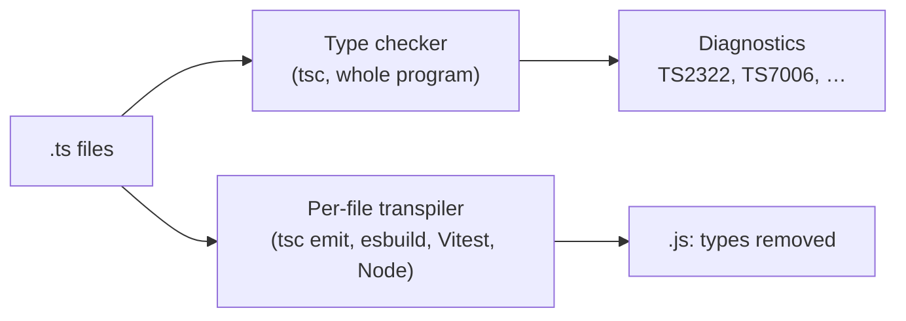
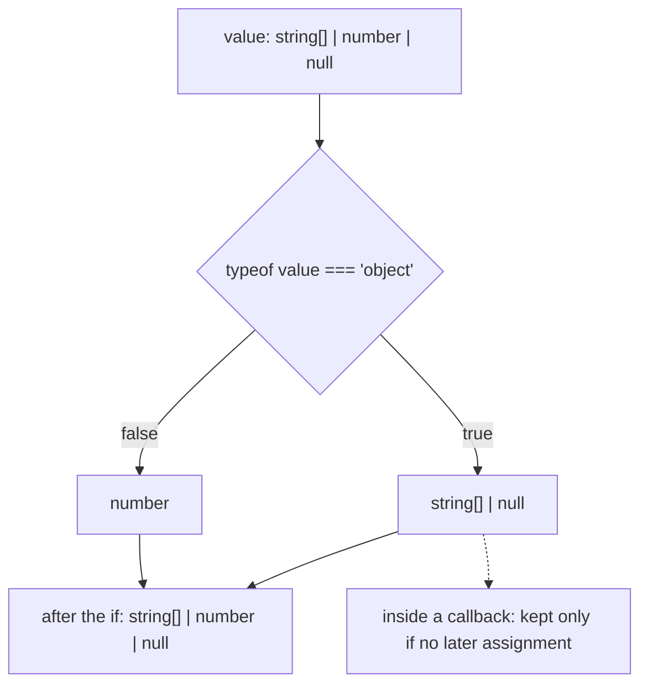
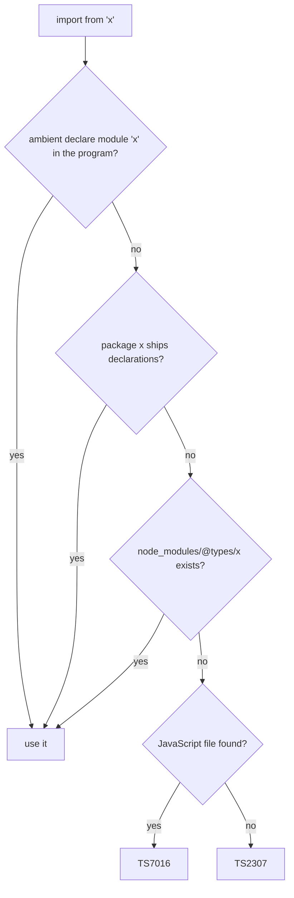
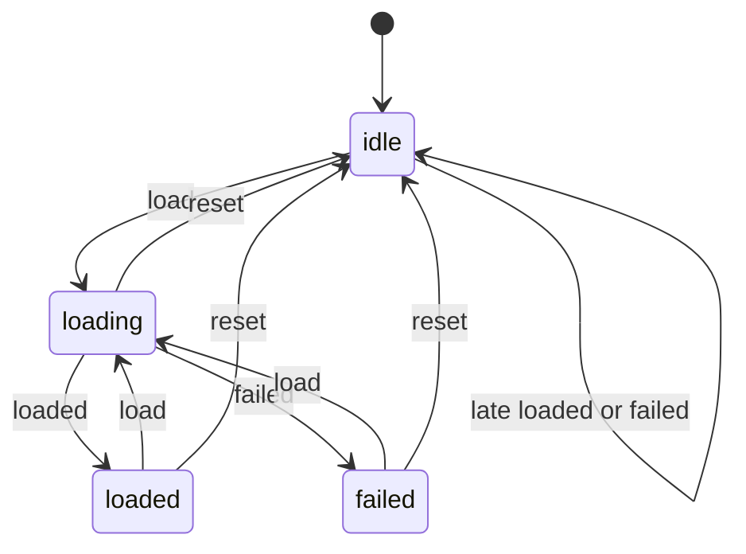

# 06. TypeScript type system essentials

> **What this covers:** what TypeScript checks and what it erases, the difference between the type checker and the per-file tools that only strip types (esbuild, a bundler that compiles each file on its own; Vitest, the test runner these labs use; and Node), structural typing, narrowing, unions and exhaustiveness, the special types (`any`, `unknown`, `never`, `void`), enums versus literal unions, `satisfies` and assertions, the `tsconfig` flags that decide what "type-correct" means (with TypeScript 6.0's new defaults), and declaration files. By the end you can predict which lines the compiler rejects, model states so impossible ones do not compile, and configure a project on purpose.
> **Prerequisites:** [01. Values and types](01-js-values-types-coercion.md#1-values-and-types) (`typeof` and the run-time types), [01. Null and undefined](01-js-values-types-coercion.md#7-null-undefined-and-the-nullish-operators), [03. Classes](03-js-objects-prototypes-classes.md#3-classes-the-sugar-and-what-is-not-sugar) (`#private` and class fields) and [05. Modern features by edition](05-js-modules-memory-modern-features.md#8-modern-features-by-edition-es2015-to-es2026) (`target`, `lib` and polyfills)
> **Leads to:** [07. Advanced types and decorators](07-ts-advanced-types-and-decorators.md), [12. How Angular works](12-angular-how-it-works.md), [13. Components and templates](13-components-and-templates.md), [41. API contracts](41-fullstack-api-contracts.md)
> **Applies to:** TypeScript 6.0 (6.0.3), with notes on TypeScript 7.0; Node.js 24; Angular 22
> **Study time:** ~3 hours reading + ~3 hours exercises
> **Short on time:** read [1. What TypeScript is](#1-what-typescript-is-erased-types-tsc-and-transpile-only-tools), [3. Narrowing](#3-narrowing-and-control-flow-analysis), [4. Unions](#4-unions-intersections-and-discriminated-unions) and [7. `tsconfig`](#7-tsconfig-the-strict-family-module-settings-and-typescript-60-defaults), then drill [Q06.01](#q06-01), [Q06.04](#q06-04), [Q06.07](#q06-07), [Q06.10](#q06-10), [Q06.15](#q06-15) and [Q06.19](#q06-19), try [Exercise 06.1](#ex06-1), and finish with the [Summary](#summary).
> **Labs:** [`labs/ts-js/src/modules/06-ts-type-system-essentials/`](../labs/ts-js/src/modules/06-ts-type-system-essentials/) (exercises, section claims and the `typecheck` helper) and [`labs/ts-js/src/outputs/06-ts-type-system-essentials/`](../labs/ts-js/src/outputs/06-ts-type-system-essentials/) (every *Output* question). Run (from `labs/ts-js`, Node 24): `npx vitest run src/modules/06-ts-type-system-essentials src/outputs/06-ts-type-system-essentials`

## Contents

1. [What TypeScript is: erased types, `tsc` and transpile-only tools](#1-what-typescript-is-erased-types-tsc-and-transpile-only-tools)
2. [Structural typing, assignability and `readonly`](#2-structural-typing-assignability-and-readonly)
3. [Narrowing and control-flow analysis](#3-narrowing-and-control-flow-analysis)
4. [Unions, intersections and discriminated unions](#4-unions-intersections-and-discriminated-unions)
5. [`any`, `unknown`, `never`, `void`, and `object` versus `{}`](#5-any-unknown-never-void-and-object-versus-)
6. [Enums, literal unions, `as const` and `satisfies`](#6-enums-literal-unions-as-const-and-satisfies)
7. [`tsconfig`: the `strict` family, module settings and TypeScript 6.0 defaults](#7-tsconfig-the-strict-family-module-settings-and-typescript-60-defaults)
8. [Declaration files, `@types` and augmentation](#8-declaration-files-types-and-augmentation)
- [Summary](#summary)
- [Question bank](#question-bank)
- [Hands-on exercises](#hands-on-exercises)
- [Check your understanding](#check-your-understanding)
- [Connections](#connections)

**How the claims here are verified.** Type-level claims are checked by compiling each snippet with the TypeScript 6.0.3 compiler API in a lab test, which asserts the exact diagnostic codes (`TS2353`, `TS18048`, …) or the emitted JavaScript. Run-time claims are run with Vitest or `node`. Version and default changes are cited from the TypeScript release notes.

## 1. What TypeScript is: erased types, `tsc` and transpile-only tools

### The problem it solves

A service declares `getUser(): Promise<User>`, the API returns `{ "name": null }`, and the app crashes three screens later in `user.name.toUpperCase()`. Everything compiled. The types described what the code *expected*. Nothing at run time checked what actually arrived.

### Mental model

Types are a building inspector's sign-off, not a load-bearing wall. The checker reads the whole program and either approves it or lists problems. Then every type is deleted from the *emit* (the JavaScript files the compiler writes), and what runs is plain JavaScript.



What to notice: the two arrows are independent. Only the checker sees types, and every transpiler, including `tsc`'s own emitter, just removes them. A build can emit JavaScript from code that does not type-check.

### How it actually works

- **Erasure.** Interfaces, type aliases, annotations and `import type` leave no trace in the output (lab). There is nothing at run time to check against, so data from outside needs run-time validation ([Q01.14](01-js-values-types-coercion.md#q01-14); schema libraries in [module 07](07-ts-advanced-types-and-decorators.md)).
- **Checker versus transpiler.** The checker needs every file at once. Tools such as esbuild and `ts.transpileModule` see *isolated modules*, one file at a time, so they cannot know whether an imported name is a type or a value. `isolatedModules` makes `tsc` reject code that a per-file tool would get wrong, for example re-exporting a type without `export type` (`TS1205`). They also report no type errors: `transpileModule` emitted `export const port = '8080';` from a line `tsc` rejects with `TS2322`. That is why the lab's `npm test` runs `tsc --noEmit` before Vitest.
- **Node 24 type stripping** [Stable since Node.js v24.12.0] (on by default since v23.6.0). Node runs `.ts` files by replacing types with whitespace, "and no type checking is performed" ([Node.js TypeScript](https://nodejs.org/api/typescript.html)). Syntax that needs generated JavaScript (`enum`, parameter properties, namespaces with values) fails with `ERR_UNSUPPORTED_TYPESCRIPT_SYNTAX`. `erasableSyntaxOnly` [Added in TypeScript 5.8] makes the checker reject the same constructs (`TS1294`) ([release notes](https://www.typescriptlang.org/docs/handbook/release-notes/typescript-5-8.html)).
- **TypeScript 6.0 and 7.0.** 7.0 is a native port in Go, "done as faithfully as possible", with typical speedups "between 8x and 12x" on full builds. It "adopts 6.0's new defaults" [Changed in TypeScript 6.0: `strict`, `module`, `target`, `types` and `rootDir` defaults, listed in [section 7](#7-tsconfig-the-strict-family-module-settings-and-typescript-60-defaults)] and turns 6.0's deprecations into hard errors. The announcement says "Practically any TypeScript code that compiles cleanly with TypeScript 6.0 … should compile identically in TypeScript 7.0" ([announcement](https://devblogs.microsoft.com/typescript/announcing-typescript-7-0/)). It ships no programmatic API yet, so tools that embed the compiler stay on 6.0. Angular 22's compiler requires `typescript >=6.0 <6.1` ([VERSIONS.md](../VERSIONS.md)); the announcement suggests 7.0 for command-line checks and 6.0 for the editor.

### Code

Approach: run a file with a deliberate type error directly with `node`.

```ts
// Node strips the annotation and never checks it, so this type error runs.
const port: number = '8080';
console.log(typeof port, port + 1);
```
<sub>Source: [labs/ts-js/src/modules/06-ts-type-system-essentials/fixtures/section-1/unchecked.ts](../labs/ts-js/src/modules/06-ts-type-system-essentials/fixtures/section-1/unchecked.ts)</sub>

Node 24 prints `string 80801`: the annotation said `number`, the value stayed a string, and `+` concatenated. Verified: the `Section 1:` tests in [`section-1-what-typescript-is.test.ts`](../labs/ts-js/src/modules/06-ts-type-system-essentials/section-1-what-typescript-is.test.ts). Drill it with [Q06.01](#q06-01), [Q06.02](#q06-02) and [Q06.03](#q06-03).

> [!TIP]
> **Coming from the backend.** Java erases generics too, but classes survive: `instanceof User` and Jackson's mapping check real types at run time. TypeScript erases interfaces completely. **Where the analogy breaks:** a TypeScript `User` is a promise about shape, so deserializing JSON "into" it is only a cast.

### Best practices and anti-patterns

- **Do validate data at trust boundaries** (HTTP responses, storage, messages), because nothing else checks it at run time.
- **Do run `tsc --noEmit` in CI** next to any esbuild, Vite or Vitest build, because those only strip types.
- **Do enable `isolatedModules`** (and `erasableSyntaxOnly` for code Node runs directly), because then the checker refuses what per-file tools would mistranslate.
- **Avoid replacing an Angular project's TypeScript 6.0 with 7.0**, because the Angular compiler needs the 6.0 API. 7.0's `tsc` can run as an extra, faster check.

### Misconceptions and traps

- *"It compiled, so the data is a `User`."* Compilation proves the code is consistent with its declarations. The belief comes from languages whose types exist at run time.
- *"Node runs TypeScript now, so I can skip `tsc`."* Once true that a `.ts` file needed a build step before it could run. Since Node v23.6.0 stripping is on by default, so running TypeScript feels like a built-in feature. Node only strips, and it ignores `tsconfig.json`.
- *"TypeScript 7 is a new language."* Once a fair worry about a rewrite. Now: the announcement calls it a faithful port ([Q06.03](#q06-03)).

## 2. Structural typing, assignability and `readonly`

### The problem it solves

`cancel(userId, orderId)` takes two `string` aliases. Someone passes them in the wrong order and it compiles. Elsewhere, `{ colour: 'red' }` passed inline to a function expecting `{ color?: string }` is rejected, but the same object passed through a variable is accepted. Both follow from one rule.

### Mental model

TypeScript checks shape, not name: a value fits a type if it has the members the type asks for, like a plug that fits any socket with the right pins. A name such as `UserId` is only a label for a shape (`string`), so two labels for the same shape are the same type.

### How it actually works

- **Assignability by members.** "Type compatibility in TypeScript is based on structural subtyping" ([handbook, Type Compatibility](https://www.typescriptlang.org/docs/handbook/type-compatibility.html)). A `Pixel` class with `x`, `y` and `color` is a valid `Point`. Extra members are fine, and swapped `UserId`/`OrderId` arguments compile. Making IDs distinct takes branded types ([module 07](07-ts-advanced-types-and-decorators.md)).
- **Excess property checks.** Object literals "get special treatment and undergo excess property checking" when assigned or passed directly ([handbook, Objects](https://www.typescriptlang.org/docs/handbook/2/objects.html)): `{ x: 1, y: 2, z: 3 }` as a `Point` is `TS2353`. Through a variable, the same object passes.
- **Weak types** [Added in TypeScript 2.4]. A type whose properties are all optional would accept almost anything, so assigning a value with *no* property in common is an error, `TS2559` ([release notes](https://www.typescriptlang.org/docs/handbook/release-notes/typescript-2-4.html)). That is what catches `colour` through a variable.
- **Classes and `private`.** Classes compare structurally too, but "if the target type contains a private member, then the source type must also contain a private member that originated from the same class" (Type Compatibility). Two classes with the same `private x` are incompatible (`TS2322`). TypeScript's `private`, `protected` and `public` are compile-time only: the emitted class keeps `pin = 1234` as an ordinary field, while `#token` stays a real private field ([03 §3](03-js-objects-prototypes-classes.md#3-classes-the-sugar-and-what-is-not-sugar), [Q02.09](02-js-scope-closures-this.md#q02-09)).
- **`readonly`.** `readonly` properties and `readonly T[]` reject writes (`TS2540`) and mutating methods (`push` does not exist, `TS2339`). It is shallow and compile-time only, and the checker does not compare `readonly` when relating types, "so readonly properties can also change via aliasing" (Objects): assigning to a mutable alias compiles. Run-time freezing is [Q03.18](03-js-objects-prototypes-classes.md#q03-18)'s topic.

### Code

Approach: the same object passed two ways. The first line is a fresh literal; the second goes through a variable.

```ts
// Partial: each line is checked on its own in the lab.
interface Point { x: number; y: number }
const p1: Point = { x: 1, y: 2, z: 3 }; // TS2353: excess property in a fresh literal
const raw = { x: 1, y: 2, z: 3 };
const p2: Point = raw; // compiles: structural assignment ignores extras
```

Verified: the `Section 2:` tests in [`section-2-structural-typing.test.ts`](../labs/ts-js/src/modules/06-ts-type-system-essentials/section-2-structural-typing.test.ts) compile each case with the TypeScript 6.0.3 compiler API and assert the codes named above. Drill it with [Q06.04](#q06-04), [Q06.05](#q06-05) and [Q06.06](#q06-06).

> [!TIP]
> **Coming from the backend.** Java and C# are nominal: two classes with identical fields are unrelated unless one declares the other. **Where the analogy breaks:** in TypeScript, an interface nobody `implements` still matches any object of the right shape, and a type alias never creates a new type.

### Best practices and anti-patterns

- **Do pass object literals inline or annotate them where they are created**, because excess property checks only run on fresh literals.
- **Do use `readonly` for inputs and shared state**, because it documents intent and blocks accidental writes at no run-time cost.
- **Avoid relying on `private` for secrecy**, because it is erased; use `#private` when the value must be unreachable.
- **Avoid two plain `string` parameters for different IDs in public APIs**, because the compiler cannot tell them apart.

### Misconceptions and traps

- *"`type UserId = string` creates a new type."* It is an alias, and aliases are transparent. The `type` keyword reads like a declaration of something new, as `class` does. Nominal-style IDs need brands ([module 07 §6](07-ts-advanced-types-and-decorators.md#6-branded-types-for-ids-and-money)).
- *"Excess properties are always errors."* Only in fresh literals. The belief comes from the inline case, which is the one people see.
- *"`readonly` makes an object immutable."* It is a compile-time view of one reference. An alias, `as`, or plain JavaScript can still write. The word sounds like `const` and `Object.freeze`, which JavaScript enforces at run time.

## 3. Narrowing and control-flow analysis

### The problem it solves

`if (count)` was meant to skip `undefined`, and it also skips `0`, so an empty cart shows "no count". A helper checks a value, yet its caller still gets "possibly undefined". Both come from how the compiler follows your checks.

### Mental model

The checker reads each function like a reviewer with a highlighter: after every test it shrinks the variable's type on each branch, an assignment replaces it with the type of the assigned value, and where branches meet the types merge again. The type of a variable is a property of a *place* in the code, not of the variable.



What to notice: the same variable has a different type at each node. Branches merge back into the union at the join, an assignment would replace the type with the assigned value's, and the dashed edge is the exception: a callback may run later, so it keeps a narrowing only when no assignment follows (TypeScript 5.4).

### How it actually works

- **Control-flow analysis.** "This analysis of code based on reachability is called control flow analysis" ([handbook, Narrowing](https://www.typescriptlang.org/docs/handbook/2/narrowing.html)). Branches split the type and joins merge it back.
- **The narrowing forms.** `typeof` (with JavaScript's quirk: `typeof null` is `'object'`, so `typeof value === 'object'` leaves `string[] | null` and `value.length` is `TS18047`; [01 §1](01-js-values-types-coercion.md#1-values-and-types)), `instanceof` (it needs a value at run time, so it works with a class but not an interface or alias: `TS2693`, because those are erased, [section 1](#1-what-typescript-is-erased-types-tsc-and-transpile-only-tools)), `in` (`'meow' in pet`), equality (`a === b` narrows both sides to their common type) and `switch` on a literal. Truthiness narrows too, but it removes `0`, `''` and `NaN` along with `null` and `undefined`: the compiler accepts it, and the bug is only visible at run time (lab).
- **Type predicates.** `function isUser(value: unknown): value is User` lets a function narrow its caller's variable. The compiler checks only that the function returns a `boolean`, not that the test matches the claim: a predicate that tests `'number'` and claims `string` compiles. A predicate is also inferred for simple arrow functions [Added in TypeScript 5.5], so `[1, undefined].filter((x) => x !== undefined)` is `number[]`; `!!x` is not inferred, because it also removes `0` ([5.5 notes](https://www.typescriptlang.org/docs/handbook/release-notes/typescript-5-5.html)).
- **Assertion functions** [Added in TypeScript 3.7] (`asserts value is T`) narrow everything *after* the call, and throw otherwise ([3.7 notes](https://www.typescriptlang.org/docs/handbook/release-notes/typescript-3-7.html)). The call target must have an explicit type: an arrow function assigned to an unannotated `const` gives `TS2775`, and the narrowing is lost.
- **Closures.** A callback may run later, after the variable changed. A closure keeps the narrowing of a `let` if there is no assignment after it [Added in TypeScript 5.4] ([5.4 notes](https://www.typescriptlang.org/docs/handbook/release-notes/typescript-5-4.html)); add `value = undefined` later and the closure sees `string | undefined` again (`TS18048`).
- **`this`.** A first parameter named `this` types the receiver and is checked at each call (`TS2684` for a bare call). Under `strict`, an untyped `this` in a function is `TS2683` (`noImplicitThis`; run-time rules in [module 02](02-js-scope-closures-this.md)).

### Code

Approach: a predicate for untrusted data (typed `unknown`, the "safe anything" of [section 5](#5-any-unknown-never-void-and-object-versus-)), written so the test really proves the claim.

```ts
// Partial: the full guard with nested fields is Exercise 06.2.
interface User { name: string; age: number }

function isUser(value: unknown): value is User {
  return (
    typeof value === 'object' && value !== null &&
    'name' in value && typeof value.name === 'string' &&
    'age' in value && typeof value.age === 'number'
  );
}
```

`value !== null` closes the `typeof null` gap, and each `in` check narrows `value` so that `value.name` compiles. Verified: the `Section 3:` tests in [`section-3-narrowing.test.ts`](../labs/ts-js/src/modules/06-ts-type-system-essentials/section-3-narrowing.test.ts). Drill it with [Q06.07](#q06-07), [Q06.08](#q06-08) and [Q06.09](#q06-09); build one in [Exercise 06.2](#ex06-2).

### Best practices and anti-patterns

- **Do test for `null` and `undefined` explicitly** (`!= null`, `!== undefined`) when `0` or `''` are valid, because truthiness removes them too.
- **Do keep each predicate next to a test that feeds it bad data**, because the compiler takes its word.
- **Do declare assertion functions with `function` or an explicit type**, because otherwise the call does not narrow.
- **Avoid narrowing a mutable property and then awaiting or calling out**, because other code can change it in between. Copy it into a `const` first.

### Misconceptions and traps

- *"`typeof x === 'object'` means x is an object."* `null` passes. The habit comes from other languages, where `null` has no type tag.
- *"A type predicate is checked."* Only its return type is. The predicate sits where a return type goes, and the compiler checks every other return expression. A wrong predicate is worse than `as`, because it looks safe.
- *"Narrowing never survives into a callback."* Once true. Now: since TypeScript 5.4 it survives when the `let` is not reassigned afterwards.

## 4. Unions, intersections and discriminated unions

### The problem it solves

A component's state is `{ loading: boolean; data?: Order[]; error?: string }`. Nothing stops `loading: true` together with an `error`, every reader re-checks three fields, and when someone adds a "retrying" state, no compiler error points at the places that must handle it.

### Mental model

A union is "one of these shapes". A *discriminant* is a label on each shape (`kind: 'circle'`), and checking the label tells the compiler which shape you hold. `never` is the empty set: if, after every label is checked, the value's type is `never`, you handled them all.

### How it actually works

- **Unions** (`A | B`). Before narrowing, you can read only members every shape has: reading `x.b` on `{ a; b } | { a; c }` is `TS2339`. Narrowing ([section 3](#3-narrowing-and-control-flow-analysis)) picks a member.
- **Discriminated unions.** When every member has a property with a distinct literal type, comparing it narrows to one member. After `shape.kind === 'circle'`, `shape.side` is `TS2339` ([handbook, Narrowing](https://www.typescriptlang.org/docs/handbook/2/narrowing.html)).
- **Intersections** (`A & B`) require both. Conflicting properties are not an error by themselves: in `{ a: string } & { a: number }`, the property `a` is `never` while the object type is not. When the conflict is in a discriminant, the whole intersection reduces to `never` [Changed in TypeScript 3.9] ([3.9 notes](https://www.typescriptlang.org/docs/handbook/release-notes/typescript-3-9.html)). `string & number` is `never` too (all checked in the lab).
- **Exhaustiveness.** "No type is assignable to `never` (except `never` itself)" (Narrowing), so in a `default` branch the remaining type must be `never`. Three ways to make the compiler say so when a case is missing: pass it to `assertNever` (`TS2345`), write `shape satisfies never` (`TS1360`; [`satisfies`](#6-enums-literal-unions-as-const-and-satisfies) checks a value against a type without changing it), or declare the return type and let the missing return fail (`TS2366`). `noFallthroughCasesInSwitch` adds `TS7029` for a case that falls into the next.

### Code

Approach: (1) give each shape a `kind`, (2) switch on it, (3) pass whatever is left to a function that accepts only `never`.

```ts
// Partial: compiled in the lab as part of a module.
type Shape =
  | { kind: 'circle'; radius: number }
  | { kind: 'square'; side: number }
  | { kind: 'triangle'; base: number; height: number };

function assertNever(value: never): never {
  throw new Error('unexpected ' + JSON.stringify(value));
}

function area(shape: Shape): number {
  switch (shape.kind) {
    case 'circle': return Math.PI * shape.radius ** 2;
    case 'square': return shape.side ** 2;
    case 'triangle': return (shape.base * shape.height) / 2;
    default: return assertNever(shape);
  }
}
```

Delete the `triangle` case and the call to `assertNever` becomes `TS2345`. The `throw` also protects at run time, when data from outside carries a `kind` the types do not know. Verified: the `Section 4:` tests in [`section-4-unions.test.ts`](../labs/ts-js/src/modules/06-ts-type-system-essentials/section-4-unions.test.ts). Drill it with [Q06.10](#q06-10), [Q06.11](#q06-11) and [Q06.12](#q06-12); build it in [Exercise 06.1](#ex06-1).

### Best practices and anti-patterns

- **Do model mutually exclusive states as a discriminated union**, because impossible combinations then cannot be written.
- **Do end every `switch` over a union with an exhaustiveness check**, because adding a member then lists every place to update.
- **Avoid optional fields that are only valid together**, because the compiler cannot relate them.

### Misconceptions and traps

- *"`A & B` with a conflicting property is an error."* Only assigning a value to it fails, because the property is `never`. The object type looks contradictory, so people expect a diagnostic. Before TypeScript 3.9, even conflicting discriminants left a usable-looking type.
- *"A `default` branch makes a switch exhaustive."* It hides missing cases unless it checks for `never`. `default` means "all the rest", which reads as "all handled", and TypeScript does not require one.

## 5. `any`, `unknown`, `never`, `void`, and `object` versus `{}`

### The problem it solves

`const data = JSON.parse(text)` returns `any`. From there, `data.user.name.toFixed(2)` compiles, its result is assigned to a `string`, and the error surfaces at run time in a different file. One `any` switched checking off for everything it touched.

### Mental model

`unknown` is a sealed parcel: you must check what is inside before using it. `any` is the same parcel with a forged "inspected" sticker. `never` is a parcel that cannot exist. `void` on a function type means "the caller will not look at what comes back".

### How it actually works

- **`any`** disables checking in both directions: anything is assignable to it, and it is assignable to anything, so it spreads through every expression it touches (the lab line above compiles with zero errors). It enters quietly: `JSON.parse` is declared to return `any` in typescript 6.0.3's `lib.es5.d.ts`, and so is `response.json()`.
- **`unknown`** "represents any value" but "it's not legal to do anything with an unknown value" ([handbook, More on Functions](https://www.typescriptlang.org/docs/handbook/2/functions.html)) until you narrow it ([section 3](#3-narrowing-and-control-flow-analysis)): `data.user` is `TS18046`. Under `strict`, `catch (error)` gives `unknown` too (`useUnknownInCatchVariables` [Added in TypeScript 4.4], [release notes](https://www.typescriptlang.org/docs/handbook/release-notes/typescript-4-4.html)), because anything can be thrown ([05 §6](05-js-modules-memory-modern-features.md#6-errors-subclasses-causes-aggregation-and-global-handlers)).
- **`never`** "represents values which are never observed": the return type of a function that always throws, and what is left after exhaustive narrowing ([section 4](#4-unions-intersections-and-discriminated-unions)). Nothing else is assignable to it (`TS2322`).
- **`void`.** For function *types*, "a contextual function type with a void return type … can return any other value, but it will be ignored" (More on Functions). That is why `forEach((n) => nums.push(n))` compiles although `push` returns a number. The caller cannot use the result (`f().toFixed()` is `TS2339`), and a function *declared* `: void` cannot return a value (`TS2322`).
- **`object`, `{}` and `Object`.** `object` means "any value that isn't a primitive" (More on Functions), so `const a: object = 1` fails. `{}` means "anything except `null` and `undefined`", primitives included. `Object` is the interface of `Object.prototype`: it accepts primitives but checks members such as `toString(): string`. The handbook's advice: "`object` is not `Object`. Always use `object`!"

### Code

Approach: receive `unknown`, narrow it, and only then read it.

```ts
// Partial: the narrowing is section 3's; the complete guard is Exercise 06.2.
export function readName(data: unknown): string {
  if (typeof data === 'object' && data !== null && 'name' in data && typeof data.name === 'string') {
    return data.name;
  }
  throw new TypeError('expected an object with a string name');
}
```

Verified: the `Section 5:` tests in [`section-5-special-types.test.ts`](../labs/ts-js/src/modules/06-ts-type-system-essentials/section-5-special-types.test.ts) assert every code above and read the `JSON.parse` declaration from the installed TypeScript. Drill it with [Q06.13](#q06-13) and [Q06.14](#q06-14).

### Best practices and anti-patterns

- **Do type external data as `unknown`** (`JSON.parse(text) as unknown`, or a wrapper that returns `unknown`), because it forces a check at the boundary.
- **Do write `catch (error)` handlers that narrow** (`error instanceof Error`, or `Error.isError` [Added in ES2026], [Q05.16](05-js-modules-memory-modern-features.md#q05-16)), because the value may not be an `Error`.
- **Avoid `{}` and `Object` as parameter types**, because they accept primitives; use `object` or a real shape.
- **Avoid `any` outside quarantined adapter code**, because one `any` turns off checking wherever it flows.

### Misconceptions and traps

- *"`unknown` and `any` are the same, only stricter."* `any` also *disables* errors downstream; `unknown` never does. Both accept every value, so they look alike until you read one.
- *"`{}` means an empty object."* It accepts `1` and `'text'`. The name suggests an object literal type.
- *"`catch (e)` is `any`."* Once true: before TypeScript 4.4, and still without `strict`. Now: `unknown` under `strict`.

## 6. Enums, literal unions, `as const` and `satisfies`

### The problem it solves

`enum Direction { Up, Down }` accepts any `number` variable. A `const enum` from a library breaks once the build switches to esbuild. Node's type stripping refuses enums entirely ([section 1](#1-what-typescript-is-erased-types-tsc-and-transpile-only-tools)). And a configuration object annotated as `Record<string, string>` silently accepts `palette['blue']`, a key that does not exist.

### Mental model

An enum is TypeScript generating a JavaScript object for you. A literal union (`'active' | 'disabled'`) is a list of allowed words that costs nothing at run time. An `as const` object is a dictionary whose words are also run-time values. `satisfies` is a spell-check that leaves your text exactly as written.

### How it actually works

- **Numeric enums** emit an object with a *reverse mapping* (`Direction[Direction["Up"] = 0] = "Up"`), so `Direction[0]` is `'Up'`. An out-of-range literal is an error [Changed in TypeScript 5.0: before, `99` was accepted] (`TS2322`, [5.0 notes](https://www.typescriptlang.org/docs/handbook/release-notes/typescript-5-0.html)), but any `number` variable is still accepted.
- **String enums** have no reverse mapping, and are nominal: `const m: Mode = 'dark'` is `TS2322` although `Mode.Dark` is `'dark'`.
- **`const enum`** members are "inlined at use sites" by `tsc` ([handbook, Enums](https://www.typescriptlang.org/docs/handbook/enums.html)). A per-file transpiler cannot see another file's values, so it emits a normal enum and keeps `Level.Low` (lab). `isolatedModules` makes *using* a `const enum` declared in a `.d.ts` file an error (`TS2748`, reported at the use), because no per-file tool could inline its values.
- **Literal widening.** `let a = 'x'` is `string` and `const b = 'x'` is `'x'`: a `let` can change, so the literal widens, and assigning `a` to a `'x'` variable is `TS2322`. `as const` and `satisfies` keep the literal where inference would widen it.
- **`as const` objects** [Added in TypeScript 3.4] keep literal types and make every property `readonly` (`TS2540` on write). `(typeof Status)[keyof typeof Status]` turns the values into a union, so `'archived'` is `TS2322` and plain strings from JSON need no conversion. The handbook: "you may not need an enum when an object with `as const` could suffice".
- **`satisfies`** [Added in TypeScript 4.9] checks an expression against a type without changing the expression's type ([4.9 notes](https://www.typescriptlang.org/docs/handbook/release-notes/typescript-4-9.html)). An annotation `: Record<string, string>` forgets which keys exist. `satisfies Record<string, string>` rejects a wrong value (`TS2322`) and still reports `palette.blue` as missing (`TS2339`).
- **Assertions** (`value as T`) are not checks. `JSON.parse(text) as { name: string }` compiles whatever the text holds. The compiler refuses only a conversion between types that do not overlap (`'text' as number`, `TS2352`), and `as unknown as number` bypasses even that.
- **Angular** uses both: `ChangeDetectionStrategy` and `ViewEncapsulation` are enums in `@angular/core` 22.2.1, while the newer `ResourceStatus` is a string union (`'idle' | 'error' | 'loading' | …`, read from its typings). The current Angular style guide says nothing about enums (checked on angular.dev).

### Code

Approach: one `as const` object as the source of both the values and the type.

```ts
// Partial: compiled in the lab.
export const Status = { Active: 'active', Disabled: 'disabled' } as const;
export type Status = (typeof Status)[keyof typeof Status]; // 'active' | 'disabled'

const s: Status = 'archived'; // TS2322
```

The emit is the object itself: no extra code, and Node's type stripping accepts it. Verified: the `Section 6:` tests in [`section-6-enums-satisfies.test.ts`](../labs/ts-js/src/modules/06-ts-type-system-essentials/section-6-enums-satisfies.test.ts). Drill it with [Q06.15](#q06-15), [Q06.16](#q06-16), [Q06.17](#q06-17) and [Q06.18](#q06-18); build a typed table in [Exercise 06.3](#ex06-3).

### Best practices and anti-patterns

- **Do prefer literal unions or `as const` objects for new code**, because they are erasable, need no conversion from JSON strings, and work with every transpiler.
- **Do use `satisfies` for configuration tables**, because it validates entries and keeps the exact keys for autocompletion.
- **Avoid `const enum` in code compiled per file or published as `.d.ts`**, because inlining needs the whole program.
- **Avoid `as` on external data**, because it states a fact nobody checked; narrow or validate instead.

### Misconceptions and traps

- *"Enums are erased like other types."* They are the one common TypeScript construct that generates code, which is why Node's type stripping rejects them. The belief generalises from interfaces and aliases.
- *"A numeric enum only accepts its members."* Literals, since 5.0 (before, `99` passed too); any `number` variable still passes.
- *"`satisfies` is the same as an annotation."* An annotation replaces the inferred type, and `satisfies` keeps it. Both sit after the name and both reject wrong values.

## 7. `tsconfig`: the `strict` family, module settings and TypeScript 6.0 defaults

### The problem it solves

Two teams on "the same TypeScript" disagree on whether `items[0].name` compiles. A project upgraded to TypeScript 6.0 suddenly reports `Cannot find namespace 'Chai'`, and another fails on `target: "es5"`. Each time the code did not change: the `tsconfig.json` decided what "type-correct" means.

### Mental model

`tsconfig.json` is the contract for one environment: which checks apply, how imports are resolved, and what per-file tools must be able to handle. `strict` is not one rule but a bundle, and the most useful checks for application code are outside it.

### How it actually works

- **The `strict` family.** "Turning this on is equivalent to enabling all of the strict mode family options" ([TSConfig reference](https://www.typescriptlang.org/tsconfig/)). In typescript 6.0.3 that is eight flags (read from the compiler's own option table in the lab): `noImplicitAny`, `strictNullChecks`, `strictFunctionTypes`, `strictBindCallApply`, `strictPropertyInitialization`, `strictBuiltinIteratorReturn` [Added in TypeScript 5.6], `noImplicitThis` and `useUnknownInCatchVariables`. Since 6.0 `strict` is `true` by default (a config with no options reports `TS7006`). It has nothing to do with JavaScript's `"use strict"`, which `alwaysStrict` emits ([module 02](02-js-scope-closures-this.md)).
- **Worth adding.** `noUncheckedIndexedAccess` types `xs[0]` as `number | undefined` (`TS2322` on assignment to `number`). `exactOptionalPropertyTypes` separates "absent" from "present but `undefined`": `{ nick: undefined }` for `nick?: string` is `TS2375`, or `TS2379` as an argument, unless the type says `| undefined` ([01 §7](01-js-values-types-coercion.md#7-null-undefined-and-the-nullish-operators)). `noPropertyAccessFromIndexSignature` makes `env.HOME` on a `Record` a `TS4111`, so typos stand out. `noImplicitOverride` requires `override` (`TS4114`).
- **Module settings.** `module` decides what the emitted imports look like, and `moduleResolution` how specifiers find files. For code a bundler processes (a build tool such as Vite or webpack that joins modules into files for the browser), the handbook asks for `"moduleResolution": "bundler"`; for code Node runs, `"module": "nodenext"` ([Choosing compiler options](https://www.typescriptlang.org/docs/handbook/modules/guides/choosing-compiler-options.html)). `"module": "preserve"` [Added in TypeScript 5.4] implies `bundler` and is what this guide's Angular lab project uses. `isolatedModules` ([section 1](#1-what-typescript-is-erased-types-tsc-and-transpile-only-tools)) and `verbatimModuleSyntax` go further: every type-only import must say `import type` (`TS1484`), so a per-file tool can drop it without guessing.
- **TypeScript 6.0 defaults** [Changed in TypeScript 6.0: `strict`, `module`, `target`, `types`, `rootDir` and `noUncheckedSideEffectImports`] ([6.0 notes](https://www.typescriptlang.org/docs/handbook/release-notes/typescript-6-0.html)): `strict: true`, `module: esnext`, a floating `target` (`es2025` now), `noUncheckedSideEffectImports: true`, `rootDir: "."` and `types: []`. These break projects first. Without `types`, global `@types` packages are no longer loaded: in the lab, `Chai.Assertion` is `TS2503` and `process` is `TS2591` until `types` lists `"chai"` (or `"node"`), or `"*"` (the old behavior). Without `rootDir`, sources in `src/` emit to `dist/src` and report `TS5011`. `import './styles.css'` with no declaration is `TS2882`, until a `declare module '*.css'` or `noUncheckedSideEffectImports: false`.
- **Deprecations.** Options that 7.0 removes are errors in 6.0 (`target: es5`, `moduleResolution: node10`, `alwaysStrict: false` → `TS5107`; `baseUrl` → `TS5101`) until you set `"ignoreDeprecations": "6.0"`.

### Code

Approach: the settings this guide's labs use for application code, which match the checks above.

```json
{
  "compilerOptions": {
    "strict": true,
    "noUncheckedIndexedAccess": true,
    "noPropertyAccessFromIndexSignature": true,
    "noImplicitOverride": true,
    "module": "preserve",
    "isolatedModules": true,
    "verbatimModuleSyntax": true,
    "types": ["vitest/globals"]
  }
}
```

This is a subset of `labs/ts-js/tsconfig.json`. Verified: the `Section 7:` tests in [`section-7-tsconfig.test.ts`](../labs/ts-js/src/modules/06-ts-type-system-essentials/section-7-tsconfig.test.ts). Drill it with [Q06.19](#q06-19), [Q06.20](#q06-20), [Q06.21](#q06-21) and [Q06.22](#q06-22); apply it in [Exercise 06.4](#ex06-4).

### Best practices and anti-patterns

- **Do set `strict` explicitly** even on 6.0, because readers and tools on 5.x assume the old default.
- **Do enable `noUncheckedIndexedAccess` in new code**, because array and record reads are where `undefined` hides.
- **Do list `types` explicitly**, because 6.0 loads none and 7.0 keeps that default.
- **Avoid `ignoreDeprecations` as a permanent fix**, because 7.0 removes the options it silences.

### Misconceptions and traps

- *"`strict` turns on every check."* `noUncheckedIndexedAccess`, `exactOptionalPropertyTypes` and the other flags above are outside it. The name suggests otherwise, and the family is a fixed list that grows: `strictBuiltinIteratorReturn` joined in 5.6.
- *"`strict` is off unless I set it."* Once true: before TypeScript 6.0. Now it is the default.
- *"`types` is optional, TypeScript finds my `@types`."* Once true: 5.9 and earlier loaded every visible `@types` package, a behavior that dates from TypeScript 2.0 ([TSConfig reference, `typeRoots`](https://www.typescriptlang.org/tsconfig/)). Now: `[]`.

## 8. Declaration files, `@types` and augmentation

### The problem it solves

`import picomatch from 'picomatch'` fails with "Could not find a declaration file for module". `window.appConfig`, injected by the server, is a type error. A plugin adds `store.has()` at run time, and the compiler insists `Store` has no such method. All three need types for code you cannot or should not edit.

### Mental model

A `.d.ts` file is a contract written next to code you do not control: it says what exists, and contains no implementation. Augmentation is a signed addendum to someone else's contract.



What to notice: the first match wins, and an ambient declaration beats the package's own types, which beat `@types`. Only when none exists does the import fail, with `TS7016` if the package has JavaScript and `TS2307` if nothing resolves.

### How it actually works

- **Where types come from.** The compiler uses the first of these that exists: an ambient `declare module` in the program, then the package's own declarations (`exports` `types` condition or `types` field), then `@types/<name>` (read with `--traceResolution` and tested in the lab). A package may ship its own declarations: `vitest`'s `package.json` points its `exports` `types` condition at `./dist/index.d.ts`. If it ships none, the community may publish `@types/<name>` on DefinitelyTyped, the community repository of such packages. `chai` has no `types` field, so `import { expect } from 'chai'` resolves to the installed `@types/chai`. "If the npm package already includes its declaration file … downloading the corresponding @types package is not needed" ([handbook, Consumption](https://www.typescriptlang.org/docs/handbook/declaration-files/consumption.html)). Imports find `@types` packages on their own; the 6.0 `types: []` default only stops *global* ones from loading ([section 7](#7-tsconfig-the-strict-family-module-settings-and-typescript-60-defaults)).
- **No types at all.** `picomatch` 4.0.7 has neither, so its import is `TS7016`. An *ambient module* fixes it: `declare module 'legacy-charts' { export function draw(id: string): void; }` types the API (misuse is `TS2345`), and the shorthand `declare module 'picomatch';` makes everything `any`.
- **Global augmentation.** `declare global { interface Window { … } }` adds to the global `Window` type, but only from a module file (one with `import` or `export`, even `export {}`). In a script it is `TS2669`, where a plain `interface Window` declaration merges directly.
- **Module augmentation.** `declare module './store' { interface Store { has(key: string): boolean } }` merges a member into an exported interface. Limits: "you can't declare new top-level declarations in the augmentation — just patches to existing declarations", and default exports cannot be augmented ([handbook, Declaration Merging](https://www.typescriptlang.org/docs/handbook/declaration-merging.html)).

### Code

Approach: give the server-injected config a type, in a file that is a module.

```ts
// Partial: a .d.ts file in the project (compiled in the lab as /virtual/globals.d.ts).
export {};

declare global {
  interface Window {
    appConfig: { apiUrl: string };
  }
}
```

After this, `window.appConfig.apiUrl` is a `string`; without the file it is `TS2339`. The declaration describes what the server promises. It checks nothing at run time ([section 1](#1-what-typescript-is-erased-types-tsc-and-transpile-only-tools)). Verified: the `Section 8:` tests in [`section-8-declarations.test.ts`](../labs/ts-js/src/modules/06-ts-type-system-essentials/section-8-declarations.test.ts). Drill it with [Q06.23](#q06-23) and [Q06.24](#q06-24).

### Best practices and anti-patterns

- **Do prefer packages that ship types, then `@types`**, because hand-written declarations drift from the library.
- **Do keep augmentations in one `.d.ts` per concern, next to the code that installs the run-time behavior**, because the two must change together.
- **Avoid shorthand `declare module 'x';` beyond a migration step**, because it makes the whole package `any`.

### Misconceptions and traps

- *"`skipLibCheck` skips types from libraries."* It is "skip type checking of declaration files" ([TSConfig reference](https://www.typescriptlang.org/tsconfig/)): their types are still used, and only errors inside them go unreported. The name suggests skipping libraries.
- *"`declare global` works anywhere."* Only inside a module or an ambient module declaration, which is why `export {}` appears in global `.d.ts` files. In a script `.d.ts`, a plain `interface Window` merges directly, so the wrapper looks unnecessary until the file gains an `import` or `export`.

## Summary

TypeScript is a checker, not a runtime: it reads the whole program, reports what is inconsistent with the declarations, and then every type is erased ([1](#1-what-typescript-is-erased-types-tsc-and-transpile-only-tools)). Per-file tools (esbuild, Vitest, Node's type stripping) only remove types, so `tsc --noEmit` must run somewhere, and data from outside must be checked by code: "it compiled" does not make the data a `User`. TypeScript 7 is the same checker ported to Go; Angular 22 stays on 6.0 because it needs the compiler API. Types are compared by shape: extra members are fine, except in a fresh object literal, and `private` is the one thing that makes a class nominal ([2](#2-structural-typing-assignability-and-readonly)). The most-asked trap: excess property checks apply only to fresh literals, and `readonly` and `private` are compile-time only.

Inside a function, a variable's type depends on the place: each `typeof`, `in`, equality or truthiness check narrows it, `typeof null` is `'object'` here too, and a type predicate is trusted, not checked ([3](#3-narrowing-and-control-flow-analysis)). Discriminated unions make impossible states unwritable, and a `never` check in `default` turns "I forgot a case" into a compile error, where a plain `default` hides it ([4](#4-unions-intersections-and-discriminated-unions)). `unknown` is the safe "anything", `any` switches checking off wherever it flows, and `{}` accepts primitives ([5](#5-any-unknown-never-void-and-object-versus-)).

Prefer literal unions or `as const` objects to enums: enums are not erased, and a numeric enum accepts any number ([6](#6-enums-literal-unions-as-const-and-satisfies)). `satisfies` checks a value and keeps its precise type; `as` checks almost nothing. `tsconfig` decides what "type-correct" means: `strict` is a fixed family and the default since 6.0, `noUncheckedIndexedAccess` and `exactOptionalPropertyTypes` are outside it, and after the upgrade `types: []` makes globals such as `Chai` or `describe` vanish unless listed ([7](#7-tsconfig-the-strict-family-module-settings-and-typescript-60-defaults)). Libraries bring their own `.d.ts` or an `@types` package, and `declare global` and module augmentation add to types you do not own, but `declare global` only works in a module file ([8](#8-declaration-files-types-and-augmentation)).

## Question bank

Questions run from what the checker sees to how it narrows. Every *Output* answer is asserted by a test named after the question in [`labs/ts-js/src/outputs/06-ts-type-system-essentials/`](../labs/ts-js/src/outputs/06-ts-type-system-essentials/), which compiles the fixture with the TypeScript 6.0.3 compiler API under the lab's `strict` settings and checks each diagnostic's line and code. Every other claim is asserted by the `Section N:` tests of the section its *Background* link names, in `section-N-….test.ts` under [`labs/ts-js/src/modules/06-ts-type-system-essentials/`](../labs/ts-js/src/modules/06-ts-type-system-essentials/). An answer names a test only when a different one backs it (`Q06.NN evidence`).

<a id="q06-01"></a>
### Q06.01 · Concept · What does TypeScript check, and what is left of your types at run time?

<details>
<summary>Answer</summary>

**Short answer (30 seconds).** It checks that the program is consistent with its own declarations: calls, assignments, property accesses and control flow. Then every type is erased, so nothing at run time checks data that arrives from outside.

**Full explanation.** The checker reads the whole program; the emitter, or any transpiler, deletes the types ([section 1](#1-what-typescript-is-erased-types-tsc-and-transpile-only-tools)). A `number` annotation on a value that is really a string still runs with the string: the lab's `unchecked.ts` prints `string 80801` under Node 24.

**Follow-ups an interviewer will ask.**
- *What survives erasure?* Constructs that generate JavaScript: `enum`, parameter properties and namespaces with values ([section 6](#6-enums-literal-unions-as-const-and-satisfies)).
- *So how do you trust an API response?* Validate it at the boundary with a predicate or a schema library ([Q06.08](#q06-08)).

**Trap to avoid.** Saying `res.json() as User` "converts" the data. It is a claim the compiler accepts without evidence.

</details>

<a id="q06-02"></a>
### Q06.02 · Difference · `tsc` versus esbuild, Vitest or Node type stripping: what can a per-file transpiler not do?

<details>
<summary>Answer</summary>

**Short answer (30 seconds).** It cannot type-check and cannot see other files, so it reports no type errors and cannot tell whether an imported name is a type or a value. `isolatedModules` makes `tsc` reject what a per-file tool would get wrong; `tsc --noEmit` in CI supplies the checking.

**Full explanation.** The evidence (a `TS2322` line that `transpileModule` still emits, `TS1205` for a type re-export, `ERR_UNSUPPORTED_TYPESCRIPT_SYNTAX` for `enum` in Node) is in [section 1](#1-what-typescript-is-erased-types-tsc-and-transpile-only-tools). A type re-export fails because the transpiler would keep a value export that does not exist.

**Follow-ups an interviewer will ask.**
- *Why does the lab's `npm test` run `tsc` first?* Vitest strips types, so a type error would pass.
- *Which flag makes type-only imports explicit?* `verbatimModuleSyntax` (`TS1484`, [section 7](#7-tsconfig-the-strict-family-module-settings-and-typescript-60-defaults)).

**Trap to avoid.** "The dev server compiled, so types are fine." It only stripped them.

</details>

<a id="q06-03"></a>
### Q06.03 · Concept · TypeScript 7 is the native compiler. What changes for a project, and why does Angular 22 stay on 6.0?

<details>
<summary>Answer</summary>

**Short answer (30 seconds).** 7.0 is a port of the compiler to Go: same language and checks, typically 8 to 12 times faster on full builds, with 6.0's defaults and its deprecations as errors. It has no programmatic API yet, and Angular's compiler is built on that API, so Angular 22 requires `typescript >=6.0 <6.1`.

**Full explanation.** The [announcement](https://devblogs.microsoft.com/typescript/announcing-typescript-7-0/) says "Practically any TypeScript code that compiles cleanly with TypeScript 6.0 (with the stableTypeOrdering flag on, and without any ignoreDeprecations flag set) should compile identically in TypeScript 7.0." Tools that embed the compiler (Angular's `ngc`, linters with type information) stay on 6.0. Background: [section 1](#1-what-typescript-is-erased-types-tsc-and-transpile-only-tools); the pin is in [VERSIONS.md](../VERSIONS.md).

**Follow-ups an interviewer will ask.**
- *Can an Angular team use 7.0 at all?* As an extra, faster command-line check next to the 6.0 build, as the announcement suggests.
- *What should you fix first to be ready?* The 6.0 deprecation warnings ([section 7](#7-tsconfig-the-strict-family-module-settings-and-typescript-60-defaults)).

**Trap to avoid.** Calling 7.0 a new language. The types and errors are meant to be the same.

</details>

<a id="q06-04"></a>
### Q06.04 · Output · Excess property checks: which of these assignments compile?

```ts
interface Point {
  x: number;
  y: number;
}
interface Options {
  verbose?: boolean;
  color?: string;
}

const a: Point = { x: 1, y: 2, z: 3 };
const raw = { x: 1, y: 2, z: 3 };
const b: Point = raw;
const c: Options = { colour: 'red' };
const typo = { colour: 'red' };
const d: Options = typo;
const loose = { colour: 'red', verbose: true };
const e: Options = loose;
```

<details>
<summary>Answer</summary>

**Short answer (30 seconds).** `b` and `e` compile. `a` fails with `TS2353` and `c` with `TS2561` (the same check, with "Did you mean to write 'color'?"), because fresh object literals get excess property checks. `d` fails with `TS2559`: `Options` is a weak type, and `typo` has no property in common with it.

**Full explanation.** Through a variable, extra properties are fine (`b`): structural typing only asks for the members the target needs. `e` passes the same way: `verbose` gives it one property in common with `Options`, so the misspelled `colour` slips through. Background: [section 2](#2-structural-typing-assignability-and-readonly).

**Follow-ups an interviewer will ask.**
- *How do you get the check back for `e`?* Annotate where the object is created, or use `satisfies Options` ([section 6](#6-enums-literal-unions-as-const-and-satisfies)).
- *Does a spread restore the check?* No: `const p: Point = { ...raw }` compiles (`Q06.04 and Q06.05 evidence` in [`basics.test.ts`](../labs/ts-js/src/outputs/06-ts-type-system-essentials/basics.test.ts)).

**Trap to avoid.** Believing extra properties are always errors. Only fresh literals are checked.

</details>

<a id="q06-05"></a>
### Q06.05 · Concept · Structural versus nominal typing: when are two classes interchangeable, and how do `private` members change that?

<details>
<summary>Answer</summary>

**Short answer (30 seconds).** Two classes are interchangeable when their public members match: TypeScript compares shapes, not names or `implements` clauses. A `private` or `protected` member changes that: it matches only the same member declared in the same class, so two otherwise identical classes with a `private x` are not assignable (`TS2322`).

**Full explanation.** The handbook's rule: "if the target type contains a private member, then the source type must also contain a private member that originated from the same class". So `private` makes a class nominal-like, and subclasses still fit. Type aliases never do: `type UserId = string` is `string`. Background: [section 2](#2-structural-typing-assignability-and-readonly).

**Follow-ups an interviewer will ask.**
- *How do you stop swapped `userId`/`orderId` arguments?* Branded types ([module 07 §6](07-ts-advanced-types-and-decorators.md#6-branded-types-for-ids-and-money)).
- *Is a plain object a valid value of a class type?* Yes, if the class has no private members and the shapes match (`Q06.04 and Q06.05 evidence`); `instanceof User` is still `false`.

**Trap to avoid.** Expecting `implements` to be required. It only asks the compiler to check the class early.

</details>

<a id="q06-06"></a>
### Q06.06 · Difference · TypeScript `private` and `readonly` versus `#private` and `Object.freeze`

<details>
<summary>Answer</summary>

**Short answer (30 seconds).** `private` and `readonly` are compile-time only: they disappear in the output, and bracket access `account['pin']` or an alias still reach or change the value. `#private` and `Object.freeze` are JavaScript, enforced at run time: `#token` is unreachable from outside the class, and writing to a frozen property throws in strict code.

**Full explanation.** The emitted class keeps `pin = 1234` as an ordinary field. `account.pin` is `TS2341`, but `account['pin']` compiles, an intended escape hatch. `Object.freeze` is typed to return `Readonly<T>` (`config.retries = 2` is `TS2540`), but both mechanisms are shallow: `config.nested.depth = 3` compiles. Verified: `Q06.06 evidence` in [`basics.test.ts`](../labs/ts-js/src/outputs/06-ts-type-system-essentials/basics.test.ts). Background: [section 2](#2-structural-typing-assignability-and-readonly); run time: [03 §3](03-js-objects-prototypes-classes.md#3-classes-the-sugar-and-what-is-not-sugar) and [Q03.18](03-js-objects-prototypes-classes.md#q03-18).

**Follow-ups an interviewer will ask.**
- *Which one should a service use?* `#private` for real encapsulation; `private` is fine for intent inside one codebase.
- *Does `readonly` cost anything at run time?* No. `Object.freeze` does a run-time operation.

**Trap to avoid.** Using `private` to hide a secret. It is still an ordinary property in the emitted object.

</details>

<a id="q06-07"></a>
### Q06.07 · Output · What is the type of `value` on lines 6 and 9, and of `pet` on lines 16 and 18? Which lines fail to compile?

```ts
type Cat = { meow(): string };
type Dog = { bark(): string };

export function describe(value: string[] | number | null): number {
  if (typeof value === 'object') {
    return value.length;
  }
  if (value) {
    return value.toFixed().length;
  }
  return 0;
}

export function speak(pet: Cat | Dog | null): string {
  if (pet && 'meow' in pet) {
    return pet.meow();
  }
  return pet.bark();
}
```

<details>
<summary>Answer</summary>

**Short answer (30 seconds).** Line 6: `string[] | null`, so `value.length` is `TS18047` ("possibly 'null'"), because `typeof null` is `'object'`. Line 9: `number`. Line 16: `Cat`. Line 18: `Dog | null`, so `pet.bark()` is `TS18047`. Lines 6 and 18 fail.

**Full explanation.** Each check splits the type and each return removes a branch. After the early return, only `number` is left; the truthiness test on line 8 skips `0` at run time with no compile error. On line 15 the `else` path is "not (`pet` truthy and has `meow`)", which keeps `null` as well as `Dog`. Background: [section 3](#3-narrowing-and-control-flow-analysis).

**Follow-ups an interviewer will ask.**
- *Fix line 6?* `typeof value === 'object' && value !== null`, or `Array.isArray(value)`.
- *Fix line 18?* Return early on `pet === null` first.

**Trap to avoid.** Reading `typeof x === 'object'` as "x is an object".

</details>

<a id="q06-08"></a>
### Q06.08 · Bug hunt · A user-defined type guard that lies

```ts
// Partial: the guard as written; Admin is { role: 'admin'; permissions: string[] }
export function isAdmin(user: unknown): user is Admin {
  return typeof user === 'object' && user !== null && 'role' in user;
}

if (isAdmin(payload)) {
  deleteAll(payload.permissions); // a viewer's payload reaches this line
}
```

<details>
<summary>Answer</summary>

**Short answer (30 seconds).** The guard checks that `role` exists, not that it is `'admin'`, and never checks `permissions`. The compiler only checks that a predicate returns a `boolean`, so it accepts the lie, and `{ "role": "viewer" }` is treated as an `Admin`.

**Full explanation.** A type predicate transfers the burden of proof to you. The fix tests every claim in the type:

```ts
// Partial: the fixed guard
return (
  typeof user === 'object' && user !== null &&
  'role' in user && user.role === 'admin' &&
  'permissions' in user && Array.isArray(user.permissions) &&
  user.permissions.every((permission) => typeof permission === 'string')
);
```

Both versions compile. At run time the buggy test accepts a viewer and the fixed one rejects it. Background: [section 3](#3-narrowing-and-control-flow-analysis).

**Follow-ups an interviewer will ask.**
- *How do you keep guards honest?* Test each one with bad data, or derive it from a schema ([module 07 §8](07-ts-advanced-types-and-decorators.md#8-runtime-validation-with-zod-4-schema-first-types)).
- *Predicate or assertion function?* `asserts user is Admin` when the caller cannot continue anyway.

**Trap to avoid.** Treating `user is Admin` as checked. It is a promise the compiler takes on trust.

</details>

<a id="q06-09"></a>
### Q06.09 · Difference · Type predicates versus assertion functions

<details>
<summary>Answer</summary>

**Short answer (30 seconds).** A predicate (`value is User`) returns a `boolean` and narrows inside the `if` that tests it. An assertion function (`asserts value is User`) returns nothing, throws when the check fails, and narrows everything after the call. Use a predicate when the caller has another path, an assertion when it cannot continue.

**Full explanation.** In both cases the compiler trusts the body ([Q06.08](#q06-08)). Assertion functions [Added in TypeScript 3.7] have one extra rule: the call target needs an explicit type, or the call is `TS2775` and the narrowing is lost. Since TypeScript 5.5, simple arrows such as `(x) => x !== undefined` get an inferred predicate, which is why `filter` can narrow. Background: [section 3](#3-narrowing-and-control-flow-analysis).

**Follow-ups an interviewer will ask.**
- *Why does `filter((x) => !!x)` not narrow?* `!!x` also removes `0` and `''`, so it does not mean "not `undefined`".
- *Where would you use an assertion in Angular?* At the top of a handler that reads route data or a resolved value it cannot do without.

**Trap to avoid.** Writing `const assertUser = (v: unknown): asserts v is User => {…}` and wondering why nothing narrows.

</details>

<a id="q06-10"></a>
### Q06.10 · Concept · How does exhaustiveness checking with `never` work?

<details>
<summary>Answer</summary>

**Short answer (30 seconds).** Each `case` on a discriminant removes one member of the union. If every member is handled, what is left in `default` is `never`, and only `never` is assignable to `never`. Passing the value to `assertNever(value: never)` therefore compiles only while the switch is complete; a new member makes it `TS2345`.

**Full explanation.** Two other forms give the same signal: `shape satisfies never` (`TS1360`), or a declared return type with no `default`, where the missing return is `TS2366`. `assertNever` also throws, which covers data from outside whose `kind` the types do not know. Background: [section 4](#4-unions-intersections-and-discriminated-unions).

**Follow-ups an interviewer will ask.**
- *Does a plain `default:` make the switch exhaustive?* It compiles, but it hides the missing case instead of reporting it.
- *What does `noFallthroughCasesInSwitch` add?* `TS7029` for a case with statements that falls into the next; grouped empty cases are allowed (`Q06.10, Q06.14 and Q06.16 evidence` in [`unions-special-enums.test.ts`](../labs/ts-js/src/outputs/06-ts-type-system-essentials/unions-special-enums.test.ts)).

**Trap to avoid.** A `default` that returns a fallback value. It keeps compiling when a member is added, which is exactly when you wanted an error.

</details>

<a id="q06-11"></a>
### Q06.11 · Design · Model the states of a request (idle, loading, success, error) so impossible states cannot compile

<details>
<summary>Answer</summary>

**Short answer (30 seconds).** One discriminated union, with the data only on the member where it exists:

```ts
// Partial: compiled in the lab.
type RequestState<T> =
  | { status: 'idle' }
  | { status: 'loading' }
  | { status: 'success'; data: T }
  | { status: 'error'; error: string };
```

Now `state.data` is `TS2339` until `state.status === 'success'`, and `{ status: 'loading', error: 'x' }` is `TS2353`.

**Full explanation.** The flag-and-optionals model (`loading`, `data?`, `error?`) allows eight combinations for four real states, and every reader re-checks all three fields. With the union, a `switch` plus an exhaustiveness check ([Q06.10](#q06-10)) lists every place to update when someone adds `'retrying'`. Verified: `Q06.11 evidence` in [`unions-special-enums.test.ts`](../labs/ts-js/src/outputs/06-ts-type-system-essentials/unions-special-enums.test.ts). Background: [section 4](#4-unions-intersections-and-discriminated-unions).

**Follow-ups an interviewer will ask.**
- *Keep the last data while reloading?* Give `loading` an optional `previous?: T`. The state stays explicit.
- *Does Angular have this already?* `resource()` reports a string-union status ([section 6](#6-enums-literal-unions-as-const-and-satisfies); [module 17](17-signals.md)).

**Trap to avoid.** Adding the union but keeping `data?: T` on every member, which brings the impossible states back.

</details>

<a id="q06-12"></a>
### Q06.12 · Output · Unions and intersections: which lines fail to compile?

```ts
type Admin = { name: string; permissions: string[] };
type Guest = { name: string; expiresAt: number };
type Clash = { id: string } & { id: number };
type Conflict = { kind: 'admin'; level: number } & { kind: 'guest' };

declare const either: Admin | Guest;
declare const both: Admin & Guest;
declare const clash: Clash;
declare const conflict: Conflict;

export const a = either.name;
export const b = either.permissions;
export const c = both.permissions.length + both.expiresAt;
export const d = clash.id;
export const e: Clash = { id: 'x' };
export const f = conflict.level;
```

<details>
<summary>Answer</summary>

**Short answer (30 seconds).** Lines 12, 15 and 16 fail. `either.permissions` is `TS2339`: a union exposes only members every member has. `both` has all of them, so line 13 compiles. `clash.id` has type `never`, so reading it compiles but no value fits (`TS2322` on line 15). `Conflict` reduces to `never` entirely, so `conflict.level` is `TS2339`.

**Full explanation.** An intersection with a conflicting ordinary property keeps the object type and makes that property `never`. When the conflict is in a discriminant, TypeScript 3.9 and later reduce the whole intersection to `never`: "The intersection 'Conflict' was reduced to 'never' because property 'kind' has conflicting types". Background: [section 4](#4-unions-intersections-and-discriminated-unions).

**Follow-ups an interviewer will ask.**
- *How do you read `permissions` from `either`?* Narrow first: `'permissions' in either`.
- *Where do conflicting intersections come from in practice?* Merging two API types that disagree on a field.

**Trap to avoid.** Thinking `A | B` gives you the members of both. That is `A & B`.

</details>

<a id="q06-13"></a>
### Q06.13 · Difference · `any`, `unknown`, `never` and `void`

<details>
<summary>Answer</summary>

**Short answer (30 seconds).** `any` turns checking off in both directions and spreads. `unknown` accepts every value but allows nothing until you narrow it. `never` has no values: it is the type of a function that always throws and of what is left after exhaustive narrowing. `void` says a function's result will not be used.

**Full explanation.** [Section 5](#5-any-unknown-never-void-and-object-versus-) has the mechanism and the codes. The answer to say aloud is the contrast: `any` spreads, `unknown` blocks until narrowed, `never` is the empty set, and `void` means "do not use the result": a callback typed to return `void` may still return a value (`forEach((n) => list.push(n))`), a function declared `: void` may not.

**Follow-ups an interviewer will ask.**
- *`void` or `undefined` as a return type?* `undefined` means a caller may read the result and gets `undefined`; `void` means it should not read it.
- *Is `any` ever right?* In a small, typed adapter around untyped code, not in its signature.

**Trap to avoid.** Treating `unknown` as a stricter `any`. `any` also hides errors downstream; `unknown` never does.

</details>

<a id="q06-14"></a>
### Q06.14 · Concept · `object`, `{}` and `Object`: which one do you use, and why do the other two surprise people?

<details>
<summary>Answer</summary>

**Short answer (30 seconds).** Use `object` for "any non-primitive", or better a real shape. `{}` means "anything except `null` and `undefined`", so it accepts `1` and `'text'`. `Object` is the interface of `Object.prototype`: it also accepts primitives, and it checks members such as `toString(): string`.

**Full explanation.** The surprise is the name: `{}` looks like "an empty object", but as a type it describes a value with no required members, and every non-nullish value qualifies. `const a: object = 1` fails, while `const b: {} = 1` and `const c: Object = 1` compile. Background: [section 5](#5-any-unknown-never-void-and-object-versus-).

**Follow-ups an interviewer will ask.**
- *Where is `{}` useful?* As a constraint for "not nullish": with `T extends {}`, passing `null` is `TS2345`.
- *How do you type a dictionary?* `Record<string, V>` or an index signature, not `object`.

**Trap to avoid.** Typing a parameter as `{}` to mean "some object". It accepts primitives.

</details>

<a id="q06-15"></a>
### Q06.15 · Trade-off · `enum`, literal union or `as const` object?

<details>
<summary>Answer</summary>

**Short answer (30 seconds).** For new code, a literal union, or an `as const` object when you also need the values at run time. Both are erasable, accept plain strings from JSON, and work with every per-file transpiler. Enums generate code, Node's type stripping rejects them, numeric enums accept any `number` variable, and string enums reject their own string values.

**Full explanation.** An enum gives a named namespace and, for numeric enums, a reverse mapping; `as const` gives the namespace too (`Status.Active`, with `(typeof Status)[keyof typeof Status]` as the union). `const enum` adds a risk: only whole-program `tsc` inlines it ([Q06.16](#q06-16)). Background: [section 6](#6-enums-literal-unions-as-const-and-satisfies), which also checks Angular's own use of both.

**Follow-ups an interviewer will ask.**
- *Iterate over all values?* `Object.values(Status)` on the `as const` object; a union alone has no run-time list.
- *Migrate an existing enum?* Only when its consumers are under your control; it changes a public API.

**Trap to avoid.** Claiming "the Angular style guide forbids enums". It does not mention them.

</details>

<a id="q06-16"></a>
### Q06.16 · Output · What JavaScript does `tsc` emit for these three enums, and what does a per-file transpiler emit?

```ts
export enum Direction {
  Up,
  Down,
}
export enum Mode {
  Light = 'light',
  Dark = 'dark',
}
const enum Level {
  Low = 1,
  High = 2,
}
export const level = Level.High;
```

<details>
<summary>Answer</summary>

**Short answer (30 seconds).** `tsc` (whole program, target ES2024) emits:

```js
export var Direction;
(function (Direction) {
    Direction[Direction["Up"] = 0] = "Up";
    Direction[Direction["Down"] = 1] = "Down";
})(Direction || (Direction = {}));
export var Mode;
(function (Mode) {
    Mode["Light"] = "light";
    Mode["Dark"] = "dark";
})(Mode || (Mode = {}));
export const level = 2 /* Level.High */;
```

The numeric enum has a reverse mapping (`Direction[0] === 'Up'`), the string enum does not, and the `const enum` disappears: its member is inlined. `ts.transpileModule` emits the same first two, then `Level` as a normal enum object and `export const level = Level.High;`.

**Full explanation.** Inlining needs the enum's values, which a per-file tool may not have, so it keeps the reference. Background: [section 6](#6-enums-literal-unions-as-const-and-satisfies).

**Follow-ups an interviewer will ask.**
- *Why does the emit use `var` and an IIFE?* The function adds members to an existing object if one exists, which lets two declarations of the same enum merge into one object (both compile in the lab).
- *What breaks when a library ships a `const enum` in `.d.ts`?* Per-file builds cannot inline it, and the consumer's build reports `TS2748` where the enum is used.

**Trap to avoid.** Saying enums are erased. They are the common exception.

</details>

<a id="q06-17"></a>
### Q06.17 · Difference · Type annotation, `satisfies` and `as`: what does each check?

<details>
<summary>Answer</summary>

**Short answer (30 seconds).** An annotation checks the value and then *replaces* its type with the declared one. `satisfies` checks the value and *keeps* the inferred type. `as` checks almost nothing: it only refuses a conversion between types that do not overlap, and the value then has the asserted type.

**Full explanation.** With `type Theme = { mode: 'light' | 'dark' }`, `{ mode: 'dim' }` fails all three (`TS2322`, `TS2322`, `TS2352`), but `{} as Theme` compiles with no `mode` at all. After `const t: Theme = { mode: 'dark' }`, `t.mode` is `'light' | 'dark'`; after `satisfies Theme` it stays `'dark'`. Verified: `Q06.17 evidence` in [`config-declarations.test.ts`](../labs/ts-js/src/outputs/06-ts-type-system-essentials/config-declarations.test.ts). Background: [section 6](#6-enums-literal-unions-as-const-and-satisfies).

**Follow-ups an interviewer will ask.**
- *When is an annotation better than `satisfies`?* When you want the wider type, for example a `let` that will hold other modes later.
- *Combine them?* `as const satisfies Theme` keeps literals, makes them `readonly` (`TS2540` on write), and still rejects `'dim'` (same test).

**Trap to avoid.** Reaching for `as` to silence an error. It moves the error to run time.

</details>

<a id="q06-18"></a>
### Q06.18 · Bug hunt · A type assertion on API data hides a crash

```ts
// Partial: a service method; compiled in the lab with JSON.parse standing in for the response.
async loadUser(id: string): Promise<User> {
  const response = await fetch(`/api/users/${id}`);
  return (await response.json()) as User; // User is { name: string }
}

// in a component
this.title = (await this.users.loadUser(id)).name.toUpperCase();
```

<details>
<summary>Answer</summary>

**Short answer (30 seconds).** `response.json()` returns `any`, and `as User` turns "anything" into a promise the compiler cannot check. When the API sends `{ "name": null }`, everything compiled and the component throws `TypeError: Cannot read properties of null (reading 'toUpperCase')`, far from the cause.

**Full explanation.** Fix it at the boundary: type the response as `unknown` and narrow it with a predicate that tests every field ([Q06.08](#q06-08)), or with a schema library ([module 07 §8](07-ts-advanced-types-and-decorators.md#8-runtime-validation-with-zod-4-schema-first-types)), and decide there what happens with bad data. Verified: `Q06.18 evidence` in [`config-declarations.test.ts`](../labs/ts-js/src/outputs/06-ts-type-system-essentials/config-declarations.test.ts), which also runs the crash. Background: [section 5](#5-any-unknown-never-void-and-object-versus-) and [section 6](#6-enums-literal-unions-as-const-and-satisfies).

**Follow-ups an interviewer will ask.**
- *Does Angular's `http.get<User>()` check anything?* No. Angular's guide calls the type argument "a type **assertion** about the data returned by the server" that `HttpClient` "does not verify" ([Making requests](https://angular.dev/guide/http/making-requests)).
- *Must every response be validated?* At least the ones from systems you do not control.

**Trap to avoid.** Saying "the backend contract guarantees it". Contracts drift, and the type does not notice.

</details>

<a id="q06-19"></a>
### Q06.19 · Concept · What does `strict` turn on, and which flags outside it are worth enabling?

<details>
<summary>Answer</summary>

**Short answer (30 seconds).** Eight flags in TypeScript 6.0: `noImplicitAny`, `strictNullChecks`, `strictFunctionTypes`, `strictBindCallApply`, `strictPropertyInitialization`, `strictBuiltinIteratorReturn`, `noImplicitThis` and `useUnknownInCatchVariables`. Since 6.0, `strict` is on by default. Outside it: `noUncheckedIndexedAccess`, `exactOptionalPropertyTypes`, `noPropertyAccessFromIndexSignature` and `noImplicitOverride`.

**Full explanation.** The list was read from the compiler's own option table, because the docs change between versions. Each flag outside the family has its own diagnostic, with the codes in [section 7](#7-tsconfig-the-strict-family-module-settings-and-typescript-60-defaults); [Q06.21](#q06-21) drills `exactOptionalPropertyTypes`.

**Follow-ups an interviewer will ask.**
- *Is `strict` related to `"use strict"`?* No. That is JavaScript's strict mode, which `alwaysStrict` emits ([module 02](02-js-scope-closures-this.md)).
- *Why set `strict` explicitly on 6.0?* Readers and tools on 5.x assume the old default.

**Trap to avoid.** Saying `strict` turns on every check. The most useful flags for application code are outside it.

</details>

<a id="q06-20"></a>
### Q06.20 · Design · Choose `module`, `moduleResolution`, `isolatedModules` and `verbatimModuleSyntax` for an Angular app and for a Node library

<details>
<summary>Answer</summary>

**Short answer (30 seconds).** Angular app: a bundler resolves imports, so `"module": "preserve"` (which implies `"moduleResolution": "bundler"`) with `isolatedModules`, as this guide's Angular lab project has. Node library: the handbook's library guide uses `"module": "node18"`, `verbatimModuleSyntax`, `declaration: true` and the lowest `target` you support.

**Full explanation.** The rule is: describe the environment that resolves your imports. A bundler resolves `./user` to `./user.ts`; Node's ESM resolver requires "a file extension … to resolve relative or absolute specifiers" ([Node.js ESM](https://nodejs.org/api/esm.html#mandatory-file-extensions)). For libraries, the handbook argues that "when a codebase is compatible with Node.js's module system, it almost always works in bundlers as well", and that `verbatimModuleSyntax` "protects against a few module-related pitfalls" for consumers ([Choosing compiler options](https://www.typescriptlang.org/docs/handbook/modules/guides/choosing-compiler-options.html)). `isolatedModules` or `verbatimModuleSyntax` matters wherever a per-file tool compiles the code ([Q06.02](#q06-02)). Angular settings read from [`labs/angular/tsconfig.json`](../labs/angular/tsconfig.json); background: [section 7](#7-tsconfig-the-strict-family-module-settings-and-typescript-60-defaults).

**Follow-ups an interviewer will ask.**
- *Why `declaration: true`?* Consumers get no types without emitted `.d.ts` files.
- *And code Node runs directly? Why not `node18` there?* `"module": "nodenext"`, plus `erasableSyntaxOnly` for type stripping ([section 1](#1-what-typescript-is-erased-types-tsc-and-transpile-only-tools)). `node18` is fixed to the module behavior stabilized in Node 18, while `nodenext` "changes with the latest stable versions of Node.js" ([Modules reference](https://www.typescriptlang.org/docs/handbook/modules/reference.html)): the library guide picks the fixed one, and code you run yourself follows your Node.

**Trap to avoid.** Copying an app's `bundler` resolution into a published library. It compiles code Node cannot load.

</details>

<a id="q06-21"></a>
### Q06.21 · Output · Under the lab's settings plus `exactOptionalPropertyTypes`, which lines fail? (The lab already enables `strict` and `noUncheckedIndexedAccess`.)

```ts
interface Profile {
  nick?: string;
  bio?: string | undefined;
}
const scores: number[] = [10, 20];
const env: Record<string, string> = { HOME: '/home/ada' };

export const a: Profile = { nick: undefined };
export const b: Profile = { bio: undefined };
export const c: Profile = {};
export const first: number = scores[0];
export const maybe: number | undefined = scores[0];
export const home: string = env['HOME'];
export const sum = scores.reduce((total, score) => total + score, 0);
export const labels = scores.map((score) => score.toFixed(1));
```

<details>
<summary>Answer</summary>

**Short answer (30 seconds).** Lines 8, 11 and 13. Line 8 is `TS2375`: `nick?: string` now means "absent or a string", not `undefined`. Line 9 compiles because `bio` says `| undefined`. Lines 11 and 13 are `TS2322`: an indexed read is `number | undefined` or `string | undefined`. Iteration callbacks (lines 14 and 15) get plain `number`.

**Full explanation.** With `strict` alone, the whole file compiles. `noUncheckedIndexedAccess` cannot know whether index `0` exists, so it adds `undefined` to every index read, while `reduce` and `map` only visit elements that exist. Background: [section 7](#7-tsconfig-the-strict-family-module-settings-and-typescript-60-defaults) and [01 §7](01-js-values-types-coercion.md#7-null-undefined-and-the-nullish-operators).

**Follow-ups an interviewer will ask.**
- *Fix line 11?* Supply a default (`scores[0] ?? 0`) or check for `undefined` before using it.
- *Why care about absent versus `undefined`?* `'nick' in profile`, `Object.keys` and spreads treat them differently.

**Trap to avoid.** Silencing line 11 with `scores[0]!`. That is an assertion, and empty arrays exist.

</details>

<a id="q06-22"></a>
### Q06.22 · Trade-off · Upgrading a codebase to TypeScript 6.0: what breaks, and in what order do you fix it?

<details>
<summary>Answer</summary>

**Short answer (30 seconds).** First the config: deprecated options (`target: es5`, `moduleResolution: node10`, `alwaysStrict: false` are `TS5107`; `baseUrl` is `TS5101`). Then the new defaults: set `rootDir` (without it, sources in `src/` emit to `dist/src` and report `TS5011`), list `types` (global `@types` no longer load: `Chai.Assertion` is `TS2503`, `process` is `TS2591`), declare or silence side-effect imports such as `import './app.css'` (`TS2882`), and set `strict` explicitly. Then fix the code errors that strictness reveals.

**Full explanation.** Config errors come first because they stop or distort the whole check. `"ignoreDeprecations": "6.0"` buys time, but TypeScript 7.0 removes those options, so it is a ticket, not a fix. A project that had no `strict` suddenly reports implicit `any` (`TS7006`); `"strict": false` temporarily keeps the upgrade separate from the cleanup. The trade-off is speed versus a long-lived exception list. Defaults from the [6.0 notes](https://www.typescriptlang.org/docs/handbook/release-notes/typescript-6-0.html); background: [section 7](#7-tsconfig-the-strict-family-module-settings-and-typescript-60-defaults).

**Follow-ups an interviewer will ask.**
- *Why bother for an Angular app?* Angular 22 requires 6.0, so the upgrade is not optional.
- *Does a clean 6.0 build prepare for 7.0?* Yes; 7.0 adopts 6.0's defaults ([Q06.03](#q06-03)).

**Trap to avoid.** Leaving `ignoreDeprecations` in place after the upgrade.

</details>

<a id="q06-23"></a>
### Q06.23 · Concept · Where do types come from: `.d.ts`, `@types`, bundled types, and the 6.0 `types` default?

<details>
<summary>Answer</summary>

**Short answer (30 seconds).** From the package itself if it ships declarations (`vitest` points its `exports` `types` condition at a `.d.ts`), otherwise from `@types/<name>` on DefinitelyTyped (`chai` resolves to `@types/chai`), otherwise from an ambient `declare module` you write, which also overrides both. `types: []`, the 6.0 default, only stops *global* `@types` from loading, not imports.

**Full explanation.** A package with neither, such as `picomatch` 4.0.7, gives `TS7016` on import. `declare module 'picomatch';` silences it with `any`; a full ambient module types it. Globals such as Vitest's `describe` must be listed (`"types": ["vitest/globals"]` in this lab). The order is the diagram in [section 8](#8-declaration-files-types-and-augmentation); the `types` default is in [section 7](#7-tsconfig-the-strict-family-module-settings-and-typescript-60-defaults).

**Follow-ups an interviewer will ask.**
- *Install `@types/x` when `x` ships types?* No; the handbook says it "is not needed".
- *What does `skipLibCheck` change?* Errors inside `.d.ts` files go unreported; their types are still used.

**Trap to avoid.** Answering a `TS2503` after the upgrade by installing more `@types`. They are installed; list them in `types`.

</details>

<a id="q06-24"></a>
### Q06.24 · Design · Type a global (`window.appConfig`) and add a method to a third-party interface without forking it

<details>
<summary>Answer</summary>

**Short answer (30 seconds).** Global: in a `.d.ts` that is a module (`export {};`), write `declare global { interface Window { appConfig: { apiUrl: string } } }`. Third-party interface: module augmentation, `declare module 'the-lib' { interface Store { has(key: string): boolean } }`, in a file that imports the library. Both rely on interface merging.

**Full explanation.** The limits (`TS2669` in a script file, no new top-level declarations, no default-export augmentation) are in [section 8](#8-declaration-files-types-and-augmentation). Neither form adds anything at run time: the server must really inject `appConfig`, and the plugin must really install `has`, so keep each declaration next to the code that does it. Verified: `Q06.24 evidence` in [`config-declarations.test.ts`](../labs/ts-js/src/outputs/06-ts-type-system-essentials/config-declarations.test.ts).

**Follow-ups an interviewer will ask.**
- *Could you avoid the global in Angular?* Yes: read the config once and provide it through an injection token ([module 12](12-angular-how-it-works.md)).
- *Why not edit `node_modules`?* The next install overwrites it.

**Trap to avoid.** Writing `interface Window` in a module file without `declare global`. It declares a new local type and changes nothing.

</details>

## Hands-on exercises

Solutions and tests live in [`labs/ts-js/src/modules/06-ts-type-system-essentials/`](../labs/ts-js/src/modules/06-ts-type-system-essentials/). Each test file has one `describe` named after its exercise (`E06.1` to `E06.4`) and one `it` per acceptance criterion, in the same order, titled with the criterion's text. Compile-time criteria are checked by compiling the solution, or a variant of it, with the `typecheck` helper.

<a id="ex06-1"></a>
### Exercise 06.1 · An exhaustive reducer

**Problem.** An orders screen is driven by actions: `load`, `loaded` (with the orders), `failed` (with a message) and `reset`. Write the state type and `reduce(state, action)` so that the compiler lists every place to update when someone adds an action, and so that impossible states, such as loading with an error, cannot be written ([section 4](#4-unions-intersections-and-discriminated-unions)).

**Constraints.** No `any`, no `as`, no libraries. A `loaded` or `failed` that arrives when nothing is loading (a late response after `reset`) leaves the state unchanged.

**Acceptance criteria.**
- [ ] Each action produces the expected state.
- [ ] An unknown action at run time throws with its type.
- [ ] Adding a variant without a case is a compile error.
- [ ] The state type forbids loading with error.

<details><summary>Hint 1</summary>

Make both the state and the action discriminated unions. Put each field only on the member where it exists.

</details>

<details><summary>Hint 2</summary>

End the `switch` with `default: return assertNever(action);`, where `assertNever(value: never): never` throws.

</details>

<details><summary>Worked solution</summary>

**Approach.** (1) State as a union on `status`, actions as a union on `type`. (2) One `case` per action; each `return` builds a whole new state, so no stale field survives. (3) `default` passes what is left to `assertNever`, which only compiles while that is `never`, and throws for data that bypassed the types.



What to notice: `loaded` and `failed` are accepted only from `loading`. Anywhere else they are a self-loop that returns the same state, which is how a late response after `reset` is ignored. `load` and `reset` are accepted in every state; the diagram draws one arrow of each kind per state.

```ts
/** One order as the list screen shows it. */
export interface Order {
  id: string;
  total: number;
}

/** The orders screen's state: each status carries only the data that exists in it. */
export type OrdersState =
  | { status: 'idle' }
  | { status: 'loading' }
  | { status: 'loaded'; orders: readonly Order[] }
  | { status: 'failed'; error: string };

/** Everything that can happen to the orders screen. */
export type OrdersAction =
  | { type: 'load' }
  | { type: 'loaded'; orders: readonly Order[] }
  | { type: 'failed'; error: string }
  | { type: 'reset' };

/**
 * Compiles only when `value` is `never`, so a switch that calls it in `default` must handle every member.
 * @param value What is left of the union after every case.
 * @returns Never; it always throws, which also covers data from outside the type system.
 */
export function assertNever(value: never): never {
  throw new Error(`unknown action: ${JSON.stringify(value)}`);
}

/**
 * Returns the next state for an action.
 * @param state The current state.
 * @param action What happened.
 * @returns The next state; a result or failure that arrives when nothing is loading is ignored.
 */
export function reduce(state: OrdersState, action: OrdersAction): OrdersState {
  switch (action.type) {
    case 'load':
      return { status: 'loading' };
    case 'loaded':
      // A late response for a request the user already reset must not overwrite the screen.
      return state.status === 'loading' ? { status: 'loaded', orders: action.orders } : state;
    case 'failed':
      return state.status === 'loading' ? { status: 'failed', error: action.error } : state;
    case 'reset':
      return { status: 'idle' };
    default:
      return assertNever(action);
  }
}
```
<sub>Source: [labs/ts-js/src/modules/06-ts-type-system-essentials/reducer.ts](../labs/ts-js/src/modules/06-ts-type-system-essentials/reducer.ts)</sub>

**How each criterion is met.** In `reducer.test.ts` (`describe('E06.1 reduce')`), each `it` is titled with its criterion. "Each action produces the expected state" walks the diagram's arrows and checks that a `loaded` arriving in `idle` returns the same state object. "An unknown action at run time throws with its type" feeds `{"type":"refund","amount":5}` from `JSON.parse` and expects `unknown action: {"type":"refund","amount":5}`. "Adding a variant without a case is a compile error" compiles the file as it is (no diagnostics), then with a `refund` member added to `OrdersAction`, and expects `TS2345` on the `assertNever` line; the same test compiles the handler-table alternative below without `reset` and expects `TS2741`. "The state type forbids loading with error" compiles `{ status: 'loading', error: 'timeout' }` as an `OrdersState` and expects `TS2353`.

**Alternative approach:** a handler table typed with a mapped type, `{ [K in OrdersAction['type']]: (state, action: Extract<OrdersAction, { type: K }>) => OrdersState }`. Leaving out `reset` is `TS2741` (asserted in the test for the third criterion). Mapped types and `Extract` are [module 07](07-ts-advanced-types-and-decorators.md)'s topic. **Trade-offs:** adding an action adds an entry instead of a branch, but the table needs those advanced types and a lookup with a run-time check of its own for unknown types.

**Interviewer follow-ups.**
- *"Where does this pattern appear in Angular?"* In a service that keeps the state union in a signal and applies actions with `state.update((current) => reduce(current, action))` (illustrative, not compiled in the labs; [module 17](17-signals.md)).
- *"Why not `default: return state`?"* It keeps compiling when an action is added, which is the error you wanted ([Q06.10](#q06-10)).
- *"How would you keep the last orders while reloading?"* Add `previous?: readonly Order[]` to `loading` only ([Q06.11](#q06-11)).

**Tests:** [`reducer.test.ts`](../labs/ts-js/src/modules/06-ts-type-system-essentials/reducer.test.ts)

</details>

<a id="ex06-2"></a>
### Exercise 06.2 · A guard for API data

**Problem.** A service receives users from an API it does not control. Write `isUser(value: unknown): value is User` and `assertUser(value: unknown): asserts value is User` for a `User` with an integer `id`, a `name`, an `email`, a nested `address` (`street`, `city`, `zip`) and an optional `phone`. This is the boundary check that [Q06.18](#q06-18)'s `as User` skipped ([section 3](#3-narrowing-and-control-flow-analysis), [section 5](#5-any-unknown-never-void-and-object-versus-)).

**Constraints.** No `any`, no `as`, no libraries. The assertion's error must name the first bad field, so a log line says what the API got wrong.

**Acceptance criteria.**
- [ ] Accepts a valid payload.
- [ ] Rejects each malformed field (table of cases).
- [ ] `null`, arrays and primitives are rejected.
- [ ] After the guard, property access compiles without assertions.
- [ ] The assertion form throws a `TypeError` naming the first bad field.

<details><summary>Hint 1</summary>

`typeof value === 'object'` lets `null` and arrays through ([Q06.07](#q06-07)). Write one `isRecord` helper that excludes both, and use it for the user and for `address`.

</details>

<details><summary>Hint 2</summary>

Write one function that returns the first bad field's path, or `undefined`. Both the predicate and the assertion then become one line.

</details>

<details><summary>Worked solution</summary>

**Approach.** (1) `isRecord` narrows to `Record<string, unknown>`. (2) The field rules are a table, so adding a field adds an entry. (3) `firstInvalidField` checks the user's fields, then the nested address, and returns a path such as `address.zip`. (4) `isUser` and `assertUser` are both thin wrappers around it, so they cannot disagree.

```ts
/** A postal address as the API sends it. */
export interface Address {
  street: string;
  city: string;
  zip: string;
}

/** A user as the API sends it. */
export interface User {
  id: number;
  name: string;
  email: string;
  address: Address;
  phone?: string;
}

type Check = (value: unknown) => boolean;

const isString = (value: unknown): value is string => typeof value === 'string';
const isRecord = (value: unknown): value is Record<string, unknown> =>
  typeof value === 'object' && value !== null && !Array.isArray(value);

// The rules are data: adding a field adds an entry, not a branch. They must list every field of the
// interfaces above, because the compiler cannot check that a predicate's test matches its claim.
const USER_RULES: Record<string, Check> = {
  id: Number.isInteger,
  name: isString,
  email: (value) => isString(value) && value.includes('@'),
  phone: (value) => value === undefined || isString(value),
};
const ADDRESS_RULES: Record<string, Check> = { street: isString, city: isString, zip: isString };

function firstFailingRule(record: Record<string, unknown>, rules: Record<string, Check>, prefix: string): string | undefined {
  const failing = Object.entries(rules).find(([field, check]) => !check(record[field]));
  return failing && prefix + failing[0];
}

/**
 * Finds the first field that does not match `User`.
 * @param value Untrusted data, for example a parsed response body.
 * @returns The path of the first bad field (`'address.zip'`), `'(root)'` when `value` is not an object, or `undefined` when it is a valid `User`.
 */
export function firstInvalidField(value: unknown): string | undefined {
  if (!isRecord(value)) return '(root)';
  const userField = firstFailingRule(value, USER_RULES, '');
  if (userField !== undefined) return userField;
  const address = value['address'];
  return isRecord(address) ? firstFailingRule(address, ADDRESS_RULES, 'address.') : 'address';
}

/**
 * Narrows untrusted data to `User`.
 * @param value Untrusted data.
 * @returns `true` when every field matches `User`.
 */
export function isUser(value: unknown): value is User {
  return firstInvalidField(value) === undefined;
}

/**
 * Narrows untrusted data to `User` for the rest of the caller's scope, or throws.
 * @param value Untrusted data.
 * @throws TypeError naming the first bad field, for example `invalid user: address.zip`.
 */
export function assertUser(value: unknown): asserts value is User {
  const field = firstInvalidField(value);
  if (field !== undefined) throw new TypeError(`invalid user: ${field}`);
}
```
<sub>Source: [labs/ts-js/src/modules/06-ts-type-system-essentials/user-guard.ts](../labs/ts-js/src/modules/06-ts-type-system-essentials/user-guard.ts)</sub>

**How each criterion is met.** In `user-guard.test.ts` (`describe('E06.2 isUser and assertUser')`), each `it` is titled with its criterion. "Accepts a valid payload" passes a literal, one with `phone`, and a copy parsed back from JSON. "Rejects each malformed field" is a table of nine cases (`id` as a string or a fraction, `name: null`, an email without `@`, a numeric `phone`, `address` as a string or `null`, a missing `city`, a numeric `zip`), each checking `isUser` and the reported path. "`null`, arrays and primitives are rejected" also checks that all of them report `(root)`. "After the guard, property access compiles without assertions" compiles a consumer of the real file: `data.address.city` after `isUser` and `data.address.zip` after `assertUser` compile, and the same read without a check is `TS18046`. "The assertion form throws a `TypeError` naming the first bad field" expects `invalid user: email` for a payload with two bad fields.

**Alternative approach:** a schema library declares the shape once and derives both the validator and the type, so they cannot drift ([module 07 §8](07-ts-advanced-types-and-decorators.md#8-runtime-validation-with-zod-4-schema-first-types)). **Trade-offs:** no hand-kept rule table and better error reports, against a dependency and a schema syntax to learn. The hand-written guard is the right size for a few types at one boundary.

**Interviewer follow-ups.**
- *"Where do you call it in Angular?"* Right after the HTTP call, for example `map((body) => { assertUser(body); return body; })` in the service (illustrative, not compiled in the labs), so components only ever see checked data. `http.get<User>()` alone checks nothing ([Q06.18](#q06-18)).
- *"What keeps the rules in sync with `User`?"* Nothing in the compiler ([Q06.08](#q06-08)); the table-of-cases test does, or a schema that generates the type.
- *"Report every bad field, not the first?"* Collect the failing paths with `filter` instead of `find`, and join them in the message.

**Tests:** [`user-guard.test.ts`](../labs/ts-js/src/modules/06-ts-type-system-essentials/user-guard.test.ts)

</details>

<a id="ex06-3"></a>
### Exercise 06.3 · A typed configuration table

**Problem.** A frontend reads feature flags from one table. Declare the table so that a misspelled flag name and a misspelled config property are both compile errors, derive `FlagName` from the table's keys instead of writing the names twice, and write `isEnabled(name, bucket)` that honours `enabled` and an optional percentage `rollout` ([section 6](#6-enums-literal-unions-as-const-and-satisfies)).

**Constraints.** No `enum`, no `as`, no libraries. The emitted JavaScript must be the table and the function, nothing more.

**Acceptance criteria.**
- [ ] `isEnabled` honours `enabled` and `rollout`.
- [ ] A misspelled flag name is a compile error.
- [ ] A misspelled config property is a compile error.
- [ ] The literal values survive.
- [ ] No `enum` and no run-time cost beyond the object.

<details><summary>Hint 1</summary>

An annotation (`: Record<string, FlagConfig>`) checks the entries but forgets the keys; `satisfies` checks them and keeps the keys ([Q06.17](#q06-17)).

</details>

<details><summary>Hint 2</summary>

`as const satisfies Record<string, FlagConfig>` keeps literal types too. Then `keyof typeof FEATURE_FLAGS` is the name union.

</details>

<details><summary>Worked solution</summary>

**Approach.** (1) Describe one flag with `FlagConfig`. (2) Declare the table `as const satisfies Record<string, FlagConfig>`: every entry is checked, and the inferred type keeps the exact keys and values. (3) Derive `FlagName` with `keyof typeof`. (4) Inside `isEnabled`, widen the looked-up entry to `FlagConfig`, because only some flags declare `rollout`.

```ts
/** What a flag can say about itself. */
export interface FlagConfig {
  enabled: boolean;
  description: string;
  /** Percentage of user buckets (0–99) that get the feature while it is enabled. */
  rollout?: number;
}

/** Every feature flag. Adding an entry adds its name to `FlagName`. */
export const FEATURE_FLAGS = {
  newCheckout: { enabled: true, description: 'One-page checkout', rollout: 25 },
  darkMode: { enabled: true, description: 'Dark theme toggle' },
  betaSearch: { enabled: false, description: 'Search backed by the new index' },
} as const satisfies Record<string, FlagConfig>;

/** The name of a flag that exists. */
export type FlagName = keyof typeof FEATURE_FLAGS;

/**
 * Tells whether a flag is on for a user.
 * @param name A flag that exists; a misspelled name does not compile.
 * @param bucket The user's stable bucket, 0–99; flags without `rollout` ignore it.
 * @returns `true` when the flag is enabled and the bucket falls inside its rollout.
 */
export function isEnabled(name: FlagName, bucket = 0): boolean {
  // Widened on purpose: only some flags declare `rollout`, and FlagConfig says it is optional.
  const flag: FlagConfig = FEATURE_FLAGS[name];
  return flag.enabled && bucket < (flag.rollout ?? 100);
}
```
<sub>Source: [labs/ts-js/src/modules/06-ts-type-system-essentials/feature-flags.ts](../labs/ts-js/src/modules/06-ts-type-system-essentials/feature-flags.ts)</sub>

**How each criterion is met.** In `feature-flags.test.ts` (`describe('E06.3 a typed feature-flag table')`), each `it` is titled with its criterion. "`isEnabled` honours `enabled` and `rollout`" checks buckets 10 and 30 against the 25 % rollout, a flag without rollout, and a disabled flag. "A misspelled flag name is a compile error" compiles `isEnabled('newChekout')` against the real file: `TS2345`. The same test checks the `Record` alternative below: a missing entry is `TS2741`, an extra one `TS2353`. "A misspelled config property is a compile error" compiles the file with `enabeld`: `TS2561` on that entry, and `TS2322` where the incomplete flag no longer widens to `FlagConfig`. "The literal values survive" shows that `FlagName` and the expected three-name union are assignable both ways (adding a fourth name to the expected union breaks it), and that `rollout` is the literal `25` and `betaSearch.enabled` the literal `false`, while a `Record` annotation loses the literal (`TS2322`). "No `enum` and no run-time cost beyond the object" compares the `ts.transpileModule` output, comments removed, with the table and the function exactly.

**Alternative approach:** write the names as a union, `type FlagName = 'newCheckout' | 'darkMode' | 'betaSearch'`, and annotate the table as `Record<FlagName, FlagConfig>`. **Trade-offs:** every name is written twice, and the values widen to `boolean` and `number`, so code cannot rely on a flag being statically off ([Q06.17](#q06-17)). A missing entry is still `TS2741`, an extra one `TS2353`, and reading `enabled` as the literal `true` is `TS2322` (asserted in `feature-flags.test.ts`, in the tests for the second and fourth criteria).

**Interviewer follow-ups.**
- *"Flags come from a server at run time. Now what?"* The table becomes the default and the type; the server's response is `unknown` and goes through a guard like [Exercise 06.2](#ex06-2)'s before it overrides anything.
- *"Why not an enum of flag names?"* It adds generated code, and Node's type stripping and `erasableSyntaxOnly` reject it ([Q06.15](#q06-15)).
- *"How do you expose flags to an Angular template?"* Through a service method or a signal, typed with `FlagName`, so templates get the same check ([module 17](17-signals.md)).

**Tests:** [`feature-flags.test.ts`](../labs/ts-js/src/modules/06-ts-type-system-essentials/feature-flags.test.ts)

</details>

<a id="ex06-4"></a>
### Exercise 06.4 · Make a loose module strict

**Problem.** This cart module compiles only with `"strict": false`:

```ts
// A cart module written without strict checks. It compiles only with "strict": false.
export interface CartItem {
  sku: string;
  price: number;
  quantity: number;
  coupon?: string;
}

const DISCOUNTS = { SAVE10: 0.1, HALF: 0.5 };

export function addItem(cart, item) {
  const existing = cart.find((line) => line.sku === item.sku);
  if (existing) {
    existing.quantity += item.quantity;
    return cart;
  }
  return [...cart, item];
}

export function lineTotal(item: CartItem): number {
  const rate = DISCOUNTS[item.coupon];
  return item.price * item.quantity * (1 - (rate || 0));
}

export function firstSku(cart: CartItem[]): string {
  return cart[0].sku;
}

export function findItem(cart: CartItem[], sku: string): CartItem {
  return cart.find((line) => line.sku === sku);
}

export function clearCoupon(item: CartItem): CartItem {
  return { ...item, coupon: undefined };
}
```
<sub>Source: [labs/ts-js/src/modules/06-ts-type-system-essentials/fixtures/legacy-cart/legacy-cart.ts](../labs/ts-js/src/modules/06-ts-type-system-essentials/fixtures/legacy-cart/legacy-cart.ts)</sub>

Write `cart.ts` with the same run-time behavior and zero diagnostics under `strict`, `noUncheckedIndexedAccess` and `exactOptionalPropertyTypes` ([section 7](#7-tsconfig-the-strict-family-module-settings-and-typescript-60-defaults)). This is the migration that [Q06.22](#q06-22) ends with, in miniature.

**Constraints.** No `any`, no non-null `!`, no `as`. Where the legacy signature hid a case (an empty cart, a missing item), the new one must show it.

**Acceptance criteria.**
- [ ] The legacy source has the listed diagnostics under strict: `TS7006` three times, `TS2538`, `TS2532`, `TS2322` and `TS2375`.
- [ ] The new source has none.
- [ ] The same run-time tests pass for both behaviors.
- [ ] No `any`, no non-null `!`, no `as`.

<details><summary>Hint 1</summary>

Compile the legacy file under the strict settings first and fix one diagnostic code at a time. Each code names a different kind of hidden case ([Q06.21](#q06-21)).

</details>

<details><summary>Hint 2</summary>

Under `exactOptionalPropertyTypes`, `coupon: undefined` is not "no coupon". Remove the key with a rest destructure instead.

</details>

<details><summary>Worked solution</summary>

**Approach.** Fix each diagnostic by making its hidden case explicit. (1) `TS7006`: annotate the parameters; the callbacks then infer `line`. (2) `TS2538`: check `coupon` before indexing, and type the table as a `Record` so an unknown coupon reads as `undefined`, then `?? 0`. (3) `TS2532`: read `cart[0]` into a `const`, and throw the `TypeError` the legacy code threw by accident. (4) `TS2322`: return `CartItem | undefined`. (5) `TS2375`: drop the key instead of setting it to `undefined`.

```ts
/** One line in the cart. */
export interface CartItem {
  sku: string;
  price: number;
  quantity: number;
  coupon?: string;
}

const DISCOUNTS: Readonly<Record<string, number>> = { SAVE10: 0.1, HALF: 0.5 };

/**
 * Adds an item, merging it into an existing line with the same SKU.
 * @param cart The current lines; an existing line is updated in place, as the legacy version did.
 * @param item The item to add.
 * @returns The same array when a line was merged, otherwise a new array with the item appended.
 */
export function addItem(cart: CartItem[], item: CartItem): CartItem[] {
  const existing = cart.find((line) => line.sku === item.sku);
  if (existing) {
    existing.quantity += item.quantity;
    return cart;
  }
  return [...cart, item];
}

/**
 * Prices one line after its coupon.
 * @param item The line.
 * @returns Price times quantity, minus the coupon's discount; an unknown coupon gives no discount.
 */
export function lineTotal(item: CartItem): number {
  // Under noUncheckedIndexedAccess the lookup is number | undefined, so the missing case is explicit.
  const rate = item.coupon === undefined ? undefined : DISCOUNTS[item.coupon];
  return item.price * item.quantity * (1 - (rate ?? 0));
}

/**
 * Reads the first line's SKU.
 * @param cart The lines.
 * @returns The SKU of the first line.
 * @throws TypeError when the cart is empty, as the legacy version did implicitly.
 */
export function firstSku(cart: readonly CartItem[]): string {
  const first = cart[0];
  if (first === undefined) throw new TypeError('the cart is empty');
  return first.sku;
}

/**
 * Finds a line by SKU.
 * @param cart The lines.
 * @param sku The SKU to look for.
 * @returns The line, or `undefined` when there is none (the legacy signature hid this case).
 */
export function findItem(cart: readonly CartItem[], sku: string): CartItem | undefined {
  return cart.find((line) => line.sku === sku);
}

/**
 * Removes the coupon from a line.
 * @param item The line.
 * @returns A copy without the `coupon` property.
 */
export function clearCoupon(item: CartItem): CartItem {
  // Omitting the key, rather than setting it to undefined, is what exactOptionalPropertyTypes accepts.
  const { coupon: _removed, ...withoutCoupon } = item;
  return withoutCoupon;
}
```
<sub>Source: [labs/ts-js/src/modules/06-ts-type-system-essentials/cart.ts](../labs/ts-js/src/modules/06-ts-type-system-essentials/cart.ts)</sub>

**How each criterion is met.** In `cart.test.ts` (`describe('E06.4 make a loose module strict')`), each `it` is titled with its criterion. "The legacy source has the listed diagnostics under strict" compiles the fixture with `strict: false` (no diagnostics) and with the lab settings plus `exactOptionalPropertyTypes`, and asserts the seven line-and-code pairs. "The new source has none" compiles `cart.ts` under the same settings. "The same run-time tests pass for both behaviors" runs one test body twice: against `cart.ts`, and against the legacy file transpiled with `ts.transpileModule` and evaluated (merging lines in place, discounts 18/20/2, `firstSku`, `findItem` hit and miss, a `TypeError` on an empty cart, and `clearCoupon`). "No `any`, no non-null `!`, no `as`" scans the source with comments removed.

**Alternative approach:** change the type instead of the code: `coupon?: string | undefined` accepts the legacy `{ ...item, coupon: undefined }`, and `findItem` could keep its old signature by throwing when nothing matches. **Trade-offs:** fewer changes for callers, but the first keeps absent and `undefined` ambiguous ([Q06.21](#q06-21)), and the second changes run-time behavior.

**Interviewer follow-ups.**
- *"How do you migrate a large codebase this way?"* Turn the flags on in CI per folder or project, fix code by diagnostic code, and keep a shrinking list of exceptions ([Q06.22](#q06-22)).
- *"Why is `!` banned, when it makes the error go away?"* It is an unchecked claim, like `as` ([Q06.17](#q06-17)); the empty cart still crashes, only now without a compiler warning.
- *"Did any behavior change?"* The `TypeError` message for an empty cart, and `clearCoupon` now omits the key, so `'coupon' in result` is `false`. The tests pin what callers use.

**Tests:** [`cart.test.ts`](../labs/ts-js/src/modules/06-ts-type-system-essentials/cart.test.ts)

</details>

## Check your understanding

**Explain it back.**
1. Explain to a backend developer used to Java why a TypeScript `User` returned from `http.get<User>()` can hold `{ "name": null }`, and what you do at the boundary instead.
2. Explain to a teammate why `{ colour: 'red' }` is rejected inline but accepted through a variable, and what `satisfies` changes.
3. Explain to a reviewer why the request state should be a discriminated union rather than three optional fields, and how `assertNever` keeps it honest.
4. Explain to a junior developer the difference between `any` and `unknown`, using `JSON.parse`.
5. Explain to a tech lead what breaks when the project moves to TypeScript 6.0, and in which order to fix it.

**Flashcards.**

<details><summary>What is left of an interface at run time?</summary>

Nothing. Interfaces, aliases and annotations are erased; only constructs that generate code (`enum`, parameter properties, namespaces with values) leave JavaScript behind.

</details>

<details><summary>When does TypeScript reject an extra property?</summary>

Only in a fresh object literal assigned or passed directly (`TS2353`). Through a variable, extra properties are allowed.

</details>

<details><summary>What does `typeof value === 'object'` narrow `string[] | number | null` to?</summary>

`string[] | null`, because `typeof null` is `'object'`.

</details>

<details><summary>What does the compiler check in a type predicate's body?</summary>

Only that it returns a `boolean`. Whether the test matches the claim is up to you.

</details>

<details><summary>How do you make a missing `switch` case a compile error?</summary>

End with `default: return assertNever(value)`, where the parameter is `never`. A new union member makes the call `TS2345`.

</details>

<details><summary>`object`, `{}` or `Object` for "any non-primitive"?</summary>

`object`. `{}` and `Object` both accept primitives such as `1` and `'text'`.

</details>

<details><summary>Annotation versus `satisfies`?</summary>

Both check the value. An annotation replaces the inferred type with the declared one; `satisfies` keeps the inferred one, literals and keys included.

</details>

<details><summary>Which flags does `strict` not include that are worth enabling?</summary>

`noUncheckedIndexedAccess`, `exactOptionalPropertyTypes`, `noPropertyAccessFromIndexSignature` and `noImplicitOverride`.

</details>

## Connections

- **Builds on:** [01. Values, types and coercion](01-js-values-types-coercion.md): run-time types and `typeof` ([§1](01-js-values-types-coercion.md#1-values-and-types)), and `null` versus `undefined` ([§7](01-js-values-types-coercion.md#7-null-undefined-and-the-nullish-operators)), which `strictNullChecks` and `exactOptionalPropertyTypes` model. [02. Scope, closures and `this`](02-js-scope-closures-this.md): `this` binding ([§4](02-js-scope-closures-this.md#4-how-this-is-bound)) behind `this` parameters, and strict mode ([§5](02-js-scope-closures-this.md#5-strict-mode)), which is not the `strict` flag. [03. Objects, prototypes and classes](03-js-objects-prototypes-classes.md): `#private` and fields ([§3](03-js-objects-prototypes-classes.md#3-classes-the-sugar-and-what-is-not-sugar)) and run-time immutability ([§7](03-js-objects-prototypes-classes.md#7-immutability-and-change-by-copy-array-methods)). [05. Modules, memory and modern features](05-js-modules-memory-modern-features.md): editions, `target` and `lib` ([§8](05-js-modules-memory-modern-features.md#8-modern-features-by-edition-es2015-to-es2026)).
- **Read next:** [07. Advanced types and decorators](07-ts-advanced-types-and-decorators.md): generics ([§1](07-ts-advanced-types-and-decorators.md#1-generics-constraints-defaults-inference-and-const-type-parameters)), mapped and conditional types ([§2](07-ts-advanced-types-and-decorators.md#2-keyof-indexed-access-mapped-and-template-literal-types), [§3](07-ts-advanced-types-and-decorators.md#3-conditional-types-distributivity-infer-and-recursive-types)), branded IDs ([§6](07-ts-advanced-types-and-decorators.md#6-branded-types-for-ids-and-money)), and schema-derived types for the guards written here ([§8](07-ts-advanced-types-and-decorators.md#8-runtime-validation-with-zod-4-schema-first-types)).
- **Uses these ideas later:** [12. How Angular works](12-angular-how-it-works.md) (the Angular compiler on TypeScript 6.0), [13. Components and templates](13-components-and-templates.md) (strict template type checking and typed inputs), [17. Signals](17-signals.md) (state unions held in signals, `ResourceStatus`), and [41. API contracts](41-fullstack-api-contracts.md) (validating responses at the boundary).
