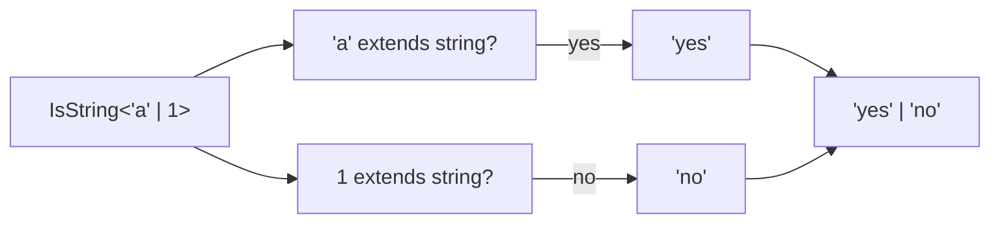
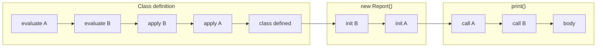
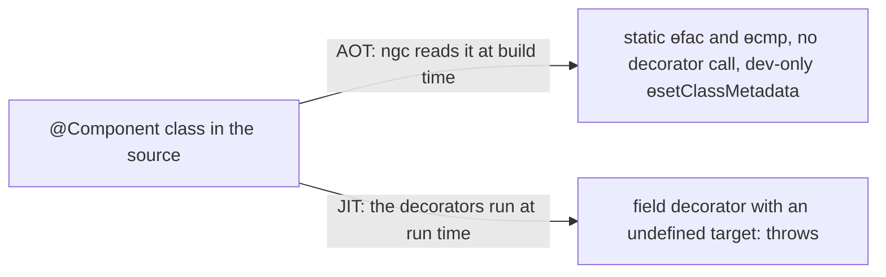

# 07. Advanced types, decorators and runtime safety

> **What this covers:** generics and types computed from other types (`keyof`, mapped, template literal, conditional, utility types, variance, brands), standard decorators versus `experimentalDecorators` and what Angular's compiler does with `@Component`, Zod 4 run-time validation, and Angular's typing patterns. By the end you can read and write the types in a library's `.d.ts`, keep types honest at the boundary, and explain what a decorator does in an Angular build.
> **Prerequisites:** [06. Structural typing](06-ts-type-system-essentials.md#2-structural-typing-assignability-and-readonly), [06. Unions](06-ts-type-system-essentials.md#4-unions-intersections-and-discriminated-unions), [06. `satisfies` and `as const`](06-ts-type-system-essentials.md#6-enums-literal-unions-as-const-and-satisfies), [06. `tsconfig`](06-ts-type-system-essentials.md#7-tsconfig-the-strict-family-module-settings-and-typescript-60-defaults) (`strictFunctionTypes`) and [03. Classes](03-js-objects-prototypes-classes.md#3-classes-the-sugar-and-what-is-not-sugar) (what a decorator decorates)
> **Leads to:** [12. How Angular works](12-angular-how-it-works.md), [16. Dependency injection](16-dependency-injection.md), [22. RxJS foundations](22-rxjs-foundations.md), [25. Forms](25-forms-reactive-and-template-driven.md), [41. API contracts](41-fullstack-api-contracts.md)
> **Applies to:** TypeScript 6.0 (6.0.3), Zod 4.6, Angular 22
> **Study time:** ~3 hours reading + ~3 hours exercises
> **Short on time:** read [1. Generics](#1-generics-constraints-defaults-inference-and-const-type-parameters), [3. Conditional types](#3-conditional-types-distributivity-infer-and-recursive-types), [7. Decorators](#7-decorators-tc39-standard-versus-experimentaldecorators-and-what-angular-does-with-them) and [8. Zod](#8-runtime-validation-with-zod-4-schema-first-types), then drill [Q07.01](#q07-01), [Q07.05](#q07-05), [Q07.06](#q07-06), [Q07.13](#q07-13), [Q07.14](#q07-14) and [Q07.16](#q07-16), try [Exercise 07.1](#ex07-1) and read the [Summary](#summary).
> **Labs:** [`labs/ts-js/src/modules/07-ts-advanced-types-and-decorators/`](../labs/ts-js/src/modules/07-ts-advanced-types-and-decorators/) and [`labs/ts-js/src/outputs/07-ts-advanced-types-and-decorators/`](../labs/ts-js/src/outputs/07-ts-advanced-types-and-decorators/) (sections 1–8, exercises 07.1–07.2, *Output* questions), and [`labs/angular/src/app/modules/07-ts-advanced-types-and-decorators/`](../labs/angular/src/app/modules/07-ts-advanced-types-and-decorators/) (sections 7 and 9, Exercise 07.3). Run (from `labs/ts-js`, Node 24): `npx vitest run src/modules/07-ts-advanced-types-and-decorators src/outputs/07-ts-advanced-types-and-decorators`; from `labs/angular`: `npx tsc -p tsconfig.spec.json --noEmit && npx ng test --watch=false`

## Contents

1. [Generics: constraints, defaults, inference and `const` type parameters](#1-generics-constraints-defaults-inference-and-const-type-parameters)
2. [`keyof`, indexed access, mapped and template literal types](#2-keyof-indexed-access-mapped-and-template-literal-types)
3. [Conditional types, distributivity, `infer` and recursive types](#3-conditional-types-distributivity-infer-and-recursive-types)
4. [Utility types, built in and by hand](#4-utility-types-built-in-and-by-hand)
5. [Variance, parameter bivariance and `strictFunctionTypes`](#5-variance-parameter-bivariance-and-strictfunctiontypes)
6. [Branded types for IDs and money](#6-branded-types-for-ids-and-money)
7. [Decorators: TC39 standard versus `experimentalDecorators`, and what Angular does with them](#7-decorators-tc39-standard-versus-experimentaldecorators-and-what-angular-does-with-them)
8. [Runtime validation with Zod 4: schema-first types](#8-runtime-validation-with-zod-4-schema-first-types)
9. [Typing patterns in Angular code](#9-typing-patterns-in-angular-code)
- [Summary](#summary)
- [Question bank](#question-bank)
- [Hands-on exercises](#hands-on-exercises)
- [Check your understanding](#check-your-understanding)
- [Connections](#connections)

**How the claims here are verified.** Type-level claims compile each snippet with the TypeScript 6.0.3 compiler API in a lab test (module 06's `typecheck` helper), asserting exact diagnostic codes or inferred types. Run-time claims, decorators and Zod 4.6.5 run under Vitest. Angular claims are specs in `labs/angular`, checked by `tsc -p tsconfig.spec.json` and `ng test`.

## 1. Generics: constraints, defaults, inference and `const` type parameters

### The problem it solves

A helper `first(items: any[])` returns `any`, so `const total: number = first(names)` compiles and a string reaches arithmetic; with `unknown`, every caller casts. The helper should return the type it was given.

### Mental model

A type parameter is a blank in a signature that each call fills in, usually from the arguments. Its job is to *relate* types: the input's element type is the output's type.

### How it actually works

- **Relating, not hiding.** `first<T>(items: readonly T[]): T | undefined` makes `const n: number | undefined = first(['a'])` a `TS2322`, while the `any` version compiles. The handbook: "If a type parameter only appears in one location, strongly reconsider if you actually need it" ([More on Functions](https://www.typescriptlang.org/docs/handbook/2/functions.html)).
- **Constraints** (`T extends { length: number }`) say what a type argument must have; `longest(10, 20)` is `TS2345`. `K extends keyof T` ties a key to an object, so `T[K]` is that property's type.
- **Defaults** (`interface ApiResponse<T = unknown>`) apply when nothing is given or inferred; with `unknown`, `r.data.id` is `TS18046`.
- **Inference sites.** In `pair(1, 'a')` the first candidate fixes `T` as `number`, so `'a'` is `TS2345`. Callbacks are typed from what is already inferred (`mapAll([1, 2], (n) => n.toFixed(1))` is `string[]`). The annotated result is a site too: `const n: number = parse('"text"')` compiles because `T` becomes `number`, so a parameter used only in the return type is an unchecked cast.
- **`const` type parameters** [Added in TypeScript 5.0] infer as if the argument were written `as const`: `tuple(['a', 'b'])` is `readonly ["a", "b"]` instead of `string[]` ([5.0 notes](https://www.typescriptlang.org/docs/handbook/release-notes/typescript-5-0.html)). The notes say a mutable constraint (`T extends string[]`) gives "surprising results" and recommend `readonly string[]`; TypeScript 5.2.2 infers `string[]` there, 5.3.3 and 6.0.3 infer `["a", "b"]` [Changed in TypeScript 5.3].
- **`NoInfer<T>`** [Added in TypeScript 5.4] stops one position from contributing candidates ([5.4 notes](https://www.typescriptlang.org/docs/handbook/release-notes/typescript-5-4.html)). Without it, `withDefault(['sm', 'md'], 'lg')` widens `T` to `"sm" | "md" | "lg"`; with `fallback: NoInfer<T>`, `'lg'` is `TS2345`.

### Code

Approach: (1) one parameter for the element, (2) one for the key, constrained to that element's keys, (3) the result type computed from both.

```ts
// Partial: compiled in the lab.
export function pluck<T, K extends keyof T>(items: readonly T[], key: K): T[K][] {
  return items.map((item) => item[key]);
}
const users = [{ name: 'Ada', age: 36 }];
const ages = pluck(users, 'age'); // number[]
pluck(users, 'nmae'); // TS2345
```

Verified: the `Section 1:` tests in [`section-1-generics.test.ts`](../labs/ts-js/src/modules/07-ts-advanced-types-and-decorators/section-1-generics.test.ts) assert every code and type above; under `const T extends string[]`, typescript 6.0.3 infers `["a", "b"]`, unlike the 5.0 notes, and a one-off probe gave `string[]` under 5.2.2 and `["a", "b"]` under 5.3.3. Drill it with [Q07.01](#q07-01) and [Q07.02](#q07-02).

> [!TIP]
> **Coming from the backend.** Java's `<T extends Comparable<T>>` reads like a TypeScript constraint. **Where the analogy breaks:** there are no `? extends`/`? super` wildcards; TypeScript compares generic types structurally ([section 5](#5-variance-parameter-bivariance-and-strictfunctiontypes)).

### Best practices and anti-patterns

- **Do make every type parameter relate two positions**, because one used once is a disguised cast.
- **Do add `readonly` to array constraints of `const` type parameters**, because the 5.0 notes recommend it and before 5.3 a mutable one fell back to `string[]`.
- **Avoid `parse<T>(): T` for untrusted data**, because the caller's annotation becomes the proof ([section 8](#8-runtime-validation-with-zod-4-schema-first-types) validates instead).

### Misconceptions and traps

- *"Generics exist at run time."* They are erased ([module 06](06-ts-type-system-essentials.md#1-what-typescript-is-erased-types-tsc-and-transpile-only-tools)). The belief comes from C#, which keeps them.
- *"You need `as const` at every call site to keep literals."* Once true, until TypeScript 5.0. Now: a `const` type parameter does it for the caller.

## 2. `keyof`, indexed access, mapped and template literal types

### The problem it solves

A `User` has a hand-written `UserPatch` (all optional), `UserView` (all readonly) and `UserGetters` (`getName()`, `getAge()`). Someone adds `phone` to `User` and updates one of the four; the other three compile, wrong.

### Mental model

Types can be computed from other types, like spreadsheet formulas over a table's column names. `keyof` reads the column names, `T[K]` reads a column's type, and a mapped type writes a new table, one row per key.

### How it actually works

- **`keyof` and indexed access.** `keyof User` is `'id' | 'name' | 'email' | 'age'`, and `User['age']` is `number`. An index signature widens `keyof`: `keyof Record<string, number>` is `string`, but `keyof { [key: string]: number }` is `string | number`, "because JavaScript object keys are always coerced to a string" ([handbook, Keyof](https://www.typescriptlang.org/docs/handbook/2/keyof-types.html)).
- **From values.** `typeof DEFAULTS` copies a value's type; `(typeof ROLES)[number]` turns an `as const` array into the union of its elements ([module 06](06-ts-type-system-essentials.md#6-enums-literal-unions-as-const-and-satisfies)).
- **Mapped types** (`{ [K in keyof T]: T[K] }`) build one property per key; "You can remove or add these modifiers by prefixing with `-` or `+`" ([handbook, Mapped Types](https://www.typescriptlang.org/docs/handbook/2/mapped-types.html)), as in `-readonly` and `-?`. A mapping over `keyof T` is *homomorphic* and keeps each property's `readonly` and `?`; one over an arbitrary key union does not (picking `email` that way gives `string | undefined`, no longer optional).
- **Key remapping** [Added in TypeScript 4.1] (`[K in keyof T as NewKey]`) renames keys, and a key mapped to `never` is dropped, so `DataOnly<Widget>` keeps `id` and `label` and drops `render()` ([4.1 notes](https://www.typescriptlang.org/docs/handbook/release-notes/typescript-4-1.html)).
- **Template literal types** [Added in TypeScript 4.1] build string literal types: `` `${'drag' | 'resize'}:${'start' | 'end'}` `` is all four combinations, and `'drag:stop'` is `TS2322`. `Uppercase`, `Lowercase`, `Capitalize` and `Uncapitalize` change case.

### Code

Approach: (1) map over `keyof T`, (2) rename each key with a template literal, (3) type the value from `T[K]`.

```ts
// Partial: compiled in the lab.
type Getters<T> = { [K in keyof T as `get${Capitalize<string & K>}`]: () => T[K] };
type UserGetters = Getters<Pick<User, 'name' | 'age'>>;
// { getName: () => string; getAge: () => number }
```

`string & K` keeps only string keys, because `Capitalize` accepts strings and `keyof` may include numbers and symbols. Verified: the `Section 2:` tests in [`section-2-mapped-types.test.ts`](../labs/ts-js/src/modules/07-ts-advanced-types-and-decorators/section-2-mapped-types.test.ts) compare each computed type with the expected one by exact equality. Drill it with [Q07.03](#q07-03) and [Q07.04](#q07-04).

### Best practices and anti-patterns

- **Do derive related types from one source** (`Partial<User>`, `Getters<User>`), because a new field reaches all of them.

### Misconceptions and traps

- *"`keyof` of a string index signature is `string`."* It is `string | number`; only `Record<string, T>` gives `string` (lab).
- *"Mapped types always copy modifiers."* Only homomorphic ones, over `keyof T`; the belief comes from `Partial` and `Readonly`.

## 3. Conditional types, distributivity, `infer` and recursive types

### The problem it solves

A router helper should know that `'/users/:userId/posts/:postId'` needs `{ userId, postId }`. A loader should return `number` for `Promise<number>` and `string` for `string`. An overload per case does not scale.

### Mental model

A conditional type is an `if` that runs on types. Given a union, it runs once per member and joins the answers, like `map` over a list.



What to notice: the union is split *before* the check, so the result is a union too; `[T] extends [string]` checks it as one type and gives `'no'`.

### How it actually works

- **`T extends U ? X : Y`** picks a branch by assignability. "When conditional types act on a generic type, they become *distributive* when given a union type", and wrapping each side of `extends` in square brackets avoids it ([handbook, Conditional Types](https://www.typescriptlang.org/docs/handbook/2/conditional-types.html)). So `ToArray<string | number>` is `string[] | number[]`.
- **`never` is the empty union**, so a distributive conditional over `never` is `never`, while the bracketed form says `'yes'`.
- **`infer`** declares a type variable in the pattern and fills it in the true branch: an array's element, a `Promise`'s value, a function's first parameter, or a piece of a template literal. Recursing on the rest of a string gives `RouteParams<'/users/:userId/posts/:postId'>` = `'userId' | 'postId'`.
- **Recursive types** refer to themselves (`Json` accepts nested data and rejects a function with `TS2322`). A naive `DeepReadonly<T> = { readonly [K in keyof T]: DeepReadonly<T[K]> }` handles arrays (`push` is `TS2339`) but turns methods into objects with no call signature (`TS2349`), so functions need their own branch.
- **Limits.** Deep recursion stops with `TS2589`. Since TypeScript 4.5 [Changed in TypeScript 4.5: tail-recursive conditionals], a conditional whose branch is "simply another conditional type" has "much more generous" limits ([4.5 notes](https://www.typescriptlang.org/docs/handbook/release-notes/typescript-4-5.html)). In the lab a tail-recursive tuple builder (the recursive call is the last thing the type does) reaches 999 and fails at 1500; wrapping the call in a template fails at 100.

### Code

Approach: (1) match a pattern with `infer`, (2) recurse on what is left, (3) stop with `never` when nothing matches.

```ts
// Partial: compiled in the lab.
type RouteParams<S extends string> = S extends `${string}:${infer P}/${infer Rest}`
  ? P | RouteParams<Rest>
  : S extends `${string}:${infer P}` ? P : never;

type Params = RouteParams<'/users/:userId/posts/:postId'>; // 'userId' | 'postId'
```

Verified: the `Section 3:` tests in [`section-3-conditional-types.test.ts`](../labs/ts-js/src/modules/07-ts-advanced-types-and-decorators/section-3-conditional-types.test.ts) check every result above by exact equality. Drill it with [Q07.05](#q07-05), [Q07.06](#q07-06) and [Q07.07](#q07-07).

### Best practices and anti-patterns

- **Do bracket `[T] extends [U]` when you mean "the whole union"**, because the naked form silently distributes.

### Misconceptions and traps

- *"`T extends U` means `T` is a subclass of `U`."* It means assignability, structurally ([module 06](06-ts-type-system-essentials.md#2-structural-typing-assignability-and-readonly)); the belief comes from `extends` in class syntax.
- *"Recursive conditional types hit the limit almost at once."* Closer to true before 4.5, when every step created intermediate instantiations. Now tail-position recursion goes much further.

## 4. Utility types, built in and by hand

### The problem it solves

`User` has a `CreateUserDto` (data transfer object: the shape sent over the API) without `id` and an `UpdateUserDto` with every field optional, both hand-typed. A new field reaches `User` and one DTO; the other sends incomplete data.

### Mental model

The built-in utility types are not compiler magic: they are a dozen lines of mapped and conditional types in `lib.es5.d.ts`, the tools of [section 2](#2-keyof-indexed-access-mapped-and-template-literal-types) and [section 3](#3-conditional-types-distributivity-infer-and-recursive-types), so you can read them and write your own.

### How it actually works

- **Mapped:** `Partial<T>` is `{ [P in keyof T]?: T[P] }`; `Required` uses `-?`, `Readonly` adds `readonly`, `Record<K, T>` maps any keys to one type, and `Pick<T, K extends keyof T>` is `{ [P in K]: T[P] }`, which keeps `readonly` and `?` because `K` is tied to `keyof T`.
- **Conditional:** `Exclude<T, U> = T extends U ? never : T` and `Extract` distribute over unions. `ReturnType` and `Parameters` use `infer`. `NonNullable<T>` is `T & {}` [Changed in TypeScript 4.8: it was `T extends null | undefined ? never : T`] ([4.8 notes](https://www.typescriptlang.org/docs/handbook/release-notes/typescript-4-8.html)).
- **Composed:** `Omit<T, K extends keyof any> = Pick<T, Exclude<keyof T, K>>`. So `K` is not tied to `T`: `Omit<User, 'nmae'>` compiles and removes nothing, while `Pick<User, 'nmae'>` is `TS2344`. And `keyof` of a union is only the common keys, so `Omit<Shape, 'id'>` on a two-member union keeps just `kind`; a distributive wrapper, `T extends unknown ? Omit<T, K> : never`, keeps each member.
- **`Awaited<T>`** [Added in TypeScript 4.5] "recursively unwraps" the awaited type, as `await` does: `Awaited<Promise<Promise<number>>>` is `number` ([4.5 notes](https://www.typescriptlang.org/docs/handbook/release-notes/typescript-4-5.html)). The lib version also handles thenables and `null`.

### Code

Approach: (1) declare the entity once, (2) derive each DTO from it, (3) let the compiler carry new fields.

```ts
// Partial: compiled in the lab.
interface User { readonly id: string; name: string; email?: string }
type CreateUser = Omit<User, 'id'>; // { name: string; email?: string }
type UpdateUser = Pick<User, 'id'> & Partial<CreateUser>;
type Loaded = Awaited<ReturnType<typeof loadUser>>; // User
```

Verified: the `Section 4:` tests in [`section-4-utility-types.test.ts`](../labs/ts-js/src/modules/07-ts-advanced-types-and-decorators/section-4-utility-types.test.ts) read these definitions from typescript 6.0.3's `lib.es5.d.ts` and check that the hand-written versions equal the built-ins. Drill it with [Q07.08](#q07-08) and [Q07.09](#q07-09).

### Best practices and anti-patterns

- **Do derive DTOs with `Omit`, `Pick` and `Partial`**, because a new entity field then reaches every DTO.
- **Do prefer `Pick` or a checked key list over `Omit` for public contracts**, because `Omit` accepts misspelled keys and collapses a union to its common keys.

### Misconceptions and traps

- *"`Omit<User, 'nmae'>` is an error."* It compiles and removes nothing. The belief comes from `Pick`, which checks its keys.
- *"Utility types are built into the compiler."* Most are plain declarations in `lib.es5.d.ts`; only the five declared `= intrinsic` (`Uppercase`, `Lowercase`, `Capitalize`, `Uncapitalize`, `NoInfer`) live in the compiler.

## 5. Variance, parameter bivariance and `strictFunctionTypes`

### The problem it solves

An event bus accepts handlers for any `AppEvent`. Someone registers one that reads `event.amount`, which only `PaymentEvent` has. Typed one way it is rejected; typed the other way it compiles, and the first `LoginEvent` crashes it.

### Mental model

Ask which way data flows. A **producer** of `Dog` can stand in for a producer of `Animal`: whatever it gives you is an animal (*covariant*). A **consumer** of `Animal` can stand in for a consumer of `Dog`: it handles any dog (*contravariant*). A handler is a consumer, so it may be *wider*, never narrower, than what it receives.

### How it actually works

- **`strictFunctionTypes`** [Added in TypeScript 2.6] (part of `strict`, [module 06](06-ts-type-system-essentials.md#7-tsconfig-the-strict-family-module-settings-and-typescript-60-defaults)): "function type parameter positions are checked *contravariantly* instead of *bivariantly*" ([2.6 notes](https://www.typescriptlang.org/docs/handbook/release-notes/typescript-2-6.html)). `onEvent: (animal: Animal) => void` rejects a `(dog: Dog) => …` handler with `TS2322`; a handler that takes `Animal` fits where `Dog` is expected.
- **The method exemption.** The stricter checking excludes "those originating in method or constructor declarations", so that "generic classes and interfaces (such as `Array<T>`) continue to mostly relate covariantly". With method syntax, `onEvent(animal: Animal): void` accepts the same `Dog` handler under `strict`; in the lab it throws `TypeError: dog.bark is not a function`.
- **Arrays are covariant**, including on write: a `Dog[]` is assignable to `Animal[]`, pushing a plain animal through that alias compiles, and `dogs[0].bark()` then throws. `readonly Animal[]` is the honest type for a read-only view.
- **Variance annotations** [Added in TypeScript 4.7]: `out T` marks output positions, `in T` input positions, `in out T` both ([4.7 notes](https://www.typescriptlang.org/docs/handbook/release-notes/typescript-4-7.html)). They are checked: `interface BadConsumer<in T> { get(): T }` is `TS2636`. The notes aim them at library authors with deeply recursive types.

### Code

Approach: (1) declare callbacks as properties so `strictFunctionTypes` applies, (2) accept the widest event the handler can process.

```ts
// Partial: compiled in the lab.
interface Bus { onEvent: (animal: Animal) => void } // property syntax: checked
const bus: Bus = { onEvent: (dog: Dog) => { dog.bark(); } }; // TS2322
```

Verified: the `Section 5:` tests in [`section-5-variance.test.ts`](../labs/ts-js/src/modules/07-ts-advanced-types-and-decorators/section-5-variance.test.ts) assert each code and run both crashes. Drill it with [Q07.10](#q07-10) and [Q07.11](#q07-11).

### Best practices and anti-patterns

- **Do declare callback members with property syntax** (`onEvent: (e: E) => void`), because method syntax switches off the parameter check.

### Misconceptions and traps

- *"`strict` makes function parameters sound."* Not for method-syntax members, by design. Until TypeScript 2.6 every parameter was bivariant; since then only method and constructor declarations keep that, so `Array<T>` stays covariant. The distinction is invisible at the call site.
- *"A narrower handler is safer."* It is the unsafe direction: it accepts less than it will be given. The belief comes from variables, where assigning a `Dog` to an `Animal` is the safe direction.
- *"TypeScript arrays are invariant like Java generics."* They are covariant, closer to Java *arrays*, with the same write hole (Java throws `ArrayStoreException`; TypeScript says nothing). The belief comes from carrying the Java generics rule over.

## 6. Branded types for IDs and money

### The problem it solves

`cancel(orderId, userId)` is called as `cancel(userId, orderId)`. Both are `string` aliases, so it compiles ([Q06.05](06-ts-type-system-essentials.md#q06-05)). Elsewhere, a price in cents is added to a tax in euros, and both are `number`.

### Mental model

A brand is a label stuck on a primitive in the type system only: the value stays a plain string or number, but the compiler treats `UserId` and `OrderId` as different types, as if TypeScript were nominal for those two.

### How it actually works

- **The pattern:** `type UserId = string & { readonly [brand]: 'UserId' }`, with `declare const brand: unique symbol` so no real property can collide. Swapped IDs and raw strings are now `TS2345`, and `const id: UserId = 'u-1'` is `TS2322`.
- **One way in.** No ordinary value has the brand, so a constructor function checks the value and then asserts (`value as Cents`). It is the only place an `as` belongs, and the only place a mistake can hide.
- **Still the base type.** A `Cents` is assignable to `number`, so it works with `Math` and formatting. Arithmetic drops the brand: `price + tax` compiles as a plain `number`, and only using it as money fails (`const total: Cents = price + tax` is `TS2322`), so money operations go through functions such as `addCents(a: Cents, b: Cents): Cents`.
- **Zero run-time cost.** In the lab a branded total is the plain number `2000`. Run-time identity needs a class or a `#private` brand check ([Q03.09](03-js-objects-prototypes-classes.md#q03-09)).
- **From parsed data:** Zod's `.brand<'Cents'>()` tags the output type only ([section 8](#8-runtime-validation-with-zod-4-schema-first-types)): `Cents.parse(1999)` fits where `Cents` is required, a raw `1999` is `TS2345`, and the value stays a plain number.

### Code

Approach: (1) define the brand once, (2) write a checking constructor, (3) make operations accept and return branded values.

```ts
// Partial: compiled and run in the lab.
type Cents = number & { readonly [brand]: 'Cents' };
const cents = (value: number): Cents => {
  if (!Number.isSafeInteger(value)) throw new RangeError(`not a whole number of cents: ${value}`);
  return value as Cents;
};
const addCents = (a: Cents, b: Cents): Cents => (a + b) as Cents;
```

Verified: the `Section 6:` tests in [`section-6-brands.test.ts`](../labs/ts-js/src/modules/07-ts-advanced-types-and-decorators/section-6-brands.test.ts). Drill it with [Q07.12](#q07-12) and [Exercise 07.2](#ex07-2).

### Best practices and anti-patterns

- **Do brand IDs that cross API boundaries**, because swapped arguments are a common bug the structural checker cannot see.
- **Avoid brands as the only money protection**, because `+` still compiles; route arithmetic through typed functions.

### Misconceptions and traps

- *"A brand adds a property at run time."* It exists only in types; the value is a bare primitive. The belief comes from the `{ readonly [brand]: … }` intersection, which reads like a real property.
- *"A branded number cannot be added to a raw one."* It can, and the result is a plain `number`. The belief comes from newtype wrappers in nominal languages, where the wrapper really is a different run-time type.

## 7. Decorators: TC39 standard versus `experimentalDecorators`, and what Angular does with them

### The problem it solves

A team copies a decorator from an older library and it stops compiling, or runs with different arguments. Someone asks if Angular 22 uses "the new decorators". Both turn on there being two decorator systems, and on who consumes Angular's.

### Mental model

A decorator is a function the class definition calls with the thing it decorates; it can replace that thing or register code to run later. Angular's `@Component` is different in practice: its compiler reads it at build time and removes it.

### How it actually works

- **Two systems.** With `experimentalDecorators` off, TypeScript compiles decorators from the [TC39 proposal](https://github.com/tc39/proposal-decorators) [Added in TypeScript 5.0]; with it on, it uses the older, pre-standard semantics, which the 5.0 notes say "will continue to exist for the foreseeable future". The two call decorators with different arguments, so one written for one usually breaks under the other. The proposal is at **Stage 2.7** ("approved in principle and undergoing validation", between Stage 2 and 3; [TC39 process](https://tc39.es/process-document/)). Node 24 does not run it natively, so `tsc` lowers it to `__esDecorate` and `__runInitializers` helpers.
- **Standard shape.** A decorator receives `(value, context)`: `context.kind` says what was decorated, `context.addInitializer` queues code, and a method decorator may return a replacement. The `accessor` keyword makes a getter/setter pair a decorator can intercept.
- **Order, observed in the lab** (diagram below). Expressions are evaluated top to bottom and applied bottom to top; method initializers run at construction, before field initializers, and a call goes through the outer wrapper first.
- **What standard decorators drop.** Parameter decorators: `constructor(@Inject(TOKEN) x: string)` is `TS1206: Decorators are not valid here.` without `experimentalDecorators`. They also do not work with `emitDecoratorMetadata` (5.0 notes). A separate metadata feature [Added in TypeScript 5.2] needs a `Symbol.metadata` polyfill ([5.2 notes](https://www.typescriptlang.org/docs/handbook/release-notes/typescript-5-2.html)); its proposal is also at Stage 2.7 ([proposals list](https://github.com/tc39/proposals)).
- **Angular.** The workspace schematic writes `"experimentalDecorators": true`, which in the lab lets a constructor parameter decorator such as `@Inject` compile. `ngc`, the Angular compiler's command-line tool, reads `@Component` from the source (AOT, at build time), not from TypeScript's emit: in the lab it emits `App` with no decorator call, a static `ɵfac`, a static `ɵcmp` from `ɵɵdefineComponent`, and the arguments only in a dev-mode `ɵsetClassMetadata` block, and turning the flag off left that unchanged. JIT (compiling at run time) differs, because the decorators really run: Angular's field decorators such as `@Input()` throw `Standard Angular field decorators are not supported in JIT mode.` when called the standard way, with `undefined` as the target (`@angular/core` 22.2.1; the lab asserts it). So the flavor cannot change AOT output, yet the workspace keeps the flag on and parameter decorators need it; `inject()` needs neither.




What to notice: evaluation runs top to bottom but application bottom to top, so `A` is applied last and becomes the outer wrapper that a call reaches first; initializers run on construction in application order, not at definition.



What to notice: the AOT path never calls the decorator, so `experimentalDecorators` cannot change its output; the JIT path does call it, and that is where the flavor matters.

### Code

Approach: (1) a factory returns the decorator, (2) the decorator registers an initializer, (3) it returns a wrapper.

```ts
// Partial: compiled and run in the lab with standard decorators.
function trace(label: string) {
  return function <This, Args extends unknown[], Result>(
    method: (this: This, ...args: Args) => Result,
    context: ClassMethodDecoratorContext<This, (this: This, ...args: Args) => Result>,
  ) {
    context.addInitializer(function () { report(`initializer ${label}`); });
    return function (this: This, ...args: Args): Result {
      report(`call ${label}`);
      return method.call(this, ...args);
    };
  };
}
```

Verified: the `Section 7:` tests in [`section-7-decorators.test.ts`](../labs/ts-js/src/modules/07-ts-advanced-types-and-decorators/section-7-decorators.test.ts) and [`decorators.spec.ts`](../labs/angular/src/app/modules/07-ts-advanced-types-and-decorators/decorators.spec.ts), which checks `ɵcmp` and `ɵfac` on a real component. Drill it with [Q07.13](#q07-13), [Q07.14](#q07-14) and [Q07.15](#q07-15).

> **Coming from the backend.** Java annotations are passive metadata that frameworks read by reflection at run time; Angular's decorators are closer to that, except they are read at build time and removed. **Where the analogy breaks:** a standard JavaScript decorator is a function that runs during class definition and can replace what it decorates.

> [!NOTE]
> **Framework vs platform.** *JavaScript:* decorators are a TC39 proposal, not yet in the language. *TypeScript:* two implementations, standard and `experimentalDecorators`, both lowered to plain JavaScript. *Angular:* its compiler consumes `@Component` at build time; only JIT calls decorators, and for fields it accepts the legacy call shape alone.

### Best practices and anti-patterns

- **Do prefer `inject()` over constructor parameter decorators**, because parameter decorators need the legacy semantics, and `inject()` works under either.
- **Do check which system a decorator library targets** before adopting it, because the two call decorators with different arguments.

### Misconceptions and traps

- *"Angular runs `@Component` at run time."* The AOT compiler turns it into static fields; only an `ngDevMode`-guarded block keeps the arguments. The belief comes from JIT, where decorators do run.
- *"Standard decorators are finished JavaScript."* The proposal is at Stage 2.7. The belief comes from TypeScript 5.0 shipping them after the proposal reached Stage 3 ([module 05 §8](05-js-modules-memory-modern-features.md#8-modern-features-by-edition-es2015-to-es2026)).

## 8. Runtime validation with Zod 4: schema-first types

### The problem it solves

Types are erased, so an API response typed as `User` is only a promise ([module 06 §1](06-ts-type-system-essentials.md#1-what-typescript-is-erased-types-tsc-and-transpile-only-tools)). Module 06's hand-written guard ([Exercise 06.2](06-ts-type-system-essentials.md#ex06-2)) must be kept in step with the interface by hand, and the compiler cannot notice drift.

### Mental model

Write the schema once. It is a run-time value that checks data, and TypeScript derives the type from it, so they cannot disagree.

### How it actually works

The lab installs `zod` 4.6.5 as an exact dev dependency; every fact below is from its `.d.ts`, the zod.dev docs, or a lab run.

- **Building a schema.** `z.object({ id: z.string(), age: z.number().int(), email: z.string().optional(), nickname: z.string().nullable() })` describes the shape, and `z.infer<typeof User>` gives exactly `{ id: string; age: number; email?: string | undefined; nickname: string | null }` (lab).
- **`parse` versus `safeParse`.** `parse` returns the data or throws a `ZodError` whose `issues` carry a `code`, a `path` such as `['id']` and a message (`Invalid input: expected string, received number`). `safeParse` never throws: it returns `{ success: true, data }` or `{ success: false, error }`, a [discriminated union](https://zod.dev/basics) narrowed on `success`.
- **Unknown keys.** The [docs](https://zod.dev/api): "By default, unrecognized keys are *stripped* from the parsed result". In the lab a `role: 'admin'` sent to `User` is absent from the result. `z.strictObject` rejects it (`unrecognized_keys`), `z.looseObject` keeps it; the `.d.ts` names the modes `$strip`, `$strict` and `$loose`.
- **Input and output types.** A `.transform` changes the value after validation, for `z.string().transform(text => Math.round(Number(text) * 100))`, `z.input` is `string` and `z.output` (which `z.infer` is an alias of) is `number`.

### Code

Approach: (1) declare the schema, (2) derive the type, (3) parse at the boundary and handle failure.

```ts
// Partial: the schema is compiled and run in the lab; `json` and `reportBadData` stand for your code.
const User = z.object({
  id: z.string(),
  age: z.number().int(),
  email: z.string().optional(),
  nickname: z.string().nullable(),
});
type User = z.infer<typeof User>;

const result = User.safeParse(json);
if (!result.success) return reportBadData(result.error.issues);
const user: User = result.data;
```

Verified: the `Section 8:` tests in [`section-8-zod.test.ts`](../labs/ts-js/src/modules/07-ts-advanced-types-and-decorators/section-8-zod.test.ts). Drill it with [Q07.16](#q07-16), [Q07.17](#q07-17) and [Exercise 07.2](#ex07-2).

> **Framework vs platform.** Zod is a library, not part of Angular or TypeScript. Nothing in either checks a response's shape at run time: `HttpClient.get<T>()` takes `T` as a type argument only (its `.d.ts`), so `get<User>()` validates nothing.

### Best practices and anti-patterns

- **Do parse where data enters the app**, such as the service that calls the API ([module 27](27-http-client.md)), because everything past that point can trust the type.
- **Avoid declaring an interface next to a schema for the same data**, because that recreates the drift the schema removes; derive the type with `z.infer`.

### Misconceptions and traps

- *"`z.object` rejects extra keys."* It strips them, and did before Zod 4: the changelog calls `.strip()` "the default behavior of `z.object()`". Rejecting needs `z.strictObject` (the Zod 4 top-level function; `.strict()` is the legacy method form, [changelog](https://zod.dev/v4/changelog)). The belief comes from TypeScript, where an extra key in a typed literal is `TS2353`.
- *"`z.infer` is the input type."* It is the output type; with a transform, use `z.input` for what the API sends. The belief comes from schemas without transforms, where both are the same type.

## 9. Typing patterns in Angular code

### The problem it solves

`inject(CONFIG)` gives `unknown`, so every use needs a cast. A form's `value.email` is `string | null | undefined` and nobody knows why. A reusable list component hands back `any` for the clicked item.

### Mental model

Angular's public APIs carry type parameters end to end. You supply the type once, at the source (token, control, input), and the compiler carries it to every consumer, templates included.

### How it actually works

- **Tokens.** The API docs: "`InjectionToken` is parameterized on `T` which is the type of object which will be returned by the `Injector`" ([InjectionToken](https://angular.dev/api/core/InjectionToken)). `new InjectionToken<ApiConfig>('api config', { factory })` makes `inject(API_CONFIG)` an `ApiConfig`; without the parameter the token is `InjectionToken<unknown>` and `inject` returns `unknown` (lab; providers: [module 16](16-dependency-injection.md)).
- **Typed forms** [Added in Angular 14] ([guide](https://angular.dev/guide/forms/typed-forms)). `new FormControl('a@b.c')` is `FormControl<string | null>`, because "the control can become `null` at any time, by calling reset"; in the lab `reset()` gives `null`, while `{ nonNullable: true }` resets to the initial value and gives `FormControl<string>`. A group's `value` is `Partial<…>` because disabled controls are left out (a disabled `plan` is missing at run time); `getRawValue()` returns every field. `FormBuilder.nonNullable.group({...})` builds non-nullable controls.
- **Signal inputs.** `input()` and `output()` [Stable since v19.0] (status owned by [module 17](17-signals.md)). `input<number>()` is `InputSignal<number | undefined>`, because an unset input is `undefined` ([inputs guide](https://angular.dev/guide/components/inputs)); `input.required<string>()` is `InputSignal<string>`; with `{ transform: booleanAttribute }` it is `InputSignalWithTransform<boolean, unknown>` ([Q17.27](17-signals.md#q17-27)).
- **Route data.** `ResolveFn<User>` checks a resolver's return value (`MaybeAsync<T | RedirectCommand>` in its `.d.ts`); returning `{ id }` alone is `TS2322`. The consumer side is untyped: `Route['data']` and the `data` of `ActivatedRoute` and its snapshot are `{ [key: string | symbol]: any }` (router typings), so `const n: number = route.snapshot.data['user']` compiles. Narrow with a type guard or a schema ([section 8](#8-runtime-validation-with-zod-4-schema-first-types)); binding data to inputs is [module 24](24-routing.md)'s.
- **Generic components.** `Picker<T>` takes a type parameter, with `items = input.required<T[]>()`, `label = input.required<(item: T) => string>()` and `picked = output<T>()`. Under `strictTemplates` (Angular's strictest template type-checking mode, [docs](https://angular.dev/tools/cli/template-typecheck)), the compiler infers `T` from the host's bindings, so `(picked)` delivers a `User` as `$event`; a `label` of `(count: number) => string` next to `[items]="users"` fails the build in the lab with `TS2322: Type 'User[]' is not assignable to type 'number[]'`.

### Code

Approach: (1) give the token its type, (2) make controls non-nullable, (3) let a generic component infer from its inputs.

```ts
// Partial: compiled, type-checked and run in the Angular lab.
const API_CONFIG = new InjectionToken<ApiConfig>('api config', { factory: () => ({ baseUrl: '/api', retries: 2 }) });

const form = new FormBuilder().nonNullable.group({ email: 'ann@example.com', plan: 'free' });
form.controls.plan.disable();
form.value;         // Partial<{ email: string; plan: string }>, and { email } at run time
form.getRawValue(); // { email: string; plan: string }

class Picker<T> {
  readonly items = input.required<T[]>();
  readonly picked = output<T>();
}
```

Verified: the `Section 9:` tests in [`typing-patterns.spec.ts`](../labs/angular/src/app/modules/07-ts-advanced-types-and-decorators/typing-patterns.spec.ts), checked by `tsc -p tsconfig.spec.json` (types) and `ng test` (templates), including the route-data and `$any()` cases. Drill it with [Q07.18](#q07-18), [Q07.19](#q07-19), [Q07.20](#q07-20) and [Exercise 07.3](#ex07-3).

### Best practices and anti-patterns

- **Do type every `InjectionToken`**, because the parameter is the only place DI learns the type.
- **Do default forms to `nonNullable`**, because `null` after `reset()` is rarely what a field means.
- **Avoid `$any()` on a binding of a generic component**, because that binding stops constraining `T`: with `[items]="$any(users)"`, a `label` of `(count: number) => string` compiles and `T` becomes `number` (the `$any()` case in `typing-patterns.spec.ts`).

### Misconceptions and traps

- *"`form.value` has every field."* Disabled controls are missing, which is why its type is `Partial`. Until Angular 14 forms were untyped, so nothing hinted at a missing field.
- *"`input<T>()` is `T`."* Without a default or `.required`, it is `T | undefined`. The belief comes from `@Input()` properties, whose type is whatever you declare ([Q17.27](17-signals.md#q17-27)).

## Summary

A type parameter relates input to output and is inferred from arguments, callbacks and the assigned type; `const` keeps literals and `NoInfer` blocks one site ([1](#1-generics-constraints-defaults-inference-and-const-type-parameters)). `keyof` and `T[K]` read types, mapped types rebuild them (keeping modifiers only over `keyof T`), and template literal types build string unions ([2](#2-keyof-indexed-access-mapped-and-template-literal-types)). Conditional types distribute over a naked union, `infer` extracts parts, and recursion stops at `TS2589` ([3](#3-conditional-types-distributivity-infer-and-recursive-types)). The utilities are those tools in `lib.es5.d.ts`; `Omit` accepts misspelled keys and collapses unions ([4](#4-utility-types-built-in-and-by-hand)).

Under `strict`, function-typed properties are checked contravariantly, but method parameters stay bivariant and arrays covariant ([5](#5-variance-parameter-bivariance-and-strictfunctiontypes)). Brands separate same-shaped IDs at compile time only; arithmetic returns plain numbers ([6](#6-branded-types-for-ids-and-money)). Angular's AOT compiler turns `@Component` into static `ɵfac`/`ɵcmp` whatever the decorator flavor, but the JIT runtime refuses standard field decorators, so the workspace keeps `experimentalDecorators: true` ([7](#7-decorators-tc39-standard-versus-experimentaldecorators-and-what-angular-does-with-them)). A Zod schema is the run-time check and, via `z.infer`, the type; it strips unknown keys ([8](#8-runtime-validation-with-zod-4-schema-first-types)). In Angular, supply the type once (token, control, input) and let the APIs carry it ([9](#9-typing-patterns-in-angular-code)). Most-asked traps: `z.infer` is the output type, `form.value` is `Partial`, and `strict` does not cover methods.

## Question bank

Questions follow the sections, from generics to Angular typing patterns. Every *Output* answer is asserted by a test named after the question in [`labs/ts-js/src/outputs/07-ts-advanced-types-and-decorators/`](../labs/ts-js/src/outputs/07-ts-advanced-types-and-decorators/), which compiles the fixture with the TypeScript 6.0.3 compiler API under `strict` and asserts each diagnostic's line and code and each named type.

<a id="q07-01"></a>
### Q07.01 · Concept · What does a type parameter give you over `any` or `unknown`, and where does TypeScript infer it from?

<details>
<summary>Answer</summary>

**Short answer (30 seconds).** A type parameter relates positions: the output's type follows the input's. `any` turns checking off; `unknown` forces a cast at every use. Inference reads the arguments left to right, then callbacks, then the type the result is assigned to.

**Full explanation.** `const n: number = firstAny(['a'])` compiles because the result is `any`; with `first<T>(items: readonly T[]): T | undefined` it is `TS2322`. Verified: `Q07.01 evidence` in [`generics-and-computed-types.test.ts`](../labs/ts-js/src/outputs/07-ts-advanced-types-and-decorators/generics-and-computed-types.test.ts) and the `Section 1:` tests. Background: [section 1](#1-generics-constraints-defaults-inference-and-const-type-parameters).

**Follow-ups an interviewer will ask.**
- *When is a type parameter pointless?* When it appears once.
- *How do you stop one argument from widening the inference?* `NoInfer<T>` on that position ([Q07.02](#q07-02)).

**Trap to avoid.** Thinking generics exist at run time. They are erased.

</details>

<a id="q07-02"></a>
### Q07.02 · Output · `const` type parameters and `NoInfer`: what does each call infer, and which one fails?

```ts
declare function tuple<const T extends readonly string[]>(items: T): T;
declare function plain<T extends readonly string[]>(items: T): T;
declare function withDefault<T extends string>(options: T[], fallback: T): T;
declare function strictDefault<T extends string>(options: T[], fallback: NoInfer<T>): T;

const a = tuple(['sm', 'md']);
const b = plain(['sm', 'md']);
const c = withDefault(['sm', 'md'], 'lg');
const d = strictDefault(['sm', 'md'], 'lg');
```

<details>
<summary>Answer</summary>

**Short answer (30 seconds).** `a` is `readonly ["sm", "md"]`, `b` is `string[]`, `c` is `"sm" | "md" | "lg"`, and line 9 (`d`) fails with `TS2345`. `const` infers as if the argument were `as const`; `NoInfer` keeps `'lg'` out of the candidates, so it must fit `"sm" | "md"`.

**Full explanation.** Without `const` [Added in TypeScript 5.0], the literal widens to `string[]`. In `withDefault`, both positions supply candidates, so `T` grows to accept the fallback. `NoInfer<T>` [Added in TypeScript 5.4] removes that position from inference, so `'lg'` is caught. Verified: `Q07.02` in [`generics-and-computed-types.test.ts`](../labs/ts-js/src/outputs/07-ts-advanced-types-and-decorators/generics-and-computed-types.test.ts). Background: [section 1](#1-generics-constraints-defaults-inference-and-const-type-parameters).

**Follow-ups an interviewer will ask.**
- *Why `readonly string[]` in `tuple`'s constraint?* The 5.0 notes recommend it ([section 1](#1-generics-constraints-defaults-inference-and-const-type-parameters)).
- *Is `NoInfer` a run-time function?* No, it is an intrinsic type in `lib.es5.d.ts` ([section 4](#4-utility-types-built-in-and-by-hand)).

**Trap to avoid.** Expecting `c` to be an error. Without `NoInfer`, TypeScript widens instead.

</details>

<a id="q07-03"></a>
### Q07.03 · Output · What do these mapped and template literal types evaluate to?

```ts
interface User {
  readonly id: string;
  name: string;
  email?: string;
}

type A = keyof User;
type B = { -readonly [K in keyof User]-?: User[K] };
type C = { [K in 'id' | 'email']: User[K] };
type D = { [K in keyof User as `get${Capitalize<K>}`]: () => User[K] };
type E = `${'drag' | 'resize'}:${'start' | 'end'}`;
```

<details>
<summary>Answer</summary>

**Short answer (30 seconds).** `A` is `'id' | 'name' | 'email'`. `B` is `{ id: string; name: string; email: string }`. `C` is `{ id: string; email: string | undefined }`. `D` is `{ readonly getId: () => string; getName: () => string; getEmail?: () => string | undefined }`. `E` is `'drag:start' | 'drag:end' | 'resize:start' | 'resize:end'`. Mappings over `keyof User` keep modifiers; a hand-written key list does not.

**Full explanation.** In `B`, `-?` also removes `undefined`. `C` maps a plain union, so `id` loses `readonly` and `email` its `?`. `D` stays homomorphic despite `as`, so it keeps them. Verified: `Q07.03` in [`generics-and-computed-types.test.ts`](../labs/ts-js/src/outputs/07-ts-advanced-types-and-decorators/generics-and-computed-types.test.ts). Background: [section 2](#2-keyof-indexed-access-mapped-and-template-literal-types).

**Follow-ups an interviewer will ask.**
- *How do you drop methods?* Map their keys to `never` in `as`.
- *Why `string & K` in `Getters`?* `Capitalize` rejects number and symbol keys.

**Trap to avoid.** Assuming every mapped type copies modifiers.

</details>

<a id="q07-04"></a>
### Q07.04 · Concept · Deriving types from values: `typeof`, `keyof` and indexed access

<details>
<summary>Answer</summary>

**Short answer (30 seconds).** `typeof value` gives a value's type, `keyof T` gives the union of its keys, and `T[K]` gives a property's type. Combined, one constant becomes the source of truth: `(typeof ROLES)[number]` turns an `as const` array into a union of its elements.

**Full explanation.** A union index gives a union of property types, and `number` indexes an array's elements. Without `as const`, the element type collapses to `string`. Verified: the `Section 2:` tests and `Q07.04, Q07.06 and Q07.07 evidence` in [`generics-and-computed-types.test.ts`](../labs/ts-js/src/outputs/07-ts-advanced-types-and-decorators/generics-and-computed-types.test.ts). Background: [section 2](#2-keyof-indexed-access-mapped-and-template-literal-types).

**Follow-ups an interviewer will ask.**
- *Enum or `as const` array?* See [Q06.15](06-ts-type-system-essentials.md#q06-15).
- *How do you get a function's result type?* `ReturnType<typeof fn>` ([section 4](#4-utility-types-built-in-and-by-hand)).

**Trap to avoid.** Writing `keyof value`; it needs `keyof typeof value`.

</details>

<a id="q07-05"></a>
### Q07.05 · Concept · How do conditional types and `infer` work?

<details>
<summary>Answer</summary>

**Short answer (30 seconds).** `T extends U ? X : Y` picks a branch by assignability. `infer V` declares a type variable inside the pattern, and TypeScript fills it in when the match succeeds: `T extends Promise<infer V> ? V : T` unwraps a promise. Given a union, a naked `T` is checked once per member.

**Full explanation.** `infer` captures an array element, a function's parameters or return type, or template literal pieces; `ReturnType` and `Awaited` are built this way ([section 4](#4-utility-types-built-in-and-by-hand)). Verified: the `Section 3:` tests in [`section-3-conditional-types.test.ts`](../labs/ts-js/src/modules/07-ts-advanced-types-and-decorators/section-3-conditional-types.test.ts). Background: [section 3](#3-conditional-types-distributivity-infer-and-recursive-types).

**Follow-ups an interviewer will ask.**
- *What does "distributive" mean?* The check runs per union member ([Q07.06](#q07-06)).
- *Is there a depth limit?* Yes, `TS2589`; tail recursion goes further since 4.5.

**Trap to avoid.** Reading `extends` as inheritance. It is structural assignability.

</details>

<a id="q07-06"></a>
### Q07.06 · Output · Distributive conditional types: what do these evaluate to?

```ts
type IsString<T> = T extends string ? 'yes' : 'no';
type Wrapped<T> = [T] extends [string] ? 'yes' : 'no';
type ToArray<T> = T extends unknown ? T[] : never;

type A = IsString<'a' | 1>;
type B = Wrapped<'a' | 1>;
type C = IsString<never>;
type D = Wrapped<never>;
type E = ToArray<string | number>;
type F = Exclude<'a' | 'b' | 1, string>;
```

<details>
<summary>Answer</summary>

**Short answer (30 seconds).** `A` is `'yes' | 'no'`, `B` is `'no'`, `C` is `never`, `D` is `'yes'`, `E` is `string[] | number[]`, and `F` is `1`. A naked type parameter splits the union and checks each member; brackets check the union as one type.

**Full explanation.** `never` is the empty union, so distributing over it gives `never` (`C`), while `[never] extends [string]` holds because `never` is assignable to everything (`D`). `ToArray` maps each member separately (`E`). `Exclude` is this mechanism: `T extends U ? never : T`. Verified: `Q07.06` and its evidence test in [`generics-and-computed-types.test.ts`](../labs/ts-js/src/outputs/07-ts-advanced-types-and-decorators/generics-and-computed-types.test.ts). Background: [section 3](#3-conditional-types-distributivity-infer-and-recursive-types).

**Follow-ups an interviewer will ask.**
- *How do you get `(string | number)[]`?* Bracket it: `[T] extends [unknown] ? T[] : never`.
- *Does `Omit` distribute?* No, which surprises on unions ([Q07.09](#q07-09)).

**Trap to avoid.** Expecting `C` to be `'no'`. A distributive check over `never` returns `never`.

</details>

<a id="q07-07"></a>
### Q07.07 · Bug hunt · A recursive `DeepReadonly` that makes methods uncallable

```ts
type DeepReadonly<T> = { readonly [K in keyof T]: DeepReadonly<T[K]> };

interface Cart {
  items: { sku: string; qty: number }[];
  total(): number;
}

declare const cart: DeepReadonly<Cart>;
cart.items.push({ sku: 'a-1', qty: 1 });
cart.items[0]!.qty = 2;
export const sum = cart.total();
```

<sub>Source: [labs/ts-js/src/outputs/07-ts-advanced-types-and-decorators/fixtures/q07-07.ts](../labs/ts-js/src/outputs/07-ts-advanced-types-and-decorators/fixtures/q07-07.ts)</sub>

<details>
<summary>Answer</summary>

**Short answer (30 seconds).** The array writes fail as intended (`TS2339` on `push`, `TS2540` on `qty`), but line 11 fails too: `TS2349`, `cart.total` is not callable. The mapping drops the method's call signature. The fix gives functions their own branch.

**Full explanation.** A mapped type over a function maps its properties, not its signature (`DeepReadonly<() => number>` is `{}`); arrays are fine. In the lab, the version below keeps both array errors and makes `total()` compile. Verified: `Q07.07` and `Q07.04, Q07.06 and Q07.07 evidence` in [`generics-and-computed-types.test.ts`](../labs/ts-js/src/outputs/07-ts-advanced-types-and-decorators/generics-and-computed-types.test.ts). Background: [section 3](#3-conditional-types-distributivity-infer-and-recursive-types). The fix:

**Code.**

```ts
// Partial: the fixed alias; `Q07.07` swaps it into the fixture and compiles it.
type DeepReadonly<T> = T extends (...args: never[]) => unknown ? T : { readonly [K in keyof T]: DeepReadonly<T[K]> };
```

**Follow-ups an interviewer will ask.**
- *Does it freeze anything at run time?* No; that needs `Object.freeze`, which is shallow ([Q06.06](06-ts-type-system-essentials.md#q06-06)).
- *What about `Map`?* With the fix `map.set` still compiles (lab); a `Map` branch returning `ReadonlyMap` closes that.

**Trap to avoid.** Blaming arrays. Functions are what break.

</details>

<a id="q07-08"></a>
### Q07.08 · Design · Implement `Partial`, `Pick`, `Omit`, `ReturnType` and `Awaited` by hand

<details>
<summary>Answer</summary>

**Short answer (30 seconds).** `Partial` and `Pick` are mapped types, `ReturnType` and `Awaited` are conditional types with `infer`, and `Omit` composes `Pick` with `Exclude`. Constrain `Pick`'s keys to `keyof T`; the lib leaves `Omit`'s open.

**Full explanation.** Mapping over `keyof T` (or a `K extends keyof T`) keeps each property's `readonly` and `?`. `Awaited` recurses as `await` does; the lib version also handles `null` and thenables. Verified: the `Section 4:` tests in [`section-4-utility-types.test.ts`](../labs/ts-js/src/modules/07-ts-advanced-types-and-decorators/section-4-utility-types.test.ts) compare these with the built-ins. Background: [section 4](#4-utility-types-built-in-and-by-hand).

**Code.**

```ts
// Partial: the hand-written versions from the section 4 tests.
type MyPartial<T> = { [K in keyof T]?: T[K] };
type MyPick<T, K extends keyof T> = { [P in K]: T[P] };
type MyOmit<T, K extends PropertyKey> = MyPick<T, Exclude<keyof T, K>>;
type MyReturnType<F> = F extends (...args: never[]) => infer R ? R : never;
type MyAwaited<T> = T extends PromiseLike<infer V> ? MyAwaited<V> : T;
```

**Follow-ups an interviewer will ask.**
- *Why not `(...args: any[])`?* It works too; `never[]` avoids `any`.
- *Why is `Omit`'s key unconstrained?* So it can remove keys `T` might lack ([Q07.09](#q07-09)).

**Trap to avoid.** Writing `MyPick` over `K extends string`. It loses the link to `T`'s keys and their modifiers.

</details>

<a id="q07-09"></a>
### Q07.09 · Difference · `Omit` versus `Exclude`, `Pick` versus `Extract`, and why `Omit` surprises on unions

<details>
<summary>Answer</summary>

**Short answer (30 seconds).** `Exclude` and `Extract` filter the *members of a union*; `Pick` and `Omit` filter the *keys of an object type*. `Exclude<Role, 'admin'>` drops a role; `Omit<User, 'id'>` drops a property. `Omit` surprises twice: its keys are unchecked, and on a union it keeps only the common keys.

**Full explanation.** `Exclude<User, 'id'>` is still `User`. `Omit<User, 'nmae'>` compiles (`K extends keyof any`), and `keyof (A | B)` is only the shared keys, so unions need section 4's distributive wrapper. Verified: `Q07.09 evidence` in [`utility-variance-brands-decorators.test.ts`](../labs/ts-js/src/outputs/07-ts-advanced-types-and-decorators/utility-variance-brands-decorators.test.ts) and the `Section 4:` tests. Background: [section 4](#4-utility-types-built-in-and-by-hand).

**Follow-ups an interviewer will ask.**
- *How do you get a checked `Omit`?* Constrain `K extends keyof T` in your own alias.
- *Why is `Exclude` per member?* It distributes ([Q07.06](#q07-06)).

**Trap to avoid.** Using `Exclude` to remove a property.

</details>

<a id="q07-10"></a>
### Q07.10 · Concept · Covariance, contravariance and why methods stay bivariant

<details>
<summary>Answer</summary>

**Short answer (30 seconds).** Producers are covariant: a source of `Dog` can replace a source of `Animal`. Consumers are contravariant: an `Animal` handler can replace a `Dog` handler. `strictFunctionTypes` checks function-typed properties that way, but method parameters stay bivariant, by design, so `Array<T>` stays covariant.

**Full explanation.** The exemption's cost ([section 5](#5-variance-parameter-bivariance-and-strictfunctiontypes)): a narrower method parameter fails at run time ([Q07.11](#q07-11)), and a `Dog[]` used as `Animal[]` accepts a plain animal. `in`/`out` [Added in TypeScript 4.7] state variance and are checked (`TS2636`). Verified: the `Section 5:` tests. Background: [section 5](#5-variance-parameter-bivariance-and-strictfunctiontypes).

**Follow-ups an interviewer will ask.**
- *Does `readonly Animal[]` fix arrays?* Yes for writes: it has no `push`.
- *Should apps add `in`/`out`?* Rarely; they target library authors.

**Trap to avoid.** Saying `strict` covers methods.

</details>

<a id="q07-11"></a>
### Q07.11 · Bug hunt · A handler typed with method syntax lets the wrong event through

```ts
interface PaymentEvent {
  kind: 'payment';
  amount: number;
}
interface LoginEvent {
  kind: 'login';
  user: string;
}
type AppEvent = PaymentEvent | LoginEvent;

interface Handler {
  handle(event: AppEvent): void;
}

export const receipts: string[] = [];
export const audit: Handler = {
  handle(event: PaymentEvent) {
    receipts.push(event.amount.toFixed(2));
  },
};

audit.handle({ kind: 'login', user: 'ann' });
```

<sub>Source: [labs/ts-js/src/outputs/07-ts-advanced-types-and-decorators/fixtures/q07-11.ts](../labs/ts-js/src/outputs/07-ts-advanced-types-and-decorators/fixtures/q07-11.ts)</sub>

<details>
<summary>Answer</summary>

**Short answer (30 seconds).** It compiles under `strict`, and the last line throws `TypeError: Cannot read properties of undefined (reading 'toFixed')`. `handle` is declared with method syntax, so its parameter is checked bivariantly, and a handler for only `PaymentEvent` is accepted where any `AppEvent` arrives.

**Full explanation.** As a property, `handle: (event: AppEvent) => void`, the same object is `TS2322` on line 17: the handler must accept the union and narrow on `kind` (in the lab it records `'5.00'` and ignores the login). Verified: `Q07.11` and `Q07.11 evidence` in [`utility-variance-brands-decorators.test.ts`](../labs/ts-js/src/outputs/07-ts-advanced-types-and-decorators/utility-variance-brands-decorators.test.ts). Background: [section 5](#5-variance-parameter-bivariance-and-strictfunctiontypes). The fix:

**Code.**

```ts
// Partial: the two changed members; the rest of the fixture is unchanged.
interface Handler {
  handle: (event: AppEvent) => void;
}
export const audit: Handler = {
  handle: (event) => {
    if (event.kind === 'payment') receipts.push(event.amount.toFixed(2));
  },
};
```

**Follow-ups an interviewer will ask.**
- *Why does `(event) =>` need no annotation?* The property's type gives it `AppEvent`.
- *Same hole elsewhere?* Arrays ([Q07.10](#q07-10)).

**Trap to avoid.** Trusting `strict` here. The exemption is invisible at the call site.

</details>

<a id="q07-12"></a>
### Q07.12 · Design · Make `UserId`, `OrderId` and money amounts impossible to mix

<details>
<summary>Answer</summary>

**Short answer (30 seconds).** Brand them: intersect the primitive with a type-only tag keyed by a `unique symbol`, and create values only through a checking constructor. Swapped IDs become `TS2345`, and money goes through functions like `addCents`, because arithmetic returns a plain `number`.

**Full explanation.** Two `string` aliases are one type ([module 06 §2](06-ts-type-system-essentials.md#2-structural-typing-assignability-and-readonly)); the tag separates them at compile time only. Verified: the `Section 6:` tests in [`section-6-brands.test.ts`](../labs/ts-js/src/modules/07-ts-advanced-types-and-decorators/section-6-brands.test.ts). Background: [section 6](#6-branded-types-for-ids-and-money).

**Code.**

```ts
// Partial: compiled and run in the section 6 tests.
declare const brand: unique symbol;
type Brand<T, Name extends string> = T & { readonly [brand]: Name };
type UserId = Brand<string, 'UserId'>;
type Cents = Brand<number, 'Cents'>;
const cents = (value: number): Cents => {
  if (!Number.isSafeInteger(value)) throw new RangeError(`not a whole number of cents: ${value}`);
  return value as Cents;
};
const addCents = (a: Cents, b: Cents): Cents => (a + b) as Cents;
```

**Follow-ups an interviewer will ask.**
- *Where do brands come from for API data?* From the validator, such as Zod's `.brand()` ([section 8](#8-runtime-validation-with-zod-4-schema-first-types)).
- *Why not a class?* Use one when you need run-time identity ([Q03.09](03-js-objects-prototypes-classes.md#q03-09)).

**Trap to avoid.** Claiming brands stop `price + tax`. They stop its misuse as `Cents`.

</details>

<a id="q07-13"></a>
### Q07.13 · Difference · TC39 standard decorators versus `experimentalDecorators`

<details>
<summary>Answer</summary>

**Short answer (30 seconds).** Standard decorators [Added in TypeScript 5.0] follow the TC39 proposal (Stage 2.7): a decorator gets `(value, context)`, can register initializers and replace what it decorates, but cannot decorate parameters. `experimentalDecorators` keeps the older semantics, with parameter decorators and `emitDecoratorMetadata`.

**Full explanation.** In the lab, a parameter decorator is `TS1206` by default and compiles with the flag, and standard decorators are lowered to `__esDecorate` helpers. Verified: `Q07.13 evidence` in [`utility-variance-brands-decorators.test.ts`](../labs/ts-js/src/outputs/07-ts-advanced-types-and-decorators/utility-variance-brands-decorators.test.ts) and the `Section 7:` tests in [`section-7-decorators.test.ts`](../labs/ts-js/src/modules/07-ts-advanced-types-and-decorators/section-7-decorators.test.ts). Background: [section 7](#7-decorators-tc39-standard-versus-experimentaldecorators-and-what-angular-does-with-them).

**Follow-ups an interviewer will ask.**
- *What is `accessor` for?* A getter/setter field a decorator can intercept.
- *Is metadata gone?* A separate proposal, in 5.2, needs `Symbol.metadata`.

**Trap to avoid.** Calling standard decorators finished JavaScript.

</details>

<a id="q07-14"></a>
### Q07.14 · Concept · What does the Angular compiler do with `@Component`, and does the decorator flavor matter?

<details>
<summary>Answer</summary>

**Short answer (30 seconds).** In an AOT build, `ngc` reads the decorator from the source and replaces it: the compiled class has static `ɵfac` and `ɵcmp` fields and no decorator call, so the output is the same whichever flavor TypeScript uses. The flavor still matters for JIT, which throws on standard field decorators, and for parameter decorators such as `@Inject`, so the workspace keeps `experimentalDecorators: true`.

**Full explanation.** In the lab, nothing in the compiled `App` calls a decorator; the arguments survive only in an `ngDevMode`-guarded `ɵsetClassMetadata` call. Verified: [`decorators.spec.ts`](../labs/angular/src/app/modules/07-ts-advanced-types-and-decorators/decorators.spec.ts) and the `ngc` run recorded in SOURCES.md. Background: [section 7](#7-decorators-tc39-standard-versus-experimentaldecorators-and-what-angular-does-with-them).

**Follow-ups an interviewer will ask.**
- *How do you avoid the legacy dependency?* Use `inject()` instead of constructor parameters.
- *What about JIT and field decorators like `@Input()`?* Called the standard way, with `undefined` as the target, they throw `Standard Angular field decorators are not supported in JIT mode.`

**Trap to avoid.** Saying Angular "runs" `@Component` at startup, or that the flag can be turned off freely.

</details>

<a id="q07-15"></a>
### Q07.15 · Output · In what order do these standard decorators and initializers run?

```ts
declare function log(line: string): void;

function tag(label: string) {
  log(`evaluate ${label}`);
  return function <This, Args extends unknown[], R>(
    method: (this: This, ...args: Args) => R,
    context: ClassMethodDecoratorContext<This, (this: This, ...args: Args) => R>,
  ) {
    log(`apply ${label}`);
    context.addInitializer(() => log(`init ${label}`));
    return function (this: This, ...args: Args): R {
      log(`call ${label}`);
      return method.call(this, ...args);
    };
  };
}

class Report {
  @tag('A')
  @tag('B')
  print() {
    log('body');
  }
}

log('defined');
new Report().print();
```

<details>
<summary>Answer</summary>

**Short answer (30 seconds).** It logs `evaluate A`, `evaluate B`, `apply B`, `apply A`, `defined`, `init B`, `init A`, `call A`, `call B`, `body`. Decorator expressions are evaluated top to bottom, then applied bottom to top, so `A` wraps `B`'s wrapper and is called first.

**Full explanation.** Evaluation and application happen while the class is defined. Initializers queued with `context.addInitializer` run on construction, in application order. The call goes through `A`'s wrapper, `B`'s, then the body. Verified: `Q07.15` and its evidence test in [`decorators-zod-angular.test.ts`](../labs/ts-js/src/outputs/07-ts-advanced-types-and-decorators/decorators-zod-angular.test.ts), which lowers the fixture with `ts.transpileModule` and runs it. Background: [section 7](#7-decorators-tc39-standard-versus-experimentaldecorators-and-what-angular-does-with-them).

**Follow-ups an interviewer will ask.**
- *And under `experimentalDecorators`?* This code does not type-check there (`TS1241`, `TS1270`).
- *Why lower it first?* Node 24 cannot run decorators, and neither can Vitest's transform.

**Trap to avoid.** Answering "A applies first".

</details>

<a id="q07-16"></a>
### Q07.16 · Trade-off · Hand-written type guards or a schema library?

<details>
<summary>Answer</summary>

**Short answer (30 seconds).** A hand-written guard needs no dependency and fits a few small types, but nothing keeps it in step with its interface. A schema library such as Zod declares the shape once and derives the type (`z.infer`), so they cannot drift, and reports issues with a path. Choose a schema for several API shapes or nested data.

**Full explanation.** Module 06's guard ([Exercise 06.2](06-ts-type-system-essentials.md#ex06-2)) needs a test per field; a schema is the check. The costs: a dependency, its own syntax, and input and output types that differ after a `.transform`. Verified: the `Section 8:` tests in [`section-8-zod.test.ts`](../labs/ts-js/src/modules/07-ts-advanced-types-and-decorators/section-8-zod.test.ts). Background: [section 8](#8-runtime-validation-with-zod-4-schema-first-types).

**Follow-ups an interviewer will ask.**
- *Where do you parse?* Where data enters.
- *Can a schema produce brands?* Yes, `.brand()` ([Q07.12](#q07-12)).

**Trap to avoid.** Writing an interface next to the schema. Derive it.

</details>

<a id="q07-17"></a>
### Q07.17 · Output · `parse`, `safeParse` and unknown keys: what does Zod return for each payload?

```ts
import { z } from 'zod';

const User = z.object({ id: z.string(), age: z.number().int() });
const StrictUser = z.strictObject({ id: z.string() });

const a = User.parse({ id: 'u-1', age: 30, role: 'admin' });
const b = User.safeParse({ id: 'u-1', age: 30.5 });
const c = StrictUser.safeParse({ id: 'u-1', role: 'admin' });

export const lines = [JSON.stringify(a), b.success ? 'ok' : b.error.issues[0]?.message, c.success ? 'ok' : c.error.issues[0]?.code];
```

<details>
<summary>Answer</summary>

**Short answer (30 seconds).** `lines` is `['{"id":"u-1","age":30}', 'Invalid input: expected int, received number', 'unrecognized_keys']`. `z.object` strips the unknown `role`, `30.5` fails `.int()` without throwing because it went through `safeParse`, and `z.strictObject` rejects `role` instead of dropping it.

**Full explanation.** Unknown keys are stripped by default ([section 8](#8-runtime-validation-with-zod-4-schema-first-types)); `safeParse` returns `{ success: false, error }` whose `issues` carry a `code`, a `path` and a message, where `parse` would have thrown the `ZodError`. Verified: `Q07.17` in [`decorators-zod-angular.test.ts`](../labs/ts-js/src/outputs/07-ts-advanced-types-and-decorators/decorators-zod-angular.test.ts), run against zod 4.6.5. Background: [section 8](#8-runtime-validation-with-zod-4-schema-first-types).

**Follow-ups an interviewer will ask.**
- *How do you narrow `b`?* On `b.success`; the result is a discriminated union.
- *Is `a` typed with `role`?* No; `z.infer` has only `id` and `age`.

**Trap to avoid.** Expecting `z.object` to reject `role`. It strips it silently.

</details>

<a id="q07-18"></a>
### Q07.18 · Concept · How does `InjectionToken<T>` carry a type through DI?

<details>
<summary>Answer</summary>

**Short answer (30 seconds).** The token object carries the type parameter, and `inject(token)` returns that `T`. So `new InjectionToken<ApiConfig>('api config', { factory })` makes `inject(API_CONFIG)` an `ApiConfig` with no cast. A token created without the parameter is `InjectionToken<unknown>`, and `inject` returns `unknown`.

**Full explanation.** Tokens exist for values with no run-time class, such as interfaces and config objects. Verified: the `Section 9:` tests in [`typing-patterns.spec.ts`](../labs/angular/src/app/modules/07-ts-advanced-types-and-decorators/typing-patterns.spec.ts), checked by `tsc -p tsconfig.spec.json`. Background: [section 9](#9-typing-patterns-in-angular-code).

**Follow-ups an interviewer will ask.**
- *Why not inject an interface directly?* It is erased; there is nothing to look up.
- *Where are providers covered?* In [module 16](16-dependency-injection.md).

**Trap to avoid.** Leaving the type parameter off. Every consumer then casts.

</details>

<a id="q07-19"></a>
### Q07.19 · Difference · Typed forms: `value` versus `getRawValue()`, nullable versus `nonNullable` controls

<details>
<summary>Answer</summary>

**Short answer (30 seconds).** `value` leaves out disabled controls, so a group's `value` is typed `Partial<…>`; `getRawValue()` includes them and has the full type. A plain `FormControl('x')` is `FormControl<string | null>` because `reset()` sets `null`; with `nonNullable: true` it is `FormControl<string>` and resets to its initial value.

**Full explanation.** In the lab, a group with `plan` disabled gives `{ email }` from `value` and both fields from `getRawValue()`, and assigning `value` to the full type is `TS2322`. Verified: the `Section 9:` tests in [`typing-patterns.spec.ts`](../labs/angular/src/app/modules/07-ts-advanced-types-and-decorators/typing-patterns.spec.ts). Background: [section 9](#9-typing-patterns-in-angular-code).

**Follow-ups an interviewer will ask.**
- *Which do you submit?* `getRawValue()` when disabled fields must be sent.
- *Where are forms covered in depth?* In [module 25](25-forms-reactive-and-template-driven.md).

**Trap to avoid.** Adding `!` to silence `Partial`. The field may really be missing.

</details>

<a id="q07-20"></a>
### Q07.20 · Design · Type a generic list component so the item type flows from input to output

<details>
<summary>Answer</summary>

**Short answer (30 seconds).** Give the component class a type parameter and use it in every input and output: `items = input.required<T[]>()`, `label = input.required<(item: T) => string>()`, `picked = output<T>()`. Under `strictTemplates`, Angular infers `T` from the host's bindings, so `(picked)` delivers a typed `$event`.

**Full explanation.** In the lab, a `label` of `(count: number) => string` next to `users` fails the build with `TS2322: Type 'User[]' is not assignable to type 'number[]'`. `strictTemplates` enables `strictContextGenerics`, which infers a generic component's type parameters ([docs](https://angular.dev/tools/cli/template-typecheck)). Verified: the `Section 9:` tests in [`typing-patterns.spec.ts`](../labs/angular/src/app/modules/07-ts-advanced-types-and-decorators/typing-patterns.spec.ts). Background: [section 9](#9-typing-patterns-in-angular-code).

**Code.**

```ts
// Partial: the generic component from the section 9 spec.
@Component({
  selector: 'lab-picker',
  template: `@for (item of items(); track $index) {
    <button type="button" (click)="picked.emit(item)">{{ label()(item) }}</button>
  }`,
})
class Picker<T> {
  readonly items = input.required<T[]>();
  readonly label = input.required<(item: T) => string>();
  readonly picked = output<T>();
}
```

**Follow-ups an interviewer will ask.**
- *Does `tsc` catch the template error?* No; the Angular compiler does, in `ng build` and `ng test`.
- *What breaks the inference?* `$any()` on a binding: it stops constraining `T`, so a mismatched `label` compiles (the `$any()` case in `typing-patterns.spec.ts`).

**Trap to avoid.** Typing items as `unknown[]`. The output then loses the type.

</details>

## Hands-on exercises

Exercises 07.1 and 07.2 live in [`labs/ts-js/src/modules/07-ts-advanced-types-and-decorators/`](../labs/ts-js/src/modules/07-ts-advanced-types-and-decorators/), Exercise 07.3 in [`labs/angular/src/app/modules/07-ts-advanced-types-and-decorators/`](../labs/angular/src/app/modules/07-ts-advanced-types-and-decorators/). Each test file has one `describe` per exercise (`E07.1` to `E07.3`) and one `it` per acceptance criterion, in order, titled with the criterion. Compile-time criteria use a `typecheck` consumer of the solution (ts-js) or `@ts-expect-error` under `tsc -p tsconfig.spec.json` (Angular).

<a id="ex07-1"></a>
### Exercise 07.1 · A typed event bus

**Problem.** Components talk through an event bus whose payloads are `any`, so a renamed event compiles and fails in production. Write `createEventBus<Events>()`, where `Events` maps each event name to its payload type, with `on(type, handler)` returning an unsubscribe function and `emit(type, payload)` ([section 1](#1-generics-constraints-defaults-inference-and-const-type-parameters), [section 2](#2-keyof-indexed-access-mapped-and-template-literal-types)).

**Constraints.** No `any`, no libraries, at most one `as`. Event names and payloads are declared once, in the `Events` type.

**Acceptance criteria.**
- [ ] Handlers receive their event's payload in registration order.
- [ ] The returned function unsubscribes.
- [ ] An unknown event name is a compile error.
- [ ] A wrong payload type is a compile error.
- [ ] An event whose payload is `void` can be emitted without an argument (a conditional rest-parameter type).

<details><summary>Hint 1</summary>

`K extends keyof Events` ties the name to the map, and `Events[K]` is then that event's payload ([Q07.04](#q07-04)).

</details>

<details><summary>Hint 2</summary>

A rest parameter can have a tuple type, and a conditional type can pick the tuple: `[]` for `void`, `[payload: P]` otherwise. Bracket the check so a union payload is not split ([Q07.06](#q07-06)).

</details>

<details><summary>Worked solution</summary>

**Approach.** (1) `PayloadArgs<P>` turns a payload type into `emit`'s remaining arguments. (2) One generic `K` per call relates the name, handler and payload. (3) The handler store is a mapped type over `keyof Events`. (4) `emit` iterates over a copy, so unsubscribing inside a handler is safe.

```ts
// Exercise 07.1: a typed event bus. The event map is the only place that names events and their payloads.

/** The arguments `emit` takes after the event name: none for a `void` payload, otherwise exactly the payload. */
export type PayloadArgs<P> = [P] extends [void] ? [] : [payload: P];

/** A bus whose event names and payload types all come from `Events`. */
export interface EventBus<Events extends Record<string, unknown>> {
  /**
   * Registers a handler for one event.
   * @param type The event name, one of the keys of `Events`.
   * @param handler Called with that event's payload, after the handlers registered before it.
   * @returns A function that removes this registration.
   */
  on<K extends keyof Events>(type: K, handler: (payload: Events[K]) => void): () => void;
  /**
   * Calls every handler of one event, in registration order.
   * @param type The event name.
   * @param args The payload, omitted when the event's payload type is `void`.
   */
  emit<K extends keyof Events>(type: K, ...args: PayloadArgs<Events[K]>): void;
}

/**
 * Creates an empty bus.
 * @returns A bus typed by the event map passed as the type argument.
 */
export function createEventBus<Events extends Record<string, unknown>>(): EventBus<Events> {
  const handlers: { [K in keyof Events]?: ((payload: Events[K]) => void)[] } = {};
  return {
    on(type, handler) {
      (handlers[type] ??= []).push(handler);
      return () => {
        const list = handlers[type] ?? [];
        const index = list.indexOf(handler);
        if (index >= 0) list.splice(index, 1);
      };
    },
    emit<K extends keyof Events>(type: K, ...args: PayloadArgs<Events[K]>) {
      // The one cast: `args` is empty exactly when the payload type is `void`, so `undefined` is the payload then.
      const payload = args[0] as Events[K];
      // A copy, so a handler that unsubscribes during emit does not make the loop skip the next one.
      for (const handler of [...(handlers[type] ?? [])]) handler(payload);
    },
  };
}
```

<sub>Source: [labs/ts-js/src/modules/07-ts-advanced-types-and-decorators/event-bus.ts](../labs/ts-js/src/modules/07-ts-advanced-types-and-decorators/event-bus.ts)</sub>

**How each criterion is met.** In `event-bus.test.ts` (`describe('E07.1 createEventBus')`), each `it` is titled with its criterion. Registration order uses two `login` handlers; unsubscribing uses a handler that removes itself during `emit` (it runs once and the next handler still runs). A consumer compiled against the real file gets `TS2345` for an unknown event name, `TS2322`, `TS2353` or `TS2345` for wrong payloads, and `TS2554` for a missing or extra argument; a `void` event emits bare and its handler receives `undefined`.

**Alternative approach:** RxJS `Subject`s, one per event, typed `Subject<Payload>` ([module 22](22-rxjs-foundations.md)). **Trade-offs:** operators, completion and `takeUntilDestroyed` come for free, against a dependency and one subject per event instead of one typed map.

**Interviewer follow-ups.**
- *"Why does `createEventBus<AppEvents>()` fail when `AppEvents` is an interface?"* An interface has no implicit index signature, so it does not satisfy `Record<string, unknown>` (`TS2344` in the lab). Use a type alias.
- *"Why is the one `as` safe?"* `args` is empty exactly when the payload type is `void`, so the payload is `undefined` only then.

**Tests:** [`event-bus.test.ts`](../labs/ts-js/src/modules/07-ts-advanced-types-and-decorators/event-bus.test.ts)

</details>

<a id="ex07-2"></a>
### Exercise 07.2 · Parse, brand and add money

**Problem.** An orders API sends `{ id, customerId, lines: [{ sku, quantity, unitPrice, currency }] }` with prices in minor units, and the app treats IDs as `string` and prices as `number`. Write one Zod schema whose output brands `OrderId`, `CustomerId` and `Money` (amount and currency), and an `addMoney(a, b)` ([section 6](#6-branded-types-for-ids-and-money), [section 8](#8-runtime-validation-with-zod-4-schema-first-types)).

**Constraints.** No `as`, no hand-written interfaces (every type is `z.infer` of a schema), no library but Zod 4.

**Acceptance criteria.**
- [ ] A valid payload parses to branded values.
- [ ] An invalid payload gives a `ZodError` whose issues name the bad paths.
- [ ] Unknown keys are stripped (or rejected: decide and justify).
- [ ] Passing a `CustomerId` where an `OrderId` is expected is a compile error.
- [ ] Adding two currencies throws, and adding a raw `number` is a compile error.

<details><summary>Hint 1</summary>

`.brand<'OrderId'>()` tags only the output type ([Q07.12](#q07-12)). A `.transform` on the line schema can turn `unitPrice` and `currency` into one `Money` value, and parsing (`Money.parse({ amount, currency })`) makes a branded value without `as`, for `addMoney` too.

</details>

<details><summary>Worked solution</summary>

**Approach.** (1) One branded schema per ID and for `Money`. (2) The line schema validates the flat API fields, then transforms them into `{ sku, quantity, unitPrice: Money }`. (3) `Order` combines them; every exported type is `z.infer` of a schema. (4) `addMoney` checks the currencies, then parses the sum.

```ts
// Exercise 07.2: parse an API order once, at the boundary, into branded IDs and money.
import { z } from 'zod';

export const OrderId = z.string().min(1).brand<'OrderId'>();
export const CustomerId = z.string().min(1).brand<'CustomerId'>();
export const Currency = z.enum(['EUR', 'USD', 'CLP']);
/** An amount in minor units (cents) with its currency. Parsing it is the only way to get the brand. */
export const Money = z.object({ amount: z.number().int(), currency: Currency }).brand<'Money'>();

export type OrderId = z.infer<typeof OrderId>;
export type CustomerId = z.infer<typeof CustomerId>;
export type Money = z.infer<typeof Money>;

// Unknown keys are stripped (the z.object default): the API may add fields, and nothing unchecked reaches the app.
const OrderLine = z
  .object({ sku: z.string().min(1), quantity: z.number().int().positive(), unitPrice: z.number().int(), currency: Currency })
  .transform(({ unitPrice, currency, ...line }) => ({ ...line, unitPrice: Money.parse({ amount: unitPrice, currency }) }));

/** An order as the API sends it; its output type has branded IDs and `Money` prices. */
export const Order = z.object({ id: OrderId, customerId: CustomerId, lines: z.array(OrderLine).min(1) });
export type Order = z.infer<typeof Order>;

/**
 * Adds two amounts of the same currency.
 * @param a An amount from a parsed order or a previous `addMoney`.
 * @param b Another amount in the same currency.
 * @returns The sum, branded again by parsing it.
 * @throws RangeError when the currencies differ.
 */
export function addMoney(a: Money, b: Money): Money {
  if (a.currency !== b.currency) throw new RangeError(`cannot add ${b.currency} to ${a.currency}`);
  return Money.parse({ amount: a.amount + b.amount, currency: a.currency });
}
```

<sub>Source: [labs/ts-js/src/modules/07-ts-advanced-types-and-decorators/order-schema.ts](../labs/ts-js/src/modules/07-ts-advanced-types-and-decorators/order-schema.ts)</sub>

**How each criterion is met.** In `order-schema.test.ts` (`describe('E07.2 Order schema and addMoney')`), each `it` is titled with its criterion. A valid payload gives the transformed line, and a consumer compiled against the real file assigns the parsed IDs and price to `OrderId`, `CustomerId` and `Money`. An empty `id` and a `19.99` price give the paths `['id']` and `['lines', 0, 'unitPrice']`; unknown root and line keys are stripped. A `CustomerId` or a raw `'o-1'` for `OrderId` is `TS2345`; two currencies throw `RangeError: cannot add USD to EUR`, and a raw `5` or an unbranded object is `TS2345`.

**Alternative approach:** reject unknown keys with `z.strictObject`. **Trade-offs:** contract changes surface at once, against breaking whenever the backend adds a harmless field; rejecting suits a contract you own ([module 41](41-fullstack-api-contracts.md)).

**Interviewer follow-ups.**
- *"Why not `value as Money`?"* Parsing keeps one rule for `Money`; an `as` is an unchecked claim.
- *"Where does this run in Angular?"* In the service that calls the API, right after the response arrives ([module 27](27-http-client.md)).

**Tests:** [`order-schema.test.ts`](../labs/ts-js/src/modules/07-ts-advanced-types-and-decorators/order-schema.test.ts)

</details>

<a id="ex07-3"></a>
### Exercise 07.3 · A typed settings form with a typed config token

**Problem.** A settings page edits a `Settings` interface with a reactive form whose defaults come from configuration. Today `reset()` puts `null` in every field and a new setting can be forgotten. Provide the defaults through an `InjectionToken<SettingsDefaults>` with a factory, and build a `SettingsForm` whose `FormGroup` type comes from `Settings` through a mapped type `ControlsOf<T>`, with `nonNullable` controls ([section 9](#9-typing-patterns-in-angular-code); it combines sections 1, 2 and 4).

**Constraints.** Standalone component, `inject()`, no `any`, no `as`, no `UntypedFormGroup`. `Settings` is declared once.

**Acceptance criteria.**
- [ ] The form starts from the injected defaults.
- [ ] `reset()` returns to the defaults, not `null`.
- [ ] `getRawValue()` is typed `Settings` (an `@ts-expect-error` for a wrong field).
- [ ] Adding a field to `Settings` without a control is a compile error.
- [ ] Overriding the token in `TestBed` changes the defaults.

<details><summary>Hint 1</summary>

`ControlsOf<T>` is a homomorphic mapped type: one `FormControl<T[K]>` per key ([Q07.03](#q07-03)). A function whose declared return type is `ControlsOf<Settings>` makes a missing control an error.

</details>

<details><summary>Hint 2</summary>

A `nonNullable` control resets to the value it was created with ([Q07.19](#q07-19)), so creating the controls from the injected defaults solves two criteria.

</details>

<details><summary>Worked solution</summary>

**Approach.** (1) The token carries `Readonly<Settings>` and a factory, so it works with no provider. (2) `ControlsOf<T>` maps the interface to controls. (3) `settingsControls(defaults)` builds them `nonNullable`, and its return type is the completeness check. (4) The component injects the token in a field initializer.

```ts
import { InjectionToken } from '@angular/core';

/** The user settings the form edits; the form's controls are derived from this interface. */
export interface Settings {
  displayName: string;
  theme: 'light' | 'dark';
  pageSize: number;
  emailAlerts: boolean;
}

/** Defaults are the same shape, read-only so no consumer can change them for everyone. */
export type SettingsDefaults = Readonly<Settings>;

/** The defaults a new or reset form starts from; override it in a provider (or in TestBed) to change them. */
export const SETTINGS_DEFAULTS = new InjectionToken<SettingsDefaults>('settings defaults', {
  factory: () => ({ displayName: '', theme: 'light', pageSize: 20, emailAlerts: true }),
});
```

<sub>Source: [labs/angular/src/app/modules/07-ts-advanced-types-and-decorators/settings-defaults.ts](../labs/angular/src/app/modules/07-ts-advanced-types-and-decorators/settings-defaults.ts)</sub>

```ts
import { Component, inject } from '@angular/core';
import { FormControl, FormGroup, ReactiveFormsModule } from '@angular/forms';
import { SETTINGS_DEFAULTS, Settings, SettingsDefaults } from './settings-defaults';

/** One non-nullable control per property of `T`, typed by that property. */
export type ControlsOf<T> = { [K in keyof T]: FormControl<T[K]> };

/**
 * Builds the controls for every settings field.
 * @param defaults The values the controls start from and return to on `reset()`.
 * @returns The controls; the return type makes a field without a control a compile error.
 */
export function settingsControls(defaults: SettingsDefaults): ControlsOf<Settings> {
  return {
    displayName: new FormControl(defaults.displayName, { nonNullable: true }),
    theme: new FormControl(defaults.theme, { nonNullable: true }),
    pageSize: new FormControl(defaults.pageSize, { nonNullable: true }),
    emailAlerts: new FormControl(defaults.emailAlerts, { nonNullable: true }),
  };
}

/** A settings form that starts from the injected defaults. */
@Component({
  selector: 'lab-settings-form',
  imports: [ReactiveFormsModule],
  template: `
    <form [formGroup]="form">
      <label>Display name <input formControlName="displayName" /></label>
      <label>
        Theme
        <select formControlName="theme">
          <option value="light">Light</option>
          <option value="dark">Dark</option>
        </select>
      </label>
      <label>Page size <input type="number" formControlName="pageSize" /></label>
      <label><input type="checkbox" formControlName="emailAlerts" /> Email alerts</label>
    </form>
  `,
})
export class SettingsForm {
  readonly form = new FormGroup(settingsControls(inject(SETTINGS_DEFAULTS)));
}
```

<sub>Source: [labs/angular/src/app/modules/07-ts-advanced-types-and-decorators/settings-form.ts](../labs/angular/src/app/modules/07-ts-advanced-types-and-decorators/settings-form.ts)</sub>

**How each criterion is met.** In `settings-form.spec.ts` (`describe('E07.3 SettingsForm with a typed defaults token')`), each `it` is titled with its criterion. `getRawValue()` equals the factory's values and the number input renders `20`; `reset()` after editing every field returns the defaults; `getRawValue()` is exactly `Settings` (`@ts-expect-error` on `raw.colour` and `theme: 'blue'`), and the current controls assigned to `ControlsOf<Settings & { language: string }>` are `TS2741` until a `language` control is added. A `useValue` override changes both start and `reset()` values.

**Alternative approach:** `inject(NonNullableFormBuilder).group(defaults)` infers the controls from the defaults object. **Trade-offs:** less code, but the form type follows the defaults, so nothing forces a new `Settings` field into the form.

**Interviewer follow-ups.**
- *"Why `Readonly` on the defaults?"* Every consumer shares the same object.
- *"What changes for `FormArray` fields?"* `ControlsOf` needs a conditional branch mapping arrays to `FormArray` ([section 3](#3-conditional-types-distributivity-infer-and-recursive-types)).

**Tests:** [`settings-form.spec.ts`](../labs/angular/src/app/modules/07-ts-advanced-types-and-decorators/settings-form.spec.ts)

</details>

## Check your understanding

**Explain it back.**
1. Explain to a backend developer used to Java generics why TypeScript infers `T` from the variable a result is assigned to, and why `parse<T>(): T` is dangerous.
2. Explain to a reviewer why a handler declared with method syntax lets the wrong event through, and the one-line fix.
3. Explain to a tech lead whether Angular 22 "uses the new decorators", and what would break if `experimentalDecorators` were turned off (the AOT output, JIT field decorators, `@Inject`).
4. Explain to a junior developer why `http.get<User>()` is not validation, and where a Zod schema goes instead.

**Flashcards.**

<details><summary>What is `IsString<never>` for a distributive `IsString`?</summary>

`never`: distributing over the empty union produces nothing. The bracketed form gives the true branch.

</details>

<details><summary>Why does `Omit` collapse a discriminated union?</summary>

`keyof` of a union is only the common keys; a distributive wrapper ([section 4](#4-utility-types-built-in-and-by-hand)) keeps each member.

</details>

<details><summary>Does a brand stop `price + tax` from compiling?</summary>

No. The sum is a plain `number`; using it as `Cents` is the error (`TS2322`).

</details>

<details><summary>What is left of `@Component` after `ngc`?</summary>

Static `ɵfac` and `ɵcmp` fields and a dev-mode `ɵsetClassMetadata` call, whatever the decorator flavor. JIT calls the decorators, and standard field decorators throw there.

</details>

<details><summary>What does `z.object` do with an unknown key?</summary>

Strips it. `z.strictObject` rejects it; `z.looseObject` keeps it.

</details>

## Connections

- **Builds on:** [06. TypeScript type system essentials](06-ts-type-system-essentials.md): structural typing ([§2](06-ts-type-system-essentials.md#2-structural-typing-assignability-and-readonly)) behind brands and variance, unions ([§4](06-ts-type-system-essentials.md#4-unions-intersections-and-discriminated-unions)) behind distribution and `Omit`, `as const` and `satisfies` ([§6](06-ts-type-system-essentials.md#6-enums-literal-unions-as-const-and-satisfies)), and the `strict` family ([§7](06-ts-type-system-essentials.md#7-tsconfig-the-strict-family-module-settings-and-typescript-60-defaults)). [03. Objects, prototypes and classes](03-js-objects-prototypes-classes.md): classes ([§3](03-js-objects-prototypes-classes.md#3-classes-the-sugar-and-what-is-not-sugar)), which decorators decorate. [05. Modules, memory and modern features](05-js-modules-memory-modern-features.md): proposal stages ([§8](05-js-modules-memory-modern-features.md#8-modern-features-by-edition-es2015-to-es2026)).
- **Read next:** [08. Browser rendering, the DOM and events](08-browser-rendering-dom-events.md).
- **Uses these ideas later:** [12. How Angular works](12-angular-how-it-works.md) (compiler output from §7), [16. Dependency injection](16-dependency-injection.md) (typed tokens), [17. Signals](17-signals.md) (`input<T>()`), [22. RxJS foundations](22-rxjs-foundations.md) (generic operators), [24. Routing](24-routing.md) (`ResolveFn<T>`, route data), [25. Forms](25-forms-reactive-and-template-driven.md) (typed forms in depth) and [41. API contracts](41-fullstack-api-contracts.md) (schemas at the boundary).
