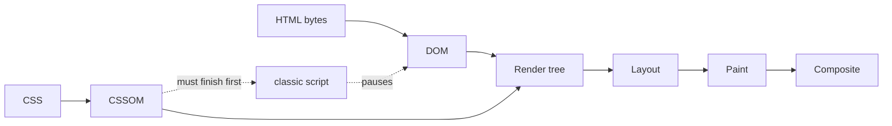
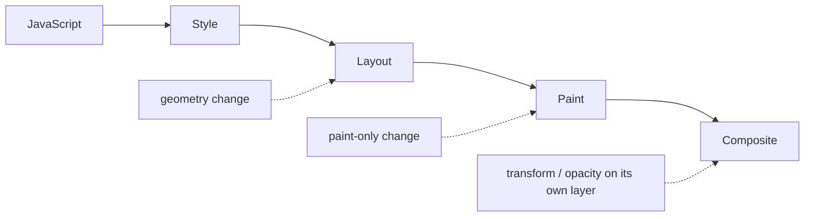
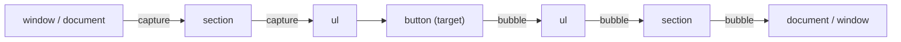
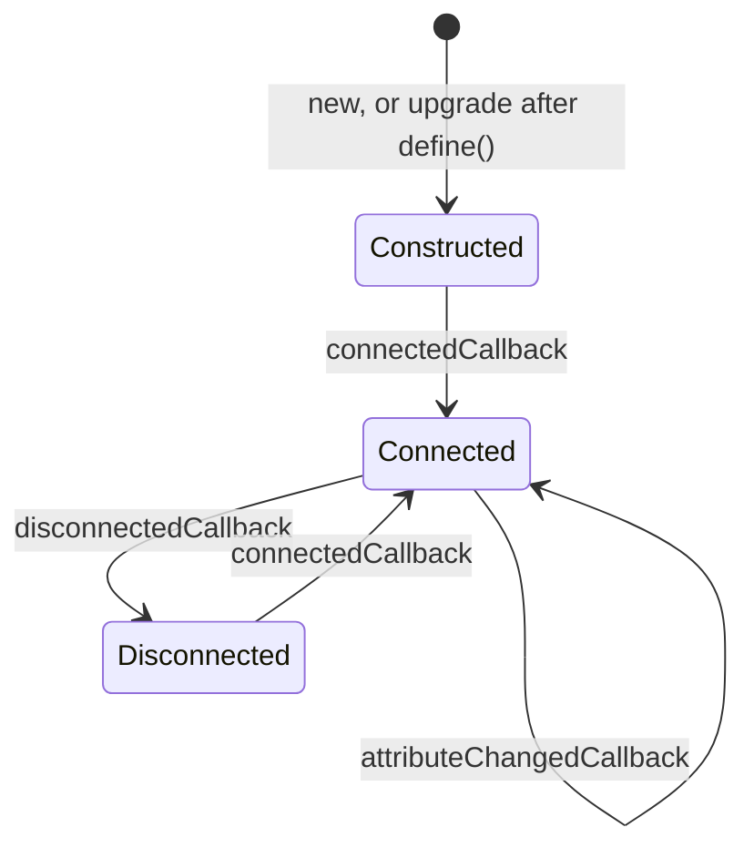
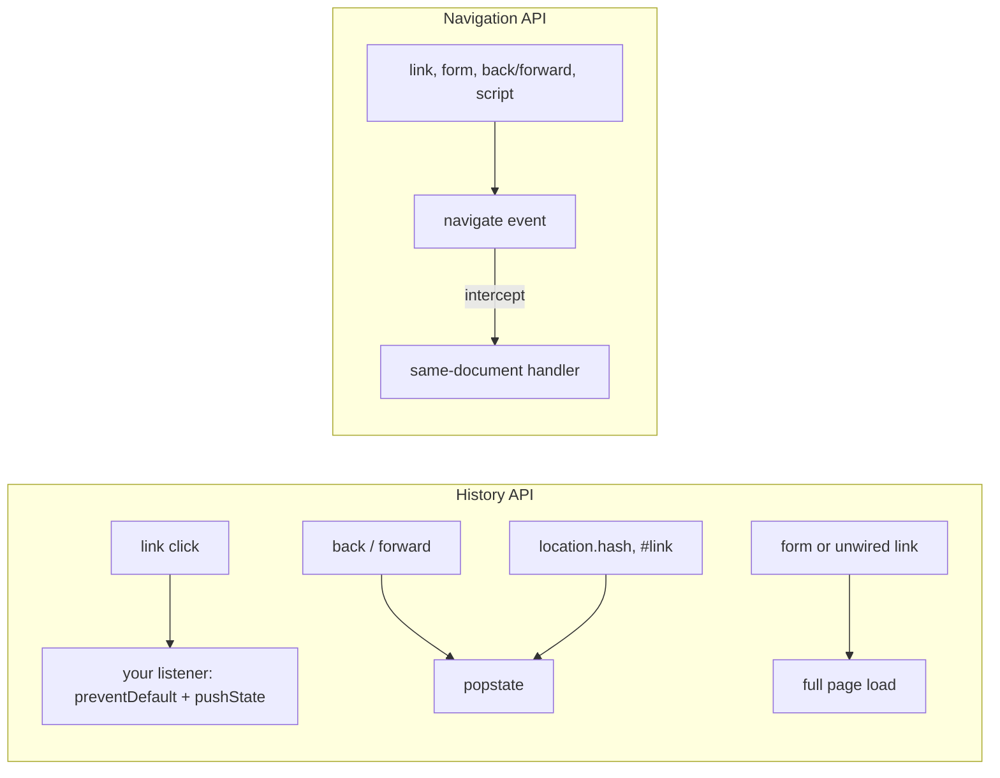

# 08. Browser rendering, the DOM and events

> **What this covers:** how a browser turns HTML, CSS and scripts into pixels and what blocks the first paint, what each kind of style change costs (layout, paint, composite) and how layout thrashing happens, the DOM APIs and observers that replace polling, how events propagate and how to stop, prevent and delegate them, Web Components (custom elements, shadow DOM, slots, declarative shadow DOM), the Core Web Vitals and how to measure them, and the History API versus the Navigation API. By the end you can explain a slow first paint or a janky interaction from the pipeline, write event code that does not fight other listeners, and build a framework-independent component.
> **Prerequisites:** [04. The event loop](04-js-async-event-loop.md#1-the-event-loop-tasks-microtasks-and-rendering) (tasks, microtasks and the rendering opportunity), [03. Classes](03-js-objects-prototypes-classes.md#3-classes-the-sugar-and-what-is-not-sugar) (what a custom element extends) and [01. Coercion](01-js-values-types-coercion.md#5-coercion) (DOM values are strings)
> **Leads to:** [09. Networking, storage and security](09-web-networking-storage-security.md), [10. CSS essentials](10-css-essentials.md), [11. Accessibility](11-accessibility.md), [13. Components and templates](13-components-and-templates.md), [24. Routing](24-routing.md), [31. Performance](31-performance.md)
> **Applies to:** the HTML and DOM Living Standards as of 2026-10; Baseline status from MDN; jsdom 30.1 in the labs
> **Study time:** ~3 hours reading + ~3 hours exercises
> **Short on time:** read [1. The critical rendering path](#1-the-critical-rendering-path-from-bytes-to-pixels), [2. Layout, paint and composite](#2-layout-paint-and-composite-what-each-change-costs) and [4. Events](#4-events-propagation-default-actions-passive-listeners-and-delegation), then drill [Q08.01](#q08-01), [Q08.04](#q08-04), [Q08.08](#q08-08), [Q08.09](#q08-09) and [Q08.16](#q08-16), try [Exercise 08.1](#ex08-1), and finish with the [Summary](#summary).
> **Labs:** [`labs/ts-js/src/modules/08-browser-rendering-dom-events/`](../labs/ts-js/src/modules/08-browser-rendering-dom-events/) and [`labs/ts-js/src/outputs/08-browser-rendering-dom-events/`](../labs/ts-js/src/outputs/08-browser-rendering-dom-events/) (sections 1–5 and 7, the exercises, every *Output* question; jsdom). Run (from `labs/ts-js`, Node 24): `npx vitest run src/modules/08-browser-rendering-dom-events src/outputs/08-browser-rendering-dom-events`

## Contents

1. [The critical rendering path: from bytes to pixels](#1-the-critical-rendering-path-from-bytes-to-pixels)
2. [Layout, paint and composite: what each change costs](#2-layout-paint-and-composite-what-each-change-costs)
3. [DOM APIs and observers](#3-dom-apis-and-observers)
4. [Events: propagation, default actions, passive listeners and delegation](#4-events-propagation-default-actions-passive-listeners-and-delegation)
5. [Web Components: custom elements, shadow DOM and templates](#5-web-components-custom-elements-shadow-dom-and-templates)
6. [Core Web Vitals: LCP, INP and CLS](#6-core-web-vitals-lcp-inp-and-cls)
7. [History API versus Navigation API](#7-history-api-versus-navigation-api)
- [Summary](#summary)
- [Question bank](#question-bank)
- [Hands-on exercises](#hands-on-exercises)
- [Check your understanding](#check-your-understanding)
- [Connections](#connections)

**How the claims here are verified.** The labs have no real browser. DOM, event, Web Component and History API claims run in [jsdom](https://github.com/jsdom/jsdom) 30.1 under Vitest, and they are worded as jsdom results where a browser could differ. jsdom does no layout: every size it reports is `0`. So the rendering pipeline, layout and paint costs, `IntersectionObserver`, `ResizeObserver`, the Core Web Vitals, declarative shadow DOM and the Navigation API come from the specifications and documentation cited next to each claim, never from a lab run. **Baseline is** MDN's cross-browser label: *newly available* means a feature works in the latest stable version of every core browser (Chrome, Edge, Firefox, Safari), *widely available* means a consistent history of support in each for at least 2.5 years ([MDN](https://developer.mozilla.org/en-US/docs/Glossary/Baseline/Compatibility)).

## 1. The critical rendering path: from bytes to pixels

### The problem it solves

On a slow phone a page shows a blank screen for two seconds, although the HTML arrived in 200 ms. The network waterfall shows a stylesheet and a synchronous `<script>` in `<head>`. Neither is slow to download. Each one stops the page from showing anything until it is done.

### Mental model

A pipeline in which some stages wait for others. The parser builds the DOM, the CSS builds the CSSOM (the CSS Object Model: the parsed style rules), and nothing is painted until both are ready. A classic script stops the parser, because it might change the document it is part of.



What to notice: the dashed edges are the waits. A classic script pauses DOM construction and itself waits for pending CSS, so a stylesheet can delay the parser too.

### How it actually works

- **DOM and CSSOM.** The parser turns HTML into the DOM tree. "By default, CSS is treated as a render blocking resource" ([web.dev](https://web.dev/articles/critical-rendering-path/render-blocking-css)): the browser shows nothing rather than a flash of unstyled content. A `media` attribute that does not match (`media="print"`) makes a stylesheet non-blocking.
- **Scripts.** "By default, JavaScript execution is 'parser blocking'", and "JavaScript execution blocks on the CSSOM" ([web.dev](https://web.dev/articles/critical-rendering-path/adding-interactivity-with-javascript)), because a script may read styles. The **preload scanner**, "a secondary HTML parser that scans ahead of the primary one if it's blocked", fetches later resources meanwhile ([web.dev](https://web.dev/articles/preload-scanner)).
- **Render tree, layout, paint, composite.** Visible nodes plus their computed styles form the render tree; an element with `display: none` and its descendants are not in it ([MDN](https://developer.mozilla.org/en-US/docs/Web/Performance/Guides/Critical_rendering_path)). Layout computes geometry, paint draws into layers, and composite puts the layers on screen in order ([web.dev, the pixel pipeline](https://web.dev/articles/rendering-performance)). When this runs is the event loop's rendering opportunity ([module 04 §1](04-js-async-event-loop.md#1-the-event-loop-tasks-microtasks-and-rendering)); what each later change costs is [section 2](#2-layout-paint-and-composite-what-each-change-costs).
- **Script attributes** ([MDN `<script>`](https://developer.mozilla.org/en-US/docs/Web/HTML/Reference/Elements/script)):
  - `defer`: fetched in parallel, run "after the document has been parsed, but before firing `DOMContentLoaded`", in document order;
  - `async` (classic): fetched in parallel and "evaluated as soon as it is available", in no fixed order;
  - `type="module"`: deferred by default ("The `defer` attribute has no effect on module scripts"); with `async`, the module and its dependencies run as soon as they are ready.

### Code

Approach: (1) keep the critical CSS (the CSS the first paint needs) small and mark the rest non-blocking with `media`, (2) never put a classic synchronous script in `<head>`, (3) choose `defer` or a module for code that needs the DOM, and `async` only for independent scripts.

```html
<head>
  <link rel="stylesheet" href="app.css">
  <link rel="stylesheet" href="print.css" media="print">
  <script src="analytics.js" async></script>
  <script src="main.js" type="module"></script>
</head>
```

> [!NOTE]
> **Framework vs platform.** Angular decides the tags, the browser decides what they block. The lab's production build emits one `<script type="module">` at the end of `<body>` and one hashed stylesheet `<link>` (`ng build` in `labs/angular`); build options belong to [module 12](12-angular-how-it-works.md) and [module 31](31-performance.md).

### Best practices and anti-patterns

- **Do load application code with `defer` or `type="module"`**, because the parser never stops for it and it still runs in order.
- **Do mark CSS for other media with a `media` attribute**, because only matching stylesheets block rendering.
- **Avoid `async` for scripts that depend on each other or on the DOM**, because their order and timing are not defined.

### Misconceptions and traps

- *"A script at the end of `<body>` is as good as `defer`."* It looks equivalent because the script cannot block the markup above it. It is still a classic script that waits for pending CSS and runs synchronously. `defer` or `type="module"` states the intent and keeps document order.
- *"CSS only blocks rendering, not scripts."* The render-blocking rule is usually taught alone, and the script wait comes on top of it: a classic script waits for pending CSS, so CSS can delay the parser too. Drilled in [Q08.01](#q08-01) and [Q08.02](#q08-02).

## 2. Layout, paint and composite: what each change costs

### The problem it solves

An expanding list stutters on a mid-range phone. The performance profile shows one long task full of small purple "Layout" blocks, one per row. The code is a single loop that reads each row's height and then sets it.

### Mental model

The pixel pipeline is JavaScript, style, layout, paint, composite ([web.dev](https://web.dev/articles/rendering-performance)). Every style change re-enters it at some stage, and everything after that stage runs again. A change to geometry (`width`, `height`, `top`, `left`) re-runs layout, paint and composite. A visual-only change (`color`, `background-image`, `box-shadow`) skips layout and repaints. A change to `transform` or `opacity` on an element with its own compositor layer only re-composites.



What to notice: each dashed arrow is where a kind of change enters, and the solid arrows to its right always run again, so the later the entry point, the less work.

### How it actually works

- **Reflow and repaint.** After a layout change, "the browser needs to check all other elements and 'reflow' the page"; for a paint-only property "the layout step is not necessary" ([web.dev, rendering performance](https://web.dev/articles/rendering-performance)).
- **Forced synchronous layout.** Normally the browser runs style and layout once, after your JavaScript. Reading geometry (`offsetHeight`, `getBoundingClientRect()`) after a style write makes it "first apply the style change … and then run layout" right away, inside your task. Before any style change, "all the old layout values from the previous frame are known and available for you to query" ([web.dev, avoid layout thrashing](https://web.dev/articles/avoid-large-complex-layouts-and-layout-thrashing)).
- **Layout thrashing** is that read-after-write repeated in a loop: every iteration forces another layout. The fix, in web.dev's words: "read style values then make style changes". Do all reads first, then all writes, and put writes that can wait in `requestAnimationFrame`. Angular's `afterRenderEffect` phases are this split ([module 17 §4](17-signals.md#4-effects)).
- **Compositor-only properties.** "Stick to transform and opacity changes for your animations", and the moving element "should be on its own compositor layer" (a surface painted separately and stacked in order with the others). The reason: "The best-performing version of the pixel pipeline avoids both layout and paint, and only requires compositing changes" ([web.dev, compositor-only properties](https://web.dev/articles/stick-to-compositor-only-properties-and-manage-layer-count)). "Every layer you create requires memory and management."
- **`will-change`** asks for that layer ahead of time. MDN calls it "a last resort to try to deal with existing performance problems" and warns that "excessive use of will-change will result in excessive memory use" ([MDN](https://developer.mozilla.org/en-US/docs/Web/CSS/Reference/Properties/will-change)).
- **`content-visibility: auto`** lets the browser skip layout, style and paint for off-screen content; `contain-intrinsic-size` reserves its size as a placeholder ([MDN](https://developer.mozilla.org/en-US/docs/Web/CSS/Reference/Properties/content-visibility), [web.dev](https://web.dev/articles/content-visibility)). `[Baseline 2024: newly available, per MDN]`

### Code

Approach: (1) measure every row first, (2) write every height after, (3) animate with `transform`, not `top`.

```ts
// Partial: rows is an HTMLElement[]
const heights = rows.map((row) => row.offsetHeight); // all reads: one layout at most
rows.forEach((row, i) => (row.style.height = `${heights[i] * 2}px`)); // all writes: no read in between
```

The order of operations (in the loop version two of the three reads follow a write; in the batched one, none) is checked with recorded calls in `section-2-batching.test.ts`. jsdom does no layout, so the cost itself is the cited documentation, not a lab result.

### Best practices and anti-patterns

- **Do batch DOM reads before DOM writes**, because each read after a write can force a layout inside your task ([Q08.04](#q08-04)).
- **Do animate `transform` and `opacity`**, because they skip layout and paint.
- **Avoid `will-change` on many elements "just in case"**, because each layer costs memory; add it to fix a measured problem.

### Misconceptions and traps

- *"Reading `offsetHeight` is free; only writes cost."* It looks free because a read on clean layout only returns stored values, so the cost appears only after a write.
- *"`content-visibility: auto` alone is enough."* The one-line property already skips the work, so the missing size is easy to overlook until the scrollbar jumps. Skipped content "will lay out as if it was empty", at 0 height, so the scrollbar shifts as sections render ([web.dev](https://web.dev/articles/content-visibility)). Add `contain-intrinsic-size: auto <estimate>`. Drilled in [Q08.03](#q08-03), [Q08.04](#q08-04) and [Q08.05](#q08-05).

## 3. DOM APIs and observers

### The problem it solves

A table component appends 500 rows one at a time. It lazy-loads images from a `scroll` listener that calls `getBoundingClientRect()` on every image, many times per second. Both patterns do work on the main thread that the browser could batch or do for you.

### Mental model

The DOM is a live tree, and every change to the attached tree is something the browser may have to style and lay out again. Build changes off the tree and attach them once. When you need to know that something changed, become visible or resized, ask an observer to tell you, instead of polling.

### How it actually works

- **`DocumentFragment`.** A parentless container. Appending it "moves the fragment's nodes into the DOM, leaving behind an empty `DocumentFragment`" ([MDN](https://developer.mozilla.org/en-US/docs/Web/API/DocumentFragment)). A `<template>`'s `content` is such a fragment: inert until you clone it. Its value is a whole subtree built off the page and attached in one step (see the trap below).
- **`MutationObserver`.** The DOM Standard records each change and queues one "mutation observer microtask" per agent (a thread of execution with its own event loop, as in [module 04](04-js-async-event-loop.md#1-the-event-loop-tasks-microtasks-and-rendering)) ([DOM Standard](https://dom.spec.whatwg.org/#mutation-observers)), so the callback runs after the current synchronous code, with every record in one array. `takeRecords()` returns the pending records, "leaving the mutation queue empty" ([MDN](https://developer.mozilla.org/en-US/docs/Web/API/MutationObserver/takeRecords)); call it before `disconnect()` if you need them.
- **`IntersectionObserver`** reports, asynchronously, when a target crosses a threshold of visibility within a root. With no options it uses "the document's viewport as the root, with no margin, and a 0% threshold" ([MDN](https://developer.mozilla.org/en-US/docs/Web/API/IntersectionObserver/IntersectionObserver)); `rootMargin` grows the root so loading starts early. The callback still runs on the main thread, so keep it short ([MDN](https://developer.mozilla.org/en-US/docs/Web/API/Intersection_Observer_API)).
- **`ResizeObserver`** reports an element's size: `content-box` by default, or `border-box` ([MDN](https://developer.mozilla.org/en-US/docs/Web/API/ResizeObserver/observe)). A callback that resizes what it observes is cut off and an error event fires with "ResizeObserver loop completed with undelivered notifications" ([MDN](https://developer.mozilla.org/en-US/docs/Web/API/ResizeObserver)).
- **Values are strings.** `input.value` and every `dataset` entry are strings, so [module 01](01-js-values-types-coercion.md)'s conversions apply: `Number('')` is `0`, while a number input's `valueAsNumber` is `NaN` when empty.

### Code

Approach: (1) observe each image once, (2) load it when it comes within 200 px of the viewport, (3) stop observing it (`??` is the nullish coalescing operator, ES2020).

```ts
// Partial: images is a NodeListOf<HTMLImageElement> with the real URL in data-src
const observer = new IntersectionObserver(
  (entries) => {
    for (const entry of entries) {
      if (!entry.isIntersecting) continue;
      const image = entry.target as HTMLImageElement;
      image.src = image.dataset['src'] ?? '';
      observer.unobserve(image);
    }
  },
  { rootMargin: '200px' },
);
images.forEach((image) => observer.observe(image));
```

jsdom has neither `IntersectionObserver` nor `ResizeObserver`, so that snippet and both observers' behavior come from MDN. The fragment, `template.content`, `MutationObserver` timing and the string values run in `section-3-dom-observers.test.ts`.

### Best practices and anti-patterns

- **Do use `IntersectionObserver` instead of scroll listeners for visibility**, because the browser computes intersections and calls you only on a threshold crossing ([Q08.07](#q08-07)).
- **Do `disconnect()` observers when their component is destroyed**, because an observer keeps watching, and calling back, after the component is gone.
- **Avoid writing to the size you observe in a `ResizeObserver` callback**, because it creates the loop the browser has to cut off.

### Misconceptions and traps

- *"`MutationObserver` calls me once per change."* Event listeners such as `click` run once per occurrence, so an observer feels the same. Once true: DOM3 Events *Mutation Events* were the way to watch the DOM; MDN now marks them deprecated and selected for removal in Interop 2025 ([MDN `MutationEvent`](https://developer.mozilla.org/en-US/docs/Web/API/MutationEvent)). The changes made in one synchronous run arrive together, in one callback, after that run ends ([Q08.06](#q08-06)).
- *"Use a `DocumentFragment` for speed."* One append of a fragment looks like one cheap operation. MDN notes that in some engines it is slower than appending in a loop. Use it to attach a built subtree in one step, and keep reads and writes apart ([section 2](#2-layout-paint-and-composite-what-each-change-costs)) for speed.

## 4. Events: propagation, default actions, passive listeners and delegation

### The problem it solves

Clicking a row's "Open" button also collapses the panel around the row. Someone adds `stopPropagation()` to the button, and the analytics listener on `document` stops counting clicks. Meanwhile a `wheel` handler that calls `preventDefault()` makes scrolling janky, because the browser must wait for it before it can scroll.

### Mental model

An event travels a path computed before dispatch: down from the window to the target (capture), at the target, then back up (bubble). Every listener on that path sees it unless one stops it. The default action (follow the link, submit the form, scroll) is a separate switch: cancelling it does not stop the journey, and stopping the journey does not cancel it.



What to notice: the same element appears twice, once per direction. A listener registered with `capture: true` runs on the way down; a plain listener runs on the way up.

### How it actually works

- **Phases.** `eventPhase` is `1` (capture), `2` (at target) or `3` (bubble). Some events do not bubble: `focus` does not, `focusin` does.
- **Options.** `addEventListener(type, listener, { capture, once, passive, signal })`. `once` removes the listener after one call. An aborted `AbortController` signal removes every listener registered with it.
- **Three different "stops".** `stopPropagation()` stops the event from reaching further elements, but the remaining listeners on the current element still run. `stopImmediatePropagation()` sets "the stop propagation flag and … the stop immediate propagation flag", so they do not ([DOM Standard](https://dom.spec.whatwg.org/#dom-event-stopimmediatepropagation)). `preventDefault()` cancels the default action only if the event is `cancelable`. It sets `defaultPrevented`, and `dispatchEvent()` returns `false`.
- **Passive listeners** promise never to cancel. A `preventDefault()` call inside one is ignored, so "the browser does not need to wait for it to finish before scrolling" ([MDN](https://developer.mozilla.org/en-US/docs/Web/API/EventTarget/addEventListener)). The DOM Standard makes `touchstart`, `touchmove`, `wheel` and `mousewheel` listeners passive by default when they are registered on the window, the document, `<html>` or `<body>` ([DOM Standard](https://dom.spec.whatwg.org/#default-passive-value)); `mousewheel` is a legacy, non-standard event that MDN deprecates in favor of `wheel` ([MDN](https://developer.mozilla.org/en-US/docs/Web/API/Element/mousewheel_event)). Opt out with `passive: false`.
- **Delegation.** One listener on a container handles events from all its descendants, including rows added later. Find the item with `(event.target as Element).closest('li[data-id]')`. Across a shadow root `target` is the host, so `closest` finds nothing inside it: read `event.composedPath()[0]`, which for an open root is the real inner node and for a closed root is the host, because closed roots are left out of the path ([MDN](https://developer.mozilla.org/en-US/docs/Web/API/Event/composedPath); [Q08.11](#q08-11)).
- **Custom events.** `new CustomEvent('row-open', { detail, bubbles: true })`. Add `composed: true` to cross a shadow root ([section 5](#5-web-components-custom-elements-shadow-dom-and-templates)). `dispatchEvent()` runs every listener synchronously before it returns. Why a real click differs is [Q04.06](04-js-async-event-loop.md#q04-06).

> [!TIP]
> **Coming from the backend.** A servlet filter chain also runs outer → inner → outer. **Where the analogy breaks:** every listener on the path runs unless one stops propagation, and stopping is the listener's decision, not the chain's.

### Code

Approach: (1) one listener on the list, (2) find the row with `closest`, (3) check that the row belongs to this list, (4) remove the listener with the component's signal.

```ts
// Partial: list is the <ul>, destroy is the component's AbortSignal
list.addEventListener(
  'click',
  (event) => {
    const row = (event.target as Element).closest<HTMLElement>('li[data-id]');
    if (!row || !list.contains(row)) return;
    open(row.dataset['id']);
  },
  { signal: destroy },
);
```

Every claim above, including the default-passive rule for all four event types on all four targets (jsdom applies it) and the shadow-root case, runs in `section-4-events.test.ts`.

### Best practices and anti-patterns

- **Do delegate from a stable container**, because one listener covers rows that are added later ([Q08.11](#q08-11)).
- **Do mark scroll and touch listeners `passive`** unless they must cancel, because the browser can then scroll without waiting for them ([Q08.10](#q08-10)).
- **Avoid `stopPropagation()` to fix a parent's behavior**, because it also hides the event from every listener above. Check `event.target` in the parent instead.

### Misconceptions and traps

- *"`preventDefault()` stops the event."* Both methods "stop" something, which blurs them: `preventDefault()` cancels the default action; propagation continues.
- *"`stopPropagation()` stops all other listeners."* The name sounds total. Listeners on the same element still run; only `stopImmediatePropagation()` stops them. Drilled in [Q08.08](#q08-08), [Q08.09](#q08-09), [Q08.10](#q08-10) and [Q08.11](#q08-11).

## 5. Web Components: custom elements, shadow DOM and templates

### The problem it solves

A design system must ship one rating widget that works in an Angular app, a React app and a plain HTML page. Its styles must not leak into the page, and the page's styles must not break it. A framework component cannot do that; a platform component can.

### Mental model

A custom element is a class the browser instantiates for a tag name. A shadow root is a private subtree attached to it, with its own style scope. The page's children of the element (the *light DOM*) stay where they are and are shown through *slots*, holes in the shadow tree.



What to notice: an element can be connected, disconnected and connected again, so `connectedCallback` runs more than once, and `attributeChangedCallback` fires only for observed names (an attribute set before insertion is reported before `connectedCallback`, per the lab).

### How it actually works

- **Definition.** `customElements.define('rating-stars', RatingStars)`. The name must "start with a lowercase letter, contain a hyphen" ([MDN](https://developer.mozilla.org/en-US/docs/Web/API/Web_components/Using_custom_elements)). Elements already in the page are *upgraded* when the definition arrives.
- **Lifecycle.** `constructor` (call `super()` first; "the element must not gain any attributes or children" there, per the [HTML Standard](https://html.spec.whatwg.org/multipage/custom-elements.html#custom-element-conformance)), `connectedCallback` and `disconnectedCallback` on insertion and removal, `adoptedCallback` on a move to another document, and `attributeChangedCallback(name, old, new)` only for names in `static observedAttributes`. In the lab, an attribute set before insertion is reported before `connectedCallback`.
- **Attributes versus properties.** Attributes are strings in the HTML; properties are JavaScript values. A good element reflects the ones that matter both ways (a `value` property that reads and writes the `value` attribute), so it works from HTML and from frameworks.
- **Shadow root.** `attachShadow({ mode: 'open' })` exposes it as `element.shadowRoot`; with `'closed'`, `shadowRoot` "is set to `null`" ([MDN](https://developer.mozilla.org/en-US/docs/Web/API/Element/attachShadow)). Closed is not "a strong security mechanism": browser extensions, for example, can get around it ([MDN](https://developer.mozilla.org/en-US/docs/Web/API/Web_components/Using_shadow_DOM)).
- **Slots.** `<slot>` takes the unassigned light DOM children; `<slot name="label">` takes those with `slot="label"`. `assignedElements()` lists them; `slotchange` fires when they change.
- **Styling.** `:host` styles the element from inside, `::slotted(span)` styles slotted children, and `::part(star)` styles an inner element marked `part="star"` from outside. `exportparts` forwards parts out of nested components ([MDN `::part`](https://developer.mozilla.org/en-US/docs/Web/CSS/Reference/Selectors/::part)).
- **Events.** An event from inside the shadow tree crosses the boundary only with `composed: true`, and outside listeners see the host as its `target` (*retargeting*).
- **Declarative shadow DOM.** `<template shadowrootmode="open">` inside an element makes "the HTML parser … immediately generate a shadow DOM" ([MDN `<template>`](https://developer.mozilla.org/en-US/docs/Web/HTML/Reference/Elements/template)), so server-rendered HTML can include the shadow tree. `[Baseline widely available since February 2024, per MDN's shadowRootMode page]` Once true: tutorials show a non-standard `shadowroot` attribute, supported in Chrome 90 to 110, then removed and replaced by `shadowrootmode` ([MDN `<template>`](https://developer.mozilla.org/en-US/docs/Web/HTML/Reference/Elements/template)).

### Code

Approach: (1) attach a shadow root once in the constructor, (2) render from the observed attribute, (3) report changes with a composed event. `#private` fields and `static` fields are ES2022.

```ts
// Partial: rendering of the stars is omitted
class RatingStars extends HTMLElement {
  static observedAttributes = ['value'];
  #root = this.attachShadow({ mode: 'open' });

  attributeChangedCallback() {
    this.#root.innerHTML = `<span part="star">${'★'.repeat(Number(this.getAttribute('value') ?? 0))}</span>`;
  }

  select(value: number) {
    this.setAttribute('value', String(value));
    this.dispatchEvent(new CustomEvent('rating-change', { detail: value, bubbles: true, composed: true }));
  }
}
customElements.define('rating-stars', RatingStars);
```

The lifecycle order (diagram above), hyphen rule, upgrade, closed root, slot assignment, `slotchange` and retargeting run in jsdom in `section-5-web-components.test.ts`. Styling and declarative shadow DOM are from MDN; jsdom computes no styles and does not attach declarative roots.

> [!NOTE]
> **Framework vs platform.** Angular's default `ViewEncapsulation.Emulated` adds an attribute to the host and to every selector in the component's styles; `ViewEncapsulation.ShadowDom` uses a real shadow root (`@angular/core` 22.2 typings). Encapsulation belongs to [module 13](13-components-and-templates.md); Angular Elements, which wraps a component as a custom element, to [module 37](37-elements-pwa-errors-ecosystem.md).

### Best practices and anti-patterns

- **Do reflect important properties to attributes**, because HTML authors and frameworks set attributes, while scripts set properties.
- **Do expose styling hooks with `part`**, because outside CSS cannot reach into the shadow tree otherwise.
- **Avoid closed shadow roots as protection**, because they only hide the root from `element.shadowRoot`.

### Misconceptions and traps

- *"Events from inside a shadow root always reach the page."* Ordinary events bubble through every element boundary, so the shadow boundary surprises. Only `composed` ones do; UI events dispatched by the browser itself, such as a real `click`, are composed ([MDN](https://developer.mozilla.org/en-US/docs/Web/API/Event/composed)); custom events are not unless you say so ([Q08.12](#q08-12)).
- *"`attributeChangedCallback` fires for every attribute."* It is the only attribute hook, so it reads as "all attributes", but it fires only for names in `observedAttributes`. Drilled in [Q08.13](#q08-13), [Q08.14](#q08-14) and [Q08.15](#q08-15).

## 6. Core Web Vitals: LCP, INP and CLS

### The problem it solves

Lighthouse scores the site 98 in CI, yet Search Console flags its INP as poor. Both are right. Lighthouse loaded the page once on a fast machine and never clicked anything. Search Console reports what real visitors on real phones experienced.

### Mental model

Three user-centred numbers. How soon the main content shows (LCP), how quickly the page responds to input (INP), and how much it jumps around (CLS). Each one is judged at the 75th percentile of real page loads, so a page passes only when three out of four visits are good.

### How it actually works

| Metric | Measures | Good | Poor |
|---|---|---|---|
| **LCP**, Largest Contentful Paint | "the render time of the largest image, text block, or video visible in the viewport" | ≤ 2.5 s | > 4 s |
| **INP**, Interaction to Next Paint | the latency of "all click, tap, and keyboard interactions" during the visit | ≤ 200 ms | > 500 ms |
| **CLS**, Cumulative Layout Shift | "the largest burst of layout shift scores for every unexpected layout shift" | ≤ 0.1 | > 0.25 |

Definitions from web.dev's [LCP](https://web.dev/articles/lcp), [INP](https://web.dev/articles/inp) and [CLS](https://web.dev/articles/cls) pages; thresholds and the 75th percentile from [web.dev, defining the thresholds](https://web.dev/articles/defining-core-web-vitals-thresholds). Values between good and poor "need improvement".

- **INP selection and phases.** "For most sites the interaction with the worst latency is reported as INP", ignoring "one highest interaction for every 50 interactions". An interaction has three phases: input delay ("the time before any callback for an interaction is handled"), processing duration ("the time for all the callbacks to execute") and presentation delay ("the time after the callbacks have been executed until the frame is presented") ([web.dev](https://web.dev/articles/inp)).
- **CLS session windows.** A session window is a run of layout shifts "with less than 1-second in between each shift and a maximum of 5 seconds for the total window duration"; CLS is the window with the largest cumulative score ([web.dev](https://web.dev/articles/cls)).
- **INP replaced FID.** First Input Delay "only measured the input delay of the first interaction"; INP observes every interaction ([web.dev](https://web.dev/articles/inp)), and became a stable Core Web Vital on 12 March 2024 ([web.dev blog](https://web.dev/blog/inp-cwv-launch)).
- **What makes each bad.** LCP: a late-discovered hero image or a render-blocking chain ([section 1](#1-the-critical-rendering-path-from-bytes-to-pixels)). INP: long tasks that delay the handler, heavy handlers, and forced layouts ([section 2](#2-layout-paint-and-composite-what-each-change-costs)). CLS: "Images without dimensions" (give them `width` and `height` or `aspect-ratio`) and content inserted above what the user is reading ([web.dev, optimize CLS](https://web.dev/articles/optimize-cls)).
- **Field versus lab.** Field data comes from real users: the Chrome UX Report (CrUX) or your own real user monitoring (RUM), most easily with the `web-vitals` library ([web.dev](https://web.dev/articles/vitals)). Lab data comes from Lighthouse or DevTools on one controlled load. "Some lab tools won't report a page's INP because they only observe the loading of a page", so Total Blocking Time is a proxy, "not a substitute" ([web.dev](https://web.dev/articles/inp)).

### Code

Approach: (1) register one callback per metric, (2) send each value the library reports with `sendBeacon`, so it survives the page unloading. CLS and INP are reported again whenever the page becomes hidden (web-vitals README), so the server keeps the last one.

```ts
// Partial: web-vitals is not installed in the labs; the API is from web.dev's example
import { onCLS, onINP, onLCP } from 'web-vitals';

const report = (metric: { name: string; value: number; id: string }) =>
  navigator.sendBeacon('/analytics', JSON.stringify(metric));
onCLS(report);
onINP(report);
onLCP(report);
```

This section is documentation only: jsdom has no `PerformanceObserver` and no layout, so no lab can produce these numbers.

### Best practices and anti-patterns

- **Do judge vitals on field data at the 75th percentile**, because that is how the thresholds are defined.
- **Do give images and embeds explicit dimensions**, because reserved space cannot shift.
- **Avoid treating a lab score as an INP result**, because a page load without interactions has no INP ([Q08.17](#q08-17)).

### Misconceptions and traps

- *"A Lighthouse 100 means good Core Web Vitals."* A score looks like a verdict, but Lighthouse is one lab load and the assessment uses field data.
- *"INP is the delay before my handler runs."* That is only the input delay, the first of three phases, so processing and presentation count too. Once true of its predecessor: FID measured only that delay, and was a Core Web Vital until INP replaced it on 12 March 2024 ([web.dev blog](https://web.dev/blog/inp-cwv-launch)). Drilled in [Q08.16](#q08-16) and [Q08.17](#q08-17).

## 7. History API versus Navigation API

### The problem it solves

A hand-written router intercepts clicks on its own links, calls `pushState`, and listens to `popstate` for back and forward. Plain `<a>` tags written by another team still reload the whole page, and the router needs a second code path for every way a navigation can start.

### Mental model

The History API lets you change the URL and the session history, but finding navigations is your job. The Navigation API turns every navigation into one `navigate` event that you may intercept and complete as a same-document navigation.



What to notice: with the History API each source needs its own wiring and the unwired ones reload the page, while the Navigation API has one entry point; `popstate` also fires for `#` navigations.

### How it actually works

- **History API.** `history.pushState(state, '', url)` adds an entry and changes the URL without a request; `replaceState` overwrites the current one. "Just calling `history.pushState()` or `history.replaceState()` won't trigger a `popstate` event"; it fires when the active entry changes without a new document: traversal (the back or forward button, `history.back()`, `history.forward()`) and fragment navigation (`location.hash = '#y'`, a click on `<a href="#x">`), followed by `hashchange` when the fragment differs ([MDN](https://developer.mozilla.org/en-US/docs/Web/API/Window/popstate_event), [HTML Standard, update document for history step application](https://html.spec.whatwg.org/multipage/browsing-the-web.html#update-document-for-history-step-application)). The fragment case runs in jsdom, which follows the spec algorithm; it was not observed in a real browser. `back()` returns before the traversal happens.
- **State limits.** The state is stored with `StructuredSerializeForStorage` and its exceptions are rethrown ([HTML Standard](https://html.spec.whatwg.org/multipage/nav-history-apis.html#shared-history-push/replace-state-steps)), so a function in it throws `DataCloneError`. jsdom skips this step, so the lab cannot show it.
- **Navigation API.** `navigation.addEventListener('navigate', …)` fires "when any type of navigation is initiated" ([MDN](https://developer.mozilla.org/en-US/docs/Web/API/Navigation/navigate_event)): link clicks, form submissions, back and forward, and script. If `event.canIntercept` is true, `event.intercept({ handler })` keeps the document and runs your async handler. Cross-origin navigations cannot be intercepted ([MDN](https://developer.mozilla.org/en-US/docs/Web/API/NavigateEvent/canIntercept)). `navigation.currentEntry` and `navigation.entries()` expose the history entries ([MDN](https://developer.mozilla.org/en-US/docs/Web/API/Navigation_API)). `[Baseline 2026: newly available since January 2026, per MDN]`

### Code

Approach: (1) listen to `navigate`, (2) skip what cannot be intercepted, (3) render the new route inside `intercept`.

```ts
// Partial: navigation is the window's Navigation object; render(url) draws the route
navigation.addEventListener('navigate', (event) => {
  if (!event.canIntercept || event.hashChange || event.downloadRequest !== null) return;
  event.intercept({ handler: () => render(new URL(event.destination.url)) });
});
```

The History API claims run in jsdom in `section-7-history.test.ts`. jsdom has no Navigation API, so that part is from MDN.

> [!NOTE]
> **Framework vs platform.** In `@angular/common` 22.2.1, the browser `PlatformLocation` calls `history.pushState` and listens to `popstate`. The Router's `withExperimentalPlatformNavigation()` `[Experimental since v21.1]` uses the Navigation API instead; its documentation calls it "_highly_ experimental" ([module 24](24-routing.md)).

### Best practices and anti-patterns

- **Do treat `popstate` as "the active entry changed", not as "the user went back"**, because your own `pushState` calls never fire it, but a `#` navigation does.
- **Do keep history state small and plain**, because it is serialized and may be stored.
- **Avoid adopting the Navigation API without a fallback** while older browsers matter, because it is newly available.

### Misconceptions and traps

- *"`pushState` triggers `popstate`."* The event name suggests it follows every state change. `pushState` and `replaceState` never fire it; traversal and fragment navigation do.
- *"After `history.back()` the URL has already changed."* Most navigation calls look synchronous, but `back()` returns first. The traversal happens later; wait for `popstate` ([Q08.18](#q08-18)).

## Summary

A page shows nothing until its CSS is ready; a classic script stops the parser and waits for that CSS, and `defer` and module scripts do not ([1](#1-the-critical-rendering-path-from-bytes-to-pixels)). After the first paint, each style change re-runs the pipeline from the stage it touches: geometry from layout, visuals from paint, and `transform` or `opacity` only from composite. A geometry read after a write forces layout inside your task, and in a loop that is layout thrashing: read first, then write. `will-change` is a last resort, and `content-visibility: auto` needs `contain-intrinsic-size` ([2](#2-layout-paint-and-composite-what-each-change-costs)). Build subtrees off the page, and let observers report mutations, visibility and size instead of polling. `MutationObserver` delivers one batch in a microtask ([3](#3-dom-apis-and-observers)).

An event is captured down, delivered at the target (capture listeners first) and bubbled up. `stopPropagation` spares the current element's other listeners, `stopImmediatePropagation` does not, and `preventDefault` only cancels the default action. Passive listeners cannot cancel, so wheel and touch listeners on the window are passive by default. Delegation needs one listener and `closest` plus a `contains` check ([4](#4-events-propagation-default-actions-passive-listeners-and-delegation)). A custom element is a class for a hyphenated tag. Its shadow root scopes styles; slots show the light DOM; `::part` is the styling API; only `composed` events leave, retargeted to the host. A closed root is not security ([5](#5-web-components-custom-elements-shadow-dom-and-templates)). LCP, INP and CLS are judged on field data at the 75th percentile, and a lab load without interactions has no INP ([6](#6-core-web-vitals-lcp-inp-and-cls)). `pushState` never fires `popstate` (traversal and `#` navigation do); the Navigation API reports every navigation through `navigate` ([7](#7-history-api-versus-navigation-api)).

## Question bank

Questions run from the first paint to the DOM APIs, events, components, vitals and navigation. Every *Output* answer is asserted by a test named after the question in [`labs/ts-js/src/outputs/08-browser-rendering-dom-events/`](../labs/ts-js/src/outputs/08-browser-rendering-dom-events/), run in jsdom 30.1 under Vitest. Answers about layout, paint and the vitals cite documentation, because jsdom does no layout.

<a id="q08-01"></a>
### Q08.01 · Concept · What happens between receiving the HTML and the first pixel, and what blocks it?

<details>
<summary>Answer</summary>

**Short answer (30 seconds).** The parser builds the DOM, CSS builds the CSSOM, the two form the render tree, then layout, paint and composite. CSS blocks rendering by default. A classic script blocks the parser, and it also waits for pending CSS.

**Full explanation.** The browser shows nothing rather than unstyled content, so every matching stylesheet delays the first paint. A classic `<script>` stops DOM construction because it may change the document, while the preload scanner keeps fetching. `display: none` elements are not in the render tree. Source: web.dev and MDN, cited in [section 1](#1-the-critical-rendering-path-from-bytes-to-pixels).

**Follow-ups an interviewer will ask.**
- *How do you make print CSS non-blocking?* `media="print"`.
- *Where does Angular's bundle sit?* One module script ([Q08.02](#q08-02)).

**Trap to avoid.** Saying only scripts block. CSS blocks rendering and, through scripts, parsing.

</details>

<a id="q08-02"></a>
### Q08.02 · Difference · Classic, `defer`, `async` and `type="module"` scripts: when does each download and run?

<details>
<summary>Answer</summary>

**Short answer (30 seconds).** Classic: downloads and runs on the spot, stopping the parser. `defer`: downloads in parallel and runs after parsing, before `DOMContentLoaded`, in document order. `async`: downloads in parallel and runs as soon as it arrives, in no fixed order. Module: deferred by default.

**Full explanation.** `defer` fits application code that needs the DOM and an order, `async` independent scripts such as analytics. `defer` "has no effect on module scripts"; an `async` module runs with its dependencies as soon as they are ready. Source: MDN `<script>` ([section 1](#1-the-critical-rendering-path-from-bytes-to-pixels)).

**Follow-ups an interviewer will ask.**
- *Is a script at the end of `<body>` like `defer`?* Not quite: it still waits for pending CSS and runs synchronously.
- *What does `ng build` emit?* One `<script type="module">`.

**Trap to avoid.** Assuming `async` keeps order.

</details>

<a id="q08-03"></a>
### Q08.03 · Concept · Which changes trigger layout, which only paint, and which only composite?

<details>
<summary>Answer</summary>

**Short answer (30 seconds).** The tier is the first pipeline stage a change touches, and every later stage runs again: geometry enters at layout, visual-only properties at paint, and `transform` or `opacity` on an element with its own layer at composite (examples in [section 2](#2-layout-paint-and-composite-what-each-change-costs)).

**Full explanation.** A layout change can move other elements, so the browser has to reflow the page. That is why web.dev advises animating only `transform` and `opacity`. Layers are not free: "every layer you create requires memory and management". Source: web.dev ([section 2](#2-layout-paint-and-composite-what-each-change-costs)).

**Follow-ups an interviewer will ask.**
- *How do you see it?* The Performance panel shows Layout, Paint and Composite blocks.
- *What forces layout early?* A read after a write ([Q08.04](#q08-04)).

**Trap to avoid.** Animating `left` instead of `transform`.

</details>

<a id="q08-04"></a>
### Q08.04 · Bug hunt · This loop makes expanding a long list stutter. Why, and how do you fix it?

```ts
// Partial: rows is an HTMLElement[]
for (const row of rows) {
  row.style.height = `${row.offsetHeight * 2}px`;
}
```

<details>
<summary>Answer</summary>

**Short answer (30 seconds).** Layout thrashing. Each `offsetHeight` read comes after the previous row's style write, so the browser must run layout synchronously, once per row. Read every height first, then write every height.

**Full explanation.** If nothing earlier in the task dirtied styles, reads use the layout from the previous frame (web.dev). After a write, a geometry read forces "the style change … and then … layout" inside your task. Batched, at most one. Recorded order (three rows): two reads after a write in the loop, none batched (`section-2-batching.test.ts`); the cost itself is from web.dev ([section 2](#2-layout-paint-and-composite-what-each-change-costs)).

**Follow-ups an interviewer will ask.**
- *Writes that can wait?* `requestAnimationFrame`.
- *In Angular?* `afterRenderEffect` phases ([module 17 §4](17-signals.md#4-effects)).

**Trap to avoid.** Blaming the writes. The read after a write is what forces the layout.

</details>

<a id="q08-05"></a>
### Q08.05 · Trade-off · `will-change` and `content-visibility`: when do they help, and what do they cost?

<details>
<summary>Answer</summary>

**Short answer (30 seconds).** `will-change` asks for a compositor layer ahead of an animation. It helps a measured animation problem and costs memory per layer. `content-visibility: auto` skips rendering work for off-screen content. It helps long pages and costs scrollbar stability unless you add `contain-intrinsic-size`.

**Full explanation.** MDN calls `will-change` "a last resort" and warns about memory from excessive use. With `content-visibility`, skipped content lays out "as if it was empty", so give it an estimated size with `contain-intrinsic-size: auto 500px`. `content-visibility` is Baseline 2024 (newly available) per MDN ([section 2](#2-layout-paint-and-composite-what-each-change-costs)).

**Follow-ups an interviewer will ask.**
- *Does it hide content from find-in-page?* No: off-screen `auto` content stays in the DOM and the accessibility tree, so it "can be searched for on the page" (web.dev).

**Trap to avoid.** Putting `will-change` on everything "just in case".

</details>

<a id="q08-06"></a>
### Q08.06 · Output · `MutationObserver` batching: what does this log, and in what order?

```ts
const list = document.createElement('ul');
new MutationObserver((records) => console.log(`observer: ${records.length} records`)).observe(list, { childList: true });
list.append(document.createElement('li'));
Promise.resolve().then(() => console.log('promise'));
list.append(document.createElement('li'));
console.log('sync done');
```

<details>
<summary>Answer</summary>

**Short answer (30 seconds).** `sync done`, `observer: 2 records`, `promise`. Both appends arrive in one callback, after the synchronous code. The observer runs before the promise because its microtask was queued at the first append.

**Full explanation.** The DOM Standard queues one mutation observer microtask, at the first mutation, and appends later records to the same pending batch. The promise reaction was queued after it, so it runs second. The second append still joins the batch. Verified: `Q08.06` in [`rendering-and-dom.test.ts`](../labs/ts-js/src/outputs/08-browser-rendering-dom-events/rendering-and-dom.test.ts). Background: [section 3](#3-dom-apis-and-observers).

**Follow-ups an interviewer will ask.**
- *How do you read pending records now?* `takeRecords()`, which empties the queue.

**Trap to avoid.** Expecting one callback per change.

</details>

<a id="q08-07"></a>
### Q08.07 · Difference · `IntersectionObserver` and `ResizeObserver` versus scroll and resize listeners

<details>
<summary>Answer</summary>

**Short answer (30 seconds).** A listener fires on every scroll or window resize, and you measure each element yourself, often forcing layout. An observer lets the browser compute visibility or size and calls you, asynchronously, only when a threshold is crossed or a size changes. `ResizeObserver` also sees element resizes that no window `resize` reports.

**Full explanation.** `IntersectionObserver` takes a root (the viewport by default), a `rootMargin` and thresholds. `ResizeObserver` cuts off a callback that keeps resizing what it observes. Both callbacks still run on the main thread. Source: MDN ([section 3](#3-dom-apis-and-observers)); jsdom has neither.

**Follow-ups an interviewer will ask.**
- *Lazy-load ahead of time?* A positive `rootMargin`.

**Trap to avoid.** Calling `getBoundingClientRect()` in a scroll handler.

</details>

<a id="q08-08"></a>
### Q08.08 · Output · Capture, target and bubble: in what order do these listeners run?

```ts
document.body.innerHTML = '<div id="outer"><button id="inner">Go</button></div>';
const outer = document.querySelector('#outer')!;
const inner = document.querySelector('#inner')!;
outer.addEventListener('click', () => console.log('outer bubble'));
outer.addEventListener('click', () => console.log('outer capture'), { capture: true });
inner.addEventListener('click', () => console.log('inner bubble'));
inner.addEventListener('click', () => console.log('inner capture'), { capture: true });
document.addEventListener('click', () => console.log('document capture'), true);
inner.dispatchEvent(new MouseEvent('click', { bubbles: true }));
```

<details>
<summary>Answer</summary>

**Short answer (30 seconds).** `document capture`, `outer capture`, `inner capture`, `inner bubble`, `outer bubble`. Capture runs top-down, bubble bottom-up, and at the target the capture listener runs first although it was added second.

**Full explanation.** The DOM Standard's dispatch walks the path twice. The first pass, in reverse, invokes "capturing" listeners, and it includes the target with `eventPhase` `AT_TARGET`. The second pass invokes "bubbling" listeners from the target up. Registration order only decides among listeners of the same kind on one element. Verified: `Q08.08` in [`events-and-shadow.test.ts`](../labs/ts-js/src/outputs/08-browser-rendering-dom-events/events-and-shadow.test.ts). Background: [section 4](#4-events-propagation-default-actions-passive-listeners-and-delegation).

**Follow-ups an interviewer will ask.**
- *Without `bubbles: true`?* No `outer bubble`.

**Trap to avoid.** Answering "registration order" at the target. Once true: in Chromium before 89.0.4359.0, listeners at the target ran in registration order whatever their `capture` flag, as reported in [mdn/content issue 3936](https://github.com/mdn/content/issues/3936) (a user report citing the Chromium change, not a spec changelog); the order above is the DOM Standard's.

</details>

<a id="q08-09"></a>
### Q08.09 · Output · `stopPropagation`, `stopImmediatePropagation` and `preventDefault`: what runs and what is prevented?

```ts
document.body.innerHTML = '<form><a href="#next">next</a></form>';
const link = document.querySelector('a')!;
const form = document.querySelector('form')!;
link.addEventListener('click', (event) => {
  event.preventDefault();
  console.log('A');
});
link.addEventListener('click', (event) => {
  event.stopPropagation();
  console.log('B');
});
link.addEventListener('click', () => console.log('C'));
form.addEventListener('click', () => console.log('form'));
const event = new MouseEvent('click', { bubbles: true, cancelable: true });
console.log(link.dispatchEvent(event), event.defaultPrevented);
```

<details>
<summary>Answer</summary>

**Short answer (30 seconds).** `A`, `B`, `C`, `false true`. `stopPropagation` keeps the event from the form, but `C` on the same element still runs. `preventDefault` cancels the link's navigation, so `dispatchEvent` returns `false`.

**Full explanation.** The three methods act on different things. `preventDefault` sets the canceled flag (only for a `cancelable` event) and does not touch propagation. `stopPropagation` stops after the current element. `stopImmediatePropagation` also stops the remaining listeners here: with it in `B`, the output is `A`, `B`, `false true`. Verified: `Q08.09` in [`events-and-shadow.test.ts`](../labs/ts-js/src/outputs/08-browser-rendering-dom-events/events-and-shadow.test.ts), both variants. Background: [section 4](#4-events-propagation-default-actions-passive-listeners-and-delegation).

**Follow-ups an interviewer will ask.**
- *Without `cancelable: true`?* `true false`.

**Trap to avoid.** Thinking `preventDefault` stops other listeners.

</details>

<a id="q08-10"></a>
### Q08.10 · Concept · What does a passive listener promise, and why are some listeners passive by default?

<details>
<summary>Answer</summary>

**Short answer (30 seconds).** It promises not to cancel the event, so a `preventDefault()` inside it is ignored, and the browser can scroll without waiting for it. The DOM Standard makes wheel and touch listeners on the window, document, `<html>` or `<body>` passive by default (the four events are listed in [section 4](#4-events-propagation-default-actions-passive-listeners-and-delegation)).

**Full explanation.** A non-passive wheel or touch listener forces the browser to run your code before it knows whether to scroll. Pass `{ passive: false }` only when you must cancel, on the element itself. jsdom applies the default rule: `section-4-events.test.ts`. Sources: DOM Standard and MDN ([section 4](#4-events-propagation-default-actions-passive-listeners-and-delegation)).

**Follow-ups an interviewer will ask.**
- *Does `scroll` need `passive`?* MDN: "You don't need to worry about the value of passive for the basic scroll event."

**Trap to avoid.** Expecting `preventDefault()` to work in every wheel listener.

</details>

<a id="q08-11"></a>
### Q08.11 · Design · A list shows 10,000 rows, each with an "Open" and a "Delete" button. How do you handle the clicks?

<details>
<summary>Answer</summary>

**Short answer (30 seconds).** One delegated listener on the list. It finds the button with `event.target.closest('button[data-action]')` and the row with `closest('li[data-id]')`, checks both belong to the list, and dispatches on `data-action`. Rows added later need no setup.

**Full explanation.** 20,000 listeners cost memory and setup, and must be removed with their rows. A delegated listener costs one registration and is removed once, with an `AbortSignal`. Check `list.contains(row)`: `closest` can match an ancestor outside the list. Delegation needs bubbling events; for focus use `focusin`. Background: [section 4](#4-events-propagation-default-actions-passive-listeners-and-delegation). Rendering 10,000 rows is a separate problem: virtual scrolling ([module 31](31-performance.md)). Verified: delegation through `closest` in `section-4-events.test.ts`; built in [Exercise 08.1](#ex08-1).

**Follow-ups an interviewer will ask.**
- *The rows are custom elements with a shadow root; why does `target.closest('button[data-action]')` find nothing?* Outside the root, `event.target` is retargeted to the host, so the button is out of reach. Read `event.composedPath()[0]` instead: the real button for an open root, while a closed root's nodes are left out of the path and you get the host ([MDN](https://developer.mozilla.org/en-US/docs/Web/API/Event/composedPath)). The event must be `composed` to reach the list at all. Both cases are in `section-4-events.test.ts`.

**Trap to avoid.** Calling `stopPropagation` in rows, which blinds the list.

</details>

<a id="q08-12"></a>
### Q08.12 · Output · Custom events and shadow roots: which listeners see the event, and what is `target`?

```ts
const host = document.createElement('div');
const root = host.attachShadow({ mode: 'open' });
root.innerHTML = '<button>rate</button>';
document.body.append(host);
const button = root.querySelector('button')!;
root.addEventListener('rate', (event) => console.log('root sees', (event.target as Element).tagName));
document.addEventListener('rate', (event) => console.log('document sees', (event.target as Element).tagName));
button.dispatchEvent(new CustomEvent('rate', { bubbles: true }));
button.dispatchEvent(new CustomEvent('rate', { bubbles: true, composed: true }));
```

<details>
<summary>Answer</summary>

**Short answer (30 seconds).** `root sees BUTTON`, `root sees BUTTON`, `document sees DIV`. The first event is not composed, so it stops at the shadow root. The composed one crosses it, and outside the shadow tree its `target` is retargeted to the host.

**Full explanation.** Inside the root, `target` is still the button. Built-in UI events such as `click` are composed already. Verified: `Q08.12` in [`events-and-shadow.test.ts`](../labs/ts-js/src/outputs/08-browser-rendering-dom-events/events-and-shadow.test.ts). Background: [section 5](#5-web-components-custom-elements-shadow-dom-and-templates).

**Follow-ups an interviewer will ask.**
- *Without `bubbles`?* The host's own listeners run (at target), and capture listeners above the host run too; no bubble listener above the host does.

**Trap to avoid.** Forgetting `composed: true` on a component's custom event.

</details>

<a id="q08-13"></a>
### Q08.13 · Concept · Walk through the custom element lifecycle. What is `observedAttributes` for?

<details>
<summary>Answer</summary>

**Short answer (30 seconds).** `constructor` when the element is created or upgraded, `connectedCallback` on insertion, `disconnectedCallback` on removal, `adoptedCallback` on a move to another document, and `attributeChangedCallback(name, old, new)` for attributes listed in `static observedAttributes`, and only those.

**Full explanation.** The HTML Standard says the element "must not gain any attributes or children" in its constructor, so setup that reads attributes or renders belongs in `connectedCallback`. Connection can happen many times, so pair what it starts with cleanup in `disconnectedCallback`. Elements parsed before `define()` are upgraded later. In the lab, an observed attribute set before insertion fires first (`value: null -> 1`) and an unobserved one is ignored: `section-5-web-components.test.ts`. Background: [section 5](#5-web-components-custom-elements-shadow-dom-and-templates).

**Follow-ups an interviewer will ask.**
- *A name without a hyphen?* `define` throws a `DOMException` (lab).

**Trap to avoid.** Rendering in the constructor.

</details>

<a id="q08-14"></a>
### Q08.14 · Difference · Open versus closed shadow roots, slots, `:host` and `::part`

<details>
<summary>Answer</summary>

**Short answer (30 seconds).** Open exposes the root as `element.shadowRoot`; closed returns `null` there, but it is not a security boundary. Slots show the light DOM children inside the shadow tree. `:host` styles the component from inside. `::part` lets outside CSS style the inner elements the component marks with `part`.

**Full explanation.** Closed only hides the reference. Slotted children stay in the light DOM, so page styles still apply to them. Page selectors cannot reach the shadow tree, so `part` is the supported styling API. The closed root and slot assignment are lab results (`section-5-web-components.test.ts`); styling is from MDN.

**Follow-ups an interviewer will ask.**
- *Parts of a nested component?* Forward them with `exportparts`.

**Trap to avoid.** Choosing closed "for security".

</details>

<a id="q08-15"></a>
### Q08.15 · Concept · What problem does declarative shadow DOM solve?

<details>
<summary>Answer</summary>

**Short answer (30 seconds).** Server-rendered HTML could not contain a shadow root, because `attachShadow` is JavaScript. With `<template shadowrootmode="open">` inside the host, the HTML parser creates the shadow root itself, so the component's markup and scoped styles show before any script runs.

**Full explanation.** MDN presents it for server-rendered UIs: the parser "will immediately generate a shadow DOM" from the template. When the class is defined later, its `attachShadow` call with the same mode returns that root, cleared (MDN). `shadowrootmode` is Baseline widely available since February 2024 on MDN's `shadowRootMode` page; the older non-standard `shadowroot` attribute (Chrome 90 to 110) is gone. jsdom does not attach declarative roots, so this answer is from MDN ([section 5](#5-web-components-custom-elements-shadow-dom-and-templates)).

**Follow-ups an interviewer will ask.**
- *Where does Angular use it?* Not by default; SSR is [module 32](32-ssr-ssg-hydration.md).

**Trap to avoid.** Thinking shadow DOM needs client-side JavaScript to exist.

</details>

<a id="q08-16"></a>
### Q08.16 · Concept · LCP, INP and CLS: what does each measure, and what are the thresholds?

<details>
<summary>Answer</summary>

**Short answer (30 seconds).** LCP: when the largest image, text block or video in the viewport rendered; good ≤ 2.5 s, poor > 4 s. INP: the latency of clicks, taps and key presses during the visit; good ≤ 200 ms, poor > 500 ms. CLS: the largest burst of unexpected layout shifts; good ≤ 0.1, poor > 0.25. Each is judged at the 75th percentile.

**Full explanation.** INP replaced FID as a Core Web Vital on 12 March 2024. INP reports the worst interaction (ignoring one outlier per 50), from input to the next painted frame, across three phases: input delay, processing duration and presentation delay. CLS takes the worst session window of shifts, not the page total. Source: web.dev ([section 6](#6-core-web-vitals-lcp-inp-and-cls)); no lab can measure these.

**Follow-ups an interviewer will ask.**
- *Why the 75th percentile?* Most visits must be good, not the average one.

**Trap to avoid.** Quoting FID as current.

</details>

<a id="q08-17"></a>
### Q08.17 · Difference · Field data versus lab data: why can Lighthouse pass while real users see a poor INP?

<details>
<summary>Answer</summary>

**Short answer (30 seconds).** Lab data is one controlled page load, often with no interaction. Field data is every real visit, on real devices, aggregated at the 75th percentile. INP needs interactions, so a lab load may not report it at all.

**Full explanation.** Lighthouse shows Total Blocking Time as a proxy for INP, "not a substitute" (web.dev). Debug in the lab; decide with field data, CrUX or RUM via `web-vitals` ([section 6](#6-core-web-vitals-lcp-inp-and-cls)).

**Follow-ups an interviewer will ask.**
- *What does Search Console show?* Field data: its Core Web Vitals report is powered by CrUX (web.dev).

**Trap to avoid.** Treating a Lighthouse score as the Core Web Vitals assessment.

</details>

<a id="q08-18"></a>
### Q08.18 · Difference · History API versus Navigation API

<details>
<summary>Answer</summary>

**Short answer (30 seconds).** The History API changes the URL and history (`pushState`, `replaceState`) and tells you about traversals and `#` navigations (`popstate`); finding link clicks is your job. The Navigation API fires one `navigate` event for every navigation, which you can `intercept` to handle in the page. It is Baseline 2026, newly available.

**Full explanation.** `pushState` fires no `popstate`, `back()` completes later, and a fragment navigation fires `popstate` then `hashchange`: jsdom results (following the spec algorithm, not browser observations) in `section-7-history.test.ts`. With the Navigation API, `canIntercept` is false for cross-origin navigations, `intercept({ handler })` runs your async rendering, and `currentEntry` and `entries()` expose history. Angular's Router uses the History API by default; `withExperimentalPlatformNavigation()` is the experimental alternative ([section 7](#7-history-api-versus-navigation-api)).

**Follow-ups an interviewer will ask.**
- *State limits?* Structured-serializable only.

**Trap to avoid.** Expecting `pushState` to fire `popstate`.

</details>

## Hands-on exercises

Solutions and tests for all three exercises live in [`labs/ts-js/src/modules/08-browser-rendering-dom-events/`](../labs/ts-js/src/modules/08-browser-rendering-dom-events/) and run in jsdom 30.1. Each test file has one `describe` named after its exercise (`E08.1` to `E08.3`) and one `it` per acceptance criterion, in the same order, titled with the criterion's text. jsdom does no layout, so the tests check order and behavior, never rendering cost.

<a id="ex08-1"></a>
### Exercise 08.1 · Event delegation helper

**Problem.** A table adds and removes rows all the time, and every row attaches its own click listeners, which leak when rows are replaced. Write `delegate(root, type, selector, handler)`: one listener on `root` that calls `handler(event, matched)` with the element matching `selector` nearest to the event's target, and returns a function that removes the listener ([section 4](#4-events-propagation-default-actions-passive-listeners-and-delegation), [Q08.11](#q08-11)).

**Constraints.** No libraries. One listener per call. Works for elements added later.

**Acceptance criteria.**
- [ ] A click on a descendant of a matching element calls the handler with that element.
- [ ] Clicks that match nothing inside `root` are ignored.
- [ ] Elements added after the call are handled.
- [ ] A matching ancestor *outside* `root` does not count.
- [ ] The returned function removes the listener (verified by dispatching after it).

<details><summary>Hint 1</summary>

`Element.closest(selector)` walks up from the target, including the target itself.

</details>

<details><summary>Hint 2</summary>

`closest` does not stop at `root`. An `AbortController` gives you a remover without keeping a reference to the listener.

</details>

<details><summary>Worked solution</summary>

**Approach.** (1) One listener on `root`, registered with an `AbortSignal`. (2) Ignore targets that are not elements (a text node cannot call `closest`). (3) Find the nearest match with `closest`, and accept it only if `root` contains it. (4) Return `abort` as the remover.

```ts
// Exercise 08.1: one listener on a container handles events from every descendant that matches a selector.

/**
 * Listens for `type` on `root` and calls `handler` when the event started inside an element matching `selector`.
 * @param root The container that owns the listener; matches outside it are ignored.
 * @param type The event type, for example `'click'`. It must bubble to reach `root`.
 * @param selector A CSS selector for the elements to react to.
 * @param handler Called with the event and the matching element nearest to the event's target.
 * @returns A function that removes the listener.
 */
export function delegate(
  root: Element,
  type: string,
  selector: string,
  handler: (event: Event, matched: Element) => void,
): () => void {
  const controller = new AbortController();
  root.addEventListener(
    type,
    (event) => {
      if (!(event.target instanceof Element)) return;
      const matched = event.target.closest(selector);
      // closest() walks past root to the document, so a matching ancestor of root must not count.
      if (matched && root.contains(matched)) handler(event, matched);
    },
    { signal: controller.signal },
  );
  return () => controller.abort();
}
```

<sub>Source: [labs/ts-js/src/modules/08-browser-rendering-dom-events/delegate.ts](../labs/ts-js/src/modules/08-browser-rendering-dom-events/delegate.ts)</sub>

**How each criterion is met.** In `delegate.test.ts` (`describe('E08.1 delegate')`), the fixture puts the list inside a wrapper that also matches `.row`. "Descendant of a matching element" clicks a `<span>` inside the row's button and receives the `<li>`. "Match nothing" clicks a new `<p>` and the list itself. "Added after" appends a row and clicks it. "Ancestor outside `root`" clicks an unmatched element whose `closest('.row')` is the wrapper: no call. "Removes the listener" dispatches after `stop()`. Mutation checks: dropping the `contains` check, matching only the target, a no-op remover, and passing the target instead of the match each failed tests.

**Alternative approach:** a listener per row, added and removed with the row. **Trade-offs:** no selector matching and no `contains` subtlety, against one registration per row and cleanup that every row must get right. In Angular, a template `(click)` per row is the idiomatic version ([module 13](13-components-and-templates.md)).

**Interviewer follow-ups.**
- *"Why not `event.target.matches(selector)`?"* The click usually lands on a child (an icon or a `<span>`), which does not match.
- *"Does it work for `focus`?"* No: `focus` does not bubble. Use `focusin` ([section 4](#4-events-propagation-default-actions-passive-listeners-and-delegation)).
- *"What if a row stops propagation?"* The list never sees the event; that is why rows should not call `stopPropagation`.

**Tests:** [`delegate.test.ts`](../labs/ts-js/src/modules/08-browser-rendering-dom-events/delegate.test.ts)

</details>

<a id="ex08-2"></a>
### Exercise 08.2 · Batch DOM reads and writes per frame

**Problem.** Several widgets each measure themselves and then resize, and together they thrash layout: one widget's write is followed by the next one's read ([Q08.04](#q08-04)). Write `createFrameScheduler(requestFrame = requestAnimationFrame)` with `measure(job)` and `mutate(job)`, which runs every queued read, then every queued write, once per frame ([section 2](#2-layout-paint-and-composite-what-each-change-costs)).

**Constraints.** No libraries. The frame source is injectable. Tests check order only (jsdom has no layout).

**Acceptance criteria.**
- [ ] All queued reads run before all queued writes in a frame.
- [ ] Many calls in one task request exactly one frame.
- [ ] Jobs keep their queue order.
- [ ] A job queued during a flush runs in the next frame.
- [ ] A throwing job does not drop the others (the error is reported after the flush).

<details><summary>Hint 1</summary>

Two arrays and one boolean are the whole state: the reads, the writes, and whether a frame is already requested.

</details>

<details><summary>Hint 2</summary>

Take the queues and reset them *before* running any job. Then anything a job queues starts a new frame.

</details>

<details><summary>Worked solution</summary>

**Approach.** (1) `measure` and `mutate` push into their own queue and request a frame only if none is pending. (2) The flush swaps in empty queues and clears the flag first. (3) It runs reads then writes, catching each job's error. (4) After the last job it throws one `AggregateError` (ES2021) with every error.

```ts
// Exercise 08.2: queue DOM reads and writes, then run all reads before all writes once per frame.

type Job = () => void;

/** Queues jobs for the next frame. */
export interface FrameScheduler {
  /** Queues a job that only reads layout (sizes, positions). */
  measure(job: Job): void;
  /** Queues a job that only writes to the DOM or styles. */
  mutate(job: Job): void;
}

/**
 * Creates a scheduler that runs, in the next frame, every queued read and then every queued write.
 * @param requestFrame Schedules the flush; tests pass a fake, browsers use `requestAnimationFrame`.
 * @returns The scheduler. A job that throws does not stop the others; the errors are rethrown together after the flush.
 */
export function createFrameScheduler(requestFrame: (callback: () => void) => unknown = requestAnimationFrame): FrameScheduler {
  let reads: Job[] = [];
  let writes: Job[] = [];
  let scheduled = false;

  const flush = () => {
    // Swap the queues first, so a job queued during this flush lands in the next frame.
    const jobs = [...reads, ...writes];
    reads = [];
    writes = [];
    scheduled = false;
    const errors: unknown[] = [];
    for (const job of jobs) {
      try {
        job();
      } catch (error) {
        errors.push(error);
      }
    }
    if (errors.length > 0) throw new AggregateError(errors, `${errors.length} frame job(s) failed`);
  };

  const enqueue = (queue: Job[], job: Job) => {
    queue.push(job);
    if (scheduled) return;
    scheduled = true;
    requestFrame(flush);
  };

  return { measure: (job) => enqueue(reads, job), mutate: (job) => enqueue(writes, job) };
}
```

<sub>Source: [labs/ts-js/src/modules/08-browser-rendering-dom-events/frame-scheduler.ts](../labs/ts-js/src/modules/08-browser-rendering-dom-events/frame-scheduler.ts)</sub>

**How each criterion is met.** In `frame-scheduler.test.ts` (`describe('E08.2 createFrameScheduler')`), a fake `requestFrame` records callbacks and `runFrame()` runs them. "Reads before writes" interleaves two of each and gets both reads first. "Exactly one frame" queues 100 jobs and sees one request. "Queue order" pushes `3, 1, 2` and gets them back in that order. "Queued during a flush" has a read queue a write: it runs only on the second frame, which was requested. "A throwing job" throws in the first read: the other read and the write still run, and the flush throws an `AggregateError` holding that error. Mutation checks: writes before reads; a frame per call; resetting the queues after the jobs; no `try`/`catch`; `unshift` for `push`. Each one failed tests.

**Alternative approach:** Angular's `afterRenderEffect` (or `afterNextRender`) with its `earlyRead` → `write` → `mixedReadWrite` → `read` phases ([module 17 §4](17-signals.md#4-effects)). **Trade-offs:** the framework coordinates every component and runs after its own rendering, against being tied to Angular's render cycle and unavailable to plain scripts.

**Interviewer follow-ups.**
- *"What if a write needs a fresh measurement?"* Queue a `measure` from the write. It runs a frame later; reading at once would force layout.
- *"Why rethrow after the flush instead of at once?"* One broken widget must not freeze every other widget's update for that frame.
- *"Why inject `requestFrame`?"* So tests control when frames run.

**Tests:** [`frame-scheduler.test.ts`](../labs/ts-js/src/modules/08-browser-rendering-dom-events/frame-scheduler.test.ts)

</details>

<a id="ex08-3"></a>
### Exercise 08.3 · A `<rating-stars>` custom element

**Problem.** The design system needs one rating widget for Angular, React and plain HTML pages ([section 5](#5-web-components-custom-elements-shadow-dom-and-templates)). Build `<rating-stars value="3" max="5">` as a custom element with an open shadow root that reports changes with an event the page can hear ([section 4](#4-events-propagation-default-actions-passive-listeners-and-delegation)).

**Constraints.** No framework and no libraries. Outside styling goes through `::part` only. No listener may outlive the element's connection.

**Acceptance criteria.**
- [ ] Renders `max` buttons in an open shadow root and exposes them as `part="star"`.
- [ ] `value` and `max` are observed attributes, and the `value` property reflects to the attribute.
- [ ] Clicking a star sets `value` and dispatches a `rating-change` `CustomEvent` (`bubbles`, `composed`) with `detail.value`, which a `document` listener receives with the host as `target`.
- [ ] A `value` outside `0…max` is clamped.
- [ ] Removing the element from the DOM removes its listeners (no event after removal).

<details><summary>Hint 1</summary>

Keep the attribute as the single source of truth: the `value` getter reads it, the setter writes it, and `attributeChangedCallback` re-renders.

</details>

<details><summary>Hint 2</summary>

Re-rendering replaces the buttons, so listen once on the shadow root and delegate ([Exercise 08.1](#ex08-1)). Register the listener in `connectedCallback` with an `AbortSignal`, and abort it in `disconnectedCallback`.

</details>

<details><summary>Worked solution</summary>

**Approach.** (1) Attach the open shadow root in a field initializer: allowed, because it adds neither attributes nor children to the element. (2) Getters clamp on read, so any attribute value is safe. (3) Render from the attributes on every change. (4) One delegated, abortable listener turns clicks into a composed event.

```ts
// Exercise 08.3: a framework-independent rating widget built on a custom element and an open shadow root.

const DEFAULT_MAX = 5;

/** Limits `value` to the whole numbers 0…max. */
const clamp = (value: number, max: number) => Math.min(max, Math.max(0, Math.round(value) || 0));

/** `<rating-stars value="3" max="5">`: renders `max` star buttons and dispatches `rating-change` when one is clicked. */
export class RatingStars extends HTMLElement {
  static observedAttributes = ['value', 'max'];
  readonly #root = this.attachShadow({ mode: 'open' });
  #listeners: AbortController | null = null;

  /** The number of stars; a missing or invalid `max` attribute means 5. */
  get max(): number {
    const max = Number(this.getAttribute('max'));
    return Number.isInteger(max) && max > 0 ? max : DEFAULT_MAX;
  }

  /** The current rating, clamped to 0…max; setting it reflects to the `value` attribute. */
  get value(): number {
    return clamp(Number(this.getAttribute('value')), this.max);
  }

  set value(value: number) {
    this.setAttribute('value', String(clamp(value, this.max)));
  }

  connectedCallback() {
    this.#listeners = new AbortController();
    // One delegated listener on the shadow root survives every re-render of the buttons.
    this.#root.addEventListener('click', (event) => this.#select(event), { signal: this.#listeners.signal });
    this.#render();
  }

  disconnectedCallback() {
    this.#listeners?.abort();
  }

  attributeChangedCallback() {
    this.#render();
  }

  #select(event: Event) {
    const star = (event.target as Element).closest<HTMLButtonElement>('button[data-value]');
    if (!star) return;
    this.value = Number(star.dataset['value']);
    this.dispatchEvent(new CustomEvent('rating-change', { detail: { value: this.value }, bubbles: true, composed: true }));
  }

  #render() {
    const stars = Array.from({ length: this.max }, (_, i) => i + 1);
    this.#root.innerHTML = stars
      .map((n) => `<button part="star" data-value="${n}" aria-label="${n} of ${this.max}" aria-pressed="${n <= this.value}">★</button>`)
      .join('');
  }
}

if (!customElements.get('rating-stars')) customElements.define('rating-stars', RatingStars);
```

<sub>Source: [labs/ts-js/src/modules/08-browser-rendering-dom-events/rating-stars.ts](../labs/ts-js/src/modules/08-browser-rendering-dom-events/rating-stars.ts)</sub>

**How each criterion is met.** In `rating-stars.test.ts` (`describe('E08.3 <rating-stars>')`), "`max` buttons" mounts `max="4"` and finds four `part="star"` buttons in `shadowRoot` and none in the document. "Observed attributes" changes `max` and `value` and sees the buttons and `aria-pressed` follow; `element.value = 1` writes `value="1"`. "Clicking a star" clicks the fourth button: `value` is `4`, and a `document` listener gets `detail.value` `4`, `bubbles` and `composed` true, and `target` the host (retargeting, [Q08.12](#q08-12)). "Clamped" reads `value="9"` as `5` and stores `-2` as `"0"`. "Removing" clicks a star after `remove()`: no event, value unchanged. Mutation checks: a closed root, no `part`, `max` not observed, no `composed`, no clamping, no `abort()`, and a setter that does not reflect. Each one failed tests.

**Alternative approach:** an Angular component exported with Angular Elements ([module 37](37-elements-pwa-errors-ecosystem.md)). **Trade-offs:** templates, signals and DI, against shipping Angular's runtime to every host page.

**Interviewer follow-ups.**
- *"Why does the getter clamp, not `attributeChangedCallback`?"* Rewriting the attribute there calls the callback again. Clamping on read keeps one source of truth with no loop.
- *"Is it accessible?"* Partly: real buttons with `aria-pressed` and labels. A full radio-group pattern is [module 11](11-accessibility.md).
- *"Render it on the server?"* Declarative shadow DOM ([Q08.15](#q08-15)). `attachShadow` with the same mode then returns that root, cleared (MDN), and the class re-renders into it.

**Tests:** [`rating-stars.test.ts`](../labs/ts-js/src/modules/08-browser-rendering-dom-events/rating-stars.test.ts)

</details>

## Check your understanding

**Explain it back.**
1. Explain to a backend developer why a page that downloaded quickly can still show nothing for two seconds, and which two tags to change first.
2. Explain to a teammate why reading `offsetHeight` in a loop is slow only when the loop also writes, and how to restructure it.
3. Explain to a reviewer why `stopPropagation()` in a row's click handler broke the analytics on `document`, and what the row should do instead.
4. Explain to a design-system team when a custom element with a shadow root is worth it over a framework component, and how consumers style and listen to it.
5. Explain to a product manager why Lighthouse says 98 while Search Console says INP is poor.

**Flashcards.**

<details><summary>What does `defer` change for a classic script?</summary>

It downloads in parallel and runs after parsing, before `DOMContentLoaded`, in document order.

</details>

<details><summary>Which property changes skip layout and paint?</summary>

`transform` and `opacity` on an element with its own compositor layer.

</details>

<details><summary>What is layout thrashing?</summary>

Forced synchronous layouts in a loop: a geometry read after each style write.

</details>

<details><summary>When does a `MutationObserver` callback run?</summary>

In a microtask after the synchronous code, with every record of that run in one array.

</details>

<details><summary>At the target, which runs first: a bubble listener added first or a capture listener added second?</summary>

The capture listener.

</details>

<details><summary>Which listeners are passive by default?</summary>

`touchstart`, `touchmove`, `wheel` and `mousewheel` on the window, the document, `<html>` or `<body>`.

</details>

<details><summary>What does an outside listener see as `target` for a composed event from a shadow tree?</summary>

The host element.

</details>

<details><summary>What are the "good" thresholds for LCP, INP and CLS?</summary>

2.5 s, 200 ms and 0.1, at the 75th percentile.

</details>

## Connections

- **Builds on:** [01. Values, types and coercion](01-js-values-types-coercion.md) (DOM values are strings, [§3](#3-dom-apis-and-observers)), [04. The event loop](04-js-async-event-loop.md#1-the-event-loop-tasks-microtasks-and-rendering) (the rendering opportunity, microtasks after listeners) and [03. Classes](03-js-objects-prototypes-classes.md#3-classes-the-sugar-and-what-is-not-sugar) (what a custom element extends).
- **Read next:** [09. Networking, storage and security](09-web-networking-storage-security.md).
- **Uses these ideas later:** [10. CSS essentials](10-css-essentials.md) (containment), [11. Accessibility](11-accessibility.md) (focus events and shadow DOM), [13. Components and templates](13-components-and-templates.md) (view encapsulation and host listeners), [17. Signals](17-signals.md#4-effects) (`afterRenderEffect` phases against layout thrashing), [24. Routing](24-routing.md) (the History and Navigation APIs under the Router), [31. Performance](31-performance.md) (Core Web Vitals work) and [37. Elements, PWA and errors](37-elements-pwa-errors-ecosystem.md) (Angular Elements as custom elements).
