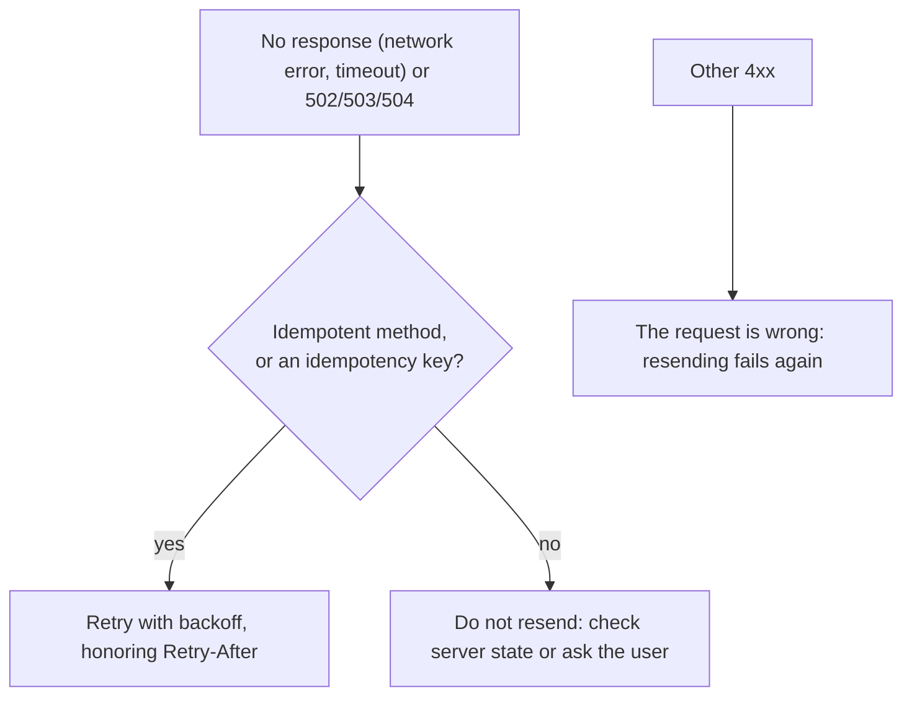
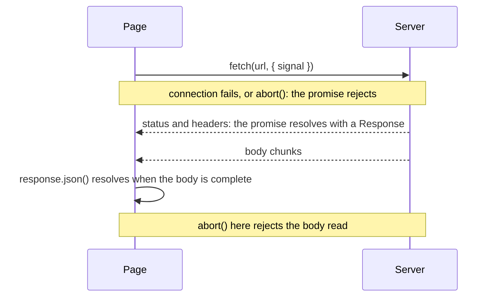
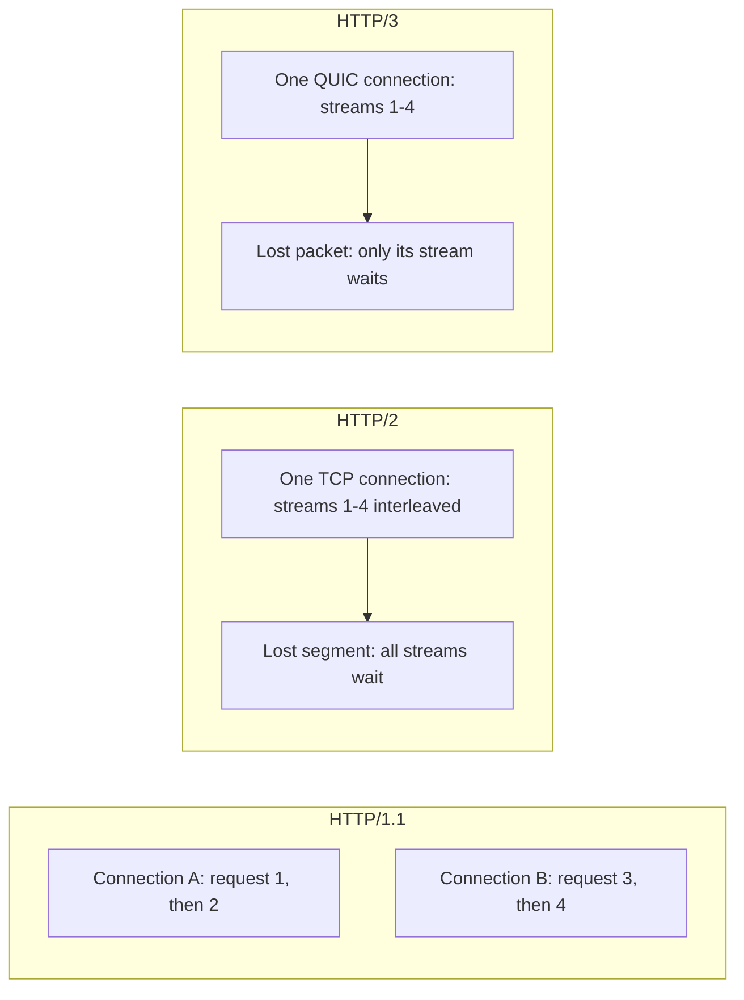
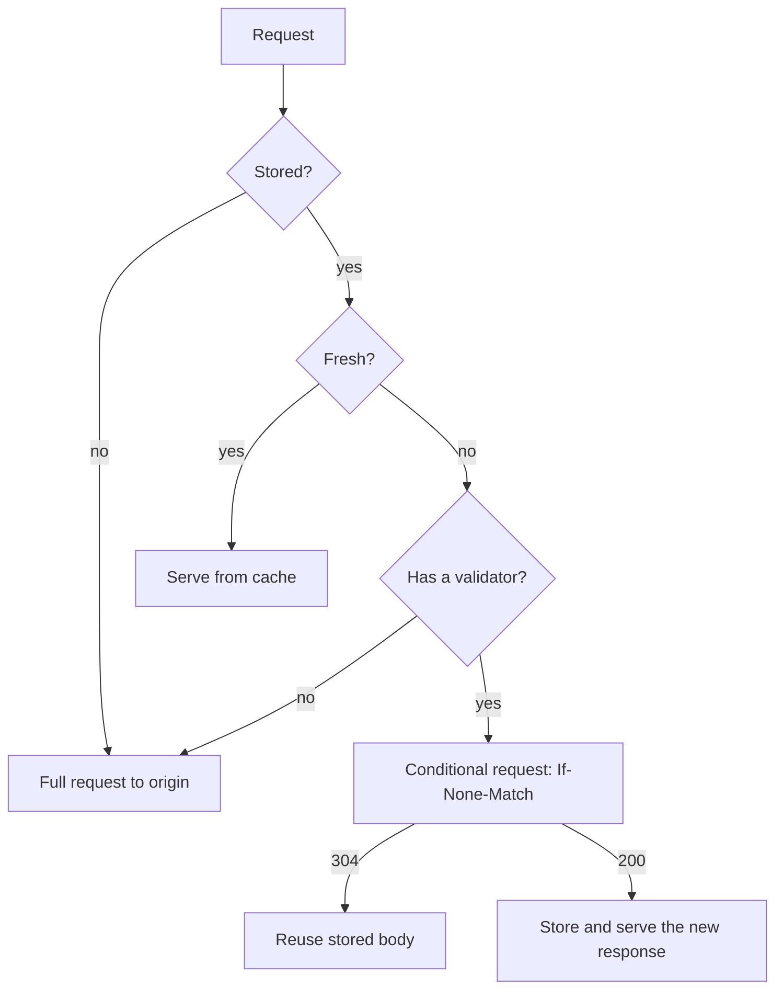
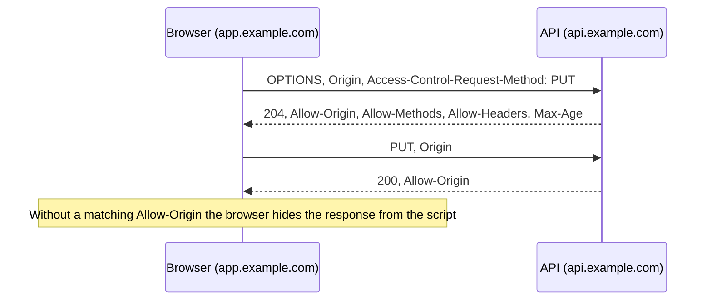
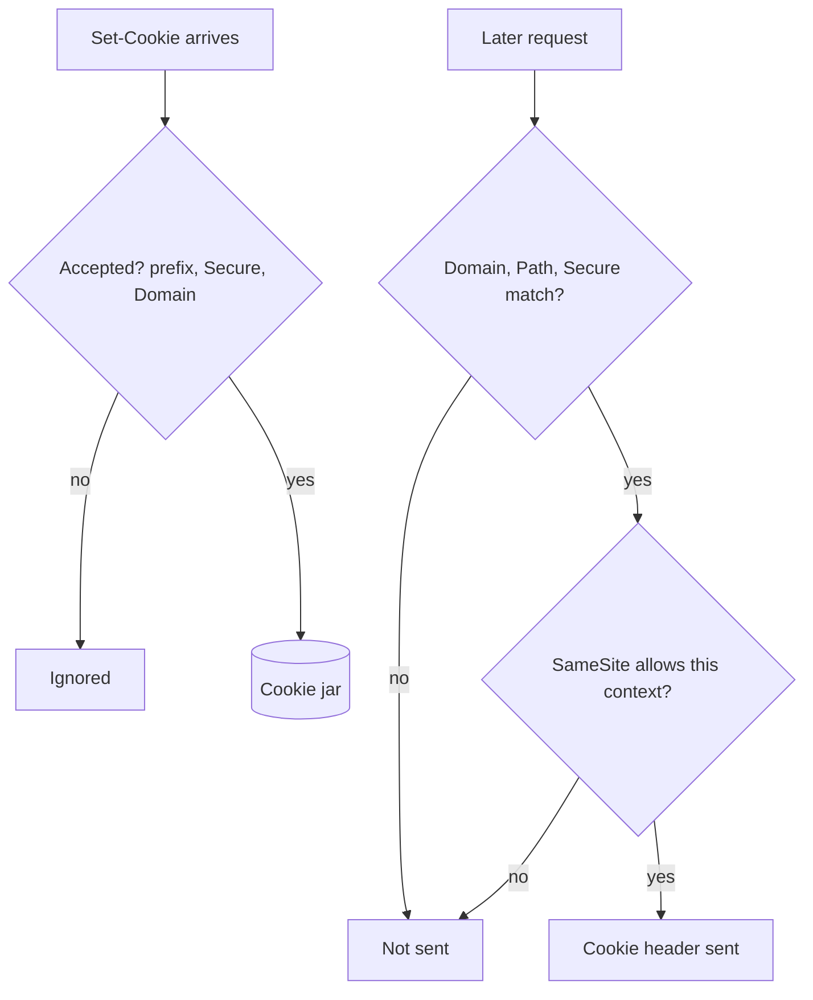
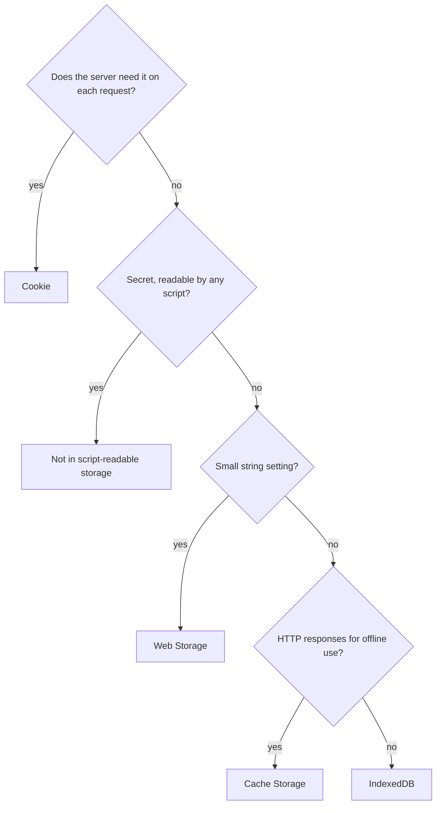
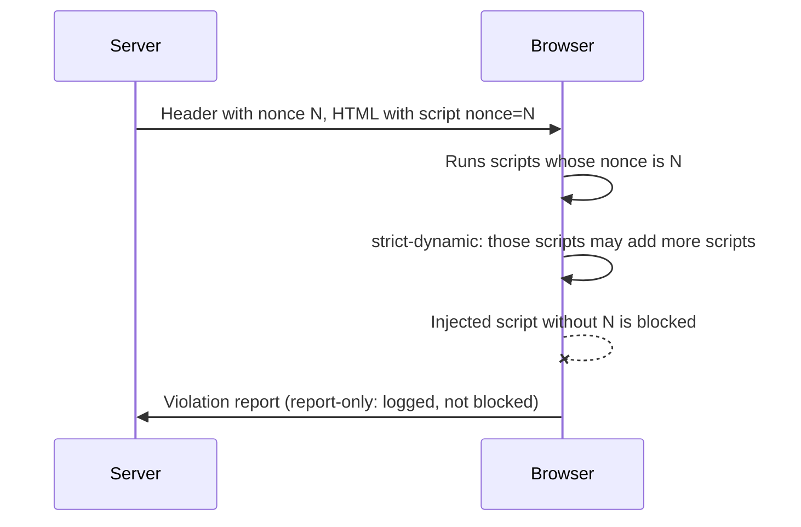
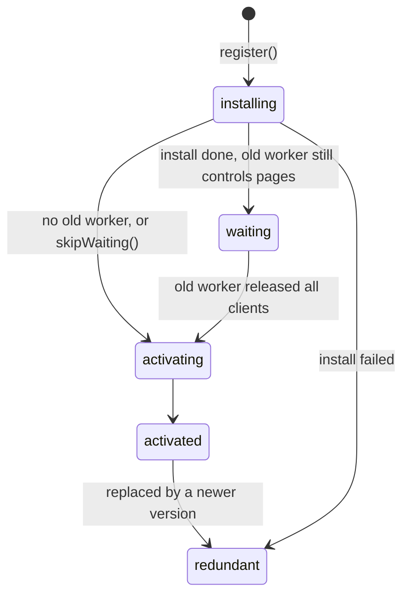

# 09. Networking, storage and browser security

> **What this covers:** HTTP semantics (methods, idempotency, status codes, headers), `fetch` versus XHR, HTTP/1.1 versus HTTP/2 versus HTTP/3, HTTP caching, the same-origin policy and CORS (Cross-Origin Resource Sharing) from the browser's side, cookies and their attributes, the browser storage APIs and their quotas, Content Security Policy and Trusted Types, and service workers with the PWA manifest. By the end you can explain why a request failed or a deploy did not reach users, set caching, cookie and CSP headers on purpose, and choose where data may live in the browser.
> **Prerequisites:** [04. Cancellation with `AbortController`](04-js-async-event-loop.md#7-cancellation-with-abortcontroller) (aborting `fetch`), [04. The event loop](04-js-async-event-loop.md#1-the-event-loop-tasks-microtasks-and-rendering) (promises and tasks) and [08. Events](08-browser-rendering-dom-events.md#4-events-propagation-default-actions-passive-listeners-and-delegation) (the `visibilitychange` and `storage` events build on it)
> **Leads to:** [10. CSS essentials](10-css-essentials.md), [27. HTTP client](27-http-client.md), [31. Performance](31-performance.md), [33. Security](33-security.md), [37. Elements, PWA and errors](37-elements-pwa-errors-ecosystem.md), [41. Full-stack API contracts](41-fullstack-api-contracts.md), [42. Full-stack authentication](42-fullstack-authentication.md)
> **Applies to:** the Fetch, HTML and Service Workers standards, RFC 9110/9111/9113/9114 and CSP Level 3 as of 2026-10; Baseline status from MDN; Node 24 and jsdom 30.1 in the labs
> **Study time:** ~3 hours reading + ~3 hours exercises
> **Short on time:** read [4. HTTP caching](#4-http-caching), [5. The same-origin policy and CORS](#5-the-same-origin-policy-and-cors) and [6. Cookies](#6-cookies), then drill [Q09.09](#q09-09), [Q09.12](#q09-12), [Q09.13](#q09-13), [Q09.15](#q09-15) and [Q09.19](#q09-19), try [Exercise 09.2](#ex09-2), and finish with the [Summary](#summary).
> **Labs:** [`labs/ts-js/src/modules/09-web-networking-storage-security/`](../labs/ts-js/src/modules/09-web-networking-storage-security/) and [`labs/ts-js/src/outputs/09-web-networking-storage-security/`](../labs/ts-js/src/outputs/09-web-networking-storage-security/) (section claims, exercises and *Output* questions; Node and jsdom). Run (from `labs/ts-js`, Node 24): `npx vitest run src/modules/09-web-networking-storage-security src/outputs/09-web-networking-storage-security`

## Contents

1. [HTTP semantics: methods, status codes and headers](#1-http-semantics-methods-status-codes-and-headers)
2. [`fetch`, XHR and the request lifecycle](#2-fetch-xhr-and-the-request-lifecycle)
3. [HTTP/1.1, HTTP/2 and HTTP/3](#3-http11-http2-and-http3)
4. [HTTP caching](#4-http-caching)
5. [The same-origin policy and CORS](#5-the-same-origin-policy-and-cors)
6. [Cookies](#6-cookies)
7. [Browser storage: what each is safe for](#7-browser-storage-what-each-is-safe-for)
8. [Content Security Policy and Trusted Types](#8-content-security-policy-and-trusted-types)
9. [Service workers and the PWA manifest](#9-service-workers-and-the-pwa-manifest)
- [Summary](#summary)
- [Question bank](#question-bank)
- [Hands-on exercises](#hands-on-exercises)
- [Check your understanding](#check-your-understanding)
- [Connections](#connections)

**How the claims here are verified.** The labs have no real browser. What runs is Node 24 (`fetch` is undici) against a local `node:http` or `node:http2` server, and [jsdom](https://github.com/jsdom/jsdom) 30.1 for cookies and Web Storage; those claims say "in Node" or "in jsdom" where a browser could differ. Node's `fetch` has no HTTP cache and no CORS enforcement, and jsdom has no `fetch`, IndexedDB, Cache Storage, service worker, CSP or Trusted Types. So browser behavior (caching, CORS, `SameSite`, CSP, quotas, service workers, HTTP/3) comes from the RFCs, the Fetch Standard and MDN, cited beside each claim and never called observed. **Baseline is** MDN's cross-browser label: *newly available* means a feature works in the latest stable version of every core browser (Chrome, Edge, Firefox, Safari), *widely available* means a consistent history of support in each for at least 2.5 years ([MDN](https://developer.mozilla.org/en-US/docs/Glossary/Baseline/Compatibility)).

## 1. HTTP semantics: methods, status codes and headers

### The problem it solves

A retry layer resends `POST /payments` after a timeout and the customer is charged twice. A client treats `301` and `307` alike and loses a request body. An API answers `200` with `{ "error": … }`, so every monitor believes it worked.

### Mental model

A request is a sentence (method, target, headers, optional body); the response is the reply (status, headers, body). The method tells every **intermediary** (a proxy, cache or gateway between client and the **origin server** that owns the resource) what it may do without reading the payload: cache, prefetch or repeat it.



What to notice: the decision depends on the method, not the failure. A timeout on `POST` and on `PUT` look alike, and only `PUT` is safe to repeat ([Q09.01](#q09-01), [Exercise 09.2](#ex09-2)).

### How it actually works

- **Safe, idempotent, cacheable** ([RFC 9110 §9.2](https://www.rfc-editor.org/rfc/rfc9110.html#name-common-method-properties)). A **safe** method is essentially read-only (`GET`, `HEAD`, `OPTIONS`, `TRACE`). An **idempotent** one has the same intended effect repeated as once (`PUT`, `DELETE`, the safe ones). `POST` is not, and `PATCH` ([RFC 5789](https://www.rfc-editor.org/rfc/rfc5789.html)) "is neither safe nor idempotent". Clients "SHOULD NOT automatically retry" non-idempotent requests. An **idempotency key** (a unique token sent with a `POST` so the server recognizes a repeat) is your API's convention: RFC 9110 defines no such header.
- **Redirects.** `301`/`308` are permanent, `302`/`307` temporary. For `301` and `302` "for historical reasons, a user agent MAY change the request method from POST to GET"; `307` and `308` forbid it. The Fetch Standard makes browsers turn a `301`/`302` `POST`, and a `303` that is not `GET` or `HEAD`, into a bodiless `GET` ([HTTP-redirect fetch](https://fetch.spec.whatwg.org/#http-redirect-fetch)).
- **Statuses** ([RFC 9110 §15](https://www.rfc-editor.org/rfc/rfc9110.html#name-status-codes)). `2xx` success (`201` created, `204` no content), `3xx` redirect, `4xx` the request is at fault (`400`, `404`, `409` conflict with the resource's state, `422` understood but unprocessable), `5xx` the server is (`500`, `502`, `504`). `401`: no valid credentials; `403`: understood, refused; `429`: too many requests ([RFC 6585](https://www.rfc-editor.org/rfc/rfc6585.html)); `503`: temporary, maybe with `Retry-After` ([Q09.02](#q09-02)).
- **Headers a browser app meets.** `Content-Type` and `Accept` (what the body is, what the client wants; [§8.3](https://www.rfc-editor.org/rfc/rfc9110.html#name-content-type), [§12.5.1](https://www.rfc-editor.org/rfc/rfc9110.html#name-accept)); `Authorization` (credentials; [§11.6.2](https://www.rfc-editor.org/rfc/rfc9110.html#name-authorization)); `Location` (a new or moved resource; [§10.2.2](https://www.rfc-editor.org/rfc/rfc9110.html#name-location)); `Retry-After` (when to retry; [§10.2.3](https://www.rfc-editor.org/rfc/rfc9110.html#name-retry-after)); `Vary` (the request headers a response depends on; [§12.5.5](https://www.rfc-editor.org/rfc/rfc9110.html#name-vary)).
- **Headers and state.** Names are case-insensitive ([RFC 9110 §5.1](https://www.rfc-editor.org/rfc/rfc9110.html#name-field-names)); `Headers` joins duplicates with `, ` except `Set-Cookie`, which `getSetCookie()` keeps apart. HTTP is stateless ([§3.3](https://www.rfc-editor.org/rfc/rfc9110.html#name-connections-clients-and-ser)); cookies ([section 6](#6-cookies)) resend state.

> [!TIP]
> **Coming from the backend.** Spring's `ResponseEntity` and `HttpStatus` choose these codes. **Where the analogy breaks:** browsers and proxies interpret them, so a wrong code changes caching and retries beyond your code.

### Code

Approach: a local server redirects `/redirect/<code>` to `/echo`, which reports the method and body it received; a `POST` with body `x` follows each redirect (the handler uses ES2020 `?.` and `??`).

```ts
// Excerpt of labs/ts-js/src/modules/09-web-networking-storage-security/section-1-http-semantics.test.ts
const redirectServer = () =>
  startServer(async (request, response) => {
    const code = /^\/redirect\/(\d{3})$/.exec(request.url ?? '')?.[1];
    if (code) {
      response.writeHead(Number(code), { Location: '/echo' }).end();
      return;
    }
    response.end(`${request.method}:${await readBody(request)}`);
  });
for (const code of [301, 302, 303, 307, 308]) {
  const response = await fetch(`${server.baseUrl}/redirect/${code}`, { method: 'POST', body: 'x' });
  seen[code] = await response.text();
}
expect(seen).toEqual({ 301: 'GET:', 302: 'GET:', 303: 'GET:', 307: 'POST:x', 308: 'POST:x' });
```

In Node (undici) `301`, `302` and `303` give `GET:`, `307` and `308` give `POST:x` (`Section 1: a POST through 301…`). The file also tests a `404`, a refused connection and `Headers` ([Q09.03](#q09-03), [Q09.05](#q09-05)).

### Best practices and anti-patterns

- **Pick the status for what happened**, because caches, monitors and `Response.ok` read it; a `200` error body hides failure.
- **Retry only idempotent requests or ones with a key**, because a repeated `POST` can apply twice.
- **Use `307`/`308` to keep the method**, because `301`/`302` may become `GET`.

### Misconceptions and traps

- *"`fetch` rejects on a 404 or 500."* The promise settles when a response head arrives, so it says "an answer came", not "a good one"; check `ok`. A `try/catch` around it reads like whole-exchange handling, hence the myth.
- *"Idempotent means harmless."* `DELETE` changes state; idempotent only says twice equals once. The words sound alike; read-only is "safe".
- *"`301`/`302` turn `POST` into `GET` by the standard."* RFC 9110 says a client "MAY", citing "historical reasons"; the Fetch Standard requires it of browsers, and `307`/`308` avoid it ([Q09.02](#q09-02)).

## 2. `fetch`, XHR and the request lifecycle

### The problem it solves

A form posts with `fetch`, the server answers `500`, and the UI says "saved" because the promise resolved. A page sends its last analytics in `unload` and loses them. An upload needs a progress bar that `fetch` cannot drive.

### Mental model

`fetch` returns a promise for the response **head** (status and headers). The body is a separate **one-shot stream**, a sequence of bytes you can consume only once, which you read afterwards with a second promise. `XMLHttpRequest` (XHR) is the older, event-based object that also reports progress.



What to notice: two settle points, and a `Response` in hand does not mean the body arrived. `abort()` can cut in at either ([Q09.04](#q09-04), [Q09.06](#q09-06)).

### How it actually works

- **What rejects.** A network failure, a malformed request or an abort; any HTTP status resolves ([MDN](https://developer.mozilla.org/en-US/docs/Web/API/Window/fetch)). `Response.ok` is `true` for 200 to 299.
- **The body is read once.** `json()`, `text()` and `blob()` consume it; a second read throws `TypeError: Body is unusable` and `bodyUsed` is `true`. `clone()` before reading gives two readable copies (`Section 2: a body can be read once…`; [Q09.05](#q09-05)).
- **Streams.** `response.body.getReader()` yields `Uint8Array` chunks, so adding their lengths gives **download** progress. A `ReadableStream` request body needs `duplex: 'half'` ([MDN](https://developer.mozilla.org/en-US/docs/Web/API/RequestInit)); Chrome's documentation says it is rejected over HTTP/1.x ([Chrome](https://developer.chrome.com/docs/capabilities/web-apis/fetch-streaming-requests)). Node throws without `duplex` (`Section 2: a ReadableStream request body…`).
- **Upload progress** is XHR's (`xhr.upload` events, [MDN](https://developer.mozilla.org/en-US/docs/Web/API/XMLHttpRequestUpload)); the Fetch Standard says `fetch` "is currently lacking when it comes to request progression" ([Fetch Standard](https://fetch.spec.whatwg.org/#fetch-api)).
- **Options.** `credentials` is `'omit'`, `'same-origin'` (the default) or `'include'`; `'include'` still sends no cookie marked `SameSite=Strict` or `Lax` (a cookie attribute, [section 6](#6-cookies)) cross-site ([MDN](https://developer.mozilla.org/en-US/docs/Web/API/Fetch_API/Using_Fetch)). `Section 2: Request defaults…` runs the defaults.
- **Leaving the page.** `keepalive: true` lets the request outlive the page; the bodies of all in-flight `keepalive` requests together are limited to 64 KiB ([Fetch Standard](https://fetch.spec.whatwg.org/#fetch-api)); `navigator.sendBeacon()` is a `POST` of at most 64 KiB, best sent on `visibilitychange` ([MDN](https://developer.mozilla.org/en-US/docs/Web/API/Navigator/sendBeacon)).
- **Cancellation** is [04 §7](04-js-async-event-loop.md#7-cancellation-with-abortcontroller). The rejection is `signal.reason`, also mid-body (`Section 2: fetch resolves with the head…`).

> [!NOTE]
> **Framework vs platform.** These rules are the platform's. `HttpClient` (owner: [27](27-http-client.md)) wraps them and uses `fetch` by default in v22 ([VERSIONS.md](../VERSIONS.md)).

### Code

Approach: read the stream chunk by chunk, add the byte lengths and compare them with `Content-Length`.

```ts
// Excerpt of labs/ts-js/src/modules/09-web-networking-storage-security/section-2-fetch.test.ts
const total = Number(response.headers.get('content-length'));
const reader = response.body!.getReader();
let received = 0;
for (let step = await reader.read(); !step.done; step = await reader.read()) {
  chunks.push(step.value);
  received += step.value.byteLength;
}
expect([received, total]).toEqual([6, 6]);
```

To deliver on page hide, send from `visibilitychange`:

```ts
// Partial: payload is a string built elsewhere; /analytics is your endpoint
document.addEventListener('visibilitychange', () => {
  if (document.visibilityState === 'hidden') navigator.sendBeacon('/analytics', payload);
});
```

### Best practices and anti-patterns

- **Check `ok` before parsing**, because an error page is not your JSON ([Exercise 09.2](#ex09-2)).
- **`clone()` before a second read**, because the first consumes the body.
- **Use `visibilitychange`, not `unload`**, for last-chance sends, because mobile browsers often never fire `unload` ([events](08-browser-rendering-dom-events.md#4-events-propagation-default-actions-passive-listeners-and-delegation)).

### Misconceptions and traps

- *"I can call `.json()` after `.text()`."* The first read consumes the stream; most JavaScript values can be re-read, which hides this.
- *"`unload` is the place to send analytics."* MDN: websites "in the past" used it, and it is "extremely unreliable", especially on mobile, and incompatible with the back/forward cache ([bfcache](https://developer.mozilla.org/en-US/docs/Glossary/Bfcache): a snapshot of a whole page restored on Back or Forward).
- *"`fetch` supersedes XHR completely."* It is newer and promise-based, which reads as a replacement, but not a superset: the Fetch Standard itself notes it lacks request progression.
- *"`credentials: 'include'` always sends cookies."* The word "include" reads as "always", but the server must also agree and `SameSite` still applies ([Q09.04](#q09-04)).

## 3. HTTP/1.1, HTTP/2 and HTTP/3

### The problem it solves

300 tiny modules load slowly over HTTP/1.1, while "bundle everything" invalidates the whole cache on every deploy. On a lossy mobile network, one lost packet stalls every asset on an HTTP/2 connection.

### Mental model

Lanes on a road. HTTP/1.1 has one lane per connection: a request waits behind the one ahead (**head-of-line (HOL) blocking**), so browsers open several. HTTP/2 **multiplexes**: many **streams** (independent request-response pairs) interleave on one TCP connection, but TCP delivers bytes in order, so one lost segment stalls them all. HTTP/3 runs streams on **QUIC**, a UDP-based transport that recovers loss per stream.



What to notice: HOL blocking moves down the stack, from the request queue to TCP to one stream ([Q09.07](#q09-07), [Q09.08](#q09-08)).

### How it actually works

- **HTTP/1.1.** Pipelining "still suffers from application-layer head-of-line blocking", so clients open several connections ([RFC 9113](https://www.rfc-editor.org/rfc/rfc9113.html#section-1)), commonly six per domain ([MDN](https://developer.mozilla.org/en-US/docs/Web/HTTP/Guides/Connection_management_in_HTTP_1.x)).
- **HTTP/2** adds binary framing, interleaved streams and header compression (HPACK), but "TCP head-of-line blocking is not addressed". Chrome 106 switched Server Push (resources the server sends unrequested) off by default ([Chrome](https://developer.chrome.com/blog/removing-push)). Browsers pick it inside TLS (the encryption under HTTPS) with **ALPN** (a handshake extension that agrees on `h2`); the HTTP/2 FAQ says none supports it unencrypted ([FAQ](https://http2.github.io/faq/)).
- **HTTP/3** ([RFC 9114](https://www.rfc-editor.org/rfc/rfc9114.html)): a stream that "suffers packet loss does not prevent progress on other streams". QUIC integrates TLS 1.3 ([RFC 9000](https://www.rfc-editor.org/rfc/rfc9000.html)). `Alt-Svc: h3=":50781"` tells a client to try QUIC, with TCP as fallback.
- **Bundling.** HTTP/2 removes the need for "concatenated files, image sprites, and domain sharding" ([HPBN](https://hpbn.co/http2/)). How far to split is design reasoning ([Q09.08](#q09-08), [12](12-angular-how-it-works.md), [31](31-performance.md)).

> [!TIP]
> **Coming from the backend.** The [Backend guide §5.2](../../Backend%20Interview%20Study%20Guide%20-%20Data%20storage%2C%20behavioral%20%26%20concurrency.md) covers multiplexing. **Where the analogy breaks:** here the consequence is bundling and caching strategy, not thread or pool sizing.

### Code

Approach: send six 50 ms requests through an HTTP/1.1 agent capped at two sockets, then over one HTTP/2 session, and count connections and concurrent requests on the server (no timings).

```ts
// Excerpt of labs/ts-js/src/modules/09-web-networking-storage-security/section-3-http-versions.test.ts
const agent = new Agent({ keepAlive: true, maxSockets: 2 });
expect([sockets.size, maxInFlight]).toEqual([2, 2]);
const session = connect(`http://127.0.0.1:${port}`);
expect([sessions.size, maxInFlight]).toEqual([1, REQUESTS]);
```

In Node, HTTP/1.1 used 2 sockets and HTTP/2 one session with 6 streams (`Section 3: six concurrent…`); the HTTP/2 test is cleartext (h2c), and HTTP/3 was not run.

### Best practices and anti-patterns

- **Split by caching, not habit**, because hashed chunks invalidate independently ([section 4](#4-http-caching)).
- **Drop domain sharding**, because on HTTP/2 MDN calls it detrimental.

### Misconceptions and traps

- *"HTTP/2 removes head-of-line blocking."* It removes the HTTP-layer queue; RFC 9113 says TCP's is not addressed. The "multiplexing" pitch hides that TCP is still one ordered pipe.
- *"HTTP/3 is just HTTP/2 over UDP."* It keeps HTTP semantics, so it looks like a transport swap, but moves multiplexing and loss recovery into QUIC.

## 4. HTTP caching

### The problem it solves

A deploy ships a fix, yet users run the old bundle for a day. Or `index.html` is cached for a year and points at deleted files. Or account data lands in a **shared cache** (serving many users, such as a proxy or a CDN, a content delivery network).

### Mental model

A cache answers from memory while a stored response is **fresh**. Once **stale**, it asks the origin "has this changed?" with a **validator** (a token naming its version) and gets `304` (reuse) or a new `200`.



What to notice: freshness decides whether the network is touched, a validator how much body crosses it. ([Q09.09](#q09-09), [Q09.10](#q09-10)).

### How it actually works

- **Freshness** is the first match of `s-maxage` (shared caches), `max-age`, or `Expires` minus `Date`; with none, a cache MAY guess "no more than some fraction" of the time since `Last-Modified`, typically 10% ([RFC 9111 §4.2](https://www.rfc-editor.org/rfc/rfc9111.html#name-freshness)).
- **Validators.** `ETag` is an opaque version tag, strong by default or weak with `W/`; `If-None-Match` is compared weakly ([RFC 9110 §13.1.2](https://www.rfc-editor.org/rfc/rfc9110.html#name-if-none-match)). `Last-Modified` is the date-based validator, sent back as `If-Modified-Since` ([§8.8.2](https://www.rfc-editor.org/rfc/rfc9110.html#name-last-modified), [§13.1.3](https://www.rfc-editor.org/rfc/rfc9110.html#name-if-modified-since)); `ETag` is preferred because a date is "implicitly weak": it cannot tell two changes within one second apart ([§8.8.2.2](https://www.rfc-editor.org/rfc/rfc9110.html#name-comparison)). A `304` has no body ([§15.4.5](https://www.rfc-editor.org/rfc/rfc9110.html#name-304-not-modified)).
- **Directives** ([MDN](https://developer.mozilla.org/en-US/docs/Web/HTTP/Reference/Headers/Cache-Control)). `no-cache` stores but revalidates before every reuse; `no-store` stores nothing; `must-revalidate` revalidates once stale; `private` allows only a browser cache; `immutable` skips revalidation while fresh; `stale-while-revalidate` serves a stale copy while refreshing.
- **`Vary`** names the request headers that select a stored copy (`Vary: Accept-Language`). **Reload** sends `max-age=0` plus validators; force reload skips the cache ([MDN](https://developer.mozilla.org/en-US/docs/Web/HTTP/Guides/Caching)).
- **Hashed assets.** A content hash in the file name allows a year-long `max-age` with `immutable`; the HTML naming the files stays `no-cache`.

> [!NOTE]
> **Framework vs platform.** `ng build` emits hashed file names (observed for the stylesheet in [08 §1](08-browser-rendering-dom-events.md#1-the-critical-rendering-path-from-bytes-to-pixels)); headers come from your server or CDN ([44](44-fullstack-delivery-and-operations.md)), and `HttpClient` has no cache ([27](27-http-client.md)). Caching shapes LCP ([Q08.16](08-browser-rendering-dom-events.md#q08-16)).

### Code

Approach: hash the body into an `ETag`; answer `304` with no body when `If-None-Match` matches, else `200` with body and tag.

```ts
// Excerpt of labs/ts-js/src/modules/09-web-networking-storage-security/etag-handler.ts
export const createEtagHandler =
  (readBody: () => string, cacheControl = 'no-cache'): Handler =>
  async (request, response) => {
    const body = readBody();
    const etag = await etagOf(body);
    const headers = { ETag: etag, 'Cache-Control': cacheControl };
    if (matchesIfNoneMatch(request.headers['if-none-match'] as string | undefined, etag)) {
      response.writeHead(304, headers).end();
      return;
    }
    response.writeHead(200, { ...headers, 'Content-Type': 'text/plain' }).end(body);
  };
```

`Section 4: a conditional GET…` shows `200`, `304` with an empty body, then `200` with a new `ETag`. Node's `fetch` has no HTTP cache (`Section 4: Node fetch has no HTTP cache…`): a browser's use of `max-age` is documented, not run. Illustrative headers ([Q09.11](#q09-11)):

```http
index.html      Cache-Control: no-cache
app.3f9c1a2b.js Cache-Control: public, max-age=31536000, immutable
/api/me         Cache-Control: private, no-cache
```

### Best practices and anti-patterns

- **Hash names, long `max-age`**, because the URL changes with the content.
- **`no-cache` on HTML**, because a deploy must reach users.
- **`private` on personalized responses**, because a shared cache may otherwise serve them to other users.
- **Avoid `no-store` by reflex**, because it costs the back/forward cache.

### Misconceptions and traps

- *"`no-cache` means don't cache."* It means "revalidate before reuse"; `no-store` forbids storing. The name suggests it.
- *"No `Cache-Control` means no caching."* The header looks like the on-switch, but "HTTP is designed to cache as much as possible" (MDN): caches may store heuristically, reusing a copy for a fraction of the time since `Last-Modified`.
- *"`max-age=0` and `no-cache` are the same."* A stale response may still be reused when the cache cannot reach the origin, unless `must-revalidate`; `no-cache` demands validation even then. Reload sends `max-age=0` because old implementations did not know `no-cache` ([MDN](https://developer.mozilla.org/en-US/docs/Web/HTTP/Guides/Caching)).

## 5. The same-origin policy and CORS

### The problem it solves

The SPA at `app.example.com` calls `api.example.com` over HTTPS and the console shows a CORS error, though curl works. One "fix", `Access-Control-Allow-Origin: *`, breaks credentials; another reflects any `Origin` and opens the API to every site.

### Mental model

The browser guards each **origin** (scheme, host and port). A script may *send* many cross-origin requests but may *read* the response only if the other server opts in with headers. A **preflight** is the guard's question before an unusual request: an `OPTIONS` call asking whether the real one is allowed.



What to notice: the server always answers; the browser decides what the script may read ([Q09.12](#q09-12), [Q09.13](#q09-13)).

### How it actually works

- **Origin and site.** Same origin means same scheme, host and port ([MDN](https://developer.mozilla.org/en-US/docs/Web/Security/Same-origin_policy)). A **site** is looser, the registrable domain: `developer.mozilla.org` and `support.mozilla.org` share one; cookies use it ([section 6](#6-cookies); [MDN](https://developer.mozilla.org/en-US/docs/Glossary/Site)).
- **The same-origin policy** "typically allows" cross-origin writes (links, forms) and embedding and "typically disallows" reads. CORS relaxes the reads.
- **Simple or preflighted** ([MDN](https://developer.mozilla.org/en-US/docs/Web/HTTP/Guides/CORS)). A request is simple if it is `GET`, `HEAD` or `POST`, sets only safelisted headers (`Accept`, `Accept-Language`, `Content-Language`, `Content-Type`, single-range `Range`), uses `application/x-www-form-urlencoded`, `multipart/form-data` or `text/plain`, and has no upload listener or stream body. Anything else, such as `PUT` or `application/json`, is preflighted.
- **The preflight** sends `Access-Control-Request-Method` and `-Headers`, never credentials; the answer needs an `ok` status plus `Allow-Methods` and `Allow-Headers`, and is cached for `Access-Control-Max-Age` (5 seconds by default, browser-capped) ([Fetch Standard](https://fetch.spec.whatwg.org/#http-cors-protocol)).
- **The check.** The response is readable if `Access-Control-Allow-Origin` is `*` or exactly the request origin; with `credentials: 'include'` it must be that origin plus `Access-Control-Allow-Credentials: true`, and `*` is rejected (in the other `Allow-*` headers too). A dynamic origin needs `Vary: Origin`.
- **Errors and redirects.** The check runs on every response, so a `500` or a redirect without the headers fails too; not all browsers follow a redirect after a preflight (MDN).

> [!TIP]
> **Coming from the backend.** Spring's `CorsConfigurationSource` (owner [41](41-fullstack-api-contracts.md)) emits these headers. **Where the analogy breaks:** a server-side CORS filter blocks nothing for non-browser clients; only the browser decides what script may read.

### Code

Approach: echo an allow-listed `Origin`, always set `Vary`, answer `OPTIONS` with `204`.

```ts
// Excerpt of labs/ts-js/src/modules/09-web-networking-storage-security/section-5-cors.test.ts
const corsApi: Handler = (request, response) => {
  const origin = request.headers['origin'];
  const allowed = typeof origin === 'string' && ALLOWED_ORIGINS.includes(origin);
  if (request.method === 'OPTIONS') {
    response.writeHead(204, { ...base, 'Access-Control-Allow-Methods': 'GET, PUT', 'Access-Control-Allow-Headers': 'Content-Type', 'Access-Control-Max-Age': '600' }).end();
    return;
  }
  response.writeHead(200, base).end('data');
};
```

The tests check the headers, that Node reads a response without CORS headers, and that a foreign-`Origin` request still runs its side effect (`Section 5: Node fetch reads…`, `Section 5: a request with a foreign Origin…`). Browser-side rules above are documented, not run ([Q09.14](#q09-14), [Exercise 09.1](#ex09-1)).

### Best practices and anti-patterns

- **Allow-list exact origins**, because reflecting any `Origin` lets every site read credentialed responses.
- **Send `Vary: Origin` with a dynamic origin**, because a cache may reuse one origin's answer for another.
- **Prefer a same-origin proxy** ([41](41-fullstack-api-contracts.md), [44](44-fullstack-delivery-and-operations.md)), because then nothing is cross-origin.

### Misconceptions and traps

- *"CORS protects my API."* The error is loud and blocks something, so it feels like a guard, but the browser only hides the response: a server runs a request whatever `Origin` it carries (`Section 5: a request with a foreign Origin…`), and curl or Node ignore CORS. Forms already send such requests (MDN), so servers defend against CSRF (cross-site request forgery, [section 6](#6-cookies)) anyway.
- *"`*` allows everything."* Not with credentials: the browser rejects it. "Any" hides that exception.

## 6. Cookies

### The problem it solves

A session cookie that script can read is stolen by one injected `<script>`. A "remember me" cookie leaks to every subdomain. A cookie rides a forged cross-site `POST` and money moves.

### Mental model

A cookie is a note the server asks the browser to hold and attach to later requests for a matching host and path; attributes are the rules on the note.



What to notice: one gate when storing, one on every request; `SameSite` is only at the second ([Q09.15](#q09-15), [Q09.16](#q09-16)).

### How it actually works

- **Scope.** Without `Domain` a cookie is **host-only**; with it, subdomains get it too. `Path` defaults to the URL's directory, so a cookie set at `/path/page` is invisible at `/` ([RFC 6265bis](https://datatracker.ietf.org/doc/html/draft-ietf-httpbis-rfc6265bis); `Section 6: a cookie without Path…`).
- **`Secure`, `HttpOnly`, prefixes.** `Secure` limits sending to `https:`. `HttpOnly` hides the cookie from `document.cookie` but it is "still sent with JavaScript-initiated requests" ([MDN](https://developer.mozilla.org/en-US/docs/Web/HTTP/Reference/Headers/Set-Cookie)). `__Secure-` requires `Secure`; `__Host-` also forbids `Domain` and requires `Path=/`, so subdomains cannot overwrite it (`Section 6: __Host- needs…`).
- **`SameSite`.** A request is cross-site when initiator and target differ in **site** ([section 5](#5-the-same-origin-policy-and-cors)). `Strict` sends only same-site; `Lax` adds top-level navigations using a safe method; `None` needs `Secure`. Schemeful same-site treats `http` and `https` of one domain as cross-site; Chrome offered it behind a flag from 86 ([web.dev](https://web.dev/articles/schemeful-samesite), 2020-11-20); it gives no default-on date.
- **Third-party and CHIPS.** A **third-party cookie** belongs to a site other than the one in the address bar. `Partitioned` (CHIPS, Cookies Having Independent Partitioned State) keeps one jar per top-level site and needs `Secure`; MDN: Baseline 2025, since December 2025 ([MDN](https://developer.mozilla.org/en-US/docs/Web/Privacy/Guides/Privacy_sandbox/Partitioned_cookies)).
- **CSRF** (defined in [section 5](#5-the-same-origin-policy-and-cors)): `SameSite` is defense in depth; see [33](33-security.md), [42](42-fullstack-authentication.md) ([Q09.17](#q09-17)).

> [!TIP]
> **Coming from the backend.** Spring's `ResponseCookie` and `server.servlet.session.cookie.*` set these attributes ([42](42-fullstack-authentication.md)). **Where the analogy breaks:** the server only requests them; the browser decides.

### Code

Approach: set cookies from script, add an `HttpOnly` one through the jar (the server's view), compare.

```ts
// Excerpt of labs/ts-js/src/modules/09-web-networking-storage-security/section-6-cookies.test.ts
document.cookie = 'b=2; HttpOnly';
jar.setCookieSync('srv=1; HttpOnly', page);
expect(names(document.cookie)).not.toContain('b');
expect(names(document.cookie)).not.toContain('srv');
expect(names(jar.getCookieStringSync(page))).toContain('srv');
```

jsdom ignored script's `HttpOnly` and hid the server's cookie from `document.cookie` (`Section 6: script cannot set HttpOnly…`). Its jar has no cross-site context, so `SameSite` and `Partitioned` are documented, not run ([Exercise 09.3](#ex09-3)). Session cookie:

```http
Set-Cookie: __Host-sid=…; Secure; HttpOnly; Path=/; SameSite=Lax
```

### Best practices and anti-patterns

- **`__Host-`, `Secure`, `HttpOnly` on session cookies**, because script cannot read them and no subdomain can replace them.
- **Set `SameSite` explicitly**, because browsers differ without it.
- **Avoid `Domain`**, because every subdomain then receives the cookie.

### Misconceptions and traps

- *"`HttpOnly` stops XSS."* XSS (cross-site scripting) is attacker text running as script in your page ([section 8](#8-content-security-policy-and-trusted-types)). `HttpOnly` stops reading, not use: injected script can call `fetch` and the browser attaches the cookie. MDN's description mentions XSS, so it sounds like a cure.
- *"Cookies without `SameSite` go everywhere."* Once true: Chrome began treating them as `Lax` in 2020: a staged rollout, paused on 3 April and resumed with Chrome 84 ([Chromium](https://www.chromium.org/updates/same-site/)); MDN says only "some browsers" do, and a cookie set under two minutes ago is still sent on a cross-site `POST`.

## 7. Browser storage: what each is safe for

### The problem it solves

An app keeps a login token and the cart in `localStorage`; one XSS bug reads both. An offline editor hits a quota error. A user's data vanishes when the browser evicts the origin.

### Mental model

Cupboards of different size and lifetime: **Cookies** travel with requests ([section 6](#6-cookies)). **Web Storage** (`localStorage`, `sessionStorage`) is a small synchronous string map per origin. **IndexedDB** is an asynchronous, transactional object database. **Cache Storage** holds `Request`/`Response` pairs ([section 9](#9-service-workers-and-the-pwa-manifest)).



What to notice: secrecy is asked before size, because any script on the origin reads every script-readable store ([Q09.18](#q09-18)).

### How it actually works

- **Scope.** Per origin ([section 5](#5-the-same-origin-policy-and-cors)). `localStorage` is shared by all tabs and survives restarts; `sessionStorage` is per tab. The `storage` event fires in the *other* documents sharing the storage ([MDN](https://developer.mozilla.org/en-US/docs/Web/API/Web_Storage_API/Using_the_Web_Storage_API)).
- **Web Storage keeps strings.** `setItem('n', 1)` reads back `'1'`, an object `'[object Object]'`, `undefined` `'undefined'` (`Section 7: Web Storage keeps strings…`). It is synchronous (MDN).
- **JSON versus structured clone.** JSON drops `undefined` and functions and turns a `Date` into a string. IndexedDB stores what the **structured clone** algorithm (the deep copy behind `structuredClone()`) can copy ([MDN](https://developer.mozilla.org/en-US/docs/Web/API/IndexedDB_API)): `Date` and `Map` survive, a function throws (`Section 7: a JSON round trip…`).
- **Quotas and eviction** (MDN, read 2026-10-06). Web Storage has 5 MiB per store, outside the quota. IndexedDB and Cache Storage share an origin **quota** (cap on stored data): Chrome up to 60% of disk, Firefox best-effort the smaller of 10% of disk and 10 GiB, Safari about 60%. Past it, writes throw `QuotaExceededError`; `navigator.storage.persist()` asks for protection. Best-effort data is evicted whole, across mechanisms; Safari deletes script-written data after 7 days without interaction ([MDN](https://developer.mozilla.org/en-US/docs/Web/API/Storage_API/Storage_quotas_and_eviction_criteria)).

### Code

Approach: treat every write as fallible, guarded in one function (the binding-free `catch {` is ES2019).

```ts
// Excerpt of labs/ts-js/src/modules/09-web-networking-storage-security/section-7-storage.test.ts
const trySet = (key: string, value: string): boolean => {
  try {
    localStorage.setItem(key, value);
    return true;
  } catch {
    return false;
  }
};
```

jsdom accepted 1 MB writes until `QuotaExceededError` (`Section 7: jsdom's quota…`); that is jsdom's limit, not a browser's. IndexedDB, Cache Storage and eviction are documented, not run.

### Best practices and anti-patterns

- **No secrets in script-readable storage**, because one XSS bug reads it all ([33](33-security.md) has the token trade-offs).
- **Wrap writes**, because they can throw.
- **IndexedDB for large data**, because it is asynchronous.

### Misconceptions and traps

- *"`localStorage` is safe for tokens."* Any script on the origin reads it, injected ones too; it feels private because only your code calls it.
- *"Stored data stays until the user clears it."* Best-effort data can be evicted under pressure (MDN); quota-free stores look permanent.

## 8. Content Security Policy and Trusted Types

### The problem it solves

An XSS bug (cross-site scripting, defined in [section 6](#6-cookies); owner [33](33-security.md)) puts a `<script>` tag in a comment field. A tag manager loads a script from an unexpected host. A 40-host allowlist is bypassed through one JSONP endpoint (an endpoint that wraps data in a callback and loads as a `<script>`; an attacker who names the callback runs code, [Google Research](https://research.google/pubs/pub45542)).

### Mental model

CSP (Content Security Policy) is a second lock: even if hostile markup reaches the page, the browser refuses script the server did not mark as its own. Trusted Types guard the DOM **sinks** (APIs that turn strings into markup or code, such as `innerHTML`).



What to notice: trust starts from a per-response value an injected tag cannot know ([Q09.19](#q09-19), [Q09.20](#q09-20)).

### How it actually works

- **Delivery.** A `Content-Security-Policy` header, or `-Report-Only` to report without blocking. A `<meta>` tag cannot carry report-only, `report-uri`, `frame-ancestors` or `sandbox` ([CSP Level 3 §3.3](https://www.w3.org/TR/CSP3/)).
- **Directives.** `script-src`, `style-src`, `connect-src` limit scripts, styles and `fetch`; `object-src` and `base-uri` close plugin and `<base>` tricks; `frame-ancestors` limits embedding ([MDN](https://developer.mozilla.org/en-US/docs/Web/HTTP/Guides/CSP)). A **violation report** goes to `report-to`.
- **Why allowlists fail.** A Google study found 94.68% of script-limiting policies ineffective: 14 of the 15 most allowlisted domains had unsafe endpoints (JSONP, hosted libraries) ([Google Research](https://research.google/pubs/pub45542)).
- **Nonce.** Unguessable, "ideally 128+ bits", base64, new per response ([web.dev](https://web.dev/articles/strict-csp)); a static `index.html` cannot carry one (MDN), so use a template or a **hash**: `'sha256-…'` of the exact script text, which any change breaks (`Section 8: one extra space…`).
- **`'strict-dynamic'`.** A nonce- or hash-trusted script may add scripts through non-parser-inserted elements ([CSP Level 3 §8.2](https://www.w3.org/TR/CSP3/)); supporting browsers then ignore `'unsafe-inline'` and allowlists. The cost: trusted scripts could create unsafe elements (MDN).
- **Trusted Types** (Baseline 2026, newly available since February 2026, [MDN](https://developer.mozilla.org/en-US/docs/Web/API/Trusted_Types_API)). `require-trusted-types-for 'script'` makes string input to sinks throw unless a policy from `createPolicy()` produced it; `trusted-types` allowlists policy names. You write the policy; none is supplied.

> [!NOTE]
> **Framework vs platform.** CSP and Trusted Types are platform features. Angular's sanitizer, nonce support and Trusted Types integration are [33](33-security.md).

### Code

Approach: a fresh nonce per response, in the policy and in each trusted `<script>`.

```ts
// Excerpt of labs/ts-js/src/modules/09-web-networking-storage-security/csp.ts
export const createNonce = (): string => {
  const bytes = crypto.getRandomValues(new Uint8Array(16));
  return btoa(String.fromCharCode(...bytes));
};
export const strictCsp = (nonce: string): string =>
  `script-src 'nonce-${nonce}' 'strict-dynamic'; object-src 'none'; base-uri 'none';`;
```

`Section 8: a nonce is base64…` asserts at least 16 bytes (128 bits) and uniqueness over 50 calls; `Section 8: strictCsp…` the policy text. Enforcement is browser behavior: documented, not run.

### Best practices and anti-patterns

- **Nonce or hash plus `'strict-dynamic'`, not host allowlists**, because allowlists are bypassable.
- **Report-only first** (web.dev), because a policy can break legitimate scripts.
- **Send CSP as a header**, because `<meta>` lacks reporting.

### Misconceptions and traps

- *"CSP fixes XSS."* "Security header" reads as a fix, but it only limits what injected markup can run; the bug stays.
- *"A longer allowlist is safer."* It looks like more coverage, but each host adds endpoints to abuse (the study above).
- *"Trusted Types sanitize for me."* "Trusted" reads as "sanitized", but they enforce only that a policy ran; the policy is yours (MDN).

## 9. Service workers and the PWA manifest

### The problem it solves

A news site is blank offline. A deploy ships a fix, but returning users keep the old shell: the old worker still controls their pages. A cache-first worker with a fixed cache name serves `index.html` forever.

### Mental model

A **service worker** is a script between page and network, a programmable proxy with its own lifecycle and no DOM. The **web app manifest** is the JSON file describing an installable site.



What to notice: a new version waits while the old one controls any page, so a deploy does not reach open tabs ([Q09.21](#q09-21), [Q09.22](#q09-22)).

### How it actually works

Documented, not run (Node and jsdom have no service workers); only the three strategy functions are tested (`Section 9: …`).

- **Scope and security.** The default **scope** (URLs a worker controls) is its script's directory, widened by `Service-Worker-Allowed`; it needs HTTPS (`localhost` excepted) ([MDN](https://developer.mozilla.org/en-US/docs/Web/API/Service_Worker_API/Using_Service_Workers)).
- **Lifecycle.** `install` fires once per version; a worker **precaches** (stores ahead of need) the **app shell** (the HTML, JavaScript and CSS that render the UI) there. A new version "delays activating until the existing service worker is no longer controlling clients"; `skipWaiting()` ends the wait; `clients.claim()` takes over open pages ([web.dev](https://web.dev/articles/service-worker-lifecycle)).
- **Updates and interception.** Navigation triggers an update check, and only a "byte-different" file counts (web.dev). The `fetch` event fires for controlled requests and `respondWith()` supplies the answer, often from the Cache API.
- **Strategies** ([MDN](https://developer.mozilla.org/en-US/docs/Web/Progressive_web_apps/Guides/Caching)). Cache first suits the UI, unchanged for this app version; network first, data where fresh is best but stale beats nothing; stale-while-revalidate, content where speed beats freshness.
- **Manifest.** Chromium needs `name` or `short_name`, `icons` (192 and 512 px), `start_url`, `display` and HTTPS, but no service worker ([MDN](https://developer.mozilla.org/en-US/docs/Web/Progressive_web_apps/Guides/Making_PWAs_installable)).

> [!NOTE]
> **Framework vs platform.** `@angular/service-worker` generates the worker from `ngsw-config.json`, and push and sync live in [37](37-elements-pwa-errors-ecosystem.md); the lifecycle and Cache API are the platform's.

### Code

Approach: each strategy is a function of an injected `fetcher` and a `Map`, so Node can test it; a worker passes `fetch` and the Cache API.

```ts
// Excerpt of labs/ts-js/src/modules/09-web-networking-storage-security/sw-strategies.ts
export const cacheFirst = async (url: string, fetcher: Fetcher, store: Store): Promise<string> => {
  const hit = store.get(url);
  if (hit !== undefined) return hit;
  const fresh = await fetcher(url);
  store.set(url, fresh);
  return fresh;
};
```

`Section 9: cache first…` shows one network call, then the old copy after the server changed. Version-bump cleanup:

```ts
// Partial: runs inside sw.js, where `self` is the worker scope; CURRENT is this version's cache name
self.addEventListener('activate', (event) => {
  event.waitUntil(caches.keys().then((names) => Promise.all(names.filter((n) => n !== CURRENT).map((n) => caches.delete(n)))));
});
```

### Best practices and anti-patterns

- **Version cache names and delete the rest in `activate`**, because cache-first entries never expire.
- **Network first or stale-while-revalidate for HTML and APIs**, because cache first pins a version.
- **Use `skipWaiting()` deliberately**, because it takes over the old worker's pages.

### Misconceptions and traps

- *"Deploy, and users get the new worker."* It installs but waits while the old one controls any page; fetching the new file looks like an update.
- *"Installability needs a service worker."* Not in Chromium (MDN); they travel together because offline use needs one.

## Summary

A method's safety and idempotency decide what a client may repeat, and a status code tells caches and proxies what to do, so a `POST` is never blindly retried ([1](#1-http-semantics-methods-status-codes-and-headers)). `fetch` resolves on any HTTP status, rejects only on network failure or abort, and reads its body once ([2](#2-fetch-xhr-and-the-request-lifecycle)). HTTP/2 multiplexes streams but TCP still blocks the line; HTTP/3 moves streams onto QUIC ([3](#3-http11-http2-and-http3)). `no-cache` revalidates, `no-store` stores nothing; hashed assets get a year and `immutable`, the HTML stays `no-cache` ([4](#4-http-caching)).

CORS lets the browser hide a response, never stops the request, and a credentialed answer needs the exact origin ([5](#5-the-same-origin-policy-and-cors)). A cookie's attributes are rules the browser enforces: `HttpOnly` hides it from script but injected script can still use it, and `SameSite` is defense in depth ([6](#6-cookies)). Web Storage holds strings, and any injected script reads it, IndexedDB and Cache Storage too, so keep secrets out of all of them ([33](33-security.md)) ([7](#7-browser-storage-what-each-is-safe-for)). A nonce or hash CSP beats an allowlist, and Trusted Types guard sinks, not logic ([8](#8-content-security-policy-and-trusted-types)). A service worker keeps controlling pages until every client closes, so version cache names ([9](#9-service-workers-and-the-pwa-manifest)).

## Question bank

Questions run from HTTP basics to `fetch` and the protocol versions, then caching, CORS, cookies, storage, CSP and service workers. Every *Output* answer is asserted by a test named after its question in [`labs/ts-js/src/outputs/09-web-networking-storage-security/`](../labs/ts-js/src/outputs/09-web-networking-storage-security/), run in Node 24 against a local server (cookies in jsdom). Other answers cite the RFC, standard or MDN page named in the section they link, because browser behavior is not run here.

<a id="q09-01"></a>
### Q09.01 · Concept · Safe, idempotent and cacheable methods: what does each property let a client or proxy do?

<details>
<summary>Answer</summary>

**Short answer (30 seconds).** Safe (essentially read-only): prefetch or call freely. Idempotent (repeating has the same intended effect as once): retry after a timeout. Cacheable: a cache may store and reuse the response. `GET` is all three; `PUT` and `DELETE` are idempotent only; `POST` and `PATCH` are neither safe nor idempotent.

**Full explanation.** RFC 9110 lets a client "automatically retry" an idempotent request after a connection failure, and caches may store only responses to methods that allow it: `GET` and `HEAD`, though RFC 9110 also defines caching for `POST` responses ([section 1](#1-http-semantics-methods-status-codes-and-headers)).

**Follow-ups an interviewer will ask.**
- *How do you retry a `POST` safely?* Send an idempotency key your API deduplicates.
- *Is `DELETE` safe?* No, it changes state; repeating gives the same end state.

**Trap to avoid.** Equating idempotent with harmless.

</details>

<a id="q09-02"></a>
### Q09.02 · Difference · `301`, `302`, `303`, `307` and `308`, and `401` versus `403`: what does each tell the client to do?

<details>
<summary>Answer</summary>

**Short answer (30 seconds).** `301` and `308` move permanently, `302` and `307` temporarily; `303` says fetch the `Location` with `GET`. `301`/`302` let a client turn `POST` into `GET`, `307`/`308` forbid it. `401`: no valid credentials, so authenticate. `403`: understood but refused, so new credentials will not help.

**Full explanation.** In Node, a `POST` came back as `GET:` after `301`, `302` and `303` and as `POST:x` after `307` and `308` (`Section 1: a POST through 301…`). Source: [section 1](#1-http-semantics-methods-status-codes-and-headers).

**Follow-ups an interviewer will ask.**
- *Which code keeps a `POST` through a permanent move?* `308`.
- *What does `429` mean?* Too many requests; wait, honoring `Retry-After`.

**Trap to avoid.** Treating `301` and `308` as the same.

</details>

<a id="q09-03"></a>
### Q09.03 · Output · `fetch` against a 404, a refused connection and a redirected `POST`: what resolves, what rejects, what is sent?

```ts
// Partial: base is a local test server (/missing answers 404, /r/<code> redirects to /echo, which replies "<method>:<body>"); closedUrl is a port nothing listens on
const missing = await fetch(`${base}/missing`);
console.log(missing.status, missing.ok);
const refused = await fetch(closedUrl).catch((error) => error);
console.log(refused instanceof TypeError, refused.message);
for (const code of [302, 307]) {
  const response = await fetch(`${base}/r/${code}`, { method: 'POST', body: 'x' });
  console.log(code, await response.text());
}
```

<details>
<summary>Answer</summary>

**Short answer (30 seconds).** `404 false`, `true fetch failed`, `302 GET:`, `307 POST:x`. The 404 is an answer, so the promise resolves; no answer at all rejects with a `TypeError`. A `302` repeats the request as a bodiless `GET`, a `307` keeps method and body.

**Full explanation.** The redirect rows follow the Fetch Standard's rewrite. Verified: `Q09.03` in [`fetch-and-responses.test.ts`](../labs/ts-js/src/outputs/09-web-networking-storage-security/fetch-and-responses.test.ts); background in [section 1](#1-http-semantics-methods-status-codes-and-headers).

**Follow-ups an interviewer will ask.**
- *How do you see the `302` itself?* `redirect: 'manual'`.
- *Is `fetch failed` guaranteed text?* No; match the `TypeError`.

**Trap to avoid.** Wrapping `fetch` in `try/catch` and assuming success.

</details>

<a id="q09-04"></a>
### Q09.04 · Difference · `fetch` versus `XMLHttpRequest`: errors, credentials, streams, progress and cancellation

<details>
<summary>Answer</summary>

**Short answer (30 seconds).** `fetch` rejects only on network failure, a malformed request or abort, so you check `ok`. Credentials: `credentials` option versus XHR's `withCredentials`. Streams: a `fetch` body is a stream you read in chunks. Progress: only XHR reports upload progress. Cancellation: `signal` versus `xhr.abort()`.

**Full explanation.** `fetch` is promise-based and shares `Request`, `Response` and `Headers` with service workers. Download progress comes from counting stream chunks. Source: [section 2](#2-fetch-xhr-and-the-request-lifecycle).

**Follow-ups an interviewer will ask.**
- *Why use XHR today?* Upload progress.
- *How do you add a timeout to `fetch`?* [Q04.26](04-js-async-event-loop.md#q04-26).

**Trap to avoid.** Saying `fetch` supersedes XHR.

</details>

<a id="q09-05"></a>
### Q09.05 · Output · Reading a `Response` twice, `clone()` and `Headers`: what does this print?

```ts
const response = new Response('hello');
const copy = response.clone();
console.log(await response.text(), response.bodyUsed);
const second = await response.text().catch((error) => error);
console.log(second.constructor.name);
console.log(await copy.text());
const headers = new Headers({ 'Content-Type': 'text/plain' });
headers.append('X-Id', '1');
headers.append('x-id', '2');
headers.append('Set-Cookie', 'a=1');
headers.append('Set-Cookie', 'b=2');
console.log(headers.get('CONTENT-TYPE'), headers.get('x-id'));
console.log(headers.getSetCookie());
```

<details>
<summary>Answer</summary>

**Short answer (30 seconds).** `hello true`, `TypeError`, `hello`, `text/plain 1, 2`, `[ 'a=1', 'b=2' ]`. The first read consumes the body, the second throws, and the clone made earlier still holds a copy. Names are case-insensitive and duplicates join with `, `, except `Set-Cookie`.

**Full explanation.** A body is a one-shot stream, so `bodyUsed` flips on the first read; `clone()` must come before it. `get('set-cookie')` would join the cookies into one ambiguous string. Verified: `Q09.05` in [`fetch-and-responses.test.ts`](../labs/ts-js/src/outputs/09-web-networking-storage-security/fetch-and-responses.test.ts); [section 2](#2-fetch-xhr-and-the-request-lifecycle).

**Follow-ups an interviewer will ask.**
- *Can you clone after reading?* No: `TypeError` (`Q09.05 …clone()…`).
- *Why `getSetCookie()`?* Each cookie stays a separate value.

**Trap to avoid.** Logging a `Response` body in a helper and breaking the caller.

</details>

<a id="q09-06"></a>
### Q09.06 · Bug hunt · A `fetch` helper that "works": find the missing `ok` check, the double read and the leaked request

```ts
// Partial: show() renders a user; the helper is called when a component opens
async function loadUser(id: string) {
  const response = await fetch(`/api/users/${id}`);
  const user = await response.json();
  console.log('raw:', await response.text());
  show(user);
}
```

<details>
<summary>Answer</summary>

**Short answer (30 seconds).** Three bugs. A `404` or `500` page reaches `json()` and throws a confusing parse error. `text()` after `json()` throws, because the body is consumed. And no `signal` means a closed component still downloads and later calls `show`.

**Full explanation.** Check `response.ok` first, read the body once, and pass the caller's signal ([module 04 §7](04-js-async-event-loop.md#7-cancellation-with-abortcontroller)). Read once as text if you also need the raw string. Source: [section 2](#2-fetch-xhr-and-the-request-lifecycle).

**Code.**

```ts
// Partial: show() renders a user; signal comes from the caller
async function loadUser(id: string, signal: AbortSignal) {
  const response = await fetch(`/api/users/${id}`, { signal });
  if (!response.ok) throw new Error(`HTTP ${response.status}`);
  const raw = await response.text();
  show(JSON.parse(raw));
}
```

**Follow-ups an interviewer will ask.**
- *Does aborting also stop `show`?* The read rejects, so it never runs.
- *Retry here?* Only idempotent requests ([Q09.01](#q09-01)).

**Trap to avoid.** Fixing only the `ok` check.

</details>

<a id="q09-07"></a>
### Q09.07 · Difference · HTTP/1.1, HTTP/2 and HTTP/3: where does head-of-line blocking live in each?

<details>
<summary>Answer</summary>

**Short answer (30 seconds).** HTTP/1.1: in the request queue, since a request waits behind the one ahead, so browsers open several connections. HTTP/2: multiplexed streams remove that queue, but TCP delivers bytes in order, so one lost segment stalls every stream. HTTP/3: QUIC recovers loss per stream.

**Full explanation.** In Node, six requests used 2 sockets on HTTP/1.1, one session on HTTP/2 (`Section 3: six concurrent…`); HTTP/3 was not run, and the RFC 9113 and 9114 wording is in [section 3](#3-http11-http2-and-http3).

**Follow-ups an interviewer will ask.**
- *How does a browser find HTTP/3?* `Alt-Svc`, with TCP as fallback.
- *Does HTTP/2 need TLS?* Browsers use it only over TLS (ALPN).

**Trap to avoid.** "HTTP/2 removes head-of-line blocking."

</details>

<a id="q09-08"></a>
### Q09.08 · Trade-off · One bundle or many small chunks under HTTP/2 and HTTP/3?

<details>
<summary>Answer</summary>

**Short answer (30 seconds).** Split along cache boundaries: framework code, app code and routes that change at different rates. Many chunks win when you deploy often, because hashed files invalidate independently. One bundle wins for a small, rarely changed app. Hundreds of tiny files lose, since each adds a request.

**Full explanation.** On HTTP/2 requests get cheaper, not free ([section 3](#3-http11-http2-and-http3)). HTTP/3 should lower the stall cost ([Q09.07](#q09-07); my inference, not measured). Measure ([section 4](#4-http-caching)).

**Follow-ups an interviewer will ask.**
- *Is domain sharding still useful?* No; MDN calls it detrimental on HTTP/2.
- *Who builds the chunks?* The CLI ([12](12-angular-how-it-works.md), [31](31-performance.md)).

**Trap to avoid.** Concluding that request count no longer matters.

</details>

<a id="q09-09"></a>
### Q09.09 · Difference · `no-cache`, `no-store`, `max-age=0` and `must-revalidate`

<details>
<summary>Answer</summary>

**Short answer (30 seconds).** `no-cache`: a cache may store the response but must revalidate before every reuse. `no-store`: nothing is stored. `max-age=0`: stale at once, though a stale copy may still be served when the origin is unreachable. `must-revalidate`: once stale, never reuse without validating.

**Full explanation.** `no-cache` demands validation even when fresh, which is why it suits `index.html`. Source: MDN `Cache-Control` ([section 4](#4-http-caching)).

**Follow-ups an interviewer will ask.**
- *Why does reload send `max-age=0`?* Older implementations did not know `no-cache` (MDN).
- *Which for account data?* `private`, plus `no-cache` or `no-store`.

**Trap to avoid.** Reading `no-cache` as "do not cache".

</details>

<a id="q09-10"></a>
### Q09.10 · Output · A conditional `GET` with a matching `ETag`: what does the client receive?

```ts
// Partial: server is createEtagHandler(() => content) from etag-handler.ts on a local server; content starts as 'version one'
const first = await fetch(server.baseUrl);
const etag = first.headers.get('etag');
console.log(first.status, await first.text());
const second = await fetch(server.baseUrl, { headers: { 'If-None-Match': etag! } });
console.log(second.status, JSON.stringify(await second.text()), second.headers.get('etag') === etag);
content = 'version two';
const third = await fetch(server.baseUrl, { headers: { 'If-None-Match': etag! } });
console.log(third.status, await third.text(), third.headers.get('etag') === etag);
```

<details>
<summary>Answer</summary>

**Short answer (30 seconds).** `200 version one`, `304 "" true`, `200 version two false`. A matching validator gets `304` with no body and the same tag, so the client reuses its copy. After the content changes the tag differs, so the server sends the full `200` again.

**Full explanation.** The test sends `If-None-Match` by hand because Node's `fetch` keeps no HTTP cache. Verified: `Q09.10` in [`conditional-get.test.ts`](../labs/ts-js/src/outputs/09-web-networking-storage-security/conditional-get.test.ts); [section 4](#4-http-caching).

**Follow-ups an interviewer will ask.**
- *Strong or weak tag?* Weak ones (`W/`) also match, since `If-None-Match` compares weakly.
- *Who sends the validator in a browser?* Its HTTP cache, for a stale copy.

**Trap to avoid.** Expecting a body on a `304`.

</details>

<a id="q09-11"></a>
### Q09.11 · Design · Choose caching headers for `index.html`, hashed bundles and a JSON API

<details>
<summary>Answer</summary>

**Short answer (30 seconds).** `index.html`: `no-cache`, so every deploy is picked up and a `304` is still possible. Content-hashed bundles: `public, max-age=31536000, immutable`, since a changed file gets a new name. Personalized JSON: `private, no-cache` with an `ETag`.

**Full explanation.** Freshness is safe only where the URL changes with the content; the HTML is the one fixed name pointing at the rest. `private` keeps account data out of shared caches; public JSON may add `s-maxage`. The server or CDN sets them ([section 4](#4-http-caching), owner [44](44-fullstack-delivery-and-operations.md)).

**Code.**

```http
index.html      Cache-Control: no-cache
app.3f9c1a2b.js Cache-Control: public, max-age=31536000, immutable
/api/me         Cache-Control: private, no-cache
```

**Follow-ups an interviewer will ask.**
- *Long `max-age` on HTML?* It would keep pointing at old files.
- *Who emits hashed names?* The CLI ([12](12-angular-how-it-works.md)).

**Trap to avoid.** `no-store` everywhere.

</details>

<a id="q09-12"></a>
### Q09.12 · Concept · What does the same-origin policy block, what does CORS relax, and who enforces it?

<details>
<summary>Answer</summary>

**Short answer (30 seconds).** The policy lets pages send writes (links, forms) and embed cross-origin resources but typically disallows reading cross-origin responses. CORS lets the other server opt in with response headers. The browser enforces it; curl, Postman and Node do not.

**Full explanation.** A request that was sent is still run by the server; only the script's read is blocked. So CORS is no protection against a forged request or a non-browser client. In Node, a response with no CORS headers was read normally (`Section 5: Node fetch reads…`). Source: MDN ([section 5](#5-the-same-origin-policy-and-cors)).

**Follow-ups an interviewer will ask.**
- *Same site?* A looser, registrable-domain match.
- *Fix without CORS?* A same-origin proxy.

**Trap to avoid.** "CORS protects my API."

</details>

<a id="q09-13"></a>
### Q09.13 · Difference · Simple versus preflighted requests: what triggers a preflight and what does the preflight check?

<details>
<summary>Answer</summary>

**Short answer (30 seconds).** Simple: `GET`, `HEAD` or `POST`, only safelisted headers, a `Content-Type` of `application/x-www-form-urlencoded`, `multipart/form-data` or `text/plain`. Anything else (`PUT`, `Authorization`, `application/json`) first sends `OPTIONS` with `Access-Control-Request-Method` and `-Headers`; the real request goes out only if the answer allows both.

**Full explanation.** What the preflight carries and checks, and how long it is cached, is in [section 5](#5-the-same-origin-policy-and-cors); model it in [Exercise 09.1](#ex09-1).

**Follow-ups an interviewer will ask.**
- *Why is JSON preflighted?* Its type is not safelisted.
- *Fewer preflights?* Raise `Max-Age`, or go same-origin.

**Trap to avoid.** Expecting cookies on the preflight.

</details>

<a id="q09-14"></a>
### Q09.14 · Bug hunt · The API answers 200 but the browser reports a CORS error: list the causes

```ts
// Partial: Node http handler; the SPA at https://app.example.com calls it with credentials: 'include' and an Authorization header
response.setHeader('Access-Control-Allow-Origin', '*');
response.setHeader('Access-Control-Allow-Headers', 'Content-Type');
response.end(JSON.stringify(data));
```

<details>
<summary>Answer</summary>

**Short answer (30 seconds).** The `200` is not the check: the browser hides the response when a header fails. Here `*` is rejected with credentials, and `Authorization` is missing from `Allow-Headers`, so the preflight fails. Also possible: a wrong origin, or an error or redirect without the headers.

**Full explanation.** The check, with its credentials and `Vary: Origin` rules, runs on every response ([section 5](#5-the-same-origin-policy-and-cors)).

**Code.**

```ts
// Partial: Node http handler; origin is the request's Origin, already checked against an allow-list
response.setHeader('Access-Control-Allow-Origin', origin);
response.setHeader('Access-Control-Allow-Credentials', 'true');
response.setHeader('Access-Control-Allow-Headers', 'Content-Type, Authorization');
response.setHeader('Vary', 'Origin');
```

**Follow-ups an interviewer will ask.**
- *Why does curl work?* No CORS there.
- *Where do you read the cause?* The console and the `OPTIONS` row.

**Trap to avoid.** Reflecting any `Origin`.

</details>

<a id="q09-15"></a>
### Q09.15 · Concept · What do `Secure`, `HttpOnly`, `SameSite`, `Domain`/`Path` and `__Host-` each protect against?

<details>
<summary>Answer</summary>

**Short answer (30 seconds).** `Secure`: never sent over `http:`. `HttpOnly`: hidden from `document.cookie`, so script cannot read it. `SameSite`: limits cross-site sending, defense in depth against CSRF. `Path`: URL scope. No `Domain`: host-only, so subdomains get nothing. `__Host-`: also forces `Secure` and `Path=/`, so a subdomain cannot overwrite it.

**Full explanation.** Each attribute guards one failure; none replaces the others, and `HttpOnly` stops reading, not use. jsdom confirmed the rules (`Section 6: __Host- needs…`); `SameSite` is documented, not run ([section 6](#6-cookies)).

**Follow-ups an interviewer will ask.**
- *A session cookie?* `__Host-sid; Secure; HttpOnly; Path=/; SameSite=Lax`.
- *CSRF tokens still?* Yes ([33](33-security.md)).

**Trap to avoid.** "`HttpOnly` stops XSS."

</details>

<a id="q09-16"></a>
### Q09.16 · Output · Setting cookies from script and from the server in jsdom: what does `document.cookie` show?

```ts
// Partial: runs in jsdom with the page URL set to the https app.example.com/path/page; jar is jsdom's cookie jar, the server's view, and page is that URL
document.cookie = 'a=1';
document.cookie = 'b=2; HttpOnly';
jar.setCookieSync('srv=3; HttpOnly', page);
document.cookie = 'c=4; Domain=other.com';
document.cookie = '__Host-h=5; Path=/';
document.cookie = 'p=6; Path=/other';
console.log(document.cookie);
console.log(jar.getCookieStringSync(page));
```

<details>
<summary>Answer</summary>

**Short answer (30 seconds).** `a=1`, then `a=1; srv=3`. Script cannot set `HttpOnly`, so `b` is ignored. `c` has a foreign `Domain`, `__Host-h` lacks `Secure`, and `p` has a path this page is not under. The server's `srv` exists but is hidden from script.

**Full explanation.** Each rejected line breaks a different storing rule, and the jar sends `srv` because `HttpOnly` hides, not blocks. These are jsdom's (tough-cookie) results, not a browser's `SameSite` decision. Verified: `Q09.16` in [`cookies.test.ts`](../labs/ts-js/src/outputs/09-web-networking-storage-security/cookies.test.ts); [section 6](#6-cookies).

**Follow-ups an interviewer will ask.**
- *Why is `a` visible at `/path/page`?* Its default path is `/path`.
- *How do you delete one?* `Max-Age=0`.

**Trap to avoid.** Inspecting `document.cookie` to see what the server receives.

</details>

<a id="q09-17"></a>
### Q09.17 · Difference · Same-origin versus same-site, `Lax` versus `Strict` versus `None`, third-party cookies and CHIPS

<details>
<summary>Answer</summary>

**Short answer (30 seconds).** Same origin: same scheme, host and port. Same site is looser, the registrable domain: `app.example.com` and `api.example.com` are cross-origin but same-site. `Strict` sends only same-site; `Lax` also on top-level safe-method navigations; `None` always, with `Secure`. `Partitioned` (CHIPS) keeps a third-party cookie in one jar per top-level site.

**Full explanation.** CORS compares origins, cookies sites. Schemeful same-site treats `http` and `https` of one domain as cross-site (Chrome offered it behind a flag from version 86). Source: MDN and web.dev ([section 6](#6-cookies)); jsdom has no cross-site context, so this is documented, not run.

**Follow-ups an interviewer will ask.**
- *Is `app` calling `api` a CORS request?* Yes: cross-origin, though same-site.
- *CSRF?* `SameSite` is defense in depth ([33](33-security.md), [42](42-fullstack-authentication.md)).

**Trap to avoid.** Mixing up origin and site.

</details>

<a id="q09-18"></a>
### Q09.18 · Trade-off · `localStorage`, `sessionStorage`, IndexedDB, Cache Storage or a cookie: what is each safe for?

<details>
<summary>Answer</summary>

**Short answer (30 seconds).** Cookie: what the server needs on each request. `localStorage`: small non-secret settings, shared by tabs. `sessionStorage`: the same, per tab. IndexedDB: large or structured data, asynchronously. Cache Storage: `Request`/`Response` pairs for offline use. No script-readable store is safe for secrets.

**Full explanation.** Any script on the origin reads Web Storage, IndexedDB and Cache Storage, so one XSS bug reads them all. The string, JSON, quota and eviction rules are in [section 7](#7-browser-storage-what-each-is-safe-for), with the `Section 7: …` tests.

**Follow-ups an interviewer will ask.**
- *Where does a token go?* The trade-off matrix is in [33](33-security.md).
- *Keep data from eviction?* Ask `navigator.storage.persist()`.

**Trap to avoid.** Treating `localStorage` as private.

</details>

<a id="q09-19"></a>
### Q09.19 · Concept · How do nonces, hashes and `strict-dynamic` make a CSP effective, and why do allowlists fail?

<details>
<summary>Answer</summary>

**Short answer (30 seconds).** The browser runs only scripts that carry the policy's per-response nonce, or whose exact text matches a `sha256-` hash. `'strict-dynamic'` lets those scripts load further scripts. Allowlists fail because trusted hosts also serve bypassable endpoints such as JSONP.

**Full explanation.** An injected tag cannot know a fresh, unguessable nonce; the nonce size, the hash for a static page and the 94.68% study are in [section 8](#8-content-security-policy-and-trusted-types), with the `Section 8: …` tests. Start with `Content-Security-Policy-Report-Only`.

**Follow-ups an interviewer will ask.**
- *Does CSP fix XSS?* It limits what injected markup can run.
- *Angular's nonce support?* [33](33-security.md).

**Trap to avoid.** A longer allowlist.

</details>

<a id="q09-20"></a>
### Q09.20 · Concept · What do Trusted Types add to a CSP, and what do they not cover?

<details>
<summary>Answer</summary>

**Short answer (30 seconds).** Trusted Types guard the DOM sinks, the APIs that turn strings into markup or code such as `innerHTML`. With `require-trusted-types-for 'script'`, a plain string assigned to a sink throws; only a value from a policy you created passes. `trusted-types` allowlists policy names.

**Full explanation.** CSP's `script-src` decides which scripts load; Trusted Types make the remaining DOM-injection path go through reviewable code. They do not sanitize: the policy is yours, and a lazy policy passes anything. Enforcement is browser behavior, documented, not run ([section 8](#8-content-security-policy-and-trusted-types)).

**Follow-ups an interviewer will ask.**
- *Where is the code to audit?* The few `createPolicy()` calls.
- *In Angular?* [33](33-security.md).

**Trap to avoid.** Assuming Trusted Types sanitize.

</details>

<a id="q09-21"></a>
### Q09.21 · Concept · Walk through the service worker lifecycle: why does the old worker keep controlling the page?

<details>
<summary>Answer</summary>

**Short answer (30 seconds).** `register()` starts installing; install precaches the app shell. If an old worker still controls pages, the new one waits until none is left; otherwise it activates. `skipWaiting()` ends the wait and `clients.claim()` takes over open pages.

**Full explanation.** So a deploy does not reach open tabs; delete old caches in `activate`. Source: web.dev and MDN, documented, not run ([section 9](#9-service-workers-and-the-pwa-manifest)).

**Follow-ups an interviewer will ask.**
- *Is `skipWaiting()` safe?* It takes over the old worker's pages mid-session.
- *Scope?* The script's directory by default.

**Trap to avoid.** Expecting a deploy to update users at once.

</details>

<a id="q09-22"></a>
### Q09.22 · Trade-off · Cache-first, network-first or stale-while-revalidate: which strategy for which resource?

<details>
<summary>Answer</summary>

**Short answer (30 seconds).** Cache first for the UI, unchanged for this app version: fastest, but pinned. Network first for data where fresh is best but stale beats nothing: current, but waits on the network. Stale-while-revalidate for content where speed beats freshness: instant, one load behind.

**Full explanation.** In the lab, cache first made one network call, then served the old copy after the server changed (`Section 9: cache first…`). Source: MDN ([section 9](#9-service-workers-and-the-pwa-manifest)).

**Follow-ups an interviewer will ask.**
- *Network first on a slow line?* The fallback runs only when the fetch fails: add a timeout ([Q04.26](04-js-async-event-loop.md#q04-26)).
- *Angular's version?* [37](37-elements-pwa-errors-ecosystem.md).

**Trap to avoid.** One strategy for everything.

</details>

## Hands-on exercises

Solutions and tests for the three exercises live in [`labs/ts-js/src/modules/09-web-networking-storage-security/`](../labs/ts-js/src/modules/09-web-networking-storage-security/). Each test file has one `describe` (`E09.1` to `E09.3`) and one `it` per criterion, titled with its text. No browser runs here, so 09.1 and 09.3 model the documented rules.

<a id="ex09-1"></a>
### Exercise 09.1 · A CORS decision model

**Problem.** Write `needsPreflight(request)` and `checkCors({ request, preflight?, response })`, a pure model of the rules in [section 5](#5-the-same-origin-policy-and-cors) ([Q09.13](#q09-13), [Q09.14](#q09-14)). It reports whether the real request is sent and whether script may read the response.

**Constraints.** No libraries. Left out: `*` in `Allow-Methods`/`Allow-Headers`, upload listeners, stream bodies and header-value size limits.

**Acceptance criteria.**
- [ ] A `GET`, `HEAD` or `POST` with only safelisted headers and a safelisted `Content-Type` is simple (no preflight).
- [ ] Another method, a custom header or `Content-Type: application/json` needs a preflight.
- [ ] The response is readable only if `Access-Control-Allow-Origin` is `*` or exactly the request origin.
- [ ] With credentials, `*` is rejected and `Access-Control-Allow-Credentials: true` is required.
- [ ] A preflight answer must allow the method and every non-safelisted header (names case-insensitive), otherwise the real request is not sent.

<details><summary>Hint 1</summary>

`Content-Type` is safelisted only for three values.

</details>

<details><summary>Hint 2</summary>

The Fetch Standard runs the origin check on the preflight answer too.

</details>

<details><summary>Worked solution</summary>

**Approach.** (1) Lowercase header names. (2) Collect the unsafe ones, counting a `Content-Type` outside the three values; a preflight is needed if any exist or the method is not `GET`, `HEAD` or `POST`. (3) One origin check serves both answers. (4) A preflight also needs an ok status, the method (unless safelisted) and every unsafe name. Syntax: ES2019 `flatMap`, ES2020 `??`.

```ts
// Exercise 09.1: a pure model of the CORS rules MDN and the Fetch Standard state. It is not a browser.

export interface CorsRequest {
  /** The page's origin, for example `https://app.example.com`. */
  readonly origin: string;
  readonly method: string;
  /** Request headers the script sets, by name (any case). */
  readonly headers?: Readonly<Record<string, string>>;
  /** True for `credentials: 'include'`. */
  readonly credentials?: boolean;
}

/** What the server answered, whether to the preflight or to the real request. */
export interface CorsAnswer {
  readonly status: number;
  /** Response headers, by name (any case). */
  readonly headers: Readonly<Record<string, string>>;
}

export interface CorsOutcome {
  /** False when a failed preflight stops the real request. */
  readonly sent: boolean;
  /** True when script may read the response. */
  readonly readable: boolean;
  readonly reason: string;
}

const SAFE_METHODS = ['GET', 'HEAD', 'POST'];
const SAFE_CONTENT_TYPES = ['application/x-www-form-urlencoded', 'multipart/form-data', 'text/plain'];
const SAFE_HEADERS = ['accept', 'accept-language', 'content-language'];

const lowerKeys = (headers: Readonly<Record<string, string>> = {}): Map<string, string> =>
  new Map(Object.entries(headers).map(([name, value]) => [name.toLowerCase(), value]));

/** The request headers that are not CORS-safelisted, lowercased. A JSON `Content-Type` counts. */
const unsafeHeaderNames = (request: CorsRequest): string[] =>
  [...lowerKeys(request.headers)].flatMap(([name, value]) => {
    if (SAFE_HEADERS.includes(name)) return [];
    if (name === 'content-type') return SAFE_CONTENT_TYPES.includes(value.split(';')[0]!.trim().toLowerCase()) ? [] : [name];
    if (name === 'range') return /^bytes=\d+-\d*$/.test(value) ? [] : [name];
    return [name];
  });

/** A request is simple (no preflight) when its method and all its headers are safelisted. */
export const needsPreflight = (request: CorsRequest): boolean =>
  !SAFE_METHODS.includes(request.method) || unsafeHeaderNames(request).length > 0;

/** The CORS check: the answer names this origin (or `*`), and credentials need the exact origin plus `Allow-Credentials: true`. */
const originCheck = (request: CorsRequest, answer: CorsAnswer): string | undefined => {
  const headers = lowerKeys(answer.headers);
  const allowed = headers.get('access-control-allow-origin');
  if (allowed !== '*' && allowed !== request.origin) return 'Access-Control-Allow-Origin does not allow this origin';
  if (request.credentials && allowed === '*') return 'a wildcard origin is rejected for credentialed requests';
  if (request.credentials && headers.get('access-control-allow-credentials') !== 'true') return 'Access-Control-Allow-Credentials: true is missing';
  return undefined;
};

const listOf = (value: string | undefined): string[] => (value ?? '').split(',').map((item) => item.trim()).filter(Boolean);

/** The preflight answer must pass the origin check, be ok, and allow the method and every unsafe header name. */
const preflightCheck = (request: CorsRequest, preflight: CorsAnswer): string | undefined => {
  const failure = originCheck(request, preflight);
  if (failure) return failure;
  if (preflight.status < 200 || preflight.status > 299) return 'the preflight status is not ok';
  const headers = lowerKeys(preflight.headers);
  if (!SAFE_METHODS.includes(request.method) && !listOf(headers.get('access-control-allow-methods')).includes(request.method)) return 'the method is not allowed';
  const allowedNames = listOf(headers.get('access-control-allow-headers')).map((name) => name.toLowerCase());
  const missing = unsafeHeaderNames(request).find((name) => !allowedNames.includes(name));
  return missing ? `the header ${missing} is not allowed` : undefined;
};

/** Decides whether the real request is sent and whether its response is readable. */
export const checkCors = (input: { request: CorsRequest; preflight?: CorsAnswer; response: CorsAnswer }): CorsOutcome => {
  const { request, preflight, response } = input;
  if (needsPreflight(request)) {
    const failure = preflight ? preflightCheck(request, preflight) : 'a preflight answer is required';
    if (failure) return { sent: false, readable: false, reason: `preflight failed: ${failure}` };
  }
  const failure = originCheck(request, response);
  return failure ? { sent: true, readable: false, reason: failure } : { sent: true, readable: true, reason: 'allowed' };
};
```

<sub>Source: [labs/ts-js/src/modules/09-web-networking-storage-security/cors-model.ts](../labs/ts-js/src/modules/09-web-networking-storage-security/cors-model.ts)</sub>

**How each criterion is met.** In `cors-model.test.ts`: the first two tests cover `GET`/`HEAD`/`POST` with safelisted types, then `PUT`, `X-Trace` and a JSON `Content-Type`; "readable" covers a match, `*`, another origin and no header; "credentials" rejects `*` and a missing `Allow-Credentials`; the last allows `x-TRACE` for `X-Trace`, then fails on a missing method or header, status 500 and no preflight, each with `sent: false`.

**Alternative approach:** drive a real browser with a test server (module 30). **Trade-offs:** true enforcement, against a slow test that cannot assert the rules one by one.

**Interviewer follow-ups.**
- *"Does the preflight need `Allow-Credentials`?"* Yes for a credentialed request: the Fetch Standard performs the CORS check on the real request, so the preflight answer needs the exact origin and `true`.
- *"Can `Allow-Headers: *` cover `Authorization`?"* No: the standard names `Authorization` as a non-wildcard header, and `*` is ignored for credentialed requests.

**Tests:** [`cors-model.test.ts`](../labs/ts-js/src/modules/09-web-networking-storage-security/cors-model.test.ts)

</details>

<a id="ex09-2"></a>
### Exercise 09.2 · A resilient `fetch` wrapper

**Problem.** Plain `fetch` resolves on a 404 and hangs on a dead server. Write `fetchJson(url, { method, body, timeoutMs, retries, signal, sleep, jitter })`, returning parsed JSON and retrying only safe cases ([section 1](#1-http-semantics-methods-status-codes-and-headers), [section 2](#2-fetch-xhr-and-the-request-lifecycle), [Q09.01](#q09-01), [Q09.06](#q09-06)).

**Constraints.** Only `fetch` and `AbortSignal` ([module 04 §7](04-js-async-event-loop.md#7-cancellation-with-abortcontroller)). The timeout is per attempt and final; `Retry-After` is not honored; `sleep` and `jitter` are injectable.

**Acceptance criteria.**
- [ ] A non-2xx status rejects with an `HttpError` that carries the status (plain `fetch` resolves).
- [ ] A request slower than `timeoutMs` is aborted and rejects with a `TimeoutError`.
- [ ] Aborting the caller's `signal` rejects with its reason and sends no retry.
- [ ] Only idempotent methods are retried, and only on network errors and 502/503/504; a `POST` is never retried.
- [ ] Waits between attempts come from the injected `sleep`, grow exponentially from the injected `jitter`, and stop once the signal is aborted.

<details><summary>Hint 1</summary>

`AbortSignal.any([signal, AbortSignal.timeout(ms)])` merges both causes; check the caller's signal first to tell them apart ([Q04.26](04-js-async-event-loop.md#q04-26)).

</details>

<details><summary>Hint 2</summary>

`fetch` rejects with a `TypeError` on a network failure.

</details>

<details><summary>Worked solution</summary>

**Approach.** (1) Each attempt merges a fresh timeout signal with the caller's and covers the body read; its `catch` maps an abort to the caller's reason, else a timeout to `TimeoutError`. (2) The loop retries only an idempotent method after a `TypeError` or 502/503/504. (3) Each wait is `jitter() * baseDelayMs * 2 ** attempt`, and the signal is checked before every attempt. Syntax: ES2016 `**`, ES2020 `?.`, ES2021 `10_000`.

```ts
// Exercise 09.2: `fetch` that rejects on HTTP errors, times out, honors the caller's signal and retries only what is safe to repeat.

/** A non-2xx response; plain `fetch` resolves for these. */
export class HttpError extends Error {
  constructor(readonly status: number) {
    super(`HTTP ${status}`);
    this.name = 'HttpError';
  }
}

/** One attempt took longer than `timeoutMs`. */
export class TimeoutError extends Error {
  constructor(readonly timeoutMs: number) {
    super(`No response within ${timeoutMs} ms`);
    this.name = 'TimeoutError';
  }
}

export interface FetchJsonOptions {
  /** Default `GET`. */
  readonly method?: string;
  /** Sent as JSON when present. */
  readonly body?: unknown;
  /** Per attempt. Default 10 000. */
  readonly timeoutMs?: number;
  /** Extra attempts after the first. Default 0. */
  readonly retries?: number;
  /** The caller's cancellation. Its reason is what a cancelled call rejects with. */
  readonly signal?: AbortSignal;
  /** Base delay in ms for the first wait. Default 100. */
  readonly baseDelayMs?: number;
  /** Returns a factor in [0, 1] that scales each wait. Default `Math.random`. */
  readonly jitter?: () => number;
  /** Waits `ms`; rejects with the signal's reason if it aborts first. Injected in tests. */
  readonly sleep?: (ms: number, signal?: AbortSignal) => Promise<void>;
}

const IDEMPOTENT = new Set(['GET', 'HEAD', 'OPTIONS', 'PUT', 'DELETE']);
const RETRY_STATUS = new Set([502, 503, 504]);

const defaultSleep = (ms: number, signal?: AbortSignal): Promise<void> =>
  new Promise((resolve, reject) => {
    signal?.throwIfAborted();
    const onAbort = () => (clearTimeout(timer), reject(signal?.reason));
    const timer = setTimeout(() => (signal?.removeEventListener('abort', onAbort), resolve()), ms);
    signal?.addEventListener('abort', onAbort, { once: true });
  });

/** One attempt: the timeout covers the head and the body, and the caller's abort wins over the timeout. */
const attempt = async <T>(url: string, init: RequestInit, timeoutMs: number, signal?: AbortSignal): Promise<T> => {
  const timeout = AbortSignal.timeout(timeoutMs);
  try {
    const response = await fetch(url, { ...init, signal: signal ? AbortSignal.any([signal, timeout]) : timeout });
    if (!response.ok) {
      void response.body?.cancel();
      throw new HttpError(response.status);
    }
    return (await response.json()) as T;
  } catch (error) {
    if (signal?.aborted) throw signal.reason;
    if (timeout.aborted) throw new TimeoutError(timeoutMs);
    throw error;
  }
};

/** A network failure is a `TypeError` from `fetch`; HTTP errors are retried only for 502, 503 and 504. */
const isRetryable = (error: unknown): boolean => error instanceof TypeError || (error instanceof HttpError && RETRY_STATUS.has(error.status));

export const fetchJson = async <T = unknown>(url: string, options: FetchJsonOptions = {}): Promise<T> => {
  const { method = 'GET', body, timeoutMs = 10_000, retries = 0, signal, baseDelayMs = 100, jitter = Math.random, sleep = defaultSleep } = options;
  const init: RequestInit = { method, ...(body === undefined ? {} : { body: JSON.stringify(body), headers: { 'Content-Type': 'application/json' } }) };
  for (let attemptNumber = 0; ; attemptNumber++) {
    signal?.throwIfAborted();
    try {
      return await attempt<T>(url, init, timeoutMs, signal);
    } catch (error) {
      if (attemptNumber >= retries || !IDEMPOTENT.has(method) || !isRetryable(error)) throw error;
      await sleep(jitter() * baseDelayMs * 2 ** attemptNumber, signal);
    }
  }
};
```

<sub>Source: [labs/ts-js/src/modules/09-web-networking-storage-security/resilient-fetch.ts](../labs/ts-js/src/modules/09-web-networking-storage-security/resilient-fetch.ts)</sub>

**How each criterion is met.** In `resilient-fetch.test.ts` (local server): a 404 resolves in plain `fetch` and rejects with `HttpError` here. A hung server gives `TimeoutError` after one hit despite `retries: 2`, and a retry after a 503 gets its own timeout. Aborting mid-request rejects with the same reason object, one hit, no sleep. `GET` and `PUT` retry on 503, `POST` and 404 never do, and a refused connection retries. Waits are `[100, 200, 400]` with jitter 1 and `[50, 100]` with 0.5, and an abort inside `sleep` (injected and default) stops the loop.

**Alternative approach:** Angular's `HttpClient` with a `retry` operator in an interceptor ([module 27](27-http-client.md)). **Trade-offs:** less code and a shared policy, against the same need to restrict retries to idempotent calls.

**Interviewer follow-ups.**
- *"How would a `POST` become retryable?"* Send an idempotency key the server deduplicates, because a lost response may hide a request that already ran ([section 1](#1-http-semantics-methods-status-codes-and-headers)).
- *"How do you add a total deadline?"* Pass `AbortSignal.timeout(total)` as the caller's signal: it aborts every attempt and wait, and the call rejects with its `TimeoutError` reason.

**Tests:** [`resilient-fetch.test.ts`](../labs/ts-js/src/modules/09-web-networking-storage-security/resilient-fetch.test.ts)

</details>

<a id="ex09-3"></a>
### Exercise 09.3 · A cookie jar that follows the browser's rules

**Problem.** Write a `CookieJar` with `set(setCookieHeader, url)`, `cookieHeader(url, { crossSite, topLevelNavigation, method })` and `scriptView(url)` that stores and sends cookies as {`Secure`, `HttpOnly`, `SameSite`, `Domain`, `Path`, prefixes} require ([section 1](#1-http-semantics-methods-status-codes-and-headers), [section 5](#5-the-same-origin-policy-and-cors), [section 6](#6-cookies), [Q09.15](#q09-15), [Q09.17](#q09-17)).

**Constraints.** No libraries. No `Expires`, no public-suffix list, no `Partitioned`, and `Secure` set over `http` is not rejected. `crossSite` is passed in, not computed. Only `GET` is modelled for `Lax`.

**Acceptance criteria.**
- [ ] `Set-Cookie` attributes are parsed (`Domain`, `Path`, `Max-Age`, `Secure`, `HttpOnly`, `SameSite`), a cookie is host-only unless `Domain` is given, and the default `Path` is the URL's directory.
- [ ] A `__Host-` cookie is accepted only with `Secure`, `Path=/` and no `Domain`, and `__Secure-` needs `Secure` (agreeing with jsdom's jar on the shared cases).
- [ ] `Domain`, `Path` and `Secure` decide which cookies the `Cookie` header carries for a URL.
- [ ] `SameSite=Strict` is never sent cross-site, `Lax` only on a top-level `GET` navigation, `None` requires `Secure`, and same-site requests send everything.
- [ ] `HttpOnly` cookies are sent but absent from `scriptView`, and `Max-Age=0` deletes a cookie.

<details><summary>Hint 1</summary>

Two gates, as in the [section 6 diagram](#6-cookies): `set` decides whether to store, the header builder decides whether to send.

</details>

<details><summary>Hint 2</summary>

Treat a missing `SameSite` as `Lax`, and inject the clock.

</details>

<details><summary>Worked solution</summary>

**Approach.** (1) Parse the pair and attributes. (2) Reject a foreign `Domain`, a broken prefix and `SameSite=None` without `Secure`. (3) Replace a cookie with the same name, domain and path; `Max-Age` of 0 or less stores nothing. (4) To send, filter by host, path and scheme, then by `SameSite`. (5) `scriptView` is the same-site selection minus `HttpOnly`. Syntax: ES2020 `?.` and `??`.

```ts
// Exercise 09.3: a cookie jar that stores and sends cookies by the rules of RFC 6265bis, without a public-suffix list.

export type SameSite = 'Strict' | 'Lax' | 'None';

export interface Cookie {
  readonly name: string;
  readonly value: string;
  readonly domain: string;
  /** True when the server sent no `Domain`: only the exact host receives the cookie. */
  readonly hostOnly: boolean;
  readonly path: string;
  readonly secure: boolean;
  readonly httpOnly: boolean;
  /** `undefined` when the header had no (valid) `SameSite`: treated as `Lax`. */
  readonly sameSite: SameSite | undefined;
  /** Epoch milliseconds, or `undefined` for a session cookie. */
  readonly expiresAt: number | undefined;
}

export interface RequestContext {
  /** The request starts on another site than its target. Default false. */
  readonly crossSite?: boolean;
  /** The request is a top-level navigation (the address bar changes). Default false. */
  readonly topLevelNavigation?: boolean;
  /** Default `GET`. */
  readonly method?: string;
}

/** The default path of RFC 6265bis §5.1.4: the URL's directory, or `/`. */
const defaultPath = (pathname: string): string => {
  const last = pathname.lastIndexOf('/');
  return pathname.startsWith('/') && last > 0 ? pathname.slice(0, last) : '/';
};

const pathMatches = (cookiePath: string, requestPath: string): boolean =>
  requestPath === cookiePath || (requestPath.startsWith(cookiePath) && (cookiePath.endsWith('/') || requestPath[cookiePath.length] === '/'));

const domainMatches = (host: string, domain: string): boolean => host === domain || host.endsWith(`.${domain}`);

export class CookieJar {
  private cookies: Cookie[] = [];

  constructor(private readonly now: () => number = Date.now) {}

  /** Stores the cookie in a `Set-Cookie` header received from `url`. Returns false when the jar rejects it. */
  set(setCookie: string, url: string): boolean {
    const { hostname, pathname } = new URL(url);
    const [pair = '', ...attributes] = setCookie.split(';').map((part) => part.trim());
    const equals = pair.indexOf('=');
    if (equals < 1) return false;
    const name = pair.slice(0, equals).trim();
    const value = pair.slice(equals + 1).trim();
    const attribute = new Map(attributes.map((part): [string, string] => {
      const at = part.indexOf('=');
      return at < 0 ? [part.toLowerCase(), ''] : [part.slice(0, at).trim().toLowerCase(), part.slice(at + 1).trim()];
    }));

    const domainAttribute = attribute.get('domain')?.replace(/^\./, '').toLowerCase();
    if (domainAttribute && !domainMatches(hostname, domainAttribute)) return false;
    const path = attribute.get('path')?.startsWith('/') ? attribute.get('path')! : defaultPath(pathname);
    const secure = attribute.has('secure');
    const sameSiteText = attribute.get('samesite')?.toLowerCase();
    const sameSite = (['Strict', 'Lax', 'None'] as const).find((option) => option.toLowerCase() === sameSiteText);

    if (name.startsWith('__Secure-') && !secure) return false;
    if (name.startsWith('__Host-') && (!secure || path !== '/' || domainAttribute)) return false;
    if (sameSite === 'None' && !secure) return false;

    const maxAge = attribute.has('max-age') && /^-?\d+$/.test(attribute.get('max-age')!) ? Number(attribute.get('max-age')) : undefined;
    const cookie: Cookie = {
      name, value, path, secure, sameSite,
      domain: domainAttribute ?? hostname,
      hostOnly: !domainAttribute,
      httpOnly: attribute.has('httponly'),
      expiresAt: maxAge === undefined ? undefined : this.now() + maxAge * 1000,
    };
    this.cookies = this.cookies.filter((old) => !(old.name === name && old.domain === cookie.domain && old.path === path && old.hostOnly === cookie.hostOnly));
    if (maxAge === undefined || maxAge > 0) this.cookies.push(cookie);
    return true;
  }

  /** Snapshot of the stored, unexpired cookies. */
  all(): readonly Cookie[] {
    return this.cookies.filter((cookie) => cookie.expiresAt === undefined || cookie.expiresAt > this.now());
  }

  /** The `Cookie` header value the browser would send to `url` in this request context (empty when none). */
  cookieHeader(url: string, context: RequestContext = {}): string {
    return this.matching(url, context).map(({ name, value }) => `${name}=${value}`).join('; ');
  }

  /** What `document.cookie` would show on a page at `url`: everything except `HttpOnly`. */
  scriptView(url: string): string {
    return this.matching(url, {}).filter((cookie) => !cookie.httpOnly).map(({ name, value }) => `${name}=${value}`).join('; ');
  }

  private matching(url: string, { crossSite = false, topLevelNavigation = false, method = 'GET' }: RequestContext): Cookie[] {
    const { protocol, hostname, pathname } = new URL(url);
    const sameSiteAllows = (cookie: Cookie): boolean => {
      if (!crossSite) return true;
      const policy = cookie.sameSite ?? 'Lax';
      return policy === 'None' || (policy === 'Lax' && topLevelNavigation && method.toUpperCase() === 'GET');
    };
    return this.all()
      .filter((cookie) => (cookie.hostOnly ? hostname === cookie.domain : domainMatches(hostname, cookie.domain)))
      .filter((cookie) => pathMatches(cookie.path, pathname) && (!cookie.secure || protocol === 'https:'))
      .filter(sameSiteAllows)
      .sort((a, b) => b.path.length - a.path.length);
  }
}
```

<sub>Source: [labs/ts-js/src/modules/09-web-networking-storage-security/cookie-jar.ts](../labs/ts-js/src/modules/09-web-networking-storage-security/cookie-jar.ts)</sub>

**How each criterion is met.** In `cookie-jar.test.ts`: "parsed" compares a full cookie, a host-only one and the default paths `/x/y` and `/`. "Prefixes" runs nine headers through this jar and jsdom with equal verdicts (not `SameSite`: jsdom's jar has no cross-site context). "Domain, Path, Secure" asks four hosts, `http` and `/application` against `/app`. "SameSite" walks four policies through five contexts. The last checks `scriptView`, deletion and expiry with a fake clock.

**Alternative approach:** `tough-cookie`, the jar jsdom uses. **Trade-offs:** a public-suffix list and the full RFC against a black box that teaches none of the rules.

**Interviewer follow-ups.**
- *"Why does `Domain=com` pass here?"* There is no public-suffix list; browsers use one to refuse cookies for whole registries.
- *"What would `Partitioned` change?"* The jar would key cookies by the top-level site as well, so a third-party embed sees a separate cookie per site ([section 6](#6-cookies)).

**Tests:** [`cookie-jar.test.ts`](../labs/ts-js/src/modules/09-web-networking-storage-security/cookie-jar.test.ts)

</details>

## Check your understanding

**Explain it back.**
1. Explain to a backend developer why `fetch` did not throw on a 500 and what a safe wrapper checks first.
2. Explain to a teammate why the API answered 200 yet the browser reported a CORS error, and who enforces CORS.
3. Explain to a reviewer why `HttpOnly` and `SameSite=Lax` do not make a session cookie safe from XSS or CSRF.
4. Explain to a release manager why users still saw the old app after a deploy, by checking the cache headers and the service worker.
5. Explain to a tech lead where a token and a cart may live, and why `localStorage` is wrong for the token.

**Flashcards.**

<details><summary>`no-cache` or `no-store` for a page that must never be stored?</summary>

`no-store`; `no-cache` stores the copy but revalidates before reuse.

</details>

<details><summary>What triggers a preflight?</summary>

A method other than `GET`, `HEAD` or `POST`, a non-safelisted header, or a `Content-Type` such as `application/json`.

</details>

<details><summary>Why is `Allow-Origin: *` rejected with credentials?</summary>

A credentialed response needs the exact origin and `Access-Control-Allow-Credentials: true`.

</details>

<details><summary>What makes a `__Host-` cookie hard to overwrite?</summary>

`Secure`, `Path=/` and no `Domain`, so no subdomain can set it.

</details>

<details><summary>Why does a nonce beat a host allowlist?</summary>

Allowlisted hosts often serve JSONP or libraries that run attacker code; a fresh per-response nonce does not.

</details>

<details><summary>Which strategy for hashed assets in a service worker?</summary>

Cache first, because a changed file gets a new name.

</details>

## Connections

- **Builds on:** [04. Cancellation](04-js-async-event-loop.md#7-cancellation-with-abortcontroller) and [tasks](04-js-async-event-loop.md#1-the-event-loop-tasks-microtasks-and-rendering) (aborting `fetch`), and [08. Events](08-browser-rendering-dom-events.md#4-events-propagation-default-actions-passive-listeners-and-delegation) and Core Web Vitals (the History API belongs to the router, [24](24-routing.md)).
- **Read next:** [10. CSS essentials](10-css-essentials.md) (the next layer), then [27. HTTP client](27-http-client.md) (Angular's wrapper) and [33. Security](33-security.md) (cookies, CSP and tokens in depth).
- **Uses these ideas later:** [27](27-http-client.md) (interceptors, retries), [31](31-performance.md) (caching, HTTP/2), [32](32-ssr-ssg-hydration.md) (cookies on the server), [33](33-security.md) (CSP, XSS, token storage), [37](37-elements-pwa-errors-ecosystem.md) (service workers), [41](41-fullstack-api-contracts.md) (server CORS), [42](42-fullstack-authentication.md) (cookies and CSRF), [43](43-fullstack-realtime.md) (long-lived connections) and [44](44-fullstack-delivery-and-operations.md) (CDN and cache headers).
