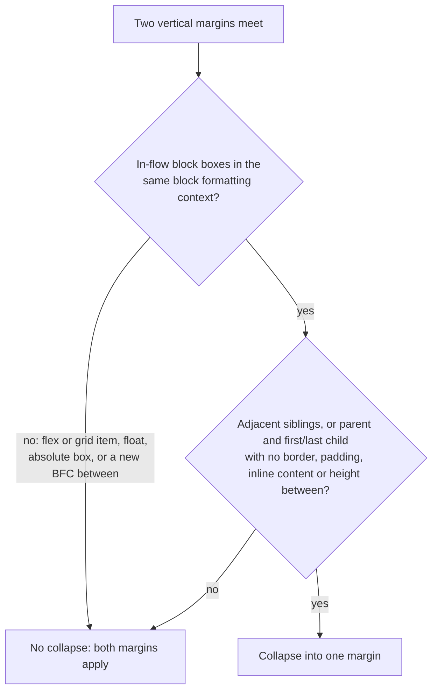
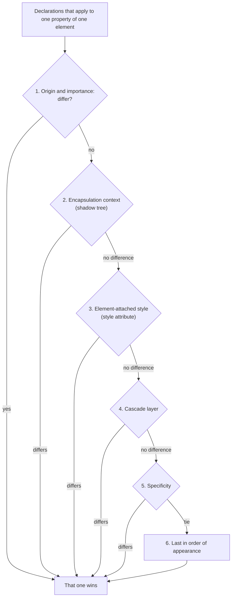
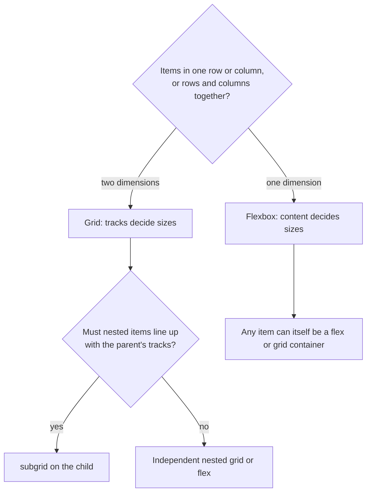
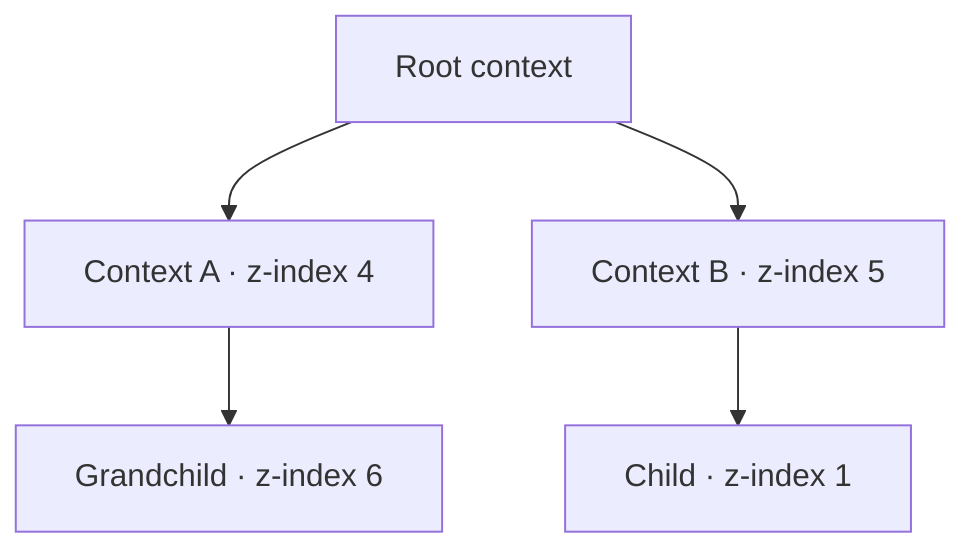
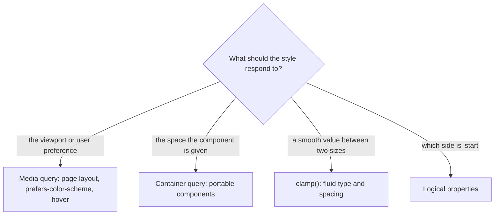
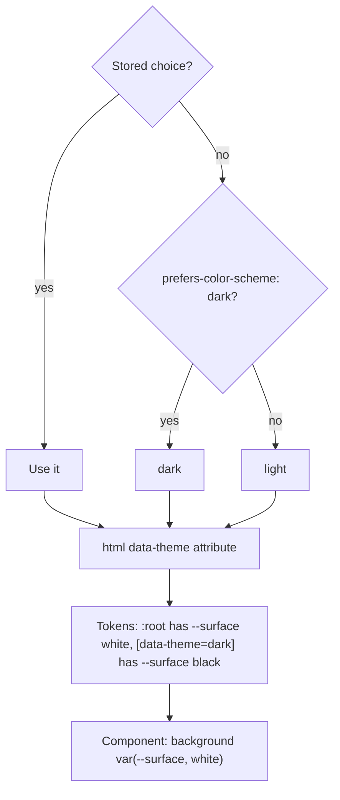
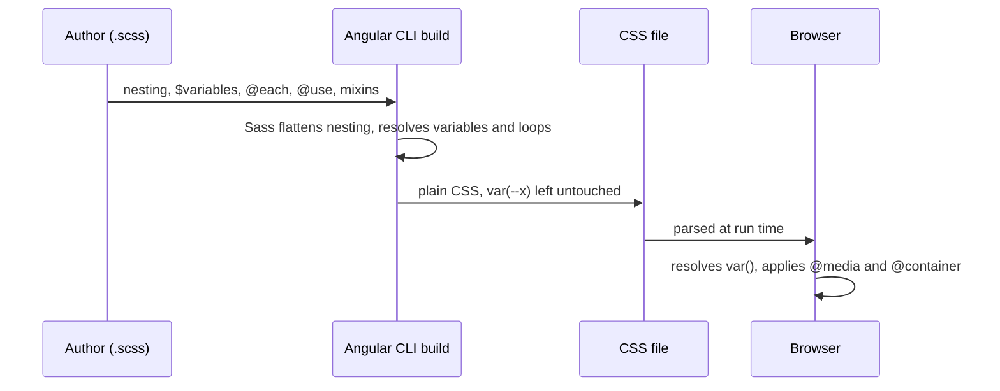

# 10. CSS essentials

> **What this covers:** the box model and formatting contexts (including margin collapse), the cascade (origins, specificity, `!important`, cascade layers and the `:is()`, `:where()` and `:has()` selectors), Flexbox, Grid and subgrid, positioning and stacking contexts, responsive CSS (media queries, container queries, `clamp()` and logical properties), custom properties with light and dark theming, and native CSS nesting versus Sass. By the end you can explain why a rule lost or a `z-index` did nothing, pick the right layout system, and theme an application without a rebuild.
> **Prerequisites:** [08. Layout, paint and composite](08-browser-rendering-dom-events.md#2-layout-paint-and-composite-what-each-change-costs) (what a style change costs) and [08. The critical rendering path](08-browser-rendering-dom-events.md#1-the-critical-rendering-path-from-bytes-to-pixels) (the CSSOM, the parsed style rules)
> **Leads to:** [11. Accessibility](11-accessibility.md), [13. Components and templates](13-components-and-templates.md), [31. Performance](31-performance.md), [34. i18n](34-i18n.md), [35. Animations](35-animations.md), [36. Material and CDK](36-material-and-cdk.md)
> **Applies to:** CSS Cascade Level 5, Selectors Level 4, Flexbox, Grid Levels 1 and 2, Containment Level 3 and CSS Nesting as of 2026-10; Baseline status from MDN; jsdom 30.1 in the labs; Dart Sass 1.104 in a throwaway probe only
> **Study time:** ~3 hours reading + ~3 hours exercises
> **Short on time:** *(written by CLOSE-M10: sections, question IDs and an exercise, then the Summary)*
> **Labs:** `labs/ts-js/src/modules/10-css-essentials/` and `labs/ts-js/src/outputs/10-css-essentials/` <!-- relink: ../labs/ts-js/src/modules/10-css-essentials/ and ../labs/ts-js/src/outputs/10-css-essentials/ (CLOSE-M10 turns both paths into links once the folders exist) --> (section claims, exercises and *Output* questions; jsdom, which implements part of the cascade and no layout). Run (from `labs/ts-js`, Node 24): `npx vitest run src/modules/10-css-essentials src/outputs/10-css-essentials`

## Contents

1. [The box model and formatting contexts](#1-the-box-model-and-formatting-contexts)
2. [The cascade: origins, specificity and layers](#2-the-cascade-origins-specificity-and-layers)
3. [Flexbox, Grid and subgrid](#3-flexbox-grid-and-subgrid)
4. [Positioning, stacking contexts and z-index](#4-positioning-stacking-contexts-and-z-index)
5. [Responsive CSS: media queries, container queries and fluid type](#5-responsive-css-media-queries-container-queries-and-fluid-type)
6. [Custom properties, theming and `color-scheme`](#6-custom-properties-theming-and-color-scheme)
7. [Native nesting versus Sass](#7-native-nesting-versus-sass)
- [Summary](#summary)
- [Question bank](#question-bank)
- [Hands-on exercises](#hands-on-exercises)
- [Check your understanding](#check-your-understanding)
- [Connections](#connections)

**How the claims here are verified.** The labs have no real browser, so this module teaches layout from the specifications and MDN and never presents it as observed. What runs is [jsdom](https://github.com/jsdom/jsdom) 30.1 (`// @vitest-environment jsdom`), which implements the cascade (selector matching, specificity, source order, inline styles, `!important`, inheritance, `:is()`, `:where()`, `:not()`, `:has()`), custom property inheritance and computed `em` and `rem`; those claims say "in jsdom". It computes no layout, applies no `@layer`, `@media`, `@container`, native nesting, `@scope` or `@property` rule, does not resolve `var()` and does not map logical properties: `section-1-jsdom-limits.test.ts` pins each (tests named `Section 1: …`), so no later section can claim an observation jsdom cannot make. The exercises and one helper are pure-TypeScript models of the specification, not browsers. Sass appears only as a throwaway compile of Dart Sass 1.104 on a stated date, never as a committed test. CSS and HTML blocks start with `/* Illustrative, not run */` or `/* Run in jsdom: <test name> */`. **Baseline** is MDN's cross-browser label: *newly available* means a feature works in at least the latest stable version of each Baseline browser (Chrome, Edge, Firefox, Safari), *widely available* means a consistent history of support in each for at least 2.5 years ([MDN](https://developer.mozilla.org/en-US/docs/Glossary/Baseline/Compatibility)).

## 1. The box model and formatting contexts

### The problem it solves

A `width: 100%` input with 12px of padding pokes out of its column. Two stacked cards with `margin: 24px 0` sit 24px apart, not 48px. A child's `margin-top` pushes its whole parent down. A floated image hangs out of its container. All four come from two questions: which box `width` measures, and which layout rules govern the boxes around it.

### Mental model

Every element generates **boxes**. The **CSS box model** nests four like a picture frame: content (the picture), padding (the mat), border (the frame) and margin (the wall up to the next frame). Each box lives in a **formatting context**, a region with one set of layout rules. A **block formatting context** (BFC) stacks block boxes vertically, lets floats interact, and is where margins collapse; flex and grid containers start contexts of their own ([section 3](#3-flexbox-grid-and-subgrid)). A **containing block** is the rectangle a box's percentages resolve against, for ordinary boxes the content edge of the nearest block-container ancestor ([CSS 2.2 §10.1](https://www.w3.org/TR/CSS22/visudet.html#containing-block-details)).



What to notice: collapse is decided by where the two boxes live and what separates them, not by the margin values; the same margins collapse in a block container and stay apart in a flex one (Q10.02 <!-- relink: #q10-02 -->).

### How it actually works

- **Which box `width` sets** ([MDN `box-sizing`](https://developer.mozilla.org/en-US/docs/Web/CSS/box-sizing)). `content-box`, the initial value, makes `width` the content box: `width: 350px; border: 10px solid` renders 370px wide. `border-box` includes padding and border. The property is not inherited, so a reset lists elements instead of setting it once on `html` (Q10.01 <!-- relink: #q10-01 -->). A block's `width: auto` fills the containing block after margins, border and padding ([CSS 2.2 §10.3.3](https://www.w3.org/TR/CSS22/visudet.html#blockwidth)); `100%` subtracts nothing. Padding and margin percentages refer to the containing block's *width*, "even for 'padding-top'" ([§8.4](https://www.w3.org/TR/CSS22/box.html#padding-properties)).
- **Outer and inner display** ([Display 3](https://www.w3.org/TR/css-display-3/)). `display` sets how a box takes part in its parent's flow (outer: `block`, `inline`) and which context lays out its children (inner: `flow`, `flow-root`, `flex`, `grid`); `inline-block` is `inline flow-root`. `width` does not apply to non-replaced inline boxes ([§10.2](https://www.w3.org/TR/CSS22/visudet.html#the-width-property)); a **replaced element** (an image) has content CSS does not render ([§3](https://www.w3.org/TR/CSS22/conform.html#defs)).
- **Margin collapsing** ([MDN](https://developer.mozilla.org/en-US/docs/Web/CSS/CSS_box_model/Mastering_margin_collapsing), [CSS 2.2 §8.3.1](https://www.w3.org/TR/CSS22/box.html#collapsing-margins)). Vertical margins combine for adjacent siblings, a parent and its first or last in-flow child, and an empty block's own top and bottom. Separators: a border, padding, inline content, a height, or **clearance** (space `clear` adds above a box to push it below a float, [§9.5.2](https://www.w3.org/TR/CSS22/visuren.html#flow-control)). The result is the largest positive margin plus the most negative. Horizontal margins, floats, absolute boxes and flex or grid margins never collapse.
- **What makes a BFC** ([MDN](https://developer.mozilla.org/en-US/docs/Web/CSS/CSS_display/Block_formatting_context)): the root element, floats, absolute boxes, `inline-block`, `flow-root`, flex and grid items, `overflow` other than `visible` or `clip`, `contain: layout` or `paint`, and query containers. A new BFC contains its floats and suppresses collapsing with its children.

### Code

Approach: one rule per symptom (the reset, `gap` instead of collapsing margins, `flow-root` around floats). jsdom computes no layout, so only `box-sizing` is read back (`Section 1: box-sizing is read as declared, content-box by default`).

```css
/* Illustrative, not run */
*, *::before, *::after { box-sizing: border-box; }

.stack { display: flex; flex-direction: column; gap: 24px; } /* 24px between cards, no margins */

.media { display: flow-root; }  /* the container now contains its floated image */
.media > img { float: left; }
```

### Best practices and anti-patterns

- **Set `border-box` on every element and on `::before` and `::after`**, because `width` then means the visible box (and leave block `width` as `auto`, which absorbs padding); `*` matches elements, not pseudo-elements ([Selectors 4 §5.2](https://www.w3.org/TR/selectors-4/#the-universal-selector)).
- **Space stacked blocks with `gap` on a flex or grid column**, because margins there do not collapse.
- **Contain floats with `flow-root`, not `overflow: hidden`**, because `overflow` can clip shadows and add scrollbars.

### Misconceptions and traps

- *"`width: 100%` always fits."* Under `content-box` padding and border are added to it. The myth exists because an unpadded `div` does fit.
- *"Margins always add up."* Vertical margins of in-flow blocks in one BFC collapse to the largest; horizontal margins and padding do add, so people generalise.
- *"A child's margin stays inside its parent."* With no border, padding, inline content or height between them, it collapses with the parent's and shows outside it. Nested boxes look enclosed, which hides that the margins are adjoining.
- *"Flex and grid items collapse like blocks."* They do not (MDN). They look like stacked blocks, so the habit carries over.
- *"`overflow: hidden` is how you clear floats."* It works because it creates a BFC; `flow-root` does so without clipping. `overflow` was the trigger people knew first.

## 2. The cascade: origins, specificity and layers

### The problem it solves

A component's `.btn` loses to a later global `.btn`. A team writes ids and `!important` to beat a third-party library. A `:is(#hero, .x)` makes a selector far heavier than it looks. Each asks: when two declarations set the same property on one element, which wins, and why?

### Mental model

The **cascade** is a tournament with fixed rounds. Every **declaration** (one `property: value` pair) that matches an element competes; the first round where two differ decides ([CSS Cascade 5 §6.1](https://www.w3.org/TR/css-cascade-5/#cascade-sort)).



What to notice: specificity is the fifth of six rounds; importance, inline style and layers outrank it, and source order is the last resort (Q10.03 <!-- relink: #q10-03 -->, Q10.04 <!-- relink: #q10-04 -->).

### How it actually works

- **Origin and importance.** An **origin** is where a style sheet comes from: the browser's default (user agent), the user, or the author. Normal declarations rank author, then user, then user agent; `!important` "inverts the order of precedence", so important user-agent declarations beat important user ones, which beat important author ones, which beat every normal one ([§6.1](https://www.w3.org/TR/css-cascade-5/#cascade-sort), [§6.3](https://www.w3.org/TR/css-cascade-5/#importance)).
- **Inline style.** A `style` attribute beats selector-mapped declarations of the same importance and ranks above layers.
- **Cascade layers** ([§6.4](https://www.w3.org/TR/css-cascade-5/#layering); documented, not run: jsdom ignores `@layer`, `Section 1: jsdom applies neither rule of two layers, so layer order is not computed`). A **cascade layer** is a named group of rules, ordered within its origin by first declaration. `@layer reset, base, components;` fixes the order up front, and may precede `@import`. For normal rules the last layer wins; unlayered rules sit in an implicit final layer, so they beat every layer whatever their specificity. For `!important` it reverses: the first layer wins and unlayered is weakest. `@import url(x.css) layer(vendor)` puts a whole file in one layer. MDN: widely available since March 2022. Exercise 10.2 <!-- relink: #ex10-2 --> models this ranking.
- **Specificity** ([Selectors 4 §15](https://www.w3.org/TR/selectors-4/#specificity-rules)). A triple A-B-C: A counts id selectors, B class selectors, attribute selectors and pseudo-classes, C type selectors and pseudo-elements. A **pseudo-class** (`:hover`) stands for state not in the document tree; a **pseudo-element** (`::before`) for an element not directly in it. `*` is ignored. Columns compare left to right, so one id beats any number of classes. `:is()`, `:not()` and `:has()` count as their most specific argument; `:where()` counts zero. Exercise 10.1 <!-- relink: #ex10-1 --> builds the calculator.
- **Order of appearance.** The last declaration wins.
- **Inheritance and defaulting.** **Inheritance** passes a property's computed value from parent to child for properties defined as inherited (`color`), while others (`border-*`) take their initial value. The **computed value** is the specified value resolved, for instance relative lengths made absolute ([§4.4](https://www.w3.org/TR/css-cascade-5/#computed)). `inherit`, `initial` and `unset` (inherit if the property inherits, else initial) set the value explicitly; `revert` rolls back to the previous origin, `revert-layer` to the layer below ([§7.3](https://www.w3.org/TR/css-cascade-5/#defaulting-keywords)).
- **`@scope`** limits rules to a subtree (MDN: Baseline 2026, newly available since March 2026); jsdom does not apply it.

### Code

Approach: a layered stylesheet (illustrative, since jsdom ignores layers), then the jsdom test: `:where(#t)` loses to a class, `:is(#t, .z)` weighs as an id.

```css
/* Illustrative, not run */
@layer reset, vendor, components, utilities;       /* order fixed once, before any rule */
@import url("vendor.css") layer(vendor);           /* a whole file into one layer */

@layer components { .btn { background: steelblue; } }  /* beats vendor's .btn at any specificity */
@layer utilities  { .hidden { display: none; } }       /* later layer: ranks above components */
.legacy-fix { margin: 0; }                              /* unlayered: beats every layer (normal rules) */
```

```ts
// Excerpt of labs/ts-js/src/modules/10-css-essentials/section-2-cascade.test.ts
const html = '<p id="t" class="b"></p>';
expect(colorOf('.b { color: blue; } :where(#t) { color: red; }', html)).toBe(BLUE);
expect(colorOf(':is(#t, .z) { color: red; } .b { color: blue; }', html)).toBe(RED);
expect(colorOf('.b { color: blue; } :is(#t, .z) { color: red; }', html)).toBe(RED);
```

The file also asserts id over class over type, inline over id, `!important` over inline, `:not` and `:has` counting as their argument, `color` inheriting while `border-top-width` does not, and `inherit`, `initial` and `unset` (`Section 2: …`).

> [!NOTE]
> **Framework vs platform.** Angular's default emulated encapsulation inserts a generated attribute into every selector of a component's styles ([angular.dev](https://angular.dev/guide/components/styling)). An attribute selector counts in column B, so a component's `.btn` outweighs the same global `.btn`. Encapsulation modes and `::ng-deep` belong to [module 13](13-components-and-templates.md).

### Best practices and anti-patterns

- **Keep selectors one class deep**, because flat selectors are overridden by order alone.
- **Declare layer order once, at the top, with libraries in early layers**, because layer order, not specificity, then settles conflicts with third-party CSS.
- **Write base and library defaults inside `:where()`**, because zero specificity lets any consumer rule override them.
- **Avoid `!important` outside deliberate utilities**, because only another important declaration of equal or higher rank can beat it.

### Misconceptions and traps

- *"Higher specificity always wins."* Importance, inline style and layers decide first: an unlayered `audio` rule beats a layered `audio[controls]` rule ([§6.4](https://www.w3.org/TR/css-cascade-5/#layering)). Specificity is the first rule taught, hence the myth.
- *"`!important` is extra specificity."* It moves the declaration to a different importance tier and reverses layer order. It sits inside the declaration, so it reads like a booster.
- *"`:is()` and `:where()` are the same shorthand."* They match the same elements; `:is()` weighs as its most specific argument, `:where()` as zero (MDN). The syntax is identical, so the difference is invisible.
- *"CSS cannot select a parent."* Once true in every browser: MDN dates `:has()` across browsers to December 2023. Now `div:has(p)` matches by structure and counts as its argument (`Section 2: :has matches by structure and counts like its argument`).
- *"Children inherit every property."* Only inherited ones; `border` is not. Text colour and font are inherited, so inheritance looks universal.

## 3. Flexbox, Grid and subgrid

### The problem it solves

Centring a box vertically takes hacks. A row of cards has misaligned buttons because the titles wrap to different heights. A long word makes a text column overflow its parent. All three are about distributing space along one line, or across rows and columns together.

### Mental model

**Flexbox** is a one-dimensional model: it lays items out along one axis at a time, a row or a column, and sizes them from their content outward ([MDN](https://developer.mozilla.org/en-US/docs/Web/CSS/CSS_flexible_box_layout/Basic_concepts_of_flexbox)). **Grid** is two-dimensional: the container defines **tracks** (a grid column or row, [Grid 2](https://www.w3.org/TR/css-grid-2/)) and items are placed into them, so the layout decides the sizes. **Subgrid** lets a nested grid borrow its parent's tracks. This section is documented, not run: jsdom computes no layout.



What to notice: the choice is made per container, not per page, and the two systems nest freely (Q10.07 <!-- relink: #q10-07 -->).

### How it actually works

- **Flex axes.** A **flex container** (`display: flex`) makes its direct children **flex items**. `flex-direction` sets the **main axis**, the **cross axis** is perpendicular; `justify-content` aligns along the first, `align-items` along the second (default `stretch`) ([MDN](https://developer.mozilla.org/en-US/docs/Web/CSS/CSS_flexible_box_layout/Basic_concepts_of_flexbox)).
- **`flex` shorthand** sets grow, shrink and basis. A single unitless number sets grow and a basis of `0%`, so `flex: 2` is `2 1 0%` and `flex: 1` is `1 1 0%`; `initial` is `0 1 auto` ([MDN](https://developer.mozilla.org/en-US/docs/Web/CSS/flex)).
- **Automatic minimum size** ([Flexbox 1 §4.5](https://www.w3.org/TR/css-flexbox-1/#min-size-auto)). `min-width: auto` is the initial value. A flex item that is not a scroll container gets a content-based minimum size, built from its `min-content` size (for text, roughly the longest unbreakable word); for scroll containers it is zero. So the item cannot shrink below its longest word and overflows; `min-width: 0` or `overflow: auto` removes the floor (Q10.08 <!-- relink: #q10-08 -->).
- **Grid tracks.** The **`fr` unit** is a fraction of the leftover space ([MDN](https://developer.mozilla.org/en-US/docs/Web/CSS/flex_value)); `minmax(min, max)` is a size range. `grid-template-columns`, `-rows` and `-areas` define the explicit grid; items placed outside it create the **implicit grid**, sized by `grid-auto-rows` and `-columns` ([Grid 2 §7.5](https://www.w3.org/TR/css-grid-2/#implicit-grids)).
- **`repeat(auto-fill | auto-fit, minmax(…))`** ([MDN](https://developer.mozilla.org/en-US/docs/Web/CSS/repeat)). `auto-fill` repeats to the largest count that does not overflow; `auto-fit` is the same, but after placement empty repeated tracks collapse, so with few items a `1fr` track grows into the freed space. No JavaScript is needed; [Q17.39](17-signals.md#q17-39) is the case where code must choose the count.
- **Gaps and margins.** `gap` puts space only between tracks ([MDN](https://developer.mozilla.org/en-US/docs/Web/CSS/gap)); flex and grid items do not collapse margins ([section 1](#1-the-box-model-and-formatting-contexts)), and their `z-index` works without `position` ([section 4](#4-positioning-stacking-contexts-and-z-index)).
- **Subgrid** ([MDN](https://developer.mozilla.org/en-US/docs/Web/CSS/CSS_grid_layout/Subgrid)). A nested grid is otherwise independent of its parent; with `grid-template-columns: subgrid` (or rows) it uses the parent's tracks over the area it spans, inheriting gaps (overridable). MDN: widely available, across browsers since September 2023 (Q10.09 <!-- relink: #q10-09 -->).

### Code

Approach: one rule per problem: flex centring, a grid whose column count follows the width, cards that span three parent rows and share them through `subgrid` so their title, body and button rows line up, and `min-width: 0` on a text item.

```css
/* Illustrative, not run */
.center  { display: flex; justify-content: center; align-items: center; }

.gallery { display: grid; grid-template-columns: repeat(auto-fill, minmax(16rem, 1fr)); gap: 1rem; }
.card    { display: grid; grid-row: span 3; grid-template-rows: subgrid; } /* title, body, button */

.row > .text { min-width: 0; }  /* may shrink below its longest word */
```

### Best practices and anti-patterns

- **Choose flex for one dimension and grid when rows and columns must line up**, because grid tracks belong to the container, not to each row of items.
- **Try `repeat(auto-fill, minmax(…))` before a media query**, because the column count follows the width.
- **Give text items in a flex row `min-width: 0`**, because their automatic minimum is the longest word.
- **Use `subgrid` to align content across cards**, because shared tracks size to the tallest content without fixed heights.

### Misconceptions and traps

- *"Flexbox is for components, grid for pages."* Both nest; the rule is the number of dimensions. Tutorials show navbars in flex and page frames in grid.
- *"`flex: 1` means `width: 100%`."* It means `1 1 0%`: items share leftover space from a zero basis. A bare number looks like a size.
- *"Flex items shrink to fit."* Not below their automatic minimum. The default `flex-shrink: 1` suggests no limit.
- *"`auto-fit` and `auto-fill` are the same."* They differ only when items do not fill the tracks. With a full row they look identical.
- *"Items in a nested grid line up with the parent's."* Only with `subgrid`; otherwise the nested grid sizes its own tracks (MDN). Once true in every browser: subgrid was not available across browsers until September 2023 (MDN).

## 4. Positioning, stacking contexts and z-index

### The problem it solves

A modal sits behind the header although its `z-index` is 9999. A `position: sticky` header never sticks. A `position: fixed` banner scrolls with its parent. All three come down to what a positioned box is positioned *against*, and which elements `z-index` is compared between.

### Mental model

Painting is a stack of sheets. A **stacking context** is one sheet, painted as a unit inside its parent's sheet, and `z-index` only orders siblings within the same sheet: a child context's number "only [has] meaning within [the] parent" ([MDN](https://developer.mozilla.org/en-US/docs/Web/CSS/CSS_positioned_layout/Understanding_z-index/Stacking_context)). Think version numbers: a `z-index: 6` child inside context 4 is "4.6", below context 5.



What to notice: the grandchild's 6 paints below the child's 1, because A (4) is compared with B (5) first and the numbers inside never cross that boundary (Q10.10 <!-- relink: #q10-10 -->, Q10.11 <!-- relink: #q10-11 -->).

### How it actually works

- **Positioning** ([MDN `position`](https://developer.mozilla.org/en-US/docs/Web/CSS/position)). A *positioned* box is anything but `static`, the default, where offsets and `z-index` have no effect. `relative` offsets from its normal place, keeping its space. `absolute` leaves the flow and offsets from its **containing block** ([section 1](#1-the-box-model-and-formatting-contexts)): the closest positioned ancestor or the initial containing block. `fixed` uses the viewport, unless an ancestor has `transform`, `perspective` or `filter`, which takes its place ([CSS Transforms 1](https://www.w3.org/TR/css-transforms-1/#containing-block-for-all-descendants)). `sticky` is normal flow until a scroll threshold, then offset against the nearest ancestor with a scrolling mechanism (`overflow` `hidden`, `scroll` or `auto`, even if it never scrolls); it needs an offset such as `top`.
- **What creates a context** ([MDN](https://developer.mozilla.org/en-US/docs/Web/CSS/CSS_positioned_layout/Understanding_z-index/Stacking_context)): the root; `absolute` or `relative` with a `z-index` other than `auto`; `fixed` or `sticky`; a flex or grid item with a `z-index` other than `auto`; `container-type: size` or `inline-size` ([section 5](#5-responsive-css-media-queries-container-queries-and-fluid-type)); `opacity` below 1; `mix-blend-mode` other than `normal`; `transform`, `filter`, `perspective`, `clip-path`, `mask` and similar properties other than `none`; `isolation: isolate`; `will-change` naming such a property ([Q08.05](08-browser-rendering-dom-events.md#q08-05)); `contain: layout` or `paint`; top-layer elements.
- **Paint order inside one context** ([CSS 2.2 Appendix E](https://www.w3.org/TR/CSS22/zindex.html#painting-order)): the context element's background and border; child contexts with negative `z-index`; in-flow non-positioned blocks; floats; inline content; positioned descendants with `z-index` `auto` or 0 in tree order; then positive `z-index` ascending.
- **The top layer** (MDN [glossary](https://developer.mozilla.org/en-US/docs/Glossary/Top_layer)) spans the viewport above all other layers and holds fullscreen elements, `<dialog>` shown with `showModal()` and popovers shown with `showPopover()`, each in its own context, so none needs a `z-index`.

### Code

Approach: the helper follows MDN's list over declared values read with `getComputedStyle` (jsdom needs no layout for that). `stackingContextReasons` says why an element creates a context; `findCulprit` walks up to the nearest ancestor that does, where the bug lives. The tests show it reads declared values; that a browser paints accordingly is MDN's and the specification's account.

```ts
// Follows the MDN "Stacking context" list (read 2026-10-06). It reads DECLARED values through getComputedStyle, so it
// works in jsdom, which computes no layout. It does not model animated values, top-layer membership or ::backdrop.

const NO_VALUE = new Set(['', 'none', 'auto', 'normal', 'visible']);
const CREATING_PROPERTIES = [
  'transform', 'scale', 'rotate', 'translate', 'filter', 'backdrop-filter', 'perspective', 'clip-path', 'mask', 'mask-image', 'mask-border',
] as const;
const WILL_CHANGE_CREATORS = new Set<string>([...CREATING_PROPERTIES, 'opacity', 'mix-blend-mode', 'isolation', 'position', 'z-index', 'contain']);

function read(style: CSSStyleDeclaration, property: string): string {
  return style.getPropertyValue(property).trim();
}

function positionReasons(style: CSSStyleDeclaration): string[] {
  const position = read(style, 'position');
  const zIndex = read(style, 'z-index');
  const reasons: string[] = [];
  if ((position === 'absolute' || position === 'relative') && !NO_VALUE.has(zIndex)) reasons.push(`position: ${position} with z-index: ${zIndex}`);
  if (position === 'fixed' || position === 'sticky') reasons.push(`position: ${position}`);
  return reasons;
}

function itemReasons(element: Element, style: CSSStyleDeclaration): string[] {
  const parent = element.parentElement;
  const zIndex = read(style, 'z-index');
  if (!parent || NO_VALUE.has(zIndex)) return [];
  const display = read(getComputedStyle(parent), 'display');
  if (display === 'flex' || display === 'inline-flex') return [`flex item with z-index: ${zIndex}`];
  if (display === 'grid' || display === 'inline-grid') return [`grid item with z-index: ${zIndex}`];
  return [];
}

function valueReasons(style: CSSStyleDeclaration): string[] {
  const reasons: string[] = [];
  const containerType = read(style, 'container-type');
  if (containerType === 'size' || containerType === 'inline-size') reasons.push(`container-type: ${containerType}`);
  const opacity = read(style, 'opacity');
  if (opacity !== '' && Number(opacity) < 1) reasons.push(`opacity: ${opacity}`);
  if (!NO_VALUE.has(read(style, 'mix-blend-mode'))) reasons.push(`mix-blend-mode: ${read(style, 'mix-blend-mode')}`);
  for (const property of CREATING_PROPERTIES) {
    if (!NO_VALUE.has(read(style, property))) reasons.push(`${property}: ${read(style, property)}`);
  }
  if (read(style, 'isolation') === 'isolate') reasons.push('isolation: isolate');
  const willChange = read(style, 'will-change').split(',').map((part) => part.trim());
  const named = willChange.find((part) => WILL_CHANGE_CREATORS.has(part));
  if (named) reasons.push(`will-change: ${named}`);
  const contain = read(style, 'contain').split(/\s+/);
  const containing = contain.find((part) => ['layout', 'paint', 'strict', 'content'].includes(part));
  if (containing) reasons.push(`contain: ${containing}`);
  return reasons;
}

/** Why `element` creates a stacking context, from its declared values; an empty array means it does not. */
export function stackingContextReasons(element: Element): string[] {
  const style = getComputedStyle(element);
  const root = element === element.ownerDocument.documentElement ? ['root element'] : [];
  return [...root, ...positionReasons(style), ...itemReasons(element, style), ...valueReasons(style)];
}

/** The nearest ancestor (not the element itself) that creates a stacking context, with its reasons. */
export function findCulprit(element: Element): { element: Element; reasons: string[] } | null {
  for (let node = element.parentElement; node; node = node.parentElement) {
    const reasons = stackingContextReasons(node);
    if (reasons.length > 0) return { element: node, reasons };
  }
  return null;
}
```

<sub>Source: [labs/ts-js/src/modules/10-css-essentials/stacking-context.ts](../labs/ts-js/src/modules/10-css-essentials/stacking-context.ts)</sub>

`Section 4: positioned with z-index auto creates no context and with z-index 2 does` and its siblings assert each creator, a flex child with `z-index`, and `findCulprit`. The fix is often one line:

```css
/* Illustrative, not run */
.page   { isolation: isolate; }                 /* a deliberate context: inner z-index values stay inside */
.header { position: sticky; top: 0; z-index: 10; }
```

### Best practices and anti-patterns

- **Put `isolation: isolate` on a component's root**, because its inner `z-index` values then cannot compete with the rest of the page.
- **Keep a short z-index scale per context**, because 9999 buys nothing across contexts.
- **When an element will not rise, walk up to the nearest creator**, because the contest is between two contexts, not two elements.
- **Open modals with `showModal()`**, because the top layer sits above every other layer.
- **Keep `transform`, `filter` and `perspective` off ancestors of fixed content unless intended**, because they replace the viewport as its containing block.

### Misconceptions and traps

- *"`z-index: 9999` always wins."* It wins among siblings in one context. `z-index` looks global.
- *"`z-index` works on any element."* Not on `static` boxes (MDN), except flex and grid items. Most boxes people give a `z-index` are positioned, so it seems universal.
- *"`position: fixed` is always relative to the viewport."* Not under an ancestor with `transform`, `perspective` or `filter` (MDN). The short definition omits it.
- *"`sticky` fails randomly."* It needs an offset such as `top` and sticks against the nearest ancestor with `overflow` `hidden`, `scroll` or `auto`; an `overflow: hidden` added for clipping does not look like scrolling.
- *"A stacking context needs `position` and `z-index`."* `opacity` below 1, `transform` and the rest create one too. The position rule is taught first.

## 5. Responsive CSS: media queries, container queries and fluid type

### The problem it solves

A card looks right in the main column and breaks in the sidebar, because its media query looks at the viewport. Headings jump in size at each breakpoint. `margin-left` puts the gap on the wrong side in a right-to-left layout.

### Mental model

Three different questions: how wide is the **viewport** (the visible area of the page), how wide is **this component's container**, and how large should a value be **between two sizes**. A **media query** answers the first, a **container query** the second, `clamp()` the third.



What to notice: a container query makes a component portable, a media query makes a page layout, and neither replaces the other (Q10.12 <!-- relink: #q10-12 -->, Q10.14 <!-- relink: #q10-14 -->). Documented, not run: jsdom applies no `@media` or `@container` rule.

### How it actually works

- **Viewport and media queries.** `<meta name="viewport" content="width=device-width">` sets the viewport width to the device's in CSS pixels and fixes the value of `vw` ([MDN](https://developer.mozilla.org/en-US/docs/Web/HTML/Reference/Elements/meta/name/viewport)). `@media` tests features such as `width`, `hover`, `orientation`, `prefers-color-scheme` and `prefers-reduced-motion`, with `min-` and `max-` prefixes or the range syntax `(width >= 30em)` ([MDN](https://developer.mozilla.org/en-US/docs/Web/CSS/CSS_media_queries/Using_media_queries)); `@media` is widely available since July 2015 ([MDN](https://developer.mozilla.org/en-US/docs/Web/CSS/@media)).
- **Units** ([MDN](https://developer.mozilla.org/en-US/docs/Web/CSS/length)). `em` is the element's font size, `rem` the root's (usually 16px, user-changeable), `ch` the width of the `0` glyph, `vw` a percentage of the viewport width. `svh`, `lvh` and `dvh` use the small, large and dynamic viewport as browser interface expands or retracts; dynamic ones are not stable even when the viewport is unchanged.
- **Container queries** ([MDN](https://developer.mozilla.org/en-US/docs/Web/CSS/CSS_containment/Container_queries)). `container-type: inline-size` (or `size`) makes an element a query container; `container-name` names it; `@container (width >= 40rem)` tests the nearest ancestor container (widely available, across browsers since February 2023, [MDN](https://developer.mozilla.org/en-US/docs/Web/CSS/@container)). **Size containment** means the box's size is computed as if it had no content ([Containment 3 §3.1](https://www.w3.org/TR/css-contain-3/#containment-inline-size)), so the container's width must come from the layout, not its children. It also makes a stacking context ([section 4](#4-positioning-stacking-contexts-and-z-index)) and a BFC ([section 1](#1-the-box-model-and-formatting-contexts)); containment's rendering cost is [08 §2](08-browser-rendering-dom-events.md#2-layout-paint-and-composite-what-each-change-costs).
- **Fluid typography** scales with the viewport between a floor and a ceiling. `clamp(MIN, VAL, MAX)` resolves as `max(MIN, min(VAL, MAX))` (widely available since July 2020, [MDN](https://developer.mozilla.org/en-US/docs/Web/CSS/clamp)). For a size growing from `minPx` at `minVp` to `maxPx` at `maxVp`: slope = (maxPx − minPx) / (maxVp − minVp), intercept = minPx − slope × minVp, preferred = intercept + slope × 100vw. From 16px at 320px to 24px at 1280px: `clamp(1rem, 0.8333rem + 0.8333vw, 1.5rem)` (`Section 5: the fluid clamp slope and intercept give the minimum and the maximum at the two viewport widths`; Exercise 10.3 <!-- relink: #ex10-3 -->). WCAG 1.4.4 requires text to resize up to 200% ([WCAG](https://www.w3.org/WAI/WCAG22/Understanding/resize-text.html)), and failure F94 says text sized by viewport units alone cannot be resized by zooming or text settings ([F94](https://www.w3.org/WAI/WCAG22/Techniques/failures/F94)); `rem` bounds keep part of the size tied to the user's font size ([module 11](11-accessibility.md)).
- **Logical properties** ([MDN](https://developer.mozilla.org/en-US/docs/Web/CSS/CSS_logical_properties_and_values)). The **inline** dimension runs parallel to text lines and the **block** dimension perpendicular, whatever the **writing mode** (the direction lines flow). `margin-inline`, `padding-block`, `inline-size` and `inset-inline-start` follow it. Right-to-left design belongs to [module 34](34-i18n.md).

### Code

Approach: the component asks its container, the page the viewport, the heading uses the computed `clamp()`, and spacing uses logical sides. Only `em` and `rem` run, in jsdom (`Section 5: em compounds through nested elements and rem follows the root (jsdom)`).

```css
/* Illustrative, not run */
.card-list { container-type: inline-size; }
.card { display: grid; gap: 1rem; }
@container (width >= 40rem) { .card { grid-template-columns: 8rem 1fr; } }  /* the container, not the viewport */

@media (width >= 60rem) { .page { grid-template-columns: 16rem 1fr; } }     /* page layout: the viewport */

h1    { font-size: clamp(1rem, 0.8333rem + 0.8333vw, 1.5rem); }  /* 16px at 320px wide, 24px at 1280px */
.note { margin-inline: auto; padding-block: 1rem; border-inline-start: 4px solid; }
```

### Best practices and anti-patterns

- **Use container queries for components and media queries for page layout**, because a component's space depends on where it is placed, not on the viewport.
- **Put `container-type` only on wrappers that need it**, because it applies containment and creates a stacking context and a BFC.
- **Give `clamp()` bounds in `rem`**, because viewport units alone fail WCAG F94.
- **Use logical properties for spacing that follows text direction**, because they map to the writing mode, not a physical side.

### Misconceptions and traps

- *"A media query responds to the component's width."* It measures the viewport. The name sounds general.
- *"Container queries are too new to use."* Once true: not across browsers until February 2023 (MDN). Now `@container` is widely available.
- *"`dvh` is the best height unit."* Dynamic units are not stable even when the viewport is unchanged (MDN); `svh` is the one that never hides content under browser UI. The names look interchangeable.
- *"`vw` alone is fine for text."* WCAG F94 lists it as a failure because zoom cannot resize it. It looks smooth in a resized window.
- *"`margin-left` is just the left."* In a right-to-left layout it is the wrong side; logical properties follow direction. Designs usually start left-to-right.

## 6. Custom properties, theming and `color-scheme`

### The problem it solves

The same colour literal is repeated in forty files. Dark mode flashes white on load. A component with styles in a shadow tree cannot be recoloured by the page. A Sass variable cannot change when the user flips a theme switch, because Sass runs before the browser ([section 7](#7-native-nesting-versus-sass)).

### Mental model

A **custom property** (`--name`) is a value that lives on the element tree: declared on a node, inherited by its descendants, and read by `var()`. Think of a per-scope environment variable, not a compile-time constant: a nested scope shadows the outer one.



What to notice: the decision is made once, by a script, and only the nearest `--surface` declaration changes; every component that reads it follows (Q10.15 <!-- relink: #q10-15 -->, Q10.16 <!-- relink: #q10-16 -->, Q10.17 <!-- relink: #q10-17 -->).

### How it actually works

- **Syntax and defaults** ([Custom Properties 1 §2](https://www.w3.org/TR/css-variables-1/#custom-property)). A name starts `--`; its value is "a bare stream of CSS tokens", case-sensitive. Custom properties inherit, and their initial value is the **guaranteed-invalid value**, which serializes as the empty string. `Section 6: a name that nothing declares reads as the empty string and names are case-sensitive`.
- **`var(--x, fallback)`.** The value of `--x` is substituted unless it is the guaranteed-invalid value; then the fallback (everything after the first comma) is used. With neither, the property is **invalid at computed-value time** and computes as `unset` (inherited or initial value), not as an earlier rule. A `background-color: var(--not-a-color)` is transparent although `red` was declared before: a variable cannot fail early, so the other cascaded values are already thrown away ([§3.1](https://www.w3.org/TR/css-variables-1/#invalid-variables)). Properties in a reference cycle are all invalid at computed-value time ([§2.3](https://www.w3.org/TR/css-variables-1/#cycles)). **Computed-value time** is after the cascade, which is why a subtree's redefinition reaches its descendants (`Section 6: a custom property is inherited and a subtree can redefine it`; Exercise 10.3 <!-- relink: #ex10-3 --> models the lookup).
- **`@property`** registers a custom property with a `syntax`, `inherits` and `initial-value`, so values are type-checked ([MDN](https://developer.mozilla.org/en-US/docs/Web/CSS/@property): Baseline 2024, newly available since July 2024).
- **Tokens.** A **design token** is a named design decision (a colour, a spacing step) stored once. A common convention has primitive (`--blue-600`), semantic (`--surface`) and component (`--button-bg`) tiers.
- **Theming.** `prefers-color-scheme` reports the user's light or dark request (MDN: widely available since January 2020). `color-scheme` tells the browser which schemes an element supports and changes the canvas, scrollbars and default form-control colours; authors style the rest with `prefers-color-scheme` (MDN: widely available since January 2022, [MDN](https://developer.mozilla.org/en-US/docs/Web/CSS/color-scheme)). `light-dark(a, b)` picks by the active scheme and needs `color-scheme: light dark` on `:root` (MDN: Baseline 2024, newly available since May 2024, [MDN](https://developer.mozilla.org/en-US/docs/Web/CSS/color_value/light-dark)); `Section 6: color-scheme is read as declared`.
- **No flash.** A classic script in `<head>` blocks the parser ([08 §1](08-browser-rendering-dom-events.md#1-the-critical-rendering-path-from-bytes-to-pixels)), so it runs before the body. Under a strict CSP it needs a nonce or hash ([09 §8](09-web-networking-storage-security.md#8-content-security-policy-and-trusted-types)); the choice lives in `localStorage` ([09 §7](09-web-networking-storage-security.md#7-browser-storage-what-each-is-safe-for)).
- **Shadow trees.** Inheritance "operates on the flattened element tree" ([Cascade 5 §7.2](https://www.w3.org/TR/css-cascade-5/#inheriting)) and custom properties inherit, so tokens set on the host or above are visible inside ([08 §5](08-browser-rendering-dom-events.md#5-web-components-custom-elements-shadow-dom-and-templates)).

### Code

Approach: tokens with a dark override, a component that names only semantic tokens, and the head script that picks the theme (a Partial: it needs `localStorage`, a CSP nonce and a browser).

```css
/* Illustrative, not run */
:root                { color-scheme: light dark; --surface: #fff; --text: #111; }
[data-theme="dark"]  { --surface: #121212; --text: #eee; }
.card                { background: var(--surface, white); color: var(--text, black); }
```

```ts
// Partial: an inline classic script in <head>; the CSP nonce is added by the server (09 §8) and `theme` is saved by the toggle (09 §7)
const stored = localStorage.getItem('theme');
const dark = stored ? stored === 'dark' : matchMedia('(prefers-color-scheme: dark)').matches;
document.documentElement.dataset['theme'] = dark ? 'dark' : 'light';
```

> [!NOTE]
> **Framework vs platform.** Theming through custom properties is the platform, not Angular; component styles are [module 13](13-components-and-templates.md) and Material theming [module 36](36-material-and-cdk.md).

### Best practices and anti-patterns

- **Redefine only semantic tokens per theme**, because components then never mention a theme.
- **Give optional hooks a fallback, `var(--x, default)`**, because an undefined name otherwise invalidates the declaration.
- **Set `color-scheme: light dark` with your tokens**, because browser-drawn controls otherwise stay light under a dark page.
- **Set the theme in a blocking `<head>` script**, because a later script lets the first paint use the default theme.

### Misconceptions and traps

- *"CSS variables are Sass variables at run time."* They live on the tree and resolve at computed-value time; Sass variables are gone before the browser starts.
- *"An undefined variable falls back to the earlier declaration."* It computes as `unset`. A plain syntax error is dropped early, so the earlier rule survives; a variable cannot fail early.
- *"`color-scheme` themes the whole page."* It changes browser UI and default colours; you style the rest. The name sounds global.
- *"`light-dark()` works anywhere."* It needs `color-scheme: light dark`, and is newly available since May 2024 (MDN).
- *"A shadow tree is sealed from page tokens."* Custom properties inherit through it. Selector encapsulation gets mistaken for inheritance encapsulation.

## 7. Native nesting versus Sass

### The problem it solves

A team adds Sass only for nesting and inherits a build dependency and deprecation warnings. A developer writes `&__title` (BEM, Block Element Modifier naming) expecting native CSS to build `.card__title`. Nested rules change specificity unexpectedly.

### Mental model

Sass is a **preprocessor**: a compiler that runs at build time and outputs plain CSS. Native nesting, custom properties and `calc()` are features of CSS itself, handled by the browser at run time. The split is **compile time versus run time**.



What to notice: only what the compiler can compute at build time belongs in Sass; a value that must change in the browser (a theme) must be a custom property that survives compilation (Q10.18 <!-- relink: #q10-18 -->).

### How it actually works

- **Native nesting** ([MDN](https://developer.mozilla.org/en-US/docs/Web/CSS/Guides/Nesting/Using)). A style rule inside a style rule. `&` is optional before a child or descendant selector but required to join selectors (`&.b`, `&:hover`), because without it the browser inserts whitespace. Any at-rule whose body holds style rules (`@media`, `@container`, `@layer`) can be nested ([CSS Nesting §3.3](https://www.w3.org/TR/css-nesting-1/#conditionals)). MDN: widely available, across browsers since December 2023 ([MDN](https://developer.mozilla.org/en-US/docs/Web/CSS/Reference/Selectors/Nesting_selector)). `&` counts like `:is()`, the highest specificity in its list ([section 2](#2-the-cascade-origins-specificity-and-layers)), so a nested rule carries its parent's.
- **What native nesting cannot do.** No suffix concatenation: in `&__child`, MDN says the nested selector is treated as a type selector, and a type selector must come first, so `&Element` is invalid. Sass can; the probe below compiles `&__body` to `.card__body`.
- **What Sass adds** (observed by compiling a throwaway file on 2026-10-07, Dart Sass 1.104.1, nothing committed): `@use` modules ([docs](https://sass-lang.com/documentation/at-rules/use/): load mixins, functions and variables, with namespaces), mixins and functions with arguments, maps with `@each`, compile-time math (`2 * 8px` became `16px`), and placeholders with `@extend` (`.b, .a { … }`).
- **Deprecations.** `@import` and the global built-in functions such as `darken()` each printed "deprecated and will be removed in Dart Sass 3.0.0" (probe); the docs date it: `@import` is deprecated as of Dart Sass 1.80.0 ([docs](https://sass-lang.com/documentation/breaking-changes/import/)).
- **In Angular.** The CLI's `inlineStyleLanguage` accepts `css`, `less`, `sass` or `scss` and defaults to `css`, and `stylePreprocessorOptions` takes Sass `includePaths` ([angular.dev](https://angular.dev/reference/configs/workspace-config)). The labs project was generated with `--style css` ([VERSIONS.md](../VERSIONS.md)).
- **When Sass earns its keep:** loops that generate tokens or utilities, mixins with arguments shared by many components, an existing Sass codebase, and Material theming ([module 36](36-material-and-cdk.md)). **When not:** a new small app, where native nesting, custom properties and `calc()` cover it.

### Code

Approach: one SCSS file uses a module, a mixin with `@content`, nesting with a BEM suffix and a map loop; the output is what the compiler printed. The probe file was deleted and no Sass test is committed.

```scss
// Observed by compiling a throwaway file on 2026-10-07 (Dart Sass 1.104.1); _tokens.scss defines $space: 4px, space($n) and up($w)
@use 'tokens' as t;
$sizes: (a: 1px, b: 2px);
.card { color: red; &:hover { color: blue; } &__body { padding: t.space(3); @include t.up(40em) { padding: t.space(6); } } }
@each $k, $v in $sizes { .gap-#{$k} { gap: $v; } }
```

```css
/* Output of the compile above (observed 2026-10-07) */
.card { color: red; }
.card:hover { color: blue; }
.card__body { padding: 12px; }
@media (min-width: 40em) { .card__body { padding: 24px; } }
.gap-a { gap: 1px; }
.gap-b { gap: 2px; }
```

The native equivalent has no suffix, loop or function, and keeps theme values as custom properties:

```css
/* Illustrative, not run */
.card { color: red; &:hover { color: blue; } & .title { margin: 0; } @media (width >= 40em) { padding: 1.5rem; } }
```

> [!NOTE]
> **Framework vs platform.** Nesting, custom properties and `calc()` are the platform; variables, loops, mixins, `@use` and compile-time math are the compiler's. Component styles are [module 13](13-components-and-templates.md).

### Best practices and anti-patterns

- **Do not add Sass only for nesting**, because native nesting is widely available and Sass adds a build dependency and its deprecations.
- **Keep theme values in custom properties, not Sass variables**, because a Sass variable is gone after compilation and cannot follow a user's choice.
- **Use `@use`, never `@import`**, because `@import` is deprecated and removal is planned in Dart Sass 3.0.0.
- **Keep nesting shallow**, because each level carries its parent's specificity into the inner rule.

### Misconceptions and traps

- *"Native nesting does `&-suffix` like Sass."* It does not; MDN lists concatenation as impossible. BEM habits come from Sass, which concatenates the suffix (probe).
- *"Nesting is a Sass feature."* It is also CSS, widely available since December 2023 (MDN). The syntax looks the same in both, so the two blur.
- *"Sass variables theme at run time."* They are replaced at build time. `$x` and `var(--x)` look alike in use.
- *"`@import` is the normal way to share Sass."* The docs deprecate it as of 1.80.0 in favour of `@use`. Older tutorials still show it.

## Summary

*(written by CLOSE-M10)*

## Question bank

<!-- TASK: QB-M10-01 · bank intro and Q10.01-Q10.06, each with an explicit <a id="q10-NN"></a> anchor -->

<!-- TASK: QB-M10-02 · Q10.07-Q10.12 -->

<!-- TASK: QB-M10-03 · Q10.13-Q10.18 -->

## Hands-on exercises

<!-- TASK: EX-M10-01 · exercises intro and Exercise 10.1 (anchor ex10-1) -->

<!-- TASK: EX-M10-02 · Exercise 10.2 (anchor ex10-2) -->

<!-- TASK: EX-M10-03 · Exercise 10.3 (anchor ex10-3) -->

## Check your understanding

*(written by CLOSE-M10: Explain it back 5 prompts, Flashcards 8)*

## Connections

*(written by CLOSE-M10)*

<!-- TASK: CLOSE-M10 · replaces the four placeholder lines above (header Short on time, Summary, Check your understanding, Connections) in one edit; delete this marker when done -->
