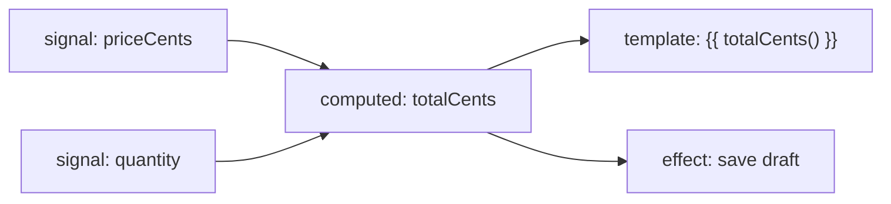
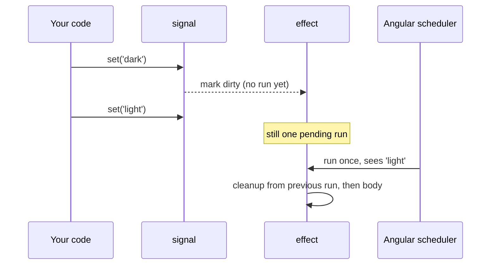
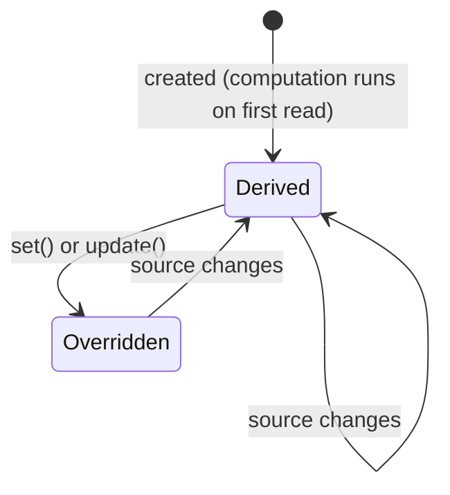
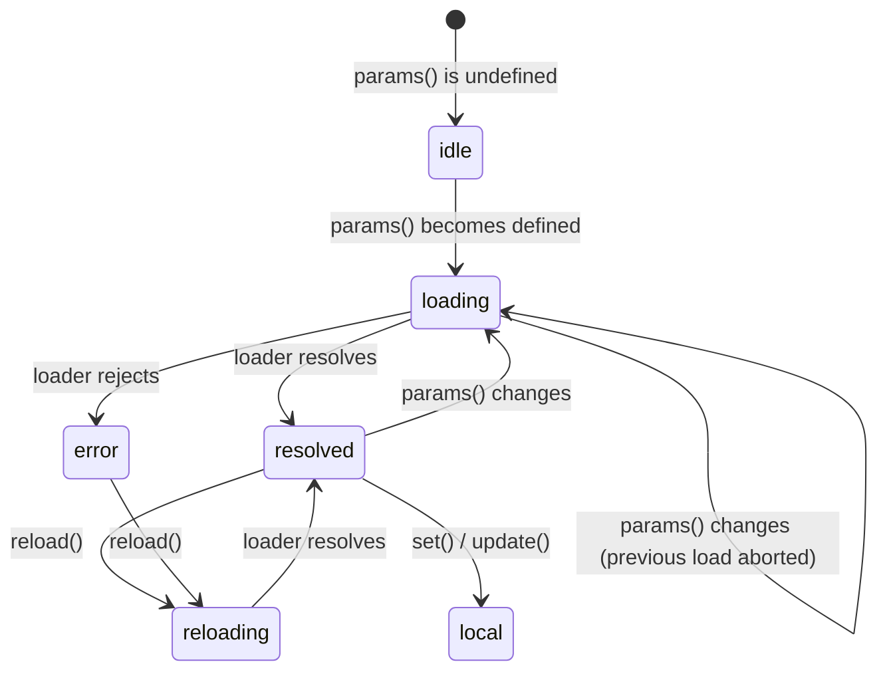
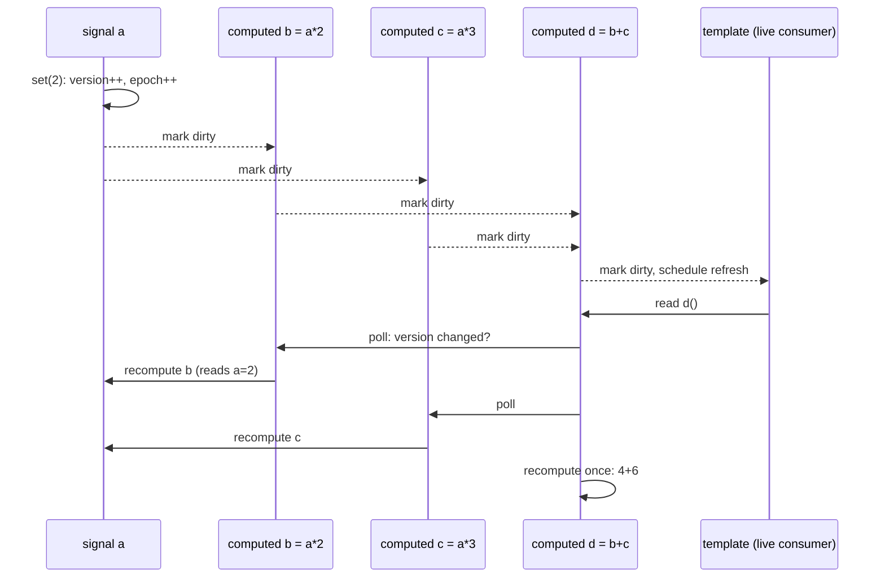

# 17. Signals

> **What this covers:** Angular's reactive primitives (`signal`, `computed`, `effect`, `linkedSignal`, `resource`), the signal-based component APIs (`input`, `output`, `model` and signal queries), and the reactive graph that makes them work. By the end you can choose the right primitive for a job, predict exactly when code re-runs, and explain the algorithm underneath.
> **Prerequisites:** [13. Components and templates](13-components-and-templates.md), [16. Dependency injection](16-dependency-injection.md)
> **Leads to:** [18. Control flow and defer](18-control-flow-and-defer.md), [19. Component communication](19-component-communication-and-projection.md), [21. Change detection](21-change-detection.md), [23. RxJS in depth](23-rxjs-in-depth.md), [26. Signal forms](26-signal-forms.md), [28. State management](28-state-management.md)
> **Applies to:** Angular 22.2, TypeScript 6.0, RxJS 7.8 (interop only)
> **Study time:** ~5 hours reading + ~5 hours exercises
> **Short on time:** read [2. Writable signals](#2-writable-signals), [3. Computed signals](#3-computed-signals) and [4. Effects](#4-effects), then drill [Q17.04](#q17-04), [Q17.13](#q17-13), [Q17.15](#q17-15), [Q17.16](#q17-16), [Q17.23](#q17-23) and [Q17.34](#q17-34), and finish with the [Summary](#summary).
> **Labs:** [`labs/angular/src/app/modules/17-signals/`](../labs/angular/src/app/modules/17-signals/) (exercises 1–5 and every *Output* question) and [`labs/ts-js/src/modules/17-signals/`](../labs/ts-js/src/modules/17-signals/) (exercise 6). Run (Node 24): from `labs/angular`, `npx ng test --watch=false --include='src/app/modules/17-signals/**/*.spec.ts'`; from `labs/ts-js`, `npx vitest run src/modules/17-signals`

## Contents

1. [Why signals exist](#1-why-signals-exist)
2. [Writable signals](#2-writable-signals)
3. [Computed signals](#3-computed-signals)
4. [Effects](#4-effects)
5. [`linkedSignal`: writable derived state](#5-linkedsignal-writable-derived-state)
6. [Resources: async data as signals](#6-resources-async-data-as-signals)
7. [Signal-based component APIs](#7-signal-based-component-apis)
8. [Interop with RxJS](#8-interop-with-rxjs)
9. [Under the hood: the reactive graph](#9-under-the-hood-the-reactive-graph)
- [Summary](#summary)
- [Question bank](#question-bank)
- [Hands-on exercises](#hands-on-exercises)
- [Check your understanding](#check-your-understanding)
- [Connections](#connections)

---

## 1. Why signals exist

### The problem it solves

A user interface is a function of state: when the state changes, the screen must change with it. The hard part is not drawing the screen. It is **knowing what changed**, so the framework can update the right parts of the page and nothing else.

For most of its history Angular did not know what changed. It used [zone.js](../GLOSSARY.md#zonejs), a library that patches every asynchronous browser API (`setTimeout`, `addEventListener`, `fetch`, promises…), to learn *that something might have changed*. After any such event, Angular ran **change detection**: it walked the whole component tree from the root and compared every template binding with its previous value. That technique is called *dirty checking*.

Dirty checking works, but it has three costs that grow with the application:

1. **Work proportional to the tree, not to the change.** One click in a footer re-checks every binding on the page. The `OnPush` strategy (a component setting that tells Angular to check the component only when its inputs change by reference, an event fires inside it, or it is explicitly marked) lets Angular skip subtrees, but only when you follow its rules (new object references, `markForCheck()`), and breaking them silently produces a stale screen.
2. **Coarse notifications.** zone.js says "an event happened", not "the cart total changed". Code that runs outside the zone (a third-party widget, a WebSocket library) does not refresh the view at all, which forces workarounds such as `NgZone.run`.
3. **Hidden machinery.** Patching every async API adds weight to the bundle, makes stack traces harder to read, and couples the framework to how the browser schedules work.

A **signal** fixes the root cause. It is a value that knows who reads it. When it changes, it notifies exactly the code (and the templates) that depend on it. Angular no longer needs to guess. It can refresh only the views that actually read the changed value. This is called *fine-grained reactivity*, and it is what makes zoneless Angular (the default for new projects since v21) and OnPush-by-default (since v22) practical. Both are covered in [Module 21](21-change-detection.md).

### Mental model

Think of a spreadsheet. Cell `A1` holds `10`. Cell `B1` holds the formula `=A1*2`. You never tell `B1` to recalculate. The spreadsheet knows that `B1` reads `A1`, so changing `A1` updates `B1`, and any chart that reads `B1`. Cells that do not depend on `A1` are untouched.

| Spreadsheet | Angular |
|---|---|
| A cell you type into | `signal()`, a writable value |
| A formula cell | `computed()`, a value derived from other signals |
| A chart that redraws when its cells change | A template, or an `effect()` |



What to notice: the arrows are discovered automatically, by watching which signals each formula *reads* while it runs. You never declare them.

### How it actually works

A signal is a **getter function** with a hidden node attached to it. Calling the function returns the value. If the call happens inside a *reactive context* (code that Angular is running while tracking dependencies: a `computed`, an `effect`, or a component template), the node records the reader as a *consumer*. Writing a new value marks those consumers as stale and schedules the work that must react (effects and view refreshes). [Section 9](#9-under-the-hood-the-reactive-graph) walks through the exact algorithm, using the Angular 22.2.1 source as the reference.

A component's template is itself a consumer. When a template reads `count()`, Angular links that component view to the `count` signal. When `count` changes, Angular marks *that view* for refresh and schedules change detection. Without zone.js, this notification is what triggers rendering at all. With OnPush, it is what tells Angular that this particular OnPush view must be checked.

### Code

The smallest useful example is a component with a counter. The approach is to keep the state in a signal, read it in the template by calling it, and write it from an event handler.

1. Create the state with `signal(0)`.
2. Read it in the template with `count()`. The parentheses are required: they are what registers the dependency.
3. Change it with `update`, which receives the current value.

```ts
// Partial: imports omitted
@Component({
  selector: 'lab-counter',
  template: `<button type="button" (click)="increment()">Clicked {{ count() }} times</button>`,
})
export class Counter {
  protected readonly count = signal(0);

  increment(): void {
    this.count.update((n) => n + 1);
  }
}
```

There is no `markForCheck()`, no zone and no subscription. The template reads `count()`, so Angular knows that this view depends on `count`.

> [!NOTE]
> **Framework vs platform.** Angular signals are a **library feature** of `@angular/core`, implemented in TypeScript. They are not a JavaScript language feature. TC39 (the committee that evolves JavaScript) has a [Signals proposal](https://github.com/tc39/proposal-signals). On 2026-10-03 its README listed it at **Stage 1**, meaning the committee is exploring the problem and no API is guaranteed. Angular's team contributed to the proposal, and its primitives follow the same push-dirty/pull-value model, but nothing in Angular depends on the proposal. If it ever ships natively, frameworks could share a common graph. Until then, "signals" in an Angular interview means Angular's implementation.

### Best practices and anti-patterns

- **Do keep state that the UI shows in signals**, because then the framework knows exactly which views to refresh, which is what OnPush and zoneless rely on.
- **Avoid plain mutable fields for displayed state in new code.** In a zoneless app nothing schedules a refresh when a plain field changes, so the screen goes stale.
- **Do read signals by calling them** (`count()`). A template that writes `{{ count }}` prints the function itself. Angular 22 flags this with the *extended diagnostics* (optional compiler checks for likely mistakes, reported as warnings by default) NG8109 and NG8117 (see [Q17.32](#q17-32)).

### Misconceptions and traps

- *"Signals were invented by Angular."* No. Knockout.js had observables in 2010, and SolidJS, Preact Signals, Vue's `ref` and MobX use the same idea. Angular adopted it in v16 (developer preview) and made `signal` and `computed` stable in v17.
- *"Signals replace RxJS."* Only for **state**. Signals always hold a current value and are synchronous to read. RxJS models **events over time**, with operators for time (debounce, retry, cancellation). [Section 8](#8-interop-with-rxjs) summarizes when to use each, and [Module 23](23-rxjs-in-depth.md) gives the full decision rules.
- *"Using signals makes an app fast automatically."* Signals make updates *precise*. A slow `computed` or a huge list without `track` is still slow. Measure first ([Module 31](31-performance.md)).

---

## 2. Writable signals

### The problem it solves

You need a piece of state that can change, that can be read anywhere, and whose readers get notified when it changes, without wiring up subscriptions by hand and without leaking them.

### Mental model

A writable signal is a box with a value and a guest list. Reading the value inside a reactive context adds you to the guest list. Putting a *different* value in the box notifies everyone on the list. Putting in the *same* value notifies nobody.

### How it actually works

- `signal(initialValue, options?)` returns a `WritableSignal<T>`: a function you call to read, plus `set`, `update` and `asReadonly` methods. The options are `equal` (a custom equality function) and `debugName` (a label shown in Angular DevTools).
- **Equality decides whether a write is a change.** The default comparison is `Object.is`, which is identity for objects. If the new value is equal to the old one, the write does nothing: no version bump and no notification. Verified in the Angular 22.2.1 source (`signalSetFn` calls `node.equal` before changing anything) and in [Q17.10](#q17-10).
- `update(fn)` is `set(fn(current))`. There is no `mutate` method `[Removed in v17.0]`: it was taken out before signals became stable, because in-place mutation is invisible to `Object.is` equality.
- `asReadonly()` returns a separate read-only signal over the same value, with no `set` or `update`. Use it to expose state from a service while keeping writes private.
- `isSignal(value)` and `isWritableSignal(value)` are runtime type guards.

### Code

A store service is the standard way to hold shared state with signals. The approach is to keep one private writable signal, expose read-only views, and allow changes only through named methods.

1. Declare the private state with `#lines = signal<readonly CartLine[]>([])`. The `readonly` array type makes accidental mutation a compile error.
2. Expose it with `lines = this.#lines.asReadonly()`.
3. In every method, produce a **new** array (`[...lines, item]`, `map`, `filter`) so that `Object.is` sees a change.

```ts
// Excerpt of labs/angular/src/app/modules/17-signals/exercise-1-cart-store/cart-store.ts
@Service()
export class CartStore {
  readonly #lines = signal<readonly CartLine[]>([]);
  readonly lines = this.#lines.asReadonly();

  remove(productId: string): void {
    this.#lines.update((lines) => lines.filter((line) => line.product.id !== productId));
  }
}
```

`@Service()` `[Stable since v22.0]` is the decorator added in Angular 22 for application-wide services. For the common case it is equivalent to `@Injectable({ providedIn: 'root' })`. [Module 16](16-dependency-injection.md) compares them.

#### Legacy

Before signals, the same service used a `BehaviorSubject` and exposed `asObservable()`. Components then subscribed with the `async` pipe:

```ts
// Partial: legacy equivalent, still common in production codebases
@Injectable({ providedIn: 'root' })
export class LegacyCartStore {
  private readonly lines$ = new BehaviorSubject<readonly CartLine[]>([]);
  readonly lines = this.lines$.asObservable();

  remove(productId: string): void {
    this.lines$.next(this.lines$.value.filter((line) => line.product.id !== productId));
  }
}
```

Both work. The signal version needs no subscription management, gives synchronous reads, and lets OnPush/zoneless views update without the `async` pipe. [Q17.40](#q17-40) covers migrating from one to the other. There is no Angular schematic for this conversion (the official signal migrations cover inputs, outputs and queries only), so it is done by hand, service by service.

> [!TIP]
> **Coming from the backend.** A writable signal resembles an `AtomicReference<T>` with listeners attached, or a JavaFX `ObjectProperty` (see the JavaFX `Binding` comparison in [section 3](#3-computed-signals)). Replacing the reference is the change. Mutating the object it points to is invisible, just as mutating an object inside an `AtomicReference` does not trigger a compare-and-set. **Where the analogy breaks:** signals are single-threaded. There is no concurrency and no memory visibility problem, so the reason for immutability here is *change detection*, not thread safety.

### Best practices and anti-patterns

- **Do treat signal values as immutable**, because `Object.is` only sees a new reference. Mutating in place produces a screen that does not update (see [Q17.04](#q17-04)).
- **Do keep writable signals private and expose `asReadonly()`**, because a single place of mutation makes state changes traceable and testable.
- **Avoid a custom `equal` that ignores fields the UI shows**, because the UI will then miss real changes. Use it for cheap structural comparisons that you control, such as comparing by ID when the rest of the object is guaranteed identical.
- **Do give important signals a `debugName`** in large apps, because Angular DevTools shows it in the signal graph.

### Misconceptions and traps

- *"`set` with the same object after mutating it will trigger an update."* No. `Object.is(obj, obj)` is `true`, so it is a no-op.
- *"`asReadonly()` freezes the value."* No. It removes the write *methods*. The object inside can still be mutated by anyone holding a reference, which is why the example also uses `readonly` types.
- *"A signal write is asynchronous."* The **value** changes synchronously, and the next read sees it. Only the *reactions* (effects, view refreshes) are scheduled for later.

---

## 3. Computed signals

### The problem it solves

Much of an application's state is **derived**: a total from cart lines, a filtered list from a list and a search term, a flag from a status. Storing derived values separately means keeping copies in sync by hand. That code is easy to forget and is a classic source of bugs: the total says 3 items, the list shows 4.

### Mental model

`computed` is a spreadsheet formula. It is defined once, it is always consistent with its inputs, and it is only recalculated when someone needs the value *and* an input actually changed.

### How it actually works

- `computed(fn, options?)` returns a read-only `Signal<T>`. Options are `equal` and `debugName`.
- **Lazy.** `fn` does not run when the computed is created, and not when its inputs change. It runs when someone reads the computed, and only if an input changed since the last run.
- **Memoized.** Reading it ten times without input changes runs `fn` once. Verified in [Q17.06](#q17-06).
- **Dynamic dependencies.** The dependency list is rebuilt on *every* run, from the signals that run actually read. A branch not taken is not a dependency. Verified in [Q17.11](#q17-11).
- **Errors are cached too.** If `fn` throws, the computed stores the error and rethrows it on every read, without re-running `fn`, until an input changes. Verified in [Q17.09](#q17-09).
- **No writes inside.** Writing to a signal from a `computed` throws `NG0600`, because a derivation that changes state would make the graph unpredictable ([Q17.08](#q17-08)).
- **Cycles are detected.** A computed that (indirectly) reads itself throws `Detected cycle in computations.`
- **Equality cutoff.** If a recomputation produces a value equal to the previous one, the computed's version does not change, so nothing downstream recomputes. [Section 9](#9-under-the-hood-the-reactive-graph) explains why this matters.

`untracked(fn)` runs `fn` without recording dependencies. Use it inside a computed or effect when you need a signal's current value but do not want changes to it to cause a re-run.

### Code

Derived cart values belong in `computed`. The approach is to derive every total from the single source of truth (the lines), never to store it.

1. Read the source signal inside the computation.
2. Return a plain value. No writes, no I/O.
3. Use integer cents for money, so that sums are exact (floating-point arithmetic is covered in [Module 01](01-js-values-types-coercion.md)).

```ts
// Excerpt of labs/angular/src/app/modules/17-signals/exercise-1-cart-store/cart-store.ts
readonly itemCount = computed(() => this.#lines().reduce((sum, line) => sum + line.quantity, 0));
readonly totalCents = computed(() =>
  this.#lines().reduce((sum, line) => sum + line.quantity * line.product.priceCents, 0),
);
readonly isEmpty = computed(() => this.#lines().length === 0);
```

> [!TIP]
> **Coming from the backend.** The closest Java analogue is a JavaFX `Binding` (for example `Bindings.createIntegerBinding(() -> price.get() * qty.get(), price, qty)`). JavaFX bindings are *invalidation-based*: a change to `price` only marks the binding invalid (push), and the value is recomputed when someone calls `get()` (pull). That is the same push-dirty/pull-value design as `computed`. **Where the analogy breaks:** JavaFX makes you list the dependencies by hand (`price, qty`), while `computed` discovers them on every run, so they can change with branches. JavaFX also notifies `ChangeListener`s eagerly, a role that effects play here, but batched.

### Best practices and anti-patterns

- **Do derive with `computed` instead of syncing with `effect`.** An effect that copies one signal into another runs later than the read (so readers briefly see stale data), runs more often, and can loop. This is the most common signals mistake in code review ([Q17.15](#q17-15)).
- **Do keep computations pure and cheap**: no HTTP calls, no logging, no DOM access. A computed may run at any time a reader asks, or never.
- **Avoid calling methods in templates for derived values** (`{{ total() }}` where `total` is a method that loops). A method re-runs on every check of the view. A computed re-runs only when its inputs change ([Q17.07](#q17-07)).
- **Do return new objects from a computed that builds objects or arrays**, because consumers compare by reference, so a mutated old object would look unchanged. If recomputations often produce *structurally identical* results (for example, a filter that usually returns the same items), add a cheap `equal` on the computed so the equality cutoff stops downstream work ([section 9](#9-under-the-hood-the-reactive-graph)).

### Misconceptions and traps

- *"A computed recalculates whenever its inputs change."* It is *marked stale* when they change and *recalculated when read*. An unread computed costs nothing.
- *"A computed is just a getter."* A getter re-runs on every access and has no dependency tracking. A computed caches its result and is itself a signal that templates and effects can depend on.
- *"`untracked` makes a read non-reactive everywhere."* It only affects the reactive context it runs in. The same signal read normally elsewhere is still tracked there.

---

## 4. Effects

### The problem it solves

State does not live only in the UI. Sometimes a state change must reach a system that knows nothing about signals: write a preference to `localStorage`, send an analytics event, redraw a chart from a non-Angular library, focus an element. You need code that *runs because* a signal changed, and that stops running when its owner is destroyed.

### Mental model

An effect is a **subscriber with automatic dependency tracking**. It is like a `computed` that returns nothing and runs eagerly. Whatever signals it reads on its last run are what it listens to. Its job is to push signal state **out** to the non-reactive world, not to compute more state.



What to notice: writes only *mark* the effect. It runs later, once, with the final values. This is called *batching*.

### How it actually works

- `effect(fn, options?)` `[Stable since v20.0]` registers `fn` and returns an `EffectRef` with `destroy()`. The options are `injector`, `manualCleanup` and `debugName`. `allowSignalWrites` `[Deprecated since v19.0 — remove it]`: since v19, effects may write signals by default.
- **Injection context required.** `effect()` needs an [injection context](16-dependency-injection.md) (a constructor, a field initializer, a factory) unless you pass `{ injector }`. Calling it in `ngOnInit` throws `NG0203` ([Q17.16](#q17-16)). The injection context is also how the effect finds its `DestroyRef`, so it is destroyed with its component or service.
- **Runs at least once**, to discover its dependencies, and then again whenever any of them changes (with equality checks, so a write of an equal value causes no run).
- **Batched and asynchronous.** Several synchronous writes cause **one** run with the final values ([Q17.13](#q17-13)). Tests flush pending effects with `TestBed.tick()` (introduced in v20.0). The static `TestBed.flushEffects()` `[Removed in v20.0 — use TestBed.tick()]`. Only a deprecated instance method of the same name remains in the 22.2.1 typings.
- **Two kinds, different timing.**
  - A *component effect* is created by a component, a directive, or a service provided by one. It runs as part of change detection for that component, so it can safely read inputs and create views.
  - A *root effect* is created outside the component tree (for example in a root service). It is not tied to any view. The [angular.dev effects guide](https://angular.dev/guide/signals/effect) says root effects are "executed prior to all components being checked by the change detection process", and view effects "*before* their corresponding component is checked". The `effect` API comment also says root effects "run as microtasks". In this guide's zoneless 22.2.1 lab, a root effect did **not** run within one microtask of a write (verified: the "Section 4" test). It ran when `TestBed.tick()` was called, or by itself when the scheduler rendered, always before component effects ([Q17.14](#q17-14)). So the "microtask" wording describes the scheduling mechanism loosely, not the observable timing. The safe rule is not to depend on precise effect timing.
- **Cleanup.** The function receives `onCleanup`. A registered cleanup runs before the next run and when the effect is destroyed ([Q17.17](#q17-17)). Use it to cancel timers, unsubscribe, or abort requests the previous run started.
- **Writing signals from an effect** is allowed, and the effect re-runs if it wrote something it reads. It keeps re-running until the values settle, so a write that never converges is an infinite loop ([Q17.18](#q17-18)).

**`afterRenderEffect`** is a variant for DOM work that must happen *after* Angular renders. You split the work into phases that run in the order `earlyRead` → `write` → `mixedReadWrite` → `read`. Each phase receives the previous phase's return value as a signal, and phases run only when their dependencies changed. Separating DOM reads from DOM writes avoids *layout thrashing*: forcing the browser to recalculate layout repeatedly ([Module 08](08-browser-rendering-dom-events.md)). It runs on the browser only, never during server-side rendering. Lifecycle timing is covered in [Module 20](20-lifecycle-and-render-hooks.md).

### Code

A preferences store is the canonical *correct* effect. The approach is to keep the preferences in a signal and let one effect mirror them to storage. The effect never writes back the state it reads.

1. Read the initial value from storage once, defensively: storage can throw, and its contents are untrusted.
2. Create the effect in the constructor, which is an injection context.
3. Inside the effect, read the signal and write it out. Report write failures through a separate signal that the effect does not read.

```ts
// Excerpt of labs/angular/src/app/modules/17-signals/exercise-3-persisted-preferences/preferences-store.ts
@Service()
export class PreferencesStore {
  readonly #storage = inject(PREFERENCES_STORAGE);
  readonly #prefs = signal(parsePreferences(readRaw(this.#storage)));
  readonly #persisted = signal(true);

  readonly preferences = this.#prefs.asReadonly();
  readonly persisted = this.#persisted.asReadonly();

  constructor() {
    effect(() => {
      const ok = writeRaw(this.#storage, JSON.stringify(this.#prefs()));
      this.#persisted.set(ok);
    });
  }
}
```

An effect with cleanup, for a resource the effect itself acquires:

```ts
// Partial: inside a component constructor
effect((onCleanup) => {
  const id = setInterval(() => this.poll(this.roomId()), 5_000);
  onCleanup(() => clearInterval(id)); // runs before the next run and on destroy
});
```

> [!TIP]
> **Coming from the backend.** An effect resembles a Spring `@EventListener` or a JPA `@PostUpdate` callback: code that reacts to a state change. **Where the analogy breaks:** you never declare which event an effect listens to. Its dependencies are whatever it read on its last run, and they can change from run to run. Effects are also coalesced, so ten writes produce one run, which an event listener never does.

### Best practices and anti-patterns

- **Do use effects only to synchronize with non-reactive systems**: storage, logging and analytics, third-party widgets, imperative DOM APIs. These are the cases where nothing else can do the job.
- **Avoid effects that compute state from state**, such as `effect(() => this.total.set(...))`. Use `computed` (read-only derived) or `linkedSignal` (writable derived) instead. The effect version is late, runs more often, and can loop ([Q17.15](#q17-15)).
- **Do register cleanup for anything the effect starts** (timers, subscriptions, listeners). Otherwise every re-run leaks one.
- **Avoid reading signals you do not mean to depend on.** Wrap incidental reads in `untracked`, especially calls into services that may read signals internally.
- **Do prefer `afterRenderEffect` with explicit phases over `effect` for DOM measurement and mutation**, because it runs after rendering and keeps reads and writes apart.

### Misconceptions and traps

- *"Effects run synchronously when a signal is set."* No. They are scheduled and batched. Code right after `set()` cannot see the effect's side effect yet.
- *"An effect runs once per write."* It runs once per *flush*, with the latest values. Intermediate values are skipped, so an effect is the wrong tool for "react to every event". Use an RxJS stream or an `output()` event for that.
- *"An effect may not write to a signal."* Once true: until v19, a signal write inside an effect threw unless the effect was created with `allowSignalWrites: true` (read in the published 18.2.13 package: "Writing to signals is not allowed in a `computed` or an `effect` by default. Use `allowSignalWrites` in the `CreateEffectOptions` to enable this inside effects."). Now: since v19 effects may write signals by default, and the 22.2.1 typings mark the option `@deprecated no longer required, signal writes are allowed by default` ([section 4](#4-effects)). The writes are allowed, but deriving state that way is still the anti-pattern of [Q17.15](#q17-15).
- *"Effects are bad."* They are the right tool for their job, which is pushing state out. They are wrong for deriving state inside the graph.

---

## 5. `linkedSignal`: writable derived state

### The problem it solves

Some state is derived *by default* but can be overridden by the user. The selected option of a list defaults to the first option, the user can pick another, and when the list changes the selection must be re-evaluated. A `computed` cannot be written. A plain `signal` plus an `effect` to reset it is the anti-pattern from the previous section.

### Mental model

A `linkedSignal` is a signal with a **reset rule**. You can `set` it like any signal, but whenever its *source* changes, its value is recomputed from the source and your local write is replaced.



What to notice: a local write survives only until the next source change.

### How it actually works

`linkedSignal` [Stable since v20.0] · `set` option [Added in v22.1].

There are two forms:

1. **Shorthand:** `linkedSignal(() => options()[0])`. Every signal read inside the function is a source. When any of them changes, the value resets to the function's result ([Q17.20](#q17-20)).
2. **Explicit:** `linkedSignal({ source, computation, equal?, set? })`. Only `source` is tracked. `computation(sourceValue, previous)` receives `previous = { source, value }` (absent on the first run), so it can *keep* the user's choice when it is still valid.

The `set` option (v22.1) intercepts writes: `set: (value, rawSet) => …` lets you validate or transform a value before it is stored.

Internally, a linked signal is a computed node that is also writable. A write replaces the value until the next recomputation, which happens only when a source changes.

### Code

A list picker must keep the user's selection when it is still in the new list, and fall back to the first option otherwise. The approach is the explicit form, with the decision in a pure function that can be tested on its own.

1. Make `options` a required signal input.
2. Write `keepOrFirst(options, previous)` as a pure function.
3. Pass `source: this.options` and `computation: keepOrFirst` to `linkedSignal`.

```ts
// Excerpt of labs/angular/src/app/modules/17-signals/exercise-2-linked-selection/option-picker.ts
export function keepOrFirst(
  options: readonly Option[],
  previous?: { source: readonly Option[]; value: string | null },
): string | null {
  const stillThere = previous?.value != null && options.some((o) => o.id === previous.value);
  return stillThere ? previous.value : (options[0]?.id ?? null);
}

export class OptionPicker {
  readonly options = input.required<readonly Option[]>();
  readonly selectedId = linkedSignal<readonly Option[], string | null>({
    source: this.options,
    computation: keepOrFirst,
  });
}
```

### Best practices and anti-patterns

- **Do use `linkedSignal` for "default until the user changes it, reset when context changes"** state: selections, page indexes reset on filter change, draft copies of an entity being edited.
- **Do use the explicit form when the reset should depend on the previous value**, because the shorthand always discards local writes.
- **Avoid `linkedSignal` when nobody writes to it.** That is a `computed`, and a `computed` is read-only, which is the safer contract.

### Misconceptions and traps

- *"`linkedSignal` is a two-way binding between signals."* No. It is one-way: the source resets it, and writing it never changes the source.
- *"A local write is permanent."* It lasts until any source changes, and *any* source counts: in the shorthand form, that is every signal read in the function.

---

## 6. Resources: async data as signals

### The problem it solves

Signals are synchronous, but data arrives asynchronously. Loading "the user whose ID is in this signal" requires starting a request when the ID changes, cancelling the old request if the ID changes again, exposing loading and error states, and ignoring a late response from a stale request. Hand-written, that is the classic race-condition bug: search for "ad", then "ada", and the slower "ad" response overwrites the right one.

### Mental model

A resource is a **signal-shaped view of an async operation**. You give it a reactive `params` function and a `loader`. It gives you back signals: `value`, `status`, `error` and `isLoading`. It is `computed` for async work: params in, value out, with the bookkeeping done for you.



What to notice: `reloading` keeps the old value visible, while `loading` (new params) does not.

### How it actually works

`resource`, `rxResource` [Stable since v22.0] · param status codes, `chain()` and the SSR cache `id` [Added in v22.0].

- `resource({ params, loader, defaultValue?, equal?, injector?, id?, debugName? })` returns a `ResourceRef<T>`. (`id` names the value in `TransferState`, the mechanism that serializes data fetched during server-side rendering into the page so the browser does not fetch it again; see [Module 32](32-ssr-ssg-hydration.md).) Use `stream` instead of `loader` for values that arrive over time.
- `params` is reactive. When its value changes, the in-flight load is **aborted** through the `abortSignal` passed to the loader, and a new load starts. Returning `undefined` from `params`, or throwing `ResourceParamsStatus.IDLE`, puts the resource in `idle` without loading. Throwing `ResourceParamsStatus.LOADING` holds it in `loading`. Since v22.0, `params` also receives a context whose `chain(otherResource)` returns another resource's value, or propagates its status (present in the 22.0.0 typings as `ResourceParamsContext`).
- The loader receives `{ params, abortSignal, previous: { status } }` and returns a promise.
- **Statuses** (type `ResourceStatus`): `'idle' | 'loading' | 'reloading' | 'resolved' | 'error' | 'local'`. Verified sequence in [Q17.23](#q17-23).
- **`value()` throws in the `error` state**, even when a `defaultValue` was given. Guard reads with `hasValue()` or check `status()` first ([Q17.24](#q17-24)).
- **`defaultValue` is shown during `loading`** for new params, so a list can flash empty between searches. `reloading` keeps the previous value.
- `set`/`update` write a local value (status `local`). `reload()` re-runs the loader with the same params and returns `true`. It is a no-op that returns `false` while the resource is `idle` or already `loading` (verified: Q17.22's test). `destroy()` aborts and returns to `idle`. `snapshot()` gives `{ status, value | error }` as one object.
- `rxResource({ params, stream })` (from `@angular/core/rxjs-interop`) uses an Observable-returning `stream`. Unsubscribing replaces the abort signal.
- `httpResource` builds the request from signals on top of `HttpClient`. It is taught in [Module 27](27-http-client.md).

`resource` is designed for **reads**. Its own documentation warns against using it for mutations: a param change aborts the in-flight request, and an aborted `POST` may or may not have reached the server ([Q17.25](#q17-25)).

`debounced(source, wait)` [Experimental since v22.0] returns a `Resource` that follows `source` after a delay, which is useful for search boxes. Being experimental, its API may change in a minor release.

### Code

A user search needs no request for short queries, cancels stale requests, and never throws from the template. The approach is a service with a `query` signal, a resource whose params derive from the query, and computed signals that make the result safe to render.

1. Map the query to params with a pure function that returns `undefined` for "no request".
2. Pass the loader's `abortSignal` through to the API port, so cancellation reaches the network.
3. Expose `users` through `hasValue()`, because `value()` would throw in the error state.

```ts
// Excerpt of labs/angular/src/app/modules/17-signals/exercise-5-user-search/user-search.ts
export function toSearchTerm(query: string): string | undefined {
  const term = query.trim();
  return term.length >= MIN_TERM_LENGTH ? term : undefined;
}

@Service()
export class UserSearch {
  readonly #api = inject(USER_SEARCH_API);
  readonly query = signal('');

  readonly #results = resource({
    params: () => toSearchTerm(this.query()),
    loader: ({ params, abortSignal }) => this.#api.search(params, abortSignal),
  });

  readonly status = this.#results.status;
  readonly users = computed(() => (this.#results.hasValue() ? this.#results.value() : []));
  readonly errorMessage = computed(() =>
    this.#results.status() === 'error' ? 'Search failed. Try again.' : null,
  );
}
```

#### Legacy

Before `resource`, the same search was written with RxJS and hand-maintained flags, and many production codebases still look like this:

```ts
// Partial: legacy equivalent; api.search$ returns an Observable that is cancelled on unsubscribe
private readonly query$ = new BehaviorSubject('');
readonly loading$ = new BehaviorSubject(false);
readonly users$ = this.query$.pipe(
  map(toSearchTerm),
  switchMap((term) => {
    if (term === undefined) return of([]);
    this.loading$.next(true);
    return this.api.search$(term).pipe(
      catchError(() => of([])),
      finalize(() => this.loading$.next(false)),
    );
  }),
);
```

`switchMap` provides the cancellation, but the loading and error state is spread across operators and side effects. That is exactly what `resource`'s `status()` centralizes. Converting is manual: replace the subject with a signal, move the `switchMap` body into a `loader` (or `stream` with `rxResource`), and delete the flags.

> [!TIP]
> **Coming from the backend.** A resource is close to a Spring WebFlux `Mono` driven by `switchMap` over a stream of request parameters: new parameters cancel the previous subscription. **Where the analogy breaks:** a resource always exposes a *current state* (value plus status) that templates read synchronously. A `Mono` has no current value until it emits.

### Best practices and anti-patterns

- **Do pass `abortSignal` to `fetch`, or use `rxResource`/`httpResource`**, because aborting a promise you ignore does not cancel the network call. It only discards the result.
- **Do guard `value()` with `hasValue()` or a `status()` check** in computed signals and templates, because an error state otherwise throws during rendering.
- **Avoid `resource` for mutations** (POST/PUT/DELETE). Call the API from an event handler, and `reload()` or `set()` the resource afterwards.
- **Do decide whether `defaultValue` flashing is acceptable.** For search results you may prefer to keep the previous results visible: show them while `isLoading()` is true, using a `linkedSignal` that ignores loading states, or use `debounced` (experimental) to reduce flashes.

### Misconceptions and traps

- *"`defaultValue` means `value()` never throws."* It throws in the `error` state regardless.
- *"`reload()` and changing params are the same."* `reload()` keeps the value (status `reloading`). New params clear it to the default (status `loading`).
- *"A resource caches results per params."* It does not. Changing back to old params loads again. Caching is a separate concern ([Module 27](27-http-client.md)).

---

## 7. Signal-based component APIs

### The problem it solves

Decorator inputs (`@Input()`) are plain fields. Angular writes them, and you find out through `ngOnChanges` or a setter. Deriving state from an input therefore needed lifecycle hooks, and OnPush relied on new object references to notice changes. Outputs used `EventEmitter`, an RxJS `Subject` subclass that exposed more API than an event needs. View queries were `undefined` until `ngAfterViewInit`. Signal-based APIs make all of these *reactive values*, which `computed`, `effect` and templates can depend on directly.

### Mental model

Inputs, models and queries are **signals that Angular writes for you**. You read them like any signal and derive from them with `computed`. Outputs are **event channels**, not state: they have no current value.

### How it actually works

`input`, `output`, `model` and the signal queries [Stable since v19.0].

| API | Returns | Notes |
|---|---|---|
| `input<T>()`, `input(initial, opts)` | `InputSignal<T>` (read-only) | Options: `alias`, `transform`, `debugName` |
| `input.required<T>(opts?)` | `InputSignal<T>` | The parent must bind it, or compilation fails |
| `output<T>(opts?)` | `OutputEmitterRef<T>` | `emit(value)`. Not an RxJS object |
| `model<T>(initial?)`, `model.required<T>()` | `ModelSignal<T>` (writable) | Creates input `x` and output `xChange`, which enables `[(x)]` |
| `viewChild`, `viewChildren`, `contentChild`, `contentChildren` | `Signal<…>` | `.required` variants; `read` option |

- **Transforms** convert the bound value before it is stored. With `booleanAttribute` and `numberAttribute` (from `@angular/core`), a template can write `<lab-star-rating readonly max="10">`: the attribute strings become `true` and `10`.
- **Required inputs are checked at compile time.** Missing bindings are template errors. Reading a required input in the constructor is also a compile-time error in v22, `NG8118` ([Q17.28](#q17-28)).
- **`model()` is a writable input.** When the child calls `value.set(x)`, Angular emits `valueChange`, and a parent using `[(value)]="someSignal"` gets `someSignal` updated **synchronously**. The reverse direction (parent → child) flows through normal input binding, during the next change detection ([Q17.29](#q17-29)).
- **Signal queries** resolve when the view (or content) is created and update when it changes. A `computed` that reads `viewChild()` re-runs when the queried element appears or disappears. That is the reason `ngAfterViewInit` is mostly unnecessary now.

### Code

A star-rating control is the textbook case for `model()` plus input transforms. The approach is to make the rating a model (so parents can use `[(value)]`), make configuration inputs with transforms (so plain attributes work), and derive the star list with `computed`.

1. Declare `value = model(0)`.
2. Declare `max = input(5, { transform: numberAttribute })` and `readonly = input(false, { transform: booleanAttribute })`.
3. Derive `stars = computed(() => Array.from({ length: this.max() }, (_, i) => i + 1))`.
4. On click, `value.set(star)`, unless `readonly()`.

```ts
// Excerpt of labs/angular/src/app/modules/17-signals/exercise-4-star-rating/star-rating.ts
export class StarRating {
  readonly value = model(0);
  readonly max = input(5, { transform: numberAttribute });
  readonly readonly = input(false, { transform: booleanAttribute });
  readonly label = input('Rating');

  readonly stars = computed(() => Array.from({ length: this.max() }, (_, i) => i + 1));

  rate(star: number): void {
    if (this.readonly()) return;
    this.value.set(star);
  }
}
```

```html
<!-- Partial: a parent template -->
<lab-star-rating [(value)]="score" max="4" label="Book rating" />
```

#### Legacy

```ts
// Partial: legacy equivalent with decorators
export class LegacyStarRating implements OnChanges {
  @Input() value = 0;
  @Output() valueChange = new EventEmitter<number>();
  @Input({ transform: numberAttribute }) max = 5;
  stars: number[] = [];

  ngOnChanges(): void {
    this.stars = Array.from({ length: this.max }, (_, i) => i + 1); // manual derivation
  }
}
```

The schematics `ng generate @angular/core:signal-input-migration`, `output-migration` and `signal-queries-migration` (or `signals` for all three) convert decorator APIs and update their references. Run them per folder and review the diff, because they skip patterns they cannot convert safely (for example inputs that are written internally).

### Best practices and anti-patterns

- **Do derive from inputs with `computed`**, not with `ngOnChanges` or setters, because the derivation then stays correct for every way the input can change.
- **Use `model()` only for genuinely two-way state** (form-like controls). Prefer `input` plus `output` when the child only *requests* a change and the parent decides.
- **Avoid writing to an `input()`.** It is read-only by design. If the component needs a local, editable copy, use `linkedSignal(() => this.value())`.
- **Do use `.required` for inputs without a sensible default**, because the compiler then enforces the contract instead of your code handling `undefined`.

### Misconceptions and traps

- *"`output()` returns an Observable."* Once true for decorator outputs: `@Output() x = new EventEmitter()` is an RxJS `Subject` (in the 22.2.1 typings, `interface EventEmitter<T> extends Subject<T>, OutputRef<T>`), so code could `pipe` or `subscribe` to it. Now: `output()` returns an `OutputEmitterRef`. Use `outputToObservable()` if you need an RxJS stream, and `outputFromObservable()` to expose an existing stream as an output.
- *"Signal inputs need OnPush to be efficient."* They notify their consumers regardless. OnPush (the default since v22) is about *when views are checked* ([Module 21](21-change-detection.md)).
- *"`model()` updates the parent asynchronously."* The parent's signal is written synchronously, inside the child's `set()` call. Verified in [Q17.29](#q17-29).

---

## 8. Interop with RxJS

### The problem it solves

Real applications have both: RxJS streams from `HttpClient`, the router, forms and WebSockets, and signals for UI state. You need conversions that do not leak subscriptions.

### Mental model

`toSignal` is "subscribe and remember the latest value". `toObservable` is "watch the signal with an effect and emit what it sees".

### How it actually works

These functions live in `@angular/core/rxjs-interop`. [Module 23](23-rxjs-in-depth.md) covers them in depth. The essentials:

- `toSignal(obs$, { initialValue?, requireSync?, manualCleanup?, equal? })` `[Stable since v20.0]` subscribes **immediately** and, by default, unsubscribes when its injection context is destroyed. `manualCleanup: true` keeps the subscription until the Observable completes, and `equal` sets the signal's equality function. Before the first emission its value is `undefined`, unless you pass `initialValue`. `requireSync: true` asserts that the observable emits synchronously (true of a `BehaviorSubject`), which removes `undefined` from the type. If the observable **errors**, reading the signal rethrows the error ([Q17.37](#q17-37)). It must be called in an injection context.
- `toObservable(signal)` feeds a `ReplaySubject(1)` from an internal `effect`. It therefore emits **asynchronously**, only the last value of a batch of writes, and a subscriber receives the last value *the effect has seen*. Before the effect's first run (which is itself asynchronous), there is nothing to replay. `[Stable since v20.0]`
- `outputFromObservable` and `outputToObservable` bridge component outputs. `rxResource` is the Observable flavour of `resource` ([section 6](#6-resources-async-data-as-signals)).

### Code

To read a route parameter as a signal, convert the router's Observable once, in a field initializer, with an `initialValue`, so the type has no `undefined`.

```ts
// Partial: inside a component
private readonly route = inject(ActivatedRoute);
readonly productId = toSignal(this.route.paramMap.pipe(map((p) => p.get('id'))), { initialValue: null });
```

With [component input binding](24-routing.md) the same value can arrive as a signal input instead, which is simpler still.

### Best practices and anti-patterns

- **Do call `toSignal` once, in a field initializer**, never inside a method or a getter. Every call creates a new subscription.
- **Do handle errors inside the pipe** (`catchError`) before `toSignal`, because an errored signal throws on every read, including from templates.
- **Avoid `toObservable` followed straight by `toSignal`.** If no RxJS operator sits in between, you only added latency.

### Signals or RxJS, in one paragraph

Signals model **state** (a value now). Observables model **events over time**. Use signals for UI state and derived values. Use RxJS for timing (debounce, throttle), coordinating async work (`switchMap`, `exhaustMap`), and event streams that have no current value. The usual architecture is RxJS at the edges (I/O, events) and signals in the middle (state), with `toSignal`, `rxResource` and `toObservable` at the seams. RxJS is not deprecated: `HttpClient`, the router and reactive forms expose Observables, and RxJS is a peer dependency of Angular 22 (`^6.5.3 || ^7.4.0`). The full decision rules, and the typeahead case that combines both, are in [Module 23](23-rxjs-in-depth.md).

### Misconceptions and traps

- *"`toObservable` emits every value the signal takes."* It emits what the underlying effect sees, which is the latest value per flush.
- *"`toSignal` unsubscribes when the template stops reading it."* It unsubscribes when its injection context (component or service) is destroyed, regardless of readers.
- *"Signals are just a `BehaviorSubject`."* A `BehaviorSubject` pushes every value to subscribers synchronously, and has no dependency tracking, no laziness and no equality cutoff.

---

## 9. Under the hood: the reactive graph

### The problem it solves

To explain *why* a computed did not re-run, why an effect skipped a write, or why there is no memory leak when you create thousands of computeds, you need the algorithm. Interviewers probe exactly this. This section describes Angular 22.2.1's implementation (`@angular/core`, the signals primitives in `_effect-chunk.mjs`), read directly from the published package.

### Mental model

**Push dirtiness, pull values.** A write pushes only a cheap "you might be stale" flag down the graph. Values are recomputed lazily, when someone reads, and only if a dependency's *version* actually changed.



What to notice: `d` recomputes exactly once, after both `b` and `c` are fresh. It never sees `b` new and `c` old. That inconsistent intermediate state is called a *glitch*, and this graph is glitch-free ([Q17.34](#q17-34)).

### How it actually works

Every signal, computed, effect and template view is a **reactive node** with a `version` number and links to its producers (what it read) and consumers (who read it).

1. **Reading.** While a consumer runs, a module-level variable holds it as the *active consumer*. Reading a producer calls `producerAccessed`, which records a link with the producer's current `version` (`lastReadVersion`). Dependencies are rebuilt on every run, which is why they are dynamic.
2. **Writing.** `signalSetFn` first checks `equal(old, new)`. If equal, nothing happens. Otherwise it stores the value, increments the node's `version` and a global `epoch`, then walks its consumers and marks them `dirty`, recursively (`producerNotifyConsumers`). No computation happens during this push. Reading signals during the notification phase is an assertion error, which keeps the push phase pure.
3. **Pulling.** Reading a computed calls `producerUpdateValueVersion`. Two fast paths return the cached value. A **live** node that is not dirty is current, because it would have been notified of any change. **Any** node whose `lastCleanEpoch` equals the global `epoch` is current, because nothing anywhere was written since it was last checked. (A non-live node never has its `dirty` flag set by producers, so for non-live nodes the epoch check is the one that matters.) Otherwise it polls each producer link: it refreshes the producer recursively and compares its version with the `lastReadVersion`. Only if some producer's version really changed does it re-run the computation.
4. **Equality cutoff.** After recomputing, if `equal(oldValue, newValue)` holds, the computed keeps its old value and **does not increment its version**. Downstream consumers polling it see no change and skip their own recomputation. This is how `n % 2` going from `0` to `0` stops propagation.
5. **Live and non-live consumers.** Effects and template views are *live*: they must be notified. A producer only keeps links to its live consumers (and to computeds that live consumers depend on). A computed that is read only from plain code is *not* linked from its producers. It validates itself by polling versions when read. So an unread computed holds no subscription, and can be garbage-collected like any object. There is nothing to unsubscribe.
6. **Effects** are live consumers whose "mark dirty" hook schedules a run. When the run happens, the effect first polls its producers. If no producer's version changed, the body does not run. Versions only ever increase, so a signal set to `2` and back to `1` before the flush *does* count as changed. A computed that recomputes to an *equal* value does not, because of the equality cutoff ([Q17.35](#q17-35)).
7. **Errors.** A computation that throws stores the error in place of the value (an `ERRORED` sentinel). Reads rethrow it until a dependency changes ([Q17.09](#q17-09)).

Exercise [E17.6](#ex17-6) asks you to implement this algorithm in about 150 lines.

### Code

The pull phase is the heart of the algorithm. A consumer walks its recorded producers, brings each one up to date first, and reports a change as soon as one version differs from the version it saw.

```ts
// Excerpt of labs/ts-js/src/modules/17-signals/mini-signals.ts: the pull phase
function producersChanged(consumer: Consumer): boolean {
  for (const [producer, seen] of consumer.producers) {
    producer.refresh();
    if (producer.version !== seen) return true;
  }
  return false;
}
```

### Best practices and anti-patterns

- **Do rely on equality cutoff** by deriving small, comparable values (booleans, IDs, counts). A computed that returns a fresh object on every recomputation, with the default `equal`, always looks changed to its consumers. Give it an `equal` when equal-looking results are common.
- **Avoid giant computeds that read many signals.** They recompute when *any* of them changes. Split them, so each piece re-runs only for its own inputs.

### Misconceptions and traps

- *"Signals use the observer pattern, so every computed subscribes and must be cleaned up."* Only live consumers are linked from their producers. Non-live computeds poll, so they need no cleanup.
- *"Setting a signal recomputes everything that depends on it."* It only marks them dirty. The recomputation happens on read, and only where a version changed.
- *"Glitch-free means effects run synchronously after each write."* The opposite. Glitch-freedom comes from *deferring* computation until values are read, after the push phase is complete.

---

## Summary

Angular used to learn *that* something might have changed from zone.js and then dirty-checked the whole tree; a signal tells it *what* changed, because it is a getter that records who reads it ([1](#1-why-signals-exist)). Templates are consumers too, which is what makes zoneless rendering and OnPush by default work. A writable signal ([2](#2-writable-signals)) changes its value synchronously and notifies readers only when the new value is not `Object.is`-equal to the old one, so values must be replaced, never mutated (`mutate` was removed for exactly that reason); keep the writable signal private and expose `asReadonly()`. A `computed` ([3](#3-computed-signals)) is a lazy, memoized formula: it re-runs only when read after an input changed, rebuilds its dependencies on every run, caches errors, may not write signals (`NG0600`), and stops propagation when it recomputes an equal value. An `effect` ([4](#4-effects)) pushes state *out* to non-reactive code: it needs an injection context (`NG0203` in `ngOnInit`), runs at least once, then once per flush with the latest values, cleans up through `onCleanup`, and is the wrong tool for deriving state; `afterRenderEffect` is its DOM-phase variant.

`linkedSignal` ([5](#5-linkedsignal-writable-derived-state)) is writable derived state: a local write lasts until the source changes, and the explicit form can keep the previous choice when it is still valid. A `resource` ([6](#6-resources-async-data-as-signals)) turns async reads into signals: a params change aborts the in-flight load, `status()` moves through `idle`, `loading`, `reloading`, `resolved`, `error` and `local`, `value()` throws in the error state even with a `defaultValue`, `reload()` keeps the old value, and it is for reads, never mutations. The component APIs ([7](#7-signal-based-component-apis)) make inputs, models and queries signals that Angular writes for you, with required inputs checked at compile time, `model()` writing the parent's signal synchronously, and `output()` an event channel rather than an Observable. At the RxJS seams ([8](#8-interop-with-rxjs)), `toSignal` subscribes immediately and unsubscribes with its injection context, rethrowing a stream error on read, and `toObservable` emits asynchronously, once per flush. Underneath ([9](#9-under-the-hood-the-reactive-graph)), a write pushes only a dirty flag and bumps versions; reads pull values and recompute only where a producer's version changed, which makes the graph glitch-free, and only live consumers (effects, views) are linked from their producers, so an unread computed needs no cleanup.

---

## Question bank

The questions run from the basic idea to the internals. Every *Output* answer and every runtime claim in a *Bug hunt* answer is asserted by [`q17-outputs.spec.ts`](../labs/angular/src/app/modules/17-signals/outputs/q17-outputs.spec.ts), which runs under `ng test`.

<a id="q17-01"></a>
### Q17.01 · Concept · What is a signal, and what problem does it solve in Angular?

<details>
<summary>Answer</summary>

**Short answer (30 seconds).** A signal is a reactive value: a getter function that records who reads it and notifies those readers when it changes. It solves Angular's long-standing problem of *not knowing what changed*. Instead of re-checking the whole component tree after every async event (zone.js plus dirty checking), Angular refreshes only the views that read the changed signal.

**Full explanation.** Before signals, zone.js told Angular "some async event finished", and Angular checked every binding top-down. That costs time in proportion to the tree size and depends on zone.js patching every async API. With signals, reading `count()` inside a template, a `computed` or an `effect` creates a dependency edge. A write to `count` marks exactly those dependents as stale. This precision is what lets Angular run without zone.js (the default for new apps since v21) and makes OnPush the default (since v22).

**Follow-ups an interviewer will ask.**
- *Is a signal synchronous?* Reading and writing the value are synchronous. Reactions (effects, view refreshes) are scheduled and batched.
- *Do signals replace RxJS?* For state, largely yes. For event streams and time-based logic, no ([section 8](#8-interop-with-rxjs), and [Module 23](23-rxjs-in-depth.md) for the decision rules).

**Trap to avoid.** Saying "signals make Angular faster". They make updates *targeted*. Performance still depends on what your code does.

</details>

<a id="q17-02"></a>
### Q17.02 · Difference · Output · In a zoneless app with OnPush components (the v22 default), what happens when a timer changes a plain class field versus a signal shown in the template?

<details>
<summary>Answer</summary>

**Short answer (30 seconds).** The plain field stays stale on screen. The signal updates. Changing a field notifies nobody, and an OnPush view is only refreshed when it is marked dirty. In the lab, even an explicit `ApplicationRef.tick()` left the field stale. Writing a signal that the template reads marks that view dirty *and* schedules rendering, so it updates without any help. (With `Eager` change detection, a tick *would* refresh the field: OnPush is what makes the tick useless.)

**Full explanation.** Two mechanisms combine here. *Zoneless* means nothing schedules rendering after a plain `setTimeout`. *OnPush* (`[Changed in v22: default for components without a changeDetection property]`) means that even when rendering runs, this view is skipped unless something marked it dirty. A signal read in the template is a live dependency of the view, so its write does both: it marks the view and notifies the scheduler. The full list of what marks a view dirty, and the zone.js comparison, are owned by [Module 21](21-change-detection.md).

**Code.**
```ts
// Excerpt of labs/angular/src/app/modules/17-signals/outputs/q17-outputs.spec.ts (Q17.02)
@Component({ selector: 'lab-q02-field', template: '{{ label }}' })
class FieldClock {
  label = 'not started';
  constructor() {
    setTimeout(() => (this.label = 'started'), 20); // after the first render
  }
}

@Component({ selector: 'lab-q02-signal', template: '{{ label() }}' })
class SignalClock {
  readonly label = signal('not started');
  constructor() {
    setTimeout(() => this.label.set('started'), 20);
  }
}
```

Fifty milliseconds later, `FieldClock` still shows "not started", even after `ApplicationRef.tick()`, while `SignalClock` shows "started" with no manual tick. Verified: Q17.02.

The test's first version used `setTimeout(..., 0)`, and the plain field *did* render. The timer fired before Angular's first render, so the template simply read the already-changed field. Timing like this is how "it works on my machine" bugs with plain fields hide.

**Follow-ups an interviewer will ask.**
- *Why does the plain field update after a click on the same component?* Template event listeners mark the view for check, so the next check also re-reads `label`. Code that "works by accident" this way breaks as soon as the change comes from elsewhere.
- *How do you fix a legacy component without converting it?* Inject `ChangeDetectorRef` and call `markForCheck()` after the change. That works, but converting the state to a signal is the durable fix.

**Trap to avoid.** Claiming zoneless apps "poll" for changes. They do not. Without a notification, nothing re-renders.

</details>

<a id="q17-03"></a>
### Q17.03 · Concept · Early signals had a `mutate` method. Why was it removed, and what do you write instead?

<details>
<summary>Answer</summary>

**Short answer (30 seconds).** `mutate(fn)` let you change the current object in place and forced a notification. It was removed in v17.0, before signals became stable. The changelog points to `update` with immutable changes, and the underlying reason is that in-place mutation breaks the rule that equality decides what a change is. Today the only write APIs are `set(v)` and `update(fn)`, which is `set(fn(current))`, and you express a change by producing a new value: `items.update((list) => [...list, item])`.

**Full explanation.** The v17.0.0 changelog states the removal and the replacement ("use the `update` method and make immutable changes to the object") without giving a rationale. The reasoning below is the design argument, not an official statement. Everything else in the signal graph assumes that a value, once read, does not change behind the reader's back. That is what lets a computed cache its result and compare versions instead of contents. `mutate` violated this in two ways. Any code still holding the old reference saw the change without being notified. And the custom `equal` function was bypassed, because old and new were the same object, so equality could not say anything meaningful. Removing it left one consistent model: a write is a change exactly when `equal(old, new)` is false. The cost is that you produce new references (spread, `map`, `filter`, `structuredClone`), which is the same discipline Redux-style stores use. What goes wrong when you mutate anyway is the subject of [Q17.04](#q17-04).

**Follow-ups an interviewer will ask.**
- *Isn't copying arrays slow?* Spreading copies references, not the objects themselves. That is cheap for typical UI collections. For very large collections, store normalized maps keyed by ID and replace only what changed.
- *When would you pass a custom `equal`?* When you can cheaply prove two values are equivalent, for example by comparing IDs of immutable records ([Q17.10](#q17-10)).

**Trap to avoid.** Re-creating `mutate` with `update((l) => { l.push(x); return l; })`. It compiles, but it is a no-op as far as the graph is concerned ([Q17.04](#q17-04)).

</details>

<a id="q17-04"></a>
### Q17.04 · Output · What does this print?

```ts
const list = signal<number[]>([1]);
const length = computed(() => list().length);
console.log(length());
list.update((l) => { l.push(2); return l; });
console.log(length());
list.update((l) => [...l, 3]);
console.log(length());
```

<details>
<summary>Answer</summary>

**Short answer (30 seconds).** `1`, `1`, `3`. The second update mutates the same array and returns it, so `Object.is(old, new)` is true and nothing is notified. `length` keeps its cached `1`. The third update creates a new array containing `1, 2, 3`, so `length` recomputes to `3`.

**Full explanation.** `update` is `set(fn(current))`, and `set` first compares old and new values with the signal's equality function. The same reference means "no change": no version increment and no dirty marking. `computed` therefore still trusts its cache. Note that the hidden mutation is still *in* the array (the push of `2` happened), which is why the final length is 3 and not 2. The view was simply never told. Verified: `Q17.04` in `q17-outputs.spec.ts`.

**Follow-ups an interviewer will ask.**
- *How would you make in-place updates safe?* Do not. Use immutable updates, or keep a separate `version` signal that you bump. That works, but it is a smell.
- *Would a custom `equal: () => false` help?* It would notify on every write, including no-op writes, which trades this bug for wasted recomputation.

**Trap to avoid.** Answering `1, 2, 3`. The mutation does happen, but `length` is not recomputed after it.

</details>

<a id="q17-05"></a>
### Q17.05 · Design · How do you expose state from a service so that components can read it but not change it?

<details>
<summary>Answer</summary>

**Short answer (30 seconds).** Keep a private writable signal (`#state = signal(...)`), expose `state = this.#state.asReadonly()` and derived `computed` values, and change state only through named methods. Use `readonly` types for collections, so the contents cannot be mutated either.

**Full explanation.** `asReadonly()` returns a different function object over the same node, without `set` or `update` (verified: `'set' in store.lines` is `false` in the [CartStore spec](../labs/angular/src/app/modules/17-signals/exercise-1-cart-store/cart-store.spec.ts)). This is encapsulation at the API level. It does **not** freeze the value, so `readonly CartLine[]` and `readonly` properties close the second loophole at compile time. Named methods (`add`, `remove`, `setQuantity`) become the only mutation points, which makes changes traceable and easy to test. This is the same discipline as an aggregate in domain-driven design.

**Code.**
```ts
// Excerpt of labs/angular/src/app/modules/17-signals/exercise-1-cart-store/cart-store.ts
readonly #lines = signal<readonly CartLine[]>([]);
readonly lines = this.#lines.asReadonly();
readonly itemCount = computed(() => this.#lines().reduce((sum, line) => sum + line.quantity, 0));

remove(productId: string): void {
  this.#lines.update((lines) => lines.filter((line) => line.product.id !== productId));
}
```

The full store is [E17.1](#ex17-1).

**Follow-ups an interviewer will ask.**
- *Why not a getter that returns the writable signal?* Callers could still call `.set()` on it.
- *When does this outgrow a service?* When many features share state with complex update rules, cross-cutting concerns (undo, devtools, persistence), or event-sourced flows. See the decision framework in [Module 28](28-state-management.md).

**Trap to avoid.** Thinking `asReadonly()` deep-freezes the object.

</details>

<a id="q17-06"></a>
### Q17.06 · Output · What does this print?

```ts
const a = signal(1);
const double = computed(() => { console.log('compute', a()); return a() * 2; });
console.log('created');
a.set(2);
a.set(3);
console.log('read', double());
console.log('read', double());
```

<details>
<summary>Answer</summary>

**Short answer (30 seconds).** `created`, `compute 3`, `read 6`, `read 6`. A computed is **lazy**: creating it and changing its input run nothing. The first read computes once, with the latest value, and the second read uses the cache.

**Full explanation.** `computed` starts dirty with no value. `set(2)` and `set(3)` only bump `a`'s version. `double` has not even been read yet, so it has no recorded dependency. The first read finds no cached value, runs the computation (reading `a` = 3), and caches `6`. The second read takes the *epoch fast path*: no signal anywhere was written since `double` was last validated, so it returns the cache without even polling `a`. Verified: `Q17.06`.

**Follow-ups an interviewer will ask.**
- *What if a template reads `double`?* Then it is a live consumer, so `set` marks it dirty and schedules a view refresh. The computation still runs only when the view reads it during refresh.
- *Is laziness ever a problem?* Only if you put side effects in a computed and expect them to run. That is the reason computeds must be pure.

**Trap to avoid.** Printing `compute 2` and `compute 3`. Intermediate values are never computed.

</details>

<a id="q17-07"></a>
### Q17.07 · Difference · What is the difference between a `computed` and a method called from the template?

<details>
<summary>Answer</summary>

**Short answer (30 seconds).** A method runs every time Angular checks the view. A `computed` runs only when one of its dependencies changed, and otherwise returns a cached value. A computed is also itself a signal, so the view knows exactly when its result can change.

**Full explanation.** `{{ total() }}` with `total` as a method that reduces 1,000 lines re-runs the loop on every check of that view: every event in it, and, under `Eager` change detection (the pre-v22 default, where a component is checked on every change-detection pass), every check triggered anywhere above it. A `computed` is memoized against its dependencies' versions, so repeated checks cost a version comparison. The method also hides its dependencies from Angular. If it reads plain fields, Angular cannot know when to re-render, which is the stale-view bug of [Q17.02](#q17-02). Pure pipes are the older memoization tool: they cache by input reference ([Module 14](14-directives-and-pipes.md)).

**Follow-ups an interviewer will ask.**
- *Is calling a signal in a template a "method call in the template" anti-pattern?* No. Reading a signal is a cheap getter, and it is how the template subscribes.
- *Getter vs computed?* A getter is just a method with property syntax. Same cost, no caching.

**Trap to avoid.** Saying "functions in templates are always bad". Signal reads are the recommended pattern. Expensive *non-memoized* methods are the problem.

</details>

<a id="q17-08"></a>
### Q17.08 · Bug hunt · What is wrong with this code?

```ts
// Partial: fields of a component; the code under review
readonly items = signal<Item[]>([]);
readonly lastCount = signal(0);
readonly count = computed(() => {
  const n = this.items().length;
  this.lastCount.set(n); // remember it for later
  return n;
});
```

<details>
<summary>Answer</summary>

**Short answer (30 seconds).** A `computed` writes to a signal. Angular forbids this: reading `count()` throws `NG0600: Writing to signals is not allowed in a computed`. Computations must be pure. If you need `lastCount`, derive it, or write it from the event handler that changes `items`.

**Full explanation.** A computed can run at any time a reader asks, or never. A write inside it would make the graph's state depend on *when* and *whether* someone read a value, and could invalidate other nodes during a recomputation. Angular marks computed nodes as not allowing writes and throws when a write happens inside one. Verified: `Q17.08` asserts the `NG0600` message. Here `lastCount` is redundant anyway: `count` *is* the last count.

**Follow-ups an interviewer will ask.**
- *What about writing from an effect?* That is allowed (since v19), but it is usually a sign that `computed` or `linkedSignal` was the right tool ([Q17.15](#q17-15)).
- *What about logging inside a computed?* Harmless to the graph, but it logs unpredictably, because laziness means it logs on read, not on change.

**Trap to avoid.** "Fixing" it by wrapping the write in `untracked(() => this.lastCount.set(n))`. That does silence `NG0600`, because the check only applies while a computed is the active consumer, and `untracked` clears it. But the design is still broken: the write now happens only when, and if, someone reads `count`. In the lab, after `items` changed, `lastCount` stayed stale until `count` was read. Verified: the `Q17.08 (trap)` test. It masks the error instead of fixing it.

</details>

<a id="q17-09"></a>
### Q17.09 · Output · What does this print, and how many times does the computation run?

```ts
const n = signal(0);
let runs = 0;
const ratio = computed(() => { runs++; if (n() === 0) throw new Error('division by zero'); return 10 / n(); });
for (let i = 0; i < 2; i++) {
  try { ratio(); } catch (e) { console.log('threw', (e as Error).message); }
}
console.log('runs', runs);
n.set(5);
console.log('value', ratio());
```

<details>
<summary>Answer</summary>

**Short answer (30 seconds).** `threw division by zero` twice, then `runs 1`, then `value 2`. The error is **cached** like a value: the second read rethrows without recomputing. When `n` changes, the computed recovers.

**Full explanation.** In Angular's implementation, a computation that throws stores an `ERRORED` sentinel and the error object. Every read rethrows it until a producer's version changes, which triggers a recomputation. This keeps errors consistent (every reader sees the same failure) and cheap. It also means an error in a computed read by a template surfaces on every check until the input changes. Verified: `Q17.09`.

**Follow-ups an interviewer will ask.**
- *How would you surface the error in the UI instead?* Return a result type from the computed (`{ ok: true, value } | { ok: false, error }`), or validate the input upstream.
- *What does `resource` do differently?* It exposes the error as `status() === 'error'` and `error()`, but `value()` still throws ([Q17.24](#q17-24)).

**Trap to avoid.** Expecting `runs 2`. Errors are memoized.

</details>

<a id="q17-10"></a>
### Q17.10 · Output · With a custom equality function, what does this print?

```ts
const user = signal({ id: 1, name: 'Ada' }, { equal: (a, b) => a.id === b.id });
const name = computed(() => { console.log('compute'); return user().name; });
console.log(name());
user.set({ id: 1, name: 'Ada L.' });
console.log(name());
user.set({ id: 2, name: 'Grace' });
console.log(name());
```

<details>
<summary>Answer</summary>

**Short answer (30 seconds).** `compute`, `Ada`, `Ada`, `compute`, `Grace`. The first `set` is considered *equal* (same `id`), so it is discarded entirely: the value stays `{ id: 1, name: 'Ada' }`. That is a bug if the name matters.

**Full explanation.** A custom `equal` decides whether a write happens at all. When it returns `true`, `set` does nothing: the old value is kept, not merely "not notified". The name change is lost, not just hidden. Custom equality is safe only when the compared fields fully determine everything readers care about, for example immutable records from a server identified by ID and version. Verified: `Q17.10`.

**Follow-ups an interviewer will ask.**
- *Where does custom equality actually help?* On computeds that build arrays or objects from inputs that often produce structurally identical results. Equality there stops needless downstream work ([section 9](#9-under-the-hood-the-reactive-graph)).
- *Is deep equality a good default?* Usually not. It costs a full traversal on every write, which may exceed the work it saves.

**Trap to avoid.** Believing the second `set` stored the new name but suppressed notifications. The value itself was discarded.

</details>

<a id="q17-11"></a>
### Q17.11 · Output · What does this print? (dynamic dependencies and `untracked`)

```ts
const useX = signal(false);
const x = signal(1);
const y = signal(100);
let runs = 0;
const pick = computed(() => { runs++; return useX() ? x() : untracked(y); });
console.log(pick(), runs);
y.set(200); console.log(pick(), runs);
x.set(2);   console.log(pick(), runs);
useX.set(true); console.log(pick(), runs);
```

<details>
<summary>Answer</summary>

**Short answer (30 seconds).** `100 1`, `100 1`, `100 1`, `2 2`. The computation only depends on what it read on its last run: `useX`, but not `y` (untracked) and not `x` (branch not taken). So `y.set` and `x.set` do not re-run it. Only `useX` does.

**Full explanation.** Note the second line: `y` changed to 200, yet `pick()` still returns 100. Because `y` was read with `untracked`, it is not a dependency, so the cached value is returned. This is exactly what `untracked` is for (read a value once without subscribing), and also how it bites you. After `useX` becomes `true`, the computation re-runs, reads `x` (now 2), and from then on depends on `useX` and `x`. Verified: `Q17.11`.

**Follow-ups an interviewer will ask.**
- *Why is dynamic tracking better than declared dependencies?* It is always exact: no stale dependency arrays (a common bug with React's `useEffect` dependencies) and no wasted recomputation on branches that were not taken.
- *When do you use `untracked` in practice?* In an effect that should run when A changes but needs B's current value, or when calling into a service that might read signals internally.

**Trap to avoid.** Assuming that every signal mentioned in the function body is a dependency.

</details>

<a id="q17-12"></a>
### Q17.12 · Concept · What is an `effect`, and what is it for?

<details>
<summary>Answer</summary>

**Short answer (30 seconds).** An effect is a function that Angular re-runs whenever the signals it read last time change. It is for pushing signal state *out* to non-reactive code: storage, logging, analytics, third-party widgets, imperative DOM APIs. It is not for computing state from state.

**Full explanation.** Effects run at least once, track dependencies dynamically like a computed, are batched (several writes produce one run), and are destroyed with the injection context that created them. They are the only reactive primitive that is *eager*: it runs without anyone reading it, which is why it suits side effects. The [angular.dev effects guide](https://angular.dev/guide/signals/effect) lists the good uses: logging, syncing with storage, custom DOM behavior, and rendering to a canvas or a third-party library. What they have in common is that the destination is *outside* the signal graph. An effect is also the only place where a signal-driven side effect gets a lifecycle: it is destroyed with its injection context, and its cleanup runs before each re-run. Why effects are the wrong tool *inside* the graph is the subject of [Q17.15](#q17-15).

**Follow-ups an interviewer will ask.**
- *Effect vs `afterRenderEffect`?* Use `afterRenderEffect` when the work touches the rendered DOM. It runs after rendering, in explicit read and write phases ([section 4](#4-effects)).
- *Can effects write to signals?* Yes, since v19, but each write may schedule another pass, and a write the effect also reads can loop ([Q17.18](#q17-18)).

**Trap to avoid.** Describing effects as "the signals version of `ngOnChanges`".

</details>

<a id="q17-13"></a>
### Q17.13 · Output · What does the effect log?

```ts
// Partial: inside a test; injector = TestBed.inject(Injector)
const first = signal('Ada');
const last = signal('Lovelace');
effect(() => console.log(first(), last()), { injector });
TestBed.tick();
first.set('Grace');
last.set('Hopper');
TestBed.tick();
```

<details>
<summary>Answer</summary>

**Short answer (30 seconds).** `Ada Lovelace`, then `Grace Hopper`. Never `Grace Lovelace`: two synchronous writes produce one effect run, which sees both new values.

**Full explanation.** `set` only marks the effect dirty and schedules it. The effect runs when Angular flushes effects (here, `TestBed.tick()`; in an app, the change-detection scheduler), by which time both writes have happened. This batching is what keeps effects glitch-free in practice. It also means an effect cannot observe intermediate values. Verified: `Q17.13`.

**Follow-ups an interviewer will ask.**
- *How do you flush effects in a unit test?* `TestBed.tick()` (since v20.0). The static `TestBed.flushEffects()` was removed in v20.0, so older tutorials that use it no longer compile.
- *What if I need every intermediate value?* Model it as an event stream (RxJS) or an `output()`, not as state.

**Trap to avoid.** Expecting three log lines.

</details>

<a id="q17-14"></a>
### Q17.14 · Difference · How do component effects and root effects differ in timing? What does this log?

```ts
// Partial: inside an async test; injector = TestBed.inject(Injector)
@Component({ selector: 'lab-q14', template: '{{ value() }}' })
class Q14 {
  readonly value = signal(1);
  constructor() { effect(() => console.log('component effect', this.value())); }
}
const fixture = TestBed.createComponent(Q14);
effect(() => console.log('root effect', fixture.componentInstance.value()), { injector });
console.log('created');
await fixture.whenStable();
console.log('dom', fixture.nativeElement.textContent);
fixture.componentInstance.value.set(2);
console.log('dom right after set', fixture.nativeElement.textContent);
await new Promise((r) => setTimeout(r, 50));
console.log('dom later', fixture.nativeElement.textContent);
```

<details>
<summary>Answer</summary>

**Short answer (30 seconds).** `created`, `root effect 1`, `component effect 1`, `dom 1`, `dom right after set 1`, `root effect 2`, `component effect 2`, `dom later 2`. Nothing runs synchronously on `set`. When the scheduler flushes, root effects run first, then component effects as part of checking that component, then the DOM is updated.

**Full explanation.** A *component effect* (created by a component, a directive, or a service they provide) is tied to the view tree and runs during change detection for its component, so it can safely read inputs and create views. A *root effect* (created outside the component tree, here through the root injector) is not tied to any view. Angular flushes root effects before checking any component, which matches the angular.dev guide ("executed prior to all components being checked"). In this zoneless 22.2.1 lab, they were flushed by the change-detection scheduler, and the last line shows that no manual tick was needed: the scheduler refreshed the view by itself. Verified: `Q17.14`.

**Follow-ups an interviewer will ask.**
- *Why does the DOM still show 1 right after `set`?* Rendering is scheduled, not synchronous. Write tests that `await fixture.whenStable()` rather than assuming synchronous DOM updates.
- *Which kind does an effect in a root `@Service` create?* A root effect, like the one in [E17.3](#ex17-3).

**Trap to avoid.** Relying on exact effect ordering in application logic. Treat the order as an implementation detail and design effects to be order-independent.

</details>

<a id="q17-15"></a>
### Q17.15 · Bug hunt · A teammate wrote this to keep a filtered list in sync. What is wrong, and what would you write instead?

```ts
// Partial: fields of a component; the code under review
readonly products = input.required<readonly Product[]>();
readonly search = signal('');
readonly visible = signal<readonly Product[]>([]);

constructor() {
  effect(() => {
    const term = this.search().toLowerCase();
    this.visible.set(this.products().filter((p) => p.name.toLowerCase().includes(term)));
  });
}
```

<details>
<summary>Answer</summary>

**Short answer (30 seconds).** It uses an effect to *propagate state*. `visible` is derived state and should be a `computed`. The effect version renders a stale list first, does extra work on every change, and is easy to turn into a loop.

**Full explanation.** Three concrete problems:
1. **Staleness.** Between a change to `search` and the effect's run, anything that reads `visible` sees the old list. During change detection that can even produce `ExpressionChangedAfterItHasBeenChecked`.
2. **Extra passes.** The effect writes `visible`, which then has to notify the template in a second step. A computed is evaluated once, when the template reads it.
3. **Fragility.** If someone later makes the effect read `visible` too (for example, to keep the selection), it now writes what it reads.

The angular.dev effects guide names the same failures: "Avoid using effects for propagation of state changes. This can result in `ExpressionChangedAfterItHasBeenChecked` errors, infinite circular updates, or unnecessary change detection cycles." If the user must also be able to override the derived value (for example, pin a product to the list), the right primitive is `linkedSignal`, never an effect. The fix:

**Code.**
```ts
// Partial: replaces the `visible` signal and its effect in the component above
readonly visible = computed(() => {
  const term = this.search().toLowerCase();
  return this.products().filter((p) => p.name.toLowerCase().includes(term));
});
```

**Follow-ups an interviewer will ask.**
- *Is there any case where syncing via effect is acceptable?* When the target is *not* a signal: a URL query parameter, storage, a third-party component's imperative API.
- *How do you catch this in review at scale?* Search for `effect(` whose body only calls `.set` on a signal. angular-eslint 22.5 ships signal rules (`prefer-signals`, `prefer-signal-model`, `no-uncalled-signals`), but none of them flags effect-based state propagation, so this stays a review item ([Module 38](38-architecture-and-production-structure.md)).

**Trap to avoid.** Proposing `untracked` or `allowSignalWrites` as the fix. The design is wrong, not the flags.

</details>

<a id="q17-16"></a>
### Q17.16 · Bug hunt · Why does this throw, and what are three ways to fix it?

```ts
// Partial: decorator and imports omitted; the code under review
export class Dashboard implements OnInit {
  readonly filter = signal('all');
  ngOnInit(): void {
    effect(() => console.log('filter is', this.filter()));
  }
}
```

<details>
<summary>Answer</summary>

**Short answer (30 seconds).** `effect()` must be created in an injection context, and `ngOnInit` is not one. It throws `NG0203: effect() can only be used within an injection context…`. Fix it by creating the effect in the constructor or a field initializer, by passing `{ injector }`, or by wrapping the call in `runInInjectionContext(injector, …)`.

**Full explanation.** An effect needs an injector for two things: to find its scheduler, and to find the `DestroyRef` that will destroy it with the component. Injection context is available synchronously while Angular constructs the class (constructor and field initializers) and inside factories. By `ngOnInit`, construction is over. Verified: `Q17.16` asserts the `NG0203` message.

**Code.**
```ts
// Partial: the three fixes
readonly logFilter = effect(() => console.log('filter is', this.filter())); // 1. field initializer

private readonly injector = inject(Injector);
ngOnInit(): void {
  effect(() => console.log(this.filter()), { injector: this.injector });      // 2. explicit injector
  runInInjectionContext(this.injector, () => effect(() => console.log(this.filter()))); // 3.
}
```

**Follow-ups an interviewer will ask.**
- *Which other APIs have the same constraint?* `inject()`, `toSignal`, `toObservable`, `takeUntilDestroyed()` without an argument, `resource`, and `afterNextRender` ([Module 16](16-dependency-injection.md)).
- *Why might you deliberately create an effect later?* When it depends on data that only exists after an event. Even then, prefer creating it eagerly and reading a signal that holds that data.

**Trap to avoid.** Moving the code to `ngAfterViewInit`. That is also outside the injection context.

</details>

<a id="q17-17"></a>
### Q17.17 · Output · What does this effect log?

```ts
// Partial: inside a test; injector = TestBed.inject(Injector)
const room = signal('a');
const ref = effect((onCleanup) => {
  const current = room();
  console.log('join', current);
  onCleanup(() => console.log('leave', current));
}, { injector });
TestBed.tick();
room.set('b');
TestBed.tick();
ref.destroy();
room.set('c');
TestBed.tick();
```

<details>
<summary>Answer</summary>

**Short answer (30 seconds).** `join a`, `leave a`, `join b`, `leave b`. The cleanup registered by a run executes right before the next run, and once more when the effect is destroyed. After `destroy()`, the effect never runs again, so there is no `join c`.

**Full explanation.** This is the shape of any "subscribe to the current thing" effect: join a chat room, open a socket for an ID, start a timer for a setting. Each run sets something up, and its cleanup tears it down. Without `onCleanup`, switching rooms would leave you in every room you ever visited. Destruction happens automatically when the owning component or service is destroyed, or manually with `EffectRef.destroy()`. Verified: `Q17.17`.

**Follow-ups an interviewer will ask.**
- *What does `manualCleanup: true` do?* It stops automatic destruction with the `DestroyRef`. You then must call `destroy()` yourself, so use it only for effects that intentionally outlive their creator.
- *Where does the cleanup closure get `current` from?* Each run creates a new closure that captures that run's value ([closures, Module 02](02-js-scope-closures-this.md)).

**Trap to avoid.** Thinking the cleanup runs *after* the next run, or only on destroy.

</details>

<a id="q17-18"></a>
### Q17.18 · Output · What happens when an effect writes a signal it reads?

```ts
// Partial: inside a test; injector = TestBed.inject(Injector)
const n = signal(0);
effect(() => {
  if (n() < 3) n.set(n() + 1);
  console.log('run', n());
}, { injector });
TestBed.tick();
```

<details>
<summary>Answer</summary>

**Short answer (30 seconds).** It logs `run 1`, `run 2`, `run 3`, `run 3`. Each write marks the effect dirty again, so Angular re-runs it in the same flush until a run makes no change. It converges here. Without the `n() < 3` guard it would never converge.

**Full explanation.** Since v19, effects may write signals by default. When an effect writes a signal it depends on, it becomes dirty during its own run, and the scheduler runs it again before moving on. That is why the last run logs `3` twice: the final run reads 3, does not write, and stops. A non-converging version (`n.set(n() + 1)` with no guard) is **not** stopped by Angular. In the lab, a self-feeding root effect ran 5,001 times inside a single `TestBed.tick()` without any error, and only the test's own guard ended it. In a browser, that is a frozen tab. Verified: `Q17.18` and its follow-up test.

**Follow-ups an interviewer will ask.**
- *How do you avoid writing what you read?* Derive with `computed` or `linkedSignal`. If an effect must update other state, read that state with `untracked`, so it does not become a dependency.
- *What does the angular.dev guide warn about here?* "Infinite circular updates" and unnecessary change-detection cycles, which are exactly this.

**Trap to avoid.** Claiming Angular throws immediately when an effect writes a signal it reads. It is allowed. It only re-runs.

</details>

<a id="q17-19"></a>
### Q17.19 · Difference · What is the difference between `computed` and `linkedSignal`?

<details>
<summary>Answer</summary>

**Short answer (30 seconds).** Both derive a value from other signals. A `computed` is read-only and always equals its formula. A `linkedSignal` is writable: you can override it locally, and the override lasts until a source changes, at which point the formula resets it.

**Full explanation.** Use `computed` for pure derivations (totals, filtered lists, flags). Use `linkedSignal` for *defaults the user can change*: the selected tab defaults to the first one, the page index resets to 0 when the filter changes, an edit form starts from the entity and resets when another entity is selected. The explicit form `{ source, computation(source, previous) }` decides how to reset using the previous value, for example keeping the selection if it still exists ([E17.2](#ex17-2)). Since v22.1, a `set` option can validate or transform local writes.

**Follow-ups an interviewer will ask.**
- *Could you build `linkedSignal` from `signal` and `effect`?* Roughly, but the effect version would be stale for a moment and could loop. `linkedSignal` resets synchronously, on read.
- *Is `linkedSignal` stable?* Yes, since v20.0.

**Trap to avoid.** Calling `linkedSignal` "two-way". Writing it never changes its source.

</details>

<a id="q17-20"></a>
### Q17.20 · Output · What does this print?

```ts
const options = signal(['a', 'b']);
const selected = linkedSignal(() => options()[0]);
selected.set('b');
console.log(selected());
options.set(['x', 'y']);
console.log(selected());
```

<details>
<summary>Answer</summary>

**Short answer (30 seconds).** `b`, then `x`. The local write survives until the source (`options`) changes. Then the shorthand form recomputes from scratch and discards the user's choice.

**Full explanation.** In the shorthand form, every signal read inside the function is a source, and a source change always resets the value to the function's result. If the new options had still contained `'b'`, the shorthand would *still* reset to `'x'`, because it does not look at the previous value. The explicit form with `previous` is how you keep `'b'` when it is still valid. Verified: `Q17.20`.

**Follow-ups an interviewer will ask.**
- *How would you keep the selection when it is still available?* Use the explicit form. The type arguments are needed, because `previous.value` is `NoInfer<D>`: `linkedSignal<string[], string | undefined>({ source: options, computation: (opts, prev) => (prev && opts.includes(prev.value ?? '') ? prev.value : opts[0]) })`. Verified: the `Q17.20 (follow-up)` test.
- *Does setting `options` to an equal array reset the selection?* Only if `options` actually changes. With `Object.is`, a new array instance is a change, even with the same contents.

**Trap to avoid.** Answering `b`, `b`.

</details>

<a id="q17-21"></a>
### Q17.21 · Design · An edit form shows the selected customer. Users edit a draft, and selecting another customer must discard the draft. How do you model the draft?

<details>
<summary>Answer</summary>

**Short answer (30 seconds).** Model the draft as `linkedSignal(() => structuredClone(this.selectedCustomer()))`. Edits update the draft. Selecting another customer changes the source, which resets the draft automatically. Saving sends the draft and then updates the source of truth.

**Full explanation.** The draft is *derived by default* (a copy of the selection) and *locally writable* (the user edits it), and it must reset when the context changes. That is the exact contract of `linkedSignal`. The alternatives are worse. A plain signal plus an effect that copies the selection is stale and loop-prone. Copying in the selection handler spreads the reset logic across every place that can change the selection, including route changes and deletions. Use the explicit form if you want to *keep* unsaved edits when the same customer is re-selected (compare `previous.source.id` with the new ID). To guard against losing work, add a `canDeactivate` guard ([Module 24](24-routing.md)) that checks an `isDirty` computed comparing the draft with the selection.

**Code.**
```ts
// Partial: fields and a method of the edit-form component
readonly selected = input.required<Customer>();
readonly draft = linkedSignal(() => structuredClone(this.selected()));
readonly isDirty = computed(() => JSON.stringify(this.draft()) !== JSON.stringify(this.selected()));

rename(name: string): void {
  this.draft.update((d) => ({ ...d, name }));
}
```

**Follow-ups an interviewer will ask.**
- *Why `structuredClone`?* So that edits to nested objects in the draft cannot mutate the selected customer ([Module 03](03-js-objects-prototypes-classes.md)).
- *Would Signal Forms change this?* Signal forms build the form from a model signal, and that model can be this same `linkedSignal` ([Module 26](26-signal-forms.md)).

**Trap to avoid.** Comparing with `JSON.stringify` on objects whose key order can vary. Fine for a sketch, fragile in production, so use a field-wise comparison.

</details>

<a id="q17-22"></a>
### Q17.22 · Concept · What is a `resource`, and what states can it be in?

<details>
<summary>Answer</summary>

**Short answer (30 seconds).** A resource turns an async read into signals. You give it reactive `params` and a `loader`. It loads when the params change, aborts stale loads, and exposes `value`, `status`, `error` and `isLoading`. The statuses are `idle`, `loading`, `reloading`, `resolved`, `error` and `local`. Stable since v22.0.

**Full explanation.** `idle`: the params are `undefined` (or `ResourceParamsStatus.IDLE` was thrown), so nothing loads. `loading`: new params, a load in flight, and the value is the default. `reloading`: the same params after `reload()`, with the previous value kept. `resolved`: the loader's value. `error`: the loader rejected. `value()` throws, and `error()` holds the reason. `local`: you wrote the value with `set`/`update`. The loader receives an `abortSignal` that fires when the params change or the resource is destroyed. Passing it on to `fetch` is what actually cancels the network request.

**Follow-ups an interviewer will ask.**
- *How do you avoid a request when the input is empty?* Return `undefined` from `params`. The resource goes `idle` ([E17.5](#ex17-5)).
- *How do you chain resources?* Read the other resource in `params`. Since v22.0 the params context also offers `chain(other)`, which propagates the other resource's loading or error status.

**Trap to avoid.** Treating `status()` as a boolean "loading" flag. Distinguish `loading` (no useful value) from `reloading` (stale value available). A related trap: wiring a "Retry" button to `reload()` while the first load is still running does nothing. `reload()` returns `false` in `idle` and `loading`.

</details>

<a id="q17-23"></a>
### Q17.23 · Output · What does this log? (resource, race and statuses)

```ts
// Partial: inside an async test; injector = TestBed.inject(Injector); wait(ms) resolves after a setTimeout
const id = signal<number | undefined>(undefined);
const user = resource({
  params: () => id(),
  loader: async ({ params, abortSignal }) => {
    console.log('load', params);
    await wait(10);
    console.log('done', params, 'aborted:', abortSignal.aborted);
    return `user${params}`;
  },
  injector,
});
console.log(user.status());
id.set(1); TestBed.tick(); console.log(user.status());
id.set(2); TestBed.tick();
await wait(30); TestBed.tick();
console.log(user.status(), user.value());
user.reload(); TestBed.tick(); console.log(user.status(), user.value());
await wait(30); TestBed.tick();
user.set('edited'); console.log(user.status(), user.value());
```

<details>
<summary>Answer</summary>

**Short answer (30 seconds).**
```text
idle
load 1
loading
load 2
done 1 aborted: true
done 2 aborted: false
resolved user2
load 2
reloading user2
done 2 aborted: false
local edited
```

New params abort the in-flight load, so load 1's result is thrown away, and only the latest params' value is ever exposed. `reload()` keeps the old value visible (`reloading`), while `set` turns the value into a local one.

**Full explanation.** Undefined params mean `idle`, with no load. Setting `1` starts a load (`loading`). Setting `2` before it finishes aborts load 1: its `abortSignal.aborted` is `true` when it finishes, and its result is discarded. Only `user2` is kept, so a late response cannot overwrite a newer one. `reload()` re-runs the loader with the same params and keeps showing `user2` (`reloading`). `set` makes the value `local`. Verified: `Q17.23`.

**Follow-ups an interviewer will ask.**
- *The loader ignored the abort signal. Was the network call cancelled?* No. The result was only discarded. Pass `abortSignal` to `fetch`, or use `httpResource`/`rxResource`, to cancel the request itself.
- *Is the resource caching `user1`?* No. Returning to params `1` loads again (verified in the section 6 test).

**Trap to avoid.** Expecting `done 1` to update the value. Stale results are dropped.

</details>

<a id="q17-24"></a>
### Q17.24 · Output · A resource has `defaultValue: []`. What do these reads produce?

```ts
// Partial: inside an async test; term = signal('a'), fail = signal(false); injector and wait(ms) as in Q17.23
const results = resource<string[], { term: string; fail: boolean }>({
  params: () => ({ term: term(), fail: fail() }),
  loader: async ({ params }) => { await wait(5); if (params.fail) throw new Error('boom'); return [params.term]; },
  defaultValue: [],
  injector,
});
// after it resolves for term 'a':
console.log(results.status(), JSON.stringify(results.value()));
term.set('b'); TestBed.tick();
console.log(results.status(), results.hasValue(), JSON.stringify(results.value()));
fail.set(true); /* wait and tick */
console.log(results.status(), results.hasValue());
results.value();
```

<details>
<summary>Answer</summary>

**Short answer (30 seconds).** `resolved ["a"]`, then `loading true []`: the list flashes back to the default while the new params load. Then `error false`, and the final `value()` **throws** "Resource is currently in an error state (see Error.cause for details)…", even though a `defaultValue` exists.

**Full explanation.** Two traps in one. First, `defaultValue` is what `value()` returns whenever there is no loaded value for the *current* params, which includes `loading`. A results list therefore empties between searches, unless you keep the previous results yourself. Second, `defaultValue` does not cover the error state: `value()` throws there, so a template that reads it renders an error. Guard reads with `hasValue()` (which is `false` in error) or branch on `status()`. Note also that writing this example needs the explicit type arguments `resource<string[], …>`: the loader only throws or returns, and `defaultValue` is typed with `NoInfer`, so TypeScript cannot infer `T` from it. Verified: `Q17.24`.

**Follow-ups an interviewer will ask.**
- *How do you keep showing old results while loading?* Keep a `linkedSignal` that updates only when the status is `resolved`, or use `reload()` semantics (the same params). Debouncing the input (`debounced`, experimental) reduces the flashes.
- *Why throw instead of returning the default?* A silent default would hide failures behind an empty list, which looks like "no results".

**Trap to avoid.** Treating `defaultValue` as an error fallback. Part of the reason people get this wrong: the `ResourceStatus` doc comment in 22.2.1 says that in `error`, "`value()` will be `undefined`", while the implementation throws, as the test shows. Trust the runtime, and guard with `hasValue()`.

</details>

<a id="q17-25"></a>
### Q17.25 · Bug hunt · What is wrong with saving like this?

```ts
// Partial: fields of a component, with `api` an injected order API; the code under review
readonly toSave = signal<Order | undefined>(undefined);
readonly saveResult = resource({
  params: () => this.toSave(),
  loader: ({ params, abortSignal }) => this.api.createOrder(params, abortSignal), // POST
});
save(order: Order): void { this.toSave.set(order); }
```

<details>
<summary>Answer</summary>

**Short answer (30 seconds).** `resource` is for *reads*. If `save` is called again before the first POST finishes, the first request is aborted. It may or may not have reached the server, so you can end up with a lost order or a duplicate. Saving the same order object twice does nothing at all, because the params did not change. Call the API imperatively from `save()`, then update or `reload()` the read resources.

**Full explanation.** The `resource` API comment itself warns that it "is intended for read operations, not operations which perform mutations", because it cancels in-flight loads when the params change. Aborting a request on the client does not roll anything back on the server. Mutations need explicit control: disable the button while saving, use an idempotency key so retries are safe ([Module 46 case study](46-system-design-case-studies.md)), handle the error, and then refresh the data. With RxJS, `exhaustMap` (ignore clicks while saving) or `concatMap` (queue them) express that intent ([Module 23](23-rxjs-in-depth.md)).

**Code.**
```ts
// Partial: inside the component; `api` and the read resource `orders` are fields
readonly saving = signal(false);
async save(order: Order): Promise<void> {
  if (this.saving()) return;          // ignore double clicks
  this.saving.set(true);
  try {
    await this.api.createOrder(order); // no abort on re-entry
    this.orders.reload();              // refresh the read resource
  } finally {
    this.saving.set(false);
  }
}
```

**Follow-ups an interviewer will ask.**
- *Is there a signal-based mutation API?* Not in Angular core 22. Libraries such as TanStack Query for Angular provide mutations ([Module 28](28-state-management.md)).
- *Why not `switchMap` for saves?* It cancels the previous request, which is the same problem as here.

**Trap to avoid.** Believing `abortSignal` makes the server undo the write.

</details>

<a id="q17-26"></a>
### Q17.26 · Difference · What is the difference between `resource`, `rxResource` and `httpResource`?

<details>
<summary>Answer</summary>

**Short answer (30 seconds).** They expose the same `Resource` interface (`value`, `status`, `error`, `reload`…) and differ in where the data comes from. `resource` takes a Promise-returning `loader` (or a signal `stream`). `rxResource` takes an Observable-returning `stream`, and cancellation means unsubscribing. `httpResource` builds an HTTP GET (or other request) from signals on top of `HttpClient`, so interceptors, the testing utilities and SSR transfer cache all apply. All three are stable since v22.0.

**Full explanation.** Choose by the source. `fetch` or any Promise API: `resource`, and pass the `abortSignal`. An existing Observable service, or a stream with several values: `rxResource`. Plain HTTP reads in an `HttpClient` app: `httpResource`, which has the least code and benefits from interceptors such as auth and retry. It is covered in [Module 27](27-http-client.md). All of them are for reads.

**Follow-ups an interviewer will ask.**
- *Can a resource emit several values?* Yes, with `stream` (a signal of `{ value } | { error }` items), or `rxResource` with an Observable that emits more than once.
- *Do they replace `HttpClient`?* No. They wrap it (`httpResource`) or sit next to it for reads. Mutations still call `HttpClient` directly.

**Trap to avoid.** Using `resource` with `HttpClient.get(...).toPromise()`. That loses cancellation and bypasses the purpose-built `httpResource`.

</details>

<a id="q17-27"></a>
### Q17.27 · Concept · How do signal inputs work, and what do they give you over `@Input()`?

<details>
<summary>Answer</summary>

**Short answer (30 seconds).** `input()` declares an input as a read-only signal that Angular writes when the parent binding changes. You derive from it with `computed`, react with `effect`, and read it in templates. Compared with `@Input()`, you get reactivity without `ngOnChanges`, compile-time required inputs (`input.required`), typed transforms, and precise change detection. Stable since v19.0.

**Full explanation.** With `@Input()` the value is a plain field. Deriving state needed `ngOnChanges` or a setter, and OnPush views only saw changes that came through bindings or new references. A signal input is part of the reactive graph: `fullName = computed(() => this.first() + ' ' + this.last())` is always right, no matter how the inputs changed. `input.required<T>()` makes a missing binding a template error, and reading one before Angular sets it is caught at compile time too ([Q17.28](#q17-28)). Transforms (`booleanAttribute`, `numberAttribute`, or your own function) convert attribute strings, with the accepted type inferred for template type-checking.

**Follow-ups an interviewer will ask.**
- *Can a component write to its own input?* Not to an `input()`, which is read-only. Use `model()` for two-way, or a `linkedSignal` for a local editable copy.
- *How do you migrate?* `ng generate @angular/core:signal-input-migration` ([section 7](#7-signal-based-component-apis)).

**Trap to avoid.** Saying signal inputs require zoneless or OnPush. They work in any app.

</details>

<a id="q17-28"></a>
### Q17.28 · Bug hunt · Why does this component fail to compile?

```ts
// Partial: imports omitted; the code under review, which does not compile
@Component({ selector: 'lab-invoice', template: '{{ id() }}' })
export class Invoice {
  readonly id = input.required<number>();
  readonly cacheKey: string;
  constructor() {
    this.cacheKey = `invoice-${this.id()}`;
  }
}
```

<details>
<summary>Answer</summary>

**Short answer (30 seconds).** It reads a required input in the constructor, before Angular has set any inputs. Angular 22's compiler reports `NG8118`, with the text: "`id` is a required `input` and does not have a value in this context." Derive it instead: `readonly cacheKey = computed(() => \`invoice-${this.id()}\`)`.

**Full explanation.** Inputs are set after construction, when the parent's bindings are first applied. A required input has no initial value, so reading it early would throw at runtime. The v22 compiler detects this statically and fails the build (verified by compiling a throwaway component in the labs workspace on 2026-10-03; the snippet is not kept in labs because it does not compile). The deeper fix is the mindset: anything computed from inputs is a `computed`, which is lazy, so it is read only when a value exists, and it stays correct when the input changes. The constructor version would have been wrong even if it ran, because it never updates when `id` changes.

**Follow-ups an interviewer will ask.**
- *Where is the earliest safe place to read an input imperatively?* `ngOnInit`, or any code that runs after the first change detection, such as an `effect` body or a `computed`.
- *What about optional inputs?* They return their initial value until bound. That is not an error, but it is the same staleness bug.

**Trap to avoid.** Moving the read to `ngOnInit` and storing a string. It compiles, but it goes stale when `id` changes.

</details>

<a id="q17-29"></a>
### Q17.29 · Output · A child declares `value = model(0)` and the parent binds `[(value)]="count"` with `count = signal(5)`. What do these reads print?

```ts
// Partial: inside an async test; child and parent are the component instances, fixture = TestBed.createComponent(Parent)
console.log(child.value());                 // after the first render
child.increment();                          // value.update(v => v + 1)
console.log(parent.count());
parent.count.set(42);
console.log(child.value());
await fixture.whenStable();
console.log(child.value());
```

<details>
<summary>Answer</summary>

**Short answer (30 seconds).** `5`, `6`, `6`, `42`. Child-to-parent is **synchronous**: `model.update` emits `valueChange`, and the two-way binding writes the parent signal immediately. Parent-to-child goes through normal input binding, so the child sees `42` only after the next change detection.

**Full explanation.** Conceptually, `[(value)]="count"` is `[value]="count()"` plus `(valueChange)="count.set($event)"`: Angular recognizes the bound signal, so writing it is a plain `set`. The output fires inside the child's `set` call, so the parent's signal is updated before `increment()` returns. In the other direction, the child's input is refreshed when Angular checks the parent's template, which is scheduled after `count.set(42)`. Verified: `Q17.29`.

**Follow-ups an interviewer will ask.**
- *Can the parent bind a plain field instead of a signal?* Yes, `[(value)]="plainField"` works and assigns the field. With a signal you keep the parent reactive.
- *What does the child's own `value()` return right after `set`?* The new value. A model is a writable signal locally.

**Trap to avoid.** Assuming both directions are asynchronous, or both synchronous.

</details>

<a id="q17-30"></a>
### Q17.30 · Difference · How does `output()` differ from `@Output() … = new EventEmitter()`?

<details>
<summary>Answer</summary>

**Short answer (30 seconds).** `output()` returns an `OutputEmitterRef`: a minimal event channel with `emit()` and `subscribe()`, cleaned up automatically when the component is destroyed. `EventEmitter` is an RxJS `Subject` subclass, which exposes the whole Observable and Subject API, so consumers could `pipe` it or call `error`/`complete`, none of which makes sense for an output. `output()` is stable since v19.0.

**Full explanation.** Outputs are not state, so they are not signals. `output()` removes the decorator and the RxJS dependency from a component's public API, and it works with `outputFromObservable(obs$)` when the event source is already a stream (for example, a debounced input). `outputToObservable(ref)` converts back when a parent needs operators. Programmatic subscriptions to an `OutputEmitterRef` are closed when the emitting component is destroyed, so they cannot leak. Migrating legacy `@Output`s, and when to keep them, is covered in [Module 19](19-component-communication-and-projection.md).

**Follow-ups an interviewer will ask.**
- *What happens if you emit after the component is destroyed?* Nothing is delivered. Angular logs warning `NG0953` ("Unexpected emit for destroyed `OutputRef`"), and subscribing to a destroyed output throws the same code. Both are visible in the `OutputEmitterRef` source of 22.2.1.
- *How do you type an output with no payload?* `output<void>()`, called as `closed.emit()`.

**Trap to avoid.** Saying `output()` returns a signal.

</details>

<a id="q17-31"></a>
### Q17.31 · Concept · How do signal queries (`viewChild`, `contentChildren`…) change the way you access child elements?

<details>
<summary>Answer</summary>

**Short answer (30 seconds).** They return signals that Angular updates when the queried elements are created or destroyed. You no longer wait for `ngAfterViewInit`: you read `this.chart()` in a `computed`, an `effect` or a handler, and it is `undefined` until the element exists (or typed as always present with `viewChild.required`).

**Full explanation.** Signal queries are reactive: when an `@if` adds the element, the query signal changes, and anything derived from it re-runs. Options are `read` (the token to read: `ElementRef`, a directive, `ViewContainerRef`…) and `debugName`. Content queries also accept `descendants` (whether to look beyond direct children of the host). `contentChild`/`contentChildren` work like their view counterparts, but they find what the parent projected into this component. For DOM work on a query result, combine it with `afterRenderEffect`, so the DOM exists and is rendered before you touch it. `[Stable since v19.0]`. The decorator queries they replace (`@ViewChild`, `static`, `QueryList`) and their migration are covered in [Module 19](19-component-communication-and-projection.md).

**Code.**
```ts
// Partial: inside the component; `points` is a signal and `drawChart` a plain function
readonly canvas = viewChild.required<ElementRef<HTMLCanvasElement>>('chart');
constructor() {
  afterRenderEffect({
    write: () => drawChart(this.canvas().nativeElement, this.points()),
  });
}
```

**Follow-ups an interviewer will ask.**
- *View query vs content query?* View queries find elements in the component's own template. Content queries find elements the parent projected into it ([Module 19](19-component-communication-and-projection.md)).
- *Can `viewChild.required` throw?* Yes. Reading it while the element does not exist throws `NG0951: Child query result is required but no value is available` (from the 22.2.1 source). The runtime equivalent for a required input read too early is `NG0950` ("Input is required but no value is available yet").

**Trap to avoid.** Reading a query in the constructor and storing the result.

</details>

<a id="q17-32"></a>
### Q17.32 · Bug hunt · The template shows strange text instead of the count. What is wrong?

```ts
// Partial: imports omitted; the code under review
@Component({ selector: 'lab-badge', template: '<span>{{ count }}</span>' })
export class Badge {
  readonly count = signal(0);
}
```

<details>
<summary>Answer</summary>

**Short answer (30 seconds).** The signal is not called. `{{ count }}` interpolates the getter *function*, not its value, and it creates no dependency, so the badge never updates. Write `{{ count() }}`. Angular 22's compiler warns about it with the extended diagnostics `NG8109` ("count is a function and should be invoked: count()") and `NG8117` ("Function in text interpolation should be invoked").

**Full explanation.** A signal is a function, and interpolation calls `String(value)` on whatever the expression returns. In development builds Angular gives signal getters a `toString` that prints something like `[Signal: 0]`, as seen in the `createSignal` source. In production you get the function's source text. Either way the template never *reads* the signal, so it is not a consumer and nothing triggers a refresh. The diagnostics were observed when compiling a throwaway component in the labs workspace on 2026-10-03. They are warnings, so the build still succeeds, which is why the bug reaches production in projects that ignore warnings. angular-eslint's `no-uncalled-signals` rule catches the same mistake in TypeScript code, for example `if (this.isOpen)`, which is always truthy.

**Follow-ups an interviewer will ask.**
- *How do you make such warnings fail the build?* Configure the extended diagnostics as errors in `angularCompilerOptions.extendedDiagnostics` ([Module 12](12-angular-how-it-works.md)).
- *Same bug in an event binding?* `(click)="count.set"` does not call anything either. Event bindings run the expression, so write `count.set(1)`.

**Trap to avoid.** Thinking a signal can be read like a property, as in some other frameworks' templates.

</details>

<a id="q17-33"></a>
### Q17.33 · Concept · Explain the "push-dirty, pull-value" algorithm behind Angular signals.

<details>
<summary>Answer</summary>

**Short answer (30 seconds).** A write pushes only a cheap *dirty* flag to every dependent, recursively, and schedules live consumers (effects, views). Nothing is recomputed during that push. When a value is read, the reader *pulls*: it checks each dependency's version number, refreshes the dependencies first, and recomputes only if some version actually changed. Laziness, glitch-freedom and the equality cutoff all follow from this split.

**Full explanation.** Every node has a `version`, and every dependency link remembers the version it last saw (`lastReadVersion`). Writing a signal (after an equality check) increments its version and a global epoch, then marks consumers dirty. Reading a computed runs `producerUpdateValueVersion`. If the node is clean, or nothing anywhere changed since it was last validated (same epoch), it returns the cache. Otherwise it polls its producers in order, refreshing each one and comparing versions. If any changed, it recomputes, and if the result equals the old value it keeps the old version. Why this design: a pure push model would compute every derived value eagerly, including ones nobody reads, and could compute a node twice with mixed inputs (a glitch). A pure pull model would have to re-validate the whole graph on every read. The hybrid only does work that someone needs, exactly once.

**Follow-ups an interviewer will ask.**
- *What is the epoch for?* It is a fast path. If no signal anywhere was written since a node was last validated, the node does not need to poll its producers at all.
- *Why do effects and templates need scheduling, while computeds don't?* They are the *sinks*. Nothing else will read them, so the system must run them. Computeds wait to be read.

**Trap to avoid.** Describing signals as "observables that push values to subscribers".

</details>

<a id="q17-34"></a>
### Q17.34 · Output · What does this print? (the diamond)

```ts
const a = signal(1);
const b = computed(() => a() * 2);
const c = computed(() => a() * 3);
const d = computed(() => { const r = `${b()}+${c()}`; console.log('d computes', r); return r; });
d();
a.set(2);
d();
```

<details>
<summary>Answer</summary>

**Short answer (30 seconds).** `d computes 2+3`, then `d computes 4+6`. `d` runs exactly once per change, and never with a mix of old and new values such as `4+3`. Signals are glitch-free.

**Full explanation.** `a.set(2)` marks `b`, `c` and `d` dirty without computing anything. Reading `d` pulls: `d` asks `b` whether it changed, `b` recomputes from `a` (now 2) and bumps its version, so `d` must recompute. During that recomputation `d` reads `b` (fresh, 4) and then `c`, which refreshes itself first (6). There is never a moment where `d` runs with one stale input. A naive push-based implementation that notifies subscribers one by one would run `d` twice, once with `4+3`. Verified: `Q17.34`.

**Follow-ups an interviewer will ask.**
- *Does RxJS have this problem?* `combineLatest(b$, c$)` over two streams derived from the same source emits an intermediate combination. That is the classic RxJS glitch.
- *What if `b`'s new value equalled its old one?* `b` would keep its version, and `d` would only recompute if `c` changed.

**Trap to avoid.** Answering three lines (`2+3`, `4+3`, `4+6`).

</details>

<a id="q17-35"></a>
### Q17.35 · Output · Which effects run? (versions and the equality cutoff)

```ts
// Partial: inside a test; injector = TestBed.inject(Injector)
const s = signal(1);
const parity = computed(() => s() % 2);
effect(() => console.log('direct', s()), { injector });
effect(() => console.log('via computed', parity()), { injector });
TestBed.tick();
s.set(2); s.set(1);   // back to the original value before the flush
TestBed.tick();
s.set(3);             // parity stays 1
TestBed.tick();
```

<details>
<summary>Answer</summary>

**Short answer (30 seconds).** `direct 1`, `via computed 1`, `direct 1`, `direct 3`. The "direct" effect re-runs even though `s` went back to `1`, because each write increments the signal's version. The "via computed" effect never re-runs: `parity` recomputes to the same value, keeps its version, and the effect sees nothing new.

**Full explanation.** Change detection in the signal graph compares **versions**, not values. Values are compared only at the moment of writing (in `set`) or of recomputing (in a computed). So `set(2)` then `set(1)` are two real changes, and the effect runs once (batched), showing `1`. Inserting a computed adds an equality checkpoint: whenever `parity` recomputes to an equal value, propagation stops there. This is the practical reason to put small, comparable derivations (booleans, IDs, counts) between large state and expensive consumers. Verified: `Q17.35`.

**Follow-ups an interviewer will ask.**
- *How would you make the direct effect skip the set-back case?* Read through a computed (`computed(() => s())`). Its equality check absorbs the round trip.
- *Does a template behave the same?* Yes. A view reading `parity()` would not be marked for refresh.

**Trap to avoid.** Answering that neither effect runs on the round trip ("the value did not change").

</details>

<a id="q17-36"></a>
### Q17.36 · Concept · Why don't computed signals leak memory even though nobody unsubscribes from them?

<details>
<summary>Answer</summary>

**Short answer (30 seconds).** Producers only hold references to **live** consumers: effects, template views, and computeds that those depend on. A computed read only from ordinary code is *not* referenced by its producers. It keeps references to them, not the other way round, and it validates itself by polling versions when read. When your code drops the computed, nothing else points to it, so the garbage collector collects it.

**Full explanation.** In Angular's graph, a dependency link is added to the producer's consumer list only when the consumer is live (`producerAddLiveConsumer`). Effects are "always live" and component views are live while attached. A computed becomes live as soon as a live consumer reads it, and returns to non-live when the last one goes away, which removes its links from its producers. This is the opposite of a naive observer pattern, where every derived value subscribes to its sources and must be explicitly unsubscribed or it is kept alive forever. Effects *are* registered, which is why they are destroyed with their `DestroyRef`. For an effect created with `manualCleanup`, calling `destroy()` is your job.

**Follow-ups an interviewer will ask.**
- *So when can signals leak?* An effect that is never destroyed (`manualCleanup` without `destroy()`), or long-lived signals that hold large objects, such as caches that only grow.
- *Does a non-live computed miss updates?* No. It checks versions on its next read. It just isn't *notified*, because nobody needs to react eagerly.

**Trap to avoid.** Recommending `ngOnDestroy` cleanup for computeds. There is nothing to clean up.

</details>

<a id="q17-37"></a>
### Q17.37 · Output · What does this print? (`toSignal` before the first value, and after an error)

```ts
// Partial: runs inside TestBed.runInInjectionContext(() => { ... }), because toSignal needs an injection context
const events = new Subject<number>();
const latest = toSignal(events);
const withInitial = toSignal(events, { initialValue: -1 });
console.log(latest(), withInitial());
events.next(1);
console.log(latest(), withInitial());
events.error(new Error('stream failed'));
latest();
```

<details>
<summary>Answer</summary>

**Short answer (30 seconds).** `undefined -1`, then `1 1`, then the last line **throws** `stream failed`. Before the first emission a `toSignal` signal holds `undefined`, or the `initialValue`. After the source errors, every read rethrows the error.

**Full explanation.** `toSignal` subscribes immediately (in the injection context) and stores each emission synchronously, which is why `1` is visible right after `next(1)`. Its type is `number | undefined` without `initialValue`. With `requireSync: true` (valid only for sources that emit synchronously on subscription, such as `BehaviorSubject`) the `undefined` disappears from the type. An error is stored like a computed error, so a template reading the signal throws on each check. Handle errors inside the pipe (`catchError`) before converting. Verified: `Q17.37`. Deeper interop questions are in [Module 23](23-rxjs-in-depth.md).

**Follow-ups an interviewer will ask.**
- *When does it unsubscribe?* When the injection context (component or service) is destroyed, not when readers stop reading.
- *Can you call it inside a method?* Not without an injector, and you should not: each call creates a new subscription.

**Trap to avoid.** Expecting `toSignal` to swallow errors, or to return the last good value.

</details>

<a id="q17-38"></a>
### Q17.38 · Concept · "Angular signals are the new JavaScript signals." Correct the statement.

<details>
<summary>Answer</summary>

**Short answer (30 seconds).** Angular signals are a library feature of `@angular/core`. JavaScript has no signals today. TC39 has a [Signals proposal](https://github.com/tc39/proposal-signals) that was at **Stage 1** on 2026-10-03, meaning the committee is exploring the problem space with no committed API. Angular's team contributed to it, and the designs share the push-dirty/pull-value model, but Angular does not depend on it.

**Full explanation.** This is a *framework vs platform* distinction. Platform features (ECMAScript from TC39, browser APIs from WHATWG and W3C) work without any library, and their stage tells you how stable they are: Stage 1 is "worth exploring", Stage 4 is "in the next edition". Angular signals ship in your bundle and evolve with Angular's own release cycle and deprecation policy. If the proposal ever reaches Stage 4, frameworks could build on a shared primitive and interoperate (one library's computed reading another's signal). Until then, interoperability goes through adapters. The same distinction applies to RxJS Observables versus the WICG Observable proposal ([Module 22](22-rxjs-foundations.md)).

**Follow-ups an interviewer will ask.**
- *Which other frameworks use signals?* SolidJS, Preact Signals, Vue (`ref`/`computed`), Svelte 5 runes and Qwik, each with its own implementation ([Module 40](40-framework-comparisons.md)).
- *Should you design code assuming native signals will arrive?* No. Code against Angular's API. A native version would come with migration tooling if Angular adopted it.

**Trap to avoid.** Calling the proposal "Stage 3" or "shipping in browsers".

</details>

<a id="q17-39"></a>
### Q17.39 · Design · A grid must choose its column count from its own rendered width, and update when its items change. Why `afterRenderEffect` with phases rather than `effect`?

<details>
<summary>Answer</summary>

**Short answer (30 seconds).** The work needs the *rendered* DOM (a layout measurement) and then writes to the DOM, so it must run after Angular renders, never during change detection. `afterRenderEffect` runs after rendering, in the browser only, and splits the work into phases that run in order (`earlyRead` → `write` → `mixedReadWrite` → `read`). Measuring in `earlyRead` and writing in `write` keeps DOM reads and writes apart, which avoids layout thrashing.

**Full explanation.** A plain `effect` runs during change detection (component effects) or before it (root effects). The DOM may not reflect the latest state yet, and reading layout there forces the browser to compute styles and layout in the middle of Angular's work. `afterRenderEffect` is a signal-tracking effect scheduled *after* rendering. Each phase tracks its own signal reads and re-runs only when they change. The value a phase returns is passed to the next phase **as a signal**, so a later phase that depends on it re-runs only when that value changes. Angular documents the phase contract ("**never** write to the DOM in `earlyRead`/`read`, **never** read in `write`") but cannot enforce it. Following it is what lets Angular batch DOM access across components. It never runs on the server, so SSR needs no `isPlatformBrowser` guard here. In the lab, the `write` phase re-ran when the `items` input changed and recomputed the column count from the measured width (verified: `responsive-grid.spec.ts`).

**Code.**
```ts
// Excerpt of labs/angular/src/app/modules/17-signals/concepts/responsive-grid.ts
export class ResponsiveGrid {
  readonly items = input<readonly string[]>([]);
  readonly #host = inject<ElementRef<HTMLElement>>(ElementRef);

  constructor() {
    afterRenderEffect({
      earlyRead: () => this.#host.nativeElement.clientWidth,
      write: (width) => {
        const columns = columnsFor(width(), this.items().length);
        this.#host.nativeElement.style.setProperty('--columns', String(columns));
      },
    });
  }
}
```

**Follow-ups an interviewer will ask.**
- *Why does `earlyRead` not re-run when the container is resized?* It reads no signals, so nothing marks it dirty. Layout changes are not signals. To react to resizes, feed a signal from a `ResizeObserver` (or use the CDK's layout tools), and read it in `earlyRead`.
- *`afterNextRender` vs `afterRenderEffect`?* `afterNextRender` runs once, after the next render (one-time setup such as initializing a third-party widget). `afterRenderEffect` is reactive and re-runs when its signals change. Render hooks in general are in [Module 20](20-lifecycle-and-render-hooks.md).
- *Could CSS do this instead?* Often, yes. `grid-template-columns: repeat(auto-fill, minmax(160px, 1fr))` needs no JavaScript ([Module 10](10-css-essentials.md)). Reach for `afterRenderEffect` when the decision needs data that CSS cannot see.

**Trap to avoid.** Using the callback form (`afterRenderEffect(() => …)`) for everything. It runs in the `mixedReadWrite` phase, which the Angular docs warn can degrade performance. Split reads and writes into explicit phases.

</details>

<a id="q17-40"></a>
### Q17.40 · Trade-off · Your large codebase has dozens of `BehaviorSubject` services consumed with the `async` pipe. Should you migrate them to signals, and how?

<details>
<summary>Answer</summary>

**Short answer (30 seconds).** Migrate incrementally, where it pays, and do not rewrite everything at once. Start with services whose state is read in many templates or derived in many places, since that is where signals remove the most code. Keep the public API stable during the transition by exposing both a signal and an Observable (`toObservable`) where consumers still expect streams. Leave genuine event streams in RxJS.

**Full explanation.** *Benefits:* synchronous reads (no `subscribe` just to read the current value), `computed` instead of `combineLatest`/`map` chains, no `async` pipe, and readiness for zoneless and OnPush-by-default. *Costs and risks:* `toObservable` emits asynchronously and coalesces values, so subscribers that relied on synchronous, every-value emission (`BehaviorSubject.next` delivers each value immediately) can change behavior. Tests that assert emission counts break. Mixed paradigms add cognitive load for a while. *A safe sequence:* (1) add characterization tests around each service; (2) switch the internal state to `signal`, keeping `readonly state$ = toObservable(this.state)` for existing consumers; (3) migrate consumers module by module to read the signal; (4) delete the Observable once nothing uses it. Measure with the number of manual subscriptions removed and the components moved to OnPush. Run the official schematics for components (`signals`, `inject-migration`, `control-flow-migration`) in the same feature-by-feature rhythm ([Module 39](39-version-history-and-migrations.md)).

**Follow-ups an interviewer will ask.**
- *Would you adopt NgRx SignalStore instead?* Only if the state has the complexity that justifies a store ([Module 28](28-state-management.md)'s decision framework). Otherwise a signal service is enough.
- *How do you prevent regressions in timing-sensitive code?* Find consumers that depend on synchronous emission (for example, code that reads right after `next`) and convert them first, or keep them on RxJS.

**Trap to avoid.** Promising a big-bang migration, or claiming `toObservable` is a drop-in replacement for a `BehaviorSubject`.

</details>

---

## Hands-on exercises

Try each exercise before opening the hints. Every solution lives in the labs and passes its tests. Run them with `ng test` in `labs/angular`, or `npm test` in `labs/ts-js` for exercise 6, using Node 24 (see [`labs/.nvmrc`](../labs/.nvmrc)).

<a id="ex17-1"></a>
### Exercise 17.1 · A cart store with signals

**Problem.** Build an application-wide `CartStore` service that holds cart lines and exposes the item count, the total, and an "is empty" flag. Components must be able to read the state but not change it except through the store's methods.

**Constraints.** Signals only (no RxJS). Money in integer cents. No method may mutate an existing array or line. At most one writable signal.

**Acceptance criteria.**
- [ ] A new store is empty: count 0, total 0.
- [ ] Adding a product creates a line with quantity 1. Adding it again increments the quantity.
- [ ] `setQuantity(id, 0)` removes the line.
- [ ] Totals are exact in cents.
- [ ] Every change produces a new array (the old snapshot is unchanged).
- [ ] The public `lines` signal has no `set` or `update`.
- [ ] `clear()` empties the cart.

<details><summary>Hint 1</summary>

One private `signal<readonly CartLine[]>`, one public `asReadonly()`, and three `computed`s.

</details>

<details><summary>Hint 2</summary>

Implement `add` on top of `setQuantity`, so there is one code path for "change a quantity".

</details>

<details><summary>Worked solution</summary>

**Approach.** The lines are the only source of truth. Everything else is derived, so it cannot drift. Writes go through `update` with immutable operations (`[...lines, x]`, `map`, `filter`), because `Object.is` only sees new references ([Q17.04](#q17-04)).

```ts
// Excerpt of labs/angular/src/app/modules/17-signals/exercise-1-cart-store/cart-store.ts
@Service()
export class CartStore {
  readonly #lines = signal<readonly CartLine[]>([]);
  readonly lines = this.#lines.asReadonly();

  readonly itemCount = computed(() => this.#lines().reduce((sum, line) => sum + line.quantity, 0));
  readonly totalCents = computed(() =>
    this.#lines().reduce((sum, line) => sum + line.quantity * line.product.priceCents, 0),
  );
  readonly isEmpty = computed(() => this.#lines().length === 0);

  add(product: Product): void {
    const existing = this.#lines().find((line) => line.product.id === product.id);
    if (existing) {
      this.setQuantity(product.id, existing.quantity + 1);
      return;
    }
    this.#lines.update((lines) => [...lines, { product, quantity: 1 }]);
  }

  setQuantity(productId: string, quantity: number): void {
    if (quantity <= 0) {
      this.remove(productId);
      return;
    }
    this.#lines.update((lines) =>
      lines.map((line) => (line.product.id === productId ? { ...line, quantity } : line)),
    );
  }

  remove(productId: string): void {
    this.#lines.update((lines) => lines.filter((line) => line.product.id !== productId));
  }
}
```

**How each criterion is met.** Empty start: the initial `signal([])` (test "starts empty"). Add and increment: `add` reuses `setQuantity` (tests "adds a new product…" and "increments the quantity…"). Remove at zero: the guard in `setQuantity` ("removes a line…"). Exact cents: integer arithmetic in `totalCents` ("computes the total in cents…"). New array per change: every write uses spread, `map` or `filter` ("replaces the array…"). Read-only: `asReadonly()` ("exposes a read-only signal…"). `clear()`: `set([])` ("clears all lines").

**Alternative approach:** store lines in a `Record<string, CartLine>` keyed by product ID. Lookups become O(1), and updates replace one entry, but ordering must be kept separately (an `ids` array). That is the normalized shape NgRx Entity uses ([Module 28](28-state-management.md)). **Trade-offs:** worth it for hundreds of lines or frequent single-line updates, and overkill for a typical cart.

**Interviewer follow-ups.**
- *"Why only one writable signal, instead of one per field?"* Everything else (count, total, empty flag) is derived from the lines with `computed`, so the values can never disagree, and a change that touches several lines is one `update`, seen by readers as one new snapshot ([section 3](#3-computed-signals)).
- *"Persist the cart across reloads."* Use the shape of [Exercise 17.3](#ex17-3): restore the lines once, defensively, when the store is created, and mirror them to storage with one effect that writes and never reads back what it wrote.
- *"How do the tests read the totals without flushing anything?"* Computed signals are pulled: reading `totalCents()` right after `add()` recomputes it synchronously. Only effects need `TestBed.tick()` ([section 4](#4-effects)).

**Tests:** [`cart-store.spec.ts`](../labs/angular/src/app/modules/17-signals/exercise-1-cart-store/cart-store.spec.ts)

</details>

<a id="ex17-2"></a>
### Exercise 17.2 · A picker that keeps a valid selection

**Problem.** An `OptionPicker` component receives a list of options as a required input and lets the user select one. When the parent replaces the list, the selection must be kept if the selected option still exists, and otherwise fall back to the first option, or to nothing for an empty list.

**Constraints.** No `effect`, no `ngOnChanges`. The selection logic must be a pure, separately testable function. Every option must be operable with the keyboard, and the current choice must be exposed to assistive technology.

**Acceptance criteria.**
- [ ] The first option is selected initially.
- [ ] The user can select another option.
- [ ] A new list that still contains the selection keeps it.
- [ ] A new list without it falls back to the first option.
- [ ] An empty list selects nothing and shows "Nothing selected".
- [ ] Options are native buttons (focusable, and activated with Enter or Space), and exactly one has `aria-pressed="true"`.
- [ ] The selection rule is a pure function with its own unit test.

<details><summary>Hint 1</summary>

This is "derived by default, writable by the user, reset when the context changes". Which primitive has that contract?

</details>

<details><summary>Hint 2</summary>

The explicit form of `linkedSignal` passes `previous` to the computation.

</details>

<details><summary>Worked solution</summary>

**Approach.** `selectedId` is a `linkedSignal` whose source is the `options` input. The computation keeps `previous.value` if it is still present, and otherwise returns the first ID. The decision lives in `keepOrFirst`, a pure function with its own unit test. `selected` is a `computed` that looks up the full option for display.

```ts
// Excerpt of labs/angular/src/app/modules/17-signals/exercise-2-linked-selection/option-picker.ts
export function keepOrFirst(
  options: readonly Option[],
  previous?: { source: readonly Option[]; value: string | null },
): string | null {
  const stillThere = previous?.value != null && options.some((o) => o.id === previous.value);
  return stillThere ? previous.value : (options[0]?.id ?? null);
}

export class OptionPicker {
  readonly options = input.required<readonly Option[]>();
  readonly selectedId = linkedSignal<readonly Option[], string | null>({
    source: this.options,
    computation: keepOrFirst,
  });
  readonly selected = computed(() => this.options().find((o) => o.id === this.selectedId()));

  select(id: string): void {
    this.selectedId.set(id);
  }
}
```

The template renders each option as a `<button type="button" [attr.aria-pressed]="…">` inside a list. A native button is focusable and fires `click` on Enter and Space, so keyboard support comes free. A `role="listbox"` with `aria-selected` would instead require focus management (roving `tabindex` or `aria-activedescendant`) and arrow-key handling, which is the CDK's `ListKeyManager` territory ([Module 36](36-material-and-cdk.md)).

**How each criterion is met.** The tests drive the component through a host whose `options` is a signal, which is the realistic way inputs change. First option initially: `keepOrFirst` with no `previous` (test "selects the first option initially"). User selection: `select()` writes the linked signal ("lets the user change the selection"). Keep or fall back: `keepOrFirst` with `previous` ("keeps the selection…", "falls back to the first option…"). Empty list: `options[0]?.id ?? null` plus the template's fallback text ("selects nothing…"). Accessibility: native buttons with `aria-pressed` ("uses native buttons…"). Pure rule: "keepOrFirst is a pure function…".

**Alternative approach:** keep `selectedId` as a plain `signal` and derive `effectiveId = computed(() => valid(selectedId()) ? selectedId() : first)`. That works without `linkedSignal`, and the raw user choice is never lost: if the option comes back, it is re-selected. **Trade-offs:** two signals to understand instead of one, but it can be the better behavior when options disappear only briefly, for example while filtering.

**Interviewer follow-ups.**
- *"The parent needs to know the selection. Add an `output()`."* Emit it from the click handler, where the user acts. A fallback caused by a new list is not a user action and emits nothing, because an output fires only when `emit()` is called. If the parent must always know the effective selection, it is state, not an event: the parent can derive it with the same pure `keepOrFirst`, or the picker can expose it to a parent-owned signal through `model()` and accept that the reset is then the parent's concern.
- *"Should arrow keys move the selection, like radio buttons?"* Then it is a radio group, not a set of toggle buttons: the WAI-ARIA Authoring Practices radio pattern uses `role="radiogroup"` with `role="radio"` children and `aria-checked`, Tab moves focus into the group (to the checked radio), and the arrow keys move focus *and* change the selection, wrapping at the ends ([APG: Radio Group](https://www.w3.org/WAI/ARIA/apg/patterns/radio/)). Native `<input type="radio">` elements give that behavior for free.
- *"Why is the rule a separate function?"* So it can be tested with plain arrays, without a component, and reused by anyone who must compute the same fallback.

**Tests:** [`option-picker.spec.ts`](../labs/angular/src/app/modules/17-signals/exercise-2-linked-selection/option-picker.spec.ts)

</details>

<a id="ex17-3"></a>
### Exercise 17.3 · Persisted preferences: a correct effect

**Problem.** A `PreferencesStore` holds the theme and font scale. It restores them from storage on startup and saves every change. Storage may be unavailable or contain garbage.

**Constraints.** Exactly one `effect`, used only to write to storage. Storage is injected through a token, so tests can use a fake. Storage access never throws out of the store. The font scale is clamped to a readable range.

**Acceptance criteria.**
- [ ] Defaults are used when nothing is stored.
- [ ] Valid stored preferences are restored.
- [ ] Corrupted JSON, wrong shapes and `null` all fall back to the defaults.
- [ ] A change is persisted when effects flush.
- [ ] Two synchronous changes produce one write, containing the final state.
- [ ] Storage that throws on read and write still gives a working store, and `persisted()` reports `false`.
- [ ] The font scale is clamped to `[0.75, 2]`.

<details><summary>Hint 1</summary>

Treat stored data as `unknown` and narrow it with a type guard ([Module 06](06-ts-type-system-essentials.md)).

</details>

<details><summary>Hint 2</summary>

Wrap `getItem` and `setItem` in small functions that catch errors and return a default or `false`.

</details>

<details><summary>Worked solution</summary>

**Approach.** The state is a signal initialized from a defensive read. The effect pushes state *out* to storage, and its only signal write is a status flag that it does not read, so it cannot loop ([Q17.18](#q17-18)). Batching gives "one write per flush" for free ([Q17.13](#q17-13)).

```ts
// Excerpt of labs/angular/src/app/modules/17-signals/exercise-3-persisted-preferences/preferences-store.ts
export const PREFERENCES_STORAGE = new InjectionToken<KeyValueStorage>('PREFERENCES_STORAGE', {
  providedIn: 'root',
  factory: () => localStorage,
});

export function writeRaw(storage: KeyValueStorage, value: string): boolean {
  try {
    storage.setItem(PREFERENCES_KEY, value);
    return true;
  } catch {
    return false;
  }
}

@Service()
export class PreferencesStore {
  readonly #storage = inject(PREFERENCES_STORAGE);
  readonly #prefs = signal(parsePreferences(readRaw(this.#storage)));
  readonly #persisted = signal(true);

  readonly preferences = this.#prefs.asReadonly();
  readonly persisted = this.#persisted.asReadonly();
  readonly isDark = computed(() => this.#prefs().theme === 'dark');

  constructor() {
    effect(() => {
      const ok = writeRaw(this.#storage, JSON.stringify(this.#prefs()));
      this.#persisted.set(ok);
    });
  }
}
```

The token's factory touches `localStorage` lazily, at first injection. In a server-side render `localStorage` does not exist, so an SSR app would provide a no-op storage on the server ([Module 32](32-ssr-ssg-hydration.md)).

**How each criterion is met.** Defaults and restore: `parsePreferences(readRaw(…))` at construction (tests "uses defaults…", "restores valid…"). Garbage: `JSON.parse` inside `try`, then the `isPreferences` guard ("falls back to defaults for corrupted…"). Persist on flush: the effect ("persists changes…"). One write per batch: effect batching ("writes once for several synchronous changes…"). Throwing storage: `readRaw` and `writeRaw` catch, and the effect sets `persisted` ("survives storage that throws…"). Clamp: `MIN_FONT_SCALE`/`MAX_FONT_SCALE` in `setFontScale` ("clamps the font scale…").

**Alternative approach:** save explicitly in each setter instead of using an effect. That is synchronous and obvious, but it is easy to forget in the next setter, and it writes once per call instead of once per flush. **Trade-offs:** the explicit version is easier to debug, and the effect version is impossible to forget.

**Interviewer follow-ups.**
- *"Keep two open tabs in sync."* Listen to the window's `storage` event and `set` the signal from the new value. The event fires in the *other* documents of the same origin, never in the one that wrote ([HTML: Web storage](https://html.spec.whatwg.org/multipage/webstorage.html)). The effect then writes the same value back, which does not bounce between tabs: `setItem` with a value identical to the stored one returns early and broadcasts nothing, as long as the store serializes the received preferences to the same string.
- *"Why does the effect report failures through a second signal instead of throwing?"* An exception in an effect cannot reach the code that changed the preference (the effect runs later, from the scheduler), and the store must keep working when storage is full or disabled. `persisted()` makes the failure visible to the UI without breaking the write path.
- *"What changes with server-side rendering?"* There is no user storage on the server, and the server must never share one user's preferences with another, so provide a server implementation of `PREFERENCES_STORAGE` that reads nothing and writes nothing. The injection token is what makes that a provider change instead of a code change ([Module 32](32-ssr-ssg-hydration.md)).

**Tests:** [`preferences-store.spec.ts`](../labs/angular/src/app/modules/17-signals/exercise-3-persisted-preferences/preferences-store.spec.ts)

</details>

<a id="ex17-4"></a>
### Exercise 17.4 · A star rating with `model()` and input transforms

**Problem.** Build a `<lab-star-rating>` control that a parent can bind with `[(value)]`, configure with plain attributes (`max="4"`, `readonly`), and operate with the mouse or the arrow keys.

**Constraints.** Signal APIs only (`model`, `input`, `computed`). Buttons, not clickable `<span>`s. Keyboard support on the host element.

**Acceptance criteria.**
- [ ] `max="4"` renders four buttons (string-to-number transform).
- [ ] The pressed state reflects the parent's value.
- [ ] Clicking a star writes the parent's signal (two-way).
- [ ] A parent change updates the stars.
- [ ] `readonly` disables the buttons and ignores `rate()`.
- [ ] Arrow keys step the value and clamp to `[0, max]`.
- [ ] The host has `role="group"` and an accessible name.

<details><summary>Hint 1</summary>

`numberAttribute` and `booleanAttribute` from `@angular/core` are ready-made transforms.

</details>

<details><summary>Hint 2</summary>

`host: { '(keydown.arrowright)': 'step(1)' }` binds keys without `@HostListener`.

</details>

<details><summary>Worked solution</summary>

**Approach.** `value` is a `model` because the rating *is* two-way state. `max` and `readonly` are inputs with transforms, so HTML attributes work. The star list is a `computed` from `max`. Each star is a `<button>` with `aria-pressed` and an `aria-label` such as "3 of 4", which keeps it usable with a keyboard and a screen reader ([Module 11](11-accessibility.md)).

```ts
// Excerpt of labs/angular/src/app/modules/17-signals/exercise-4-star-rating/star-rating.ts
@Component({
  selector: 'lab-star-rating',
  host: {
    role: 'group',
    '[attr.aria-label]': 'label()',
    '(keydown.arrowright)': 'step(1)',
    '(keydown.arrowleft)': 'step(-1)',
  },
  template: `
    @for (star of stars(); track star) {
      <button
        type="button"
        [attr.aria-label]="star + ' of ' + max()"
        [attr.aria-pressed]="star <= value()"
        [disabled]="readonly()"
        (click)="rate(star)"
      >
        {{ star <= value() ? '★' : '☆' }}
      </button>
    }
  `,
})
export class StarRating {
  readonly value = model(0);
  readonly max = input(5, { transform: numberAttribute });
  readonly readonly = input(false, { transform: booleanAttribute });
  readonly label = input('Rating');
  readonly stars = computed(() => Array.from({ length: this.max() }, (_, i) => i + 1));

  rate(star: number): void {
    if (this.readonly()) return;
    this.value.set(star);
  }

  step(delta: number): void {
    this.rate(Math.min(this.max(), Math.max(0, this.value() + delta)));
  }
}
```

**How each criterion is met.** Four buttons: `numberAttribute` turns `max="4"` into `4`, and `stars` derives from it (test "renders one button per star…"). Reflecting the parent: `[(value)]` binds the parent signal into the model, and `aria-pressed` reads `value()` ("reflects the parent value", "updates the stars when the parent changes…"). Two-way write: `value.set()` emits `valueChange` ("writes the clicked star back…"). Read-only: `[disabled]` plus the guard in `rate()` ("ignores clicks and disables…"). Keys: host `keydown` bindings call `step()`, which clamps ("supports arrow keys…"). Name: host `role` and `aria-label` ("exposes an accessible group name").

**Alternative approach:** implement `ControlValueAccessor`, so the rating works with `formControlName` and `ngModel` ([Module 25](25-forms-reactive-and-template-driven.md)), or the signal-forms custom-control contract ([Module 26](26-signal-forms.md)). **Trade-offs:** more code, but the rating then joins form validation and touched/dirty tracking. `model()` alone suits standalone widgets.

**Interviewer follow-ups.**
- *"Show a preview of the rating while the pointer hovers a star."* Keep a local `hovered = signal<number | null>(null)` set on `pointerenter` and cleared on `pointerleave`, and render from `displayed = computed(() => this.hovered() ?? this.value())`. The model is written only on click, so the parent never sees preview values.
- *"Why `role="group"` and not `role="radiogroup"`?"* The stars are toggle buttons with `aria-pressed`, and a group only names them. A radio group is a different contract: `role="radio"` children with `aria-checked`, and arrow keys that move focus as well as the value ([APG: Radio Group](https://www.w3.org/WAI/ARIA/apg/patterns/radio/)). Either is valid; mixing them is not.
- *"The parent binds `[(value)]` to a plain field, not a signal. Does it still work?"* Yes: `[(value)]` expands to the `value` input plus the `valueChange` output that `model()` creates, and the angular.dev inputs guide shows a model bound to a plain property ([angular.dev: two-way binding with plain properties](https://angular.dev/guide/components/inputs)). A signal is still the better choice in a zoneless app, because when other code (a timer, a service) changes a plain field, nothing schedules a refresh ([section 1](#1-why-signals-exist)).

**Tests:** [`star-rating.spec.ts`](../labs/angular/src/app/modules/17-signals/exercise-4-star-rating/star-rating.spec.ts)

</details>

<a id="ex17-5"></a>
### Exercise 17.5 · A race-free user search with `resource`

**Problem.** A `UserSearch` service exposes a `query` signal and a list of matching users. Queries shorter than two characters make no request. A newer query must cancel the older request, and a late response must never overwrite newer results. Errors show a message and can be retried.

**Constraints.** Use `resource`. The backend is an injected port (`USER_SEARCH_API`) that receives the `AbortSignal`. `users()` must never throw.

**Acceptance criteria.**
- [ ] Short queries keep the resource `idle`, with no API call. The query-to-term mapping is unit-tested on its own.
- [ ] A valid query goes `loading` → `resolved` and exposes the users.
- [ ] Changing the query aborts the previous call.
- [ ] A late response from an aborted call is ignored.
- [ ] A failure sets `status()` to `error`, `users()` to `[]`, and shows a message.
- [ ] `retry()` reloads and recovers.

<details><summary>Hint 1</summary>

Return `undefined` from `params` for "no request".

</details>

<details><summary>Hint 2</summary>

`value()` throws in the error state. What tells you, without throwing, whether there is a value?

</details>

<details><summary>Worked solution</summary>

**Approach.** The params function maps the query to a search term, or `undefined`. The loader forwards the `abortSignal`, so the real adapter can cancel the HTTP call. `users` reads through `hasValue()`, which is `false` in the error state ([Q17.24](#q17-24)). The tests use a fake API whose promises the test resolves by hand, which makes the race reproducible: resolve the newer call first, then the older one, and assert that the newer results win.

```ts
// Excerpt of labs/angular/src/app/modules/17-signals/exercise-5-user-search/user-search.ts
readonly #results = resource({
  params: () => toSearchTerm(this.query()),
  loader: ({ params, abortSignal }) => this.#api.search(params, abortSignal),
});

readonly status = this.#results.status;
readonly users = computed(() => (this.#results.hasValue() ? this.#results.value() : []));
readonly errorMessage = computed(() =>
  this.#results.status() === 'error' ? 'Search failed. Try again.' : null,
);

retry(): void {
  this.#results.reload();
}
```

**How each criterion is met.** Idle for short queries: `toSearchTerm` returns `undefined` (tests "maps short queries…" and "stays idle…"). Loading then resolved: the resource lifecycle ("loads and then exposes results"). Abort: a params change aborts the previous `abortSignal` ("aborts the stale request…"). Late responses: the resource discards results from superseded loads ("ignores a late response…"). Errors: the `hasValue()` guard and `errorMessage` ("reports errors without throwing…"). Retry: `reload()` ("retries with reload()").

**Alternative approach:** an RxJS pipeline, `toObservable(query).pipe(debounceTime(300), map(toSearchTerm), filter(Boolean), switchMap((t) => api.search$(t)))`, converted with `toSignal`. It adds a debounce, which this solution lacks, but status tracking (loading, error) must be built by hand. **Trade-offs:** the signals-versus-RxJS decision for typeaheads is covered in [Module 23](23-rxjs-in-depth.md). With `httpResource` the adapter disappears entirely ([Module 27](27-http-client.md)).

**Interviewer follow-ups.**
- *"Add the missing debounce without RxJS."* `debounced(() => this.query(), 300)` `[Experimental since v22.0]` returns a `Resource` whose value follows the query after the wait; use `params: () => toSearchTerm(this.#debouncedQuery.value())`. In the 22.2.1 source its value starts as the query's current value and keeps the previous value until the wait elapses (a `linkedSignal` whose computation keeps the previous state), so the search resource does not see every keystroke. It is experimental, so pin the version and expect API changes.
- *"Results flash empty between searches. Keep the previous list."* Show the old users while `isLoading()` is true: derive them with a `linkedSignal` that keeps its previous value while the resource is loading, as [section 6](#6-resources-async-data-as-signals) suggests.
- *"Cache results per term."* A resource does not cache ([section 6](#6-resources-async-data-as-signals)). Memoize inside the loader with a `Map<string, Promise<User[]>>`, caching the promise so concurrent requests share it and deleting the entry when it rejects ([Module 02, Exercise 02.1 follow-ups](02-js-scope-closures-this.md#ex02-1)). A shared cache must not be aborted by one caller's `abortSignal`.

**Tests:** [`user-search.spec.ts`](../labs/angular/src/app/modules/17-signals/exercise-5-user-search/user-search.spec.ts)

</details>

<a id="ex17-6"></a>
### Exercise 17.6 · Build a signal graph from scratch

**Problem.** Implement `signal`, `computed` and `effect` in plain TypeScript, with no Angular, so that they behave like Angular's for the cases in [section 9](#9-under-the-hood-the-reactive-graph).

**Constraints.** About 150 lines. No dependencies. Low cyclomatic complexity (small helper functions).

**Acceptance criteria.**
- [ ] `set`/`update` with `Object.is` equality.
- [ ] `computed` is lazy and memoized.
- [ ] The diamond case is glitch-free: the bottom node computes once, with consistent inputs.
- [ ] The equality cutoff: a computed that produces an equal value does not recompute its consumers.
- [ ] Dependencies are dynamic: a branch not taken is not tracked.
- [ ] Effects are batched (one microtask run for several writes), and skip when no dependency version changed.
- [ ] Effect cleanup runs before the next run and on dispose.

<details><summary>Hint 1</summary>

Keep a module-level `activeConsumer`. Reading a producer while it is set records a dependency with the producer's current version.

</details>

<details><summary>Hint 2</summary>

`set` only increments a version and calls `markDirty` on consumers. A computed's `refresh()` polls its producers' versions and recomputes only if one changed.

</details>

<details><summary>Worked solution</summary>

**Approach.** Two roles: producers (with a version and a set of consumers) and consumers (with a map from producer to the version they saw). The *push* phase only flags. The *pull* phase (`producersChanged`) refreshes producers recursively and compares versions. A computed is both roles. An effect is a consumer whose `markDirty` schedules a microtask.

```ts
// Excerpt of labs/ts-js/src/modules/17-signals/mini-signals.ts: producersChanged, then the refresh() method inside computed()
function producersChanged(consumer: Consumer): boolean {
  for (const [producer, seen] of consumer.producers) {
    producer.refresh();
    if (producer.version !== seen) return true;
  }
  return false;
}

refresh() {
  if (!dirty) return;
  dirty = false;
  if (hasValue && !producersChanged(node)) return;
  const next = runTracked(node, fn);
  if (hasValue && equal(value, next)) return; // equality cutoff: version unchanged
  value = next;
  hasValue = true;
  node.version++;
},
```

The file marks its one deliberate simplification: every consumer is live, so computeds subscribe to their producers. Angular links only *live* consumers, so unread computeds can be garbage-collected ([Q17.36](#q17-36)). Adding that would mean tracking liveness and unlinking a computed when its last live consumer goes away.

**How each criterion is met.** Each criterion has a test of the same name in `mini-signals.test.ts`. Equality: `signal.set` returns early when `equal` holds. Laziness and memoization: `refresh()` runs only on read, and only when dirty and a producer changed. Glitch-freedom: computation happens in the pull phase, after all dirty flags are set. Cutoff: an equal result leaves `version` unchanged. Dynamic dependencies: `runTracked` clears and rebuilds the producer map on every run. Batching and skip: `markDirty` queues one microtask, and `run` polls versions first. Cleanup: stored per run, and called before the next run and on dispose.

**Alternative approach:** a pure push model, where each write synchronously recomputes every dependent in topological order. It is simpler to explain, but it is eager (it computes values nobody reads), and it needs a topological sort per write to avoid glitches. **Trade-offs:** this is how some early reactive libraries worked, and why the push-pull hybrid won.

**Interviewer follow-ups.**
- *"Add `untracked`."* Save the active consumer, set it to `null`, run the function, and restore it in `finally`. That is exactly Angular's implementation in 22.2.1 (`setActiveConsumer(null)` in a `try`/`finally`), and the `finally` matters: without it, a throwing function would leave tracking switched off.
- *"Your computeds subscribe to their producers forever. How does Angular avoid that?"* This lab's simplification is that every consumer is live. Angular links a computed from its producers only while a live consumer (an effect or a view) depends on it; a non-live computed keeps only its own list of producers with the versions it saw, and checks them when read ([section 9](#9-under-the-hood-the-reactive-graph), [Q17.36](#q17-36)). The `producers` map with the seen versions is already the data that polling needs.
- *"Why does Angular not simply run effects in a microtask, like this version?"* Component effects must run as part of change detection for their component, so they can read inputs and create views, and root effects run before components are checked ([section 4](#4-effects)). A bare microtask knows nothing about that order.

**Tests:** [`mini-signals.test.ts`](../labs/ts-js/src/modules/17-signals/mini-signals.test.ts)

</details>

---

## Check your understanding

**Explain it back.**
1. Explain to a teammate who only knows `BehaviorSubject` why `signal.update(l => { l.push(x); return l; })` does not update the screen, and what to write instead.
2. Explain to a product manager why the search box no longer shows results from an older query when the network is slow.
3. Explain to a backend developer the difference between a `computed` and an `effect`, using a spreadsheet analogy, and say when each is the right tool.
4. Explain to a reviewer why an effect that copies one signal into another is a bug, even though "it works".
5. Explain to an interviewer how Angular avoids recomputing a node twice in a diamond-shaped dependency graph.
6. Explain to a colleague why `resource` is the wrong tool for a POST request.

**Flashcards.**

<details><summary>Default equality function of a signal?</summary>

`Object.is`. An equal write is a no-op: no version bump, no notification.

</details>

<details><summary>When does a computed run its function?</summary>

On read, and only if a dependency's version changed since its last run. It is lazy and memoized.

</details>

<details><summary>What does writing a signal inside a computed do?</summary>

Throws `NG0600`.

</details>

<details><summary>Error when creating an effect outside an injection context?</summary>

`NG0203`. Fix it with a constructor or field initializer, `{ injector }`, or `runInInjectionContext`.

</details>

<details><summary>Two synchronous writes, how many effect runs?</summary>

One, with the final values (batching).

</details>

<details><summary>`linkedSignal` in one sentence?</summary>

A writable signal that resets from a computation whenever its source changes. Stable since v20.0.

</details>

<details><summary>The six resource statuses?</summary>

`idle`, `loading`, `reloading`, `resolved`, `error`, `local`.

</details>

<details><summary>Does `defaultValue` stop `value()` from throwing?</summary>

No. `value()` still throws in the `error` state. Guard reads with `hasValue()`.

</details>

<details><summary>`model()` child-to-parent update: synchronous or not?</summary>

Synchronous. The parent's bound signal is written inside the child's `set()`.

</details>

<details><summary>Stage of the TC39 Signals proposal (2026-10-03)?</summary>

Stage 1.

</details>

---

## Connections

- **Builds on:** [13. Components and templates](13-components-and-templates.md) (bindings), [16. Dependency injection](16-dependency-injection.md) (injection context, `DestroyRef`, `@Service`), and the closures and event-loop material in [02](02-js-scope-closures-this.md) and [04](04-js-async-event-loop.md).
- **Read next:** [21. Change detection](21-change-detection.md), which explains how a signal read in a template schedules rendering, and how OnPush-by-default and zoneless build on this module. Then read [23. RxJS in depth](23-rxjs-in-depth.md) for the interop details.
- **Uses these ideas later:** [18. Control flow and defer](18-control-flow-and-defer.md) (`@let`, `when` triggers), [19. Component communication](19-component-communication-and-projection.md) (inputs, outputs and queries in context), [26. Signal forms](26-signal-forms.md) (forms built on a model signal), [27. HTTP client](27-http-client.md) (`httpResource`), [28. State management](28-state-management.md) (signal stores and NgRx SignalStore), and [29. Testing](29-testing-angular.md) (`TestBed.tick()`, testing zoneless components).
- **Comparisons:** [40. Framework comparisons](40-framework-comparisons.md) puts Angular signals next to React's rendering model and Vue's and Solid's reactivity.
